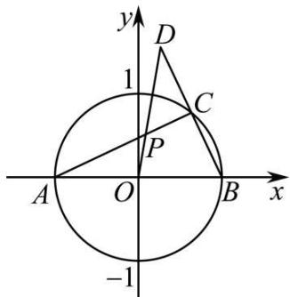
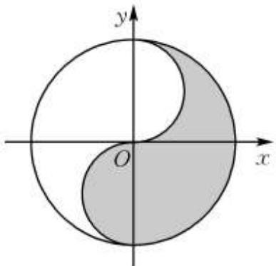

# 第59讲 圆的方程

# 知识梳理

知识点一:基本概念

平面内到定点的距离等于定长的点的集合(轨迹)叫圆.

知识点二: 基本性质、定理与公式

# 1、圆的四种方程

(1) 圆的标准方程: $(x - a)^2 + (y - b)^2 = r^2$ , 圆心坐标为 $(a, b)$ , 半径为 $r(r > 0)$   
(2) 圆的一般方程: $x^{2} + y^{2} + \mathrm{D} x + \mathrm{E} y + \mathrm{F} = 0 (\mathrm{D}^{2} + \mathrm{E}^{2} - 4 \mathrm{~F} > 0)$ , 圆心坐标为 $\left(-\frac{\mathrm{D}}{2}, -\frac{\mathrm{E}}{2}\right)$ , 半径 $r = \frac{\sqrt{\mathrm{D}^{2} + \mathrm{E}^{2} - 4 \mathrm{~F}}}{2}$   
(3) 圆的直径式方程: 若 $\mathrm{A}(x_{1}, y_{1}), \mathrm{B}(x_{2}, y_{2})$ ，则以线段 AB 为直径的圆的方程是 $(x - x_{1})(x - x_{2}) + (y - y_{1})(y - y_{2}) = 0$   
(4) 圆的参数方程:

① $x^{2}+y^{2}=r^{2}(r>0)$ 的参数方程为 $\left\{\begin{aligned}x&=r\cos\theta\\ y&=r\sin\theta\end{aligned}\right.$ ( $\theta$ 为参数);  
② $(x - a)^2 +(y - b)^2 = r^2 (r > 0)$ 的参数方程为 $\left\{ \begin{array}{l} x = a + r\cos \theta \\ y = b + r\sin \theta \end{array} \right.$ ( $\theta$ 为参数).

注意:对于圆的最值问题,往往可以利用圆的参数方程将动点的坐标设为 $(a+r\cos\theta,b+r\sin\theta)$ ( $\theta$ 为参数, $(a,b)$ 为圆心,r为半径),以减少变量的个数,建立三角函数式,从而把代数问题转化为三角问题,然后利用正弦型或余弦型函数的有界性求解最值.

# 2、点与圆的位置关系判断

(1) 点 $\mathrm{P}(x_0, y_0)$ 与圆 $(x - a)^2 + (y - b)^2 = r^2$ 的位置关系：

① $(x - a)^2 + (y - b)^2 > r^2 \Leftrightarrow$ 点 $\mathbf{P}$ 在圆外；  
② $(x - a)^2 +(y - b)^2 = r^2\Leftrightarrow$ 点P在圆上；  
③ $(x - a)^2 + (y - b)^2 < r^2 \Leftrightarrow$ 点 $\mathbf{P}$ 在圆内.  
(2) 点 $\mathrm{P}(x_0, y_0)$ 与圆 $x^2 + y^2 + \mathrm{D}x + \mathrm{E}y + \mathrm{F} = 0$ 的位置关系：

① $x_{0}^{2}+y_{0}^{2}+Dx_{0}+Ey_{0}+F>0\Leftrightarrow$ 点P在圆外；  
② $x_{0}^{2}+y_{0}^{2}+Dx_{0}+Ey_{0}+F=0\Leftrightarrow$ 点P在圆上；  
③ $x_0^2 + y_0^2 + \mathrm{D}x_0 + \mathrm{E}y_0 + \mathrm{F} < 0 \Leftrightarrow$ 点 $\mathbf{P}$ 在圆内.

# 必考题型全归纳

# 1 题型一:求圆多种方程的形式

3110 (2024·贵州铜仁·统考模拟预测)过 A(0,1)、B(0,3) 两点，且与直线 y = x - 1 相切的圆的方程可以是 （）

A. $(x+1)^{2}+(y-2)^{2}=2$

B. $(x - 2)^{2} + (y - 2)^{2} = 5$

C. $(x - 1)^{2} + (y - 2)^{2} = 2$

D. $(x + 2)^{2} + (y - 2)^{2} = 5$

3111 (2024·全国·高三专题练习)已知圆的圆心为 $(-2,1)$ ，其一条直径的两个端点恰好在两坐标轴上，则这个圆的方程是()

A. $x^{2} + y^{2} + 4x - 2y = 0$

B. $x^{2} + y^{2} - 4x + 2y - 5 = 0$

C. $x^{2} + y^{2} + 4x - 2y - 5 = 0$

D. $x^{2} + y^{2} - 4x + 2y = 0$

3112 (2024·全国·高三专题练习)已知圆心为 $(-2,3)$ 的圆与直线 $x-y+1=0$ 相切，则该圆的标准方程是（）

A. $(x+2)^{2}+(y-3)^{2}=8$

B. $(x - 2)^{2} + (y + 3)^{2} = 8$

C. $(x + 2)^{2} + (y - 3)^{2} = 18$

D. $(x - 2)^{2} + (y + 3)^{2} = 18$

3113 (2024·河北邢台·高三统考期末)已知圆 C: $x^{2}+y^{2}=25$ 与直线 l:3x-4y+m=0(m>0)
相切，则圆 C 关于直线 l 对称的圆的方程为 （）

A. $(x+3)^{2}+(y-4)^{2}=16$

B. $(x + 3)^{2} + (y - 4)^{2} = 25$

C. $(x + 6)^{2} + (y - 8)^{2} = 16$

D. $(x + 6)^{2} + (y - 8)^{2} = 25$

3114 (2024·山东东营·高三广饶一中校考阶段练习)过抛物线 $y^{2}=4x$ 的焦点 F 的直线交抛物线于 A、B 两点，分别过 A、B 两点作准线的垂线，垂足分别为 $A_{1}, B_{1}$ 两点，以线段 $A_{1}B_{1}$ 为直径的圆 C 过点 $(-2,3)$ ，则圆 C 的方程为（）

A. $(x+1)^{2}+(y-2)^{2}=2$

B. $(x + 1)^2 +(y - 1)^2 = 5$

C. $(x+1)^{2}+(y+1)^{2}=17$

D. $(x+1)^{2}+(y+2)^{2}=26$

3115 (2024·全国·高三专题练习)求过两点 A(0,4), B(4,6)，且圆心在直线 x-2y-2=0 上的圆的标准方程是 （）

A. $(x+4)^{2}+(y+1)^{2}=25$

B. $(x+4)^{2}+(y-1)^{2}=25$

C. $(x-4)^{2}+(y+1)^{2}=25$

D. $(x-4)^{2}+(y-1)^{2}=25$

3116 (2024·吉林四平·高三四平市第一高级中学校考阶段练习)已知直线 $(3 + 2\lambda)x + (3\lambda - 2)y + 5 - \lambda = 0$ 恒过定点 P，则与圆 C: $(x - 2)^{2} + (y + 3)^{2} = 16$ 有公共的圆心且过点 P 的圆的标准方程为 ()

A. $(x - 2)^{2} + (y + 3)^{2} = 36$

B. $(x - 2)^{2} + (y + 3)^{2} = 25$

C. $(x-2)^{2}+(y+3)^{2}=18$

D. $(x-2)^{2}+(y+3)^{2}=9$

3117 (2024·全国·高三专题练习)圆 C: $(x-1)^{2}+(y-2)^{2}=2$ 关于直线 x-y=0 对称的圆的方程是 ()

A. $(x-1)^{2}+(y+2)^{2}=2$

B. $(x+1)^{2}+(y+2)^{2}=2$

C. $(x-2)^{2}+(y-1)^{2}=2$

D. $(x + 2)^{2} + (y + 1)^{2} = 2$

3118 (2024·重庆·高三重庆一中校考阶段练习)德国数学家米勒曾提出过如下的“最大视角定理”(也称“米勒定理”): 若点 A,B 是 $\angle MON$ 的 OM 边上的两个定点, C 是 ON 边上的一个动点, 当且仅当 $\triangle ABC$ 的外接圆与边 ON 相切于点 C 时, $\angle ACB$ 最大. 在平面直角坐标系中, 已知点 D(2,0), E(4,0), 点 F 是 y 轴负半轴的一个动点, 当 $\angle DFE$ 最大时, $\triangle DEF$ 的外接圆的方程是().

A. $(x - 3)^{2} + (y + 2\sqrt{2})^{2} = 9$

B. $(x - 3)^{2} + (y - 2\sqrt{2})^{2} = 9$

C. $(x + 2\sqrt{2})^2 +(y - 3)^2 = 8$

D. $(x - 2\sqrt{2})^2 +(y - 3)^2 = 8$

3119 (2024·陕西西安·高三校考阶段练习)过点 P(4,2) 作圆 $x^{2} + y^{2} = 4$ 的两条切线，切点分别为 A, B，则 $\triangle PAB$ 的外接圆方程是（）

A. $(x-2)^{2}+(y-1)^{2}=5$

B. $(x - 4)^{2} + (y - 2)^{2} = 20$

C. $(x + 2)^{2} + (y + 1)^{2} = 5$

D. $(x+4)^{2}+(y+2)^{2}=20$

3120 (2024·四川成都·高三成都七中校考开学考试)已知 A $(- \sqrt{3}, 0)$ , B $(\sqrt{3}, 0)$ , C $(0, 3)$ ，则 $\triangle ABC$ 外接圆的方程为 ()

A. $(x - 1)^{2} + y^{2} = 2$

B. $(x - 1)^{2} + y^{2} = 4$

C. $x^{2} + (y - 1)^{2} = 2$

D. $x^{2} + (y - 1)^{2} = 4$

# 题型二:直线系方程和圆系方程

3121 (2024·全国·高三专题练习)圆心在直线 x-y-4=0 上, 且经过两圆 $x^{2}+y^{2}+6x-4=$ 0 和 $x^{2} + y^{2} + 6y - 28 = 0$ 的交点的圆的方程为 ()

A. $x^{2} + y^{2} - x + 7y - 32 = 0$

B. $x^{2} + y^{2} - x + 7y - 16 = 0$

C. $x^{2} + y^{2} - 4x + 4y + 9 = 0$

D. $x^{2} + y^{2} - 4x + 4y - 8 = 0$

3122 (2024·高二课时练习)过圆 $x^{2} + y^{2} - 2y - 4 = 0$ 与 $x^{2} + y^{2} - 4x + 2y = 0$ 的交点，且圆心在直线 $l: 2x + 4y - 1 = 0$ 上的圆的方程是 \_\_\_\_.

3123 (2024·江苏·高二专题练习)曲线 $3x^{2}-y^{2}=3$ 与 $y=x^{2}-2x-8$ 的四个交点所在圆的方程是 \_\_\_\_.

3124 (2024·安徽铜陵·高二铜陵一中校考期中)经过直线 x-2y=0 与圆 $x^{2}+y^{2}-4x+2y-4=0$ 的交点，且过点 (1,0) 的圆的方程为 \_\_\_\_.

3125 (2024·高二校考课时练习)过两圆 $x^{2} + y^{2} - x - y - 2 = 0$ 与 $x^{2} + y^{2} + 4x - 4y - 8 = 0$ 的交点和点 (3,1) 的圆的方程是 \_\_\_\_.

3126 (2024·浙江杭州·高二校考期末)已知一个圆经过直线 $l:2x+y+4=0$ 与圆 $C:x^{2}+y^{2}+2x-4y=0$ 的两个交点，并且有最小面积，则此圆的方程为 \_\_\_\_.

3127 (2024·江西九江·高一统考期中)经过两圆 $x^{2} + y^{2} + 6x - 4 = 0$ 和 $x^{2} + y^{2} + 6y - 28 = 0$ 的交点，且圆心在直线 x - y - 4 = 0 上的圆的方程为 \_\_\_\_

3128 (2024·浙江绍兴·高二统考期中)已知圆 C 过直线 $2x + y + 4 = 0$ 和圆 $x^{2} + y^{2} + 2x - 4y + 1 = 0$ 的交点，且原点在圆 C 上．则圆 C 的方程为 \_\_\_\_.

# 题型三:与圆有关的轨迹问题

3129 (2024·全国·高三专题练习)点 P(1,0)，点 Q 是圆 $x^{2} + y^{2} = 4$ 上的一个动点，则线段 PQ 的中点 M 的轨迹方程是（）

A. $\left(x-\frac{1}{2}\right)^{2}+y^{2}=1$

B. $x^{2} + \left(y - \frac{1}{2}\right)^{2} = 4$

C. $x^{2}+\left(y-\frac{1}{2}\right)^{2}=1$

D. $\left(x-\frac{1}{2}\right)^{2}+y^{2}=4$

3130 (2024·湖南郴州·统考模拟预测)已知 A, B 是 $\odot C: (x-2)^{2} + (y-4)^{2} = 25$ 上的两个动点，P 是线段 AB 的中点，若 $|AB| = 6$ ，则点 P 的轨迹方程为（）

A. $(x - 4)^{2} + (y - 2)^{2} = 16$

B. $(x - 2)^{2} + (y - 4)^{2} = 11$

C. $(x-2)^{2}+(y-4)^{2}=16$

D. $(x-4)^{2}+(y-2)^{2}=11$

3131 (2024·全国·高三专题练习)古希腊数学家阿波罗尼奥斯的著作《圆锥曲线论》中给出圆的另一种定义:平面内,到两个定点距离之比值为常数 $\lambda(\lambda>0,\lambda\neq1)$ 的点的轨迹是圆,我们称之为阿波罗尼奥斯圆.已知点 P 到 A(-2,0) 的距离是点 P 到 B(1,0) 的距离的 2 倍.求点 P 的轨迹方程;

3132 (2024·全国·高三专题练习)已知 P(4,0) 是圆 $x^{2} + y^{2} = 36$ 内的一点, A, B 是圆上两动点, 且满足 $\angle APB = 90^{\circ}$ , 求矩形 APBQ 顶点 Q 的轨迹方程.

3133 (1977·福建·高考真题)动点 $\mathrm{P}(x,y)$ 到两定点 $\mathrm{A}(-3,0)$ 和 $\mathrm{B}(3,0)$ 的距离的比等于2，求动点P的轨迹方程，并说明这轨迹是什么图形.

3134 (2024·安徽合肥·高三合肥一中校考阶段练习)已知圆 C: $x^{2} + y^{2} + 2x - 4y + 3 = 0$ .

(1) 若不过原点的直线 $l$ 与圆 $\mathrm{C}$ 相切, 且在 $x$ 轴, $y$ 轴上的截距相等, 求直线 $l$ 的一般式方程;

(2) 从圆 C 外一点 P(x,y) 向圆引一条切线, 切点为 M, O 为坐标原点, 且有 |PM| = |PO|, 求点 P 的轨迹方程.

3135 (2024·全国·高三专题练习)由圆 $x^{2}+y^{2}=9$ 外一点 P(5,12) 引圆的割线交圆于 A, B 两点, 求弦 AB 的中点 M 的轨迹方程.

3136 (2024·全国·高三专题练习)已知圆 $G: x^{2} + y^{2} - 4x = 0$ ，平面上一动点 P 满足： $PM^{2} + PN^{2} = 6$ 且 $M(-1,0)$ ， $N(1,0)$ 。求动点 P 的轨迹方程；

3137 (2024·全国·高三专题练习)在边长为1的正方形ABCD中,边AB、BC上分别有一个动点Q、R,且 $|BQ|=|CR|$ .求直线AR与DQ的交点P的轨迹方程.

3138 (2024·全国·高三专题练习)已知Rt△ABC的斜边为AB，且A(-1,0),B(3,0).求：

(1) 直角顶点 C 的轨迹方程;

(2) 直角边 BC 的中点 M 的轨迹方程.

3139 (2024·高二课时练习)如图, 已知点 A(-1, 0) 与点 B(1, 0), C 是圆 $x^{2} + y^{2} = 1$ 上异于 A, B 两点的动点, 连接 BC 并延长至 D, 使得 $|CD| = |BC|$ , 求线段 AC 与 OD 的交点 P 的轨迹方程.

text_image

y
D
1
C
P
A
O
B
x
-1

3140 (2024·高二课时练习)已知点 A(2,0) 是圆 $x^{2} + y^{2} = 4$ 上的定点，点 B(1,1) 是圆内一点，P、Q 为圆上的动点.

(1) 求线段 AP 的中点 M 的轨迹方程.

(2) 若 $\angle PBQ = 90^{\circ}$ , 求线段 PQ 中点 N 的轨迹方程.

题型四:用二元二次方程表示圆的一般方程的充要条件

3141 (2024·河南·高三阶段练习)“a<1”是“方程 $2x^{2}+2y^{2}+2ax+6y+5a=0$ 表示圆”的()

A. 充分不必要条件

B. 必要不充分条件

C. 充要条件

D. 既不充分也不必要条件

3142 (2024·上海奉贤·高三校考阶段练习)已知:圆 C 的方程为 $f(x,y)=0$ , 点 $P(x_{0},y_{0})$ 不在圆 C 上, 也不在圆 C 的圆心上, 方程 $C':f(x,y)-f(x_{0},y_{0})=0$ , 则下面判断正确的是 ()

A. 方程 C' 表示的曲线不存在

B. 方程 C' 表示与 C 同心且半径不同的圆

C. 方程 C' 表示与 C 相交的圆

D. 当点 P 在圆 C 外时, 方程 C' 表示与 C 相离的圆

3143 (2024·高三课时练习)关于 x、y 的方程 $Ax^{2} + Bxy + Cy^{2} + Dx + Ey + F = 0$ 表示一个圆的充要条件是().

A. B=0, 且 A=C≠0

B. B=1, 且 $D^{2}+E^{2}-4AF>0$

C. B=0, 且 A=C≠0, $D^{2}+E^{2}-4AF\geqslant0$

D. B=0, 且 A=C≠0, $D^{2}+E^{2}-4AF>0$

3144 (2024·全国·高三专题练习)若方程 $x^{2} + y^{2} + ax + 2y + 2 = 0$ 表示圆，则实数 a 的取值范围是 ()

A. $a \leqslant -2$

B. $a \geqslant 2$

C. a<-2 或 a>2

D. $a \leqslant -2$ 或 $a \geqslant 2$

3145 (2024·全国·高三专题练习)已知方程 $x^{2} + y^{2} + \sqrt{m}x + 2y + 2 = 0$ 表示圆，则实数 m 的取值范围为 （）

A. $(1,+\infty)$

B. $(2,+\infty)$

C. $(3,+\infty)$

D. $(4, +\infty)$

3146 (2024·四川绵阳·高三绵阳南山中学实验学校校考阶段练习)若圆 C: $x^{2} + y^{2} - 2(m-1)x + 2(m-1)y + 2m^{2} - 6m + 4 = 0$ 过坐标原点，则实数 m 的值为（）

A. 2 或 1

B.-2或-1

C. 2

D.-1

3147 (2024·全国·高三专题练习)若方程 $x^{2} + y^{2} + 2\lambda x + 2\lambda y + 2\lambda^{2} - \lambda + 1 = 0$ 表示圆，则 $\lambda$ 的取值范围是 ()

A. $(1, +\infty)$

B. $\left[\frac{1}{5},1\right]$

C. $(1,+\infty)\cup\left(-\infty,\frac{1}{5}\right)$

D. R

3148 (2024·高二课时练习)若 $\alpha\in(0,2\pi)$ ，使曲线 $x^{2}\cos\alpha+y^{2}\sin\alpha+x\cos\alpha+y\sin\alpha+1=0$ 是圆，则 （）

A. $\alpha=\frac{5\pi}{4}$

B. $\alpha=\frac{\pi}{4}$

C. $\alpha=\frac{\pi}{4}$ 或 $\alpha=\frac{5\pi}{4}$

D. $\alpha=\frac{\pi}{2}$

# 5 题型五: 点与圆的位置关系判断

3149 (2024·甘肃定西·统考模拟预测)若点(2,1)在圆 $x^{2}+y^{2}-x+y+a=0$ 的外部，则a的取值范围是()

A. $\left(\frac{1}{2},+\infty\right)$

B. $\left(-\infty,\frac{1}{2}\right)$

C. $\left(-4,\frac{1}{2}\right)$

D. $(-∞,-4)∪\left(\frac{1}{2},+∞\right)$

3150 (2024·全国·高三专题练习)已知点 P(1, -2) 在圆 C: $x^{2} + y^{2} + kx + 4y + k^{2} + 1 = 0$ 的外部，则 k 的取值范围是 ()

A. -2<k<1

B. $1 < k < 2$

C. $k < -2$

D. -2<k<2

3151 (2024·四川自贡·高一统考期中)点P在单位圆 $\odot O$ 上(O为坐标原点),点A(-1,-1),B(0,-1), $\overrightarrow{AP}=\mu\overrightarrow{AO}+\lambda\overrightarrow{AB}$ ,则 $\mu+\lambda$ 的最大值为()

A. $\frac{3}{2}$

B. $\sqrt{3}$

C. 2

D. 3

3152 (2024·全国·高二专题练习)点 P(5,m) 与圆 $x^{2} + y^{2} = 24$ 的位置关系是 ()

A. 点在圆上

B. 点在圆内

C. 点在圆外

D. 不确定

3153 (2024·全国·高二专题练习)若点 $(a+1,a-1)$ 在圆 $x^{2}+y^{2}-2ay-4=0$ 的内部，则a的取值范围是().

A. $a > 1$

B. 0 < a < 1

C. $-1 < a < \frac{1}{5}$

D. $a < 1$

3154 (2024·全国·高二专题练习)已知圆 O: $x^{2} + y^{2} = r^{2}$ ，直线 l: $3x + 4y = r^{2}$ ，若 l 与圆 O 相交，则（）.

A. 点 $\mathrm{P}(3,4)$ 在 $l$ 上

B. 点P(3,4)在圆O上

C. 点 $\mathrm{P}(3,4)$ 在圆O内

D. 点 $\mathrm{P}(3,4)$ 在圆O外

# 6 题型六: 数形结合思想的应用

3155 (2024·高二校考单元测试)若直线 l: kx - y - 2 = 0 与曲线 C: $\sqrt{1 - (y - 1)^{2}} = x - 1$ 有两个不同的交点，则实数 k 的取值范围是（）

A. $\left(\frac{4}{3},2\right]$

B. $\left(\frac{4}{3},4\right)$

C. $\left[-2,-\frac{4}{3}\right)\cup\left(\frac{4}{3},2\right]$

D. $\left(\frac{4}{3},+\infty\right)$

3156 (2024·辽宁营口·高二校考阶段练习)已知曲线 $y=\sqrt{-x^{2}+4x-3}$ 与直线 $kx-y+k-1=0$ 有两个不同的交点，则实数 k 的取值范围是 ()

A. $\left[\frac{1}{2},\frac{2}{3}\right]$

B. $\left(0,\frac{3}{4}\right)$

C. $\left[\frac{1}{2},\frac{3}{4}\right)$

D. $\left[\frac{1}{4},\frac{2}{3}\right)$

3157 (2024·山西晋城·高二晋城市第一中学校校考开学考试)直线 $y = x + b$ 与曲线 $y = 1 - \sqrt{4 - x^{2}}$ 有两个不同的交点，则实数 b 的取值范围是（）

A. $(1 - 2\sqrt{2}, 1 + 2\sqrt{2})$

B. $(1-2\sqrt{2},-1]$

C. $\left[-1,1+2\sqrt{2}\right)$

D. $\left[3,1+2\sqrt{2}\right)$

3158 (2024·全国·高二专题练习)直线 $2x + y - 2 = 0$ 与曲线 $(x + y - 1)\sqrt{x^{2} + y^{2} - 4} = 0$ 的交点个数为 ()

A. 1 个

B. 2 个

C. 3 个

D. 4 个

3159 (2024·高二单元测试)若两条直线 $l_{1}: y = x + m, l_{2}: y = x + n$ 与圆 $x^{2} + y^{2} - 2x - 2y + t = 0$ 的四个交点能构成矩形，则 $m + n =$ （）

A. 0

B. 1

C. 2

D. 3

3160 (2024·宁夏银川·银川一中校考二模)曲线 $\Gamma:\left(\frac{x^{2}}{3}-\frac{y^{2}}{3}-1\right)\sqrt{x^{2}+y^{2}-9}=0$ ，要使直线 $y=m(m\in\mathbb{R})$ 与曲线 $\Gamma$ 有四个不同的交点，则实数 m 的取值范围是（）

A. $(-3, -\sqrt{3}) \cup (-\sqrt{3}, \sqrt{3}) \cup (\sqrt{3}, 3)$

B. $(-3,-\sqrt{3})\cup(\sqrt{3},3)$

C. $(3,3)$

D. $(- \sqrt{3}, \sqrt{3})$

3161 (2024·吉林白山·统考二模)若过点P(2,4)且斜率为k的直线l与曲线 $y=\sqrt{4-x^{2}}$ 有且只有一个交点，则实数k的值不可能是()

A. $\frac{3}{4}$

B. $\frac{4}{5}$

C. $\frac{4}{3}$

D. 2

3162 (2024·全国·高三专题练习)若直线 $l: x + m(y - 4) = 0$ 与曲线 $x = \sqrt{4 - y^{2}}$ 有两个交点，则实数 m 的取值范围是（）

A. $0 < m < \frac{\sqrt{3}}{3}$

B. $0 \leqslant m < \frac{\sqrt{3}}{3}$

C. $0 < m \leqslant \sqrt{3}$

D. $0 \leqslant m \leqslant \sqrt{3}$

3163 (2024·安徽合肥·合肥市第七中学校考三模)已知 $f(x)$ 是定义在R上的奇函数,其图象关于点(2,0)对称,当 $x\in[0,2]$ 时, $f(x)=\sqrt{1-(x-1)^{2}}$ ,若方程 $f(x)-k(x-2)=0$ 的所有根的和为6,则实数k的取值范围是()

A. $\left\{\frac{\sqrt{2}}{4}\right\} \cup \left(-\infty, -\frac{\sqrt{6}}{12}\right)$

B. $\left\{\frac{\sqrt{6}}{12}\right\}\cup\left(-\infty,-\frac{\sqrt{2}}{4}\right)$

C. $\left\{-\frac{\sqrt{2}}{4}\right\}\cup\left(\frac{\sqrt{6}}{12},+\infty\right)$

D. $\left\{-\frac{\sqrt{2}}{4}\right\}\cup\left(-\frac{\sqrt{6}}{12},+\infty\right)$

3164 (2024·湖北·高三校联考期末)广为人知的太极图,其形状如阴阳两鱼互纠在一起,因而被习称为“阴阳鱼太极图”如图是放在平面直角坐标系中的“太极图”整个图形是一个圆形区域 $x^{2}+y^{2}\leqslant4$ . 其中黑色阴影区域在y轴左侧部分的边界为一个半圆. 已知符号函数 $\text{sgn}(x)=\begin{cases}1,&x>0\\0,&x=0\end{cases}$ ,则当 $x^{2}+y^{2}\leqslant4$ 时,下列不等式能表示图中阴影部分的是 ( )
-1, x<0

text_image

y
O
x

A. $x(x^{2} + (y - \operatorname{sgn}(x))^{2} - 1)\leqslant 0$

B. $y((x - \operatorname{sgn}(y))^2 + y^2 - 1) \leqslant 0$

C. $x(x^{2} + (y - \operatorname{sgn}(x))^{2} - 1) \geqslant 0$

D. $y((x - \operatorname{sgn}(y))^2 + y^2 - 1) \geqslant 0$

# 7 题型七:与圆有关的对称问题

3165 (2024·高二单元测试)圆 $x^{2}+y^{2}+2x-4y+1=0$ 关于直线 $ax+y+1=0$ 对称，则 a= \_\_\_\_.  
3166 (2024·西藏日喀则·统考一模)已知圆 C: $x^{2}+y^{2}-4x+2ay+3=0$ 关于直线 $x+2y-6=0$ 对称，圆 C 交 y 于 A、B 两点，则 $|AB|=^{\circ}$ \_\_\_\_  
3167 (2024·全国·高三专题练习)已知圆 $(x+1)^{2}+(y-2)^{2}=9$ 上存在两点关于直线ax-by+2=0(a>0,b>0)对称，则 $a^{2}+4b^{2}$ 的最小值是\_\_\_\_.  
3168 (2024·北京·高三人大附中校考阶段练习)已知圆 C 与圆 D: $x^{2} + y^{2} - 4x - 2y + 3 = 0$ 关于直线 $4x + 2y - 5 = 0$ 对称，则圆 C 的方程为 \_\_\_\_.  
3169 (2024·全国·高三专题练习)已知圆 $(x+1)^{2}+(y-3)^{2}=9$ 上存在两点关于直线 ax-by +1=0(a>0,b>0) 对称，则 $\frac{1}{a}+\frac{3}{b}$ 的最小值是 \_\_\_\_.  
3170 (2024·全国·高三专题练习)已知函数 $f(x) = \sqrt{1 - (x - 2)^2} + 2$ 的图像上有且仅有两个不同的点关于直线 $y = 1$ 的对称点在 $y = kx + 1$ 的图像上，则实数 $k$ 的取值范围是 \_\_\_\_.  
3171 (2024·全国·高三专题练习)已知圆 $C_{1}$ 的标准方程是 $(x-4)^{2}+(y-4)^{2}=25$ ，圆 $C_{2}:x^{2}+y^{2}-4x+my+3=0$ 关于直线 $x+\sqrt{3}y+1=0$ 对称，则圆 $C_{1}$ 与圆 $C_{2}$ 的位置关系为 \_\_\_\_.  
3172 (2024·全国·高三专题练习)若圆 $x^{2}+y^{2}+Dx+Ey+F=0$ 关于直线 $l_{1}:x-y+4=0$ 和直线 $l_{2}:x+3y=0$ 都对称，则 D+E 的值为 \_\_\_\_.  
3173 (2024·全国·高三校联考阶段练习)已知直线 $y = ax + 1$ 与曲线 $x^{2} + y^{2} + bx - y = 1$ 交于两点，且这两点关于直线 $x + y = 0$ 对称， $a \cdot b =$ \_\_\_\_.

# 8 题型八: 圆过定点问题

3174 (2024·全国·高三专题练习)若抛物线 $y = x^{2} + ax + b$ 与坐标轴分别交于三个不同的点 A、B、C，则 $\triangle ABC$ 的外接圆恒过的定点坐标为 \_\_\_\_  
3175 (2024·全国·高三专题练习)已知二次函数 $f(x) = x^{2} + 2x + b (x \in \mathbb{R})$ 的图像与坐标轴有三个不同的交点,经过这三个交点的圆记为 C,则圆 C 经过定点的坐标为 \_\_\_\_ (其坐标与 b 无关)  
3176 (2024·重庆·高考真题)动圆的圆心在抛物线 $y^{2}=8x$ 上, 且动圆恒与直线 $x+2=0$ 相切, 则动圆必过点 \_\_\_\_.  
3177 (2024·浙江温州·高三阶段练习)已知动圆圆心在抛物线 $y^{2}=4x$ 上, 且动圆恒与直线 x=-1 相切, 则此动圆必过定点 \_\_\_\_  
3178 (2024·全国·高二专题练习)对任意实数 m，圆 $x^{2} + y^{2} - 3mx - 6my + 9m - 2 = 0$ 恒过定点，则定点坐标为 \_\_\_\_.  
3179 (2024·江西·高考真题)设有一组圆 $C_{k}:(x-k+1)^{2}+(y-3k)^{2}=2k^{4},(k\in\mathbb{N}^{*})$ 。下列四个命题其中真命题的序号是 \_\_\_\_

①存在一条定直线与所有的圆均相切；

②存在一条定直线与所有的圆均相交；  
③存在一条定直线与所有的圆均不相交；  
④所有的圆均不经过原点.

3180 (2024·全国·高二专题练习)对任意实数 m，圆 $x^{2} + y^{2} - 2mx - 4my + 6m - 2 = 0$ 恒过定点，则其坐标为 \_\_\_\_.

