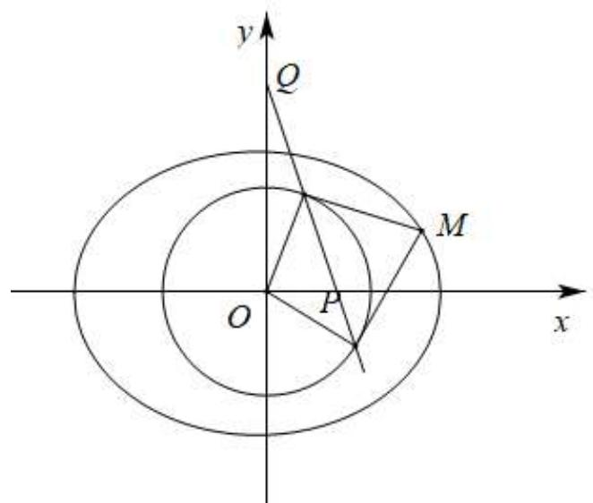
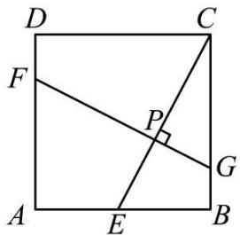
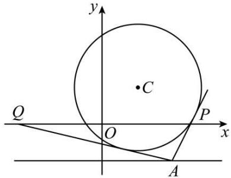

# 知识梳理

# 一．直线与圆的位置关系

直线与圆的位置关系有3种,相离,相切和相交

# 二．直线与圆的位置关系判断

(1) 几何法 (圆心到直线的距离和半径关系)

圆心 $(a,b)$ 到直线 $\mathrm{Ax} + \mathrm{By} + \mathrm{C} = 0$ 的距离，则 $d = \frac{|Aa + Bb + C|}{\sqrt{A^2 + B^2}}$

$d < r \Leftrightarrow$ 直线与圆相交，交于两点 $\mathrm{P}, \mathrm{Q}, |\mathrm{PQ}| = 2\sqrt{r^2 - d^2}$

$d=r\Leftrightarrow$ 直线与圆相切；

$d > r \Leftrightarrow$ 直线与圆相离

(2) 代数方法 (几何问题转化为代数问题即交点个数问题转化为方程根个数)

由 $\left\{\begin{aligned}Ax+By+C&=0\\ (x-a)^{2}+(y-b)^{2}&=r^{2}\end{aligned}\right.$

消元得到一元二次方程 $px^2 + qx + t = 0, px^2 + qx + t = 0$ 判别式为 $\Delta$ ，则：

$\Delta>0\Leftrightarrow$ 直线与圆相交；

$\Delta=0\Leftrightarrow$ 直线与圆相切；

$\Delta<0\Leftrightarrow$ 直线与圆相离.

# 三．两圆位置关系的判断

用两圆的圆心距与两圆半径的和差大小关系确定,具体是:

设两圆 $\mathrm{O}_1, \mathrm{O}_2$ 的半径分别是 $\mathbf{R}, r$ , (不妨设 $\mathbf{R} > r$ ), 且两圆的圆心距为 $d$ , 则:

$d <   \mathbf{R} + r\Leftrightarrow$ 两圆相交；

$d=R+r\Leftrightarrow$ 两圆外切；

$\mathrm{R} - r < d < \mathrm{R} + r \Leftrightarrow$ 两圆相离

$d = \mathbf{R} - r \Leftrightarrow$ 两圆内切；

$0 \leqslant d < R - r \Leftrightarrow$ 两圆内含 $(d = 0$ 时两圆为同心圆)

设两个圆的半径分别为R,r,R>r,圆心距为d,则两圆的位置关系可用下表来表示:

<table><tr><td>位置关系</td><td>相离</td><td>外切</td><td>相交</td><td>内切</td><td>内含</td></tr><tr><td>几何特征</td><td> $d > R + r$ </td><td> $d = R + r$ </td><td> $R - r < d < R + r$ </td><td> $d = R - r$ </td><td> $d < R - r$ </td></tr><tr><td>代数特征</td><td>无实数解</td><td>一组实数解</td><td>两组实数解</td><td>一组实数解</td><td>无实数解</td></tr><tr><td>公切线条数</td><td>4</td><td>3</td><td>2</td><td>1</td><td>0</td></tr></table>

# 【解题方法总结】

关于圆的切线的几个重要结论

(1) 过圆 $x^{2} + y^{2} = r^{2}$ 上一点 $\mathrm{P}(x_0, y_0)$ 的圆的切线方程为 $x_0x + y_0y = r^2$ .  
(2) 过圆 $(x - a)^2 + (y - b)^2 = r^2$ 上一点 $\mathrm{P}(x_0, y_0)$ 的圆的切线方程为

$$
\left(x _ {0} - a\right) (x - a) + \left(y _ {0} - b\right) (y - b) = r ^ {2}
$$

(3) 过圆 $x^{2} + y^{2} + \mathrm{D}x + \mathrm{E}y + \mathrm{F} = 0$ 上一点 $\mathrm{P}(x_0, y_0)$ 的圆的切线方程为

$$
x _ {0} x + y _ {0} y + \mathrm{D} \cdot \frac {x + x _ {0}}{2} + \mathrm{E} \cdot \frac {y + y _ {0}}{2} + \mathrm{F} = 0
$$

(4) 求过圆 $x^{2} + y^{2} = r^{2}$ 外一点 $\mathrm{P}(x_0, y_0)$ 的圆的切线方程时，应注意理解：

①所求切线一定有两条；

②设直线方程之前,应对所求直线的斜率是否存在加以讨论. 设切线方程为 $y - y_0 = k(x - x_0)$ , 利用圆心到切线的距离等于半径, 列出关于 $k$ 的方程, 求出 $k$ 值. 若求出的 $k$ 值有两个, 则说明斜率不存在的情形不符合题意; 若求出的 $k$ 值只有一个, 则说明斜率不存在的情形符合题意.

# 必考题型全归纳

# 1 题型一: 直线与圆的位置关系的判断

3181 (2024·四川成都·成都七中校考一模)圆 C: $(x-1)^{2}+(y-1)^{2}=1$ 与直线 $l:\frac{x}{4}+\frac{y}{3}=1$ 的位置关系为
()

A. 相切

B. 相交

C. 相离

D. 无法确定

3182 (2024·全国·高三对口高考)若直线 $ax + by = 1$ 与圆 $x^{2} + y^{2} = 1$ 相交，则点 P(a, b) ()

A. 在圆上

B. 在圆外

C. 在圆内

D. 以上都有可能

3183 (2024·全国·高三专题练习)已知点 $P(x_{0}, y_{0})$ 为圆 $C: x^{2} + y^{2} = 2$ 上的动点，则直线 $l: x_{0}x - y_{0}y = 2$ 与圆 C 的位置关系为 ()

A. 相交

B. 相离

C. 相切

D. 相切或相交

3184 (2024·全国·高三专题练习)直线 $l: x + my + 1 - m = 0$ 与圆 C: $(x - 1)^{2} + (y - 2)^{2} = 9$ 的位置关系是 ()

A. 相交

B. 相切

C. 相离

D. 无法确定

3185 (2024·陕西宝鸡·统考二模)直线 $l: x \cos \alpha + y \sin \alpha = 1 (\alpha \in \mathbb{R})$ 与曲线 C: $x^{2} + y^{2} = 1$ 的交点个数为 ()

A. 0

B. 1

C. 2

D. 无法确定

3186 (2024·宁夏银川·银川一中校考二模)直线 $kx + y - 1 + 4k = 0 (k \in \mathbb{R})$ 与圆 $(x + 1)^{2} + (y + 2)^{2} = 25$ 的位置关系为 ()

A. 相离

B. 相切

C. 相交

D. 不能确定

# 2 题型二:弦长与面积问题

3187 (2024·重庆沙坪坝·高三重庆一中校考阶段练习)已知直线 l: 3x - y - 5 = 0 与圆 C: $x^{2} + y^{2} - 2x - 6y + 6 = 0$ 交于 A, B 两点，则 $|AB| =$ \_\_\_\_ .

3188 (2024·河南郑州·统考模拟预测)已知圆 C: $x^{2}+y^{2}-6x+5=0$ ，直线 $y=\frac{1}{3}(x+1)$ 与圆 C 相交于 M, N 两点，则 $|MN|=$ \_\_\_\_.

3189 (2024·全国·高三专题练习)已知直线 $l: x - my + 1 = 0$ 与 $\odot C: (x - 1)^{2} + y^{2} = 4$ 交于 A,

B两点,写出满足“△ABC面积为 $\frac{8}{5}$ ”的m的一个值 \_\_\_\_.

3190 (2024·江西南昌·高三南昌市八一中学校考阶段练习)圆心在直线 y=2x 上, 与 x 轴相切, 且被直线 x-y=0 截得的弦长为 $\sqrt{14}$ 的圆的方程为 \_\_\_\_.  
3191 (2024·广东广州·统考三模)写出经过点(1,0)且被圆 $x^{2}+y^{2}-2x-2y+1=0$ 截得的弦长为 $\sqrt{2}$ 的一条直线的方程 \_\_\_\_.  
3192 (2024·广东深圳·校考二模)过点(1,1)且被圆 $x^{2}+y^{2}-4x-4y+4=0$ 所截得的弦长为 $2\sqrt{2}$ 的直线的方程为 \_\_\_\_.  
3193 (2024·湖北黄冈·浠水县第一中学校考三模)已知直线 $l: kx - y - 2k + 2 = 0$ 被圆 $\mathrm{C}: x^2 + (y + 1)^2 = 16$ 所截得的弦长为整数, 则满足条件的直线 $l$ 有 \_\_\_\_ 条.  
3194 (2024·全国·高三专题练习)已知 A, B 分别为圆 $(x-1)^{2}+y^{2}=1$ 与圆 $(x+2)^{2}+y^{2}=4$ 上的点，O 为坐标原点，则 $\triangle OAB$ 面积的最大值为 \_\_\_\_.  
3195 (2024·广东广州·广州市从化区从化中学校考模拟预测)已知直线 $l: x - y + 5 = 0$ 与圆 C: $x^{2} + y^{2} - 2x - 4y - 4 = 0$ 交于 A, B 两点, 若 M 是圆上的一动点, 则 $\triangle MAB$ 面积的最大值是 \_\_\_\_.  
3196 (2024·全国·高三专题练习)已知圆 C 的方程为 $(x-3)^{2}+(y-4)^{2}=25$ ，若直线 $l:3x+4y-5=0$ 与圆 C 相交于 A, B 两点，则 $\triangle ABC$ 的面积为 \_\_\_\_.  
3197 (2024·全国·高三专题练习)在平面直角坐标系 xOy 中, 过点 A(0, -3) 的直线 l 与圆 C: $x^{2} + (y - 2)^{2} = 9$ 相交于 M, N 两点, 若 $S_{\triangle AON} = \frac{6}{5} S_{\triangle ACM}$ , 则直线 l 的斜率为 \_\_\_\_.  
3198 (2024·广东惠州·统考模拟预测)在圆 $x^{2} + y^{2} - 2x - 6y = 0$ 内, 过点 E(0,3) 的最长弦和最短弦分别为 AC 和 BD, 则四边形 ABCD 的面积为 \_\_\_\_.

# 3 题型三: 切线问题、切线长问题

3199 (2024·辽宁锦州·校考一模)写出一条与圆 $x^{2} + y^{2} = 1$ 和曲线 $y = x^{2} + 5$ 都相切的直线的方程: \_\_\_\_.  
3200 (2024·河南开封·统考三模)已知点 A(1,0), B(2,0), 经过 B 作圆 $(x-3)^{2}+(y-2)^{2}=5$ 的切线与 y 轴交于点 P, 则 $\tan\angle APB=$ \_\_\_\_.  
3201 (2024·全国·高三专题练习)经过点(1,0)且与圆 $x^{2}+y^{2}-4x-2y+3=0$ 相切的直线方程为 \_\_\_\_.  
3202 (2024·福建宁德·校考模拟预测)已知圆 C: $x^{2} + y^{2} + 2x - 2y = 0$ ，直线 l 的横纵截距相等且与圆 C 相切，则直线 l 的方程为 \_\_\_\_。  
3203 (2024·福建福州·统考模拟预测)写出经过抛物线 $y^{2}=8x$ 的焦点且和圆 $x^{2}+(y-1)^{2}=4$ 相切的一条直线的方程 \_\_\_\_.  
3204 (2024·重庆·统考模拟预测)过点 P(3, -2) 且与圆 C: $x^{2} + y^{2} - 2x - 4y + 1 = 0$ 相切的直线方程为 \_\_\_\_  
3205 (2024·湖北·高三校联考开学考试)已知过点 P(3,3) 作圆 O: $x^{2}+y^{2}=2$ 的切线，则切线长

为 \_\_\_\_.

3206 (2024·江苏无锡·校联考三模)已如 P(3,3)，M 是抛物线 $y^{2}=4x$ 上的动点 (异于顶点)，过 M 作圆 C: $(x-2)^{2}+y^{2}=4$ 的切线，切点为 A，则 $|MA|+|MP|$ 的最小值为 \_\_\_\_.  
3207 (2024·吉林通化·梅河口市第五中学校考模拟预测)由直线 $x + y + 6 = 0$ 上一点 P 向圆 C: $(x - 3)^{2} + (y + 5)^{2} = 4$ 引切线，则切线长的最小值为 \_\_\_\_.  
3208 (2024·山西朔州·高三怀仁市第一中学校校考阶段练习)若在圆 C: $x^{2} + y^{2} = r^{2} (r > 0)$ 上存在一点 P, 使得过点 P 作圆 M: $(x - 2)^{2} + y^{2} = 1$ 的切线长为 $\sqrt{2}$ , 则 r 的取值范围为 \_\_\_\_.  
3209 (2024·天津滨海新·天津市滨海新区塘沽第一中学校考模拟预测)已知圆 $M: x^{2} + y^{2} - 2ay = 0 (a > 0)$ 与直线 $x + y = 0$ 相交所得圆的弦长是 $2\sqrt{2}$ ，若过点 A(3,6) 作圆 M 的切线，则切线长为 \_\_\_\_.  
3210 (2024·天津南开·统考二模)若直线 $kx - y - 2k + 3 = 0$ 与圆 $x^{2} + (y + 1)^{2} = 4$ 相切，则 $k = \_$ .  
3211 (2024·湖北·高三校联考阶段练习)已知 $\odot O_{1}: x^{2} + (y - 2)^{2} = 1$ , $\odot O_{2}: (x - 3)^{2} + (y - 6)^{2} = 9$ , 过 x 轴上一点 P 分别作两圆的切线, 切点分别是 M, N, 当 $|PM| + |PN|$ 取到最小值时, 点 P 坐标为 \_\_\_\_.

# 4 题型四:切点弦问题

3212 (2024·浙江·高三浙江省富阳中学校联考阶段练习)从抛物线 $y^{2}=4x(y\geqslant0)$ 上一点 P 作圆 C: $(x-5)^{2}+y^{2}=1$ 得两条切线，切点为 A, B，则当四边形 PACB 面积最小时直线 AB 方程为 \_\_\_\_.  
3213 (2024·贵州·高三凯里一中校联考开学考试)已知圆 C: $x^{2}+y^{2}-2y=0$ ，过直线 $l: x+y+1=0$ 上任意一点 P，作圆的两条切线，切点分别为 A, B 两点，则 |AB| 的最小值为 \_\_\_\_.  
3214 (2024·北京·高三强基计划)如图, 过椭圆 $\frac{x^{2}}{9} + \frac{y^{2}}{4} = 1$ 上一点 M 作圆 $x^{2} + y^{2} = 2$ 的两条切线, 过切点的直线与坐标轴于 P, Q 两点, O 为坐标原点, 则 $\triangle POQ$ 面积的最小值为 ( )

text_image

y
Q
M
O
P
x

A. $\frac{1}{2}$

B. $\frac{2}{3}$

C. $\frac{3}{4}$

D. 前三个答案都不对

3215 (2024·山东泰安·统考模拟预测)已知直线 $l:mx-y+m+1=0(m\neq0)$ 与圆 $C:x^{2}+y^{2}-4x+2y+4=0$ ，过直线 l 上的任意一点 P 向圆 C 引切线，设切点为 A, B，若线段 AB 长度的最小值为 $\sqrt{3}$ ，则实数 m 的值是（）

A. $-\frac{12}{5}$

B. $\frac{12}{5}$

C. $\frac{7}{5}$

D. $-\frac{7}{5}$

3216 (2024·全国·高三专题练习)已知点P在直线 $l:3x+4y-33=0$ 上,过点P作圆C: $(x-1)^{2}+y^{2}=4$ 的两条切线,切点分别为A,B,则圆心C到直线AB的距离的最大值为()

A. $\frac{1}{3}$

B. $\frac{2}{3}$

C. 1

D. $\frac{4}{3}$

3217 (2024·重庆·统考模拟预测)若圆 $C^{\circ}: x^{2} + (y - 2)^{2} = 16$ 关于直线 $ax + by - 12 = 0$ 对称，动点 P 在直线 $y + b = 0$ 上，过点 P 引圆 C 的两条切线 PM、PN，切点分别为 M、N，则直线 MN 恒过定点 Q，点 Q 的坐标为（）

A. $(1,1)$

B. $(-1,1)$

C. $(0,0)$

D. $(0,12)$

3218 (多选题)(2024·全国·高三专题练习)已知圆C: $(x-3)^{2}+y^{2}=4$ ，点M在抛物线T: $y^{2}=4x$ 上运动，过点M引直线 $l_{1},l_{2}$ 与圆C相切，切点分别为P,Q，则下列选项中|PQ|能取到的值有()

A. 2

B. $2\sqrt{2}$

C. $2\sqrt{3}$

D. $2\sqrt{5}$

3219 (2024·江苏南京·高三统考开学考试)过抛物线 $y^{2}=8x$ 上一点 P 作圆 C: $(x-2)^{2}+y^{2}=1$ 的切线，切点为 A、B，则当四边形 PACB 的面积最小时，直线 AB 的方程为（）

A. $2x - 1 = 0$

B. $x - 1 = 0$

C. $2x - 3 = 0$

D. $4x - 7 = 0$

# 题型五: 圆上的点到直线距离个数问题

3220 (2024·贵州贵阳·高三贵阳一中校考期末)若圆 $C: x^{2} + y^{2} - 12x + 10y + 25 = 0$ 上有四个不同的点到直线 $l: 3x + 4y + c = 0$ 的距离为 3，则 c 的取值范围是（）

A. $(-∞,17)$

B. $(-17,13)$

C. $(-13,17)$

D. $(-12,18)$

3221 (2024·陕西咸阳·高三武功县普集高级中学校考阶段练习)圆 C: $x^{2} + (y - 2)^{2} = \mathrm{R}^{2}(\mathrm{R} > 0)$ 上恰好存在 2 个点, 它到直线 $y = \sqrt{3}x - 2$ 的距离为 1, 则 R 的一个取值可能为 ( )

A. 1

B. 2

C. 3

D. 4

3222 (2024·全国·高三专题练习)已知圆 O: $x^{2} + y^{2} = 4$ 上到直线 l: $x + y = a$ 的距离等于 1 的点至少有 2 个, 则 a 的取值范围为 ()

A. $(-3\sqrt{2},3\sqrt{2})$

B. $(-∞,-3\sqrt{2})∪(3\sqrt{2},+∞)$

C. $(-2\sqrt{2},2\sqrt{2})$

D. $(-∞,-2\sqrt{2})∪(2\sqrt{2},+∞)$

3223 (2024·全国·高三专题练习)若圆 $C_{1}:(x+1)^{2}+(y-2)^{2}=r^{2}(r>0)$ 上恰有 2 个点到直线 l: 4x-3y-10=0 的距离为 1，则实数 r 的取值范围为（）

A. $(3,5)$

B. $(4,6)$

C. $\left[\frac{22}{5},\frac{32}{5}\right]$

D. $\left[\frac{22}{5},6\right]$

3224 (1991·全国·高考真题)圆 $x^{2} + 2x + y^{2} + 4y - 3 = 0$ 上到直线 $x + y + 1 = 0$ 的距离为 $\sqrt{2}$ 的点共有

A. 1 个

B. 2 个

C. 3 个

D. 4 个

3225 (2024·全国·高三专题练习)若圆 $x^{2} + y^{2} = r^{2} (r > 0)$ 上仅有 4 个点到直线 x - y - 2 = 0 的距离为 1，则实数 r 的取值范围为（）

A. $(\sqrt{2} + 1, +\infty)$

B. $(\sqrt{2} - 1, \sqrt{2} + 1)$

C. $(0,\sqrt{2}-1)$

D. $(0,\sqrt{2}+1)$

# 题型六: 直线与圆位置关系中的最值 (范围) 问题

3226 (2024·湖北·统考模拟预测)已知点P在圆 $O:x^{2}+y^{2}=1$ 运动,若对任意点P,在直线l:x+y-4=0上均存在两点A,B,使得 $\angle APB\geqslant\frac{\pi}{2}$ 恒成立,则线段AB长度的最小值是()

A. $\sqrt{2} - 1$

B. $\sqrt{2} + 1$

C. $2 \sqrt{2} - 1$

D. $4 \sqrt{2} + 2$

3227 (2024·河南洛阳·高三伊川县第一高中校联考开学考试)已知圆 $M:(x-5)^{2}+(y-5)^{2}=16$ ，点 N 在直线 $l:3x+4y-5=0$ 上，过点 N 作直线 NP 与圆 M 相切于点 P，则 $\triangle MNP$ 的周长的最小值为 \_\_\_\_.

3228 (2024·河北石家庄·高三校联考阶段练习)如图,正方形ABCD的边长为4,E是边AB上的一动点,FG⊥EC交EC于点P,且直线FG平分正方形ABCD的周长,当线段BP的长度最小时,点A到直线BP的距离为\_\_\_\_.

text_image

D
C
F
P
G
A
E
B

3229 (2024·广东梅州·高三大埔县虎山中学校考阶段练习)直线 $x + y - 2 = 0$ 分别与 x 轴，y 轴交于 A, B 两点，点 P 在圆 $(x + 2)^{2} + (y - 1)^{2} = \frac{1}{2}$ 上，则 $\triangle ABP$ 面积的取值范围是 \_\_\_\_.

3230 (2024·上海徐汇·高三上海民办南模中学校考阶段练习)若 $x^{2}+y^{2}=4$ ，则 $\sqrt{(x+2)^{2}+(y-1)^{2}}+|x-1|$ 的最小值为 \_\_\_\_.

3231 (2024·湖北武汉·武汉二中校联考模拟预测)已知圆 $O: x^{2} + y^{2} = r^{2}$ 与直线 $3x + 4y - 10 = 0$ 相切，函数 $f(x) = \log_{a}(2x - 1) + \sqrt{2}$ 过定点 P，过点 P 作圆 O 的两条互相垂直的弦 AC, BD，则四边形 ABCD 面积的最大值为 \_\_\_\_.

3232 (2024·辽宁大连·大连二十四中校考模拟预测)已知 $\vec{a}, \vec{b}, \vec{c}$ 是平面内的三个单位向量, 若 $\vec{a} \perp \vec{b}$ , 则 $\left|\vec{a} + 2\vec{c}\right| + \left|3\vec{a} + 2\vec{b} - 2\vec{c}\right|$ 的最小值是 \_\_\_\_.

3233 (2024·安徽池州·高三池州市第一中学校考阶段练习)已知 $\odot M: x^{2} + y^{2} - 2x - 2y + 1 = 0$ ，直线 $l: x + 2y + 2 = 0, P$ 为 l 上的动点，过点 P 作 $\odot M$ 的切线 PA, PB，切点为 A, B，当$|PM|\cdot|AB|$ 最小时, 直线 AB 的方程为 \_\_\_\_.

3234 (2024·全国·高三专题练习)已知 $\odot C:(x-1)^{2}+(y-1)^{2}=3$ ，点 A 为直线 l:y=-1 上的动点，过点 A 作直线与 $\odot C$ 相切于点 P，若 $Q(-2,0)$ ，则 $|AP|+|AQ|$ 的最小值为 \_\_\_\_.

text_image

y
C
Q
O
P
x
A

3235 (2024·广东佛山·华南师大附中南海实验高中校考模拟预测)若直线 $l_{1}:x+my-2=0$ 与 $l_{2}:mx-y+2=0(m\in\mathbb{R})$ 相交于点 P，过点 P 作圆 $\mathrm{C}:(x+2)^{2}+(y+2)^{2}=1$ 的切线，切点为 M，则 $|PM|$ 的最大值为 \_\_\_\_.

3236 (2024·河南·高三信阳高中校联考阶段练习)已知函数 $f(x) = a \ln (x + 1) + 1 (a \in \mathbb{R})$ 的图象恒过定点A，圆 $O: x^2 + y^2 = 4$ 上两点 $P(x_1, y_1)$ ， $Q(x_2, y_2)$ 满足 $\overrightarrow{PA} = \lambda \overrightarrow{AQ} (\lambda \in \mathbb{R})$ ，则 $|2x_1 + y_1 + 7| + |2x_2 + y_2 + 7|$ 的最小值为 \_\_\_\_.

3237 (2024·四川成都·统考模拟预测)已知圆 C: $(x+1)^{2} + y^{2} = 9$ 与直线 l: $(1+3\lambda)x + (1+\lambda)y - 2 - 4\lambda = 0 (\lambda \in \mathbb{R})$ 交与 A, B 两点, 当 |AB| 最小值时, 直线 l 的一般式方程是 \_\_\_\_.

3238 (2024·北京西城·高三北京市回民学校校考阶段练习)已知圆 $C: x^{2} + y^{2} - 4x + 4y + 4 = 0$ 与直线 l: kx - y - k - 1 = 0 相交于 A, B 两点，则 |AB| 的最小值是 \_\_\_\_.

3239 (2024·宁夏石嘴山·石嘴山市第三中学校考模拟预测)已知M,N分别是圆 $C_{1}:x^{2}+y^{2}-4x-4y+7=0$ ，圆 $C_{2}:x^{2}+y^{2}-2x=0$ 上动点，P是直线 $x+y+1=0$ 上的动点，则 $|PM|+|PN|$ 的最小值为\_\_\_\_.

3240 (2024·全国·高三专题练习)已知实数 $x, y$ 满足: $(x + 2)^{2} + (y - 1)^{2} = 1$ , 则 $\circ$ $|1 - 2x + y|$ 的取值范围是 \_\_\_\_.

3241 (2024·福建福州·高三福建省福州格致中学校考期中)已知 A $(x_{1},y_{1})$ , B $(x_{2},y_{2})$ 是圆 O: $x^{2} + y^{2} = 1$ 上两点, 若 $\angle AOB = \frac{\pi}{2}$ , 则 $|x_{1} + y_{1} - 1| + |x_{2} + y_{2} - 1|$ 的最大值为 \_\_\_\_.

3242 (2024·广东广州·高三广州市白云中学校考期中)已知P是直线 $3x+4y+8=0$ 上的动点，PA,PB是圆 $x^{2}+y^{2}-2x-2y+1=0$ 的两条切线，A,B是切点，C是圆心，那么四边形PACB面积的最小值为\_\_\_\_.

3243 (2024·全国·高三专题练习)设 A(-2,0), B(2,0), O 为坐标原点, 点 P 满足 $|PA|^{2}+|PB|^{2}\leqslant16$ , 若直线 $kx-y+6=0$ 上存在点 Q 使得 $\angle PQO=\frac{\pi}{6}$ , 则实数 k 的取值范围为 ()

A. $[-4\sqrt{2}, 4\sqrt{2}]$

B. $(- \infty, -4\sqrt{2}] \cup [4\sqrt{2}, +\infty)$

C. $\left(-\infty,-\frac{\sqrt{5}}{2}\right]\cup\left[\frac{\sqrt{5}}{2},+\infty\right)$

D. $\left[-\frac{\sqrt{5}}{2},\frac{\sqrt{5}}{2}\right]$

3244 (2024·四川成都·四川省成都市玉林中学校考模拟预测)德国数学家米勒曾提出最大视角问题,这一问题一般的描述是:已知点A,B是∠MON的ON边上的两个定点,C是OM边上的一个动点,当C在何处时,∠ACB最大?问题的答案是:当且仅当△ABC的外接圆与边OM相切于点C时最大,人们称这一命题为米勒定理.已知点D,E的坐标分别是(0,1),(0,m),F是x轴正半轴上的一动点.若∠DFE的最大值为 $\frac{\pi}{6}$ ,则实数m的值为()

A. 2

B. 3

C. m=3 或 $m=\frac{1}{3}$

D. 2 或 4

3245 (2024·新疆乌鲁木齐·统考三模)已知直线 $l: x + 2y - 4 = 0$ 与 x 轴和 y 轴分别交于 A, B 两点，以点 A 为圆心，2 为半径的圆与 x 轴的交点为 M(在点 A 右侧)，点 P 在圆上，当 $\angle MBP$ 最大时， $\triangle MPB$ 的面积为 ()

A. $\frac{36}{5}$

B. 8

C. $2 + 2\sqrt{10}$

D. $\frac{48}{5}$

3246 (2024·江西赣州·统考模拟预测)已知圆 C: $(x-1)^{2}+(y-2)^{2}=5$ ，圆 C' 是以圆 $x^{2}+y^{2}=1$ 上任意一点为圆心，半径为 1 的圆．圆 C 与圆 C' 交于 A, B 两点，则当 $\angle ACB$ 最大时， $|CC'|=$ （）

A. 1

B. $\sqrt{2}$

C. $\sqrt{3}$

D. 2

3247 (2024·上海黄浦·高三上海市敬业中学校考期中)已知点P在圆 $(x-5)^{2}+(y-5)^{2}=16$ 上，点A(4,0)，B(0,2)，则错误的是()

A. 点 P 到直线 AB 的距离小于 10

B. 点 P 到直线 AB 的距离大于 2

C. 当 $\angle$ PBA 最小时, $|\mathrm{PB}| = 3\sqrt{2}$

D. 当 $\angle PBA$ 最大时， $|PB| = 3\sqrt{2}$

3248 (2024·广东珠海·高二珠海市第一中学校考期末)德国数学家米勒曾提出过如下的“最大视角原理”: 对定点 A、B 和在直线 l 上的动点 P, 当 l 与 $\triangle APB$ 的外接圆相切时, $\angle APB$ 最大. 若 A(0,2), B(0,8), P 是 x 轴正半轴上一动点, 当 P 对线段 AB 的视角最大时, $\triangle APB$ 的外接圆的方程为 ()

A. $(x - 4)^{2} + (y - 4)^{2} = 25$

B. $(x - 4)^{2} + (y - 5)^{2} = 16$

C. $(x-5)^{2}+(y-4)^{2}=16$

D. $(x - 4)^{2} + (y - 5)^{2} = 25$

# 题型七: 圆与圆的位置关系

3249 (2024·河南·校联考模拟预测)已知直线 $l: x \cos \alpha + y \sin \alpha = 1 (0 \leqslant \alpha \leqslant 2\pi)$ 与圆 $C: (x - 2)^{2} + (y - \sqrt{5})^{2} = 4$ 相切，则满足条件的直线 l 的条数为 ()

A. 2

B. 3

C. 4

D. 5

3250 (2024·黑龙江大庆·统考三模)已知直线 l 是圆 $\mathrm{C}:(x-2)^{2}+(y-1)^{2}=1$ 的切线，并且点 B(3,4) 到直线 l 的距离是 2，这样的直线 l 有（）

A. 1 条

B. 2 条

C. 3 条

D. 4 条

3251 (2024·全国·高三专题练习)已知圆 $C_{1}: x^{2} + y^{2} - 2x = 0$ ，圆 $C_{2}: (x - 3)^{2} + (y - 1)^{2} = 4$ ，则 $C_{1}$ 与 $C_{2}$ 的位置关系是（）

A. 外切

B. 内切

C. 相交

D. 外离

3252 (2024·全国·高三专题练习)圆 $C_{1}$ : $x^{2} + y^{2} - 6x - 10y - 2 = 0$ 与圆 $C_{2}$ : $x^{2} + y^{2} + 4x + 14y + 4 = 0$ 公切线的条数为 ()

A. 1

B. 2

C. 3

D. 4

3253 (2024·山西·校联考模拟预测)已知圆 $C_{1}: x^{2} + (y - a)^{2} = a^{2} (a > 0)$ 的圆心到直线 x - y - 2 = 0 的距离为 $2\sqrt{2}$ ，则圆 $C_{1}$ 与圆 $C_{2}: x^{2} + y^{2} - 2x - 4y + 4 = 0$ 的公切线共有（）

A. 0 条

B. 1 条

C. 2 条

D. 3 条

3254 (2024·甘肃兰州·兰州五十九中校考模拟预测)在平面直角坐标系 xOy 中, 已知圆 C: $x^{2} + y^{2} - 4x = 0$ 及点 A(-1,0), B(1,2), 在圆 C 上存在点 P, 使得 $|PA|^{2} + |PB|^{2} = 12$ , 则点 P 的个数为 ()

A. 1

B. 2

C. 3

D. 4

3255 (2024·全国·高三专题练习)在平面直角坐标系中,已知两点 O(0,0), A(3,4) 到直线 l 的距离分别是 1 与 4,则满足条件的直线 l 共有 ()

A. 1 条

B. 2 条

C. 3 条

D. 4 条

3256 (2024·湖南常德·常德市一中校考二模)已知圆 C: $(x-4)^{2}+(y+3)^{2}=4$ 和两点 A(-a,0), B(a,0) (a>0), 若圆 C 上存在点 P, 使得 $\angle APB=90^{\circ}$ , 则 a 的最小值为 ( )

A. 6

B. 5

C. 4

D. 3

3257 (2024·全国·高三专题练习)已知圆 $C_{1}: x^{2} + y^{2} + 4ax + 4a^{2} - 4 = 0$ 和圆 $C_{2}: x^{2} + y^{2} - 2by + b^{2} - 1 = 0$ 只有一条公切线，若 $a, b \in R$ 且 $ab \neq 0$ ，则 $\frac{1}{a^{2}} + \frac{1}{b^{2}}$ 的最小值为（）

A. 3

B. 8

C. 4

D. 9

# 8 题型八:两圆的公共弦问题

3258 (2024·天津和平·耀华中学校考二模)圆 $x^{2}+y^{2}-4x+4y-12=0$ 与圆 $x^{2}+y^{2}=4$ 的公共弦所在的直线方程为 \_\_\_\_.

3259 (2024·河南·校联考模拟预测)若圆 $C_{1}:x^{2}+y^{2}-4x+2y=0$ 与圆 $C_{2}:x^{2}+y^{2}-8x+10y+16=0$ 交于 P, Q 两点，则直线 PQ 的方程为 \_\_\_\_.

3260 (2024·天津滨海新·统考三模)已知圆 $C_{1}:(x-4)^{2}+(y-3)^{2}=16$ 与圆 $C_{2}:x^{2}+y^{2}-2x+2y-9=0$ ，若两圆相交于 A，B 两点，则 $|AB|=$ \_\_\_\_

3261 (2024·天津和平·耀华中学校考一模)圆 $x^{2} + y^{2} - 4 = 0$ 与圆 $x^{2} + y^{2} - 4x + 4y - 12 = 0$ 的公共弦的长为 \_\_\_\_.

3262 (2024·浙江丽水·高三浙江省丽水中学校联考期末)已知圆 $C_{1}:x^{2}+y^{2}=4$ 与圆 $C_{2}:(x-1)^{2}+(y-1)^{2}=10$ 相交于 A,B 两点，则 $|AB|=$ \_\_\_\_.

3263 (2024·吉林通化·高三梅河口市第五中学校考期末)已知圆 O: $x^{2}+y^{2}=4$ 与圆 C: $x^{2}+y^{2}-x+\sqrt{3}y-3=0$ 相交于 A,B 两点，则 $|AB|=$ \_\_\_\_.

# 9 题型九:两圆的公切线问题

3264 (2024·全国·高三专题练习)点 $(0,0)$ ，(3,4)到直线 $l$ 的距离分别为1和4，写出一个满足

条件的直线 l 的方程: \_\_\_\_.

3265 (2024·湖南岳阳·统考三模)写出与圆 $O_{1}: x^{2} + y^{2} = 1$ 和 $\mathrm{O}_{2}: (x - 3)^{2} + y^{2} = 1$ 都相切的一条直线方程 \_\_\_\_.

3266 (2024·湖北黄冈·浠水县第一中学校考模拟预测)写出与圆 $(x-4)^{2}+(y+3)^{2}=16$ 和圆 $x^{2}+y^{2}=1$ 都相切的一条直线的方程 \_\_\_\_.

3267 (2024·湖北·模拟预测)已知圆 $\mathrm{C}_{1}:(x+3k)^{2}+(y+4k+2)^{2}=1+k^{2}$ 与圆 $\mathrm{C}_{2}:(x+3k)^{2}+y^{2}=4k^{2}$ 有三条公切线，则 k= \_\_\_\_.

3268 (2024·辽宁沈阳·东北育才学校校考模拟预测)已知圆 $\mathrm{C}_{1}:(x-2)^{2}+(y-2)^{2}=r_{1}^{2}(r_{1}>0)$ ，圆 $\mathrm{C}_{2}:(x+1)^{2}+(y+1)^{2}=r_{2}^{2}(r_{2}>0)$ ，圆 $C_{1}$ 与圆 $C_{2}$ 相切，并且两圆的一条外公切线的斜率为7，则 $r_{1}r_{2}$ 为 \_\_\_\_.

3269 (2024·全国·高三专题练习)已知点 A(0,0), B(6,0), 符合点 A, B 到直线 l 的距离分别为 1, 3 的直线方程为 \_\_\_\_ (写出一条即可).

3270 (2024·河南·校联考模拟预测)圆 M: $x^{2}+y^{2}+2x-8=0$ 与 x 轴交于 A, B 两点 (A 在 B 的左侧), 点 N 满足 $\frac{|NA|}{|NB|}=2$ , 直线 $l:y=kx+m(k>0)$ 与圆 M 和点 N 的轨迹同时相切, 则直线 l 的斜率为 \_\_\_\_.

