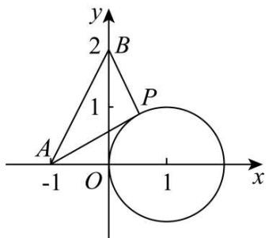
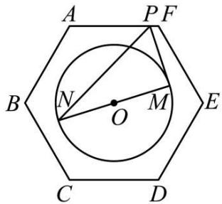
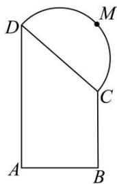

# 第61讲 圆中的范围与最值

# 知识梳理

1、涉及与圆有关的最值,可借助图形性质,利用数形结合求解.一般地:

(1)形如 $\mu = \frac{y - b}{x - a}$ 的最值问题，可转化为动直线斜率的最值问题.

(2) 形如 $t = ax + by$ 的最值问题, 可转化为动直线截距的最值问题.

(3) 形如 $m = (x - a)^2 + (y - b)^2$ 的最值问题, 可转化为曲线上的点到点 $(a, b)$ 的距离平方的最值问题.

2、解决圆中的范围与最值问题常用的策略：

(1) 数形结合

(2) 多与圆心联系

(3) 参数方程

(4) 代数角度转化成函数值域问题

# 必考题型全归纳

# 1 题型一:斜率型

3271 (2024·江苏·高二专题练习)已知点 $\mathrm{P}(x,y)$ 在圆 $(x - 1)^2 +(y - 1)^2 = 3$ 上运动，则 $\frac{4 - y}{x - 3}$ 的最大值为 （）

A. $-6-\sqrt{30}$

B. $6 + \sqrt{30}$

C. $-6 + \sqrt{30}$

D. $6 - \sqrt{30}$

3272 (多选题)(2024·浙江嘉兴·高二校考阶段练习)已知点P(x,y)在圆 $x^{2}+(y-1)^{2}=1$ 上运动,则下列选项正确的是()

A. $\frac{y-1}{x-2}$ 的最大值为 $\frac{1}{3}$ ，最小值为 $-\frac{1}{3}$ ;  
B. $\frac{y-1}{x-2}$ 的最大值为 $\frac{\sqrt{3}}{3}$ ，最小值为 $-\frac{\sqrt{3}}{3}$ ;  
C. $2x + y$ 的最大值为 $1 + \sqrt{5}$ ，最小值为 $1 - \sqrt{5}$ ;  
D. $2x + y$ 的最大值为 $2 + \sqrt{5}$ ，最小值为 $2 - \sqrt{5}$ ;

3273 (2024·全国·高三专题练习)已知 $P(m,n)$ 为圆 C: $(x-1)^{2}+(y-1)^{2}=1$ 上任意一点，则 $\frac{n-1}{m+1}$ 的最大值为 \_\_\_\_.

3274 (2024·重庆沙坪坝·高二重庆南开中学校考阶段练习)已知 $\mathrm{M}(x,y)$ 为圆 C: $x^{2} + y^{2} - 4x - 14y + 45 = 0$ 上任意一点，且点 Q(-2,3).

(1) 求 $|MQ|$ 的最大值和最小值.  
(2) 求 $\frac{y-3}{x+2}$ 的最大值和最小值.  
(3) 求 y - x 的最大值和最小值.

# 2 题型二:直线型

3275 (2024·全国·高三专题练习)点 P(x,y) 是圆 $x^{2} + y^{2} = 12$ 上的动点，则 $x + y$ 的最大值是 \_\_\_\_.

3276 (2024·江西吉安·宁冈中学校考一模)已知点 $\mathrm{P}(x,y)$ 是圆 $x^{2}+y^{2}-6x-4y+12=0$ 上的动点，则 $x+y$ 的最大值为 ()

A. $5 + \sqrt{2}$

B. $5 - \sqrt{2}$

C. 6

D. 5

3277 (2024·全国·高三专题练习)已知点 $P(x,y)$ 是圆 C: $(x-a)^{2}+y^{2}=3(a>0)$ 上的一动点，若圆 C 经过点 A $(1,\sqrt{2})$ ，则 y-x 的最大值与最小值之和为（）

A. 4

B. $2 \sqrt{6}$

C.-4

D. $-2\sqrt{6}$

# 题型三: 距离型

3278 (2024·黑龙江佳木斯·高二佳木斯一中校考期中)阿波罗尼斯是古希腊著名数学家,与欧几里得、阿基米德被称为亚历山大时期数学三巨匠,他对圆锥曲线有深刻而系统的研究,阿波罗尼斯圆就是他的研究成果之一,指的是:已知动点M与两个定点A,B的距离之比为 $\lambda(\lambda>0,\text{且}\lambda\neq1)$ ,那么点M的轨迹就是阿波罗尼斯圆.若平面内两定点A,B间的距离为2,动点P满足 $\frac{|PA|}{|PB|}=\sqrt{3}$ ,则 $|PA|^{2}+|PB|^{2}$ 的最大值为\_\_\_\_

3279 (2024·江苏宿迁·高二校考阶段练习)已知 M 为圆 C: $x^{2} + y^{2} - 4x - 14y + 45 = 0$ 上任意一点，且 Q(-2,3).

(1) 求 $|MQ|$ 的最大值和最小值；  
(2) 若 $\mathrm{M}(m, n)$ , 求 $2m + 3n + 1$ 的最大值和最小值;  
(3) 若 $M(m,n)$ ，求 $m^{2}+n^{2}+4m-6n$ 的最大值和最小值.

3280 (2024·高一课时练习)已知点 $P(x, y)$ 在直线 $x + y + 1 = 0$ 上运动，求 $(x - 1)^{2} + (y - 1)^{2}$ 的最小值及取得最小值时点 P 的坐标.

3281 (2024·高二课时练习)已知点 P(x, y) 在直线 $x + y + 1 = 0$ 上运动，则 $(x - 1)^{2} + (y - 1)^{2}$ 取得最小值时点 P 的坐标为 \_\_\_\_.

3282 (2024·全国·高二专题练习)已知 M(m,n) 为圆 C: $x^{2} + y^{2} - 4x - 4y + 4 = 0$ 上任意一点. 则 $\sqrt{(m-1)^{2}+(n+1)^{2}}$ 的最大值为 \_\_\_\_

3283 (2024·全国·高三专题练习)已知平面向量 $\vec{a}, \vec{b}, \vec{c}$ ，满足 $\forall x \in R, \left|\vec{a} - x\vec{b}\right| \geqslant \left|\vec{a} - \frac{1}{4}\vec{b}\right|, \left|\vec{a}\right| = 2, \vec{a} \cdot \vec{b} = 4, (\vec{a} - \vec{c}) \cdot (\vec{b} - 2\vec{c}) = 6$ ，则 $\left|\vec{a} - \vec{c}\right|$ 的最小值为（）

A. 1

B. $\frac{\sqrt{2}+\sqrt{6}}{3}$

C. 3

D. $\frac{\sqrt{6}-2}{2}$

3284 (2024·广东东莞·高一东莞高级中学校考阶段练习)已知点 A(-1, -1), B(-1, 3), C(2, -1)，点 P 在圆 $x^{2} + y^{2} = 1$ 上运动，则 $|PA|^{2} + |PB|^{2} + 2|PC|^{2}$ 的最大值为（）

A. 22

B. 26

C. 30

D. 32

# 题型四: 周长面积型

3285 (2024·江苏·高二假期作业)已知两点 A(-1,0), B(0,2), 点 P 是圆 $(x-1)^{2}+y^{2}=1$ 上任意一点, 则 $\triangle PAB$ 面积的最大值为 \_\_\_\_, 最小值为 \_\_\_\_.

text_image

y
2 B
1
P
A
-1 O 1 x

3286 (2024·全国·高二专题练习)已知圆 C: $(x-2)^{2}+(y-6)^{2}=4$ ，点 M 为直线 l:x-y+8=0 上一个动点，过点 M 作圆 C 的两条切线，切点分别为 A, B，则四边形 CAMB 周长的最小值为（）

A. 8

B. $6 \sqrt{2}$

C. $5 \sqrt{2}$

D. $2 + 4\sqrt{2}$

3287 (2024·全国·模拟预测)已知直线 $l: y = x + 1$ 与圆 E: $x^{2} + y^{2} + 2x - 2y - 1 = 0$ 相交于不同两点 A, C, 位于直线 l 异侧两点 B, D 都在圆 E 上运动, 则四边形 ABCD 面积的最大值为 ( )

A. $\sqrt{30}$

B. $2 \sqrt{30}$

C. $\sqrt{51}$

D. $2\sqrt{51}$

3288 (2024·甘肃庆阳·高二校考期末)已知圆 C 的方程为 $x^{2} + y^{2} = 2$ ，点 P 是直线 x - 2y - 5 = 0 上的一个动点，过点 P 作圆 C 的两条切线 PA、PB，A、B 为切点，则四边形 PACB 的面积的最小值为 \_\_\_\_

3289 (2024·高二课时练习)已知 A(0,-2), B(2,0), 点 P 为圆 $x^{2} + y^{2} - 2x - 8y + 13 = 0$ 上任意一点, 则 $\triangle PAB$ 面积的最大值为 ( )

A. 5

B. $5 - 2\sqrt{2}$

C. $\frac{5}{2}$

D. $5 + 2\sqrt{2}$

# 题型五:数量积型

3290 (2024·河南南阳·高二统考阶段练习)已知点M为椭圆 $\frac{x^{2}}{16}+\frac{y^{2}}{15}=1$ 上任意一点，A,B是圆 $(x-1)^{2}+y^{2}=1$ 上两点，且 $|AB|=2$ ，则 $\overrightarrow{MA}\cdot\overrightarrow{MB}$ 的最大值是\_\_\_\_.

3291 (2024·全国·高三专题练习)已知直线 $l: y = x + 2a$ 与圆 C: $(x - a)^{2} + y^{2} = r^{2} (r > 0)$ 相切于点 M $(-1, y_{0})$ ，设直线 l 与 x 轴的交点为 A，点 P 为圆 C 上的动点，则 $\overrightarrow{PA} \cdot \overrightarrow{PM}$ 的最大值为 \_\_\_\_.

3292 (2024·江苏南京·高一校考期中)已知点 A(-1,0), B(1,0)，点 P 为圆 C: $x^{2}+y^{2}-6x-8y+17=0$ 上的动点，则 $\overrightarrow{AB}\cdot\overrightarrow{AP}$ 的最大值为 \_\_\_\_.

3293 (2024·全国·高一专题练习)在边长为4的正方形ABCD中,动圆Q的半径为1、圆心在线段CD(含端点)上运动,点P是圆Q上及其内部的动点,则 $\overrightarrow{AP}\cdot\overrightarrow{AB}$ 的取值范围是().

A. $[-4,20]$

B. $[-1,5]$

C. $[0,20]$

D. $[4,20]$

3294 (2024·内蒙古呼和浩特·高一呼市二中校考阶段练习)在边长为2的正六边形ABCDEF中,动圆Q的半径为1、圆心在线段CD(含端点)上运动,点P是圆Q上及其内部的动点,则 $\overrightarrow{AP} \cdot \overrightarrow{AB}$ 的取值范围是 （）

A. $[2,8]$ .

B. $[4,8]$

C. $[2,10]$

D. $[4,10]$

3295 (2024·山东聊城·高一山东聊城一中校考期中)已知正六边形 ABCDEF 的边长为 2, 圆 O 的圆心为正六边形的中心, 半径为 1, 若点 P 在正六边形的边上运动, MN 为圆 O 的直径, 则 $\overrightarrow{\mathrm{PM}} \cdot \overrightarrow{\mathrm{PN}}$ 的取值范围是 ( )

text_image

A
PF
B
N
O
M
E
C
D

A. $[2,4]$

B. $[2,3]$

C. $\left[\frac{3}{2},4\right]$

D. $\left[\frac{3}{2},3\right]$

# 题型六:坐标与角度型

3296 (2024·浙江丽水·高二校联考开学考试)已知点 P 在圆 M: $(x-4)^{2}+(y-2)^{2}=4$ 上，点 A(2,0)，B(0,2)，则 $\angle PBA$ 最小和最大时分别为（）

A. $0^{\circ}$ 和 $60^{\circ}$

B. $15^{\circ}$ 和 $75^{\circ}$

C. $30^{\circ}$ 和 $90^{\circ}$

D. $45^{\circ}$ 和 $135^{\circ}$

3297 (2024·高二单元测试)已知圆 C: $(x-1)^{2}+y^{2}=1$ ，点 P $(x_{0}, y_{0})$ 在直线 $x-y+1=0$ 上运动。若 C 上存在点 Q，使 $\angle CPQ=30^{\circ}$ ，则 $x_{0}$ 的取值范围是 \_\_\_\_。

3298 (2024·全国·高三专题练习)已知 x, y 满足 $x^{2} + y^{2} = 4y - 3$ ，则 $\frac{\sqrt{3}x + y}{\sqrt{x^{2} + y^{2}}}$ 的最大值为（）

A. 1

B. 2

C. $\sqrt{3}$

D. $\sqrt{5}$

3299 (2024·浙江嘉兴·高二校考阶段练习)若圆 $\mathrm{M}:(x-\cos\theta)^{2}+(y-\sin\theta)^{2}=1(0\leqslant\theta<2\pi)$ 与圆 $N:x^{2}+y^{2}-2x-4y=0$ 交于 A、B 两点，则 $\tan\angle ANB$ 的最大值为（）

A. $\frac{1}{2}$

B. $\frac{3}{4}$

C. $\frac{4}{5}$

D. $\frac{4}{3}$

3800 (2024·全国·高三专题练习)动圆 M 经过坐标原点,且半径为 1 ,则圆心 M 的横纵坐标之和的最大值为 ( )

A. 1

B. 2

C. $\sqrt{2}$

D. $2\sqrt{2}$

3301 (2024·全国·模拟预测)已知圆 C: $(x-1)^{2}+(y-2)^{2}=5$ ，圆 C' 是以圆 $x^{2}+y^{2}=1$ 上任意一点为圆心，1 为半径的圆．圆 C 与圆 C' 交于 A，B 两点，则 $\sin\angle ACB$ 的最大值为（）

A. $\frac{1}{2}$

B. $\frac{2}{3}$

C. $\frac{3}{4}$

D. $\frac{4}{5}$

# 题型七:长度型

3302 (2024·全国·高三专题练习)已知圆 C: $(x-2)^{2}+y^{2}=1$ 及点 A(0,2)，点 P、Q 分别是直线 $x+y=0$ 和圆 C 上的动点，则 $|PA|+|PQ|$ 的最小值为 \_\_\_\_.

3803 (2024·湖北·高二沙市中学校联考期中)已知直线 l 与圆 O: $x^{2}+y^{2}=4$ 交于 A $(x_{1},y_{1})$ ，B $(x_{2},y_{2})$ 两点，且 |AB|=2，则 $|x_{1}+y_{1}+4|+|x_{2}+y_{2}+4|$ 的最大值为 \_\_\_\_.

3304 (2024·上海普陀·高二上海市晋元高级中学校考期末)已知 A $(x_{1},y_{1})$ 、B $(x_{2},y_{2})$ 为圆 M: $x^{2}+y^{2}=4$ 上的两点，且 $x_{1}x_{2}+y_{1}y_{2}=-2$ ，设 P $(x_{0},y_{0})$ 为弦 AB 的中点，则 $|3x_{0}+4y_{0}-10|$ 的最大值为 \_\_\_\_.

3305 (2024·上海静安·高二校考期末)已知实数 $x_{1}, x_{2}, y_{1}, y_{2}$ 满足 $x_{1}^{2} + y_{1}^{2} = 1, x_{2}^{2} + y_{2}^{2} = 1, x_{1}x_{2} + y_{1}y_{2} = \frac{1}{2}$ ，则 $\frac{|x_{1} + y_{1} - 1|}{\sqrt{2}} + \frac{|x_{2} + y_{2} - 1|}{\sqrt{2}}$ 的最大值为 \_\_\_\_.

3306 (2024·全国·高三专题练习)古希腊数学家阿波罗尼斯在他的巨著《圆锥曲线论》中有一个著名的几何问题:在平面上给定两点A、B,动点P满足PA|=λ|PB|(其中λ是正常数,且λ≠1),则P的轨迹是一个圆,这个圆称之为“阿波罗尼斯圆”.现已知两定点M(-1,0)、N(2,1),P是圆O:x²+y²=3上的动点,则√3|PM|+|PN|的最小值为\_\_\_\_

3307 (2024·全国·高二期中)已知圆 C 是以点 M(2,2√3) 和点 N(6,-2√3) 为直径的圆, 点 P 为圆 C 上的动点, 若点 A(2,0), 点 B(1,1), 则 2|PA|-|PB| 的最大值为 ( )

A. $\sqrt{26}$

B. $4+\sqrt{2}$

C. $8 + 5\sqrt{2}$

D. $\sqrt{2}$

3308 (2024·四川成都·高二成都七中校考开学考试)已知 A, B 是曲线 $\left|x\right| -1 = \sqrt{-y^{2} + 2y + 3}$ 上两个不同的点，C(0,1)，则 $\left|CA\right| + \left|CB\right|$ 的最大值与最小值的比值是（）

A. $\frac{\sqrt{5}}{3}$

B. $\frac{3\sqrt{5}}{5}$

C. $\sqrt{2}$

D. $\sqrt{3}$

3309 (2024·全国·高三专题练习)在 Rt△ABC 中，∠BAC = $\frac{\pi}{2}$ ，AB = AC = 2，点 M 在 △ABC 内部，cos∠AMC = - $\frac{3}{5}$ ，则 MB² - MA² 的最小值为 \_\_\_\_.

3310 (2024·河南许昌·高二禹州市高级中学校考阶段练习)已知点P在直线y=x-2上运动,点E是圆 $x^{2}+y^{2}=1$ 上的动点,点F是圆 $(x-6)^{2}+(y+5)^{2}=9$ 上的动点,则 $|PF|-|PE|$ 的最大值为()

A. 6

B. 7

C. 8

D. 9

# 8 题型八:方程中的参数

3311 (2024·全国·高三专题练习)如图,在直角梯形ABCD中,A=B=90°,AD=4,AB=BC=2,点M在以CD为直径的半圆上,且满足 $\overrightarrow{AM}=m\overrightarrow{AB}+n\overrightarrow{AD}$ ,则 $m+n$ 的最大值为()

text_image

Geometric diagram showing a rectangle ABCD with an inscribed semicircle and labeled points M and C.

A. 2

B. 3

C. $-\frac{5}{2}$

D. $\frac{\sqrt{10}+5}{4}$

3312 (2024·全国·高三专题练习)已知 $O(0,0)$ , $P(\sqrt{3},1)$ , $Q(1+4\cos\theta,\sqrt{3}-4\sin\theta)$ , $\theta\in[0,2\pi]$ , 则 $\triangle OPQ$ 面积的最大值为 ()

A. 4

B. 5

C. $5\sqrt{3}$

D. $\frac{8}{3}\sqrt{3}$

3313 (2024·河南开封·高三通许县第一高级中学校考阶段练习)已知点 A(0, -4)，点 B(2, 0)，P 为圆 O: $x^{2} + y^{2} = 4$ 上一动点，则 $\frac{|PB|}{|PA|}$ 的最大值是（）

A. $\frac{2\sqrt{5}}{3}$

B. $\frac{3\sqrt{3}}{4}$

C. $\frac{4\sqrt{5}}{3}$

D. $\frac{3\sqrt{3}}{2}$

3314 (2024·福建龙岩·高二福建省龙岩第一中学校考阶段练习)已知过点 $(1,\sqrt{3})$ 的动直线l与圆 $C:x^{2}+y^{2}=16$ 交于A,B两点,过A,B分别作C的切线,两切线交于点N.若动点 $M(\cos\theta,\sin\theta)(0\leqslant0<2\pi)$ ,则 $|MN|$ 的最小值为\_\_\_\_.

