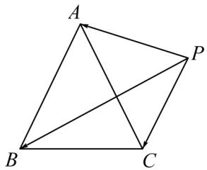
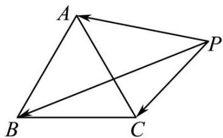
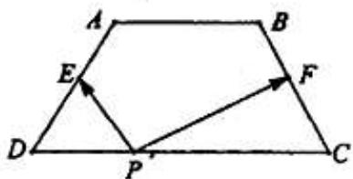

# 第62讲 隐圆问题

# 必考题型全归纳

# 1 题型一:隐圆的第一定义:到定点的距离等于定长

3315 (2024·天津北辰·高三天津市第四十七中学校考期末)平面内,定点A,B,C,D满足 $|DA|=|DB|=|DC|=2$ ,且 $\overrightarrow{DA}\cdot\overrightarrow{DB}=\overrightarrow{DB}\cdot\overrightarrow{DC}=\overrightarrow{DC}\cdot\overrightarrow{DA}=-2$ ,动点P,M满足 $|AP|=1,\overrightarrow{PM}=\overrightarrow{MC}$ ,则 $|\overrightarrow{BM}|^{2}$ 的最大值为()

A. $\frac{37+6\sqrt{3}}{4}$

B. $\frac{37+2\sqrt{33}}{4}$

C. $\frac{43}{4}$

D. $\frac{49}{4}$

3316 (2024·全国·高一阶段练习)已知 $\vec{a}, \vec{b}$ 是单位向量， $\vec{a} \cdot \vec{b} = 0$ ，若向量 $\vec{c}$ 满足 $|\vec{c} - \vec{a} + \vec{b}| = 1$ ，则 $|\vec{c} - \vec{b}|$ 的取值范围是（）

A. $[\sqrt{2} - 1, \sqrt{2} + 1]$

B. $\left[1,\sqrt{2}+1\right]$

C. $[0,2]$

D. $[\sqrt{5} - 1, \sqrt{5} + 1]$

3317 (2024·全国·高三专题练习)已知单位向量 $\vec{a}$ 与向量 $\vec{b}=(0,2)$ 垂直，若向量 $\vec{c}$ 满足 $\left|\vec{a}+\vec{b}+\vec{c}\right|=1$ ，则 $\left|\vec{c}\right|$ 的取值范围为()

A. $[1, \sqrt{5} - 1]$

B. $\left[\frac{\sqrt{3}-1}{2},\frac{\sqrt{3}+1}{2}\right]$

C. $[\sqrt{5} - 1, \sqrt{5} + 1]$

D. $\left[\frac{\sqrt{3}+1}{2},3\right]$

3318 (2024·湖北武汉·高二湖北省武昌实验中学校考阶段练习)如果圆 $(x-a)^{2}+(y-a)^{2}=8$ 上总存在两个点到原点的距离为 $\sqrt{2}$ ，则实数a的取值范围是()

A. $(-3,3)$

B. $(-1,1)$

C. $(-3,1)$

D. $(-3, - 1)\cup (1,3)$

3319 (2024·新疆和田·高二期中)如果圆 $(x-a)^{2}+(y-1)^{2}=1$ 上总存在两个点到原点的距离为2，则实数a的取值范围是()

A. $(-2\sqrt{2},0)\cup(0,2\sqrt{2})$

B. $(-2\sqrt{2},2\sqrt{2})$

C. $(-1,0)\cup(0,1)$

D. $(-1,1)$

3320 (2024·新疆·高三兵团第三师第一中学校考阶段练习)在平面内,定点A,B,C,D满足 $|\overrightarrow{DA}|=|\overrightarrow{DB}|=|\overrightarrow{DC}|=2,\overrightarrow{DA}\cdot\overrightarrow{BC}=\overrightarrow{DB}\cdot\overrightarrow{AC}=\overrightarrow{DC}\cdot\overrightarrow{AB}=0$ ,动点P,M满足 $|\overrightarrow{AP}|=1,\overrightarrow{PM}=\overrightarrow{MC}$ ,则 $|\overrightarrow{BM}|^{2}$ 的最大值为\_\_\_\_.

3321 (2024·安徽池州·高一池州市第一中学校考阶段练习)在平面内,定点D与A、B、C满足 $|\overrightarrow{DA}|=|\overrightarrow{DB}|=|\overrightarrow{DC}|$ , $\overrightarrow{DA}\cdot\overrightarrow{DB}=\overrightarrow{DB}\cdot\overrightarrow{DC}=\overrightarrow{DC}\cdot\overrightarrow{DA}=-8$ , 动点P、M满足 $\overrightarrow{AP}=2$ , $\overrightarrow{PM}=\overrightarrow{MC}$ , 则 $|\overrightarrow{BM}|^{2}$ 的最大值为 \_\_\_\_.

# 2 题型二:隐圆的第二定义:到两定点距离的平方和为定值

3322 (2024·四川广元·高二四川省剑阁中学校校考阶段练习)在平面直角坐标系 $xOy$ 中，P(2,2),Q(-4,0)为两个定点，动点M在直线 $x = -1$ 上，动点N满足 $\mathrm{NO}^2 +\mathrm{NQ}^2 = 16$ ，则 $|\overrightarrow{\mathrm{PM}} +\overrightarrow{\mathrm{PN}}|$ 的最小值为

3323 (2024·全国·高三专题练习)已知 A, B, C, D 四点共面, BC = 2, AB $^{2}$ + AC $^{2}$ = 20, CD = 3CA, 则 |BD| 的最大值为 \_\_\_\_.

3324 (2024·浙江金华·高二校联考期末)已知圆 C: $(x+1)^{2}+(y-2)^{2}=1$ ，点 A(-1,0)，B(1,0). 设 P 是圆 C 上的动点，令 $d=|PA|^{2}+|PB|^{2}$ ，则 d 的最小值为 \_\_\_\_.

3325 (2024·高二课时练习)正方形 ABCD 与点 P 在同一平面内, 已知该正方形的边长为 1, 且 $|\mathrm{PA}|^2 + |\mathrm{PB}|^2 = |\mathrm{PC}|^2$ , 则 $|\mathrm{PD}|$ 的取值范围为 \_\_\_\_.

3326 (2024·上海闵行·高二校考期末)如图, $\triangle ABC$ 是边长为 1 的正三角形, 点 P 在 $\triangle ABC$ 所在的平面内, 且 $|\overrightarrow{PA}|^2 + |\overrightarrow{PB}|^2 + |\overrightarrow{PC}|^2 = a$ ( $a$ 为常数), 满足条件的点 P 有无数个, 则实数 $a$ 的取值范围是 \_\_\_\_.

text_image

A
P
B
C

3327 (2024·全国·高三专题练习)如图, $\Delta ABC$ 是边长为1的正三角形, 点P在 $\Delta ABC$ 所在的平面内, 且 $|\overrightarrow{PA}|^{2}+|\overrightarrow{PB}|^{2}+|\overrightarrow{PC}|^{2}=a(a$ 为常数), 下列结论中正确的是

text_image

A
B
C
P

A. 当 $0 < a < 1$ 时, 满足条件的点 $\mathrm{P}$ 有且只有一个  
B. 当 $a = 1$ 时, 满足条件的点 $\mathrm{P}$ 有三个  
C. 当 $a > 1$ 时, 满足条件的点 $\mathrm{P}$ 有无数个  
D. 当 $a$ 为任意正实数时, 满足条件的点总是有限个

# 题型三: 隐圆的第三定义: 到两定点的夹角为 $90^{\circ}$

3328 (2024·湖北武汉·高二湖北省武昌实验中学校考阶段练习)已知圆 C: $(x-1)^{2}+(y-3)^{2}=10$ 和点 M(5,t)，若圆 C 上存在两点 A,B 使得 MA ⊥ MB，则实数 t 的取值范围是 \_\_\_\_.

3329 (2024·江苏南京·金陵中学校考模拟预测)已知圆 C: $(x-1)^{2}+(y-4)^{2}=10$ 和点 M(5, t)，若圆 C 上存在两点 A, B，使得 MA ⊥ MB，则实数 t 的取值范围是 \_\_\_\_

3330 (2024·高二课时练习)设 $m \in R$ ，过定点 A 的动直线 mx - y = 0 和过定点 B 的动直线 x + my - 4m - 3 = 0 交于点 P，则 $|PA| + |PB|$ 的取值范围是（）

A. $[\sqrt{5}, 2\sqrt{5}]$

B. $[2\sqrt{5},5]$

C. $[5,5\sqrt{2} ]$

D. $[5,10]$

3331 (2024·陕西西安·高二西安市铁一中学校考期末)设 $m \in R$ ，过定点 A 的动直线 $x + my = 0$ 和过定点 B 的动直线 $mx - y - m + 3 = 0$ 交于点 $\mathrm{P}(x, y)$ ，则 $|\mathrm{PA}| \cdot |\mathrm{PB}|$ 的最大值是

( )

A. $\sqrt{5}$

B. $\sqrt{10}$

C. 5

D. 10

3332 (2024·高二课时练习)设 $m \in R$ ，过定点 A 的动直线 $x + my = 0$ 和过定点 B 的动直线 $mx - y - m + 3 = 0$ 交于点 $\mathrm{P}(x, y)$ ，则 $|\mathrm{PA}|^{2} + |\mathrm{PB}|^{2}$ 的值为（）

A. 5

B. 10

C. $\frac{\sqrt{10}}{2}$

D. $\sqrt{17}$

3333 (2024·全国·高三校联考阶段练习)设 $m \in R$ ，动直线 $l_{1}: x + my = 0$ 过定点 A，动直线 $l_{2}: mx - y - m + 3 = 0$ 过定点 B，且 $l_{1}, l_{2}$ 交于点 P(x, y)，则 $|PA| + |PB|$ 的最大值是（）

A. $\sqrt{10}$

B. $2 \sqrt{5}$

C. 5

D. 10

3334 (2024·全国·高三专题练习)设向量 $\vec{a}, \vec{b}, \vec{c}$ 满足 $|\vec{a}| = |\vec{b}| = 1, \vec{a} \cdot \vec{b} = \frac{1}{2}, (\vec{a} - \vec{c}) \cdot (\vec{b} - \vec{c}) = 0$ ，则 $|\vec{c}|$ 的最小值是（）

A. $\frac{\sqrt{3}+1}{2}$

B. $\frac{\sqrt{3}-1}{2}$

C. $\sqrt{3}$

D. 1

3335 (2024·全国·高三专题练习)已知点 A(1-m,0), B(1+m,0), 若圆 C: $x^{2} + y^{2} - 8x - 8y + 31 = 0$ 上存在一点 P, 使得 PA ⊥ PB, 则实数 m 的最大值是 ( )

A. 4

B. 5

C. 6

D. 7

3336 (2024·江西宜春·高一江西省万载中学校考期末)已知 $\vec{a}, \vec{b}$ 是平面内两个互相垂直的单位向量, 若向量 $\vec{c}$ 满足 $(\vec{a}-\vec{c})\cdot(2\vec{b}-\vec{c})=0$ , 则 $|\vec{c}|$ 的最大值是 ()

A. $\sqrt{2}$

B. 2

C. $\sqrt{5}$

D. $\frac{\sqrt{5}}{2}$

3337 (2024·全国·高三专题练习)已知 $\vec{a},\vec{b}$ 是平面内两个互相垂直的单位向量,若向量 $\vec{c}$ 满足 $(\vec{a}-\vec{c})(\vec{b}-\vec{c})=0$ ,则 $\left|\vec{c}\right|$ 的最大值是()

A. 1

B. 2

C. $\sqrt{2}$

D. $\frac{\sqrt{2}}{2}$

3338 (2024·湖北武汉·高二校联考期中)已知 $\vec{a}$ 和 $\vec{b}$ 是平面内两个单位向量，且 $\left\langle\vec{a},\vec{b}\right\rangle=\frac{\pi}{3}$ ，若向量 $\vec{c}$ 满足 $(\vec{a}-\vec{c})\cdot(\vec{b}-\vec{c})=0$ ，则 $\left|\vec{c}\right|$ 的最大值是（）

A. $\frac{\sqrt{2}}{2}+1$

B. $\frac{\sqrt{3}+1}{2}$

C. $\sqrt{2}$

D. $\sqrt{3}$

3339 (2024·黑龙江哈尔滨·高三哈尔滨市第一中学校校考期中)已知向量 $\vec{a}, \vec{b}$ 是平面内两个互相垂直的单位向量, 若向量 $\vec{c}$ 满足 $(\vec{a}-\vec{c})\cdot(\vec{b}-2\vec{c})=0$ , 则 $|\vec{c}|$ 的最大值是 ( )

A. $\sqrt{2}$

B. $\frac{\sqrt{5}}{2}$

C. $\frac{\sqrt{3}}{2}$

D. $\frac{\sqrt{5}}{5}$

# 题型四: 隐圆的第四定义: 边与对角为定值、对角互补、数量积定值

3340 (2024·全国·高一专题练习)设向量 $\vec{a},\vec{b},\vec{c}$ 满足 $\left|\vec{a}\right|=\left|\vec{b}\right|=1,\vec{a}\cdot\vec{b}=-\frac{1}{2},\left\langle\vec{a}-\vec{c},\vec{b}-\vec{c}\right\rangle=60^{\circ}$ ，则 $|\vec{c}|$ 的最大值等于 \_\_\_\_.

3341 (2024·全国·高三专题练习)在边长为8正方形ABCD中,点M为BC的中点,N是AD上一点,且DN=3NA,若对于常数m,在正方形ABCD的边上恰有6个不同的点P,使得 $\overrightarrow{PM}\cdot\overrightarrow{PN}=m$ ,则实数m的取值范围为\_\_\_\_.

3342 (2024·全国·高三专题练习)在平面四边形ABCD中,连接对角线BD,已知CD=9, BD=16, $\angle BDC=90^{\circ}$ , $\sin A=\frac{4}{5}$ , 则对角线AC的最大值为()

A. 27

B. 16

C. 10

D. 25

3343 (2024·全国·高考真题)设向量 $\vec{a}, \vec{b}, \vec{c}$ 满足 $\left|\vec{a}\right| = \left|\vec{b}\right| = 2, \vec{a} \cdot \vec{b} = -2, \left\langle \vec{a} - \vec{c}, \vec{b} - \vec{c} \right\rangle = 60^{\circ}$ ，则 $\left|\vec{c}\right|$ 的最大值等于

A. 4

B. 2

C. $\sqrt{2}$

D. 1

3344 (2024·全国·高三专题练习)在平面内, 设 A、B 为两个不同的定点, 动点 P 满足: $\overrightarrow{PA} \cdot \overrightarrow{PB} = k^{2}$ (k 为实常数), 则动点 P 的轨迹为 ()

A. 圆

B. 椭圆

C. 双曲线

D. 不能确定

3345 (2024·全国·高三专题练习)如图,梯形ABCD中, $AB \parallel CD$ , AB=2, CD=4, BC=AD= $\sqrt{5}$ , E和F分别为AD与BC的中点,对于常数 $\lambda$ ,在梯形ABCD的四条边上恰好有8个不同的点P,使得 $\overrightarrow{PE}\cdot\overrightarrow{PF}=\lambda$ 成立,则实数 $\lambda$ 的取值范围是

text_image

A
B
E
F
D
P
C

A. $\left(-\frac{5}{4},-\frac{9}{20}\right)$

B. $\left(-\frac{5}{4},-\frac{11}{4}\right)$

C. $\left(-\frac{1}{4},\frac{11}{4}\right)$

D. $\left(-\frac{9}{20},-\frac{1}{4}\right)$

3346 (2024·江苏·高一专题练习)已知正方形ABCD的边长为4,点E,F分别为AD,BC的中点,如果对于常数 $\lambda$ ,在正方形ABCD的四条边上,有且只有8个不同的点P,使得 $\overrightarrow{PE}\cdot\overrightarrow{PF}=\lambda$ 成立,那么 $\lambda$ 的取值范围是()

A. $(0,2]$

B. $(0,2)$

C. $(0,4]$

D. $(0,4)$

# 5 题型五:隐圆的第五定义:到两定点距离之比为定值

3347 (2024·四川宜宾·高二四川省宜宾市第四中学校校考阶段练习)阿波罗尼斯是古希腊著名数学家,与欧几里得、阿基米德并称为亚历山大时期数学三巨匠,他对圆锥曲线有深刻而系统的研究,主要研究成果集中在他的代表作《圆锥曲线》一书,阿波罗尼斯圆就是他的研究成果之一.指的是:已知动点M与两定点Q,P的距离之比 $\frac{|MQ|}{|MP|}=\lambda(\lambda>0,\lambda\neq1)$ ,那么点M的轨迹就是阿波罗尼斯圆.已知动点M的轨迹是阿波罗尼斯圆,其方程为 $x^{2}+y^{2}=1$ ,其中,定点Q为x轴上一点,定点P的坐标为 $\left(-\frac{1}{3},0\right),\lambda=3$ ,若点B(1,1),则3 $|MP|+|MB|$ 的最小值为()

A. $\sqrt{10}$

B. $\sqrt{11}$

C. $\sqrt{15}$

D. $\sqrt{17}$

3348 (2024·江西赣州·统考模拟预测)阿波罗尼斯是古希腊著名数学家,与欧几里得、阿基米德并称为亚历山大时期数学三巨匠,他对圆锥曲线有深刻而系统的研究,阿波罗尼斯圆是他的研究成果之一,指的是:已知动点M与两定点A,B的距离之比为 $\lambda(\lambda>0,\lambda\neq1)$ ,那么点M的轨迹就是阿波罗尼斯圆,简称阿氏圆.已知在平面直角坐标系中,圆 $O:x^{2}+y^{2}=1$ 、点 $A\left(-\frac{1}{2},0\right)$ 和点 $B\left(0,\frac{1}{2}\right)$ ,M为圆O上的动点,则2|MA|-|MB|的最大值为()

A. $\frac{5}{2}$

B. $\frac{\sqrt{17}}{2}$

C. $\frac{3}{2}$

D. $\frac{\sqrt{2}}{2}$

3349 (2024·湖南张家界·高二统考期末)阿波罗尼斯是古希腊著名数学家,与欧几里得、阿基米德被称为亚历山大时期数学三巨匠,他对圆锥曲线有深刻且系统的研究,主要研究成果集中在他的代表作《圆锥曲线》一书中,阿波罗尼斯圆是他的研究成果之一,指的是:已知动点M与两定点A,B的距离之比为 $\lambda(\lambda>0,\lambda\neq1)$ ,那么点M的轨迹就是阿波罗尼斯圆.如动点M与两定点 $A\left(\frac{9}{5},0\right)$ ,B(5,0)的距离之比为 $\frac{3}{5}$ 时的阿波罗尼斯圆为 $x^{2}+y^{2}=9$ .下面,我们来研究与此相关的一个问题:已知圆O: $x^{2}+y^{2}=4$ 上的动点M和定点A(-1,0),B(1,1),则2|MA|+|MB|的最小值为()

A. $2 + \sqrt{10}$

B. $\sqrt{21}$

C. $\sqrt{26}$

D. $\sqrt{29}$

3350 (2024·广东东莞·高三东莞实验中学校考开学考试)对平面上两点A、B,满足 $\frac{|PA|}{|PB|}=\lambda(\lambda \neq 1)$ 的点P的轨迹是一个圆,这个圆最先由古希腊数学家阿波罗尼斯发现,命名为阿波罗尼斯圆,称点A,B是此圆的一对阿波罗点.不在圆上的任意一点都可以与关于此圆的另一个点组成一对阿波罗点,且这一对阿波罗点与圆心在同一直线上,其中一点在圆内,另一点在圆外,系数λ只与阿波罗点相对于圆的位置有关.已知A(1,0),B(4,0),D(0,3),若动点P满足 $\frac{|PA|}{|PB|}=\frac{1}{2}$ ,则2|PD|+|PB|的最小值是\_\_\_\_.

3351 (2024·上海·高三校联考阶段练习)古希腊数学家阿波罗尼斯在他的巨著《圆锥曲线论》中有一个著名的几何问题:在平面上给定两点A、B,动点P满足PA|=λ|PB|(其中λ是正常数,且λ≠1),则P的轨迹是一个圆,这个圆称之为“阿波罗尼斯圆”.现已知两定点M(-1,0)、N(2,1),P是圆O:x²+y²=3上的动点,则√3|PM|+|PN|的最小值为

3352 (2024·四川广安·高二广安二中校考期中)阿波罗尼斯是古希腊著名的数学家,对圆锥曲线有深刻而系统的研究,阿波罗尼斯圆就是他的研究成果之一,指的是:已知动点M与两定点Q,P的距离之比 $\frac{|MQ|}{|MP|}=\lambda(\lambda>0,\lambda\neq1)$ ,那么点M的轨迹就是阿波罗尼斯圆.已知动点M的轨迹是阿波罗尼斯圆,其方程为 $x^{2}+y^{2}=1$ ,定点Q为x轴上一点, $P\left(-\frac{1}{2},0\right)$ 且 $\lambda=2$ ,若点B(1,1),则 $2|MP|+|MB|$ 的最小值为\_\_\_\_.

3353 (2024·河北沧州·校考模拟预测)阿波罗尼斯是古希腊著名的数学家,他对圆锥曲线有深刻而系统的研究,主要研究成果集中在他的代表作《圆锥曲线论》一书,阿波罗尼斯圆是他的研究成果之一,指的是“如果动点M与两定点A,B的距离之比为 $(\lambda(\lambda>0,\lambda\neq1))$ ,那么点M的轨迹就是阿波罗尼斯圆”下面我们来研究与此相关的一个问题,已知点P为圆O: $x^{2}+y^{2}=4$ 上的动点,M $(-4,0)$ ,N $(3,1)$ ,则 $|PM|+2|PN|$ 的最小值为\_\_\_\_.

3354 (2024·全国·高三专题练习)阿波罗尼斯(约公元前262-190年)证明过这样一个命题:平面内到两定点距离之比为常数 $k(k>0,k\neq1)$ 的点的轨迹是圆,后人将这个圆称为阿氏圆,已知P、Q分别是圆C: $(x-4)^{2}+y^{2}=8$ ,圆D: $x^{2}+(y-4)^{2}=1$ 上的动点,O是坐标原点,则 $|PQ|+\frac{\sqrt{2}}{2}|PO|$ 的最小值是\_\_\_\_.

