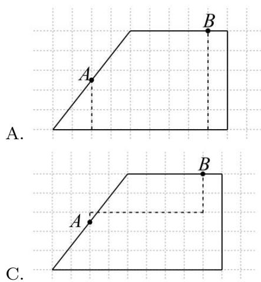
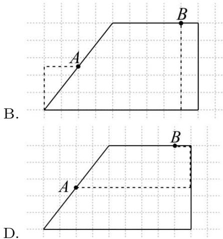
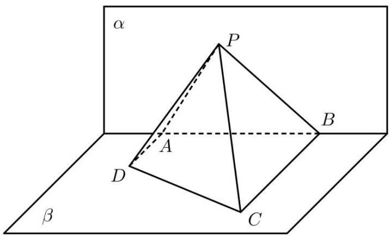
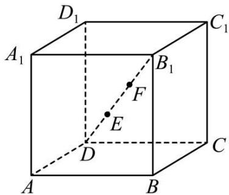

# 第63讲 直线与圆的综合

# 必考题型全归纳

# 1 题型一: 距离的创新定义

3355 (2024·浙江绍兴·高三统考期末)费马点是指三角形内到三角形三个顶点距离之和最小的点,当三角形三个内角均小于 $120^{\circ}$ 时,费马点与三个顶点连线正好三等分费马点所在的周角,即该点所对的三角形三边的张角相等均为 $120^{\circ}$ ,根据以上性质,已知 A(-1,0),B(1,0),C(0,2),P 为 $\triangle ABC$ 内一点,记 $f(P)=|PA|+|PB|+|PC|$ ,则 $f(P)$ 的最小值为 \_\_\_\_,此时 $\sin\angle PBC=$ \_\_\_\_.

3356 (2024·全国·高三专题练习)闵氏距离 (Minkowskidistance) 是衡量数值点之间距离的一种非常常见的方法, 设点 A、B 坐标分别为 $(x_{1}, y_{1})$ , $(x_{2}, y_{2})$ , 则闵氏距离 $D_{p}(A, B) = (|x_{1} - x_{2}|^{p} + |y_{1} - y_{2}|^{p})^{1/p}(p \in \mathbb{N}^{*})$ . 若点 A、B 分别在 $y = e^{x}$ 和 $y = x - 1$ 的图像上, 则 $D_{p}(A, B)$ 的最小值为 ( )

A. $2^{1 / p}$

B. $2^{p}$

C. $\mathrm{e}^{1 / p}$

D. $e^{p}$

3357 (2024·全国·高三专题练习)17世纪法国数学家费马在给朋友的一封信中曾提出一个关于三角形的有趣问题:在三角形所在平面内,求一点,使它到三角形每个顶点的距离之和最小. 现已证明:在 $\triangle ABC$ 中,若三个内角均小于 $120^{\circ}$ ,则当点P满足 $\angle APB=\angle APC=\angle BPC=120^{\circ}$ 时,点P到三角形三个顶点的距离之和最小,点P被人们称为费马点. 根据以上知识,已知 $\vec{a}$ 为平面内任意一个向量, $\vec{b}$ 和 $\vec{c}$ 是平面内两个互相垂直的向量,且 $\left|\vec{b}\right|=2,\left|\vec{c}\right|=3$ ,则 $\left|\vec{a}-\vec{b}\right|+\left|\vec{a}+\vec{b}\right|+\left|\vec{a}-\vec{c}\right|$ 的最小值是()

A. $3 - 2\sqrt{3}$

B. $3 + 2\sqrt{3}$

C. $2 \sqrt{3} - 2$

D. $2 \sqrt{3} + 2$

3358 (2024·全国·高三专题练习)闵可夫斯基距离又称为闵氏距离,是两组数据间距离的定义.设两组数据分别为 $A=(a_{1},a_{2},\cdots,a_{n})$ 和 $B=(b_{1},b_{2},\cdots,b_{n})$ ,这两组数据间的闵氏距离定义为 $d_{\mathrm{AB}}(q)=\left[\sum_{k=1}^{n}|a_{k}-b_{k}|^{q}\right]^{\frac{1}{q}}$ ,其中q表示阶数.现有下列四个命题:

①若 $A=(1,2,3,4)$ , $B=(0,3,4,5)$ ，则 $d_{\mathrm{AB}}(1)=4$ ;  
②若 $A=(a,a+1)$ , $B=(b-1,b)$ ，其中 $a,b\in R$ ，则 $d_{\mathrm{AB}}(1)=d_{\mathrm{AB}}(2)$ ;  
③若 $A=(a,b)$ , $B=(c,d)$ ，其中 a, b, c, $d \in R$ ，则 $d_{\mathrm{AB}}(1) \geqslant d_{\mathrm{AB}}(2)$ ;

④若 $A=(a,a^{2})$ , $B=(b,b-1)$ ，其中 $a,b\in R$ ，则 $d_{\mathrm{AB}}(2)$ 的最小值为 $\frac{3\sqrt{2}}{8}$ .

其中所有真命题的个数是 （）

A. 1

B. 2

C. 3

D. 4

3359 (2024·全国·高三专题练习)费马点是指三角形内到三角形三个顶点距离之和最小的点. 当三角形三个内角均小于 $120^{\circ}$ 时, 费马点与三个顶点连线正好三等分费马点所在的周角, 即该点所对的三角形三边的张角相等且均为 $120^{\circ}$ . 根据以上性质, . 则 $\mathrm{F}(x,y)=\sqrt{(x-2\sqrt{3})^{2}+y^{2}}+\sqrt{(x+1-\sqrt{3})^{2}+(y-1+\sqrt{3})^{2}}+\sqrt{x^{2}+(y-2)^{2}}$ 的最小值为 ( )

A. 4

B. $2 + 2\sqrt{3}$

C. $3 + 2\sqrt{3}$

D. $4 + 2\sqrt{3}$

3360 (2024·全国·高三专题练习)点 M 是 $\Delta ABC$ 内部或边界上的点, 若 M 到 $\Delta ABC$ 三个顶点距离之和最小, 则称点 M 是 $\Delta ABC$ 的费马点 (该问题是十七世纪法国数学家费马提出). 若 A(0,2), B(-1,0), C(1,0) 时, 点 $M_{0}$ 是 $\Delta ABC$ 的费马点, 且已知 $M_{0}$ 在 y 轴上, 则 $|AM_{0}| + |BM_{0}| + |CM_{0}|$ 的大小等于 \_\_\_\_.

3361 (2024·全国·高三专题练习)著名数学家华罗庚曾说过:“数形结合百般好,隔裂分家万事休.”事实上,有很多代数问题可以转化为几何问题加以解决,如: $\sqrt{(x-a)^{2}+(y-b)^{2}}$ 可以转化为平面上点M(x,y)与点N(a,b)的距离.结合上述观点,可得 $f(x)=\sqrt{x^{2}+4x+20}+\sqrt{x^{2}+2x+10}$ 的最小值为\_\_\_\_.

# 2 题型二:切比雪夫距离

3362 (2024·全国·高三专题练习)在平面直角坐标系中,定义 $d(A,B)=$

$\max \{|x_1 - x_2|, |y_1 - y_2|\}$ 为两点 $\mathrm{A}(x_1, y_1), \mathrm{B}(x_2, y_2)$ 的“切比雪夫距离”。又设点 $\mathbf{P}$ 及 $l$ 上任意一点 $\mathbf{Q}$ ，称 $d(\mathbf{P}, \mathbf{Q})$ 的最小值为点 $\mathbf{P}$ 到直线 $l$ 的“切比雪夫距离”，记作 $d(\mathbf{P}, l)$ 。给出下列四个命题：①对任意三点 $\mathrm{A}, \mathrm{B}, \mathrm{C}$ ，都有 $d(\mathrm{C}, \mathrm{A}) + d(\mathrm{C}, \mathrm{B}) \geqslant d(\mathrm{A}, \mathrm{B})$ ；②已知点 $\mathrm{P}(3, 1)$ 和直线 $l: 2x - y - 1 = 0$ ，则 $d(\mathrm{P}, l) = \frac{4}{3}$ ；③到原点的“切比雪夫距离”等于1的点的轨迹是正方形。其中正确的序号为 \_\_\_\_。

3363 (2024·全国·高三专题练习)在平面直角坐标系中,定义 $d(\mathrm{P}_{1},\mathrm{P}_{2})=$

$\max \{|x_1 - x_2|, |y_1 - y_2|\}$ 为两点 $\mathrm{P}_1(x_1, y_1)$ 、 $\mathrm{P}_2(x_2, y_2)$ 的“切比雪夫距离”。若点 P 到点 (2014, 2015) 的切比雪夫距离为 2，则点 P 的轨迹长度之和为 \_\_\_\_.

3364 (2024·全国·高三专题练习)在平面直角坐标系中, 定义 $d(A,B)=$

$\max\left\{|x_{1}-x_{2}|,|y_{1}-y_{2}|\right\}$ 为两点 $A(x_{1},y_{1})$ 、 $B(x_{2},y_{2})$ 的“切比雪夫距离”，又设点 P 及 l 上任意一点 Q，称 $d(\mathrm{P},\mathrm{Q})$ 的最小值为点 P 到直线 l 的“切比雪夫距离”记作 $d(\mathrm{P},l)$ ，给出下列四个命题：

①对任意三点 A, B, C, 都有 $d(\mathrm{C}, \mathrm{A}) + d(\mathrm{C}, \mathrm{B}) \geqslant d(\mathrm{A}, \mathrm{B})$ ;  
②已知点P(3,1)和直线l:2x-y-1=0，则 $d(P,l)=\frac{4}{3}$ ;   
③到原点的“切比雪夫距离”等于1的点的轨迹是正方形；

其中真命题的是

( )

A. ①②

B. ②③

C. ①③

D. ①②③

3365 (2024·全国·高三专题练习)在平面直角坐标系中,定义 $d(A,B)=\max\{|x_{1}-x_{2}|,|y_{1}-y_{2}|\}$ 为两点 $A(x_{1},y_{1})$ 、 $B(x_{2},y_{2})$ 的“切比雪夫距离”,又设点 P 及直线 l 上任一点 Q,称 $d(P,Q)$ 的最小值为点 P 到直线 l 的“切比雪夫距离”,记作 $d(P,l)$ .

(1) 求证: 对任意三点 A、B、C, 都有 $d(A,C) + d(C,B) \geqslant d(A,B)$ ;  
(2) 已知点 P(3,1) 和直线 l:2x - y - 1 = 0，求 d(P, l);  
(3) 定点 $\mathrm{C}(x_{0}, y_{0})$ ，动点 $\mathrm{P}(x, y)$ 满足 $d(\mathrm{C}, \mathrm{P}) = r (r > 0)$ ，请求出点 P 所在的曲线所围成图形的面积.

3366 (2024·全国·高三专题练习)在平面直角坐标系中,定义 $d(A,B)=|x_{1}-x_{2}|+|y_{1}-y_{2}|$ 为两点 $A(x_{1},y_{1})$ 、 $B(x_{2},y_{2})$ 的“切比雪夫距离”,又设点 P 及直线 l 上任意一点 Q,称 $d(P,Q)$ 的最小值为点 P 到直线 l 的“切比雪夫距离”,记作 $d(P,l)$ ,给出下列三个命题:

①对任意三点 A、B、C，都有 $d(\mathrm{C},\mathrm{A}) + d(\mathrm{C},\mathrm{B}) \geqslant d(\mathrm{A},\mathrm{B})$ ;

②已知点 $\mathrm{P}(3,1)$ 和直线 $l:2x - y - 1 = 0$ ，则 $d(\mathrm{P},l) = \frac{4}{3}$   
③定义 O(0,0)，动点 P(x,y) 满足 $d(\mathrm{P},\mathrm{O})=1$ ，则动点 P 的轨迹围成平面图形的面积是 4；其中真命题的个数（）

A. 0

B. 1

C. 2

D. 3

3367 (2024·全国·高三专题练习)在平面直角坐标系中,定义 $d(A,B)=$

$\max\left\{|x_{1}-x_{2}|,|y_{1}-y_{2}|\right\}$ 为两点 $A(x_{1},y_{1})$ 、 $B(x_{2},y_{2})$ 的“切比雪夫距离”，又设点 P 及 l 上任意一点 Q，称 $d(\mathrm{P},\mathrm{Q})$ 的最小值为点 P 到直线 l 的“切比雪夫距离”，记作 $d(\mathrm{P},l)$ ，给出下列三个命题：

①对任意三点A、B、C，都有 $d(\mathrm{C},\mathrm{A})+d(\mathrm{C},\mathrm{B})\geqslant d(\mathrm{A},\mathrm{B})$ ;  
②已知点P(2,1)和直线l:x-2y-2=0,则 $d(P,l)=\frac{8}{3}$ ;   
③定点 $F_{1}(-c,0)$ 、 $F_{2}(c,0)$ ，动点 $P(x,y)$ 满足 $|d(P,F_{1})-d(P,F_{2})|=2a(2c>2a>0)$ ，则点 P 的轨迹与直线 y=k(k 为常数) 有且仅有 2 个公共点.

其中真命题的个数是

( )

A. 0

B. 1

C. 2

D. 3

3368 (2024·全国·高三专题练习)在平面直线坐标系中, 定义 $d(A,B)=$

$\max\left\{|x_{1}-x_{2}|,|y_{1}-y_{2}|\right\}$ 为两点 A $(x_{1},y_{1})$ 、B $(x_{2},y_{2})$ 的“切比雪夫距离”，又设点 P 及 l 上任意一点 Q，称 a(P,Q) 的最小值为点 P 到直线 l 的“切比雪夫距离”记作 d(P,l)，给出下列四个命题：()

①对任意三点 A、B、C，都有 $d(\mathrm{C},\mathrm{A}) + d(\mathrm{C},\mathrm{B}) \geqslant d(\mathrm{A},\mathrm{B})$ ;  
②已知点P(3,1)和直线l:2x-y-1=0，则 $d(P,l)=\frac{4}{3}$ ;   
③到原点的“切比雪夫距离”等于1的点的轨迹是正方形；  
④定点 $F_{1}(-c,0)$ 、 $F_{2}(c,0)$ ，动点 $P(x,y)$ 满足 $|d(P,F_{1})-d(P,F_{2})|=2a(2c>2a>0)$ ，则点 P 的轨迹与直线 y=k(k 为常数) 有且仅有 2 个公共点.

其中真命题的个数是

( )

A. 4

B. 3

C. 2

D. 1

# 3 题型三:曼哈顿距离、折线距离、直角距离问题

3369 (2024·福建泉州·统考模拟预测)人脸识别,是基于人的脸部特征信息进行身份识别的一种生物识别技术. 在人脸识别中,主要应用距离测试检测样本之间的相似度,常用测量距离的方式有曼哈顿距离和余弦距离. 设 A(x₁,y₁), B(x₂,y₂), 则曼哈顿距离 d(A,B)=|x₁-x₂|+|y₁-y₁|, 余弦距离 e(A,B)=1-cos(A,B), 其中 cos(A,B)=cos<O→A,OB>(O为坐标原点). 已知 M(2,1), d(M,N)=1, 则 e(M,N) 的最大值近似等于 ( ) (参考数据: √2≈1.41, √5≈2.24.)

A. 0.052

B. 0.104

C. 0.896

D. 0.948

3370 (2024·安徽·校联考二模)在平面直角坐标系 $xOy$ 中, 定义 $\mathrm{A}(x_1,y_1),\mathrm{B}(x_2,y_2)$ 两点间的折线距离 $d(\mathrm{A},\mathrm{B}) = |x_{1} - x_{2}| + |y_{1} - y_{2}|$ , 该距离也称曼哈顿距离. 已知点 $\mathrm{M}(2,0),\mathrm{N}(a,b)$ , 若 $d(\mathrm{M},\mathrm{N}) = 2$ , 则 $a^2 + b^2 - 4a$ 的最小值与最大值之和为

A. 0

B.-2

C.-4

D.-6

3371 (2024·全国·高三专题练习)十九世纪著名德国犹太人数学家赫尔曼闵可夫斯基给出了两点 $\mathrm{P}(x_1,y_1)$ , $\mathrm{Q}(x_2,y_2)$ 的曼哈顿距离为 $\mathrm{D}(\mathrm{P},\mathrm{Q}) = |x_1 - x_2| + |y_1 - y_2|$ . 我们把到三角形三个顶点的曼哈顿距离相等的点叫“好点”, 已知三角形 $\triangle ABC$ 的三个顶点坐标为 $\mathrm{A}(2,4)$ , $\mathrm{B}(8,2)$ , $\mathrm{C}(12,10)$ , 则 $\triangle ABC$ 的“好点”的坐标为 ( )

A. $(2,4)$

B. $(6,8)$

C. $(0,0)$

D. $(5,1)$

3372 (2024·全国·高三专题练习)“曼哈顿距离”也叫“出租车距离”，是19世纪德国犹太人数学家赫尔曼·闵可夫斯基首先提出来的名词，用来表示两个点在标准坐标系上的绝对轴距总和，即在直角坐标平面内，若 $A(x_{1},y_{1})$ ， $B(x_{2},y_{2})$ ，则A，B两点的“曼哈顿距离”为 $|x_{2}-x_{1}|+|y_{2}-y_{1}|$ ，下列直角梯形中的虚线可以作为A，B两点的“曼哈顿距离”是()

text_image

A.
A
B
B
A
C.

text_image

B.
A
B
A
B
D.

3373 (2024·全国·高三专题练习)“曼哈顿距离”是19世纪的赫尔曼·闵可夫斯基所创之间,定义如下:在直角坐标平面上任意两点A $(x_{1},y_{1})$ , B $(x_{2},y_{2})$ 的曼哈顿距离为: $d(A,B)=|x_{1}-x_{2}|+|y_{1}-y_{2}|$ . 在此定义下,已知点O(0,0),满足 $d(O,M)=1$ 的点M轨迹围成的图形面积为()

A. 2

B. 1

C. 4

D. $\sqrt{2}$

# 4 题型四: 圆的包络线问题

3374 (2024·全国·高三专题练习)设直线系 M: $x\cos\theta + (y - 2)\sin\theta = 1(0 \leqslant \theta \leqslant 2\pi)$ ，则下列命题中是真命题的个数是（）

①存在一个直线与所有直线相交；②M中所有直线均经过一个定点；③对于任意实数 $n(n \geqslant 3)$ ，存在正n边形，其所有边均在M中的直线上；④M中的直线所能围成的正三角形面积都相等.

A. 0

B.1

C. 2

D. 3

3375 (2024·全国·高三专题练习)设直线系 M: $x \cos \theta + (y - 2) \sin \theta = 1 (0 \leqslant \theta \leqslant 2\pi)$ ，则下列命题中是真命题的个数是（）

①存在一个圆与所有直线相交；  
②存在一个圆与所有直线不相交；  
③存在一个圆与所有直线相切；  
④M 中所有直线均经过一个定点；  
⑤不存在定点P不在M中的任一条直线上；

⑥对于任意整数 $n(n \geqslant 3)$ ，存在正n边形，其所有边均在M中的直线上；  
⑦M中的直线所能围成的正三角形面积都相等.

A. 3

B. 4

C. 5

D. 6

3376 (2024·全国·高三专题练习)设直线系 M: $x\cos\theta + (y - 2)\sin\theta = 1 (0 \leqslant \theta \leqslant 2\pi)$ ，对于下列四个结论：

(1) 当直线垂直于 x 轴时, $\theta = 0$ 或 $\pi$ ;   
(2) 当 $\theta = \frac{\pi}{6}$ 时, 直线倾斜角为 $120^{\circ}$ ;  
(3)M 中所有直线均经过一个定点；  
(4) 存在定点 P 不在 M 中任意一条直线上.

其中正确的是

( )

A. ①②

B. ③④

C. ②③

D. ②④

3377 (多选题)(2024·辽宁葫芦岛·高二校考开学考试)设有一组圆 $C_{k}:(x-k+1)^{2}+(y-3k)^{2}=2k^{4}(k\in\mathbb{N}^{*})$ .下列四个命题中真命题的是

A. 存在一条定直线与所有的圆均相切  
B. 存在一条定直线与所有的圆均相交  
C. 存在一条定直线与所有的圆均不相交  
D. 所有的圆均不经过原点

3378 (多选题)(2024·全国·高二专题练习)已知圆 $\mathrm{M}:(x - 1 - \cos \theta)^2 +(y - 2 - \sin \theta)^2 = 1$ ，直线 $l:kx - y - k + 2 = 0$ ，下面五个命题，其中正确的是 （）

A. 对任意实数 k 与 $\theta$ ，直线 l 和圆 M 有公共点  
B. 对任意实数 k 与 $\theta$ ，直线 l 与圆 M 都相离  
C. 存在实数 k 与 $\theta$ ，直线 l 和圆 M 相离  
D. 对任意实数 $k$ , 必存在实数 $\theta$ , 使得直线 $l$ 与圆 M 相切

3379 (2024·全国·高三专题练习)已知直线 $l: x \cos \alpha + y \sin \alpha - 1 = 0 (a \in \mathbb{R})$ 与圆 $\left\{\begin{aligned} a &= 0.001 \\ b &= 0.0035 \end{aligned}\right.$ 相切，则满足条件的直线 l 有（）条

A. 1

B. 2

C. 3

D. 4

# 5 题型五:阿波罗尼斯圆问题、反演点问题、阿波罗尼斯球问题

3380 (2024·重庆沙坪坝·高二重庆南开中学校考阶段练习)公元前3世纪,古希腊数学家阿波罗尼斯结合前人的研究成果,写出了经典之作《圆锥曲线论》,在此著作第七卷《平面轨迹》中,有众多关于平面轨迹的问题,例如:平面内到两定点距离之比等于定值(不为1)的动点轨迹为圆.后来该轨迹被人们称为阿波罗尼斯圆.已知平面内有两点A(-1,0)和B(2,1),且该平面内的点P满足 $|\mathrm{PA}|=\sqrt{2}|\mathrm{PB}|$ ,若点P的轨迹关于直线 $mx+ny-2=0(m,n>0)$ 对称,则 $\frac{2}{m}+\frac{5}{n}$ 的最小值是()

A. 10

B. 20

C. 30

D. 40

3381 (2024·高二单元测试)阿波罗尼斯是古希腊著名数学家,与阿基米德、欧几里得并称为亚历山大时期数学三巨匠,他研究发现:如果一个动点P到两个定点的距离之比为常数 $\lambda(\lambda$ >0, 且 $\lambda \neq 1$ ), 那么点 P 的轨迹为圆, 这就是著名的阿波罗尼斯圆. 若点 C 到 A(-1,0), B (1,0) 的距离之比为 $\sqrt{3}$ , 则点 C 到直线 $x - 2y + 8 = 0$ 的距离的最小值为 ( )

A. $2 \sqrt{5} - \sqrt{3}$

B. $\sqrt{5}-\sqrt{3}$

C. $2\sqrt{5}$

D. $\sqrt{3}$

3382 (2024·福建泉州·高二统考期末)已知平面内两个定点A，B及动点P，若 $\frac{|PB|}{|PA|}=\lambda(\lambda>0$ 且 $\lambda\neq1)$ ，则点P的轨迹是圆。后世把这种圆称为阿波罗尼斯圆。已知O(0,0)， $Q\left(0,\frac{\sqrt{2}}{2}\right)$ ，直线 $l_{1}:kx-y+2k+3=0$ ，直线 $l_{2}:x+ky+3k+2=0$ ，若P为 $l_{1},l_{2}$ 的交点，则 $3|PO|+2|PQ|$ 的最小值为()

A. $3 \sqrt{3}$

B. $6 - 3\sqrt{2}$

C. $9 - 3\sqrt{2}$

D. $3 + \sqrt{6}$

3383 (2024·全国·高二专题练习)阿波罗尼斯是古希腊著名数学家,与欧几里得、阿基米德被称为亚历山大时期数学三巨匠,他对圆锥曲线有深刻且系统的研究,主要研究成果集中在他的代表作《圆锥曲线》一书中,阿波罗尼斯圆是他的研究成果之一,指的是:已知动点M与两定点A,B的距离之比为 $\lambda(\lambda>0,\lambda\neq1)$ ,那么点M的轨迹就是阿波罗尼斯圆.如动点M与两定点 $A\left(\frac{9}{5},0\right)$ , $B(5,0)$ 的距离之比为 $\frac{3}{5}$ 时的阿波罗尼斯圆为 $x^{2}+y^{2}=9$ .下面,我们来研究与此相关的一个问题:已知圆 $O:x^{2}+y^{2}=4$ 上的动点M和定点 $A(-1,0)$ , $B(1,1)$ ,则 $2|MA|+|MB|$ 的最小值为()

A. $2 + \sqrt{10}$

B. $\sqrt{21}$

C. $\sqrt{26}$

D. $\sqrt{29}$

3384 (2024·高二单元测试)古希腊数学家阿波罗尼奥斯(约公元首262\~公元前190年)的著作《圆锥曲线论》是古代世界光辉的科学成果,著作中有这样一个命题:平面内与两定点距离的比为常数 $k(k>0 \text{ 且 } k\neq1)$ 的点的轨迹是圆,后人将这个圆称为阿波罗尼斯圆.已知 $O(0,0), A(3,0)$ , 圆 $C:(x-2)^{2}+y^{2}=r^{2}(r>0)$ 上有且仅有一个点P满足 $|PA|=2|PO|$ , 则r的取值可以为()

A. 1

B. 2

C. 3

D. 4

3385 (2024·全国·高三专题练习)如图,已知平面 $\alpha \perp \beta, \alpha \cap \beta = l$ , A、B是直线 $l$ 上的两点, C、D是平面 $\beta$ 内的两点,且DA⊥ $l$ , CB⊥ $l$ , AD=3, AB=6, CB=6. P是平面 $\alpha$ 上的一动点,且直线PD, PC与平面 $\alpha$ 所成角相等,则二面角P-BC-D的余弦值的最小值是()

text_image

α
P
A
D
C
β
B

A. $\frac{\sqrt{5}}{5}$

B. $\frac{\sqrt{3}}{2}$

C. $\frac{1}{2}$

D. 1

3386 (2024·全国·高三专题练习)已知三棱锥 A-BCD 中, 底面 BCD 为等边三角形, AB=AC=AD=3, BC=2√3, 点 E 为 CD 的中点, 点 F 为 BE 的中点. 若点 M、N 是空间中的两动点, 且 $\frac{MB}{MF}=\frac{NB}{NF}=2$ , MN=2, 则 $\overrightarrow{AM}\cdot\overrightarrow{AN}=$ ()

A. 3

B. 4

C. 6

D. 8

3387 (2024·全国·高三专题练习)阿波罗尼斯(约公元前262-190年)证明过这样一个命题:平面内到两定点距离之比为常数 $k(k>0,k\neq1)$ 的点的轨迹是圆,后人将这个圆称为阿氏圆,已知P、Q分别是圆C: $(x-4)^{2}+y^{2}=8$ ,圆D: $x^{2}+(y-4)^{2}=1$ 上的动点,O是坐标原点,则 $|PQ|+\frac{\sqrt{2}}{2}|PO|$ 的最小值是\_\_\_\_.

3388 (2024·全国·高三专题练习)点 P 为圆 A: $(x-4)^{2}+y^{2}=4$ 上一动点，Q 为圆 B: $(x-6)^{2}+(y-4)^{2}=1$ 上一动点，O 为坐标原点，则 $|PO|+|PQ|+|PB|$ 的最小值为 \_\_\_\_.

3389 (2024·全国·高三专题练习)如图,在正方体 $ABCD-A_{1}B_{1}C_{1}D_{1}$ 中, $AB=3\sqrt{3}$ , 点 E,F 在线段 $DB_{1}$ 上, 且 $DE=EF=FB_{1}$ , 点 M 是正方体表面上的一动点, 点 P,Q 是空间两动点, 若 $\frac{|PE|}{|PF|}=\frac{|QE|}{|QF|}=2$ 且 $|PQ|=4$ , 则 $\overrightarrow{MP}\cdot\overrightarrow{MQ}$ 的最小值为 \_\_\_\_.

text_image

D₁
A₁
B₁
C₁
F
E
D
C
A
B

# 题型六: 圆中的垂直问题

3390 (2024·海南·统考模拟预测)已知直线 $l_{1}: x - 3y + 1 = 0$ ，直线 $l_{2}$ 过点 (1,0) 且与直线 $l_{1}$ 相互垂直，圆 C: $x^{2} + y^{2} - 4x - 2y - 3 = 0$ ，若直线 $l_{2}$ 与圆 C 交于 M, N 两点，则 $|MN| =$ \_\_\_\_ .

3391 (2024·江苏南通·统考一模)在平面直角坐标系 $xOy$ 中, 圆 C 的方程为 $x^{2} + y^{2} - 4x + 2y = 0$ . 若直线 $y = 3x + b$ 上存在一点 P, 使过 P 所作的圆的两条切线相互垂直, 则实数 $b$ 的取值范围是 \_\_\_\_.

3392 (2024·全国·模拟预测)已知 AC, BD 为圆 O: $x^{2}+y^{2}=9$ 的两条相互垂直的弦, 垂足为 M(2,2), 则 |AC|·|BD| 的最大值为 \_\_\_\_.

3393 (2024·全国·高三专题练习)过定点 M(1,2) 作两条相互垂直的直线 $l_{1}, l_{2}$ , 设原点到直线 $l_{1}, l_{2}$ 的距离分别为 $d_{1}, d_{2}$ , 则 $d_{1} + d_{2}$ 的最大值是 \_\_\_\_.

3394 (2024·全国·高三专题练习)过点 P(0,3) 作两条相互垂直的直线分别交圆 $x^{2} + y^{2} = 16$ 于 A、C 和 B、D 两点，则四边形 ABCD 面积的最大值为 \_\_\_\_.

3395 (2024·全国·高三专题练习)在平面直角坐标系 xOy 中，圆 C: $(x-m)^{2}+y^{2}=r^{2}(m>0)$ .

已知过原点 O 且相互垂直的两条直线 $l_{1}$ 和 $l_{2}$ ，其中 $l_{1}$ 与圆 C 相交于 A，B 两点， $l_{2}$ 与圆 C 相切于点 D。若 AB = OD，则直线 $l_{1}$ 的斜率为 \_\_\_\_.

# 题型七: 圆的存在性问题

3396 (2024·河南·河南省实验中学校考模拟预测)已知圆 C: $(x-6)^{2}+(y-8)^{2}=1$ 和两点 A(0,-m), B(0,m)(m>0). 若圆 C 上存在点 P, 使得 $\angle APB=90^{\circ}$ , 则 m 的最大值为 \_\_\_\_.

3397 (2024·内蒙古赤峰·高三赤峰二中校考阶段练习)在平面直角坐标系 xOy 中, 已知动圆 M 的方程为 $(x+a+1)^{2}+(y-2a+1)^{2}=1(a\in\mathbb{R})$ , 则圆心 M 的轨迹方程为 \_\_\_\_。若对于圆 M 上的任意点 P, 在圆 O: $x^{2}+y^{2}=4$ 上均存在点 Q, 使得 $\angle OPQ=30^{\circ}$ , 则满足条件的圆心 M 的轨迹长度为 \_\_\_\_。

3398 (2024·上海普陀·高三上海市晋元高级中学校考阶段练习)设点P的坐标为(1,a)，若在圆 $O:x^{2}+y^{2}=1$ 上存在点Q，使得 $\angle OPQ=60^{\circ}$ ，则实数a的取值范围为\_\_\_\_.

3399 (2024·全国·高三专题练习)在平面直角坐标系 xOy 中, 已知点 A(1,0)、B(4,0), 若直线 $x - y + m = 0$ 上存在点 P 使得 $|PB| = 2|PA|$ , 则实数 m 的取值范围为 \_\_\_\_.

3400 (2024·全国·高三专题练习)在 $\triangle ABC$ 中, 角 A, B, C 所对的边分别为 a, b, c. 若 a = b = $\sqrt{3}$ , 在 $\triangle ABC$ 所在的平面内存在点 M, 使得 $MA^{2} + MB^{2} = 3MC^{2} = 3$ , 则 $\triangle ABC$ 的面积的最大值为 \_\_\_\_.

3401 (2024·辽宁沈阳·高三沈阳二中校考阶段练习)已知点 A(-1,0), B(1,0)，若圆 $(x-2a+1)^{2}+(y+2a+2)^{2}=1$ 上存在点 M 满足 $\overrightarrow{MA}\cdot\overrightarrow{MB}=3$ ，则实数 a 的取值范围是 \_\_\_\_.

3402 (2024·陕西西安·高三西安铁一中滨河高级中学校考阶段练习)在平面直角坐标系 $xOy$ 中, 圆 C 的方程为 $x^{2} + y^{2} + 8x + 15 = 0$ , 若直线 $y = kx$ 上至少存在一点, 使得以该点为圆心, 1 为半径的圆与圆 C 有公共点, 则 $k$ 的取值范围是 \_\_\_\_.

3403 (2024·全国·高三专题练习)已知圆 C: $(x-2)^{2}+y^{2}=1$ ，点 P 在直线 $l: x+y+1=0$ 上，若过点 P 存在直线 m 与圆 C 交于 A、B 两点，且满足 $\overrightarrow{PB}=2\overrightarrow{PA}$ ，则点 P 横坐标 $x_{0}$ 的取值范围是 \_\_\_\_.

3404 (2024·全国·高三专题练习)在平面直角坐标系 $xOy$ 中, 已知直线 $l: y = k(x + 4)$ 和点 A(-2,0), B(2,0), 动点 P 满足 $|\mathrm{PA}| = \sqrt{2} |\mathrm{PB}|$ , 且动点 P 的轨迹上至少存在两点到直线 $l$ 的距离等于 $\sqrt{2}$ , 则实数的 $k$ 取值范围是 \_\_\_\_.

3405 (2024·江西萍乡·统考二模)已知圆 O: $x^{2}+y^{2}=2$ ，对直线 $x+3y-4=0$ 上一点 P(t,k)，在圆 O 上总存在点 A，使得 $\angle OPA=30^{\circ}$ ，则实数 k 的取值范围为 \_\_\_\_.

3406 (2024·全国·高三专题练习)在平面直角坐标系 $xOy$ 中, 已知点 A(1, 0), B(3, 0), C(0, a), D(0, a + 2). 若存在点 P, 使得 $|\mathrm{PA}| = \sqrt{2} |\mathrm{PB}|$ , $|\mathrm{PC}| = |\mathrm{PD}|$ , 则实数 $a$ 的取值范围是 \_\_\_\_.

