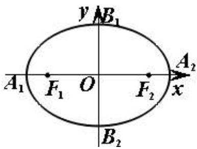
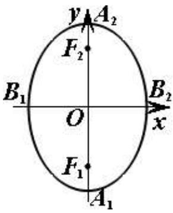
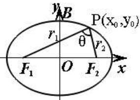
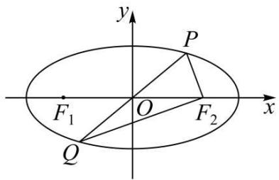
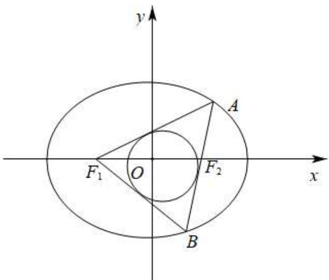
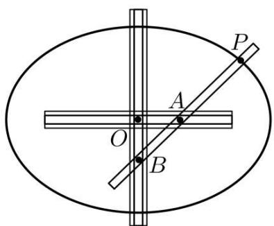
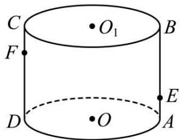
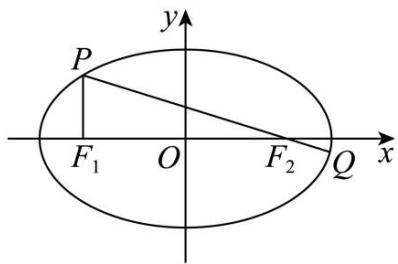
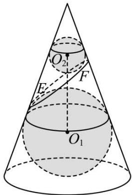
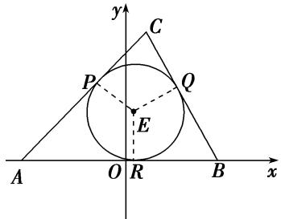

# 第64讲 椭圆及其性质

# 知识梳理

# 知识点一:椭圆的定义

平面内与两个定点 $F_{1}, F_{2}$ 的距离之和等于常数 $2a(2a > |F_{1}F_{2}|)$ 的点的轨迹叫做椭圆，这两个定点叫做椭圆的焦点，两焦点的距离叫做椭圆的焦距，记作 2c，定义用集合语言表示为：

$$
\left. \right.\left\{\mathrm{P} \mid \left| \mathrm{PF} _ {1} \right| + \left| \mathrm{PF} _ {2} \right| = 2 a (2 a > \left| \mathrm{F} _ {1} \mathrm{F} _ {2} \right| = 2 c > 0) \right\}
$$

注意: 当 2a = 2c 时, 点的轨迹是线段;

当 $2a < 2c$ 时，点的轨迹不存在.

# 知识点二:椭圆的方程、图形与性质

椭圆的方程、图形与性质所示.

<table><tr><td>焦点的位置</td><td>焦点在x轴上</td><td colspan="2">焦点在y轴上</td></tr><tr><td>图形</td><td></td><td colspan="2"></td></tr><tr><td>标准方程</td><td> $\frac{x^2}{a^2} + \frac{y^2}{b^2} = 1 (a > b > 0)$ </td><td colspan="2"> $\frac{y^2}{a^2} + \frac{x^2}{b^2} = 1 (a > b > 0)$ </td></tr><tr><td>统一方程</td><td colspan="3"> $mx^2 + ny^2 = 1 (m > 0, n > 0, m \neq n)$ </td></tr><tr><td>参数方程</td><td colspan="2"> $\begin{cases} x = a\cos\theta \\ y = b\sin\theta \end{cases}, \theta \text{为参数} (\theta \in [0,2\pi])$ </td><td> $\begin{cases} x = a\cos\theta \\ y = b\sin\theta \end{cases}, \theta \text{为参数} (\theta \in [0,2\pi])$ </td></tr><tr><td>第一定义</td><td colspan="3">到两定点F1、F2的距离之和等于常数2a,即|MF1|+|MF2|=2a(2a&gt;|F1F2|)</td></tr><tr><td>范围</td><td>-a≤x≤a且-b≤y≤b</td><td colspan="2">-b≤x≤b且-a≤y≤a</td></tr><tr><td>顶点</td><td>A1(-a,0)、A2(a,0)B1(0,-b)、B2(0,b)</td><td colspan="2">A1(0,-a)、A2(0,a)B1(-b,0)、B2(b,0)</td></tr><tr><td>轴长</td><td>长轴长=2a,短轴长=2b</td><td colspan="2">长轴长=2a,短轴长=2b</td></tr><tr><td>对称性</td><td colspan="3">关于x轴、y轴对称,关于原点中心对称</td></tr><tr><td>焦点</td><td colspan="2"> $F_1(-c,0)$ 、 $F_2(c,0)$ </td><td> $F_1(0,-c)$ 、 $F_2(0,c)$ </td></tr><tr><td>焦距</td><td colspan="3"> $|F_1F_2| = 2c(c^2 = a^2 - b^2)$ </td></tr><tr><td>离心率</td><td colspan="3"> $e = \frac{c}{a} = \sqrt{\frac{c^2}{a^2}} = \sqrt{\frac{a^2 - b^2}{a^2}} = \sqrt{1 - \frac{b^2}{a^2}}$ ° (0 &lt; e &lt; 1)</td></tr><tr><td>准线方程</td><td colspan="3"> $x = \pm \frac{a^2}{c}$ </td></tr><tr><td>点和椭圆的关系</td><td> $\frac{x_0^2}{a^2} + \frac{y_0^2}{b^2} \begin{cases} >1 \\ =1 \Leftrightarrow \text{点 } (x_0, y_0) \text{ 在椭} \\ <1 \\ \text{圆} \begin{cases} \text{外} \\ \text{上} \\ \text{内} \end{cases} \end{cases}$ </td><td colspan="2"> $\frac{y_0^2}{a^2} + \frac{x_0^2}{b^2} \begin{cases} >1 \\ =1 \Leftrightarrow \text{点 } (x_0, y_0) \text{ 在椭圆} \\ <1 \\ \text{外} \\ \text{内} \end{cases}$ </td></tr><tr><td rowspan="2">切线方程</td><td> $\frac{x_0x}{a^2} + \frac{y_0y}{b^2} = 1((x_0, y_0) \text{ 为切点})$ </td><td colspan="2"> $\frac{y_0y}{a^2} + \frac{x_0x}{b^2} = 1((x_0, y_0) \text{ 为切点})$ </td></tr><tr><td colspan="3">对于过椭圆上一点  $(x_0, y_0)$  的切线方程,只需将椭圆方程中  $x^2$  换为  $x_0x$ , $y^2$  换为  $y_0y$  可得</td></tr><tr><td>切点弦所在的直线方程</td><td> $\frac{x_0x}{a^2} + \frac{y_0y}{b^2} = 1(\text{点 } (x_0, y_0) \text{ 在椭圆外})$ </td><td colspan="2"> $\frac{y_0y}{a^2} + \frac{x_0x}{b^2} = 1(\text{点 } (x_0, y_0) \text{ 在椭圆外})$ </td></tr><tr><td>焦点三角形面积</td><td colspan="3">1 $\cos\theta = \frac{2b^2}{r_1r_2} - 1, \theta_{\max} = \angle F_1BF_2$ ,(B 为短轴的端点)2 $S_{\Delta PF_1F_2} = \frac{1}{2}r_1r_2\sin\theta = b^2\tan\frac{\theta}{2} = \begin{cases} c|y_0|, & \text{焦点在 } x \text{ 轴上} \\ c|x_0|, & \text{焦点在 } y \text{ 轴上} \end{cases} (\theta = \angle F_1PF_2)$ 3 $\begin{cases} \text{当P点在长轴端点时, } (r_1r_2)\min = b^2 \\ \text{当P点在短轴端点时, } (r_1r_2)\max = a^2 \end{cases}$ 焦点三角形中一般要用到的关系是 $\begin{cases} |MF_1| + |MF_2| = 2a(2a > 2c) \\ S_{\Delta PF_1F_2} = \frac{1}{2}|PF_1||PF_2|\sin\angle F_1PF_2) \\ |F_1F_2|^2 = |PF_1|^2 + |PF_2|^2 - 2|PF_1||PF_2|\cos\angle F_1PF_2 \end{cases}$ </td></tr><tr><td>焦半径</td><td>左焦半径: $|MF_1| = a + ex_0$ </td><td colspan="2">上焦半径: $|MF_1| = a - ey_0$ </td></tr><tr><td rowspan="2"></td><td>又焦半径: |MF1|=a−ex0</td><td colspan="2">下焦半径: |MF1|=a+ey0</td></tr><tr><td colspan="3">焦半径最大值a+c,最小值a-c</td></tr><tr><td>通径</td><td colspan="3">过焦点且垂直于长轴的弦叫通径:通径长=2 $\frac{b^{2}}{a}$ (最短的过焦点的弦)</td></tr><tr><td>弦长公式</td><td colspan="3">设直线与椭圆的两个交点为A(x1,y1),B(x2,y2),kAB=k,则弦长|AB|= $\sqrt{1+k^{2}}$ |x1-x2|= $\sqrt{1+k^{2}}\sqrt{(x_{1}-x_{2})^{2}-4x_{1}x_{2}}$ = $\sqrt{1+\frac{1}{k^{2}}}\sqrt{(y_{1}-y_{2})^{2}-4y_{1}y_{2}}=\sqrt{1+k^{2}}\frac{\sqrt{\Delta}}{|a|}$ (其中a是消y后关于x的一元二次方程的x2的系数,Δ是判别式)</td></tr></table>

# 【解题方法总结】

(1) 过椭圆的焦点与椭圆的长轴垂直的直线被椭圆所截得的线段称为椭圆的通径, 其长为 $\frac{2b^{2}}{a}$ .  
①椭圆上到中心距离最小的点是短轴的两个端点,到中心距离最大的点是长轴的两个端点.  
②椭圆上到焦点距离最大和最小的点是长轴的两个端点.

距离的最大值为 $a + c$ ，距离的最小值为 $a - c$

(2)椭圆的切线

①椭圆 $\frac{x^2}{a^2} +\frac{y^2}{b^2} = 1^\circ (a > b > 0)$ 上一点 $\mathrm{P}(x_0,y_0)$ 处的切线方程是 $\frac{x_0x}{a^2} +\frac{y_0y}{b^2} = 1;$   
②过椭圆 $\frac{x^2}{a^2} +\frac{y^2}{b^2} = 1^{\circ}$ （ $a > b > 0$ )外一点 $\mathrm{P}(x_0,y_0)$ ，所引两条切线的切点弦方程是 $\frac{x_0x}{a^2} +\frac{y_0y}{b^2} = 1;$   
③椭圆 $\frac{x^2}{a^2} +\frac{y^2}{b^2} = 1^\circ (a > b > 0)$ 与直线 $\mathrm{Ax} + \mathrm{By} + \mathrm{C} = 0$ 相切的条件是 $\mathrm{A}^2 a^2 +\mathrm{B}^2 b^2$ $= c^{2}$

# 必考题型全归纳

# 1 题型一:椭圆的定义与标准方程

3407 (2024·高二课时练习)已知椭圆 C 上任意一点 P(x,y) 都满足关系式 $\sqrt{(x-1)^{2}+y^{2}} + \sqrt{(x+1)^{2}+y^{2}} = 4$ ，则椭圆 C 的标准方程为 \_\_\_\_.  
3408 (2024·山东青岛·统考三模)已知椭圆 C 的长轴长为 4, 它的一个焦点与抛物线 $y = \frac{1}{4} x^2$ 的焦点重合, 则椭圆 C 的标准方程为 \_\_\_\_.  
3409 (2024·全国·高二专题练习)已知椭圆 C: $\frac{x^{2}}{a^{2}} + \frac{y^{2}}{b^{2}} = 1 (a > b > 0)$ 的左、右焦点为 F₁(-1, 0), F₂(1, 0), 且过点 P(1, $\frac{3}{2}$ ), 则椭圆标准方程为 \_\_\_\_.  
3410 (2024·浙江绍兴·绍兴一中校考模拟预测)已知椭圆 E: $\frac{x^{2}}{a^{2}} + \frac{y^{2}}{b^{2}} = 1 (a > b > 0)$ , F 是 E

的左焦点, 过 E 的上顶点 A 作 AF 的垂线交 E 于点 B. 若直线 AB 的斜率为 $-\sqrt{3}$ , $\triangle ABF$ 的面积为 $\frac{\sqrt{3}}{13}$ , 则 E 的标准方程为 \_\_\_\_.

3411 (2024·全国·高二专题练习)已知椭圆焦点在 x 轴, 它与椭圆 $\frac{x^{2}}{4} + \frac{y^{2}}{3} = 1$ 有相同离心率且经过点 $(2, -\sqrt{3})$ , 则椭圆标准方程为 \_\_\_\_.

3412 (2024·北京·高二北大附中校考期末)与双曲线 $4y^{2} - 3x^{2} = 12$ 有相同焦点,且长轴长为6的椭圆标准方程为 \_\_\_\_.

3413 (2024·福建福州·高二福建省福州屏东中学校考期末)已知椭圆 E: $\frac{x^{2}}{a^{2}} + \frac{y^{2}}{b^{2}} = 1 (a > b > 0)$ 的左、右焦点分别为 F₁, F₂, 过坐标原点的直线交 E 于 P, Q 两点, 且 PF₂ ⊥ F₂Q, 且 S△PF₂Q = $\frac{1}{2} a^{2}$ , |PF₂| + |F₂Q| = 8, 则 E 的标准方程为 \_\_\_\_.

text_image

y
P
F₁ O F₂ x
Q

3414 (2024·山东青岛·高二青岛二中校考期中)过点 $(\sqrt{5}, -\sqrt{3})$ ，且与椭圆 $\frac{x^{2}}{25} + \frac{y^{2}}{9} = 1$ 有相同的焦点的椭圆标准方程是 \_\_\_\_.

3415 (2024·浙江丽水·高三校考期中)我们把焦点在同一条坐标轴上,且离心率相同的椭圆叫做“相似椭圆”. 若椭圆 E: $\frac{x^{2}}{16} + \frac{y^{2}}{12} = 1$ , 则以椭圆 E 的焦点为顶点的相似椭圆 F 的标准方程为 \_\_\_\_.

3416 (2024·全国·高三专题练习)已知椭圆 C: $\frac{x^{2}}{a^{2}} + \frac{y^{2}}{b^{2}} = 1 (a > b > 0)$ 的左、右焦点分别为 $F_{1}, F_{2}$ ，左、右顶点分别为 M, N，过 $F_{2}$ 的直线 l 交 C 于 A，B 两点 (异于 M、N)， $\triangle AF_{1}B$ 的周长为 $4\sqrt{3}$ ，且直线 AM 与 AN 的斜率之积为 $-\frac{2}{3}$ ，则椭圆 C 的标准方程为 \_\_\_\_.

3417 (2024·高二课时练习)已知椭圆 C 的焦点在坐标轴上,且经过 A(- $\sqrt{3}$ , -2) 和 B(-2 $\sqrt{3}$ , 1) 两点,则椭圆 C 的标准方程为 \_\_\_\_.

# 2 题型二:椭圆方程的充要条件

3418 (2024·全国·高三对口高考)若 $\theta$ 是任意实数, 方程 $x^{2}\sin\theta + y^{2}\cos\theta = 5$ 表示的曲线不可能是 ()

A. 圆

B. 抛物线

C. 椭圆

D. 双曲线

3419 (2024·上海徐汇·位育中学校考三模)已知 $m \in R$ ，则方程 $(2-m)x^{2} + (m+1)y^{2} = 1$ 所表示的曲线为 C，则以下命题中正确的是（）

A. 当 $m \in \left(\frac{1}{2}, 2\right)$ 时, 曲线 C 表示焦点在 $x$ 轴上的椭圆

B. 当曲线 C 表示双曲线时, m 的取值范围是 $(2, +\infty)$   
C. 当 m=2 时, 曲线 C 表示一条直线  
D. 存在 $m \in R$ ，使得曲线 C 为等轴双曲线

3420 (2024·全国·高三专题练习)已知方程 $Ax^{2} + By^{2} + Cxy + Dx + Ey + F = 0$ ，其中 $A \geqslant B \geqslant C \geqslant D \geqslant E \geqslant F$ 。现有四位同学对该方程进行了判断，提出了四个命题：

甲:可以是圆的方程；乙:可以是抛物线的方程；

丙:可以是椭圆的标准方程；丁:可以是双曲线的标准方程.

其中,真命题有 ( )

A. 1 个

B. 2 个

C. 3 个

D. 4 个

3421 (2024·全国·高三专题练习)“0<a<1, 0<b<1”是“方程 $ax^{2}=1-by^{2}$ 表示的曲线为椭圆”的()

A. 充要条件

B. 必要不充分条件

C. 充分不必要条件

D. 既不充分也不必要条件

3422 (2024·云南楚雄·高三统考期末)已知曲线 C: $\frac{x^{2}}{4a} + \frac{y^{2}}{3a + 2} = 1$ ，则“a > 0”是“曲线 C 是椭圆”的（）

A. 充要条件

B. 充分不必要条件

C. 必要不充分条件

D. 既不充分也不必要条件

3423 (2024·全国·高三专题练习)设 a 为实数, 则曲线 C: $x^{2}-\frac{y^{2}}{1-a^{2}}=1$ 不可能是 ( )

A. 抛物线

B. 双曲线

C. 圆

D. 椭圆

3424 (2024·广西钦州·高三校考阶段练习)“1<k<5”是方程“ $\frac{x^{2}}{k-1}+\frac{y^{2}}{5-k}=1$ 表示椭圆”的()

A. 充分不必要条件

B. 必要不充分条件

C. 充要条件

D. 既不充分又不必要条

# 3 题型三:椭圆中焦点三角形的周长与面积及其他问题

3425 (2024·贵州黔东南·高三校考阶段练习)已知点A，B是椭圆C: $\frac{x^{2}}{9}+\frac{y^{2}}{4}=1$ 上关于原点对称的两点， $F_{1},F_{2}$ 分别是椭圆C的左、右焦点，若 $|AF_{1}|=2$ ，则 $|BF_{1}|=$ （）

A. 1

B. 2

C. 4

D. 5

3426 (2024·北京·高三强基计划)如图, 过椭圆 $\frac{x^{2}}{4} + \frac{y^{2}}{3} = 1$ 的右焦点 $F_{2}$ 作一条直线, 交椭圆于 A, B 两点, 则 $\triangle F_{1}AB$ 的内切圆面积可能是 ()

text_image

y
A
F₁ O F₂ x
B

A. 1

B. 2

C. 3

D. 4

3427 (2024·江西·高三统考阶段练习)已知椭圆 C: $\frac{x^{2}}{a^{2}} + y^{2} = 1 (a > 1)$ , F₁, F₂ 为两个焦点, P 为椭圆 C 上一点, 若 $\Delta PF_{1}F_{2}$ 的周长为 4, 则 a = ()

A. 2

B. 3

C. $\frac{3}{2}$

D. $\frac{5}{4}$

3428 (2024·河南·高三阶段练习)已知 $F_{1}, F_{2}$ 分别为椭圆 C: $\frac{x^{2}}{a^{2}} + \frac{y^{2}}{12} = 1 (a > 2\sqrt{3})$ 的两个焦点，且 C 的离心率为 $\frac{1}{2}$ ，P 为椭圆 C 上的一点，则 $\Delta PF_{1}F_{2}$ 的周长为（）

A. 6

B. 9

C. 12

D. 15

3429 (2024·全国·校联考模拟预测)已知椭圆 $\mathrm{E}:\frac{x^2}{a^2} +\frac{y^2}{b^2} = 1(a > b > 0)$ 的左顶点为A，上顶点为B，左、右焦点分别为 $\mathrm{F}_1,\mathrm{F}_2$ ，延长 $\mathrm{BF}_2$ 交椭圆E于点P．若点A到直线 $\mathrm{BF}_2$ 的距离为 $\frac{16\sqrt{2}}{3},\Delta \mathrm{PF}_1\mathrm{F}_2$ 的周长为16，则椭圆E的标准方程为 （）

A. $\frac{x^2}{25} +\frac{y^2}{16} = 1$

B. $\frac{x^2}{36} +\frac{y^2}{32} = 1$

C. $\frac{x^2}{49} +\frac{y^2}{48} = 1$

D. $\frac{x^2}{100} +\frac{y^2}{64} = 1$

3430 (2024·广东梅州·统考三模)已知椭圆 C: $\frac{x^{2}}{9} + \frac{y^{2}}{5} = 1$ 的左、右焦点分别为 F₁, F₂, 过点 F₂ 的直线 l 与椭圆 C 的一个交点为 A, 若 $|AF_{2}| = 4$ , 则 $\triangle AF_{1}F_{2}$ 的面积为 ( )

A. $2 \sqrt{3}$

B. $\sqrt{13}$

C. 4

D. $\sqrt{15}$

3431 (2024·广东广州·高三华南师大附中校考开学考试)椭圆 $E:\frac{x^{2}}{4}+\frac{y^{2}}{3}=1(a>b>0)$ 的两焦点分别为 $F_{1}, F_{2}, A$ 是椭圆 E 上一点，当 $\triangle F_{1}AF_{2}$ 的面积取得最大值时， $\angle F_{1}AF_{2}=$ ()

A. $\frac{\pi}{6}$

B. $\frac{\pi}{2}$

C. $\frac{\pi}{3}$

D. $\frac{2\pi}{3}$

3432 (2024·河南开封·统考三模)已知点 P 是椭圆 $\frac{x^{2}}{25} + \frac{y^{2}}{9} = 1$ 上一点，椭圆的左、右焦点分

别为 $\mathrm{F}_1$ 、 $\mathrm{F}_2$ ，且 $\cos \angle \mathrm{F}_1\mathrm{PF}_2 = \frac{1}{3}$ ，则 $\Delta \mathrm{PF}_1\mathrm{F}_2$ 的面积为 （）

A. 6

B. 12

C. $\frac{9\sqrt{2}}{2}$

D. $2\sqrt{2}$

3433 (2024·全国·高三专题练习)设 $F_{1}, F_{2}$ 为椭圆 C: $\frac{x^{2}}{5} + y^{2} = 1$ 的两个焦点，点 P 在 C 上，若 $\overrightarrow{PF_{1}} \cdot \overrightarrow{PF_{2}} = 0$ ，则 $\left|PF_{1}\right| \cdot \left|PF_{2}\right| =$

A. 1

B. 2

C. 4

D. 5

3434 (2024·全国·高三专题练习)设 O 为坐标原点， $F_{1}, F_{2}$ 为椭圆 C: $\frac{x^{2}}{9} + \frac{y^{2}}{6} = 1$ 的两个焦点，点 P 在 C 上， $\cos\angle F_{1}PF_{2} = \frac{3}{5}$ ，则 $|OP| =$ （）

A. $\frac{13}{5}$

B. $\frac{\sqrt{30}}{2}$

C. $\frac{14}{5}$

D. $\frac{\sqrt{35}}{2}$

3435 (2024·湖南长沙·长郡中学校考模拟预测)若椭圆 C: $\frac{x^{2}}{a^{2}} + \frac{y^{2}}{b^{2}} = 1 (a > b > 0)$ 的离心率为 $\frac{1}{2}$ ，两个焦点分别为 $F_{1}(-c,0)$ ， $F_{2}(c,0) (c > 0)$ ，M 为椭圆 C 上异于顶点的任意一点，点 P 是 $\Delta MF_{1}F_{2}$ 的内心，连接 MP 并延长交 $F_{1}F_{2}$ 于点 Q，则 $\frac{|PM|}{|PQ|} =$ （）

A. 2

B. $\frac{1}{2}$

C. 4

D. $\frac{1}{4}$

3436 (2024·云南昆明·昆明一中校考模拟预测)已知椭圆 C: $\frac{x^{2}}{25} + \frac{y^{2}}{9} = 1$ 的左、右焦点分别为 $F_{1}, F_{2}$ ，直线 y = kx 与椭圆 C 交于 A, B 两点，若 $|AB| = |F_{1}F_{2}|$ ，则 $\triangle ABF_{1}$ 的面积等于（）

A. 18

B. 10

C. 9

D. 6

3437 (2024·贵州黔西·校考一模)设椭圆 C: $\frac{x^{2}}{a^{2}} + \frac{y^{2}}{b^{2}} = 1 (a > b > 0)$ 的左、右焦点分别为 F₁, F₂, 离心率为 $\frac{\sqrt{2}}{2}$ . P 是 C 上一点, 且 F₁P ⊥ F₂P. 若 $\triangle PF_{1}F_{2}$ 的面积为 2, 则 a = ()

A. 1

B. 2

C. $\sqrt{2}$

D. 4

3438 (2024·云南昆明·昆明市第三中学校考模拟预测)已知椭圆 C: $\frac{x^{2}}{9} + \frac{y^{2}}{b^{2}} = 1 (0 < b < 3)$ 的左、右焦点分别为 $F_{1}, F_{2}, P$ 为椭圆上一点，且 $\angle F_{1}PF_{2} = 60^{\circ}$ ，若 $F_{1}$ 关于 $\angle F_{1}PF_{2}$ 平分线的对称点在椭圆 C 上，则 $\triangle F_{1}PF_{2}$ 的面积为（）

A. $6\sqrt{3}$

B. $3 \sqrt{3}$

C. $2 \sqrt{3}$

D. $\sqrt{3}$

3439 (2024·四川绵阳·高三绵阳南山中学实验学校校考阶段练习)在椭圆中,已知焦距为2,椭圆上的一点P与两个焦点 $F_{1},F_{2}$ 的距离的和等于4,且 $\angle PF_{1}F_{2}=120^{\circ}$ ,则 $\triangle PF_{1}F_{2}$ 的面积为()

A. $\frac{3\sqrt{3}}{7}$

B. $\frac{2\sqrt{3}}{5}$

C. $\frac{3\sqrt{3}}{4}$

D. $\frac{3\sqrt{3}}{5}$

3440 (2024·河北唐山·统考三模)已知椭圆 $\mathrm{C}:\frac{x^2}{2} +y^2 = 1$ 的两个焦点分别为 $\mathrm{F}_1,\mathrm{F}_2$ ，点M为C

上异于长轴端点的任意一点， $\angle \mathrm{F}_1\mathrm{MF}_2$ 的角平分线交线段 $\mathrm{F_1F_2}$ 于点N，则 $\frac{|\mathrm{MF}_2|}{|\mathrm{F}_2\mathrm{N}|} = (\quad)$

A. $\frac{1}{5}$

B. $\frac{\sqrt{10}}{5}$

C. $\frac{\sqrt{2}}{2}$

D. $\sqrt{2}$

# 4 题型四:椭圆上两点距离的最值问题

3441 (2024·湖南·校联考二模)已知 $F_{1}, F_{2}$ 分别为椭圆 C: $\frac{x^{2}}{6} + \frac{y^{2}}{2} = 1$ 的两个焦点, P 为椭圆上一点, 则 $|PF_{1}|^{2} + |PF_{2}|^{2} - 2|PF_{1}||PF_{2}|$ 的最大值为 ()

A. 64

B. 16

C. 8

D. 4

3442 (2024·云南·高三校联考阶段练习)已知 A(3,0), B(-3,0), P 是椭圆 $\frac{x^{2}}{25} + \frac{y^{2}}{16} = 1$ 上的任意一点，则 $|PA| \cdot |PB|$ 的最大值为 ()

A. 9

B. 16

C. 25

D. 50

3443 (2024·河南·高三期末)已知 P 是椭圆 C: $\frac{x^{2}}{16} + \frac{y^{2}}{12} = 1$ 上的动点，且与 C 的四个顶点不重合， $F_{1}, F_{2}$ 分别是椭圆的左、右焦点，若点 M 在 $\angle F_{1}PF_{2}$ 的平分线上，且 $\overrightarrow{MF_{1}} \cdot \overrightarrow{MP} = 0$ ，则 |OM| 的取值范围是（）

A. $(0,2)$

B. $(0,2\sqrt{3})$

C. $(0,4 - 2\sqrt{3})$

D. $(0,1)$

3444 (2024·重庆沙坪坝·高三重庆八中校考阶段练习)已知 $F_{1}, F_{2}$ 是椭圆 C: $\frac{x^{2}}{4} + \frac{y^{2}}{3} = 1$ 的两个焦点，点 P 在 C 上，则 $|PF_{1}|^{2} + |PF_{2}|^{2}$ 的取值范围是 ()

A. $[1,16]$

B. $[4,10]$

C. [8,10]

D. $[8,16]$

3445 (2024·全国·高三专题练习)若椭圆 C: $\frac{x^{2}}{4} + \frac{y^{2}}{3} = 1$ ，则该椭圆上的点到焦点距离的最大值为（）

A. 3

B. $2 + \sqrt{3}$

C. 2

D. $\sqrt{3} + 1$

3446 (2024·全国·高三专题练习)已知点M在椭圆 $\frac{x^2}{18} +\frac{y^2}{9} = 1$ 上运动，点N在圆 $x^{2}+$ $(y - 1)^{2} = 1$ 上运动，则 $|\mathrm{MN}|$ 的最大值为 （）

A. $1 + \sqrt{19}$

B. $1 + 2\sqrt{5}$

C. 5

D. 6

# 5 题型五:椭圆上两线段的和差最值问题

3447 (2024·北京·高三强基计划) 设实数 $x, y$ 满足 $\frac{x^2}{5} + \frac{y^2}{4} = 1$ ，则 $\sqrt{x^2 + y^2 - 2y + 1} + \sqrt{x^2 + y^2 - 2x + 1}$ 的最小值为 （）

A. $2 \sqrt{2}$

B. $2 \sqrt{5} - 2$

C. $2 \sqrt{5} - \sqrt{2}$

D. 前三个答案都不对

3448 (2024·甘肃定西·统考模拟预测)已知椭圆 C: $\frac{x^{2}}{9} + \frac{y^{2}}{5} = 1$ 的左、右焦点分别为 $F_{1}, F_{2}, A$ 是 C 上一点，B(2,1)，则 $|AB| + |AF_{1}|$ 的最大值为（）

A. 7

B. 8

C. 9

D. 11

3449 (2024·江苏·统考三模)已知 F 为椭圆 C: $\frac{x^2}{4} + y^2 = 1$ 的右焦点, P 为 C 上一点, Q 为圆 M: $x^2 + (y - 3)^2 = 1$ 上一点, 则 PQ + PF 的最大值为 ( )

A. 3

B. 6

C. $4 + 2\sqrt{3}$

D. $5 + 2\sqrt{3}$

3450 (2024·河北·高三河北衡水中学校考阶段练习)若平面向量 $\vec{a},\vec{b},\vec{c}$ 满足 $|\vec{a}|=|\vec{b}|=1,|\vec{a}+\vec{b}|=|\vec{a}-\vec{b}|$ ，若 $|\vec{c}-\vec{a}|+|\vec{c}-\sqrt{3}\vec{b}|=4$ ，则 $\left|\vec{c}-\vec{a}-\vec{b}\right|+\left|\vec{c}-\sqrt{3}\vec{b}\right|$ 的取值范围为（）

A. $[2,6]$

B. $[2,4]$

C. $[4,6]$

D. $[3,5]$

3451 (2024·广东·高三校联考阶段练习)已知椭圆 C: $\frac{x^{2}}{16} + \frac{y^{2}}{7} = 1$ 的左焦点为 F, P 是 C 上一点, M(3,1), 则 $|PM| + |PF|$ 的最大值为 ( )

A. 7

B. 8

C. 9

D. 11

3452 (2024·全国·高三专题练习)已知点P为椭圆 $\frac{x^{2}}{4}+\frac{y^{2}}{3}=1$ 上任意一点，点M、N分别为 $(x-1)^{2}+y^{2}=1$ 和 $(x+1)^{2}+y^{2}=1$ 上的点，则 $|PM|+|PN|$ 的最大值为()

A. 4

B. 5

C. 6

D. 7

3453 (2024·全国·高三专题练习)已知 $F_{1}$ ， $F_{2}$ 分别为椭圆 C: $\frac{x^{2}}{4} + y^{2} = 1$ 的两个焦点，P 为椭圆上一点，则 $|PF_{1}| - |PF_{2}|$ 的最大值为（）

A. 2

B. $2 \sqrt{3}$

C. 4

D. $4 \sqrt{3}$

3454 (2024·全国·高三专题练习)已知椭圆 $\frac{x^{2}}{25}+\frac{y^{2}}{16}=1$ 外一点 A(5,6), l 为椭圆的左准线，P 为椭圆上动点，点 P 到 l 的距离为 d，则 $|PA|+\frac{3}{5}d$ 的最小值为（）

A. 8

B. 10

C. 12

D. 14

3455 (2024·全国·高三专题练习)已知椭圆 C: $\frac{x^{2}}{4} + \frac{y^{2}}{3} = 1$ 的右焦点为 F, P 为椭圆 C 上一动点, 定点 A(2,4), 则 $|PA| - |PF|$ 的最小值为 ( )

A. 1

B.-1

C. $\sqrt{17}$

D. $-\sqrt{17}$

# 题型六:离心率的值及取值范围

# 方向1: 利用椭圆定义去转换

3456 (2024·四川成都·高三成都市锦江区嘉祥外国语高级中学校考开学考试)如图,某同学用两根木条钉成十字架,制成一个椭圆仪.木条中间挖一道槽,在另一活动木条PAB的P处钻一个小孔,可以容纳笔尖,A,B各在一条槽内移动,可以放松移动以保证PA与PB的长度不变,当A,B各在一条槽内移动时,P处笔尖就画出一个椭圆E.已知 $|PA|=2|AB|$ ,且P在右顶点时,B恰好在O点,则E的离心率为()

text_image

P
A
O
B

A. $\frac{1}{2}$

B. $\frac{2}{3}$

C. $\frac{2\sqrt{5}}{5}$

D. $\frac{\sqrt{5}}{3}$

3457 (2024·全国·高三专题练习)设椭圆 $E: \frac{x^{2}}{a^{2}} + \frac{y^{2}}{b^{2}} = 1 (a > b > 0)$ 的一个焦点为 $F(2,0)$ ，点 A(-2,1) 为椭圆 E 内一点，若椭圆 E 上存在一点 P，使得 $|PA| + |PF| = 8$ ，则椭圆 E 的离心率的取值范围是（）

A. $\left[\frac{4}{9},\frac{4}{7}\right]$

B. $\left(\frac{4}{9},\frac{4}{7}\right]$

C. $\left[\frac{2}{9},\frac{2}{7}\right)$

D. $\left[\frac{2}{9},\frac{2}{7}\right]$

3458 (2024·安徽·高三安徽省宿松中学校联考开学考试)已知椭圆 C 的左右焦点分别为 $F_{1}$ ， $F_{2}$ ，P，Q 为 C 上两点， $2\overrightarrow{PF_{2}} = 3\overrightarrow{F_{2}Q}$ ，若 $\overrightarrow{PF_{1}} \perp \overrightarrow{PF_{2}}$ ，则 C 的离心率为（）

A. $\frac{3}{5}$

B. $\frac{4}{5}$

C. $\frac{\sqrt{13}}{5}$

D. $\frac{\sqrt{17}}{5}$

3459 (2024·湖北·高三孝感高中校联考开学考试)如图,已知圆柱底面半径为2,高为3,ABCD是轴截面,E,F分别是母线AB,CD上的动点(含端点),过EF与轴截面ABCD垂直的平面与圆柱侧面的交线是圆或椭圆,当此交线是椭圆时,其离心率的取值范围是()

text_image

C
F
O₁
B
D
O
E
A

A. $\left(0,\frac{3}{5}\right]$

B. $\left(0,\frac{4}{5}\right]$

C. $\left[\frac{3}{5},1\right)$

D. $\left[\frac{4}{5},1\right)$

3460 (2024·湖北·高三校联考阶段练习)已知 $F_{1}$ ， $F_{2}$ 分别是椭圆 C: $\frac{x^{2}}{a^{2}} + \frac{y^{2}}{b^{2}} = 1 (a > b > 0)$ 的左，右焦点，M, N 是椭圆 C 上两点，且 $\overrightarrow{MF_{1}} = 2\overrightarrow{F_{1}N}$ ， $\overrightarrow{MF_{2}} \cdot \overrightarrow{MN} = 0$ ，则椭圆 C 的离心率为（）

A. $\frac{3}{4}$

B. $\frac{2}{3}$

C. $\frac{\sqrt{5}}{3}$

D. $\frac{\sqrt{7}}{4}$

3461 (2024·重庆巴南·统考一模)椭圆 C: $\frac{x^{2}}{a^{2}} + \frac{y^{2}}{b^{2}} = 1 (a > b > 0)$ 的左右焦点为 F₁, F₂, 点 P 为椭圆上不在坐标轴上的一点, 点 M, N 满足 $\overrightarrow{F_{1}M} = \overrightarrow{MP}, 2\overrightarrow{ON} = \overrightarrow{OP} + \overrightarrow{OF_{2}}$ , 若四边形 MONP 的周长等于 4b, 则椭圆 C 的离心率为 e = ()

A. $\frac{1}{2}$

B. $\frac{\sqrt{2}}{2}$

C. $\frac{\sqrt{3}}{2}$

D. $\frac{\sqrt{6}}{3}$

3462 (2024·黑龙江哈尔滨·哈尔滨市第六中学校校考三模)已知 M, N 是椭圆 $\frac{x^{2}}{a^{2}} + \frac{y^{2}}{b^{2}} = 1 (a > b > 0)$ 上关于原点 O 对称的两点，P 是椭圆 C 上异于 M, N 的点，且 $\overrightarrow{PM} \cdot \overrightarrow{PN}$ 的最大值是 $\frac{1}{2} a^{2}$ ，则椭圆 C 的离心率是（）

A. $\frac{1}{3}$

B. $\frac{1}{2}$

C. $\frac{\sqrt{2}}{2}$

D. $\frac{\sqrt{3}}{3}$

3463 (2024·四川绵阳·高三盐亭中学校考阶段练习)椭圆 $\tau:\frac{x^{2}}{a^{2}}+\frac{y^{2}}{b^{2}}=1(a>b>0)$ 的左、右焦点分别为 $F_{1},F_{2}$ ，焦距为 2c，若直线 $y=\frac{\sqrt{3}}{3}(x+c)$ 与椭圆 $\tau$ 的一个交点为 M 在 x 轴上方，满足 $\angle F_{1}MF_{2}=\frac{3}{2}\angle MF_{2}F_{1}$ ，则该椭圆的离心率为（）

A. $\sqrt{3} - 1$

B. $\frac{\sqrt{5}-1}{2}$

C. $\sqrt{5} - 1$

D. $\frac{\sqrt{3}-1}{2}$

3464 (2024·广东深圳·高三校考阶段练习)已知椭圆E: $\frac{x^2}{a^2} +\frac{y^2}{b^2} = 1(a > b > 0)$ 的右焦点为 $\mathrm{F}_2$ ，左顶点为 $\mathrm{A}_1$ ，若E上的点P满足 $\mathrm{PF}_2\bot x$ 轴， $\tan \angle \mathrm{PA}_1\mathrm{F}_2 = \frac{1}{2}$ ，则E的离心率为 （）

A. $\frac{1}{2}$

B. $\frac{2}{5}$

C. $\frac{1}{4}$

D. $\frac{1}{5}$

3465 (2024·广东广州·高三华南师大附中校考阶段练习)已知 O 为坐标原点, $P(x_1, y_1)$ 是椭圆 $E: \frac{x^2}{a^2} + \frac{y^2}{b^2} = 1 (a > b > 0)$ 上一点 $(x_1 > 0)$ , F 为右焦点. 延长 PO, PF 交椭圆 E 于 D, G 两点, $\overrightarrow{DF} \cdot \overrightarrow{FG} = 0$ , $|DF| = 4|FG|$ , 则椭圆 E 的离心率为 ( )

A. $\frac{\sqrt{5}}{3}$

B. $\frac{\sqrt{17}}{5}$

C. $\frac{\sqrt{17}}{6}$

D. $\frac{\sqrt{10}}{5}$

3466 (2024·河南开封·校考模拟预测)已知椭圆 C: $\frac{x^{2}}{a^{2}} + \frac{y^{2}}{b^{2}} = 1 (a > b > 0)$ ，A，B 分别是 C 的左顶点和上顶点，F 是 C 的左焦点，若 $\tan \angle FAB = 2 \tan \angle FBA$ ，则 C 的离心率为（）

A. $\frac{1}{2}$

B. $\frac{\sqrt{3}}{2}$

C. $\frac{3-\sqrt{5}}{2}$

D. $\frac{\sqrt{5}-1}{2}$

3467 (2024·山东泰安·统考模拟预测)已知椭圆 C: $\frac{x^{2}}{a^{2}} + \frac{y^{2}}{b^{2}} = 1 (a > b > 0)$ 的左、右焦点分别是 $F_{1}, F_{2}$ ，斜率为 1 的直线经过左焦点 $F_{1}$ 且交 C 于 A, B 两点（点 A 在第一象限），设 $\triangle AF_{1}F_{2}$ 的内切圆半径为 $r_{1}, \triangle BF_{1}F_{2}$ 的内切圆半径为 $r_{2}$ ，若 $\frac{r_{1}}{r_{2}} = 2$ ，则椭圆的离心率的值为（）

A. $\frac{1}{3}$

B. $\frac{1}{2}$

C. $\frac{\sqrt{3}}{3}$

D. $\frac{\sqrt{2}}{3}$

3468 (2024·全国·模拟预测)已知椭圆 $\frac{x^{2}}{a^{2}}+\frac{y^{2}}{b^{2}}=1(a>b>0)$ 的左顶点为 A, 右焦点为 F, B 为椭圆上一点, $\overrightarrow{AF}\cdot\overrightarrow{BF}=0$ , $\cos\angle BAF=\frac{12}{13}$ , 则椭圆的离心率为 ()

A. $\frac{7}{13}$

B. $\frac{3}{4}$

C. $\frac{1}{3}$

D. $\frac{7}{12}$

3469 (2024·湖北荆州·沙市中学校考模拟预测)已知椭圆 C: $\frac{x^{2}}{a^{2}} + \frac{y^{2}}{b^{2}} = 1 (a > b > 0)$ ，F 为其左焦点，直线 $y = kx (k > 0)$ 与椭圆 C 交于点 A, B，且 AF ⊥ AB。若 $\angle ABF = 30^{\circ}$ ，则椭圆 C 的离心率为（）

A. $\frac{\sqrt{7}}{3}$

B. $\frac{\sqrt{6}}{3}$

C. $\frac{\sqrt{7}}{6}$

D. $\frac{\sqrt{6}}{6}$

3470 (2024·四川成都·高三树德中学校考开学考试)已知 $F_{1}$ 、 $F_{2}$ 是椭圆的两个焦点，满足 $\overrightarrow{MF_{1}} \cdot \overrightarrow{MF_{2}} = 0$ 的点 M 总在椭圆内部，则椭圆离心率的取值范围是（）

A. $\left(0,\frac{\sqrt{2}}{2}\right)$

B. $\left(0,\frac{1}{2}\right]$

C. $(0,1)$

D. $\left[\frac{\sqrt{2}}{2},1\right)$

3471 (2024·全国·高三专题练习)设 $F_{1}$ 、 $F_{2}$ 是椭圆 $\frac{x^{2}}{a^{2}} + \frac{y^{2}}{b^{2}} = 1 (a > b > 0)$ 的左、右焦点，若椭圆外存在点 P 使得 $\overrightarrow{PF_{1}} \cdot \overrightarrow{PF_{2}} = 0$ ，则椭圆的离心率的取值范围 \_\_\_\_。

3472 (2024·北京丰台二中高三阶段练习)已知 $F_{1}, F_{2}$ 分别是某椭圆的两个焦点, 若该椭圆上存在点 P 使得 $\angle F_{1}PF_{2}=2\theta(0<\theta<\frac{\pi}{2},\theta$ 是已知数), 则该椭圆离心率的取值范围是 \_\_\_\_.

3473 (2024·广东·广州市真光中学高三开学考试)已知椭圆 $\frac{x^{2}}{a^{2}} + \frac{y^{2}}{b^{2}} = 1 (a > b > 0)$ 的左、右焦点分别为 $F_{1}, F_{2}$ ，若椭圆上存在一点 P 使得 $\angle F_{1}PF_{2} = \frac{2}{3}\pi$ ，则该椭圆离心率的取值范围是 \_\_\_\_.

3474 (2024·云南·校联考模拟预测)已知椭圆 E: $\frac{x^{2}}{a^{2}} + \frac{y^{2}}{b^{2}} = 1 (a > b > 0)$ 的左、右焦点分别为 F₁, F₂(如图), 过 F₂ 的直线交 E 于 P, Q 两点, 且 PF₁ ⊥ x 轴, |PF₂| = 9 |F₂Q|, 则 E 的离心率为 ( )

text_image

P
F₁ O F₂ Q
x
y

A. $\frac{\sqrt{6}}{3}$

B. $\frac{1}{2}$

C. $\frac{\sqrt{3}}{3}$

D. $\frac{\sqrt{3}}{2}$

3475 (2024·湖北武汉·华中师大一附中校考模拟预测)已知椭圆 C: $\frac{x^{2}}{a^{2}} + \frac{y^{2}}{b^{2}} = 1 (a > b > 0)$ 的左焦点为 F，离心率为 e．倾斜角为 $120^{\circ}$ 的直线与 C 交于 A, B 两点，并且满足 $\frac{|AB|}{|AF| - |BF|} = \frac{1}{e^{2}}$ ，则 C 的离心率为（）

A. $\frac{1}{2}$

B. $\frac{\sqrt{3}}{3}$

C. $\frac{\sqrt{3}}{2}$

D. $\frac{\sqrt{6}}{3}$

3476 (2024·广东佛山·校考模拟预测)已知椭圆 C: $\frac{y^{2}}{a^{2}} + \frac{x^{2}}{b^{2}} = 1 (a > b > 0)$ 的下焦点为 F, 右顶

点为A，直线AF交椭圆C于另一点B，且 $\mathrm{AF} = 2\mathrm{FB}$ ，则椭圆C的离心率是 （）

A. $\sqrt{3} - 1$

B. $\frac{\sqrt{2}}{2}$

C. $\frac{\sqrt{3}}{3}$

D. $\sqrt{2} - 1$

3477 (2024·上海浦东新·华师大二附中校考模拟预测)设 M 是椭圆 C: $\frac{x^{2}}{a^{2}} + \frac{y^{2}}{b^{2}} = 1 (a > b > 0)$ 的上顶点，P 是 C 上的一个动点．当 P 运动到下顶点时，|PM| 取得最大值，则 C 的离心率的取值范围是（）

A. $\left[\frac{\sqrt{2}}{2},1\right)$

B. $\left(0,\frac{\sqrt{2}}{2}\right]$

C. $\left[\frac{1}{2},1\right)$

D. $\left(0,\frac{1}{2}\right]$

3478 (2024·安徽·高三宿城一中校联考阶段练习)已知椭圆 C: $\frac{x^{2}}{a^{2}} + \frac{y^{2}}{b^{2}} = 1 (a > b > 0)$ 的左焦点为 $F_{1}$ ，过左焦点 $F_{1}$ 作倾斜角为 $\frac{\pi}{6}$ 的直线交椭圆于 A，B 两点，且 $\overrightarrow{AF_{1}} = 3\overrightarrow{F_{1}B}$ ，则椭圆 C 的离心率为（）

A. $\frac{1}{2}$

B. $\frac{2}{3}$

C. $\frac{\sqrt{3}}{3}$

D. $\frac{2\sqrt{2}}{3}$

3479 (2024·浙江温州·乐清市知临中学校考二模)已知椭圆 $\frac{x^{2}}{a^{2}} + \frac{y^{2}}{b^{2}} = 1$ 的右焦点为 $F_{2}$ ，过右焦点作倾斜角为 $\frac{\pi}{3}$ 的直线交椭圆于 G,H 两点，且 $\overrightarrow{GF_{2}} = 2\overrightarrow{F_{2}H}$ ，则椭圆的离心率为（）

A. $\frac{1}{2}$

B. $\frac{\sqrt{2}}{2}$

C. $\frac{2}{3}$

D. $\frac{\sqrt{3}}{2}$

3480 (2024·湖南·高三校联考阶段练习)已知椭圆 C: $\frac{x^{2}}{4} + \frac{y^{2}}{b^{2}} = 1 (0 < b < 2)$ 的左, 右焦点为 $F_{1}, F_{2}$ , 离心率为 $\frac{\sqrt{2}}{2}$ , 又点 A, B 是椭圆 C 上异于长轴端点的两点, 且满足 $\overrightarrow{AF_{1}} = \lambda \overrightarrow{F_{1}B}$ , 若 AB ⊥ AF₂, 则 $\lambda =$ ()

A. 5

B. 4

C. 3

D. 2

3481 (2024·湖南邵阳·邵阳市第二中学校考模拟预测)已知 $F_{1}$ ， $F_{2}$ 是椭圆 C: $\frac{x^{2}}{a^{2}} + \frac{y^{2}}{b^{2}} = 1 (a > b > 0)$ 的左、右焦点，A 是 C 的上顶点，点 P 在过 A 且斜率为 $2\sqrt{3}$ 的直线上， $\triangle PF_{1}F_{2}$ 为等腰三角形， $\angle PF_{1}F_{2} = 120^{\circ}$ ，则 C 的离心率为（）

A. $\frac{\sqrt{10}}{10}$

B. $\frac{\sqrt{7}}{14}$

C. $\frac{\sqrt{3}}{9}$

D. $\frac{1}{4}$

3482 (2024·全国·高三对口高考)在平面直角坐标系中,椭圆 $\frac{x^{2}}{a^{2}}+\frac{y^{2}}{b^{2}}=1(a>b>0)$ 的焦距为 2c,以原点 O 为圆心,a 为半径作圆 O,过点 $\left(\frac{a^{2}}{c},0\right)$ 作圆 O 的两切线互相垂直,则该椭圆的离心率为 ()

A. $\frac{1}{2}$

B. $\frac{1}{3}$

C. $\frac{\sqrt{3}}{3}$

D. $\frac{\sqrt{2}}{2}$

3483 (2024·四川泸州·高三四川省泸县第一中学校考开学考试)已知 $\mathrm{F}_1, \mathrm{F}_2$ 分别是椭圆 $\mathrm{C}:\frac{x^2}{a^2}$ $+\frac{y^{2}}{b^{2}}=1(a>b>0)$ 的左、右焦点，M是C上一点且 $MF_{2}$ 与x轴垂直，直线 $MF_{1}$ 与C的另一个交点为N，若 $\overrightarrow{MF_{1}}=3\overrightarrow{F_{1}N}$ ，则C的离心率为()

A. $\frac{\sqrt{3}}{3}$

B. $\frac{1}{3}$

C. $\frac{\sqrt{3}}{2}$

D. $\frac{2\sqrt{2}}{3}$

3484 (2024·全国·高三专题练习)已知椭圆 C: $\frac{x^{2}}{a^{2}} + \frac{y^{2}}{b^{2}} = 1 (a > b > 0)$ 的右焦点为 F, 过坐标原点 O 的直线 l 与椭圆 C 交于 P, Q 两点, 点 P 位于第一象限, 直线 PF 与椭圆 C 另交于点 A, 且 $\overrightarrow{PF} = \frac{2}{3}\overrightarrow{FA}$ , 若 $\cos\angle AFQ = \frac{1}{3}$ , $|FQ| = 2|FA|$ , 则椭圆 C 的离心率为 ( )

A. $\frac{\sqrt{3}}{4}$

B. $\frac{\sqrt{2}}{2}$

C. $\frac{\sqrt{3}}{3}$

D. $\frac{\sqrt{5}}{4}$

3485 (2024·江苏·高三江苏省前黄高级中学校联考阶段练习)设点 $\mathrm{F}_1$ 、 $\mathrm{F}_2$ 分别为椭圆C: $\frac{x^2}{a^2} + \frac{y^2}{b^2} = 1(a > b > 0)$ 的左右焦点，点M,N在椭圆C上，若 $2\overrightarrow{\mathrm{MF_1}} = 3\overrightarrow{\mathrm{F_1N}},\overrightarrow{\mathrm{MF_2}}^2 = \overrightarrow{\mathrm{MN}}\cdot \overrightarrow{\mathrm{MF_2}}$ 则椭圆C的离心率为 （）

A. $\frac{\sqrt{5}}{5}$

B. $\frac{\sqrt{3}}{3}$

C. $\frac{3}{5}$

D. $\frac{1}{5}$

3486 (2024·湖南衡阳·校联考模拟预测)已知椭圆 C: $\frac{x^2}{a^2} + \frac{y^2}{b^2} = 1 (a > b > 0)$ 的左、右焦点分别为 F $_1$ 、F $_2$ ，过 F $_1$ 作直线 $l$ 与椭圆相交于 M、N 两点， $\angle \text{MF}_2\text{N} = 90^\circ$ ，且 $4|\text{F}_2\text{N}| = 3|\text{F}_2\text{M}|$ ，则椭圆的离心率为 （）

A. $\frac{1}{3}$

B. $\frac{1}{2}$

C. $\frac{\sqrt{3}}{3}$

D. $\frac{\sqrt{5}}{5}$

3487 (2024·河南·校联考模拟预测)已知椭圆 C: $\frac{x^{2}}{a^{2}} + \frac{y^{2}}{b^{2}} = 1 (a > b > 0)$ 的左焦点为 F₁，若椭圆上存在点 P，使得线段 PF₁ 与直线 $y = -\frac{\sqrt{3}}{3}x$ 垂直垂足为 Q，若 $|PF_{1}| = \frac{3}{2}|F_{1}Q|$ ，则椭圆 C 的离心率为（）

A. $\frac{4}{5}$

B. $\frac{3}{5}$

C. $\frac{3}{4}$

D. $\frac{2\sqrt{2}}{4}$

3488 (2024·江西南昌·校联考二模)已知椭圆 C: $\frac{x^{2}}{a^{2}} + \frac{y^{2}}{b^{2}} = 1 (a > b > 0)$ 的左、右焦点分别为 F₁, F₂, 直线 l 经过点 F₁ 交 C 于 A, B 两点, 点 M 在 C 上, AM // F₁F₂, |AB| = |MF₁|, ∠F₁MF₂ = 60°, 则 C 的离心率为 ()

A. $\frac{1}{2}$

B. $\frac{\sqrt{3}}{3}$

C. $\frac{\sqrt{2}}{2}$

D. $\frac{\sqrt{3}}{2}$

3489 (2024·海南海口·海南华侨中学校考模拟预测)已知 $F_{1}, F_{2}$ 分别是椭圆 C: $\frac{x^{2}}{a^{2}} + \frac{y^{2}}{b^{2}} = 1 (a > b > 0)$ 的左, 右焦点, P 是 C 上的一点, 若 $3 |PF_{1}| = 2 |F_{1}F_{2}|$ , 且 $\angle PF_{1}F_{2} = 60^{\circ}$ , 则 C 的离心率为 ()

A. $\frac{3-\sqrt{5}}{2}$

B. $2 - \sqrt{3}$

C. $\sqrt{7} - 2$

D. $3 - 2\sqrt{2}$

3490 (2024·全国·高三专题练习)已知 $F_{1}$ ， $F_{2}$ 分别为椭圆 E: $\frac{x^{2}}{a^{2}} + \frac{y^{2}}{b^{2}} = 1 (a > b > 0)$ 的两个焦点，P 是椭圆 E 上的点， $PF_{1} \perp PF_{2}$ ，且 $\sin \angle PF_{2}F_{1} = 3\sin \angle PF_{1}F_{2}$ ，则椭圆 E 的离心率为（）

A. $\frac{\sqrt{10}}{2}$

B. $\frac{\sqrt{10}}{4}$

C. $\frac{\sqrt{5}}{2}$

D. $\frac{\sqrt{5}}{4}$

3491 (2024·全国·高三专题练习(理))已知椭圆 $\frac{x^{2}}{a^{2}}+\frac{y^{2}}{b^{2}}=1(a>b>0)$ 的左、右焦点分别为 $F_{1}, F_{2}$ ，且 $|F_{1}F_{2}|=2c$ ，若椭圆上存在点 M 使得 $\triangle MF_{1}F_{2}$ 中， $\frac{\sin\angle MF_{1}F_{2}}{a}=\frac{\sin\angle MF_{2}F_{1}}{c}$ ，则该椭圆离心率的取值范围为（）

A. $(0, \sqrt{2} - 1)$

B. $\left(\frac{\sqrt{2}}{2},1\right)$

C. $\left(0,\frac{\sqrt{2}}{2}\right)$

D. $(\sqrt{2} - 1, 1)$

3492 (2024·全国·高三专题练习)过椭圆 $\frac{x^{2}}{a^{2}}+\frac{y^{2}}{b^{2}}=1(a>b>0)$ 的左、右焦点 $F_{1}, F_{2}$ 作倾斜角分别为 $\frac{\pi}{6}$ 和 $\frac{\pi}{3}$ 的两条直线 $l_{1}, l_{2}$ . 若两条直线的交点 P 恰好在椭圆上, 则椭圆的离心率为 ( )

A. $\frac{\sqrt{2}}{2}$

B. $\sqrt{3} - 1$

C. $\frac{\sqrt{3}-1}{2}$

D. $\frac{\sqrt{5}-1}{2}$

3493 (2024·江苏·扬州中学高三开学考试)已知椭圆 $\frac{x^{2}}{a^{2}}+\frac{y^{2}}{b^{2}}=1(a>0,b>0)$ 的左、右焦点分别为 $F_{1}(-c,0)$ ， $F_{2}(c,0)$ ，若椭圆上存在点 P(异于长轴的端点)，使得 $c\sin\angle PF_{1}F_{2}=a\sin\angle PF_{2}F_{1}$ ，则该椭圆离心率 e 的取值范围是 \_\_\_\_。

3494 (2024·全国·高三专题练习)过椭圆 $\frac{x^{2}}{a^{2}} + \frac{y^{2}}{b^{2}} = 1 (a > b > 0)$ 的左、右焦点 $F_{1}, F_{2}$ 作倾斜角分别为 $\frac{\pi}{6}$ 和 $\frac{\pi}{3}$ 的两条直线 $l_{1}, l_{2}$ . 若两条直线的交点 P 恰好在椭圆上, 则椭圆的离心率为 ( )

A. $\frac{\sqrt{2}}{2}$

B. $\sqrt{3} - 1$

C. $\frac{\sqrt{3}-1}{2}$

D. $\frac{\sqrt{5}-1}{2}$

3495 (2024·全国·高三专题练习)设椭圆 C: $\frac{x^{2}}{a^{2}} + \frac{y^{2}}{b^{2}} = 1 (a > b > 0)$ 的右焦点为 F, 椭圆 C 上的两点 A, B 关于原点对你, 且满足 $\overrightarrow{FA} \cdot \overrightarrow{FB} = 0, |FB| \leqslant |FA| \leqslant \sqrt{3} |FB|$ , 则椭圆 C 的离心率的取值范围为 ()

A. $\left[\frac{\sqrt{2}}{2},1\right)$

B. $\left[\frac{\sqrt{2}}{2},\sqrt{3}-1\right]$

C. $[\sqrt{3} - 1, 1)$

D. $\left[\frac{\sqrt{2}}{2},\frac{\sqrt{3}}{2}\right]$

3496 (2024·江苏南京·高三阶段练习)设 $F_{1}$ 、 $F_{2}$ 分别是椭圆 E: $\frac{x^{2}}{a^{2}} + \frac{y^{2}}{b^{2}} = 1 (a > b > 0)$ 的左、右焦点，M 是椭圆 E 准线上一点， $\angle F_{1}MF_{2}$ 的最大值为 $60^{\circ}$ ，则椭圆 E 的离心率为（）

A. $\frac{\sqrt[4]{12}}{2}$

B. $\frac{\sqrt{3}}{2}$

C. $\frac{\sqrt{2}}{2}$

D. $\frac{\sqrt[4]{8}}{2}$

3497 (2024·山西运城·高三期末(理))已知点A为椭圆 $\frac{x^{2}}{a^{2}}+\frac{y^{2}}{b^{2}}=1(a>b>0)$ 的左顶点，O为坐标原点，过椭圆的右焦点F作垂直于x轴的直线l，若直线l上存在点P满足 $\angle APO=$

$30^{\circ}$ ,则椭圆离心率的最大值 \_\_\_\_.

3498 (2024·全国·高三专题练习)已知 F 是椭圆 $\frac{x^{2}}{a^{2}} + \frac{y^{2}}{b^{2}} = 1 (a > b > 0)$ 的一个焦点, 若直线 y = kx 与椭圆相交于 A, B 两点, 且 $\angle AFB = 135^{\circ}$ , 记椭圆的离心率为 e, 则 $e^{2}$ 的取值范围是 \_\_\_\_.

3499 (2024·全国·高三专题练习)在平面直角坐标系 $xOy$ 中, 椭圆 $\frac{x^2}{a^2} + \frac{y^2}{b^2} = 1 (a > b > 0)$ 上存在点 P, 使得 $|\mathrm{PF}_1| = 3 |\mathrm{PF}_2|$ , 其中 $\mathrm{F}_1$ 、 $\mathrm{F}_2$ 分别为椭圆的左、右焦点, 则该椭圆的离心率取值范围是 \_\_\_\_.

3500 (2024·广西南宁·二模(理))已知椭圆 $\frac{x^{2}}{a^{2}}+\frac{y^{2}}{b^{2}}=1(a>b>0)$ 的左、右焦点分别为 $F_{1}, F_{2}$ ，若椭圆上存在一点 P 使 $|PF_{1}|=e|PF_{2}|$ ，则该椭圆的离心率 e 的取值范围是 \_\_\_\_.

3501 (2024·河南·信阳高中高三期末(文))若椭圆 C: $\frac{x^{2}}{a^{2}} + \frac{y^{2}}{b^{2}} = 1 (a > b > 0)$ 上存在一点 P, 使得 $|PF_{1}| = 8|PF_{2}|$ , 其中 $F_{1}, F_{2}$ 分别 C 是的左、右焦点, 则 C 的离心率的取值范围为 \_\_\_\_.

3502 (2024·四川省泸县第二中学模拟预测(文))已知椭圆 C: $\frac{x^{2}}{a^{2}} + \frac{y^{2}}{b^{2}} = 1 (a > b > 0)$ 的左右焦点为 $F_{1}, F_{2}$ ，若椭圆 C 上恰好有 6 个不同的点 P，使得 $\Delta F_{1}F_{2}P$ 为等腰三角形，则椭圆 C 的离心率的取值范围是（）

A. $\left(\frac{1}{3},\frac{1}{2}\right)\cup\left(\frac{1}{2},1\right)$

B. $\left(0,\frac{1}{3}\right)\cup\left(\frac{1}{2},1\right)$

C. $\left(\frac{1}{3},1\right)$

D. $\left(\frac{1}{2},1\right)$

3503 (2024·陕西西安·统考三模)已知椭圆 C: $\frac{x^{2}}{a^{2}} + \frac{y^{2}}{b^{2}} = 1 (a > b > 0)$ 的左, 右焦点分别为 $F_{1}$ , $F_{2}$ , 若椭圆 C 上一点 P 到焦点 $F_{1}$ 的最大距离为 7, 最小距离为 3, 则椭圆 C 的离心率为 ( )

A. $\frac{1}{2}$

B. $\frac{2}{5}$

C. $\frac{1}{3}$

D. $\frac{2}{3}$

3504 (2024·全国·模拟预测)已知 $F_{1}$ ， $F_{2}$ 分别是椭圆 C: $\frac{x^{2}}{a^{2}} + \frac{y^{2}}{b^{2}} = 1 (a > b > 0)$ 的左、右焦点，B 是椭圆 C 的上顶点，P 是椭圆 C 上任意一点，且 C 的焦距大于短轴长，若 $|PB|^{2}$ 的最大值是 $|PF_{1}| \cdot |PF_{2}|$ 的最小值的 $\frac{16}{3}$ 倍，则椭圆 C 的离心率为（）

A. $\frac{2}{3}$

B. $\frac{1}{2}$

C. $\frac{\sqrt{3}}{2}$ 或 $\frac{1}{2}$

D. $\frac{\sqrt{3}}{2}$

3505 (2024·全国·高三专题练习)已知椭圆 C: $\frac{x^{2}}{a^{2}} + \frac{y^{2}}{b^{2}} = 1 (a > b > 0)$ ，点 A, B 为长轴的两个端点，若在椭圆上存在点 P，使 $k_{\mathrm{AP}} \cdot k_{\mathrm{BP}} \in \left(-\frac{1}{3}, 0\right)$ ，则椭圆的离心率 e 的取值范围是 \_\_\_\_.

3506 (2024·全国·模拟预测)已知直线 l:y=kx 与椭圆 E: $\frac{x^{2}}{a^{2}}+\frac{y^{2}}{b^{2}}=1(a>b>0)$ 交于 A,B 两点, M 是椭圆上异于 A,B 的一点. 若椭圆 E 的离心率的取值范围是 $\left(\frac{\sqrt{3}}{3},\frac{\sqrt{2}}{2}\right)$ , 则直线

MA, MB 斜率之积的取值范围是 ( )

A. $\left(-\frac{\sqrt{2}}{2},-\frac{1}{2}\right)$   
C. $\left(-\frac{\sqrt{3}}{2},-\frac{\sqrt{2}}{2}\right)$

B. $\left(-\frac{1}{2},-\frac{1}{4}\right)$

D. $\left(-\frac{2}{3},-\frac{1}{2}\right)$

3507 (2024·内蒙古赤峰·校联考三模)下列结论:①若方程 $\frac{x^{2}}{k-5}+\frac{y^{2}}{8-k}=1$ 表示椭圆,则实数 k 的取值范围是 (5,8);②双曲线 $y^{2}-15x^{2}=15$ 与椭圆 $\frac{y^{2}}{9}+\frac{x^{2}}{25}=1$ 的焦点相同.③M 是双曲线 $\frac{x^{2}}{4}-\frac{y^{2}}{12}=1$ 上一点,点 $F_{1},F_{2}$ 分别是双曲线左右焦点,若 $|MF_{1}|=5$ ,则 $|MF_{2}|=9$ 或 1.④直线 y=kx 与椭圆 C: $\frac{x^{2}}{a^{2}}+\frac{y^{2}}{b^{2}}=1$ 交于 P,Q 两点,A 是椭圆上任一点 (与 P,Q 不重合),已知直线 AP 与直线 AQ 的斜率之积为 $-\frac{1}{3}$ ,则椭圆 C 的离心率为 $\frac{\sqrt{6}}{3}$ .错误的个数是()

A. 4 个

B. 3 个

C. 2 个

D. 1 个

3508 (2024·河南·校联考模拟预测)已知直线 $l:3x+4y-11=0$ 与椭圆 C: $\frac{x^{2}}{4}+\frac{y^{2}}{m^{2}}=1$ 交于 A,B 两点, 若点 P(1,2) 恰为弦 AB 的中点, 则椭圆 C 的离心率是 ( )

A. $\frac{\sqrt{3}}{3}$

B. $\frac{\sqrt{2}}{2}$

C. $\frac{\sqrt{3}}{2}$

D. $\frac{\sqrt{6}}{3}$

3509 (2024·河南新乡·新乡市第一中学校考模拟预测)已知椭圆 C: $\frac{x^{2}}{a^{2}} + \frac{y^{2}}{b^{2}} = 1 (a > b > 0)$ 的左顶点为 A, 点 M, N 是椭圆 C 上关于 y 轴对称的两点. 若直线 AM, AN 的斜率之积为 $\frac{2}{3}$ , 则 C 的离心率为 ()

A. $\frac{\sqrt{3}}{2}$

B. $\frac{\sqrt{2}}{2}$

C. $\frac{1}{2}$

D. $\frac{\sqrt{3}}{3}$

# 题型七:椭圆的简单几何性质问题

3510 (2024·甘肃陇南·高三统考期中)已知双曲线 $\frac{x^{2}}{m}-\frac{y^{2}}{3m}=1$ 的一个焦点是 $(0,2)$ ，椭圆 $\frac{y^{2}}{n}-\frac{x^{2}}{m}=1$ 的焦距等于 4，则 n= \_\_\_\_.

3511 (2024·上海崇明·上海市崇明中学校考模拟预测)若抛物线 $y^{2}=2px$ 的焦点恰好是椭圆 $\frac{x^{2}}{5}+\frac{y^{2}}{1}=1$ 的右焦点，则 p= \_\_\_\_.

3512 (2024·浙江嘉兴·校考模拟预测)已知椭圆 $\frac{x^{2}}{16}+\frac{y^{2}}{m}=1$ 的左、右焦点分别为点 $F_{1}$ 、 $F_{2}$ ，若椭圆上顶点为点 B，且 $\Delta F_{1}BF_{2}$ 为等腰直角三角形，则 m= \_\_\_\_.

3513 (2024·四川南充·高三统考期中)已知点 A(-4,0)、B(4,0)，动点 P(m,n) 满足: 直线 PA 的斜率与直线 PB 的斜率之积为 $-\frac{9}{16}$ ，则 $\sqrt{m^{2}+n^{2}}$ 的取值范围为 \_\_\_\_.

3514 (2024·全国·高三专题练习)若 P 为椭圆 $\frac{x^{2}}{25} + \frac{y^{2}}{\frac{25}{2}} = 1$ 上的一点， $F_{1}, F_{2}$ 分别是椭圆的左、右焦点，则 $\angle F_{1}PF_{2}$ 的最大值为 \_\_\_\_.

3515 (2024·全国·高三专题练习) AB 是平面上长度为 4 的一条线段, P 是平面上一个动点, 且 $\left|PA\right| + \left|PB\right| = 6$ , M 是 AB 的中点, 则 $\left|PM\right|$ 的取值范围是 \_\_\_\_.

3516 (2024·云南·云南师大附中校考模拟预测)如图所示,在圆锥内放入两个大小不同的球 $O_{1}$ , $O_{2}$ , 使得它们分别与圆锥的侧面和平面 $\alpha$ 都相切, 平面 $\alpha$ 分别与球 $O_{1}$ , $O_{2}$ 相切于点 E, F. 数学家 GerminalDandelin 利用这个模型证明了平面 $\alpha$ 与圆锥侧面的交线为椭圆, E, F 为此椭圆的两个焦点, 这两个球也被称为 Dandelin 双球. 若球 $O_{1}$ , $O_{2}$ 的半径分别为 6 和 3, 球心距离 $O_{1}O_{2}=11$ , 则此椭圆的长轴长为 \_\_\_\_.

text_image

O₂
F
E
O₁

3517 (2024·全国·高三专题练习) 2022 年神舟接力腾飞, 中国空间站全面建成, 我们的“太空之家”遨游苍穹。太空中飞船与空间站的对接, 需要经过多次变轨。某飞船升空后的初始运行轨道是以地球的中心为一个焦点的椭圆, 其远地点 (长轴端点中离地面最远的点) 到地面的距离为 $S_{1}$ , 近地点 (长轴端点中离地面最近的点) 到地面的距离为 $S_{2}$ , 地球的半径为 R, 则该椭圆的短轴长为 \_\_\_\_ (用 $S_{1}, S_{2}, R$ 表示).

# 8 题型八:利用第一定义求解轨迹

3518 (2024·全国·高三专题练习)已知MN是椭圆 $\frac{x^{2}}{a^{2}}+\frac{y^{2}}{b^{2}}=1(a>b>0)$ 中垂直于长轴的动弦，A,B是椭圆长轴的两个端点，则直线AM和NB的交点P的轨迹方程为\_\_\_\_.

3519 (2024·广东东莞·高三校考阶段练习)已知圆 $M:(x+1)^{2}+y^{2}=1$ ，圆 $N:(x-1)^{2}+y^{2}=25$ ，动圆 P 与圆 M 外切并与圆 N 内切，则圆心 P 的轨迹方程为 \_\_\_\_

3520 (2024·全国·高三专题练习)已知点P为椭圆 $\frac{x^{2}}{25}+\frac{y^{2}}{16}=1$ 上的任意一点，O为原点，M满足 $\overrightarrow{OM}=\frac{1}{2}\overrightarrow{OP}$ ，则点M的轨迹方程为\_\_\_\_.

3521 (2024·全国·高三专题练习)已知平面上一定点 C(2,0) 和直线 l: x=8, P 为该平面上一动点, 作 PQ⊥l, 垂足为 Q, 且 $\left(\overrightarrow{PC}+\frac{1}{2}\overrightarrow{PQ}\right)\cdot\left(\overrightarrow{PC}-\frac{1}{2}\overrightarrow{PQ}\right)=0$ . 则动点 P 的轨迹方程为 \_\_\_\_;

3522 (2024·全国·高三专题练习)一个动圆与圆 $C_{1}:x^{2}+(y+3)^{2}=1$ 外切，与圆 $C_{2}:x^{2}+(y-3)=81$ 内切，则这个动圆圆心的轨迹方程为 \_\_\_\_.

3523 (2024·全国·高三对口高考)已知 A $\left(-\frac{1}{2},0\right)$ ，B 是圆 F°: $\left(x-\frac{1}{2}\right)^{2}+y^{2}=4$ (F 为圆心) 上一动点. 线段 AB 的垂直平分线交 BF 于 P，则动点 P 的轨迹方程为 \_\_\_\_.

3524 (2024·全国·高三专题练习)已知圆 M: $(x+1)^{2} + y^{2} = 1$ ，圆 N: $(x-1)^{2} + y^{2} = 9$ ，动圆 P 与圆 M 外切并且与圆 N 内切，圆心 P 的轨迹为曲线 C，则曲线 C 的方程为 \_\_\_\_.

3525 (2024·全国·高三专题练习(理))设 $F_{1}$ ， $F_{2}$ 为椭圆 $\frac{x^{2}}{4} + \frac{y^{2}}{3} = 1$ 的左、右焦点，A 为椭圆上任意一点，过焦点 $F_{1}$ 向 $\angle F_{1}AF_{2}$ 的外角平分线作垂线，垂足为 D，则点 D 的轨迹方程是 \_\_\_\_.

3526 (2024·全国·高三专题练习(理))如图, 已知 $\triangle ABC$ 的两顶点坐标 $A(-1,0), B(1,0)$ , 圆 $E$ 是 $\triangle ABC$ 的内切圆, 在边 $AC, BC, AB$ 上的切点分别为 $P, Q, R, |CP| = 2$ , 动点 $C$ 的轨迹方程为 \_\_\_\_.

text_image

y
C
P
Q
E
A
O
R
B
x

3527 (2024·全国·高三专题练习)一动圆 M 与圆 $C_{1}:(x+1)^{2}+y^{2}=25$ 内切，且与圆 $C_{2}:(x-1)^{2}+y^{2}=1$ 外切，则动圆圆心 M 的轨迹方程是 \_\_\_\_.

3528 (2024·辽宁·沈阳二中高三阶段练习(理))一动圆M与圆 $O_{1}:x^{2}+(y+3)^{2}=1$ 外切，与圆 $O_{2}:x^{2}+(y-3)^{2}=81$ 内切，则动圆圆心M的轨迹方程为 \_\_\_\_.

3529 (2024·江西宜春·高三阶段练习(文))已知定点 A(-3,0), B(3,0), 直线 AM,BM 相交于点 M, 且它们的斜率之积为 $-\frac{1}{9}$ , 则动点 M 的轨迹方程为 \_\_\_\_.

3530 (2024·广东湛江·一模(理))已知圆 $O: x^{2} + y^{2} = 9$ ，点 A(2,0)，点 P 为动点，以线段 AP 为直径的圆内切于圆 O，则动点 P 的轨迹方程是 \_\_\_\_。

