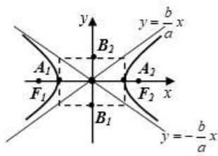
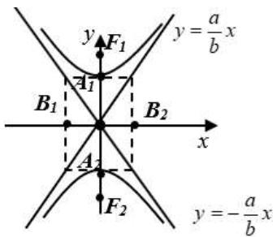
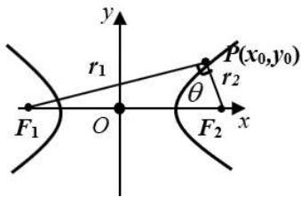
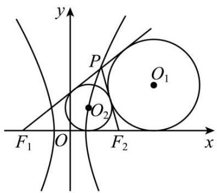
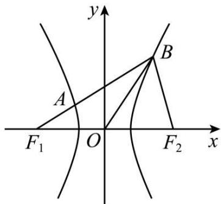
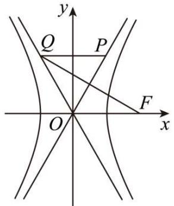
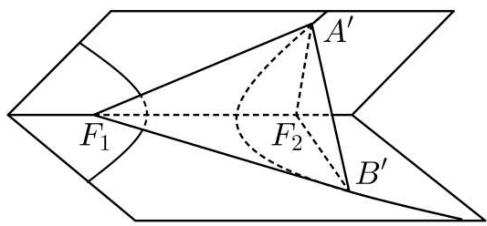
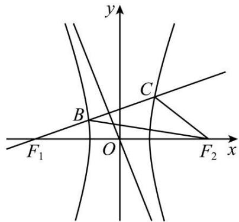

# 第65讲 双曲线及其性质

# 知识梳理

# 知识点一: 双曲线的定义

平面内与两个定点 $\mathbf{F}_1, \mathbf{F}_2$ 的距离的差的绝对值等于常数（大于零且小于 $|\mathbf{F}_1\mathbf{F}_2|$ ）的点的轨迹叫做双曲线（这两个定点叫双曲线的焦点）。用集合表示为

$$
\left\{\mathrm{M} \mid | | \mathrm{MF} _ {1} | - | \mathrm{MF} _ {2} | | = 2 a (0 <   2 a <   | \mathrm{F} _ {1} \mathrm{F} _ {2} |) \right\}.
$$

注意:(1)若定义式中去掉绝对值,则曲线仅为双曲线中的一支.

(2) 当 $2a = |F_1F_2|$ 时，点的轨迹是以 $F_1$ 和 $F_2$ 为端点的两条射线；当 $2a = 0$ 时，点的轨迹是线段 $F_1F_2$ 的垂直平分线.  
(3) $2a > |\mathbf{F}_1\mathbf{F}_2|$ 时，点的轨迹不存在.

在应用定义和标准方程解题时注意以下两点：

①条件“ $|F_{1}F_{2}|>2a$ ”是否成立；②要先定型(焦点在哪个轴上)，再定量(确定 $a^{2},b^{2}$ 的值)，注意 $a^{2}+b^{2}=c^{2}$ 的应用.

知识点二: 双曲线的方程、图形及性质

双曲线的方程、图形及性质

<table><tr><td>标准方程</td><td colspan="2"> $\frac{x^2}{a^2}-\frac{y^2}{b^2}=1(a>0,b>0)$ </td><td> $\frac{y^2}{a^2}-\frac{x^2}{b^2}=1(a>0,b>0)$ </td></tr><tr><td>图形</td><td colspan="2"></td><td></td></tr><tr><td>焦点坐标</td><td colspan="2"> $F_1(-c,0), F_2(c,0)$ </td><td> $F_1(0,-c), F_2(0,c)$ </td></tr><tr><td>对称性</td><td colspan="3">关于x,y轴成轴对称,关于原点成中心对称</td></tr><tr><td>顶点坐标</td><td colspan="2"> $A_1(-a,0), A_2(a,0)$ </td><td> $A_1(0,a), A_2(0,-a)$ </td></tr><tr><td>范围</td><td colspan="2">|x|≥a</td><td>|y|≥a</td></tr><tr><td>实轴、虚轴</td><td colspan="3">实轴长为2a,虚轴长为2b</td></tr><tr><td>离心率</td><td colspan="3"> $e=\frac{c}{a}=\sqrt{1+\frac{b^2}{a^2}}(e>1)$ </td></tr><tr><td>渐近线方程</td><td colspan="2">令 $\frac{x^2}{a^2}-\frac{y^2}{b^2}=0⇒y=±\frac{b}{a}x$ ,焦点到渐近线的距离为b</td><td>令 $\frac{y^2}{a^2}-\frac{x^2}{b^2}=0⇒y=±\frac{a}{b}x$ ,焦点到渐近线的距离为b</td></tr><tr><td>点和双曲线的位置关系</td><td colspan="2"> $\frac{x^2}{a^2}-\frac{y^2}{b^2}\begin{cases}>1,点(x_0,y_0)\text{在双曲线内}\\\text{(含焦点部分)}\\=1,\text{点}(x_0,y_0)\text{在双曲线上}\\<1,\text{点}(x_0,y_0)\text{在双曲线外}\end{cases}$ </td><td> $\frac{y^2}{a^2}-\frac{x^2}{b^2}\begin{cases}>1,点(x_0,y_0)\text{在双曲线内}\\\text{(含焦点部分)}\\=1,\text{点}(x_0,y_0)\text{在双曲线上}\\<1,\text{点}(x_0,y_0)\text{在双曲线外}\end{cases}$ </td></tr><tr><td>共焦点的双曲线方程</td><td colspan="2"> $\frac{x^2}{a^2+k}-\frac{y^2}{b^2-k}=1(-a^2$ </td><td>\(\frac{y^2}{a^2+k}-\frac{x^2}{b^2-k}=1(-a^2</td></tr><tr><td>共渐近线的双曲线方程</td><td colspan="2">\(\frac{x^2}{a^2}-\frac{y^2}{b^2}=\lambda(\lambda \neq 0)</td><td> $\frac{y^2}{a^2}-\frac{x^2}{b^2}=\lambda(\lambda \neq 0)$ </td></tr><tr><td>切线方程</td><td colspan="2"> $\frac{x_0x}{a^2}-\frac{y_0y}{b^2}=1,(x_0,y_0)\text{为切点}$ </td><td> $\frac{y_0y}{a^2}-\frac{x_0x}{b^2}=1,(x_0,y_0)\text{为切点}$ </td></tr><tr><td>切线方程</td><td colspan="3">对于双曲线上一点所在的切线方程,只需将双曲线方程中 $x^2$ 换为 $x_0x,y^2$ 换成 $y_0y$ 便得.</td></tr><tr><td rowspan="2">切点弦所在直线方程</td><td> $\frac{x_0x}{a^2}-\frac{y_0y}{b^2}=1,(x_0,y_0)\text{为双曲线外一点}$ </td><td colspan="2"> $\frac{y_0y}{a^2}-\frac{x_0x}{b^2}=1,(x_0,y_0)\text{为双曲线外一点}$ </td></tr><tr><td colspan="3">点 $(x_0,y_0)$ 为双曲线与两渐近线之间的点</td></tr><tr><td>弦长公式</td><td colspan="3">设直线与双曲线两交点为A $(x_1,y_1),B(x_2,y_2),k_{AB}=k.$ 则弦长|AB|= $\sqrt{1+k^2}\cdot|x_1-x_2|=\sqrt{1+\frac{1}{k^2}}\cdot|y_1-y_2|(k\neq 0)$ , $|x_1-x_2|=\sqrt{(x_1+x_2)^2-4x_1x_2}=\frac{\sqrt{\Delta}}{|a|}$ ,其中“ $a$ ”是消“ $y$ ”后关于“ $x$ ”的一元二次方程的“ $x^2$ ”系数.</td></tr><tr><td>通径</td><td colspan="3">通径(过焦点且垂直于F1F2的弦)是同支中的最短弦,其长为 $\frac{2b^2}{a}$ </td></tr><tr><td>焦点三角形</td><td colspan="3">双曲线上一点P $(x_0,y_0)$ 与两焦点F1,F2构成的ΔPF1F2成为焦点三角形,设∠F1PF2=θ,|PF1|=r1,|PF2|=r2,则cosθ=1- $\frac{2b^2}{r_1r_2}$ , $\mathrm{S}_{\Delta\mathrm{PF}_1\mathrm{F}_2}=\frac{1}{2}r_1r_2\sin\theta=\frac{\sin\theta}{1-\cos\theta}\cdot b^2=\frac{b^2}{\tan\frac{\theta}{2}}=\left\{\begin{matrix}c|y_0|,焦点在x轴上\\c|x_0|,焦点在y轴上'\end{matrix}\right.$ 焦点三角形中一般要用到的关系是</td></tr><tr><td></td><td colspan="3"> $\begin{cases} ||PF_1| - |PF_2|| = 2a (2a > 2c) \\ S_{\Delta PF_1F_2} = \frac{1}{2} |PF_1| \cdot |PF_2| \sin \angle F_1PF_2 \\ |F_1F_2|^2 = |PF_1|^2 + |PF_2|^2 - 2 |PF_1||PF_2| \cos \angle F_1PF_2 \end{cases}$ </td></tr><tr><td>等轴双曲线</td><td colspan="3">等轴双曲线满足如下充要条件:双曲线为等轴双曲线  $\Leftrightarrow a = b \Leftrightarrow$  离心率  $e = \sqrt{2} \Leftrightarrow$  两渐近线互相垂直  $\Leftrightarrow$  渐近线方程为  $y = \pm x \Leftrightarrow$  方程可设为  $x^2 - y^2 = \lambda (\lambda \neq 0)$ .</td></tr></table>

# 【解题方法总结】

# (1) 双曲线的通径

过双曲线的焦点且与双曲线实轴垂直的直线被双曲线截得的线段,称为双曲线的通径.通径长为 $\frac{2b^{2}}{a}$ .

# (2) 点与双曲线的位置关系

对于双曲线 $\frac{x^2}{a^2} -\frac{y^2}{b^2} = 1(a > b > 0)$ ，点 $\mathrm{P}(x_0,y_0)$ 在双曲线内部，等价于 $\frac{x_0^2}{a^2} -\frac{y_0^2}{b^2} >1.$ 点 $\mathrm{P}(x_0,y_0)$ 在双曲线外部，等价于 $\frac{x_0^2}{a^2} -\frac{y_0^2}{b^2} < 1$ 结合线性规划的知识点来分析.

# (3) 双曲线常考性质

性质1: 双曲线的焦点到两条渐近线的距离为常数 b; 顶点到两条渐近线的距离为常数 $\frac{ab}{c}$ ;
性质2: 双曲线上的任意点 P 到双曲线 C 的两条渐近线的距离的乘积是一个常数 $\frac{a^{2}b^{2}}{c^{2}}$ ;

(4) 双曲线焦点三角形面积为 $\frac{b^2}{\tan \frac{\theta}{2}}$ (可以这样理解, 顶点越高, 张角越小, 分母越小, 面积越大)

# (5) 双曲线的切线

点 $\mathrm{M}(x_0, y_0)$ 在双曲线 $\frac{x^2}{a^2} - \frac{y^2}{b^2} = 1 (a > 0, b > 0)$ 上，过点M作双曲线的切线方程为 $\frac{x_0x}{a^2} - \frac{y_0y}{b^2} = 1$ 。若点 $\mathrm{M}(x_0, y_0)$ 在双曲线 $\frac{x^2}{a^2} - \frac{y^2}{b^2} = 1 (a > 0, b > 0)$ 外，则点M对应切点弦方程为 $\frac{x_0x}{a^2} - \frac{y_0y}{b^2} = 1$

# 必考题型全归纳

# 题型一: 双曲线的定义与标准方程

3531 (2024·全国·模拟预测)已知 $F_{1}$ ， $F_{2}$ 分别是离心率为 2 的双曲线 E: $\frac{x^{2}}{a^{2}} + \frac{y^{2}}{b^{2}} =$

$1(a > 0, b > 0)$ 的左，右焦点，过点 $\mathrm{F}_2$ 的直线与双曲线的左、右两支分别交于点C，D，且 $|\mathrm{CF}_1| = |\mathrm{CD}|$ ， $|\mathrm{DF}_1| = 4$ ，则E的标准方程为 \_\_\_\_.

3532 (2024·山东临沂·高二校考期末)已知双曲线 E: $\frac{x^{2}}{a^{2}} - \frac{y^{2}}{b^{2}} = 1 (a > 0, b > 0)$ ，矩形 ABCD 的四个顶点在 E 上，AB，CD 的中点为 E 的两个焦点，且 $2|AB| = 3|BC| = 6$ ，则双曲线 E 的标准方程是 \_\_\_\_.

3533 (2024·高二课时练习)设椭圆 $C_{1}$ 的离心率为 $\frac{5}{13}$ ，焦点在 x 轴上且长轴长为 26，若曲线 $C_{2}$ 上的点到椭圆 $C_{1}$ 的两个焦点的距离的差的绝对值等于 8，则曲线 $C_{2}$ 的标准方程为 \_\_\_\_.

3534 (2024·贵州贵阳·高二清华中学校考阶段练习)渐近线方程为 $y=\pm\frac{1}{2}x$ 且经过点 (4,1) 的双曲线标准方程为 \_\_\_\_.

3535 (2024·辽宁朝阳·高二校联考阶段练习)若双曲线 C 与双曲线 $\frac{x^{2}}{16}-\frac{y^{2}}{12}=1$ 有相同的渐近线，且经过点 $(2\sqrt{2},\sqrt{15})$ ，则双曲线 C 的标准方程是 \_\_\_\_.

3536 (2024·上海黄浦·高二上海市向明中学校考期中)双曲线 $\Gamma$ 经过两点 $A(-\sqrt{2}, -\sqrt{3})$ ， $B\left(\frac{\sqrt{15}}{3}, \sqrt{2}\right)$ ，则双曲线 $\Gamma$ 的标准方程是 \_\_\_\_.

3537 (2024·全国·模拟预测)已知 $F_{1}$ ， $F_{2}$ 分别是双曲线 C: $\frac{x^{2}}{a^{2}} - \frac{y^{2}}{b^{2}} = 1 (a > 0, b > 0)$ 的左、右焦点，M 是双曲线 C 的右支上一点，双曲线 C 的焦点到渐近线的距离为 3， $\overrightarrow{F_{1}M}$ 与 $\overrightarrow{MF_{2}}$ 的夹角为 $\frac{\pi}{3}$ ， $(\overrightarrow{MF_{1}} - 3\overrightarrow{MF_{2}}) \perp (\overrightarrow{MF_{1}} + 3\overrightarrow{MF_{2}})$ ，则双曲线 C 的标准方程为 \_\_\_\_.

3538 (2024·广东·高三校联考阶段练习)已知双曲线 $\Gamma:\frac{x^{2}}{a^{2}}-\frac{y^{2}}{b^{2}}=1(a>0,b>0)$ ，四点 A(6, $\sqrt{3}$ )、B $\left(4,\frac{\sqrt{55}}{5}\right)$ 、C(5,2)、D(-5,-2) 中恰有三点在 $\Gamma$ 上，则双曲线 $\Gamma$ 的标准方程为 \_\_\_\_.

3539 (2024·高二课时练习)(1)若双曲线过点 $(3,9\sqrt{2})$ ，离心率 $e=\frac{\sqrt{10}}{3}$ ，则其标准方程为\_\_\_\_。

(2) 若双曲线过点 P(2, -1)，渐近线方程是 $y = \pm 3x$ ，则其标准方程为 \_\_\_\_.

(3) 若双曲线与双曲线 $\frac{y^{2}}{4}-\frac{x^{2}}{3}=1$ 有共同的渐近线，且经过点 M(3, -2)，则其标准方程为 \_\_\_\_.

# 2 题型二:双曲线方程的充要条件

3540 (2024·全国·高三对口高考)若曲线 $\frac{x^{2}}{3+k}+\frac{y^{2}}{2-k}=1$ 表示双曲线,那么实数 k 的取值范围是 ()

A. $(-3,2)$

B. $(- \infty, -3) \cup (2, +\infty)$

C. $(-2,3)$

D. $(- \infty, -2) \cup (3, +\infty)$

3541 (2024·湖南岳阳·高三湖南省岳阳县第一中学校考开学考试)已知 $k \in R$ ，则“-2 < k < 3”是“方程 $\frac{x^{2}}{2-k} - \frac{y^{2}}{2+k} = 1$ 表示双曲线”的（）

A. 充分不必要条件

B. 必要不充分条件

C. 充要条件

D. 既不充分也不必要条件

3542 (2024·全国·高三专题练习)若方程 $\frac{x^{2}}{m-2}+\frac{y^{2}}{m-6}=1$ 表示双曲线，则 m 的取值范围是

( )

A. $m <   2$ 或 $m > 6$

B. $2 < m < 6$

C. m<-6 或 m>-2

D. -6 < m < -2

3543 (2024·全国·高三专题练习)已知方程 $E:(m-1)x^{2}+(3-m)y^{2}=(m-1)(3-m)$ ，则 E 表示的曲线形状是（）

A. 若 $1 < m < 3$ ，则 $\mathrm{E}$ 表示椭圆

B. 若 $\mathrm{E}$ 表示双曲线, 则 $m < 1$ 或 $m > 3$

C. 若 E 表示双曲线, 则焦距是定值

D. 若 $\mathrm{E}$ 的离心率为 $\frac{\sqrt{2}}{2}$ , 则 $m = \frac{5}{3}$

3544 (2024·四川南充·统考三模)设 $\theta\in(0,2\pi)$ ，则“方程 $\frac{x^{2}}{3}+\frac{y^{2}}{4\sin\theta}=1$ 表示双曲线”的必要不充分条件为 （）

A. $\theta \in (0,\pi)$

B. $\theta \in \left(\frac{2\pi}{3}, 2\pi\right)$

C. $\theta \in \left( \pi, \frac{3\pi}{2} \right)$

D. $\theta \in \left(\frac{\pi}{2},\frac{3\pi}{2}\right)$

# 3 题型三: 双曲线中焦点三角形的周长与面积及其他问题

3545 (2024·广东揭阳·高三校考开学考试)已知双曲线 C: $\frac{y^{2}}{a^{2}} - \frac{x^{2}}{b^{2}} = 1 (a > 0, b > 0)$ , O 为坐标原点, $F_{1}, F_{2}$ 为双曲线 C 的两个焦点, 点 P 为双曲线上一点, 若 $|PF_{1}| = 3 |PF_{2}|, |OP| = b$ , 则双曲线 C 的方程可以为 ()

A. $\frac{y^2}{4} - x^2 = 1$

B. $\frac{y^2}{2} -\frac{x^2}{4} = 1$

C. $\frac{y^2}{3} -\frac{x^2}{4} = 1$

D. $\frac{y^2}{16} -\frac{x^2}{4} = 1$

3546 (2024·安徽六安·六安一中校考模拟预测)已知双曲线 C: $\frac{x^{2}}{16}-\frac{y^{2}}{9}=1$ 的左、右焦点分别为 $F_{1}$ 、 $F_{2}$ ，直线 y=kx 与双曲线 C 交于 A，B 两点，若 $|AB|=|F_{1}F_{2}|$ ，则 $\triangle ABF_{1}$ 的面积等于（）

A. 18

B. 10

C. 9

D. 6

3547 (2024·福建漳州·高三漳州三中校考阶段练习)已知双曲线 $\Gamma:\frac{x^{2}}{4}-\frac{y^{2}}{2}=1$ 的左右焦点分别为 $F_{1},F_{2}$ ，过 $F_{1}$ 的直线分别交双曲线 $\Gamma$ 的左右两支于 A,B 两点，且 $\angle F_{2}AB=\angle F_{2}BA$ ，则 $|BF_{2}|=$ （）

A. $\sqrt{5} + 4$

B. $2 \sqrt{5} + 4$

C. $2 \sqrt{5}$

D. $\sqrt{5}$

3548 (2024·湖北恩施·校考模拟预测)已知 $F_{1}$ ， $F_{2}$ 分别为双曲线 C: $\frac{x^{2}}{4}-\frac{y^{2}}{b^{2}}=1(b>0)$ 的左右焦点，且 $F_{1}$ 到渐近线的距离为 1，过 $F_{2}$ 的直线 l 与 C 的左、右两支曲线分别交于 A, B 两点，且 $l \perp AF_{1}$ ，则下列说法正确的为（）

A. $\triangle \mathrm{AF}_{1} \mathrm{~F}_{2}$ 的面积为 2

B. 双曲线 C 的离心率为 $\sqrt{2}$

C. $\overrightarrow{\mathrm{AF}_1}\cdot \overrightarrow{\mathrm{BF}_1} = 10 + 4\sqrt{6}$

D. $\frac{1}{|\mathrm{AF}_2|} +\frac{1}{|\mathrm{BF}_2|} = \sqrt{6} +2$

3549 焦点三角形的作用

在焦点三角形中,可以将圆锥曲线的定义,三角形中边角关系,如正余弦定理、勾股定理结合起来.

3550 (2024·全国·高三专题练习)双曲线 $\frac{x^{2}}{a^{2}} - \frac{y^{2}}{b^{2}} = 1$ 的左、右焦点分别是 $F_{1}$ 、 $F_{2}$ ，过 $F_{2}$ 的弦 AB 与其右支交于 A、B 两点， $|AB| = m$ ，则 $\triangle ABF_{1}$ 的周长为（）

A. $4a$

B. $4a - m$

C. $4a + 2m$

D. $4a + m$

3551 (2024·云南保山·统考模拟预测)已知 $F_{1}, F_{2}$ 是离心率等于 $\frac{\sqrt{13}}{3}$ 的双曲线 C: $\frac{x^{2}}{m} - \frac{y^{2}}{4} = 1$ 的左右焦点, 过焦点 $F_{2}$ 的直线 l 与双曲线 C 的右支相交于 A, B 两点, 若 $\triangle ABF_{1}$ 的周长 20, 则 |AB| 等于 ()

A. 10

B. 8

C. 6

D. 4

3552 (2024·全国·高三专题练习)设 $F_{1}$ ， $F_{2}$ 分别是双曲线 $\frac{x^{2}}{4}-\frac{y^{2}}{45}=1$ 的左、右焦点，P 是该双曲线上的一点，且 $3|PF_{1}|=5|PF_{2}|$ ，则 $\triangle PF_{1}F_{2}$ 的面积等于（）

A. $14 \sqrt{3}$

B. $7\sqrt{15}$

C. $15\sqrt{3}$

D. $5\sqrt{15}$

3553 (2024·全国·高三专题练习)设双曲线 $x^{2}-\frac{y^{2}}{3}=1$ 的左、右焦点分别为 $F_{1}, F_{2}$ ，点 P 在双曲线上，下列说法正确的是（）

A. 若 $\triangle \mathrm{F}_{1} \mathrm{PF}_{2}$ 为直角三角形, 则 $\triangle \mathrm{F}_{1} \mathrm{PF}_{2}$ 的周长是 $2 \sqrt{7} + 4$   
B. 若 $\triangle F_{1}PF_{2}$ 为直角三角形, 则 $\triangle F_{1}PF_{2}$ 的面积是 6  
C. 若 $\Delta \mathrm{F}_{1} \mathrm{PF}_{2}$ 为锐角三角形，则 $|\mathrm{PF}_{1}| + |\mathrm{PF}_{2}|$ 的取值范围是 $(2\sqrt{7}, 8)$   
D. 若 $\triangle F_{1}PF_{2}$ 为钝角三角形，则 $\left|PF_{1}\right| + \left|PF_{2}\right|$ 的取值范围是 $(8, +\infty)$

3554 (2024·吉林四平·高三双辽市第一中学校联考期末)设双曲线 $\frac{x^{2}}{a^{2}} - \frac{y^{2}}{b^{2}} = 1 (a > 0, b > 0)$ 的左、右焦点分别 $F_{1}$ 、 $F_{2}$ ，点 $P(x, y)$ 为双曲线右支上一点， $\triangle PF_{1}F_{2}$ 的内切圆圆心为 $M(2, 2)$ ，则 $\triangle PMF_{1}$ 的面积与 $\triangle PMF_{2}$ 的面积之差为（）

A. 1

B. 2

C. 4

D. 6

3555 (2024·全国·高三专题练习)已知双曲线 $\frac{x^{2}}{9}-\frac{y^{2}}{7}=1$ 的左右焦点分别为 $F_{1}, F_{2}$ ，若双曲线上一点 P 使得 $\angle F_{1}PF_{2}=60^{\circ}$ ，求 $\triangle F_{1}PF_{2}$ 的面积（）

A. $\frac{7\sqrt{3}}{3}$

B. $\frac{14\sqrt{3}}{3}$

C. $7 \sqrt{3}$

D. $14\sqrt{3}$

3556 (2024·上海浦东新·统考三模)设 P 为双曲线 $\frac{x^{2}}{a^{2}} - y^{2} = 1 (a > 0)$ 的上一点， $\angle F_{1}PF_{2} = \frac{2\pi}{3}$ ， $(F_{1}, F_{2}$ 为左、右焦点)，则 $\Delta F_{1}PF_{2}$ 的面积等于（）

A. $\sqrt{3} a^{2}$

B. $\frac{\sqrt{3}}{3}a^{2}$

C. $\frac{\sqrt{3}}{3}$

D. $\frac{2\sqrt{3}}{3}$

# 题型四: 双曲线上两点距离的最值问题

3557 (2024·全国·高三专题练习)已知双曲线 C: $\frac{x^{2}}{2}-y^{2}=1$ 的左右焦点为 F₁, F₂, 点 M 为双曲线 C 上任意一点, 则 $|MF_{1}|\cdot|MF_{2}|$ 的最小值为 ( )

A. 1

B. $\sqrt{2}$

C. 2

D. 3

3558 (2024·全国·高三专题练习)已知 A(3, $\sqrt{2}$ ) 是双曲线 $\frac{x^{2}}{3}-y^{2}=1$ 上一点，F₁ 是左焦点，B 是右支上一点，AF₁ 与 $\triangle ABF_{1}$ 的内切圆切于点 P，则 |F₁P| 的最小值为

A. $\sqrt{3}$

B. $2\sqrt{3}$

C. $3\sqrt{3} - \sqrt{2}$

D. $6\sqrt{3} - 2\sqrt{2}$

3559 (2024·全国·高三专题练习)已知点 M(-5,0)，点 P 在曲线 $\frac{x^{2}}{9}-\frac{y^{2}}{16}=1(x>0)$ 上运动，点 Q 在曲线 $(x-5)^{2}+y^{2}=1$ 上运动，则 $\frac{|PM|^{2}}{|PQ|}$ 的最小值是 \_\_\_\_.

3560 (2024·河北衡水·统考模拟预测)已知双曲线 $\frac{x^{2}}{9}-\frac{y^{2}}{16}=1$ ，其右焦点为 F，P 为其上一点，点 M 满足 $|\overrightarrow{MF}|=1,\overrightarrow{MF}\cdot\overrightarrow{MP}=0$ ，则 $|\overrightarrow{MP}|$ 的最小值为（）

A. 3

B. $\sqrt{3}$

C. 2

D. $\sqrt{2}$

3561 (2024·高二课时练习)已知直线 l 与双曲线 $x^{2}-\frac{y^{2}}{2}=1$ 交于 A, B 两点，且 $\overrightarrow{AB}=\lambda\overrightarrow{OB}$ (O 为坐标原点)，若 M 是直线 $x-\sqrt{2}y-3=0$ 上的一个动点，则 $\left|\overrightarrow{MA}\right|^{2}+\left|\overrightarrow{MB}\right|^{2}$ 的最小值为

A. 12

B. 6

C. 16

D. 8

3562 (2024·广东韶关·高二统考期末)已知点 $F_{1}$ ， $F_{2}$ 是双曲线 $C: x^{2}-\frac{y^{2}}{3}=1$ 的左、右焦点，点P是双曲线C右支上一点，过点 $F_{2}$ 向 $\angle F_{1}PF_{2}$ 的角平分线作垂线，垂足为点Q，则点A( $-\sqrt{3},1$ )和点Q距离的最大值为()

A. 2

B. $\sqrt{7}$

C. 3

D. 4

# 题型五: 双曲线上两线段的和差最值问题

3563 (2024·江苏徐州·高二统考期中)已知等轴双曲线的焦距为8,左、右焦点 $F_{1},F_{2}$ 在x轴上，中心在坐标原点，点A的坐标为 $(5,\sqrt{3})$ ，P为双曲线右支上一动点，则 $|PF_{1}|-|PA|$ 的最大值为()

A. $2 \sqrt{2} + 2$

B. $4 \sqrt{2} + 2$

C. $2 \sqrt{2} + 4$

D. $4 \sqrt{2} + 4$

3564 (2024·全国·高二专题练习)已知双曲线 C: $\frac{x^{2}}{a^{2}} - \frac{y^{2}}{b^{2}} = 1 (a > 0, b > 0)$ ，其一条渐近线方程为 $x + \sqrt{3}y = 0$ ，右顶点为 A，左，右焦点分别为 $F_{1}, F_{2}$ ，点 P 在其右支上，点 B(3,1)，三角形 $F_{1}AB$ 的面积为 $1 + \frac{\sqrt{3}}{2}$ ，则当 $|PF_{1}| - |PB|$ 取得最大值时点 P 的坐标为（）

A. $\left(3-\frac{\sqrt{6}}{2},1-\frac{\sqrt{6}}{2}\right)$

B. $\left(3 + \frac{\sqrt{6}}{2}, 1 + \frac{\sqrt{6}}{2}\right)$

C. $\left(3+\frac{\sqrt{3}}{2},1+\frac{\sqrt{3}}{10}\right)$

D. $\left(\frac{6+5\sqrt{78}}{22},\frac{10+\sqrt{78}}{22}\right)$

3565 (2024·全国·高二专题练习)已知 F 是双曲线 C: $x^{2}-\frac{y^{2}}{8}=1$ 的右焦点, P 是 C 的左支上一点, A(0, $\sqrt{7}$ ), 则 |PA| + |PF| 的最小值为 ( )

A. 5

B. 6

C. 7

D. 8

3566 (2024·宁夏银川·校联考二模)已知抛物线 $y^{2}=16x$ 上一点 A(m,n) 到准线的距离为 5,F 是双曲线 $\frac{x^{2}}{4}-\frac{y^{2}}{12}=1$ 的左焦点，P 是双曲线右支上的一动点，则 $|PF|+|PA|$ 的最小值为（）

A. 12

B. 11

C. 10

D. 9

3567 (2024·全国·高二专题练习)已知点 A(0,3√7)，双曲线 E: $\frac{x^{2}}{2}-\frac{y^{2}}{7}=1$ 的左焦点为 F，点 P 在双曲线 E 的右支上运动. 当 $\triangle APF$ 的周长最小时， $|AP|+|PF|=$ （）

A. $6 \sqrt{2}$

B. $7 \sqrt{2}$

C. $8 \sqrt{2}$

D. $9 \sqrt{2}$

3568 (2024·福建宁德·高三统考阶段练习)已知双曲线 C: $\frac{x^{2}}{12}-\frac{y^{2}}{4}=1$ ，点 F 是 C 的右焦点，若点 P 为 C 左支上的动点，设点 P 到 C 的一条渐近线的距离为 d，则 $d+|PF|$ 的最小值为（）

A. $2 + 4\sqrt{3}$

B. $6 \sqrt{3}$

C. 8

D. 10

3569 (2024·全国·高二专题练习)设 $F_{1}$ ， $F_{2}$ 为双曲线 C: $\frac{x^{2}}{3}-y^{2}=1$ 的左、右焦点，Q 为双曲线右支上一点，点 P(0,2). 当 $|QF_{1}|+|PQ|$ 取最小值时， $|QF_{2}|$ 的值为（）

A. $\sqrt{3} -\sqrt{2}$

B. $\sqrt{3}+\sqrt{2}$

C. $\sqrt{6} - 2$

D. $\sqrt{6}+2$

3570 (2024·全国·高二专题练习)设 P 是双曲线 $\frac{x^{2}}{9}-\frac{y^{2}}{16}=1$ 上一点，M、N 分别是两圆 $(x-5)^{2}+y^{2}=4$ 和 $(x+5)^{2}+y^{2}=1$ 上的点，则 $|PM|-|PN|$ 的最大值为（）

A. 6

B. 9

C. 12

D. 14

3571 (2024·全国·高三校联考阶段练习)已知点P是右焦点为F的双曲线 $\frac{x^{2}}{10}-\frac{y^{2}}{10}=1(x>\sqrt{10})$ 上一点，点Q是圆 $(x-8)^{2}+y^{2}=1$ 上一点，则 $|PF|+|PQ|$ 的最小值是\_\_\_\_.

3572 (2024·全国·高二专题练习)已知双曲线 C: $\frac{x^{2}}{4}-\frac{y^{2}}{4}=1$ 的左焦点为 F，点 P 是双曲线 C 右支上的一点，点 M 是圆 E: $x^{2}+(y-2\sqrt{2})^{2}=1$ 上的一点，则 $|PF|+|PM|$ 的最小值为（）

A. 5

B. $5 + 2\sqrt{2}$

C. 7

D. 8

3573 (2024·全国·高一专题练习)已知双曲线 C: $\frac{x^{2}}{9}-\frac{y^{2}}{7}=1$ , F₁, F₂ 是其左右焦点. 圆 E: $x^{2}+y^{2}-4y+3=0$ , 点 P 为双曲线 C 右支上的动点, 点 Q 为圆 E 上的动点, 则 |PQ| + |PF₁| 的最小值是 ()

A. $5 + 2\sqrt{5}$

B. $5 + 2\sqrt{2}$

C. 7

D. 8

3574 (2024·四川眉山·高二四川省眉山第一中学校考期中)已知 $F_{2}$ 是双曲线 C: $\frac{x^{2}}{9}-\frac{y^{2}}{3}=1$ 的右焦点, 动点 A 在双曲线左支上, 点 B 为圆 E: $x^{2}+(y+2)^{2}=1$ 上一点, 则 $|AB|+|AF_{2}|$ 的最小值为 ()

A. 9

B. 8

C. $5 \sqrt{3}$

D. $6 \sqrt{3}$

3575 (2024·陕西咸阳·武功县普集高级中学统考模拟预测)过双曲线 $x^{2} - \frac{y^{2}}{15} = 1$ 的右支上一点P，分别向圆 $\mathrm{C_1}$ ： $(x + 4)^2 +y^2 = 4$ 和圆 $\mathrm{C_2}$ ： $(x - 4)^2 +y^2 = 1$ 作切线，切点分别为M，N，则 $|\mathrm{PM}|^2 -|\mathrm{PN}|^2$ 的最小值为

A. 16

B. 15

C. 14

D. 13

# 题型六:离心率的值及取值范围

# 方向1: 利用双曲线定义去转换

3576 (2024·内蒙古赤峰·高三统考开学考试)已知 $\mathrm{F}_1$ ， $\mathrm{F}_2$ 分别为双曲线E： $\frac{x^2}{a^2} -\frac{y^2}{b^2} =$

$1(a > 0, b > 0)$ 的左、右焦点，过原点 O 的直线 $l$ 与 E 交于 A，B 两点（点 A 在第一象限），延长 $\mathrm{AF}_2$ 交 E 于点 C，若 $|\mathrm{BF}_2| = |\mathrm{AC}|$ ， $\angle \mathrm{F}_1\mathrm{BF}_2 = \frac{\pi}{3}$ ，则双曲线 E 的离心率为 （）

A. $\sqrt{3}$

B. 2

C. $\sqrt{5}$

D. $\sqrt{7}$

3577 (2024·陕西西安·高三校联考开学考试)已知 $F_{1}$ ， $F_{2}$ 分别为双曲线 $E:\frac{x^{2}}{a^{2}}-\frac{y^{2}}{b^{2}}=1(a>0,b>0)$ 的左、右焦点，过原点 O 的直线 l 与 E 交于 A，B 两点（点 A 在第一象限），延长 $AF_{2}$ 交 E 于点 C，若 $|BF_{2}|=|AC|$ ， $\angle F_{1}BF_{2}=\frac{\pi}{3}$ ，则双曲线 E 的离心率为（）

A. $\sqrt{3}$

B. 2

C. $\sqrt{5}$

D. 1

3578 (2024·江西南昌·南昌市八一中学校考三模)已知双曲线 C: $\frac{x^{2}}{a^{2}} - \frac{y^{2}}{b^{2}} = 1 (a > 0, b > 0)$ 的左、右焦点分别为 F₁, F₂, 若在 C 上存在点 P(不是顶点), 使得 $\angle PF_{2}F_{1} = 3\angle PF_{1}F$ , 则 C 的离心率的取值范围为 ()

A. $(\sqrt{2}, 2)$

B. $(\sqrt{3},+\infty)$

C. $(1,\sqrt{3}]$

D. $(1,\sqrt{2}]$

3579 (2024·陕西西安·西安市大明宫中学校考模拟预测)已知双曲线 C: $\frac{x^{2}}{a^{2}} - \frac{y^{2}}{b^{2}} = 1 (a > 0, b > 0)$ 的左、右焦点分别为 $F_{1}, F_{2}, O$ 为坐标原点，过原点的直线 l 与 C 相交于 A, B 两点， $|F_{1}F_{2}| = 2|AO|$ ，四边形 $AF_{1}BF_{2}$ 的面积等于 $c^{2}$ ，则 C 的离心率等于（）

A. $\sqrt{2}$

B. $\sqrt{3}$

C. 2

D. $\sqrt{5}$

3580 (2024·重庆渝中·高三重庆巴蜀中学校考阶段练习)如图,已知双曲线 C: $\frac{x^{2}}{a^{2}}-\frac{y^{2}}{b^{2}}=1(a>0,b>0)$ 的左、右焦点分别是 F $_{1}$ , F $_{2}$ ,点 P 在 C 上且位于第一象限,圆 O $_{1}$ 与线段 F $_{1}$ P 的延长线,线段 PF $_{2}$ 以及 x 轴均相切, $\Delta$ PF $_{1}$ F $_{2}$ 的内切圆为圆 O $_{2}$ . 若圆 O $_{1}$ 与圆 O $_{2}$ 外切,且圆 O $_{1}$ 与圆 O $_{2}$ 的面积之比为 4,则 C 的离心率为 ( )

text_image

y
P
O₁
O₂
F₁ O F₂ x

A. $\sqrt{3}$

B. $\frac{5}{3}$

C. 2

D. 3

3581 (2024·四川成都·四川省成都列五中学校考三模)已知双曲线 C: $\frac{x^{2}}{a^{2}} - \frac{y^{2}}{b^{2}} = 1 (a > 0, b > 0)$ 的左、右焦点分别为 $F_{1}, F_{2}$ ，过点 $F_{1}$ 的直线与双曲线在第二象限的交点为 A，若 $\left(\overrightarrow{F_{1}F_{2}} + \overrightarrow{F_{1}A}\right) \cdot \overrightarrow{F_{2}A} = 0, \left|\overrightarrow{F_{1}F_{2}} + \overrightarrow{F_{1}A}\right| = \left|\overrightarrow{F_{1}F_{2}}\right|$ ，则双曲线 C 的离心率是（）

A. $\frac{\sqrt{3}+1}{2}$

B. $\sqrt{3} + 1$

C. $\sqrt{2} + 1$

D. $\frac{\sqrt{2}+1}{2}$

3582 (2024·湖南·校联考模拟预测)如图， $F_{1}$ 、 $F_{2}$ 是双曲线 $E:\frac{x^{2}}{a^{2}}-\frac{y^{2}}{b^{2}}=1(a>0,b>0)$ 的左、右焦点，过 $F_{1}$ 的直线交双曲线的左、右两支于A、B两点，且 $|BF_{1}|=4|AF_{1}|,|OB|= \sqrt{a^{2}+b^{2}}$ ，则双曲线C的离心率为()

text_image

y
A
B
F₁ O F₂ x

A. $\frac{\sqrt{29}}{2}$

B. $\frac{\sqrt{29}}{3}$

C. $\frac{\sqrt{58}}{3}$

D. $\frac{\sqrt{58}}{4}$

3583 (2024·贵州毕节·校考模拟预测)已知 F 是双曲线 C: $\frac{x^{2}}{a^{2}} - \frac{y^{2}}{b^{2}} = 1 (a > 0, b > 0)$ 的一个焦点，A 为 C 的虚轴的一个端点， $2\overrightarrow{OB} = \overrightarrow{OA}$ (O 为坐标原点)，直线 FB 垂直于 C 的一条渐近线，则 C 的离心率为（）

A. $\sqrt{2} + 1$

B. $\frac{\sqrt{5}+1}{2}$

C. $\frac{\sqrt{17}+1}{4}$

D. $\frac{3\sqrt{3}}{2}$

3584 (2024·陕西商洛·镇安中学校考模拟预测)已知双曲线 C: $\frac{x^{2}}{a^{2}} - \frac{y^{2}}{b^{2}} = 1 (b > a > 0)$ 的左焦点为 F，右顶点为 A，一条渐近线与圆 A: $(x - a)^{2} + y^{2} = b^{2}$ 在第一象限交于点 M，MF 交 y 轴于点 N，且 $\angle FNA = 90^{\circ}$ ，则 C 的离心率为（）

A. $\sqrt{3}$

B. 2

C. $1 + \sqrt{2}$

D. $2 + \sqrt{2}$

3585 (2024·福建福州·福州四中校考模拟预测)已知双曲线 C: $\frac{x^{2}}{a^{2}} - \frac{y^{2}}{b^{2}} = 1 (a > 0, b > 0)$ , F 为左焦点, A₁, A₂ 分别为左、左顶点, P 为 C 右支上的点, 且 |OP| = |OF|(O 为坐标原点). 若

直线 PF 与以线段 $A_{1}A_{2}$ 为直径的圆相交，则 C 的离心率的取值范围为（）

A. $(1,\sqrt{3})$

B. $(\sqrt{3},+\infty)$

C. $(\sqrt{5},+\infty)$

D. $(1,\sqrt{5})$

3586 (2024·河南信阳·信阳高中校考模拟预测)已知双曲线 C: $\frac{y^{2}}{a^{2}} - \frac{x^{2}}{b^{2}} = 1 (a > 0, b > 0)$ 的上下焦点分别为 $F_{1}, F_{2}$ ，点 M 在 C 的下支上，过点 M 作 C 的一条渐近线的垂线，垂足为 D，若 $|MD| > |F_{1}F_{2}| - |MF_{1}|$ 恒成立，则 C 的离心率的取值范围为（）

A. $\left(1,\frac{5}{3}\right)$

B. $\left(\frac{5}{3},2\right)$

C. $(1,2)$

D. $\left(\frac{5}{3},+\infty\right)$

3587 (2024·海南省直辖县级单位·统考模拟预测)已知 $F_{1}, F_{2}$ 分别是双曲线 C: $\frac{x^{2}}{a^{2}} - \frac{y^{2}}{b^{2}} = 1 (a > 0, b > 0)$ 的左、右焦点，斜率为 $\frac{1}{2}$ 的直线 l 过 $F_{1}$ ，交 C 的右支于点 B，交 y 轴于点 A，且 $\angle BAF_{2} = \angle ABF_{2}$ ，则 C 的离心率为（）

A. $\frac{2\sqrt{5}}{3}$

B. $\frac{2\sqrt{3}}{3}$

C. $\sqrt{3}$

D. $\sqrt{5}$

3588 (2024·四川巴中·高三统考开学考试)已知双曲线 C: $\frac{x^{2}}{a^{2}} - \frac{y^{2}}{b^{2}} = 1 (a > 0, b > 0)$ 的左、右焦点分别为 F₁, F₂，过 F₁ 斜率为 $\frac{3}{4}$ 的直线与 C 的右支交于点 P，若线段 PF₁ 恰被 y 轴平分，则 C 的离心率为（）

A. $\frac{1}{2}$

B. $\frac{2\sqrt{3}}{3}$

C. 2

D. 3

3589 (2024·浙江·校联考模拟预测)已知点P是双曲线C: $\frac{x^{2}}{a^{2}}-\frac{y^{2}}{b^{2}}=1(a>0,b>0)$ 右支上一点， $F_{1}(-c,0),F_{2}(c,0)$ 分别是C的左、右焦点，若 $\angle F_{1}PF_{2}$ 的角平分线与直线x=a交于点I，且 $S_{\triangle IPF_{1}}=\frac{\sqrt{2}}{2}S_{\triangle IF_{1}F_{2}}+S_{\triangle IPF_{2}}$ ，则C的离心率为()

A. 2

B. $\sqrt{2}$

C. 3

D. $\sqrt{3}$

3590 (2024·北京·首都师范大学附属中学校考模拟预测)已知 $F_{1}(-c,0)$ ， $F_{2}(c,0)$ 分别是双曲线 C: $\frac{x^{2}}{a^{2}} - \frac{y^{2}}{b^{2}} = 1 (a > 0, b > 0)$ 的两个焦点，P 为双曲线 C 上一点， $PF_{1} \perp PF_{2}$ 且 $\angle PF_{2}F_{1} = \frac{\pi}{3}$ ，那么双曲线 C 的离心率为（）

A. $\frac{\sqrt{5}}{2}$

B. $\sqrt{3}$

C. 2

D. $\sqrt{3} + 1$

3591 (2024·上海嘉定·校考三模)已知双曲线 $\Gamma:\frac{x^{2}}{a^{2}}-\frac{y^{2}}{b^{2}}=1(a>0,b>0)$ 的离心率为 e，点 B 的坐标为 $(0,b)$ ，若 $\Gamma$ 上的任意一点 P 都满足 $|PB|\geqslant b$ ，则（）

A. $1 < \mathrm{e} \leqslant \frac{1 + \sqrt{3}}{2}$

B. $e \geqslant \frac{1 + \sqrt{3}}{2}$

C. $1 < e \leqslant \frac{1 + \sqrt{5}}{2}$

D. $e \geqslant \frac{1 + \sqrt{5}}{2}$

3592 (2024·江西·江西师大附中校考三模)已知 F 是双曲线 C: $\frac{x^{2}}{a^{2}} - \frac{y^{2}}{b^{2}} = 1 (a > 0, b > 0)$ 的左焦点， $P(0, \sqrt{6}a)$ ，直线 PF 与双曲线 C 有且只有一个公共点，则双曲线 C 的离心率为

( )

A. $\sqrt{2}$

B. $\sqrt{3}$

C. 2

D. $\sqrt{6}$

3593 (2024·福建福州·福建省福州第一中学校考二模)圆 O(O 为原点) 是半径为 a 的圆分别与 x 轴负半轴、双曲线 C: $\frac{x^{2}}{a^{2}} - \frac{y^{2}}{b^{2}} = 1 (a > 0, b > 0)$ 的一条渐近线交于 P, Q 两点 (P 在第一象限), 若 C 的另一条渐近线与直线 PQ 垂直, 则 C 的离心率为 ( )

A. 3

B. 2

C. $\sqrt{3}$

D. $\sqrt{2}$

3594 (2024·宁夏吴忠·高三吴忠中学校考开学考试)已知 A, B 分别是双曲线 C: $\frac{x^{2}}{a^{2}} - \frac{y^{2}}{b^{2}} = 1 (a > 0, b > 0)$ 的左、右顶点，F 是 C 的焦点，点 P 为 C 的右支上位于第一象限的点，且 PF ⊥ x 轴. 若直线 PB 与直线 PA 的斜率之比为 3，则 C 的离心率为 ( )

A. $\sqrt{2}$

B. $\sqrt{3}$

C. 2

D. 3

3595 (2024·江西南昌·高三南昌市八一中学校考阶段练习)如图,已知双曲线 C: $\frac{x^{2}}{a^{2}}-\frac{y^{2}}{b^{2}}=1(a>0,b>0)$ 的右焦点为 F,点 P,Q 分别在 C 的两条渐近线上,且 P 在第一象限,O 为坐标原点,若 $\overrightarrow{OF}=\overrightarrow{QP},\overrightarrow{QF}\perp\overrightarrow{OP}$ ,则双曲线 C 的离心率为()

text_image

y
Q
P
O
F
x

A. 3

B. $\sqrt{3}$

C. $\sqrt{2}$

D. 2

3596 (2024·浙江温州·乐清市知临中学校考模拟预测)设过原点且倾斜角为 $60^{\circ}$ 的直线与双曲线C: $\frac{x^{2}}{a^{2}}-\frac{y^{2}}{b^{2}}=1(a>0,b>0)$ 的左,右支分别交于A、B两点,F是C的焦点,若三角形ABF的面积大于 $\sqrt{6a^{2}(a^{2}+b^{2})}$ ,则C的离心率的取值范围是()

A. $(1,\sqrt{7})$

B. $(\sqrt{2},7)$

C. $(2,7)$

D. $(2,\sqrt{7})$

3597 (2024·河南郑州·三模)已知 $F_{1}$ ， $F_{2}$ 分别是双曲线 $\Gamma: \frac{x^{2}}{a^{2}} - \frac{y^{2}}{b^{2}} = 1 (a > 0, b > 0)$ 的左、右焦点，过 $F_{1}$ 的直线分别交双曲线左、右两支于 A，B 两点，点 C 在 x 轴上， $\overrightarrow{CB} = 5\overrightarrow{F_{2}A}$ ， $BF_{2}$ 平分 $\angle F_{1}BC$ ，则双曲线 $\Gamma$ 的离心率为（）

A. $\frac{2\sqrt{6}}{3}$

B. $\frac{2\sqrt{3}}{3}$

C. $\frac{4\sqrt{6}}{3}$

D. $\frac{8}{3}$

3598 (2024·陕西安康·陕西省安康中学校考模拟预测)已知双曲线 C: $\frac{x^{2}}{a^{2}} - \frac{y^{2}}{b^{2}} = 1 (a > 0, b > 0)$ 的左、右焦点分别为 F₁, F₂, 过 F₁ 的直线 l 与 C 的左、右两支分别交于 A, B 两点, 若 $\overrightarrow{F_{1}B} = 4\overrightarrow{F_{1}A}$ , $\triangle ABF_{2}$ 的周长为 8a, 则 C 的离心率为 ()

A. $\frac{\sqrt{3}}{2}$

B. $\frac{3}{2}$

C. $\frac{\sqrt{33}}{3}$

D. $\frac{\sqrt{33}}{2}$

3599 (2024·江西南昌·校联考模拟预测)已知 $F_{1}, F_{2}$ 分别为双曲线 E: $\frac{x^{2}}{a^{2}} - \frac{y^{2}}{b^{2}} = 1 (a > 0, b > 0)$ 的左、右焦点，过 $F_{1}$ 的直线 l 与 E 的左、右两支分别交于 A, B 两点．若 $\triangle ABF_{2}$ 是等边三角形，则双曲线 E 的离心率为（）

A. $2\sqrt{3}$

B. 3

C. $\sqrt{7}$

D. $\sqrt{5}$

3600 (2024·江苏·校联考模拟预测)已知圆 O: $x^{2} + y^{2} = a^{2} + b^{2}$ 与双曲线 C: $\frac{x^{2}}{a^{2}} - \frac{y^{2}}{b^{2}} = 1 (a > 0, b > 0)$ 的右支交于点 A, B, 若 $\cos \angle AOB = -\frac{7}{25}$ , 则 C 的离心率为 ( )

A. 2

B. $\sqrt{5}$

C. $\sqrt{3}$

D. $\sqrt{7}$

3601 (2024·贵州·校联考模拟预测)已知双曲线 $E:\frac{x^{2}}{a^{2}}-\frac{y^{2}}{b^{2}}=1(a>0,b>0)$ 的左、右焦点分别为 $F_{1},F_{2}$ ，过 $F_{1}$ 的直线 $l:\sqrt{3}x-y+m=0$ 与双曲线 E 的右支交于点 M,O 为坐标原点，过点 O 作 ON⊥MF₁，垂足为 N，若 $\overrightarrow{MN}=5\overrightarrow{NF_{1}}$ ，则双曲线 E 的离心率是（）

A. $3 + \sqrt{5}$

B. $2 \sqrt{5}$

C. $3 + \sqrt{7}$

D. $2 \sqrt{7}$

3602 (2024·重庆·统考模拟预测)已知 $F_{1}$ ， $F_{2}$ 分别为双曲线 C: $\frac{x^{2}}{a^{2}} - \frac{y^{2}}{b^{2}} = 1 (a > 0, b > 0)$ 的左、右焦点，点 A( $x_{1}, y_{1}$ ) 为双曲线 C 在第一象限的右支上一点，以 A 为切点作双曲线 C 的切线交 x 轴于点 B，若 $\cos \angle F_{1} AF_{2} = \frac{1}{2}$ ，且 $\overrightarrow{F_{1} B} = 2 \overrightarrow{BF_{2}}$ ，则双曲线 C 的离心率为（）

A. $2\sqrt{2}$

B. $\sqrt{5}$

C. 2

D. $\sqrt{3}$

3603 (2024·安徽安庆·安庆一中校考模拟预测)已知 $F_{1}, F_{2}$ 分别是双曲线 C: $\frac{x^{2}}{a^{2}} - \frac{y^{2}}{b^{2}} = 1 (a > 0, b > 0)$ 的左、右焦点，过点 $F_{2}$ 作直线 AB ⊥ $F_{1}F_{2}$ 交 C 于 A, B 两点. 现将 C 所在平面沿直线 $F_{1}F_{2}$ 折成平面角为锐角 $\alpha$ 的二面角，如图，翻折后 A, B 两点的对应点分别为 A', B'，且 $\angle A'F_{1}B' = \beta \cdot$ 若 $\frac{1 - \cos\alpha}{1 - \cos\beta} = \frac{25}{16}$ ，则 C 的离心率为 ( )

text_image

F₁
A′
F₂
B′

A. $\sqrt{3}$

B. $2 \sqrt{2}$

C. 3

D. $3 \sqrt{2}$

3604 (2024·河南·校联考二模)已知双曲线 C: $\frac{x^{2}}{a^{2}} - \frac{y^{2}}{b^{2}} = 1 (a > 0, b > 0)$ 的左、右焦点分别是 $F_{1}, F_{2}, P$ 是双曲线 C 上的一点，且 $|PF_{1}| = 5, |PF_{2}| = 3, \angle F_{1}PF_{2} = 120^{\circ}$ ，则双曲线 C 的离心率是（）

A. $\frac{7}{5}$

B. $\frac{7}{4}$

C. $\frac{7}{3}$

D. $\frac{7}{2}$

3605 (多选题)(2024·湖南·高二期末)已知双曲线 C: $\frac{x^{2}}{a^{2}} - \frac{y^{2}}{b^{2}} = 1 (b > a > 0)$ 的左、右焦点分别为 $F_{1}, F_{2}$ ，双曲线上存在点 P(点 P 不与左、右顶点重合)，使得 $\angle PF_{2}F_{1} = 3\angle PF_{1}F_{2}$ ，则双曲线 C 的离心率的可能取值为（）

A. $\frac{\sqrt{6}}{2}$

B. $\sqrt{3}$

C. $\frac{\sqrt{10}}{2}$

D. 2

3606 (2024·全国·高三专题练习(理))已知双曲线 $\frac{x^{2}}{a^{2}} - \frac{y^{2}}{b^{2}} = 1 (a > 0, b > 0)$ 的左、右焦点分别为 $F_{1}, F_{2}, M$ 为双曲线右支上的一点，若 M 在以 $|F_{1}F_{2}|$ 为直径的圆上，且 $\angle MF_{2}F_{1} \in \left[\frac{\pi}{3}, \frac{5\pi}{12}\right]$ ，则该双曲线离心率的取值范围为（）

A. $(1,\sqrt{2} ]$

B. $\left[\sqrt{2},+\infty\right)$

C. $(1, \sqrt{3} + 1)$

D. $[\sqrt{2},\sqrt{3} +1]$

3607 (2024·河南·商丘市第一高级中学高三开学考试(文))已知 $F_{1}$ 、 $F_{2}$ 分别为双曲线 C: $\frac{x^{2}}{a^{2}} - \frac{y^{2}}{b^{2}} = 1 (a > 0, b > 0)$ 的左、右焦点，O 为原点，双曲线上的点 P 满足 $|OP| = b$ ，且 $\frac{\sin\angle PF_{1}F_{2}}{\sin\angle PF_{2}F_{1}} = 3$ ，则该双曲线 C 的离心率为（）

A. $\sqrt{2}$

B. $\frac{\sqrt{6}}{2}$

C. 2

D. $\sqrt{3}$

3608 (2024·四川成都·高三开学考试(文))已知双曲线 C: $\frac{x^2}{a^2} - \frac{y^2}{b^2} = 1 (a > 0, b > 0)$ , F 为右焦点, 过点 F 作 FA ⊥ x 轴交双曲线于第一象限内的点 A, 点 B 与点 A 关于原点对称, 连接 AB, BF, 当 ∠ABF 取得最大值时, 双曲线的离心率为 \_\_\_\_.

3609 (2024·全国·高三专题练习)在平面直角坐标系 $xOy$ 中, 已知双曲线 $\frac{x^2}{a^2} - \frac{y^2}{b^2} = 1 (a > 0, b > 0)$ 的左、右顶点为 A、B, 若该双曲线上存在点 P, 使得直线 PA、PB 的斜率之和为 1 , 则该双曲线离心率的取值范围为 \_\_\_\_.

3610 (2024·四川·高三开学考试(理))如图为陕西博物馆收藏的国宝——唐·金筐宝钿团化纹金杯, 杯身曲线内收, 玲珑娇美, 巧夺天工, 是唐朝金银细作的典范之作。该杯的主体部分可以近似看作是双曲线 C: $\frac{x^{2}}{a^{2}} - \frac{y^{2}}{b^{2}} = 1 (a > 0, b > 0)$ 的部分的旋转体。若该双曲线上存在点 P, 使得直线 PA, PB(点 A, B 为双曲线的左、右顶点)的斜率之和为 4, 则该双曲线离心率的取值范围为 \_\_\_\_。

natural_image

Golden ornate teacup with grapevines and a loop handle (no text or symbols visible)

3611 (2024·广西·校联考模拟预测)已知双曲线 C: $\frac{x^{2}}{a^{2}} - \frac{y^{2}}{b^{2}} = 1 (a > 0, b > 0)$ ，O 为坐标原点，过 C 的右焦点 F 作 C 的一条渐近线的平行线交 C 的另一条渐近线于点 Q，若 $\tan \angle OQF = -\frac{3}{4}$ ，则 C 的离心率为（）

A. $\sqrt{6}$

B. 3

C. $\sqrt{10}$

D. $\frac{\sqrt{10}}{3}$

3612 (2024·贵州·校联考模拟预测)已知直线 l:4x - 2y - 7 = 0 与双曲线 C: $\frac{x^{2}}{a^{2}} - \frac{y^{2}}{b^{2}} =$

$1(a > 0, b > 0)$ 的两条渐近线分别交于点 A, B (不重合), AB 的垂直平分线过点 $(3,0)$ , 则双曲线 C 的离心率为 ( )

A. $\frac{2\sqrt{3}}{3}$

B. $\frac{\sqrt{5}-1}{2}$

C. $\sqrt{3}$

D. $\frac{\sqrt{6}}{2}$

3613 (2024·山东聊城·统考三模)已知双曲线 C: $\frac{x^{2}}{a^{2}} - \frac{y^{2}}{b^{2}} = 1 (a > 0, b > 0)$ 的右焦点为 F，过 F 分别作 C 的两条渐近线的平行线与 C 交于 A，B 两点，若 $|AB| = 2\sqrt{3}b$ ，则 C 的离心率为（）

A. $\sqrt{3} + 2$

B. $\sqrt{2}+2$

C. $\sqrt{3} + 1$

D. $\sqrt{2} + 1$

3614 (2024·辽宁葫芦岛·统考二模)设 $F_{1}$ ， $F_{2}$ 是双曲线 C: $\frac{x^{2}}{a^{2}} - \frac{y^{2}}{b^{2}} = 1 (a > 0, b > 0)$ 的左、右焦点，O 是坐标原点．过 $F_{2}$ 作 C 的一条渐近线的垂线，垂足为 P. 若 $|PF_{1}| = 3|OP|$ ，则 C 的离心率为（）

A. $\sqrt{6}$

B. 2

C. $\sqrt{3}$

D. $\sqrt{2}$

3615 (2024·山东·沂水县第一中学校联考模拟预测)已知P为双曲线C: $\frac{y^{2}}{a^{2}}-\frac{x^{2}}{b^{2}}=1(a>0,b>0)$ 上的动点，O为坐标原点，以OP为直径的圆与双曲线C的两条渐近线交于A( $x_{1}$ ， $y_{1}$ )，B( $x_{2}$ ， $y_{2}$ )两点(A，B异于点O)，若 $y_{1}y_{2}>0$ 恒成立，则该双曲线离心率的取值范围为()

A. $(1, \sqrt{2}]$

B. $(1,\sqrt{3}]$

C. $\left[\sqrt{2},+\infty\right)$

D. $\left[\sqrt{2},\sqrt{3}\right]$

3616 (2024·四川雅安·高三雅安中学校联考阶段练习)已知双曲线 C: $\frac{y^{2}}{a^{2}} - \frac{x^{2}}{b^{2}} = 1 (a > 0, b > 0)$ 的上焦点为 F，过焦点 F 作 C 的一条渐近线的垂线，垂足为 A，并与另一条渐近线交于点 B，若 $|FB| = 4|AF|$ ，则 C 的离心率为（）

A. $\frac{\sqrt{15}}{3}$

B. $\frac{\sqrt{15}}{3}$ 或 $\frac{2\sqrt{5}}{3}$

C. $\frac{2\sqrt{6}}{3}$

D. $\frac{2\sqrt{6}}{3}$ 或 $\frac{2\sqrt{10}}{5}$

3617 (2024·黑龙江大庆·大庆实验中学校考模拟预测)已知双曲线 C: $\frac{x^{2}}{a^{2}} - \frac{y^{2}}{b^{2}} = 1 (a > 0, b > 0)$ 的左、右焦点分别为 $F_{1}, F_{2}$ ，点 P 为第一象限内一点，且点 P 在双曲线 C 的一条渐近线上， $PF_{1} \perp PF_{2}$ ，且 $|PF_{1}| = 3 |PF_{2}|$ ，则双曲线 C 的离心率为（）

A. $\frac{5}{4}$

B. $\frac{5}{2}$

C. $\frac{\sqrt{5}}{2}$

D. $\frac{\sqrt{10}}{2}$

3618 (2024·四川成都·石室中学校考模拟预测)已知双曲线C的方程为 $\frac{x^{2}}{a^{2}}-\frac{y^{2}}{b^{2}}=1(a>0,b>0)$ ，斜率为 $\frac{\sqrt{3}}{3}$ 的直线l与圆 $x^{2}+y^{2}-2mx=0(m>0)$ 相切于M，与双曲线C的两条渐近线分别相交于A，B，且M为AB中点，则双曲线C的离心率为()

A. 2

B. $\sqrt{2}$

C. $\sqrt{3}$

D. $\sqrt{6}$

3619 (2024·江苏无锡·校联考三模)已知点P在双曲线C: $\frac{x^{2}}{a^{2}}-\frac{y^{2}}{b^{2}}=1(a>0,b>0)$ 上，P到两渐近线的距离为 $d_{1},d_{2}$ ，若 $d_{1}d_{2}\leqslant\frac{1}{2}|OP|^{2}$ 恒成立，则C的离心率的最大值为()

A. $\sqrt{2}$

B. $\sqrt{3}$

C. 2

D. $\sqrt{5}$

3620 (多选题)(2024·云南·罗平县第一中学高二期中)已知双曲线C: $\frac{x^2}{a^2} -\frac{y^2}{b^2} =$

$1(a > 0, b > 0)$ 的左焦点为 $\mathrm{F}$ , 过点 $\mathrm{F}$ 作 $\mathrm{C}$ 的一条渐近线的平行线交 $\mathrm{C}$ 于点 $\mathrm{A}$ , 交另一条渐近线于点 $\mathrm{B}$ . 若 $\overrightarrow{\mathrm{FA}} = 2\overrightarrow{\mathrm{AB}}$ , 则下列说法正确的是 ( )

A. 双曲线 C 的离心率为 $\sqrt{3}$   
B. 双曲线 C 的渐近线方程为 $y = \pm \sqrt{2} x$   
C. 点 A 到两渐近线的距离的乘积为 $\frac{b^{2}}{4}$   
D. O 为坐标原点, 则 $\tan \angle AOB = \frac{\sqrt{2}}{4}$

3621 (2024·湖南郴州·高二期末)双曲线 C: $\frac{x^{2}}{a^{2}} - \frac{y^{2}}{b^{2}} = 1 (a, b > 0)$ 的左右顶点为 A, B, 过原点的直线 l 与双曲线 C 交于 M, N 两点, 若 AM, AN 的斜率满足 $k_{AM} \cdot k_{AN} = 2$ , 则双曲线 C 的离心率为 \_\_\_\_.  
3622 (2024·贵州·高三凯里一中校联考开学考试)设直线 y=kx 与双曲线 C: $\frac{x^{2}}{a^{2}}-\frac{y^{2}}{b^{2}}=1(a>0,b>0)$ 相交于 A,B 两点，P 为 C 上不同于 A,B 的一点，直线 PA,PB 的斜率分别为 $k_{1}$ ， $k_{2}$ ，若 C 的离心率为 $\sqrt{2}$ ，则 $k_{1}\cdot k_{2}=$ （）

A. 3

B. 1

C. 2

D. $\sqrt{3}$

3623 (2024·江西南昌·统考三模)不与 x 轴重合的直线 l 经过点 $\mathrm{N}(x_{\mathrm{N}},0)(x_{\mathrm{N}}\neq0)$ ，双曲线 C: $\frac{x^{2}}{a^{2}}-\frac{y^{2}}{b^{2}}=1(a>0,b>0)$ 上存在两点 A,B 关于 l 对称, AB 中点 M 的横坐标为 $x_{M}$ , 若 $x_{N}=4x_{M}$ , 则 C 的离心率为 ( )

A. $\frac{5}{2}$

B. $\sqrt{2}$

C. 2

D. $\sqrt{5}$

3624 (2024·全国·高三专题练习)已知双曲线 M: $\frac{x^{2}}{a^{2}} - \frac{y^{2}}{b^{2}} = 1 (a > 0, b > 0)$ 的左、右焦点分别为 $F_{1}, F_{2}, |F_{1}F_{2}| = 2c$ . 若双曲线 M 的右支上存在点 P，使 $\frac{a}{\sin\angle PF_{1}F_{2}} = \frac{3c}{\sin\angle PF_{2}F_{1}}$ ，则双曲线 M 的离心率的取值范围为 \_\_\_\_.

3625 (2024·吉林长春·二模(文))已知双曲线 $\frac{x^{2}}{a^{2}} - \frac{y^{2}}{b^{2}} = 1 (a > 0, b > 0)$ 的左、右焦点分别为 $F_{1}, F_{2}$ ，点 P 在双曲线的右支上，且 $|PF_{1}| = 4 |PF_{2}|$ ，则双曲线离心率的取值范围是（）

A. $\left(\frac{5}{3},2\right]$

B. $\left(1,\frac{5}{3}\right]$

C. $(1,2]$

D. $\left[\frac{5}{3},+\infty\right)$

3626 (2024·江苏·金沙中学高二阶段练习)设双曲线 C: $\frac{x^{2}}{a^{2}} - \frac{y^{2}}{b^{2}} = 1 (a > 0, b > 0)$ 的焦距为 $2c (c > 0)$ ，左、右焦点分别是 F₁, F₂，点 P 在 C 的右支上，且 $c |PF_{2}| = a |PF_{1}|$ ，则 C 的离心率的取值范围是（）

A. $(1, \sqrt{2})$

B. $(\sqrt{2},+\infty)$

C. $(1,1 + \sqrt{2} ]$

D. $[1 + \sqrt{2}, +\infty)$

3627 (2024·山西·朔州市朔城区第一中学校高二开学考试)设双曲线 $\frac{x^{2}}{a^{2}} - \frac{y^{2}}{b^{2}} = 1 (a > 0, b > 0)$ 的左、右焦点分别为 $F_{1}$ 、 $F_{2}$ ，点 P 在双曲线的右支上，且 $|PF_{1}| = 3 |PF_{2}|$ ，则双曲线离心率的取值范围是（）

A. $(1,2]$

B. $\left(1,\frac{5}{3}\right]$

C. $[2, +\infty)$

D. $\left[\frac{4}{3},+\infty\right)$

3628 (2024·湖南·衡阳市八中一模(文))已知双曲线 $\frac{x^{2}}{a^{2}} - \frac{y^{2}}{b^{2}} = 1 (a > 0, b > 0)$ 的左、右焦点分别为 $F_{1}$ 、 $F_{2}$ ，点 P 在双曲线的右支上，且 $|PF_{1}| = 4|PF_{2}|$ ，则此双曲线的离心率 e 的最大值为（）

A. $\frac{5}{4}$

B. $\frac{6}{5}$

C. $\frac{5}{3}$

D. $\frac{8}{5}$

3629 (2024·全国·高三专题练习)已知 $F_{1}, F_{2}$ 是双曲线 $\frac{x^{2}}{a^{2}} - \frac{y^{2}}{b^{2}} = 1 (a > 0, b > 0)$ 的左、右焦点，P 为双曲线左支上一点，若 $\frac{|PF_{2}|^{2}}{|PF_{1}|}$ 的最小值为 8a，则该双曲线的离心率的取值范围是（）

A. $(1,3)$

B. $(1,2)$

C. $(1,3]$

D. $(1,2]$

# 题型七:双曲线的简单几何性质问题

3630 (2024·上海·上海市七宝中学校考模拟预测)等轴双曲线 $\frac{x^{2}}{a^{2}} - y^{2} = 1 (a > 0)$ 的焦距为 \_\_\_\_.

3631 (2024·四川自贡·统考三模)已知双曲线 C: $\frac{x^{2}}{3}-y^{2}=1$ 的左、右焦点分别为 $F_{1}, F_{2}$ ，过 $F_{1}$ 作 C 的一条渐近线的垂线，垂足为 A，与另一条渐近线交于 B 点，则 $\triangle OAB$ 的内切圆的半径为 \_\_\_\_.

3632 (2024·四川·校联考模拟预测)已知双曲线 $\frac{x^{2}}{4}-\frac{y^{2}}{2}=1$ 的右焦点为 F，过双曲线上一点 $P(x_{0},y_{0})(y_{0}\neq0)$ 的直线 $x_{0}x-2y_{0}y-4=0$ 与直线 $x=\sqrt{6}$ 相交于点 A，与直线 $x=\frac{2\sqrt{6}}{3}$ 相交于点 B，则 $\frac{|AF|}{|BF|}=$ \_\_\_\_.

3633 (2024·贵州毕节·校考模拟预测)已知双曲线 C 的左、右焦点分别为 $F_{1}, F_{2}$ ，存在过点 $F_{2}$ 的直线与双曲线 C 的右支交于 A, B 两点，且 $\triangle ABF_{1}$ 为正三角形。试写出一个满足上述条件的双曲线 C 的方程：\_\_\_\_。

3634 (2024·陕西渭南·统考一模)已知双曲线 C: $\frac{x^{2}}{a^{2}} - \frac{y^{2}}{b^{2}} = 1 (a > 0, b > 0)$ 的焦距为 4，焦点到 C 的一条渐近线的距离为 1，则 C 的渐近线方程为 \_\_\_\_

3635 (2024·江西南昌·校联考模拟预测)已知双曲线 C: $\frac{x^{2}}{a^{2}} - \frac{y^{2}}{b^{2}} = 1 (a > 0, b > 0)$ 的一条渐近线恰好平分第一、三象限，若 C 的虚轴长为 4，则 C 的实轴长为 \_\_\_\_.

3636 (2024·河北唐山·统考二模)已知直线 $l: \sqrt{3} x - y - 2\sqrt{3} = 0$ 过双曲线 $\mathrm{C}: \frac{x^2}{a^2} - \frac{y^2}{b^2} = 1 (a > 0, b > 0)$ 的一个焦点，且与 $\mathrm{C}$ 的一条渐近线平行，则 $\mathrm{C}$ 的实轴长为 \_\_\_\_.

3637 (2024·北京房山·高三统考开学考试)已知双曲线 $\frac{x^{2}}{a^{2}} - \frac{y^{2}}{b^{2}} = 1 (a > 0, b > 0)$ 的离心率为 $\sqrt{5}$ ，其中一条渐近线与圆 $(x - 2)^{2} + (y - 2)^{2} = 1$ 交于 A, B 两点，则 $|AB| =$ \_\_\_\_ .

# 8 题型八:利用第一定义求解轨迹

3638 (2024·全国·高三对口高考)已知动圆 P 过点 N(-2,0)，且与圆 M: $(x-2)^{2}+y^{2}=8$ 外切，则动圆 P 圆心 P(x,y) 的轨迹方程为 \_\_\_\_.

3639 (2024·全国·高考真题)设 P 为双曲线 $\frac{x^{2}}{4}-y^{2}=1$ 上一动点，O 为坐标原点，M 为线段 OP 的中点，则点 M 的轨迹方程为 \_\_\_\_.

3640 (2024·全国·高三专题练习)已知圆 $C_{1}:(x+3)^{2}+y^{2}=1$ 和圆 $C_{2}:(x-3)^{2}+y^{2}=9$ ，动圆 M 同时与圆 $C_{1}$ 及圆 $C_{2}$ 相外切，则动圆圆心 M 的轨迹方程为 \_\_\_\_.

3641 (2024·全国·高三专题练习)已知双曲线 C: $\frac{x^{2}}{4}-\frac{y^{2}}{3}=1$ , F₁、F₂ 是双曲线 C 的左、右焦点, M 是双曲线 C 右支上一点, l 是 $\angle F_{1}MF_{2}$ 的平分线, 过 F₂ 作 l 的垂线, 垂足为 P, 则点 P 的轨迹方程为 \_\_\_\_.

3642 (2024·全国·高三专题练习)已知平面内两定点A(-5,0)，B(5,0)，动点M满足||MA|-|MB|=6，则点M的轨迹方程是\_\_\_\_.

3643 (2024·全国·高三专题练习)若动圆与两定圆 $(x+5)^{2}+y^{2}=1$ 及 $(x-5)^{2}+y^{2}=49$ 都外切，则动圆圆心的轨迹方程是 \_\_\_\_.

3644 (2024·全国·高三专题练习)已知圆 $C_{1}: x^{2} + (y + 3)^{2} = 9$ 和圆 $C_{2}: x^{2} + (y - 3)^{2} = 1$ ，动圆 M 同时与圆 $C_{1}$ 及圆 $C_{2}$ 外切，则动圆的圆心 M 的轨迹方程为 \_\_\_\_.

3645 (2024·全国·高三专题练习)已知 A(-5, 0), B(5, 0), 动点 P 满足 $\left|\overrightarrow{PB}\right|$ , $\frac{1}{2}\left|\overrightarrow{PA}\right|$ , 8 成等差数列, 则点 P 的轨迹方程为 \_\_\_\_.

3646 (2024·全国·高三专题练习)已知点 M(-3,0), N(3,0), B(1,0), 动圆 C 与直线 MN 切于点 B, 分别过点 M,N 且与圆 C 相切的两条直线相交于点 P, 则点 P 的轨迹方程为 \_\_\_\_.

3647 (2024·全国·高三专题练习)若动圆过定点 A(-3,0) 且和定圆 C: $(x-3)^{2}+y^{2}=4$ 外切，则动圆圆心 P 的轨迹方程是 \_\_\_\_.

3648 (2024·全国·高三专题练习)已知点P是双曲线 $x^{2}-\frac{y^{2}}{3}=1$ 右支上一动点， $F_{1},F_{2}$ 是双曲线的左、右焦点，动点Q满足下列条件：① $\overrightarrow{QF_{2}}\cdot\left(\frac{\overrightarrow{PF_{1}}}{|\overrightarrow{PF_{1}}|}+\frac{\overrightarrow{PF_{2}}}{|\overrightarrow{PF_{2}}|}\right)=0$ ，② $\overrightarrow{QP}+\lambda\left(\frac{\overrightarrow{PF_{1}}}{|\overrightarrow{PF_{1}}|}+\frac{\overrightarrow{PF_{2}}}{|\overrightarrow{PF_{2}}|}\right)=0$ ，则点Q的轨迹方程为\_\_\_\_.

3649 (2024·河北张家口·高三统考阶段练习)已知圆 C: $(x+5)^{2}+y^{2}=36$ 和点 B(5,0)，P 是圆上一点，线段 BP 的垂直平分线交 CP 于 M 点，则 M 点的轨迹方程是 \_\_\_\_.

3650 (2024·全国·高三专题练习)在 $\triangle ABC$ 中, A 为动点, B, C 为定点, $B\left(-\frac{a}{2},0\right),C\left(\frac{a}{2},0\right)$ $(a > 0)$ , 且满足条件 $\sin C - \sin B = \frac{1}{2}\sin A$ , 则动点 A 的轨迹方程是 \_\_\_\_.

3651 (2024·全国·统考一模)设 $F_{1}$ 、 $F_{2}$ 是双曲线 $\frac{x^{2}}{a^{2}} - \frac{y^{2}}{b^{2}} = 1 (a > 0, b > 0)$ 的左右焦点，M 是双曲线上任意一点，过 $F_{1}$ 作 $\angle F_{1}MF_{2}$ 平分线的垂线，垂足为 Q，则点 Q 的轨迹方程是 \_\_\_\_.

# 9 题型九:双曲线的渐近线

3652 (2024·山东潍坊·统考模拟预测)若双曲线 $\frac{x^{2}}{a^{2}} - \frac{y^{2}}{b^{2}} = 1$ 的离心率为 $\sqrt{3}$ ，则其渐近线方程为 \_\_\_\_.

3653 (2024·上海徐汇·高三上海市徐汇中学校考期中)双曲线 $\frac{y^{2}}{3}-x^{2}=1$ 两条渐近线的夹角大小是 \_\_\_\_

3654 (2024·湖北武汉·华中师大一附中校考模拟预测)已知P为双曲线 $\frac{x^{2}}{4}-\frac{y^{2}}{5}=1$ 上一点，以P为切点的切线为l，直线l与双曲线C的两条渐近线分别交于点M,N，则 $\triangle OMN(O$ 为坐标原点)的面积为\_\_\_\_.

3655 (2024·湖南·高三校联考阶段练习)已知 $F_{1}, F_{2}$ 为双曲线 $x^{2}-\frac{y^{2}}{b^{2}}=1(b>0)$ 的左、右焦点，过 $F_{1}$ 作直线 y=-bx 的垂线分别交双曲线的左、右两支于 B,C 两点 (如图). 若 $\triangle CBF_{2}$ 构成以 $\angle BCF_{2}$ 为顶角的等腰三角形，则双曲线的渐近线方程为 \_\_\_\_.

text_image

y
C
B
F₁ O F₂ x

3656 (2024·全国·高三专题练习)已知函数 $f(x)=\left\{\begin{aligned}&xe^{x-1}+1,&x\geqslant0\\&\sqrt{1+x^{2}},&x<0\end{aligned}\right.$ 点 M、N 是函数 $f(x)$ 图象上不同的两个点，则 $\tan\angle MON(O$ 为坐标原点) 的取值范围是 \_\_\_\_.

3657 (2024·山东泰安·统考模拟预测)已知双曲线 $\frac{x^{2}}{a^{2}} - \frac{y^{2}}{b^{2}} = 1 (a > 0, b > 0)$ 的左右焦点分别为 $F_{1}, F_{2}$ ，过 $F_{2}$ 作渐近线的垂线交双曲线的左支于点 P，已知 $\frac{|PF_{1}|}{|PF_{2}|} = \frac{1}{2}$ ，则双曲线的渐近线方程为 \_\_\_\_.

3658 (2024·重庆万州·统考模拟预测)已知双曲线 C: $\frac{x^{2}}{a^{2}} - \frac{y^{2}}{b^{2}} = 1 (a > 0, b > 0)$ 的左、右焦点

分别为 $F_{1}, F_{2}, P$ 是 C 在第一象限上的一点，且直线 $PF_{2}$ 的斜率为 $\sqrt{3}$ ， $\angle F_{1}PF_{2}$ 的平分线交 x 轴于点 A，点 B 满足 $\overrightarrow{BP} = 2\overrightarrow{AB}$ ， $\frac{\overrightarrow{F_{1}B} \cdot \overrightarrow{F_{1}P}}{|\overrightarrow{F_{1}P}|} = \frac{\overrightarrow{F_{1}B} \cdot \overrightarrow{F_{1}F_{2}}}{|\overrightarrow{F_{1}F_{2}}|}$ ，则双曲线 C 的渐近线方程为 \_\_\_\_.

# 题型十:共焦点的椭圆与双曲线

3659 (2024·河南南阳·南阳中学校考三模)已知椭圆 $C_{1}$ 与双曲线 $C_{2}$ 共焦点, 双曲线 $C_{2}$ 实轴的两顶点将椭圆 $C_{1}$ 的长轴三等分, 两曲线的交点与两焦点共圆, 则椭圆的离心率为（）

A. $\frac{\sqrt{3}}{3}$

B. $\frac{\sqrt{3}}{2}$

C. $\frac{\sqrt{5}}{3}$

D. $\frac{\sqrt{5}}{4}$

3660 (2024·全国·高三专题练习)椭圆与双曲线共焦点 $F_{1}$ ， $F_{2}$ ，它们在第一象限的交点为P，设 $\angle F_{1}PF_{2}=2\theta$ ，椭圆与双曲线的离心率分别为 $e_{1}$ ， $e_{2}$ ，则()

A. $\frac{\cos^2\theta}{\mathrm{e}_1^2} +\frac{\sin^2\theta}{\mathrm{e}_2^2} = 1$ C. $\frac{\mathrm{e}_1^2}{\cos^2\theta} +\frac{\mathrm{e}_2^2}{\sin^2\theta} = 1$

B. $\frac{\sin^2\theta}{\mathrm{e}_1^2} +\frac{\cos^2\theta}{\mathrm{e}_2^2} = 1$ D. $\frac{\mathrm{e}_1^2}{\sin^2\theta} +\frac{\mathrm{e}_2^2}{\cos^2\theta} = 1$

3661 (2024·全国·高二专题练习)已知 F 是椭圆 $C_{1}:\frac{x^{2}}{a^{2}}+\frac{y^{2}}{b^{2}}=1(a>b>0)$ 的右焦点，A 为椭圆 $C_{1}$ 的下顶点，双曲线 $C_{2}:\frac{x^{2}}{m^{2}}-\frac{y^{2}}{n^{2}}=1(m>0,n>0)$ 与椭圆 $C_{1}$ 共焦点，若直线 AF 与双曲线 $C_{2}$ 的一条渐近线平行， $C_{1},C_{2}$ 的离心率分别为 $e_{1},e_{2}$ ，则 $\frac{1}{e_{1}}+\frac{2}{e_{2}}$ 的最小值为 \_\_\_\_.

3662 (2024·陕西宝鸡·高二统考期末)已知双曲线与椭圆 $\frac{y^{2}}{25} + \frac{x^{2}}{9} = 1$ 共焦点, 它们的离心率之和为 $\frac{24}{5}$ , 则双曲线方程为 \_\_\_\_.

