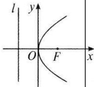
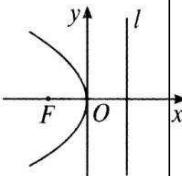
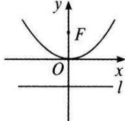
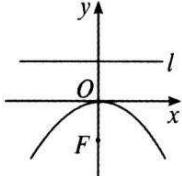
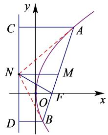
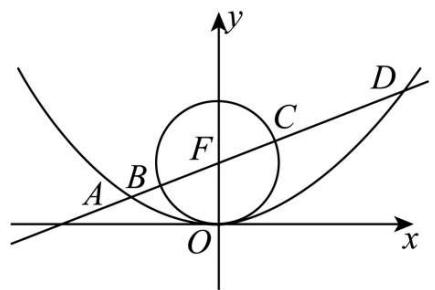

# 第66讲 抛物线及其性质

# 知识梳理

# 知识点一、抛物线的定义

平面内与一个定点 $\mathbf{F}$ 和一条定直线 $l(\mathbf{F} \notin l)$ 的距离相等的点的轨迹叫做抛物线，定点 $\mathbf{F}$ 叫抛物线的焦点，定直线 $l$ 叫做抛物线的准线.

注：若在定义中有 $\mathbf{F} \in l$ ，则动点的轨迹为 $l$ 的垂线，垂足为点 $\mathbf{F}$ .

# 知识点二、抛物线的方程、图形及性质

抛物线的标准方程有4种形式： $y^{2}=2px, y^{2}=-2px, x^{2}=2py, x^{2}=-2py(p>0)$ ，其中一次项与对称轴一致，一次项系数的符号决定开口方向

<table><tr><td>图形</td><td></td><td></td><td></td><td></td></tr><tr><td>标准方程</td><td> $y^{2}=2px(p>0)$ </td><td> $y^{2}=-2px(p>0)$ </td><td> $x^{2}=2py(p>0)$ </td><td> $x^{2}=-2py(p>0)$ </td></tr><tr><td>顶点</td><td colspan="4">O(0,0)</td></tr><tr><td>范围</td><td> $x\geqslant 0,y\in R$ </td><td> $x\leqslant 0,y\in R$ </td><td> $y\geqslant 0,x\in R$ </td><td> $y\leqslant 0,x\in R$ </td></tr><tr><td>对称轴</td><td colspan="2">x轴</td><td colspan="2">y轴</td></tr><tr><td>焦点</td><td>F $(\frac{p}{2},0)$ </td><td>F $(-\frac{p}{2},0)$ </td><td>F(0, $\frac{p}{2}$ )</td><td>F(0, $-\frac{p}{2}$ )</td></tr><tr><td>离心率</td><td colspan="4">e=1</td></tr><tr><td>准线方程</td><td> $x=-\frac{p}{2}$ </td><td> $x=\frac{p}{2}$ </td><td> $y=-\frac{p}{2}$ </td><td> $y=\frac{p}{2}$ </td></tr><tr><td>焦半径A $(x_{1},y_{1})$ </td><td>AF= $x_{1}+\frac{p}{2}$ </td><td>AF= $-x_{1}+\frac{p}{2}$ </td><td>AF= $y_{1}+\frac{p}{2}$ </td><td>AF= $-y_{1}+\frac{p}{2}$ </td></tr></table>

# 【解题方法总结】

1、点 $\mathrm{P}(x_0,y_0)$ 与抛物线 $y^{2} = 2px(p > 0)$ 的关系

(1)P 在抛物线内 (含焦点) $\Leftrightarrow y_0^2 < 2px_0$ .  
(2)P在抛物线上 $\Leftrightarrow y_0^2 = 2px_0$   
(3)P在抛物线外 $\Leftrightarrow y_0^2 > 2px_0$ .

2、焦半径

抛物线上的点 $\mathrm{P}(x_0,y_0)$ 与焦点F的距离称为焦半径，若 $y^{2} = 2px(p > 0)$ ，则焦半径 $|\mathrm{PF}| = x_0$

$$
+ \frac {p}{2}, | \mathrm{PF} | _ {\min} = \frac {p}{2}.
$$

3、 $p(p>0)$ 的几何意义

p 为焦点 F 到准线 l 的距离, 即焦准距, p 越大, 抛物线开口越大.

# 4、焦点弦

若AB为抛物线 $y^{2} = 2px(p > 0)$ 的焦点弦， $\mathrm{A}(x_1,y_1),\mathrm{B}(x_2,y_2)$ ，则有以下结论：

(1) $x_{1}x_{2}=\frac{p^{2}}{4}.$

(2) $y_{1}y_{2}=-p^{2}.$

(3)焦点弦长公式1: $|\mathrm{AB}| = x_{1} + x_{2} + p, x_{1} + x_{2} \geqslant 2\sqrt{x_{1}x_{2}} = p$ ，当 $x_{1} = x_{2}$ 时，焦点弦取最小值 $2p$ ，即所有焦点弦中通径最短，其长度为 $2p$ 。

焦点弦长公式2: $|\mathrm{AB}|=\frac{2p}{\sin^{2}\alpha}$ ( $\alpha$ 为直线AB与对称轴的夹角).

(4) $\Delta$ AOB的面积公式： $\mathrm{S}_{\Delta \mathrm{AOB}} = \frac{p^2}{2\sin\alpha} (\alpha$ 为直线AB与对称轴的夹角).

# 5、抛物线的弦

若 AB 为抛物线 $y^{2}=2px(p>0)$ 的任意一条弦， $\mathrm{A}(x_{1},y_{1}),\mathrm{B}(x_{2},y_{2})$ ，弦的中点为 $\mathrm{M}(x_{0},y_{0})(y_{0}\neq0)$ ，则

(1)弦长公式： $|\mathrm{AB}| = \sqrt{1 + k^2}|x_1 - x_2| = \sqrt{1 + \frac{1}{k^2}} |y_1 - y_2|(k_{\mathrm{AB}} = k\neq 0)$   
(2) $k_{AB}=\frac{p}{y_{0}}$   
(3) 直线 AB 的方程为 $y - y_0 = \frac{p}{y_0} (x - x_0)$   
(4) 线段 AB 的垂直平分线方程为 $y - y_0 = -\frac{y_0}{p} (x - x_0)$

6、求抛物线标准方程的焦点和准线的快速方法 $\left(\frac{A}{4}\right.$ 法

(1) $y^{2}=\mathrm{A}x(\mathrm{A}\neq0)$ 焦点为 $\left(\frac{\mathrm{A}}{4},0\right)$ ，准线为 $x=-\frac{\mathrm{A}}{4}$   
(2) $x^{2}=\mathrm{A}y(\mathrm{A}\neq0)$ 焦点为 $\left(0,\frac{\mathrm{A}}{4}\right)$ ，准线为 $y=-\frac{\mathrm{A}}{4}$

如 $y = 4x^{2}$ ，即 $x^{2} = \frac{y}{4}$ 焦点为 $\left(0,\frac{1}{16}\right)$ ，准线方程为 $y = -\frac{1}{16}$

# 7、参数方程

$y^{2} = 2px(p > 0)$ 的参数方程为 $\left\{ \begin{array}{l}x = 2pt^2\\ y = 2pt \end{array} \right.$ （参数 $t\in \mathbb{R}$

# 8、切线方程和切点弦方程

抛物线 $y^{2} = 2px(p > 0)$ 的切线方程为 $y_{0}y = p(x + x_{0})$ ， $(x_0, y_0)$ 为切点

切点弦方程为 $y_0y = p(x + x_0)$ ，点 $(x_0, y_0)$ 在抛物线外

与中点弦平行的直线为 $y_0y = p(x + x_0)$ ，此直线与抛物线相离，点 $(x_0, y_0)$ (含焦点) 是弦 AB 的中点，中点弦 AB 的斜率与这条直线的斜率相等，用点差法也可以得到同样的结果.

# 9、抛物线的通径

过焦点且垂直于抛物线对称轴的弦叫做抛物线的通径.

对于抛物线 $y^{2} = 2px (p > 0)$ ，由 $A(\frac{p}{2}, p)$ ， $B(\frac{p}{2}, -p)$ ，可得 $|AB| = 2p$ ，故抛物线的通径长为 $2p$ .

10、弦的中点坐标与弦所在直线的斜率的关系： $y_{0}=\frac{p}{k}$   
11、焦点弦的常考性质

已知 $\mathrm{A}(x_1, y_1)$ 、 $\mathrm{B}(x_2, y_2)$ 是过抛物线 $y^2 = 2px (p > 0)$ 焦点 $\mathbf{F}$ 的弦， $\mathbf{M}$ 是AB的中点， $l$ 是抛物线的准线， $\mathrm{MN} \perp l, \mathrm{N}$ 为垂足.

text_image

y
C
A
N
M
O
F
x
D
B

(1) 以 AB 为直径的圆必与准线 l 相切，以 AF(或 BF) 为直径的圆与 y 轴相切；

(2)FN⊥AB,FC⊥FD

(3) $x_{1}x_{2} = \frac{p^{2}}{4};y_{1}y_{2} = -p^{2}$

(4) 设 BD ⊥ l, D 为垂足, 则 A、O、D 三点在一条直线上

# 必考题型全归纳

# 1 题型一: 抛物线的定义与方程

3663 (2024·福建福州·高三统考开学考试)已知点 $\mathrm{P}(x_0,2)$ 在抛物线C: $y^{2} = 4x$ 上，则P到C的准线的距离为 （）

A. 4

B. 3

C. 2

D. 1

3664 (2024·四川绵阳·统考二模)涪江三桥又名绵阳富乐大桥,跨越了涪江和芙蓉溪,是继东方红大桥、涪江二桥之后在涪江上修建的第三座大桥,于2004年国庆全线通车.大桥的拱顶可近似地看作抛物线 $x^{2}=-16y$ 的一段,若有一只鸽子站在拱顶的某个位置,它到抛物线焦点的距离为10米,则鸽子到拱顶的最高点的距离为()

A. 6

B. $2 \sqrt{33}$

C. $8 \sqrt{3} 4$

D. $\sqrt{31}$

3665 (2024·内蒙古包头·高三统考开学考试)抛物线 C 的顶点为坐标原点,焦点在 x 轴上,直线 x=2 交 C 于 P,Q 两点,C 的准线交 x 轴于点 R,若 PR ⊥ QR,则 C 的方程为( )

A. $y^{2}=4x$

B. $y^{2}=6x$

C. $y^{2}=8x$

D. $y^{2}=12x$

3666 (2024·陕西渭南·高三统考阶段练习)抛物线 $y=\frac{4}{3}x^{2}$ 的焦点坐标为 （）

A. $\left(\frac{3}{16},0\right)$

B. $\left(0,\frac{3}{16}\right)$

C. $\left(\frac{1}{3},0\right)$

D. $\left(0,\frac{2}{3}\right)$

3667 (2024·全国·高三校联考开学考试)过抛物线 C: $x^{2}=2py(p>0)$ 的焦点 F 的直线 l 交 C 于 A, B 两点, 若直线 l 过点 P(1,0), 且 $|AB|=8$ , 则抛物线 C 的准线方程是 ( )

A. $y = -3$

B. $y = -2$

C. $y = -\frac{3}{2}$

D. $y = -1$

3668 (2024·广西防城港·高三统考阶段练习)已知点 A, B 在抛物线 $y^{2}=4x$ 上, O 为坐标原点, 若 $|OA|=|OB|$ , 且 $\triangle AOB$ 的垂心恰好是此抛物线的焦点 F, 则直线 AB 的方程是 ( )

A. $x - 2 = 0$

B. $x - 3 = 0$

C. $x - 4 = 0$

D. x - 5 = 0

3669 (2024·四川绵阳·高三绵阳南山中学实验学校校考阶段练习)已知抛物线 $E: y^{2} = 2px (p > 0)$ 的焦点为 F，准线为 l，过 E 上的一点 A 作 l 的垂线，垂足为 B，点 C $(p, 0)$ ，AF 与 BC 相交于点 D．若 $|AF| = 3|FC|$ ，且 $\triangle ACD$ 的面积为 $3\sqrt{2}$ ，则 E 的方程为（）

A. $y^{2} = 4x$

B. $y^{2} = 4\sqrt{3} x$

C. $y^{2}=8x$

D. $y^{2}=8\sqrt{3}x$

# 2 题型二: 抛物线的轨迹方程

3670 (2024·高三课时练习)已知点 F(1, 0), 直线 l: x = -1, 若动点 P 到点 F 和到直线 l 的距离相等, 则点 P 的轨迹方程是 \_\_\_\_.

3671 (2024·全国·高三专题练习)在平面坐标系中,动点P和点M(-3,0)、N(3,0)满足 $|\overrightarrow{MN}|$ · $|\overrightarrow{MP}| + \overrightarrow{MN} \cdot \overrightarrow{NP} = 0$ ,则动点P(x,y)的轨迹方程为 \_\_\_\_.

3672 (2024·全国·高三专题练习)与点 F(0, -3) 和直线 y - 3 = 0 的距离相等的点的轨迹方程是 \_\_\_\_.

3673 (2024·全国·高三专题练习)已知动点 M(x,y) 的坐标满足 $\sqrt{(x-2)^{2}+y^{2}}=|x+2|$ ，则动点 M 的轨迹方程为 \_\_\_\_.

3674 (2024·全国·高三专题练习)已知动点 M(x,y) 到定点 F(1,0) 与定直线 x=0 的距离的差为 1．则动点 M 的轨迹方程为 \_\_\_\_.

3675 (2024·辽宁沈阳·高三沈阳二中校考阶段练习)点 A(1,0)，点 B 是 x 轴上的动点，线段 PB 的中点 E 在 y 轴上，且 AE 垂直 PB，则 P 点的轨迹方程为 \_\_\_\_.

3676 (2024·全国·高三专题练习)已知动圆 P 与定圆 C: $(x+2)^{2} + y^{2} = 1$ 相外切, 又与直线 x = 1 相切, 那么动圆圆心 P 的轨迹方程是 \_\_\_\_.

3677 (2024·河南·校联考模拟预测)一个动圆与定圆 $F:(x-3)^{2}+y^{2}=4$ 相外切，且与直线 l:x = -1 相切，则动圆圆心的轨迹方程为 \_\_\_\_.

3678 (2024·上海·高三专题练习)已知点 A(1,0)，直线 l: x = -1，两个动圆均过点 A 且与 l 相切，其圆心分别为 C₁、C₂，若动点 M 满足 $2\overrightarrow{C_{2}M} = \overrightarrow{C_{2}C_{1}} + \overrightarrow{C_{2}A}$ ，则 M 的轨迹方程为 \_\_\_\_.

3679 (2024·全国·高三专题练习)已知点 A(-4,4)、B(4,4)，直线 AM 与 BM 相交于点 M，且直线 AM 的斜率与直线 BM 的斜率之差为 -2，点 M 的轨迹为曲线 C，则曲线 C 的轨迹方程为 \_\_\_\_

# 3 题型三:与抛物线有关的距离和最值问题

3680 (2024·江苏无锡·校联考三模)已如 P(3,3)，M 是抛物线 $y^{2}=4x$ 上的动点 (异于顶点)，过 M 作圆 C: $(x-2)^{2}+y^{2}=4$ 的切线，切点为 A，则 $|MA|+|MP|$ 的最小值为 \_\_\_\_.

3681 (2024·江苏南通·统考模拟预测)已知点 $\mathrm{P}(x_0, y_0)$ 是抛物线 $y^2 = 4x$ 上的动点，则 $\sqrt{2} x_0 + |x_0 - y_0 + 1|$ 的最小值为 \_\_\_\_.

3682 (2024·浙江绍兴·统考模拟预测)函数 $f(x)=\sqrt{4x^{4}-3x^{2}-4x+5}-\sqrt{4x^{4}-15x^{2}+2x+17}$ 的最大值为 \_\_\_\_.

3683 (2024·广西南宁·南宁三中校考模拟预测)已知斜率为 $\sqrt{3}$ 的直线 l 过抛物线 $y^{2}=2px(p>0)$ 的焦点 F，且与该抛物线交于 A, B 两点，若 $|AB|=8, P$ 为该抛物线上一点，Q 为圆 C: $\left(x+\frac{3}{2}\right)^{2}+(y-1)^{2}=1$ 上一点，则 $|PF|+|PQ|$ 的最小值为 \_\_\_\_.

3684 (2024·山东潍坊·统考模拟预测)已知抛物线 C: $y^{2}=16x$ ，其焦点为 F，PQ 是过点 F 的一条弦，定点 A 的坐标是 $(2,4)$ ，当 $|PA|+|PF|$ 取最小值时，则弦 PQ 的长是 \_\_\_\_.

3685 (2024·全国·高三专题练习)已知点M为抛物线 $y^{2}=2x$ 上的动点，点N为圆 $x^{2}+(y-4)^{2}=5$ 上的动点，则点M到y轴的距离与点M到点N的距离之和最小值为\_\_\_\_.

3686 (2024·四川南充·高三四川省南充高级中学校考阶段练习)过点 $(1,0)$ 的直线 l 交抛物线 $y^{2}=4x$ 于 A、B 两点，点 C 的坐标为 $(3,-1)$ . 设线段 AB 的中点为 M，则 $2|MC|+|AB|$ 的最小值为 \_\_\_\_.

3687 (2024·辽宁大连·育明高中校考一模)已知 $\mathrm{P}(x_{0},y_{0})$ 是抛物线 $y^{2}=4x$ 上一点，则 $\sqrt{5}x_{0}+|2x_{0}-y_{0}+13|$ 的最小值为 \_\_\_\_.

3688 (2024·江西南昌·高三统考阶段练习)已知抛物线 $y^{2}=4x$ 的焦点为 F，过 F 的直线交抛物线于 A, B 两点，则 $|AF|+4|BF|$ 的最小值是 \_\_\_\_.

3689 (2024·上海嘉定·上海市嘉定区第一中学校考三模)已知点 P 是抛物线 $y^{2}=8x$ 上的动点，Q 是圆 $(x-2)^{2}+y^{2}=1$ 上的动点，则 $\frac{|PO|}{|PQ|}$ 的最大值是 \_\_\_\_.

3690 (2024·江西·校联考模拟预测)已知 $\mathrm{P}(x_{1},y_{1}),\mathrm{Q}(x_{2},y_{2})$ 是抛物线 $x^{2}=4y$ 上两点，且 $y_{1}+y_{2}+2=\frac{2\sqrt{3}}{3}|PQ|$ ，F 为焦点，则 $\angle PFQ$ 最大值为 \_\_\_\_.

3691 (2024·吉林通化·梅河口市第五中学校考模拟预测)已知P是抛物线 $y^{2}=4x$ 上的动点，P到y轴的距离为 $d_{1}$ ，到圆C: $(x+3)^{2}+(y-3)^{2}=4$ 上动点Q的距离为 $d_{2}$ ，则 $d_{1}+d_{2}$ 的最小值为\_\_\_\_.

3692 (2024·河南·校联考模拟预测) $\frac{m^2}{6} + \sqrt{\left(\frac{m^2}{6} - \frac{1}{2}\right)^2 + \left(m - \frac{7}{2}\right)^2}$ 的最小值为 \_\_\_\_.

3693 (2024·全国·高三专题练习)已知点 M(-3,2) 是坐标平面内一定点，若抛物线 $y^{2}=2x$ 的焦点为 F，点 Q 是抛物线上的一动点，则 $|MQ|-|QF|$ 的最小值是 \_\_\_\_.

3694 (2024·福建福州·高三福建省福州第八中学校考阶段练习)已知P为抛物线 $y^{2}=4x$ 上的一个动点，Q为圆 $x^{2}+(y-4)^{2}=1$ 上的一个动点，那么点P到点Q的距离与点P到抛物线准线的距离之和的最小值是\_\_\_\_.

# 4 题型四: 抛物线中三角形, 四边形的面积问题

3695 (2024·四川乐山·统考三模)已知抛物线 C: $y^{2}=8x$ 的焦点为 F, 准线为 l, 过点 F 的直线交 C 于 P, Q 两点, PH ⊥ l 于 H, 若 |HF| = |PF|, O 为坐标原点, 则 $\triangle PFH$ 与 $\triangle OFQ$ 的面积之比为 ( )

A. 6

B. 8

C. 12

D. 16

3696 (2024·山东青岛·统考二模)已知O为坐标原点，直线 $l$ 过抛物线 $\mathrm{D}:y^2 = 2px(p > 0)$ 的焦点 F, 与 D 及其准线依次交于 A, B, C 三点 (其中点 B 在 A, C 之间), 若 $|AF| = 4$ , $|BC| = 2|BF|$ , 则 $\triangle OAB$ 的面积是 ( )

A. $\sqrt{3}$

B. $\frac{4\sqrt{3}}{3}$

C. $2 \sqrt{3}$

D. $\frac{8\sqrt{3}}{3}$

3697 (2024·北京·101中学校考模拟预测)已知直线 l:y=-1, 定点 F(0,1), P 是直线 x-y+ $\sqrt{2}=0$ 上的动点, 若经过点 F, P 的圆与 l 相切, 则这个圆的面积的最小值为 ( )

A. $\frac{\pi}{2}$

B. $\pi$

C. $3\pi$

D. $4\pi$

3698 (2024·黑龙江大庆·高三肇州县第二中学校考阶段练习)已知抛物线 C: $y^{2}=4x$ ，点 P 为抛物线上任意一点，过点 P 向圆 D: $x^{2}+y^{2}-6x+8=0$ 作切线，切点分别为 A, B，则四边形 PADB 的面积的最小值为（）

A. 3

B. $2\sqrt{2}$

C. $\sqrt{7}$

D. $\sqrt{5}$

3699 (2024·贵州·高三统考开学考试)已知抛物线 C: $y^{2}=2x$ 的焦点为 F, A(m,n) 是抛物线 C 上的一点，若 $|AF|=\frac{5}{2}$ ，则 $\triangle OAF(O$ 为坐标原点)的面积是（）

A. $\frac{1}{2}$

B. 1

C. 2

D. 4

3700 (2024·全国·高三专题练习)已知抛物线 C: $y^{2}=8x$ ，点 P 为抛物线上任意一点，过点 P 向圆 D: $x^{2}+y^{2}-4x+3=0$ 作切线，切点分别为 A, B，则四边形 PADB 的面积的最小值为（）

A. 1

B. 2

C. $\sqrt{3}$

D. $\sqrt{5}$

3701 (2024·江西宜春·校联考模拟预测)已知斜率为 $k(k>0)$ 的直线过抛物线 C: $y^{2}=4x$ 的焦点 F 且与抛物线 C 相交于 A, B 两点, 过 A, B 分别作该抛物线准线的垂线, 垂足分别为 $A_{1}, B_{1}$ , 若 $\triangle ABB_{1}$ 与 $\triangle ABA_{1}$ 的面积之比为 2, 则 k 的值为 ( )

A. $\sqrt{2}$

B. $\frac{1}{2}$

C. $\frac{\sqrt{2}}{2}$

D. $2 \sqrt{2}$

3702 (2024·安徽淮南·统考二模)抛物线 $y^{2}=2px(p>0)$ 的焦点为 F，准线为 l，过点 F 作倾斜角为 $\frac{\pi}{3}$ 的直线与抛物线在 x 轴上方的部分相交于点 A，AK ⊥ l，垂足为 K，若 $\triangle AFK$ 的面积是 $4\sqrt{3}$ ，则 p 的值为（）

A. 1

B. 2

C. $\sqrt{3}$

D. 3

# 5 题型五:焦半径问题

3703 (2024·江西·高三统考开学考试)已知 F 为抛物线 E: $y^{2}=4x$ 的焦点, A, B, C 为 E 上的三点, 若 $\overrightarrow{AF}=\frac{1}{3}\left(\overrightarrow{AB}+\overrightarrow{AC}\right)$ , 则 $\left|\overrightarrow{AF}\right|+\left|\overrightarrow{BF}\right|+\left|\overrightarrow{CF}\right|=$ \_\_\_\_.

3704 (2024·福建福州·校考模拟预测)已知抛物线 C: $y^{2}=8x$ 的焦点为 F，点 M(x, y) (y>0) 为曲线 C 上一点，若 $|MF|=4$ ，则点 M 的坐标为 \_\_\_\_.

3705 (2024·湖北武汉·统考模拟预测)已知抛物线 $y^{2}=8x$ 的焦点为 F，准线与 x 轴的交点为 C，过点 C 的直线 l 与抛物线交于 A，B 两点，若 $\angle AFB = \angle CFB$ ，则 $|AF| =$ \_\_\_\_ .

3706 (2024·全国·模拟预测)若过点 P(4,2) 向抛物线 C: $x^{2}=4y$ 作两条切线，切点分别为 A，

B, F 为抛物线的焦点, 则 $\frac{|\mathrm{AF}| + |\mathrm{BF}|}{\overrightarrow{\mathrm{AF}} \cdot \overrightarrow{\mathrm{BF}} + 2} =$ \_\_\_\_.

3707 (2024·全国·高三专题练习)设抛物线 $x^{2}=2py(p>0)$ 的焦点为 F，准线为 l，过抛物线上一点 A 作 l 的垂线，垂足为 B，设 $\mathrm{C}\left(0,\frac{9}{2}p\right)$ ，若 AF 与 BC 相交于点 E, $|CF|=2|AF|$ ， $\triangle ACE$ 的面积为 $\sqrt{3}$ ，则抛物线的方程为 \_\_\_\_.

3708 (2024·全国·高三专题练习)如图, 过抛物线 $y = \frac{1}{4} x^{2}$ 的焦点的直线交抛物线与圆 $x^{2} + (y - 1)^{2} = 1$ 于 A, B, C, D 四点, 则 AB·CD = \_\_\_\_.

text_image

y
D
C
F
B
A
O
x

3709 (2024·全国·高三专题练习)抛物线 $y^{2}=4x$ ，直线 l 经过抛物线的焦点 F，与抛物线交于 A、B 两点，若 $\overrightarrow{BA}=4\overrightarrow{BF}$ ，则 $\triangle OAB(O$ 为坐标原点 $)$ 的面积为 \_\_\_\_.

3710 (2024·河南南阳·南阳中学校考模拟预测)抛物线 C: $y^{2}=4x$ 的焦点为 F, 设过点 F 的直线 l 交抛物线与 A, B 两点, 且 $|AF|=\frac{4}{3}$ , 则 $|BF|=$ \_\_\_\_.

3711 (2024·广东茂名·茂名市第一中学校考三模)已知 O 为坐标原点, 直线 l 过抛物线 D: $y^{2} = 2px (p > 0)$ 的焦点 F, 与抛物线 D 及其准线依次交于 A, B, C 三点 (其中点 B 在 A, C 之间), 若 $|AF| = 4, |BC| = 2|BF|$ . 则 $\triangle OAB$ 的面积是 \_\_\_\_.

3712 (多选题)(2024·全国·模拟预测)已知抛物线E: $y^{2}=4x$ 的焦点为F, 准线l交x轴于点C, 直线m过C且交E于不同的A, B两点, B在线段AC上, 点P为A在l上的射影. 下列命题正确的是()

A. 若 AB ⊥ BF, 则 |AP| = |PC|

B. 若 P, B, F 三点共线, 则 $|AF| = 4$

C. 若 $\left|AB\right|=\left|BC\right|$ ，则 $\left|AF\right|=2\left|BF\right|$

D. 对于任意直线 m，都有 $\left|AF\right| + \left|BF\right| > 2\left|CF\right|$

3713 (多选题)(2024·广东惠州·高三统考阶段练习)已知抛物线 C: $y^{2}=4x$ 的焦点为 F, 直线 $l:y=k(x-1)(k\neq0)$ 与抛物线C交于A、B两点，下面说法正确的是()

A. 抛物线 C 的准线方程为 x = -2

B. $\angle AOB > \frac{\pi}{2}$

C. k=1 时， $|AB|=4\sqrt{2}$

D. $\frac{1}{|\mathrm{AF}|} +\frac{1}{|\mathrm{BF}|} = 1$

3714 (多选题)(2024·云南昭通·校联考模拟预测)已知A,B是抛物线C: $y^{2}=2x$ 上两动点，F为抛物线C的焦点，则()

A. 直线 AB 过焦点 F 时，|AB| 最小值为 4

B. 直线 AB 过焦点 F 且倾斜角为 $60^{\circ}$ 时， $|AB|=\frac{8}{3}$

C. 若 AB 中点 M 的横坐标为 2，则 |AB| 最大值为 5

D. $\frac{1}{|\mathrm{AF}|} +\frac{1}{|\mathrm{BF}|} = 2$

3715 (多选题)(2024·湖南常德·常德市一中校考二模)已知点A $(x_{1},y_{1})$ ,B $(x_{2},y_{2})$ 是抛物线 $y^{2}=8x$ 上过焦点的两个不同的点，O为坐标原点，焦点为F，则()

A. 焦点 F 的坐标为 $(4,0)$

B. $|\mathrm{AB}| = x_{1} + x_{2} + 4$

C. $y_{1}y_{2} = -8$

D. $\frac{1}{|FA|}+\frac{1}{|FB|}=\frac{1}{2}$

3716 (多选题)(2024·安徽亳州·安徽省亳州市第一中学校考模拟预测)已知F为抛物线 $y^{2}=4x$ 的焦点，K为其准线与x轴的交点，O为坐标原点.直线 $\sqrt{3}x-y-\sqrt{3}=0$ 与该抛物线交于A、B两点.则以下描述正确的是()

A. 线段 AF 的长为 4

B. $\triangle AOB$ 的面积为 $\frac{4\sqrt{3}}{3}$

C. $\overrightarrow{OA} \cdot \overrightarrow{OB} = -3$

D. 抛物线在 A、B 两点处的切线交于 K 点

3717 (多选题)(2024·山东德州·三模)已知抛物线 C: $y^{2}=8x$ 的焦点为 F, 准线为 l, 直线 l 与 x 轴交于点 P, 过点 F 的直线与抛物线 C 交于 A $(x_{1},y_{1})$ , B $(x_{2},y_{2})$ 两点, O 为坐标原点, 则 ( )

A. 若 $x_{1} + x_{2} = 8$ ，则 $|\mathrm{AB}| = 12$

B. $\overrightarrow{\mathrm{OA}}\cdot \overrightarrow{\mathrm{OB}} = -27$

C. $\frac{1}{|AF|}+\frac{1}{|BF|}=\frac{1}{2}$

D. $\triangle$ PAB 面积的最小值为 16

3718 (2024·河南·校联考模拟预测)已知 F 为抛物线 $x^{2}=2py(p>0)$ 的焦点，A, B, C 为该抛物线上的三点，O 为坐标原点， $\triangle OFA, \triangle OFB, \triangle OFC$ 面积分别为 $S_{1}, S_{2}, S_{3}$ ，若 F 为 $\triangle ABC$ 的重心，且 $S_{1}^{2}+S_{2}^{2}+S_{3}^{2}=3$ ，则该抛物线的方程为（）

A. $x^{2} = 12y$

B. $x^{2} = 8y$

C. $x^{2}=6y$

D. $x^{2}=4y$

3719 (2024·全国·高三专题练习)已知抛物线 $y^{2}=4x$ 的焦点为 F, 过原点 O 的动直线 l 交抛物线于另一点 P, 交抛物线的准线于点 Q, 下列说法正确的是 ()

A. 若 O 为线段 PQ 中点, 则 PF = 1

B. 若 $\mathrm{PF} = 4$ ，则 $\mathrm{OP} = 2\sqrt{5}$

C. 存在直线 l，使得 PF ⊥ QF

D. $\triangle \mathrm{PFQ}$ 面积的最小值为2

3720 (2024·云南昆明·高三云南省昆明市第十中学校考开学考试)已知直线 $l: y = x + 1$ 与抛物线 C: $y^{2} = 2px (p > 0)$ 相切于点 E, F 是 C 的焦点, 则 $|EF| =$ ()

A. 6

B. 4

C. 3

D. 2

3721 (2024·海南·高三海南中学校考阶段练习)已知抛物线 C: $y^{2}=2px(p>0)$ 的焦点为 F，若直线 x=4 与 C 交于 A，B 两点，且 $|AB|=8$ ，则 $|AF|=$ （）

A. 4

B. 5

C. 6

D. 7

3722 (2024·广东珠海·珠海市斗门区第一中学校考三模)已知抛物线 $x^{2} = 4y$ 的焦点为F，准线 $l$ 与坐标轴交于点N,M是抛物线上一点，若 $\left|\mathrm{FN}\right| = \left|\mathrm{FM}\right|$ ，则△FMN的面积为（）

A. 4

B. $2 \sqrt{3}$

C. $2\sqrt{2}$

D. 2

3723 (2024·上海徐汇·上海市南洋模范中学校考三模)已知抛物线 C: $x^{2}=-2py(p>0)$ 的焦点 F 与 $\frac{y^{2}}{8}+\frac{x^{2}}{4}=1$ 的一个焦点重合, 过焦点 F 的直线与 C 交于 A, B 两不同点, 抛物线 C

在A，B两点处的切线相交于点M，且M的横坐标为4，则弦长 $|AB|=$ （）

A. 16

B. 26

C. 14

D. 24

# 6 题型六: 抛物线的性质

3724 (多选题)(2024·全国·高三专题练习)关于抛物线 $y^{2}=-2x$ ，下列说法正确的是（）

A. 开口向左

B. 焦点坐标为 $(-1,0)$

C. 准线为 $x = 1$

D. 对称轴为 $x$ 轴

3725 (多选题)(2024·山东日照·高三校联考期末)(多选)对于抛物线上 $\frac{1}{8} x^2 = y$ ，下列描述正确的是 （）

A. 开口向上, 焦点为 $(0,2)$

B. 开口向上, 焦点为 $\left(0, \frac{1}{16}\right)$

C. 焦点到准线的距离为 4

D. 准线方程为 $y = -4$

3726 (多选题)(2024·浙江金华·模拟预测)已知 A(x₀,y₀),B,C 为抛物线 y²=4x 上的三个点，焦点 F 是 △ABC 的重心．记直线 AB, AC, BC 的斜率分别为 kAB,kAC,kBC，则（）

A. 线段 BC 的中点坐标为 $\left(\frac{12-y_{0}^{2}}{8}, -\frac{y_{0}}{2}\right)$

B. 直线 BC 的方程为 $4x + y_{0}y + y_{0}^{2} - 6 = 0$

C. $y_{0} \in [-2\sqrt{3}, 2\sqrt{3}]$

D. $\frac{1}{k_{AB}}+\frac{1}{k_{AC}}-\frac{1}{k_{BC}}=\frac{y_{0}}{2}$

3727 (多选题)(2024·辽宁大连·校联考模拟预测)已知抛物线 C: $x^{2}=2py(p>0)$ 的焦点为 F, 焦点到准线的距离为 2, Q 为 C 上的一个动点, 则 ( )

A. C 的焦点坐标为 $(1,0)$

B. 若 M(3,5)，则 $\triangle QMF$ 周长的最小值为 11

C. 若 $M(0,4)$ ，则 $|QM|$ 的最小值为 $2\sqrt{3}$

D. 在 x 轴上不存在点 E, 使得 $\angle QEF$ 为钝角

3728 (多选题)(2024·吉林通化·梅河口市第五中学校考模拟预测)已知点A是抛物线C: $y^{2}=4x$ 上的动点，O为坐标原点，F为焦点， $\overrightarrow{AO}\cdot\overrightarrow{AB}=\frac{1}{2}\left|\overrightarrow{AB}\right|^{2}=\frac{1}{2}\left|\overrightarrow{OA}\right|^{2}$ ，且O,A,B三点顺时针排列，则()

A. 当点 B 在 x 轴上时， $|OB|=\frac{8}{3}$

B. 当点 B 在 y 轴上时, 点 A 的坐标为 $(12, -4\sqrt{3})$

C. 当点 A 与点 B 关于 x 轴对称时， $|FA|=13$

D. 若 $\left|FA\right|=13$ ，则点 A 与点 B 关于 x 轴对称

3729 (多选题)(2024·湖南长沙·长沙一中校考模拟预测)抛物线有如下光学性质:由其焦点射出的光线经过抛物线反射后,沿平行于抛物线对称轴的方向射出;反之,平行于抛物线对称轴的入射光线经抛物线反射后必过抛物线的焦点.已知抛物线 $y^{2}=4x$ 的焦点为F,O为坐标原点,一束平行于x轴的光线 $l_{1}$ 从点 $\mathrm{P}(m,n)(n^{2}<4m)$ 射入,经过抛物线上的点 $\mathrm{A}(x_{1},y_{1})$ 反射后,再经抛物线上另一点 $\mathrm{B}(x_{2},y_{2})$ 反射后,沿直线 $l_{2}$ 射出,则下列结论中正确的是()

A. $x_{1}x_{2}=1$   
B. 点 $A(x_{1}, y_{1})$ 关于 x 轴的对称点在直线 $l_{2}$ 上  
C. 直线 $l_{2}$ 与直线 x = -1 相交于点 D，则 A, O, D 三点共线  
D. 直线 $l_{1}$ 与 $l_{2}$ 间的距离最小值为 4

3730 (多选题)(2024·全国·高三专题练习)已知抛物线 C: $x^{2}=4y$ 的焦点为 F, 点 P 为 C 上任意一点, 若点 M(1,3), 下列结论正确的是 ()

A. $|\mathrm{PF}|$ 的最小值为2  
B. 抛物线 C 关于 x 轴对称  
C. 过点 M 与抛物线 C 有一个公共点的直线有且只有一条  
D. 点 P 到点 M 的距离与到焦点 F 距离之和的最小值为 4

3731 (多选题)(2024·全国·高三专题练习)已知点F为抛物线C: $y^{2}=2px(p>0)$ 的焦点,点K为点F关于原点的对称点,点M在抛物线C上,则下列说法正确的是()

A. 使得 $\triangle$ MFK为等腰三角形的点M有且仅有4个  
B. 使得 $\triangle$ MFK为直角三角形的点M有且仅有4个  
C. 使得 $\angle \mathrm{MKF} = \frac{\pi}{4}$ 的点M有且仅有4个  
D. 使得 $\angle \mathrm{MKF} = \frac{\pi}{6}$ 的点M有且仅有4个

