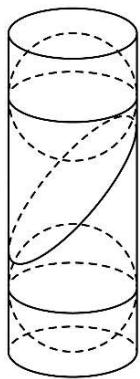
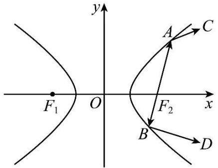
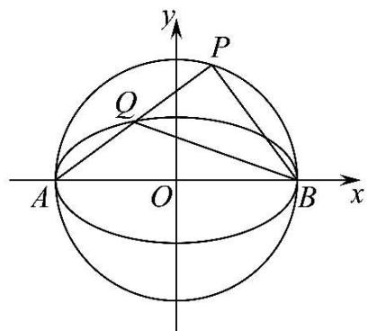
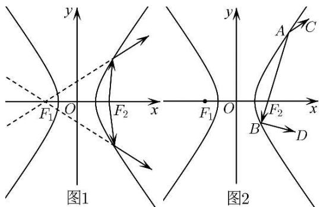
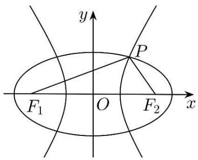
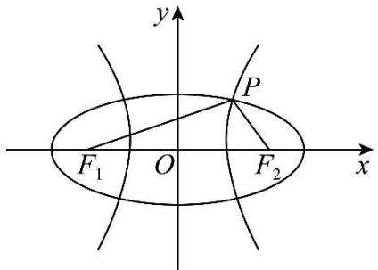
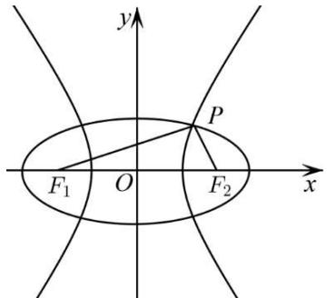
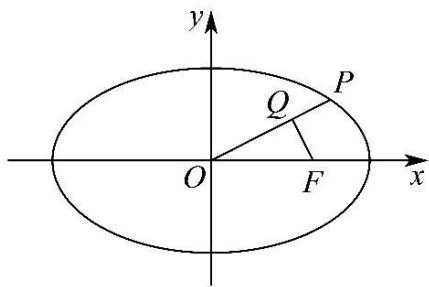

# 第67讲 圆锥曲线离心率题型全归纳

# 知识梳理

# 一、建立不等式法：

1、利用曲线的范围建立不等关系.

2、利用线段长度的大小建立不等关系． $\mathbf{F}_1,\mathbf{F}_2$ 为椭圆 $\frac{x^2}{a^2} +\frac{y^2}{b^2} = 1(a > b > 0)$ 的左、右焦点，P为椭圆上的任意一点， $|\mathrm{PF}_1|\in [a - c,a + c];\mathrm{F}_1,\mathrm{F}_2$ 为双曲线 $\frac{x^2}{a^2} -\frac{y^2}{b^2} = 1(a > 0,b > 0)$ 的左、右焦点，P为双曲线上的任一点， $|\mathrm{PF}_1|\geqslant c - a.$   
3、利用角度长度的大小建立不等关系． $F_{1},F_{2}$ 为椭圆 $\frac{x^{2}}{a^{2}}+\frac{y^{2}}{b^{2}}=1$ 的左、右焦点，P 为椭圆上的动点，若 $\angle F_{1}PF_{2}=\theta$ ，则椭圆离心率 e 的取值范围为 $\sin\frac{\theta}{2}\leqslant e<1$ 。  
4、利用题目不等关系建立不等关系.  
5、利用判别式建立不等关系.  
6、利用与双曲线渐近线的斜率比较建立不等关系.

7、利用基本不等式，建立不等关系.

# 二、函数法：

1、根据题设条件,如曲线的定义、等量关系等条件建立离心率和其他一个变量的函数关系式;  
2、通过确定函数的定义域；  
3、利用函数求值域的方法求解离心率的范围.

# 三、坐标法：

由条件求出坐标代入曲线方程建立等量关系.

# 必考题型全归纳

# 1 题型一:建立关于 a 和 c 的一次或二次方程与不等式

3732 (2024·全国·高三专题练习)在平面直角坐标系 $xOy$ 中, 已知椭圆 $\mathrm{C}_{1}$ 与双曲线 $\mathrm{C}_{2}$ 共焦点, 双曲线 $\mathrm{C}_{2}$ 实轴的两顶点将椭圆 $\mathrm{C}_{1}$ 的长轴三等分, 两曲线的交点与两焦点共圆, 则双曲线 $\mathrm{C}_{2}$ 的离心率为 ( )

A. $\sqrt{3}$

B. 2

C. $\sqrt{5}$

D. $\sqrt{6}$

3733 (2024·湖南·高三校联考阶段练习)已知椭圆 C: $\frac{x^{2}}{a^{2}} + \frac{y^{2}}{b^{2}} = 1 (a > b > 0)$ 的左、右焦点分别为 F₁, F₂，经过 F₂ 的直线交椭圆 C 于 P, Q 两点，O 为坐标原点，且 $(\overrightarrow{\mathrm{OP}} + \overrightarrow{\mathrm{OF}_{2}}) \cdot \overrightarrow{\mathrm{PQ}} = 0$ ， $\overrightarrow{PF_{2}} = 2\overrightarrow{F_{2}Q}$ ，则椭圆 C 的离心率为 \_\_\_\_.

3734 (2024·海南海口·高三统考期中)已知双曲线 C: $\frac{x^{2}}{a^{2}} - \frac{y^{2}}{b^{2}} = 1 (a > 0, b > 0)$ 的左顶点为 A，右焦点为 F(c,0)，过点 A 的直线 l 与圆 $(x - c)^{2} + y^{2} = (c - a)^{2}$ 相切，与 C 交于另一点 B，且 $\angle BAF = \frac{\pi}{6}$ ，则 C 的离心率为（）

A. 3

B. $\frac{5}{2}$

C. 2

D. $\frac{3}{2}$

3735 (2024·贵州·校联考模拟预测)已知右焦点为F的椭圆E: $\frac{x^2}{a^2} +\frac{y^2}{b^2} = 1(a > b > 0)$ 上的三点A,B,C满足直线AB过坐标原点,若BF⊥AC于点F,且 $|\mathrm{BF}| = 3|\mathrm{CF}|$ ,则E的离心率是

A. $\frac{\sqrt{2}}{2}$

B. $\frac{\sqrt{7}}{5}$

C. $\frac{\sqrt{3}}{2}$

D. $\frac{1}{2}$

3736 (2024·福建龙岩·福建省龙岩第一中学校考模拟预测)已知双曲线 C: $\frac{x^{2}}{a^{2}} - \frac{y^{2}}{b^{2}} = 1 (a > 0, b > 0)$ 的右焦点为 F，过 F 分别作 C 的两条渐近线的平行线与 C 交于 A，B 两点，若 $|AB| = 2\sqrt{3}b$ ，则 C 的离心率为 \_\_\_\_

3737 (2024·湖北·高三校联考阶段练习)双曲线 C: $\frac{x^{2}}{a^{2}} - \frac{y^{2}}{b^{2}} = 1 (a, b > 0)$ 的左焦点为 F，直线 FD 与双曲线 C 的右支交于点 D，A，B 为线段 FD 的两个三等分点，且 $|OA| = |OB| = \frac{\sqrt{2}}{2} a$ (O 为坐标原点)，则双曲线 C 的离心率为 \_\_\_\_.

3738 (2024·河南开封·统考模拟预测)已知 A 是双曲线 C: $\frac{x^{2}}{a^{2}} - \frac{y^{2}}{b^{2}} = 1 (a > 0, b > 0)$ 的右顶点，点 P(2,3) 在 C 上，F 为 C 的左焦点，若 $\triangle APF$ 的面积为 $\frac{9}{2}$ ，则 C 的离心率为 \_\_\_\_.

3739 (2024·辽宁沈阳·东北育才学校校考一模)如图,在底面半径为1,高为6的圆柱内放置两个球,使得两个球与圆柱侧面相切,且分别与圆柱的上下底面相切.一个与两球均相切的平面斜截圆柱侧面,得到的截线是一个椭圆.则该椭圆的离心率为\_\_\_\_.

natural_image

Pure geometric diagram of a cylinder with internal curved lines, no text or symbols present

3740 (2024·陕西西安·校考三模)已知双曲线 C: $\frac{x^{2}}{a^{2}} - \frac{y^{2}}{b^{2}} = 1 (a > 0, b > 0)$ 的左焦点为 F，过 F 的直线与圆 $x^{2} + y^{2} = a^{2}$ 相切于点 Q，与双曲线的右支交于点 P，若 $|PQ| = 2|QF|$ ，则双曲线 C 的离心率为 \_\_\_\_.

3741 (2024·河北·高三校联考期末)双曲线 C: $\frac{x^{2}}{a^{2}} - \frac{y^{2}}{b^{2}} = 1 (a > 0, b > 0)$ 的左焦点为 F，右顶点为 A，过 A 且垂直于 x 轴的直线交 C 的渐近线于点 P，PO 恰为 $\triangle PFA$ 的角平分线，则 C 的离心率为 \_\_\_\_.

# 2 题型二:圆锥曲线第一定义

3742 (2024·湖南株洲·高三校考阶段练习)已知 $F_{1}, F_{2}$ 分别为双曲线 E: $\frac{x^{2}}{a^{2}} - \frac{y^{2}}{b^{2}} = 1 (a > 0, b > 0)$ 的左、右焦点，过原点 O 的直线 l 与 E 交于 A, B 两点（点 A 在第一象限），延长 $AF_{2}$ 交 E 于点 C，若 $|BF_{2}| = |AC|, \angle F_{1}BF_{2} = \frac{\pi}{3}$ ，则双曲线 E 的离心率为 \_\_\_\_.

3743 (2024·山西大同·高三统考开学考试)已知椭圆 $C_{1}\frac{x^{2}}{a^{2}}+\frac{y^{2}}{b^{2}}=1(a>b>0)$ 的左、右焦点分别为 $F_{1}, F_{2}$ ，点 P, Q 为 C 上关于坐标原点对称的两点，且 $|PQ|=|F_{1}F_{2}|$ ，且四边形 $PF_{1}QF_{2}$ 的面积为 $\frac{4}{9}a^{2}$ ，则 C 的离心率为 \_\_\_\_.

3744 (2024·全国·高三专题练习)已知椭圆 $E:\frac{y^{2}}{a^{2}}+\frac{x^{2}}{b^{2}}=1(a>b>0)$ 的上、下焦点分别为 $F_{1}$ 、 $F_{2}$ ，焦距为 $2\sqrt{3}$ ，与坐标轴不垂直的直线 l 过 $F_{1}$ 且与椭圆 E 交于 A、B 两点，点 P 为线段 $AF_{2}$ 的中点，若 $\angle ABF_{2}=\angle F_{2}PB=90^{\circ}$ ，则椭圆 E 的离心率为 \_\_\_\_.

3745 (2024·全国·高三专题练习) $F_{1}$ ， $F_{2}$ 是椭圆 E: $\frac{x^{2}}{a^{2}} + \frac{y^{2}}{b^{2}} = 1 (a > b > 0)$ 的左，右焦点，点 M 为椭圆 E 上一点，点 N 在 x 轴上，满足 $\angle F_{1}MN = \angle F_{2}MN = 45^{\circ}, 3|NF_{1}| = 4|NF_{2}|$ ，则椭圆 E 的离心率为 \_\_\_\_.

3746 (2024·四川巴中·高三统考开学考试)已知双曲线 C: $\frac{x^{2}}{a^{2}} - \frac{y^{2}}{b^{2}} = 1 (a > 0, b > 0)$ 的左、右焦点分别为 $F_{1}, F_{2}$ ，过 $F_{1}$ 斜率为 $\frac{3}{4}$ 的直线与 C 的右支交于点 P，若线段 $PF_{1}$ 恰被 y 轴平分，则 C 的离心率为（）

A. $\frac{1}{2}$

B. $\frac{2\sqrt{3}}{3}$

C. 2

D. 3

3747 (2024·内蒙古赤峰·高三统考开学考试)已知 $F_{1}$ ， $F_{2}$ 分别为双曲线 E: $\frac{x^{2}}{a^{2}} - \frac{y^{2}}{b^{2}} = 1 (a > 0, b > 0)$ 的左、右焦点，过原点 O 的直线 l 与 E 交于 A，B 两点（点 A 在第一象限），延长 $AF_{2}$ 交 E 于点 C，若 $|BF_{2}| = |AC|$ ， $\angle F_{1}BF_{2} = \frac{\pi}{3}$ ，则双曲线 E 的离心率为（）

A. $\sqrt{3}$

B. 2

C. $\sqrt{5}$

D. $\sqrt{7}$

3748 (2024·广东·高三校联考阶段练习)已知双曲线 C: $\frac{x^{2}}{a^{2}} - \frac{y^{2}}{b^{2}} = 1 (a > 0, b > 0)$ ，斜率为 $-\sqrt{3}$ 的直线 l 过原点 O 且与双曲线 C 交于 P, Q 两点，且以 PQ 为直径的圆经过双曲线的一个焦点，则双曲线 C 的离心率为（）

A. $\frac{\sqrt{3}+1}{2}$

B. $\sqrt{3}+1$

C. $2 \sqrt{3} - 1$

D. $2 \sqrt{3} - 2$

3749 (2024·河南·统考模拟预测)已知双曲线 $E:\frac{y^{2}}{a^{2}}-\frac{x^{2}}{8}=1(a>0)$ 的上焦点为 $F_{1}$ ，点 P 在双曲线的下支上，若 A(4,0)，且 $|PF_{1}|+|PA|$ 的最小值为 7，则双曲线 E 的离心率为（）

A. 2 或 $\frac{\sqrt{697}}{25}$

B. 3 或 $\frac{\sqrt{697}}{25}$

C. 2

D. 3

3750 (2024·全国·高三专题练习)双曲线具有光学性质,从双曲线一个焦点发出的光线经过双

曲线镜面反射,其反射光线的反向延长线经过双曲线的另一个焦点.若双曲线 $E:\frac{x^{2}}{a^{2}}-\frac{y^{2}}{b^{2}}=1(a>0,b>0)$ 的左、右焦点分别为 $F_{1},F_{2}$ ，从 $F_{2}$ 发出的光线经过图中的 A，B 两点反射后，分别经过点 C 和 D，且 $\cos\angle BAC=-\frac{5}{13},\overrightarrow{AB}\cdot\overrightarrow{BD}=0$ ，则 E 的离心率为（）

text_image

y
A
C
F₁ O F₂ x
B
D

A. $\frac{\sqrt{17}}{3}$

B. $\frac{\sqrt{37}}{5}$

C. $\frac{\sqrt{10}}{2}$

D. $\sqrt{5}$

3751 (2024·甘肃酒泉·统考三模)已知双曲线 $\mathrm{E}:\frac{x^2}{a^2} -\frac{y^2}{b^2} = 1(a > 0,b > 0)$ 的右焦点为F，过点F的直线 $l$ 与双曲线E的右支交于B，C两点，且 $|\mathrm{CF}| = 3|\mathrm{FB}|$ ，点B关于原点O的对称点为点A，若 $\overrightarrow{\mathrm{AF}}\cdot \overrightarrow{\mathrm{BF}} = 0$ ，则双曲线E的离心率为 （）

A. $\sqrt{3}$

B. $\frac{2\sqrt{3}}{3}$

C. $\frac{\sqrt{10}}{3}$

D. $\frac{\sqrt{10}}{2}$

3752 (2024·山西吕梁·统考二模)已知双曲线 C: $\frac{x^{2}}{a^{2}} - \frac{y^{2}}{b^{2}} = 1 (a > 0, b > 0)$ 的左、右焦点分别为 $F_{1}, F_{2}$ ，直线 y = kx 与 C 交于 P，Q 两点， $\overrightarrow{PF_{1}} \cdot \overrightarrow{QF_{1}} = 0$ ，且 $\triangle PF_{2}Q$ 的面积为 $4a^{2}$ ，则 C 的离心率是（）

A. $\sqrt{3}$

B. $\sqrt{5}$

C. 2

D. 3

# 题型三: 圆锥曲线第二定义

3753 (2024·全国·高三专题练习)古希腊数学家欧几里得在《几何原本》中描述了圆锥曲线的共性,并给出了圆锥曲线的统一定义,他指出,平面内到定点的距离与到定直线的距离的比是常数e的点的轨迹叫做圆锥曲线;当0<e<1时,轨迹为椭圆;当e=1时,轨迹为抛物线;当e>1时,轨迹为双曲线.则方程 $\frac{\sqrt{(x-4)^{2}+y^{2}}}{|25-4x|}=\frac{1}{5}$ 表示的圆锥曲线的离心率e等于()

A. $\frac{1}{5}$

B. $\frac{4}{5}$

C. $\frac{5}{4}$

D. 5

3754 (2024·北京石景山·高三专题练习)已知双曲线 $\frac{x^{2}}{a^{2}} - \frac{y^{2}}{b^{2}} = 1 (a, b > 0)$ 的左、右焦点分别为 $F_{1}F_{2}$ ，P 为左支上一点，P 到左准线的距离为 d，若 d、 $|PF_{1}|$ 、 $|PF_{2}|$ 成等比数列，则其离心率的取值范围是（）

A. $\left[\sqrt{2},+\infty\right)$

B. $(1,\sqrt{2}]$

C. $[1 + \sqrt{2}, +\infty)$

D. $(1,1+\sqrt{2}]$

3755 (2024·全国·高三专题练习)已知双曲线 C: $\frac{x^2}{a^2} - \frac{y^2}{b^2} = 1 (a > 0, b > 0)$ 的右焦点为 F，过 F

且斜率为 $\sqrt{3}$ 的直线交C于A、B两点，若 $\overrightarrow{\mathrm{AF}} = 4\overrightarrow{\mathrm{FB}}$ ，则C的离心率为 （）

A. $\frac{5}{8}$

B. $\frac{6}{5}$

C. $\frac{7}{5}$

D. $\frac{9}{5}$

# 题型四:圆锥曲线第三定义(斜率之积)

3756 (2024·云南曲靖·高三校联考阶段练习)已知双曲线 C: $\frac{x^{2}}{a^{2}} - \frac{y^{2}}{b^{2}} = 1 (a > 0, b > 0)$ 虚轴的一个顶点为 D，直线 x = 3a 与 C 交于 A，B 两点，若 $\triangle ABD$ 的垂心在 C 的一条渐近线上，则 C 的离心率为 \_\_\_\_.

3757 (2024·陕西西安·西安市大明宫中学校考模拟预测)已知椭圆 C: $\frac{x^{2}}{a^{2}} + \frac{y^{2}}{b^{2}} = 1 (a > b > 0)$ 的焦距为 2c，左焦点为 F，直线 l 与 C 相交于 A，B 两点，点 P 是线段 AB 的中点，P 的横坐标为 $\frac{1}{3}c$ 。若直线 l 与直线 PF 的斜率之积等于 $-\frac{3}{16}$ ，则 C 的离心率为 \_\_\_\_.

3758 (2024·山东济南·高三统考开学考试)已知椭圆 C: $\frac{x^{2}}{a^{2}} + \frac{y^{2}}{b^{2}} = 1 (a > b > 0)$ 的上顶点为 B, 两个焦点为 $F_{1}$ , $F_{2}$ , 线段 $BF_{2}$ 的垂直平分线过点 $F_{1}$ , 则椭圆的离心率为 \_\_\_\_.

3759 (2024·山东青岛·高三统考期末)已知双曲线 $E: \frac{x^{2}}{a^{2}} - \frac{y^{2}}{b^{2}} = 1 (a > 0, b > 0)$ 与直线 y = kx 相交于 A, B 两点，点 P 为双曲线 E 上的一个动点，记直线 PA, PB 的斜率分别为 $k_{1}, k_{2}$ ，若 $k_{1}k_{2} = \frac{1}{4}$ ，且双曲线 E 的右焦点到其一条渐近线的距离为 1，则双曲线 E 的离心率为 \_\_\_\_.

3760 (2024·山东·高三校联考开学考试)如图，A，B分别是椭圆C: $\frac{x^{2}}{a^{2}}+\frac{y^{2}}{b^{2}}=1(a>b>0)$ 的左、右顶点，点P在以AB为直径的圆O上(点P异于A，B两点)，线段AP与椭圆C交于另一点Q，若直线BP的斜率是直线BQ的斜率的4倍，则椭圆C的离心率为（）

text_image

y
P
Q
A
O
B
x

A. $\frac{\sqrt{3}}{3}$

B. $\frac{1}{2}$

C. $\frac{\sqrt{3}}{2}$

D. $\frac{3}{4}$

# 题型五:利用数形结合求解

3761 (2024·广西·模拟预测)如图1所示,双曲线具有光学性质:从双曲线右焦点发出的光线经过双曲线镜面反射,其反射光线的反向延长线经过双曲线的左焦点.若双曲线 $E:\frac{x^{2}}{a^{2}}-$ $\frac{y^{2}}{b^{2}}=1(a>0,b>0)$ 的左、右焦点分别为 $F_{1},F_{2}$ ，从 $F_{2}$ 发出的光线经过图 2 中的 A,B 两点反射后，分别经过点 C 和 D，且 $\tan\angle CAB=-\frac{12}{5},|\overrightarrow{BD}|^{2}=\overrightarrow{AD}\cdot\overrightarrow{BD}$ ，则双曲线 E 的离心率为（）

text_image

y
F₁ O F₂ x
图1
y
A C
F₂
B D
x
图2

A. $\frac{6}{5}$

B. $\frac{\sqrt{37}}{5}$

C. $\frac{2\sqrt{10}}{5}$

D. $\frac{\sqrt{14}}{3}$

3762 (2024·河北秦皇岛·高三校联考开学考试)已知 $F_{1}, F_{2}$ 是椭圆 $C: \frac{x^{2}}{a^{2}} + \frac{y^{2}}{b^{2}} = 1 (a > b > 0)$ 的两个焦点，点 M 在 C 上，若 C 的离心率 $e \in \left( \frac{\sqrt{2}}{2}, 1 \right)$ ，则使 $\Delta MF_{1}F_{2}$ 为直角三角形的点 M 有（）个

A. 2

B. 4

C. 6

D. 8

3763 (2024·湖北武汉·高三武汉市第六中学校联考阶段练习)过双曲线 $E: \frac{x^{2}}{a^{2}} - \frac{y^{2}}{b^{2}} = 1 (a > 0, b > 0)$ 的左焦点 F 作 $x^{2} + y^{2} = a^{2}$ 的一条切线，设切点为 T，该切线与双曲线 E 在第一象限交于点 A，若 $\overrightarrow{FA} = 3\overrightarrow{FT}$ ，则双曲线 E 的离心率为（）

A. $\sqrt{3}$

B. $\sqrt{5}$

C. $\frac{\sqrt{13}}{2}$

D. $\frac{\sqrt{15}}{2}$

3764 (2024·云南昆明·高三昆明一中校考阶段练习)已知点 $\mathrm{P}(x_0,y_0)$ 是椭圆 $\mathrm{C}:\frac{x^2}{a^2} +\frac{y^2}{b^2} = 1(a$ $>b > 0)$ 上的一点， $\mathrm{F}_1,\mathrm{F}_2$ 是C的两个焦点，若 $\overrightarrow{\mathrm{PF}_1}\cdot \overrightarrow{\mathrm{PF}_2}\leqslant 0$ ，则椭圆C的离心率的取值范围是 （）

A. $\left(0,\frac{\sqrt{2}}{2}\right)$

B. $\left(0,\frac{\sqrt{2}}{2}\right]$

C. $\left(\frac{\sqrt{2}}{2},1\right)$

D. $\left[\frac{\sqrt{2}}{2},1\right)$

# 题型六:利用正弦定理

3765 (2024·全国·高三专题练习)已知 $F_{1}$ ， $F_{2}$ 分别为椭圆 E: $\frac{x^{2}}{a^{2}} + \frac{y^{2}}{b^{2}} = 1 (a > b > 0)$ 的两个焦点，P 是椭圆 E 上的点， $PF_{1} \perp PF_{2}$ ，且 $\sin \angle PF_{2}F_{1} = 3\sin \angle PF_{1}F_{2}$ ，则椭圆 E 的离心率为（）

A. $\frac{\sqrt{10}}{2}$

B. $\frac{\sqrt{10}}{4}$

C. $\frac{\sqrt{5}}{2}$

D. $\frac{\sqrt{5}}{4}$

3766 (2024·全国·高三专题练习)过椭圆 $\frac{x^{2}}{a^{2}}+\frac{y^{2}}{b^{2}}=1(a>b>0)$ 的左、右焦点 $F_{1}, F_{2}$ 作倾斜角分别为 $\frac{\pi}{6}$ 和 $\frac{\pi}{3}$ 的两条直线 $l_{1}, l_{2}$ . 若两条直线的交点 P 恰好在椭圆上, 则椭圆的离心率

为 （）

A. $\frac{\sqrt{2}}{2}$

B. $\sqrt{3} - 1$

C. $\frac{\sqrt{3}-1}{2}$

D. $\frac{\sqrt{5}-1}{2}$

3767 (2024·江苏·扬州中学高三开学考试)已知椭圆 $\frac{x^{2}}{a^{2}} + \frac{y^{2}}{b^{2}} = 1 (a > 0, b > 0)$ 的左、右焦点分别为 $F_{1}(-c, 0)$ , $F_{2}(c, 0)$ ，若椭圆上存在点 P(异于长轴的端点)，使得 $c \sin \angle PF_{1}F_{2} = a \sin \angle PF_{2}F_{1}$ ，则该椭圆离心率 e 的取值范围是 \_\_\_\_.

3768 (2024·广西南宁·南宁市武鸣区武鸣高级中学校考二模)设 $F_{1}$ 、 $F_{2}$ 分别为椭圆 $\frac{x^{2}}{a^{2}} + \frac{y^{2}}{b^{2}} = 1 (a > b > 0)$ 的左、右焦点，椭圆上存在点 M， $\angle MF_{1}F_{2} = \alpha, \angle MF_{2}F_{1} = \beta$ ，使得离心率 e = $\frac{\sin\beta}{\sin\alpha}$ ，则 e 取值范围为 \_\_\_\_.

3769 (2024·江西吉安·高三吉安一中校考开学考试)点 P 是双曲线 $C_{1}:\frac{x^{2}}{a^{2}}-\frac{y^{2}}{b^{2}}=1(a>0,b>0)$ 和圆 $C_{2}:x^{2}+y^{2}=a^{2}+b^{2}$ 的一个交点，且 $2\angle PF_{1}F_{2}=\angle PF_{2}F_{1}$ ，其中 $F_{1},F_{2}$ 是双曲线 $C_{1}$ 的两个焦点，则双曲线 $C_{1}$ 的离心率为 \_\_\_\_.

3770 (2024·全国·高三专题练习)已知椭圆 $\Gamma:\frac{x^{2}}{a^{2}}+\frac{y^{2}}{b^{2}}=1$ 与双曲线 $\Omega:\frac{x^{2}}{m^{2}}-\frac{y^{2}}{n^{2}}=1$ 共焦点， $F_{1}$ 、 $F_{2}$ 分别为左、右焦点，曲线 $\Gamma$ 与 $\Omega$ 在第一象限交点为 P，且离心率之积为 1. 若 $\sin\angle F_{1}PF_{2}=2\sin\angle PF_{1}F_{2}$ ，则该双曲线的离心率为 \_\_\_\_.

# 7 题型七:利用余弦定理

3771 (2024·福建福州·高三福建省福州第八中学校考阶段练习)已知双曲线 C: $\frac{x^{2}}{a^{2}} - \frac{y^{2}}{b^{2}} = 1 (a > 0, b > 0)$ 的左、右焦点分别为 $F_{1}, F_{2}$ ，P 是 C 右支上一点，线段 $PF_{1}$ 与 C 的左支交于点 M. 若 $\angle F_{1}PF_{2} = \frac{\pi}{3}$ ，且 $|PM| = |PF_{2}|$ ，则 C 的离心率为 \_\_\_\_.

3772 (2024·江苏淮安·高三统考开学考试)椭圆 C: $\frac{x^{2}}{a^{2}} + \frac{y^{2}}{b^{2}} = 1 (a > b > 0)$ 的左、右焦点分别为 $F_{1}, F_{2}$ ，上顶点为 A，直线 $AF_{1}$ 与椭圆 C 交于另一点 B，若 $\angle AF_{2}B = 120^{\circ}$ ，则椭圆 C 的离心率为 \_\_\_\_.

3773 (2024·河北唐山·模拟预测)已知 $F_{1}, F_{2}$ 是椭圆 $E: \frac{x^{2}}{a^{2}} + \frac{y^{2}}{b^{2}} = 1 (a > b > 0)$ 的左，右焦点，E 上两点 A, B 满足 $3 \overrightarrow{AF_{2}} = 2 \overrightarrow{F_{2}B}, |\mathrm{AF}_{1}| = 2 |\mathrm{AF}_{2}|$ ，则 E 的离心率为 \_\_\_\_.

3774 (2024·广东湛江·高三校联考阶段练习)已知双曲线 C: $\frac{x^{2}}{a^{2}} - \frac{y^{2}}{b^{2}} = 1 (a > 0, b > 0)$ 的离心率为 2，左、右顶点分别为 A₁, A₂，右焦点为 F，点 P 在 C 的右支上，且满足 PF ⊥ FA₂，则 tan∠A₁PA₂ = ()

A. $\frac{1}{2}$

B. 1

C. $\sqrt{3}$

D. 2

3775 (2024·河南·校联考二模)已知双曲线 C: $\frac{x^{2}}{a^{2}} - \frac{y^{2}}{b^{2}} = 1 (a > 0, b > 0)$ 的左、右焦点分别是 $F_{1}, F_{2}, P$ 是双曲线 C 上的一点，且 $|PF_{1}| = 5, |PF_{2}| = 3, \angle F_{1}PF_{2} = 120^{\circ}$ ，则双曲线 C 的离心

率是

( )

A. 7

B. $\frac{7}{2}$

C. $\frac{7}{3}$

D. $\frac{7}{4}$

3776 (2024·浙江·高三校联考阶段练习)已知椭圆 C: $\frac{x^{2}}{a^{2}} + \frac{y^{2}}{b^{2}} = 1 (a > b > 0)$ 的左、右焦点分别为 F₁, F₂, 点 P 在 C 上, 且 PF₁ ⊥ F₁F₂, 直线 PF₂ 与 C 交于另一点 Q, 与 y 轴交于点 M, 若 $\overrightarrow{MF_{2}} = 2\overrightarrow{F_{2}Q}$ , 则 C 的离心率为 ()

A. $\frac{3\sqrt{3}}{7}$

B. $\frac{4}{7}$

C. $\frac{\sqrt{7}}{3}$

D. $\frac{\sqrt{21}}{7}$

3777 (2024·江西抚州·高三黎川县第二中学校考开学考试)已知双曲线 C: $\frac{x^{2}}{a^{2}} - \frac{y^{2}}{b^{2}} = 1 (a > b > 0)$ 的右焦点 F 的坐标为 $(c, 0)$ ，点 P 在第一象限且在双曲线 C 的一条渐近线上，O 为坐标原点，若 $|OP| = c, |PF| = 2a$ ，则双曲线 C 的离心率为（）

A. $\sqrt{3}$

B. 2

C. $\sqrt{5}$

D. 3

3778 (2024·广西百色·高三贵港市高级中学校联考阶段练习)已知椭圆 C: $\frac{x^{2}}{a^{2}} + \frac{y^{2}}{b^{2}} = 1 (a > b > 0)$ 的左、右焦点分别为 $F_{1}, F_{2}$ ，点 P 在 C 上，若 $\left|\overrightarrow{PF_{1}}\right| = \frac{1}{2} a, \left|\overrightarrow{PF_{1}} + \overrightarrow{PF_{2}}\right| = 3b$ ，则 C 的离心率为 \_\_\_\_.

3779 (2024·广东深圳·高三校联考期中)设 $F_{1}$ ， $F_{2}$ 是双曲线 C: $\frac{x^{2}}{a^{2}} - \frac{y^{2}}{b^{2}} = 1 (a > 0, b > 0)$ 的左、右焦点，过 $F_{1}$ 的直线与 C 的左、右两支分别交于 A，B 两点，点 M 在 x 轴上， $4\overrightarrow{F_{2}A} = \overrightarrow{MB}$ ， $BF_{2}$ 平分 $\angle F_{1}BM$ ，则 C 的离心率为（）

A. $\frac{\sqrt{11}}{3}$

B. $\frac{2\sqrt{3}}{3}$

C. $\frac{\sqrt{33}}{3}$

D. $\frac{4}{3}$

3780 (2024·云南·高三云南师大附中校考阶段练习)已知双曲线 C: $\frac{x^{2}}{a^{2}} - \frac{y^{2}}{b^{2}} = 1 (a > 0, b > 0)$ 的左、右焦点分别为 $F_{1}, F_{2}, O$ 为坐标原点，过 $F_{1}$ 作 C 的一条渐近线的垂线，垂足为 M，且 $|MF_{2}| = 3|OM|$ ，则 C 的离心率为（）

A. $\sqrt{2}$

B. 2

C. $\sqrt{6}$

D. $2 \sqrt{2}$

# 题型八:内切圆问题

3781 (2024·四川成都·高三成都七中校考阶段练习)双曲线 $\mathrm{H}:\frac{x^2}{a^2} -\frac{y^2}{b^2} = 1(a,b > 0)$ 其左、右焦点分别为 $\mathrm{F}_1,\mathrm{F}_2$ ，倾斜角为 $\frac{\pi}{3}$ 的直线 $\mathrm{PF}_2$ 与双曲线H在第一象限交于点P，设 $\Delta \mathrm{F}_1\mathrm{PF}_2$ 内切圆半径为 $r$ ，若 $|\mathrm{PF}_2| \geqslant 2\sqrt{3} r$ ，则双曲线H的离心率的取值范围为

3782 (2024·全国·高三对口高考)椭圆 $\frac{x^{2}}{a^{2}} + \frac{y^{2}}{b^{2}} = 1 (a > b > 0)$ 的四个顶点 ABCD 构成菱形的内切圆恰好过焦点，则椭圆的离心率 e = \_\_\_\_.

3783 (2024·广东深圳·校考二模)已知椭圆 $\frac{x^{2}}{a^{2}}+\frac{y^{2}}{b^{2}}=1(a>b>0)$ 的左、右焦点分别为 $F_{1}(-c,0)$ 、 $F_{2}(c,0)$ ，P 为椭圆上一点（异于左右顶点）， $\triangle PF_{1}F_{2}$ 的内切圆半径为 r，若 r 的最大

值为 $\frac{c}{3}$ ，则椭圆的离心率为 \_\_\_\_.

3784 (2024·湖南长沙·高三长沙一中校考阶段练习)双曲线 C: $\frac{x^{2}}{a^{2}} - \frac{y^{2}}{b^{2}} = 1 (a > 0, b > 0)$ 的左，右焦点分别为 $F_{1}, F_{2}$ ，右支上有一点 M，满足 $\angle F_{1}MF_{2} = 90^{\circ}$ ， $\triangle F_{1}MF_{2}$ 的内切圆与 y 轴相切，则双曲线 C 的离心率为 \_\_\_\_.

3785 (2024·全国·高三专题练习)已知椭圆 C: $\frac{x^{2}}{a^{2}} + \frac{y^{2}}{b^{2}} = 1 (a > b > 0)$ 的左、右焦点分别为 F₁(-c,0), F₂(c,0), 点 M(x₀,y₀)(x₀>c) 是 C 上一点, 点 A 是直线 MF₂ 与 y 轴的交点, △AMF₁ 的内切圆与 MF₁ 相切于点 N, 若 |MN| = √2 |F₁F₂|, 则椭圆 C 的离心率 e = \_\_\_\_.

3786 (2024·全国·高三专题练习)已知椭圆 C: $\frac{x^{2}}{a^{2}} + \frac{y^{2}}{b^{2}} = 1 (a > b > 0)$ 的左、右焦点分别是 $F_{1}$ ， $F_{2}$ ，斜率为 $\frac{1}{2}$ 的直线 l 经过左焦点 $F_{1}$ 且交 C 于 A，B 两点（点 A 在第一象限），设 $\triangle AF_{1}F_{2}$ 的内切圆半径为 $r_{1}$ ， $\triangle BF_{1}F_{2}$ 的内切圆半径为 $r_{2}$ ，若 $\frac{r_{1}}{r_{2}} = 2$ ，则椭圆的离心率 e = \_\_\_\_.

3787 (2024·福建泉州·高三校考阶段练习)已知椭圆 C: $\frac{x^{2}}{a^{2}} + \frac{y^{2}}{b^{2}} = 1 (a > b > 0)$ 的左、右焦点分别是 $F_{1}, F_{2}$ ，斜率为 $\frac{1}{2}$ 的直线 l 经过左焦点 $F_{1}$ 且交 C 于 A，B 两点（点 A 在第一象限），设 $\triangle AF_{1}F_{2}$ 的内切圆半径为 $r_{1}, \triangle BF_{1}F_{2}$ 的内切圆半径为 $r_{2}$ ，若 $\frac{r_{1}}{r_{2}} = 3$ ，则椭圆的离心率 e = \_\_\_\_.

3788 (2024·山东聊城·统考一模) $F_{1},F_{2}$ 是椭圆C的两个焦点，P是椭圆C上异于顶点的一点，I是 $\triangle PF_{1}F_{2}$ 的内切圆圆心，若 $\triangle PF_{1}F_{2}$ 的面积等于 $\triangle IF_{1}F_{2}$ 的面积的3倍，则椭圆C的离心率为\_\_\_\_.

# 9 题型九:椭圆与双曲线共焦点

3789 (2024·全国·高三专题练习)椭圆与双曲线共焦点 $\mathrm{F}_1, \mathrm{F}_2$ ，它们在第一象限的交点为 $\mathbf{P}$ ，设 $\angle \mathrm{F}_1\mathrm{PF}_2 = 2\theta$ ，椭圆与双曲线的离心率分别为 $\mathrm{e}_1, \mathrm{e}_2$ ，则 （）

A. $\frac{\cos^2\theta}{\mathrm{e}_1^2} +\frac{\sin^2\theta}{\mathrm{e}_2^2} = 1$   
C. $\frac{\mathrm{e}_1^2}{\cos^2\theta} +\frac{\mathrm{e}_2^2}{\sin^2\theta} = 1$

B. $\frac{\sin^2\theta}{\mathrm{e}_1^2} +\frac{\cos^2\theta}{\mathrm{e}_2^2} = 1$   
D. $\frac{e_{1}^{2}}{\sin^{2}\theta}+\frac{e_{2}^{2}}{\cos^{2}\theta}=1$

3790 (2024·全国·高三专题练习)椭圆与双曲线共焦点 $F_{1}$ ， $F_{2}$ ，它们的交点P对两公共焦点 $F_{1}$ ， $F_{2}$ 张的角为 $\angle F_{1}PF_{2}=\frac{\pi}{3}$ .椭圆与双曲线的离心率分别为 $e_{1},e_{2}$ ，则

A. $\frac{3}{4\mathrm{e}_1^2} +\frac{1}{4\mathrm{e}_2^2} = 1$

B. $\frac{1}{4\mathrm{e}_1^2} +\frac{3}{4\mathrm{e}_2^2} = 1$

C. $\frac{4\mathrm{e}_1^2}{3} + 4\mathrm{e}_2^2 = 1$

D. $4\mathrm{e}_1^2 +\frac{4\mathrm{e}_2^2}{3} = 1$

3791 (多选题) (2024·全国·高三专题练习) 如图, P 是椭圆 $C_{1}:\frac{x^{2}}{a^{2}}+\frac{y^{2}}{b^{2}}=1(a>b>0)$ 与双曲线 $C_{2}:\frac{x^{2}}{m^{2}}-\frac{y^{2}}{n^{2}}=1^{\circ}\circ\circ(m>0,n>0)$ 在第一象限的交点, 且 $C_{1},C_{2}$ 共焦点 $F_{1},F_{2},\angle F_{1}PF_{2}=\theta,C_{1},C_{2}$ 的离心率分别为 $e_{1},e_{2}$ , 则下列结论不正确的是 ()

text_image

y
P
F₁ O F₂ x

A. $|\mathrm{PF}_1| = m + a, |\mathrm{PF}_2| = m - a$

B. 若 $\theta = 60^{\circ}$ , 则 $\frac{1}{\mathrm{e}_1^2} + \frac{3}{\mathrm{e}_2^2} = 4$

C. 若 $\theta = 90^{\circ}$ , 则 $\mathrm{e}_1^2 + \mathrm{e}_2^2$ 的最小值为 2

D. $\tan\frac{\theta}{2}=\frac{b}{n}$

3792 (多选题)(2024·全国·高三专题练习)如图，P是椭圆 $C_{1}:\frac{x^{2}}{a^{2}}+\frac{y^{2}}{b^{2}}=1(a>b>0)$ 与双曲线 $C_{2}:\frac{x^{2}}{m^{2}}-\frac{y^{2}}{n^{2}}=1(m>0,n>0)$ )在第一象限的交点，且 $C_{1},C_{2}$ 共焦点 $F_{1},F_{2},\angle F_{1}PF_{2}=\theta$ ， $C_{1},C_{2}$ 的离心率分别为 $e_{1},e_{2}$ ，则下列结论正确的是()

text_image

y
P
F₁ O F₂ x

A. $|\mathrm{PF}_1| = a + m, |\mathrm{PF}_2| = a - m$

B. 若 $\theta = 60^{\circ}$ , 则 $\frac{1}{\mathrm{e}_1^2} + \frac{3}{\mathrm{e}_2^2} = 4$

C. 若 $\theta = 90^{\circ}$ , 则 $\mathrm{e}_1^2 + \mathrm{e}_2^2$ 的最小值为 2

D. $\tan \frac{\theta}{2} = \frac{b}{n}$

3793 (多选题)(2024·全国·高三专题练习)如图，P是椭圆 $C_{1}:\frac{x^{2}}{a^{2}}+\frac{y^{2}}{b^{2}}=1(a>b>0)$ 与双曲线 $C_{2}:\frac{x^{2}}{m^{2}}-\frac{y^{2}}{n^{2}}=1(m>0,n>0)$ 在第一象限的交点，且 $C_{1},C_{2}$ 共焦点 $F_{1},F_{2},\angle F_{1}PF_{2}=\theta$ ， $C_{1},C_{2}$ 的离心率分别为 $e_{1},e_{2}$ ，则下列结论正确的是()

text_image

y
P
F₁ O F₂ x

A. $|\mathrm{PF}_1| = a + m, |\mathrm{PF}_2| = a - m$

B. 若 $\theta = 60^{\circ}$ , 则 $\frac{1}{\mathrm{e}_1^2} + \frac{3}{\mathrm{e}_2^2} = 4$

C. 若 $\theta = 90^{\circ}$ , 则 $\mathrm{e}_1^2 + \mathrm{e}_2^2$ 的最小值为 2

D. $\tan\frac{\theta}{2}=\frac{n}{b}$

3794 (2024·新疆·统考三模)在 $\triangle ABC$ 中， $\cos A = \frac{11}{14}$ ， $AC = 3$ ， $AB = 7$ ，椭圆 $C_1$ 和双曲线 $C_2$

以 A, B 为公共焦点且都经过点 C, 则 $C_{1}$ 与 $C_{2}$ 的离心率之和为 \_\_\_\_.

# 10 题型十:利用最大顶角θ

3795 (2024·全国·高二课时练习)已知椭圆 C: $\frac{x^{2}}{a^{2}} + \frac{y^{2}}{b^{2}} = 1 (a > b > 0)$ ，点 A, B 是长轴的两个端点，若椭圆上存在点 P，使得 $\angle APB = 120^{\circ}$ ，则该椭圆的离心率的取值范围是（）

A. $\left[\frac{\sqrt{6}}{3},1\right)$

B. $\left[\frac{\sqrt{3}}{2},1\right)$

C. $\left(0,\frac{\sqrt{2}}{2}\right]$

D. $\left(0,\frac{3}{4}\right]$

3796 (2024·全国·高二专题练习)设 A, B 是椭圆 C: $\frac{x^{2}}{3} + \frac{y^{2}}{m} = 1$ 长轴的两个端点, 若 C 上存在点 M 满足 $\angle AMB = 120^{\circ}$ , 则椭圆 C 的离心率的取值范围是 ( )

A. $\left(0,\frac{\sqrt{3}}{3}\right]$

B. $\left[\frac{\sqrt{6}}{3},1\right)$

C. $\left(0,\frac{\sqrt{6}}{3}\right]$

D. $\left[\frac{\sqrt{3}}{3},1\right)$

3797 (2024·全国·模拟预测)已知椭圆 C: $\frac{x^{2}}{a^{2}} + \frac{y^{2}}{b^{2}} = 1 (a > b > 0)$ ，点 P 是 C 上任意一点，若圆 O: $x^{2} + y^{2} = b^{2}$ 上存在点 M、N，使得 $\angle MPN = 120^{\circ}$ ，则 C 的离心率的取值范围是（）

A. $\left(0,\frac{\sqrt{3}}{2}\right]$

B. $\left[\frac{\sqrt{3}}{2},1\right)$

C. $\left(0,\frac{1}{2}\right]$

D. $\left[\frac{1}{2},1\right)$

3798 (2024·四川成都·高三树德中学校考开学考试)已知 $F_{1}$ 、 $F_{2}$ 是椭圆的两个焦点，满足 $\overrightarrow{MF_{1}} \cdot \overrightarrow{MF_{2}} = 0$ 的点 M 总在椭圆内部，则椭圆离心率的取值范围是（）

A. $\left(0,\frac{\sqrt{2}}{2}\right)$

B. $\left(0,\frac{1}{2}\right]$

C. $(0,1)$

D. $\left[\frac{\sqrt{2}}{2},1\right)$

# 11 题型十一:基本不等式

3799 (2024·全国·高三专题练习)设椭圆 C: $\frac{x^{2}}{a^{2}} + \frac{y^{2}}{b^{2}} = 1 (a > b > 0)$ 的右焦点为 F, 椭圆 C 上的两点 A, B 关于原点对你, 且满足 $\overrightarrow{FA} \cdot \overrightarrow{FB} = 0, |FB| \leqslant |FA| \leqslant \sqrt{3} |FB|$ , 则椭圆 C 的离心率的取值范围为 ()

A. $\left[\frac{\sqrt{2}}{2},1\right)$

B. $\left[\frac{\sqrt{2}}{2},\sqrt{3} -1\right]$

C. $[\sqrt{3} - 1, 1)$

D. $\left[\frac{\sqrt{2}}{2},\frac{\sqrt{3}}{2}\right]$

3800 (2024·江苏南京·高三阶段练习)设 $F_{1}$ 、 $F_{2}$ 分别是椭圆 E: $\frac{x^{2}}{a^{2}} + \frac{y^{2}}{b^{2}} = 1 (a > b > 0)$ 的左、右焦点，M 是椭圆 E 准线上一点， $\angle F_{1}MF_{2}$ 的最大值为 $60^{\circ}$ ，则椭圆 E 的离心率为（）

A. $\frac{\sqrt[4]{12}}{2}$

B. $\frac{\sqrt{3}}{2}$

C. $\frac{\sqrt{2}}{2}$

D. $\frac{\sqrt[4]{8}}{2}$

3801 (2024·山西运城·高三期末)已知点 A 为椭圆 $\frac{x^{2}}{a^{2}} + \frac{y^{2}}{b^{2}} = 1 (a > b > 0)$ 的左顶点，O 为坐标原点，过椭圆的右焦点 F 作垂直于 x 轴的直线 l，若直线 l 上存在点 P 满足 $\angle APO = 30^{\circ}$ ，则椭圆离心率的最大值 \_\_\_\_.

# 12 题型十二:已知 $\overrightarrow{PF_{1}}\cdot\overrightarrow{PF_{2}}$ 范围

3802 (2024·四川省南充市白塔中学高三开学考试)已知 $F_{1}$ 、 $F_{2}$ 分别为椭圆 C: $\frac{x^{2}}{a^{2}} + \frac{y^{2}}{b^{2}} =$

$1(a > b > 0)$ 的左、右焦点，A为右顶点，B为上顶点，若在线段AB上(不含端点)存在不同的两点 $\mathrm{P}_i(\mathrm{i} = 1,2)$ ，使得 $\overrightarrow{\mathrm{P_iF_1}}\cdot \overrightarrow{\mathrm{P_iF_2}} = -\frac{c^2}{3}$ ，则椭圆C的离心率的取值范围为 （）

A. $\left(0,\frac{\sqrt{2}}{2}\right)$

B. $\left(\frac{\sqrt{2}}{2},1\right)$

C. $\left(0,\frac{\sqrt{15}}{5}\right)$

D. $\left(\frac{\sqrt{2}}{2},\frac{\sqrt{15}}{5}\right)$

3803 (2024·全国·高二专题练习)已知 $F_{1}(-c,0)$ ， $F_{2}(c,0)$ 是椭圆 C: $\frac{x^{2}}{a^{2}} + \frac{y^{2}}{b^{2}} = 1 (a > b > 0)$ 的左右焦点，若椭圆上存在一点 P 使得 $\overrightarrow{PF_{1}} \cdot \overrightarrow{PF_{2}} = c^{2}$ ，则椭圆 C 的离心率的取值范围为（）

A. $\left(\frac{\sqrt{3}}{3},\frac{\sqrt{3}}{2}\right]$

B. $\left[\frac{\sqrt{3}}{3},\frac{\sqrt{2}}{2}\right]$

C. $\left[\sqrt{3} - 1, \frac{\sqrt{3}}{2}\right]$

D. $\left[\frac{\sqrt{2}}{2},1\right)$

3804 (2024·全国·高三开学考试)设 $F_{1}$ ， $F_{2}$ 分别是椭圆 E: $\frac{x^{2}}{a^{2}} + \frac{y^{2}}{b^{2}} = 1 (a > b > 0)$ 的左、右焦点，若椭圆 E 上存在点 P 满足 $\overrightarrow{PF_{1}} \cdot \overrightarrow{PF_{2}} = \frac{a^{2}}{2}$ ，则椭圆 E 离心率的取值范围（）

A. $\left(\frac{1}{2},\frac{\sqrt{2}}{2}\right)$

B. $\left[\frac{1}{2},\frac{\sqrt{2}}{2}\right]$

C. $\left(0,\frac{1}{2}\right)$

D. $\left(0,\frac{1}{2}\right]$

# 13 题型十三: $\overrightarrow{\mathrm{PF}_{1}}=\lambda\overrightarrow{\mathrm{PF}_{2}}$

3805 (2024·江苏·海安县实验中学高二阶段练习)已知椭圆 C: $\frac{x^{2}}{a^{2}} + \frac{y^{2}}{b^{2}} = 1 (a > b > 0)$ 的左、右焦点分别为 $F_{1}(-c,0)$ , $F_{2}(c,0)$ ，若椭圆 C 上存在一点 P，使得 $\frac{\sin\angle PF_{2}F_{1}}{\sin\angle PF_{1}F_{2}} = \frac{c}{a}$ ，则椭圆 C 的离心率的取值范围为（）

A. $\left(0,\frac{\sqrt{2}}{2}\right)$

B. $(0, \sqrt{2} - 1)$

C. $(\sqrt{2} - 1, 1)$

D. $\left(\frac{\sqrt{2}}{2},1\right)$

3806 (2024·浙江湖州·高二期中)已知椭圆 $\frac{x^{2}}{a^{2}}+\frac{y^{2}}{b^{2}}=1(a>b>0)$ 的左右焦点分别为 $F_{1}, F_{2}$ ，离心率为 e，若椭圆上存在点 P，使得 $\frac{PF_{1}}{PF_{2}}=e$ ，则该离心率 e 的取值范围是（）

A. $[\sqrt{2} - 1, 1)$

B. $\left[\frac{\sqrt{2}}{2},1\right)$

C. $(0, \sqrt{2} - 1]$

D. $\left(0,\frac{\sqrt{2}}{2}\right]$

3807 (2024·全国·高二课时练习)已知椭圆 $\frac{x^{2}}{a^{2}} + \frac{y^{2}}{b^{2}} = 1 (a > b > 0)$ 上存在点 P，使得 $|PF_{1}| = 3|PF_{2}|$ ，其中 $F_{1}, F_{2}$ 分别为椭圆的左、右焦点，则该椭圆的离心率的取值范围是（）

A. $\left(0,\frac{1}{4}\right]$

B. $\left(\frac{1}{4},1\right)$

C. $\left(\frac{1}{2},1\right)$

D. $\left[\frac{1}{2},1\right)$

# 14 题型十四:中点弦

3808 (2024·全国·高三开学考试)已知双曲线 C: $\frac{x^{2}}{a^{2}} - \frac{y^{2}}{b^{2}} = 1 (a > 0, b > 0)$ 与斜率为 1 的直线交于 A, B 两点, 若线段 AB 的中点为 $(4,1)$ , 则 C 的离心率 e = ()

A. $\sqrt{2}$

B. $\frac{\sqrt{10}}{3}$

C. $\frac{\sqrt{5}}{2}$

D. $\sqrt{3}$

3809 (2024·全国·高三专题练习)已知椭圆 C: $\frac{x^{2}}{a^{2}} + \frac{y^{2}}{b^{2}} = 1 (a > b > 0)$ 的左焦点为 F, 过 F 作一条倾斜角为 $60^{\circ}$ 的直线与椭圆 C 交于 A, B 两点, M 为线段 AB 的中点, 若 $3|FM| = |OF|(O \text{ 为坐标原点})$ , 则椭圆 C 的离心率为 ( )

A. $\frac{\sqrt{5}}{5}$

B. $\frac{\sqrt{10}}{5}$

C. $\frac{\sqrt{3}}{3}$

D. $\frac{\sqrt{2}}{2}$

3810 (2024·全国·高三专题练习)已知椭圆 $\frac{x^{2}}{a^{2}}+\frac{y^{2}}{b^{2}}=1(a>b>0)$ 的右焦点为 F，离心率为 $\frac{\sqrt{3}}{2}$ ，过点 F 的直线 l 交椭圆于 A，B 两点，若 AB 的中点为 $(1,1)$ ，则直线 l 的斜率为（）

A. $-\frac{1}{4}$

B. $-\frac{3}{4}$

C. $-\frac{1}{2}$

D. 1

# 15 题型十五:已知焦点三角形两底角

3811 (2024·广西·江南中学高二阶段练习)已知 $F_{1}$ ， $F_{2}$ 分别是椭圆 D: $\frac{x^{2}}{a^{2}} + \frac{y^{2}}{b^{2}} = 1 (a > b > 0)$ 的左右两个焦点，若在 D 上存在点 P 使 $\angle F_{1}PF_{2} = 90^{\circ}$ ，且满足 $2\angle PF_{1}F_{2} = \angle PF_{2}F_{1}$ ，则椭圆的离心率为（）

A. $\sqrt{3}$

B. $\sqrt{3} - 1$

C. $\frac{\sqrt{3}}{2}$

D. $\frac{\sqrt{3}}{3}$

3812 (多选题)(2024·湖南·高二期末)已知双曲线 C: $\frac{x^{2}}{a^{2}} - \frac{y^{2}}{b^{2}} = 1 (b > a > 0)$ 的左、右焦点分别为 $F_{1}, F_{2}$ ，双曲线上存在点 P(点 P 不与左、右顶点重合)，使得 $\angle PF_{2}F_{1} = 3\angle PF_{1}F_{2}$ ，则双曲线 C 的离心率的可能取值为（）

A. $\frac{\sqrt{6}}{2}$

B. $\sqrt{3}$

C. $\frac{\sqrt{10}}{2}$

D. 2

3813 (2024·全国·高三专题练习)已知双曲线 $\frac{x^{2}}{a^{2}} - \frac{y^{2}}{b^{2}} = 1 (a > 0, b > 0)$ 的左、右焦点分别为 $F_{1}, F_{2}, M$ 为双曲线右支上的一点，若 M 在以 $|F_{1}F_{2}|$ 为直径的圆上，且 $\angle MF_{2}F_{1} \in \left[\frac{\pi}{3}, \frac{5\pi}{12}\right]$ ，则该双曲线离心率的取值范围为（）

A. $(1,\sqrt{2}]$

B. $\left[\sqrt{2},+\infty\right)$

C. $(1,\sqrt{3}+1)$

D. $[\sqrt{2},\sqrt{3} +1]$

# 16 题型十六:利用渐近线的斜率

3814 (2024·云南红河·高三开远市第一中学校校考开学考试)已知双曲线 C: $\frac{x^{2}}{a^{2}} - \frac{y^{2}}{b^{2}} = 1 (a > 0, b > 0)$ 的右焦点为 F(c,0)，直线 l: x = c 与双曲线 C 交于 A, B 两点，与双曲线 C 的渐近线交于 D, E 两点，若 $|DE| = 2|AB|$ ，则双曲线 C 的离心率是 \_\_\_\_.

3815 (2024·四川内江·高三期末)已知双曲线 C: $\frac{x^{2}}{a^{2}} - \frac{y^{2}}{b^{2}} = 1 (a > 0, b > 0)$ 的左右焦点分别为 $F_{1}(-c,0)$ 、 $F_{2}(c,0)$ ，过点 $F_{1}$ 的直线 l 与双曲线 C 的渐近线交于 M,N 两点，点 M 在第一象限，M,N 两点到 x 轴的距离之和为 $\frac{4\sqrt{5}}{5}c$ ，若以 $F_{1}F_{2}$ 为直径的圆过线段 MN 的中点，则双曲线 C 的离心率的平方为 \_\_\_\_.

3816 (2024·河南信阳·高三信阳高中校考阶段练习)已知双曲线 C: $\frac{x^{2}}{a^{2}} - \frac{y^{2}}{b^{2}} = 1 (a > b > 0)$ 的一条渐近线被圆 $x^{2} + y^{2} - 4x - 4y + 4 = 0$ 截得的弦长为 $\frac{4\sqrt{15}}{5}$ ，则双曲线 C 的离心率为 \_\_\_\_.

3817 (2024·全国·镇海中学校联考模拟预测)已知 F 是双曲线 C: $\frac{x^{2}}{a^{2}} - \frac{y^{2}}{b^{2}} = 1$ 的左焦点，A 是 C 的右顶点，过点 A 作 x 轴的垂线交双曲线的一条渐近线于点 M，连接 FM 交另一条渐近线于点 N. 若 $2\overrightarrow{FN} = \overrightarrow{FM}$ ，则双曲线 C 的离心率为 \_\_\_\_.

3818 (2024·四川成都·校考模拟预测)已知双曲线 C: $\frac{x^{2}}{a^{2}} - \frac{y^{2}}{b^{2}} = 1 (a > 0, b > 0)$ 的左、右焦点分别为 $F_{1}, F_{2}$ ，点 M, N 是 C 的一条渐近线上的两点，且 $\overrightarrow{MN} = 2\overrightarrow{MO}$ (O 为坐标原点)， $|MN| = |F_{1}F_{2}|$ 。若 P 为 C 的左顶点，且 $\angle MPN = 135^{\circ}$ ，则双曲线 C 的离心率为 \_\_\_\_

3819 (2024·黑龙江哈尔滨·哈尔滨市第六中学校校考三模)已知 $F_{1}$ ， $F_{2}$ 分别为双曲线 C: $\frac{x^{2}}{a^{2}} - \frac{y^{2}}{b^{2}} = 1 (a > 0, b > 0)$ 的左、右焦点，过 $F_{2}$ 作 C 的两条渐近线的平行线，与渐近线交于 M,N 两点. 若 $\cos\angle MF_{1}N = \frac{3}{5}$ ，则 C 的离心率为 \_\_\_\_.

3820 (2024·山东菏泽·高三统考期末)已知 O 为原点, 双曲线 $\frac{x^{2}}{a^{2}} - y^{2} = 1 (a > 0)$ 上有一点 P, 过 P 作两条渐近线的平行线, 且与两渐近线的交点分别为 A, B, 平行四边形 OBPA 的面积为 1 , 则双曲线的离心率为 \_\_\_\_.

3821 (2024·全国·高三专题练习)已知 F 是椭圆 $C_{1}:\frac{x^{2}}{a^{2}}+\frac{y^{2}}{b^{2}}=1(a>b>0)$ 的右焦点，A 为椭圆 $C_{1}$ 的下顶点，双曲线 $C_{2}:\frac{x^{2}}{m^{2}}-\frac{y^{2}}{n^{2}}=1(m>0,n>0)$ 与椭圆 $C_{1}$ 共焦点，若直线 AF 与双曲线 $C_{2}$ 的一条渐近线平行， $C_{1},C_{2}$ 的离心率分别为 $e_{1},e_{2}$ ，则 $\frac{1}{e_{1}}+\frac{2}{e_{2}}$ 的最小值为 \_\_\_\_.

3822 (2024·安徽安庆·安庆一中校考三模)过双曲线 C: $\frac{x^{2}}{a^{2}} - \frac{y^{2}}{b^{2}} = 1 (a > 0, b > 0)$ 的右焦点 $F_{2}$ 作双曲线一条渐近线的垂线，垂足为 A，且与另一条渐近线交于点 B，若 $|AF_{2}| = \frac{1}{3}|F_{2}B|$ ，则双曲线 C 的离心率是（）

A. $\frac{\sqrt{6}}{2}$

B. $\sqrt{3}$ 或 $\frac{\sqrt{6}}{2}$

C. $\frac{3\sqrt{6}}{2}$

D. $3 \sqrt{3}$

3823 (2024·江西九江·统考一模)已知双曲线 $E:\frac{x^{2}}{a^{2}}-\frac{y^{2}}{b^{2}}=1(a>0,b>0)$ ，过点 M(2,0) 作 E 的一条渐近线 l 的垂线，垂足为 P，过点 M 作 x 轴的垂线交 l 于点 Q，若 $\triangle MPQ$ 与 $\triangle MPO$ 的面积相等 (O 为坐标原点)，则 E 的离心率为 ( )

A. $\frac{\sqrt{6}}{2}$

B. $\frac{2\sqrt{3}}{3}$

C. $\sqrt{2}$

D. $\sqrt{3}$

3824 (2024·重庆渝中·高三重庆巴蜀中学校考阶段练习)已知F为双曲线C: $\frac{x^2}{a^2} -\frac{y^2}{b^2} =$

$1(a > 0, b > 0)$ 的一个焦点，过 F 平行于 C 的一条渐近线的直线交 C 于点 P， $|OP| = \sqrt{a^2 + b^2}$ (O 为坐标原点)，则双曲线 C 的离心率为 \_\_\_\_.

# 17 题型十七:坐标法

3825 (2024·陕西咸阳·武功县普集高级中学校考模拟预测)双曲线C: $\frac{x^2}{a^2} -\frac{y^2}{b^2} =$

$1(a > 0, b > 0)$ 的左、右焦点分别为 $\mathrm{F}_1, \mathrm{F}_2$ ，过 $\mathrm{F}_2$ 作 $\mathrm{F}_1\mathrm{F}_2$ 的垂线，交双曲线于 A，B 两点，D 是双曲线的右顶点，连接 AD，BD，并延长分别交 $y$ 轴于点 M，N。若点 P(-3a,0) 在以 MN 为直径的圆上，则双曲线 C 的离心率为 \_\_\_\_.

3826 (2024·安徽·高三校联考阶段练习)如图,椭圆 $\Gamma:\frac{x^{2}}{a^{2}}+\frac{y^{2}}{b^{2}}=1(a>b>0)$ 的右焦点为 F, 离心率为 e, 点 P 是椭圆上第一象限内任意一点且 $\tan\angle\mathrm{POF}<1,\mathrm{FQ}\perp\mathrm{OP},\overrightarrow{\mathrm{OQ}}=\lambda\overrightarrow{\mathrm{OP}}(\lambda>0)$ . 若 $\lambda>e$ , 则离心率 e 的最小值是 \_\_\_\_.

text_image

y
Q
P
O
F
x

3827 (2024·山东·高三校联考阶段练习)已知双曲线 $E:\frac{x^{2}}{a^{2}}-\frac{y^{2}}{b^{2}}=1(a>0,b>0)$ ，直线 l 的斜率为 $-\frac{1}{2}$ ，且过点 $M(a,b)$ ，直线 l 与 x 轴交于点 C，点 D 在 E 的右支上，且满足 $\overrightarrow{MD}=\frac{1}{3}\overrightarrow{DC}$ ，则 E 的离心率为（）

A. $\sqrt{5}$

B. 2

C. $\sqrt{3}$

D. $\frac{\sqrt{5}}{2}$

3828 (2024·全国·高三专题练习)已知椭圆 C: $\frac{x^{2}}{a^{2}} + \frac{y^{2}}{b^{2}} = 1 (a > b > 0)$ 的右焦点为 F, 过点 F 作倾斜角为 $\frac{\pi}{4}$ 的直线交椭圆 C 于 A、B 两点, 弦 AB 的垂直平分线交 x 轴于点 P, 若 $\left|\frac{PF}{AB}\right| = \frac{1}{4}$ , 则椭圆 C 的离心率 e = \_\_\_\_.

3829 (2024·湖南永州·统考一模)已知椭圆 C: $\frac{x^{2}}{a^{2}} + \frac{y^{2}}{b^{2}} = 1 (a > b > 0)$ 的左、右焦点分别是 F₁, F₂，点 P 是椭圆 C 上位于第一象限的一点，且 PF₂ 与 y 轴平行，直线 PF₁ 与 C 的另一个交点为 Q，若 $2\overrightarrow{PF_{1}} = 5\overrightarrow{F_{1}Q}$ ，则 C 的离心率为（）

A. $\frac{\sqrt{21}}{7}$

B. $\frac{\sqrt{33}}{11}$

C. $\frac{\sqrt{7}}{7}$

D. $\frac{\sqrt{21}}{11}$

3830 (2024·四川南充·高三四川省南充高级中学校考阶段练习)已知双曲线 C: $\frac{x^{2}}{a^{2}} - \frac{y^{2}}{b^{2}} = 1 (a > 0, b > 0)$ 的左右焦点 F₁, F₂, 点 F₂ 关于一条渐近线的对称点在另一条渐近线上, 则双曲线 C 的离心率是 ()

A. $\sqrt{2}$

B. $\sqrt{3}$

C. 2

D. 3

3831 (2024·重庆沙坪坝·高三重庆一中校考开学考试)设 $F_{1}, F_{2}$ 分别为椭圆 $\frac{x^{2}}{a^{2}} + \frac{y^{2}}{b^{2}} = 1 (a > b > 0)$ 的左右焦点，M 为椭圆上一点，直线 $MF_{1}, MF_{2}$ 分别交椭圆于点 A, B，若 $\overrightarrow{MF_{1}} = 2\overrightarrow{F_{1}A}, \overrightarrow{MF_{2}} = 3\overrightarrow{F_{2}B}$ ，则椭圆离心率为（）

A. $\frac{\sqrt{3}}{21}$

B. $\frac{\sqrt{3}}{7}$

C. $\frac{3}{7}$

D. $\frac{\sqrt{21}}{7}$

3832 (2024·安徽·高三宿城一中校联考阶段练习)已知椭圆 C: $\frac{x^{2}}{a^{2}} + \frac{y^{2}}{b^{2}} = 1 (a > b > 0)$ 的左焦点为 $F_{1}$ ，过左焦点 $F_{1}$ 作倾斜角为 $\frac{\pi}{6}$ 的直线交椭圆于 A，B 两点，且 $\overrightarrow{AF_{1}} = 3\overrightarrow{F_{1}B}$ ，则椭圆 C 的离心率为（）

A. $\frac{1}{2}$

B. $\frac{2}{3}$

C. $\frac{\sqrt{3}}{3}$

D. $\frac{2\sqrt{2}}{3}$

3833 (2024·福建厦门·厦门一中校考模拟预测)已知 F 为双曲线 C: $\frac{x^{2}}{a^{2}} - \frac{y^{2}}{b^{2}} = 1 (a > 0, b > 0)$ 的右焦点，平行于 x 轴的直线 l 分别交 C 的渐近线和右支于点 A, B，且 $\angle OAF = 90^{\circ}$ ， $\angle OBF = \angle OFB$ ，则 C 的离心率为（）

A. $\frac{\sqrt{6}}{2}$

B. $\sqrt{2}$

C. $\frac{3}{2}$

D. $\sqrt{3}$

3834 (2024·浙江杭州·高三浙江省杭州第二中学校考阶段练习)设椭圆 $\frac{x^{2}}{a^{2}} + \frac{y^{2}}{b^{2}} =$

$1(a > b > 0)$ 的左焦点为F，O为坐标原点，过F且斜率为1的直线交椭圆于A，B两点(A在 $x$ 轴上方).A关于 $x$ 轴的对称点为D，连接DB并延长交 $x$ 轴于点E，若 $\mathrm{S}_{\triangle \mathrm{DOF}},\mathrm{S}_{\triangle \mathrm{DEF}}$ ， $\mathrm{S}_{\triangle \mathrm{DOE}}$ 成等比数列，则椭圆的离心率e的值为 （）

A. $\frac{\sqrt{3}-1}{2}$

B. $\frac{\sqrt{2}}{2}$

C. $\frac{\sqrt{3}}{2}$

D. $\frac{\sqrt{5}-1}{2}$

3835 (2024·陕西商洛·高三陕西省山阳中学校联考阶段练习)已知双曲线 C: $\frac{x^{2}}{a^{2}} - \frac{y^{2}}{b^{2}} = 1 (a > 0, b > 0)$ 的右焦点为 F，以坐标原点 O 为圆心，线段 OF 为半径作圆，与 C 的右支的一个交点为 A，若 $\cos \angle AOF = \frac{\sqrt{13}}{7}$ ，则 C 的离心率为（）

A. $\sqrt{3}$

B. 2

C. $\sqrt{5}$

D. $\sqrt{7}$

# 18 题型十八:利用焦半径的取值范围

3836 (2024·全国·高三专题练习)已知双曲线 M: $\frac{x^{2}}{a^{2}} - \frac{y^{2}}{b^{2}} = 1 (a > 0, b > 0)$ 的左、右焦点分别为 $F_{1}, F_{2}, |F_{1}F_{2}| = 2c$ . 若双曲线 M 的右支上存在点 P，使 $\frac{a}{\sin\angle PF_{1}F_{2}} = \frac{3c}{\sin\angle PF_{2}F_{1}}$ ，则双曲线 M 的离心率的取值范围为 \_\_\_\_.

3837 (2024·吉林长春·二模)已知双曲线 $\frac{x^{2}}{a^{2}} - \frac{y^{2}}{b^{2}} = 1 (a > 0, b > 0)$ 的左、右焦点分别为 $F_{1}, F_{2}$ ，点 P 在双曲线的右支上，且 $|PF_{1}| = 4 |PF_{2}|$ ，则双曲线离心率的取值范围是（）

A. $\left(\frac{5}{3},2\right]$

B. $\left(1,\frac{5}{3}\right]$

C. $(1,2]$

D. $\left[\frac{5}{3},+\infty\right)$

3838 (2024·江苏·金沙中学高二阶段练习)设双曲线 C: $\frac{x^{2}}{a^{2}} - \frac{y^{2}}{b^{2}} = 1 (a > 0, b > 0)$ 的焦距为 $2c (c > 0)$ ，左、右焦点分别是 F₁, F₂，点 P 在 C 的右支上，且 $c |PF_{2}| = a |PF_{1}|$ ，则 C 的离心率的取值范围是（）

A. $(1, \sqrt{2})$

B. $(\sqrt{2},+\infty)$

C. $(1,1 + \sqrt{2} ]$

D. $[1 + \sqrt{2}, +\infty)$

3839 (2024·全国·高三专题练习)在平面直角坐标系 $xOy$ 中，椭圆 $\frac{x^2}{a^2} +\frac{y^2}{b^2} = 1(a > b > 0)$ 上存在点P，使得 $\left|\mathrm{PF}_1\right| = 3\left|\mathrm{PF}_2\right|$ ，其中 $\mathrm{F_1}$ 、 $\mathrm{F_2}$ 分别为椭圆的左、右焦点，则该椭圆的离心率取值范围是

3840 (2024·河南·信阳高中高三期末)若椭圆 C: $\frac{x^{2}}{a^{2}} + \frac{y^{2}}{b^{2}} = 1 (a > b > 0)$ 上存在一点 P, 使得 $|PF_{1}| = 8 |PF_{2}|$ , 其中 $F_{1}, F_{2}$ 分别 C 是的左、右焦点, 则 C 的离心率的取值范围为 \_\_\_\_.

# 19 题型十九:四心问题

3841 (2024·全国·校联考模拟预测)已知双曲线 C: $\frac{x^{2}}{a^{2}} - \frac{y^{2}}{b^{2}} = 1 (a > 0, b > 0)$ 的左、右焦点分别为 $F_{1}, F_{2}, M$ 是双曲线 C 右支上一点，记 $\Delta MF_{1}F_{2}$ 的重心为 G，内心为 I. 若 $\overrightarrow{F_{1}F_{2}} = 12\overrightarrow{GI}$ ，则双曲线 C 的离心率为 \_\_\_\_.

3842 (2024·全国·高三专题练习)已知 $F_{1}$ ， $F_{2}$ 分别为椭圆 C: $\frac{x^{2}}{a^{2}} + \frac{y^{2}}{b^{2}} = 1 (a > b > 0)$ 的左、右焦点，点 P 在第一象限内， $|PF_{2}| = a$ ，G 为 $\triangle PF_{1}F_{2}$ 重心，且满足 $\overrightarrow{GF_{1}} \cdot \overrightarrow{F_{1}P} = \overrightarrow{GF_{1}} \cdot \overrightarrow{F_{1}F_{2}}$ ，线段 $PF_{2}$ 交椭圆 C 于点 M，若 $\overrightarrow{F_{2}M} = 4\overrightarrow{MP}$ ，则椭圆 C 的离心率为 \_\_\_\_.

3843 (2024·全国·高三专题练习)已知坐标平面 $xOy$ 中, 点 $\mathrm{F}_{1}, \mathrm{F}_{2}$ 分别为双曲线 $\mathrm{C}:\frac{x^{2}}{a^{2}} - y^{2} = 1(a > 0)$ 的左、右焦点, 点M在双曲线C的左支上, $\mathrm{MF}_{2}$ 与双曲线C的一条渐近线交于点D, 且D为 $\mathrm{MF}_{2}$ 的中点, 点I为 $\triangle \mathrm{OMF}_{2}$ 的外心, 若O、I、D三点共线, 则双曲线C的离心率为 \_\_\_\_.

3844 (2024·全国·高三专题练习)已知点 $F_{1}$ ， $F_{2}$ 分别为双曲线C: $\frac{x^{2}}{a^{2}}-\frac{y^{2}}{b^{2}}=1(a>0,b>0)$ 的左、右焦点，点A，B在C的右支上，且点 $F_{2}$ 恰好为 $\Delta F_{1}AB$ 的外心，若 $(\overrightarrow{\mathrm{BF}_{1}}+\overrightarrow{\mathrm{BA}})\cdot\overrightarrow{\mathrm{AF}_{1}}=0$ ，则C的离心率为\_\_\_\_.

3845 (2024·山西太原·高三山西大附中校考开学考试)已知双曲线 C: $\frac{x^{2}}{a^{2}} - \frac{y^{2}}{b^{2}} = 1 (a > 0, b > 0)$ 的左、右焦点分别为 $F_{1}, F_{2}$ ，离心率为 2，焦点到渐近线的距离为 $\sqrt{6}$ 。过 $F_{2}$ 作直线 l 交双曲线 C 的右支于 A, B 两点，若 H, G 分别为 $\triangle AF_{1}F_{2}$ 与 $\triangle BF_{1}F_{2}$ 的内心，则 $|HG|$ 的取值范围为 \_\_\_\_.

3846 (2024·全国·高三专题练习)在平面直角坐标系中,椭圆E以两坐标轴为对称轴,左,右顶点分别为A,B,点P为第一象限内椭圆上的一点,P关于x轴的对称点为Q,过P作椭圆的切线l,若 $l\perp AP$ ,且 $\triangle APQ$ 的垂心恰好为坐标原点O,记椭圆E的离心率为e,则 $e^{2}$ 的

值为 \_\_\_\_.

