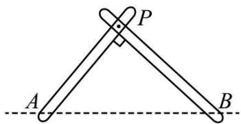
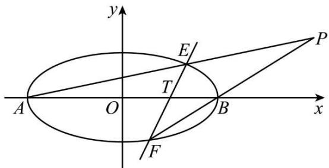
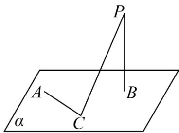
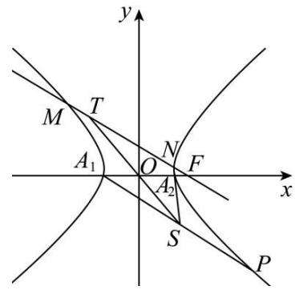

# 第68讲 曲线的轨迹方程

# 知识梳理

# 一．直接法求动点的轨迹方程

利用直接法求动点的轨迹方程的步骤如下：

(1) 建系: 建立适当的坐标系  
(2) 设点: 设轨迹上的任一点 $\mathbf{P}(x, y)$   
(3) 列式: 列出有限制关系的几何等式

(4) 代换: 将轨迹所满足的条件用含 x, y 的代数式表示, 如选用距离和斜率公式等将其转化为 x, y 的方程式化简

(5) 证明 (一般省略): 证明所求方程即为符合条件的动点轨迹方程 (对某些特殊值应另外补充检验). 简记为: 建设现代化, 补充说明.

注:若求动点的轨迹,则不但要求出动点的轨迹方程,还要说明轨迹是什么曲线.

# 二．定义法求动点的轨迹方程

回顾之前所讲的第一定义的求解轨迹问题,我们常常需要把动点P和满足焦点标志的定点连起来判断.熟记焦点的特征:(1)关于坐标轴对称的点;(2)标记为F的点;(3)圆心;(4)题目提到的定点等等.当看到以上的标志的时候要想到曲线的定义,把曲线和满足焦点特征的点连起来结合曲线定义求解轨迹方程.

# 三．相关点法求动点的轨迹方程

如果动点 P 的运动是由另外某一点 $P'$ 的运动引发的，而该点的运动规律已知，(该点坐标满足某已知曲线方程)，则可以设出 $P(x,y)$ ，用 $(x,y)$ 表示出相关点 $P'$ 的坐标，然后把 $P'$ 的坐标代入已知曲线方程，即可得到动点 P 的轨迹方程.

# 四．交轨法求动点的轨迹方程

在求动点的轨迹方程时,存在一种求解两动曲线交点的轨迹问题,这类问题常常可以先解方程组得出交点(含参数)的坐标,再消去参数得出所求轨迹的方程,该方法经常与参数法并用,和参数法一样,通常选变角、变斜率等为参数.

# 五．参数方程法求动点的轨迹方程

动点 $\mathbf{M}(x,y)$ 的运动主要是由于某个参数 $\varphi$ 的变化引起的，可以选参、设参，然后用这个参数表示动点的坐标，即 $\left\{ \begin{array}{l} x = f(\varphi) \\ y = g(\varphi) \end{array} \right.$ ，再消参.

# 六．点差法求动点的轨迹方程

圆锥曲线中涉及与弦的中点有关的轨迹问题可用点差法，其基本方法是把弦的两端点 $\mathbf{A}(x_1,y_1),\mathrm{B}(x_2,y_2)$ 的坐标代入圆锥曲线方程，两式相减可得 $x_{1} + x_{2},y_{1} + y_{2},x_{1} - x_{2},y_{1} - y_{2}$ 等关系式，由于弦AB的中点 $\mathrm{P}(x,y)$ 的坐标满足 $2x = x_{1} + x_{2},2y = y_{1} + y_{2}$ 且直线AB的斜率为 $\frac{y_2 - y_1}{x_2 - x_1}$ ，由此可求得弦AB中点的轨迹方程.

# 必考题型全归纳

# 1 题型一: 直接法

3847 (2024·甘肃平凉·高三统考期中)动点 P 与定点 A(-1,0), B(1,0) 的连线的斜率之积为 -1, 则点 P 的轨迹方程是 \_\_\_\_.  
3848 (2024·湖南长沙·高三长郡中学校联考阶段练习)已知圆 A: $x^{2} + (y - 3)^{2} = 1$ ，过动点 P 作圆 A 的切线 PB(B 为切点)，使得 $|PB| = \sqrt{3}$ ，则动点 P 的轨迹方程为 \_\_\_\_.  
3849 (2024·全国·高三专题练习)已知两条直线 $l_{1}:2x-3y+2=0$ 和 $l_{2}:3x-2y+3=0$ ，有一动圆与 $l_{1}$ 及 $l_{2}$ 都相交，并且 $l_{1}$ 、 $l_{2}$ 被截在圆内的两条弦长分别是 26 和 24，则动圆圆心的轨迹方程是 \_\_\_\_。  
3850 (2024·全国·高三专题练习)已知平面直角坐标系中有两点 $F_{1}(-2,0)$ , $F_{2}(2,0)$ ，且曲线 $C_{1}$ 上的任意一点 P 都满足 $|PF_{1}| \cdot |PF_{2}| = 5$ 。则曲线 $C_{1}$ 的轨迹方程为 \_\_\_\_.  
3851 (2024·全国·高三专题练习)已知平面上的动点P到点O(0,0)和A(2,0)的距离之比为 $\frac{\sqrt{3}}{2}$ ，则点P的轨迹方程为\_\_\_\_.  
3852 (2024·全国·高三专题练习)已知平面上一定点 C(2,0) 和直线 l: x = 8, P 为该平面上一动点, 作 PQ ⊥ l, 垂足为 Q, 且 $\left(\overrightarrow{PC} + \frac{1}{2}\overrightarrow{PQ}\right) \cdot \left(\overrightarrow{PC} - \frac{1}{2}\overrightarrow{PQ}\right) = 0$ . 则动点 P 的轨迹方程为 \_\_\_\_;

# 2 题型二:定义法

3853 (2024·全国·高三专题练习)若 $F_{1}(0,-3)$ , $F_{2}(0,3)$ ，点 P 到 $F_{1}$ , $F_{2}$ 的距离之和为 10，则点 P 的轨迹方程是 \_\_\_\_  
3854 (2024·浙江·高三校联考阶段练习)已知圆 M 与圆 O: $x^{2}+y^{2}=1$ 内切,且圆 M 与直线 x=2 相切,则圆 M 的圆心的轨迹方程为 \_\_\_\_.  
3855 (2024·广东东莞·高三校考阶段练习)已知圆 $M:(x+1)^{2}+y^{2}=1$ ，圆 $N:(x-1)^{2}+y^{2}=25$ ，动圆 P 与圆 M 外切并与圆 N 内切，则圆心 P 的轨迹方程为 \_\_\_\_  
3856 (2024·全国·高三专题练习)在平面直角坐标系 $xOy$ 中, 已知 $\triangle H M N$ 的周长是 18, M, N 是 $x$ 轴上关于原点对称的两点, 若 $|MN| = 6$ , 动点 G 满足 $\overrightarrow{GM} + \overrightarrow{GN} + \overrightarrow{GH} = \overrightarrow{0}$ . 则动点 G 的轨迹方程为 \_\_\_\_;  
3857 (2024·全国·高三对口高考)已知动圆 P 过点 N(-2,0)，且与圆 M: $(x-2)^{2}+y^{2}=8$ 外切，则动圆 P 圆心 P(x,y) 的轨迹方程为 \_\_\_\_.  
3858 (2024·全国·高三专题练习)△ABC中，A为动点，B(-2,0)，C(2,0)且满足sinC+sinB=2sinA，则A点的轨迹方程为\_\_\_\_.  
3859 (2024·全国·高三专题练习)一个动圆与圆 $C_{1}:x^{2}+(y+3)^{2}=1$ 外切，与圆 $C_{2}:x^{2}+(y-3)=81$ 内切，则这个动圆圆心的轨迹方程为 \_\_\_\_.  
3860 (2024·全国·高三对口高考)已知 A $\left(-\frac{1}{2},0\right)$ ，B 是圆 F°: $\left(x-\frac{1}{2}\right)^{2}+y^{2}=4$ (F 为圆心) 上一动点. 线段 AB 的垂直平分线交 BF 于 P，则动点 P 的轨迹方程为 \_\_\_\_.  
3861 (2024·全国·高三专题练习)已知定点R(1,0)，圆S: $x^{2}+y^{2}+2x-15=0$ ，过R点的直线 $L_{1}$ 交圆于M，N两点过R点作直线 $L_{2}$ //SN交SM于Q点，求Q点的轨迹方程；

3862 (2024·全国·高三专题练习)已知圆 O: $x^{2}+y^{2}=1$ ，直线 $l: x+y-2=0$ ，过 l 上的点 P 作圆 O 的两条切线，切点分别为 A, B，则弦 AB 中点 M 的轨迹方程为 \_\_\_\_.

3863 (2024·吉林白山·高三抚松县第一中学校考阶段练习)设 O 为坐标原点, F(2,0), 点 A 是直线 x = -2 上一个动点, 连接 AF 并作 AF 的垂直平分线 l, 过点 A 作 y 轴的垂线交 l 于点 P, 则点 P 的轨迹方程为 \_\_\_\_.

3864 (2024·云南·高三校联考阶段练习)已知圆 $A_{1}:(x+1)^{2}+y^{2}=16$ ，直线 $l_{1}$ 过点 $A_{2}(1,0)$ 且与圆 $A_{1}$ 交于点 B，C，线段 BC 的中点为 D，过 $A_{2}C$ 的中点 E 且平行于 $A_{1}D$ 的直线交 $A_{1}C$ 于点 P.

(1) 求动点 P 的轨迹方程;

# 3

# 题型三: 相关点法

3865 (2024·全国·高三专题练习)已知点P为椭圆 $\frac{x^{2}}{25}+\frac{y^{2}}{16}=1$ 上的任意一点，O为原点，M满足 $\overrightarrow{OM}=\frac{1}{2}\overrightarrow{OP}$ ，则点M的轨迹方程为\_\_\_\_.

3866 (2024·福建泉州·高三校考开学考试) M 是圆 C: $x^{2} + y^{2} = 1$ 上的动点，点 N(2,0)，则线段 MN 的中点 P 的轨迹方程是 \_\_\_\_.

3867 (2024·四川内江·高三四川省内江市第六中学校考阶段练习)已知定点 A(4, -2) 和曲线 $x^{2} + y^{2} = 4$ 上的动点 B，则线段 AB 的中点 P 的轨迹方程为 \_\_\_\_.

3868 (2024·全国·高考真题)设 P 为双曲线 $\frac{x^{2}}{4}-y^{2}=1$ 上一动点，O 为坐标原点，M 为线段 OP 的中点，则点 M 的轨迹方程为 \_\_\_\_.

3869 (2024·全国·高三专题练习)已知 $\triangle ABC$ 的顶点 B(-3,0), C(1,0), 顶点 A 在抛物线 $y = x^{2}$ 上运动, 则 $\triangle ABC$ 的重心 G 的轨迹方程为 \_\_\_\_.

3870 (2024·全国·高三专题练习)设过点P(x,y)的直线分别与x轴的正半轴和y轴的正半轴交于A、B两点,点Q与点P关于y轴对称,O为坐标原点.若 $\overrightarrow{BP}=2\overrightarrow{PA}$ ,且 $\overrightarrow{OQ}\cdot\overrightarrow{AB}=1$ ,则点P的轨迹方程是\_\_\_\_.

3871 (2024·全国·高三专题练习)在平面直角坐标系中， $\triangle ABC$ 满足 $A(-1,0), B(1,0), \overrightarrow{GA} + \overrightarrow{GB} + \overrightarrow{GC} = 0, \overrightarrow{GP} = \overrightarrow{GA} + \lambda \left( \frac{\overrightarrow{AB}}{|\overrightarrow{AB}|} + \frac{\overrightarrow{AC}}{|\overrightarrow{AC}|} \right)$ ， $\angle ACB$ 的平分线与点 $P$ 的轨迹相交于点 $I$ ，存在非零实数 $\mu$ ，使得 $\overrightarrow{GI} = \mu \overrightarrow{AB}$ ，则顶点 $C$ 的轨迹方程为 \_\_\_\_.

# 4

# 题型四:交轨法

3872 (2024·贵州铜仁·高三统考期末)已知直线 $l_{1}:y=-m(x+2)$ ， $l_{2}:x-my-m-2=0$ ，当任意的实数 m 变化时，直线 $l_{1}$ 与 $l_{2}$ 的交点的轨迹方程是 \_\_\_\_.

3873 (2024·河南·校联考模拟预测)已知抛物线 C: $x^{2}=2py(p>0)$ 的焦点 F 到准线的距离为 2，直线 $l:y=k(x-4)$ 与抛物线 C 交于 P, Q 两点，过点 P, Q 作抛物线 C 的切线 $l_{1}, l_{2}$ ，若 $l_{1}, l_{2}$ 交于点 M，则点 M 的轨迹方程为 \_\_\_\_.

3874 (2024·贵州贵阳·高三贵阳一中校考阶段练习)已知 A, B 分别为椭圆 $\frac{x^{2}}{4} + \frac{y^{2}}{3} = 1$ 的左、右顶点，点 M, N 为椭圆上的两个动点，满足线段 MN 与 x 轴垂直，则直线 MA 与 NB 交点的轨迹方程为 \_\_\_\_.

3875 (2024·全国·高三专题练习)已知MN是椭圆 $\frac{x^{2}}{a^{2}}+\frac{y^{2}}{b^{2}}=1(a>b>0)$ 中垂直于长轴的动弦，A,B是椭圆长轴的两个端点，则直线AM和NB的交点P的轨迹方程为\_\_\_\_.

3876 (2024·全国·高三专题练习)直线 l 在 x 轴上的截距为 $a(a>0)$ 且交抛物线 $y^{2}=2px(p>0)$ 于 A、B 两点，点 O 为抛物线的顶点，过点 A、B 分别作抛物线对称轴的平行线与直线 x=-a 交于 C、D 两点．分别过点 A、B 作抛物线的切线，则两条切线的交点的轨迹方程为 \_\_\_\_.

3877 (2024·全国·高三专题练习)已知抛物线 C: $x^{2}=8y$ , 焦点为 F, 过 F 的直线 l 交 C 于 A, B 两点, 分别作抛物线 C 在 A, B 处的切线, 且两切线交于点 P, 则点 P 的轨迹方程为: \_\_\_\_.

3878 (2024·全国·高三专题练习)已知点 M(-3,0), N(3,0), B(1,0), 动圆 C 与直线 MN 切于点 B, 分别过点 M,N 且与圆 C 相切的两条直线相交于点 P, 则点 P 的轨迹方程为 \_\_\_\_.

3879 (2024·全国·高三专题练习)如图所示,两根杆分别绕着定点A和B(AB=2a)在平面内转动,并且转动时两杆保持互相垂直,则杆的交点P的轨迹方程是 \_\_\_\_.

text_image

P
A
B

3880 (2024·江西·高三校联考阶段练习)已知椭圆 E 的中心在坐标原点,焦点在坐标轴上,且经过 A(-4,0)、B(4,0)、C(2,3) 三点.

(1) 求椭圆 E 的方程；
(2) 若过右焦点 $F_{2}$ 的直线 l (斜率不为 0) 与椭圆 E 交于 M、N 两点，求直线 AM 与直线 BN 的交点的轨迹方程.

3881 (2024·全国·高三专题练习)已知椭圆 C: $\frac{x^{2}}{a^{2}} + \frac{y^{2}}{b^{2}} = 1 (a > b > 0)$ 的离心率为 $\frac{\sqrt{3}}{2}$ ，且经过 M $\left(1, \frac{\sqrt{3}}{2}\right)$ ，经过定点 T(1,0) 斜率不为 0 的直线 l 交 C 于 E，F 两点，A，B 分别为椭圆 C 的左，右两顶点.

text_image

y
E
P
T
A
O
B
x
F

(1) 求椭圆 C 的方程；
(2) 设直线 AE 与 BF 的交点为 P，求 P 点的轨迹方程.

3882 (2024·山西阳泉·高三统考期末)已知过点 H(8,0) 的直线交抛物线 E: $y^{2}=8x$ 于 A,B 两点，O 为坐标原点.

(1) 证明: OA ⊥ OB;   
(2) 设 F 为抛物线的焦点, 直线 AB 与直线 x = -4 交于点 M, 直线 MF 交抛物线与 C, D 两点 (A, C 在 x 轴的同侧), 求直线 AC 与直线 BD 交点的轨迹方程.

3883 (2024·四川泸州·高三四川省泸县第一中学校考开学考试)直线 l 在 x 轴上的截距为 $a(a>0)$ 且交抛物线 $y^{2}=2px(p>0)$ 于 A, B 两点，点 O 为抛物线的顶点，过点 A, B 分别作抛物线对称轴的平行线与直线 x=-a 交于 C, D 两点.

(1) 当 a=2p 时, 求 $\angle AOB$ 的大小;  
(2) 试探究直线 AD 与直线 BC 的交点是否为定点, 若是, 请求出该定点并证明; 若不是, 请说明理由;  
(3) 分别过点 A, B 作抛物线的切线, 求两条切线的交点的轨迹方程.

3884 (2024·全国·高三专题练习)已知抛物线 C: $y^{2}=2px(p>0)$ 过点 (1,2)，直线 l: x-my-2 = 0 与抛物线 C 交于 A，B 两点.

(1) 若 $\left|AB\right|=4\sqrt{6}$ ，求直线 l 的方程；  
(2) 过点 (2,0) 作直线 $l_{1}$ 和 $l_{2}$ , 其中 $l_{1}$ 交 $\mathrm{C}$ 于 $\mathrm{M}, \mathrm{N}$ 两点, $l_{2}$ 交 $\mathrm{C}$ 于 $\mathrm{P}, \mathrm{Q}$ 两点, $\mathrm{M}, \mathrm{P}$ 位于 $x$ 轴的同侧, $\mathrm{Q}, \mathrm{N}$ 位于 $x$ 轴的同侧, 求直线 $\mathrm{MP}$ 与直线 $\mathrm{QN}$ 交点的轨迹方程.

3885 (2024·全国·高三专题练习)已知抛物线 C: $y^{2}=2px(p>0)$ 的内接等边三角形 AOB 的面积为 $3\sqrt{3}$ (其中 O 为坐标原点).

(1) 试求抛物线 C 的方程;  
(2) 已知点 M(1,1), P, Q 两点在抛物线 C 上, $\Delta MPQ$ 是以点 M 为直角顶点的直角三角形.  
①求证:直线 PQ 恒过定点;  
②过点 M 作直线 PQ 的垂线交 PQ 于点 N, 试求点 N 的轨迹方程, 并说明其轨迹是何种曲线.

# 5 题型五: 参数法

3886 (2024·全国·高三专题练习)方程 $x^{2} + y^{2} - 4tx - 2ty + 3t^{2} - 4 = 0$ (t 为参数) 所表示的圆的圆心轨迹方程是 \_\_\_\_ (结果化为普通方程)

3887 (2024·全国·高三专题练习)已知 A(2cosθ, 4sinθ), B(2sinθ, -4cosθ), 当 θ ∈ R 时, 线段 AB 的中点轨迹方程为 \_\_\_\_.

3888 (2024·云南·高三云南师大附中校考阶段练习)已知 O 为坐标原点, $\odot O_{1}: x^{2} + y^{2} = 4$ , $\odot O_{2}: x^{2} + y^{2} = 1$ , A 是 $\odot O_{1}$ 上的动点, 连接 OA, 线段 OA 交 $\odot O_{2}$ 于点 B, 过 A 作 x 轴的垂线交 x 轴于点 C, 过 B 作 AC 的垂线交 AC 于点 D, 则点 D 的轨迹方程为 \_\_\_\_.

3889 (2024·全国·高三专题练习)已知在 $\triangle$ PAB中, AB=8, 以AB的中点为原点O, AB所在直线为x轴, 建立平面直角坐标系, 设 $\angle\mathrm{PAB}=\alpha,\angle\mathrm{PBA}=\beta$ , 若 $\cos(\alpha+\beta)+\cos^{2}\left(\frac{\alpha+\beta}{2}\right)\sin^{2}\left(\frac{\alpha-\beta}{2}\right)=\sin^{2}\left(\frac{\alpha+\beta}{2}\right)\cos^{2}\left(\frac{\alpha-\beta}{2}\right)$ , 则点P的轨迹方程为 \_\_\_\_.

# 6 题型六:点差法

3890 (2024·全国·高三专题练习)已知椭圆 $\frac{x^{2}}{2} + y^{2} = 1$ .

(1) 过椭圆的左焦点 F 引椭圆的割线, 求截得的弦的中点 P 的轨迹方程;  
(2) 求斜率为 2 的平行弦的中点 Q 的轨迹方程;  
(3) 求过点 $M\left(\frac{1}{2}, \frac{1}{2}\right)$ 且被 M 平分的弦所在直线的方程.

3891 (2024·全国·高三专题练习)已知椭圆 $\frac{x^{2}}{2} + y^{2} = 1$ ，求斜率为 2 的平行弦中点的轨迹方程.

3892 (2024·全国·高三专题练习)已知:椭圆 $\frac{x^{2}}{16} + \frac{y^{2}}{4} = 1$ , 求:

(1) 以 P(2, -1) 为中点的弦所在直线的方程;  
(2) 斜率为 2 的平行弦中点的轨迹方程.

3893 (2024·全国·高三专题练习)斜率为2的平行直线截双曲线 $x^{2}-y^{2}=1$ 所得弦的中点的轨迹方程是 \_\_\_\_.

3894 (2024·全国·高三专题练习)已知椭圆 $\frac{x^{2}}{4} + \frac{y^{2}}{9} = 1$ ，一组平行直线的斜率是 $\frac{3}{2}$ ，当它们与椭圆相交时，这些直线被椭圆截得的线段的中点轨迹方程是 \_\_\_\_。  
3895 (2024·全国·高三专题练习)直线 l 与椭圆 $\frac{x^{2}}{4} + y^{2} = 1$ 交于 A, B 两点, 已知直线 l 的斜率为 1, 则弦 AB 中点的轨迹方程是 \_\_\_\_.  
3896 (2024·全国·高三专题练习)椭圆 $\frac{x^{2}}{4} + y^{2} = 1$ ，则该椭圆所有斜率为 $\frac{1}{2}$ 的弦的中点的轨迹方程为 \_\_\_\_.

# 题型七:立体几何与圆锥曲线的轨迹

3897 (2024·北京·高三强基计划)在正方体 $ABCD-A_{1}B_{1}C_{1}D_{1}$ 中, 动点 M 在底面 ABCD 内运动且满足 $\angle DD_{1}A = \angle DD_{1}M$ , 则动点 M 在底面 ABCD 内的轨迹为 ( )

A. 圆的一部分

B. 椭圆的一部分

C. 双曲线一支的一部分

D. 前三个答案都不对

3898 (2024·全国·高三对口高考)如图, 定点 A 和 B 都在平面 $\alpha$ 内, 定点 $P \notin \alpha, PB \perp \alpha, C$ 是 $\alpha$ 内异于 A 和 B 的动点, 且 PC ⊥ AC. 那么, 动点 C 在平面 $\alpha$ 内的轨迹是 ( )

text_image

P
A
B
C
α

A. 一条线段,但要去掉两个点

B. 一个圆,但要去掉两个点

C. 一个椭圆,但要去掉两个点

D. 半圆,但要去掉两个点

3899 (2024·云南保山·统考二模)已知正方体 ABCD-A $_{1}$ B $_{1}$ C $_{1}$ D $_{1}$ , Q 为上底面 A $_{1}$ B $_{1}$ C $_{1}$ D $_{1}$ 所在平面内的动点, 当直线 DQ 与 DA $_{1}$ 的所成角为 45° 时, 点 Q 的轨迹为 ( )

A. 圆

B. 直线

C. 抛物线

D. 椭圆

3900 (2024·安徽滁州·安徽省定远中学校考模拟预测)在正四棱柱 ABCD-A₁B₁C₁D₁ 中，$\mathrm{AB} = 1, \mathrm{AA}_1 = 4, \mathrm{E}$ 为 $\mathrm{DD}_1$ 中点，P为正四棱柱表面上一点，且 $\mathrm{C_1P} \perp \mathrm{B_1E}$ ，则点P的轨迹的长为 （）

A. $\sqrt{5} +\sqrt{2}$

B. $2 \sqrt{2} + \sqrt{2}$

C. $2 \sqrt{5} + \sqrt{2}$

D. $\sqrt{13} +\sqrt{2}$

3901 (2024·全国·学军中学校联考模拟预测)已知空间中两条直线 $l_{1}, l_{2}$ 异面且垂直，平面 $\alpha // l_{1}$ 且 $l_{2} \subset \alpha$ ，若点P到 $l_{1}, l_{2}$ 距离相等，则点P在平面 $\alpha$ 内的轨迹为 （）

A. 直线

B. 椭圆

C. 双曲线

D. 抛物线

3902 (2024·江西赣州·统考二模)在棱长为4的正方体ABCD-A₁B₁C₁D₁中，点P满足 $\overrightarrow{AA_{1}}$ =4AP，E，F分别为棱BC，CD的中点，点Q在正方体ABCD-A₁B₁C₁D₁的表面上运动，满足A₁Q//面EFP，则点Q的轨迹所构成的周长为 （）

A. $\frac{5\sqrt{37}}{3}$

B. $2\sqrt{37}$

C. $\frac{7\sqrt{37}}{3}$

D. $\frac{8\sqrt{37}}{3}$

# 8 题型八: 复数与圆锥曲线的轨迹

3903 (2024·辽宁朝阳·统考二模)已知 $\left|z+\sqrt{5}i\right|+\left|z-\sqrt{5}i\right|=6$ ，则复数 z 在复平面内所对应点 $P(x,y)$ 的轨迹方程为 \_\_\_\_.

3904 (2024·全国·高三专题练习)设复数 z 满足 $|z+i|+|z-i|=4$ ，z 在复平面内对应的点为 $(x,y)$ ，则 z 在复平面内的轨迹方程为 \_\_\_\_.

3905 (2024·辽宁锦州·统考模拟预测)已知复数 $z = a + bi (a, b \in \mathrm{R}, i \text{ 为虚数单位}), z^{2}$ 为纯虚数，则在复平面内，z 对应的点 Z 的轨迹为（）

A. 圆

B. 一条线段

C. 两条直线

D. 不含端点的 4 条射线

3906 (2024·全国·高三专题练习)复平面中有动点Z，Z所对应的复数z满足 $|z-3|=|z-i|$ ，则动点Z的轨迹为()

A. 直线

B. 线段

C. 两条射线

D. 圆

3907 (2024·全国·高三专题练习)已知复数 z 满足 $|z+i| + |z-i| = 2$ ，则 z 的轨迹为（）

A. 线段

B. 直线

C. 椭圆

D. 椭圆的一部分

3908 (2024·全国·高三专题练习)若复数 z 满足 $|z-1+i|=3$ ，则复数 z 对应的点的轨迹围成图形的面积等于（）

A. 3

B. 9

C. $6\pi$

D. $9\pi$

3909 (2024·湖南长沙·高三湖南师大附中校考阶段练习)满足条件 $|z-1|=|3+4i|$ 的复数 z 在复平面上对应点的轨迹是 ()

A. 直线

B. 圆

C. 椭圆

D. 抛物线

3910 (2024·辽宁抚顺·高三校联考期末)若复数 z 满足 $|z+i|=1$ . 则复数 z 在复平面内的点的轨迹为 ()

A. 直线

B. 椭圆

C. 圆

D. 抛物线

# 9 题型九:向量与圆锥曲线的轨迹

3911 (2024·全国·高三专题练习)已知 O 是平面上一定点, A,B,C 是平面上不共线的三个点, 动点 P 满足 $\overrightarrow{OP} = \overrightarrow{OA} + \lambda (\overrightarrow{AB} + \overrightarrow{AC}), \lambda \in (0, +\infty)$ , 则 P 的轨迹一定通过 $\triangle ABC$ 的 ( )

A. 重心

B. 外心

C. 内心

D. 垂心

3912 (2024·全国·高三对口高考) O 是平面内一定点, A, B, C 是平面内不共线三点, 动点 P 满足 $\overrightarrow{OP} = \overrightarrow{OA} + \lambda (\overrightarrow{AB} + \overrightarrow{AC}), \lambda \in [0, +\infty)$ , 则 P 的轨迹一定通过 $\triangle ABC$ 的 ( )

A. 外心

B. 垂心

C. 内心

D. 重心

3913 (2024·全国·高三专题练习)在 $\triangle ABC$ 中, 设 $\overrightarrow{AC}^{2}-\overrightarrow{AB}^{2}=2\overrightarrow{AM}\cdot(\overrightarrow{AC}-\overrightarrow{AB})$ , 那么动点 M 的轨迹必通过 $\triangle ABC$ 的 ()

A. 垂心

B. 内心

C. 重心

D. 外心

3914 (2024·江苏·高三统考期末)△ABC中，AH为BC边上的高且 $\overrightarrow{BH}=3\overrightarrow{HC}$ ，动点P满足 $\overrightarrow{AP}\cdot\overrightarrow{BC}=-\frac{1}{4}\overrightarrow{BC}^{2}$ ，则点P的轨迹一定过△ABC的()

A. 外心

B. 内心

C. 垂心

D. 重心

3915 (2024·四川成都·成都市第二十中学校校考一模)在平面内，A,B是两个定点，C是动点，若 $|\overrightarrow{CA} + \overrightarrow{CB}| = |\overrightarrow{AB}|$ ，则点C的轨迹为 （）

A. 圆

B. 椭圆

C. 抛物线

D. 直线

3916 (2024·安徽·高三蚌埠二中校联考阶段练习)在 $\triangle ABC$ 中，AB = 1, AC = 3, $S_{\triangle ABC} = \frac{3\sqrt{3}}{4}$ ，角 A 是锐角，O 为 $\triangle ABC$ 的外心。若 $\overrightarrow{OP} = m \cdot \overrightarrow{OB} + n \cdot \overrightarrow{OC}$ ，其中 $m, n \in [0,1]$ ，则点 P 的轨迹所对应图形的面积是（）

A. $\frac{7\sqrt{3}}{6}$

B. $\frac{7\sqrt{3}}{12}$

C. $\frac{7}{6}$

D. $\frac{7}{12}$

3917 (2024·全国·高三专题练习)正三角形 OAB 的边长为 1，动点 C 满足 $\overrightarrow{OC} = \lambda \overrightarrow{OA} + \mu \overrightarrow{OB}$ ，且 $\lambda^{2} + \lambda \mu + \mu^{2} = 1$ ，则点 C 的轨迹是（）

A. 线段

B. 直线

C. 射线

D. 圆

3918 (2024·全国·高三专题练习)已知 O 是平面上的一定点, A, B, C 是平面上不共线的三个点, 动点 P 满足 $\overrightarrow{OP} = \frac{\overrightarrow{OB} + \overrightarrow{OC}}{2} + \lambda \left( \frac{\overrightarrow{AB}}{|\overrightarrow{AB}| \cos B} + \frac{\overrightarrow{AC}}{|\overrightarrow{AC}| \cos C} \right)$ , $\lambda \in (0, +\infty)$ , 则动点 P 的轨迹一定通过 $\triangle ABC$ 的 ()

A. 重心

B. 外心

C. 内心

D. 垂心

# 10 题型十:利用韦达定理求轨迹方程

3919 (2024·全国·高三专题练习)已知椭圆 C: $\frac{x^{2}}{a^{2}} + \frac{y^{2}}{b^{2}} = 1 (a > b > 0)$ 的离心率为 $\frac{\sqrt{2}}{2}$ ，点 A(0,1) 在 C 上．过 C 的右焦点 F 的直线交 C 于 M，N 两点.

(1) 求椭圆 C 的方程;  
(2) 若动点 P 满足 $k_{PM} + k_{PN} = 2k_{PF}$ ，求动点 P 的轨迹方程.

3920 (2024·湖北武汉·华中师大一附中校考模拟预测)已知过右焦点F(3,0)的直线交双曲线C: $\frac{x^{2}}{a^{2}}-\frac{y^{2}}{b^{2}}=1(a,b>0)$ 于M,N两点,曲线C的左右顶点分别为A $_{1}$ ,A $_{2}$ ,虚轴长与实轴长的比值为 $\frac{\sqrt{5}}{2}$ .

text_image

y
M
T
A₁
O
N
F
x
A₂
S
P

(1) 求曲线 C 的方程;

(2) 如图, 点 M 关于原点 O 的对称点为点 P, 直线 $A_{1}P$ 与直线 $A_{2}N$ 交于点 S, 直线 OS 与直线 MN 交于点 T, 求 T 的轨迹方程.

3921 (2024·全国·高三专题练习)设椭圆方程为 $x^{2}+\frac{y^{2}}{4}=1$ ，过点 M(0,1) 的直线 l 交椭圆于点 A, B, O 是坐标原点，点 P 满足 $\overrightarrow{OP}=\frac{1}{2}(\overrightarrow{OA}+\overrightarrow{OB})$ ，当 l 绕点 M 旋转时，求动点 P 的轨迹方程；

3922 (2024·全国·高三专题练习)已知椭圆 C: $\frac{x^{2}}{a^{2}} + \frac{y^{2}}{b^{2}} = 1 (a > b > 0)$ 过点 A(2,0)，且椭圆上任意一点到右焦点的距离的最大值为 $2 + \sqrt{3}$ .

(1) 求椭圆 C 的方程;

(2) 若直线 l 与椭圆 C 交不同于点 A 的 P、Q 两点, 以线段 PQ 为直径的圆经过 A, 过点 A 作线段 PQ 的垂线, 垂足为 H, 求点 H 的轨迹方程.

3923 (2024·全国·高三专题练习)已知双曲线 C: $x^{2}-\frac{y^{2}}{2}=1$ 与直线 l:y=kx+m(k≠± $\sqrt{2}$ ).

(1) 若直线 $l$ 与双曲线 C 相交于 A, B 两点, 点 P(1,2) 是线段 AB 的中点, 求直线 $l$ 的方程; (2) 若直线 $l$ 与双曲线有唯一的公共点 M, 过点 M 且与 $l$ 垂直的直线分别交 $x$ 轴、 $y$ 轴于 D $(x_{\mathrm{D}},0)$ , E $(0,y_{\mathrm{E}})$ 两点. 当点 M 运动时, 求点 P $(x_{\mathrm{D}},y_{\mathrm{E}})$ 的轨迹方程, 并说明轨迹是什么曲线.

3924 (2024·全国·高三专题练习)设不同的两点A, B在椭圆 $C: x^{2} + 2y^{2} = 3$ 上运动, 以线段AB为直径的圆过坐标原点O, 过O作OM⊥AB, M为垂足. 求点M的轨迹方程.

3925 (2024·浙江·杭州市富阳区场口中学高三期末)已知椭圆 C 的离心率为 $\frac{\sqrt{2}}{2}$ ，其焦点是双曲线 $x^{2}-\frac{y^{2}}{3}=1$ 的顶点.

(1) 写出椭圆 C 的方程;

(2) 直线 $l: y = kx + m$ 与椭圆 C 有唯一的公共点 M, 过点 M 作直线 $l$ 的垂线分别交 $x$ 轴、 $y$ 轴于 A $(x,0)$ , B $(0,y)$ 两点, 当点 M 运动时, 求点 P $(x,y)$ 的轨迹方程, 并说明轨迹是什么曲线.

3926 (2024·广东·高三阶段练习)已知椭圆 E: $\frac{x^2}{a^2} + \frac{y^2}{b^2} = 1 (a > b > 0)$ 的离心率是 $\frac{\sqrt{3}}{2}$ , 其左、右顶点分别是 A、B, 且 $|\mathrm{AB}| = 4$ .

(1) 求椭圆 E 的标准方程;  
(2) 已知点 M、N 是椭圆 E 上异于 A、B 的不同两点，设点 P 是以 AM 为直径的圆 $O_{1}$ 和以 AN 为直径的圆 $O_{2}$ 的另一个交点，记线段 AP 的中点为 Q，若 $k_{AM} \cdot k_{AN} = -1$ ，求动点 Q 的轨迹方程.

3927 (2024·全国·高三专题练习)已知三角形 ABC 的三个顶点均在椭圆 $4x^{2} + 5y^{2} = 80$ 上, 且点 A 是椭圆短轴的一个端点 (点 A 在 y 轴正半轴上).

(1) 若三角形 ABC 的重心是椭圆的右焦点, 试求直线 BC 的方程;

(2) 若角 A 为 $90^{0}$ ，AD 垂直 BC 于 D，试求点 D 的轨迹方程.

(1) 若三角形 ABC 的重心是椭圆的右焦点, 试求直线 BC 的方程;
(2) 若角 A 为 $90^{0}$ , AD 垂直 BC 于 D, 试求点 D 的轨迹方程.

