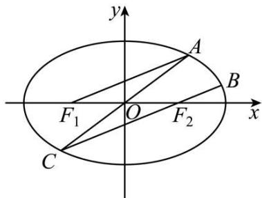
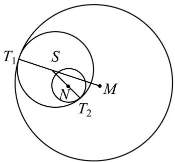
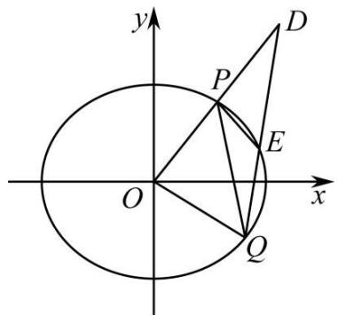

# 第69讲 直线与圆锥曲线的位置关系

# 知识梳理

知识点一、直线和曲线联立

(1) 椭圆 $\frac{x^2}{a^2} + \frac{y^2}{b^2} = 1 (a > b > 0)$ 与直线 $l: y = kx + m$ 相交于AB两点，设 $\mathrm{A}(x_1, y_1), \mathrm{B}(x_2, y_2)$

$$
\left\{ \begin{array}{l} \frac {x ^ {2}}{a ^ {2}} + \frac {y ^ {2}}{b ^ {2}} = 1, (b ^ {2} + k ^ {2} a ^ {2}) x ^ {2} + 2 a ^ {2} k m x + a ^ {2} m ^ {2} - a ^ {2} b ^ {2} = 0 \\ y = k x + m \end{array} \right.
$$

椭圆 $\frac{x^2}{a^2} +\frac{y^2}{b^2} = 1(a > 0,b > 0)$ 与过定点 $(m,0)$ 的直线 $l$ 相交于AB两点，设为 $x = ty$ $+m$ ，如此消去 $x$ ，保留 $y$ ，构造的方程如下： $\left\{ \begin{array}{ll}\frac{x^2}{a^2} +\frac{y^2}{b^2} = 1, & (a^2 +t^2 b^2)y^2 +2b^2 tmy + b^2 m^2 -\\ x = ty + m & \end{array} \right.$ $a^{2}b^{2} = 0$

注意：

①如果直线没有过椭圆内部一定点,是不能直接说明直线与椭圆有两个交点的,一般都需要摆出 $\Delta>0$ ,满足此条件,才可以得到韦达定理的关系.

②焦点在 y 轴上的椭圆与直线的关系, 双曲线与直线的关系和上述形式类似, 不在赘述.

(2) 抛物线 $y^{2} = 2px (p > 0)$ 与直线 $x = ty + m$ 相交于A、B两点，设 $A(x_{1}, y_{1}), B(x_{2}, y_{2})$ 联立可得 $y^{2} = 2p(ty + m), \Delta > 0$ 时， $\begin{cases} y_{1} + y_{2} = 2pt \\ y_{1}y_{2} = -2pm \end{cases}$

特殊地，当直线AB过焦点的时候，即 $m = \frac{p}{2}, y_1y_2 = -2pm = -p^2, x_1x_2 = \circ \frac{y_1^2}{2p} \cdot \frac{y_2^2}{2p} = \frac{1}{4} p^2$ ，因为AB为通径的时候也满足该式，根据此时A、B坐标来记忆.

抛物线 $x^{2} = 2py(p > 0)$ 与直线 $y = kx + m$ 相交于C、D两点，设 $\mathrm{C}(x_1,y_1),\mathrm{D}(x_2,y_2)$

联立可得 $x^{2} = 2p(kx + m),\Delta >0$ 时， $\left\{ \begin{array}{ll}x_{1} + x_{2} = 2pk\\ x_{1}x_{2} = -2pm \end{array} \right.$

注意: 在直线与抛物线的问题中, 设直线的时候选择形式多思考分析, 往往可以降低计算量. 开口向上选择正设; 开口向右, 选择反设; 注意不可完全生搬硬套, 具体情况具体分析.

总结:韦达定理连接了题干条件与方程中的参数,所以我们在处理例如向量问题,面积问题,三点共线问题,角度问题等常考内容的时候,要把题目中的核心信息,转化为坐标表达,转化为可以使用韦达定理的形式,这也是目前考试最常考的方式.

知识点二、根的判别式和韦达定理

$\frac{x^2}{a^2} + \frac{y^2}{b^2} = 1 (a > b > 0)$ 与 $y = kx + m$ 联立，两边同时乘上 $a^2b^2$ 即可得到 $(a^2k^2 + b^2)x^2 + 2kma^2x + a^2(m^2 - b^2) = 0$ ，为了方便叙述，将上式简记为 $\mathbf{A}x^2 + \mathbf{B}x + \mathbf{C} = 0$ 。该式可以看成一个关于 $x$ 的一元二次方程，判别式为 $\Delta = 4a^2b^2(a^2k^2 + b^2 - m^2)$ 可简单记 $4a^2b^2(\mathbf{A} - m^2)$

同理 $\frac{x^2}{a^2} +\frac{y^2}{b^2} = 1(a > b > 0)$ 和 $x = ty + m$ 联立 $(a^2 +t^2 b^2)y^2 +2b^2 tmy + b^2 m^2 -a^2 b^2 = 0,$ 为了方便叙述，将上式简记为 $\mathrm{Ay}^2 +\mathrm{By} + \mathrm{C} = 0,\Delta = 4a^{2}b^{2}(a^{2} + t^{2}b^{2} - m^{2})$ ，可简记 $4a^{2}b^{2}(\mathrm{A}-$

$$
m ^ {2}).
$$

$l$ 与 $\mathbf{C}$ 相离 $\Leftrightarrow \Delta < 0$ ; $l$ 与 $\mathbf{C}$ 相切 $\Leftrightarrow \Delta = 0$ ; $l$ 与 $\mathbf{C}$ 相交 $\Leftrightarrow \Delta > 0$ .

注意：(1)由韦达定理写出 $x_{1} + x_{2} = -\frac{\mathrm{B}}{\mathrm{A}}, x_{1}x_{2} = \frac{\mathrm{C}}{\mathrm{A}}$ ，注意隐含条件 $\Delta > 0$

(2) 求解时要注意题干所有的隐含条件,要符合所有的题意.  
(3) 如果是焦点在 $y$ 轴上的椭圆, 只需要把 $a^2, b^2$ 互换位置即可.  
(4) 直线和双曲线联立结果类似, 焦点在 x 轴的双曲线, 只要把 $b^{2}$ 换成 $-b^{2}$ 即可;

焦点在 $y$ 轴的双曲线，把 $a^2$ 换成 $-b^2$ 即可， $b^2$ 换成 $a^2$ 即可.

(5) 注意二次曲线方程和二次曲线方程往往不能通过联立消元, 利用 $\Delta$ 判断根的关系, 因为此情况下往往会有增根, 根据题干的隐含条件可以舍去增根 (一般为交点横纵坐标的范围限制), 所以在遇到两条二次曲线交点问题的时候, 使用画图的方式分析, 或者解方程组, 真正算出具体坐标.

# 知识点三、弦长公式

设 $\mathrm{M}(x_1,y_1),\mathrm{N}(x_2,y_2)$ 根据两点距离公式 $|\mathbf{MN}| = \sqrt{(x_1 - x_2)^2 + (y_1 - y_2)^2}.$

(1) 若 $\mathbf{M}$ 、 $\mathbf{N}$ 在直线 $y = kx + m$ 上，代入化简，得 $|\mathbf{MN}| = \sqrt{1 + k^2} |x_1 - x_2|$   
(2) 若 M、N 所在直线方程为 $x = ty + m$ ，代入化简，得 $|\mathbf{MN}| = \sqrt{1 + t^2} |y_1 - y_2|$   
(3) 构造直角三角形求解弦长， $|MN| = \frac{|x_2 - x_1|}{|\cos\alpha|} = \frac{|y_2 - y_1|}{|\sin\alpha|}$ 。其中 $k$ 为直线 MN 斜率， $\alpha$ 为直线倾斜角。

注意:(1)上述表达式中,当为 $k\neq0$ , $m\neq0$ 时,mk=1;

(2) 直线上任何两点距离都可如上计算, 不是非得直线和曲线联立后才能用.  
(3) 直线和曲线联立后化简得到的式子记为 $Ax^{2} + Bx + C = 0 (A \neq 0)$ ，判别式为 $\Delta = B^{2} - 4AC$ ， $\Delta > 0$ 时， $|x_{1} - x_{2}| = \sqrt{(x_{1} + x_{2})^{2} - 4x_{1}x_{2}} = \sqrt{\left(-\frac{B}{A}\right)^{2} - 4 \cdot \frac{C}{A}} = \frac{\sqrt{B^{2} - 4AC}}{|A|} = \frac{\sqrt{\Delta}}{|A|}$ ，利用求根公式推导也很方便，使用此方法在解题化简的时候可以大大提高效率。  
(4) 直线和圆相交的时候, 过圆心做直线的垂线, 利用直角三角形的关系求解弦长会更加简单.  
(5) 直线如果过焦点可以考虑焦点弦公式以及焦长公式.

知识点四、已知弦 AB 的中点, 研究 AB 的斜率和方程

(1)AB是椭圆 $\frac{x^2}{a^2} +\frac{y^2}{b^2} = 1(a > b.0)$ 的一条弦，中点 $\mathrm{M}(x_0,y_0)$ ，则AB的斜率为 $-\frac{b^2x_0}{a^2y_0}$

运用点差法求 AB 的斜率; 设 $\mathrm{A}(x_{1},y_{1}),\mathrm{B}(x_{2},y_{2})(x_{1}\neq x_{2})$ , A, B 都在椭圆上,

所以 $\left\{ \begin{array}{l} \frac{x_1^2}{a^2} + \frac{y_1^2}{b^2} = 1 \\ \frac{x_2^2}{a^2} + \frac{y_2^2}{b^2} = 1 \end{array} \right.$ ，两式相减得 $\frac{x_1^2 - x_2^2}{a^2} + \frac{y_1^2 - y_2^2}{b^2} = 0$

所以 $\frac{(x_1 + x_2)(x_1 - x_2)}{a^2} +\frac{(y_1 + y_2)(y_1 - y_2)}{b^2} = 0$

即 $\frac{(y_1 - y_2)}{(x_1 - x_2)} = -\frac{b^2(x_1 + x_2)}{a^2(y_1 + y_2)} = -\frac{b^2x_0}{a^2y_0}$ 故 $k_{\mathrm{AB}} = -\frac{b^2x_0}{a^2y_0}$

(2) 运用类似的方法可以推出; 若 AB 是双曲线 $\frac{x^2}{a^2} - \frac{y^2}{b^2} = 1 (a > b.0)$ 的弦, 中点 $\mathrm{M}(x_0, y_0)$ , 则

$k_{AB}=\frac{b^{2}x_{0}}{a^{2}y_{0}}$ ; 若曲线是抛物线 $y^{2}=2px(p>0)$ ，则 $k_{AB}=\frac{p}{y_{0}}$ .

# 必考题型全归纳

# 题型一: 直线与圆锥曲线的位置关系

3928 (2024·全国·高三对口高考)已知椭圆 C: $\frac{x^2}{2} + y^2 = 1$ 的两焦点为 F $_1$ , F $_2$ , 点 P(x $_0$ , y $_0$ ) 满足 $0 < \frac{x_0^2}{2} + y_0^2 < 1$ , 则直线 $\frac{x_0x}{2} + y_0y = 1$ 与椭圆 C 的公共点个数为 ( )

A. 0

B.1

C. 2

D. 不确定,与 P 点的位置有关

3929 (2024·全国·高三对口高考)若直线 l 被圆 $C: x^{2} + y^{2} = 2$ 所截的弦长不小于 2，则 l 与下列曲线一定有公共点的是 ()

A. $(x - 1)^{2} + y^{2} = 1$

B. $\frac{x^2}{2} + y^2 = 1$

C. $y = x^{2}$

D. $x^{2}-y^{2}=1$

3930 (2024·重庆·统考二模)已知点 P(1,2) 和双曲线 C: $x^{2}-\frac{y^{2}}{4}=1$ ，过点 P 且与双曲线 C 只有一个公共点的直线有（）

A. 2 条

B. 3 条

C. 4 条

D. 无数条

3931 (1999·全国·高考真题)给出下列曲线方程：

① $4x + 2y - 1 = 0;$   
② $x^{2}+y^{2}=3;$   
③ $\frac{x^{2}}{2}+y^{2}=1;$   
④ $\frac{x^{2}}{2}-y^{2}=1.$

其中与直线 y = -2x - 3 有交点的所有曲线方程是 （）

A. ①③

B.②④

C. ①②③

D. ②③④

3932 (2024·辽宁沈阳·统考一模)命题 p: 直线 $y = kx + b$ 与抛物线 $x^{2} = 2py$ 有且仅有一个公共点, 命题 q: 直线 $y = kx + b$ 与抛物线 $x^{2} = 2py$ 相切, 则命题 p 是命题 q 的 ( )

A. 充分不必要条件

B. 必要不充分条件

C. 充要条件

D. 非充分非必要条件

3933 (2024·全国·高三专题练习)过点(1,2)作直线,使它与抛物线 $y^{2}=4x$ 仅有一个公共点,这样的直线有()

A. 1 条

B. 2 条

C. 3 条

D. 4 条

# 题型二:中点弦问题

方向1:求中点弦所在直线方程问题;

3934 (2024·新疆伊犁·高二统考期末)过椭圆 $\frac{x^2}{5} +\frac{y^2}{4} = 1$ 内一点P(1,1)引一条恰好被P点

平分的弦,则这条弦所在直线的方程是

3935 (2024·重庆·统考模拟预测)已知椭圆 C: $\frac{x^{2}}{12} + \frac{y^{2}}{4} = 1$ , 圆 O: $x^{2} + y^{2} = 4$ , 直线 l 与圆 O 相切于第一象限的点 A, 与椭圆 C 交于 P, Q 两点, 与 x 轴正半轴交于点 B. 若 $|PB| = |QA|$ , 则直线 l 的方程为 \_\_\_\_.

3936 (2024·陕西榆林·高二统考期末)已知 A,B 为双曲线 $x^{2}-\frac{y^{2}}{9}=1$ 上两点,且线段 AB 的中点坐标为 $(-1,-4)$ ,则直线 AB 的斜率为 \_\_\_\_.

3937 (2024·全国·高二专题练习)双曲线 $9x^{2}-16y^{2}=144$ 的一条弦的中点为 A(8,3)，则此弦所在的直线方程为 \_\_\_\_.

3938 (2024·陕西宝鸡·高二校联考期末)抛物线 C: $y^{2}=6x$ 与直线 l 交于 A, B 两点, 且 AB 的中点为 $(m,-2)$ , 则 l 的斜率为 \_\_\_\_.

3939 (2024·高二课时练习)已知抛物线 C 的顶点为坐标原点, 准线为 x = -1, 直线 l 与抛物线 C 交于 M, N 两点, 若线段 MN 的中点为 $(1,1)$ , 则直线 l 的方程为 \_\_\_\_.

3940 (2024·全国·高三专题练习)直线 l 与椭圆 $\frac{x^{2}}{4} + y^{2} = 1$ 交于 A, B 两点, 已知直线 l 的斜率为 1, 则弦 AB 中点的轨迹方程是 \_\_\_\_.

3941 (2024·上海浦东新·高二上海市实验学校校考期末)已知椭圆 $x^{2} + 4y^{2} = 16$ 内有一点A(1,1)，弦PQ过点A，则弦PQ中点M的轨迹方程是

3942 (2024·全国·高一专题练习)斜率为2的平行直线截双曲线 $x^{2}-y^{2}=1$ 所得弦的中点的轨迹方程是 \_\_\_\_.

3943 (2024·全国·高三专题练习)直线 $l:ax-y-(a+5)=0$ (a 是参数) 与抛物线 $f:y=(x+1)^{2}$ 的相交弦是 AB，则弦 AB 的中点轨迹方程是 \_\_\_\_.

3944 (2024·全国·高三专题练习)设椭圆方程为 $x^{2} + \frac{y^{2}}{4} = 1$ ，过点M(0,1)的直线 $l$ 交椭圆于点A、B，O是坐标原点，点P满足 $\overrightarrow{\mathrm{OP}} = \frac{1}{2}\left(\overrightarrow{\mathrm{OA}} +\overrightarrow{\mathrm{OB}}\right)$ ，当 $l$ 绕点M旋转时，求动点P的轨迹方程.

3945 (2024·江苏·高二专题练习)已知椭圆 $\mathrm{E}:\frac{x^2}{a^2} +\frac{y^2}{b^2} = 1(a > b > 0)$ 的焦距为 $2c$ ，左右焦点分别为 $\mathrm{F_1}$ 、 $\mathrm{F_2}$ ，圆 $\mathrm{F_1:(x + c)^2 + y^2 = 1}$ 与圆 $\mathrm{F_2:(x - c)^2 + y^2 = 9}$ 相交，且交点在椭圆E上，直线 $l:y = x + m$ 与椭圆E交于A、B两点，且线段AB的中点为M，直线OM的斜率为 $-\frac{1}{4}$

(1) 求椭圆 E 的方程;  
(2) 若 $m = 1$ ，试问 $\mathrm{E}$ 上是否存在 $\mathrm{P} 、 \mathrm{Q}$ 两点关于 $l$ 对称，若存在，求出直线 $\mathrm{PQ}$ 的方程，若不存在，请说明理由.

3946 (2024·江苏南通·高二统考期中)已知椭圆 C: $\frac{x^{2}}{a^{2}} + \frac{y^{2}}{b^{2}} = 1 (a > b > 0)$ 的离心率为 e，且过点 (1, e) 和 $\left(\frac{\sqrt{2}}{2}, \frac{\sqrt{3}}{2}\right)$ .

(1) 求椭圆 C 的方程;

(2) 若椭圆 C 上有两个不同点 A, B 关于直线 $y = x + \frac{1}{2}$ 对称, 求 $|AB|$ .

3947 (2024·全国·高三专题练习)已知O为坐标原点，点 $\left(1,\frac{\sqrt{6}}{2}\right)$ 在椭圆C: $\frac{x^{2}}{a^{2}}+\frac{y^{2}}{b^{2}}=$

$1(a > b > 0)$ 上，直线 $l: y = x + m$ 与C交于A，B两点，且线段AB的中点为M，直线OM的斜率为 $-\frac{1}{2}$ .

(1) 求 C 的方程;

(2) 若 $m = 1$ , 试问 $\mathrm{C}$ 上是否存在 $\mathrm{P}, \mathrm{Q}$ 两点关于 $l$ 对称, 若存在, 求出 $\mathrm{P}, \mathrm{Q}$ 的坐标, 若不存在, 请说明理由.

3948 (2024·上海浦东新·高二上海南汇中学校考期中)已知曲线C的方程是 $(1-a^{2})x^{2}+y^{2}+a^{2}-1=0$ ，其中a>0， $a\neq1$ ，直线l的方程是 $y=\frac{\sqrt{2}}{2}x-a$ .

(1) 请根据 a 的不同取值, 判断曲线 C 是何种圆锥曲线;

(2) 若直线 l 交曲线 C 于两点 M, N, 且线段 MN 中点的横坐标是 -2, 求 a 的值;

(3) 若 $a = \sqrt{2}$ , 试问曲线 C 上是否存在不同的两点 A, B, 使得 A, B 关于直线 $l$ 对称, 并说明理由.

3949 (2024·江苏·高二假期作业)双曲线 C 的离心率为 $\frac{\sqrt{5}}{2}$ ，且与椭圆 $\frac{x^{2}}{9} + \frac{y^{2}}{4} = 1$ 有公共焦点.

(1) 求双曲线 C 的方程.

(2) 双曲线 C 上是否存在两点 A, B 关于点 $(4,1)$ 对称？若存在，求出直线 AB 的方程；若不存在，说明理由.

3950 (2024·高二课时练习)已知直线 l 与抛物线 $y^{2}=8x$ 交于 A, B 两点, 且线段 AB 恰好被点 P(2,2) 平分.

(1) 求直线 l 的方程;

(2) 抛物线上是否存在点 C 和 D, 使得 C, D 关于直线 l 对称? 若存在, 求出直线 CD 的方程; 若不存在, 请说明理由.

3951 (2024·全国·高三专题练习)已知抛物线 C: $y^{2}=4x$ 的焦点为 F, 直线 l: $y=2x+a$ 与抛物线 C 交于 A, B 两点.

(1) 若 $a = -1$ , 求 $\triangle$ FAB 的面积;

(2) 若抛物线 C 上存在两个不同的点 M, N 关于直线 l 对称, 求 a 的取值范围.

3952 (2024·云南昭通·高二校考期中)已知斜率为 $k_{1}(k_{1} \neq 0)$ 的直线 $l$ 与椭圆 $x^{2} + \frac{y^{2}}{16} = 1$ 交于A,B两点，线段AB的中点为C，直线OC(O为坐标原点)的斜率为 $k_{2}$ ，则 $k_{1} \cdot k_{2} = (\quad)$

A.-4

B. $-\frac{1}{4}$

C. $-\frac{1}{16}$

D. -16

3953 (2024·江西·校联考模拟预测)已知直线 $l_{1}:y=2x+2$ 过椭圆 C; $\frac{x^{2}}{a^{2}}+\frac{y^{2}}{b^{2}}=1(a>b>0)$ 的一个焦点,与 C 交于 A, B 两点,与 $l_{1}$ 平行的直线 $l_{2}$ 与 C 交于 M, N 两点,若 AB 的中点为 P, MN 的中点为 Q,且 PQ 的斜率为 $-\frac{4}{9}$ ,则 C 的方程为 ()

A. $\frac{x^{2}}{4}+\frac{y^{2}}{3}=1$

B. $\frac{x^{2}}{9}+\frac{y^{2}}{5}=1$

C. $\frac{x^2}{9} +\frac{y^2}{8} = 1$

D. $\frac{5x^2}{36} +\frac{5y^2}{16} = 1$

3954 (2024·江西赣州·高二统考期末)椭圆 $\frac{x^{2}}{9} + \frac{y^{2}}{4} = 1$ , M, N 是椭圆上关于原点对称的两动点, P 为椭圆上任意一点, 直线 PM, PN 的斜率分别为 $k_{1}, k_{2}$ , 则 $|k_{1}| + |k_{2}|$ 的最小值为 ( )

A. $\frac{4}{3}$

B. $\frac{3}{2}$

C. $\frac{2}{3}$

D. $\frac{4}{9}$

3955 (2024·山西晋中·高二校考阶段练习)过点 M(-2,0) 的直线与椭圆 $x^{2} + 2y^{2} = 2$ 相交于 $P_{1}, P_{2}$ 两点，设线段 $P_{1}P_{2}$ 的中点为 P，若直线 $P_{1}P_{2}$ 的斜率为 $k_{1}(k_{1} \neq 0)$ ，直线 OP(O 为原点) 的斜率为 $k_{2}$ ，则 $k_{1}k_{2}$ 等于（）.

A.-2

B. 2

C. $\frac{1}{2}$

D. $-\frac{1}{2}$

3956 (2024·浙江宁波·高二校联考期末)过双曲线 C: $\frac{y^{2}}{a^{2}} - \frac{x^{2}}{b^{2}} = 1 (a > 0, b > 0)$ 内一点 M(1,1) 且斜率为 $\frac{1}{2}$ 的直线交双曲线于 A, B 两点，弦 AB 恰好被 M 平分，则双曲线 C 的离心率为（）

A. $\frac{\sqrt{6}}{2}$

B. $\frac{\sqrt{5}}{2}$

C. $\sqrt{3}$

D. $\sqrt{5}$

3957 (2024·福建泉州·高二校考期中)过双曲线 C: $\frac{x^{2}}{a^{2}} - \frac{y^{2}}{b^{2}} = 1 (a > 0, b > 0)$ 的焦点且斜率不为 0 的直线交 C 于 A, B 两点, D 为 AB 中点, 若 $k_{AB} \cdot k_{OD} = \frac{1}{2}$ , 则 C 的离心率为 ( )

A. $\sqrt{6}$

B. 2

C. $\sqrt{3}$

D. $\frac{\sqrt{6}}{2}$

3958 (2024·江西·校联考模拟预测)已知双曲线 C: $\frac{x^{2}}{a^{2}} - \frac{y^{2}}{b^{2}} = 1 (a > 0, b > 0)$ 的左，右焦点分别是 $F_{1}, F_{2}$ ，其中 $F_{1}F_{2} = 2c$ ，过右焦点 $F_{2}$ 的直线 l 与双曲线的右支交与 A，B 两点，则下列说法中错误的是（）

A. 弦 AB 的最小值为 $\frac{2b^{2}}{a}$   
B. 若 AB = m，则三角形 $\Delta F_{1}AB$ 的周长 $2m + 4a$   
C. 若 AB 的中点为 M, 且 AB 的斜率为 k, 则 $k_{OM} \cdot k = \frac{b^{2}}{a^{2}}$   
D. 若直线 AB 的斜率为 $\sqrt{3}$ ，则双曲线的离心率 $e \in [2, +\infty)$

# 3 题型三:弦长问题

3959 (2024·陕西西安·西安市大明宫中学校考模拟预测)已知直线 l 与圆 O: $x^{2}+y^{2}=1$ 相切，且交椭圆 C: $\frac{x^{2}}{4}+\frac{y^{2}}{3}=1$ 于 A $(x_{1},y_{1})$ , B $(x_{2},y_{2})$ 两点，若 $y_{1}y_{2}=-\frac{6}{7}$ ，则 |AB|= \_\_\_\_.

3960 (2024·全国·高三对口高考)已知椭圆 $\frac{x^{2}}{9} + y^{2} = 1$ ，过左焦点 F 作倾斜角为 $\frac{\pi}{6}$ 的直线交椭圆于 A、B 两点，则弦 AB 的长为 \_\_\_\_.

3961 (2024·广西南宁·高三统考阶段练习)已知椭圆 C: $\frac{x^{2}}{2} + y^{2} = 1$ 的左焦点为 F, 过点 F 且

倾斜角为 $\frac{\pi}{4}$ 的直线 $l$ 与椭圆C相交于A，B两点，则 $|\mathrm{AB}| = \underline{\quad}$

3962 (2024·安徽滁州·校考模拟预测)已知直线 l 与椭圆 $\frac{y^{2}}{6} + \frac{x^{2}}{3} = 1$ 在第二象限交于 A, B 两点，且 l 与 x 轴、y 轴分别交于 M, N 两点，若 $|MA| = |NB|$ ， $MN = 2\sqrt{3}$ ，则 l 的方程为 \_\_\_\_.

3963 (2024·湖北黄冈·浠水县第一中学校考模拟预测)在生活中,我们经常看到椭圆,比如放在太阳底下的篮球,在地面上的影子就可能是一个椭圆.已知影子椭圆C: $\frac{x^{2}}{a^{2}}+\frac{y^{2}}{b^{2}}=1(a>b>0)$ ,C的上顶点为A,两个焦点为F $_{1}$ ,F $_{2}$ ,离心率为 $\frac{1}{2}$ .过F $_{1}$ 且垂直于AF $_{2}$ 的直线与C交于D,E两点,|DE|=6,则 $\frac{1}{2DF_{1}}+\frac{1}{AD}$ 的最小值是\_\_\_\_.

3964 (2024·福建龙岩·福建省龙岩第一中学校考三模)如图， $F_{1}$ ， $F_{2}$ 分别为椭圆 $\frac{x^{2}}{4} + y^{2} = 1$ 的左、右焦点，A，C 在椭圆上且关于原点对称（点 A 在第一象限），延长 $CF_{2}$ 交椭圆于点 B，若 $|AF_{1}| + |BF_{2}| = \frac{49}{13}$ ，则直线 AC 的方程为 \_\_\_\_.

text_image

y
A
B
F₁ O F₂ x
C

3965 (2024·江苏苏州·校联考三模)已知双曲线 C: $\frac{x^{2}}{a^{2}} - \frac{y^{2}}{12} = 1 (a > 0)$ ，过其右焦点 F 的直线 l 与双曲线 C 交于 A、B 两点，已知 $|AB| = 16$ ，若这样的直线 l 有 4 条，则实数 a 的取值范围是 \_\_\_\_.

3966 (2024·贵州·统考模拟预测)已知双曲线 C: $x^{2}-my^{2}=1(m>0)$ 的左、右焦点分别为 F $_{1}$ ，F $_{2}$ ，点 A，B 分别在双曲线 C 的左支与右支上，且点 A，B 与点 F $_{2}$ 共线，若 |AB|: |AF $_{1}$ |: |BF $_{1}$ | = 2:2:3，则 |AB| = \_\_\_\_.

3967 (2024·全国·高三专题练习)过双曲线 $\frac{x^{2}}{3}-\frac{y^{2}}{6}=1$ 的右焦点作倾斜角为 $30^{\circ}$ 的直线 l，直线 l 与双曲线交于不同的两点 A, B，则 AB 的长为 \_\_\_\_.

3968 (2024·湖南长沙·周南中学校考二模)根据抛物线的光学性质,从抛物线的焦点发出的光,经抛物线反射后光线都平行于抛物线的轴,已知抛物线 $y^{2}=2x$ , 若从点 Q(3,2) 发射平行于 x 轴的光射向抛物线的 A 点, 经 A 点反射后交抛物线于 B 点, 则 $|AB|=$ \_\_\_\_.

3969 (2024·河南·校联考模拟预测)已知抛物线 $y^{2}=2px(p>0)$ 的准线 l 与 x 轴的交点为 M，过焦点 F 的直线 AB 分别与抛物线交于 A, B 两点 (A 点在第一象限)， $|AF|\cdot|BF|=|AB|$ ，直线 AB 的倾斜角为锐角 $\alpha$ ，且满足 $\sin\angle AMF=\frac{\sqrt{3}}{2}\sin\alpha$ ，则 $|AB|=$ \_\_\_\_.

3970 (2024·人大附中校考三模)已知抛物线 $y^{2} = 2px (p > 0)$ 的焦点为F，过点F的直线与该

抛物线交于 A, B 两点, $|AB|=10$ , AB 的中点横坐标为 4, 则 p= \_\_\_\_.

# 题型四: 面积问题

# 方向1:三角形问题

3971 (2024·江西景德镇·统考三模)设椭圆 C: $\frac{x^{2}}{a^{2}} + \frac{y^{2}}{b^{2}} = 1 (a > b > 0)$ 的左、右顶点分别为 A, B, 且焦距为 2. 点 P 在椭圆上且异于 A, B 两点, 若直线 PA 与 PB 的斜率之积为 $-\frac{3}{4}$ .

(1) 求椭圆 C 的标准方程;  
(2) 过点 F(-1,0) 作不与 x 轴重合的直线与椭圆 C 相交于 M,N 两点, 直线 m 的方程为: x = -2a, 过点 M 作 ME 垂直于直线 m, 交 m 于点 E. 求 $\triangle OEN$ 面积的最大值.

3972 (2024·河北·高三校联考阶段练习)已知抛物线 C: $y^{2}=2px(p>0)$ 上一点 A(a,a) ( $a\neq0$ ) 到焦点 F 的距离为 $\frac{5}{2}$ .

(1) 求抛物线 C 的方程;  
(2) 过点 F 的直线 l 与抛物线 C 交于 P, Q 两点, 直线 OP, OQ 与圆 E: $(x-2)^{2} + y^{2} = 4$ 的另一交点分别为 M, N, O 为坐标原点, 求 $\triangle OPQ$ 与 $\triangle OMN$ 面积之比的最小值.

3973 (2024·河南·高三校联考开学考试)椭圆 $\frac{x^{2}}{a^{2}}+\frac{y^{2}}{b^{2}}=1(a>b>0)$ 的左右顶点分别为 A,B, M( $\sqrt{2},1$ ) 是椭圆上一点， $k_{MA}\cdot k_{MB}=-\frac{1}{2}$ .

(1) 求椭圆方程;  
(2) 动直线 x = m 交椭圆于 P, Q 两点，求 $\triangle PQM$ 面积取最大时的 m 的值.

3974 (2024·山东青岛·高三统考开学考试)已知O为坐标原点，A(1,0)，B(-1,0)，直线AM，BM的斜率之积为4，记动点M的轨迹为E.

(1) 求 E 的方程;  
(2) 直线 l 经过点 $(0, -3)$ ，与 E 交于 P，Q 两点，线段 PQ 中点 D 为第一象限，且纵坐标为 $\frac{3}{2}$ ，求 $\triangle OPQ$ 的面积.

3975 (2024·贵州贵阳·高三贵阳一中校考开学考试)已知点 $(-2,0)$ 在椭圆 C: $\frac{x^{2}}{a^{2}} + \frac{y^{2}}{b^{2}} = 1 (a > b > 0)$ 上，点 M(m, $\frac{1}{2}$ ) (m ≠ 0) 在椭圆 C 内. 设点 A, B 为 C 的短轴的上、下端点，直线 AM, BM 分别与椭圆 C 相交于点 E, F, 且 EA, EB 的斜率之积为 $-\frac{1}{4}$ .

(1) 求椭圆 C 的方程;  
(2) 记 $S_{\triangle BME}$ , $S_{\triangle AMF}$ 分别为 $\triangle BME$ , $\triangle AMF$ 的面积, 若 $\frac{S_{\triangle AMF}}{S_{\triangle BME}} = \frac{1}{4}$ , 求 m 的值.

3976 (2024·河南开封·统考模拟预测)已知点A(3,1)在椭圆C: $\frac{x^2}{a^2} +\frac{y^2}{a^2 - 8} = 1$ 上，直线 $l$ 交C于M,N两点，直线AM，AN的斜率之和为0.

(1) 求直线 l 的斜率;  
(2) 求 $\triangle OMN$ 的面积的最大值 (O 为坐标原点).

3977 (2024·广东佛山·高三统考开学考试)设动点M与定点 $F(c,0)(c>0)$ 的距离和M到定直线 $l: x=\frac{4}{c}$ 的距离的比是 $\frac{c}{2}$ .

(1) 求动点 M 的轨迹方程, 并说明轨迹的形状;  
(2) 当 $c = \sqrt{2}$ 时, 记动点 M 的轨迹为 $\Omega$ , 动直线 $m$ 与抛物线 $\Gamma: y^2 = 4x$ 相切, 且与曲线 $\Omega$ 交于点 A, B. 求 $\triangle AOB$ 面积的最大值.

3978 (2024·浙江·高三浙江省普陀中学校联考开学考试)类似于圆的垂径定理,椭圆 C: $\frac{x^{2}}{a^{2}} + \frac{y^{2}}{b^{2}} = 1 (a > b > 0)$ 中有如下性质: 不过椭圆中心 O 的一条弦 PQ 的中点为 M, 当 PQ, OM 斜率均存在时, $k_{PQ} \cdot k_{OM} = -\frac{b^{2}}{a^{2}}$ , 利用这一结论解决如下问题: 已知椭圆 E: $\frac{x^{2}}{81} + \frac{y^{2}}{9} = 1$ , 直线 OP 与椭圆 E 交于 A, B 两点, 且 $\overrightarrow{OA} = 3\overrightarrow{OP}$ , 其中 O 为坐标原点.

(1) 求点 P 的轨迹方程 $\Gamma$ ;  
(2) 过点 P 作直线 CD 交椭圆 E 于 C, D 两点, 使 $\overrightarrow{PC} + \overrightarrow{PD} = \overrightarrow{0}$ , 求四边形 ACBD 的面积.

3979 (2024·湖北恩施·校考模拟预测)已知 $F_{1}, F_{2}$ 是椭圆 C: $\frac{x^{2}}{a^{2}} + \frac{y^{2}}{b^{2}} = 1 (a > b > 0)$ 的左右焦点，以 $F_{1}F_{2}$ 为直径的圆和椭圆 C 在第一象限的交点为 G，若三角形 $GF_{1}F_{2}$ 的面积为 1，其内切圆的半径为 $2 - \sqrt{3}$ .

(1) 求椭圆 C 的方程;  
(2) 已知 A 是椭圆 C 的上顶点, 过点 P(-2,1) 的直线与椭圆 C 交于不同的两点 D, E, 点 D 在第二象限, 直线 AD、AE 分别与 x 轴交于 M, N, 求四边形 DMEN 面积的最大值.

3980 (2024·四川成都·四川省成都市玉林中学校考模拟预测)如图．已知圆 $\mathrm{M}:(x-2)^{2}+y^{2}=81$ ，圆 $\mathrm{N}:(x+2)^{2}+y^{2}=1$ ．动圆 S 与这两个圆均内切.

text_image

T₁
S
N
T₂
M

(1) 求圆心 S 的轨迹 C 的方程;  
(2) 若 P(2,3)、Q(2,-3) 是曲线 C 上的两点，A、B 是曲线 C 上位于直线 PQ 两侧的动点。若直线 AB 的斜率为 $\frac{1}{2}$ ，求四边形 APBQ 面积的最大值。

3981 (2024·浙江·校联考模拟预测)已知椭圆 $C_{1}:\frac{y^{2}}{a^{2}}+\frac{x^{2}}{b^{2}}=1(a>b>0)$ 的离心率为 $\frac{\sqrt{2}}{2}$ ，抛物线 $C_{2}:x^{2}=8y$ 的准线与 $C_{1}$ 相交，所得弦长为 $2\sqrt{6}$ .

(1) 求 $C_{1}$ 的方程;  
(2) 若 $A(x_{1}, y_{1}), B(x_{2}, y_{2})$ 在 $C_{2}$ 上，且 $x_{1} < 0 < x_{2}$ ，分别以 A, B 为切点，作 $C_{2}$ 的切线相交于点 P，点 P 恰好在 $C_{1}$ 上，直线 AP, BP 分别交 x 轴于 M, N 两点。求四边形 ABMN 面积的取值范围。

3982 (2024·山东潍坊·三模)已知椭圆 C: $\frac{x^{2}}{a^{2}} + \frac{y^{2}}{b^{2}} = 1 (a > b > 0)$ 的离心率为 $\frac{\sqrt{2}}{2}$ ，且过点 D( $\sqrt{3}, \frac{\sqrt{6}}{2}$ ).

(1) 求椭圆 C 的标准方程；
(2) 若动直线 $l: y = -\frac{1}{2}x + m (1 \leqslant m < 2)$ 与椭圆 C 交于 A, B 两点，且在坐标平面内存在两个定点 P, Q，使得 $k_{PA}k_{PB} = k_{QA}k_{QB} = \lambda$ (定值)，其中 $k_{PA}, k_{PB}$ 分别是直线 PA, PB 的斜率， $k_{QA}, k_{QB}$ 分别是直线 QA, QB 的斜率.

①求 $\lambda$ 的值；
②求四边形 PAQB 面积的最大值.

3983 (2024·江苏南京·南京师大附中校考模拟预测)已知椭圆 $C_{1}:\frac{x^{2}}{a^{2}}+\frac{y^{2}}{b^{2}}=1(a>b>0)$ ，椭圆 $C_{2}:\frac{x^{2}}{4}+y^{2}=1$ 。点 P 为椭圆 $C_{2}$ 上的动点，直线 OP 与椭圆 $C_{1}$ 交于 A，B 两点，且 $\overrightarrow{OA}=2\overrightarrow{OP}$

(1) 求椭圆 $C_{1}$ 的标准方程；
(2) 以点 P 为切点作椭圆 $C_{2}$ 的切线 l, l 与椭圆 $C_{1}$ 交于 C, D 两点，问：四边形 ACBD 的面积是否为定值？若是，求出该定值；若不是，求出面积的取值范围.

3984 (2024·安徽黄山·屯溪一中校考模拟预测)已知椭圆 C: $\frac{x^{2}}{a^{2}} + \frac{y^{2}}{b^{2}} = 1 (a > b > 0)$ 的离心率为 $\frac{1}{2}$ ，左、右焦点分别为 $F_{1}, F_{2}$ ，直线 x = m 与椭圆 C 交于 A，B 两点，且 $\triangle ABF_{1}$ 的周长最大值为 8.

text_image

y
D
P
E
O
x
Q

(1) 求椭圆 C 的标准方程;
(2) 如图, P, Q 是椭圆 C 上的两点, 且直线 OP 与 OQ 的斜率之积为 $-\frac{3}{4}$ (O 为坐标原点), D 为射线 OP 上一点, 且 $|OP| = |PD|$ , 线段 DQ 与椭圆 C 交于点 E, $|QE| = \frac{2}{3}|ED|$ , 求四边形 OPEQ 的面积.

3985 (2024·山东·校联考模拟预测)已知圆 $O: x^{2} + y^{2} = 4$ , O 为坐标原点, 点 K 在圆 O 上运动, L 为过点 K 的圆的切线, 以 L 为准线的抛物线恒过点 $F_{1}(-\sqrt{3}, 0)$ , $F_{2}(\sqrt{3}, 0)$ , 抛物线的焦点为 S, 记焦点 S 的轨迹为 S.

(1) 求 S 的方程;
(2) 过动点 P 的两条直线 $l_{1}, l_{2}$ 均与曲线 S 相切, 切点分别为 A, B, 且 $l_{1}, l_{2}$ 的斜率之积为 -1, 求四边形 PAOB 面积的取值范围.

3986 (2024·山西朔州·怀仁市第一中学校校考模拟预测)已知椭圆 C: $\frac{x^{2}}{a^{2}} + \frac{y^{2}}{b^{2}} = 1 (a > b > 0)$ 的右焦点为 F(c,0)，点 $\left(\sqrt{3}, -\frac{\sqrt{3}}{2}\right)$ 在椭圆 C 上，且满足 $a^{2}=2b^{2}-2c^{2}$

(1) 求椭圆 C 的标准方程;
(2) 过点 F 且斜率不为零的直线与椭圆 C 相交于 A, B 两点, 过点 A, B 分别作直线 x = 4的垂线,垂足分别为点D,E,求四边形ABED面积的最大值.

