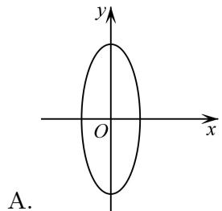
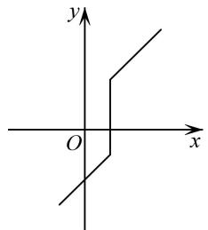
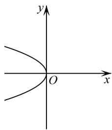
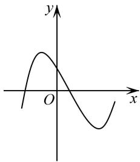

# 第6讲 函数的概念

# 知识梳理

# 1、函数的概念

(1)一般地,给定非空数集A,B,按照某个对应法则f,使得A中任意元素x,都有B中唯一确定的y与之对应,那么从集合A到集合B的这个对应,叫做从集合A到集合B的一个函数.记作: $x\to y=f(x),x\in A$ . 集合A叫做函数的定义域,记为D,集合 $\left\{y\mid y=f(x),x\in A\right\}$ 叫做值域,记为C.

(2) 函数的实质是从一个非空集合到另一个非空集合的映射.

# 2、函数的三要素

(1) 函数的三要素: 定义域、对应关系、值域.  
(2) 如果两个函数的定义域相同, 并且对应关系完全一致, 则这两个函数为同一个函数.

# 3、函数的表示法

表示函数的常用方法有解析法、图象法和列表法.

# 4、分段函数

若函数在其定义域的不同子集上,因对应关系不同而分别用几个不同的式子来表示,这种函数称为分段函数.

# 【解题方法总结】

# 1、基本的函数定义域限制

求解函数的定义域应注意：

(1) 分式的分母不为零;  
(2) 偶次方根的被开方数大于或等于零:   
(3) 对数的真数大于零, 底数大于零且不等于 1;  
(4) 零次幂或负指数次幂的底数不为零；

(5)三角函数中的正切 $y = \tan x$ 的定义域是 $\left\{x \mid x \in \mathbb{R}, \text{且 } x \neq kx + \frac{\pi}{2}, k \in \mathbb{Z}\right\}$ ;

(6) 已知 $f(x)$ 的定义域求解 $f[g(x)]$ 的定义域, 或已知 $f[g(x)]$ 的定义域求 $f(x)$ 的定义域, 遵循两点: ① 定义域是指自变量的取值范围; ② 在同一对应法则下, 括号内式子的范围相同;

(7) 对于实际问题中函数的定义域, 还需根据实际意义再限制, 从而得到实际问题函数的定义域.

# 2、基本初等函数的值域

(1) $y=kx+b(k\neq0)$ 的值域是R.  
(2) $y=ax^{2}+bx+c(a\neq0)$ 的值域是:当a>0时,值域为 $\left\{y\mid y\geqslant\frac{4ac-b^{2}}{4a}\right\}$ ;当a<0时,值域为 $\left\{y\mid y\geqslant\frac{4ac-b^{2}}{4a}\right\}$ .

(3) $y=\frac{k}{x}(k\neq0)$ 的值域是 $\left\{y\mid y\neq0\right\}$ .  
(4) $y=a^{x}(a>0 \text{ 且 } a\neq1)$ 的值域是 $(0,+\infty)$ .

(5) $y=\log_{a}x(a>0 \text{ 且 } a\neq1)$ 的值域是R.

# 必考题型全归纳

# 1 题型一: 函数的概念

119 (2024·山东潍坊·统考一模)存在函数 $f(x)$ 满足:对任意 $x\in R$ 都有()

A. $f(|x|) = x^3$

B. $f(\sin x) = x^{2}$

C. $f(x^{2}+2x)=|x|$

D. $f(|x|) = x^{2} + 1$

120 (2024·重庆·二模)任给 $u \in [-2,0]$ ，对应关系 f 使方程 $u^{2} + v = 0$ 的解 v 与 u 对应，则 $v = f(u)$ 是函数的一个充分条件是（）

A. $v\in [-4,4]$

B. $v\in (-4,2]$

C. $v\in [-2,2]$

D. $v\in [-4, - 2]$

121 (2024·全国·高三专题练习)如图,可以表示函数 $f(x)$ 的图象的是 ()

text_image

y
O
x
A.

B.   

text_image

y
O
x

text_image

y
O
x

C.

D.   

text_image

y
O
x

122 (2024·全国·高三专题练习)函数 $y = f(x)$ 的图象与直线 $x = 1$ 的交点个数 （）

A. 至少1个

B. 至多1个

C. 仅有1个

D. 有0个、1个或多个

# 2 题型二:同一函数的判断

123 (2024·高三课时练习)下列各组函数中,表示同一个函数的是().

A. $f(x)=\lg x^{2}, g(x)=2\lg x$   
B. $f(x)=\lg\frac{x+1}{x-1}$ , $g(x)=\lg(x+1)-\lg(x-1)$   
C. $f(u)=\sqrt{\frac{1+u}{1-u}}$ , $g(v)=\sqrt{\frac{1+v}{1-v}}$   
D. $f(x)=(\sqrt{x})^{2}, g(x)=\sqrt{x^{2}}$

124 (2024·全国·高三专题练习)下列四组函数中,表示同一个函数的一组是 ( )

A. $y = |x|, u = \sqrt{v^2}$

B. $y = \sqrt{x^2}, s = (\sqrt{t})^2$

C. $y=\frac{x^{2}-1}{x-1}, m=n+1$

D. $y = \sqrt{x + 1}\cdot \sqrt{x - 1},y = \sqrt{x^2 - 1}$

125 (2024·全国·高三专题练习)下列各组函数中,表示同一函数的是()

A. $f(x)=\mathrm{e}^{\ln x}, g(x)=x$

B. $f(x) = \frac{x^2 - 4}{x + 2}, g(x) = x - 2$   
C. $f(x)=x^{0}, g(x)=1$   
D. $f(x) = |x|, x \in \{-1, 0, 1\}, g(x) = x^2, x \in \{-1, 0, 1\}$

# 题型三:给出函数解析式求解定义域

126 (2024·北京·高三专题练习)函数 $f(x) = \sqrt{\frac{x - 1}{x^2 + 1}}$ 的定义域为 \_\_\_\_.  
127 (2024·全国·高三专题练习)若 $y=\frac{\sqrt{x^{2}-9}+\sqrt{9-x^{2}}}{x-2}+1$ ，则 $3x+4y=$ \_\_\_\_.  
128 (2024·高三课时练习)函数 $f(x)=\sqrt{2x^{2}+x-3}+\log_{3}(3+2x-x^{2})$ 的定义域为 \_\_\_\_.  
129 (2024·全国·高三专题练习)已知正数 a, b 满足 $a = b^{2}$ , $\log_{b}a = \frac{a}{b}$ , 则函数 $f(x) = \sqrt{\frac{1}{b} - \log_{a}x}$ 的定义域为 \_\_\_\_.  
130 (2024·全国·高三专题练习)已知等腰三角形的周长为 40cm, 底边长 y(cm) 是腰长 x(cm) 的函数, 则函数的定义域为 ( )

A. (10,20)

B. $(0,10)$

C. $(5,10)$

D. $[5,10)$

# 题型四:抽象函数定义域

131 (2024·全国·高三专题练习)已知函数 $y=f(1+\sqrt{1-x})$ 的定义域为 $\{x^{\circ}\mid0\leqslant x\leqslant1^{\circ}\}$ ，则函数 $y=f(x)$ 的定义域为 \_\_\_\_

132 (2024·高三课时练习)已知函数 $f(x)$ 的定义域为 $\left[-\frac{1}{2},\frac{1}{2}\right]$ ，则函数 $y=f\left(x^{2}-x-\frac{1}{2}\right)$ 的定义域为 \_\_\_\_.

133 (2024·全国·高三专题练习)已知函数 $f(x + 1)$ 定义域为[1,4]，则函数 $f(x - 1)$ 的定义域为 \_\_\_\_.

134 (2024·全国·高三专题练习)已知函数 $f(x)$ 的定义域为[3,6],则函数 $y = \frac{f(2x)}{\sqrt{\log_{\frac{1}{2}}(2 - x)}}$ 的定义域为

135 (2024·全国·高三专题练习)已知函数 $f(x)$ 的定义域为 $[-2,3]$ , 则函数 $f(2x - 1)$ 的定义域为 \_\_\_\_.

# 题型五:函数定义域的应用

136 (2024·全国·高三专题练习)若函数 $f(x)=\frac{2x-3}{\sqrt{ax^{2}+ax+1}}$ 的定义域为 R，则实数 a 的取值范围是 \_\_\_\_.  
137 (2024·全国·高三专题练习)已知 $f(x)=\ln(x^{2}-ax+1)$ 的定义域为 R，那么 a 的取值范围为 \_\_\_\_.  
138 (2024·全国·高三专题练习)函数 $f(x)=\frac{1}{ax^{2}+4ax+3}$ 的定义域为 $(-∞,+∞)$ ，则实数 a 的

取值范围是 \_\_\_\_.

139 (2024·全国·高三专题练习)若函数 $f(x) = \sqrt{2^{x^2 - 2ax - a} - \frac{1}{2}}$ 的定义域是R，则实数 $a$ 的取值范围是 \_\_\_\_.

# 6 题型六: 函数解析式的求法

140 (2024·全国·高三专题练习)求下列函数的解析式：

(1) 已知 $f(1 - \sin x) = \cos^{2}x$ ，求 $f(x)$ 的解析式；  
(2) 已知 $f\left(x+\frac{1}{x}\right)=x^{2}+\frac{1}{x^{2}}$ ，求 $f(x)$ 的解析式；  
(3) 已知 $f(x)$ 是一次函数且 $3f(x+1)-2f(x-1)=2x+17$ ，求 $f(x)$ 的解析式；  
(4) 已知 $f(x)$ 满足 $2f(x) + f(-x) = 3x$ ，求 $f(x)$ 的解析式.

141 (2024·全国·高三专题练习)根据下列条件,求 $f(x)$ 的解析式

(1) 已知 $f(x)$ 满足 $f(x+1)=x^{2}+4x+1$   
(2) 已知 $f(x)$ 是一次函数，且满足 $3f(x+1)-f(x)=2x+9$ ;  
(3) 已知 $f(x)$ 满足 $2f\left(\frac{1}{x}\right) + f(x) = x (x \neq 0)$

142 (2024·全国·高三专题练习)根据下列条件,求函数 $f(x)$ 的解析式.

(1) 已知 $f(\sqrt{x} + 1) = x + 2\sqrt{x}$ ，则 $f(x)$ 的解析式为 \_\_\_\_.  
(2) 已知 $f(x)$ 满足 $2f(x) + f\left(\frac{1}{x}\right) = 3x$ ，求 $f(x)$ 的解析式.  
(3) 已知 $f(0) = 1$ ，对任意的实数 $x, y$ 都有 $f(x - y) = f(x) - y(2x - y + 1)$ ，求 $f(x)$ 的解析式.

143 (2024·全国·高三专题练习)已知 $f\left(\frac{1-x}{1+x}\right)=\frac{1-x^{2}}{1+x^{2}}$ ，求 $f(x)$ 的解析式.

144 (2024·广东深圳·高三深圳外国语学校校考阶段练习)写出一个满足: $f(x+y)=f(x)+f(y)+2xy$ 的函数解析式为 \_\_\_\_.

145 (2024·全国·高三专题练习)已知定义在 $(0,+\infty)$ 上的单调函数 $f(x)$ ，若对任意 $x\in(0,+\infty)$ 都有 $f(f(x)+\log_{\frac{1}{2}}x)=3$ ，则方程 $f(x)=2+\sqrt{x}$ 的解集为 \_\_\_\_.

# 7 题型七: 函数值域的求解

146 (2024·全国·高三专题练习)求下列函数的值域

(1) $y=\frac{3+x}{4-x};$   
(2) $y=\frac{5}{2x^{2}-4x+3}$ ;   
(3) $y=\sqrt{1-2x}-x;$   
(4) $y=\frac{x^{2}+4x+3}{x^{2}+x-6};$   
(5) $y=4-\sqrt{3+2x-x^{2}}$ ;   
(6) $y = x + \sqrt{1 - 2x}$ ;   
(7) $y = \sqrt{x - 3} + \sqrt{5 - x}$ ;   
(8) $y=\sqrt{-x^{2}-6x-5}$   
(9) $y=\frac{3x+1}{x-2};$

(10) $y=\frac{2x^{2}-x+1}{2x-1}\left(x>\frac{1}{2}\right).$

147 (2024·全国·高三专题练习)若函数 $y=f(x)$ 的值域是 $[-1,3]$ ，则函数 $g(x)=3-2f(x+1)$ 的值域为 \_\_\_\_.  
148 (2024·全国·高三专题练习)函数 $y=\frac{\sin x+2}{\cos x-2}$ 的值域为 \_\_\_\_  
149 (2024·重庆渝中·高三重庆巴蜀中学校考阶段练习)函数 $y=\frac{\sqrt{x^{2}+4}}{x^{2}+5}$ 的最大值为 \_\_\_\_.  
150 (2024·全国·高三专题练习)函数 $y=\sqrt{1-x}+\sqrt{2+x}$ 的值域为 \_\_\_\_.

# 8 题型八:分段函数的应用

151 (2024·四川成都·成都七中统考模拟预测)已知函数 $f(x) = \begin{cases} f(x + 1), & x \leqslant 0 \\ x^2 - 3x - 4, & x > 0 \end{cases}$ ，则

$$
f (f (- 4)) = \tag {（}
$$

A.-6

B. 0

C. 4

D. 6

152 (2024·河南·统考模拟预测)已知函数 $f(x)=\left\{\begin{aligned}&3^{x+1}-1,x\geqslant1,\\&-\log_{3}(x+5)-2,x<1,\end{aligned}\right.$ 且 $f(m)=-2$ ，则 $f(m+6)=$ （）

A.-16

B. 16

C. 26

D. 27

153 (2024·全国·高三专题练习)已知 $f(x)=\left\{\begin{aligned}-x^{2}+2x,&x\geqslant0\\ x^{2}+2x,&x<0\end{aligned}\right.$ ，满足 $f(a)<f(-a)$ ，则a的取值范围是()

A. $(- \infty, -2) \cup (0, 2)$

B. $(-∞,-2)∪(2,+∞)$

C. $(-2,0)\cup(0,2)$

D. $(-2,0)\cup (2, + \infty)$

154 (多选题)(2024·全国·高三专题练习)已知函数 $f(x)=\left\{\begin{aligned}&2^{x},&x\leqslant0\\&|\log_{2}x|,&x>0\end{aligned}\right.$ ，则使 $f(f(x))=1$ 的x可以是()

A.-4

B.-1

C. 1

D. 4

155 (多选题)(2024·全国·高三专题练习)已知函数 $f(x)=\left\{\begin{aligned}-3x+5,&x\geqslant0\\ x+\frac{1}{x},&x<0\end{aligned}\right.$ ，若 $f[f(a)]=-\frac{5}{2}$ ，则实数a的值可能为()

A. $\frac{7}{3}$

B. $-\frac{4}{3}$

C.-1

D. $\frac{11}{6}$

