# 第70讲 弦长问题

# 知识梳理

# 1、弦长公式的两种形式

①若 A, B 是直线 $y = kx + m$ 与圆锥曲线的两个交点，且由两方程消去 y 后得到一元二次方程 $px^{2} + qx + r = 0$ ，则 $|PQ| = \sqrt{1 + k^{2}} \cdot |x_{1} - x_{2}| = \sqrt{1 + k^{2}} \cdot \frac{\sqrt{\Delta}}{|p|}$ .  
②若 A, B 是直线 $x = my + n$ 与圆锥曲线的两个交点，且由两方程消去 $x$ 后得到一元二次方程 $py^2 + qy + r = 0$ ，则 $|\mathrm{AB}| = \sqrt{1 + m^2} |y_{\mathrm{A}} - y_{\mathrm{B}}| = \sqrt{1 + m^2} \cdot \frac{\sqrt{\Delta}}{|p|}$ .

# 必考题型全归纳

# 1 题型一:弦长问题

3987 (2024·陕西西安·西安市大明宫中学校考模拟预测)已知直线 l 与圆 O: $x^{2}+y^{2}=1$ 相切，且交椭圆 C: $\frac{x^{2}}{4}+\frac{y^{2}}{3}=1$ 于 A $(x_{1},y_{1})$ , B $(x_{2},y_{2})$ 两点，若 $y_{1}y_{2}=-\frac{6}{7}$ ，则 |AB|= \_\_\_\_.  
3988 (2024·全国·高三对口高考)已知椭圆 $\frac{x^{2}}{9} + y^{2} = 1$ ，过左焦点 F 作倾斜角为 $\frac{\pi}{6}$ 的直线交椭圆于 A、B 两点，则弦 AB 的长为 \_\_\_\_.  
3989 (2024·全国·高三专题练习)已知椭圆 C: $\frac{x^{2}}{a^{2}} + \frac{y^{2}}{b^{2}} = 1 (a > b > 0)$ ，C 的上顶点为 A，两个焦点为 $F_{1}$ ， $F_{2}$ ，离心率为 $\frac{1}{2}$ 。过 $F_{1}$ 且垂直于 $AF_{2}$ 的直线与 C 交于 D，E 两点， $\triangle ADE$ 的周长是 13，则 $|DE| =$ \_\_\_\_ 。  
3990 (2024·全国·高三专题练习)已知双曲线 C: $\frac{x^{2}}{3}-y^{2}=1$ , 若直线 l 的倾斜角为 $60^{\circ}$ , 且与双曲线 C 的右支交于 M, N 两点, 与 x 轴交于点 P, 若 $|MN|=\frac{\sqrt{3}}{2}$ , 则点 P 的坐标为 \_\_\_\_.  
3991 (2024·贵州·统考模拟预测)已知双曲线 C: $x^{2}-my^{2}=1(m>0)$ 的左、右焦点分别为 F $_{1}$ ，F $_{2}$ ，点 A，B 分别在双曲线 C 的左支与右支上，且点 A，B 与点 F $_{2}$ 共线，若 |AB|: |AF $_{1}$ |: |BF $_{1}$ | = 2:2:3，则 |AB| = \_\_\_\_.  
3992 (2024·四川巴中·高三统考开学考试)抛物线有如下光学性质:过焦点的光线经抛物线反射后得到的光线平行于抛物线的对称轴;反之,平行于抛物线对称轴的入射光线经抛物线反射后必过抛物线的焦点. 已知抛物线 $y^{2}=4x$ 的焦点为 F, 一条平行于 x 轴的光线从点 A(5,4) 射出, 经过抛物线上的点 B 反射后, 再经抛物线上的另一点 C 射出, 则 $|BC|=$ \_\_\_\_.  
3993 (2024·河南郑州·高三郑州外国语学校校考阶段练习)已知抛物线 $y^{2}=8x$ 的焦点为 F，准线与 x 轴的交点为 C，过点 C 的直线 l 与抛物线交于 A，B 两点，若 $\angle AFB = \angle CFB$ ，则 $|AF| =$ \_\_\_\_ .  
3994 (2024·新疆喀什·校考模拟预测)已知双曲线C两条准线之间的距离为1,离心率为2,直线l经过C的右焦点,且与C相交于A、B两点.

(1) 求 C 的标准方程;  
(2) 若直线 l 与该双曲线的渐近线垂直, 求 AB 的长度.

3995 (2024·湖南邵阳·高三湖南省邵东市第三中学校考阶段练习)已知抛物线 $y^{2} = 2px^{\circ}$

$(p > 0)$ 的准线方程是 $x = -\frac{1}{2}$ .

(1) 求抛物线的方程;   
(2) 设直线 $y = k(x - 2) (k \neq 0)$ 与抛物线相交于 M, N 两点, 若 $|\mathrm{MN}| = 2\sqrt{10}$ , 求实数 $k$ 的值.

# 题型二:长度和问题

3996 (2024·宁夏银川·银川一中校考一模)如图所示,由半椭圆 $C_{1}:\frac{x^{2}}{4}+\frac{y^{2}}{b^{2}}=1(y\leqslant0)$ 和两个半圆 $C_{2}:(x+1)^{2}+y^{2}=1(y\geqslant0)$ 、 $C_{3}:(x-1)^{2}+y^{2}=1(y\geqslant0)$ 组成曲线 $C:F(x,y)=0$ ,其中点 $A_{1},A_{2}$ 依次为 $C_{1}$ 的左、右顶点,点 B 为 $C_{1}$ 的下顶点,点 $F_{1},F_{2}$ 依次为 $C_{1}$ 的左、右焦点.若点 $F_{1},F_{2}$ 分别为曲线 $C_{2},C_{3}$ 的圆心.

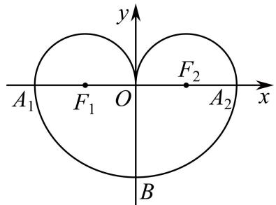

text_image

y
A₁ F₁ O F₂ A₂ x
B

(1) 求 $C_{1}$ 的方程;  
(2) 若过点 $F_{1}, F_{2}$ 作两条平行线 $l_{1}, l_{2}$ 分别与 $C_{1}, C_{2}$ 和 $C_{1}, C_{3}$ 交与 M, N 和 P, Q，求 $|MN| + |PQ|$ 的最小值.

3997 (2024·河南安阳·安阳一中校联考模拟预测)定义:一般地,当 $\lambda>0$ 且 $\lambda\neq1$ 时,我们把方程 $\frac{x^{2}}{a^{2}}+\frac{y^{2}}{b^{2}}=\lambda(a>b>0)$ 表示的椭圆 $C_{\lambda}$ 称为椭圆 $\frac{x^{2}}{a^{2}}+\frac{y^{2}}{b^{2}}=1(a>b>0)$ 的相似椭圆.已知椭圆 $C:\frac{x^{2}}{4}+y^{2}=1$ ,椭圆 $C_{\lambda}(\lambda>0$ 且 $\lambda\neq1)$ 是椭圆 C 的相似椭圆,点 P 为椭圆 $C_{\lambda}$ 上异于其左、右顶点 M,N 的任意一点.

(1) 当 $\lambda=2$ 时, 若与椭圆 C 有且只有一个公共点的直线 $l_{1}, l_{2}$ 恰好相交于点 P, 直线 $l_{1}, l_{2}$ 的斜率分别为 $k_{1}, k_{2}$ , 求 $k_{1}k_{2}$ 的值;  
(2) 当 $\lambda = e^{2}$ (e 为椭圆 C 的离心率) 时, 设直线 PM 与椭圆 C 交于点 A, B, 直线 PN 与椭圆 C 交于点 D, E, 求 $|AB| + |DE|$ 的值.

3998 (2024·江西九江·统考一模)如图, 已知椭圆 $C_{1}:\frac{x^{2}}{a^{2}}+\frac{y^{2}}{b^{2}}=1(a>b>0)$ 的左右焦点分别为 $F_{1}, F_{2}$ , 点 A 为 $C_{1}$ 上的一个动点 (非左右顶点), 连接 $AF_{1}$ 并延长交 $C_{1}$ 于点 B, 且 $\triangle ABF_{2}$ 的周长为 8, $\triangle AF_{1}F_{2}$ 面积的最大值为 2.

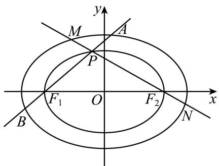

text_image

y
M
A
P
F₁ O F₂ x
B N

(1) 求椭圆 $C_{1}$ 的标准方程；
(2) 若椭圆 $C_{2}$ 的长轴端点为 $F_{1}, F_{2}$ ，且 $C_{2}$ 与 $C_{1}$ 的离心率相等，P 为 AB 与 $C_{2}$ 异于 $F_{1}$ 的交点，直线 $PF_{2}$ 交 $C_{1}$ 于 M, N 两点，证明： $|AB| + |MN|$ 为定值.

3999 (2024·全国·高三专题练习)已知椭圆 $\frac{x^{2}}{a^{2}} + \frac{y^{2}}{b^{2}} = 1 (a > b > 0)$ 的离心率为 $\frac{1}{2}$ ，且点 $M\left(1, \frac{3}{2}\right)$ 在椭圆上.

(1) 求椭圆的方程；
(2) 过椭圆右焦点 $F_{2}$ 作两条互相垂直的弦 AB 与 CD，求 $|AB| + |CD|$ 的取值范围.

# 题型三:长度差问题

4000 (2024·浙江·高三校联考阶段练习)已知抛物线 C: $y^{2}=2px$ 经过点 $(2,-2\sqrt{6})$ ，直线 $l_{1}:y=kx+m(km\neq0)$ 与 C 交于 A，B 两点 (异于坐标原点 O).

(1) 若 $\overrightarrow{OA} \cdot \overrightarrow{OB} = 0$ ，证明：直线 $l_{1}$ 过定点.
(2) 已知 k = 2，直线 $l_{2}$ 在直线 $l_{1}$ 的右侧， $l_{1} \parallel l_{2}$ ， $l_{1}$ 与 $l_{2}$ 之间的距离 $d = \sqrt{5}$ ， $l_{2}$ 交 C 于 M，N 两点，试问是否存在 m，使得 $|MN| - |AB| = 10$ ？若存在，求 m 的值；若不存在，说明理由.

4001 (2024·云南保山·高三统考阶段练习)已知抛物线 $C_{1}: y^{2}=4x$ 的焦点为椭圆 $C_{2}: \frac{x^{2}}{a^{2}}+\frac{y^{2}}{b^{2}}=1(a>b>0)$ 的右焦点 F，点 P 为抛物线 $C_{1}$ 与椭圆 $C_{2}$ 在第一象限的交点，且 $|PF|=\frac{5}{3}$ .

(1) 求椭圆 $C_{2}$ 的方程；
(2) 若直线 l 过点 F，交抛物线 $C_{1}$ 于 A, C 两点，交椭圆 $C_{2}$ 于 B, D 两点 (A, B, C, D 依次排序)，且 $|AC| - |BD| = \frac{30}{11}$ ，求直线 l 的方程.

# 题型四:长度商问题

4002 (2024·重庆·校联考模拟预测)已知双曲线 C: $\frac{x^{2}}{a^{2}} - \frac{y^{2}}{b^{2}} = 1 (a > 0, b > 0)$ 的离心率是 $\sqrt{5}$ ，点 F 是双曲线 C 的一个焦点，且点 F 到双曲线 C 的一条渐近线的距离是 2.

(1) 求双曲线 C 的标准方程.
(2) 设点 M 在直线 $x = \frac{1}{4}$ 上，过点 M 作两条直线 $l_{1}, l_{2}$ ，直线 $l_{1}$ 与双曲线 C 交于 A, B 两点，直线 $l_{2}$ 与双曲线 C 交于 D, E 两点. 若直线 AB 与直线 DE 的倾斜角互补，证明： $\frac{|MA|}{|MD|} = \frac{|ME|}{|MB|}$ .

4003 (2024·全国·高三专题练习)已知圆 A: $(x+2)^{2} + y^{2} = 9$ , 圆 B: $(x-2)^{2} + y^{2} = 1$ , 圆 C 与圆 A、圆 B 外切,

(1) 求圆心 C 的轨迹方程 E;  
(2) 若过点 B 且斜率 k 的直线与 E 交与 M、N 两点, 线段 MN 的垂直平分线交 x 轴与点 P, 证明 $\frac{|MN|}{|PB|}$ 的值是定值.

4004 (2024·全国·高三专题练习)已知双曲线 C: $\frac{x^{2}}{a^{2}} - \frac{y^{2}}{b^{2}} = 1 (a > 0, b > 0)$ 的右焦点为

$F(\sqrt{3},0)$ ，过点F与x轴垂直的直线 $l_{1}$ 与双曲线C交于M,N两点，且 $|MN|=4$ .

(1) 求 C 的方程;  
(2) 过点 A(0, -1) 的直线 $l_{2}$ 与双曲线 C 的左、右两支分别交于 D, E 两点，与双曲线 C 的两条渐近线分别交于 G, H 两点，若 $|GH| = \lambda |DE|$ ，求实数 $\lambda$ 的取值范围.

4005 (2024·全国·高三专题练习)已知双曲线 C 的渐近线方程为 $y=\pm\sqrt{3}x$ ，右焦点 $F(c,0)$ 到渐近线的距离为 $\sqrt{3}$ .

(1) 求双曲线 C 的方程;  
(2) 过 F 作斜率为 k 的直线 l 交双曲线于 A、B 两点, 线段 AB 的中垂线交 x 轴于 D, 求证: $\frac{|AB|}{|FD|}$ 为定值.

4006 (2024·河南郑州·郑州外国语学校校考模拟预测)已知椭圆 C: $\frac{x^{2}}{a^{2}} + \frac{y^{2}}{b^{2}} = 1 (a > b > 0)$ 的左、右焦点分别为 $F_{1}, F_{2}$ ，且 $|F_{1}F_{2}| = 4$ 。过右焦点 $F_{2}$ 的直线 l 与 C 交于 A, B 两点， $\triangle ABF_{1}$ 的周长为 $8\sqrt{2}$ 。

(1) 求椭圆 C 的标准方程;  
(2) 过原点 O 作一条垂直于 l 的直线 $l_{1}, l_{1}$ 交 C 于 P, Q 两点，求 $\frac{|AB|}{|PQ|}$ 的取值范围.

4007 (2024·陕西·统考一模)在椭圆 C: $\frac{x^{2}}{a^{2}} + \frac{y^{2}}{b^{2}} = 1 (a > b > 0)$ , c = 2, 过点 $(0, b)$ 与 $(a, 0)$ 的直线的斜率为 $-\frac{\sqrt{3}}{3}$ .

(1) 求椭圆 C 的标准方程;  
(2) 设 F 为椭圆 C 的右焦点, P 为直线 x = 3 上任意一点, 过 F 作 PF 的垂线交椭圆 C 于 M, N 两点, 当 $\frac{|MN|}{|PF|}$ 取最大值时, 求直线 MN 的方程.

4008 (2024·广东佛山·华南师大附中南海实验高中校考模拟预测)在椭圆 C: $\frac{x^{2}}{a^{2}} + \frac{y^{2}}{b^{2}} = 1 (a > b > 0)$ 中, c = 2, 过点 $(0, b)$ 与 $(a, 0)$ 的直线的斜率为 $-\frac{\sqrt{3}}{3}$ .

(1) 求椭圆 C 的标准方程;  
(2) 设 F 为椭圆 C 的右焦点, P 为直线 x=3 上任意一点, 过 F 作 PF 的垂线交椭圆 C 于 M,N 两点, 求 $\frac{|MN|}{|PF|}$ 的最大值.

4009 (2024·安徽·高三安徽省马鞍山市第二十二中学校联考阶段练习)平面直角坐标系 $xOy$ 中，P为动点，PA与直线 $x = \sqrt{3} y$ 垂直，垂足A位于第一象限，PB与直线 $x = -\sqrt{3} y$ 垂直，垂足B位于第四象限， $\angle APB > 90^{\circ}$ 且 $|AP||BP| = \frac{3}{4}$ ，记动点P的轨迹为C.

(1) 求 C 的方程;  
(2) 已知点 M(-2,0), N(2,0), 设点 T 与点 P 关于原点 O 对称, ∠MTN 的角平分线为直

线 l, 过点 P 作 l 的垂线, 垂足为 H, 交 C 于另一点 Q, 求 $\frac{|PH|}{|QH|}$ 的最大值.

4010 (2024·四川南充·高三四川省南充高级中学校考阶段练习)已知 $F_{1}$ ， $F_{2}$ 为椭圆 C: $\frac{x^{2}}{a^{2}} + \frac{y^{2}}{b^{2}} = 1 (a > b > 0)$ 的两个焦点．且 $|F_{1}F_{2}| = 4$ ，P 为椭圆上一点， $|PF_{1}| + |PF_{2}| = 2\sqrt{6}$ .

(1) 求椭圆 C 的标准方程;

(2) 过右焦点 $F_{2}$ 的直线 l 交椭圆于 A, B 两点，若 AB 的中点为 M, O 为坐标原点，直线 OM 交直线 x = 3 于点 N. 求 $\frac{|AB|}{|NF_{2}|}$ 的最大值.

4011 (2024·海南海口·高三统考期中)设 O 为坐标原点, 点 M, N 在抛物线 C: $x^{2}=4y$ 上, 且 $\overrightarrow{OM} \cdot \overrightarrow{ON} = -4$ .

(1) 证明: 直线 MN 过定点;

(2) 设 C 在点 M, N 处的切线相交于点 P, 求 $\frac{|MN|}{|OP|^{2}}$ 的取值范围.

4012 (2024·四川绵阳·统考三模)过点 A(2,0) 的直线 l 与抛物线 C: $y^{2}=2px(p>0)$ 交于点 M, N(M 在第一象限), 且当直线 l 的倾斜角为 $\frac{\pi}{4}$ 时, $|MN|=3\sqrt{2}$ .

(1) 求抛物线的方程;

(2) 若 B(3,0)，延长 MB 交抛物线 C 于点 P，延长 PN 交 x 轴于点 Q，求 $\frac{|QN|}{|QP|}$ 的值.

4013 (2024·全国·高三专题练习)已知抛物线 C: $x^{2}=2py(p>0)$ 上的点 $(2,y_{0})$ 到其焦点 F 的距离为 2.

(1) 求抛物线 C 的方程;

(2) 已知点 D 在直线 l: y = -3 上, 过点 D 作抛物线 C 的两条切线, 切点分别为 A, B, 直线 AB 与直线 l 交于点 M, 过抛物线 C 的焦点 F 作直线 AB 的垂线交直线 l 于点 N, 当 $|MN|$ 最小时, 求 $\frac{|AB|}{|MN|}$ 的值.

4014 (2024·广东揭阳·高三校考阶段练习)已知抛物线 $E: y^{2} = 2px (p > 0)$ 的焦点为 F，点 F 关于直线 $y = \frac{1}{2}x + \frac{3}{4}$ 的对称点恰好在 y 轴上.

(1) 求抛物线 E 的标准方程;

(2) 直线 $l: y = k(x - 2) (k \geqslant \sqrt{6})$ 与抛物线 E 交于 A, B 两点，线段 AB 的垂直平分线与 x 轴交于点 C，若 D(6,0)，求 $\frac{|AB|}{|CD|}$ 的最大值.

4015 (2024·四川内江·高三四川省内江市第六中学校考阶段练习)已知椭圆与抛物线 $y^{2}=2px(p>0)$ 有一个相同的焦点 $F_{2}(1,0)$ ，椭圆的长轴长为 2p.

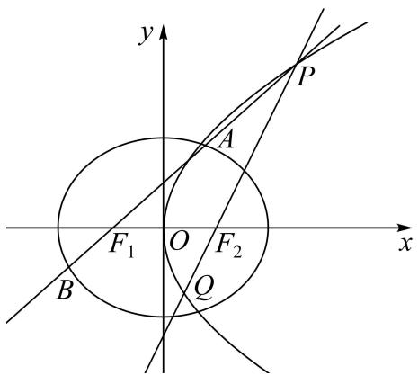

text_image

y
P
A
F₁ O F₂ x
B Q

(1) 求椭圆与抛物线的方程;
(2) P 为抛物线上一点, $F_{1}$ 为椭圆的左焦点, 直线 $PF_{1}$ 交椭圆于 A, B 两点, 直线 $PF_{2}$ 与抛物线交于 P, Q 两点, 求 $\frac{|AB|}{|PQ|}$ 的最大值.

# 5 题型五:长度积问题

4016 (2024·山东·高三校联考阶段练习)已知抛物线 C: $x^{2}=2py(p>0)$ ，F 为 C 的焦点，过点 F 的直线 l 与 C 交于 H，I 两点，且在 H，I 两点处的切线交于点 T，当 l 与 y 轴垂直时， $|HI|=4$ .

(1) 求 C 的方程;  
(2) 证明: $|\mathrm{FI}| \cdot |\mathrm{FH}| = |\mathrm{FT}|^2$ .

4017 (2024·浙江·校考模拟预测)已知抛物线: $y^{2} = 2px (p > 0)$ , 过其焦点 F 的直线与抛物线交于 A、B 两点, 与椭圆 $\frac{x^{2}}{a^{2}} + y^{2} = 1 (a > 1)$ 交于 C、D 两点, 其中 $\overrightarrow{OA} \cdot \overrightarrow{OB} = -3$ .

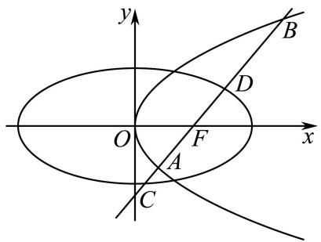

text_image

y
B
D
O
F
x
A
C

(1) 求抛物线方程；
(2) 是否存在直线 AB，使得 $|CD|$ 是 $|FA|$ 与 $|FB|$ 的等比中项，若存在，请求出 AB 的方程及 a；若不存在，请说明理由.

4018 (2024·全国·高三专题练习)已知椭圆 $C_{1}:\frac{x^{2}}{a^{2}}+\frac{y^{2}}{b^{2}}=1(a>b>0)$ 的离心率为 $\frac{1}{2}$ ，且直线 $l_{1}:\frac{x}{a}+\frac{y}{b}=1$ 被椭圆 $C_{1}$ 截得的弦长为 $\sqrt{7}$ .

(1) 求椭圆 $C_{1}$ 的方程；
(2) 以椭圆 $C_{1}$ 的长轴为直径作圆 $C_{2}$ ，过直线 $l_{2}: y = 4$ 上的动点 M 作圆 $C_{2}$ 的两条切线，设切点为 A, B，若直线 AB 与椭圆 $C_{1}$ 交于不同的两点 C, D，求 $|CD| \cdot |AB|$ 的取值范围.

4019 (2024·全国·高三专题练习)已知椭圆 C: $\frac{x^2}{a^2} + \frac{y^2}{8} = 1 (a > 0)$ 的左、右焦点分别为 F $_1$ , F $_2$ ,

P 为 C 上一点, 且当 $PF_{1} \perp x$ 轴时, $|PF_{2}| = \frac{10}{3}$ .

(1) 求 C 的方程;  
(2) 设 C 在点 P 处的切线交 x 轴于点 Q，证明： $\left|PF_{1}\right|\cdot\left|QF_{2}\right|=\left|PF_{2}\right|\cdot\left|QF_{1}\right|$ .

4020 (2024·全国·模拟预测)已知椭圆 C: $\frac{x^{2}}{a^{2}} + \frac{y^{2}}{b^{2}} = 1 (a > b > 0)$ 的离心率为 $\frac{1}{2}$ ，过点 P(1,0)

作 x 轴的垂线，与 C 交于 A, B 两点，且 $|AB| = \frac{2b^{2}}{a}$ .

(1) 求椭圆 C 的标准方程;  
(2) 若直线 $l_{1}$ 与椭圆 C 交于 D, E 两点, 直线 $l_{2}$ 与椭圆 C 交于 M, N 两点, 且 $l_{1} \perp l_{2}, l_{1}, l_{2}$ 交于点 P, 求 $|\mathrm{DE}| \cdot |\mathrm{MN}|$ 的取值范围.

4021 (2024·湖南岳阳·高三校考阶段练习)已知椭圆 C: $\frac{x^{2}}{a^{2}} + \frac{y^{2}}{b^{2}} = 1 (a > b > 0)$ 经过点 P( $\frac{2}{3}$ , $\frac{2\sqrt{2}}{3}$ ), 左, 右焦点分别为 F₁, F₂, O 为坐标原点, 且 $|PF_{1}| + |PF_{2}| = 4$ .

(1) 求椭圆 C 的标准方程;  
(2) 设 A 为椭圆 C 的右顶点, 直线 l 与椭圆 C 相交于 M, N 两点, 以 MN 为直径的圆过点 A, 求 $|AM| \cdot |AN|$ 的最大值.

4022 (2024·广东·高三校联考阶段练习)已知椭圆 C: $\frac{x^{2}}{a^{2}} + \frac{y^{2}}{b^{2}} = 1 (a > b > 0)$ 的焦距为 2，且经过点 P(1, $\frac{3}{2}$ ).

(1) 求椭圆 C 的方程;  
(2) 经过椭圆右焦点 F 且斜率为 $k (k \neq 0)$ 的动直线 $l$ 与椭圆交于 A、B 两点，试问 $x$ 轴上是否存在异于点 F 的定点 T，使 $|\mathrm{AF}| \cdot |\mathrm{BT}| = |\mathrm{BF}| \cdot |\mathrm{AT}|$ 恒成立？若存在，求出 T 点坐标，若不存在，说明理由.

# 6 题型六:长度的范围与最值问题

4023 (2024·全国·高三专题练习)已知抛物线 $C_{1}:y^{2}=4x$ 的焦点 F 也是椭圆 $C_{2}:\frac{x^{2}}{a^{2}}+\frac{y^{2}}{b^{2}}=1(a>b>0)$ 的一个焦点， $C_{1}$ 与 $C_{2}$ 的公共弦长为 $\frac{4\sqrt{6}}{3}$ .

(1) 求椭圆 $C_{2}$ 的方程;  
(2) 过椭圆 $C_{2}$ 的右焦点 F 作斜率为 $k (k \neq 0)$ 的直线 l 与椭圆 $C_{2}$ 相交于 A, B 两点，线段 AB 的中点为 P，过点 P 作垂直于 AB 的直线交 x 轴于点 D，试求 $\frac{|DP|}{|AB|}$ 的取值范围.

4024 (2024·黑龙江佳木斯·高三校考开学考试)已知椭圆 $C_{1}:\frac{x^{2}}{a^{2}}+\frac{y^{2}}{b^{2}}=1(a>b>0)$ 的两个焦点 $F_{1}, F_{2}$ ，动点 P 在椭圆上，且使得 $\angle F_{1}PF_{2}=90^{\circ}$ 的点 P 恰有两个，动点 P 到焦点 $F_{1}$ 的距离的最大值为 $2+\sqrt{2}$ .

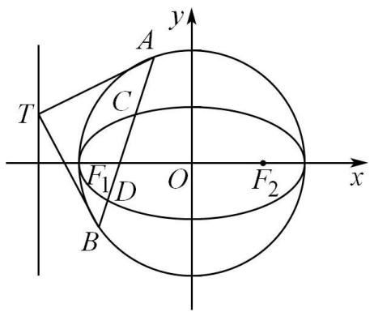

text_image

y
A
C
T
F₁ D O F₂ x
B

(1) 求椭圆 $C_{1}$ 的方程；
(2) 如图，以椭圆 $C_{1}$ 的长轴为直径作圆 $C_{2}$ ，过直线 $x = -2\sqrt{2}$ 上的动点 T 作圆 $C_{2}$ 的两条切线，设切点分别为 A, B，若直线 AB 与椭圆 $C_{1}$ 交于不同的两点 C, D，求弦 $|CD|$ 长的取值范围.

4025 (2024·陕西咸阳·校考三模) 已知双曲线 C: $\frac{x^{2}}{a^{2}} - \frac{y^{2}}{b^{2}} = 1 (a > 0, b > 0)$ 的离心率为 $\sqrt{2}$ ，过双曲线 C 的右焦点 F 且垂直于 x 轴的直线 l 与双曲线交于 A, B 两点，且 $|AB| = 2$ .

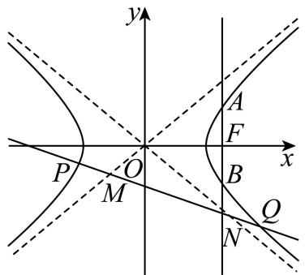

text_image

y
A
F
x
P
O
B
M
Q
N

(1) 求双曲线 C 的标准方程;
(2) 若直线 m: y = kx - 1 与双曲线 C 的左、右两支分别交于 P, Q 两点，与双曲线的渐近线分别交于 M, N 两点，求 $\frac{|PQ|}{|MN|}$ 的取值范围.

4026 (2024·湖南长沙·高三湖南师大附中校考阶段练习)设椭圆 $E:\frac{x^{2}}{a^{2}}+\frac{y^{2}}{b^{2}}=1(a>b>0)$ 的左右焦点 $F_{1}, F_{2}$ 分别是双曲线 $\frac{x^{2}}{4}-y^{2}=1$ 的左右顶点，且椭圆的右顶点到双曲线的渐近线的距离为 $\frac{2\sqrt{10}}{5}$ .

(1) 求椭圆 E 的方程;
(2) 是否存在圆心在原点的圆, 使得该圆的任意一条切线与椭圆 E 恒有两个交点 A, B, 且 $\overrightarrow{OA} \perp \overrightarrow{OB}$ ? 若存在, 写出该圆的方程, 并求 $|AB|$ 的取值范围, 若不存在, 说明理由.

4027 (2024·安徽滁州·安徽省定远中学校考模拟预测)已知椭圆 C: $\frac{x^2}{a^2} + \frac{y^2}{b^2} = 1 (a > b > 0)$ 的左、右焦点分别为 F $_1$ , F $_2$ , 离心率为 $\frac{\sqrt{2}}{2}$ , 过左焦点 F $_1$ 的直线 $l$ 与椭圆 C 交于 A, B 两点 (A, B 不在 $x$ 轴上), $\triangle ABF_2$ 的周长为 $8\sqrt{2}$ .

(1) 求椭圆 C 的标准方程;
(2) 若点 P 在椭圆 C 上, 且 OP ⊥ AB (O 为坐标原点), 求 $\frac{|OP|^{2}}{|AB|}$ 的取值范围.

4028 (2024·全国·高三专题练习)已知椭圆 E: $\frac{x^{2}}{a^{2}} + \frac{y^{2}}{b^{2}} = 1 (a > b > 0)$ 的离心率为 $\frac{\sqrt{2}}{2}$ ，焦距为 2，过 E 的左焦点 F 的直线 l 与 E 相交于 A、B 两点，与直线 x = -2 相交于点 M.

(1) 若 $M(-2,-1)$ ，求证： $|MA|\cdot|BF|=|MB|\cdot|AF|$ ;  
(2) 过点 F 作直线 l 的垂线 m 与 E 相交于 C、D 两点，与直线 x = -2 相交于点 N．求 $\frac{1}{|MA|} + \frac{1}{|MB|} + \frac{1}{|NC|} + \frac{1}{|ND|}$ 的最大值.

4029 (2024·全国·高三专题练习)如图,已知椭圆 $\Gamma_{1}:\frac{x^{2}}{8}+\frac{y^{2}}{4}=1$ 的两个焦点为 $F_{1}, F_{2}$ , 且 $F_{1}, F_{2}$ 的双曲线 $\Gamma_{2}$ 的顶点, 双曲线 $\Gamma_{2}$ 的一条渐近线方程为 y=-x, 设 P 为该双曲线 $\Gamma_{2}$ 上异于顶点的任意一点, 直线 $PF_{1}, PF_{2}$ 的斜率分别为 $k_{1}, k_{2}$ , 且直线 $PF_{1}$ 和 $PF_{2}$ 与椭圆 $\Gamma_{1}$ 的交点分别为 A, B 和 C, D.

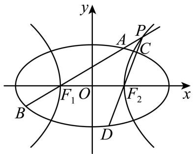

text_image

y
A
P
C
F₁ O
F₂
x
B
D

(1) 求双曲线 $\Gamma_{2}$ 的标准方程;  
(2) 证明: 直线 $PF_{1}$ , $PF_{2}$ 的斜率之积 $k_{1} \cdot k_{2}$ 为定值;  
(3) 求 $\frac{|AB|}{|CD|}$ 的取值范围.

4030 (2024·江苏南京·校考二模)在平面直角坐标系中,已知点P到点F( $\sqrt{2}$ ,0)的距离与到直线 $x=2\sqrt{2}$ 的距离之比为 $\frac{\sqrt{2}}{2}$ .

(1) 求点 P 的轨迹 C 的方程;  
(2) 过点 $(0,1)$ 且斜率为 $k\left(\frac{1}{2} \leqslant k \leqslant 2\right)$ 的直线 l 与 C 交于 A, B 两点，与 x 轴交于点 M，线段 AB 的垂直平分线与 x 轴交于点 N，求 $\frac{|AB|}{|MN|}$ 的取值范围.

4031 (2024·江苏南通·统考模拟预测)已知椭圆 $C_{1}:\frac{x^{2}}{2}+y^{2}=1$ 的左、右顶点是双曲线 $C_{2}:\frac{x^{2}}{a^{2}}-\frac{y^{2}}{b^{2}}=1(a>0,b>0)$ 的顶点， $C_{1}$ 的焦点到 $C_{2}$ 的渐近线的距离为 $\frac{\sqrt{3}}{3}$ . 直线 $l:y=kx+t$ 与 $C_{2}$ 相交于 A, B 两点， $\overrightarrow{OA}\cdot\overrightarrow{OB}=-3$ .

(1) 求证: $8k^{2} + t^{2} = 1$   
(2) 若直线 l 与 $C_{1}$ 相交于 P, Q 两点, 求 $|PQ|$ 的取值范围.

4032 (2024·广东深圳·高三校联考期中)已知点M(x,y)在运动过程中,总满足关系式:

$$
\sqrt {(x - \sqrt {3}) ^ {2} + y ^ {2}} + \sqrt {(x + \sqrt {3}) ^ {2} + y ^ {2}} = 4.
$$

(1) 点 M 的轨迹是什么曲线？写出它的方程；  
(2) 设圆 $O: x^{2} + y^{2} = 1$ ，直线 $l: y = kx + m$ 与圆 O 相切且与点 M 的轨迹交于不同两点 A，B，当 $\lambda = \overrightarrow{OA} \cdot \overrightarrow{OB}$ 且 $\lambda \in \left[\frac{1}{2}, 1\right)$ 时，求弦长 $|AB|$ 的取值范围.

4033 (2024·四川遂宁·统考三模)已知椭圆 C: $\frac{x^{2}}{a^{2}} + \frac{y^{2}}{b^{2}} = 1 (a > b > 0)$ 的左、右顶点为 A₁, A₂，点 G 是椭圆 C 的上顶点，直线 A₂G 与圆 $x^{2} + y^{2} = \frac{8}{3}$ 相切，且椭圆 C 的离心率为 $\frac{\sqrt{2}}{2}$

(1) 求椭圆 C 的标准方程;  
(2) 若点 Q 在椭圆 C 上, 过左焦点 $F_{1}$ 的直线 l 与椭圆 C 交于 A, B 两点 (A, B 不在 x 轴上) 且 $\overrightarrow{OQ} \cdot \overrightarrow{AB} = 0$ , (O 为坐标原点), 求 $\frac{2\sqrt{2}|AB|}{|OQ|^{2}}$ 的取值范围.

4034 (2024·江西宜春·校联考模拟预测)已知椭圆 C: $\frac{x^{2}}{a^{2}} + \frac{y^{2}}{b^{2}} = 1 (a > b > 0)$ 过点 $(0, \sqrt{3})$ ，且离心率为 $\frac{1}{2}$ .

(1) 求椭圆 C 的方程;  
(2) 过点 P(-1,1) 且互相垂直的直线 $l_{1}, l_{2}$ 分别交椭圆 C 于 M,N 两点及 S,T 两点. 求 $\frac{|PM||PN|}{|PS||PT|}$ 的取值范围.

4035 (2024·重庆渝中·高三重庆巴蜀中学校考阶段练习)在平面直角坐标系 xOy 中, 动点 M $(x,y)$ 到定点 F( $\sqrt{2},0$ ) 的距离与动点 M $(x,y)$ 到定直线 $l_{0}:x=2\sqrt{2}$ 的距离的比值为 $\frac{\sqrt{2}}{2}$ , 记动点 M 的轨迹为曲线 C.

(1) 求曲线 C 的标准方程.  
(2) 若动直线 l 与曲线 C 相交于 A, B 两点, 且 OA ⊥ OB(O 为坐标原点), 求弦长 |AB| 的取值范围.

4036 (2024·湖北·校联考模拟预测)已知椭圆 E: $\frac{x^2}{a^2} + \frac{y^2}{b^2} = 1 (a > b > 0)$ 过点 A $\left(1, \frac{\sqrt{3}}{2}\right)$ .

(1) 若椭圆 E 的离心率 $\mathrm{e} \in \left(0, \frac{1}{2}\right]$ ，求 b 的取值范围；  
(2) 已知椭圆 E 的离心率 $e = \frac{\sqrt{3}}{2}$ ，M, N 为椭圆 E 上不同两点，若经过 M, N 两点的直线与圆 $x^{2} + y^{2} = b^{2}$ 相切，求线段 MN 的最大值.

4037 (2024·黑龙江哈尔滨·高三哈师大附中校考期末)已知椭圆 $E:\frac{x^{2}}{a^{2}}+\frac{y^{2}}{b^{2}}=1(a>b>0)$ 的左、右焦点分别为 $F_{1}(-1,0)$ 、 $F_{2}(1,0)$ ，点 P 在椭圆 E 上， $PF_{2}\perp F_{1}F_{2}$ ，且 $|PF_{1}|=3|PF_{2}|$ .

(1) 求椭圆的标准方程;  
(2) 直线 $l: x = my + 1 (m \in \mathbb{R})$ 与椭圆 $\mathrm{E}$ 相交于 $\mathrm{A}, \mathrm{B}$ 两点，与圆 $x^{2} + y^{2} = 2$ 相交于 $\mathrm{C}, \mathrm{D}$ 两点，求 $|\mathrm{AB}| \cdot |\mathrm{CD}|^{2}$ 的取值范围.

4038 (2024·全国·高三专题练习)已知椭圆 C: $\frac{x^{2}}{a^{2}} + \frac{y^{2}}{b^{2}} = 1 (a > b > 0)$ 的短轴长为 4，离心率为 $\frac{\sqrt{5}}{3}$ . 点 P 为圆 M: $x^{2} + y^{2} = 16$ 上任意一点，O 为坐标原点.

(1) 求椭圆 C 的标准方程;  
(2) 记线段 OP 与椭圆 C 交点为 Q, 求 $|PQ|$ 的取值范围.

# 题型七:长度的定值问题

4039 (2024·辽宁沈阳·高三沈阳二中校考阶段练习)如图, 已知椭圆 $C_{1}:\frac{x^{2}}{3}+y^{2}=1$ , $C_{1}$ 的左右焦点 $F_{1}, F_{2}$ 是双曲线 $C_{2}$ 的左右顶点, $C_{2}$ 的离心率为 $\sqrt{2}$ . 点 E 在 $C_{2}$ 上 (异于 $F_{1}, F_{2}$ 两点),过点 E 和 $F_{1}, F_{2}$ 分别作直线交椭圆 $C_{1}$ 于 F, G 和 M, N 点.

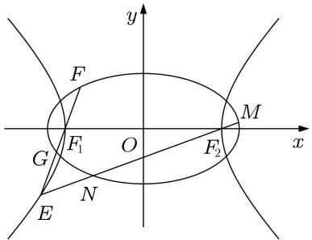

text_image

y
F
M
x
G
F₁ O F₂
N
E

(1) 求证: $k_{\mathrm{FG}} \cdot k_{\mathrm{MN}}$ 为定值;   
(2) 求证: $\frac{1}{|FG|} + \frac{1}{|MN|}$ 为定值.

4040 (2024·北京顺义·高三牛栏山一中校考期中)椭圆 $\Gamma:\frac{x^{2}}{4}+y^{2}=1$ .

(1) 点 C 是椭圆 $\Gamma$ 上任意一点, 求点 C 与点 D(0,2) 两点之间距离 d 的最大值和最小值;  
(2)A 和 B 分别为椭圆 $\Gamma$ 的右顶点和上顶点．P 为椭圆 $\Gamma$ 上第三象限点．直线 PA 与 y 轴交于点 M，直线 PB 与 x 轴交于点 N．求 $\left(\frac{|\mathrm{PM}|}{|\mathrm{MA}|}\right)^{2}+\left(\frac{|\mathrm{PN}|}{|\mathrm{NB}|}\right)^{2}$ .

4041 (2024·吉林松原·高三前郭尔罗斯县第五中学校考期末)已知椭圆C的右焦点与抛物线E: $y^{2}=8x$ 的焦点F重合,且椭圆C的离心率为 $\frac{1}{2}$ .

(1) 求椭圆 C 的标准方程.  
(2) 过点 F 的直线 l 交椭圆 C 于 M, N 两点, 交抛物线 E 于 P, Q 两点, 是否存在实数 $\lambda$ , 使得 $\frac{\lambda}{|MN|} - \frac{2}{|PQ|}$ 为定值? 若存在, 求出这个定值和 $\lambda$ 的值; 若不存在, 说明理由.

(2024·河南·校联考模拟预测)已知抛物线 E: $y^{2}=2px(p>0)$ 的焦点关于其准线的对称点为 P(-3,0)，椭圆 C: $\frac{x^{2}}{a^{2}}+\frac{y^{2}}{b^{2}}=1(a>b>0)$ 的左，右焦点分别是 F₁, F₂，且与 E 有一个共同的焦点，线段 PF₁ 的中点是 C 的左顶点．过点 F₁ 的直线 l 交 C 于 A, B 两点，且线段 AB 的垂直平分线交 x 轴于点 M.

(1) 求 C 的方程;  
(2) 证明: $\frac{|\mathrm{F}_{1}\mathrm{M}|}{|\mathrm{AB}|} = \frac{1}{4}$ .

4043 (2024·天津红桥·统考一模)设椭圆 C: $\frac{x^{2}}{a^{2}} + \frac{y^{2}}{b^{2}} = 1 (a > b > 0)$ 的左、右焦点分别为 F₁、F₂，离心率 e = $\frac{1}{2}$ ，长轴为 4，且过椭圆右焦点 F₂ 的直线 l 与椭圆 C 交于 M、N 两点.

(1) 求椭圆 C 的标准方程;  
(2) 若 $\overrightarrow{OM} \cdot \overrightarrow{ON} = -2$ ，其中 O 为坐标原点，求直线 l 的斜率；  
(3) 若 AB 是椭圆 C 经过原点 O 的弦, 且 MN // AB, 判断 $\frac{|AB|^2}{|MN|}$ 是否为定值? 若是定值, 请求出, 若不是定值, 请说明理由.

4044 (2024·全国·高三专题练习)如图,在平面直角坐标系 xOy 中,已知直线 $y=\frac{2\sqrt{5}}{5}x$ 与椭圆 C: $\frac{x^{2}}{a^{2}}+\frac{y^{2}}{b^{2}}=1(a>b>0)$ 交于 P,Q 两点 (P 在 x 轴上方),且 PQ= $\frac{6}{5}a$ ,设点 P 在 x 轴

上的射影为点N， $\Delta PQN$ 的面积为 $\frac{2\sqrt{5}}{5}$ ，抛物线 $E:y^{2}=2px(p>0)$ 的焦点与椭圆C的焦点重合，斜率为k的直线l过抛物线E的焦点与椭圆C交于A,B两，点，与抛物线E交于C,D两点.

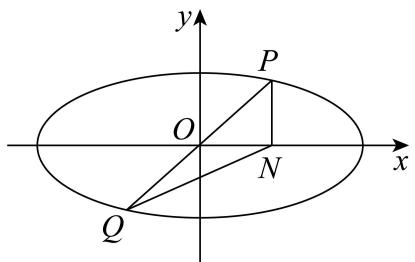

text_image

y
P
O
N
x
Q

(1) 求椭圆 C 及抛物线 E 的标准方程;  
(2) 是否存在常数 $\lambda$ ，使 $\frac{\sqrt{5}}{|AB|} + \frac{\lambda}{|CD|}$ 为常数？若存在，求 $\lambda$ 的值；若不存在，说明理由.

4045 (2024·河南·校联考模拟预测)已知双曲线 C: $\frac{x^{2}}{a^{2}} - \frac{y^{2}}{a^{2}} = 1 (a > 0)$ 的左、右焦点分别为 F₁, F₂. 过 F₂ 的直线 l 交 C 的右支于 M, N 两点，当 l 垂直于 x 轴时，M, N 到 C 的一条渐近线的距离之和为 $2\sqrt{2}$ .

(1) 求 C 的方程;  
(2) 证明: $\frac{|\mathrm{MF}_1|}{|\mathrm{MF}_2|} + \frac{|\mathrm{NF}_1|}{|\mathrm{NF}_2|}$ 为定值.

4046 (2024·安徽淮北·统考二模)已知抛物线 $C_{1}:y^{2}=2px(p>0)$ 的焦点和椭圆 $C_{2}:\frac{x^{2}}{a^{2}}+\frac{y^{2}}{b^{2}}=1(a>b>0)$ 的右焦点 F 重合，过点 F 任意作直线 l 分别交抛物线 $C_{1}$ 于 M,N，交椭圆 $C_{2}$ 于 P,Q. 当 l 垂直于 x 轴时 $|MN|=4,|PQ|=3$ .

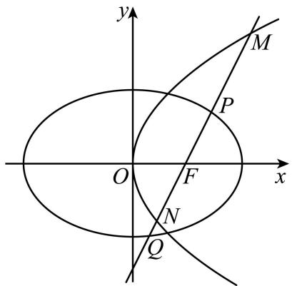

text_image

y
M
P
O
F
x
N
Q

(1) 求 $C_{1}$ 和 $C_{2}$ 的方程;  
(2) 是否存在常数 $m$ , 使 $\frac{1}{|\mathrm{MN}|} + \frac{m}{|\mathrm{PQ}|}$ 为定值? 若存在, 求出 $m$ 的值; 若不存在, 请说明理由.

4047 (2024·全国·高三专题练习)已知椭圆 C: $\frac{x^{2}}{a^{2}} + \frac{y^{2}}{b^{2}} = 1 (a > b > 0)$ 的左右焦点分别为 F₁, F₂, $|F_{1}F_{2}| = 2$ , 连接椭圆 C 的四个顶点所成的四边形的周长为 $4\sqrt{7}$ .

(1) 求椭圆 C 的方程和离心率;  
(2) 已知过点 $F_{1}$ 的直线 $l_{1}$ 与椭圆交于 P, Q 两点，过点 $F_{2}$ 且与直线 $l_{1}$ 垂直的直线 $l_{2}$ 与椭圆交于 M, N 两点，求 $\frac{|PQ| + |MN|}{|PQ| \cdot |MN|}$ 的值.

4048 (2024·北京顺义·高三北京市顺义区第一中学校考期中)已知椭圆 C: $\frac{x^{2}}{a^{2}} + \frac{y^{2}}{b^{2}} = 1 (a > b > 0)$ 的长轴长为 4，且离心率为 $\frac{1}{2}$ .

(1) 求椭圆 C 的方程;  
(2) 设过点 F(1,0) 且斜率为 k 的直线 l 与椭圆 C 交于 A, B 两点, 线段 AB 的垂直平分线交 x 轴于点 D. 求证: $\frac{|AB|}{|DF|}$ 为定值.

4049 (2024·天津河北·高三统考期末)已知椭圆 C: $\frac{x^{2}}{a^{2}} + \frac{y^{2}}{b^{2}} = 1$ 点 B(0, $\sqrt{2}$ ), 且离心率 e = $\frac{\sqrt{6}}{3}$ , F 为椭圆 C 的左焦点.

(1) 求椭圆 C 的方程;  
(2) 设点 T(-3, m)，过点 F 的直线 l 交椭圆 C 于 P，Q 两点，TF ⊥ l，连接 OT 与 PQ 交于点 H.  
①若 $m = \sqrt{2}$ ，求 $|\mathrm{PQ}|$   
②求 $\frac{|\mathrm{PH}|}{|\mathrm{HQ}|}$ 的值.

4050 (2024·全国·高三专题练习)已知椭圆 E: $\frac{x^{2}}{a^{2}} + \frac{y^{2}}{b^{2}} = 1 (a > b > 0)$ . 焦距为 $2c, \frac{c}{a} = \frac{\sqrt{2}}{2}$ ，左、右焦点分别为 $F_{1}, F_{2}$ . 在椭圆 E 上任取一点 P， $\Delta F_{1}PF_{2}$ 的周长为 $4(\sqrt{2} + 1)$ .

(1) 求椭圆 E 的标准方程;  
(2) 设点 P 关于原点的对称点为 Q. 过右焦点 $F_{2}$ 作与直线 PQ 垂直的直线交椭圆 E 于 A, B 两点, 求 $\frac{|AB|}{|PQ|}$ 的取值范围;  
(3) 若过点 R(-1,0) 的直线 $x + y + 1 = 0$ 与椭圆 E 交于 C, D 两点，求 $\frac{1}{|RC|} + \frac{1}{|RD|}$ 的值.

4051 (2024·全国·高三专题练习)已知椭圆 E: $\frac{x^{2}}{a^{2}} + \frac{y^{2}}{b^{2}} = 1 (a > b > 0)$ 的长轴是短轴的 2 倍, 且右焦点为 F( $\sqrt{3}, 0$ ), 点 B 在椭圆上, 且点 C 为点 B 关于 x 轴的对称点.

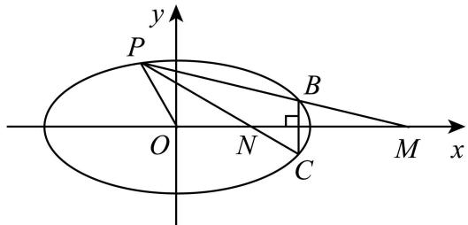

text_image

y
P
O
N
C
B
M
x

(1) 求椭圆 C 的标准方程;  
(2) 若点 B 在第一象限且 $\triangle OBC$ 为等边三角形, 求该等边三角形的边长;  
(3) 设 P 为椭圆 E 上异于 B, C 的任意一点, 直线 PB, PC 与 x 轴分别交于点 M, N, 判断 $|OM| \cdot |ON|$ 是否为定值? 若是, 求出定值; 若不是, 说明理由.

4052 (2024·全国·高三专题练习)已知双曲线 C 以 $2x \pm \sqrt{5}y = 0$ 为渐近线, 其上焦点 F 坐标为 $(0,3)$ .

(1) 求双曲线 C 的方程;  
(2) 不平行于坐标轴的直线 l 过 F 与双曲线 C 交于 P, Q 两点, PQ 的中垂线交 y 轴于点

T, 问 $\frac{|TF|}{|PQ|}$ 是否为定值, 若是, 请求出定值, 若不是, 请说明理由.

4053 (2024·全国·高三专题练习)已知椭圆 C: $\frac{x^{2}}{a^{2}} + \frac{y^{2}}{b^{2}} = 1 (a > b > 1)$ 长轴的顶点与双曲线 D: $\frac{x^{2}}{4} - \frac{y^{2}}{b^{2}} = 1$ 实轴的顶点相同, 且 C 的右焦点 F 到 D 的渐近线的距离为 $\frac{\sqrt{21}}{7}$ .

(1) 求 C 与 D 的方程;

(2) 若直线 l 的倾斜角是直线 $y = (\sqrt{5} - 2)x$ 的倾斜角的 2 倍，且 l 经过点 F, l 与 C 交于 A、B 两点，与 D 交于 M、N 两点，求 $\frac{|AB|}{|MN|}$ .

4054 (2024·山东青岛·高三统考期末)已知椭圆 $E_{1}:\frac{x^{2}}{a^{2}}+\frac{y^{2}}{b^{2}}=1(a>b>0)$ 的左，右顶点分别为 $A_{1},A_{2}$ ，上，下顶点分别为 $B_{1},B_{2}$ ，四边形 $A_{1}B_{1}A_{2}B_{2}$ 的内切圆的面积为 $\frac{5\pi}{6}$ ，其离心率 $e=\frac{2\sqrt{5}}{5}$ ；抛物线 $E_{2}:y^{2}=2px(p>0)$ 的焦点与椭圆 $E_{1}$ 的右焦点重合。斜率为 k 的直线 l 过抛物线 $E_{2}$ 的焦点且与椭圆 $E_{1}$ 交于 A，B 两点，与抛物线 $E_{2}$ 交于 C，D 两点。

(1) 求椭圆 $E_{1}$ 及抛物线 $E_{2}$ 的方程；

(2) 是否存在常数 $\lambda$ , 使得 $\frac{1}{|\mathrm{AB}|} + \frac{\lambda}{|\mathrm{CD}|}$ 为一个与 $k$ 无关的常数? 若存在, 求出 $\lambda$ 的值; 若不存在, 请说明理由.

4055 (2024·辽宁·新民市第一高级中学校联考一模)如图, A, B, C, D 是抛物线 E: $y^{2}=4x$ 上的四个点 (A, B 在 x 轴上方, C, D 在 x 轴下方), 已知直线 AC 与 BD 的斜率分别为 $-\frac{\sqrt{6}}{3}$ 和 2, 且直线 AC 与 BD 相交于点 P.

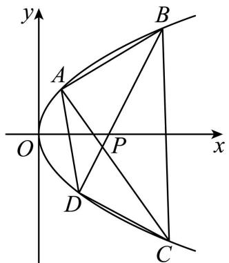

text_image

y
A
B
O
P
x
D
C

(1) 若点 A 的横坐标为 6, 则当 $\triangle ADC$ 的面积取得最大值时, 求点 D 的坐标.

(2) 试问 $\frac{|PA|\cdot|PC|}{|PB|\cdot|PD|}$ 是否为定值？若是，求出该定值；若不是，请说明理由.

