# 第71讲 面积问题

# 知识梳理

# 1、三角形的面积处理方法

(1) $S_{\triangle}=\frac{1}{2}\cdot$ 底·高(通常选弦长做底,点到直线的距离为高)   
(2) $\mathrm{S}_{\Delta} = \frac{1}{2}\cdot$ 水平宽·铅锤高 $= \frac{1}{2} |\mathbf{AB}|\cdot |x_{\mathrm{E}} - x_{\mathrm{D}}|$ 或 $\mathrm{S}_{\Delta} = \frac{1}{2} |\mathrm{CD}|\cdot |y_{\mathrm{A}} - y_{\mathrm{E}}|$

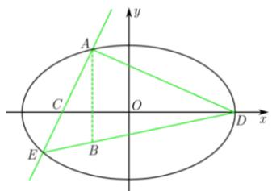

text_image

A
y
C
O
D
x
E
B

(3) 在平面直角坐标系 $xOy$ 中, 已知 $\triangle OMN$ 的顶点分别为 $O(0, 0), M(x_1, y_1), N(x_2, y_2)$ , 三角形的面积为 $S = \frac{1}{2} |x_1y_2 - x_2y_1|$ .

# 2、三角形面积比处理方法

# (1) 对顶角模型

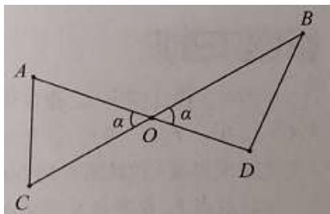

text_image

A
α
O
α
B
C
D

$$
\frac {\mathrm{S} _ {\Delta \mathrm{OAC}}}{\mathrm{S} _ {\Delta \mathrm{OBD}}} = \frac {\frac {1}{2} \mathrm{OA} \cdot \mathrm{OC} \cdot \sin \alpha}{\frac {1}{2} \mathrm{OB} \cdot \mathrm{OD} \cdot \sin \alpha} = \frac {\mathrm{OA} \cdot \mathrm{OC}}{\mathrm{OB} \cdot \mathrm{OD}}
$$

# (2) 等角、共角模型

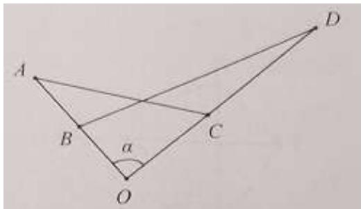

text_image

A
B
α
C
D
O

$$
\frac {\mathrm{S} _ {\Delta \mathrm{OAC}}}{\mathrm{S} _ {\Delta \mathrm{OBD}}} = \frac {\frac {1}{2} \mathrm{OA} \cdot \mathrm{OC} \cdot \sin \alpha}{\frac {1}{2} \mathrm{OB} \cdot \mathrm{OD} \cdot \sin \alpha} = \frac {\mathrm{OA} \cdot \mathrm{OC}}{\mathrm{OB} \cdot \mathrm{OD}}
$$

# 3、四边形面积处理方法

# (1) 对角线垂直

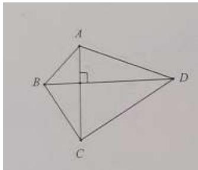

text_image

A
B
C
D

$$
\mathrm{S} = \frac {1}{2} \mathrm{AC} \cdot \mathrm{BD}
$$

(2) 一般四边形

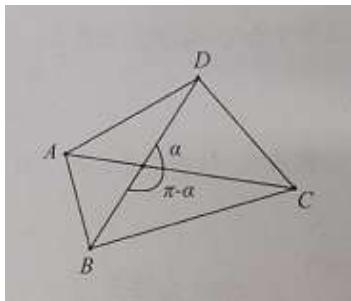

text_image

A
B
C
D
α
π-α

$$
\mathrm{S} = \frac {1}{2} \mathrm{AC} \cdot \mathrm{BD} \cdot \sin \alpha
$$

(3) 分割两个三角形

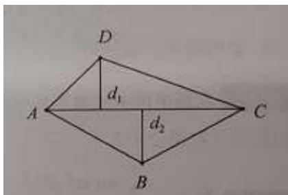

text_image

D
d₁
A
d₂
C
B

$$
\mathrm{S} = \frac {1}{2} \mathrm{AC} \cdot \left(d _ {1} + d _ {2}\right)
$$

# 4、面积的最值问题或者取值范围问题

一般都是利用面积公式表示面积,然后将面积转化为某个变量的一个函数,再求解函数的最值(一般处理方法有换元,基本不等式,建立函数模型,利用二次函数、三角函数的有界性求最值或利用导数法求最值,构造函数求导等等),在算面积的过程中,优先选择长度为定值的线段参与运算,灵活使用割补法计算面积,尽可能降低计算量.

# 必考题型全归纳

# 题型一:三角形的面积问题之 $S_{\triangle}=\frac{1}{2}\cdot$ 底·高

4056 (2024·福建漳州·高三统考开学考试)已知椭圆 C: $\frac{x^{2}}{a^{2}} + \frac{y^{2}}{b^{2}} = 1 (a > b > 0)$ 的左焦点为 F₁(-√3,0)，且过点 A(√3, $\frac{1}{2}$ ).

(1) 求 C 的方程;  
(2) 不过原点 O 的直线 l 与 C 交于 P, Q 两点, 且直线 OP, PQ, OQ 的斜率成等比数列.  
(i) 求 l 的斜率;  
(ii) 求 $\triangle OPQ$ 的面积的取值范围.

4057 (2024·湖南常德·高三常德市一中校考阶段练习)在平面直角坐标系中,已知点

$A\left(\frac{1}{2},0\right)$ ，点B在直线 $l:x=-\frac{1}{2}$ 上运动，过点B与l垂直的直线和AB的中垂线相交于点M.

(1) 求动点 M 的轨迹 E 的方程;  
(2) 设点 P 是轨迹 E 上的动点, 点 R, N 在 y 轴上, 圆 $\mathrm{C}:(x-1)^{2}+y^{2}=1$ 内切于 $\triangle PRN$ , 求 $\triangle PRN$ 的面积的最小值.

4058 (2024·浙江·模拟预测)我国著名数学家华罗庚曾说:“数缺形时少直观,形少数时难入微,数形结合百般好,隔离分家万事休.”事实上,很多代数问题可以转化为几何问题加以解决,已知曲线C上任意一点P(x,y)满足 $\sqrt{(x+\sqrt{2})^{2}+y^{2}}-\sqrt{(x-\sqrt{2})^{2}+y^{2}}=2$ .

(1) 化简曲线 C 的方程;  
(2) 已知圆 O: $x^{2} + y^{2} = 1$ (O 为坐标原点), 直线 l 经过点 A(m,0) (m > 1) 且与圆 O 相切, 过点 A 作直线 l 的垂线, 交 C 于 M,N 两点, 求 $\triangle OMN$ 面积的最小值.

4059 (2024·河北秦皇岛·校联考二模)已知双曲线 $\frac{x^{2}}{a^{2}} - \frac{y^{2}}{b^{2}} = 1 (a > 0, b > 0)$ 实轴的一个端点是 P，虚轴的一个端点是 Q，直线 PQ 与双曲线的一条渐近线的交点为 $\left(\frac{1}{2}, \frac{1}{2}\right)$ .

(1) 求双曲线的方程;   
(2) 若直线 $y = kx + \frac{1}{k} (0 < k < 1)$ 与曲线 C 有两个不同的交点 A、B, O 是坐标原点，求 $\triangle OAB$ 的面积最小值.

4060 (2024·四川成都·成都市锦江区嘉祥外国语高级中学校考三模)设椭圆 $E:\frac{x^{2}}{a^{2}}+\frac{y^{2}}{b^{2}}=1(a>b>0)$ 过点 $M(\sqrt{2},1)$ ，且左焦点为 $F_{1}(-\sqrt{2},0)$ .

(1) 求椭圆 E 的方程;  
(2) $\triangle ABC$ 内接于椭圆 E, 过点 P(4,1) 和点 A 的直线 $l$ 与椭圆 E 的另一个交点为点 D, 与 BC 交于点 Q, 满足 $|\overrightarrow{AP}||\overrightarrow{QD}| = |\overrightarrow{AQ}||\overrightarrow{PD}|$ , 求 $\triangle ABC$ 面积的最大值.

# 2 题型二:三角形的面积问题之分割法

4061 (2024·全国·高三专题练习)设动点 M 与定点 F(c,0)(c>0) 的距离和 M 到定直线 l: x = $\frac{4}{c}$ 的距离的比是 $\frac{c}{2}$ .

(1) 求动点 M 的轨迹方程, 并说明轨迹的形状;  
(2) 当 $c = \sqrt{2}$ 时, 记动点 M 的轨迹为 $\Omega$ , 动直线 $m$ 与抛物线 $\Gamma: y^2 = 4x$ 相切, 且与曲线 $\Omega$ 交于点 A, B. 求 $\triangle AOB$ 面积的最大值.

4062 (2024·四川成都·高三校联考阶段练习)已知椭圆 C 的对称中心为坐标原点, 对称轴为坐标轴, 焦点在 y 轴上, 离心率 $e = \frac{1}{2}$ , 且过点 P(3,2).

(1) 求椭圆 C 的标准方程;  
(2) 若直线 $l$ 与椭圆交于 A, B 两点, 且直线 PA, PB 的倾斜角互补, 点 M(0,8), 求三角形 MAB 面积的最大值.

4063 (2024·广东·高三校联考阶段练习)已知双曲线 $\frac{x^{2}}{a^{2}} - \frac{y^{2}}{b^{2}} = 1, (a > 0, b > 0)$ 的离心率为 2，右焦点 F 到渐近线的距离为 $\sqrt{3}$ .

(1) 求双曲线的标准方程;

(2) 若点 P 为双曲线右支上一动点, 过点 P 与双曲线相切的直线 l, 直线 l 与双曲线的渐近线分别交于 M, N 两点, 求 $\Delta FMN$ 的面积的最小值.

4064 (2024·广东广州·高三中山大学附属中学校考阶段练习)过椭圆 $\frac{x^{2}}{4} + \frac{y^{2}}{3} = 1$ 的右焦点 F 作两条相互垂直的弦 AB, CD.AB, CD 的中点分别为 M, N.

(1) 证明: 直线 MN 过定点;  
(2) 若 AB, CD 的斜率均存在, 求 $\triangle FMN$ 面积的最大值.

# 题型三:三角形、四边形的面积问题之面积坐标化

4065 (2024·全国·高三专题练习)如图,已知双曲线 $C: x^{2} - \frac{y^{2}}{3} = 1$ 的左右焦点分别为 $F_{1}$ 、 $F_{2}$ , 若点 P 为双曲线 C 在第一象限上的一点,且满足 $\left|PF_{1}\right| + \left|PF_{2}\right| = 8$ , 过点 P 分别作双曲线 C 两条渐近线的平行线 PA、PB 与渐近线的交点分别是 A 和 B.

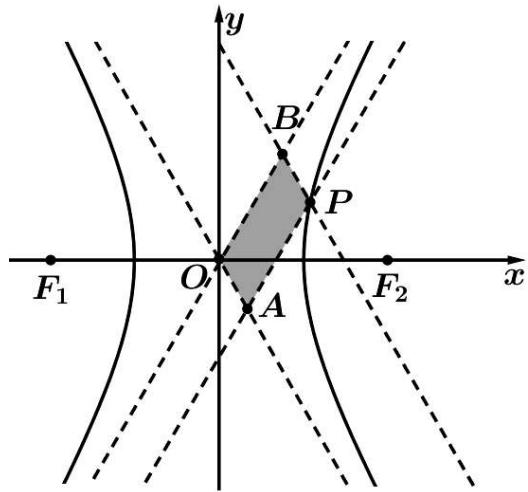

text_image

y
B
P
F₁ O F₂ x
A

(1) 求四边形 OAPB 的面积;  
(2) 若对于更一般的双曲线 $C^{\prime}:\frac{x^{2}}{a^{2}}-\frac{y^{2}}{b^{2}}=1(a>0,b>0)$ ，点 $P^{\prime}$ 为双曲线 $C^{\prime}$ 上任意一点，过点 $P^{\prime}$ 分别作双曲线 $C^{\prime}$ 两条渐近线的平行线 $P^{\prime}A^{\prime}$ 、 $P^{\prime}B^{\prime}$ 与渐近线的交点分别是 $A^{\prime}$ 和 $B^{\prime}$ 。请问四边形 $OAP^{\prime}B^{\prime}$ 的面积为定值吗？若是定值，求出该定值（用 a、b 表示该定值）；若不是定值，请说明理由。

4066 (2024·浙江·高三竞赛)已知直线 l 与椭圆 C: $\frac{x^{2}}{a^{2}} + \frac{y^{2}}{b^{2}} = 1 (a > b > 0)$ 交于 A、B 两点，直线 AB 不经过原点 O.

(1) 求 $\triangle OAB$ 面积的最大值；  
(2) 设 M 为线段 AB 的中点, 延长 OM 交椭圆 C 于点 P, 若四边形 OAPB 为平行四边形, 求四边形 OAPB 的面积.

4067 (2024·全国·高三专题练习) $F_{1}, F_{2}$ 分别是椭圆于 $\frac{x^{2}}{4} + y^{2} = 1$ 的左、右焦点.

(1) 若P是该椭圆上的一个动点, 求 $\overrightarrow{PF_{1}} \cdot \overrightarrow{PF_{2}}$ 的取值范围;  
(2) 设 A(2,0), B(0,1) 是它的两个顶点, 直线 $y = kx (k \geqslant 0)$ 与 AB 相交于点 D, 与椭圆相交于 E、F 两点. 求四边形 AEBF 面积的最大值.

4068 (2024·江苏苏州·模拟预测)如图,在平面直角坐标系 xOy 中,已知抛物线 C: $y^{2}=4x$ 的焦点为 F,过 F 的直线交 C 于 A,B 两点(其中点 A 在第一象限),过点 A 作 C 的切线交 x 轴于点P, 直线PB交C于另一点Q, 直线QA交x轴于点T.

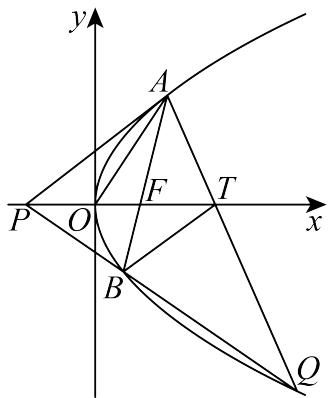

text_image

y
A
F
T
x
P O
B
Q

(1) 求证: $\left|AF\right|\cdot\left|AT\right|=\left|BF\right|\cdot\left|QT\right|$ ;   
(2) 记 $\triangle AOP, \triangle AFT, \triangle BQT$ 的面积分别为 $S_{1}, S_{2}, S_{3}$ , 当点 A 的横坐标大于 2 时, 求 $\frac{S_{3}}{S_{2} - S_{1}}$ 的最小值及此时点 A 的坐标.

4069 (2024·上海浦东新·高三上海市进才中学校考阶段练习)设椭圆 E: $\frac{x^{2}}{a^{2}} + \frac{y^{2}}{b^{2}} = 1 (a > b > 0)$ 的一个顶点为 A(0,1)，离心率为 $\frac{\sqrt{2}}{2}$ ，F 为椭圆 E 的右焦点.

(1) 求椭圆 E 的方程;  
(2) 设过 F 且斜率为 k 的直线与椭圆 E 交于 D, G 两点, 若满足 AD ⊥ AG, 求 k 的值;  
(3) 过点 P(2,0) 的直线与椭圆 E 交于 B, C 两点, 过点 B, C 分别作直线 l: x = t 的垂线 (点 B, C 在直线 l 的两侧). 垂足分别为 M, N, 记 $\triangle BMP$ , $\triangle MNP$ , $\triangle CNP$ 的面积分别为 $S_{1}$ , $S_{2}$ , $S_{3}$ , 试问: 是否存在常数 t, 使得 $S_{1}$ , $\frac{1}{2}S_{2}$ , $S_{3}$ 总成等比数列? 若存在, 求出 t 的值, 若不存在, 请说明理由.

4070 (2024·福建泉州·泉州七中校考模拟预测)已知圆 $C:(x-\sqrt{3})^{2}+y^{2}=16$ ，点 $G(-\sqrt{3},0)$ ，圆周上任一点 P，若线段 PG 的垂直平分线和 CP 相交于点 Q，点 Q 的轨迹为曲线 E.

(1) 求曲线 E 的方程;  
(2) 若过点 (1,0) 的动直线 $n$ 与椭圆 C 相交于 M,N 两点, 直线 $l$ 的方程为 $x = 4$ . 过点 M 作 MT $\perp l$ 于点 T, 过点 N 作 NR $\perp l$ 于点 R. 记 $\triangle GTR, \triangle GTM, \triangle GRN$ 的面积分别为 S, S $_1$ , S $_2$ . 问是否存在实数 $\lambda$ , 使得 $\lambda \sqrt{S_1 \cdot S_2} - S = 0$ 成立? 若存在, 请求出 $\lambda$ 的值; 若不存在, 请说明理由.

4071 (2024·上海浦东新·高三上海市洋泾中学校考开学考试)设抛物线 $\Gamma: y^{2} = 4x$ 的焦点为 F，经过 x 轴正半轴上点 M(m,0) 的直线 l 交 $\Gamma$ 于不同的两点 A 和 B.

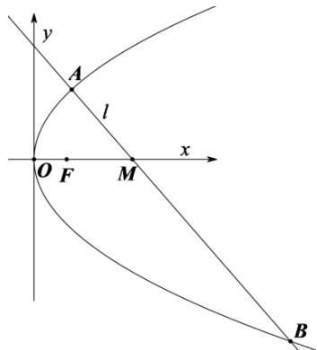

text_image

y
A
l
O F M x
B

(1) 若 $\left|FA\right|=3$ ，求 A 点的坐标；

(2) 若 m=2，求证：原点 O 总在以线段 AB 为直径的圆的内部；  
(3) 若 $\left|FA\right| = \left|FM\right|$ ，且直线 $l_{1} \parallel l, l_{1}$ 与 $\Gamma$ 有且只有一个公共点 E，问： $\triangle OAE$ 的面积是否存在最小值？若存在，求出最小值，并求出 M 点的坐标；若不存在，请说明理由。（三角形面积公式：在 $\triangle ABC$ 中，设 $\overrightarrow{CA} = \vec{a} = (x_{1}, y_{1})$ ， $\overrightarrow{CB} = \vec{b} = (x_{2}, y_{2})$ ，则 $\triangle ABC$ 的面积为

$$
\mathrm{S} = \frac {1}{2} \sqrt {\left| \vec {a} \right| ^ {2} \left| \vec {b} \right| ^ {2} - (\vec {a} \cdot \vec {b}) ^ {2}} = \frac {1}{2} \left| x _ {1} y _ {2} - x _ {2} y _ {1} \right|
$$

4072 (2024·四川眉山·高三校考阶段练习)在 $\Delta PF_{1}F_{2}$ 中, 已知点 $F_{1}(-\sqrt{3},0)$ , $F_{2}(\sqrt{3},0)$ , $PF_{1}$ 边上的中线长与 $PF_{2}$ 边上的中线长之和为 6; 记 $\Delta PF_{1}F_{2}$ 的重心 G 的轨迹为曲线 C.

(1) 求 C 的方程;  
(2) 若圆 O: $x^{2} + y^{2} = 1$ , E(0, -1), 过坐标原点 O 且与 y 轴不重合的任意直线 l 与圆 O 相交于点 A, B, 直线 EA, EB 与曲线 C 的另一个交点分别是点 M, N, 求 $\triangle EMN$ 面积的最大值.

# 4 题型四:三角形的面积比问题之共角、等角模型

4073 (2024·河北·统考模拟预测)已知抛物线 C: $x^{2}=2py(p>0)$ ，过点 P(0,2) 的直线 l 与 C 交于 A, B 两点，当直线 l 与 y 轴垂直时，OA ⊥ OB (其中 O 为坐标原点).

(1) 求 C 的准线方程;  
(2) 若点 A 在第一象限, 直线 l 的倾斜角为锐角, 过点 A 作 C 的切线与 y 轴交于点 T, 连接 TB 交 C 于另一点为 D, 直线 AD 与 y 轴交于点 Q, 求 $\triangle APQ$ 与 $\triangle ADT$ 面积之比的最大值.

4074 (2024·北京东城·高三北京市第十一中学校考阶段练习)已知椭圆 $E:\frac{x^{2}}{a^{2}}+\frac{y^{2}}{b^{2}}=1(a>b>0),c=\sqrt{a^{2}-b^{2}}$ ，且过 $(2,0),\left(1,\frac{c}{a}\right)$ 两点.

(1) 求椭圆 E 的方程和离心率 e;  
(2) 若经过 M(1,0) 有两条直线 $l_{1}, l_{2}$ ，它们的斜率互为倒数， $l_{1}$ 与椭圆 E 交于 A，B 两点， $l_{2}$ 与椭圆 E 交于 C，D 两点，P，Q 分别是 AB，CD 的中点试探究： $\triangle OPQ$ 与 $\triangle MPQ$ 的面积之比是否为定值？

若是,请求出此定值;若不是,请说明理由.

4075 (2024·江苏徐州·高三校考开学考试)设椭圆 $\frac{x^{2}}{a^{2}}+\frac{y^{2}}{b^{2}}=1(a>b>0)$ 的左右顶点分别为 $A_{1}, A_{2}$ ，右焦点为 F，已知 $|A_{1}F|=3, |A_{2}F|=1$ .

(1) 求椭圆方程及其离心率;  
(2) 已知点 P 是椭圆上一动点 (不与端点重合), 直线 $A_{2}P$ 交 y 轴于点 Q, 若三角形 $A_{1}PQ$ 的面积是三角形 $A_{2}FP$ 面积的二倍, 求直线 $A_{2}P$ 的方程.

4076 (2024·广东深圳·深圳中学校考模拟预测)已知定点 F(2,0)，关于原点 O 对称的动点 P，Q 到定直线 l:x=4 的距离分别为 $d_{p}$ ， $d_{Q}$ ，且 $\frac{|PF|}{d_{p}}=\frac{|QF|}{d_{Q}}$ ，记 P 的轨迹为曲线 C.

(1) 求曲线 C 的方程, 并说明曲线 C 是什么曲线?  
(2) 已知点 M, N 是直线 $m: x = \frac{1}{k} y + 2$ 与曲线 C 的两个交点，M, N 在 x 轴上的射影分别为 $M_{1}, N_{1}(M_{1}, N_{1}$ 不同于原点 O)，且直线 $M_{1}N$ 与直线 l: x = 4 相交于点 R，求 $\Delta RMN$ 与 $\Delta RM_{1}N_{1}$ 面积的比值.

4077 (2024·河北·高三校联考阶段练习)已知抛物线 C: $y^{2}=2px(p>0)$ 上一点 A(a,a) (a≠0)

到焦点F的距离为 $\frac{5}{2}$ .

(1) 求抛物线 C 的方程;  
(2) 过点 F 的直线 l 与抛物线 C 交于 P, Q 两点, 直线 OP, OQ 与圆 E: $(x-2)^{2} + y^{2} = 4$ 的另一交点分别为 M, N, O 为坐标原点, 求 $\triangle OPQ$ 与 $\triangle OMN$ 面积之比的最小值.

4078 (2024·陕西商洛·陕西省丹凤中学校考模拟预测)已知椭圆 C: $\frac{y^{2}}{a^{2}} + \frac{x^{2}}{b^{2}} = 1 (a > b > 0)$ 的左、右顶点分别为 A, B，长轴长为短轴长的 2 倍，点 P 在 C 上运动，且 $\triangle ABP$ 面积的最大值为 8.

(1) 求 C 的方程;  
(2) 若直线 l 经过点 Q(1,0)，交 C 于 M,N 两点，直线 AM,BN 分别交直线 x=4 于 D,E 两点，试问 $\triangle ABD$ 与 $\triangle AQE$ 的面积之比是否为定值？若是，求出该定值；若不是，说明理由.

4079 (2024·福建厦门·厦门一中校考模拟预测)已知 A, B 分别是椭圆 C: $\frac{x^{2}}{a^{2}} + \frac{y^{2}}{b^{2}} = 1 (a > b > 0)$ 的右顶点和上顶点， $|AB| = \sqrt{5}$ ，直线 AB 的斜率为 $-\frac{1}{2}$ .

(1) 求椭圆的方程;   
(2) 直线 $l \parallel AB$ , 与 $x, y$ 轴分别交于点 M, N, 与椭圆相交于点 C, D.  
(i) 求 $\triangle OCM$ 的面积与 $\triangle ODN$ 的面积之比；  
(ii) 证明: $|\mathrm{CM}|^2 + |\mathrm{MD}|^2$ 为定值.

# 5 题型五:三角形的面积比问题之对顶角模型

4080 (2024·安徽黄山·屯溪一中校考模拟预测)已知椭圆 C: $\frac{x^{2}}{a^{2}} + \frac{y^{2}}{b^{2}} = 1 (a > b > 0)$ 的离心率为 $\frac{\sqrt{2}}{2}$ ，且 C 经过点 $\left(1, \frac{\sqrt{2}}{2}\right)$ .

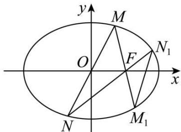

text_image

y
M
O
F
N₁
x
N
M₁

(1) 求椭圆 C 方程;   
(2) 直线 $y = kx (k > 0)$ 与椭圆 C 交于点 M、N、F 为 C 的右焦点，直线 MF、NF 分别交 C 于另一点 $M_{1}$ 、 $N_{1}$ ，记 $\triangle FMN$ 与 $\triangle FM_{1}N_{1}$ 的面积分别为 $S_{1}$ 、 $S_{2}$ ，求 $\frac{S_{1}}{S_{2}}$ 的范围.

4081 (2024·全国·高三对口高考)在平面直角坐标系 $xoy$ 中, 点 B 与点 A(1, -1) 关于原点 O 对称, P 是动点, 且直线 AP 与 BP 的斜率之积等于 $-\frac{1}{3}$ .

(1) 求动点 P 的轨迹方程;  
(2) 设直线 AP 和 BP 分别与直线 x=3 交于点 M, N, 问: 是否存在点 P 使得 $\triangle PAB$ 与 $\triangle PMN$ 的面积相等? 若存在, 求出点 P 的坐标; 若不存在, 说明理由.

4082 (2024·重庆·高三重庆一中校考阶段练习)已知O为坐标原点,抛物线的方程为 $x^{2}=$

$2py(p>0)$ ，F 是抛物线的焦点，椭圆的方程为 $\frac{x^{2}}{a^{2}}+\frac{y^{2}}{b^{2}}=1(a>b>0)$ ，过 F 的直线 l 与抛物线交于 M, N 两点，反向延长 OM, ON 分别与椭圆交于 P, Q 两点.

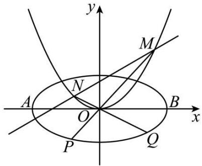

text_image

y
M
N
A
O
B
x
P
Q

(1) 求 $k_{OM} \cdot k_{ON}$ 的值;  
(2) 若 $\left|OP\right|^{2}+\left|OQ\right|^{2}=5$ 恒成立，求椭圆的方程；  
(3) 在 (2) 的条件下, 若 $\frac{S_{\triangle OMN}}{S_{\triangle OPQ}}$ 的最小值为 1, 求抛物线的方程 (其中 $S_{\triangle OMN}$ , $S_{\triangle OPQ}$ 分别是 $\triangle OMN$ 和 $\triangle OPQ$ 的面积).

4083 (2024·四川·校联考一模)已知点 $(-2,0)$ 在椭圆 C: $\frac{x^{2}}{a^{2}} + \frac{y^{2}}{b^{2}} = 1 (a > b > 0)$ 上，点

$M\left(m,\frac{1}{2}\right)(m\neq0)$ 在椭圆 C 内．设点以 A,B 为 C 的短轴的上、下端点，直线 AM,BM 分别与椭圆 C 相交于点 E,F，且 EA,EB 的斜率之积为 $-\frac{1}{4}$ .

(1) 求椭圆 C 的方程;  
(2) 记 $S_{\triangle BME}$ , $S_{\triangle AMF}$ 分别为 $\triangle BME$ , $\triangle AMF$ 的面积, 若 $m \in (-\sqrt{3}, -1] \cup [1, \sqrt{3})$ , 求 $\frac{S_{\triangle AMF}}{S_{\triangle BME}}$ 的取值范围.

4084 (2024·贵州贵阳·高三贵阳一中校考开学考试)已知点 $(-2,0)$ 在椭圆 C: $\frac{x^{2}}{a^{2}} + \frac{y^{2}}{b^{2}} = 1 (a > b > 0)$ 上，点 $\mathrm{M}\left(m, \frac{1}{2}\right) (m \neq 0)$ 在椭圆 C 内. 设点 A, B 为 C 的短轴的上、下端点，直线 AM, BM 分别与椭圆 C 相交于点 E, F, 且 EA, EB 的斜率之积为 $-\frac{1}{4}$ .

(1) 求椭圆 C 的方程;  
(2) 记 $S_{\triangle BME}$ , $S_{\triangle AMF}$ 分别为 $\triangle BME$ , $\triangle AMF$ 的面积, 若 $\frac{S_{\triangle AMF}}{S_{\triangle BME}} = \frac{1}{4}$ , 求 m 的值.

4085 (2024·四川南充·四川省南充高级中学校考三模)已知椭圆 C: $\frac{x^{2}}{a^{2}} + \frac{y^{2}}{b^{2}} = 1 (a > b > 0)$ 的左、右焦点为 $F_{1}, F_{2}$ ，离心率为 $\frac{1}{2}$ . 点 P 是椭圆 C 上不同于顶点的任意一点，射线 $PF_{1}, PF_{2}$ 分别与椭圆 C 交于点 A, B, $\triangle PF_{1}B$ 的周长为 8.

(1) 求椭圆 C 的标准方程;  
(2) 设 $\Delta \mathrm{PF}_{1} \mathrm{~F}_{2}, \Delta \mathrm{PF}_{1} \mathrm{~B}, \Delta \mathrm{PAB}$ 的面积分别为 $\mathrm{S}_{1}, \mathrm{~S}_{2}, \mathrm{~S}_{3}$ . 求证: $\frac{\mathrm{S}_{2}}{\mathrm{S}_{3}-\mathrm{S}_{2}} + \frac{\mathrm{S}_{1}}{\mathrm{S}_{2}-\mathrm{S}_{1}}$ 为定值.

# 6 题型六: 四边形的面积问题之对角线垂直模型

4086 (2024·河南·襄城高中校联考三模)设双曲线 $E:\frac{x^{2}}{a^{2}}-\frac{y^{2}}{b^{2}}=1(a>0,b>0)$ 的左、右焦点分别为 $F_{1},F_{2},|F_{1}F_{2}|=2\sqrt{5}$ ，且 E 的渐近线方程为 $y=\pm\frac{x}{2}$ .

(1) 求 E 的方程;
(2) 过 $F_{2}$ 作两条相互垂直的直线 $l_{1}$ 和 $l_{2}$ ，与 E 的右支分别交于 A, C 两点和 B, D 两点，求四边形 ABCD 面积的最小值.

4087 (2024·山西朔州·高三校联考开学考试)已知椭圆 E: $\frac{x^{2}}{a^{2}} + \frac{y^{2}}{b^{2}} = 1 (a > b > 0)$ 的左、右焦点分别为 $F_{1}, F_{2}, M$ 为椭圆 E 的上顶点， $\overrightarrow{MF_{1}} \cdot \overrightarrow{MF_{2}} = 0$ ，点 N( $\sqrt{2}, -1$ ) 在椭圆 E 上.

(1) 求椭圆 E 的标准方程;
(2) 设经过焦点 $F_{2}$ 的两条互相垂直的直线分别与椭圆 E 相交于 A, B 两点和 C, D 两点，求四边形 ACBD 的面积的最小值.

4088 (2024·江西·高三统考阶段练习)已知直线 $l: x - y + 1 = 0$ 与抛物线 C: $x^{2} = 2py (p > 0)$ 交于 A, B 两点， $|AB| = 8$ .

(1) 求 p;
(2) 设抛物线 C 的焦点为 F，过点 F 且与 l 垂直的直线与抛物线 C 交于 E, G，求四边形 AEBG 的面积.

# 7 题型七: 四边形的面积问题之一般四边形

4089 (2024·湖南长沙·高三长沙一中校考阶段练习)已知椭圆 C: $\frac{x^{2}}{a^{2}} + \frac{y^{2}}{b^{2}} = 1 (a > b > 0)$ 过 $\left(1, \frac{3}{2}\right)$ 和 $\left(\sqrt{2}, \frac{\sqrt{6}}{2}\right)$ 两点.

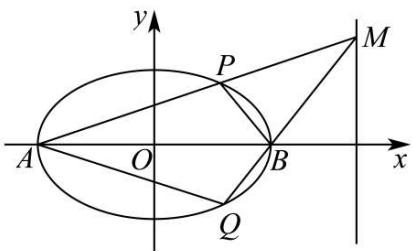

text_image

y
P
M
A
O
B
x
Q

(1) 求椭圆 C 的方程;  
(2) 如图所示, 记椭圆的左、右顶点分别为 A, B, 当动点 M 在定直线 x = 4 上运动时, 直线 AM, BM 分别交椭圆于两点 P 和 Q.  
(i) 证明: 点 B 在以 PQ 为直径的圆内;  
(ii) 求四边形 APBQ 面积的最大值.

4090 (2024·新疆伊犁·高三校考阶段练习)已知椭圆 C: $\frac{x^{2}}{a^{2}} + \frac{y^{2}}{b^{2}} = 1 (a > b > 0)$ 经过点 P $\left(-\frac{2}{3}, -\frac{2}{3}\right)$ ，O 为坐标原点，若直线 l 与椭圆 C 交于 A，B 两点，线段 AB 的中点为 M，直线 l 与直线 OM 的斜率乘积为 $-\frac{1}{2}$ .

(1) 求椭圆 C 的标准方程;  
(2) 若四边形 OAPB 为平行四边形, 求四边形 OAPB 的面积.

4091 (2024·上海黄浦·高三格致中学校考开学考试)定义:若椭圆 C: $\frac{x^{2}}{a^{2}}+\frac{y^{2}}{b^{2}}=1(a>b>0)$ 上的两个点 A(x₁,y₁), B(x₂,y₂) 满足 $\frac{x_{1}x_{2}}{a^{2}} + \frac{y_{1}y_{2}}{b^{2}} = 0$ ，则称 A, B 为该椭圆的一个“共轭点对”，记作 [A, B]. 已知椭圆 C 的一个焦点坐标为 F₁(-2√2,0)，且椭圆 C 过点 A(3,1).

(1) 求椭圆 C 的标准方程;  
(2) 求“共轭点对”[A,B] 中点 B 所在直线 l 的方程;  
(3) 设 O 为坐标原点, 点 P, Q 在椭圆 C 上, 且 PQ // OA, (2) 中的直线 l 与椭圆 C 交于两点 $B_{1}, B_{2}$ , 且 $B_{1}$ 点的纵坐标大于 0, 设四点 $B_{1}, P, B_{2}, Q$ 在椭圆 C 上逆时针排列. 证明: 四边形 $B_{1}PB_{2}Q$ 的面积小于 $8\sqrt{3}$ .

4092 (2024·四川成都·高三石室中学校考开学考试)已知椭圆 $C_{1}:\frac{x^{2}}{a^{2}}+\frac{y^{2}}{b^{2}}=1(a>b>0)$ 左、右焦点分别为 $F_{1}, F_{2}$ ，且 $F_{2}$ 为抛物线 $C_{2}:y^{2}=8x$ 的焦点， $P(2,\sqrt{2})$ 为椭圆 $C_{1}$ 上一点.

(1) 求椭圆 $C_{1}$ 的方程;  
(2) 已知 A, B 为椭圆 $C_{1}$ 上不同两点，且都在 x 轴上方，满足 $\overrightarrow{F_{1}A} = \lambda \overrightarrow{F_{2}B}$ .  
(i) 若 $\lambda=3$ ，求直线 $F_{1}A$ 的斜率；  
(ii) 若直线 $F_{1}A$ 与抛物线 $y^{2}=x$ 无交点，求四边形 $F_{1}F_{2}BA$ 面积的取值范围.

4093 (2024·湖北·高三孝感高中校联考开学考试)已知椭圆 $E: \frac{x^{2}}{a^{2}} + \frac{y^{2}}{b^{2}} = 1 (a > b > 0)$ 的离心率 $e = \frac{\sqrt{2}}{2}$ ，且经过点 $(\sqrt{2}, -1)$ .

(1) 求椭圆 E 的方程;  
(2) 设直线 $l: y = kx + m$ 与椭圆 E 交于 A, B 两点，且椭圆 E 上存在点 M，使得四边形 OAMB 为平行四边形。试探究：四边形 OAMB 的面积是否为定值？若是定值，求出四边形 OAMB 的面积；若不是定值，请说明理由。

4094 (2024·浙江·高三浙江省普陀中学校联考开学考试)类似于圆的垂径定理,椭圆 C: $\frac{x^{2}}{a^{2}} + \frac{y^{2}}{b^{2}} = 1 (a > b > 0)$ 中有如下性质: 不过椭圆中心 O 的一条弦 PQ 的中点为 M, 当 PQ, OM 斜率均存在时, $k_{PQ} \cdot k_{OM} = -\frac{b^{2}}{a^{2}}$ , 利用这一结论解决如下问题: 已知椭圆 E: $\frac{x^{2}}{81} + \frac{y^{2}}{9} = 1$ , 直线 OP 与椭圆 E 交于 A, B 两点, 且 $\overrightarrow{OA} = 3\overrightarrow{OP}$ , 其中 O 为坐标原点.

(1) 求点 P 的轨迹方程 $\Gamma$ ;  
(2) 过点 P 作直线 CD 交椭圆 E 于 C, D 两点, 使 $\overrightarrow{PC} + \overrightarrow{PD} = \overrightarrow{0}$ , 求四边形 ACBD 的面积.

4095 (2024·浙江·高三舟山中学校联考开学考试)已知抛物线 E: $y = x^{2}$ 与圆 M: $x^{2} + (y - 4)^{2} = r^{2} (r > 0)$ 相交于 A, B, C, D 四个点.

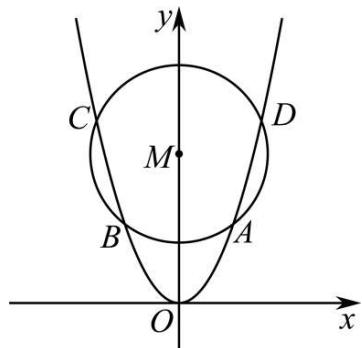

text_image

y
C
M
D
B
A
O
x

(1) 当 r=2 时, 求四边形 ABCD 的面积;  
(2) 四边形 ABCD 的对角线交点是否可能为 M, 若可能, 求出此时 r 的值, 若不可能, 请说明理由;  
(3) 当四边形 ABCD 的面积最大时, 求圆 M 的半径 r 的值.

4096 (2024·四川成都·校联考模拟预测)已知椭圆 $C_{1}:\frac{x^{2}}{a^{2}}+y^{2}=1(a>1)$ 与椭圆 $C_{2}:\frac{x^{2}}{12}+\frac{y^{2}}{b^{2}}=1(0<b<2\sqrt{3})$ 的离心率相同，且椭圆 $C_{2}$ 的焦距是椭圆 $C_{1}$ 的焦距的 $\sqrt{3}$ 倍.

(1) 求实数 $a$ 和 $b$ 的值；  
(2) 若梯形 ABCD 的顶点都在椭圆 $C_{1}$ 上, AB // CD, CD = 2AB, 直线 BC 与直线 AD 相交于点 P. 且点 P 在椭圆 $C_{2}$ 上, 试探究梯形 ABCD 的面积是否为定值, 若是, 请求出该定值; 若不是, 请说明理由.

4097 (2024·广东佛山·统考模拟预测)在平面直角坐标系中, 点 O 为坐标原点, M(-1,0), N(1,0), Q 为线段 MN 上异于 M,N 的一动点, 点 P 满足 $\frac{|PM|}{|QM|} = \frac{|PN|}{|QN|} = 2$ .

(1) 求点 P 的轨迹 E 的方程;  
(2) 点 A, C 是曲线 E 上两点, 且在 x 轴上方, 满足 AM // NC, 求四边形 AMNC 面积的最大值.

4098 (2024·广东广州·高三华南师大附中校考阶段练习)已知O为坐标原点， $F_{1}(-1,0)$

$F_{2}(1,0)$ 是椭圆E的两个焦点,斜率为 $\frac{1}{4}$ 的直线 $l_{1}$ 与E交于A,B两点,线段AB的中点坐标为 $\left(\frac{1}{3},-\frac{2}{3}\right)$ ,直线 $l_{2}$ 过原点且与E交于C,D两点,椭圆E过C的切线为 $l_{3}$ ,OD的中点为G.

(1) 求椭圆 E 的方程.  
(2) 过 G 作直线 $l_{3}$ 的平行线 $l_{4}$ 与椭圆 E 交于 M, N 两点, 在直线 $l_{2}$ 上取一点 Q 使 $\overrightarrow{\mathrm{CG}} = \overrightarrow{\mathrm{GQ}}$ , 求证: 四边形 MQNC 是平行四边形.  
(3) 判断四边形 MQNC 的面积是否为定值, 若是定值请求出面积, 若不是, 请说明理由.

4099 (2024·全国·高三专题练习)已知抛物线 E: $y^{2}=x$ 与圆 M: $(x-4)^{2}+y^{2}=r^{2}(r>0)$ 相交于 A, B, C, °° D 四个点.

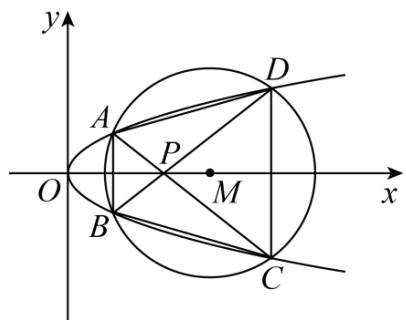

text_image

y
A
D
P
O
M
x
B
C

(1) 当 r=2 时, 求四边形 ABCD 面积;  
(2) 当四边形 ABCD 的面积最大时, 求圆 M 的半径 r 的值.

4100 (2024·浙江·校联考模拟预测)已知椭圆 $C_{1}:\frac{y^{2}}{a^{2}}+\frac{x^{2}}{b^{2}}=1(a>b>0)$ 的离心率为 $\frac{\sqrt{2}}{2}$ ，抛物线 $C_{2}:x^{2}=8y$ 的准线与 $C_{1}$ 相交，所得弦长为 $2\sqrt{6}$ .

(1) 求 $C_{1}$ 的方程;  
(2) 若 $A(x_{1}, y_{1}), B(x_{2}, y_{2})$ 在 $C_{2}$ 上，且 $x_{1} < 0 < x_{2}$ ，分别以 A, B 为切点，作 $C_{2}$ 的切线相交于点 P，点 P 恰好在 $C_{1}$ 上，直线 AP, BP 分别交 x 轴于 M, N 两点。求四边形 ABMN 面积的取值范围。

4101 (2024·山东潍坊·三模)已知椭圆 C: $\frac{x^2}{a^2} + \frac{y^2}{b^2} = 1 (a > b > 0)$ 的离心率为 $\frac{\sqrt{2}}{2}$ , 且过点

$$
\mathrm{D} \left(\sqrt {3}, \frac {\sqrt {6}}{2}\right).
$$

(1) 求椭圆 C 的标准方程;  
(2) 若动直线 $l: y = -\frac{1}{2} x + m (1 \leqslant m < 2)$ 与椭圆 C 交于 A, B 两点，且在坐标平面内存在两个定点 P, Q，使得 $k_{\mathrm{PA}} k_{\mathrm{PB}} = k_{\mathrm{QA}} k_{\mathrm{QB}} = \lambda$ (定值)，其中 $k_{\mathrm{PA}}, k_{\mathrm{PB}}$ 分别是直线 PA, PB 的斜率， $k_{\mathrm{QA}}, k_{\mathrm{QB}}$ 分别是直线 QA, QB 的斜率.

①求 $\lambda$ 的值；

②求四边形 PAQB 面积的最大值.

