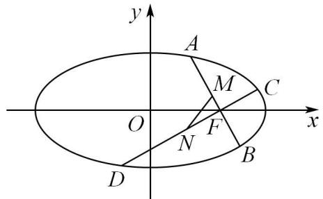
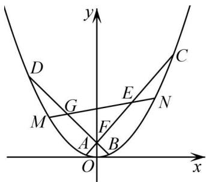
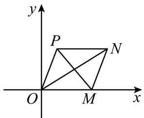
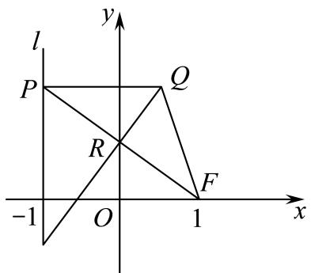
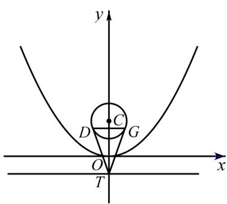
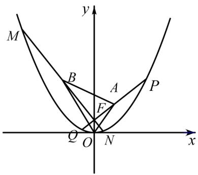
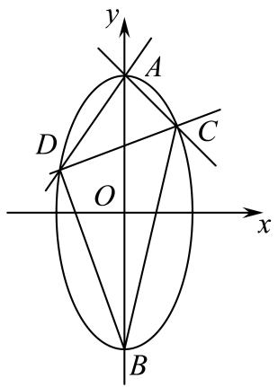
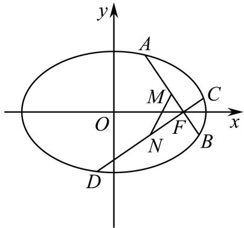

# 第72讲 垂直弦问题

# 知识梳理

1、过椭圆 $\frac{x^2}{a^2} +\frac{y^2}{b^2} = 1$ 的右焦点 $\mathbf{F}(c,0)$ 作两条互相垂直的弦AB，CD．若弦AB，CD的中点分别为M,N，那么直线MN恒过定点 $\left(\frac{a^2c}{a^2 + b^2},0\right)$   
2、过椭圆 $\frac{x^2}{a^2} +\frac{y^2}{b^2} = 1$ 的长轴上任意一点 $\mathrm{S}(s,0)(-a <   s <   a)$ 作两条互相垂直的弦AB，CD．若弦AB，CD的中点分别为M,N，那么直线MN恒过定点 $\left(\frac{a^2s}{a^2 + b^2},0\right)$   
3、过椭圆 $\frac{x^2}{a^2} +\frac{y^2}{b^2} = 1$ 的短轴上任意一点 $\mathrm{T}(0,t)(-t <   t <   t)$ 作两条互相垂直的弦AB，CD.若弦AB，CD的中点分别为M,N，那么直线MN恒过定点 $\left(0,\frac{b^2t}{a^2 + b^2}\right)$   
4、过椭圆 $\frac{x^2}{a^2} +\frac{y^2}{b^2} = 1$ 内的任意一点 $\mathbf{Q}(s,t)\left(\frac{s^2}{a^2} +\frac{t^2}{b^2} <  1\right)$ 作两条互相垂直的弦AB，CD．若弦AB，CD的中点分别为M,N，那么直线MN恒过定点 $\left(\frac{a^2s}{a^2 + b^2},\frac{b^2t}{a^2 + b^2}\right).$

5、以 $(x_0, y_0)$ 为直角定点的椭圆 $\frac{x^2}{a^2} + \frac{y^2}{b^2} = 1$ 内接直角三角形的斜边必过定点 $\left(\frac{a^2 - b^2}{a^2 + b^2} \times x_0, \frac{b^2 - a^2}{b^2 + a^2} \times y_0\right)$

6、以上顶点为直角顶点的椭圆内接直角三角形的斜边必过定点，且定点在 y 轴上.

7、以右顶点为直角顶点的椭圆内接直角三角形的斜边必过定点，且定点在 x 轴上.  
8、以 $(x_0, y_0)$ 为直角定点的抛物线 $y^2 = 2px$ 内接直角三角形的斜边必过定点 $(x_0 + 2p, -y_0)$   
9、以 $(x_0, y_0)$ 为直角定点的双曲线 $\frac{x^2}{a^2} - \frac{y^2}{b^2} = 1$ 内接直角三角形的斜边必过定点 $\left(\frac{a^2 + b^2}{a^2 - b^2} x_0, \frac{a^2 + b^2}{b^2 - a^2} y_0\right)$

# 必考题型全归纳

# 1 题型一:椭圆内接直角三角形的斜边必过定点

4102 (2024·辽宁沈阳·高二东北育才学校校考阶段练习)已知点 A(-1,0), B(1,0)，动点 P 满足： $\angle APB = 2\theta$ ，且 $|PA||PB|\cos^{2}\theta = 1$ . (P 不在线段 AB 上)

(1) 求动点 P 的轨迹 C 的方程;  
(2) 过椭圆的上顶点作互相垂直的两条直线分别交椭圆于另外一点 P、Q，试问直线 PQ 是否经过定点，若是，求出定点坐标；若不是，说明理由.

4103 (2024·全国·高三专题练习)已知椭圆 C 的两个焦点分别为 $F_{1}(-\sqrt{3},0)$ ， $F_{2}(\sqrt{3},0)$ ，短轴长为 2.

(1) 求椭圆 C 的标准方程及离心率;  
(2)M, D 分别为椭圆 C 的左、右顶点, 过 M 点作两条互相垂直的直线 MA, MB 交椭圆于 A, B 两点, 直线 AB 是否过定点? 并求出 $\triangle DAB$ 面积的最大值.

4104 (2024·云南曲靖·高三校联考阶段练习)已知 P 为圆 M: $x^{2}+y^{2}=4$ 上一动点, 过点 P 作 x 轴的垂线段 PD, D 为垂足, 若点 Q 满足 $\overrightarrow{DQ}=\frac{\sqrt{3}}{2}\overrightarrow{DP}$ .

(1) 求点 Q 的轨迹方程;  
(2) 设点 Q 的轨迹为曲线 C, 过点 N(-1,0) 作曲线 C 的两条互相垂直的弦, 两条弦的中点分别为 E、F, 过点 N 作直线 EF 的垂线, 垂足为点 H, 是否存在定点 G, 使得 |GH| 为定值? 若存在, 求出点 G 的坐标; 若不存在, 请说明理由.

4105 (2024·上海青浦·统考一模)在平面直角坐标系 $xOy$ 中, 已知椭圆 $\Gamma: \frac{x^2}{2} + y^2 = 1$ , 过右焦点 F 作两条互相垂直的弦 AB, CD, 设 AB, CD 中点分别为 M, N.

text_image

y
A
M
C
O
F
N
B
x
D

(1) 写出椭圆右焦点 F 的坐标及该椭圆的离心率;  
(2) 证明: 直线 MN 必过定点, 并求出此定点坐标;  
(3) 若弦 AB, CD 的斜率均存在, 求 $\triangle FMN$ 面积的最大值.

4106 (2024·天津河北·高三天津外国语大学附属外国语学校校考阶段练习)设 $F_{1}, F_{2}$ 分别是椭圆 C: $\frac{x^{2}}{a^{2}} + \frac{y^{2}}{b^{2}} = 1 (a > b > 0)$ 的左、右焦点，M 是 C 上一点， $MF_{2}$ 与 x 轴垂直。直线 $MF_{1}$ 与 C 的另一个交点为 N，且直线 MN 的斜率为 $\frac{\sqrt{2}}{4}$ 。

(1) 求椭圆 C 的离心率;  
(2) 设 D(0,1) 是椭圆 C 的上顶点, 过 D 任作两条互相垂直的直线分别交椭圆 C 于 A, B 两点, 证明直线 AB 过定点, 并求出定点坐标.

4107 (2024·全国·高二专题练习)设 $F_{1}, F_{2}$ 分别是圆 C: $\frac{x^{2}}{a^{2}} + \frac{y^{2}}{b^{2}} = 1 (a > b > 0)$ 的左、右焦点，M 是 C 上一点， $MF_{2}$ 与 x 轴垂直. 直线 $MF_{1}$ 与 C 的另一个交点为 N，且直线 MN 的斜率为 $\frac{\sqrt{2}}{4}$

(1) 求椭圆 C 的离心率.  
(2) 设 D(0,1) 是椭圆 C 的上顶点, 过 D 任作两条互相垂直的直线分别交椭圆 C 于 A、B 两点, 过点 D 作线段 AB 的垂线, 垂足为 Q, 判断在 y 轴上是否存在定点 R, 使得 $|RQ|$ 的长度为定值? 并证明你的结论.

4108 (2024·云南昆明·高二统考期中)已知椭圆 C: $\frac{x^{2}}{4} + \frac{y^{2}}{b^{2}} = 1 (2 > b > 0)$ ，直线 y = x 被椭圆 C 截得的线段长为 $\frac{4\sqrt{10}}{5}$ .

(1) 求椭圆 C 的标准方程;  
(2) 过椭圆 C 的右顶点作互相垂直的两条直线 $l_{1}, l_{2}$ . 分别交椭圆 C 于 M, N 两点 (点 M, N 不同于椭圆 C 的右顶点), 证明: 直线 MN 过定点.

# 2 题型二:双曲线内接直角三角形的斜边必过定点

4109 (2024·高二课时练习)已知双曲线 C: $\frac{x^{2}}{a^{2}} - \frac{y^{2}}{b^{2}} = 1 (a > 0, b > 0)$ 经过点 P(2,1)，且双曲线 C 的右顶点到一条渐近线的距离为 $\frac{\sqrt{6}}{3}$ .

(1) 求双曲线 C 的方程;  
(2) 过点 P 分别作两条互相垂直的直线 PA, PB 与双曲线 C 交于 A, B 两点 (A, B 两点均与点 P 不重合), 设直线 AB: $y = kx + m (k \neq 0)$ , 试求 k 和 m 之间满足的关系式.

4110 (2024·江苏南京·高二校考开学考试)在平面直角坐标系 $xOy$ 中, 动点P与定点 $\mathrm{F}(2,0)$ 的距离和它到定直线 $l: x = \frac{3}{2}$ 的距离之比是常数 $\frac{2\sqrt{3}}{3}$ , 记P的轨迹为曲线E.

(1) 求曲线 E 的方程;  
(2) 设过点 A( $\sqrt{3}$ , 0) 两条互相垂直的直线分别与曲线 E 交于点 M, N(异于点 A), 求证: 直线 MN 过定点.

4111 (2024·全国·高三专题练习)已知双曲线 $\Gamma:\frac{x^{2}}{a^{2}}=\frac{y^{2}}{b^{2}}=1(a,b>0)$ ，经过双曲线 $\Gamma$ 上的点 A(2,1) 作互相垂直的直线 AM、AN 分别交双曲线 $\Gamma$ 于 M、N 两点。设线段 AM、AN 的中点分别为 B、C，直线 OB、OC(O 为坐标原点) 的斜率都存在且它们的乘积为 $-\frac{1}{4}$ 。

(1) 求双曲线 $\Gamma$ 的方程;  
(2) 过点 A 作 AD ⊥ MN(D 为垂足), 请问: 是否存在定点 E, 使得 |DE| 为定值? 若存在, 求出点 E 的坐标; 若不存在, 请说明理由.

# 3 题型三:抛物线内接直角三角形的斜边必过定点

4112 (2024·江苏泰州·高二靖江高级中学校考阶段练习)已知抛物线 C: $y^{2}=2px(p>0)$ 的焦点为 F, 斜率为 1 的直线 l 经过 F, 且与抛物线 C 交于 A, B 两点, $|AB|=8$ .

(1) 求抛物线 C 的方程;  
(2) 过抛物线 C 上一点 P(a, -2) 作两条互相垂直的直线与抛物线 C 相交于 MN 两点 (异于点 P), 证明: 直线 MN 恒过定点, 并求出该定点坐标.

4113 (2024·内蒙古巴彦淖尔·高二校考阶段练习)已知抛物线 E: $x^{2}=2py$ 的焦点 F 关于直线 l: 2x-y-4=0 的对称点 Q 恰在抛物线 E 的准线上.

(1) 求抛物线 E 的方程;  
(2)M 是抛物线 E 上横坐标为 -2 的点, 过点 M 作互相垂直的两条直线分别交抛物线 E 于 A, B 两点, 证明直线 AB 恒经过某一定点, 并求出该定点的坐标.

4114 (2024·江西吉安·高二吉安一中校考阶段练习)已知抛物线 C: $y^{2}=2px(p>0)$ ，O 是坐标原点，F 是 C 的焦点，M 是 C 上一点， $|FM|=4,\angle OFM=120^{\circ}$ .

(1) 求抛物线 C 的标准方程;  
(2) 设点 $Q(x_{0},2)$ 在 C 上, 过 Q 作两条互相垂直的直线 QA, QB, 分别交 C 于 A, B 两点 (异于 Q 点). 证明: 直线 AB 恒过定点.

4115 (2024·浙江·高三专题练习)已知抛物线 W: $x^{2}=2py(p>0)$ 的焦点 F 也是椭圆 $\frac{x^{2}}{3}+\frac{y^{2}}{4}=1$ 的一个焦点, 如图, 过点 F 任作两条互相垂直的直线 $l_{1}, l_{2}$ , 分别交抛物线 W 于 A, C,

B, D 四点, E, G 分别为 AC, BD 的中点.

text_image

y
D
C
G
E
N
M
F
A
B
O
x

(1) 求 p 的值;  
(2) 求证: 直线 EG 过定点, 并求出该定点的坐标;  
(3) 设直线 EG 交抛物线 W 于 M, N 两点, 试求 |MN| 的最小值.

4116 (2024·四川绵阳·高二校考阶段练习)已知抛物线 C: $y^{2}=2px(p>0)$ 的焦点为 F, 点 P (2, t) 在抛物线 C 上, 且 $|PF|=3$ .

(1) 求抛物线 C 的方程;  
(2) 过抛物线 C 上一点 N(m,4) 作两条互相垂直的弦 NA 和 NB, 试问直线 AB 是否过定点, 若是, 求出该定点; 若不是, 请说明理由.

4117 (2024·全国·高三专题练习)已知抛物线 C: $y^{2}=2px(p>0)$ 的焦点为 F, 直线 y=4 与 y 轴的交点为 P, 与抛物线 C 的交点为 Q, 且 $|QF|=\frac{5}{4}|PQ|$ .

(1) 求抛物线 C 的方程;  
(2) 过抛物线 C 上一点 N(m,4) 作两条互相垂直的弦 NA 和 NB, 试问直线 AB 是否过定点, 若是, 求出该定点; 若不是, 请说明理由.

4118 (2024·云南曲靖·高二校考期末)已知点M与点F(4,0)的距离比它的直线 $l:x+6=0$ 的距离小2.

(1) 求点 M 的轨迹方程;  
(2)OA, OB 是点 M 轨迹上互相垂直的两条弦, 问: 直线 AB 是否经过 x 轴上一定点, 若经过, 求出该点坐标; 若不经过, 说明理由.

# 4 题型四:椭圆两条互相垂直的弦中点所在直线过定点

4119 (2024·福建龙岩·统考一模)双曲线 $\Gamma:\frac{x^{2}}{4}-\frac{y^{2}}{3}=1$ 的左右顶点分别为 $A_{1}, A_{2}$ ，动直线 l 垂直 $\Gamma$ 的实轴，且交 $\Gamma$ 于不同的两点 M, N，直线 $A_{1}N$ 与直线 $A_{2}M$ 的交点为 P.

(1) 求点 P 的轨迹 C 的方程;  
(2) 过点 H(1,0) 作 C 的两条互相垂直的弦 DE, FG, 证明: 过两弦 DE, FG 中点的直线恒过定点.

4120 (2024·全国·高二期末)已知椭圆 $\frac{x^{2}}{a^{2}}+\frac{y^{2}}{b^{2}}=1(a>b>0)$ 的左右焦点分别为 $F_{1},F_{2}$ ，抛物线 $y^{2}=4x$ 与椭圆有相同的焦点，点 P 为抛物线与椭圆在第一象限的交点，且 $|PF_{1}|=\frac{7}{3}$ .

(1) 求椭圆的方程;   
(2) 过 F 作两条斜率不为 0 且互相垂直的直线分别交椭圆于 A, B 和 C, D, 线段 AB 的中点为 M, 线段 CD 的中点为 N, 证明: 直线 MN 过定点, 并求出该定点的坐标.

4121 (2024·上海闵行·高二闵行中学校考期末)在平面直角坐标系 $xOy$ 中，O为坐标原点，

$M(\sqrt{3},0)$ ，已知平行四边形 OMNP 两条对角线的长度之和等于 4.

text_image

y
P
N
O
M
x

(1) 求动点 P 的轨迹方程;  
(2) 过 M( $\sqrt{3}$ , 0) 作互相垂直的两条直线 $l_{1}$ 、 $l_{2}$ ， $l_{1}$ 与动点 P 的轨迹交于 A、B， $l_{2}$ 与动点 P 的轨迹交于点 C、D，AB、CD 的中点分别为 E、F；证明：直线 EF 恒过定点，并求出定点坐标；  
(3) 在 (2) 的条件下, 求四边形 ACBD 面积的最小值.

4122 (2024·上海浦东新·高三上海市洋泾中学校考阶段练习)已知椭圆 $\Omega: \frac{x^2}{a^2} + \frac{y^2}{b^2} =$

$1(a > b > 0)$ 的离心率为 $\frac{\sqrt{3}}{2}$ , 椭圆 $\Omega$ 截直线 $x = 1$ 所得线段的长度为 $\sqrt{3}$ . 过 $\mathrm{M}(\sqrt{3}, 0)$ 作互相垂直的两条直线 $l_1, l_2$ , 直线 $l_1$ 与椭圆 $\Omega$ 交于 A、B 两点, 直线 $l_2$ 与椭圆 $\Omega$ 交于 C、D 两点, AB、CD 的中点分别为 E、F.

(1) 求椭圆 $\Omega$ 的方程;  
(2) 证明: 直线 EF 恒过定点, 并求出定点坐标;  
(3) 求四边形 ABCD 面积 S 的最小值.

4123 (2024·全国·高三专题练习)已知椭圆 M: $\frac{x^{2}}{a^{2}} + \frac{y^{2}}{b^{2}} = 1 (a > b > 0)$ 上任意一点 P 到椭圆 M 两个焦点 F₁, F₂ 的距离之和为 4，且离心率为 $\frac{\sqrt{3}}{2}$ .

(1) 求椭圆 M 的标准方程;  
(2) 设 A 为 M 的左顶点, 过 A 点作两条互相垂直的直线 AC, AD 分别与 M 交于 C, D 两点, 证明: 直线 CD 经过定点, 并求这个定点的坐标.

# 5 题型五: 双曲线两条互相垂直的弦中点所在直线过定点

4124 (2024·高二课时练习)已知双曲线 C: $\frac{x^{2}}{a^{2}} - \frac{y^{2}}{b^{2}} = 1 (a > 0, b > 0)$ 的右焦点 F, 半焦距 c = 2, 点 F 到直线 $x = \frac{a^{2}}{c}$ 的距离为 $\frac{1}{2}$ , 过点 F 作双曲线 C 的两条互相垂直的弦 AB, CD, 设 AB, CD 的中点分别为 M, N.

(1) 求双曲线 C 的标准方程;  
(2) 证明: 直线 MN 必过定点, 并求出此定点的坐标.

4125 (2024·黑龙江·黑龙江实验中学校考三模)在平面直角坐标系 $xOy$ 中, 已知动点 $\mathrm{P}$ 到点 $\mathrm{F}(2,0)$ 的距离与它到直线 $x = \frac{3}{2}$ 的距离之比为 $\frac{2\sqrt{3}}{3}$ . 记点 $\mathrm{P}$ 的轨迹为曲线 $\mathrm{C}$ .

(1) 求曲线 C 的方程;  
(2) 过点 F 作两条互相垂直的直线 $l_{1}, l_{2}. l_{1}$ 交曲线 C 于 A, B 两点, $l_{2}$ 交曲线 C 于 S, T 两点, 线段 AB 的中点为 M, 线段 ST 的中点为 N. 证明: 直线 MN 过定点, 并求出该定点坐标.

4126 (2024·山西大同·高三统考阶段练习)已知双曲线 C: $\frac{x^{2}}{a^{2}} - \frac{y^{2}}{b^{2}} = 1 (a > 0, b > 0)$ 的右焦点为 F，半焦距 c = 2，点 F 到右准线 $x = \frac{a^{2}}{c}$ 的距离为 $\frac{1}{2}$ ，过点 F 作双曲线 C 的两条互相垂直的弦 AB，CD，设 AB，CD 的中点分别为 M，N.

(1) 求双曲线 C 的标准方程;  
(2) 证明: 直线 MN 必过定点, 并求出此定点坐标.

4127 (2024·贵州·校联考模拟预测)已知双曲线 E: $\frac{x^{2}}{a^{2}} - \frac{y^{2}}{b^{2}} = 1 (a > 0, b > 0)$ 的一条渐近线方程为 $x - \sqrt{3}y = 0$ ，焦点到渐近线的距离为 1.

(1) 求 E 的方程;  
(2) 过双曲线 E 的右焦点 F 作互相垂直的两条弦 (斜率均存在) AB、CD. 两条弦的中点分别为 P、Q, 那么直线 PQ 是否过定点? 若不过定点, 请说明原因; 若过定点, 请求出定点坐标.

# 题型六: 抛物线两条互相垂直的弦中点所在直线过定点

4128 (2024·全国·高二专题练习)已知抛物线 G: $x^{2}=2py(p>0)$ 焦点为 F, R 为 G 上的动点, K(1,2) 位于 G 的上方区域, 且 $|RK|+|RF|$ 的最小值为 3.

(1) 求 G 的方程;  
(2) 过点 P(0,2) 作两条互相垂直的直线 $l_{1}$ 和 $l_{2}$ ， $l_{1}$ 交 G 于 A，B 两点， $l_{2}$ 交 G 于 C，D 两点，且 M，N 分别为线段 AB 和 CD 的中点。直线 MN 是否恒过一个定点？若是，求出该定点坐标；若不是，说明理由。

4129 (2024·全国·高三专题练习)已知一个边长为 $8\sqrt{3}$ 的等边三角形的一个顶点位于原点,另外两个顶点在抛物线 $C:x^{2}=2py(p>0)$ 上.

(1) 求抛物线 C 的方程;  
(2) 过点 T(0, p) 作两条互相垂直的直线 $l_{1}$ 和 $l_{2}$ ， $l_{1}$ 交抛物线 C 于 A、B 两点， $l_{2}$ 交抛物线 C 于 D、E 两点，若线段 AB 的中点为 M，线段 DE 的中点为 N，证明：直线 MN 过定点.

4130 (2024·全国·高三专题练习)已知抛物线 C: $y^{2}=2px(p>0)$ 的焦点为 F, 过焦点 F 且垂直于 x 轴的直线交 C 于 H, I 两点, O 为坐标原点, $\triangle OHI$ 的周长为 $4\sqrt{5}+8$ .

(1) 求抛物线 C 的方程;  
(2) 过点 F 作抛物线 C 的两条互相垂直的弦 AB, DE, 设弦 AB, DE 的中点分别为 P, Q, 试判断直线 PQ 是否过定点? 若过定点. 求出其坐标; 若不过定点, 请说明理由.

4131 (2024·山西·高二校联考期末)已知抛物线 C: $x^{2}=2py(p>0)$ ，过点 T(0,p) 作两条互相垂直的直线 $l_{1}$ 和 $l_{2}$ ， $l_{1}$ 交抛物线 C 于 A，B 两点， $l_{2}$ 交抛物线 C 于 D，E 两点，抛物线 C 上一点 P(t,2) 到焦点 F 的距离为 3.

(1) 求抛物线 C 的方程;  
(2) 若线段 AB 的中点为 M, 线段 DE 的中点为 N, 求证: 直线 MN 过定点.

4132 (2024·全国·高三专题练习)动圆 P 与直线 x = -1 相切，点 F(1,0) 在动圆上.

(1) 求圆心 P 的轨迹 Q 的方程;  
(2) 过点 F 作曲线 O 的两条互相垂直的弦 AB, CD, 设 AB, CD 的中点分别为 M, N, 求证: 直线 MN 必过定点.

4133 (2024·全国·高三专题练习)已知抛物线 C: $y^{2}=2px(p>0)$ 的焦点为 F，点 M 在抛物线 C

上，O 为坐标原点， $\triangle OMF$ 是以 OF 为底边的等腰三角形，且 $\triangle OMF$ 的面积为 $2\sqrt{2}$ .

(1) 求抛物线 C 的方程.

(2) 过点 F 作抛物线 C 的两条互相垂直的弦 AB, DE, 设弦 AB, DE 的中点分别为 P, Q, 试判断直线 PQ 是否过定点. 若是, 求出所过定点的坐标; 若否, 请说明理由.

4134 (2024·安徽滁州·高二校考开学考试)在平面直角坐标系 $xOy$ 中, 设点 $\mathrm{F}(1,0)$ , 直线 $l: x = -1$ , 点 $\mathrm{P}$ 在直线 $l$ 上移动, $\mathrm{R}$ 是线段 $\mathrm{PF}$ 与 $y$ 轴的交点, 也是 $\mathrm{PF}$ 的中点. $\mathrm{RQ} \perp \mathrm{FP}, \mathrm{PQ} \perp l$ .

text_image

l
y
P
Q
R
-1 O 1 x
F

(1) 求动点 Q 的轨迹的方程 E;

(2) 过点 F 作两条互相垂直的曲线 E 的弦 AB、CD，设 AB、CD 的中点分别为 M, N. 求直线 MN 过定点 R 的坐标.

4135 (2024·福建福州·高二校考期中)在平面直角坐标系 xOy 中，O 为坐标原点，已知点 Q(1, 2)，P 是动点，且三角形 POQ 的三边所在直线的斜率满足 $\frac{1}{k_{OP}} + \frac{1}{k_{OQ}} = \frac{1}{k_{PQ}}$ .

(1) 求点 P 的轨迹 C 的方程;

(2) 过 F 作倾斜角为 $60^{\circ}$ 的直线 L, 交曲线 C 于 A, B 两点, 求 $\triangle AOB$ 的面积;

(3) 过点 D(1,0) 任作两条互相垂直的直线 $l_{1}, l_{2}$ ，分别交轨迹 C 于点 A, B 和 M, N，设线段 AB, MN 的中点分别为 E, F.，求证：直线 EF 恒过一定点.

4136 (2024·宁夏银川·高二银川一中校考期末)已知椭圆 $\frac{x^{2}}{a^{2}}+\frac{y^{2}}{b^{2}}=1(a>b>0)$ 的左、右焦点分别为 $F_{1}$ 、 $F_{2}$ ，抛物线 $y^{2}=4x$ 的焦点与椭圆的右焦点重合，点 P 为抛物线与椭圆在第一象限的交点，且 $|PF_{1}|=\frac{7}{3}$ .

(1) 求椭圆的方程;

(2) 过 F 作两条斜率不为 0 且互相垂直的直线分别交椭圆于 A、B 和 C、D，线段 AB 的中点为 M，线段 CD 的中点为 N，证明：直线 MN 过 x 轴上一定点，并求出该定点的坐标.

4137 (2024·湖南·高三阶段练习)如图1,已知抛物线E的顶点O在坐标原点,焦点在y轴正半轴上,准线与y轴的交点为T. 过点T作圆C: $x^{2}+(y-2)^{2}=1$ 的两条切线,两切点分别为D,G,且 $|DG|=\frac{4\sqrt{2}}{3}$ .

text_image

y
D C G
O x
T

图1

text_image

y
M
B
A
P
F
Q
O
N
x

图2

(1) 求抛物线 E 的标准方程;  
(2)如图2,过抛物线E的焦点F任作两条互相垂直的直线 $l_{1},l_{2}$ ，分别交抛物线E于P,Q两点和M,N两点，A,B分别为线段PQ和MN的中点，求 $\Delta AOB$ 面积的最小值.

# 7 题型七:内接直角三角形范围与最值问题

4138 (2024·江西·高二校联考开学考试)设椭圆 $\frac{y^{2}}{a^{2}}+\frac{x^{2}}{b^{2}}=1(a>b>0)$ 的两焦点为 $F_{1}, F_{2}, P$ 为椭圆上任意一点，点 P 到原点最大距离为 2，若 M(3,1) 到椭圆右顶点距离为 $\sqrt{5}$ .

text_image

y
A
D
O
C
x
B

(1) 求椭圆的方程.   
(2) 设椭圆的上、下顶点分别为 A、B，过 A 作两条互相垂直的直线交椭圆于 C、D，问直线 CD 是否经过定点？如果是，请求出定点坐标，并求出 $\triangle BCD$ 面积的最大值。如果不是，请说明理由。

4139 (2024·上海·高二专题练习)在平面直角坐标系 $xOy$ 中，已知椭圆 $\Gamma: \frac{x^2}{3} + \frac{y^2}{2} = 1$ ，过右焦点F作两条互相垂直的弦AB，CD，设AB，CD中点分别为M，N.

text_image

y
A
M
C
O
F
x
N
B
D

(1) 写出椭圆右焦点 F 的坐标及该椭圆的离心率;  
(2) 证明: 直线 MN 必过定点, 并求出此定点坐标;  
(3) 若弦 AB, CD 的斜率均存在, 求 $\triangle FMN$ 面积的最大值.

4140 (2024·江苏南通·高三统考阶段练习)已知椭圆 $\frac{x^{2}}{a^{2}}+\frac{y^{2}}{b^{2}}=1(a>b>0)$ 的离心率为 $\frac{\sqrt{3}}{2}$ ，左、右顶点分别为 A, B，上顶点为 D，坐标原点 O 到直线 AD 的距离为 $\frac{2\sqrt{5}}{5}$ .

(1) 求椭圆的方程;   
(2) 过 A 点作两条互相垂直的直线 AP, AQ 与椭圆交于 P, Q 两点, 求 $\triangle BPQ$ 面积的最大值.

# 8 题型八:两条互相垂直的弦中点范围与最值问题

4141 (2024·新疆·统考二模)在平面直角坐标系 $xOy$ 中，抛物线G的准线方程为 $y = -2$ .

(1) 求抛物线 G 的标准方程;  
(2) 过抛物线的焦点 F 作互相垂直的两条直线 $l_{1}$ 和 $l_{2}$ ， $l_{1}$ 与抛物线交于 P，Q 两点， $l_{2}$ 与抛物线交于 C，D 两点，M，N 分别是线段 PQ，CD 的中点，求 $\triangle FMN$ 面积的最小值.

4142 (2024·广东珠海·高三校考开学考试)已知抛物线 T: $y^{2}=2px(p>0)$ ，点 F 为其焦点，直线 l: x=4 与抛物线交于 M, N 两点，O 为坐标原点， $S_{\triangle OMN}=8\sqrt{6}$ .

(1) 求抛物线 T 的方程;  
(2) 过 x 轴上一动点 $\mathrm{E}(a,0)(a>0)$ 作互相垂直的两条直线，与抛物线 T 分别相交于点 A, B 和 C, D，点 H, K 分别为 AB, CD 的中点，求 $|HK|$ 的最小值.

