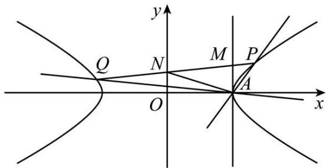
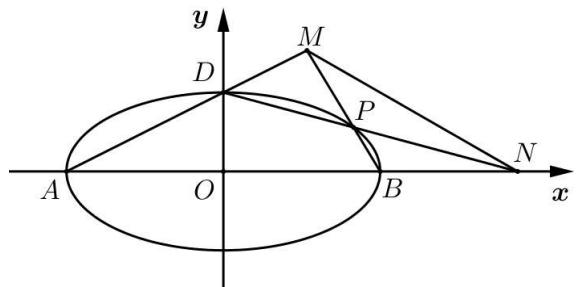
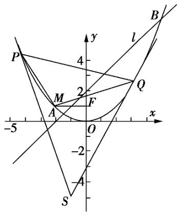
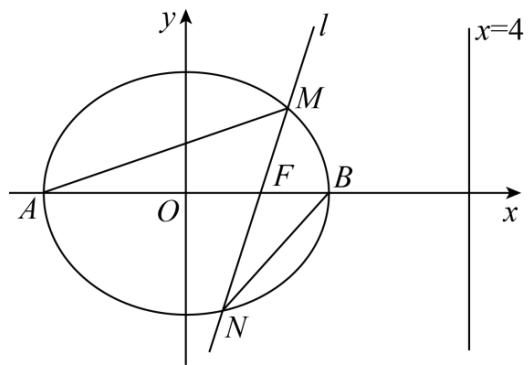
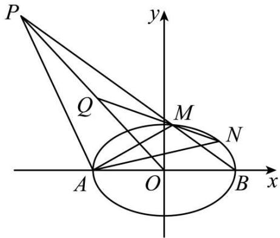
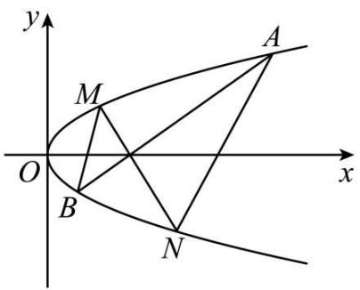
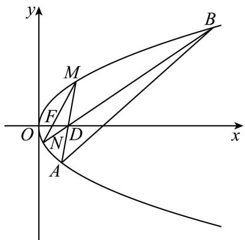

# 第73讲 斜率题型全归纳

# 知识梳理

1、已知 $\mathrm{P}(x_0,y_0)$ 是椭圆 $\frac{x^2}{a^2} +\frac{y^2}{b^2} = 1$ 上的定点，直线 $l$ （不过P点）与椭圆交于A，B两点，且 $k_{\mathrm{PA}} + k_{\mathrm{PB}} = 0$ ，则直线 $l$ 斜率为定值 $\frac{b^2x_0}{a^2y_0}$   
2、已知 $\mathrm{P}(x_0,y_0)$ 是双曲线 $\frac{x^2}{a^2} -\frac{y^2}{b^2} = 1$ 上的定点，直线 $l$ （不过P点）与双曲线交于A，B两点，且 $k_{\mathrm{PA}} + k_{\mathrm{PB}} = 0$ ，直线 $l$ 斜率为定值 $-\frac{b^2x_0}{a^2y_0}$

3、已知 $\mathrm{P}(x_{0},y_{0})$ 是抛物线 $y^{2}=2px$ 上的定点，直线 l（不过 P 点）与抛物线交于 M, N 两点，若 $k_{PA}+k_{PB}=0$ ，则直线 l 斜率为定值 $-\frac{p}{y_{0}}$ .

4、 $\mathrm{P}(x_0, y_0)$ 为椭圆 $\Gamma: \frac{x^2}{a^2} + \frac{y^2}{b^2} = 1 (a > 0, b > 0)$ 上一定点，过点 $\mathbf{P}$ 作斜率为 $k_1, k_2$ 的两条直线分别与椭圆交于 $\mathbf{M}, \mathbf{N}$ 两点.

(1) 若 $k_{1} + k_{2} = \lambda (\lambda \neq 0)$ , 则直线 MN 过定点 $\left(x_{0} - \frac{2y_{0}}{\lambda}, -y_{0} - \frac{2b^{2}x_{0}}{\lambda a^{2}}\right)$ ;  
(2) 若 $k_{1} \cdot k_{2} = \lambda \left(\lambda \neq \frac{b^{2}}{a^{2}}\right)$ , 则直线 MN 过定点 $\left(\frac{\lambda a^{2} + b^{2}}{\lambda a^{2} - b^{2}} x_{0}, -\frac{\lambda a^{2} + b^{2}}{\lambda a^{2} - b^{2}} y_{0}\right)$ .

5、设 $\mathrm{P}(x_{0},y_{0})$ 是直角坐标平面内不同于原点的一定点，过 P 作两条直线 AB，CD 交椭圆 $\Gamma:\frac{x^{2}}{a^{2}}+\frac{y^{2}}{b^{2}}=1(a>0,b>0)$ 于 A、B、C、D，直线 AB，CD 的斜率分别为 $k_{1}, k_{2}$ ，弦 AB，CD 的中点记为 M，N.

(1) 若 $k_{1} + k_{2} = \lambda (\lambda \neq 0)$ , 则直线 MN 过定点 $\left(x_{0} - \frac{y_{0}}{\lambda}, -\frac{b^{2}x_{0}}{\lambda a^{2}}\right)$ ;  
(2) 若 $k_{1} \cdot k_{2} = \lambda \left(\lambda \neq \frac{b^{2}}{a^{2}}\right)$ , 则直线 MN 过定点 $\left(\frac{\lambda a^{2}x_{0}}{\lambda a^{2} - b^{2}}, \frac{b^{2}y_{0}}{\lambda a^{2} - b^{2}}\right)$ .

6、过抛物线 $y^{2}=2px(p>0)$ 上任一点 $\mathrm{P}(x_{0},y_{0})$ 引两条弦 PA, PB, 直线 PA, PB 斜率存在, 分别记为 $k_{1}, k_{2}$ , 即 $k_{1}+k_{2}=\lambda(\lambda\neq0)$ , 则直线 AB 经过定点 $\left(x_{0}-\frac{2y_{0}}{\lambda},\frac{2p}{\lambda}-y_{0}\right)$ .

# 必考题型全归纳

# 1 题型一:斜率和问题

4143 (2024·重庆渝中·高三重庆巴蜀中学校考阶段练习)已知点 A(-2,0), B(2,0), P(x,y) 是异于 A, B 的动点, $k_{AP}$ , $k_{BP}$ 分别是直线 AP, BP 的斜率, 且满足 $k_{AP} \cdot k_{BP} = -\frac{3}{4}$ .

(1) 求动点 P 的轨迹方程;  
(2) 在线段 AB 上是否存在定点 E, 使得过点 E 的直线交 P 的轨迹于 M, N 两点, 且对直线 x = 4 上任意一点 Q, 都有直线 QM, QE, QN 的斜率成等差数列. 若存在, 求出定点 E, 若不存在, 请说明理由.

4144 (2024·河南洛阳·高三伊川县第一高中校联考开学考试)已知抛物线 $C_{1}:y^{2}=2p_{1}x(p_{1}>0)$ 与抛物线 $C_{2}:x^{2}=2p_{2}y(p_{2}>0)$ 在第一象限交于点 P.

(1) 已知 F 为抛物线 $C_{1}$ 的焦点, 若 PF 的中点坐标为 $(1,1)$ , 求 $p_{1}$ ;
(2) 设 O 为坐标原点, 直线 OP 的斜率为 $k_{1}$ . 若斜率为 $k_{2}$ 的直线 l 与抛物线 $C_{1}$ 和 $C_{2}$ 均相切, 证明 $k_{1} + k_{2}$ 为定值, 并求出该定值.

4145 (2024·广东广州·高三广州市真光中学校考阶段练习)已知双曲线 C: $\frac{x^{2}}{a^{2}} - \frac{y^{2}}{b^{2}} = 1 (a > 0, b > 0)$ ，渐近线方程为 $y \pm \frac{x}{2} = 0$ ，点 A(2,0) 在 C 上；

text_image

y
Q N M P
O A x

(1) 求双曲线 C 的方程;
(2) 过点 A 的两条直线 AP, AQ 分别与双曲线 C 交于 P, Q 两点 (不与 A 点重合), 且两条直线的斜率 $k_{1}, k_{2}$ 满足 $k_{1} + k_{2} = 1$ , 直线 PQ 与直线 x = 2, y 轴分别交于 M, N 两点, 求证: $\triangle AMN$ 的面积为定值.

4146 (2024·全国·高三专题练习)在平面直角坐标系中,已知两定点 A(-4,0), B(4,0), M 是平面内一动点,自 M 作 MN 垂直于 AB,垂足 N 介于 A 和 B 之间,且 $2|MN|^{2}=|AN|\cdot|NB|$ .

(1) 求动点 M 的轨迹 $\Gamma$ ;
(2) 设过 P(0,1) 的直线交曲线 $\Gamma$ 于 C, D 两点, Q 为平面上一动点, 直线 QC, QD, QP 的斜率分别为 $k_{1}, k_{2}, k_{0}$ , 且满足 $\frac{1}{k_{1}} + \frac{1}{k_{2}} = \frac{2}{k_{0}}$ . 问: 动点 Q 是否在某一定直线上? 若在, 求出该定直线的方程; 若不在, 请说明理由.

4147 (2024·全国·高三专题练习)设 A(2,n) 是抛物线 E: $x^{2}=4y$ 上一点, 不过点 A 的直线 l 交 E 于 M, N 两点, F 为 E 的焦点.

(1) 若直线 l 过 F，求 $\frac{1}{|FM|} + \frac{1}{|FN|}$ 的值；
(2) 设直线 AM, AN 和直线 l 的斜率分别为 $k_{1}, k_{2}$ 和 k，若 $k_{1} + k_{2} = 2$ ，求 k 的值.

4148 (2024·全国·高三专题练习)已知椭圆 E: $\frac{x^{2}}{a^{2}} + \frac{y^{2}}{b^{2}} = 1 (a > b > 0)$ 经过点 A(1, $\frac{3}{2}$ ), 离心率为 $\frac{1}{2}$ . 过点 B(0, 2) 的直线 l 与椭圆 E 交于不同的两点 M, N.

(1) 求椭圆 E 的方程；
(2) 设直线 AM 和直线 AN 的斜率分别为 $k_{AM}$ 和 $k_{AN}$ ，求 $\frac{1}{k_{AM}} + \frac{1}{k_{AN}}$ 的值.

4149 (2024·山西运城·山西省运城中学校校考二模)已知点P(4,3)为双曲线E: $\frac{x^{2}}{a^{2}}-\frac{y^{2}}{b^{2}}=1$ $(a>0,b>0)$ 上一点，E的左焦点F $_{1}$ 到一条渐近线的距离为 $\sqrt{3}$ .

(1) 求双曲线 E 的标准方程；
(2) 不过点 P 的直线 $y = kx + t$ 与双曲线 E 交于 A, B 两点，若直线 PA, PB 的斜率和为 1，
证明：直线 $y = kx + t$ 过定点，并求该定点的坐标.

4150 (2024·重庆巴南·统考一模)在平面直角坐标系 $xOy$ 中，已知点 $\mathrm{F}_1(-6,0)$ 、 $\mathrm{F}_2(6,0)$ ，

$\Delta MF_{1}F_{2}$ 的内切圆与直线 $F_{1}F_{2}$ 相切于点 D(4,0)，记点 M 的轨迹为 C.

(1) 求 C 的方程;  
(2) 设点 T 在直线 x=2 上, 过 T 的两条直线分别交 C 于 A、B 两点和 P, Q 两点, 连接 BP, AQ. 若直线 AB 的斜率与直线 PQ 的斜率之和为 0, 试比较 $\cos\angle BAQ$ 与 $\cos\angle BPQ$ 的大小.

4151 (2024·湖南湘潭·高三湘钢一中校考开学考试)已知椭圆 C: $\frac{x^{2}}{a^{2}} + \frac{y^{2}}{b^{2}} = 1 (a > b > 0)$ 的离心率为 $\frac{1}{2}$ , A₁, A₂ 分别为椭圆 C 的左右顶点, F₁, F₂ 分别为椭圆 C 的左右焦点, B 是椭圆 C 的上顶点, 且 $\Delta BA_{1}F_{1}$ 的外接圆半径为 $\frac{2\sqrt{21}}{3}$ .

(1) 求椭圆 C 的方程;  
(2) 设与 x 轴不垂直的直线 l 交椭圆 C 于 P, Q 两点 (P, Q 在 x 轴的两侧), 记直线 A₁P, A₂P, A₂Q, A₁Q 的斜率分别为 k₁, k₂, k₃, k₄.

(i) 求 $k_{1} \cdot k_{2}$ 的值；  
(ii) 若 $k_{1} + k_{4} = \frac{5}{3}(k_{2} + k_{3})$ ，则求 $\Delta F_{2}PQ$ 的面积的取值范围.

4152 (2024·全国·高三专题练习)设抛物线 $E: y^{2} = 2px (p > 0)$ 的焦点为 F，过 F 且斜率为 1 的直线 l 与 E 交于 A，B 两点，且 $|AB| = 8$ .

(1) 求抛物线 E 的方程;  
(2) 设 $\mathrm{P}(1, m)$ 为 $\mathrm{E}$ 上一点， $\mathrm{E}$ 在 $\mathrm{P}$ 处的切线与 $x$ 轴交于 $\mathrm{Q}$ ，过 $\mathrm{Q}$ 的直线与 $\mathrm{E}$ 交于 $\mathrm{M}, \mathrm{N}$ 两点，直线 $\mathrm{PM}$ 和 $\mathrm{PN}$ 的斜率分别为 $k_{\mathrm{PM}}$ 和 $k_{\mathrm{PN}}$ 。求证： $k_{\mathrm{PM}} + k_{\mathrm{PN}}$ 为定值。

4153 (2024·四川巴中·高三统考开学考试)已知椭圆 C: $\frac{x^{2}}{a^{2}} + \frac{y^{2}}{b^{2}} = 1 (a > b > 0)$ 的左、右顶点分别为 A₁, A₂，点 M(1, $\frac{3}{2}$ ) 在椭圆 C 上，且 $\overrightarrow{MA_{1}} \cdot \overrightarrow{MA_{2}} = -\frac{3}{4}$ .

(1) 求椭圆 C 的方程;  
(2) 设椭圆 C 的右焦点为 F，过点 F 斜率不为 0 的直线 l 交椭圆 C 于 P, Q 两点，记直线 MP 与直线 MQ 的斜率分别为 $k_{1}, k_{2}$ ，当 $k_{1} + k_{2} = 0$ 时，求：

①直线 l 的方程;

② $\triangle MPQ$ 的面积.

4154 (2024·湖北随州·高三随州市曾都区第一中学校考开学考试)在平面直角坐标系 $xOy$ 中，已知圆心为C的动圆过点(2,0)，且在 $y$ 轴上截得的弦长为4，记C的轨迹为曲线E.

(1) 求 E 的方程;  
(2) 已知 A(1,2) 及曲线 E 上的两点 B 和 D，直线 AB，AD 的斜率分别为 $k_{1}, k_{2}$ ，且 $k_{1} + k_{2} = 1$ ，求证：直线 BD 经过定点.

4155 (2024·陕西商洛·高三陕西省山阳中学校联考阶段练习)已知椭圆 C: $\frac{x^{2}}{a^{2}} + \frac{y^{2}}{b^{2}} = 1 (a > b > 0)$ 过点 (2,3)，且 C 的右焦点为 F(2,0).

(1) 求 C 的离心率;  
(2) 过点 F 且斜率为 1 的直线与 C 交于 M, N 两点, P 直线 x = 8 上的动点, 记直线 PM, PN, PF 的斜率分别为 $k_{PM}$ , $k_{PN}$ , $k_{PF}$ , 证明: $k_{PM} + k_{PN} = 2k_{PF}$ .

4156 (2024·湖南长沙·高三长郡中学校考阶段练习)已知椭圆 C: $\frac{x^{2}}{6} + \frac{y^{2}}{b^{2}} = 1 (b > 0)$ 的左右焦

点分别为 $F_{1}, F_{2}, C$ 是椭圆的中心，点 M 为其上的一点满足 $\left|MF_{1}\right| \cdot \left|MF_{2}\right| = 5, \left|MC\right| = 2$ .

(1) 求椭圆 C 的方程;  
(2) 设定点 T(t,0)，过点 T 的直线 l 交椭圆 C 于 P,Q 两点，若在 C 上存在一点 A，使得直线 AP 的斜率与直线 AQ 的斜率之和为定值，求 t 的范围.

4157 (2024·湖北武汉·高三武汉市第四十九中学校考阶段练习)已知定点 F(1,0)，定直线 l:x = -1，动圆 M 过点 F，且与直线 l 相切.

(1) 求动圆的圆心 M 所在轨迹 C 的方程;  
(2) 已知点 P(t, -1) 是轨迹 C 上一点, 点 A, B 是轨迹 C 上不同的两点 (点 A, B 均不与点 P 重合), 设直线 AP, BP 的斜率分别为 $k_{1}$ 、 $k_{2}$ , 且满足 $k_{1} + k_{2} = -\frac{8}{5}$ , 证明: 直线 AB 过定点, 并求出定点的坐标.

# 题型二:斜率差问题

4158 (2024·全国·高三专题练习)椭圆 C: $\frac{x^{2}}{a^{2}}+\frac{y^{2}}{b^{2}}=1(a>b>0)$ 的离心率 $e=\frac{\sqrt{3}}{2}$ , $a+b=$ 3.

text_image

y
M
D
P
A
O
B
x
N

(1) 求椭圆 C 的方程;  
(2) 如图, A, B, D 是椭圆 C 的顶点, P 是椭圆 C 上除顶点外的任意一点, 直线 DP 交 x 轴于点 N, 直线 AD 交 BP 于点 M, 设 MN 的斜率为 m, BP 的斜率为 n, 证明: 2m - n 为定值.

4159 (2024·全国·高三专题练习)在平面直角坐标系 xOy 中, 已知定点 A(1, 0), 点 M 在 x 轴上运动, 点 N 在 y 轴上运动, 点 P 为坐标平面内的动点, 且满足 $\overrightarrow{PM} \cdot \overrightarrow{NA} = 0, \overrightarrow{OM} = 2\overrightarrow{ON} + \overrightarrow{PO}$ .

(1) 求动点 P 的轨迹 C 的方程;  
(2) 点 Q 为圆 $(x+2)^{2}+y^{2}=1$ 上一点，由 Q 向 C 引切线，切点分别为 S、T，记 $k_{1}, k_{2}$ 分别为切线 QS，QT 的斜率，当 Q 运动时，求 $\left|\frac{1}{k_{1}}-\frac{1}{k_{2}}\right|$ 的取值范围.

4160 (2024·四川成都·高二棠湖中学校考阶段练习)设 M、N 为抛物线 C: $y^{2}=2px(p>0)$ 上的两点，M 与 N 的中点的纵坐标为 4，直线 MN 的斜率为 $\frac{1}{2}$ .

(1) 求抛物线 C 的方程;  
(2) 已知点 P(1,2)，A、B 为抛物线 C(除原点外) 上的不同两点，直线 PA、PB 的斜率分别为 $k_{1}, k_{2}$ ，且满足 $\frac{1}{k_{1}} - \frac{1}{k_{2}} = 2$ ，记抛物线 C 在 A、B 处的切线交于点 S( $x_{s}, y_{s}$ )，线段 AB 的中点为 E( $x_{E}, y_{E}$ )，若 $y_{s} = \lambda y_{E}$ ，求 $\lambda$ 的值.

4161 (2024·全国·高三专题练习)如图, 已知点 F 是抛物线 C: $x^{2}=2py(p>0)$ 的焦点, 点 M 在抛物线上, 且 $\overrightarrow{FM}=(-2,0)$ .

text_image

P
4
y
l
M
2
Q
A
F
-5
O
x
-2
-4
S
B

(1) 若直线 $l: x - y + 2 = 0$ 与抛物线 C 交于 A, B 两点, 求 $|AB|$ 的值;  
(2) 若点 P, Q 在抛物线 C 上, 且抛物线 C 在点 P, Q 处的切线交于点 S, 记直线 MP, MQ 的斜率分别为 $k_{1}, k_{2}$ , 且满足 $k_{2} - k_{1} = 2$ , 求证: $\triangle PQS$ 的面积为定值.

4162 (2024·全国·高三专题练习)如图, 已知椭圆 C: $\frac{x^{2}}{a^{2}} + \frac{y^{2}}{b^{2}} = 1 (a > b > 0)$ 的离心率为 $\frac{1}{2}$ ,
A, B 分别是椭圆 C 的左、右顶点，右焦点 F, BF = 1，过 F 且斜率为 $k(k > 0)$ 的直线 l 与椭圆 C 相交于 M, N 两点，M 在 x 轴上方.

text_image

y
l
M
F
A O B x
x=4
N

(1) 求椭圆 C 的标准方程;  
(2) 记 $\triangle$ AFM, $\triangle$ BFN 的面积分别为 $S_{1}, S_{2}$ , 若 $\frac{S_{1}}{S_{2}} = \frac{3}{2}$ , 求 $k$ 的值;  
(3) 设线段 MN 的中点为 D, 直线 OD 与直线 x = 4 相交于点 E, 记直线 AM, BN, FE 的斜率分别为 $k_{1}, k_{2}, k_{3}$ , 求 $k_{2} \cdot (k_{1} - k_{3})$ 的值.

4163 (2024·广东广州·高三华南师大附中校考开学考试)已知椭圆 $E:\frac{x^{2}}{a^{2}}+\frac{y^{2}}{b^{2}}=1(a>b>0)$ 的两焦点分别为 $F_{1}(-\sqrt{3},0)$ , $F_{2}(\sqrt{3},0)$ ，A 是椭圆 E 上一点，当 $\angle F_{1}AF_{2}=\frac{\pi}{3}$ 时， $\triangle F_{1}AF_{2}$ 的面积为 $\frac{\sqrt{3}}{3}$ .

(1) 求椭圆 E 的方程;  
(2) 直线 $l_{1}: k_{1}x - y + 2k_{1} = 0 (k_{1} > 0)$ 与椭圆 E 交于 M, N 两点, 线段 MN 的中点为 P, 过 P 作垂直 x 轴的直线在第二象限交椭圆 E 于点 S, 过 S 作椭圆 E 的切线 $l_{2}, l_{2}$ 的斜率为 $k_{2}$ , 求 $k_{1} - k_{2}$ 的取值范围.

# 3 题型三:斜率积问题

4164 (2024·黑龙江鸡西·高三鸡东县第二中学校考期末)已知双曲线 C: $\frac{x^2}{a^2} - \frac{y^2}{b^2} = 1 (a > 0, b$

>0)的两条渐近线互相垂直,且过点D( $\sqrt{2}$ ,1).

(1) 求双曲线 C 的方程;

(2) 设 P 为双曲线的左顶点, 直线 l 过坐标原点且斜率不为 0, l 与双曲线 C 交于 A, B 两点, 直线 m 过 x 轴上一点 Q (异于点 P), 且与直线 l 的倾斜角互补, m 与直线 PA, PB 分别交于 M, N (M, N 不在坐标轴上) 两点, 若直线 OM, ON 的斜率之积为定值, 求点 Q 的坐标.

4165 (2024·贵州毕节·校考模拟预测)如图,椭圆 $E:\frac{x^{2}}{a^{2}}+y^{2}=1(a>1)$ 的左、右顶点分别为 A, B, $Q(-a,a)$ , N 为椭圆上的动点且在第一象限内,线段 QN 与椭圆 E 交于点 M(异于点 N), 直线 OQ 与直线 BM 交于点 P, O 为坐标原点, 连接 MA, NA, AP, 且直线 AM 与 BP 的斜率之积为 $-\frac{2}{a^{2}+9}$ .

text_image

P
y
Q
M
N
A
O
B
x

(1) 求椭圆 E 的方程.

(2) 设直线 AN, AP 的斜率分别为 $k_{1}, k_{2}$ ，证明： $k_{1} \cdot k_{2}$ 为定值.

4166 (2024·海南省直辖县级单位·校考模拟预测)椭圆 C: $\frac{x^{2}}{a^{2}} + \frac{y^{2}}{b^{2}} = 1 (a > b > 0)$ 的离心率 e = $\frac{1}{2}$ ，过点 $(0, \sqrt{3})$ .

(1) 求椭圆的标准方程:

(2) 过点 $\left(\frac{1}{2},0\right)$ 且斜率不为 0 的直线 l 与椭圆交于 M,N 两点, 椭圆的左顶点为 A, 求直线 AM 与直线 AN 的斜率之积.

4167 (2024·湖北武汉·统考模拟预测)已知 O 为坐标原点, 椭圆 $\frac{x^{2}}{a^{2}} + \frac{y^{2}}{b^{2}} = 1 (a > b > 0)$ 的离心率为 $\frac{\sqrt{3}}{2}$ , 椭圆的上顶点到右顶点的距离为 $\sqrt{5}$ .

(1) 求椭圆的方程:

(2) 若椭圆的左、右顶点分别为 E、F，过点 D(-2,2) 作直线与椭圆交于 A、B 两点，且 A、B 位于第一象限，A 在线段 BD 上，直线 OD 与直线 FA 相交于点 C，连接 EB、EC，直线 EB、EC 的斜率分别记为 $k_{1}$ 、 $k_{2}$ ，求 $k_{1} \cdot k_{2}$ 的值.

4168 (2024·河南郑州·高三郑州外国语学校校考阶段练习)已知椭圆 C: $\frac{x^{2}}{a^{2}} + \frac{y^{2}}{b^{2}} = 1 (a > b > 0)$ 的离心率为 $\frac{\sqrt{2}}{2}$ ，以 C 的短轴为直径的圆与直线 y = ax + 6 相切.

(1) 求 C 的方程:

(2) 直线 $l: y = k(x - 1) (k \geqslant 0)$ 与 C 相交于 A, B 两点，过 C 上的点 P 作 $x$ 轴的平行线交线段 AB 于点 Q，且 PQ 平分 $\angle APB$ ，设直线 OP 的斜率为 $k'$ （O 为坐标原点），判断 $k \cdot k'$ 是否为定值？并说明理由.

4169 (2024·内蒙古赤峰·高三统考开学考试)已知椭圆 C: $\frac{x^{2}}{a^{2}} + \frac{y^{2}}{b^{2}} = 1 (a > b > 0)$ 的右顶点为 M(2,0)，点 P 在圆 D: $(x - 3a)^{2} + y^{2} = 2b^{2}$ 上运动，且 |MP| 的最大值为 6.

(1) 求椭圆 C 的方程;  
(2) 不经过点 M 的直线 l 与 C 交于 A, B 两点, 且直线 MA 和 MB 的斜率之积为 1. 求直线 l 被圆 D 截得的弦长.

4170 (2024·重庆沙坪坝·高三重庆南开中学校考阶段练习)已知双曲线 C: $\frac{x^{2}}{a^{2}} - \frac{y^{2}}{b^{2}} = 1 (a > 0, b > 0)$ 的左、右顶点分别为 A、B，渐近线方程为 $y = \pm \frac{1}{2} x$ ，焦点到渐近线距离为 1，直线 l: $y = kx + m$ 与 C 左右两支分别交于 P, Q，且点 $\left(\frac{2\sqrt{3}m}{3}, \frac{2\sqrt{3}k}{3}\right)$ 在双曲线 C 上. 记 $\triangle APQ$ 和 $\triangle BPQ$ 面积分别为 $S_{1}, S_{2}, AP, BQ$ 的斜率分别为 $k_{1}, k_{2}$

(1) 求双曲线 C 的方程;  
(2) 若 $S_{1}S_{2}=432$ ，试问是否存在实数 $\lambda$ ，使得 $-k_{1}, \lambda k, k_{2}$ 。成等比数列，若存在，求出 $\lambda$ 的值，不存在说明理由。

4171 (2024·陕西西安·高三校联考开学考试)已知椭圆 C: $\frac{x^{2}}{a^{2}} + \frac{y^{2}}{b^{2}} = 1 (a > b > 0)$ 的右顶点为 M(2,0)，离心率为 $\frac{\sqrt{2}}{2}$ .

(1) 求椭圆 C 的方程;  
(2) 不经过点 M 的直线 l 与 C 交于 A, B 两点, 且直线 MA 和 MB 的斜率之积为 1, 证明: 直线 l 过定点.

4172 (2024·内蒙古包头·高三统考开学考试)已知点 M(-3,0), N(3,0), 动点 P(x,y) 满足直线 PM 与 PN 的斜率之积为 $-\frac{1}{3}$ , 记点 P 的轨迹为曲线 C.

(1) 求曲线 C 的方程, 并说明 C 是什么曲线;  
(2) 过坐标原点的直线交曲线 C 于 A, B 两点, 点 A 在第一象限, AD ⊥ x 轴, 垂足为 D, 连结 BD 并延长交曲线 C 于点 H.

(i) 证明: 直线 AB 与 AH 的斜率之积为定值;

(ii) 求 $\triangle ABD$ 面积的最大值.

4173 (2024·内蒙古包头·高三统考开学考试)已知点 M(-3,0), N(3,0), 动点 P(x,y) 满足直线 PM 与 PN 的斜率之积为 $-\frac{1}{3}$ , 记点 P 的轨迹为曲线 C.

(1) 求曲线 C 的方程, 并说明 C 是什么曲线;  
(2) 过坐标原点的直线交曲线 C 于 A, B 两点, 点 A 在第一象限, AD ⊥ x 轴, 垂足为 D, 连接 BD 并延长交曲线 C 于点 H. 证明: 直线 AB 与 AH 的斜率之积为定值.

4174 (2024·山西大同·高三统考开学考试)已知双曲线 C: $\frac{x^{2}}{a^{2}} - \frac{y^{2}}{b^{2}} = 1^{\circ}$ (a > 0, b > 0) 的离心率为 $\frac{\sqrt{6}}{2}$ ，且过点 P(2,1).

(1) 求 C 的方程;  
(2) 设 A, B 为 C 上异于点 P 的两点, 记直线 PA, PB 的斜率分别为 $k_{1}, k_{2}$ , 若 $(2k_{1} - 1)$

$(2k_{2} - 1) = 1$ ，试判断直线AB是否过定点？若是，则求出该定点坐标；若不是，请说明理由.

4175 (2024·河南周口·高三校联考阶段练习)已知A,B是椭圆C上的两点,A(2,1),A、B关于原点O对称,M是椭圆C上异于A,B的一点,直线MA和MB的斜率满足 $k_{MA}\cdot k_{MB}=-\frac{1}{2}$ .

(1) 求椭圆 C 的标准方程;  
(2) 若斜率存在且不经过原点的直线 $l$ 交椭圆 $\mathrm{C}$ 于 $\mathrm{P}, \mathrm{Q}$ 两点 (P, Q 异于椭圆 C 的上、下顶点), 当 $\triangle \mathrm{OPQ}$ 的面积最大时, 求 $k_{\mathrm{OP}} \cdot k_{\mathrm{OQ}}$ 的值.

4176 (2024·江苏南通·高三统考开学考试)在直角坐标系 $xOy$ 中，点P到点 $\mathrm{F}(\sqrt{3},0)$ 的距离与到直线 $l: x = \frac{4\sqrt{3}}{3}$ 的距离之比为 $\frac{\sqrt{3}}{2}$ ，记动点P的轨迹为W.

(1) 求 W 的方程;  
(2) 过 W 上两点 A, B 作斜率均为 $-\frac{1}{2}$ 的两条直线，与 W 的另两个交点分别为 C, D. 若直线 AB, CD 的斜率分别为 $k_{1}, k_{2}$ ，证明： $k_{1}k_{2}$ 为定值.

4177 (2024·天津北辰·高三天津市第四十七中学校考阶段练习)已知椭圆 C: $\frac{x^{2}}{a^{2}}+\frac{y^{2}}{b^{2}}=$

$1(a > b > 0)$ 的离心率为 $\frac{\sqrt{2}}{2}$ , 以 C 的短轴为直径的圆与直线 $y = ax + 6$ 相切. 直线 $l$ 过右焦点 F 且不平行于坐标轴, $l$ 与 C 有两交点 A, B, 线段 AB 的中点为 M.

(1) 求 C 的方程;  
(2) 证明: 直线 OM 的斜率与 l 的斜率的乘积为定值;  
(3) 延长线段 OM 与椭圆 C 交于点 P, 若四边形 OAPB 为平行四边形, 求此时直线 l 的斜率.

4178 (2024·四川泸州·统考三模)已知椭圆 $C_{1}:\frac{x^{2}}{a^{2}}+\frac{y^{2}}{b^{2}}=1(a>b>0)$ 的右焦点为 $F(\sqrt{2},0)$ ，短轴长等于焦距.

(1) 求 C 的方程;  
(2) 过 F 的直线交 C 于 P, Q, 交直线 $x = 2\sqrt{2}$ 于点 N, 记 OP, OQ, ON 的斜率分别为 $k_{1}, k_{2}, k_{3}$ , 若 $(k_{1} + k_{2})k_{3} = 1$ , 求 $|\mathrm{OP}|^{2} + |\mathrm{OQ}|^{2}$ 的值.

# 题型四:斜率商问题

4179 (2024·湖北荆州·高三沙市中学校考阶段练习)已知双曲线 C: $\frac{x^{2}}{a^{2}} - \frac{y^{2}}{b^{2}} = 1, (a > 0, b > 0)$ 的实轴长为 4，左右两个顶点分别为 A₁, A₂，经过点 B(4,0) 的直线 l 交双曲线的右支于 M, N 两点，且 M 在 x 轴上方，当 $l \perp x$ 轴时，MN = $2\sqrt{6}$ .

(1) 求双曲线方程.   
(2) 求证: 直线 $MA_{1}, NA_{2}$ 的斜率之比为定值.

4180 (2024·重庆南岸·高三重庆市第十一中学校校考阶段练习)如图，A、B、M、N为抛物线 $y^{2}=2x$ 上四个不同的点，直线AB与直线MN相交于点(1,0)，直线AN过点(2,0)

text_image

y
M
O
x
A
B
N

(1) 记 A, B 的纵坐标分别为 $y_{A}, y_{B}$ ，求 $y_{A} \cdot y_{B}$ ;  
(2) 记直线 AN, BM 的斜率分别为 $k_{1}, k_{2}$ ，是否存在实数 $\lambda$ ，使得 $k_{2} = \lambda k_{1}$ ? 若存在，求出 $\lambda$ 的值，若不存在说明理由

4181 (2024·广东·高三校联考阶段练习)过原点 O 的直线交椭圆 E: $\frac{x^{2}}{9} + \frac{y^{2}}{b^{2}} = 1 (b > 0)$ 于 A, B 两点, R(2,0), $\triangle ABR$ 面积的最大值为 $2\sqrt{5}$ .

(1) 求椭圆 E 的方程;  
(2) 连 AR 交椭圆于另一个交点 C, 又 $\mathrm{P}\left(\frac{9}{2}, m\right) (m \neq 0)$ , 分别记 PA, PR, PC 的斜率为 $k_{1}, k_{2}, k_{3}$ , 求 $\frac{k_{2}}{k_{1} + k_{3}}$ 的值.

4182 (2024·江西南昌·高三南昌市八一中学校考阶段练习)已知随圆E的左、右焦点分别为 $F_{1}(-c,0),F_{2}(c,0)(c>0)$ 点M在E上， $MF_{2}\perp F_{1}F_{2},\triangle MF_{1}F_{2}$ 的周长为 $6+4\sqrt{2}$ ，面积为 $\frac{1}{3}c.$

(1) 求 E 的方程.  
(2) 设 E 的左、右顶点分别为 A, B, 过点 $\left(\frac{3}{2}, 0\right)$ 的直线 l 与 E 交于 C, D 两点 (不同于左右顶点), 记直线 AC 的斜率为 $k_{1}$ , 直线 BD 的斜率为 $k_{2}$ , 则是否存在实常数 $\lambda$ , 使得 $k_{1} = \lambda k_{2}$ 恒成立.

4183 (2024·河南·高三校联考开学考试)已知双曲线 E: $\frac{x^{2}}{a^{2}} - \frac{y^{2}}{b^{2}} = 1 (a > 0, b > 0)$ 实轴左右两个顶点分别为 A, B，双曲线 E 的焦距为 $2\sqrt{5}$ ，渐近线方程为 $x \pm 2y = 0$ .

(1) 求双曲线 E 的标准方程;  
(2) 过点 $(0,1)$ 的直线 l 与双曲线 E 交于 C,D 两点．设 AC,BD 的斜率分别为 $k_{1}, k_{2}$ ，且 $\frac{k_{1}}{k_{2}} = -3$ ，求 l 的方程.

4184 (2024·全国·高三专题练习)已知椭圆 C: $\frac{x^{2}}{a^{2}} + \frac{y^{2}}{b^{2}} = 1 (a > b > 0)$ 的焦距为 $2\sqrt{3}$ ，O 为坐标原点，椭圆的上下顶点分别为 B₁, B₂，左右顶点分别为 A₁, A₂，依次连接 C 的四个顶点构成的四边形的面积为 4.

(1) 求 C 的方程;  
(2) 过点 $(1,0)$ 的任意直线与椭圆 C 交于 E, F (不同于 $A_{1}, A_{2}$ ) 两点, 直线 $A_{1}E$ 的斜率为 $k_{1}$ , 直线 $A_{2}F$ 的斜率为 $k_{2}$ . 求证: $\frac{k_{1}}{k_{2}} = \frac{1}{3}$ .

4185 (2024·河南洛阳·模拟预测)已知椭圆 C: $\frac{x^{2}}{a^{2}} + \frac{y^{2}}{b^{2}} = 1 (a > b > 0)$ 的离心率为 $\frac{\sqrt{3}}{2}$ ，右焦点为 F( $\sqrt{3}, 0$ )，A，B 分别为椭圆 C 的左、右顶点.

(1) 求椭圆 C 的方程;

(2) 过点 D(1,0) 作斜率不为 0 的直线 l，直线 l 与椭圆 C 交于 P，Q 两点，记直线 AP 的斜率为 $k_{1}$ ，直线 BQ 的斜率为 $k_{2}$ ，求证： $\frac{k_{1}}{k_{2}}$ 为定值；  
(3) 在 (2) 的条件下, 直线 AP 与直线 BQ 交于点 M, 求证: 点 M 在定直线上.

4186 (2024·福建福州·福建省福州第一中学校考三模)已知M是平面直角坐标系内的一个动点,直线MA与直线y=x垂直,A为垂足且位于第三象限;直线MB与直线y=-x垂直,B为垂足且位于第二象限.四边形OAMB(O为原点)的面积为2,记动点M的轨迹为C.

(1) 求 C 的方程:  
(2) 点 $E(2\sqrt{2},0)$ ，直线 PE，QE 与 C 分别交于 P，Q 两点，直线 PE，QE，PQ 的斜率分别为 $k_{1}, k_{2}, k_{3}$ . 若 $\left(\frac{1}{k_{1}} + \frac{1}{k_{2}}\right) \cdot k_{3} = -6$ ，求 $\triangle PQE$ 周长的取值范围.

4187 (2024·全国·高三专题练习)已知 A、B 分别为椭圆 E: $\frac{x^{2}}{9} + y^{2} = 1$ 的左、右顶点, 直线 CD 过定点 $\left(\frac{3}{2}, 0\right)$ , 记直线 AC, BD 的斜率为 $k_{1}$ 、 $k_{2}$ , 求 $\frac{k_{1}}{k_{2}}$ 的值.

4188 (2024·全国·高三专题练习)设抛物线 C: $y^{2}=2px(p>0)$ 的焦点为 F, 点 D(p,0), 过 F 的直线交 C 于 M, N 两点. 当直线 MD 垂直于 x 轴时, $|MF|=3$ .

text_image

y
M
F
O
N
D
A
x
B

(1) 求 C 的方程:  
(2) 设直线 MD, ND 与 C 另一个交点分别为 A, B, 记直线 MN, AB 的斜率为 $k_{1}, k_{2}$ , 求 $\frac{k_{1}}{k_{2}}$ 的值.

4189 (2024·高二课时练习)在平面直角坐标系 xOy 中, 已知点 E(2,0), 抛物线 C: $y^{2} = 4x$ 的焦点为 F, M 为抛物线 C 上异于顶点的动点, 直线 MF 交抛物线 C 于另一点 N, 直线 ME, NE 分别交抛物线 C 于点 P, Q.

(1) 当 $MN \perp x$ 轴时, 求直线 PQ 与 x 轴的交点坐标;  
(2) 设直线 MN, PQ 的斜率分别为 $k_{1}, k_{2}$ ，试探究 $\frac{k_{1}}{k_{2}}$ 是否为定值？若是，求出此定值；若不是，请说明理由.

