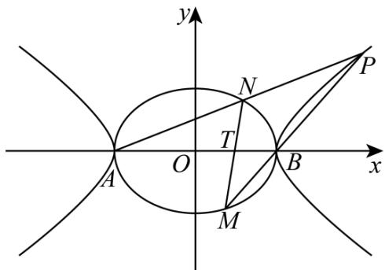
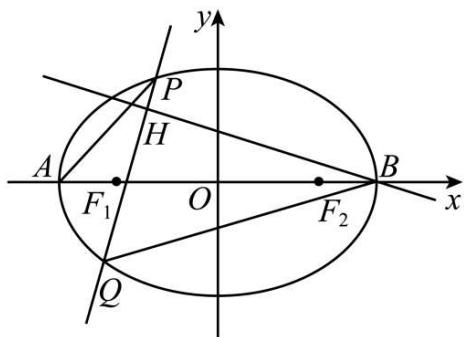

# 第 74 讲 存在性问题的探究

# 知识梳理

解决存在性问题的技巧：

(1) 特殊值 (点) 法: 对于一些复杂的题目, 可通过其中的特殊情况, 解得所求要素的必要条件, 然后再证明求得的要素也使得其他情况均成立.  
(2) 假设法: 先假设存在, 推证满足条件的结论. 若结论正确, 则存在; 若结论不正确, 则不存在.

# 必考题型全归纳

# 1 题型一: 存在点使向量数量积为定值

4190 (2024·甘肃天水·高二天水市第一中学校考期末)已知椭圆 E 的中心在原点,焦点在 x 轴上,椭圆的左顶点坐标为 $(- \sqrt{2}, 0)$ , 离心率为 $e = \frac{\sqrt{2}}{2}$ .

(1) 求椭圆 E 的方程;  
(2) 过点 (1,0) 作直线 $l$ 交 $\mathrm{E}$ 于 $\mathrm{P} 、 \mathrm{Q}$ 两点，试问：在 $x$ 轴上是否存在一个定点 $\mathrm{M}$ ，使 $\overrightarrow{\mathrm{MP}} \cdot \overrightarrow{\mathrm{MQ}}$ 为定值？若存在，求出这个定点 $\mathrm{M}$ 的坐标；若不存在，请说明理由.

4191 (2024·山西大同·高二统考期末)已知椭圆 $\frac{x^{2}}{a^{2}}+\frac{y^{2}}{b^{2}}=1(a>b>0)$ 的一个焦点与抛物线 $y^{2}=4\sqrt{3}x$ 的焦点 F 重合，且椭圆短轴的两个端点与 F 构成正三角形.

(1) 求椭圆的方程;   
(2) 若过点 $(1,0)$ 的直线 l 与椭圆交于不同两点 P、Q，试问在 x 轴上是否存在定点 E(m,0)，使 $\overrightarrow{PE} \cdot \overrightarrow{QE}$ 恒为定值？若存在，求出 E 的坐标及定值；若不存在，请说明理由.

4192 (2024·重庆渝北·高二重庆市松树桥中学校校考阶段练习)已知椭圆 C 的中心在坐标原点,焦点在 x 轴上,其左、右焦点分别为 $F_{1}$ , $F_{2}$ , 短轴长为 $2\sqrt{3}$ . 点 P 在椭圆 C 上,且满足 $\Delta PF_{1}F_{2}$ 的周长为 6.

(I) 求椭圆 C 的方程;  
(II) 过点 $(-1,0)$ 的直线 l 与椭圆 C 相交于 A, B 两点, 试问在 x 轴上是否存在一定点 M, 使得 $\overrightarrow{MA} \cdot \overrightarrow{MB}$ 恒为定值? 若存在, 求出该点 M 的坐标; 若不存在, 请说明理由.

4193 (2024·全国·高三专题练习)已知椭圆 C: $\frac{x^{2}}{a^{2}} + \frac{y^{2}}{b^{2}} = 1^{\circ}$ 。(a > b > 0) 的离心率为 $\frac{\sqrt{2}}{2}$ ，椭圆经过点 A $\left(-1^{\circ}, \frac{\sqrt{2}}{2}\right)$ .

(1) 求椭圆 C 的方程;  
(2) 过点 $(1,0)$ 作直线 l 交 C 于 M,N 两点，试问：在 x 轴上是否存在一个定点 P，使 $\overrightarrow{PM} \cdot \overrightarrow{PN}$ 为定值？若存在，求出这个定点 P 的坐标；若不存在，请说明理由.

4194 (2024·辽宁锦州·统考模拟预测)已知 $F_{1}$ 、 $F_{2}$ 为双曲线 E: $\frac{x^{2}}{a^{2}} - \frac{y^{2}}{b^{2}} = 1 (a > 0, b > 0)$ 的左、右焦点，E 的离心率为 $\sqrt{5}$ ，M 为 E 上一点，且 $|MF_{2}| - |MF_{1}| = 2$ .

(1) 求 E 的方程;  
(2) 设点 M 在坐标轴上, 直线 l 与 E 交于异于 M 的 A、B 两点, 且点 M 在以线段 AB 为直径的圆上, 过 M 作 MC ⊥ AB, 垂足为 C, 是否存在点 D, 使得 |CD| 为定值? 若存在, 求出

点 D 的坐标; 若不存在, 请说明理由.

4195 (2024·山西大同·统考模拟预测)已知椭圆 $C_{1}:\frac{x^{2}}{a^{2}}+\frac{y^{2}}{b^{2}}=1(a>b>0)$ 的离心率为 $\frac{\sqrt{2}}{2}$ ，且直线 $y=x+b$ 是抛物线 $C_{2}:y^{2}=4x$ 的一条切线.

(1) 求椭圆 $C_{1}$ 的方程;  
(2) 过点 $S\left(0, -\frac{1}{3}\right)$ 的动直线 L 交椭圆 $C_{1}$ 于 A, B 两点，试问：在直角坐标平面上是否存在一个定点 T，使得以 AB 为直径的圆恒过定点 T？若存在，求出 T 的坐标；若不存在，请说明理由.

4196 (2024·江苏扬州·统考模拟预测)已知椭圆 C: $\frac{x^{2}}{a^{2}} + \frac{y^{2}}{b^{2}} = 1 (a > b > 0)$ 的左顶点为 A, 过右焦点 F 且平行于 y 轴的弦 PQ = AF = 3.

(1) 求 $\triangle APQ$ 的内心坐标;  
(2) 是否存在定点 D, 使过点 D 的直线 l 交 C 于 M, N, 交 PQ 于点 R, 且满足 $\overrightarrow{MR} \cdot \overrightarrow{ND} = \overrightarrow{MD} \cdot \overrightarrow{RN}$ ? 若存在, 求出该定点坐标, 若不存在, 请说明理由.

# 2 题型二: 存在点使斜率之和或之积为定值

4197 (2024·山东泰安·统考模拟预测)已知为O坐标原点，A(2,0)，B(0,1)，C(0,-1)，D(2,1)， $\overrightarrow{\mathrm{OE}} = \lambda \overrightarrow{\mathrm{OA}},\overrightarrow{\mathrm{DF}} = \lambda \overrightarrow{\mathrm{DA}},0 < \lambda \leqslant 1$ ，CE和BF交点为P.

(1) 求点 P 的轨迹 G;  
(2) 直线 $y = x + m (m \neq 0)$ 和曲线 G 交与 M, N 两点, 试判断是否存在定点 Q 使 $k_{MQ} k_{NQ} = \frac{1}{4}$ ? 如果存在, 求出 Q 点坐标, 不存在请说明理由.

4198 (2024·重庆渝中·高三重庆巴蜀中学校考阶段练习)已知点 A(-2,0), B(2,0), P(x,y) 是异于 A, B 的动点, $k_{AP}$ , $k_{BP}$ 分别是直线 AP, BP 的斜率, 且满足 $k_{AP} \cdot k_{BP} = -\frac{3}{4}$ .

(1) 求动点 P 的轨迹方程;  
(2) 在线段 AB 上是否存在定点 E, 使得过点 E 的直线交 P 的轨迹于 M, N 两点, 且对直线 x = 4 上任意一点 Q, 都有直线 QM, QE, QN 的斜率成等差数列. 若存在, 求出定点 E, 若不存在, 请说明理由.

4199 (2024·吉林·吉林省实验校考模拟预测)以双曲线 C: $\frac{x^{2}}{a^{2}} - \frac{y^{2}}{b^{2}} = 1 (a > 0, b > 0)$ 的右焦点 F 为圆心作圆，与 C 的一条渐近线相切于点 Q $\left(\frac{4}{3}, \frac{2\sqrt{5}}{3}\right)$

(1) 求 C 的方程.  
(2) 在 $x$ 轴上是否存在定点 $\mathrm{M}$ , 过点 $\mathrm{M}$ 任意作一条不与坐标轴垂直的直线 $l$ , 当 $l$ 与 $\mathrm{C}$ 交于 $\mathrm{A}, \mathrm{B}$ 两点时, 直线 $\mathrm{AF}, \mathrm{BF}$ 的斜率之和为定值? 若存在, 求出 $\mathrm{M}$ 点的坐标, 若不存在, 说明理由.

4200 (2024·湖北荆州·高二荆州中学校考阶段练习)已知圆 C 方程为 $x^{2} + y^{2} - 8mx - (6m + 2)y + 6m + 1 = 0 (m \in \mathbb{R}, m \neq 0)$ ，椭圆中心在原点，焦点在 x 轴上.

(1) 证明圆 C 恒过一定点 M, 并求此定点 M 的坐标;  
(2) 判断直线 $4x + 3y - 3 = 0$ 与圆 C 的位置关系, 并证明你的结论;  
(3) 当 m=2 时, 圆 C 与椭圆的左准线相切, 且椭圆过 (1) 中的点 M, 求此时椭圆方程; 在 x 轴上是否存在两定点 A, B 使得对椭圆上任意一点 Q (异于长轴端点), 直线 QA, QB 的

斜率之积为定值？若存在，求出 A, B 坐标；若不存在，请说明理由.

4201 (2024·河北·高三校联考阶段练习)已知椭圆 C: $\frac{x^{2}}{a^{2}} + \frac{y^{2}}{b^{2}} = 1 (a > b > 0)$ 的左、右焦点分别为 F₁, F₂, 焦距为 2, 实轴长为 4.

(1) 求椭圆 C 的方程;  
(2) 设过点 $F_{1}$ 不与 x 轴重合的直线 l 与椭圆 C 相交于 E, D 两点, 试问在 x 轴上是否存在一个点 M, 使得直线 ME, MD 的斜率之积恒为定值? 若存在, 求出该定值及点 M 的坐标; 若不存在, 请说明理由.

4202 (2024·吉林长春·高三长春外国语学校校考开学考试)已知椭圆 C: $\frac{x^{2}}{a^{2}}+\frac{y^{2}}{b^{2}}=$

$1(a > b > 0)$ 的离心率为 $\frac{1}{2},\mathrm{F}_1,\mathrm{F}_2$ 分别是椭圆的左、右焦点，P是椭圆上一点，且 $\triangle \mathrm{PF}_1\mathrm{F}_2$ 的周长是6.

(1) 求椭圆 C 的方程;  
(2) 设直线 l 经过椭圆的右焦点 $F_{2}$ 且与 C 交于不同的两点 M, N, 试问: 在 x 轴上是否存在点 Q, 使得直线 QM 与直线 QN 的斜率的和为定值? 若存在, 请求出点 Q 的坐标; 若不存在, 请说明理由.

4203 (2024·全国·高三专题练习)设椭圆 C: $\frac{x^{2}}{a^{2}} + \frac{y^{2}}{b^{2}} = 1 (a > b > 0)$ 的离心率是 $\frac{\sqrt{2}}{2}$ ，过点 P(0,1) 的动直线 L 于椭圆相交于 A,B 两点，当直线 L 平行于 x 轴时，直线 L 被椭圆 C 截得弦长为 $2\sqrt{2}$ .

(I) 求 E 的方程;  
(Ⅱ) 在 $y$ 上是否存在与点 $\mathrm{P}$ 不同的定点 $\mathrm{Q}$ , 使得直线 $\mathrm{AQ}$ 和 $\mathrm{BQ}$ 的倾斜角互补? 若存在, 求 $\mathrm{Q}$ 的坐标; 若不存在, 说明理由.

# 3 题型三: 存在点使两角度相等

4204 (2024·新疆阿勒泰·统考三模)已知椭圆 $C_{1}:\frac{x^{2}}{a^{2}}+y^{2}=1(a>1)$ 的左右焦点分别为 $F_{1}$ 、 $F_{2}$ ，A,B 分别为椭圆 $C_{1}$ 的上，下顶点， $F_{2}$ 到直线 $AF_{1}$ 的距离为 $\sqrt{3}$ .

(1) 求椭圆 $C_{1}$ 的方程;  
(2) 直线 $x = x_{0}$ 与椭圆 $C_{1}$ 交于不同的两点 C, D，直线 AC, AD 分别交 x 轴于 P, Q 两点.
问：y 轴上是否存在点 R，使得 $\angle ORP + \angle ORQ = \frac{\pi}{2}$ ？若存在，求出点 R 的坐标；若不存在，请说明理由.

4205 (2024·全国·高三专题练习)已知椭圆 C: $\frac{x^{2}}{a^{2}} + \frac{y^{2}}{b^{2}} = 1 (a > b > 0)$ 经过点 A(-2,0) 且两个焦点及短轴两顶点围成四边形的面积为 4.

(1) 求椭圆 C 的方程和离心率;  
(2) 设 P, Q 为椭圆 C 上不同的两个点, 直线 AP 与 y 轴交于点 E, 直线 AQ 与 y 轴交于点 F, 且 P、O、Q 三点共线. 其中 O 为坐标原点. 问: x 轴上是否存在点 M, 使得 $\angle AME = \angle EFM$ ? 若存在, 求点 M 的坐标, 若不存在, 说明理由.

4206 (2024·四川绵阳·模拟预测)已知点A是圆C: $(x-1)^{2}+y^{2}=16$ 上的任意一点，点F(-1,0)，线段AF的垂直平分线交AC于点P.

(1) 求动点 P 的轨迹 E 的方程;

(2) 若过点 G(3,0) 且斜率不为 O 的直线 l 交 (1) 中轨迹 E 于 M、N 两点，O 为坐标原点，点 B(2,0). 问：x 轴上是否存在定点 T，使得 $\angle MTO = \angle NTB$ 恒成立. 若存在，请求出点 T 的坐标，若不存在，请说明理由.

4207 (2024·陕西西安·陕西师大附中校考模拟预测)已知椭圆 C: $\frac{x^{2}}{a^{2}} + \frac{y^{2}}{3} = 1 (a > 0)$ 经过点 $(-1, \frac{3}{2})$ ，过点 T( $\sqrt{3}, 0$ ) 的直线交该椭圆于 P, Q 两点.

(1) 求 $\triangle OPQ$ 面积的最大值, 并求此时直线 PQ 的方程;  
(2) 若直线 PQ 与 x 轴不垂直, 在 x 轴上是否存在点 S(s,0) 使得 $\angle PST = \angle QST$ 恒成立? 若存在, 求出 s 的值; 若不存在, 说明理由.

4208 (2024·四川成都·高三四川省成都市新都一中校联考开学考试)已知椭圆 C: $\frac{x^{2}}{a^{2}} + \frac{y^{2}}{b^{2}} = 1 (a > b > 0)$ 过点 $\left(1, \frac{\sqrt{2}}{2}\right)$ ，且上顶点与右顶点的距离为 $\sqrt{3}$ .

(1) 求椭圆 C 的方程;  
(2) 若过点 P(3,0) 的直线 l 交椭圆 C 于 A, B 两点, x 轴上是否存在点 Q 使得 $\angle PQA + \angle PQB = \pi$ , 若存在, 求出点 Q 的坐标; 若不存在, 请说明理由.

4209 (2024·河南信阳·高三信阳高中校考阶段练习)在平面直角坐标系 $xOy$ 中, 动点 M 到点 D(2,0) 的距离等于点 M 到直线 $x = 1$ 距离的 $\sqrt{2}$ 倍, 记动点 M 的轨迹为曲线 C.

(1) 求曲线 C 的方程;  
(2) 已知直线 $l: y = \frac{1}{2} x + t (t \geqslant 2)$ 与曲线 C 交于 A, B 两点, 问曲线 C 上是否存在两点 P, Q 满足 $\angle APB = \angle AQB = 90^{\circ}$ , 若存在, 请求出两点坐标, 不存在, 请说明理由.

# 题型四: 存在点使等式恒成立

4210 (2024·福建漳州·统考模拟预测)已知R是圆M: $(x+\sqrt{3})^{2}+y^{2}=8$ 上的动点,点N( $\sqrt{3},0$ ),直线NR与圆M的另一个交点为S,点L在直线MR上,MS//NL,动点L的轨迹为曲线C.

(1) 求曲线 C 的方程;  
(2) 若过点 P(-2,0) 的直线 l 与曲线 C 相交于 A, B 两点, 且 A, B 都在 x 轴上方, 问: 在 x 轴上是否存在定点 Q, 使得 $\triangle QAB$ 的内心在一条定直线上? 请你给出结论并证明.

4211 (2024·全国·高三专题练习)已知椭圆 $\Gamma:\frac{x^{2}}{a^{2}}+\frac{y^{2}}{b^{2}}=1(a>b>0)$ 的左、右焦点分别为 $F_{1}$ ， $F_{2}$ ，过点 $B(0,b)$ 且与直线 $BF_{2}$ 垂直的直线交 x 轴负半轴于 D，且 $2\overrightarrow{F_{1}F_{2}}+\overrightarrow{F_{2}D}=\overrightarrow{0}$ .

(1) 求椭圆 $\Gamma$ 的离心率;  
(2) 若过 B、D、 $F_{2}$ 三点的圆恰好与直线 $l: x - \sqrt{3}y - 6 = 0$ 相切，求椭圆 $\Gamma$ 的方程；  
(3) 设 $a = 2$ 。过椭圆 $\Gamma$ 右焦点 $\mathrm{F}_2$ 且不与坐标轴垂直的直线 $l$ 与椭圆 $\Gamma$ 交于 $\mathrm{P} 、 \mathrm{Q}$ 两点，点 $\mathrm{M}$ 是点 $\mathrm{P}$ 关于 $x$ 轴的对称点，在 $x$ 轴上是否存在一个定点 $\mathrm{N}$ ，使得 $\mathrm{M} 、 \mathrm{Q} 、 \mathrm{N}$ 三点共线？若存在，求出点 $\mathrm{N}$ 的坐标；若不存在，说明理由。

4212 (2024·福建福州·福州三中校考模拟预测)如图,双曲线的中心在原点,焦点到渐近线的距离为 $\sqrt{3}$ ,左、右顶点分别为A、B. 曲线C是以双曲线的实轴为长轴,虚轴为短轴,且离心率为 $\frac{1}{2}$ 的椭圆,设P在第一象限且在双曲线上,直线BP交椭圆于点M,直线AP与椭圆交于另一点N.

text_image

y
N
P
T
A
O
B
x
M

(1) 求椭圆及双曲线的标准方程;  
(2) 设 MN 与 x 轴交于点 T, 是否存在点 P 使得 $x_{P} = 4x_{T}$ (其中 $x_{P}, x_{T}$ 为点 P, T 的横坐标), 若存在, 求出 P 点的坐标, 若不存在, 请说明理由.

4213 (2024·福建福州·福州四中校考模拟预测)已知在平面直角坐标系 xOy 中, 椭圆 E: $\frac{x^{2}}{4} + \frac{y^{2}}{3} = 1$ 的左顶点和右焦点分别为 A, F, 动点 P 满足 $|PA|^{2} + \frac{1}{2}|PF|^{2} = \frac{9}{2}$ , 记动点 P 的轨迹为曲线 C.

(1) 求 C 的方程;  
(2) 设点 Q 在 E 上, 过 Q 作 C 的两条切线, 分别与 y 轴相交于 M, N 两点. 是否存在点 Q, 使得 |MN| 等于 E 的短轴长? 若存在, 求点 Q 的坐标; 若不存在, 请说明理由.

4214 (2024·甘肃定西·统考模拟预测)已知点M到点 $F\left(0,\frac{3}{2}\right)$ 的距离比它到直线l:y=-2的距离小 $\frac{1}{2}$ ，记动点M的轨迹为E.

(1) 求 E 的方程;  
(2) 若过点 F 的直线交 E 于 A $(x_{1}, y_{1})$ ，B $(x_{2}, y_{2})$ 两点，则在 x 轴的正半轴上是否存在点 P，使得 PA，PB 分别交 E 于另外两点 C，D，且 $\overrightarrow{AB} = 3\overrightarrow{CD}$ ？若存在，请求出 P 点坐标，若不存在，请说明理由.

4215 (2024·北京海淀·中关村中学校考三模)已知椭圆 $E:\frac{x^{2}}{a^{2}}+\frac{y^{2}}{b^{2}}=1(a>b>0)$ 的焦距为 2，长轴长为 4.

(1) 求椭圆 E 的方程及离心率;  
(2) 过点 M(-3,0) 且与 x 轴不重合的直线 l 与椭圆 E 交于不同的两点 B、C，点 B 关于 x 轴的对称点为 B'. 问：平面内是否存在定点 P，使得 B' 恒在直线 PC 上？若存在，求出点 P 的坐标；若不存在，说明理由.

# 5 题型五: 存在点使线段关系式为定值

4216 (2024·全国·高三专题练习)椭圆 E 经过两点 $\left(1, \frac{\sqrt{2}}{2}\right)$ ， $\left(\frac{\sqrt{2}}{2}, \frac{\sqrt{3}}{2}\right)$ ，过点 P 的动直线 l 与椭圆相交于 A，B 两点.

(1) 求椭圆 E 的方程;  
(2) 若椭圆 E 的右焦点是 P, 其右准线与 x 轴交于点 Q, 直线 AQ 的斜率为 $k_{1}$ , 直线 BQ 的斜率为 $k_{2}$ , 求证: $k_{1} + k_{2} = 0$ ;  
(3) 设点 $P(t,0)$ 是椭圆 E 的长轴上某一点 (不为长轴顶点及坐标原点), 是否存在与点 P 不同的定点 Q, 使得 $\frac{|QA|}{|QB|} = \frac{|PA|}{|PB|}$ 恒成立? 只需写出点 Q 的坐标, 无需证明.

4217 (2024·福建宁德·校考模拟预测)已知双曲线C与双曲线 $\frac{x^2}{12} -\frac{y^2}{3} = 1$ 有相同的渐近线，且过点A(2√2，-1).

(1) 求双曲线 C 的标准方程;  
(2) 已知点 D(2,0), E, F 是双曲线 C 上不同于 D 的两点, 且 $\overrightarrow{DE} \cdot \overrightarrow{DF} = 0$ , DG ⊥ EF 于点 G, 证明: 存在定点 H, 使 $|GH|$ 为定值.

4218 (2024·四川成都·高三校考阶段练习)已知椭圆 C: $\frac{x^{2}}{a^{2}} + \frac{y^{2}}{b^{2}} = 1 (a > b > 0)$ 的离心率为 $\frac{1}{2}$ ，过椭圆右焦点 F 的直线 l 与椭圆交于 A，B 两点，当直线 l 与 x 轴垂直时， $|AB| = 3$ .

(1) 求椭圆 C 的标准方程;  
(2) 当直线 $l$ 的斜率为 $k (k \neq 0)$ 时, 在 $x$ 轴上是否存在一点 $\mathrm{P}$ (异于点 $\mathrm{F}$ ), 使 $x$ 轴上任意一点到直线 $\mathrm{PA}$ 与到直线 $\mathrm{PB}$ 的距离相等? 若存在, 求 $\mathrm{P}$ 点坐标; 若不存在, 请说明理由.

4219 (2024·陕西安康·陕西省安康中学校考模拟预测)已知椭圆E的中心为坐标原点,对称轴为坐标轴,且过点A(2,0),B $\left(1,\frac{\sqrt{3}}{2}\right)$ . 直线x=t(不经过点B)与椭圆E交于M,N两点,Q(1,0),直线MQ与椭圆E交于另一点C,点P满足 $\overrightarrow{QP}\cdot\overrightarrow{NC}=0$ ,且P在直线NC上.

(1) 求 E 的方程;  
(2) 证明: 直线 NC 过定点, 且存在另一个定点 R, 使 $|PR|$ 为定值.

4220 (2024·湖南衡阳·高三衡阳市八中校考阶段练习)已知双曲线 C: $\frac{x^2}{a^2} - \frac{y^2}{b^2} =$

$1(a > 0, b > 0)$ 的右焦点，右顶点分别为 $\mathrm{F}, \mathrm{A}, \mathrm{B}(0, b), |\mathrm{AF}| = 1$ ，点M在线段AB上，且满足 $|\mathrm{BM}| = \sqrt{3} |\mathrm{MA}|$ ，直线OM的斜率为1，O为坐标原点.

(1) 求双曲线 C 的方程.  
(2) 过点 F 的直线 l 与双曲线 C 的右支相交于 P, Q 两点, 在 x 轴上是否存在与 F 不同的定点 E, 使得 $|EP| \cdot |FQ| = |EQ| \cdot |FP|$ 恒成立? 若存在, 求出点 E 的坐标; 若不存在, 请说明理由.

4221 (2024·河北秦皇岛·校联考模拟预测)如图,椭圆 C: $\frac{x^{2}}{a^{2}} + \frac{y^{2}}{b^{2}} = 1 (a > b > 0)$ 的左、右顶点分别为 A, B. 左、右焦点分别为 $F_{1}, F_{2}$ , 离心率为 $\frac{\sqrt{2}}{2}$ , 点 M( $\sqrt{2}, 1$ ) 在椭圆 C 上.

text_image

y
P
H
A
F₁ O B
x
F₂
Q

(1) 求椭圆 C 的方程;  
(2) 已知 P, Q 是椭圆 C 上两动点, 记直线 AP 的斜率为 $k_{1}$ , 直线 BQ 的斜率为 $k_{2}$ , $k_{1} = 2k_{2}$ . 过点 B 作直线 PQ 的垂线, 垂足为 H. 问: 在平面内是否存在定点 T, 使得 $|TH|$ 为定值, 若存在, 求出点 T 的坐标; 若不存在, 试说明理由.

4222 (2024·四川遂宁·高三射洪中学校考阶段练习)在平面直角坐标系 $xOy$ 中，设点P的轨迹为曲线 C. ①过点 F(1,0) 的动圆恒与 y 轴相切，FP 为该圆的直径；②点 P 到 F(1,0) 的距离比 P 到 y 轴的距离大 1.

在①和②中选择一个作为条件:

(1) 选择条件: 求曲线 C 的方程;  
(2) 在 $x$ 轴正半轴上是否存在一点 $\mathrm{M}$ , 当过点 $\mathrm{M}$ 的直线 $l$ 与抛物线 $\mathrm{C}$ 交于 $\mathrm{Q}, \mathrm{R}$ 两点时, $\frac{1}{|\mathrm{MQ}|} + \frac{1}{|\mathrm{MR}|}$ 为定值? 若存在, 求出点 $\mathrm{M}$ 的坐标, 若不存在, 请说明理由.

4223 (2024·四川成都·高三树德中学校考开学考试)已知椭圆 C: $\frac{x^{2}}{a^{2}} + \frac{y^{2}}{b^{2}} = 1 (a > b > 0)$ 的离心率为 $e = \frac{\sqrt{2}}{2}$ ，且经过点 $(1, e)$ 。P 为椭圆 C 在第一象限内部分上的一点。

(1) 若 A(a,0), B(0,b), 求 $\triangle ABP$ 面积的最大值;  
(2) 是否存在点 P, 使得过点 P 作圆 M: $(x+1)^{2} + y^{2} = 1$ 的两条切线, 分别交 y 轴于 D, E 两点, 且 $|DE| = \frac{\sqrt{14}}{3}$ . 若存在, 点求出 P 的坐标; 若不存在, 说明理由.

