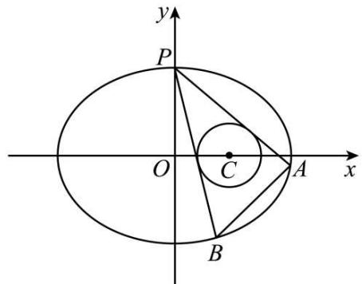
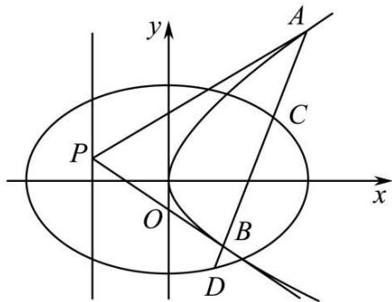
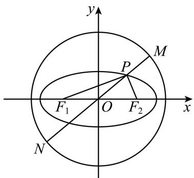
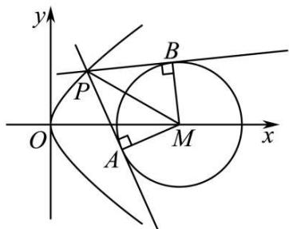
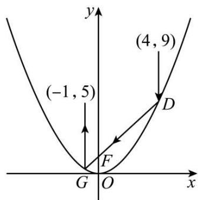

# 第75讲 切点与切点弦

# 知识梳理

1、点 $\mathrm{M}(x_0,y_0)$ 在圆 $x^{2} + y^{2} = r^{2}$ 上，过点M作圆的切线方程为 $x_0x + y_0y = r^2$

2、点 $\mathbf{M}(x_0, y_0)$ 在圆 $x^2 + y^2 = r^2$ 外，过点 $\mathbf{M}$ 作圆的两条切线，切点分别为 $\mathbf{A}, \mathbf{B}$ ，则切点弦AB的直线方程为 $x_0x + y_0y = r^2$ .

3、点 $\mathbf{M}(x_0, y_0)$ 在圆 $x^2 + y^2 = r^2$ 内，过点 $\mathbf{M}$ 作圆的弦AB(不过圆心)，分别过A，B作圆的切线，则两条切线的交点P的轨迹方程为直线 $x_0x + y_0y = r^2$ .

4、点 $\mathrm{M}(x_0, y_0)$ 在圆 $(x - a)^2 + (y - b)^2 = r^2$ 上，过点 $\mathbf{M}$ 作圆的切线方程为 $(x_0 - a)(x - a) + (y_0 - b)(y - b) = r^2$ .

5、点 $\mathbf{M}(x_0, y_0)$ 在圆 $(x - a)^2 + (y - b)^2 = r^2$ 外，过点 $\mathbf{M}$ 作圆的两条切线，切点分别为 $\mathbf{A}$ ， $\mathbf{B}$ ，则切点弦AB的直线方程为 $(x_0 - a)(x - a) + (y_0 - b)(y - b) = r^2$ .

6、点 $\mathbf{M}(x_0, y_0)$ 在圆 $(x - a)^2 + (y - b)^2 = r^2$ 内，过点 $\mathbf{M}$ 作圆的弦AB(不过圆心)，分别过A，B作圆的切线，则两条切线的交点P的轨迹方程为 $(x_0 - a)(x - a) + (y_0 - b)(y - b) = r^2$ .

7、点 $\mathrm{M}(x_0, y_0)$ 在椭圆 $\frac{x^2}{a^2} + \frac{y^2}{b^2} = 1 (a > b > 0)$ 上，过点 $\mathbf{M}$ 作椭圆的切线方程为 $\frac{x_0 x}{a^2} + \frac{y_0 y}{b^2} = 1$ .

8、点 $\mathrm{M}(x_0, y_0)$ 在椭圆 $\frac{x^2}{a^2} + \frac{y^2}{b^2} = 1 (a > b > 0)$ 外，过点 $\mathbf{M}$ 作椭圆的两条切线，切点分别为 $\mathbf{A}, \mathbf{B}$ ，则切点弦AB的直线方程为 $\frac{x_0 x}{a^2} + \frac{y_0 y}{b^2} = 1$ 。

9、点 $\mathbf{M}(x_0, y_0)$ 在椭圆 $\frac{x^2}{a^2} + \frac{y^2}{b^2} = 1 (a > b > 0)$ 内，过点 $\mathbf{M}$ 作椭圆的弦AB(不过椭圆中心)，分别过A，B作椭圆的切线，则两条切线的交点P的轨迹方程为直线 $\frac{x_0 x}{a^2} + \frac{y_0 y}{b^2} = 1$

10、点 $\mathrm{M}(x_0, y_0)$ 在双曲线 $\frac{x^2}{a^2} - \frac{y^2}{b^2} = 1 (a > 0, b > 0)$ 上，过点 $\mathbf{M}$ 作双曲线的切线方程为 $\frac{x_0 x}{a^2} - \frac{y_0 y}{b^2} = 1$ .

11、点 $\mathrm{M}(x_0, y_0)$ 在双曲线 $\frac{x^2}{a^2} - \frac{y^2}{b^2} = 1 (a > 0, b > 0)$ 外，过点 $\mathbf{M}$ 作双曲线的两条切线，切点分别为 $\mathbf{A}, \mathbf{B}$ ，则切点弦AB的直线方程为 $\frac{x_0 x}{a^2} - \frac{y_0 y}{b^2} = 1$ .

12、点 $\mathrm{M}(x_0, y_0)$ 在双曲线 $\frac{x^2}{a^2} - \frac{y^2}{b^2} = 1 (a > 0, b > 0)$ 内，过点M作双曲线的弦AB(不过双曲线中心)，分别过A，B作双曲线的切线，则两条切线的交点P的轨迹方程为直线 $\frac{x_0 x}{a^2} - \frac{y_0 y}{b^2} = 1$

13、点 $\mathbf{M}(x_0, y_0)$ 在抛物线 $y^2 = 2px (p > 0)$ 上，过点 $\mathbf{M}$ 作抛物线的切线方程为 $y_0y = p(x + x_0)$ .

14、点 $\mathrm{M}(x_0, y_0)$ 在抛物线 $y^2 = 2px (p > 0)$ 外，过点M作抛物线的两条切线，切点分别为A，B，则切点弦AB的直线方程为 $y_0y = p(x + x_0)$ .

15、点 $\mathbf{M}(x_0, y_0)$ 在抛物线 $y^2 = 2px (p > 0)$ 内，过点 $\mathbf{M}$ 作抛物线的弦AB，分别过A，B作抛物线的切线，则两条切线的交点P的轨迹方程为直线 $y_0y = p(x + x_0)$ .

# 必考题型全归纳

# 题型一:切线问题

4224 (2024·浙江杭州·高三浙江省杭州第二中学校考阶段练习)已知抛物线 $E: y^{2} = 2px (p > 0)$ ，焦点为 F. 过抛物线外一点 P(不在 x 轴上)作抛物线 C 的切线 PA, PB，其中 A、B 为切点，两切线分别交 y 轴于点 C, D.

(1) 求 $\overrightarrow{CA} \cdot \overrightarrow{CF}$ 的值;  
(2) 证明：  
① |FP| 是 |FA| 与 |FB| 的等比中项；  
②FP 平分 $\angle AFB$ .

4225 (2024·江西·高三校联考开学考试)已知抛物线 C: $x^{2}=8y$ , F 为 C 的焦点, 过点 F 的直线 l 与 C 交于 H, I 两点, 且在 H, I 两点处的切线交于点 T.

(1) 当 l 的斜率为 -1 时, 求 $|HI|$ ;  
(2) 证明: FT ⊥ HI.

4226 (2024·湖北·高三校联考开学考试)已知抛物线 C: $y^{2}=2px(p>0)$ 的焦点为 F, 过 F 作斜率为 $k(k>0)$ 的直线 l 与 C 交于 A, B 两点, 当 $k=\sqrt{2}$ 时, $|AB|=6$ .

(1) 求抛物线 C 的标准方程;  
(2) 设线段 AB 的中垂线与 x 轴交于点 P, 抛物线 C 在 A, B 两点处的切线相交于点 Q, 设 P, Q 两点到直线 l 的距离分别为 $d_{1}, d_{2}$ , 求 $\frac{d_{1}}{d_{2}}$ 的值.

4227 (2024·全国·高三专题练习)设抛物线 E: $y^{2}=2px(p>0)$ 的焦点为 F，过 F 且斜率为 1 的直线 l 与 E 交于 A，B 两点，且 $|AB|=8$ .

(1) 求抛物线 E 的方程;  
(2) 设 $\mathrm{P}(1, m)$ 为 $\mathrm{E}$ 上一点, $\mathrm{E}$ 在 $\mathrm{P}$ 处的切线与 $x$ 轴交于 $\mathrm{Q}$ , 过 $\mathrm{Q}$ 的直线与 $\mathrm{E}$ 交于 $\mathrm{M}, \mathrm{N}$ 两点, 直线 $\mathrm{PM}$ 和 $\mathrm{PN}$ 的斜率分别为 $k_{\mathrm{PM}}$ 和 $k_{\mathrm{PN}}$ . 求证: $k_{\mathrm{PM}} + k_{\mathrm{PN}}$ 为定值.

4228 (2024·广东广州·高三华南师大附中校考开学考试)已知椭圆 $E:\frac{x^{2}}{a^{2}}+\frac{y^{2}}{b^{2}}=1(a>b>0)$ 的两焦点分别为 $F_{1}(-\sqrt{3},0)$ , $F_{2}(\sqrt{3},0)$ ，A 是椭圆 E 上一点，当 $\angle F_{1}AF_{2}=\frac{\pi}{3}$ 时， $\triangle F_{1}AF_{2}$ 的面积为 $\frac{\sqrt{3}}{3}$ .

(1) 求椭圆 E 的方程;  
(2) 直线 $l_{1}: k_{1}x - y + 2k_{1} = 0 (k_{1} > 0)$ 与椭圆 E 交于 M, N 两点, 线段 MN 的中点为 P, 过 P 作垂直 x 轴的直线在第二象限交椭圆 E 于点 S, 过 S 作椭圆 E 的切线 $l_{2}, l_{2}$ 的斜率为 $k_{2}$ , 求 $k_{1} - k_{2}$ 的取值范围.

4229 (2024·江西南昌·南昌市八一中学校考三模)已知椭圆 E: $\frac{x^{2}}{a^{2}} + \frac{y^{2}}{b^{2}} = 1 (a > b > 0)$ 经过点 $(0, \sqrt{2})$ ，且离心率为 $\frac{\sqrt{6}}{3}$ ，F 为椭圆 E 的左焦点，点 P 为直线 l: x = 3 上的一点，过点 P 作椭圆 E 的两条切线，切点分别为 A, B，连接 AB, AF, BF.

(1) 证明: 直线 AB 经过定点 M(2,0);

(2) 若记 $\triangle \mathrm{AFM}$ 、 $\triangle \mathrm{BFM}$ 的面积分别为 $S_{1}$ 和 $S_{2}$ ，当 $|S_{1} - S_{2}|$ 取最大值时，求直线 AB 的方程.

参考结论： $\mathrm{Q}(x_{0}, y_{0})$ 为椭圆 $\frac{x^{2}}{a^{2}} + \frac{y^{2}}{b^{2}} = 1$ 上一点，则过点 Q 的椭圆的切线方程为 $\frac{x_{0}x}{a^{2}} + \frac{y_{0}y}{b^{2}} = 1$ .

# 2 题型二:切点弦过定点问题

4230 (2024·全国·高三专题练习)已知直线 $l_{1}$ 是抛物线 C: $x^{2}=2py(p>0)$ 的准线, 直线 $l_{2}:3x-4y-6=0$ , 且 $l_{2}$ 与抛物线 C 没有公共点, 动点 P 在抛物线 C 上, 点 P 到直线 $l_{1}$ 和 $l_{2}$ 的距离之和的最小值等于 2.

(1) 求抛物线 C 的方程;  
(2) 点 M 在直线 $l_{1}$ 上运动, 过点 M 作抛物线 C 的两条切线, 切点分别为 $P_{1}, P_{2}$ , 在平面内是否存在定点 N, 使得 $MN \perp P_{1}P_{2}$ 恒成立? 若存在, 请求出定点 N 的坐标, 若不存在, 请说明理由.

4231 (2024·福建宁德·校考一模)双曲线 C: $\frac{x^{2}}{a^{2}} - \frac{y^{2}}{b^{2}} = 1$ 的离心率为 $\sqrt{2}$ ，右焦点 F 到渐近线 $y = \frac{b}{a}x$ 的距离为 $\sqrt{2}$ .

(1) 求双曲线 C 的标准方程;  
(2) 过直线 x=1 上任意一点 P 作双曲线 C 的两条切线, 交渐近线 $y=\frac{b}{a}x$ 于 A, B 两点, 证明: 以 AB 为直径的圆恒过右焦点 F.

4232 (2024·四川绵阳·高三四川省绵阳南山中学校考开学考试)已知抛物线 C: $y^{2}=2px(p>0)$ 的焦点到准线的距离为 1.

(1) 求抛物线 C 的标准方程;  
(2) 设点 P(t,1) 是该抛物线上一定点, 过点 P 作圆 O: $(x-2)^{2} + y^{2} = r^{2}$ (其中 0 < r < 1) 的两条切线分别交抛物线 C 于点 A, B, 连接 AB. 探究: 直线 AB 是否过一定点, 若过, 求出该定点坐标; 若不经过定点, 请说明理由.

4233 (2024·陕西·校联考三模)已知直线 l 与抛物线 C: $x^{2}=2py(p>0)$ 交于 A, B 两点，且 OA ⊥ OB, OD ⊥ AB, D 为垂足，点 D 的坐标为 (1,1).

(1) 求 C 的方程;  
(2) 若点 E 是直线 y = x - 4 上的动点, 过点 E 作抛物线 C 的两条切线 EP, EQ, 其中 P, Q 为切点, 试证明直线 PQ 恒过一定点, 并求出该定点的坐标.

4234 (2024·贵州·校联考二模)抛物线 $C_{1}:y^{2}=2px(p>0)$ 的焦点到准线的距离等于椭圆 $C_{2}:x^{2}+16y^{2}=1$ 的短轴长.

(1) 求抛物线 $C_{1}$ 的方程;  
(2) 设 $D(1, t)$ 是抛物线 $C_{1}$ 上位于第一象限的一点，过 D 作 $E: (x - 2)^{2} + y^{2} = r^{2}$ (其中 0 < r < 1) 的两条切线，分别交抛物线 $C_{1}$ 于点 M, N，证明：直线 MN 经过定点.

4235 (2024·河南·校联考模拟预测)已知椭圆 C: $\frac{x^{2}}{a^{2}} + \frac{y^{2}}{b^{2}} = 1 (a > b > 0)$ 的焦距为 2，圆 $x^{2} + y^{2} = 4$ 与椭圆 C 恰有两个公共点.

(1) 求椭圆 C 的标准方程;

(2) 已知结论: 若点 $(x_{0}, y_{0})$ 为椭圆 $\frac{x^{2}}{a^{2}} + \frac{y^{2}}{b^{2}} = 1$ 上一点, 则椭圆在该点处的切线方程为 $\frac{x_{0}x}{a^{2}} + \frac{y_{0}y}{b^{2}} = 1$ . 若椭圆 C 的短轴长小于 4, 过点 T(8, t) 作椭圆 C 的两条切线, 切点分别为 A, B, 求证: 直线 AB 过定点.

4236 (2024·重庆九龙坡·高三重庆市育才中学校考开学考试)如图所示,已知P(0,1)在椭圆 $\Gamma:\frac{x^{2}}{4}+\frac{y^{2}}{b^{2}}=1(0<b<2)$ 上,圆C: $(x-1)^{2}+y^{2}=r^{2}(r>0)$ ,圆C在椭圆Γ内部.

text_image

y
P
O
C
A
x
B

(1) 求 r 的取值范围;

(2) 过 P(0,1) 作圆 C 的两条切线分别交椭圆 $\Gamma$ 于 A,B 点 (A,B 不同于 P), 直线 AB 是否过定点? 若 AB 过定点, 求该定点坐标; 若 AB 不过定点, 请说明理由.

# 题型三:利用切点弦结论解决定值问题

4237 (2024·全国·高三专题练习)已知中心在原点的椭圆 $\Gamma_{1}$ 和抛物线 $\Gamma_{2}$ 有相同的焦点 (1,0)，椭圆 $\Gamma_{1}$ 的离心率为 $\frac{1}{2}$ ，抛物线 $\Gamma_{2}$ 的顶点为原点.

text_image

y
A
C
P
O
x
B
D

(1) 求椭圆 $\Gamma_{1}$ 和抛物线 $\Gamma_{2}$ 的方程；

(2) 设点 P 为抛物线 $\Gamma_{2}$ 准线上的任意一点, 过点 P 作抛物线 $\Gamma_{2}$ 的两条切线 PA, PB, 其中 A, B 为切点. 设直线 PA, PB 的斜率分别为 $k_{1}, k_{2}$ , 求证: $k_{1} k_{2}$ 为定值.

4238 (2024·全国·高三专题练习)已知 F 是抛物线 C: $x^{2}=2py(p>0)$ 的焦点, 以 F 为圆心, 2p 为半径的圆 F 与抛物线 C 交于 A, B 两点, 且 $|AB|=4\sqrt{3}$ .

(1) 求抛物线 C 和圆 F 的方程;

(2) 若点 P 为圆 F 优弧 AB 上任意一点, 过点 P 作抛物线 C 的两条切线 PM, PN, 切点分别为 M, N, 请问 $\left|MF\right|\cdot\left|NF\right|$ 是否为定值? 若是, 求出该定值; 若不是, 请说明理由.

4239 (2024·全国·高三专题练习)已知抛物线 C: $y^{2}=2px(p>0)$ 的焦点为 F, 过点 F 引圆 M: $(x+1)^{2}+(y-1)^{2}=\frac{1}{4}$ 的一条切线, 切点为 N, $|FN|=\frac{\sqrt{19}}{2}$ .

(1) 求抛物线 C 的方程;

(2) 过圆 M 上一点 A 引抛物线 C 的两条切线, 切点分别为 P, Q, 是否存在点 A 使得 $\triangle APQ$ 的面积为 $\frac{3\sqrt{3}}{2}$ ? 若存在, 求点 A 的个数; 否则, 请说明理由.

4240 (2024·全国·高三专题练习)已知抛物线 C: $y^{2}=2px(p>0)$ 的焦点 F 到准线的距离为 2，圆 M 与 y 轴相切，且圆心 M 与抛物线 C 的焦点重合.

(1) 求抛物线 C 和圆 M 的方程;  
(2) 设 $\mathrm{P}(x_{0}, y_{0})(x_{0} \neq 2)$ 为圆 M 外一点，过点 P 作圆 M 的两条切线，分别交抛物线 C 于两个不同的点 $\mathrm{A}(x_{1}, y_{1}), \mathrm{B}(x_{2}, y_{2})$ 和点 $\mathrm{Q}(x_{3}, y_{3}), \mathrm{R}(x_{4}, y_{4})$ . 且 $y_{1}y_{2}y_{3}y_{4}=16$ ，证明：点 P 在一条定曲线上.

4241 (2024·全国·模拟预测)已知抛物线 C: $x^{2}=2py(p>0)$ 的焦点为 F, P 为抛物线上一动点, 点 P 到 F 的最小距离为 1.

(1) 求抛物线 C 的标准方程;  
(2) 过点 A(-1, -2) 向 C 作两条切线 AM, AN, 切点分别为 M, N, 直线 AF 与直线 MN 交于点 Q, 求证: 点 Q 到直线 FM 的距离等于到直线 FN 的距离.

4242 (2024·全国·高三专题练习)已知点 $\mathrm{P}(-2,m)$ 在抛物线 $\mathrm{C}:x^2 = 2py(p > 0)$ 上，且到抛物线C的焦点F的距离为2.

(1) 求抛物线 C 的标准方程;  
(2) 过点 A(-1, -2) 向抛物线 C 作两条切线 AM, AN, 切点分别为 M, N, 若直线 AF 与直线 MN 交于点 Q, 且点 Q 到直线 FM、直线 FN 的距离分别为 $d_{1}, d_{2}$ . 求证: $\frac{d_{1}}{d_{2}}$ 为定值.

4243 (2024·上海长宁·高三上海市延安中学校考开学考试)在以 A(-2,0) 为圆心, 6 为半径的圆 A 内有一点 B(2,0), 点 P 为圆 A 上的任意一点, 线段 BP 的垂直平分线 l 和半径 AP 交于点 M.

(1) 判断点 M 的轨迹是什么曲线, 并求其方程;  
(2) 记点 M 的轨迹为曲线 $\Gamma$ ，过点 B 的直线与曲线 $\Gamma$ 交于 C、D 两点，求 $\overrightarrow{OC} \cdot \overrightarrow{OD}$ 的最大值；  
(3) 在圆 $x^{2} + y^{2} = 14$ 上的任取一点 $\mathbf{Q}$ , 作曲线 $\Gamma$ 的两条切线, 切点分别为 $\mathrm{E}, \mathrm{F}$ , 试判断 QE 与 QF 是否垂直, 并给出证明过程.

4244 (2024·全国·高三专题练习)已知抛物线 C: $y^{2}=2px(p>0)$ ，F 为焦点，若圆 E: $(x-1)^{2}+y^{2}=16$ 与抛物线 C 交于 A, B 两点，且 $|AB|=4\sqrt{3}$

(1) 求抛物线 C 的方程;  
(2) 若点 P 为圆 E 上任意一点, 且过点 P 可以作抛物线 C 的两条切线 PM, PN, 切点分别为 M, N. 求证: $|MF| \cdot |NF|$ 恒为定值.

4245 (2024·浙江金华·浙江金华第一中学校考模拟预测)已知抛物线 $C_{1}:x^{2}=y$ ，圆 $C_{2}:x^{2}+(y-4)^{2}=1$ ，P 是 $C_{1}$ 上异于原点的一点.

(1) 设 Q 是 $C_{2}$ 上的一点, 求 $|PQ|$ 的最小值;  
(2) 过点 P 作 $C_{2}$ 的两条切线分别交 $C_{1}$ 于 A, B 两点 (异于 P). 若 $|PA| = |PB|$ , 求点 P 的坐标.

4246 (2024·湖南长沙·湖南师大附中校考模拟预测)如图,椭圆 C: $\frac{x^{2}}{a^{2}}+\frac{y^{2}}{4}=1(a>2)$ ,圆 O: $x^{2}+y^{2}=a^{2}+4$ ,椭圆 C 的左、右焦点分别为 $F_{1},F_{2}$ .

text_image

y
M
P
F₁ O F₂ x
N

(1) 过椭圆上一点 P 和原点 O 作直线 l 交圆 O 于 M, N 两点, 若 $\left|PF_{1}\right| \cdot \left|PF_{2}\right| = 6$ , 求 $\left|PM\right| \cdot \left|PN\right|$ 的值;  
(2) 过圆 O 上任意点 R 引椭圆 C 的两条切线, 求证: 两条切线相互垂直.

4247 (2024·河南·校联考模拟预测)在椭圆 C: $\frac{x^{2}}{a^{2}} + \frac{y^{2}}{b^{2}} = 1 (a > b > 0)$ 中, 其所有外切矩形的顶点在一个定圆 $\Gamma: x^{2} + y^{2} = a^{2} + b^{2}$ 上, 称此圆为椭圆的蒙日圆. 椭圆 C 过 P(1, $\frac{\sqrt{2}}{2}$ ), Q(- $\frac{\sqrt{6}}{2}$ , $\frac{1}{2}$ ).

(1) 求椭圆 C 的方程;  
(2) 过椭圆 C 的蒙日圆上一点 M，作椭圆的一条切线，与蒙日圆交于另一点 N，若 $k_{OM}$ ， $k_{ON}$ 存在，证明： $k_{OM} \cdot k_{ON}$ 为定值.

# 4 题型四:利用切点弦结论解决最值问题

4248 (2024·福建泉州·高三校联考阶段练习)已知 F 为抛物线 C: $x^{2}=2py(p>0)$ 的焦点，M(-4,m) 是 C 上一点，M 位于 F 的上方且 $|MF|=5$ .

(1) 求 $p$ ;   
(2) 若点 P 在直线 $x + y + 3 = 0$ 上, PA, PB 是 C 的两条切线, A, B 是切点, 求 $|AF||BF|$ 的最小值.

4249 (2024·全国·高三专题练习)已知抛物线 C: $y^{2}=2px(p>0)$ 的焦点 F 到准线的距离为 $\frac{1}{2}$ .

text_image

y
P
B
O
A
M
x

(1) 求抛物线 C 的方程及焦点 F 的坐标;  
(2)如图,过抛物线C上一动点P作圆 $M:(x-2)^{2}+y^{2}=1$ 的两条切线,切点分别为A,B,求四边形PAMB面积的最小值.

4250 (2024·全国·高三专题练习)已知椭圆 C: $\frac{x^{2}}{a^{2}} + \frac{y^{2}}{b^{2}} = 1 (a > b > 0)$ 的左、右焦点分别为 F₁, F₂, 左顶点为 D, 离心率为 $\frac{1}{2}$ , 经过 F₁ 的直线交椭圆于 A, B 两点, $\Delta F_{2}AB$ 的周长为 8.

(1) 求椭圆 C 的方程;

(2) 过直线 x=4 上一点 P 作椭圆 C 的两条切线, 切点分别为 M,N,

①证明: 直线 MN 过定点;  
②求 $S_{\Delta DMN}$ 的最大值.

备注: 若点 $(x_{0}, y_{0})$ 在椭圆 C: $\frac{x^{2}}{a^{2}} + \frac{y^{2}}{b^{2}} = 1$ 上, 则椭圆 C 在点 $(x_{0}, y_{0})$ 处的切线方程为 $\frac{x_{0}x}{a^{2}} + \frac{y_{0}y}{b^{2}} = 1$ .

4251 (2024·贵州·高三校联考阶段练习)已知抛物线 C: $x^{2}=2py(p>0)$ 上的点 $(2,y_{0})$ 到其焦点 F 的距离为 2.

(1) 求抛物线 C 的方程;  
(2) 已知点 D 在直线 l: y = -3 上, 过点 D 作抛物线 C 的两条切线, 切点分别为 A, B, 直线 AB 与直线 l 交于点 M, 过抛物线 C 的焦点 F 作直线 AB 的垂线交直线 l 于点 N, 当 $|MN|$ 最小时, 求 $\frac{|AB|}{|MN|}$ 的值.

4252 (2024·全国·高三专题练习)已知椭圆 C: $\frac{x^{2}}{a^{2}} + \frac{y^{2}}{b^{2}} = 1 (a > b > 0)$ 的左、右焦点分别为 F₁, F₂, P(x₀, y₀) 为 C 上一动点, |PF₁| 的最大值为 $4 + 2\sqrt{3}$ , 且长轴长和短轴长之比为 2.

(1) 求椭圆 C 的标准方程;  
(2) 若 $1 < y_0 \leqslant 2$ , 过 P 作圆 O: $x^2 + y^2 = 1$ 的两条切线 $l_1, l_2$ , 设 $l_1, l_2$ 与 $x$ 轴分别交于 M, N 两点, 求 $\triangle$ PMN 面积的最小值.

4253 (2024·贵州黔东南·凯里一中校考三模)已知直线 $y = kx + 1$ 与抛物线 C: $x^{2} = 8y$ 交于 A, B 两点, 分别过 A, B 两点作 C 的切线, 两条切线的交点为 D.

(1) 证明点 D 在一条定直线上;  
(2) 过点 D 作 y 轴的平行线交 C 于点 E, 线段 AB 的中点为 P,

①证明: E 为 DP 的中点;  
②求 $\triangle ADE$ 面积的最小值.

4254 (2024·新疆喀什·统考模拟预测)已知抛物线 C: $x^{2}=2py(p>0)$ 的焦点为 F，且 F 与圆 M: $x^{2}+(y+3)^{2}=1$ 上点的距离的最小值为 3.

(1) 求 p;   
(2) 若点 P 在圆 M 上, PA, PB 是抛物线 C 的两条切线, A, B 是切点, 求三角形 PAB 面积的最大值.

4255 (2024·黑龙江哈尔滨·哈尔滨三中校考模拟预测)已知抛物线的顶点在原点,焦点在 y 轴上,其上一点 M(m,1) 到焦点的距离为 2.

(1) 求抛物线方程;   
(2) 圆 E: $x^{2} + (y+1)^{2} = 1$ ，过抛物线上一点 $\mathrm{P}(x_{0}, y_{0}) (x_{0} \geqslant 2)$ 作圆 E 的两条切线与 x 轴交于 M、N 两点，求 $S_{\triangle PMN}$ 的最小值.

4256 (2024·广东茂名·高三校考阶段练习)已知平面内动点P(x,y)，P到定点F( $\sqrt{6}$ ,0)的距离与P到定直线 $l:x=\frac{4\sqrt{6}}{3}$ 的距离之比为 $\frac{\sqrt{3}}{2}$ ，

(1) 记动点 P 的轨迹为曲线 C，求 C 的标准方程.  
(2) 已知点 M 是圆 $x^{2} + y^{2} = 10$ 上任意一点, 过点 M 作做曲线 C 的两条切线, 切点分别是 A, B, 求 $\triangle MAB$ 面积的最大值, 并确定此时点 M 的坐标.

注：椭圆： $\frac{x^2}{a^2} +\frac{y^2}{b^2} = 1(a > b > 0)$ 上任意一点 $\mathrm{P}(x_0,y_0)$ 处的切线方程是： $\frac{x_0x}{a^2} +\frac{y_0y}{b^2} = 1.$

4257 (2024·湖北黄冈·浠水县第一中学校考三模)已知椭圆 $\frac{x^{2}}{a^{2}}+\frac{y^{2}}{b^{2}}=1(a>b>0)$ 经过点 A $\left(-1,\frac{3}{2}\right)$ ，过原点的直线与椭圆交于 M, N 两点，点 G 在椭圆上 (异于 M, N)，且 $k_{GM} \cdot k_{GN}=-\frac{3}{4}$ .

(1) 求椭圆的标准方程;  
(2) 若点 P 为直线 x=4 上的动点, 过点 P 作椭圆的两条切线, 切点分别为 E, F, 求 $\tan\angle EPF$ 的最大值.

4258 (2024·新疆乌鲁木齐·统考二模)已知抛物线 C: $x^{2}=2py(p>0)$ 的准线为 l, 圆 O: $x^{2}+y^{2}=r^{2}$ .

(1) 当 $r = \sqrt{5}$ 时，圆 O 与抛物线 C 和准线 l 分别交于点 A, B 和点 M, N，且 $|AB| = |MN|$ ，求抛物线 C 的方程；  
(2) 当 r=1 时，点 $\mathrm{P}(x_{0},y_{0})(y_{0}>r)$ 是 (1) 中所求抛物线 C 上的动点. 过 P 作圆 O 的两条切线分别与抛物线 C 的准线 l 交于 D, E 两点，求 $\triangle PDE$ 面积的最小值.

# 5 题型五:利用切点弦结论解决范围问题

4259 (2024·全国·高三专题练习)已知椭圆 $C_{1}:\frac{x^{2}}{a^{2}}+\frac{y^{2}}{b^{2}}=1(a>b>0)$ 的离心率为 $\frac{1}{2}$ ，且直线 $l_{1}:\frac{x}{a}+\frac{y}{b}=1$ 被椭圆 $C_{1}$ 截得的弦长为 $\sqrt{7}$ .

(1) 求椭圆 $C_{1}$ 的方程;  
(2) 以椭圆 $C_{1}$ 的长轴为直径作圆 $C_{2}$ ，过直线 $l_{2}: y = 4$ 上的动点 M 作圆 $C_{2}$ 的两条切线，设切点为 A, B，若直线 AB 与椭圆 $C_{1}$ 交于不同的两点 C, D，求 $|CD| \cdot |AB|$ 的取值范围.

4260 (2024·海南·统考模拟预测)已知抛物线 C: $x^{2}=2py(p>0)$ 的焦点为 F，准线为 l，点 P 是直线 $l_{1}: y=x-2$ 上一动点，直线 l 与直线 $l_{1}$ 交于点 Q， $|QF|=\sqrt{5}$ .

(1) 求抛物线 C 的方程;  
(2) 过点 P 作抛物线 C 的两条切线 PA, PB, 切点为 A, B, 且 $-9 \leqslant \overrightarrow{FA} \cdot \overrightarrow{FB} \leqslant 5$ , 求 $\triangle PAB$ 面积的取值范围.

4261 (2024·全国·高三专题练习)已知椭圆 C: $\frac{x^{2}}{a^{2}} + \frac{y^{2}}{b^{2}} = 1 (a > b > 0)$ 的左, 右焦点分别为 $F_{1}$ , $F_{2}$ , 离心率为 $\frac{\sqrt{2}}{2}$ , M 为椭圆上异于左右顶点的动点, $\Delta MF_{1}F_{2}$ 的周长为 $4 + 2\sqrt{2}$ .

(1) 求椭圆 C 的标准方程;  
(2) 过点 M 作圆 O: $x^{2} + y^{2} = 1$ 的两条切线, 切点分别为 A, B, 直线 AB 交椭圆 C 于 P, Q 两点, 求 $\triangle OPQ$ 的面积的取值范围.

4262 (2024·辽宁沈阳·校联考二模)从抛物线的焦点发出的光经过抛物线反射后,光线都平行于抛物线的轴,根据光路的可逆性,平行于抛物线的轴射向抛物线后的反射光线都会汇聚到抛物线的焦点处,这一性质被广泛应用在生产生活中.如图,已知抛物线 C: $x^{2}=2py(p>1)$ ,从点(4,9)发出的平行于y轴的光线照射到抛物线上的D点,经过抛物线两次反射后,反射光线由G点射出,经过点(-1,5).

line

| Point | x-coordinate | y-coordinate |
|---|---|---|
| F | 0 | 0 |
| D | 4 | 9 |
| G | -1 | 5 |
| O | 0 | 0 |
| (-1, 5) | 0 | 0 |
| (4, 9) | 4 | 9 |

(1) 求抛物线 C 的方程;

(2) 已知圆 $M: x^{2} + (y - 3)^{2} = 4$ ，在抛物线 C 上任取一点 E，过点 E 向圆 M 作两条切线 EA 和 EB，切点分别为 A、B，求 $\overrightarrow{EA} \cdot \overrightarrow{EB}$ 的取值范围.

4263 (2024·云南昆明·高三昆明一中校考阶段练习)直线 $l: y = \sqrt{2}x + \sqrt{6}$ 过双曲线 C: $\frac{x^{2}}{a^{2}} - \frac{y^{2}}{b^{2}} = 1 (a > 0, b > 0)$ 的一个焦点，且直线 l 与双曲线 C 的一条渐近线垂直.

(1) 求双曲线 C 的方程;

(2) 过点 $\mathrm{N}(\sqrt{5}, 0)$ 作一条斜率为 $k$ 的直线 $l'$ , 若直线 $l'$ 上存在点 $\mathrm{P}$ , 使得过点 $\mathrm{P}$ 总能作 $\mathrm{C}$ 的两条切线互相垂直, 求直线 $k$ 的取值范围.

