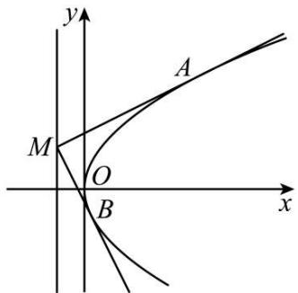
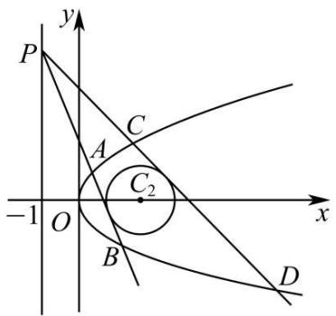
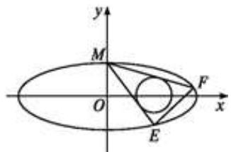
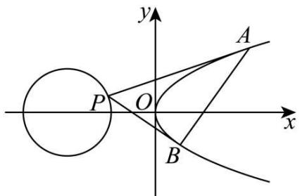
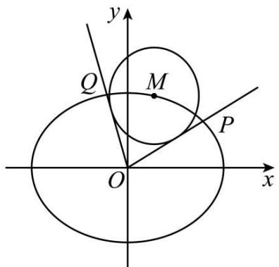
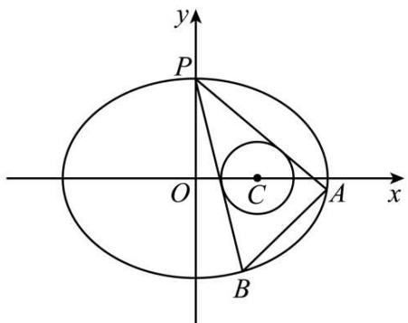
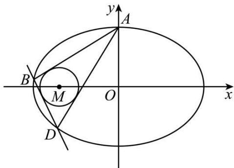
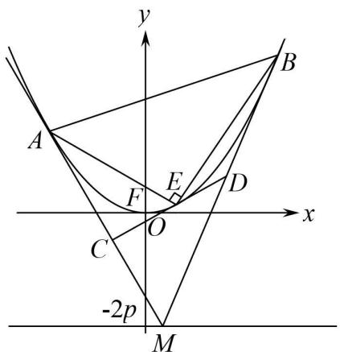
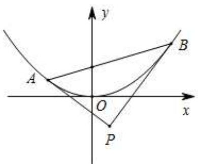
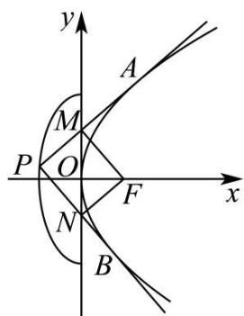

# 第 76 讲 双切线问题

# 知识梳理

双切线问题,就是过一点做圆锥曲线的两条切线的问题,解决这一类问题我们通常用同构法.解题思路:

①根据曲线外一点 $\mathbf{P}(x_0, y_0)$ 设出切线方程 $y - y_0 = k(x - x_0)$ .  
②和曲线方程联立,求出判别式 $\Delta=0$ .  
③整理出关于双切线斜率 $k_{1}$ 、 $k_{2}$ 的同构方程.  
④写出关于 $k_{1}$ 、 $k_{2}$ 的韦达定理，并解题.

# 必考题型全归纳

# 1 题型一:定值问题

4264 (2024·河南·高三竞赛)已知抛物线 C: $x^{2}=2y$ 与直线 l: y=kx-1 没有公共点，P 为直线 l 上的动点，过 P 作抛物线 C 的两条切线，A、B 为切点.

(1) 证明: 直线 AB 恒过定点 Q;  
(2) 若点 P 与 Q 的连线与抛物线 C 交于 M、N 两点，证明： $|PM||QN|=|PN||QM|$ .

4265 (2024·高二单元测试)已知抛物线 C: $y^{2}=2px(p>0)$ 的焦点 F 与椭圆 $\frac{x^{2}}{4}+\frac{y^{2}}{3}=1$ 的右焦点重合, 点 M 是抛物线 C 的准线上任意一点, 直线 MA, MB 分别与抛物线 C 相切于点 A, B.

text_image

y
A
M
O
B
x

(1) 求抛物线 C 的标准方程及其准线方程;  
(2) 设直线 MA, MB 的斜率分别为 $k_{1}, k_{2}$ , 证明: $k_{1} \cdot k_{2}$ 为定值.

4266 (2024·贵州贵阳·校联考模拟预测)已知坐标原点为O,抛物线为G: $x^{2}=2py(p>0)$ 与双曲线 $\frac{y^{2}}{3}-\frac{x^{2}}{3}=1$ 在第一象限的交点为P,F为双曲线的上焦点,且 $\triangle OPF$ 的面积为3.

(1) 求抛物线 G 的方程;  
(2) 已知点 M(-2, -1)，过点 M 作抛物线 G 的两条切线，切点分别为 A, B，切线 MA，MB 分别交 x 轴于 C, D，求 $\triangle MAB$ 与 $\triangle MCD$ 的面积之比.

4267 (2024·安徽合肥·高三合肥一中校联考开学考试)已知抛物线 $E: x^{2} = 2py$ (p 为常数, p > 0). 点 $M(x_{0}, y_{0})$ 是抛物线 E 上不同于原点的任意一点.

(1) 若直线 $l: y = \frac{x_0}{2} x - y_0$ 与 E 只有一个公共点, 求 $p$ ;  
(2) 设 P 为 E 的准线上一点, 过 P 作 E 的两条切线, 切点为 A, B, 且直线 PA, PB 与 x 轴分别交于 C, D 两点.

①证明: PA ⊥ PB   
②试问 $\frac{|PC|\cdot|AB|}{|PB|\cdot|CD|}$ 是否为定值？若是，求出该定值；若不是，请说明理由.

4268 (2024·河南信阳·信阳高中校考三模)已知抛物线 $C_{1}:y^{2}=2px(p>0)$ 上一点 Q(1,a) 到焦点的距离为 3.

text_image

y
P
C
A
C₂
-1 O x
B
D

(1) 求 $a, p$ 的值；  
(2) 设 P 为直线 x = -1 上除 $(-1, -\sqrt{3})$ , $(-1, \sqrt{3})$ 两点外的任意一点, 过 P 作圆 $C_{2}$ :

$(x-2)^{2}+y^{2}=3$ 的两条切线, 分别与曲线 $C_{1}$ 相交于点 A, B 和 C, D, 试判断 A, B, C, D 四点纵坐标之积是否为定值? 若是, 求该定值; 若不是, 请说明理由.

# 题型二:斜率问题

4269 (2024·全国·高三专题练习)已知椭圆 C: $\frac{x^{2}}{a^{2}} + \frac{y^{2}}{b^{2}} = 1 (a > b > 0)$ 的离心率为 $\frac{\sqrt{15}}{4}$ , F₁, F₂ 是椭圆的两个焦点, P 是椭圆上任意一点, 且 $\Delta PF_{1}F_{2}$ 的周长是 $8 + 2\sqrt{15}$ .

text_image

y
M
O
x
F
E

(1) 求椭圆 C 的方程;  
(2) 设圆 $\mathrm{T}:(x - 2)^2 +y^2 = \frac{4}{9}$ , 过椭圆的上顶点 M 作圆 T 的两条切线交椭圆于 E, F 两点, 求直线 EF 的斜率.

4270 (2024·全国·高三专题练习)设点 P 为抛物线 $\Gamma: y^{2} = x$ 外一点, 过点 P 作抛物线 $\Gamma$ 的两条切线 PA, PB, 切点分别为 A, B.

text_image

y
A
P O x
B

(I) 若点 P 为 $(-1,0)$ ，求直线 AB 的方程；  
(II) 若点 P 为圆 $(x+2)^{2}+y^{2}=1$ 上的点，记两切线 PA，PB 的斜率分别为 $k_{1}, k_{2}$ ，求 $\left|\frac{1}{k_{1}}-\frac{1}{k_{2}}\right|$ 的取值范围.

4271 (2024·全国·高三专题练习)已知椭圆 C: $\frac{x^{2}}{a^{2}} + \frac{y^{2}}{b^{2}} = 1 (a > b > 0)$ 的离心率为 $\frac{\sqrt{15}}{4}$ ， $F_{1}$ ， $F_{2}$ 是椭圆的两个焦点，P 是椭圆上任意一点，且 $\triangle PF_{1}F_{2}$ 的周长是 $8 + 2\sqrt{15}$ .

(1) 求椭圆 C 的方程;  
(2) 是否存在斜率为1的直线L与椭圆C交于A, B两点, 使得以AB为直径圆过原点, 若存在写出直线方程;  
(3) 设圆 $\mathrm{T}:(x - t)^2 +y^2 = \frac{4}{9}$ , 过椭圆的上顶点作圆 $\mathrm{T}$ 的两条切线交椭圆于 $\mathrm{E},\mathrm{F}$ 两点, 当圆心在 $x$ 轴上移动且 $t\in (1,3)$ 时, 求 $\mathrm{EF}$ 的斜率的取值范围.

4272 (2024·河南洛阳·高三新安县第一高级中学校考阶段练习)已知圆 $\mathrm{M}:(x-a)^{2}+(y-b)^{2}=9$ ，圆心 M 在抛物线 $\mathrm{C}:x^{2}=2py(p>0)$ 上，圆 M 过原点 O 且与 C 的准线相切.

(1) 求抛物线 C 的方程;  
(2) 点 Q(0, -1)，点 P(与 Q 不重合) 在直线 l: y = -1 上运动，过点 P 作抛物线 C 的两条切线，切点分别为 A, B．求证： $\angle AQO = \angle BQO$ .

4273 (2024·陕西咸阳·统考模拟预测)已知 $\mathrm{P}(4,y_{0})(y_{0}>0)$ 是抛物线 $\mathrm{C}:y^{2}=2px(p>0)$ 上一点，过 P 作圆 $\mathrm{D}:(x-4)^{2}+y^{2}=r^{2}(0<r<4)$ 的两条切线 (切点为 A,B)，交抛物线 C 分别点 M,N，且当 r=1 时， $|PA|=\sqrt{15}$ .

(1) 求抛物线 C 的方程;  
(2) 判断直线 MN 的斜率是否为定值？若为定值，求出这个定值；若不是定值，说明理由.

4274 (2024·湖南岳阳·统考模拟预测)已知 $F_{1}$ 、 $F_{2}$ 分别为椭圆 $\Gamma:\frac{x^{2}}{4}+y^{2}=1$ 的左、右焦点，M 为 $\Gamma$ 上的一点.

text_image

y
Q
M
P
O
x

(1) 若点 M 的坐标为 $(1, m)$ (m > 0)，求 $\Delta F_{1}MF_{2}$ 的面积；  
(2) 若点 M 的坐标为 $(0,1)$ ，且直线 $y=kx-\frac{3}{5}(k\in\mathbb{R})$ 与 $\Gamma$ 交于不同的两点 A、B，求证： $\overrightarrow{MA}\cdot\overrightarrow{MB}$ 为定值，并求出该定值；  
(3)如图,设点M的坐标为 $(s,t)$ ,过坐标原点O作圆 $M:(x-s)^{2}+(y-t)^{2}=r^{2}$ (其中r为定值,0<r<1且 $|s|\neq r$ )的两条切线,分别交 $\Gamma$ 于点P,Q,直线OP,OQ的斜率分别记为 $k_{1},k_{2}$ .如果 $k_{1}k_{2}$ 为定值,求 $|OP|\cdot|OQ|$ 的取值范围,以及 $|OP|\cdot|OQ|$ 取得最大值时圆M的方程.

# 3 题型三:交点弦过定点问题

4275 (2024·陕西宝鸡·校考模拟预测)已知椭圆 C 的中心在原点,焦点在 x 轴上,以两个焦点和短轴的两个端点为顶点的四边形是一个面积为 2 的正方形(记为 Q).

(1) 求椭圆 C 的方程;

(2) 设点 P 在直线 $x = a^{2}$ 上, 过点 P 作以原点为圆心短半轴长为半径圆 O 的两条切线, 切点为 M, N, 求证: 直线 MN 恒过定点.

4276 (2024·河北唐山·开滦第二中学校考模拟预测)已知抛物线 C: $y^{2}=2px(p>0)$ 的焦点为 F, P(4,4) 是 C 上的一点.

(1) 若直线 PF 交 C 于另外一点 A, 求 $|AP|$ ;

(2) 若圆 E: $(x-2)^{2}+y^{2}=r^{2}(0<r<2)$ ，过 P 作圆 E 的两条切线，分别交 C 于 M, N 两点，证明：直线 MN 过定点.

4277 (2024·陕西西安·西安市大明宫中学校考模拟预测)已知动圆 M 恒过定点 $F\left(0, \frac{1}{8}\right)$ ，圆心 M 到直线 $y = -\frac{1}{4}$ 的距离为 $d, d = |MF| + \frac{1}{8}$ .

(1) 求 M 点的轨迹 C 的方程;

(2) 过直线 $y = x - 1$ 上的动点 Q 作 C 的两条切线 $l_{1}, l_{2}$ ，切点分别为 A, B，证明：直线 AB 恒过定点.

4278 (2024·宁夏石嘴山·石嘴山市第三中学校考三模)已知抛物线 C: $x^{2}=2py(p>0)$ ，过抛物线的焦点 F 且斜率为 $\frac{3}{4}$ 的直线 l 与抛物线相交于不同的两点 A, B, $|AB|=\frac{25}{8}$ .

(1) 求抛物线 C 的方程;

(2) 点 M 在抛物线的准线上运动, 过点 M 作抛物线 C 的两条切线, 切点分别为 P, Q, 在平面内是否存在定点 N, 使得直线 MN 与直线 PQ 垂直? 若存在, 求出点 N 的坐标; 若不存在, 请说明理由.

4279 (2024·河南·校联考模拟预测)已知椭圆 C: $\frac{x^{2}}{a^{2}} + \frac{y^{2}}{b^{2}} = 1 (a > b > 0)$ 的焦距为 2，圆 $x^{2} + y^{2} = 4$ 与椭圆 C 恰有两个公共点.

(1) 求椭圆 C 的标准方程;

(2) 已知结论: 若点 $(x_{0}, y_{0})$ 为椭圆 $\frac{x^{2}}{a^{2}} + \frac{y^{2}}{b^{2}} = 1$ 上一点, 则椭圆在该点处的切线方程为 $\frac{x_{0}x}{a^{2}} + \frac{y_{0}y}{b^{2}} = 1$ . 若椭圆 C 的短轴长小于 4, 过点 T(8, t) 作椭圆 C 的两条切线, 切点分别为 A, B, 求证: 直线 AB 过定点.

4280 (2024·重庆九龙坡·高三重庆市育才中学校考开学考试)如图所示,已知P(0,1)在椭圆 $\Gamma:\frac{x^{2}}{4}+\frac{y^{2}}{b^{2}}=1(0<b<2)$ 上,圆C: $(x-1)^{2}+y^{2}=r^{2}(r>0)$ ,圆C在椭圆Γ内部.

text_image

y
P
O
C
A
x
B

(1) 求 r 的取值范围；

(2) 过 P(0,1) 作圆 C 的两条切线分别交椭圆 $\Gamma$ 于 A,B 点 (A,B 不同于 P), 直线 AB 是否过定点? 若 AB 过定点, 求该定点坐标; 若 AB 不过定点, 请说明理由.

4281 (2024·内蒙古呼和浩特·高三统考开学考试)已知点 O 为平面直角坐标系的坐标原点，点 F 是抛物线 C: $y^{2}=4x$ 的焦点.

(1) 过点 F 且倾斜角为 $\frac{\pi}{4}$ 的直线 l 与抛物线 C 交于 A, B 两点, 求 $\triangle AOB$ 的面积;  
(2) 若点 T 为直线 x = -2 上的动点, 过点 T 作抛物线 C 的两条切线, 切点分别为 M, N, 求证: 直线 MN 过定点.

4282 (2024·重庆沙坪坝·高三重庆一中校考阶段练习)已知 $x^{2}=2py(p>0)$ 的焦点为 F，且经过 F 的直线被圆 $(x-1)^{2}+\left(y+\frac{3}{2}\right)^{2}=9$ 截得的线段长度的最小值为 4.

(1) 求抛物线的方程;   
(2) 设坐标原点为 O, 若过点 (2,0) 作直线 l 与抛物线相交于不同的两点 P, Q, 过点 P, Q 作抛物线的切线分别与直线 OQ, OP 相交于点 M, N, 请问直线 MN 是否经过定点? 若是, 请求出此定点坐标, 若不是, 请说明理由.

4283 (2024·辽宁沈阳·沈阳二中校考模拟预测)如下图所示,已知椭圆 C: $\frac{x^{2}}{a^{2}} + \frac{y^{2}}{b^{2}} = 1 (a > b > 0)$ 的上顶点为 A, 离心率为 $\frac{\sqrt{2}}{2}$ , 且椭圆 C 经过点 $\left(1, \frac{\sqrt{2}}{2}\right)$ .

text_image

y
A
B
M
O
x
D

(1) 求椭圆 C 的方程;  
(2) 若过点 A 作圆 M: $(x+1)^{2}+y^{2}=r^{2}$ (圆 M 在椭圆 C 内) 的两条切线分别与椭圆 C 相交于 B、D 两点 (B、D 异于点 A)，当 r 变化时，试问直线 BD 是否过某个定点？若是，求出该定点；若不是，请说明理由.

# 4 题型四:交点弦定值问题

4284 (2024·全国·高三专题练习)已知抛物线C的顶点为原点,其焦点F(0,c)(c>0)到直线l: x-y-2=0的距离为 $\frac{3\sqrt{2}}{2}$ .

(1) 求抛物线 C 的方程;  
(2) 设点 $P(x_{0}, y_{0})$ 为直线 l 上一动点, 过点 P 作抛物线 C 的两条切线 PA, PB, 其中 A, B 为切点, 求直线 AB 的方程, 并证明直线 AB 过定点 Q;  
(3) 过 (2) 中的点 Q 的直线 m 交抛物线 C 于 A, B 两点, 过点 A, B 分别作抛物线 C 的切线 $l_{1}, l_{2}$ , 求 $l_{1}, l_{2}$ 交点 M 满足的轨迹方程.

4285 (2024·全国·高三专题练习)如图, 设抛物线方程为 $x^{2}=2py\ (p>0)$ , M 为直线 y=-2p 上任意一点, 过 M 引抛物线的切线, 切点分别为 A, B.

text_image

y
A
B
F
E
D
x
O
C
-2p
M

(1) 求直线 AB 与 y 轴的交点坐标;  
(2) 若 E 为抛物线弧 AB 上的动点, 抛物线在 E 点处的切线与三角形 MAB 的边 MA, MB 分别交于点 C, D, 记 $\lambda = \frac{S_{\Delta EAB}}{S_{\Delta MCD}}$ , 问 $\lambda$ 是否为定值? 若是求出该定值; 若不是请说明理由.

4286 (2024·全国·高三专题练习)已知抛物线 C: $y^{2}=2px(p>0)$ ，F 为焦点，若圆 E: $(x-1)^{2}+y^{2}=16$ 与抛物线 C 交于 A, B 两点，且 $|AB|=4\sqrt{3}$

(1) 求抛物线 C 的方程;  
(2) 若点 P 为圆 E 上任意一点, 且过点 P 可以作抛物线 C 的两条切线 PM, PN, 切点分别为 M, N. 求证: $|MF| \cdot |NF|$ 恒为定值.

4287 (2024·山东青岛·统考二模)已知 O 为坐标原点, 双曲线 C: $\frac{x^2}{a^2} - \frac{y^2}{b^2} = 1 (a > 0, b > 0)$ 的左, 右焦点分别为 F $_1$ , F $_2$ , 离心率等于 $\frac{\sqrt{6}}{2}$ , 点 P 是双曲线 C 在第一象限上的点, 直线 PF $_1$ 与 y 轴的交点为 Q, $\triangle$ PQF $_2$ 的周长等于 6a, |PF $_1$ | $^2$ - |PF $_2$ | $^2$ = 24.

(1) 求 C 的方程;  
(2) 过圆 $O: x^{2} + y^{2} = 1$ 上一点 W(W 不在坐标轴上) 作 C 的两条切线, 对应的切点为 A, B. 证明: 直线 AB 与椭圆 D: $\frac{x^{2}}{4} + y^{2} = 1$ 相切于点 T, 且 $|WT| \cdot |AB| = |WA| \cdot |WB|$ .

# 5 题型五:交点弦最值问题

4288 (2024·江西抚州·临川一中校考模拟预测)椭圆 E: $\frac{x^{2}}{a^{2}} + \frac{y^{2}}{b^{2}} = 1 (a > b > 0)$ 的离心率为 $\frac{\sqrt{3}}{2}$ ，焦距为 $2\sqrt{3}$ .

(1) 求椭圆 E 的标准方程;  
(2) 设 $G(m,n)$ 是椭圆 E 上的动点, 过原点 O 作圆 $G: (x-m)^{2} + (y-n)^{2} = \frac{4}{5}$ 的两条斜率存在的切线分别与椭圆 E 交丁点 A, B, 求 $|OA| + |OB|$ 的最大值.

4289 (2024·全国·高三专题练习)已知抛物线 C 的方程为 $x^{2}=4y$ ，F 为其焦点，过不在抛物线上的一点 P 作此抛物线的切线 PA, PB, A, B 为切点。且 PA ⊥ PB.

text_image

y
A
O
x
P
B

(I) 求证: 直线 AB 过定点;

(Ⅱ) 直线 PF 与曲线 C 的一个交点为 R，求 $\overrightarrow{AR} \cdot \overrightarrow{AB}$ 的最小值.

4290 (2024·河南·襄城高中校联考三模)已知抛物线 C 的顶点在坐标原点,焦点在 y 轴的正半轴上,圆 $x^{2}+(y-1)^{2}=1$ 经过抛物线 C 的焦点.

(1) 求 C 的方程:

(2) 若直线 $l:mx + y - 4 = 0$ 与抛物线 C 相交于 A, B 两点, 过 A, B 两点分别作抛物线 C 的切线, 两条切线相交于点 P, 求 $\triangle ABP$ 面积的最小值.

4291 (2024·浙江杭州·高三浙江省杭州第二中学校联考阶段练习)已知椭圆 C: $\frac{x^{2}}{16} + \frac{y^{2}}{4} = 1$ , P( $x_{0}, y_{0}$ ) 是椭圆外一点, 过 P 作椭圆 C 的两条切线, 切点分别为 M, N, 直线 MN 与直线 OP 交于点 Q, A, B 是直线 OP 与椭圆 C 的两个交点.

(1) 求直线 OP 与直线 MN 的斜率之积:

(2) 求 $\triangle AMN$ 面积的最大值

4292 (2024·新疆喀什·统考模拟预测)已知抛物线 C: $x^{2}=2py(p>0)$ 的焦点为 F, 且 F 与圆 M: $x^{2}+(y+3)^{2}=1$ 上点的距离的最小值为 3.

(1) 求 p:

(2) 若点 P 在圆 M 上, PA, PB 是抛物线 C 的两条切线, A, B 是切点, 求三角形 PAB 面积的最值.

# 6 题型六:交点弦范围问题

4293 (2024·全国·高三专题练习)如图,设抛物线 C: $y^{2}=4x$ 的焦点为 F,点 P 是半椭圆 $x^{2}+\frac{y^{2}}{4}=1(x<0)$ 上的一点,过点 P 作抛物线 C 的两条切线,切点分别为 A、B,且直线 PA、PB 分别交 y 轴于点 M、N.

text_image

y
A
M
P
O
F
x
N
B

(1) 证明: FM | PA:

(2) 求 $\left|FM\right|\cdot\left|FN\right|$ 的取值范围.

4294 (2024·全国·高三专题练习)已知椭圆 C: $\frac{x^{2}}{a^{2}} + \frac{y^{2}}{b^{2}} = 1 (a > b > 0)$ 的左焦点 $F_{1}(-\sqrt{3}, 0)$ ，点 $Q\left(1, \frac{\sqrt{3}}{2}\right)$ 在椭圆 C 上.

(1) 求椭圆 C 的标准方程;  
(2) 经过圆 O: $x^{2} + y^{2} = 5$ 上一动点 P 作椭圆 C 的两条切线, 切点分别记为 A, B, 直线 PA, PB 分别与圆 O 相交于异于点 P 的 M, N 两点.  
(i) 当直线 PA, PB 的斜率都存在时, 记直线 PA, PB 的斜率分别为 $k_{1}, k_{2}$ . 求证: $k_{1}k_{2} = -1$ ;  
(ii) 求 $\frac{|AB|}{|MN|}$ 的取值范围.

4295 (2024·山东·校联考模拟预测)已知圆 $O: x^{2} + y^{2} = 4$ , O 为坐标原点, 点 K 在圆 O 上运动, L 为过点 K 的圆的切线, 以 L 为准线的抛物线恒过点 $F_{1}(-\sqrt{3}, 0)$ , $F_{2}(\sqrt{3}, 0)$ , 抛物线的焦点为 S, 记焦点 S 的轨迹为 S.

(1) 求 S 的方程;  
(2) 过动点 P 的两条直线 $l_{1}, l_{2}$ 均与曲线 S 相切，切点分别为 A, B，且 $l_{1}, l_{2}$ 的斜率之积为 -1，求四边形 PAOB 面积的取值范围.

4296 (2024·云南曲靖·统考模拟预测)已知椭圆 C: $\frac{x^2}{a^2} + \frac{y^2}{b^2} = 1 (a > b > 0)$ 的离心率为 $\frac{\sqrt{5}}{5}$ , 以椭圆的顶点为顶点的四边形面积为 $4\sqrt{5}$ .

(1) 求椭圆 C 的标准方程;  
(2) 我们称圆心在椭圆 C 上运动且半径为 $\frac{\sqrt{a^{2}+b^{2}}}{3}$ 的圆是椭圆 C 的“环绕圆”. 过原点 O 作椭圆 C 的“环绕圆”的两条切线, 分别交椭圆 C 于 A, B 两点, 若直线 OA, OB 的斜率存在, 并记为 $k_{1}, k_{2}$ , 求 $k_{1}k_{2}$ 的取值范围.

