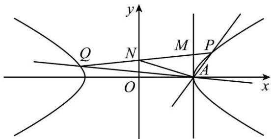
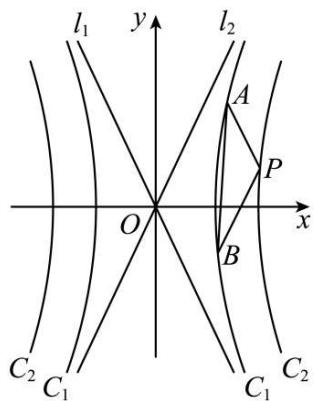
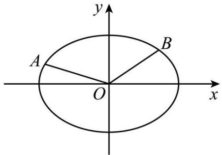
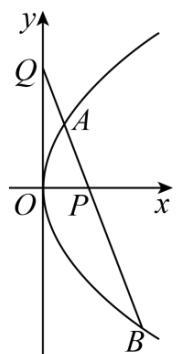
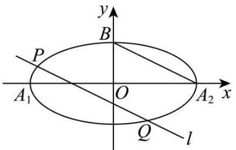
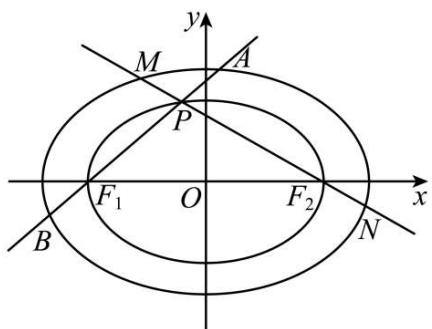
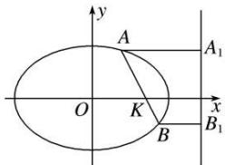
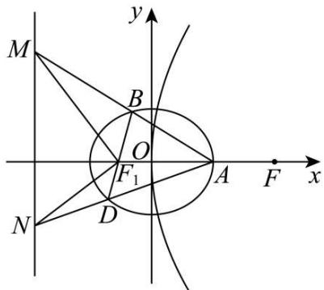
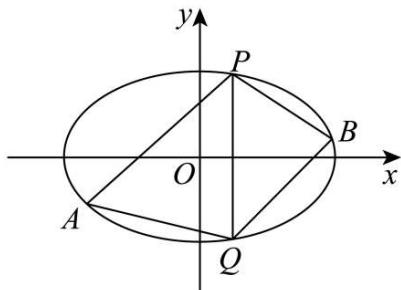

# 第77讲 定点、定值问题

# 知识梳理

# 1、定值问题

解析几何中定值问题的证明可运用函数的思想方法来解决．证明过程可总结为“变量－函数－定值”，具体操作程序如下：

(1) 变量 - - - - 选择适当的量为变量.  
(2) 函数 - - - - 把要证明为定值的量表示成变量的函数.  
(3) 定值 - - - - 化简得到的函数解析式, 消去变量得到定值.

# 2、求定值问题常见的方法有两种：

(1) 从特殊情况入手, 求出定值, 再证明该定值与变量无关;  
(2) 直接推理、计算，并在计算推理过程中消去变量，从而得到定值.

常用消参方法：

①等式带用消参:找到两个参数之间的等式关系 $F(k,m)=0$ ，用一个参数表示另外一个参数 $k=f(m)$ ，即可带用其他式子，消去参数 k.  
②分式相除消参:两个含参数的式子相除,消掉分子和分母所含参数,从而得到定值.  
③因式相减消参:两个含参数的因式相减,把两个因式所含参数消掉.   
④参数无关消参: 当与参数相关的因式为0时, 此时与参数的取值没什么关系, 比如:

$y-2+\mathrm{kg}(x)=0$ , 只要因式 $g(x)=0$ , 就和参数 k 没什么关系了, 或者说参数 k 不起作用.

# 3、求解直线过定点问题常用方法如下：

(1)“特殊探路,一般证明”:即先通过特殊情况确定定点,再转化为有方向、有目的的一般性证明;  
(2)“一般推理,特殊求解”:即设出定点坐标,根据题设条件选择参数,建立一个直线系或曲线的方程,再根据参数的任意性得到一个关于定点坐标的方程组,以这个方程组的解为坐标的点即为所求点;  
(3) 求证直线过定点 $(x_0, y_0)$ , 常利用直线的点斜式方程 $y - y_0 = k(x - x_0)$ 或截距式 $y = kx + b$ 来证明.

一般解题步骤：

①斜截式设直线方程： $y=kx+m$ ，此时引入了两个参数，需要消掉一个.  
②找关系:找到 k 和 m 的关系: $m=f(k)$ , 等式带入消参, 消掉 m.  
③参数无关找定点:找到和k没有关系的点.

# 必考题型全归纳

# 1 题型一: 面积定值

4297 (2024·安徽安庆·安庆一中校考三模)已知椭圆 C: $\frac{x^{2}}{a^{2}} + \frac{y^{2}}{b^{2}} = 1 (a > b > 0)$ 过点 A(-a,0), B(0,-b) 两点，椭圆的离心率为 $\frac{\sqrt{3}}{2}$ ，O 为坐标原点，且 S $_{\triangle OAB}$ = 1.

(1) 求椭圆 C 的方程;
(2) 设 P 为椭圆 C 上第一象限内任意一点, 直线 PA 与 y 轴交于点 M, 直线 PB 与 x 轴交于点 N, 求证: 四边形 ABNM 的面积为定值.

4298 (2024·陕西汉中·高三统考阶段练习)已知双曲线 C: $\frac{x^{2}}{a^{2}} - \frac{y^{2}}{b^{2}} = 1 (a > 0, b > 0)$ 的焦距为 $2\sqrt{6}$ ，且焦点到近线的距离为 1.

(1) 求双曲线 C 的标准方程;
(2) 若动直线 l 与双曲线 C 恰有 1 个公共点, 且与双曲线 C 的两条渐近线分别交于 P, Q 两点, O 为坐标原点, 证明: $\triangle OPQ$ 的面积为定值.

4299 (2024·广东广州·高三广州市真光中学校考阶段练习)已知双曲线 C: $\frac{x^{2}}{a^{2}} - \frac{y^{2}}{b^{2}} = 1 (a > 0, b > 0)$ ，渐近线方程为 $y \pm \frac{x}{2} = 0$ ，点 A(2,0) 在 C 上；

text_image

y
Q N M P
O A x

(1) 求双曲线 C 的方程；
(2) 过点 A 的两条直线 AP, AQ 分别与双曲线 C 交于 P, Q 两点 (不与 A 点重合), 且两条直线的斜率 $k_{1}, k_{2}$ 满足 $k_{1} + k_{2} = 1$ , 直线 PQ 与直线 x = 2, y 轴分别交于 M, N 两点, 求证: $\triangle AMN$ 的面积为定值.

4300 (2024·四川·成都市锦江区嘉祥外国语高级中学校考三模)设椭圆 E: $\frac{x^{2}}{a^{2}} + \frac{y^{2}}{b^{2}} = 1 (a > b > 0)$ 过点 M( $\sqrt{2}, 1$ ), 且左焦点为 F₁(- $\sqrt{2}, 0$ ).

(1) 求椭圆 E 的方程;
(2) $\triangle ABC$ 内接于椭圆 E, 过点 P(4,1) 和点 A 的直线 l 与椭圆 E 的另一个交点为点 D, 与 BC 交于点 Q, 满足 $\left|\overrightarrow{AP}\right|\left|\overrightarrow{QD}\right|=\left|\overrightarrow{AQ}\right|\left|\overrightarrow{PD}\right|$ , 证明: $\triangle PBC$ 面积为定值, 并求出该定值.

4301 (2024·全国·高二专题练习)已知 $l_{1}$ ， $l_{2}$ 既是双曲线 $C_{1}: x^{2}-\frac{y^{2}}{4}=1$ 的两条渐近线，也是双曲线 $C_{2}: \frac{x^{2}}{a^{2}}-\frac{y^{2}}{b^{2}}=1$ 的渐近线，且双曲线 $C_{2}$ 的焦距是双曲线 $C_{1}$ 的焦距的 $\sqrt{3}$ 倍.

text_image

l₁
y
l₂
A
P
O
x
B
C₂ C₁ C₁ C₂

(1) 任作一条平行于 $l_{1}$ 的直线 $l$ 依次与直线 $l_{2}$ 以及双曲线 $\mathrm{C}_{1}, \mathrm{C}_{2}$ 交于点 $\mathrm{L}, \mathrm{M}, \mathrm{N}$ , 求 $\frac{\mathrm{MN}}{\mathrm{NL}}$ 的值;

(2)如图, P 为双曲线 $\mathrm{C}_{2}$ 上任意一点, 过点 P 分别作 $l_{1}, l_{2}$ 的平行线交 $\mathrm{C}_{1}$ 于 A, B 两点, 证明: $\triangle \mathrm{PAB}$ 的面积为定值, 并求出该定值.

4302 (2024·四川成都·高二树德中学校考阶段练习)已知椭圆 C: $\frac{x^{2}}{4} + y^{2} = 1$ , A, B 是椭圆上的两个不同的点, O 为坐标原点, A, O, B 三点不共线, 记 $\triangle AOB$ 的面积为 S $_{\triangle AOB}$ .

text_image

y
A
B
O
x

(1) 若 $\overrightarrow{\mathrm{OA}} = (x_1, y_1), \overrightarrow{\mathrm{OB}} = (x_2, y_2)$ ，求证： $\mathrm{S}_{\triangle \mathrm{AOB}} = \frac{1}{2} |x_1y_2 - x_2y_1|$ ;

(2) 记直线 OA, OB 的斜率为 $k_{1}, k_{2}$ ，当 $k_{1}k_{2} = -\frac{1}{4}$ 时，试探究 $S_{\triangle AOB}^{2}$ 是否为定值并说明理由.

# 2 题型二:向量数量积定值

4303 (2024·新疆昌吉·高二统考期中)已知椭圆 C: $\frac{x^{2}}{a^{2}} + \frac{y^{2}}{b^{2}} = 1 (a > b > 0)$ , F₁, F₂ 是 C 的左、右焦点, 过 F₁ 的动直线 l 与 C 交于不同的两点 A, B 两点, 且 $\triangle ABF_{2}$ 的周长为 $4\sqrt{2}$ , 椭圆 C 的其中一个焦点在抛物线 $y^{2} = 4x$ 准线上,

(1) 求椭圆 C 的方程;

(2) 已知点 $M\left(-\frac{5}{4},0\right)$ ，证明: $\overrightarrow{MA} \cdot \overrightarrow{MB}$ 为定值.

4304 (2024·江西萍乡·高二萍乡市安源中学校考期末)已知M(4,m)是抛物线C: $y^{2}=2px(p>0)$ 上一点,且M到C的焦点的距离为5.

text_image

y
Q
A
O
P
x
B

(1) 求抛物线 C 的方程及点 M 的坐标;

(2)如图所示,过点P(2,0)的直线l与C交于A,B两点,与y轴交于点Q,设 $\overrightarrow{QA}=\lambda\overrightarrow{PA}$ , $\overrightarrow{QB}=\mu\overrightarrow{PB}$ ,求证: $\lambda+\mu$ 是定值.

4305 (2024·四川南充·高二四川省南充高级中学校考开学考试)已知点P到A(-2,0)的距离是点P到B(1,0)的距离的2倍.

(1) 求点 P 的轨迹方程;

(2) 若点 P 与点 Q 关于点 B 对称, 过 B 的直线与点 Q 的轨迹 $\Gamma$ 交于 E, F 两点, 探索 $\overrightarrow{BE} \cdot \overrightarrow{BF}$ 是否为定值? 若是, 求出该定值; 若不是, 请说明理由.

4306 (2024·全国·高二校联考阶段练习)已知椭圆 $E: \frac{x^{2}}{a^{2}} + \frac{y^{2}}{b^{2}} = 1 (a > b > 0)$ 的右焦点为 $F(1,0)$ ，点 $P\left(-1, \frac{3}{2}\right)$ 在 E 上.

(1) 求椭圆 E 的标准方程;

(2) 过点 F 的直线 l 与椭圆 E 交于 A, B 两点, 点 Q 为椭圆 E 的左顶点, 直线 QA, QB 分别交 x = 4 于 M, N 两点, O 为坐标原点, 求证: $\overrightarrow{OM} \cdot \overrightarrow{ON}$ 为定值.

4307 (2024·上海宝山·高三上海交大附中校考期中)已知椭圆 C: $\frac{x^{2}}{a^{2}} + \frac{y^{2}}{b^{2}} = 1 (a > b > 0)$ 的离心率为 $\frac{\sqrt{2}}{2}$ ，椭圆的一个顶点与两个焦点构成的三角形面积为 2.

(1) 求椭圆 C 的方程;

(2) 已知直线 $y = k(x - 1) (k > 0)$ 与椭圆 C 交于 A, B 两点，且与 $x$ 轴， $y$ 轴交于 M, N 两点.

①若 $\overrightarrow{MB} = \overrightarrow{AN}$ ，求 k 的值；②若点 Q 的坐标为 $\left(\frac{7}{4}, 0\right)$ ，求证： $\overrightarrow{QA} \cdot \overrightarrow{QB}$ 为定值.

# 3 题型三:斜率和定值

4308 (2024·四川成都·高三成都七中校考开学考试)已知 $C_{1}:\frac{x^{2}}{a}+\frac{y^{2}}{4-a}=1(0<a<4)$ , $C_{2}:\frac{x^{2}}{b}+\frac{y^{2}}{4-b}=1(b>4)$ .

(1) 证明: $y = |x| - 2$ 总与 $C_1$ 和 $C_2$ 相切;

(2) 在 (1) 的条件下, 若 $y = |x| - 2$ 与 $\mathrm{C}_{1}$ 在 $y$ 轴右侧相切于 A 点, 与 $\mathrm{C}_{2}$ 在 $y$ 轴右侧相切于 B 点. 直线 $l$ 与 $\mathrm{C}_{1}$ 和 $\mathrm{C}_{2}$ 分别交于 P, Q, M, N 四点. 是否存在定直线 $l$ 使得对任意题干所给 $a, b$ , 总有 $k_{\mathrm{AP}} + k_{\mathrm{AQ}} + k_{\mathrm{BP}} + k_{\mathrm{BQ}}$ 为定值? 若存在, 求出 $l$ 的方程; 若不存在, 请说明理由.

4309 (2024·河南洛阳·高三伊川县第一高中校联考开学考试)已知抛物线 $C_{1}:y^{2}=2p_{1}x(p_{1}>0)$ 与抛物线 $C_{2}:x^{2}=2p_{2}y(p_{2}>0)$ 在第一象限交于点 P.

(1) 已知 F 为抛物线 $C_{1}$ 的焦点, 若 PF 的中点坐标为 $(1,1)$ , 求 $p_{1}$ ;

(2) 设 O 为坐标原点, 直线 OP 的斜率为 $k_{1}$ . 若斜率为 $k_{2}$ 的直线 $l$ 与抛物线 $\mathrm{C}_{1}$ 和 $\mathrm{C}_{2}$ 均相切, 证明 $k_{1} + k_{2}$ 为定值, 并求出该定值.

4310 (2024·河南许昌·高二统考期末)已知 $\Delta$ PAB 的两个顶点 A, B 的坐标分别是 $(0,3)$ , $(0,-3)$ , 且直线 PA, PB 的斜率之积是 -3, 设点 P 的轨迹为曲线 H.

(1) 求曲线 H 的方程;

(2) 经过点 (1,3) 且斜率为 $k$ 的直线与曲线 H 交于不同的两点 E, F (均异于 A, B), 证明: 直线 BE 与 BF 的斜率之和为定值.

4311 (2024·河南商丘·高二校考阶段练习)已知 $A_{1}$ , $A_{2}$ , B 是椭圆 $\frac{x^{2}}{a^{2}} + \frac{y^{2}}{b^{2}} = 1 (a > b > 0)$ 的顶点 (如图), 直线 l 与椭圆交于异于顶点的 P, Q 两点, 且 $l \parallel A_{2}B$ , 若椭圆的离心率是 $\frac{\sqrt{3}}{2}$ , 且 $|A_{2}B| = \sqrt{5}$ ,

text_image

y
B
P
A₁ O A₂ x
Q l

(1) 求此椭圆的方程;   
(2) 设直线 $A_{1}P$ 和直线 BQ 的斜率分别为 $k_{1}, k_{2}$ ，证明 $k_{1} + k_{2}$ 为定值.

4312 (2024·云南昆明·高二云南师范大学实验中学校考阶段练习)过点 M(1,0) 的直线为 l,N 为圆 C: $x^{2}+(y-2)^{2}=4$ 与 y 轴正半轴的交点.

(1) 若直线 l 与圆 C 相切, 求直线 l 的方程:  
(2) 证明: 若直线 l 与圆 C 交于 A, B 两点, 直线 AN, BN 的斜率之和为定值.

# 题型四:斜率积定值

4313 (2024·河南郑州·高三郑州外国语学校校考阶段练习)已知椭圆 C: $\frac{x^{2}}{a^{2}} + \frac{y^{2}}{b^{2}} = 1 (a > b > 0)$ 的离心率为 $\frac{\sqrt{2}}{2}$ ，以 C 的短轴为直径的圆与直线 y = ax + 6 相切.

(1) 求 C 的方程;  
(2) 直线 $l: y = k(x - 1) (k \geqslant 0)$ 与 C 相交于 A, B 两点，过 C 上的点 P 作 x 轴的平行线交线段 AB 于点 Q，且 PQ 平分 $\angle APB$ ，设直线 OP 的斜率为 $k'$ (O 为坐标原点)，判断 $k \cdot k'$ 是否为定值？并说明理由.

4314 (2024·内蒙古包头·高三统考开学考试)已知点 M(-3,0), N(3,0), 动点 P(x,y) 满足直线 PM 与 PN 的斜率之积为 $-\frac{1}{3}$ , 记点 P 的轨迹为曲线 C.

(1) 求曲线 C 的方程, 并说明 C 是什么曲线;  
(2) 过坐标原点的直线交曲线 C 于 A, B 两点, 点 A 在第一象限, AD ⊥ x 轴, 垂足为 D, 连接 BD 并延长交曲线 C 于点 H. 证明: 直线 AB 与 AH 的斜率之积为定值.

4315 (2024·江苏南通·高三统考开学考试)在直角坐标系 $xOy$ 中，点P到点F(√3,0)的距离与到直线 $l: x = \frac{4\sqrt{3}}{3}$ 的距离之比为 $\frac{\sqrt{3}}{2}$ ，记动点P的轨迹为W.

(1) 求 W 的方程;  
(2) 过 W 上两点 A, B 作斜率均为 $-\frac{1}{2}$ 的两条直线，与 W 的另两个交点分别为 C, D. 若直线 AB, CD 的斜率分别为 $k_{1}, k_{2}$ ，证明： $k_{1}k_{2}$ 为定值.

4316 (2024·全国·高二随堂练习)已知椭圆 C: $\frac{x^{2}}{a^{2}} + \frac{y^{2}}{b^{2}} = 1 (a > b > 0)$ 的离心率为 $\frac{\sqrt{2}}{2}$ ，点 $(2, \sqrt{2})$ 在 C 上，直线 l 不过原点 O 且不平行于坐标轴，l 与 C 有两个交点 A, B，线段 AB 的中点为 M. 证明：直线 OM 的斜率与直线 l 的斜率的乘积为定值.

# 题型五:斜率比定值

4317 (2024·福建厦门·高二厦门一中校考期中)已知双曲线 $\Gamma:\frac{x^{2}}{a^{2}}-\frac{y^{2}}{b^{2}}=1$ 实轴 AB 长为 4(A

在 B 的左侧), 双曲线 $\Gamma$ 上第一象限内的一点 P 到两渐近线的距离之积为 $\frac{4}{5}$ .

(1) 求双曲线 $\Gamma$ 的标准方程；
(2) 设过 T(4,0) 的直线与双曲线交于 C, D 两点，记直线 AC, BD 的斜率为 $k_{1}, k_{2}$ ，请从下列的结论中选择一个正确的结论，并予以证明.

① $k_{1}+k_{2}$ 为定值；  
② $k_{1}\cdot k_{2}$ 为定值；  
③ $\frac{k_1}{k_2}$ 为定值

4318 (2024·四川成都·高二校考期中)已知椭 C: $\frac{x^{2}}{a^{2}}+\frac{y^{2}}{b^{2}}=1(a>b>0)$ , $F_{1}, F_{2}$ 为其左右焦点, 离心率为 $\frac{\sqrt{3}}{2}$ , $F_{1}(-\sqrt{3},0)$

(1) 求椭圆 C 的标准方程;  
(2) 设点 $\mathrm{P}(x_{0}, y_{0})(x_{0}y_{0} \neq 0)$ ，点 P 在椭圆 C 上，过点 P 作椭圆 C 的切线 l，斜率为 $k_{0}$ ， $PF_{1}$ ， $PF_{2}$ 的斜率分别为 $k_{1}$ ， $k_{2}$ ，则 $\frac{k_{1} + k_{1}}{k_{0}k_{1}k_{2}}$ 是否是定值？若是，求出定值；若不是，请说明理由.

4319 (2024·湖北荆州·高三沙市中学校考阶段练习)已知双曲线 C: $\frac{x^{2}}{a^{2}} - \frac{y^{2}}{b^{2}} = 1, (a > 0, b > 0)$ 的实轴长为 4，左右两个顶点分别为 A₁, A₂，经过点 B(4,0) 的直线 l 交双曲线的右支于 M, N 两点，且 M 在 x 轴上方，当 $l \perp x$ 轴时，MN = $2\sqrt{6}$ .

(1) 求双曲线方程.   
(2) 求证: 直线 $MA_{1}, NA_{2}$ 的斜率之比为定值.

# 题型六: 线段定值

4320 (2024·浙江·高二校联考期中)已知圆 $C_{1}: x^{2} + y^{2} = m$ 与圆 $C_{2}: x^{2} + y^{2} - 4x = 0$ .

(1) 若圆 $C_{1}$ 与圆 $C_{2}$ 内切, 求实数 m 的值;  
(2) 设 A(3,0)，在 x 轴正半轴上是否存在异于 A 的点 B(b,0)，使得对于圆 $C_{2}$ 上任意一点 P， $\frac{|PA|}{|PB|}$ 为定值？若存在，求 b 的值；若不存在，请说明理由.

4321 (2024·重庆沙坪坝·高三重庆一中校考阶段练习)已知P为平面上的动点,记其轨迹为Γ.

(1) 请从以下三个条件中选择一个, 求对应的 $\Gamma$ 的方程; ①以点 P 为圆心的动圆经过点 F(-1,0), 且内切于圆 K: $(x - 1)^2 + y^2 = 16$ ; ②已知点 T(-1,0), 直线 $l: x = -4$ , 动点 P 到点 T 的距离与到直线 $l$ 的距离之比为 $\frac{1}{2}$ ; ③设 E 是圆 O: $x^2 + y^2 = 4$ 上的动点, 过 E 作直线 EG 垂直于 $x$ 轴, 垂足为 G, 且 $\overrightarrow{\mathrm{GP}} = \frac{\sqrt{3}}{2} \overrightarrow{\mathrm{GE}}$ .

(2) 在 (1) 的条件下, 设曲线 $\Gamma$ 的左、右两个顶点分别为 A, B, 若过点 K(1,0) 的直线 $m$ 的斜率存在且不为 0 , 设直线 $m$ 交曲线 $\Gamma$ 于点 M, N, 直线 $n$ 过点 T(-1,0) 且与 $x$ 轴垂直, 直线 AM 交直线 $n$ 于点 P, 直线 BN 交直线 $n$ 于点 Q, 则线段的比值 $\frac{|\mathrm{TP}|}{|\mathrm{TQ}|}$ 是否为定值? 若是, 求出该定值; 若不是, 请说明理由.

4322 (2024·江西九江·统考一模)如图,已知椭圆 $C_{1}:\frac{x^{2}}{a^{2}}+\frac{y^{2}}{b^{2}}=1(a>b>0)$ 的左右焦点分别为 $F_{1}, F_{2}$ , 点 A 为 $C_{1}$ 上的一个动点 (非左右顶点), 连接 $AF_{1}$ 并延长交 $C_{1}$ 于点 B, 且 $\triangle ABF_{2}$ 的周长为 8, $\triangle AF_{1}F_{2}$ 面积的最大值为 2.

text_image

y
M
A
P
F₁ O F₂ x
B N

(1) 求椭圆 $C_{1}$ 的标准方程；
(2) 若椭圆 $C_{2}$ 的长轴端点为 $F_{1}, F_{2}$ ，且 $C_{2}$ 与 $C_{1}$ 的离心率相等，P 为 AB 与 $C_{2}$ 异于 $F_{1}$ 的交点，直线 $PF_{2}$ 交 $C_{1}$ 于 M, N 两点，证明： $|AB| + |MN|$ 为定值.

4323 (2024·湖南·高三临澧县第一中学校联考开学考试)已知抛物线 $C_{1}:y^{2}=px(p>0)$ 的焦点为 $F_{1}$ ，抛物线 $C_{2}:y^{2}=2px$ 的焦点为 $F_{2}$ ，且 $|F_{1}F_{2}|=\frac{1}{2}$ .

(1) 求 p 的值；
(2) 若直线 l 与 $C_{1}$ 交于 M, N 两点，与 $C_{2}$ 交于 P, Q 两点，M, P 在第一象限，N, Q 在第四象限，且 $|MP| = 2|NQ|$ ，证明： $\frac{|MN|}{|PQ|}$ 为定值.

4324 (2024·安徽合肥·高三合肥一中校联考开学考试)已知抛物线 $E: x^{2} = 2py$ (p 为常数, p > 0). 点 $M(x_{0}, y_{0})$ 是抛物线 E 上不同于原点的任意一点.

(1) 若直线 $l: y = \frac{x_{0}}{2} x - y_{0}$ 与 E 只有一个公共点，求 p;
(2) 设 P 为 E 的准线上一点，过 P 作 E 的两条切线，切点为 A, B，且直线 PA, PB 与 x 轴分别交于 C, D 两点.
①证明：PA ⊥ PB
②试问 $\frac{|PC|\cdot|AB|}{|PB|\cdot|CD|}$ 是否为定值？若是，求出该定值；若不是，请说明理由.

4325 (2024·山东淄博·高二校联考阶段练习)已知圆 O: $x^{2} + y^{2} = r^{2}$ 与直线 $x - y + 3\sqrt{2} = 0$ 相切.

(1) 若直线 $l: y = -2x + 5$ 与圆 O 交于 M, N 两点，求 $|MN|$ ;
(2) 已知 C(-9,0), D(-1,0), 设 P 为圆 O 上任意一点, 证明: $\frac{PD}{PC}$ 为定值.

4326 (2024·福建厦门·厦门一中校考模拟预测)已知 A, B 分别是椭圆 C: $\frac{x^{2}}{a^{2}} + \frac{y^{2}}{b^{2}} = 1 (a > b > 0)$ 的右顶点和上顶点， $|AB| = \sqrt{5}$ ，直线 AB 的斜率为 $-\frac{1}{2}$ .

(1) 求椭圆的方程；
(2) 直线 $l \parallel AB$ ，与 x, y 轴分别交于点 M, N，与椭圆相交于点 C, D.
(i) 求 $\triangle OCM$ 的面积与 $\triangle ODN$ 的面积之比；
(ii) 证明： $|CM|^{2} + |MD|^{2}$ 为定值.

4327 (2024·四川巴中·高二四川省通江中学校考期中)已知圆C过点A(1,2)，B(2,1)，且圆心C在直线y=-x上.P是圆C外的点，过点P的直线l交圆C于M，N两点.

(1) 求圆 C 的方程；
(2) 若点 P 的坐标为 $(0, -3)$ ，求证：无论 l 的位置如何变化 $|PM| \cdot |PN|$ 恒为定值；
(3) 对于 (2) 中的定值，使 $|PM| \cdot |PN|$ 恒为该定值的点 P 是否唯一？若唯一，请给予证明；

若不唯一,写出满足条件的点P的集合.

4328 (2024·云南·校联考模拟预测)已知点 M 到定点 F(3,0) 的距离和它到直线 $l: x = \frac{25}{3}$ 的距离的比是常数 $\frac{3}{5}$ .

(1) 求点 M 的轨迹 C 的方程;  
(2) 若直线 $l: y = kx + m$ 与圆 $x^{2} + y^{2} = 16$ 相切, 切点 $\mathbf{N}$ 在第四象限, 直线 $l$ 与曲线 $\mathrm{C}$ 交于 $\mathrm{A}, \mathrm{B}$ 两点, 求证: $\triangle \mathrm{FAB}$ 的周长为定值.

# 7 题型七: 直线过定点

4329 (2024·全国·高三专题练习)已知 $F_{1}, F_{2}$ 分别为椭圆 C: $\frac{x^{2}}{a^{2}} + \frac{y^{2}}{b^{2}} = 1 (a > b > 0)$ 的左、右焦点，过点 $F_{1}(-1,0)$ 且与 x 轴不重合的直线与椭圆 C 交于 A, B 两点， $\triangle ABF_{2}$ 的周长为 8.

(1) 若 $\triangle ABF_{2}$ 的面积为 $\frac{12\sqrt{2}}{7}$ ，求直线 AB 的方程；  
(2) 过 A, B 两点分别作直线 x = -4 的垂线，垂足分别是 E, F，证明：直线 EB 与 AF 交于定点.

4330 (2024·江西南昌·高三校联考阶段练习)已知椭圆 C: $\frac{x^{2}}{a^{2}} + \frac{y^{2}}{b^{2}} = 1 (a > b > 0)$ 的离心率为 $\frac{\sqrt{3}}{2}$ ，左、右焦点分别为 $F_{1}, F_{2}$ ，点 P 为椭圆 C 上任意一点， $\triangle PF_{1}F_{2}$ 面积最大值为 $\sqrt{3}$ .

(1) 求椭圆 C 的方程;  
(2) 过 x 轴上一点 F(1,0) 的直线与椭圆交于 A,B 两点, 过 A,B 分别作直线 $l: x = a^{2}$ 的垂线, 垂足为 M, N 两点, 证明: 直线 AN, BM 交于一定点, 并求出该定点坐标.

4331 (2024·江西南昌·高二南昌市外国语学校校考期中)在平面直角坐标系中,椭圆 C: $\frac{x^{2}}{a^{2}} + \frac{y^{2}}{b^{2}} = 1 (a > b > 0)$ 过点 $\left(\frac{\sqrt{5}}{2}, \frac{\sqrt{3}}{2}\right)$ , 离心率为 $\frac{2\sqrt{5}}{5}$ .

text_image

y
A
O
K
B
x
A₁
B₁

(1) 求椭圆 C 的标准方程;  
(2) 过点 K(2, 0) 作与 x 轴不重合的直线与椭圆 C 交于 A, B 两点, 过 A, B 点作直线 l: x = $\frac{a^{2}}{c}$ 的垂线, 其中 c 为椭圆 C 的半焦距, 垂足分别为 A₁, B₁, 试问直线 AB₁ 与 A₁B 的交点是否为定点, 若是, 求出定点的坐标; 若不是, 请说明理由.

4332 (2024·甘肃天水·高二统考期末)已知椭圆 $E:\frac{x^{2}}{a^{2}}+\frac{y^{2}}{b^{2}}=1(a>b>0)$ 的左、右焦点分别为 $F_{1},F_{2}$ ，离心率 $e=\frac{\sqrt{2}}{2}$ ，点 $P\left(1,\frac{\sqrt{2}}{2}\right)$ 在 E 上.

(1) 求 E 的方程;  
(2) 过点 $F_{2}$ 作互相垂直且与 x 轴均不重合的两条直线分别交 E 于点 A, B 和 C, D, 若 M, N 分别是弦 AB, CD 的中点, 证明: 直线 MN 过定点.

4333 (2024·黑龙江鹤岗·高二鹤岗一中校考期中)在平面直角坐标系 $xOy$ 中，椭圆 $\mathrm{C}:\frac{x^2}{a^2}+$ $\frac{y^{2}}{b^{2}}=1(a>b>0)$ 的左，右顶点分别为 A、B，点 F 是椭圆的右焦点， $\overrightarrow{AF}=3\overrightarrow{FB},\overrightarrow{AF}\cdot\overrightarrow{FB}=3.$

(1) 求椭圆 C 的方程;  
(2) 不过点 A 的直线° l 交椭圆 C 于 M、N 两点，记直线° l、AM、AN 的斜率分别为 k、 $k_{1}$ 、 $k_{2}$ 。若 $k(k_{1}+k_{2})=1$ ，证明直线° l 过定点，并求出定点的坐标。

4334 (2024·全国·高三专题练习)已知 A、B 分别为椭圆 E: $\frac{x^{2}}{a^{2}} + \frac{y^{2}}{b^{2}} = 1 (a > b > 0)$ 的右顶点和上顶点、椭圆的离心率为 $\frac{2\sqrt{2}}{3}$ ， $F_{1}$ 、 $F_{2}$ 为椭圆的左、右焦点，点 P 是线段 AB 上任意一点，且 $\overrightarrow{PF_{1}} \cdot \overrightarrow{PF_{2}}$ 的最小值为 $-\frac{71}{10}$ .

(1) 求椭圆 E 的方程;  
(2) 若直线 l 是圆 C: $x^{2} + y^{2} = 9$ 上的点 $\left(\frac{3\sqrt{2}}{2}, \frac{3\sqrt{2}}{2}\right)$ 处的切线，点 M 是直线 l 上任一点，过点 M 作椭圆 C 的切线 MG, MH，切点分别为 G, H，设切线的斜率都存在。试问：直线 GH 是否过定点？若过定点，求出该定点的坐标；若不过定点，请说明理由。

4335 (2024·全国·高三专题练习)已知椭圆 C: $\frac{x^{2}}{a^{2}} + \frac{y^{2}}{b^{2}} = 1 (a > b > 0)$ 的右顶点是 M(2, 0)，离心率为 $\frac{1}{2}$ .

(1) 求椭圆 C 的标准方程.  
(2) 过点 T(4, 0) 作直线 l 与椭圆 C 交于不同的两点 A, B, 点 B 关于 x 轴的对称点为 D, 问直线 AD 是否过定点? 若是, 求出该定点的坐标: 若不是, 请说明理由.

# 8 题型八:动点在定直线上

4336 (2024·江苏南通·高二校考阶段练习)已知B(-1,0),C(1,0)为△ABC的两个顶点,P为△ABC的重心,边AC,AB上的两条中线长度之和为6.

(1) 求点 P 的轨迹 T 的方程.  
(2) 已知点 N(-3,0), E(-2,0), F(2,0), 直线 PN 与曲线 T 的另一个公共点为 Q, 直线 EP 与 FQ 交于点 M, 试问: 当点 P 变化时, 点 M 是否恒在一条定直线上? 若是, 请证明; 若不是, 请说明理由.

4337 (2024·上海·高二专题练习)已知双曲线 $\frac{x^{2}}{2}-y^{2}=1$ 的两焦点为 $F_{1}, F_{2}, P$ 为动点，若 $\left|PF_{1}\right| + \left|PF_{2}\right| = 4.$

(1) 求动点 P 的轨迹 E 方程:  
(2) 若 $A_{1}(-2,0)$ , $A_{2}(2,0)M(1,0)$ ，设直线 l 过点 M，且与轨迹 E 交于 R、Q 两点，直线 $A_{1}R$ 与 $A_{2}Q$ 交于 S 点。试问：当直线 l 在变化时，点 S 是否恒在一条定直线上？若是，请写出这条定直线方程，并证明你的结论：若不是，请说明理由。

4338 (2024·全国·高二专题练习)已知椭圆 C 的离心率 $e=\frac{\sqrt{3}}{2}$ ，长轴的左、右端点分别为 $A_{1}(-2,0)$ ， $A_{2}(2,0)$

(1) 求椭圆 C 的方程:  
(2) 设直线 $x = my + 1$ 与椭圆 C 交于 P, Q 两点, 直线 $A_{1}P$ 与 $A_{2}Q$ 交于点 S, 试问: 当 m 变化时, 点 S 是否恒在一条直线上? 若是, 请写出这条直线的方程, 并证明你的结论: 若不

是,请说明理由.

4339 (2024·全国·高三专题练习)已知曲线 $E:\frac{x^{2}}{6}+\frac{y^{2}}{3}=1$ ，直线 $l:y=x+m$ 与曲线 E 交于 y 轴右侧不同的两点 A,B.

(1) 求 m 的取值范围;  
(2) 已知点 P 的坐标为 $(2,1)$ ，试问： $\triangle APB$ 的内心是否恒在一条定直线上？若是，请求出该直线方程；若不是，请说明理由。

4340 (2024·浙江台州·高二校联考期中)已知直线 $l: x = my + 1$ 与圆 $\mathrm{C}: x^2 + y^2 - 4x = 0$ 交于A、B两点.

(1) 若 m=1 时, 求弦 AB 的长度;  
(2) 设圆 C 在点 A 处的切线为 $l_{1}$ ，在点 B 处的切线为 $l_{2}$ ， $l_{1}$ 与 $l_{2}$ 的交点为 Q。试探究：当 m 变化时，点 Q 是否恒在一条定直线上？若是，请求出这条直线的方程；若不是，说明理由。

4341 (2024·全国·高二专题练习)已知直线 l: x = my - 1，圆 C: $x^{2} + y^{2} + 4x = 0$ .

(1) 证明: 直线 l 与圆 C 相交;  
(2) 设直线 l 与 C 的两个交点分别为 A、B，弦 AB 的中点为 M，求点 M 的轨迹方程；  
(3) 在 (2) 的条件下, 设圆 C 在点 A 处的切线为 $l_{1}$ , 在点 B 处的切线为 $l_{2}, l_{1}$ 与 $l_{2}$ 的交点为 Q. 证明: Q, A, B, C 四点共圆, 并探究当 $m$ 变化时, 点 Q 是否恒在一条定直线上? 若是, 请求出这条直线的方程; 若不是, 说明理由.

4342 (2024·吉林四平·高二校考阶段练习)已知椭圆 C: $\frac{x^{2}}{a^{2}} + \frac{y^{2}}{b^{2}} = 1 (a > b > 0)$ 的左、右顶点分别为 M₁、M₂，短轴长为 $2\sqrt{3}$ ，点 C 上的点 P 满足直线 PM₁、PM₂ 的斜率之积为 $-\frac{3}{4}$ .

(1) 求 C 的方程;  
(2) 若过点 $(1,0)$ 且不与 y 轴垂直的直线 l 与 C 交于 A、B 两点，记直线 $M_{1}A$ 、 $M_{2}B$ 交于点 Q．探究：点 Q 是否在定直线上，若是，求出该定直线的方程；若不是，请说明理由.

4343 (2024·高二课时练习)已知椭圆 C: $\frac{x^{2}}{a^{2}} + \frac{y^{2}}{b^{2}} = 1 (a > b > 0)$ 过点 P(2, $\sqrt{2}$ ), 且离心率为 $\frac{\sqrt{2}}{2}$ .

(1) 求椭圆 C 的方程;  
(2) 记椭圆 C 的上下顶点分别为 A, B, 过点 (0,4) 斜率为 k 的直线与椭圆 C 交于 M, N 两点, 证明: 直线 BM 与 AN 的交点 G 在定直线上, 并求出该定直线的方程.

# 9 题型九: 圆过定点

4344 (2024·陕西西安·高二西安市铁一中学校考期末)已知椭圆 C: $\frac{x^{2}}{a^{2}} + \frac{y^{2}}{b^{2}} = 1 (a > b > 0)$ 的离心率 $e = \frac{\sqrt{2}}{2}$ ，左、右焦点分别为 $F_{1}, F_{2}$ ，抛物线 $y^{2} = 4\sqrt{2}x$ 的焦点 F 恰好是该椭圆的一个顶点.

(1) 求椭圆 C 的方程;  
(2) 已知圆 M: $x^{2} + y^{2} = \frac{2}{3}$ 的切线 l (直线 l 的斜率存在且不为零) 与椭圆相交于 A, B 两点, 求证: 以 AB 为直径的圆是否经过坐标原点.

4345 (2024·四川宜宾·校考模拟预测)已知椭圆 C: $\frac{x^{2}}{a^{2}} + \frac{y^{2}}{b^{2}} = 1 (a > b > 0)$ 的离心率 e = $\frac{\sqrt{2}}{2}$ ，左、右焦点分别为 F₁、F₂，抛物线 $y^{2} = 4\sqrt{2}x$ 的焦点 F 恰好是该椭圆的一个顶点.

(1) 求椭圆 C 的方程;  
(2) 已知圆 $M: x^{2} + y^{2} = \frac{2}{3}$ 的切线 l (直线 l 的斜率存在且不为零) 与椭圆相交于 A、B 两点, 那么以 AB 为直径的圆是否经过定点? 如果是, 求出定点的坐标; 如果不是, 请说明理由.

4346 (2024·辽宁葫芦岛·统考二模)已知直线 $l_{1}: x - y + 1 = 0$ 过椭圆 C: $\frac{x^{2}}{4} + \frac{y^{2}}{b^{2}} = 1 (b > 0)$ 的左焦点，且与抛物线 M: $y^{2} = 2px (p > 0)$ 相切.

(1) 求椭圆 C 及抛物线 M 的标准方程;  
(2) 直线 $l_{2}$ 过抛物线 M 的焦点且与抛物线 M 交于 A, B 两点, 直线 OA, OB 与椭圆的过右顶点的切线交于 M, N 两点. 判断以 MN 为直径的圆与椭圆 C 是否恒交于定点 P, 若存在, 求出定点 P 的坐标; 若不存在, 请说明理由.

4347 (2024·全国·高三专题练习)在平面直角坐标系 $xOy$ 中, 动点 M 到直线 $x = 4$ 的距离等于点 M 到点 D(1,0) 的距离的 2 倍, 记动点 M 的轨迹为曲线 C.

(1) 求曲线 C 的方程;  
(2) 已知斜率为 $\frac{1}{2}$ 的直线 l 与曲线 C 交于 A、B 两个不同点，若直线 l 不过点 P $\left(1, \frac{3}{2}\right)$ ，设直线 PA、PB 的斜率分别为 $k_{PA}$ 、 $k_{PB}$ ，求 $k_{PA} + k_{PB}$ 的值；  
(3) 设点 Q 为曲线 C 的上顶点, 点 E、F 是 C 上异于点 Q 的任意两点, 以 EF 为直径的圆恰过 Q 点, 试判断直线 EF 是否经过定点? 若经过定点, 请求出定点坐标; 若不经过定点, 请说明理由.

4348 (2024·广西·高三象州县中学校考阶段练习)在直角坐标系 $xOy$ 中,动点M到定点F(1,0)的距离比到 $y$ 轴的距离大1.

(1) 求动点 M 的轨迹方程;  
(2) 当 $x \geqslant 0$ 时, 记动点 M 的轨迹为曲线 C, 过 F 的直线与曲线 C 交于 P, Q 两点, 直线 OP, OQ 与直线 x = 1 分别交于 A, B 两点, 试判断以 AB 为直径的圆是否经过定点? 若是, 求出定点坐标; 若不是, 请说明理由.

4349 (2024·江西宜春·高二江西省丰城中学校考期末)已知双曲线 C: $\frac{x^{2}}{a^{2}} - \frac{y^{2}}{b^{2}} = 1 (a > 0, b > 0)$ 经过点 A(2,0)，且点 A 到 C 的渐近线的距离为 $\frac{2\sqrt{21}}{7}$ .

(1) 求双曲线 C 的方程;  
(2) 过点 (4,0) 作斜率不为 0 的直线 $l$ 与双曲线 C 交于 M, N 两点, 直线 $x = 4$ 分别交直线 AM, AN 于点 E, F. 试判断以 EF 为直径的圆是否经过定点, 若经过定点, 请求出定点坐标; 反之, 请说明理由.

# 10 题型十:角度定值

4350 (2024·全国·高三专题练习)已知椭圆 C: $\frac{x^{2}}{a^{2}} + \frac{y^{2}}{b^{2}} = 1 (a > b > 0)$ 上的点到它的两个焦点的距离之和为 4，以椭圆 C 的短轴为直径的圆 O 经过这两个焦点，点 A, B 分别是椭圆 C 的左、右顶点.

(1) 求圆 O 和椭圆 C 的方程;

(2) 已知 P, Q 分别是椭圆 C 和圆 O 上的动点 (P, Q 位于 y 轴两侧), 且直线 PQ 与 x 轴平行, 直线 AP, BP 分别与 y 轴交于点 M, N. 求证: ∠MQN 为定值.

4351 (2024·北京·高三北京八中校考期中)已知椭圆 C: $\frac{x^{2}}{a^{2}} + \frac{y^{2}}{b^{2}} = 1 (a > b > 0)$ 上的点到它的两个焦点的距离之和为 4，以椭圆 C 的短轴为直径的圆 O 经过这两个焦点，点 A, B 分别是椭圆 C 的左、右顶点.

(1) 求圆 O 和椭圆 C 的方程.

(2) 已知 P, Q 分别是椭圆 C 和圆 O 上的动点 (P, Q 位于 y 轴两侧), 且直线 PQ 与 x 轴平行, 直线 AP, BP 分别与 y 轴交于点 M, N. 求证: $\angle MQN$ 为定值.

4352 (2024·全国·高三专题练习)已知点 F(-2,0) 是椭圆 E: $\frac{x^{2}}{a^{2}} + \frac{y^{2}}{b^{2}} = 1 (a > b > 0)$ 的左焦点，过 F 且垂直 x 轴的直线 l 交 E 于 P, Q，且 $|PQ| = \frac{10}{3}$ .

(1) 求椭圆 E 的方程;

(2) 四边形 ABCD(A, D 在 x 轴上方) 的四个顶点都在椭圆 E 上, 对角线 AC, BD 恰好交于点 F, 若直线 AD, BC 分别与直线 l 交于 M, N, 且 O 为坐标原点, 求证: $\angle MOF = \angle NOF$ .

4353 (2024·重庆渝中·高三重庆巴蜀中学校考阶段练习)如图3所示,点 $F_{1}$ , A分别为椭圆E: $\frac{x^{2}}{a^{2}}+\frac{y^{2}}{b^{2}}=1(a>b>0)$ 的左焦点和右顶点,点F为抛物线C: $y^{2}=16x$ 的焦点,且OF=2OA=4OF $_{1}$ (O为坐标原点).

text_image

M
y
B
O
F₁
A
F
x
N
D

(1) 求椭圆 E 的方程;

(2) 过点 $F_{1}$ 作直线 l 交椭圆 E 于 B, D 两点, 连接 AB, AD 并延长交抛物线的准线于点 M, N, 求证: $\angle MF_{1}N$ 为定值.

4354 (2024·四川绵阳·高二盐亭中学校考期中)已知圆 $\mathrm{F}_{2}:(x-2\sqrt{3})^{2}+y^{2}=64$ ，N 为圆上一动点， $\mathrm{F}_{1}(-2\sqrt{3},0)$ ，若线段 $NF_{1}$ 的垂直平分线交 $NF_{2}$ 于点 M.

text_image

y
P
O
A
Q
B
x

(1) 求动点 M 的轨迹方程 E;

(2)如图，点 $\mathrm{P}(2,\sqrt{3}),\mathrm{Q}(2, - \sqrt{3})$ 在曲线E上，A，°B是曲线E上位于直线PQ两侧的动点, 当 A,° B 运动时, 满足 $\angle APQ = \angle BPQ$ , 试问直线 A° B 的斜率是否为定值, 请说明理由.

4355 (2024·广东阳江·高三统考开学考试)已知 A(2,0), B(-2,0) 分别是椭圆 C: $\frac{x^{2}}{a^{2}} + \frac{y^{2}}{b^{2}} = 1 (a > b > 0)$ 长轴的两个端点，C 的焦距为 2. M(3,0), N( $\frac{4}{3}, 0$ ), P 是椭圆 C 上异于 A, B 的动点，直线 PM 与 C 的另一交点为 D，直线 PN 与 C 的另一交点为 E.

(1) 求椭圆 C 的方程;  
(2) 证明: 直线 DE 的倾斜角为定值.

4356 (2024·陕西榆林·高二校考阶段练习)已知椭圆E的中心为坐标原点,对称轴为x轴、y轴,且过A(2,-1),B $\left(-\sqrt{2},\frac{\sqrt{6}}{2}\right)$ 两点.

(1) 求 E 的方程;  
(2) 若直线 l 与圆 O: $x^{2} + y^{2} = \frac{8}{5}$ 相切, 且直线 l 交 E 于 M, N 两点, 试判断 $\angle MON$ 是否为定值? 若是, 求出该定值; 若不是, 请说明理由.

