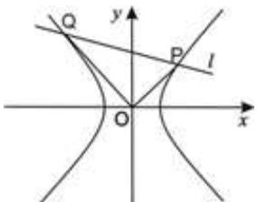
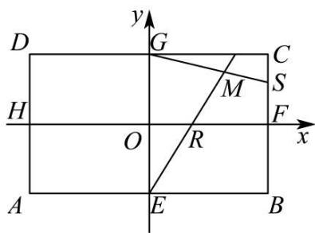
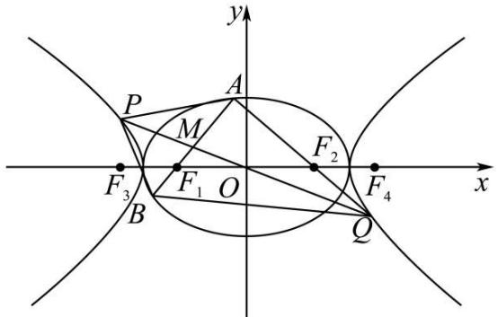
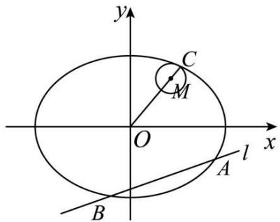
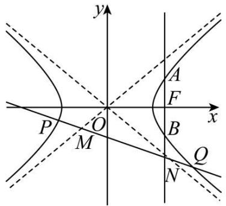
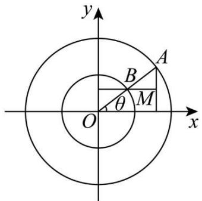
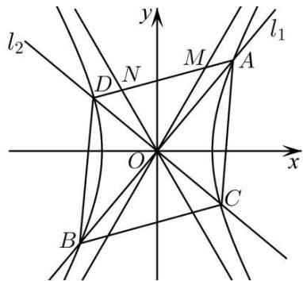
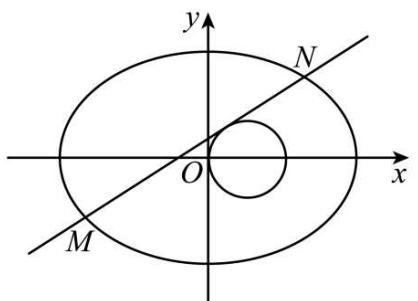

# 第78讲 参数范围与最值

# 知识梳理

# 1、求最值问题常用的两种方法

(1) 几何法: 题中给出的条件有明显的几何特征, 则考虑用几何图形性质来解决, 这是几何法.  
(2) 代数法: 题中给出的条件和结论的几何特征不明显, 则可以建立目标函数, 再求该函数的最值. 求函数的最值常见的方法有基本不等式法、单调性法、导数法和三角换元法等, 这就是代数法.

# 2、求参数范围问题的常用方法

构建所求几何量的含参一元函数,形如 $AB=f(k)$ , 并且进一步找到自变量范围, 进而求出值域, 即所求几何量的范围, 常见的函数有:

(1) 二次函数；(2) “对勾函数” $y = x + \frac{a}{x} (a > 0)$ ; (3) 反比例函数；(4) 分式函数。若出现非常规函数，则可考虑通过换元“化归”为常规函数，或者利用导数进行解决。这里找自变量的取值范围在 $\Delta > 0$ 或者换元的过程中产生。除此之外，在找自变量取值范围时，还可以从以下几个方面考虑：  
①利用判别式构造不等关系,从而确定参数的取值范围.  
②利用已知参数的范围,求出新参数的范围,解题的关键是建立两个参数之间的等量关系.  
③利用基本不等式求出参数的取值范围.  
④利用函数值域的求法,确定参数的取值范围.

# 必考题型全归纳

# 1 题型一:弦长最值问题

4357 (2024·湖北武汉·高二华中师大一附中校考期中)已知圆 $O: x^{2} + y^{2} = r^{2}$ 的任意一条切线 l 与椭圆 $M: \frac{x^{2}}{12} + \frac{y^{2}}{4} = 1$ 都有两个不同交点 A, B(O 是坐标原点)

(1) 求圆 O 半径 r 的取值范围;  
(2) 是否存在圆 O, 使得 $\overrightarrow{OA} \cdot \overrightarrow{OB} = 0$ 恒成立? 若存在, 求出圆 O 的方程及 $|OA||OB|$ 的最大值; 若不存在, 说明理由.

4358 (2024·河北·统考模拟预测)在平面直角坐标系 $xOy$ 中, 点 A 在 $x$ 轴上滑动, 点 B 在 $y$ 轴上滑动, A、B 两点间距离为 $1 + \sqrt{3}$ . 点 P 满足 $\overrightarrow{\mathrm{BP}} = \sqrt{3} \overrightarrow{\mathrm{PA}}$ , 且点 P 的轨迹为 C.

(1) 求 C 的方程;  
(2) 设 M, N 是 C 上的不同两点, 直线 MN 斜率存在且与曲线 $x^{2} + y^{2} = 1$ 相切, 若点 F 为 $(\sqrt{2}, 0)$ , 那么 $\triangle MNF$ 的周长是否有最大值. 若有, 求出这个最大值, 若没有, 请说明理由.

4359 (2024·广东佛山·华南师大附中南海实验高中校考模拟预测)在椭圆 C: $\frac{x^{2}}{a^{2}} + \frac{y^{2}}{b^{2}} = 1 (a > b > 0)$ 中, c = 2, 过点 $(0, b)$ 与 $(a, 0)$ 的直线的斜率为 $-\frac{\sqrt{3}}{3}$ .

(1) 求椭圆 C 的标准方程;

(2) 设 F 为椭圆 C 的右焦点, P 为直线 x = 3 上任意一点, 过 F 作 PF 的垂线交椭圆 C 于 M, N 两点, 求 $\frac{|MN|}{|PF|}$ 的最大值.

4360 (2024·全国·高三专题练习)已知椭圆 E: $\frac{x^{2}}{a^{2}} + \frac{y^{2}}{b^{2}} = 1 (a > b > 0)$ 的离心率为 $\frac{\sqrt{2}}{2}$ ，焦距为 2，过 E 的左焦点 F 的直线 l 与 E 相交于 A、B 两点，与直线 x = -2 相交于点 M.

(1) 若 $M(-2,-1)$ ，求证： $|MA|\cdot|BF|=|MB|\cdot|AF|$ ;

(2) 过点 F 作直线 l 的垂线 m 与 E 相交于 C、D 两点，与直线 x = -2 相交于点 N．求 $\frac{1}{|MA|} + \frac{1}{|MB|} + \frac{1}{|NC|} + \frac{1}{|ND|}$ 的最大值.

4361 (2024·全国·高三专题练习)已知椭圆 C: $\frac{x^{2}}{a^{2}} + \frac{y^{2}}{b^{2}} = 1 (a > b > 0)$ 的离心率为 $\frac{1}{2}$ ，左顶点为 A(-2,0)，直线 l 与椭圆 C 交于 P，Q 两点.

(1) 求椭圆的 C 的标准方程;

(2) 若直线 AP, AQ 的斜率分别为 $k_{1}, k_{2}$ , 且 $k_{1} \cdot k_{2} = -\frac{9}{4}$ , 求 $|\mathrm{PQ}|$ 的最小值.

4362 (2024·江西南昌·统考一模)已知双曲线 $\frac{x^{2}}{a^{2}} - \frac{y^{2}}{b^{2}} = 1 (b > a > 0)$ ，O 为坐标原点，离心率 e = 2，点 M( $\sqrt{5}, \sqrt{3}$ ) 在双曲线上.

(1) 求双曲线的方程;   
(2) 若直线 l 与双曲线交于 P、Q 两点，且 $\overrightarrow{OP} \cdot \overrightarrow{OQ} = 0$ . 求 $|OP|^{2} + |OQ|^{2}$ 的最小值.

text_image

Q
y
P
l
O
x

# 题型二:三角形面积最值问题

4363 (2024·云南·校联考模拟预测)已知椭圆 C: $\frac{x^{2}}{a^{2}} + \frac{y^{2}}{3} = 1 (a > b > 0)$ 的左、右顶点分别为 M₁、M₂，T 为椭圆上异于 M₁、M₂ 的动点，设直线 TM₁、TM₂ 的斜率分别为 k₁、k₂，且 k₁、k₂ = -3/4.

(1) 求椭圆 C 的标准方程;  
(2) 设动直线 l 与椭圆 C 相交于 A、B 两点，O 为坐标原点，若 $\overrightarrow{OA} \cdot \overrightarrow{OB} = 0, \triangle OAB$ 的面积是否存在最小值？若存在，求出这个最小值；若不存在，请说明理由.

4364 (2024·安徽安庆·安庆一中校考模拟预测)如图, E,F,G,H 分别是矩形 ABCD 四边的中点, F(2,0),C(2,1), $\overrightarrow{CS} = \lambda \overrightarrow{CF}, \overrightarrow{OR} = \lambda \overrightarrow{OF}$ .

text_image

y
D	G	C
H	O	R	F
A	E	B
x

(1) 求直线 ER 与直线 GS 交点 M 的轨迹方程；
(2) 过点 I(1,0) 任作直线与点 M 的轨迹交于 P,Q 两点，直线 HP 与直线 QF 的交点为 J，直线 HQ 与直线 PF 的交点为 K，求 $\triangle IJK$ 面积的最小值.

4365 (2024·上海黄浦·高三上海市大同中学校考阶段练习)已知椭圆 C: $\frac{x^{2}}{4} + \frac{y^{2}}{3} = 1$ .

(1) 求该椭圆的离心率;
(2) 设点 $P(x_{0}, y_{0})$ 是椭圆 C 上一点, 求证: 过点 P 的椭圆 C 的切线方程为 $\frac{x_{0}x}{4} + \frac{y_{0}y}{3} = 1$ ;
(3) 若点 M 为直线 l: x = 4 上的动点, 过点 M 作该椭圆的切线 MA, MB, 切点分别为 A, B, 求 $\triangle MAB$ 的面积的最小值.

4366 (2024·全国·高三专题练习)已知双曲线 C: $\frac{x^{2}}{a^{2}} - \frac{y^{2}}{b^{2}} = 1^{\circ}$ 。(a > b > 0) 和圆 O: $x^{2} + y^{2} = b^{2}$ (其中原点 O 为圆心), 过双曲线 C 上一点 P( $x_{0}, y_{0}$ ) 引圆 O 的两条切线, 切点分别为 A、B.

(1) 若双曲线 C 上存在点 P, 使得 $\angle APB = 90^{\circ}$ , 求双曲线离心率 e 的取值范围; (2) 求直线 AB 的方程; (3) 求三角形 OAB 面积的最大值.

4367 (2024·上海普陀·高三曹杨二中校考阶段练习)已知抛物线 $\Gamma: y^{2} = 2x, A, B, M, N$ 为抛物线 $\Gamma$ 上四点，点 T 在 y 轴左侧，满足 $\overrightarrow{TA} = 2\overrightarrow{TM}, \overrightarrow{TB} = 2\overrightarrow{TN}$ .

(1) 求抛物线 $\Gamma$ 的准线方程和焦点坐标；
(2) 设线段 AB 的中点为 D. 证明: 直线 TD 与 y 轴垂直;
(3) 设圆 $C:(x+2)^{2}+y^{2}=3$ ，若点 T 为圆 C 上动点，设 $\triangle TAB$ 的面积为 S，求 S 的最大值.

4368 (2024·河北·统考模拟预测)已知抛物线 C: $x^{2}=2py(p>0)$ ，过点 P(0,2) 的直线 l 与 C 交于 A, B 两点，当直线 l 与 y 轴垂直时，OA ⊥ OB (其中 O 为坐标原点).

(1) 求 C 的准线方程;
(2) 若点 A 在第一象限, 直线 l 的倾斜角为锐角, 过点 A 作 C 的切线与 y 轴交于点 T, 连接 TB 交 C 于另一点为 D, 直线 AD 与 y 轴交于点 Q, 求 $\triangle APQ$ 与 $\triangle ADT$ 面积之比的最大值.

# 3 题型三:四边形面积最值问题

4369 (2024·河南·高三校联考阶段练习)在平面直角坐标系 $xOy$ 中, 已知点 $\mathrm{F}(2,0)$ , 直线 $l: x = -2$ , 作直线 $l$ 的平行线 $l': x = a (x > 2)$ , 动点 $\mathrm{P}$ 满足到 $\mathrm{F}$ 的距离与到直线 $l'$ 的距离之和等于直线 $l$ 与 $l'$ 之间的距离. 记动点 $\mathrm{P}$ 的轨迹为 $\mathrm{E}$ .

(1) 求 E 的方程;
(2) 过 Q(3,1) 作倾斜角互补的两条直线分别交 E 于 A, B 两点和 C, D 两点, 且直线 AB的倾斜角 $\alpha \in \left[\frac{\pi}{6},\frac{\pi}{4}\right]$ ，求四边形ACBD面积的最大值.

4370 (2024·全国·高三专题练习) O 为坐标原点椭圆 $C_{1}:\frac{x^{2}}{a^{2}}+\frac{y^{2}}{b^{2}}=1(a>b>0)$ 的左右焦点分别为 $F_{1},F_{2}$ ，离心率为 $e_{1}$ ; 双曲线 $C_{2}:\frac{x^{2}}{a^{2}}-\frac{y^{2}}{b^{2}}=1$ 的左右焦点分别为 $F_{3},F_{4}$ ，离心率为 $e_{2}$ ，已知 $e_{1}e_{2}=\frac{\sqrt{15}}{4}$ ，切 $|F_{2}F_{4}|=\sqrt{5}-\sqrt{3}$ .

(1) 求 $C_{1}, C_{2}$ 的方程;  
(2) 过 $F_{1}$ 作 $C_{1}$ 的不垂直于 y 轴的弦 AB, M 为 AB 的中点, 当直线 OM 与 $C_{2}$ 交于 P, Q 两点时, 求四边形 APBQ 面积的最小值.

4371 (2024·全国·高三专题练习)如图,O为坐标原点,椭圆 $C_{1}:\frac{x^{2}}{a^{2}}+\frac{y^{2}}{b^{2}}=1(a>b>0)$ 的左右焦点分别为 $F_{1},F_{2}$ ，离心率为 $e_{1}$ ;双曲线 $C_{2}:\frac{x^{2}}{a^{2}}-\frac{y^{2}}{b^{2}}=1$ 的左右焦点分别为 $F_{3},F_{4}$ ，离心率为 $e_{2}$ ，已知 $e_{1}e_{2}=\frac{\sqrt{3}}{2}$ ，且 $|F_{2}F_{4}|=\sqrt{3}-1$ .

(1) 求 $C_{1}, C_{2}$ 的方程;  
(2) 过 $F_{1}$ 点作 $C_{1}$ 的不垂直于 y 轴的弦 AB, M 为 AB 的中点, 当直线 OM 与 $C_{2}$ 交于 P, Q 两点时, 求四边形 APBQ 面积的最小值.

text_image

y
P
A
M
F₂
F₃
F₁ O
B
Q
x
F₄

4372 (2024·山西朔州·高三校联考开学考试)已知椭圆E: $\frac{x^2}{a^2} +\frac{y^2}{b^2} = 1(a > b > 0)$ 的左、右焦点分别为 $\mathrm{F}_1,\mathrm{F}_2,\mathrm{M}$ 为椭圆E的上顶点， $\overrightarrow{\mathrm{MF_1}}\cdot \overrightarrow{\mathrm{MF_2}} = 0$ ，点N(√2，-1)在椭圆E上.

(1) 求椭圆 E 的标准方程;  
(2) 设经过焦点 $F_{2}$ 的两条互相垂直的直线分别与椭圆 E 相交于 A, B 两点和 C, D 两点，求四边形 ACBD 的面积的最小值.

4373 (2024·湖南郴州·统考模拟预测)已知椭圆 C: $\frac{x^{2}}{a^{2}} + \frac{y^{2}}{b^{2}} = 1 (a > b > 0)$ 的左、右焦点分别为 $F_{1}, F_{2}, P$ 是椭圆 C 上异于左、右顶点的动点， $\overrightarrow{PF_{1}} \cdot \overrightarrow{PF_{2}}$ 的最小值为 2，且椭圆 C 的离心率为 $\frac{1}{2}$ .

(1) 求椭圆 C 的标准方程;  
(2) 若直线 $l$ 过 $\mathrm{F}_2$ 与椭圆 C 相交于 A, B 两点, A, B 两点异于左、右顶点, 直线 $l_1$ 过 $\mathrm{F}_1$ 交椭圆 C 于 M, N 两点, $l \perp l_1$ , 求四边形 AMBN 面积的最小值.

4374 (2024·宁夏石嘴山·平罗中学校考模拟预测)平面内动点 M 与定点 F(0,1) 的距离和它到定直线 y=4 的距离之比是 1:2.

(1) 求点 M 的轨迹 E 的方程;  
(2) 过点 F 作两条互相垂直的直线 $l_{1}, l_{2}$ 分别交轨迹 E 于点 A, C 和 B, D，求四边形 ABCD 面积 S 的最小值.

# 4 题型四:弦长的取值范围问题

4375 (2024·河北·统考一模)如图所示,在平面直角坐标系 xOy 中,椭圆 E: $\frac{x^{2}}{a^{2}} + \frac{y^{2}}{b^{2}} = 1 (a > b > 0)$ 的中心在原点,点 P( $\sqrt{3}, \frac{1}{2}$ ) 在椭圆 E 上,且离心率为 $\frac{\sqrt{3}}{2}$ .

(1) 求椭圆 E 的标准方程;  
(2) 动直线 $l: y = k_{1}x - \frac{\sqrt{3}}{2}$ 交椭圆 E 于 A, B 两点, C 是椭圆 E 上一点, 直线 OC 的斜率为 $k_{2}$ , 且 $k_{1}k_{2} = \frac{1}{4}$ , M 是线段 OC 上一点, 圆 M 的半径为 r, 且 $\frac{r}{|AB|} = \frac{2}{3}$ , 求 $\frac{|OC|}{r}$ 的范围.

text_image

y
C
M
O
x
A
l
B

4376 (2024·浙江·模拟预测)已知椭圆 C: $\frac{x^{2}}{8} + \frac{y^{2}}{4} = 1$ ，点 N(0,1)，斜率不为 0 的直线 l 与椭圆 C 交于点 A,B，与圆 N 相切且切点为 M,M 为 AB 中点.

(1) 求圆 N 的半径 r 的取值范围;  
(2) 求 $|AB|$ 的取值范围.

4377 数形结合法:利用待求量的几何意义,确定出极端位置后数形结合求解;

4378 构建不等式法:利用已知或隐含的不等关系,构建以待求量为元的不等式求解;

4379 构建函数法:先引入变量构建以待求量为因变量的函数,再求其值域.

4380 (2024·广东深圳·高三校联考期中)已知点 M(x,y) 在运动过程中,总满足关系式:

$$
\sqrt {(x - \sqrt {3}) ^ {2} + y ^ {2}} + \sqrt {(x + \sqrt {3}) ^ {2} + y ^ {2}} = 4.
$$

(1) 点 M 的轨迹是什么曲线？写出它的方程；  
(2) 设圆 $O: x^{2} + y^{2} = 1$ ，直线 $l: y = kx + m$ 与圆 O 相切且与点 M 的轨迹交于不同两点 A, B，当 $\lambda = \overrightarrow{OA} \cdot \overrightarrow{OB}$ 且 $\lambda \in \left[\frac{1}{2}, 1\right)$ 时，求弦长 $|AB|$ 的取值范围.

4381 (2024·江苏南通·统考模拟预测)已知椭圆 $C_{1}:\frac{x^{2}}{2}+y^{2}=1$ 的左、右顶点是双曲线 $C_{2}:\frac{x^{2}}{a^{2}}-\frac{y^{2}}{b^{2}}=1(a>0,b>0)$ 的顶点， $C_{1}$ 的焦点到 $C_{2}$ 的渐近线的距离为 $\frac{\sqrt{3}}{3}$ . 直线 $l:y=kx+t$ 与 $C_{2}$ 相交于 A, B 两点， $\overrightarrow{OA}\cdot\overrightarrow{OB}=-3$ .

(1) 求证: $8k^{2} + t^{2} = 1$   
(2) 若直线 l 与 $C_{1}$ 相交于 P, Q 两点, 求 $|PQ|$ 的取值范围.

4382 (2024·陕西咸阳·校考三模) 已知双曲线 C: $\frac{x^{2}}{a^{2}} - \frac{y^{2}}{b^{2}} = 1 (a > 0, b > 0)$ 的离心率为 $\sqrt{2}$ ，过双曲线 C 的右焦点 F 且垂直于 x 轴的直线 l 与双曲线交于 A, B 两点，且 $|AB| = 2$ .

text_image

y
A
F
x
P
O
M
B
Q
N

(1) 求双曲线 C 的标准方程;  
(2) 若直线 $m: y = kx - 1$ 与双曲线 C 的左、右两支分别交于 P, Q 两点，与双曲线的渐近线分别交于 M, N 两点，求 $\frac{|PQ|}{|MN|}$ 的取值范围.

4383 (2024·全国·高三校联考开学考试)已知双曲线 C: $\frac{x^{2}}{a^{2}} - \frac{y^{2}}{b^{2}} = 1 (a > 0, b > 0)$ 的渐近线方程为 $y = \pm x$ ，点 $F_{1}, F_{2}$ 分别为双曲线 C 的左、右焦点，过 $F_{2}$ 且垂直于 x 轴的直线与双曲线交于第一象限的点 A，且 $\Delta AF_{1}F_{2}$ 的周长为 $8(\sqrt{2} + 1)$ .

(1) 求双曲线 C 的方程;  
(2) 若直线 y = kx - 1 与双曲线的左支、右支分别交于 N, M 两点，与直线 y = x, y = -x 分别交于 P, Q 两点，求 $\frac{|MN|}{|PQ|}$ 的取值范围.

# 题型五:三角形面积的取值范围问题

4384 (2024·浙江杭州·高三浙江省杭州第二中学校考阶段练习)已知双曲线 $\mathrm{W}:\frac{x^2}{a^2} -\frac{y^2}{b^2} =$ $1(a,b > 0)$ ，其左、右焦点分别为 $\mathrm{F_1,F_2}$ ，W上有一点P满足 $\angle \mathrm{F_1PF_2} = \frac{\pi}{3},\mathrm{S}_{\triangle \mathrm{F_1PF_2}} = \sqrt{3}.$

(1) 求 $b$ ;   
(2) 过 $F_{1}$ 作直线 l 交 W 于 B、C，取 BC 中点 D，连接 OD 交双曲线于 E、H，当 BD 与 EH 的夹角为 $\frac{\pi}{4}$ 时，求 $\frac{S_{\Delta BCF_{2}}}{S_{\Delta EHF_{2}}}$ 的取值范围.

4385 (2024·广东茂名·高三茂名市第一中学校考阶段练习)椭圆 $C_{1}:\frac{x^{2}}{a^{2}}+\frac{y^{2}}{b^{2}}=1(a>b>0)$ 的离心率为 $\frac{\sqrt{2}}{2}$ ，左、右焦点分别为 $F_{1}, F_{2}$ ，上顶点为 A，点 $F_{1}$ 到直线 $AF_{2}$ 的距离为 $\sqrt{2}$ .

(1) 求 $C_{1}$ 的方程;  
(2) 过点 $Q(\sqrt{3},0)$ 的直线 l 交双曲线 $C_{2}:x^{2}-y^{2}=1$ 右支于点 M, N, 点 P 在 $C_{1}$ 上, 求 $\Delta PMN$ 面积的取值范围.

4386 (2024·浙江金华·模拟预测) P 是双曲线 $\frac{x^{2}}{4}-\frac{y^{2}}{12}=1$ 右支上一点, A, B 是双曲线的左右顶点, 过 A, B 分别作直线 PA, PB 的垂线 AQ, BQ, AQ 与 BQ 的交点为 Q, PA 与 BQ 的交点为 C.

(1) 记 P, Q 的纵坐标分别为 $y_{P}, y_{Q}$ ，求 $\frac{y_{P}}{y_{Q}}$ 的值；

(2) 记 $\triangle \mathrm{PBC}, \triangle \mathrm{QAC}$ 的面积分别为 $S_{1}, S_{2}$ , 当 $\frac{1}{2} \leqslant \tan \angle \mathrm{AQB} \leqslant \frac{\sqrt{15}}{5}$ 时, 求 $\frac{S_{1}}{S_{2}}$ 的取值范围.

4387 (2024·云南·高三云南师大附中校考阶段练习)已知 A(-2,0), B(2,0) 为椭圆 C: $\frac{x^{2}}{a^{2}} + \frac{y^{2}}{b^{2}} = 1 (a > b > 0)$ 的左、右顶点，且椭圆 C 过点 $\left(1, \frac{3}{2}\right)$ .

(1) 求 C 的方程;

(2) 过左焦点 F 的直线 l 交椭圆 C 于 D, E 两点 (其中点 D 在 x 轴上方), 求 $\frac{S_{\triangle AEF}}{S_{\triangle BDF}}$ 的取值范围.

4388 (2024·四川南充·模拟预测)如图所示,以原点O为圆心,分别以2和1为半径作两个同心圆,设A为大圆上任意一点,连接OA交小圆于点B,设 $\angle AOX=\theta$ ,过点A、B分别作x轴,y轴的垂线,两垂线交于点M.

text_image

y
A
B
θ
M
O
x

(1) 求动点 M 的轨迹 C 的方程;

(2) 点 E、F 分别是轨迹 C 上两点，且 $\overrightarrow{OE} \cdot \overrightarrow{OF} = 0$ ，求 $\triangle EOF$ 面积的取值范围.

4389 (2024·福建漳州·高三统考开学考试)已知椭圆 C: $\frac{x^{2}}{a^{2}} + \frac{y^{2}}{b^{2}} = 1 (a > b > 0)$ 的左焦点为 F₁(-√3,0)，且过点 A(√3, $\frac{1}{2}$ ).

(1) 求 C 的方程;

(2) 不过原点 O 的直线 l 与 C 交于 P, Q 两点, 且直线 OP, PQ, OQ 的斜率成等比数列.

(i) 求 l 的斜率;

(ii) 求 $\triangle OPQ$ 的面积的取值范围.

# 6 题型六: 四边形面积的取值范围问题

4390 (2024·四川成都·高三石室中学校考开学考试)已知椭圆 $C_{1}:\frac{x^{2}}{a^{2}}+\frac{y^{2}}{b^{2}}=1(a>b>0)$ 左、右焦点分别为 $F_{1}, F_{2}$ ，且 $F_{2}$ 为抛物线 $C_{2}:y^{2}=8x$ 的焦点， $P(2,\sqrt{2})$ 为椭圆 $C_{1}$ 上一点.

(1) 求椭圆 $C_{1}$ 的方程;

(2) 已知 A, B 为椭圆 $C_{1}$ 上不同两点，且都在 x 轴上方，满足 $\overrightarrow{F_{1}A} = \lambda \overrightarrow{F_{2}B}$ .

(i) 若 $\lambda=3$ ，求直线 $F_{1}A$ 的斜率；

(ii) 若直线 $F_{1}A$ 与抛物线 $y^{2}=x$ 无交点，求四边形 $F_{1}F_{2}BA$ 面积的取值范围.

4391 (2024·河北·高三统考阶段练习)已知椭圆 C: $\frac{x^{2}}{a^{2}} + \frac{y^{2}}{b^{2}} = 1 (a > b > 0)$ 的离心率为 $\frac{1}{2}$ ，点 P( $\sqrt{3}, \frac{\sqrt{3}}{2}$ ) 在椭圆上. 直线 l 与椭圆交于 A, B 两点. 且 $\overrightarrow{OA} \cdot \overrightarrow{OB} = 0$ ，其中 O 为坐标原点.

(1) 求椭圆 C 的方程;
(2) 若过原点的直线 m 与椭圆 C 交于 C, D 两点, 且过 AB 的中点 M. 求四边形 ACBD 面积的取值范围.

4392 (2024·全国·模拟预测)设椭圆 C: $\frac{x^{2}}{a^{2}} + \frac{y^{2}}{b^{2}} = 1 (a > b > 0)$ 的左焦点为 F，上顶点为 P，离心率为 $\frac{\sqrt{2}}{2}$ ，O 是坐标原点，且 $|OP| \cdot |FP| = \sqrt{2}$ .

(1) 求椭圆 C 的方程;
(2) 过点 F 作两条互相垂直的直线, 分别与 C 交于 A, B, M, N 四点, 求四边形 AMBN 面积的取值范围.

4393 (2024·辽宁辽阳·高三辽阳县第一高级中学校考阶段练习)已知双曲线 $\Gamma:\frac{x^{2}}{a^{2}}-\frac{y^{2}}{b^{2}}=1(a>0,b>0)$ 过点 $\mathrm{P}(\sqrt{3},\sqrt{6})$ ，且 $\Gamma$ 的渐近线方程为 $y=\pm\sqrt{3}x$ .

text_image

l₂
y
D N M A l₁
O x
B C

(1) 求 $\Gamma$ 的方程；
(2) 如图, 过原点 O 作互相垂直的直线 $l_{1}, l_{2}$ 分别交双曲线于 A, B 两点和 C, D 两点, A, D 在 x 轴同侧.

①求四边形 ACBD 面积的取值范围；
②设直线 AD 与两渐近线分别交于 M, N 两点，是否存在直线 AD 使 M, N 为线段 AD 的三等分点，若存在，求出直线 AD 的方程；若不存在，请说明理由.

4394 (2024·浙江·校联考模拟预测)已知椭圆 $C_{1}:\frac{y^{2}}{a^{2}}+\frac{x^{2}}{b^{2}}=1(a>b>0)$ 的离心率为 $\frac{\sqrt{2}}{2}$ ，抛物线 $C_{2}:x^{2}=8y$ 的准线与 $C_{1}$ 相交，所得弦长为 $2\sqrt{6}$ .

(1) 求 $C_{1}$ 的方程；
(2) 若 $A(x_{1}, y_{1}), B(x_{2}, y_{2})$ 在 $C_{2}$ 上，且 $x_{1} < 0 < x_{2}$ ，分别以 A, B 为切点，作 $C_{2}$ 的切线相交于点 P，点 P 恰好在 $C_{1}$ 上，直线 AP, BP 分别交 x 轴于 M, N 两点。求四边形 ABMN 面积的取值范围。

# 7 题型七: 向量数量积的取值范围问题

4395 (2024·吉林长春·长春市第八中学校考模拟预测)已知 $E: x^{2} + 4y^{2} = m^{2} (m > 0)$ ，直线 l 不过原点 O 且不平行于坐标轴，l 与 E 有两个交点 A, B，线段 AB 的中点为 M.

(1) 若 m=2，点 K 在椭圆 E 上， $F_{1}$ 、 $F_{2}$ 分别为椭圆的两个焦点，求 $\overrightarrow{KF_{1}}\cdot\overrightarrow{KF_{2}}$ 的范围；
(2) 若 l 过点 $\left(m, \frac{m}{2}\right)$ ，射线 OM 与椭圆 E 交于点 P，四边形 OAPB 能否为平行四边形？若能，求此时直线 l 斜率；若不能，说明理由.

4396 (2024·安徽合肥·合肥市庐阳高级中学校考模拟预测)已知椭圆 C: $\frac{x^{2}}{a^{2}}+\frac{y^{2}}{b^{2}}=$

$1(a > b > 0)$ 的左，右焦点分别为 $\mathrm{F}_1, \mathrm{F}_2$ ，焦距为 $2\sqrt{3}$ ，点 $\mathrm{Q}\left(\sqrt{3}, -\frac{1}{2}\right)$ 在C上.

(1)P 是 C 上一动点, 求 $\overrightarrow{PF_{1}} \cdot \overrightarrow{PF_{2}}$ 的范围;  
(2) 过 C 的右焦点 $F_{2}$ ，且斜率不为零的直线 l 交 C 于 M，N 两点，求 $\Delta F_{1}MN$ 的内切圆面积的最大值.

4397 (2024·全国·高三专题练习)已知椭圆 C: $\frac{x^{2}}{a^{2}} + \frac{y^{2}}{b^{2}} = 1 (a > b > 0)$ 经过点 P(2, $\sqrt{2}$ ), 一个焦点 F 的坐标为 (2,0).

(1) 求椭圆 C 的方程;  
(2) 设直线 $l: y = kx + m$ 与椭圆 C 交于 A, B 两点, O 为坐标原点, 若 $k_{\mathrm{OA}} \cdot k_{\mathrm{OB}} = \frac{1}{3}$ , 求 $\overrightarrow{\mathrm{OA}} \cdot \overrightarrow{\mathrm{OB}}$ 的取值范围.

4398 (2024·全国·高三专题练习)已知椭圆 C: $\frac{x^{2}}{a^{2}} + \frac{y^{2}}{b^{2}} = 1 (a > b > 0)$ 经过点 P(2, $\sqrt{2}$ ), 一个焦点 F 的坐标为 (2,0).

(1) 求椭圆 C 的方程;  
(2) 设直线 $l: y = kx + m$ 与椭圆 C 交于 A, B 两点, O 为坐标原点, 若 $k_{OA} \cdot k_{OB} = -\frac{1}{2}$ , 求 $\overrightarrow{OA} \cdot \overrightarrow{OB}$ 的取值范围.

4399 (2024·黑龙江佳木斯·高二佳木斯一中校考阶段练习)已知椭圆 C: $\frac{x^{2}}{a^{2}} + \frac{y^{2}}{b^{2}} = 1 (a > b > 0)$ 经过点 P(2, $\sqrt{2}$ ), 一个焦点 F 的坐标为 (2, 0).

(1) 求椭圆 C 的方程;  
(2) 设直线 $l: y = kx + 1$ 与椭圆 C 交于 A, B 两点，O 为坐标原点，求 $\overrightarrow{OA} \cdot \overrightarrow{OB}$ 的取值范围.

# 8 题型八: 参数的取值范围

4400 (2024·全国·高三专题练习)已知曲线 C: $\frac{x^{2}}{5-m} + \frac{y^{2}}{m-2} = 1$ 表示焦点在 x 轴上的椭圆.

(1) 求 m 的取值范围;  
(2) 设 m=3，过点 P(0,2) 的直线 l 交椭圆于不同的两点 A，B(B 在 A, P 之间)，且满足 $\overrightarrow{PB}=\lambda\overrightarrow{PA}$ ，求 $\lambda$ 的取值范围.

4401 (2024·黑龙江大庆·统考三模)已知中心在原点,焦点在 x 轴上的椭圆,离心率 $e=\frac{\sqrt{2}}{2}$ , 且经过抛物线 $x^{2}=4y$ 的焦点. 若过点 B(2,0) 的直线 l(斜率不等于零)与椭圆交于不同的两点 E、F(E 在 B、F 之间),

(1) 求椭圆的标准方程;  
(2) 求直线 l 斜率的取值范围;  
(3) 若 $\triangle OBE$ 与 $\triangle OBF$ 面积之比为 $\lambda$ ，求 $\lambda$ 的取值范围.

4402 (2024·广东广州·高二执信中学校考期末)已知中心在坐标原点,焦点在 x 轴上的椭圆过点 $P(2,\sqrt{3})$ ,且它的离心率 $e=\frac{1}{2}$

text_image

y
N
O
x
M

(I) 求椭圆的标准方程;

(II) 与圆 $(x - 1)^2 + y^2 = 1$ 相切的直线 $l: y = kx + t$ 交椭圆于M、N两点，若椭圆上一点C满足 $\overrightarrow{\mathrm{OM}} + \overrightarrow{\mathrm{ON}} = \lambda \overrightarrow{\mathrm{OC}}$ ，求实数 $\lambda$ 的取值范围

4403 (2024·全国·高三专题练习)设椭圆: $\frac{x^{2}}{a^{2}} + \frac{y^{2}}{b^{2}} = 1 (a > b > 0)$ 的左顶点为 A, 右顶点为 B. 已知椭圆的离心率为 $e = \frac{\sqrt{3}}{2}$ , 且以线段 AB 为直径的圆被直线 $x + \sqrt{3} y - 2 = 0$ 所截得的弦长为 $2\sqrt{3}$ .

(1) 求椭圆的标准方程;
(2) 设过点 A 的直线 l 与椭圆交于点 M, 且点 M 在第一象限, 点 M 关于 x 轴对称点为点 N, 直线 NB 与直线 l 交于点 P, 若直线 OP 斜率大于 $\frac{3}{10}$ , 求直线 l 的斜率 k 的取值范围.

4404 (2024·天津河西·天津市新华中学校考一模)设椭圆: $\frac{x^{2}}{a^{2}}+\frac{y^{2}}{b^{2}}=1(a>b>0)$ 的左顶点为A,右顶点为B.已知椭圆的离心率为 $e=\frac{\sqrt{3}}{2}$ ，且以线段AB为直径的圆被直线 $x+\sqrt{3}y-2=0$ 所截得的弦长为 $2\sqrt{3}$ .

(I) 求椭圆的标准方程;

(II) 设过点 A 的直线 l 与椭圆交于点 M，且点 M 在第一象限，点 M 关于 x 轴对称点为点 N，直线 NB 与直线 l 交于点 P，若直线 OP 斜率大于 $\frac{2}{5}$ ，求直线 l 的斜率 k 的取值范围.

4405 (2024·全国·高三专题练习)已知椭圆 C: $\frac{x^{2}}{a^{2}} + \frac{y^{2}}{b^{2}} = 1 (a > b > 0)$ 的离心率为 $\frac{\sqrt{3}}{2}$ ，过焦点且垂直于长轴的直线被椭圆截得的弦长为 1，过点 M(3,0) 的直线与椭圆 C 相交于不同的两点 A, B.

(1) 求椭圆 C 的方程;
(2) 设 P 为椭圆 C 上一点, 且满足 $\overrightarrow{OA} + \overrightarrow{OB} = t\overrightarrow{OP}$ (O 为坐标原点), 试求实数 t 的取值范围.

4406 (2024·四川南充·高二四川省南充高级中学校考期中)已知椭圆 C: $\frac{x^{2}}{a^{2}} + \frac{y^{2}}{b^{2}} = 1 (a > b > 0)$ 的离心率为 $\frac{\sqrt{3}}{2}$ ，过焦点且垂直于长轴的直线被椭圆截得的弦长为 1，过点 M(3,0) 的直线与椭圆 C 相交于两点 A,B

(1) 求椭圆 C 的方程;
(2) 设 P 为椭圆上一点, 且满足 $\overrightarrow{OA} + \overrightarrow{OB} = t\overrightarrow{OP}$ (O 为坐标原点), 当 $|AB| < \sqrt{3}$ 时, 求实数 t 的取值范围.

