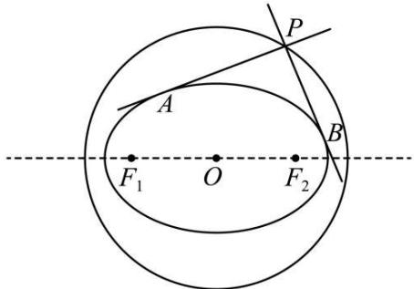
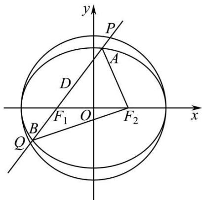
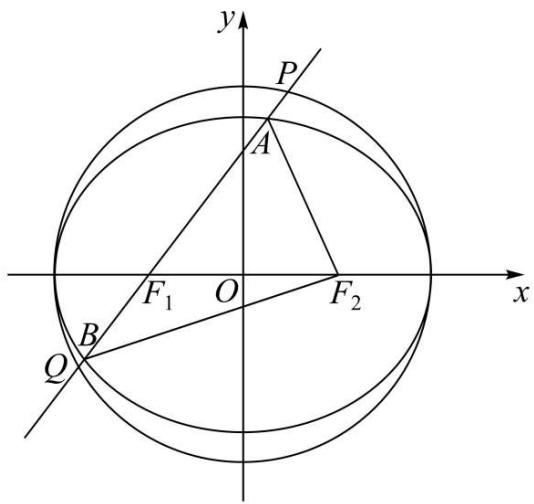
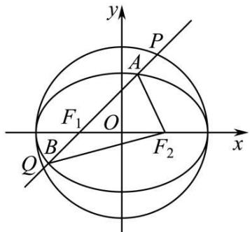
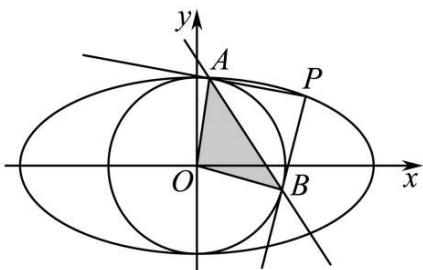
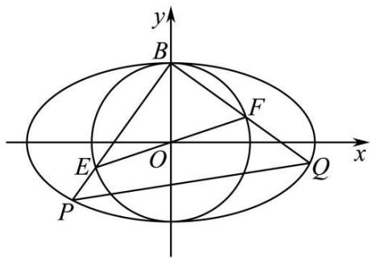
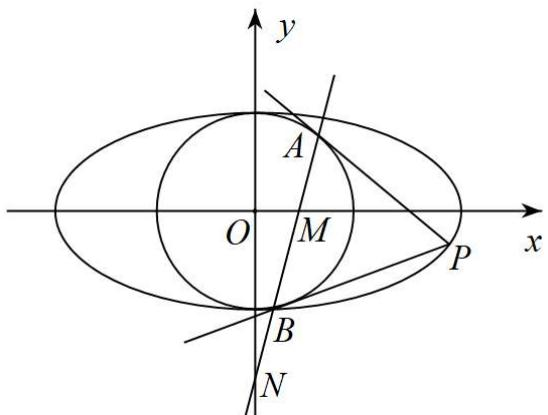
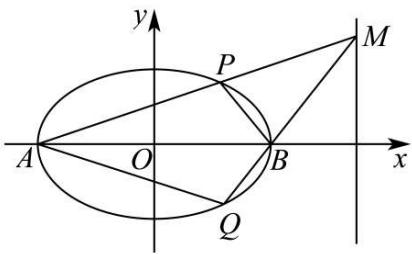
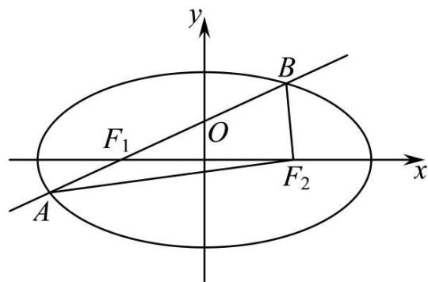

# 第79讲 圆锥曲线中的圆问题

# 知识梳理

1、曲线 $\Gamma: \frac{x^2}{a^2} + \frac{y^2}{b^2} = 1$ 的两条互相垂直的切线的交点P的轨迹是圆： $x^{2} + y^{2} = a^{2} + b^{2}$   
2、双曲线 $\frac{x^2}{a^2} -\frac{y^2}{b^2} = 1(a > b > 0)$ 的两条互相垂直的切线的交点的轨迹是圆 $x^{2} + y^{2} = a^{2}$ $-b^{2}$   
3、抛物线 $y^{2}=2px$ 的两条互相垂直的切线的交点在该抛物线的准线上.  
4、证明四点共圆的方法：

方法一:从被证共圆的四点中先选出三点作一圆,然后证另一点也在这个圆上,若能证明这一点,则可肯定这四点共圆.

方法二: 把被证共圆的四个点连成共底边的两个三角形, 且两三角形都在这底边的同侧, 若能证明其顶角相等, 则可肯定这四点共圆 (根据圆的性质一一同弧所对的圆周角相等证).

方法三: 把被证共圆的四点连成四边形, 若能证明其对角互补或能证明其中一个外角等于其内对角时, 则可肯定这四点共圆 (根据圆的性质一一圆内接四边形的对角和为 $180^{\circ}$ , 并且任何一个外角都等于它的内对角).

方法四:证明被证共圆的四点到某一定点的距离都相等,或证明被证四点连成的四边形其中三边中垂线有交点),则可肯定这四点共圆(根据圆的定义:平面内到定点的距离等于定长的点的轨迹为圆).

# 必考题型全归纳

# 1 题型一:蒙日圆问题

4407 (2024·全国·高三专题练习)在学习数学的过程中,我们通常运用类比猜想的方法研究问题.

(1) 已知动点 P 为圆 O: $x^{2} + y^{2} = r^{2}$ 外一点, 过 P 引圆 O 的两条切线 PA、PB, A、B 为切点, 若 $\overrightarrow{PA} \cdot \overrightarrow{PB} = 0$ , 求动点 P 的轨迹方程;  
(2) 若动点 Q 为椭圆 M: $\frac{x^{2}}{9} + \frac{y^{2}}{4} = 1$ 外一点, 过 Q 引椭圆 M 的两条切线 QC、QD, C、D 为切点, 若 $\overrightarrow{QC} \cdot \overrightarrow{QD} = 0$ , 求出动点 Q 的轨迹方程;  
(3) 在 (2) 问中若椭圆方程为 $\frac{x^2}{a^2} + \frac{y^2}{b^2} = 1 (a > b > 0)$ , 其余条件都不变, 那么动点 Q 的轨迹方程是什么 (直接写出答案即可, 无需过程).

4408 (2022·全国·高三专题练习)在学习过程中,我们通常遇到相似的问题.

(1) 已知动点 P 为圆 O: $x^{2} + y^{2} = r^{2}$ 外一点, 过 P 引圆 O 的两条切线 PA、PB, A、B 为切点, 若 $\overrightarrow{PA} \cdot \overrightarrow{PB} = 0$ , 求动点 P 的轨迹方程;  
(2) 若动点 Q 为椭圆 M: $\frac{x^{2}}{4} + \frac{y^{2}}{3} = 1$ 外一点, 过 Q 引椭圆 M 的两条切线 QC、QD, C、D 为切点, 若 $\overrightarrow{QC} \cdot \overrightarrow{QD} = 0$ , 猜想动点 Q 的轨迹是什么, 请给出证明并求出动点 Q 的轨迹方程.

4409 (2024·河南·校联考模拟预测)在椭圆 C: $\frac{x^{2}}{a^{2}} + \frac{y^{2}}{b^{2}} = 1 (a > b > 0)$ 中, 其所有外切矩形的

顶点在一个定圆 $\Gamma: x^2 + y^2 = a^2 + b^2$ 上，称此圆为椭圆的蒙日圆。椭圆 C 过 $\mathrm{P}\left(1, \frac{\sqrt{2}}{2}\right)$ ， $\mathrm{Q}\left(-\frac{\sqrt{6}}{2}, \frac{1}{2}\right)$ 。

(1) 求椭圆 C 的方程;  
(2) 过椭圆 C 的蒙日圆上一点 M, 作椭圆的一条切线, 与蒙日圆交于另一点 N, 若 $k_{\mathrm{OM}}$ , $k_{\mathrm{ON}}$ 存在, 证明: $k_{\mathrm{OM}} \cdot k_{\mathrm{ON}}$ 为定值.

4410 (2024 秋·浙江宁波·高三期末)法国数学家加斯帕尔·蒙日被誉为画法几何之父. 他在研究椭圆切线问题时发现了一个有趣的重要结论: 一椭圆的任两条互相垂直的切线交点的轨迹是一个圆, 尊称为蒙日圆, 且蒙日圆的圆心是该椭圆的中心, 半径为该椭圆的长半轴与短半轴平方和的算术平方根. 已知在椭圆 C: $\frac{x^{2}}{a^{2}} + \frac{y^{2}}{b^{2}} = 1 (a > b > 0)$ 中, 离心率 e = $\frac{1}{2}$ , 左、右焦点分别是 F₁、F₂, 上顶点为 Q, 且 |QF₂| = 2, O 为坐标原点.

text_image

A
F₁ O F₂
P
B

(1) 求椭圆 C 的方程, 并请直接写出椭圆 C 的蒙日圆的方程;  
(2) 设 P 是椭圆 C 外一动点 (不在坐标轴上), 过 P 作椭圆 C 的两条切线, 过 P 作 x 轴的垂线, 垂足 H, 若两切线斜率都存在且斜率之积为 $-\frac{1}{2}$ , 求 $\triangle POH$ 面积的最大值.

4411 (2024·吉林白山·统考二模)法国数学家加斯帕尔·蒙日创立的《画法几何学》对世界各国科学技术的发展影响深远。在双曲线 $\frac{x^{2}}{a^{2}} - \frac{y^{2}}{b^{2}} = 1 (a > b > 0)$ 中，任意两条互相垂直的切线的交点都在同一个圆上，它的圆心是双曲线的中心，半径等于实半轴长与虚半轴长的平方差的算术平方根，这个圆被称为蒙日圆。已知双曲线 C: $\frac{x^{2}}{a^{2}} - \frac{y^{2}}{b^{2}} = 1 (a > b > 0)$ 的实轴长为 6，其蒙日圆方程为 $x^{2} + y^{2} = 1$ 。

(1) 求双曲线 C 的标准方程;  
(2) 设 D 为双曲线 C 的左顶点, 直线 l 与双曲线 C 交于不同于 D 的 E, F 两点, 若以 EF 为直径的圆经过点 D, 且 DG ⊥ EF 于 G, 证明: 存在定点 H, 使 |GH| 为定值.

4412 (2022 秋·江苏盐城·高三校联考阶段练习)定义椭圆 C: $\frac{x^{2}}{a^{2}} + \frac{y^{2}}{b^{2}} = 1 (a > b > 0)$ 的“蒙日圆”的方程为 $x^{2} + y^{2} = a^{2} + b^{2}$ ，已知椭圆 C 的长轴长为 4，离心率为 $e = \frac{1}{2}$ .

(1) 求椭圆 C 的标准方程和它的“蒙日圆”E 的方程;  
(2) 过“蒙日圆”E上的任意一点M作椭圆C的一条切线MA，A为切点，延长MA与“蒙日圆”E交于点D，O为坐标原点，若直线OM，OD的斜率存在，且分别设为 $k_{1}, k_{2}$ ，证明： $k_{1} \cdot k_{2}$ 为定值.

4413 (2022·全国·高三专题练习)已知椭圆 C: $\frac{x^{2}}{a^{2}}+\frac{y^{2}}{b^{2}}=1(a>b>0)$ 的左、右焦点分别为

$F_{1}(-\sqrt{3},0)$ 、 $F_{2}(\sqrt{3},0)$ ，离心率为 $\frac{\sqrt{3}}{3}$ .

(1) 求椭圆 C 的标准方程;  
(2) 若动点 $P(x_{0}, y_{0})$ 为椭圆 C 外一点, 且点 P 到椭圆 C 的两条切线相互垂直, 求点 P 的轨迹方程;  
(3) 若过椭圆 C 上任意一点 Q 的切线与 (2) 中所求点 P 的轨迹方程交于 A、B 两点, 求证: $\left|QA\right| \cdot \left|QB\right| = \left|QF_{1}\right| \cdot \left|QF_{2}\right|$ .

4414 (2019·云南昆明·高三云南师大附中校考阶段练习)已知椭圆 C: $\frac{x^{2}}{a^{2}} + \frac{y^{2}}{b^{2}} = 1 (a > b > 0)$ 的一个焦点为 $F_{1}(-\sqrt{7}, 0)$ ，离心率为 $\frac{\sqrt{7}}{4}$ .

(1) 求 C 的标准方程;  
(2) 若动点 M 为 C 外一点, 且 M 到 C 的两条切线相互垂直, 求 M 的轨迹 D 的方程;  
(3) 设 C 的另一个焦点为 $F_{2}$ ，过 C 上一点 P 的切线与 (2) 所求轨迹 D 交于点 A, B，求证： $|PA| \cdot |PB| = |PF_{1}| \cdot |PF_{2}|$ .

4415 (2022·全国·高三专题练习)设椭圆 C 的中心在原点, 焦点 F 在 x 轴上, 垂直 x 轴的直线与椭圆相交于 A、B 两点, 当 $\triangle FAB$ 的周长取最大值 $4\sqrt{3}$ 时, $|AB| = \frac{2\sqrt{3}}{3}$ .

(1) 求椭圆 C 的方程;  
(2) 过圆 D: $x^{2} + y^{2} = 4$ 上任意一点 P 作椭圆 C 的两条切线 m、n，直线 m、n 与圆 D 的另一交点分别为 M、N,  
①证明： $m \perp n;$   
②求 $\triangle MNP$ 面积的最大值.

# 题型二:内圆与外圆问题

4416 (2022·全国·高三专题练习)已知椭圆 $\frac{x^{2}}{a^{2}} + \frac{y^{2}}{b^{2}} = 1 (a > b > 0)$ 及圆 O: $x^{2} + y^{2} = a^{2}$ ，过点 B $(0, a)$ 与椭圆相切的直线 l 交圆 O 于点 A，若 $\angle AOB = 60^{\circ}$ ，求椭圆的离心率.

4417 (2022·全国·高三专题练习)已知椭圆 C: $\frac{x^{2}}{a^{2}} + \frac{y^{2}}{b^{2}} = 1 (a > b > 0)$ 和圆 O: $x^{2} + y^{2} = a^{2}$ , $F_{1}(-1,0)$ , $F_{2}(1,0)$ 分别是椭圆的左、右两焦点，过 $F_{1}$ 且倾斜角为 $\alpha (\alpha \in (0, \frac{\pi}{2}])$ 的动直线 l 交椭圆 C 于 A, B 两点，交圆 O 于 P, Q 两点 (如图所示，点 A 在 x 轴上方). 当 $\alpha = \frac{\pi}{4}$ 时，弦 PQ 的长为 $\sqrt{14}$ .

text_image

y
P
A
D
F₁ O F₂
x
B
Q

(1) 求圆 O 与椭圆 C 的方程;

(2) 若 $2|\mathrm{BF}_2| = |\mathrm{AF}_2| + |\mathrm{AB}|$ , 求直线 $\mathrm{PQ}$ 的方程.

4418 (2022·全国·高三专题练习)已知椭圆 C: $\frac{x^{2}}{a^{2}} + \frac{y^{2}}{b^{2}} = 1 (a > b > 0)$ 和圆 O: $x^{2} + y^{2} = a^{2}$ , F₁(-1,0), F₂(1,0) 分别是椭圆的左、右两焦点，过 F₁ 且倾斜角为 $\alpha \in \left(0, \frac{\pi}{2}\right]$ 的动直线 l 交椭圆 C 于 A, B 两点，交圆 O 于 P, Q 两点 (如图所示)，当 $\alpha = \frac{\pi}{4}$ 时，弦 PQ 的长为 $\sqrt{14}$ .

text_image

y
P
A
F₁ O F₂ x
B
Q

(1) 求圆 O 和椭圆 C 的方程

(2) 若点 M 是圆 O 上一点, 求当 $AF_{2}, BF_{2}, AB$ 成等差数列时, $\triangle MPQ$ 面积的最大值.

4419 (2017·上海嘉定·统考二模)如图,已知椭圆 C: $\frac{x^{2}}{a^{2}}+\frac{y^{2}}{b^{2}}=1(a>b>0)$ 过点 $\left(1,\frac{3}{2}\right)$ 两个焦点为 F $_{1}$ (-1,0) 和 F $_{2}$ (1,0). 圆 O 的方程为 $x^{2}+y^{2}=a^{2}$ .

text_image

y
P
A
F₁
O
B
Q
F₂
x

(1) 求椭圆 C 的标准方程;

(2) 过 $F_{1}$ 且斜率为 $k (k > 0)$ 的动直线 l 与椭圆 C 交于 A、B 两点，与圆 O 交于 P、Q 两点（点 A、P 在 x 轴上方），当 $|AF_{2}|, |BF_{2}|, |AB|$ 成等差数列时，求弦 PQ 的长.

4420 (2022·全国·高三专题练习)如图, 已知椭圆 C: $\frac{x^{2}}{a^{2}} + \frac{y^{2}}{b^{2}} = 1 (a > b > 0)$ 和圆 O: $x^{2} + y^{2} = b^{2}$ (其中圆心 O 为原点), 过椭圆 C 上异于上、下顶点的一点 P( $x_{0}, y_{0}$ ) 引圆 O 的两条切线, 切点分别为 A, B.

text_image

y
A
P
O
B
x

(1) 求直线 AB 的方程;  
(2) 求三角形 OAB 面积的最大值.

4421 (2022·全国·高三专题练习)如图,椭圆 C: $\frac{x^{2}}{a^{2}}+\frac{y^{2}}{b^{2}}=1(a>b>0)$ 和圆 O: $x^{2}+y^{2}=b^{2}$ ,已知椭圆 C 的离心率为 $\frac{2\sqrt{2}}{3}$ , 直线 $\sqrt{2}x-2y-\sqrt{6}=0$ 与圆 O 相切.

text_image

y
B
F
E
O
x
P
Q

(1) 求椭圆 C 的标准方程;  
(2) 椭圆 C 的上顶点为 B, EF 是圆 O 的一条直径, EF 不与坐标轴重合, 直线 BE、BF 与椭圆 C 的另一个交点分别为 P、Q, 求 $\triangle$ BPQ 的面积的最大值及此时 PQ 所在的直线方程.

4422 (2022·全国·高三专题练习)已知椭圆 $\frac{x^{2}}{a^{2}}+\frac{y^{2}}{b^{2}}=1(a>b>0)$ 和圆 O: $x^{2}+y^{2}=b^{2}$ ，过椭圆上一点 P 引圆 O 的两条切线，切点分别为 A, B.

text_image

y
A
O
M
x
P
B
N

(I) 若圆 O 过椭圆的两个焦点, 求椭圆的离心率 e 的值;  
(II) 设直线 AB 与 x、y 轴分别交于点 M, N，问当点 P 在椭圆上运动时， $\frac{a^{2}}{ON^{2}} + \frac{b^{2}}{OM^{2}}$ 是否为定值？请证明你的结论.

# 题型三:直径为圆问题

4423 (2024 秋·湖南岳阳·高三校考阶段练习)已知椭圆 C: $\frac{x^{2}}{a^{2}} + \frac{y^{2}}{b^{2}} = 1 (a > b > 0)$ 经过点 P( $\frac{2}{3}$ , $\frac{2\sqrt{2}}{3}$ ), 左, 右焦点分别为 F₁, F₂, O 为坐标原点, 且 $|PF_{1}| + |PF_{2}| = 4$ .

(1) 求椭圆 C 的标准方程;  
(2) 设 A 为椭圆 C 的右顶点, 直线 l 与椭圆 C 相交于 M, N 两点, 以 MN 为直径的圆过点 A, 求 $|AM| \cdot |AN|$ 的最大值.

4424 (2024 秋·湖南长沙·高三长沙一中校考阶段练习)已知椭圆 C: $\frac{x^{2}}{a^{2}} + \frac{y^{2}}{b^{2}} = 1 (a > b > 0)$ 过 $\left(1, \frac{3}{2}\right)$ 和 $\left(\sqrt{2}, \frac{\sqrt{6}}{2}\right)$ 两点.

text_image

y
P
M
A
O
B
x
Q

(1) 求椭圆 C 的方程;  
(2) 如图所示, 记椭圆的左、右顶点分别为 A, B, 当动点 M 在定直线 x = 4 上运动时, 直线 AM, BM 分别交椭圆于两点 P 和 Q.  
(i) 证明: 点 B 在以 PQ 为直径的圆内;  
(ii) 求四边形 APBQ 面积的最大值.

4425 (2024·山西大同·统考模拟预测)已知椭圆 $C_{1}:\frac{x^{2}}{a^{2}}+\frac{y^{2}}{b^{2}}=1(a>b>0)$ 的离心率为 $\frac{\sqrt{2}}{2}$ ，且直线 $y=x+b$ 是抛物线 $C_{2}:y^{2}=4x$ 的一条切线.

(1) 求椭圆 $C_{1}$ 的方程;  
(2) 过点 $S\left(0, -\frac{1}{3}\right)$ 的动直线 L 交椭圆 $C_{1}$ 于 A, B 两点, 试问: 在直角坐标平面上是否存在一个定点 T, 使得以 AB 为直径的圆恒过定点 T? 若存在, 求出 T 的坐标; 若不存在, 请说明理由.

4426 (2024 秋·福建福州·高三闽侯县第一中学校考阶段练习)已知椭圆 E: $\frac{x^2}{a^2} + \frac{y^2}{b^2} =$

$1(a > b > 0)$ 的离心率是 $\frac{\sqrt{2}}{2}$ , 上、下顶点分别为 A, B. 圆 $O: x^2 + y^2 = 2$ 与 $x$ 轴正半轴的交点为 P, 且 $\overrightarrow{PA} \cdot \overrightarrow{PB} = -1$ .

(1) 求 E 的方程;  
(2) 直线 l 与圆 O 相切且与 E 相交于 M, N 两点, 证明: 以 MN 为直径的圆恒过定点.

4427 (2024 秋·广东广州·高三广州市第六十五中学校考阶段练习)已知椭圆 C: $\frac{x^{2}}{a^{2}} + \frac{y^{2}}{b^{2}} = 1 (a > b > 0)$ 的左顶点为 A, 上顶点为 B, 右焦点为 F(1,0), O 为坐标原点, 线段 OA 的中点为 D, 且 $|BD| = |DF|$ .

(1) 求 C 方程;   
(2) 已知点 M、N 均在直线 x=2 上, 以 MN 为直径的圆经过 O 点, 圆心为点 T, 直线 AM、AN 分别交椭圆 C 于另一点 P、Q, 证明直线 PQ 与直线 OT 垂直.

4428 (2024·全国·高三专题练习)已知椭圆 C: $\frac{x^{2}}{a^{2}} + \frac{y^{2}}{b^{2}} = 1 (a > b > 0)$ 的左、右焦点分别为 F₁, F₂, A, B 分别是 C 的右、上顶点，且 $|AB| = \sqrt{7}$ , D 是 C 上一点， $\Delta BF_{2}D$ 周长的最大值为 8.

(1) 求 C 的方程;  
(2)C 的弦 DE 过 $F_{1}$ ，直线 AE，AD 分别交直线 x = -4 于 M，N 两点，P 是线段 MN 的中点，证明：以 PD 为直径的圆过定点.

4429 (2024 秋·全国·高三校联考开学考试)在平面直角坐标系中, 已知 $F_{1}, F_{2}$ 分别为椭圆 C: $\frac{x^{2}}{a^{2}} + \frac{y^{2}}{b^{2}} = 1 (a > b > 0)$ 的左、右焦点. M 为椭圆 C 上的一个动点, $\angle F_{1}MF_{2}$ 的最大值为 $120^{\circ}$ , 且点 M 到右焦点 $F_{2}$ 距离的最小值为 $2 - \sqrt{3}$ , 直线 l 交椭圆 C 于异于椭圆右顶点 A 的两个点 $P(x_{1}, y_{1}), Q(x_{2}, y_{2})$ .

(1) 求椭圆 C 的标准方程;  
(2) 若以 PQ 为直径的圆恒过点 A, 求证: 直线 l 恒过定点, 并求此定点的坐标.

4430 (2024 秋·重庆·高三统考开学考试)已知 $F_{1}$ 、 $F_{2}$ 是椭圆 C: $\frac{x^{2}}{a^{2}} + \frac{y^{2}}{b^{2}} = 1 (a > b > 0)$ 的左、右焦点，点 $P\left(-\sqrt{2}, \frac{\sqrt{3}}{3}\right)$ 在椭圆 C 上，且 $PF_{1} \perp F_{1}F_{2}$ .

(1) 求椭圆 C 的方程;  
(2) 已知 A, B 两点的坐标分别是 $(0,2)$ , $(-1,0)$ ，若过点 A 的直线 l 与椭圆 C 交于 M, N 两点，且以 MN 为直径的圆过点 B，求出直线 l 的所有方程.

4431 (2022 秋·广东梅州·高三大埔县虎山中学校考阶段练习)如图,椭圆 $E: \frac{x^{2}}{a^{2}} + \frac{y^{2}}{b^{2}} = 1 (a > b > 0)$ 的左焦点为 $F_{1}$ , 右焦点为 $F_{2}$ , 离心率 $e = \frac{1}{2}$ , 过 $F_{1}$ 的直线交椭圆于 A、B 两点, 且 $\triangle ABF_{2}$ 的周长为 8.

text_image

y
B
F₁ O
x
A F₂

(1) 求椭圆 E 的方程;  
(2) 设动直线 $l: y = kx + m$ 与椭圆 E 有且只有一个公共点 P，且与直线 x = 4 相交于点 Q，则在 x 轴上一定存在定点 M，使得以 PQ 为直径的圆恒过点 M，试求出点 M 的坐标.

# 题型四: 四点共圆问题

4432 (2024·全国·高三专题练习)在平面直角坐标系 xOy 中, 已知 A(1,1), B(1,-1), 动点 P 满足 $\overrightarrow{OP}=m\overrightarrow{OA}+n\overrightarrow{OB}$ , 且 mn=1. 设动点 P 形成的轨迹为曲线 C.

(1) 求曲线 C 的标准方程;

(2) 过点 T(2,2) 的直线 l 与曲线 C 交于 M, N 两点, 试判断是否存在直线 l, 使得 A, B, M, N 四点共圆. 若存在, 求出直线 l 的方程; 若不存在, 说明理由.

4433 (2024 秋·新疆乌鲁木齐·高三乌鲁木齐市十二中校考阶段练习)已知抛物线 $P: y^{2} = 2px (p > 0)$ 上的点 $\left(\frac{3}{4}, a\right)$ 到其焦点的距离为 1.

(1) 求 $p$ 和 $a$ 的值；  
(2) 若直线 $l: y = x + m$ 交抛物线 P 于 A、B 两点，线段 AB 的垂直平分线交抛物线 P 于 C、D 两点，求证：A、B、C、D 四点共圆.

4434 (2022·全国·高三专题练习)已知椭圆 C: $\frac{x^{2}}{a^{2}} + \frac{y^{2}}{b^{2}} = 1 (a > b > 0)$ 的左、右焦点分别为 F₁, F₂, 左顶点为 A(-√2, 0), 且离心率为 $\frac{\sqrt{2}}{2}$ .

(1) 求 C 的方程;  
(2) 直线 $y = kx (k \neq 0)$ 交 C 于 E, F 两点, 直线 AE, AF 分别与 y 轴交于点 M, N, 求证: M, F₁, N, F₂ 四点共圆.

4435 (2022·全国·高三专题练习)已知椭圆 C: $\frac{x^{2}}{a^{2}} + y^{2} = 1 (a > 0)$ 的右顶点为点 A, 直线 $l$ 交 C 于 M, N 两点, O 为坐标原点. 当四边形 AMON 为菱形时, 其面积为 $\frac{\sqrt{15}}{2}$ .

(1) 求 C 的方程;  
(2) 若 $\angle MAN = 90^{\circ}$ ; 是否存在直线 $l$ , 使得 A, M, O, N 四点共圆? 若存在, 求出直线 $l$ 的方程, 若不存在, 请说明理由.

4436 (2024·全国·高三专题练习)已知椭圆 C: $\frac{x^{2}}{a^{2}} + \frac{y^{2}}{b^{2}} = 1 (a > b > 0)$ 的左、右焦点分别为 F₁, F₂, 左顶点为 A(-2√2, 0), 且过点 (√2, √3).

(1) 求 C 的方程;  
(2) 过原点 O 且与 x 轴不重合的直线交 C 于 E, F 两点, 直线 AE, AF 分别与 y 轴交于点 M, N, 求证: M, $F_{1}$ , N, $F_{2}$ 四点共圆.

4437 (2024·山东青岛·山东省青岛第五十八中学校考一模)椭圆 E: $\frac{x^{2}}{a^{2}} + \frac{y^{2}}{b^{2}} = 1 (a > b > 0)$ 的离心率为 $\frac{1}{2}$ ，右顶点为 A，设点 O 为坐标原点，点 B 为椭圆 E 上异于左、右顶点的动点， $\triangle OAB$ 面积的最大值为 $\sqrt{3}$ .

(1) 求椭圆 E 的标准方程;  
(2) 设直线 l: x = t 交 x 轴于点 P, 其中 t > a, 直线 PB 交椭圆 E 于另一点 C, 直线 BA 和 CA 分别交直线 l 于点 M 和 N, 若 O、A、M、N 四点共圆, 求 t 的值.

4438 (2024·全国·高三专题练习)已知椭圆 E: $\frac{x^{2}}{a^{2}} + \frac{y^{2}}{b^{2}} = 1 (a > b > 0)$ 的离心率为 $\frac{1}{2}$ ，且经过点 $(-1, \frac{3}{2})$ .

(1) 求椭圆 E 的标准方程;  
(2) 设椭圆 E 的右顶点为 A, 点 O 为坐标原点, 点 B 为椭圆 E 上异于左、右顶点的动点, 直线 $l: x = t (t > a)$ 交 $x$ 轴于点 P, 直线 PB 交椭圆 E 于另一点 C, 直线 BA 和 CA 分别交直线 $l$ 于点 M 和 N, 若 O、A、M、N 四点共圆, 求 $t$ 的值.

4439 (2024·全国·高三专题练习)已知抛物线 C: $y^{2}=2px(p>0)$ ，A 是 C 上位于第一象限内的动点，它到点B(3,0)距离的最小值为 $2\sqrt{2}$ ，直线AB与C交于另一点D，线段AD的垂直平分线交C于E，F两点.

(1) 求 p 的值;  
(2) 若 $|\mathrm{AB}| = 2\sqrt{2}$ , 证明 $\mathrm{A}, \mathrm{D}, \mathrm{E}, \mathrm{F}$ 四点共圆, 并求该圆的方程.

