# 第80讲 阿基米德三角形

# 知识梳理

如图所示，AB为抛物线 $x^{2} = 2py(p > 0)$ 的弦， $\mathrm{A}(x_1,y_1),\mathrm{B}(x_2,y_2)$ ，分别过A,B作的抛物线的切线交于点P，称 $\Delta \mathrm{PAB}$ 为阿基米德三角形，弦AB为阿基米德三角形的底边.

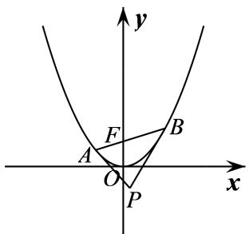

text_image

y
F
A
O
P
B
x

1、阿基米德三角形底边上的中线平行于抛物线的轴.  
2、若阿基米德三角形的底边即弦 AB 过抛物线内定点 $C(x_{0}, y_{0})$ ，则另一顶点 P 的轨迹为一条直线.  
3、若直线 l 与抛物线没有公共点，以 l 上的点为顶点的阿基米德三角形的底边过定点.  
4、底边长为 $a$ 的阿基米德三角形的面积的最大值为 $\frac{a^3}{8p}$ .  
5、若阿基米德三角形的底边过焦点，则顶点 Q 的轨迹为准线，且阿基米德三角形的面积的最小值为 $p^{2}$ .  
6、点P的坐标为 $\left(\frac{x_{1}+x_{2}}{2},\frac{x_{1}x_{2}}{2p}\right)$ ;  
7、底边 AB 所在的直线方程为 $(x_{1}+x_{2})x-2py-x_{1}x_{2}=0;$   
8、 $\triangle \mathrm{PAB}$ 的面积为 $\mathrm{S}_{\triangle \mathrm{PAB}} = \frac{|x_1 - x_2|^3}{8p}$ .  
9、若点P的坐标为 $(x_0,y_0)$ ，则底边AB的直线方程为 $x_0x - p(y + y_0) = 0$   
10、如图1, 若 $\mathbf{E}$ 为抛物线弧AB上的动点, 点 $\mathbf{E}$ 处的切线与PA, PB分别交于点C, D, 则 $\frac{|\mathbf{AC}|}{|\mathbf{CP}|} = \frac{|\mathbf{CE}|}{|\mathbf{ED}|} = \frac{|\mathbf{PD}|}{|\mathbf{DB}|}$ .  
11、若 E 为抛物线弧 AB 上的动点，抛物线在点 E 处的切线与阿基米德三角形 $\Delta PAB$ 的边 PA, PB 分别交于点 C, D，则 $\frac{S_{\Delta EAB}}{S_{\Delta PCD}} = 2$ .  
12、抛物线和它的一条弦所围成的面积,等于以此弦为底边的阿基米德三角形面积的 $\frac{2}{3}$ .

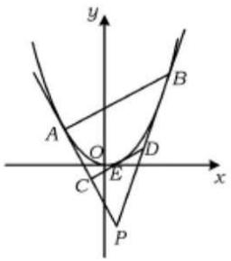

text_image

y
A
O
D
C
E
x
P
B

图1

# 必考题型全归纳

# 1 题型一:定点问题

4440 (2024·山西太原·高二山西大附中校考期末)已知点 A(0, -1), B(0, 1), 动点 P 满足 $\left|\overrightarrow{PB}\right|\left|\overrightarrow{AB}\right|=\overrightarrow{PA}\cdot\overrightarrow{BA}$ . 记点 P 的轨迹为曲线 C.

(1) 求 C 的方程;  
(2) 设 D 为直线 y = -2 上的动点, 过 D 作 C 的两条切线, 切点分别是 E, F. 证明: 直线 EF 过定点.

4441 (2024·陕西西安·西安市大明宫中学校考模拟预测)已知动圆 M 恒过定点 $F\left(0, \frac{1}{8}\right)$ ，圆心 M 到直线 $y = -\frac{1}{4}$ 的距离为 $d, d = |MF| + \frac{1}{8}$ .

(1) 求 M 点的轨迹 C 的方程;  
(2) 过直线 y = x - 1 上的动点 Q 作 C 的两条切线 $l_{1}, l_{2}$ ，切点分别为 A, B，证明：直线 AB 恒过定点.

4442 (2024·全国·高二专题练习)已知平面曲线 C 满足: 它上面任意一定到 $\left(0, \frac{1}{2}\right)$ 的距离比到直线 $y = -\frac{3}{2}$ 的距离小 1.

(1) 求曲线 C 的方程;  
(2)D 为直线 $y=-\frac{1}{2}$ 上的动点, 过点 D 作曲线 C 的两条切线, 切点分别为 A、B, 证明: 直线 AB 过定点;  
(3) 在 (2) 的条件下, 以 $\mathrm{E}\left(0, \frac{5}{2}\right)$ 为圆心的圆与直线 AB 相切, 且切点为线段 AB 的中点, 求四边形 ADBE 的面积.

4443 (2024·陕西·校联考三模)已知直线 l 与抛物线 C: $x^{2}=2py(p>0)$ 交于 A, B 两点，且 OA ⊥ OB, OD ⊥ AB, D 为垂足，点 D 的坐标为 (1,1).

(1) 求 C 的方程;  
(2) 若点 E 是直线 y = x - 4 上的动点, 过点 E 作抛物线 C 的两条切线 EP, EQ, 其中 P, Q 为切点, 试证明直线 PQ 恒过一定点, 并求出该定点的坐标.

(2024·安徽·高二合肥市第八中学校联考开学考试)抛物线的弦与在弦两端点处的切线所围成的三角形被称为“阿基米德三角形”。对于抛物线 C: $y = ax^{2}$ 给出如下三个条件：

①焦点为 $F\left(0, \frac{1}{2}\right)$ ; ②准线为 $y = -\frac{1}{2}$ ; ③与直线 2y - 1 = 0 相交所得弦长为 2.

(1) 从以上三个条件中选择一个, 求抛物线 C 的方程;  
(2) 已知 $\triangle ABQ$ 是 (1) 中抛物线的“阿基米德三角形”，点 $Q$ 是抛物线 $C$ 在弦 $AB$ 两端点处

的两条切线的交点, 若点 Q 恰在此抛物线的准线上, 试判断直线 AB 是否过定点? 如果是, 求出定点坐标; 如果不是, 请说明理由.

4445 (2024·湖北武汉·高二武汉市第四十九中学校考阶段练习)已知抛物线 C: $y = ax^{2}$ (a 是常数) 过点 P(-2,2)，动点 D(t, - $\frac{1}{2}$ )，过 D 作 C 的两条切线，切点分别为 A, B.

(1) 求抛物线 C 的焦点坐标和准线方程;  
(2) 当 t=1 时, 求直线 AB 的方程;  
(3) 证明: 直线 AB 过定点.

4446 (2024·全国·高三专题练习)已知动点P在x轴及其上方，且点P到点F(0,1)的距离比到x轴的距离大1.

(1) 求点 P 的轨迹 C 的方程;  
(2) 若点 Q 是直线 y = x - 4 上任意一点, 过点 Q 作点 P 的轨迹 C 的两切线 QA、QB, 其中 A、B 为切点, 试证明直线 AB 恒过一定点, 并求出该点的坐标.

# 2 题型二:交点的轨迹问题

4447 (2024·全国·高三专题练习)已知抛物线C的顶点为原点,其焦点F(0,c)(c>0)到直线l: x-y-2=0的距离为 $\frac{3\sqrt{2}}{2}$ .

(1) 求抛物线 C 的方程;  
(2) 设点 $P(x_{0}, y_{0})$ 为直线 l 上一动点，过点 P 作抛物线 C 的两条切线 PA, PB，其中 A, B 为切点，求直线 AB 的方程，并证明直线 AB 过定点 Q；  
(3) 过 (2) 中的点 Q 的直线 m 交抛物线 C 于 A, B 两点, 过点 A, B 分别作抛物线 C 的切线 $l_{1}, l_{2}$ , 求 $l_{1}, l_{2}$ 交点 M 满足的轨迹方程.

4448 (2024·全国·高三专题练习)已知抛物线 C: $x^{2}=4y$ 的焦点为 F，过点 F 作直线 l 交抛物线 C 于 A、B 两点；椭圆 E 的中心在原点，焦点在 x 轴上，点 F 是它的一个顶点，且其离心率 $e=\frac{\sqrt{3}}{2}$ .

(1) 求椭圆 E 的方程;  
(2) 经过 A、B 两点分别作抛物线 C 的切线 $l_{1}, l_{2}$ , 切线 $l_{1}$ 与 $l_{2}$ 相交于点 M. 证明: 点 M 定在直线 $y = -1$ 上;  
(3) 椭圆 E 上是否存在一点 M', 经过点 M' 作抛物线 C 的两条切线 M'A'、M'B'(A'、B' 为切点), 使得直线 A'B' 过点 F? 若存在, 求出切线 M'A'、M'B' 的方程; 若不存在, 试说明理由.

4449 (2024·全国·高三专题练习)已知动点Q在x轴上方，且到定点F(0,1)距离比到x轴的距离大1.

(1) 求动点 Q 的轨迹 C 的方程;  
(2) 过点 P(1,1) 的直线 l 与曲线 C 交于 A, B 两点, 点 A, B 分别异于原点 O, 在曲线 C 的 A, B 两点处的切线分别为 $l_{1}, l_{2}$ , 且 $l_{1}$ 与 $l_{2}$ 交于点 M, 求证: M 在定直线上.

4450 (2024·全国·高三专题练习)已知动点 P 与定点 F(1,0) 的距离和它到定直线 l:x=4 的距离之比为 $\frac{1}{2}$ ，记 P 的轨迹为曲线 C.

(1) 求曲线 C 的方程;  
(2) 过点 M(4,0) 的直线与曲线 C 交于 A,B 两点, R,Q 分别为曲线 C 与 x 轴的两个交点,

直线 AR, BQ 交于点 N, 求证: 点 N 在定直线上.

4451 (2024·全国·高三专题练习)已知点 F 为抛物线 C: $x^{2}=2py(p>0)$ 的焦点, 点 M、N 在抛物线上, 且 M、N、F 三点共线. 若圆 P: $(x-2)^{2}+(y-3)^{2}=16$ 的直径为 MN.

(1) 求抛物线 C 的标准方程;  
(2) 过点 F 的直线 l 与抛物线交于点 A, B, 分别过 A、B 两点作抛物线 C 的切线 $l_{1}, l_{2}$ , 证明直线 $l_{1}, l_{2}$ 的交点在定直线上, 并求出该直线.

4452 (2024·全国·高三专题练习)下面是某同学在学段总结中对圆锥曲线切线问题的总结和探索,现邀请你一起合作学习,请你思考后,将答案补充完整.

(1) 圆 $O: x^{2} + y^{2} = r^{2}$ 上点 $M(x_{0}, y_{0})$ 处的切线方程为 \_\_\_\_. 理由如下: \_\_\_\_.  
(2)椭圆 $\frac{x^2}{a^2} +\frac{y^2}{b^2} = 1(a > b > 0)$ 上一点 $(x_0,y_0)$ 处的切线方程为  
(3) $P(m,n)$ 是椭圆 $L:\frac{x^{2}}{3}+y^{2}=1$ 外一点,过点P作椭圆的两条切线,切点分别为A,B,如图,则直线AB的方程是\_\_\_\_.这是因为在 $A(x_{1},y_{1}),B(x_{2},y_{2})$ 两点处,椭圆L的切线方程为 $\frac{x_{1}x}{3}+y_{1}y=1$ 和 $\frac{x_{2}x}{3}+y_{2}y=1$ .两切线都过P点,所以得到了 $\frac{x_{1}m}{3}+y_{1}n=1$ 和 $\frac{x_{2}m}{3}+y_{2}n=1$ ,由这两个“同构方程”得到了直线AB的方程;

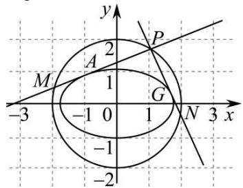

text_image

y
P
2
A
M
1
G
-3
-1 0 1 N 3 x
-1
-2

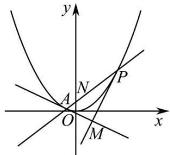

text_image

y
A
N
P
O
M
x

(4) 问题 (3) 中两切线 PA, PB 斜率都存在时, 设它们方程的统一表达式为 $y - n = k(x - m)$ , 由 $\begin{cases} y - n = k(x - m) \\ x^2 + 3y^2 = 3 \end{cases}$ , 得 $(1 + 3k^2)x^2 + 6k(n - km)x + 3(n - km)^2 - 3 = 0$ , 化简得 $\Delta = 0$ , 得 $(3 - m^2)x^2 + 2mnk + 1 - n^2 = 0$ . 若 PA ⊥ PB, 则由这个方程可知 P 点一定在一个圆上, 这个圆的方程为 \_\_\_\_.  
(5) 抛物线 $y^{2}=2px(p>0)$ 上一点 $(x_{0},y_{0})$ 处的切线方程为 $y_{0}y=p(x_{0}+x)$ ;  
(6) 抛物线 C: $x^{2}=4y$ ，过焦点 F 的直线 l 与抛物线相交于 A, B 两点，分别过点 A, B 作抛物线的两条切线 $l_{1}$ 和 $l_{2}$ ，设 $\mathrm{A}(x_{1}, y_{1}), \mathrm{B}(x_{2}, y_{2})$ ，则直线 $l_{1}$ 的方程为 $x_{1}x = 2(y_{1} + y)$ 。直线 $l_{2}$ 的方程为 $x_{2}x = 2(y_{2} + y)$ ，设 $l_{1}$ 和 $l_{2}$ 相交于点 M。则①点 M 在以线段 AB 为直径的圆上；②点 M 在抛物线 C 的准线上。

# 题型三: 切线垂直问题

4453 (2024·全国·高三专题练习)已知抛物线C的方程为 $x^{2} = 4y$ ，过点P作抛物线C的两条切线，切点分别为A,B.

(1) 若点 P 坐标为 $(0, -1)$ ，求切线 PA, PB 的方程；  
(2) 若点 P 是抛物线 C 的准线上的任意一点, 求证: 切线 PA 和 PB 互相垂直.

4454 (2024·全国·高三专题练习)已知抛物线C的方程为 $x^{2}=4y$ ，点P是抛物线C的准线上的任意一点，过点P作抛物线C的两条切线，切点分别为A,B，点M是AB的中点.

(1) 求证: 切线 PA 和 PB 互相垂直;  
(2) 求证: 直线 PM 与 y 轴平行;  
(3) 求 $\triangle PAB$ 面积的最小值.

4455 (2024·全国·高三专题练习)已知中心在原点的椭圆 $\Gamma_{1}$ 和抛物线 $\Gamma_{2}$ 有相同的焦点 (1,0)，椭圆 $\Gamma_{1}$ 的离心率为 $\frac{1}{2}$ ，抛物线 $\Gamma_{2}$ 的顶点为原点.

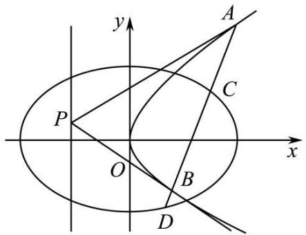

text_image

y
A
C
P
O
x
B
D

(1) 求椭圆 $\Gamma_{1}$ 和抛物线 $\Gamma_{2}$ 的方程；

(2) 设点 P 为抛物线 $\Gamma_{2}$ 准线上的任意一点, 过点 P 作抛物线 $\Gamma_{2}$ 的两条切线 PA, PB, 其中 A, B 为切点. 设直线 PA, PB 的斜率分别为 $k_{1}, k_{2}$ , 求证: $k_{1}k_{2}$ 为定值.

4456 (2024·全国·高三专题练习)已知中心在原点的椭圆 $C_{1}$ 和抛物线 $C_{2}$ 有相同的焦点 $(1,0)$ ，椭圆 $C_{1}$ 过点 $G\left(1,\frac{3}{2}\right)$ ，抛物线 $C_{2}$ 的顶点为原点.

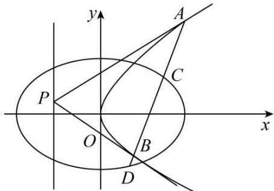

text_image

y
A
C
P
O
B
x
D

(1) 求椭圆 $C_{1}$ 和抛物线 $C_{2}$ 的方程;

(2) 设点 P 为抛物线 $C_{2}$ 准线上的任意一点, 过点 P 作抛物线 $C_{2}$ 的两条切线 PA, PB, 其中 A, B 为切点.

①设直线 PA, PB 的斜率分别为 $k_{1}$ , $k_{2}$ , 求证: $k_{1}k_{2}$ 为定值;

②若直线 AB 交椭圆 $C_{1}$ 于 C, D 两点, $S_{\triangle PAB}$ , $S_{\triangle PCD}$ 分别是 $\triangle PAB$ , $\triangle PCD$ 的面积, 试问: $\frac{S_{\triangle PAB}}{S_{\triangle PCD}}$ 是否有最小值? 若有, 求出最小值; 若没有, 请说明理由.

4457 (2024·全国·高三专题练习)抛物级 $x^{2}=2py(p>0)$ 的焦点 F 到直线 $y=-\frac{p}{2}$ 的距离为 2.

(1) 求抛物线的方程:

(2) 设直线 $y = kx + 1$ 交抛物线于 A $(x_{1}, ^{\circ} y_{1})$ , $^{\circ}$ B $(x_{2}, ^{\circ} y_{2})$ 两点, 分别过 A, B 两点作抛物线的两条切线, 两切线的交点为 P, 求证: PF ⊥ AB.

4458 (2024·河南驻马店·校考模拟预测)已知抛物线 E: $x^{2}=2py(p>0)$ 的焦点为 F，点 P 在 E 上，直线 l: x-y-2=0 与 E 相离．若 P 到直线 l 的距离为 d，且 $|PF|+d$ 的最小值为 $\frac{3\sqrt{2}}{2}$ ．过 E 上两点 A,B 分别作 E 的两条切线，若这两条切线的交点 M 恰好在直线 l 上.

(1) 求 E 的方程;

(2) 设线段 AB 中点的纵坐标为 n，求证：当 n 取得最小值时，MA ⊥ MB.

4 题型四:面积问题

4459 (2024·全国·高三专题练习)已知抛物线 C 的方程为 $x^{2}=2py(p>0)$ ，点 A $\left(x,\frac{3}{2}\right)$ 是抛物线上的一点，且到抛物线焦点的距离为 2.

(1) 求抛物线的方程;
(2) 点 Q 为直线 $y = -\frac{1}{2}$ 上的动点, 过点 Q 作抛物线 C 的两条切线, 切点分别为 D, E, 求 $\triangle QDE$ 面积的最小值.

4460 (2024·全国·高三专题练习)已知抛物线 $x^{2}=2py$ 上一点 M( $x_{0},1$ ) 到其焦点 F 的距离为 2.

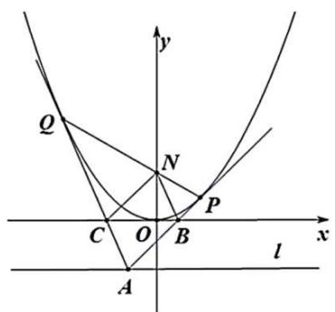

text_image

Q
N
P
C O B x
A
l

(1) 求抛物线的方程;
(2) 如图, 过直线 l: y = -2 上一点 A 作抛物线的两条切线 AP, AQ, 切点分别为 P, Q, 且直线 PQ 与 y 轴交于点 N. 设直线 AP, AQ 与 x 轴的交点分别为 B, C, 求四边形 ABNC 面积的最小值.

4461 (2024·全国·高三专题练习)已知抛物线 C: $x^{2}=2py(p>0)$ 的焦点到原点的距离等于直线 l:x-4y-4=0 的斜率.

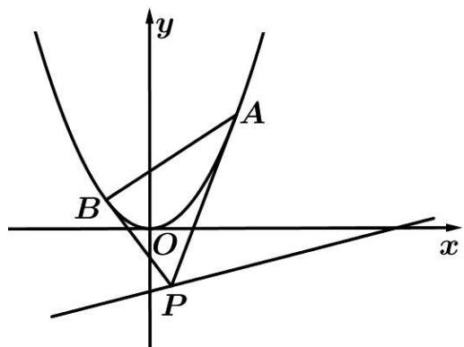

text_image

y
A
B
O
x
P

(1) 求抛物线 C 的方程及准线方程;
(2) 点 P 是直线 l 上的动点, 过点 P 作抛物线 C 的两条切线, 切点分别为 A, B, 求 $\triangle PAB$ 面积的最小值.

4462 (2024·全国·高三专题练习)如图,已知抛物线 C: $y^{2}=2px(p>0)$ 上的点 R 的横坐标为 1,焦点为 F,且 $|RF|=2$ ,过点 P(-4,0)作抛物线 C 的两条切线,切点分别为 A、B,D 为线段 PA 上的动点,过 D 作抛物线的切线,切点为 E(异于点 A,B),且直线 DE 交线段 PB 于点 H.

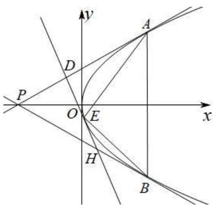

text_image

P
O
E
H
B
x
y
A
D

(1) 求抛物线 C 的方程;  
(2)(i) 求证: $|AD| + |BH|$ 为定值;  
(ii) 设 $\triangle \mathrm{EAD}, \triangle \mathrm{EBH}$ 的面积分别为 $S_{1}, S_{2}$ , 求 $S = 3S_{1} + \frac{1}{3} S_{2}$ 的最小值.

4463 (2024·全国·高三专题练习)已知点A(-4, 4)、B(4, 4)，直线AM与BM相交于点M，且直线AM的斜率与直线BM的斜率之差为-2，点M的轨迹为曲线C.

(1) 求曲线 C 的轨迹方程;  
(2)Q为直线y=-1上的动点,过Q作曲线C的切线,切点分别为D、E,求 $\triangle QDE$ 的面积S的最小值.

4464 (2024·河南开封·河南省兰考县第一高级中学校考模拟预测)已知点 $F(-\sqrt{3},0)$ ，平面上的动点 S 到 F 的距离是 S 到直线 $\sqrt{3}x + 4 = 0$ 的距离的 $\frac{\sqrt{3}}{2}$ 倍，记点 S 的轨迹为曲线 C.

(1) 求曲线 C 的方程;  
(2) 过直线 $l: y = 2$ 上的动点 $\mathrm{P}(s, 2)(s > 2)$ 向曲线 C 作两条切线 $l_{1}, l_{2}, l_{1}$ 交 $x$ 轴于 M，交 $y$ 轴于 N， $l_{2}$ 交 $x$ 轴于 T，交 $y$ 轴于 Q，记 $\triangle \mathrm{PNQ}$ 的面积为 $\mathrm{S}_{1}, \triangle \mathrm{PMT}$ 的面积为 $\mathrm{S}_{2}$ ，求 $\mathrm{S}_{1} \cdot \mathrm{S}_{2}$ 的最小值.

# 5 题型五:外接圆问题

4465 (2024·全国·高三专题练习)已知P是抛物线C: $y=\frac{1}{4}x^{2}-3$ 的顶点, A, B 是 C 上的两个动点, 且 $\overrightarrow{PA}\cdot\overrightarrow{PB}=-4$ .

(1)试判断直线AB是否经过某一个定点？若是，求这个定点的坐标；若不是，说明理由；  
(2) 设点 M 是 $\triangle PAB$ 的外接圆圆心, 求点 M 的轨迹方程.

4466 (2024·高二单元测试)已知点 P 是抛物线 C: $y = \frac{1}{4}x^{2} - 3$ 的顶点, A, B 是 C 上的两个动点, 且 $\overrightarrow{PA} \cdot \overrightarrow{PB} = -4$ .

(1) 判断点 D(0,1) 是否在直线 AB 上？说明理由；  
(2) 设点 M 是 $\triangle$ PAB 的外接圆的圆心, 点 M 到 $x$ 轴的距离为 $d$ , 点 N(1,0), 求 |MN| - d 的最大值.

4467 (2024·全国·高三专题练习)已知点P是抛物线C: $y=\frac{1}{4}x^{2}-3$ 的顶点，A，B是C上的两个动点，且 $\overrightarrow{PA}\cdot\overrightarrow{PB}=-4$ .

(1) 判断点 D(0, -1) 是否在直线 AB 上？说明理由；  
(2) 设点 M 是 $\triangle PAB$ 的外接圆的圆心, 求点 M 的轨迹方程.

# 6 题型六:最值问题

4468 (2024·全国·高三专题练习)如图已知 $P(-2, t)$ 是直线 x = -2 上的动点，过点 P 作抛物线 $y^{2} = 4x$ 的两条切线，切点分别为 A, B，与 y 轴分别交于 C, D.

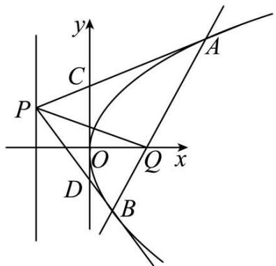

text_image

y
C
A
P
O
Q x
D
B

(1) 求证: 直线 AB 过定点, 并求出该定点;
(2) 设直线 AB 与 x 轴相交于点 Q, 记 A, B 两点到直线 PQ 的距离分别为 $d_{1}, d_{2}$ ; 求当 $\frac{|AB|}{d_{1}+d_{2}}$ 取最大值时 $\Delta PCD$ 的面积.

4469 (2024·湖南·高三校联考阶段练习)在直角坐标系 $xoy$ 中, 已知抛物线 $\mathrm{C}: x^2 = 2py (p > 0)$ , $\mathrm{P}$ 为直线 $y = x - 1$ 上的动点, 过点 $\mathrm{P}$ 作抛物线 $\mathrm{C}$ 的两条切线, 切点分别为 $\mathrm{A}$ , $\circ \circ \circ \mathrm{B}$ , 当 $\mathrm{P}$ 在 $y$ 轴上时, $\mathrm{OA} \perp \mathrm{OB}$ .

(1) 求抛物线 C 的方程；
(2) 求点 O 到直线 AB 距离的最大值.

4470 (2024·辽宁沈阳·校联考二模)从抛物线的焦点发出的光经过抛物线反射后,光线都平行于抛物线的轴,根据光路的可逆性,平行于抛物线的轴射向抛物线后的反射光线都会汇聚到抛物线的焦点处,这一性质被广泛应用在生产生活中.如图,已知抛物线 $C: x^{2} = 2py (p > 1)$ ,从点 (4,9) 发出的平行于 y 轴的光线照射到抛物线上的 D 点,经过抛物线两次反射后,反射光线由 G 点射出,经过点 (-1,5).

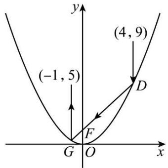

line

| Point | x | y |
|---|---|---|
| F | 0 | 0 |
| G | 0 | 0 |
| D | 4 | 9 |
| (-1,5) | -1 | 0 |
| O | 0 | 0 |

(1) 求抛物线 C 的方程；
(2) 已知圆 $M: x^{2} + (y - 3)^{2} = 4$ ，在抛物线 C 上任取一点 E，过点 E 向圆 M 作两条切线 EA 和 EB，切点分别为 A、B，求 $\overrightarrow{EA} \cdot \overrightarrow{EB}$ 的取值范围.

4471 (2024·贵州·高三校联考阶段练习)已知抛物线 C: $x^{2}=2py(p>0)$ 上的点 $(2,y_{0})$ 到其焦点 F 的距离为 2.

(1) 求抛物线 C 的方程;
(2) 已知点 D 在直线 l: y = -3 上, 过点 D 作抛物线 C 的两条切线, 切点分别为 A, B, 直线 AB 与直线 l 交于点 M, 过抛物线 C 的焦点 F 作直线 AB 的垂线交直线 l 于点 N, 当 $|MN|$

最小时,求 $\frac{|AB|}{|MN|}$ 的值.

4472 (2024·黑龙江大庆·高二大庆实验中学校考阶段练习)已知抛物线 C: $y^{2}=4x$ ，点 P 为直线 x=-2 上的任意一点，过点 P 作抛物线 C 的两条切线，切点分别为 A, B，则点 M(0,1) 到直线 AB 的距离的最大值为（）

A. 1

B. 4

C. 5

D. $\sqrt{5}$

# 题型七: 角度相等问题

4473 设抛物线 C: $y = x^{2}$ 的焦点为 F，动点 P 在直线 l: x - y - 2 = 0 上运动，过 P 作抛物线 C 的两条切线 PA、PB，且与抛物线 C 分别相切于 A、B 两点.

(1) 求 $\triangle APB$ 的重心 G 的轨迹方程.  
(2) 证明 $\angle PFA = \angle PFB$ .

4474 (2024·全国·高三专题练习)已知 F, F' 分别是椭圆 C₁:17x² + 16y² = 17 的上、下焦点, 直线 l₁ 过点 F' 且垂直于椭圆长轴, 动直线 l₂ 垂直 l₁ 于点 G, 线段 GF 的垂直平分线交 l₂ 于点 H, 点 H 的轨迹为 C₂.

(1) 求轨迹 $C_{2}$ 的方程;  
(2) 若动点 P 在直线 $l: x - y - 2 = 0$ 上运动, 且过点 P 作轨迹 $\mathrm{C}_{2}$ 的两条切线 PA、PB, 切点为 A、B, 试猜想 $\angle \mathrm{PFA}$ 与 $\angle \mathrm{PFB}$ 的大小关系, 并证明你的结论的正确性.

4475 (2024·江苏南通·高三统考阶段练习)在平面直角坐标系 $xOy$ 中, 已知圆 $\mathrm{G}: x^2 + (y - 1)^2 = 1$ 与抛物线 $\mathrm{C}: x^2 = 2py (p > 0)$ 交于点 $\mathrm{M}, \mathrm{N}$ (异于原点 $\mathrm{O}$ ), MN恰为该圆的直径, 过点 $\mathrm{E}(0, 2)$ 作直线交抛物线于 $\mathrm{A}, \mathrm{B}$ 两点, 过 $\mathrm{A}, \mathrm{B}$ 两点分别作抛物线 $\mathrm{C}$ 的切线交于点 $\mathrm{P}$ .

(1) 求证: 点 P 的纵坐标为定值;  
(2) 若 F 是抛物线 C 的焦点, 证明: $\angle PFA = \angle PFB$ .

4476 (2024·全国·高三专题练习)如图所示, 设抛物线 C: $y = x^{2}$ 的焦点为 F, 动点 P 在直线 l: x - y - 2 = 0 上运动, 过 P 作抛物线 C 的两条切线 PA, PB, 切点分别为 A, B, 求证: $\angle AFB = \angle BFP$ .

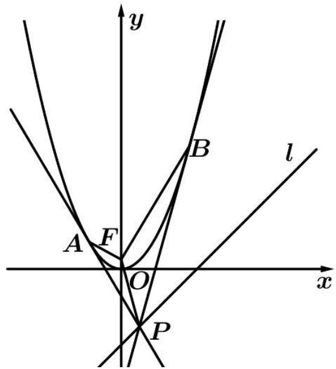

text_image

y
B
l
A F
O
x
P

4477 (2024·全国·高三专题练习)在平面直角坐标系 $xOy$ 中，已知点 $\mathrm{E}(0,2)$ ，以OE为直径的圆与抛物线 C: $x^{2}=2py(p>0)$ 交于点 M, N(异于原点 O), MN 恰为该圆的直径, 过点 E 作直线交抛物线与 A, B 两点, 过 A, B 两点分别作抛物线 C 的切线交于点 P.

(1) 求证: 点 P 的纵坐标为定值;  
(2) 若 F 是抛物线 C 的焦点, 证明: $\angle PFA = \angle PFB$ .

