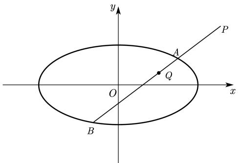
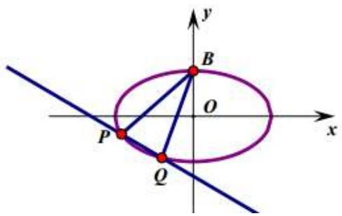
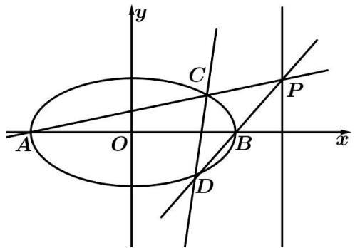
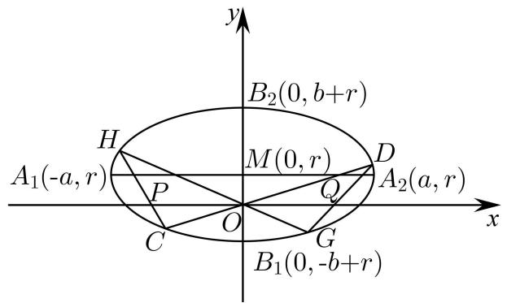
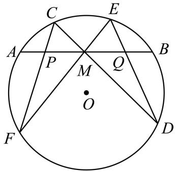
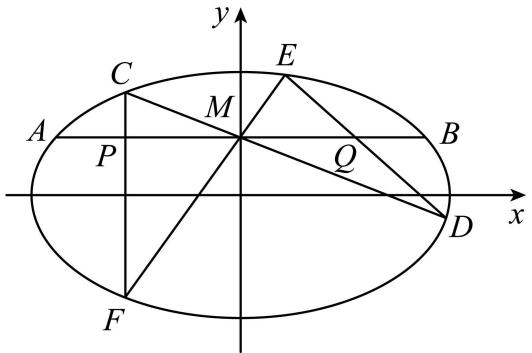
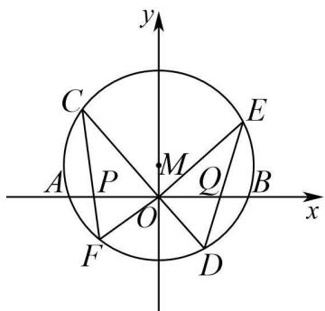
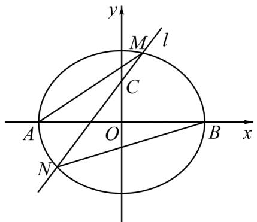
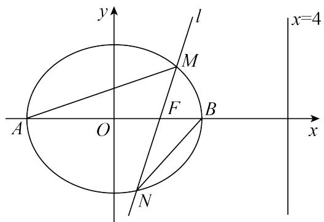
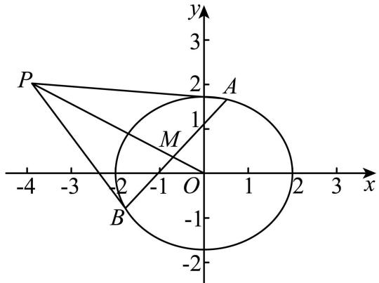

# 第81讲 圆锥曲线拓展题型一

# 题型一:定比点差法

4478 已知椭圆 C: $\frac{x^{2}}{a^{2}} + \frac{y^{2}}{b^{2}} = 1 (a > b > 0)$ 的离心率为 $\frac{\sqrt{3}}{2}$ ，过右焦点 F 且斜率为 $k (k > 0)$ 的直线与 C 相交于 A, B 两点，若 $\overrightarrow{AF} = 3\overrightarrow{FB}$ ，求 k  
4479 已知 $\frac{x^2}{9} + \frac{y^2}{4} = 1$ ，过点 $\mathrm{P}(0,3)$ 的直线交椭圆于A，B(可以重合)，求 $\frac{|\mathrm{PA}|}{|\mathrm{PB}|}$ 取值范围.  
4480 已知椭圆 $\frac{x^{2}}{6} + \frac{y^{2}}{2} = 1$ 的左右焦点分别为 $F_{1}, F_{2}, A, B, P$ 是椭圆上的三个动点，且 $\overrightarrow{PF_{1}} = \lambda \overrightarrow{F_{1}A}, \overrightarrow{PF_{2}} = \mu \overrightarrow{F_{2}B}$ 若 $\lambda = 2$ ，求 $\mu$ 的值.  
4481 设 $F_{1}, F_{2}$ 分别为椭圆 $\frac{x^{2}}{3} + y^{2} = 1$ 的左、右焦点，点 A, B 在椭圆上，若 $\overrightarrow{F_{1}A} = 5\overrightarrow{F_{2}B}$ ，求点 A 的坐标  
4482 已知椭圆 C: $\frac{x^2}{2} + y^2 = 1$ ，设过点 P(2,2) 的直线 $l$ 与椭圆 C 交于 A, B，点 Q 是线段 AB 上的点，且 $\frac{1}{|\mathrm{PA}|} + \frac{1}{|\mathrm{PB}|} = \frac{2}{|\mathrm{PQ}|}$ ，求点 Q 的轨迹方程.

text_image

y
P
A
Q
O
x
B

# 题型二:齐次化

4483 已知抛物线 C: $y^{2}=4x$ ，过点 $(4,0)$ 的直线与抛物线 C 交于 P，Q 两点，O 为坐标原点.
证明： $\angle POQ=90^{\circ}$   
4484 如图,椭圆 $E:\frac{x^{2}}{2}+y^{2}=1$ , 经过点 $M(1,1)$ , 且斜率为 k 的直线与椭圆 E 交于不同的两点 P, Q (均异于点 A(0,-1), 证明: 直线 AP 与 AQ 的斜率之和为 2.  
4485 已知椭圆 C: $\frac{x^{2}}{4} + y^{2} = 1$ ，设直线 l 不经过点 P₂(0,1) 且与 C 相交于 A，B 两点。若直线 P₂A 与直线 P₂B 的斜率的和为 -1，证明：直线 l 过定点。  
4486 已知椭圆 C: $\frac{x^{2}}{3} + y^{2} = 1$ , B(0,1), P, Q 为上的两个不同的动点, $k_{BP}k_{BQ} = \frac{2}{3}$ , 求证: 直线 PQ 过定点.

text_image

y
B
O
x
P
Q

# 3 题型三:极点极线问题

4487 (2024·全国·高三专题练习)椭圆方程 $\Gamma:\frac{x^{2}}{a^{2}}+\frac{y^{2}}{b^{2}}=1(a>b>0)$ ，平面上有一点 $\mathrm{P}(x_{0},y_{0})$ .
定义直线方程 $l:\frac{x_{0}x}{a^{2}}+\frac{y_{0}y}{b^{2}}=1$ 是椭圆 $\Gamma$ 在点 $\mathrm{P}(x_{0},y_{0})$ 处的极线．已知椭圆方程 C: $\frac{x^{2}}{4}+\frac{y^{2}}{3}=1$ .

(1) 若 $P(1, y_{0})$ 在椭圆 C 上, 求椭圆 C 在点 P 处的极线方程;  
(2) 若 $P(x_{0}, y_{0})$ 在椭圆 C 上, 证明: 椭圆 C 在点 P 处的极线就是过点 P 的切线;  
(3) 若过点 P(-4,0) 分别作椭圆 C 的两条切线和一条割线，切点为 X, Y，割线交椭圆 C 于 M, N 两点，过点 M, N 分别作椭圆 C 的两条切线，且相交于点 Q．证明：Q, X, Y 三点共线.

4488 (2024·全国·高三专题练习)阅读材料：

(一)极点与极线的代数定义;已知圆锥曲线G: $Ax^{2}+Cy^{2}+2Dx+2Ey+F=0$ ，则称点P $(x_{0},y_{0})$ 和直线 $l\colon Ax_{0}x+Cy_{0}y+D(x+x_{0})+E(y+y_{0})+F=0$ 是圆锥曲线G的一对极点和极线.事实上，在圆锥曲线方程中，以 $x_{0}x$ 替换 $x^{2}$ ，以 $\frac{x_{0}+x}{2}$ 替换x(另一变量y也是如此)，即可得到点P $(x_{0},y_{0})$ 对应的极线方程.特别地，对于椭圆 $\frac{x^{2}}{a^{2}}+\frac{y^{2}}{b^{2}}=1$ ，与点P $(x_{0},y_{0})$ 对应的极线方程为 $\frac{x_{0}x}{a^{2}}+\frac{y_{0}y}{b^{2}}=1$ ;对于双曲线 $\frac{x^{2}}{b^{2}}-\frac{y^{2}}{b^{2}}=1$ ，与点P $(x_{0},y_{0})$ 对应的极线方程为 $\frac{x_{0}x}{a^{2}}-\frac{y_{0}y}{b^{2}}=1$ ;对于抛物线 $y^{2}=2px$ ，与点P $(x_{0},y_{0})$ 对应的极线方程为 $y_{0}y=p(x_{0}+x)$ .即对于确定的圆锥曲线，每一对极点与极线是一一对应的关系.

(二)极点与极线的基本性质、定理

①当P在圆锥曲线G上时,其极线l是曲线G在点P处的切线;   
②当 $\mathbf{P}$ 在 $\mathbf{G}$ 外时，其极线 $l$ 是曲线 $\mathbf{G}$ 从点 $\mathbf{P}$ 所引两条切线的切点所确定的直线(即切点弦所在直线);  
③当P在G内时,其极线l是曲线G过点P的割线两端点处的切线交点的轨迹.

结合阅读材料回答下面的问题：

(1) 已知椭圆 C: $\frac{x^2}{a^2} + \frac{y^2}{b^2} = 1 (a > b > 0)$ 经过点 P(4, 0), 离心率是 $\frac{\sqrt{3}}{2}$ , 求椭圆 C 的方程并写出与点 P 对应的极线方程;  
(2) 已知 Q 是直线 $l: y = -\frac{1}{2}x + 4$ 上的一个动点，过点 Q 向 (1) 中椭圆 C 引两条切线，切点分

别为 M, N, 是否存在定点 T 恒在直线 MN 上, 若存在, 当 $\overrightarrow{MT} = \overrightarrow{TN}$ 时, 求直线 MN 的方程; 若不存在, 请说明理由.

【解析】(1) 因为椭圆 $\frac{x^{2}}{a^{2}} + \frac{y^{2}}{b^{2}} = 1 (a > b > 0)$ 过点 P(4,0),

则 $\frac{4^2}{a^2} +\frac{0^2}{b^2} = 1$ ，得 $a = 4$ ，又 $\mathrm{e} = \frac{c}{a} = \frac{\sqrt{3}}{2},$

所以 $c = 2\sqrt{3}$ ，所以 $b^{2} = a^{2} - c^{2} = 4$

所以椭圆C的方程为 $\frac{x^2}{16} +\frac{y^2}{4} = 1.$

根据阅读材料,与点P对应的极线方程为 $\frac{4x}{16}+\frac{0\times y}{4}=1$ ,即x-4=0;

(2) 由题意, 设点 Q 的坐标为 $(x_{0}, y_{0})$ ,

因为点Q在直线 $y = -\frac{1}{2} x + 4$ 上运动，所以 $y_0 = -\frac{1}{2} x_0 + 4$ ，

联立 $\left\{ \begin{array}{l} \frac{x^2}{16} + \frac{y^2}{4} = 1 \\ y = -\frac{1}{2} x + 4 \end{array} \right.$ ，得 $x^2 - 8x + 24 = 0$

$\Delta = 64 - 4 \times 24 = -32 < 0$ ，该方程无实数根，

所以直线 $y = -\frac{1}{2} x + 4$ 与椭圆C相离，即点Q在椭圆C外，

又QM，QN都与椭圆C相切，

所以点 Q 和直线 MN 是椭圆 C 的一对极点和极线.

对于椭圆 $\frac{x^2}{16} +\frac{y^2}{4} = 1$ ，与点 $\mathrm{Q}(x_0,y_0)$ 对应的极线方程为 $\frac{x_0x}{16} +\frac{y_0y}{4} = 1,$

将 $y_0 = -\frac{1}{2} x_0 + 4$ 代入 $\frac{x_0x}{16} +\frac{y_0y}{4} = 1$ ，整理得 $x_0(x - 2y) + 16y - 16 = 0,$

又因为定点 $\mathbf{T}$ 的坐标与 $x_0$ 的取值无关，

所以 $\left\{\begin{aligned}x-2y=0\\ 16y-16=0\end{aligned}\right.$ ，解得 $\left\{\begin{aligned}x=2\\ y=1\end{aligned}\right.$

所以存在定点 T(2,1) 恒在直线 MN 上.

当 $\overrightarrow{\mathrm{MT}} = \overrightarrow{\mathrm{TN}}$ 时，T是线段MN的中点，

设 $\mathbf{M}(x_1,y_1),\mathbf{N}(x_2,y_2)$ ，直线MN的斜率为 $k$

则 $\left\{ \begin{array}{l} \frac{x_1^2}{16} + \frac{y_1^2}{4} = 1 \\ \frac{x_2^2}{16} + \frac{y_2^2}{4} = 1 \end{array} \right.$ ，两式相减，整理得 $\frac{y_2 - y_1}{x_2 - x_1} = -\frac{4}{16} \cdot \frac{x_1 + x_2}{y_1 + y_2} = -\frac{4}{16} \cdot \frac{2 \times 2}{2 \times 1} = -\frac{1}{2}$ ，即 $k = -\frac{1}{2}$ ，

所以当 $\overrightarrow{\mathrm{MT}} = \overrightarrow{\mathrm{TN}}$ 时，直线MN的方程为 $y - 1 = -\frac{1}{2} (x - 2)$ ，即 $x + 2y - 4 = 0$

4489 (2024 秋·北京·高三中关村中学校考开学考试)已知椭圆 M: $\frac{x^{2}}{a^{2}} + \frac{y^{2}}{b^{2}} = 1 (a > b > 0)$ 过 A(-2, 0), B(0, 1) 两点.

(1) 求椭圆 M 的离心率;  
(2) 设椭圆 M 的右顶点为 C, 点 P 在椭圆 M 上 (P 不与椭圆 M 的顶点重合), 直线 AB 与直线 CP 交于点 Q, 直线 BP 交 x 轴于点 S, 求证: 直线 SQ 过定点.

4490 (2024·全国·高三专题练习)若双曲线 $x^{2}-y^{2}=9$ 与椭圆 C: $\frac{x^{2}}{a^{2}}+\frac{y^{2}}{b^{2}}=1(a>b>0)$ 共顶

点,且它们的离心率之积为 $\frac{4}{3}$ .

(1) 求椭圆 C 的标准方程；
(2) 若椭圆 C 的左、右顶点分别为 $A_{1}, A_{2}$ ，直线 l 与椭圆 C 交于 P、Q 两点，设直线 $A_{1}P$ 与 $A_{2}Q$ 的斜率分别为 $k_{1}, k_{2}$ ，且 $k_{1}-\frac{1}{5}k_{2}=0$ 。试问，直线 l 是否过定点？若是，求出定点的坐标；若不是，请说明理由。

4491 (2024·全国·高三专题练习)已知椭圆 E: $\frac{x^{2}}{a^{2}} + \frac{y^{2}}{b^{2}} = 1 (a > b > 0)$ 的离心率为 $\frac{\sqrt{3}}{2}$ ，且过点 $\left(1, \frac{\sqrt{3}}{2}\right)$ ，A，B 分别为椭圆 E 的左，右顶点，P 为直线 x = 3 上的动点（不在 x 轴上），PA 与椭圆 E 的另一交点为 C，PB 与椭圆 E 的另一交点为 D，记直线 PA 与 PB 的斜率分别为 $k_{1}, k_{2}$ .

text_image

y
C
P
A
O
B
x
D

(I) 求椭圆 E 的方程;  
(II) 求 $\frac{k_{1}}{k_{2}}$ 的值;  
(III) 证明: 直线 CD 过一个定点, 并求出此定点的坐标.

# 题型四: 蝴蝶问题

4492 (2003·全国·高考真题)如图,椭圆的长轴 $A_{1}A_{2}$ 与 x 轴平行,短轴 $B_{1}B_{2}$ 在 y 轴上,中心为 $\mathrm{M}(0,r)(b>r>0)$ .

text_image

y
B₂(0, b+r)
H
M(0, r)
D
A₁(-a, r)
P
Q
A₂(a, r)
x
C
O
G
B₁(0, -b+r)

(1) 写出椭圆的方程, 求椭圆的焦点坐标及离心率;   
(2) 直线 $y = k_{1}x$ 交椭圆于两点 $\mathrm{C}(x_{1}, y_{1}), \mathrm{D}(x_{2}, y_{2})(y_{2} > 0)$ ; 直线 $y = k_{2}x$ 交椭圆于两点 $\mathrm{G}(x_{3}, y_{3}), \mathrm{H}(x_{4}, y_{4})(y_{4} > 0)$ . 求证: $\frac{k_{1}x_{1}x_{2}}{x_{1} + x_{2}} = \frac{k_{2}x_{3}x_{4}}{x_{3} + x_{4}}$ ;  
(3) 对于 (2) 中的中的在 C, D, G, H, 设 CH 交 x 轴于 P 点, GD 交 x 轴于 Q 点, 求证: $|OP| = |OQ|$ (证明过程不考虑 CH 或 GD 垂直于 x 轴的情形)

4493 (2024·全国·高三专题练习)已知椭圆 C: $\frac{x^2}{a^2} + \frac{y^2}{b^2} = 1 (a > b > 0)$ , 四点 P₁(1,1), P₂(0,1),

$\mathrm{P}_3\left(-1, \frac{\sqrt{3}}{2}\right), \mathrm{P}_3\left(-1, \frac{\sqrt{3}}{2}\right), \mathrm{P}_4\left(1, \frac{\sqrt{3}}{2}\right)$ 中恰有三点在椭圆C上.

(1) 求椭圆 C 的方程;  
(2) 蝴蝶定理: 如图 1, AB 为圆 O 的一条弦, M 是 AB 的中点, 过 M 作圆 O 的两条弦 CD, EF. 若 CF, ED 分别与直线 AB 交于点 P, Q, 则 MP = MQ.

text_image

C
E
A
P
M
Q
B
O
F
D

图1

text_image

y
C
E
M
A
P
Q
B
x
D
F

图2

该结论可推广到椭圆. 如图 2 所示, 假定在椭圆 C 中, 弦 AB 的中点 M 的坐标为 $\left(0, \frac{1}{2}\right)$ , 且两条弦 CD, EF 所在直线斜率存在, 证明: MP = MQ.

4494 (2021·全国·高三专题练习)(蝴蝶定理)过圆AB弦的中点M,任意作两弦CD和EF,CF与ED交弦AB于P、Q,求证:PM=QM.

4495 (2024·全国·高三专题练习) 蝴蝶定理因其美妙的构图, 像是一只翩翩起舞的蝴蝶, 一代代数学名家蜂拥而证, 正所谓花若芬芳蜂蝶自来. 如图, 已知圆 M 的方程为 $x^{2} + (y - b)^{2} = r^{2}$ , 直线 $x = my$ 与圆 M 交于 $\mathrm{C}(x_{1}, y_{1})$ , $\mathrm{D}(x_{2}, y_{2})$ , 直线 $x = ny$ 与圆 M 交于 $\mathrm{E}(x_{3}, y_{3})$ , $\mathrm{F}(x_{4}, y_{4})$ . 原点 O 在圆 M 内.

text_image

y
C
E
A P M Q B
O
F D
x

(1) 求证: $\frac{y_{1}+y_{2}}{y_{1}y_{2}}=\frac{y_{3}+y_{4}}{y_{3}y_{4}}.$   
(2) 设 CF 交 x 轴于点 P, ED 交 x 轴于点 Q. 求证: $|OP| = |OQ|$ .

4496 (2024·陕西西安·陕西师大附中校考模拟预测)已知椭圆 C: $\frac{x^{2}}{a^{2}} + \frac{y^{2}}{b^{2}} = 1 (a > b > 0)$ 的左、右顶点分别为点 A, B，且 $|AB| = 4$ ，椭圆 C 离心率为 $\frac{1}{2}$ .

(1) 求椭圆 C 的方程;  
(2) 过椭圆 C 的右焦点, 且斜率不为 0 的直线 l 交椭圆 C 于 M, N 两点, 直线 AM, BN 的交于点 Q, 求证: 点 Q 在直线 x = 4 上.

4497 (2024·全国·高三专题练习)已知椭圆 C: $\frac{x^2}{a^2} + \frac{y^2}{b^2} = 1 (a > b > 0)$ 的左、右顶点分别为

A, B, 离心率为 $\frac{1}{2}$ , 点 $P\left(1, \frac{3}{2}\right)$ 为椭圆上一点.

text_image

y
M/l
C
A
O
B
x
N

(1) 求椭圆 C 的标准方程;

(2) 如图, 过点 C(0, 1) 且斜率大于 1 的直线 l 与椭圆交于 M, N 两点, 记直线 AM 的斜率为 $k_{1}$ , 直线 BN 的斜率为 $k_{2}$ , 若 $k_{1} = 2k_{2}$ , 求直线 l 斜率的值.

4498 (2021 秋·广东深圳·高二校考期中)已知椭圆 C: $\frac{x^2}{a^2} + \frac{y^2}{b^2} = 1 (a > b > 0)$ 的右焦点是 F(2√3, 0), 过点 F 的直线交椭圆 C 于 A, B 两点, 若线段 AB 中点 Q 的坐标为 $\left(\frac{8\sqrt{3}}{7}, -\frac{6}{7}\right)$ .

(1) 求椭圆 C 的方程;

(2) 已知 $P(0, -b)$ 是椭圆 C 的下顶点, 如果直线 $y = kx + 1 (k \neq 0)$ 交椭圆 C 于不同的两点 M, N, 且 M, N 都在以 P 为圆心的圆上, 求 k 的值;

(3) 过点 $D\left(\frac{a}{2},0\right)$ 作一条非水平直线交椭圆 C 于 R、S 两点，若 A, B 为椭圆的左右顶点，记直线 AR、BS 的斜率分别为 $k_{1}$ 、 $k_{2}$ ，则 $\frac{k_{1}}{k_{2}}$ 是否为定值，若是，求出该定值，若不是，请说明理由.

4499 (2024·全国·高三专题练习)如图, 已知椭圆 C: $\frac{x^{2}}{a^{2}} + \frac{y^{2}}{b^{2}} = 1 (a > b > 0)$ 的离心率为 $\frac{1}{2}$ , A, B 分别是椭圆 C 的左、右顶点, 右焦点 F, BF = 1, 过 F 且斜率为 $k (k > 0)$ 的直线 l 与椭圆 C 相交于 M, N 两点, M 在 x 轴上方.

text_image

y
l
x=4
M
F
A
O
B
x
N

(1) 求椭圆 C 的标准方程;

(2) 记 $\triangle$ AFM, $\triangle$ BFN 的面积分别为 $S_{1}, S_{2}$ , 若 $\frac{S_{1}}{S_{2}} = \frac{3}{2}$ , 求 $k$ 的值;

(3) 设线段 MN 的中点为 D, 直线 OD 与直线 x=4 相交于点 E, 记直线 AM, BN, FE 的斜率分别为 $k_{1}, k_{2}, k_{3}$ , 求 $k_{2} \cdot (k_{1} - k_{3})$ 的值.

4500 (2024 秋·福建莆田·高二莆田华侨中学校考期末)已知点 A $\left(1, -\frac{\sqrt{3}}{2}\right)$ 在椭圆 C: $\frac{x^{2}}{a^{2}} + \frac{y^{2}}{b^{2}} = 1 (a > b > 0)$ 上，O 为坐标原点，直线 l: $\frac{x}{a^{2}} - \frac{\sqrt{3}y}{2b^{2}} = 1$ 的斜率与直线 OA 的斜率乘积为 $-\frac{1}{4}$

(1) 求椭圆 C 的方程;
(2) 不经过点 A 的直线 $l: y = \frac{\sqrt{3}}{2}x + t (t \neq 0 \text{ 且 } t \in \mathbb{R})$ 与椭圆 C 交于 P, Q 两点, P 关于原点的对称点为 R (与点 A 不重合), 直线 AQ, AR 与 y 轴分别交于两点 M, N, 求证: AM = AN.

4501 (2022·全国·高三专题练习)极线是高等几何中的重要概念,它是圆锥曲线的一种基本特征.对于圆 $x^{2}+y^{2}=r^{2}$ ,与点 $(x_{0},y_{0})$ 对应的极线方程为 $x_{0}x+y_{0}y=r^{2}$ ,我们还知道如果点 $(x_{0},y_{0})$ 在圆上,极线方程即为切线方程;如果点 $(x_{0},y_{0})$ 在圆外,极线方程即为切点弦所在直线方程.同样,对于椭圆 $\frac{x^{2}}{a^{2}}+\frac{y^{2}}{b^{2}}=1$ ,与点 $(x_{0},y_{0})$ 对应的极线方程为 $\frac{x_{0}x}{a^{2}}+\frac{y_{0}y}{b^{2}}=1$ .如上图,已知椭圆C: $\frac{x^{2}}{4}+\frac{y^{2}}{3}=1$ ,P(-4,t),过点P作椭圆C的两条切线PA,PB,切点分别为A,B,则直线AB的方程为\_\_\_\_;直线AB与OP交于点M,则 $\sin\angle PMB$ 的最小值是\_\_\_\_.

text_image

P
-4 -3 -2 -1 O 1 2 3 x
B
M
1
2
A
-2

