# 第82讲 圆锥曲线题型拓展(二)

# 知识梳理

# 一、仿射变换问题

仿射变换有如下性质：

1、同素性:在经过变换之后,点仍然是点,线仍然是线;  
2、结合性:在经过变换之后,在直线上的点仍然在直线上;  
3、其它不变关系.

我们以椭圆为例阐述上述性质.

椭圆 $\frac{x^2}{a^2} +\frac{y^2}{b^2} = 1(a > b > 0)$ ，经过仿射变换 $\left\{ \begin{array}{l}x^{\prime} = x\\ y^{\prime} = \frac{a}{b} y \end{array} \right.$ ，则椭圆变为了圆 $x^{\prime 2} + y^{\prime 2} = a^{2}$ ，并且变换过程有如下对应关系：

(1) 点 $\mathrm{P}(x_0, y_0)$ 变为 $\mathrm{P}'\left(x_0, \frac{a}{b} y_0\right)$ ;  
(2) 直线斜率 $k$ 变为 $k' = \frac{a}{b} k$ , 对应直线的斜率比不变;  
(3) 图形面积 S 变为 $S' = \frac{a}{b} S$ ，对应图形面积比不变；  
(4) 点、线、面位置不变 (平行直线还是平行直线, 相交直线还是相交直线, 中点依然是中点, 相切依然是相切等);  
(5) 弦长关系满足 $\frac{|\mathbf{A}'\mathbf{B}'|}{|\mathbf{AB}|} = \sqrt{\frac{1 + k'^2}{1 + k^2}}$ ，因此同一条直线上线段比值不变，三点共线的比不变总结可得下表：

<table><tr><td></td><td>变换前</td><td>变换后</td></tr><tr><td>方程</td><td> $\frac{x^2}{a^2} + \frac{y^2}{b^2} = 1 (a > b > 0)$ </td><td> $x'^2 + y'^2 = a^2$ </td></tr><tr><td>横坐标</td><td>x</td><td> $x'$ </td></tr><tr><td>纵坐标</td><td>y</td><td> $y' = \frac{a}{b}y$ </td></tr><tr><td>斜率</td><td> $k = \frac{\Delta y}{\Delta x}$ </td><td> $k' = \frac{\Delta y'}{\Delta x'} = \frac{\frac{a}{b}\Delta y}{\Delta x} = \frac{a}{b}k$ </td></tr><tr><td>面积</td><td> $S = \frac{1}{2}\Delta x \cdot \Delta y$ </td><td> $S' = \frac{1}{2}\Delta x' \cdot \Delta y' = \frac{a}{b}S$ </td></tr><tr><td>弦长</td><td> $l = \sqrt{1+k^2}\Delta x$ </td><td> $l' = \sqrt{1+k'^2}\Delta x' = \sqrt{1+\frac{a^2}{b^2}k^2}\Delta x = \sqrt{\frac{1+\frac{a^2}{b^2}k^2}{\sqrt{1+k^2}}}l$ </td></tr><tr><td>不变量</td><td colspan="2">平行关系;共线线段比例关系;点分线段的比</td></tr></table>

# 二、非对称韦达问题

在一元二次方程 $ax^2 + bx + c = 0$ 中，若 $\Delta > 0$ ，设它的两个根分别为 $x_1, x_2$ ，则有根与系数关系： $x_1 + x_2 = -\frac{b}{a}, x_1 x_2 = \frac{c}{a}$ ，借此我们往往能够利用韦达定理来快速处理 $|x_1 - x_2|, x_1^2 + x_2^2, \frac{1}{x_1}$

$+\frac{1}{x_{2}}$ 之类的结构,但在有些问题时,我们会遇到涉及 $x_{1},x_{2}$ 的不同系数的代数式的应算,比如求 $\frac{x_{1}}{x_{2}},\frac{3x_{1}x_{2}+2x_{1}-x_{2}}{2x_{1}x_{2}-x_{1}+x_{2}}$ 或 $\lambda x_{1}+\mu x_{2}$ 之类的结构,就相对较难地转化到应用韦达定理来处理了.特别是在圆锥曲线问题中,我们联立直线和圆锥曲线方程,消去x或y,也得到一个一元二次方程,我们就会面临着同样的困难,我们把这种形如 $x_{1}+2x_{2},\lambda x_{1}y_{2}+\mu x_{2}y_{1},\frac{x_{1}}{x_{2}}$ 或 $\frac{3x_{1}x_{2}+2x_{1}-x_{2}}{2x_{1}x_{2}-x_{1}+x_{2}}$ 之类中 $x_{1},x_{2}$ 的系数不对等的情况,这些式子是非对称结构,称为“非对称韦达”.

# 三、光学性质问题

# 1、椭圆的光学性质

从椭圆的一个焦点发出的光线,经过椭圆反射后,反射光线经过椭圆的另一个焦点(如图1).

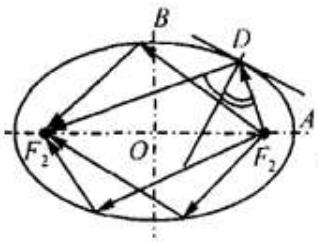

text_image

Geometric diagram of an ellipse with labeled points, vectors, and angles, including F₂, O, A, B, D, and a right angle at D.

图1

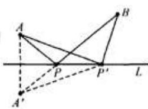

text_image

Geometric diagram showing triangle relationships with labeled points A, B, P, P', and dashed lines for projection or proof

图2

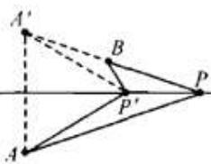

text_image

A'
B
P
P'
A

图3

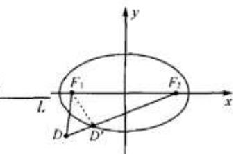

text_image

y
F₁
F₂
L
x
D
D′

图4

【引理1】若点A,B在直线L的同侧，设点是直线L上到A,B两点距离之和最小的点，当且仅当点P是点A关于直线L的对称点A'与点B连线AB和直线L的交点.

【引理2】若点A,B在直线L的两侧，且点A,B到直线的距离不相等，设点P是直线L上到点A,B距离之差最大的点，即 $|PA-PB|$ 最大，当且仅当点P是点A关于直线L的对称点 $A'$ 与点B连线 $A'B$ 的延长线和直线L的交点.

【引理3】设椭圆方程为 $\frac{x^2}{a^2} +\frac{y^2}{b^2} = 1(a > b > 0)$ ， $\mathbf{F}_1,\mathbf{F}_2$ 分别是其左、右焦点，若点D在椭圆外，则 $\mathrm{DF_1 + DF_2 > 2a}$

# 2、双曲线的光学性质

从双曲线的一个焦点发出的光从双曲线的一个焦点发出的光线经过双曲线的另一个焦点(如图).

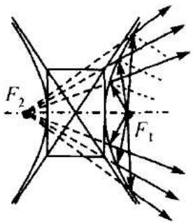

text_image

F₂
F₁

【引理4】若点A,B在直线L的同侧，设点是直线L上到A,B两点距离之和最小的点，当且仅当点P是点A关于直线L的对称点A'与点B连线AB和直线L的交点.

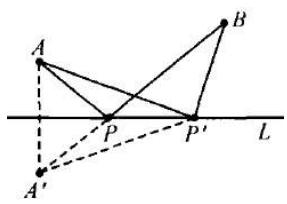

text_image

A
P
P'
L
A'

【引理5】若点A,B在直线L的两侧，且点A,B到直线的距离不相等，设点P是直线L上到点A,B距离之差最大的点，即 $|PA-PB|$ 最大，当且仅当点P是点A关于直线L的对称点A'与点B连线A'B的延长线和直线L的交点.

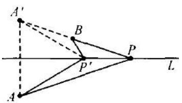

text_image

A'
B
P
P'
A
L

【引理6】设双曲线方程为 $\frac{x^2}{a^2} -\frac{y^2}{b^2} = 1(a > 0,b > 0)$ ， $\mathbf{F}_1,\mathbf{F}_2$ 分别是其左、右焦点，若点D在双曲线外(左、右两支中间部分，如图)，则 $\mathrm{DF}_1 - \mathrm{DF}_2 <   2a$

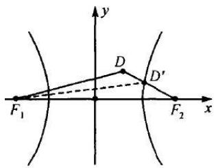

text_image

y
D
D'
F₁
F₂ x

# 3、抛物线的光学性质

从抛物线的焦点发出的光线,经过抛物线上的一点反射后,反射光线与抛物线的轴平行(或重合).反之,平行于抛物线的轴的光线照射到抛物线上,经反射后都通过焦点.

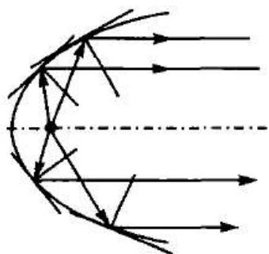

natural_image

Diagram of light rays reflecting off a curved surface with a dashed line indicating a reference axis (no text or symbols)

【结论1】已知：如图，抛物线 $\mathrm{C}: x^2 = 2py(p > 0), \mathrm{F}\left(0, \frac{p}{2}\right)$ 为其焦点， $j$ 是过抛物线上一点 $\mathrm{D}(x_0, y_0)$ 的切线，A, B是直线 $j$ 上的两点（不同于点D），直线DC平行于 $y$ 轴．求证： $\angle FDA = \angle CDB$ （入射角等于反射角）

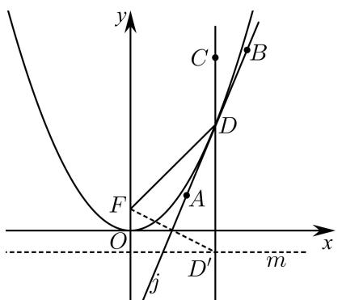

text_image

y
C
B
D
F
A
O
x
j
D'
m

【结论2】已知：如图，抛物线 $\mathbf{C}:y^2 = 2px(p > 0)$ ，F是抛物线的焦点，入射光线从F点发出射到抛物线上的点M，求证：反射光线平行于 $x$ 轴.

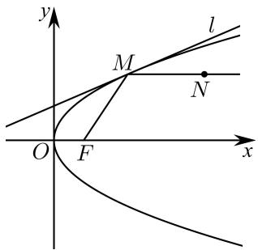

text_image

y
M
l
N
O
F
x

# 四、三点共线问题

证明三点共线问题常用方法是斜率法和向量法

# 必考题型全归纳

# 题型一:仿射变换问题

4502 (2024·全国·模拟预测)仿射变换是处理圆锥曲线综合问题中求点轨迹的一类特殊而又及其巧妙的方法,它充分利用了圆锥曲线与圆之间的关系,其体解题方法为将 C: $\frac{x^{2}}{a^{2}}+\frac{y^{2}}{b^{2}}=1(a>b>0)$ 由仿射变换得: $x'=\frac{x}{a}, y'=\frac{y}{b}$ ，则椭圆 $\frac{x^{2}}{a^{2}}+\frac{y^{2}}{b^{2}}=1$ 变为 $x'^{2}+y'^{2}=1$ ，直线的斜率与原斜率的关系为 $k'=\frac{a}{b}k$ ，然后联立圆的方程与直线方程通过计算韦达定理算出圆与直线的关系．最后转换回椭圆即可．已知椭圆 C: $\frac{x^{2}}{a^{2}}+\frac{y^{2}}{b^{2}}=1(a>b>0)$ 的离心率为 $\frac{\sqrt{5}}{5}$ ，过右焦点 F₂ 且垂直于 x 轴的直线与 C 相交于 A、B 两点且 $|AB|=\frac{8\sqrt{5}}{5}$ ，过椭圆外一点 P 作椭圆 C 的两条切线 $l_{1}$ 、 $l_{2}$ 且 $l_{1}\perp l_{2}$ ，切点分别为 M、N.

(1) 求证: 点 P 的轨迹方程为 $x^{2} + y^{2} = 9$ ;  
(2) 若原点 O 到 $l_{1}$ 、 $l_{2}$ 的距离分别为 $d_{1}$ 、 $d_{2}$ ，延长表示距离 $d_{1}$ 、 $d_{2}$ 的两条直线，与椭圆 C 交于 Y、W 两点，试求：原点 O 在 YW 边上的射影 Z 所形成的轨迹与 P 所形成的轨迹的面积之差是否为定值，若是，求出此定值；若不是，请求出变化函数.

4503 (2024·河北邯郸·高二校考期末)仿射变换是处理圆锥曲线综合问题中求点轨迹的一类特殊而又及其巧妙的方法,它充分利用了圆锥曲线与圆之间的关系,具体解题方法为将C: $\frac{x^{2}}{a^{2}}+\frac{y^{2}}{b^{2}}=1(a>b>0)$ 由仿射变换得: $x'=\frac{x}{a},y'=\frac{y}{b}$ ,则椭圆 $\frac{x^{2}}{a^{2}}+\frac{y^{2}}{b^{2}}=1$ 变为 $x'^{2}+y'^{2}=1$ ,直线的斜率与原斜率的关系为 $k'=\frac{a}{b}k$ ,然后联立圆的方程与直线方程通过计算

韦达定理算出圆与直线的关系, 最后转换回椭圆即可. 已知椭圆 C: $\frac{x^{2}}{a^{2}} + \frac{y^{2}}{b^{2}} = 1 (a > b > 0)$ 的离心率为 $\frac{\sqrt{5}}{5}$ , 过右焦点 F₂ 且垂直于 x 轴的直线与 C 相交于 A, B 两点且 AB = $\frac{8\sqrt{5}}{5}$ , 过椭圆外一点 P 作椭圆 C 的两条切线 l₁, l₂ 且 l₁ ⊥ l₂, 切点分别为 M, N.

(1) 求证: 点 P 的轨迹方程为 $x^{2} + y^{2} = 9$ ;  
(2) 若原点 O 到 $l_{1}, l_{2}$ 的距离分别为 $d_{1}, d_{2}$ ，延长表示距离 $d_{1}, d_{2}$ 的两条直线，与椭圆 C 交于 Y, W 两点，过 O 作 $OZ \perp YW$ 交 YW 于 Z，试求：点 Z 所形成的轨迹与 P 所形成的轨迹的面积之差是否为定值，若是，求出此定值；若不是，请求出变化函数.

4504 (2024·全国·高三专题练习)MN是椭圆 $\frac{x^{2}}{a^{2}}+\frac{y^{2}}{b^{2}}=1(a>b>0)$ 上一条不过原点且不垂直于坐标轴的弦，P是MN的中点，则 $k_{MN}\cdot k_{OP}=$ \_\_\_\_，A，B是该椭圆的左右顶点，Q是椭圆上不与A，B重合的点，则 $k_{AQ}\cdot k_{BQ}=$ \_\_\_\_。CD是该椭圆过原点O的一条弦，直线CQ，DQ斜率均存在，则 $k_{CQ}\cdot k_{DQ}=$ \_\_\_\_。

4505 (2024·全国·高三专题练习)如图,作斜率为 $\frac{1}{2}$ 的直线l与椭圆 $\frac{x^{2}}{4}+y^{2}=1$ 交于P,Q两点,且 $M\left(\sqrt{2},\frac{\sqrt{2}}{2}\right)$ 在直线l的上方,则△MPQ内切圆的圆心所在的定直线方程为\_\_\_\_.

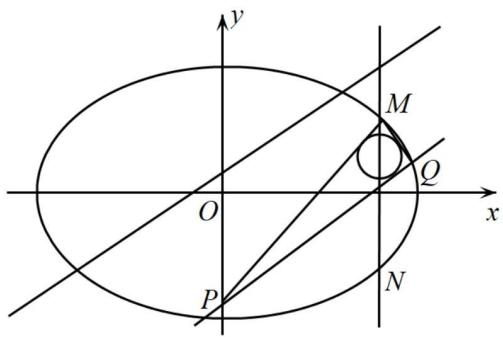

text_image

y
M
O
Q
x
P
N

4506 (2024·全国·高三专题练习)P是椭圆 $\frac{x^{2}}{4} + \frac{y^{2}}{3} = 1$ 上任意一点，O 为坐标原点， $\overrightarrow{PO} = 2\overrightarrow{OQ}$ ，过点 Q 的直线交椭圆于 A，B 两点，并且 QA = QB，则 $\triangle PAB$ 面积为 \_\_\_\_.  
4507 (2024·全国·高三专题练习)已知直线 l 与椭圆 $\frac{x^{2}}{4} + \frac{y^{2}}{2} = 1$ 交于 M, N 两点，当 $k_{OM} \cdot k_{ON} =$ \_\_\_\_ ，△MON 面积最大，并且最大值为 \_\_\_\_。记 $M(x_{1}, y_{1}), N(x_{2}, y_{2})$ ，当 △MON 面积最大时， $x_{1}^{2} + x_{2}^{2} =$ \_\_\_\_ ， $y_{1}^{2} + y_{2}^{2} =$ \_\_\_\_ 。P 是椭圆上一点， $\overrightarrow{OP} = \lambda \overrightarrow{OM} + \mu \overrightarrow{ON}$ ，当 △MON 面积最大时， $\lambda^{2} + \mu^{2} =$ \_\_\_\_ 。  
4508 (2024·全国·高三专题练习)已知椭圆 C: $\frac{x^{2}}{2} + y^{2} = 1$ 左顶点为 A, P, Q 为椭圆 C 上两动点, 直线 PO 交 AQ 于 E, 直线 QO 交 AP 于 D, 直线 OP, OQ 的斜率分别为 $k_{1}, k_{2}$ 且 $k_{1}k_{2} = -\frac{1}{2}$ , $\overrightarrow{AD} = \lambda \overrightarrow{DF}, \overrightarrow{AE} = \mu \overrightarrow{EQ} (\lambda, \mu \text{ 是非零实数})$ , 求 $\lambda^{2} + \mu^{2} =$ \_\_\_\_ .

# 2 题型二:非对称韦达问题

4509 (2024·全国·高三专题练习)已知椭圆 $\frac{x^{2}}{a^{2}}+\frac{y^{2}}{b^{2}}=1(a>b>0)$ 的左、右焦点是 $F_{1}$ 、 $F_{2}$ ，左右顶点是 $A_{1}$ 、 $A_{2}$ ，离心率是 $\frac{\sqrt{2}}{2}$ ，过 $F_{2}$ 的直线与椭圆交于两点 P、Q（不是左、右顶点），且 $\Delta F_{1}PQ$ 的周长是 $4\sqrt{2}$ ，

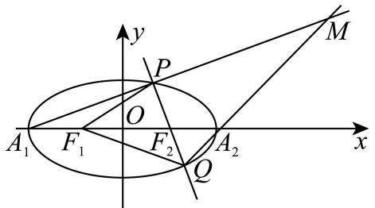

text_image

y
P
M
O
A₁ F₁ F₂ Q A₂ x

直线 $A_{1}P$ 与 $A_{2}Q$ 交于点 M.

(1) 求椭圆的方程；
(2)(i) 求证直线 $A_{1}P$ 与 $A_{2}Q$ 交点 M 在一条定直线 l 上；  
(ii)N是定直线l上的一点,且PN平行于x轴,证明: $\frac{|PF_{2}|}{|PN|}$ 是定值.

4510 (2024·四川成都·高三树德中学校考开学考试)已知点 A, B 分别为椭圆 E: $\frac{x^{2}}{a^{2}} + \frac{y^{2}}{b^{2}} = 1 (a > b > 0)$ 的左、右顶点， $F_{1}, F_{2}$ 为椭圆的左、右焦点， $\overrightarrow{AF_{2}} = 3\overrightarrow{AF_{1}}$ ，P 为椭圆上异于 A, B 的一个动点， $\triangle PF_{1}F_{2}$ 的周长为 12.

(1) 求椭圆 E 的方程;  
(2) 已知点 M(3,0)，直线 PM 与椭圆另外一个公共点为 Q，直线 AP 与 BQ 交于点 N，求证：当点 P 变化时，点 N 恒在一条定直线上.

4511 (2024·陕西榆林·高二校联考期末)已知椭圆 C: $\frac{x^{2}}{a^{2}} + \frac{y^{2}}{\circ b^{2}} = 1 (a > b > 0)$ 的左、右焦点分别为 $F_{1}, F_{2}$ ，离心率 $e = \frac{1}{2}$ ，P 为 C 上一动点， $\Delta PF_{1}F_{2}$ 面积的最大值为 $\sqrt{3}$ .

(1) 求 C 的方程;  
(2) 若过 $F_{2}$ 且斜率不为 0 的直线 l 交椭圆于 M, N 两点, $A_{1}$ , $A_{2}$ 分别为椭圆的左、右顶点, 直线 $A_{1}M$ , $A_{2}N$ 分别与直线 $l_{1}$ : x = 1 交于 T, Q 两点, 证明: 四边形 $OTA_{2}Q$ 为菱形.

4512 (2024·全国·高三专题练习)已知椭圆 C: $\frac{x^{2}}{a^{2}} + \frac{y^{2}}{b^{2}} = 1 (a > b > 0)$ 的离心率为 $\frac{1}{2}$ ，短轴长为 $2\sqrt{3}$ .

(1) 求椭圆 C 的方程;  
(2) 设 A, B 分别为椭圆 C 的左、右顶点, 若过点 P(4,0) 且斜率不为 0 的直线 l 与椭圆 C 交于 M、N 两点, 直线 AM 与 BN 相交于点 Q. 证明: 点 Q 在定直线上.

4513 (2024·吉林四平·高二校考阶段练习)已知椭圆 C: $\frac{x^{2}}{a^{2}} + \frac{y^{2}}{b^{2}} = 1 (a > b > 0)$ 的左、右顶点分别为 M₁、M₂，短轴长为 $2\sqrt{3}$ ，点 C 上的点 P 满足直线 PM₁、PM₂ 的斜率之积为 $-\frac{3}{4}$ .

(1) 求 C 的方程;  
(2) 若过点 $(1,0)$ 且不与 y 轴垂直的直线 l 与 C 交于 A、B 两点，记直线 $M_{1}A$ 、 $M_{2}B$ 交于点 Q．探究：点 Q 是否在定直线上，若是，求出该定直线的方程；若不是，请说明理由.

4514 (2024·全国·高三专题练习)在平面直角坐标系 xOy 中, 已知椭圆 C: $\frac{x^{2}}{a^{2}} + \frac{y^{2}}{b^{2}} = 1 (a > b > 0)$ 的长轴长为 4, 且经过点 $(b, \sqrt{3}e)$ , 其中 e 为椭圆 C 的离心率.

(1) 求椭圆 C 的标准方程;  
(2) 设椭圆 C 的左、右顶点分别为 A, B, 直线 l 过 C 的右焦点 F, 且交 C 于 M, N 两点, 若直线 AM 与 BN 交于点 T, 求证: 点 T 在定直线上.

4515 (2024·吉林长春·高二东北师大附中校考期末)已知椭圆 C: $\frac{x^{2}}{a^{2}} + \frac{y^{2}}{b^{2}} = 1 (a > b > 0)$ 的离心率为 $\frac{\sqrt{2}}{2}$ , H(1, $\frac{\sqrt{6}}{2}$ ) 是 C 上一点.

(1) 求 C 的方程.  
(2) 设 A, B 分别为椭圆 C 的左、右顶点, 过点 D(1,0) 作斜率不为 0 的直线 l, l 与 C 交于 P, Q 两点, 直线 AP 与直线 BQ 交于点 M, 记 AP 的斜率为 $k_{1}$ , BQ 的斜率为 $k_{2}$ . 证明: ① $\frac{k_{1}}{k_{2}}$ 为定值; ② 点 M 在定直线上.

4516 (2024·广西桂林·高二统考期末)已知椭圆 C: $\frac{x^{2}}{a^{2}} + \frac{y^{2}}{b^{2}} = 1 (a > b > 0)$ 的左、右焦点分别是 $F_{1}, F_{2}$ ，点 P 是椭圆 C 上任一点，若 $\triangle PF_{1}F_{2}$ 面积的最大值为 $\sqrt{3}$ ，且离心率 $e = \frac{1}{2}$ .

(1) 求 C 的方程;  
(2)A, B 为 C 的左、右顶点, 若过点 $F_{2}$ 且斜率不为 0 的直线交 C 于 M, N 两点, 证明: 直线 AM 与 BN 的交点在一条定直线上.

4517 (2024·福建泉州·高二福建省泉州第一中学校考期中)已知椭圆 C: $\frac{x^{2}}{a^{2}} + \frac{y^{2}}{b^{2}} =$

$1(a > b > 0)$ 的左、右顶点分别为 $\mathrm{A}_1, \mathrm{A}_2$ ，离心率为 $\frac{\sqrt{2}}{2}$ ，点 $\mathrm{P}\left(1, \frac{\sqrt{2}}{2}\right)$ 在椭圆C上.

(1) 求椭圆 C 的方程.  
(2) 若过点 B(2,0) 且斜率不为 0 的直线与椭圆 C 交于 M, N 两点, 已知直线 A₁M 与 A₂N 相交于点 G, 试判断点 G 是否在定直线上? 若是, 请求出定直线的方程; 若不是, 请说明理由.

# 3 题型三:椭圆的光学性质

4518 (2024·湖北孝感·高二大悟县第一中学校联考期中)生活中,椭圆有很多光学性质,如从椭圆的一个焦点出发的光线射到椭圆镜面后反射,反射光线经过另一个焦点现椭圆C的焦点在x轴上,中心在坐标原点,从左焦点 $F_{1}$ 射出的光线经过椭圆镜面反射到右焦点 $F_{2}$ ,这束光线的总长度为4,且椭圆的离心率为 $\frac{\sqrt{3}}{2}$ ,左顶点和上顶点分别为A、B.

(1) 求椭圆 C 的方程;  
(2) 点 P 在椭圆上, 求线段 BP 的长度 $\left|BP\right|$ 的最大值及取最大值时点 P 的坐标;  
(3) 不过点 A 的直线 l 交椭圆 C 于 M, N 两点, 记直线 l, AM, AN 的斜率分别为 $k, k_{1}, k_{2}$ , 若 $k(k_{1} + k_{2}) = 1$ , 证明: 直线 l 过定点, 并求出定点的坐标.

4519 (2024·全国·高三专题练习)椭圆的光学性质,从椭圆一个焦点发出的光,经过椭圆反射后,反射光线都汇聚到椭圆的另一个焦点上. 已知椭圆 C: $\frac{x^{2}}{4}+\frac{y^{2}}{b^{2}}=1(0<b<2)$ , F $_{1}$ ,F $_{2}$ 为其左、右焦点. M 是 C 上的动点,点 N(0, $\sqrt{3}$ ),若 |MN| + |MF $_{1}$ | 的最大值为 6. 动直线 l为此椭圆 C 的切线, 右焦点 $F_{1}$ 关于直线 l 的对称点 $\mathrm{P}(x_{1}, y_{1})$ , $S = |3x_{1} + 4y_{1} - 24|$ , 则椭圆 C 的离心率为 \_\_\_\_; S 的取值范围为 \_\_\_\_.

4520 (2024·山东青岛·统考二模)已知椭圆 $E:\frac{x^{2}}{a^{2}}+\frac{y^{2}}{b^{2}}=1(a>b>0)$ 的左、右焦点分别为 $F_{1}$ 、 $F_{2}$ ，过 $F_{2}$ 的直线与 E 交于点 A、B，直线 l 为 E 在点 A 处的切线，点 B 关于 l 的对称点为 M。由椭圆的光学性质知， $F_{1}$ 、A、M 三点共线。若 $|AB|=a,\frac{|BF_{1}|}{|MF_{1}|}=\frac{5}{7}$ ，则 $\frac{|BF_{2}|}{|AF_{1}|}=$ \_\_\_\_.

4521 (2024·安徽六安·高三六安一中校考阶段练习)如图所示,椭圆有这样的光学性质:从椭圆的一个焦点出发的光线,经椭圆反射后,反射光线经过椭圆的另一个焦点.已知椭圆 $\frac{x^{2}}{a^{2}}+\frac{y^{2}}{b^{2}}=1(a>b>0)$ 的左、右焦点为 $F_{1},F_{2}$ , P 为椭圆上不与顶点重合的任一点,I 为 $\Delta PF_{1}F_{2}$ 的内心,记直线 OP, PI(O 为坐标原点)的斜率分别为 $k_{1},k_{2}$ , 若 $3k_{1}=2k_{2}$ , 则椭圆的离心率为 \_\_\_\_.

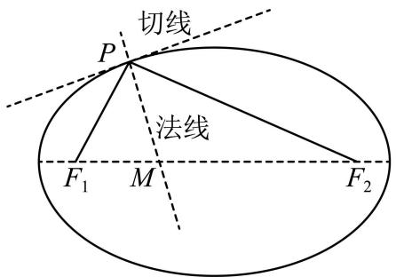

text_image

切线
P
法线
F₁ M F₂

4522 (2024·天津和平·高三天津一中校考阶段练习)欧几里得生活的时期人们就发现了椭圆有如下的光学性质:由椭圆一焦点射出的光线经椭圆内壁反射后必经过另一焦点.现有一椭圆 C: $\frac{x^{2}}{a^{2}}+\frac{y^{2}}{b^{2}}=1(a>b>0)$ ，长轴长为4，从一个焦点F发出的一条光线经椭圆内壁上一点P反射之后恰好与x轴垂直，且PF= $\frac{7}{2}$ .

(1) 求椭圆 C 的标准方程;  
(2) 已知 A 为该椭圆的左顶点, 若斜率为 k 且不经过点 A 的直线 l 与椭圆 C 交于 M, N 两点, 记直线 AM, AN 的斜率分别为 $k_{1}, k_{2}$ , 且满足 $k(k_{1} + k_{2}) = 2$ .  
①证明: 直线 l 过定点;  
②若 $\left|OM\right|^{2}+\left|ON\right|^{2}=5$ , 求 k 的值.

4523 (2024·全国·高二专题练习)已知椭圆 C: $\frac{x^{2}}{a^{2}} + \frac{y^{2}}{b^{2}} = 1 (a > b > 0)$ 上、下顶点分别为 A, B，且短轴长为 $2\sqrt{3}$ ，T 为椭圆上 (除 A, B 外) 任意一点，直线 TA, TB 的斜率之积为 $-\frac{3}{4}$ ， $F_{1}$ ， $F_{2}$ 分别为左、右焦点.

(1) 求椭圆 C 的方程.  
(2)“天眼”是世界上最大、最灵敏的单口径射电望远镜,它的外形像一口“大锅”,可以接收到百亿光年外的电磁信号. 在“天眼”的建设中,用到了大量的圆锥曲线的光学性质,请以上面的椭圆 C 为代表,证明:由焦点 $F_{1}$ 发出的光线射到椭圆上任意一点 M 后反射,反射光线必经过另一焦点 $F_{2}$ . (提示:光线射到曲线上某点并反射时,法线垂直于该点处的切线)

4524 (2024·全国·高三专题练习)已知椭圆 $E: \frac{x^{2}}{a^{2}} + \frac{y^{2}}{b^{2}} = 1 (a > b > 0)$ 的左、右焦点分别为 $F_{1}$ ， $F_{2}$ ，过 $F_{2}$ 的直线与 E 交于点 A，B. 直线 l 为 E 在点 A 处的切线，点 B 关于 l 的对称点为 M. 由椭圆的光学性质知， $F_{1}$ ，A，M 三点共线. 若 $|AB| = a, \frac{|BF_{1}|}{|MF_{1}|} = \frac{5}{7}$ ，则 $\frac{|BF_{2}|}{|AF_{1}|} =$ （）

A. $\frac{1}{2}$

B. $\frac{2}{7}$

C. $\frac{1}{4}$

D. $\frac{1}{7}$

4525 (多选题)(2024·全国·高三专题练习)椭圆有一条光学性质:从椭圆一个焦点出发的光线,经过椭圆反射后,一定经过另一个焦点. 假设光线沿直线传播且在传播过程中不会衰减,椭圆的方程为 $\frac{x^{2}}{9}+\frac{y^{2}}{5}=1$ ,则光线从椭圆一个焦点出发,到首次回到该焦点所经过的路程可能为()

A. 2

B. 8

C. 10

D. 12

4526 (2024·全国·高三专题练习)历史上第一个研究圆锥曲线的是梅纳库莫斯(公元前375年-公元前325年),大约100年后,阿波罗尼斯更详尽、系统地研究了圆锥曲线,并且他还进一步研究了这些圆锥曲线的光学性质:如图,从椭圆的一个焦点出发的光线或声波,经椭圆反射后,反射光线经过椭圆的另一个焦点,其中法线 $l'$ 表示与椭圆C的切线垂直且过相应切点的直线,已知椭圆C的中心在坐标原点,焦点为 $F_{1}(-c,0)$ , $F_{2}(c,0)(c>0)$ ,若由 $F_{1}$ 发出的光线经椭圆两次反射后回到 $F_{1}$ 经过的路程为8c.对于椭圆C上除顶点外的任意一点P,椭圆在点P处的切线为l, $F_{1}$ 在l上的射影为H,其中 $|OH|=2\sqrt{2}$ .

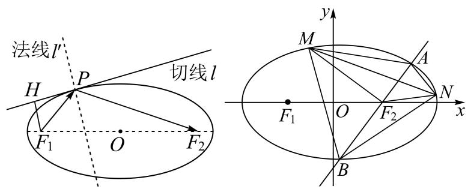

text_image

法线l'
H
P
切线l
F₁ O F₂
y
M
A
F₁ O F₂ N x
B

(1) 求椭圆 C 的方程；
(2) 如图，过 $F_{2}$ 作斜率为 $k(k>0)$ 的直线 m 与椭圆 C 相交于 A, B 两点（点 A 在 x 轴上方）。点 M, N 是椭圆上异于 A, B 的两点， $MF_{2}$ ， $NF_{2}$ 分别平分 $\angle AMB$ 和 $\angle ANB$ ，若 $\Delta MF_{2}N$ 外接圆的面积为 $\frac{81\pi}{8}$ ，求直线 m 的方程。

4527 (2024·贵州黔西·高二统考期末)欧几里得生活的时期人们就发现了椭圆有如下的光学性质:从椭圆的一个焦点射出的光线经椭圆内壁反射后必经过该椭圆的另一焦点. 现有椭圆 C: $\frac{x^{2}}{a^{2}}+\frac{y^{2}}{b^{2}}=1(a>b>0)$ ，长轴长为 4，从椭圆 C 的一个焦点 F 发出的一条光线经该椭圆内壁上一点 P 反射之后恰好与 x 轴垂直，且 $|PF|=\frac{7}{2}$ .

(1) 求椭圆 C 的标准方程；
(2) 已知 O 为坐标原点，A 为椭圆 C 的左顶点，若斜率为 k 且不经过点 A 的直线 l 与椭圆 C 交于 M, N 两点，记直线 AM, AN 的斜率分别为 $k_{1}, k_{2}$ ，且满足 $k(k_{1} + k_{2}) = 2$ ，且 $|OM|^{2} + |ON|^{2} = 5$ ，求 k 的值.

4528 (2024·四川成都·川大附中校考二模)椭圆的光学性质: 光线从椭圆的一个焦点出发经椭圆反射后通过另一个焦点. 现有一椭圆 C: $\frac{x^{2}}{a^{2}} + \frac{y^{2}}{b^{2}} = 1 (a > b > 0)$ ，长轴 A₁A₂ 长为 4，从一个焦点 F 发出的一条光线经椭圆内壁上一点 P 反射之后恰好与 x 轴垂直，且 PF = $\frac{5}{2}$ .

(1) 求椭圆 C 的标准方程;  
(2) 点 Q 为直线 x=4 上一点, 且 Q 不在 x 轴上, 直线 $QA_{1}$ , $QA_{2}$ 与椭圆 C 的另外一个交点分别为 M, N, 设 $\triangle QA_{1}A_{2}$ , $\triangle QMN$ 的面积分别为 $S_{1}$ , $S_{2}$ , 求 $\frac{S_{1}}{S_{2}}$ 的最大值.

4529 (2024·江苏连云港·高二统考期中)班级物理社团在做光学实验时,发现了一个有趣的现象:从椭圆的一个焦点发出的光线经椭圆形的反射面反射后将汇聚到另一个焦点处.根据椭圆的光学性质解决下面问题:已知椭圆C的方程为 $\frac{x^{2}}{16}+\frac{y^{2}}{12}=1$ ,其左、右焦点分别是 $F_{1},F_{2}$ ,直线l与椭圆C切于点P,且 $|PF_{1}|=5$ ,过点P且与直线l垂直的直线m与椭圆长轴交于点Q,则 $\frac{|F_{1}Q|}{|F_{2}Q|}=$ ()

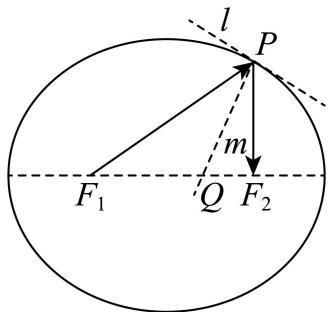

text_image

l
P
m
F₁ Q F₂

A. $\frac{\sqrt{5}}{2}$

B. $\frac{\sqrt{15}}{3}$

C. $\frac{5}{4}$

D. $\frac{5}{3}$

# 4 题型四:双曲线的光学性质

4530 (2024·上海浦东新·高二华师大二附中校考阶段练习)圆锥曲线都具有光学性质,如双曲线的光学性质是:从双曲线的一个焦点发出的光线,经过双曲线反射后,反射光线是发散的,其反向延长线会经过双曲线的另一个焦点.如图,一镜面的轴截面图是一条双曲线的部分,AP是它的一条对称轴,F是它的一个焦点,一光线从焦点F发出,射到镜面上点B,反射光线是BC,若 $\angle PFB=120^{\circ}$ , $\angle FBC=90^{\circ}$ ,则该双曲线的离心率等于\_\_\_\_.

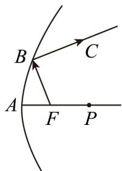

text_image

B
C
A
F
P

4531 (2024·全国·高二专题练习)双曲线的光学性质如下:如图1,从双曲线右焦点 $F_{2}$ 发出的光线经双曲线镜面反射,反射光线的反向延长线经过左焦点 $F_{1}$ .我国首先研制成功的“双曲线新闻灯”,就是利用了双曲线的这个光学性质.某“双曲线灯”的轴截面是双曲线一部分,如图2,其方程为 $\frac{x^{2}}{a^{2}}-\frac{y^{2}}{b^{2}}=1,F_{1},F_{2}$ 分别为其左、右焦点,若从右焦点 $F_{2}$ 发出的光线经

双曲线上的点A和点B反射后 $(\mathrm{F}_2, \mathrm{A}, \mathrm{B}$ 在同一直线上)，满足 $AB \perp AD, \tan \angle ABC = -\frac{3}{4}$ .

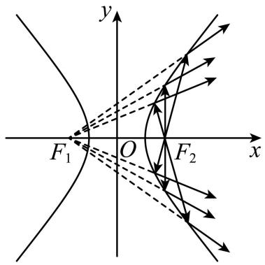

text_image

y
F₁ O F₂ x

图1

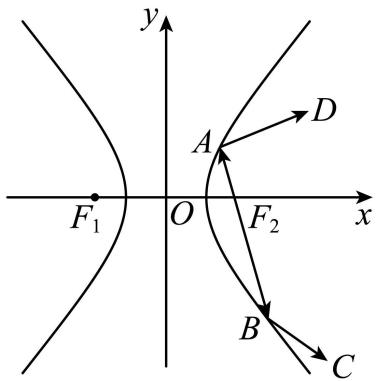

text_image

y
A
D
F₁ O F₂ x
B
C

图2

(1) 当 $|AB|=4$ 时, 求双曲线的标准方程;  
(2) 过 $F_{2}$ 且斜率为 2 的直线与双曲线的两条渐近线交于 S, T 两点, 点 M 是线段 ST 的中点, 试探究 $\frac{|MF_{2}|}{|F_{1}F_{2}|}$ 是否为定值, 若不是定值, 说明理由, 若是定值, 求出定值.

4532 (2024·山东烟台·校考模拟预测)圆锥曲线的光学性质被人们广泛地应用于各种设计中，例如从双曲线的一个焦点发出的光线，经过双曲线镜面反射后，反射光线的反向延长线经过另一个焦点．如图，从双曲线C的右焦点 $F_{2}$ 发出的光线通过双曲线镜面反射，且反射光线的反向延长线经过左焦点 $F_{1}$ ．已知入射光线 $F_{2}P$ 的斜率为-2，且 $F_{2}P$ 和反射光线PE互相垂直(其中P为入射点)，则双曲线C的渐近线方程为\_\_\_\_.

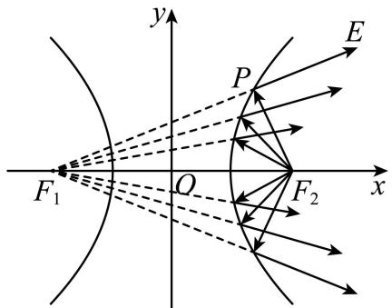

text_image

y
E
P
F₁ O F₂ x

4533 (2024·江苏南京·高二校考期末)圆锥曲线具有光学性质,如双曲线的光学性质是:从双曲线的一个焦点发出的光线,经过双曲线反射后,反射光线是发散的,其反向延长线会经过双曲线的另一个焦点,如图,一镜面的轴截面图是一条双曲线的部分,AP是它的一条对称轴,F是它的一个焦点,一光线从焦点F发出,射到镜面上点B,反射光线是BC,若 $\angle PFB=120^{\circ},\angle FBC=90^{\circ}$ ,则该双曲线的离心率等于()

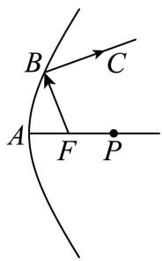

text_image

B
C
A
F
P

A. $\sqrt{2}$

B. $\sqrt{5}$

C. $\sqrt{3} + 1$

D. $\frac{\sqrt{5}+1}{2}$

4534 (多选题)(2024·高二单元测试)我国首先研制成功的“双曲线新闻灯”,如图,利用了双曲线的光学性质: $F_1$ , $F_2$ 是双曲线的左、右焦点,从 $F_2$ 发出的光线 m 射在双曲线右支上一点 P,经点 P 反射后,反射光线的反向延长线过 $F_1$ ;当 P 异于双曲线顶点时,双曲线在点 P 处的切线平分 $\angle F_1PF_2$ . 若双曲线 C 的方程为 $\frac{x^2}{9} - \frac{y^2}{16} = 1$ ,则下列结论正确的是 ( )

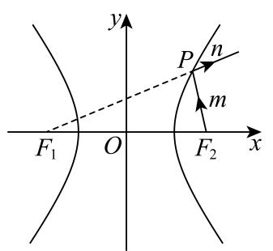

text_image

y
P
n
m
F₁ O F₂ x

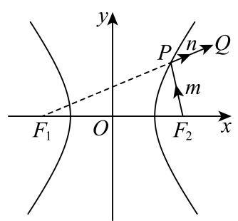

text_image

y
P
n
Q
m
F₁ O F₂ x

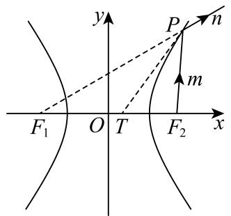

text_image

y
P
n
m
F₁ O T F₂ x

A. 射线 n 所在直线的斜率为 k，则 $k \in \left(-\frac{4}{3}, \frac{4}{3}\right)$   
B. 当 $m \perp n$ 时, $|\mathrm{PF}_1| \cdot |\mathrm{PF}_2| = 32$   
C. 当 n 过点 Q(7,5) 时, 光线由 $F_{2}$ 到 P 再到 Q 所经过的路程为 13  
D. 若点 T 坐标为 $(1,0)$ ，直线 PT 与 C 相切，则 $\left|PF_{2}\right|=12$

4535 (2024·全国·高三专题练习)双曲线具有光学性质,从双曲线一个焦点发出的光线经过双曲线镜面反射,其反射光线的反向延长线经过双曲线的另一个焦点.若双曲线 $E:\frac{x^{2}}{a^{2}}-\frac{y^{2}}{b^{2}}=1(a>0,b>0)$ 的左、右焦点分别为 $F_{1},F_{2}$ ，从 $F_{2}$ 发出的光线经过图中的A，B两点反射后，分别经过点C和D，且 $\cos\angle BAC=-\frac{5}{13},\overrightarrow{AB}\cdot\overrightarrow{BD}=0$ ，则E的离心率为()

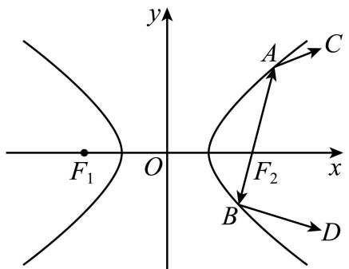

text_image

y
A
C
F₁ O F₂ x
B
D

A. $\frac{\sqrt{17}}{3}$

B. $\frac{\sqrt{37}}{5}$

C. $\frac{\sqrt{10}}{2}$

D. $\sqrt{5}$

4536 (多选题)(2024·湖北·黄冈中学校联考模拟预测)双曲线具有如下光学性质:从双曲线的一个焦点发出的光线,经双曲线反射后,反射光线的反向延长线经过双曲线的另一个焦点.由此可得,过双曲线上任意一点的切线平分该点与两焦点连线的夹角.已知 $F_{1},F_{2}$ 分别为双曲线 $C:x^{2}-\frac{y^{2}}{4}=1$ 的左,右焦点,过C右支上一点 $A(x_{0},y_{0})(x_{0}>1)$ 作直线l交x轴于点 $M\left(\frac{1}{x_{0}},0\right)$ ,交y轴于点N,则()

A. C的渐近线方程为 $y=\pm2x$   
B. $\angle F_{1}AM = \angle F_{2}AM$   
C. 过点 $F_{1}$ 作 $F_{1}H \perp AM$ ，垂足为 H，则 $|OH| = \frac{3}{2}$   
D. 四边形 $AF_{1}NF_{2}$ 面积的最小值为 $4\sqrt{5}$

4537 (多选题)(2024·安徽芜湖·统考模拟预测)双曲线的光学性质:从双曲线一个焦点出发的光线,经双曲线反射后,反射光线的反向延长线经过双曲线的另一个焦点.已知O为坐标原点, $\mathrm{F}_{1},\mathrm{F}_{2}$ 分别是双曲线C: $\frac{x^{2}}{9}-\frac{y^{2}}{16}=1$ 的左、右焦点,过 $\mathrm{F}_{2}$ 的直线交双曲线C的右支于M,N两点,且 $\mathrm{M}(x_{1},y_{1})$ 在第一象限, $\Delta\mathrm{MF}_{1}\mathrm{F}_{2},\Delta\mathrm{NF}_{1}\mathrm{F}_{2}$ 的内心分别为 $\mathrm{I}_{1},\mathrm{I}_{2}$ ,其内切圆半径分别为 $r_{1},r_{2},\Delta\mathrm{MF}_{1}\mathrm{N}$ 的内心为I.双曲线C在M处的切线方程为 $\frac{x_{1}x}{9}-\frac{y_{1}y}{16}=1$ ,则下列说法正确的有()

A. 点 $\mathrm{I}_1$ 、 $\mathrm{I}_2$ 均在直线 $x = 3$ 上

B. 直线 MI 的方程为 $\frac{x_1x}{9} - \frac{y_1y}{16} = 1$

C. $r_{1}r_{2}=\frac{16}{5}$

D. $\frac{\mathrm{S}_{\Delta\mathrm{F}_2\mathrm{I}_1\mathrm{I}_2}}{\mathrm{S}_{\Delta\mathrm{II}_1\mathrm{I}_2}} = \frac{5}{3}$

4538 (多选题)(2024·海南·海南中学校考三模)已知双曲线C: $\frac{x^2}{4} -\frac{y^2}{b^2} = 1(b > 0)$ 的左、右焦点分别为 $\mathrm{F}_1,\mathrm{F}_2$ ，双曲线具有如下光学性质：从右焦点 $\mathbf{F}_2$ 发出的光线 $m$ 交双曲线右支于点P，经双曲线反射后，反射光线 $n$ 的反向延长线过左焦点 $\mathbf{F}_1$ ，如图所示.若双曲线C的一条渐近线的方程为 $\sqrt{3} x - y = 0$ ，则下列结论正确的有 （）

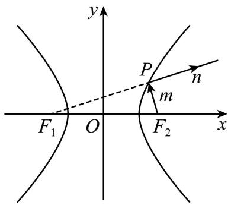

text_image

y
P
n
m
F₁ O F₂ x

A. 双曲线 C 的方程为 $\frac{x^{2}}{4}-\frac{y^{2}}{12}=1$   
B. 若 $m \perp n$ ，则 $\left|PF_{1}\right| \cdot \left|PF_{2}\right| = 12$   
C. 若射线 n 所在直线的斜率为 k，则 $k \in (-\sqrt{3}, \sqrt{3})$   
D. 当 n 过点 M(8, 5) 时, 光由 $F_{2} \rightarrow P \rightarrow M$ 所经过的路程为 10

4539 (多选题)(2024·贵州贵阳·高三贵阳一中校考阶段练习)双曲线具有如下光学性质:如图, $F_{1},F_{2}$ 是双曲线的左、右焦点,从 $F_{2}$ 发出的光线m射在双曲线右支上一点P,经点P反射后,反射光线的反向延长线过 $F_{1}$ ;当P异于双曲线顶点时,双曲线在点P处的切线平分 $\angle F_{1}PF_{2}$ .若双曲线C的方程为 $\frac{x^{2}}{16}-\frac{y^{2}}{9}=1$ ,则下列结论正确的是()

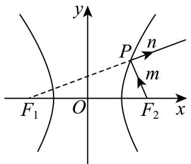

text_image

y
P
n
m
F₁ O F₂ x

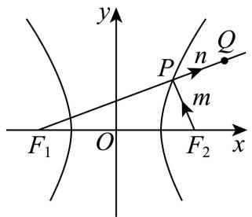

text_image

y
P
n
Q
m
F₁ O F₂ x

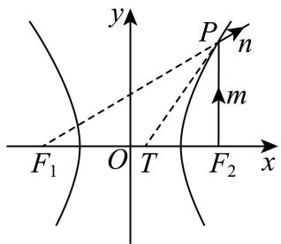

text_image

y
P/n
m
F₁ O T F₂ x

A. 射线 $n$ 所在直线的斜率为 $k$ , 则 $|k| \in \left[0, \frac{3}{4}\right)$   
B. 当 $m \perp n$ 时， $\left|PF_{1}\right| \cdot \left|PF_{2}\right| = 36$   
C. 当 n 过点 Q(7,5) 时, 光线由 $F_{2}$ 到 P 再到 Q 所经过的路程为 5

D. 若点 T 坐标为 $(1,0)$ ，直线 PT 与 C 相切，则 $\left|PF_{2}\right|=16$

4540 (多选题)(2024·广东广州·高二统考期末)费马原理是几何光学中的一条重要原理,可以推导出双曲线具有如下光学性质:从双曲线的一个焦点发出的光线,经双曲线反射后,反射光线的反向延长线经过双曲线的另一个焦点.由此可得,过双曲线上任意一点的切线平分该点与两焦点连线的夹角.已知 $F_{1}$ 、 $F_{2}$ 分别是以 $y=\pm\frac{3}{4}x$ 为渐近线且过点A( $4\sqrt{2},3$ )的双曲线C的左、右焦点,在双曲线C右支上一点P( $x_{0},y_{0}$ )( $x_{0}>4,y_{0}>0$ )处的切线l交x轴于点Q,则()

A. 双曲线 C 的离心率为 $\frac{\sqrt{7}}{4}$   
B. 双曲线 C 的方程为 $\frac{x^{2}}{16}-\frac{y^{2}}{9}=1$   
C. 过点 $F_{1}$ 作 $F_{1}K \perp PQ$ ，垂足为 K，则 $|OK| = 8$   
D. 点 Q 的坐标为 $\left(\frac{16}{x_{0}},0\right)$

# 5 题型五: 抛物线的光学性质

4541 (2024·甘肃白银·高二统考开学考试)抛物线的光学性质:经焦点的光线由抛物线反射后的光线平行于抛物线的对称轴(即光线在曲线上某一点处反射等效于在这点处切线的反射),过抛物线 $x^{2}=9y$ 上一点P作其切线交准线l于点M,PN⊥l,垂足为N,抛物线的焦点为F,射线PF交l于点Q,若 $|MP|=|MQ|$ .则 $\angle MPN=$ \_\_\_\_, $|MN|=$ \_\_\_\_.

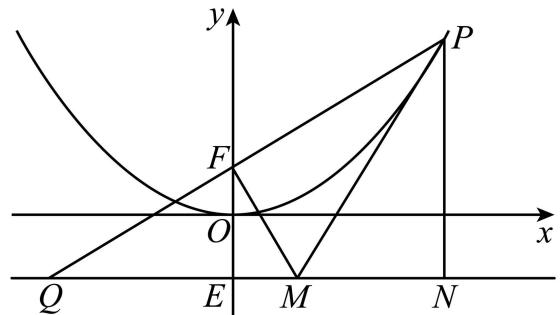

text_image

y
P
F
O
x
Q
E
M
N

4542 (2024·四川巴中·高三统考开学考试)抛物线有如下光学性质:过焦点的光线经抛物线反射后得到的光线平行于抛物线的对称轴;反之,平行于抛物线对称轴的入射光线经抛物线反射后必过抛物线的焦点. 已知抛物线 $y^{2}=4x$ 的焦点为 F,一条平行于 x 轴的光线从点 A(5,4) 射出,经过抛物线上的点 B 反射后,再经抛物线上的另一点 C 射出,则 $|BC|=$ \_\_\_\_.

4543 (2024·全国·高二专题练习)根据抛物线的光学性质,从抛物线的焦点发出的光,经抛物线反射后光线都平行于抛物线的轴,已知抛物线 $y^{2}=2x$ , 若从点 Q(3,2) 发射平行于 x 轴的光射向抛物线的 A 点, 经 A 点反射后交抛物线于 B 点, 则 $|AB|=$ \_\_\_\_.

4544 (2024·四川·校联考模拟预测)抛物线有一条重要的光学性质:从焦点出发的光线,经过抛物线上的一点反射后,反射光线平行于抛物线的轴.已知抛物线C: $y^{2}=2x$ ,一条光线从点P(4,2)沿平行于x轴的方向射出,与抛物线相交于点M,经点M反射后与C交于另一点N,则 $\triangle MON$ 的面积为\_\_\_\_.

4545 (2024·江苏常州·高二常州市北郊高级中学校考期中)抛物线有光学性质,即由其焦点射出的光线经抛物线反射后,沿平行于抛物线对称轴的方向射出,反之亦然.如图所示,今有抛物线 $y^{2}=2px(p>0)$ ，一光源在点 $M\left(\frac{41}{4},4\right)$ 处，由其发出的光线沿平行于抛物线的轴的方向射向抛物线上的点 P，反射后又射向抛物线上的点 Q，再反射后又沿平行于抛物线的轴的方向射出，途中遇到直线 l:2x-4y-17=0 上的点 N，再反射后又射回点 M，设 P，Q 两点的坐标分别是 $(x_{1},y_{1}),(x_{2},y_{2})$ .

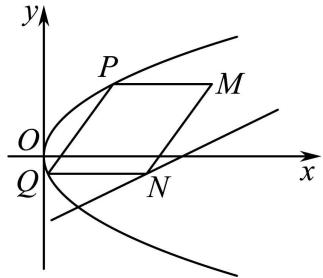

text_image

y
P
M
O
Q
N
x

(1) 证明: $y_{1}y_{2} = -p^{2}$ ;   
(2) 求抛物线方程.

4546 (2024·四川·校联考模拟预测)抛物线有一条重要的光学性质:从焦点出发的光线,经过抛物线上的一点反射后,反射光线平行于抛物线的轴. 已知抛物线 C: $y^{2}=2px(p>0)$ , 一条光线从点 P(4,2) 沿平行于 x 轴的方向射出,与抛物线相交于点 M,经点 M 反射后与 C 交于另一点 N. 若 $\overrightarrow{OM} \cdot \overrightarrow{ON} = -\frac{3}{4}$ , 则 $\triangle MON$ 的面积为 ()

A. $\frac{5}{8}$

B. $\frac{5}{4}$

C. $\frac{3}{2}$

D. $\frac{5}{2}$

4547 (2024·湖南长沙·高三长郡中学校联考阶段练习)抛物线有如下光学性质:由其焦点射出的光线经过抛物线反射后,沿平行于抛物线对称轴的方向射出;反之,平行于地物线对称轴的入射光线经抛物线反射后必过抛物线的焦点.已知抛物线 $y^{2}=4x$ 的焦点为F,O为坐标原点,一束平行于x轴的光线 $l_{1}$ 从点 $\mathrm{P}(m,n)(n^{2}<4m)$ 射入,经过抛物线上的点 $\mathrm{A}(x_{1},y_{1})$ 反射后,再经抛物线上另一点 $\mathrm{B}(x_{2},y_{2})$ 反射后,沿直线 $l_{2}$ 射出,则直线 $l_{1}$ 与 $l_{2}$ 间的距离最小值为()

A. 2

B. 4

C. 8

D. 16

4548 (2024·全国·高二专题练习)抛物线有如下光学性质:过焦点的光线经抛物线反射后得到的光线平行于抛物线的对称轴;反之,平行于抛物线对称轴的入射光线经抛物线反射后必过抛物线的焦点.已知抛物线 $y^{2}=16x$ 的焦点为 F,一条平行于 x 轴的光线从点 $P(4,4\sqrt{2})$ 射出,经过抛物线上的点 A 反射后,再经抛物线上的另一点 B 射出,则 $\triangle PAB$ 的面积为 ()

A. 4

B. $6\sqrt{2}$

C. $12 \sqrt{2}$

D. $24\sqrt{2}$

4549 (2024·江西·统考模拟预测)用于加热水和食物的太阳灶应用了抛物线的光学性质:一束平行于抛物线对称轴的光线,经过抛物面(抛物线绕它的对称轴旋转所得到的曲而叫抛物面)的反射后,集中于它的焦点.用一过抛物线对称轴的平面截抛物面,将所截得的抛物线C放在平面直角坐标系中,对称轴与x轴重合,顶点与原点重合,如图,若抛物线C的方程为 $y^{2}=8x$ ,平行于x轴的光线从点M(12,2)射出,经过C上的点A反射后,再从C上的另一点B射出,则 $|MB|=$ ()

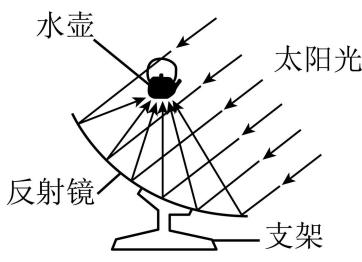

text_image

水壶
太阳光
反射镜
支架

A. 6   
B. 8

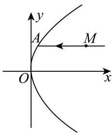

text_image

y
A
M
O
x

C. $2\sqrt{29}$   
D. 29

4550 (多选题)(2024·辽宁沈阳·东北育才学校校考一模)如图,抛物线有如下光学性质:由其焦点射出的光线经抛物线反射后,沿平行于抛物线对称轴的方向射出.已知抛物线 $y^{2}=4x$ 的焦点为F,一束平行于x轴的光线 $l_{1}$ 从点M(3,1)射入,经过抛物线上的点P( $x_{1},y_{1}$ )反射后,再经抛物线了上另一点Q( $x_{2},y_{2}$ )反射,沿直线 $l_{2}$ 射出,则下列结论中正确的是()

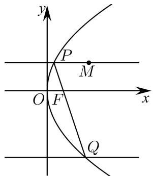

text_image

y
P
M
O F x
Q

A. $x_{1}x_{2} = 1$

B. $k_{PQ}=-\frac{4}{3}$

C. $|\mathrm{PQ}| = \frac{25}{2}$

D. $l_{1}$ 与 $l_{2}$ 之间的距离为5

4551 (多选题)(2024·福建福州·福建省福州第一中学校考模拟预测)抛物线有如下光学性质:从焦点发出的光线经抛物线反射后,沿平行于抛物线对称轴的方向射出;反之,平行于抛物线对称轴的入射光线经抛物线反射后,必过抛物线的焦点.已知平行于x轴的光线 $l_{1}$ 从点M射入,经过抛物线C: $y^{2}=8x$ 上的点P反射,再经过C上另一点Q反射后,沿直线 $l_{2}$ 射出,经过点N,则()

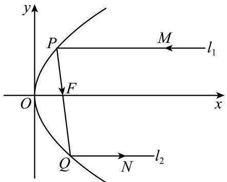

text_image

y
P
M
l₁
F
O
x
Q
N
l₂

A. 若 $l_{1}$ 的方程为 $y = 2$ ，则 $|\mathrm{PQ}| = 8$

B. 若 $l_{1}$ 的方程为 y=2，且 $\angle PQM = \angle MQN$ ，则 M(13,2)

C. 分别延长 PO, NQ 交于点 D, 则点 D 在 C 的准线上

D. 抛物线 C 在点 P 处的切线分别与直线 FP, $l_{1}$ 所成角相等

4552 (多选题)(2024·湖南长沙·长沙一中校考模拟预测)抛物线有如下光学性质:由其焦点射出的光线经过抛物线反射后,沿平行于抛物线对称轴的方向射出;反之,平行于抛物线对称轴的入射光线经抛物线反射后必过抛物线的焦点. 已知抛物线 $y^{2}=4x$ 的焦点为 F, O 为坐标原点,一束平行于 x 轴的光线 $l_{1}$ 从点 $\mathrm{P}(m,n)(n^{2}<4m)$ 射入,经过抛物线上的点 $\mathrm{A}(x_{1},y_{1})$ 反射后,再经抛物线上另一点 $\mathrm{B}(x_{2},y_{2})$ 反射后,沿直线 $l_{2}$ 射出,则下列结论中正确的是()

A. $x_{1}x_{2}=1$   
B. 点 A $(x_{1}, y_{1})$ 关于 x 轴的对称点在直线 $l_{2}$ 上  
C. 直线 $l_{2}$ 与直线 x = -1 相交于点 D，则 A, O, D 三点共线  
D. 直线 $l_{1}$ 与 $l_{2}$ 间的距离最小值为4

4553 (多选题)(2024·全国·高三专题练习)阿波罗尼奥斯是古希腊著名的数学家,与欧几里得、阿基米德齐名,他的著作《圆锥曲线论》是古代世界光辉的科学成果,它将圆锥曲线的性质网罗殆尽,几乎使后人没有插足的余地.其中给出了抛物线一条经典的光学性质:从焦点发出的光线,经过抛物线上的一点反射后,反射光线平行于抛物线的轴.此性质可以解决线段和的最值问题,已知抛物线 $C:y^{2}=2px(p>0)$ ,M是抛物线C上的动点,焦点 $F\left(\frac{1}{2},0\right)$ ,N(4,2),下列说法正确的是()

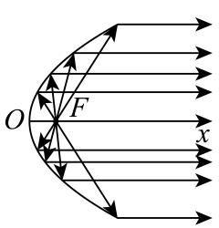

text_image

O
F
x

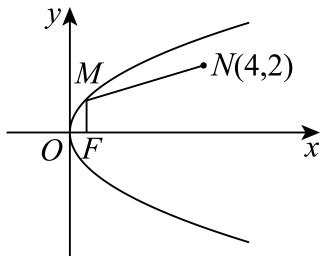

text_image

y
M
N(4,2)
O F x

A. C的方程为 $y^{2}=x$   
C. $|\mathrm{MF}| + |\mathrm{MN}|$ 的最小值为 $\frac{5}{2}$

B. C的方程为 $y^{2} = 2x$

D. $|\mathrm{MF}| + |\mathrm{MN}|$ 的最小值为 $\frac{9}{2}$

# 题型六:三点共线问题

4554 (2024·贵州毕节·校考模拟预测)已知 F 是抛物线 C: $y^{2}=2px(p>0)$ 的焦点, 过点 F 的直线交抛物线 C 于 A, B 两点, 当 AB 平行于 y 轴时, $|AB|=2$ .

(1) 求抛物线 C 的方程;  
(2) 若 O 为坐标原点, 过点 B 作 y 轴的垂线交直线 AO 于点 D, 过点 A 作直线 DF 的垂线与抛物线 C 的另一交点为 E, AE 的中点为 G, 证明: G, B, D 三点共线.

4555 (2024·贵州贵阳·高三贵阳一中校考期末)已知 A, B 为椭圆 C: $\frac{x^2}{a^2} + \frac{y^2}{b^2} = 1 (a > b > 0)$ 的左、右顶点，P 为椭圆上异于 A, B 的一点，直线 AP 与直线 BP 的斜率之积为 $-\frac{1}{4}$ ，且椭圆 C 过点 $(\sqrt{3}, \frac{1}{2})$ 。

(1) 求椭圆 C 的标准方程;  
(2) 若直线 AP, BP 分别与直线 $l: x = 4$ 相交于 M, N 两点, 且直线 BM 与椭圆 C 交于另一点 Q, 证明: A, N, Q 三点共线.

4556 (2024·广东肇庆·高三德庆县香山中学校考阶段练习)已知双曲线 C: $\frac{x^{2}}{a^{2}} - \frac{y^{2}}{b^{2}} = 1 (a > 0, b > 0)$ 经过点 P(4,2)，双曲线 C 的右焦点 F 到其渐近线的距离为 2.

(1) 求双曲线 C 的方程;  
(2) 已知 Q(0, -2), D 为 PQ 的中点, 作 PQ 的平行线 l 与双曲线 C 交于不同的两点 A, B, 直线 AQ 与双曲线 C 交于另一点 M, 直线 BQ 与双曲线 C 交于另一点 N, 证明: M, N, D 三点共线.

4557 (2024·全国·高三专题练习)阿基米德(公元前287年－公元前212年,古希腊)不仅是著名的哲学家、物理学家,也是著名的数学家,他利用“逼近法”得到椭圆的面积除以圆周率 $\pi$ 等于椭圆的长半轴长与短半轴长的乘积.在平面直角坐标系Oxy中,椭圆C: $\frac{x^2}{a^2} +\frac{y^2}{b^2}$ $= 1(a > b > 0)$ 的面积为 $2\sqrt{3}\pi$ ，两焦点与短轴的一个顶点构成等边三角形.过点(1,0)的直线 $l$ 与椭圆C交于不同的两点A,B.

(1) 求椭圆 C 的标准方程;  
(2) 设椭圆 C 的左、右顶点分别为 P, Q, 直线 PA 与直线 x = 4 交于点 F, 试证明 B, Q, F 三点共线.

4558 (2024·重庆·校联考三模)已知椭圆 C: $\frac{x^{2}}{a^{2}} + \frac{y^{2}}{b^{2}} = 1 (a > b > 0)$ 的长轴长为 4，离心率为 $\frac{1}{2}$ ，A，F 分别为椭圆 C 的左顶点、右焦点．P，Q 为椭圆 C 上异于 A 的两个动点，直线 AP，AQ 与直线 l: x = 4 分别交于 M，N 两个不同的点.

(1) 求椭圆 C 的方程:  
(2) 设直线 l 与 x 轴交于 R, 若 P, F, Q 三点共线, 求证: $\triangle MFR$ 与 $\triangle FNR$ 相似.

4559 (2024·江苏扬州·江苏省高邮中学校考模拟预测)设直线 x=m 与双曲线 C: $x^{2}-\frac{y^{2}}{3}=m(m>0)$ 的两条渐近线分别交于 A, B 两点，且三角形 OAB 的面积为 $\sqrt{3}$ .

(1) 求 m 的值;  
(2) 已知直线 $l$ 与 $x$ 轴不垂直且斜率不为 0, $l$ 与 C 交于两个不同的点 M, N, M 关于 $x$ 轴的对称点为 M', F 为 C 的右焦点, 若 M', F, N 三点共线, 证明: 直线 $l$ 经过 $x$ 轴上的一个定点.

4560 (2024·北京海淀·高三专题练习)已知椭圆 E: $\frac{x^{2}}{a^{2}} + \frac{y^{2}}{b^{2}} = 1 (a > b > 0)$ 的左顶点为 A, 上、下顶点分别为 B₁, B₂, |B₁B₂| = 2, |AB₁| = $\sqrt{5}$ .

(1) 求椭圆 E 的方程;  
(2) 设 P 是椭圆 E 上一点, 不与顶点重合, 点 M 与点 P 关于坐标原点 O 中心对称, 过 P 作垂直于 y 轴的直线交直线 $AB_{1}$ 于点 Q, 再过 Q 作垂直于 x 轴的直线交直线 $PB_{2}$ 于点 N. 求证: A, M, N 三点共线.

4561 (2024·江西·校联考模拟预测)已知圆 A: $x^{2} + y^{2} + 2x - 11 = 0$ ，直线 l 过点 B(1,0) 且与 x 轴不重合，l 交圆 A 于 C，D 两点，过 B 作 AC 的平行线交 AD 于点 E.

(1) 求点 E 的轨迹 $\Gamma$ 的方程;  
(2) 设轨迹 $\Gamma$ 的上、下顶点分别为 G、H，过点 (0,1) 的直线交轨迹 $\Gamma$ 于 M、N 两点 (不与 G、H 重合)，直线 GM 与直线 y=2 交于点 P，求证：P、H、N 三点共线.

