# 知识梳理

# 知识点一、抽样

# 1、抽样调查

(1) 总体: 统计中所考察对象的某一数值指标的全体构成的集合称为总体.  
(2)个体:构成总体的每一个元素叫做个体.  
(3)样本:从总体中抽取若干个个体进行考察,这若干个个体所构成的集合叫做总体的一个样本,样本中个体的数目叫做样本容量.

# 2、简单随机抽样

# (1) 定义

一般地, 设一个总体含有 N 个个体, 从中逐个不放回地抽取 n 个个体作为样本 ( $n \leqslant N$ ), 如果每次抽取时总体内的各个个体被抽到的机会都相等, 就把这种抽样方法叫做简单随机抽样. 这样抽取的样本, 叫做简单随机样本.

(2) 两种常用的简单随机抽样方法

①抽签法:一般地,抽签法就是把总体中的N个个体编号,把号码写在号签上,将号签放在一个容器中,搅拌均匀后,每次从中抽取一个号签,连续抽取n次,就得到一个容量为n的样本.
②随机数法:即利用随机数表、随机数骰子或计算机产生的随机数进行抽样.这里仅介绍随机数表法.随机数表由数字0,1,2,…,9组成,并且每个数字在表中各个位置出现的机会都是一样的.

注意:为了保证所选数字的随机性,需在查看随机数表前就指出开始数字的横、纵位置.

(3) 抽签法与随机数法的适用情况

抽签法适用于总体中个体数较少的情况,随机数法适用于总体中个体数较多的情况,但是当总体容量很大时,需要的样本容量也很大时,利用随机数法抽取样本仍不方便.

(4) 简单随机抽样的特征

①有限性:简单随机抽样要求被抽取的样本的总体个数是有限的,便于通过样本对总体进行分析.

②逐一性:简单随机抽样是从总体中逐个地进行抽取,便于实践中操作.

③不放回性:简单随机抽样是一种不放回抽样,便于进行有关的分析和计算.

④等可能性:简单单随机抽样中各个个体被抽到的机会都相等,从而保证了抽样方法的公平.

只有四个特点都满足的抽样才是简单随机抽样.

# 3、分层抽样

# (1) 定义

一般地，在抽样时，将总体分成互不交叉的层，然后按照一定的比例，从各层独立地抽取一定数量的个体，将各层取出的个体合在一起作为样本，这种抽样方法叫做分层抽样.

分层抽样适用于已知总体是由差异明显的几部分组成的.

(2) 分层抽样问题类型及解题思路

①求某层应抽个体数量:按该层所占总体的比例计算.   
②已知某层个体数量,求总体容量或反之求解:根据分层抽样就是按比例抽样,列比例式进行

计算.

③分层抽样的计算应根据抽样比构造方程求解,其中“抽样比= $\frac{样本容量}{总体容量}=$

各层样本数量，

各层个体数量

注意:分层抽样时,每层抽取的个体可以不一样多,但必须满足抽取 $n_{i}=n\cdot\frac{N_{i}}{N}(i=1,2,\cdots,k)$ 个个体(其中 i 是层数,n 是抽取的样本容量, $N_{i}$ 是第 i 层中个体的个数,N 是总体容量).

# 知识点二、用样本估计总体

# 1、频率分布直方图

(1) 频率、频数、样本容量的计算方法

① $\frac{频率}{组距}\times 组距=频率.$   
② $\frac{\text{频数}}{\text{样本容量}} = \text{频率}, \frac{\text{频数}}{\text{频率}} = \text{样本容量}, \text{样本容量} \times \text{频率} = \text{频数}.$   
③频率分布直方图中各个小方形的面积总和等于1.

# 2、频率分布直方图中数字特征的计算

(1) 最高的小长方形底边中点的横坐标即是众数.  
(2) 中位数左边和右边的小长方形的面积和是相等的。设中位数为 $x$ ，利用 $x$ 左 (右) 侧矩形面积之和等于 0.5，即可求出 $x$ 。  
(3) 平均数是频率分布直方图的“重心”，等于频率分布直方图中每个小长方形的面积乘以小长方形底边中点的横坐标之和，即有 $\bar{x} = x_{1}p_{1} + x_{1}p_{1} + \cdots + x_{n}p_{n}$ ，其中 $x_{n}$ 为每个小长方形底边的中点， $p_{n}$ 为每个小长方形的面积.

# 3、百分位数

# (1) 定义

一组数据的第 $p$ 百分位数是这样一个值，它使得这组数据中至少有 $p0\%$ 的数据小于或等于这个值，且至少有 $(100 - p)0\%$ 的数据大于或等于这个值.

(2) 计算一组 $n$ 个数据的的第 $p$ 百分位数的步骤

①按从小到大排列原始数据.  
②计算 $i=n\times p^{0}/_{0}$ .  
③若 i 不是整数而大于 i 的比邻整数 j，则第 p 百分位数为第 j 项数据；若 i 是整数，则第 p 百分位数为第 i 项与第 $i+1$ 项数据的平均数.

# (3) 四分位数

我们之前学过的中位数, 相当于是第 50 百分位数. 在实际应用中, 除了中位数外, 常用的分位数还有第 25 百分位数, 第 75 百分位数. 这三个分位数把一组由小到大排列后的数据分成四等份, 因此称为四分位数.

# 4、样本的数字特征

(1) 众数、中位数、平均数

①众数:一组数据中出现次数最多的数叫众数,众数反应一组数据的多数水平.   
②中位数: 将一组数据按大小顺序依次排列, 把处在最中间位置的一个数据 (或最中间两个数据的平均数) 叫做这组数据的中位数, 中位数反应一组数据的中间水平.

③平均数：n 个样本数据 $x_{1}, x_{2}, \cdots, x_{n}$ 的平均数为 $\bar{x} = \frac{x_{1} + x_{2} + \cdots + x_{n}}{n}$ ，反应一组数据的平均水平，公式变形： $\sum_{i=1}^{n} x_{i} = n\bar{x}$ .

# 5、标准差和方差

(1) 定义

①标准差:标准差是样本数据到平均数的一种平均距离,一般用 s 表示. 假设样本数据是 $x_{1}, x_{2}, \cdots, x_{n}, \bar{x}$ 表示这组数据的平均数,则标准差 $s = \sqrt{\frac{1}{n} \left[ (x_{1} - \bar{x})^{2} + (x_{2} - \bar{x})^{2} + \cdots + (x_{n} - \bar{x})^{2} \right]}$ .

②方差:方差就是标准差的平方,即 $s^{2}=\frac{1}{n}\left[(x_{1}-\bar{x})^{2}+(x_{2}-\bar{x})^{2}+\cdots+(x_{n}-\bar{x})^{2}\right]$ . 显然,在刻画样本数据的分散程度上,方差与标准差是一样的. 在解决实际问题时,多采用标准差.

# (2) 数据特征

标准差、方差描述了一组数据围绕平均数波动程度的大小。标准差、方差越大，则数据的离散程度越大；标准差、方差越小，数据的离散程度越小。反之亦可由离散程度的大小推算标准差、方差的大小。

(3) 平均数、方差的性质

如果数据 $x_{1}, x_{2}, \cdots, x_{n}$ 的平均数为 $\bar{x}$ ，方差为 $s^{2}$ ，那么

①一组新数据 $x_{1} + b, x_{2} + b, \cdots, x_{n} + b$ 的平均数为 $\bar{x} + b$ , 方差是 $s^{2}$ .

②一组新数据 $ax_{1}, ax_{2}, \cdots, ax_{n}$ 的平均数为 $a\bar{x}$ ，方差是 $a^{2}s^{2}$ .

③一组新数据 $ax_{1}+b, ax_{2}+b, \cdots, ax_{n}+b$ 的平均数为 $a\bar{x}+b$ ，方差是 $a^{2}s^{2}$ .

# 必考题型全归纳

# 1 题型一:随机抽样、分层抽样

4562 (2024·全国·高三专题练习)某工厂为了对产品质量进行严格把关,从500件产品中随机抽出50件进行检验,对这500件产品进行编号001,002,…,500,从下列随机数表的第二行第三组第一个数字开始,每次从左往右选取三个数字,则抽到第四件产品的编号为()

<table><tr><td>2839</td><td>3125</td><td>8395</td><td>9524</td><td>7232</td><td>8995</td></tr><tr><td>7216</td><td>2884</td><td>3660</td><td>1073</td><td>4366</td><td>7575</td></tr><tr><td>9436</td><td>6118</td><td>4479</td><td>5140</td><td>9694</td><td>9592</td></tr><tr><td>6017</td><td>4951</td><td>4068</td><td>7516</td><td>3241</td><td>4782</td></tr></table>

A. 447

B. 366

C. 140

D. 118

4563 (2024·河南·校联考模拟预测)已知某班共有学生46人,该班语文老师为了了解学生每天阅读课外书籍的时长情况,决定利用随机数表法从全班学生中抽取10人进行调查.将46名学生按01,02,…,46进行编号.现提供随机数表的第7行至第9行:

<table><tr><td>84</td><td>42</td><td>17</td><td>53</td><td>31</td><td>57</td><td>24</td><td>55</td><td>06</td><td>88</td><td>77</td><td>04</td><td>74</td><td>47</td><td>67</td><td>21</td><td>76</td><td>33</td><td>50</td><td>25</td><td>83</td><td>92</td><td>12</td><td>06</td><td>76</td></tr><tr><td>63</td><td>01</td><td>63</td><td>78</td><td>59</td><td>16</td><td>95</td><td>56</td><td>57</td><td>19</td><td>98</td><td>10</td><td>50</td><td>71</td><td>75</td><td>12</td><td>86</td><td>73</td><td>58</td><td>07</td><td>44</td><td>39</td><td>52</td><td>38</td><td>79</td></tr><tr><td>33</td><td>21</td><td>12</td><td>34</td><td>29</td><td>78</td><td>64</td><td>56</td><td>07</td><td>82</td><td>52</td><td>42</td><td>07</td><td>44</td><td>38</td><td>15</td><td>51</td><td>00</td><td>13</td><td>42</td><td>99</td><td>66</td><td>02</td><td>79</td><td>54</td></tr></table>

若从表中第7行第41列开始向右依次读取2个数据,每行结束后,下一行依然向右读数,则得到的第8个样本编号是()

A. 07

B. 12

C. 39

D. 44

4564 (2024·全国·高三专题练习)现要完成下列2项抽样调查：

①从10盒酸奶中抽取3盒进行食品卫生检查；  
②东方中学共有160名教职工,其中教师120名,行政人员16名,后勤人员24名.为了了解教职工对学校在校务公开方面的意见,拟抽取一个容量为20的样本.

较为合理的抽样方法是 （）

A. ①抽签法，②分层随机抽样

B. ①随机数法, ②分层随机抽样

C. ①随机数法, ②抽签法

D. ①抽签法，②随机数法

4565 (2024·安徽阜阳·高三安徽省临泉第一中学校考阶段练习)在二战期间,技术先进的德国坦克使德军占据了战场主动权,了解德军坦克的生产能力对盟军具有非常重要的战略意义,盟军请统计学家参与情报的收集和分析工作. 在缴获的德军坦克上发现每辆坦克都有独一无二的发动机序列号,前6位表示生产的年月,最后4位是按生产顺序开始的连续编号. 统计学家将缴获的德军坦克序列号作为样本,用样本估计总体的方法推断德军每月生产的坦克数. 假设德军某月生产的坦克总数为N,缴获的该月生产的n辆坦克编号从小到大为 $x_{1},x_{2},\cdots,x_{n}$ ,缴获的坦克是从所生产的坦克中随机获取的,缴获坦克的编号 $x_{1},x_{2},\cdots,x_{n}$ ,相当于从[1,N]中随机抽取的n个整数,这n个数将区间[0,N]分成 $(n+1)$ 个小区间(如图). 可以用前n个区间的平均长度 $\frac{x_{n}}{n}$ 估计所有 $(n+1)$ 个区间的平均长度 $\frac{N}{n+1}$ ,进而得到N的估计. 如果缴获的坦克编号为:35,67,90,127,185,245,287. 则可以估计德军每月生产的坦克数为()

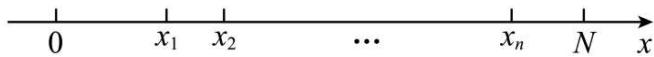

A. 288

B. 308

C. 328

D. 348

4566 (2024·江苏·高三江苏省梁丰高级中学校联考阶段练习)为了庆祝中国共产党第二十次全国代表大会,学校采用按比例分配的分层随机抽样的方法从高一1002人,高二1002人,高三1503人中抽取126人观看“中国共产党第二十次全国代表大会”直播,那么高三年级被抽取的人数为()

A. 36

B. 42

C. 50

D. 54

4567 (2024·北京·高三强基计划)某校共2017名学生,其中每名学生至少要选A,B两门课中的一门,也有些学生选了两门课.已知选A的人数占全校人数的百分比在 $70\%$ 到 $75\%$ 之间,选B的人数占全校人数的百分比在 $40\%$ 到 $45\%$ 之间.则下列结论中正确的是()

A. 同时选 A, B 的可能有 200 人

B. 同时选 A, B 的可能有 300 人

C. 同时选 A, B 的可能有 400 人

D. 同时选 A, B 的可能有 500 人

4568 (2024·河南·襄城高中校联考三模)现有300名老年人, 500名中年人, 400名青年人,从中按比例用分层随机抽样的方法抽取n人,若抽取的老年人与青年人共21名,则n的值为()

A. 15

B. 30

C. 32

D. 36

# 2 题型二:统计图表

4569 (多选题)(2024·河北石家庄·高三校联考期中)恩格尔系数是食品支出总额占个人消费支出总额的比重,它在一定程度上可以用来反映人民生活水平。恩格尔系数的一般规律:收入越低的家庭,恩格尔系数就越大;收入越高的家庭,恩格尔系数就越小。国际上一般认为,当恩格尔系数大于0.6时,居民生活处于贫困状态;在0.5-0.6之间,居民生活水平处于温饱状态;在0.4-0.5之间,居民生活水平达到小康;在0.3-0.4之间,居民生活水平处于富裕状态;当小于0.3时,居民生活达到富有。下面是某地区2022年两个统计图,它们分别为城乡居民恩格尔系数统计图和城乡居民家庭人均可支配收入统计图,请你依据统计图进行分析判断,下列结论错误的是()

城乡居民恩格尔系数(%)  
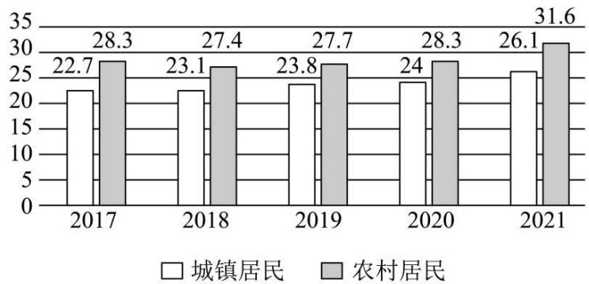

bar

| Year | 城镇居民 | 农村居民 |
|---|---|---|
| 2017 | 22.7 | 28.3 |
| 2018 | 23.1 | 27.4 |
| 2019 | 23.8 | 27.7 |
| 2020 | 24 | 28.3 |
| 2021 | 26.1 | 31.6 |

图1

城乡居民家庭人均可支配收人(元)  
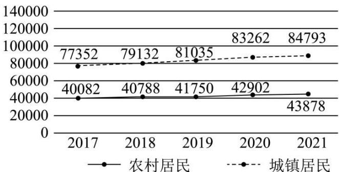

line

| 年份 | 农村居民 | 城镇居民 |
|---|---|---|
| 2017 | 40082 | 77352 |
| 2018 | 40788 | 79132 |
| 2019 | 41750 | 81035 |
| 2020 | 42902 | 83262 |
| 2021 | 43878 | 84793 |

图2

A. 农村居民自 2017 年到 2021 年, 居民生活均达到富有  
B. 近五年城乡居民家庭人均可支配收入差异最大的年份是 2020 年  
C. 城乡居民恩格尔系数差异最小的年份是 2019 年  
D. 2022年该地区城镇居民和农村居民的生活水平已经全部处于富有状态

4570 (多选题)(2024·河北唐山·迁西县第一中学校考二模)2022年的夏季,全国多地迎来罕见极端高温天气。某课外小组通过当地气象部门统计了当地七月份前20天每天的最高气温与最低气温,得到如下图表,则根据图表,下列判断正确的是()

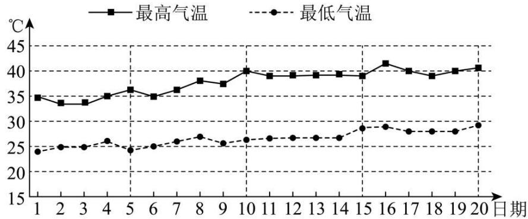

line

| 日期 | 最高气温 (°C) | 最低气温 (°C) |
| ---- | ------------- | ------------- |
| 1    | 35            | 24            |
| 2    | 34            | 25            |
| 3    | 34            | 25            |
| 4    | 35            | 26            |
| 5    | 36            | 24            |
| 6    | 35            | 25            |
| 7    | 36            | 26            |
| 8    | 38            | 27            |
| 9    | 37            | 26            |
| 10   | 40            | 27            |
| 11   | 39            | 27            |
| 12   | 39            | 27            |
| 13   | 39            | 27            |
| 14   | 39            | 27            |
| 15   | 39            | 29            |
| 16   | 42            | 29            |
| 17   | 40            | 28            |
| 18   | 39            | 28            |
| 19   | 40            | 28            |
| 20   | 41            | 29            |

A. 七月份前20天最低气温的中位数低于25℃  
B. 七月份前20天中最高气温的极差大于最低气温的极差  
C. 七月份前20天最高气温的平均数高于40℃  
D. 七月份前10天(1-10日)最高气温的方差大于最低气温的方差

4571 (多选题)(2024·山西忻州·高三校联考开学考试)航海模型项目在我国已开展四十余年,深受青少年的喜爱.该项目整合国防、科技、工程、艺术、物理、数学等知识,主要通过让参赛选手制作、遥控各类船只、舰艇等模型航行,普及船艇知识,探究海洋奥秘,助力培养未来海洋强国的建设者.某学样为了解学生对航海模型项目的喜爱程度,用比例分配的分层随机抽样法从某校高一、高二、高三年级所有学生中抽取部分学生做抽样调查.已知该学校高一、高二、高三年级学生人数的比例如图所示,若抽取的样本中高三年级学生有32人,则下列说法正确的是()

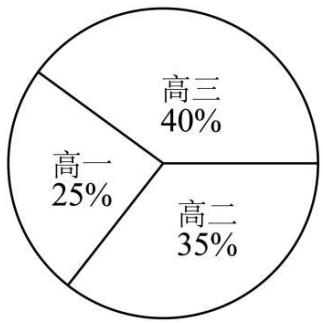

pie

| Category | Percentage (%) |
|---|---|
| 高三 | 40 |
| 高二 | 35 |
| 高一 | 25 |

A. 该校高一学生人数是2000  
B. 样本中高二学生人数是 28  
C. 样本中高三学生人数比高一学生人数多12  
D. 该校学生总人数是 8000

4572 (多选题)(2024·湖南株洲·高三校考阶段练习)某公司统计了2024年1月至6月的月销售额(单位:万元),并与2022年比较,得到同比增长率数据,绘制了如图所示的统计图,则下列说法正确的是()

注: 同比增长率 = (今年月销售额一去年同期月销售额) ÷ 去年同期月销售额 × 100%.

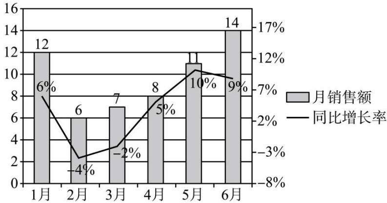

bar_line

| 月份 | 月销售额 | 同比增长率 (%) |
| :--- | :--- | :--- |
| 1月 | 12 | 6 |
| 2月 | 6 | -4 |
| 3月 | 7 | -2 |
| 4月 | 8 | 5 |
| 5月 | 11 | 10 |
| 6月 | 14 | 9 |

A. 2024年1月至6月的月销售额的极差为8  
B.2024年1月至6月的月销售额的第60百分位数为8  
C. 2024 年 1 月至 6 月的月销售额的中位数为 9.5  
D.2022年5月的月销售额为10万元

4573 (多选题)(2024·广东梅州·统考三模)某公司经营五种产业,为应对市场变化,在五年前进行了产业结构调整,优化后的产业结构使公司总利润不断增长,今年总利润比五年前增加了一倍,调整前后的各产业利润与总利润的占比如图所示,则下列结论错误的是()

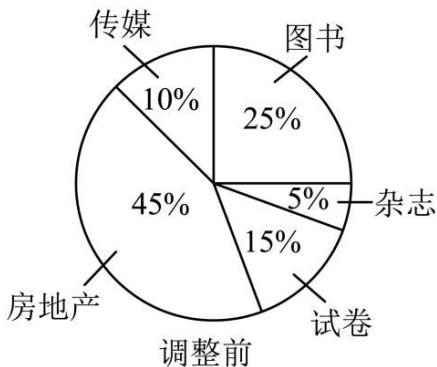

pie

| 类别 | 占比 (%) |
| :--- | :--- |
| 图书 | 25 |
| 杂志 | 5 |
| 试卷 | 15 |
| 调整前 | 45 |
| 房地产 | 10 |
| 传媒 | 10 |

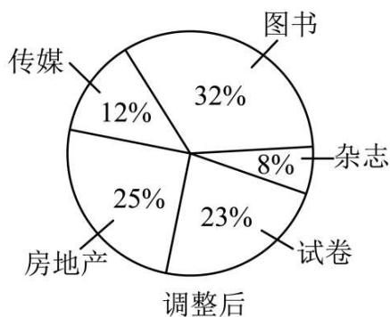

pie

| 类别 | 占比 (%) |
|---|---|
| 图书 | 32 |
| 杂志 | 8 |
| 试卷 | 23 |
| 调整后 | 25 |
| 房地产 | 12 |
| 传媒 | 12 |

A. 调整后传媒的利润增量小于杂志  
C. 调整后试卷的利润增加不到一倍

B. 调整后房地产的利润有所下降  
D. 调整后图书的利润增长了一倍以上

4574 (多选题)(2024·福建福州·福州三中校考模拟预测)某调查机构对我国若干大型科技公司进行调查统计,得到了从事芯片、软件两个行业从业者的年龄分布的饼形图和“90后”从事这两个行业的岗位分布雷达图,则下列说法中一定正确的是()

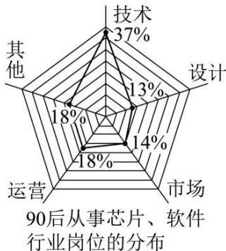

radar

90后从事芯片、软件行业岗位的分布
| 行业 | 占比 (%) |
|---|---|
| 技术 | 37 |
| 设计 | 13 |
| 市场 | 14 |
| 运营 | -18 |
| 其他 | 18 |

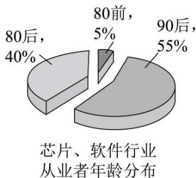

pie

芯片、软件行业
从业者年龄分布
| 年龄段 | 占比 (%) |
|---|---|
| 80后 | 40 |
| 90后 | 55 |
| 80前 | 5 |

A. 芯片、软件行业从业者中，“90后”占总人数的比例超过 $50\%$ B. 芯片、软件行业中从事技术、设计岗位的“90后”人数超过总人数的 $25\%$ C. 芯片、软件行业从事技术岗位的人中，“90后”比“80后”多  
D. 芯片、软件行业中，“90后”从事市场岗位的人数比“80前”的总人数多

4575 (多选题)(2024·河北·统考模拟预测)某地环保部门公布了该地A,B两个景区2016年至2022年各年的全年空气质量优良天数的数据.现根据这组数据绘制了如图所示的散点图,则由该图得出的下列结论中正确的是()

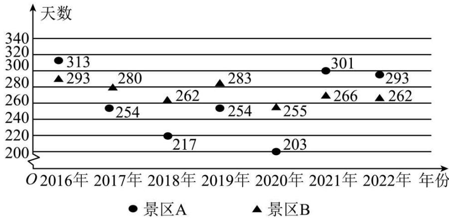

scatter

| 年份 | 景区A (天数) | 景区B (天数) |
| :--- | :--- | :--- |
| 2016年 | 313 | 293 |
| 2017年 | 254 | 280 |
| 2018年 | 217 | 262 |
| 2019年 | 254 | 283 |
| 2020年 | 203 | 255 |
| 2021年 | 301 | 266 |
| 2022年 | 293 | 262 |

A. 景区 A 这 7 年的空气质量优良天数的中位数为 254  
B. 景区 B 这 7 年的空气质量优良天数的第 80 百分位数为 280  
C. 这7年景区A的空气质量优良天数的标准差比景区B的空气质量优良天数的标准差大  
D. 这 7 年景区 A 的空气质量优良天数的平均数比景区 B 的空气质量优良天数的平均数大

# 3 题型三:频率分布直方图

4576 (2024·四川成都·高三成都七中校考阶段练习)某区为了解全区12000名高二学生的体能素质情况,在全区高二学生中随机抽取了1000名学生进行体能测试,并将这1000名的体能测试成绩整理成如下频率分布直方图。根据此频率分布直方图,这1000名学生平均成绩的估计值为\_\_\_\_。

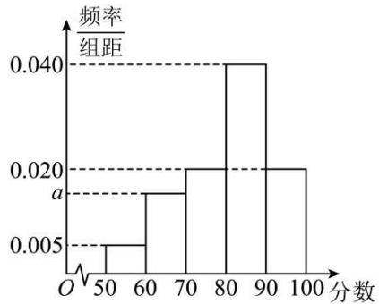

histogram

| 分数 | 频率/组距 |
| :--- | :--- |
| 50-60 | 0.005 |
| 60-70 | 0.018 |
| 70-80 | 0.020 |
| 80-90 | 0.040 |
| 90-100 | 0.020 |

4577 (2024·云南·统考二模)某大学有男生2000名．为了解该校男生的身体体重情况，随机抽查了该校100名男生的体重，并将这100名男生的体重(单位：kg)分成以下六组：[54,58)、[58,62)、[62,66)、[66,70)、[70,74)、[74,78]，绘制成如下的频率分布直方图：

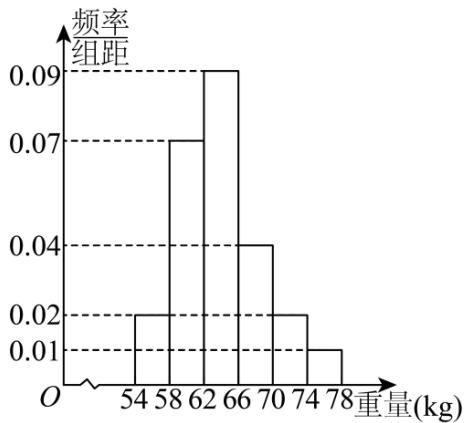

histogram

| 重量 (kg) | 频率组距 |
| :--- | :--- |
| 54-58 | 0.02 |
| 58-62 | 0.07 |
| 62-66 | 0.09 |
| 66-70 | 0.04 |
| 70-74 | 0.02 |
| 74-78 | 0.01 |

该校体重(单位: kg)在区间[70,78]上的男生大约有 \_\_\_\_ 人.

4578 (2024·全国·高三专题练习) 2022年12月4日是第九个国家宪法日, 主题为“学习宣传贯彻党的二十大精神, 推动全面贯彻实施宪法”, 某校由学生会同学制作了宪法学习问卷, 收获了有效答卷2000份, 先对其得分情况进行了统计, 按照[50,60)、[60,70)、…、[90,100]分成5组, 并绘制了如图所示的频率分布直方图, 则图中x= \_\_\_\_.

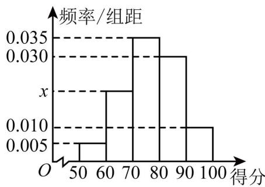

histogram

| 得分 | 频率/组距 |
|---|---|
| 50-60 | 0.005 |
| 60-70 | 0.025 |
| 70-80 | 0.035 |
| 80-90 | 0.030 |
| 90-100 | 0.010 |

4579 (2024·上海浦东新·高三上海市建平中学校考开学考试)从某小学所有学生中随机抽取100名学生,将他们的身高(单位:cm)数据绘制成频率分布直方图(如图),其中样本数据分组[100,110), [110,120), [120,130), [130,140), [140,150),若要从身高在[120,130), [130,140), [140,150)三组内的学生中,用分层抽样的方法抽取12人参加一项活动,则从身高在[130,140)内的学生中抽取的人数应为\_\_\_\_.

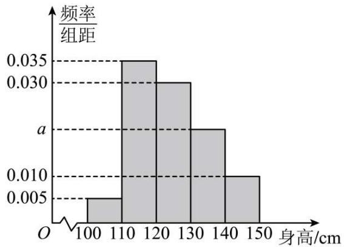

histogram

| 身高/cm | 频率/组距 |
| :--- | :--- |
| 100-110 | 0.005 |
| 110-120 | 0.035 |
| 120-130 | 0.030 |
| 130-140 | 0.015 |
| 140-150 | 0.010 |

4580 (2024·上海普陀·高三曹杨二中校考阶段练习)某校调查了200名学生每周的自习时间(单位:小时),制成了如图所示的的频率分布直方图,根据直方图,这200名学生中每周的自习时间不少于22.5小时的人数为:\_\_\_\_.

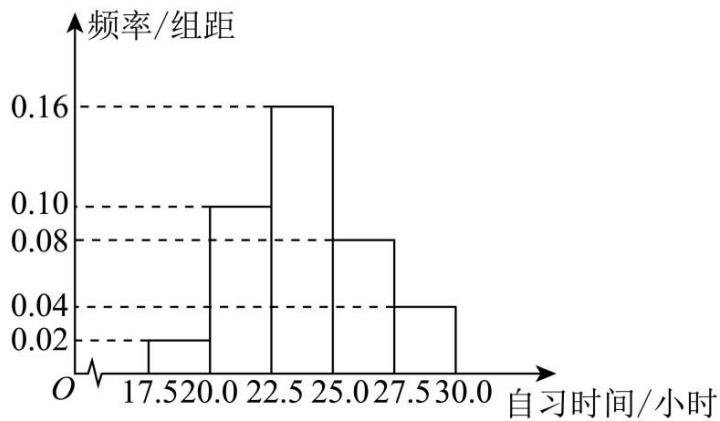

histogram

| 自习时间/小时 | 频率/组距 |
| :--- | :--- |
| 17.5 | 0.02 |
| 20.0 | 0.10 |
| 22.5 | 0.16 |
| 25.0 | 0.08 |
| 27.5 | 0.04 |
| 30.0 | 0.00 |

4581 (2024·内蒙古呼伦贝尔·高三海拉尔第一中学校考阶段练习)某蔬菜批发市场销售某种蔬菜.在一个销售周期内,每售出1吨该蔬菜获利500元,未售出的蔬菜低价处理,每吨亏损100元.统计该蔬菜在过去的100个销售周期内的市场需求量所得频率分布直方图如下:

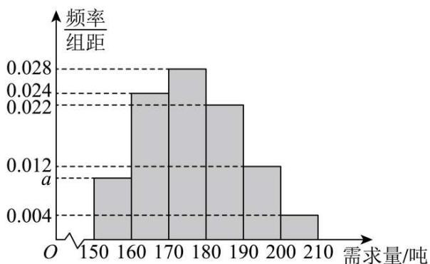

histogram

| 需求量/吨 | 频率/组距 |
| :--- | :--- |
| 150 | 0.012 |
| 160 | 0.024 |
| 170 | 0.028 |
| 180 | 0.022 |
| 190 | 0.012 |
| 200 | 0.004 |
The chart displays a frequency distribution based on the number of units (n) for each group. The x-axis represents '需求量/吨' and the y-axis represents '频率/组距'. Error bars are present but do not correspond to specific data points.

(1) 求图中 a 的值并求 100 个销售周期的平均市场需求量；
(2) 若经销商在下一个销售周期购入 190 吨该蔬菜, 设 y 为销售周期所得利润 (单位: 元), x 为该销售周期的市场需求量 (单位: 吨), 求 x, y 的函数关系式, 并估计销售的利润不少于 86000 元的概率.

# 题型四:百分位数

4582 (2024·上海·高三专题练习)以下数据为参加数学竞赛决赛的15人的成绩(单位:分),分数从低到高依次: 56,70,72,78,79,80,81,83,84,86,88,90,91,94,98, 则这15人成绩的第80百分位数是 \_\_\_\_.

4583 (2024·上海浦东新·高三上海市建平中学校考阶段练习)某校为了了解高三年级学生的身体素质状况,在开学初举行了一场身体素质体能测试,以便对体能不达标的学生进行有针对性的训练,促进他们体能的提升,现从整个年级测试成绩中抽取100名学生的测试成绩,并把测试成绩分成[40,50),[50,60),[60,70),[70,80),[80,90),[90,100]六组,绘制成频率分布直方图(如图所示).其中分数在[90,100]这一组中的纵坐标为a,则该次体能测试成绩的80%分位数约为\_\_\_\_分.

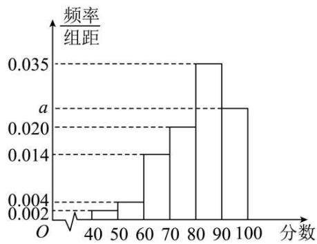

histogram

| 分数 | 频率/组距 |
| :--- | :--- |
| 40-50 | 0.002 |
| 50-60 | 0.004 |
| 60-70 | 0.014 |
| 70-80 | 0.020 |
| 80-90 | 0.035 |
| 90-100 | 0.022 |

4584 (2024·安徽·校联考二模)国庆节前夕,某市举办以“红心颂党恩、喜迎二十大”为主题的青少年学生演讲比赛,其中10人比赛的成绩从低到高依次为:85,86,88,88,89,90,92,93,94,98(单位:分),则这10人成绩的第75百分位数是 \_\_\_\_.

4585 (2024·黑龙江哈尔滨·高一哈尔滨市第四中学校校考期末)已知一组数据: 24, 30, 40, 44, 48, 52. 则这组数据的第30百分位数、第50百分位数的平均数为 \_\_\_\_.

4586 (2024·全国·高三专题练习)为了养成良好的运动习惯,某人记录了自己一周内每天的运动时长(单位:分钟),分别为53,57,45,61,79,49,x,若这组数据的第80百分位数与第60百分位数的差为3,则x= ()

A. 58 或 64

B. 59 或 64

C. 58

D. 59

# 5 题型五:样本的数字特征

4587 (多选题)(2024·广东惠州·高三统考阶段练习)有一组样本数据: $x_{1}, x_{2}, \cdots, x_{8}$ , 其平均数为 2, 由这组样本数据得到新样本数据: $x_{1}, x_{2}, \cdots, x_{8}, 2$ , 那么这两组样本数据一定有相同的

A. 平均数

B. 中位数

C. 方差

D. 极差

4588 (多选题)(2024·吉林·高一榆树市实验高级中学校校联考期末)已知数据1: $x_{1}$ , $x_{2}$ , $\cdots$ , $x_{n}$ , 数据2: $2x_{1}-1$ , $2x_{2}-1$ , $\cdots$ , $2x_{n}-1$ , 则下列统计量中, 数据2不是数据1的两倍的有()

A. 平均数

B. 极差

C. 中位数

D. 标准差

4589 (2024·贵州黔东南·凯里一中校考模拟预测)“说文明话、办文明事、做文明人，树立城市新风尚！创建文明城市，你我共同参与！”为宣传创文精神，华强实验中学高一(2)班组织了甲乙两名志愿者，利用一周的时间在街道对市民进行宣传，将每天宣传的次数绘制成如下频数分布折线图，则以下说法不正确的为（）甲、乙志愿者宣传次数的频数分布折线图

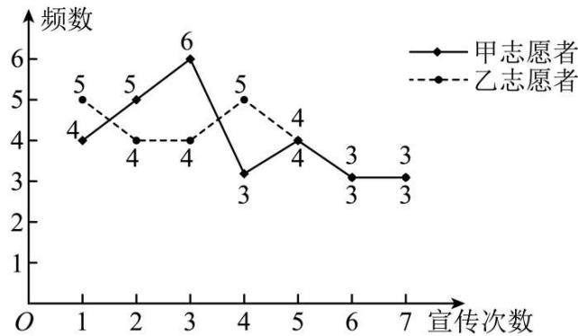

line

| 宣传次数 | 甲志愿者 | 乙志愿者 |
| -------- | -------- | -------- |
| 1        | 4        | 5        |
| 2        | 5        | 4        |
| 3        | 6        | 4        |
| 4        | 3        | 5        |
| 5        | 4        | 4        |
| 6        | 3        | 3        |
| 7        | 3        | 3        |

A. 甲的众数小于乙的众数

B. 乙的极差小于甲的极差

C. 甲的方差大于乙的方差

D. 乙的平均数大于甲的平均数

4590 (2024·河南·襄城高中校联考三模)某学校对班级管理实行量化打分,每周一总结,若一个班连续5周的量化打分不低于80分,则为优秀班级.下列能断定该班为优秀班级的是()

A. 某班连续 5 周量化打分的平均数为 83, 中位数为 81

B. 某班连续 5 周量化打分的平均数为 83, 方差大于 0

C. 某班连续 5 周量化打分的中位数为 81, 众数为 83

D. 某班连续 5 周量化打分的平均数为 83, 方差为 1

4591 (2024·河南郑州·统考模拟预测)已知一组数据: 2, 3, 4, 6, m, 则下列说法不正确的是 ( )

A. 若 $m = 7$ ，则平均数为4.4

B. 若 $m = 4$ ，则众数为4

C. 若 m=6，则中位数为 4

D. 若 m=10，则方差为 40

4592 (2024·贵州铜仁·高二贵州省铜仁第一中学校考开学考试)根据气象学上的标准,连续5天的日平均气温低于10℃即为入冬,将连续5天的日平均温度的记录数据(记录数据都是自然数)作为一组样本,现有4组样本①、②、③、④,依次计算得到结果如下:

①平均数 $\bar{x} < 4;$   
②平均数 $\bar{x}<4$ 且极差小于或等于3;  
③平均数 $\bar{x}<4$ 且标准差 $s\leqslant4$ ;  
④众数等于5且极差小于或等于4.

则 4 组样本中一定符合入冬指标的共有 ( )

A. 1 组

B. 2组

C. 3 组

D. 4 组

4593 (2024·天津河东·高一统考期末)数学兴趣小组的四名同学各自抛掷骰子5次,分别记录每次骰子出现的点数,四名同学的部分统计结果如下:

甲同学: 中位数为 3, 方差为 2.8; 乙同学: 平均数为 3.4, 方差为 1.04;

丙同学: 中位数为 3, 众数为 3; 丁同学: 平均数为 3, 中位数为 2.

根据统计结果,数据中肯定没有出现点数6的是\_\_\_\_同学.

4594 (2024·云南大理·高一校考阶段练习)根据气象学上的标准,连续5天的日平均气温低于10℃即为入冬．现有甲、乙、丙、丁四地连续5天的日平均温度的记录数据(记录数据都是正整数):

①甲地: 5个数据的中位数为7,众数为6;②乙地: 5个数据的平均数为8,极差为3;  
③丙地：5个数据的平均数为5，中位数为4；④丁地：5个数据的平均数为6，方差小于3.

则肯定进入冬季的地区是 （）

A. 甲地

B. 乙地

C. 丙地

D. 丁地

4595 (2024·河北沧州·高二肃宁县第一中学校考阶段练习)气象意义上的春季进入夏季的标志为连续5天的日平均温度不低于 $22^{\circ}$ C. 现有甲、乙、丙三地连续5天的日平均气温的记录数据(记录数据都是正整数):

①甲地：5个数据是中位数为24，众数为22；  
②乙地: 5个数据是中位数为27, 总体均值为24;  
③丙地: 5个数据中有一个数据是32,总体均值为26,总体方差为10.8

则肯定进入夏季的地区有

A. ①②③

B. ①③

C. ②③

D. ①

4596 (2024·吉林长春·高一长春市第五中学校考期末)下列命题中是真命题的是 （）

A. 一组数据 2, 1, 4, 3, 5, 3 的平均数、众数、中位数相同;  
B. 有 A、B、C 三种个体按 3:1:2 的比例分层抽样调查, 如果抽取的 A 个体数为 9, 则样本容量为 30;  
C. 若甲组数据的方差为 5, 乙组数据为 5, 6, 9, 10, 5, 则这两组数据中较稳定的是甲;  
D. 一组数 1, 2, 2, 2, 3, 3, 3, 4, 5, 6 的 80% 分位数为 4.

# 6 题型六: 总体集中趋势的估计

4597 (2024·湖北孝感·高二孝昌县第一高级中学校联考阶段练习)文明城市是反映城市整体文明水平的综合性荣誉称号,作为普通市民,既是文明城市的最大受益者,更是文明城市的主要创造者.某市为提高市民对文明城市创建的认识,举办了“创建文明城市”知识竞赛,从所有答卷中随机抽取100份作为样本,将样本的成绩(满分100分,成绩均为不低于40分的整数)分成六段:[40,50), [50,60), …, [90,100]得到如图所示的频率分布直方图.

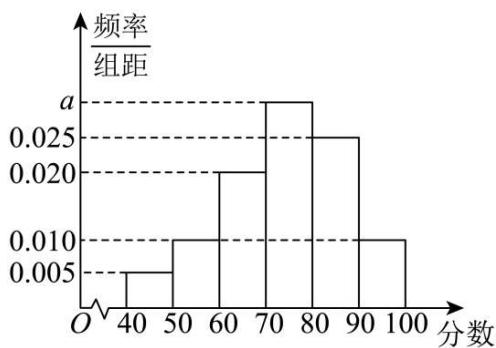

histogram

| 分数 | 频率/组距 |
| :--- | :--- |
| 40-50 | 0.005 |
| 50-60 | 0.010 |
| 60-70 | 0.020 |
| 70-80 | 0.025 |
| 80-90 | 0.025 |
| 90-100 | 0.010 |

(1) 求频率分布直方图中 a 的值;  
(2) 求样本成绩的第 75 百分位数；  
(3) 已知落在 $[50,60)$ 的平均成绩是 61，方差是 7，落在 $[60,70)$ 的平均成绩为 70，方差是 4，求两组成绩的总平均数 $\bar{z}$ 和总方差 $s^{2}$ .

4598 (2024·河南南阳·高一统考期末) 2022 年入冬以来, 为进一步做好疫情防控工作, 避免疫情的再度爆发, A 地区规定居民出行或者出席公共场合均需佩戴口罩, 现将 A 地区 20000 个居民一周的口罩使用个数统计如下表所示, 其中每周的口罩使用个数在 6 以上 (含 6) 的有 14000 人.

<table><tr><td>口罩使用数量</td><td>[2,4)</td><td>[4,6)</td><td>[6,8)</td><td>[8,10)</td><td>[10,12]</td></tr><tr><td>频率</td><td>0.2</td><td>m</td><td>0.3</td><td>n</td><td>0.1</td></tr></table>

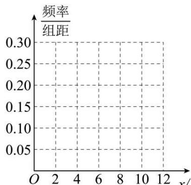

line

| x  | 频率/组距 |
|----|----------|
| 0  | 0.30     |
| 2  | 0.30     |
| 4  | 0.30     |
| 6  | 0.30     |
| 8  | 0.30     |
| 10 | 0.30     |
| 12 | 0.30     |

O 2 4 6 8 10 12 x/口罩使用个数 (1) 求 m, n 的值, 根据表中数据, 完善上面的频率分布直方图; (只画图, 不要过程)

(2) 根据频率分布直方图估计 A 地区居民一周口罩使用个数的 75% 分位数和中位数；(四舍五入, 精确到 0.1)

(3) 根据频率分布直方图估计 A 地区居民一周口罩使用个数的平均数以及方差. (每组数据用每组中点值代替)

4599 (2024·河北邯郸·高二校考开学考试)某工厂在加大生产量的同时,狠抓质量管理,不定时抽查产品质量。该企业质检人员从所生产的产品中随机抽取了100个,将其质量指标值分成以下六组:[40,50), [50,60), [60,70), …, [90,100]。得到如下频率分布直方图。

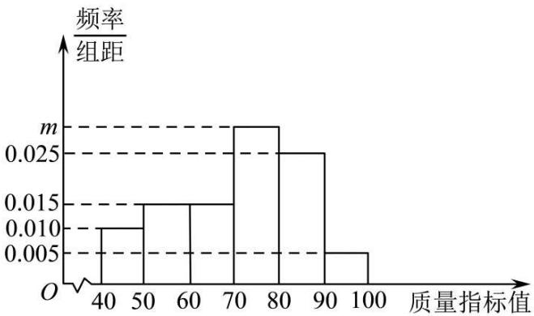

histogram

| 质量指标值 | 频率/组距 |
| :--- | :--- |
| 40-50 | 0.010 |
| 50-60 | 0.015 |
| 60-70 | 0.015 |
| 70-80 | 0.025 |
| 80-90 | 0.025 |
| 90-100 | 0.005 |

(1) 求出直方图中 m 的值;

(2) 利用样本估计总体的思想, 估计该企业所生产的口罩的质量指标值的平均数和 60% 分位数 (同一组中的数据用该组区间中点值作代表, 60% 分位数精确到 0.01).

4600 (2024·福建·高二校联考开学考试)小晟统计了他6月份的手机通话明细清单,发现自己该月共通话100次,小晟将这100次通话的通话时间(单位:分钟)按照(0,4),[4,8), [8,12), [12,16), [16,20), [20,24]分成6组,画出的频率分布直方图如图所示.

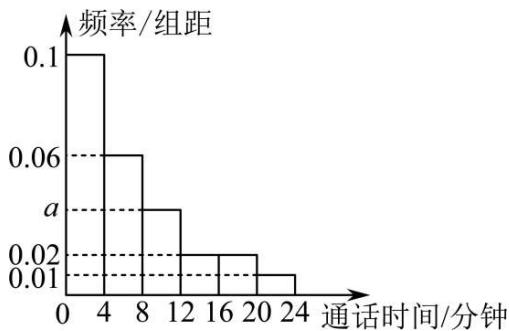

histogram

| 通话时间/分钟 | 频率/组距 |
|---|---|
| 0-4 | 0.1 |
| 4-8 | 0.06 |
| 8-12 | 0.03 |
| 12-16 | 0.02 |
| 16-20 | 0.02 |
| 20-24 | 0.01 |

(1) 求 a 的值;

(2) 求通话时间在区间 [4,12) 内的通话次数;

(3)试估计小晟这100次通话的平均时间(同一组中的数据用该组区间的中点值作代表).

4601 (2024·浙江温州·高二乐清市知临中学校考开学考试)为了迎接新高考,某校举行物理和化学等选科考试,其中,600名学生化学成绩(满分100分)的频率分布直方图如图所示,其中成绩分组区间是:第一组[45,55),第二组[55,65),第三组[65,75),第四组[75,85),第五组[85,95).已知图中第三组频率为0.45,第一组和第五组的频率相同.

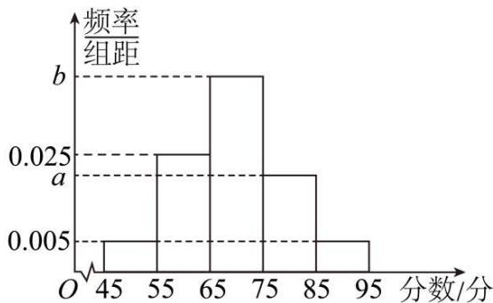

histogram

| 分数/分 | 频率组距 |
| ------- | -------- |
| 45-55   | 0.005    |
| 55-65   | 0.025    |
| 65-75   | 0.020    |
| 75-85   | 0.015    |
| 85-95   | 0.005    |

(1) 求 a, b 的值;

(2) 估算高分 (大于等于 80 分) 人数;

(3) 估计这 600 名学生化学成绩的平均值 (同一组中的数据用该组区间的中点值作代表) 和中位数. (中位数精确到 0.1)

4602 $05 + 0.25 + 0.045 \cdot (x - 65) = 0.5$ ，解得 $x \approx 69.4$ ，故中位数为 69.4.

4603 (2024·湖北武汉·高二统考开学考试)某学校为了了解老师对“民法典”知识的认知程度，针对不同年龄的老师举办了一次“民法典”知识竞答，满分100分(95分及以上为认知程度高)，结果认知程度高的有 $m$ 人，按年龄分成5组，其中第一组：[20,25)，第二组：[25,30)，第三组：[30,35)，第四组：[35,40)，第五组：[40,45]，得到如图所示的频率分布直方图，已知第一组有10人.

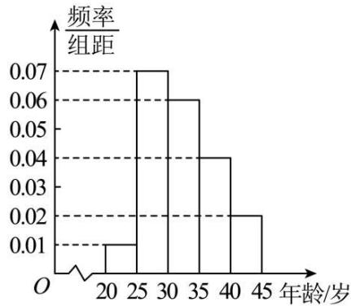

histogram

| 年龄/岁 | 频率/组距 |
| :--- | :--- |
| 20 | 0.01 |
| 25 | 0.07 |
| 30 | 0.06 |
| 35 | 0.04 |
| 40 | 0.02 |
| 45 | 0.01 |

(1) 根据频率分布直方图, 估计这 m 人年龄的第 75 百分位数;  
(2) 现从以上各组中用分层随机抽样的方法抽取 40 人, 担任“民法典”知识的宣传使者.  
①若有甲(年龄23)，乙(年龄43)两人已确定入选宣传使者，现计划从第一组和第五组被抽到的使者中，再随机抽取2名作为组长，求甲、乙两人恰有一人被选上的概率；  
②若第四组宣传使者的年龄的平均数与方差分别为36和1,第五组宣传使者的年龄的平均数与方差分别为42和2,据此估计这m人中35\~45岁所有人的年龄的方差.

# 题型七:总体离散程度的估计

4604 (2024·高一课时练习)某学校高一100名学生参加数学考试,成绩均在40分到100分之间,学生成绩的频率分布直方图如下图:

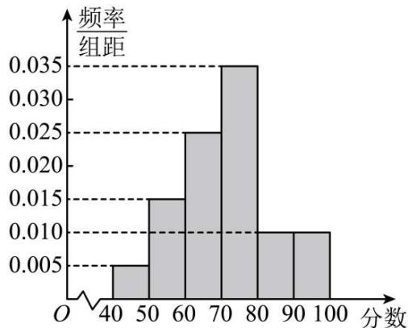

histogram

| 分数 | 频率/组距 |
| :--- | :--- |
| 40-50 | 0.005 |
| 50-60 | 0.015 |
| 60-70 | 0.025 |
| 70-80 | 0.035 |
| 80-90 | 0.010 |
| 90-100 | 0.010 |

(1) 估计这 100 名学生分数的中位数与平均数; (精确到 0.1)  
(2) 某老师抽取了 10 名学生的分数: $x_{1}, x_{2}, x_{3}, \cdots, x_{10}$ , 已知这 10 个分数的平均数 $\bar{x} = 90$ , 标准差 $s = 6$ , 若剔除其中的 100 和 80 两个分数, 求剩余 8 个分数的平均数与标准差.

(参考公式: $s=\sqrt{\frac{\sum_{i=1}^{n}x_{i}^{2}-n\bar{x}^{2}}{n}}$ )

4605 (2024·四川绵阳·绵阳中学校考二模) 2022 年 4 月 16 日, 神舟十三号载人飞船返回舱成功着陆, 航天员翟志刚、王亚平、叶光富完成在轨驻留半年的太空飞行任务, 标志着中国空间站关键技术验证阶段圆满完成. 并将进入建造阶段某地区为了激发人们对天文学的兴趣,开展了天文知识比赛,满分100分(95分及以上为认知程度高),结果认知程度高的有m人,这m人按年龄分成5组,其中第一组:[20,25),第二组:[25,30),第三组:[30,35),第四组:[35,40),第五组:[40,45],得到如图所示的频率分布直方图,已知第一组有10人.

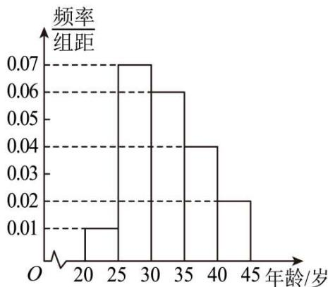

histogram

| 年龄/岁 | 频率/组距 |
|---|---|
| 20-25 | 0.01 |
| 25-30 | 0.07 |
| 30-35 | 0.06 |
| 35-40 | 0.04 |
| 40-45 | 0.02 |

(1) 根据频率分布直方图, 估计这 m 人的第 80 百分位数 (中位数 = 第 50 百分位数);

(2) 现从以上各组中用分层随机抽样的方法抽取 20 人, 担任“党章党史”的宣传使者.

①若有甲(年龄36)，乙(年龄42)两人已确定入选宣传使者，现计划从第四组和第五组被抽到的使者中，再随机抽取2名作为组长，求甲、乙两人至少有一人被选上的概率；

②若第四组宣传使者的年龄的平均数与方差分别为36和 $\frac{5}{2}$ ，第五组宣传使者的年龄的平均数与方差分别为42和1，据此估计这m人中35～45岁所有人的年龄的平均数和方差.

4606 (2024·北京·高三校考阶段练习)某学校为了解学生的体质健康状况,对高一、高二两个年级的学生进行体质健康测试. 现从两个年级学生中各随机抽取 20 人,将他们的测试数据用茎叶图表示如下:

<table><tr><td colspan="5">高一</td><td></td><td colspan="4">高二</td></tr><tr><td></td><td></td><td>6</td><td>4</td><td>3</td><td>9</td><td>0</td><td>5</td><td>8</td><td></td></tr><tr><td></td><td>9</td><td>6</td><td>2</td><td>3</td><td>8</td><td>1</td><td>4</td><td>5</td><td>8</td></tr><tr><td>9</td><td>8</td><td>5</td><td>2</td><td>1</td><td>7</td><td>2</td><td>3</td><td>3</td><td>9</td></tr><tr><td>9</td><td>7</td><td>7</td><td>6</td><td>4</td><td>6</td><td>4</td><td>5</td><td>7</td><td>8</td></tr><tr><td></td><td></td><td>8</td><td>3</td><td>0</td><td>5</td><td>0</td><td>2</td><td>6</td><td></td></tr><tr><td></td><td></td><td></td><td></td><td></td><td>4</td><td>0</td><td>2</td><td></td><td></td></tr></table>

《国家学生体质健康标准》的等级标准如下表．规定:测试数据≥60,体质健康为合格.

<table><tr><td>等级</td><td>优秀</td><td>良好</td><td>及格</td><td>不及格</td></tr><tr><td>测试数据</td><td>[90,100]</td><td>[80,89]</td><td>[60,79]</td><td>[0,59]</td></tr></table>

(1) 从该校高二年级学生中随机抽取一名学生,试估计这名学生体质健康合格的概率;  
(2) 从两个年级等级为优秀的样本中各随机选取一名学生, 求选取的两名学生的测试数据平均数大于 95 的概率;  
(3) 设该校高一学生测试数据的平均数和方差分别为 $\overline{x}_{1}, s_{1}^{2}$ ，高二学生测试数据的平均数和方差分别为 $\overline{x}_{2}, s_{2}^{2}$ ，试比较 $\overline{x}_{1}$ 与 $\overline{x}_{2}$ 、 $s_{1}^{2}$ 与 $s_{2}^{2}$ 的大小。（只需写出结论）

4607 (2024·广西·高一期末)某中学400名学生参加全市高中数学竞赛,根据男女学生人数比例,使用分层抽样的方法从中随机抽取了100名学生,记录他们的分数,将数据分成7组:[20,30), [30,40), …, [80,90],并整理得到如下频率分布直方图:

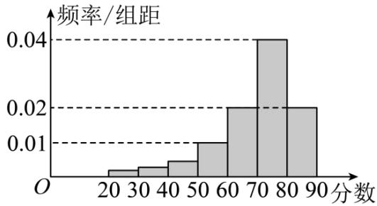

histogram

| 分数 | 频率/组距 |
| :--- | :--- |
| 20-30 | 0.002 |
| 30-40 | 0.003 |
| 40-50 | 0.005 |
| 50-60 | 0.01 |
| 60-70 | 0.02 |
| 70-80 | 0.04 |
| 80-90 | 0.02 |

(1) 由频率直方图求样本中分数的中位数；  
(2) 已知样本中分数在 $[40,50)$ 的学生有 5 人，试估计总体中分数小于 40 的人数；  
(3) 已知样本中男生与女生的比例是 3:1, 男生样本的均值为 70, 方差为 10, 女生样本的均值为 80, 方差为 12, 请计算出总体的方差.

4608 (2024·湖北武汉·高一期末)某中学为了贯策教育部对学生的五项管理中的体质管理,对高一年级学生身高进行调查,在调查中,采用样本量比例分配的分层随机抽样,如果不知道样本数据,只知道抽取了男34人,其平均数和方差分别为170.5和15,抽取了女生16人,其平均数和方差分别为160.5和35.

(1) 由这些数据计算总样本的平均数；  
(2) 由这些数据计算出总样本的方差, 并对高一年级全体学生的身高方差作出估计.  
参考数据： $(15 + 3.2^{2})\times 34 = 858.16,(35 + 6.8^{2})\times 16 = 1299.84$

4609 (2024·湖北武汉·高一期末)为了监控某种装件的一条生产线的生产过程,检验员每天从该生产线上随机抽取16个零件,并测量其尺寸(单位:cm). 其中 $\bar{x}$ 元近似为样本平均数,s 近似为样本的标准差,用样本平均数 $\bar{x}$ 和标准差 s 能够反映数据取值的信息. 根据长期生产经验,一天内抽检零件中,如果出现了尺寸在 $(\bar{x}-3s,\bar{x}+3s)$ 之外的零件,就认为这条生产线在这一天的生产过程可能出现了异常情况,需对当天的生产过程进行检查. 下面是检验员在一天内抽取的16个零件的尺寸:

<table><tr><td>9.9</td><td>10.1</td><td>10.2</td><td>10.2</td><td>9.9</td><td>9.8</td><td>10.1</td><td>10</td></tr><tr><td>10.2</td><td>10.3</td><td>9.1</td><td>10.1</td><td>9.9</td><td>9.9</td><td>10.1</td><td>10.2</td></tr></table>

经计算得 $\bar{x}=\frac{1}{16}\sum_{i=1}^{16}x_{i}=10,s=\sqrt{\frac{1}{16}\sum_{i=1}^{16}(x_{i}-\bar{x})^{2}}=\sqrt{\frac{1}{16}\left(\sum_{i=1}^{16}x_{i}^{2}-16\bar{x}^{2}\right)}\approx0.280,16\times0.28^{2}\approx1.25,15\times10.06^{2}\approx1518.05,\sqrt{0.026}\approx0.16$ ，其中 $x_{i}$ 为抽取的第 i 个零件的尺寸， $i=1,2,\cdots,16$ .

(1) 利用估计值判断是否需对当天的生产过程进行检查?  
(2) 剔除 $(\bar{x} - 3s, \bar{x} + 3s)$ 之外的数据，用剩下的数据估计样本平均数 $\bar{x}$ 和样本标准差 $s$ (精确到0.01).

4610 (2024·广西玉林·高一校联考期末)某学校为了了解高二年级学生数学运算能力,对高二年级的300名学生进行了一次测试.已知参加此次测试的学生的分数 $x_{i}(i=1,2,\cdots,300)$ 全部介于45分到95分之间,该校将所有分数分成5组:[45,55),[55,65), $\cdots$ ,[85,95],整理得到如下频率分布直方图(同组数据以这组数据的中间值作为代表).

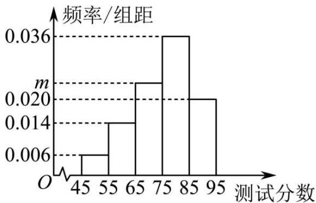

histogram

| 测试分数 | 频率/组距 |
| :--- | :--- |
| 45 | 0.006 |
| 55 | 0.014 |
| 65 | 0.020 |
| 75 | 0.036 |
| 85 | 0.020 |
| 95 | 0.006 |

(1) 求 m 的值, 并估计此次校内测试分数的平均值 $\bar{x}$ ;  
(2) 学校要求按照分数从高到低选拔前 30 名的学生进行培训, 试估计这 30 名学生的最低分数;  
(3)试估计这300名学生的分数 $x_{i}(i=1,2,\cdots,300)$ 的方差 $s^{2}$ ，并判断此次得分为52分和94分的两名同学的成绩是否进入到了 $[\bar{x}-2s,\bar{x}+2s]$ 范围内？

(参考公式: $s^{2}=\frac{1}{n}\sum_{i=1}^{n}f_{i}(x_{i}-\bar{x})^{2}$ , 其中 $f_{i}$ 为各组频数; 参考数据: $\sqrt{129}\approx11.4$ )

4611 (2024·黑龙江牡丹江·高一牡丹江一中校考期末)4月23日是世界读书日,树人中学为了解本校学生课外阅读情况,按性别进行分层,用分层随机抽样的方法从全校学生中抽出一个容量为100的样本,其中男生40名,女生60名.经调查统计,分别得到40名男生一周课外阅读时间(单位:小时)的频数分布表和60名女生一周课外阅读时间(单位:小时)的频率分布直方图.(以各组的区间中点值代表该组的各个值)

<table><tr><td colspan="2">男生一周课外阅读时间频数分布表</td></tr><tr><td>小时</td><td>频数</td></tr><tr><td>[0,2)</td><td>9</td></tr><tr><td>[2,4)</td><td>25</td></tr><tr><td>[4,6)</td><td>3</td></tr><tr><td>[6,8]</td><td>3</td></tr></table>

女生一周课外阅读时间频率分布直方图

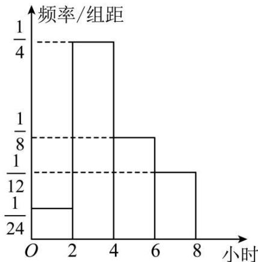

histogram

| 小时 | 频率/组距 |
| :--- | :--- |
| 0-2 | 1/4 |
| 2-4 | 1/8 |
| 4-6 | 1/12 |
| 6-8 | 1/24 |

(1) 从一周课外阅读时间为 [4,6) 的学生中按比例分配抽取 6 人, 再从这 6 名学生中选出 2 名同学调查他们阅读书目. 求这两人都是女生的概率;  
(2) 分别估计男生和女生一周课外阅读时间的平均数 $\bar{x}, \bar{y}$ ;  
(3) 估计总样本的平均数 $\bar{z}$ 和方差 $s^{2}$ .

参考数据和公式：男生和女生一周课外阅读时间方差的估计值分别为 $s_{\text{男}}^{2}=2.4$ 和 $s_{\text{女}}^{2}=3$ ， $s^{2}=\frac{1}{100}\left[\sum_{i=1}^{40}(x_{i}-\bar{x})^{2}+\sum_{i=1}^{40}(\bar{x}-\bar{z})^{2}+\sum_{i=1}^{60}(\bar{y}-\bar{z})^{2}+\sum_{i=1}^{60}(y_{i}-\bar{y})^{2}\right]$ ， $x_{i}(1\leqslant i\leqslant40)$ 和 $y_{i}(1\leqslant i\leqslant60)$ 分别表示男生和女生一周阅读时间的样本，其中 $i\in Z$ .

# 8 题型八:分层方差问题

4612 (2024·高一课时练习)某车间有甲、乙两台机床同时加工直径为 $100 \mathrm{~cm}$ 的零件, 为检验质量, 从中各抽取 6 件, 测得甲、乙两组数据的均值为 $\overline{x}_{\text {甲}} = \overline{x}_{\text {乙}} = 100$ , 两组数据的方差分别为 $s_{\text {甲}}^{2} = \frac{7}{3}, s_{\text {乙}}^{2} = 1$ , 则估计该车间这批零件的直径的方差 $s^{2} =$ \_\_\_\_.

4613 (2024·安徽阜阳·高三安徽省临泉第一中学校考阶段练习)某校高二年级有男生400人和女生600人,为分析期末物理调研测试成绩,按照男女比例通过分层随机抽样的方法取到一个样本,样本中男生的平均成绩为80分,方差为10,女生的平均成绩为60分,方差为20,由此可以估计该校高二年级期末物理调研测试成绩的方差为\_\_\_\_.

4614 (2024·湖南郴州·高二统考期末)某校有高一学生 1000 人, 其中男生 600 人, 女生 400 人,为了获取学生身高信息,采用男、女按比例分配分层抽样的方法抽取样本 50 人,并观测样本的指标值 (单位: cm),计算得男生样本的均值为 170,方差为 20,女生样本的均值为 160,方差为 30,据此估计该校高一年级学生身高的总体方差为 \_\_\_\_.

4615 (2024·湖南常德·常德市一中校考模拟预测)为调查某地区中学生每天睡眠时间,采用样本量比例分配的分层随机抽样,现抽取初中生800人,其每天睡眠时间均值为9小时,方差为0.5,抽取高中生1200人,其每天睡眠时间均值为8小时,方差为1,则估计该地区中学生每天睡眠时间的方差为 \_\_\_\_.

4616 (2024·新疆伊犁·高一校联考期末)某校教师男女人数之比为 5:4, 该校所有教师进行 1 分钟限时投篮比赛。现记录了每个教师 1 分钟命中次数, 已知男教师命中次数的平均数为 17, 方差为 16, 女教师命中次数的平均数为 8, 方差为 16, 那么全体教师 1 分钟限时投篮次数的方差为 \_\_\_\_.

4617 (2024·江苏南京·高一南京市燕子矶中学校考期中)甲、乙两支田径队队员的体重(单位: kg)信息如下:甲队体重的平均数为60,方差为200,乙队体重的平均数为68,方差为300,又已知甲、乙两队的队员人数之比为1:3,则关于甲、乙两队全部队员的体重的平均数和方差分别为 \_\_\_\_

参考公式:总体分为2层,分层随机抽样,各层抽取的样本量、样本平均数和样本方差分别为: $n_{1},\bar{x},s^{2},n_{2},\bar{y},s_{2}^{2}$ 记总样本的平均数 $\bar{\omega}$ ,样本方差为 $s^{2},s^{2}=$

$$
\frac {1}{n _ {1} + n _ {2}} \left\{n _ {1} \left[ s _ {1} ^ {2} + (\bar {x} - \bar {\omega}) ^ {2} \right] + n _ {2} \left[ s _ {2} ^ {2} + (\bar {y} - \bar {\omega}) ^ {2} \right] \right\}
$$

4618 (2024·安徽芜湖·高一统考期末)在对树人中学高一年级学生身高(单位: cm)调查中,抽取了男生20人,其平均数和方差分别为174和12,抽取了女生30人,其平均数和方差分别为164和30,根据这些数据计算出总样本的方差为 \_\_\_\_.

4619 (2024·浙江湖州·高二统考期末)湖州地区甲、乙、丙三所学科基地学校的数学强基小组人数之比为 3:2:1, 三所学校共有数学强基学生 48 人, 在一次统一考试中, 所有学生的成绩平均分为 117, 方差为 21.5. 已知甲、乙两所学校的数学强基小组学生的平均分分别为 118 和 114, 方差分别为 15 和 21, 则丙学校的学生成绩的方差是 \_\_\_\_.

4620 (2024·湖北武汉·高一校联考期末)已知一组数据 $x_{1}, x_{2}, \cdots, x_{n}$ 的平均值为 $\bar{x} = 5, s^{2} = 32$ ，删去一个数之后，平均值没有改变，方差比原来大 4，则这组数据的个数 n = \_\_\_\_.

