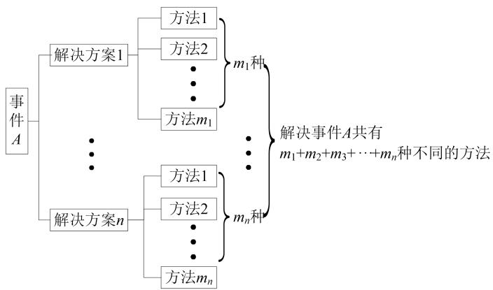
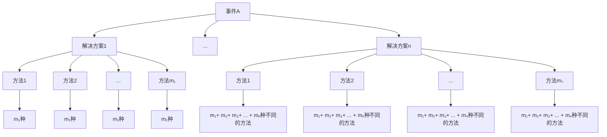
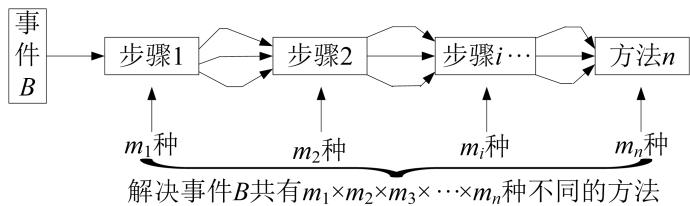
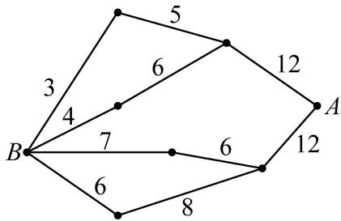
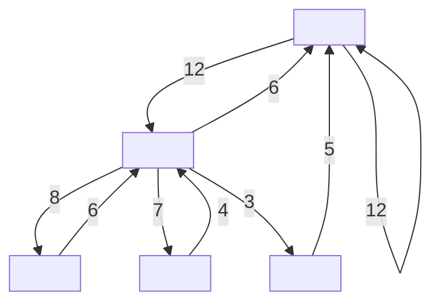
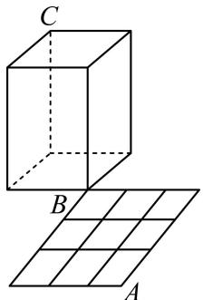
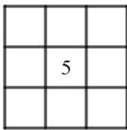
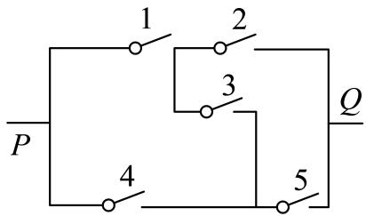
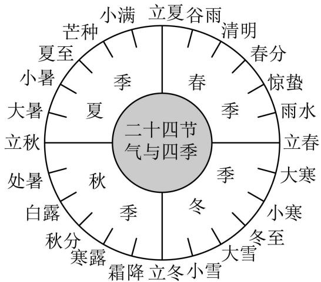

# 第85讲 计数原理


# 知识梳理

知识点1、分类加法计数原理

完成一件事,有 n 类办法,在第 1 类办法中有 $m_{1}$ 种不同的办法,在第 2 类办法中有 $m_{2}$ 种不同的方法, $\cdots$ ,在第 n 类办法中有 $m_{n}$ 种不同的方法,那么完成这件事共有: $N=m_{1}+m_{2}+\cdots+m_{n}$ 种不同的方法.



<details>
<summary>flowchart</summary>


</details>

知识点 2、分步乘法计数原理

完成一件事,需要分成 n 个步骤,做第 1 步有 $m_{1}$ 种不同的方法,做第 2 步有 $m_{2}$ 种不同的方法, $\cdots$ ,做第 n 步有 $m_{n}$ 种不同的方法,那么完成这件事共有: $N=m_{1}\cdot m_{2}\cdots\cdots m_{n}$ 种不同的方法.



<details>
<summary>flowchart</summary>

```mermaid
graph LR
    A["事件 B"] --> B["步骤1"]
    B --> C["步骤2"]
    C --> D["步骤i…"]
    D --> E["方法 n"]
    B --> F["m₁种"]
    C --> G["m₂种"]
    D --> H["mᵢ种"]
    E --> I["mₙ种"]
    style B fill:#f9f,stroke:#333
    style C fill:#f9f,stroke:#333
    style D fill:#f9f,stroke:#333
    style E fill:#f9f,stroke:#333
    note bottom of B: 解决事件B共有m₁×m₂×m₃×⋯×mₙ种不同的方法
```
</details>

注意:两个原理及其区别

分类加法计数原理和“分类”有关, 如果完成某件事情有 n 类办法, 这 n 类办法之间是互斥的, 那么求完成这件事情的方法总数时, 就用分类加法计数原理.

分步乘法计数原理和“分步”有关, 是针对“分步完成”的问题. 如果完成某件事情有 $n$ 个步骤, 而且这几个步骤缺一不可, 且互不影响 (独立), 当且仅当依次完成这 $n$ 个步骤后, 这件事情才算完成, 那么求完成这件事情的方法总数时, 就用分步乘法计数原理.

当然，在解决实际问题时，并不一定是单一应用分类计数原理或分步计数原理，有时可能同时用到两个计数原理。即分类时，每类的方法可能运用分步完成；而分步后，每步的方法数可能会采取分类的思想求方法数。对于同一问题，我们可以从不同的角度去处理，从而得到不同的解法(但方法数相同)，这也是检验排列组合问题的很好方法。

知识点3、两个计数原理的综合应用

如果完成一件事的各种方法是相互独立的,那么计算完成这件事的方法数时,使用分类计数原理. 如果完成一件事的各个步骤是相互联系的,即各个步骤都必须完成,这件事才告完成,那么计算完成这件事的方法数时,使用分步计数原理.

# 1 题型一: 分类加法计数原理的应用

4668 (2024·全国·高三专题练习)如果一条直线与一个平面垂直,那么称此直线与平面构成一个“正交线面对”.在一个正方体中,由两个顶点确定的直线与含有四个顶点的平面构成的“正交线面对”的个数是()

A. 48

B. 18

C. 24

D. 36

4669 (2024·四川成都·双流中学校考模拟预测)如图,小黑圆表示网络的结点,结点之间的连线表示它们有网线相连．连线上标注的数字表示该段网线单位时间内可以通过的最大信息量．现从结点A向结点B传递信息 （）



<details>
<summary>flowchart</summary>


</details>

A. 26

B. 24

C. 20

D. 19

4670 (2024·江苏镇江·高三扬中市第二高级中学校考阶段练习)定义:“各位数字之和为7的四位数叫好运数”,比如1006,2203,则所有好运数的个数为()

A. 82

B. 83

C. 84

D. 85

4671 (2024·全国·高三专题练习)从 1, 2, 3, 4, 5, 6 中选取 4 个数字, 组成各个数位上的数字既不全相同, 也不两两互异的四位数, 记四位数中各个数位上的数字从左往右依次为 $a$ , $b$ , $c$ , $d$ , 且要求 $a \leqslant b \leqslant c \leqslant d$ , 则满足条件的四位数的个数为 \_\_\_\_.

4672 (2024·全国·高三专题练习)已知直线方程 $Ax + By = 0$ ，若从0、1、2、3、5、7这六个数中每次取两个不同的数分别作为A、B的值，则 $Ax + By = 0$ 可表示 \_\_\_\_ 条不同的直线.

4673 (2024·辽宁·高三校联考开学考试)某迷宫隧道猫爬架如图所示, B, C 为一个长方体的两个顶点, A, B 是边长为 3 米的大正方形的两个顶点, 且大正方形由完全相同的 9 小正方形拼成. 若小猫从 A 点沿着图中的线段爬到 B 点, 再从 B 点沿着长方体的棱爬到 C 点, 则小猫从 A 点爬到 C 点可以选择的最短路径共有 \_\_\_\_ 条.



<details>
<summary>text_image</summary>

C
B
A
</details>

# 2 题型二:分步乘法计数原理的应用

4674 (2024·广东深圳·高三校考阶段练习)甲、乙、丙3个公司承包6项不同的工程,甲承包1项,乙承包2项,丙承包3项,则共有\_\_\_\_种承包方式(用数字作答).

4675 (2024·全国·高三专题练习)若一个三位数同时满足:①各数位的数字互不相同;②任意两个数位的数字之和不等于9,则这样的三位数共有 \_\_\_\_ 个. (结果用数字作答)

4676 (2024·安徽亳州·高三蒙城第一中学校考阶段练习)将3名男生, 2名女生排成一排, 要求男生甲必须站在中间, 2名女生必须相邻的排法种数有 ( )

A. 4种

B. 8种

C. 12 种

D. 48 种

4677 (2024·四川成都·高三统考开学考试)“数独九宫格”原创者是18世纪的瑞士数学家欧拉，它的游戏规则很简单，将1到9这九个自然数填到如图所示的小九宫格的9个空格里，每个空格填一个数，且9个空格的数字各不相同，若中间空格已填数字5，且只填第二行和第二列，并要求第二行从左至右及第二列从上至下所填的数字都是从小到大排列的，则不同的填法种数为 （）



A. 72

B. 108

C. 144

D. 196

4678 (2024·全国·高三专题练习)三棱柱各面所在平面将空间分成不同部分的个数为（）

A. 18

B. 21

C. 24

D. 27

4679 (2024·河北石家庄·高三校联考期中)临近春节,某校书法爱好小组书写了若干副春联,准备赠送给四户孤寡老人. 春联分为长联和短联两种,无论是长联或短联,内容均不相同. 经过调查,四户老人各户需要1副长联,其中乙户老人需要1副短联,其余三户各要2副短联. 书法爱好小组按要求选出11副春联,则不同的赠送方法种数为 ( )

A. 15120

B. 7560

C. 12520

D. 12160

4680 (2024·北京东城·高三北京市广渠门中学校考开学考试)鱼缸里有8条热带鱼和2条冷水鱼,为避免热带鱼咬死冷水鱼,现在把鱼缸出孔打开,让鱼随机游出,每次只能游出1条,直至2条冷水鱼全部游出就关闭出孔,若恰好第3条鱼游出后就关闭了出孔,则不同游出方案的种数为()

A. 16

B. 32

C. 36

D. 48

4681 (2024·湖南·高三临澧县第一中学校联考开学考试)在如图所示的表格中填写 1, 2, 3 三个数字, 要求每一行、每一列均有这 3 个数字, 则不同的填法种数为( ).

<table><tr><td></td><td></td><td></td></tr><tr><td></td><td></td><td></td></tr><tr><td></td><td></td><td></td></tr></table>

A. 6

B. 9

C. 12

D. 18

4682 (2024·黑龙江佳木斯·高三校考开学考试)甲、乙分别从4门不同课程中选修1门，且2人

选修的课程不同,则不同的选法有()种.

A. 6

B. 8

C. 12

D. 16

4683 (2024·陕西西安·西安市第三十八中学校考模拟预测)从六人(含甲)中选四人完成四项不同的工作(含翻译),则甲被选且甲不参加翻译工作的不同选法共有()

A. 120 种

B. 150 种

C. 180 种

D. 210 种

4684 (2024·贵州黔东南·凯里一中校考模拟预测)某足球比赛有 A, B, C, D, E, F, G, H, J 共 9 支球队, 其中 A, B, C 为第一档球队, D, E, F 为第二档球队, G, H, J 为第三档球队, 现将上述 9 支球队分成 3 个小组, 每个小组 3 支球队, 若同一档位的球队不能出现在同一个小组中, 则不同的分组方法有 ( )

A. 27 种

B. 36 种

C. 72 种

D. 144 种


# 题型三:两个计数原理的综合应用

4685 (2024·全国·高三专题练习)第31届世界大学生夏季运动会于6月26日至7月7日在成都举办,现在从6男4女共10名青年志愿者中,选出3男2女共5名志愿者,安排到编号为1、2、3、4、5的5个赛场,每个赛场只有一名志愿者,其中女志愿者甲不能安排在编号为1、2的赛场,编号为2的赛场必须安排女志愿者,那么不同安排方案有()

A. 1440 种

B. 2352 种

C. 2880 种

D. 3960 种

4686 (2024·江苏南京·高三校联考阶段练习)从2位男生,3位女生中安排3人到三个场馆做志愿者,每个场馆各1人,且至少有1位男生入选,则不同安排方法有()种

A. 16

B. 36

C. 54

D. 96

4687 (2024·上海黄浦·高三上海市敬业中学校考开学考试)三位同学参加跳高、跳远、铅球项目的比赛,若每人只选择一个项目,则同一个项目最多只有2人参赛的情况共有\_\_\_\_种.

4688 (2024·广东·高三河源市河源中学校联考阶段练习)现有5名同学从北京、上海、深圳三个路线中选择一个路线进行研学活动,每个路线至少1人,至多2人,其中甲同学不选深圳路线,则不同的路线选择方法共有\_\_\_\_种。(用数字作答)

4689 (2024·浙江·高三舟山中学校联考开学考试)杭州亚运会举办在即,主办方开始对志愿者进行分配. 已知射箭场馆共需要6名志愿者,其中3名会说韩语,3名会说日语. 目前可供选择的志愿者中有4人只会韩语,5人只会日语,另外还有1人既会韩语又会日语,则不同的选人方案共有 \_\_\_\_ 种. (用数字作答).

4690 (2024·江苏扬州·高三仪征中学校考阶段练习)已知如图所示的电路中,每个开关都有闭合、不闭合两种可能,因此5个开关共有 $2^{5}$ 种可能,在这 $2^{5}$ 种可能中,电路从P到Q接通的情况有\_\_\_\_种.



<details>
<summary>text_image</summary>

P
1
2
3
4
5
Q
</details>

4691 (2024·湖北·高三校联考开学考试)从5男3女共8名学生中选出组长1人,副组长1人,普通组员3人组成5人志愿组,要求志愿组中至少有3名男生,且组长和副组长性别不同,则共有\_\_\_\_种不同的选法.(用数字作答)  
4692 (2024·湖北·高三校联考阶段练习)有两个家庭共8人暑假到新疆结伴旅游(每个家庭包括一对夫妻和两个孩子),他们在乌鲁木齐租了两辆不同的汽车进行自驾游,每辆汽车乘坐4人,要求每对夫妻乘坐同一辆汽车,且该车上至少有一个该夫妻自己的孩子,则满足条件的不同乘车方案种数为 \_\_\_\_.  
4693 (2024·福建福州·高三统考开学考试)“二十四节气”是中国古代劳动人民伟大的智慧结晶,其划分如图所示．小明打算在网上搜集一些与二十四节气有关的古诗．他准备在春季的6个节气与夏季的6个节气中共选出3个节气,若春季的节气和夏季的节气各至少选出1个,则小明选取节气的不同情况的种数是()



<details>
<summary>text_image</summary>

二十四节
气与四季
小满 立夏谷雨
芒种 清明
夏至 春分
小暑 春分
大暑 夏 春分
立秋 紧春
处暑 秋季
白露 冬
秋分 霜降 立冬小雪
寒露 霜降 立冬小雪
秋 分
小寒
冬至 大雪
大寒
立春
惊蛰
雨水
春分
立夏
夏至
小寒
冬至
</details>

A. 90   
B. 180   
C. 270   
D. 360

