# 第86讲 排列与组合

# 知识梳理

知识点1、排列与排列数

(1) 定义: 从 $n$ 个不同元素中取出 $m (m \leqslant n)$ 个元素排成一列, 叫做从 $n$ 个不同元素中取出 $m$ 个元素的一个排列. 从 $n$ 个不同元素中取出 $m (m \leqslant n)$ 个元素的所有排列的个数, 叫做从 $n$ 个不同元素中取出 $m$ 个元素的排列数, 用符号 $\mathbf{A}_n^m$ 表示.  
(2) 排列数的公式: $A_{n}^{m}=n(n-1)(n-2)\cdots(n-m+1)=\frac{n!}{(n-m)!}$ .

特例: 当 m=n 时, $A_{n}^{m}=n!=n(n-1)(n-2)\cdots3\cdot2\cdot1$ ; 规定: $0!=1$ .

(3) 排列数的性质：

① $\mathrm{A}_n^m = n\mathrm{A}_{n - 1}^{m - 1}$ ; ② $\mathrm{A}_n^m = \frac{1}{n - m}\mathrm{A}_n^{m + 1} = \frac{n}{n - m}\mathrm{A}_{n - 1}^m$ ; ③ $\mathrm{A}_n^m = \mathrm{mA}_{n - 1}^{m - 1} + \mathrm{A}_{n - 1}^m$ .   
(4) 解排列应用题的基本思路:

通过审题,找出问题中的元素是什么,是否与顺序有关,有无特殊限制条件(特殊位置,特殊元素).

注意:排列数公式的两种不同表达形式本质是一样的,但作用略有不同, $A_{n}^{m}=n(n-1)\cdots(n-m+1)$ 常用于具体数字计算;而在进行含字母算式化简或证明时,多用 $A_{n}^{m}=\frac{n!}{(n-m)!}$ .

知识点2、组合与组合数

(1) 定义: 从 $n$ 个不同元素中取出 $m (m \leqslant n)$ 个元素并成一组, 叫做从 $n$ 个不同元素中取出 $m$ 个元素的一个组合. 从 $n$ 个不同元素中取出 $m (m \leqslant n)$ 个元素的所有组合的个数, 叫做从 $n$ 个不同元素中取出 $m$ 个元素的组合数, 用符号 $\mathbf{C}_n^m$ 表示.  
(2) 组合数公式及其推导

求从 $n$ 个不同元素中取出 $m$ 个元素的排列数 $\mathbf{A}_n^m$ ，可以按以下两步来考虑：

第一步,先求出从这 n 个不同元素中取出 m 个元素的组合数 $C_{n}^{m}$ ;

第二步,求每一个组合中 m 个元素的全排列数 $A_{n}^{m}$ ;

根据分步计数原理,得到 $A_{n}^{m}=C_{n}^{m}\cdot A_{m}^{m};$

因此 $C_{n}^{m}=\frac{A_{n}^{m}}{A_{m}^{m}}=\frac{n(n-1)(n-2)\cdots(n-m+1)}{m!}$ .

这里 $n, m \in \mathbb{N}_+$ , 且 $m \leqslant n$ , 这个公式叫做组合数公式. 因为 $\mathrm{A}_n^m = \frac{n!}{(n - m)!}$ , 所以组合数公式还可表示为: $\mathrm{C}_n^m = \frac{n!}{m!(n - m)!}$ . 特例: $\mathrm{C}_n^0 = \mathrm{C}_n^m = 1$ .

注意:组合数公式的推导方法是一种重要的解题方法! 在以后学习排列组合的混合问题时,一般都是按先取后排(先组合后排列)的顺序解决问题. 公式 $C_{n}^{m} = \frac{n(n-1)(n-2)\cdots(n-m+1)}{m!}$ 常用于具体数字计算, $C_{n}^{m} = \frac{n!}{m!(n-m)!}$ 常用于含字母算式的化简或证明.

(3) 组合数的主要性质: ① $\mathrm{C}_n^m = \mathrm{C}_n^{m - m}$ ; ② $\mathrm{C}_n^m + \mathrm{C}_n^{m - 1} = \mathrm{C}_{n + 1}^m$ .  
(4) 组合应用题的常见题型:

①“含有”或“不含有”某些元素的组合题型  
②“至少”或“最多”含有几个元素的题型

知识点 3、排列和组合的区别

组合:取出的元素地位平等,没有不同去向和分工.

排列:取出的元素地位不同,去向、分工或职位不同.

注意:排列、组合都是研究事物在某种给定的模式下所有可能的配置数目问题,它们之间的主要区别在于是否要考虑选出元素的先后顺序,不需要考虑顺序的是组合问题,需要考虑顺序的是排列问题. 排列是在组合的基础上对入选的元素进行排队,因此,分析解决排列组合综合问题的基本思维是“先组合,后排列”.

知识点 4、解决排列组合综合问题的一般过程

1、认真审题，确定要做什么事；  
2、确定怎样做才能完成这件事,即采取分步还是分类或是分步与分类同时进行,弄清楚分多少类及多少步;  
3、确定每一步或每一类是排列(有序)问题还是组合(无序)问题,元素总数是多少及取出多少个元素;  
4、解决排列组合综合性问题，往往类与步交叉，因此必须掌握一些常用的解题策略.

【解题方法总结】

1、如图，在圆中，将圆分 n 等份得到 n 个区域 $M_{1}, M_{2}, M_{3}, \cdots, M_{n} (n \geqslant 2)$ ，现取 $k (k \geqslant 2)$ 种颜色对这 n 个区域涂色，要求每相邻的两个区域涂不同的两种颜色，则涂色的方案有 $(-1)^{n} (k-1) + (k-1)^{n}$ 种.

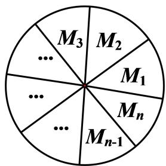

text_image

M₃
M₂
...
M₁
...
Mₙ
...
Mₙ₋₁

2、错位排列公式 $D_{n}=\left(\sum_{i=1}^{n}\frac{(-1)^{i}}{n!}+1\right)\cdot n!$   
3、数字排列问题的解题原则、常用方法及注意事项

(1) 解题原则: 排列问题的本质是“元素”占“位子”问题, 有限制条件的排列问题的限制条件主要表现在某元素不排在某个位子上, 或某个位子不排某些元素, 解决该类排列问题的方法主要是按“优先”原则, 即优先排特殊元素或优先满足特殊位子, 若一个位子安排的元素影响到另一个位子的元素个数时, 应分类讨论.  
4、定位、定元的排列问题,一般都是对某个或某些元素加以限制,被限制的元素通常称为特殊元素,被限制的位置称为特殊位置.这一类问题通常以三种途径考虑:

(1) 以元素为主考虑, 这时, 一般先解决特殊元素的排法问题, 即先满足特殊元素, 再安排其他元素;  
(2) 以位置为主考虑, 这时, 一般先解决特殊位置的排法问题, 即先满足特殊位置, 再考虑

其他位置；

(3) 用间接法解题, 先不考虑限制条件, 计算出排列总数, 再减去不符合要求的排列数. 5、解决相邻问题的方法是“捆绑法”, 其模型为将 $n$ 个不同元素排成一排, 其中某 $k$ 个元素排在相邻位置上, 求不同排法种数的方法是: 先将这 $k$ 个元素“捆绑在一起”, 看成一个整体, 当作一个元素同其他元素一起排列, 共有 $\mathrm{A}_{n-k+1}^{n-k+1}$ 种排法; 然后再将“捆绑”在一起的元素“内部”进行排列, 共有 $\mathrm{A}_k^k$ 种排法. 根据分步乘法计数原理可知, 符合条件的排法共有 $\mathrm{A}_{n-k+1}^{n-k+1} \cdot \mathrm{A}_k^k$ 种.

6、解决不相邻问题的方法为“插空法”，其模型为将 $n$ 个不同元素排成一排，其中某 $k$ 个元素互不相邻 $(k \leqslant n - k + 1)$ ，求不同排法种数的方法是：先将 $(n - k)$ 个元素排成一排，共有 $\mathbf{A}_{n - k}^{n - k}$ 种排法；然后把 $k$ 个元素插入 $n - k + 1$ 个空隙中，共有 $\mathbf{A}_{n - k + 1}^k$ 种排法。根据分步乘法计数原理可知，符合条件的排法共有 $\mathbf{A}_{n - k}^{n - k} \cdot \mathbf{A}_{n - k + 1}^k$ 种。

# 必考题型全归纳

# 1 题型一: 排列数与组合数的推导、化简和计算

4694 (2024·全国·高三专题练习)若 $C_{12}^{2x+1}=C_{12}^{x+2}$ ，则实数 x 的值为（）

A. 1

B. 3

C. 1 或 3

D. 0

4695 (2024·全国·高三专题练习) $C_{2}^{2} + C_{3}^{2} + C_{4}^{2} + \cdots + C_{18}^{2} =$ ()

A. $C_{18}^{3}$

B. $C_{19}^{3}$

C. $C_{18}^{3}-1$

D. $C_{19}^{3}-1$

4696 (2024·甘肃兰州·统考一模) $A_{n}^{2}=90$ ，则 n 等于 \_\_\_\_.

4697 (2024·全国·高三专题练习) $\frac{\mathrm{A}_5^2 - \mathrm{A}_{10}^1}{\mathrm{A}_3^3 + \mathrm{A}_1^1} =$

4698 (2024·全国·高三专题练习) $A_{10}^{10}-89A_{8}^{8}-8A_{7}^{7}=$ \_\_\_\_.

4699 (2024·高三课时练习)已知 $A_{3}^{m}-C_{3}^{2}+0!=4$ ，则 m= \_\_\_\_.

4700 (2024·河北衡水·高三衡水市第二中学期末)若 $C_{18}^{3n+6}=C_{18}^{4n-2}$ ，则 $C_{9}^{n}=$ \_\_\_\_

4701 (2024·全国·高三对口高考)计算 $C_{3n}^{38-n} + C_{n+21}^{3n}$ 的值为 \_\_\_\_.

# 2 题型二: 直接法

4702 (2024·江苏·高三校联考开学考试)甲、乙、丙等六人相约到电影院观看电影《封神榜》，恰好买到了六张连号的电影票。若甲、乙两人必须坐在丙的同一侧，则不同的坐法种数为（）

A. 360

B. 480

C. 600

D. 720

4703 (2024·重庆·高三统考阶段练习)雅礼女篮一直是雅礼中学的一张靓丽的名片,在刚刚结束的2022到2024赛季中国高中篮球联赛女子组总决赛中,雅礼中学女篮队员们敢打敢拼,最终获得了冠军. 在颁奖仪式上,女篮队员12人(其中1人为队长),教练组3人,站成一排照相,要求队长必须站中间,教练组三人要求相邻并站在边上,总共有多少种站法()

A. $A_{3}^{3}A_{11}^{11}$

B. $2A_{3}^{3}A_{11}^{11}$

C. $\mathrm{A}_3^3\mathrm{A}_4^4\mathrm{A}_7^7$

D. $2A_{3}^{3}A_{4}^{4}A_{7}^{7}$

4704 (2024·全国·高三专题练习)有五名志愿者参加社区服务,共服务星期六、星期天两天,每天从中任选两人参加服务,则恰有1人连续参加两天服务的选择种数为 （）

A. 120

B. 60

C. 40

D. 30

4705 (2024·全国·高三对口高考)要排出某班一天中语文,数学,政治,英语,体育,艺术6门课各一节的课程表,要求数学课排在前3节,英语课不排在第6节,则不同的排法种数为()

A. 24

B. 72

C. 144

D. 288

4706 (2024·全国·高三对口高考)运输公司从5名男司机，4名女司机中选派出3名男司机，2名女司机，到A，B，C，D，E这五个不同地区执行任务，要求A地只能派男司机，E地只能派女司机，则不同的方案种数是 （）

A. 360

B. 720

C. 1080

D. 2160

4707 (2024·全国·高三对口高考)从编号为1, 2, 3, 4, 5的5个球中任取4个, 放在编号为A, B, C, D的4个盒子里, 每盒一球, 且2号球不能放在B盒中的不同的方法数是（）

A. 24

B. 48

C. 54

D. 96

4708 (2024·陕西·高三校联考阶段练习)甲、乙两个家庭周末到附近景区游玩,其中甲家庭有2个大人和2个小孩,乙家庭有2个大人和3个小孩,他们9人在景区门口站成一排照相,要求每个家庭的成员要站在一起,且同一家庭的大人不能相邻,则所有不同站法的种数为()

A. 144

B. 864

C. 1728

D. 2880

# 3 题型三:间接法

4709 (2024·全国·高三专题练习)8个点将半圆分成9段弧,以10个点(包括2个端点)为顶点的三角形中钝角三角形有()个

A. 55

B. 112

C. 156

D. 120

4710 (2024·湖北武汉·高二校联考期末)甲、乙、丙、丁四位同学决定去黄鹤楼、东湖、汉口江滩游玩,每人只能去一个地方,汉口江滩一定要有人去,则不同游览方案的种数为（）

A. 65

B. 73

C. 70

D. 60.

4711 (2024·湖南长沙·雅礼中学校联考二模)从正360边形的顶点中取若干个,依次连接,构成的正多边形的个数为()

A. 360

B. 630

C. 1170

D. 840

4712 (2024·全国·高三专题练习)将7个人从左到右排成一排,若甲、乙、丙3人中至多有2人相邻,且甲不站在最右端,则不同的站法有().

A. 1860 种

B. 3696 种

C. 3600 种

D. 3648 种

# 4 题型四:捆绑法

4713 (2024·四川内江·高三期末)甲、乙、丙、丁、戊5名同学站成一排参加文艺汇演,若甲和乙相邻,丙不站在两端,则不同的排列方式共有()

A. 12 种

B. 24种

C. 36 种

D. 48 种

4714 (2024·江西宜春·高三统考开学考试)“基础学科拔尖学生培养试验计划”简称“珠峰计划”，是国家为回应“钱学森之问”而推出的一项人才培养计划，旨在培养中国自己的学术大师。浙江大学、复旦大学、武汉大学、中山大学均有开设数学学科拔尖学生培养基地。已知某班级有A,B,C,D,E共5位同学从中任选一所学校作为奋斗目标，每所学校至少有一位同学选择，则A同学选择浙江大学的不同方法共有（）

A. 24 种

B. 60 种

C. 96 种

D. 240 种

4715 (2024·全国·高三专题练习)某个单位安排7位员工在“五·一”假期中1日至7日值班,每天安排1人值班,且每人值班1天,若7位员工中的甲、乙排在相邻的两天,丙不排在5月1日,丁不排在5月7日,则不同的安排方案共有()

A. 504 种

B. 960 种

C. 1008 种

D. 1200 种

4716 (2024·全国·高三专题练习) 2024 年春节在北京工作的五个家庭, 开车搭伴一起回老家过年, 若五辆车分别为 A, B, C, D, E, 五辆车随机排成一排, 则 A 车与 B 车相邻, A 车与 C 车不相邻的排法有 ( )

A. 36 种

B. 42 种

C. 48 种

D. 60 种

4717 (2024·全国·高三专题练习)为庆祝广益中学建校130周年,高二年级派出甲、乙、丙、丁、戊5名老师参加“130周年办学成果展”活动,活动结束后5名老师排成一排合影留念,要求甲、乙两人不相邻且丙、丁两人必须相邻,则排法共有( )种.

A. 40

B. 24

C. 20

D. 12

# 5 题型五:插空法

4718 (2024·湖北·高三孝感高中校联考开学考试)已知来自甲、乙、丙三个学校的5名学生参加演讲比赛,其中三个学校的学生人数分别为1、2、2.现要求相同学校的学生的演讲顺序不相邻,则不同的演讲顺序的种数为()

A. 40

B. 36

C. 56

D. 48

4719 (2024·黑龙江佳木斯·高三校考开学考试)甲、乙、丙、丁、戊五人排成一排,甲和乙不相邻,排法种数为 ( )

A. 12

B. 36

C. 48

D. 72

4720 (2024·辽宁沈阳·高三沈阳二十中校考开学考试)五声音阶是中国古乐基本音阶,故有成语“五音不全”,中国古乐中的五声音阶依次为:宫、商、角、徵、羽,若把这五个音阶全用上,排成一个五个音阶的音序,且要求宫、羽两音阶不相邻且在角音阶的同侧,则可排成不同的音序种数为()

A. 72

B. 28

C. 24

D. 32

4721 (2024·全国·高三对口高考) 2 位男生和 3 位女生共 5 位同学站成一排．若男生甲不站两端，3 位女生中有且只有两位女生相邻，则不同排法的种数为 （）

A. 36

B. 42

C. 48

D. 60

4722 (2024·陕西西安·西北工业大学附属中学校考模拟预测)某校举行文艺汇演，甲、乙、丙等

6 名同学站成一排演唱歌曲, 若甲、乙不相邻, 丙不在两端, 则不同的排列方式共有 ( )

A. 72 种

B. 144 种

C. 288 种

D. 432 种

4723 (2024·四川·校联考模拟预测)北京地处中国北部、华北平原北部,东与天津毗连,其余方向均与河北相邻,是世界著名古都,也是国务院批复确定的中国政治中心、文化中心、国际交往中心、科技创新中心.为了感受这座古今中外闻名的城市,某学生决定在高考后游览北京,计划6天游览故宫、八达岭长城、颐和园、“水立方”、“鸟巢”、798艺术区、首都博物馆7个景点,如果每天至少游览一个景点,且“水立方”和“鸟巢”在同一天游览,故宫和八达岭长城不在相邻两天游览,那么不同的游览顺序共有()

A. 120 种

B. 240 种

C. 480 种

D. 960 种

4724 (2024·湖北襄阳·襄阳四中校考模拟预测)一排有8个座位,有3人各不相邻而坐,则不同的坐法共有()

A. 120 种

B. 60 种

C. 40 种

D. 20 种

# 题型六:定序问题(先选后排)

4725 (2024·全国·高三专题练习)满足 $x_{i} \in \mathbb{N}^{*}(\mathrm{i} = 1,2,3,4)$ , 且 $x_{1} < x_{2} < x_{3} < x_{4} < 10$ 的有序数组 $(x_{1}, x_{2}, x_{3}, x_{4})$ 共有（）个.

A. $C_{9}^{4}$

B. $\mathrm{A}_9^4$

C. $C_{10}^{4}$

D. $A_{10}^{4}$

4726 (2024·高二课时练习)已知 $x_{i} \in \{-1, 0, 1\}, (i = 1, 2, \cdots, n, n \in \mathbb{N}^{*})$ ，则满足 $|x_{1}| + |x_{2}| + |x_{3}| + \cdots + |x_{n}| = 2$ 的有序数组 $(x_{1}, x_{2}, x_{3}, \cdots, x_{n})$ 共有（）个

A. $2n^{2} - 2n$

B. $2n^{2} + 2n$

C. $\frac{n^{2}-n}{2}$

D. $n^2 - n$

4727 (2024·山西朔州·高二怀仁市第一中学校校考期中)五人并排站在一排,如果A,B必须相邻且B在A的右边,那么不同的排法种数有()

A. 60 种

B. 48种

C. 36 种

D. 24 种

4728 (2024·全国·高三专题练习) DNA 是形成所有生物体中染色体的一种双股螺旋线分子，由称为碱基的化学成分组成它看上去就像是两条长长的平行螺旋状链，两条链上的碱基之间由氢键相结合。在 DNA 中只有 4 种类型的碱基，分别用 A、C、G 和 T 表示，DNA 中的碱基能够以任意顺序出现两条链之间能形成氢键的碱基或者是 A-T，或者是 C-G，不会出现其他的联系因此，如果我们知道了两条链中一条链上碱基的顺序，那么我们也就知道了另一条链上碱基的顺序。如图所示为一条 DNA 单链模型示意图，现在某同学想在碱基 T 和碱基 C 之间插入 3 个碱基 A，2 个碱基 C 和 1 个碱基 T，则不同的插入方式的种数为 （）

text_image

... A G G A T C G G ...

A. 20

B. 40

C. 60

D. 120

4729 (2024·江苏扬州·高三校考期末)花灯，又名“彩灯”“灯笼”，是中国传统农业时代的文化产物,兼具生活功能与艺术特色.如图,现有悬挂着的6盏不同的花灯需要取下,每次取1盏,则不同取法总数为\_\_\_\_

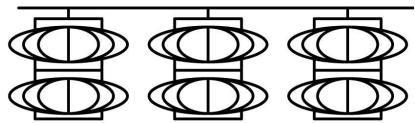

natural_image

Three identical abstract geometric patterns with concentric ovals and vertical lines, no text or symbols present.

4730 (2024·全国·高三专题练习)某公司在元宵节组织了一次猜灯谜活动,主持人事先将10条不同灯谜分别装在了如图所示的10个灯笼中,猜灯谜的职员每次只能任选每列最下面的一个灯笼中的谜语来猜(无论猜中与否,选中的灯笼就拿掉),则这10条灯谜依次被选中的所有不同顺序方法数为\_\_\_\_.(用数字作答)

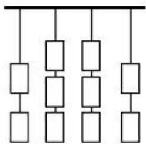

flowchart

4731 (2024·高二课时练习) 7人排队, 其中甲、乙、丙 3人顺序一定, 共有 \_\_\_\_ 不同的排法.

# 题型七:列举法

4732 (2024·全国·高三专题练习)数论领域的四平方和定理最早由欧拉提出,后被拉格朗日等数学家证明. 四平方和定理的内容是:任意正整数都可以表示为不超过四个自然数的平方和,例如正整数 $12 = 3^{2} + 1^{2} + 1^{2} + 1^{2} = 2^{2} + 2^{2} + 2^{2} + 0^{2}$ . 设 $25 = a^{2} + b^{2} + c^{2} + d^{2}$ , 其中 $a, b, c, d$ 均为自然数,则满足条件的有序数组 $(a, b, c, d)$ 的个数是 ( )

A. 28

B. 24

C. 20

D. 16

4733 (2024·浙江宁波·高二校联考期末)已知字母 $x, y, z$ 各有两个，现将这6个字母排成一排，若有且仅有一组字母相邻(如 $xyzyz$ )，则不同的排法共有（）种

A. 36

B. 30

C. 24

D. 16

4734 (2024·全国·高三专题练习)某人设计一项单人游戏,规则如下:先将一棋子放在如图所示正方形ABCD(边长为2个单位)的顶点A处,然后通过掷骰子来确定棋子沿正方形的边按逆时针方向行走了几个单位,如果掷出的点数为 $i(i=1,2,\cdots,6)$ ,则棋子就按逆时针方向行走i个单位,一直循环下去.则某人抛掷三次骰子后棋子恰好又回到起点A处的所有不同走法共有()

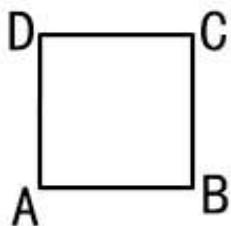

natural_image

Simple geometric diagram of a square labeled with vertices A, B, C, D (no additional text or symbols)

A. 21 种

B. 22 种

C. 25 种

D. 27 种

4735 (2024·海南海口·统考一模)形如 45132 这样的数称为“波浪数”，即十位上的数字，千位上的数字均比与它们各自相邻的数字大，则由 1, 2, 3, 4, 5 可组成数字不重复的五位“波浪

数”的个数为

A. 20

B. 18

C. 16

D. 11

4736 (2024·全国·高三专题练习)工人在安装一个正六边形零件时,需要固定如图所示的六个位置的螺栓.若按一定顺序将每个螺栓固定紧,但不能连续固定相邻的2个螺栓.则不同的固定螺栓方式的种数是\_\_\_\_.

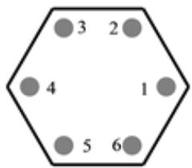

text_image

3 2
4 1
5 6

# 题型八:多面手问题

4737 (2024·全国·高三专题练习)我校去年11月份,高二年级有10人参加了赴日本交流访问团,其中3人只会唱歌,2人只会跳舞,其余5人既能唱歌又能跳舞. 现要从中选6人上台表演,3人唱歌,3人跳舞,有( )种不同的选法.

A. 675

B. 575

C. 512

D. 545

4738 (2024·全国·高三专题练习)某国际旅行社现有11名对外翻译人员,其中有5人只会英语,4人只会法语,2人既会英语又会法语,现从这11人中选出4人当英语翻译,4人当法语翻译,则共有( )种不同的选法

A. 225

B. 185

C. 145

D. 110

4739 (2024·全国·高三专题练习)“赛龙舟”是端午节的习俗之一,也是端午节最重要的节日民俗活动之一,在我国南方普遍存在端午节临近,某单位龙舟队欲参加今年端午节龙舟赛,参加训练的8名队员中有3人只会划左桨,3人只会划右桨,2人既会划左桨又会划右桨.现要选派划左桨的3人、划右桨的3人共6人去参加比赛,则不同的选派方法共有()

A. 26 种

B. 30 种

C. 37 种

D. 42 种

4740 (2024·全国·高三专题练习)某龙舟队有9名队员,其中3人只会划左舷,4人只会划右舷,2人既会划左舷又会划右舷.现要选派划左舷的3人、右舷的3人共6人去参加比赛,则不同的选派方法共有()

A. 56 种

B. 68 种

C. 74 种

D. 92 种

# 题型九:错位排列

4741 (2024·重庆沙坪坝·高二重庆八中校考期末)“数独九宫格”原创者是18世纪的瑞士数学家欧拉, 它的游戏规则很简单, 将1到9这九个自然数填到如图所示的小九宫格的9个空格里, 每个空格填一个数, 且9个空格的数字各不相间, 若中间空格已填数字5, 且只填第二行和第二列, 并要求第二行从左至右及第二列从上至下所填的数字都是从大到小排列的, 则不同的填法种数为 ( )

<table><tr><td></td><td></td><td></td></tr><tr><td></td><td>5</td><td></td></tr><tr><td></td><td></td><td></td></tr></table>

A. 72

B. 108

C. 144

D. 196

4742 (2024·全国·高三专题练习)编号为1、2、3、4、5的5个人分别去坐编号为1、2、3、4、5的五个座位,其中有且只有两个人的编号与座位号一致的坐法有()

A. 10种

B. 20种

C. 30 种

D. 60 种

4743 (2024·全国·高三专题练习)将编号为1、2、3、4、5、6的小球放入编号为1、2、3、4、5、6的六个盒子中,每盒放一球,若有且只有两个盒子的编号与放入的小球的编号相同,则不同的放法种数为()

A. 90

B. 135

C. 270

D. 360

4744 (2024·广东广州·高二广州奥林匹克中学校考阶段练习)将编号为1、2、3、4、5、6的六个小球放入编号为1、2、3、4、5、6的六个盒子里,每个盒子放一个小球,若有且只有三个盒子的编号与放入的小球编号相同,则不同的方法总数是()

A. 20

B. 40

C. 120

D. 240

# 10 题型十:涂色问题

4745 (2024·全国·高三专题练习)如图,一个地区分为5个行政区域,现给该地区的5个区域涂色,要求相邻区域不得使用同一种颜色,现有4种颜色可供选择,则不同的涂色方法共有\_\_\_\_种.

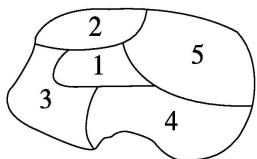

text_image

2
1
3
5
4

4746 (2024·全国·高三专题练习)对正方体 ABCD-A₁B₁C₁D 的 6 个面进行涂色,有 5 种不同的颜色可供选择.要求每个面只涂一种颜色,且有公共棱的两个面不同色,则总的涂色方法个数为 \_\_\_\_ (填写数字)

4747 (2024·重庆·统考模拟预测)某城市休闲公园管理人员拟对一块圆环区域进行改造封闭式种植鲜花,该圆环区域被等分为5个部分,每个部分从红、黄、紫三种颜色的鲜花中选取一种进行栽植.要求相邻区域不能用同种颜色的鲜花,总的栽植方案有\_\_\_\_种.

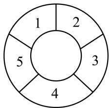

pie

| Segment | Value |
|---|---|
| 1 | 1 |
| 2 | 2 |
| 3 | 3 |
| 4 | 4 |
| 5 | 5 |

4748 (2024·安徽·校联考模拟预测)数学课上,老师出了一道智力游戏题.如图所示,平面直角坐标系中有一个3乘3方格图(小正方形边长为1),一共有十六个红色的格点,游戏规则是每一步可以改变其中一个点的颜色(只能由红变绿或绿变红),如将其中任何一个点由红色改成绿色,则这个点周围与之相邻的点也要从原来的颜色变成另外一种颜色,比如选择(1,1)变成绿色,则与之相邻的(0,1),(1,0),(1,2),(2,1)四个点也要变成绿色,那么最少需要\_\_\_\_步,才能使得位于直线 $y=-x+3$ 上的四个点变成绿色,而其他点都是红色.

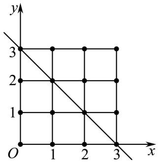

text_image

y
3
2
1
O
1
2
3
x

4749 (2024·全国·高三专题练习)如图,现要对某公园的4个区域进行绿化,有5种不同颜色的花卉可供选择,要求有公共边的两个区域不能用同一种颜色的花卉,共有\_\_\_\_种不同的绿化方案(用数字作答).

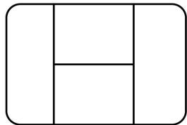

natural_image

Pure geometric diagram with rounded rectangles and internal lines, no text or symbols present

4750 (2024·全国·高三专题练习)七巧板是古代劳动人民智慧的结晶. 如图是某同学用木板制作的七巧板, 它包括 5 个等腰直角三角形、一个正方形和一个平行四边形. 若用四种颜色给各板块涂色, 要求正方形板块单独一色, 其余板块两块一种颜色, 而且有公共边的板块不同色, 则不同的涂色方案有 \_\_\_\_ 种.

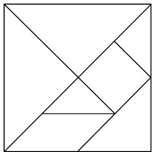

natural_image

Geometric diagram of a square divided into triangles and diamonds (no text or symbols)

4751 (2024·全国·高三专题练习)用四种不同的颜色为正六边形(如图)中的六块区域涂色,要求有公共边的区域涂不同颜色,一共有\_\_\_\_种不同的涂色方法.

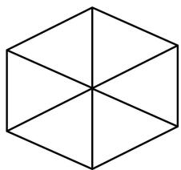

natural_image

Geometric diagram of a regular hexagon divided into six equal triangles (no text or symbols)

4752 (2024·全国·高三专题练习)如图,用 4 种不同的颜色给图中的 8 个区域涂色,每种颜色至少使用一次,每个区域仅涂一种颜色,且相邻区域所涂颜色互不相同,则区域 A, B, C, D 和 A₁, B₁, C₁, D₁ 分别各涂 2 种不同颜色的涂色方法共有 \_\_\_\_ 种;区域 A, B, C, D 和 A₁, B₁, C₁, D₁ 分别各涂 4 种不同颜色的涂色方法共有 \_\_\_\_ 种.

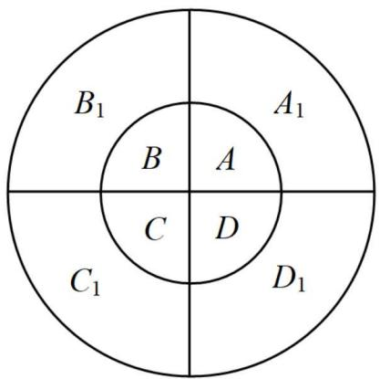

text_image

B₁
A₁
B
A
C
D
C₁
D₁

# 11 题型十一:分组问题

4753 (2024·全国·高三专题练习)贵阳一中体育节中, 乒乓球球单打12强中有4个种子选手, 将这12人平均分成3个组(每组4个人)、则4个种子选手恰好被分在同一组的分法有()

A. 21

B. 42

C. 35

D. 70

4754 (2024·高二课时练习)把10个苹果分成三堆,要求每堆至少1个,至多5个,则不同的分法共有()

A. 4 种

B. 5种

C. 6 种

D. 7 种

4755 (2024·福建泉州·高二校联考期中)在《爸爸去哪儿》第二季第四期中,村长给6位“萌娃”布置一项搜寻空投食物的任务。已知:①食物投掷地点有远、近两处;②由于Grace年纪尚小,所以要么不参与该项任务,但此时另需一位小孩在大本营陪同,要么参与搜寻近处投掷点的食物;③所有参与搜寻任务的小孩须被均分成两组,一组去远处,一组去近处,那么不同的搜寻方案有()

A. 25 种

B. 30 种

C. 40 种

D. 50 种

4756 (2024·全国·高二专题练习)将12个不同的物体分成3组,每组4个,则不同的分法种数为().

A. 34650

B. 5940

C. 495

D. 5775

4757 (2024·全国·高二专题练习)某中学要给三个班级补发8套教具,先将其分成3堆,其中一堆4套,另两堆每堆2套,则不同的分堆方法种数为()

A. $C_{8}^{4}C_{4}^{2}C_{2}^{2}$

B. $C_{3}^{1}C_{8}^{2}$

C. $\frac{\mathrm{C}_{8}^{4}\mathrm{C}_{4}^{2}\mathrm{C}_{2}^{2}}{\mathrm{A}_{2}^{2}}$

D. $\frac{C_{8}^{4}C_{4}^{2}C_{2}^{2}}{A_{3}^{3}}$

4758 (2024·福建厦门·高三厦门双十中学校考阶段练习)将6名同学分成两个学习小组,每组至少两人,则不同的分组方法共有\_\_\_\_种.

# 12 题型十二:分配问题

4759 (2024·全国·高三专题练习)按下列要求分配6本不同的书.

(1) 分成三份, 1 份 1 本, 1 份 2 本, 1 份 3 本, 有 \_\_\_\_ 种不同的分配方式;  
(2) 甲、乙、丙三人中,一人得1本,一人得2本,一人得3本,有\_\_\_\_种不同的分配方式;  
(3) 平均分成三份, 每份 2 本, 有 \_\_\_\_ 种不同的分配方式;

(4) 平均分配给甲、乙、丙三人, 每人 2 本, 有 \_\_\_\_ 种不同的分配方式;  
(5) 分成三份, 1 份 4 本, 另外两份每份 1 本, 有 \_\_\_\_ 种不同的分配方式;  
(6)甲、乙、丙三人中,一人得4本,另外两人每人得1本,有\_\_\_\_种不同的分配方式;  
(7) 甲得 1 本, 乙得 1 本, 丙得 4 本, 有 \_\_\_\_ 种不同的分配方式.

4760 (2024·全国·高三专题练习)将9名大学生志愿者安排在星期五、星期六及星期日3天参加社区公益活动,每天分别安排3人,每人参加一次,则不同的安排方案共有\_\_\_\_种. (用数字作答)

4761 (2024·全国·高三专题练习)现计划安排 A, B, C, D, E 五名教师教这六门课程, 每名教师至少教一门课程, 每门课程只配一名教师, 且教师 A 不教“围棋”, 教师 B 只能教一门课程, 则满足条件的课程安排的种数为 \_\_\_\_.  
4762 (2024·四川泸州·高三四川省泸县第四中学校考开学考试)绵阳中学食堂,以其花样繁多的饭菜种类和令人难忘的色香味使大批学子醉倒在它的餐盘之下,学子们不约而同地将其命名为“远航大酒楼”. “远航大酒楼”共三层楼,5名高一新同学相约到食堂就餐,为看尽食堂所有美食种类,他们打算分为三组去往不同的楼层. 其中甲同学不去二楼,则一共有\_\_\_\_种不同的分配方式.  
4763 (2024·福建福州·高三福建省福州第一中学校考开学考试)为了贯彻落实中央新疆工作座谈会和全国对口支援新疆工作会议精神,促进边疆少数民族地区教育事业的发展,某市派出了包括甲、乙在内的5名专家型教师援疆,现将这5名教师分配到新疆的A、B、C、D四所学校,要求每所学校至少安排一位教师,则在甲志愿者被安排到A学校有\_\_\_\_种安排方法.  
4764 (2024·重庆沙坪坝·高三重庆一中校考阶段练习)8个完全相同的球放入编号1, 2, 3的三个空盒中,要求放入后3个盒子不空且数量均不同,则有\_\_\_\_种放法.  
4765 (2024·吉林长春·高三长春外国语学校校考开学考试)为了落实立德树人的根本任务,践行五育并举,某校开设A,B,C三门德育校本课程,现有甲、乙、丙、丁四位同学参加校本课程的学习,每位同学仅报一门,每门至少有一位同学参加,则不同的报名方法有\_\_\_\_.

# 13 题型十三:隔板法

4766 (2024·云南红河·统考三模)某校将6个三好学生名额分配到高三年级的3个班,每班至少1个名额,则共有多少种不同的分配方案()

A. 15

B. 20

C. 10

D. 30

4767 (2024·全国·校联考模拟预测)学校决定把12个参观航天博物馆的名额给三(1)、三(2)、三(3)、三(4)四个班级.要求每个班分别的名额不比班级序号少,即三(1)班至少1个名额,三(2)班至少2个名额,……,则分配方案有()

A. 8种

B. 10 种

C. 165 种

D. 495 种

4768 (2024·高二课时练习)现有9个相同的球要放到3个不同的盒子里,每个盒子至少一个球,各盒子中球的个数互不相同,则不同放法的种数是()

A. 28

B. 24

C. 18

D. 16

4769 (2024·江苏苏州·高二吴县中学校考期中)学校有6个优秀学生名额,要求分配到高一、

高二、高三，每个年级至少1个名额，则有（）种分配方案.

A. 135

B. 10

C. 75

D. 120

4770 (2024·全国·高二期末)方程 $x_{1} + x_{2} + x_{3} + x_{4} = 12$ 的正整数解共有（）组

A. 165

B. 120

C. 38

D. 35

# 14 题型十四: 数字排列

4771 (2024·全国·高三专题练习)用 0, 1, 2, 3, 4 可以组成没有重复数字的四位偶数的个数为（）

A. 36

B. 48

C. 60

D. 72

4772 (2024·全国·高二专题练习)用数字1、2、3组成五位数,且数字1、2、3至少都出现一次,这样的五位数共有( )个

A. 120

B. 150

C. 210

D. 240

4773 (2024·北京·高二北京八中校考期末)用1,2,3三个数字组成一个四位数,要求每个数字至少出现一次,共可组成个不同的四位数\_\_\_\_(用数字作答).

4774 (2024·全国·高三专题练习)用数字 0, 1, 2, 3, 4, 5 组成没有重复数字的四位数, 其中个位、十位和百位上的数字之和为偶数的四位数共有 \_\_\_\_. 个 (用数字作答).

4775 (2024·全国·高三专题练习)用数字1, 2, 3, 4, 5, 6, 7, 8, 9组成没有重复数字,且至多有一个数字是奇数的四位数,这样的四位数一共有 \_\_\_\_个。(用数字作答)

# 15 题型十五:几何问题

4776 (2024·全国·高三专题练习)从正方体的8个顶点中选取4个作为顶点,可得到四面体的个数为()

A. $C_{8}^{4}-12$

B. $C_{8}^{4}-8$

C. $C_{8}^{4}-6$

D. $C_{8}^{4}-4$

4777 (2024·高二课时练习)一只蚂蚁从正四面体 A-BCD 的顶点 A 出发,沿着正四面体 A-BCD 的棱爬行,每秒爬一条棱,每次爬行的方向是随机的,则蚂蚁第 1 秒后到点 B,第 4 秒后又回到 A 点的不同爬行路线有()

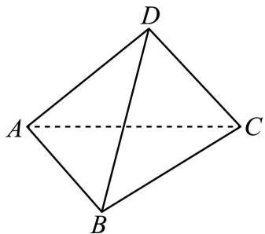

text_image

D
A
C
B

A. 6 条

B. 7 条

C. 8 条

D. 9 条

4778 (2024·全国·高三专题练习)如图,一只蚂蚁从点A出发沿着水平面的线条爬行到点C,再由点C沿着置于水平面的正方体的棱爬行至顶点B,则它可以爬行的不同的最短路径有()条

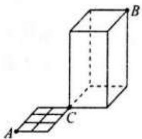

natural_image

3D geometric diagram showing a cube with labeled vertices A, B, and C, and a small grid plane on the left (no text or symbols beyond labels)

A. 40

B. 60

C. 80

D. 120

4779 (2024·全国·高二专题练习)凸八边形的对角线有（）条

A. 20

B. 28

C. 48

D. 56

4780 (2024·全国·高三专题练习)已知 C60 分子是一种由 60 个碳原子构成的分子, 它形似足球, 因此又名足球烯, C60 是单纯由碳原子结合形成的稳定分子, 它具有 60 个顶点和若干个面, . 各个面的形状为正五边形或正六边形, 结构如图. 已知其中正六边形的面为 20 个, 则正五边形的面为( )个.

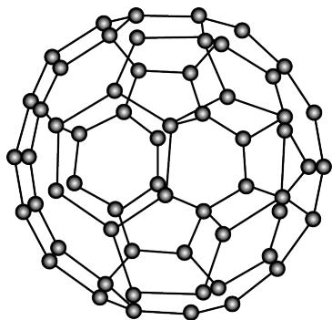

chemical

Molecular structure diagram of a fullerene cage compound

A. 10

B. 12

C. 16

D. 20

4781 (2024·高二课时练习)设凸 $n(n \geqslant 3)$ 棱锥中任意两个顶点的连线段的条数为 $f(n)$ , 则 $f(n + 1) - f(n) =$ （）

A. $n - 1$

B. n

C. $n + 1$

D. $n + 2$

# 16 题型十六:分解法模型与最短路径问题

4782 (2024·全国·高三专题练习)有一种走“方格迷宫”游戏,游戏规则是每次水平或竖直走动一个方格,走过的方格不能重复,只要有一个方格不同即为不同走法. 现有如图的方格迷宫,图中的实线不能穿过,则从入口走到出口共有多少种不同走法?

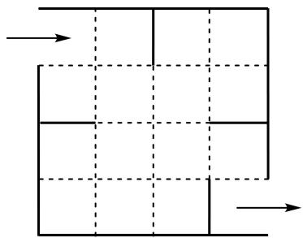

flowchart

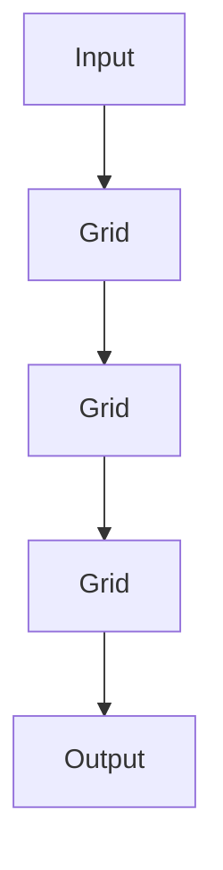

A. 6

B. 8

C. 10

D. 12

4783 (2024·全国·高三专题练习)夏老师从家到学校,可以选择走锦绣路、杨高路、张杨路或者浦东大道,由于夏老师不知道杨高路有一段在修路导致第一天上班就迟到了,所以夏老师决定以后要绕开那段维修的路,如图,假设夏老师家在M处,学校在N处,AB段正在修路要绕开,则夏老师从家到学校的最短路径有()条.

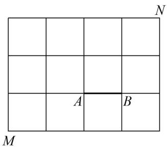

text_image

N
A B
M

A. 23

B. 24

C. 25

D. 26

4784 (2024·广东惠州·高三校考期末)如图,某城市的街区由12个全等的矩形组成(实线表示马路),CD段马路由于正在维修,暂时不通,则从A到B的最短路径有()

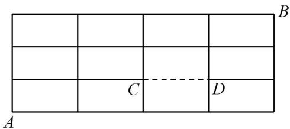

text_image

A
B
C
D

A. 23 条

B. 24 条

C. 25 条

D. 26 条

4785 (2024·全国·高三专题练习)方形是中国古代城市建筑最基本的形态,它体现的是中国文化中以纲常伦理为代表的社会生活规则,中国古代的建筑家善于使用木制品和竹制品制作各种方形建筑.如图,用大小相同的竹棍构造一个大正方体(由8个大小相同的小正方体构成),若一只蚂蚁从A点出发,沿着竹棍到达B点,则蚂蚁选择的不同的最短路径共有()

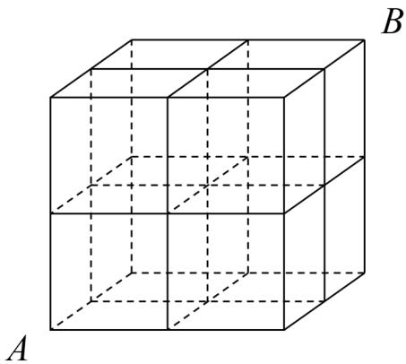

natural_image

3D wireframe cube diagram with labeled axes A and B (no text or symbols on the cube itself)

A. 48 种

B. 60 种

C. 72 种

D. 90 种

4786 (2024·高二课时练习)一植物园的参观路径如图所示,若要全部参观并且路线不重复,则不同的参观路线共有()

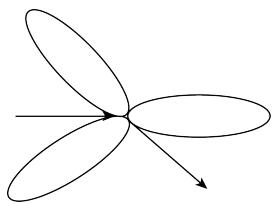

natural_image

Abstract diagram of four intersecting ovals with directional arrows, no text or symbols present

A. 6种

B. 8种

C. 36 种

D. 48 种

4787 (2024·广东惠州·高二校考期中)下图是某项工程的网络图(单位:天),则从开始节点①到终止节点⑧的路径共有()

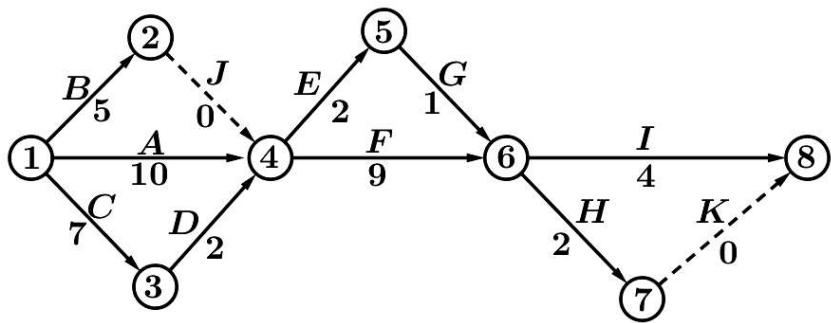

flowchart

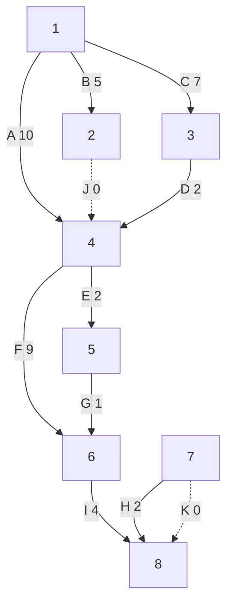

A. 14 条

B. 12 条

C. 9 条

D. 7 条

4788 (多选题)(2024·全国·高三专题练习)如图,在某城市中,M,N两地之间有整齐的方格形道路网,其中 $A_{1},A_{2},A_{3},A_{4},A_{5}$ 是道路网中位于一条对角线上的5个交汇处,今在道路网M,N处的甲、乙两人分别要到N,M处,他们分别随机地选择一条沿街的最短路径,以相同的速度同时出发,直到到达N,M处为止,则()

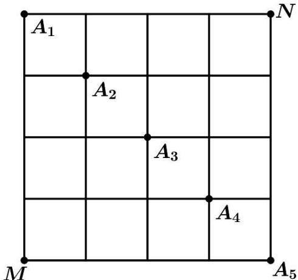

text_image

A₁
A₂
A₃
A₄
M
N
A₅

A. 甲从 M 到达 N 处的走法有 70 种  
B. 甲从 M 必须经过 $A_{3}$ 到达 N 处的走法有 12 种  
C. 若甲、乙两人途中在 $\mathrm{A}_3$ 处相遇, 则共有 144 种走法  
D. 若甲、乙两人在行走途中会相遇, 则共有 1810 种走法

4789 (2024·高二课时练习) 5400 的正约数有 \_\_\_\_ 个

4790 (2024·上海嘉定·高二校考期中)正整数 2022 有 \_\_\_\_ 个不同的正约数.

# 题型十七:排队问题

4791 (2024·全国·高三专题练习)街头篮球比赛后，红、黄两队共6名队员(红队3人，黄队3人)合照,要求6人站成一排,红队3人中有且只有2名队员相邻,则不同排队的方法共有()

A. 432 种

B. 216 种

C. 144 种

D. 72 种

4792 (2024·全国·高三专题练习)七辆汽车排成一纵队,要求甲车、乙车、丙车均不排队头或队尾且各不相邻,则排法有()

A. 48 种

B. 72 种

C. 90 种

D. 144 种

4793 (2024·山西朔州·高二校考阶段练习)5名成人带两个小孩排队上山,小孩不排在一起也不排在头尾,则不同的排法种数有()

A. $\mathrm{A}_5^5\mathrm{A}_4^2$ 种

B. $A_{5}^{5}A_{5}^{2}$ 种

C. $\mathrm{A}_5^5\mathrm{A}_6^2$ 种

D. $\mathrm{A}_7^7 - 4\mathrm{A}_6^6$ 种

4794 (2024·全国·高二专题练习) 3 名男生, 4 名女生, 按照不同的要求排队, 求不同的排队方法数.

(1) 选 5 名同学排成一排；  
(2) 全体站成一排, 甲、乙不在两端;  
(3) 全体站成一排, 甲不在最左端, 乙不在最右端;  
(4) 全体站成一排, 男生站在一起、女生站在一起;  
(5) 全体站成一排, 男生排在一起;  
(6) 全体站成一排, 男生彼此不相邻;  
(7) 全体站成一排, 男生各不相邻、女生各不相邻;  
(8) 全体站成一排, 甲、乙中间有 2 个人;  
(9) 排成前后两排, 前排 3 人, 后排 4 人;  
(10) 全体站成一排, 乙不能站在甲左边, 丙不能站在乙左边.

# 18 题型十八:构造法模型和递推模型

4795 (2024·天津河东·高二统考期末)九连环是一种流传于我国民间的传统智力玩具. 它用九个圆环相连成串, 以解开为胜. 它在中国有近两千年的历史, 《红楼梦》中有林黛玉巧解九连环的记载. 周邦彦也留下关于九连环的名句“纵妙手、能解连环.”九连环有多种玩法, 在某种玩法中: 已知解下 1 个圆环最少需要移动圆环 1 次, 解下 2 个圆环最少需要移动圆环 2 次, 记 $a_{n} (3 \leqslant n \leqslant 9, n \in \mathbb{N}^{*})$ 为解下 $n$ 个圆环需要移动圆环的最少次数, 且 $a_{n} = a_{n-2} + 2^{n-1}$ , 则解下 8 个圆环所需要移动圆环的最少次数为 ( )

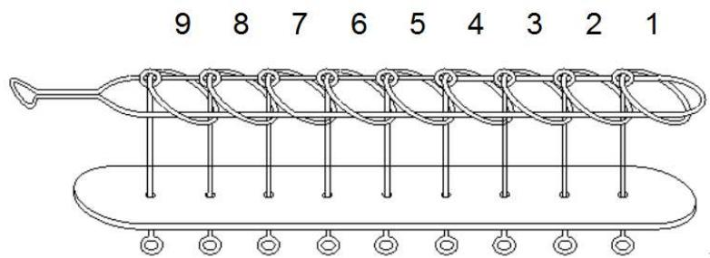

text_image

9 8 7 6 5 4 3 2 1

A. 30

B. 90

C. 170

D. 341

4796 (2024·福建福州·高三统考期中)三名篮球运动员甲、乙、丙进行传球训练,由丙开始传,经过5次传递后,球又被传回给丙,则不同的传球方式共有()

A. 4种

B. 10 种

C. 12 种

D. 22 种

4797 (多选题)(2024·河北沧州·高二沧县中学校考阶段练习)跳格游戏:如图,人从格子外只能进入第1个格子,在格子中每次可向前跳1格或2格,那么下面说法正确的是()

<table><tr><td></td><td>1</td><td>2</td><td>3</td><td>4</td><td>5</td><td>6</td><td>7</td><td>8</td></tr></table>

A. 进入第二个格子走法有 2 种

B. 进入第二个格子走法有1种

C. 进入第三个格子走法有 2 种

D. 进入第八个格子走法有 21 种

4798 (2024·福建泉州·高二福建省永春第一中学校考阶段练习)马路上有编号为1, 2, 3, 4, 5, 6, 7, 8, 9的九盏路灯, 现要关掉其中的3盏, 但不能关掉相邻的2盏, 也不能关掉两端的2盏, 满足条件的关灯方法有 \_\_\_\_ 种.

4799 (2024·浙江·高三竞赛)马路上有编号为1, 2, …, 2011的2011只路灯. 为节约用电, 要求关闭其中的300只灯, 但不能同时关闭相邻两只, 也不能关闭两端的路灯. 则满足条件的关灯方法共有 \_\_\_\_. (用组合数符合表示).

# 19 题型十九:环排问题

4800 (2024·全国·高三专题练习) 21 个人按照以下规则表演节目: 他们围坐成一圈, 按顺序从 1 到 3 循环报数, 报数字“3”的人出来表演节目, 并且表演过的人不再参加报数. 那么在仅剩两个人没有表演过节目的时候, 共报数的次数为 ( )

A. 19

B. 38

C. 51

D. 57

4801 (2024·全国·高三专题练习) A, B, C, D, E, F 六人围坐在一张圆桌周围开会, A 是会议的中心发言人, 必须坐最北面的椅子, B, C 二人必须坐相邻的两把椅子, 其余三人坐剩余的三把椅子, 则不同的座次有 ( )

A. 60 种

B. 48 种

C. 30 种

D. 24 种

4802 (2024·江苏苏州·高二昆山震川高级中学校考期中)现有8个人围成一圈玩游戏,其中甲、乙、丙三人不全相邻的排法种数为()

A. $A_{6}^{3} \cdot A_{5}^{5}$

B. $\mathrm{A}_8^8 -\mathrm{A}_6^6\cdot \mathrm{A}_3^3$

C. $A_{5}^{3} \cdot A_{3}^{3}$

D. $\mathrm{A}_7^7 -\mathrm{A}_5^5\cdot \mathrm{A}_3^3$

4803 (2024·内蒙古赤峰·高二赤峰二中校考阶段练习)如图,某伞厂生产的太阳伞的伞篷是由太阳光的七种颜色组成,七种颜色分别涂在伞篷的八个区域内,且恰有一种颜色涂在相对区域内,则不同颜色图案的此类太阳伞最多有().

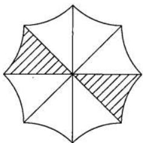

natural_image

Geometric diagram of an umbrella with shaded sector lines (no text or symbols)

A. 40320 种

B. 5040 种

C. 20160 种

D. 2520 种

4804 (2024·全国·高三专题练习)5个女孩与6个男孩围成一圈,任意2个女孩中间至少站1个男孩,则不同排法有\_\_\_\_种(填数字).

