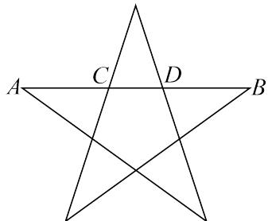
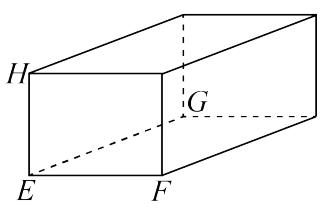
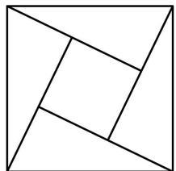
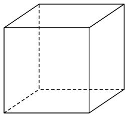
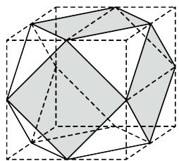
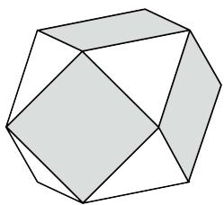
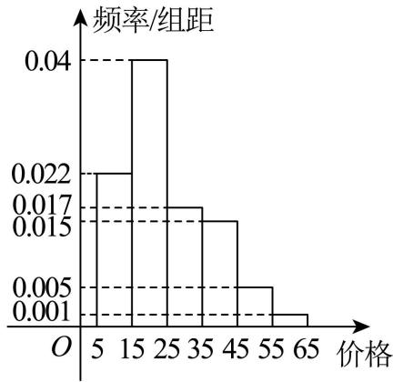
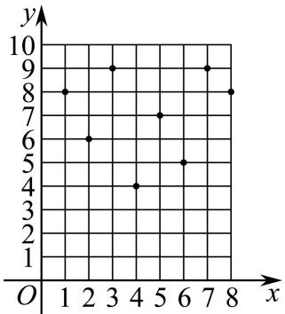
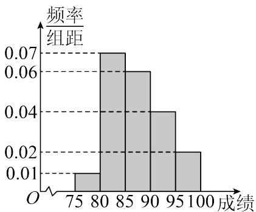
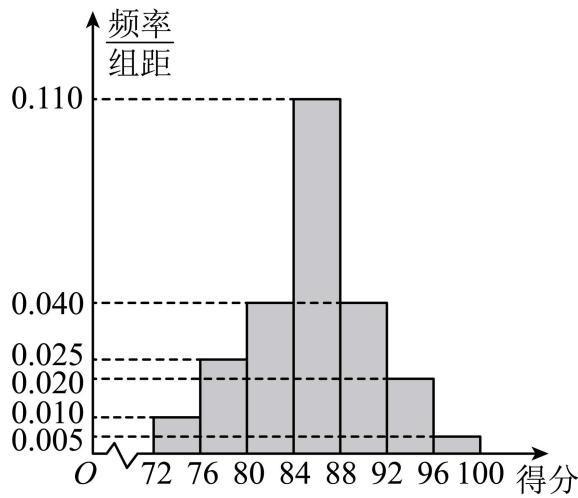

# 第89讲 古典概型与概率的基本性质

# 知识梳理

知识点1、随机事件的概率

对随机事件发生可能性大小的度量(数值)称为事件的概率,事件A的概率用P(A)表示.

知识点2、古典概型

(1) 定义

一般地,若试验E具有以下特征:

①有限性:样本空间的样本点只有有限个;  
②等可能性:每个样本点发生的可能性相等.

称试验E为古典概型试验,其数学模型称为古典概率模型,简称古典概型.

(2) 古典概型的概率公式

一般地, 设试验 E 是古典概型, 样本空间 $\Omega$ 包含 n 个样本点, 事件 A 包含其中的 k 个样本点, 则定义事件 A 的概率 $\mathrm{P}(\mathrm{A}) = \frac{k}{n} = \frac{n(\mathrm{A})}{n(\Omega)}$ .

知识点3、概率的基本性质

(1) 对于任意事件 A 都有: $0 \leqslant P(A) \leqslant 1$ .  
(2) 必然事件的概率为 1, 即 $\mathrm{P}(\Omega)=1$ ; 不可能事概率为 0, 即 $\mathrm{P}(\varnothing)=0$ .

(3) 概率的加法公式: 若事件 A 与事件 B 互斥, 则 P(A ∪ B) = P(A) + P(B).

推广:一般地,若事件 $A_{1}, A_{2}, \cdots, A_{n}$ 彼此互斥,则事件发生 (即 $A_{1}, A_{2}, \cdots, A_{n}$ 中有一个发生) 的概率等于这 n 个事件分别发生的概率之和,即: $P(A_{1} + A_{2} + \ldots + A_{n}) = P(A_{1}) + P(A_{2}) + \ldots + P(A_{n})$ .

(4) 对立事件的概率: 若事件 A 与事件 B 互为对立事件, 则 P(A) = 1 - P(B), P(B) = 1 - P(A), 且 P(A ∪ B) = P(A) + P(B) = 1.

(5) 概率的单调性: 若 $\mathrm{A} \subseteq \mathrm{B}$ , 则 $\mathrm{P(A)} \leqslant \mathrm{P(B)}$ .   
(6) 若 A, B 是一次随机实验中的两个事件，则 $P(A \cup B) = P(A) + P(B) - P(A \cap B)$ .

【解题方法总结】

1、解决古典概型的问题的关键是:分清基本事件个数 n 与事件 A 中所包含的基本事件数.因此要注意清楚以下三个方面：

(1) 本试验是否具有等可能性；  
(2) 本试验的基本事件有多少个；  
(3) 事件 A 是什么.

2、解题实现步骤：

(1) 仔细阅读题目,弄清题目的背景材料,加深理解题意;   
(2) 判断本试验的结果是否为等可能事件, 设出所求事件 A;  
(3) 分别求出基本事件的个数 $n$ 与所求事件 A 中所包含的基本事件个数 $m$ ;  
(4) 利用公式 $\mathrm{P(A)} = \frac{\mathrm{A}\text{包含的基本事件的个数}}{\text{基本事件的总数}}$ 求出事件 $\mathbf{A}$ 的概率.

# 3、解题方法技巧：

(1) 利用对立事件、加法公式求古典概型的概率  
(2) 利用分析法求解古典概型.

①任一随机事件的概率都等于构成它的每一个基本事件概率的和.

②求试验的基本事件数及事件A包含的基本事件数的方法有列举法、列表法和树状图法.

# 必考题型全归纳

# 1 题型一:简单的古典概型问题

4944 (2024·高一课时练习)下列概率模型中,是古典概型的个数为 ( )

①从区间 [1,10] 内任取一个数, 求取到 1 的概率; ②从 1, 2, 3, …, 10 中任取一个数, 求取到 1 的概率; ③在正方形 ABCD 内画一点 P, 求点 P 恰好为正方形中心的概率; ④向上抛掷一枚不均匀的硬币, 求出现反面朝上的概率.

A. 1

B. 2

C. 3

D. 4

4945 (2024·全国·高一专题练习)下列关于古典概型的说法正确的是 （）

①试验中所有可能出现的样本点只有有限个；②每个事件出现的可能性相等；  
③每个样本点出现的可能性相等;④样本点的总数为n,随机事件A若包含k个样本点,则 $P(A)=\frac{k}{n}$ .

A. ②④

B. ②③④

C. ①②④

D.①③④

4946 (2024·全国·高三专题练习)下列有关古典概型的四种说法：

①试验中所有可能出现的样本点只有有限个；  
②每个事件出现的可能性相等；  
③每个样本点出现的可能性相等；  
④已知样本点总数为n,若随机事件A包含k个样本点,则事件A发生的概率 $P(A)=\frac{k}{n}$ .其中所正确说法的序号是()

A. ①②④

B.①③

C. ③④

D.①③④

4947 (2024·重庆沙坪坝·高三重庆八中校考阶段练习)一项试验旨在研究臭氧效应,试验方案如下:选6只小白鼠,随机地将其中3只分配到试验组且饲养在高浓度臭氧环境,另外3只分配到对照组且饲养在正常环境,一段时间后统计每只小白鼠体重的增加量(单位:g).则指定的两只小鼠分配到不同组的概率为()

A. $\frac{3}{10}$

B. $\frac{2}{5}$

C. $\frac{1}{2}$

D. $\frac{3}{5}$

4948 (2024·青海西宁·高三统考开学考试)乒乓球是中国的国球,拥有广泛的群众基础,老少皆宜,特别适合全民身体锻炼.某小学体育课上,老师让小李同学从7个乒乓球(其中3只黄色和4只白色)中随机选取2个,则他选取的乒乓球恰为1黄1白的概率是()

A. $\frac{4}{7}$

B. $\frac{3}{7}$

C. $\frac{9}{14}$

D. $\frac{1}{2}$

4949 (2024·河北保定·统考二模)三位同学参加某项体育测试,每人要从100m跑、引体向上、跳远、铅球四个项目中选出两个项目参加测试,则有且仅有两人选择的项目完全相同的概率是 （）

A. $\frac{1}{12}$

B. $\frac{1}{3}$

C. $\frac{5}{12}$

D. $\frac{7}{12}$

4950 (2024·湖北·高三校联考阶段练习)将 2 个不同的小球随机放入甲、乙、丙 3 个盒子, 则 2 个小球在同一个盒子的概率为 ( )

A. $\frac{3}{5}$

B. $\frac{1}{2}$

C. $\frac{3}{8}$

D. $\frac{1}{3}$

# 2 题型二:古典概型与向量的交汇问题

4951 (2024·重庆·高三统考阶段练习)已知正九边形 $A_{1}A_{2}\cdots A_{9}$ ，从 $\overrightarrow{A_{1}A_{2}},\overrightarrow{A_{2}A_{3}},\cdots,\overrightarrow{A_{9}A_{1}}$ 中任取两个向量，则它们的数量积是正数的概率为（）

A. $\frac{1}{2}$

B. $\frac{2}{3}$

C. $\frac{4}{9}$

D. $\frac{5}{9}$

4952 (2024·全国·高三专题练习)已知 $a, b \in \{-2, -1, 1, 2\}$ ，若向量 $\vec{m} = (a, b)$ ， $\vec{n} = (1, 1)$ ，则向量 $\vec{m}$ 与 $\vec{n}$ 所成的角为锐角的概率是（）

A. $\frac{3}{16}$

B. $\frac{1}{4}$

C. $\frac{3}{8}$

D. $\frac{7}{16}$

4953 (2024·甘肃武威·甘肃省武威第一中学校考模拟预测)连掷两次骰子分别得到点数 m，n，则向量 $(m, n)$ 与向量 $(-1, 1)$ 的夹角 $\theta > \frac{\pi}{2}$ 的概率是（）

A. $\frac{1}{2}$

B. $\frac{1}{3}$

C. $\frac{7}{12}$

D. $\frac{5}{12}$

4954 (2024·四川成都·四川省成都市玉林中学校考模拟预测)从集合 $\{1,2,4\}$ 中随机抽取一个数 a，从集合 $\{2,4,5\}$ 中随机抽取一个数 b，则向量 $\vec{m}=(a,b)$ 与向量 $\vec{n}=(2,-1)$ 垂直的概率为 ()

A. $\frac{1}{9}$

B. $\frac{2}{9}$

C. $\frac{1}{3}$

D. $\frac{2}{3}$

4955 (2024·云南楚雄·高三统考期末)从集合 $\{0,1,2,3\}$ 中随机地取一个数 a，从集合 $\{3,4,6\}$ 中随机地取一个数 b，则向量 $\vec{m}=(b,a)$ 与向量 $\vec{n}=(1,-2)$ 垂直的概率为（）

A. $\frac{1}{12}$

B. $\frac{1}{3}$

C. $\frac{1}{4}$

D. $\frac{1}{6}$

4956 (2024·湖北·高考真题)连掷两次骰子得到的点数分别为 m 和 n，记向量 $\vec{a} = (m, n)$ 与向量 $\vec{b} = (1, -1)$ 的夹角为 $\theta$ ，则 $\theta \in \left(0, \frac{\pi}{2}\right]$ 的概率是（）

A. $\frac{5}{12}$

B. $\frac{1}{2}$

C. $\frac{7}{12}$

D. $\frac{5}{6}$

# 3 题型三:古典概型与几何的交汇问题

4957 (2024·全国·高三专题练习)传说古希腊毕达哥拉斯学派的数学家在沙滩上面画点或用小石子表示数,他们将1,3,6,10,15,…, $\frac{n(n+1)}{2}$ ,称为三角形数;将1,4,9,16,25,…, $n^{2}$ ,称为正方形数.现从200以内的正方形数中任取2个,则其中至少有1个也是三角形数的概率为()

A. $\frac{25}{91}$

B. $\frac{24}{91}$

C. $\frac{23}{78}$

D. $\frac{11}{26}$

4958 (2024·四川达州·统考二模)把腰底比为 $\frac{\sqrt{5} - 1}{2}: 1$ (比值约为0.618, 称为黄金比)的等腰三角形叫黄金三角形, 长宽比为 $\sqrt{2}: 1$ (比值约为1.414, 称为和美比)的矩形叫和美矩形. 树叶、花瓣、向日葵、蝴蝶等都有黄金比. 在中国唐、宋时期的单檐建筑中存在较多的 $\sqrt{2}: 1$ 的比例关系, 常用的A4纸的长宽比为和美比. 图一是正五角星(由正五边形的五条对角线构成的图形), AD = $\frac{\sqrt{5} - 1}{2}$ AB. 图二是长方体, EF = $\sqrt{2}$ , EG = 2EH = 2. 在图一图二所有三角形和矩形中随机抽取两个图形, 恰好一个是黄金三角形一个是和美矩形的概率为

text_image

A C D B

图一

text_image

H
G
E
F

图二

A. $\frac{1}{3}$

B. $\frac{1}{6}$

C. $\frac{1}{4}$

D. $\frac{1}{8}$

4959 (2024·江西·高三校联考阶段练习)如图,这是第24届国际数学家大会会标的大致图案,它是以我国古代数学家赵爽的弦图为基础设计的.现用红色和蓝色给这4个三角形区域涂色,每个区域只涂一种颜色,则相邻的区域所涂颜色不同的概率是()

natural_image

Geometric diagram of a square divided into triangles and smaller quadrilaterals (no text or symbols)

A. $\frac{1}{8}$

B. $\frac{1}{4}$

C. $\frac{1}{3}$

D. $\frac{1}{2}$

4960 (2024·江西·校联考二模)圆周上有8个等分点,任意选这8个点中的4个点构成一个四边形,则四边形为梯形的概率是()

A. $\frac{10}{35}$

B. $\frac{12}{35}$

C. $\frac{14}{35}$

D. $\frac{16}{35}$

4961 (2024·广东深圳·高三深圳市福田区福田中学校考阶段练习)《几何原本》是古希腊数学家欧几里得所著的一部数学巨著,大约成书于公元前300年.汉语的最早译本是由中国明代数学家、天文学家徐光启和意大利传教士利玛窦合译,成书于1607年.该书前6卷主要包括:基本概念、三角形、四边形、多边形、圆、比例线段、相似形这7章,几乎包含现今平面几何的所有内容.某高校要求数学专业的学生从这7章里任选4章进行选修,则学生李某所选的4章中,含有“基本概念”这一章的概率为()

A. $\frac{3}{7}$

B. $\frac{4}{7}$

C. $\frac{5}{7}$

D. $\frac{6}{7}$

4962 (2024·河北张家口·张家口市宣化第一中学校考三模)如图,将正方体沿交于同一顶点的三条棱的中点截去一个三棱锥,如此共可截去八个三棱锥,截取后的剩余部分称为“阿基米德多面体”,它是一个24等边半正多面体.从它的棱中任取两条,则这两条棱所在的直线为异面直线的概率为()

natural_image

Simple line drawing of a 3D cube with visible and hidden edges (no text or symbols)

A. $\frac{10}{23}$

B. $\frac{12}{23}$

natural_image

Geometric polyhedron diagram with solid and dashed edges, no text or symbols present

C. $\frac{29}{69}$

natural_image

Geometric polyhedron diagram with shaded faces (no text or symbols)

D. $\frac{50}{69}$

4963 (2024·全国·高三专题练习)《九章算术·商功》指出“斜解立方,得两塗堵.斜解塗堵,其一为阳马,一为鳖臑.阳马居二,鳖臑居一,不易之率也.合两鳖臑三而一,验之以某,其形露矣.”意为将一个正方体斜切,可以得到两个塗堵,将塗堵斜切,可得到一个阳马,一个鳖臑(四个面都是直角三角形的三棱锥),如果从正方体的8个顶点中选4个顶点得到三棱锥,则得到的三棱锥是鳖臑的概率为()

A. $\frac{18}{29}$

B. $\frac{16}{29}$

C. $\frac{12}{29}$

D. $\frac{8}{29}$

# 题型四:古典概型与函数的交汇问题

4964 (2024·四川遂宁·统考三模)已知 $m \in \left\{\lg 2 + \lg 5, \log_{4} 3, \left(\frac{1}{2}\right)^{-\frac{3}{5}}, \tan 1\right\}$ ，从这四个数中任取一个数 m，使函数 $f(x) = x^{2} + 2mx + 1$ 有两不相等的实数根的概率为 \_\_\_\_.

4965 (2024·全国·高三专题练习)已知四个函数: (1) $f_{1}(x)=x$ , (2) $f_{2}(x)=\sin x$ , (3) $f_{3}(x)=\tan x$ , (4) $f_{4}(x)=\mathrm{e}^{-x}$ , 从中任选 2 个, 则事件“所选 2 个函数的图象有且仅有一个公共点”的概率为 \_\_\_\_.

4966 (2024·河南信阳·河南省信阳市第二高级中学校联考一模)在-2,-1,0,1,2的五个数字中,有放回地随机取两个数字分别作为函数 $y=ax^{2}+3bx-2$ 中a,b的值,则该函数图像恰好经过第一、三、四象限的概率为 \_\_\_\_.

4967 (2024·四川遂宁·统考一模)若函数 $y=f(x)$ 的定义域和值域分别为 A={1,2,3} 和 B={1,2}, 则满足 $f(1) \neq f(3)$ 的函数概率是 \_\_\_\_.

4968 (2024·全国·高三专题练习)一个盒子中装有六张卡片,上面分别写着如下六个定义域为R的函数: $f_{1}(x)=x,f_{2}(x)=x^{2},f_{3}(x)=x^{3},f_{4}(x)=\sin x,f_{5}(x)=\cos x,f_{6}(x)=2|x|+1$ .
现从盒子中逐一抽取卡片并判函数的奇偶性,每次抽出后均不放回,若取到一张写有偶函数的卡片则停止抽取,否则继续进行,设抽取次数为X,则X<3的概率为\_\_\_\_.

4969 (2024·全国·高三专题练习)对于定义域为D的函数 $f(x)$ ，若对任意的 $x_{1},x_{2}\in D$ ，当 $x_{1}<x_{2}$ 时都有 $f(x_{1})\leqslant f(x_{2})$ ，则称函数 $f(x)$ 为“不严格单调增函数”，若函数 $f(x)$ 的定义域D= $\{1,2,3,4,5\}$ ，值域为A= $\{6,7,8\}$ ，则函数 $f(x)$ 为“不严格单调增函数”的概率是\_\_\_\_.

4970 (2024·上海·高三专题练习)从3个函数: $y = x^{-\frac{1}{3}}, y = x^2$ 和 $y = x$ 中任取2个, 其积函数在区间 $(-\infty, 0)$ 内单调递增的概率是 \_\_\_\_.

# 5 题型五:古典概型与数列的交汇问题

4971 (2024·江西鹰潭·统考一模)斐波那契数列 $\{F_{n}\}$ 因数学家莱昂纳多·斐波那契

(LeonardodaFibonacci) 以兔子繁殖为例而引入, 故又称为“兔子数列”. 因 n 趋向于无穷大时, $\frac{\mathrm{F}_n}{\mathrm{F}_{n+1}}$ 无限趋近于黄金分割数, 也被称为黄金分割数列. 在数学上, 斐波那契数列由以下递推方法定义: 数列 $\{\mathrm{F}_n\}$ 满足 $\mathrm{F}_1 = \mathrm{F}_2 = 1, \mathrm{F}_{n+2} = \mathrm{F}_{n+1} + \mathrm{F}_n$ , 若从该数列前 10 项中随机抽取 2 项, 则抽取的 2 项至少有 1 项是奇数的概率为 ( )

A. $\frac{1}{15}$

B. $\frac{13}{15}$

C. $\frac{2}{15}$

D. $\frac{14}{15}$

4972 (2024·全国·高三专题练习)斐波那契数列又称黄金分割数列,也叫“兔子数列”,在数学上,斐波那契数列被以下递推方法定义:数列 $\{a_{n}\}$ 满足 $a_{1}=a_{2}=1$ , $a_{n+2}=a_{n}+a_{n+1}$ , 先从该数列前 12 项中随机抽取 1 项,是质数的概率是()

A. $\frac{5}{12}$

B. $\frac{1}{4}$

C. $\frac{1}{3}$

D. $\frac{7}{12}$

4973 (2024·黑龙江·黑龙江实验中学校考三模)已知某抽奖活动的中奖率为 $\frac{1}{2}$ ，每次抽奖互不影响。构造数列 $\{c_{n}\}$ ，使得 $c_{n}=\left\{\begin{aligned}&1, 第 n 次中奖,\\ &-1, 第 n 次未中奖,\end{aligned}\right.$ ，记 $S_{n}=c_{1}+c_{2}+\cdots+c_{n}(n\in\mathbb{N}^{*})$ ，则 $|S_{5}|=1$ 的概率为（）

A. $\frac{5}{8}$

B. $\frac{1}{2}$

C. $\frac{5}{16}$

D. $\frac{3}{4}$

4974 (2024·山东潍坊·高三统考阶段练习)数列 $\{a_{n}\}$ 共有 10 项, 且满足: $a_{1}=1, a_{10}=11$ , 每一项与前一项的差为 2 或 -2, 从满足上述条件的所有数列中任取一个数列, 则取到的数列满足每一项与前一项的差为 -2 的项都相邻的概率为 ()

A. $\frac{2}{9}$

B. $\frac{1}{3}$

C. $\frac{4}{9}$

D. $\frac{5}{18}$

4975 (2024·全国·高三专题练习)斐波那契数列 $\{F_{n}\}$ 因数学家莱昂纳多·斐波那契

(LeonardodaFibonacci) 以兔子繁殖为例而引入, 故又称为“兔子数列”. 因 n 趋向于无穷大时, $\frac{\mathrm{F}_n}{\mathrm{F}_{n+1}}$ 无限趋近于黄金分割数, 也被称为黄金分割数列. 在数学上, 斐波那契数列由以下递推方法定义: 数列 $\left\{\mathrm{F}_n\right\}$ 满足 $\mathrm{F}_1 = \mathrm{F}_2 = 1, \mathrm{F}_{n+2} = \mathrm{F}_{n+1} + \mathrm{F}_n$ , 若从该数列前 10 项中随机抽取 1 项, 则抽取项是奇数的概率为 ( )

A. $\frac{1}{2}$

B. $\frac{3}{10}$

C. $\frac{2}{3}$

D. $\frac{7}{10}$

4976 (2024·全国·高三专题练习)记数列 $\{a_{n}\}$ 的前 n 项和为 $S_{n}$ ，已知 $S_{n}=an^{2}-4an+b$ ，在数集 $\{-1,0,1\}$ 中随机抽取一个数作为 a，在数集 $\{-3,0,3\}$ 中随机抽取一个数作为 b。在这些不同数列中随机抽取一个数列 $\{a_{n}\}$ ，则 $\{a_{n}\}$ 是递增数列的概率为（）

A. $\frac{1}{3}$

B. $\frac{2}{9}$

C. $\frac{2}{3}$

D. $\frac{3}{4}$

4977 (2024·全国·高三专题练习)已知数列 $\{a_{n}\}(n\in\mathbb{N}^{*})$ 的前 n 项和为 $S_{n}, a_{1}=1$ ，且 $S_{n}=2a_{n}-1$ ，若数列 $\{b_{n}\}$ 满足 $a_{n}b_{n}=-n^{2}+11n-32$ ，从 $5\leqslant n\leqslant10, n\in N^{*}$ 中任取两个数，则至少一个数满足 $b_{n+1}=b_{n}$ 的概率为（）

A. $\frac{1}{2}$

B. $\frac{3}{5}$

C. $\frac{7}{12}$

D. $\frac{2}{3}$

4978 (2024·全国·高三专题练习)已知等比数列 $\{a_{n}\}$ 的首项为 1, 公比为 -2, 在该数列的前六项中随机抽取两项 $a_{m}, a_{n}(m, n \in \mathbb{N}^{*})$ , 则 $a_{m} \cdot a_{n} \geqslant 8$ 的概率为 ()

A. $\frac{2}{5}$

B. $\frac{3}{4}$

C. $\frac{1}{3}$

D. $\frac{1}{2}$

# 题型六:古典概率与统计的综合

4979 (2024·四川宜宾·统考二模) 2022 年中国新能源汽车销量继续蝉联全球第一, 以比亚迪为代表的中国汽车交出了一份漂亮的“成绩单”, 比亚迪新能源汽车成为 2022 年全球新能源汽车市场销量冠军, 为了解中国新能源车的销售价格情况, 随机调查了 10000 辆新能源车的销售价格, 得到如图的样本数据的频率分布直方图:

histogram

| 价格 | 频率/组距 |
| :--- | :--- |
| 5-15 | 0.022 |
| 15-25 | 0.04 |
| 25-35 | 0.017 |
| 35-45 | 0.015 |
| 45-55 | 0.005 |
| 55-65 | 0.001 |

(1) 估计一辆中国新能源车的销售价格位于区间 [5,35) (单位:万元) 的概率, 以及中国新能源车的销售价格的众数;  
(2) 现有 6 辆新能源车, 其中 2 辆为比亚迪新能源车, 从这 6 辆新能源车中随机抽取 2 辆, 求至少有 1 辆比亚迪新能源车的概率.

4980 (2024·北京西城·高三北京市第三十五中学校考开学考试)为了解某中学高一年级学生身体素质情况,对高一年级的(1)班～(8)班进行了抽测,采取如下方式抽样:每班随机各抽10名学生进行身体素质监测.经统计,每班10名学生中身体素质监测成绩达到优秀的人数散点图如下(x轴表示对应的班号,y轴表示对应的优秀人数):

scatter

| x | y |
|---|---|
| 1 | 8 |
| 2 | 6 |
| 3 | 9 |
| 4 | 4 |
| 5 | 7 |
| 6 | 5 |
| 7 | 9 |
| 8 | 8 |

(1) 若用散点图预测高一年级学生身体素质情况,从高一年级学生中任意抽测 1 人,求该生身体素质监测成绩达到优秀的概率:  
(2) 若从以上统计的高一 (2) 班和高一 (4) 班的学生中各抽出 1 人, 设 X 表示 2 人中身体素质监测成绩达到优秀的人数, 求 X 的分布列及其数学期望:  
(3)假设每个班学生身体素质优秀的概率与该班随机抽到的10名学生的身体素质优秀率

相等. 现在从每班中分别随机抽取1名同学, 用“ $\xi_{k}=1$ ”表示第 $k$ 班抽到的这名同学身体素质优秀, “ $\xi_{k}=0$ ”表示第 $k$ 班抽到的这名同学身体素质不是优秀 ( $k=1,2,\ldots,8$ ). 写出方差 $\mathrm{D}(\xi_{1}), \mathrm{D}(\xi_{2}), \mathrm{D}(\xi_{3}), \mathrm{D}(\xi_{4})$ 的大小关系 (不必写出证明过程).

4981 (2024·四川成都·校联考模拟预测)某重点大学为了解准备保研或者考研的本科生每天课余学习时间,随机抽取了100名这类大学生进行调查,将收集到的课余学习时间(单位:h)整理后得到如下表格:

<table><tr><td>课余学习时间</td><td>[1,3)</td><td>[3,5)</td><td>[5,7)</td><td>[7,9)</td><td>[9,11]</td></tr><tr><td>人数</td><td>5</td><td>10</td><td>25</td><td>40</td><td>20</td></tr></table>

(1) 估计这 100 名大学生每天课余学习时间的中位数；  
(2) 根据分层抽样的方法从课余学习时间在 $[7,9)$ 和 $[9,11]$ ，这两组中抽取 6 人，再从这 6 人中随机抽取 2 人，求抽到的 2 人的课余学习时间都在 $[7,9)$ 的概率.

4982 (2024·海南海口·高三统考期中)为促进全民健身更高水平发展,更好地满足人民群众的健身和健康需求,国家相关部门制定发布了《全民健身计划(2021-2025年)》.相关机构统计了我国2018年至2022年(2018年的年份序号为1,依此类推)健身人群数量(即有健身习惯的人数,单位:百万),所得数据如图所示:

(1) 若每年健身人群中放弃健身习惯的人数忽略不计, 从 2022 年的健身人群中随机抽取 5 人, 设其中从 2018 年开始就有健身习惯的人数为 X, 求 E(X);  
(2) 由图可知,我国健身人群数量与年份序号线性相关,请用相关系数加以说明.

附: 相关系数 $r=\frac{\sum_{i=1}^{n}\left(x_{i}-\bar{x}\right)\left(y_{i}-\bar{y}\right)}{\sqrt{\sum_{i=1}^{n}\left(x_{i}-\bar{x}\right)^{2}\sum_{i=1}^{n}\left(y_{i}-\bar{y}\right)^{2}}}$ . 参考数据: $\bar{y}=280,\sum_{i=1}^{5}x_{i}^{2}=55$ ,

$$
\sum_ {i = 1} ^ {5} y _ {i} ^ {2} = 3 9 7 2 6 2, \sum_ {i = 1} ^ {5} x _ {i} y _ {i} = 4 4 2 9, \sqrt {5 2 6 2 0} \approx 2 2 9. 4.
$$

4983 (2024·江西宜春·高三江西省丰城拖船中学校考开学考试)某市教师进城考试分笔试和面试两部分,现把参加笔试的40名教师的成绩分组:第1组[75,80),第2组[80,85),第3组[85,90),第4组[90,95),第5组[95,100].得到频率分布直方图如图所示.

histogram

| 成绩 | 频率/组距 |
| :--- | :--- |
| 75-80 | 0.01 |
| 80-85 | 0.07 |
| 85-90 | 0.06 |
| 90-95 | 0.04 |
| 95-100 | 0.02 |

(1) 分别求成绩在第 4, 5 组的教师人数;  
(2) 若考官决定在笔试成绩较高的第 3, 4, 5 组中用分层抽样抽取 6 名进入面试，  
①已知甲和乙的成绩均在第3组,求甲和乙同时进入面试的概率;  
②若决定在这6名考生中随机抽取2名教师接受考官D的面试,设第4组中有X名教师被考官D面试,求X的分布列和数学期望.

4984 (2024·全国·高三专题练习)插花是一种高雅的审美艺术,是表现植物自然美的一种造型艺术,与建筑、盆景等艺术形式相似,是最优美的空间造型艺术之一。为了通过插花艺术激发学生对美的追求,某校举办了以“魅力校园、花香溢校园”为主题的校园插花比赛。比赛按照百分制的评分标准进行评分,评委由10名专业教师、10名非专业教师以及20名学生会代表组成,各参赛小组的最后得分为评委所打分数的平均分.比赛结束后,得到甲组插花作品所得分数的频率分布直方图和乙组插花作品所得分数的频数分布表,如下所示:

histogram

| 得分 | 频率/组距 |
| :--- | :--- |
| 72 | 0.010 |
| 76 | 0.025 |
| 80 | 0.040 |
| 84 | 0.110 |
| 88 | 0.040 |
| 92 | 0.020 |
| 96 | 0.005 |
| 100 | 0.005 |

<table><tr><td>分数区间</td><td>频数</td></tr><tr><td>[72,76)</td><td>1</td></tr><tr><td>[76,80)</td><td>5</td></tr><tr><td>[80,84)</td><td>12</td></tr><tr><td>[84,88)</td><td>14</td></tr><tr><td>[88,92)</td><td>4</td></tr><tr><td>[92,96)</td><td>3</td></tr><tr><td>[96,100]</td><td>1</td></tr></table>

定义评委对插花作品的“观赏值”如下所示：

<table><tr><td>分数区间</td><td>[72,84)</td><td>[84,92)</td><td>[92,100]</td></tr><tr><td>观赏值</td><td>1</td><td>2</td><td>3</td></tr></table>

(1) 估计甲组插花作品所得分数的中位数 (结果保留两位小数);  
(2) 若该校拟从甲、乙两组插花作品中选出 1 个用于展览, 从这两组插花作品的最后得分来看该校会选哪一组, 请说明理由 (同一组中的数据用该组区间的中点值作代表);  
(3) 从 40 名评委中随机抽取 1 人进行调查, 试估计其对乙组插花作品的“观赏值”比对甲组插花作品的“观赏值”高的概率.

# 7 题型七:有放回与无放回问题的概率

4985 (2024·辽宁鞍山·统考模拟预测)一个袋子中有大小和质地相同的5个球,其中有3个红色球,2个白色球,从袋中不放回地依次随机摸出2个球,则第2次摸到红色球的概率为\_\_\_\_.

4986 (2024·黑龙江哈尔滨·哈九中校考模拟预测)已知红箱内有3个红球、2个白球,白箱内有2个红球、3个白球,所有小球大小、形状完全相同.第一次从红箱内取出一球后再放回去,第二次从与第一次取出的球颜色相同的箱子内取出一球,然后再放回去,以此类推,第 $k+1$ 次从与第k次取出的球颜色相同的箱子内取出一球,然后再放回去.则第3次取出的球是红球的概率为\_\_\_\_.

4987 (2024·湖北·校联考三模)袋中有形状和大小相同的两个红球和三个白球,甲、乙两人依次不放回地从袋中摸出一球,后摸球的人不知前面摸球的结果,则乙摸出红球的概率是\_\_\_\_.

4988 (2024·浙江·校联考二模)袋中有形状大小相同的球5个,其中红色3个,黄色2个,现从中随机连续摸球,每次摸1个,当有两种颜色的球被摸到时停止摸球,记随机变量 $\xi$ 为此时已摸球的次数,则 $E(\xi)=$ \_\_\_\_.

4989 (2024·全国·模拟预测)小颖和小星在玩抽卡游戏,规则如下:桌面上放有5张背面完全相同的卡牌,卡牌正面印有两种颜色的图案,其中一张为紫色,其余为蓝色.现将这些卡牌背面朝上放置,小颖和小星轮流抽卡,每次抽一张卡,并且抽取后不放回,直至抽到印有紫色图案的卡牌停止抽卡.若小颖先抽卡,则小星抽到紫卡的概率为\_\_\_\_.

4990 (2024·浙江·模拟预测)袋中有大小质地均相同的1个黑球, 2个白球, 3个红球, 现从袋中随机取球, 每次取一个, 不放回, 直到某种颜色的球全部取出为止, 则最后一个球是白球的概率是 \_\_\_\_.

# 8 题型八: 概率的基本性质

4991 (2024·全国·高三专题练习)某企业有甲、乙两个工厂共生产一精密仪器1200件,其中甲工厂生产了690件,乙工厂生产了510件,为了解这两个工厂各自的生产水平,质检人员决定采用分层抽样的方法从所生产的产品中随机抽取80件样品,已知该精密仪器按照质量可分为A,B,C,D四个等级.若从所抽取的样品中随机抽取一件进行检测,恰好抽到甲工厂生产的A等级产品的概率为 $\frac{3}{20}$ ,则抽取的B,C,D三个等级中甲工厂生产的产品共有\_\_\_\_件.

4992 (2024·上海徐汇·高三上海民办南模中学校考阶段练习)已知袋中有 $8 + n(n$ 为正整数)

个大小相同的编号球,其中黄球8个,红球n个,从中任取两个球,取出的两球是一黄一红的概率为 $P_{n}$ ,则 $P_{n}$ 的最大值为\_\_\_\_.

4993 (2024·全国·高三专题练习)一个口袋里有大小相同的白球 4 个, 黑球 m 个, 现从中随机一次性取出 2 个球, 若取出的两个球都是白球的概率为 $\frac{1}{6}$ , 则黑球的个数为 \_\_\_\_.

4994 (2024·四川遂宁·射洪中学校考模拟预测)为舒缓高考压力,射洪中学高三年级开展了“葵花心语”活动,每个同学选择一颗葵花种子亲自播种在花盆中,四个人为一互助组,每组四人的种子播种在同一花盆中,若盆中至少长出三株花苗,则可评为“阳光小组”.已知每颗种子发芽概率为0.8,全年级恰好共种了500盆,则大概有\_\_\_\_个小组能评为“阳光小组”.(结果四舍五入法保留整数)

4995 (2024·全国·高三专题练习)在某次考试中,要从20道题中随机地抽取6道题,若考生至少能答对其中的4道即可通过;若至少能答对其中的5道就获得“优秀”.已知某考生能答对其中10道题,并且知道他在这次考试中已经通过,则他获得“优秀”的概率为\_\_\_\_.

4996 (2024·重庆·统考二模)饺子是我国的传统美食,不仅味道鲜美而且寓意美好.现锅中煮有白菜馅饺子4个,韭菜馅饺子3个,这两种饺子的外形完全相同.从中任意舀取3个饺子,则每种口味的饺子都至少舀取到1个的概率为\_\_\_\_.

4997 (2024·江西南昌·江西师大附中校考三模)城市地铁极大的方便了城市居民的出行,南昌地铁1号线是南昌市最早建成并成功运营的一条地铁线.已知1号地铁线的每辆列车有6节车厢,从5月1日起实行“夏季运行模式”,其中2节车厢开启强冷模式,2节车厢开启中冷模式,2节车厢开启弱冷模式.现在有甲、乙、丙3人同一时间同一地点乘坐同一趟地铁列车,由于个人原因,甲不选择强冷车厢,乙不选择弱冷车厢,丙没有限制,但他们都是独立而随机的选择一节车厢乘坐,则甲、乙、丙3人中恰有2人在同一车厢的概率为

text_image

往双港方向
To Shuanggang
下一站：长江路
Next Changjiang Road
* 供冷期间 *
列车设置为弱冷车厢、中冷车厢及强冷车厢，对温度较敏感的乘客请按需乘车。
强冷	中冷	弱冷	弱冷	中冷	强冷
1车圈	2车圈	3车圈	4车圈	5车圈	6车圈

