# 第8讲 幂函数与二次函数

# 知识梳理

# 1、幂函数的定义

一般地， $y = x^{a}(a \in \mathbb{R})(a$ 为有理数)的函数，即以底数为自变量，幂为因变量，指数为常数的函数称为幂函数.

# 2、幂函数的特征:同时满足一下三个条件才是幂函数

① $x^{a}$ 的系数为1; ② $x^{a}$ 的底数是自变量; ③指数为常数.

# (3) 幂函数的图象和性质

# 3、常见的幂函数图像及性质：

<table><tr><td>函数</td><td> $y = x$ </td><td> $y = x^{2}$ </td><td> $y = x^{3}$ </td><td> $y = x^{\frac{1}{2}}$ </td><td> $y = x^{-1}$ </td></tr><tr><td>图象</td><td>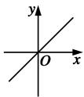</td><td>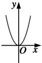</td><td>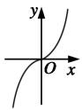</td><td>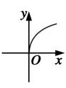</td><td>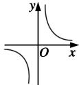</td></tr><tr><td>定义域</td><td>R</td><td>R</td><td>R</td><td> $\{x|x \geqslant 0\}$ </td><td> $\{x|x \neq 0\}$ </td></tr><tr><td>值域</td><td>R</td><td> $\{y|y \geqslant 0\}$ </td><td>R</td><td> $\{y|y \geqslant 0\}$ </td><td> $\{y|y \neq 0\}$ </td></tr><tr><td>奇偶性</td><td>奇</td><td>偶</td><td>奇</td><td>非奇非偶</td><td>奇</td></tr><tr><td>单调性</td><td>在R上单调递增</td><td>在 $(-∞,0)$ 上单调递减,在 $(0,+∞)$ 上单调递增</td><td>在R上单调递增</td><td>在 $[0,+∞)$ 上单调递增</td><td>在 $(-∞,0)$ 和 $(0,+∞)$ 上单调递减</td></tr><tr><td>公共点</td><td colspan="5">(1,1)</td></tr></table>

# 4、二次函数解析式的三种形式

(1) 一般式: $f(x) = ax^2 + bx + c (a \neq 0)$ ;  
(2) 顶点式: $f(x) = a(x - m)^2 + n (a \neq 0)$ ; 其中, $(m, n)$ 为抛物线顶点坐标, $x = m$ 为对称轴方程.  
(3) 零点式: $f(x) = a(x - x_1)(x - x_2) (a \neq 0)$ , 其中, $x_1, x_2$ 是抛物线与 $x$ 轴交点的横坐标.

# 5、二次函数的图像

二次函数 $f(x) = ax^{2} + bx + c (a \neq 0)$ 的图像是一条抛物线，对称轴方程为 $x = -\frac{b}{2a}$ ，顶点坐标为 $\left(-\frac{b}{2a}, \frac{4ac - b^2}{4a}\right)$ .

# (1) 单调性与最值

①当 $a > 0$ 时，如图所示，抛物线开口向上，函数在 $\left(-\infty, -\frac{b}{2a}\right]$ 上递减，在 $\left[-\frac{b}{2a}, +\infty\right)$ 上递增，当 $x = -\frac{b}{2a}$ 时， $f(x)_{\min} = \frac{4ac - b^2}{4a}$ ；

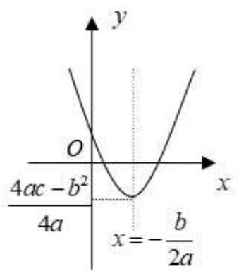

text_image

y
O
4ac - b²
x = -b/(2a)
4a

②当 $a < 0$ 时，如图所示，抛物线开口向下，函数在 $\left(-\infty, -\frac{b}{2a}\right]$ 上递增，在 $\left[-\frac{b}{2a}, +\infty\right)$ 上递减，当 $x = -\frac{b}{2a}$ 时， $f(x)_{\max} = \frac{4ac - b^2}{4a}$

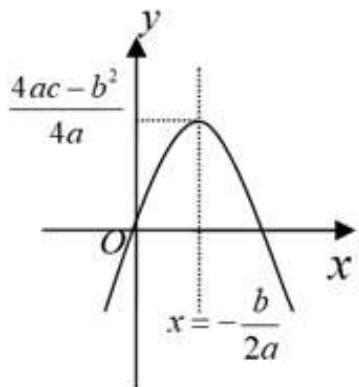

line

| x | y |
|---|---|
| 0 | 0 |
| 4ac - b² / 4a | 0 |
| x = -b/2a | 0 |

(2) 与 $x$ 轴相交的弦长

当 $\Delta = b^{2} - 4ac > 0$ 时，二次函数 $f(x) = ax^{2} + bx + c(a\neq 0)$ 的图像与 $x$ 轴有两个交点 $\mathrm{M}_1(x_1,$

0) 和 $\mathrm{M}_2(x_2, 0)$ , $|\mathrm{M}_1\mathrm{M}_2| = |x_1 - x_2| = \sqrt{(x_1 + x_2)^2 - 4x_1x_2} = \frac{\sqrt{\Delta}}{|a|}$ .

# 6、二次函数在闭区间上的最值

闭区间上二次函数最值的取得一定是在区间端点或顶点处.

对二次函数 $f(x) = ax^{2} + bx + c (a \neq 0)$ ，当 $a > 0$ 时， $f(x)$ 在区间 $[p, q]$ 上的最大值是 M，最小值是 $m$ ，令 $x_{0} = \frac{p + q}{2}$ :

(1) 若 $-\frac{b}{2a} \leqslant p$ ，则 $m = f(p), M = f(q)$ ;  
(2) 若 $p < -\frac{b}{2a} < x_0$ ，则 $m = f\left(-\frac{b}{2a}\right), M = f(q)$ ;  
(3) 若 $x_0 \leqslant -\frac{b}{2a} < q$ ，则 $m = f\left(-\frac{b}{2a}\right), M = f(p)$ ;  
(4) 若 $-\frac{b}{2a} \geqslant q$ ，则 $m = f(q), M = f(p)$ .

# 【解题方法总结】

1、幂函数 $y = x^{a}(a \in \mathbb{R})$ 在第一象限内图象的画法如下：

①当 $a < 0$ 时，其图象可类似 $y = x^{-1}$ 画出；  
②当 $0 < a < 1$ 时，其图象可类似 $y = x^{\frac{1}{2}}$ 画出；  
③当 $a > 1$ 时，其图象可类似 $y = x^2$ 画出.

2、实系数一元二次方程 $ax^2 + bx + c = 0 (a \neq 0)$ 的实根符号与系数之间的关系

(1)方程有两个不等正根 $x_{1},x_{2}\Leftrightarrow \left\{ \begin{array}{l}\Delta = b^{2} - 4ac > 0\\ x_{1} + x_{2} = -\frac{b}{a} >0\\ x_{1}x_{2} = \frac{c}{a} >0 \end{array} \right.$   
(2)方程有两个不等负根 $x_{1}, x_{2} \Leftrightarrow \left\{ \begin{array}{l} \Delta = b^{2} - 4ac > 0 \\ x_{1} + x_{2} = -\frac{b}{a} < 0 \\ x_{1}x_{2} = \frac{c}{a} > 0 \end{array} \right.$   
(3) 方程有一正根和一负根, 设两根为 $x_{1}, x_{2} \Leftrightarrow x_{1}x_{2} = \frac{c}{a} < 0$

3、一元二次方程 $ax^2 + bx + c = 0 (a \neq 0)$ 的根的分布问题

一般情况下需要从以下4个方面考虑：

(1) 开口方向；(2) 判别式；(3) 对称轴 $x = -\frac{b}{2a}$ 与区间端点的关系；(4) 区间端点函数值的正负.

设 $x_{1}, x_{2}$ 为实系数方程 $ax^{2} + bx + c = 0 (a > 0)$ 的两根，则一元二次 $ax^{2} + bx + c = 0 (a > 0)$ 的根的分布与其限定条件如表所示.

<table><tr><td>根的分布</td><td>图像</td><td>限定条件</td></tr><tr><td> $m < x_{1} < x_{2}$ </td><td>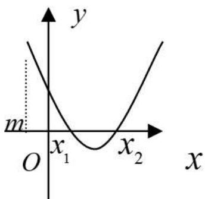</td><td> $\begin{cases} \Delta >0 \\ -\frac{b}{2a} >m \\ f(m)>0 \end{cases}$ </td></tr><tr><td> $x_{1} < m < x_{2}$ </td><td>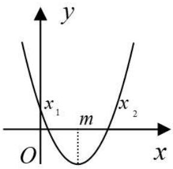</td><td> $f(m) < 0$ </td></tr><tr><td> $x_{1} < x_{2} < m$ </td><td>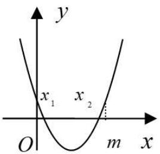</td><td> $\begin{cases} \Delta >0 \\ -\frac{b}{2a} < m \\ f(m)>0 \end{cases}$ </td></tr><tr><td>在区间 $(m,n)$ 内</td><td></td><td> $\Delta < 0$ </td></tr><tr><td rowspan="5">没有实根</td><td>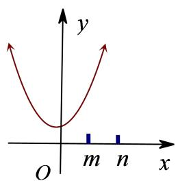</td><td></td></tr><tr><td>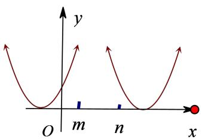</td><td> $\Delta = 0$  $x_1 = x_2 \leqslant m$ 或  $x_1 = x_2 \geqslant m$ </td></tr><tr><td>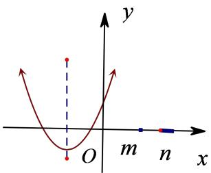</td><td> $\begin{cases} \Delta > 0 \\ -\frac{b}{2a} < m \\ f(m) \geqslant 0 \end{cases}$ </td></tr><tr><td>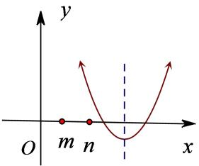</td><td> $\begin{cases} \Delta > 0 \\ -\frac{b}{2a} > n \\ f(n) \geqslant 0 \end{cases}$ </td></tr><tr><td>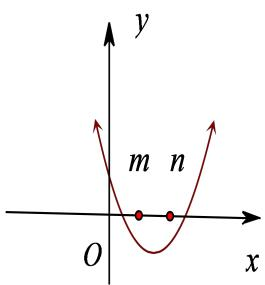</td><td> $\begin{cases} f(m) \leqslant 0 \\ f(n) \leqslant 0 \end{cases}$ </td></tr><tr><td>在区间 (m,n)内有且只有一个实根</td><td>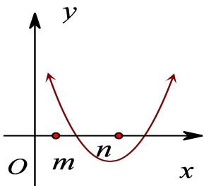</td><td> $\begin{cases} f(m) > 0 \\ f(n) < 0 \end{cases}$ </td></tr><tr><td></td><td>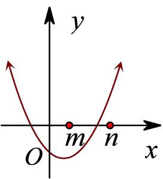</td><td> $\left\{ \begin{array}{l} f(m) < 0 \\ f(n) > 0 \end{array} \right.$ </td></tr><tr><td>在区间(m,n)内有两个不等实根</td><td>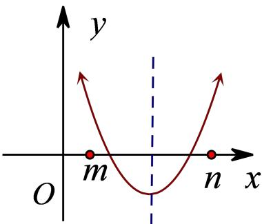</td><td> $\left\{ \begin{array}{l} \Delta > 0 \\ m < -\frac{b}{2a} < n \\ f(m) > 0 \\ f(n) > 0 \end{array} \right.$ </td></tr></table>

4、有关二次函数的问题,关键是利用图像.

(1)要熟练掌握二次函数在某区间上的最值或值域的求法,特别是含参数的两类问题——动轴定区间和定轴动区间,解法是抓住“三点一轴”,三点指的是区间两个端点和区间中点,一轴指对称轴.即注意对对称轴与区间的不同位置关系加以分类讨论,往往分成:①轴处在区间的左侧;②轴处在区间的右侧;③轴穿过区间内部(部分题目还需讨论轴与区间中点的位置关系),从而对参数值的范围进行讨论.

(2) 对于二次方程实根分布问题, 要抓住四点, 即开口方向、判别式、对称轴位置及区间端点函数值正负.

# 必考题型全归纳

# 1 题型一:幂函数的定义及其图像

217 (2024·宁夏固原·高三隆德县中学校联考期中)已知函数 $f(x)=(m^{2}-2m-2)\cdot x^{m-2}$ 是幂函数，且在 $(0,+\infty)$ 上递减，则实数m=()

A.-1

B.-1或3

C. 3

D. 2

218 (2024·海南·统考模拟预测)已知 $f(x) = (m^2 + m - 5)x^m$ 为幂函数，则（）.

A. $f(x)$ 在 $(-∞,0)$ 上单调递增

B. $f(x)$ 在 $(- \infty, 0)$ 上单调递减

C. $f(x)$ 在 $(0, +\infty)$ 上单调递增

D. $f(x)$ 在 $(0, +\infty)$ 上单调递减

219 (2024·河北·高三学业考试)已知幂函数 $y=f(x)$ 的图象过点 $(8,2\sqrt{2})$ ，则 $f(9)$ 的值为（）

A. 2

B. 3

C. 4

D. 9

220 (2024·全国·高三专题练习)幂函数 $y = x^{a}$ 中 a 的取值集合 C 是 $\left\{-1, 0, \frac{1}{2}, 1, 2, 3\right\}$ 的子集，当幂函数的值域与定义域相同时，集合 C 为（）

A. $\left\{-1,0,\frac{1}{2}\right\}$

B. $\left\{\frac{1}{2},1,2\right\}$

C. $\left\{-1,\frac{1}{2},3\right\}$

D. $\left\{\frac{1}{2},1,2,3\right\}$

221 (2024·全国·高三专题练习)已知幂函数 $y = x^{\frac{p}{q}}(p, q \in \mathbb{Z} \text{ 且 } p, q \text{ 互质})$ 的图象关于 y 轴对称，如图所示，则 （）

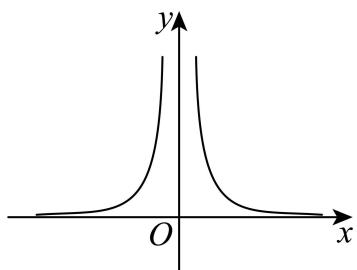

text_image

y
O
x

A. $p, q$ 均为奇数，且 $\frac{p}{q} > 0$

B. $q$ 为偶数， $p$ 为奇数，且 $\frac{p}{q} < 0$

C. q 为奇数, p 为偶数, 且 $\frac{p}{q} > 0$

D. $q$ 为奇数， $p$ 为偶数，且 $\frac{p}{q} < 0$

# 题型二:幂函数性质的综合应用

222 (2024·吉林长春·高三校考期中)已知幂函数 $f(x)=(m^{2}-3m+3)x^{m+1}$ 的图象关于原点对称，则满足 $(a+1)^{m}>(3-2a)^{m}$ 成立的实数 a 的取值范围为 \_\_\_\_.

223 (2024·全国·高三专题练习)下面命题:①幂函数图象不过第四象限;② $y=x^{0}$ 图象是一条直线;③若函数 $y=2^{x}$ 的定义域是 $\{x|x\leqslant0\}$ ，则它的值域是 $\{y|y\leqslant1\}$ ;④若函数 $y=\frac{1}{x}$ 的定义域是 $\{x|x>2\}$ ，则它的值域是 $\left\{y\mid y<\frac{1}{2}\right\}$ ;⑤若函数 $y=x^{2}$ 的值域是 $\{y|0\leqslant y\leqslant4\}$ ，则它的定义域一定是 $\{x|-2\leqslant x\leqslant2\}$ 。其中不正确命题的序号是\_\_\_\_。

224 (2024·河南·校联考模拟预测)已知 $f(x)=x^{2}$ ， $g(x)=\left(\frac{1}{2}\right)^{x}-m$ ，若对 $\forall x_{1}\in[-1,3]$ ， $\exists x_{2}\in[0,2]$ ， $f(x_{1})\geqslant g(x_{2})$ ，则实数m的取值范围是\_\_\_\_.

225 (2024·福建三明·高三校考期中)已知 $\left(\frac{1}{2}\right)^{a}<1,a^{\frac{1}{2}}<1,\log_{a}\frac{1}{2}<1$ ，则实数a的取值范围是\_\_\_\_

226 (2024·全国·高三专题练习)已知函数 $f(x) = \begin{cases} \sqrt[3]{x}, & x \leqslant a \\ x^2, & x > a \end{cases}$ ，若函数 $f(x)$ 的值域为 R，则实数 $a$ 的取值范围为 \_\_\_\_.

227 (2024·全国·高三专题练习)不等式 $(x^{2}-1)^{1011}+x^{2022}+2x^{2}-1\leqslant0$ 的解集为：\_\_\_\_.

228 (2024·江苏淮安·江苏省盱眙中学校考模拟预测)已知幂函数 $f(x) = \left(\frac{1}{x}\right)^{\frac{1}{10}}$ ，若 $f(a - 1) < f(8 - 2a)$ ，则 $a$ 的取值范围是 \_\_\_\_.

229 (2024·全国·高三专题练习)已知 $\alpha\in\left\{-2,-1,-\frac{1}{2},\frac{1}{2},1,2,3\right\}$ ，若幂函数 $f(x)=x^{\alpha}$ 奇函数，且在 $(0,+\infty)$ 上为严格减函数，则 $\alpha=$ \_\_\_\_.

# 3 题型三:二次方程 $ax^{2}+bx+c=0(a\neq0)$ 的实根分布及条件

230 (2024·全国·高三专题练习)关于 x 的方程 $x^{2} + 2(m - 1)x + m^{2} - m = 0$ 有两个实数根 $\alpha$ ， $\beta$ , 且 $\alpha^{2} + \beta^{2} = 12$ , 那么 m 的值为 ( )

A.-1

B.-4

C.-4或1

D.-1或4

231 (2024·全国·高三专题练习)设 a 为实数, 若方程 $x^{2}-2ax+a=0$ 在区间 $(-1,1)$ 上有两个不相等的实数解, 则 a 的取值范围是().

A. $(- \infty, 0) \cup (1, +\infty)$

B. $(-1,0)$

C. $\left(-\frac{1}{3},0\right)$

D. $\left(-\frac{1}{3},0\right)\cup(1,+\infty)$

232 (2024·全国·高三专题练习)方程 $x^{2}+(m-2)x+5-m=0$ 的一根在区间 $(2,3)$ 内，另一根在区间 $(3,4)$ 内，则 m 的取值范围是（）

A. $(-5, -4)$

B. $\left(-\frac{13}{3},-2\right)$

C. $\left(-\frac{13}{3},-4\right)$

D. $(-5,-2)$

233 (2024·全国·高三专题练习)关于 x 的方程 $ax^{2} + (a + 2)x + 9a = 0$ 有两个不相等的实数根 $x_{1}, x_{2}$ ，且 $x_{1} < 1 < x_{2}$ ，那么 a 的取值范围是（）

A. $-\frac{2}{7}<a<\frac{2}{5}$

B. $a > \frac{2}{5}$

C. $a < -\frac{2}{7}$

D. $-\frac{2}{11}<a<0$

# 4 题型四:二次函数“动轴定区间”、“定轴动区间”问题

234 (2024·上海·高三专题练习)已知 $f(x)=ax^{2}+2bx+4c(a,b,c\in\mathbb{R})$ .

(1) 若 $f(0) = -1$ , $a + 2b = 0$ , 解关于 x 的不等式 $f(x) < (a + 1)x - 3$ ;

(2) 若 $a + c = 0, f(x)$ 在 $[-2, 2]$ 上的最大值为 $\frac{2}{3}$ , 最小值为 $-\frac{1}{2}$ , 求证: $\left|\frac{b}{a}\right| \leqslant 2$ .

235 (2024·全国·高三专题练习)已知函数 $f(x)$ 是定义在 $[-2, 2]$ 上的奇函数，且 $x \in (0, 2]$ 时， $f(x) = 2^x - 1$ , $g(x) = x^2 - 2x + m$ .

(1) 求 $f(x)$ 在区间 $[-2,0)$ 上的解析式;

(2) 若对 $\forall x_{1} \in [-2, 2]$ , 则 $\exists x_{2} \in [-2, 2]$ , 使得 $f(x_{1}) = g(x_{2})$ 成立, 求 $m$ 的取值范围.

236 (2024·全国·高三专题练习)已知函数 $f(x) = 3^{x} - 3^{-x}$ .

(1) 利用函数单调性的定义证明 $f(x)$ 是单调递增函数；

(2) 若对任意 $x \in [-1, 1]$ , $[f(x)]^2 + mf(x) \geqslant -4$ 恒成立, 求实数 $m$ 的取值范围.

237 (2024·全国·高三专题练习)已知函数 $f(x) = x^{2} - 2ax (a > 0)$ .

(1) 当 a=3 时, 解关于 x 的不等式 -5<f(x)<7;

(2) 函数 $y = f(x)$ 在 $[t, t + 2]$ 上的最大值为 0，最小值是 -4，求实数 $a$ 和 $t$ 的值.

238 (2024·全国·高三专题练习)已知值域为 $[-1, +\infty)$ 的二次函数 $f(x)$ 满足 $f(-1 + x) = f(-1 - x)$ ，且方程 $f(x) = 0$ 的两个实根 $x_{1}, x_{2}$ 满足 $|x_{1} - x_{2}| = 2$ .

(1) 求 $f(x)$ 的表达式;  
(2) 函数 $g(x) = f(x) - kx$ 在区间 $[-2, 2]$ 上的最大值为 $f(2)$ ，最小值为 $f(-2)$ ，求实数 $k$ 的取值范围.

239 (2024·全国·高三专题练习)已知函数 $f(x) = \ln (\mathrm{e}^{2x} + 1) + ax (a \in \mathbb{R})$ 为偶函数.

(1) 求 $a$ 的值；  
(2) 设函数 $g(x) = \mathrm{e}^{f(x) + x} + me^x$ ，是否存在实数 $m$ ，使得函数 $g(x)$ 在区间 [1,2] 上的最小值为 $1 - 4\mathrm{e}^2$ ? 若存在，求出 $m$ 的值；若不存在，请说明理由.

# 5 题型五:二次函数最大值的最小值问题

240 (2024·湖南衡阳·高一统考期末)二次函数 $f(x)$ 为偶函数， $f(1)=1$ ，且 $f(x)\leqslant3x^{2}+2x$ 恒成立.

(1) 求 $f(x)$ 的解析式;  
(2) $a\in R$ ,记函数 $h(x)=|f(x)-2ax+1|$ 在[0,1]上的最大值为 $T(a)$ ,求 $T(a)$ 的最小值.

241 (2024·全国·高三专题练习)已知函数 $f(x) = \left|x + \frac{1}{x} - ax - b\right|(a, b \in \mathbb{R})$ ，当 $x \in \left[\frac{1}{2}, 2\right]$ 时，设 $f(x)$ 的最大值为 $\mathrm{M}(a, b)$ ，求 $\mathrm{M}(a, b)$ 的最小值.

242 (2024·河北保定·高一河北省唐县第一中学校考期中)已知函数 $f(x) = (x - 2)|x + a|(a \in \mathbb{R})$ ,

(1) 当 $a = -1$ 时，①求函数 $f(x)$ 单调递增区间；②求函数 $f(x)$ 在区间 $\left[-4, \frac{7}{4}\right]$ 的值域；  
(2) 当 $x \in [-3,3]$ 时，记函数 $f(x)$ 的最大值为 $g(a)$ ，求 $g(a)$ 的最小值.

243 (2024·浙江·高一校联考阶段练习)已知函数 $f(x) = -x|x - a| + 1$ .

(1) 当 a=2 时, 解方程 $f(x)=0$ ;  
(2) 当 $a \in [0,5]$ 时，记函数 $y = f(x)$ 在 $x \in [1,4]$ 上的最大值为 $g(a)$ ，求 $g(a)$ 的最小值.

