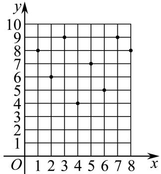
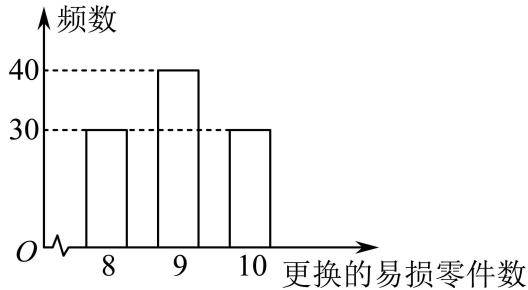
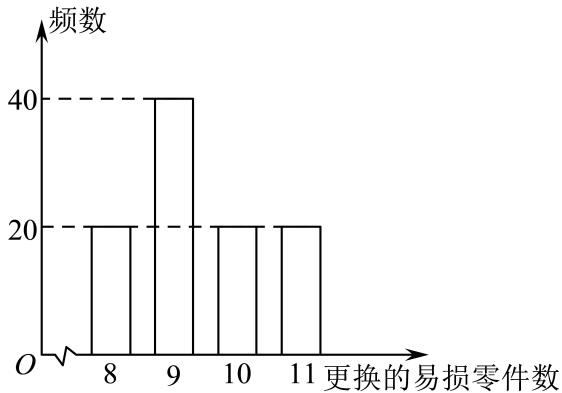
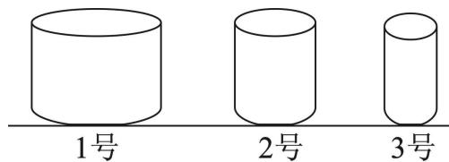
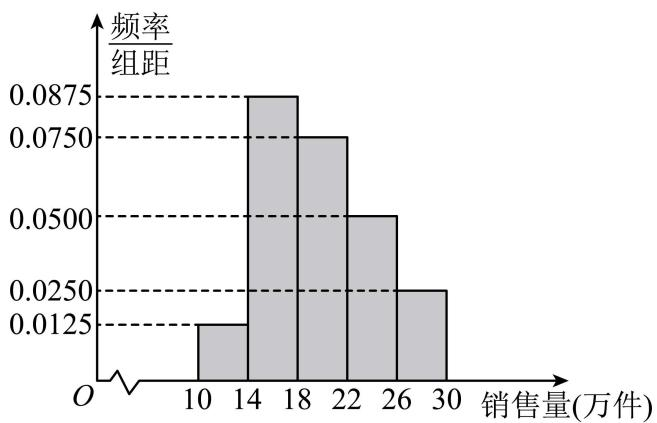

# 第91讲 离散型随机变量的分布列与数字特征

# 知识梳理

# 知识点一．离散型随机变量的分布列

# 1、随机变量

在随机试验中,我们确定了一个对应关系,使得每一个试验结果都用一个确定的数字表示.在这个对应关系下,数字随着试验结果的变化而变化.像这种随着试验结果变化而变化的变量称为随机变量.随机变量常用字母X,Y, $\xi,\eta,\cdots$ 表示.

注意：

(1)一般地,如果一个试验满足下列条件:①试验可以在相同的情形下重复进行;②试验的所有可能结果是明确可知的,并且不止一个;③每次试验总是恰好出现这些可能结果中的一个,但在一次试验之前不能确定这次试验会出现哪个结果.这种试验就是随机试验.  
(2)有些随机试验的结果虽然不具有数量性质,但可以用数来表示.如掷一枚硬币,X=0表示反面向上,X=1表示正面向上.  
(3) 随机变量的线性关系: 若 X 是随机变量, $Y = aX + b$ , a, b 是常数, 则 Y 也是随机变量.

# 2、离散型随机变量

对于所有取值可以一一列出来的随机变量,称为离散型随机变量.

注意：

(1)本章研究的离散型随机变量只取有限个值.  
(2) 离散型随机变量与连续型随机变量的区别与联系: ①如果随机变量的可能取值是某一区间内的一切值, 这样的变量就叫做连续型随机变量; ②离散型随机变量与连续型随机变量都是用变量表示随机试验的结果, 但离散型随机变量的结果可以按一定的次序一一列出, 而连续型随机变量的结果不能一一列出.

# 3、离散型随机变量的分布列的表示

一般地，若离散型随机变量 X 可能取的不同值为 $x_{1}, x_{2}, \cdots, x_{i}, \cdots, x_{n}$ ，X 取每一个值 $x_{i}(\mathrm{i}=1, 2, \cdots, n)$ 的概率 $\mathrm{P}(\mathrm{X}=x_{i})=p_{i}$ ，以表格的形式表示如下：

<table><tr><td>X</td><td> $x_{1}$ </td><td> $x_{2}$ </td><td>...</td><td> $x_{i}$ </td><td>...</td><td> $x_{n}$ </td></tr><tr><td>P</td><td> $p_{1}$ </td><td> $p_{2}$ </td><td>...</td><td> $p_{i}$ </td><td>...</td><td> $p_{n}$ </td></tr></table>

我们将上表称为离散型随机变量 X 的概率分布列, 简称为 X 的分布列. 有时为了简单起见, 也用等式 $\mathrm{P}(\mathrm{X}=x_{i})=p_{i}, i=1,2,\cdots,n$ 表示 X 的分布列.

# 4、离散型随机变量的分布列的性质

根据概率的性质,离散型随机变量的分布列具有如下性质:

$$
(1) p _ {i} \geqslant 0, i = 1, 2, \dots , n; (2) p _ {1} + p _ {2} + \dots + p _ {n} = 1.
$$

注意：

①性质 (2) 可以用来检查所写出的分布列是否有误, 也可以用来求分布列中的某些参数.  
②随机变量 $\xi$ 所取的值分别对应的事件是两两互斥的，利用这一点可以求相关事件的概

率.

# 知识点二．离散型随机变量的均值与方差

# 1、均值

若离散型随机变量X的分布列为

<table><tr><td>X</td><td> $x_{1}$ </td><td> $x_{2}$ </td><td>...</td><td> $x_{i}$ </td><td>...</td><td> $x_{n}$ </td></tr><tr><td>P</td><td> $p_{1}$ </td><td> $p_{2}$ </td><td>...</td><td> $p_{i}$ </td><td>...</td><td> $p_{n}$ </td></tr></table>

称 $\mathrm{E}(\mathrm{X})=x_{1}p_{1}+x_{2}p_{2}+\cdots+x_{i}p_{i}+\cdots+x_{n}p_{n}=1$ 为随机变量 X 的均值或数学期望，它反映了离散型随机变量取值的平均水平.

注意：(1) 均值 E(X) 刻画的是 X 取值的“中心位置”，这是随机变量 X 的一个重要特征；

(2)根据均值的定义, 可知随机变量的分布完全确定了它的均值。但反过来, 两个不同的分布可以有相同的均值。这表明分布描述了随机现象的规律, 从而也决定了随机变量的均值。而均值只是刻画了随机变量取值的“中心位置”这一重要特征, 并不能完全决定随机变量的性质。

# 2、均值的性质

(1) $E(C)=C(C$ 为常数 $)$ .  
(2) 若 $\mathrm{Y} = a\mathrm{X} + b$ ，其中 $a, b$ 为常数，则 $\mathrm{Y}$ 也是随机变量，且 $\operatorname{E}(a\mathrm{X} + b) = a\operatorname{E}(\mathrm{X}) + b.$   
(3) $\mathrm{E}(\mathrm{X}_1 + \mathrm{X}_2) = \mathrm{E}(\mathrm{X}_1) + \mathrm{E}(\mathrm{X}_2)$ .   
(4) 如果 $\mathbf{X}_1, \mathbf{X}_2$ 相互独立，则 $\mathbf{E}(\mathbf{X}_1 \cdot \mathbf{X}_2) = \mathbf{E}(\mathbf{X}_1) \cdot \mathbf{E}(\mathbf{X}_2)$ .

# 3、方差

若离散型随机变量 X 的分布列为

<table><tr><td>X</td><td> $x_{1}$ </td><td> $x_{2}$ </td><td> $\cdots$ </td><td> $x_{i}$ </td><td> $\cdots$ </td><td> $x_{n}$ </td></tr><tr><td>P</td><td> $p_{1}$ </td><td> $p_{2}$ </td><td> $\cdots$ </td><td> $p_{i}$ </td><td> $\cdots$ </td><td> $p_{n}$ </td></tr></table>

则称 $\mathrm{D}(\mathbf{X}) = \sum_{i=1}^{n}(x_i - \mathrm{E}(\mathbf{X}))^2 p_i$ 为随机变量 $\mathbf{X}$ 的方差，并称其算术平方根 $\sqrt{\mathrm{D}(\mathbf{X})}$ 为随机变量 $\mathbf{X}$ 的标准差.

注意: (1) $(x_{i}-\mathrm{E}(\mathrm{X}))^{2}$ 描述了 $x_{i}(i=1,2,\cdots,n)$ 相对于均值 $\mathrm{E}(\mathrm{X})$ 的偏离程度, 而 $\mathrm{D}(\mathrm{X})$ 是上述偏离程度的加权平均, 刻画了随机变量 X 与其均值 $\mathrm{E}(\mathrm{X})$ 的平均偏离程度. 随机变量的方差和标准差均反映了随机变量取值偏离于均值的平均程度. 方差或标准差越小, 则随机变量偏离于均值的平均程度越小;

(2) 标准差与随机变量有相同的单位, 而方差的单位是随机变量单位的平方.

# 4、方差的性质

(1) 若 $\mathrm{Y} = a\mathrm{X} + b$ ，其中 $a, b$ 为常数，则 $\mathrm{Y}$ 也是随机变量，且 $\mathrm{D}(a\mathrm{X} + b) = a^2\mathrm{D}(\mathrm{X})$ .  
(2) 方差公式的变形: $\mathrm{D}(\mathbf{X}) = \mathrm{E}(\mathbf{X}^2) - [\mathrm{E}(\mathbf{X})]^2$ .

# 必考题型全归纳

# 1 题型一:离散型随机变量

5039 (2024·高二课时练习)下列叙述中,是离散型随机变量的为()

A. 将一枚质地均匀的硬币掷五次, 出现正面和反面向上的次数之和

B. 某人早晨在车站等出租车的时间  
C. 连续不断地射击,首次命中目标所需要的次数  
D. 袋中有 2 个黑球 6 个红球, 任取 2 个, 取得一个红球的可能性

5040 (2024·全国·高三专题练习)袋中有大小相同质地均匀的5个白球、3个黑球,从中任取2个,则可以作为随机变量的是()

A. 至少取到1个白球  
C. 至多取到1个白球

B. 取到白球的个数

D. 取到的球的个数

5041 (2024·全国·高三专题练习)下面是离散型随机变量的是 （）

A. 电灯泡的使用寿命 X  
B. 小明射击1次,击中目标的环数X  
C. 测量一批电阻两端的电压, 在 10V\~20V 之间的电压值 X  
D. 一个在 y 轴上随机运动的质点, 它在 y 轴上的位置 X

5042 (2024·全国·高三专题练习)甲、乙两人下象棋,赢了得3分,平局得1分,输了得0分,共下三局.用ξ表示甲的得分,则{ξ=3}表示()

A. 甲赢三局

B. 甲赢一局输两局

C. 甲、乙平局三次

D. 甲赢一局输两局或甲、乙平局三次

5043 (2024·全国·高三专题练习)对一批产品逐个进行检测,第一次检测到次品前已检测的产品个数为 $\xi$ , 则 $\xi = k$ 表示的试验结果为 ()

A. 第 k-1 次检测到正品, 而第 k 次检测到次品  
B. 第 k 次检测到正品, 而第 $k+1$ 次检测到次品  
C. 前 k-1 次检测到正品, 而第 k 次检测到次品  
D. 前 k 次检测到正品, 而第 $k + 1$ 次检测到次品

5044 (2024·浙江·高三专题练习)袋中有大小相同的红球6个,白球5个,从袋中每次任意取出一个球,直到取出的球是白色为止,所需要的取球次数为随机变量X,则X的可能取值为()

A. $1,2,\cdots,6$

B. $1,2,\cdots,7$

C. $1,2,\cdots,11$

D. 1,2,3 …

# 2 题型二:求离散型随机变量的分布列

5045 (2024·全国·高三对口高考)数字1, 2, 3, 4任意排成一列, 如果数字k恰好出现在第k个位置上, 则称有一个“巧合”, 求“巧合”个数 $\xi$ 的分布列 \_\_\_\_.

5046 (2024·全国·高三对口高考)假如一段楼梯有11个台阶,现规定每步只能跨1个或2个台阶,则某人走完这段楼梯的单阶步数 $\xi$ 的分布列是 \_\_\_\_.

5047 (2024·全国·高三对口高考)一个均匀小正方体的六个面中,三个面上标以数0,两个面上标以数1,一个面上标以数2,将这个小正方体抛掷2次,则向上的数之积 $\xi$ 的分布列是\_\_\_\_.

5048 (2024·全国·高三对口高考)甲、乙、丙三人按下面的规则进行乒乓球比赛:第一局由甲、乙参加而丙轮空,以后每一局由前一局的获胜者与轮空者进行比赛,而前一局的失败者轮空. 比赛按这种规则一直进行到其中一人连胜两局或打满6局时停止. 设在每局中参赛者胜负的概率均为 $\frac{1}{2}$ , 且各局胜负相互独立. 则比赛停止时已打局数 $\xi$ 的分布列是 \_\_\_\_.

5049 (2024·全国·高考真题)从装有3个红球, 2个白球的袋中随机取出2个球, 设其中有 $\xi$ 个红球, 则随机变量 $\xi$ 的概率分布为: \_\_\_\_.

<table><tr><td>ξ</td><td>0</td><td>1</td><td>2</td></tr><tr><td>P</td><td></td><td></td><td></td></tr></table>

5050 (2024·全国·高三专题练习)设随机变量 $\xi$ 的分布为 $\mathrm{P}\left(\xi=\frac{k}{5}\right)=ak(k=1,2,3,4,5)$ ，则 $\mathrm{P}\left(\frac{1}{10}<\xi<\frac{7}{10}\right)=$ \_\_\_\_.

5051 (2024·全国·高三专题练习)将3个小球任意地放入4个大玻璃杯中,一个杯子中球的最多个数记为X,则X的分布列是\_\_\_\_.

5052 (2024·全国·高三专题练习)设 $\xi$ 为随机变量,从棱长为1的正方体的12条棱中任取两条,当两条棱相交时, $\xi=0$ ;当两条棱平行时, $\xi$ 的值为两条棱之间的距离;当两条棱异面时, $\xi=1$ ,则随机变量 $\xi$ 的分布列为 \_\_\_\_.

# 3 题型三:离散型随机变量的分布列的性质

5053 (2024·江西吉安·高三江西省泰和中学校考阶段练习)已知随机变量X服从两点分布，且 $P(X=0)=2a$ ， $P(X=1)=a$ ，那么a= \_\_\_\_.

5054 (2024·全国·高三专题练习)设随机变量 $\xi$ 的分布列如下：

<table><tr><td> $\xi$ </td><td>1</td><td>2</td><td>3</td><td>4</td><td>5</td><td>6</td><td>7</td><td>8</td><td>9</td><td>10</td></tr><tr><td>P</td><td> $a_{1}$ </td><td> $a_{2}$ </td><td> $a_{3}$ </td><td> $a_{4}$ </td><td> $a_{5}$ </td><td> $a_{6}$ </td><td> $a_{7}$ </td><td> $a_{8}$ </td><td> $a_{9}$ </td><td> $a_{10}$ </td></tr></table>

给出下列四个结论：

①当 $\{a_{n}\}$ 为等差数列时， $a_{5}+a_{6}=\frac{1}{5}$ ;  
②当 $\{a_{n}\}$ 为等差数列时, 公差 $0 < d < \frac{1}{45}$ ;  
③当数列 $\{a_{n}\}$ 满足 $a_{n}=\frac{1}{2^{n}}(n=1,2,\cdots,9)$ 时， $a_{10}=\frac{1}{2^{9}}$ ;  
④当数列 $\{a_{n}\}$ 满足时， $P(\xi \leqslant k) = k^{2} a_{k} (k = 1, 2, \cdots, 10)$ 时， $a_{n} = \frac{11}{10 n(n + 1)}$ .

其中所有正确结论的序号是 \_\_\_\_.

5055 (2024·全国·高三对口高考)某一随机变量 $\xi$ 的概率分布如下表, 且 $E(\xi)=1.5$ , 则 m-n 的值为 \_\_\_\_.

<table><tr><td>ξ</td><td>0</td><td>1</td><td>2</td><td>3</td></tr><tr><td>P</td><td>0.2</td><td>m</td><td>n</td><td>0.3</td></tr></table>

5056 (2024·河南·校联考模拟预测)已知随机变量X的所有可能取值为1,2,3,其分布列为

<table><tr><td>X</td><td>1</td><td>2</td><td>3</td></tr><tr><td>P</td><td> $P_1$ </td><td> $P_2$ </td><td> $P_3$ </td></tr></table>

若 $\mathrm{E}(\mathrm{X})=\frac{5}{3}$ ，则 $P_{3}-P_{1}=$ \_\_\_\_.

5057 (2024·全国·高三专题练习)设随机变量 $\xi$ 的概率分布列为

<table><tr><td> $\xi$ </td><td>0</td><td>1</td></tr><tr><td>P</td><td> $9a^{2}-a$ </td><td>3-8a</td></tr></table>

则常数 $a = \_$

5058 (2024·全国·高三专题练习)设随机变量X的分布列 $P(X=i)=\frac{k}{2^{i}}(i=1,2,3)$ ，则 $P(X\geqslant2)=$ \_\_\_\_.

5059 (2024·上海·统考模拟预测)随机变量X的分布列如下列表格所示,其中E[X]为X的数学期望,则E[X-E[X]]= \_\_\_\_.

<table><tr><td>X</td><td>1</td><td>2</td><td>3</td><td>4</td><td>5</td></tr><tr><td>p</td><td>0.1</td><td>a</td><td>0.2</td><td>0.3</td><td>0.1</td></tr></table>

5060 (2024·广东汕头·高三统考开学考试)已知等差数列 $\{a_{n}\}$ 的公差为 d，随机变量 X 满足 $P(X=i)=a_{i}(0<a_{i}<1), i=1,2,3,4$ ，则 d 的取值范围为 \_\_\_\_.

5061 (2024·全国·高三专题练习)已知离散型随机变量X的分布列为

<table><tr><td>X</td><td>0</td><td>2</td><td>a</td></tr><tr><td>P</td><td>0.2</td><td>0.4</td><td>b</td></tr></table>

若 $E(X) < 1.6$ ，则正整数 a = \_\_\_\_.

# 4 题型四:离散型随机变量的均值

5062 (2024·贵州黔东南·高三校考阶段练习) 2022年10月16日至22日中共二十大在北京召开,二十大报告指出,必须坚持科技是第一生产力,人才是第一资源,创新是第一动力,这其实是我党的一贯政策。某材料学博士毕业时恰逢国家大力倡导“开辟发展新领域新赛道,不断塑造发展新动能新优势”,于是同一帮志同道合的博士同学,在老家创办新材料公司,专注于二氧化硅、碳纤维增强陶瓷基、树脂基三大类复合材料的研发与生产,预计到今年年底这三大类复合材料盈利100万元的概率分别为0.8,0.5,0.4,若三大类复合材料到今年年底是否盈利100万元相互独立,记三大类复合材料有X类到今年年底盈利100万元,则X的数学期望E(X)=\_\_\_\_.

5063 (2024·上海宝山·高三上海交大附中校考阶段练习)一个袋中装有5个球,编号为1,2,3,4,5,从中任取3个,用X表示取出的3个球中最大编号,则E(X)= \_\_\_\_.

5064 (2024·全国·高三专题练习)现要发行10000张彩票,其中中奖金额为2元的彩票1000张,10元的彩票300张,50元的彩票100张,100元的彩票50张,1000元的彩票5张.1张

彩票中奖金额的均值是 \_\_\_\_ 元.

5065 (2024·上海普陀·曹杨二中校考模拟预测)一个盒子里有1个红球和2个绿球,每次拿一个,不放回,拿出红球即停,设拿出绿球的个数为X,则E(X)= \_\_\_\_.

5066 (2024·宁夏石嘴山·高三平罗中学校考阶段练习)某同学在上学的路上要经过3个十字路口,在每个路口是否遇到红灯相互独立,设该同学在三个路口遇到红灯的概率分别为 $\frac{1}{2},\frac{1}{3},\frac{1}{4}$ .

(1) 求该同学在上学路上恰好遇到一个红灯的概率;  
(2) 若该同学在上学路上每遇到 1 个红灯, 到校打卡时间就会比规定打卡时间晚 48 秒, 记该同学某天到校打卡时间比规定时间晚 X 秒, 求 X 的分布列和数学期望.

5067 (2024·陕西商洛·高三陕西省山阳中学校联考阶段练习)小李参加某项专业资格考试,一共要考3个科目,若3个科目都合格,则考试直接过关;若都不合格,则考试不过关;若有1个或2相科目合格,则所有不合格的科目需要进行一次补考,补考都合格的考试过关,否则不过关.已知小李每个科目每次考试合格的概率均为 $p(0<p<1)$ ,且每个科目每次考试的结果互不影响.

(1) 记“小李恰有 1 个科目需要补考”的概率为 $f(p)$ ，求 $f(p)$ 的最大值点 $p_0$ .

(2) 以 (1) 中确定的 $p_0$ 作为 $p$ 的值.

(i) 求小李这项资格考试过关的概率;

(ii) 若每个科目每次考试要缴纳 20 元的费用, 将小李需要缴纳的费用记为 X 元, 求 E(X).

5068 (2024·河南开封·高三通许县第一高级中学校考阶段练习)有一种双人游戏,游戏规则如下:一个袋子中有大小和质地相同的5个小球,其中有3个白色小球,2个红色小球,每次游戏双方从袋中轮流摸出1个小球,摸后不放回,摸到第2个红球的人获胜,同时结束该次游戏,并把摸出的球重新放回袋中,准备下一次游戏,且本次游戏中输掉的人在下一次游戏中先摸球. 小胡和小张准备玩这种游戏,约定玩3次,第一次游戏由小胡先摸球.

(1) 在第一次游戏中, 求在小胡第一轮摸到白球的情况下, 小胡获胜的概率;

(2) 记 3 次游戏中小胡获胜的次数为 X, 求 X 的分布列和数学期望.

5069 (2024·河北保定·统考二模)某学校为了提高学生的运动兴趣,增强学生身体素质,该校每年都要进行各年级之间的球类大赛,其中乒乓球大赛在每年“五一”之后举行,乒乓球大赛的比赛规则如下:高中三个年级之间进行单循环比赛,每个年级各派5名同学按顺序比赛(赛前已确定好每场的对阵同学),比赛时一个年级领先另一个年级两场就算胜利(即每两个年级的比赛不一定打满5场),若两个年级之间打成2:2则第5场比赛定胜负.已知高三每位队员战胜高二相应对手的可能性均为 $\frac{1}{2}$ ,高三每位队员战胜高一相应对手的可能性均为 $\frac{2}{3}$ ,高二每位队员战胜高一相应对手的可能性均为 $\frac{1}{2}$ ,且队员、年级之间的胜负相互独立.

(1) 求高二年级与高一年级比赛时, 高二年级与高一年级在前两场打平的条件下, 最终战胜高一年级的概率.  
(2) 若获胜年级积 3 分, 被打败年级积 0 分, 求高三年级获得积分的分布列和期望.

5070 (2024·福建龙岩·统考二模)为了丰富孩子们的校园生活,某校团委牵头,发起体育运动和文化项目比赛,经过角逐,甲、乙两人进入最后的决赛. 决赛先进行两天,每天实行三局两胜制,即先赢两局的人获得该天胜利,此时该天比赛结束.若甲、乙两人中的一方能连续两天胜利,则其为最终冠军;若前两天甲、乙两人各赢一天,则第三天只进行一局附加赛,该附加赛的获胜方为最终冠军设每局比赛甲获胜的概率为 $\frac{1}{3}$ ,每局比赛的结果没有平局且结果互相独立.

(1) 记第一天需要进行的比赛局数为 X, 求 X 的分布列及 E(X);  
(2) 记一共进行的比赛局数为 Y, 求 $P(Y \leqslant 5)$ .

# 5 题型五:离散型随机变量的方差

5071 (2024·吉林长春·高三长春外国语学校校考开学考试)设随机变量X的分布列如下:其中a、b、c成等差数列,若 $E(X)=\frac{1}{3}$ ,则方差 $D(X)=$ \_\_\_\_.

<table><tr><td>X</td><td>-1</td><td>0</td><td>1</td></tr><tr><td>P</td><td>a</td><td>b</td><td>c</td></tr></table>

5072 (2024·全国·高三专题练习)离散型随机变量X的分布为：

<table><tr><td>X</td><td>0</td><td>1</td><td>2</td><td>4</td><td>5</td></tr><tr><td>P</td><td>q</td><td>0.3</td><td>0.2</td><td>0.2</td><td>0.1</td></tr></table>

若离散型随机变量 Y 满足 $Y = 2X + 1$ ，则下列结果正确的为 \_\_\_\_.

① E(X) = 2; ② E(Y) = 4; ③ D(X) = 2.8; ④ D(Y) = 14.

5073 (2024·全国·高三专题练习)甲、乙两种零件某次性能测评的分值 $\xi, \eta$ 的分布如下，则性能更稳定的零件是 \_\_\_\_.

<table><tr><td>ξ</td><td>8</td><td>9</td><td>10</td></tr><tr><td>P</td><td>0.3</td><td>0.2</td><td>0.5</td></tr><tr><td>η</td><td>8</td><td>9</td><td>10</td></tr><tr><td>P</td><td>0.2</td><td>0.4</td><td>0.4</td></tr></table>

5074 (2024·全国·高三专题练习)已知离散型随机变量 $\xi$ 的分布如下表：

<table><tr><td>ξ</td><td>-2</td><td>0</td><td>2</td></tr><tr><td>P</td><td>a</td><td>b</td><td>1/2</td></tr></table>

若随机变量 $\xi$ 的期望值 $\mathrm{E}(\xi)=\frac{1}{2}$ ，则 $\mathrm{D}(2\xi+1)=$ \_\_\_\_.

5075 (2024·全国·高三对口高考)随机变量 $\xi$ 的分布列如下表：

<table><tr><td>ξ</td><td>n</td><td>n+1</td><td>n+2</td></tr><tr><td>P</td><td>a</td><td>b</td><td>c</td></tr></table>

其中 a, b, c 成等差数列，则 $\mathrm{D}(\xi)$ 的最大值为 \_\_\_\_.

5076 (2024·全国·高三对口高考)随机变量X的分布列如表所示,若 $E(X)=\frac{1}{3}$ ,则 $D(3X-2)=$ \_\_\_\_.

<table><tr><td>X</td><td>-1</td><td>0</td><td>1</td></tr><tr><td>P</td><td> $\frac{1}{6}$ </td><td>a</td><td>b</td></tr></table>

5077 (2024·北京西城·高三北京市第三十五中学校考开学考试)为了解某中学高一年级学生身体素质情况,对高一年级的(1)班～(8)班进行了抽测,采取如下方式抽样:每班随机各抽10名学生进行身体素质监测.经统计,每班10名学生中身体素质监测成绩达到优秀的人数散点图如下(x轴表示对应的班号,y轴表示对应的优秀人数):

scatter

| x | y |
|---|---|
| 1 | 8 |
| 2 | 6 |
| 3 | 9 |
| 4 | 4 |
| 5 | 7 |
| 6 | 5 |
| 7 | 9 |
| 8 | 8 |

(1) 若用散点图预测高一年级学生身体素质情况,从高一年级学生中任意抽测 1 人,求该生身体素质监测成绩达到优秀的概率;

(2) 若从以上统计的高一 (2) 班和高一 (4) 班的学生中各抽出 1 人, 设 X 表示 2 人中身体素质监测成绩达到优秀的人数, 求 X 的分布列及其数学期望;

(3) 假设每个班学生身体素质优秀的概率与该班随机抽到的 10 名学生的身体素质优秀率相等. 现在从每班中分别随机抽取 1 名同学, 用“ $\xi_{k}=1$ ”表示第 $k$ 班抽到的这名同学身体素质优秀, “ $\xi_{k}=0$ ”表示第 $k$ 班抽到的这名同学身体素质不是优秀 ( $k=1,2,\ldots,8$ ). 写出方差 $\mathrm{D}(\xi_{1}), \mathrm{D}(\xi_{2}), \mathrm{D}(\xi_{3}), \mathrm{D}(\xi_{4})$ 的大小关系 (不必写出证明过程).

5078 (2024·辽宁沈阳·高三辽宁实验中学校考阶段练习)甲乙两人进行一场乒乓球比赛. 已知每局甲胜的概率为 0.6, 乙胜的概率为 0.4, 甲乙约定比赛采取“3 局 2 胜制”.

(1) 求这场比赛甲获胜的概率;   
(2) 这场比赛甲所胜局数的数学期望 (保留两位有效数字);  
(3) 根据 (2) 的结论, 计算这场比赛甲所胜局数的方差.

5079 (2024·浙江·高三专题练习)已知随机变量X的分布列为

<table><tr><td>X</td><td>0</td><td>1</td><td>x</td></tr><tr><td>P</td><td> $\frac{1}{2}$ </td><td> $\frac{1}{3}$ </td><td>p</td></tr></table>

若 $\mathrm{E}(\mathrm{X})=\frac{2}{3}$ ,

(1) 求 D(X) 的值;  
(2) 若 Y = 3X - 2，求 $\sqrt{\mathrm{D}(\mathrm{Y})}$ 的值.

5080 (2024·重庆沙坪坝·高三重庆一中校考阶段练习)巴蜀中学进行90周年校庆知识竞赛，参赛的同学需要从10道题中随机地抽取4道来回答，竞赛规则规定：每题回答正确得10分，回答不正确得-10分.

(1) 已知甲同学每题回答正确的概率均为 0.8，且各题回答正确与否相互之间没有影响，记甲的总得分为 X，求 X 的期望和方差；  
(2) 已知乙同学能正确回答 10 道题中的 6 道, 记乙的总得分为 Y, 求 Y 的分布列.

5081 (2024·河南·襄城高中校联考三模)小王去自动取款机取款,发现自己忘记了6位密码的最后一位数字,他决定从0\~9中不重复地随机选择1个进行尝试,直到输对密码,或者输错三次银行卡被锁定为止.

(1) 求小王的该银行卡被锁定的概率;   
(2) 设小王尝试输入该银行卡密码的次数为 X, 求 X 的分布列、数学期望及方差.

5082 (2024·福建宁德·高三福建省宁德第一中学校考阶段练习)甲、乙两个学校进行体育比赛, 比赛共设三个项目, 每个项目胜方得10分, 负方得0分, 没有平局. 三个项目比赛结束后, 总得分高的学校获得冠军, 已知甲学校在三个项目中获胜的概率分别为0.5, 0.4, 0.8, 各项目的比赛结果相互独立.

(1) 求甲学校获得冠军的概率;  
(2) 用 X 表示乙学校的总得分, 求 X 的分布列与期望.  
(3) 设用 Y 表示甲学校的总得分, 比较 DX 和 DY 的大小 (直接写出结果).

5083 (2024·全国·高三专题练习)概率论中有很多经典的不等式,其中最著名的两个当属由两位俄国数学家马尔科夫和切比雪夫分别提出的马尔科夫(Markov)不等式和切比雪夫(Chebyshev)不等式. 马尔科夫不等式的形式如下:

设 X 为一个非负随机变量, 其数学期望为 $\mathrm{E}(\mathrm{X})$ , 则对任意 $\varepsilon > 0$ , 均有 $\mathrm{P}(\mathrm{X} \geqslant \varepsilon) \leqslant \frac{\mathrm{E}(\mathrm{X})}{\varepsilon}$ ,

马尔科夫不等式给出了随机变量取值不小于某正数的概率上界,阐释了随机变量尾部取值概率与其数学期望间的关系. 当 X 为非负离散型随机变量时,马尔科夫不等式的证明如下:

设 X 的分布列为 $\mathrm{P}(\mathrm{X}=x_{i})=p_{i},\mathrm{i}=1,2,\cdots,n,$ 其中 $p_{i}\in(0,+\infty),x_{i}\in[0,+\infty)(\mathrm{i}=1,2,\cdots,n),\sum_{i=1}^{n}p_{i}=1$ ，则对任意 $\varepsilon>0,\mathrm{P}(\mathrm{X}\geqslant\varepsilon)=\sum_{x_{i}\geqslant\varepsilon}p_{i}\leqslant\sum_{x_{i}\geqslant\varepsilon}\frac{x_{i}}{\varepsilon}p_{i}=$

$\frac{1}{\varepsilon}\sum_{x_{i}\geqslant\varepsilon}x_{i}p_{i}\leqslant\frac{1}{\varepsilon}\sum_{i=1}^{n}x_{i}p_{i}=\frac{\mathrm{E}(\mathrm{X})}{\varepsilon}$ ，其中符号 $\sum_{x_{i}\geqslant\varepsilon}A_{i}$ 表示对所有满足 $x_{i}\geqslant\varepsilon$ 的指标i所对应的 $A_{i}$ 求和.

切比雪夫不等式的形式如下：

设随机变量 X 的期望为 $\mathrm{E}(\mathrm{X})$ ，方差为 $\mathrm{D}(\mathrm{X})$ ，则对任意 $\varepsilon > 0$ ，均有 $\mathrm{P}(|\mathrm{X}-\mathrm{E}(\mathrm{X})| \geqslant \varepsilon) \leqslant \frac{\mathrm{D}(\mathrm{X})}{\varepsilon^{2}}$

(1) 根据以上参考资料, 证明切比雪夫不等式对离散型随机变量 X 成立.  
(2)某药企研制出一种新药,宣称对治疗某种疾病的有效率为80%。现随机选择了100名患者,经过使用该药治疗后,治愈的人数为60人,请结合切比雪夫不等式通过计算说明药厂的宣传内容是否真实可信.

# 6 题型六:决策问题

5084 (2024·河北·统考模拟预测)为切实做好新冠疫情防控工作,有效、及时地控制和消除新冠肺炎的危害,增加学生对新冠肺炎预防知识的了解,某校举办了一次“新冠疫情”知识竞赛.竞赛分个人赛和团体赛两种.个人赛参赛方式为:组委会采取电脑出题的方式,从题库中随机出10道题,编号为 $A_{1},A_{2},A_{3},A_{4},\cdots,A_{10}$ ,电脑依次出题,参赛选手按规则作答,每答对一道题得10分,答错得0分.团体赛以班级为单位,各班参赛人数必须为3的倍数,且不少于18人,团体赛分预赛和决赛两个阶段,其中预赛阶段各班可从以下两种参赛方案中任选一种参赛:

方案一: 将班级选派的 3n 名参赛选手每 3 人一组, 分成 n 组, 电脑随机分配给同一组的 3 名选手一道相同的试题, 3 人均独立答题, 若这 3 人中至少有 2 人回答正确, 则该小组顺利出线; 若这 n 个小组都顺利出线, 则该班级晋级决赛.

方案二: 将班级选派的 3n 名参赛选手每 n 人一组, 分成 3 组, 电脑随机分配给同一组的 n 名选手一道相同的试题, 每人均独立答题, 若这 n 个人都回答正确, 则该小组顺利出线; 若这 3 个小组中至少有 2 个小组顺利出线, 则该班级晋级决赛.

(1) 郭靖同学参加了个人赛, 已知郭靖同学答对题库中每道题的概率均为 $\frac{4}{5}$ , 每次作答结果相互独立, 且他不会主动放弃任何一次作答机会, 求郭靖同学得分的数学期望与方差;  
(2) 在团体赛预赛中, 假设 A 班每位参赛选手答对试题的概率均为常数 $p (0 < p < 1)$ , A 班为使晋级团体赛决赛的可能性更大, 应选择哪种参赛方式? 请说明理由.

5085 (2024·云南曲靖·高三校联考阶段练习)从2024年起,云南省高考数学试卷中增加了多项选择题(第9-12题是四道多选题,每题有四个选项,全部选对的得5分,部分选对的得2分,有选错的得0分).在某次模拟考试中,每道多项选题的正确答案是两个选项的概率为p,正确答案是三个选项的概率为 $1-p$ (其中0<p<1).现甲乙两名学生独立解题.

(2) 对于第 12 题, 甲同学只能正确地判断出其中的一个选项是符合题意的, 乙同学只能正确地判断出其中的一个选项是不符合题意的, 作答时, 应选择几个选项才有希望得到更理想的成绩, 请你帮助甲或者乙做出决策 (只需选择帮助一人做出决策即可).

5086 (2024·河南·校联考模拟预测)某水果店的草莓每盒进价20元,售价30元,草莓保鲜度为两天,若两天之内未售出,以每盒10元的价格全部处理完.店长为了决策每两天的进货量,统计了本店过去40天草莓的日销售量(单位:十盒),获得如下数据:

<table><tr><td>日销售量/十盒</td><td>7</td><td>8</td><td>9</td><td>10</td></tr><tr><td>天数</td><td>8</td><td>12</td><td>16</td><td>4</td></tr></table>

假设草莓每日销量相互独立,且销售量的分布规律保持不变,将频率视为概率.

(1) 记每两天中销售草莓的总盒数为 X(单位: 十盒), 求 X 的分布列和数学期望;  
(2) 以两天内销售草莓获得利润较大为决策依据, 在每两天进 16 十盒, 17 十盒两种方案中应选择哪种?

5087 (2024·江西上饶·校联考模拟预测)甲乙两家公司要进行公开招聘,招聘分为笔试和面试,通过笔试后才能进入面试环节. 已知甲、乙两家公司的笔试环节都设有三门考试科目且每门科目是否通过相互独立,若小明报考甲公司,每门科目通过的概率均为 $\frac{1}{2}$ ;报考乙公司,每门科目通过的概率依次为 $\frac{1}{3},\frac{3}{5},m$ ,其中0<m<1.

(1) 若 $m=\frac{2}{5}$ ，分别求出小明报考甲、乙两公司在笔试环节恰好通过一门科目的概率；  
(2) 招聘规则要求每人只能报考一家公司, 若以笔试过程中通过科目数的数学期望为依据作决策, 当小明更希望通过乙公司的笔试时, 求 m 的取值范围.

5088 (2024·广西·校联考模拟预测)某公司计划购买2台机器,该种机器使用三年后即被淘汰,机器有一易损零件,在购进机器时,可以额外购买这种零件作为备件,每个200元,在机器使用期间,如果备件不足再购买,则每个500元,现需决策在购买机器时应同时购买几个易损零件,为此搜集并整理了100台这种机器在三年使用期内更换的易损零件数,得到其频数分布图(如图所示).若将这100台机器在三年内更换的易损零件数的频率视为1台机器在三年内更换的易损零件数发生的概率,记X表示2台机器三年内共需更换的易损零件数,n表示购买2台机器的同时购买的易损零件数.

histogram

| 更换的易损零件数 | 频数 |
| :--- | :--- |
| 8 | 30 |
| 9 | 40 |
| 10 | 30 |

(1) 求 X 的分布;  
(2) 以购买易损零件所需费用的期望值为决策依据, 在 $n = 17$ 与 $n = 18$ 之中选其一, 应选用哪个? 并说明理由.

5089 (2024·广东佛山·华南师大附中南海实验高中校考模拟预测)人工智能是研究用于模拟和延伸人类智能的技术科学,被认为是21世纪最重要的尖端科技之一,其理论和技术正在日益成熟,应用领域也在不断扩大.人工智能背后的一个基本原理:首先确定先验概率,然后通过计算得到后验概率,使先验概率得到修正和校对,再根据后验概率做出推理和决策.基于这一基本原理,我们可以设计如下试验模型;有完全相同的甲、乙两个袋子,袋子有形状和大小完全相同的小球,其中甲袋中有9个红球和1个白球乙袋中有2个红球和8个白球.从这两个袋子中选择一个袋子,再从该袋子中等可能摸出一个球,称为一次试验.若多次试验直到摸出红球,则试验结束.假设首次试验选到甲袋或乙袋的概率均为 $\frac{1}{2}$ (先验概率).

(1) 求首次试验结束的概率;   
(2) 在首次试验摸出白球的条件下, 我们对选到甲袋或乙袋的概率 (先验概率) 进行调整.

①求选到的袋子为甲袋的概率，  
②将首次试验摸出的白球放回原来袋子,继续进行第二次试验时有如下两种方案;方案一,从原来袋子中摸球;方案二,从另外一个袋子中摸球.请通过计算,说明选择哪个方案第二次试验结束的概率更大.

5090 (2024·陕西西安·陕西师大附中校考模拟预测)强基计划校考由试点高校自主命题,校考过程中通过笔试后才能进入面试环节. 已知甲、乙两所大学的笔试环节都设有三门考试科目且每门科目是否通过相互独立,若某考生报考甲大学,每门科目通过的概率均为 $\frac{1}{2}$ ;该考生报考乙大学,每门科目通过的概率依次为 $\frac{1}{6}, \frac{2}{3}, m$ ,其中 $0 < m < 1$ .

(1) 若 $m = \frac{2}{3}$ , 分别求出该考生报考甲、乙两所大学在笔试环节恰好通过一门科目的概率;  
(2) 强基计划规定每名考生只能报考一所试点高校, 若以笔试过程中通过科目数的数学期望为依据作决策, 当该考生更希望通过乙大学的笔试时, 求 m 的取值范围.

5091 (2024·全国·高三专题练习)某公司计划购买2台机器,该种机器使用三年后即被淘汰,机器有一易损零件,在购进机器时,可以额外购买这种零件作为备件,每个200元,在机器使用期间,如果备件不足再购买,则每个500元,现需决策在购买机器时应同时购买几个易损零件,为此搜集并整理了100台这种机器在三年使用期内更换的易损零件数,得到其频数分布图(如图所示).若将这100台机器在三年内更换的易损零件数的频率视为1台机器在三年内更换的易损零件数发生的概率,记X表示2台机器三年内共需更换的易损零件数,n表示购买2台机器的同时购买的易损零件数.求X的期望;

histogram

| 更换的易损零件数 | 频数 |
| :--- | :--- |
| 8 | 20 |
| 9 | 40 |
| 10 | 20 |
| 11 | 20 |

5092 (2024·湖北·高三湖北省红安县第一中学校联考阶段练习)为贯彻落实党的二十大精神，促进群众体育全面发展. 奋进中学举行了趣味运动会, 有一个项目是“沙包掷准”, 具体比赛规则是: 选手站在如图 (示意图) 所示的虚线处, 手持沙包随机地掷向前方的三个箱子中的任意一个, 每名选手掷 5 个大小形状质量相同、编号不同的沙包. 规定: 每次沙包投进 1 号、2 号、3 号箱分别可得 3 分、4 分、5 分, 没有投中计 0 分. 每名选手将累计得分作为最终成绩.

text_image

1号
2号
3号

(1) 已知某位选手获得了 17 分, 求该选手 5 次投掷的沙包进入不同箱子的方法数;  
(2)赛前参赛选手经过一段时间的练习,选手A每次投中1号、2号、3号箱的概率依次为0.7,0.5,0.3.已知选手A每次赛前已经决定5次投掷的目标箱且比赛中途不变更投掷目标.假设各次投掷结果相互独立,且投掷时不会出现末中目标箱而误中其它箱的情况.  
(i) 若以比赛结束时累计得分数作为决策的依据,你建议选手 A 选择几号箱?  
(ii) 假设选手 B 得了 23 分, 请你帮 A 设计一种可能赢 B 的投掷方案, 并计算该方案 A 获胜的概率.

5093 (2024·全国·高三专题练习)某服装加工厂为了提高市场竞争力,对其中一台生产设备提出了甲、乙两个改进方案:甲方案是引进一台新的生产设备,需一次性投资1900万元,年生产能力为30万件;乙方案是将原来的设备进行升级改造,需一次性投入700万元,年生产能力为20万件.根据市场调查与预测,该产品的年销售量的频率分布直方图如图所示,无论是引进新生产设备还是改造原有的生产设备,设备的使用年限均为6年,该产品的销售利润为15元/件(不含一次性设备改进投资费用).

histogram

| 销售量(万件) | 频率/组距 |
| :--- | :--- |
| 10-14 | 0.0125 |
| 14-18 | 0.0875 |
| 18-22 | 0.0750 |
| 26-30 | 0.0500 |
| 30+ | 0.0250 |

(1) 根据年销售量的频率分布直方图, 估算年销量的平均数 $\bar{x}$ (同一组中的数据用该组区间的中点值作代表);  
(2) 将年销售量落入各组的频率视为概率, 各组的年销售量用该组区间的中点值作年销量的估计值, 并假设每年的销售量相互独立.

①根据频率分布直方图估计年销售利润不低于270万元的概率；

②若以该生产设备6年的净利润的期望值作为决策的依据,试判断该服装厂应选择哪个方案.(6年的净利润=6年销售利润-设备改进投资费用)

