# 第92讲 两点分布、二项分布、超几何分布与正态分布

# 知识梳理

# 知识点一．两点分布

1、若随机变量 X 服从两点分布, 即其分布列为

<table><tr><td>X</td><td>0</td><td>1</td></tr><tr><td>P</td><td> $1 - p$ </td><td> $p$ </td></tr></table>

其中 $0 < p < 1$ ，则称离散型随机变量 $\mathbf{X}$ 服从参数为 $p$ 的两点分布。其中 $\mathrm{P}(\mathrm{X} = 1)$ 称为成功概率。

注意：

(1)两点分布的试验结果只有两个可能性,且其概率之和为1;  
(2)两点分布又称0-1分布、伯努利分布,其应用十分广泛.

2、两点分布的均值与方差:若随机变量X服从参数为p的两点分布,则 $E(X)=1\times p+0\times(1-p)=p$ , $D(X)=p(1-p)$ .

知识点二．n 次独立重复试验

# 1、定义

一般地，在相同条件下重复做的 $n$ 次试验称为 $n$ 次独立重复试验.

注意:独立重复试验的条件:①每次试验在同样条件下进行;②各次试验是相互独立的;③每次试验都只有两种结果,即事件要么发生,要么不发生.

# 2、特点

(1) 每次试验中,事件发生的概率是相同的;  
(2) 每次试验中的事件是相互独立的,其实质是相互独立事件的特例.

# 知识点三．二项分布

# 1、定义

一般地，在 n 次独立重复试验中，用 X 表示事件 A 发生的次数，设每次试验中事件 A 发生的概率为 p，不发生的概率 q=1-p，那么事件 A 恰好发生 k 次的概率是 $\mathrm{P}(\mathrm{X}=k)=\mathrm{C}_{n}^{k}p^{k}q^{n-k}$ $(k=0,1,2,\cdots,n)$

于是得到 $\mathbf{X}$ 的分布列

<table><tr><td>X</td><td>0</td><td>1</td><td>...</td><td>k</td><td>...</td><td>n</td></tr><tr><td>p</td><td> $C_{n}^{0}p^{0}q^{n}$ </td><td> $C_{n}^{1}p^{1}q^{n-1}$ </td><td>...</td><td> $C_{n}^{k}p^{k}q^{n-k}$ </td><td>...</td><td> $C_{n}^{m}p^{n}q^{0}$ </td></tr></table>

由于表中第二行恰好是二项式展开式

$(q+p)^{n}=\mathrm{C}_{n}^{0}p^{0}q^{n}+\mathrm{C}_{n}^{1}p^{1}q^{n-1}+\cdots+\mathrm{C}_{n}^{k}p^{k}q^{n-k}+\cdots+\mathrm{C}_{n}^{n}p^{n}q^{0}$ 各对应项的值，称这样的离散型随机变量 X 服从参数为 n, p 的二项分布，记作 X\~B(n, p)，并称 p 为成功概率.

注意:由二项分布的定义可以发现,两点分布是一种特殊的二项分布,即 n=1 时的二项分布,所以二项分布可以看成是两点分布的一般形式.

# 2、二项分布的适用范围及本质

(1) 适用范围:

①各次试验中的事件是相互独立的；  
②每次试验只有两种结果:事件要么发生,要么不发生;  
③随机变量是这 $n$ 次独立重复试验中事件发生的次数.  
(2)本质:二项分布是放回抽样问题,在每次试验中某一事件发生的概率是相同的.

# 3、二项分布的期望、方差

若 $\mathrm{X}\sim \mathrm{B}(n,p)$ ，则 $\operatorname {E}(\mathbf{X}) = np,\operatorname {D}(\mathbf{X}) = np(1 - p).$

知识点四．超几何分布

# 1、定义

在含有M件次品的N件产品中，任取n件，其中恰有X件次品，则事件 $\{X=k\}$ 发生的概率为 $P(X=k)=\frac{C_{M}^{k}C_{N-M}^{m-k}}{C_{N}^{m}}, k=0,1,2,\cdots,m$ ，其中 $m=\min\{M,n\}$ ，且 $n\leqslant N,M\leqslant N,n$ ， $M,N\in N^{*}$ ，称分布列为超几何分布列。如果随机变量X的分布列为超几何分布列，则称随机变量X服从超几何分布。

<table><tr><td>X</td><td>0</td><td>1</td><td>...</td><td>m</td></tr><tr><td>P</td><td> $\frac{C_{M}^{0}C_{N-M}^{n-0}}{C_{N}^{n}}$ </td><td> $\frac{C_{M}^{1}C_{N-M}^{n-1}}{C_{N}^{n}}$ </td><td>...</td><td> $\frac{C_{M}^{m}C_{N-M}^{n-m}}{C_{N}^{n}}$ </td></tr></table>

# 2、超几何分布的适用范围件及本质

# (1) 适用范围：

①考察对象分两类；  
②已知各类对象的个数；  
③从中抽取若干个个体,考察某类个体个数 Y 的概率分布.

(2)本质:超几何分布是不放回抽样问题,在每次试验中某一事件发生的概率是不相同的.知识点四、正态曲线

1、定义:我们把函数 $\varphi_{\mu,\sigma}(x)=\frac{1}{\sqrt{2\pi}\sigma}\mathrm{e}^{-\frac{(x-\mu)^{2}}{2\sigma^{2}}}$ ， $x\in(-\infty,+\infty)$ (其中 $\mu$ 是样本均值， $\sigma$ 是样本标准差) 的图象称为正态分布密度曲线，简称正态曲线。正态曲线呈钟形，即中间高，两边低。

# 2、正态曲线的性质

(1) 曲线位于 $x$ 轴上方，与 $x$ 轴不相交；  
(2) 曲线是单峰的, 它关于直线 $x = \mu$ 对称;  
(3) 曲线在 $x = \mu$ 处达到峰值 (最大值) $\frac{1}{\sqrt{2\pi}\sigma}$ ;

(4) 曲线与 $x$ 轴之间的面积为 1;

(5) 当 $\sigma$ 一定时, 曲线的位置由 $\mu$ 确定, 曲线随着 $\mu$ 的变化而沿 $x$ 轴平移, 如图甲所示:

(6) 当 $\mu$ 一定时, 曲线的形状由 $\sigma$ 确定. $\sigma$ 越小, 曲线越“高瘦”, 表示总体的分布越集中; $\sigma$ 越大, 曲线越“矮胖”, 表示总体的分布越分散, 如图乙所示: :

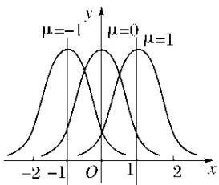

line

| x    | μ=-1 | μ=0  | μ=1  |
| ---- | ---- | ---- | ---- |
| -2   |      |      |      |
| -1   |      |      |      |
| 0    |      |      |      |
| 1    |      |      |      |
| 2    |      |      |      |

甲

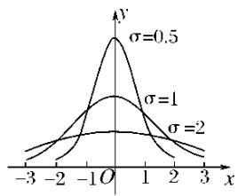

line

| x    | σ=0.5 | σ=1   | σ=2   |
| ---- | ----- | ----- | ----- |
| -3   | ~0    | ~0    | ~0    |
| -2   | ~0    | ~0    | ~0    |
| -1   | ~0    | ~0    | ~0    |
| 0    | 1     | 0.5   | ~0    |
| 1    | ~0    | ~0    | ~0    |
| 2    | ~0    | ~0    | ~0    |
| 3    | ~0    | ~0    | ~0    |

乙

知识点五、正态分布

1、定义

随机变量 X 落在区间 $(a, b]$ 的概率为 $\mathrm{P}(a < \mathrm{X} \leqslant b) = \int_{a}^{b} \varphi_{\mu,\sigma}(x) \, dx$ ，即由正态曲线，过点 $(a, 0)$ 和点 $(b, 0)$ 的两条 x 轴的垂线，及 x 轴所围成的平面图形的面积，如下图中阴影部分所示，就是 X 落在区间 $(a, b]$ 的概率的近似值.

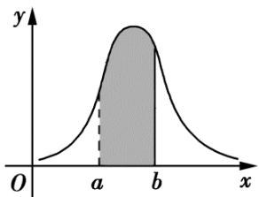

area

| x    | y     |
| ---- | ----- |
| a    | Peak  |
| b    | Peak  |

一般地，如果对于任何实数 $a, b (a < b)$ ，随机变量X满足 $\mathrm{P}(a < \mathrm{X} \leqslant b) = \int_{a}^{b} \varphi_{\mu, \sigma}(x) \mathrm{d}x$ ，则称随机变量X服从正态分布。正态分布完全由参数 $\mu, \sigma$ 确定，因此正态分布常记作 $\mathrm{N}(\mu, \sigma^2)$ 。如果随机变量X服从正态分布，则记为 $\mathrm{X} \sim \mathrm{N}(\mu, \sigma^2)$ 。

其中，参数 $\mu$ 是反映随机变量取值的平均水平的特征数，可以用样本的均值去估计； $\sigma$ 是衡量随机变量总体波动大小的特征数，可以用样本的标准差去估计。

2、 $3\sigma$ 原则

若 $\mathrm{X} \sim \mathrm{N}(\mu, \sigma^2)$ , 则对于任意的实数 $a > 0$ , $\mathrm{P}(\mu - a < \mathrm{X} \leqslant \mu + a) = \int_{\mu - a}^{\mu + a} \varphi_{\mu, \sigma}(x) \mathrm{d}x$ 为下图中阴影部分的面积, 对于固定的 $\mu$ 和 $a$ 而言, 该面积随着 $\sigma$ 的减小而变大. 这说明 $\sigma$ 越小, $\mathbf{X}$ 落在区间 $(\mu - a, \mu + a]$ 的概率越大, 即 $\mathbf{X}$ 集中在 $\mu$ 周围的概率越大

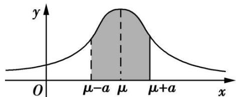

area

| x       | y     |
|---------|-------|
| 0       | 0     |
| μ-a     | Peak  |
| μ       | Peak  |
| μ+a     | Peak  |

特别地，有 $\mathrm{P}(\mu -\sigma < X\leqslant \mu +\sigma) = 0.6826;\mathrm{P}(\mu -2\sigma < X\leqslant \mu +2\sigma) = 0.9544;\mathrm{P}(\mu -3\sigma < X$ $\leqslant \mu +3\sigma) = 0.9974.$

由 $\mathrm{P}(\mu - 3\sigma < \mathrm{X} \leqslant \mu + 3\sigma) = 0.9974$ ，知正态总体几乎总取值于区间 $(\mu - 3\sigma, \mu + 3\sigma)$ 之内。而在此区间以外取值的概率只有 0.0026，通常认为这种情况在一次试验中几乎不可能发生，即为小概率事件。在实际应用中，通常认为服从于正态分布 $\mathrm{N}(\mu, \sigma^2)$ 的随机变量 $\mathbf{X}$ 只取 $(\mu - 3\sigma, \mu + 3\sigma)$ 之间的值，并简称之为 $3\sigma$ 原则。

【解题方法总结】

1、超几何分布和二项分布的区别

(1) 超几何分布需要知道总体的容量, 而二项分布不需要;  
(2) 超几何分布是“不放回”抽取, 在每次试验中某一事件发生的概率是不相同的;

而二项分布是“有放回”抽取(独立重复)，在每次试验中某一事件发生的概率是相同的.

2、在解决有关问题时，通常认为服从正态分布 $\mathrm{N}(\mu, \sigma^2)$ 的随机变量 $x$ 只取 $(\mu - 3\sigma, \mu + 3\sigma)$ 之间的值。如果服从正态分布的随机变量的某些取值超出了这个范围就说明出现了意外情况。  
3、求正态变量 $x$ 在某区间内取值的概率的基本方法：

(1) 根据题目中给出的条件确定 $\mu$ 与 $\sigma$ 的值.  
(2) 将待求问题向 $(\mu - \sigma, \mu + \sigma], (\mu - 2\sigma, \mu + 2\sigma], (\mu - 3\sigma, \mu + 3\sigma]$ 这三个区间进行转化；  
(3) 利用 $x$ 在上述区间的概率、正态曲线的对称性和曲线与 $x$ 轴之间的面积为 1 求出最后结果.

# 4、假设检验的思想

(1) 统计中假设检验的基本思想: 根据小概率事件在一次试验中几乎不可能发生的原则和从总体中抽测的个体的数值, 对事先所作的统计假设作出判断: 是拒绝假设, 还是接受假设.  
(2) 若随机变量 $\xi$ 服从正态分布 $N(\mu, \sigma^2)$ , 则 $\xi$ 落在区间 $(\mu - 3\sigma, \mu + 3\sigma]$ 内的概率为 0.9974, 亦即落在区间 $(\mu - 3\sigma, \mu + 3\sigma]$ 之外的概率为 0.0026, 此为小概率事件。如果此事件发生了, 就说明 $\xi$ 不服从正态分布。  
(3) 对于小概率事件要有一个正确的理解:

小概率事件是指发生的概率小于 $3\%$ 的事件。对于这类事件来说，在大量重复试验中，平均每试验大约33次，才发生1次，所以认为在一次试验中该事件是几乎不可能发生的。不过应注意两点：一是这里的“几乎不可能发生”是针对“一次试验”来说的，如果试验次数多了，该事件当然是很可能发生的；二是当我们运用“小概率事件几乎不可能发生的原理”进行推断时，也有 $3\%$ 犯错的可能性。

# 必考题型全归纳

# 1 题型一:两点分布

5094 (2024·江苏镇江·高三江苏省镇江第一中学校考阶段练习)若随机变量 X 服从两点分布, 其中 P(X=0)= $\frac{1}{3}$ , E(X), D(X) 分别为随机变量 X 的均值与方差, 则下列结论不正确的是 ()

A. $P(X=1)=E(X)$

B. $E(3X+2)=4$

C. D(3X+2)=4

D. $D(X)=\frac{2}{9}$

5095 (2024·全国·高三专题练习)设随机变量X服从两点分布,若 $P(X=1)-P(X=0)=0.4$ ,
则 $E(X)=$ （）

A. 0.3

B. 0.4

C. 0.6

D. 0.7

5096 (2024·全国·高三专题练习)有一个盒子里有1个红球,现将 $n(n\in\mathbb{N}^{*})$ 个黑球放入盒子后,再从盒子里随机取一球,记取到的红球个数为 $\xi$ 个,则随着 $n(n\in\mathbb{N}^{*})$ 的增加,下列说法正确的是()

A. $E(\xi)$ 减小, $D(\xi)$ 增加

B. $\mathrm{E}(\xi)$ 增加， $\mathrm{D}(\xi)$ 减小

C. $E(\xi)$ 增加, $D(\xi)$ 增加

D. $\operatorname{E}(\xi)$ 减小， $\operatorname{D}(\xi)$ 减小

5097 (2024·全国·高三专题练习)已知离散型随机变量X的分布列服从两点分布，且

$P(X=0)=3-4P(X=1)=a$ ，则 a=

A. $\frac{2}{3}$

B. $\frac{1}{2}$

C. $\frac{1}{3}$

D. $\frac{1}{4}$

5098 (2024·北京·高三专题练习)某高校“植物营养学专业”学生将鸡冠花的株高增量作为研究对象,观察长效肥和缓释肥对农作物影响情况.其中长效肥、缓释肥、未施肥三种处理下的鸡冠花分别对应1,2,3三组.观察一段时间后,分别从1,2,3三组随机抽取40株鸡冠花作为样本,得到相应的株高增量数据整理如下表.

<table><tr><td>株高增量(单位:厘米)</td><td>(4,7]</td><td>(7,10]</td><td>(10,13]</td><td>(13,16]</td></tr><tr><td>第1组鸡冠花株数</td><td>9</td><td>20</td><td>9</td><td>2</td></tr><tr><td>第2组鸡冠花株数</td><td>4</td><td>16</td><td>16</td><td>4</td></tr><tr><td>第3组鸡冠花株数</td><td>13</td><td>12</td><td>13</td><td>2</td></tr></table>

假设用频率估计概率,且所有鸡冠花生长情况相互独立.

(1) 从第 1 组所有鸡冠花中随机选取 1 株, 估计株高增量为 $(7,10]$ 厘米的概率;  
(2) 分别从第 1 组, 第 2 组, 第 3 组的所有鸡冠花中各随机选取 1 株, 记这 3 株鸡冠花中恰有 X 株的株高增量为 $(7,10]$ 厘米, 求 X 的分布列和数学期望 EX;  
(3) 用“ $\xi_{k}=1$ ”表示第 $k$ 组鸡冠花的株高增量为 $(4,10]$ , “ $\xi_{k}=0$ ”表示第 $k$ 组鸡冠花的株高增量为 $(10,16]$ 厘米, $k=1,2,3$ , 直接写出方差 D $\xi_{1}$ , D $\xi_{2}$ , D $\xi_{3}$ 的大小关系. (结论不要求证明)

5099 (2024·全国·高三专题练习)某工厂生产某种电子产品,每件产品不合格的概率均为 $p$ ,现工厂为提高产品声誉,要求在交付用户前每件产品都通过合格检验,已知该工厂的检验仪器一次最多可检验5件该产品,且每件产品检验合格与否相互独立.若每件产品均检验一次,所需检验费用较多,该工厂提出以下检验方案:将产品每 $k$ 个 $(k \leqslant 5)$ 一组进行分组检验,如果某一组产品检验合格,则说明该组内产品均合格,若检验不合格,则说明该组内有不合格产品,再对该组内每一件产品单独进行检验,如此,每一组产品只需检验1次或 $1 + k$ 次.设该工厂生产1000件该产品,记每件产品的平均检验次数为X.

(1) 求 X 的分布列及其期望;  
(2)(i)试说明,当p越小时,该方案越合理,即所需平均检验次数越少;   
(ii) 当 p=0.1 时, 求使该方案最合理时 k 的值及 1000 件该产品的平均检验次数.

5100 (2024·全国·高三专题练习)某单位有员工 50000 人,一保险公司针对该单位推出一款意外险产品,每年每位职工只需要交少量保费,发生意外后可一次性获得若干赔偿金.保险公司把该单位的所有岗位分为 A, B, C 三类工种,从事三类工种的人数分布比例如饼图所示,且这三类工种每年的赔付概率如下表所示:

<table><tr><td>工种类别</td><td>A</td><td>B</td><td>C</td></tr><tr><td>赔付概率</td><td> $\frac{1}{10^5}$ </td><td> $\frac{2}{10^5}$ </td><td> $\frac{1}{10^4}$ </td></tr></table>

职业类别分布饼图  
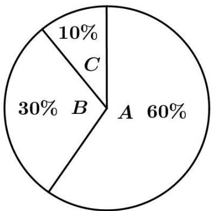

pie

| Category | Percentage (%) |
| :--- | :--- |
| A | 60 |
| B | 30 |
| C | 10 |

对于 A, B, C 三类工种, 职工每人每年保费分别为 a 元、a 元、b 元, 出险后的赔偿金额分别为 100 万元、100 万元、50 万元, 保险公司在开展此项业务过程中的固定支出为每年 20 万元.

(1) 若保险公司要求每年收益的期望不低于保费的 15%, 证明: $153a + 17b \geqslant 4200$ .  
(2) 现有如下两个方案供单位选择: 方案一: 单位不与保险公司合作, 职工不交保险, 出意外后单位自行拿出与保险公司提供的等额赔偿金赔付给出意外的职工, 单位开展这项工作的固定支出为每年 35 万元; 方案二: 单位与保险公司合作, a = 25, b = 60, 单位负责职工保费的 80%, 职工个人负责 20%, 出险后赔偿金由保险公司赔付, 单位无额外专项开支. 根据该单位总支出的差异给出选择合适方案的建议.

5101 (2024·全国·高三专题练习)为考察本科生基本学术规范和基本学术素养,某大学决定对各学院本科毕业论文进行抽检,初步方案是本科毕业论文抽检每年进行一次,抽检对象为上一学年度授予学士学位的论文,初评阶段,每篇论文送3位同行专家进行评审,3位专家中有2位以上(含2位)专家评议意见为“不合格”的毕业论文,将认定为“存在问题毕业论文”.3位专家中有1位专家评议意见为“不合格”,将再送2位同行专家(不同于前3位)进行复评.复评阶段,2位复评专家中有1位以上(含1位)专家评议意见为“不合格”,将认定为“存在问题毕业论文”.每位专家,判定每篇论文“不合格”的概率均为 $p(0<p<1)$ ,且各篇毕业论文是否被判定为“不合格”相互独立.

(1) 若 $p=\frac{1}{2}$ ，求每篇毕业论文被认定为“存在问题毕业论文”的概率是多少；  
(2) 学校拟定每篇论文需要复评的评审费用为 180 元, 不需要复评的评审费用为 90 元, 则每篇论文平均评审费用的最大值是多少?

# 2 题型二: $n$ 次独立重复试验

5102 (2024·全国·高三专题练习)为落实立德树人根本任务,坚持五育并举全面推进素质教育,某学校举行了乒乓球比赛,其中参加男子乒乓球决赛的12名队员来自3个不同校区,三个校区的队员人数分别是3,4,5.本次决赛的比赛赛制采取单循环方式,即每名队员进行11场比赛(每场比赛都采取5局3胜制),最后根据积分选出最后的冠军.积分规则如下:比赛中以3:0或3:1取胜的队员积3分,失败的队员积0分;而在比赛中以3:2取胜的队员积2分,失败的队员的队员积1分.已知第10轮张三对抗李四,设每局比赛张三取胜的概率均为 $p(0<p<1)$ .

(1) 比赛结束后冠亚军 (没有并列) 恰好来自不同校区的概率是多少?  
(2) 第 10 轮比赛中, 记张三 3:1 取胜的概率为 $f(p)$ , 求出 $f(p)$ 的最大值点 $p_{0}$ .

5103 (2024·全国·高三专题练习)甲、乙两人参加一个游戏，该游戏设有奖金256元，谁先赢满

5局, 谁便赢得全部的奖金, 已知每局游戏乙赢的概率为 $p (0 < p < 1)$ , 甲赢的概率为 $1 - p$ , 每局游戏相互独立, 在乙赢了3局甲赢了1局的情况下, 游戏设备出现了故障, 游戏被迫终止, 则奖金应该如何分配才为合理? 有专家提出如下的奖金分配方案: 如果出现无人先赢5局且游戏意外终止的情况, 则甲、乙按照游戏再继续进行下去各自赢得全部奖金的概率之比 $\mathrm{P}_{\text {甲}} : \mathrm{P}_{\text {乙}}$ 分配奖金. 记事件A为“游戏继续进行下去甲获得全部奖金”, 试求当游戏继续进行下去, 甲获得全部奖金的概率 $f(\mathrm{A})$ , 并判断当 $p \geqslant \frac{2}{3}$ 时, 事件A是否为小概率事件, 并说明理由.(注: 若随机事件发生的概率小于0.05, 则称随机事件为小概率事件)

5104 (2024·河南信阳·高三信阳高中校考阶段练习)一款击鼓小游戏的规则如下:每盘游戏都需击鼓三次,每次击鼓要么出现一次音乐,要么不出现音乐;每盘游戏击鼓三次后,出现三次音乐获得150分,出现两次音乐获得100分,出现一次音乐获得50分,没有出现音乐则获得-300分,设备次击鼓出现音乐的概率为 $p\left(0<p<\frac{2}{5}\right)$ .且各次击鼓出现音乐相互独立.

(1) 若一盘游戏中仅出现一次音乐的概率为 $f(p)$ ，求 $f(p)$ 的最大值点 $p_{0}$ ;  
(2) 玩过这款游戏的许多人都发现, 若干盘游戏后, 与最初的分数相比, 分数没有增加反而减少了. 设每盘游戏的得分为随机变量 $\xi$ ; 请运用概率统计的相关知识分析分数减少的原因.

5105 (2024·江苏南通·高三统考开学考试)现有甲、乙两个盒子,甲盒中有3个红球和1个白球,乙盒中有2个红球和2个白球,所有的球除颜色外都相同.某人随机选择一个盒子,并从中随机摸出2个球观察颜色后放回,此过程为一次试验.重复以上试验,直到某次试验中摸出2个红球时,停止试验.

(1) 求一次试验中摸出 2 个红球的概率;  
(2) 在 3 次试验后恰好停止试验的条件下, 求累计摸到 2 个红球的概率.

5106 (2024·福建莆田·高三校考开学考试)甲、乙两名运动员进行五局三胜制的乒乓球比赛，先赢得3局的运动员获胜，并结束比赛。设各局比赛的结果相互独立，每局比赛甲赢的概率为 $\frac{2}{3}$ ，乙赢的概率为 $\frac{1}{3}$ 。

(1) 求甲获胜的概率;   
(2) 设 X 为结束比赛所需要的局数, 求随机变量 X 的分布列及数学期望.

5107 (2024·福建漳州·高三统考开学考试)甲、乙两选手进行一场体育竞技比赛,采用 $2n - 1(n \in \mathbb{N}^{*})$ 局 n 胜制 (当一选手先赢下 n 局比赛时,该选手获胜,比赛结束). 已知每局比赛甲获胜的概率为 p,乙获胜的概率为 1 - p.

(1) 若 $n = 2, p = \frac{1}{2}$ , 比赛结束时的局数为 X, 求 X 的分布列与数学期望;  
(2) 若 n=3 比 n=2 对甲更有利, 求 p 的取值范围.

5108 (2024·全国·高三专题练习)某企业包装产品时,要求把2件优等品和 $n(n \geqslant 2$ ,且 $n \in N^{*}$ )件一等品装在同一个箱子中,质检员从某箱子中摸出两件产品进行检验,若抽取到的两件产品等级相同则该箱产品记为A,否则该箱产品记为B.

(1) 试用含 n 的代数式表示某箱产品抽检被记为 B 的概率 p;  
(2) 设抽检 5 箱产品恰有 3 箱被记为 B 的概率为 $f(p)$ ，求当 n 为何值时， $f(p)$ 取得最大值，并求出最大值.

# 3 题型三:二项分布

5109 (2024·福建莆田·高三校考开学考试)已知随机变量 $\xi$ 服从二项分布 $\xi \sim B\left(4, \frac{1}{3}\right)$ ，则 $P(\xi = 2) =$ \_\_\_\_ .

5110 (2024·江苏常州·高三常州高级中学校考开学考试)设随机变量 X\~B(n,p)，记 $p_{k}=C_{n}^{k}p^{k}(1-p)^{n-k}, k=0,1,2,\cdots,n$ 。在研究 $p_{k}$ 的最大值时，某学习小组发现并证明了如下正确结论：若 $(n+1)p$ 为正整数，当 $k=(n+1)p$ 时， $p_{k}=p_{k-1}$ ，此时这两项概率均为最大值；若 $(n+1)p$ 不为正整数，则当且仅当 k 取 $(n+1)p$ 的整数部分时， $p_{k}$ 取最大值。某同学重复投掷一枚质地均匀的骰子并实时记录点数 1 出现的次数。当投掷到第 20 次时，记录到此时点数 1 出现 4 次，若继续再进行 80 次投掷试验，则在这 100 次投掷试验中，点数 1 总共出现的次数为 \_\_\_\_ 的概率最大。

5111 (2024·黑龙江佳木斯·高三校考开学考试)设随机变量 $\xi \sim \mathrm{B}(2, p)$ ，若 $\mathrm{P}(\xi \geqslant 1) = \frac{5}{9}$ ，则 p 的值为 \_\_\_\_.

5112 (2024·全国·高三对口高考)假设某型号的每一架飞机的引擎在飞行中出现故障的概率为 $1-p(0<p<1)$ ，且各引擎是否有故障是独立的，如有至少50%的引擎能正常运行，飞机就可成功飞行，若使4引擎飞机比2引擎飞机更为安全，则p的取值范围是\_\_\_\_.

5113 (2024·湖南常德·高三常德市一中校考阶段练习)一个袋子中装有N大小相同的球,其中有 $N_{1}$ 个黄球, $N_{2}$ 个白球,从中随机地摸出m个球作为样本,用X表示样本中黄球的个数.

(1) 若采取不放回摸球, 当 $N=6, N_{1}=2, N_{2}=4, m=3$ 时, 求 X 的分布列;  
(2) 若采取有放回摸球, 当 $N=100, N_{1}=50, N_{2}=50, m=10$ 时, 用样本中黄球的比例估计总体黄球的比例, 求误差不超过 0.1 的概率 (用分数表示).

5114 (2024·四川遂宁·高三射洪中学校考阶段练习)“双减”政策执行以来,中学生有更多的时间参加志愿服务和体育锻炼等课后活动.某校为了解学生课后活动的情况,从全校学生中随机选取100人,统计了他们一周参加课后活动的时间(单位:小时),分别位于区间[7,9), [9,11), [11,13), [13,15), [15,17), [17,19],用频率分布直方图表示如下,假设用频率估计概率,且每个学生参加课后活动的时间相互独立.

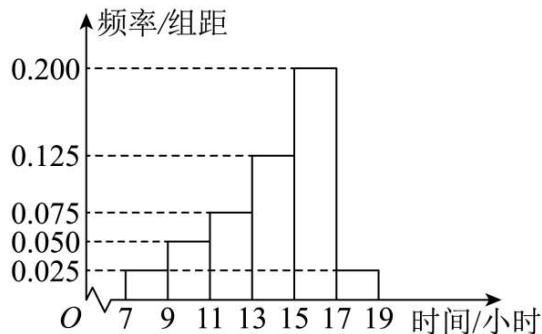

histogram

| 时间/小时 | 频率/组距 |
|---|---|
| 7 | 0.025 |
| 9 | 0.050 |
| 11 | 0.075 |
| 13 | 0.125 |
| 15 | 0.200 |
| 17 | 0.025 |
| 19 | 0.025 |

(1) 估计全校学生一周参加课后活动的时间位于区间 [13,17) 的概率；  
(2)从全校学生中随机选取3人，记 $\xi$ 表示这3人一周参加课后活动的时间在区间[15,17)的人数，求 $\xi$ 的分布列和数学期望 $\mathrm{E}(\xi)$

5115 (2024·广东·高三校联考阶段练习)甲、乙两位同学决定进行一次投篮比赛,他们每次投中的概率均为P,且每次投篮相互独立,经商定共设定5个投篮点,每个投篮点投球一次,确立的比赛规则如下:甲分别在5个投篮点投球,且每投中一次可获得1分;乙按约定的投篮点顺序依次投球,如投中可继续进行下一次投篮,如没有投中,投篮中止,且每投中一次可获得2分.按累计得分高低确定胜负.

(1) 若乙得 6 分的概率 $\frac{1 - p}{8}$ , 求 $p$ ;  
(2) 由 (1) 问中求得的 $p$ 值, 判断甲、乙两位选手谁获胜的可能性大?

5116 (2024·浙江·高三校联考阶段练习)艾伦·麦席森·图灵提出的图灵测试,指测试者与被测试者在隔开的情况下,通过一些装置(如键盘)向被测试者随意提问.已知在某一轮图灵测试中有甲、乙、丙、丁4名测试者,每名测试者向一台机器(记为A)和一个人(记为B)各提出一个问题,并根据机器A和人的作答来判断谁是机器,若机器A能让至少一半的测试者产生误判,则机器A通过本轮的图灵测试.假设每名测试者提问相互独立,且甲、乙、丙、丁四人之间的提问互不相同,而每名测试者有60%的可能性会向A和B问同一个题.当同一名测试者提出的两个问题相同时,机器A被误判的可能性为10%,当同一名测试者提的两个问题不相同时,机器A被误判的可能性为35%.

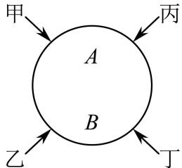

flowchart

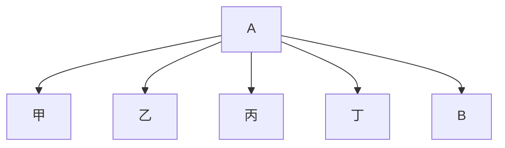

(1) 当回答一名测试者的问题时, 求机器 A 被误判的概率;  
(2) 按现有设置程序, 求机器 A 通过本轮图灵测试的概率.

5117 (2024·广西玉林·高三校联考开学考试)某医药企业使用新技术对某款血液试剂进行试生产.

(1) 在试产初期, 该款血液试剂的 I 批次生产有四道工序, 前三道工序的生产互不影响, 第四道是检测评估工序, 包括智能自动检测与人工抽检. 已知该款血液试剂在生产中, 经过前三道工序后的次品率为 $\frac{1}{20}$ . 第四道工序中智能自动检测为次品的血液试剂会被自动淘汰, 合格的血液试剂进入流水线并由工人进行抽查检验.

已知批次I的血液试剂智能自动检测显示合格率为98%，求工人在流水线进行人工抽检时，抽检一个血液试剂恰为合格品的概率；

(2) 已知切比雪夫不等式: 设随机变量 X 的期望为 E(X), 方差为 D(X), 则对任意 $\varepsilon > 0$ , 均有 P(|X - E(X)| ≥ ε) ≤ $\frac{D(X)}{\varepsilon^{2}}$ . 药厂宣称该血液试剂对检测某种疾病的有效率为 80%, 现随机选择了 100 份血液样本, 使用该血液试剂进行检测, 每份血液样本检测结果相互独立, 显示有效的份数不超过 60 份, 请结合切比雪夫不等式, 通过计算说明该企业的宣传内容是否真实可信.

5118 (2024·全国·高三专题练习)袋中有8个白球、2个黑球，从中随机地连续抽取3次，每次取1个球.求：

(1)有放回抽样时,取到黑球的个数X的分布列、数学期望和方差;  
(2) 不放回抽样时, 取到黑球的个数 Y 的分布列、数学期望和方差.

5119 (2024·吉林长春·高三长春外国语学校校考开学考试)第四届应急管理普法知识竞赛线上启动仪式在3月21日上午举行,为普及应急管理知识,某高校开展了“应急管理普法知识竞赛”活动,现从参加该竞赛的学生中随机抽取100名,统计他们的成绩(满分100分),其中成绩不低于80分的学生被评为“普法王者”,将数据整理后绘制成如图所示的频率分

布直方图.

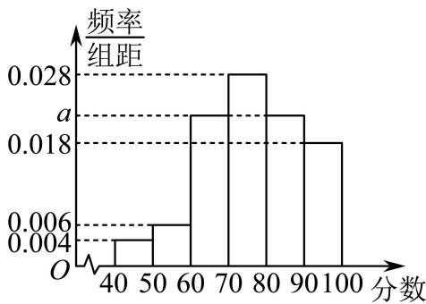

histogram

| 分数 | 频率/组距 |
| :--- | :--- |
| 40-50 | 0.004 |
| 50-60 | 0.006 |
| 60-70 | 0.018 |
| 70-80 | 0.028 |
| 80-90 | 0.018 |
| 90-100 | 0.018 |

(1) 若该校参赛人数达 20000 人, 请估计其中有多少名“普法王者”;  
(2) 随机从该高校参加竞赛的学生中抽取 3 名学生, 记其中“普法王者”人数为 $\xi$ , 用频率估计概率, 请你写出 $\xi$ 的分布列.

5120 (2024·四川攀枝花·统考三模)某企业从生产的一批产品中抽取100个作为样本,测量这些产品的一项质量指标值,由测量结果制成如图所示的频率分布直方图.

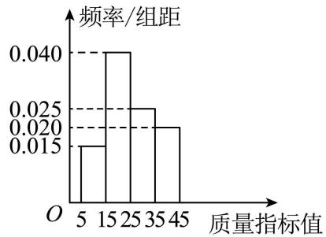

histogram

| 质量指标值 | 频率/组距 |
| :--- | :--- |
| 5-15 | 0.015 |
| 15-25 | 0.040 |
| 25-35 | 0.025 |
| 35-45 | 0.020 |

(1) 求这 100 件产品质量指标值的样本平均数 $\bar{x}$ (同一组数据用该区间的中点值作代表) 和中位数;  
(2) 已知某用户从该企业购买了 3 件该产品, 用 X 表示这 3 件产品中质量指标值位于 [15,25) 内的产品件数, 用频率代替概率, 求 X 的分布列和数学期望.

# 4 题型四:超几何分布

5121 (2024·全国·高三对口高考)厂家在产品出厂前,需对产品做检验,厂家将一批产品发给商家时,商家按合同规定也需随机抽取一定数量的产品做检验,以决定是否接收这批产品.若厂家发给商家20件产品,其中有3件不合格,按合同规定该商家从中任取2件,都进行检验,只有2件都合格时才接收这批产品,否则拒收.则该商家拒收这批产品的概率是\_\_\_\_.  
5122 (2024·山东枣庄·统考二模)一个袋子中有100个大小相同的球,其中有40个黄球,60个白球.采取不放回摸球,从中随机摸出22个球作为样本,用X表示样本中黄球的个数.当 $P(X=k)$ 最大时, $E(X)+k=$ \_\_\_\_.  
5123 (2024·上海浦东新·高三上海市建平中学校考阶段练习)莫高窟坐落在甘肃的敦煌,它是世界上现存规模最大、内容最丰富的佛教艺术胜地,每年都会吸引来自世界各地的游客参观旅游.已知购买莫高窟正常参观套票可以参观8个开放洞窟,在这8个洞窟中莫高窟九层楼96号窟、莫高窟三层楼16号窟、藏经洞17号窟被誉为最值得参观的洞窟.根据疫情防控的需要,莫高窟改为极速参观模式,游客需从套票包含的开放洞窟中随机选择4个进行参观,所有选择中至少包含2个最值得参观洞窟的概率是\_\_\_\_.  
5124 (2024·高三课时练习)袋中装有10个除颜色外完全一样的黑球和白球,已知从袋中任意

摸出2个球,至少得到1个白球的概率是 $\frac{7}{9}$ . 现从该袋中任意摸出3个球,记得到白球的个数为X,则 $E(X)=$ \_\_\_\_.

5125 (2024·陕西商洛·陕西省丹凤中学校考模拟预测)某乒乓球队训练教官为了检验学员某项技能的水平,随机抽取100名学员进行测试,并根据该项技能的评价指标,按[60,65), [65,70), [70,75), [75,80), [80,85), [85,90), [90,95), [95,100]分成8组,得到如图所示的频率分布直方图.

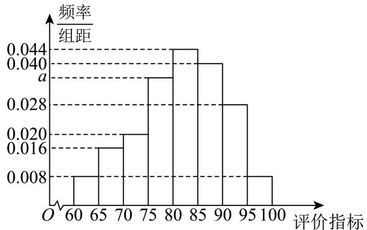

histogram

| 评价指标 | 频率/组距 |
| -------- | --------- |
| 60-65    | 0.008     |
| 65-70    | 0.016     |
| 70-75    | 0.020     |
| 75-80    | 0.035     |
| 80-85    | 0.044     |
| 85-90    | 0.040     |
| 90-95    | 0.028     |
| 95-100   | 0.008     |

(1) 求 a 的值, 并估计该项技能的评价指标的中位数 (精确到 0.1);  
(2) 若采用分层抽样的方法从评价指标在 [70,75) 和 [85,90) 内的学员中随机抽取 12 名，再从这 12 名学员中随机抽取 5 名学员，记抽取到学员的该项技能的评价指标在 [70,75) 内的学员人数为 X，求 X 的分布列与数学期望.

5126 (2024·湖南益阳·高三统考阶段练习)某公司生产一种电子产品,每批产品进入市场之前,需要对其进行检测,现从某批产品中随机抽取9箱进行检测,其中有5箱为一等品.

(1) 若从这 9 箱产品中随机抽取 3 箱, 求至少有 2 箱是一等品的概率;  
(2) 若从这 9 箱产品中随机抽取 3 箱, 记 $\xi$ 表示抽到一等品的箱数, 求 $\xi$ 的分布列和期望.

5127 (2024·陕西·高三校联考阶段练习)人工智能(AI)是当今科技领域最热门的话题之一,某学校组织学生参加以人工智能(AI)为主题的知识竞赛,为了解该校学生在该知识竞赛中的情况,现采用随机抽样的方法抽取了600名学生进行调查,分数分布在450\~950分之间,根据调查的结果绘制的学生分数频率分布直方图如图所示.将分数不低于850分的学生称为“最佳选手”.

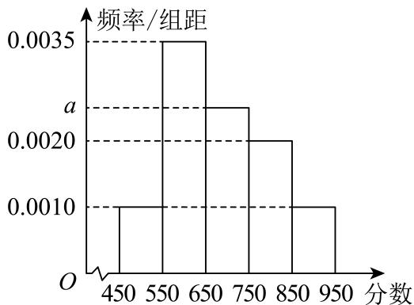

histogram

| 分数 | 频率/组距 |
| ---- | --------- |
| 450  | 0.0010    |
| 550  | 0.0035    |
| 650  | 0.0020    |
| 750  | 0.0020    |
| 850  | 0.0010    |
| 950  | 0.0010    |

(1) 求频率分布直方图中 a 的值, 并估计该校学生分数的中位数;  
(2) 现采用分层抽样的方法从分数落在 [650,750)，[850,950] 内的两组学生中抽取 7 人，再从这 7 人中随机抽取 3 人，记被抽取的 3 名学生中属于“最佳选手”的学生人数为随机变量 X，求 X 的分布列及数学期望.

5128 (2024·河北衡水·河北衡水中学校考一模)温室是以采光覆盖材料作为全部或部分围护结构材料,具有透光、避雨、保温、控温等功能,可在冬季或其他不适宜露地植物生长的季节供栽培植物的建筑,而温室蔬菜种植技术是一种比较常见的技术,它具有较好的保温性能,使人们在任何时间都可吃到反季节的蔬菜,深受大众喜爱.温室蔬菜生长和蔬菜产品卫生质量要求的温室内土壤、灌溉水、环境空气等环境质量指标,其温室蔬菜产地环境质量等级划定如表所示.

<table><tr><td>环境质量等级</td><td>土壤各单项或综合质量指数</td><td>灌溉水各单项或综合质量指数</td><td>环境空气各单项或综合质量指数</td><td>等级名称</td></tr><tr><td>1</td><td> $\leqslant 0.7$ </td><td> $\leqslant 0.5$ </td><td> $\leqslant 0.6$ </td><td>清洁</td></tr><tr><td>2</td><td>0.7~1.0</td><td>0.5~1.0</td><td>0.6~1.0</td><td>尚清洁</td></tr><tr><td>3</td><td>&gt;1.0</td><td>&gt;1.0</td><td>&gt;1.0</td><td>超标</td></tr></table>

各环境要素的综合质量指数超标,灌溉水、环境空气可认为污染,土壤则应做进一步调研,若确对其所影响的植物(生长发育、可食部分超标或用作饮料部分超标)或周围环境(地下水、地表水、大气等)有危害,方能确定为污染.某乡政府计划对所管辖的甲、乙、丙、丁、戊、己、庚、辛,共8个村发展温室蔬菜种植,对各村试验温室蔬菜环境产地质量监测得到的相关数据如下:

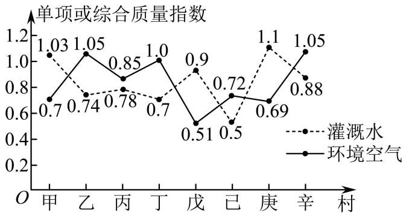

line

| 村 | 灌溉水 | 环境空气 |
| --- | --- | --- |
| 甲 | 1.03 | 0.7 |
| 乙 | 0.74 | 1.05 |
| 丙 | 0.78 | 0.85 |
| 丁 | 0.7 | 1.0 |
| 戊 | 0.9 | 0.51 |
| 己 | 0.5 | 0.72 |
| 庚 | 1.1 | 0.69 |
| 辛 | 1.05 | 0.88 |

(1) 若从这 8 个村中随机抽取 2 个进行调查, 求抽取的 2 个村应对土壤做进一步调研的概率;  
(2) 现有一技术人员在这 8 个村中随机选取 3 个进行技术指导, 记 $\xi$ 为技术员选中村的环境空气等级为尚清洁的个数, 求 $\xi$ 的分布列和数学期望.

# 5 题型五:二项分布与超几何分布的综合应用

5129 (2024·全国·高三专题练习) 2020 年五一期间,银泰百货举办了一次有奖促销活动,消费每超过 600 元 (含 600 元),均可抽奖一次,抽奖方案有两种,顾客只能选择其中的一种.方案一:从装有 10 个形状、大小完全相同的小球 (其中红球 2 个,白球 1 个,黑球 7 个) 的抽奖盒中,一次性摸出 3 个球其中奖规则为:若摸到 2 个红球和 1 个白球,享受免单优惠;若摸出 2 个红球和 1 个黑球则打 5 折;若摸出 1 个白球 2 个黑球,则打 7 折;其余情况不打折.方案二:从装有 10 个形状、大小完全相同的小球 (其中红球 3 个,黑球 7 个) 的抽奖盒中,有放回每次摸取 1 球,连摸 3 次,每摸到 1 次红球,立减 200 元.

(1) 若两个顾客均分别消费了 600 元, 且均选择抽奖方案一, 试求两位顾客均享受免单优惠的概率;  
(2) 若某顾客消费恰好满 1000 元, 试从概率角度比较该顾客选择哪一种抽奖方案更合算?

5130 (2024·全国·高三专题练习) 4月23日是联合国教科文组织确定的“世界读书日”。为了解某地区高一学生阅读时间的分配情况,从该地区随机抽取了500名高一学生进行在线调查,得到了这500名学生的日平均阅读时间(单位:小时),并将样本数据分成[0,2], (2,4], (4,6], (6,8], (8,10], (10,12], (12,14], (14,16], (16,18]九组,绘制成如图所示的频率分布直方图.

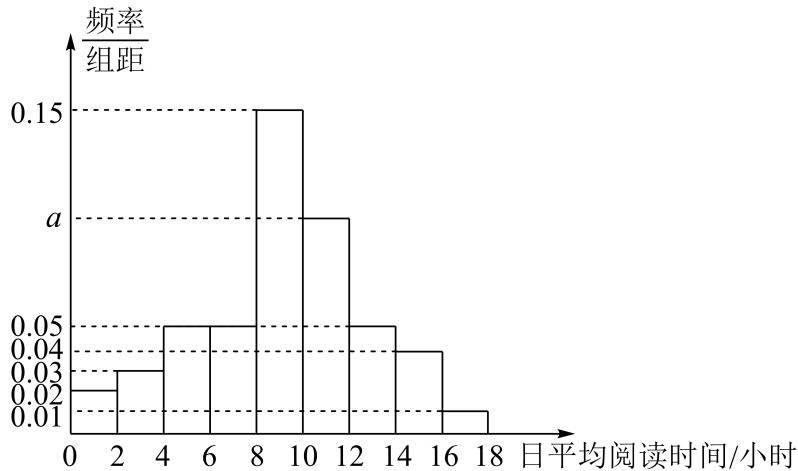

histogram

| 日平均阅读时间/小时 | 频率/组距 |
| ------------------- | --------- |
| 0-2                 | 0.02      |
| 2-4                 | 0.03      |
| 4-6                 | 0.05      |
| 6-8                 | 0.15      |
| 8-10                | 0.10      |
| 10-12               | 0.05      |
| 12-14               | 0.04      |
| 14-16               | 0.02      |
| 16-18               | 0.01      |

(1) 从这 500 名学生中随机抽取一人, 日平均阅读时间在 $(10,12]$ 内的概率;  
(2) 为进一步了解这 500 名学生数字媒体阅读时间和纸质图书阅读时间的分配情况, 从日平均阅读时间在 (12,14], (14,16], (16,18] 三组内的学生中, 采用分层抽样的方法抽取了 10 人, 现从这 10 人中随机抽取 3 人, 记日平均阅读时间在 (14,16] 内的学生人数为 X, 求 X 的分布列和数学期望;  
(3) 以样本的频率估计概率,从该地区所有高一学生中随机抽取10名学生,用 $\mathrm{P}(k)$ 表示这10名学生中恰有k名学生日平均阅读时间在(8,12]内的概率,其中 $k=0,1,2,\cdots,10$ . 当 $\mathrm{P}(k)$ 最大时,写出k的值. (只需写出结论)

5131 (2024·全国·镇海中学校联考模拟预测)某学校从全体师生中随机抽取30位男生、30位女生、12位教师一起参加社会实践活动.

(1) 假设 30 位男生身高均不相同, 记其身高的第 80 百分位数为 $\alpha$ , 从学校全体男生中随机选取 3 人, 记 X 为 3 人中身高不超过 $\alpha$ 的人数, 以频率估计概率求 X 的分布列及数学期望;  
(2) 从参加社会实践活动的 72 人中一次性随机选出 30 位, 记被选出的人中恰好有 $k(k=1,2,\cdots,30)$ 个男生的概率为 $\mathrm{P}(k)$ , 求使得 $\mathrm{P}(k)$ 取得最大值的 k 的值.

5132 (2024·福建福州·福州三中校考模拟预测)某市为了传承发展中华优秀传统文化,组织该市中学生进行了一次数学知识竞赛.为了解学生对相关知识的掌握情况,随机抽取100名学生的竞赛成绩(单位:分),并以此为样本绘制了如下频率分布直方图.

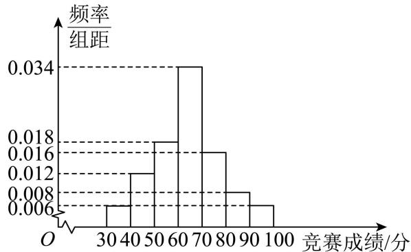

histogram

| 竞赛成绩/分 | 频率/组距 |
| :--- | :--- |
| 30-40 | 0.006 |
| 40-50 | 0.012 |
| 50-60 | 0.018 |
| 60-70 | 0.034 |
| 70-80 | 0.016 |
| 80-90 | 0.008 |
| 90-100 | 0.006 |

(1) 求该 100 名学生竞赛成绩的中位数；(结果保留整数)  
(2) 从竞赛成绩在 $(40,50]$ , $(50,60]$ 的两组的学生中, 采用分层抽样的方法抽取了 10 人, 现从这 10 人中随机抽取 3 人, 记竞赛成绩在 $(40,50]$ 的学生人数为 X, 求 X 的分布列和数学期望 E(X);  
(3) 以样本的频率估计概率, 从 [30,50] 随机抽取 20 名学生, 用 P(k) 表示这 20 名学生中恰有 k 名学生竞赛成绩在 [30,40] 内的概率, 其中 $k=0,1,2,\cdots,20$ . 当 P(k) 最大时, 求 k.

5133 (2024·甘肃·统考一模)“稻草很轻,但是他迎着风仍然坚韧,这就是生命的力量,意志的力量”“当你为未来付出踏踏实实努力的时候,那些你觉得看不到的人和遇不到的风景都终将在你生命里出现”……当读到这些话时,你会切身体会到读书破万卷给予我们的力量.为了解某普通高中学生的阅读时间,从该校随机抽取了800名学生进行调查,得到了这800名学生一周的平均阅读时间(单位:小时),并将样本数据分成九组,绘制成如图所示的频率分布直方图.

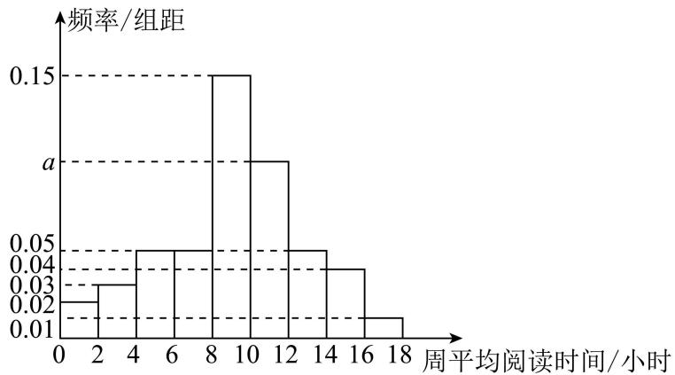

histogram

| 周平均阅读时间/小时 | 频率/组距 |
|---|---|
| 0-2 | 0.02 |
| 2-4 | 0.03 |
| 4-6 | 0.05 |
| 6-8 | 0.15 |
| 8-10 | 0.10 |
| 10-12 | 0.05 |
| 12-14 | 0.04 |
| 14-16 | 0.04 |
| 16-18 | 0.01 |

(1) 求 $a$ 的值；  
(2)为进一步了解这800名学生阅读时间的分配情况,从周平均阅读时间在(12,14], (14,16], (16,18]三组内的学生中,采用分层抽样的方法抽取了10人,现从这10人中随机抽取3人,记周平均阅读时间在(14,16]内的学生人数为X,求X的分布列和数学期望;  
(3) 以样本的频率估计概率, 从该校所有学生中随机抽取 20 名学生, 用 P(k) 表示这 20 名学生中恰有 k 名学生周平均阅读时间在 (8,12] 内的概率, 其中 $k=0,1,2,\cdots,20$ . 当 P(k) 最大时, 写出 k 的值.

5134 (2024·内蒙古·高三校考期末)电视传媒公司为了解某地区电视观众对某类体育节目的收视情况,随机抽取了100名观众进行调查.如图是根据调查结果绘制的观众日均收看该体育节目时间的频率分布直方图:将日均收看该体育节目时间不低于40分钟的观众称为“体育迷”.将上述调查所得到的频率视为概率.

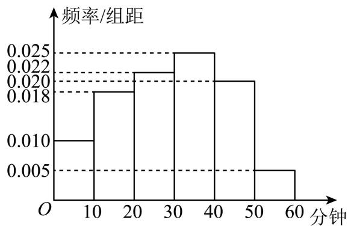

histogram

| 分钟 | 频率/组距 |
| :--- | :--- |
| 0-10 | 0.010 |
| 10-20 | 0.019 |
| 20-30 | 0.021 |
| 30-40 | 0.025 |
| 40-50 | 0.020 |
| 50-60 | 0.005 |

(1) 现在从该地区大量电视观众中,采用随机抽样方法每次抽取 1 名观众,抽取 3 次,记被抽取的3名观众中的“体育迷”人数为X．若每次抽取的结果是相互独立的，求X的分布列及数学期望.

(2)用分层抽样的方法从这100名“体育迷”中抽取8名观众,再从抽取的抽取8名观众中随机抽取3名,Y表示抽取的是“体育迷”的人数,求Y的分布列.

# 6 题型六: 正态密度函数

5135 (2024·全国·高三竞赛)已知两个连续型随机变量X，Y满足条件 $2X+Y=2$ ，且Y服从标准正态分布．设函数 $F(x)=P(|X-2x|>1)$ ，则 $F(x)$ 的图像大致为（）

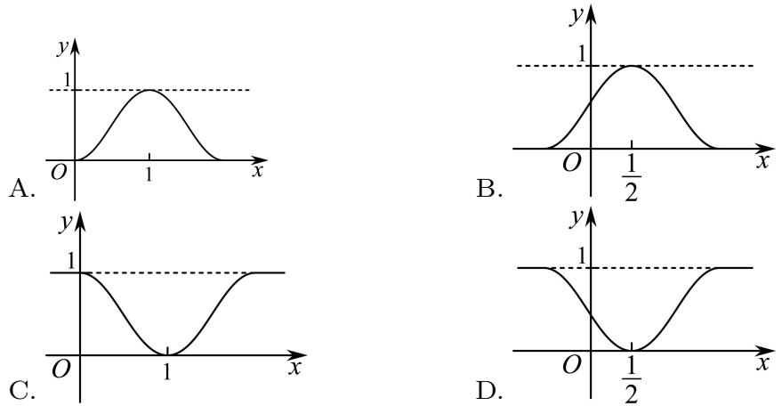

5136 (2024·全国·高三专题练习)设随机变量X的正态分布密度函数为 $f(x)=\frac{1}{2\sqrt{\pi}}\cdot\mathrm{e}^{-\frac{(x+3)^{2}}{4}}$ ， $x\in(-\infty,+\infty)$ ，则参数 $\mu,\sigma$ 的值分别是()

A. $\mu = 3, \sigma = 2$

B. $\mu = -3, \sigma = 2$

C. $\mu = 3, \sigma = \sqrt{2}$

D. $\mu = -3, \sigma = \sqrt{2}$

5137 (2024·河南信阳·高三河南宋基信阳实验中学校考开学考试)某市期末教学质量检测，甲、乙、丙三科考试成绩近似服从正态分布，则由如图曲线可得下列说法中正确的是（）

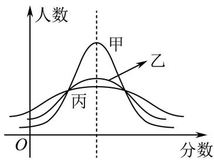

line

| 分数 | 甲   | 乙   |
|------|------|------|
| 0    | 0    | 0    |
| 0.35 | 1    | 0.2  |
| 0.6  | 0.8  | 0.4  |
| 0.9  | 0.5  | 0.6  |
| 1.2  | 0.3  | 0.7  |
| 1.5  | 0.2  | 0.8  |
| 1.8  | 0.1  | 0.9  |
| 2.1  | 0.05 | 1.0  |
| 2.4  | 0.02 | 0.95 |
| 2.7  | 0.01 | 0.9  |
| 3.0  | 0.005| 0.85 |
| 3.3  | 0.002| 0.8  |
| 3.6  | 0.001| 0.75 |
| 3.9  | 0.0005| 0.7 |
| 4.2  | 0.0002| 0.65 |
| 4.5  | 0.0001| 0.6 |
| 4.8  | 0.00005| 0.55 |
| 5.1  | 0.00002| 0.5 |
| 5.4  | 0.00001| 0.45 |
| 5.7  | 0.000005| 0.4 |
| 6.0  | 0.000002| 0.35 |
| 6.3  | 0.000001| 0.3 |
| 6.6  | 0.0000005| 0.25 |
| 6.9  | 0.0000002| 0.2 |
| 7.2  | 0.0000001| 0.15 |
| 7.5  | 0.00000005| 0.1 |
| 7.8  | 0.00000002| 0.05 |
| 8.1  | 0.00000001| 0.02 |
| 8.4  | 0.000000005| 0.01 |
| 8.7  | 0.000000002| 0.01 |
| 9.0  | 0.000000001| 0.01 |
| 9.3  | 0.000000001| 0.01 |
| 9.6  | 0.000000001| 0.01 |
| 9.9  | 0.000000001| 0.01 |
| 12.2 | -    | -    |

A. 甲学科总体的均值最小

B. 乙学科总体的方差及均值都居中

C. 丙学科总体的方差最大

D. 甲、乙、丙的总体的均值不相同

5138 (2024·全国·高三专题练习)已知连续型随机变量 $X_{i}\sim N(u_{i},\sigma_{i}^{2})(i=1,2,3)$ ，其正态曲线如图所示，则下列结论正确的是()

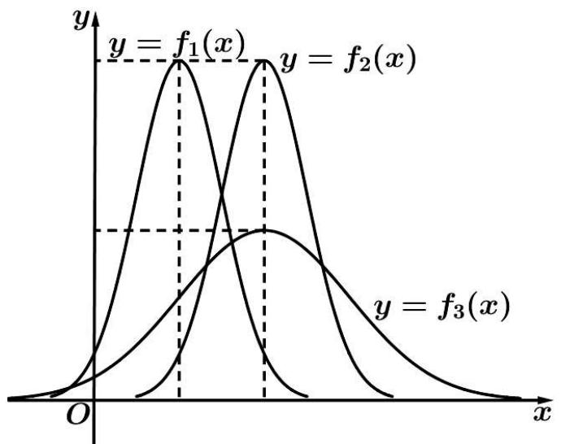

line

| x     | y = f₁(x) | y = f₂(x) | y = f₃(x) |
|-------|-----------|-----------|-----------|
| 0     | 0         | 0         | 0         |
| π/2   | ~1.5      | ~1.8      | ~0.8      |
| π/4   | ~0.5      | ~1.2      | ~0.6      |
| π/6   | 0         | 0         | ~0.3      |
| π/8   | 0         | 0         | ~0.1      |
| π       | 0         | 0         | 0         |

A. $\mathrm{P}(\mathrm{X}_{1}\leqslant\mu_{2})<\mathrm{P}(\mathrm{X}_{2}\leqslant\mu_{1})$   
B. $\mathrm{P}(\mathrm{X}_2\geqslant \mu_2) > \mathrm{P}(\mathrm{X}_3\geqslant \mu_3)$   
C. $\mathrm{P}(\mathrm{X}_{1}\leqslant\mu_{2})<\mathrm{P}(\mathrm{X}_{2}\leqslant\mu_{3})$   
D. $\mathrm{P}(\mu_{i}-2\sigma_{i}\leqslant\mathrm{X}_{i}\leqslant\mu_{i}+2\sigma_{i})=\mathrm{P}(\mu_{i+1}-2\sigma_{i+1}\leqslant\mathrm{X}_{i+1}\leqslant\mu_{i+1}+2\sigma_{i+1})(\mathrm{i}=1,2)$

5139 (2024·上海浦东新·高三上海市建平中学校考开学考试)某物理量的测量结果服从正态分布 $N(10,\sigma^{2})$ ，下列结论中不正确的是()

A. $\sigma$ 越大, 该物理量在一次测量中在 (9.9,10.1) 的概率越大  
B. $\sigma$ 越小, 该物理量在一次测量中大于 10 的概率为 0.5  
C. $\sigma$ 越大,该物理量在一次测量中小于9.99与大于10.01的概率相等  
D. $\sigma$ 越小,该物理量在一次测量中落在 $(9.9,10.2)$ 与落在 $(9.8,10.1)$ 的概率相等

# 题型七: 正态曲线的性质

5140 (2024·贵州贵阳·高三贵阳一中校考阶段练习)若随机变量 $X \sim N(10, 2^{2})$ ，则下列选项错误的是（）

A. $P(X \geqslant 10) = 0.5$

B. $\mathrm{P}(\mathrm{X}\leqslant 8) + \mathrm{P}(\mathrm{X}\leqslant 12) = 1$

C. $P(8 \leqslant X \leqslant 12) = 2P(8 \leqslant X \leqslant 10)$

D. $D(2X+1)=8$

5141 (2024·湖北荆州·高三石首市第一中学校考阶段练习)某校高二年级1600名学生参加期末统考,已知数学成绩X\~N(100, $\sigma^{2}$ )(满分150分). 统计结果显示数学考试成绩在80分到120分之间的人数约为总人数的 $\frac{3}{4}$ . 则此次统考中数学成绩不低于120分的学生人数约为()

A. 80

B. 100

C. 120

D. 200

5142 (2024·吉林长春·高三长春外国语学校校考开学考试)随机变量X服从正态分布X～N(10, $\sigma^{2}$ ),P(X>12)=m,P(8≤X≤10)=n,则 $\frac{1}{2m}+\frac{1}{n}$ 的最小值为()

A. $3 + 4\sqrt{2}$

B. $6 + 2\sqrt{2}$

C. $6 + 4\sqrt{2}$

D. $3 + 2\sqrt{2}$

5143 (2024·江苏南通·高三海安高级中学校考阶段练习)南沿江高铁即将开通,某小区居民前往高铁站有①,②两条路线可走,路线①穿过市区,路程较短但交通拥挤,经测算所需时间(单位为分钟)服从正态分布N(50,100);路线②骑共享单车到地铁站,乘地铁前往,路程长,但意外阻塞较少,经测算所需时间(单位为分钟)服从正态分布N(60,16).该小区的甲乙两人分别有70分钟与64分钟可用,要使两人按时到达车站的可能性更大,则甲乙选择的路线分别为()

A. ①、①

B. ①、②

C. ②、①

D. ②、②

5144 (2024·全国·高三专题练习)已知随机变量X服从正态分布 $N(\mu,\sigma^{2})$ ，下列四个命题：

甲： $P(X>m+1)>P(X<m-2)$ ; 乙： $P(X\leqslant m)=0.5$ ;

丙： $\mathrm{P}(\mathrm{X} \leqslant m) = 0.5$ ; 丁： $\mathrm{P}(m - 1 < \mathrm{X} < m) < \mathrm{P}(m + 1 < \mathrm{X} < m + 2)$

如果有且只有一个是假命题,那么该命题是 ( )

A. 甲

B. 乙

C. 丙

D. 丁

5145 (2024·全国·模拟预测)已知随机变量 $X_{1}\sim N\left(\mu_{1},\frac{1}{4}\right),X_{2}\sim N\left(\mu_{2},\frac{1}{9}\right)$ ，则()

A. $P(|X_{1}-\mu_{1}|<1)<P(|X_{2}-\mu_{2}|<1)$   
B. $\mathrm{P}(|\mathrm{X}_1 - \mu_1| < 1) > \mathrm{P}(|\mathrm{X}_2 - \mu_2| < 1)$   
C. $\mathrm{P}\left(|\mathrm{X}_{1}-\mu_{1}|<\frac{1}{2}\right)<\mathrm{P}\left(|\mathrm{X}_{2}-\mu_{2}|<\frac{1}{3}\right)$   
D. $\mathrm{P}\left(\left|\mathrm{X}_{1}-\mu_{1}\right|<\frac{1}{2}\right)>\mathrm{P}\left(\left|\mathrm{X}_{2}-\mu_{2}\right|<\frac{1}{3}\right)$

# 8 题型八:正态曲线概率的计算

5146 (2024·全国·高三对口高考)设 $\xi\sim\mathrm{N}(0,1)$ ，且 $\mathrm{P}(\xi<1.623)=p$ ，那么 $\mathrm{P}(-1.623\leqslant\xi<0)$ 的值是（）

A. p

B. -p

C. $p - 0.5$

D. 0.5 - p

5147 (2024·重庆·高三校联考开学考试)已知随机变量 $X \sim B(2, p)$ ，随机变量 $Y \sim N(2, \sigma^2)$ ，若 $P(X \leqslant 1) = 0.36, P(Y < 4) = p$ ，则 $P(0 < Y < 2) =$ （）

A. 0.1

B. 0.2

C. 0.3

D. 0.4

5148 (2024·广东·统考模拟预测)研究人员采取普查的方式调查某市国企普通职工的收入情况,记被调查的职工的收入为X,统计分析可知X\~N(4200,62500),则

$$
\mathrm{P} (3 4 5 0 \leqslant \mathrm{X} \leqslant 4 4 5 0) = \tag {（}
$$

参考数据: 若 $\xi \sim \mathrm{N}(\mu, \sigma^{2})$ ，则 $\mathrm{P}(\mu - \sigma \leqslant \xi \leqslant \mu + \sigma) = 0.6827$ ， $\mathrm{P}(\mu - 2\sigma \leqslant \xi \leqslant \mu + 2\sigma) = 0.9545$ ， $\mathrm{P}(\mu - 3\sigma \leqslant \xi \leqslant \mu + 3\sigma) = 0.9973$ .

A. 0.8186

B. 0.9759

C. 0.74

D. 0.84

5149 (2024·河北·统考模拟预测)山东烟台某地种植的苹果按果径X(单位: mm)的大小分级, 其中 $X \in (80, 100]$ 的苹果为特级, 且该地种植的苹果果径 $X \sim N(85, 25)$ . 若在某一次采摘中, 该地果农采摘了2万个苹果, 则其中特级苹果的个数约为() (参考数据: $X \sim N(\mu, \sigma^2)$ , $P(\mu - \sigma < X \leqslant \mu + \sigma) \approx 0.6827$ . $P(\mu - 2\sigma < X \leqslant \mu + 2\sigma) \approx 0.9545$ , $P(\mu - 3\sigma < X \leqslant \mu + 3\sigma) \approx 0.9973$ )

A. 3000

B. 13654

C. 16800

D. 19946

5150 (2024·西藏林芝·校考模拟预测)据统计,在某次联考中,考生数学单科分数X服从正态分布N(90,20²),考生共50000人,估计数学单科分数在130\~150分的学生人数约为

( )

(附:若随机变量 $\xi$ 服从正态分布 $\mathrm{N}(\mu,\sigma^{2})$ ，则 $\mathrm{P}(\mu-\sigma<\xi\leqslant\mu+\sigma)\approx0.6827$ ，

$$
\mathrm{P} (\mu - 2 \sigma <   \xi \leqslant \mu + 2 \sigma) \approx 0. 9 5 4 5, \mathrm{P} (\mu - 3 \sigma <   \xi \leqslant \mu + 3 \sigma) \approx 0. 9 9 7 3)
$$

A. 1070

B. 2140

C. 4280

D. 6795

5151 (2024·全国·高三专题练习)已知 $\mathrm{X}\sim \mathrm{N}(\mu ,\sigma^2)$ ，则 $\mathrm{P}(\mu -\sigma \leqslant \mathrm{X}\leqslant \mu +\sigma)\approx 0.6827$

$P(\mu-2\sigma \leqslant X \leqslant \mu+2\sigma) \approx 0.9545, P(\mu-3\sigma \leqslant X \leqslant \mu+3\sigma) \approx 0.9973.$ 今有一批数量庞大的零件. 假设这批零件的某项质量指标引单位: 毫米) 服从正态分布 $N(5.40, 0.05^{2})$ , 现从中随机抽取 N 个, 这 N 个零件中恰有 K 个的质量指标 $\xi$ 位于区间 (5.35, 5.55). 若 K=45, 试以使得 $P(K=45)$ 最大的 N 值作为 N 的估计值, 则 N 为 ( )

A. 45

B. 53

C. 54

D. 90

5152 (2024·全国·高三专题练习)法国数学家庞加莱是个喜欢吃面包的人,他每天都会到同一家面包店购买一个面包。该面包店的面包师声称自己所出售的面包的平均质量是 $1000g$ ,上下浮动不超过 $50g$ 。这句话用数学语言来表达就是:每个面包的质量服从期望为 $1000g$ ,标准差为 $50g$ 的正态分布。假设面包师的说法是真实的,记随机购买一个面包的质量为 $X$ ,若 $X \sim N(\mu, \sigma^2)$ ,则买一个面包的质量大于 $900g$ 的概率为 ( )

(附:①随机变量 $\eta$ 服从正态分布 $\mathrm{N}(\mu,\sigma^{2})$ ，则 $(\mu-\sigma\leqslant\eta\leqslant\mu+\sigma)=0.6827,\mathrm{P}(\mu-2\sigma\leqslant\eta\leqslant\mu+2\sigma)=0.9545,\mathrm{P}(\mu-3\sigma\leqslant\eta\leqslant\mu+3\sigma)=0.9973;$ )

A. 0.84135

B. 0.97225

C. 0.97725

D. 0.99865

5153 (2024·全国·高三专题练习)某小区有1000户居民,各户每月的用电量近似服从正态分布N(300,100),则用电量在320度以上的居民户数估计约为() (参考数据:若随机变量 $\xi$ 服从正态分布N( $\mu,\sigma^{2}$ ),则P( $\mu-\sigma<\xi\leqslant\mu+\sigma$ )≈0.6827,P( $\mu-2\sigma<\xi\leqslant\mu+2\sigma$ )≈0.9545,P( $\mu-3\sigma<\xi\leqslant\mu+3\sigma$ )≈0.9973)

A. 17

B. 23

C. 34

D. 46

5154 (2024·宁夏银川·六盘山高级中学校考三模)已知函数 $f(x) = \begin{cases} \log_2 x, & x \geqslant 1, \\ x + \xi, & x < 1, \end{cases}$ 在 $\mathbf{R}$ 上单调递增的概率为 $\frac{1}{2}$ , 且随机变量 $\xi \sim \mathrm{N}(u,1)$ . 则 $\mathrm{P}(0 < \xi \leqslant 1)$ 等于 ( )

[附:若 $\xi\sim\mathrm{N}(\mu,\sigma^{2})$ ，则 $\mathrm{P}(\mu-\sigma\leqslant x\leqslant\mu+\sigma)=0.6827$ ，

$$
\mathrm{P} (\mu - 2 \sigma \leqslant x \leqslant \mu + 2 \sigma) = 0. 9 5 4 5. ]
$$

A. 0.1359

B. 0.1587

C. 0.2718

D. 0.3413

5155 (2024·江苏镇江·高三统考开学考试)已知随机变量 $\xi$ 服从正态分布 $\mathrm{N}(0,\sigma^2)$ ，若

$P(\xi>2)=0.061$ , 则 $P(-2\leqslant\xi\leqslant0)$ 等于 ()

A. 0.484

B. 0.439

C. 0.878

D. 0.939

5156 (2024·重庆南岸·高三重庆市第十一中学校校考阶段练习)设随机变量X服从正态分布 $N(4,\sigma^{2})$ ，若 $P(X>m)=0.2$ ，则 $P(X>8-m)=$ （）

A. 0.8

B. 0.7

C. 0.9

D. 0.2

5157 (2024·云南昆明·高三昆明一中校考阶段练习)已知随机变量 $\xi$ 服从正态分布 $N\left(1,\frac{1}{4}\right)$ ,如果 $\mathrm{P}\left(\xi \leqslant \frac{3}{2}\right) = 0.8413$ ，则 $\mathrm{P}\left(\frac{1}{2} < \xi \leqslant 1\right) =$ （

A. 0.3413

B. 0.6826

C. 0.1581

D. 0.0794

# 题型九:根据正态曲线的对称性求参数

5158 (2024·上海长宁·高三上海市延安中学校考开学考试)已知随机变量 X\~N(1,4)，若 P(X<a+3)=P(X>2a-4)，则实数 a 的值为 \_\_\_\_.

5159 (2024·上海宝山·上海交大附中校考三模)随机变量 $X \sim N(105, 19^2)$ , $Y \sim N(100, 9^2)$ , 若 $P(X \leqslant A) = P(Y \leqslant A)$ , 那么实数 $A$ 的值为 \_\_\_\_.

5160 (2024·湖北襄阳·襄阳四中校考模拟预测)已知随机变量 $X \sim N(2, \sigma^2)$ ，且 $P(X \leqslant a) = P(X \geqslant b)$ ，则 $a^2 + b^2$ 的最小值为 \_\_\_\_.

5161 (2024·吉林白山·抚松县第一中学校考模拟预测)已知随机变量 $\xi \sim \mathrm{N}(1, \sigma^{2})$ , $\mathrm{P}(\xi \leqslant 0) = \mathrm{P}(\xi \geqslant a)$ ，则 $\frac{1}{x} + \frac{4}{a - x} (0 < x < a)$ 的最小值为 \_\_\_\_.

5162 (2024·重庆·统考三模)已知随机变量 X\~N(6, $\sigma^{2}$ ), 若 P(X≥8)=0.272, 则 P(X>4)= \_\_\_\_.

5163 (2024·辽宁沈阳·沈阳市第一二〇中学校考模拟预测)某工厂生产一批零件(单位:cm), 其尺寸 $\xi$ 服从正态分布 $\mathrm{N}(\mu, \sigma^2)$ , 且 $\mathrm{P}(\xi \leqslant 14) = 0.1$ , $\mathrm{P}(\xi < 18) = 0.9$ , 则 $\mu = \_$ .

5164 (2024·辽宁朝阳·朝阳市第一高级中学校考模拟预测)若随机变量 X 服从正态分布 N(3,σ²)，且 P(X<1)=0.27，则 P(X≤5) 的值是 \_\_\_\_.

5165 (2024·山东青岛·统考二模)某市高三年级男生的身高X(单位: cm)近似服从正态分布N(175, $\sigma^{2}$ ),已知P(175≤X<180)=0.2,若P(X≤a)∈[0.3,0.5].写出一个符合条件的a的值为\_\_\_\_.

5166 (2024·黑龙江齐齐哈尔·高三统考期末)在某项测量中,测得变量 $\xi \sim \mathrm{N}(1, \sigma^{2})(\sigma > 0)$ . $\xi$ 在 $(0, 2)$ 内取值的概率为 0.8, 则 $\xi$ 在 $(1, 2)$ 内取值的概率为 \_\_\_\_.

# 题型十: 正态分布的实际应用

5167 (2024·全国·高三专题练习)某校数学组老师为了解学生数学学科核心素养整体发展水平,组织本校8000名学生进行针对性检测(检测分为初试和复试),并随机抽取了100名学生的初试成绩,绘制了频率分布直方图,如图所示.

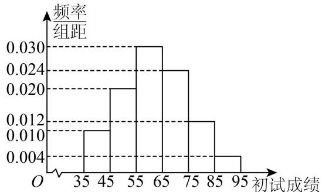

histogram

| 初试成绩 | 频率/组距 |
| :--- | :--- |
| 35-45 | 0.010 |
| 45-55 | 0.020 |
| 55-65 | 0.030 |
| 65-75 | 0.024 |
| 75-85 | 0.012 |
| 85-95 | 0.004 |

(1) 根据频率分布直方图, 求样本平均数的估计值和 80% 分位数;  
(2) 若所有学生的初试成绩 X 近似服从正态分布 $\mathrm{N}(\mu, \sigma^{2})$ ，其中 $\mu$ 为样本平均数的估计

值, $\sigma\approx14$ . 初试成绩不低于90分的学生才能参加复试,试估计能参加复试的人数;

(3) 复试共三道题, 规定: 全部答对获得一等奖; 答对两道题获得二等奖; 答对一道题获得三等奖; 全部答错不获奖. 已知某学生进入了复试, 他在复试中前两道题答对的概率均为 $a$ , 第三道题答对的概率为 $b$ . 若他获得一等奖的概率为 $\frac{1}{8}$ , 设他获得二等奖的概率为 $\mathrm{P}$ , 求 $\mathrm{P}$ 的最小值.

附：若随机变量X服从正态分布 $\mathrm{N}(\mu ,\sigma^2)$ ，则 $\mathrm{P}(\mu -\sigma < \mathrm{X}\leqslant \mu +\sigma)\approx 0.6827,\mathrm{P}(\mu -2\sigma <$ $\mathrm{X}\leqslant \mu +2\sigma)\approx 0.9545,\mathrm{P}(\mu -3\sigma <   \mathrm{X}\leqslant \mu +3\sigma)\approx 0.9973.$

5168 (2024·重庆沙坪坝·高三重庆南开中学校考阶段练习)某地区举行专业技能考试,共有8000人参加,分为初试和复试,初试通过后方可参加复试.为了解考生的考试情况,随机抽取了100名考生的初试成绩绘制成如图所示的样本频率分布直方图.

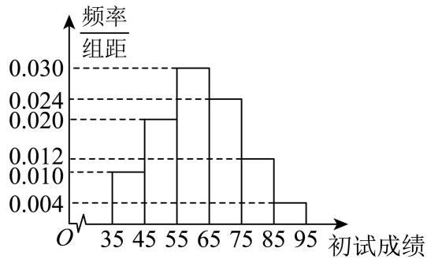

histogram

| 初试成绩 | 频率/组距 |
| :--- | :--- |
| 35 | 0.010 |
| 45 | 0.020 |
| 55 | 0.030 |
| 65 | 0.024 |
| 75 | 0.012 |
| 85 | 0.004 |
| 95 | 0.004 |

(1) 根据频率分布直方图, 估计样本的平均数;  
(2) 若所有考生的初试成绩近似服从正态分布 $\mathrm{N}(\mu,\sigma^{2})$ ，其中 $\mu$ 为样本平均数的估计值， $\sigma\approx9$ ，试估计所有考生中初试成绩不低于80分的人数；  
(3) 复试共四道题, 前两道题考生每题答对得 5 分, 答错得 0 分, 后两道题考生每题答对得 10 分, 答错得 0 分, 四道题的总得分为考生的复试成绩. 已知某考生进入复试, 他在复试中前两题每道题能答对的概率均为 $\frac{3}{4}$ , 后两题每道题能答对的概率均为 $\frac{3}{5}$ , 且每道题回答正确与否互不影响. 记该考生的复试成绩为 X, 求 P(X≥20).

附:若随机变量X服从正态分布 $N(\mu,\sigma^{2})$ ，则： $P(\mu-\sigma<X<\mu+\sigma)=0.6827$ ， $P(\mu-2\sigma<X<\mu+2\sigma)=0.9545$ ， $P(\mu-3\sigma<X<\mu+3\sigma)=0.9973$ .

5169 (2024·山东·高三校联考开学考试)零件的精度几乎决定了产品的质量,越精密的零件其精度要求也会越高.某企业为了提高零件产品质量,质检部门随机抽查了100个零件的直径进行了统计整理,得到数据如下表:

<table><tr><td>零件直径(单位:厘米)</td><td>[1.0,1.2)</td><td>[1.2,1.4)</td><td>[1.4,1.6)</td><td>[1.6,1.8)</td><td>[1.8,2.0]</td></tr><tr><td>零件个数</td><td>10</td><td>25</td><td>30</td><td>25</td><td>10</td></tr></table>

已知零件的直径可视为服从正态分布 $\mathrm{N}(\mu,\sigma^{2})$ , $\mu$ , $\sigma^{2}$ 分别为这 100 个零件的直径的平均数及方差 (同一组区间的直径尺寸用该组区间的中点值代表).

(1) 分别求 $\mu, \sigma^{2}$ 的值；  
(2)试估计这批零件直径在[1.044,1.728]的概率;   
(3) 随机抽查 2000 个零件, 估计在这 2000 个零件中, 零件的直径在 [1.044, 1.728] 的个数. 参考数据: $\sqrt{0.052} \approx 0.228$ ; 若随机变量 $\xi \sim \mathrm{N}(\mu, \sigma^2)$ , 则 $\mathrm{P}(\mu - \sigma \leqslant \xi \leqslant \mu + \sigma) \approx 0.6827$ , $\mathrm{P}(\mu - 2\sigma \leqslant \xi \leqslant \mu + 2\sigma) \approx 0.9545$ , $\mathrm{P}(\mu - 3\sigma \leqslant \xi \leqslant \mu + 3\sigma) \approx 0.9973$ .

5170 (2024·山东临沂·高三校联考开学考试)在“飞彩镌流年”文艺汇演中,诸位参赛者一展风采,奉上了一场舞与乐的盛宴. 现从2000位参赛者中随机抽取40位幸运嘉宾,统计他们

的年龄数据,得样本平均数 $\mu=45.75$ .

(1) 若所有参赛者年龄 X 服从正态分布 N( $\mu, 15.75^{2}$ ), 请估计参赛者年龄在 30 岁以上的人数;  
(2) 若该文艺汇演对所有参赛者的表演作品进行评级, 每位参赛者只有一个表演作品且每位参赛者作品有 $a\% (0 < a < 100)$ 的概率评为 A 类, $(1 - a\%)$ 的概率评为 B 类, 每位参赛者作品的评级结果相互独立. 记上述 40 位幸运嘉宾的作品中恰有 2 份 A 类作品的概率为 $p(a)$ , 求 $p(a)$ 的极大值点 $a_0$ ;  
(3) 以 (2) 中确定的 $a_0$ 作为 $a$ 的值, 记上述幸运嘉宾的作品中的 A 类作品数为 Y, 若对这些幸运嘉宾进行颁奖, 现有两种颁奖方式: 甲: A 类作品参赛者获得 1000 元现金, B 类作品参赛者获得 100 元现金; 乙: A 类作品参赛者获得 3000 元现金, B 类作品参赛者不获得现金奖励. 根据奖金期望判断主办方选择何种颁奖方式, 成本可能更低.

附: 若 $X \sim N(\mu, \sigma^{2})$ ，则 $P\{|X - \mu| < \sigma\} = 0.6827$ .

5171 (2024·福建厦门·厦门一中校考二模)法国数学家庞加莱是个喜欢吃面包的人,他每天都会到同一家面包店购买一个面包.该面包店的面包师声称自己所出售的面包的平均质量是 $1000g$ ,上下浮动不超过 $50g$ .这句话用数学语言来表达就是:每个面包的质量服从期望为 $1000g$ ,标准差为 $50g$ 的正态分布.

(1) 已知如下结论: 若 $\mathrm{X} \sim \mathrm{N}(\mu, \sigma^{2})$ ，从 X 的取值中随机抽取 $k(k \in \mathrm{N}^{*}, k \geqslant 2)$ 个数据，记这 k 个数据的平均值为 Y，则随机变量 $\mathrm{Y} \sim \mathrm{N}\left(\mu, \frac{\sigma^{2}}{k}\right)$ ，利用该结论解决下面问题.  
(i) 假设面包师的说法是真实的,随机购买25个面包,记随机购买25个面包的平均值为Y,求 $P(Y<980)$ ;  
(ii) 庞加莱每天都会将买来的面包称重并记录, 25 天后, 得到的数据都落在 (950,1050) 上, 并经计算 25 个面包质量的平均值为 $978.72g$ . 庞加莱通过分析举报了该面包师, 从概率角度说明庞加莱举报该面包师的理由;  
(2) 假设有两箱面包 (面包除颜色外, 其他都一样), 已知第一箱中共装有 6 个面包, 其中黑色面包有 2 个; 第二箱中共装有 8 个面包, 其中黑色面包有 3 个. 现随机挑选一箱, 然后从该箱中随机取出 2 个面包. 求取出黑色面包个数的分布列及数学期望.

附:①随机变量 $\eta$ 服从正态分布 $\mathrm{N}(\mu,\sigma^{2})$ ，则 $\mathrm{P}(\mu-\sigma\leqslant\eta\leqslant\mu+\sigma)=0.6827$ ，

$$
\mathrm{P} (\mu - 2 \sigma \leqslant \eta \leqslant \mu + 2 \sigma) = 0. 9 5 4 5, \mathrm{P} (\mu - 3 \sigma \leqslant \eta \leqslant \mu + 3 \sigma) = 0. 9 9 7 3;
$$

②通常把发生概率小于0.05的事件称为小概率事件,小概率事件基本不会发生.

5172 (2024·广东江门·高三统考阶段练习)为深入学习党的二十大精神,某学校团委组织了“青春向党百年路,奋进学习二十大”知识竞赛活动,并从中抽取了200份试卷进行调查,这200份试卷的成绩(卷面共100分)频率分布直方图如右图所示.

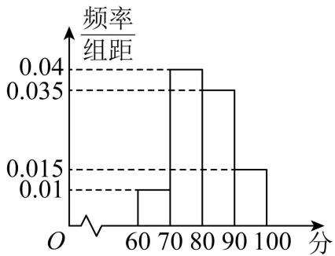

histogram

| 分数 | 频率/组距 |
| :--- | :--- |
| 60-70 | 0.01 |
| 70-80 | 0.04 |
| 80-90 | 0.035 |
| 90-100 | 0.015 |

(1) 用样本估计总体, 求此次知识竞赛的平均分 (同一组中的数据用该组区间的中点值为代表).  
(2) 可以认为这次竞赛成绩 X 近似地服从正态分布 $\mathrm{N}(m, s^{2})$ (用样本平均数和标准差 s

分别作为 m 、s 的近似值), 已知样本标准差 s $\gg$ 7.36, 如有 84% 的学生的竞赛 成绩高于学校期望的平均分, 则学校期望的平均分约为多少? (结果取整数)

(3) 从得分区间 $[80, 90)$ 和 $[90, 100]$ 的试卷中用分层抽样的方法抽取 10 份试卷, 再从这 10 份样本中随机抽测 3 份试卷, 若已知抽测的 3 份试卷来自于不同区间, 求抽测 3 份试卷有 2 份来自区间 $[80, 90)$ 的概率.

参考数据: 若 $X \sim N(m, s^{2})$ ，则 $P(m - s < X \not\in m + s) \gg 0.68$ ， $P(m - 2s < X \not\in m + 2s) \gg 0.95$ ， $P(m - 3s < X \not\in m + 3s) \gg 0.99$ 。

5173 (2024·全国·高三专题练习) 2022 年中国共产党第二十次全国代表大会胜利召开之际，结合巩固深化“不忘初心、牢记使命”主题教育成果，在全体党员中继续开展党史学习教育。为了配合这次学党史活动，某地组织全体党员干部参加党史知识竞赛，现从参加入员中随机抽取 100 人，并对他们的分数进行统计，得到如图所示的频率分布直方图。

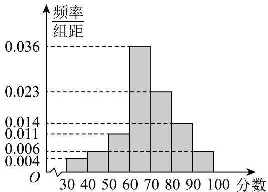

histogram

| 分数 | 频率/组距 |
| :--- | :--- |
| 30-40 | 0.005 |
| 40-50 | 0.006 |
| 50-60 | 0.011 |
| 60-70 | 0.036 |
| 70-80 | 0.023 |
| 80-90 | 0.014 |
| 90-100 | 0.006 |

(1) 现从这 100 人中随机抽取 2 人, 记其中得分不低于 80 分的人数为 $\xi$ , 试求随机变量 $\xi$ 的分布列及期望.  
(2) 由频率分布直方图, 可以认为该地参加党史知识竞赛人员的分数 X 服从正态分布 $\mathrm{N}(\mu, \sigma^{2})$ , 其中 $\mu$ 近似为样本平均数, $\sigma^{2}$ 近似为样本方差 $s^{2}$ , 经计算 $s^{2} = 192.44$ . 现从所有参加党史知识竞赛的人员中随机抽取 500 人, 且参加党史知识竞赛的人员的分数相互独立, 试问这 500 名参赛者的分数不低于 82.3 的人数最有可能是多少?

参考数据： $\sqrt{192.44}\approx 13.9,\mathrm{P}(\mu -\sigma \leqslant \mathrm{X}\leqslant \mu +\sigma) = 0.6827,\mathrm{P}(\mu -2\sigma \leqslant \mathrm{X}\leqslant \mu +2\sigma) =$

$$
0. 9 5 4 5, \mathrm{P} (\mu - 3 \sigma \leqslant \mathrm{X} \leqslant \mu + 3 \sigma) = 0. 9 9 7 3.
$$

5174 (2024·全国·高三专题练习)N95型口罩是新型冠状病毒的重要防护用品,它对空气动力学直径≥0.3μm的颗粒的过滤效率达到95%以上。某防护用品生产厂生产的N95型口罩对空气动力学直径≥0.3μm的颗粒的过滤效率服从正态分布N(0.97,9.025×10 $^{-5}$ ).

(1) 当质检员随机抽检 10 只口罩, 测量出一只口罩对空气动力学直径 $\geqslant 0.3\mu m$ 的颗粒的过滤效率为 93. $6\%$ 时, 他立即要求停止生产, 检查设备和工人工作情况. 请你根据所学知识, 判断该质检员的要求是否有道理, 并说明判断的依据.  
(2) 该厂将对空气动力学直径 $\geqslant 0.3\mu m$ 的颗粒的过滤效率达到95．1%以上的N95型口罩定义为“优质品”.

(i) 求该企业生产的一只口罩为“优质品”的概率;

(ii) 该企业生产了 1000 只这种 N95 型口罩, 且每只口罩互相独立, 记 X 为这 1000 只口罩中“优质品”的件数, 当 X 为多少时可能性最大 (即概率最大)?

# 11 题型十一:标准正态分布的应用

5175 (2024·全国·高三专题练习) 2024 年 3 月某学校举办了春季科技体育节, 其中安排的女排赛事共有 12 个班级作为参赛队伍, 本次比赛启用了新的排球用球 MIKASA \_\_\_\_

V200W 已知这种球的质量指标 $\xi(\text{单位: } g)$ 服从正态分布 X\~N( $\mu, \sigma^{2}$ ), 其中 $\mu = 270, \sigma = 5$ . 比赛赛制采取单循环方式, 即每支球队进行 11 场比赛, 最后靠积分选出最后冠军, 积分规则如下 (比赛采取 5 局 3 胜制): 比赛中以 3:0 或 3:1 取胜的球队积 3 分, 负队积 0 分; 而在比赛中以 3:2 取胜的球队积 2 分, 负队积 1 分. 9 轮过后, 积分榜上的前 2 名分别为 1 班排球队和 2 班排球队, 1 班排球队积 26 分, 2 班排球队积 22 分. 第 10 轮 1 班排球队对抗 3 班排球队, 设每局比赛 1 班排球队取胜的概率为 $p(0 < p < 1)$ .

(1) 令 $\eta = \frac{\bar{\xi} - \mu}{\sigma}$ , 则 $\eta \sim \mathrm{N}(0,1)$ , 且 $\Phi(a) = \mathrm{P}(\eta < a)$ , 求 $\Phi(-2)$ , 并证明: $\Phi(-2) + \Phi(2) = 1$ ;   
(2) 第10轮比赛中, 记1班排球队3:1取胜的概率为 $f(p)$ , 求出 $f(p)$ 的最大值点 $p_{0}$ , 并以 $p_{0}$ 作为p的值, 解决下列问题.

(i) 在第 10 轮比赛中, 1 班排球队所得积分为 X, 求 X 的分布列;

(ii) 已知第 10 轮 2 班排球队积 3 分, 判断 1 班排球队能否提前一轮夺得冠军 (第 10 轮过后, 无论最后一轮即第 11 轮结果如何, 1 班排球队积分最多)? 若能, 求出相应的概率; 若不能, 请说明理由.

参考数据： $X \sim N(\mu, \sigma^2)$ ，则 $P(\mu - \sigma < X \leqslant \mu + \sigma) \approx 0.6827$ ， $P(\mu - 2\sigma < X \leqslant \mu + 2\sigma) \approx 0.9545$ ， $P(\mu - 3\sigma < X \leqslant \mu + 3\sigma) \approx 0.9973$ .

5176 (2024·全国·高三专题练习)《山东省高考改革试点方案》规定: 2022年高考总成绩由语文、数学、外语三门统考科目和思想政治、历史、地理、物理、化学、生物六门选考科目组成, 将每门选考科目的考生原始成绩从高到低划分为A、B+、B、C+、C、D+、D、E共8个等级, 参照正态分布原则, 确定各等级人数所占比例分别为3%、7%、16%、24%、24%、16%、7%、3%, 选择科目成绩计入考生总成绩时, 将A至E等级内的考生原始成绩X, 依照 $Y=\frac{X-\mu}{\sigma}$ ( $\mu$ 、 $\sigma$ 分别为正态分布的均值和标准差)分别转换到[91,100]、[81,90]、[71,80]、[61,70]、[51,60]、[41,50]、[31,40]、[21,30]八个分数区间, 得到考生的等级成绩. 如果山东省2022年某次学业水平模拟考试物理科目的原始成绩X\~N(77.8,256), Y\~N(0,1).

(1) 若规定等级 A、B +、B、C +、C、D + 为合格，D、E 为不合格，需要补考，估计这次学业水平模拟考试物理合格线的最低原始分是多少；

(2) 现随机抽取了该省 1000 名参加此次物理学科学业水平测试的原始分, 若这些学生的原始分相互独立, 记 $\xi$ 为被抽到的原始分不低于 65 分的学生人数, 求 $\xi$ 的数学期望和方差.

附: 当 $Y \sim N(0,1)$ 时, $P(Y \leqslant 1.3) \approx 0.9$ , $P(Y \leqslant 0.8) \approx 0.788$ .

5177 (2024·全国·高三专题练习) 2021 年某地在全国志愿服务信息系统注册登记志愿者 8 万多人, 2020 年 7 月份以来, 共完成 1931 个志愿服务项目, 8900 多名志愿者开展志愿服务活动累计超过 150 万小时, 为了了解此地志愿者对志愿服务的认知和参与度, 随机调查了 500 名志愿者每月的志愿服务时长 (单位: 小时), 并绘制如图所示的频率分布直方图.

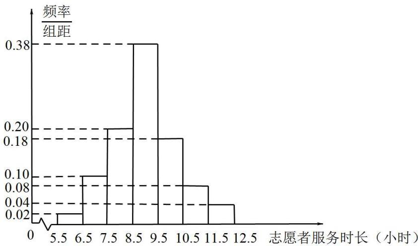

histogram

| 志愿者服务时长（小时） | 频率/组距 |
|---|---|
| 5.5 | 0.02 |
| 6.5 | 0.10 |
| 7.5 | 0.20 |
| 8.5 | 0.38 |
| 9.5 | 0.18 |
| 10.5 | 0.08 |
| 11.5 | 0.04 |
| 12.5 | 0.00 |

(1) 估计这500名志愿者每月志愿服务时长的样本平均数 $\bar{x}$ 和样本方差 $s^2$ (同一组中的数据用该组数据区间的中间值代表);  
(2)由直方图可以认为,目前该地志愿者每月服务时长X服从正态分布 $N(\mu,\sigma^{2})$ ,其中 $\mu$ 近似为样本平均数 $\bar{x},\sigma^{2}$ 近似为样本方差 $s^{2}$ .一般正态分布的概率都可以转化为标准正态分布的概率进行计算:若 $X\sim N(\mu,\sigma^{2})$ ,令 $Y=\frac{X-\mu}{\sigma}$ ,则 $Y\sim N(0,1)$ ,且 $P(X\leqslant a)=P(Y\leqslant\frac{a-\mu}{\sigma})$ .  
(i) 利用直方图得到的正态分布, 求 $P(X \leqslant 10)$ ;  
(ii) 从该地随机抽取 20 名志愿者, 记 Z 表示这 20 名志愿者中每月志愿服务时长超过 10 小时的人数, 求 P(Z ≥ 1) (结果精确到 0.001), 以及 Z 的数学期望 (结果精确到 0.01).

参考数据： $\sqrt{1.64}\approx1.28,\sqrt{16.4}\approx4.05,0.5987^{20}\approx0.000035,0.7291^{20}\approx0.0018,0.7823^{20}\approx0.0074.$ 若 $Y\sim N(0,1)$ ，则 $P(Y\leqslant0.25)\approx0.5987,P(Y\leqslant0.61)\approx0.7291,P(Y\leqslant0.78)\approx0.7823.$

5178 (2024·全国·高三专题练习)已知某高校共有10000名学生,其图书馆阅览室共有994个座位,假设学生是否去自习是相互独立的,且每个学生在每天的晚自习时间去阅览室自习的概率均为0.1.

(1) 将每天的晚自习时间去阅览室自习的学生人数记为 X, 求 X 的期望和方差;  
(2)18世纪30年代,数学家棣莫弗发现,当n比较大时,二项分布可视为正态分布. 此外,如果随机变量 $\mathrm{Y}\sim\mathrm{N}(\mu,\sigma^{2})$ ,令 $Z=\frac{Y-\mu}{\sigma}$ ,则 $Z\sim N(0,1)$ . 当 $Z\sim N(0,1)$ 时,对于任意实数a,记 $\Phi(a)=P(Z<a)$ . 已知下表为标准正态分布表(节选),该表用于查询标准正态分布 $N(0,1)$ 对应的概率值. 例如当a=0.16时,由于 $0.16=0.1+0.06$ ,则先在表的最左列找到数字0.1(位于第三行),然后在表的最上行找到数字0.06(位于第八列),则表中位于第三行第八列的数字0.5636便是 $\Phi(0.16)$ 的值.

<table><tr><td>a</td><td>0.00</td><td>0.01</td><td>0.02</td><td>0.03</td><td>0.04</td><td>0.05</td><td>0.06</td><td>0.07</td><td>0.08</td><td>0.09</td></tr><tr><td>0.</td><td>0.500</td><td>0.504</td><td>0.508</td><td>0.512</td><td>0.516</td><td>0.519</td><td>0.523</td><td rowspan="2">0.5279</td><td>0.531</td><td>0.535</td></tr><tr><td>0</td><td>0</td><td>0</td><td>0</td><td>0</td><td>0</td><td>9</td><td>9</td><td>9</td><td>9</td></tr><tr><td>0.</td><td>0.539</td><td>0.543</td><td>0.547</td><td>0.551</td><td>0.555</td><td>0.559</td><td>0.563</td><td rowspan="2">0.5675</td><td>0.571</td><td>0.575</td></tr><tr><td>1</td><td>8</td><td>8</td><td>8</td><td>7</td><td>7</td><td>6</td><td>6</td><td>4</td><td>3</td></tr><tr><td>0.</td><td>0.579</td><td>0.583</td><td>0.587</td><td>0.591</td><td>0.594</td><td>0.598</td><td>0.602</td><td rowspan="2">0.6064</td><td>0.610</td><td>0.614</td></tr><tr><td>2</td><td>3</td><td>2</td><td>1</td><td>0</td><td>8</td><td>7</td><td>6</td><td>3</td><td>1</td></tr><tr><td>0.3</td><td>0.6179</td><td>0.6217</td><td>0.6255</td><td>0.6293</td><td>0.6331</td><td>0.6368</td><td>0.6404</td><td>0.6443</td><td>0.6480</td><td>0.6517</td></tr><tr><td>0.4</td><td>0.6554</td><td>0.6591</td><td>0.6628</td><td>0.6664</td><td>0.6700</td><td>0.6736</td><td>0.6772</td><td>0.6808,</td><td>0.6844</td><td>0.6879</td></tr><tr><td>0.5</td><td>0.6915</td><td>0.6950</td><td>0.6985</td><td>0.7019</td><td>0.7054</td><td>0.7088</td><td>0.7123</td><td> $0.7157'$ </td><td>0.7190</td><td>0.7224</td></tr></table>

①求在晚自习时间阅览室座位不够用的概率；  
②若要使在晚自习时间阅览室座位够用的概率高于0.7，则至少需要添加多少个座位？

5179 (2024·全国·高三专题练习) 2020 年某地在全国志愿服务信息系统注册登记志愿者 8 万多人．2019 年 7 月份以来,共完成 1931 个志愿服务项目,8900 多名志愿者开展志愿服务活动累计超过 150 万小时．为了了解此地志愿者对志愿服务的认知和参与度,随机调查了 500 名志愿者每月的志愿服务时长(单位:小时),并绘制如图所示的频率分布直方图.

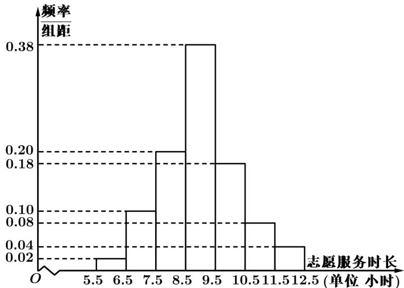

histogram

| 志愿服务时长 (小时) | 频率/组距 |
|---|---|
| 5.5 | 0.02 |
| 6.5 | 0.10 |
| 7.5 | 0.20 |
| 8.5 | 0.38 |
| 9.5 | 0.18 |
| 10.5 | 0.08 |
| 11.5 | 0.04 |
(单位 小时)

(1) 求这 500 名志愿者每月志愿服务时长的样本平均数 $\bar{x}$ 和样本方差 $s^2$ (同一组中的数据用该组区间的中间值代表);  
(2)由直方图可以认为,目前该地志愿者每月服务时长X服从正态分布 $N(\mu,\sigma^{2})$ ,其中 $\mu$ 近似为样本平均数 $\bar{x},\sigma^{2}$ 近似为样本方差 $s^{2}$ .一般正态分布的概率都可以转化为标准正态分布的概率进行计算:若 $X\sim N(\mu,\sigma^{2})$ ,令 $Y=\frac{X-\mu}{\sigma}$ ,则 $Y\sim N(0,1)$ ,且 $P(X\leqslant a)=P(Y\leqslant\frac{a-\mu}{\sigma})$ .

(i) 利用直方图得到的正态分布, 求 $P(X \leqslant 10)$ ;  
(ii) 从该地随机抽取 20 名志愿者, 记 Z 表示这 20 名志愿者中每月志愿服务时长超过 10 小时的人数, 求 P(Z≥1)(结果精确到 0.001) 以及 Z 的数学期望.

参考数据： $\sqrt{1.64} \approx 1.28, 0.7734^{20} \approx 0.0059$ 。若 $Y \sim N(0,1)$ ，则 $P(Y \leqslant 0.78) = 0.7734$ 。

5180 (2024·福建·高三统考阶段练习)近一段时间来,由于受非洲猪瘟的影响,各地猪肉价格普遍上涨,生猪供不应求.各大养猪场正面临巨大挑战.目前各项针对性政策措施对于生猪整体产量恢复、激发养殖户积极性的作用正在逐步显现.现有甲、乙两个规模一致的大型养猪场,均养有1万头猪,将其中重量(kg)在[1,139]内的猪分为三个成长阶段如下表.猪生长的三个阶段

<table><tr><td>阶段</td><td>幼年期</td><td>成长期</td><td>成年期</td></tr><tr><td>重量(Kg)</td><td>[1,24)</td><td>[24, 116)</td><td>[116, 139]</td></tr></table>

根据以往经验,两个养猪场猪的体重 X 均近似服从正态分布 $X \sim N(70, 23^{2})$ . 由于我国有关部门加强对大型养猪场即将投放市场的成年期猪的监控力度,高度重视成年期猪的质量保证,为了养出健康的成年活猪,甲、乙两养猪场引入两种不同的防控及养殖模式. 已知甲、乙两个养猪场内一头成年期猪能通过质检合格的概率分别为 $\frac{3}{4}$ , $\frac{4}{5}$ .

(1) 试估算甲养猪场三个阶段猪的数量；  
(2) 已知甲养猪场出售一头成年期的猪, 若为健康合格的猪, 则可盈利 600 元, 若为不合格的猪, 则亏损 100 元; 乙养猪场出售一头成年期的猪, 若为健康合格的猪, 则可盈利 500 元, 若为不合格的猪, 则亏损 200 元.

(i) 记 Y 为甲、乙养猪场各出售一头成年期猪所得的总利润, 求随机变量 Y 的分布列; (ii) 假设两养猪场均能把成年期猪售完, 求两养猪场的总利润期望值.

(参考数据:若 $Z \sim N(\mu, \sigma^{2})$ , $P(\mu - \sigma < Z < \mu + \sigma) = 0.6826$ , $P(\mu - 2\sigma < Z < \mu + 2\sigma) = 0.9544$ , $P(\mu - 3\sigma < Z < \mu + 3\sigma) = 0.9974$ )

5181 (2024·全国·高三专题练习)为了解A市高三数学复习备考情况,该市教研机构组织了一次检测考试,并随机抽取了部分高三理科学生数学成绩绘制如图所示的频率分布直方图.

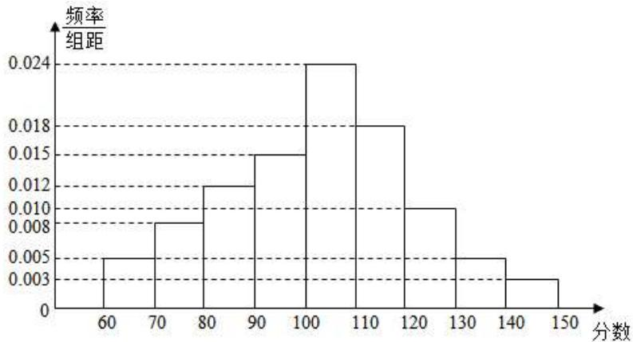

histogram

| 分数 | 频率/组距 |
| :--- | :--- |
| 60-70 | 0.005 |
| 70-80 | 0.008 |
| 80-90 | 0.012 |
| 90-100 | 0.015 |
| 100-110 | 0.024 |
| 110-120 | 0.018 |
| 120-130 | 0.010 |
| 130-140 | 0.005 |
| 140-150 | 0.003 |

(1) 根据频率分布直方图, 估计该市此次检测理科数学的平均成绩 $u_{0}$ ; (精确到个位)  
(2) 研究发现, 本次检测的理科数学成绩 X 近似服从正态分布 X\~N(u, $\sigma^{2}$ )(u = u\_{0}, $\sigma$ 约为 19.3).

①按以往的统计数据,理科数学成绩能达到升一本分数要求的同学约占46%,据此估计本次检测成绩达到升一本的理科数学成绩大约是多少分?(精确到个位)

②已知 A 市理科考生约有 10000 名, 某理科学生此次检测数学成绩为 107 分, 则该学生全市排名大约是多少名?

(说明: $P(x>x_{1})=1-\phi\left(\frac{x_{1}-u}{\sigma}\right)$ 表示 $x>x_{1}$ 的概率, $\phi\left(\frac{x_{1}-u}{\sigma}\right)$ 用来将非标准正态分布化为标准正态分布, 即 X\~N(0,1), 从而利用标准正态分布表 $\phi(x_{0})$ , 求 $x>x_{1}$ 时的概率 $P(x>x_{1})$ , 这里 $x_{0}=\frac{x_{1}-u}{\sigma}$ , 相应于 $x_{0}$ 的值 $\phi(x_{0})$ 是指总体取值小于 $x_{0}$ 的概率, 即 $\phi(x_{0})=P(x<x_{0})$ . 参考数据: $\phi(0.7045)=0.54$ , $\phi(0.6772)=0.46$ , $\phi(0.21)=0.5032$ .

