# 第93讲 概率与统计的综合应用

# 必考题型全归纳

# 1 题型一:决策问题

5182 (2024·甘肃兰州·高三兰化一中校考期中)据悉强基计划的校考由试点高校自主命题,校考过程中达到笔试优秀才能进入面试环节. 已知甲、乙两所大学的笔试环节都设有三门考试科目且每门科目是否达到优秀相互独立. 若某考生报考甲大学,每门科目达到优秀的概率均为 $\frac{1}{3}$ ,若该考生报考乙大学,每门科目达到优秀的概率依次为 $\frac{1}{6},\frac{2}{5},n$ ,其中 $0 < n < 1$ .

(1) 若 $n = \frac{1}{3}$ , 分别求出该考生报考甲、乙两所大学在笔试环节恰好有一门科目达到优秀的概率;  
(2) 强基计划规定每名考生只能报考一所试点高校, 若以笔试过程中达到优秀科目个数的期望为依据作出决策, 该考生更希望进入甲大学的面试环节, 求 n 的范围.

5183 (2024·全国·高三专题练习) 2022年北京冬奥会后,由一名高山滑雪运动员甲组成的专业队,与两名高山滑雪爱好者乙、丙组成的业余队进行友谊比赛,约定赛制如下:业余队中的两名队员轮流与甲进行比赛,若甲连续赢两场则专业队获胜;若甲连续输两场则业余队获胜;若比赛三场还没有决出胜负,则视为平局,比赛结束.已知各场比赛相互独立,每场比赛都分出胜负,且甲与乙比赛,甲赢的概率为 $\frac{2}{3}$ ,甲与丙比赛,甲赢的概率为p,其中 $\frac{1}{2}<p<\frac{2}{3}$ .

(1) 若第一场比赛,业余队可以安排乙与甲进行比赛,也可以安排丙与甲进行比赛.请分别计算两种安排下业余队获胜的概率;若以获胜概率大为最优决策,问:业余队第一场应该安排乙还是丙与甲进行比赛?  
(2)为了激励专业队和业余队,赛事组织规定:比赛结束时,胜队获奖金6万元,负队获奖金3万元;若平局,两队各获奖金3.6万元.在比赛前,已知业余队采用了(1)中的最优决策与甲进行比赛,设赛事组织预备支付的奖金金额共计X万元,求X的数学期望E(X)的取值范围.

5184 (2024·江西吉安·高三吉安三中校考阶段练习) 2020 年以来,新冠疫情对商品线下零售影响很大. 某商家决定借助线上平台开展销售活动. 现有甲、乙两个平台供选择,且当每件商品的售价为 $a(300 \leqslant a \leqslant 500)$ 元时,从该商品在两个平台所有销售数据中各随机抽取 100 天的日销售量统计如下,

<table><tr><td>商品日销售量(单位:件)</td><td>6</td><td>7</td><td>8</td><td>9</td><td>10</td></tr><tr><td>甲平台的天数</td><td>14</td><td>26</td><td>26</td><td>24</td><td>10</td></tr><tr><td>乙平台的天数</td><td>10</td><td>25</td><td>35</td><td>20</td><td>10</td></tr></table>

假设该商品在两个平台日销售量的概率与表格中相应日销售量的频率相等,且每天的销售量互不影响,

(1) 求“甲平台日销售量不低于 8 件”的概率, 并计算“从甲平台所有销售数据中随机抽取 3 天的日销售量, 其中至少有 2 天日销售量不低于 8 件”的概率;  
(2) 已知甲平台的收费方案为: 每天佣金 60 元, 且每销售一件商品, 平台收费 30 元; 乙平

台的收费方案为:每天不收取佣金,但采用分段收费,即每天销售商品不超过8件的部分,每件收费40元,超过8件的部分,每件收费35元.某商家决定在两个平台中选择一个长期合作,从日销售收入(单价×日销售量-平台费用)的期望值较大的角度,你认为该商家应如何决策?说明理由.

5185 (2024·江西·校联考模拟预测)某学校举行“百科知识”竞赛,每个班选派一位学生代表参加.某班经过层层选拔,李明和王华进入最后决赛,决赛方式如下:给定4个问题,假设李明能且只能对其中3个问题回答正确,王华对其中任意一个问题回答正确的概率均为 $\frac{3}{4}$ .由李明和王华各自从中随机抽取2个问题进行回答,而且每个人对每个问题的回答均相互独立.

(1) 求李明和王华回答问题正确的个数均为 2 的概率;  
(2) 设李明和王华回答问题正确的个数分别为 X 和 Y，求 X, Y 的期望 E(X)、E(Y) 和方差 D(X)、D(Y)，并由此决策派谁代表该班参加竞赛更好.

5186 (2024·全国·高三专题练习)根据某地区气象水文部门长期统计, 可知该地区每年夏季有小洪水的概率为 0.25, 有大洪水的概率为 0.05. 今年夏季该地区某工地有许多大型设备, 遇到大洪水时要损失 60000 元, 遇到小洪水时要损失 20000 元, 为保护设备, 有以下 3 种方案:

方案1:修建保护围墙,建设费为3000元,但围墙只能防小洪水;

方案 2:修建保护大坝,建设费为 7000 元,能够防大洪水;

方案3:不采取措施

工地的领导该如何决策呢？

# 2 题型二:道路通行问题

5187 (2024·重庆·高三重庆市育才中学校考阶段练习)9月6日位于重庆朝天门的来福士广场开业,成了网红城市的又一打卡胜地重庆育才谢家湾校区与来福士之间的驾车往返所需时间为T,T只与道路畅通状况有关,对其容量为500的样本进行统计,结果如下:

<table><tr><td>T(小时)</td><td>0.8</td><td>0.9</td><td>1</td><td>1.1</td></tr><tr><td>频数(次)</td><td>100</td><td>150</td><td>200</td><td>50</td></tr></table>

以这 500 次驾车往返所需时间的频率代替某人 1 次驾车往返所需时间的概率.

(1) 记 T 的期望为 $E(T)$ ，求 $P(T < E(T))$ ;  
(2) 某天有 3 位教师独自驾车从谢家校区返于来福士, 记 X 表示这 3 位教师中驾车所用时间少于 E(T) 的人数, 求 X 的分布列与 E(X).

5188 (2024·湖北·统考一模)交通指数是指交通拥堵指数的简称,是综合反映道路网畅通或拥堵的概念性指数值,记交通指数为T,其范围为[0,10],分别有五个级别:T∈[0,2),畅通;T∈[2,4),基本畅通;T∈[4,6),轻度拥堵;T∈[6,8),中度拥堵;T∈[8,10],严重拥堵.在晚高峰时段(T≥2),从某市交通指挥中心选取了市区20个交通路段,依据其交通指数数据绘制的频率分布直方图如图所示.

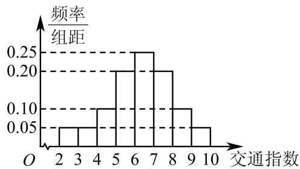

histogram

| 交通指数 | 频率/组距 |
| -------- | --------- |
| 2        | 0.05      |
| 3        | 0.05      |
| 4        | 0.10      |
| 5        | 0.20      |
| 6        | 0.25      |
| 7        | 0.20      |
| 8        | 0.10      |
| 9        | 0.05      |
| 10       | 0.05      |

(1) 求出轻度拥堵、中度拥堵、严重拥堵的路段的个数；  
(2) 用分层抽样的方法从轻度拥堵、中度拥堵、严重拥堵的路段中共抽取 6 个路段, 求依次抽取的三个级别路段的个数;  
(3) 从 (2) 中抽取的 6 个路段中任取 2 个, 求至少有 1 个路段为轻度拥堵的概率.

5189 (2024·四川眉山·高三四川省眉山第一中学阶段练习)随着我国经济的不断深入发展,百姓的生活也不断的改善,尤其是近几年汽车进入了千家万户,这也给城市交通造成了很大的压力,为此交警部门通过对交通拥堵的研究提出了交通拥堵指数这一全新概念,交通拥堵指数简称交通指数,是综合反映道路网畅通或拥堵的概念.记交通指数为T,其范围为[0,9],分别有5个级别:T∈[0,2)畅通;T∈[2,4)基本畅通;T∈[4,6)轻度拥堵;T∈[6,8)中度拥堵;T∈[8,9]严重拥堵.早高峰时段(T≥3),从北京市交通指挥中心随机选取了五环以内50个交通路段,依据交通指数数据绘制的部分频率分布直方图如图所示:

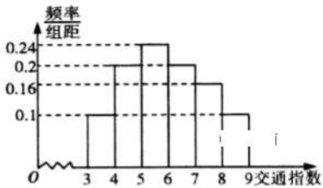

histogram

| 交通指数 | 频率组距 |
| -------- | -------- |
| 3        | 0.1      |
| 4        | 0.2      |
| 5        | 0.24     |
| 6        | 0.2      |
| 7        | 0.16     |
| 8        | 0.1      |
| 9        | 0.05     |

(1) 据此直方图估算交通指数 $\mathrm{T} \in [4, 8)$ 时的中位数和平均数；  
(2) 据此直方图求出早高峰二环以内的 3 个路段至少有两个严重拥堵的概率是多少?  
(3)某人上班路上所用时间若畅通时为20分钟,基本畅通为30分钟,轻度拥堵为35分钟,中度拥堵为45分钟,严重拥堵为60分钟,求此人所用时间的数学期望.

5190 (2024·江西·校联考模拟预测)“低碳出行”,一种降低“碳”的出行,以低能耗、低污染为基础,是环保的深层次体现,在众多发达国家被广大民众接受并执行,S市即将投放一批公共自行车以方便市民出行,减少污染,缓解交通拥堵,现先对100人做了是否会考虑选择自行车出行的调查,结果如下表.

(1) 如果把 45 周岁以下人群定义为“青年”，完成下列 $2 \times 2$ 列联表，并问你有多少把握认为该地区市民是否考虑单车与他 (她) 是不是“青年人”有关？

<table><tr><td>年龄</td><td colspan="2">考虑骑车</td><td colspan="2">不考虑骑车</td></tr><tr><td>15以下</td><td colspan="2">6</td><td colspan="2">3</td></tr><tr><td>[15,30)</td><td colspan="2">16</td><td colspan="2">6</td></tr><tr><td>[30,45)</td><td colspan="2">13</td><td colspan="2">6</td></tr><tr><td>[45,60)</td><td colspan="2">14</td><td colspan="2">16</td></tr><tr><td>[60,75)</td><td colspan="2">5</td><td colspan="2">9</td></tr><tr><td>75以上</td><td colspan="2">1</td><td colspan="2">5</td></tr><tr><td>合计</td><td colspan="2">55</td><td colspan="2">45</td></tr><tr><td></td><td>骑车</td><td colspan="2">不骑车</td><td>合计</td></tr><tr><td>45岁以下</td><td></td><td colspan="2"></td><td></td></tr><tr><td>45岁以上</td><td></td><td colspan="2"></td><td></td></tr><tr><td>合计</td><td></td><td colspan="2"></td><td>100</td></tr></table>

参考: $K^{2}=\frac{n(ad-bc)^{2}}{(a+b)(a+c)(c+d)(b+d)}$ , $n=a+b+c+d$

<table><tr><td> $p(K^{2} \geqslant k)$ </td><td>0.15</td><td>0.10</td><td>0.05</td><td>0.025</td><td>0.010</td><td>0.005</td><td>0.001</td></tr><tr><td>k</td><td>2.07</td><td>2.70</td><td>3.84</td><td>5.02</td><td>6.63</td><td>7.87</td><td>10.82</td></tr></table>

(2)S市为了鼓励大家骑自行车上班,为此还专门在几条平时比较拥堵的城市主道建有无障碍自行车道,该市市民小明家离上班地点10km,现有两种.上班方案给他选择;

方案一:选择自行车,走无障碍自行车道以19km/h的速度直达上班地点.

方案二:开车以30km/h的速度上班,但要经过A、B、C三个易堵路段,三个路段堵车的概率分别是 $\frac{1}{2}$ , $\frac{1}{2}$ , $\frac{1}{3}$ ,且是相互独立的,并且每次堵车的时间都是10分钟(假设除了堵车时间其他时间都是匀速行驶)

若仅从时间的角度考虑,请你给小明作一个选择,并说明理由.

5191 (2024·全国·高三专题练习)某人某天的工作是驾车从A地出发,到B,C两地办事,最后返回A地,A,B,C,三地之间各路段行驶时间及拥堵概率如下表

<table><tr><td>路段</td><td>正常行驶所用时间(小时)</td><td>上午拥堵概率</td><td>下午拥堵概率</td></tr><tr><td>AB</td><td>1</td><td>0.3</td><td>0.6</td></tr><tr><td>BC</td><td>2</td><td>0.2</td><td>0.7</td></tr><tr><td>CA</td><td>3</td><td>0.3</td><td>0.9</td></tr></table>

若在某路段遇到拥堵,则在该路段行驶时间需要延长1小时.

现有如下两个方案:

方案甲: 上午从 A 地出发到 B 地办事然后到达 C 地, 下午从 C 地办事后返回 A 地;

方案乙: 上午从 A 地出发到 C 地办事, 下午从 C 地出发到达 B 地, 办完事后返回 A 地.

(1) 若此人早上 8 点从 A 地出发, 在各地办事及午餐的累积时间为 2 小时, 且采用方案甲, 求他当日 18 点或 18 点之前能返回 A 地的概率.

(2) 甲乙两个方案中, 哪个方案有利于办完事后更早返回 A 地? 请说明理由.

# 题型三:保险问题

5192

(2024·广东湛江·高三统考阶段练习)某单位有员工50000人，一保险公司针对该单位推出一款意外险产品,每年每位职工只需要交少量保费,发生意外后可一次性获得若干赔偿金.保险公司把该单位的所有岗位分为A,B,C三类工种,从事三类工种的人数分布比例如饼图所示,且这三类工种每年的赔付概率如下表所示:

<table><tr><td>工种类别</td><td>A</td><td>B</td><td>C</td></tr><tr><td>赔付概率</td><td> $\frac{1}{10^5}$ </td><td> $\frac{2}{10^5}$ </td><td> $\frac{1}{10^4}$ </td></tr></table>

职工类别分布饼图  
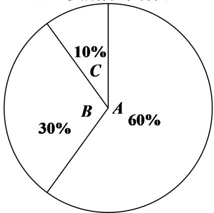

pie

| Category | Percentage (%) |
| :--- | :--- |
| A | 60 |
| B | 30 |
| C | 10 |

对于 A, B, C 三类工种, 职工每人每年保费分别为 a 元、a 元、b 元, 出险后的赔偿金额分别为 100 万元、100 万元、50 万元, 保险公司在开展此项业务过程中的固定支出为每年 20 万元.

(1) 若保险公司要求每年收益的期望不低于保费的 15%, 证明: $153a + 17b \geqslant 4200$ .  
(2) 现有如下两个方案供单位选择: 方案一: 单位不与保险公司合作, 职工不交保险, 出意外后单位自行拿出与保险公司提供的等额赔偿金赔付给出意外的职工, 单位开展这项工作的固定支出为每年 35 万元; 方案二: 单位与保险公司合作, a = 35, b = 60, 单位负责职工保费的 80%, 职工个人负责 20%, 出险后赔偿金由保险公司赔付, 单位无额外专项开支. 根据该单位总支出的差异给出选择合适方案的建议.

5193 (2024·新疆克拉玛依·统考三模)已知某保险公司的某险种的基本保费为a(单位:元),继续购买该险种的投保人称为续保人,续保人本年度的保费与其上年度出险次数的关联如下:

<table><tr><td>上年度出险次数</td><td>0</td><td>1</td><td>2</td><td>3</td><td> $\geqslant$ 4</td></tr><tr><td>保费(元)</td><td>0.9a</td><td>a</td><td>1.5a</td><td>2.5a</td><td>4a</td></tr></table>

随机调查了该险种的 400 名续保人在一年内的出险情况,得到下表:

<table><tr><td>出险次数</td><td>0</td><td>1</td><td>2</td><td>3</td><td> $\geqslant$ 4</td></tr><tr><td>频数</td><td>280</td><td>80</td><td>24</td><td>12</td><td>4</td></tr></table>

该保险公司这种保险的赔付规定如下：

<table><tr><td>出险序次</td><td>第1次</td><td>第2次</td><td>第3次</td><td>第4次</td><td>第5次及以上</td></tr><tr><td>赔付金额(元)</td><td>2.5a</td><td>1.5a</td><td>a</td><td>0.5a</td><td>0</td></tr></table>

将所抽样本的频率视为概率.

(1) 求本年度续保人保费的平均值的估计值；  
(2) 按保险合同规定, 若续保人在本年度内出险 3 次, 则可获得赔付 $(2.5a + 1.5a + a)$ 元; 若续保人在本年度内出险 6 次, 则可获得赔付 $(2.5a + 1.5a + a + 0.5a)$ 元; 依此类推, 求本年度续保人所获赔付金额的平均值的估计值.

5194 (2024·广东深圳·高三校联考期末)已知某保险公司的某险种的基本保费为 a(单位:元), 继续购买该险种的投保人称为续保人, 续保人本年度的保费与其上年度出险次数的关联如下:

<table><tr><td>上年度出险次数</td><td>0</td><td>1</td><td>2</td><td>3</td><td> $\geqslant 4$ </td></tr><tr><td>保费(元)</td><td>0.9a</td><td>a</td><td>1.5a</td><td>2.5a</td><td>4a</td></tr></table>

随机调查了该险种的 400 名续保人在一年内的出险情况,得到下表:

<table><tr><td>出险次数</td><td>0</td><td>1</td><td>2</td><td>3</td><td> $\geqslant$ 4</td></tr><tr><td>频数</td><td>280</td><td>80</td><td>24</td><td>12</td><td>4</td></tr></table>

该保险公司这种保险的赔付规定如下：

<table><tr><td>出险序次</td><td>第1次</td><td>第2次</td><td>第3次</td><td>第4次</td><td>第5次及以上</td></tr><tr><td>赔付金额(元)</td><td>2.5a</td><td>1.5a</td><td>a</td><td>0.5a</td><td>0</td></tr></table>

将所抽样本的频率视为概率.

(1) 求本年度续保人保费的平均值的估计值；  
(2) 按保险合同规定, 若续保人在本年度内出险 3 次, 则可获得赔付 $(2.5a + 1.5a + a)$ 元; 依此类推, 求本年度续保人所获赔付金额的平均值的估计值;  
(3) 续保人原定约了保险公司的销售人员在上午 10:30\~11:30 之间上门签合同, 因为续保人临时有事, 外出的时间在上午 10:45\~11:05 之间, 请问续保人在离开前见到销售人员的概率是多少?

5195 (2024·山东潍坊·校联考一模)某保险公司针对一个拥有20000人的企业推出一款意外险产品,每年每位职工只需要交少量保费,发生意外后可一次性获得若干赔偿金.保险公司把企业的所有岗位共分为A、B、C三类工种,从事这三类工种的人数分别为12000、6000、2000,由历史数据统计出三类工种的赔付频率如下表(并以此估计赔付概率):

<table><tr><td>工种类别</td><td>A</td><td>B</td><td>C</td></tr><tr><td>赔付频率</td><td> $\frac{1}{10^5}$ </td><td> $\frac{2}{10^5}$ </td><td> $\frac{1}{10^4}$ </td></tr></table>

已知 A、B、C 三类工种职工每人每年保费分别为 25 元、25 元、40 元，出险后的赔偿金额分别为 100 万元、100 万元、50 万元，保险公司在开展此业务的过程中固定支出每年 10 万元.

(1) 求保险公司在该业务所获利润的期望值；  
(2) 现有如下两个方案供企业选择:  
方案1:企业不与保险公司合作,职工不交保险,出意外企业自行拿出与保险公司提供的等额赔偿金赔偿付给出意外的职工,企业开展这项工作的固定支出为每年12万元;

方案2:企业与保险公司合作,企业负责职工保费的70%,职工个人负责30%,出险后赔偿金由保险公司赔付,企业无额外专项开支.

根据企业成本差异给出选择合适方案的建议.

5196 (2024·全国·高考真题)购买某种保险,每个投保人每年度向保险公司交纳保费a元,若投保人在购买保险的一年度内出险,则可以获得10 000元的赔偿金.假定在一年度内有10 000人购买了这种保险,且各投保人是否出险相互独立.已知保险公司在一年度内至少支付赔偿金10 000元的概率为 $1-0.999^{10^{4}}$ .

(I) 求一投保人在一年度内出险的概率 p;  
(Ⅱ) 设保险公司开办该项险种业务除赔偿金外的成本为 50 000 元, 为保证盈利的期望不小于 0, 求每位投保人应交纳的最低保费 (单位: 元).

5197 (2024·北京丰台·高三统考期末)某市医疗保险实行定点医疗制度,按照“就近就医、方便管理”的原则,参加保险人员可自主选择四家医疗保险定点医院和一家社区医院作为本人就诊的医疗机构,若甲、乙、丙、丁4名参加保险人员所在地区附近有A,B,C三家社区医院,并且他们的选择是等可能的、相互独立的

(1) 求甲、乙两人都选择 A 社区医院的概率;  
(2) 求甲、乙两人不选择同一家社区医院的概率；  
(3) 设 4 名参加保险人员中选择 A 社区医院的人数为 $\xi$ ，求 $\xi$ 的分布列和数学期望.

# 4 题型四:概率最值问题

5198 (2024·全国·高三专题练习)某电子工厂生产一种电子元件,产品出厂前要检出所有次品.已知这种电子元件次品率为0.01,且这种电子元件是否为次品相互独立.现要检测3000个这种电子元件,检测的流程是:先将这3000个电子元件分成个数相等的若干组,设每组有k个电子元件,将每组的k个电子元件串联起来,成组进行检测,若检测通过,则本组全部电子元件为正品,不需要再检测;若检测不通过,则本组至少有一个电子元件是次品,再对本组个电子元件逐一检测.

(1) 当 k=5 时, 估算一组待检测电子元件中有次品的概率;  
(2) 设一组电子元件的检测次数为 X, 求 X 的数学期望;  
(3) 估算当 $k$ 为何值时, 每个电子元件的检测次数最小, 并估算此时检测的总次数 (提示: 利用 $(1 - p)^n \approx 1 - np$ 进行估算).

5199 (2024·江西新余·高三新余市第一中学校考开学考试)现如今国家大力提倡养老社会化、市场化,老年公寓是其养老措施中的一种能够满足老年人的高质量、多样化、专业化生活及疗养需求.某老年公寓负责人为了能给老年人提供更加良好的服务,现对所入住的120名老年人征集意见,该公寓老年人的入住房间类型情况如下表所示:

<table><tr><td>入住房间的类型</td><td>单人间</td><td>双人间</td><td>三人间</td></tr><tr><td>人数</td><td>36</td><td>60</td><td>24</td></tr></table>

(1) 若按入住房间的类型采用分层抽样的方法从这 120 名老年人中随机抽取 10 人, 再从这 10 人中随机抽取 4 人进行询问, 记随机抽取的 4 人中入住单人间的人数为 $\xi$ , 求 $\xi$ 的分布列和数学期望.  
(2) 记双人间与三人间为多人间, 若在征集意见时要求把入住单人间的 2 人和入住多人间的 $m(m > 2$ 且 $m \in \mathbb{N}^*)$ 人组成一组, 负责人从某组中任选 2 人进行询问, 若选出的 2 人入住房间类型相同, 则该组标为 I , 否则该组标为 II . 记询问的某组被标为 II 的概率为 $p$ .

(i) 试用含 m 的代数式表示 p;

(ii) 若一共询问了 5 组, 用 $g(p)$ 表示恰有 3 组被标为的概率, 试求 $g(p)$ 的最大值及此时 $m$ 的值.

5200 (2024·全国·高三专题练习)为落实立德树人根本任务,坚持五育并举全面推进素质教育,某学校举行了乒乓球比赛,其中参加男子乒乓球决赛的12名队员来自3个不同校区,三个校区的队员人数分别是3,4,5.本次决赛的比赛赛制采取单循环方式,即每名队员进行11场比赛(每场比赛都采取5局3胜制),最后根据积分选出最后的冠军.积分规则如下:比赛中以3:0或3:1取胜的队员积3分,失败的队员积0分;而在比赛中以3:2取胜的队员积2分,失败的队员的队员积1分.已知第10轮张三对抗李四,设每局比赛张三取胜的概率均为 $p(0<p<1)$ .

(1) 比赛结束后冠亚军 (没有并列) 恰好来自不同校区的概率是多少?  
(2) 第 10 轮比赛中, 记张三 3:1 取胜的概率为 $f(p)$ , 求出 $f(p)$ 的最大值点 $p_{0}$ .

5201 (2024·山东潍坊·高三校考阶段练习)今年5月以来,世界多个国家报告了猴痘病例,非洲地区猴痘地方性流行国家较多.9月19日,中国疾控中心发布了我国首例“输入性猴痘病例”的溯源公告.我国作为为人民健康负责任的国家,对可能出现的猴痘病毒防控已提前做出部署,同时国家卫生健康委员会同国家中医药管理局制定了《猴痘诊疗指南(2022年版)》.此《指南》中指出:①猴痘病人潜伏期5-21天;②既往接种过天花疫苗者对猴痘病毒存在一定程度的交叉保护力.据此,援非中国医疗队针对援助的某非洲国家制定了猴痘病毒防控措施之一是要求与猴痘病毒确诊患者的密切接触者集中医学观察21天.在医学观察期结束后发现密切接触者中未接种过天花疫苗者感染病毒的比例较大.对该国家200个接种与未接种天花疫苗的密切接触者样本医学观察结束后,统计了感染病毒情况,得到下面的列联表:

<table><tr><td>接种天花疫苗与否/人数</td><td>感染猴痘病毒</td><td>未感染猴痘病毒</td></tr><tr><td>未接种天花疫苗</td><td>30</td><td>60</td></tr><tr><td>接种天花疫苗</td><td>20</td><td>90</td></tr></table>

(1) 是否有 99% 的把握认为密切接触者感染猴痘病毒与未接种天花疫苗有关;  
(2) 以样本中结束医学观察的密切接触者感染猴痘病毒的频率估计概率。现从该国所有结束医学观察的密切接触者中随机抽取4人进行感染猴痘病毒人数统计, 求其中至多有1人感染猴痘病毒的概率:  
(3)该国现有一个中风险村庄,当地政府决定对村庄内所有住户进行排查. 在排查期间,发现一户3口之家与确诊患者有过密切接触,这种情况下医护人员要对其家庭成员逐一进行猴痘病毒检测. 每名成员进行检测后即告知结果,若检测结果呈阳性,则该家庭被确定为“感染高危家庭”. 假设该家庭每个成员检测呈阳性的概率均为 $p(0 < p < 1)$ 且相互独立. 记:该家庭至少检测了2名成员才能确定为“感染高危家庭”的概率为 $f(p)$ . 求当 $p$ 为何值时, $f(p)$ 最大? 附: $\chi^{2} = \frac{n(ad - bc)^{2}}{(a + b)(c + d)(a + c)(b + d)}$

<table><tr><td>P $(\chi^{2} \geqslant k_{0})$ </td><td>0.1</td><td>0.05</td><td>0.010</td></tr><tr><td> $k_{0}$ </td><td>2.706</td><td>3.841</td><td>6.635</td></tr></table>

5202 (2024·上海徐汇·上海市南洋模范中学校考模拟预测)进入冬季,某病毒肆虐,已知感染此病毒的概率为 $p(0 < p < 1)$ ,且每人是否感染这种病毒相互独立.

(1) 记 100 个人中恰有 5 人感染病毒的概率是 $f(p)$ ，求 $f(p)$ 的最大值点 $p_{0}$ ;  
(2) 为确保校园安全, 某校组织该校的 6000 名师生做病毒检测, 如果对每一名师生逐一检测, 就需要检测 6000 次, 但实际上在检测时都是按 $k (1 < k \leqslant 6)$ 人一组分组, 然后将各组 $k$ 个人的检测样本混合再检测. 如果混合样本呈阴性, 说明这 $k$ 个人全部阴性; 如果混合样本呈阳性, 说明其中至少有一人检测呈阳性, 就需要对该组每个人再逐一检测一次. 当 $p$ 取 $p_0$ 时, 求 $k$ 的值, 使得总检测次数的期望最少.

# 5 题型五: 放回与不放回问题

5203 (2024·湖南·高三校联考阶段练习)某中学为了解学生课外玩网络游戏(俗称“网游”)的情况,使调查结果尽量真实可靠,决定在高一年级采取如下“随机回答问题”的方式进行问卷调查:一个袋子中装有6个大小相同的小球,其中2个黑球,4个红球,所有学生从袋子中有放回地随机摸球两次,每次摸出一球,约定“若两次摸到的球的颜色不同,则按方式①回答问卷,否则按方式②回答问卷”.

方式①:若第一次摸到的是红球,则在问卷中画“√”,否则画“×”.

方式②:若你课外玩网游,则在问卷中画“√”,否则画“×”.

当所有学生完成问卷调查后,统计画“√”,画“×”的比例,用频率估计概率.

(1) 若高一某班有 45 名学生, 用 X 表示其中按方式①回答问卷的人数, 求 X 的数学期望.  
(2)若所有调查问卷中,画“√”与画“×”的比例为1:2,试用所学概率知识求该中学高一年级学生课外玩网游的估计值.(估计值= $\frac{玩网游的学生人数}{高一所有学生人数}\times100\%$ )

5204 (2024·江苏南通·高三统考开学考试)现有甲、乙两个盒子,甲盒中有3个红球和1个白球,乙盒中有2个红球和2个白球,所有的球除颜色外都相同.某人随机选择一个盒子,并从中随机摸出2个球观察颜色后放回,此过程为一次试验.重复以上试验,直到某次试验中摸出2个红球时,停止试验.

(1) 求一次试验中摸出 2 个红球的概率;  
(2) 在 3 次试验后恰好停止试验的条件下, 求累计摸到 2 个红球的概率.

5205 (2024·上海黄浦·高三上海市敬业中学校考开学考试)某公司使用甲、乙两台机器生产芯片,已知每天甲机器生产的芯片占产量的六成,且合格率为94%;乙机器生产的芯片占产量的四成,且合格率为95%,已知两台机器生产芯片的质量互不影响.现对某天生产的芯片进行抽样.

(1) 从所有芯片中任意抽取一个, 求该芯片是不合格品的概率;  
(2) 现采用有放回的方法随机抽取 3 个芯片, 记其中由乙机器生产的芯片的数量为 X, 求 X 的分布列以及数学期望 E(X).

5206 (2024·广东广州·高三执信中学校考开学考试)中国共产党第二十次全国代表大会于2022年10月16日在北京召开,为弘扬中国共产党百年奋斗的光辉历程,某校团委决定举办“中国共产党党史知识”竞赛活动.竞赛共有A和B两类试题,每类试题各10题,其中每答对1道A类试题得10分;每答对1道B类试题得20分,答错都不得分.每位参加竞赛的同学从这两类试题中共抽出3道题回答(每道题抽后不放回).已知小明同学A类试题中有7道题会作答,而他答对各道B类试题的概率均为 $\frac{2}{5}$ .

(1) 若小明同学在 A 类试题中只抽 1 道题作答, 求他在这次竞赛中仅答对 1 道题的概率;  
(2) 若小明只作答 A 类试题, 设 X 表示小明答这 3 道试题的总得分, 求 X 的分布列和期望.

5207 (2024·全国·高三专题练习)某商场在周年庆活动期间为回馈新老顾客,采用抽奖的形式领取购物卡.该商场在一个纸箱里放15个小球(除颜色外其余均相同):3个红球、5个黄球和7个白球,每个顾客不放回地从中拿3次,每次拿1个球,每拿到一个红球获得一张A类购物卡,每拿到一个黄球获得一张B类购物卡,每拿到一个白球获得一张C类购物卡.

(1) 已知某顾客在 3 次中只有 1 次抽到白球的条件下, 求至多有 1 次抽到红球的概率;  
(2) 设拿到红球的次数为 X, 求 X 的分布列和数学期望.

# 题型六:体育比赛问题

5208 (2024·广东广州·高三华南师大附中校考阶段练习)最是一年春好处,运动健儿满华附.为吸引同学们积极参与运动,鼓励同学们持之以恒地参与锻炼,养成良好的习惯,弘扬“无体育,不华附”的精神理念,2024年3月华附举办了春季运动会.春季运动会的集体项目要求每个学生在足球绕杆、踢毽子和跳大绳3个项目中任意选择一个参加.来自高三的某学生为了在此次春季运动会中取得优秀成绩,决定每天训练一个集体项目.第一天在3个项目中任意选一项开始训练,从第二天起,每天都是从前一天没有训练的2个项目中任意选一项训练.

(1) 若该学生进行了 3 天的训练, 求第三天训练的是“足球绕杆”的概率.  
(2) 设该学生在赛前最后 6 天训练中选择“跳大绳”的天数为 X，求 X 的分布列及数学期望.

5209 (2024·湖南娄底·娄底市第三中学校联考三模)冰壶是2022年2月4日至2月20日在中国举行的第24届冬季奥运会的比赛项目之一．冰壶比赛的场地如图所示，其中左端(投掷线MN的左侧)有一个发球区，运动员在发球区边沿的投掷线MN将冰壶掷出，使冰壶沿冰道滑行，冰道的右端有一圆形的营垒，以场上冰壶最终静止时距离营垒区圆心O的远近决定胜负，甲、乙两人进行投掷冰壶比赛，规定冰壶的重心落在圆O中，得3分，冰壶的重心落在圆环A中，得2分，冰壶的重心落在圆环B中，得1分，其余情况均得0分．已知甲、乙投掷冰壶的结果互不影响，甲、乙得3分的概率分别为 $\frac{1}{3}$ ， $\frac{1}{4}$ ；甲、乙得2分的概率分别为 $\frac{2}{5}$ ， $\frac{1}{2}$ ；甲、乙得1分的概率分别为 $\frac{1}{5}$ ， $\frac{1}{6}$ .

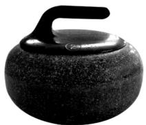

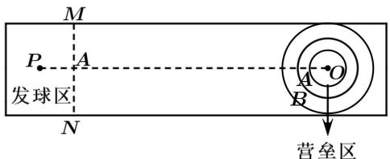

text_image

M
P
A
发球区
N
A
B
O
营垒区

(1) 求甲、乙两人所得分数相同的概率;   
(2) 设甲、乙两人所得的分数之和为 X, 求 X 的分布列和期望.

5210 (2024·河北保定·统考二模)某学校为了提高学生的运动兴趣,增强学生身体素质,该校每年都要进行各年级之间的球类大赛,其中乒乓球大赛在每年“五一”之后举行,乒乓球大赛的比赛规则如下:高中三个年级之间进行单循环比赛,每个年级各派5名同学按顺序比赛(赛前已确定好每场的对阵同学),比赛时一个年级领先另一个年级两场就算胜利(即每两个年级的比赛不一定打满5场),若两个年级之间打成2:2则第5场比赛定胜负.已知高三每位队员战胜高二相应对手的可能性均为 $\frac{1}{2}$ ,高三每位队员战胜高一相应对手的可能性均为 $\frac{2}{3}$ ,高二每位队员战胜高一相应对手的可能性均为 $\frac{1}{2}$ ,且队员、年级之间的胜负相互独立.

(1) 求高二年级与高一年级比赛时, 高二年级与高一年级在前两场打平的条件下, 最终战胜高一年级的概率.  
(2) 若获胜年级积 3 分, 被打败年级积 0 分, 求高三年级获得积分的分布列和期望.

5211 (2024·重庆沙坪坝·高三重庆八中校考开学考试) 2022 年卡塔尔世界杯决赛圈共有 32 支球队参加, 欧洲球队有 13 支: 其中有 5 支欧洲球队闯入 8 强. 比赛进入淘汰赛阶段后, 必须要分出胜负. 淘汰赛规则如下: 在比赛常规时间 90 分钟内分出胜负; 比赛结束, 若比分相同. 则进入 30 分钟的加时赛. 在加时赛分出胜负, 比赛结束, 若加时赛比分依然相同, 就要通过点球大战来分出最后的胜负. 点球大战分为 2 个阶段, 第一阶段: 共 5 轮, 双方每轮各派 1 名球员, 依次踢点球, 以 5 轮的总进球数作为标准, 5 轮合计踢进点球数更多的球队获得比赛的胜利. 如果第一阶段的 5 轮还是平局, 则进入第二阶段: 在该阶段双方每轮各派 1 名球员, 依次踢点球, 如果在一轮里, 双方都进球或者双方都不进球, 则继续下一轮, 直到某一轮里, 一方罚进点球, 另一方没罚进, 比赛结束, 罚进点球的一方获得最终的胜利.

(1) 根据题意填写下面的 $2 \times 2$ 列联表, 并根据小概率值 $\alpha = 0.01$ 的独立性检验, 判断 32 支决赛圈球队“闯入 8 强”与“是欧洲球队”是否有关.

<table><tr><td></td><td>欧洲球队</td><td>其他球队</td><td>合计</td></tr><tr><td>闯入8强</td><td></td><td></td><td></td></tr><tr><td>未闯入8强</td><td></td><td></td><td></td></tr><tr><td>合计</td><td></td><td></td><td></td></tr></table>

(2) 甲、乙两队在淘汰赛相遇, 经过 120 分钟比赛未分出胜负, 双方进入点球大战. 已知甲队球员每轮踢进点球的概率为 $\frac{1}{3}$ , 乙队球员每轮踢进点球的概率为 $\frac{2}{3}$ , 每轮每队是否进球相互独立, 在点球大战中, 两队前 3 轮比分为 3:3, 试求出甲队在第二阶段第一轮结束后获得最终胜利的概率.

参考公式： $\chi^{2}=\frac{n(ad-bc)^{2}}{(a+b)(c+d)(a+c)(b+d)},n=a+b+c+d.$

<table><tr><td> $\mathrm{P}(\chi^{2} \geqslant \alpha)$ </td><td>0.1</td><td>0.05</td><td>0.01</td><td>0.005</td><td>0.001</td></tr><tr><td> $\alpha$ </td><td>2.706</td><td>3.841</td><td>6.635</td><td>7.879</td><td>10.828</td></tr></table>

5212 (2024·贵州·高三凯里一中校联考开学考试)为了丰富学生的课外活动,某中学举办羽毛球比赛,经过三轮的筛选,最后剩下甲、乙两人进行最终决赛,决赛采用五局三胜制,即当参赛甲、乙两位中有一位先赢得三局比赛时,则该选手获胜,则比赛结束.每局比赛皆须分出胜负,且每局比赛的胜负不受之前比赛结果影响.假设甲在每一局获胜的概率均为 $p(0<p<1)$ .

(1) 若比赛进行三局就结束的概率为 $f(p)$ ，求 $f(p)$ 的最小值；

(2) 记 (1) 中, $f(p)$ 取得最小值时, $p$ 的值为 $p_0$ , 以 $p_0$ 作为 $p$ 的值, 用 X 表示甲、乙实际比赛的局数, 求 X 的分布列及数学期望 E(X).

# 题型七:几何问题

5213 (2024·辽宁沈阳·沈阳市第一二〇中学校考模拟预测)某人玩一项有奖游戏活动,其规则是:有一个质地均匀的正四面体(每个面均为全等的正三角形的三棱锥),四个面上分别刻着1,2,3,4,抛掷该正四面体5次,记录下每次与地面接触的面上的数字.

(1) 求接触面上的 5 个数的乘积能被 4 整除的概率;  
(2) 若每次抛掷到接触地面的数字为 3 时奖励 200 元, 否则倒罚 100 元,

①设甲出门带了1000元来参加该游戏,记游戏后甲身上的钱为X元,求 $E(X)$ ;

②若在游戏过程中,甲决定当自己赢了的钱一旦不低于300元时立即结束游戏,求甲不超过三次就结束游戏的概率.

5214 (2024·江西·高考真题)如图,从 $A_{1}(1,0,0)$ , $A_{2}(2,0,0)$ , $B_{1}(0,1,0)$ , $B_{2}(0,2,0)$ , $C_{1}(0,0,1)$ , $C_{2}(0,0,2)$ , 这6个点中随机选取3个点. (1) 求这3点与原点O恰好是正三棱锥的四个顶点的概率; (2) 求这3点与原点O共面的概率.

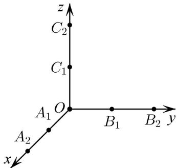

text_image

z
C₂
C₁
A₁ O B₁ B₂ y
A₂
x

5215 (2024·河北张家口·高二统考期末)如图,已知三棱锥 P-ABC 的三条侧棱 PA, PB, PC 两两垂直,且 PA=a, PB=b, PC=c,三棱锥 P-ABC 的外接球半径 R=2.

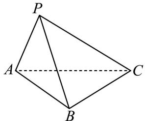

text_image

P
A
C
B

(1) 求三棱锥 P-ABC 的侧面积 S 的最大值;

(2) 若在底面 ABC 上, 有一个小球由顶点 A 处开始随机沿底边自由滚动, 每次滚动一条底边, 滚向顶点 B 的概率为 $\frac{1}{2}$ , 滚向顶点 C 的概率为 $\frac{1}{2}$ ; 当球在顶点 B 处时, 滚向顶点 A 的概率为 $\frac{2}{3}$ , 滚向顶点 C 的概率为 $\frac{1}{3}$ ; 当球在顶点 C 处时, 滚向顶点 A 的概率为 $\frac{2}{3}$ , 滚向顶点 B 的概率为 $\frac{1}{3}$ . 若小球滚动 3 次, 记球滚到顶点 B 处的次数为 X, 求数学期望 E(X) 的值.

5216 (2024·全国·高三专题练习)已知正四棱锥 P-ABCD 的底面边长和高都为 2. 现从该棱

锥的 5 个顶点中随机选取 3 个点构成三角形, 设随机变量 X 表示所得三角形的面积.

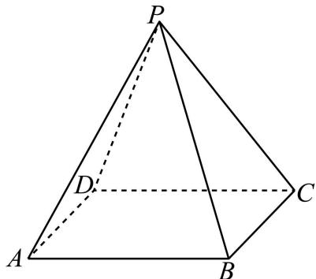

text_image

P
D
A
B
C

(1) 求概率 $P(X=2)$ 的值；  
(2) 求随机变量 X 的概率分布及其数学期望 E(X).

# 题型八:彩票问题

5217 (2024·全国·高二随堂练习)在一种称为“幸运35”的福利彩票中,规定从01,02,…,35这35个号码中任选7个不同号码组成一注,并通过摇奖机从这35个号码中摇出7个不同的号码作为特等奖.与特等奖号码仅6个相同的为一等奖,仅5个相同的为二等奖,仅4个相同的为三等奖,其他的情况不得奖比.为了便于计算,假定每个投注号只有1次中奖机会(只计奖金额最大的奖),该期的每组号码均有人买,且彩票无重复号码比.若每注彩票为2元,特等奖奖金为100万元/注,一等奖奖金为1万元/注,二等奖奖金为100元/注,三等奖奖金为10元/注,试求:

(1) 奖金额 X(元) 的概率分布;  
(2) 这一期彩票售完可以为福利事业筹集多少资金 (不计发售彩票的费用)?

5218 (2024·全国·高三专题练习)中国福利彩票双色球游戏规则是由中华人民共和国财政部制定的规则,是一种联合发行的“乐透型”福利彩票.“双色球”彩票投注区分为红色球号码区和蓝色球号码区,“双色球”每注投注号码由6个红色球号码和1个蓝色球号码组成,红色球号码从1-33中选择;蓝色球号码从1-16中选择.“双色球”奖级设置分为高等奖和低等奖,一等奖和二等奖为高等奖,三至六等奖为低等奖.“双色球”彩票以投注者所选单注投注号码与当期开出中奖号码相符的球色和个数确定中奖等级:

一等奖: 7个号码相符(6个红色球号码和1个蓝色球号码)(红色球号码顺序不限, 下同);

二等奖: 6个红色球号码相符;

三等奖: 5个红色球号码和1个蓝色球号码相符;

四等奖: 5个红色球号码,或4个红色球号码和1个蓝色球号码相符;

五等奖: 4个红色球号码, 或 3个红色球号码和 1个蓝色球号码相符;

六等奖: 1个蓝色球号码相符(有无红色球号码相符均可).

(1) 求中三等奖的概率 (结果用 a 表示);  
(2) 小王买了一注彩票, 在已知小王中了高等奖的条件下, 求小王中二等奖的概率.

参考数据: $C_{33}^{6}C_{16}^{1}=a$

5219 (2024·全国·高三专题练习)现要发行 10000 张彩票,其中中奖金额为 2 元的彩票 1000 张,10 元的彩票 300 张,50 元的彩票 100 张,100 元的彩票 50 张,1000 元的彩票 5 张. 1 张彩票可能中奖金额的均值是多少元?

5220 (2024·高二课时练习)某人花2元钱买彩票,他抽中100元奖的概率是0.1%,抽中10元

奖的概率是1%，抽中1元奖的概率是20%，假设各种奖不能同时抽中，试求：

(1) 此人收益的概率分布；  
(2) 此人收益的期望值.

5221 (2024·全国·高二随堂练习)根据某个福利彩票方案,每注彩票号码都是从1\~37这37个数中选取7个数.如果所选7个数与开出的7个数一样(不管排列顺序),彩票即中一等奖.

(1) 多少注不同号码的彩票可有一个一等奖?  
(2) 如果要将一等奖的中奖机会提高到 $\frac{1}{3000000}$ 以上且不超过 $\frac{1}{2000000}$ ，可在 37 个数中取几个数？

# 题型九:纳税问题

5222 (2024·四川南充·统考一模)自2019年1月1日起,对个人所得税起征点和税率进行调整. 调整如下:纳税人的工资、薪金所得,以每月全部收入额减去5000元后的余额为应纳税所得额. 依照个人所得税税率表,调整前后的计算方法如表:

<table><tr><td colspan="3">个人所得税税率(调整前)</td><td colspan="3">个人所得税税率(调整后)</td></tr><tr><td colspan="3">免征额3500元</td><td colspan="3">免征额5000元</td></tr><tr><td>级数</td><td>全月应纳税所得额</td><td>税率(%)</td><td>级数</td><td>全月应纳税所得额</td><td>税率(%)</td></tr><tr><td>1</td><td>不超过1500元的部分</td><td>3</td><td>1</td><td>不超过3000元的部分</td><td>3</td></tr><tr><td>2</td><td>超过1500元至4500元的部分</td><td>10</td><td>2</td><td>超过3000元至12000元的部分</td><td>10</td></tr><tr><td>3</td><td>超过4500元至9000元的部分</td><td>20</td><td>3</td><td>超过12000元至25000元的部分</td><td>20</td></tr><tr><td>...</td><td>...</td><td>...</td><td>...</td><td>...</td><td>...</td></tr></table>

(1) 假如李先生某月的工资、薪金等所得税前收入总和不高于 8000 元, 记 $x$ 表示总收入, $y$ 表示应纳的税, 试分别求出调整前和调整后 $y$ 关于 $x$ 的函数表达式;  
(2) 某税务部门在李先生所在公司利用分层抽样方法抽取某月 100 个不同层次员工的税前收入, 并制成下面的频数分布表:

<table><tr><td>收入(元)</td><td>[3000,5000)</td><td>[5000,7000)</td><td>[7000,9000)</td><td>[9000,11000)</td><td>[11000,13000)</td><td>[13000,15000)</td></tr><tr><td>人数</td><td>30</td><td>40</td><td>10</td><td>8</td><td>7</td><td>5</td></tr></table>

先从收入在 [3000,5000) 及 [5000,7000) 的人群中按分层抽样抽取 7 人, 再从中选 2 人作为新纳税法知识宣讲员, 求选中的 2 人收入都在 [3000,5000) 的概率;

5223 (2024·全国·高三专题练习)个人所得税起征点是个人所得税工薪所得减除费用标准或免征额,个税起征点与个人税负高低的关系最为直接,因此成为广大工薪阶层关注的焦点.随着我国人民收入的逐步增加,国家税务总局综合考虑人民群众消费支出水平增长等各方面因素,规定从2019年1月1日起,我国实施个税新政.实施的个税新政主要内容包括:①个税起征点为5000元②每月应纳税所得额(含税)=收入-个税起征点-专项附加扣除;③专项附加扣除包括住房、子女教育和赡养老人等.新旧个税政策下每月应纳税随机抽取某市1000名同一收入层级的无亲属关系的男性互联网从业者(以下互联网从业者都是指无亲属关系的男性)的相关资料,经统计分析,预估他们2022年的人均月收入为30000元.统计资料还表明,他们均符合住房专项扣除,同时他们每人至多只有一个符合子女教育扣除的孩子,并且他们之中既不符合子女教育扣除又不符合赡养老人扣除、只符合子女教育扣除但不符合赡养老人扣除、只符合赡养老人扣除但不符合子女教育扣除、既符合子女教育扣除又符合赡养老人扣除的人数之比是2:1:1:1.此外,他们均不符合其他专项附加扣除.新个税政策下该市的专项附加扣除标准为:住房1000元/月,子女教育每孩1000元/月,赡养老人2000元/月等.假设该市该收入层级的互联网从业者都独自享受专项附加扣除,将预估的该市该收入层级的互联网从业者的人均月收入视为其个人月收入.根据样本估计总体的思想,解决下列问题.

所得额(含税)计算方法及其对应的税率表如下:

<table><tr><td></td><td colspan="2">旧个税税率表(个税起征点3500元)</td><td colspan="2">新个税税率表(个税起征点5000元)</td></tr><tr><td>缴税级数</td><td>每月应纳税所得额(含税)=收入-个税起征点</td><td>税率/%</td><td>每月应纳税所得额(含税)=收入-个税起征点-专项附加扣除</td><td>税率/%</td></tr><tr><td>1</td><td>不超过1500元</td><td>3</td><td>不超过3000元</td><td>3</td></tr><tr><td>2</td><td>部分超过1500元至4500元部分</td><td>10</td><td>部分超过3000元至12000元部分</td><td>10</td></tr><tr><td>3</td><td>超过4500元至9000元的部分</td><td>20</td><td>超过12000元至25000元的部分</td><td>20</td></tr><tr><td>4</td><td>超过9000元至35000元的部分</td><td>25</td><td>超过25000元至35000元的部分</td><td>25</td></tr><tr><td>5</td><td>超过35000元至55000元部分</td><td>30</td><td>超过35000元至55000元部分</td><td>30</td></tr><tr><td>...</td><td>...</td><td>...</td><td>...</td><td></td></tr></table>

(1) 按新个税方案, 设该市该收入层级的互联网从业者 2022 年月缴个税为 X 元, 求 X 的分布列和数学期望;  
(2) 根据新旧个税方案, 估计从 2022 年 1 月开始, 经过几个月, 该市该收入层级的互联网从业者各月少缴的个税之和就能购买一台价值为 29400 元的华为智慧屏巨幕电视?

5224 (2024·全国·高三专题练习)随着改革开放的不断深入,祖国不断富强,人民生活水平逐步提高,为了进一步改善民生,2019年1月1日起我国实施了个人所得税的新政策,新政策的主要内容包括:①个税起征点为5000元;②每月应纳税所得额(含税)=(收入)-(个税起征点)-(专项附加扣除);③专项附加扣除包括赡养老人、子女教育、继续教育、大病医疗等. 新个税政策下赡养老人的扣除标准为:独生子女每月扣除2000元,非独生子女与其兄弟姐妹按照每月2000元的标准分摊扣除,但每个人的分摊额度不能超过1000元;子女教育的扣除标准为:每个子女每月扣除1000元(可由父母中的一方扣除,或者父母双方各扣除500元)税率表如下:

<table><tr><td>级数</td><td>全月应纳税所得额</td><td>税率</td></tr><tr><td>1</td><td>不超过3000元的部分</td><td>3%</td></tr><tr><td>2</td><td>超过3000元至12000元的部分</td><td>10%</td></tr><tr><td>3</td><td>超过12000元至25000元的部分</td><td>20%</td></tr><tr><td>4</td><td>超过25000元至35000元的部分</td><td>25%</td></tr><tr><td>...</td><td>...</td><td>...</td></tr></table>

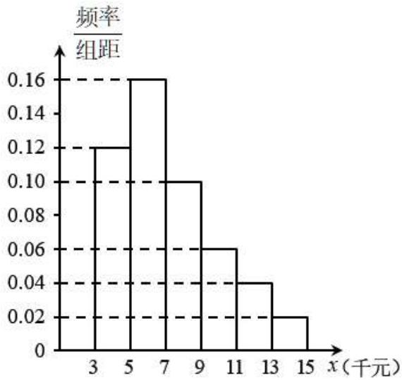

histogram

| x (千元) | 频率/组距 |
|---|---|
| 3 | 0.12 |
| 5 | 0.16 |
| 7 | 0.10 |
| 9 | 0.06 |
| 11 | 0.04 |
| 13 | 0.02 |
| 15 | 0.02 |

(1) 税务部门在小李所在公司用分层抽样方法抽取某月 100 位不同层次员工的税前收入，并制成如图的频率分布直方图.

(i) 请根据频率分布直方图估计该公司员工税前收入的中位数；

(ii) 同一组中的数据以这组数据所在区间中点的值作代表，在不考虑他们的专项附加扣除的情况下，甲、乙两位同学用如下两种方法估计小李所在的公司员工该月平均纳税，请判断哪位同学的方法是正确的，不需说明理由。甲同学： $0.24 \times 0 + 0.32 \times 30 + 0.2 \times 90 + 0.12 \times 290 + 0.08 \times 490 + 0.04 \times 690 = 129.2$ （元）；乙同学：先计算收入的均值 $\bar{x} = 0.24 \times 4000 + 0.32 \times 6000 + 0.2 \times 8000 + 0.12 \times 10000 + 0.08 \times 12000 + 0.04 \times 14000 = 7200$ （元），再利用均值计算平均纳税为： $(7200 - 5000) \times 0.03 = 66$ （元）

(2)为研究某城市月薪为20000元群体的纳税情况,现收集了该城市500名公司白领(每人至多1个孩子)的相关资料,通过整理数据知道:这500人中有一个孩子符合子女教育专项附加扣除(假定由他们各自全部扣除)的有400人,不符合子女教育专项附加扣除的人有100人,符合子女专项附加扣除的人中有300人也符合赡养老人专项附加扣除,不符合子女专项附加扣除的人中有50人符合赡养老人专项附加扣除,并且他们均不符合其他专项附加扣除(统计的500人中,任何两人均不在一个家庭且为独生子女).若他们的月收入均为20000元,依据样本估计总体的思想,试估计在新个税政策下这类人群每月应缴纳个税金额X(单位:元)的分布列与期望.

5225 (2024·全国·高三专题练习)企业在商业活动中有依法纳税的基本义务,不依法纳税叫做逃税,是一种违法行为。某地区有2万家企业,政府部门抽取部分企业统计其去年的收入,得到下面的频率分布表。根据当地政策综合测算,企业应缴的税额约为收入的5%,而去年该地区企业实际缴税的总额为291亿元。

<table><tr><td>收入(千万元)</td><td>(0,2)</td><td>[2,4)</td><td>[4,6)</td><td>[6,8)</td><td>[8,10]</td></tr><tr><td>频率</td><td>0.3</td><td>0.5</td><td>0.12</td><td>0.06</td><td>0.02</td></tr></table>

(1) 估计该地区去年收入大于等于 4 千万元的企业数量；  
(2) 估计该地区企业去年的平均收入, 并以此估计该地区逃税的企业数量;  
(3)根据统计,该地区企业逃税被查出来的概率为0.3,被查出逃税的企业除了要补缴税款以外,还会被处以应缴税额 $n(n\in\mathbb{N}^{*})$ 倍的罚款,从企业逃税的获益期望考虑,n至少定为多少,才能对逃税行为起到惩罚作用?

注:每组数据以区间中点值为代表,假设逃税的企业缴税额为0,未逃税的企业都足额缴税.

5226 (2024·全国·高三专题练习)随着经济的发展,个人收入的提高,自2019年1月1日起,个人所得税起征点和税率的调整,调整如下:纳税人的工资、薪资所得,以每月全部收入额减除5000元后的余额为应纳税所得额,依照个人所得税税率表,调整前后的计算方法如下表:

<table><tr><td colspan="3">个人所得税税率表(调整前)</td><td colspan="4">个人所得税税率表(调整后)</td></tr><tr><td colspan="3">免征额3500元</td><td colspan="4">免征额5000元</td></tr><tr><td>级数</td><td>全月应纳税所得额</td><td colspan="2">税率(%)</td><td>级数</td><td>全月应纳税所得额</td><td>税率(%)</td></tr><tr><td>1</td><td>不超过1500元部分</td><td colspan="2">3</td><td>1</td><td>不超过3000元部分</td><td>3</td></tr><tr><td>2</td><td>超过1500元至4500元的部分</td><td colspan="2">10</td><td>2</td><td>超过3000元至12000元的部分</td><td>10</td></tr><tr><td>3</td><td>超过4500元至9000元的部分</td><td colspan="2">20</td><td>3</td><td>超过12000元至25000元的部分</td><td>20</td></tr><tr><td>...</td><td>...</td><td colspan="2">...</td><td>...</td><td>...</td><td>...</td></tr></table>

(1) 假如小红某月的工资、薪资等所得税前收入总和不高于 10000 元, 记 $x$ 表示总收入, 表示应纳的税, 试写出调整前后 $y$ 关于 $x$ 的函数表达式;  
(2) 某税务部门在小红所在公司利用分层抽样方法抽取某月 100 个不同层次员工的税前收入, 并制成下面的频数分布表:

<table><tr><td>收入(元)</td><td>[3000,5000)</td><td>[5000,7000)</td><td>[7000,9000)</td><td>[9000,11000)</td><td>[11000,13000)</td></tr><tr><td>人数</td><td>20</td><td>40</td><td>15</td><td>10</td><td>5</td></tr></table>

①先从收入在 $[3000, 5000)$ 及 $[5000, 7000)$ 的人群中按分层抽样抽取6人，再从中选3人作为新纳税法知识宣讲员，用 $a$ 表示抽到作为宣讲员的收入在 $[3000, 5000)$ 元的人数， $b$ 表示抽到作为宣讲员的收入在 $[5000, 7000)$ 元的人数，随机变量 $z = |a - b + 1|$ ，求 $z$ 的分布列与数学期望；  
②小红该月的工资、薪资等税前收入为8500元时,请你帮小红算一下调整后小红的实际收入比调整前增加了多少?

10 题型十:疾病问题

5227 (2024·广西玉林·高三校联考开学考试)某医药企业使用新技术对某款血液试剂进行试生产.

(1) 在试产初期,该款血液试剂的 I 批次生产有四道工序,前三道工序的生产互不影响,第四道是检测评估工序,包括智能自动检测与人工抽检.已知该款血液试剂在生产中,经过前三道工序后的次品率为 $\frac{1}{20}$ .第四道工序中智能自动检测为次品的血液试剂会被自动淘汰,合格的血液试剂进入流水线并由工人进行抽查检验.

已知批次I的血液试剂智能自动检测显示合格率为98%，求工人在流水线进行人工抽检时，抽检一个血液试剂恰为合格品的概率；

(2) 已知切比雪夫不等式: 设随机变量 X 的期望为 E(X), 方差为 D(X), 则对任意 $\varepsilon > 0$ , 均有 P(|X - E(X)| ≥ ε) ≤ $\frac{D(X)}{\varepsilon^{2}}$ . 药厂宣称该血液试剂对检测某种疾病的有效率为 80%, 现随机选择了 100 份血液样本, 使用该血液试剂进行检测, 每份血液样本检测结果相互独立, 显示有效的份数不超过 60 份, 请结合切比雪夫不等式, 通过计算说明该企业的宣传内容是否真实可信.

5228 (2024·江苏镇江·高三统考开学考试)卫生检疫部门在进行病毒检疫时常采用“混采检测”或“逐一检测”的形式进行,某兴趣小组利用“混采检测”进行试验,已知6只动物中有1只患有某种疾病,需要通过血液化验来确定患病的动物,血液化验结果呈阳性的为患病动物,下面是两种化验方案:

方案甲: 将各动物的血液逐个化验, 直到查出患病动物为止.

方案乙:先取4只动物的血液混在一起化验,若呈阳性,则对这4只动物的血液再逐个化验,直到查出患病动物;若不呈阳性,则对剩下的2只动物再逐个化验,直到查出患病动物.

(1) 用 X 表示依方案甲所需化验次数, 求变量 X 的期望;  
(2) 求依方案甲所需化验次数少于依方案乙所需化验次数的概率.

5229 (2024·辽宁·高三东北育才学校校联考开学考试)某单位有12000名职工,通过抽验筛查一种疾病的患者. 假设患疾病的人在当地人群中的比例为 $p(0<p<1)$ . 专家建议随机地按 $k(k>1$ 且为12000的正因数)人一组分组,然后将各组k个人的血样混合再化验. 如果混管血样呈阴性,说明这k个人全部阴性;如果混管血样呈阳性,说明其中至少有一人的血样呈阳性,就需要对每个人再分别化验一次. 设该种方法需要化验的总次数为X.

(1) 当 $E(X) \geqslant 12000$ 时, 求 p 的取值范围并解释其实际意义;  
(2) 现对混管血样逐一化验, 至化验出阳性样本时停止, 最多化验 R 次. 记 W 为混管的化验次数, 当 R 足够大时, 证明: $E(W) < \frac{1}{1 - (1 - p)^{k}}$ ;  
(3)根据经验预测本次检测时个人患病的概率 $p_{0}$ ，当k=6时，按照 $p_{0}$ 计算得混管数量Y的期望 $E(Y)=400$ ；某次检验中 $Y_{0}=440$ ，试判断个人患病的概率为 $p_{0}$ 是否合理。(如果 $2P(Y\geqslant Y_{0})<0.05$ ，则说明假设不合理).

附: 若 $X \sim N(\mu, \sigma^{2})$ ，则 $P(|X - \mu| < \sigma) \approx 0.6827$ ， $P(|X - \mu| < 2\sigma) \approx 0.9545$ ， $P(|X - \mu| < 3\sigma) \approx 0.9973$ .

5230 (2024·重庆沙坪坝·高三重庆一中校考阶段练习)某研究小组经过研究发现某种疾病的患病者与未患病者的某项医学指标有明显差异,已知该疾病的患病率为5%,经过大量调查,得到如图的患病者和未患病者该指标的频率分布直方图:

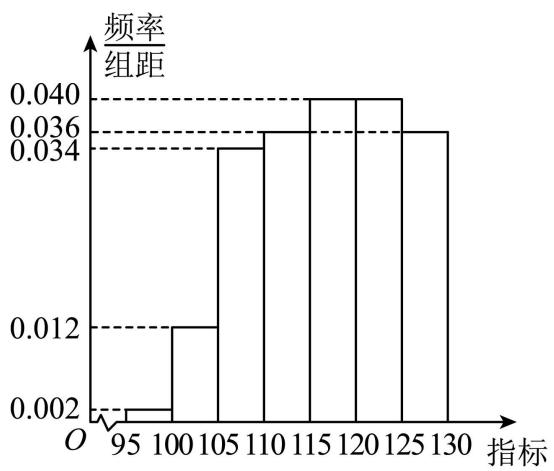

histogram

| 指标 | 频率/组距 |
| :--- | :--- |
| 95 | 0.002 |
| 100 | 0.012 |
| 105 | 0.034 |
| 110 | 0.036 |
| 115 | 0.040 |
| 120 | 0.040 |
| 125 | 0.036 |
| 130 | 0.036 |

患病者

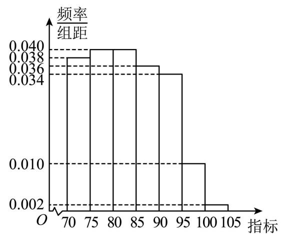

histogram

| 指标 | 频率/组距 |
| :--- | :--- |
| 70-75 | 0.038 |
| 75-80 | 0.040 |
| 80-85 | 0.040 |
| 85-90 | 0.036 |
| 90-95 | 0.036 |
| 95-100 | 0.010 |
| 100-105 | 0.002 |

未患病者

利用该指标制定一个检测标准,需要确定临界值 c, 将该指标大于 c 的人判定为阳性, 小于或等于 c 的人判定为阴性. 将患病者判定为阴性或将未患病者判定为阳性均为误诊. 假设数据在组内均匀分布, 以事件发生的频率作为相应事件发生的概率.

(1) 当临界值 c = 97.5 时, 已知某人是患病者, 求该人被误诊的概率;   
(2) 当 $c \in [95, 105]$ 时, 求利用该指标作为检测标准的误诊率 $f(c)$ 的解析式, 并求使 $f(c)(c \in [95, 105])$ 最小的临界值 $c$ .

5231 (2024·上海浦东新·高三华师大二附中校考阶段练习)某研究小组经过研究发现某种疾病的患病者与未患病者的某项医学指标有明显差异,经过大量调查,得到如下的患病者和未患病者该指标的频率分布直方图:

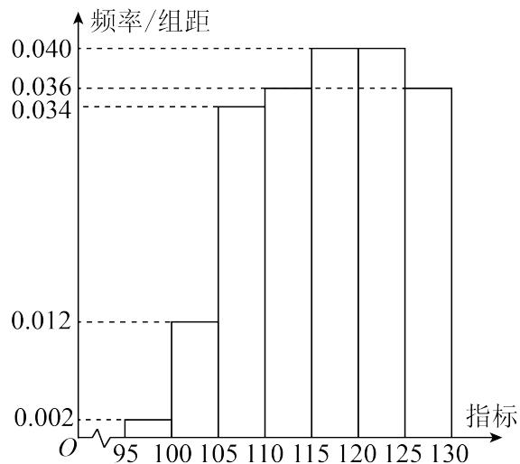

histogram

| 指标 | 频率/组距 |
| ---- | --------- |
| 95   | 0.002     |
| 100  | 0.012     |
| 105  | 0.034     |
| 110  | 0.036     |
| 115  | 0.040     |
| 120  | 0.040     |
| 125  | 0.036     |
| 130  | 0.036     |

患病者

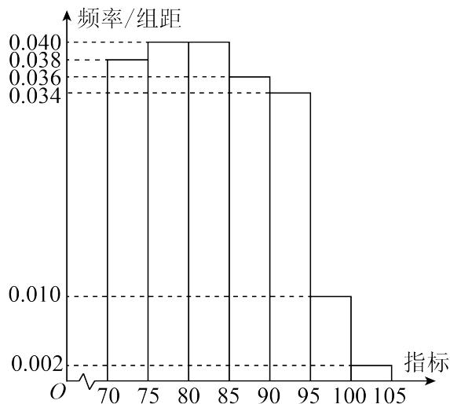

histogram

| 指标 | 频率/组距 |
| ---- | --------- |
| 70   | 0.038     |
| 75   | 0.040     |
| 80   | 0.040     |
| 85   | 0.036     |
| 90   | 0.034     |
| 95   | 0.010     |
| 100  | 0.002     |
| 105  | 0.002     |

未患病者

利用该指标制定一个检测标准,需要确定临界值 c, 将该指标大于 c 的人判定为阳性, 小于或等于 c 的人判定为阴性. 此检测标准的漏诊率是将患病者判定为阴性的概率, 记为 $p(c)$ ; 误诊率是将未患病者判定为阳性的概率, 记为 $q(c)$ . 假设数据在组内均匀分布, 以事件发生的频率作为相应事件发生的概率.

(1) 当漏诊率 $p(c)=0.5\%$ 时, 求临界值 c 和误诊率 $q(c)$ ;  
(2) 设函数 $f(c) = p(c) + q(c)$ ，当 $c \in [95, 105]$ 时，求 $f(c)$ 的解析式，并求 $f(c)$ 在区间[95,105]的最小值.

5232 (2024·全国·高三专题练习)概率论中有很多经典的不等式,其中最著名的两个当属由两位俄国数学家马尔科夫和切比雪夫分别提出的马尔科夫(Markov)不等式和切比雪夫(Chebyshev)不等式. 马尔科夫不等式的形式如下:

设 X 为一个非负随机变量, 其数学期望为 $\mathrm{E}(\mathrm{X})$ , 则对任意 $\varepsilon > 0$ , 均有 $\mathrm{P}(\mathrm{X} \geqslant \varepsilon) \leqslant \frac{\mathrm{E}(\mathrm{X})}{\varepsilon}$ ,

马尔科夫不等式给出了随机变量取值不小于某正数的概率上界，阐释了随机变量尾部取值概率与其数学期望间的关系．当X为非负离散型随机变量时，马尔科夫不等式的证明如下：

设 X 的分布列为 $P(X=x_{i})=p_{i}, i=1,2,\cdots,n,$ 其中 $p_{i}\in(0,+\infty),x_{i}\in[0,+\infty)$ (i=1,2,

$\cdots,n),\sum_{i=1}^{n}p_{i}=1$ ，则对任意 $\varepsilon>0,\mathrm{P}(\mathrm{X}\geqslant\varepsilon)=\sum_{x_{i}\geqslant\varepsilon}p_{i}\leqslant\sum_{x_{i}\geqslant\varepsilon}\frac{x_{i}}{\varepsilon}p_{i}=$

$\frac{1}{\varepsilon}\sum_{x_{i}\geqslant\varepsilon}x_{i}p_{i}\leqslant\frac{1}{\varepsilon}\sum_{i=1}^{n}x_{i}p_{i}=\frac{\mathrm{E}(\mathrm{X})}{\varepsilon}$ ，其中符号 $\sum_{x_{i}\geqslant\varepsilon}A_{i}$ 表示对所有满足 $x_{i}\geqslant\varepsilon$ 的指标i所对应的 $A_{i}$ 求和.

切比雪夫不等式的形式如下：

设随机变量 X 的期望为 $\mathrm{E}(\mathrm{X})$ ，方差为 $\mathrm{D}(\mathrm{X})$ ，则对任意 $\varepsilon > 0$ ，均有 $\mathrm{P}(|\mathrm{X}-\mathrm{E}(\mathrm{X})| \geqslant \varepsilon) \leqslant \frac{\mathrm{D}(\mathrm{X})}{\varepsilon^{2}}$

(1) 根据以上参考资料, 证明切比雪夫不等式对离散型随机变量 X 成立.

(2)某药企研制出一种新药,宣称对治疗某种疾病的有效率为80%。现随机选择了100名患者,经过使用该药治疗后,治愈的人数为60人,请结合切比雪夫不等式通过计算说明药厂的宣传内容是否真实可信.

# 11 题型十一:建议问题

5233 (2024·全国·高三专题练习) H 地区农科所统计历年冬小麦每亩产量的数据, 得到频率分布直方图 (如图 1), 考虑到受市场影响, 预测该地区明年冬小麦统一收购价格情况如表 1 (该预测价格与亩产量互不影响).

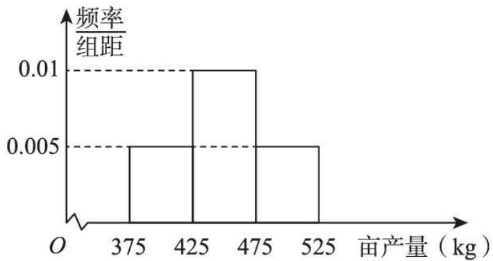

histogram

| 亩产量 (kg) | 频率/组距 |
| :--- | :--- |
| 375 | 0.005 |
| 425 | 0.01 |
| 475 | 0.005 |
| 525 | 0.005 |

图1

<table><tr><td>明年冬小麦统一收购价格(单位:元/kg)</td><td>2.4</td><td>3</td></tr><tr><td>概率</td><td>0.4</td><td>0.6</td></tr></table>

表1

假设图1中同组的每个数据用该组区间的中点值估算,并以频率估计概率.

(1) 试估计 H 地区明年每亩冬小麦统一收购总价为 1500 元的概率；

(2) 设 H 地区明年每亩冬小麦统一收购总价为 X 元, 求 X 的分布列和数学期望;

(3)H地区农科所研究发现,若每亩多投入125元的成本进行某项技术改良,则可使每亩冬小麦产量平均增加50kg.从广大种植户的平均收益角度分析,你是否建议农科所推广该项技术改良?并说明理由.

5234 (2024·北京·高三北京市第一六一中学校考期中)某校为了鼓励学生热心公益,服务社会,成立了“慈善义工社”.本学期该校“慈善义工社”为学生提供了4次参加公益活动的机会,学生可通过网络平台报名并参加该活动.活动结束后,为了解学生实际参加这4次活动的情况,从全校4000名学生中随机抽取100名学生进行调查,数据统计如下表,其中“√表示参加,”×”表示未参加.

<table><tr><td>公益活动学生人数</td><td>第1次</td><td>第2次</td><td>第3次</td><td>第4次</td></tr><tr><td>30</td><td>×</td><td>×</td><td>√</td><td>√</td></tr><tr><td>20</td><td>×</td><td>√</td><td>×</td><td>√</td></tr><tr><td>15</td><td>√</td><td>√</td><td>√</td><td>√</td></tr><tr><td>12</td><td>√</td><td>√</td><td>√</td><td>×</td></tr><tr><td>10</td><td>×</td><td>√</td><td>×</td><td>×</td></tr><tr><td>a</td><td>√</td><td>×</td><td>×</td><td>×</td></tr><tr><td>b</td><td>×</td><td>×</td><td>×</td><td>×</td></tr></table>

根据表中数据估计,该校4000名学生中约有120名这4次活动均未参加.

(1) 求 $a, b$ 的值；

(2) 若学生每次参加公益活动可获得 10 个公益积分, 任取该校一名学生, 记该生在本学期活动中获得的公益积分为 X, 以频率作为概率, 求 X 的分布列和数学期望;

(3) 如果你是该校“慈善义工社”的负责人之一,那么根据表格中的数据,在安排下学期的公益活动时你会提出什么改进建议?并说明理由.

5235 (2024·北京东城·高三景山学校校考开学考试)汽车租赁公司为了调查A,B两种车型的出租情况,现随机抽取了这两种车型各100辆汽车,分别统计了每辆车某个星期内的出租天数,统计数据如下表:

<table><tr><td colspan="8">A型车</td></tr><tr><td>出租天数</td><td>1</td><td>2</td><td>3</td><td>4</td><td>5</td><td>6</td><td>7</td></tr><tr><td>车辆数</td><td>5</td><td>10</td><td>30</td><td>35</td><td>15</td><td>3</td><td>2</td></tr><tr><td colspan="8">B型车</td></tr><tr><td>出租天数</td><td>1</td><td>2</td><td>3</td><td>4</td><td>5</td><td>6</td><td>7</td></tr><tr><td>车辆数</td><td>14</td><td>20</td><td>20</td><td>16</td><td>15</td><td>10</td><td>5</td></tr></table>

(1) 从出租天数为 3 天的汽车 (仅限 A, B 两种车型) 中随机抽取一辆, 估计这辆汽车恰好是 A 型车的概率;

(2) 根据这个星期的统计数据 (用频率估计概率), 求该公司一辆 A 型车, 一辆 B 型车一周内合计出租天数恰好为 4 天的概率;

(3) 如果两种车型每辆车每天出租获得的利润相同, 该公司需要从 A, B 两种车型中购买

一辆,请你根据所学的统计知识,给出建议应该购买哪一种车型,并说明你的理由.

5236 (2024·湖北武汉·统考三模)某社区拟对该社区内8000人进行核酸检测,现有以下两种核酸检测方案:

方案一: 4人一组,采样混合后进行检测;

方案二: 2 人一组,采样混合后进行检测;

若混合样本检测结果呈阳性,则对该组所有样本全部进行单个检测;若混合样本检测结果呈阴性,则不再检测.

(1) 某家庭有 6 人, 在采取方案一检测时, 随机选 2 人与另外 2 名邻居组成一组, 余下 4 人组成一组, 求该家庭 6 人中甲, 乙两人被分在同一组的概率;  
(2) 假设每个人核酸检测呈阳性的概率都是 0.01, 每个人核酸检测结果相互独立, 分别求该社区选择上述两种检测方案的检测次数的数学期望. 以较少检测次数为依据, 你建议选择哪种方案?

(附: $0.99^{2} \approx 0.98, 0.99^{4} \approx 0.96$ )

5237 (2024·全国·高三专题练习)机动车辆保险即汽车保险(简称车险),是指对机动车辆由于自然灾害或意外事故所造成的人身伤亡或财产损失负赔偿责任的一种商业保险.机动车辆保险一般包括交强险和商业险,商业险包括基本险和附加险两部分.经验表明新车商业险保费与购车价格有较强的线性相关关系,下面是随机采集的相关数据:

<table><tr><td>购车价格x(万元)</td><td>5</td><td>10</td><td>15</td><td>20</td><td>25</td><td>30</td><td>35</td></tr><tr><td>商业险保费y(元)</td><td>1737</td><td>2077</td><td>2417</td><td>2757</td><td>3097</td><td>3622</td><td>3962</td></tr></table>

(1) 根据表中数据, 求 y 关于 x 的线性回归方程 (精确到 0.01);  
(2)某保险公司规定:上一年的出险次数决定了下一年的保费倍率,上一年没有出险,则下一年保费倍率为85%,上一年出险一次,则下一年保费倍率为100%,上一年出险两次,则下一年保费倍率为125%. 太原王女士2022年1月购买了一辆价值32万元的新车. 若该车2022年2月已出过一次险,4月又发生事故,王女士到汽车维修店询价,预计修车费用为800元,理赔人员建议王女士自费维修(即不出险),你认为王女士是否应该接受该建议?请说明理由.(假设车辆2022年与2024年都购买相同的商业险产品)

参考数据: $\sum_{i=1}^{7}x_{i}y_{i}=445605,\bar{y}=2809.86,\sum_{i=1}^{7}x_{i}^{2}=3500.$

参考公式： $\hat{b}=\frac{\sum_{i=1}^{n}\left(x_{i}-\bar{x}\right)\left(y_{i}-\bar{y}\right)}{\sum_{i=1}^{n}\left(x_{i}-\bar{x}\right)^{2}}=\frac{\sum_{i=1}^{n}x_{i}y_{i}-n\bar{x}\bar{y}}{\sum_{i=1}^{n}x_{i}^{2}-n\bar{x}^{2}}.$

5238 (2024·全国·高三专题练习)为弘扬中华传统文化,吸收前人在修身、处世、治国、理政等方面的智慧和经验,养浩然正气,塑高尚人格,不断提高学生的人文素质和精神境界,某校举行传统文化知识竞赛活动.竞赛共有“儒”和“道”两类题,每类各5题.其中每答对1题“儒”题得10分,答错得0分;每答对1题“道”题得20分,答错扣5分.每位参加竞赛的同学从这两类题中共抽出4题回答(每个题抽后不放回),要求“道”题中至少抽2题作答.已知小明同学“儒”题中有4题会作答,答对各个“道”题的概率均为 $\frac{2}{5}$ .

(1) 若小明同学在“儒”题中只抽 1 题作答, 求他在这次竞赛中得分为 35 分的概率;  
(2) 若小明同学第1题是从“儒”题中抽出并回答正确, 根据得分期望给他建议, 应从“道”题中抽取几道题作答?

# 12 题型十二:概率与数列递推问题

5239 (2024·贵州贵阳·高三贵阳一中校考阶段练习)马尔科夫链是概率统计中的一个重要模型,因俄国数学家安德烈·马尔科夫得名,其过程具备“无记忆”的性质,即第 $n+1$ 次状态的概率分布只跟第n次的状态有关,与第n-1,n-2,n-3,…次状态无关,即

$\mathrm{P}\left(\mathrm{X}_{n+1} \mid \cdots, \mathrm{X}_{n-2}, \mathrm{X}_{n-1}, \mathrm{X}_{n}\right) = \mathrm{P}\left(\mathrm{X}_{n+1} \mid \mathrm{X}_{n}\right)$ . 已知甲盒子中装有 2 个黑球和 1 个白球，乙盒子中装有 2 个白球，现从甲、乙两个盒子中各任取一个球交换放入另一个盒子中，重复 n 次这样的操作. 记甲盒子中黑球个数为 $X_{n}$ ，恰有 2 个黑球的概率为 $a_{n}$ ，恰有 1 个黑球的概率为 $b_{n}$ .

(1) 求 $a_{1}$ , $b_{1}$ 和 $a_{2}$ , $b_{2}$ ;  
(2) 证明: $\left\{2a_{n} + b_{n} - \frac{6}{5}\right\}$ 为等比数列 ( $n \geqslant 2$ 且 $n \in \mathbb{N}^{*}$ );  
(3) 求 $X_{n}$ 的期望 (用 n 表示, $n \geqslant 2$ 且 $n \in N^{*}$ ).

5240 (2024·全国·高三专题练习)甲乙两人轮流掷硬币,第一局甲先掷,谁先掷出正面谁就胜,上一局的负者下一局先掷.问:

(1) 第一局甲胜的概率;  
(2) 第 n 局甲胜的概率.

5241 (2024·河北保定·河北省唐县第一中学校考二模)在某个周末,甲、乙、丙、丁四名同学相约打台球. 四人约定游戏规则:①每轮游戏均将四人分成两组,进行组内一对一对打;②第一轮甲乙对打、丙丁对打;③每轮游戏结束后,两名优胜者组成优胜组在下一轮游戏中对打,同样的,两名失败者组成败者组在下一轮游戏中对打;④每轮比赛均无平局出现. 已知甲胜乙、乙胜丙、丙胜丁的概率均为 $\frac{1}{2}$ ,甲胜丙、乙胜丁的概率均为 $\frac{3}{5}$ ,甲胜丁的概率为 $\frac{2}{3}$ .

(1) 设在前三轮比赛中, 甲乙对打的次数为随机变量 X, 求 X 的数学期望;  
(2) 求在第 10 轮比赛中, 甲丙对打的概率.

5242 (2024·湖北武汉·高三统考开学考试)有编号为1, 2, 3, ..., 18, 19, 20的20个箱子, 第一个箱子有2个黄球1个绿球, 其余箱子均为2个黄球2个绿球, 现从第一个箱子中取出一个球放入第二个箱子, 再从第二个箱子中取出一个球放入第三个箱子, 以此类推, 最后从第19个箱子取出一个球放入第20个箱子, 记 $p_i$ 为从第i个箱子中取出黄球的概率.

(1) 求 $p_{2}, p_{3}$ ;   
(2) 求 $p_{20}$ .

5243 (2024·江西·校联考二模)文具盒里装有7支规格一致的圆珠笔,其中4支黑笔,3支红笔.某学校甲、乙、丙三位教师共需取出3支红笔批阅试卷,每次从文具盒中随机取出一支笔,若取出的是红笔,则不放回;若取出的是黑笔,则放回文具盒,继续抽取,直至将3支红笔全部抽出.

(1) 在第 2 次取出黑笔的前提下, 求第 1 次取出红笔的概率;  
(2) 抽取 3 次后, 记取出红笔的数量为 X, 求随机变量 X 的分布列;  
(3) 因学校临时工作安排, 甲教师不再参与阅卷, 记恰好在第 n 次抽取中抽出第 2 支红笔的概率为 $P_{n}$ , 求 $P_{n}$ 的通项公式.

5244 (2024·吉林·通化市第一中学校校联考模拟预测) 2022 年 12 月 18 日, 第二十二届男足世界杯决赛在梅西率领的阿根廷队与姆巴佩率领的法国队之间展开, 法国队在上半场落后两球的情况下,下半场连进两球,2比2战平进入加时赛,加时赛两队各进一球(比分3:

3) 再次战平, 在随后的点球大战中, 阿根廷队发挥出色, 最终赢得了比赛的胜利, 时隔 36 年再次成功夺得世界杯冠军, 梅西如愿以偿, 成功捧起大力神杯.

(1)法国队与阿根廷队实力相当,在比赛前很难预测谁胜谁负.赛前有3人对比赛最终结果进行了预测,假设每人预测正确的概率均为 $\frac{1}{2}$ ,求预测正确的人数X的分布列和期望;  
(2) 足球的传接配合非常重要, 传接球训练也是平常训练的重要项目, 梅西和其他 4 名队友在某次传接球的训练中, 假设球从梅西脚下开始, 等可能地随机传向另外 4 人中的 1 人, 接球者接到球后再等可能地随机传向另外 4 人中的 1 人, 如此不停地传下去, 假设传出的球都能接住, 记第 n 次传球之前球在梅西脚下的概率为 $P_{n}$ , 求 $P_{n}$ .

5245 (2024·全国·高三专题练习)某中学举办了诗词大会选拔赛,共有两轮比赛,第一轮是诗词接龙,第二轮是飞花令. 第一轮给每位选手提供5个诗词接龙的题目,选手从中抽取2个题目,主持人说出诗词的上句,若选手在10秒内正确回答出下句可得10分,若不能在10秒内正确回答出下句得0分.

(1) 已知某位选手会 5 个诗词接龙题目中的 3 个, 求该选手在第一轮得分的数学期望;  
(2) 已知恰有甲、乙、丙、丁四个团队参加飞花令环节的比赛, 每一次由四个团队中的一个回答问题, 无论答题对错, 该团队回答后由其他团队抢答下一问题, 且其他团队有相同的机会抢答下一问题. 记第 n 次回答的是甲的概率为 $P_{n}$ , 若 $P_{1}=1$ .

①求 $P_{2}, P_{3}$ ;

②证明: 数列 $\left\{P_{n}-\frac{1}{4}\right\}$ 为等比数列, 并比较第 7 次回答的是甲和第 8 次回答的是甲的可能性的大小.

# 13 题型十三:硬币问题

5246 (2024·河北张家口·高三统考开学考试)同学甲进行一种闯关游戏,该游戏共设两个关卡,闯关规则如下:每个关卡前需先投掷一枚硬币,若正面朝上,则顺利进入闯关界面,可以开始闯关游戏;若反面朝上,游戏直接终止,甲同学在每次进入闯关界面后能够成功通过关卡的概率均为 $\frac{2}{3}$ ,且第一关是否成功通过都不影响第二关的进行.

(1) 同学甲在游戏终止时成功通过两个关卡的概率;  
(2) 同学甲成功通过关卡的个数为 $\xi$ ，求 $\xi$ 的分布列.

5247 (2024·江西·高三统考阶段练习)草莓具有较高的营养价值、医疗价值和生态价值. 草莓浆果芳香多汁, 营养丰富, 素有“水果皇后”的美称. 某草莓园统计了最近100天的草莓日销售量(单位: 千克), 数据如下所示.

<table><tr><td>销售量区间</td><td>天数</td></tr><tr><td>[150,200)</td><td>20</td></tr><tr><td>[200,250)</td><td>25</td></tr><tr><td>[250,300)</td><td>10</td></tr><tr><td>[300,350)</td><td>40</td></tr><tr><td>[350,400)</td><td>5</td></tr></table>

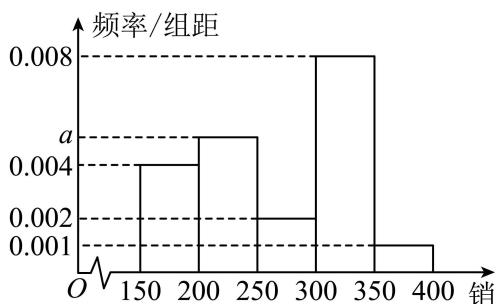

histogram

| 销 | 频率/组距 |
|---|---|
| 150-200 | 0.004 |
| 200-250 | 0.005 |
| 250-300 | 0.002 |
| 300-350 | 0.008 |
| 350-400 | 0.001 |

$O$ 150 200 250 300 350 400 销售量 (1) 求 $a$ 的值及这 100 天草莓日销售量的平均数 (同一组中的数据用该组区间的中点值代表).

(2)该草莓的售价为60元每千克,为了增加草莓销售量,该草莓园推出“玩游戏,送优惠”活动,有以下两种游戏方案供顾客二选一.

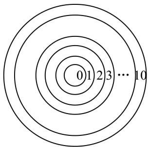

text_image

0
1
2
3
...
10

游戏一:不透明盒子里装有2个红球,4个黑球,顾客从中不放回摸出3个球,每摸出一个红球每千克草莓优惠3元,摸出黑球不优惠.

游戏二:一张纸板共画了11个同心圆,圆心处标记数字0,从内到外的圆环内依次标记数字1到10,在圆心处有一颗骰子,顾客抛掷硬币决定骰子从圆心向外环移动,若掷出的硬币正面向上,则骰子向外移动一环(如:从圆心移动到标上数字1的环内);若掷出的硬币反面向上,则骰子向外移动两环(如:从标上数字1的环内移动到标上数字3的环内).顾客重复掷硬币直到骰子移到标上数字9的环就可以获得“九折优惠券”,或移到标上数字10的环就游戏结束无优惠.有两个孩子对于选择哪个游戏可以获得更大优惠出现了分歧,你能帮助他们判断吗?

5248 (2024·全国·长郡中学校联考二模)某公司有员工140人,为调查员工对薪酬待遇的满意度,现随机抽取了15人,通过问卷调查,有3人对薪酬不满意.

(1) 试估计公司中对薪酬不满意的人数；  
(2) 从 15 名调查对象中抽取 2 人, 用 $\xi$ 表示其中对薪酬不满意的人数, 试求 $\xi$ 的数学期望 $\mathrm{E}(\xi)$ ;  
(3)实际上,由于问题比较敏感,被调查者为了保护自己的隐私往往会做出相反的回答,导致调查数据失真.为此对调查方法进行优化,现向15名调查对象提供两个问题:

问题 A: 你对公司薪酬是否不满意?

问题 B: 现场抛一枚硬币, 是否正面朝上?

在一个密闭房间里有一个箱子,箱子中放入大小相同的10个小球,其中黑色小球7个,白色小球3个,每位调查对象进入房间后,从箱子中摸出一个小球后放回,若是黑球,则回答问题A,若是白球,则抛硬币完成问题B.若有6人回答“是”,试用全概率公式估计公司中对薪酬不满意的人数.

5249 (2024·安徽滁州·安徽省定远中学校考二模)中学阶段,数学中的“对称性”不仅体现在平面几何、立体几何、解析几何和函数图象中,还体现在概率问题中.例如,甲乙两人进行比赛,若甲每场比赛获胜概率均为 $\frac{1}{2}$ ,且每场比赛结果相互独立,则由对称性可知,在5场比赛赛后,甲获胜次数不低于3场的概率为 $\frac{1}{2}$ . 现甲乙两人分别进行独立重复试验,每人抛掷一枚质地均匀的硬币.

(1) 若两人各抛掷 3 次, 求抛掷结果中甲正面朝上次数大于乙正面朝上次数的概率;  
(2) 若甲抛掷 $(n + 1)$ 次, 乙抛掷 $n$ 次, $n \in \mathbf{N}^*$ , 求抛掷结果中甲正面朝上次数大于乙正面朝上次数的概率.

5250 (2024·河北·校联考模拟预测)小明和小红进行抛掷硬币比赛,规定小明和小红每人抛6次.小明得分规则为每连续抛掷 $n(2 \leqslant n \leqslant 6)$ 次结果相同则得 $2^{n-1}$ 分(规定连续抛掷结果不同不得分,如正反正反正反不得分,正正反正反反得4分),小红每抛掷一次正面结果则得2分,得分高者获胜.

(1) 求小红得 8 分的概率;  
(2) 求小明得分的分布列和期望, 并比较两人谁获胜的概率大?

# 14 题型十四:自主选科问题

5251 (2024·陕西咸阳·武功县普集高级中学校考模拟预测)新高考取消文理分科,采用选科模式,这赋予了学生充分的自由选择权. 新高考地区某校为了解本校高一年级将来高考选考历史的情况,随机选取了100名高一学生,将他们某次历史测试成绩(满分100分)按照[0,20), [20,40), [40,60), [60,80), [80,100]分成5组,制成如图所示的频率分布直方图.

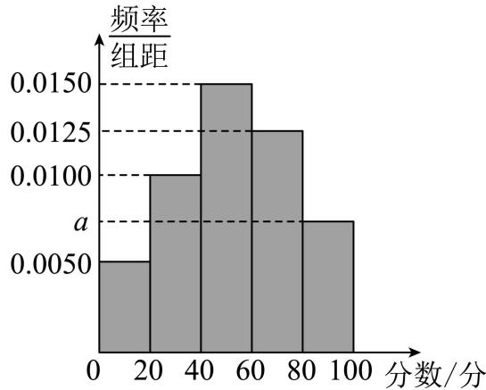

histogram

| 分数/分 | 频率/组距 |
| :--- | :--- |
| 0-20 | 0.0050 |
| 20-40 | 0.0100 |
| 40-60 | 0.0150 |
| 60-80 | 0.0125 |
| 80-100 | 0.0075 |

(1) 求图中 a 的值并估计这 100 名学生本次历史测试成绩的中位数.  
(2) 据调查, 本次历史测试成绩不低于 60 分的学生, 高考将选考历史科目; 成绩低于 60 分的学生, 高考将不选考历史科目. 按分层抽样的方法从测试成绩在 $[0,20)$ , $[80,100]$ 的学生中选取 5 人, 再从这 5 人中任意选取 2 人, 求这 2 人中至少有 1 人高考选考历史科目的概率.

5252 (2024·山西临汾·高三统考期中)山西省高考综合改革从2022年秋季入学的高一年级学生开始实施,新高考将实行“3+1+2”模式,其中3表示语文、数学、外语三科必选,1表示从物理、历史两科中选择一科,2表示从化学、生物学、思想政治、地理四科中选择两科.相应的,高校在招生时可对特定专业设置具体的选修科目要求.现从某中学2022年高一年级所有学生中随机抽取20人进行选科情况调查,得到如下统计表:

<table><tr><td>序号</td><td>选科情况</td><td>序号</td><td>选科情况</td><td>序号</td><td>选科情况</td><td>序号</td><td>选科情况</td></tr><tr><td>1</td><td>史化生</td><td>6</td><td>物化政</td><td>11</td><td>史地政</td><td>16</td><td>物化地</td></tr><tr><td>2</td><td>物化地</td><td>7</td><td>物化生</td><td>12</td><td>物化地</td><td>17</td><td>物化政</td></tr><tr><td>3</td><td>物化地</td><td>8</td><td>史生地</td><td>13</td><td>物生地</td><td>18</td><td>物化地</td></tr><tr><td>4</td><td>史生地</td><td>9</td><td>史化地</td><td>14</td><td>物化地</td><td>19</td><td>史化地</td></tr><tr><td>5</td><td>史地政</td><td>10</td><td>史化政</td><td>15</td><td>物地政</td><td>20</td><td>史地政</td></tr></table>

(1) 请创建列联表,依据小概率值 $\alpha = 0.1$ 的独立性检验,能否认为学生“选择化学科目”与“选择物理科目”有关联.  
(2) 某高校在其人工智能方向专业甲的招生简章中明确要求, 考生必须选择物理, 且在化学和生物学 2 门中至少选修 1 门, 方可报名. 现从该中学高一新生中随机抽取 4 人, 设具备这所高校专业甲报名资格的人数为 X, 用样本的频率估计概率, 求 X 的分布列与期望.

附： $\chi^{2}=\frac{n(ad-bc)^{2}}{(a+b)(c+d)(a+c)(b+d)}$

<table><tr><td>P $(\chi^{2} \geqslant k)$ </td><td>0.100</td><td>0.050</td><td>0.010</td><td>0.001</td></tr><tr><td>k</td><td>2.706</td><td>3.841</td><td>6.635</td><td>10.828</td></tr></table>

5253 (2024·全国·高三专题练习) 2014 年 9 月教育部发布关于深化考试招生制度改革的实施意见, 部分省份先行改革实践, 目前, 全国多数省份进入新高考改革. 改革后, 考生的高考总成绩由语文、数学、外语 3 门全国统一考试科目成绩和 3 门选择性科目成绩组成.

方案一:选择性考试科目学生可以从思想政治、历史、地理、物理、化学、生物6门科目中任选3门参加选择性考试.

方案二: 3门选择性科目由学生先从物理、历史2门科目中任选1门, 再从思想政治、地理、化学、生物4门科目中任选2门参加选择性考试.

(1) 某省执行方案一, 甲同学对选择性科目的选择是随机的, 求甲同学在选择物理科目的条件下, 选择化学科目的概率;  
(2) 某省执行方案二, 为调查学生的选科情况, 从某校高二年级抽取了 10 名同学, 其中有 6 名首选物理, 4 名首选历史, 现从这 10 名同学中再选 3 名同学做进一步调查, 将其中首选历史的人数记作 X, 求随机变量 X 的分布列和数学期望.

5254 (2024·湖北黄石·大冶市第一中学校考模拟预测)目前,全国多数省份已经开始了新高考改革.改革后,考生的高考总成绩由语文、数学、外语3门全国统一考试科目成绩和3门选择性科目成绩组成.注:甲、乙两名同学对选择性科目的选择是随机的.

(1)A 省规定:选择性考试科目学生可以从思想政治、历史、地理、物理、化学、生物 6 门科目中任选 3 门参加选择性考试．求甲同学在选择物理科目的条件下,选择化学科目的概率;  
(2)B 省规定: 3 门选择性科目由学生首先从物理科目和历史科目中任选 1 门, 再从思想政治、地理、化学、生物 4 门科目中任选 2 门.

①求乙同学同时选择物理科目和化学科目的概率；

②为调查学生的选科情况,从某校高二年级抽取了10名同学,其中有6名首选物理,4名首选历史.现从这10名同学中再选3名同学做进一步调查.将其中首选历史的人数记作X,求随机变量X的分布列和数学期望.

5255 (2024·河南·校联考模拟预测)新高考按照“3+1+2”的模式设置,其中“3”为全国统考科目语文、数学、外语,所有考生必考;“1”为首选科目,考生须在物理、历史两科中选择一科;“2”为再选科目,考生可在化学、生物、政治、地理四科中选择两科.某校为了解该校考生的选科情况,从首选科目为物理的考生中随机抽取12名(包含考生甲和考生乙)进行调查. 假设考生选择每个科目的可能性相等,且他们的选择互不影响.

(1) 求考生甲和考生乙都选择了地理作为再选科目的概率.   
(2) 已知抽取的这 12 名考生中, 女生有 3 名. 从这 12 名考生中随机抽取 3 名, 记 X 为抽取到的女生人数, 求 X 的分布列与数学期望.

5256 (2024·全国·模拟预测)在新的高考改革形式下,江苏、辽宁、广东、河北、湖南、湖北、福建、重庆八个省市在2021年首次实施“3+1+2”模式新高考。为了适应新高考模式,在2021年1月23日至1月25日进行了“八省联考”,考完后,网上流传很多种对各地考生考试成绩的评价,对12种组合的选择也产生不同的质疑。为此,某校随机抽一名考生小明(语文、数学、英语、物理、政治、生物的组合)在高一选科前某两次六科对应成绩进行分析,借此成绩进行相应的推断。表1是小明同学高一选科前两次测试成绩(满分100分):

表1

<table><tr><td></td><td>语文</td><td>数学</td><td>英语</td><td>物理</td><td>政治</td><td>生物</td></tr><tr><td>第一次</td><td>87</td><td>92</td><td>91</td><td>92</td><td>85</td><td>93</td></tr><tr><td>第二次</td><td>82</td><td>94</td><td>95</td><td>88</td><td>94</td><td>87</td></tr></table>

(1) 从小明同学第一次测试的科目中随机抽取 1 科, 求该科成绩大于 90 分的概率;  
(2) 从小明同学第一次测试和第二次测试的科目中各随机抽取1科, 记X为抽取的2科中成绩大于90分的科目数量, 求X的分布列和数学期望 $E(X)$ ;  
(3) 现有另一名同学两次测试成绩 (满分 100 分) 及相关统计信息如表 2 所示:

表2

<table><tr><td></td><td>语文</td><td>数学</td><td>英语</td><td>物理</td><td>政治</td><td>生物</td><td>6科成绩均值</td><td>6科成绩方差</td></tr><tr><td>第一次</td><td> $a_1$ </td><td> $a_2$ </td><td> $a_3$ </td><td> $a_4$ </td><td> $a_5$ </td><td> $a_6$ </td><td> $x_1$ </td><td> $D_1$ </td></tr><tr><td>第二次</td><td> $b_1$ </td><td> $b_2$ </td><td> $b_3$ </td><td> $b_4$ </td><td> $b_5$ </td><td> $b_6$ </td><td> $x_2$ </td><td> $D_2$ </td></tr></table>

将每科两次测试成绩的均值作为该科的总评成绩,这6科总评成绩的方差为 $D_{3}$ . 有一种观点认为:若 $x_{1}=x_{2},D_{1}<D_{2}$ ,能推出 $D_{1}\leqslant D_{3}\leqslant D_{2}$ . 则有理由认为“八省联考”考生成绩与选科有关,否则没有理由否定12种选科模式的不合理性,即新高考模式12种选科模式是可取的. 假设这种观点是正确的,通过表2内容,你认为新高考模式12种组合选科模式是否可取?

# 15 题型十五:高尔顿板问题

5257 (2024·全国·高二课堂例题)如图是一块高尔顿板的示意图。在一块木板上钉着若干排相互平行但相互错开的圆柱形小木钉，小木钉之间留有适当的空隙作为通道，前面挡有一块玻璃。将小球从顶端放入，小球下落的过程中，每次碰到小木钉后都等可能地向左或向右落下，最后落入底部的格子中。格子从左到右分别编号为 0, 1, 2, …, 10，用 X 表示小球最后落入格子的号码，求 X 的分布列。

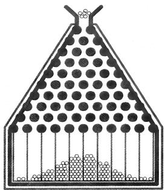

natural_image

Diagram of a triangular container filled with circular particles, showing internal structure and particle distribution (no text or symbols)

5258 (2024·黑龙江哈尔滨·高三哈尔滨市第一二二中学校校考开学考试)如图所示的高尔顿板,小球从通道口落下,第1次与第2层中间的小木块碰撞,以 $\frac{1}{2}$ 的概率向左或向右滚下,依次经过6次与小木块碰撞,最后掉入编号为1,2…,7的球槽内.

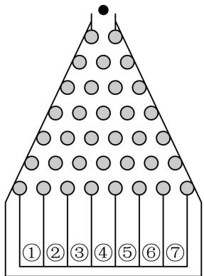

text_image

① ② ③ ④ ⑤ ⑥ ⑦

(1) 若进行一次以上试验, 求小球落入 6 号槽的概率;  
(2) 小明同学利用该图中的高尔顿板来到社团文化节上进行盈利性“抽奖”活动, 8 元可以玩一次游戏, 小球掉入 X 号球槽得到的奖金为 Y 元, 其中 Y = |20 - 5X|  
(i) 求 X 的分布列;  
(ii) 很多同学参加了游戏,你觉得小明同学能盈利吗?

5259 (2024·河北唐山·高二开滦第一中学校考期末)如图是一块高尔顿板示意图,在一块木板上钉着若干排相互平行但相互错开的圆柱形小木钉,小木钉之间留有适当的空隙作为通道,前面挡有一块玻璃. 将小球从顶端放入,小球下落的过程中,每次碰到小木钉后都等可能地向左或向右落下,最后落入底部的格子中,格子从左到右分别编号为0,1,2. 3 …,10,用X表示小球最后落入格子的号码,求X的分布列和数学期望.

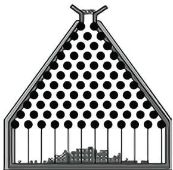

natural_image

Diagram of a triangular structure with circular elements inside, possibly a roof or gate, containing no visible text or symbols.

5260 (2024·全国·高二专题练习)高尔顿板是英国生物统计学家高尔顿设计用来研究随机现象的模型,在一块木板上钉着若干排相互平行但相互错开的圆柱形小木块,小木块之间留有适当的空隙作为通道,前面挡有一块玻璃,让一个小球从高尔顿板上方的通道口落下,小球在下落的过程中与层层小木块碰撞,且等可能向左或向右滚下,最后掉入高尔顿板下方的某一球槽内.如图1所示的高尔顿板有7层小木块,小球从通道口落下,第一次与第2层中间的小木块碰撞,以 $\frac{1}{2}$ 的概率向左或向右滚下,依次经过6次与小木块碰撞,最后掉入编号为1、2、…、7的球槽内.例如小球要掉入3号球槽,则在6次碰撞中有2次向右4次向左滚下.

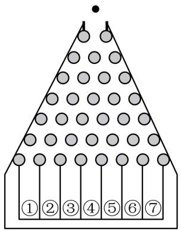

text_image

①②③④⑤⑥⑦

图1

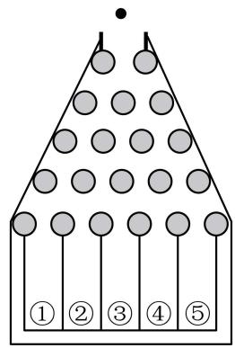

text_image

① ② ③ ④ ⑤

图2

(1) 如图 1, 进行一次高尔顿板试验, 试比较小球落入 3 号球槽、4 号球槽的概率大小;  
(2) 小明改进了高尔顿板 (如图 2), 首先将小木块减少至 5 层, 且小球在下落的过程中与小木块碰撞一次时, 有 $\frac{1}{3}$ 的概率向左, $\frac{2}{3}$ 的概率向右滚下, 小球共经过 4 次碰撞后, 最后掉入编号为 1、2、…、5 的球槽内. 小明准备利用改进后的高尔顿板进行盈利性“抽奖”活动, 只需付费 2 元就可以玩一次游戏, 小球掉入 $n$ 号球槽得到的奖金为 $\xi$ 元, 其中 $\xi = |8 - 2n|$ . 你觉得小明能盈利吗? 请说明理由.

5261 (2024·全国·高二专题练习)高尔顿板是英国生物统计学家高尔顿设计用来研究随机现象的模型,在一块木板上钉着若干排相互平行但相互错开的圆柱形小木块,小木块之间留有适当的空隙作为通道,前面挡有一块玻璃. 让一个小球从高尔顿板上方的通道口落下,小球在下落的过程中,每次碰到小木钉后都等可能地向左或向右落下,最后落入底部的球槽内. 球槽从左到右分别编号为 $1,2,\cdots,7$ .

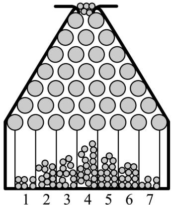

text_image

1
2
3
4
5
6
7

(1) 若进行一次高尔顿板试验, 求这个小球掉入 1 号球槽的概率;
(2) 小明同学在研究了高尔顿板后, 利用该图中的高尔顿板来到社团文化节上进行盈利性
“抽奖”活动, 2 元可以玩一次高尔顿板游戏, 小球掉入 X 号球槽得到的奖金为 Y 元, 其中 $Y=\begin{cases}10,&X=1\text{ 或 }7\\5,&X=2\text{ 或 }6\\0,&X=3\text{ 或 }4\text{ 或 }5\end{cases}$

①求 X 的分布列；  
②高尔顿板游戏火爆进行,很多同学参加了游戏,你觉得小明同学能盈利吗?

# 16 题型十六:自主招生问题

5262 (2024·江西南昌·高二南昌市八一中学校考期末)某高校在今年的自主招生考试中制定了如下的规则:笔试阶段,考生从6道备选试题中一次性抽取3道题,并独立完成所抽取的3道题,至少正确完成其中2道试题则可以进入面试. 已知考生甲能正确完成6道试题中的4道题,另外2道题不能完成.

(1) 求考生甲能通过笔试进入面试的概率;   
(2) 记所抽取的三道题中考生甲能正确完成的题数为 $\xi$ ，求 $\xi$ 的分布列和数学期望.

5263 (2024·全国·高二专题练习)在某大学举行的自主招生考试中,随机抽取了100名考生的成绩(单位:分),并把所得数据列成了如下所示的频数分布表:

<table><tr><td>组别</td><td>[40,50)</td><td>[50,60)</td><td>[60,70)</td><td>[70,80)</td><td>[80,90)</td><td>[90,100)</td></tr><tr><td>频数</td><td>5</td><td>18</td><td>28</td><td>26</td><td>17</td><td>6</td></tr></table>

(1) 求抽取样本的平均数 $\bar{x}$ (同一组中的数据用该组区间的中点值代表);  
(2) 已知这次考试共有 2000 名考生参加, 如果近似地认为这次成绩 Z 服从正态分布 $\mathrm{N}(\mu, \sigma^{2})$ (其中 $\mu$ 近似为样本平均数 $\bar{x}, \sigma^{2}$ 近似为样本方差 $s^{2} = 161$ ), 且规定 82.7 分是复试线, 那么在这 2000 名考生中, 能进入复试的有多少人? (附: $\sqrt{161} \approx 12.7$ , 若 $\mathrm{Z} \sim \mathrm{N}(\mu, \sigma^{2})$ , 则 $\mathrm{P}(\mu - \sigma < \mathrm{Z} < \mu + \sigma) = 0.6826, \mathrm{P}(\mu - 2\sigma < \mathrm{Z} < \mu + 2\sigma) = 0.9544$ ).

5264 (2024·江苏扬州·高三校考阶段练习)自主招生和强基计划是高校选拔录取工作改革的重要环节. 自主招生是学生通过高校组织的笔试和面试之后, 可以得到相应的降分政策. 2020年1月, 教育部决定2020年起不再组织开展高校自主招生工作, 而是在部分一流大学建设高校开展基础学科招生改革试点(也称强基计划). 下表是某高校从2018年起至2022年通过自主招生或强基计划在部分专业的招生人数:

<table><tr><td>年份</td><td>数学</td><td>物理</td><td>化学</td><td>总计</td></tr><tr><td>2018</td><td>4</td><td>7</td><td>6</td><td>17</td></tr><tr><td>2019</td><td>5</td><td>8</td><td>5</td><td>18</td></tr><tr><td>2020</td><td>6</td><td>9</td><td>5</td><td>20</td></tr><tr><td>2021</td><td>8</td><td>7</td><td>6</td><td>21</td></tr><tr><td>2022</td><td>9</td><td>8</td><td>6</td><td>23</td></tr></table>

请根据表格回答下列问题:

(1) 统计表明招生总数和年份间有较强的线性关系. 记 $x$ 为年份与 2017 的差, $y$ 为当年数学、物理和化学的招生总人数, 试用最小二乘法建立 $y$ 关于 $x$ 的线性回归方程, 并以此预测 2023 年的数学、物理和化学的招生总人数 (结果四舍五入保留整数);  
(2) 在强基计划实施的首年,为了保证招生录取结果的公平公正,该校招生办对 2020 年强基计划录取结果进行抽检.此次抽检从这 20 名学生中随机选取 3 位学生进行评审.记选取到数学专业的学生人数为 X,求随机变量 X 的数学期望 E(X);  
(3)经统计该校学生的本科学习年限占比如下:四年毕业的占76%,五年毕业的占16%,六年毕业的占8%.现从2018到2022年间通过上述方式被该校录取的学生中随机抽取1名,若该生是数学专业的学生,求该生恰好在2025年毕业的概率.

附： $y=\hat{b}x+\hat{a}$ 为回归方程， $\hat{b}=\frac{\sum_{i=1}^{n}(x_{i}-\bar{x})(y_{i}-\bar{y})}{\sum_{i=1}^{n}(x_{i}-\bar{x})^{2}}$ ， $\hat{a}=\bar{y}-\hat{b}\bar{x}$ .

5265 (2024·全国·高三专题练习)某高中在招高一新生时,有统一考试招生和自主招生两种方式. 参加自主招生的同学必须依次进行“语文”“数学”“科学”三科的考试,若语文达到优秀,则得1分,若数学达到优秀,则得2分,若科学达到优秀,则得3分,若各科未达到优秀,则不得分. 已知小明三科考试都达到优秀的概率为 $\frac{1}{24}$ ,至少一科考试优秀的概率为 $\frac{3}{4}$ ,数学考试达到优秀的概率为 $\frac{1}{3}$ ,语文考试达到优秀的概率大于科学考试达到优秀的概率,且小明各科达到优秀与否相互独立.

(1) 求小明语文考试达到优秀的概率;   
(2) 求小明三科考试所得总分的分布列和期望.

5266 (2024·陕西西安·统考二模)某高校自主招生考试中,所有去面试的考生全部参加了“语言表达能力”和“竞争与团队意识”两个科目的测试,成绩分别为A、B、C、D、E五个等级,某考场考生的两科测试成绩数据统计如图,其中“语言表达能力”成绩等级为B的考生有10人.

科目：语言表达能力  
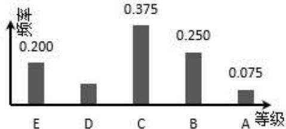

bar

| 等级 | 频率 |
| :--- | :--- |
| E | 0.200 |
| D | 0.150 |
| C | 0.375 |
| B | 0.250 |
| A | 0.075 |

科目：竞争与团队意识  
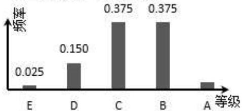

bar

| 等级 | 频率 |
|---|---|
| E | 0.025 |
| D | 0.150 |
| C | 0.375 |
| B | 0.375 |
| A | (unlabeled) |

(1) 求该考场考生中“竞争与团队意识”科目成绩等级为 A 的人数;  
(2) 已知等级 A、B、C、D、E 分别对应 5 分, 4 分, 3 分, 2 分, 1 分. 求该考场学生“语言表达能力”科目的平均分.

# 17 题型十七:顺序排位问题

5267 (2024·湖南邵阳·邵阳市第二中学校考模拟预测)为了丰富学生的课外活动,学校羽毛球社团举行羽毛球个人赛,有甲、乙、丙、丁四位同学参加,甲与其他三人各进行一场比赛,共进行三场比赛,而且三场比赛相互独立.根据甲最近分别与乙、丙、丁比赛的情况,得到如下统计表:

<table><tr><td></td><td>乙</td><td>丙</td><td>丁</td></tr><tr><td>比赛的次数</td><td>60</td><td>60</td><td>50</td></tr><tr><td>甲获胜的次数</td><td>20</td><td>30</td><td>40</td></tr></table>

以上表中的频率作为概率,求解下列问题.

(1) 如果甲按照第一场与乙比赛、第二场与丙比赛、第三场与丁比赛的顺序进行比赛.  
(i) 求甲至少胜一场的概率;   
(ii) 如果甲胜一场得 2 分, 负一场得 0 分, 设甲的得分为 X, 求 X 的分布列与期望;  
(2) 记“甲与乙、丙、丁进行三场比赛中甲连胜二场”的概率为 $p$ ，那么以什么样的出场顺序才能使概率 $p$ 最大，并求出 $p$ 的最大值.

5268 (2024·新疆乌鲁木齐·统考二模) 2022 年的男足世界杯在卡塔尔举办, 参赛的 32 支球队共分为 8 个小组, 每个小组有 4 支球队, 小组赛采取单循环赛制, 即每支球队都要和同组的其他 3 支球队各比赛一场. 每场比赛获胜的球队积 3 分, 负队积 0 分. 若打平则双方各积 1 分, 三轮比赛结束后, 积分从多到少排名靠前的 2 支球队小组出线 (如果积分相等, 还要按照其他规则来排名). 已知甲、乙、丙、丁 4 支球队分在同一个组, 且甲队与乙、丙、丁 3 支球队比赛获胜的概率分别为 $\frac{1}{2}, \frac{1}{3}, \frac{1}{4}$ , 与三支球队打平的概率均为 $\frac{1}{4}$ , 每场比赛的结果相互独立.

(1)某人对甲队的三轮小组赛结果进行了预测,他认为三场都会是平局,记随机变量X=“结果预测正确的场次”,求X的分布列和数学期望:  
(2) 假设各队先后对阵顺序完全随机, 记甲队至少连续获胜两场的概率为 p, 那么甲队在第二轮比赛对阵哪个对手时, p 的取值最大, 这个最大值是多少?

5269 (2024·北京·高三专题练习)周末李梦提出和父亲、母亲、弟弟进行羽毛球比赛,李梦与他们三人各进行一场比赛,共进行三场比赛,而且三场比赛相互独立.根据李梦最近分别与父亲、母亲、弟弟比赛的情况,得到如下统计表:

<table><tr><td></td><td>父亲</td><td>母亲</td><td>弟弟</td></tr><tr><td>比赛的次数</td><td>50</td><td>60</td><td>40</td></tr><tr><td>李梦获胜的次数</td><td>10</td><td>30</td><td>32</td></tr></table>

以上表中的频率作为概率,求解下列问题.

(1) 如果按照第一场与父亲比赛、第二场与母亲比赛、第三场与弟弟比赛的顺序进行比赛.  
(i) 求李梦连胜三场的概率;   
(ii) 如果李梦胜一场得 1 分, 负一场得 0 分, 设李梦的得分为 X, 求 X 的分布列与期望:  
(2) 记“与父亲、母亲、弟弟三场比赛中李梦连胜二场”的概率为 $p$ ，此概率 $p$ 与父亲，母亲，弟弟出场的顺序是否有关？如果有关，什么样的出场顺序使概率 $p$ 最大 (不必计算)？如果无关，请给出简要说明。

5270 (2024·全国·高三专题练习)文渊中学计划在2024年2月举行趣味运动会,其中设置“夹球接力跑”项目,需要男同学和女同学一起合作完成.高一(15)班代表队共派出3个小组(编号为 $F_{1},F_{2},F_{3}$ )角逐该项目,每个小组由1名男生和2名女生组成,其中男生单独完成该项目的概率为0.6,女生单独完成该项目的概率为 $a(0<a<0.4)$ .假设他们参加比赛的机会互不影响,记每个小组能完成比赛的人数为 $\xi$ .

(1) 证明: 在 $\xi$ 的概率分布中, $P(\xi = 1)$ 最大;  
(2) 如果比赛当天天气出现异常, 则将临时更改比赛规则: 每个代表队每次指派一个小组, 比赛时间一分钟, 如果一分钟内不能完成, 则重新指派另一组参赛. 高一 (15) 班代表队的领队了解后发现, 小组 $F_{i}$ 能顺利完成比赛的概率为 $t_{i} = \mathrm{P}(\xi = \mathrm{i})(\mathrm{i} = 1, 2, 3)$ , 且各个小组能否完成比赛相互独立. 在更改比赛规则后, 领队如何安排小组的出场顺序能使指派的小组个数的均值最小? 请给出证明.

5271 (2024·全国·高三专题练习)猜歌名游戏是根据歌曲的主旋律制成的铃声来猜歌名,该游戏中有 A, B, C 三类歌曲.嘉宾甲参加猜歌名游戏,需从三类歌曲中各随机选一首,自主选择猜歌顺序,只有猜对当前歌曲的歌名才有资格猜下一首,并且获得本歌曲对应的奖励基金.假设甲猜对每类歌曲的歌名相互独立,猜对三类歌曲的概率及猜对时获得相应的奖励基金如下表:

<table><tr><td>歌曲类别</td><td>A</td><td>B</td><td>C</td></tr><tr><td>猜对的概率</td><td>0.8</td><td>0.5</td><td>p</td></tr><tr><td>获得的奖励基金额/元</td><td>1000</td><td>2000</td><td>3000</td></tr></table>

(1) 求甲按“A, B, C”的顺序猜歌名, 至少猜对两首歌名的概率;  
(2) 若 p=0.25，设甲按“A, B, C”的顺序猜歌名获得的奖励基金总额为 X，求 X 的分布列与数学期望 $E(X)$ ;  
(3) 写出 p 的一个值, 使得甲按“A, B, C”的顺序猜歌名比按“C, B, A”的顺序猜歌名所得奖励基金的期望高。(结论不要求证明)

5272 (2024·全国·高三专题练习)某中学2022年10月举行了2022“翱翔杯”秋季运动会,其中有“夹球跑”和“定点投篮”两个项目,某班代表队共派出1男(甲同学)2女(乙同学和丙同学)三人参加这两个项目,其中男生单独完成“夹球跑”的概率为0.6,女生单独完成“夹球跑”的概率为 $a(0<a<0.4)$ . 假设每个同学能否完成“夹球跑”互不影响,记这三名同学能完成“夹球跑”的人数为 $\xi$ .

(1) 证明: 在的概率分布中, $P(\xi=1)$ 最大.  
(2) 对于“定点投篮”项目, 比赛规则如下: 该代表队先指派一人上场投篮, 如果投中, 则比赛终止, 如果没有投中, 则重新指派下一名同学继续投篮, 如果三名同学均未投中, 比赛也终止. 该班代表队的领队了解后发现, 甲、乙、丙三名同学投篮命中的概率依次为 $t_i = P(\xi = i)(i = 1, 2, 3)$ , 每位同学能否命中相互独立. 请帮领队分析如何安排三名同学的出场顺序, 才能使得该代表队出场投篮人数的均值最小? 并给出证明.

5273 (2024·福建泉州·高三校联考期中)中国乒乓球队是中国体育军团的王牌之师,屡次在国际大赛上争金夺银,被体育迷们习惯地称为“梦之队”.小明是一名乒乓球运动爱好者,为提高乒乓球水平,决定在假期针对乒乓球技术的五个基本因素:弧线、力量、速度、旋转和落点进行训练.假设小明每天进行多次分项(将五个因素分别对应五项,一次练一项)训练,为增加趣味性,计划每次(从第二次起)都是从上次未训练的四个项目中等可能地随机选一项训练.

(1) 若某天在五个项目中等可能地随机选一项开始训练, 求第三次训练的是“弧线”的概率;  
(2) 若某天仅进行了 6 次训练, 五个项目均有训练, 且第 1 次训练的是“旋转”, 前后训练项不同视为不同的训练顺序, 设变量 X 为 6 次训练中“旋转”项训练的次数, 求 X 的分布列及期望.

# 18 题型十八:博彩问题

5274 (2024·全国·高三专题练习)马尔科夫链是概率统计中的一个重要模型,也是机器学习和人工智能的基石,在强化学习、自然语言处理、金融领域、天气预测等方面都有着极其广泛的应用.其数学定义为:假设我们的序列状态是 $\cdots,X_{t-2},X_{t-1},X_{t},X_{t+1},\cdots$ ,那么 $X_{t+1}$ 时刻的状态的条件概率仅依赖前一状态 $X_{t}$ ,即 $\mathrm{P}\left(\mathrm{X}_{t+1}\mid\cdots,\mathrm{X}_{t-2},\mathrm{X}_{t-1},\mathrm{X}_{t}\right)=\mathrm{P}\left(\mathrm{X}_{t+1}\mid\mathrm{X}_{t}\right)$ .

现实生活中也存在着许多马尔科夫链,例如著名的赌徒模型.

假如一名赌徒进入赌场参与一个赌博游戏,每一局赌徒赌赢的概率为50%,且每局赌赢可以赢得1元,每一局赌徒赌输的概率为50%,且赌输就要输掉1元. 赌徒会一直玩下去,直到遇到如下两种情况才会结束赌博游戏:一种是手中赌金为0元,即赌徒输光;一种是赌金达到预期的B元,赌徒停止赌博.记赌徒的本金为 $A(A\in N^{*},A<B)$ ,赌博过程如下图的数轴所示.

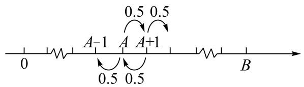

text_image

0
A-1 A A+1
0.5 0.5
0.5 0.5
B

当赌徒手中有 n 元 $(0 \leqslant n \leqslant B, n \in N)$ 时，最终输光的概率为 $P(n)$ ，请回答下列问题：

(1) 请直接写出 P(0) 与 P(B) 的数值.  
(2) 证明 $\{\mathrm{P}(n)\}$ 是一个等差数列, 并写出公差 $d$ .  
(3) 当 A=100 时, 分别计算 B=200, B=1000 时, P(A) 的数值, 并结合实际, 解释当 B→∞ 时, P(A) 的统计含义.

5275 (2024·全国·高二专题练习)公元1651年,法国一位著名的统计学家德梅赫(Demere)向另一位著名的数学家帕斯卡(B.Pascal)提请了一个问题,帕斯卡和费马(Fermat)讨论了这个问题,后来惠更斯(C.Huygens)也加入了讨论,这三位当时全欧洲乃至全世界最优秀的科学家都给出了正确的解答.该问题如下:设两名赌徒约定谁先赢 $k(k>1,k\in\mathbb{N}^{*})$ 局,谁便赢得全部赌注a元.每局甲赢的概率为 $p(0<p<1)$ ,乙赢的概率为1-p,且每局赌博相互独立.在甲赢了 $m(m<k)$ 局,乙赢了 $n(n<k)$ 局时,赌博意外终止.赌注该怎么分才合理?这三位数学家给出的答案是:如果出现无人先赢k局则赌博意外终止的情况,甲、乙便按照赌博再继续进行下去各自赢得全部赌注的概率之比 $P_{甲}:P_{乙}$ 分配赌注.

(1) 规定如果出现无人先赢 $k$ 局则赌博意外终止的情况, 甲、乙便按照赌博再继续进行下去各自赢得全部赌注的概率之比 $\mathrm{P}_{\text {甲}}: \mathrm{P}_{\text {乙}}$ 分配赌注. 若 $a = 243, k = 4, m = 2, n = 1, p = \frac{2}{3}$ , 则甲应分得多少赌注?

(2) 记事件 A 为“赌博继续进行下去乙赢得全部赌注”，试求当 k=4, m=2, n=1 时赌博继续进行下去甲赢得全部赌注的概率 $f(p)$ ，并判断当 $p \geqslant \frac{3}{4}$ 时，事件 A 是否为小概率事件，并说明理由。规定：若随机事件发生的概率小于 0.05，则称该随机事件为小概率事件。

5276 (2024·全国·高三专题练习)公元1651年,法国学者德梅赫向数学家帕斯卡请教了一个问题:设两名赌徒约定谁先赢满4局,谁便赢得全部赌注a元,已知每局甲赢的概率为 $p(0<p<1)$ ,乙赢的概率为1-p,且每局赌博相互独立,在甲赢了2局且乙赢了1局后,赌博意外终止,则赌注该怎么分才合理?帕斯卡先和费尔马讨论了这个问题,后来惠更斯也加入了讨论,这三位当时欧洲乃至全世界著名的数学家给出的分配赌注的方案是:如果出现无人先赢4局且赌博意外终止的情况,则甲、乙按照赌博再继续进行下去各自赢得全部赌注的概率之比 $P_{甲}:P_{乙}$ 分配赌注. (友情提醒:珍爱生命,远离赌博)

(1) 若 $a = 243, p = \frac{2}{3}$ , 甲、乙赌博意外终止, 则甲应分得多少元赌注?  
(2) 若 $p \geqslant \frac{4}{5}$ ，求赌博继续进行下去甲赢得全部赌注的概率 $f(p)$ ，并判断“赌博继续进行下去乙赢得全部赌注”是否为小概率事件（发生概率小于 0.05 的随机事件称为小概率事件）.

5277 (2024·湖南·校联考模拟预测)公元1651年,法国一位著名的统计学家德梅赫(Demere)向另一位著名的数学家帕斯卡(B.Pascal)提请了一个问题,帕斯卡和费马(Fermat)讨论了这个问题,后来惠更斯(C.Huygens)也加入了讨论,这三位当时全欧洲乃至全世界最优秀的科学家都给出了正确的解答该问题如下:设两名赌徒约定谁先赢 $k(k>1,k\in\mathbb{N}^{*})$

局，谁便赢得全部赌注 $a$ 元. 每局甲赢的概率为 $p(0 < p < 1)$ ，乙赢的概率为 $1 - p$ ，且每局赌博相互独立. 在甲赢了 $m(m < k)$ 局，乙赢了 $n(n < k)$ 局时，赌博意外终止赌注该怎么分才合理？这三位数学家给出的答案是：如果出现无人先赢 $k$ 局则赌博意外终止的情况，甲、乙便按照赌博再继续进行下去各自赢得全部赌注的概率之比 $\mathrm{P}_{\text{甲}}: \mathrm{P}_{\text{乙}}$ 分配赌注.

(1) 甲、乙赌博意外终止，若 $a = 243, k = 4, m = 2, n = 1, p = \frac{2}{3}$ ，则甲应分得多少赌注？  
(2) 记事件 A 为“赌博继续进行下去乙赢得全部赌注”，试求当 k=4, m=2, n=1 时赌博继续进行下去甲赢得全部赌注的概率 $f(p)$ ，并判断当 $p \geqslant \frac{4}{5}$ 时，事件 A 是否为小概率事件，并说明理由。规定：若随机事件发生的概率小于 0.05，则称该随机事件为小概率事件。

5278 (2024·全国·高三专题练习)一个摸球游戏,规则如下:在一不透明的纸盒中,装有6个大小相同、颜色各异的玻璃球.参加者交费1元可玩1次游戏,从中有放回地摸球3次.参加者预先指定盒中的某一种颜色的玻璃球,然后摸球.当所指定的玻璃球不出现时,游戏费被没收;当所指定的玻璃球出现1次,2次,3次时,参加者可相应获得游戏费的0倍,1倍,k倍的奖励 $k\in N^{*}$ ,且游戏费仍退还给参加者.记参加者玩1次游戏的收益为X元.

(1) 求概率 $P(X=0)$ 的值;  
(2)为使收益X的数学期望不小于0元,求k的最小值.

(注:概率学源于赌博,请自觉远离不正当的游戏!)

