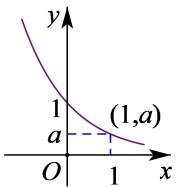
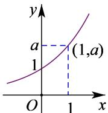
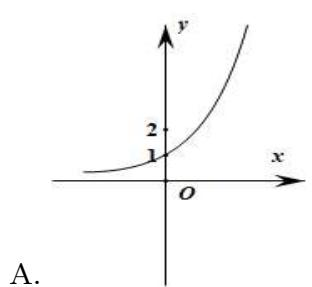
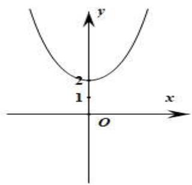
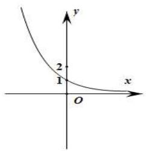
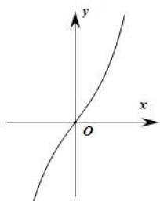
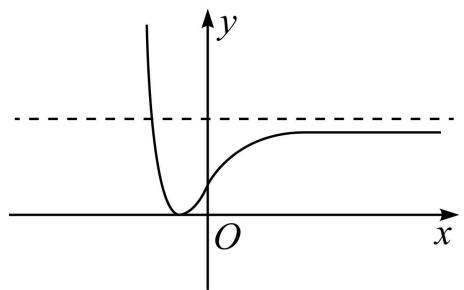

# 第9讲 指数与指数函数

# 知识梳理

# 1、指数及指数运算

# (1) 根式的定义:

一般地, 如果 $x^n = a$ , 那么 $x$ 叫做 $a$ 的 $n$ 次方根, 其中 $(n > 1, n \in \mathbb{N}^*)$ , 记为 $\sqrt[n]{a}, n$ 称为根指数, $a$ 称为根底数.

# (2) 根式的性质：

当 $n$ 为奇数时，正数的 $n$ 次方根是一个正数，负数的 $n$ 次方根是一个负数.

当 n 为偶数时, 正数的 n 次方根有两个, 它们互为相反数.

(3) 指数的概念: 指数是幂运算 $a^n (a \neq 0)$ 中的一个参数, $a$ 为底数, $n$ 为指数, 指数位于底数的右上角, 幂运算表示指数个底数相乘.

# (4)有理数指数幂的分类

①正整数指数幂 $a^n = a \overbrace{a \cdot a \cdot a \cdots \cdot a}^{n\text{个}}$ ( $n \in \mathbb{N}^*$ ); ②零指数幂 $a^0 = 1$ ( $a \neq 0$ );

③负整数指数幂 $a^{-n} = \frac{1}{a^n} (a \neq 0, n \in \mathbb{N}^*)$ ; ④0的正分数指数幂等于0,0的负分数指数幂没有意义.

# (5)有理数指数幂的性质

① $a^{m}a^{n}=a^{m+n}(a>0,m,n\in\mathbb{Q})$ ; ② $(a^{m})^{n}=a^{mn}(a>0,m,n\in\mathbb{Q})$ ;

③ $(ab)^{m} = a^{m}b^{m}(a > 0,b > 0,m\in \mathbf{Q});$ ④ $\sqrt[n]{a^m} = a^{\frac{m}{n}}(a > 0,m,n\in \mathbf{Q}).$

# 2、指数函数

<table><tr><td colspan="3"> $y = a^{x}$ </td></tr><tr><td></td><td>0 &lt; a &lt; 1</td><td>a &gt; 1</td></tr><tr><td>图象</td><td></td><td></td></tr><tr><td rowspan="6">性质</td><td colspan="2">1定义域R,值域(0,+∞)</td></tr><tr><td colspan="2">2  $a^{0}$ =1,即时x=0,y=1,图象都经过(0,1)点</td></tr><tr><td colspan="2">3  $a^{x}$ =a,即x=1时,y等于底数a</td></tr><tr><td>4在定义域上是单调减函数</td><td>在定义域上是单调增函数</td></tr><tr><td>5 x&lt;0时, $a^{x}$ &gt;1;x&gt;0时,0&lt; $a^{x}$ &lt;1</td><td>x&lt;0时,0&lt; $a^{x}$ &lt;1;x&gt;0时, $a^{x}$ &gt;1</td></tr><tr><td colspan="2">6既不是奇函数,也不是偶函数</td></tr></table>

# 【解题方法总结】

# 1、指数函数常用技巧

(1) 当底数大小不定时, 必须分“a > 1”和“0 < a < 1”两种情形讨论.

(2) 当 $0 < a < 1$ 时, $x \to +\infty$ , $y \to 0$ ; $a$ 的值越小, 图象越靠近 $y$ 轴, 递减的速度越快. 当 $a > 1$ 时 $x \to +\infty$ , $y \to 0$ ; $a$ 的值越大, 图象越靠近 $y$ 轴, 递增速度越快.

(3) 指数函数 $y = a^x$ 与 $y = \left(\frac{1}{a}\right)^x$ 的图象关于 $y$ 轴对称.

# 必考题型全归纳

# 1 题型一: 指数运算及指数方程、指数不等式

244 (2024·海南省直辖县级单位·统考模拟预测) $\left(\frac{3^{\sqrt{7}}}{27}\right)^{\sqrt{7}+3}=$ ( )

A. 9

B. $\frac{1}{9}$

C. 3

D. $\frac{\sqrt{3}}{9}$

245 (2024·全国·高三专题练习)下列结论中,正确的是()

A. 设 a > 0，则 $a^{\frac{4}{3}} \cdot a^{\frac{3}{4}} = a$

B. 若 $m^8 = 2$ ，则 $m = \pm \sqrt[8]{2}$

C. 若 $a + a^{-1} = 3$ ，则 $a^{\frac{1}{2}} + a^{-\frac{1}{2}} = \pm \sqrt{5}$

D. $\sqrt[4]{(2 - \pi)^{4}} = 2 - \pi$

246 (2024·全国·高三专题练习) $\left(\frac{9}{16}\right)^{-0.5}+\sqrt{(2-\pi)^{2}}+(2^{3})^{\frac{2}{3}}\times\left(\frac{2}{3}\right)^{\frac{1}{4}}\times\left(\frac{2}{3}\right)^{\frac{3}{4}}=$ ( )

A. $\pi$

B. $2 + \pi$

C. $4 - \pi$

D. $6 - \pi$

247 (2024·全国·高三专题练习)甲、乙两人解关于 x 的方程 $2^{x} + b \cdot 2^{-x} + c = 0$ ，甲写错了常数 b，得到的根为 x = -2 或 $x = \log_{2}\frac{17}{4}$ ，乙写错了常数 c，得到的根为 x = 0 或 x = 1，则原方程的根是（）

A. $x = -2$ 或 $x = \log_23$

B. $x = -1$ 或 $x = 1$

C. x=0 或 x=2

D. $x = -1$ 或 $x = 2$

248 (2024·全国·高三专题练习)若关于 x 的方程 $9^{x} + 3^{x+1} - m + 1 = 0$ 有解, 则实数 m 的取值范围是 ()

A. $(1, +\infty)$

B. $\left[-\frac{5}{4},+\infty\right)$

C. $(- \infty, 3]$

D. $(1,3]$

249 (2024·上海青浦·统考一模)不等式 $2^{x^2 - 2x - 3} < \left(\frac{1}{2}\right)^{3(x - 1)}$ 的解集为 \_\_\_\_.

250 (2024·全国·高三专题练习)不等式 $10^{x} - 6^{x} - 3^{x} \geqslant 1$ 的解集为 \_\_\_\_.

# 2 题型二:指数函数的图像及性质

251 (多选题)(2024·全国·高三专题练习)函数 $f(x)=2^{x}+\frac{a}{2^{x}}(a\in\mathbb{R})$ 的图象可能为（）

text_image

y
2
1
O
x
A.

B.   

text_image

y
2
1
O
x

C.   

text_image

y
2
1
O
x

D.   

text_image

y
x
O

252 (2024·全国·高三专题练习)已知 $f(x)=\sqrt{3^{x^{2}+2ax-a}-1}$ 的定义域为 R，则实数 a 的取值范围是 \_\_\_\_.  
253 (2024·宁夏银川·校联考二模)已知函数 $f(x)=4^{x}-2^{x+2}-1,x\in[0,3]$ ，则其值域为\_\_\_\_.  
254 (2024·全国·高三专题练习)已知函数 $f(x)=a^{x}(a>0,a\neq1)$ 在 [1,2] 内的最大值是最小值的两倍，且 $g(x)=\left\{\begin{aligned}f(x)+1,&x\geqslant1\\ \log_{3}x-1,&0<x<1\end{aligned}\right.$ ，则 $g\left(\frac{1}{3}\right)+g(2)=$ \_\_\_\_  
255 (2024·全国·高三专题练习)函数 $y=(a-2)^{2}a^{x}$ 是指数函数，则（）

A. $a = 1$ 或 $a = 3$

B. $a = 1$

C. $a = 3$

D. a > 0 且 $a \neq 1$

256 (2024·全国·高三专题练习)函数 $f(x)=(\mathrm{e}^{ax}-b)^{2}$ 的大致图像如图，则实数 a, b 的取值只可能是 ()

text_image

y
O
x

A. $a > 0, b > 1$

B. $a > 0,0 < b < 1$

C. a < 0, b > 1

D. $a <   0,0 <   b <   1$

257 (2024·全国·高三专题练习)已知函数 $f(x)=a^{x-4}+1(a>0$ 且 $a\neq1)$ 的图象恒过定点 A，若点 A 的坐标满足关于 x, y 的方程 $mx+ny=4(m>0,n>0)$ ，则 $\frac{1}{m}+\frac{2}{n}$ 的最小值为（）

A. 8

B. 24

C. 4

D. 6

258 (多选题)(2024·浙江绍兴·统考模拟预测)预测人口的变化趋势有多种方法,“直接推算法”使用的公式是 $\mathrm{P}_n = \mathrm{P}_0(1 + k)^n (k > - 1)$ ，其中 $\mathrm{P}_n$ 为预测期人口数， $\mathrm{P_0}$ 为初期人口数， $k$ 为预测期内人口年增长率， $n$ 为预测期间隔年数，则 （）

A. 当 $k \in (-1,0)$ , 则这期间人口数呈下降趋势  
B. 当 $k \in (-1,0)$ ，则这期间人口数呈摆动变化  
C. 当 $k = \frac{1}{3}, P_n \geqslant 2P_0$ 时， $n$ 的最小值为3  
D. 当 $k = -\frac{1}{3}, \mathrm{P}_n \leqslant \frac{1}{2} \mathrm{P}_0$ 时， $n$ 的最小值为3

259 (多选题)(2024·山东聊城·统考二模)已知函数 $f(x)=\frac{2^{x}}{2^{x}+1}$ ，则()

A. 函数 $f(x)$ 是增函数  
B. 曲线 $y=f(x)$ 关于 $\left(0,\frac{1}{2}\right)$ 对称  
C. 函数 $f(x)$ 的值域为 $\left(0, \frac{1}{2}\right)$   
D. 曲线 $y = f(x)$ 有且仅有两条斜率为 $\frac{1}{5}$ 的切线

# 题型三:指数函数中的恒成立问题

260 (2024·全国·高三专题练习)已知函数 $f(x)=2^{x}, x \in \mathbb{R}$ ，若不等式 $f^{2}(x)+f(x)-m>0$ 在 R 上恒成立，则实数 m 的取值范围是 \_\_\_\_.  
261 (2024·全国·高三专题练习)设 $f(x)=\frac{2^{x}-2^{-x}}{2}$ ，当 $x\in R$ 时， $f(x^{2}+mx)+f(1)>0$ 恒成立，则实数 m 的取值范围是 \_\_\_\_.  
262 (2024·全国·高三专题练习)已知不等式 $4^{x} - a \cdot 2^{x} + 2 > 0$ ，对于 $a \in (-\infty, 3]$ 恒成立，则实数 $x$ 的取值范围是 \_\_\_\_.  
263 (2024·全国·高三专题练习)若 $x \in [-1, +\infty)$ ，不等式 $4^{x} - m \cdot 2^{x} + 1 > 0$ 恒成立，则实数 m 的取值范围是 \_\_\_\_。  
264 (2024·上海徐汇·高三位育中学校考开学考试)已知函数 $f(x) = \frac{3^x + b}{3^x + 1}$ 是定义域为R的奇函数.

(1) 求实数 b 的值, 并证明 $f(x)$ 在 R 上单调递增;

(2) 已知 $a > 0$ 且 $a \neq 1$ , 若对于任意的 $x_{1}, x_{2} \in [1,3]$ , 都有 $f(x_{1}) + \frac{3}{2} \geqslant a^{x_{2}-2}$ 恒成立, 求实数 $a$ 的取值范围.

# 题型四: 指数函数的综合问题

265 (2024·全国·合肥一中校联考模拟预测)已知函数 $f(x)=\frac{1}{2^{x}+2}+\frac{2}{4^{x}-4}+1+\frac{1}{x-1}$ ，则不等式 $f(2x+3)>f(x^{2})$ 的解集为()

A. $(-2,1) \cup (1, +\infty)$

B. $(-1, 1) \cup (3, +\infty)$

C. $\left(-\frac{1}{2},1\right)\cup(3,+\infty)$

D. $(-3,1) \cup (3, +\infty)$

266 (2024·上海浦东新·华师大二附中校考模拟预测)设 $f(x)=x\left(\frac{1}{2^{x}-a}+\frac{1}{2}\right)$ . 若函数 $y=f(x)$ 的定义域为 $(-∞,1)∪(1,+∞)$ ，则关于 x 的不等式 $a^{x}≥f(a)$ 的解集为 \_\_\_\_.

267 (2024·河南安阳·统考三模)已知函数 $f(x)=b+\frac{2a-1}{2^{x}-a}(a>0)$ 的图象关于坐标原点对称，则 $a+b=$ \_\_\_\_.  
268 (2024·江西景德镇·统考模拟预测)已知 $f(x)$ 是定义在 R 上的偶函数, 且当 $x \geqslant 0$ 时, $f(x) = e^{x}$ , 则满足 $f(x + 1) \geqslant f^{2}(x)$ 的 x 的取值范围是 \_\_\_\_.  
269 (2024·河南信阳·校联考模拟预测)已知实数 a, b 满足 $4^{a} + 2a = 3$ , $\log_{2}\sqrt[3]{3b + 1} + b = \frac{2}{3}$ ,
则 $a + \frac{3}{2}b =$ \_\_\_\_ .  
270 (多选题)(2024·黑龙江哈尔滨·哈尔滨三中校考二模)点 $\mathrm{M}(x_1,y_1)$ 在函数 $y = \mathrm{e}^x$ 的图象上，当 $x_{1}\in [0,1)$ ，则 $\frac{y_1 + 1}{x_1 - 1}$ 可能等于 （）

A.-1

B.-2

C.-3

D. 0

