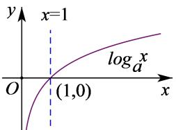
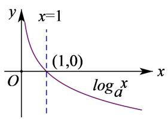
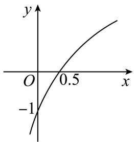
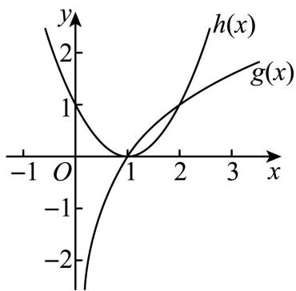
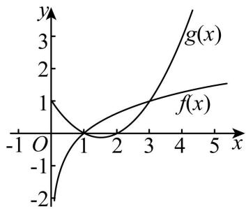
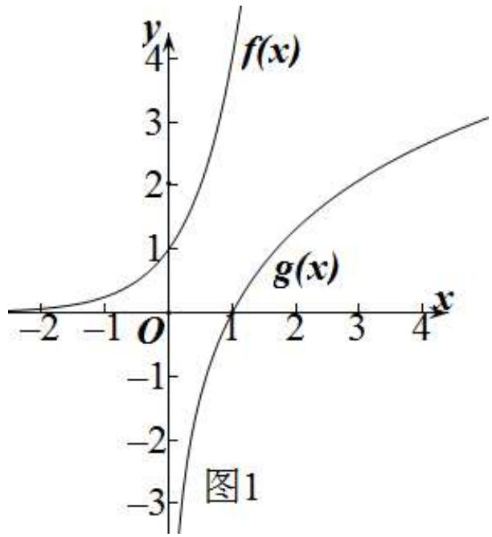
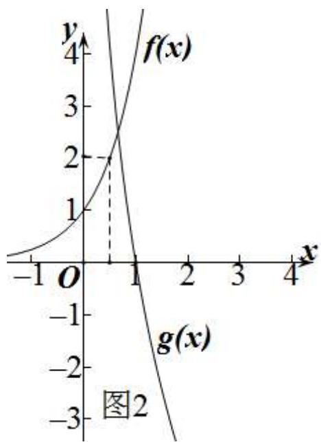
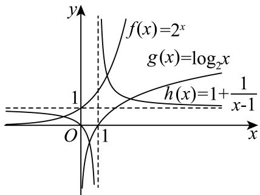

# 第10讲 对数与对数函数

# 知识梳理

# 1、对数式的运算

(1) 对数的定义: 一般地, 如果 $a^x = \mathrm{N}(a > 0$ 且 $a \neq 1$ ), 那么数 $x$ 叫做以 $a$ 为底 $\mathbf{N}$ 的对数, 记作 $x = \log_a \mathrm{N}$ , 读作以 $a$ 为底 $\mathbf{N}$ 的对数, 其中 $a$ 叫做对数的底数, $\mathbf{N}$ 叫做真数.

(2) 常见对数:

①一般对数：以 $a(a > 0$ 且 $a \neq 1)$ 为底，记为 $\log_a^N$ ，读作以 $a$ 为底 $N$ 的对数；  
②常用对数:以10为底,记为lgN;   
③自然对数:以 e 为底,记为 lnN;  
(3) 对数的性质和运算法则:   
① $\log_a^1 = 0; \log_a^a = 1$ ; 其中 $a > 0$ 且 $a \neq 1$ ;  
② $a^{\log_{a}^{N}}=N$ (其中a>0且 $a\neq1,N>0$ );  
③对数换底公式： $\log_a b = \frac{\log_c b}{\log_c a}$   
④ $\log_a(\mathrm{MN}) = \log_a\mathrm{M} + \log_a\mathrm{N}$ ;   
⑤ $\log_a\frac{\mathbf{M}}{\mathbf{N}} = \log_a\mathbf{M} - \log_a\mathbf{N};$   
⑥ $\log_{a^m} b^n = \frac{n}{m} \log_a b (m, n \in \mathbb{R})$ ;   
⑦ $a^{\log_{a}b}=b$ 和 $\log_{a}a^{b}=b;$   
⑧ $\log_a b = \frac{1}{\log_b a}$ ;

# 2、对数函数的定义及图像

(1) 对数函数的定义: 函数 $y = \log_{a} x (a > 0 \text{ 且 } a \neq 1)$ 叫做对数函数.

对数函数的图象

<table><tr><td></td><td>a&gt;1</td><td>0</td></tr><tr><td>图象</td><td></td><td></td></tr><tr><td rowspan="5">性质</td><td colspan="2">定义域:(0,+∞)</td></tr><tr><td colspan="2">值域:R</td></tr><tr><td colspan="2">过定点(1,0),即x=1时,y=0</td></tr><tr><td>在(0,+∞)上增函数</td><td>在(0,+∞)上是减函数</td></tr><tr><td>当00,当x≥1时,y≥0</td><td>当00,当x≥1时,y≤0</td></tr></table>

# 【解题方法总结】

# 1、对数函数常用技巧

在同一坐标系内，当 $a > 1$ 时，随 $a$ 的增大，对数函数的图象愈靠近 $x$ 轴；当 $0 < a < 1$ 时，对数函数的图象随 $a$ 的增大而远离 $x$ 轴。（见下图）

line

| x    | log_a1^x | log_a2^x | log_a3^x | log_a4^x |
|------|----------|----------|----------|----------|
| 0    | 1        | 1        | 1        | 1        |
| 1    | 1        | 1        | 1        | 1        |

# 必考题型全归纳

# 1 题型一: 对数运算及对数方程、对数不等式

271 (2024·四川成都·成都七中校考模拟预测) $e^{\ln 3} - 81^{\frac{1}{4}} + \log_{\sqrt{3} + 1}\frac{\sqrt{3} - 1}{2} =$ \_\_\_\_.

【答案】-1

【解析】 $e^{\ln3}-81^{\frac{1}{4}}+\log_{\sqrt{3}+1}\frac{\sqrt{3}-1}{2}=3-3^{4\times\frac{1}{4}}+\log_{\sqrt{3}+1}(\sqrt{3}+1)^{-1}=3-3-1=-1.$

故答案为: -1

272 (2024·辽宁沈阳·沈阳二中校考模拟预测)已知 $\lg a + b = -2, a^{b} = 10$ ，则 a = \_\_\_\_.

【答案】 $\frac{1}{10} / 0.1$

【解析】由题设 $b=\log_{a}10=\frac{1}{\lg a}$ ，则 $\lg a+\frac{1}{\lg a}=-2$ 且 a>0，

所以 $\lg^{2}a + 2\lg a + 1 = (\lg a + 1)^{2} = 0$ ，即 $\lg a = -1$ ，故 $a = \frac{1}{10}$ .

故答案为: $\frac{1}{10}$

273 (2024·上海徐汇·位育中学校考模拟预测)方程 $\lg(-2x)=\lg(3-x^{2})$ 的解集为 \_\_\_\_.

【答案】 $\{x|x=-1\}$

【解析】因为 $\lg(-2x)=\lg(3-x^{2})$ ,

则 $\left\{\begin{aligned}-2x&=3-x^{2}\\ -2x&>0\\ 3-x^{2}&>0\end{aligned}\right.$ ，解得 x=-1，

所以方程 $\lg(-2x)=\lg(3-x^{2})$ 的解集为 $\{x|x=-1\}$ .

故答案为： $\{x|x=-1\}$

274 (2024·山东淄博·统考二模)设 p > 0, q > 0，满足 $\log_{4}p = \log_{6}q = \log_{9}(2p + q)$ ，则 $\frac{p}{q} =$ \_\_\_\_.

【答案】 $\frac{1}{2} / 0.5$

【解析】令 $\log_{4}p=\log_{6}q=\log_{9}(2p+q)=k$ ，则 $p=4^{k}, q=6^{k}, 2p+q=9^{k}$

所以 $2p + q = 2 \cdot 4^{k} + 6^{k} = 9^{k}$ ，整理得 $2 \cdot \left( \frac{2^{k}}{3^{k}} \right)^{2} + \left( \frac{2}{3} \right)^{k} = 1$ ，

解得 $\frac{2^k}{3^k} = \frac{1}{2}$ (负值舍去), 所以 $\frac{p}{q} = \frac{4^k}{6^k} = \frac{2^k}{3^k} = \frac{1}{2}$ .

故答案为: $\frac{1}{2}$ .

275 (2024·天津南开·统考二模)计算 $\log_{3}32 \cdot \log_{4}9 - \log_{2}\frac{3}{4} + \log_{2}6$ 的值为 \_\_\_\_.

【答案】8

【解析】原式 $= \log_32^5\cdot \log_23^2 -\log_2\frac{3}{4} +\log_26 = 5\log_32\cdot \log_23 - \log_2\frac{3}{4} +\log_26$

$$
= 5 - \log_ {2} \frac {3}{4} + \log_ {2} 6 = 5 + \log_ {2} \frac {6}{\frac {3}{4}} = 5 + \log_ {2} 8 = 8.
$$

故答案为: 8.

276 (2024·全国·高三专题练习)若 $\log_{14}2 = a, 14^b = 5$ ，用 $a, b$ 表示 $\log_{35}28 =$

【答案】 $\frac{1 + a}{1 + b - a}$

【解析】因为 $14^{b}=5$ ，所以 $b=\log_{14}5$ ，

$$
\log_ {3 5} 2 8 = \frac {\log_ {1 4} 2 8}{\log_ {1 4} 3 5} = \frac {\log_ {1 4} 1 4 + \log_ {1 4} 2}{\log_ {1 4} 1 4 + \log_ {1 4} 5 - \log_ {1 4} 2} = \frac {1 + a}{1 + b - a}.
$$

故答案为: $\frac{1 + a}{1 + b - a}$ .

277 (2024·上海·高三校联考阶段练习)若 $12^{a}=3^{b}=m$ ，且 $\frac{1}{a}-\frac{1}{b}=2$ ，则 m= \_\_\_\_.

【答案】2

【解析】 $\because 12^{a}=3^{b}=m$ ，且 $\frac{1}{a}-\frac{1}{b}=2$ ，

$$
\therefore m > 0 \text {且} m \neq 1,
$$

$$
\therefore a = \log_ {1 2} m, b = \log_ {3} m,
$$

$$
\therefore \frac {1}{a} = \log_ {m} 1 2, \frac {1}{b} = \log_ {m} 3,
$$

$$
\therefore \frac {1}{a} - \frac {1}{b} = \log_ {m} 1 2 - \log_ {m} 3 = \log_ {m} 4 = 2,
$$

$$
\therefore m = 2.
$$

故答案为: 2.

278 (2024·全国·高三专题练习) $(\log_63)^2 + (\log_62)^2 + \frac{2\lg 3 \cdot \lg 2}{(\lg 3 + \lg 2)^2} =$ \_\_\_\_；

【答案】1

$$
\begin{array}{l} = \left(\log_ {6} 3\right) ^ {2} + \left(\log_ {6} 2\right) ^ {2} + 2 \log_ {6} 3 \cdot \log_ {6} 2 \\ = (\log_ {6} 3 + \log_ {6} 2) ^ {2} \\ = (\log_ {6} 6) ^ {2} = 1. \\ \end{array}
$$

【解析】原式 $= (\log_63)^2 + (\log_62)^2 + \frac{2\lg 3 \cdot \lg 2}{\lg 6 \cdot \lg 6}$

故答案为: 1.

279 (2024·全国·高三专题练习)解关于 x 的不等式 $\log_{2}(2-4^{x})<x$ 解集为 \_\_\_\_.

【答案】 $\left(0,\frac{1}{2}\right)$

【解析】不等式 $\log_{2}(2-4^{x})<x\Leftrightarrow\log_{2}(2-4^{x})<\log_{2}2^{x}\Leftrightarrow0<2-4^{x}<2^{x}$

解 $2-4^{x}>0$ , 即 $2^{2x}<2$ , 有 2x<1, 解得 $x<\frac{1}{2}$ ,

解 $2 - 4^{x} < 2^{x}$ , 即 $2^{2x} + 2^{x} - 2 > 0$ , 化为 $(2^{x} + 2)(2^{x} - 1) > 0$ , 有 $2^{x} > 1$ , 解得 $x > 0$ ,

因此 $0 < x < \frac{1}{2}$ ,

所以不等式 $\log_2(2 - 4^x) < x$ 解集为 $\left(0, \frac{1}{2}\right)$ .

故答案为: $\left(0,\frac{1}{2}\right)$

280 (2024·上海杨浦·高三上海市杨浦高级中学校考开学考试)已知函数 $f(x)$ 是定义在R上的奇函数,当x>0时, $f(x)=\log_{2}x$ ,则 $f(x)\geqslant-2$ 的解集是\_\_\_\_.

【答案】 $\left[-4,0\right]\cup\left[\frac{1}{4},+\infty\right)$

【解析】当 x<0 时，-x>0，所以 $f(-x)=\log_{2}(-x)$ ，

因为函数 $f(x)$ 是定义在 R 上的奇函数, 所以 $f(x) = -f(-x) = -\log_{2}(-x)$ ,

所以当 x<0 时， $f(x)=-\log_{2}(-x)$ ,

所以 $f(x)=\left\{\begin{aligned}-\log_{2}(-x),&x<0\\0,&x=0\\ \log_{2}x,&x>0\end{aligned}\right.$

要解不等式 $f(x)\geqslant -2$ ，只需 $\left\{ \begin{array}{l}x > 0\\ \log_2x\geqslant -2 \end{array} \right.$ 或 $\left\{ \begin{array}{l}x <   0\\ -\log_2(-x)\geqslant -2 \end{array} \right.$ 或 $\left\{ \begin{array}{l}x = 0\\ 0\geqslant -2 \end{array} \right.,$

解得 $x \geqslant \frac{1}{4}$ 或 $-4 \leqslant x < 0$ 或 $x = 0$ ,

综上,不等式的解集为 $\left[-4,0\right]\cup\left[\frac{1}{4},+\infty\right)$ .

故答案为： $\left[-4,0\right]\cup\left[\frac{1}{4},+\infty\right)$ .

281 (2024·上海浦东新·高三华师大二附中校考阶段练习)方程 $2^{x} + \log_{4}x = 17$ 的解为

【答案】x=4

【解析】设函数 $f(x)=2^{x}+\log_{4}x,\ x\in(0,+\infty)$ ，由于函数 $y=2^{x},y=\log_{4}x$ 在 $x\in(0,+\infty)$ 上均为增函数，

又 $f(4)=2^{4}+\log_{4}4=16+1=17$ ，故方程 $2^{x}+\log_{4}x=17$ 的解为x=4.

故答案为: x = 4.

【解题方法总结】

对数的有关运算问题要注意公式的顺用、逆用、变形用等. 对数方程或对数不等式问题是要将其化为同底, 利用对数单调性去掉对数符号, 转化为不含对数的问题, 但这里必须注意对数的真数为正.

# 2 题型二:对数函数的图像

282 (2024·全国·高三专题练习)已知函数 $y=\log_{a}(x+b)(a,b$ 为常数, 其中 a>0 且 $a\neq1)$ 的图象如图所示, 则下列结论正确的是 ()

line

| x | y |
|---|---|
| 0 | -1 |
| 0.5 | 0.5 |

A. $a = 0.5, b = 2$

B. $a = 2, b = 2$

C. $a = 0.5, b = 0.5$

D. $a = 2, b = 0.5$

【答案】D

【解析】由图象可得函数在定义域上单调递增，

所以 a > 1, 排除 A, C;

又因为函数过点 $(0.5,0)$ ,

所以 $b+0.5=1$ , 解得 b=0.5.

故选：D

283 (2024·全国·高三专题练习)函数 $f(x) = \log_a (x - 1) + 2$ 的图象恒过定点（）

A. $(2,2)$

B. $(2,1)$

C. $(3,2)$

D. $(2,0)$

【答案】A

【解析】当 x=2 时 $f(2)=\log_{a}1+2=2$ ，即函数图象恒过 $(2,2)$ .

故选：A

284 (2024·北京·统考模拟预测)已知函数 $f(x)=\log_{2}x-(x-1)^{2}$ ，则不等式 $f(x)<0$ 的解集为（）

A. $(-∞,1)∪(2,+∞)$

B. $(0,1)\cup(2,+\infty)$

C. $(1,2)$

D. $(1,+\infty)$

【答案】B

【解析】由题意,不等式 $f(x)<0$ ,即 $\log_{2}x-(x-1)^{2}<0$ ,

等价于 $\log_{2}x < (x-1)^{2}$ 在 $(0, +\infty)$ 上的解，

令 $g(x)=\log_{2}x$ , $h(x)=(x-1)^{2}$ , 则不等式为 $g(x)<h(x)$ ,

在同一坐标系下作出两个函数的图象,如图所示,

可得不等式 $f(x) < 0$ 的解集为 $(0,1) \cup (2, +\infty)$ ,

故选：B

line

| x   | h(x) | g(x) |
| --- | ---- | ---- |
| 0   | 0    | 0    |
| 1   | 0    | 0    |
| 2   | 1    | 1    |
| 3   | 2    | 2    |

285 (2024·北京·高三统考学业考试)将函数 $y=\log_{2}x$ 的图象向上平移 1 个单位长度, 得到函数 $y=f(x)$ 的图象, 则 $f(x)=$ ()

A. $\log_2(x + 1)$

B. $1 + \log_2x$

C. $\log_2(x - 1)$

D. $-1 + \log_2x$

【答案】B

【解析】将函数 $y=\log_{2}x$ 的图象向上平移 1 个单位长度, 得到函数 $y=1+\log_{2}x$ .

故选：B.

286 (2024·北京海淀·清华附中校考模拟预测)不等式 $2\log_{3}x - (x - 1)(x - 2) > 0$ 的解集为 \_\_\_\_.

【答案】 $\{x\mid1<x<3\}$

【解析】由 $2\log_{3}x - (x - 1)(x - 2) > 0 \Rightarrow \log_{3}x > \frac{1}{2}(x - 1)(x - 2)$ ,

在同一直角坐标系内画出函数 $f(x) = \log_3 x, g(x) = \frac{1}{2} (x - 1)(x - 2)$ 的图象如下图所示：

line

| x   | g(x) | f(x) |
| --- | ---- | ---- |
| 0   | 1    | -2   |
| 1   | 0    | 0    |
| 2   | 1    | 1    |
| 3   | 2    | 1.5  |
| 4   | 3    | 1.75 |
| 5   | 4    | 1.8  |

因为 $f(3)=g(3)=1$ ,

所以由函数的图象可知: 当 $x \in (1,3)$ 时, 有 $f(x) > g(x)$ ,

故答案为： $\{x\mid1<x<3\}$

287 (多选题)(2024·全国·高三专题练习)当 $0<x\leqslant\frac{1}{2}$ 时， $4^{x}\leqslant\log_{a}x$ ，则a的值可以为()

A. $\frac{\sqrt{2}}{2}$

B. $\frac{\sqrt{3}}{2}$

C. $\frac{\sqrt{6}}{3}$

D. $\sqrt{2}$

【答案】ABC

【解析】分别记函数 $f(x) = 4^{x}$ , $g(x) = \log_{a} x$

由图1知,当a>1时,不满足题意;

line

| x   | f(x) | g(x) |
| --- | ---- | ---- |
| -2  | -3   | -3   |
| 0   | 1    | 0    |
| 1   | 3    | 1    |
| 2   | 4    | 2    |
| 3   | 5    | 3    |
| 4   | 6    | 4    |

当 0 < a < 1 时, 如图 2, 要使 $0 < x \leqslant \frac{1}{2}$ 时, 不等式 $4^{x} \leqslant \log_{a} x$ 恒成立, 只需满足 $f\left(\frac{1}{2}\right) \leqslant g\left(\frac{1}{2}\right)$ , 即 $4^{\frac{1}{2}} \leqslant \log_{a} \frac{1}{2}$ , 即 $2 \leqslant \log_{a} \frac{1}{2}$ , 解得 $\frac{\sqrt{2}}{2} \leqslant a < 1$ .

line

| x    | f(x) | g(x) |
| ---- | ---- | ---- |
| -1   | 0    | 0    |
| 0    | 2    | 2    |
| 1    | 4    | -2   |
| 2    | 6    | -4   |
| 3    | 8    | -6   |
| 4    | 10   | -8   |

故选: ABC

【解题方法总结】

研究和讨论题中所涉及的函数图像是解决有关函数问题最重要的思路和方法. 图像问题是数和形结合的护体解释. 它为研究函数问题提供了思维方向.

# 3 题型三:对数函数的性质 (单调性、最值 (值域))

288 (2024·全国·高三专题练习)已知函数 $f(x)=\log_{3}(1-ax)$ ，若 $f(x)$ 在 $(-∞,1]$ 上为减函数，则 a 的取值范围为（）

A. $(0, +\infty)$

B. $(0,1)$

C. $(1,2)$

D. $(-∞,1)$

【答案】B

【解析】设函数 y=1-ax，

因为 $f(x)$ 在 $(-∞,1]$ 上为减函数，

所以 y=1-ax 在 $(-∞,1]$ 上为减函数，则 -a<0 解得 a>0，

又因为 $y = 1 - ax > 0$ 在 $(- \infty, 1]$ 恒成立，

所以 $y_{\min}=1-a>0$ 解得 a<1,

所以 a 的取值范围为 0 < a < 1,

故选:B.

289 (2024·新疆阿勒泰·统考三模)正数 a, b 满足 $2^{a}-4^{b}=\log_{2}b-\log_{2}a$ ，则 a 与 2b 大小关系为

【答案】 $a < 2b / 2b > a$

【解析】因为 $2^{a}-4^{b}=\log_{2}b-\log_{2}a$ ,

所以 $2^{a} + \log_{2}a = 4^{b} + \log_{2}b = 2^{2b} + \log_{2}b + \log_{2}2 - 1 = 2^{2b} + \log_{2}2b - 1$ ,

设 $f(x)=2^{x}+\log_{2}x$ ，则 $f(a)=f(2b)-1$ ，

所以 $f(a) < f(2b)$ ,

又因为 $y=2^{x}$ 与 $y=\log_{2}x$ 在 $(0,+\infty)$ 上单调递增，

所以 $f(x)=2^{x}+\log_{2}x$ 在 $(0,+\infty)$ 上单调递增，

所以 a < 2b.

故答案为: a < 2b.

290 (2024·全国·高三专题练习)已知函数 $f(x) = \log_a x (a > 0, a \neq 1)$ 在 [1,4] 上的最大值是 2，则 $a$ 等于 \_\_\_\_

【答案】2

【解析】当 a > 1 时, 函数 $f(x) = \log_{a} x$ 在 [1,4] 上单调递增,

则 $f(4)=\log_{a}4=2$ , 解得 a=2 ,

当 0 < a < 1 时, 函数 $f(x) = \log_{a} x$ 在 [1,4] 上单调递减,

则 $f(1)=\log_{a}1=2$ ，无解，

综上，a 等于 2.

故答案为: 2.

291 (2024·全国·高三专题练习)若函数 $f(x)=\log_{a}x(a>0$ 且 $a\neq1)$ 在 $\left[\frac{1}{2},4\right]$ 上的最大值为 2，最小值为 m，函数 $g(x)=(3+2m)\sqrt{x}$ 在 $[0,+\infty)$ 上是增函数，则 a-m 的值是 \_\_\_\_.

【答案】3

【解析】当 a > 1 时，函数 $f(x) = \log_{a} x$ 是正实数集上的增函数，而函数 $f(x) = \log_{a} x$ 在 $\left[\frac{1}{2}, 4\right]$ 上的最大值为 2，因此有 $f(4) = \log_{a} 4 = 2$ ，解得 a = 2，所以 $m = \log_{2} \frac{1}{2} = -1$ ，此时 $g(x) = \sqrt{x}$ 在 $[0, +\infty)$ 上是增函数，符合题意，因此 $a - m = 2 - (-1) = 3$ ;

当 $0 < a < 1$ 时，函数 $f(x) = \log_a x$ 是正实数集上的减函数，而函数 $f(x) = \log_a x$ 在 $\left[\frac{1}{2}, 4\right]$ 上的最大值为 2，因此有 $f\left(\frac{1}{2}\right) = \log_a \frac{1}{2} = 2, a = \frac{\sqrt{2}}{2}$ ，所以 $m = \log_{\frac{\sqrt{2}}{2}} 4 = -4$ ，此时 $g(x) = -5\sqrt{x}$ 在 $[0, +\infty)$ 上是减函数，不符合题意.

综上所述，a=2, m=-1, a-m=3.

故答案为: 3.

292 (2024·全国·高三专题练习)若函数 $f(x)=\log_{a}(x^{2}-ax+1)$ 有最小值，则 a 的取值范围是 \_\_\_\_.

【答案】(1,2)

【解析】当 $0 < a < 1$ 时，外层函数 $y = \log_a u$ 为减函数，对于内层函数 $u = x^2 - ax + 1, \Delta = a^2 - 4 < 0$ ，则 $u > 0$ 对任意的实数 $x$ 恒成立，

由于二次函数 $u = x^{2} - ax + 1$ 有最小值，此时函数 $f(x) = \log_{a}(x^{2} - ax + 1)$ 没有最小值；当 a > 1 时，外层函数 $y = \log_{a} u$ 为增函数，对于内层函数 $u = x^{2} - ax + 1$ ，

函数 $u = x^{2} - ax + 1$ 有最小值, 若使得函数 $f(x) = \log_{a}(x^{2} - ax + 1)$ 有最小值,

则 $\left\{\begin{aligned}\Delta&=a^{2}-4<0\\ a&>1\end{aligned}\right.$ ，解得 1<a<2.

综上所述,实数a的取值范围是 $(1,2)$ .

故答案为: $(1,2)$ .

293 (2024·河南·校联考模拟预测)写出一个同时具有下列性质①②③的函数: $f(x)=$ \_\_\_\_.
① $f(x_{1}x_{2}) = f(x_{1}) + f(x_{2})$ ; ② 当 $x \in (0, +\infty)$ 时, $f(x)$ 单调递减; ③ $f(x)$ 为偶函数.

【答案】 $\log_{\frac{1}{2}}|x|$ (不唯一)

【解析】性质①显然是和对数有关,性质②只需令对数的底0<a<1即可,性质③只需将自变量x加绝对值即变成偶函数.

故答案为: $\log_{\frac{1}{2}}|x|$ (不唯一)

294 (2024·重庆渝中·高三重庆巴蜀中学校考阶段练习)函数 $y=\log_{\frac{1}{4}}(x^{2}-x-2)$ 的单调递区间为

A. $\left(-\infty,\frac{1}{2}\right)$

B. $(-∞,-1)$

C. $\left(\frac{1}{2},+\infty\right)$

D. $(2, +\infty)$

【答案】B

【解析】函数 $y=\log_{\frac{1}{4}}(x^{2}-x-2)$ 的定义域为 $(-∞,-1)∪(2,+∞)$ ,

令 $t = x^{2} - x - 2$ ，又 $y = \log_{\frac{1}{4}}t$ 在定义域内为减函数，

故只需求函数 $t = x^{2} - x - 2$ 在定义域 $(-∞, -1) ∪ (2, +∞)$ 上的单调递减区间，

又因为函数 $t = x^{2} - x - 2$ 在 $(-∞, -1)$ 上单调递减，

$\therefore y = \log_{\frac{1}{4}}(x^2 - x - 2)$ 的单调递区间为 $(- \infty, -1)$ .

故选：B

295 (2024·陕西宝鸡·统考二模)已知函数 $f(x) = \lg x + \lg (2 - x)$ ，则 （）

A. $f(x)$ 在 $(0,1)$ 单调递减，在 $(1,2)$ 单调递增

B. $f(x)$ 在 $(0,2)$ 单调递减

C. $f(x)$ 的图像关于直线 x=1 对称

D. $f(x)$ 有最小值,但无最大值

【答案】C

【解析】由题意可得函数 $f(x)=\lg x+\lg(2-x)$ 的定义域为 $(0,2)$ ,

则 $f(x)=\lg x+\lg(2-x)=\lg(-x^{2}+2x)$ ,

因为 $y=-x^{2}+2x$ 在 $(0,1)$ 上单调递增，在 $(1,2)$ 上单调递减，

且 $y=\lg x$ 在 $(0,+\infty)$ 上单调递增，

故 $f(x)$ 在 $(0,1)$ 上单调递增，在 $(1,2)$ 上单调递减，A，B错误；

由于 $f(2-x)=\lg(2-x)+\lg x=f(x)$ ，故 $f(x)$ 的图像关于直线 x=1 对称，C 正确；

因为 $y=-x^{2}+2x$ 在 x=1 时取得最大值，且 $y=\lg x$ 在 $(0,+\infty)$ 上单调递增，

故 $f(x)$ 有最大值,但无最小值,D错误,

故选：C

296 (2024·全国·高三专题练习)若函数 $f(x)=\left\{\begin{aligned}&2+a^{x},x\leqslant1,\\ &2a+\log_{a}x,x>1\end{aligned}\right.$ 在 R 上单调，则 a 的取值范围是

A. $(0,1)$

B. $\left[2,+\infty\right)$

C. $\left(0,\frac{1}{2}\right)\cup(2,+\infty)$

D. $(0,1)\cup [2, + \infty)$

【答案】D

【解析】若 $f(x)$ 在 R 上单调递增，则 $\left\{\begin{aligned}a&>1\\ 2+a&\leqslant2a+\log_{a}1\end{aligned}\right.$ ，解得 $a\in[2,+\infty)$ ,

若 $f(x)$ 在 R 上单调递减，则 $\left\{\begin{aligned}0<a<1\\ 2+a&\geqslant2a+\log_{a}1\end{aligned}\right.$ ，解得 $a\in(0,1)$ .

综上得 $a \in (0,1) \cup [2, +\infty)$ .

故选：D

【解题方法总结】

研究和讨论题中所涉及的函数性质是解决有关函数问题最重要的思路和方法. 性质问题是数和形结合的护体解释. 它为研究函数问题提供了思维方向.

# 4 题型四: 对数函数中的恒成立问题

297 (2024·全国·高三专题练习)已知函数 $f(x) = \frac{9 + x^2}{x}$ , $g(x) = \log_2 x + a$ ，若存在 $x_1 \in [3,4]$ ，任意 $x_2 \in [4,8]$ ，使得 $f(x_1) \geqslant g(x_2)$ ，则实数 $a$ 的取值范围是 \_\_\_\_.

【答案】 $\left(-\infty ,\frac{13}{4}\right]$

【解析】若 $f(x)$ 在 [3,4] 上的最大值 $f(x)_{\max}$ ， $g(x)$ 在 [4,8] 上的最大值 $g(x)_{\max}$ ，

由题设,只需 $f(x)_{\max}\geqslant g(x)_{\max}$ 即可.

在 $[3,4]$ 上， $f(x) = \frac{9}{x} + x \geqslant 2\sqrt{\frac{9}{x} \cdot x} = 6$ 当且仅当 $x = 3$ 时等号成立，

由对勾函数的性质: $f(x)$ 在 $[3,4]$ 上递增, 故 $f(x)_{\max} = \frac{25}{4}$ .

在 $[4,8]$ 上， $g(x)$ 单调递增，则 $g(x)_{\max} = 3 + a$

所以 $\frac{25}{4} \geqslant 3 + a$ ，可得 $a \leqslant \frac{13}{4}$ .

故答案为: $\left(-\infty,\frac{13}{4}\right]$ .

298 (2024·全国·高三专题练习)若 $\forall x\in\left[\frac{1}{2},2\right]$ ，不等式 $2x^{2}-x\log_{\frac{1}{2}}x+ax<0$ 恒成立，则实数 a 的取值范围为 \_\_\_\_.

【答案】 $(- \infty, -5)$

【解析】因为 $\forall x\in\left[\frac{1}{2},2\right]$ ，不等式 $2x^{2}-x\log_{\frac{1}{2}}x+ax<0$ 恒成立，

所以 $a < \log_{\frac{1}{2}} x - 2x$ 对 $\forall x \in \left[\frac{1}{2}, 2\right]$ 恒成立.

记 $f(x)=\log_{\frac{1}{2}}x-2x,x\in\left[\frac{1}{2},2\right]$ ，只需 $a<f(x)_{\min}$ .

因为 $y = \log_{\frac{1}{2}}x$ 在 $x\in \left[\frac{1}{2},2\right]$ 上单调递减， $y = -2x$ 在 $x\in \left[\frac{1}{2},2\right]$ 上单调递减，

所以 $f(x) = \log_{\frac{1}{2}}x - 2x$ 在 $x\in \left[\frac{1}{2},2\right]$ 上单调递减，

所以 $f(x)_{\min}=f(2)=-5$ ，所以 a<-5。

故答案为: $(-∞,-5)$

299 (2024·全国·高三专题练习)已知函数 $f(x) = x^2 - 2x + 3$ , $g(x) = \log_2 x + m$ ，对任意的 $x_1$ ， $x_2 \in [1, 4]$ 有 $f(x_1) > g(x_2)$ 恒成立，则实数 $m$ 的取值范围是 \_\_\_\_.

【答案】 $(- \infty, 0)$

【解析】函数 $f(x)=x^{2}-2x+3=(x-1)^{2}+2$ 在 [1,4] 上单调递增， $g(x)=\log_{2}x+m$ 在 [1,4] 上单调递增，

$$
\therefore f (x) _ {\min} = f (1) = 2, g (x) _ {\max} = g (4) = 2 + m,
$$

对任意的 $x_{1}, x_{2} \in [1, 4]$ 有 $f(x_{1}) > g(x_{2})$ 恒成立，

$\therefore f(x)_{\min}>g(x)_{\max}$ ，即2>2+m，解得m<0，

∴实数m的取值范围是 $(-∞,0)$ .

故答案为: $(-∞,0)$ .

300 (2024·全国·高三专题练习)已知函数 $f(x) = x^{2} - 2x + 3, g(x) = \log_{2}x + m$ ，若对 $\forall x_1 \in$

[2,4], $\exists x_{2}\in[16,32]$ , 使得 $f(x_{1})\geqslant g(x_{2})$ , 则实数 m 的取值范围为 \_\_\_\_.

【答案】 $(- \infty, -1]$

【解析】因为对 $\forall x_{1}\in[2,4],\exists x_{2}\in[16,32]$ ，使得 $f(x_{1})\geqslant g(x_{2})$

所以 $f(x_{1})_{\min} \geqslant g(x_{2})_{\min}$ ,

因为 $f(x)=x^{2}-2x+3$ 的对称轴为 x=1，所以 $f(x)$ 在 [2,4] 上单调递增，所以 $f(x)_{\min}=f(2)=3$ ，

又因为 $g(x)=\log_{2}x+m$ 在 [16,32] 上单调递增，所以 $g(x)_{\min}=g(16)=4+m$ ，

所以 $3 \geqslant 4 + m$ ，所以 $m \leqslant -1$ ，即 $m \in (-\infty, -1]$ ，

故答案为: $(-∞,-1]$ .

301 (2024·全国·高三专题练习)已知函数 $f(x) = (\log_a x)^2 + 2\log_a x + 3 (a > 0, a \neq 1)$ .

(1) 若 $f(3)=2$ ，求 a 的值；  
(2) 若对任意的 $x \in [8,12]$ , $f(x) > 6$ 恒成立, 求 $a$ 的取值范围.

【解析】(1) 因为 $f(3)=2$ ，所以 $(\log_{a}3)^{2}+2\log_{a}3+3=2$ ，

所以 $(\log_{a}3+1)^{2}=0$ , 所以 $\log_{a}3=-1$ , 解得 $a=\frac{1}{3}$ .

(2) 由 $f(x) > 6$ ，得 $(\log_a x)^2 + 2\log_a x - 3 > 0$ ，即 $(\log_a x + 3)(\log_a x - 1) > 0$ ，

即 $\log_a x < -3$ 或 $\log_a x > 1$ .

当 0 < a < 1 时， $\log_{a}12 \leqslant \log_{a}x \leqslant \log_{a}8$ ，则 $\log_{a}8 < -3$ 或 $\log_{a}12 > 1$ ，

因为 $\log_a 12 < \log_a 1 = 0$ ，则 $\log_a 12 > 1$ 不成立，

由 $\log_{a}8<-3$ 可得 $\left(\frac{1}{a}\right)^{3}<8$ , 得 $\frac{1}{2}<a<1;$

当 a > 1 时， $\log_{a}8 \leqslant \log_{a}x \leqslant \log_{a}12$ ，则 $\log_{a}12 < -3$ 或 $\log_{a}8 > 1$ ，

因为 $\log_{a}12 > \log_{a}1 = 0$ ，则 $\log_{a}12 < -3$ 不成立，所以 $\log_{a}8 > 1$ ，解得 1 < a < 8。

综上, a 的取值范围是 $\left(\frac{1}{2},1\right)\cup(1,8)$ .

302 (2024·全国·高三专题练习)已知 $f(x)=3-2\log_{2}x$ , $g(x)=\log_{2}x$ .

(1) 当 $x \in [1,4]$ 时, 求函数 $y = [f(x) + 1] \cdot g(x)$ 的值域;  
(2) 对任意 $x \in [2^n, 2^{n+1}]$ , 其中常数 $n \in \mathbb{N}$ , 不等式 $f(x^2) \cdot f(\sqrt{x}) > \mathrm{kg}(x)$ 恒成立, 求实数 $k$ 的取值范围.

【解析】(1) 因为 $f(x)=3-2\log_{2}x$ , $g(x)=\log_{2}x$ , $y=[f(x)+1]\cdot g(x)$

令 $y = h(x) = (4 - 2\log_{2}x) \cdot \log_{2}x = -2(\log_{2}x - 1)^{2} + 2,$

$\because x \in [1,4], \therefore \log_2 x \in [0,2]$ , 所以当 $\log_2 x = 1$ , 即 $x = 2$ 时取最大值 $h(x)_{\max} = 2$ , 当 $\log_2 x = 0$ 或 2, 即 $x = 1$ 或 $x = 4$ 时取最小值 $h(x)_{\min} = 0$ ,

∴ 函数 $h(x)$ 的值域为 [0,2].

(2) 由 $f(x^{2}) \cdot f(\sqrt{x}) > k \cdot g(x)$ 得 $(3 - 4\log_{2}x)(3 - \log_{2}x) > k \cdot \log_{2}x$ ,

令 $t = \log_2x$ ， $\because x\in [2^n,2^{n + 1}]$ ， $\therefore t = \log_2x\in [n,n + 1],$

∴ $(3-4t)(3-t)>k\cdot t$ 对一切的 $t\in[n,n+1]$ 恒成立，

①当 n=0 时, 若 t=0 时, $k \in R$ ;

当 $t \in (0,1]$ 时， $k < \frac{(3-4t)(3-t)}{t}$ 恒成立，即 $k < 4t + \frac{9}{t} - 15$ ，

函数 $4t + \frac{9}{t} - 15$ 在 $t \in (0,1]$ 单调递减，于是 $t = 1$ 时取最小值-2，此时 $x = 2$

于是 $k\in(-\infty,-2)$ ;

② 当 n=1 时, 此时 $t \in [1,2]$ 时, $k < \frac{(3-4t)(3-t)}{t}$ 恒成立, 即 $k < 4t + \frac{9}{t} - 15$ ,

$\because 4t+\frac{9}{t}\geqslant12$ , 当且仅当 $4t=\frac{9}{t}$ , 即 $t=\frac{3}{2}$ 时取等号, 即 $4t+\frac{9}{t}-15$ 的最小值为 -3, $k\in(-\infty,-3)$ ;

③当 $n \geqslant 2$ 时，此时 $t \in [n, n + 1]$ 时， $k < \frac{(3 - 4t)(3 - t)}{t}$ 。恒成立，即 $k < 4t + \frac{9}{t} - 15$ ，函数 $4t + \frac{9}{t} - 15$ 在 $t \in [n, n + 1]$ 单调递增，于是 $t = n$ 时取最小值 $4n - 15 + \frac{9}{n}$ ，

此时 $x = 2^{n}$ ，于是 $k\in \left(-\infty ,4n - 15 + \frac{9}{n}\right)$

综上可得: 当 n=0 时 $k\in(-\infty,-2)$ ，当 n=1 时 $k\in(-\infty,-3)$ ，当 $n\geqslant2$ 时， $k\in$

$$
\left(- \infty , 4 n - 1 5 + \frac {9}{n}\right)
$$

【解题方法总结】

(1) 利用数形结合思想, 结合对数函数的图像求解;  
(2) 分离自变量与参变量, 利用等价转化思想, 转化为函数的最值问题.  
(3) 涉及不等式恒成立问题, 将给定不等式等价转化, 借助同构思想构造函数, 利用导数探求函数单调性、最值是解决问题的关键.

# 5 题型五: 对数函数的综合问题

303 (多选题)(2024·湖北·黄冈中学校联考模拟预测)已知 $a > 1, b > 1, \frac{a}{a - 1} = 2^a, \frac{b}{b - 1} = \log_2 b$ ，则以下结论正确的是 （）

A. $a + 2^{a} = b + \log_{2}b$

B. $\frac{1}{2^a} +\frac{1}{\log_2b} = 1$

C. $a - b <   - 2$

D. $a + b > 4$

【答案】ABD

【解析】对于 A, 由题意知, a, b 是函数 $h(x)=\frac{x}{x-1}=1+\frac{1}{x-1}$ 分别与函数 $f(x)=2^{x}$ , $g(x)=\log_{2}x$ 图象交点的横坐标,

由 $y=\frac{1}{x}$ 的图象关于 y=x 对称，

则其向上,向右都平移一个单位后的解析式为 $h(x)=1+\frac{1}{x-1}$ ,

所以 $h(x)$ 的图象也关于 y = x 对称，

又 $f(x)$ , $g(x)$ 两个函数的图象关于直线 y = x 对称,

故两交点 $(a,2^{a})$ ， $(b,\log_{2}b)$ 关于直线y=x对称，

所以 $a=\log_{2}b, b=2^{a}$ ，故 A 正确；

对于 B, 结合选项 A 得 $\frac{a}{a-1}=2^{a}=b$ , 则 $ab=a+b$ , 即 $\frac{1}{a}+\frac{1}{b}=1$ , 即 $\frac{1}{2^{a}}+\frac{1}{\log_{2}b}=1$ 成立, 故 B 正确;

对于 C, 结合选项 A 得 $a - b = \log_{2}b - b (2 < b < 4)$ ，令 $\varphi(b) = \log_{2}b - b$ ，则 $\varphi'(b) = \frac{1}{b\ln2} - 1 < 0$ ,

所以 $\varphi(b)=\log_{2}b-b$ 在 $(2,4)$ 上单调递减，则 $\varphi(b)>\log_{2}4-4=-2$ ，故 C 错误；

对于 D, 结合选项 B 得 $a + b = (a + b)\left(\frac{1}{a} + \frac{1}{b}\right) = 2 + \frac{b}{a} + \frac{a}{b} > 4 (a \neq b$ , 即不等式取不到等号), 故 D 正确.

故选: ABD.

line

| x    | f(x)     | g(x)     | h(x)     |
| ---- | -------- | -------- | -------- |
| 0    | 0        | 0        | 0        |
| 1    | 2^x      | log2x    | 1/(x-1)  |
| 1    | 0        | 0        | 0        |

304 (2024·海南海口·统考模拟预测)已知正实数 m, n 满足: $n \ln n = e^{m} - n \ln m$ , 则 $\frac{n}{m}$ 的最小值为 \_\_\_\_.

【答案】 $\frac{\mathrm{e}^2}{4}$

【解析】由 $n\ln n = \mathrm{e}^{m} - n\ln m$ 可得： $\frac{\mathrm{e}^m}{n} = \ln m + \ln n,$

所以 $\mathrm{e}^{m - \ln n} - \ln n = \ln m, \mathrm{e}^{m - \ln n} + m - \ln n = m + \ln m = \mathrm{e}^{\ln m} + \ln m,$

设 $f(x)=\mathrm{e}^{x}+x,f'(x)=\mathrm{e}^{x}+1>0,$

所以 $f(x)$ 在 R 上单调递增, 所以 $f(m-\ln n)=f(\ln m)$ ,

则 $m - \ln n = \ln m$ ，所以 $\ln n = \ln \frac{e^{m}}{m}$ ，

所以 $n=\frac{e^{m}}{m}$ ，所以 $\frac{n}{m}=\frac{e^{m}}{m^{2}}$ ，令 $g(x)=\frac{e^{x}}{x^{2}},g'(x)=\frac{e^{x}\cdot x^{2}-e^{x}\cdot 2x}{x^{4}}=\frac{e^{x}(x-2)}{x^{3}}$

令 $g'(x)>0$ , 解得: x>2; 令 $g'(x)<0$ , 解得: 0<x<2;

所以 $g(x)$ 在 $(0,2)$ 上单调递减，在 $(2,+\infty)$ 上单调递增，

所以 $g(x)_{\min}=g(2)=\frac{e^{2}}{4}.$

故 $\frac{n}{m}$ 的最小值为 $\frac{\mathrm{e}^2}{4}$ .

故答案为: $\frac{e^{2}}{4}$ .

305 (多选题)(2024·广东惠州·统考一模)若 $6^{a}=2,6^{b}=3$ ，则()

A. $\frac{b}{a} > 1$

B. $ab < \frac{1}{4}$

C. $a^{2}+b^{2}<\frac{1}{2}$

D. $b - a > \frac{1}{5}$

【答案】ABD

【解析】因为 $6^{b}=3,6^{a}=2$ ，所以 $b=\log_{6}3, a=\log_{6}2$ ，则 $a+b=1$ ，

选项 A, $\frac{b}{a} = \frac{\log_{6}3}{\log_{6}2} = \log_{2}3 > \log_{2}2 = 1$ , 故 A 正确;

选项 B, 因为 $a + b = \log_{6}3 + \log_{6}2 = \log_{6}6 = 1$ , 且 a > 0, b > 0, $a \neq b$ , 所以 $ab < \left(\frac{a + b}{2}\right)^{2} = \frac{1}{4}$ , 故 B 正确;

选项 C, 因为 $a^{2} + b^{2} = (a + b)^{2} - 2ab = 1 - 2ab > 1 - 2 \times \frac{1}{4} = \frac{1}{2}$ , 故 C 错误;

选项 D, 因为 $5(b-a)=5\log_{6}\frac{3}{2}=\log_{6}\frac{243}{32}>\log_{6}6=1$ , 故 D 正确,

故选: ABD.

306 (2024·河南·高三信阳高中校联考阶段练习)已知 $x_{1}, x_{2}$ 分别是方程 $x + \mathrm{e}^{x} = 3$ 和 $x + \ln x$ =3的根,若 $x_{1}+x_{2}=a+b$ ,实数a,b>0,则 $\frac{7b^{2}+1}{ab}$ 的最小值为()

A. 1

B. $\frac{7}{3}$

C. $\frac{67}{9}$

D. 2

【答案】D

【解析】 $x + e^{x} = 3, e^{x} = 3 - x; x + \ln x = 3, \ln x = 3 - x.$

函数 $y=e^{x}$ 与函数 $y=\ln x$ 的图象关于直线 y=x 对称，

由 $\left\{\begin{aligned}y=3-x\\ y=x\end{aligned}\right.$ 解得 $x=y=\frac{3}{2}$ ，设 $A\left(\frac{3}{2},\frac{3}{2}\right)$ ,

则 $x_{1} + x_{2} = \frac{3}{2}\times 2 = 3$ ，即 $a + b = 3$

$$
\frac {7 b ^ {2} + 1}{a b} = \frac {7 b ^ {2} + 1}{(3 - b) b} = - \frac {7 b ^ {2} + 1}{b ^ {2} - 3 b} = - \frac {7 (b ^ {2} - 3 b) + 2 1 b + 1}{b ^ {2} - 3 b} = - \left(7 + \frac {2 1 b + 1}{b ^ {2} - 3 b}\right),
$$

令 $21b + 1 = t$ ，则 $b = \frac{t - 1}{21}$

则 $\frac{7b^2 + 1}{ab} = -\left(7 + \frac{21b + 1}{b^2 - 3b}\right) = -\left(7 + \frac{t}{\left(\frac{t - 1}{21}\right)^2 - 3 \times \frac{t - 1}{21}}\right)$

$$
= - \left(7 + \frac {4 4 1}{t + \frac {6 4}{t} - 6 5}\right) \geqslant - \left(7 + \frac {4 4 1}{2 \sqrt {t \cdot \frac {6 4}{t}} - 6 5}\right) = 2,
$$

当且仅当 $t=\frac{64}{t}, t=8=21b+1, b=\frac{1}{3}, a=3-b=\frac{8}{3}$ 时等号成立.

故选：D

307 (2024·全国·高三专题练习)若 $x_{1}$ 满足 $2^{x}=5-x$ ， $x_{2}$ 满足 $x+\log_{2}x=5$ ，则 $x_{1}+x_{2}$ 等于（）

A. 2

B. 3

C. 4

D. 5

【答案】D

【解析】由题意 $5 - x_{1} = 2^{x_{1}}$ ，故有 $5 - x_{2} = \log_{2} x_{2}$

故 $x_{1}$ 和 $x_{2}$ 是直线y=5-x和曲线 $y=2^{x}$ 、曲线 $y=\log_{2}x$ 交点的横坐标.

根据函数 $y=2^{x}$ 和函数 $y=\log_{2}x$ 互为反函数, 它们的图象关于直线 y=x 对称,

故曲线 $y=2^{x}$ 和曲线 $y=\log_{2}x$ 的图象交点关于直线 y=x 对称.

即点 $(x_{1},5-x_{1})$ 和点 $(x_{2},5-x_{2})$ 构成的线段的中点在直线y=x上，

即 $\frac{x_1 + x_2}{2} = \frac{5 - x_1 + 5 - x_2}{2}$ , 求得 $x_1 + x_2 = 5$ ,

故选：D.

308 (2024·全国·高三专题练习)已知 $x_{1}$ 是方程 $x \cdot 3^{x} = 2$ 的根， $x_{2}$ 是方程 $x \cdot \log_{3} x = 2$ 的根，则 $x_{1} \cdot x_{2}$ 的值为 ()

A. 2

B. 3

C. 6

D. 10

【答案】A

【解析】方程 $x \cdot 3^{x} = 2$ 可变形为方程 $3^{x} = \frac{2}{x}$ ，方程 $x \cdot \log_{3}x = 2$ 可变形为方程 $\log_{3}x = \frac{2}{x}$ ，
∵ $x_{1}$ 是方程 $x \cdot 3^{x} = 2$ 的根， $x_{2}$ 是方程 $x \cdot \log_{3}x = 2$ 的根，

∴ $x_{1}$ 是函数 $y=3^{x}$ 与函数 $y=\frac{2}{x}$ 的交点横坐标， $x_{2}$ 是函数 $y=\log_{3}x=$ 与函数 $y=\frac{2}{x}$ 的交点横坐标，

∵ 函数 $y=3^{x}$ 与函数 $y=\log_{3}x$ 互为反函数，

∴ 函数 $y=\log_{3}x$ 与函数 $y=\frac{2}{x}$ 的交点横坐标 $x_{2}$ 等于函数 $y=3^{x}$ 与函数 $y=\frac{2}{x}$ 的交点纵坐标, 即 $(x_{1},x_{2})$ 在数 $y=\frac{2}{x}$ 图象上,

又∵ $y=\frac{2}{x}$ 图象上点的横纵坐标之积为2，∴ $x_{1}x_{2}=2$ ，

故选：A

