# 第11讲 函数的图像

# 知识梳理

# 一、掌握基本初等函数的图像

(1) 一次函数；(2) 二次函数；(3) 反比例函数；(4) 指数函数；(5) 对数函数；(6) 三角函数.

# 二、函数图像作法

# 1、直接画

①确定定义域；②化简解析式；③考察性质：奇偶性(或其他对称性)、单调性、周期性、凹凸性；④特殊点、极值点、与横/纵坐标交点；⑤特殊线(对称轴、渐近线等).

# 2、图像的变换

# (1) 平移变换

①函数 $y = f(x + a) (a > 0)$ 的图像是把函数 $y = f(x)$ 的图像沿 $x$ 轴向左平移 $a$ 个单位得到的；  
②函数 $y = f(x - a) (a > 0)$ 的图像是把函数 $y = f(x)$ 的图像沿 $x$ 轴向右平移 $a$ 个单位得到的；  
③函数 $y = f(x) + a (a > 0)$ 的图像是把函数 $y = f(x)$ 的图像沿 $y$ 轴向上平移 $a$ 个单位得到的；  
④函数 $y=f(x)+a(a>0)$ 的图像是把函数 $y=f(x)$ 的图像沿 y 轴向下平移 a 个单位得到的；

# (2) 对称变换

①函数 $y = f(x)$ 与函数 $y = f(-x)$ 的图像关于 $y$ 轴对称；

函数 $y=f(x)$ 与函数的图像关于 x 轴对称；

函数 $y=f(x)$ 与函数 $y=-f(-x)$ 的图像关于坐标原点 $(0,0)$ 对称；

②若函数 $f(x)$ 的图像关于直线 $x = a$ 对称，则对定义域内的任意 $x$ 都有

$f(a - x) = f(a + x)$ 或 $f(x) = f(2a - x)$ (实质上是图像上关于直线 $x = a$ 对称的两点连线的中点横坐标为 $a$ ，即 $\frac{(a - x) + (a + x)}{2} = a$ 为常数);

若函数 $f(x)$ 的图像关于点 $(a,b)$ 对称，则对定义域内的任意 $x$ 都有 $f(x) = 2b - f(2a - x)$ 或 $f(a - x) = 2b - f(a + x)$

③ $y=|f(x)|$ 的图像是将函数 $f(x)$ 的图像保留x轴上方的部分不变，将x轴下方的部分关于x轴对称翻折上来得到的(如图(a)和图(b))所示

④ $y=f(|x|)$ 的图像是将函数 $f(x)$ 的图像只保留y轴右边的部分不变，并将右边的图像关于y轴对称得到函数 $y=f(|x|)$ 左边的图像即函数 $y=f(|x|)$ 是一个偶函数(如图(c)所示).

text_image

y = f(x)
O
x

(a)

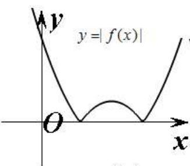

text_image

y=|f(x)|
O
x

(b)

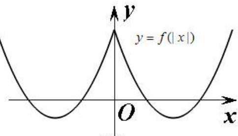

text_image

y
y = f(|x|)
O
x

(c)

注： $|f(x)|$ 的图像先保留 $f(x)$ 原来在 x 轴上方的图像，做出 x 轴下方的图像关于 x 轴对称图形，然后擦去 x 轴下方的图像得到；而 $f(|x|)$ 的图像是先保留 $f(x)$ 在 y 轴右方的图像，擦去 y 轴左方的图像，然后做出 y 轴右方的图像关于 y 轴的对称图形得到。这两变换又叫翻折变换。

⑤函数 $y=f^{-1}(x)$ 与 $y=f(x)$ 的图像关于 y=x 对称.

# (3) 伸缩变换

① $y = A f(x) (A > 0)$ 的图像, 可将 $y = f(x)$ 的图像上的每一点的纵坐标伸长 $(A > 1)$ 或缩短 $(0 < A < 1)$ 到原来的 A 倍得到.  
② $y=f(\omega x)(\omega>0)$ 的图像, 可将 $y=f(x)$ 的图像上的每一点的横坐标伸长 $(0<\omega<1)$ 或缩短 $(\omega>1)$ 到原来的 $\frac{1}{\omega}$ 倍得到.

# 【解题方法总结】

(1) 若 $f(m + x) = f(m - x)$ 恒成立，则 $y = f(x)$ 的图像关于直线 $x = m$ 对称.  
(2) 设函数 $y = f(x)$ 定义在实数集上，则函数 $y = f(x - m)$ 与 $y = f(m - x) (m > 0)$ 的图象关于直线 $x = m$ 对称.  
(3) 若 $f(a + x) = f(b - x)$ ，对任意 $x \in \mathbb{R}$ 恒成立，则 $y = f(x)$ 的图象关于直线 $x = \frac{a + b}{2}$ 对称.  
(4) 函数 $y = f(a + x)$ 与函数 $y = f(b - x)$ 的图象关于直线 $x = \frac{a + b}{2}$ 对称.  
(5) 函数 $y=f(x)$ . 与函数 $y=f(2a-x)$ 的图象关于直线x=a对称.  
(6) 函数 $y = f(x)$ 与函数 $y = 2b - f(2a - x)$ 的图象关于点 $(a, b)$ 中心对称.  
(7) 函数平移遵循自变量“左加右减”，函数值“上加下减”。

# 必考题型全归纳

# 1 题型一:由解析式选图(识图)

309 (2024·山东烟台·统考二模)函数 $y = x(\sin x - \sin 2x)$ 的部分图象大致为 （）

text_image

y
1
O
π
x
A.

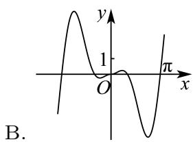

text_image

y
1
O
π
x
B.

C.

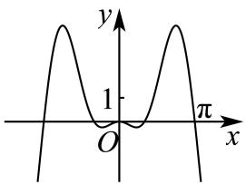

text_image

y
1
O
π
x

D.

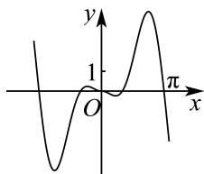

text_image

y
1
O
x
π

【答案】C

【解析】由 $y=f(x)=x(\sin x-\sin 2x)$ ,

得 $f(-x) = -x[\sin(-x) - \sin(-2x)] = -x(-\sin x + \sin 2x) = f(x)$ ,

所以 $f(x)$ 为偶函数, 故排除 BD.

当 $x=\frac{\pi}{2}$ 时， $y=f\left(\frac{\pi}{2}\right)=\frac{\pi}{2}\left(\sin\frac{\pi}{2}-\sin\pi\right)=\frac{\pi}{2}>0$ ，排除 A.

故选：C.

310 (2024·重庆·统考模拟预测)函数 $y = \frac{1}{2} (x - 2)^2 \ln x^2$ 的图像是（）

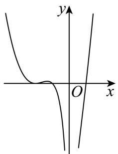

text_image

y
O x

B.

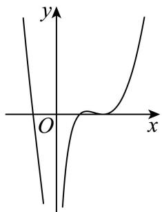

text_image

y
O
x

A.

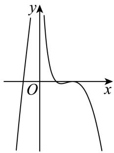

text_image

y
O
x

D.

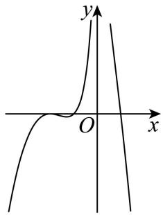

text_image

y
O
x

C.

【答案】B

【解析】因为 $y=\frac{1}{2}(x-2)^{2}\ln x^{2}$ ，令 y=0，则 $\frac{1}{2}(x-2)^{2}\ln x^{2}=0$ ，

即 $(x - 2)^{2} = 0$ ，解得 $x = 2$ ，或 $\ln x^2 = 0$ ，解得 $x = \pm 1$

所以当 x<0 时, 函数有 1 个零点, 当 x>0 时, 函数有 2 个零点,

所以排除 AD;

当 x > 0 时， $y = \frac{1}{2}(x - 2)^{2} \ln x^{2} = \frac{1}{2}(x - 2)^{2} \times 2 \ln x = (x - 2)^{2} \ln x$

则 $y' = 2(x - 2) \ln x + \frac{(x - 2)^{2}}{x}$ ，当 x > 2 时， $y' > 0$ ，

所以当 $x \in (2, +\infty)$ 时， $y' > 0$ ，函数单调递增，所以 B 正确；

故选: B.

311 (2024·安徽安庆·安庆市第二中学校考二模)函数 $f(x)=\frac{1}{4x^{2}-1}+\sin2x$ 的部分图象大致是

A.   
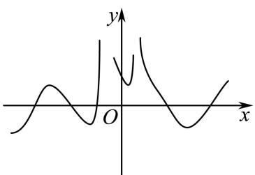

text_image

Graph of a function with x and y axes, showing a local minimum near the origin and a peak above y-axis.

B.   
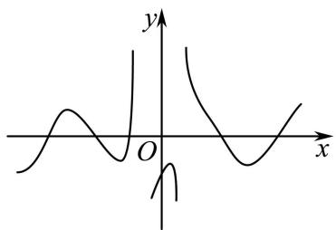

text_image

Graph of a function with y-axis and x-axis, showing a single peak and a trough at origin

C.   
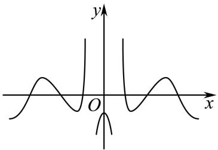

text_image

y
O
x

D.   
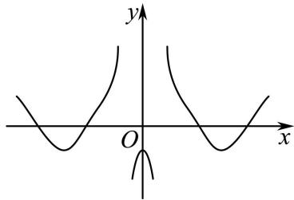

text_image

y
O
x

【答案】B

【解析】由解析式可得 $x \neq \pm \frac{1}{2}$ , $f(0) = -1 < 0$ , 排除 A;

观察 C、D 选项, 其图象关于纵轴对称, 而 $f(-x) = \frac{1}{4x^2 - 1} - \sin 2x \neq f(x)$ ,

说明 $f(x)$ 不是偶函数, 即其函数图象不关于纵轴对称, 排除 C、D; 显然选项 B 符合题意. 故选: B

312 (2024·全国·模拟预测)函数 $f(x)=\frac{3x^{2}\cos2x}{2^{|x|}}$ 的大致图像为 ()

A.   
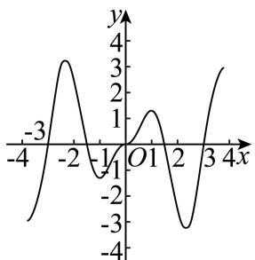

line

| x    | y     |
| ---- | ----- |
| -4   | -3.0  |
| -2   | 3.0   |
| 0    | -1.0  |
| 2    | 1.0   |
| 4    | -3.0  |

B.   
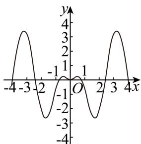

line

| x   | y    |
| --- | ---- |
| -4  | 0    |
| -3  | 3.5  |
| -2  | -3.5 |
| -1  | 0    |
| 0   | 0    |
| 1   | -3.5 |
| 2   | 0    |
| 3   | 3.5  |
| 4   | -3.5 |

C.   
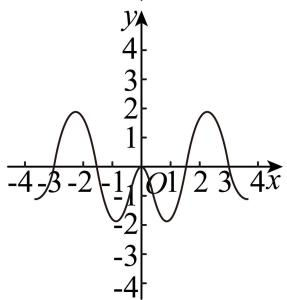

line

| x | y |
|---|---|
| -4 | 0 |
| -3 | 1 |
| -2 | 2 |
| -1 | 0 |
| 0 | -1 |
| 1 | 0 |
| 2 | 1 |
| 3 | 2 |
| 4 | 0 |

D.   
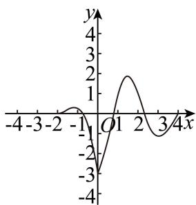

line

| x | y |
|---|---|
| -4 | -3 |
| -3 | -1 |
| -2 | 0 |
| -1 | -1 |
| 0 | 0 |
| 1 | 2 |
| 2 | 1 |
| 3 | -1 |
| 4 | -3 |

【答案】B

【解析】因为 $f(x)=\frac{3x^{2}\cos2x}{2^{|x|}}$ ，其定义域为 R，所以 $f(-x)=\frac{3x^{2}\cos2x}{2^{|x|}}=f(x)$ ，

所以 $f(x)$ 为偶函数, 排除选项 A, D,

又因为 $f(2) = \frac{12\cos 4}{4} = 3\cos 4$ ，因为 $4 \in \left(\pi, \frac{3\pi}{2}\right)$ ，所以 $\cos 4 < 0$ ，所以 $f(2) < 0$ ，排除选项 C.

故选：B.

【解题方法总结】

利用函数的性质(如定义域、值域、奇偶性、单调性、周期性、特殊点等)排除错误选项,从

# 2 题型二:由图象选表达式

313 (2024·四川遂宁·统考二模)数学与音乐有着紧密的关联,我们平时听到的乐音一般来说并不是纯音,而是由多种波叠加而成的复合音.如图为某段乐音的图像,则该段乐音对应的函数解析式可以为()

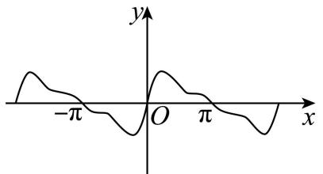

text_image

y
-π O π x

A. $y = \sin x + \frac{1}{2}\sin 2x + \frac{1}{3}\sin 3x$   
C. $y=\sin x+\frac{1}{2}\cos2x+\frac{1}{3}\cos3x$

B. $y = \sin x - \frac{1}{2}\sin 2x - \frac{1}{3}\sin 3x$

D. $y = \cos x + \frac{1}{2} \cos 2x + \frac{1}{3} \cos 3x$

【答案】A

【解析】对于 A, 函数 $y = f(x) = \sin x + \frac{1}{2} \sin 2x + \frac{1}{3} \sin 3x$ ,

因为 $f(-x) = -\sin x - \frac{1}{2}\sin 2x - \frac{1}{3}\sin 3x = -f(x)$ ，所以函数为奇函数，

又 $f\left(\frac{\pi}{4}\right)=\frac{\sqrt{2}}{2}+\frac{1}{2}+\frac{\sqrt{2}}{6}=\frac{1}{2}+\frac{2\sqrt{2}}{3}>0$ ，故A正确；

对于B,函数 $y=f(x)=\sin x-\frac{1}{2}\sin 2x-\frac{1}{3}\sin 3x$ ,

因为 $f(-x) = -\sin x + \frac{1}{2}\sin 2x + \frac{1}{3}\sin 3x = -f(x)$ ，所以函数为奇函数，

又 $f\left(\frac{\pi}{4}\right) = \frac{\sqrt{2}}{2} -\frac{1}{2} -\frac{\sqrt{2}}{6} = \frac{\sqrt{2}}{3} -\frac{1}{2} <  \frac{1.5}{3} -\frac{1}{2} = 0$ ，故B错误；

对于 C, 函数 $y=f(x)=\sin x+\frac{1}{2}\cos2x+\frac{1}{3}\cos3x$ ,

因为 $f(0)=\frac{1}{2}+\frac{1}{3}=\frac{5}{6}\neq0$ , 故 C 错误;

对于D,函数 $y=f(x)=\cos x+\frac{1}{2}\cos 2x+\frac{1}{3}\cos 3x$ ,

$f(0) = 1 + \frac{1}{2} +\frac{1}{3} = \frac{11}{6}\neq 0,$ 故D错误，

故选：A.

314 (2024·全国·校联考模拟预测)已知函数 $f(x)$ 在 $[-2, 2]$ 上的图像如图所示，则 $f(x)$ 的解析式可能是 （）

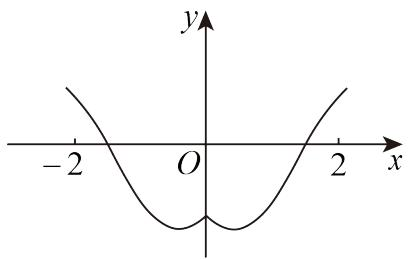

text_image

y
-2 O 2 x

A. $f(x) = 2 - \mathrm{e}^{2 - x}$

C. $f(x) = 2x^{2} - \mathrm{e}^{|x|}$

B. $f(x)=x^{2}-|x|-2$

D. $f(x) = \ln (x^{2} - 2|x| + 2) - 1$

【答案】C

【解析】由题图,知函数 $f(x)$ 的图像关于 y 轴对称,所以函数 $f(x)$ 是偶函数,故排除 A;

对于 B, $f(x)=\left\{\begin{aligned}x^{2}-x-2,&x\geqslant0\\ x^{2}+x-2,&x<0\end{aligned}\right.$ ，虽然函数 $f(x)$ 为偶函数且在 $\left(0,\frac{1}{2}\right)$ 上单调递减，在 $\left(\frac{1}{2},2\right)$ 上单调递增，但 $f(2)=0$ ，与图像不吻合，排除 B；

对于 D, 因为 $f(x)=\ln[(|x|-1)^{2}+1]-1=f(-x)$ ，所以函数 $f(x)$ 是偶函数，但 $f(2)=\ln2-1<0$ ，与图像不吻合，排除 D;

对于 C, 函数 $f(x)$ 为偶函数, 图像关于 y 轴对称, 下面只分析 y 轴右侧部分. 当 $x \in (0,2)$ 时, $f(x) = 2x^{2} - \mathrm{e}^{x}$ , $f'(x) = 4x - \mathrm{e}^{x}$ ,

令 $\varphi(x)=4x-\mathrm{e}^{x}$ ，求导，得 $\varphi'(x)=4-\mathrm{e}^{x}$ 。当 $x\in(0,\ln4)$ 时， $\varphi'(x)>0,f'(x)$ 单调递增，当 $x\in(\ln4,2)$ 时， $\varphi'(x)<0,f'(x)$ 单调递减，所以 $f'(x)$ 在 $x=\ln4$ 处取得最大值。

又因为 $f'(0) < 0, f'(\ln 4) > 0, f'(2) > 0$ ，所以 $\exists x_{0} \in (0, \ln 4)$ ，使得 $f'(x_{0}) = 0$ ，

当 $x \in (0, x_0)$ 时， $f'(x) < 0$ ， $f(x)$ 单调递减，当 $x \in (x_0, 2)$ 时， $f'(x) > 0$ ， $f(x)$ 单调递增， $f(2) = 8 - \mathrm{e}^2 > 0$ 与图像吻合.

故选：C.

315 (2024·河北·统考模拟预测)已知函数 $f(x)$ 的部分图象如图所示,则 $f(x)$ 的解析式可能为()

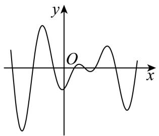

text_image

y
O
x

A. $f(x) = x\cos \pi (x + 1)$

B. $f(x) = (x - 1)\cos \pi x$

C. $f(x) = (x - 1)\sin \pi x$

D. $f(x) = x^{3} - 2x^{2} + x - 1$

【答案】B

【解析】对于 A 选项, $f(0)=0$ , A 选项错误;

对于 C 选项, $f(0)=0$ , C 选项错误;

对于 D 选项, $f'(x)=3x^{2}-4x+1$ , $f'(x)=0$ 有两个不等的实根,故 $f(x)$ 有两个极值点,D 选项错误.

对于 B 选项, $f(x)=(x-1)\cos\pi x$ , $f(0)<0$ ;

当 $x \in \left(-\frac{1}{2}, \frac{1}{2}\right), k \in \mathbb{Z}$ 时， $\cos \pi x > 0, x - 1 < 0$ ，此时 $f(x) < 0$

当 $x \in \left( \frac{1}{2}, 1 \right)$ , $k \in Z$ 时, $\cos \pi x < 0$ , x - 1 < 0, 此时 $f(x) > 0$ ,

当 $x \in \left(1, \frac{3}{2}\right)$ , $k \in Z$ 时, $\cos\pi x < 0$ , x - 1 > 0, 此时 $f(x) < 0$ ,

依次类推可知 $f(x)$ 函数值有正有负；

显然 $f(x)$ 不单调；

因为当 $x=\frac{1}{2}+k, k \in Z$ 时 $f(x)=0$ ，所以 $f(x)$ 有多个零点；

因为 $f(2) = 1, f(-2) = -3$ ，所以 $f(2) \neq f(-2), f(2) \neq -f(-2)$ ，所以 $f(x)$ 既不是奇函数也不是偶函数，以上均符合，故 B 正确.

故选：B.

316 (2024·贵州遵义·校考模拟预测)已知函数 $f(x)$ 在 $[-4, 4]$ 上的大致图象如下所示，则 $f(x)$ 的解析式可能为 （）

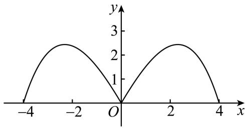

line

| x  | y  |
|----|----|
| -4 | 0  |
| -2 | 2.5|
| 0  | 0  |
| 2  | 2.5|
| 4  | 0  |

A. $f(x) = \frac{3|x|\cdot\left(1 + \cos\frac{\pi x}{4}\right)}{2}$

B. $f(x) = \frac{|x|\cdot(16 - x^2)}{10}$

C. $f(x) = |x|\cdot (4 - |x|)$

D. $f(x) = |x|\cdot \sin \frac{\pi x}{4}$

【答案】B

【解析】函数图象关于 y 轴对称, 函数为偶函数, 选项 D 中函数满足 $f(-x) = |-x|\sin\left(\frac{-\pi x}{4}\right) = -|x|\sin\frac{\pi x}{4} = -f(x)$ , 为奇函数, 排除 D;

又选项 C 中函数满足 $f(2)=4$ ，与图象不符，排除 C；

选项 A 中函数满足 $f(2)=\frac{3\times2\times\left(1+\cos\frac{2\times\pi}{4}\right)}{2}=3$ ，与图象不符，排除 A，只有 B 可选.

故选：B.

【解题方法总结】

1、从定义域值域判断图像位置；  
2、从奇偶性判断对称性；  
3、从周期性判断循环往复；  
4、从单调性判断变化趋势；  
5、从特征点排除错误选项.

# 3 题型三: 表达式含参数的图象问题

317 (2024·全国·高三专题练习)在同一直角坐标系中,函数 $y=\log_{a}(-x)$ , $y=\frac{a-1}{x}(a>0)$ ,
且 $a \neq 1$ 的图象可能是 ()

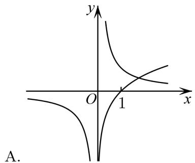

text_image

y
O 1 x
A.

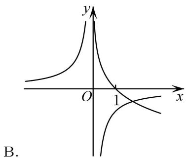

text_image

y
O 1 x
B.

A.

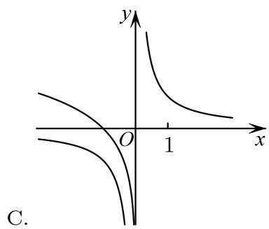

text_image

y
O 1 x
C.

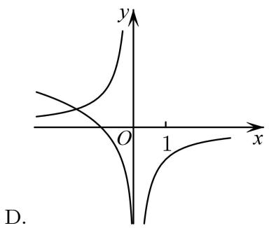

text_image

y
O 1 x
D.

【答案】C

【解析】因为函数 $y=\log_{a}(-x)$ 的图象与函数 $y=\log_{a}x$ 的图象关于 y 轴对称，

所以函数 $y=\log_{a}(-x)$ 的图象恒过定点 $(-1,0)$ ，故选项 A、B 错误；

当 a > 1 时，函数 $y = \log_{a} x$ 在 $(0, +\infty)$ 上单调递增，所以函数 $y = \log_{a} (-x)$ 在 $(-\infty, 0)$ 上单调递减，

又 $y=\frac{a-1}{x}(a>1)$ 在 $(-∞,0)$ 和 $(0,+∞)$ 上单调递减，故选项 D 错误，选项 C 正确.

故选：C.

318 (2024·山东滨州·统考二模)函数 $f(x) = \frac{3 + \cos x}{ax^2 - bx + c}$ 的图象如图所示，则（）

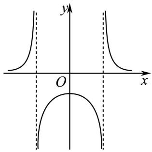

text_image

y
O
x

A. $a > 0, b = 0, c < 0$

B. $a <   0,b = 0,c <   0$

C. $a <   0,b <   0,c = 0$

D. $a > 0, b = 0, c > 0$

【答案】A

【解析】由图象观察可得函数图象关于 y 轴对称, 即函数为偶函数,

所以 $f(-x)=\frac{3+\cos x}{ax^{2}+bx+c}=f(x)$ 得: b=0, 故 C 错误;

由图象可知 $f(0)=\frac{4}{c}<0\Rightarrow c<0$ ,故D错误;

因为定义域不连续,所以 $ax^{2}-bx+c=0$ 有两个根可得 $\Delta=b^{2}-4ac>0$ , 即 a、c 异号, a>0, 即 B 错误, A 正确.

故选：A

319 (2024·全国·高三专题练习)已知函数 $y=\log_{a}(x+b)(a,b$ 为常数, 其中 a>0 且 $a\neq1)$ 的图象如图所示, 则下列结论正确的是 ()

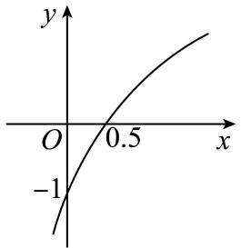

line

| x | y |
|---|---|
| 0.0 | -1 |
| 0.5 | 0.5 |

A. $a = 0.5, b = 2$

B. $a = 2, b = 2$

C. $a = 0.5, b = 0.5$

D. a=2, b=0.5

【答案】D

【解析】由图象可得函数在定义域上单调递增，

所以 a > 1, 排除 A, C;

又因为函数过点 $(0.5,0)$ ,

所以 $b+0.5=1$ , 解得 b=0.5.

故选：D

320 (2024·全国·高三专题练习)若函数 $f(x)=\frac{2}{ax^{2}+bx+c}$ 的部分图象如图所示,则 $f(5)=$

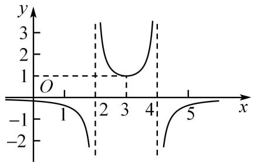

line

| x | y |
|---|---|
| 1 | -1 |
| 2 | 0 |
| 3 | 1 |
| 4 | 0 |
| 5 | -1 |

A. $-\frac{1}{3}$

B. $-\frac{2}{3}$

C. $-\frac{1}{6}$

D. $-\frac{1}{12}$

【答案】A

【解析】由图象知， $ax^{2}+bx+c=0$ 的两根为2,4，且过点(3,1)，

所以 $\left\{\begin{aligned}\frac{2}{9a+3b+c}&=1\\ 2\times4=\frac{c}{a}\end{aligned}\right.$ ，解得 a=-2, b=12, c=-16, $2+4=-\frac{b}{a}$

所以 $f(x) = \frac{2}{-2x^2 + 12x - 16} = \frac{1}{-x^2 + 6x - 8},$

所以 $f(5)=\frac{1}{-25+30-8}=-\frac{1}{3}$ ,

故选：A

321 (2024·全国·高三专题练习)在同一直角坐标系中,函数 $y=\frac{1}{a^{x}},y=\log_{a}\left(x+\frac{1}{2}\right)(a>0$ 且 $a\neq1)$ 的图象可能是

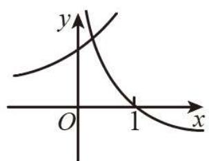

text_image

y
O 1 x

A.

B.

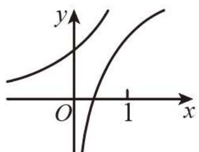

text_image

y
O
1
x

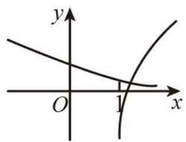

text_image

y
O
1
x

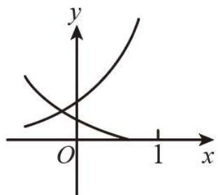

text_image

y
O
1 x

C.

D.

【答案】D

【解析】本题通过讨论 a 的不同取值情况, 分别讨论本题指数函数、对数函数的图象和, 结合选项, 判断得出正确结论. 题目不难, 注重重要知识、基础知识、逻辑推理能力的考查. 当 0 < a < 1 时, 函数 $y = a^{x}$ 过定点 (0,1) 且单调递减, 则函数 $y = \frac{1}{a^{x}}$ 过定点 (0,1) 且单调递增, 函数 $y = \log_{a}\left(x + \frac{1}{2}\right)$ 过定点 $\left(\frac{1}{2}, 0\right)$ 且单调递减, D 选项符合; 当 a > 1 时, 函数 $y = a^{x}$ 过定点 (0,1) 且单调递增, 则函数 $y = \frac{1}{a^{x}}$ 过定点 (0,1) 且单调递减, 函数 $y = \log_{a}\left(x + \frac{1}{2}\right)$ 过定点 $\left(\frac{1}{2}, 0\right)$ 且单调递增, 各选项均不符合. 综上, 选 D.

322 (多选题)(2024·全国·高三专题练习)函数 $f(x)=\frac{ax+\ln|x|}{\sin x}$ 。 $(a\leqslant0)$ 在 $[-2\pi,2\pi]$ 上的大致图像可能为()

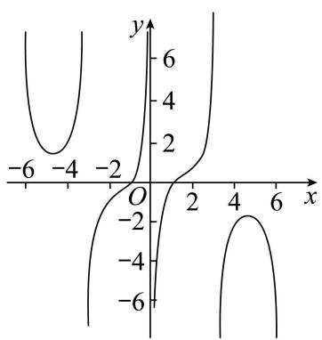

line

| x | y |
|---|---|
| -6 | -4 |
| -4 | -2 |
| -2 | 0 |
| 0 | 0 |
| 2 | 2 |
| 4 | 4 |
| 6 | 6 |

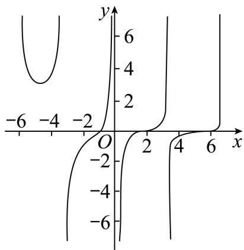

line

| x    | y     |
| ---- | ----- |
| -6   | 0     |
| -4   | 2     |
| -2   | 4     |
| 0    | 6     |
| 2    | 4     |
| 4    | 2     |
| 6    | 0     |

A.

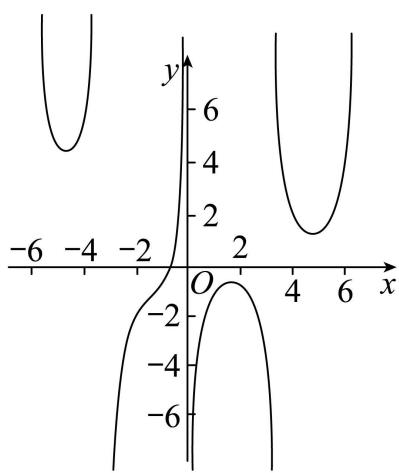

line

| x    | y     |
| ---- | ----- |
| -6   | 0     |
| -4   | 2     |
| -2   | 4     |
| 0    | 6     |
| 2    | 4     |
| 4    | 2     |
| 6    | 0     |

B.

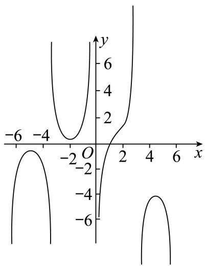

line

| x    | y     |
| ---- | ----- |
| -6   | -6    |
| -4   | -2    |
| -2   | 0     |
| 0    | 2     |
| 2    | 4     |
| 4    | 6     |
| 6    | 8     |

C.

【答案】ABC

【解析】①当 a=0 时， $f(x)=\frac{\ln|x|}{\sin x}$ ， $f(-x)=-\frac{\ln|x|}{\sin x}=-f(x)$ ，函数 $f(x)$ 为奇函数，由 $x\to0$ 时 $f(x)\to\infty$ ， $x=\pm1$ 时 $f(x)=0$ 等性质可知 A 选项符合题意；

②当 a<0 时，令 $g(x)=\ln|x|$ , $h(x)=-ax$ ，作出两函数的大致图象，

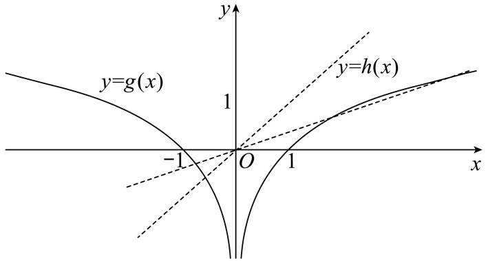

text_image

y=g(x)
1
y=h(x)
-1
O
1
x

由图象可知在 $(-1,0)$ 内必有一交点，记横坐标为 $x_{0}$ ，此时 $f(x_{0})=0$ ，故排除D选项；

当 $-2\pi < x < x_{0}$ 时， $g(x) - h(x) > 0, x_{0} < x < 0$ 时， $g(x) - h(x) < 0$

若在 $(0,2\pi)$ 内无交点，则 $g(x)-h(x)<0$ 在 $(0,2\pi)$ 恒成立，则 $f(x)$ 图象如C选项所示，故C选项符合题意；

若在 $(0,2\pi)$ 内有两交点,同理得B选项符合题意.

故选: ABC.

【解题方法总结】

根据函数的解析式识别函数的图象,其中解答中熟记指数幂的运算性质,二次函数的图象与性质,以及复合函数的单调性的判定方法是解答的关键,着重考查分析问题和解答问题的能力,以及分类讨论思想的应用.

# 题型四: 函数图象应用题

323 (2024·北京·高三专题练习)高为 H、满缸水量为 V 的鱼缸的轴截面如图所示, 现底部有一个小洞, 满缸水从洞中流出, 若鱼缸水深为 h 时水的体积为 v, 则函数 $v = f(h)$ 的大致图像是

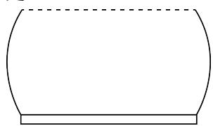

natural_image

Simple line drawing of a rounded rectangular shape with a horizontal base (no text or symbols)

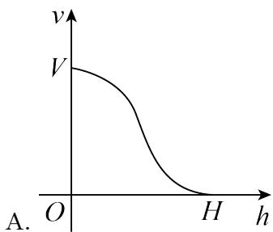

line

| h   | v   |
| --- | --- |
| 0   | V   |
| H   | 0   |

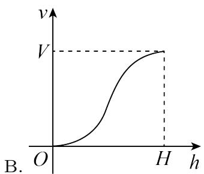

line

| h   | v   |
| --- | --- |
| 0   | 0   |
| H   | V   |

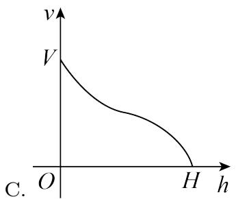

text_image

v
V
O
H
h
C.

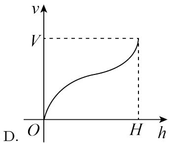

line

| h   | v   |
| --- | --- |
| 0   | 0   |
| H   | V   |

【答案】B

【解析】根据题意知,函数的自变量为水深 h, 函数值为鱼缸中水的体积, 所以当 h=0 时, 体积 v=0, 所以函数图像过原点, 故排除 A、C;

再根据鱼缸的形状,下边较细,中间较粗,上边较细,所以随着水深的增加,体积的变化速度是先慢后快再慢的,故选B.

324 (2024·四川成都·高三四川省成都市玉林中学校考阶段练习)如图为某无人机飞行时,从某时刻开始15分钟内的速度V(x)(单位:米/分钟)与时间x(单位:分钟)的关系. 若定义“速度差函数”v(x)为无人机在时间段[0,x]内的最大速度与最小速度的差,则v(x)的图像为()

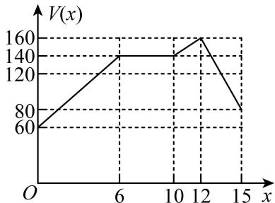

line

| x | V(x) |
|---|---|
| 0 | 60 |
| 6 | 140 |
| 12 | 160 |
| 15 | 80 |

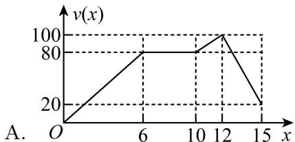

line

| x | v(x) |
|---|---|
| 0 | 0 |
| 6 | 80 |
| 12 | 100 |
| 15 | 20 |

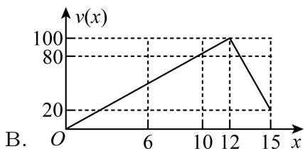

line

| x | v(x) |
|---|------|
| 0 | 0    |
| 6 | 30   |
| 12 | 100  |
| 15 | 20   |

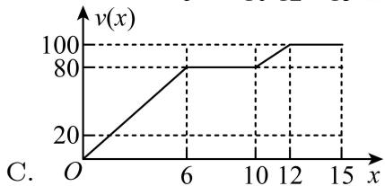

line

| x  | v(x) |
|----|------|
| 0  | 0    |
| 6  | 80   |
| 12 | 100  |
| 15 | 100  |

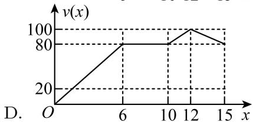

line

| x | v(x) |
|---|---|
| 0 | 0 |
| 6 | 80 |
| 12 | 100 |
| 15 | 80 |

【答案】C

【解析】由题意可得, 当 $x \in [0,6]$ 时, 无人机做匀加速运动, $V(x) = 60 + \frac{40}{3}x$ , “速度差函数” $v(x) = \frac{40}{3}x$ ;

当 $x \in [6,10]$ 时，无人机做匀速运动， $V(x)=140$ ，“速度差函数” $v(x)=80$ ;

当 $x \in [10,12]$ 时，无人机做匀加速运动， $V(x) = 40 + 10x$ ，“速度差函数” $v(x) = -20 + 10x$ ;

当 $x \in [12,15]$ 时, 无人机做匀减速运动, “速度差函数” $v(x) = 100$ , 结合选项 C 满足 “速度差函数” 解析式,

故选：C.

325 (2024·湖南长沙·高三长沙一中校考阶段练习)青花瓷,又称白地青花瓷,常简称青花,是中国瓷器的主流品种之一.如图,这是景德镇青花瓷,现往该青花瓷中匀速注水,则水的高度y与时间x的函数图像大致是()

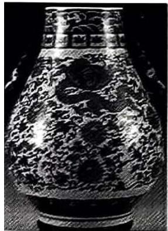

natural_image

Black-and-white photograph of an ornate, textured vase with embossed floral patterns (no visible text or symbols)

A.   
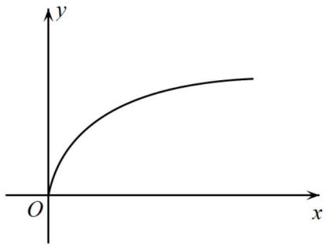

text_image

y
O
x

B.   

text_image

y
O
x

C.   
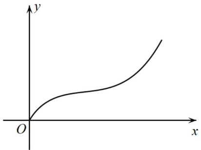

text_image

y
O
x

D.   

text_image

y
O
x

【答案】C

【解析】由图可知该青花瓷上、下细,中间粗,则在匀速注水的过程中,水的高度先一直增高,且开始时水的高度增高的速度越来越慢,到达瓷瓶最粗处之后,水的高度增高的速度越来越快,直到注满水,结合选项所给图像,只有先慢后快的趋势的C选项符合.

故选：C

326 (2024·全国·高三专题练习)列车从A地出发直达500km外的B地,途中要经过离A地300km的C地,假设列车匀速前进,5h后从A地到达B地,则列车与C地距离y(单位:km)与行驶时间t(单位:h)的函数图象为()

line

| x | y |
|---|---|
| 0 | 0 |
| 3 | 300 |
| 5 | 0 |

line

| x | y |
|---|---|
| 0 | 300 |
| 3 | 200 |
| 5 | 300 |

line

| x | y |
|---|---|
| 0 | 300 |
| 3 | 0 |
| 5 | 200 |
C. (x-axis label)  legend: y-axis represents a single numerical variable; x-axis label is 'O' (index of origin); y-axis label is 'y' (height of the left side). The graph forms a V-shape with vertex at (3,0) and ends at (5,200).

line

| x | y |
|---|---|
| 0 | 300 |
| 3 | 100 |
| 5 | 200 |

【答案】C

【解析】由题可知列车的运行速度为 $\frac{500}{5}=100km/h$ ,

∴列车到达C地的时间为 $\frac{300}{100}=3h$ ,

故当 t=3 时, y=0.

故选：C.

327 (2024·全国·高三专题练习)如图, 正 $\triangle ABC$ 的边长为 2 , 点 D 为边 AB 的中点, 点 P 沿着边 AC, CB 运动到点 B, 记 $\angle ADP = x$ . 函数 $f(x) = |PB|^2 - |PA|^2$ , 则 $y = f(x)$ 的图象大致为 ( )

text_image

C
P
B
D
x
A

line

| x | y |
|---|---|
| -3.5 | 4 |
| -2.5 | 2 |
| -1.5 | 0 |
| 0 | -2 |
| 1.5 | -4 |
| 3.5 | -6 |

line

| x | y |
|---|---|
| 0 | 4 |
| π/2 | 2 |
| π | 0 |
| -π/2 | -2 |
| 3π/2 | -4 |

line

| x | y |
|---|---|
| 0 | -4 |
| π | 4 |

line

| x | y |
|---|---|
| 0 | 4 |
| π | -2 |
| ∞ | -4 |

【答案】A

【解析】根据题意, $f(x)=|PB|^{2}-|PA|^{2},\angle ADP=x.$

在区间 $\left(0,\frac{\pi}{2}\right)$ 上，P在边AC上， $|PB|>|PA|$ ，则 $f(x)>0$ ，排除C；

在区间 $\left(\frac{\pi}{2},\pi\right)$ 上，P在边BC上， $|\mathrm{PB}| < |\mathrm{PA}|$ ，则 $f(x) < 0$ ，排除B，

又由当 $x_{1}+x_{2}=\pi$ 时，有 $f(x_{1})=-f(x_{2}), f(x)$ 的图象关于点 $\left(\frac{\pi}{2},0\right)$ 对称，排除 D，

故选：A

328 (2024·全国·高三专题练习)匀速地向一底面朝上的圆锥形容器注水,则该容器盛水的高度 h 关于注水时间 t 的函数图象大致是 ()

A.   

text_image

h
O
t

B.   

text_image

h
O
t

C.   

line

| t   | h   |
| --- | --- |
| 0   | 0   |
| >0  | Increasing from near 0 to approximately 1.5 |

D.   

text_image

h
O
t

【答案】A

【解析】设圆锥 PO 底面圆半径 r，高 H，注水时间为 t 时水面与轴 PO 交于点 O'，水面半径 AO' = x，此时水面高度 PO' = h，如图：

text_image

O
r
H
O'
x
A
P

由垂直于圆锥轴的截面性质知， $\frac{x}{r}=\frac{h}{H}$ ，即 $x=\frac{r}{H}\cdot h$ ，则注入水的体积为 $V=\frac{1}{3}\pi x^{2}h=\frac{1}{3}\pi\left(\frac{r}{H}\cdot h\right)^{2}\cdot h=\frac{\pi r^{2}}{3H^{2}}\cdot h^{3}$ ,

令水匀速注入的速度为 v，则注水时间为 t 时的水的体积为 V = vt，

于是得 $\frac{\pi r^2}{3\mathrm{H}^2}\cdot h^3 = vt\Rightarrow h^3 = \frac{3\mathrm{H}^2vt}{\pi r^2}\Rightarrow h = \sqrt[3]{\frac{3\mathrm{H}^2v}{\pi r^2}}\cdot \sqrt[3]{t},$

而 r, H, v 都是常数, 即 $\sqrt[3]{\frac{3H^{2}v}{\pi r^{2}}}$ 是常数,

所以盛水的高度 h 与注水时间 t 的函数关系式是 $h = \sqrt[3]{\frac{3H^{2}v}{\pi r^{2}}} \cdot \sqrt[3]{t}, 0 \leqslant t \leqslant \frac{\pi r^{2}H}{3v}, h' = \sqrt[3]{\frac{3H^{2}v}{\pi r^{2}}} \cdot \frac{1}{3} t^{-\frac{2}{3}} > 0$ ，函数图象是曲线且是上升的，随 t 值的增加，函数 h 值增加的幅度减小，即图象是先陡再缓，

A 选项的图象与其图象大致一样, B, C, D 三个选项与其图象都不同.

故选：A

# 【解题方法总结】

(1)从函数的定义域,判断图象的左右位置;从函数的值域,判断图象的上下位置.  
(2)从函数的单调性,判断图象的变化趋势;   
(3)从函数的奇偶性,判断图象的对称性;   
(4)从函数的特征点,排除不合要求的图象.

# 5 题型五: 函数图象的变换

329 (2024·广西玉林·统考模拟预测)已知图1对应的函数为 $y=f(x)$ ，则图2对应的函数是()

  
图1

  
图2

A. $y = f(-|x|)$

B. $y = f(-x)$

C. $y = f(|x|)$

D. $y = -f(-x)$

【答案】A

【解析】根据函数图象知, 当 $x \leqslant 0$ 时, 所求函数图象与已知函数相同,

当 x > 0 时, 所求函数图象与 x < 0 时图象关于 y 轴对称,

即所求函数为偶函数且 $x \leqslant 0$ 时与 $y = f(x)$ 相同, 故 BD 不符合要求,

当 $x \leqslant 0$ 时， $y = f(-|x|) = f(x)$ ， $y = f(|x|) = f(-x)$ ，故 A 正确，C 错误.

故选：A.

330 (2024·全国·高三专题练习)已知函数 $f(x)$ 的图象的一部分如下左图,则如下右图的函数图象所对应的函数解析式()

text_image

-1
O
y
1 x

text_image

y
O
x
1

A. $y = f(2x - 1)$

B. $y = f\left(\frac{4x - 1}{2}\right)$

C. $y = f(1 - 2x)$

D. $y=f\left(\frac{1-4x}{2}\right)$

【答案】C

line

| x | y |
|---|---|
| -1 | -1 |
| 0 | 0 |
| 1 | 1 |

【解析】

text_image

-1
y
O
x
-1
1

text_image

y
O
1 x

line

| x | y |
|---|---|
| 0 | 0 |
| 1 | -2 |

$$
y = f (x) \stackrel {{① x \rightarrow - x}} {{\rightarrow}} y = f (- x) \stackrel {{② x \rightarrow x - 1}} {{\rightarrow}} y = f (1 - x) \stackrel {{③ x \rightarrow 2 x}} {{\rightarrow}} y = f (1 - 2 x)
$$

①关于 y 轴对称②向右平移 1 个单位③纵坐标不变, 横坐标变为原来的一半故选: C.

331 (2024·全国·高三专题练习)已知函数 $f(x) = \begin{cases} -2x (-1 \leqslant x \leqslant 0), \\ \sqrt{x} (0 < x \leqslant 1), \end{cases}$ ，则下列图象错误的是（）

line

| x | y |
|---|---|
| 0 | 2 |
| 1 | 0 |
| 2 | 1 |

A. $y = f(x - 1)$ 的图象

line

| x | y |
|---|---|
| -1 | 2 |
| 0 | 0 |
| 1 | 1 |

C. $y = |f(x)|$ 的图象

line

| x | y |
|---|---|
| -1 | 1 |
| 0 | 0 |
| 1 | 2 |

B. $y = f(-x)$ 的图象

text_image

y
2
1
-1 O 1 x

D. $y = f(|x|)$ 的图象

【答案】D

【解析】当 $-1 \leqslant x \leqslant 0$ 时， $f(x) = -2x$ ，表示一条线段，且线段经过 $(-1, 2)$ 和 $(0, 0)$ 两点。当 $0 < x \leqslant 1$ 时， $f(x) = \sqrt{x}$ ，表示一段曲线。函数 $f(x)$ 的图象如图所示。

text_image

y
2
1
f(x)
-1 O 1 x

$f(x - 1)$ 的图象可由 $f(x)$ 的图象向右平移一个单位长度得到，故A正确； $f(-x)$ 的图象可由 $f(x)$ 的图象关于 $y$ 轴对称后得到，故B正确；由于 $f(x)$ 的值域为[0,2]，故 $f(x) = |f(x)|$ ，故 $|f(x)|$ 的图象与 $f(x)$ 的图象完全相同，故C正确；很明显D中 $f(|x|)$ 的图象不正确.

故选：D.

332 (2024·全国·高三专题练习)函数 $f(x)=\ln(1-x)$ 向右平移 1 个单位, 再向上平移 2 个单位的大致图像为 ()

line

| x | y |
|---|---|
| 0 | 0 |
| 1 | 2 |

text_image

B.

text_image

y
2
O 1 2 x
C.

line

| x | y |
|---|---|
| 0 | 0 |
| 1 | 2 |
| 2 | 4 |

【答案】C

【解析】先作出函数 $f(x)=\ln(1-x)$ 的图像,再向右平移1个单位,再向上平移2个单位得解.

如图所示:

line

| x    | y     |
| ---- | ----- |
| 0    | 1     |
| 1    | 0     |

故答案为 C

【解题方法总结】

熟悉函数三种变换:(1)平移变换;(2)对称变换;(3)伸缩变换.

# 6 题型六: 函数图像的综合应用

333 (2024·上海浦东新·华师大二附中校考模拟预测)若关于 x 的方程 $e^{x}=a|x|$ 恰有两个不同的实数解，则实数 a= \_\_\_\_.

【答案】e

text_image

y
y = a|x|
y=e^x
O
x

【解析】

如图,显然a>0.

当 $x \leqslant 0$ 时, 由单调性得, 方程 $e^{x} = -ax$ 有且仅有一解.

因此当 x > 0 时, 方程 $e^{x} = ax$ 也恰有一解.

即 y=ax 为函数 $y=e^{x}$ 的切线，

$$
y ^ {\prime} = \mathrm{e} ^ {x},
$$

令 $y' = a$ 得 $x = \ln a$ ,

故当 $x=\ln a$ 时， $e^{x}=ax$ ，

得 $\mathrm{e}^{\ln a} = a\ln a$ ，即 $a = a\ln a$

从而 a = e.

故答案为: e

334 (2024·天津和平·统考三模)已知函数 $f(x) = \left|\frac{x + a}{x - a}\right|(x \neq a)$ ，若关于 $x$ 的方程 $f(f(x)) = 2$ 恰有三个不相等的实数解，则实数 $a$ 的取值集合为 \_\_\_\_.

【答案】 $\left\{\frac{1}{3},3\right\}$

【解析】 $f(x)=\left|\frac{x+a}{x-a}\right|=\left|1+\frac{2a}{x-a}\right|(x\neq a)$ ,

当 a=0 时， $f(x)=1(x\neq0)$ ，

此时 $f(f(x))=2$ 无解, 不满足题意;

当 a<0 时, 设 $t=f(x)$ ,

则 $y=f(t)$ 与 y=2 的图象大致如下，

line

| t    | f(t) |
| ---- | ---- |
| t₁   | y=2  |
| t₂   | y=1  |
| -a   | -a   |

则 $f(t)=2$ 对应的 2 个根为 $t_{1}<a<t_{2}<0$ ,

此时方程 $f(x) = t_{1}, f(x) = t_{2}$ 均无解，

即方程 $f(f(x))=2$ 无解,不满足题意;

当 a > 0 时, 设 $m = f(x)$ , 则 $y = f(m)$ 与 y = 2 的图象大致如下,

line

| x     | f(m) |
|-------|------|
| -a    | 0    |
| m₁    | 0    |
| m₂    | 2    |
| y=1   | 1    |
| y=2   | 2    |

则则 $f(m)=2$ 对应的 2 个根为 $0<m_{1}<a<m_{2}$ ,

若方程 $f(f(x)) = 2$ 恰有三个不相等的实数解，

则 $y=m_{1},y=m_{2}$ 与函数 $y=f(x)$ 的图象共有 3 个不同的交点，

①当 0 < a < 1 时， $y = m_{1}$ 与函数 $f(x)$ 的图象共有 2 个交点，如图所示，

text_image

y
f(x)
y=1
-y=m₁
-a
x=a
x

所以 $y=m_{2}$ 与函数 $f(x)$ 的图象只有 1 个交点，

则 $m_{2}=1$ ，所以 $\left|\frac{1+a}{1-a}\right|=2$ ，解得 $a=\frac{1}{3}$ ;

②当 a=1 时， $y=m_{1}$ 与函数 $f(x)$ 的图象共有 2 个交点，

所以 $y=m_{2}$ 与函数 $f(x)$ 的图象只有 1 个交点，

则 $m_{2}=1$ ，与 $m_{2}>a$ 矛盾，不合题意；

③当 a > 1 时， $y = m_{2}$ 与函数 $f(x)$ 的图象共有 2 个交点，如图所示，

text_image

y
f(x)
y=m₂
y=1
-x=a
x=a

所以 $y=m_{1}$ 与函数 $f(x)$ 的图象只有 1 个交点，

则 $m_{1} = 1$ ，所以 $\left|\frac{1 + a}{1 - a}\right| = 2$ ，解得 $a = 3$

综上， $a$ 的取值集合为 $\left\{\frac{1}{3}, 3\right\}$ ，

故答案为: $\left\{\frac{1}{3},3\right\}$ .

335 (2024·河南·校联考模拟预测)定义在 $\mathbf{R}$ 上的函数 $f(x)$ 满足 $f(x + 1) = 2f(x)$ , 且当 $x \in [0,1]$ 时, $f(x) = 1 - |2x - 1|$ . 若对任意 $x \in (-\infty, t]$ , 都有 $f(x) \leqslant 2$ , 则 $t$ 的取值范围是 \_\_\_\_.

【答案】 $t \leqslant \frac{9}{4}$

【解析】因为当 $x \in [0,1]$ 时， $f(x) = 1 - |2x - 1|$ ，所以 $f(x) = \begin{cases} 2x, & x \in \left[0, \frac{1}{2}\right] \\ 2 - 2x, & x \in \left(\frac{1}{2}, 1\right] \end{cases}$ ,

因为 $f(x + 1) = 2f(x)$ ，当 $x \in [1,2]$ 时，即 $x - 1 \in [0,1]$ 时，

由 $f(x)=2f(x-1)$ ，所以 $f(x)=\left\{\begin{aligned}&4x-4,x\in\left[1,\frac{3}{2}\right]\\ &8-4x,x\in\left(\frac{3}{2},2\right]\end{aligned}\right.$

同理可得 $f(x) = \begin{cases} 8x - 16, & x \in \left[2, \frac{5}{2}\right] \\ 24 - 8x, & x \in \left(\frac{5}{2}, 3\right] \end{cases}$

依此类推,作出函数 $f(x)$ 的图象,如图所示:

line

| x | y |
|---|---|
| 0 | 0 |
| 1 | 1 |
| 2 | -2 |
| 3 | 4 |
| 4 | 8 |

由图象知: 当 $2 \leqslant x \leqslant \frac{5}{2}$ 时, 令 $f(x) = 2$ , 则 $8x - 16 = 2 \Rightarrow x = \frac{9}{4}$ ,对任意 $x \in (-\infty, t]$ , 都有 $f(x) \leqslant 2$ , 则 $t \leqslant \frac{9}{4}$

故 t 的取值范围为 $t \leqslant \frac{9}{4}$ ,

故答案为: $t \leqslant \frac{9}{4}$

336 (2024·四川绵阳·统考二模)若函数 $f(x)=\left\{\begin{aligned}&2+\ln x,&x>0\\&x,&x\leqslant0\end{aligned}\right.$ ， $g(x)=f(x)+f(-x)$ ，则函数 $g(x)$ 的零点个数为 \_\_\_\_.

【答案】5

【解析】令 $g(x)=0$ ，则有 $f(x)+f(-x)=0$ ，

所以 $f(x) = -f(-x)$ ,

当 x > 0 时，则有 $2 + \ln x = -(-x) = x$ ，

即 $\ln x = x - 2,$

在同一坐标系中作出 $y=\ln x$ 与 y=x-2 的图象, 如图所示:

line

| x   | y=lnx | y=x-2 |
| --- | ----- | ----- |
| 0   | -2    | -2    |
| 1   | 0     | 0     |
| 2   | 1     | 1     |
| 3   | 2     | 2     |
| 4   | 3     | 3     |

由图可得此时两函数的图象有两个交点，

即当 x > 0 时, $g(x)$ 有 2 个零点;

当 x<0 时，则有 $x=-\left[2+\ln(-x)\right]=-\ln(-x)-2$

即 $\ln(-x)=-x-2,$

在同一坐标系中作出 $y=\ln(-x)$ 与 y=-x-2 的图象, 如图所示:

line

| x   | y=ln(-x) | y=-x-2 |
| --- | -------- | ------ |
| -3  | 1        | 1      |
| -2  | 0.5      | 0.5    |
| -1  | 0        | 0      |
| 0   | 0        | 0      |
| 1   | 0        | 0      |
| 2   | 0        | 0      |
| 3   | 0        | 0      |

由图可得此时两函数的图象有两个交点，

即当 $x < 0$ 时， $g(x)$ 有2个零点；

当 x=0 时， $f(x)=f(-x)=0$ ，

此时 $g(x)=f(x)+f(-x)=0$ ，有1个零点为 x=0，

综上所述, $g(x)$ 共有5个零点.

故答案为: 5

【解题方法总结】

1、利用函数图像判断方程解的个数。由题设条件作出所研究对象的图像,利用图像的直观性得到方程解的个数.  
2、利用函数图像求解不等式的解集及参数的取值范围。先作出所研究对象的图像,求出它们的交点,根据题意结合图像写出答案  
3、利用函数图像求函数的最值,先做出所涉及到的函数图像,根据题目对函数的要求,从图像上寻找取得最值的位置,计算出结果,这体现出了数形结合的思想

