# 第12讲 函数与方程

# 知识梳理

# 一、函数的零点

对于函数 $y = f(x)$ ，我们把使 $f(x) = 0$ 的实数 $x$ 叫做函数 $y = f(x)$ 的零点.

# 二、方程的根与函数零点的关系

方程 $f(x)=0$ 有实数根 $\Leftrightarrow$ 函数 $y=f(x)$ 的图像与x轴有公共点 $\Leftrightarrow$ 函数 $y=f(x)$ 有零点.

# 三、零点存在性定理

如果函数 $y = f(x)$ 在区间 $[a, b]$ 上的图像是连续不断的一条曲线，并且有 $f(a) \cdot f(b) < 0$ ，那么函数 $y = f(x)$ 在区间 $(a, b)$ 内有零点，即存在 $c \in (a, b)$ ，使得 $f(c) = 0, c$ 也就是方程 $f(x) = 0$ 的根.

# 四、二分法

对于区间 $[a, b]$ 上连续不断且 $f(a) \cdot f(b) < 0$ 的函数 $f(x)$ ，通过不断地把函数 $f(x)$ 的零点所在的区间一分为二，使区间的两个端点逐步逼近零点，进而得到零点的近似值的方法叫做二分法。求方程 $f(x) = 0$ 的近似解就是求函数 $f(x)$ 零点的近似值。

# 五、用二分法求函数 $f(x)$ 零点近似值的步骤

(1) 确定区间 $[a, b]$ , 验证 $f(a) \cdot f(b) < 0$ , 给定精度 $\varepsilon$ .  
(2) 求区间 $(a, b)$ 的中点 $x_{1}$ .  
(3) 计算 $f(x_1)$ . 若 $f(x_1) = 0$ , 则 $x_1$ 就是函数 $f(x)$ 的零点; 若 $f(a) \cdot f(x_1) < 0$ , 则令 $b = x_1$ (此时零点 $x_0 \in (a, x_1)$ ). 若 $f(b) \cdot f(x_1) < 0$ , 则令 $a = x_1$ (此时零点 $x_0 \in (x_1, b)$ )  
(4) 判断是否达到精确度 $\varepsilon$ ，即若 $|a - b| < \varepsilon$ ，则函数零点的近似值为 $a$ （或 $b$ ）；否则重复第 (2) - (4) 步.

用二分法求方程近似解的计算量较大,因此往往借助计算完成.

【解题方法总结】

函数的零点相关技巧:

①若连续不断的函数 $f(x)$ 在定义域上是单调函数，则 $f(x)$ 至多有一个零点.  
②连续不断的函数 $f(x)$ ，其相邻的两个零点之间的所有函数值同号.  
③连续不断的函数 $f(x)$ 通过零点时，函数值不一定变号.  
④连续不断的函数 $f(x)$ 在闭区间 $[a, b]$ 上有零点，不一定能推出 $f(a)f(b) < 0$ .

# 必考题型全归纳

# 题型一: 求函数的零点或零点所在区间

337 (2024·广西玉林·博白县中学校考模拟预测)已知函数 $h(x)$ 是奇函数，且 $f(x) = h(x) + 2$ 若 $x = 2$ 是函数 $y = f(x)$ 的一个零点，则 $f(-2) =$ （）

A.-4

B. 0

C. 2

D. 4

【答案】D

【解析】因为 x=2 是函数 $y=f(x)$ 的一个零点，则 $f(2)=0$ ，于是 $f(2)=h(2)+2=0$ ，即 $h(2)=-2$ ，

而函数 $h(x)$ 是奇函数,则有 $h(-2)=-h(2)=2$ ,

所以 $f(-2)=h(-2)+2=4.$

故选：D

338 (2024·吉林·通化市第一中学校校联考模拟预测)已知 $x_{0}$ 是函数 $f(x)=\tan x-2$ 的一个零点，则 $\sin2x_{0}$ 的值为 ()

A. $-\frac{4}{5}$

B. $-\frac{3}{5}$

C. $\frac{3}{5}$

D. $\frac{4}{5}$

【答案】D

【解析】因为 $x_{0}$ 是函数 $f(x)=\tan x-2$ 的一个零点，

所以 $\tan x_0 - 2 = 0$ ，即 $\tan x_0 = 2$ ，故 $\cos x_0\neq 0$

则 $\sin 2x_0 = \frac{2\sin x_0 \cdot \cos x_0}{\sin^2 x_0 + \cos^2 x_0} = \frac{2\tan x_0}{1 + \tan^2 x_0} = \frac{4}{5}$ .

故选：D.

339 (2024·全国·高三专题练习)已知函数 $f(x)=2^{x}+x, g(x)=\log_{2}x+x, h(x)=\log_{2}x-2$ 的零点依次为 a, b, c，则 ()

A. $a < b < c$

B. $c < b < a$

C. $c < a < b$

D. b < a < c

【答案】A

【解析】对于 $f(x)=2^{x}+x$ ，显然是增函数， $f(0)=1>0, f(-1)=-\frac{1}{2}<0$ ，所以 $f(x)$ 的唯一零点 $a\in(-1,0)$ ；

对于 $g(x)=\log_{2}x+x$ ，显然也是增函数， $g\left(\frac{1}{2}\right)=-\frac{1}{2}<0, g(1)=1>0$ ，所以 $g(x)$ 的唯一零点 $b\in\left(\frac{1}{2},1\right)$ ；

对于 $h(x)=\log_{2}x-2$ ，显然也是增函数， $h(4)=\log_{2}4-2=0$ ，所以 $h(x)$ 的唯一零点 c=4；

$$
\therefore a <   b <   c;
$$

故选：A.

340 (2024·全国·高三专题练习)已知 $f(x)=\mathrm{e}^{x}+\ln x+2$ ，若 $x_{0}$ 是方程 $f(x)-f'(x)=\mathrm{e}$ 的一个解，则 $x_{0}$ 可能存在的区间是 ()

A. $(0,1)$

B. $(1,2)$

C. $(2,3)$

D. $(3,4)$

【答案】C

【解析】 $f'(x)=\mathrm{e}^{x}+\frac{1}{x}$ ，所以 $f(x)-f'(x)=\mathrm{e}^{x}+\ln x+2-\left(\mathrm{e}^{x}+\frac{1}{x}\right)=\ln x-\frac{1}{x}+2$

因为 $x_{0}$ 是方程 $f(x)-f'(x)=\mathrm{e}$ 的一个解，

所以 $x_{0}$ 是方程 $\ln x - \frac{1}{x} + 2 - e = 0$ 的解，令 $g(x) = \ln x - \frac{1}{x} + 2 - e$ ,

则 $g'(x)=\frac{1}{x}+\frac{1}{x^{2}}$ ，当 x>0 时， $g'(x)=\frac{1}{x}+\frac{1}{x^{2}}>0$ 恒成立，

所以 $g(x)=\ln x-\frac{1}{x}+2-\mathrm{e}$ 单调递增，

又 $g(2)=\ln2-\frac{1}{2}+2-\mathrm{e}=\ln2+\frac{3}{2}-\mathrm{e}<0,$ $g(3)=\ln3-\frac{1}{3}+2-\mathrm{e}=\ln3+\frac{5}{3}-\mathrm{e}>0,$

所以 $x_{0} \in (2,3)$ .

故选：C.

【解题总结】

求函数 $f(x)$ 零点的方法:

(1) 代数法, 即求方程 $f(x) = 0$ 的实根, 适合于宜因式分解的多项式; (2) 几何法, 即利用函数 $y = f(x)$ 的图像和性质找出零点, 适合于宜作图的基本初等函数.

# 2 题型二:利用函数的零点确定参数的取值范围

341 (2024·山西阳泉·统考三模)函数 $f(x)=\log_{2}x+x^{2}+m$ 在区间 $(1,2)$ 存在零点．则实数 m 的取值范围是 （）

A. $(- \infty, -5)$

B. $(-5,-1)$

C. $(1,5)$

D. $(5,+\infty)$

【答案】B

【解析】由 $y_{1}=\log_{2}x$ 在 $(0,+\infty)$ 上单调递增， $y_{2}=x^{2}+m$ 在 $(0,+\infty)$ 上单调递增，得函数 $f(x)=\log_{2}x+x^{2}+m$ 在区间 $(0,+\infty)$ 上单调递增，

因为函数 $f(x)=\log_{2}x+x^{2}+m$ 在区间 $(1,2)$ 存在零点，

所以 $\left\{\begin{aligned}f(1)&<0\\ f(2)&>0\end{aligned}\right.$ ，即 $\left\{\begin{aligned}\log_{2}1+1^{2}+m&<0\\ \log_{2}2+2^{2}+m&>0\end{aligned}\right.$ ，解得 -5<m<-1，

所以实数 m 的取值范围是 $(-5, -1)$ .

故选: B.

342 (2024·全国·高三专题练习)函数 $f(x)=2^{x}-\frac{3}{x}-a$ 的一个零点在区间 (1,3) 内，则实数 a 的取值范围是 ()

A. $(7,+\infty)$

B. $(-∞,-1)$

C. $(- \infty, -1) \cup (7, +\infty)$

D. $(-1,7)$

【答案】D

【解析】 $\because y=2^{x}$ 和 $y=-\frac{3}{x}$ 在 $(0,+\infty)$ 上是增函数，

∴ $f(x)=2^{x}-\frac{3}{x}-a$ 在 $(0,+\infty)$ 上是增函数，

∴ 只需 $f(1) \cdot f(3) < 0$ 即可，即 $(-1 - a) \cdot (7 - a) < 0$ ，解得 -1 < a < 7.

故选：D.

343 (2024·河北·高三学业考试)已知函数 $f(x) = a - \frac{2}{2^x + 1}$ 是R上的奇函数，若函数 $y = f(x - 2m)$ 的零点在区间 $(-1, 1)$ 内，则 $m$ 的取值范围是 （）

A. $\left(-\frac{1}{2},\frac{1}{2}\right)$

B. $(-1,1)$

C. $(-2,2)$

D. $(0,1)$

【答案】A

【解析】∵ $f(x)$ 是奇函数，∴ $f(0)=a-\frac{2}{1+1}=0, a=1, f(x)=1-\frac{2}{2^{x}+1}$ ，易知 $f(x)$ 在R上是增函数，

$\therefore f(x)$ 有唯一零点0，

函数 $y=f(x-2m)$ 的零点在区间 $(-1,1)$ 内，∴ x-2m=0 在 $(-1,1)$ 上有解， $m=\frac{x}{2}$ ，∴ $m\in\left(-\frac{1}{2},\frac{1}{2}\right)$ .

故选：A.

344 (2024·浙江绍兴·统考二模)已知函数 $f(x) = \ln x + ax^2 + b$ ，若 $f(x)$ 在区间[2,3]上有零点，则 $ab$ 的最大值为 \_\_\_\_.

【答案】 $\frac{1}{4\mathrm{e}^2}$

【解析】设 $f(x_{0})=0, x_{0}\in[2,3]$ ，则 $\ln x_{0}+ax_{0}^{2}+b=0$ ，

此时 $b = -\ln x_{0} - ax_{0}^{2}$ ，则 $ab = -a \ln x_{0} - a^{2}x_{0}^{2}$

令 $g(a) = -a \ln x_{0} - a^{2} x_{0}^{2} = -\left(x_{0} a + \frac{\ln x_{0}}{2x_{0}}\right)^{2} + \left(\frac{\ln x_{0}}{2x_{0}}\right)^{2}$ ,

当 $a=-\frac{\ln x_{0}}{2x_{0}^{2}}$ 时， $g(a)_{\max}=\left(\frac{\ln x_{0}}{2x_{0}}\right)^{2}$

记 $h(x)=\frac{\ln x}{2x}$ ，则 $h'(x)=\frac{1-\ln x}{2x^{2}}$

所以 $h(x)$ 在 $[2,e)$ 上递增，在 $[e,3]$ 上递减，

故 $h(x)_{\mathrm{max}} = h(\mathrm{e}) = \frac{1}{2\mathrm{e}}$ ，所以 $g(a)_{\mathrm{max}} = \left(\frac{\ln x_0}{2x_0}\right)^2 = \frac{1}{4\mathrm{e}^2},$

所以 ab 的最大值为 $\frac{1}{4e^{2}}$ .

故答案为: $\frac{1}{4\mathrm{e}^2}$ .

345 (2024·上海浦东新·高三上海市进才中学校考阶段练习)已知函数 $f(x) = \sin ax - a\sin x$ 在 $(0,2\pi)$ 上有零点，则实数 $a$ 的取值范围 \_\_\_\_.

【答案】 $\left(-\infty,-\frac{1}{2}\right)\cup\left(\frac{1}{2},+\infty\right)\cup\{0\}$

【解析】当 $a > 1$ 时， $0 < \frac{\pi}{a} < \pi, f\left(\frac{\pi}{a}\right) = \sin \left(a \cdot \frac{\pi}{a}\right) - a \sin \frac{\pi}{a} = -a \sin \frac{\pi}{a} < 0, f\left(\frac{3\pi}{2}\right) = \sin \left(\frac{3a\pi}{2}\right) + a > 0,$

故 $f\left(\frac{\pi}{a}\right)\cdot f\left(\frac{3\pi}{2}\right)<0$ ，由零点存在性定理知： $f(x)$ 在区间 $\left(\frac{\pi}{a},\frac{3\pi}{2}\right)$ 上至少有1个零点；

当 a=1 时, $f(x)=0$ , 符合题意;

当 $\frac{1}{2} < a < 1$ 时， $\pi < \frac{\pi}{a} < 2\pi, \frac{\pi}{2} < a\pi < \pi, \pi < 2a\pi\pi < 2\pi,$

$$
f \left(\frac {\pi}{a}\right) = - a \sin \frac {\pi}{a} > 0, f (\pi) = \sin a \pi > 0, f (2 \pi) = \sin 2 a \pi <   0,
$$

由零点存在性定理知, $f(x)$ 在区间 $(\pi,2\pi)$ 至少有1个零点;

当 $0 < a \leqslant \frac{1}{2}$ 时，

$$
f ^ {\prime} (x) = a \cos a x - a \cos x = a (\cos a x - \cos x)
$$

$$
= a \left[ \cos \left(\frac {a x + x}{2} + \frac {a x - x}{2}\right) - \cos \left(\frac {a x + x}{2} - \frac {a x - x}{2}\right) \right]
$$

=

a

$$
\begin{array}{l} \left[ \cos {\frac {a x + x}{2}} \cos {\frac {a x - x}{2}} - \sin {\frac {a x + x}{2}} \sin {\frac {a x - x}{2}} - \left(\cos {\frac {a x + x}{2}} \cos {\frac {a x - x}{2}} + \sin {\frac {a x + x}{2}} \sin {\frac {a x - x}{2}}\right) \right] \\ = - 2 a \sin \frac {(a + 1) x}{2} \sin \frac {(a - 1) x}{2}, \\ \end{array}
$$

因为 $0 < a \leqslant \frac{1}{2}$ ， $x \in (0, 2\pi)$ ，所以 $-\pi < \frac{(a-1)x}{2} < 0$ ， $\sin \frac{(a-1)x}{2} < 0$ ，

当 $x \in \left(0, \frac{2\pi}{a+1}\right)$ 时， $0 < \frac{(a+1)x}{2} < \pi, \sin \frac{(a+1)x}{2} > 0, f'(x) > 0, f(x)$ 递增，

当 $x \in \left( \frac{2\pi}{a+1}, 2\pi \right)$ 时， $\pi < \frac{(a+1)x}{2} < \frac{3\pi}{2}$ ， $\sin \frac{(a+1)x}{2} < 0$ ， $f'(x) < 0$ ， $f(x)$ 递减，

故 $f(x)$ 在 $\left(0, \frac{2\pi}{a+1}\right)$ 上递增，在 $\left(\frac{2\pi}{a+1}, 2\pi\right)$ 上递减，

又 $f(0)=0,f(2\pi)=\sin2a\pi\geqslant0$ ，即在 $(\pi,2\pi)$ 上， $f(x)>0$ ，

故 $f(x)$ 在区间 $(0,2\pi)$ 上没有零点.

所以, 当 $a > \frac{1}{2}$ 时, 函数 $f(x) = \sin ax - a \sin x$ 在 $(0, 2\pi)$ 上有零点.

令 $\varphi(a)=\sin ax-a\sin x,\varphi(-a)=\sin(-ax)+a\sin x=-\sin ax+a\sin x=-\varphi(a)$

可知 $\varphi(a)=\sin ax-a\sin x$ 为奇函数, 图象关于原点对称,

从而, 当 $a < -\frac{1}{2}$ 时, 函数 $f(x) = \sin ax - a \sin x$ 在 $(0, 2\pi)$ 上有零点.

又当 a=0 时, $f(x)=0$ , 符合题意,

综上,实数a的取值范围 $\left(-\infty,-\frac{1}{2}\right)\cup\left(\frac{1}{2},+\infty\right)\cup\{0\}$ .

故答案为： $\left(-\infty,-\frac{1}{2}\right)\cup\left(\frac{1}{2},+\infty\right)\cup\{0\}$ .

【解题总结】

本类问题应细致观察、分析图像,利用函数的零点及其他相关性质,建立参数关系,列关于参数的不等式,解不等式,从而获解.

# 3 题型三:方程根的个数与函数零点的存在性问题

346 (2024·黑龙江哈尔滨·哈尔滨三中校考模拟预测)已知实数 x, y 满足 $\ln\sqrt{2y+1} + y = 2$ , $e^{x} + x = 5$ , 则 $x + 2y =$ \_\_\_\_.

【答案】4

【解析】由 $\ln\sqrt{2y+1} + y = 2$ ，即 $\ln\sqrt{2y+1} = 2 - y$ ，

即 $e^{4-2y}=2y+1$ ,

令 $4 - 2y = t$ ，则 $2y = 4 - t$

即 $e^{t}=5-t$ ，即 $e^{t}+t-5=0$ 。

由 $e^{x}+x=5$ , 得 $e^{x}+x-5=0$

设函数 $f(x)=\mathrm{e}^{x}+x-5$ ，显然该函数增函数，

又 $f(1)\cdot f(2)=(e-4)\times(e^{2}-3)<0,$

所以函数 $f(x) = \mathrm{e}^{x} + x - 5$ 在(1,2)上有唯一的零点，

因此 t = x，即 4 - 2y = x，

所以 $x + 2y = 4$ .

故答案为: 4.

347 (2024·新疆·校联考二模)已知函数 $f(x)=ax^{3}+3x^{2}-4$ ，若 $f(x)$ 存在唯一的零点 $x_{0}$ ，且 $x_{0}<0$ ，则 a 的取值范围是 \_\_\_\_。

【答案】 $(- \infty, -1)$

【解析】因为 $f(x)=ax^{3}+3x^{2}-4$ ，所以 $f'(x)=3ax^{2}+6x=3x(ax+2)$

当 a=0 时，有 $f(x)=3x^{2}-4=0$ ，解得 $x=\pm\frac{2\sqrt{3}}{3}$ ，所以当 a=0 时， $f(x)$ 有两个零点，不符合题意；

当 a > 0 时，由 $f'(x) = 0$ ，解得 x = 0 或 $x = -\frac{2}{a}$ ，且有 $f(0) = -4$ ， $f\left(-\frac{2}{a}\right) = \frac{4}{a^{2}} - 4$ ，

当 $x \in \left(-\infty, -\frac{2}{a}\right), f'(x) > 0, f(x)$ 在区间 $\left(-\infty, -\frac{2}{a}\right)$ 上单调递增；

当 $x \in \left(-\frac{2}{a}, 0\right), f'(x) < 0, f(x)$ 在区间 $\left(-\frac{2}{a}, 0\right)$ 上单调递减；

当 $x \in (0, +\infty)$ , $f'(x) > 0$ , $f(x)$ 在区间 $(0, +\infty)$ 上单调递增;

又因为 $f(0) = -4 < 0, f\left(\frac{2\sqrt{3}}{3}\right) = \frac{8a}{3\sqrt{3}} > 0,$

所以 $x \in \left(0, \frac{2\sqrt{3}}{3}\right)$ ， $f(x)$ 存在一个正数零点，所以不符合题意；

当 a<0 时，令 $f'(x)=0$ ，解得 x=0 或 $x=-\frac{2}{a}$ ，且有 $f(0)=-4$ ， $f\left(-\frac{2}{a}\right)=\frac{4}{a^{2}}-4$

当 $x \in (-\infty,0)$ , $f'(x) < 0$ , $f(x)$ 在区间 $(-∞,0)$ 上单调递减;

当 $x \in \left(0, -\frac{2}{a}\right)$ , $f'(x) > 0$ , $f(x)$ 在区间 $\left(0, -\frac{2}{a}\right)$ 上单调递增;

当 $x \in \left(-\frac{2}{a}, +\infty\right)$ , $f'(x) < 0$ , $f(x)$ 在区间 $\left(-\frac{2}{a}, +\infty\right)$ 上单调递减;

又因为 $f(0) = -4 < 0, f\left(-\frac{2\sqrt{3}}{3}\right) = -\frac{8a}{3\sqrt{3}} > 0,$

所以 $x \in \left(-\frac{2\sqrt{3}}{3}, 0\right)$ ， $f(x)$ 存在一个负数零点，要使 $f(x)$ 存在唯一的零点 $x_{0}$ ，

则满足 $f\left(-\frac{2}{a}\right)=\frac{4}{a^{2}}-4<0$ ，解得a<-1或a>1，又因为a<0，所以a<-1，

综上，a 的取值范围是 a<-1.

故答案为: $(-∞,-1)$ .

348 (2024·天津滨海新·统考三模)已知函数 $f(x) = \begin{cases} x^2 + 4x + a, & x \leqslant 0 \\ \frac{1}{x} + a + 1, & x > 0 \end{cases}$ ，若函数 $g(x) = f(x) - ax - 1$ 在R上恰有三个不同的零点，则 $a$ 的取值范围是 \_\_\_\_.

【答案】 $(-∞,-4)∪[1,2)$

【解析】当 a=0 时， $f(x)=\left\{\begin{aligned}x^{2}+4x,\quad&x\leqslant0\\\frac{1}{x}+1,\quad&x>0\end{aligned}\right.$

因为 $g(x)=f(x)-ax-1$ 恰有三个不同的零点，

函数 $g(x)=f(x)-1$ 在 R 上恰有三个不同的零点, 即 $f(x)=1$ 有三个解,

而 $\frac{1}{x} + 1 = 1$ 无解, 故 $a \neq 0$ .

当 a > 0 时, 函数 $g(x) = f(x) - ax - 1$ 在 R 上恰有三个不同的零点,

即 $f(x)=ax+1$ ，即 $y=f(x)$ 与 $y=ax+1$ 的图象有三个交点，如下图，

当 x > 0 时， $f(x) = \frac{1}{x} + a + 1$ 与 $y = ax + 1$ 必有 1 个交点，

所以当 x<0 时， $f(x)=x^{2}+4x+a$ 有 2 个交点，

即 $x^{2}+4x+a-ax-1=0$ ，即令 $h(x)=x^{2}+(4-a)x+a-1=0$ 在 $(-∞,0]$ 内有两个实数解，

$$
\left\{ \begin{array}{l} \Delta > 0 \\ h (0) \geqslant 0 \\ - \frac {4 - a}{2} <   0 \end{array} \Rightarrow \left\{ \begin{array}{l} (4 - a) ^ {2} - 4 (a - 1) > 0 \\ a \geqslant 1 \\ a <   4 \end{array} \right. \Rightarrow 1 \leqslant a <   2, \right.
$$

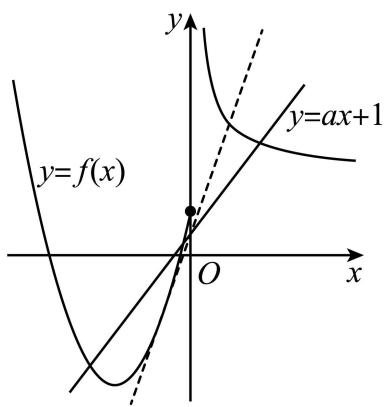

text_image

y
y=f(x)
O
x
y=ax+1

当 $a < 0$ 时，函数 $g(x) = f(x) - ax - 1$ 在R上恰有三个不同的零点，

即 $f(x)=ax+1$ ，即 $y=f(x)$ 与 $y=ax+1$ 的图象有三个交点，如下图，

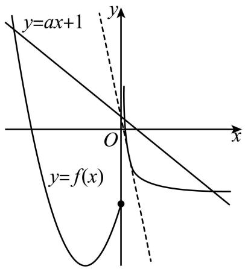

text_image

y=ax+1
y
O
x
y=f(x)

当 $x < 0$ 时， $f(x) = x^2 + 4x + a$ 必有1个交点，

当 x > 0 时， $f(x) = \frac{1}{x} + a + 1$ 与 $y = ax + 1$ 有 2 个交点，

所以 $\frac{1}{x} + a + 1 = ax + 1$ ，即 $ax^2 - ax - 1 = 0$ 在 $(0, +\infty)$ 上有2根，

令 $k(x) = ax^{2} - ax - 1$

故 $\left\{\begin{aligned}\Delta&>0\\ k(0)&=-1<0\\ x&=-\frac{-a}{2a}=\frac{1}{2}\end{aligned}\right.\Rightarrow a^{2}+4a>0$ , 解得: a<-4.

综上所述: a 的取值范围是 $(-∞, -4) ∪ [1,2)$ .

故答案为: $(-∞,-4)∪[1,2)$ .

349 (2024·江苏·校联考模拟预测)若曲线 $y = x \ln x$ 有两条过 $(\mathrm{e}, a)$ 的切线，则 a 的范围是

【答案】 $(- \infty, e)$

【解析】设切线切点为 $(x_{0},y_{0})$ ，因 $\left\{\begin{aligned}(x\ln x)'&=\ln x+1\\ y_{0}&=x_{0}\ln x_{0}\end{aligned}\right.$ ，则切线方程为：y=

$$
\left(\ln x _ {0} + 1\right) \left(x - x _ {0}\right) + x _ {0} \ln x _ {0} = \left(\ln x _ {0} + 1\right) x - x _ {0}.
$$

因过 $(\mathrm{e},a)$ ，则 $a = (\ln x_0 + 1)\mathrm{e} - x_0$ ，由题函数 $f(x) = (\ln x + 1)\mathrm{e} - x$ 图象

与直线 y=a 有两个交点. $f'(x)=\frac{e}{x}-1=\frac{e-x}{x}$ ,

得 $f(x)$ 在 $(0, e)$ 上单调递增，在 $(e, +\infty)$ 上单调递减.

又 $f(x)_{\max}=f(\mathrm{e})=\mathrm{e},x\to0,f(x)\to-\infty,x\to+\infty,f(x)\to-\infty.$

据此可得 $f(x)$ 大致图象如下. 则由图可得, 当 $a \in (-\infty, \mathrm{e})$ 时, 曲线 $y = x \ln x$ 有两条过 $(\mathrm{e}, a)$ 的切线.

故答案为: $(-∞,e)$

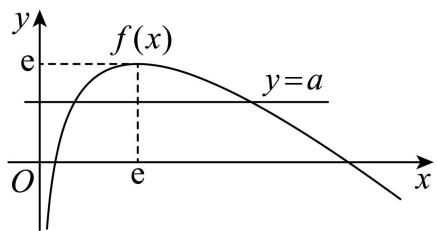

text_image

y
f(x)
e
y=a
O
e
x

350 (2024·天津北辰·统考三模)设 $a \in R$ ，对任意实数 x，记 $f(x) =$

$\min \left\{\mathrm{e}^{x} - 2, \mathrm{e}^{2x} - ae^{x} + a + 24\right\}$ . 若 $f(x)$ 有三个零点，则实数 $a$ 的取值范围是 \_\_\_\_.

【答案】(12,28)

【解析】令 $g(x)=\mathrm{e}^{x}-2, h(x)=\mathrm{e}^{2x}-ae^{x}+a+24,$

因为函数 $g(x)$ 有一个零点, 函数 $h(x)$ 至多有两个零点,

又 $f(x)$ 有三个零点，

所以 $h(x)$ 必须有两个零点,且其零点与函数 $g(x)$ 的零点不相等,

且函数 $h(x)$ 与函数 $g(x)$ 的零点均为函数 $f(x)$ 的零点，

由 $g(x)=0$ 可得, $e^{x}-2=0$ , 所以 $x=\ln2$ ,

所以 $x=\ln2$ 为函数 $f(x)$ 的零点，

即 $h(\ln2)=\mathrm{e}^{2\ln2}-ae^{\ln2}+a+24=4-2a+a+24=28-a>0,$

所以 a < 28,

令 $h(x)=0$ , 可得 $e^{2x}-ae^{x}+a+24=0$ ,

由已知 $e^{2x}-ae^{x}+a+24=0$ 有两个根，

设 $e^{x}=t$ ，则 $t^{2}-at+a+24=0$ 有两个正根，

所以 $a^{2}-4(a+24)>0$ , a>0, $a+24>0$ ,

所以 a > 12，故 12 < a < 28，

当 12 < a < 28 时， $t^{2} - at + a + 24 = 0$ 有两个根，

设其根为 $t_1, t_2, t_1 < t_2$ ，则 $t_2 > \frac{a}{2}$ ，

设 $F(t)=t^{2}-at+a+24$ ，则 $F(2)=4-2a+a+24=28-a>0$ ， $F\left(\frac{a}{2}\right)<0$ ，

所以 $t_{1}>2$ ,

令 $e^{x_{1}}=t_{1},e^{x_{2}}=t_{2}$ ，则 $x_{1}=\ln t_{1},x_{2}=\ln t_{2}$

则 $h(x_{1})=0, h(x_{2})=0,$

且 $g(x_{1})=\mathrm{e}^{\ln t_{1}}-2=t_{1}-2>0$ , $g(x_{2})=\mathrm{e}^{\ln t_{2}}-2=t_{2}-2>0$ ,

所以当 12 < a < 28 时， $f(x_{1}) = f(x_{2}) = 0$ ，

所以当 12 < a < 28 时， $x_{1}, x_{2}$ 为函数 $f(x)$ 的零点，又 $x = \ln 2$ 也为函数 $f(x)$ 的零点，

且 $x_{1}, x_{2}$ 与 $\ln 2$ 互不相等，

所以当 12 < a < 28 时, 函数 $f(x)$ 有三个零点.

故答案为: (12,28).

351 (2024·广东·统考模拟预测)已知实数 $m, n$ 满足 $\frac{\mathrm{e}^{2023 - 2m}}{2} - m = \frac{\mathrm{e}^{3 - \ln 2}}{n} - \ln n - \ln (2\mathrm{e}^{2020})$

$$
= 0 \text {, 则} m n = \underline {{\quad}}.
$$

【答案】 $\frac{e^{3}}{4}$

【解析】因为 $\frac{e^{2023-2m}}{2}-m=0$ ，所以 $e^{2023-2m}-2m=0$ ，

故 $e^{2023}=2me^{2m}$ ，即 $2m+\ln2m=2023$ ，

即 $e^{\ln2m} + \ln2m = 2023.$

由 $\frac{\mathrm{e}^{3 - 1n2}}{n} -\ln n - \ln (2\mathrm{e}^{2020}) = 0$ ，得 $\mathrm{e}^{3 - \ln 2n} + 3 - \ln 2n = 2023.$

令 $f(x)=x+\mathrm{e}^{x}$ ，因为增函数+增函数=增函数，所以函数 $f(x)$ 在R上单调递增，而 $f(\ln2m)=f(3-\ln2n)=2023$ ，故 $\ln2m=3-\ln2n$ ，解得 $\ln4mn=3$ ，则 $mn=\frac{e^{3}}{4}$ .

故答案为: $\frac{\mathrm{e}^3}{4}$

【解题总结】

方程的根或函数零点的存在性问题,可以依据区间端点处函数值的正负来确定,但是要确定函数零点的个数还需要进一步研究函数在这个区间的单调性,若在给定区间上是单调的,则至多有一个零点;如果不是单调的,可继续分出小的区间,再类似做出判断.

# 4 题型四:嵌套函数的零点问题

352 (2024·全国·高三专题练习)已知函数 $f(x) = \begin{cases} x^2 + \frac{1}{2}x, & x \leqslant 0 \\ -|2x - 1| + 1, & x > 0 \end{cases}$ ，若关于 $x$ 的方程 $f^2(x) - (k + 1)xf(x) + kx^2 = 0$ 有且只有三个不同的实数解，则正实数 $k$ 的取值范围为（）

A. $\left(0,\frac{1}{2}\right]$

B. $\left[\frac{1}{2},1\right)\cup(1,2)$

C. $(0,1)\cup (1,2)$

D. $(2,+\infty)$

【答案】B

【解析】因为 $f(x)=\left\{\begin{aligned}&x^{2}+\frac{1}{2}x,&x\leqslant0\\ &2x,&0<x\leqslant\frac{1}{2}\\ &2-2x,&x>\frac{1}{2}\end{aligned}\right.$

由 $f^{2}(x)-(k+1)xf(x)+kx^{2}=0$ 可得 $[f(x)-x]\cdot[f(x)-kx]=0$ ,

所以,关于 x 的方程 $f(x)=x$ 、 $f(x)=kx$ 共有 3 个不同的实数解.

①先讨论方程 $f(x)=x$ 的解的个数.

当 $x \leqslant 0$ 时，由 $f(x) = x^{2} + \frac{1}{2}x = x$ ，可得 x = 0，

当 $0 < x \leqslant \frac{1}{2}$ 时，由 $f(x) = 2x = x$ ，可得 $x \in \emptyset$

当 $x > \frac{1}{2}$ 时，由 $f(x) = 2 - 2x = x$ ，可得 $x = \frac{2}{3}$ ，

所以,方程 $f(x)=x$ 只有两解x=0和 $x=\frac{2}{3}$ ;

②下面讨论方程 $f(x)=kx$ 的解的个数.

当 $x \leqslant 0$ 时，由 $f(x) = x^{2} + \frac{1}{2}x = kx$ 可得 $x\left(x + \frac{1}{2} - k\right) = 0$ ，可得 x = 0 或 $x = k - \frac{1}{2}$ ，

当 $0 < x \leqslant \frac{1}{2}$ 时，由 $f(x) = 2x = kx$ ，可得 k = 2，此时方程 $f(x) = kx$ 有无数个解，不合乎题意，

当 $x > \frac{1}{2}$ 时，由 $f(x) = 2 - 2x = kx$ 可得 $x = \frac{2}{k + 2}$ ，

因为 k > 0，由题意可得 $\left\{\begin{aligned}k - \frac{1}{2} < 0 \\ \frac{2}{k+2} \leqslant \frac{1}{2} \\ k > 0\end{aligned}\right.$ 或 $\left\{\begin{aligned}k - \frac{1}{2} < 0 \\ \frac{2}{k+2} = \frac{2}{3} \\ k > 0\end{aligned}\right.$ 或 $\left\{\begin{aligned}k - \frac{1}{2} \geqslant 0 \\ \frac{2}{k+2} > \frac{1}{2} \\ \frac{2}{k+2} \neq \frac{2}{3}\end{aligned}\right.$

解得 $\frac{1}{2} \leqslant k < 1$ 或 $1 < k < 2$ .

因此,实数 k 的取值范围是 $\left[\frac{1}{2},1\right)\cup(1,2)$ .

故选: B.

353 (2024·全国·高三专题练习)已知函数 $f(x)=\left|2^{|x|}-2\right|-1$ ，则关于 x 的方程 $f^{2}(x)+mf(x)+n=0$ 有 7 个不同实数解，则实数 m,n 满足（）

A. $m > 0$ 且 $n > 0$

B. $m <   0$ 且 $n > 0$

C. $0 < m < 1$ 且 $n = 0$

D. -1 < m < 0 且 n = 0

【答案】C

【解析】令 $u=f(x)$ ，作出函数 $u=f(x)$ 的图象如下图所示：

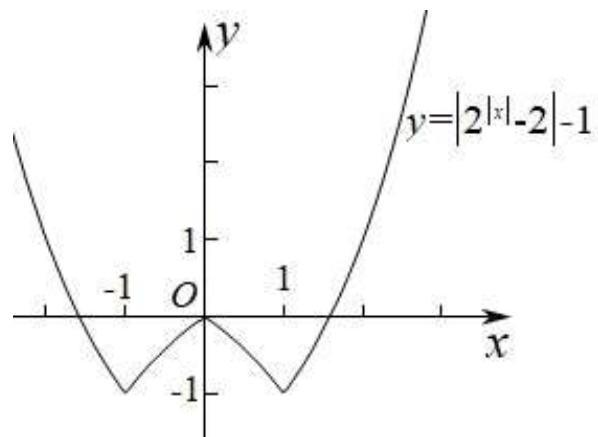

line

| x    | y          |
| ---- | ---------- |
| -1   | -1         |
| 0    | 0          |
| 1    | 1          |
| 2    | 2          |

由于方程 $u^{2}+mu+n=0$ 至多两个实根, 设为 $u=u_{1}$ 和 $u=u_{2}$ ,

由图象可知, 直线 $u = u_{1}$ 与函数 $u = f(x)$ 图象的交点个数可能为 0、2、3、4,

由于关于 x 的方程 $f^{2}(x) + mf(x) + n = 0$ 有 7 个不同实数解，

则关于 u 的二次方程 $u^{2} + mu + n = 0$ 的一根为 $u_{1} = 0$ ，则 n = 0，

则方程 $u^{2}+mu=0$ 的另一根为 $u_{2}=-m$ ,

直线 $u = u_{2}$ 与函数 $u = f(x)$ 图象的交点个数必为 4，则 -1 < -m < 0，解得 0 < m < 1。

所以 0 < m < 1 且 n = 0.

故选：C.

354 (2024·四川资阳·高三统考期末)定义在R上函数 $f(x)$ ，若函数 $y=f(x-1)$ 关于点(1,0)
对称，且 $f(x)=\left\{\begin{aligned}-x^{2},&x\in(0,1),\\e^{x-1}-2,x&\in[1,+\infty)\end{aligned}\right.$ 则关于x的方程 $f^{2}(x)-2mf(x)=1(m\in\mathbb{R})$ 有n
个不同的实数解，则n的所有可能的值为

A. 2

B. 4

C. 2 或 4

D. 2或4或6

【答案】B

【解析】∵函数 $y=f(x-1)$ 关于点 $(1,0)$ 对称，∴ $f(x)$ 是奇函数，x>0 时， $f(x)$ 在 $(0,1)$

上递减, 在 $[1, +\infty)$ 上递增,

作出函数 $f(x)$ 的图象,如图,由图可知 $f(x)=t$ 的解的个数是1,2,3.

t<-1 或° t>1 时， $f(x)=t$ 有一个解， $t=\pm1$ 时， $f(x)=t$ 有两个解，-1<t<1 时， $f(x)=t$ 有三个解，

方程 $f^{2}(x)-2mf(x)=1$ 中设° $f(x)=t$ ，则方程化为 $t^{2}-2mt-1=0$ ，其判别式为 $\Delta=4m^{2}+4>0$ 恒成立，方程必有两不等实根， $t_{1},t_{2},t_{1}+t_{2}=2m,t_{1}t_{2}=-1$ ，两根一正一负，不妨设 $t_{1}<0,t_{2}>0$ ，

若 m=0，则 $t_{1}+t_{2}=0$ ， $t_{1}=-1$ ， $t_{2}=1$ ， $f(x)=t_{1}$ 和 $f(x)=t_{2}$ 都有两个根，原方程有 4 个根；

若 m>0，则 $t_{1}+t_{2}>0$ ， $t_{2}>|t_{1}|$ ， $\therefore t_{2}>1,-1<t_{1}<0$ ， $f(x)=t_{1}$ 有三个根， $f(x)=t_{2}$ 有一个根，原方程共有 4 个根；

若 m<0，则 $t_{1}+t_{2}<0$ ， $t_{2}<|t_{1}|$ ，∴ $0<t_{2}<1$ ， $t_{1}<-1$ ， $f(x)=t_{1}$ 有一个根， $f(x)=t_{2}$ 有三个根，原方程共有 4 个根.

综上原方程有 4 个根.

故选: B.

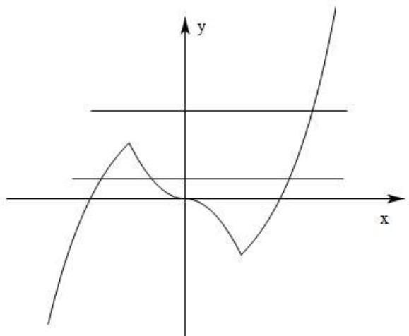

line

| x    | y     |
| ---- | ----- |
| -3.0 | -2.0  |
| -2.5 | -1.5  |
| -2.0 | -1.0  |
| -1.5 | -0.5  |
| -1.0 | 0.0   |
| -0.5 | 0.5   |
| 0.0  | 1.0   |
| 0.5  | 1.5   |
| 1.0  | 2.0   |
| 1.5  | 2.5   |
| 2.0  | 3.0   |
| 2.5  | 3.5   |
| 3.0  | 4.0   |

355 (2024·全国·高三专题练习)已知函数 $f(x) = (x^2 - x - 1)\mathrm{e}^x$ ，设关于 $x$ 的方程 $f^2(x) - mf(x) = \frac{5}{\mathrm{e}} (m \in \mathbb{R})$ 有 $n$ 个不同的实数解，则 $n$ 的所有可能的值为

A. 3

B. 1 或 3

C. 4或6

D. 3或4或6

【答案】A

【解析】 $f'(x)=(x-1)(x+2)\mathrm{e}^{x},\therefore f(x)$ 在 $(-∞,-2)$ 和 $(1,+∞)$ 上单增， $(-2,1)$ 上单减，又当 $x\to-\infty$ 时， $f(x)\to0,x\to+\infty$ 时， $f(x)\to+\infty$ 故 $f(x)$ 的图象大致为：

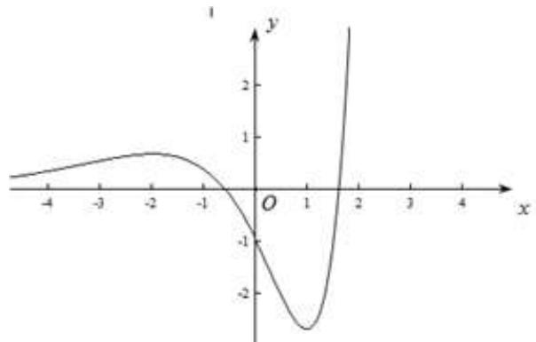

line

| x    | y     |
| ---- | ----- |
| -4   | 0.0   |
| -3   | 0.5   |
| -2   | 0.8   |
| -1   | 0.6   |
| 0    | -1.0  |
| 1    | -2.5  |
| 2    | 1.0   |
| 3    | 2.0   |
| 4    | 3.0   |

令 $f(x)=t$ ，则方程 $t^{2}-mt-\frac{5}{e}=0$ 必有两个根， $t_{1},t_{2}$ 且 $t_{1}t_{2}=-\frac{5}{e}$ ，不仿设 $t_{1}<0<t_{2}$ ，当 $t_{1}=-e$ 时，恰有 $t_{2}=5e^{-2}$ ，此时 $f(x)=t_{1}$ ，有1个根， $f(x)=t_{2}$ ，有2个根，当 $t_{1}<-e$ 时必有 $0<t_{2}<5e^{-2}$ ，此时 $f(x)=t_{1}$ 无根， $f(x)=t_{2}$ 有3个根，当 $-e<t_{1}<0$ 时必有 $t_{2}>5e^{-2}$ ，此时 $f(x)=t_{1}$ 有2个根， $f(x)=t_{2}$ ，有1个根，综上，对任意 $m\in R$ ，方程均有3个根，故选A.

# 【解题总结】

1、涉及几个根的取值范围问题,需要构造新的函数来确定取值范围.

2、二次函数作为外函数可以通过参变分离减少运算,但是前提就是函数的基本功要扎实.

# 5 题型五: 函数的对称问题

356 (2024·全国·高三专题练习)已知函数 $f(x) = 2x + \frac{1}{x^2}\left(\frac{1}{2} \leqslant x \leqslant 2\right)$ 的图象上存在点P，函数 $g(x) = ax - 3$ 的图象上存在点Q，且P，Q关于原点对称，则实数 $a$ 的取值范围是()

A. $[-4,0]$

B. $\left[0,\frac{5}{8}\right]$

C. $[0,4]$

D. $\left[\frac{5}{8},4\right]$

【答案】C

【解析】由题意,函数 $g(x)=ax-3$ 关于原点对称的函数为 -y=-ax-3, 即 $y=ax+3$ , 若函数 $g(x)=ax-3$ 的图象上存在点 Q, 且 P, Q 关于原点对称,

则等价为 $f(x)=ax+3$ 在 $\frac{1}{2}\leqslant x\leqslant2$ 上有解，即 $2x+\frac{1}{x^{2}}=ax+3$ ，在 $\frac{1}{2}\leqslant x\leqslant2$ 上有解，

由 $f(x)=2x+\frac{1}{x^{2}}$ ，则 $f'(x)=2-\frac{2}{x^{3}}=\frac{2x^{3}-2}{x^{3}}$

当 $x \in (1,2]$ 时， $f'(x) > 0$ ，此时函数 $f(x)$ 为单调增函数；

当 $x \in \left[\frac{1}{2}, 1\right)$ 时， $f'(x) < 0$ ，此时函数 $f(x)$ 为单调减函数，

即当 x=1 时， $f(x)$ 取得极小值同时也是最小值，且 $f(1)=3$ ，即 B(1,3)，

当 $x=\frac{1}{2}$ 时，y=1+4=5，即 $A\left(\frac{1}{2},5\right)$ ,

设 $h(x)=ax+3$ ，要使得 $f(x)=h(x)$ 有解，

则当 $h(x)$ 过点 B 时, 得 a=0, 过点 A 时, $\frac{1}{2}a+3=5$ , 解得 a=4,

综上可得 $0 \leqslant a \leqslant 4$ .

故选C.

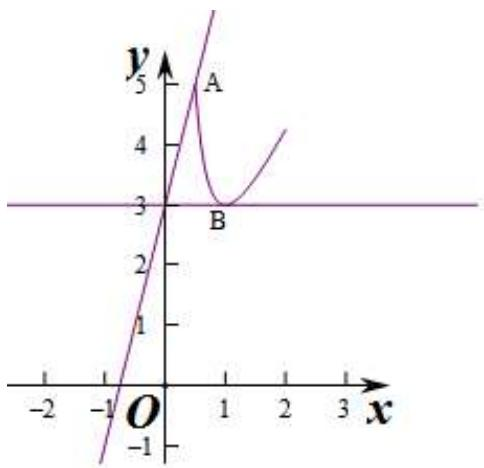

line

| x   | y    |
| --- | ---- |
| 0   | 5    |
| 1   | 3    |
| 2   | 4    |
| 3   | 5    |

357 (2024·全国·高三专题练习)已知函数 $f(x)=\mathrm{e}^{x}$ ，函数 $g(x)$ 与 $f(x)$ 的图象关于直线 y=x 对称，若 $h(x)=g(x)-kx$ 无零点，则实数 k 的取值范围是（）

A. $\left(\frac{1}{\mathrm{e}},\mathrm{e}^{2}\right)$

B. $\left(\frac{1}{\mathrm{e}},\mathrm{e}\right)$

C. $(\mathrm{e}, + \infty)$

D. $\left(\frac{1}{\mathrm{e}},+\infty\right)$

【答案】D

【解析】由题知 $g(x)=\ln x$ , $h(x)=g(x)-kx=0\Rightarrow k=\frac{\ln x}{x}$ ，设 $F(x)=\frac{\ln x}{x}\Rightarrow F'(x)=\frac{1-\ln x}{x^{2}}$ ，当 $F'(x)<0$ 时， $x\in(\mathrm{e},+\infty)$ ，此时 $F(x)$ 单调递减，当 $F'(x)>0$ 时， $x\in(0,\mathrm{e})$ ，此时 $F(x)$ 单调递增，所以 $F(x)_{\max}=F(\mathrm{e})=\frac{1}{\mathrm{e}}$ , $F(x)$ 的图象如下，由图可知，当 $k>\frac{1}{e}$ 时， $y=F(x)$ 与 y=k 无交点，即 $h(x)=g(x)-kx$ 无零点.

故选：D.

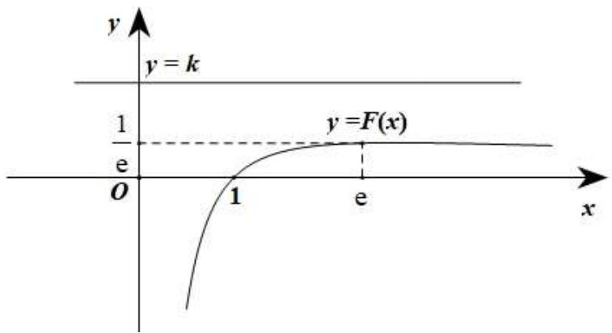

text_image

y
y = k
1
e
O
1
e
y = F(x)
x

358 (2024·全国·高三专题练习)已知函数 $y = a - 2\ln x, \left(\frac{1}{\mathrm{e}} \leqslant x \leqslant \mathrm{e}\right)$ 的图象上存在点 M，函数 $y = x^{2} + 1$ 的图象上存在点 N，且 M，N 关于 x 轴对称，则 a 的取值范围是（）

A. $[1 - \mathrm{e}^2, - 2]$

B. $\left[-3-\frac{1}{\mathrm{e}^{2}},+\infty\right)$

C. $\left[-3 - \frac{1}{\mathrm{e}^2}, - 2\right]$

D. $\left[1 - \mathrm{e}^2, - 3 - \frac{1}{\mathrm{e}^2}\right]$

【答案】A

【解析】因为函数 $y = x^{2} + 1$ 与函数 $y = -x^{2} - 1$ 的图象关于 x 轴对称，

根据已知得函数 $y = a - 2\ln x, \left(\frac{1}{\mathrm{e}} \leqslant x \leqslant \mathrm{e}\right)$ 的图象与函数 $y = -x^2 - 1$ 的图象有交点，

即方程 $a - 2\ln x = -x^2 - 1$ 在 $x \in \left[\frac{1}{\mathrm{e}}, \mathrm{e}\right]$ 上有解，

即 $a = 2\ln x - x^2 - 1$ 在 $x \in \left[\frac{1}{\mathrm{e}}, \mathrm{e}\right]$ 上有解.

令 $g(x) = 2\ln x - x^2 - 1, x \in \left[\frac{1}{\mathrm{e}}, \mathrm{e}\right]$ ,

则 $g'(x)=\frac{2}{x}-2x=\frac{2-2x^{2}}{x}=\frac{2(1-x^{2})}{x}$ ,

可知 $g(x)$ 在 $\left[\frac{1}{e},1\right]$ 上单调递增，在 $[1,e]$ 上单调递减，

故当 x=1 时， $g(x)_{\max}=g(1)=-2$ ，

由于 $g\left(\frac{1}{\mathrm{e}}\right) = -3 - \frac{1}{\mathrm{e}^2}, g(\mathrm{e}) = 1 - \mathrm{e}^2$ ，且 $-3 - \frac{1}{\mathrm{e}^2} > 1 - \mathrm{e}^2,$

所以 $1 - e^{2} \leqslant a \leqslant -2.$

故选：A.

359 (2024·全国·高三专题练习)已知函数 $g(x)=a-x^{2}\left(\frac{1}{\mathrm{e}}\leqslant x\leqslant\mathrm{e},\mathrm{e}\right.$ 为自然对数的底数)与 $h(x)=2\ln x$ 的图象上存在关于 x 轴对称的点，则实数 a 的取值范围是（）

A. $\left[1,\frac{1}{\mathrm{e}^{2}}+2\right]$

B. $[1,\mathrm{e}^2 -2]$

C. $\left[\frac{1}{\mathrm{e}^2} + 2, \mathrm{e}^2 - 2\right]$

D. $\left[\mathrm{e}^2 - 2, +\infty\right)$

【答案】B

【解析】设 $h(x)$ 上一点 $\mathrm{M}(x_{0},2\ln x_{0})$ ， $\frac{1}{e} \leqslant x_{0} \leqslant e$ ，且 M 关于 x 轴对称点坐标为

$M'(x_{0},-2\ln x_{0}),\frac{1}{e}\leqslant x_{0}\leqslant e$ 在 $g(x)$ 上，

$\therefore -2\ln x_{0} = a - x_{0}^{2}\left(\frac{1}{\mathrm{e}}\leqslant x\leqslant \mathrm{e}\right)$ 有解，即 $x_0^2 -2\ln x_0 = a\left(\frac{1}{\mathrm{e}}\leqslant x\leqslant \mathrm{e}\right)$ 有解.

令 $f(x)=x^{2}-2\ln x\left(\frac{1}{e}\leqslant x\leqslant e\right)$ ，则 $f'(x)=2x-\frac{2}{x}=\frac{2(x+1)(x-1)}{x}$ ， $\frac{1}{e}\leqslant x\leqslant e$

∴ 当 $x \in \left[\frac{1}{\mathrm{e}}, 1\right)$ 时, $f'(x) < 0$ ; 当 $x \in (1, \mathrm{e}]$ 时, $f'(x) > 0$ , $\therefore f(x)$ 在 $\left[\frac{1}{\mathrm{e}}, 1\right)$ 上单调递减; 在 $(1, \mathrm{e}]$ 上单调递增

$$
\therefore f (x) _ {\min} = f (1) = 1, f \left(\frac {1}{\mathrm{e}}\right) = \frac {1}{\mathrm{e} ^ {2}} + 2, f (\mathrm{e}) = \mathrm{e} ^ {2} - 2,
$$

$x_0^2 - 2\ln x_0 = a\left(\frac{1}{\mathrm{e}} \leqslant x \leqslant \mathrm{e}\right)$ 有解等价于 $y = a$ 与 $y = f(x)$ 图象有交点， $\therefore f(1) \leqslant a \leqslant f(\mathrm{e})$

$$
\therefore a \in [ 1, \mathrm{e} ^ {2} - 2 ].
$$

故选：B

【解题总结】

转化为零点问题

# 6 题型六: 函数的零点问题之分段分析法模型

360 (2024·浙江宁波·高三统考期末)若函数 $f(x)=\frac{x^{3}-2ex^{2}+mx-\ln x}{x}$ 至少存在一个零点，则 m 的取值范围为 （）

A. $\left(-\infty,e^{2}+\frac{1}{e}\right]$

B. $\left[\mathrm{e}^2 +\frac{1}{\mathrm{e}}, + \infty\right)$

C. $\left(-\infty,e+\frac{1}{e}\right]$

D. $\left[\mathrm{e}+\frac{1}{\mathrm{e}},+\infty\right)$

【答案】A

【解析】因为函数 $f(x) = \frac{x^3 - 2ex^2 + mx - \ln x}{x}$ 至少存在一个零点

所以 $\frac{x^3 - 2ex^2 + mx - \ln x}{x} = 0$ 有解

即 $m = -x^{2} + 2ex + \frac{\ln x}{x}$ 有解

令 $h(x) = -x^{2} + 2ex + \frac{\ln x}{x}$ ,

则 $h'(x) = -2x + 2e + \frac{1 - \ln x}{x^{2}}$

$$
h ^ {\prime \prime} (x) = \left(- 2 x + 2 \mathrm{e} + \frac {1 - \ln x}{x ^ {2}}\right) ^ {\prime} = - 2 + \frac {- 3 x + 2 x \ln x}{x ^ {4}} = \frac {- 3 x - 2 x ^ {4} + 2 x \ln x}{x ^ {4}} =
$$

$\frac{-3x-2x(x^{3}-\ln x)}{x^{4}}$ 因为 x>0，且由图象可知 $x^{3}>\ln x$ ，所以 $h''(x)<0$

所以 $h'(x)$ 在 $(0, +\infty)$ 上单调递减，令 $h'(x) = 0$ 得 x = e

当 0 < x < e 时 $h'(x) > 0$ , $h(x)$ 单调递增

当 x > e 时 $h'(x) < 0$ , $h(x)$ 单调递减

所以 $h(x)_{\max}=h(\mathrm{e})=\mathrm{e}^{2}+\frac{1}{\mathrm{e}}$

且当 $x \to +\infty$ 时 $h(x) \to -\infty$

所以 m 的取值范围为函数 $h(x)$ 的值域, 即 $\left(-\infty, e^{2} + \frac{1}{e}\right]$

故选：A

361 (2024·湖北·高三校联考期中)设函数 $f(x)=x^{3}-2ex^{2}+mx-\ln x$ ，记 $g(x)=\frac{f(x)}{x}$ ，若函数 $g(x)$ 至少存在一个零点，则实数 m 的取值范围是

A. $\left(-\infty,e^{2}+\frac{1}{e}\right)$

B. $\left(0, \mathrm{e}^{2} + \frac{1}{\mathrm{e}}\right)$

C. $\left(0, \mathrm{e}^2 + \frac{1}{\mathrm{e}}\right]$

D. $\left(-\infty,e^{2}+\frac{1}{e}\right]$

【答案】D

【解析】由题意得函数 $f(x)$ 的定义域为 $(0, +\infty)$ .

又 $g(x) = \frac{f(x)}{x} = x^2 - 2ex + m - \frac{\ln x}{x}$ ,

∵ 函数 $g(x)$ 至少存在一个零点，

∴方程 $x^{2}-2ex+m-\frac{\ln x}{x}=0$ 有解，

即 $m = -x^{2} + 2ex + \frac{\ln x}{x}$ 有解.

令 $\varphi(x)=-x^{2}+2ex+\frac{\ln x}{x},x>0,$

则 $\varphi'(x) = -2x + 2\mathrm{e} + \frac{1 - \ln x}{x^2} = 2(\mathrm{e} - x) + \frac{1 - \ln x}{x^2}$ ,

∴ 当 $x \in (0, e)$ 时， $\varphi'(x) > 0, \varphi(x)$ 单调递增；当 $x \in (e, +\infty)$ 时， $\varphi'(x) < 0, \varphi(x)$ 单调递减.

$$
\therefore \varphi (x) _ {\max} = \varphi (\mathrm{e}) = \mathrm{e} ^ {2} + \frac {1}{\mathrm{e}}.
$$

又当 $x \to 0$ 时， $\varphi(x) \to -\infty$ ；当 $x \to +\infty$ 时， $\varphi(x) \to -\infty$ 。

要使方程 $m = -x^{2} + 2ex + \frac{\ln x}{x}$ 有解，则需满足 $m \leqslant e^{2} + \frac{1}{e}$ ,

∴实数 m 的取值范围是 $\left(-\infty, e^{2} + \frac{1}{e}\right]$ .

故选D.

362 (2024·福建厦门·厦门外国语学校校考一模)若至少存在一个 x，使得方程 $\ln x - mx = x(x^{2} - 2ex)$ 成立．则实数 m 的取值范围为

A. $m \geqslant e^{2} + \frac{1}{e}$

B. $m \leqslant \mathrm{e}^{2} + \frac{1}{\mathrm{e}}$

C. $m \geqslant e + \frac{1}{e}$

D. $m \leqslant \mathrm{e} + \frac{1}{\mathrm{e}}$

【答案】B

【解析】原方程化简得: $m=\frac{\ln x}{x}-x^{2}+2ex,(x>0)$ 有解,令 $f(x)=\frac{\ln x}{x}-x^{2}+2ex,(x>0),f'(x)=\frac{1-\ln x}{x^{2}}+2(e-x)$ ,当x>e时, $f'(x)<0$ ,所以 $f(x)$ 在 $(e,+\infty)$ 单调递减,当x<e时, $f'(x)>0$ ,所以 $f(x)$ 在 $(o,e)$ 单调递增. $f(x)_{\max}=f(e)=\frac{1}{e}+e^{2}$ .所以 $m\leqslant\frac{1}{e}+e^{2}$ .选B.

363 (2024·湖南长沙·高三长沙一中校考阶段练习)设函数 $f(x)=x^{2}-2x-\frac{x}{\mathrm{e}^{x}}+a$ （其中e为自然对数的底数），若函数 $f(x)$ 至少存在一个零点，则实数a的取值范围是（）

A. $\left(0,1+\frac{1}{e}\right]$

B. $\left(0,e+\frac{1}{e}\right]$

C. $\left[\mathrm{e} + \frac{1}{\mathrm{e}}, + \infty\right)$

D. $\left(-\infty,1+\frac{1}{e}\right]$

【答案】D

【解析】依题意得,函数 $f(x)$ 至少存在一个零点,且 $f(x)=x^{2}-2x-\frac{x}{\mathrm{e}^{x}}+a$ ,

可构造函数 $y = x^{2} - 2x$ 和 $y = -\frac{x}{e^{x}}$ ,

因为 $y = x^{2} - 2x$ ，开口向上，对称轴为 x = 1，所以 $(-∞, 1)$ 为单调递减， $(1, +∞)$ 为单调递增；

而 $y = -\frac{x}{e^{x}}$ ，则 $y' = \frac{x - 1}{e^{x}}$ ，由于 $e^{x} > 0$ ，所以 $(-∞, 1)$ 为单调递减， $(1, +∞)$ 为单调递增；

可知函数 $y = x^{2} - 2x$ 及 $y = -\frac{x}{e^{x}}$ 均在 x = 1 处取最小值，所以 $f(x)$ 在 x = 1 处取最小值，

又因为函数 $f(x)$ 至少存在一个零点, 只需 $f(1) \leqslant 0$ 即可, 即: $f(1) = 1 - 2 - \frac{1}{\mathrm{e}} + a \leqslant 0$

解得: $a \leqslant 1 + \frac{1}{e}$ .

故选：D.

【解题总结】

分类讨论数学思想方法

# 7 题型七: 唯一零点求值问题

364 (2024·全国·高三专题练习)已知函数 $f(x)=|x+2|+\mathrm{e}^{x+2}+\mathrm{e}^{-2-x}+a$ 有唯一零点，则实数 a=

A. 1

B.-1

C. 2

D.-2

【答案】D

【解析】设 $g(x)=f(x-2)=|x|+\mathrm{e}^{x}+\mathrm{e}^{-x}+a$ ，定义域为 R，

$$
\therefore g (- x) = | - x | + \mathrm{e} ^ {- x} + \mathrm{e} ^ {x} + a = | x | + \mathrm{e} ^ {x} + \mathrm{e} ^ {- x} + a = g (x),
$$

故函数 $g(x)$ 为偶函数, 则函数 $f(x-2)$ 的图象关于 y 轴对称,

故函数 $f(x)$ 的图象关于直线x=-2对称，

$\because f(x)$ 有唯一零点，

$\therefore f(-2)=0,$ 即 a=-2.

故选：D.

365 (2024·全国·高三专题练习)已知函数 $f(x) = \mathrm{e}^{x - \frac{\pi}{4}} + \mathrm{e}^{\frac{\pi}{4} - x} - a(\sin x + \cos x)$ 有唯一零点，则

a= （ ）

A. $\frac{\pi}{e}$

B. $\frac{4\pi}{e}$

C. $\sqrt{2}$

D. 1

【答案】C

【解析】令 $f(x) = \mathrm{e}^{x - \frac{\pi}{4}} + \mathrm{e}^{\frac{\pi}{4} - x} - a(\sin x + \cos x) = 0$ ，则 $\mathrm{e}^{x - \frac{\pi}{4}} + \mathrm{e}^{\frac{\pi}{4} - x} = \sqrt{2} a\sin \left(x + \frac{\pi}{4}\right)$ ，

记 $x - \frac{\pi}{4} = t$ ，则 $\mathrm{e}^t +\mathrm{e}^{-t} = \sqrt{2} a\sin \left(t + \frac{\pi}{2}\right) = \sqrt{2} a\cos t$ ，令 $g(t) = \mathrm{e}^t +\mathrm{e}^{-t}$ 则 $g(-t) = \mathrm{e}^{-t}$ $+\mathrm{e}^t$ ， $\therefore g(t) = g(-t)$ ，所以 $g(t)$ 是偶函数，图象关于 $y$ 轴对称，因为 $f(x)$ 只有唯一的零点，所以零点只能是 $t = 0,$ 于是 $\sqrt{2} a = 2,\therefore a = \sqrt{2}$

故选：C

366 (2024·全国·高三专题练习)已知函数 $g(x)$ ， $h(x)$ 分别是定义在 R 上的偶函数和奇函数，且 $g(x) + h(x) = e^{x} + \sin x - x$ ，若函数 $f(x) = 3^{|x-2020|} - \lambda g(x - 2020) - 2\lambda^{2}$ 有唯一零点，则实数 $\lambda$ 的值为

A.-1或 $\frac{1}{2}$

B. 1 或 $-\frac{1}{2}$

C.-1或2

D.-2或1

【答案】A

【解析】已知 $g(x) + h(x) = \mathrm{e}^{x} + \sin x - x,$ ①

且 $g(x), h(x)$ 分别是R上的偶函数和奇函数，

则 $g(-x) + h(-x) = \mathrm{e}^{-x} + \sin(-x) + x,$

得: $g(x) - h(x) = \mathrm{e}^{-x} - \sin x + x$ , ②

① + ②得: $g(x) = \frac{\mathrm{e}^x + \mathrm{e}^{-x}}{2}$ ,

由于 $|x - 2020|$ 关于 $x = 2020$ 对称，

则 $3^{|x-2020|}$ 关于 x=2020 对称，

$g(x)$ 为偶函数, 关于 y 轴对称,

则 $g(x-2020)$ 关于 x=2020 对称，

由于 $f(x)=3^{|x-2020|}-\lambda g(x-2020)-2\lambda^{2}$ 有唯一零点，

则必有 $f(2020)=0$ , $g(0)=1$ ,

即： $f(2020) = 3^{0} - \lambda g(0) - 2\lambda^{2} = 1 - \lambda -2\lambda^{2} = 0,$

解得: $\lambda = -1$ 或 $\frac{1}{2}$ .

故选：A.

367 (2024·全国·高三专题练习)已知函数 $f(x) = 2\mathrm{e}^{|x - 2|} - \frac{1}{2} a(2^{x - 2} + 2^{2 - x}) - a^2$ 有唯一零点，则负实数 $a =$

A.-2

B. $-\frac{1}{2}$

C.-1

D. $-\frac{1}{2}$ 或-1

【答案】A

【解析】函数 $f(x)=2\mathrm{e}^{|x-2|}-\frac{1}{2}a(2^{x-2}+2^{2-x})-a^{2}$ 有唯一零点，

设 x-2=t,

则函数 $y=2\mathrm{e}^{|t|}-\frac{1}{2}a(2^{t}+2^{-t})-a^{2}$ 有唯一零点，

则 $2\mathrm{e}^{|t|} - \frac{1}{2} a(2^t + 2^{-t}) = a^2$

设 $g(t)=2\mathrm{e}^{|t|}-\frac{1}{2}a(2^{t}+2^{-t}),\because g(-t)=2\mathrm{e}^{|-t|}-\frac{1}{2}a(2^{-t}+2^{t})=g(t),\therefore g(t)$ 为偶函数，
∵ 函数 $f(t)$ 有唯一零点，

$\therefore y=g(t)$ 与 $y=a^{2}$ 有唯一的交点，

∴此交点的横坐标为0，∴ $2-a=a^{2}$ ，解得a=-2或a=1(舍去)，

故选A.

# 【解题总结】

利用函数零点的情况求参数的值或取值范围的方法:

(1) 利用零点存在性定理构建不等式求解.  
(2) 分离参数后转化为函数的值域 (最值) 问题求解.  
(3)转化为两个熟悉的函数图像的上、下关系问题,从而构建不等式求解.

# 8 题型八:分段函数的零点问题

368 (2024·天津南开·高三南开中学校考期末)已知函数 $f(x)=\left\{\begin{aligned}&2^{x},&x\leqslant0\\&\log_{2}x,&x>0\end{aligned}\right.$ ，若函数 $g(x)=f(x)+m$ 有两个零点，则m的取值范围是()

A. $[-1,0)$

B. $\left[-1,+\infty\right)$

C. $(-\infty,0)$

D. $(-∞,1]$

【答案】A

【解析】∵ $g(x)=f(x)+m=0\Leftrightarrow f(x)=-m$

∴ $g(x)$ 存在两个零点, 等价于 y = -m 与 $f(x)$ 的图象有两个交点, 在同一直角坐标系中绘制两个函数的图象:

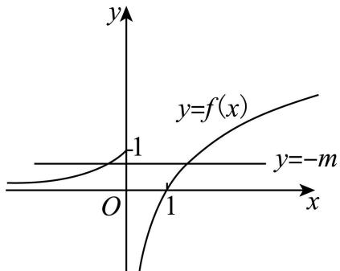

text_image

y
y=f(x)
-1
y=-m
O
1
x

由图可知,保证两函数图象有两个交点,满足 $0<-m\leqslant1$ ,解得: $m\in[-1,0)$ 故选:A.

369 (2024·全国·高三专题练习)已知 m > 0，函数 $f(x)=\left\{\begin{aligned}(x-2)\ln(x+1),&-1<x\leqslant m,\\ \cos\left(3x+\frac{\pi}{4}\right),&m<x\leqslant\pi,\end{aligned}\right.$ 恰有 3 个零点，则 m 的取值范围是 ()

A. $\left[\frac{\pi}{12},\frac{5\pi}{12}\right)\cup\left[2,\frac{3\pi}{4}\right)$   
C. $\left(0,\frac{5\pi}{12}\right)\cup\left[2,\frac{3\pi}{4}\right)$

B. $\left[\frac{\pi}{12},\frac{5\pi}{12}\right)\cup\left[2,\frac{3\pi}{4}\right]$

D. $\left(0,\frac{5\pi}{12}\right)\cup\left[2,\frac{3\pi}{4}\right]$

【答案】A

【解析】设 $g(x)=(x-2)\ln(x+1)$ , $h(x)=\cos\left(3x+\frac{\pi}{4}\right)$ ,

求导 $g'(x)=\ln(x+1)+\frac{x-2}{x+1}=\ln(x+1)+1-\frac{3}{x+1}$

由反比例函数及对数函数性质知 $g'(x)$ 在 $(-1, m]$ , m > 0 上单调递增，

且 $g'\left(\frac{1}{2}\right) < 0, g'(1) > 0$ ，故 $g'(x)$ 在 $\left(\frac{1}{2}, 1\right)$ 内必有唯一零点 $x_0$

当 $x \in (-1, x_{0})$ 时， $g'(x) < 0$ ， $g(x)$ 单调递减；

当 $x \in (x_{0}, m]$ 时， $g'(x) > 0, g(x)$ 单调递增；

令 $g(x)=0$ , 解得 x=0 或 2, 可作出函数 $g(x)$ 的图像,

令 $h(x) = 0$ ，即 $3x + \frac{\pi}{4} = \frac{\pi}{2} + k\pi, k \in \mathbb{Z}$ ，在 $(0, \pi]$ 之间解得 $x = \frac{\pi}{12}$ 或 $\frac{5\pi}{12}$ 或 $\frac{3\pi}{4}$ ，

作出图像如下图

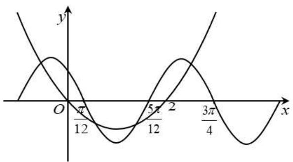

line

| x       | y (Curve 1) | y (Curve 2) |
| ------- | ----------- | ----------- |
| 0       | 0           | 0           |
| π/12    | π/12        | 0           |
| 5π/12   | 5π/12       | 0           |
| 2       | 2π/4        | 0           |
| 3π/4    | 3π/4        | 0           |

数形结合可得: $\left[\frac{\pi}{12},\frac{5\pi}{12}\right)\cup\left[2,\frac{3\pi}{4}\right)$ ,

故选：A

370 (2024·陕西西安·高三统考期末)已知函数 $f(x) = \begin{cases} \mathrm{e}^x, & x \geqslant 0 \\ -3x, & x < 0 \end{cases}$ ，若函数 $g(x) = f(-x) - f(x)$ ，则函数 $g(x)$ 的零点个数为 （）

A. 1

B. 3

C. 4

D. 5

【答案】D

【解析】当 x > 0 时，-x < 0, $f(-x) = 3x$

当 $x < 0$ 时， $-x > 0, f(-x) = \mathrm{e}^{-x}$

$$
\therefore g (x) = f (- x) - f (x) = \left\{ \begin{array}{l l} 3 x - \mathrm{e} ^ {x}, & x > 0 \\ 0, & x = 0 \\ \mathrm{e} ^ {- x} + 3 x, & x <   0 \end{array} \right.,
$$

$g(-x)=f(x)-f(-x)=-g(x)$ ，且定义域为R，关于原点对称，故 $g(x)$ 为奇函数，所以我们求出x>0时零点个数即可，

$g(x)=3x-\mathrm{e}^{x},x>0,\;g'(x)=3-\mathrm{e}^{x}>0,$ 令 $g'(x)=3-\mathrm{e}^{x}>0,$ 解得 $0<x<\ln3,$ 故 $g(x)$ 在 $(0,\ln3)$ 上单调递增，在 $(\ln3,+\infty)$ 单调递减，

且 $g(\ln 3) = 3\ln 3 - 3 > 0$ ，而 $g(2) = 6 - \mathrm{e}^2 < 0$ ，故 $g(x)$ 在 $(\ln 3,2)$ 有1零点，

$g\left(\frac{1}{3}\right)=1-\mathrm{e}^{\frac{1}{3}}<0$ , 故 $g(x)$ 在 $\left(\frac{1}{3},\ln3\right)$ 上有 1 零点, 图像大致如图所示:

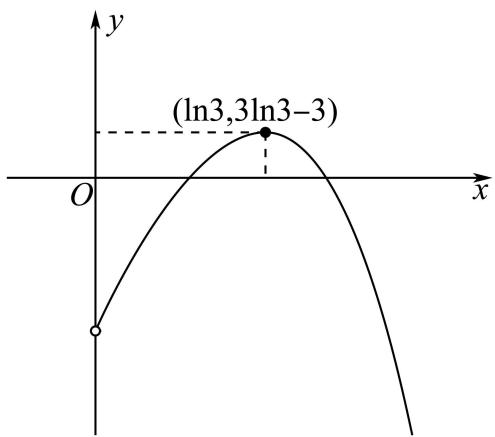

line

| x              | y              |
| -------------- | -------------- |
| ln3            | 3ln3-3         |

故 $g(x)$ 在 $(0, +\infty)$ 上有2个零点，又因为其为奇函数，则其在 $(-∞, 0)$ 上也有2个零点，且 $g(0) = 0$ ，故 $g(x)$ 共5个零点，

故选：D.

371 (2024·全国·高三专题练习)已知函数 $f(x) = \begin{cases} 2\sin \left[2\pi \left(x - a + \frac{1}{2}\right)\right], & x < a \\ x^2 - (2a + 1)x + a^2 + 2, & x \geqslant a \end{cases}$ ，若函数 $f(x)$ 在 $[0, +\infty)$ 内恰有5个零点，则 $a$ 的取值范围是 （）

A. $\left(\frac{7}{4},\frac{5}{2}\right)$

B. $\left(\frac{7}{4},2\right)$

C. $\left(\frac{7}{4},2\right)\cup\left(\frac{5}{2},\frac{11}{4}\right)$

D. $\left(\frac{7}{4},2\right)\cup\left(2,\frac{5}{2}\right)$

【答案】D

【解析】当 $a \leqslant 0$ 时，对任意的 $x \geqslant 0, f(x) = x^2 - (2a + 1)x + a^2 + 2$ 在 $[0, +\infty)$ 上至多2个零点，不合乎题意，所以， $a > 0$ .

函数 $y = x^{2} - (2a + 1)x + a^{2} + 2$ 的对称轴为直线 $x = a + \frac{1}{2}, \Delta = (2a + 1)^{2} - 4(a^{2} + 2) = 4a - 7.$

所以,函数 $f(x)$ 在 $\left[a,a+\frac{1}{2}\right)$ 上单调递减,在 $\left(a+\frac{1}{2},+\infty\right)$ 上单调递增,且 $f(a)=2-a$ .

①当 $\Delta = 4a - 7 < 0$ 时，即当 $0 < a < \frac{7}{4}$ 时，则函数 $f(x)$ 在 $[a, +\infty)$ 上无零点，

所以, 函数 $f(x)=2\sin\left[2\pi\left(x-a+\frac{1}{2}\right)\right]$ 在 $[0,a)$ 上有 5 个零点,

当 $0 \leqslant x < a$ 时， $\frac{1}{2} - a \leqslant x - a + \frac{1}{2} < \frac{1}{2}$ ，则 $(1 - 2a)\pi \leqslant 2\pi (x - a + \frac{1}{2}) < \pi$

由题意可得 $-5\pi < (1 - 2a)\pi \leqslant -4\pi$ ，解得 $\frac{5}{2} \leqslant a < 3$ ，此时 a 不存在；

②当 $\Delta=0$ 时, 即当 $a=\frac{7}{4}$ 时, 函数 $f(x)$ 在 $\left[\frac{7}{4},+\infty\right)$ 上只有一个零点,

当 $x \in \left[0, \frac{7}{4}\right)$ 时， $f(x) = -2\cos 2\pi x$ ，则 $0 \leqslant 2\pi x < \frac{7\pi}{2}$ ，则函数 $f(x)$ 在 $\left[0, \frac{7}{4}\right)$ 上只有3个零点，

此时, 函数 $f(x)$ 在 $[0, +\infty)$ 上的零点个数为 4, 不合乎题意;

③当 $\left\{\begin{aligned}f(a)=2-a&\geqslant0\\ \Delta=4a-7&>0\end{aligned}\right.$ 时，即当 $\frac{7}{4}<a\leqslant2$ 时，函数 $f(x)$ 在 $[a,+\infty)$ 上有 2 个零点，

则函数 $f(x) = 2\sin \left[2\pi \left(x - a + \frac{1}{2}\right)\right]$ 在 $[0, a)$ 上有3个零点，

则 $-3\pi < (1 - 2a)\pi \leqslant -2\pi$ ，解得 $\frac{3}{2} \leqslant a < 2$ ，此时 $\frac{7}{4} < a < 2$ ；

④当 $\left\{\begin{aligned}f(a)=2-a<0\\ \Delta=4a-7>0\end{aligned}\right.$ 时，即当 a>2 时，函数 $f(x)$ 在 $[a,+\infty)$ 上有 1 个零点，

则函数 $f(x) = 2\sin \left[2\pi \left(x - a + \frac{1}{2}\right)\right]$ 在 $[0, a)$ 上有4个零点，

则 $-4\pi < (1 - 2a)\pi \leqslant -3\pi$ ，解得 $2 \leqslant a < \frac{5}{2}$ ，此时， $2 < a < \frac{5}{2}$ .

综上所述,实数a的取值范围是 $\left(\frac{7}{4},2\right)\cup\left(2,\frac{5}{2}\right)$ .

故选：D.

【解题总结】

已知函数零点个数(方程根的个数)求参数值(取值范围)常用的方法:

(1) 直接法: 直接求解方程得到方程的根, 再通过解不等式确定参数范围;  
(2) 分离参数法: 先将参数分离, 转化成求函数的值域问题加以解决;  
(3) 数形结合法: 先对解析式变形, 进而构造两个函数, 然后在同一平面直角坐标系中画出函数的图象, 利用数形结合的方法求解.

# 题型九:零点嵌套问题

372 (2024·全国·高三专题练习)已知函数 $f(x) = (xe^x)^2 + (a - 1)(xe^x) + 1 - a$ 有三个不同的零点 $x_1, x_2, x_3$ . 其中 $x_1 < x_2 < x_3$ ，则 $(1 - x_1\mathrm{e}^{x_1})(1 - x_2\mathrm{e}^{x_2})(1 - x_3\mathrm{e}^{x_3})^2$ 的值为（）

A. 1

B. $(a-1)^{2}$

C.-1

D. 1 - a

【答案】A

【解析】令 $t = xe^{x}$ ，则 $t' = (x + 1)e^{x}$ ，

故当 $x \in (-1, +\infty)$ 时， $t' > 0, t = xe^{x}$ 是增函数，

当 $x \in (-\infty, -1)$ 时， $t' < 0$ ， $t = xe^x$ 是减函数，

可得 x = -1 处 $t = xe^{x}$ 取得最小值 $-\frac{1}{e}$ ,

$x \to -\infty, t \to 0$ ，画出 $t = xe^{x}$ 的图象，

由 $f(x)=0$ 可化为 $t^{2}+(a-1)t+1-a=0$ ,

故结合题意可知， $t^{2}+(a-1)t+1-a=0$ 有两个不同的根，

故 $\Delta=(a-1)^{2}-4(1-a)>0$ , 故 a<-3 或 a>1 ,

不妨设方程的两个根分别为 $t_1, t_2$

①若 a<-3, $t_{1}+t_{2}=1-a>4$ ,

与 $-\frac{2}{\mathrm{e}} < t_1 + t_2 < 0$ 相矛盾，故不成立；

②若 a > 1，则方程的两个根 $t_{1}, t_{2}$ 一正一负；

不妨设 $t_{1}<0<t_{2}$ ，结合 $t=xe^{x}$ 的性质可得， $x_{1}e^{x_{1}}=t_{1}, x_{2}e^{x_{2}}=t_{1}, x_{3}e^{x_{3}}=t_{2}$

故 $(1 - x_{1}\mathrm{e}^{x_{1}})(1 - x_{2}\mathrm{e}^{x_{2}})(1 - x_{3}\mathrm{e}^{x_{3}})^{2}$

$$
= \left(1 - t _ {1}\right) \left(1 - t _ {1}\right) \left(1 - t _ {2}\right) ^ {2}
$$

$$
= \left(1 - \left(t _ {1} + t _ {2}\right) + t _ {1} t _ {2}\right) ^ {2}
$$

又∵ $t_{1}t_{2}=1-a$ , $t_{1}+t_{2}=1-a$ ,

$$
\therefore \left(1 - x _ {1} \mathrm{e} ^ {x _ {1}}\right) \left(1 - x _ {2} \mathrm{e} ^ {x _ {2}}\right) \left(1 - x _ {3} \mathrm{e} ^ {x _ {3}}\right) ^ {2} = (1 - 1 + a + 1 - a) ^ {2} = 1.
$$

故选：A.

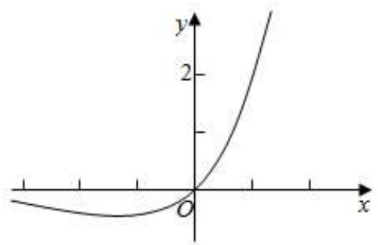

line

| x    | y    |
| ---- | ---- |
| 0    | 0    |
| 1    | 0.5  |
| 2    | 1    |
| 3    | 1.5  |
| 4    | 2    |
| 5    | 2.5  |

373 (2024·全国·高三专题练习)已知函数 $f(x) = (ax + \ln x)(x - \ln x) - x^2$ ，有三个不同的零点，(其中 $x_{1} < x_{2} < x_{3}$ )，则 $\left(1 - \frac{\ln x_1}{x_1}\right)^2\left(1 - \frac{\ln x_2}{x_2}\right)\left(1 - \frac{\ln x_3}{x_3}\right)$ 的值为

A. $a - 1$

B. 1 - a

C.-1

D. 1

【答案】D

【解析】令 $f(x)=0$ ，分离参数得 $a=\frac{x}{x-\ln x}-\frac{\ln x}{x}$ 令 $h(x)=\frac{x}{x-\ln x}-\frac{\ln x}{x}$ 由 $h'(x)=\frac{\ln x(1-\ln x)(2x-\ln x)}{x^{2}(x-\ln x)^{2}}=0$ 得x=1或x=e.

当 $x \in (0,1)$ 时， $h'(x) < 0$ ; 当 $x \in (1,\mathrm{e})$ 时， $h'(x) > 0$ ; 当 $x \in (\mathrm{e}, +\infty)$ 时， $h'(x) < 0$ . 即 $h(x)$ 在 $(0,1)$ ， $(\mathrm{e}, +\infty)$ 上为减函数，在 $(1,\mathrm{e})$ 上为增函数.

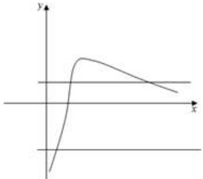

text_image

Graph showing a function with y-axis and x-axis, featuring a sharp initial rise followed by a gradual decline.

$\therefore 0 < x_{1} < 1 < x_{2} < \mathrm{e} < x_{3}, a = \frac{x}{x - \ln x} - \frac{\ln x}{x}$ 令 $\mu = \frac{\ln x}{x}$ 则 $a = \frac{1}{1 - \mu} - \mu$ 即 $\mu^2 + (a - 1)\mu + 1 - a = 0,$

$$
\mu_ {1} + \mu_ {2} = 1 - a <   0, \mu_ {1} \mu_ {2} = 1 - a <   0,
$$

对于 $\mu=\frac{\ln x}{x}$ ， $\mu'=\frac{1-\ln x}{x^{2}}$ 则当 0<x<e 时， $\mu'>0$ ；当 x>e 时， $\mu'<0$ 。而当 x>e 时， $\mu$ 恒大于 0。不妨设 $\mu_{1}<\mu_{2}$ ，则 $\mu_{1}=\frac{\ln x_{1}}{x_{1}}$ ， $\mu_{2}=\frac{\ln x_{2}}{x_{2}}$ ， $\mu_{3}=\frac{\ln x_{3}}{x_{3}}$ ，

$$
\begin{array}{l} \left(1 - \frac {\ln x _ {1}}{x _ {1}}\right) ^ {2} \left(1 - \frac {\ln x _ {2}}{x _ {2}}\right) \left(1 - \frac {\ln x _ {3}}{x _ {3}}\right) = (1 - \mu_ {1}) ^ {2} (1 - \mu_ {2}) (1 - \mu_ {3}) \\ = \left[ (1 - \mu_ {1}) (1 - \mu_ {2}) \right] ^ {2} = [ 1 - (1 - a) + (1 - a) ] ^ {2} = 1. \\ \end{array}
$$

故选D.

374 (2024·辽宁·校联考二模)已知函数 $f(x) = 9(\ln x)^2 + (a - 3)x\ln x + 3(3 - a)x^2$ 有三个不同的零点 $x_1, x_2, x_3$ ，且 $x_1 < 1 < x_2 < x_3$ ，则 $\left(3 - \frac{\ln x_1}{x_1}\right)^2\left(3 - \frac{\ln x_2}{x_2}\right)\left(3 - \frac{\ln x_3}{x_3}\right)$ 的值为（）

A. 81

B.-81

C.-9

D. 9

【答案】A

【解析】 $f(x)=9(\ln x)^{2}+(a-3)x\ln x+3(3-a)x^{2}=0$

$$
\therefore (a - 3) \left(x \ln x - 3 x ^ {2}\right) = - 9 (\ln x) ^ {2}
$$

$$
\therefore a - 3 = \frac {9 (\ln x) ^ {2}}{3 x ^ {2} - x \ln x} = \frac {9 \left(\frac {\ln x}{x}\right) ^ {2}}{3 - \frac {\ln x}{x}}
$$

令 $t = 3 - \frac{\ln x}{x}, t \in (0, +\infty)$ ，则 $\frac{\ln x}{x} = 3 - t$

$$
\therefore t ^ {\prime} = - \frac {1 - \ln x}{x ^ {2}} = \frac {\ln x - 1}{x ^ {2}}
$$

令 $t' = 0$ ，解得 $x = \mathrm{e}$

$\therefore t \in (0, e)$ 时， $t' < 0$ ， $t$ 单调递减； $t \in (e, +\infty)$ 时， $t' > 0$ ， $t$ 单调递增；

$$
\therefore t _ {\min} = 3 - \frac {1}{\mathrm{e}}, t \in \left[ 3 - \frac {1}{\mathrm{e}}, + \infty\right),
$$

$$
\therefore a - 3 = \frac {9 (3 - t) ^ {2}}{t} = \frac {9 t ^ {2} - 5 4 t + 8 1}{t}
$$

$$
\therefore 9 t ^ {2} - (5 1 + a) t + 8 1 = 0.
$$

设关于 $t$ 的一元二次方程有两实根 $t_1, t_2$ ,

$\therefore \Delta = (51 + a)^{2} - 4 \times 9 \times 81 > 0$ ，可得 $a > 3$ 或 $a < -105$ .

$\because a - 3 = \frac{9(3 - t)^2}{t} >0$ ，故 $a > 3$

$\therefore a < -105$ 舍去

$$
\therefore t _ {1} + t _ {2} = \frac {5 1 + a}{9} > \frac {5 1 + 3}{9} = 6, t _ {1} t _ {2} = 9.
$$

又 $\because t_{1} + t_{2} = t_{1} + \frac{9}{t_{1}}\geqslant 2\sqrt{9} = 6$ ，当且仅当 $t_1 = t_2 = 3$ 时等号成立，

由于 $t_1 + t_2 \neq 6, \therefore t_1 > 3, t_2 = \frac{9}{t_1} < 3$ （不妨设 $t_1 > t_2$ ).

$\because x_{1} < 1 < x_{2} < x_{3}$ , 可得 $3 - \frac{\ln x_{1}}{x_{1}} > 3, 3 - \frac{\ln x_{2}}{x_{2}} < 3, 3 - \frac{\ln x_{3}}{x_{3}} < 3.$

则可知 $3 - \frac{\ln x_1}{x_1} = t_1, 3 - \frac{\ln x_2}{x_2} = 3 - \frac{\ln x_3}{x_3} = t_2.$

$$
\therefore \left(3 - \frac {\ln x _ {1}}{x _ {1}}\right) ^ {2} \left(3 - \frac {\ln x _ {2}}{x _ {2}}\right) \left(3 - \frac {\ln x _ {3}}{x _ {3}}\right) = \left(t _ {1} t _ {2}\right) ^ {2} = 8 1.
$$

故选：A.

375 (2024·重庆南岸·高三重庆市第十一中学校校考阶段练习)设定义在R上的函数 $f(x)$ 满足 $f(x)=9x^{2}+(a-3)xe^{x}+3(3-a)e^{2x}$ 有三个不同的零点 $x_{1},x_{2},x_{3}$ ，且 $x_{1}<0<x_{2}<x_{3}$ ，则 $\left(3-\frac{x_{1}}{\mathrm{e}^{x_{1}}}\right)^{2}\left(3-\frac{x_{2}}{\mathrm{e}^{x_{2}}}\right)\left(3-\frac{x_{3}}{\mathrm{e}^{x_{3}}}\right)$ 的值是()

A. 81

B. -81

C. 9

D.-9

【答案】A

【解析】由 $f(x)=9x^{2}+(a-3)xe^{x}+3(3-a)e^{2x}$ 有三个不同的零点知： $9x^{2}+(a-3)xe^{x}+3(3-a)e^{2x}=0$ 有三个不同的实根，即 $a-3=\frac{9x^{2}}{3e^{2x}-xe^{x}}=\frac{9\left(\frac{x}{e^{x}}\right)^{2}}{3-\frac{x}{e^{x}}}$ 有三个不同实根，

若 $t = 3 - \frac{x}{\mathrm{e}^x}$ ，则 $a - 3 = \frac{9(3 - t)^2}{t}$ 整理得 $9t^{2} - (a + 51)t + 81 = 0$ ，若方程的两根为 $t_1,t_2$

$$
\therefore t _ {1} t _ {2} = 9 \text {, 而} t ^ {\prime} = \frac {x e ^ {x} - \mathrm{e} ^ {x}}{\mathrm{e} ^ {2 x}} = \frac {x - 1}{\mathrm{e} ^ {x}},
$$

∴当 x<1 时， $t^{\prime}<0$ 即 t 在 $(-∞,1)$ 上单调递减；当 x>1 时， $t^{\prime}>0$ 即 t 在 $(1,+∞)$ 上单

调递增;即当 x=1 时 t 有极小值为 $3-\frac{1}{e}$ ，又 $x_{1}<0<x_{2}<x_{3}$ ，x=0 有 t=3，即 $t_{1}>3>t_{2}>3-\frac{1}{e}$ .

∵方程最多只有两个不同根，

∴ $x_{1}<0<x_{2}<1<x_{3}$ ，即 $t_{1}=3-\frac{x_{1}}{e^{x_{1}}}$ ， $t_{2}=3-\frac{x_{2}}{e^{x_{2}}}=3-\frac{x_{3}}{e^{x_{3}}}$

$$
\therefore \left(3 - \frac {x _ {1}}{\mathrm{e} ^ {x _ {1}}}\right) ^ {2} \left(3 - \frac {x _ {2}}{\mathrm{e} ^ {x _ {2}}}\right) \left(3 - \frac {x _ {3}}{\mathrm{e} ^ {x _ {3}}}\right) = t _ {1} ^ {2} t _ {2} ^ {2} = 8 1.
$$

故选：A

【解题总结】

解决函数零点问题,常常利用数形结合、等价转化等数学思想.

# 10 题型十:等高线问题

376 (2024·全国·高三专题练习)设函数 $f(x) = \begin{cases} -x^2 - 2x, & x \leqslant 0 \\ |\ln x|, & x > 0 \end{cases}$

①若方程 $f(x)=a$ 有四个不同的实根 $x_{1},x_{2},x_{3},x_{4}$ ，则 $x_{1}\cdot x_{2}\cdot x_{3}\cdot x_{4}$ 的取值范围是(0,1)  
②若方程 $f(x)=a$ 有四个不同的实根 $x_{1},x_{2},x_{3},x_{4}$ ，则 $x_{1}+x_{2}+x_{3}+x_{4}$ 的取值范围是 $(0,+\infty)$   
③若方程 $f(x)=ax$ 有四个不同的实根，则 a 的取值范围是 $\left(0,\frac{1}{\mathrm{e}}\right)$   
④方程 $f^{2}(x)-\left(a+\frac{1}{a}\right)f(x)+1=0$ 的不同实根的个数只能是1,2,3,6

四个结论中,正确的结论个数为 ( )

A. 1

B. 2

C. 3

D. 4

【答案】B

【解析】对于①:作出 $f(x)$ 的图像如下:

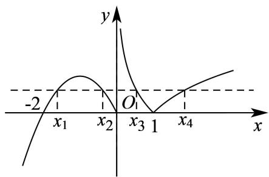

line

| x | y |
|---|---|
| -2 | |
| x₁ | |
| x₂ | |
| x₃ | |
| 1 | |
| x₄ | |

若方程 $f(x) = a$ 有四个不同的实根 $x_{1}, x_{2}, x_{3}, x_{4}$ ，则 $0 < a < 1$ ，不妨设 $x_{1} < x_{2} < x_{3} < x_{4}$ ，则 $x_{1}, x_{2}$ 是方程 $-x^{2} - 2x - a = 0$ 的两个不等的实数根， $x_{3}, x_{4}$ 是方程 $|\ln x| = a$ 的两个不等的实数根，

所以 $x_{1}x_{2}=a,-\ln x_{3}=\ln x_{4}$ ，所以 $\ln x_{4}+\ln x_{3}=0$ ，所以 $x_{3}x_{4}=1$ ，

所以 $x_{1}x_{2}x_{3}x_{4}=a\in(0,1)$ ，故①正确；

对于②:由上可知, $x_{1}+x_{2}=-2,-\ln x_{3}=\ln x_{4}=a$ ,且0<a<1,

所以 $x_{3}x_{4}=1$ ,

所以 $x_{3}\in\left(\frac{1}{e},1\right)$ , $x_{4}\in(1,e)$ ,

所以 $x_{3}+x_{4}=\frac{1}{x_{4}}+x_{4}\in\left(2,\mathrm{e}+\frac{1}{\mathrm{e}}\right)$ ,

所以 $x_{1} + x_{2} + x_{3} + x_{4} \in \left(0, e + \frac{1}{e} - 2\right)$ ，故②错误；

对于③:方程 $f(x)=ax$ 的实数根的个数,即为函数 $y=f(x)$ 与y=ax的交点个数,

因为 y=ax 恒过坐标原点, 当 a=0 时, 有 3 个交点, 当 a<0 时最多 2 个交点, 所以 a>0,

当 y=ax 与 $y=\ln x(x>1)$ 相切时, 设切点为 $(x_{0},\ln x_{0})$ ,

即 $y'=\frac{1}{x}$ ，所以 $y'\big|_{x=x_{0}}=\frac{1}{x_{0}}=\frac{\ln x_{0}}{x_{0}}$ ，解得 $x_{0}=e$ ，所以 $y'\big|_{x=x_{0}}=\frac{1}{e}$ ，所以 $a=\frac{1}{e}$ ，

所以当 y=ax 与 $y=\ln x(x>1)$ 相切时，即 $a=\frac{1}{e}$ 时，此时有 4 个交点，

若 $f(x)=ax$ 有 4 个实数根, 即有 4 个交点,

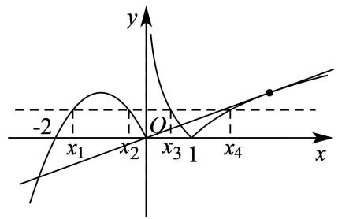

text_image

y
-2
x₁ x₂ O x₃ 1 x₄ x

当 $a > \frac{1}{e}$ 时由图可知只有 3 个交点, 当 $0 < a < \frac{1}{e}$ 时,

令 $g(x)=\ln x-ax, x\in(1,+\infty)$ ，则 $g'(x)=\frac{1}{x}-a=\frac{1-ax}{x}$ ，则当 $1<x<\frac{1}{a}$ 时 $g'(x)>0$ ，即 $g(x)$ 单调递增，当 $x>\frac{1}{a}$ 时 $g'(x)<0$ ，即 $g(x)$ 单调递减，

所以当 $x=\frac{1}{a}$ 时，函数取得极大值即最大值， $g(x)_{\max}=g\left(\frac{1}{a}\right)=-\ln a-1>0$

又 $g(1) = -a < 0$ 及对数函数与一次函数的增长趋势可知，当 $x$ 无限大时 $g(x) < 0$ ，即 $g(x)$ 在 $\left(1,\frac{1}{a}\right)$ 和 $\left(\frac{1}{a}, + \infty\right)$ 内各有一个零点，即 $f(x) = ax$ 有5个实数根，故③错误；

对于④: $f^{2}(x)-\left(a+\frac{1}{a}\right)f(x)+1=0,$

所以 $\left[f(x)-a\right]\left[f(x)-\frac{1}{a}\right]=0,$

所以 $f(x)=a$ 或 $f(x)=\frac{1}{a}$ ,

由图可知, 当 m > 1 时, $f(x) = m$ 的交点个数为 2,

当 m=1,0 时， $f(x)=m$ 的交点个数为 3，

当 0 < m < 1 时， $f(x) = m$ 的交点个数为 4，

当 m<0 时， $f(x)=m$ 的交点个数为 1，

所以若 a > 1 时，则 $\frac{1}{a} \in (0,1)$ ，交点的个数为 $2 + 4 = 6$ 个，

若 a=1 时，则 $\frac{1}{a}=1$ ，交点的个数为 3 个，

若 0 < a < 1，则 $\frac{1}{a} > 1$ ，交点有 $4 + 2 = 6$ 个，

若 a<0 且 $a\neq-1$ 时，则 $\frac{1}{a}<0$ 且 $a\neq\frac{1}{a}$ ，交点有 $1+1=2$ 个，

若 $a = -1 = \frac{1}{a}$ ，交点有 1 个，

综上所述,交点可能有1,2,3,6个,即方程不同实数根1,2,3,6,故④正确;

故选: B.

377 (2024·全国·高三专题练习)已知函数 $f(x) = \begin{cases} (x + 1)^2, & x \leqslant 0 \\ |\log_2 x|, & x > 0 \end{cases}$ ，若方程 $f(x) = a$ 有四个不同的解 $x_1, x_2, x_3, x_4$ ，且 $x_1 < x_2 < x_3 < x_4$ ，则 $x_3 \cdot (x_1 + x_2) + \frac{1}{x_3^2 \cdot x_4}$ 的取值范围是（）

A. $(-1,1]$

B. $[-1,1]$

C. $[-1,1)$

D. $(-1,1)$

【答案】A

【解析】 $\log_{2}x=-1\Rightarrow x=\frac{1}{2}.$

先作 $f(x)$ 图象,由图象可得 $x_{1}+x_{2}=-2,x_{3}x_{4}=1,x_{3}\in\left[\frac{1}{2},1\right)$ .

因此 $x_{3} \cdot (x_{1} + x_{2}) + \frac{1}{x_{3}^{2} \cdot x_{4}} = -2x_{3} + \frac{1}{x_{3}}$ 为 $\left[\frac{1}{2}, 1\right)$ 单调递减函数，

$$
- 2 \times \frac {1}{2} + \frac {1}{\frac {1}{2}} = 1, - 2 \times 1 + \frac {1}{1} = - 1,
$$

从而 $x_{3} \cdot (x_{1} + x_{2}) + \frac{1}{x_{3}^{2} \cdot x_{4}} \in (-1, 1]$ .

故选：A

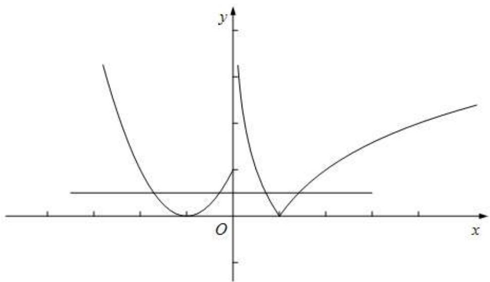

line

| x    | y      |
| ---- | ------ |
| -∞   | ∞      |
| 0    | 0      |
| ∞    | ∞      |

378 (2024·四川泸州·高一四川省泸县第四中学校考阶段练习)已知函数 $f(x)=$

$\left\{ \begin{array}{l} \left| \log_{3} x \right|, \quad 0 < x \leqslant 3 \\ \frac{1}{3} x^{2} - \frac{10}{3} x + 8, \quad x > 3 \end{array} \right.$ ，若方程 $f(x) = m$ 有四个不同的实根 $x_{1}, x_{2}, x_{3}, x_{4}$ ，满足 $x_{1} < x_{2} < x_{3} < x_{4}$ ，则 $\frac{(x_{3} - 3)(x_{4} - 3)}{x_{1}x_{2}}$ 的取值范围是 （）

A. $(0,3)$

B. $(0,4]$

C. $(3,4]$

D. $(1,3)$

【答案】A

【解析】作出函数 $f(x)=\left\{\begin{aligned}&|\log_{3}x|,&0<x\leqslant3\\&\frac{1}{3}x^{2}-\frac{10}{3}x+8,&x>3\end{aligned}\right.$ 的图象,如图所示:

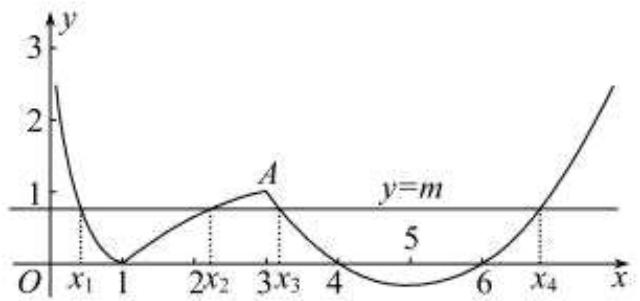

line

| x    | y   |
| ---- | --- |
| 1    | 0   |
| 2x₂  | 0   |
| 3x₃  | 1   |
| 4    | 0   |
| 6    | 0   |
| x₄   | 1   |

方程 $f(x)=m$ 有四个不同的实根 $x_{1}, x_{2}, x_{3}, x_{4}$ ，满足 $x_{1}<x_{2}<x_{3}<x_{4}$

则 $0 < m < 1, x_{3} \in (3,4)$

$\left|\log_{3}x\right|=m$ 即： $\log_{3}x_{2}=m,\log_{3}x_{1}=-m$ ，所以 $\log_{3}x_{2}+\log_{3}x_{1}=0$ ，

$\log_{3}x_{2}x_{1}=0$ , 所以 $x_{2}x_{1}=1$ , 根据二次函数的对称性可得: $x_{3}+x_{4}=10$ ,

$$
\frac {(x _ {3} - 3) (x _ {4} - 3)}{x _ {1} x _ {2}} = \frac {x _ {3} x _ {4} - 3 (x _ {3} + x _ {4}) + 9}{x _ {1} x _ {2}} = x _ {3} (1 0 - x _ {3}) - 2 1 = - x _ {3} ^ {2} + 1 0 x _ {3} - 2 1, x _ {3} \in (3, 4)
$$

考虑函数 $y=-x^{2}+10x-21, x \in (3,4)$ 单调递增，

$$
x = 3, y = 0, x = 4, y = 3
$$

所以 $x_{3} \in (3,4)$ 时 $-x_{3}^{2} + 10x_{3} - 21$ 的取值范围为 $(0,3)$ .

故选：A

379 (2024·全国·高三专题练习)已知函数 $f(x)=\left\{\begin{aligned}\left|\left(\frac{1}{2}\right)^{x}-1\right|,&\circ x\leqslant1\\-\frac{1}{2}x+1,&\circ x>1\end{aligned}\right.$ ，若互不相等的实数 $x_{1}$ ， $x_{2}, x_{3}$ 满足 $f(x_{1})=f(x_{2})=f(x_{3})$ ，则 $\left(\frac{1}{2}\right)^{x_{1}}+\left(\frac{1}{2}\right)^{x_{2}}+\left(\frac{1}{2}\right)^{x_{3}}$ 的取值范围是（）

A. $\left(\frac{9}{4},\frac{5}{2}\right)$

B. $(1,4)$

C. $(\sqrt{2},4)$

D. $(4,6)$

【答案】A

【解析】画出分段函数 $f(x)=\left\{\begin{aligned}\left|\left(\frac{1}{2}\right)^{x}-1\right|,&\circ x\leqslant1\\-\frac{1}{2}x+1,&\circ x>1\end{aligned}\right.$ 的图像如图：

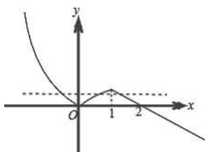

text_image

y
O
1
2
x

令互不相等的实数 $x_{1}, x_{2}, x_{3}$ 满足 $f(x_{1}) = f(x_{2}) = f(x_{3}) = t, t \in \left(0, \frac{1}{2}\right)$ ,

则 $x_{1}\in \left(\log_{2}\frac{2}{3},0\right),x_{2}\in (0,1),x_{3}\in (1,2),$

则 $\left(\frac{1}{2}\right)^{x_1} + \left(\frac{1}{2}\right)^{x_2} + \left(\frac{1}{2}\right)^{x_3} = 1 + t + 1 - t + 2^2 t^{-2} = 2 + 2^2 t^{-2},$

又 $t\in \left(0,\frac{1}{2}\right),$

$$
\therefore \left(\frac {1}{2}\right) ^ {x _ {1}} + \left(\frac {1}{2}\right) ^ {x _ {2}} + \left(\frac {1}{2}\right) ^ {x _ {3}} \in \left(\frac {9}{4}, \frac {5}{2}\right).
$$

故选：A.

# 【解题总结】

数形结合数学思想方法

# 题型十一:二分法

380 (2024·辽宁大连·统考一模)牛顿迭代法是我们求方程近似解的重要方法。对于非线性可导函数 $f(x)$ 在 $x_0$ 附近一点的函数值可用 $f(x) \approx f(x_0) + f'(x_0)(x - x_0)$ 代替，该函数零点更逼近方程的解，以此法连续迭代，可快速求得合适精度的方程近似解。利用这个方法，解方程 $x^3 - 3x + 1 = 0$ ，选取初始值 $x_0 = \frac{1}{2}$ ，在下面四个选项中最佳近似解为（）

A. 0.333

B. 0.335

C. 0.345

D. 0.347

【答案】D

【解析】令 $f(x)=x^{3}-3x+1$ ，则 $f'(x)=3x^{2}-3$ ，

令 $f(x)=0$ ，即 $f(x_{0})+f'(x_{0})(x-x_{0})\approx0$ ，可得 $x\approx x_{0}-\frac{f(x_{0})}{f'(x_{0})}$

迭代关系为 $x_{k+1}=x_{k}-\frac{f(x_{k})}{f'(x_{k})}=x_{k}-\frac{x_{k}^{3}-3x_{k}+1}{3x_{k}^{2}-3}=\frac{2x_{k}^{3}-1}{3x_{k}^{2}-3}(k\in\mathbb{N})$ ,

取 $x_0 = \frac{1}{2}$ , 则 $x_1 = \frac{2x_0^3 - 1}{3x_0^2 - 3} = \frac{2 \times \frac{1}{8} - 1}{3 \times \frac{1}{4} - 3} = \frac{1}{3}$ , $x_2 = \frac{2x_1^3 - 1}{3x_1^2 - 3} = \frac{2 \times \frac{1}{27} - 1}{3 \times \frac{1}{9} - 3} = \frac{25}{72} \approx 0.34722$ ,

故选：D.

381 (2024·全国·高三专题练习)函数 $f(x)$ 的一个正数零点附近的函数值用二分法逐次计算，参考数据如下：

$$
f (1) = - 2
$$

$$
f (1. 5) = 0. 6 2 5
$$

$$
f (1. 2 5) = - 0. 9 8 4
$$

$$
f (1. 3 7 5) = - 0. 2 6 0
$$

$$
f (1. 4 3 8) = 0. 1 6 5
$$

$$
f (1. 4 0 6 5) = - 0. 0 5 2
$$

那么方程的一个近似解(精确度为0.1)为 （）

A. 1.5

B. 1.25

C. 1.41

D. 1.44

【答案】C

【解析】由所给数据可知,函数 $f(x)$ 在区间 $(1,1.5)$ 内有一个根,

因为 $f(1.5)=0.625>0$ , $f(1.25)=-0.984<0$ ,

所以根在 $(1.25,1.5)$ 内，

因为 $\left|1.5-1.25\right|=0.25>0.1$ ，所以不满足精确度，

继续取区间中点1.375，

因为 $f(1.375) = -0.260 < 0, f(1.5) = 0.625 > 0,$

所以根在区间 $(1.375,1.5)$ ,

因为 $|1.5 - 1.375| = 0.125 > 0.1$ ，所以不满足精确度，

继续取区间中点1.438，

因为 $f(1.438)=0.165>0$ , $f(1.375)=-0.260<0$ ,

所以根在区间 $(1.375,1.438)$ 内，

因为 $\left|1.438-1.375\right|=0.063<0.1$ 满足精确度，

因为 $f(1.4065) = -0.052 < 0$ ，所以根在 $(1.4065, 1.438)$ 内，

所以方程的一个近似解为 1.41,

故选：C

382 (2024·全国·高三专题练习)利用二分法求方程 $\log_{3}x = 3 - x$ 的近似解, 可以取的一个区间是 ()

A. $(0,1)$

B. $(1,2)$

C. $(2,3)$

D. $(3,4)$

【答案】C

【解析】设 $f(x)=\log_{3}x-3+x$ ,

∵当连续函数 $f(x)$ 满足 $f(a)\cdot f(b)<0$ 时， $f(x)$ 在区间 $(a,b)$ 上有零点，

即方程 $\log_{3}x=3-x$ 在区间 $(a,b)$ 上有解，

又 $\because f(2) = \log_3 2 - 1 < 0, f(3) = \log_3 3 - 3 + 3 = 1 > 0,$

故 $f(2)\cdot f(3)<0,$

故方程 $\log_{3}x=3-x$ 在区间 $(2,3)$ 上有解，

即利用二分法求方程 $\log_{3}x = 3 - x$ 的近似解, 可以取的一个区间是 (2,3).

故选：C.

383 (2024·全国·高三专题练习)用二分法求函数 $f(x)=\lg x+x-2$ 的一个零点,根据参考数据,可得函数 $f(x)$ 的一个零点的近似解(精确到0.1)为()（参考数据: $\lg1.5\approx0.176$ , $\lg1.625\approx0.211$ , $\lg1.75\approx0.243$ , $\lg1.875\approx0.273$ , $\lg1.9375\approx0.287$ )

A. 1.6

B. 1.7

C. 1.8

D. 1.9

【答案】C

【解析】根据函数特点及所给数据计算相关函数值,再结合零点存在定理即可获得解答.由题意可知:

$$
f (1. 7 5) = \lg 1. 7 5 + 1. 7 5 - 2 \approx 0. 2 4 3 + 1. 7 5 - 2 = - 0. 0 0 7 <   0,
$$

$$
f (1. 8 7 5) = \lg 1. 8 7 5 + 1. 8 7 5 - 2 \approx 0. 2 7 3 + 1. 8 7 5 - 2 = - 0. 1 4 8 > 0,
$$

又因为函数在 $(0,+\infty)$ 上连续,所以函数在区间 $(1.75,1.875)$ 上有零点,

约为 $\frac{1.75 + 1.875}{2} \approx 1.8$

故选：C.

384 (2024·全国·高三专题练习)用二分法求函数 $f(x)=\ln(x+1)+x-1$ 在区间 [0,1] 上的零点, 要求精确度为 0.01 时, 所需二分区间的次数最少为 ()

A. 6

B. 7

C. 8

D. 9

【答案】B

【解析】根据题意,原来区间 $[0,1]$ 的长度等于 1,每经过二分法的一次操作,区间长度变为原来的一半,

则经过 n 次操作后, 区间的长度为 $\frac{1}{2^{n}}$ , 若 $\frac{1}{2^{n}} < 0.01$ , 即 $n \geqslant 7$ .

故选: B.

【解题总结】

所在的区间一分为二,使区间的两个端点逐步逼近零点,进而得到零点的近似值的方法叫做二分法.求方程 $f(x)=0$ 的近似解就是求函数 $f(x)$ 零点的近似值.

