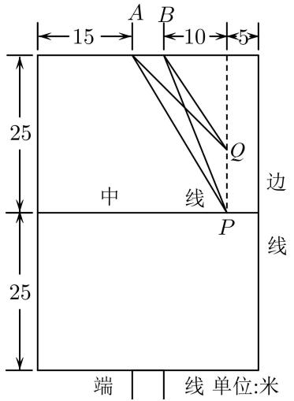
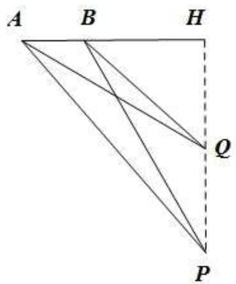
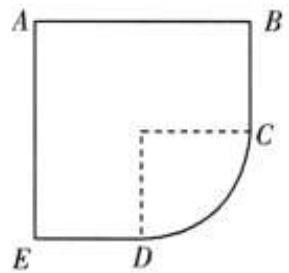
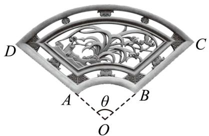
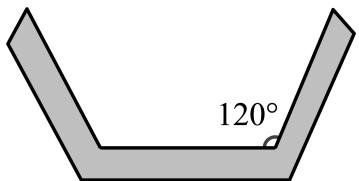
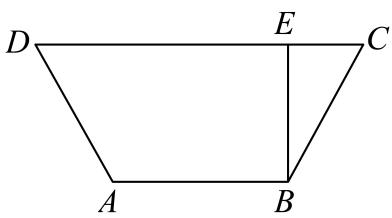

# 第13讲 函数模型及其应用

# 知识梳理

# 1、几种常见的函数模型：

<table><tr><td>函数模型</td><td>函数解析式</td></tr><tr><td>一次函数模型</td><td> $f(x) = ax + b (a, b \text{为常数且} a \neq 0)$ </td></tr><tr><td>反比例函数模型</td><td> $f(x) = \frac{k}{x} + b (k, b \text{为常数且} a \neq 0)$ </td></tr><tr><td>二次函数模型</td><td> $f(x) = ax^{2} + bx + c (a, b, c \text{为常数且} a \neq 0)$ </td></tr><tr><td>指数函数模型</td><td> $f(x) = ba^{x} + c (a, b, c \text{为常数,} b \neq 0, a > 0, a \neq 1)$ </td></tr><tr><td>对数函数模型</td><td> $f(x) = b \log_{a} x + c (a, b, c \text{为常数,} b \neq 0, a > 0, a \neq 1)$ </td></tr><tr><td>幂函数模型</td><td> $f(x) = ax^{n} + b (a, b \text{为常数,} a \neq 0)$ </td></tr></table>

# 2、解函数应用问题的步骤：

(1) 审题: 弄清题意, 识别条件与结论, 弄清数量关系, 初步选择数学模型;   
(2) 建模: 将自然语言转化为数学语言, 将文字语言转化为符号语言, 利用已有知识建立相应的数学模型;  
(3) 解模: 求解数学模型, 得出结论;  
(4) 还原: 将数学问题还原为实际问题.

# 必考题型全归纳

# 题型一:二次函数模型,分段函数模型

(2024·全国·高三专题练习)汽车在行驶中,由于惯性,刹车后还要继续向前滑行一段距离才能停止,一般称这段距离为“刹车距离”.刹车距离是分析交通事故的一个重要依据.在一个限速为40km/h的弯道上,甲、乙两辆汽车相向而行,发现情况不对,同时刹车,但还是相碰了.事后现场勘查,测得甲车的刹车距离略超过6m,乙车的刹车距离略超过10m.已知甲车的刹车距离sm与车速vkm/h之间的关系为 $S_{甲}=\frac{1}{100}v^{2}-\frac{1}{10}v$ ,乙车的刹车距离sm与车速vkm/h之间的关系为 $s_{乙}=\frac{1}{200}v^{2}-\frac{1}{20}v$ .请判断甲、乙两车哪辆车有超速现象()

A. 甲、乙两车均超速

B. 甲车超速但乙车未超速

C. 乙车超速但甲车未超速

D. 甲、乙两车均未超速

【答案】C

【解析】对于甲车,令 $\frac{1}{100}v^{2}-\frac{1}{10}v\approx6$ , 即 $v^{2}-10v-600\approx0$

解得 $v \approx -20 \, km/h$ (舍) 或 $v \approx 30 \, km/h$ ，所以甲未超速；

对于甲车,令 $\frac{1}{200}v^{2}-\frac{1}{20}v\approx10$ ,即 $v^{2}-10v-2000\approx0$

解得 $v \approx -40 \, km/h$ (舍) 或 $v \approx 50 \, km/h$ ，所以乙超速；

故选:C.

386

(2024·全国·高三专题练习)如图为某小区七人足球场的平面示意图, AB 为球门, 在某次小区居民友谊比赛中,队员甲在中线上距离边线5米的P点处接球,此时 $\tan\angle APB=\frac{5}{31}$ ,假设甲沿着平行边线的方向向前带球,并准备在点Q处射门,为获得最佳的射门角度(即 $\angle AQB$ 最大),则射门时甲离上方端线的距离为()

text_image

15
A B
10 5
25
中 线 Q
P
边
线
25
端 线 单位:米

A. $5 \sqrt{5}$

B. $5\sqrt{6}$

C. $10 \sqrt{2}$

D. $10 \sqrt{3}$

【答案】B

【解析】设 AB = x，并根据题意作如下示意图，由图和题意得：PH = 25, BH = 10,

所以 $\tan\angle BPH=\frac{BH}{HP}=\frac{10}{25}=\frac{2}{5}$ ，且 $\tan\angle APB=\frac{5}{31}$ ，

所以 $\tan\angle APH = \tan(\angle APB + \angle BPH) = \frac{\frac{5}{31} + \frac{2}{5}}{1 - \frac{5}{31} \times \frac{2}{5}} = \frac{3}{5}$ ,

又 $\tan\angle APH=\frac{AH}{PH}=\frac{AB+BH}{PH}=\frac{x+10}{25}$ ，所以 $\frac{x+10}{25}=\frac{3}{5}$ ，解得 x=5，即 AB=5，

设 $\mathrm{QH} = h, h \in [0,25]$ ，则 $\mathrm{AQ} = \sqrt{\mathrm{QH}^2 + \mathrm{AH}^2} = \sqrt{h^2 + 15^2}$ ，

$\mathrm{BQ} = \sqrt{\mathrm{QH}^2 + \mathrm{BH}^2} = \sqrt{h^2 + 10^2}$ , 所以在 $\triangle \mathrm{AQB}$ 中,

有 $\cos\angle AQB=\frac{AQ^{2}+BQ^{2}-AB^{2}}{2AQ\times BQ}=\frac{h^{2}+150}{\sqrt{h^{4}+325h^{2}+22500}}$

令 $m = h^{2} + 150 (150 \leqslant m \leqslant 775)$ ，所以 $h^{2} = m - 150$ ，

所以 $\cos\angle AQB=\frac{m}{\sqrt{(m-150)^{2}+325(m-150)+22500}}=\frac{1}{\sqrt{-\frac{3750}{m^{2}}+\frac{25}{m}+1}}$

因为 $150 \leqslant m \leqslant 775$ ，所以 $\frac{1}{775} \leqslant \frac{1}{m} \leqslant \frac{1}{150}$ ，则要使 $\angle AQB$ 最大，

即 $\cos \angle AQB = \frac{1}{\sqrt{-\frac{3750}{m^2} + \frac{25}{m} + 1}}$ 要取得最小值，即 $\sqrt{-\frac{3750}{m^2} + \frac{25}{m} + 1}$ 取得最大值，

即 $-\frac{3750}{m^{2}}+\frac{25}{m}+1$ 在 $\frac{1}{775}\leqslant\frac{1}{m}\leqslant\frac{1}{150}$ 取得最大值，

令 $t = \frac{1}{m}\in \left[\frac{1}{775},\frac{1}{150}\right],f(t) = -3750t^2 +25t + 1,$

所以 $f(t)$ 的对称轴为: $t=\frac{1}{300}$ ，所以 $f(t)$ 在 $\left[\frac{1}{775},\frac{1}{300}\right]$ 单调递增，在 $\left[\frac{1}{300},\frac{1}{150}\right]$ 单调递减，

所以当 $t=\frac{1}{300}$ 时, $f(t)$ 取得最大值, 即 $\angle AQB$ 最大, 此时 $\frac{1}{m}=\frac{1}{300}$ , 即 m=300,

所以 $h^{2}=150$ ，所以 $h=5\sqrt{6}$ ，即为获得最佳的射门角度（即 $\angle AQB$ 最大），

则射门时甲离上方端线的距离为: $5\sqrt{6}$ .

故选：B.

text_image

A B H
Q
P

387 (2024·云南·统考二模)下表是某批发市场的一种益智玩具的销售价格：

<table><tr><td>一次购买件数</td><td>5-10件</td><td>11-50件</td><td>51-100件</td><td>101-300件</td><td>300件以上</td></tr><tr><td>每件价格</td><td>37元</td><td>32元</td><td>30元</td><td>27元</td><td>25元</td></tr></table>

张师傅准备用 2900 元到该批发市场购买这种玩具, 赠送给一所幼儿园, 张师傅最多可买这种玩具
()

A. 116 件

B. 110件

C. 107 件

D. 106 件

【答案】C

【解析】设购买的件数为 x，花费为 y 元，

则 $y=\left\{\begin{aligned}&37x,1\leqslant x\leqslant10\\ &32x,11\leqslant x\leqslant50\\ &30x,51\leqslant x\leqslant100\\ &27x,101\leqslant x\leqslant300\\ &25x,x>300\end{aligned}\right.$ ，当 x=107 时，y=2889<2990，

当 x=108 时，y=2916>2900，所以最多可购买这种产品 107 件，

故选：C.

388 (2024·全国·高三专题练习)某科技企业为抓住“一带一路”带来的发展机遇,开发生产一智能产品,该产品每年的固定成本是25万元,每生产x万件该产品,需另投入成本 $\omega(x)$

万元. 其中 $\omega(x)=\left\{\begin{aligned}x^{2}+10x,&\quad0<x\leqslant40\\ 71x+\frac{10000}{x}-945,&x>40\end{aligned}\right.$ ，若该公司一年内生产该产品全部售完，每件的售价为70元，则该企业每年利润的最大值为（）

A. 720 万元

B. 800 万元

C. 875 万元

D. 900 万元

【答案】C

【解析】该企业每年利润为 $f(x)=\left\{\begin{aligned}&70x-(x^{2}+10x+25),&0<x\leqslant40\\ &70x-\left(71x+\frac{10000}{x}-945+25\right),&x>40\end{aligned}\right.$

当 $0 < x \leqslant 40$ 时， $f(x) = -x^{2} + 60x - 25 = -(x - 30)^{2} + 875$

在 x=30 时， $f(x)$ 取得最大值 875；

当 $x > 40$ 时， $f(x) = 920 - \left(x + \frac{10000}{x}\right) \leqslant 920 - 2\sqrt{x \cdot \frac{10000}{x}} = 720$

(当且仅当 x=100 时等号成立), 即在 x=100 时, $f(x)$ 取得最大值 720;

由 875 > 720, 可得该企业每年利润的最大值为 875.

故选：C

# 【解题方法总结】

1、分段函数主要是每一段自变量变化所遵循的规律不同,可以先将其当做几个问题,将各段的变化规律分别找出来,再将其合到一起,要注意各段自变量的范围,特别是端点值.
2、构造分段函数时,要准确、简洁,不重不漏.

# 题型二: 对勾函数模型

389 (2024·全国·高三专题练习)某企业投入100万元购入一套设备,该设备每年的运转费用是0.5万元,此外每年都要花费一定的维护费,第一年的维护费为2万元,由于设备老化,以后每年的维护费都比上一年增加2万元.为使该设备年平均费用最低,该企业需要更新设备的年数为()

A. 8

B. 10

C. 12

D. 13

【答案】B

【解析】设该企业需要更新设备的年数为 $x(x \in \mathbb{N}^{*})$ ，设备年平均费用为 y 万元，

则 x 年后的设备维护费用为 $2 + 4 + 6 + \cdots + 2x = \frac{x(2 + 2x)}{2} = x(x + 1)$ ,

所以 x 年的平均费用为 $y=\frac{100+0.5x+x(x+1)}{x}=x+\frac{100}{x}+\frac{3}{2}\geqslant2\sqrt{x\cdot\frac{100}{x}}+\frac{3}{2}=\frac{43}{2}$ (万元),

当且仅当 x=10 时, 等号成立,

因此,为使该设备年平均费用最低,该企业需要更新设备的年数为10.

故选：B.

390 (2024·全国·高三专题练习)网店和实体店各有利弊,两者的结合将在未来一段时期内,成为商业的一个主要发展方向.某品牌行车记录仪支架销售公司从2018年1月起开展网络销售与实体店体验安装结合的销售模式.根据几个月运营发现,产品的月销量x万件与投入实体店体验安装的费用t万元之间满足函数关系式 $x=3-\frac{2}{t+1}$ .已知网店每月固定的各种费用支出为3万元,产品每1万件进货价格为32万元,若每件产品的售价定为“进货价的150%”与“平均每件产品的实体店体验安装费用的一半”之和,则该公司最大月利润是\_\_\_\_万元.

【答案】37.5

【解析】根据题意,得到 $t=\frac{2}{3-x}-1,(1<x<3)$ , 进而得到月利润的表示, 结合基本不等式, 即可求解. 由题意, 产品的月销量 x 万件与投入实体店体验安装的费用 t 万元之间满

足 $x = 3 - \frac{2}{t + 1}$

即 $t=\frac{2}{3-x}-1,(1<x<3)$ ,

所以月利润为 $y=\left(32\times1.5+\frac{t}{2x}\right)x-32x-3-t=16x-\frac{t}{2}-3=16x-\frac{1}{3-x}-\frac{5}{2}$

$$
= 4 5. 5 - \left[ 1 6 (3 - x) + \frac {1}{3 - x} \right] \leqslant 4 5. 5 - 2 \sqrt {1 6} = 3 7. 5,
$$

当且仅当 $16(3-x)=\frac{1}{3-x}$ 时，即 $x=\frac{11}{4}$ 时取等号，

即月最低利润为 37.5 万元.

故答案为: 37.5.

391 (2024·全国·高三专题练习)迷你KTV是一类新型的娱乐设施,外形通常是由玻璃墙分隔成的类似电话亭的小房间,近几年投放在各大城市商场中,受到年轻人的欢迎.如图是某间迷你KTV的横截面示意图,其中 $AB=AE=\frac{3}{2}$ , $\angle A=\angle B=\angle E=90^{\circ}$ ,曲线段CD是圆心角为 $90^{\circ}$ 的圆弧,设该迷你KTV横截面的面积为S,周长为L,则 $\frac{S}{L}$ 的最大值为\_\_\_\_.(本题中取 $\pi=3$ 进行计算)

text_image

A
B
C
E
D

【答案】 $12 - 3\sqrt{15}$

【解析】设圆弧的半径为 $x\left(0<x\leqslant\frac{3}{2}\right)$ ，根据题意可得： $BC=DE=AB-x=\frac{3}{2}-x$ $S=AE\cdot DE+(AB-DE)\cdot(AE-x)+\frac{1}{4}\pi\cdot x^{2}=\frac{3}{2}\times\left(\frac{3}{2}-x\right)+\left(\frac{3}{2}-x\right)\cdot x=\frac{9}{4}-x^{2}+\frac{\pi x^{2}}{4}$

$$
\mathrm{L} = 2 \mathrm{AB} + \mathrm{BC} + \mathrm{DE} + \frac {2 \pi x}{4} = 6 - 2 x + \frac {\pi x}{2}
$$

$$
\because \pi = 3 \therefore S = \frac {9 - x ^ {2}}{4}, L = 6 - \frac {1}{2} x
$$

$$
\therefore \frac {\mathrm{S}}{\mathrm{L}} = \frac {9 - x ^ {2}}{2 4 - 2 x}
$$

令 $t=24-2x(21\leqslant t<24)$ ，则 $x=\frac{24-t}{2}$ ，∴ $\frac{S}{L}=\frac{9-\left(\frac{24-t}{2}\right)^{2}}{t}=-\left(\frac{t}{4}+\frac{135}{t}\right)+12$ 根据基本不等式， $\frac{t}{4}+\frac{135}{t}\geqslant2\sqrt{\frac{135}{4}}=3\sqrt{15}$ ，当却仅当 $\frac{t}{4}=\frac{135}{t}$ ，即 $t=6\sqrt{15}$ 时取“=”.

$6\sqrt{15}\in[21,24)$ ，∴ $t=6\sqrt{15}$ 时， $\left(\frac{S}{L}\right)_{\max}=12-3\sqrt{15}$

故答案为: $12-3\sqrt{15}$ .

392 (2024·全国·高三专题练习)砖雕是江南古建筑雕刻中很重要的一种艺术形式,传统砖雕精致细腻、气韵生动、极富书卷气. 如图是一扇环形砖雕,可视为扇形 OCD 截去同心扇形OAB所得部分．已知扇环周长 $= 300\mathrm{cm}$ ，大扇形半径 $\mathrm{OD} = 100\mathrm{cm}$ ，设小扇形半径 $\mathrm{OA} = xcm$ ， $\angle \mathrm{AOB} = \theta$ 弧度，则

①θ关于x的函数关系式 $\theta(x)=$ \_\_\_\_.  
②若雕刻费用关于 x 的解析式为 $w(x)=10x+1700$ ，则砖雕面积与雕刻费用之比的最大值为 \_\_\_\_.

text_image

D
C
A
θ
B
O

【答案】 $\frac{100 + 2x}{100 + x}, x \in (0,100)$ ; 3

【解析】由题意可知， $\angle AOB = \theta$ ，OA = x，OD = 100，

所以 $\widehat{AB} = \theta \cdot x, AD = BC = 100 - x, \widehat{DC} = 100\theta,$

扇环周长 $\widehat{AB} + AD + BC + \widehat{DC} = \theta \cdot x + 200 - 2x + 100\theta = 300$ ,

解得 $\theta=\frac{100+2x}{100+x},x\in(0,100)$ ,

砖雕面积即为图中环形面积,记为 S,

则 $\mathrm{S} = \mathrm{S}_{\text{扇形DOC}} - \mathrm{S}_{\text{扇形AOB}} = \frac{1}{2} \cdot \mathrm{OD} \cdot \widehat{\mathrm{DC}} - \frac{1}{2} \cdot \mathrm{OA} \cdot \widehat{\mathrm{AB}}$

$$
= \frac {1}{2} \times 1 0 0 \times 1 0 0 \theta - \frac {1}{2} \cdot x \cdot \theta x = 5 0 0 0 \theta - \frac {\theta}{2} x ^ {2} = \left(5 0 0 0 - \frac {x ^ {2}}{2}\right) \cdot \frac {1 0 0 + 2 x}{1 0 0 + x},
$$

即雕刻面积与雕刻费用之比为 m，

则 $m=\frac{S}{w(x)}=\frac{(10000-x^{2})(100+2x)}{2(100+x)(10x+1700)}=\frac{(100-x)(50+x)}{10(x+170)}$ ,

令 $t = x + 170$ ，则 $x = t - 170$

$$
\therefore m = \frac {(2 7 0 - t) (t - 1 2 0)}{1 0 t} = \frac {- t ^ {2} + 3 9 0 t - 1 2 0 \times 2 7 0}{1 0 t} = - \frac {t}{1 0} - \frac {1 2 \times 2 7 0}{t} + 3 9
$$

$\leqslant-2\sqrt{\frac{t}{10}\cdot\frac{12\times270}{t}}+39=-36+39=3$ ，当且仅当 t=180 时（即 x=10）取等号，

所以砖雕面积与雕刻费用之比的最大值为 3.

故答案为： $\frac{100+2x}{100+x}, x\in(0,100)$ ; 3

# 【解题方法总结】

1、解决此类问题一定要注意函数定义域；  
2、利用模型 $f(x)=ax+\frac{b}{x}$ 求解最值时, 注意取得最值时等号成立的条件.

# 题型三:指数型函数、对数型函数、幂函数模型

393 (2024·全国·高三专题练习) 2020年底, 国务院扶贫办确定的贫困县全部脱贫摘帽, 脱贫攻坚取得重大胜利! 为进一步巩固脱贫攻坚成果, 持续实施乡村振兴战略, 某企业响应政府号召, 积极参与帮扶活动. 该企业2021年初有资金150万元, 资金的年平均增长率固定, 每三年政府将补贴10万元. 若要实现2024年初的资金达到270万元的目标, 资金的年平均增长率应为(参考值: $\sqrt[3]{1.82} \approx 1.22$ , $\sqrt[3]{1.73} \approx 1.2$ ) ()

A. 10%

B. 20%

C. 22%

D. 32%

【答案】B

【解析】由题意,设年平均增长率为 x, 则 $150(1+x)^{3}+10=270$ ,

所以 $x=\sqrt[3]{\frac{26}{15}}-1\approx1.2-1=0.2$ ，故年平均增长率为 20%.

故选：B

394 (2024·云南·高三云南师大附中校考阶段练习)近年来,天然气表观消费量从2006年的不到 $600\times10^{8}m^{3}$ 激增到2021年的 $3726\times10^{8}m^{3}$ .从2000年开始统计,记k表示从2000年开始的第几年, $0\leqslant k,k\in N$ .经计算机拟合后发现,天然气表观消费量随时间的变化情况符合 $V_{k}=V_{0}(1+r_{a})^{k}$ ,其中 $V_{k}$ 是从2000年后第k年天然气消费量, $V_{0}$ 是2000年的天然气消费量, $r_{a}$ 是过去20年的年复合增长率.已知2009年的天然气消费量为 $900\times10^{8}m^{3}$ ,2018年的天然气消费量为 $2880\times10^{8}m^{3}$ ,根据拟合的模型,可以预测2024年的天然气消费量约为()

(参考数据: $2.88^{\frac{2}{3}}\approx2.02,3.2^{\frac{2}{3}}\approx2.17,4^{\frac{2}{3}}\approx2.52$

A. $5817.6 \times 10^{8} m^{3}$

B. $6249.6 \times 10^{8} m^{3}$

C. $6928.2 \times 10^{8} m^{3}$

D. $7257.6 \times 10^{8} m^{3}$

【答案】B

【解析】据题意 $\mathrm{V}_{9}=\mathrm{V}_{0}(1+r_{a})^{9}=900\times10^{8}m^{3},\mathrm{V}_{18}=\mathrm{V}_{0}(1+r_{a})^{18}=2880\times10^{8}m^{3}$ ，两式相除可得 $(1+r_{a})^{9}=3.2$ ，

又因为 $\mathrm{V}_{24} = \mathrm{V}_{18}(1 + r_a)^6 = 2880\times 10^8\times (3.2)^{\frac{2}{3}}\approx 6249.6\times 10^{8}m^{3},$

故选：B.

395 (2024·陕西咸阳·统考模拟预测)血氧饱和度是血液中被氧结合的氧合血红蛋白的容量占全部可结合的血红蛋白容量的百分比,即血液中血氧的浓度,它是呼吸循环的重要生理参数.正常人体的血氧饱和度一般情况下不低于96%,否则为供养不足.在环境模拟实验室的某段时间内,可以用指数模型: $S(t)=S_{0}e^{kt}$ 描述血氧饱和度 $S(t)$ (单位%)随机给氧时间t(单位:时)的变化规律,其中 $S_{0}$ 为初始血氧饱和度,k为参数.已知 $S_{0}=60$ ,给氧1小时后,血氧饱和度为70,若使血氧饱和度达到正常值,则给氧时间至少还需要()小时.(参考数据:ln5=1.61,ln6=1.79,ln7=1.95,ln8=2.07)

A. 1.525

B. 1.675

C. 1.725

D. 1.875

【答案】D

【解析】由题意可得， $60e^{k}=70,60e^{kt}\geqslant96$ ，则 $k=\ln\frac{70}{60}=\ln7-\ln6,\quad kt\geqslant\ln\frac{96}{60}=\ln8-\ln5$

所以 $t \geqslant \frac{\ln 8 - \ln 5}{\ln 7 - \ln 6} = \frac{2.07 - 1.61}{1.95 - 1.79} = 2.875,$

则使血氧饱和度达到正常值,给氧时间至少还需要2.875-1=1.875小时.

故选：D.

396 (2024·全国·高三专题练习)昆虫信息素是昆虫用来表示聚集、觅食、交配、警戒等信息的化学物质,是昆虫之间起化学通讯作用的化合物,是昆虫交流的化学分子语言,包括利它素、利己素、协同素、集合信息素、追踪信息素、告警信息素、疏散信息素、性信息素等.人工合成的昆虫信息素在生产中有较多的应用,尤其在农业生产中的病虫害的预报和防治中较多使用.研究发现,某昆虫释放信息素t秒后,在距释放处x米的地方测得的信息素

浓度 $y$ 满足 $\ln y = -\frac{1}{2}\ln t - \frac{k}{t} x^2 +a$ ，其中 $k,a$ 为非零常数．已知释放信息素1秒后，在距释放处2米的地方测得信息素浓度为 $m$ ；若释放信息素4秒后，距释放处 $b$ 米的位置，信息素浓度为 $\frac{m}{2}$ ，则 $b =$ （

A. 3

B. 4

C. 5

D. 6

【答案】B

【解析】由题意 $\ln m = -4k + a, \ln \frac{m}{2} = -\frac{1}{2}\ln 4 - \frac{k}{4}b^{2} + a,$

所以 $\ln m - \ln \frac{m}{2} = -4k + a - \left(-\frac{1}{2}\ln 4 - \frac{k}{4} b^2 +a\right)$

即 $-4k + \frac{k}{4}b^{2} = 0.$ 又 $k \neq 0$ ，所以 $b^{2} = 16.$

因为 b > 0, 所以 b = 4.

故选: B.

397 (2024·全国·高三专题练习)异速生长规律描述生物的体重与其它生理属性之间的非线性数量关系通常以幂函数形式表示．比如，某类动物的新陈代谢率 y 与其体重 x 满足 $y = kx^{\alpha}$ ，其中 k 和 $\alpha$ 为正常数，该类动物某一个体在生长发育过程中，其体重增长到初始状态的 16 倍时，其新陈代谢率仅提高到初始状态的 8 倍，则 $\alpha$ 为（）

A. $\frac{1}{4}$

B. $\frac{1}{2}$

C. $\frac{2}{3}$

D. $\frac{3}{4}$

【答案】D

【解析】设初始状态为 $(x_{1},y_{1})$ ，则 $x_{2}=16x_{1},y_{2}=8y_{1}$

又 $y_{1} = kx_{1}^{\alpha}, y_{2} = kx_{2}^{\alpha}$ 即 $8y_{1} = k(16x_{1})^{\alpha} = k \cdot 16^{\alpha}x_{1}^{\alpha}$ ,

$$
\frac {8 y _ {1}}{y _ {1}} = \frac {k \cdot 1 6 ^ {\alpha} x _ {1} ^ {\alpha}}{k x _ {1} ^ {\alpha}}, 1 6 ^ {\alpha} = 8, 2 ^ {4 \alpha} = 2 ^ {3}, 4 \alpha = 3, \alpha = \frac {3}{4}.
$$

故选：D.

【解题方法总结】

1、在解题时,要合理选择模型,指数函数模型是增长速度越来越快(底数大于1)的一类函数模型,与增长率、银行利率有关的问题都属于指数模型.  
2、在解决指数型函数、对数型函数、幂函数模型问题时,一般先需通过待定系数法确定函数解析式,再借助函数图像求解最值问题.

# 题型四:已知函数模型的实际问题

398 (2024·全国·高三专题练习)牛顿曾经提出了常温环境下的温度冷却模型: $\theta = (\theta_{1} - \theta_{0})\mathrm{e}^{-kt} + \theta_{0}$ , 其中 $t$ 为时间 (单位: min), $\theta_{0}$ 为环境温度, $\theta_{1}$ 为物体初始温度, $\theta$ 为冷却后温度), 假设在室内温度为 $20^{\circ}\mathrm{C}$ 的情况下, 一桶咖啡由 $100^{\circ}\mathrm{C}$ 降低到 $60^{\circ}\mathrm{C}$ 需要 $20\mathrm{min}$ . 则 $k$ 的值为 \_\_\_\_.

【答案】 $\frac{\ln 2}{20}$

【解析】由题意, 把 $\theta_{0}=20, \theta_{1}=100, \theta=60, t=20$ 代入 $\theta=(\theta_{1}-\theta_{0})\mathrm{e}^{-kt}+\theta_{0}$ 中,

得 $80e^{-20k} + 20 = 60$ ，所以 $e^{-20k} = \frac{1}{2}$ ，

所以 $-20k = -\ln 2$ ，解得 $k = \frac{\ln 2}{20}$ .

故答案为: $\frac{\ln2}{20}$ .

399 (2024·四川宜宾·统考模拟预测)当生物死亡后,它机体内碳14会按照确定的规律衰减,大约每经过5730年衰减为原来的一半,照此规律,人们获得了生物体内碳14含量与死亡时间之间的函数关系式 $k(t)=k_{0}\left(\frac{1}{2}\right)^{\frac{t}{5730}}$ ,(其中 $k_{0}$ 为生物死亡之初体内的碳14含量,t为死亡时间(单位:年),通过测定发现某古生物遗体中碳14含量为 $\frac{1}{8}k_{0}$ ,则该生物的死亡时间大约是\_\_\_\_年前.

【答案】17190

【解析】由题意,生物体内碳14含量与死亡时间之间的函数关系式 $k(t)=k_{0}\left(\frac{1}{2}\right)^{\frac{t}{5730}}$ ，因为测定发现某古生物遗体中碳14含量为 $\frac{1}{8}k_{0}$ ,

令 $k_{0}\left(\frac{1}{2}\right)^{\frac{t}{5730}} = \frac{1}{8} k_{0}$ ，可得 $\left(\frac{1}{2}\right)^{\frac{t}{5730}} = \frac{1}{8}$ 所以 $\frac{t}{5730} = 3$ ，解得 $t = 17190$ 年.

故答案为: 17190 年.

400 (2024·全国·高三专题练习)某驾驶员喝酒后血液中的酒精含量 $f(x)$ (毫克/毫升)随时间 $x$ (小时)变化的规律近似满足表达式 $f(x)=\left\{\begin{aligned}&5^{x-2}0\leqslant x\leqslant1\\&\frac{3}{5}\cdot\left(\frac{1}{3}\right)^{x}>1\end{aligned}\right.$ 《酒后驾车与醉酒驾车的标准及相应处罚》规定:驾驶员血液中酒精含量不得超过0.02毫克/毫升此驾驶员至少要过小时后才能开车\_\_\_\_.(精确到1小时)

【答案】4

【解析】当 $0 \leqslant x \leqslant 1$ 时，由 $f(x) \leqslant 0.02$ 得 $5^{x-2} \leqslant 0.02$ ，

解得 $x \leqslant 2 + \log_5 0.02 = \log_5 0.5 < 0$ ，舍去；

当 x > 1 时，由 $f(x) \leqslant 0.02$ 得 $\frac{3}{5} \cdot \left(\frac{1}{3}\right)^x \leqslant 0.02$ ，即 $3^{1-x} \leqslant 0.1$ ，

解得 $x \geqslant 1 - \log_{3}0.1 = 1 + \log_{3}10$ ,

因为 $3 < 1 + \log_{3}10 < 4$ ，所以此驾驶员至少要过4小时后才能开车。

故答案为: 4

401 (2024·全国·高三专题练习)能源是国家的命脉, 降低能源消耗费用是重要抓手之一, 为此, 某市对新建住宅的屋顶和外墙都要求建造隔热层. 某建筑物准备建造可以使用30年的隔热层, 据当年的物价, 每厘米厚的隔热层造价成本是9万元人民币. 又根据建筑公司的前期研究得到, 该建筑物30年间的每年的能源消耗费用N(单位: 万元)与隔热层厚度h(单位: 厘米)满足关系: N(h) = $\frac{m}{3h+4}$ (0 ≤ h ≤ 10), 经测算知道, 如果不建隔热层, 那么30年间的每年的能源消耗费用为10万元人民币. 设F(h)为隔热层的建造费用与共30年的能源消耗费用总和, 那么使F(h)达到最小值时, 隔热层厚度h = \_\_\_\_ 厘米.

【答案】 $\frac{16}{3}$

【解析】由题意得, 当 h=0 时, $N(h)=\frac{m}{4}=10$ , 解得 m=40,

又 $F(h)=9h+30\times N(h)=9h+30\times\frac{40}{3h+4}(0\leqslant h\leqslant10)$ ,

所以 $\mathrm{F}(h) = 9h + \frac{1200}{3h + 4} = 3(3h + 4) + \frac{1200}{3h + 4} - 12 \geqslant 2\sqrt{3(3h + 4) \times \frac{1200}{3h + 4}} - 12 = 108,$

当且仅当 $3(3h+4)=\frac{1200}{3h+4}$ ，即 $h=\frac{16}{3}$ 时，等号成立.

故答案为: $\frac{16}{3}$ .

402 (2024·全国·高三专题练习)某地在20年间经济高质量增长，GDP的值P(单位,亿元)与时间t(单位:年)之间的关系为 $P(t)=P_{0}(1+10\%)^{t}$ ，其中 $P_{0}$ 为t=0时的P值。假定 $P_{0}=2$ ，那么在t=10时，GDP增长的速度大约是\_\_\_\_。(单位:亿元/年,精确到0.01亿元/年)注： $1.1^{10}\approx2.59$ ，当x取很小的正数时， $\ln(1+x)\approx x$

【答案】0.52

【解析】由题可知 $P(t)=2(1+10\%)^{t}=2\times1.1^{t}$ ,

所以 $P'(t)=2\times1.1^{t}\ln1.1$ ,

所以 $P'(10)=2\times1.1^{10}\ln1.1\approx2\times2.59\times0.1=0.518\approx0.52,$

即 GDP 增长的速度大约是 0.52.

故答案为: 0.52.

【解题方法总结】

求解已知函数模型解决实际问题的关键

(1) 认清所给函数模型,弄清哪些量为待定系数.

(2) 根据已知利用待定系数法, 确定模型中的待定系数.

(3) 利用该函数模型, 借助函数的性质、导数等求解实际问题, 并进行检验.

# 5 题型五:构造函数模型的实际问题

403 (2024·浙江·高三专题练习)绍兴某乡村要修建一条100米长的水渠,水渠的过水横断面为底角为 $120^{\circ}$ 的等腰梯形(如图)水渠底面与侧面的修建造价均为每平方米100元,为了提高水渠的过水率,要使过水横断面的面积尽可能大,现有资金3万元,当过水横断面面积最大时,水果的深度(即梯形的高)约为() (参考数据: $\sqrt{3}\approx1.732$ )

text_image

120°

A. 0.58 米

B. 0.87 米

C. 1.17 米

D. 1.73 米

【答案】B

【解析】如图设横截面为等腰梯形 ABCD, BE ⊥ CD 于 E, ∠BAD = ∠ABC = 120°,

要使水横断面面积最大,则此时资金3万元都用完,

则 $100 \times (AB + BC + AD) \times 100 = 30000$ ，解得 $AB + BC + AD = 3$ 米，

设 BC = x，则 AB = 3 - 2x，BE = $\frac{\sqrt{3}}{2}$ x，CE = $\frac{1}{2}$ x，故 CD = 3 - x，且 0 < x < $\frac{3}{2}$ ，

梯形ABCD的面积 $\mathrm{S} = \frac{(3 - 2x + 3 - x)\times\frac{\sqrt{3}}{2}x}{2} = \frac{3\sqrt{3}}{4}(-x^2 +2x)$

当 x=1 时， $S_{\max}=\frac{3\sqrt{3}}{4}$ ,

此时 BE= $\frac{\sqrt{3}}{2}\approx0.87$ ,

即当过水横断面面积最大时,水果的深度(即梯形的高)约为0.87米.

text_image

D
E
C
A
B

故选: B.

404 (2024·北京·高三北京市八一中学校考开学考试)某纯净水制造厂在净化水的过程中,每增加一次过滤可使水中杂质减少50%,若要使水中杂质减少到原来的5%以下,则至少需要过滤 ()

(参考数据: $\lg2\approx0.3010$ )

A. 2 次

B. 3 次

C. 4 次

D. 5 次

【答案】D

【解析】设经过 $n(n\in\mathbb{N})$ 次过滤后,水中杂质减少到原来的5%以下,

则 $(1 - 50\%)$ $^{n} < 5\%$ , 即 $\left(\frac{1}{2}\right)^{n} < \frac{1}{20}$ ,

不等式两边取常用对数得: $n \lg 2 > \lg 2 + 1$ , 解得: $n > \frac{\lg 2 + 1}{\lg 2} \approx 4.3$ ,

故至少需要过滤5次.

故选：D

405 (2024·全国·高三专题练习) 2019年1月3日嫦娥四号探测器成功实现人类历史上首次月球背面软着陆,我国航天事业取得又一重大成就,实现月球背面软着陆需要解决的一个关键技术问题是地面与探测器的通讯联系.为解决这个问题,发射了嫦娥四号中继星“鹊桥”,鹊桥沿着围绕地月拉格朗日 $L_{2}$ 点的轨道运行. $L_{2}$ 点是平衡点,位于地月连线的延长线上.设地球质量为 $M_{1}$ ,月球质量为 $M_{2}$ ,地月距离为R, $L_{2}$ 点到月球的距离为r,根据牛顿运动定律和万有引力定律,r满足方程: $\frac{M_{1}}{(R+r)^{2}}+\frac{M_{2}}{r^{2}}=(R+r)\frac{M_{1}}{R^{3}}.$ 设 $\alpha=\frac{r}{R}$ ,由于 $\alpha$ 的值很小,因此在近似计算中 $\frac{3\alpha^{3}+3\alpha^{4}+\alpha^{5}}{(1+\alpha)^{2}}\approx3\alpha^{3}$ ,则r的近似值为()

A. $\sqrt{\frac{M_2}{M_1}} R$

B. $\sqrt{\frac{M_2}{2M_1}} R$

C. $\sqrt[3]{\frac{3M_2}{M_1}} R$

D. $\sqrt[3]{\frac{\mathrm{M}_2}{3\mathrm{M}_1}}\mathrm{R}$

【答案】D

【解析】由 $\alpha=\frac{r}{R}$ ，得 $r=\alpha R$

因为 $\frac{\mathrm{M}_1}{(\mathrm{R} + r)^2} +\frac{\mathrm{M}_2}{r^2} = (\mathrm{R} + r)\frac{\mathrm{M}_1}{\mathrm{R}^3},$

所以 $\frac{\mathrm{M}_1}{\mathrm{R}^2(1 + \alpha)^2} +\frac{\mathrm{M}_2}{\alpha^2\mathrm{R}^2} = (1 + \alpha)\frac{\mathrm{M}_1}{\mathrm{R}^2},$

即 $\frac{\mathrm{M}_2}{\mathrm{M}_1} = \alpha^2\left[(1 + \alpha) - \frac{1}{(1 + \alpha)^2}\right] = \frac{\alpha^5 + 3\alpha^4 + 3\alpha^3}{(1 + \alpha)^2} \approx 3\alpha^3,$

解得 $\alpha = \sqrt[3]{\frac{\mathrm{M}_2}{3\mathrm{M}_1}}$

所以 $r = \alpha \mathrm{R} = ^3\sqrt{\frac{\mathrm{M}_2}{3\mathrm{M}_1}}\mathrm{R}.$

【解题方法总结】

构建函数模型解决实际问题的步骤

(1) 建模: 抽象出实际问题的数学模型;  
(2) 推理、演算: 对数学模型进行逻辑推理或数学运算, 得到问题在数学意义上的解;  
(3) 评价、解释: 对求得的数学结果进行深入讨论, 作出评价、解释、返回到原来的实际问题中去, 得到实际问题的解

