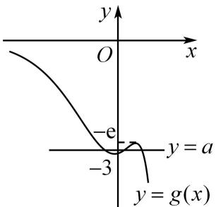
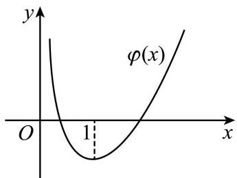
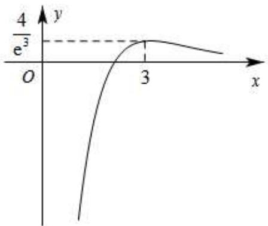
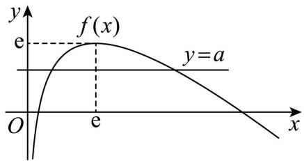
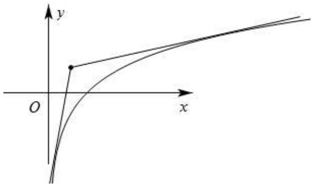
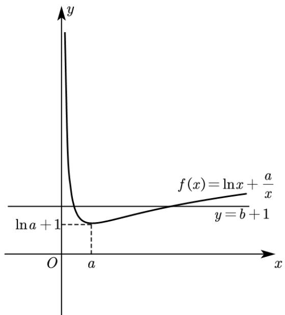
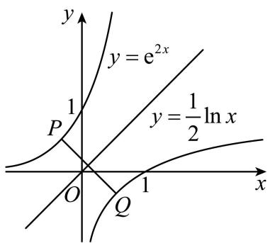
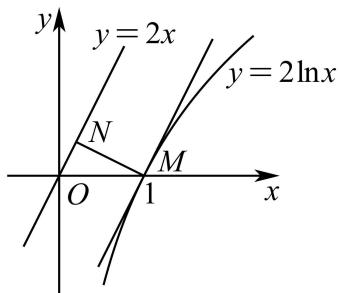
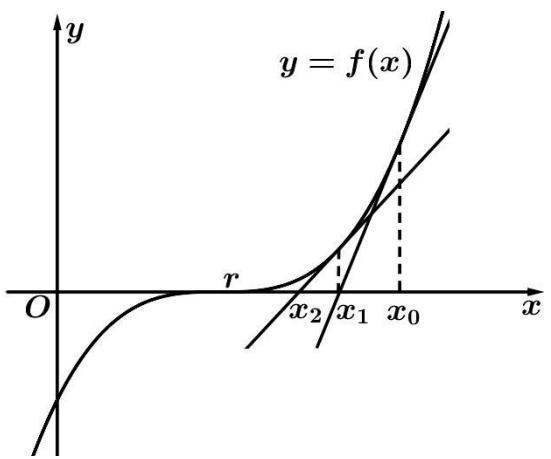
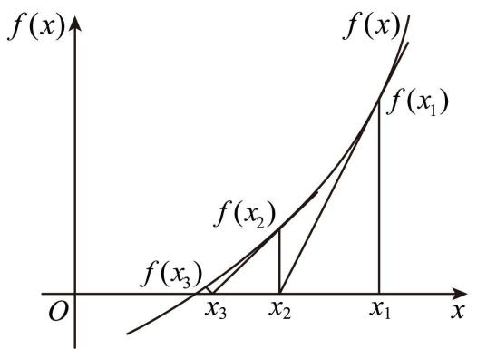

# 第14讲 导数的概念与运算

# 知识梳理

# 知识点一:导数的概念和几何性质

# 1、概念

函数 $f(x)$ 在 $x = x_0$ 处瞬时变化率是 $\lim_{\Delta x \to 0} \frac{\Delta y}{\Delta x} = \lim_{\Delta x \to 0} \frac{f(x_0 + \Delta x) - f(x_0)}{\Delta x}$ ，我们称它为函数 $y = f(x)$ 在 $x = x_0$ 处的导数，记作 $f'(x_0)$ 或 $y' | x = x_0$ .

知识点诠释：

①增量 $\Delta x$ 可以是正数，也可以是负，但是不可以等于0． $\Delta x\to 0$ 的意义： $\Delta x$ 与0之间距离要多近有  
多近，即 $|\Delta x - 0|$ 可以小于给定的任意小的正数；  
②当 $\Delta x \to 0$ 时, $\Delta y$ 在变化中都趋于 0 ,但它们的比值却趋于一个确定的常数, 即存在一个常数与

$$
\frac {\Delta y}{\Delta x} = \frac {f (x _ {0} + \Delta x) - f (x _ {0})}{\Delta x} \text {无限接近；}
$$

③导数的本质就是函数的平均变化率在某点处的极限,即瞬时变化率.如瞬时速度即是位移在这一时

刻的瞬间变化率，即 $f^{\prime}(x_0) = \lim_{\Delta x\to 0}\frac{\Delta y}{\Delta x} = \lim_{\Delta x\to 0}\frac{f(x_0 + \Delta x) - f(x_0)}{\Delta x}.$

# 2、几何意义

函数 $y = f(x)$ 在 $x = x_0$ 处的导数 $f'(x_0)$ 的几何意义即为函数 $y = f(x)$ 在点 $\mathrm{P}(x_0, y_0)$ 处的切线的斜率.

# 3、物理意义

函数 $s = s(t)$ 在点 $t_0$ 处的导数 $s'(t_0)$ 是物体在 $t_0$ 时刻的瞬时速度 $v$ , 即 $v = s'(t_0)$ ; $v = v(t)$ 在点 $t_0$ 的导数 $v'(t_0)$ 是物体在 $t_0$ 时刻的瞬时加速度 $a$ , 即 $a = v'(t_0)$ .

# 知识点二: 导数的运算

# 1、求导的基本公式

<table><tr><td>基本初等函数</td><td>导函数</td></tr><tr><td> $f(x)=c$ ( $c$ 为常数)</td><td> $f'(x)=0$ </td></tr><tr><td> $f(x)=x^{a}$ ( $a\in Q$ )</td><td> $f'(x)=ax^{a-1}$ </td></tr><tr><td> $f(x)=a^{x}$ ( $a>0$ ,  $a\neq 1$ )</td><td> $f'(x)=a^{x}\ln a$ </td></tr><tr><td> $f(x)=\log_{a}x$ ( $a>0$ ,  $a\neq 1$ )</td><td> $f'(x)=\frac{1}{x\ln a}$ </td></tr><tr><td> $f(x)=\mathrm{e}^{x}$ </td><td> $f'(x)=\mathrm{e}^{x}$ </td></tr><tr><td> $f(x)=\ln x$ </td><td> $f'(x)=\frac{1}{x}$ </td></tr><tr><td> $f(x)=\sin x$ </td><td> $f'(x)=\cos x$ </td></tr><tr><td> $f(x)=\cos x$ </td><td> $f'(x)=-\sin x$ </td></tr></table>

# 2、导数的四则运算法则

(1) 函数和差求导法则: $[f(x) \pm g(x)]' = f'(x) \pm g'(x)$ ;   
(2) 函数积的求导法则: $[f(x)g(x)]' = f'(x)g(x) + f(x)g'(x)$ ;   
(3) 函数商的求导法则: $g(x) \neq 0$ , 则 $\left[\frac{f(x)}{g(x)}\right] = \frac{f'(x)g(x) - f(x)g'(x)}{g^2(x)}$ .

# 3、复合函数求导数

复合函数 $y = f[g(x)]$ 的导数和函数 $y = f(u), u = g(x)$ 的导数间关系为 $y_x' = y_u'u_x'$ :

# 【解题方法总结】

# 1、在点的切线方程

切线方程 $y - f(x_0) = f'(x_0)(x - x_0)$ 的计算: 函数 $y = f(x)$ 在点 $A(x_0, f(x_0))$ 处的切线方程为 $y - f(x_0) = f'(x_0)(x - x_0)$ , 抓住关键 $\begin{cases} y_0 = f(x_0) \\ k = f'(x_0) \end{cases}$ .

# 2、过点的切线方程

设切点为 $\mathrm{P}(x_0,y_0)$ ，则斜率 $k = f^{\prime}(x_0)$ ，过切点的切线方程为： $y - y_0 = f'(x_0)(x - x_0)$

又因为切线方程过点 A(m, n)，所以 $n - y_{0} = f'(x_{0}) (m - x_{0})$ 然后解出 $x_{0}$ 的值．( $x_{0}$ 有几个值，就有几条切线)

注意:在做此类题目时要分清题目提供的点在曲线上还是在曲线外.

# 必考题型全归纳

# 1 题型一:导数的定义

406 (2024·全国·高三专题练习)已知函数 $y=f(x)$ 的图象如图所示, 函数 $y=f(x)$ 的导数为 $y=f'(x)$ , 则 ( )

line

| x | y |
|---|---|
| 0 | -1 |
| 1 | 0 |
| 2 | 1 |
| 3 | 2 |
| 4 | 3 |

A. $f^{\prime}(2) <   f^{\prime}(3) <   f(3) - f(2)$

B. $f^{\prime}(3) <   f^{\prime}(2) <   f(3) - f(2)$

C. $f'(2) < f(3) - f(2) < f'(3)$

D. $f'(3) < f(3) - f(2) < f'(2)$

【答案】D

【解析】由 $f(x)$ 图象可知 $f'(3) < \frac{f(3) - f(2)}{2 - 1} < f'(2)$ ,

即 $f'(3) < f(3) - f(2) < f'(2)$ .

故选：D

407 (2024·云南楚雄·高三统考期末)已知某容器的高度为 20cm, 现在向容器内注入液体, 且容器内液体的高度 h(单位: cm) 与时间 t(单位: s) 的函数关系式为 $h = \frac{1}{3}t^{3} + t^{2}$ , 当 $t = t_{0}$ 时, 液体上升高度的瞬时变化率为 3cm/s, 则当 $t = t_{0} + 1$ 时, 液体上升高度的瞬时变化率为 ( )

A. 5cm/s

B. 6cm/s

C. 8cm/s

D. 10cm/s

【答案】C

【解析】由 $h=\frac{1}{3}t^{3}+t^{2}$ ，求导得： $h'=t^{2}+2t$ .

当 $t=t_{0}$ 时， $h'=t_{0}^{2}+2t_{0}=3$ ，解得 $t_{0}=1(t_{0}=-3$ 舍去.

故当 $t=t_{0}+1=2$ 时, 液体上升高度的瞬时变化率为 $2^{2}+2\times2=8cm/s$ .

故选：C

408 (2024·河北衡水·高三衡水市第二中学期末)已知函数 $f(x)$ 的导函数是 $f'(x)$ ，若 $f'(x_0) = 2$ ，则 $\lim_{\Delta x \to 0} \frac{f(x_0 + \frac{1}{2}\Delta x) - f(x_0)}{\Delta x} =$ （）

A. $\frac{1}{2}$

B. 1

C. 2

D. 4

【答案】B

【解析】因为 $f'(x_0) = 2$

所以 $\lim_{\Delta x\to 0}\frac{f(x_0 + \frac{1}{2}\Delta x) - f(x_0)}{\Delta x} = \frac{1}{2}\lim_{\Delta x\to 0}\frac{f(x_0 + \frac{1}{2}\Delta x) - f(x_0)}{\frac{1}{2}\Delta x} = \frac{1}{2} f'(x_0) = 1$

故选：B

409 (2024·全国·高三专题练习)若函数 $f(x)$ 在 $x_{0}$ 处可导，且 $\lim_{\Delta x \to 0} \frac{f(x_{0} + 2\Delta x) - f(x_{0})}{2\Delta x} = 1$ ，则 $f'(x_{0}) =$ （）

A. 1

B.-1

C. 2

D. $\frac{1}{2}$

【答案】A

【解析】由导数定义可得 $\lim_{\Delta x\to0}\frac{f(x_{0}+2\Delta x)-f(x_{0})}{2\Delta x}=f'(x_{0})$ ,

所以 $f'(x_{0})=1$ .

故选：A.

410 (2024·高三课时练习)若 $f(x)$ 在 $x_{0}$ 处可导，则 $f'(x_{0})$ 可以等于（）.

A. $\lim_{\Delta x\to 0}\frac{f(x_0) - f(x_0 - \Delta x)}{\Delta x}$

B. $\lim_{\Delta x\to 0}\frac{f(x_0 + \Delta x) - f(x_0 - \Delta x)}{\Delta x}$

C. $\lim_{\Delta x\to0}\frac{f(x_{0}+2\Delta x)-f(x_{0}-\Delta x)}{\Delta x}$

D. $\lim_{\Delta x\to 0}\frac{f(x_0 + \Delta x) - f(x_0 - 2\Delta x)}{\Delta x}$

【答案】A

【解析】由导数定义 $f'(x_0) = \lim_{\Delta x \to 0} \frac{f(x_0 + \Delta x) - f(x_0)}{\Delta x}$ ,

对于 A, $f'(x_{0})=\lim_{\Delta x\to0}\frac{f(x_{0})-f(x_{0}-\Delta x)}{x_{0}-(x_{0}-\Delta x)}=\lim_{\Delta x\to0}\frac{f(x_{0})-f(x_{0}-\Delta x)}{\Delta x}$ ，A 满足；

对于 B, $f'(x_{0})=\lim_{\Delta x\to0}\frac{f(x_{0}+\Delta x)-f(x_{0}-\Delta x)}{(x_{0}+\Delta x)-(x_{0}-\Delta x)}=\lim_{\Delta x\to0}\frac{f(x_{0}+\Delta x)-f(x_{0}-\Delta x)}{2\Delta x}$ ,

$f'(x_{0})=\frac{1}{2}\lim_{\Delta x\to0}\frac{f(x_{0}+\Delta x)-f(x_{0}-\Delta x)}{\Delta x},$ B 不满足；

对于 C, $f'(x_{0})=\lim_{\Delta x\to0}\frac{f(x_{0}+2\Delta x)-f(x_{0}-\Delta x)}{(x_{0}+2\Delta x)-(x_{0}-\Delta x)}=\lim_{\Delta x\to0}\frac{f(x_{0}+2\Delta x)-f(x_{0}-\Delta x)}{3\Delta x}$ ,

$f^{\prime}(x_{0}) = \frac{1}{3}\lim_{\Delta x\to 0}\frac{f(x_{0} + 2\Delta x) - f(x_{0} - \Delta x)}{\Delta x},\mathrm{C}$ 不满足；

对于 D, $f'(x_{0})=\lim_{\Delta x\to0}\frac{f(x_{0}+\Delta x)-f(x_{0}-2\Delta x)}{(x_{0}+\Delta x)-(x_{0}-2\Delta x)}=\lim_{\Delta x\to0}\frac{f(x_{0}+\Delta x)-f(x_{0}-2\Delta x)}{3\Delta x}$ ,

$f^{\prime}(x_{0}) = \frac{1}{3}\lim_{\Delta x\to 0}\frac{f(x_{0} + \Delta x) - f(x_{0} - 2\Delta x)}{\Delta x}$ ，D不满足.

故选：A.

【解题方法总结】

对所给函数式经过添项、拆项等恒等变形与导数定义结构相同,然后根据导数定义直接写出.

# 2 题型二:求函数的导数

411 (2024·全国·高三专题练习)求下列函数的导数.

(1) $f(x)=(-2x+1)^{2};$   
(2) $f(x)=\ln(4x-1)$ ;   
(3) $f(x)=2^{3x+2}$   
(4) $f(x)=\sqrt{5x+4}$ ;

【解析】(1) 因为 $f(x)=(-2x+1)^{2}=4x^{2}-4x+1$ ，所以 $f'(x)=8x-4$ .

(2) 因为 $f(x)=\ln(4x-1)$ ，所以 $f'(x)=\frac{4}{4x-1}$ .  
(3) 因为 $f(x)=2^{3x+2}$ ，所以 $f'(x)=3\times2^{3x+2}\ln2$   
(4) 因为 $f(x)=\sqrt{5x+4}$ ，所以 $f'(x)=\frac{1}{2}\frac{5}{\sqrt{5x+4}}=\frac{5}{2\sqrt{5x+4}}$

412 (2024·高三课时练习)求下列函数的导数：

(1) $y=(3x^{2}+2x+1)\cos x;$   
(2) $y=\frac{3x^{2}+x\sqrt{x}-5\sqrt{x}+1}{\sqrt{x}}$ ;   
(3) $y=x^{18}+\sin x-\ln x;$   
(4) $y=2^{x}\cos x-3x\log_{3}x;$   
(5) $y=3^{x}\sin x-3\log_{3}x;$   
(6) $y=e^{x}\cos x+\tan x.$

【解析】(1) $y'=(3x^{2}+2x+1)'\cos x+(3x^{2}+2x+1)\cdot(\cos x)'$

$$
= (6 x + 2) \cos x - (3 x ^ {2} + 2 x + 1) \sin x.
$$

(2) $y=\frac{3x^{2}+x\sqrt{x}-5\sqrt{x}+1}{\sqrt{x}}=3x^{\frac{3}{2}}+x-5+x^{-\frac{1}{2}},$

所以 $y' = 3 \times \frac{3}{2} \cdot x^{\frac{1}{2}} + 1 - \frac{1}{2} \cdot x^{-\frac{3}{2}} = \frac{9}{2} x^{\frac{1}{2}} - \frac{1}{2} x^{-\frac{3}{2}} + 1.$

(3) $y' = 18x^{17} + \cos x - \frac{1}{x}.$

(4) $y'=(2^{x})'\cos x+2^{x}(\cos x)'-3[(x)'\log_{3}x+x(\log_{3}x)]$

$$
= (2 ^ {x} \ln 2) \cos x - 2 ^ {x} \sin x - 3 \log_ {3} x - 3 \log_ {3} e.
$$

(5) $y'=(3^{x})'\sin x+3^{x}(\sin x)'-3\cdot\frac{1}{x\ln3}=(3^{x}\ln3)\sin x+3^{x}\cos x-\frac{1}{x}\cdot3\log_{3}e.$

(6) $y=\mathrm{e}^{x}\cos x+\tan x=\mathrm{e}^{x}\cos x+\frac{\sin x}{\cos x},$

故 $y' = (\mathrm{e}^x)'\cos x + \mathrm{e}^x \cdot (\cos x)' + \frac{(\sin x)'\cos x - (\cos x)'\sin x}{\cos^2 x}$

$$
= \mathrm{e} ^ {x} \cos x - \mathrm{e} ^ {x} \sin x + \frac {1}{\cos^ {2} x}.
$$

413 (2024·海南·统考模拟预测)在等比数列 $\{a_{n}\}$ 中， $a_{3}=2$ ，函数 $f(x)=\frac{1}{2}x(x-a_{1})(x-a_{2})$ $\cdots(x-a_{5})$ ，则 $f'(0)=$ \_\_\_\_.

【答案】-16

【解析】因为 $f'(x)=\left(\frac{1}{2}x\right)'[(x-a_{1})(x-a_{2})\cdots(x-a_{5})]+$

$$
\frac {1}{2} x \left[ \left(x - a _ {1}\right) \left(x - a _ {2}\right) \dots \left(x - a _ {5}\right) \right] ^ {\prime}
$$

$$
= \frac {1}{2} \left[ \left(x - a _ {1}\right) \cdot \left(x - a _ {2}\right) \dots \left(x - a _ {5}\right) \right] + \frac {1}{2} x \left[ \left(x - a _ {1}\right) \left(x - a _ {2}\right) \dots \left(x - a _ {5}\right) \right] ^ {\prime},
$$

所以 $f'(0)=-\frac{1}{2}a_{1}a_{2}\cdots a_{5}.$

因为数列 $\{a_{n}\}$ 为等比数列, 所以 $a_{1}a_{5}=a_{2}a_{4}=a_{3}^{2}=4$ ,

于是 $f'(0)=-\frac{1}{2}\times4^{2}\times2=-16.$

故答案为: -16

414 (2024·辽宁大连·育明高中校考一模)已知可导函数 $f(x)$ , $g(x)$ 定义域均为R,对任意x满足 $f(x)+2x^{2}g\left(\frac{1}{2}x\right)=x-1$ ,且 $f(1)=1$ ,求 $f'(1)+g'\left(\frac{1}{2}\right)=$ \_\_\_\_.

【答案】3

【解析】由题意可知,令x=1,则 $f(1)+2\times1^{2}\times g\left(\frac{1}{2}\times1\right)=1-1$ ,解得 $g\left(\frac{1}{2}\right)=-\frac{f(1)}{2}=-\frac{1}{2}$ ,

由 $f(x) + 2x^{2}g\left(\frac{1}{2}x\right) = x - 1$ ，得 $f'(x) + (2x^{2})'g\left(\frac{1}{2}x\right) + 2x^{2}\left[g\left(\frac{1}{2}x\right)\right]' = (x - 1)'$ ，即 $f'(x) + 4xg\left(\frac{1}{2}x\right) + x^{2}g'\left(\frac{1}{2}x\right) = 1$ ，

令 $x = 1$ ，得 $f^{\prime}(1) + 4\times 1\times g\left(\frac{1}{2}\times 1\right) + 1^{2}\times g^{\prime}\left(\frac{1}{2}\times 1\right) = 1$ ，即 $f^{\prime}(1) + 4g\left(\frac{1}{2}\right) + g^{\prime}\left(\frac{1}{2}\right) = 1,$

解得 $f'(1) + g'\left(\frac{1}{2}\right) = 1 - 4g\left(\frac{1}{2}\right) = 1 - 4 \times \left(-\frac{1}{2}\right) = 3.$

故答案为: 3.

415 (2024·河南·高三校联考阶段练习)已知函数 $f(x)$ 的导函数为 $f'(x)$ ，且 $f(x) = x^2 f'(1) + x + 2$ ，则 $f'(1) =$ \_\_\_\_.

【答案】-1

【解析】因为 $f(x)=x^{2}f'(1)+x+2$ ，则 $f'(x)=2xf'(1)+1$ ，故 $f'(1)=2f'(1)+1$ ，故 $f'(1)=-1$ .

故答案为: -1.

416 (2024·全国·高三专题练习)已知函数 $f(x) = f'(0)\mathrm{e}^{2x} - \mathrm{e}^{-x}$ ，则 $f(0) =$ \_\_\_\_.

【答案】-2

【解析】由函数 $f(x)=f'(0)\mathrm{e}^{2x}-\mathrm{e}^{-x}$ 求导得: $f'(x)=2f'(0)\mathrm{e}^{2x}+\mathrm{e}^{-x}$ ，当 x=0 时， $f'(0)=2f'(0)+1$ ，解得 $f'(0)=-1$ ，

因此， $f(x)=-\mathrm{e}^{2x}-\mathrm{e}^{-x}$ ，所以 $f(0)=-2$ .

故答案为: -2

【解题方法总结】

对所给函数求导,其方法是利用和、差、积、商及复合函数求导法则,直接转化为基本函数求导问题.

# 3 题型三:导数的几何意义

# 方向1、在点P处切线

417 (2024·广东广州·统考模拟预测)曲线 $y=(2x-1)^{3}$ 在点 $(1,1)$ 处的切线方程为 \_\_\_\_.

【答案】 $6x - y - 5 = 0$

【解析】函数 $y=(2x-1)^{3}$ 的导函数为 $y'=6(2x-1)^{2}$ ,

所以函数 $y=(2x-1)^{3}$ 在 x=1 处的导数值 $y^{\prime}|x=1=6$ ,

所以曲线 $y=(2x-1)^{3}$ 在点 $(1,1)$ 处的切线斜率为 6，

所以曲线 $y=(2x-1)^{3}$ 在点 $(1,1)$ 处的切线方程为 $y-1=6(x-1)$ ，即 6x-y-5=0，

故答案为: 6x - y - 5 = 0.

418 (2024·全国·高三专题练习)曲线 $f(x)=\ln(x+2)+\frac{3}{2}$ 在点 $(0,f(0))$ 处的切线方程为 \_\_\_\_.

【答案】 $x - 2y + 2\ln 2 + 3 = 0$

【解析】因为 $f(x)=\ln(x+2)+\frac{3}{2}$ ,

所以 $f'(x)=\frac{1}{x+2}$ ,

则 $f'(0)=\frac{1}{2}$ ,

又 $f(0)=\ln2+\frac{3}{2}$ ,

所以曲线在点 $(0,f(0))$ 处的切线方程为 $y-\ln2-\frac{3}{2}=\frac{1}{2}x$ ,

即 $x - 2y + 2\ln2 + 3 = 0.$

故答案为: $x - 2y + 2\ln2 + 3 = 0$ .

419 (2024·全国·高三专题练习)已知函数 $f(x) = \frac{1}{3} x^3 + bx^2 + \cos\left(\frac{\pi}{2}x\right)$ , $f'(x)$ 为 $f(x)$ 的导函数. 若 $f'(x)$ 的图象关于直线 $x = 1$ 对称, 则曲线 $y = f(x)$ 在点 $(2, f(2))$ 处的切线方程为

【答案】 $y=-\frac{7}{3}$

【解析】 $f'(x)=x^{2}+2bx-\frac{\pi}{2}\sin\left(\frac{\pi}{2}x\right)$ ,

令 $g(x)=x^{2}+2bx, h(x)=-\frac{\pi}{2}\sin\left(\frac{\pi}{2}x\right)$ ，则 $f'(x)=g(x)+h(x)$ ,

令 $\frac{\pi}{2} x = k\pi +\frac{\pi}{2},k\in \mathbf{Z}$ ，解得 $x = 2k + 1,k\in \mathbf{Z}$

当 k=0 时, x=1, 所以直线 x=1 为 $h(x)$ 的一条对称轴,

故 $g(x)$ 的图象也关于直线 x=1 对称, 则有 $-\frac{2b}{2}=1$ , 解得 b=-1,

则 $f(x)=\frac{1}{3}x^{3}-x^{2}+\cos\left(\frac{\pi}{2}x\right)$ ， $f'(x)=x^{2}-2x-\frac{\pi}{2}\sin\left(\frac{\pi}{2}x\right)$

$$
f (2) = - \frac {7}{3}, f ^ {\prime} (2) = 0,
$$

故切线方程为 $y=-\frac{7}{3}$ .

故答案为; $y=-\frac{7}{3}$ .

420 (2024·湖南·校联考模拟预测)若函数 $f(x)=\lambda x^{3}+(\lambda-2)x^{2}(x\in\mathbb{R})$ 是奇函数, 则曲线 $y=f(x)$ 在点 $(\lambda,f(\lambda))$ 处的切线方程为 \_\_\_\_.

【答案】 $24x - y - 32 = 0$

【解析】因为 $f(x)=\lambda x^{3}+(\lambda-2)x^{2}(x\in\mathbb{R})$ 是奇函数，

所以 $f(-x)+f(x)=0$ 对 $\forall x\in R$ 恒成立，

即 $-\lambda x^{3}+(\lambda-2)x^{2}+\lambda x^{3}+(\lambda-2)x^{2}=2(\lambda-2)x^{2}=0$ 对 $\forall x\in R$ 恒成立，

所以 $\lambda=2$ ，则 $f(x)=2x^{3}$ ，故 $f'(x)=6x^{2}$ ，所以 $f(2)=2\times2^{3}=16, f'(2)=6\times2^{2}=24$ ，

所以曲线 $y=f(x)$ 在点 $(2,16)$ 处的切线方程为 $y-16=24(x-2)$ ,

化简得 24x - y - 32 = 0.

故答案为: 24x - y - 32 = 0

方向2、过点P的切线

421 (2024·江西·校联考模拟预测)已知过原点的直线与曲线 $y = \ln x$ 相切, 则该直线的方程是 \_\_\_\_.

【答案】 $y=\frac{1}{e}x$

【解析】由题意可得 $f'(x)=\frac{1}{x}$ ,

设该切线方程 y = kx，且与 $y = \ln x$ 相切于点 $(x_{0}, y_{0})$ ，

$$
\left\{ \begin{array}{l} y _ {0} = k x _ {0} \\ y _ {0} = \ln x _ {0} \\ k = f ^ {\prime} (x _ {0}) = \frac {1}{x _ {0}} \end{array} , \text {整理得} \ln x _ {0} = 1, \right.
$$

$\therefore x_{0} = \mathrm{e}$ ，可得 $k = \frac{1}{\mathrm{e}},\therefore y = \frac{1}{\mathrm{e}} x.$

故答案为: $y=\frac{1}{e}x$ .

422 (2024·浙江金华·统考模拟预测)已知函数 $f(x) = x^3 - ax + 1$ ，过点 $P(2,0)$ 存在3条直线与曲线 $y = f(x)$ 相切，则实数 $a$ 的取值范围是 \_\_\_\_.

【答案】 $\left(\frac{1}{2},\frac{9}{2}\right)$

【解析】由 $f'(x)=3x^{2}-a$ ，设切点为 $(m,n)$ ，则切线斜率为 $f'(m)=3m^{2}-a$ ，

所以, 过 P(2,0) 的切线方程为 $y=(3m^{2}-a)(x-2)$ ,

综上， $\left\{\begin{aligned}n=(3m^{2}-a)(m-2)\\n=m^{3}-am+1\end{aligned}\right.$ ，即 $(3m^{2}-a)(m-2)=m^{3}-am+1$

所以 $2a = -2m^{3} + 6m^{2} + 1$ 有三个不同 m 值使方程成立，

即 y=2a 与 $g(m)=-2m^{3}+6m^{2}+1$ 有三个不同交点，而 $g'(m)=-6m^{2}+12m$

故 $(-∞,0)$ 、 $(2,+∞)$ 上 $g'(m)<0$ ， $g(m)$ 递减， $(0,2)$ 上 $g'(m)>0$ ， $g(m)$ 递增；

所以 $g(m)$ 极小值为 $g(0)=1$ ，极大值为 $g(2)=9$ ，故 1<2a<9 时两函数有三个交点，

综上, a 的取值范围是 $\left(\frac{1}{2}, \frac{9}{2}\right)$ .

故答案为: $\left(\frac{1}{2},\frac{9}{2}\right)$

423 (2024·浙江绍兴·统考模拟预测)过点 $\left(-\frac{2}{3},0\right)$ 作曲线 $y=x^{3}$ 的切线,写出一条切线方程:

【答案】y=0 或 $y=3x+2$ (写出一条即可)

【解析】由 $y = x^{3}$ 可得 $y' = 3x^{2}$ ,

设过点 $\left(-\frac{2}{3},0\right)$ 作曲线 $y=x^{3}$ 的切线的切点为 $(x_{0},y_{0})$ ，则 $y_{0}=x_{0}^{3}$

则该切线方程为 $y - y_{0} = 3x_{0}^{2}(x - x_{0})$ ,

将 $\left(-\frac{2}{3},0\right)$ 代入得 $-x_{0}^{3}=3x_{0}^{2}\left(-\frac{2}{3}-x_{0}\right)$ ，解得 $x_{0}=0$ 或 $x_{0}=-1$ ，

故切点坐标为 $(0,0)$ 或 $(-1,-1)$ ,

故切线方程为 y=0 或 $y=3x+2$ ,

故答案为: y=0 或 $y=3x+2$

424 (2024·海南海口·校联考模拟预测)过 x 轴上一点 $\mathrm{P}(t,0)$ 作曲线 $\mathrm{C}:y=(x+3)\mathrm{e}^{x}$ 的切线，若这样的切线不存在，则整数 t 的一个可能值为 \_\_\_\_.

【答案】-4, -5, -6, 只需写出一个答案即可

【解析】设切点为 $(x_0,(x_0 + 3)\mathrm{e}^{x_0})$ ，因为 $y^{\prime} = (x + 4)\mathrm{e}^{x}$ ，所以切线方程为 $y - (x_0 + 3)\mathrm{e}^{x_0} = (x_0 + 4)\mathrm{e}^{x_0}(x - x_0)$

因为切线 l 经过点 P, 所以 $-(x_{0}+3)\mathrm{e}^{x_{0}}=(x_{0}+4)\mathrm{e}^{x_{0}}(t-x_{0})$ ,

由题意关于 $x_{0}$ 的方程 $x_{0}^{2}-(t-3)x_{0}-4t-3=0$ 没有实数解，

则 $\Delta=(t-3)^{2}+4(4t+3)<0$ , 解得 -7<t<-3.

因为 t 为整数, 所以 t 的取值可能是 -6, -5, -4.

故答案为: -4, -5, -6, 只需写出一个答案即可

425 (2024·全国·模拟预测)过坐标原点作曲线 $y=(x+2)\mathrm{e}^{x}$ 的切线，则切点的横坐标为 \_\_\_\_.

【答案】 $-1 + \sqrt{3}$ 或 $-1 - \sqrt{3}$

【解析】由 $y=(x+2)\mathrm{e}^{x}$ 可得 $y'=(x+3)\mathrm{e}^{x}$ ，设切点坐标为 $(x_{0},y_{0})$ ，

所以切线斜率 $k=(x_{0}+3)\mathrm{e}^{x_{0}}$ ，又因为 $y_{0}=(x_{0}+2)\mathrm{e}^{x_{0}}$

则切线方程为 $y-(x_{0}+2)\mathrm{e}^{x_{0}}=(x_{0}+3)\mathrm{e}^{x_{0}}(x-x_{0})$ ,

把 $(0,0)$ 代入并整理可得 $x_0^2 + 2x_0 - 2 = 0$ ，解得 $x_0 = -1 + \sqrt{3}$ 或 $x_0 = -1 - \sqrt{3}$ .

故答案为: $-1 + \sqrt{3}$ 或 $-1 - \sqrt{3}$

426 (2024·广西南宁·南宁三中校考模拟预测)若过点 $\mathrm{P}(1,a)(a\in\mathbb{R})$ 有 n 条直线与函数 $f(x)=(x-2)\mathrm{e}^{x}$ 的图象相切，则当 n 取最大值时，a 的取值范围为 \_\_\_\_.

【答案】 $(-3, - e)$

【解析】设过点 $P(1,a)$ 的直线 l 与 $f(x)$ 的图象的切点为 $(x_{0},(x_{0}-2)\mathrm{e}^{x_{0}})$ ,

因为 $f'(x)=(x-1)\mathrm{e}^{x}$ ,

所以切线 l 的斜率为 $f'(x_{0})=(x_{0}-1)\mathrm{e}^{x_{0}}$ ,

所以切线 l 的方程为 $y - (x_{0} - 2)\mathrm{e}^{x_{0}} = (x_{0} - 1)\mathrm{e}^{x_{0}}(x - x_{0})$ ,

将 $P(1,a)$ 代入得 $a-(x_{0}-2)\mathrm{e}^{x_{0}}=(x_{0}-1)\mathrm{e}^{x_{0}}(1-x_{0})$ ,

即 $a = (x_0 - 1)\mathrm{e}^{x_0}(1 - x_0) + (x_0 - 2)\mathrm{e}^{x_0} = (-x_0^2 +3x_0 - 3)\mathrm{e}^{x_0},$

设 $g(x)=(-x^{2}+3x-3)\mathrm{e}^{x}$ ，则 $g'(x)=(-x^{2}+3x-3)\mathrm{e}^{x}+(-2x+3)\mathrm{e}^{x}=(-x^{2}+x)\mathrm{e}^{x}$

由 $g'(x)=0$ , 得 x=0 或 x=1 ,

当 x<0 或 x>1 时， $g'(x)<0$ ，所以 $g(x)$ 在 $(-∞,0),(1,+∞)$ 上单调递减；

当 0 < x < 1 时, $g'(x) > 0$ , 所以 $g(x)$ 在 $(0,1)$ 上单调递增,

所以 $g(x)_{\text{极小值}} = g(0) = -3, g(x)_{\text{极大值}} = g(1) = -\mathrm{e}$ ,

又 $-x^{2} + 3x - 3 = -\left(x - \frac{3}{2}\right)^{2} - \frac{3}{4} < 0$ ，所以 $g(x) < 0$ 恒成立，

所以 $g(x)$ 的图象大致如图所示，

由图可知,方程 $a=(-x_{0}^{2}+3x_{0}-3)\mathrm{e}^{x_{0}}$ 最多 3 个解,

即过点 $\mathrm{P}(1, a) (a \in \mathbb{R})$ 的切线最多有3条，

即 $n$ 的最大值为3,此时 $-3 < a < -\mathrm{e}$

故答案为: $(-3,-e)$ .

text_image

y
O x
-e
-3 y = a
y = g(x)

427 (2024·全国·模拟预测)已知函数 $f(x) = \frac{1}{3} x^3 + f'(1)x^2 + 1$ ，其导函数为 $f'(x)$ ，则曲线 $f(x)$ 过点 $P(3,1)$ 的切线方程为 \_\_\_\_.

【答案】y=1 或 y=3x-8

【解析】设切点为 $M(x_{0},y_{0})$ ，由 $f(x)=\frac{1}{3}x^{3}+f'(1)x^{2}+1$ ，得 $f'(x)=x^{2}+2f'(1)x$ ，

$\therefore f^{\prime}(1) = 1 + 2f^{\prime}(1)$ ，得 $f^{\prime}(1) = -1$ ， $\therefore f(x) = \frac{1}{3} x^3 -x^2 +1,f'(x) = x^2 -2x,$

∴ 切点 M 为 $\left(x_{0}, \frac{1}{3}x_{0}^{3}-x_{0}^{2}+1\right)$ , $f'(x_{0}) = x_{0}^{2} - 2x_{0}$ ,

∴曲线 $f(x)$ 在点M处的切线方程为 $y-\left(\frac{1}{3}x_{0}^{3}-x_{0}^{2}+1\right)=(x_{0}^{2}-2x_{0})(x-x_{0})$ ①，

又∵该切线过点P(3,1)，∴ $1-\left(\frac{1}{3}x_{0}^{3}-x_{0}^{2}+1\right)=(x_{0}^{2}-2x_{0})(3-x_{0})$ ，解得 $x_{0}=0$ 或 $x_{0}=3$ .

将 $x_0 = 0$ 代入①得切线方程为 $y = 1$ ;

将 $x_0 = 3$ 代入①得切线方程为 $y - 1 = 3(x - 3)$ ，即 $y = 3x - 8$ .

∴ 曲线 $f(x)$ 过点 P(3,1) 的切线方程为 y=1 或 y=3x-8.

故答案为: y=1 或 y=3x-8

方向3、公切线

428 (2024·云南保山·统考二模)若函数 $f(x)=4\ln x+1$ 与函数 $g(x)=\frac{1}{a}x^{2}-2x(a>0)$ 的图象存在公切线，则实数 a 的取值范围为（）

A. $\left(0,\frac{1}{3}\right]$

B. $\left[\frac{1}{3},+\infty\right)$

C. $\left[\frac{2}{3},1\right)$

D. $\left[\frac{1}{3},\frac{2}{3}\right]$

【答案】A

【解析】由函数 $f(x)=4\ln x+1$ ，可得 $f'(x)=\frac{4}{x}$

因为 a > 0，设切点为 $(t, 4\ln t + 1)$ ，则 $f'(t) = \frac{4}{t}$ ，

则公切线方程为 $y - 4\ln t - 1 = \frac{4}{t} (x - t)$ ，即 $y = \frac{4}{t} x + 4\ln t - 3$ ，

与 $y = \frac{1}{a} x^2 - 2x$ 联立可得 $\frac{1}{a} x^2 - (2 + \frac{4}{t})x - 4\ln t + 3 = 0$ ,

所以 $\Delta = \left(2 + \frac{4}{t}\right)^2 - 4 \times \frac{1}{a} \times (3 - 4\ln t) = 0$ ，整理可得 $\frac{1}{a} = \frac{\left(\frac{2}{t} + 1\right)^2}{3 - 4\ln t}$ ，

又由 $\left\{\begin{aligned}a&>0\\ t&>0\end{aligned}\right.$ ，可得 $3-4\ln t>0$ ，解得 $0<t<e^{\frac{3}{4}}$

令 $h(t) = \frac{\left(\frac{2}{t} + 1\right)^2}{3 - 4\ln t}$ , 其中 $0 < t < \mathrm{e}^{\frac{3}{4}}$ , 可得 $h'(t) = \frac{\frac{4}{t}\left(\frac{2}{t} + 1\right) \cdot \frac{t + 4\ln t - 1}{t}}{(3 - 4\ln t)^2}$ ,

令 $\varphi(t)=t+4\ln t-1$ , 可得 $\varphi'(t)=1+\frac{4}{t}>0$ , 函数 $\varphi(t)$ 在 $\left(0,\mathrm{e}^{\frac{3}{4}}\right)$ 上单调递增, 且 $\varphi(1)=0$

当 0 < t < 1 时， $\varphi(t) < 0$ ，即 $h'(t) < 0$ ，此时函数 $h(t)$ 单调递减，

当 $1 < t < e^{\frac{3}{4}}$ 时， $\varphi(t) > 0$ ，即 $h'(t) > 0$ ，此时函数 $h(t)$ 单调递增，

所以 $h(t)_{\min}=h(1)=3$ ，且当 $t\to0^{+}$ 时， $h(t)\to+\infty$ ，所以函数 $h(t)$ 的值域为 $[3,+\infty)$ ，所以 $\frac{1}{a}\geqslant3$ 且 a>0，解得 $0<a\leqslant\frac{1}{3}$ ，即实数 a 的取值范围为 $\left(0,\frac{1}{3}\right]$ .

故选：A.

429 (2024·宁夏银川·银川一中校考二模)若直线 $y = k_{1}(x + 1) - 1$ 与曲线 $y = e^{x}$ 相切，直线 $y = k_{2}(x + 1) - 1$ 与曲线 $y = \ln x$ 相切，则 $k_{1}k_{2}$ 的值为 \_\_\_\_.

【答案】1

【解析】设 $f(x)=\mathrm{e}^{x}$ ，则 $f'(x)=\mathrm{e}^{x}$ ，设切点为 $(x_{1},y_{1})$ ，则 $k_{1}=\mathrm{e}^{x_{1}}$

则切线方程为 $y - y_{1} = \mathrm{e}^{x_{1}}(x - x_{1})$ ，即 $y - \mathrm{e}^{x_{1}} = \mathrm{e}^{x_{1}}(x - x_{1})$ ，

直线 $y=k_{1}(x+1)-1$ 过定点 $(-1,-1)$ ,

所以 $-1-\mathrm{e}^{x_{1}}=\mathrm{e}^{x_{1}}(-1-x_{1})$ ，所以 $x_{1}\mathrm{e}^{x_{1}}=1$ ，

设 $g(x) = \ln x$ ，则 $g'(x) = \frac{1}{x}$ 设切点为 $(x_{2},y_{2})$ ，则 $k_{2} = \frac{1}{x_{2}}$

则切线方程为 $y - y_{2} = \frac{1}{x_{2}} (x - x_{2})$ ，即 $y - \ln x_{2} = \frac{1}{x_{2}} (x - x_{2})$

直线 $y=k_{1}(x+1)-1$ 过定点 $(-1,-1)$ ,

所以 $-1-\ln x_{2}=\frac{1}{x_{2}}(-1-x_{2})$ ，所以 $x_{2}\ln x_{2}=1$ ，

则 $x_{1}, x_{2}$ 是函数 $f(x) = \mathrm{e}^{x}$ 和 $g(x) = \ln x$ 的图象与曲线 $y = \frac{1}{x}$ 交点的横坐标，

易知 $f(x)$ 与 $g(x)$ 的图象关于直线 y = x 对称，而曲线 $y = \frac{1}{x}$ 也关于直线 y = x 对称，因此点 $(x_{1}, y_{1}), (x_{2}, y_{2})$ 关于直线 y = x 对称，

从而 $x_{2}=\mathrm{e}^{x_{1}}, x_{1}=\ln x_{2}$ ,

所以 $k_{1}k_{2}=\frac{e^{x_{1}}}{x_{2}}=1.$

故答案为: 1.

430 (2024·河北邯郸·统考三模)若曲线 $y=e^{x}$ 与圆 $(x-a)^{2}+y^{2}=2$ 有三条公切线，则 a 的取值范围是 \_\_\_\_.

【答案】 $(1, + \infty)$

【解析】曲线 $y=e^{x}$ 在点 $(x_{0},y_{0})$ 处的切线方程为 $y-e^{x_{0}}=e^{x_{0}}(x-x_{0})$ ,

由于直线 $y - \mathrm{e}^{x_0} = \mathrm{e}^{x_0}(x - x_0)$ 与圆 $(x - a)^2 + y^2 = 2$ 相切，得 $\frac{|\mathrm{e}^{x_0}(a - x_0) + \mathrm{e}^{x_0}|}{\sqrt{1 + \mathrm{e}^{2x_0}}} = \sqrt{2}(*)$

因为曲线 $y=e^{x}$ 与圆 $(x-a)^{2}+y^{2}=2$ 有三条公切线，故 (\*) 式有三个不相等的实数根，

即方程 $\mathrm{e}^{2x_{0}}((x_{0}-a-1)^{2}-2)=2$ 有三个不相等的实数根.

令 $g(x)=\mathrm{e}^{2x}\left((x-a-1)^{2}-2\right)$ ，则曲线 $y=g(x)$ 与直线 y=2 有三个不同的交点.

显然， $g'(x)=2\mathrm{e}^{2x}(x-a-2)(x-a+1)$ .

当 $x \in (-\infty, a - 1)$ 时， $g'(x) > 0$ ，当 $x \in (a - 1, a + 2)$ 时， $g'(x) < 0$ ，当 $x \in (a + 2, +\infty)$ 时， $g'(x) > 0$ ，

所以, $g(x)$ 在 $(- \infty, a - 1)$ 上单调递增, 在 $(a - 1, a + 2)$ 上单调递减, 在 $(a + 2, + \infty)$ 上单调递增;

且当 $x \to -\infty$ 时， $g(x) = \frac{(x - a - 1)^2 - 2}{\mathrm{e}^{-2x}} \to 0$ ，当 $x \to +\infty$ 时， $g(x) = \mathrm{e}^{2x}((x - a - 1)^2 - 2) \to +\infty$ ，

因此,只需 $\left\{\begin{aligned}g(a-1)>2\\ g(a+2)<2\end{aligned}\right.$ , 即 $\left\{\begin{aligned}e^{2(a-1)}>1\\ -e^{2(a+2)}<2\end{aligned}\right.$ ,

解得 a > 1.

故答案为: $(1,+\infty)$

431 (2024·湖南长沙·湖南师大附中校考模拟预测)若曲线 $C_{1}:f(x)=x^{2}+a$ 和曲线 $C_{2}:g(x)=2\ln x$ 恰好存在两条公切线，则实数 a 的取值范围为 \_\_\_\_.

【答案】 $(-1, + \infty)$

【解析】由题意得 $f'(x)=2x, g'(x)=\frac{2}{x}, (x>0)$ ,

设与曲线 $f(x)=x^{2}+a$ 相切的切点为 $(x_{1},x_{1}^{2}+a)$ ，与曲线 $g(x)=2\ln x$ 相切的切点为 $(x_{2},2\ln x_{2})$ ，

则切线方程为 $y=2x_{1}(x-x_{1})+x_{1}^{2}+a$ ，即 $y=2x_{1}x-x_{1}^{2}+a$ ，

$$
y = \frac {2}{x _ {2}} (x - x _ {2}) + 2 \ln x _ {2} \text {, 即} y = \frac {2}{x _ {2}} x + 2 \ln x _ {2} - 2,
$$

由于两切线为同一直线,所以 $\left\{\begin{aligned}&2x_{1}=\frac{2}{x_{2}},\\ &-x_{1}^{2}+a=2\ln x_{2}-2\end{aligned}\right.$ ,得 $a=x_{1}^{2}-2\ln x_{1}-2(x_{1}>0)$ .

令 $\varphi(x)=x^{2}-2\ln x-2(x>0)$ ，则 $\varphi'(x)=2x-\frac{2}{x}=\frac{2(x+1)(x-1)}{x}$ ,

当 0 < x < 1 时， $\varphi'(x) < 0$ ， $\varphi(x)$ 在 $(0,1)$ 单调递减，

当 x > 1 时， $\varphi'(x) > 0$ ， $\varphi(x)$ 在 $(1, +\infty)$ 单调递增.

即有 x=1 处 $\varphi(x)$ 取得极小值,也为最小值,且为 $\varphi(1)=-1$ .

又两曲线恰好存在两条公切线, 即 $a = \varphi(x)$ 有两解,

结合当 $x \to 0$ 时， $x^2$ 趋近于 $0, \ln x$ 趋于负无穷小，故 $\varphi(x)$ 趋近于正无穷大，

当 $x \to +\infty$ 时， $x^{2}$ 趋近于正无穷大，且增加幅度远大于 $\ln x$ 的增加幅度，故 $\varphi(x)$ 趋近于正无穷大，

text_image

y
φ(x)
O
1
x

由此结合图像可得 a 的范围是 $(-1, +\infty)$ ,

故答案为: $(-1, +\infty)$

432 (2024·江苏南京·南京师大附中校考模拟预测)已知曲线 $\mathrm{C}_{1}:f(x)=x^{2}$ 与曲线 $\mathrm{C}_{2}:g(x)=ae^{x+1}(a>0)$ 有且只有一条公切线，则 a= \_\_\_\_.

【答案】 $\frac{4}{e^{3}}$

【解析】设曲线 $y=f(x)$ 在 $x=x_{1}$ 处的切线与曲线 $y=g(x)$ 相切于 $x=x_{2}$ 处，

$f'(x)=2x$ , 故曲线 $y=f(x)$ 在 $x=x_{1}$ 处的切线方程为 $y-x_{1}^{2}=2x_{1}(x-x_{1})$ ,

整理得 $y=2x_{1}x-x_{1}^{2}$ .

$g'(x)=ae^{x+1}$ ，故曲线 $y=g(x)$ 在 $x=x_{2}$ 处的切线方程为 $y-ae^{x_{2}+1}=ae^{x_{2}+1}(x-x_{2})$

整理得 $y = ae^{x_{2}+1}x - ae^{x_{2}+1}(x_{2}-1)$ .

故 $\left\{ \begin{array}{l} 2x_{1} = ae^{x_{2} + 1}\\ -x_{1}^{2} = -ae^{x_{2} + 1}(x_{2} - 1) \end{array} \right.$ (1)

由(1)再结合a>0知 $x_{1}>0$ ，将(1)代入(2)，得 $-x_{1}^{2}=-2x_{1}(x_{2}-1)$ ，

解得 $x_{1}=2(x_{2}-1)$ 且 $x_{2}>1$ ,

将 $x_{1} = 2(x_{2} - 1)$ 代入(1)，解得 $4(x_{2} - 1) = ae^{x_2 + 1}$ 且 $x_{2} > 1$

即 $a = \frac{4(x_2 - 1)}{\mathrm{e}^{x_2 + 1}}$ 且 $x_{2} > 1$ ，令 $t = x_{2} + 1$ ，则 $a = \frac{4(t - 2)}{\mathrm{e}^t}, t > 2.$

令 $h(t)=\frac{4(t-2)}{\mathrm{e}^{t}}$ , $h'(t)=\frac{4(3-t)}{\mathrm{e}^{t}}$ ,

则 $h(t)$ 在区间 $(2,3)$ 单调递增，在区间 $(3,+\infty)$ 单调递减，且 $h(3)=\frac{4}{\mathrm{e}^{3}}$

又两曲线有且只有一条公切线,所以 $a=\frac{4(t-2)}{\mathrm{e}^{t}}$ 只有一个根,由图和 a>0 知 $a=\frac{4}{\mathrm{e}^{3}}$ . 故答案为: $\frac{4}{\mathrm{e}^{3}}$ .

line

| x | y     |
|---|-------|
| 0 | 0     |
| 3 | 4/e³  |

433 (2024·福建南平·统考模拟预测)已知曲线 $y = a \ln x$ 和曲线 $y = x^{2}$ 有唯一公共点，且这两条曲线在该公共点处有相同的切线 l，则 l 的方程为 \_\_\_\_.

【答案】 $2\sqrt{e}x-y-e=0$

【解析】设曲线 $g(x)=a\ln x$ 和曲线 $f(x)=x^{2}$ 在公共点 $(x_{0},y_{0})$ 处的切线相同，

则 $f^{\prime}(x) = 2x,g^{\prime}(x) = \frac{a}{x},$

由题意知 $f(x_{0})=g(x_{0}),f'(x_{0})=g'(x_{0})$ ,

即 $\left\{\begin{aligned}&2x_{0}=\frac{a}{x_{0}}\\&x_{0}^{2}=a\ln x_{0}\end{aligned}\right.$ ，解得 $a=2e, x_{0}=\sqrt{e}$ ，

故切点为 $(\sqrt{\mathrm{e}},\mathrm{e})$ ，切线斜率为 $k=f'(x_{0})=2\sqrt{\mathrm{e}}$

所以切线方程为 $y - e = 2\sqrt{e}(x - \sqrt{e})$ ，即 $2\sqrt{e}x - y - e = 0$ ，

故答案为: $2\sqrt{e}x - y - e = 0$

方向4、已知切线求参数问题

434 (2024·江苏·校联考模拟预测)若曲线 $y = x\ln x$ 有两条过 $(\mathrm{e},a)$ 的切线，则 $a$ 的范围是

【答案】 $(- \infty, e)$

【解析】设切线切点为 $(x_{0},y_{0})$ ，因 $\left\{\begin{aligned}(x\ln x)'&=\ln x+1\\ y_{0}&=x_{0}\ln x_{0}\end{aligned}\right.$ ，则切线方程为：y=

$$
\left(\ln x _ {0} + 1\right) \left(x - x _ {0}\right) + x _ {0} \ln x _ {0} = \left(\ln x _ {0} + 1\right) x - x _ {0}.
$$

因过 $(\mathrm{e},a)$ ，则 $a = (\ln x_0 + 1)\mathrm{e} - x_0$ ，由题函数 $f(x) = (\ln x + 1)\mathrm{e} - x$ 图象

与直线 y=a 有两个交点. $f'(x)=\frac{e}{x}-1=\frac{e-x}{x}$ ,

得 $f(x)$ 在 $(0,e)$ 上单调递增，在 $(e,+\infty)$ 上单调递减.

又 $f(x)_{\max}=f(\mathrm{e})=\mathrm{e},x\to0,f(x)\to-\infty,x\to+\infty,f(x)\to-\infty.$

据此可得 $f(x)$ 大致图象如下. 则由图可得, 当 $a \in (-\infty, \mathrm{e})$ 时, 曲线 $y = x \ln x$ 有两条过 $(\mathrm{e}, a)$ 的切线.

故答案为: $(- \infty, e)$

text_image

y
f(x)
e
y=a
O
e
x

435 (2024·山东聊城·统考三模)若直线 $y = x + b$ 与曲线 $y = e^{x} - ax$ 相切，则 b 的最大值为（）

A. 0

B. 1

C. 2

D. e

【答案】B

【解析】设切点坐标为 $(x_{0},y_{0})$ ，因为 $y=e^{x}-ax$ ，

所以 $y' = e^{x} - a$ ，故切线的斜率为： $e^{x_{0}} - a = 1$ ，

$e^{x_{0}}=a+1$ , 则 $x_{0}=\ln(a+1)$ .

又由于切点 $(x_0, y_0)$ 在切线 $y = x + b$ 与曲线 $y = \mathrm{e}^x - ax$ 上，

所以 $x_{0}+b=\mathrm{e}^{x_{0}}-ax_{0}$ ，所以 $b=(a+1)-x_{0}(a+1)=(a+1)[1-\ln(a+1)]$ .

令 $a + 1 = t$ ，则 $b = t(1 - \ln t)$ ，设 $f(t) = t(1 - \ln t)$

$$
f ^ {\prime} (t) = (1 - \ln t) + t \cdot \left(- \frac {1}{t}\right) = - \ln t, \text {令} f ^ {\prime} (t) = 0 \text {得:} t = 1,
$$

所以当 $t \in (0,1)$ 时， $f'(t) > 0, f(t)$ 是增函数；

当 $t \in (1, +\infty)$ 时， $f'(t) < 0, f(t)$ 是减函数.

所以 $f(t)_{\max}=f(1)=1$ .

所以 b 的最大值为: 1.

故选: B.

436 (2024·重庆·统考三模)已知直线 y=ax-a 与曲线 $y=x+\frac{a}{x}$ 相切，则实数 a= （）

A. 0

B. $\frac{1}{2}$

C. $\frac{4}{5}$

D. $\frac{3}{2}$ 【答案】C

【解析】由 $y = x + \frac{a}{x}$ 且 x 不为 0, 得 $y' = 1 - \frac{a}{x^{2}}$

设切点为 $(x_0, y_0)$ ，则 $\left\{ \begin{array}{l} y_0 = ax_0 - a \\ y_0 = x_0 + \frac{a}{x_0} \\ 1 - \frac{a}{x_0^2} = a \end{array} \right.$ ，即 $\left\{ \begin{array}{l} ax_0 - a = x_0 + \frac{a}{x_0} \\ a = \frac{x_0^2}{x_0^2 + 1} \end{array} \right.$ ，

所以 $\frac{x_{0}^{3}}{x_{0}^{2}+1}-\frac{x_{0}^{2}}{x_{0}^{2}+1}=x_{0}+\frac{x_{0}}{x_{0}^{2}+1}$ ，可得 $x_{0}=-2, a=\frac{4}{5}$ .

故选：C

437 (2024·海南·校联考模拟预测)已知偶函数 $f(x) = (a - 1)x^{2} - 3bx + c - d - 1$ 在点

(1,f(1))处的切线方程为 $x + y + 1 = 0$ ，则 $\frac{a - b}{c - d} =$ （

A.-1

B. 0

C. 1

D. 2

【答案】A

【解析】因为 $f(x)$ 是偶函数, 所以 $f(-x) = (a - 1)x^{2} + 3bx + c - d - 1 = f(x)$ , 即 b = 0;

由题意可得: $f(1)=a-1-3b+c-d-1=-(1+1)\Rightarrow c-d=-a=-a+b$ ,

所以 $\frac{a-b}{c-d}=-1.$

故选：A

438 (2024·全国·高三专题练习)已知 M 是曲线 $y=\ln x+\frac{1}{2}x^{2}+ax$ 上的任一点, 若曲线在 M 点处的切线的倾斜角均是不小于 $\frac{\pi}{4}$ 的锐角, 则实数 a 的取值范围是 ( )

A. $[2, +\infty)$

B. $\left[-1,+\infty\right)$

C. $(-∞,2]$

D. $(-∞,-1]$

【答案】B

【解析】函数 $y=\ln x+\frac{1}{2}x^{2}+ax$ 的定义域为 $(0,+\infty)$ ，且 $y'=\frac{1}{x}+x+a$ ，

因为曲线 $y=\ln x+\frac{1}{2}x^{2}+ax$ 在其上任意一点 M 点处的切线的倾斜角均是不小于 $\frac{\pi}{4}$ 的锐角，

所以， $y'=\frac{1}{x}+x+a\geqslant\tan\frac{\pi}{4}=1$ 对任意的x>0恒成立，则 $1-a\leqslant x+\frac{1}{x}$

当 x > 0 时，由基本不等式可得 $x + \frac{1}{x} \geqslant 2\sqrt{x \cdot \frac{1}{x}} = 2$ ，当且仅当 x = 1 时，等号成立，

所以， $1-a\leqslant2$ ，解得 $a\geqslant-1$ .

故选: B.

439 (2024·全国·高三专题练习)已知 m > 0, n > 0, 直线 $y = \frac{1}{e}x + m + 1$ 与曲线 $y = \ln x - n + 2$ 相切, 则 $\frac{1}{m} + \frac{1}{n}$ 的最小值是 ()

A. 16

B. 12

C. 8

D. 4

【答案】D

【解析】对 $y=\ln x-n+2$ 求导得 $y'=\frac{1}{x}$ ,

由 $y'=\frac{1}{x}=\frac{1}{e}$ 得 x=e，则 $\frac{1}{e}\cdot e+m+1=\ln e-n+2$ ，即 $m+n=1$ ，

所以 $\frac{1}{m} +\frac{1}{n} = (m + n)\left(\frac{1}{m} +\frac{1}{n}\right) = 2 + \frac{n}{m} +\frac{m}{n}\geqslant 2 + 2 = 4,$

当且仅当 $m=n=\frac{1}{2}$ 时取等号.

故选：D.

方向5、切线的条数问题

440 (2024·河北·高三校联考阶段练习)若过点 $(m,n)$ 可以作曲线 $y=\log_{2}x$ 的两条切线,则()

A. $m > \log_{2} n$

B. $n > \log_2m$

C. $m < \log_2 n$

D. $n < \log_2m$

【答案】B

【解析】作出函数 $y=\log_{2}x$ 的图象, 由图象可知点 $(m,n)$ 在函数图象上方时, 过此点可以作曲线的两条切线,

所以 $n > \log_{2}m$ ,

故选: B.

text_image

y
O
x

441 (2024·全国·高三专题练习)若过点 $(a,b)$ 可以作曲线 $y = \ln x$ 的两条切线，则 （）

A. $a < \ln b$

B. $b < \ln a$

C. $\ln b < a$

D. $\ln a < b$

【答案】D

text_image

y
f(x) = \u221ax + \frac{a}{x}
y = b + 1
\ln a + 1
O
a
x

【解析】

设切点坐标为 $(x_{0},y_{0})$ ，由于 $y'=\frac{1}{x}$ ，因此切线方程为 $y-\ln x_{0}=\frac{1}{x_{0}}(x-x_{0})$ ，又切线过点

$(a,b)$ , 则 $b - \ln x_0 = \frac{a - x_0}{x_0}$ , $b + 1 = \ln x_0 + \frac{a}{x_0}$ ,

设 $f(x)=\ln x+\frac{a}{x}$ ，函数定义域是 $(0,+\infty)$ ，则直线 $y=b+1$ 与曲线 $f(x)=\ln x+\frac{a}{x}$ 有两个不同的交点， $f'(x)=\frac{1}{x}-\frac{a}{x^{2}}=\frac{x-a}{x^{2}}$

当 $a \leqslant 0$ 时， $f'(x) > 0$ 恒成立， $f(x)$ 在定义域内单调递增，不合题意；当 a > 0 时，0 < x < a 时， $f'(x) < 0$ ， $f(x)$ 单调递减，

x > a 时, $f'(x) > 0$ , $f(x)$ 单调递增, 所以 $f(x)_{\min} = f(a) = \ln a + 1$ , 结合图像知 $b + 1 > \ln a + 1$ , 即 $b > \ln a$ .

故选：D.

442 (2024·湖南·校联考二模)若经过点 $(a,b)$ 可以且仅可以作曲线 $y=\ln x$ 的一条切线,则下列选项正确的是()

A. $a \leqslant 0$

B. $b = \ln a$

C. $a = \ln b$

D. $a \leqslant 0$ 或 $b = \ln a$

【答案】D

【解析】设切点 $\mathrm{P}(x_{0},\ln x_{0})$ 。因为 $y=\ln x$ ，所以 $y'=\frac{1}{x}$

所以点 P 处的切线方程为 $y - \ln x_{0} = \frac{1}{x_{0}}(x - x_{0})$ ,

又因为切线经过点 $(a,b)$ ，所以 $b-\ln x_{0}=\frac{1}{x_{0}}(a-x_{0})$ ，即 $b+1=\ln x_{0}+\frac{a}{x_{0}}$ .

令 $f(x)=\ln x+\frac{a}{x}(x>0)$ ，则 $y=b+1$ 与 $f(x)=\ln x+\frac{a}{x}(x>0)$ 有且仅有1个交点，

$$
f ^ {\prime} (x) = \frac {1}{x} - \frac {a}{x ^ {2}} = \frac {x - a}{x ^ {2}},
$$

当 $a \leqslant 0$ 时, $f'(x) > 0$ 恒成立, 所以 $f(x)$ 单调递增, 显然 $x \to +\infty$ 时, $f(x) \to +\infty$ , 于是符合题意;

当 a>0 时，当 0<x<a 时， $f'(x)<0$ ， $f(x)$ 递减，当 x>a 时， $f'(x)>0$ ， $f(x)$ 递增，所以 $f(x)_{\min}=f(a)=\ln a+1$ ，

则 $b + 1 = \ln a + 1$ ，即 $b = \ln a$

综上， $a\leqslant 0$ 或 $b = \ln a$

故选：D

方向6、切线平行、垂直、重合问题

443 (2024·全国·高三专题练习)若函数 $f(x)=\ln x+x$ 与 $g(x)=\frac{2x-m}{x-1}$ 的图象有一条公共切线，且该公共切线与直线 $y=2x+1$ 平行，则实数m=()

A. $\frac{17}{8}$

B. $\frac{17}{6}$

C. $\frac{17}{4}$

D. $\frac{17}{2}$

【答案】A

【解析】设函数 $f(x)=\ln x+x$ 图象上切点为 $(x_{0},y_{0})$ ，因为 $f'(x)=\frac{1}{x}+1$ ，所以 $f'(x_{0})=\frac{1}{x_{0}}+1=2$ ，得 $x_{0}=1$ ，所以 $y_{0}=f(x_{0})=f(1)=1$ ，所以切线方程为 $y-1=2(x-1)$ ，即y=2x-1，设函数 $g(x)=\frac{2x-m}{x-1}$ 的图象上的切点为 $(x_{1},y_{1})(x_{1}\neq1)$ ，因为 $g'(x)=$

$\frac{2(x-1)-(2x-m)}{(x-1)^{2}}=\frac{m-2}{(x-1)^{2}}$ ，所以 $g'(x_{1})=\frac{m-2}{(x_{1}-1)^{2}}=2$ ，即 $m=2x_{1}^{2}-4x_{1}+4$ ，又 $y_{1}=$

$2x_{1}-1=g(x_{1})=\frac{2x_{1}-m}{x_{1}-1}$ ，即 $m=-2x_{1}^{2}+5x_{1}-1$ ，所以 $2x_{1}^{2}-4x_{1}+4=-2x_{1}^{2}+5x_{1}-1$ ，即

$4x_{1}^{2}-9x_{1}+5=0$ , 解得 $x_{1}=\frac{5}{4}$ 或 $x_{1}=1$ (舍), 所以 $m=2\times\left(\frac{5}{4}\right)^{2}-4\times\frac{5}{4}+4=\frac{17}{8}$ .

故选：A

(2024·全国·高三专题练习)已知直线 x-9y-8=0 与曲线 $\{S_{n}\}$ 相交于 A,B,且曲线 C 在 A,B 处的切线平行,则实数 p 的值为 ( )

A. 4

B. 4或-3

C.-3或-1

D.-3

【答案】B

【解析】设 $A(x_{1},y_{1}), B(x_{2},y_{2})$ ，由 $y=x^{3}-px^{2}+3x$ 得 $y'=3x^{2}-2px+3$ ，

由题意 $3x_{1}^{2} - 2px_{1} + 3 = 3x_{2}^{2} - 2px_{2} + 3$ ，因为 $x_{1}\neq x_{2}$ ，则有 $x_{1} + x_{2} = \frac{2}{3} p.$

把 $y=\frac{x-8}{9}$ 代入 $y=x^{3}-px^{2}+3x$ 得 $9x^{3}-9px^{2}+26x+8=0$ ,

由题意 $x_{1}, \frac{2}{3}p - x_{1}$ 都是此方程的解，即 $9x_{1}^{3} - 9px_{1}^{2} + 26x_{1} + 8 = 0$ ①，

$$
9 \left(\frac {2}{3} p - x _ {1}\right) ^ {3} - 9 p \left(\frac {2}{3} p - x _ {1}\right) ^ {2} + 2 6 \left(\frac {2}{3} p - x _ {1}\right) + 8 = 0,
$$

化简为 $9x_{1}^{3} - 9px_{1}^{2} + 26x_{1} + \frac{4}{3} p^{3} - \frac{52}{3} p - 8 = 0$ ②，

把①代入②并化简得 $p^{3}-13p-12=0$ ，即 $(p+1)(p+3)(p-4)=0$ ，p=-1,-3,4，

当 p = -1 时，①②两式相同，说明 $x_{1} = x_{2}$ ，舍去。所以 p = -3, 4.

故选: B.

445 (2024·江西抚州·高三金溪一中校考开学考试)已知曲线 $f(x)=|e^{x}-1|(x>-1)$ 在点A $(x_{1},f(x_{1})),\mathrm{B}(x_{2},f(x_{2}))(x_{1}<x_{2})$ 处的切线 $l_{1},l_{2}$ 互相垂直，且切线 $l_{1},l_{2}$ 与y轴分别交于点D,E，记点E的纵坐标与点D的纵坐标之差为t，则()

A. $\frac{2}{\mathrm{e}} - 2 < t < 0$

B. $2 - 2\mathrm{e} <   t <   0$

C. $t < \frac{2}{e} - 2$

D. $t > 2\mathrm{e} - 2$

【答案】A

【解析】由题意知 $x_{1}<x_{2}$ ，当 -1<x<0 时， $f(x)=1-\mathrm{e}^{x},f'(x)=-\mathrm{e}^{x}$

当 x > 0 时， $f(x) = \mathrm{e}^{x} - 1, f'(x) = \mathrm{e}^{x}$

因为切线 $l_{1}, l_{2}$ 互相垂直, 所以 $f'(x_{1})f'(x_{2}) = -1$ ,

所以 $-1 < x_{1} < 0 < x_{2}, -e^{x_{1}}e^{x_{2}} = -e^{x_{1} + x_{2}} = -1$ ，所以 $x_{1} + x_{2} = 0, \therefore 0 < x_{2} < 1$ ,

直线 $l_{1}$ 的方程为 $y - (1 - \mathrm{e}^{x_1}) = -\mathrm{e}^{x_1}(x - x_1)$ ，令 $x = 0$ ，得 $y = (x_{1} - 1)\mathrm{e}^{x_{1}} + 1$

故 $\mathrm{D}(0,(x_{1}-1)\mathrm{e}^{x_{1}}+1)$ ,

直线 $l_{2}$ 的方程为 $y - (\mathrm{e}^{x_{2}} - 1) = \mathrm{e}^{x_{2}}(x - x_{2})$ ，令 x = 0，得 $y = (1 - x_{2})\mathrm{e}^{x_{2}} - 1$ ，

故 $\mathrm{E}(0,(1-x_{2})\mathrm{e}^{x_{2}}-1)$ ,

所以 $t=(1-x_{2})\mathrm{e}^{x_{2}}-(x_{1}-1)\mathrm{e}^{x_{1}}-2=(1-x_{2})\mathrm{e}^{x_{2}}+(x_{2}+1)\mathrm{e}^{-x_{2}}-2,$

设 $g(x)=(1-x)\mathrm{e}^{x}+(x+1)\mathrm{e}^{-x}-2,(0<x<1)$ ，则 $g'(x)=-x(\mathrm{e}^{x}+\mathrm{e}^{-x})<0$

$g(x)$ 在 $(0,1)$ 上单调递减, 所以 $g(1) < g(x) < g(0)$ , 即 $\frac{2}{e} - 2 < t < 0$ ,

故选：A.

446 (2024·全国·高三专题练习)若函数 $f(x)=ax+\sin x$ 的图象上存在两条相互垂直的切线，则实数 a 的值是（）

A. 2

B. 1

C. 0

D.-1

【答案】C

【解析】因为 $f(x)=ax+\sin x$ ，所以 $f'(x)=a+\cos x$ ，

因为函数 $f(x) = ax + \sin x$ 的图象上存在两条相互垂直的切线，

不妨设函数 $f(x)=ax+\sin x$ 在 $x=x_{1}$ 和 $x=x_{2}$ 的切线互相垂直，

则 $(a + \cos x_{1})(a + \cos x_{2}) = -1$ ，即 $a^2 +a(\cos x_2 + \cos x_1) + 1 + \cos x_2\cos x_1 = 0$ ①，

因为 a 一定存在, 即方程①一定有解, 所以 $\Delta = (\cos x_{2} + \cos x_{1})^{2} - 4(1 + \cos x_{2} \cos x_{1}) \geqslant 0$ ,

即 $(\cos x_{1} - \cos x_{2})^{2}\geqslant 4$ ，解得 $\cos x_1 - \cos x_2\geqslant 2$ 或 $\cos x_{1} - \cos x_{2}\leqslant -2$

又 $|\cos x| \leqslant 1$ ，所以 $\cos x_1 = 1, \cos x_2 = -1$ 或 $\cos x_1 = -1, \cos x_2 = 1, \Delta = 0$ ,

所以方程①变为 $a^{2}=0$ ，所以 a=0，故 A, B, D 错误.

故选：C.

447 (2024·上海闵行·高三上海市七宝中学校考期末)若函数 $y = f(x)$ 的图像上存在两个不同的点 P, Q，使得在这两点处的切线重合，则称 $f(x)$ 为“切线重合函数”，下列函数中不是“切线重合函数”的为（）

A. $y = x^{4} - x^{2} + 1$

B. $y = \sin x$

C. $y = x + \cos x$

D. $y = x^{2} + \sin x$

【答案】D

【解析】对于 A, $f(x)=x^{4}-x^{2}+1$ 显然是偶函数, $f'(x)=4x^{3}-2x=$

$$
4 x \left(x + \frac {\sqrt {2}}{2}\right) \left(x - \frac {\sqrt {2}}{2}\right),
$$

当 $x < -\frac{\sqrt{2}}{2}$ 时， $f'(x) < 0$ ，单调递减，当 $-\frac{\sqrt{2}}{2} < x < 0$ 时， $f'(x) > 0$ 单调递增，

当 $0 < x < \frac{\sqrt{2}}{2}$ 时， $f'(x) < 0$ ，单调递减，当 $x > \frac{\sqrt{2}}{2}$ 时，单调递增；

在 $x=\pm\frac{\sqrt{2}}{2}$ 时， $f'(x)=0$ ，都取得极小值，由于是偶函数，在这两点的切线是重合的，故 A 是“切线重合函数”；

对于 B, $f(x)=\sin x$ 是正弦函数, 显然在顶点处切线是重合的, 故 B 是“切线重合函数”; 对于 C, 考察 A( $\pi,\pi-1$ ), B( $3\pi,3\pi-1$ ) 两点处的切线方程, $\because y'=1-\sin x$ ,

∴ A, B 两点处的切线斜率都等于 1，在 A 点处的切线方程为 $y - (\pi - 1) = 1 \cdot (x - \pi)$ ，化简得： $y = x + 1$ ，

在 B 点处的切线方程为 $y-(3\pi-1)=1\cdot(x-3\pi)$ ，化简得 $y=x+1$ ，显然重合，

∴ C 是“切线重合函数”;

对于 D, $y' = 2x + \cos x$ ，令 $g(x) = 2x + \cos x$ ，则 $g'(x) = 2 - \sin x > 0$ ，

$g(x)$ 是增函数,不存在 $x_{1}\neq x_{2}$ 时, $g(x_{1})=g(x_{2})$ ,所以D不是“切线重合函数”;

故选：D.

(2024·全国·高三专题练习)已知A，B是函数 $f(x)=\left\{\begin{aligned}x^{2}+x+a,&x\leqslant0\\ x\ln x-a,&x>0\end{aligned}\right.$ ，图象上不同的两点，若函数 $y=f(x)$ 在点A、B处的切线重合，则实数a的取值范围是()

A. $\left(-\infty,\frac{1}{2}\right)$

B. $\left[-\frac{1}{2},+\infty\right)$

C. $(0, +\infty)$

D. $\left[\frac{1}{2},+\infty\right)$

【答案】B

【解析】当 $x \leqslant 0$ 时， $f(x) = x^{2} + x + a$ 的导数为 $f'(x) = 2x + 1$ ;

当 x > 0 时， $f(x) = x \ln x - a$ 的导数为 $f'(x) = \ln x + 1$ ，

设 $\mathrm{A}(x_{1},f(x_{1}))$ , $\mathrm{B}(x_{2},f(x_{2}))$ 为函数图象上的两点, 且 $x_{1}<x_{2}$ ,

当 $x_{1}<x_{2}\leqslant0$ 或 $0<x_{1}<x_{2}$ 时， $f'(x_{1})\neq f'(x_{2})$ ，故 $x_{1}\leqslant0<x_{2}$

当 $x_{1} \leqslant 0$ 时，函数 $f(x)$ 在 $\mathrm{A}(x_1, f(x_1))$ 处的切线方程为： $y - (x_1^2 + x_1 + a) = (2x_1 + 1)(x - x_1)$ ;

当 $x_{2} > 0$ 时，函数 $f(x)$ 在 $\mathrm{B}(x_2,f(x_2))$ 处的切线方程为 $y - x_{2}\ln x_{2} + a = (\ln x_{2} + 1)(x - x_{2})$

两直线重合的充要条件是 $\ln x_{2} + 1 = 2x_{1} + 1$ ①， $-x_{2} - a = a - x_{1}^{2}$ ②，

由①②得： $a=\frac{1}{2}(x_{1}^{2}-\mathrm{e}^{2x_{1}})$ ， $x_{1}\leqslant0$

∴ 令 $g(x)=\frac{1}{2}(x^{2}-\mathrm{e}^{2x})(x\leqslant0)$ ，则 $g'(x)=x-\mathrm{e}^{2x}$ ,

令 $h(x)=g'(x)=x-\mathrm{e}^{2x}$ ，则 $h'(x)=1-2\mathrm{e}^{2x}$ ，

由 $h'(x)=0$ , 得 $x=\frac{1}{2}\ln\frac{1}{2}$ , 即 $x=\frac{1}{2}\ln\frac{1}{2}$ 时 $h(x)$ 有最大值 $h\left(\frac{1}{2}\ln\frac{1}{2}\right)=\frac{1}{2}\ln\frac{1}{2}-\frac{1}{2}<0$

∴ $g(x)$ 在 $(-∞,0]$ 上单调递减，则 $g(x) ≥ g(0) = -\frac{1}{2}$ .

∴ a 的取值范围是 $\left[-\frac{1}{2}, +\infty\right)$ .

故选：B.

方向7、最值问题

449 (2024·全国·高三专题练习)设点P在曲线 $y=\mathrm{e}^{x+1}$ 上，点Q在曲线 $y=-1+\ln x$ 上，则|PQ|最小值为()

A. $\sqrt{2}$

B. $2 \sqrt{2}$

C. $\sqrt{2} (1 + \ln 2)$

D. $\sqrt{2} (1 - \ln 2)$

【答案】B

【解析】 $\because y=\mathrm{e}^{x+1}$ 与 $y=-1+\ln x$ 互为反函数, 其图像关于直线 $y=x$ 对称

先求出曲线 $y=e^{x+1}$ 上的点到直线 y=x 的最小距离.

设与直线 y = x 平行且与曲线 $y = e^{x+1}$ 相切的切点 $\mathrm{P}(x_{0}, y_{0})$ .

$y'=\mathrm{e}^{x+1},\mathrm{e}^{x_{0}+1}=1$ , 解得 $x_{0}=-1.\quad\therefore y_{0}=\mathrm{e}^{-1+1}=1.$

得到切点 P(-1,1)，点 P 到直线 y = x 的距离 $d = \frac{|-1 - 1|}{\sqrt{2}} = \sqrt{2}$ .

∴ |PQ| 最小值为 $2\sqrt{2}$ .

故选：B.

450 (2024·全国·高三专题练习)设点P在曲线 $y=e^{2x}$ 上,点Q在曲线 $y=\frac{1}{2}\ln x$ 上,则|PQ|的最小值为()

A. $\frac{\sqrt{2}}{2} (1 - \ln 2)$

B. $\sqrt{2} (1 - \ln 2)$

C. $\sqrt{2} (1 + \ln 2)$

D. $\frac{\sqrt{2}}{2} (1 + \ln 2)$

【答案】D

【解析】 $y=e^{2x}$ 与 $y=\frac{1}{2}\ln x$ 互为反函数, 它们图像关于直线 y=x 对称;

故可先求点 P 到直线 y = x 的最近距离 d,

又 $y' = 2e^{2x}$ ，当曲线上切线的斜率 $k = 2e^{2x_{0}} = 1$ 时，得 $x_{0} = -\frac{1}{2}\ln2, y_{0} = e^{2x_{0}} = \frac{1}{2}$

text_image

y
y = e^{2x}
1
P
y = \frac{1}{2} \ln x
O
Q
1
x

则切点 $\mathrm{P}\left(-\frac{1}{2}\ln2,\frac{1}{2}\right)$ 到直线 y=x 的距离为 $d=\frac{\sqrt{2}}{4}(1+\ln2)$ ,

所以 $\left|PQ\right|$ 的最小值为 $2d=\frac{\sqrt{2}}{2}(1+\ln2)$ .

故选：D.

451 (2024·全国·高三专题练习)设点P在曲线 $y=2e^{x}$ 上, 点Q在曲线 $y=\ln x-\ln 2$ 上, 则|PQ|的最小值为()

A. $1 - \ln 2$

B. $\sqrt{2} (1 - \ln 2)$

C. $2(1 + \ln 2)$

D. $\sqrt{2} (1 + \ln 2)$

【答案】D

【解析】 $\because y=2e^{x}$ 与 $y=\ln x-\ln 2$ 互为反函数，

所以 $y=2e^{x}$ 与 $y=\ln x-\ln2$ 的图像关于直线 y=x 对称，

设 $f(x)=2\mathrm{e}^{x}-x(x\in\mathrm{R})$ ，则 $f'(x)=2\mathrm{e}^{x}-1$

令 $f'(x)=0$ 得 $x=\ln\frac{1}{2}$ ,

则当 $x < \ln \frac{1}{2}$ 时， $f'(x) < 0$ ，当 $x > \ln \frac{1}{2}$ 时， $f'(x) > 0$

所以 $f(x)$ 在 $\left(-\infty, \ln \frac{1}{2}\right)$ 单调递减，在 $\left(\ln \frac{1}{2}, +\infty\right)$ 单调递增，

所以 $f(x)\geqslant f\left(\ln \frac{1}{2}\right) = 1 - \ln \frac{1}{2} >0$

所以 $y=2e^{x}$ 与 y=x 无交点，则 $y=\ln x-\ln 2$ 与 y=x 也无交点，

下面求出曲线 $y=2e^{x}$ 上的点到直线 y=x 的最小距离，

设与直线 y = x 平行且与曲线 $y = 2e^{x}$ 相切的切点 $\mathrm{P}(x_{0}, y_{0})$ ,

$$
\because y ^ {\prime} = 2 \mathrm{e} ^ {x},
$$

∴ $2e^{x_{0}}=1$ , 解得 $x_{0}=\ln\frac{1}{2}=-\ln2$ ,

$$
\therefore y _ {0} = 2 \mathrm{e} ^ {\ln \frac {1}{2}} = 1,
$$

得到切点 $\mathrm{P}(-\ln 2,1)$ ，到直线 $y = x$ 的距离 $d = \frac{|-\ln 2 - 1|}{\sqrt{2}} = \frac{\sqrt{2}(1 + \ln 2)}{2},$

$|\mathrm{PQ}|$ 的最小值为 $2d = \sqrt{2}(1 + \ln 2)$ ,

故选：D.

452 (2024·全国·高三专题练习)已知实数 a, b, c, d 满足 $\left|\ln(a-1)-b\right|+|c-d+2|=0$ ，则 $(a-c)^{2}+(b-d)^{2}$ 的最小值为 ()

A. $2 \sqrt{2}$

B. 8

C. 4

D. 16

【答案】B

【解析】由 $|\ln (a - 1) - b| + |c - d + 2| = 0$ 得， $\ln (a - 1) - b = 0$ ， $c - d + 2 = 0$ ，即 $b = \ln (a - 1),d = c + 2,$

$(a-c)^{2}+(b-d)^{2}$ 的几何意义为曲线 $b=\ln(a-1)$ 上的点 $(a,b)$ 到直线 $d=c+2$ 上的点 $(c,d)$ 连线的距离的平方，

不妨设曲线 $y=\ln(x-1)$ ，直线 $y=x+2$ ，设与直线 $y=x+2$ 平行且与曲线 $y=\ln(x-1)$ 相切的直线方程为 $y=x+m$ ，

显然直线 $y = x + 2$ 与直线 $y = x + m$ 的距离的平方即为所求，

由 $y=\ln(x-1)$ ，得 $y'=\frac{1}{x-1}$ ，设切点为 $(x_{0},y_{0})$ ，

则 $\left\{\begin{aligned}\frac{1}{x_{0}-1}&=1\\ y_{0}&=x_{0}+m\\ y_{0}&=\ln(x_{0}-1)\end{aligned}\right.$ ，解得 $\left\{\begin{aligned}x_{0}&=2\\ m&=-2\\ y_{0}&=0\end{aligned}\right.$

∴ 直线 $y = x + 2$ 与直线 $y = x + m$ 的距离为 $\frac{|2 + 2|}{\sqrt{2}} = 2\sqrt{2}$ ,

$\therefore (a-c)^{2}+(b-d)^{2}$ 的最小值为8.

故选: B.

453 (2024·全国·高三专题练习)设函数 $f(x)=(x-a)^{2}+4(\ln x-a)^{2}$ ，其中 $x>0, a\in R$ 。若存在正数 $x_{0}$ ，使得 $f(x_{0})\leqslant\frac{4}{5}$ 成立，则实数 a 的值是（）

A. $\frac{1}{5}$

B. $\frac{2}{5}$

C. $\frac{1}{2}$

D. 1

【答案】A

【解析】函数 $f(x)$ 可以看作是动点 $M(x,2\ln x)$ 与动点 $N(a,2a)$ 之间距离的平方，

动点 M 在函数 $y=2\ln x$ 的图像上, N 在直线 y=2x 的图像上,

问题转化为求直线上的动点到曲线的最小距离，

由 $y=2\ln x$ 得, 当 $y'=\frac{2}{x}=2$ 时, 解得 x=1, 即曲线上斜率为 2 的切线, 切点为 $(1,0)$ ,

text_image

y
y = 2x
y = 2lnx
N
O
M
1
x

∴ 曲线上点 M(1,0) 到直线 y=2x 的距离 $d=\frac{2\sqrt{5}}{5}$ ，则 $f(x)\geqslant\frac{4}{5}$ ，

根据题意,要使 $f(x_{0})\leqslant\frac{4}{5}$ ,则 $f(x_{0})=\frac{4}{5}$ ,此时N恰好为垂足,

由 $k_{MN}=\frac{2a-0}{a-1}=-\frac{1}{2}$ ，解得 $a=\frac{1}{5}$ .

故选：A.

454 (2024·宁夏银川·银川二中校考一模)已知实数 x, y 满足 $2x^{2}-5\ln x-y=0$ , $m \in R$ , 则 $\sqrt{x^{2}+y^{2}-2mx+2my+2m^{2}}$ 的最小值为 ()

A. $\frac{9}{2}$

B. $\frac{3\sqrt{2}}{2}$

C. $\frac{\sqrt{2}}{2}$

D. $\frac{1}{2}$

【答案】B

【解析】 $\because \sqrt{x^{2}+y^{2}-2mx+2my+2m^{2}}=\sqrt{(x-m)^{2}+(y+m)^{2}}$ ，又 $y=2x^{2}-5\ln x$ ，∴ $\sqrt{x^{2}+y^{2}-2mx+2my+2m^{2}}$ 表示点 $(m,-m)$ 与曲线 $y=2x^{2}-5\ln x$ 上的点之间的距离；

∵点 $(m,-m)$ 的轨迹为y=-x，∴ $\sqrt{x^{2}+y^{2}-2mx+2my+2m^{2}}$ 表示直线y=-x上的点与曲线 $y=2x^{2}-5\ln x$ 上的点之间的距离；

令 $f(x)=2x^{2}-5\ln x$ ，则 $f'(x)=4x-\frac{5}{x}$

令 $f'(x)=-1$ ，即 $4x-\frac{5}{x}=-1$ ，解得：x=1或 $x=-\frac{5}{4}$ (舍)，

又 $f(1)=2-5\ln1=2$ ,

$\therefore \sqrt{x^2 + y^2 - 2mx + 2my + 2m^2}$ 的最小值即为点(1,2)到直线 $y = -x$ 的距离 $d\because d = \frac{1 + 2}{\sqrt{2}}$ $= \frac{3\sqrt{2}}{2},\therefore \sqrt{x^2 + y^2 - 2mx + 2my + 2m^2}$ 的最小值为 $\frac{3\sqrt{2}}{2}.$

故选: B.

455 (2024·四川成都·川大附中校考二模)若点P是曲线 $y=\ln x-x^{2}$ 上任意一点,则点P到直线 $l:x+y-4=0$ 距离的最小值为()

A. $\frac{\sqrt{2}}{2}$

B. $\sqrt{2}$

C. $2\sqrt{2}$

D. $4\sqrt{2}$

【答案】C

【解析】过点 P 作曲线 $y=\ln x-x^{2}$ 的切线, 当切线与直线 $l: x+y-4=0$ 平行时, 点 P 到直线 $l: x+y-4=0$ 距离的最小.

设切点为 $\mathrm{P}(x_{0},y_{0})(x_{0}>0)$ , $y'=\frac{1}{x}-2x$ ,

所以,切线斜率为 $k=\frac{1}{x_{0}}-2x_{0}$ ,

由题知 $\frac{1}{x_{0}} - 2x_{0} = -1$ 得 $x_{0} = 1$ 或 $x_{0} = -\frac{1}{2}$ (舍),

所以， $\mathrm{P}(1, -1)$ ，此时点 P 到直线 $l: x + y - 4 = 0$ 距离 $d = \frac{|1 - 1 - 4|}{\sqrt{2}} = 2\sqrt{2}$ .

故选：C

方向8、牛顿迭代法

456 (2024·湖北咸宁·校考模拟预测)英国数学家牛顿在17世纪给出一种求方程近似根的方法一Newton-Raphson method译为牛顿-拉夫森法.做法如下:设r是 $f(x)=0$ 的根,选取 $x_{0}$ 作为r的初始近似值,过点 $(x_{0},f(x_{0}))$ 做曲线 $y=f(x)$ 的切线 $l:y-f(x_{0})=f'(x_{0})(x-x_{0})$ ,则l与x轴交点的横坐标为 $x_{1}=x_{0}-\frac{f(x_{0})}{f'(x_{0})}(f'(x_{0})\neq0)$ ,称 $x_{1}$ 是r的一次近似值;重复以上过程,得r的近似值序列,其中 $x_{n+1}=x_{n}-\frac{f(x_{n})}{f'(x_{n})}(f'(x_{n})\neq0)$ ,称 $x_{n+1}$ 是r的 $n+1$ 次近似值.运用上述方法,并规定初始近似值不得超过零点大小,则函数 $f(x)=\ln x+x-3$ 的零点一次近似值为( ) (精确到小数点后3位,参考数据: $\ln2=0.693$ )

A. 2.207

B. 2.208

C. 2.205

D. 2.204

【答案】C

【解析】易知 $f(x) = \ln x + x - 3$ 在定义域上单调递增， $f(2) = 2 + \ln 2 - 3 < 0 < f(3) = \ln 3$ ，即函数的零点有且只有一个，且在区间 (2,3) 上.

不妨取 $x_{0}=2$ 作为初始近似值, $f'(x)=\frac{1}{x}+1$ ,

由题意知 $x_{1}=2-\frac{f(2)}{f'(2)}=2-\frac{\ln2-1}{\frac{1}{2}+1}=2-\frac{2\ln2-2}{3}=2+\frac{0.614}{3}\approx2.205.$

故选：C.

457 (多选题)(2024·安徽芜湖·统考模拟预测)牛顿在《流数法》一书中,给出了高次代数方程根的一种解法.具体步骤如下:设 r 是函数 $y=f(x)$ 的一个零点,任意选取 $x_{0}$ 作为 r 的初始近似值,过点 $(x_{0}f(x_{0}))$ 作曲线 $y=f(x)$ 的切线 $l_{1}$ ,设 $l_{1}$ 与 x 轴交点的横坐标为 $x_{1}$ ,并称 $x_{1}$ 为 r 的 1 次近似值;过点 $(x_{1}f(x_{1}))$ 作曲线 $y=f(x)$ 的切线 $l_{2}$ ,设 $l_{2}$ 与 x 轴交点的横坐标为 $x_{2}$ ,称 $x_{2}$ 为 r 的 2 次近似值.一般地,过点 $(x_{n}f(x_{n}))(n\in\mathbb{N}^{*})$ 作曲线 $y=f(x)$ 的切线 $l_{n+1}$ ,记 $l_{n+1}$ 与 x 轴交点的横坐标为 $x_{n+1}$ ,并称 $x_{n+1}$ 为 r 的 $n+1$ 次近似值.对于方程 $x^{3}-x+1=0$ ,记方程的根为 r,取初始近似值为 $x_{0}=-1$ ,下列说法正确的是()

A. $r \in (-2, -1)$

B. 切线 $l_{2}: 23x - 4y + 31 = 0$

C. $|x_{3} - x_{2}| > \frac{1}{8}$

D. $x_{n + 1} = \frac{2x_n^3 - 1}{3x_n^2 - 1}$

【答案】ABD

【解析】由 $f(x)=x^{3}-x+1$ , 可得 $f(-1)>0, f(-2)<0$ , 即 $f(-1)f(-2)<0$

根据函数零点的存在性定理,可得 $r\in(-2,-1)$ ,所以A正确;

又由 $f'(x)=3x^{2}-1$ ，设切点 $\mathrm{P}(x_{n},x_{n}^{3}-x_{n}+1)$ ，则切线的斜率为 $k=f'(x_{n})=3x_{n}^{2}-1$ ，
所以切线方程为 $y-x_{n}^{3}+x_{n}+1=(3x_{n}^{2}-1)(x-x_{n})$ ,

令 y=0，可得 $x_{n+1}=\frac{-x_{n}^{3}+x_{n}+1}{3x_{n}^{2}-1}+x_{n}=\frac{2x_{n}^{3}-1}{3x_{n}^{2}-1}$ ，所以 D 正确；

当 $x_{0}=-1$ 时, 可得 $x_{1}=-\frac{3}{2}$ , 则 $f\left(-\frac{3}{2}\right)=-\frac{7}{8}, f'\left(-\frac{3}{2}\right)=\frac{23}{4}$ ,

所以 $l_{2}$ 的方程为 $y + \frac{7}{8} = \frac{23}{4}(x + \frac{3}{2})$ ，即 $23x - 4y + 31 = 0$ ，所以 B 正确；

由 $x_{1} = -\frac{3}{2}$ ，可得 $x_{2} = \frac{2x_{1}^{3} - 1}{3x_{1}^{2} - 1} = \frac{31}{23}, x_{3} = \frac{2x_{2}^{3} - 1}{3x_{2}^{2} - 1} = \frac{71749}{54142}$ 此时 $|x_{3} - x_{2}| < \frac{1}{8}$

所以 C 错误;

故选: ABD

458 (多选题)(2024·全国·模拟预测)牛顿在《流数法》一书中,给出了高次代数方程的一种数值解法一牛顿法.首先,设定一个起始点 $x_{0}$ ,如图,在 $x=x_{0}$ 处作 $f(x)$ 图象的切线,切线与x轴的交点横坐标记作 $x_{1}$ :用 $x_{1}$ 替代 $x_{0}$ 重复上面的过程可得 $x_{2}$ ;一直继续下去,可得到一系列的数 $x_{0},x_{1},x_{2},\cdots,x_{n},\cdots$ 在一定精确度下,用四舍五入法取值,当 $x_{n-1},x_{n}(n\in\mathbb{N}^{*})$ 近似值相等时,该值即作为函数 $f(x)$ 的一个零点r.若要求 $\sqrt[3]{6}$ 的近似值r(精确到0.1),我们可以先构造函数 $f(x)=x^{3}-6$ ,再用“牛顿法”求得零点的近似值r,即为 $\sqrt[3]{6}$ 的近似值,则下列说法正确的是()

text_image

y
y = f(x)
O
r
x₂
x₁
x₀
x

A. 对任意 $n \in \mathbf{N}^*$ , $x_n < x_{n-1}$   
B. 若 $x_{0} \in Q$ ，且 $x_{0} \neq 0$ ，则对任意 $n \in N^{*}$ ， $x_{n} = \frac{2}{3} x_{n-1} + \frac{2}{x_{n-1}^{2}}$   
C. 当 $x_{0}=2$ 时, 需要作 2 条切线即可确定 r 的值  
D. 无论 $x_0$ 在 (2,3) 上取任何有理数都有 $r = 1.8$

【答案】BCD

【解析】A, 因为 $f(x)=x^{3}-6$ , 则 $f'(x)=3x^{2}$ ,

设 $x_{0}=1$ ，则切线方程为 $y+5=3(x-1)$ ，

切线与 x 轴的交点横坐标为 $x_{1}=\frac{8}{3}\approx2.7$ ，所以 $x_{1}>x_{0}$ ，故 A 错误；

B, $x = x_{n-1}$ 处的切线方程为 $y = 3(x_{n-1})^{2}(x - x_{n-1}) + x_{n-1}^{3} - 6$ ,

所以与 x 轴的交点横坐标为 $x_{n}=\frac{2}{x_{n-1}^{2}}+\frac{2x_{n-1}}{3}$ ，故 B 正确；

C, 因为 $x_{1}=\frac{2}{2^{2}}+\frac{2}{3}\times2=\frac{11}{6}\approx1.8$ , $x_{2}=\frac{1}{\left(\frac{11}{6}\right)^{2}}+\frac{2}{3}\times\frac{11}{6}\approx1.8$ ,

所以两条切线可以确定 r 的值, 故 C 正确;

D, 由选项 C 可知, r=1.8, 所以无论 $x_{0}$ 在 (2,3) 上取

任何有理数都有 r=1.8, 故 D 正确.

故选: BCD

459 (2024·全国·高三专题练习)牛顿迭代法(Newton's method)又称牛顿-拉夫逊方法(Newton-Raphsonmethod)，是牛顿在17世纪提出的一种近似求方程根的方法．如图，设 $r$ 是 $f(x) = 0$ 的根，选取 $x_0$ 作为 $r$ 初始近似值，过点 $(x_0, f(x_0))$ 作曲线 $y = f(x)$ 的切线 $l, l$ 与 $x$ 轴的交点的横坐标 $x_1 = x_0 - \frac{f(x_0)}{f'(x_0)} (f'(x_0) \neq 0)$ ，称 $x_1$ 是 $r$ 的一次近似值，过点 $(x_1, f(x_1))$ 作曲线 $y = f(x)$ 的切线，则该切线与 $x$ 轴的交点的横坐标为 $x_2$ ，称 $x_2$ 是 $r$ 的二次近似值．重复以上过程，直到 $r$ 的近似值足够小，即把 $x_n$ 作为 $f(x) = 0$ 的近似解．设 $x_1, x_2, x_3, \cdots, x_n$ 构成数列 $\{x_n\}$ ．对于下列结论：

text_image

f(x)
f(x)
f(x₁)
f(x₂)
f(x₃)
O
x₃
x₂
x₁
x

① $x_{n} = x_{n - 1} - \frac{f(x_{n})}{f'(x_{n})} (n\geqslant 2);$   
② $x_{n} = x_{n - 1} - \frac{f(x_{n - 1})}{f'(x_{n - 1})} (n\geqslant 2);$   
③ $x_{n}=x_{1}-\frac{f(x_{1})}{f'(x_{1})}-\frac{f(x_{2})}{f'(x_{2})}-\cdots-\frac{f(x_{n})}{f'(x_{n})};$   
④ $x_{n}=x_{1}-\frac{f(x_{1})}{f'(x_{1})}-\frac{f(x_{2})}{f'(x_{2})}-\cdots-\frac{f(x_{n-1})}{f'(x_{n-1})}(n\geqslant2).$

其中正确结论的序号为 \_\_\_\_.

【答案】②④

【解析】由题意, 过点 $(x_{0}, f(x_{0}))$ 作曲线 $y = f(x)$ 的切线方程为 $y - f(x_{0}) = f'(x_{0})(x - x_{0})$ ,

令 y=0，解得 $x_{1}=x_{0}-\frac{f(x_{0})}{f'(x_{0})}(f'(x_{0})\neq0)$ ，

过点 $(x_{1},f(x_{1}))$ 作曲线 $y=f(x)$ 的切线方程为 $y-f(x_{1})=f'(x_{1})(x-x_{1})$ ,

令 y=0，解得 $x_{2}=x_{1}-\frac{f(x_{1})}{f'(x_{1})}(f'(x_{1})\neq0)$ ，

过点 $(x_{2},f(x_{2}))$ 作曲线 $y=f(x)$ 的切线方程为 $y-f(x_{2})=f'(x_{2})(x-x_{2})$ ,

令 y=0，解得 $x_{3}=x_{2}-\frac{f(x_{2})}{f'(x_{2})}(f'(x_{2})\neq0)$ ，

重复以上过程, 当 $n \geqslant 2$ 时,

则过点 $(x_{n-1},f(x_{n-1}))$ 作曲线 $y=f(x)$ 的切线方程为 $y-f(x_{n-1})=f'(x_{n-1})(x-x_{n-1})$ ,

令 y=0，解得 $x_{n}=x_{n-1}-\frac{f(x_{n-1})}{f'(x_{n-1})}(f'(x_{n-1})\neq0,n\geqslant2)$ ，故①错误，②正确.

将 $x_{2}, x_{3}, \cdots, x_{n}$ 累加, 得

$$
x _ {2} + x _ {3} + \dots + x _ {n} = x _ {1} - \frac {f (x _ {1})}{f ^ {\prime} (x _ {1})} + x _ {2} - \frac {f (x _ {2})}{f ^ {\prime} (x _ {2})} + \dots + x _ {n - 1} - \frac {f (x _ {n - 1})}{f ^ {\prime} (x _ {n - 1})} (n \geqslant 2),
$$

$\therefore x_{n} = x_{1} - \frac{f(x_{1})}{f'(x_{1})} -\frac{f(x_{2})}{f'(x_{2})} -\dots -\frac{f(x_{n - 1})}{f'(x_{n - 1})} (n\geqslant 2)$ ，故 $③$ 错误， $④$ 正确.

故答案为:②④.

【解题方法总结】

函数 $y=f(x)$ 在点 $x_{0}$ 处的导数，就是曲线 $y=f(x)$ 在点 $\mathrm{P}(x_{0},f(x_{0}))$ 处的切线的斜率。这里要注意曲线在某点处的切线与曲线经过某点的切线的区别。（1）已知 $f(x)$ 在点 $(x_{0},f(x_{0}))$ 处的切线方程为 $y-y_{0}=f'(x_{0})(x-x_{0})$ 。（2）若求曲线 $y=f(x)$ 过点 $(a,b)$ 的切线方程，应先设切点坐标为 $(x_{0},f(x_{0}))$ ，由 $y-y_{0}=f'(x_{0})(x-x_{0})$ 过点 $(a,b)$ ，求得 $x_{0}$ 的值，从而求得切线方程。另外，要注意切点既在曲线上又在切线上

