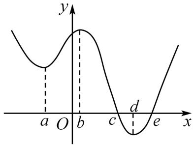
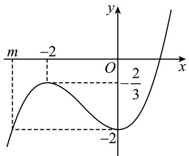
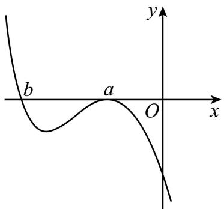
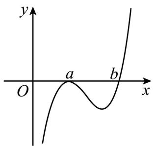

# 第16讲 极值与最值

# 知识梳理

# 知识点一:极值与最值

# 1、函数的极值

函数 $f(x)$ 在点 $x_0$ 附近有定义，如果对 $x_0$ 附近的所有点都有 $f(x) < f(x_0)$ ，则称 $f(x_0)$ 是函数的一个极大值，记作 $y_{\text{极大值}} = f(x_0)$ 。如果对 $x_0$ 附近的所有点都有 $f(x) > f(x_0)$ ，则称 $f(x_0)$ 是函数的一个极小值，记作 $y_{\text{极小值}} = f(x_0)$ 。极大值与极小值统称为极值，称 $x_0$ 为极值点。

求可导函数 $f(x)$ 极值的一般步骤

(1) 先确定函数 $f(x)$ 的定义域；  
(2) 求导数 $f'(x)$ ;  
(3) 求方程 $f'(x)=0$ 的根；  
(4) 检验 $f'(x)$ 在方程 $f'(x) = 0$ 的根的左右两侧的符号, 如果在根的左侧附近为正, 在右侧附近为负, 那么函数 $y = f(x)$ 在这个根处取得极大值; 如果在根的左侧附近为负, 在右侧附近为正, 那么函数 $y = f(x)$ 在这个根处取得极小值.

注：①可导函数 $f(x)$ 在点 $x_0$ 处取得极值的充要条件是： $x_0$ 是导函数的变号零点，即 $f'(x_0) = 0$ ，且在 $x_0$ 左侧与右侧， $f'(x)$ 的符号导号.

② $f'(x_0) = 0$ 是 $x_0$ 为极值点的既不充分也不必要条件，如 $f(x) = x^3$ ， $f'(0) = 0$ ，但 $x_0 = 0$ 不是极值点。另外，极值点也可以是不可导的，如函数 $f(x) = |x|$ ，在极小值点 $x_0 = 0$ 是不可导的，于是有如下结论： $x_0$ 为可导函数 $f(x)$ 的极值点 $\Rightarrow f'(x_0) = 0$ ；但 $f'(x_0) = 0 \Rightarrow x_0$ 为 $f(x)$ 的极值点。

# 2、函数的最值

函数 $y=f(x)$ 最大值为极大值与靠近极小值的端点之间的最大者；函数 $f(x)$ 最小值为极小值与靠近极大值的端点之间的最小者。

导函数为 $f(x) = ax^{2} + bx + c = a(x - x_{1})(x - x_{2})(m < x_{1} < x_{2} < n)$

(1) 当 $a > 0$ 时, 最大值是 $f(x_{1})$ 与 $f(n)$ 中的最大者; 最小值是 $f(x_{2})$ 与 $f(m)$ 中的最小者.  
(2) 当 $a < 0$ 时, 最大值是 $f(x_{2})$ 与 $f(m)$ 中的最大者; 最小值是 $f(x_{1})$ 与 $f(n)$ 中的最小者. 一般地, 设 $y = f(x)$ 是定义在 $[m, n]$ 上的函数, $y = f(x)$ 在 $(m, n)$ 内有导数, 求函数 $y = f(x)$ 在 $[m, n]$ 上的最大值与最小值可分为两步进行:

(1) 求 $y = f(x)$ 在 $(m, n)$ 内的极值 (极大值或极小值);

(2) 将 $y = f(x)$ 的各极值与 $f(m)$ 和 $f(n)$ 比较, 其中最大的一个为最大值, 最小的一个为最小值.

注:①函数的极值反映函数在一点附近情况,是局部函数值的比较,故极值不一定是最值;函数的最值是对函数在整个区间上函数值比较而言的,故函数的最值可能是极值,也可能是区间端点处的函数值;

②函数的极值点必是开区间的点,不能是区间的端点;   
③函数的最值必在极值点或区间端点处取得.

【解题方法总结】

(1) 若函数 $f(x)$ 在区间 D 上存在最小值 $f(x)_{\min}$ 和最大值 $f(x)_{\max}$ ，则

不等式 $f(x)>a$ 在区间D上恒成立 $\Leftrightarrow f(x)_{\min}>a;$

不等式 $f(x)\geqslant a$ 在区间D上恒成立 $\Leftrightarrow f(x)_{\min}\geqslant a;$

不等式 $f(x) < b$ 在区间D上恒成立 $\Leftrightarrow f(x)_{\max} < b$ ;

不等式 $f(x)\leqslant b$ 在区间D上恒成立 $\Leftrightarrow f(x)_{\mathrm{max}}\leqslant b;$

(2) 若函数 $f(x)$ 在区间 D 上不存在最大 (小) 值, 且值域为 $(m, n)$ , 则

不等式 $f(x)>a$ （或 $f(x)\geqslant a$ ）在区间D上恒成立 $\Leftrightarrow m\geqslant a$ .

不等式 $f(x) < b$ （或 $f(x) \leqslant b$ ）在区间D上恒成立 $\Leftrightarrow m \leqslant b$ .

(3) 若函数 $f(x)$ 在区间 D 上存在最小值 $f(x)_{\min}$ 和最大值 $f(x)_{\max}$ ，即 $f(x) \in [m, n]$ ，则对不等式有解问题有以下结论：

不等式 $a < f(x)$ 在区间D上有解 $\Leftrightarrow a < f(x)_{\max}$ ;

不等式 $a \leqslant f(x)$ 在区间D上有解 $\Leftrightarrow a \leqslant f(x)_{\max}$ ;

不等式 $a > f(x)$ 在区间D上有解 $\Leftrightarrow a > f(x)_{\min}$ ;

不等式 $a \geqslant f(x)$ 在区间D上有解 $\Leftrightarrow a \geqslant f(x)_{\min}$ ;

(4) 若函数 $f(x)$ 在区间 D 上不存在最大 (小) 值, 如值域为 $(m, n)$ , 则对不等式有解问题有以下结论:

不等式 $a < f(x)$ （或 $a \leqslant f(x)$ ）在区间D上有解 $\Leftrightarrow a < n$

不等式 $b > f(x)$ （或 $b \geqslant f(x)$ ）在区间D上有解 $\Leftrightarrow b > m$

(5)对于任意的 $x_{1}\in [a,b]$ ，总存在 $x_{2}\in [m,n]$ ，使得 $f(x_{1})\leqslant g(x_{2})\Leftrightarrow f(x_{1})_{\max}\leqslant g(x_{2})_{\max};$

(6) 对于任意的 $x_{1} \in [a, b]$ , 总存在 $x_{2} \in [m, n]$ , 使得 $f(x_{1}) \geqslant g(x_{2}) \Leftrightarrow f(x_{1})_{\min} \geqslant g(x_{2})_{\min}$ ;

(7) 若存在 $x_{1} \in [a, b]$ , 对于任意的 $x_{2} \in [m, n]$ , 使得 $f(x_{1}) \leqslant g(x_{2}) \Leftrightarrow f(x_{1})_{\min} \leqslant g(x_{2})_{\min}$ ;

(8) 若存在 $x_{1} \in [a, b]$ , 对于任意的 $x_{2} \in [m, n]$ , 使得 $f(x_{1}) \geqslant g(x_{2}) \Leftrightarrow f(x_{1})_{\max} \geqslant g(x_{2})_{\max}$ ;

(9)对于任意的 $x_{1}\in [a,b],x_{2}\in [m,n]$ 使得 $f(x_{1})\leqslant g(x_{2})\Leftrightarrow f(x_{1})_{\max}\leqslant g(x_{2})_{\min}$

(10)对于任意的 $x_{1}\in [a,b],x_{2}\in [m,n]$ 使得 $f(x_{1})\geqslant g(x_{2})\Leftrightarrow f(x_{1})_{\min}\geqslant g(x_{2})_{\max};$

(11) 若存在 $x_{1} \in [a, b]$ , 总存在 $x_{2} \in [m, n]$ , 使得 $f(x_{1}) \leqslant g(x_{2}) \Leftrightarrow f(x_{1})_{\min} \leqslant g(x_{2})_{\max}$

(12) 若存在 $x_{1} \in [a, b]$ , 总存在 $x_{2} \in [m, n]$ , 使得 $f(x_{1}) \geqslant g(x_{2}) \Leftrightarrow f(x_{1})_{\max} \geqslant g(x_{2})_{\min}$ .

# 必考题型全归纳

# 1 题型一: 求函数的极值与极值点

508 (2024·全国·高三专题练习)若函数 $f(x)$ 存在一个极大值 $f(x_{1})$ 与一个极小值 $f(x_{2})$ 满足 $f(x_{2}) > f(x_{1})$ ，则 $f(x)$ 至少有（）个单调区间.

A. 3

B. 4

C. 5

D. 6

【答案】B

【解析】若函数 $f(x)$ 存在一个极大值 $f(x_{1})$ 与一个极小值 $f(x_{2})$ ，则 $f(x)$ 至少有3个单调区间，

若 $f(x)$ 有3个单调区间，

不妨设 $f(x)$ 的定义域为 $(a,b)$ ，若 $a<x_{1}<x_{2}<b$ ，其中a可以为 $-\infty$ ，b可以为 $+\infty$ ，则 $f(x)$ 在 $(a,x_{1}),(x_{2},b)$ 上单调递增，在 $(x_{1},x_{2})$ 上单调递减，(若 $f(x)$ 定义域为 $(a,b)$ 内不连续不影响总体单调性)，

故 $f(x_{2})<f(x_{1})$ ，不合题意，

若 $a < x_{2} < x_{1} < b$ ，则 $f(x)$ 在 $(a, x_{2})$ ， $(x_{1}, b)$ 上单调递减，在 $(x_{2}, x_{1})$ 上单调递增，有 $f(x_{2}) < f(x_{1})$ ，不合题意；

若 $f(x)$ 有4个单调区间，

例如 $f(x)=x+\frac{1}{x}$ 的定义域为 $\{x|x\neq0\}$ ，则 $f'(x)=\frac{x^{2}-1}{x^{2}}$

令 $f'(x)>0$ , 解得 x>1 或 x<-1,

则 $f(x)$ 在 $(-∞,-1),(1,+∞)$ 上单调递增，在 $(-1,0),(0,1)$ 上单调递减，

故函数 $f(x)$ 存在一个极大值 $f(-1) = -2$ 与一个极小值 $f(1) = 2$ ，且 $f(-1) < f(1)$ ，满足题意，此时 $f(x)$ 有 4 个单调区间，

综上所述: $f(x)$ 至少有 4 个单调区间.

故选: B.

509 (2024·全国·高三专题练习)已知定义在 R 上的函数 $f(x)$ ，其导函数 $f'(x)$ 的大致图象如图所示，则下列叙述正确的是（）

text_image

y
a O b c d e x

A. $f(b) > f(a) > f(c)$   
B. 函数 $f(x)$ 在 x=c 处取得最大值，在 x=e 处取得最小值  
C. 函数 $f(x)$ 在 x=c 处取得极大值，在 x=e 处取得极小值  
D. 函数 $f(x)$ 的最小值为 $f(d)$

【答案】C

【解析】由题图可知, 当 $x \leqslant c$ 时, $f'(x) \geqslant 0$ , 所以函数 $f(x)$ 在 $(-∞, c]$ 上单调递增,

又 a<b<c，所以 $f(a)<f(b)<f(c)$ ，故 A 不正确.

因为 $f'(c)=0$ , $f'(\mathrm{e})=0$ , 且当 x<c 时, $f'(x)>0$ ; 当 c<x<e 时, $f'(x)<0$ ;

当 $x > \mathrm{e}$ 时， $f'(x) > 0$ 。所以函数 $f(x)$ 在 $x = c$ 处取得极大值，但不一定取得最大值，在 $x = \mathrm{e}$ 处取得极小值，不一定是最小值，故B不正确，C正确。

由题图可知, 当 $d \leqslant x \leqslant e$ 时, $f'(x) \leqslant 0$ , 所以函数 $f(x)$ 在 $[d, e]$ 上单调递减, 从而 $f(d) > f(e)$ , 所以 D 不正确.

故选：C.

510 (2024·全国·模拟预测)已知函数 $f(x)$ 的导函数为 $f'(x)$ ，则“ $y = f'(x)$ 在(0,2)上有两个零点”是“ $f(x)$ 在(0,2)上有两个极值点”的()

A. 充分不必要条件

B. 必要不充分条件

C. 充要条件

D. 既不充分也不必要条件

【答案】D

【解析】只有当 $f'(x)$ 在 $(0,2)$ 上有两个变号零点时， $f(x)$ 在 $(0,2)$ 上才有两个极值点，故充分性不成立；若 $f(x)$ 在 $(0,2)$ 上有两个极值点，则 $f'(x)$ 在 $(0,2)$ 上有两个变号零点，则$f'(x)$ 在 $(0,2)$ 上至少有两个零点，故必要性不成立。综上，“ $f'(x)$ 在 $(0,2)$ 上有两个零点”是“ $f(x)$ 在 $(0,2)$ 上有两个极值点”的既不充分也不必要条件，

故选：D.

511 (2024·广西南宁·南宁三中校考一模)设函数 $f(x) = (x - a)(x - b)(x - c)$ , $a, b, c \in \mathbb{R}$ , $f'(x)$ 为 $f(x)$ 的导函数.

(1) 当 a=b=c=0 时, 过点 P(1,0) 作曲线 $y=f(x)$ 的切线, 求切点坐标;  
(2) 若 $a \neq b, b = c$ , 且 $f(x)$ 和 $f'(x)$ 的零点均在集合 $\left\{2, -2, \frac{2}{3}\right\}$ 中, 求 $f(x)$ 的极小值.

【解析】(1) 当 a=b=c=0 时, $f(x)=x^{3}$ , 求导得 $f'(x)=3x^{2}$ ,

设过点 $P(1,0)$ 作曲线 $y=f(x)$ 的切线的切点为 $(x_{0},x_{0}^{3})$ ，则 $f'(x_{0})=3x_{0}^{2}$

于是切线方程为 $y - x_{0}^{3} = 3x_{0}^{2}(x - x_{0})$ ，即 $y = 3x_{0}^{2}x - 2x_{0}^{3}$ ，因为切线过点 P(1,0)，

即有 $0 = 3x_0^2 - 2x_0^3$ ，解得 $x_0 = 0$ 或 $x_0 = \frac{3}{2}$ ，所以切点坐标为 $(0,0)$ ， $\left(\frac{3}{2}, \frac{27}{8}\right)$ .

(2) 当 $a \neq b, b = c$ 时， $f(x) = (x - a)(x - b)^2 = x^3 - (a + 2b)x^2 + b(2a + b)x - ab^2,$

求导得 $f'(x)=3(x-b)\left(x-\frac{2a+b}{3}\right)$ ，令 $f'(x)=0$ ，得x=b或 $x=\frac{2a+b}{3}$

依题意 $a, b, \frac{2a + b}{3}$ 都在集合 $\left\{2, -2, \frac{2}{3}\right\}$ 中，且 $a \neq b, a - \frac{2a + b}{3} = \frac{a - b}{3}$ ，

当 a > b 时， $a - \frac{2a + b}{3} = \frac{a - b}{3} > 0$ ，且 $a - \frac{2a + b}{3} < a - b$ ，则 a = 2, b = -2, $\frac{2a + b}{3} = \frac{2}{3}$ ,

当 $a < b$ 时， $a - \frac{2a + b}{3} = \frac{a - b}{3} < 0$ ，且 $a - \frac{2a + b}{3} > a - b$ ，则 $a = -2, b = 2, \frac{2a + b}{3} = -\frac{2}{3}$ ，不符合题意，

因此 a=2, b=-2, $f(x)=(x-2)(x+2)^{2}$ , $f'(x)=(x+2)(3x-2)$ ,

当 x<-2 或 $x>\frac{2}{3}$ 时， $f'(x)>0$ ，当 $-2<x<\frac{2}{3}$ 时， $f'(x)<0$ ，

于是函数 $f(x)$ 在 $(-∞,-2)$ , $\left( \frac{2}{3},+∞ \right)$ 上单调递增,在 $\left( -2,\frac{2}{3} \right)$ 上单调递减,

所以当 $x=\frac{2}{3}$ 时, 函数 $f(x)$ 取得极小值为 $f\left(\frac{2}{3}\right)=-\frac{256}{27}$ .

512 (2024·河北·统考模拟预测)已知函数 $f(x)=\sqrt{x}-a\ln(x+b)$ .

(1) 证明: 当 a > 0, b = 0 时, $f(x)$ 有唯一的极值点为 $x_{0}$ , 并求 $f(x_{0})$ 取最大值时 $x_{0}$ 的值;  
(2) 当 b > 0 时, 讨论 $f(x)$ 极值点的个数.

【解析】(1) 证明: 当 a > 0, b = 0 时, $f(x) = \sqrt{x} - a \ln x$ , 可得 $f(x)$ 的定义域为 $(0, +\infty)$ ,

且 $f'(x)=\frac{1}{2\sqrt{x}}-\frac{a}{x}=\frac{\sqrt{x}-2a}{2x}$ ，令 $f'(x)=0$ ，解得 $x=4a^{2}$

当 $0 < x < 4a^{2}$ 时， $f'(x) < 0, f(x)$ 单调递减；

当 $x > 4a^{2}$ 时， $f'(x) > 0, f(x)$ 单调递增，

所以当 $x=4a^{2}$ 时， $f(x)$ 有唯一的极小值，即 $f(x)$ 有唯一的极值点为 $x_{0}=4a^{2}$

由 $f(x_{0})=f(4a^{2})=\sqrt{4a^{2}}-a\ln(4a^{2})=2a-2a\ln(2a),a>0,$

令 t=2a，设 $g(t)=t-t\ln t, t>0$ ，可得 $g'(t)=-\ln t$ ，

由 $g'(t)=0$ , 解得 t=1,

当 0 < t < 1 时， $g'(t) > 0$ ， $g(t)$ 单调递增；当 t > 1 时， $g'(t) < 0$ ， $g(t)$ 单调递减，

所以当 t=1，即 $a=\frac{1}{2}$ 时， $g(t)$ 有唯一的极大值，即 $g(t)$ 取得最大值 1，所以当 $f(x_{0})$ 的最大值 1 时， $x_{0}=4a^{2}=1$ .

(2) 当 $b > 0$ 时, $f(x)$ 的定义域为 $[0, +\infty)$ , 且 $f'(x) = \frac{1}{2\sqrt{x}} - \frac{a}{x + b} = \frac{x - 2a\sqrt{x} + b}{2\sqrt{x}(x + b)}$ ,

①当 $a \leqslant 0$ 时， $f'(x) > 0$ 时 $\forall x \in (0, +\infty)$ 恒成立，此时 $f(x)$ 单调递增，

所以 $f(x)$ 极值点的个数为 0 个;

②当 $a > 0$ 时，设 $h(\sqrt{x}) = x - 2a\sqrt{x} + b$ ，即 $h(x) = x^2 - 2ax + b (x \geqslant 0)$

(i) 当 $4a^{2}-4b\leqslant0$ ，即 $0<a\leqslant\sqrt{b}$ 时，可得 $h(x)\geqslant0$ ，即 $f'(x)\geqslant0$ 对 $\forall x\in(0,+\infty)$ 恒成立，即 $f(x)$ 在 $(0,+\infty)$ 上无变号零点，所以此时 $f(x)$ 极值点的个数为 0 个；

(ii) 当 $4a^{2}-4b>0$ , 即 $a>\sqrt{b}$ 时,

设 $h(x)$ 的两零点为 $x_{1}, x_{2}$ ，且 $x_{1} < x_{2}, x_{1} + x_{2} = 2a > 0, x_{1}x_{2} = b > 0$ ，可得 $x_{1} > 0, x_{2} > 0$ 即 $f'(x)$ 在 $(0, +\infty)$ 上有 2 个变号零点，所以此时 $f(x)$ 极值点的个数为 2 个；

综上所述, 当 $a \leqslant \sqrt{b}$ 时, $f(x)$ 的极值点的个数为 0;

当 $a > \sqrt{b}$ 时， $f(x)$ 的极值点的个数为 2.

513 (2024·江苏无锡·校联考三模)已知函数 $f(x) = \tan x + \ln (1 - x), x \in \left(-\frac{\pi}{2}, 1\right)$ . 求 $f(x)$ 的极值；

【解析】因为函数 $f(x) = \tan x + \ln (1 - x), x \in \left(-\frac{\pi}{2}, 1\right)$ ，所以 $f'(x) = \frac{1}{\cos^2 x} + \frac{-1}{1 - x} = \frac{1}{\cos^2 x} + \frac{1}{x - 1} = \frac{x - 1 + \cos^2 x}{(x - 1)\cos^2 x}$ ，

设 $h(x)=x-1+\cos^{2}x$ , $h'(x)=1-2\cos x\sin x=1-\sin 2x\geqslant0$ ,

所以 $h(x)$ 在 $\left(-\frac{\pi}{2},1\right)$ 上单调递增.

又 $h(0) = 0$ ，所以当 $x\in \left(-\frac{\pi}{2},0\right)$ 时， $h(x) <   0$ ；当 $x\in (0,1)$ 时， $h(x) > 0$

又因为 $(x - 1)\cos^2 x < 0$ 对 $x\in \left(-\frac{\pi}{2},1\right)$ 恒成立，

所以当 $x \in \left(-\frac{\pi}{2}, 0\right)$ 时， $f'(x) > 0$ ; 当 $x \in (0,1)$ 时， $f'(x) < 0$ .

即 $f(x)$ 在区间 $\left(-\frac{\pi}{2},0\right)$ 上单调递增，在区间 $(0,1)$ 上单调递减，

故 $f(x)_{极大值}=f(0)=0$ , $f(x)$ 没有极小值.

# 【解题方法总结】

1、因此,在求函数极值问题中,一定要检验方程 $f'(x)=0$ 根左右的符号,更要注意变号后极大值与极小值是否与已知有矛盾.

2、原函数出现极值时,导函数正处于零点,归纳起来一句话:原极导零. 这个零点必须穿越 x 轴,否则不是极值点. 判断口诀:从左往右找穿越(导函数与 x 轴的交点);上坡低头找极小,下坡抬头找极大.

# 2 题型二:根据极值、极值点求参数

514 (2024·贵州·校联考模拟预测)已知函数 $f(x)=ax^{3}+bx$ 在 x=1 处取得极大值 4，则 a-b
= （）

A. 8

B.-8

C. 2

D.-2

【答案】B

【解析】因为 $f(x)=ax^{3}+bx$ ，所以 $f'(x)=3ax^{2}+b$ ，

所以 $f'(1)=3a+b=0, f(1)=a+b=4$ ，解得 a=-2, b=6，

经检验,符合题意,所以 a-b=-8.

故选: B

515 (2024·陕西商洛·统考三模)若函数 $f(x)=x^{3}+ax^{2}+(a+6)x$ 无极值，则 a 的取值范围为（）

A. $[-3,6]$

B. $(-3,6)$

C. $(- \infty, -3] \cup [6, +\infty)$

D. $(-\infty, -3) \cup (6, +\infty)$

【答案】A

【解析】因为 $f(x)=x^{3}+ax^{2}+(a+6)x$ ，所以 $f'(x)=3x^{2}+2ax+a+6$ ，因为 $f(x)$ 无极值，所以 $(2a)^{2}-4\times3\times(a+6)\leqslant0$ ，解得 $-3\leqslant a\leqslant6$ ，所以 a 的取值范围为 $[-3,6]$ .

故选：A.

516 (2024·湖南长沙·高三长沙一中校考阶段练习)函数 $g(x)=\frac{\ln x}{x+1}$ 在区间 $[t,+\infty)(t\in\mathbb{N}^{*})$ 上存在极值，则 t 的最大值为 ()

A. 2

B. 3

C. 4

D. 5

【答案】B

【解析】函数 $g(x)=\frac{\ln x}{x+1}$ 的定义域为 $(0,+\infty)$ ,

$$
g ^ {\prime} (x) = \frac {\frac {1}{x} \cdot (x + 1) - \ln x}{(x + 1) ^ {2}} = \frac {x + 1 - x \ln x}{x (x + 1) ^ {2}},
$$

令 $f(x)=x+1-x\ln x$ , $f'(x)=1-\ln x-1=-\ln x$ ,

所以当 $x \in (0,1)$ 时， $f'(x) > 0$ ，当 $x \in (1, +\infty)$ 时， $f'(x) < 0$ ，

所以 $f(x)=x+1-x\ln x$ 在 $(0,1)$ 单调递增， $(1,+\infty)$ 单调递减，

所以 $f(x)_{\max}=f(1)=2>0,$

又因为当 $x \in (0,1)$ 时， $\ln x < 0, -x \ln x > 0$ ，则 $f(x) = x + 1 - x \ln x > 0$

$$
f (3) = 4 - 3 \ln 3 = \ln e ^ {4} - \ln 2 7 > 0,
$$

$$
f (4) = 5 - 4 \ln 4 = \ln e ^ {5} - \ln 2 5 6 <   \ln 2 4 3 - \ln 2 5 6 <   0,
$$

所以存在唯一 $x_0 \in (3,4)$ , 使得 $f(x_0) = 0$ ,

所以函数在 $x \in (0, x_{0})$ 时 $f(x) > 0, x \in (x_{0}, +\infty)$ 时 $f(x) < 0,$

所以函数 $g(x)$ 在 $(0, x_{0})$ 单调递增， $(x_{0}, +\infty)$ 单调递减，

所以要使函数 $g(x)=\frac{\ln x}{x+1}$ 在区间 $[t,+\infty)(t\in\mathbb{N}^{*})$ 上存在极值，

所以 t 的最大值为 3,

故选:B.

517 (2024·全国·高三专题练习)已知函数 $f(x)=\frac{1}{2}x^{2}-(1+a)x+a\ln x$ 在 x=a 处取得极小值，则实数 a 的取值范围为 ()

A. $[1, +\infty)$

B. $(1,+\infty)$

C. $(0,1]$

D. $(0,1)$

【答案】B

【解析】因为函数 $f(x) = \frac{1}{2} x^2 - (1 + a)x + a\ln x$ ,

则 $f'(x)=x-(1+a)+\frac{a}{x}=\frac{(x-a)(x-1)}{x}$ ,

要使函数 $f(x)$ 在 x=a 处取得极小值, 则 a>1,

故选: B.

518 (2024·广东梅州·梅州市梅江区梅州中学校考模拟预测)已知函数 $f(x)=\mathrm{e}^{x}-\frac{1}{2}x^{2}-ax(a\in\mathbb{R})$ 有两个极值点,则实数a的取值范围()

A. $(- \infty, 1)$

B. $(0,1)$

C. $[0,1]$

D. $(1, +\infty)$

【答案】D

【解析】 $f(x)$ 的定义域是 R, $f'(x) = e^{x} - x - a$ ,

令 $h(x)=\mathrm{e}^{x}-x-a,h'(x)=\mathrm{e}^{x}-1,$

所以 $h(x)$ 在区间 $(-∞,0), h'(x) < 0, h(x)$ 递减；在区间 $(0,+∞), h'(x) > 0, h(x)$ 递增.

要使 $f(x)$ 有两个极值点,则 $f'(0)=h(0)=1-a<0,a>1$ ,

此时 $f'(-a)=\mathrm{e}^{-a}-(-a)-a=\mathrm{e}^{-a}>0,$

构造函数 $g(x)=x-\ln2x(x>1)$ , $g'(x)=1-\frac{1}{x}=\frac{x-1}{x}$ ,

所以 $g(x)$ 在 $(1, +\infty)$ 上递增, 所以 $g(x) > 1 - \ln 2 > 0$ ,

所以 $f'(\ln2a)=\mathrm{e}^{\ln2a}-\ln2a-a=a-\ln2a>0,$

所以实数 a 的取值范围 $(1, +\infty)$ .

故选：D

519 (2024·江苏扬州·高三扬州市新华中学校考开学考试)若 x=a 是函数 $f(x)=(x-a)^{2}(x-1)$ 的极大值点，则 a 的取值范围是 ()

A. $a <   1$

B. $a \leqslant 1$

C. a > 1

D. $a \geqslant 1$

【答案】A

【解析】 $f(x)=(x-a)^{2}(x-1)$ ， $x\in R$

$$
\therefore f ^ {\prime} (x) = (x - a) (3 x - a - 2)
$$

令 $f'(x)=(x-a)(3x-a-2)=0$ , 得: $x=a, x=\frac{a+2}{3}$

当 $a < \frac{a + 2}{3}$ , 即 $a < 1$

此时 $f(x)$ 在区间 $(-\infty, a)$ 单调递增， $\left(a, \frac{a+2}{3}\right)$ 上单调递减， $\left(\frac{a+2}{3}, +\infty\right)$ 上单调递增，符合 x=a 是函数 $f(x)$ 的极大值点，

反之，当 $a > \frac{a + 2}{3}$ ，即 $a > 1$ ，此时 $f(x)$ 在区间 $\left(-\infty, \frac{a + 2}{3}\right)$ 单调递增， $\left(\frac{a + 2}{3}, a\right)$ 上单调递减， $(a, +\infty)$ 上单调递增， $x = a$ 是函数 $f(x)$ 的极小值点，不符合题意；

当 $a=\frac{a+2}{3}$ ，即 $a=1, f'(x)\geqslant0$ 恒成立，函数 $f(x)$ 在 $x\in R$ 上单调递增，无极值点.

综上得: a < 1.

故选：A.

【解题方法总结】

根据函数的极值(点)求参数的两个要领

(1) 列式: 根据极值点处导数为 0 和极值这两个条件列方程组, 利用待定系数法求解;

(2) 验证: 求解后验证根的合理性.

# 3 题型三:求函数的最值(不含参)

520 (2024·山东淄博·山东省淄博实验中学校考三模)已知函数 $f(x) = \mathrm{e}^{x}\sin x - 2x$ .

(1) 求曲线 $y = f(x)$ 在点 $(0, f(0))$ 处的切线方程；  
(2) 求 $f(x)$ 在区间 $[-1, 1]$ 上的最大值；

【解析】(1) 因为 $f(x)=\mathrm{e}^{x}\sin x-2x$ ,

所以 $f'(x)=\mathrm{e}^{x}(\sin x+\cos x)-2$ , 则 $f'(0)=-1$ , 又 $f(0)=0$

所以曲线 $y=f(x)$ 在点 $(0,f(0))$ 处的切线方程为 y=-x.

(2) 令 $g(x)=f'(x)=\mathrm{e}^{x}(\sin x+\cos x)-2,$

则 $g'(x)=2\mathrm{e}^{x}\cos x$ ，当 $x\in[-1,1]$ 时， $g'(x)>0$ ， $g(x)$ 在 $[-1,1]$ 上单调递增.

因为 $g(0)=-1<0$ , $g(1)=\mathrm{e}(\sin1+\cos1)-2>0$ ,

所以 $\exists x_{0}\in(0,1)$ ，使得 $g(x_{0})=0$ .

所以当 $x \in (-1, x_{0})$ 时， $f'(x) < 0, f(x)$ 单调递减；

当 $x \in (x_{0},1)$ 时， $f'(x) > 0, f(x)$ 单调递增，

又 $f(1)=e\sin1-2<e-2<1,f(-1)=2-\frac{\sin1}{e}>1,$

所以 $f(x)_{\max}=f(-1)=2-\frac{\sin1}{e}$ .

521 (2024·云南昆明·高三昆明一中校考阶段练习)已知函数 $f(x) = \ln x - \frac{x - 1}{x}$ 在区间[1,e]上最大值为M，最小值为m，则M-m的值是\_\_\_\_.

【答案】 $\frac{1}{\mathrm{e}}$

【解析】由题意, x > 0, $f'(x) = \frac{x - 1}{x^{2}}$ , 在 $[1, e]$ 上 $f'(x) = \frac{x - 1}{x^{2}} \geqslant 0$ ,

故函数 $f(x)$ 单调递增,所以 $M=f(e)=\frac{1}{e}$ , $m=f(1)=0$ , $M-m=\frac{1}{e}$ ,

故 $\mathrm{M} - m$ 的值是 $\frac{1}{\mathrm{e}}$ .

故答案为: $\frac{1}{e}$

522 (2024·辽宁葫芦岛·统考二模)已知函数 $f(x) = 2\sin x(1 + \cos x)$ ，则 $f(x)$ 的最大值是 \_\_\_\_.

【答案】 $\frac{3\sqrt{3}}{2}$

【解析】因为 $f(x)=2\sin x(1+\cos x)$ ,

所以 $f'(x)=2\cos x(1+\cos x)-2\sin^{2}x=2\cos x+2\cos^{2}x-2\sin^{2}x$

$$
= 4 \cos^ {2} x + 2 \cos x - 2 = 2 (2 \cos^ {2} x + \cos x - 1) = 2 (2 \cos x - 1) (\cos x + 1).
$$

当 $f'(x) > 0$ 时， $x \in \left(-\frac{\pi}{3} + 2k\pi, \frac{\pi}{3} + 2k\pi\right)$ ,

所以 $f(x)$ 在 $\left(-\frac{\pi}{3}+2k\pi,\frac{\pi}{3}+2k\pi\right)$ 单调递增；

当 $f'(x) < 0$ 时， $x \in \left( \frac{\pi}{3} + 2k\pi, \frac{5\pi}{3} + 2k\pi \right)$ ,

所以 $f(x)$ 在 $\left(\frac{\pi}{3}+2k\pi,\frac{5\pi}{3}+2k\pi\right)$ 单调递减；

所以 $f(x)_{\max}=f\left(\frac{\pi}{3}+2k\pi\right)=\frac{3\sqrt{3}}{2}.$

故答案为: $\frac{3\sqrt{3}}{2}$ .

523 (2024·湖北武汉·统考模拟预测)已知函数 $f(x) = \frac{1 + \sin x}{2\cos x + \sin x}, x \in \left[0, \frac{\pi}{2}\right]$ ，则函数 $f(x)$ 的最小值为 \_\_\_\_.

【答案】 $\frac{1}{2} / 0.5$

【解析】因为 $f(x)=\frac{1+\sin x}{2\cos x+\sin x}$ ,

所以 $f'(x)=\frac{\cos x(2\cos x+\sin x)-(1+\sin x)(-2\sin x+\cos x)}{(2\cos x+\sin x)^{2}}=\frac{2+2\sin x-\cos x}{(2\cos x+\sin x)^{2}}$

记 $g(x) = 2 + 2\sin x - \cos x, x \in \left[0, \frac{\pi}{2}\right]$ ,

则 $g'(x)=2\cos x+\sin x$ ，因为 $x\in\left[0,\frac{\pi}{2}\right]$ ，所以 $g'(x)=2\cos x+\sin x>0$ ，

所以 $g(x)=2+2\sin x-\cos x$ 在 $\left[0,\frac{\pi}{2}\right]$ 上单调递增，所以 $g(x)>g(0)=2-1=1>0$

所以 $f'(x) > 0$ 在 $\left[0, \frac{\pi}{2}\right]$ 上恒成立，所以 $f(x) = \frac{1 + \sin x}{2\cos x + \sin x}$ 在 $\left[0, \frac{\pi}{2}\right]$ 上单调递增，

故当 x=0 时, 函数 $f(x)$ 有最小值为 $f(0)=\frac{1+0}{2\times1+0}=\frac{1}{2}$ ,

故答案为: $\frac{1}{2}$

524 (2024·山西·高三校联考阶段练习)已知 x > 0, y > 0，且 $\ln(xy)^{y} = e^{x}$ ，则 $x^{2}y - \ln x - x$ 的最小值为 \_\_\_\_.

【答案】1

【解析】因为 x>0, y>0, $\ln(xy)^{y}=e^{x}$ , 所以 $y\ln(xy)=e^{x}$ , 所以 $xy\ln(xy)=xe^{x}$ , 且 $\ln(xy)>0$ ,

所以 $\ln(xy)\cdot\mathrm{e}^{\ln(xy)}=xe^{x}$ ,

设 $f(x)=xe^{x}, x>0,$

则 $f'(x)=\mathrm{e}^{x}+xe^{x}=(1+x)\mathrm{e}^{x}$ ，因为 x>0，所以 $f'(x)>0,f(x)$ 在 $(0,+\infty)$ 上为增函数，

因为 $\ln(xy)\cdot(xy)^{\ln(xy)}=xe^{x}$ ，所以 $\ln(xy)=x$ ，则 $xy=e^{x}$ ，所以 $y=\frac{e^{x}}{x}$ ，

所以 $x^{2}y - \ln x - x = x^{2}\cdot \frac{\mathrm{e}^{x}}{x} -\ln x - x = xe^{x} - \ln x - x,$

令 $g(x)=xe^{x}-\ln x-x$ ，则 $g'(x)=\mathrm{e}^{x}+xe^{x}-\frac{1}{x}-1=(1+x)\left(\mathrm{e}^{x}-\frac{1}{x}\right)$ ,

令 $\varphi(x)=\mathrm{e}^{x}-\frac{1}{x}$ ，则 $\varphi'(x)=\mathrm{e}^{x}+\frac{1}{x^{2}}>0$ ，则 $\varphi(x)$ 在 $(0,+\infty)$ 上为增函数，

令 $\varphi(x)=0$ 得 $e^{x}-\frac{1}{x}=0$ , 即 $xe^{x}=1$

则存在唯一实数 $x_{0}>0$ ，使得 $x_{0}e^{x_{0}}=1$ ，即 $\varphi(x_{0})=0$ ，

所以当 $x \in (0, x_{0})$ 时， $\varphi(x) < 0, g'(x) < 0$ ，当 $x \in (x_{0}, +\infty)$ 时， $\varphi(x) > 0, g'(x) > 0$ ，

所以 $g(x)$ 在 $(0, x_{0})$ 上为减函数，在 $(x_{0}, +\infty)$ 上为增函数，

所以 $g(x)_{\min}=g(x_{o})=x_{0}\mathrm{e}^{x_{0}}-\ln x_{0}-x_{0}=x_{0}\mathrm{e}^{x_{0}}-\ln(x_{0}\mathrm{e}^{x_{0}})=1-0=1.$

所以 $x^{2}y - \ln x - x$ 的最小值为 1.

故答案为: 1.

525 (2024·海南海口·统考模拟预测)已知正实数 m, n 满足: $n \ln n = e^{m} - n \ln m$ , 则 $\frac{n}{m}$ 的最小值为 \_\_\_\_.

【答案】 $\frac{e^{2}}{4}$

【解析】由 $n\ln n = \mathrm{e}^m - n\ln m$ 可得： $\frac{\mathrm{e}^m}{n} = \ln m + \ln n,$

所以 $\mathrm{e}^{m - \ln n} - \ln n = \ln m, \mathrm{e}^{m - \ln n} + m - \ln n = m + \ln m = \mathrm{e}^{\ln m} + \ln m,$

设 $f(x)=\mathrm{e}^{x}+x,f'(x)=\mathrm{e}^{x}+1>0,$

所以 $f(x)$ 在 R 上单调递增, 所以 $f(m-\ln n)=f(\ln m)$ ,

则 $m - \ln n = \ln m$ ，所以 $\ln n = \ln \frac{\mathrm{e}^m}{m}$

所以 $n=\frac{e^{m}}{m}$ ，所以 $\frac{n}{m}=\frac{e^{m}}{m^{2}}$ ，令 $g(x)=\frac{e^{x}}{x^{2}}, g'(x)=\frac{e^{x}\cdot x^{2}-e^{x}\cdot 2x}{x^{4}}=\frac{e^{x}(x-2)}{x^{3}}$

令 $g'(x)>0$ , 解得: x>2; 令 $g'(x)<0$ , 解得: 0<x<2;

所以 $g(x)$ 在 $(0,2)$ 上单调递减，在 $(2,+\infty)$ 上单调递增，

所以 $g(x)_{\min}=g(2)=\frac{\mathrm{e}^{2}}{4}.$

故 $\frac{n}{m}$ 的最小值为 $\frac{\mathrm{e}^2}{4}$ .

故答案为: $\frac{e^{2}}{4}$ .

【解题方法总结】

求函数 $f(x)$ 在闭区间 $[a,b]$ 上的最值时, 在得到极值的基础上, 结合区间端点的函数值 $f(a)$ , $f(b)$ 与 $f(x)$ 的各极值进行比较得到函数的最值.

# 4 题型四:求函数的最值(含参)

526 (2024·天津和平·统考三模)已知函数 $f(x) = \sqrt{x} - a\ln x, g(x) = (\cos x - 1)\mathrm{e}^{-x}$ ，其中 $a \in \mathbb{R}$ .

(1) 若曲线 $y = f(x)$ 在 $x = 1$ 处的切线 $l_{1}$ 与曲线 $y = g(x)$ 在 $x = \frac{\pi}{2}$ 处的切线 $l_{2}$ 平行，求 $a$ 的值；  
(2) 若 $x \in (0, \pi)$ 时, 求函数 $g(x)$ 的最小值;  
(3) 若 $f(x)$ 的最小值为 $h(a)$ ，证明：当 $a \in (0, +\infty)$ 时， $h(a) \leqslant 1$ .

【解析】(1) 因为 $f(x)=\sqrt{x}-a\ln x$ , $g(x)=(\cos x-1)\mathrm{e}^{-x}$ ,

所以 $f'(x)=\frac{1}{2}x^{-\frac{1}{2}}-\frac{a}{x}=\frac{\sqrt{x}-2a}{2x}$ ， $g'(x)=-\sin x\cdot e^{-x}+(\cos x-1)(-e^{-x})=$

$$
(- \sin x - \cos x + 1) e ^ {- x},
$$

所以 $f'(1)=\frac{1-2a}{2}$ , $g'\left(\frac{\pi}{2}\right)=0$ ,

因为两条切线平行,所以 $\frac{1-2a}{2}=0$ , 解得 $a=\frac{1}{2}$

(2) 由 (1) 可知 $g'(x) = (-\sin x - \cos x + 1)\mathrm{e}^{-x}$ ，令 $g'(x) > 0$ ，即 $\sin x + \cos x < 1$ ，

即 $\sqrt{2}\sin\left(x+\frac{\pi}{4}\right)<1$ , 即 $\sin\left(x+\frac{\pi}{4}\right)<\frac{\sqrt{2}}{2}$ , 又 $x\in(0,\pi)$ , 解得 $\frac{\pi}{2}<x<\pi$

令 $g'(x) < 0$ ，解得 $0 < x < \frac{\pi}{2}$ ，所以 $g(x)$ 在 $\left(0, \frac{\pi}{2}\right)$ 上单调递减，在 $\left(\frac{\pi}{2}, \pi\right)$ 上单调递增，

所以 $x \in (0, \pi)$ 时，函数 $g(x)$ 的最小值为 $g\left(\frac{\pi}{2}\right) = -\mathrm{e}^{-\frac{\pi}{2}}$ .

(3) 证明: 因为 $f(x)=\sqrt{x}-a\ln x, x\in(0,+\infty), f'(x)=\frac{\sqrt{x}-2a}{2x}$ ,

令 $f'(x)>0$ ，则 $\sqrt{x}-2a>0$ ，即 $\sqrt{x}>2a$ ，

所以当 a > 0 时解得 $x > 4a^{2}$ ，所以 $f(x)$ 在 $(4a^{2}, +\infty)$ 上单调递增，

令 $f'(x)<0$ ，解得 $0<x<4a^{2}$ ，所以 $f(x)$ 在 $(0,4a^{2})$ 上单调递减，

所以 $f(x)$ 在 $x = 4a^2$ 处取得极小值即最小值，

所以 $h(a)=f(4a^{2})=2a-a\ln(4a^{2})=2a[1-\ln(2a)]$ ,

即 $f(x)$ 的最小值为 $h(a)$ 的解析式为 $h(a)=2a[1-\ln(2a)]$ , $a\in(0,+\infty)$ ,

则 $h'(a) = -2\ln(2a)$ ，令 $h'(a) > 0$ ，解得 $0 < a < \frac{1}{2}$ ，

所以当 $0 < a < \frac{1}{2}$ 时 $h'(a) > 0$ ，即 $h(a)$ 在 $\left(0, \frac{1}{2}\right)$ 上单调递增，

当 $a > \frac{1}{2}$ 时 $h'(a) < 0$ ，即 $h(a)$ 在 $\left(\frac{1}{2}, +\infty\right)$ 上单调递增，

所以 $h(a)$ 在 $a=\frac{1}{2}$ 处取得极大值即最大值，即 $h(a)_{\max}=h\left(\frac{1}{2}\right)=1$ ，

所以 $h(a) \leqslant h\left(\frac{1}{2}\right) = 1$ ，即当 $a \in (0, +\infty)$ 时，总有 $h(a) \leqslant 1$ .

527 (2024·全国·模拟预测)已知函数 $f(x) = a \ln x + \frac{1}{2} x - a, a \in \mathbb{R}$ . 讨论函数 $f(x)$ 的最值；

【解析】函数 $f(x)$ 的定义域为 $(0, +\infty)$ , $f'(x) = \frac{a}{x} + \frac{1}{2} = \frac{2a + x}{2x}$ ,

当 $a \geqslant 0$ 时， $f'(x) > 0, f(x)$ 在 $(0, +\infty)$ 上单调递增，无最值；

当 a<0 时，令 $f'(x)<0$ ，得 0<x<-2a，所以 $f(x)$ 在 $(0,-2a)$ 上单调递减；

令 $f'(x)>0$ ，得x>-2a，所以 $f(x)$ 在 $(-2a,+\infty)$ 单调递增，

所以 $f(x)$ 的最小值为 $f(-2a)=a\ln(-2a)-2a$ ，无最大值.

综上, 当 $a \geqslant 0$ 时, $f(x)$ 无最值; 当 a < 0 时, $f(x)$ 的最小值为 $a \ln(-2a) - 2a$ , 无最大值.

528 (2024·四川成都·成都七中校考模拟预测)已知函数 $f(x)=\frac{1}{3}x^{3}-\frac{1}{2}(6+a)x^{2}+(8+6a)x-8a\ln x-4a$ ，其中 $a\in R$ .

(1) 若 a=2，求 $f(x)$ 的单调区间；  
(2) 已知 $f(2)=f(4)$ ，求 $f(x)$ 的最小值。（参考数据： $1<\frac{1}{3(3-4\ln2)}<2$ ）

【解析】(1)由题设 $f(x)=\frac{1}{3}x^{3}-4x^{2}+20x-16\ln x-8$ ，则 $f'(x)=x^{2}-8x+20-\frac{16}{x}$ ，且x>0，

所以 $f'(x)=\frac{x(x-4)^{2}}{x}+\frac{4(x-4)}{x}=\frac{(x-4)(x-2)^{2}}{x}$ ,

当 $x \in (0,4)$ 时 $f'(x) < 0$ ，当 $x \in (4, +\infty)$ 时 $f'(x) > 0$ ，

所以 $f(x)$ 的减区间为 $(0,4)$ ，增区间为 $(4,+\infty)$ .

(2) 由题意 $\frac{8}{3} - 2(6 + a) + 2(8 + 6a) - 8a\ln 2 - 4a = \frac{64}{3} - 8(6 + a) + 4(8 + 6a) - 8a\ln 4 - 4a,$

所以 $3a - 4a\ln 2 - \frac{2}{3} = 0$ ，即 $a = \frac{2}{3(3 - 4\ln 2)}\in (2,4)$

又 $f'(x)=x^{2}-(6+a)x+(8+6a)-\frac{8a}{x}=\frac{(x-2)(x-a)(x-4)}{x}$ ，且x>0，

当 $x \in (0,2)$ 或 $x \in (a,4)$ 时 $f'(x) < 0, x \in (2,a)$ 或 $x \in (4,+\infty)$ 时 $f'(x) > 0,$

所以 $(0,2)$ 、 $(a,4)$ 上 $f(x)$ 递减， $(2,a)$ 、 $(4,+\infty)$ 上 $f(x)$ 递增，

又极小值 $f(2) = f(4)$ ，故 $f(x)$ 最小值为 $f(2) = \frac{20}{3} + 2a(3 - 4\ln 2) = 8$ .

529 (2024·全国·高三专题练习)已知函数 $f(x) = \ln (1 + x) + axe^{-x}$ .

(1) 当 a = -1 时, 讨论函数 $f(x)$ 在 $(0, +\infty)$ 上的单调性;  
(2) 当 $a \geqslant 0$ 时, 求 $f(x)$ 在 $(-1,0]$ 内的最大值;

【解析】(1) 当 a = -1 时, $f(x) = \ln(1 + x) - \frac{x}{\mathrm{e}^{x}}$ , $f'(x) = \frac{\mathrm{e}^{x} + x^{2} - 1}{(1 + x)\mathrm{e}^{x}}$ , 且 $(1 + x)\mathrm{e}^{x} > 0$ .

当 x>0 时， $e^{x}>1$ ， $x^{2}>0$ ，则 $e^{x}+x^{2}-1>0$ ，

即 $f'(x) > 0$ ，故函数 $f(x)$ 在 $(0, +\infty)$ 上单调递增.

(2) $f'(x)=\frac{1}{1+x}+\frac{a(1-x)}{\mathrm{e}^{x}}=\frac{\mathrm{e}^{x}+a(1-x^{2})}{(1+x)\mathrm{e}^{x}},$

令 $Q(x)=\mathrm{e}^{x}+a(1-x^{2})$ ，则 $Q'(x)=\mathrm{e}^{x}-2ax$ ，

由 $x \in (-1,0]$ 且 $a \geqslant 0$ ，可得 $-2ax \geqslant 0, e^{x} > 0$ ，则 $Q'(x) > 0, Q(x)$ 在 $(-1,0]$ 内单调递增，

所以 $Q(x) > Q(-1) = \frac{1}{e} > 0,$

又当 $x \in (-1,0]$ 时， $(1+x)\mathrm{e}^{x}>0$

所以 $f'(x) > 0, f(x)$ 在 $(-1,0]$ 内单调递增，

故 $f(x)_{\max}=f(0)=0.$

530 (2024·湖南长沙·湖南师大附中校考模拟预测)已知函数 $f(x) = 1 + k\left(\ln x - \frac{1 + \ln x}{x}\right)(k \neq 0)$ .

(1) 若 $f(x)$ 存在最大值 M, 证明: $M + k > 1$ ;  
(2) 在 (1) 的条件下, 设函数 $g(x) = xe^{\frac{x + \frac{M-1}{k}}{k}} - x$ , 求 $g(x)$ 的最小值 (用含 M, k 的代数式表示).

【解析】(1) $f(x)$ 的定义域为 $(0,+\infty)$ ,

$$
f ^ {\prime} (x) = k \left(\frac {1}{x} - \frac {1 - (1 + \ln x)}{x ^ {2}}\right) = \frac {k (x + \ln x)}{x ^ {2}},
$$

记 $\varphi(x)=x+\ln x$ , 易知 $\varphi(x)$ 单调递增，

又因为 $\varphi\left(\frac{1}{\mathrm{e}}\right)=\frac{1}{\mathrm{e}}-1<0,\varphi(1)=1>0,$

所以存在 $x_{0} \in \left( \frac{1}{\mathrm{e}}, 1 \right)$ ，使得 $\varphi(x_{0}) = 0$ ，

①当 k>0 时， $f(x)$ 在 $(0,x_{0})$ 上单调递减，在 $(x_{0},+\infty)$ 上单调递增，

所以 $f(x)$ 无最大值, 即 k > 0 不符题意;

②当 k<0 时， $f(x)$ 在 $(0,x_{0})$ 上单调递增，在 $(x_{0},+\infty)$ 上单调递减，

所以 $f(x)_{\max}=f(x_{0})=1+k\left(\ln x_{0}-\frac{1+\ln x_{0}}{x_{0}}\right)$ ,

因为 $x_{0}+\ln x_{0}=0$ ，所以 $\ln x_{0}=-x_{0}$ ，所以 $f(x_{0})=1-k\left(x_{0}+\frac{1}{x_{0}}-1\right)>1-$

$$
k \left(2 \sqrt {x _ {0} \cdot \frac {1}{x _ {0}}} - 1\right) = 1 - k,
$$

所以 $f(x)_{\max} + k > 1$ ，即 $M + k > 1$ .

(2) 由 (1) 可知 k < 0，且 M + k > 1，所以 $\frac{M - 1}{k} < -1$ ，

$$
g ^ {\prime} (x) = (x + 1) \mathrm{e} ^ {x + \frac {\mathrm{M} - 1}{k}} - 1 \text {, 令} h (x) = g ^ {\prime} (x),
$$

则 $h'(x)=(x+2)\mathrm{e}^{x+\frac{\mathrm{M}-1}{k}}$ ，令 $h'(x)=0$ ，解得 x=-2，

当 x > -2 时, $h'(x) > 0$ , 当 x < -2 时, $h'(x) < 0$ ,

所以 $g'(x)$ 在 $(-∞,-2)$ 上单调递减，在 $(-2,+∞)$ 上单调递增.

当 $x \leqslant -1$ 时， $g'(x) < 0$ ，又 $g'(0) = \mathrm{e}^{\frac{M-1}{k}} - 1 < 0, g'\left(\frac{1-M}{k}\right) = \frac{1-M}{k} > 1$ ，

所以存在 $x_{1}\in\left(0,\frac{1-M}{k}\right)$ ，使得 $g'(x_{1})=0$ ，

可知 $g(x)_{\min} = g(x_1) = x_1\mathrm{e}^{x_1 + \frac{\mathrm{M} - 1}{k}} - x_1,$

因为 $g'(x_{1})=0$ ，所以 $x_{1}+1=e^{-x_{1}+\frac{1-M}{k}}$ ，所以 $\ln(x_{1}+1)+x_{1}=\frac{1-M}{k}$

由(1)可知， $\ln x_{0}=-x_{0}$ ，即 $\frac{1}{x_{0}}=e^{x_{0}}$

因为 $M=1+k\left(\ln x_{0}-\frac{1+\ln x_{0}}{x_{0}}\right)$ ，所以 $\frac{1-M}{k}=\frac{1+\ln x_{0}}{x_{0}}+x_{0}=e^{x_{0}}+x_{0}-1$

所以 $\ln (x_1 + 1) + x_1 = \mathrm{e}^{x_0} + x_0 - 1 = \ln (\mathrm{e}^{x_0} - 1 + 1) + \mathrm{e}^{x_0} - 1.$

设 $\lambda(x)=\ln(x+1)+x$ , 易知 $\lambda(x)$ 单调递增, 且 $\lambda(x_{1})=\lambda(\mathrm{e}^{x_{0}}-1)$

所以 $x_{1}=e^{x_{0}}-1$ ,

所以 $g(x)_{\min} = (\mathrm{e}^{x_0} - 1)\mathrm{e}^{x_1 - (\mathrm{e}^{x_0} + x_0 - 1)} - (\mathrm{e}^{x_0} - 1) = (\mathrm{e}^{x_0} - 1)\mathrm{e}^{\mathrm{e}^{x_0} - 1 - (\mathrm{e}^{x_0} + x_0 - 1)} - (\mathrm{e}^{x_0} - 1) = \frac{\mathrm{e}^{x_0} - 1}{\mathrm{e}^{x_0}}$

$$
+ 1 - \mathrm{e} ^ {x _ {0}} = 2 - x _ {0} - \mathrm{e} ^ {x _ {0}} = 1 + \frac {\mathrm{M} - 1}{k},
$$

即 $g(x)$ 的最小值为 $1 + \frac{M - 1}{k}$ .

【解题方法总结】

若所给的闭区间 $[a,b]$ 含参数, 则需对函数 $f(x)$ 求导, 通过对参数分类讨论, 判断函数的单调性, 从而得到函数 $f(x)$ 的最值.

# 题型五:根据最值求参数

531 (2024·四川宜宾·统考三模)已知函数 $f(x) = mxe^{-x} + x - \ln x (m \in \mathbb{R})$ .

(1) 讨论函数 $f(x)$ 的极值点个数；  
(2) 若 $m > 0, f(x)$ 的最小值是 $1 + \ln m$ ，求实数 $m$ 的所有可能值.

【解析】(1) 函数 $f(x)$ 的定义域是 $(0, +\infty)$ ，求导得 $f'(x) = m(\mathrm{e}^{-x} - x e^{-x}) + 1 - \frac{1}{x} = \frac{1}{\mathrm{e}^{x}}(x - 1)\left(\frac{\mathrm{e}^{x}}{x} - m\right)$ ,

令 $u(x)=\frac{\mathrm{e}^{x}}{x}-m,x>0$ , 求导得 $u'(x)=\frac{\mathrm{e}^{x}(x-1)}{x^{2}}$ $x\in(0,1)$ , $u'(x)<0$ , $u(x)$ 递减,

$x \in (1, +\infty), u'(x) > 0, u(x)$ 递增， $u(x)_{\min} = u(1) = e - m,$

①当 $m \leqslant e$ 时， $u(x) \geqslant e - m \geqslant 0, x \in (0,1), f'(x) < 0, f(x)$ 递减， $x \in (1, +\infty), f'(x) > 0, f(x)$ 递增，有 1 个极小值点；  
②当 m > e 时, e - m < 0,

令 $y=e^{x}-x-1, x>0$ ，则 $y'=\mathrm{e}^{x}-1>0$ ，函数 $y=\mathrm{e}^{x}-x-1$ 在 $(0,+\infty)$ 上递增， $e^{x}-x-1>0$ ，即 $e^{x}>x+1$ ，

当 $x < \frac{1}{m-1} < 1$ 时， $u(x) > \frac{x+1}{x} - m = 1 + \frac{1}{x} - m > 0$ ，此时 $\exists x_{1} \in (0,1)$ ，使得 $u(x_{1}) = 0$ ，

令 $v(x)=\mathrm{e}^{x}-x^{2},x>1$ ,有 $v'(x)=\mathrm{e}^{x}-2x$ ,令 $\varphi(x)=\mathrm{e}^{x}-2x,x>1,\varphi'(x)=\mathrm{e}^{x}-2>0,$

即有 $v'(x)$ 在 $(1, +\infty)$ 上递增， $v'(x) > v'(1) = e - 2 > 0$ ，函数 $v(x)$ 在 $(1, +\infty)$ 上递增， $v(x) > v(1) = e - 1 > 0$ ，则 $e^x > x^2$ ，

当 $x > m > \mathrm{e}$ 时， $u(x) > \frac{x^2}{x} - m = x - m > 0$ ，此时 $\exists x_2 \in (1, +\infty)$ ，使得 $u(x_2) = 0$

因此 $x \in (0, x_{1}), f'(x) < 0, f(x)$ 递减， $x \in (x_{1}, 1), f'(x) > 0, f(x)$ 递增，

$x \in (1, x_{2}), f'(x) < 0, f(x)$ 递减， $x \in (x_{2}, +\infty), f'(x) > 0, f(x)$ 递增， $f(x)$ 有 3 个极值点，所以当 $m \leqslant e$ 时， $f(x)$ 恰有一个极值点；当 m > e 时， $f(x)$ 恰有三个极值点.

(2) 由 (1) 知, ① 当 $0 < m \leqslant e$ 时, $f(x)$ 在 $(0,1)$ 上单调递减, 在 $(1, +\infty)$ 上单调递增,

$f(x)_{\min} = f(1) = \frac{m}{\mathrm{e}} + 1 = 1 + \ln m$ ，即 $\frac{1}{\mathrm{e}} = \frac{\ln m}{m}$ ，令 $g(x) = \frac{\ln x}{x}, 0 < x \leqslant \mathrm{e}$ ，

$g'(x)=\frac{1-\ln x}{x^{2}}\geqslant0$ , 函数 $g(x)$ 在 $(0,\mathrm{e})$ 上单调递增, $g(x)_{\max}=g(\mathrm{e})=\frac{1}{\mathrm{e}}$ , 则 m=e;

②当 $m > \mathrm{e}$ 时， $\exists x_{1}\in (0,1)$ ，使得 $u(x_{1}) = 0$ ， $\exists x_2\in (1, + \infty)$ ，使得 $u(x_{2}) = 0$

$x \in (0, x_{1}), f'(x) < 0, f(x)$ 递减， $x \in (x_{1}, 1), f'(x) > 0, f(x)$ 递增，

$x \in (1, x_2), f'(x) < 0, f(x)$ 递减， $x \in (x_2, +\infty), f'(x) > 0, f(x)$ 递增，

其中 $\frac{\mathrm{e}^{x_i}}{x_i} - m = 0(\mathrm{i} = 1,2) \Leftrightarrow x_i = \ln m + \ln x_i$ ，则 $f(x)_{\min} = \min \{f(x_1), f(x_2)\} = 1 + \ln m,$

显然 $f(x_{i})=\frac{mx_{i}}{\mathrm{e}^{x_{i}}}+x_{i}-\ln x_{i}=1+\ln m$ 符合要求,即有m>e,

综上提 $m \geqslant e$

所以 m 的所有可能值是 $[e, +\infty)$ 上的实数.

532 (2024·山东·山东省实验中学校考一模)若函数 $f(x) = \frac{1}{3} x^3 + x^2 - 2$ 在区间 $(a - 4, a)$ 上存在最小值，则整数 $a$ 的取值可以是 \_\_\_\_.

【答案】1(答案不唯一, 2、3均可)

【解析】因为 $f(x)=\frac{1}{3}x^{3}+x^{2}-2$ ，则 $f'(x)=x^{2}+2x=x(x+2)$ .

由 $f'(x) < 0$ 可得 -2 < x < 0，由 $f'(x) > 0$ 可得 x < -2 或 x > 0，

所以, 函数 $f(x)$ 的减区间为 $(-2,0)$ , 增区间为 $(-\infty,-2)$ , $(0,+\infty)$ ,

text_image

m
-2
O
2/3
-2
x
y

所以,函数 $f(x)$ 的极大值为 $f(-2)=-\frac{8}{3}+4-2=-\frac{2}{3}$ ,极小值为 $f(0)=-2$ ,

令 $f(m)=f(2)=-2$ ，其中 $m\neq0$ ，则 $\frac{1}{3}m^{3}+m^{2}-2=-2$ ，解得m=-3，

因为函数 $f(x)$ 在区间 $(a-4,a)$ 上存在最小值，则 $\begin{cases}-3\leqslant a-4<0\\a>0\end{cases}$ ，解得 $1\leqslant a<4$

所以,整数a的取值集合为 $\{1,2,3\}$ .

故答案为: 1(答案不唯一, 2、3均可).

533 (2024·全国·高三专题练习)若函数 $f(x)=12x-x^{3}$ 在区间 $(m-5,2m+1)$ 上有最小值，则实数 m 的取值范围为 \_\_\_\_.

【答案】 $\left(-\frac{3}{2},\frac{3}{2}\right]$

【解析】 $f'(x)=12-3x^{2}=3(2-x)(2+x)$ ,

所以在 $(-∞,-2)$ 和 $(2,+∞)$ 上， $f'(x)<0$ ，函数 $f(x)$ 单调递减；

在 $(-2,2)$ 上， $f'(x)>0$ ，函数 $f(x)$ 单调递增；

且 $f(-2)=12\times(-2)+2^{3}=-16$

当 $f(x)=12x-x^{3}=-16$ 时， $x^{3}-12x-16=0$ ，

$$
(x + 2) (x ^ {2} - 2 x - 8) = 0
$$

$$
(x + 2) ^ {2} (x - 4) = 0
$$

即 $f(-2)=f(4)=-16$ ,

所以 $f(x)$ 在区间 $(m-5,2m+1)$ 上有最小值，则：

$\left\{ \begin{array}{l}m - 5 <   - 2,\\ 2m + 1 > - 2,\\ 2m + 1\leqslant 4, \end{array} \right.$ 解得 $m\in \left(-\frac{3}{2},\frac{3}{2}\right].$

故答案为: $\left(-\frac{3}{2},\frac{3}{2}\right]$

534 (2024·福建泉州·高三统考阶段练习)已知函数 $f(x)=|x-1|-a\ln x$ 的最小值为 0，则 a 的取值范围为 \_\_\_\_.

【答案】[0,1]

【解析】函数 $f(x)=|x-1|-a\ln x$ 定义域为 $(0,+\infty)$ , $f(x)=\left\{\begin{aligned}1-x-a\ln x, & 0<x<1 \\ x-1-a\ln x, & x\geqslant1\end{aligned}\right.$ ，显然 $f(x)_{\min}=0=f(1)$ ,

当 $0 < x \leqslant 1$ 时， $f(x) = 1 - x - a \ln x$ ，当 $a \geqslant 0$ 时，函数 $f(x)$ 在 $(0,1]$ 上单调递减， $f(x) \geqslant f(1) = 0$ ，因此 $a \geqslant 0$ ，

当 a<0 时, 函数 y=1-x 在 $(0,1)$ 上单调递减, 其取值集合为 $(0,1)$ ,

函数 $y = -a\ln x$ 在 (0,1) 上单调递增，函数值集合为 $(- \infty, 0)$ ，因此存在 $x_0 \in (0,1)$ ，使得 $-a\ln x_0 < -1$ ，

而 $0 < 1 - x_{0} < 1$ ，于是 $f(x_{0}) = 1 - x_{0} - a \ln x_{0} < 0$ ，不符合题意，

当 $x \geqslant 1$ 时， $f(x) = x - 1 - a \ln x$ ，令 $g(x) = x - 1 - \ln x$ ， $g'(x) = 1 - \frac{1}{x}$ ，当 x > 1 时， $g'(x) > 0$ ，

即 $g(x)$ 在 $[1, +\infty)$ 上单调递增， $\forall x \in [1, +\infty)$ ， $g(x) \geqslant g(1) = 0$ ，即有 $x - 1 \geqslant \ln x \geqslant 0$ ，

当 $a \leqslant 1$ 时， $x - 1 \geqslant \ln x \geqslant a \ln x$ ，即 $f(x) = x - 1 - a \ln x \geqslant 0$ ，当且仅当 $x = 1$ 时取等号，因此 $a \leqslant 1$ ，

当 a > 1 时， $f'(x) = 1 - \frac{a}{x}$ ，显然当 1 < x < a 时， $f'(x) < 0$ ，函数 $f(x)$ 在 $[1, a]$ 上单调递减，

$f(a)<f(1)=0,$ 不符合题意，

综上得, $0 \leqslant a \leqslant 1$ ,

所以则 a 的取值范围为 $[0,1]$ .

故答案为: [0,1]

535 (2024·江苏南通·高三校考开学考试)若函数 $f(x)=|e^{x}+a|-x$ 的最小值为 -1，则 a= \_\_\_\_.

【答案】-e

【解析】当 $a \geqslant 0$ 时， $f(x) = \mathrm{e}^x + a - x$

$$
f ^ {\prime} (x) = \mathrm{e} ^ {x} - 1,
$$

当 x > 0 时， $f'(x) = \mathrm{e}^{x} - 1 > 0$ ，当 x < 0 时， $f'(x) = \mathrm{e}^{x} - 1 < 0$

所以 $f(x)=\mathrm{e}^{x}+a-x$ 在 $(-∞,0)$ 单调递减，在 $(0,+∞)$ 单调递增，

所以 $f(x)_{\min}=f(0)=1+a=-1$ 解得 a=-2，与 $a\geqslant0$ 矛盾；

当 a<0 时， $f(x)=\left\{\begin{aligned}\mathrm{e}^{x}+a-x,x&\geqslant\ln(-a)\\-\mathrm{e}^{x}-a-x,x&<\ln(-a)\end{aligned}\right.$

(i) 若 $\ln (-a) < 0$ ，即 $-1 < a < 0$

则有 $f(x)$ 在 $(-∞,0)$ 单调递减， $(0,+∞)$ 单调递增，

所以 $f(x)_{\min}=f(0)=1+a=-1$ 解得 a=-2，与 -1<a<0 矛盾；

(ii) 若 $\ln (-a) \geqslant 0$ , 即 $a \leqslant -1$ ,

则有 $f(x)$ 在 $(-∞, ln(-a))$ 单调递减， $(\ln(-a), +∞)$ 单调递增，

所以 $f(x)_{\min}=f(\ln(-a))=-\ln(-a)=-1$ 解得 a=-e，满足题意；

综上， $a = -\mathrm{e}$

故答案为: -e.

536 (2024·全国·高三专题练习)若函数 $f(x) = \mathrm{e}^{x}(-x^{2} + 2x + a)$ 在区间 $(a, a + 1)$ 上存在最大值，则实数 $a$ 的取值范围为 \_\_\_\_

【答案】 $\left(\frac{-1+\sqrt{5}}{2},2\right)$

【解析】因为 $f'(x)=\mathrm{e}^{x}(-x^{2}+2x+a-2x+2)=\mathrm{e}^{x}(-x^{2}+a+2)$ ,

且函数 $f(x)$ 在区间 $(a, a+1)$ 上存在最大值，

故只需 $h(x) = -x^{2} + a + 2$ 满足 $\left\{\begin{aligned}h(a) &>0\\ h(a + 1) &<0\end{aligned}\right.$

所以 $\left\{\begin{aligned}-a^{2}+a+2&>0\\-(a+1)^{2}+a&+2<0\end{aligned}\right.$

解得 $\frac{-1 + \sqrt{5}}{2} < a < 2.$

故答案为: $\left(\frac{-1+\sqrt{5}}{2},2\right)$

537 (2024·全国·高三专题练习)已知函数 $f(x) = \frac{1}{3} x^3 + \frac{1}{2} x^2 - 2x + 1$ ，若函数 $f(x)$ 在 $(2a - 2, 2a + 3)$ 上存在最小值。则实数 $a$ 的取值范围是 \_\_\_\_。

【答案】 $-\frac{3}{4} \leqslant a < \frac{3}{2}$

【解析】 $f(x)=\frac{1}{3}x^{3}+\frac{1}{2}x^{2}-2x+1$ , $f'(x)=x^{2}+x-2=(x+2)(x-1)$ ,

当 -2 < x < 1 时， $f'(x) < 0$ ， $f(x)$ 单调递减；当 x < -2 或 x > 1 时， $f'(x) > 0$ ， $f(x)$ 单调递增，

∴ $f(x)$ 在 x=1 处取得极小值，在 x=-2 处取得极大值.

令 $f(x)=f(1)$ ，解得x=1或 $x=-\frac{7}{2}$ ，

又∵函数 $f(x)$ 在 $(2a-2,2a+3)$ 上存在最小值，且 $(2a-2,2a+3)$ 为开区间，

所以 $-\frac{7}{2} \leqslant 2a - 2 < 1 < 2a + 3$ ，解得 $-\frac{3}{4} \leqslant a < \frac{3}{2}$ .

即 a 的取值范围是 $-\frac{3}{4} \leqslant a < \frac{3}{2}$ .

故答案为: $-\frac{3}{4} \leqslant a < \frac{3}{2}$ .

# 6 题型六: 函数单调性、极值、最值得综合应用

538 (2024·天津河北·统考二模)已知 a > 0，函数 $f(x) = x \ln a - a \ln x + (x - e)^{2}$ ，其中 e 是自然对数的底数.

(1) 当 a=1 时, 求曲线 $y=f(x)$ 在点 $(1,f(1))$ 处的切线方程;  
(2) 当 $a = \mathrm{e}$ 时, 求函数 $f(x)$ 的单调区间;  
(3) 求证: 函数 $f(x)$ 存在极值点, 并求极值点 $x_{0}$ 的最小值.

【解析】(1) 当 a=1 时， $f(x)=-\ln x+(x-\mathrm{e})^{2},f(1)=-\ln1+(1-\mathrm{e})^{2}=(1-\mathrm{e})^{2},$

$$
f ^ {\prime} (x) = - \frac {1}{x} + 2 (x - \mathrm{e}), f ^ {\prime} (1) = - 1 + 2 (1 - \mathrm{e}) = 1 - 2 \mathrm{e},
$$

曲线 $y=f(x)$ 在点 $(1,f(1))$ 处的切线方程 $y-(1-\mathrm{e})^{2}=(1-2\mathrm{e})(x-1)$ ,

切线方程 $(1-2\mathrm{e})x-y+\mathrm{e}^{2}=0$ .

(2) 当 $a = \mathrm{e}$ 时, $f(x) = x - e\ln x + (x - \mathrm{e})^2$ ,

则 $f'(x)=1-\frac{\mathrm{e}}{x}+2(x-\mathrm{e})=\frac{2x^{2}+(1-2\mathrm{e})x-\mathrm{e}}{x}=\frac{(2x+1)(x-\mathrm{e})}{x},(x>0)$

令 $f'(x)>0$ , 得 x>e;

令 $f'(x)<0$ , 得 x<e;

所以, 函数 $y = g(x)$ 的单调增区间为 $(e, +\infty)$ , 单调减区间为 $(0, e)$ .

(3) $f'(x)=\ln a-\frac{a}{x}+2(x-e)=\frac{2x^{2}+(\ln a-2e)x-a}{x}$

令 $t(x)=2x^{2}+(\ln a-2\mathrm{e})x-a=0$ , 因为 $\Delta=(\ln a-2\mathrm{e})^{2}+8a>0$

所以方程 $2x^{2}+(\ln a-2\mathrm{e})x-a=0$ ，有两个不相等的实根 $x_{1}, x_{2}(x_{1}<x_{2})$ ,

又因为 $x_{1}x_{2}=-\frac{a}{2}<0,$

所以 $x_{1}<0<x_{2}$ ,

令 $x_{0}=x_{2}$ ，列表如下：

<table><tr><td>x</td><td> $(0, x_0)$ </td><td> $x_0$ </td><td> $(x_0, +\infty)$ </td></tr><tr><td> $f'(x)$ </td><td>-</td><td>0</td><td>+</td></tr><tr><td> $f(x)$ </td><td>减</td><td>极小值</td><td>增</td></tr></table>

所以 $f(x)$ 存在极值点 $x_{0}$ .

所以存在 $x_{0}$ 使得 $2x_{0}^{2} + (\ln a - 2e)x_{0} - a = 0$ 成立，

所以存在 $x_{0}$ 使得 $2x_{0}^{2}-2ex_{0}=a-x_{0}\ln a$ ,

所以存在 $x_{0}$ 使得 $a - x_{0}\ln a = 2x_{0}^{2} - 2ex_{0}$ 对任意的 a > 0 有解，因此需要讨论等式左边的关于 a 的函数，

记 $u(t)=t-x_{0}\ln t,$

所以 $u'(t)=1-\frac{x_{0}}{t}$ ,

当 $0 < t < x_{0}$ 时， $u'(t) < 0, u(t)$ 单调递减；

当 $t > x_{0}$ 时， $u'(t) > 0, u(t)$ 单调递增.

所以当 $t = x_{0}$ 时， $u(t) = t - x_{0}\ln t$ 的最小值为 $u(x_{0}) = x_{0} - x_{0}\ln x_{0}$ .

所以需要 $2x_{0}^{2}-2ex_{0}=a-x_{0}\ln a\geqslant x_{0}-x_{0}\ln x_{0}$

即需要 $2x_{0}^{2} - (2\mathrm{e} + 1)x_{0} + x_{0}\ln x_{0}\geqslant 0$

即需要 $2x_{0} - (2\mathrm{e} + 1) + \ln x_{0}\geqslant 0$

即需要 $2x_{0} + \ln x_{0} - (2\mathrm{e} + 1)\geqslant 0$

因为 $v(t)=2t+\ln t-(2e+1)$ 在 $(0,+\infty)$ 上单调递增，且 $v(x_{0})\geqslant v(e)=0$

所以需要 $x_0 \geqslant e$

故 $x_0$ 的最小值是e.

539 (2024·全国·高三专题练习)已知函数 $f(x) = 2x^{3} - 3(a + 1)x^{2} + 6ax + 1$ ，其中 $a \in \mathbb{R}$ .

(1) 当 $a = 3$ 时, 求函数 $f(x)$ 在 $(0,3)$ 内的极值;  
(2) 若函数 $f(x)$ 在 [1,2] 上的最小值为 5，求实数 a 的取值范围.

【解析】(1)由题意得,当a=3时, $f(x)=2x^{3}-12x^{2}+18x+1$ ,

则 $f'(x)=6x^{2}-24x+18=6(x-1)(x-3)$ ,

令 $f'(x)=0$ , 得 $x_{1}=1, x_{2}=3$ ,

$f'(x)$ , $f(x)$ 在 $(0,3)$ 内随 x 变化而变化的情况如下表所示:

<table><tr><td>x</td><td>(0,1)</td><td>1</td><td>(1,3)</td></tr><tr><td>f&#x27;(x)</td><td>+</td><td>0</td><td>-</td></tr><tr><td>f(x)</td><td>单调递增</td><td>极大值9</td><td>单调递减</td></tr></table>

故 $f(x)$ 在 $(0,3)$ 内的极大值为9,无极小值;

(2) $f'(x)=6x^{2}-6(a+1)x+6a=6(x-1)(x-a)$ ,

①当 $a \leqslant 1$ 时， $\forall x \in [1,2]$ ， $f'(x) \geqslant 0$ 且不恒为 0，

所以函数 $f(x)$ 在区间[1,2]上单调递增，

所以在 $[1,2]$ 上， $f(x)_{\min} = f(1) = 2 \times 1^3 - 3(a + 1) \times 1^2 + 6a \times 1 + 1 = 3a$

由题意,则 3a=5, 解得 $a=\frac{5}{3}$ , 与 $a\leqslant1$ 矛盾,

②当 $a \geqslant 2$ 时， $\forall x \in [1,2]$ ， $f'(x) \leqslant 0$ 且不恒为 0，

所以函数 $f(x)$ 在区间[1,2]上单调递减，

所以在 $[1,2]$ 上， $f(x)_{\min} = f(2) = 2 \times 2^3 - 3(a + 1) \times 2^2 + 6a \times 2 + 1 = 5$ ，符合题意，

③当 1 < a < 2 时，当 $x \in [1, a)$ 时， $f'(x) \leqslant 0$ ，函数 $f(x)$ 在区间 $[1, a)$ 上单调递减，

当 $x \in (a,2]$ 时， $f'(x) > 0$ ，函数 $f(x)$ 在区间 $(a,2]$ 上单调递增，

所以在 $[1,2]$ 上， $f(x)_{\min} = f(a) = 2a^3 - 3(a + 1)a^2 + 6a^2 + 1 = -a^3 + 3a^2 + 1$

由题意,则 $-a^{3}+3a^{2}+1=5$ , 即 $a^{3}-3a^{2}+4=0$ , 即 $a^{3}-2a^{2}-(a^{2}-4)=0$ ,

即 $(a - 2)^{2}(a + 1) = 0$ ，解得 $a = -1$ 或 $a = 2$ ，与 $1 < a < 2$ 矛盾，

综上,实数a的取值范围为 $[2,+\infty)$ .

540 (2024·全国·高三专题练习)已知 $f(x)=\mathrm{e}^{x}\sin x$ .

(1) 求函数 $f(x)$ 在 $[0,2\pi]$ 内的极值点；  
(2) 求函数 $g(x)=f(x)-x$ 在 $\left[-\frac{\pi}{2},\frac{\pi}{2}\right]$ 上的最值.

【解析】(1) 由 $f(x) = \mathrm{e}^{x}\sin x$ 得 $f'(x) = \mathrm{e}^{x}(\sin x + \cos x) = \sqrt{2}\mathrm{e}^{x}\sin \left(x + \frac{\pi}{4}\right)$ .

令 $f'(x)=0$ ，解得 $x+\frac{\pi}{4}=k\pi, k\in\mathbb{Z}$ ，即 $x=k\pi-\frac{\pi}{4}, k\in\mathbb{Z}$ .

又 $x \in [0, 2\pi]$ , 所以 $x_{1} = \frac{3\pi}{4}, x_{2} = \frac{7\pi}{4}$ .

$f'(x)$ , $f(x)$ 随 x 变化而变化的情况如下表所示:

<table><tr><td>x</td><td>$ \left[0,\frac{3\pi}{4}\right) $</td><td>$ \frac{3\pi}{4} $</td><td>$ \left(\frac{3\pi}{4},\frac{7\pi}{4}\right) $</td><td>$ \frac{7\pi}{4} $</td><td>$ \left(\frac{7\pi}{4},2\pi\right] $</td></tr><tr><td> $f'(x)$ </td><td>+</td><td>0</td><td>-</td><td>0</td><td>+</td></tr><tr><td> $f(x)$ </td><td>↑</td><td>极大值</td><td>↓</td><td>极小值</td><td>↑</td></tr></table>

所以函数 $f(x)$ 在 $[0,2\pi]$ 内的极大值点为 $\frac{3\pi}{4}$ , 极小值点为 $\frac{7\pi}{4}$ .

(2) 由题知 $g(x) = f(x) - x = \mathrm{e}^{x}\sin x - x$ . $g'(x) = \mathrm{e}^{x}(\sin x + \cos x) - 1$ ,

记 $h(x) = g'(x) = \mathrm{e}^x (\sin x + \cos x) - 1,$

则 $h'(x)=\mathrm{e}^{x}(\sin x+\cos x+\cos x-\sin x)=2\mathrm{e}^{x}\cos x.$

因为 $x \in \left[-\frac{\pi}{2}, \frac{\pi}{2}\right]$ , 所以 $\cos x \geqslant 0$ , 又 $\mathrm{e}^x > 0$ ,

所以 $h'(x)=2\mathrm{e}^{x}\cos x\geqslant0$ , 所以函数 $h(x)$ 单调递增, $h(0)=\mathrm{e}^{0}(\sin0+\cos0)-1=0$

所以当 $x \in \left[-\frac{\pi}{2}, 0\right)$ 时， $h(x) < 0$ ，即 $g'(x) < 0$ ，函数 $g(x)$ 单调递减；

当 $x \in \left(0, \frac{\pi}{2}\right]$ 时， $h(x) > 0$ ，即 $g'(x) > 0$ ，函数 $g(x)$ 单调递增.

$$
g (0) = \mathrm{e} ^ {0} \sin 0 - 0 = 0,
$$

$$
g \left(\frac {\pi}{2}\right) = \mathrm{e} ^ {\frac {\pi}{2}} \sin \frac {\pi}{2} - \frac {\pi}{2} = \mathrm{e} ^ {\frac {\pi}{2}} - \frac {\pi}{2},
$$

$$
g \left(- \frac {\pi}{2}\right) = \mathrm{e} ^ {- \frac {\pi}{2}} \sin \left(- \frac {\pi}{2}\right) - \left(- \frac {\pi}{2}\right) = \frac {\pi}{2} - \mathrm{e} ^ {- \frac {\pi}{2}},
$$

显然 $\mathrm{e}^{\frac{\pi}{2}} - \frac{\pi}{2} > \frac{\pi}{2} - \mathrm{e}^{-\frac{\pi}{2}}$ ，所以函数 $g(x)$ 在 $\left[-\frac{\pi}{2}, \frac{\pi}{2}\right]$ 上的最小值为 $g(0) = 0$ ，最大值为 $g\left(\frac{\pi}{2}\right) = \mathrm{e}^{\frac{\pi}{2}} - \frac{\pi}{2}$ .

541 (2024·全国·高三专题练习)设函数 $f(x)=\ln(a-x)$ ，已知 x=0 是函数 $y=xf(x)$ 的极值点.

(1) 若函数 $g(x)=f(x)+mx^{2}$ 在 $(-1,1)$ 内单调递减，求实数 m 的取值范围；  
(2) 讨论函数 $h(x) = 4f(x) - x^2$ 的零点个数；  
(3) 求 $\varphi(x) = \frac{f(x)}{x}$ 在 $\left[-\frac{1}{2}, \frac{1}{2}\right]$ 内的最值.

【解析】(1)由已知可得 $y = xf(x) = x\ln (a - x), y' = \ln (a - x) + \frac{x}{x - a}$ .

因为 $x = 0$ 是函数 $y = xf(x)$ 的极值点，

所以当 x=0 时， $y'=0$ ，即 $\ln a=0$ ，所以 a=1。

此时有 $y = x \ln(1 - x)$ , $y' = \ln(1 - x) + \frac{x}{x - 1}$ .

令 $k(x) = \ln (1 - x) + \frac{x}{x - 1}, x < 1,$

则 $k'(x) = \frac{1}{x - 1} -\frac{1}{(x - 1)^2} = \frac{x - 2}{(x - 1)^2} < 0$ 在 $(- \infty ,1)$ 上恒成立，

所以 $k(x)$ ，即 $y'=\ln(1-x)+\frac{x}{x-1}$ 在 $(-∞,1)$ 上单调递减.

又当 x=0 时， $y'=0$ ，

所以 x<0 时， $y'>0$ ，所以函数 $y=xf(x)$ 在 $(-∞,0)$ 上单调递增；

0 < x < 1 时, $y' < 0$ , 所以函数 $y = xf(x)$ 在 $(0,1)$ 上单调递减.

所以, 当 x=0 时, 函数 $y=xf(x)$ 取得极小值, 所以 a=1,

所以 $f(x)=\ln(1-x)$ .

则 $g(x)=f(x)+mx^{2}=\ln(1-x)+mx^{2}$ ,

所以 $g'(x)=\frac{1}{x-1}+2mx=\frac{2mx^{2}-2mx+1}{x-1},-1<x<1.$

因为 $x \in (-1,1)$ ，所以 x - 1 < 0。

设 $s(x) = 2mx^{2} - 2mx + 1$

要使 $g(x)$ 在 $(-1,1)$ 内单调递减，则应有 $g'(x) \leqslant 0$ 在 $(-1,1)$ 内恒成立，

只需 $s(x) \geqslant 0$ 在 $(-1,1)$ 内恒成立，只需 $s(x)$ 在 $(-1,1)$ 上的最小值 $s(x)_{\min} \geqslant 0$ 即可.

当 m=0 时， $s(x)=1$ 满足条件；

当 $m > 0$ 时， $s(x) = 2m\left(x - \frac{1}{2}\right)^2 - \frac{1}{2} m + 1,$

此时, 函数 $s(x)$ 在 $x=\frac{1}{2}$ 处有最小值 $s\left(\frac{1}{2}\right)=-\frac{1}{2}m+1$ ,

所以 $s\left(\frac{1}{2}\right)=-\frac{1}{2}m+1\geqslant0$ , 解得 $m\leqslant2$ , 所以 $0<m\leqslant2$ ;

当 m<0 时， $s(x)=2m\left(x-\frac{1}{2}\right)^{2}-\frac{1}{2}m+1$

此时,要使 $s(x) \geqslant 0$ 在 $(-1,1)$ 上恒成立,

所以只需 $s(-1) = 4m + 1 \geqslant 0$ ，解得 $m \geqslant -\frac{1}{4}$ ，所以 $-\frac{1}{4} \leqslant m < 0$ .

综上可知,实数m的取值范围为 $\left[-\frac{1}{4},2\right]$ .

(2) 由已知可得 $h(x) = 4f(x) - x^2 = 4\ln (1 - x) - x^2, x < 1$

则 $h'(x) = \frac{4}{x - 1} - 2x = -\frac{2(x + 1)(x - 2)}{x - 1}$ .

因为 x<1，所以 x-1<0, x-2<0.

当 x = -1 时, 有 $h'(-1) = 0$ .

当 x<-1 时， $h'(x)>0$ ，所以 $h(x)$ 在 $(-∞,-1)$ 上单调递增；

当 -1 < x < 1 时， $h'(x) < 0$ ，所以 $h(x)$ 在 $(-1, 1)$ 上单调递减.

故 $h(x)$ 的极大值为 $h(-1) = 4\ln 2 - 1 > 0$

又 $h(-3) = 4\ln 4 - 9 <   0$

由零点存在性定理知, 可知 $h(x)$ 在 $(-3, -1)$ 内存在一个零点.

又 $h(0)=0$ ,

故函数 $h(x) = 4f(x) - x^2$ 有2个零点.

(3) 由题可得 $\varphi(x) = \frac{f(x)}{x} = \frac{\ln(1 - x)}{x} (x < 1$ 且 $x \neq 0)$ ,

则 $\varphi'(x) = \frac{\frac{x}{x - 1} - \ln(1 - x)}{x^2} = \frac{x - (x - 1)\ln(1 - x)}{x^2(x - 1)}.$

设 $t(x)=x-(x-1)\ln(1-x)(x<1)$ ，则 $t'(x)=-\ln(1-x)$ ，

令 $t'(x)=0$ , 解得 x=0,

当 x<0 时， $t'(x)<0$ ，所以 $t(x)$ 在 $(-∞,0)$ 上单调递减；

当 0 < x < 1 时， $t'(x) > 0$ ，所以 $t(x)$ 在 $(0,1)$ 内单调递增.

所以 $t(x)_{\min} = t(0) = 0$ ，故 $t(x)\geqslant 0$ 恒成立.

又因为当 x<1 且 $x\neq0$ 时， $x^{2}(x-1)<0$ ，

所以 $\varphi'(x)<0$ 恒成立, 所以 $\varphi(x)$ 在 $(-∞,1)$ 上单调递减,

故 $\varphi(x)$ 在 $\left[-\frac{1}{2}, \frac{1}{2}\right]$ 内的最大值为 $\varphi\left(-\frac{1}{2}\right) = -2\ln \frac{3}{2}$ , 最小值为 $\varphi\left(\frac{1}{2}\right) = -2\ln 2$ .

# 7 题型七: 不等式恒成立与存在性问题

542 (2024·贵州黔东南·凯里一中校考模拟预测)若存在实数 $a, b (0 < b < 2)$ , 使得关于 $x$ 的不等式 $3x^{\frac{2}{3}} \leqslant ax + b \leqslant 2x^{2} + 2$ 对 $x \in (0, +\infty)$ 恒成立, 则 $b$ 的最大值是 \_\_\_\_.

【答案】 $\frac{2+\sqrt{2}}{2}$

【解析】当 $x \in (0, +\infty)$ ，且 $b \in (0, 2)$ 时，由 $3x^{\frac{2}{3}} \leqslant ax + b$ ，得 $a \geqslant 3x^{-\frac{1}{3}} - \frac{b}{x}$ .

设 $g(x)=3x^{-\frac{1}{3}}-\frac{b}{x}$ ，则 $g'(x)=-x^{-\frac{4}{3}}+\frac{b}{x^{2}}=\frac{-x^{\frac{2}{3}}+b}{x^{2}}$ .

当 $x \in \left(0, b^{\frac{3}{2}}\right)$ 时， $g'(x) > 0$ ， $g(x)$ 在 $\left(0, b^{\frac{3}{2}}\right)$ 上单调递增，

当 $x \in \left(b^{\frac{3}{2}}, +\infty\right)$ 时， $g'(x) < 0, g(x)$ 在 $\left(b^{\frac{3}{2}}, +\infty\right)$ 上单调递减.

所以 $g(x)_{\max}=g\left(b^{\frac{3}{2}}\right)=\frac{2}{\sqrt{b}}$ ，得 $a\geqslant\frac{2}{\sqrt{b}}$

$ax + b \leqslant 2x^{2} + 2$ 等价于 $a \leqslant 2x + \frac{2 - b}{x}$ , 而 $2x + \frac{2 - b}{x} \geqslant 2\sqrt{2x \cdot \frac{2 - b}{x}} = 2\sqrt{2(2 - b)}$ ,

当且仅当 $x=\sqrt{\frac{2-b}{2}}$ 时等号成立.

所以 $a \leqslant 2\sqrt{2(2 - b)}$ ，则 $\frac{2}{\sqrt{b}} \leqslant 2\sqrt{2(2 - b)}$

所以 $2b^{2}-4b+1\leqslant0$ ,

解得 $\frac{2 - \sqrt{2}}{2} \leqslant b \leqslant \frac{2 + \sqrt{2}}{2}$ , 所以 $b$ 的最大值是 $\frac{2 + \sqrt{2}}{2}$ .

故答案为: $\frac{2 + \sqrt{2}}{2}$

543 (2024·陕西安康·高三陕西省安康中学校考阶段练习)若不等式 $\frac{x^{2}}{e^{x-2}} + 2\ln\frac{a}{x} + x - 2 \geqslant 0$ 对 $\forall x \in (0, +\infty)$ 恒成立，则 a 的取值范围是 \_\_\_\_.

【答案】 $\left[\frac{1}{\sqrt{\mathrm{e}}}, + \infty\right)$

【解析】令 $f(x) = \frac{x^2}{\mathrm{e}^{x - 2}} + 2\ln \frac{a}{x} + x - 2$ ，则

$$
f (x) = x ^ {2} \mathrm{e} ^ {- (x - 2)} + 2 \ln a - 2 \ln x + x - 2 = \mathrm{e} ^ {2 \ln x - x + 2} - (2 \ln x - x + 2) + 2 \ln a,
$$

令 $g(x)=2\ln x-x+2,\quad x\in(0,+\infty)$ ，则 $g'(x)=\frac{2}{x}-1=\frac{2-x}{x}$ ，

当 $x \in (0,2)$ 时， $g'(x) > 0$ ; 当 $x \in (2, +\infty)$ 时， $g'(x) < 0$ ，所以函数 $g(x)$ 在区间 $(0,2)$ 上单调递增，在区间 $(2, +\infty)$ 上单调递减，

所以 $g(x)_{\max}=g(2)=2\ln2$ ，当 x 趋近于 0 时， $g(x)$ 趋近于 $-\infty$ ，所以 $g(x)\in$

$$
\left(- \infty^ {\circ} \quad^ {\circ}, 2 \ln 2 \right],
$$

令 $t=g(x)$ , $h(t)=\mathrm{e}^{t}-t$ , $t\in(-\infty^{\circ},2\ln2]$ , 则 $h'(t)=\mathrm{e}^{t}-1$ ,

当 $t \in (-\infty^{\circ}, 0)$ 时， $h'(t) < 0$ ; 当 $t \in (0, 2\ln 2]$ 时， $h'(t) > 0$ ，所以函数 $h(t)$ 在区间 $(-\infty, 0)$ 上单调递减，在区间 $(0, 2\ln 2)$ 上单调递增，

所以 $h(t) \geqslant h(0) = 1$ ,

若 $f(x) \geqslant 0$ 恒成立，即 $h(t) + 2\ln a \geqslant 0$ 恒成立，所以 $-2^{\circ} \ln a \leqslant 1$ ，所以 $a \geqslant \frac{1}{\sqrt{\mathrm{e}}}$ ;

故答案为: $\left[\frac{1}{\sqrt{e}},+\infty\right)$ .

544 (2024·全国·高三专题练习)若存在 $x \in \left(0, \frac{\pi}{2}\right]$ ，使得不等式 $2x - \sin x \geqslant mx$ 成立，则 m 的取值范围为 \_\_\_\_

【答案】 $\left(-\infty, 2 - \frac{2}{\pi}\right]$

【解析】存在 $x \in \left(0, \frac{\pi}{2}\right]$ ，要使 $2x - \sin x \geqslant mx$ 成立，即 $m \leqslant 2 - \frac{\sin x}{x}$ ， $x \in \left(0, \frac{\pi}{2}\right]$ ，

令 $f(x)=2-\frac{\sin x}{x},x\in\left(0,\frac{\pi}{2}\right]$ ，即 $m\leqslant f(x)_{\max}$

又 $f^{\prime}(x) = \frac{\sin x - x\cos x}{x^{2}}$ ，设 $\varphi (x) = \sin x - x\cos x,x\in \left(0,\frac{\pi}{2}\right],$

则 $\varphi'(x) = x\sin x > 0$ ，则 $\varphi(x)$ 在 $\left(0, \frac{\pi}{2}\right]$ 内单调递增，

$\varphi(x)>\varphi(0)=0$ , 则 $f'(x)>0$ , $f(x)$ 在 $\left(0,\frac{\pi}{2}\right]$ 内单调递增,

$f(x)_{\max} = f\left(\frac{\pi}{2}\right) = 2 - \frac{2}{\pi}$ , 故 $m$ 的取值范围为 $\left(-\infty, 2 - \frac{2}{\pi}\right]$ .

故答案为: $\left(-\infty,2-\frac{2}{\pi}\right]$ .

545 (2024·浙江金华·统考模拟预测)对任意的 x > 1，不等式 $e^{x} - x^{4} + 3x^{3}\ln x - ax^{3} \geqslant 0$ 恒成立，则实数 a 的取值范围为 \_\_\_\_.

【答案】 $a \leqslant 1$

【解析】原题等价于 $a \leqslant \frac{e^{x} - x^{4} + 3x^{3}\ln x}{x^{3}} = \frac{e^{x}}{x^{3}} - x + 3\ln x = \frac{e^{x}}{x^{3}} + \ln \frac{x^{3}}{e^{x}}, x > 1.$

令 $t = \frac{x^3}{\mathrm{e}^x}$ ， $x > 1$ ，则 $t' = \frac{3x^2 - x^3}{\mathrm{e}^x} = \frac{x^2(3 - x)}{\mathrm{e}^x}$

当 x=3 时， $t'=0$ .

当 1 < x < 3 时， $t' > 0$ ，所以函数 $t = \frac{x^{3}}{e^{x}}$ 在 (1,3) 上单调递增；

当 x > 3 时， $t' < 0$ ，所以函数 $t = \frac{x^{3}}{e^{x}}$ 在 $(3, +\infty)$ 上单调递减.

所以,函数 $t=\frac{x^{3}}{e^{x}}$ 在 x=3 处取得唯一极大值,也是最大值 $\frac{27}{e^{3}}$ .

又 $t = \frac{x^3}{\mathrm{e}^x} >0$ ，所以 $0 < t\leqslant \frac{27}{\mathrm{e}^3}$

令 $f(t)=\frac{1}{t}+\ln t,0<t\leqslant\frac{27}{\mathrm{e}^{3}}$ ，则 $f'(t)=-\frac{1}{t^{2}}+\frac{1}{t}=\frac{(t-1)}{t^{2}}$ .

当 t=1 时， $f'(x)=0$ .

因为 $\frac{27}{\mathrm{e}^3} >\frac{27}{3^3} = 1$

所以, 当 0 < t < 1 时, $f'(t) < 0$ , 所以函数 $f(t)$ 在 $(0,1)$ 上单调递减;

当 $1 < t \leqslant \frac{27}{e^{3}}$ 时, $f'(t) > 0$ , 所以函数 $t = \frac{x^{3}}{e^{x}}$ 在 $\left(1, \frac{27}{e^{3}}\right]$ 上单调递增.

所以,函数 $f(t)=\frac{1}{t}+\ln t$ 在x=1处取得唯一极小值,也是最小值 $f(1)=1$ .

所以, 当 x > 1 时, 有 $\frac{e^{x}}{x^{3}} + \ln\frac{x^{3}}{e^{x}} \geqslant 1$ .

要使 x > 1 时, 有 $a \leqslant \frac{e^{x}}{x^{3}} + \ln \frac{x^{3}}{e^{x}}$ 恒成立, 则应有 $a \leqslant 1$ .

故答案为: $a \leqslant 1$ .

546 (2024·全国·高三专题练习)已知函数 $f(x) = 2x^{2} + x - k$ , $g(x) = ax^{3} + bx^{2} + cx + d (a \neq$

0) 是 R 上的奇函数, 当 x=1 时, $g(x)$ 取得极值 -2.

(1) 求函数 $g(x)$ 的单调区间和极大值；  
(2) 若对任意 $x \in [-1,3]$ , 都有 $f(x) \leqslant g(x)$ 成立, 求实数 $k$ 的取值范围;  
(3) 若对任意 $x_{1} \in [-1, 3]$ , $x_{2} \in [-1, 3]$ , 都有 $f(x_{1}) \leqslant g(x_{2})$ 成立, 求实数 $k$ 的取值范围.

【解析】(1) $\because g(x)=ax^{3}+bx^{2}+cx+d(a\neq0)$ 是R上的奇函数，

∴ $g(-x) = -g(x)$ ，即 $a(-x)^{3} + b(-x)^{2} + c(-x) + d = -(ax^{3} + bx^{2} + cx + d)$ ，得 $bx^{2} + d = 0$ 恒成立，

可得 b=d=0，即 $g(x)=ax^{3}+cx(a\neq0)$ ， $g'(x)=3ax^{2}+c$

又当 x=1 时， $g(x)$ 取得极值 -2，∴ $\left\{\begin{aligned}g'(1)=3a+c=0\\ g(1)=a+c=-2\end{aligned}\right.$

解得 $\left\{\begin{aligned}a=1\\ c=-3\end{aligned}\right.$ ，故函数 $g(x)=x^{3}-3x$ ，导函数 $g'(x)=3x^{2}-3$ ，

令 $3x^{2}-3=0$ 解得 $x=\pm1$ ，当 $x\in(-\infty,-1)$ 或 $x\in(1,+\infty)$ 时， $g'(x)>0$ ，

当 $x \in (-1,1)$ 时， $g'(x) < 0$ ，

$g(x)$ 单调增区间为 $(-∞, -1)$ 和 $(1, +∞)$ ，单调减区间为 $(-1, 1)$ ，

故当 x = -1 时， $g(x)$ 取到极大值 $g(-1) = 2$

(2) $f(x)-g(x)=2x^{2}+4x-k-x^{3}$ ，对任意 $x\in[-1,3]$ ，都有 $f(x)\leqslant g(x)$ 成立，只需 $k\geqslant2x^{2}+4x-x^{3}$ 在 $x\in[-1,3]$ 时恒成立，

构造函数 $F(x) = 2x^{2} + 4x - x^{3}, x \in [-1, 3]$ ，则有 $F'(x) = -3x^{2} + 4x + 4$ ，

令 $\mathrm{F}^{\prime}(x)=0$ 可得 x=2 或 $x=-\frac{2}{3}$ ，当 $x\in\left(-1,-\frac{2}{3}\right)$ 时， $\mathrm{F}^{\prime}(x)<0,\mathrm{F}(x)$ 单调递减

当 $x \in \left(-\frac{2}{3}, 2\right)$ 时， $F'(x) > 0, F(x)$ 单调递增，当 $x \in (2, 3)$ 时， $F'(x) < 0, F(x)$ 单调递减，

当 x=2 时， $F(x)$ 取到极大值 $F(2)=8$ ，又 $F(-1)=-1$ ，故 $F(x)$ 的最大值为 8，

故实数 k 的取值范围为: $[8, +\infty)$ ;

(3) 若对任意 $x_{1} \in [-1, 3]$ , $x_{2} \in [-1, 3]$ , 都有 $f(x_{1}) \leqslant g(x_{2})$ 成立,

即 $f(x)$ 在区间 $[-1,3]$ 上的最大值都小于或等于 $g(x)$ 的最小值，

由(1)可知:当 $x\in[-1,1)$ 时, $g(x)$ 单调递减,当 $x\in(1,3]$ 时, $g(x)$ 单调递增,

故当 x=1 时, 函数 $g(x)$ 取到极小值, 也是该区间的最小值 $g(1)=-2$ ,

而 $f(x)=2x^{2}+x-k$ 为开口向上的抛物线, 对称轴为 $x=-\frac{1}{4}$ , 故当 x=3 时取最大值 $f(3)=21-k$ ,

由 $21 - k \leqslant -2$ ，解得 $k \geqslant 23$

故实数 k 的取值范围为: $[23, +\infty)$

【解题方法总结】

在不等式恒成立或不等式有解条件下求参数的取值范围,一般利用等价转化的思想其转化为函数的最值或值域问题加以求解,可采用分离参数或不分离参数法直接移项构造辅助函数.

# 真题感悟

1. (2022·全国·统考高考真题) 函数 $f(x) = \cos x + (x + 1)\sin x + 1$ 在区间 $[0, 2\pi]$ 的最小值、最大值分别为（）

A. $-\frac{\pi}{2}, \frac{\pi}{2}\mathrm{B}.$ $-\frac{3\pi}{2}, \frac{\pi}{2}\mathrm{C}.$ $-\frac{\pi}{2}, \frac{\pi}{2} + 2\mathrm{D}.$ $-\frac{3\pi}{2}, \frac{\pi}{2} + 2$

【答案】D

【解析】 $f'(x)=-\sin x+\sin x+(x+1)\cos x=(x+1)\cos x,$

所以 $f(x)$ 在区间 $\left(0, \frac{\pi}{2}\right)$ 和 $\left(\frac{3\pi}{2}, 2\pi\right)$ 上 $f'(x) > 0$ ，即 $f(x)$ 单调递增；

在区间 $\left(\frac{\pi}{2},\frac{3\pi}{2}\right)$ 上 $f'(x)<0$ ，即 $f(x)$ 单调递减，

又 $f(0) = f(2\pi) = 2, f\left(\frac{\pi}{2}\right) = \frac{\pi}{2} + 2, f\left(\frac{3\pi}{2}\right) = -\left(\frac{3\pi}{2} + 1\right) + 1 = -\frac{3\pi}{2},$

所以 $f(x)$ 在区间 $[0,2\pi]$ 上的最小值为 $-\frac{3\pi}{2}$ ，最大值为 $\frac{\pi}{2} + 2$ .

故选：D

2. (2022·全国·统考高考真题) 当 x=1 时, 函数 $f(x)=a\ln x+\frac{b}{x}$ 取得最大值 -2, 则 $f'(2)=(\quad)$

A. -1B. $-\frac{1}{2}\mathrm{C}.\quad \frac{1}{2}\mathrm{D}.1$

【答案】B

【解析】因为函数 $f(x)$ 定义域为 $(0, +\infty)$ ，所以依题可知， $f(1) = -2, f'(1) = 0$ ，而 $f'(x) = \frac{a}{x} - \frac{b}{x^2}$ ，所以 $b = -2, a - b = 0$ ，即 $a = -2, b = -2$ ，所以 $f'(x) = -\frac{2}{x} + \frac{2}{x^2}$ ，因此函数

$f(x)$ 在 $(0,1)$ 上递增，在 $(1,+\infty)$ 上递减，x=1 时取最大值，满足题意，即有 $f'(2)=-1+\frac{1}{2}=-\frac{1}{2}$ .

故选: B.

3. (2021·全国·统考高考真题) 设 $a \neq 0$ , 若 $x = a$ 为函数 $f(x) = a(x - a)^2(x - b)$ 的极大值点, 则 ( )

A. $a <   b\mathrm{B}.a > b\mathrm{C}.ab <   a^{2}\mathrm{D}.ab > a^{2}$

【答案】D

【解析】若 a=b，则 $f(x)=a(x-a)^{3}$ 为单调函数，无极值点，不符合题意，故 $a\neq b$ .

∴ $f(x)$ 有 x = a 和 x = b 两个不同零点，且在 x = a 左右附近是不变号，在 x = b 左右附近是变号的。依题意，

x=a 为函数 $f(x)=a(x-a)^{2}(x-b)$ 的极大值点，∴ 在 x=a 左右附近都是小于零的.

当 a<0 时, 由 x>b, $f(x)\leqslant0$ , 画出 $f(x)$ 的图象如下图所示:

text_image

y
b	a
O	x

由图可知 b < a, a < 0, 故 $ab > a^{2}$ .

当 a > 0 时, 由 x > b 时, $f(x) > 0$ , 画出 $f(x)$ 的图象如下图所示:

text_image

y
O
a
b
x

由图可知 b > a, a > 0, 故 $ab > a^{2}$ .
综上所述， $ab > a^{2}$ 成立.
故选: D

