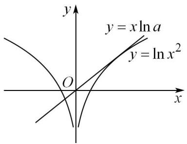
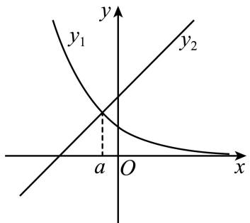
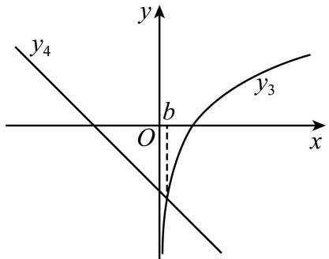
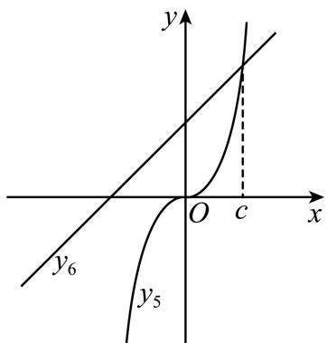
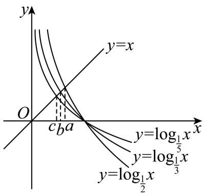
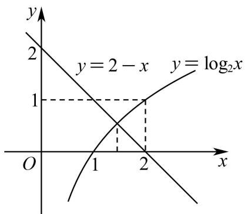
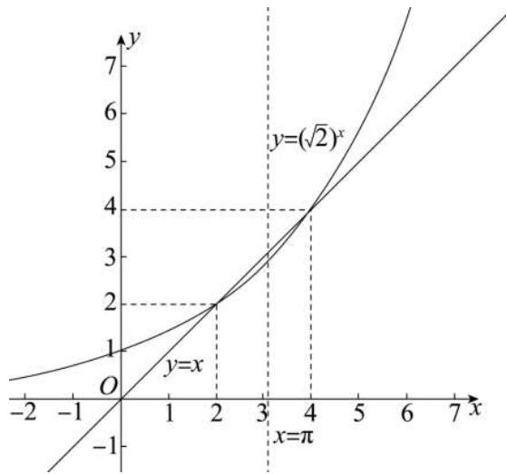
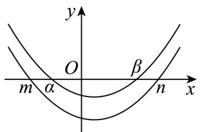

# 第17讲 幂指对比较大小

# 知识梳理

(1) 利用函数与方程的思想, 构造函数, 结合导数研究其单调性或极值, 从而确定 $a, b, c$ 的大小.  
(2) 指、对、幂大小比较的常用方法：

①底数相同，指数不同时，如 $a^{x_1}$ 和 $a^{x_2}$ ，利用指数函数 $y = a^x$ 的单调性；  
②指数相同,底数不同,如 $x_{1}^{a}$ 和 $x_{2}^{a}$ 利用幂函数 $y = x^{a}$ 单调性比较大小;  
③底数相同，真数不同，如 $\log_a x_1$ 和 $\log_a x_2$ 利用指数函数 $\log_a x$ 单调性比较大小；  
④底数、指数、真数都不同，寻找中间变量0,1或者其它能判断大小关系的中间量，借助中间量进行大小关系的判定.

(3) 转化为两函数图象交点的横坐标  
(4) 特殊值法  
(5) 估算法  
(6) 放缩法、基本不等式法、作差法、作商法、平方法

(7) 常见函数的麦克劳林展开式:

① $e^{x}=1+x+\frac{x^{2}}{2!}+\cdots+\frac{x^{n}}{n!}+\frac{e^{\theta x}}{(n+1)!}x^{n+1}$   
② $\sin x = x - \frac{x^3}{3!} +\frac{x^5}{5!} -\dots +(-1)^n\frac{x^{2n + 1}}{(2n + 1)!} +o(x^{2n + 2})$   
③ $\cos x = 1 - \frac{x^{2}}{2!} + \frac{x^{4}}{4!} - \frac{x^{6}}{6!} + \cdots + (-1)^{n} \frac{x^{2n}}{(2n)!} + o(x^{2n})$   
④ $\ln(1+x)=x-\frac{x^{2}}{2}+\frac{x^{3}}{3}-\cdots+(-1)^{n}\frac{x^{n+1}}{n+1}+o(x^{n+1})$   
⑤ $\frac{1}{1 - x} = 1 + x + x^2 +\dots +x^n +o(x^n)$   
⑥ $(1 + x)^{n} = 1 + nx + \frac{n(n - 1)}{2!} x^{2} + o(x^{2})$

# 必考题型全归纳

# 1 题型一: 直接利用单调性

547 (2024·湖南岳阳·高三湖南省岳阳县第一中学校考开学考试)已知 $a=3^{0.5}$ , $b=\log_{3}0.5$ , c = 0.5³, 则 a, b, c 的大小关系是 ()

A. $a < b < c$

B. $b < a < c$

C. $a < c < b$

D. $b < c < a$

【答案】D

【解析】根据指数函数 $y=3^{x}$ 在 R 上递增可得, $a=3^{0.5}>3^{0}=1$ ;

根据对数函数 $y=\log_{3}x$ 在 $(0,+\infty)$ 上递增可得， $b=\log_{3}0.5<\log_{3}1=0$ ，

根据指数函数 $y=0.5^{x}$ 在 R 上递减和值域可得， $0<c=0.5^{3}<0.5^{0}=1$ ，

$\therefore b < c < a.$

故选：D

548 (2024·天津滨海新·统考三模)已知函数 $f(x)$ 是定义在R上的偶函数，且在 $(0, +\infty)$ 上单调递减，若 $a = f(\log_20.2), b = f(2^{0.2}), c = f(0.2^{0.3})$ 则 $a, b, c$ 大小关系为 （）

A. $a < b < c$

B. c < a < b

C. $a < c < b$

D. b < a < c

【答案】A

【解析】 $\log_{2}0.2=\log_{2}^{\circ}\quad\frac{1}{5}=-\log_{2}5,$

因为 $f(x)$ 是定义在 $\mathbb{R}$ 上的偶函数，

所以 $a=f(\log_{2}0.2)=f(-\log_{2}5)=f(\log_{2}5)$ ,

因为 $\log_{2}5 > \log_{2}4 = 2, 1 = 2^{0} < 2^{0.2} < 2^{1} = 2, 0 < 0.2^{0.3} < 0.2^{0} = 1,$

且 $f(x)$ 在 $(0,+\infty)$ 上单调递减，

所以 $f(\log_{2}5) < f(2^{0.2}) < f(0.2^{0.3})$ ,

即 a < b < c.

故选：A.

549 (2024·全国·校联考模拟预测)已知 $a=\log_{0.1}0.2$ , $b=\lg a$ , $c=2^{a}$ ，则 a, b, c 的大小关系为（）

A. $a < b < c$

B. $a < c < b$

C. b<c<a

D. b < a < c

【答案】D

【解析】因为 $y=\log_{0.1}x$ 在 $(0,+\infty)$ 上单调递减，所以 $\log_{0.1}1<\log_{0.1}0.2<\log_{0.1}0.1$ ，即 0<a<1.

因为 $y=\lg x$ 在 $(0,+\infty)$ 上单调递增, 所以 $\lg a<\lg1$ , 即 b<0.

因为 $y=2^{x}$ 在 R 上单调递增, 所以 $2^{a}>2^{0}$ , 即 c>1.

综上， $b <   a <   c.$

故选：D

550 (2024·天津·统考二模) 设 $a = \log_3 4, b = \left(\frac{1}{3}\right)^{\frac{1}{3}}, c = 3^{-\frac{1}{4}}$ ，则 $a, b, c$ 的大小关系为 （）

A. $a < b < c$

B. $c < a < b$

C. b<c<a

D. $c < b < a$

【答案】C

【解析】由题意得 $a = \log_34 > \log_33 = 1$

$$
b = \left(\frac {1}{3}\right) ^ {\frac {1}{3}} = 3 ^ {- \frac {1}{3}}, c = 3 ^ {- \frac {1}{4}},
$$

由于 $y=3^{x}$ 为 $(-∞,+∞)$ 上的单调增函数，故 $b=\left(\frac{1}{3}\right)^{\frac{1}{3}}=3^{-\frac{1}{3}}<c=3^{-\frac{1}{4}}<1$

故 $b < c < a$

故选：C

# 2 题型二: 引入媒介值

551 (2024·天津河北·统考一模)若 $a = \left(\frac{5}{3}\right)^{-\frac{1}{2}}$ ， $b = \log_{\frac{1}{2}}\frac{1}{5}$ ， $c = \log_37$ ，则 $a, b, c$ 的大小关系为（）

A. $a > b > c$

B. $b > c > a$

C. c > a > b

D. $c > b > a$

【答案】B

【解析】依题意， $a=\left(\frac{5}{3}\right)^{-\frac{1}{2}}<\left(\frac{5}{3}\right)^{0}=1$ ， $b=\log_{\frac{1}{2}}\frac{1}{5}=\log_{2}5>\log_{2}2^{2}=2$

而 $1 = \log_33 < \log_37 < \log_33^2 = 2$ ，即 $1 < c < 2$

所以 a, b, c 的大小关系为 b > c > a.

故选：B

552 (2024·天津南开·统考二模)已知 $a=2^{0.2}$ , $b=1-2\lg2$ , $c=2-\log_{3}10$ , 则 a, b, c 的大小关系是 ()

A. $b > c > a$

B. $a > b > c$

C. $a > c > b$

D. $b > a > c$

【答案】B

【解析】由题意可得: $a = 2^{0.2} > 2^0 = 1$ ,

$b = 1 - 2\lg 2 = 1 - \lg 4$ ，且 $0 < \lg 4 < 1$ ，则 $0 < b < 1$

因为 $\log_310 > \log_39 = 2$ ，则 $c = 2 - \log_310 < 0$

所以 c < b < a.

故选: B.

553 (2024·湖南娄底·统考模拟预测)已知 $x=\ln1.1^{-1}$ , $y=\log_{1.1}1.2$ , $z=2^{1.1}$ ，则三者的大小关系是（）

A. $y <   x <   z$

B. $z <   y <   x$

C. $x <   y <   z$

D. $x <   z <   y$

【答案】C

【解析】由 $x=\ln1.1^{-1}=-\ln1.1<-\ln1=0$ , 即 x<0

又由 $1 = \ln_{1.1}1.1 < \log_{1.1}1.2 < \ln_{1.1}1.1^2 = 2$ ，可得 $1 < y < 2$

因为 $z=2^{1.1}>2^{1}=2$ ，即 z>2，所以 x<y<z。

故选：C.

554 (2024·河南·校联考模拟预测)已知 $a=\log_{5}11$ , $b=\log_{2}\sqrt{8}$ , $c=\sqrt{e}$ ，则 a, b, c 的大小关系为

A. a < c < b

B. $b < c < a$

C. c < a < b

D. $a < b < c$

【答案】D

【解析】由对数函数的运算性质,可得 $a=\log_{5}11=\log_{5}\sqrt{121}<\log_{5}\sqrt{125}=\frac{3}{2}$ ,

$$
b = \log_ {2} {\sqrt {8}} = {\frac {1}{2}} \log_ {2} 8 = {\frac {3}{2}},   c = {\sqrt {\mathrm{e}}} > {\sqrt {\frac {9}{4}}} = {\frac {3}{2}},   \text { 所以 }   c > b > a.
$$

故选：D.

# 3 题型三:含变量问题

555 (理科数学-学科网 2021 年高三 5 月大联考(新课标III卷))已知 $\theta \in \left(0, \frac{\pi}{6}\right)$ , $a = \frac{\ln(2\cos^2\theta - 1)^2}{(2\cos^2\theta - 1)^2}$ , $b = \frac{\ln(\cos\theta - 1)^2}{(\cos\theta - 1)^2}$ , $c = \frac{\ln(\sin\theta - 1)^2}{(\sin\theta - 1)^2}$ , 则 $a, b, c$ 的大小关系为 ( )

A. $b < c < a$

B. $a < c < b$

C. a < b < c

D. $c < a < b$

【答案】A

【解析】由题可设 $f(x) = \frac{\ln(x - 1)^2}{(x - 1)^2}$ ，因为 $f(2 - x) = f(x)$ ，所以 $f(x)$ 的图象关于直线 $x = 1$ 对称.

因为 $f'(x)=\frac{2[1-\ln(x-1)^{2}]}{(x-1)^{3}}$ ，当 $x\in(1,2)$ 时， $0<(x-1)^{2}<1$ ，所以 $\ln(x-1)^{2}<0,1-\ln(x-1)^{2}>0,(x-1)^{3}>0$ ，所以 $f'(x)>0$ ，所以 $f(x)$ 在 $(1,2)$ 上单调递增，

由对称性可知 $f(x)$ 在 $(0,1)$ 上单调递减．因为 $\theta \in \left(0,\frac{\pi}{6}\right)$ ，所以 $0 < \sin \theta < \frac{1}{2} < \frac{\sqrt{3}}{2} < \cos \theta < 1$ ，所以 $c = f(\sin \theta) > f(\cos \theta) = b;$

又 $2\cos^2\theta > \frac{3}{2} > 1, 0 < \sin \theta < \frac{1}{2} < 1$ ，由对称性可知 $f(2\cos^2\theta) = f(2 - 2\cos^2\theta)$ ，且 $0 < 2 - 2\cos^2\theta < \frac{1}{2}$ ，因为 $2 - 2\cos^2\theta - \sin \theta = 2\sin^2\theta - \sin \theta = \sin \theta (2\sin \theta - 1) < 0$ ，所以 $0 < 2 - 2\cos^2\theta < \sin \theta < \frac{1}{2}$ ，

又 $f(x)$ 在 $(0,1)$ 上单调递减，所以 $c = f(\sin \theta) < f(2 - 2\cos^2\theta) = f(2\cos^2\theta) = a$ ，所以 $b < c < a$

故选：A.

556 (云南省大理市辖区2024届高三毕业生区域性规模化统一检测数学试题)已知实数 $a$ ， $b, c$ 满足 $\frac{\ln a}{\mathrm{e}^a} = \frac{\ln b}{b} = -\frac{\ln c}{c} < 0$ ，则 $a, b, c$ 的大小关系为 （）

A. $b < a < c$

B. c < b < a

C. a < b < c

D. $c < a < b$

【答案】C

【解析】由题意知 a > 0, b > 0, c > 0，由 $\frac{\ln a}{e^{a}} = \frac{\ln b}{b} = -\frac{\ln c}{c} < 0$ ，得 0 < a < 1, 0 < b < 1, c > 1，

设 $f(x)=\frac{\ln x}{x}(x>0)$ ，则 $f'(x)=\frac{1-\ln x}{x^{2}}$

当 0 < x < 1 时, $f'(x) > 0$ , $f(x)$ 单调递增, 因 $e^{x} \geqslant x + 1$ ,

当且仅当 x=0 时取等号，故 $\mathrm{e}^{a}>a(0<a<1)$ ,

又 $\ln a < 0$ ，所以 $\frac{\ln a}{\mathrm{e}^a} > \frac{\ln a}{a}$ 故 $\frac{\ln b}{b} > \frac{\ln a}{a}$

∴ $f(b) > f(a)$ ，则 b > a，即有 0 < a < b < 1 < c，故 a < b < c.

故选：C.

557 (江西省宜春市2024届高三模拟考试数学(文)试题)已知实数 $x, y, z \in \mathbb{R}$ , 且满足 $\frac{\ln x}{\mathrm{e}^x} = \frac{y}{\mathrm{e}^y} = -\frac{z}{\mathrm{e}^z}, y > 1$ , 则 $x, y, z$ 大小关系为

A. $y > x > z$

B. $x > z > y$

C. $y > z > x$

D. $x > y > z$

【答案】A

【解析】因 $\frac{\ln x}{e^{x}}=\frac{y}{e^{y}}=-\frac{z}{e^{z}},y>1$ , 则 $\ln x>0,-z>0$ , 即 x>1, z<0,

令 $f(x)=x-\ln x,x>1$ ，则 $f'(x)=1-\frac{1}{x}>0$ ，函数 $f(x)$ 在 $(1,+\infty)$ 上单调递增，有 $f(x)>f(1)=1>0$ ，

即 $\ln x < x$ ，从而当 x > 1, y > 1 时， $\frac{y}{e^{y}} = \frac{\ln x}{e^{x}} < \frac{x}{e^{x}}$ ，令 $g(t) = \frac{t}{e^{t}}, t > 1, g'(t) = \frac{1 - t}{e^{t}} < 0, g(t)$ 在 $(1, +\infty)$ 上单调递减，

则由 x>1, y>1, $\frac{y}{e^{y}}<\frac{x}{e^{x}}$ 得 y>x>1,

所以 y > x > z.

故选：A

558 (山东省青岛市2024届高三下学期第一次适应性检测数学试题)已知函数 $f(x) = x^{3} -$ $\frac{1}{2}\sin x$ ，若 $\theta \in (0,\frac{\pi}{12}),a = f((\cos \theta)^{\sin \theta}),b = f((\sin \theta)^{\sin \theta}),c = -f(-\frac{1}{2})$ ，则 $a,b,c$ 的大小关系为 （）

A. $a > b > c$

B. $b > a > c$

C. $a > c > b$

D. $c > a > b$

【答案】A

【解析】因为 $f(-x)=(-x)^{3}-\frac{1}{2}\sin(-x)=-\left(x^{3}-\frac{1}{2}\sin x\right)=-f(x)$ ,

所以 $f(x)$ 在 R 上是奇函数. 所以 $c = -f\left(-\frac{1}{2}\right) = f\left(\frac{1}{2}\right)$

对 $f(x)=x^{3}-\frac{1}{2}\sin x$ 求导得, $f'(x)=3x^{2}-\frac{1}{2}\cos x$

令 $g(x)=3x^{2}-\frac{1}{2}\cos x$ ，则 $g'(x)=6x+\frac{1}{2}\sin x$

当 $\frac{1}{2} < x < 1$ 时， $g'(x) > 0$ ，所以 $g(x)$ 在 $\left(\frac{1}{2}, 1\right)$ 上单调递增，

则 $\frac{1}{2}<x<1$ 时， $g(x)>g\left(\frac{1}{2}\right)=\frac{3}{4}-\frac{1}{2}\cos\frac{1}{2}>\frac{3}{4}-\frac{1}{2}\times1>0$ ，即 $f'(x)>0$ ，

所以 $f(x)$ 在 $\left(\frac{1}{2},1\right)$ 上单调递增.

因为 $\theta \in \left(0, \frac{\pi}{12}\right)$ , 所以 $\cos \theta > \frac{1}{2} > \sin \theta$ ,

因为 $y = x^{\sin\theta}\left(0 < \sin\theta < \frac{1}{2}\right)$ 在 $(0, +\infty)$ 上单调递增，

所以 $(\cos\theta)^{\sin\theta} > (\sin\theta)^{\sin\theta}$ .

令 $h(x)=x\ln x+\ln2$ ，则 $h'(x)=\ln x+1$

所以当 $0 < x < \frac{1}{e}$ 时， $h'(x) < 0, h(x)$ 单调递减；当 $x > \frac{1}{e}$ 时， $h'(x) > 0, h(x)$ 单调递增.

所以 $h(x)\geqslant h\left(\frac{1}{\mathrm{e}}\right) = \frac{1}{\mathrm{e}}\ln \frac{1}{\mathrm{e}} +\ln 2 = \ln 2 - \frac{1}{\mathrm{e}},$

而 $2^{e} > e$ ，即 $2 > e^{\frac{1}{e}}$ ，所以 $\ln 2 > \frac{1}{e}$ ，即 $\ln 2 - \frac{1}{e} > 0$ .

所以 $x\ln x > -\ln 2$ ，即 $x^{x} > \frac{1}{2}$ 则 $(\sin \theta)^{\sin \theta} > \frac{1}{2}$

所以 $(\cos \theta)^{\sin \theta} > (\sin \theta)^{\sin \theta} > \frac{1}{2}$

所以 $f\big((\cos \theta)^{\sin \theta}\big) > f\big((\sin \theta)^{\sin \theta}\big) > f\Big(\frac{1}{2}\Big)$ , 即 $a > b > c$ .

故选：A

559 (2024·陕西西安·统考一模)设 a > b > 0, $a + b = 1$ 且 $x = -\left(\frac{1}{a}\right)^{b}$ , $y = \log_{\frac{1}{b}} a$ , z = $\log_{\left(\frac{1}{a} + \frac{1}{b}\right)} ab$ ，则 x, y, z 的大小关系是 ()

A. $x <   z <   y$

B. $z <   y <   x$

C. y < z < x

D. $x <   y <   z$

【答案】A

【解析】由 a > b > 0, $a + b = 1$ , 可得 $0 < b < \frac{1}{2} < a < 1$ ,

则 $z = \log_{\left(\frac{1}{a} +\frac{1}{b}\right)}ab = \log_{\frac{a + b}{ab}}ab = \log_{\frac{1}{ab}}ab = -1$

因为 0 < b < 1，所以 $\log_{b}a < \log_{b}b = 1$ ，则 $y = \log_{\frac{1}{b}}a = -\log_{b}a > -\log_{b}b = -1$ ，

因为 $x=-\left(\frac{1}{a}\right)^{b}<-1$ ，所以 x<z<y.

故选：A.

# 题型四:构造函数

560 (2024·山东潍坊·三模)已知 $a=2022^{2024}, b=2023^{2023}, c=2024^{2022}$ ，则 a, b, c 的大小关系为（）

A. $b > c > a$

B. b > a > c

C. a > c > b

D. a > b > c

【答案】D

【解析】 $\because \frac{\ln a}{\ln b} = \frac{2024\ln 2022}{2023\ln 2023} = \frac{\frac{\ln 2022}{2023}}{\frac{\ln 2023}{2024}}$ ，

构造函数 $f(x) = \frac{\ln x}{x + 1} \circ (x \geqslant \mathrm{e}^2), f'(x) = \frac{(x + 1) - x\ln x}{x(x + 1)^2},$

令 $g(x)=(x+1)-x\ln x$ ，则 $g'(x)=-\ln x<0$ ，

∴ $g(x)$ 在 $[e^{2}, +\infty)$ 上单减，

$$
\therefore g (x) \leqslant g \left(\mathrm{e} ^ {2}\right) = 1 - \mathrm{e} ^ {2} <   0,
$$

故 $f'(x)<0$ ，所以 $f(x)$ 在 $\left[e^{2},+\infty\right)$ 上单减，

$$
\therefore f (2 0 2 2) > f (2 0 2 3) > 0 \Rightarrow \frac {\ln a}{\ln b} = \frac {\frac {\ln 2 0 2 2}{2 0 2 3}}{\frac {\ln 2 0 2 3}{2 0 2 4}} = \frac {f (2 0 2 2)}{f (2 0 2 3)} > 1 \Rightarrow \ln a > \ln b \Rightarrow a > b,
$$

$$
\therefore \frac {\ln b}{\ln c} = \frac {2 0 2 3 \ln 2 0 2 3}{2 0 2 2 \ln 2 0 2 4} = \frac {\frac {\ln 2 0 2 3}{2 0 2 2}}{\frac {\ln 2 0 2 4}{2 0 2 3}},
$$

构造函数 $h(x) = \frac{\ln x}{x - 1}\circ (x\geqslant \mathrm{e}^2),h'(x) = \frac{(x - 1) - x\ln x}{x(x - 1)^2},$

令 $t(x) = (x - 1) - x\ln x$ ，则 $t'(x) = -\ln x < 0$

∴ $t(x)$ 在 $[e^{2}, +\infty)$ 上单减，

$$
\therefore t (x) \leqslant t \left(\mathrm{e} ^ {2}\right) = 1 - \mathrm{e} ^ {2} <   0,
$$

故 $h'(x)<0$ ，所以 $h(x)$ 在 $[e^{2},+\infty)$ 上单减，

$$
\therefore h (2 0 2 3) > h (2 0 2 4) > 0 \Rightarrow \frac {\ln b}{\ln c} = \frac {\frac {\ln 2 0 2 3}{2 0 2 2}}{\frac {\ln 2 0 2 4}{2 0 2 3}} = \frac {h (2 0 2 3)}{h (2 0 2 4)} > 1 \Rightarrow \ln b > \ln c \Rightarrow b > c,
$$

故 $a > b > c$

故选：D.

561 (2024·广西·校联考模拟预测)已知 $a=\frac{2}{3}\sqrt{e}$ , $b=2\ln1.3$ , c=0.8, 则 a, b, c 的大小关系为

A. $c < b < a$

B. $c < a < b$

C. b < c < a

D. $b < a < c$

【答案】C

【解析】由指数幂的运算公式,可得 $a^{2}=\left(\frac{2}{3}\sqrt{\mathrm{e}}\right)^{2}=\frac{4}{9}\times\mathrm{e}>0.8$ , 所以 a>c,

构造函数 $f(x)=\ln x-\frac{1}{\mathrm{e}}x$ ，其中 x>0，则 $f'(x)=\frac{1}{x}-\frac{1}{\mathrm{e}}$

当 0 < x < e 时， $f'(x) > 0$ ; 当 x > e 时， $f'(x) < 0$ ,

所以函数 $f(x) = \ln x - \frac{1}{\mathrm{e}}x$ 在 $(0, \mathrm{e})$ 上单调递增，在 $(\mathrm{e}, +\infty)$ 上单调递减，

故 $f(x) \leqslant f(\mathrm{e}) = \ln e - 1 = 0$ ，故 $\ln x \leqslant \frac{1}{\mathrm{e}} x$ ，当且仅当 $x = \mathrm{e}$ 时取等号，

由于 $x^{2}>0$ ，则 $\ln x^{2}\leqslant\frac{1}{e}x^{2}$ ，则 $2\ln x\leqslant\frac{1}{e}x^{2}$ ，所以 $2\ln1.3<\frac{1}{e}(1.3)^{2}=\frac{1}{e}\times1.69<0.8$ ，所以 b<c，所以 b<c<a。

故选：C.

562 (2024·辽宁朝阳·朝阳市第一高级中学校考模拟预测)已知 $a=\log_{9}3\sqrt{3}$ , $b=\pi^{-0.25}$ , c= $\sin\frac{3}{4}$ ，则 a, b, c 的大小关系是 ()

A. $c < a < b$

B. $c < b < a$

C. $a < b < c$

D. $a < c < b$

【答案】A

【解析】 $a=\log_{9}3\sqrt{3}=\log_{3^{2}}3^{\frac{3}{2}}=\frac{3}{4}$

设 $f(x)=\sin x-x,x\in\left[0,\frac{\pi}{2}\right]$ ，则 $f'(x)=\cos x-1\leqslant0$ 在 $x\in\left[0,\frac{\pi}{2}\right]$ 恒成立，

所以函数 $f(x) = \sin x - x, x \in \left[0, \frac{\pi}{2}\right]$ 为单调递减函数，

所以 $f(0)=0>f\left(\frac{3}{4}\right)=\sin\frac{3}{4}-\frac{3}{4}$ ，即 $\sin\frac{3}{4}<\frac{3}{4}$ ，所以 a>c.

因为 $\left(\pi^{\frac{1}{4}}\right)^{4} = \pi ,\left(\frac{4}{3}\right)^{4} = \frac{256}{81} >3.16 > \pi ,$

所以 $\left(\pi^{\frac{1}{4}}\right)^{4} < \left(\frac{4}{3}\right)^{4}$ , 即 $\pi^{\frac{1}{4}} < \frac{4}{3}$ ,

所以 $\pi^{-\frac{1}{4}} > \frac{3}{4}$ ，即 $b = \pi^{-0.25} = \pi^{-\frac{1}{4}} > \frac{3}{4}$ ，所以 b > a，

综上，c<a<b.

故选：A

563 (河北省唐山市开滦第二中学2024届高三核心模拟(三)数学试题)设 $a=\frac{1}{14}$ ，b= $\frac{3}{4}\sin\frac{1}{21}$ ， $c=e^{\frac{1}{21}}-1$ ，则a，b，c的大小关系正确的是()

A. $a > b > c$

B. b > a > c

C. a > c > b

D. c > a > b

【答案】C

【解析】由 $c=e^{\frac{1}{21}}-1=e^{\frac{2}{3}\times\frac{1}{14}}-1$ ，则 $a-c=\frac{1}{14}-e^{\frac{2}{3}\times\frac{1}{14}}+1$ ，

令 $f(x)=x-\mathrm{e}^{\frac{2}{3}x}+1$ 且 $x\in\left(0,\frac{1}{2}\right)$ ，则 $f'(x)=1-\frac{2}{3}\mathrm{e}^{\frac{2}{3}x}$ 为减函数，

所以 $1 - \frac{2}{3}\mathrm{e}^{\frac{1}{3}} < f'(x) < \frac{1}{3}$ , 而 $\mathrm{e}^{\frac{1}{3}} < \left(\frac{27}{8}\right)^{\frac{1}{3}} = \frac{3}{2}$ , 故 $0 < 1 - \frac{2}{3}\mathrm{e}^{\frac{1}{3}} < f'(x) < \frac{1}{3}$ ,

故 $f(x)$ 在 $\left(0, \frac{1}{2}\right)$ 上递增，则 $f(x) > f(0) = 0$ ，即 $x > e^{\frac{2}{3}x} - 1$ 在 $\left(0, \frac{1}{2}\right)$ 上恒成立，

所以 a-c>0, 即 a>c,

由 $c - b = e^{\frac{1}{21}} - 1 - \frac{3}{4} \sin \frac{1}{21}$ ,

令 $g(x) = \mathrm{e}^{x} - 1 - \frac{3}{4}\sin x$ 且 $x\in \left(0,\frac{1}{2}\right)$ ，则 $g^{\prime}(x) = \mathrm{e}^{x} - \frac{3}{4}\cos x > 0$

所以 $g(x)$ 在 $\left(0, \frac{1}{2}\right)$ 上递增，则 $g(x) > g(0) = 0$ ，即 $e^{x} - 1 > \frac{3}{4} \sin x$ 在 $\left(0, \frac{1}{2}\right)$ 上恒成立，

所以 c-b>0, 即 c>b.

综上， $a > c > b.$

故选：C

564 (湖北省武汉市2024届高三5月模拟训练数学试题)已知 $a = 1.01^{\ln (\ln 1.01)} - (\ln 1.01)^{\ln 1.01}$ , $b = \sin (\ln (1 + \cos 1.01)), c = e^{\tan (\sin 1.01) + 1}$ , 则 $a, b, c$ 的大小关系为 （）

A. $a < b < c$

B. $b < a < c$

C. $c < b < a$

D. $c < a < b$

【答案】A

【解析】设 $f(x) = \ln (1 + x) - x (x > -1)$ , $f'(x) = \frac{1}{1 + x} - 1 = \frac{-x}{1 + x} (x > -1)$ ,

当 $x \in (-1,0)$ 时， $f'(x) > 0$ ; 当 $x \in (0, +\infty)$ 时， $f'(x) < 0$ ,

所以 $f(x)$ 在 $(-1,0)$ 上单调递增，在 $(0,+\infty)$ 上单调递减，

所以 $f(x) \leqslant f(0) = 0$ ，所以 $\ln(1 + x) \leqslant x$ ，

$$
b = \sin (\ln (1 + \cos 1. 0 1)) <   \sin (\cos 1. 0 1) <   1,
$$

又 $b=\sin(\ln(1+\cos1.01))>\sin(\ln1)=\sin0=0$ , 则 $b\in(0,1)$

$c=e^{\tan(\sin1.01)+1}>1$ ,所以b<c,

对于 $a=1.01^{\ln(\ln1.01)}-(\ln1.01)^{\ln1.01}$ ，令 $t=\ln(\ln1.01)$ ，则 $\ln1.01=e^{t}$

此时 $a=1.01^{t}-(\mathrm{e}^{t})^{\ln1.01}=1.01^{t}-\mathrm{e}^{\ln1.01^{t}}=1.01^{t}-1.01^{t}=0,$

所以 a < b < c.

故选：A.

565 (2024·山西大同·统考模拟预测)已知 $a = 0.1, b = \ln 1.1, c = \frac{2}{21}$ , 则 $a, b, c$ 的大小关系是 ( )

A. c > b > a

B. $b > a > c$

C. $a > c > b$

D. $a > b > c$

【答案】D

【解析】 $c=\frac{2}{21}=\frac{0.2}{2.1}=\frac{2\times0.1}{2+0.1}$ ,

设 $f(x)=\ln(1+x)-\frac{2x}{2+x}$ ，函数定义域为 $(-1,+\infty)$ ,

则 $f'(x)=\frac{1}{1+x}-\frac{4}{(2+x)^{2}}=\frac{x^{2}}{(1+x)(2+x)^{2}}>0,$

故 $f(x)$ 在 $(-1, +\infty)$ 上为增函数，有 $f(0.1) > f(0)$ ，即 $\ln 1.1 - \frac{0.2}{2.1} > 0$ ，

所以 $\ln1.1>\frac{2}{21}$ ，故 b>c.

设 $g(x)=\ln x-x+1$ ，函数定义域为 $(0,+\infty)$ ，则 $g'(x)=\frac{1}{x}-1=\frac{1-x}{x}$ ，

$g'(x)>0$ , 解得 0<x<1; $g'(x)<0$ , 解得 x>1,

所以函数 $g(x)$ 在 $(0,1)$ 上单调递增，在 $(1,+\infty)$ 上单调递减.

当 x=1 时， $g(x)$ 取最大值，所以 $g(x)\leqslant g(1)=0$ ，即 $\ln x\leqslant x-1$ ，x=1 时等号成立，

所以 $\ln1.1<1.1-1=0.1$ ，即 b<a，

又 $c=\frac{2}{21}<\frac{2}{20}=0.1=a$ ，所以 a>b>c.

故选: D.

566 (2024·河南·模拟预测)已知 $a=\sin0.9, b=0.9, c=e^{-0.1}, d=\cos0.9$ ，则 a, b, c, d 的大小关系是 （）

A. $a > b > c > \mathrm{d}$

B. $b > c > a > d$

C. $c > b > a > d$

D. b > a > d > c

【答案】C

【解析】令函数 $f(x) = \mathrm{e}^{x} - x - 1, x < 0$ ，求导得 $f'(x) = \mathrm{e}^{x} - 1 < 0$ ，函数 $f(x)$ 在 $(- \infty, 0)$ 上递减，

当 x<0 时， $f(x)>f(0)=0$ ，则 $f(-0.1)=\mathrm{e}^{-0.1}-0.9>0$ ，于是 $e^{-0.1}>0.9$ ，即 c>b，

令函数 $g(x)=x-\sin x, x>0$ ，求导得 $g'(x)=1-\cos x \geqslant 0$ ，函数 $g(x)$ 在 $(0,+\infty)$ 上递增，

当 $x > 0$ 时， $g(x) > g(0) = 0$ ，则 $g(0.9) = 0.9 - \sin 0.9 > 0$ ，于是 $0.9 > \sin 0.9$ ，即 $b > a$

当 $x \in \left(\frac{\pi}{4}, \frac{\pi}{2}\right)$ 时， $y = \sin x - \cos x = \sqrt{2} \sin \left(x - \frac{\pi}{4}\right), x - \frac{\pi}{4} \in \left(0, \frac{\pi}{4}\right)$ ，则 $\sqrt{2} \sin \left(x - \frac{\pi}{4}\right) > 0$

即 $\sin x > \cos x$ ，而 $\frac{\pi}{4} < 0.9 < \frac{\pi}{2}$ ，于是 $\sin 0.9 > \cos 0.9$ ，即 a > d，

所以 a, b, c, d 的大小关系是 c > b > a > d, C 正确.

故选：C

# 题型五: 数形结合

567 (广东省六校2024届高三上学期第三次联考数学试题)已知 $a > 1, x_1, x_2, x_3$ 为函数 $f(x) = a^x - x^2$ 的零点， $x_1 < x_2 < x_3$ ，若 $x_1 + x_3 = 2x_2$ ，则 （）

A. $\frac{x_3}{x_2} < 2\ln a$

B. $\frac{x_3}{x_2} = 2\ln a$

C. $\frac{x_{3}}{x_{2}}>2\ln a$

D. $\frac{x_3}{x_2}$ 与 $2\ln a$ 大小关系不确定

【答案】C

【解析】易知 $x_{1}<0<x_{2}<x_{3},x_{1},x_{2},x_{3}$ 为函数 $f(x)=a^{x}-x^{2}$ 的零点，

$$
\therefore \left\{ \begin{array}{l} a ^ {x _ {1}} = x _ {1} ^ {2} \\ a ^ {x _ {2}} = x _ {2} ^ {2}, \therefore a ^ {x _ {1} + x _ {3}} = (x _ {1} x _ {3}) ^ {2}, a ^ {2 x _ {2}} = x _ {2} ^ {4}, \therefore x _ {2} ^ {4} = (x _ {1} x _ {3}) ^ {2}, \\ a ^ {x _ {3}} = x _ {3} ^ {2} \end{array} \right.
$$

$$
\therefore x _ {2} ^ {2} + x _ {1} x _ {3} = 0, \text {又} x _ {1} + x _ {3} = 2 x _ {2}, \therefore x _ {2} ^ {2} + (2 x _ {2} - x _ {3}) x _ {3} = 0, \therefore \left(\frac {x _ {3}}{x _ {2}}\right) ^ {2} - 2 \left(\frac {x _ {3}}{x _ {2}}\right) - 1 = 0
$$

解之: $\frac{x_3}{x_2} = \sqrt{2} + 1$ , 负根舍去;

又 $f(x) = a^{x} - x^{2} = 0, \therefore a^{x} = x^{2}, \therefore x\ln a = \ln x^{2}$ ,

即 $y = x \ln a$ 与 $y = \ln x^{2}$ 有三个交点，交点横坐标分别为 $x_{1}, x_{2}, x_{3}$ ，如下图先计算过原点的切线方程，不妨设切点为 $(t, 2 \ln t), y' = (2 \ln x)' = \frac{2}{x}, \therefore k = \frac{2}{t}$ ,

切线方程为: $y - 2 \ln t = \frac{2}{t} (x - t)$ 过原点, $\therefore t = e$

此时 $k = \frac{2}{t} = \frac{2}{\mathrm{e}},\therefore y = x\ln a$ 的斜率比切线斜率小，结合图像容易分析出，

$$
\therefore \ln a <   \frac {2}{\mathrm{e}}, \therefore 2 \ln a <   \frac {4}{\mathrm{e}} <   2 <   \sqrt {2} + 1.
$$

故选：C

text_image

y
y = x ln a
y = ln x²
O
x

568 (2024·天津和平·统考三模)已知 a, b, c 满足 $2^{-a} = a + 2, b + \log_{2}b = -2, c^{3} - c - 2 = 0$ ，则 a, b, c 的大小关系为（）

A. $b < a < c$

B. $a < b < c$

C. $a < c < b$

D. $c < b < a$

【答案】B

【解析】由题意知:把a的值看成函数 $y_{1}=2^{-x}$ 与 $y_{2}=x+2$ 图像的交点的横坐标,

text_image

y
y₁
y₂
a O x

因为 $2^{-(1)}>-1+2,2^{0}<0+2$ ，易知 -1<a<0;

把 b 的值看成函数 $y_{3}=\log_{2}x$ 与 $y_{4}=-x-2$ 图像的交点的横坐标，

text_image

y
y₄
b
O
x
y₃

$\log_{2}1>-1-2$ , 易知 0<b<1;

把 c 的值看成函数 $y_{5}=x^{3}$ 与 $y_{6}=x+2$ 图像的交点的横坐标，

text_image

y
y₆
O
c
x
y₅

$1^{3}<1+2$ ,与 $2^{3}>2+2$ ,易知1<c<2.

所以 a < b < c.

故选: B.

569 (2024·广东汕头·统考三模)已知 $a=\log_{\frac{1}{2}}a$ , $b=\log_{\frac{1}{3}}b$ , $c=\log_{\frac{1}{5}}c$ , 则 a, b, c 大小为 ()

A. $a < b < c$

B. $b < a < c$

C. $a < c < b$

D. $c < b < a$

【答案】D

【解析】 $a=\log_{\frac{1}{2}}a$ 可以看成 y=x 与 $y=\log_{\frac{1}{2}}x$ 图象的交点的横坐标为 a，$b=\log_{\frac{1}{3}}b$ 可以看成 y=x 与 $y=\log_{\frac{1}{3}}x$ 图象的交点的横坐标为 b，

$c=\log_{\frac{1}{5}}c$ 可以看成 y=x 与 $y=\log_{\frac{1}{5}}x$ 图象的交点的横坐标为 c，

画出函数的图象如下图所示，

text_image

y
y=x
O
c b a
y=log₁ₓ
x
y=log₁ₓ/₅
y=log₁ₓ/₂

由图象可知, c < b < a.

故选：D.

570 (江苏省南通市海门市2022-2024学年高三上学期期中数学试题)已知正实数a,b,c满足 $e^{c}+e^{-2a}=e^{a}+e^{-c},b=\log_{2}3+\log_{8}6,c+\log_{2}c=2$ ，则a,b,c的大小关系为（）

A. $a < b < c$

B. $a < c < b$

C. c < a < b

D. $c < b < a$

【答案】B

【解析】 $e^{c}+e^{-2a}=e^{a}+e^{-c}\Rightarrow e^{c}-e^{-c}=e^{a}-e^{-2a}$

故令 $f(x)=\mathrm{e}^{x}-\mathrm{e}^{-x}$ ，则 $f(c)=\mathrm{e}^{c}-\mathrm{e}^{-c},f(a)=\mathrm{e}^{a}-\mathrm{e}^{-a}$

易知 $y = -\mathrm{e}^{-x} = -\frac{1}{\mathrm{e}^x}$ 和 $y = \mathrm{e}^x$ 均为 $(0, +\infty)$ 上的增函数，故 $f(x)$ 在 $(0, +\infty)$ 为增函数.

$\because e^{-2a}<e^{-a}$ ，故由题可知， $e^{c}-e^{-c}=e^{a}-e^{-2a}>e^{a}-e^{-a}$ ，即 $f(c)>f(a)$ ，则c>a>0.

易知 $b = \log_23 + \log_2\sqrt[3]{6} = \log_23\sqrt[3]{6} > 2, \log_2c = 2 - c,$

作出函数 $y=\log_{2}x$ 与函数 y=2-x 的图象, 如图所示,

text_image

y
2
y = 2 - x
y = log₂x
1
O
1
2
x

则两图象交点横坐标在 $(1,2)$ 内, 即1<c<2,

$\therefore c < b,$

$\therefore a < c < b.$

故选: B.

571 (河南省洛平许济 2022-2024 学年高三上学期第一次质量检测文科数学试题)已知 $a = \mathrm{e}^{\pi}$ , $b = \pi^{\mathrm{e}}, c = (\sqrt{2})^{\mathrm{e}\pi}$ , 则这三个数的大小关系为 ( )

A. $c < b < a$

B. b < c < a

C. b < a < c

D. c < a < b

【答案】A

【解析】令 $f(x) = \frac{\ln x}{x}, (x > 0)$ ，则 $f'(x) = \frac{1 - \ln x}{x^2}, (x > 0)$ ，

由 $f'(x)>0$ , 解得 0<x<e , 由 $f'(x)<0$ , 解得 x>e ,

所以 $f(x)=\frac{\ln x}{x},(x>0)$ 在 $(0,\mathrm{e})$ 上单调递增，在 $(\mathrm{e},+\infty)$ 上单调递减；

因为 $\pi >\mathrm{e}$

所以 $f(\pi) < f(\mathrm{e})$ ，即 $\frac{\ln\pi}{\pi} < \frac{\ln e}{\mathrm{e}}$

所以 $e \ln \pi < \pi \ln e$ ，所以 $\ln \pi^{e} < \ln e^{\pi}$ ，

又 $y = \ln x$ 递增，

所以 $\pi^{e}<e^{\pi}$ ，即 b<a;

$$
(\sqrt {2}) ^ {\mathrm{e} \pi} = [ (\sqrt {2}) ^ {\pi} ] ^ {\mathrm{e}},
$$

在同一坐标系中作出 $y=(\sqrt{2})^{x}$ 与 y=x 的图象, 如图:

line

| x    | y=x  | y=(√2)ˣ |
| ---- | ---- | ------- |
| 0    | 0    | 0       |
| 2    | 2    | 2       |
| π    | 4    | 4       |

由图象可知在 $(2,4)$ 中恒有 $x>(\sqrt{2})^{x}$ ,

又 $2 < \pi < 4$ ，所以 $\pi > (\sqrt{2})^{\pi}$

又 $y=x^{e}$ 在 $(0,+\infty)$ 上单调递增，且 $\pi>(\sqrt{2})^{\pi}$

所以 $\pi^{\mathrm{e}} > [(\sqrt{2})^{\pi}]^{\mathrm{e}} = (\sqrt{2})^{\mathrm{e}\pi}$ , 即 $b > c$ ;

综上可知: c < b < a,

故选：A

572 (2024·全国·高三专题练习)已知 $y=(x-m)(x-n)+2023(n>m)$ ，且 $\alpha,\beta(\alpha<\beta)$ 是方程 y=0 的两个实数根，则 $\alpha,\beta,m,n$ 的大小关系是（）

A. $\alpha < m < n < \beta$

B. $m < \alpha < n < \beta$

C. $m < \alpha < \beta < n$

D. $\alpha < m < \beta < n$

【答案】C

【解析】∵α,β为方程y=0的两个实数根,

∴ $\alpha, \beta$ 为函数 $y = (x - m)(x - n) + 2023$ 的图像与 x 轴交点的横坐标，

令 $y_{1}=(x-m)(x-n)$ ,

∴ m, n 为函数 $y_{1}=(x-m)(x-n)$ 的图像与 x 轴交点的横坐标，

text_image

y
O
β
m α n x

易知函数 $y = (x - m)(x - n) + 2023$ 的图像可由 $y_{1} = (x - m)(x - n)$ 的图像向上平移2023个单位长度得到，

$$
\therefore m <   \alpha <   \beta <   n.
$$

故选：C.

573 (2024·安徽亳州·高三校考阶段练习)我们比较熟悉的网络新词,有“yyds”、“内卷”、“躺平”等,定义方程 $f(x)=f'(x)$ 的实数根x叫做函数 $f(x)$ 的“躺平点”. 若函数 $g(x)=\mathrm{e}^{x}-x$ , $h(x)=\ln x$ , $\varphi(x)=2023x+2023$ 的“躺平点”分别为a,b,c,则a,b,c的大小关系为()

A. $a > b > c$

B. $b > a > c$

C. c > a > b

D. c > b > a

【答案】B

【解析】根据“躺平点”定义可得 $g(a)=g'(a)$ ，又 $g'(x)=\mathrm{e}^{x}-1$ ;

所以 $e^{a}-a=e^{a}-1$ , 解得 a=1;

同理 $h'(x)=\frac{1}{x}$ ，即 $\ln b=\frac{1}{b}$ ;

令 $m(x)=\ln x-\frac{1}{x}$ ，则 $m'(x)=\frac{1}{x}+\frac{1}{x^{2}}>0$ ，即 $m(x)$ 为 $(0,+\infty)$ 上的单调递增函数，

又 $m(1)=-1<0, m(\mathrm{e})=1-\frac{1}{\mathrm{e}}>0$ ，所以 $m(x)$ 在 $(1,\mathrm{e})$ 有唯一零点，即 $b\in(1,\mathrm{e})$ ;

易知 $\varphi'(x)=2023$ ，即 $\varphi(c)=2023c+2023=\varphi'(c)=2023$ ，解得 c=0；

因此可得 $b > a > c$ .

故选: B

# 6 题型六: 特殊值法、估算法

574 若都不为零的实数 $a, b$ 满足 $a > b$ , 则 ( )

A. $\frac{1}{a}<\frac{1}{b}$

B. $\frac{b}{a} +\frac{a}{b} >2$

C. $e^{a-b}>1$

D. $\ln a > \ln b$

【答案】C

【解析】取 a=1, b=-1，满足 a>b，但 $\frac{1}{a} > \frac{1}{b}$ ，A 错误；

当 a=1, b=-1，满足 a>b，但 $\frac{b}{a}+\frac{a}{b}=-2<2$ ，B 错误；

因为 a > b，所以 a - b > 0，所以 $e^{a - b} > 1$ ，C 正确；

当 a<0 或 b<0 时， $\ln a,\ln b$ 无意义，故 D 错误.

故选：C

575 已知 $a = 2^{x}$ , $b = \ln x$ , $c = x^{3}$ , 若 $x \in (0,1)$ , 则 $a, b, c$ 的大小关系是 ( )

A. $a > b > c$

B. a > c > b

C. c > b > a

D. c > a > b

【答案】B

【解析】取 $x=\frac{1}{2}$ ，则 $a=2^{\frac{1}{2}}>1$ ， $b=\ln\frac{1}{2}<0$ ， $c=\left(\frac{1}{2}\right)^{3}<1$ ，所以 a>c>b.

故选：B.

576 (2024·全国·高三专题练习)已知 $a=2^{\frac{3}{4}},b=3^{\frac{1}{2}},c=\log_{3}4,d=\log_{4}5$ ，则 a,b,c,d 的大小关系为

A. $b > a > d > c$

B. $b > c > a > d$

C. $b > a > c > d$

D. $a > b > d > c$

【答案】C

【解析】依题意， $a = 2^{\frac{3}{4}} = (2\sqrt{2})^{\frac{1}{2}}$ ，函数 $y = \sqrt{x}$ 在 $[0, +\infty)$ 上单调递增，而 $\frac{9}{4} < 2\sqrt{2} < 3$ 于是得 $\frac{3}{2} < (2\sqrt{2})^{\frac{1}{2}} < 3^{\frac{1}{2}}$ 即 $b > a > \frac{3}{2}$

函数 $y=\log_{4}x$ 在 $(0,+\infty)$ 单调递增，并且有 $\log_{4}3>0,\log_{4}5>0$

则 $2 = \log_416 > \log_415 = \log_43 + \log_45 = (\sqrt{\log_43} -\sqrt{\log_45})^2 +2\sqrt{\log_43}\cdot \sqrt{\log_45}>$ $2\sqrt{\log_43}\cdot \sqrt{\log_45},$

于是得 $\log_43\times \log_45 < 1$ ，即 $\log_45 <   \frac{1}{\log_43} = \log_34$ ，则 $c > d$

又函数 $y = \log_3 x$ 在 $(0, +\infty)$ 单调递增，且 $4 < 3\sqrt{3}$ ，则有 $\log_3 4 < \log_3 3\sqrt{3} = \frac{3}{2}$ ，

所以 $b > a > \frac{3}{2} > c > d.$

故选：C

577 (2024·全国·高三专题练习)已知 $a=\sqrt{3}$ , $b=2^{\frac{1}{4}}$ , $c=\log_{2}e$ , 则 a, b, c 的大小关系为 ()

A. $a > b > c$

B. a > c > b

C. b > a > c

D. b > c > a

【答案】B

【解析】由 $a^{4}=9, b^{4}=2$ ，可知 a>b>1，

又由 $\mathrm{e}^2 < 8$ ，从而 $\mathrm{e} < 2\sqrt{2} = 2^{\frac{3}{2}}$ ，可得 $c = \log_2\mathrm{e} <   \frac{3}{2} <  a,$

因为 $b^{4}-\left(\frac{6}{5}\right)^{4}=2-\frac{1296}{625}<0$ , 所以 $1<b<\frac{6}{5}$ ;

因为 $e^{5}-2^{6}>2.7^{5}-64>0$ ，从而 $e^{5}>2^{6}$ ，即 $e>2^{\frac{6}{5}}$

由对数函数单调性可知, $c=\log_{2}e>\log_{2}2^{\frac{6}{5}}=\frac{6}{5}$ ,

综上所述，a>c>b.

故选：B.

578 (2024·全国·高三专题练习)三个数 $a = \frac{2}{\mathrm{e}^2}, b = \frac{\ln 4}{4}, c = \frac{\ln 3}{3}$ 的大小顺序为 （）

A. $b < c < a$

B. $b < a < c$

C. $c < a < b$

D. $a < b < c$

【答案】D

【解析】 $a=\frac{2}{e^{2}}<\frac{2}{6}=\frac{1}{3}=\ln e^{\frac{1}{3}}$ ，由于 $\left(e^{\frac{1}{3}}\right)^{6}=e^{2},\left(4^{\frac{1}{4}}\right)^{6}=4^{\frac{3}{2}}=2^{3}=8$ ，所以 $e^{\frac{1}{3}}<4^{\frac{1}{4}}$ ，所以 $\frac{1}{3}=\ln e^{\frac{1}{3}}<\ln 4^{\frac{1}{4}}=\frac{\ln 4}{4}$ ，即 $a<\frac{1}{3}<b$ ，而 $\left(4^{\frac{1}{4}}\right)^{6}=2^{3}=8,\left(3^{\frac{1}{3}}\right)^{6}=3^{2}=9$ ，所以 $4^{\frac{1}{4}}<3^{\frac{1}{3}}$ ，所以 $\ln 4^{\frac{1}{4}}<\frac{1}{3}\ln 3=\ln 3^{\frac{1}{3}}$ ，即b<c，所以a<b<c.

故选：D

579 (百师联盟2024届高三二轮复习联考(三)数学(理)全国I卷试题)已知 $m=\log_{4\pi}\pi$ , $n=\log_{4}ee$ , $p=e^{-\frac{1}{3}}$ , 则m, n, p的大小关系是(其中e为自然对数的底数) ()

A. $p <   n <   m$

B. $m <   n <   p$

C. $n < m < p$

D. $n <   p <   m$

【答案】C

【解析】由题意得, $m=\log_{4\pi}\pi=\frac{\lg\pi}{\lg4\pi}=\frac{\lg\pi}{\lg4+\lg\pi}=1-\frac{\lg4}{\lg4+\lg\pi}$ ,

$$
n = \log_ {4 e} e = \frac {\lg e}{\lg 4 e} = \frac {\lg e}{\lg 4 + \lg e} = 1 - \frac {\lg 4}{\lg 4 + \lg e},
$$

$$
\because \lg 4 > \lg \pi > \lg e > 0, \text {则} \lg 4 + \lg 4 > \lg 4 + \lg \pi > \lg 4 + \lg e,
$$

$$
\therefore 1 - \frac {\lg 4}{\lg 4 + \lg 4} > 1 - \frac {\lg 4}{\lg 4 + \lg \pi} > 1 - \frac {\lg 4}{\lg 4 + \lg e},
$$

$$
\therefore n <   m <   \frac {1}{2} \text {, 而} p = \mathrm{e} ^ {- \frac {1}{3}} = \frac {1}{\sqrt [ 3 ]{\mathrm{e}}} > \frac {1}{2},
$$

$$
\therefore n <   m <   p.
$$

故选：C.

580 (四川省绵阳市2024届高三上学期第二次诊断性测试理科数学试题)设 $x=e^{0.03}$ ，y=1.03²， $z=\ln(e^{0.6}+e^{0.4})$ ，则x,y,z的大小关系为()

A. $z > y > x$

B. $y > x > z$

C. $x > z > y$

D. z > x > y

【答案】A

【解析】易得 $\ln x = 0.03, \ln y = 2\ln 1.03 = 2\ln(1 + 0.03)$ ,

令 $f(x)=x-2\ln(1+x)\left(0<x<\frac{1}{10}\right)$ ,

$$
f ^ {\prime} (x) = 1 - \frac {2}{x + 1} = \frac {x - 1}{x + 1} <   0,
$$

∴ $f(x)$ 在 $\left(0, \frac{1}{10}\right)$ 上递减，

∴ $f(x) < f(0) = 0$ 则 $x < 2\ln(1 + x)$ ,

$$
\therefore 0. 0 3 <   2 \ln (1 + 0. 0 3),
$$

故 $y > x$

$$
z = \ln \left(\mathrm{e} ^ {0. 6} + \mathrm{e} ^ {0. 4}\right) > \ln 2 \sqrt {\mathrm{e} ^ {0 . 6 + 0 . 4}} = \ln 2 + \ln \sqrt {\mathrm{e}} = \ln 2 + \frac {1}{2} \approx 1. 2,
$$

$$
y = 1. 0 3 ^ {2} = 1. 0 6 0 9 <   z,
$$

故 z > y > x,

故选：A.

581 (2024年普通高等学校招生全国统一考试数学领航卷(三))已知 $20^{a}=22, 22^{b}=23, a^{c}=b$ ，则 a, b, c 的大小关系为 ()

A. $c > a > b$

B. $b > a > c$

C. $a > c > b$

D. $a > b > c$

【答案】D

【解析】分别对 $20^{a}=22, 22^{b}=23, a^{c}=b$ 两边取对数，得 $a=\log_{20}22, b=\log_{22}23, c=\log_{a}b.$

$$
a - b = \log_ {2 0} 2 2 - \log_ {2 2} 2 3 = \frac {\lg 2 2}{\lg 2 0} - \frac {\lg 2 3}{\lg 2 2} = \frac {(\lg 2 2) ^ {2} - \lg 2 0 \cdot \lg 2 3}{\lg 2 0 \cdot \lg 2 2}.
$$

由基本不等式,得:

$$
\lg 2 0 \cdot \lg 2 3 <   \left(\frac {\lg 2 0 + \lg 2 3}{2}\right) ^ {2} = \left(\frac {\lg 4 6 0}{2}\right) ^ {2} <   \left(\frac {\lg 4 8 4}{2}\right) ^ {2} = \left(\frac {\lg 2 2 ^ {2}}{2}\right) ^ {2} = (\lg 2 2) ^ {2},
$$

所以 $(\lg22)^{2}-\lg20\cdot\lg23>0,$

即 a-b>0, 所以 a>b>1.

又 $c=\log_{a}b<\log_{a}a=1$ , 所以 a>b>c.

故选：D.

582 (2024届新高考Ⅰ卷第三次统一调研模拟考试数学试题)下列大小关系正确的为（）

A. $\ln(e^{0.01}+e^{-0.01})<\frac{2}{3}$

B. $\sin 0.01 + \ln 0.99 < 0$

C. $\cos 0.01 + \ln 1.01 < 1$

D. $3^{2.01} + 4^{1.99} > 25$

【答案】B

【解析】对于选项 A, 因为 $8 > e^{2}$ , 所以 $2 > e^{\frac{2}{3}}$ , 则 $\ln 2 > \frac{2}{3}$ ,

又因为 $e^{0.01} > e^{0} = 1$ ，则有 $e^{0.01} + e^{-0.01} = e^{0.01} + \frac{1}{e^{0.01}} > 2$ ，

所以 $\ln(\mathrm{e}^{0.01}+\mathrm{e}^{-0.01})>\ln2>\frac{2}{3}$ ，故选项 A 错误；

对于选项 B, 构造函数 $f(x)=\sin x-x$ , 则 $f'(x)=\cos x-1 \leqslant 0$ , 所以函数 $f(x)$ 在 [0,

$+\infty)$ 上单调递减,则 $f(x)\leqslant f(0)=0$ ,所以 $f(0.01)<0$ ,即 $\sin0.01<0.01$ ,

令 $g(x)=\ln x-x+1(0<x<1)$ ，则 $g'(x)=\frac{1}{x}-1=\frac{1-x}{x}>0$ ，所以 $g(x)$ 在 $(0,1)$ 上单调递增，则 $g(x)<g(1)=0$ ，即 $\ln x<x-1$ ，所以 $\ln0.99<0.99-1=-0.01$ ，

故 $\sin0.01+\ln0.99<0.01+(-0.01)=0$ , 故选项 B 正确;

对于选项 C, 构造函数 $\varphi(x)=\cos x+\ln(1+x)\left(0<x<\frac{1}{2}\right)$ ，则 $\varphi'(x)=-\sin x+\frac{1}{x+1}$ ,

由选项 B 可知: 当 x > 0 时, $\sin x < x$ , 所以 $-\sin x > -x$ ,

则有 $\varphi'(x)=-\sin x+\frac{1}{x+1}>-x+\frac{1}{x+1}=\frac{-x^{2}-x+1}{x+1}$ ，因为函数 $y=-x^{2}-x+1$ 在 $\left(0,\frac{1}{2}\right)$ 上恒大零，所以 $\varphi'(x)>0$ ，则函数 $\varphi(x)$ 在 $\left(0,\frac{1}{2}\right)$ 上单调递增，所以 $\varphi(0.01)>\varphi(0)$ ，即 $\cos0.01+\ln1.01>1$ ，故选项 C 错误；

对于选项 D, 因为 $3^{2.01} + 4^{1.99} = 3^{2+0.01} + 4^{2-0.01} = 9 \times 3^{0.01} + 16 \times 4^{-0.01} < 9 \times 4^{0.01} + 16 \times 4^{-0.01}$ ,

令 $t=4^{0.01}$ ，则 1<t<1.3，令 $F(t)=9t+\frac{16}{t}(1<t<1.3)$ ，

则 $F'(t)=9-\frac{16}{t^{2}}=\frac{9t^{2}-16}{t^{2}}$ ，令 $F'(t)<0$ ，解得： $-\frac{4}{3}<t<\frac{4}{3}$

因为 1 < t < 1.3，所以 $F(t)$ 在 $(1,1.3)$ 上单调递减，故 $F(t) < F(1) = 9 + 16 = 25$ ，

即 $9 \times 4^{0.01} + 16 \times 4^{-0.01} < 25$ ，所以 $3^{2.01} + 4^{1.99} < 25$ ，

故选项D错误，

故选: B.

583 (2024·贵州贵阳·校联考模拟预测)已知实数 $a = e^{0.9} - 2\sqrt{2}$ , $b = \log_{5.1}4$ , $c = \log_{6}5$ , 则 a, b, c 的大小关系为 ()

A. $a < c < b$

B. $a < b < c$

C. $b < a < c$

D. c < a < b

【答案】B

【解析】因为函数 $y=\log_{4}x$ 为 $(0,+\infty)$ 上的增函数，

所以 $0=\log_{4}1<\log_{4}5<\log_{4}5.1$ ,

故 $0 < \frac{1}{\log_45.1} < \frac{1}{\log_45}$ , 即 $0 < b < \log_54$ , 又 $c = \log_65 > 0$ , $\therefore \frac{\log_54}{\log_65} = \frac{\lg 4}{\lg 5} \cdot \frac{\lg 6}{\lg 5} <$

$$
\frac {\left(\frac {\lg 4 + \lg 6}{2}\right) ^ {2}}{\lg^ {2} 5} = \frac {\lg^ {2} 2 4}{4 \lg^ {2} 5} = \frac {\lg^ {2} 2 4}{\lg^ {2} 2 5} <   1,
$$

故 $\log_54 < \log_65$ ，则 $0 < b < c$

而 $7 < \mathrm{e}^{2} < 8$ ，故 $\mathrm{e} < 2\sqrt{2}$

所以 $\mathrm{e}^{0.9} < \mathrm{e} < 2\sqrt{2}$ ，则 $a = \mathrm{e}^{0.9} - 2\sqrt{2} < 0$

所以 a < b < c,

故选：B.

584 (2024·全国·高三专题练习)已知 $x=\log_{4}5$ , $y=\ln\frac{19}{5}$ , $z=\frac{7}{6}$ , 则 x, y, z 的大小关系是 ()

A. $x > y > z$

B. $z > y > x$

C. $x > z > y$

D. $y > z > x$

【答案】D

【解析】 $\because 5^{3}=125<2^{7}=128,\therefore(5^{3})^{2}<(2^{7})^{2}$ , 即 $5^{6}<2^{2\times7}=4^{7}$ ,

$$
\therefore 6 \ln 5 <   7 \ln 4, \therefore \frac {\ln 5}{\ln 4} <   \frac {7}{6}, \therefore \frac {7}{6} > \log_ {4} 5, \therefore z > x.
$$

令 $f(x)=\ln x-\frac{2(x-1)}{x+1}$ ，则 $f'(x)=\frac{1}{x}-\frac{4}{(x+1)^{2}}=\frac{(x-1)^{2}}{x(x+1)^{2}}\geqslant0$

$\therefore f(x)$ 在 $(0, +\infty)$ 上单调递增， $\therefore f\left(\frac{19}{5}\right) > f(1) = 0$ ，即 $\ln \frac{19}{5} - \frac{2\left(\frac{19}{5} - 1\right)}{\frac{19}{5} + 1} = \ln \frac{19}{5} - \frac{7}{6} > 0, \therefore y > z, \therefore y > z > x.$

故选：D.

585 (2024·湖南长沙·雅礼中学校考一模)已知 $a=(\mathrm{e}-0.1)^{\mathrm{e}+0.1}, b=\mathrm{e}^{\mathrm{e}}, c=(\mathrm{e}+0.1)^{\mathrm{e}-0.1}$ ，则 a, b, c 的大小关系是 ()

A. $a < b < c$

B. $c < a < b$

C. b < a < c

D. a < c < b

【答案】D

【解析】要比较 $a, b, c$ 等价于比较 $\ln a, \ln b, \ln c$ 的大小，

等价于比较 $\frac{\ln a}{(e+0.1)(e-0.1)}$ , $\frac{\ln b}{(e+0.1)(e-0.1)}$ , $\frac{\ln c}{(e+0.1)(e-0.1)}$ ,

即比较 $\frac{\ln(e-0.1)}{e-0.1}, \frac{e}{e^{2}-0.01}, \frac{\ln(e+0.1)}{e+0.1}$ ,

构造函数 $f(x) = \frac{\ln x}{x}$ , $f'(x) = \frac{1 - \ln x}{x^2}$ ,

令 $f'(x)>0$ , 得 0<x<e, 令 $f'(x)<0$ , 得 x>e,

所以 $f(x)$ 在 $(0, e)$ 单调递增， $(e, +\infty)$ 单调递减.

所以 $f(x)_{\max}=f(\mathrm{e})=\frac{1}{\mathrm{e}}$ ,

因为 $\frac{\ln(\mathrm{e}-0.1)}{\mathrm{e}-0.1}=f(\mathrm{e}-0.1),\frac{\mathrm{e}}{\mathrm{e}^{2}-0.01}>\frac{\mathrm{e}}{\mathrm{e}^{2}}=\frac{1}{\mathrm{e}}=f(x)_{\max},\frac{\ln(\mathrm{e}+0.1)}{\mathrm{e}+0.1}=f(\mathrm{e}+0.1)$ ,

所以 $\frac{\mathrm{e}}{\mathrm{e}^2 - 0.01}$ 最大，即 $a, b, c$ 中 $b$ 最大，

设 $x_{1}=e-0.1, x_{2}=e+0.1, f(x_{1})=f(x_{3})=m, m<\frac{1}{e}, x_{1}\neq x_{3}$

结合 $f(x)$ 的单调性得, $x_{1}<e<x_{3}$ ,

先证明 $\frac{x_1 - x_3}{\ln x_1 - \ln x_3} < \frac{x_1 + x_3}{2}$ , 其中 $0 < x_1 < \mathrm{e} < x_3$ ,

即证 $\ln \frac{x_1}{x_3} < \frac{2(x_1 - x_3)}{x_1 + x_3} = \frac{2\left(\frac{x_1}{x_3} - 1\right)}{\frac{x_1}{x_3} + 1},$

令 $t = \frac{x_1}{x_3}\in (0,1),h(t) = \ln t - \frac{2(t - 1)}{t + 1}$ ，其中 $0 <   t <   1$

则 $h'(t)=\frac{1}{t}-\frac{4}{(t+1)^{2}}=\frac{(t-1)^{2}}{t(t+1)^{2}}>0,$

所以, 函数 $h(t)$ 在 $(0,1)$ 上为增函数, 当 0 < t < 1 时, $h(t) < h(1) = 0$ ,

所以，当 $x_{3} > x_{1} > 0$ 时， $\frac{x_1 - x_3}{\ln x_1 - \ln x_3} < \frac{x_1 + x_3}{2},$

则有 $2 \cdot \frac{x_{1} - x_{3}}{\ln x_{1} - \ln x_{3}} < x_{1} + x_{3}$ ,

由 $f(x_{1})=f(x_{3})=m$ 可知 $\frac{\ln x_{1}}{x_{1}}=\frac{\ln x_{3}}{x_{3}}=m,$

所以 $2 \cdot \frac{x_1 - x_3}{\ln x_1 - \ln x_3} = 2\frac{x_1 - x_3}{m(x_1 - x_3)} = \frac{2}{m} < x_1 + x_3,$

因为 $m < \frac{1}{e}$ ，所以 $x_{1} + x_{3} > 2e$ ，即 $x_{1} > 2e - x_{3}$ ，

因为 $x_{1}<e, f(x)$ 在 $(0,e)$ 单调递增，

所以 $f(x_{1})>f(2\mathrm{e}-x_{3})$ ，即 $f(x_{1})>f(2\mathrm{e}-x_{3})$ ，

因为 $x_{1}+x_{2}=2e$ ，所以 $x_{1}=2e-x_{2}$ ，所以 $f(2e-x_{2})>f(2e-x_{3})$ ，

即 $2e - x_{2} > 2e - x_{3}, \therefore x_{2} < x_{3}$ ,

因为 $e < x_{2} < x_{3}$ ， $f(x)$ 在 $(e, +\infty)$ 单调递减.

所以 $f(x_{2})>f(x_{3})=f(x_{1})$ ,

即 $\frac{\ln(e+0.1)}{e+0.1} > \frac{\ln(e-0.1)}{e-0.1}$ ，即 c > a，

综上，a<c<b.

故选：D

586 (2024·山东青岛·统考模拟预测)已知 $x=\log_{3}2$ , $y=\log_{4}3$ , $z=\left(\frac{3}{4}\right)^{\frac{2}{3}}$ ，则 x、y、z 的大小关系为

A. $x > y > z$

B. $y > x > z$

C. $z > y > x$

D. $y > z > x$

【答案】C

【解析】因为 $3^{5}=243<256=4^{4}$ ，所以， $3<4^{\frac{4}{5}}$ ，则 $y=\log_{4}3<\log_{4}4^{\frac{4}{5}}=\frac{4}{5}$

因为 $\left(\frac{3}{4}\right)^{2}-\left(\frac{4}{5}\right)^{3}=\frac{9}{16}-\frac{64}{125}=\frac{9\times125-16\times64}{16\times125}=\frac{1125-1024}{16\times125}>0,$

所以， $\left(\frac{3}{4}\right)^2 >\left(\frac{4}{5}\right)^3$ ，则 $z = \left(\frac{3}{4}\right)^{\frac{2}{3}} > \frac{4}{5}$ 所以 $z > y$

因为 $y - x = \log_43 - \log_32 = \frac{\ln 3}{\ln 4} -\frac{\ln 2}{\ln 3} = \frac{(\ln 3)^2 - \ln 2\ln 4}{\ln 3\ln 4} >\frac{(\ln 3)^2 - \left(\frac{\ln 2 + \ln 4}{2}\right)^2}{\ln 3\ln 4}$

$= \frac{(\ln 3)^{2} - (\ln\sqrt{8})^{2}}{\ln 3\ln 4} >0$ ，即 $y > x$ ，因此， $z > y > x.$

故选：C.

587 (2024·广东·统考模拟预测)已知 $a = \cos 4$ ，则 $a^{2}, \log_{0.5}(-a), 0.35^{a}$ 的大小关系为（）

A. $0.35^{a} > \log_{0.5}(-a) > a^{2}$

B. $0.35^{a} > a^{2} > \log_{0.5}(-a)$

C. $\log_{0.5}(-a) > 0.35^a > a^2$

D. $a^2 > \log_{0.5}(-a) > 0.35^a$

【答案】A

【解析】因为 $\frac{\sqrt{2}}{2} = \cos\frac{\pi}{4} > \cos(4 - \pi) > \cos\frac{\pi}{3} = \frac{1}{2}$ ,

所以 $a=\cos4=-\cos(4-\pi)\in\left(-\frac{\sqrt{2}}{2},-\frac{1}{2}\right)$ ,

所以 $0.35^{a}>0.35^{0}=1$ , $a^{2}<\frac{1}{2}$ , $\log_{0.5}\frac{\sqrt{2}}{2}=\frac{1}{2}<\log_{0.5}(-a)<\log_{0.5}\frac{1}{2}=1$ ,

故 $0.35^{a} > \log_{0.5}(-a) > a^{2}$ .

故选：A.

# 8 题型八:不定方程

588 (黑龙江省哈尔滨德强学校2022-2024学年高三下学期清北班阶段性测试(开学考试)数学试卷)已知 $a, b, c$ 是正实数，且 $\mathrm{e}^{2a} - 2\mathrm{e}^{a + b} + \mathrm{e}^{b + c} = 0$ ，则 $a, b, c$ 的大小关系不可能为（）

A. $a = b = c$

B. a > b > c

C. b > c > a

D. b > a > c

【答案】D

【解析】因为 $e^{2a}-2e^{a+b}+e^{b+c}=0$ ，a、b、c 是正实数，

所以 $e^{2a}-e^{a+b}+e^{b+c}-e^{a+b}=e^{a}(e^{a}-e^{b})+e^{b}(e^{c}-e^{a})=0,$

因为 a, b, c > 0，所以 $e^{a} > 1, e^{b} > 1, e^{c} > 1$ ,

对于 A, 若 a=b=c, 则 $e^{a}-e^{b}=e^{c}-e^{a}=0$ , 满足题意;

对于 B, 若 a > b > c, 则 $e^{a} - e^{b} > 0$ , $e^{c} - e^{a} < 0$ , 满足题意;

对于 C, 若 b > c > a, 则 $e^{a} - e^{b} < 0, e^{c} - e^{a} > 0$ , 满足题意;

对于D, 若 b > a > c, 则 $e^{a} - e^{b} < 0$ , $e^{c} - e^{a} < 0$ , 不满足题意.

故选：D.

589 (湖南省长沙市长郡中学、河南省郑州外国语学校、浙江省杭州第二中学2024届高三二模联考数学试题)设实数 $a, b$ 满足 $1001^{a} + 1010^{b} = 2023^{a}$ , $1014^{a} + 1016^{b} = 2024^{b}$ , 则 $a, b$ 的大小关系为 （）

A. $a > b$

B. a = b

C. a < b

D. 无法比较

【答案】C

【解析】假设 $a \geqslant b$ ，则 $1010^{a} \geqslant 1010^{b}$ ， $1014^{a} \geqslant 1014^{b}$ ，

由 $1001^{a} + 1010^{b} = 2023^{a}$ 得 $1001^{a} + 1010^{a}\geqslant 2023^{a}\Rightarrow \left(\frac{1001}{2023}\right)^{a} + \left(\frac{1010}{2023}\right)^{a}\geqslant 1,$

因函数 $f(x) = \left(\frac{1001}{2023}\right)^x + \left(\frac{1010}{2023}\right)^x$ 在R上单调递减，又 $f(1) = \frac{1001}{2023} + \frac{1010}{2023} = \frac{2011}{2023} < 1$ ，则 $f(a) \geqslant 1 > f(1)$ ，所以 $a < 1$ ；

由 $1014^{a} + 1016^{b} = 2024^{b}$ 得 $1014^{b} + 1016^{b} \leqslant 2024^{b} \Rightarrow \left(\frac{1014}{2024}\right)^{b} + \left(\frac{1016}{2024}\right)^{b} \leqslant 1$

因函数 $g(x)=\left(\frac{1014}{2024}\right)^{x}+\left(\frac{1016}{2024}\right)^{x}$ 在 R 上单调递减，又 $g(1)=\frac{1014}{2024}+\frac{1016}{2024}=\frac{2030}{2024}>$

1, 则 $g(b) \leqslant 1 < g(1)$ ，所以 b > 1;

即有 a<1<b 与假设 $a \geqslant b$ 矛盾, 所以 a<b,

故选：C

590 已知实数 $a, b$ ，满足 $a = \log_2 3 + \log_6 4, 3^a + 4^a = 5^b$ ，则关于 $a, b$ 下列判断正确的是（）

A. $a < b < 2$

B. $b < a < 2$

C. $2 < a < b$

D. 2 < b < a

【答案】D

【解析】先比较 $a$ 与2的大小，

因为 $\log_23 > 1$

所以 $(\log_23)^2 > \log_23$

所以 $a-2=\log_{2}3+\log_{6}4-2=\log_{2}3+\frac{2}{1+\log_{2}3}-2=\frac{\left(\log_{2}3\right)^{2}-\log_{2}3}{1+\log_{2}3}>0$ , 即 a>2,

故排除 A, B,

再比较 $b$ 与2的大小，

易得, 当 b=2 时, 由 $3^{a}+4^{a}=5^{b}$ , 得 a=2 与 a>2 矛盾, 舍去,

故 $a > 2$ ，则有 $3^{a} + 4^{a} = 5^{b}$ ，得 $b > 2$

令 $f(x)=3^{x}+4^{x}-5^{x},x>2,$

令 t = x - 2，则 $x = t + 2$ ，

故 $g(t) = 9 \times 3^{t} + 16 \times 4^{t} - 25 \times 5^{t} < 25 \cdot 4^{t} - 25 \cdot 5^{t} < 0$

故 $3^{a}+4^{a}=5^{b}<5^{a}$ ,

从而 $2 < b < a$ .

故选：D.

591 已知实数 $a, b$ 满足 $a = \log_3 4 + \log_{12} 9, 5^a + 12^a = 13^b$ ，则下列判断正确的是 （）

A. $a > b > 2$

B. b > a > 2

C. 2 > b > a

D. a > 2 > b

【答案】A

【解析】 $\because a=\log_{3}4+\log_{12}9=\log_{3}4+\frac{\log_{3}9}{\log_{3}12}=\log_{3}4+\frac{2}{1+\log_{3}4}$ ,

故 $a - 2 = \log_34 + \frac{2}{1 + \log_34} - 2 = \frac{(\log_34)^2 - \log_34}{1 + \log_34}$ ,

$$
\because \log_ {3} 4 > \log_ {3} 3 = 1, \therefore (\log_ {3} 4) ^ {2} > \log_ {3} 4,
$$

故 $a - 2 > 0$ ，即 $a > 2$

$$
\because 5 ^ {a} + 1 2 ^ {a} = 1 3 ^ {b}, \text {   且   } a > 2,
$$

$$
\therefore 1 3 ^ {b} > 5 ^ {2} + 1 2 ^ {2} = 1 3 ^ {2}, \therefore b > 2,
$$

令 $g(x)=5^{x}+12^{x}-13^{x}(x>2)$ ,

则 $g(x) = 5^{2} \cdot 5^{x - 2} + 12^{2} \cdot 12^{x - 2} - 13^{2} \cdot 13^{x - 2} < (5^{2} + 12^{2}) \cdot 12^{x - 2} - 169 \cdot 13^{x - 2} < 0,$

故 $13^{b} = 5^{a} + 12^{a} < 13^{a}$ , 即 $a > b$ ,

故 $a > b > 2$

故选：A.

592 若 $a < 4$ 且 $4^{a} = a^{4}$ , $b < 5$ 且 $5^{b} = b^{5}$ , $c < 6$ 且 $6^{c} = c^{6}$ , 则 （）

A. $a < b < c$

B. $c < b < a$

C. b < c < a

D. a < c < b

【答案】B

【解析】令 $f(x)=\frac{\ln x}{x}(x>0)$ ，则 $f'(x)=\frac{1-\ln x}{x^{2}}$ .

由 $f'(x)>0$ 得: 0<x<e.

∴ 函数 $f(x)$ 在 $(0, e)$ 上单调递增，在 $(e, +\infty)$ 上单调递减.

$$
\because 4 ^ {a} = a ^ {4}, 5 ^ {b} = b ^ {5}, 6 ^ {c} = c ^ {6}, \therefore a \ln 4 = 4 \ln a, b \ln 5 = 5 \ln b, c \ln 6 = 6 \ln c,
$$

$$
\therefore f (4) = \frac {\ln 4}{4} = \frac {\ln a}{a} = f (a), f (5) = \frac {\ln 5}{5} = \frac {\ln b}{b} = f (b), f (6) = \frac {\ln 6}{6} = \frac {\ln c}{c} = f (c).
$$

$$
\because 6 > 5 > 4 > \mathrm{e}, \therefore f (6) <   f (5) <   f (4), \therefore f (c) <   f (b) <   f (a),
$$

又∵c<6,b<5,a<4,∴c,a,b都小于e,∴c<b<a.

故选: B.

# 题型九:泰勒展开

593 已知 $a = \frac{31}{32}, b = \cos \frac{1}{4}, c = 4\sin \frac{1}{4}$ ，则 （）

【答案】A

【解析】设 x=0.25，则 $a=\frac{31}{32}=1-\frac{0.25^{2}}{2}$ ， $b=\cos\frac{1}{4}\approx1-\frac{0.25^{2}}{2}+\frac{0.25^{4}}{4!}$

$c=4\sin\frac{1}{4}=\frac{\sin\frac{1}{4}}{\frac{1}{4}}\approx1-\frac{0.25^{2}}{3!}+\frac{0.25^{4}}{5!}$ ，计算得c>b>a，故选A.

594 设 $a = \mathrm{e}^{0.2} - 1, b = \ln 1.2, c = \frac{1}{5}$ , 则 $a, b, c$ 的大小关系为 \_\_\_\_. (从小到大顺序排)

【答案】 $b < c < a$

【解析】 $a=e^{0.2}-1>1+0.2-1=0.2=c$ ，由函数切线放缩 $\ln(1+x)<x$ 得 $b=\ln(1+0.2)<0.2=c$ ，因此a>c>b.

故答案为: b < c < a

595 设 $a = 0.1\mathrm{e}^{0.1}, b = \frac{1}{9}, c = -\ln 0.9$ ，则 （）

A. $a < b < c^{\circ}$

B. $c < b < a$

C. $c < a < b^{\circ}$

D. $a < c < b$

【答案】C

【解析】 $a=0.1\mathrm{e}^{0.1}\approx0.1\left(1+0.1+\frac{(0.01)^{2}}{2}\right)=0.1105,b=\frac{1}{9}\approx0.1111$

$$
c = - \ln 0. 9 = \ln \frac {1 0}{9} = \ln \left(1 + \frac {1}{9}\right) \approx \frac {1}{9} - \frac {\left(\frac {1}{9}\right) ^ {2}}{2} = 0. 1 0 4 9
$$

$$
\therefore c <   a <   b
$$

故选C

596 $a = 2\ln 1.01, b = \ln 1.02, c = \sqrt{1.04} - 1$ ，则 （）

A. $a < b < c^{\circ}$

B. $b < c < a$

C. $c < a < b$

D. $a < c < b$

【答案】B

【解析】 $a=2\ln1.01=2\ln(1+0.01)\approx2\left(0.01-\frac{(0.01)^{2}}{2}+\frac{(0.01)^{3}}{3}\right)=0.0199,$

$$
b = \ln (1 + 0. 0 2) \approx 0. 0 2 - \frac {(0 . 0 2) ^ {2}}{2} = 0. 0 1 9 8,
$$

$$
\begin{array}{l} c = \sqrt {1 . 0 4} - 1 = (1 + 0. 0 4) ^ {\frac {1}{2}} - 1 \approx 1 + \frac {1}{2} \times 0. 0 4 + \frac {\frac {1}{2} (- \frac {1}{2}) (0 . 0 4) ^ {2}}{2} - 1 = 0. 0 2 - 0. 0 0 0 0 2 \\ = 0. 0 1 9 8 \end{array}
$$

$\therefore b<c<a,$ 故选B

# 10 题型十:同构法

597 (贵州省毕节市2024届高三诊断性考试(二)数学(理)试题)已知 $m + e^{m} = e$ , $n + 5^{n} = e$ , 则 $n\lg m$ 与 $m\lg n$ 的大小关系是 ( )

A. $n\lg m <   mlgn$

B. $n\lg m > m\lg n$

C. $n\lg m = m\lg n$

D. 不确定

【答案】B

【解析】 $n+5^{n}=e>n+e^{n}$ ，又 $m+e^{m}=e$ ，则 $m+e^{m}>n+e^{n}$

设 $t(x)=x+e^{x}$ ，显然 $t(x)$ 为增函数，因为 $t(m)>t(n)$ ，所以 m>n

又 $t(0) = 1 < \mathrm{e}, t(\mathrm{e}) = \mathrm{e} + \mathrm{e}^{\mathrm{e}} > \mathrm{e}$ , 则 $0 < n < m < \mathrm{e}$

令 $f(x)=\frac{\lg x}{x}=\frac{\ln x}{x\ln10}$ ，设 $g(x)=\frac{\ln x}{x}$ ，则 $g'(x)=\frac{1-\ln x}{x^{2}}$ ，当 $x\in(0,\mathrm{e})$ 时 $g(x)$ 单调递增，

则 $f(x) = \frac{\ln x}{x\ln 10} = \frac{g(x)}{\ln 10}$ 在 $x \in (0, \mathrm{e})$ 上单调递增，故 $f(m) > f(n) \Rightarrow \frac{\lg m}{m} > \frac{\lg n}{n}$ ，解得 $n\lg m > m\lg n$ .

故选：B

598 (四川省德阳市2024届高三下学期4月三诊考试理科数学试题)已知实数 $x$ 、 $y$ 满足 $\mathrm{e}^{y}\ln x = ye^{x}, y > 1$ ，则 $x$ 、 $y$ 的大小关系为 （）

A. $y \geqslant x$

B. $y <   x$

C. $y > x$

D. $y \leqslant x$

【答案】C

【解析】由 $e^{y}\ln x = ye^{x}$ 可得 $\frac{e^{y}}{y} = \frac{e^{x}}{\ln x}$ ，因为 y > 1， $e^{y} > 0$ ，所以 $\frac{e^{y}}{y} > 0$ ，

所以 $\frac{e^{x}}{\ln x}>0$ , 则 $\ln x>0$ , 所以 x>1,

令 $f(x)=x-\ln x$ ，则 $f'(x)=1-\frac{1}{x}=\frac{x-1}{x}$

当 x > 1 时， $f'(x) > 0$ ，所以函数 $f(x)$ 在 $(1, +\infty)$ 上单调递增；

则当 x > 1 时， $f(x) > f(1)$ ，即 $x - \ln x > 1$ ，一定有 $x - \ln x > 0$ ，

所以 $x > \ln x > 0$ ，则 $\frac{e^{x}}{x} < \frac{e^{x}}{\ln x}$ ，又因为 $\frac{e^{y}}{y} = \frac{e^{x}}{\ln x}$ ，所以 $\frac{e^{x}}{x} < \frac{e^{y}}{y}$ ，

令 $g(x)=\frac{\mathrm{e}^{x}}{x}$ ，则 $g'(x)=\frac{\mathrm{e}^{x}(x-1)}{x^{2}}$ ,

当 x > 1 时， $g'(x) > 0$ ，所以函数 $g(x)$ 在 $(1, +\infty)$ 上单调递增；

因为 x > 1, y > 1, $\frac{e^{x}}{x} < \frac{e^{y}}{y}$ , 所以 y > x,

故选：C.

599 已知 $a > 1, b > 1$ ，且满足 $a^2 - 3b = 2\ln a - \ln 4b$ ，则 （）

A. $a^2 > 2b$

B. $a^2 < 2b$

C. $a^2 > b^2$

D. $a^2 < b^2$

【答案】A

【解析】 $\because a^{2}-3b=2\ln a-\ln 4b,\therefore a^{2}-\ln a^{2}=3b-\ln 4b,a>1,b>1,$

令 $f(x)=x-\ln x(x>0)$ ，则 $f'(x)=1-\frac{1}{x}=\frac{x-1}{x}$

∴ $f(x)$ 在 $(0,1)$ 上单调递减，在 $(1,+\infty)$ 上单调递增，

$$
\because a > 1, b > 1, \therefore a ^ {2} > 1, 2 b > 1,
$$

又 $\because f(a^{2}) = a^{2} - \ln a^{2} = 3b - \ln 4b, f(2b) = 2b - \ln 2b,$

$$
\therefore f \left(a ^ {2}\right) - f (2 b) = (3 b - \ln 4 b) - (2 b - \ln 2 b) = b - \ln 2 > 0,
$$

$$
\therefore f (a ^ {2}) > f (2 b), \therefore a ^ {2} > 2 b.
$$

故选：A.

600 已知不相等的两个正实数 $x, y$ 满足 $x^{2} - y = 4(\log_{2}y - \log_{4}x)$ , 则下列不等式中不可能成立的是 ( )

A. $x <   y <   1$

B. $y <   x <   1$

C. $1 <   x <   y$

D. $1 <   y <   x$

【答案】B

【解析】由已知 $x^{2}-y=4(\log_{2}y-\log_{4}x)$ ，因为 $2\log_{4}x=\log_{2}x$ ，

所以原式可变形为 $x^{2}+2\log_{2}x=y+4\log_{2}y$ ,

令 $f(x)=x^{2}+2\log_{2}x$ , $g(x)=x+4\log_{2}x$ ,

函数 $f(x)$ 与 $g(x)$ 均为 $(0, +\infty)$ 上的增函数，且 $f(x) = g(y)$ ，且 $f(1) = g(1)$ ，

当 x > 1 时， $f(x) > 1$ ， $g(y) > 1$ ，y > 1，

当 x<1 时， $f(x)<1$ ， $g(y)<1$ ，y<1，

要比较 x 与 y 的大小, 只需比较 $g(x)$ 与 $g(y)$ 的大小,

$$
g (x) - g (y) = g (x) - f (x) = x + 4 \log_ {2} x - x ^ {2} - 2 \log_ {2} x = x - x ^ {2} + 2 \log_ {2} x,
$$

设 $h(x)=x-x^{2}+2\log_{2}x(x>0)$ ，则 $h'(x)=1-2x+\frac{2}{x\ln2}$ ,

故 $h'(x)$ 在 $(0, +\infty)$ 上单调递减，

又 $h'(1) = -1 + \frac{2}{\ln 2} > 0, h'(2) = -3 + \frac{1}{\ln 2} < 0,$

则存在 $x_{0} \in (1,2)$ 使得 $h'(x) = 0$ ,

所以当 $x \in (0, x_{0})$ 时， $h'(x) > 0$ ，

当 $x \in (x_{0}, +\infty)$ 时， $h'(x) < 0$ ，

又因为 $h(1)=0, h(x_{0})>h(1)=0, h(4)=-12+4=-8<0,$

所以当 x<1 时, $h(x)<0$ , 当 x>1 时, $h(x)$ 正负不确定,

故当 x<1, y<1 时， $h(x)<0$ ，所以 $g(x)<g(y)<g(1)$ ，故 x<y<1，

当 x>1, y>1 时, $h(x)$ 正负不定, 所以 $g(x)$ 与 $g(y)$ 的正负不定,

所以 x > y > 1, x = y > 1, y > x > 1 均有可能, 即选项 A, C, D 均有可能, 选项 B 不可能.

故选: B.

601 若 $a \ln a > b \ln b > c \ln c = 1$ ，则 （）

A. $e^{b+c}\ln a > e^{c+a}\ln b > e^{a+b}\ln c$

B. $e^{c+a}\ln b > e^{b+c}\ln a > e^{a+b}\ln c$

C. $e^{a+b}\ln c > e^{c+a}\ln b > e^{b+c}\ln a$

D. $e^{a+b}\ln c > e^{b+c}\ln a > e^{c+a}\ln b$

【答案】C

【解析】设 $g(x)=x\ln x$ , $g'(x)=\ln x+1$ , 令 $g'(x)=\ln x+1>0$ , $\therefore x>\frac{1}{e}$ ,

$\therefore x > \frac{1}{e}, g(x)$ 递增函数，

设 $f(x) = \frac{\ln x}{\mathrm{e}^x}, f'(x) = \frac{\frac{1}{x}\mathrm{e}^x - \mathrm{e}^x \cdot \ln x}{\mathrm{e}^{2x}} = \frac{\frac{1}{x} - \ln x}{\mathrm{e}^x} = \frac{1 - x\ln x}{xe^x},$

$\because c\ln c=1,\therefore$ 当 $x\geqslant c$ 时， $x\ln x\geqslant1,\therefore f'(x)\leqslant0,$

∴ $f(x)$ 在 $[c, +\infty)$ 上单调递减，

$$
\because a \ln a > b \ln b > c \ln c = 1, \therefore a > b > c > 1,
$$

$$
\therefore f (a) <   f (b) <   f (c), \therefore \frac {\ln a}{\mathrm{e} ^ {a}} <   \frac {\ln b}{\mathrm{e} ^ {b}} <   \frac {\ln c}{\mathrm{e} ^ {c}},
$$

$$
\therefore \mathrm{e} ^ {a} \ln b > \mathrm{e} ^ {b} \ln a, \mathrm{e} ^ {a} \ln c > \mathrm{e} ^ {c} \ln a, \mathrm{e} ^ {b} \ln c > \mathrm{e} ^ {c} \ln b,
$$

$$
\therefore \mathrm{e} ^ {a + c} \ln b > \mathrm{e} ^ {b + c} \ln a, \mathrm{e} ^ {a + b} \ln c > \mathrm{e} ^ {b + c} \ln a, \mathrm{e} ^ {a + b} \ln c > \mathrm{e} ^ {a + c} \ln b,
$$

$$
\therefore \mathrm{e} ^ {a + b} \ln c > \mathrm{e} ^ {a + c} \ln b > \mathrm{e} ^ {b + c} \ln a,
$$

故选：C.

602 若 $2^{a} + \log_{2}a = 4^{b} + 2\log_{4}b$ ，则 （）

A. $a > 2b$

B. $a < 2b$

C. $a > b^{2}$

D. $a < b^{2}$

【答案】B

【解析】因为 $2^{a} + \log_{2}a = 4^{b} + 2\log_{4}b = 2^{2b} + \log_{2}b;$

因为 $2^{2b} + \log_{2}b < 2^{2b} + \log_{2}2b = 2^{2b} + \log_{2}b + 1$ ,

所以 $2^{a} + \log_{2}a < 2^{2b} + \log_{2}2b$ ,

令 $f(x)=2^{x}+\log_{2}x$ ，由指对数函数的单调性可得 $f(x)$ 在 $(0,+\infty)$ 内单调递增；

且 $f(a)<f(2b)\Rightarrow a<2b;$

故选: B.

603 (多选题)已知 a > 0, b > 0 且 $e^{a} + \ln b > a + b$ ，则下列结论一定正确的是（）

A. a > b

B. $e^{a} > b$

C. $e^{a} + b > 2$

D. $a + \ln b > 0$

【答案】BC

【解析】取 a=1, b=1, $e^{1}+\ln1=e$ , $a+b=2$ ,

满足 a > 0, b > 0 且 $e^{a} + \ln b > a + b$ ，故 A 不一定成立，

取 $a = 1, b = \frac{1}{\mathrm{e}}, \mathrm{e}^{1} + \ln \frac{1}{\mathrm{e}} = \mathrm{e} - 1, a + b = 1 + \frac{1}{\mathrm{e}},$

满足 a > 0, b > 0 且 $e^{a} + \ln b > a + b$ ，但 $a + \ln b = 1 + \ln \frac{1}{e} = 0$ ，故 D 不一定成立，

令 $f(x)=\mathrm{e}^{x}-x$ ，则 $f'(x)=\mathrm{e}^{x}-1$

当 x > 0 时， $f'(x) > 0$ ， $f(x)$ 在 $(0, +\infty)$ 上单调递增，

当 x<0 时， $f'(x)<0$ ， $f(x)$ 在 $(-∞,0)$ 上单调递减，

$$
\therefore f (x) _ {\text { 极小值 }} = f (x) _ {\text { 最小值 }} = f (0) = 1,
$$

$$
\because a > 0, b > 0 \text {且} \mathrm{e} ^ {a} + \ln b > a + b,
$$

$$
\therefore \mathrm{e} ^ {a} - a > b - \ln b \Leftrightarrow \mathrm{e} ^ {a} - a > \mathrm{e} ^ {\ln b} - \ln b \Leftrightarrow f (a) > f (\ln b),
$$

当 $a > \ln b > 0, \therefore e^{a} > e^{\ln b} = b > e^{0} = 1,$

$$
\therefore \mathrm{e} ^ {a} > b,
$$

当 $a > 0 > \ln b$ ，此时 0 < b < 1，则 $e^{a} > b$ ，故 B 选项正确，

先证明对任意的 $x_{1}, x_{2} \in R^{+}$ 且 $x_{1} \neq x_{2}, \frac{x_{1} - x_{2}}{\ln x_{1} - \ln x_{2}} < \frac{x_{1} + x_{2}}{2}$ ,

不妨设 $x_{2}<x_{1}$ ，即证 $\ln\frac{x_{1}}{x_{2}}>\frac{2(x_{1}-x_{2})}{x_{1}+x_{2}}=\frac{2\left(\frac{x_{1}}{x_{2}}-1\right)}{\frac{x_{1}}{x_{2}}+1}$ ,

令 $t=\frac{x_{1}}{x_{2}}>1$ ，即证 $\ln t-\frac{2(t-1)}{t+1}>0$ ，

设 $\mathrm{M}(t)=\ln t-\frac{2(t-1)}{t+1}>0,\mathrm{M}^{\prime}(t)=\frac{(t-1)^{2}}{t(t+1)^{2}}>0,$

故函数 $M(t)$ 在 $(1, +\infty)$ 上为增函数，当 t > 1 时， $M(t) > M(1) = 0$ ，

∴对任意的 $x_{1}, x_{2} \in R^{+}$ 且 $x_{1} \neq x_{2}, \frac{x_{1} - x_{2}}{\ln x_{1} - \ln x_{2}} < \frac{x_{1} + x_{2}}{2}$ ,

$$
\because \mathrm{e} ^ {a} + \ln b > a + b,
$$

$$
\therefore \mathrm{e} ^ {a} - b > \ln e ^ {a} - \ln b,
$$

$$
\therefore \frac {\mathrm{e} ^ {a} + b}{2} > \frac {\mathrm{e} ^ {a} - b}{\ln e ^ {a} - \ln b} > 1,
$$

$\therefore e^{a}+b>2$ , 故 C 选项正确.

故选: BC.

604 (多选题)若 $2^{a} + \log_{2}a = 4^{b} + 2\log_{4}b$ ，则下列结论错误的是 （）

A. $a > 2b$

B. $a < 2b$

C. $a > b^{2}$

D. $a < b^{2}$

【答案】ACD

【解析】设 $f(x)=2^{x}+\log_{2}x$ ，则 $f(x)$ 为增函数，

$$
\because 2 ^ {a} + \log_ {2} a = 4 ^ {b} + 2 \log_ {4} b = 2 ^ {2 b} + \log_ {2} b,
$$

$$
\begin{array}{l} \therefore f (a) - f (2 b) = 2 ^ {a} + \log_ {2} a - (2 ^ {2 b} + \log_ {2} 2 b) = 2 ^ {2 b} + \log_ {2} b - (2 ^ {2 b} + \log_ {2} 2 b) = \log_ {2} \frac {1}{2} = - 1 <   \\ 0, \end{array}
$$

$\therefore f(a)<f(2b),\therefore a<2b,$ 故 B 正确;

$$
f (a) - f \left(b ^ {2}\right) = 2 ^ {a} + \log_ {2} a - \left(2 ^ {b ^ {2}} + \log_ {2} b ^ {2}\right) = 2 ^ {2 b} + \log_ {2} b - \left(2 ^ {b ^ {2}} + \log_ {2} b ^ {2}\right) = 2 ^ {2 b} - 2 ^ {b ^ {2}} - \log_ {2} b,
$$

当 b=1 时， $f(a)-f(b^{2})=2>0$ ，

此时 $f(a) > f(b^{2})$ ，有 $a > b^{2}$ ;

当 b=2 时， $f(a)-f(b^{2})=-1<0$ ，此时 $f(a)<f(b^{2})$ ，有 $a<b^{2}$ ，

所以 A、C、D 均错误.

故选: ACD

