# 第18讲 函数的综合应用

# 知识梳理

1、高考中考查函数的内容主要是以综合题的形式出现，通常是函数与数列的综合、函数与不等式的综合、函数与导数的综合及函数的开放性试题和信息题，求解这些问题时，着重掌握函数的性质，把函数的性质与数列、不等式、导数等知识点融会贯通，从而找到解题的突破口，要求掌握二次函数图像、最值和根的分布等基本解法；掌握函数图像的各种变换形式（如对称变换、平移变换、伸缩变换和翻折变换等）；了解反函数的概念与性质；掌握指数、对数式大小比较的常见方法；掌握指数、对数方程和不等式的解法；掌握导数的定义、求导公式与求导法则、复合函数求导法则及导数的定义、求导公式与求导法则、复合函数求导法则及导数的几何意义，特别是应用导数研究函数的单调性、最值等.  
2、函数 $f(x) = \sum_{i=1}^{n}|x - a_i|$ 的图象与性质

分奇、偶两种情况考虑：

比如图(1)函数 $f(x)=|x|+|x-1|+|x-3|$ ，图(2)函数 $g(x)=|x|+|x-1|+|x-2|+|x+1|$

text_image

y
O
x

图（1）

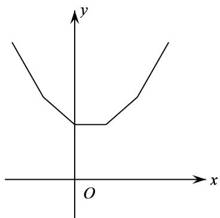

text_image

y
O
x

图（2）

(1) 当 $n$ 为奇数时，函数 $f(x) = \sum_{i=1}^{n}|x - a_i|$ 的图象是一个“ $\vee$ ”型，且在“最中间的点”取最小值；  
(2) 当 $n$ 为偶数时，函数 $f(x) = \sum_{i=1}^{n}|x - a_i|$ 的图象是一个平底型，且在“最中间水平线段”取最小值；

若 $a_{i}(\mathbf{i}\in \mathbb{N}^{*})$ 为等差数列的项时，奇数的图象关于直线 $x = a_{\text{中}}$ 对称，偶数的图象关于直线 $x =$

$\frac{x_{左中}+x_{右中}}{2}$ 对称.

3、若 $f(x)$ 为 $[m, n]$ 上的连续单峰函数，且 $f(m) = f(n), x_0$ 为极值点，则当 $k, b$ 变化时， $g(x) = |f(x) - kx - b|$ 的最大值的最小值为 $\frac{|f(n) - f(x_0)|}{2}$ ，当且仅当 $k = 0, b = \frac{f(n) + f(x_0)}{2}$ 时取得.

# 必考题型全归纳

# 1 题型一: 函数与数列的综合

605 (2024·全国·高三专题练习)已知数列 $\{x_{n}\}$ ，满足 $x_{1}=1, 2x_{n+1}=\ln(1+x_{n}) (n\in\mathbb{N}^{*})$ ，设数列 $\{x_{n}\}$ 的前 n 项和为 $S_{n}$ ，则以下结论正确的是（）

A. $x_{n + 1} > x_n$

B. $x_{n} - 2x_{n + 1} <   x_{n}x_{n + 1}$

C. $2 \sqrt { x _ { n + 2 } } > x _ { n + 1 } + 1$

D. $\mathrm{S}_{n + 5} > 2$

【答案】B

【解析】 $\because 2x_{n+1}=\ln(1+x_{n})\ (n\in\mathbb{N}^{*})$ ，把 $x_{1}=1$ 代入递推可得： $x_{n}>0$ ，

令 $f(x) = x - \ln (x + 1)$ , $x > 0$ , 则 $f'(x) = \frac{x}{x + 1} > 0$ , $f(x)$ 在 $(0, +\infty)$ 单调递增，

∴ $f(x) > f(0)$ ，即当 x > 0 时，恒有 $\ln(1 + x) < x$ 成立，

$\because x_{n}>0,\therefore2x_{n+1}=\ln(1+x_{n})<x_{n},\therefore x_{n}>2x_{n+1}>x_{n+1}$ ，故选项A错误；

又∵ $2\sqrt{x_{n+2}}<2\sqrt{x_{n+1}}\leqslant x_{n+1}+1$ ,∴选项C错误;

$$
\because \left(x _ {n} - 2 x _ {n + 1}\right) - x _ {n} x _ {n + 1} = x _ {n} - \ln \left(1 + x _ {n}\right) - \frac {x _ {n} \ln \left(1 + x _ {n}\right)}{2} = \frac {2 x _ {n} - \left(2 + x _ {n}\right) \ln \left(1 + x _ {n}\right)}{2} =
$$

$$
\frac {2 + x _ {n}}{2} \left[ \frac {2 x _ {n}}{2 + x _ {n}} - \ln (1 + x _ {n}) \right], 0 <   x _ {n} \leqslant 1,
$$

令 $y=\frac{2x}{x+2}-\ln(1+x)$ , $0<x\leqslant1$ , 则 $y'=-\frac{x^{2}}{(x+2)^{2}(x+1)}<0$ , ∴ 函数 $y=\frac{2x}{x+2}-$

$\ln(1+x)$ 在 $(0,1]$ 上递减，∴ $y<y(0)=0$ ，

$\therefore (x_{n}-2x_{n+1})-x_{n}x_{n+1}<0,$ 故选项 B 正确；

又由 $x_{n}>2x_{n+1}$ 可得 $x_{n+1}<\frac{x_{n}}{2},\because x_{1}=1,\therefore x_{n}\leqslant\frac{1}{2^{n-1}}$ (当且仅当 n=1 时取“=“), 可得 $S_{n}\leqslant1+\frac{1}{2}+\cdots+\frac{1}{2^{n-1}}=2-\left(\frac{1}{2}\right)^{n-1}<2,$

$\therefore S_{n+5}<2$ , 故选项 D 错误,

故选B.

606 (2024·全国·高三专题练习)已知函数 $f(x)=\mathrm{e}^{x}-x-1$ ，数列 $\{a_{n}\}$ 的前 n 项和为 $S_{n}$ ，且满足 $a_{1}=\frac{1}{2}, a_{n+1}=f(a_{n})$ ，则下列有关数列 $\{a_{n}\}$ 的叙述正确的是（）

A. $a_5 < |4a_2 - 3a_1|$

B. $a_7 \leqslant a_8$

C. $a_{10} > 1$

D. $S_{100} > 26$

【答案】A

【解析】由 $f(x)=\mathrm{e}^{x}-x-1=x$ , 解得 x=0 或 $x=x_{0}$

由零点存在性定理得 $x = x_{0} \in (1,2)$ ,

∴ 当 $a_{n}<x_{0}$ 时， $a_{n+1}-a_{n}=e^{a_{n}}-2a_{n}-1<0$ ，数列单调递减，

$a_{1}=\frac{1}{2}<x_{0},\therefore a_{2}=f(a_{1})<a_{1}=\frac{1}{2}<x_{0},$ 同理， $a_{3}<a_{2}=f(a_{1})<\frac{1}{2}$ 迭代下去,可得 $0<a_{n}<a_{n-1}<\cdots<a_{1}=\frac{1}{2}$ ,数列单调递减,

故选项 B 和选项 C 都错误;

又 $0 < a_{n} < a_{n-1} < \cdots < a_{2} = e^{\frac{1}{2}} - \frac{1}{2} - 1 < 1.7 - 1.5 = 0.2,$

$\therefore S_{100}<99a_{2}+a_{1}=20.3,$ 故 D 错误;

对于 A, $\left|4a_{2}-3a_{1}\right|>\left|3\times0.5-4\times0.2\right|=0.7$ ,

而 $a_{5}<a_{2}<0.2<0.7,$

$\therefore a_{5}<|4a_{2}-3a_{1}|$ ，故 A 正确.

故选A.

607 (2024·全国·高三专题练习)已知函数 $f(x)=\mathrm{e}^{x}-x-1$ ，数列 $\{a_{n}\}$ 的前 n 项和为 $S_{n}$ ，且满足 $a_{1}=\frac{1}{2}$ ， $a_{n+1}=f(a_{n})$ ，则下列有关数列 $\{a_{n}\}$ 的叙述正确的是（）

A. $a_{2} > \frac{1}{4}$

B. $a_6 < a_7$

C. $S_{100}<26$

D. $a_5 > |4a_2 - 3a_1|$

【答案】C

【解析】对于 A 选项， $a_{2}=\mathrm{e}^{\frac{1}{2}}-\frac{1}{2}-1=\mathrm{e}^{\frac{1}{2}}-\frac{3}{2}<\sqrt{\left(\frac{7}{4}\right)^{2}}-\frac{3}{2}=\frac{1}{4}$ ，故 A 错误；

对于B选项,由 $e^{x}\geqslant x+1$ 知, $a_{n+1}=f(a_{n})=e^{a_{-}n}-a_{n}-1\geqslant0$ ,

故 $\{a_{n}\}$ 为非负数列，又 $a_{n + 1} - a_n = \mathrm{e}^{a - n} - 2a_n - 1,$

设 $g(x)=\mathrm{e}^{x}-2x-1(x>0)$ ，则 $g'(x)=\mathrm{e}^{x}-2$ ，

易知 $g(x)$ 在 $[0, \ln2)$ 单调递减，在 $(\ln2, +\infty)$ 上单调递增，

所以 $-\frac{1}{2}<1-2\ln2=g(x)_{\min}<g(0)=0,$

又 $0 < a_{1} = \frac{1}{2} < \ln 2$ ，所以 $a_{2} - a_{1} < 0$ ，从而 $a_{n+1} - a_{n} < 0$ ，

所以 $\{a_{n}\}$ 为递减数列, 且 $0 \leqslant a_{n} \leqslant \frac{1}{2}$ , 故 B 错误;

对于C选项，

因为数列 $\{a_{n}\}$ 为递减数列, 当 n > 2 时, 有 $a_{n} < a_{2} < \frac{1}{4}$ ,

$$
\mathrm{S} _ {1 0 0} = a _ {1} + a _ {2} + a _ {3} + \dots + a _ {1 0 0} <   \frac {1}{2} + \frac {1}{4} + \frac {1}{4} + \dots + \frac {1}{4} = \frac {1 0 1}{4} <   2 6,
$$

故 C 正确; 对于 D 选项, 因为 $a_{5} < \frac{1}{4}$ , 而 $\left|4a_{2} - 3a_{1}\right| = \left|4a_{2} - \frac{3}{2}\right| > \frac{1}{2}$ , 故 D 错误. 故选 C.

608 (2024·全国·高三专题练习)已知数列 $\{a_{n}\}$ 满足: $a_{n}>0$ , 且 $a_{n}^{2}=3a_{n+1}^{2}-2a_{n+1}(n\in\mathbb{N}^{*})$ , 下列说法正确的是 ()

A. 若 $a_1 = \frac{1}{2}$ , 则 $a_n > a_{n+1}$

B. 若 $a_1 = 2$ ，则 $a_n \geqslant 1 + \left(\frac{3}{7}\right)^{n-1}$

C. $a_1 + a_5 \leqslant 2a_3$

D. $\left|a_{n+2}-a_{n+1}\right|\geqslant\frac{\sqrt{3}}{3}\left|a_{n+1}-a_{n}\right|$

【答案】B

【解析】 $a_{n}^{2}=3a_{n+1}^{2}-2a_{n+1}(n\in\mathbb{N}^{*})$ ，故 $a_{n}^{2}-1=3a_{n+1}^{2}-2a_{n+1}-1,(a_{n}+1)(a_{n}-1)=(3a_{n+1}+1)(a_{n+1}-1)$ .

$a_{n}>0$ , 故 $a_{n}+1>0$ 且 $3a_{n+1}+1>0$ , 于是 $(a_{n}-1)$ 与 $(a_{n+1}-1)$ 同号,

即 $(a_{n} - 1)(a_{n + 1} - 1) > 0.$

对选项 A: 若 $a_{1}=\frac{1}{2}$ ，则 $a_{1}-1=-\frac{1}{2}<0$ ，则 $a_{n}-1<0$ ，

$a_{n}^{2}-a_{n+1}^{2}=2a_{n+1}(a_{n+1}-1)<0$ , 所以 $a_{n}<a_{n+1}$ , 错误;

对选项 B: $a_{1}=2$ , $a_{1}-1=1>0$ , 则 $a_{n}-1>0$ , 即 $a_{n}>1$ ,

于是 $a_{n}^{2} - a_{n + 1}^{2} = 2a_{n + 1}(a_{n + 1} - 1) > 0$ ，即 $a_{n} > a_{n + 1}$ ，数列 $\{a_n\}$ 单调递减， $a_{n} <   a_{1} = 2$

$4 \geqslant 2a_{n+1}, 7(a_{n+1} - a_n) < 0$ , 故 $4 \geqslant 7(a_{n+1} - a_n) + 2a_{n+1}$ , 即 $\frac{a_n + 1}{3a_{n+1} + 1} \geqslant \frac{3}{7}$ ,

$(a_{n}+1)(a_{n}-1)=(3a_{n+1}+1)(a_{n+1}-1)$ ，故 $\frac{a_{n+1}-1}{a_{n}-1}=\frac{a_{n}+1}{3a_{n+1}+1}\geqslant\frac{3}{7}$

故 $a_{n} - 1\geqslant \left(\frac{3}{7}\right)^{n - 1}$ ，故 $a_{n}\geqslant 1 + \left(\frac{3}{7}\right)^{n - 1}$ 正确；

对选项 C: 考虑函数 $f(x)=\sqrt{3x^{2}-2x}$ , $x>\frac{2}{3}$ , $f'(x)=\frac{3x-1}{\sqrt{3x^{2}-2x}}>0$ ,

函数单调递增,结合 y = x 的图像,如图所示:

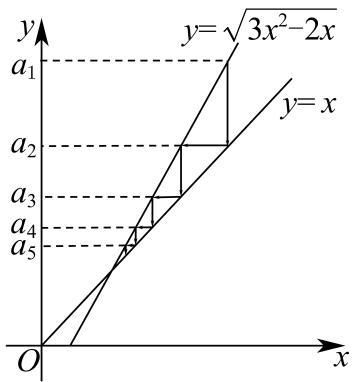

text_image

y
y=√3x²-2x
a₁
a₂
a₃
a₄
a₅
O
x

由图可知当 $a_{n}>0$ 时, 数列 $\{a_{n}-a_{n+1}\}$ 递减,

$a_{1} - a_{2} + a_{2} - a_{3} > a_{3} - a_{4} + a_{4} - a_{5}$ ，所以 $a_1 - a_3 > a_3 - a_5$ ，即 $a_1 + a_5 > 2a_3$ ，不正确；

对选项 D: 设 $a_{n+1}=x$ ，则 $a_{n}=\sqrt{3x^{2}-2x}$ ， $a_{n+2}=\frac{1+\sqrt{1+3x^{2}}}{3}$ ，

$\left|a_{n + 2} - a_{n + 1}\right|\geqslant \frac{\sqrt{3}}{3}\left|a_{n + 1} - a_n\right|$ ，即 $\left|\frac{1 + \sqrt{1 + 3x^2}}{3} -x\right|\geqslant \frac{\sqrt{3}}{3}\left|x - \sqrt{3x^2 - 2x}\right|$

等价于 $2 + 2\sqrt{3} x\sqrt{9x^2 - 6x}\geqslant 2\sqrt{1 + 3x^2}(3x - 1)$ ，化简得 $x^{2} - 2x + 1\leqslant 0$

而 $x^{2}-2x+1\leqslant0$ 显然不恒成立, 不正确;

故选: B.

609 (2024·陕西渭南·统考二模)已知函数 $f(x) = \sin x + \ln x$ ，将 $f(x)$ 的所有极值点按照由小到大的顺序排列，得到数列 $\{x_n\}$ ，对于 $\forall n \in \mathbb{N}_+$ ，则下列说法中正确的是（）

A. $n\pi < x_{n} < (n + 1)\pi$

B. $x_{n + 1} - x_n <   \pi$

C. 数列 $\left\{\left|x_{n}-\frac{(2n-1)\pi}{2}\right|\right\}$ 是递增数列

D. $f(x_{2n}) < -1 + \ln \frac{(4n - 1)\pi}{2}$

【答案】D

【解析】 $f(x)$ 的极值点为 $f'(x)=\cos x+\frac{1}{x}$ 在 $(0,+\infty)$ 上的变号零点.

即为函数 $y = \cos x$ 与函数 $y = -\frac{1}{x}$ 图像在 $(0, +\infty)$ 交点的横坐标.

又注意到 $x \in (0, +\infty)$ 时， $-\frac{1}{x} < 0, k \in \mathbb{N}$ 时， $\cos (\pi + 2k\pi) = -1 < -\frac{1}{\pi + 2k\pi}$ ，

$k \in N^{*}, x \in \left(0, \frac{\pi}{2}\right) \cup \left(-\frac{\pi}{2} + 2k\pi, \frac{\pi}{2} + 2k\pi\right)$ 时， $\cos x > 0$ .

据此可将两函数图像画在同一坐标系中,如下图所示.

A 选项, 注意到 $k \in N$ 时, $f'\left(\frac{\pi}{2} + 2k\pi\right) = \frac{1}{\frac{\pi}{2} + 2k\pi} > 0$ , $f'(\pi + 2k\pi) = -1 + \frac{1}{\pi + 2k\pi} < 0$ ,

$$
f ^ {\prime} \left(\frac {3 \pi}{2} + 2 k \pi\right) = \frac {1}{\frac {3 \pi}{2} + 2 k \pi} > 0.
$$

结合图像可知当 $n = 2k - 1, k \in \mathbb{N}^*$ , $x_n \in \left( \left( n - \frac{1}{2} \right) \pi, n\pi \right) \subseteq ((n - 1)\pi, n\pi)$ .

当 $n = 2k, k \in \mathbb{N}^*$ , $x_n \in ((n - 1)\pi, (n - \frac{1}{2})\pi) \subseteq ((n - 1)\pi, n\pi)$ . 故 A 错误;

B选项,由图像可知 $x_{3}>\frac{5}{2}\pi$ , $x_{2}<\frac{3}{2}\pi$ , 则 $x_{3}-x_{2}>\pi$ , 故 B 错误;

C选项， $\left|x_{n}-\frac{(2n-1)\pi}{2}\right|$ 表示两点 $(x_{n},0)$ 与 $\left(\left(n-\frac{1}{2}\right)\pi,0\right)$ 间距离，由图像可知，

随着 n 的增大,两点间距离越来越近,即 $\left\{\left|x_{n}-\frac{(2n-1)\pi}{2}\right|\right\}$ 为递减数列,故 C 错误;

D选项,由A选项分析可知, $x_{2n}\in\left((2n-1)\pi,\frac{4n-1}{2}\pi\right),n\in\mathrm{N}^{*},$

又结合图像可知, 当 $x \in \left(x_{2n}, \frac{(4n-1)}{2}\pi\right)$ 时, $\cos x > -\frac{1}{x}$ , 即此时 $f'(x) > 0$ ,

得 $f(x)$ 在 $\left(x_{2n},\frac{(4n-1)}{2}\pi\right)$ 上单调递增，

则 $f(x_{2n}) < f\left(\frac{(4n - 1)\pi}{2}\right) = -1 + \ln \frac{(4n - 1)\pi}{2}$ , 故 D 正确.

故选：D

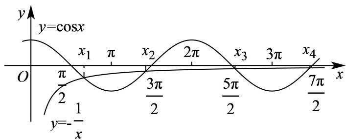

line

| x       | y=cosx |
| ------- | ------ |
| 0       | 0      |
| x₁      | π/2    |
| x₂      | 3π/2   |
| x₃      | 5π/2   |
| x₄      | 7π/2   |

610 (2024·上海杨浦·高三复旦附中校考开学考试)无穷数列 $\{a_{n}\}$ 满足: $0 < a_{1} < 1$ , 且对任意的正整数 n, 均有 $\mathrm{e}^{a_{n+1}} = (3 - a_{n})\mathrm{e}^{a_{n}}$ , 则下列说法正确的是 ()

A. 数列 $\{a_{n}\}$ 为严格减数列

B. 存在正整数 $n$ ，使得 $a_{n} < 0$

C. 数列 $\{a_{n}\}$ 中存在某一项为最大项

D. 存在正整数 $n$ ，使得 $a_{n} > \frac{4}{3}$

【答案】D

【解析】因为 $\mathrm{e}^{a_{n+1}}=(3-a_{n})\mathrm{e}^{a_{n}}>0$ ，所以 $3-a_{n}>0$ ，所以 $a_{n}<3$ ，

由 $\mathrm{e}^{a_{n + 1}} = (3 - a_n)\mathrm{e}^{a_n}$ 可得 $\mathrm{e}^{a_{n + 1} - a_n} = (3 - a_n)$ ，则 $a_{n + 1} - a_n = \ln (3 - a_n)$ ，

则有 $a_{n+1}=a_{n}+\ln(3-a_{n})$ ,

设函数 $f(x)=x+\ln(3-x),0<x<3,$

$$
f ^ {\prime} (x) = 1 + \frac {1}{x - 3} = \frac {x - 2}{x - 3},
$$

当 0 < x < 2 时, $f'(x) > 0$ , 当 2 < x < 3 时, $f'(x) < 0$ ,

所以 $f(x)$ 在 $(0,2)$ 单调递增， $(2,3)$ 单调递减，

所以 $f(x) \leqslant f(2) = 2$ ,

因为 $0 < a_{1} < 1$ ，所以 $a_{2} = f(a_{1}) \in (0, 2)$ ， $a_{3} = f(a_{2}) \in (0, 2)$ ，…

以此类推,对任意 $n \in N^{*}, 0 < a_{n} < 2$ , 故 B 错误;

所以 $a_{n+1}=f(a_{n})=a_{n}+\ln(3-a_{n})>a_{n}$ ，故 A 错误；

因为 $a_{n+1} > a_{n}$ ，所以数列 $\{a_{n}\}$ 中不存在某一项为最大项，C 错误；

因为 $0 < a_{1} < 1$ ，所以 $a_{2} = f(a_{1}) = a_{1} + \ln(3 - a_{1}) > \ln 3 > 1$ ，

$$
a _ {3} = f \left(a _ {2}\right) = a _ {2} + \ln \left(3 - a _ {2}\right) > 1 + \ln 2 > \frac {3}{2} > \frac {4}{3},
$$

所以存在正整数 n, 使得 $a_{n} > \frac{4}{3}$ , D 正确.

# 2 题型二: 函数与不等式的综合

611 (2024·全国·高三专题练习)关于 x 的不等式 $(x-1)^{9999}-2^{9999}\cdot x^{9999}\leqslant x+1$ ，解集为 \_\_\_\_.

【答案】 $[-1,+\infty)$

【解析】由题设， $(x-1)^{9999}-(2x)^{9999}\leqslant x+1$ ，而 $y=x^{9999}$ 在R上递增，

当 $x - 1 > 2x$ 即 $x < -1$ 时， $(x - 1)^{9999} - (2x)^{9999} > 0 > x + 1$ ，原不等式不成立；

当 $x - 1 \leqslant 2x$ 即 $x \geqslant -1$ 时， $(x - 1)^{9999} - (2x)^{9999} \leqslant 0 \leqslant x + 1$ ，原不等式恒成立.

综上,解集为 $[-1,+\infty)$ .

故答案为: $[-1,+\infty)$

612 (2024·全国·高三专题练习)意大利数学家斐波那契(1175年\~1250年)以兔子繁殖数量为例,引人数列:1,1,2,3,5,8,…,该数列从第三项起,每一项都等于前两项之和,即 $a_{n+2}=a_{n+1}+a_{n}(n\in\mathbb{N}^{*})$ ,故此数列称为斐波那契数列,又称“兔子数列”,其通项公式为 $a_{n}=\frac{1}{\sqrt{5}}\left[\left(\frac{1+\sqrt{5}}{2}\right)^{n}-\left(\frac{1-\sqrt{5}}{2}\right)^{n}\right]$ . 设n是不等式 $\log_{2}[(1+\sqrt{5})^{n}-(1-\sqrt{5})^{n}]>n+5$ 的正整数解,则n的最小值为\_\_\_\_.

【答案】8

【解析】由 $\log_{2}[(1+\sqrt{5})^{n}-(1-\sqrt{5})^{n}] > n + 5$ ，得 $\log_{2}[(1+\sqrt{5})^{n}-(1-\sqrt{5})^{n}] - n > 5$ ，

得 $\log_2[(1 + \sqrt{5})^n -(1 - \sqrt{5})^n ] - \log_22^n >5$ ，得 $\log_2\frac{(1 + \sqrt{5})^n -(1 - \sqrt{5})^n}{2^n} >5,$

得 $\log_2\left[\left(\frac{1 + \sqrt{5}}{2}\right)^n -\left(\frac{1 - \sqrt{5}}{2}\right)^n\right] > 5,\therefore \left(\frac{1 + \sqrt{5}}{2}\right)^n -\left(\frac{1 - \sqrt{5}}{2}\right)^n >2^5,$

所以 $\frac{1}{\sqrt{5}}\left[\left(\frac{1 + \sqrt{5}}{2}\right)^n -\left(\frac{1 - \sqrt{5}}{2}\right)^n\right] > \frac{2^5}{\sqrt{5}},$

令 $a_{n} = \frac{1}{\sqrt{5}}\left[\left(\frac{1 + \sqrt{5}}{2}\right)^{n} - \left(\frac{1 - \sqrt{5}}{2}\right)^{n}\right]$ ，则数列 $\{a_{n}\}$ 即为斐波那契数列，

$\therefore a_{n} > \frac{2^{5}}{\sqrt{5}}$ ，则 $a_{n}^{2} > \frac{2^{10}}{5}$ ，显然数列 $\{a_{n}\}$ 为递增数列且 $a_{n} > 0$ ，所以数列 $\{a_{n}^{2}\}$ 亦为递增数列，

由 $a_1 = a_2 = 1$ ，得 $a_3 = a_1 + a_2 = 2$ ， $a_4 = a_2 + a_3 = 3$ ， $a_5 = a_3 + a_4 = 5$ ， $a_6 = a_4 + a_5 = 8$

$$
a _ {7} = a _ {5} + a _ {6} = 1 3, a _ {8} = a _ {6} + a _ {7} = 2 1,
$$

因为 $a_{7}^{2}=13^{2}=169<\frac{2^{10}}{5}=204.8$ , $a_{8}^{2}=21^{2}=441>\frac{2^{10}}{5}=204.8$ ,

所以

使得 $a_{n}^{2} > \frac{2^{10}}{5}$ 成立的 $n$ 的最小值为8.

故答案为: 8.

613 (2024·辽宁·高三校考阶段练习)已知函数 $f(x) = \frac{1}{2^x + 1} + x + 2$ ，若不等式 $f(m \cdot 4^x + 1) +$

$f(m-2^{x})\geqslant5$ 对任意的 x>0 恒成立，则实数 m 的最小值为 \_\_\_\_.

【答案】 $\frac{\sqrt{2} - 1}{2}$

【解析】因为 $f(x)+f(-x)=\frac{1}{2^{x}+1}+x+2+\frac{1}{2^{-x}+1}-x+2=5$ ,

所以 $f(x)$ 图象关于点 $\left(0, \frac{5}{2}\right)$ 对称，

又 $f'(x)=1-\frac{2^{x}\ln2}{(2^{x}+1)^{2}}=\frac{4^{x}+(2-\ln2)2^{x}+1}{(2^{x}+1)^{2}}>0,$

所以 $f(x)$ 在 R 上单调递增，

$f(m\cdot 4^{x} + 1) + f(m - 2^{x})\geqslant 5$ 等价于 $f(m\cdot 4^x +1) + f(m - 2^x)\geqslant f(m - 2^x) + f(2^x -m),$

即 $f(m\cdot 4^{x} + 1)\geqslant f(2^{x} - m)$ 恒成立，

所以 $m \cdot 4^{x} + 1 \geqslant 2^{x} - m$ ，即 $m \geqslant \frac{2^{x} - 1}{4^{x} + 1} (x > 0)$ 恒成立，

令 $2^{x} - 1 = t(t > 0)$ ，可得 $m\geqslant \frac{t}{(t + 1)^{2} + 1} = \frac{t}{t^{2} + 2t + 2},$

而 $\frac{t}{t^2 + 2t + 2} = \frac{1}{t + \frac{2}{t} + 2} \leqslant \frac{1}{2\sqrt{2} + 2} = \frac{\sqrt{2} - 1}{2}$ , 当且仅当 $t = \sqrt{2}$ 时取等号,

所以 $m \geqslant \frac{\sqrt{2} - 1}{2}$ , 即实数 $m$ 的最小值为 $\frac{\sqrt{2} - 1}{2}$ .

故答案为: $\frac{\sqrt{2}-1}{2}$ .

614 (2024·全国·模拟预测)已知函数 $f(x)$ 是定义域为R的函数， $f(2 + x) + f(-x) = 0$ ，对任意 $x_{1}, x_{2} \in [1, +\infty)(x_{1} < x_{2})$ ，均有 $f(x_{2}) - f(x_{1}) > 0$ ，已知 $a, b (a \neq b)$ 为关于 $x$ 的方程 $x^{2} - 2x + t^{2} - 3 = 0$ 的两个解，则关于 $t$ 的不等式 $f(a) + f(b) + f(t) > 0$ 的解集为（）

A. $(-2,2)$

B. $(-2,0)$

C. $(0,1)$

D. $(1,2)$

【答案】D

【解析】由 $f(2+x)+f(-x)=0$ , 得 $f(1)=0$ 且函数 $f(x)$ 关于点 $(1,0)$ 对称.

由对任意 $x_{1}, x_{2} \in [1, +\infty) (x_{1} < x_{2})$ ，均有 $f(x_{2}) - f(x_{1}) > 0$ ，

可知函数 $f(x)$ 在 $[1, +\infty)$ 上单调递增.

又因为函数 $f(x)$ 的定义域为R，

所以函数 $f(x)$ 在R上单调递增.

因为 $a, b (a \neq b)$ 为关于 x 的方程 $x^{2} - 2x + t^{2} - 3 = 0$ 的两个解，

所以 $\Delta=4-4(t^{2}-3)>0$ , 解得 -2<t<2,

且 $a + b = 2$ ，即 $b = 2 - a$

又 $f(2+x)+f(-x)=0,$

令 x = -a，则 $f(a) + f(b) = 0$ ，

则由 $f(a)+f(b)+f(t)>0$ ，得 $f(t)>0=f(1)$ ，

所以 t > 1.

综上, t 的取值范围是 $(1,2)$ .

故选：D.

# 3 题型三: 函数中的创新题

615 (2024·重庆渝中·高三重庆巴蜀中学校考阶段练习)帕德近似是法国数学家亨利·帕德发明的用有理多项式近似特定函数的方法．给定两个正整数 m, n，函数 $f(x)$ 在 x=0 处的 $[m,n]$ 阶帕德近似定义为： $\mathrm{R}(x)=\frac{a_{0}+a_{1}x+\cdots+a_{m}x^{m}}{1+b_{1}x+\cdots+b_{n}x^{n}}$ ，且满足： $f(0)=\mathrm{R}(0)$ ， $f'(0)=\mathrm{R}'$

(0), $f''(0) = \mathrm{R}''(0) \cdots, f^{(m+n)}(0) = \mathrm{R}^{(m+n)}(0)$ . 已知 $f(x) = \ln(x + 1)$ 在 x = 0 处的 [1,1] 阶帕德近似为 $\mathrm{R}(x) = \frac{ax}{1 + bx}$ . 注: $f''(x) = [f'(x)]', f'''(x) = [f''(x)]', f^{(4)}(x) = [f'''(x)]', f^{(5)}$

$$
(x) = \left[ f ^ {(4)} (x) \right] ^ {\prime}, \dots
$$

(1) 求实数 $a, b$ 的值；  
(2) 求证: $(x + b)f\left(\frac{1}{x}\right) > 1$ ;   
(3) 求不等式 $\left(1 + \frac{1}{x}\right)^x < \mathrm{e} < \left(1 + \frac{1}{x}\right)^{x + \frac{1}{2}}$ 的解集, 其中 $\mathrm{e} = 2.71828 \cdots$ .

【解析】(1) 因为 $\mathrm{R}(x)=\frac{ax}{1+bx}$ ，所以 $\mathrm{R}'(x)=\frac{a}{(1+bx)^{2}}$ ， $\mathrm{R}''(x)=\frac{-2ab}{(1+bx)^{3}}$

$$
f (x) = \ln (x + 1), \text {则} f ^ {\prime} (x) = \frac {1}{x + 1}, f ^ {\prime \prime} (x) = - \frac {1}{(x + 1) ^ {2}},
$$

由题意知， $f'(0)=\mathrm{R}'(0)$ ， $f''(0)=\mathrm{R}''(0)$ ，

所以 $\left\{\begin{aligned}a=1\\ -2ab=-1\end{aligned}\right.$ ，解得 $a=1, b=\frac{1}{2}$ .

(2) 由 (1) 知, 即证 $\left(x + \frac{1}{2}\right)\ln \left(1 + \frac{1}{x}\right) > 1$ ,

令 $t=1+\frac{1}{x}$ ，则t>0且 $t\neq1$ ，

即证 $t \in (0,1) \cup (1, +\infty)$ 时 $\frac{t + 1}{2(t - 1)} \cdot \ln t > 1$

记 $\varphi(t) = \ln t - \frac{2(t-1)}{t+1}, t \in (0,1) \cup (1,+\infty)$ ,

则 $\varphi'(t)=\frac{1}{t}-\frac{4}{(t+1)^{2}}=\frac{(t-1)^{2}}{t(t+1)^{2}}>0,$

所以 $\varphi(t)$ 在 $(0,1)$ 上单调递增，在 $(1,+\infty)$ 上单调递增，

当 $t \in (0,1)$ 时 $\varphi(t) < \varphi(1) = 0$ ，即 $\ln t < \frac{2(t-1)}{t+1}$ ，即 $\frac{t+1}{2(t-1)} \cdot \ln t > 1$ 成立，

当 $t \in (1, +\infty)$ 时 $\varphi(t) > \varphi(1) = 0$ ，即 $\ln t > \frac{2(t-1)}{t+1}$ ，即 $\frac{t+1}{2(t-1)} \cdot \ln t > 1$ 成立，

综上可得 $t \in (0,1) \cup (1, +\infty)$ 时 $\frac{t + 1}{2(t - 1)} \cdot \ln t > 1$

所以 $\left(x + \frac{1}{2}\right)\ln \left(1 + \frac{1}{x}\right) > 1$ 成立，即 $(x + b)f\left(\frac{1}{x}\right) > 1$ 成立.

(3) 由题意知, 欲使得不等式 $\left(1+\frac{1}{x}\right)^{x}<\mathrm{e}<\left(1+\frac{1}{x}\right)^{x+\frac{1}{2}}$ 成立,

则至少有 $1 + \frac{1}{x} > 0$ ，即 $x > 0$ 或 $x < -1$

首先考虑 $\mathrm{e}<\left(1+\frac{1}{x}\right)^{x+\frac{1}{2}}$ ，该不等式等价于 $\ln\left(1+\frac{1}{x}\right)^{x+\frac{1}{2}}>1$ ，即 $\left(x+\frac{1}{2}\right)\ln\left(1+\frac{1}{x}\right)>1$ ，

又由(2)知 $\left(x+\frac{1}{2}\right)\ln\left(1+\frac{1}{x}\right)>1$ 成立，

所以使得 $\mathrm{e}<\left(1+\frac{1}{x}\right)^{x+\frac{1}{2}}$ 成立的 x 的取值范围是 $(-∞,-1)∪(0,+∞)$ ,

再考虑 $\left(1 + \frac{1}{x}\right)^x < \mathrm{e}$ , 该不等式等价于 $x\ln \left(1 + \frac{1}{x}\right) < 1$ ,

记 $h(x) = \ln x - x + 1, x \in (0,1) \cup (1, +\infty)$ ,

则 $h'(x)=\frac{1}{x}-1=\frac{1-x}{x}$ ，所以当 0<x<1 时 $h'(x)>0$ ，x>1 时 $h'(x)<0$ ，

所以 $h(x)$ 在 $(0,1)$ 上单调递增，在 $(1,+\infty)$ 上单调递减，

所以 $h(x) < h(1) = 0$ ，即 $\ln x < x - 1, x \in (0,1) \cup (1, +\infty)$ ,

所以 $\ln\left(1+\frac{1}{x}\right)<\frac{1}{x}, x\in(-\infty,-1)\cup(0,+\infty)$ ,

当 $x \in (0, +\infty)$ 时由 $\ln \left(1 + \frac{1}{x}\right) < \frac{1}{x}$ , 可知 $x \ln \left(1 + \frac{1}{x}\right) < 1$ 成立,

当 $x \in (-\infty, -1)$ 时由 $\ln \left(1 + \frac{1}{x}\right) < \frac{1}{x}$ , 可知 $x \ln \left(1 + \frac{1}{x}\right) < 1$ 不成立,

所以使得 $\left(1+\frac{1}{x}\right)^{x}<e$ 成立的x的取值范围是 $(0,+\infty)$ ,

综上可得不等式 $\left(1+\frac{1}{x}\right)^{x}<\mathrm{e}<\left(1+\frac{1}{x}\right)^{x+\frac{1}{2}}$ 的解集为 $(0,+\infty)$ .

616 (2024·上海黄浦·上海市敬业中学校考三模)定义:如果函数 $y=f(x)$ 和 $y=g(x)$ 的图像上分别存在点 M 和 N 关于 x 轴对称,则称函数 $y=f(x)$ 和 $y=g(x)$ 具有 C 关系.

(1) 判断函数 $f(x) = \log_2(8x^2)$ 和 $g(x) = \log_{\frac{1}{2}} x$ 是否具有 C 关系；  
(2) 若函数 $f(x) = a\sqrt{x - 1}$ 和 $g(x) = -x - 1$ 不具有 C 关系，求实数 $a$ 的取值范围；  
(3) 若函数 $f(x) = xe^{x}$ 和 $g(x) = m\sin x (m < 0)$ 在区间 $(0, \pi)$ 上具有 C 关系，求实数 $m$ 的取值范围.

【解析】(1) $f(x)$ 与 $g(x)$ 是具有C关系,理由如下:

根据定义, 若 $f(x)$ 与 $g(x)$ 具有 C 关系, 则在 $f(x)$ 与 $g(x)$ 的定义域的交集上存在 x, 使得 $f(x) + g(x) = 0$ ,

因为 $f(x)=\log_{2}(8x^{2})$ , $g(x)=\log_{\frac{1}{2}}x$ , x>0,

所以 $f(x)+g(x)=\log_{2}(8x^{2})+\log_{\frac{1}{2}}x=\log_{2}8+\log_{2}x^{2}-\log_{2}x=\log_{2}x+3$

令 $f(x)+g(x)=0$ ，即 $\log_{2}x+3=0$ ，解得 $x=\frac{1}{8}$ ，

所以 $f(x)$ 与 $g(x)$ 具有 C 关系.

(2) 令 $\varphi(x) = f(x) + g(x)$ ,

因为 $f(x)=a\sqrt{x-1}$ ， $g(x)=-x-1$ ，所以 $\varphi(x)=a\sqrt{x-1}-x-1(x\geqslant1)$ ，

令 $t = \sqrt{x - 1} (t \geqslant 0)$ , 则 $x = t^2 + 1$ , 故 $y = \varphi(x) = at - (t^2 + 1) - 1 = -t^2 + at - 2$ ,

因为 $f(x)$ 与 $g(x)$ 不具有 C 关系, 所以 $\varphi(x)$ 在 $[0, +\infty)$ 上恒为负或恒为正,

又因为 $y = -t^{2} + at - 2$ 开口向下，所以 $y = -t^{2} + at - 2$ 在 $[0, +\infty)$ 上恒为负，即 $-t^{2} + at - 2 < 0$ 在 $[0, +\infty)$ 上恒成立，

当 t=0 时， $-t^{2}+at-2=-2<0$ 显然成立；

当 t > 0 时， $a < t + \frac{2}{t}$ 在 $[0, +\infty)$ 上恒成立，

因为 $t + \frac{2}{t} \geqslant 2\sqrt{t \cdot \frac{2}{t}} = 2\sqrt{2}$ , 当且仅当 $t = \frac{2}{t}$ , 即 $t = \sqrt{2}$ 时, 等号成立,

所以 $\left(t + \frac{2}{t}\right)_{\min} = 2\sqrt{2}$ , 所以 $a < 2\sqrt{2}$ ,

综上: $a < 2\sqrt{2}$ , 即 $a \in (-\infty, 2\sqrt{2})$ .

(3) 因为 $f(x)=xe^{x}$ 和 $g(x)=m\sin x(m<0)$ ,

令 $h(x) = f(x) + g(x)$ ，则 $h(x) = xe^{x} + m\sin x$

因为 $f(x)$ 与 $g(x)$ 在 $(0,\pi)$ 上具有 C 关系, 所以 $h(x)$ 在 $(0,\pi)$ 上存在零点,

因为 $h'(x)=(x+1)\mathrm{e}^{x}+m\cos x$ ,

当 $-1 \leqslant m < 0$ 且 $x \in (0, \pi)$ 时，因为 $(x + 1)e^{x} > 1, |m\cos x| < |m| \leqslant 1$ ，所以 $h'(x) > 0$ ，

所以 $h(x)$ 在 $(0,\pi)$ 上单调递增，则 $h(x)>h(0)=0$ ，

此时 $h(x)$ 在 $(0,\pi)$ 上不存在零点, 不满足题意;

当 m<-1 时, 显然当 $x \in \left[\frac{\pi}{2}, \pi\right)$ 时, $h'(x) > 0$ ,

当 $x \in \left(0, \frac{\pi}{2}\right)$ 时，因为 $h'(x)$ 在 $\left(0, \frac{\pi}{2}\right)$ 上单调递增，且 $h'(0) = 1 + m < 0, h' \left( \frac{\pi}{2} \right) =$

$$
\left(\frac {\pi}{2} + 1\right) \mathrm{e} ^ {\frac {\pi}{2}} > 0,
$$

故 $h'(x)$ 在 $\left(0, \frac{\pi}{2}\right)$ 上存在唯一零点，设为 $\alpha$ ，则 $h'(\alpha) = 0$ ，

所以当 $x \in (0, \alpha)$ , $h'(x) < 0$ ; 当 $x \in \left(\alpha, \frac{\pi}{2}\right)$ , $h'(x) > 0$ ; 又当 $x \in \left[\frac{\pi}{2}, \pi\right)$ 时, $h'(x) > 0$ ,

所以 $h(x)$ 在 $(0,\alpha)$ 上单调递减，在 $(\alpha,\pi)$ 上单调递增， $h(x)$ 在 $(0,\pi)$ 上存在唯一极小值点 $\alpha$ ，

因为 $h(0)=0$ ，所以 $h(\alpha)<0$ ，

又因为 $h(\pi)=\pi e^{\pi}>0$ ，所以 $h(x)$ 在 $(0,\pi)$ 上存在唯一零点 $\beta$ ，

所以函数 $f(x)$ 与 $g(x)$ 在 $(0,\pi)$ 上具有C关系，

综上: m<-1, 即 $m \in (-\infty, -1)$ .

617 (2024·重庆·高三统考阶段练习)悬索桥(如图)的外观大漂亮,悬索的形状是平面几何中的悬链线.1691年莱布尼兹和伯努利推导出某链线的方程为 $y=\frac{c}{2}\left(\mathrm{e}^{\frac{x}{c}}+\mathrm{e}^{\frac{x}{c}}\right)$ ,其中c为参数.当c=1时,该方程就是双曲余弦函数 $\cosh(x)=\frac{\mathrm{e}^{x}+\mathrm{e}^{-x}}{2}$ ,类似的我们有双曲正弦函数 $\sinh(x)=\frac{\mathrm{e}^{x}-\mathrm{e}^{-x}}{2}$ .

natural_image

Exterior view of a large red suspension bridge spanning a coastal area with a cruise ship sailing nearby (no signage or text visible)

(1) 从下列三个结论中选择一个进行证明, 并求函数 $y = \cosh(2x) + \sinh(x)$ 的最小值;

① $\left[\cosh(x)\right]^{2}-\left[\sinh(x)\right]^{2}=1;$   
② $\sinh(2x)=2\sinh(x)\cosh(x)$ ;   
③ $\cosh (2x) = [\cosh (x)]^2 +[\sinh (x)]^2.$   
(2) 求证: $\forall x \in \left[-\pi, \frac{\pi}{4}\right]$ , $\cosh (\cos x) > \sinh (\sin x)$ .

【解析】(1) 证明: 选①, $\left[\cosh(x)\right]^{2}-\left[\sinh(x)\right]^{2}=\left(\frac{\mathrm{e}^{x}+\mathrm{e}^{-x}}{2}\right)^{2}-\left(\frac{\mathrm{e}^{x}-\mathrm{e}^{-x}}{2}\right)^{2}=$

$$
\frac {\mathrm{e} ^ {2 x} + \mathrm{e} ^ {- 2 x} + 2}{4} - \frac {\mathrm{e} ^ {2 x} + \mathrm{e} ^ {- 2 x} - 2}{4} = 1;
$$

选②， $\sinh (2x) = \frac{\mathrm{e}^{2x} - \mathrm{e}^{-2x}}{2} = 2 \times \frac{(\mathrm{e}^x - \mathrm{e}^{-x})(\mathrm{e}^x + \mathrm{e}^{-x})}{2 \times 2} = 2\sinh (x)\cosh (x)$ ;

选③， $\cosh(2x)=\frac{\mathrm{e}^{2x}+\mathrm{e}^{-2x}}{2}=\left(\frac{\mathrm{e}^{x}+\mathrm{e}^{-x}}{2}\right)^{2}+\left(\frac{\mathrm{e}^{x}-\mathrm{e}^{-x}}{2}\right)^{2}=[\cosh(x)]^{2}+[ \sinh(x)]^{2}$ .

$$
y = \cosh (2 x) + \sinh (x) = \frac {\mathrm{e} ^ {2 x} + \mathrm{e} ^ {- 2 x}}{2} + \frac {\mathrm{e} ^ {x} - \mathrm{e} ^ {- x}}{2}, \text {令} t = \sinh (x) = \frac {\mathrm{e} ^ {x} - \mathrm{e} ^ {- x}}{2},
$$

因为函数 $y = \frac{\mathrm{e}^x}{2}, y = -\frac{\mathrm{e}^{-x}}{2}$ 均为R上的增函数，故函数 $y = \sinh (x)$ 也为R上的增函数，故 $t = \sinh (x) = \frac{\mathrm{e}^x - \mathrm{e}^{-x}}{2} \in \mathbb{R}$ ，则 $t^2 = \frac{\mathrm{e}^{2x} + \mathrm{e}^{-2x} - 2}{4}$ ，所以 $\cosh (2x) = 2t^2 + 1$ ，

所以 $y=2t^{2}+t+1=2\left(t+\frac{1}{4}\right)^{2}+\frac{7}{8}\geqslant\frac{7}{8}$ ，当且仅当 $t=-\frac{1}{4}$ 时取“=”，

所以 $y=\cosh(2x)+\sinh(x)$ 的最小值为 $\frac{7}{8}$ .

(2) 证明: $\forall x \in \left[-\pi, \frac{\pi}{4}\right]$ , $\cosh (\cos x) > \sinh (\sin x) \Leftrightarrow \frac{e^{\cos x} + e^{-\cos x}}{2} > \frac{e^{\sin x} - e^{-\sin x}}{2}$

$$
\Leftrightarrow \mathrm{e} ^ {\cos x} + \mathrm{e} ^ {- \cos x} > \mathrm{e} ^ {\sin x} - \mathrm{e} ^ {- \sin x},
$$

当 $x \in [-\pi, 0]$ 时， $\mathrm{e}^{\cos x} + \mathrm{e}^{-\cos x} > 0$ ， $\sin x \leqslant 0 \leqslant -\sin x$ ，所以 $\mathrm{e}^{\sin x} \leqslant \mathrm{e}^{-\sin x}$ ，

所以 $e^{\sin x}-e^{-\sin x}\leqslant0$ , 所以 $e^{\cos x}+e^{-\cos x}>e^{\sin x}-e^{-\sin x}$ 成立;

当 $x \in \left(0, \frac{\pi}{4}\right]$ 时，则 $0 < x \leqslant \frac{\pi}{2} - x < \frac{\pi}{2}$ ，且正弦函数 $y = \sin x$ 在 $\left(0, \frac{\pi}{2}\right)$ 上为增函数，

$$
\cos x = \sin \left(\frac {\pi}{2} - x\right) \geqslant \sin x, \text {所以} \mathrm{e} ^ {\cos x} \geqslant \mathrm{e} ^ {\sin x}, - \mathrm{e} ^ {- \sin x} <   0 <   \mathrm{e} ^ {- \cos x},
$$

所以 $e^{\cos x} + e^{-\cos x} > e^{\sin x} - e^{-\sin x}$ 成立，

综上， $\forall x \in \left[-\pi, \frac{\pi}{4}\right]$ ， $\cosh (\cos x) > \sinh (\sin x)$ .

618 (2024·广东深圳·高三深圳市南山区华侨城中学校考阶段练习)布劳威尔不动点定理是拓扑学里一个非常重要的不动点定理,它得名于荷兰数学家鲁伊兹·布劳威尔,简单地讲就是对于满足一定条件的连续实函数 $f(x)$ ,存在一个点 $x_{0}$ ,使得 $f(x_{0})=x_{0}$ ,那么我们称该函数为“不动点”函数,而称 $x_{0}$ 为该函数的一个不动点.现新定义:若 $x_{0}$ 满足 $f(x_{0})=-x_{0}$ ,则称 $x_{0}$ 为 $f(x)$ 的次不动点.

(1) 判断函数 $f(x)=x^{2}-2$ 是否是“不动点”函数, 若是, 求出其不动点; 若不是, 请说明理由  
(2) 已知函数 $g(x) = \left|\frac{1}{2} x + 1\right|$ ，若 $a$ 是 $g(x)$ 的次不动点，求实数 $a$ 的值：  
(3) 若函数 $h(x) = \log_{\frac{1}{2}} (4^x - b \cdot 2^x)$ 在 $[0,1]$ 上仅有一个不动点和一个次不动点，求实数 $b$ 的取值范围.

【解析】(1)依题意,设 $x_{0}$ 为 $f(x)$ 的不动点,即 $f(x_{0})=x_{0}$ ,于是得 $x_{0}^{2}-2=x_{0}$ ,解得 $x_{0}=2$ 或 $x_{0}=-1$ ,

所以 $f(x)=x^{2}-2$ 是“不动点”函数, 不动点是 2 和 -1.

(2) 因 $g(x)=\left|\frac{1}{2}x+1\right|$ 是“次不动点”函数, 依题意有 $g(a)=-a$ , 即 $\left|\frac{1}{2}a+1\right|=-a$ , 显然 $a \leqslant 0$ , 解得 $a=-\frac{2}{3}$ ,

所以实数 a 的值是 $-\frac{2}{3}$ .

(3) 设 m, n 分别是函数 $h(x) = \log_{\frac{1}{2}}(4^{x} - b \cdot 2^{x})$ 在 [0,1] 上的不动点和次不动点，且 m, n 唯一，由 $h(m) = m$ 得： $\log_{\frac{1}{2}}(4^m -b\cdot 2^m) = m$ ，即 $4^{m} - b\cdot 2^{m} = \left(\frac{1}{2}\right)^{m}$ 整理得： $b = 2^{m} - \frac{1}{4^{m}}$

令 $\varphi(m)=2^{m}-\frac{1}{4^{m}}$ ，显然函数 $\varphi(m)$ 在 [0,1] 上单调递增，则 $\varphi(m)_{\min}=\varphi(0)=0$ ，

$$
\varphi (m) _ {\max} = \varphi (1) = \frac {7}{4}, \text {则} 0 \leqslant b \leqslant \frac {7}{4},
$$

由 $h(n) = -n$ 得： $\log_{\frac{1}{2}}(4^n -b\cdot 2^n) = -n$ ，即 $4^{n} - b\cdot 2^{n} = 2^{n}$ 整理得： $b = 2^{n} - 1$

令 $u(n) = 2^{n} - 1$ ，显然函数 $u(n)$ 在[0,1]上单调递增， $u(n)_{\mathrm{min}} = u(0) = 0$ ， $u(n)_{\mathrm{max}} = u(1) = 1$ ，则 $0\leqslant b\leqslant 1$

综上得: $0 \leqslant b \leqslant 1$ ,

所以实数 b 的取值范围 $[0,1]$ .

# 题型四: 最大值的最小值问题 (平口单峰函数、铅锤距离)

619 (2024·浙江绍兴·高三浙江省柯桥中学校考开学考试)已知函数 $f(x)=|x^{3}-6x^{2}+ax+b|$ ，对于任意的实数 a, b，总存在 $x_{0}\in[0,3]$ ，使得 $f(x_{0})\geqslant m$ 成立，则当 m 取最大值时， $a+b=$

A. 7

B. 4

C.-4

D.-7

【答案】A

【解析】由 $f(x)=|x^{3}-6x^{2}+ax+b|$ ，得 $f(x)=|x^{3}-6x^{2}+9x-[(9-a)x-b]|$ ，

设 $g(x)=x^{3}-6x^{2}+9x$ ，则 $g'(x)=3x^{2}-12x+9=3(x-1)(x-3)$ ,

$g(x)$ 在 $(0,1)$ 上单调递增，在 $(1,3)$ 上单调递减，

$$
g (0) = g (3) = 0,
$$

设 $h(x)=(9-a)x-b$ ,

画出函数的图像如图

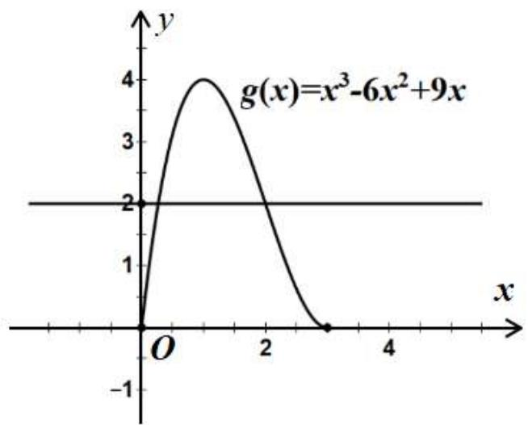

line

| x    | y      |
| ---- | ------ |
| 0.0  | 0.0    |
| 1.0  | 4.0    |
| 2.0  | 2.0    |
| 3.0  | 0.0    |

对任意的实数 a, b, 总存在 $x_{0} \in [0,3]$ , 使得 $f(x_{0}) \geqslant m$ 成立,

等价于求 $f(x)$ 最大值中的最小值，

由图像可知当 a=9, b=-2 时, m 取得最大值 2, 此时 $a+b=7$ ,

故选：A

620 (2024·湖北·高三校联考阶段练习)设函数 $f(x) = \left|x + \frac{4}{x} - ax - b\right|$ ，若对任意的实数 $a, b$ ，总存在 $x_0 \in [1,3]$ 使得 $f(x_0) \geqslant m$ 成立，则实数 $m$ 的最大值为（）

A.-1

B. 0

C. $\frac{8-4\sqrt{3}}{3}$

D. 1

【答案】C

【解析】由已知得 $m \leqslant [f(x)_{\min}]_{\max}$

设构造函数 $g(x)=\frac{4}{x}+\lambda x$ 满足 $g(1)=g(3)$ ，即 $4+\lambda=\frac{4}{3}+3\lambda$ ，解得 $\lambda=\frac{4}{3}$ ，

则 $f(x)=\left|\frac{4}{x}+\frac{4x}{3}-\left(\frac{1}{3}+a\right)x-b\right|$ ，令 $h(x)=\left(\frac{1}{3}+a\right)x+b$ ，

则函数 $f(x)$ 可以理解为函数 $g(x)=\frac{4}{x}+\frac{4}{3}x$ 与函数 $h(x)=\left(\frac{1}{3}+a\right)x+b$ 在横坐标相等时，纵坐标的竖直距离，

$\because g(1)=g(3)=\frac{16}{3}$ ，且 $g(x)=\frac{4}{x}+\frac{4}{3}x=2\sqrt{\frac{4}{x}\cdot\frac{4x}{3}}=\frac{8\sqrt{3}}{3}$ （当且仅当 $x=\sqrt{3}$ 时取等号），

∴若设直线 $l_{1}$ 的方程为 $y=\frac{16}{3}$ ，直线 $l_{2}$ 的方程为 $y=\frac{8\sqrt{3}}{3}$ ，由此可知当 $a+\frac{1}{3}=0$ ，直线 $h(x)=b$ 位于直线 $l_{1}$ 和直线 $l_{2}$ 中间时，纵坐标的竖直距离取得最大值中的最小值，故

$$
[ f (x) _ {\min} ] _ {\max} = \frac {\frac {1 6}{3} - \frac {8 \sqrt {3}}{3}}{2} = \frac {8 - 4 \sqrt {3}}{3},
$$

所以实数 m 的最大值为 $\frac{8-4\sqrt{3}}{3}$ .

故选：C.

621 (2024·全国·高三专题练习)设函数 $f(x)=\left|\frac{4}{x}-ax\right|$ ，若对任意的正实数a，总存在 $x_{0}\in$ [1,4]，使得 $f(x_{0})\geqslant m$ ，则实数m的取值范围为()

A. $(-∞,0]$

B. $(-∞,1]$

C. $(- \infty, 2]$

D. $(-∞,3]$

【答案】D

【解析】对任意的正实数 $a$ ，总存在 $x_0 \in [1, 4]$ ，使得 $f(x_0) \geqslant m \Leftrightarrow m \leqslant f(x)_{\max}$ ， $x \in [1, 4]$ .

令 $u(x)=\frac{4}{x}-ax,\because a>0,\therefore$ 函数 $u(x)$ 在 $x\in[1,4]$ 单调递减，

$$
\therefore u (x) _ {\max} = u (1) = 4 - a, u (x) _ {\min} = u (4) = 1 - 4 a.
$$

① $a \geqslant 4$ 时， $0 \geqslant 4 - a > 1 - 4a$ ，则 $f(x)_{\max} = 4a - 1 \geqslant 15$ .

② 4 > a > 1 时，4 - a > 0 > 1 - 4a，4 - a + 1 - 4a = 5 - 5a < 0，则 $f(x)_{\max} = 4a - 1 > 3$ .

③ $\frac{1}{4} < a \leqslant 1$ 时， $4 - a > 0 > 1 - 4a, 4 - a + 1 - 4a = 5 - 5a \geqslant 0$ ，则 $f(x)_{\max} = 4 - a \geqslant 3$ .

④ $0 < a \leqslant \frac{1}{4}$ 时， $4 - a > 1 - 4a > 0$ ，则 $f(x)_{\max} = 4 - a > \frac{15}{4}$ .

综上①②③④可得: $f(x)_{\max} \geqslant 3$ , 即 $m \leqslant 3$ .

∴实数m的取值范围为 $(-∞,3]$ .

故选：D.

622 (2024·全国·高三专题练习)已知函数 $f(x) = \left|\frac{x - 2}{x + 2} - ax - b\right|$ ，若对任意的实数 $a, b$ ，总存在 $x_0 \in [-1, 2]$ ，使得 $f(x_0) \geqslant m$ 成立，则实数 $m$ 的取值范围是 （）

A. $\left(-\infty,\frac{1}{4}\right]$

B. $\left(-\infty,\frac{1}{2}\right]$

C. $\left(-\infty,\frac{2}{3}\right]$

D. $(-∞,1]$

【答案】B

【解析】由存在 $x_{0}\in[-1,2]$ ，使得 $f(x_{0})\geqslant m$ 成立，故 $m\leqslant f(x)_{\max}$

又对任意的实数 $a, b, m \leqslant f(x)_{\max}$ , 则 $m \leqslant [f(x)_{\max}]_{\min}$ ,

$\left|\frac{x - 2}{x + 2} -ax - b\right| = \left|\frac{x - 2}{x + 2} -(ax + b)\right|$ 可看作横坐标相同时，函数 $g(x) = \frac{x - 2}{x + 2}$

与函数 $h(x)=ax+b$ 图象上的纵向距离的最大值中的最小值，

又 $g(-1)=-3, g(2)=0$ , 作示意图如图所示:

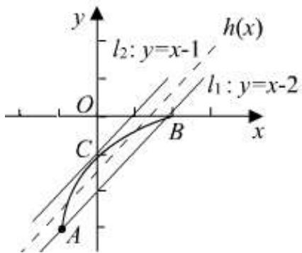

text_image

y
h(x)
l₂: y=x-1
O
C
B
x
l₁: y=x-2
A

设 A(-1, -3), B(2, 0)，则直线 AB 的方程 $l_{1}: y = x - 2$ ，设 $l_{2}: y = x + m$ 与 $g(x)$ 相切，

则 $\frac{x - 2}{x + 2} = x + m$ ，得 $x^{2} + (m + 1)x + 2(m + 1) = 0$ ，有 $\Delta = (m + 1)^{2} - 8(m + 1) = 0,$

得 m=-1 或 m=7，由图知，切点 $C(0,-1)$ ，则 $l_{2}:y=x-1$ ，

当直线 $h(x)$ 与 $l_{1}, l_{2}$ 平行且两直线距离相等时, 即恰好处于正中间时,

函数 $q(x)$ 与 $h(x)$ 图象上的纵向距离能取到最大值中的最小值，

此时 $h(x) = x - \frac{3}{2}, [f(x)_{\max}]_{\min} = \left| -1 - \left(-\frac{3}{2}\right) \right| = \frac{1}{2}$ , 故 $m \leqslant \frac{1}{2}$ .

故选: B

623 (2024·高一课时练习)已知函数 $f(x)=\left|ax+\frac{1}{x}+b\right|(a,b\in\mathbb{R})$ ，当 $x\in\left[\frac{1}{2},2\right]$ 时，设 $f(x)$ 的最大值为 $\mathrm{M}(a,b)$ ，则 $\mathrm{M}(a,b)$ 的最小值为（）

A. $\frac{1}{8}$

B. $\frac{1}{4}$

C. $\frac{1}{2}$

D. 1

【答案】B

【解析】函数 $f(x) = \left|ax + \frac{1}{x} + b\right|(a, b \in \mathbb{R})$ ，当 $x \in \left[\frac{1}{2}, 2\right]$ 时， $f(x)$ 的最大值为 $\mathrm{M}(a, b)$ ，

可得 $\mathrm{M}(a,b)\geqslant f(2)=\left|2a+b+\frac{1}{2}\right|$ ， $\mathrm{M}(a,b)\geqslant f\left(\frac{1}{2}\right)=\left|\frac{1}{2}a+b+2\right|$ ， $\mathrm{M}(a,b)\geqslant f(1)=|a+b+1|$ ，

可得 $\frac{1}{3}\mathrm{M}(a,b) + \frac{2}{3}\mathrm{M}(a,b) + \mathrm{M}(a,b)\geqslant \left|\frac{2}{3} a + \frac{1}{3} b + \frac{1}{6}\right| + \left|\frac{1}{3} a + \frac{2}{3} b + \frac{4}{3}\right| + |a + b + 1|$

$$
\geqslant \left| \frac {2}{3} a + \frac {1}{3} b + \frac {1}{6} + \frac {1}{3} a + \frac {2}{3} b + \frac {4}{3} - a - b - 1 \right| = \frac {1}{2},
$$

即 $2\mathrm{M}(a,b)\geqslant\frac{1}{2}$ ，即有 $\mathrm{M}(a,b)\geqslant\frac{1}{4}$ ，则 $\mathrm{M}(a,b)$ 的最小值为 $\frac{1}{4}$ ，

故选: B

624 (2024·江西宜春·校联考模拟预测)已知函数 $f(x) = \left|\ln x + \frac{1}{x} - ax - b\right|(a, b \in \mathbb{R})$ ，且 $x_0 \in [1, \mathrm{e}^2]$ ，满足 $\ln x_0 + \frac{1}{x_0} = \mathrm{e} - 1$ ，当 $x \in \left[\frac{1}{\mathrm{e}}, x_0\right]$ 时，设函数 $f(x)$ 的最大值为 $\mathrm{M}(a, b)$ ，则 $\mathrm{M}(a, b)$ 的最小值为（）

A. $\frac{3-e}{2}$

B. $\frac{1}{2}$

C. $\frac{e-1}{2}$

D. $\frac{e-2}{2}$

【答案】D

【解析】设 $g(x)=\ln x+\frac{1}{x}(x>0)$ ，则 $g'(x)=\frac{1}{x}-\frac{1}{x^{2}}=\frac{x-1}{x^{2}}(x>0)$ ，

当 0 < x < 1 时， $g'(x) < 0$ ， $g(x)$ 为减函数，

当 x > 1 时， $g'(x) > 0$ ， $g(x)$ 为增函数，所以 $g(x)_{\min} = g(1) = 1$ ，

作出 $g(x)$ 的图象如下，

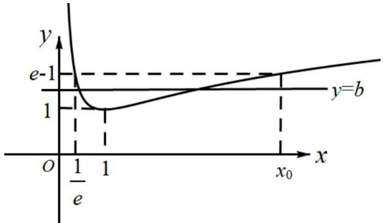

text_image

y
e-1
1
y=b
x
o
1/e
1
x₀

令 $g(x)=\mathrm{e}-1$ , 即 $g(x)=\ln x+\frac{1}{x}=\mathrm{e}-1$ , 得 $x_{1}=\frac{1}{\mathrm{e}}, x_{2}=x_{0}(x_{0}\in(1,+\infty))$

且 $\ln x_0 + \frac{1}{x_0} = \mathrm{e} - 1$ ，显然 $x_0 <   \mathrm{e}^2$

在 $\left[\frac{1}{\mathrm{e}}, x_0\right]$ 上，当 $a = 0$ 时， $f(x) = |g(x) - b|$ ，

当 $b \leqslant \frac{\mathrm{e} - 1 + 1}{2} = \frac{\mathrm{e}}{2}$ 时， $\mathrm{M}(a, b) = \mathrm{e} - 1 - b \geqslant \mathrm{e} - 1 - \frac{\mathrm{e}}{2} = \frac{\mathrm{e} - 2}{2}$ ，当 $b = \frac{\mathrm{e}}{2}$ 时取等号；

当 $b > \frac{\mathrm{e}}{2}$ 时， $\mathrm{M}(a,b) = b - 1 > \frac{\mathrm{e} - 2}{2}$ ，所以 $\mathrm{M}(a,b)_{\min} = \frac{\mathrm{e} - 2}{2}$ ，

此时点 $\left(\frac{1}{\mathrm{e}},\mathrm{e}-1\right),(1,1),(x_{0},\mathrm{e}-1)$ 到直线y=b的距离都是 $\frac{e-2}{2}$ ,

当 $a \neq 0$ 时，三点中 $\left(\frac{1}{\mathrm{e}}, \mathrm{e} - 1\right), (1, 1), (x_0, \mathrm{e} - 1)$ 中至少有一个点满足

$\left|\ln x + \frac{1}{x} -ax - b\right| > \frac{\mathrm{e} - 2}{2}$ 所以 $\mathrm{M}(a,b) > \frac{\mathrm{e} - 2}{2}$ ，综上所述， $\mathrm{M}(a,b)_{\min} = \frac{\mathrm{e} - 2}{2}$

故选：D.

625 (2024·上海虹口·高三上海市复兴高级中学校考期中)若 $a, b \in R$ ，且对于 $0 \leqslant x \leqslant 1$ 时，不等式 $\left|\sqrt{1-x^{2}}-ax-b\right| \leqslant \frac{\sqrt{2}-1}{2}$ 均成立，则实数对 $(a,b)=$ \_\_\_\_.

【答案】 $\left(-1, \frac{\sqrt{2} + 1}{2}\right)$

【解析】对于 $0 \leqslant x \leqslant 1$ 时，不等式 $\left|\sqrt{1-x^{2}}-ax-b\right| \leqslant \frac{\sqrt{2}-1}{2}$ 均成立，

即 $\sqrt{1 - x^2} +\frac{1 - \sqrt{2}}{2}\leqslant ax + b\leqslant \sqrt{1 - x^2} +\frac{\sqrt{2} - 1}{2}$ 恒成立.

令 $f(x)=\sqrt{1-x^{2}}+\frac{1-\sqrt{2}}{2}$ ， $g(x)=\sqrt{1-x^{2}}+\frac{\sqrt{2}-1}{2},x\in[0,1]$

则 $f(x)$ 表示圆心为 $\mathrm{O}_{1}\left(0,\frac{1-\sqrt{2}}{2}\right)$ ，半径为 1 的圆在 $x\in[0,1]$ 上的圆弧；

$g(x)$ 表示圆心为 $\mathrm{O}_{2}\left(0, \frac{\sqrt{2}-1}{2}\right)$ ，半径为 1 的圆在 $x \in [0,1]$ 上的圆弧，如下所示：

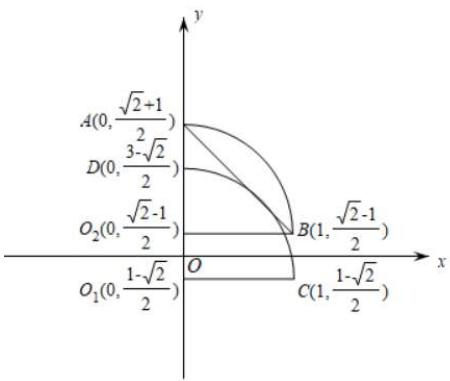

text_image

A(0,\frac{\sqrt{2}+1}{2})
D(0,\frac{3-\sqrt{2}}{2})
O_2(0,\frac{\sqrt{2}-1}{2})
O_1(0,\frac{1-\sqrt{2}}{2})
B(1,\frac{\sqrt{2}-1}{2})
C(1,\frac{1-\sqrt{2}}{2})
y
x

根据题意, $y=ax+b$ 要满足题意,其图象需在圆弧CD以及圆弧AB之间,

数形结合可知:连接AB后所形成的直线恰好满足题意,且唯一.

其斜率为 $\frac{\sqrt{2}-1}{2}-\frac{\sqrt{2}+1}{2}=-1$ ，故其方程为 $y=-x+\frac{\sqrt{2}+1}{2}$ ，

故实数对 $(a,b) = \left(-1,\frac{\sqrt{2} + 1}{2}\right)$ .

为严谨,下证直线 AB 与圆 $O_{1}$ 相切,

圆心 $\mathrm{O}_1\left(0, \frac{1 - \sqrt{2}}{2}\right)$ 到直线 $y = -x + \frac{\sqrt{2} + 1}{2}$ 的距离 $d = \frac{\left|\frac{1 - \sqrt{2}}{2} - \frac{\sqrt{2} + 1}{2}\right|}{\sqrt{2}} = 1,$

其与半径1相等,故圆 $O_{1}$ 与直线AB相切,即证.

故答案为: $\left(-1,\frac{\sqrt{2}+1}{2}\right)$ .

# 题型五: 倍值函数

626 (2024·全国·高三专题练习)函数 $f(x)$ 的定义域为D,若满足:① $f(x)$ 在D内是单调函数;②存在 $[a,b] \subseteq D$ 使得 $f(x)$ 在 $[a,b]$ 上的值域为 $\left[\frac{a}{2},\frac{b}{2}\right]$ , 则称函数 $f(x)$ 为“成功函数”. 若函数 $f(x) = \log_m(m^x + 2t)$ (其中 $m > 0$ , 且 $m \neq 1$ ) 是“成功函数”, 则实数 $t$ 的取值范围为

A. $(0, +\infty)$

B. $\left(-\infty,\frac{1}{8}\right]$

C. $\left[\frac{1}{8},\frac{1}{4}\right)$

D. $\left(0,\frac{1}{8}\right)$

【答案】D

【解析】因为 $y = m^{x} + 2t$ 、 $y = \log_{m} x$ 的单调性相同，

所以 $f(x)=\log_{m}(m^{x}+2t)$ 为定义域上的增函数，

因为存在 $[a,b] \subseteq \mathrm{D}$ 使得 $f(x)$ 在 $[a,b]$ 上的值域为 $\left[\frac{a}{2},\frac{b}{2}\right]$ ,

所以 $\left\{\begin{aligned}f(a)&=\frac{a}{2}\\ f(b)&=\frac{b}{2}\end{aligned}\right.$ ，即 $f(x)=\log_{m}(m^{x}+2t)=\frac{x}{2}$ 有两解，

即 $m^{x}+2t=m^{\frac{1}{2}x}$ 在 R 上有两个不相等的实数根，

令 $\lambda = m^{\frac{1}{2} x}(\lambda >0)$ ，则 $\lambda^2 -\lambda +2t = 0$ 在 $(0, + \infty)$ 上有两个不同的解，

所以 $\left\{\begin{aligned}&2t>0\\&\Delta=1-8t>0\end{aligned}\right.$ ，解得 $0<t<\frac{1}{8}$ ,

故选：D.

627 (2024·上海金山·高三上海市金山中学校考期末)设函数 $f(x)$ 的定义域为D,若存在闭区间 $[a,b]\subseteq D$ ,使得 $f(x)$ 函数满足:(1) $f(x)$ 在 $[a,b]$ 上是单调函数;(2) $f(x)$ 在 $[a,b]$ 上的值域是 $[2a,2b]$ ,则称区间 $[a,b]$ 是函数 $f(x)$ 的“和谐区间”,下列结论错误的是

A. 函数 $f(x)=x^{2}(x\geqslant0)$ 存在“和谐区间”  
B. 函数 $f(x) = \mathrm{e}^{x}(x \in \mathbb{R})$ 不存在“和谐区间”  
C. 函数 $f(x)=\frac{4x}{x^{2}+1}(x\geqslant0)$ 存在“和谐区间”  
D. 函数 $f(x)=\log_{a}\left(a^{x}-\frac{1}{8}\right)(a>0,a\neq1)$ 不存在“和谐区间”

【答案】D

【解析】函数中存在“和谐区间”，则① $f(x)$ 在 $[a,b]$ 内是单调函数；② $\left\{ \begin{array}{l}f(a) = 2a\\ f(b) = 2b \end{array} \right.$ 或 $\left\{ \begin{array}{l}f(a) = 2b\\ f(b) = 2a \end{array} \right.$ ，若 $f(x) = x^{2}(x\geqslant 0)$ ，若存在“和谐区间” $[a,b]$ ，则此时函数单调递增，则由 $\left\{ \begin{array}{l}f(a) = 2a\\ f(b) = 2b \end{array} \right.$ ，得 $\left\{ \begin{array}{l}a^2 = 2a\\ b^2 = 2b \end{array} \right.,\therefore \left\{ \begin{array}{l}a = 0\\ b = 2 \end{array} \right.,\therefore f(x) = x^2 (x\geqslant 0)$ 存在“和谐区间” $[0,2],\therefore A$ 正确.若 $f(x) = e^{2}(x\in R)$ ，若存在“和谐区间” $[a,b]$ ，则此时函数单调递增，则由 $\left\{ \begin{array}{l}f(a) = 2a\\ f(b) = 2b \end{array} \right.$ ，得 $\left\{ \begin{array}{l}\mathrm{e}^{a} = 2a\\ \mathrm{e}^{b} = 2b \end{array} \right.$ ，即 $a,b$ 是方程 $e^x = 2x$ 的两个不等的实根，构建函数 $g(x) = e^x -2x,\therefore g'(x) = e^x -2,$ 所以函数在 $(- \infty ,\ln 2)$ 上单调减，在 $(\ln 2, + \infty)$ 上单调增，∴函数在 $x = \ln 2$ 处取得极小值，且为最小值，∵ $g(\ln 2) = 2 - \ln 2 > 0,\therefore g(x) > 0,\therefore e^x -2x = 0,$ 无解，故函数不存在“和谐区间”，∴B正确.若函数 $f(x) = \frac{4x}{x^2 + 1} (x\geqslant 0),f'(x) = \frac{4(x^2 + 1) - 4x\cdot 2x}{(x^2 + 1)^2} =$

$\frac{4(x + 1)(1 - x)}{(x^2 + 1)^2}$ , 若存在“和谐区间” $[a, b] \subseteq [0, 1]$ , 则由 $\left\{ \begin{array}{l} f(a) = 2a \\ f(b) = 2b \end{array} \right.$ , 得 $\left\{ \begin{array}{l} \frac{4a}{a^2 + 1} = 2a \\ \frac{4b}{b^2 + 1} = 2b \end{array} \right., \therefore a = 0, b = 1$ , 即存在“和谐区间” $[0, 1]$ , $\therefore C$ 正确. 若函数 $f(x) = \log_a\left(a^x - \frac{1}{8}\right)(a > 0, a \neq 1)$ , 不妨设 $a > 1$ , 则函数定义域内为单调增函数, 若存在“和谐区间” $[m, n]$ , 则由

$\left\{ \begin{array}{l} f(m) = 2m \\ f(n) = 2n \end{array} \right.$ , 得 $\log_a \left( a^m - \frac{1}{8} \right) = 2m$ , 即 $m, n$ 是方程 $\log_a \left( a^x - \frac{1}{8} \right) = 2x$ 的两个根, 即 $m, n$ 是方程 $a^{2x} - a^x + \frac{1}{8} = 0$ 的两个根, 由于该方程有两个不等的正根, 故存在“和谐区间” $[m, n]$ , $\therefore D$ 结论错误, 故选 $D$ .

628 (2024·安徽·高三统考期末)函数 $f(x)$ 的定义域为D，若存在闭区间 $[a,b] \subseteq \mathrm{D}$ ，使得函数 $f(x)$ 满足：① $f(x)$ 在 $[a,b]$ 内是单调函数；② $f(x)$ 在 $[a,b]$ 上的值域为 $[2a,2b]$ ，则称区间 $[a,b]$ 为 $y = f(x)$ 的“倍值区间”。下列函数中存在“倍值区间”的有

① $f(x)=x^{2}(x\geq0)$ ; ② $f(x)=\mathrm{e}^{x}(x\in\mathbb{R})$ ;

$$
f (x) = \frac {4 x}{x ^ {2} + 1} (x \geq 0); \quad f (x) = \log_ {a} \left(a ^ {x} - \frac {1}{8}\right) (a > 0, a \neq 1)
$$

A. ①②③④

B.①②④

C. ①③④

D. ①③

【答案】C

【解析】函数存在“倍值区间”，即函数的图像与直线 y=2x 有交点，

$$
f (x) = x ^ {2} (x \geq 0)
$$

与直线 y=2x 有交点是 $(0,0)$ ， $(2,4)$ ; 对于 $f(x)=\mathrm{e}^{x}(x\in\mathrm{R})$ ，构造函数 $g(x)=\mathrm{e}^{x}-2x$ ， $g(x)_{\min}=g(\ln2)=2-2\ln2>0$ ; 所以 $g(x)=\mathrm{e}^{x}-2x$ 没有零点，即 $f(x)=\mathrm{e}^{x}(x\in\mathrm{R})$ 与直线 y=2x 没有交点；

$$
f (x) = \frac {4 x}{x ^ {2} + 1} (x \geq 0)
$$

与直线 y=2x 的交点是 $(0,0)$ ， $(1,2)$ . 解方程 $\log_{a}\left(a^{x}-\frac{1}{8}\right)=2x$ ，即 $a^{2x}-a^{x}+\frac{1}{8}=0, a^{x}=\frac{1\pm\frac{\sqrt{2}}{2}}{2}<1$ ，当 a>1，无解；0<a<1 有两解. 故

$$
f (x) = \log_ {a} \left(a ^ {x} - \frac {1}{8}\right) (a > 0, a \neq 1)
$$

不满足题意.选C.

62.9 (2024·全国·高三专题练习)函数 $f(x)$ 的定义域为D,对给定的正数k,若存在闭区间 $[a,b]\subseteq D$ ,使得函数 $f(x)$ 满足:① $f(x)$ 在 $[a,b]$ 内是单调函数;② $f(x)$ 在 $[a,b]$ 上的值域为 $[ka,kb]$ ,则称区间 $[a,b]$ 为 $y=f(x)$ 的k级“理想区间”.下列结论错误的是()

A. 函数 $f(x) = x^{2} (x \in \mathbb{R})$ 存在 1 级“理想区间”  
B. 函数 $f(x)=\mathrm{e}^{x}(x\in\mathrm{R})$ 不存在 2 级“理想区间”  
C. 函数 $f(x)=\frac{4x}{x^{2}+1}(x\geqslant0)$ 存在 3 级“理想区间”  
D. 函数 $f(x) = \tan x, x \in \left(-\frac{\pi}{2}, \frac{\pi}{2}\right)$ 不存在4级“理想区间”

【答案】D

【解析】A 中, 当 $x \geqslant 0$ 时, $f(x) = x^{2}$ 在 [0,1] 上是单调增函数, 且 $f(x)$ 在 [0,1] 上的值域是 [0,1],

所以存在1级“理想区间”，所以A正确；

B 中, 当 $x \in R$ 时, $f(x) = e^{x}$ 在 $[a, b]$ 上是单调增函数, 且 $[a, b]$ 在 $[a, b]$ 上的值域是 $[e^{a}, e^{b}]$ , 所以不存在 2 级“理想区间”, 所以 B 正确;

C 中, 由 $f(x) = \frac{4x}{x^2 + 1}$ , 得 $f'(x) = \frac{4 - 4x^2}{(x^2 + 1)^2}$ , 当 $x \in [0,1]$ 时, $f'(x) > 0$ , 所以 $f(x)$ 在 (0,1) 上为增函数, 假设存在 $[a,b]\ddot{\mathrm{U}}(0,1)$ , 使得 $f(x) \in [3a,3b]$ , 则有 $\left\{ \begin{array}{l} f(a) = 3a \\ f(b) = 3b \end{array} \right.$ , 即

$\left\{ \begin{array}{l} \frac{4a}{a^2 + 1} = 3a \\ \frac{4b}{b^2 + 1} = 3b \end{array} \right.$ ，由 $\frac{4x}{x^2 + 1} = 3x$ ，得 $x = 0$ 或 $x = \frac{\sqrt{3}}{3}$ ，所以当 $a = 0, b = \frac{\sqrt{3}}{3}$ 时，满足条件，即

区间为 $\left[0,\frac{\sqrt{3}}{3}\right]$ ，所以C正确；

D 中, 若存在“4 级理想区间” $[m, n]$ , 则 $m, n$ 是方程 $\tan x = 4x, x \in \left(-\frac{\pi}{2}, \frac{\pi}{2}\right)$ 的两个根, 由 $y = \tan x$ 和 $y = 4x$ 在 $\left(-\frac{\pi}{2}, \frac{\pi}{2}\right)$ 内有 3 个交点, 如图所示, 所以该方程 $\tan x = 4x, x \in \left(-\frac{\pi}{2}, \frac{\pi}{2}\right)$ 存在两个不等的根, 故存在“4 级理想区间” $[m, n]$ , 所以 D 错误,

故选：D

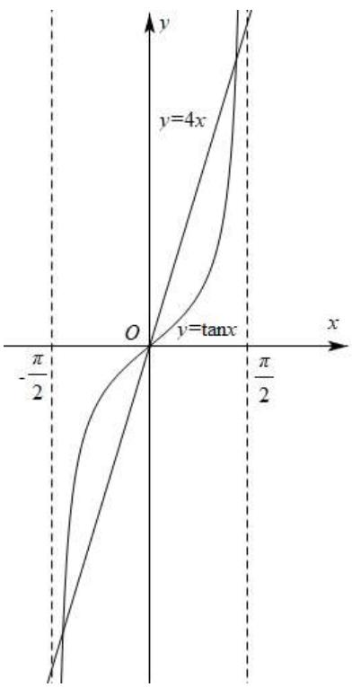

text_image

y
y=4x
O
y=tanx
-π/2
π/2
x
y

630 (2024·全国·高三专题练习)设函数的定义域为D,若满足条件:存在 $[a,b]\subseteq D$ ,使 $f(x)$ 在 $[a,b]$ 上的值域为 $\left[\frac{a}{2},\frac{b}{2}\right]$ ，则称 $f(x)$ 为“倍缩函数”.若函数 $f(x)=\mathrm{e}^{x}+t$ 为“倍缩函数”，则实数t的取值范围是

A. $\left(-\infty,-\frac{1+\ln2}{2}\right]$

B. $\left(-\infty,-\frac{1+\ln2}{2}\right)$

C. $\left[\frac{1+\ln2}{2},+\infty\right)$

D. $\left(\frac{1+\ln2}{2},+\infty\right)$

【答案】B

【解析】因为函数 $f(x)=\mathrm{e}^{x}+t$ 为“倍缩函数”，且为递增函数

所以存在 $[a,b]\subseteq \mathrm{D}$ ，使 $f(x)$ 在 $[a,b]$ 上的值域为 $\left[\frac{a}{2},\frac{b}{2}\right]$

则 $\left\{ \begin{array}{l} \mathrm{e}^{a} + t = \frac{a}{2} \\ \mathrm{e}^{b} + t = \frac{b}{2} \end{array} \right.$ ，由此可知等价于 $\mathrm{e}^{x} - \frac{x}{2} + t = 0$ 有两个不等实数根

令 $g(x) = \mathrm{e}^{x} - \frac{x}{2} + t$

则 $g'(x)=\mathrm{e}^{x}-\frac{1}{2}$ ，令 $g'(x)=\mathrm{e}^{x}-\frac{1}{2}=0$

解得 $x = \ln \frac{1}{2} = -\ln 2$

代入方程得 $\mathrm{e}^{-\ln 2} + \frac{1}{2}\ln 2 + t = 0$

解得 $t = -\frac{\ln 2 + 1}{2}$ , 因为有两个不等的实数根

所以 $t$ 的取值范围为 $\left(-\infty, -\frac{1 + \ln 2}{2}\right)$

所以选B

# 6 题型六:函数不动点问题

631 (2024·广西柳州·统考模拟预测)设函数 $f(x) = \sqrt{\mathrm{e}^x + (\mathrm{e} - 1)x - a} (a \in \mathbb{R}, \mathrm{e}$ 为自然对数的底数)，若曲线 $y = \sin x$ 上存在点 $(x_0, y_0)$ 使 $f(y_0) = y_0$ 成立，则 $a$ 的取值范围是（）

A. $[1,2\mathrm{e} - 2]$

B. $\left[e^{-1}-e,1\right]$

C. $[1,\mathrm{e}]$

D. $\left[e^{-1}-e,2e-2\right]$

【答案】A

【解析】 $f(x)=\sqrt{\mathrm{e}^{x}+(\mathrm{e}-1)x-a}$

由题意，存在 $y_{0}\in[0,1]$ ，使 $f(y_{0})=y_{0}$ 成立，

即存在 $x \in [0,1]$ , 使 $f(x) = x$ 成立,

所以 $\sqrt{\mathrm{e}^x + (\mathrm{e} - 1)x - a} = x$ ，即 $\mathrm{e}^x +(\mathrm{e} - 1)x - a = x^2,$

所以 $a=e^{x}+(e-1)x-x^{2}$

所以存在 $x \in [0,1]$ , 使 $y = a$ 与 $y = \mathrm{e}^{x} + (\mathrm{e} - 1)x - x^{2}$ 有交点,

对 $y=e^{x}+(e-1)x-x^{2}, x\in[0,1]$ ，求导得 $y'=\mathrm{e}^{x}+\mathrm{e}-1-2x$

设 $g(x)=\mathrm{e}^{x}+\mathrm{e}-1-2x$ ，则 $g'(x)=\mathrm{e}^{x}-2$ ，

令 $g'(x)>0$ , 即 $x>\ln2$ ; 令 $g'(x)<0$ , 即 $x<\ln2$

所以 $g(x)=\mathrm{e}^{x}+\mathrm{e}-1-2x$ 在 $[0,\ln2)$ 上单调递减，在 $(\ln2,1]$ 上单调递增，

所以 $y'=\mathrm{e}^{x}+\mathrm{e}-1-2x>y'\bigg|_{x=\ln2}=2+\mathrm{e}-1-2\ln2=2(1-\ln2)+\mathrm{e}-1>0,$

所以 $y=e^{x}+(e-1)x-x^{2}$ 在 $x\in[0,1]$ 上单调递增，

又 $y\big|_{x=0}=e^{0}+(e-1)\times0-0^{2}=1,$

$$
\left. y \right| _ {x = 1} = \mathrm{e} ^ {1} + (\mathrm{e} - 1) \times 1 - 1 = 2 \mathrm{e} - 2,
$$

要使 $y = a$ 与 $y = \mathrm{e}^{x} + (\mathrm{e} - 1)x - x^{2}$ 有交点，则 $1\leqslant a\leqslant 2\mathrm{e} - 2$

所以 a 的取值范围是 $[1,2e-2]$ .

故选：A.

632 (2024·全国·高三专题练习)设函数 $f(x) = \frac{\ln x}{x} + x - a (a \in \mathbb{R})$ ，若曲线 $y = \frac{2\mathrm{e}^{x + 1}}{\mathrm{e}^{2x} + 1} (\mathrm{e}$ 是自然对数的底数)上存在点 $(x_0, y_0)$ 使得 $f(f(y_0)) = y_0$ ，则 $a$ 的取值范围是

A. $(- \infty, 0]$

B. $(0,e]$

C. $\left(-\infty,\frac{1}{e}\right]$

D. $[0, +\infty)$

【答案】C

【解析】因为 $y_{0}=\frac{2e^{x_{0}+1}}{e^{2x_{0}}+1}\leqslant\frac{2e^{x_{0}+1}}{2e^{x_{0}}}=e,y_{0}=\frac{2e^{x_{0}-1}}{e^{2x_{0}}+1}>0$ ，所以 $f(f(x))=x$ 在 $(0,e]$ 上有解

因为 $f'(x)=\frac{1-\ln x}{x^{2}}+1\geqslant\frac{1-(x-1)+x^{2}}{x^{2}}=\frac{\left(x-\frac{1}{2}\right)^{2}+\frac{7}{4}}{x^{2}}>0$ ，(易证 $x\geqslant\ln x+1$ )，所以函数 $f(x)$ 在 $(0,+\infty)$ 上单调递增，因此由 $f(f(x))=x$ 得 $f(x)=x$ 在 $(0,\mathrm{e}]$ 上有解，即 $a=\frac{\ln x}{x},x\in(0,\mathrm{e}]$ ，因为 $a'=\frac{1-\ln x}{x^{2}}\geqslant0\Rightarrow a\in\left(-\infty,\frac{1}{\mathrm{e}}\right]$ ，选 C.

633 (2024·江苏·高二专题练习)若存在一个实数 $t$ ，使得 $\mathrm{F}(t) = t$ 成立，则称 $t$ 为函数 $\mathrm{F}(x)$ 的一个不动点. 设函数 $g(x) = \mathrm{e}^{x} + (1 - \sqrt{\mathrm{e}})x - a (a \in \mathbb{R}, \mathrm{e}$ 为自然对数的底数), 定义在 $\mathbb{R}$ 上的连续函数 $f(x)$ 满足 $f(-x) + f(x) = x^2$ , 且当 $x \leqslant 0$ 时, $f'(x) < x$ . 若存在 $x_0 \in \left\{x \mid f(x) + \frac{1}{2} \geqslant f(1 - x) + x\right\}$ , 且 $x_0$ 为函数 $g(x)$ 的一个不动点, 则实数 $a$ 的取值范围为 ( )

A. $\left(-\infty,\frac{e}{2}\right)$

B. $\left[\frac{\sqrt{e}}{2},+\infty\right)$

C. $\left(\frac{\sqrt{e}}{2},\sqrt{e}\right]$

D. $\left(\frac{\sqrt{e}}{2},+\infty\right)$

【答案】B

【解析】依题意知 $f(-x)+f(x)=x^{2}$ ，令 $h(x)=f(x)-\frac{x^{2}}{2}, x\in\mathrm{R},\therefore h(x)=-h(-x),\therefore h(x)$ 为奇函数，

$\because h'(x)=f'(x)-x,$ 且当 $x\leqslant0$ 时， $f'(x)<x,$

∴ 当 $x \leqslant 0$ 时, $h'(x) < 0$ , $h(x)$ 单调递减, ∴ $h(x)$ 在 R 上单调递减,

由 $f(x)+\frac{1}{2}\geqslant f(1-x)+x$ ，得 $f(x)-\frac{x^{2}}{2}\geqslant f(1-x)-\frac{(1-x)^{2}}{2}$ ，即 $h(x)\geqslant h(1-x)$

∴ $x \leqslant 1 - x$ ，即 $x \leqslant \frac{1}{2}$ ，∴ $x_{0} \leqslant \frac{1}{2}$ ，

$\because x_{0}$ 为函数 $g(x)$ 的一个不动点， $\therefore g(x_{0})=x_{0}$ ，即 $e^{x_{0}}-\sqrt{e}x_{0}-a=0$ ，

∴ $a = e^{x_{0}} - \sqrt{e} x_{0}$ ，即关于 x 的方程 $a = e^{x} - \sqrt{e} x$ 在 $x \in \left(-\infty, \frac{1}{2}\right]$ 上有解.

令 $t(x) = \mathrm{e}^{x} - \sqrt{\mathrm{e}} x, x \in \left(-\infty, \frac{1}{2}\right]$ , 则 $t'(x) = \mathrm{e}^{x} - \mathrm{e}^{\frac{1}{2}} \leqslant 0$ ,

∴ $t(x)$ 在 $\left(-\infty, \frac{1}{2}\right]$ 上单调递减，∴ $t(x)_{\min}=t\left(\frac{1}{2}\right)=\frac{\sqrt{e}}{2}$ ,

要使关于 x 的方程 $a = e^{x} - \sqrt{e}x$ 在 $x \in \left(-\infty, \frac{1}{2}\right]$ 上有解，则 $a \geqslant \frac{\sqrt{e}}{2}$ ，即实数 a 的取值范围为 $\left[\frac{\sqrt{e}}{2}, +\infty\right)$ .

故选：B

634 (2024·全国·高三专题练习)设函数 $f(x)=\sqrt{\mathrm{e}^{x}+x-a}(a\in\mathrm{R},\mathrm{e}$ 为自然对数的底数)，若曲线 $y=\frac{3\sqrt{10}}{10}\sin x+\frac{\sqrt{10}}{10}\cos x$ 上存在点 $(x_{0},y_{0})$ 使得 $f(y_{0})=y_{0}$ ，则 a 的取值范围是

A. $\left[\frac{1-\mathrm{e}}{\mathrm{e}},1\right]$

B. $\left[\frac{1-\mathrm{e}}{\mathrm{e}},\mathrm{e}+1\right]$

C. $[1, e + 1]$

D. $[1,e]$

【答案】D

【解析】法一:由题意可得, $y_{0}=\frac{3\sqrt{10}}{10}\sin x_{0}+\frac{\sqrt{10}}{10}\cos x_{0}$

$$
= \sin (x _ {0} + \varphi) \in [ - 1, 1 ],
$$

而由 $f(x)=\sqrt{\mathrm{e}^{x}+x-a}$ 可知 $y_{0}\in[0,1]$ ,

当 a=0 时， $f(x)=\sqrt{\mathrm{e}^{x}+x}$ 为增函数，

$\therefore y_{0}\in[0,1]$ 时， $f(y_{0})\geqslant\sqrt{\mathrm{e}^{0}}=1.$

∴ 不存在 $y_{0} \in [0,1]$ 使 $f(y_{0}) = y_{0}$ 成立，故 A, B 错；

当 $a=e+1$ 时， $f(x)=\sqrt{e^{x}+x-e-1}$ ，

当 $y_{0} \in [0,1]$ 时，只有 $y_{0} = 1$ 时 $f(x)$ 才有意义，而 $f(1) = 0 \neq 1$ ，故 C 错。故选 D.

法二: 显然, 函数 $f(x)$ 是增函数, $f(x) \geqslant 0$ , 由题意可得, $y_{0} = \frac{3\sqrt{10}}{10}\sin x_{0} + \frac{\sqrt{10}}{10}\cos x_{0} = \sin(x_{0} + \varphi) \in [-1, 1]$ , 而由 $f(x) = \sqrt{\mathrm{e}^{x} + x - a}$ 可知 $y_{0} \in [0, 1]$ ,

于是,问题转化为 $f(t)=t$ 在 $[0,1]$ 上有解.

由 $t=\sqrt{e^{t}+t-a}$ ，得 $t^{2}=e^{t}+t-a$ ，分离变量，得 $a=g(t)=e^{t}-t^{2}+t, t\in[0,1]$

因为 $g'(t)=\mathrm{e}^{t}-2t+1>0, t\in[0,1]$ ,

所以, 函数 $g(t)$ 在 $[0,1]$ 上是增函数, 于是有 $1 = g(0) \leqslant g(t) \leqslant g(1) = e$ ,

即 $a \in [1, \mathrm{e}]$ , 应选 D.

635 (2024·全国·高三专题练习)设函数 $f(x)=\mathrm{e}^{x}+2x-a(a\in\mathbb{R})$ ，e 为自然对数的底数，若曲线 $y=\sin x$ 上存在点 $(x_{0},y_{0})$ ，使得 $f(f(y_{0}))=y_{0}$ ，则 a 的取值范围是（）

A. $\left[-1+e^{-1},1+e\right]$

B. $[1,1 + \mathrm{e}]$

C. $[\mathrm{e},\mathrm{e} + 1]$

D. [1,e]

【答案】A

【解析】∵曲线 $y=\sin x$ 上存在点 $(x_{0},y_{0})$

$$
\therefore y _ {0} = \sin x _ {0} \in [ - 1, 1 ]
$$

函数 $f(x)=\mathrm{e}^{x}+2x-a(a\in\mathrm{R})$ 在 $[-1,1]$ 上是增函数，根据单调性可证 $f(y_{0})=y_{0}$

即 $f(x) = \mathrm{e}^{x} + 2x - a = x$ 在 $[-1,1]$ 上有解，分离参数， $a = \mathrm{e}^{x} + x, x \in [-1,1]$ ，根据 $y = \mathrm{e}^{x} + x$ 是增函数可知，只需 $a \in \left[\frac{1}{\mathrm{e}} - 1, \mathrm{e} + 1\right]$ 故选A.

# 7 题型七:函数的旋转问题

636 (2024·江苏苏州·高三苏州中学校考阶段练习)将函数 $f(x)=\ln(x+1)(x\geqslant0)$ 的图象绕坐标原点逆时针方向旋转角 $\theta(\theta\in(0,\alpha])$ ，得到曲线 C，若对于每一个旋转角 $\theta$ ，曲线 C 都仍然是一个函数的图象，则 $\alpha$ 的最大值为（）

A. $\pi$

B. $\frac{\pi}{2}$

C. $\frac{\pi}{3}$

D. $\frac{\pi}{4}$

【答案】D

【解析】函数 $f(x)=\ln(x+1)(x\geqslant0)$ 的图像绕坐标原点逆时针方向连续旋转时，

当且仅当其任意切线都不经过 y 轴时, 其图像都仍然是一个函数的图像.

因为 $f'(x)=\frac{1}{x+1}$ 在 $[0,+\infty)$ 是减函数且 $0<f'(x)\leqslant1$ ，当且仅当 x=0 时等号成立，故函数 $f(x)=\ln(x+1)(x\geqslant0)$ 的图像的切线中，

在 x=0 处切线的倾斜角最大, 其值为 $\frac{\pi}{4}$ .

由此可知 $\alpha_{\max}=\frac{\pi}{2}-\frac{\pi}{4}=\frac{\pi}{4}.$

故选D.

637 (2024·上海长宁·高三上海市延安中学校考期中)设 D 是含数 1 的有限实数集, $f(x)$ 是定义在 D 上的函数, 若 $f(x)$ 的图象绕原点逆时针旋转 $\frac{\pi}{6}$ 后与原图象重合, 则在以下各项中, $f(1)$ 的可能取值只能是 ( )

A. $\sqrt{3}$

B. $\frac{\sqrt{3}}{2}$

C. $\frac{\sqrt{3}}{3}$

D. 0

【答案】B

【解析】由题意得到:问题相当于圆上由12个点为一组,每次绕原点逆时针旋转 $\frac{\pi}{6}$ 个单位后与下一个点会重合.

我们可以通过代入和赋值的方法当 $f(1)=\sqrt{3}$ ， $\frac{\sqrt{3}}{3}$ ，0 时，此时得到的圆心角为 $\frac{\pi}{3}$ ， $\frac{\pi}{6}$ ，0，然而此时 x=0 或者 x=1 时，都有 2 个 y 与之对应，而我们知道函数的定义就是要求一个 x 只能对应一个 y，因此只有当 $x=\frac{\sqrt{3}}{2}$ ，此时旋转 $\frac{\pi}{6}$ ，此时满足一个 x 只会对应一个 y，故选 B.

638 (2024·全国·高三专题练习)双曲线 $\frac{x^{2}}{3}-y^{2}=1$ 绕坐标原点 O 旋转适当角度可以成为函数 $f(x)$ 的图象, 关于此函数 $f(x)$ 有如下四个命题, 其中真命题的个数为 ( )

① $f(x)$ 是奇函数；  
② $f(x)$ 的图象过点 $\left(\frac{\sqrt{3}}{2},\frac{3}{2}\right)$ 或 $\left(\frac{\sqrt{3}}{2},-\frac{3}{2}\right)$ ;  
③ $f(x)$ 的值域是 $\left(-\infty, -\frac{3}{2}\right] \cup \left[\frac{3}{2}, +\infty\right)$ ;  
④函数 $y=f(x)-x$ 有两个零点.

A. 4 个

B. 3 个

C. 2 个

D. 1 个

【答案】C

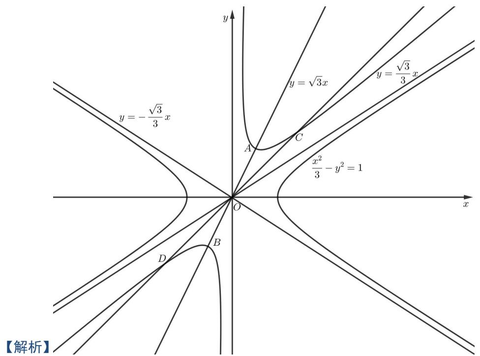

text_image

y = -\frac{\sqrt{3}}{3}x
y = \sqrt{3}x
y = \frac{\sqrt{3}}{3}x
A
C
O
\frac{x^2}{3} - y^2 = 1
D
B
x
【解析】

双曲线 $\frac{x^2}{3} - y^2 = 1$ 关于坐标原点对称，可得旋转后得到的函数 $f(x)$ 的图象关于原点对称，所以 $f(x)$ 为奇函数，故①正确；双曲线的顶点为 $(\pm \sqrt{3}, 0)$ ，渐近线方程为 $y = \pm \frac{\sqrt{3}}{3} x$ 可得 $f(x)$ 的图象渐近线为 $x = 0$ 和 $y = \pm \frac{\sqrt{3}}{3} x$ ，图象关于直线 $y = \sqrt{3} x$ 对称，所以 $f(x)$ 的图象过点 $\left(\frac{\sqrt{3}}{2}, \frac{3}{2}\right)$ 或 $\left(\frac{\sqrt{3}}{2}, -\frac{3}{2}\right)$ ，由图象的对称性可得， $f(x)$ 逆时针旋转60度，位于一、三象限，按顺时针旋转60度，位于二、四象限；故②正确； $f(x)$ 逆时针旋转60度，位于一、三象限，由图象可得顶点为 $\left(\frac{\sqrt{3}}{2}, \frac{3}{2}\right)$ 或 $\left(\frac{\sqrt{3}}{2}, -\frac{3}{2}\right)$ ，不是极值点，则 $f(x)$ 的值域不是 $(- \infty, -\frac{3}{2}] \cup [\frac{3}{2}, +\infty)$ ， $f(x)$ 顺时针旋转60度，位于二、四象限，由图象的对称性知 $f(x)$ 的值域不是 $(- \infty, -\frac{3}{2}] \cup [\frac{3}{2}, +\infty)$ ，故③错误；当 $f(x)$ 的图象位于一、三象限时， $f(x)$ 的

图象与直线 y = x 有 2 个交点，函数 $y = f(x) - x$ 有两个零点，当 $f(x)$ 的图象位于二、四象限时， $f(x)$ 的图象与直线 y = x 没有交点，函数 $y = f(x) - x$ 没有零点，故④错误，故选；C.

639 (2024·全国·高三专题练习)将函数 $y = 2 \sin \frac{x}{2} \left( x \in \left[0, \frac{\pi}{2}\right] \right)$ 的图像绕着原点逆时针旋转角 $\alpha$ 得到曲线 T，当 $\alpha \in (0, \theta]$ 时都能使 T 成为某个函数的图像，则 $\theta$ 的最大值是（）

A. $\frac{\pi}{6}$

B. $\frac{\pi}{4}$

C. $\frac{3}{4}\pi$

D. $\frac{2}{3}\pi$

【答案】B

【解析】 $y'=\cos\frac{x}{2}$ 在原点处的切线斜率为 k=1，切线方程为 y=x

当 $y=2\sin\frac{x}{2}$ 绕着原点逆时针方向旋转时, 若旋转角 $\theta$ 大于 $\frac{\pi}{4}$ , 则旋转所成的图像与 y 轴就会有两个交点, 则曲线不再是函数的图像. 所以 $\theta$ 的最大值为 $\frac{\pi}{4}$ .

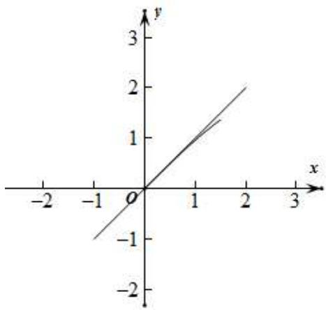

line

| x   | y   |
| --- | --- |
| 0   | 0   |
| 1   | 1   |
| 2   | 2   |
| 3   | 3   |

故选: B.

# 题型八:函数的伸缩变换问题

640 (2024·河北唐山·高三开滦第二中学校考期末)定义域为R的函数 $f(x)$ 满足 $f(x+2)=2f(x)-1$ ，当 $x\in(0,2]$ 时， $f(x)=\left\{\begin{aligned}x^{2}-x,x\in(0,1)\\ \frac{1}{x},x\in[1,2]\end{aligned}\right.$ .若 $x\in(0,4]$ 时， $t^{2}-\frac{7t}{2}\leqslant f(x)\leqslant3-t$ 恒成立，则实数t的取值范围是()

A. $[1,2]$

B. $\left[1, \frac{5}{2}\right]$

C. $\left[\frac{1}{2},2\right]$

D. $\left[2, \frac{5}{2}\right]$

【答案】C

【解析】当 $x \in (2,3)$ ，则 $x - 2 \in (0,1)$ ，

则 $f(x)=2f(x-2)-1=2(x-2)^{2}-2(x-2)-1,$

即为 $f(x)=2x^{2}-10x+11$ ,

当 $x \in [3, 4]$ , 则 $x - 2 \in [1, 2]$ ,

则 $f(x) = 2f(x - 2) - 1 = \frac{2}{x - 2} -1.$

当 $x \in (0,1)$ 时, 当 $x = \frac{1}{2}$ 时, $f(x)$ 取得最小值, 且为 $-\frac{1}{4}$ ;

当 $x \in [1,2]$ 时, 当 x = 2 时, $f(x)$ 取得最小值, 且为 $\frac{1}{2}$ ;

当 $x \in (2,3)$ 时，当 $x = \frac{5}{2}$ 时， $f(x)$ 取得最小值，且为 $-\frac{3}{2}$ ;

当 $x \in [3,4]$ 时，当 x = 4 时， $f(x)$ 取得最小值，且为 0.

综上可得, $f(x)$ 在 $(0,4]$ 的最小值为 $-\frac{3}{2}$ .

若 $x \in (0,4]$ 时， $t^2 - \frac{7t}{2} \leqslant f(x)_{\min}$ 恒成立，

则有 $t^2 - \frac{7t}{2} \leqslant -\frac{3}{2}$ .

解得 $\frac{1}{2} \leqslant t \leqslant 3$ .

当 $x \in (0,2)$ 时, $f(x)$ 的最大值为 1,

当 $x \in (2,3)$ 时, $f(x) \in \left[-\frac{3}{2}, -1\right)$ ,

当 $x \in [3,4]$ 时, $f(x) \in [0,1]$ ,

即有在 $(0,4]$ 上 $f(x)$ 的最大值为1.

由 $f(x)_{\max}\leqslant3-t$ ，即为 $1\leqslant3-t$ ，解得 $t\leqslant2$

综上,即有实数 t 的取值范围是 $\left[\frac{1}{2},2\right]$ .

故选：C.

641 (2024·全国·高三专题练习)定义域为R的函数 $f(x)$ 满足 $f(x+2)=2f(x)$ ，当x[0,2]时， $f(x)=\left\{\begin{aligned}x^{2}-x,x&\in[0,1)\\ -\left(\frac{1}{2}\right)^{|x-\frac{3}{2}|},&x\in[1,2)\end{aligned}\right.$ ，若当 $x\in[-4,-2)$ 时，不等式 $f(x)\geqslant\frac{m^{2}}{4}-m+\frac{1}{2}$ 恒成立，
则实数m的取值范围是()

A. $[2,3]$

B. $[1,3]$

C. $[1,4]$

D. $[2,4]$

【答案】B

【解析】因为当 $x \in [-4, -2)$ 时，不等式 $f(x) \geqslant \frac{m^{2}}{4} - m + \frac{1}{2}$ 恒成立，所以 $f(x)_{\min} \geqslant \frac{m^{2}}{4} - m + \frac{1}{2}$ ,

当 $x \in [-4, -2), x + 4 \in [0, 2)$ 时，

$$
f (x) = \frac {1}{2} f (x + 2) = \frac {1}{4} f (x + 4) = \left\{ \begin{array}{l} \frac {1}{4} [ (x + 4) ^ {2} - (x + 4) ], x + 4 \in [ 0, 1) \\ - \frac {1}{4} \left(\frac {1}{2}\right) ^ {\left| x + 4 - \frac {3}{2} \right|}, x + 4 \in [ 1, 2) \end{array} \right.
$$

当 $x + 4 \in [0,1)$ 时， $f(x) = \frac{1}{4} [(x + 4)^2 - (x + 4)] \geqslant -\frac{1}{4} \times \frac{1}{4} = -\frac{1}{16}$ ，当 $x + 4 \in [1,2)$ 时， $f(x) = -\frac{1}{4} \left(\frac{1}{2}\right)^{|x + 4 - \frac{3}{2}|} \geqslant -\frac{1}{4}$ ，因此当 $x \in [-4, -2)$ 时， $f(x)_{\min} = -\frac{1}{4} \geqslant \frac{m^2}{4} - m + \frac{1}{2} \therefore 1 \leqslant m \leqslant 3$ ，选B.

642 (2024·全国·高三专题练习)已知定义域为R的函数 \( f(x) \) 满足 \( f(x)=2f(x+2) \) ，当 \( x\in[0,2) \) 时， \( f(x)=\left\{\begin{aligned}-x^{2}+x+1,x&\in[0,1)\\(\frac{1}{2})^{|x-\frac{3}{2}|},&x\in[1,2)\end{aligned}\right. \) ，设 \( f(x) \) 在 \( [2n-2,2n) \) 上的最大值为 \( a\_{n}(n\in\mathbb{N}^{\*}) \) 则数列 \( \{a\_{n}\} \) 的前n项和 \( S\_{n} \) 的值为()

A. $5 - 5\left(\frac{1}{2}\right)^{n}$

B. $\frac{5}{2} - 5\left(\frac{1}{2}\right)^n$

C. $5 - 5\left(\frac{1}{2}\right)^{n + 1}$

D. $\frac{5}{2} - 5\left(\frac{1}{2}\right)^{n + 1}$

【答案】D

【解析】 $x \in [1,0)$ 时， $f(x) = -x^{2} + x + 1 = -(x - \frac{1}{2})^{2} + \frac{5}{4}$ ，最大值为 $\frac{5}{4}$ ，

$x \in [1,2)$ 时， $f(x) = \left(\frac{1}{2}\right)^{\left|x - \frac{3}{2}\right|}$ ，易知 $x \in \left[1, \frac{3}{2}\right]$ 时， $f(x)$ 递增， $x \in \left[\frac{3}{2}, 2\right)$ 时， $f(x)$ 递减，因此最大值为 $f\left(\frac{3}{2}\right) = 1$ ，

综上， $x\in [0,2),f(x)_{\mathrm{max}} = \frac{5}{4}$ ，即 $a_1 = \frac{5}{4}$

又 $f(x) = 2f(x + 2)$ ，即 $f(x) = \frac{1}{2} f(x - 2)$

当 $x \in [2n - 2, 2n)$ 时， $x - 2 \in [2n - 4, 2n - 2)$ ， $\therefore a_n = \frac{1}{2} a_{n-1}$ ，

∴ $\{a_{n}\}$ 是等比数列, 公比为 $q=\frac{1}{2}$ ,

$$
\therefore \mathrm{S} _ {n} = \frac {\frac {5}{4} \left(1 - \left(\frac {1}{2}\right) ^ {n}\right)}{1 - \frac {1}{2}} = \frac {5}{2} - 5 \times \left(\frac {1}{2}\right) ^ {n + 1}.
$$

故选：D.

643 (2024·甘肃·高三西北师大附中阶段练习)定义域为R的函数 $f(x)$ 满足 $f(x+2)=2f(x)-2$ ，当 $x\in(0,2]$ 时， $f(x)=\left\{\begin{aligned}&x^{2}-x,x\in(0,1)\\&\frac{1}{x},x\in[1,2]\end{aligned}\right.$ ，若 $x\in(0,4]$ 时， $t^{2}-\frac{7t}{2}\leqslant f(x)$ 恒成立，则实数t的取值范围是()

A. $[1,2]$

B. $\left[2,\frac{5}{2}\right]$

C. $[2, +\infty)$

D. $\left[1,\frac{5}{2}\right]$

【答案】D

【解析】当 $x \in (0,1)$ 时， $f(x) = x^{2} - x = \left(x - \frac{1}{2}\right)^{2} - \frac{1}{4}$ 的取值范围是 $\left[-\frac{1}{4}, 0\right)$ ;

当 $x \in [1,2]$ 时， $f(x) = \frac{1}{x}$ 的取值范围是 $\left[\frac{1}{2}, 1\right]$ ，

所以当 $x \in (0,2]$ 时， $f(x)$ 的取值范围是 $\left[-\frac{1}{4}, 0\right) \cup \left[\frac{1}{2}, 1\right]$ ，

因为函数 $f(x)$ 满足 $f(x+2)=2f(x)-2$ ，所以 $f(x)=2f(x-2)-2$ ，

又当 $x \in (2,4]$ 时, $x - 2 \in (0,2]$ ,

故 $f(x)$ 的取值范围是 $\left[-\frac{5}{2},-2\right)\cup[-1,0]$ ,

所以 $x \in (0,4]$ 时， $f(x)_{\min} = -\frac{5}{2}$ ,

故 $t^2 - \frac{7}{2} t \leqslant -\frac{5}{2}$ , 解得 $1 \leqslant t \leqslant \frac{5}{2}$ ,

所以实数 t 的取值范围是 $\left[1, \frac{5}{2}\right]$ ,

故选：D.

# 9 题型九: V 型函数和平底函数

644 (2024·全国·高三专题练习)已知 $a_{1}, a_{2}, a_{3}$ 与 $b_{1}, b_{2}, b_{3}$ 是 6 个不同的实数, 若关于 x 的方程 $|x - a_{1}| + |x - a_{2}| + |x - a_{3}| = |x - b_{1}| + |x - b_{2}| + |x - b_{3}|$ 解集 A 是有限集, 则集合 A 中, 最多有 \_\_\_\_ 个元素.

【答案】1

【解析】令 $f(x)=|x-a_{1}|+|x-a_{2}|+|x-a_{3}|$ ， $g(x)=|=|x-b_{1}|+|x-b_{2}|+|x-b_{3}|$ 将关于 x 的方程 $\left|x-a_{1}\right|+\left|x-a_{2}\right|+\left|x-a_{3}\right|=\left|x-b_{1}\right|+\left|x-b_{2}\right|+\left|x-b_{3}\right|$ 解的个数的问题转化为两个函数图象交点个数的问题

不妨令 $a_1 < a_2 < a_3, b_1 < b_2 < b_3,$

由于 $f(x)=|x-a_{1}|+|x-a_{2}|+|x-a_{3}|=\begin{cases}3x-a_{1}-a_{2}-a_{3},&x>a_{3}\\x-a_{1}-a_{2}+a_{3},&a_{2}<x<a_{3}\\-x-a_{1}+a_{2}+a_{3},&a_{1}<x<a_{2}\\-3x+a_{1}+a_{2}+a_{3},&x<a_{1}\end{cases}$

$$
g (x) = | x - b _ {1} | + | x - b _ {2} | + | x - b _ {3} | = \left\{ \begin{array}{l} 3 x - b _ {1} - b _ {2} - b _ {3}, x > b _ {3} \\ x - b _ {1} - b _ {2} + b _ {3}, b _ {2} <   x <   b _ {3} \\ - x - b _ {1} + b _ {2} + b _ {3}, b _ {1} <   x <   b _ {2} \\ - 3 x + b _ {1} + b _ {2} + b _ {3}, x <   b _ {1} \end{array} \right.,
$$

考查两个函数,可以看到每个函数都是由两条射线与两段折线所组成的,且两条射线的斜率对应相等,两条线段的斜率对应相等.

当 $a_1, a_2, a_3$ 的和与 $b_1, b_2, b_3$ 的和相等时，此时两个函数射线部分完全重合，这与题设中方程的解集是有限集矛盾

不妨令 $a_{1}, a_{2}, a_{3}$ 的和小于 $b_{1}, b_{2}, b_{3}$ 的和即 $a_{1} + a_{2} + a_{3} < b_{1} + b_{2} + b_{3}, -a_{1} - a_{2} - a_{3} > -b_{1} - b_{2} - b_{3}$ ,

两个函数图象射线部分端点上下位置不同,即若左边 $f(x)=|x-a_{1}|+|x-a_{2}|+|x-a_{3}|$ 的射线端点在上,右边射线端点一定在下,反之亦有可能.

不妨认为左边 $f(x)=|x-a_{1}|+|x-a_{2}|+|x-a_{3}|$ 的射线端点在上，右边射线端点一定在下，且射线互相平行，中间线段也对应平行，图象只能如图：

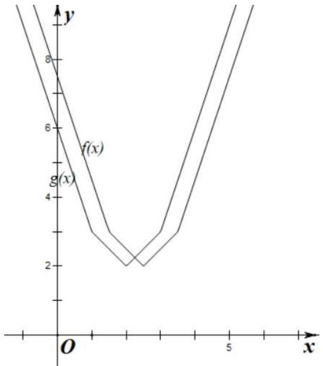

line

| x    | f(x) | g(x) |
| ---- | ---- | ---- |
| 0    | 8    | 6    |
| 1    | 4    | 3    |
| 2    | 2    | 2    |
| 3    | 3    | 3    |
| 4    | 6    | 6    |
| 5    | 8    | 8    |

故两函数图象只能有一个交点,即方程的解集是有限集时,最多有一个元素,

故答案为: 1.

645 (浙江省衢州市2024学年高三数学试题)已知等差数列 $\{a_{n}\}$ 满足: $|a_{1}| + |a_{2}| + \cdots + |a_{n}| = \left|a_{1} - \frac{1}{2}\right| + \left|a_{2} - \frac{1}{2}\right| + \cdots + \left|a_{n} - \frac{1}{2}\right| = \left|a_{1} + \frac{3}{2}\right| + \left|a_{2} + \frac{3}{2}\right| + \cdots + \left|a_{n} + \frac{3}{2}\right| = 72$ , 则 n 的最大值为

A. 18

B. 16

C. 12

D. 8

【答案】C

【解析】 $\because |a_{1}|+|a_{2}|+\cdots+|a_{n}|=\left|a_{1}-\frac{1}{2}\right|+\left|a_{2}-\frac{1}{2}\right|+\cdots+\left|a_{n}-\frac{1}{2}\right|=72$

∴ $\{a_{n}\}$ 不为常数列, 且数列的项数为偶数, 设为 $2k(k \in \mathbb{N}^{*})$

则,一定存在正整数 k 使得 $a_{k}>0$ , $a_{k+1}<0$ 或 $a_{k}<0$ , $a_{k+1}>0$

不妨设 $a_{k}\left\langle0,a_{k+1}\right\rangle0$ , 即， $\left\{\begin{aligned}a_{k}<0\\ a_{k+1}>0\end{aligned}\right.\therefore\left\{\begin{aligned}a_{1}+(k-1)d<0\\ a_{1}+kd>0\end{aligned}\right.\therefore\left\{\begin{aligned}d>0\\ a_{1}<0\end{aligned}\right.$

从而得,数列 $\{a_{n}\}$ 为单调递增数列,

$$
\because a _ {k} <   0, \therefore a _ {k} - \frac {1}{2} <   0 \text {, 且}, \left| a _ {1} - \frac {1}{2} \right| + \left| a _ {2} - \frac {1}{2} \right| + \dots + \left| a _ {n} - \frac {1}{2} \right| = \left| a _ {1} + \frac {3}{2} \right| + \left| a _ {2} + \frac {3}{2} \right| + \dots
$$

$$
+ \left| a _ {n} + \frac {3}{2} \right|
$$

$\therefore a_{k} + \frac{3}{2}\leqslant 0\therefore a_{k}\leqslant -\frac{3}{2},$ 同理 $a_{k + 1} - \frac{1}{2}\geqslant 0$

即， $\left\{\begin{aligned}a_{k}&\leqslant-\frac{3}{2}\\ a_{k+1}&\geqslant\frac{1}{2}\end{aligned}\right.$ $\therefore\left\{\begin{aligned}a_{1}+(k-1)d&\leqslant-\frac{3}{2}\\ a_{1}+kd&\geqslant\frac{1}{2}\end{aligned}\right.$ $\therefore d\geqslant2$

根据等差数列的性质， $a_{k+1}-a_{1}=a_{k+2}-a_{2}=\ldots\ldots=a_{2k}-a_{k}=kd$

$$
\therefore | a _ {1} | + | a _ {2} | + \dots \dots + | a _ {n} | = | a _ {1} | + | a _ {2} | + \dots \dots + | a _ {2 k} | = a _ {k + 1} + a _ {k + 2} + \dots \dots + a _ {2 k} - a _ {1} - a _ {2} - \dots
$$

$$
\dots - a _ {k} = k ^ {2} d = 7 2
$$

$$
\therefore k ^ {2} = \frac {7 2}{d} \leqslant \frac {7 2}{2} = 3 6 \therefore n = 2 k \leqslant 2 \times 6 = 1 2
$$

所以 n 的最大值为 12, 选项 C 正确, 选项 ABD 错误

故选：C.

646 (上海市川沙中学2024学年高三第二学期数学试题)等差数列 $a_{1},a_{2},\cdots,$

$$
a _ {n} \left(n \geqslant 3, n \in \mathrm{N} ^ {*}\right) \text {, 满足} | a _ {1} | + | a _ {2} | + \dots + | a _ {n} | = | a _ {1} + 1 | + | a _ {2} + 1 | + \dots + | a _ {n} + 1 | = | a _ {1} - 2 |
$$

$$
+ \left| a _ {2} - 2 \right| + \dots + \left| a _ {n} - 2 \right| = 2 0 1 9, \text {则} \tag {（）}
$$

A. $n$ 的最大值为50

B. $n$ 的最小值为50

C. $n$ 的最大值为51

D. $n$ 的最小值为51

【答案】A

【解析】 $\left\{a_{n}\right\}$ 为等差数列，则使 $\left|a_{1}\right|+\left|a_{2}\right|+\cdots+\left|a_{n}\right|=$ $\left|a_{1}+1\right|+\left|a_{2}+1\right|+\cdots+\left|a_{n}+1\right|=$ $\left|a_{1}-2\right|+\left|a_{2}-2\right|+\cdots+\left|a_{n}-2\right|=2019$ ，所以数列 $\left\{a_{n}\right\}$ 中的项一定有正有负，不妨设 $a_{1}<0,d>0$ ，因为 $\left|a_{1}\right|+\left|a_{2}\right|+\cdots+\left|a_{n}\right|=$ $\left|a_{1}+1\right|+\left|a_{2}+1\right|+\cdots+\left|a_{n}+1\right|=$ $\left|a_{1}-2\right|+\left|a_{2}-2\right|\cdots+\left|a_{n}-2\right|$

2| = 2019 为定值, 故设 $\left\{\begin{aligned}a_{k+1}&\geqslant0\\ a_{k}&<0\end{aligned}\right.$ , 且 $\left\{\begin{aligned}a_{k+1}&-2\geqslant0\\ a_{k}&+1<0\end{aligned}\right.$ , 解得 d>3. 若 $a_{i}<0$ 且 $a_{i}+1<0$ , 则

$|a_{i}|-|a_{i}+1|=1$ ，同理若 $|a_{i}|\geqslant0$ ，则 $|a_{i}+1|-|a_{i}|=1$ 。所以 $\sum_{i=1}^{k}|a_{i}|-\sum_{i=1}^{k}|a_{i}+1|=\sum_{i=k+1}^{n}|a_{i}+1|$ $-\sum_{i=k+1}^{n}|a_{i}|=k$ ，所以数列 $\{a_{n}\}$ 的项数为2k，所以 $|a_{1}|+|a_{2}|+\cdots+|a_{n}|=-a_{1}-a_{2}-\cdots-a_{k}+$

$$
a _ {k + 1} + a _ {k + 2} + \dots + a _ {2 k} = - 2 (a _ {1} + a _ {2} + \dots + a _ {k}) + (a _ {1} + a _ {2} + \dots + a _ {2 k}) = - 2 \left[ k a _ {1} + \frac {k (k - 1)}{2} d \right] +
$$

$\left[2ka_{1} + \frac{2k(2k + 1)}{2} d\right] = k^{2}d = 2019$ ，由于 $d > 3$ ，所以 $k^2 d = 2019 > 3k^2$ ，解得 $k^2 < 673$ ，故 $k$ $\leqslant 25, n \leqslant 50$ ，故选A.

647 (上海市青浦区2024届高三二模数学试题)等差数列 $a_1, a_2 \cdots, a_n (n \in \mathbb{N}^*)$ ，满足 $|a_1| + |a_2|$

$$
+ \dots + | a _ {n} | = | a _ {1} + 1 | + | a _ {2} + 1 | + \dots + | a _ {n} + 1 | = | a _ {1} + 2 | + | a _ {2} + 2 | + \dots + | a _ {n} + 2 | = | a _ {1} + 3 | +
$$

$|a_{2}+3|+\cdots+|a_{n}+3|=2010$ ，则（）

A. $n$ 的最大值是50

B. $n$ 的最小值是50

C. $n$ 的最大值是51

D. $n$ 的最小值是51

【答案】A

【解析】 $a_{1}=-1005, a_{2}=1005$ 时，满足条件，所以 n=2 满足条件，即 n 最小值为 2，舍去 B, D.

要使得n取最大值,则项数n为偶数,

设 $n=2k, k \in N^{*}$ ，等差数列的公差为 d，首项为 $a_{1}$ ，不妨设 $\left\{\begin{aligned}a_{k+1}&>0\\ a_{k}&<0\end{aligned}\right.$

则 $a_1 < 0, d > 0$ ，且 $a_k + 3 < 0$ ，由 $\left\{ \begin{array}{l} a_{k+1} > 0 \\ a_k + 3 < 0 \end{array} \right.$ 可得 $d > 3$

所以 $\left|a_{1}\right|+\left|a_{2}\right|+\cdots+\left|a_{n}\right|=-a_{1}-a_{2}-\cdots-a_{k}+a_{k+1}+a_{k+2}+\cdots+a_{2k}$

$$
= - 2 \left(a _ {1} + a _ {2} + \dots + a _ {k}\right) + \left(a _ {1} + a _ {2} + \dots + a _ {k} + a _ {k + 1} + a _ {k + 2} + \dots + a _ {2 k}\right)
$$

$$
= - 2 \left[ k a _ {1} + \frac {k (k + 1)}{2} d \right] + 2 k a _ {1} + \frac {2 k (2 k + 1)}{2} d = k ^ {2} d = 2 0 1 0,
$$

因为 d > 3，所以 $k^{2}d = 2010 > 3k^{2}$ ，所以 $k^{2} < 670$ ，而 $k \in N^{*}$ ，

所以 $k \leqslant 25$ ，故 $n = 2k \leqslant 50$ .

故选A

648 (浙江省金丽衢十二校 2024 学年高三第一次联考数学试题) 设等差数列 $a_1, a_2, \cdots, a_n$ ( $n \geqslant 3, n \in \mathbb{N}^*$ ) 的公差为 $d$ , 满足 $|a_1| + |a_2| + \cdots + |a_n| = |a_1 - 1| + |a_2 - 1| + \cdots + |a_n - 1| = |a_1 + 2| + |a_2 + 2| + \cdots + |a_n + 2| = m$ , 则下列说法正确的是

A. $|d|\geqslant 3$

B. $n$ 的值可能为奇数

C. 存在 $\mathrm{i} \in \mathbb{N}^*$ , 满足 $-2 < a_i < 1$

D. $m$ 的可能取值为11

【答案】A

【解析】因为 $\left|a_{1}\right|+\left|a_{2}\right|+\cdots+\left|a_{n}\right|=\left|a_{1}-1\right|+\left|a_{2}-1\right|+\cdots+\left|a_{n}-1\right|=\left|a_{1}+2\right|+\left|a_{2}+2\right|+\cdots+\left|a_{n}+2\right|=m$

所以 $\left|a_{1}\right|+\left|a_{1}+d\right|+\cdots+\left|a_{1}+(n-1)d\right|=\left|a_{1}-1\right|+\left|a_{1}-1+d\right|+\cdots+\left|a_{1}-1+(n-1)d\right|=$ $\left|a_{1}+2\right|+\left|a_{1}+2+d\right|+\cdots+\left|a_{1}+2+(n-1)d\right|=m$

令 $f(x)=|x|+|x+d|+|x+2d|+\cdots+|x+(n-1)d|$ , $n\geqslant3$

则 $f(a_{1})=f(a_{1}-1)=f(a_{1}+2)=m$ (\*)

①当 d=0 时， $f(x)=n|x|$ ，不满足 $(*)$ ，舍去。  
②当 d>0 时, 由 (\*) 得 $f(x)$ 为平底型, 故 n 为偶数 $(n\geqslant4)$ .

$f(x)$ 的大致图像为：

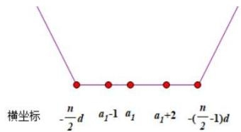

text_image

横坐标 -n/2d a₁-1 a₁ a₁+2 -n/2-1)d

则 $-\frac{n}{2} d \leqslant a_1 - 1 < a_1 < a_1 + 2 \leqslant -\left(\frac{n}{2} - 1\right)d$

所以 $\left|-\left(\frac{n}{2}-1\right)d+\frac{n}{2}d\right|=|d|\geqslant3$ , 故 A 正确.

由 $\left\{ \begin{array}{l} -\frac{n}{2} d \leqslant a_1 - 1 \\ a_1 + 2 \leqslant -\left(\frac{n}{2} - 1\right)d \end{array} \Rightarrow 1 - \frac{n}{2} d \leqslant a_1 \leqslant -2 - \left(\frac{n}{2} - 1\right)d \right.$

当 $\mathrm{i} = 1,2,\dots ,\frac{n}{2}$ 时 $a_{i} = a_{1} + (\mathrm{i} - 1)d\leqslant -2 - \left(\frac{n}{2} -1\right)d + (\mathrm{i} - 1)d = \left(\mathrm{i} - \frac{n}{2}\right)d - 2$

当 $i=\frac{n}{2}+1,\frac{n}{2}+2,\cdots,n$ 时 $a_{i}=a_{1}+(i-1)d\geqslant1-\frac{n}{2}d+(i-1)d=1+(i-\frac{n}{2}-1)d\geqslant$

1

故不存在 $\mathrm{i}\in \mathbb{N}^*$ ，满足 $-2 < a_{i} < 1$ ，C错

$$
m = f \left(a _ {1}\right) = \left| a _ {1} \right| + \left| a _ {2} \right| + \dots + \left| a _ {\frac {n}{2}} \right| + \left| a _ {\frac {n}{2} + 1} \right| + \dots + \left| a _ {n} \right|
$$

$$
\geqslant \left| \left(a _ {1} + a _ {2} + \dots + a _ {\frac {n}{2}}\right) - \left(a _ {\frac {n}{2} + 1} + a _ {\frac {n}{2} + 2} + \dots + a _ {n}\right) \right|
$$

$$
= \frac {n}{2} \left(a _ {\frac {n}{2} + 1} - a _ {1}\right) = \frac {n ^ {2}}{4} d
$$

由于 $n \geqslant 4, d \geqslant 3$ 所以 $m \geqslant \frac{n^2}{4} d \geqslant 12$ , 故 D 错

③当 d<0 时, 令 $d'=-d>0$

由于 $f(x)$ 的图像与 $f(-x)$ 的图像关于 y 轴对称, 故只需研究 $f(-x)$

故令 $g(x)=f(-x)=|-x|+|-x+d|+|-x+2d|+\cdots+|-x+(n-1)d|$ , $n\geqslant3$

$$
= | x | + | x + d ^ {\prime} | + | x + 2 d ^ {\prime} | + \dots + | x + (n - 1) d ^ {\prime} |, n \geqslant 3
$$

因为 $f(a_{1}) = f(a_{1} - 1) = f(a_{1} + 2) = m$

所以 $g(-a_{1}) = g(-a_{1} - 1) = g(-a_{1} + 2) = m$

由②知 $g(x)$ 为平底型, 故 n 为偶数 ( $n \geqslant 4$ ), 故 B 错

令 $a_{1}^{\prime}=-a_{1}-1, a_{i}^{\prime}=a_{1}^{\prime}+(i-1)d^{\prime}=a_{i}-1$

所以 $g(a_{i}^{\prime})=g(a_{i}^{\prime}-1)=g(a_{i}^{\prime}+2)=m\Rightarrow d^{\prime}=-d\geqslant3$ ，故 A 正确

由②知,不存在 $i\in N^{*}$ ,满足 $-2<a_{i}^{\prime}<1\Leftrightarrow-2<-a_{i}-1<1\Leftrightarrow-2<a_{i}<1$ ,故C错

由②知， $m=g(a_{i})\geqslant\frac{n^{2}}{4}d'\geqslant12$ ，故D错

综上所述, A 正确, BCD 错误

故选A.

