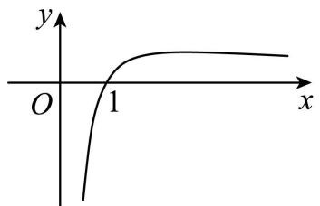

# 第19讲 原函数与导函数混合还原

# 知识梳理

1、对于 $xf'(x) + f(x) > 0(< 0)$ ，构造 $g(x) = x \cdot f(x)$ ，

2、对于 $xf'(x) + kf(x) > 0(< 0)$ ，构造 $g(x) = x^k \cdot f(x)$

3、对于 $x \cdot f'(x) - f(x) > 0 (< 0)$ ，构造 $g(x) = \frac{f(x)}{x}$ ，

4、对于 $x \cdot f'(x) - kf(x) > 0 (< 0)$ ，构造 $g(x) = \frac{f(x)}{x^k}$

5、对于 $f^{\prime}(x) + f(x) > 0(<  0)$ ，构造 $g(x) = \mathrm{e}^{x}\cdot f(x)$

6、对于 $f'(x) + kf(x) > 0 (< 0)$ ，构造 $g(x) = \mathrm{e}^{kx} \cdot f(x)$

7、对于 $f'(x)-f(x)>0(<0)$ ，构造 $g(x)=\frac{f(x)}{\mathrm{e}^{x}}$

8、对于 $f'(x) - kf(x) > 0 (< 0)$ ，构造 $g(x) = \frac{f(x)}{\mathrm{e}^{bx}}$

9、对于 $\sin x\cdot f'(x) + \cos x\cdot f(x) > 0(< 0)$ ，构造 $g(x) = f(x)\cdot \sin x$

10、对于 $\sin x\cdot f'(x) - \cos x\cdot f(x) > 0(< 0)$ ，构造 $g(x) = \frac{f(x)}{\sin x}$

11、对于 $\cos x\cdot f'(x) - \sin x\cdot f(x) > 0(< 0)$ ，构造 $g(x) = f(x)\cdot \cos x$

12、对于 $\cos x\cdot f'(x) + \sin x\cdot f(x) > 0(< 0)$ ，构造 $g(x) = \frac{f(x)}{\cos x}$

13、对于 $f'(x) - f(x) > k (< 0)$ ，构造 $g(x) = \mathrm{e}^{x}[f(x) - k]$

14、对于 $f^{\prime}(x)\ln x + \frac{f(x)}{x} >0(<  0)$ ，构造 $g(x) = \ln x\cdot f(x)$

15、 $f'(x) + c = [f(x) + cx]'$ ; $f'(x) + g'(x) = [f(x) + g(x)]'$ ; $f'(x) - g'(x) = [f(x) - g(x)]'$ ;

16、 $f'(x)g(x)+f(x)g'(x)=[f(x)g(x)]';\frac{f'(x)g(x)-f(x)g'(x)}{g^{2}(x)}=\left[\frac{f(x)}{g(x)}\right]'.$

# 必考题型全归纳

# 1 题型一:利用 $x^{n}f(x)$ 构造型

649 (安徽省马鞍山第二中学2024学年高三上学期10月段考数学试题)已知 $f(x)$ 的定义域为 $(0, +\infty)$ , $f'(x)$ 为 $f(x)$ 的导函数,且满足 $\mathbf{f}(\mathbf{x}) < -\mathbf{x}\mathbf{f}'(\mathbf{x})$ ,则不等式 $f(x+1) > (x-1)f(x^2-1)$ 的解集是

A. $(0,1)$

B. $(2, +\infty)$

C. $(1,2)$

D. $(1, +\infty)$

【答案】B

【解析】根据题意,构造函数 $y = xf(x)$ , $x \in (0, +\infty)$ , 则 $y' = f(x) + xf'(x) < 0$ ,

所以函数 $y = xf(x)$ 的图象在 $(0, +\infty)$ 上单调递减.

又因为 $f(x+1)>(x-1)f(x^{2}-1)$ ，所以 $(x+1)f(x+1)>(x^{2}-1)f(x^{2}-1)$ ，

所以 $0 < x + 1 < x^{2} - 1$ ，解得 x > 2 或 x < -1（舍）.

所以不等式 $f(x+1)>(x-1)f(x^{2}-1)$ 的解集是 $(2,+\infty)$ .

故选: B.

650 (河南省温县第一高级中学2024学年高三上学期12月月考数学试题)已知函数 $f(x)$ 的定义域为 $(0, +\infty)$ ，且满足 $f(x) + xf'(x) > 0 (f'(x)$ 是 $f(x)$ 的导函数），则不等式 $(x - 1)f(x^2 - 1) < f(x + 1)$ 的解集为

A. $(-∞,2)$

B. $(1,+\infty)$

C. $(1,2)$

D. $(-1,2)$

【答案】C

【解析】令 $g(x)=xf(x)$ ，则 $g'(x)=f(x)+xf'(x)>0$ ，即 $g(x)$ 在 $(0,+\infty)$ 上递增，

又 $x + 1 > 0$ ，则 $(x - 1)f(x^{2} - 1) < f(x + 1)$ 等价于 $(x^{2} - 1)f(x^{2} - 1) < (x + 1)f(x + 1)$ ，即 $g(x^{2} - 1) < g(x + 1)$ ，

所以 $\left\{\begin{aligned}x^{2}-1&>0\\ x+1&>0\\ x^{2}-1&<x+1\end{aligned}\right.$ ，解得 1<x<2，原不等式解集为 $(1,2)$ .

故选：C

651 (黑龙江省大庆实验中学2024届高三下学期5月考前得分训练(三)数学试题)已知函数 $f(x)$ 的定义域为 $(0, +\infty)$ , $f'(x)$ 为函数 $f(x)$ 的导函数, 若 $x^{2}f'(x) + xf(x) = 1$ , $f(1) = 0$ , 则不等式 $f(2^{x} - 3) > 0$ 的解集为 ( )

A. $(0,2)$

B. $(\log_23,2)$

C. $(\log_23, +\infty)$

D. $(2, +\infty)$

【答案】D

【解析】由题意得, $xf'(x)+f(x)=\frac{1}{x}$ ,

即 $[xf(x)]' = (\ln x + c)'$ ,

所以 $xf(x)=\ln x+c$ , 即 $f(x)=\frac{\ln x}{x}+\frac{c}{x}$

又 $f(1)=0$ ,所以c=0,故 $f(x)=\frac{\ln x}{x}$ ,

$f'(x)=\frac{1-\ln x}{x^{2}}=0$ , 可得 x=e,

在 $(0,e)$ 上, $f'(x)>0$ , $f(x)$ 单调递增;

在 $(e, +\infty)$ 上， $f'(x) < 0$ ， $f(x)$ 单调递减，

所以 $f(x)$ 的极大值为 $f(\mathrm{e})=\frac{1}{\mathrm{e}}$ . 简图如下:

text_image

y
O 1 x

所以 $f(x)>0,2^{x}-3>1,x>2.$

故选：D.

652 (2024届高三第七次百校大联考数学试题(新高考))已知定义在R上的偶函数 $y=f(x)$ 的导函数为 $y=f'(x)$ ，当x>0时， $\frac{xf'(x)+f(x)}{x}>0$ ，且 $f(2)=1$ ，则不等式 $f(2x-1)<\frac{2}{2x-1}$ 的解集为()

A. $\left(-\infty,\frac{1}{2}\right)\cup\left(\frac{3}{2},+\infty\right)$

B. $\left(\frac{3}{2},+\infty\right)$

C. $\left(\frac{1}{2},\frac{3}{2}\right)$

D. $\left(-\frac{1}{2},\frac{1}{2}\right)\cup\left(\frac{1}{2},\frac{3}{2}\right)$

【答案】C

【解析】当 x > 0 时， $\frac{xf'(x) + f(x)}{x} > 0$ ，所以当 x > 0 时， $xf'(x) + f(x) > 0$ ，

令 $F(x)=xf(x)$ ，则当 x>0 时， $F'(x)=xf'(x)+f(x)>0$ ，

故 $F(x)=xf(x)$ 在 $(0,+\infty)$ 上单调递增，

又因为 $y=f(x)$ 在 R 上为偶函数, 所以 $F(x)=xf(x)$ 在 R 上为奇函数,

故 $F(x)=xf(x)$ 在 R 上单调递增, 因为 $f(2)=1$ , 所以 $F(2)=2f(2)=2$ ,

当 $x > \frac{1}{2}$ 时， $f(2x - 1) < \frac{2}{2x - 1}$ 可变形为 $(2x - 1)f(2x - 1) < 2$ ，即 $\mathrm{F}(2x - 1) < \mathrm{F}(2)$ ，

因为 $F(x)=xf(x)$ 在 R 上单调递增, 所以 2x-1<2, 解得 $x<\frac{3}{2}$ , 故 $\frac{1}{2}<x<\frac{3}{2}$ ;

当 $x < \frac{1}{2}$ 时， $f(2x - 1) < \frac{2}{2x - 1}$ 可变形为 $(2x - 1)f(2x - 1) > 2$ ，即 $\mathrm{F}(2x - 1) > \mathrm{F}(2)$ ，

因为 $F(x)=xf(x)$ 在 R 上单调递增, 所以 2x-1>2, 解得 $x>\frac{3}{2}$ , 故无解.

综上不等式 $f(2x - 1) < \frac{2}{2x - 1}$ 的解集为 $\left(\frac{1}{2},\frac{3}{2}\right)$ .

故选：C.

653 (四川省绵阳市盐亭中学2024届高三第二次模拟考试数学试题)已知定义在 $(0,+\infty)$ 上的函数 $f(x)$ 满足 $2xf(x)+x^{2}f'(x)<0,f(2)=\frac{3}{4}$ ，则关于x的不等式 $f(x)>\frac{3}{\circ x^{2}}$ 的解集为()

A. $(0,4)$

B. $(2,+\infty)$

C. $(4,+\infty)$

D. $(0,2)$

【答案】D

【解析】令 $h(x)=x^{2}f(x)$ ，则 $h'(x)=2xf(x)+x^{2}f'(x)<0$ ，所以 $h(x)$ 在 $(0,+\infty)$ 单调递减，

不等式 $f(x) > \frac{3}{x^2}$ 可以转化为 $x^2 f(x) > 4 \times \frac{3}{4} = 2^2 f(2)$ ，即 $h(x) > h(2)$ ，所以 $0 < x < 2$ . 故选：D.

654 (河南省豫北重点高中2024学年高三下学期4月份模拟考试文科数学试题)已知函数 $f(x)$ 的定义域为 $(0, +\infty)$ ，其导函数是 $f'(x)$ ，且 $2f(x) + xf'(x) > x$ 。若 $f(2) = 1$ ，则不等式 $3f(x) - x - \frac{4}{x^2} > 0$ 的解集是（）

A. $(0,2)$

B. $(2, +\infty)$

C. $\left(0,\frac{2}{3}\right)$

D. $\left(\frac{2}{3},+\infty\right)$

【答案】B

【解析】构造函数 $g(x)=x^{2}f(x)-\frac{1}{3}x^{3}$ ，其中 x>0，

则 $g'(x)=2xf(x)+x^{2}f'(x)-x^{2}=x[2f(x)+xf'(x)-x]>0,$

故函数 $g(x) = x^{2}f(x) - \frac{1}{3} x^{3}$ 在 $(0, +\infty)$ 上为增函数，且 $g(2) = 4f(2) - \frac{8}{3} = \frac{4}{3}$ ，

因为 x > 0，由 $3f(x) - x - \frac{4}{x^{2}} > 0$ 可得 $x^{2}f(x) - \frac{1}{3}x^{3} > \frac{4}{3}$ ，即 $g(x) > g(2)$ ，解得 x > 2。

故选: B.

655 (广西15所名校大联考2024届高三高考精准备考原创模拟卷(一)数学试题)已知 $f(x)$ 是定义在R上的偶函数,其导函数为 $f'(x),f(-1)=4$ ,且 $3f(x)+xf'(x)>3$ ,则不等式 $f(x)$

$<1+\frac{3}{x^{3}}$ 的解集为（）

A. $(- \infty, -1) \cup (1, +\infty)$

B. $(-1,0)\cup(0,1)$

C. $(0,1)$

D. $(1,+\infty)$

【答案】C

【解析】设 $g(x)=x^{3}f(x)-x^{3}$ ,

则 $g(x)$ 在 R 上为奇函数, 且 $g(0)=0$ .

又 $g'(x)=3x^{2}f(x)+x^{3}f'(x)-3x^{2}=x^{2}[3f(x)+xf'(x)-3]$ ,

当 x > 0 时， $g'(x) > 0$ ，所以 $g(x)$ 在 $(0, +\infty)$ 上为增函数，

因此 $g(x)$ 在 R 上为增函数.

又 $f(-1)=f(1)=4$ ，当x>0时，不等式 $f(x)<1+\frac{3}{x^{3}}$ 化为 $x^{3}f(x)-x^{3}<3$

即 $g(x) < g(1)$ ,

所以 0 < x < 1;

当 x<0 时, 不等式 $f(x)<1+\frac{3}{x^{3}}$ 化为 $x^{3}f(x)>x^{3}+3$ , 即 $g(x)>3=g(1)$ ,

解得 x > 1 ，故无解，

故不等式 $f(x) < 1 + \frac{3}{x^3}$ 的解集为 $(0,1)$ .

故选：C

【解题方法总结】

1、对于 $xf'(x) + f(x) > 0 (< 0)$ ，构造 $g(x) = x \cdot f(x)$ ,

2、对于 $xf'(x) + kf(x) > 0 (< 0)$ ，构造 $g(x) = x^{k} \cdot f(x)$

# 2 题型二:利用 $\frac{f(x)}{x^{n}}$ 构造型

656 (河南省信阳市息县第一高级中学2024学年高三上学期9月月考数学试题)已知定义在 $(0,+\infty)$ 的函数 $f(x)$ 满足： $\forall x\in(0,+\infty),f(x)-xf'(x)<0$ ，其中 $f'(x)$ 为 $f(x)$ 的导函数，则不等式 $(2x-3)f(x+1)>(x+1)f(2x-3)$ 的解集为()

A. $\left(\frac{3}{2},4\right)$

B. $(4,+\infty)$

C. $(-1,4)$

D. $(-∞,4)$

【答案】A

【解析】设 $g(x)=\frac{f(x)}{x}, g'(x)=\frac{xf'(x)-f(x)}{x^{2}}$ ,

因为 $\forall x\in(0,+\infty),f(x)-xf'(x)<0,$

所以在 $(0,+\infty)$ 上 $g'(x)>0$ ,

所以 $g(x)$ 在 $(0, +\infty)$ 上单调递增，

由已知, $f(x)$ 的定义域为 $(0,+\infty)$ ,

所以 $x+1>0,2x-3>0,$

所以 $(2x-3)f(x+1)>(x+1)f(2x-3)$ 等价于 $\frac{f(x+1)}{x+1}>\frac{f(2x-3)}{2x-3}$ ,

即 $g(x+1)>g(2x-3)$ ,

所以 $\left\{\begin{aligned}x+1&>0\\ 2x-3&>0\\ x+1&>2x-3\end{aligned}\right.$ ，解得 $\frac{3}{2}<x<4$ ，

所以原不等式的解集是 $\left(\frac{3}{2}, 4\right)$ .

故选：A.

657 已知定义域为 $\{x|x\neq0\}$ 的偶函数 $f(x)$ ，其导函数为 $f'(x)$ ，对任意正实数 x 满足 $xf'(x)>2f(x)$ ，若 $g(x)=\frac{f(x)}{x^{2}}$ ，则不等式 $g(x)<g(1)$ 的解集是（）

A. $(-∞,1)$

B. $(-1,1)$

C. $(-∞,0)∪(0,1)$

D. $(-1,0)\cup(0,1)$

【答案】D

【解析】因为 $f(x)$ 是定义域为 $\{x \mid x \neq 0\}$ 的偶函数, 所以 $f(-x) = f(x)$ . 对任意正实数 x 满足 $xf'(x) > 2f(x)$ ,

所以 $xf'(x)-2f(x)>0,$

因为 $g(x)=\frac{f(x)}{x^{2}}$ ，所以 $g(x)$ 也是偶函数.

当 $x \in (0, +\infty)$ 时， $g'(x) = \frac{xf'(x) - 2f(x)}{x^3} > 0,$

所以 $g(x)$ 在 $(0, +\infty)$ 上单调递增，在 $(-\infty, 0)$ 单调递减，

若 $g(x) < g(1)$ ，则 $|x| < 1 (x \neq 0)$ ，解得 0 < x < 1 或 -1 < x < 0，

故 $g(x) < g(1)$ 的解集是 $(-1,0) \cup (0,1)$ ,

故选：D

658 (江苏省苏州市2024届高三下学期3月模拟数学试题)已知函数 $f(x)$ 是定义在R上的奇函数, $f(2)=0$ , 当x>0时, 有 $xf'(x)-f(x)>0$ 成立, 则不等式 $xf(x)>0$ 的解集是()

A. $(-∞,-2)∪(2,+∞)$

B. $(-2,0)\cup(2,+\infty)$

C. $(-∞,-2)∪(0,2)$

D. $(2,+\infty)$

【答案】A

【解析】 $xf'(x)-f(x)>0$ 成立设 $g(x)=\frac{f(x)}{x}$ ,

则 $g'(x)=\left[\frac{f(x)}{x}\right]'=\frac{f'(x)x-f(x)}{x^{2}}>0$ , 即 x>0 时 $g(x)$ 是增函数,

当 x > 2 时， $g(x) > g(2) = 0$ ，此时 $f(x) > 0$ ;

0 < x < 2 时, $g(x) < g(2) = 0$ , 此时 $f(x) < 0$ .

又 $f(x)$ 是奇函数,所以-2<x<0时, $f(x)=-f(-x)>0;$

$x < -2$ 时 $f(x) = -f(-x) > 0$

则不等式 $x \cdot f(x) > 0$ 等价为 $\left\{\begin{aligned} f(x) &>0 \\ x &>0 \end{aligned}\right.$ 或 $\left\{\begin{aligned} f(x) &<0 \\ x &<0 \end{aligned}\right.$ ,

可得 $x > 2$ 或 $x < -2$

则不等式 $xf(x) > 0$ 的解集是 $(-\infty, -2) \cup (2, +\infty)$ ,

故选：A.

659 (西藏昌都市第四高级中学2024届高三一模数学试题)已知函数 $f(x)$ 是定义在 $(-∞, 0)∪(0, +∞)$ 的奇函数，当 $x ∈ (0, +∞)$ 时， $xf'(x) < f(x)$ ，则不等式 $5f(2 - x) +$

$(x - 2)f(5) < 0$ 的解集为 （）

A. $(-∞,-3)∪(3,+∞)$

B. $(-3,0)\cup(0,3)$

C. $(-3,0)\cup(0,7)$

D. $(-∞,-3)∪(2,7)$

【答案】D

【解析】令 $g(x)=\frac{f(x)}{x}$ ,

∵ 当 $x \in (0, +\infty)$ 时， $xf'(x) < f(x)$ ,

∴ 当 $x \in (0, +\infty)$ 时， $g'(x) = \frac{xf'(x) - f(x)}{x^2} < 0$ ,

∴ $g(x)$ 在 $(0, +\infty)$ 上单调递减；

又 $f(x)$ 为 $(-∞,0)∪(0,+∞)$ 的奇函数，

$\therefore g(-x)=\frac{f(-x)}{-x}=\frac{-f(x)}{-x}=\frac{f(x)}{x}=g(x)$ ，即 $g(x)$ 为偶函数，

∴ $g(x)$ 在 $(-∞,0)$ 上单调递增；

又由不等式 $5f(2 - x) + (x - 2)f(5) < 0$ 得 $5f(2 - x) < (2 - x)f(5)$ ，

当 2-x>0，即 x<2 时，不等式可化为 $\frac{f(2-x)}{2-x}<\frac{f(5)}{5}$ ，即 $g(2-x)<g(5)$ ，

由 $g(x)$ 在 $(0, +\infty)$ 上单调递减得 2 - x > 5，解得 x < -3，故 x < -3；

当 2-x<0，即 x>2 时，不等式可化为 $\frac{f(2-x)}{2-x}>\frac{f(5)}{5}$ ，即 $g(2-x)>g(5)=g(-5)$ ，

由 $g(x)$ 在 $(-∞,0)$ 上单调递增得 2-x>-5，解得 x<7，故 2<x<7；

综上所述,不等式 $5f(2-x)+(x-2)f(5)<0$ 的解集为: $(-∞,-3)∪(2,7)$ .

故选：D.

【解题方法总结】

1、对于 $x \cdot f'(x) - f(x) > 0 (< 0)$ ，构造 $g(x) = \frac{f(x)}{x}$ ,

2、对于 $x \cdot f'(x) - kf(x) > 0 (< 0)$ ，构造 $g(x) = \frac{f(x)}{x^{k}}$

# 题型三: 利用 $e^{nx}f(x)$ 构造型

660 (河南省2024学年高三上学期第五次联考文科数学试题)已知定义在R上的函数 $f(x)$ 满足 $f(x)+f'(x)>0$ ，且有 $f(3)=3$ ，则 $f(x)>3\mathrm{e}^{3-x}$ 的解集为()

A. $(3, +\infty)$

B. $(1,+\infty)$

C. $(-∞,3)$

D. $(-∞,1)$

【答案】A

【解析】设 $F(x)=f(x)\cdot\mathrm{e}^{x}$ ，则 $F'(x)=f'(x)\cdot\mathrm{e}^{x}+f(x)\cdot\mathrm{e}^{x}=\mathrm{e}^{x}[f(x)+f'(x)]>0$ ，

∴ $F(x)$ 在 R 上单调递增.

又 $f(3)=3$ ，则 $F(3)=f(3)\cdot e^{3}=3e^{3}$ .

$\because f(x)>3e^{3-x}$ 等价于 $f(x)\cdot e^{x}>3e^{3}$ ，即 $F(x)>F(3)$ ,

∴ x > 3，即所求不等式的解集为 $(3, +\infty)$ .

故选：A.

661 (河南省2024学年高三上学期第五次联考数学试题)已知定义在R上的函数 $f(x)$ 满足 $\frac{1}{2}f(x)+f'(x)>0$ ，且有 $f(1)=\frac{1}{2}$ ，则 $2f(x)>\mathrm{e}^{\frac{1-x}{2}}$ 的解集为()

A. $(-\infty, 2)$

B. $(1,+\infty)$

C. $(-\infty, 1)$

D. $(2, +\infty)$

【答案】B

【解析】设 $F(x)=f(x)\cdot\mathrm{e}^{\frac{x}{2}}$ ，则 $F'(x)=f'(x)\cdot\mathrm{e}^{\frac{x}{2}}+\frac{1}{2}f(x)\cdot\mathrm{e}^{\frac{x}{2}}=\mathrm{e}^{\frac{x}{2}}\left[\frac{1}{2}f(x)+f'(x)\right]>0,$

所以函数 $F(x)$ 在 R 上单调递增, 又 $f(1) = \frac{1}{2}$ , 所以 $F(1) = f(1) \cdot e^{\frac{1}{2}} = \frac{1}{2} e^{\frac{1}{2}}$ .

又 $2f(x) > \mathrm{e}^{\frac{1-x}{2}}$ 等价于 $f(x) \cdot \mathrm{e}^{\frac{x}{2}} > \frac{1}{2} \mathrm{e}^{\frac{1}{2}}$ ，即 $\mathrm{F}(x) > \mathrm{F}(1)$ ，所以 x > 1，

即所求不等式的解集为 $(1, +\infty)$ .

故选: B

662 (广东省佛山市顺德区北滘镇莘村中学2024届高三模拟仿真数学试题)已知 $f'(x)$ 是函数 $y=f(x)(x\in\mathrm{R})$ 的导函数,对于任意的 $x\in\mathrm{R}$ 都有 $f'(x)+f(x)>1$ ,且 $f(0)=2023$ ,则不等式 $\mathrm{e}^{x}f(x)>\mathrm{e}^{x}+2022$ 的解集是()

A. $(2022,+\infty)$

B. $(-∞,0)∪(2023,+∞)$

C. $(- \infty, 0) \cup (0, +\infty)$

D. $(0,+\infty)$

【答案】D

【解析】法一:构造特殊函数.令 $f(x)=2023$ ，则 $f'(x)+f(x)=2023>1$ 满足题目条件，把 $f(x)=2023$ 代入 $e^{x}f(x)>e^{x}+2022$ 得 $2023e^{x}>e^{x}+2022$ 解得x>0，

故选：D.

法二:构造辅助函数.令 $g(x)=\mathrm{e}^{x}f(x)-\mathrm{e}^{x}$ ，则 $g'(x)=\mathrm{e}^{x}(f(x)+f'(x)-1)>0$

所以 $g(x)$ 在 R 上单调递增，

又因为 $g(0)=f(0)-1=2022$ ，所以 $\mathrm{e}^{x}f(x)>\mathrm{e}^{x}+2022\Leftrightarrow g(x)>g(0)$ ，所以 x>0，

故选：D.

663 (宁夏吴忠市2024届高三一轮联考数学试题)函数 $f(x)$ 的定义域是R, $f(0)=2$ ,对任意 $x\in\mathrm{R},f(x)+f'(x)>1$ ,则不等式: $\mathrm{e}^{x}\cdot f(x)>\mathrm{e}^{x}+1$ 的解集为()

A. $\{x|x>0\}$

B. $\{x|x<0\}$

C. $\{x|x < -1$ 或 $x > 1\}$

D. $\{x|x < -1$ 或 $0 < x < 1\}$

【答案】A

【解析】构造函数 $g(x)=\mathrm{e}^{x}f(x)-\mathrm{e}^{x}-1$ ，则 $g(0)=f(0)-2=0$ ，

$g'(x)=\mathrm{e}^{x}[f(x)+f'(x)-1]>0$ , 则函数 $g(x)$ 在 R 上单调递增,

由 $\mathrm{e}^{x}\cdot f(x)>\mathrm{e}^{x}+1$ 可得 $g(x)=\mathrm{e}^{x}f(x)-\mathrm{e}^{x}-1>0=g(0)$ ，可得 x>0，

因此, 不等式 $\mathrm{e}^{x} \cdot f(x) > \mathrm{e}^{x} + 1$ 的解集为 $\{x | x > 0\}$ .

故选：A.

【解题方法总结】

1、对于 $f'(x) + f(x) > 0 (< 0)$ ，构造 $g(x) = \mathrm{e}^{x} \cdot f(x)$ ,

2、对于 $f'(x) + kf(x) > 0 (< 0)$ ，构造 $g(x) = e^{kx} \cdot f(x)$

4 题型四:用 $\frac{f(x)}{e^{nx}}$ 构造型

664 (安徽省六安市第一中学2024学年高二下学期期末数学试题)定义在 $(-2,2)$ 上的函数 $f(x)$ 的导函数为 $f'(x)$ ，满足： $f(x)+\mathrm{e}^{4x}f(-x)=0$ ， $f(1)=\mathrm{e}^{2}$ ，且当x>0时， $f'(x)>2f(x)$ ，则不等式 $\mathrm{e}^{2x}f(2-x)<\mathrm{e}^{4}$ 的解集为()

A. $(1,4)$

B. $(-2,1)$

C. $(1,+\infty)$

D. $(0,1)$

【答案】A

【解析】令 $g(x) = \frac{f(x)}{\mathrm{e}^{2x}}$ ，则 $\mathrm{e}^{2x}g(x) + \mathrm{e}^{4x}\mathrm{e}^{-2x}g(-x) = 0$ 可得 $g(x) + g(-x) = 0$

所以 $g(x)=\frac{f(x)}{\mathrm{e}^{2x}}$ 是 $(-2,2)$ 上的奇函数，

$$
g ^ {\prime} (x) = \frac {f ^ {\prime} (x) \mathrm{e} ^ {2 x} - 2 \mathrm{e} ^ {2 x} f (x)}{\mathrm{e} ^ {4 x}} = \frac {f ^ {\prime} (x) - 2 f (x)}{\mathrm{e} ^ {2 x}},
$$

当 x > 0 时， $f'(x) > 2f(x)$ ，所以 $g'(x) > 0$ ，

$g(x)=\frac{f(x)}{\mathrm{e}^{2x}}$ 是 $(0,2)$ 上单调递增，

所以 $g(x)=\frac{f(x)}{\mathrm{e}^{2x}}$ 是 $(-2,2)$ 上单调递增，

因为 $g(1)=\frac{f(1)}{\mathrm{e}^{2}}=\frac{\mathrm{e}^{2}}{\mathrm{e}^{2}}=1$ ,

由 $\mathrm{e}^{2x}f(2-x)<\mathrm{e}^{4}$ 可得 $\mathrm{e}^{2x}\mathrm{e}^{2(2-x)}g(2-x)<\mathrm{e}^{4}$ 即 $g(2-x)<1=g(1)$ ,

由 $g(x)=\frac{f(x)}{\mathrm{e}^{2x}}$ 是 $(-2,2)$ 上单调递增，可得 $\left\{\begin{aligned}-2&<2-x<2\\ 2&-x<1\end{aligned}\right.$ 解得：1<x<4，

所以不等式 $\mathrm{e}^{2x}f(2 - x) <   \mathrm{e}^4$ 的解集为(1,4)，

故选：A.

665 (广东省汕头市2024届高三三模数学试题)已知定义在R上的函数 $f(x)$ 的导函数为 $f'(x)$ ，且满足 $f'(x) - f(x) > 0$ ， $f(2021) = \mathrm{e}^{2021}$ ，则不等式 $f\left(\frac{1}{\mathrm{e}}\ln x\right) < \sqrt[6]{x}$ 的解集为（）

A. $\left(\mathrm{e}^{2021},+\infty\right)$

B. $(0,e^{2021})$

C. $(\mathrm{e}^{2021\mathrm{e}}, + \infty)$

D. $(0,\mathrm{e}^{2021\mathrm{e}})$

【答案】D

【解析】令 $t=\frac{1}{e}\ln x$ ，则 $x=e^{et}$ ，

所以不等式 $f\left(\frac{1}{\mathrm{e}}\ln x\right)<\sqrt[{\mathrm{e}}]{x}$ 等价转化为不等式 $f(t)<\sqrt[{\mathrm{e}}]{\mathrm{e}^{et}}=\mathrm{e}^{t}$ ，即 $\frac{f(t)}{\mathrm{e}^{t}}<1$

构造函数 $g(t)=\frac{f(t)}{\mathrm{e}^{t}}$ ，则 $g'(t)=\frac{f'(t)-f(t)}{\mathrm{e}^{t}}$ ,

由题意, $g'(t)=\frac{f'(t)-f(t)}{\mathrm{e}^{t}}>0$ ,所以 $g(t)$ 为R上的增函数,

又 $f(2021)=\mathrm{e}^{2021}$ ，所以 $g(2021)=\frac{f(2021)}{\mathrm{e}^{2021}}=1$

所以 $g(t)=\frac{f(t)}{\mathrm{e}^{t}}<1=g(2021)$ ，解得 t<2021，即 $\frac{1}{e}\ln x<2021$ ，

所以 $0 < x < e^{2021e}$ ,

故选：D.

666 (陕西省安康市2024届高三下学期4月三模数学试题)已知函数 $f(x)$ 的定义域为R，且对任意 $x\in R,f(x)-f'(x)<0$ 恒成立，则 $e^{x}f(x+1)>e^{4}f(2x-3)$ 的解集是（）

A. $(4, +\infty)$

B. $(-1,4)$

C. $(-∞,3)$

D. $(-∞,4)$

【答案】D

【解析】设 $g(x)=\frac{f(x)}{\mathrm{e}^{x}}$ ，该函数的定义域为 R，

则 $g'(x)=\frac{f'(x)-f(x)}{\mathrm{e}^{x}}>0$ , 所以 $g(x)$ 在 R 上单调递增.

由 $\mathrm{e}^{x}f(x+1)>\mathrm{e}^{4}f(2x-3)$ 可得 $\frac{f(x+1)}{\mathrm{e}^{x+1}}>\frac{f(2x-3)}{\mathrm{e}^{2x-3}}$ ，即 $g(x+1)>g(2x-3)$ ,

又 $g(x)$ 在 R 上单调递增, 所以 $x + 1 > 2x - 3$ , 解得 x < 4,

所以原不等式的解集是 $(- \infty, 4)$ ,

故选：D.

667 (新疆克拉玛依市2024届高三三模数学试题)定义在R上的函数 $f(x)$ 的导函数为 $f'(x)$ ， $f(-1) = -\frac{1}{3}$ ，对于任意的实数 $x$ 均有 $\ln 3 \cdot f(x) < f'(x)$ 成立，且 $y = f\left(x - \frac{1}{2}\right) + 1$ 的图像关于点 $\left(\frac{1}{2}, 1\right)$ 对称，则不等式 $f(x) - 3^{x-2} > 0$ 的解集为（）

A. $(1, +\infty)$

B. $(-1,+\infty)$

C. $(-∞,-1)$

D. $(-∞,1)$

【答案】A

【解析】因为 $y=f(x-\frac{1}{2})+1$ 的图像关于点 $\left(\frac{1}{2},1\right)$ 对称，

所以 $y=f(x)$ 是奇函数，

因为对任意的实数 $x$ 均有 $\ln 3 \cdot f(x) < f'(x)$ 成立，

所以对任意的实数 x 均有 $\ln3\cdot f(x)-f'(x)<0$ 成立，

令 $g(x)=\frac{f(x)}{3^{x}}$ ,

则 $g'(x)=\frac{f'(x)3^{x}-f(x)3^{x}\ln3}{(3^{x})^{2}}=\frac{f'(x)-f(x)\ln3}{3^{x}}>0,$

所以 $g(x)$ 在 $\mathbb{R}$ 上递增，

因为 $g(1)=\frac{f(1)}{3}=\frac{1}{9}$ ,

又 $f(x) - 3^{x - 2} > 0 \Leftrightarrow \frac{f(x)}{3^x} - \frac{1}{9} > 0 \Leftrightarrow \frac{f(x)}{3^x} > \frac{1}{9} \Leftrightarrow g(x) > g(1)$ ,

所以 x > 1,

故选：A

668 (浙江省绍兴市新昌中学2024届高三下学期5月适应性考试数学试题)若定义在R上的函数 $f(x)$ 的导函数为 $f'(x)$ ，且满足 $f'(x) > f(x), f(2022) = e^{2022}$ ，则不等式 $f\left(\frac{1}{3}\ln x\right) < \sqrt[3]{x}$ 的解集为 （）

A. $(0,e^{6066})$

B. $(0,e^{2022})$

C. $(\mathrm{e}^{2022}, + \infty)$

D. $\left(\mathrm{e}^{6066},+\infty\right)$

【答案】A

【解析】由题可设 $F(x)=\frac{f(x)}{\mathrm{e}^{x}}$ ，因为 $f'(x)-f(x)>0$ ，

则 $\mathrm{F}^{\prime}(x)=\frac{f'(x)\mathrm{e}^{x}-f(x)\mathrm{e}^{x}}{\mathrm{e}^{2x}}=\frac{f'(x)-f(x)}{\mathrm{e}^{x}}>0,$

所以函数 $F(x)$ 在 R 上单调递增，

又 $\mathrm{F}(2022) = \frac{f(2022)}{\mathrm{e}^{2022}} = 1$ ，不等式 $f\left(\frac{1}{3}\ln x\right) < \sqrt[3]{x}$ 可转化为 $\frac{f\left(\frac{1}{3}\ln x\right)}{\mathrm{e}^{\frac{1}{3}\ln x}} < 1,$

$$
\therefore \mathrm{F} \left(\frac {1}{3} \ln x\right) <   1 = \mathrm{F} (2 0 2 2),
$$

所以 $\frac{1}{3}\ln x < 2022$ ，解得 $0 < x < e^{6066}$ ，

所以不等式 $f\left(\frac{1}{3}\ln x\right)<\sqrt[3]{x}$ 的解集为 $\left(0,e^{6066}\right)$ .

故选：A.

669 (吉林省长春市吉大附中实验学校2024学年高三上学期第四次摸底考试数学试题)设 $f'(x)$ 是函数 $f(x)$ 的导函数，且 $f'(x) > 3f(x)(x \in \mathbb{R})$ ， $f\left(\frac{1}{3}\right) = \mathrm{e}(\mathrm{e} \text{为自然对数的底数})$ ，则不等式 $f(\ln x) < x^3$ 的解集为 （）

A. $\left(0,\frac{1}{3}\right)$

B. $\left(\frac{1}{3},+\infty\right)$

C. $(0,\sqrt[3]{\mathrm{e}})$

D. $\left(\sqrt[3]{\mathrm{e}},+\infty\right)$

【答案】C

【解析】令 $g(x)=\frac{f(x)}{\mathrm{e}^{3x}}$ ，则 $g'(x)=\frac{f'(x)-3f(x)}{\mathrm{e}^{3x}}$ ,

因为 $f'(x) > 3f(x) (x \in \mathbb{R})$ ,

所以 $g'(x)=\frac{f'(x)-3f(x)}{\mathrm{e}^{3x}}>0,$

所以函数 $g(x)$ 在 $\mathbb{R}$ 上为增函数，

不等式 $f(\ln x) < x^3$ 即不等式 $\left\{ \begin{array}{l} \frac{f(\ln x)}{x^3} < 1, \\ x > 0 \end{array} \right.$

又 $g(\ln x)=\frac{f(\ln x)}{\mathrm{e}^{3\ln x}}=\frac{f(\ln x)}{x^{3}},g\left(\frac{1}{3}\right)=\frac{f\left(\frac{1}{3}\right)}{\mathrm{e}}=1,$

所以不等式 $f(\ln x) < x^3$ 即为 $g(\ln x) < g\left(\frac{1}{3}\right)$ ,

即 $\ln x < \frac{1}{3}$ , 解得 $0 < x < \sqrt[3]{\mathrm{e}}$ ,

所以不等式 $f(\ln x) < x^3$ 的解集为 $(0, \sqrt[3]{\mathrm{e}})$ .

故选：C.

670 (四川省绵阳市南山中学2024学年高三二诊热身考试数学试题)已知定义在R上的可导函数 $f(x)$ 的导函数为 $f'(x)$ ，满足 $f'(x) < f(x)$ ，且 $f(-x) = f(2 + x)$ ， $f(2) = 1$ ，则不等式 $f(x) < e^x$ 的解集为 （）

A. $(-\infty, 2)$

B. $(2,+\infty)$

C. $(1, +\infty)$

D. $(0,+\infty)$

【答案】D

【解析】因为 $f(-x)=f(x+2)$ ，所以 $y=f(x)$ 的图像关于直线 x=1 对称，所以 $f(0)=f(2)=1$ ，

设 $g(x)=\frac{f(x)}{\mathrm{e}^{x}}$ ，则 $g'(x)=\frac{f'(x)-f(x)}{\mathrm{e}^{x}}$ ，因为 $f'(x)<f(x)$ ，所以 $g'(x)=\frac{f'(x)-f(x)}{\mathrm{e}^{x}}<0$ ，所以 $g(x)$ 在 R 上为减函数，

又 $g(0) = \frac{f(0)}{\mathrm{e}^0} = 1$ ，因为 $f(x) < \mathrm{e}^x$ ，所以 $g(x) < 1, g(x) < g(0)$ ，所以 $x > 0$ .

故选：D.

671 (山东省烟台市2024届高三二模数学试题)已知函数 $f(x)$ 的定义域为R,其导函数为 $f'(x)$ ,且满足 $f'(x)+f(x)=\mathrm{e}^{-x},f(0)=0$ ,则不等式 $(\mathrm{e}^{2x}-1)f(x)<\mathrm{e}-\frac{1}{\mathrm{e}}$ 的解集为

( ).

A. $\left(-1,\frac{1}{\mathrm{e}}\right)$

B. $\left(\frac{1}{\mathrm{e}},\mathrm{e}\right)$

C. $(-1,1)$

D. $(-1,e)$

【答案】C

【解析】由 $f'(x) + f(x) = \mathrm{e}^{-x}$ 得 $\mathrm{e}^{x}f'(x) + \mathrm{e}^{x}f(x) = 1$ ，即 $[\mathrm{e}^{x}f(x)]' = 1$ ，

可设 $\mathrm{e}^x f(x) = x + m$

当 x=0 时, 因 $f(0)=0$ 得 m=0,

所以 $f(x)=xe^{-x}$ ,

$(e^{2x}-1)f(x)<e-\frac{1}{e}$ 可化为 $xe^{-x}(e^{2x}-1)<e-\frac{1}{e}$ ,

即 $xe^{x}-xe^{-x}<e-\frac{1}{e}$ ,

设 $g(x)=xe^{x}-xe^{-x}$ ,

因 $g(-x)=-xe^{-x}+xe^{x}=g(x)$ ，故 $g(x)$ 为偶函数

$$
g ^ {\prime} (x) = \mathrm{e} ^ {x} + x e ^ {x} + x e ^ {- x} - \mathrm{e} ^ {- x},
$$

当 $x \geqslant 0$ 时，因 $xe^{x} + xe^{-x} \geqslant 0, e^{x} - e^{-x} \geqslant 0,$

故 $g'(x) = \mathrm{e}^{x} + xe^{x} + xe^{-x} - \mathrm{e}^{-x}\geqslant 0$ ，所以 $g(x)$ 在区间 $[0, + \infty)$ 上单调递增，

因 $g(1)=\mathrm{e}-\mathrm{e}^{-1}$ ,

所以当 $x \geqslant 0$ 时 $g(x) = xe^{x} - xe^{-x} < e - \frac{1}{e}$ 的解集为 $[0,1)$ ,

又因 $g(x)$ 为偶函数, 故 $g(x) < e - \frac{1}{e}$ 的解集为 $(-1,1)$ .

故选：C

672 (江西省九江十校 2024 届高三第二次联考数学试题) 设函数 $f(x)$ 的定义域为 R, 其导函数为 $f'(x)$ , 且满足 $f(x) > f'(x) + 1$ , $f(0) = 2023$ , 则不等式 $e^{-x}f(x) > e^{-x} + 2022$ (其中 e 为自然对数的底数) 的解集是 ( )

A. $(2022, +\infty)$

B. $(-∞,2023)$

C. (0,2022)

D. $(-∞,0)$

【答案】D

【解析】设 $g(x)=\frac{f(x)-1}{\mathrm{e}^{x}}$ ,

$$
\because f (x) > f ^ {\prime} (x) + 1 \text {, 即} f ^ {\prime} (x) - f (x) + 1 <   0
$$

$$
\therefore g ^ {\prime} (x) = \frac {f ^ {\prime} (x) - f (x) + 1}{\mathrm{e} ^ {x}} <   0,
$$

∴ $g(x)$ 在 R 上单调递减, 又 $f(0)=2023$ ,

∴ 不等式 $\mathrm{e}^{-x}f(x) > \mathrm{e}^{-x} + 2022 \Leftrightarrow \frac{f(x) - 1}{\mathrm{e}^{x}} > 2022 = f(0) - 1 = \frac{f(0) - 1}{\mathrm{e}^{0}}$ ,

即 $g(x) > g(0)$ , $\therefore x < 0$ ,

∴原不等式的解集为 $(-∞,0)$ .

故选：D

【解题方法总结】

1、对于 $f'(x) - f(x) > 0 (< 0)$ ，构造 $g(x) = \frac{f(x)}{\mathrm{e}^{x}}$ ,

2、对于 $f'(x) - kf(x) > 0 (< 0)$ ，构造 $g(x) = \frac{f(x)}{\mathrm{e}^{bx}}$

5 题型五: 利用 $\sin x$ 、 $\tan x$ 与 $f(x)$ 构造型

673 (江西省2024届高三教学质量监测数学试题)定义在区间 $\left(-\frac{\pi}{2},\frac{\pi}{2}\right)$ 上的可导函数 $f(x)$ 关于y轴对称，当 $x\in\left(0,\frac{\pi}{2}\right)$ 时， $f'(x)\cos x>f(x)\sin(-x)$ 恒成立，则不等式 $f(x)-\frac{f\left(\frac{\pi}{2}-x\right)}{\tan x}>0$ 的解集为()

A. $\left(-\frac{\pi}{4},\frac{\pi}{4}\right)$

B. $\left(\frac{\pi}{4},\frac{\pi}{3}\right)$

C. $\left(\frac{\pi}{4},\frac{\pi}{2}\right)$

D. $\left(0,\frac{\pi}{2}\right)$

【答案】C

【解析】因为 $f'(x)\cos x > f(x)\sin(-x)$ ，化简得 $f'(x)\cos x + f(x)\sin x > 0$ ，

构造函数 $F(x) = \frac{f(x)}{\cos x}, F'(x) = \frac{f'(x)\cos x + f(x)\sin x}{\cos^{2}x}$ ,

即当 $x \in \left(0, \frac{\pi}{2}\right)$ 时， $\mathrm{F}'(x) > 0, \mathrm{F}(x)$ 单调递增，

所以由 $f(x) - \frac{f\left(\frac{\pi}{2} - x\right)}{\tan x} > 0 \Rightarrow f(x) > \frac{f\left(\frac{\pi}{2} - x\right)}{\tan x} \Rightarrow \frac{f(x)}{\cos x} > \frac{f\left(\frac{\pi}{2} - x\right)}{\sin x}$ ,

则 $\frac{f(x)}{\cos(x)} >\frac{f\left(\frac{\pi}{2} - x\right)}{\cos\left(\frac{\pi}{2} - x\right)}$

即 $\mathrm{F}(x) > \mathrm{F}\left(\frac{\pi}{2} - x\right)$ . 因为 $\mathrm{F}(x)$ 为偶函数且在 $x \in \left(0, \frac{\pi}{2}\right)$ 上单调递增，

所以 $\left\{\begin{aligned}-\frac{\pi}{2}<x<\frac{\pi}{2},& 且 x\neq0 \\-\frac{\pi}{2}<\frac{\pi}{2}-x<\frac{\pi}{2}\end{aligned}\right.$ ，解得 $x\in\left(\frac{\pi}{4},\frac{\pi}{2}\right)$ . $|x|>\left|\frac{\pi}{2}-x\right|$

故选：C.

674 (天津市南开中学2024届高三下学期统练二数学试题)已知可导函数 $f(x)$ 是定义在 $\left(-\frac{\pi}{2},\frac{\pi}{2}\right)$ 上的奇函数．当 $x\in\left(0,\frac{\pi}{2}\right)$ 时， $f(x)+f'(x)\tan x>0$ ，则不等式 $\cos x\cdot$

$f\left(x + \frac{\pi}{2}\right) + \sin x \cdot f(-x) > 0$ 的解集为 （）

A. $\left(-\frac{\pi}{2},-\frac{\pi}{6}\right)$

B. $\left(-\frac{\pi}{6},0\right)$

C. $\left(-\frac{\pi}{2},-\frac{\pi}{4}\right)$

D. $\left(-\frac{\pi}{4},0\right)$

【答案】D

【解析】当 $x \in \left(0, \frac{\pi}{2}\right)$ 时， $f(x) + f'(x) \tan x > 0$ ，则 $\cos xf(x) + f'(x) \sin x > 0$

则函数 $\sin xf(x)$ 在 $\left(0,\frac{\pi}{2}\right)$ 上单调递增，又可导函数 $f(x)$ 是定义在 $\left(-\frac{\pi}{2},\frac{\pi}{2}\right)$ 上的奇函数，则 $\sin xf(x)$ 是 $\left(-\frac{\pi}{2},\frac{\pi}{2}\right)$ 上的偶函数，且在 $\left(-\frac{\pi}{2},0\right)$ 单调递减，

由 $\left\{ \begin{array}{l} -\frac{\pi}{2} < x + \frac{\pi}{2} < \frac{\pi}{2}\\ -\frac{\pi}{2} < -x < \frac{\pi}{2} \end{array} \right.$ ，可得 $x\in \left(-\frac{\pi}{2},0\right)$ ，则 $x + \frac{\pi}{2}\in \left(0,\frac{\pi}{2}\right), - x\in \left(0,\frac{\pi}{2}\right)$

则 $x \in \left(-\frac{\pi}{2}, 0\right)$ 时，不等式 $\cos x \cdot f\left(x + \frac{\pi}{2}\right) + \sin x \cdot f(-x) > 0$

可化为 $\sin \left(x + \frac{\pi}{2}\right) \cdot f\left(x + \frac{\pi}{2}\right) > \sin (-x) \cdot f(-x)$

又由函数 $\sin xf(x)$ 在 $\left(0, \frac{\pi}{2}\right)$ 上单调递增，且 $-x \in \left(0, \frac{\pi}{2}\right), x + \frac{\pi}{2} \in \left(0, \frac{\pi}{2}\right)$ ，则有 $\frac{\pi}{2} > x + \frac{\pi}{2} > -x > 0$ ，解之得 $-\frac{\pi}{4} < x < 0$

故选：D

675 函数 $y=f(x)$ 对任意的 $x\in\left(-\frac{\pi}{2},\frac{\pi}{2}\right)$ 满足 $x+2f(x)+f'(x)\sin2x=\mathrm{e}^{x-1}$ (其中 $f'(x)$ 是函数 $f(x)$ 的导函数)，则下列不等式成立的是（）

A. $f\left(\frac{\pi}{4}\right) > \sqrt{3} f\left(\frac{\pi}{3}\right)$

B. $\sqrt{3} f\left(\frac{\pi}{6}\right) > 3f\left(\frac{\pi}{4}\right)$

C. $(2 - \sqrt{3})f\left(\frac{\pi}{12}\right) > f\left(\frac{\pi}{4}\right)$

D. $\sqrt{3} f\left(\frac{\pi}{3}\right) < (2 + \sqrt{3})f\left(\frac{5\pi}{12}\right)$

【答案】D

【解析】令 $F(x)=f(x)\tan x$ ,

$$
\mathrm{F} ^ {\prime} (x) = f ^ {\prime} (x) \frac {\sin x}{\cos x} + f (x) \frac {1}{\cos^ {2} x} = \frac {f ^ {\prime} (x) \sin x \cos x + f (x)}{\cos^ {2} x} = \frac {f ^ {\prime} (x) \sin 2 x + 2 f (x)}{2 \cos^ {2} x}
$$

又由已知可得， $2f(x)+f'(x)\sin2x=\mathrm{e}^{x-1}-x\geqslant0$ ，所以 $F'(x)\geqslant0$

所以 $\mathrm{F}(x)$ 在 $x\in \left(-\frac{\pi}{2},\frac{\pi}{2}\right)$ 上单调递增

因为 $\frac{\pi}{3} < \frac{5\pi}{12}$ , 所以 $f\left(\frac{\pi}{3}\right)\tan \frac{\pi}{3} < f\left(\frac{5\pi}{12}\right)\tan \frac{\pi}{12}$ ,

故 $\sqrt{3} f\left(\frac{\pi}{3}\right) < (2 + \sqrt{3})f\left(\frac{5\pi}{12}\right)$ , D 正确,

故选：D

676 已知可导函数 $f(x)$ 是定义在 $\left(-\frac{\pi}{2}, \frac{\pi}{2}\right)$ 上的奇函数．当 $x \in \left(0, \frac{\pi}{2}\right)$ 时， $f(x) + f'(x) \tan x > 0$ ，则不等式 $\cos x \cdot f\left(x + \frac{\pi}{2}\right) + \sin x \cdot f(-x) > 0$ 的解集为（）

A. $\left(-\frac{\pi}{2},-\frac{\pi}{6}\right)$

B. $\left(-\frac{\pi}{6},0\right)$

C. $\left(-\frac{\pi}{2},-\frac{\pi}{4}\right)$

D. $\left(-\frac{\pi}{4},0\right)$

【答案】D

【解析】当 $x \in \left(0, \frac{\pi}{2}\right)$ 时， $f(x) + f'(x) \tan x > 0$ ，则 $\cos xf(x) + f'(x) \sin x > 0$

则函数 $\sin xf(x)$ 在 $\left(0, \frac{\pi}{2}\right)$ 上单调递增，又可导函数 $f(x)$ 是定义在 $\left(-\frac{\pi}{2}, \frac{\pi}{2}\right)$ 上的奇函数，则 $\sin xf(x)$ 是 $\left(-\frac{\pi}{2}, \frac{\pi}{2}\right)$ 上的偶函数，且在 $\left(-\frac{\pi}{2}, 0\right)$ 单调递减，

由 $\left\{ \begin{array}{l} -\frac{\pi}{2} < x + \frac{\pi}{2} < \frac{\pi}{2}\\ -\frac{\pi}{2} < -x < \frac{\pi}{2} \end{array} \right.$ ，可得 $x\in \left(-\frac{\pi}{2},0\right)$ ，则 $x + \frac{\pi}{2}\in \left(0,\frac{\pi}{2}\right), - x\in \left(0,\frac{\pi}{2}\right)$

则 $x \in \left(-\frac{\pi}{2}, 0\right)$ 时，不等式 $\cos x \cdot f\left(x + \frac{\pi}{2}\right) + \sin x \cdot f(-x) > 0$

可化为 $\sin \left(x + \frac{\pi}{2}\right) \cdot f\left(x + \frac{\pi}{2}\right) > \sin (-x) \cdot f(-x)$

又由函数 $\sin xf(x)$ 在 $\left(0, \frac{\pi}{2}\right)$ 上单调递增，且 $-x \in \left(0, \frac{\pi}{2}\right), x + \frac{\pi}{2} \in \left(0, \frac{\pi}{2}\right)$ ，

则有 $\frac{\pi}{2} > x + \frac{\pi}{2} > -x > 0$ ，解之得 $-\frac{\pi}{4} < x < 0$

故选：D

【解题方法总结】

1、对于 $\sin x \cdot f'(x) + \cos x \cdot f(x) > 0 (< 0)$ ，构造 $g(x) = f(x) \cdot \sin x$ ,

2、对于 $\sin x \cdot f'(x) - \cos x \cdot f(x) > 0 (< 0)$ ，构造 $g(x) = \frac{f(x)}{\sin x}$

# 3、对于正切型,可以通分(或者去分母)构造正弦或者余弦积商型

# 6 题型六:利用 $\cos x$ 与 $f(x)$ 构造型

677 (重庆市九龙坡区2024届高三二模数学试题)已知偶函数 $f(x)$ 的定义域为 $\left(-\frac{\pi}{2}, \frac{\pi}{2}\right)$ ，其导函数为 $f'(x)$ ，当 $0 \leqslant x < \frac{\pi}{2}$ 时，有 $f'(x)\cos x + f(x)\sin x > 0$ 成立，则关于 $x$ 的不等式 $f(x) > 2f\left(\frac{\pi}{3}\right) \cdot \cos x$ 的解集为 （）

A. $\left(-\frac{\pi}{3},\frac{\pi}{3}\right)$

B. $\left(\frac{\pi}{3},\frac{\pi}{2}\right)$

C. $\left(-\frac{\pi}{2},-\frac{\pi}{3}\right)\cup\left(\frac{\pi}{3},\frac{\pi}{2}\right)$

D. $\left(-\frac{\pi}{3},0\right)\cup\left(\frac{\pi}{3},\frac{\pi}{2}\right)$

【答案】C

【解析】构造函数 $g(x)=\frac{f(x)}{\cos x},0\leqslant x<\frac{\pi}{2},$

$$
g (x) = \frac {f ^ {\prime} (x) \cos x - f (x) (\cos x) ^ {\prime}}{\cos^ {2} x} = \frac {f ^ {\prime} (x) \cos x + f (x) \sin x}{\cos^ {2} x} > 0,
$$

所以函数 $g(x)=\frac{f(x)}{\cos x}$ 在 $\left[0,\frac{\pi}{2}\right)$ 单调递增，

因为函数 $f(x)$ 为偶函数,所以函数 $g(x)=\frac{f(x)}{\cos x}$ 也为偶函数,

且函数 $g(x)=\frac{f(x)}{\cos x}$ 在 $\left[0,\frac{\pi}{2}\right)$ 单调递增，所以函数 $g(x)=\frac{f(x)}{\cos x}$ 在 $\left(-\frac{\pi}{2},0\right)$ 单调递减，因为 $x\in\left(-\frac{\pi}{2},\frac{\pi}{2}\right)$ ，所以 $\cos x>0$ ，

关于 x 的不等式 $f(x) > 2f\left(\frac{\pi}{3}\right) \cdot \cos x$ 可变为 $\frac{f(x)}{\cos x} > \frac{f\left(\frac{\pi}{3}\right)}{\cos \frac{\pi}{3}}$ ，也即 $g(x) > g\left(\frac{\pi}{3}\right)$ ,

所以 $g(|x|) > g\left(\frac{\pi}{3}\right)$ ，则 $\left\{\begin{aligned}|x| &>\frac{\pi}{3}\\ -\frac{\pi}{2} &<x<\frac{\pi}{2}\end{aligned}\right.$ 解得 $\frac{\pi}{3}<x<\frac{\pi}{2}$ 或 $-\frac{\pi}{2}<x<-\frac{\pi}{3}$ ,

故选:C.

678 已知偶函数 $f(x)$ 的定义域为 $\left(-\frac{\pi}{2}, \frac{\pi}{2}\right)$ ，其导函数为 $f'(x)$ ，当 $0 < x < \frac{\pi}{2}$ 时，有 $f'(x) \cos x + f(x) \sin x < 0$ 成立，则关于 x 的不等式 $f(x) < \sqrt{2} f\left(\frac{\pi}{4}\right) \cdot \cos x$ 的解集为（）

A. $\left(\frac{\pi}{4},\frac{\pi}{2}\right)$

B. $\left(-\frac{\pi}{2},-\frac{\pi}{4}\right)\cup\left(\frac{\pi}{4},\frac{\pi}{2}\right)$

C. $\left(-\frac{\pi}{4},0\right)\cup\left(0,\frac{\pi}{4}\right)$

D. $\left(-\frac{\pi}{4},0\right)\cup\left(\frac{\pi}{4},\frac{\pi}{2}\right)$

【答案】B

【解析】由题意,设 $g(x)=\frac{f(x)}{\cos x}$ , 则 $g'(x)=\frac{f'(x)\cos x+f(x)\sin x}{\cos^{2}x}$ ,

当 $0 < x < \frac{\pi}{2}$ 时, 因为 $f'(x)\cos x + f(x)\sin x < 0$ , 则有 $g'(x) < 0$ ,

所以 $g(x)$ 在 $\left(0, \frac{\pi}{2}\right)$ 上单调递减，

又因为 $f(x)$ 在 $\left(-\frac{\pi}{2}, \frac{\pi}{2}\right)$ 上是偶函数, 可得 $g(-x) = \frac{f(-x)}{\cos(-x)} = \frac{f(x)}{\cos x} = g(x)$ ,

所以 $g(x)$ 是偶函数，

由 $f(x) < \sqrt{2} f\left(\frac{\pi}{4}\right)\cos x$ ，可得 $\frac{f(x)}{\cos x} < \sqrt{2} f\left(\frac{\pi}{4}\right)$ 即 $\frac{f(x)}{\cos x} < \frac{f\left(\frac{\pi}{4}\right)}{\cos\frac{\pi}{4}}$ 即 $g(x) < g\left(\frac{\pi}{4}\right)$

又由 $g(x)$ 为偶函数, 且在 $\left(0, \frac{\pi}{2}\right)$ 上为减函数, 且定义域为 $\left(-\frac{\pi}{2}, \frac{\pi}{2}\right)$ , 则有 $|x| > \frac{\pi}{4}$ ,

解得 $-\frac{\pi}{2} < x < -\frac{\pi}{4}$ 或 $\frac{\pi}{4} < x < \frac{\pi}{2}$ ,

即不等式的解集为 $\left(-\frac{\pi}{2}, -\frac{\pi}{4}\right) \cup \left(\frac{\pi}{4}, \frac{\pi}{2}\right)$ ,

故选：B.

679 设函数 $f(x)$ 在 R 上存在导数 $f'(x)$ ，对任意的 $x \in R$ ，有 $f(x) + f(-x) = 2\cos x$ ，且在 $[0, +\infty)$ 上有 $f'(x) > -\sin x$ ，则不等式 $f(x) - f\left(\frac{\pi}{2} - x\right) \geqslant \cos x - \sin x$ 的解集是（）

A. $\left(-\infty,\frac{\pi}{4}\right]$

B. $\left[\frac{\pi}{4},+\infty\right)$

C. $\left(-\infty,\frac{\pi}{6}\right]$

D. $\left[\frac{\pi}{6},+\infty\right)$

【答案】B

【解析】设 $F(x)=f(x)-\cos x$ ,

$\because f(x)+f(-x)=2\cos x$ , 即 $f(x)-\cos x=\cos x-f(-x)$ , 即 $F(x)=-F(-x)$ , 故 $F(x)$ 是奇函数,

由于函数 $f(x)$ 在R上存在导函数 $f'(x)$ ，所以，函数 $f(x)$ 在R上连续，则函数 $F(x)$ 在R上连续.

∵ 在 $[0, +\infty)$ 上有 $f'(x) > -\sin x, \therefore F'(x) = f'(x) + \sin x > 0,$

故 $F(x)$ 在 $[0, +\infty)$ 单调递增，

又∵ $F(x)$ 是奇函数,且 $F(x)$ 在R上连续,∴ $F(x)$ 在R上单调递增,

$$
\because f (x) - f \left(\frac {\pi}{2} - x\right) \geqslant \cos x - \sin x,
$$

$$
\therefore f (x) - \cos x \geqslant f \left(\frac {\pi}{2} - x\right) - \sin x = f \left(\frac {\pi}{2} - x\right) - \cos \left(\frac {\pi}{2} - x\right),
$$

即 $\mathrm{F}(x) \geqslant \mathrm{F}\left(\frac{\pi}{2} - x\right), \therefore x \geqslant \frac{\pi}{2} - x,$ 故 $x \geqslant \frac{\pi}{4},$

故选: B.

【解题方法总结】

1、对于 $\cos x \cdot f'(x) - \sin x \cdot f(x) > 0 (< 0)$ ，构造 $g(x) = f(x) \cdot \cos x$ ,

2、对于 $\cos x \cdot f'(x) + \sin x \cdot f(x) > 0 (< 0)$ ，构造 $g(x) = \frac{f(x)}{\cos x}$

3、对于正切型,可以通分(或者去分母)构造正弦或者余弦积商型

# 题型七:复杂型: $e^{n}$ 与 $af(x)+bg(x)$ 等构造型

680 (广西柳州市2024届高三11月第一次模拟考试数学试题)已知可导函数 $f(x)$ 的导函数为 $f'(x)$ ，若对任意的 $x \in \mathbb{R}$ ，都有 $f(x) - f'(x) > 1$ 。且 $f(x) - 2022$ 为奇函数，则不等式 $f(x) - 2021\mathrm{e}^x > 1$ 的解集为

A. $(-∞,0)$

B. $(0,+\infty)$

C. $(-\infty ,\mathrm{e})$

D. $(\mathrm{e}, + \infty)$

【答案】A

【解析】根据题意,构造 $F(x)=\frac{f(x)-1}{\mathrm{e}^{x}}$ , 则 $f(x)=\mathrm{F}(x)\mathrm{e}^{x}+1$ ,

且 $\mathrm{F}^{\prime}(x)=\frac{f^{\prime}(x)-f(x)+1}{\mathrm{e}^{x}}<0$ , 故 $\mathrm{F}(x)$ 在 R 上单调递减；

又 $f(x)-2022$ 为R上的奇函数,故可得 $f(0)-2022=0$ ,

即 $f(0) = 2022$ ，则 $\mathrm{F}(0) = 2021$

则不等式 $f(x)-2021\mathrm{e}^{x}>1$ 等价于 $\mathrm{F}(x)>2021=\mathrm{F}(0)$ ,

又因为 $F(x)$ 是 R 上的单调减函数, 故解得 x < 0.

故选：A.

681 (河南省多校联盟 2024 届高考终极押题(C 卷)数学试题)已知函数 $f(x)$ 的导函数为 $f'(x)$ ，若对任意的 $x \in \mathbb{R}$ ，都有 $f(x) > f'(x) + 2$ ，且 $f(1) = 2022$ ，则不等式 $f(x) - 2020\mathrm{e}^{x - 1} < 2$ 的解集为 （）

A. $(0, +\infty)$

B. $\left(-\infty,\frac{1}{\mathrm{e}}\right)$

C. $(1, +\infty)$

D. $(-∞,1)$

【答案】C

【解析】设函数 $g(x)=\frac{f(x)-2}{\mathrm{e}^{x}}$ ,

所以 $g'(x)=\frac{f'(x)\times\mathrm{e}^{x}-[f(x)-2]\times\mathrm{e}^{x}}{\mathrm{e}^{2x}}=\frac{f'(x)-f(x)+2}{\mathrm{e}^{x}}$ ，因为 $f(x)>f'(x)+2$ ，

所以 $f'(x)-f(x)+2<0$ , 即 $g'(x)<0$ , 所以 $g(x)$ 在 R 上单调递减, 因为 $f(1)=2022$

所以 $g(1)=\frac{f(1)-2}{\mathrm{e}}=\frac{2020}{\mathrm{e}}$ ，因为 $f(x)-2020\mathrm{e}^{x-1}<2$ ，整理得 $\frac{f(x)-2}{\mathrm{e}^{x}}<\frac{2020}{\mathrm{e}}$

所以 $g(x) < g(1)$ ，因为 $g(x)$ 在 R 上单调递减，所以 x > 1.

故选：C.

682 (2024届高三冲刺卷(一)全国卷文科数学试题)已知函数 $f(x)$ 与 $g(x)$ 定义域都为R,满足 $f(x)=\frac{(x+1)g(x)}{\mathrm{e}^{x}}$ ,且有 $g'(x)+xg'(x)-xg(x)<0$ , $g(1)=2\mathrm{e}$ ,则不等式 $f(x)<4$ 的解集为()

A. $(1,4)$

B. $(0,2)$

C. $(-∞,2)$

D. $(1,+\infty)$

【答案】D

【解析】由 $f(x)=\frac{(x+1)g(x)}{\mathrm{e}^{x}}$ 可得 $f'(x)=\frac{g(x)\mathrm{e}^{x}+(x+1)g'(x)\mathrm{e}^{x}-(x+1)g(x)\mathrm{e}^{x}}{(\mathrm{e}^{x})^{2}}=\frac{xg'(x)+g'(x)-xg(x)}{\mathrm{e}^{x}}.$

而 $g'(x) + xg'(x) - xg(x) < 0, \therefore f'(x) < 0, \therefore f(x)$ 在 $(-∞, +∞)$ 上单调递减，

又 $g(1) = 2\mathrm{e}$ ，则 $f(1) = \frac{2\times g(1)}{\mathrm{e}^1} = \frac{4\mathrm{e}}{\mathrm{e}} = 4,$

所以 $f(x) < 4 = f(1)$ ，则 x > 1，

故不等式 $f(x) < 4$ 的解集为 $(1, +\infty)$ .

故选：D.

683 (陕西省渭南市华州区咸林中学2024学年高三上学期开学摸底考试数学试题)已知定义在 $(-3,3)$ 上的函数 $f(x)$ 满足 $f(x)+\mathrm{e}^{4x}f(-x)=0,f(1)=\mathrm{e}^{2},f'(x)$ 为 $f(x)$ 的导函数，当 $x\in[0,3)$ 时， $f'(x)>2f(x)$ ，则不等式 $e^{2x}f(2-x)<e^{4}$ 的解集为()

A. $(-2,1)$

B. $(1,5)$

C. $(1,+\infty)$

D. $(0,1)$

【答案】B

【解析】令 $g(x)=\frac{f(x)}{\mathrm{e}^{2x}}$ ，所以 $f(x)=\mathrm{e}^{2x}g(x)$ ，因为 $f(x)+\mathrm{e}^{4x}f(-x)=0$ ，所以 $\mathrm{e}^{2x}\cdot g(x)+$

$e^{4x}\cdot e^{-2x}g(-x)=0$ , 化简得 $g(x)+g(-x)=0$ ,

所以 $g(x)$ 是 $(-3,3)$ 上的奇函数；

$$
g ^ {\prime} (x) = \frac {f ^ {\prime} (x) \mathrm{e} ^ {2 x} - 2 \mathrm{e} ^ {2 x} f (x)}{\mathrm{e} ^ {4 x}} = \frac {f ^ {\prime} (x) - 2 f (x)}{\mathrm{e} ^ {2 x}},
$$

因为当 $0 \leqslant x < 3$ 时， $f'(x) > 2f(x)$ ，

所以当 $x \in [0,3)$ 时， $g'(x) > 0$ ，从而 $g(x)$ 在 $[0,3)$ 上单调递增，又 $g(x)$ 是 $(-3,3)$ 上的奇函数，所以 $g(x)$ 在 $(-3,3)$ 上单调递增；

考虑到 $g(1)=\frac{f(1)}{\mathrm{e}^{2}}=\frac{\mathrm{e}^{2}}{\mathrm{e}^{2}}=1$ ，由 $\mathrm{e}^{2x}f(2-x)<\mathrm{e}^{4}$

得 $\mathrm{e}^{2x}\mathrm{e}^{2(2 - x)}g(2 - x) <   \mathrm{e}^4$ ，即 $g(2 - x) <   1 = g(1)$

由 $g(x)$ 在 $(-3,3)$ 上单调递增, 得 $\left\{\begin{aligned}-3&<2-x<3,\\ 2&-x<1,\end{aligned}\right.$ 解得 1<x<5,

所以不等式 $\mathrm{e}^{2x}f(2-x)<\mathrm{e}^{4}$ 的解集为 $(1,5)$ ,

故选: B.

684 (黑龙江省哈尔滨市第三中学 2024 学年高三上学期期中考试数学试题) 设函数 $f(x)$ 在 R 上的导函数为 $f'(x)$ , 若 $f'(x) > f(x) + 1$ , $f(x) + f(6 - x) = 2$ , $f(6) = 5$ , 则不等式 $f(x) + 2e^{x} + 1 < 0$ 的解集为 ( )

A. $(-∞,0)$

B. $(0,+\infty)$

C. $(0,3)$

D. $(3,6)$

【答案】A

【解析】令 $g(x)=\frac{f(x)+1}{\mathrm{e}^{x}}$ ，可得 $g'(x)=\left(\frac{f(x)+1}{\mathrm{e}^{x}}\right)'=\frac{f'(x)-f(x)-1}{\mathrm{e}^{x}}$ ,

因为 $f'(x) > f(x) + 1$ ，可得 $f'(x) - f(x) - 1 > 0$ ，

所以 $g'(x) > 0$ ，所以函数 $g(x)$ 为 R 上的单调递增函数，

由不等式 $f(x)+2\mathrm{e}^{x}+1<0$ ，可得 $f(x)+1<-2\mathrm{e}^{x}$

所以 $\frac{f(x) + 1}{\mathrm{e}^x} < -2$ ，即 $g(x) < -2$

因为 $f(x) + f(6 - x) = 2$ ，令 $x = 0$ ，可得 $f(0) + f(6) = 2$ ，

又因为 $f(6) = 5$ ，可得 $f(0) = -3$ ，所以 $g(0) = \frac{f(0) + 1}{\mathrm{e}^0} = -2$

所以不等式等价于 $g(x) < g(0)$ ,

由函数 $g(x)$ 为 R 上的单调递增函数, 所以 x < 0, 即不等式的解集为 $(-∞, 0)$ .

故选：A.

685 (新疆新源县第二中学2024学年高二下学期期末考试数学试题)定义在R上的函数 $f(x)$ 满足： $f(x)+f'(x)>1$ ， $f(0)=4$ ，则不等式 $e^{x}f(x)>e^{x}+3$ 的解集为（）

A. $(0,+\infty)$

B. $(- \infty, 0) \cup (3, +\infty)$

C. $(- \infty, 0) \cup (0, +\infty)$

D. $(3, +\infty)$

【答案】A

【解析】将 $f(x)+f'(x)>1$ 左右两边同乘 $e^{x}$ 得： $e^{x}f(x)+e^{x}f'(x)-e^{x}>0$

令 $g(x)=\mathrm{e}^{x}f(x)-\mathrm{e}^{x}$ ，则 $g'(x)=\mathrm{e}^{x}f(x)+\mathrm{e}^{x}f'(x)-\mathrm{e}^{x}>0$ ，所以 $g(x)$ 在 R 上单调递增，且 $g(0)=f(0)-1=3$ ; 不等式 $\mathrm{e}^{x}f(x)>\mathrm{e}^{x}+3$ 等价于 $\mathrm{e}^{x}f(x)-\mathrm{e}^{x}>3$ ，即 $g(x)>g(0)$ ，所以 x>0

故选：A

686 (陕西省西安市西北工业大学附属中学2024届高三下学期第十二次适应性考试数学试题)定义在R上的函数 $f(x)$ 满足 $f'(x)-2f(x)-8>0$ ，且 $f(0)=-2$ ，则不等式 $f(x)>2e^{2x}-4$ 的解集为()

A. $(0,2)$

B. $(0,+\infty)$

C. $(0,4)$

D. $(4,+\infty)$

【答案】B

【解析】构造函数 $g(x)=\frac{f(x)+4}{\mathrm{e}^{2x}}$ ，则 $g'(x)=\frac{f'(x)\mathrm{e}^{2x}-2[f(x)+4]\mathrm{e}^{2x}}{\mathrm{e}^{4x}}=\frac{f'(x)-2f(x)-8}{\mathrm{e}^{2x}}>0,$

所以,函数 $g(x)$ 为 R 上的增函数, $g(0)=\frac{f(0)+4}{\mathrm{e}^{0}}=2$ ,

由 $f(x)>2\mathrm{e}^{2x}-4$ 可得 $g(x)=\frac{f(x)+4}{\mathrm{e}^{2x}}>2=g(0)$ ，所以，x>0.

故选：B.

【解题方法总结】

对于 $f'(x) - f(x) > k (< 0)$ ，构造 $g(x) = \mathrm{e}^{x}[f(x) - k]$

# 8 题型八:复杂型: $(kx+b)$ 与 $f(x)$ 型

687 (专题32盘点构造法在研究函数问题中的应用-备战2022年高考数学二轮复习常考点专题突破)已知定义在R上的函数 $f(x)$ 满足 $f(2+x)=f(2-x)$ ，且当x>2时，有 $xf'(x)+f(x)>2f'(x)$ ，若 $f(1)=1$ ，则不等式 $f(x)<\frac{1}{x-2}$ 的解集是()

A. $(2,3)$

B. $(-∞,1)$

C. $(1,2) \cup (2,3)$

D. $(- \infty, 1) \cup (3, +\infty)$

【答案】A

【解析】根据题意,设 $g(x)=(x-2)f(x)$ , 则 $g(1)=-f(1)=-1$ , 则有 $g(2+x)=xf(2+x)$ , $g(2-x)=-xf(2-x)$ , 即有 $g(2+x)=-g(2-x)$ , 故函数 $g(x)$ 的图象关于 $(2,0)$ 对称, 则有 $g(3)=-g(1)=1$ ,

当 $x > 2$ 时， $g(x) = (x - 2)f(x)$ ， $g'(x) = (x - 2)f'(x) + f(x)$ ，又由当 $x > 2$ 时， $xf'(x) + f(x) > 2f'(x)$ ，即当 $x > 2$ 时， $g'(x) > 0$ ，即函数 $g(x)$ 在区间 $(2, +\infty)$ 为增函数，由 $f(x) < \frac{1}{x - 2}$ 可得 $(x - 2)f(x) < 1$ ，即 $g(x) < 1 = g(3)$ ， $\therefore 2 < x < 3$

∵函数 $g(x)$ 的图象关于 $(2,0)$ 对称，∴函数 $g(x)$ 在区间 $(-∞,2)$ 为增函数，且 $g(x)<0$ 在 $(-∞,2)$ 上恒成立，由 $f(x)<\frac{1}{x-2}$ 可得 $(x-2)f(x)>1$ ，即 $g(x)>1$ ，此时 x 不存在.

综上: 不等式解集为 $(2,3)$ .

故选：A

688 (辽宁省实验中学2024届高三第四次模拟考试数学试卷)已知函数 $f(x)$ 是定义在R上的可导函数,其导函数为 $f'(x)$ ,若对任意 $x\in R$ 有 $f'(x)>1,f(1+x)+f(1-x)=0$ ,且 $f(0)=-2$ ,则不等式 $f(x-1)>x-1$ 的解集为()

A. $(4,+\infty)$

B. $(3,+\infty)$

C. $(2,+\infty)$

D. $(0,+\infty)$

【答案】B

【解析】设 $g(x)=f(x)-x$ ，则 $g'(x)=f'(x)-1>0$ 恒成立，故函数 $g(x)$ 在 R 上单调递增.

$$
f (1 + x) + f (1 - x) = 0 \text {, 则} f (2) + f (0) = 0 \text {, 即} f (2) = 2 \text {, 故} g (2) = f (2) - 2 = 0.
$$

$$
f (x - 1) > x - 1 \text {, 即} g (x - 1) > 0 \text {, 即} g (x - 1) > g (2) \text {, 故} x - 1 > 2 \text {, 解得} x > 3.
$$

故选: B.

689 (山东省泰安肥城市2024届高三下学期5月高考适应性训练数学试题(三))定义在 $(1,+\infty)$ 上的函数 $f(x)$ 的导函数为 $f'(x)$ ，且 $(x-1)f'(x)-f(x)>x^{2}-2x$ 对任意 $x\in(1,+\infty)$ 恒成立. 若 $f(2)=3$ ，则不等式 $f(x)>x^{2}-x+1$ 的解集为()

A. $(1,2)$

B. $(2,+\infty)$

C. $(1,3)$

D. $(3, +\infty)$

【答案】B

【解析】由 $(x-1)f'(x)-f(x)>x^{2}-2x$ ，即 $(x-1)f'(x)-f(x)+1>(x-1)^{2}$

即 $\frac{(x - 1)f'(x) - (f(x) - 1)}{(x - 1)^2} - 1 > 0$ ，即 $\left(\frac{f(x) - 1}{x - 1} - x\right)' > 0$ 对 $x \in (1, +\infty)$ 恒成立，

令 $g(x) = \frac{f(x) - 1}{x - 1} - x$ ，则 $g(x)$ 在 $(1, +\infty)$ 上单调递增，

$$
\because f (2) = 3, \therefore \mathbf {g} (2) = 0,
$$

由 $f(x)>x^{2}-x+1$ ，即 $\frac{f(x)-1}{x-1}-x>0$ ，即 $g(x)>g(2)$ ，

因为 $g(x)$ 在 $(1, +\infty)$ 上单调递增， $\therefore x > 2$

故选：B.

【解题方法总结】

写出 $y = kx + b$ 与 $y = f(x)$ 的加、减、乘、除各种形式

# 9 题型九:复杂型:与 $\ln(kx+b)$ 结合型

690 (2024届高三数学临考冲刺原创卷(四))已知函数 $f(x)$ 的定义域为 $(0, +\infty)$ ，导函数为 $f'(x)$ ，且满足 $f(x) + xf'(x)\ln x > 0$ ，则不等式 $f(x - 2020)\ln (x - 2020) \leqslant 0$ 的解集为（）

A. $(-∞,2020)∪(2021,+∞)$

B. $(0,2021)$

C. (2020, 2021]

D. (2021, 2022]

【答案】C

【解析】根据 $f(x)+xf'(x)\ln x>0$ , x>0 得 $\frac{f(x)}{x}+f'(x)\ln x>0$ .

设 $F(x)=f(x)\ln x(x>0)$ ，则 $F'(x)=\frac{f(x)}{x}+f'(x)\ln x>0$ ，

则函数 $F(x)$ 在 $(0, +\infty)$ 上单调递增，且 $F(1) = 0$ ，

则不等式 $f(x - 2020)\ln (x - 2020) \leqslant 0$ ，可化为 $F(x - 2020) \leqslant F(1)$ ，

则 $\left\{\begin{aligned}x-2020&>0\\ x-2020&\leqslant1\end{aligned}\right.$ ，解得 $2020<x\leqslant2021$ .

故选：C.

691 (华大新高考联盟 2024 届高三 3 月教学质量测评文科数学试题) 已知函数 $f(x)$ 的定义域为 R, 图象关于原点对称, 其导函数为 $f'(x)$ , 若当 $x > 0$ 时 $f(x) + x \ln x \cdot f'(x) < 0$ , 则不等式 $4^{|x|} \cdot f(x) > 4f(x)$ 的解集为 ( )

A. $(-∞,-1)∪(0,+∞)$

B. $(-1,0)\cup(0,+\infty)$

C. $(-∞,-1)∪(0,1)$

D. $(-1,0) \cup (1, +\infty)$

# 【答案】C

【解析】构造函数 $g(x)=f(x)\ln x$ ，其中 x>0，

则 $g'(x)=\frac{f(x)}{x}+f'(x)\ln x=\frac{1}{x}[f(x)+x\ln x\cdot f'(x)]<0,$

所以, 函数 $g(x)=f(x)\ln x$ 在 $(0,+\infty)$ 上单调递减,

易知 $g(1)=0$ ，当 0<x<1 时， $\ln x<0$ ， $g(x)=f(x)\ln x>g(1)=0$ ，此时 $f(x)<0$ ，

当 x > 1 时， $\ln x > 0$ ， $g(x) = f(x)\ln x < g(1) = 0$ ，此时 $f(x) < 0$ ，

因为函数 $f(x)$ 的定义域为R,图象关于原点对称,即函数 $f(x)$ 为奇函数,

若 x<-1 或 -1<x<0 时， $f(x)>0$ ，且 $f(0)=0$ ，

由 $4^{|x|}\cdot f(x) > 4f(x)$ 可得 $\left(4^{|x|} - 4\right)f(x) > 0,$

当 $4^{|x|}>4$ 时，即 $|x|>1$ ，可得 x<-1 或 x>1，此时 $f(x)>0$ ，可得 x<-1；

当 $4^{|x|}<4$ 时，即 $|x|<1$ ，可得 -1<x<1，此时 $f(x)<0$ ，可得 0<x<1。

因此, 不等式 $4^{|x|} \cdot f(x) > 4f(x)$ 的解集为 $(-∞, -1) ∪ (0,1)$ .

故选：C.

692 (2024届高三数学新高考信息检测原创卷(四))已知 $f(x)$ 是定义在R上的奇函数, $f'(x)$ 是 $f(x)$ 的导函数, $f\left(\frac{1}{2}\right) \neq 0$ , 且 $f'(x)\ln(2x)+\frac{f(x)}{x}<0$ , 则不等式 $(x^{2}-x-2)f(x)>0$ 的解集是 ( )

A. $(- \infty, -1) \cup \left(0, \frac{1}{2}\right) \cup (2, +\infty)$

B. $(-1,0)\cup\left(\frac{1}{2},2\right)$

C. $(-1,0)\cup(2,+\infty)$

D. $(-\infty, -1) \cup (0, 2)$

# 【答案】D

【解析】设 $g(x)=f(x)\ln(2x)$ ，则 $g(x)$ 的定义域为 $(0,+\infty)$

且 $g'(x)=f'(x)\ln(2x)+\frac{f(x)}{x}<0$ , 所以 $g(x)$ 在 $(0,+\infty)$ 上单调递减.

因为 $g\left(\frac{1}{2}\right)=f\left(\frac{1}{2}\right)\cdot\ln1=0$ ，所以当 $x\in\left(0,\frac{1}{2}\right)$ 时， $g(x)>0;$

当 $x \in \left(\frac{1}{2}, +\infty\right)$ 时, $g(x) < 0$ .

又当 $x \in \left(0, \frac{1}{2}\right)$ 时， $\ln(2x) < 0$ ，当 $x \in \left(\frac{1}{2}, +\infty\right)$ 时， $\ln(2x) > 0$

所以当 $x \in (0, +\infty)$ 时，恒有 $f(x) < 0$ .

因为 $f(x)$ 是 R 上的奇函数, 所以当 $x \in (-\infty, 0)$ 时, $f(x) > 0$ ,

所以 $(x^{2}-x-2)f(x)>0$ 等价于 $\left\{\begin{aligned}x&>0,\\ x^{2}&-x-2<0\end{aligned}\right.$ 或 $\left\{\begin{aligned}x&<0,\\ x^{2}&-x-2>0,\end{aligned}\right.$

解得0<x<2或x<-1,

所以不等式 $(x^{2}-x-2)\cdot f(x)>0$ 的解集是 $(-∞,-1)∪(0,2)$ .

故选：D.

693 (广东省梅州市2024届高三二模数学试题)已知 $f(x)$ 是定义在R上的奇函数, $f'(x)$ 是 $f(x)$ 的导函数,当x>0时, $f'(x)\ln(2x)+\frac{f(x)}{x}>0$ ,且 $f\left(\frac{1}{2}\right)\neq0$ ,则不等式 $(x-2)f(x)<0$ 的解集是()

A. $(-∞,0)∪(0,2)$

B. $(0,2)$

C. $(2, +\infty)$

D. $(- \infty, 0) \cup (2, +\infty)$

【答案】B

【解析】令 $g(x)=f(x)\ln(2x)$ ,

则 $g'(x)=f'(x)\ln(2x)+\frac{f(x)}{x}>0,$

所以函数 $g(x)$ 在 $(0, +\infty)$ 上递增，

又因 $g\left(\frac{1}{2}\right)=0$ ,

所以当 $x \in \left(0, \frac{1}{2}\right)$ 时， $g(x) < 0$ ，

当 $x \in \left(\frac{1}{2}, +\infty\right)$ 时， $g(x) > 0$

又因当 $x \in \left(0, \frac{1}{2}\right)$ 时， $\ln(2x) < 0$ ，当 $x \in \left(\frac{1}{2}, +\infty\right)$ 时， $\ln(2x) > 0$

所以当 $x \in \left(0, \frac{1}{2}\right)$ 时， $f(x) > 0$ ，当 $x \in \left(\frac{1}{2}, +\infty\right)$ 时， $f(x) > 0$

又因为 $f\left(\frac{1}{2}\right) \neq 0$ , 所以当 $x > 0$ 时, $f(x) > 0$ ,

因为 $f(x)$ 是定义在 $\mathbb{R}$ 上的奇函数，

所以 $f(0)=0$ ，当 x<0 时， $f(x)<0$ ，

由不等式 $(x-2)f(x)<0,$

得 $\left\{\begin{aligned}x-2&>0\\ f(x)&<0\end{aligned}\right.$ 或 $\left\{\begin{aligned}x-2&<0\\ f(x)&>0\end{aligned}\right.$

解得0<x<2,

所以不等式 $(x-2)f(x)<0$ 的解集是 $(0,2)$ .

故选: B.

694 定义在 $(0, +\infty)$ 上的函数 $f(x)$ 满足 $xf'(x) + 1 > 0, f(2) = \ln \frac{1}{2}$ , 则不等式 $f(\mathrm{e}^x) + x > 0$ 的解集为

A. $(0,2\ln 2)$

B. $(0,\ln2)$

C. $(\ln2,1)$

D. $(\ln2,+\infty)$

【答案】D

【解析】令 $g(x)=f(x)+\ln x,(x>0)$ ,

则 $g'(x)=f'(x)+\frac{1}{x}=\frac{xf'(x)+1}{x}$ ，由于 $xf'(x)+1>0$ ，

故 $g'(x)>0$ , 故 $g(x)$ 在 $(0,+\infty)$ 单调递增,

而 $g(2)=f(2)+\ln2=\ln\frac{1}{2}+\ln2=0$

由 $f(\mathrm{e}^{x})+x>0$ , 得 $g(\mathrm{e}^{x})>g(2)$ ,

$\therefore e^{x}>2$ , 即 $x>\ln2$

∴ 不等式 $f(\mathrm{e}^{x}) + x > 0$ 的解集为 $(\ln 2, +\infty)$ ,

故选：D.

【解题方法总结】

1、对于 $f'(x)\ln x + \frac{f(x)}{x} > 0 (< 0)$ ，构造 $g(x) = \ln x \cdot f(x)$   
2、写出 $y = \ln (kx + b)$ 与 $y = f(x)$ 的加、减、乘、除各种结果

10 题型十:复杂型:基础型添加因式型

695 (辽宁省名校联盟2024届高考模拟调研卷数学(三))已知函数 $f(x)$ 为定义在R上的偶函数，当 $x \in (0, +\infty)$ 时， $f'(x) > 2x, f(2) = 4$ ，则不等式 $xf(x - 1) + 2x^2 > x^3 + x$ 的解集为（）

A. $(-1,0)\cup(3,+\infty)$

B. $(-1, 1) \cup (3, +\infty)$

C. $(-∞,-1)∪(0,3)$

D. $(-1,3)$

【答案】A

【解析】因为 $f'(x) > 2x$ ，所以 $f'(x) - 2x > 0$ ，

构造函数 $F(x) = f(x) - x^{2}$ ，当 $x \in (0, +\infty)$ 时， $F'(x) = f'(x) - 2x > 0$ ，

所以函数 $F(x)$ 在区间 $(0, +\infty)$ 内单调递增，且 $F(2) = 0$ ，

又 $f(x)$ 是定义在 R 上的偶函数, 所以 $F(x)$ 是定义在 R 上的偶函数,

所以 $F(x)$ 在区间 $(-∞,0)$ 内单调递减，且 $F(-2)=0$ .

不等式 $xf(x-1)+2x^{2}>x^{3}+x$ 整理可得: $xf(x-1)+2x^{2}-x^{3}-x>0$ ,

即 $x[f(x-1)-(x-1)^{2}]>0$ ，当 x>0 时， $f(x-1)-(x-1)^{2}>0$ ，则 x-1>2，解得 x>3；当 x<0 时， $f(x-1)-(x-1)^{2}<0$ ，则 -2<x-1<0，

解得-1<x<1,又x<0,所以-1<x<0.

综上,不等式 $xf(x-1)+2x^{2}>x^{3}+x$ 的解集为 $(-1,0)\cup(3,+\infty)$ .

故选：A.

696 定义在 R 上的函数 $f(x)$ 满足 $f(x) - f'(x) + e^{x} < 0$ (e 为自然对数的底数)，其中 $f'(x)$ 为 $f(x)$ 的导函数，若 $f(3) = 3e^{3}$ ，则 $f(x) > xe^{x}$ 的解集为（）

A. $(-\infty, 2)$

B. $(2,+\infty)$

C. $(-∞,3)$

D. $(3,+\infty)$

【答案】D

【解析】设 $g(x)=\frac{f(x)}{\mathrm{e}^{x}}-x$ ，则 $g(3)=\frac{f(3)}{\mathrm{e}^{3}}-3=0$ ，所以 $f(x)>xe^{x}$ 等价于 $g(x)>0=g(3)$ ，

由 $f(x)-f'(x)+\mathrm{e}^{x}<0$ ，可得 $f'(x)-f(x)>\mathrm{e}^{x}>0$

则 $g'(x)=\frac{f'(x)-f(x)}{\mathrm{e}^{x}}-1>0,$

所以 $g(x)$ 在 R 上单调递增, 所以由 $g(x) > g(3)$ , 得 x > 3.

故选：D

697 定义在 R 上的函数 $f(x)$ 满足 $f'(x) - 2f(x) - 6 < 0$ ，且 $f(1) = e^{2} - 3$ ，则满足不等式 $f(x) > e^{2x} - 3$ 的 x 的取值有（）

A.-1

B. 0

C. 1

D. 2

【答案】D

【解析】构造函数 $F(x) = \frac{f(x) + 3}{\mathrm{e}^{2x}}$ ，则 $F'(x) = \frac{f'(x) - 2f(x) - 6}{\mathrm{e}^{2x}}$ ,

因为 $f'(x)-2f(x)-6<0$ , 所以 $F'(x)<0$ , 所以 $F(x)=\frac{f(x)+3}{e^{2x}}$ 单调递减,

又 $f(1) = \mathrm{e}^2 -3$ ，所以 $\mathrm{F}(1) = \frac{f(1) + 3}{\mathrm{e}^2} = 1,$

不等式 $f(x)>\mathrm{e}^{2x}-3$ 变形为 $\frac{f(x)+3}{\mathrm{e}^{2x}}>1$ ，即 $\mathrm{F}(x)>\mathrm{F}(1)$

由函数单调性可得: x > 1

故选：D

698 已知在定义在 R 上的函数 $f(x)$ 满足 $f(x)-f(-x)-6x+2\sin x=0$ ，且 $x \geqslant 0$ 时， $f'(x) \geqslant 3-\cos x$ 恒成立，则不等式 $f(x) \geqslant f\left(\frac{\pi}{2}-x\right)-\frac{3\pi}{2}+6x+\sqrt{2}\cos\left(x+\frac{\pi}{4}\right)$ 的解集为（）

A. $\left(0,\frac{\pi}{4}\right]$

B. $\left[\frac{\pi}{4},+\infty\right)$

C. $\left(-\infty,\frac{\pi}{6}\right]$

D. $\left[\frac{\pi}{6},+\infty\right)$

【答案】B

【解析】由题意,当 $x \geqslant 0$ 时, $f'(x) \geqslant 3 - \cos x$ 恒成立, 即 $f'(x) - 3 + \cos x \geqslant 0$ 恒成立,

又由 $f(x) - f(-x) - 6x + 2\sin x = 0$ ，可得 $f(x) - 3x + \sin x = f(-x) + 3x - \sin x$ ，

令 $g(x)=f(x)-3x+\sin x$ , 可得 $g(-x)=g(-x)$ , 则函数 $g(x)$ 为偶函数,

且当 $x \geqslant 0$ 时, $g(x)$ 单调递增,

结合偶函数的对称性可得 $g(x)$ 在 $(- \infty, 0)$ 上单调递减，

由 $f(x)\geqslant f\left(\frac{\pi}{2}-x\right)-\frac{3\pi}{2}+6x+\sqrt{2}\cos\left(x+\frac{\pi}{4}\right)$ ,

化简得到 $f(x) - 3x + \sin x \geqslant f\left(\frac{\pi}{2} - x\right) - 3\left(\frac{\pi}{2} - x\right) + \sin \left(\frac{\pi}{2} - x\right)$ ,

即 $g(x) \geqslant g\left(\frac{\pi}{2} - x\right)$ ，所以 $|x| \geqslant \left|\frac{\pi}{2} - x\right|$ ，解得 $x \geqslant \frac{\pi}{4}$ ，

即不等式的解集为 $\left[\frac{\pi}{4}, +\infty\right)$ .

故选：B.

# 题型十一:复杂型:二次构造

699 (福建省福州第一中学2024学年高二下学期期中考试数学试题)函数 $f(x)$ 满足：

$\frac{1}{2}\mathrm{e}^{x}f(x)+\mathrm{e}^{x}f'(x)=\sqrt{x},f\left(\frac{1}{2}\right)=\sqrt{\frac{2}{\mathrm{e}}}$ ，则当x>0时， $f(x)$

A. 有极大值,无极小值

B. 有极小值,无极大值

C. 既有极大值,又有极小值

D. 既无极大值,也无极小值

【答案】D

【解析】因为 $\frac{1}{2}\mathrm{e}^{x}f(x)+\mathrm{e}^{x}f'(x)=\sqrt{x}$ ，所以 $\frac{1}{2}\mathrm{e}^{\frac{1}{2}x}f(x)+\mathrm{e}^{\frac{1}{2}x}f'(x)=\frac{\sqrt{x}}{\mathrm{e}^{\frac{1}{2}x}}$

令 $\mathrm{F}(x)=\mathrm{e}^{\frac{1}{2}x}f(x)$ ，则 $f(x)=\frac{\mathrm{F}(x)}{\mathrm{e}^{\frac{1}{2}x}}$ ，且 $\mathrm{F}'(x)=\frac{\sqrt{x}}{\mathrm{e}^{\frac{1}{2}x}}$

所以 $f'(x)=\frac{\mathrm{F}'(x)\mathrm{e}^{\frac{1}{2}x}-\frac{1}{2}\mathrm{e}^{\frac{1}{2}x}\mathrm{F}(x)}{\left(\mathrm{e}^{\frac{1}{2}x}\right)^{2}}=\frac{\frac{\sqrt{x}}{\mathrm{e}^{\frac{1}{2}x}}-\frac{1}{2}\mathrm{F}(x)}{\mathrm{e}^{\frac{1}{2}x}}$ ,

令 $h(x) = \frac{\sqrt{x}}{\mathrm{e}^{\frac{1}{2}x}} -\frac{1}{2}\mathrm{F}(x)$ ，则 $h^\prime (x) = \frac{\frac{1}{2\sqrt{x}} - \frac{\sqrt{x}}{2}}{\mathrm{e}^{\frac{1}{2}x}} -\frac{1}{2}\cdot \frac{\sqrt{x}}{\mathrm{e}^{\frac{1}{2}x}} = \frac{\frac{1}{2\sqrt{x}} - \sqrt{x}}{\mathrm{e}^{\frac{1}{2}x}},$

令 $h'(x)=0$ , 解得: $x=\frac{1}{2}$ ,

当 $0 < x < \frac{1}{2}$ 时, $h'(x) > 0$ , 则 $h(x)$ 单调递增,

当 $x > \frac{1}{2}$ 时， $h'(x) < 0$ ，则 $h(x)$ 单调递减，

所以当 $x=\frac{1}{2}$ 时， $h(x)$ 取得最大值 $h\left(\frac{1}{2}\right)=\frac{\sqrt{\frac{1}{2}}}{\mathrm{e}^{\frac{1}{4}}}-\frac{1}{2}\mathrm{F}\left(\frac{1}{2}\right)=\frac{\sqrt{\frac{1}{2}}}{\mathrm{e}^{\frac{1}{4}}}-\frac{1}{2}\mathrm{e}^{\frac{1}{4}}f\left(\frac{1}{2}\right)=0,$

则 $h(x) \leqslant 0$ ，故 $f'(x) \leqslant 0$ 在 $(0, +\infty)$ 上恒成立，

所以 $f(x)$ 在 $(0, +\infty)$ 上单调递减，

则当 x > 0 时, $f(x)$ 既无极大值, 也无极小值.

故选：D

700 (江西省百所名校2024学年高三第四次联考数学试题)已知函数 $f(x)$ 的定义域为 $(1, +\infty)$ ，其导函数为 $f'(x)$ ， $(x+2)[2f(x)+xf'(x)] < xf(x)$ 对 $x \in (1, +\infty)$ 恒成立，且 $f(5) = \frac{14}{25}$ ，则不等式 $(x+3)^2 f(x+3) > 2x + 10$ 的解集为（）

A. $(1,2)$

B. $(-∞,2)$

C. $(-2,3)$

D. $(-2,2)$

【答案】D

【解析】根据已知条件构造一个函数 $G(x) = \frac{g(x)}{x + 2}$ ，再利用 $G(x)$ 的单调性求解不等式即可。由 $(x + 2)[2f(x) + xf'(x)] < xf(x)$ ，可得 $2xf(x) + x^{2}f'(x) < \frac{x^{2}f(x)}{x + 2}$ ，

即 $(x^{2}f(x))^{\prime} < \frac{x^{2}f(x)}{x + 2}$ , 令 $g(x) = x^{2}f(x)$ ,

则 $0 < \frac{g(x)}{x + 2} - g'(x) = \frac{g(x) - g'(x)(x + 2)}{x + 2}$ .

令 $\mathrm{G}(x) = \frac{g(x)}{x + 2}, \mathrm{G}'(x) = \left( \frac{g(x)}{x + 2} \right)' = \frac{g'(x)(x + 2) - g(x)}{(x + 2)^2} < 0,$

所以 $G(x)$ 在 $(1, +\infty)$ 上是单调递减函数.

不等式 $(x+3)^{2}f(x+3)>2x+10,$

等价于 $\frac{(x+3)^{2}f(x+3)}{x+5}>2,$

即 $G(x+3)=\frac{g(x+3)}{x+5}>2$ , $G(5)=\frac{g(5)}{7}=\frac{25f(5)}{7}=2$ ,

所求不等式即 $G(x+3) > G(5)$ ,

由于 $G(x)$ 在 $(1, +\infty)$ 上是单调递减函数，

所以 $x+3<5$ , 解得 x<2,

且 $x + 3 > 1$ ，即 $x > -2$

故不等式 $(x+3)^{2}f(x+3)>2x+10$ 的解集为 $(-2,2)$ .

故选：D

701 (河南省濮阳市2024届高三下学期第一次模拟考试数学试题)已知函数 $f(x+1)$ 为定义域在R上的偶函数，且当 $x\geqslant1$ 时，函数 $f(x)$ 满足 $xf'(x)+2f(x)=\frac{\ln x}{x^{2}},f(\sqrt{\mathrm{e}})=\frac{1}{4\mathrm{e}}$ ，则 $4ef(x)<1$ 的解集是()

A. $(- \infty, 2 - \sqrt{\mathrm{e}}) \cup (\sqrt{\mathrm{e}}, + \infty)$

B. $(2 - \sqrt{\mathrm{e}},\sqrt{\mathrm{e}})$

C. $(- \infty, 2 - e) \cup (e, +\infty)$

D. $(2-e,e)$

【答案】A

【解析】由题可知, 当 $x \geqslant 1$ 时, $[x^{2}f(x)]' = \frac{\ln x}{x}$ . 令 $g(x) = x^{2}f(x)$ , 则 $f(x) = \frac{g(x)}{x^{2}}$ ,

$f^{\prime}(x) = \frac{x^{2}g^{\prime}(x) - 2xg(x)}{x^{4}} = \frac{\ln x - 2g(x)}{x^{3}}$ ，令 $h(x) = \ln x - 2g(x), h'(x) = \frac{1}{x} - 2g'(x) = \frac{1 - 2\ln x}{x},$

令 $h'(x) = 0$ ，解得 $x = \sqrt{\mathrm{e}}$ 。可知函数 $h(x)$ 在 $(\sqrt{\mathrm{e}}, + \infty)$ 上单调递减，在 $(1, \sqrt{\mathrm{e}})$ 上单调递增.

又 $h(\sqrt{\mathrm{e}})=\ln\sqrt{\mathrm{e}}-2g(\sqrt{\mathrm{e}})=0$ , 所以 $h(x)\leqslant0, f'(x)\leqslant0$ , 所以函数 $f(x)$ 在 $[1,+\infty)$ 上单调递减，

$4ef(x)<1$ , 可化为 $f(x)<\frac{1}{4e}=f(\sqrt{e})$ , 又函数 $f(x)$ 关于 x=1 对称,

故 $|x - 1| > |\sqrt{\mathrm{e}} - 1|, x - 1 < 1 - \sqrt{\mathrm{e}}$ 或 $x - 1 > \sqrt{\mathrm{e}} - 1,$

所以不等式的解集为 $(- \infty, 2 - \sqrt{e}) \cup (\sqrt{e}, +\infty)$ .

故选：A

702 (宁夏平罗中学 2024 届高三上学期第一次月考数学试题) 已知定义在 R 上的连续偶函数 $y = f(x)$ 的导函数为 $y = f'(x)$ ，当 $x > 0$ 时， $f'(x) + \frac{f(x)}{x} < 0$ ，且 $f(2) = -3$ ，则不等式 $f(2x - 1) < \frac{-6}{2x - 1}$ 的解集为（）

A. $\left(-\infty,\frac{1}{2}\right)\cup\left(\frac{3}{2},+\infty\right)$

B. $\left(\frac{1}{2},\frac{3}{2}\right)$

C. $\left(\frac{3}{2},+\infty\right)$

D. $\left(-\frac{1}{2},\frac{1}{2}\right)\cup\left(\frac{1}{2},\frac{3}{2}\right)$

【答案】A

【解析】当 x > 0 时， $f'(x) + \frac{f(x)}{x} = \frac{xf'(x) + f(x)}{x} = \frac{(xf(x))'}{x} < 0, \therefore (xf(x))' < 0,$

令 $g(x)=xf(x)$ , $\therefore g(x)$ 在 $(0,+\infty)$ 上单调递减，

又 $y=f(x)$ 是定义在 R 上的连续偶函数，∴ $g(x)$ 是 R 上的奇函数，即 $g(x)$ 在 R 上单调递减，

$$
\because f (2) = - 3, \therefore g (2) = - 6,
$$

当 2x-1>0，即 $x>\frac{1}{2}$ 时， $f(2x-1)<\frac{-6}{2x-1}\Rightarrow(2x-1)f(2x-1)<-6\Rightarrow g(2x-1)<-6,\therefore2x-1>2\Rightarrow x>\frac{3}{2};$

当 2x-1<0，即 $x<\frac{1}{2}$ 时， $f(2x-1)<\frac{-6}{2x-1}\Rightarrow(2x-1)f(2x-1)>-6\Rightarrow g(2x-1)>-6,\therefore2x-1<2\Rightarrow x<\frac{3}{2}$ ，则 $x<\frac{1}{2}$ .

故不等式 $f(2x-1)<\frac{-6}{2x-1}$ 的解集为 $\left(-\infty,\frac{1}{2}\right)\cup\left(\frac{3}{2},+\infty\right)$ .

故选：A.

703 (江西省九江市2024届高三三模数学(理)试题)已知 $f(x)$ 是定义在 $(0, +\infty)$ 上的可导函数， $f'(x)$ 是 $f(x)$ 的导函数，若 $xf(x) + x^2f'(x) = e^x$ ， $f(1) = e$ ，则 $f(x)$ 在 $(0, +\infty)$ 上（）

A. 单调递增

B. 单调递减

C. 有极大值

D. 有极小值

【答案】A

【解析】构造函数 $F(x)=xf(x)$ ，则 $F'(x)=f(x)+xf'(x)=\frac{\mathrm{e}^{x}}{x}$ ,

所以， $f(x)=\frac{\mathrm{F}(x)}{x}$ ，则 $f'(x)=\frac{x\mathrm{F}'(x)-\mathrm{F}(x)}{x^{2}}=\frac{\mathrm{e}^{x}-\mathrm{F}(x)}{x^{2}}$

设 $\varphi(x)=\mathrm{e}^{x}-\mathrm{F}(x)$ ，则 $\varphi(1)=0,\varphi'(x)=\mathrm{e}^{x}-\mathrm{F}'(x)=\mathrm{e}^{x}-\frac{\mathrm{e}^{x}}{x}=\frac{\mathrm{e}^{x}(x-1)}{x}$

当 0 < x < 1 时， $\varphi'(x) < 0$ ，此时函数 $\varphi(x)$ 单调递减；

当 x > 1 时， $\varphi'(x) > 0$ ，此时函数 $\varphi(x)$ 单调递增.

所以， $\varphi(x)\geqslant\varphi(1)=0,\therefore f'(x)=\frac{\mathrm{e}^{x}-\mathrm{F}(x)}{x}=\frac{\varphi(x)}{x}\geqslant0$ 对任意的x>0恒成立，

因此,函数 $f(x)$ 在 $(0,+\infty)$ 上单调递增.

故选：A.

704 (湖北省鄂东南省级示范高中教育教学改革联盟学校2024学年高二下学期期中理科数学试题)定义在 $(0,+\infty)$ 上的函数 $f(x)$ 满足 $xf'(x)+f(x)=x^{2}\ln x$ ，且 $f\left(\frac{1}{\sqrt{\mathrm{e}}}\right)=-\frac{1}{2\mathrm{e}}$ ，则 $f(x)$

A. 有极大值,无极小值

B. 有极小值,无极大值

C. 既有极大值又有极小值

D. 既无极大值也无极小值

【答案】D

【解析】因为 $xf'(x) + f(x) = x^{2} \ln x$ ，且 $f\left(\frac{1}{\sqrt{\mathrm{e}}}\right) = -\frac{1}{2\mathrm{e}}$ ,

所以 $f'\left(\frac{1}{\sqrt{\mathrm{e}}}\right)=0,①$

令 $g(x)=xf(x)$ ，则 $g'(x)=x^{2}\ln x$ ，

又 $x^{2}f'(x) + xf(x) = x^{3}\ln x$ ，记 $h(x) = x^{2}f'(x) = x^{3}\ln x - g(x)$

所以 $h'(x)=x^{2}+3x^{2}\ln x-g'(x)=(2\ln x+1)x^{2}$

当 $x \in \left(0, \frac{1}{\sqrt{\mathrm{e}}}\right)$ 时， $h'(x) < 0, h(x)$ 递减；当 $x \in \left(\frac{1}{\sqrt{\mathrm{e}}, +\infty}\right)$ 时， $h'(x) > 0, h(x)$ 递增.

结合①当 $x=\frac{1}{\sqrt{e}}$ 时， $h\left(\frac{1}{\sqrt{e}}\right)=0$ ，所以 $h(x)$ 的最小值为 0，即 $x^{2}f'(x)\geqslant0$ ，

因为 x > 0，则 $f'(x) \geqslant 0$ ，(当且仅当 $x = \frac{1}{\sqrt{e}}$ 时，取等号)，所以既没有最大值，也没有最小值.

故选：D.

705 (福建省泉州市2024学年高二下学期期末教学质量跟踪监测数学(理)试题)设函数 $f(x)$

满足： $xf'(x) + 2f(x) = xe^x, f(1) = \frac{\mathrm{e}}{2}$ ，则 $x > 0$ 时， $f(x)$ （）

A. 有极大值,无极小值

B. 有极小值,无极大值

C. 既有极大值, 又有极小值

D. 既无极大值, 又无极小值

【答案】B

【解析】 $xf'(x)+2f(x)=xe^{x}\Leftrightarrow x^{2}f'(x)+2xf(x)=x^{2}e^{x}$

令 $g(x) = x^{2}f(x)$ ，则 $g'(x) = x^{2}f'(x) + 2xf(x) = x^{2}\mathrm{e}^{x}$ ，

所以 $f'(x)=\frac{xe^{x}-2f(x)}{x}=\frac{x^{3}e^{x}-2x^{2}f(x)}{x^{3}}=\frac{x^{3}e^{x}-2g(x)}{x^{3}}$ ,

令 $h(x) = x^{3}\mathrm{e}^{x} - 2g(x)$ ，则 $h^{\prime}(x) = (x^{3} + 3x^{2})\mathrm{e}^{x} - 2g^{\prime}(x),$

即 $h'(x)=(x^{3}+3x^{2})\mathrm{e}^{x}-2x^{2}\mathrm{e}^{x}=(x^{3}+x^{2})\mathrm{e}^{x}$

当 x > 0 时， $h'(x) > 0$ ， $h(x)$ 单调递增，而 $h(1) = e - 2g(1) = 0$ ，

所以当 0 < x < 1 时， $h(x) < 0, f'(x) < 0, f(x)$ 单调递减；

当 x > 1 时， $h(x) > 0$ ， $f'(x) > 0$ ， $f(x)$ 单调递增；

故 $f(x)$ 有极小值 $f(1)$ ，无极大值，故选B.

706 (辽宁省大连市中山区第二十四中学2024学年高三上学期11月月考数学试题)函数 $f(x)$ 满足： $2\mathrm{e}^{x}f(x)+\mathrm{e}^{x}f'(x)=\sqrt{x},f\left(\frac{1}{2}\right)=\frac{1}{2\sqrt{2}\mathrm{e}}$ . 则 x>0 时， $f(x)$

A. 有极大值,无极小值

B. 有极小值,无极大值

C. 既有极大值,又有极小值

D. 既无极大值,也无极小值

【答案】D

【解析】因为 $2\mathrm{e}^{x}f(x)+\mathrm{e}^{x}f'(x)=\sqrt{x}$ ，所以 $2\mathrm{e}^{2x}f(x)+\mathrm{e}^{2x}f'(x)=\mathrm{e}^{x}\sqrt{x}$ ,

令 $\mathrm{F}(x)=\mathrm{e}^{2x}f(x)$ ，则 $\mathrm{F}'(x)=\mathrm{e}^{x}\sqrt{x}$ ，

所以 $f'(x)=\frac{\sqrt{x}-2\mathrm{e}^{x}f(x)}{\mathrm{e}^{x}}=\frac{\mathrm{e}^{x}\sqrt{x}-2\mathrm{F}(x)}{\mathrm{e}^{2x}}$ ,

令 $\mathrm{H}(x)=\mathrm{e}^{x}\sqrt{x}-2\mathrm{F}(x)$ ，则 $\mathrm{H}^{\prime}(x)=\frac{\mathrm{e}^{x}}{2\sqrt{x}}+\mathrm{e}^{x}\sqrt{x}-2\mathrm{F}^{\prime}(x)=\frac{\mathrm{e}^{x}(1-2x)}{2\sqrt{x}}$

则当 $0 < x < \frac{1}{2}$ 时， $\mathrm{H}'(x) > 0$ ，当 $x > \frac{1}{2}$ 时， $\mathrm{H}'(x) < 0$

即函数 $\mathrm{H}(x)$ 在 $\left(0, \frac{1}{2}\right)$ 为增函数，在 $\left(\frac{1}{2}, +\infty\right)$ 为减函数，

所以 $\mathrm{H}(x)_{\max} = \mathrm{H}\left(\frac{1}{2}\right) = \sqrt{\mathrm{e}}\sqrt{\frac{1}{2}} - 2ef\left(\frac{1}{2}\right) = \frac{\sqrt{2\mathrm{e}}}{2} - \frac{\sqrt{2\mathrm{e}}}{2} = 0,$

即 $f'(x) \leqslant 0$ ，即函数 $f(x)$ 在 $(0, +\infty)$ 为减函数，

即 x > 0 时, $f(x)$ 既无极大值, 也无极小值,

故选D.

707 设函数 $f(x)$ 的导数为 $f'(x)$ ，且 $f(x) + xe^{x} = xf'(x)$ ， $f(1) = -\pi$ ， $f(2) = -\frac{\pi}{2}$ ，则当 x > 0 时， $f(x)$

A. 有极大值,无极小值

B. 无极大值,有极小值

C. 既有极大值又有极小值

D. 既无极大值又无极小值

【答案】B

【解析】由题设 $f'(x)=\mathrm{e}^{x}+\frac{f(x)}{x}$ ，所以 $f'(1)=\mathrm{e}+\frac{f(1)}{1}=\mathrm{e}-\pi<0, f'(2)=\mathrm{e}+\frac{f(2)}{2}$

$$
= \mathrm{e} ^ {2} - \frac {\pi}{4} > 0, \text {所以存在} x _ {0} \in (1, 2) \text {使得} f ^ {\prime} (x _ {0}) = 0, \text {又} f ^ {\prime \prime} (x) = \mathrm{e} ^ {x} + \frac {x f ^ {\prime} (x) - f (x)}{x ^ {2}} = \mathrm{e} ^ {x} +
$$

$\frac{e^{x}}{x}>0,$ 所以 $f'(x)$ 在 $(0,+\infty)$ 上单调递增.

所以当 $x \in (0, x_{0})$ 时， $f'(x) < 0, f(x)$ 单调递减，当 $x \in (x_{0}, +\infty)$ 时， $f'(x) > 0, f(x)$ 单调递增.

因此, 当 $x = x_{0}$ 时, $f(x)$ 取极小值, 但无极大值, 故选 B.

【解题方法总结】

二次构造: $f(x) \times \div r(x) \pm g(x)$ , 其中 $r(x) = x^n, \mathrm{e}^{nx}, \sin x, \cos x$ 等

# 12 题型十二:综合构造

708 (福建省泉州市泉港区第一中学、厦门外国语学校石狮分校 2024 学年高二下学期期中联考数学试题)已知函数 $f(x)$ 在R上可导,其导函数为 $f'(x)$ ,若 $f'(x)$ 满足 $\frac{f'(x)-f(x)}{x-1}>0,y=\frac{f(x)}{\mathrm{e}^{x}}$ 关于直线x=1对称,则不等式 $\frac{f(x^{2}-x)}{\mathrm{e}^{x^{2}-x}}<f(0)$ 的解集是()

A. $(-1,2)$

B. $(1,2)$

C. $(-1,0)\cup(1,2)$

D. $(- \infty, 0) \cup (1, +\infty)$

【答案】C

【解析】令 $g(x)=\frac{f(x)}{\mathrm{e}^{x}}$ ,

$$
\therefore g ^ {\prime} (x) = \frac {f ^ {\prime} (x) - f (x)}{\mathrm{e} ^ {x}},
$$

$$
\because \frac {f ^ {\prime} (x) - f (x)}{x - 1} > 0,
$$

当 x > 1 时， $f'(x) - f(x) > 0$ ，则 $g'(x) > 0$ ，

∴ $g(x)$ 在 $(1, +\infty)$ 上单增；

当 x<1 时， $f'(x)-f(x)<0$ ，则 $g'(x)<0$ ，

∴ $g(x)$ 在 $(-∞,1)$ 上单减；

$$
\because g (0) = f (0),
$$

∴ 不等式 $\frac{f(x^{2}-x)}{\mathrm{e}^{x^{2}-x}}<f(0)$ 即为不等式 $g(x^{2}-x)<g(0)$ ,

$\because y=\frac{f(x)}{e^{x}}$ 关于直线 x=1 对称，

$$
\therefore 0 <   x ^ {2} - x <   2,
$$

解得-1<x<0或1<x<2,

故选：C.

709 (贵州省铜仁市2024届高三适应性考试数学试题(-))已知定义在R上的函数 $f(x)$ ， $f'(x)$ 为其导函数，满足① $f(x)=f(-x)-2x$ ，②当 $x\geqslant0$ 时， $f'(x)+2x+1\geqslant0$ 。若不等式 $f(2x+1)+3x^{2}+3x>f(x+1)$ 有实数解，则其解集为()

A. $\left(-\infty,-\frac{2}{3}\right)$

B. $(- \infty, 0) \cup \left( \frac{2}{3}, +\infty \right)$

C. $(0, +\infty)$

D. $\left(-\infty,-\frac{2}{3}\right)\cup(0,+\infty)$

【答案】D

【解析】构造函数 $F(x)=f(x)+x^{2}+x$ ,

当 $x \geqslant 0$ 时， $\mathrm{F}'(x) = f'(x) + 2x + 1 \geqslant 0, \mathrm{F}(x)$ 递增，

由于 $f(x)=f(-x)-2x$ ,

所以 $f(x)+x^{2}+x=f(-x)+(-x)^{2}+(-x)$ ，即 $F(-x)=F(x)$ ，

所以 $F(x)$ 是偶函数, 所以当 x < 0 时, $F(x)$ 递减.

不等式 $f(2x+1)+3x^{2}+3x>f(x+1)$ 等价于：

$$
f (2 x + 1) + (2 x + 1) ^ {2} + (2 x + 1) > f (x + 1) + (x + 1) ^ {2} + (x + 1),
$$

即 $F(2x+1) > F(x+1)$ ，所以 $|2x+1| > |x+1|$ ,

两边平方并化简得 $x(3x+2)>0$ ，解得 $x<-\frac{2}{3}$ 或 x>0，

所以不等式 $f(2x+1)+3x^{2}+3x>f(x+1)$ 的解集为 $\left(-\infty,-\frac{2}{3}\right)\cup(0,+\infty)$ .

故选：D

710 (黑龙江省哈尔滨市第三中学2024学年高三第一次模拟数学(文科)试题)已知 $f(x)$ 是定义在R上的偶函数, $f'(x)$ 是 $f(x)$ 的导函数,当 $x \geqslant 0$ 时, $f'(x) - 2x > 0$ ,且 $f(1) = 3$ ,则 $f(x) > x^2 + 2$ 的解集是()

A. $(-1,0)\cup(1,+\infty)$

B. $(- \infty, -1) \cup (1, +\infty)$

C. $(-1,0)\cup(0,1)$

D. $(-∞,-1)∪(0,1)$

【答案】B

【解析】令 $g(x)=f(x)-x^{2}$ ,

因为 $f(x)$ 是定义在R上的偶函数，

所以 $f(-x)=f(x)$ ,

则 $g(-x)=f(-x)-(-x)^{2}=g(x)$ ,

所以函数 $g(x)$ 也是偶函数，

$$
g ^ {\prime} (x) = f ^ {\prime} (x) - 2 x,
$$

因为当 $x \geqslant 0$ 时， $f'(x) - 2x > 0$ ，

所以当 $x \geqslant 0$ 时， $g'(x) = f'(x) - 2x \geqslant 0$

所以函数 $g(x)$ 在 $(0, +\infty)$ 上递增，

不等式 $f(x)>x^{2}+2$ 即为不等式 $g(x)>2$ ,

由 $f(1)=3$ ,得 $g(1)=2$ ,

所以 $g(x) > g(1)$ ,

所以 $|x| > 1$ ，解得 $x > 1$ 或 $x < -1$

所以 $f(x) > x^{2} + 2$ 的解集是 $(-∞, -1) ∪ (1, +∞)$ .

故选: B.

711 (贵州省绥阳县育才中学2024届高三信息压轴卷数学试题)已知函数 $f(x)$ 的定义域为R, 其导函数为 $f'(x)$ ，若 $\frac{f(-x)-f(x)}{2}=\sin\frac{x}{2}$ ，且当 $x\leqslant0$ 时， $2f'(x)+\cos\frac{x}{2}>0$ ，则 $f(2x+\pi)+1>f(x)+\sin\frac{x}{2}\left(2\sin\frac{x}{2}+1\right)$ 的解集为（）

A. $\left(-\pi,\frac{\pi}{3}\right)$

B. $(- \infty, -\pi) \cup \left( \frac{\pi}{3}, +\infty \right)$

C. $\left(-\pi,-\frac{\pi}{3}\right)$

D. $(-\infty, -\pi) \cup \left(-\frac{\pi}{3}, +\infty\right)$

【答案】C

【解析】由已知可推得, $f(x)-f(-x)=-2\sin\frac{x}{2}$ .

令 $g(x) = f(x) + \sin \frac{x}{2}$ ，则 $g(-x) = f(-x) + \sin \frac{-x}{2} = f(-x) - \sin \frac{x}{2}$ ，

所以 $g(x)-g(-x)=f(x)+\sin\frac{x}{2}-f(-x)+\sin\frac{x}{2}=f(x)-f(-x)+2\sin\frac{x}{2}=0,$

所以， $g(x)$ 为偶函数.

又 $g'(x)=f'(x)+\frac{1}{2}\cos\frac{x}{2}=\frac{1}{2}\left(2f'(x)+\cos\frac{x}{2}\right)$ ,

因为当 $x \leqslant 0$ 时， $2f'(x) + \cos\frac{x}{2} > 0$ ，

所以， $g'(x)>0$ ，所以 $g(x)$ 在 $(-∞,0]$ 上单调递增.

又 $g(x)$ 为偶函数, 所以 $g(x)$ 在 $[0, +\infty)$ 上单调递减.

由 $f(2x+\pi)+1>f(x)+\sin\frac{x}{2}\left(2\sin\frac{x}{2}+1\right)$ 可得，

$$
f (2 x + \pi) + 1 - 2 \sin^ {2} \frac {x}{2} > f (x) + \sin \frac {x}{2}.
$$

因为 $g(2x+\pi)=f(2x+\pi)+\sin\frac{2x+\pi}{2}=f(2x+\pi)+\cos x=f(2x+\pi)+1-2\sin^{2}\frac{x}{2}$ ,

所以， $g(2x+\pi)>g(x)$ .

因为 $g(x)$ 在 $[0, +\infty)$ 上单调递减， $g(x)$ 为偶函数，

所以有 $|2x + \pi| < |x|$ ,

平方整理可得, $3x^{2}+4\pi x+\pi^{2}<0$ ,

解得 $-\pi < x < -\frac{\pi}{3}$ .

故选：C.

712 (安徽省淮南市2024届二模数学试题)定义在R上的函数 $f(x)$ 满足 $f(-x)+f(x)+2\cos x=0$ ，当 $x\geqslant0$ 时， $f'(x)>\sin x$ ，则不等式 $f(x)+2\cos x>f(\pi-x)$ 的解集为（）

A. $\left(\frac{\pi}{2},+\infty\right)$

B. $\left(-\infty,\frac{\pi}{2}\right)$

C. $\left(-\frac{\pi}{2},\frac{\pi}{2}\right)$

D. $(-∞,π)$

【答案】A

【解析】∵ $f(-x)+f(x)+2\cos x=0$ ,

$$
\therefore f (- x) = - f (x) - 2 \cos x,
$$

令 $g(x)=f(x)+\cos x$ ，则 $g(-x)=f(-x)+\cos(-x)=-f(x)-2\cos x+\cos x=-f(x)-\cos x=-g(x)$ ,

∴ $g(x)$ 在 R 上为奇函数，

又∵当 $x\geqslant0$ 时， $f'(x)>\sin x$ ，

∴ 当 $x \geqslant 0$ 时， $g'(x) = f'(x) - \sin x > 0$ ，

∴ $g(x)$ 在 $[0, +\infty)$ 上单调递增，

又∵ $g(x)$ 在R上为奇函数，

∴ $g(x)$ 在 R 上单调递增，

又∵ $f(x)+2\cos x>f(\pi-x)$ ,

$$
\therefore f (x) + \cos x > f (\pi - x) - \cos x,
$$

又∵ $f(\pi-x)-\cos x=f(\pi-x)+\cos(\pi-x)$ ,

$$
\therefore g (x) > g (\pi - x),
$$

∵ $g(x)$ 在 R 上单调递增，

∴ $x > \pi - x$ , 解得: $x > \frac{\pi}{2}$ .

故选：A.

713 (安徽省蚌埠市2024届高三上学期第一次质量检查数学试题)已知函数 $f(x)$ 的定义域是 $R, f\left(\frac{1}{2}\right) = \frac{1}{2}$ ，若对于任意的 $x \in R$ 都有 $f'(x) + 4x < 0$ ，则当 $\alpha \in [0, 2\pi]$ 时，不等式 $f(\sin \alpha) - \cos 2\alpha < 0$ 的解集为

A. $\left(\frac{\pi}{6},\frac{5\pi}{6}\right)$

B. $\left(\frac{\pi}{3},\frac{5\pi}{3}\right)$

C. $\left(0,\frac{\pi}{6}\right)\cup\left(\frac{5\pi}{6},2\pi\right)$

D. $\left(0,\frac{\pi}{3}\right)\cup\left(\frac{5\pi}{3},2\pi\right)$

【答案】A

【解析】令 $g(x)=f(x)+2x^{2}-1$ ，则 $g'(x)=f'(x)+4x<0, g(x)$ 在 R 上是减函数. $g\left(\frac{1}{2}\right)=f\left(\frac{1}{2}\right)+2\times\left(\frac{1}{2}\right)^{2}-1=0$ ,

所以 $g(\sin\alpha)=f(\sin\alpha)+2\sin^{2}\alpha-1=f(\sin\alpha)-\cos2\alpha<0$

得 $\sin \alpha > \frac{1}{2}$ , 又 $\alpha \in [0, 2\pi]$ , 所以 $\alpha \in \left(\frac{\pi}{6}, \frac{5\pi}{6}\right)$ .

故选：A.

【解题方法总结】

结合式子,寻找各种综合构造规律,如 $g(x)=\frac{\cos x\cdot f(x)}{\mathrm{e}^{x}}$ , 或者 $f(x)+r(x)(r(x)$ 为常见函数)

# 13 题型十三:找出原函数

714 (甘肃省武威市第六中学2024届高三上学期第二次阶段性过关考试数学(文)试题)已知定义在 $(0, +\infty)$ 上的函数 $f(x)$ 的导函数 $f'(x)$ 满足 $xf'(x) + f(x) = \frac{\ln x}{x}$ 且 $f(\mathrm{e}) = \frac{1}{\mathrm{e}}$ ，其中 $\mathbf{e}$ 为自然对数的底数，则不等式 $f(x) + \mathrm{e} > x + \frac{1}{\mathrm{e}}$ 的解集是

A. $(0,\mathrm{e})$

B. $(0,\frac{1}{\mathrm{e}})$

C. $\left(\frac{1}{\mathrm{e}},\mathrm{e}\right)$

D. $(\mathrm{e}, + \infty)$

【答案】A

【解析】令 $g(x)=xf(x)$ ，则有 $g'(x)=xf'(x)+f(x)=\frac{\ln x}{x}$ ， $g(x)=\frac{1}{2}(\ln x)^{2}+$

C(C为常数)，∴ $xf(x)=\frac{1}{2}(\ln x)^{2}+C$

$\therefore^{\circ}\circ f(x)=\frac{1}{2x}(\ln x)^{2}+\frac{C}{x},$ 又 $\because f(e)=\frac{1}{e}$ ，得 $C=\frac{1}{2}$

$\therefore f(x) = \frac{1}{2x} (\ln x)^2 + \frac{1}{2x}$ ，再令 $h(x) = f(x) - x$ ，则 $h'(x) = f'(x) - 1 = \frac{-(\ln x + 1)^2}{2x^2} - 1 < 0$ ，故函数 $h(x) = f(x) - x$ 在 $(0, +\infty)$ 上递减，

不等式 $f(x)+\mathrm{e}>x+\frac{1}{\mathrm{e}}$ 等价于 $f(x)-x>f(\mathrm{e})-\mathrm{e}$ ，所以0<x<e，故选A

715 设函数 $f(x)$ 是定义在 $(-1, +\infty)$ 上的连续函数，且在 x=0 处存在导数，若函数 $f(x)$ 及其导函数 $f'(x)$ 满足 $f'(x)\ln(x+1)=x-\frac{f(x)}{x+1}$ ，则函数 $f(x)$

A. 既有极大值又有极小值

B. 有极大值，无极小值

C. 有极小值,无极大值

D. 既无极大值也无极小值

【答案】C

【解析】本题首先可以根据 $f'(x)\ln(x+1)=x-\frac{f(x)}{x+1}$ 构造函数 $f(x)\ln(x+1)=\frac{1}{2}x^{2}+c$ ，然后利用函数 $f(x)$ 在 x=0 处存在导数即可求出 c 的值并求出函数 $f(x)$ 的解析式，然后通过求导即可判断出函数 $f(x)$ 的极值。由题意可知， $f'(x)\ln(x+1)=x-\frac{f(x)}{x+1}$ ，即 $f'(x)\ln(x+1)+\frac{f(x)}{x+1}=x$ ，

所以 $[f(x)\ln(x+1)]' = x$ ,

令 $f(x)\ln(x+1)=\frac{1}{2}x^{2}+c$ ，则 $f(x)=\frac{\frac{1}{2}x^{2}+c}{\ln(x+1)}$

因为函数 $f(x)$ 在 $x = 0$ 处存在导数，所以 $\lim_{x \to 0} \frac{\frac{1}{2} x^2 + c}{\ln(x + 1)}$ 为定值， $c = 0, f(x) = \frac{x^2}{2 \ln(x + 1)}$ ，

所以 $f'(x)=\frac{x[2\ln(x+1)+\frac{1}{x+1}-1]}{2\ln^{2}(x+1)}$ ,

令 $x+1=t$ ，当x>0时，t>1，

构建函数 $g(t)=2\ln t+\frac{1}{t}-1$ ，则有 $g'(t)=\frac{2}{t}-\frac{1}{t^{2}}=\frac{2t-1}{t^{2}}>0$ ，

所以函数 $g(t)$ 在 $(1, +\infty)$ 上单调递增，

当 -1 < x < 0, 0 < t < 1, 令 $g'(t) = 0$ , 解得 $t = \frac{1}{2}$ ,

所以 $g(t)$ 在 $\left(0,\frac{1}{2}\right)$ 上单调递减，在 $\left(\frac{1}{2},1\right)$ 上单调递增，

因为 $g\left(\frac{1}{2}\right)<0$ , $g\left(\frac{1}{4}\right)=-4\ln2+3>0$ ,

所以当 $t \in \left(0, \frac{1}{2}\right)$ 时函数 $g(t) = 0$ 必有一解，

令这一解为 $x_{0}, -1 < x_{0} < 0$ ，则当 $x \in (-1, x_{0})$ 时 $f'(x) < 0$ ，

当 $x \in (x_{0}, 0)$ 时 $f'(x) > 0$ ,

综上所述, $f(x)$ 在 $(-1,x_{0})$ 上单调递减,在 $(x_{0},0)$ 上单调递增,在 $(0,+\infty)$ 上单调递增,所以 $f(x)$ 有极小值,无极大值.

716 设函数 $f(x)$ 是定义在 $(0, +\infty)$ 上的连续函数，且在 x = 1 处存在导数，若函数 $f(x)$ 及其导函数 $f'(x)$ 满足 $f'(x) \ln x = x - \frac{f(x)}{x}$ ，则函数 $f(x)$

A. 既有极大值又有极小值

B. 有极大值,无极小值

C. 既无极大值也无极小值

D. 有极小值,无极大值

【答案】C

【解析】因为 $f'(x)\ln x = x - \frac{f(x)}{x}$ ， $(f(x)\ln x)' = f'(x)\ln x + \frac{f(x)}{x}$ ,

所以 $(f(x)\ln x)' = x$ ，所以 $f(x)\ln x = \frac{1}{2}x^{2} + c, (*)$ ,

因为函数 $f(x)$ 是连续函数, 所以由 $f'(x)\ln x = x - \frac{f(x)}{x}$ , 可得 $f(1) = 1$ ,

代入 $(*)$ ，可得 $c = -\frac{1}{2}$

所以 $f(x)=\left\{\begin{aligned}&1,&x=1\\&\frac{x^{2}-1}{2\ln x},&x>0\text{ 且 }x\neq1\end{aligned}\right.$

当 $x \neq 1$ 时， $f'(x) = \frac{2x^{2}\ln x - (x^{2} - 1)}{2x\ln^{2}x}$ ,

令 $g(x)=2x^{2}\ln x-x^{2}+1$ , 所以 $g'(x)=4x\ln x$

当 x > 1 时， $g'(x) > 0$ ， $g(x)$ 单调递增；当 0 < x < 1 时， $g'(x) < 0$ ， $g(x)$ 单调递减。

所以当 x=1 时， $g(x)$ 取得极小值即最小值 $g(1)=0$ ，

所以 $f'(x) \geqslant 0$ ，所以函数 $f(x)$ 在 $(0, +\infty)$ 上单调递增，

所以 $f(x)$ 既没有极大值,也没有极小值,

故选 C.

【解题方法总结】

熟悉常见导数的原函数

