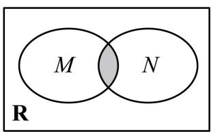
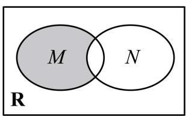
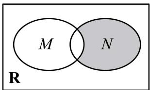
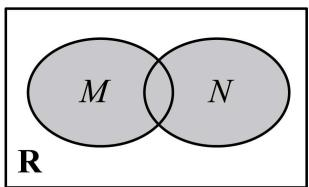
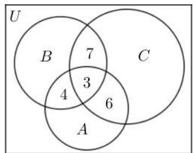

# 第1讲 集合

# 知识梳理

# 1、元素与集合

(1) 集合中元素的三个特性: 确定性、互异性、无序性.  
(2) 元素与集合的关系: 属于或不属于, 数学符号分别记为: $\in$ 和 $\notin$ .  
(3) 集合的表示方法: 列举法、描述法、韦恩图 (venn 图).

(4) 常见数集和数学符号

<table><tr><td>数集</td><td>自然数集</td><td>正整数集</td><td>整数集</td><td>有理数集</td><td>实数集</td></tr><tr><td>符号</td><td>N</td><td> $N^*$ 或 $N_+$ </td><td>Z</td><td>Q</td><td>R</td></tr></table>

说明：

①确定性:给定的集合,它的元素必须是确定的;也就是说,给定一个集合,那么任何一个元素在不在这个集合中就确定了.给定集合 $A=\{1,2,3,4,5\}$ ,可知 $1\in A$ ,在该集合中, $6\notin A$ ,不在该集合中;  
②互异性:一个给定集合中的元素是互不相同的;也就是说,集合中的元素是不重复出现的.

集合 $A=\{a,b,c\}$ 应满足 $a\neq b\neq c$ .

③无序性: 组成集合的元素间没有顺序之分。集合 $A = \{1, 2, 3, 4, 5\}$ 和 $B = \{1, 3, 5, 2, 4\}$ 是同一个集合.

# ④列举法

把集合的元素一一列举出来,并用花括号“{ }”括起来表示集合的方法叫做列举法.

# ⑤描述法

用集合所含元素的共同特征表示集合的方法称为描述法.

具体方法是:在花括号内先写上表示这个集合元素的一般符号及取值(或变化)范围,再画一条竖线,在竖线后写出这个集合中元素所具有的共同特征.

# 2、集合间的基本关系

(1) 子集 (subset): 一般地, 对于两个集合 A、B, 如果集合 A 中任意一个元素都是集合 B 中的元素, 我们就说这两个集合有包含关系, 称集合 A 为集合 B 的子集, 记作 $A \subseteq B$ (或 $B \supseteq A$ ), 读作“A 包含于 B” (或“B 包含 A”).  
(2) 真子集 (proper subset): 如果集合 A ⊆ B, 但存在元素 $x \in B$ , 且 $x \notin A$ , 我们称集合 A 是集合 B 的真子集, 记作 A ⊆ B (或 B ≌ A). 读作 “A 真包含于 B” 或 “B 真包含 A”.  
(3) 相等: 如果集合 A 是集合 B 的子集 $(A \subseteq B$ ，且集合 B 是集合 A 的子集 $(B \subseteq A)$ ，此时，集合 A 与集合 B 中的元素是一样的，因此，集合 A 与集合 B 相等，记作 A = B.  
(4) 空集的性质: 我们把不含任何元素的集合叫做空集, 记作 $\varnothing$ ; $\varnothing$ 是任何集合的子集, 是任何非空集合的真子集.

# 3、集合的基本运算

(1) 交集: 一般地, 由属于集合 A 且属于集合 B 的所有元素组成的集合, 称为 A 与 B 的交

集,记作 A∩B,即 A∩B= $\{x|x\in A,$ 且 $x\in B\}$ .

(2) 并集: 一般地, 由所有属于集合 A 或属于集合 B 的元素组成的集合, 称为 A 与 B 的并集, 记作 A ∪ B, 即 A ∪ B = {x | x ∈ A, 或 x ∈ B}.  
(3) 补集: 对于一个集合 A, 由全集 U 中不属于集合 A 的所有元素组成的集合称为集合 A 相对于全集 U 的补集, 简称为集合 A 的补集, 记作 $C_{U}A$ , 即 $C_{U}A = \{x \mid x \in U, \text{且 } x \notin A\}$ .

# 4、集合的运算性质

(1) $A \cap A = A, A \cap \varnothing = \varnothing, A \cap B = B \cap A.$   
(2) $A \cup A = A, A \cup \varnothing = A, A \cup B = B \cup A.$   
(3) $\mathrm{A} \cap (\mathrm{C_U A}) = \emptyset, \mathrm{A} \cup (\mathrm{C_U A}) = \mathrm{U}, \mathrm{C_U}(\mathrm{C_U A}) = \mathrm{A}$ .

# 【解题方法总结】

(1) 若有限集 A 中有 n 个元素, 则 A 的子集有 $2^{n}$ 个, 真子集有 $2^{n}-1$ 个, 非空子集有 $2^{n}-1$ 个, 非空真子集有 $2^{n}-2$ 个.  
(2) 空集是任何集合 A 的子集, 是任何非空集合 B 的真子集.  
(3) $A \subseteq B \Leftrightarrow A \cap B = A \Leftrightarrow A \cup B = B \Leftrightarrow C_{U}B \subseteq C_{U}A.$   
(4) $C_{U}(A \cap B) = (C_{U}A) \cup (C_{U}B), C_{U}(A \cup B) = (C_{U}A) \cap (C_{U}B).$

# 必考题型全归纳

# 1 题型一:集合的表示:列举法、描述法

(2024·广东江门·统考一模)已知集合 A = {−1,0,1}, B = {m|m²−1∈A,m−1∉A}, 则集合 B 中所有元素之和为 ( )

A. 0

B. 1

C.-1

D. $\sqrt{2}$

【答案】C

【解析】根据条件分别令 $m^{2}-1=-1,0,1$ ，解得 $m=0,\pm1,\pm\sqrt{2}$ ，

又 $m - 1 \notin \mathrm{A}$ , 所以 $m = -1, \pm \sqrt{2}, \mathrm{B} = \{-1, \sqrt{2}, -\sqrt{2}\}$ ,

所以集合B中所有元素之和是-1，

故选：C.

2 (2024·江苏·高三统考学业考试)对于两个非空实数集合 A 和 B, 我们把集合 $\{x \mid x = a + b, a \in A, b \in B\}$ 记作 A\*B. 若集合 $A = \{0, 1\}, B = \{0, -1\}$ , 则 A\*B 中元素的个数为 ()

A. 1

B. 2

C. 3

D. 4

【答案】C

【解析】 $A=\{0,1\},B=\{0,-1\}$ ，则 $A*B=\{0,-1,1\}$ ，则 A\*B 中元素的个数为 3

故选：C

3 (2024·全国·高三专题练习)定义集合 $\mathrm{A} + \mathrm{B} = \{x + y|x\in \mathrm{A}$ 且 $y\in \mathrm{B}\}$ .已知集合 $\mathrm{A} =$ $\{2,4,6\} ,\mathrm{B} = \{-1,1\}$ ，则 $\mathrm{A} + \mathrm{B}$ 中元素的个数为 （

A. 6

B. 5

C. 4

D. 7

【答案】C

【解析】根据题意,因为 $A=\{2,4,6\}$ , $B=\{-1,1\}$ ,

所以 $A + B = \{1, 3, 5, 7\}$ .

故选：C.

【解题总结】

1、列举法,注意元素互异性和无序性,列举法的特点是直观、一目了然.

2、描述法,注意代表元素.

# 2 题型二:集合元素的三大特征

(2024·北京海淀·校考模拟预测)设集合 $M=\{2m-1,m-3\}$ ，若 $-3\in M$ ，则实数 m=()

A. 0

B.-1

C. 0 或 -1

D. 0 或 1

【答案】C

【解析】设集合 $M=\{2m-1,m-3\}$ ，若 $-3\in M$ ，

$\because-3\in M,\therefore2m-1=-3$ 或 m-3=-3,

当 2m-1=-3 时, m=-1, 此时 M= $\{-3,-4\}$ ;

当 m-3=-3 时，m=0，此时 M={-3,-1};

所以 m = -1 或 0.

故选：C

5 (2024·江西·金溪一中校联考模拟预测)已知集合 $A=\{1,a,b\}$ ， $B=\{a^{2},a,ab\}$ ，若 A=B，则 $a^{2023}+b^{2022}=$ （）

A.-1

B. 0

C. 1

D. 2

【答案】A

【解析】由题意 A=B 可知, 两集合元素全部相等, 得到 $\left\{\begin{aligned}a^{2}&=1\\ ab&=b\end{aligned}\right.$ 或 $\left\{\begin{aligned}a^{2}&=b\\ ab&=1\end{aligned}\right.$ , 又根据集合互异性, 可知 $a\neq1$ , 解得 $a=1(\text{舍})$ , $\left\{\begin{aligned}a&=-1\\ b&=0\end{aligned}\right.$ 和 $\left\{\begin{aligned}a&=1\\ b&=1\end{aligned}\right.$ (舍), 所以 a=-1, b=0, 则 $a^{2023}+b^{2022}=(-1)^{2023}+0^{2022}=-1$ ,

故选：A

6 (2024·北京东城·统考一模)已知集合 $\mathrm{A} = \left\{x\mid x^2 -2 < 0\right\}$ ，且 $a\in \mathrm{A}$ ，则 $a$ 可以为 （）

A.-2

B.-1

C. $\frac{3}{2}$

D. $\sqrt{2}$

【答案】B

【解析】 $\because x^{2}-2<0, \therefore-\sqrt{2}<x<\sqrt{2}, \therefore A=\{x\mid-\sqrt{2}<x<\sqrt{2}\}$ ,

可知 $-2\notin A,\frac{3}{2}\notin A,\sqrt{2}\notin A$ ，故A、C、D错误； $-1\in A$ ，故B正确.

故选: B

【解题方法总结】

1、研究集合问题,看元素是否满足集合的特征:确定性、互异性、无序性。  
2、研究两个或者多个集合的关系时,最重要的技巧是将两集合的关系转化为元素间的关系。

# 3 题型三:元素与集合间的关系

(2024·河南·开封高中校考模拟预测)已知 $A=\left\{x \mid x^{2}-ax+1<0\right\}$ ，若 $2 \in A$ ，且 $3 \notin A$ ，则 a 的取值范围是（）

A. $\left(\frac{5}{2},+\infty\right)$

B. $\left(\frac{5}{2},\frac{10}{3}\right]$

C. $\left[\frac{5}{2},\frac{10}{3}\right)$

D. $\left(-\infty,\frac{10}{3}\right]$

【答案】B

【解析】由题意, $2^{2}-2a+1<0$ 且 $3^{2}-3a+1\geqslant0$ ,

解得 $\frac{5}{2} < a \leqslant \frac{10}{3}$ ,

故选：B

8 (2024·吉林延边·统考二模)已知集合 $A=\left\{x\mid ax^{2}-3x+2=0\right\}$ 的元素只有一个，则实数 a 的值为 （）

A. $\frac{9}{8}$

B. 0

C. $\frac{9}{8}$ 或 0

D. 无解

【答案】C

【解析】集合 A 有一个元素, 即方程 $ax^{2}-3x+2=0$ 有一解,

当 a=0 时， $A=\left\{x\mid ax^{2}-3x+2=0\right\}=\left\{x\mid-3x+2=0\right\}=\left\{\frac{2}{3}\right\}$ ，符合题意，

当 $a \neq 0$ 时, $ax^2 - 3x + 2 = 0$ 有一解,

则 $\Delta = 9 - 8a = 0$ , 解得: $a = \frac{9}{8}$ ,

综上可得: a=0 或 $a=\frac{9}{8}$ ,

故选：C.

(2024·全国·高三专题练习)已知集合 $A=\left\{(x,y)\mid\frac{x^{2}}{4}+\frac{y^{2}}{2}\leqslant1,x\in\mathbb{Z},y\in\mathbb{Z}\right\}$ ，则 A 中元素的个数为

A. 9

B. 10

C. 11

D. 12

【答案】C

【解析】由椭圆的性质得 $-2 \leqslant x \leqslant 2, -\sqrt{2} \leqslant y \leqslant \sqrt{2}$ ,

又 $x \in \mathbb{Z}, y \in \mathbb{Z}$ ,

所以集合 $A =$

$$
\left\{(- 2, 0), (2, 0), (- 1, 0), (1, 0), (0, 1), (0, - 1), (0, 0), (- 1, 1), (- 1, - 1), (1, 1), (1, - 1) \right\}
$$

共有11个元素.

故选：C

【解题方法总结】

1、一定要牢记五个大写字母所表示的数集,尤其是N与N\*的区别.  
2、当集合用描述法给出时,一定要注意描述的是点还是数,是还是.

# 4 题型四:集合与集合之间的关系

10 (多选题)(2024·山东潍坊·统考一模)若非空集合M,N,P满足： $M \cap N = N, M \cup P = P$ ，则()

A. $\mathrm{P}\subseteq \mathrm{M}$

B. $\mathrm{M} \cap \mathrm{P} = \mathrm{M}$

C. $\mathrm{N} \cup \mathrm{P} = \mathrm{P}$

D. $\mathrm{M}\cap \complement_p\mathrm{N} = \emptyset$

【答案】BC

【解析】由 $M \cap N = N$ 可得: $N \subseteq M$ , 由 $M \cup P = P$ , 可得 $M \subseteq P$ , 则推不出 $P \subseteq M$ , 故选项

A 错误;

由 $M \subseteq P$ 可得 $M \cap P = M$ ，故选项 B 正确；

因为 $N \subseteq M$ 且 $M \subseteq P$ ，所以 $N \subseteq P$ ，则 $N \cup P = P$ ，故选项 C 正确；

由 $N \subseteq M$ 可得: $M \cap \int_{p} N$ 不一定为空集, 故选项 D 错误;

故选: BC.

(2024·江苏·统考一模)设 $\mathrm{M} = \left\{x\mid x = \frac{k}{2},k\in \mathbf{Z}\right\} ,\mathrm{N} = \left\{x\mid x = k + \frac{1}{2},k\in \mathbf{Z}\right\}$ ，则 （ ）

A. M ⊆ N

B. N ⊆ M

C. M=N

D. $\mathrm{M}\cap \mathrm{N} = \emptyset$

【答案】B

【解析】因为 $x=k+\frac{1}{2}=\frac{1}{2}(2k+1)$ ，因为 $k\in Z$ ，

所以集合N是由所有奇数的一半组成，

而集合M是由所有整数的一半组成,故 $N\subsetneq M$ .

故选: B

12 (2024·辽宁沈阳·东北育才学校校考模拟预测)已知集合 $A=\{x|x^{2}-x-12\leqslant0\}$ ， $B=\{x|x^{2}-3mx+2m^{2}+m-1<0\}$ ，若“ $x\in A$ ”是“ $x\in B$ ”的必要不充分条件，则实数 m 的取值范围为（）

A. $[-3,2]$

B. $[-1,3]$

C. $\left[-1,\frac{5}{2}\right]$

D. $\left[2,\frac{5}{2}\right]$

【答案】C

【解析】由题意集合 $A=\left\{x\mid x^{2}-x-12\leqslant0\right\}=[-3,4]$ ,

$$
\mathrm{B} = \left\{x \mid x ^ {2} - 3 m x + 2 m ^ {2} + m - 1 <   0 \right\} = \left\{x \mid (x - m - 1) (x - 2 m + 1) <   0 \right\},
$$

若 m > 2，则 $2m - 1 > m + 1$ ，此时 $B = (m + 1, 2m - 1)$ ，

因为“ $x \in A$ ”是“ $x \in B$ ”的必要不充分条件,故BÜA,

故 $\left\{\begin{aligned}&2m-1\leqslant4\\ &m+1\geqslant-3,\\ &m>2\end{aligned}\right.$ ，∴ $2<m\leqslant\frac{5}{2}$ ;

若 m<2，则 $2m-1<m+1$ ，此时 $B=(2m-1,m+1)$ ，

因为“ $x \in A$ ”是“ $x \in B$ ”的必要不充分条件,故BÜA,

故 $\left\{\begin{aligned}m+1&\leqslant4\\ 2m-1&\geqslant-3,\\ m&<2\end{aligned}\right.$ ，∴ $-1\leqslant m<2;$

若 m=2，则 $2m-1=m+1$ ，此时 B= $\varnothing$ ，满足 BÜA，

综合以上可得 $m\in\left[-1,\frac{5}{2}\right]$ ,

故选：C

13 (2024·广东茂名·统考二模)已知集合 A = {x||x| ≤ 1}, B = {x|2x - a < 0}, 若 A ⊆ B, 则实数 a 的取值范围是 ( )

A. $(2,+\infty)$

B. $[2, +\infty)$

C. $(-∞,2)$

D. $(-∞,2]$

【答案】A

【解析】集合 $A=\{x||x|\leqslant1\}=\{x|-1\leqslant x\leqslant1\}$ ， $B=\left\{x\mid x<\frac{a}{2}\right\}$ .

要使 $A \subseteq B$ ，只需 $1 < \frac{a}{2}$ ，解得：a > 2。

故选：A

# 【解题方法总结】

1、注意子集和真子集的联系与区别.  
2、判断集合之间关系的两大技巧：

(1) 定义法进行判断

(2) 数形结合法进行判断

# 5 题型五:集合的交、并、补运算

14 (2024·广东广州·统考二模)已知集合 $\mathrm{A} = \{x|x = 3n - 2,n\in \mathbf{N}^{*}\}$ ， $\mathrm{B} = \{6,7,10,11\}$ ，则集合 $\mathrm{A}\cap \mathrm{B}$ 的元素个数为 （）

A. 1

B. 2

C. 3

D. 4

【答案】B

【解析】因为 $A=\{x|x=3n-2,n\in N^{*}\}$ ， $B=\{6,7,10,11\}$ ，则 $A\cap B=\{7,10\}$ ，

故集合 $A \cap B$ 的元素个数为2.

故选: B.

15 (2024·河北张家口·统考二模)已知集合 $A=\{x|(x-2)(4-x)>0\}$ ， $B=\left\{x\mid\frac{1}{3-x}>0\right\}$ ，则 $\left(\int_{R}A\right)\cup\left(\int_{R}B\right)=$ ( )

A. $(2,3)$

B. $[3,4]$

C. $(-∞,2]∪[3,+∞)$

D. $(- \infty, 3] \cup [4, +\infty)$

【答案】C

【解析】 $A=\left\{x|(x-2)(4-x)>0\right\}=\left\{x|2<x<4\right\},B=\left\{x\left|\frac{1}{3-x}>0\right.\right\}=\left\{x|x<3\right\},$

即 A = (2,4), B = (-∞,3),

所以， $\int_{R}A=(-\infty,2]\cup[4,+\infty),\int_{R}B=[3,+\infty)$

所以， $\left(\int_{\mathrm{R}}\mathrm{A}\right)\cup\left(\int_{\mathrm{R}}\mathrm{B}\right)=(-\infty,2]\cup[3,+\infty)$ .

故选：C.

16 (2024·广东·统考一模)已知集合 $M=\{x \mid x(x-2)<0\}$ , $N=\{x \mid x-1<0\}$ ，则下列 Venn 图中阴影部分可以表示集合 $\{x \mid 1 \leqslant x < 2\}$ 的是 ()

A.

text_image

M
N
R

B.

text_image

M
N
R

C.

text_image

M
N
R

D.

text_image

M
N
R

【答案】B

【解析】 $x(x-2)<0\Rightarrow0<x<2,x-1<0\Rightarrow x<1,$

选项 A 中 Venn 图中阴影部分表示 $M \cap N = (0,1)$ ，不符合题意；

选项 B 中 Venn 图中阴影部分表示 $\int_{M}(M\cap N)=[1,2)$ ，符合题意；

选项 C 中 Venn 图中阴影部分表示 $\int_{N}(M\cap N)=(-\infty,0]$ ，不符合题意；

选项 D 中 Venn 图中阴影部分表示 $M \cup N = (-\infty, 2)$ ，不符合题意，

故选：B

(2024·全国·高三专题练习)2021年是中国共产党成立100周年,电影频道推出“经典频传:看电影,学党史”系列短视频,传扬中国共产党的伟大精神,为广大青年群体带来精神感召.现有《青春之歌》《建党伟业》《开国大典》三支短视频,某大学社团有50人,观看了《青春之歌》的有21人,观看了《建党伟业》的有23人,观看了《开国大典》的有26人.其中,只观看了《青春之歌》和《建党伟业》的有4人,只观看了《建党伟业》和《开国大典》的有7人,只观看了《青春之歌》和《开国大典》的有6人,三支短视频全观看了的有3人,则没有观看任何一支短视频的人数为\_\_\_\_.

【答案】3

【解析】把大学社团50人形成的集合记为全集U,观看了《青春之歌》《建党伟业》《开国大典》三

支短视频的人形成的集合分别记为 A, B, C, 依题意, 作出韦恩图, 如图,

text_image

U
B
7
C
3
4
6
A

观察韦恩图:因观看了《青春之歌》的有21人,则只看了《青春之歌》的有21-4-6-3=8(人),

因观看了《建党伟业》的有23人,则只看了《建党伟业》的有 $23-4-7-3=9$ (人),因观看了《开国大典》的有26人,则只看了《开国大典》的有 $26-6-7-3=10$ (人),因此,至少看了一支短视频的有 $3+4+6+7+8+9+10=47$ (人),

所以没有观看任何一支短视频的人数为 50 - 47 = 3.

故答案为: 3

【解题方法总结】

1、注意交集与并集之间的关系

2、全集和补集是不可分离的两个概念

# 题型六:集合与排列组合的密切结合

18 (2024·全国·高三专题练习)设集合 $X=\{a_{1},a_{2},a_{3},a_{4}\}\subseteq N^{*}$ ，定义：集合Y= $\left\{a_{i}+a_{j}\mid a_{i},a_{j}\in X,i,j\in N^{*},i\neq j\right\}$ ，集合 $S=\{x\cdot y|x,y\in Y,x\neq y\}$ ，集合T= $\left\{\frac{x}{y}|x,y\in Y,x\neq y\right\}$ ，分别用 $|S|$ ， $|T|$ 表示集合S，T中元素的个数，则下列结论可能成立的是()

A. $|\mathrm{S}| = 6$

B. $|\mathrm{S}| = 16$

C. $|\mathrm{T}| = 9$

D. $|\mathrm{T}| = 16$

【答案】D

【解析】不妨设 $1 \leqslant a_{1} < a_{2} < a_{3} < a_{4}$ ，则 $a_{i} + a_{j}$ 的值为 $a_{1} + a_{2}, a_{1} + a_{3}, a_{1} + a_{4}, a_{2} + a_{3}, a_{2} + a_{4}, a_{3} + a_{4}$ ，

显然， $a_{1}+a_{2}<a_{1}+a_{3}<a_{1}+a_{4}<a_{2}+a_{4}<a_{3}+a_{4}$ ，所以集合Y中至少有以上5个元素，

不妨设 $x_{1}=a_{1}+a_{2},x_{2}=a_{1}+a_{3},x_{3}=a_{1}+a_{4},x_{4}=a_{2}+a_{4},x_{5}=a_{3}+a_{4}$

则显然 $x_{1}x_{2}<x_{1}x_{3}<x_{1}x_{4}<x_{1}x_{5}<x_{2}x_{5}<x_{3}x_{5}<x_{4}x_{5}$ ，则集合 S 中至少有 7 个元素，

所以 $|S|=6$ 不可能, 故排除 A 选项;

其次，若 $a_{1} + a_{4} \neq a_{2} + a_{3}$ ，则集合 Y 中至多有 6 个元素，则 $|S|_{\max} = C_{6}^{2} = 15 < 16$ ，故排除 B 项；

对于集合 T, 取 $X = \{1, 3, 5, 7\}$ , 则 $Y = \{4, 6, 8, 10, 12\}$ , 此时 T =

$\left\{\frac{1}{3}, \frac{2}{5}, \frac{1}{2}, \frac{2}{3}, \frac{3}{5}, \frac{3}{4}, \frac{4}{5}, \frac{4}{3}, 2, \frac{5}{6}, \frac{5}{4}, \frac{5}{3}, \frac{5}{2}, \frac{6}{5}, \frac{3}{2}, 3\right\}$ , $|T| = 16$ , 故 D 项正确;

对于 C 选项而言, $\forall i \neq j, x_{i} \neq x_{j}$ , 则 $\frac{x_{i}}{x_{j}}$ 与 $\frac{x_{j}}{x_{i}}$ 一定成对出现, $\left(\frac{x_{i}}{x_{j}} - 1\right)\left(\frac{x_{j}}{x_{i}} - 1\right) < 0$ , 所以 |T| 一定是偶数, 故 C 项错误.

故选：D.

19 (2024·全国·模拟预测)已知集合 A, B 满足 $A \cup B = \{1, 2, 3\}$ ，若 $A \neq B$ ，且 [A&B]，[B&A] 表示两个不同的“AB 互补对”，则满足题意的“AB 互补对”个数为（）

A. 9

B. 4

C. 27

D. 8

【答案】C

【解析】当 A = ∅ 时, 集合 B 可以为 $\{1,2,3\}$ ;

当 $A=\{1\}$ 时, 集合 B 可以为 $\{2,3\},\{1,2,3\}$ ;

当 $A=\{2\}$ 时, 集合 B 可以为 $\{1,3\},\{1,2,3\}$ ;

当 $A=\{3\}$ 时, 集合 B 可以为 $\{1,2\},\{1,2,3\}$ ;

当 $A=\{1,2\}$ 时，集合 B 可以为 $\{3\},\{1,3\},\{2,3\},\{1,2,3\}$ ;

当 $A=\{1,3\}$ 时，集合 B 可以为 $\{2\},\{1,2\},\{2,3\},\{1,2,3\}$ ;

当 $A=\{2,3\}$ 时，集合 B 可以为 $\{1\},\{1,2\},\{1,3\},\{1,2,3\}$ ;

当 $A = \{1,2,3\}$ 时，集合B可以为 $\varnothing ,\{1\} ,\{2\} ,\{3\} ,\{1,2\} ,\{1,3\} ,\{2,3\} ,\{1,2,3\}$ .

故满足题意的“AB 互补对”个数为 27.

故选：C

20 (2024·北京·中央民族大学附属中学校考模拟预测)已知集合 A 满足: ① A ⊆ N, ② ∀ x, y ∈ A, x ≠ y, 必有 |x - y| ≥ 2, ③ 集合 A 中所有元素之和为 100, 则集合 A 中元素个数最多为 ( )

A. 11

B. 10

C. 9

D. 8

【答案】B

【解析】对于条件① $A \subseteq N$ , ② $\forall x, y \in A, x \neq y$ , 必有 $|x - y| \geqslant 2$ ,

若集合中所有的元素是由公差为2的等差数列构成,例如

$\{0,2,4,6,8,10,12,14,16,18,20\}$ ，集合中有11个元素，

又 $0 + 2 + 4 + 6 + 8 + 10 + 12 + 14 + 16 + 18 + 20 = 110 > 100,0 + 2 + 4 + 6 + 8 + 10+$

$12+14+16+18=90<100$ 则该集合满足条件①②, 不符合条件③, 故符合条件③的集合 A 中元素个数最多不能超过 10 个,

故若要集合 A 满足: ① $A \subseteq N$ , ② $\forall x, y \in A, x \neq y$ , 必有 $|x - y| \geqslant 2$ , ③ 集合 A 中所有元素之和为 100, 最多有 10 个元素,

例如 $A=\{0,2,4,6,8,10,12,15,18,25\}$ .

故选: B.

# 【解题方法总结】

利用排列与组合思想解决集合或者集合中元素个数的问题,需要运用分析与转化的思想方法

# 7 题型七:集合的创新定义

21 (2024·全国·校联考模拟预测)对于集合A,B,定义 $A-B=\{x|x\in A$ ,且 $x\notin B\}$ . 若 $A=\{x|x=2k+1,k\in N\}$ , $B=\{x|x=3k+1,k\in N\}$ ,将集合A-B中的元素从小到大排列得到数列 $\{a_{n}\}$ ,则 $a_{7}+a_{30}=$ ( )

A. 55

B. 76

C. 110

D. 113

# 【答案】C

【解析】因为 $A=\{1,3,5,7,9,11,\cdots\}$ , $B=\{1,4,7,10,13,16,19,22,25,\cdots\}$ ,

所以 $A - B = \{3, 5, 9, 11, 15, \cdots\}$ ，所以 $a_{7} = 21$ 。A - B 相当于集合 A 中除去 $x = 6n - 5 (n \in \mathbb{N}^{*})$ 形式的数，其前 45 项包含了 15 个这样的数，所以 $a_{30} = 89$ 。

则 $a_{7}+a_{30}=110$ ,

故选：C.

(多选题)(2024·河南安阳·安阳一中校考模拟预测)由无理数引发的数学危机一直延续到19世纪.直到1872年,德国数学家戴德金从连续性的要求出发,用有理数的“分割”来定义无理数(史称戴德金分割),并把实数理论建立在严格的科学基础上,才结束了无理数被认为“无理”的时代,也结束了持续2000多年的数学史上的第一次大危机.所谓戴德金分割,是指将有理数集Q划分为两个非空的子集M与N,且满足 $M\cup N=Q,M\cap N=\varnothing,M$ 中的每一个元素都小于N中的每一个元素,则称(M,N)为戴德金分割.试判断下列选项中,可能成立的是()

A. $M=\{x|x<0\},N=\{x|x>0\}$ 是一个戴德金分割  
B. M没有最大元素, N有一个最小元素  
C. M有一个最大元素, N有一个最小元素  
D. M没有最大元素, N也没有最小元素

# 【答案】BD

【解析】对于 A, 因为 $M = \{x \mid x < 0\}$ , $N = \{x \mid x > 0\}$ , $M \cup N = \{x \mid x \neq 0\} \neq Q$ , 故 A 错误; 对于 B, 若 $M = \{x \in Q \mid x < 0\}$ , $N = \{x \in Q \mid x \geqslant 0\}$ , 则满足戴德金分割,

此时 M 没有最大元素, N 有一个最小元素 0, 故 B 正确;

对于 C, 若 M 有一个最大元素, 设为 a, N 有一个最小元素, 设为 b, 则 a < b,

则 $M=\{x\in Q|x\leqslant a\},N=\{x\in Q|x\geqslant b\}$ ，而 $(a,b)$ 内也有有理数，

则 $M \cup N \neq Q$ ，故 C 错误；

对于 D, 若 $M = \{x \in Q | x < \sqrt{2}\}$ , $N = \{x \in Q | x \geqslant \sqrt{2}\}$ ,

则满足戴德金分割,此时 M 没有最大元素,N 也没有最小元素,故 D 正确,

故选: BD

23 (2024·湖北·统考二模)已知 X 为包含 v 个元素的集合 $(v \in \mathbb{N}^{*}, v \geqslant 3)$ . 设 A 为由 X 的一些三元子集 (含有三个元素的子集) 组成的集合, 使得 X 中的任意两个不同的元素, 都恰好同时包含在唯一的一个三元子集中, 则称 (X, A) 组成一个 v 阶的 Steiner 三元系. 若 (X, A) 为一个 7 阶的 Steiner 三元系, 则集合 A 中元素的个数为 \_\_\_\_.

【答案】7

【解析】由题设,令集合 $X=\{a,b,c,d,e,f,g\}$ ,共有7个元素,

所以 X 的三元子集, 如下共有 35 个:

$\{a,b,c\} 、 \{a,b,d\} 、 \{a,b,\mathrm{e}\} 、 \{a,b,f\} 、 \{a,b,g\} 、 \{a,c,d\} 、 \{a,c,\mathrm{e}\} 、 \{a,c,f\} 、 \{a,c,g\} 、 \{a,d, e\} 、 \{a,d,f\} 、 \{a,d,g\} 、 \{a,e,f\} 、 \{a,e,g\} 、 \{a,f,g\} 、 \{b,c,d\} 、 \{b,c,\mathrm{e}\} 、 \{b,c,f\} 、 \{b,c,g\} 、 \{b, d,\mathrm{e}\} 、 \{b,d,f\} 、 \{b,d,g\} 、 \{b,e,f\} 、 \{b,e,g\} 、 \{b,f,g\} 、 \{c,d,\mathrm{e}\} 、 \{c,d,f\} 、 \{c,d,g\} 、 \{c,e,f\} 、 \{c,e,g\} 、 \{c,f,g\} 、 \{d,e,f\} 、 \{d,e,g\} 、 \{d,f,g\} 、 \{\mathrm{e},f,g\}$

因为 A 中集合满足 X 中的任意两个不同的元素, 都恰好同时包含在唯一的一个三元子集, 所以 A 中元素满足要求的有:

$\{a,b,c\} 、 \{a,d,e\} 、 \{a,f,g\} 、 \{b,d,f\} 、 \{b,e,g\} 、 \{c,d,g\} 、 \{c,e,f\}$ ，共有7个； $\{a,b,c\} 、 \{a,d,f\} 、 \{a,e,g\} 、 \{b,d,e\} 、 \{b,f,g\} 、 \{c,d,g\} 、 \{c,e,f\}$ ，共有7个； $\{a,b,c\} 、 \{a,d,g\} 、 \{a,e,f\} 、 \{b,d,e\} 、 \{b,f,g\} 、 \{c,d,f\} 、 \{c,e,g\}$ ，共有7个； $\{a,b,d\} 、 \{a,c,e\} 、 \{a,f,g\} 、 \{b,c,f\} 、 \{b,e,g\} 、 \{c,d,g\} 、 \{d,e,f\}$ ，共有7个； $\{a,b,d\} 、 \{a,c,g\} 、 \{a,e,f\} 、 \{b,c,e\} 、 \{b,f,g\} 、 \{c,d,f\} 、 \{d,e,g\}$ ，共有7个； $\{a,b,d\} 、 \{a,c,f\} 、 \{a,e,g\} 、 \{b,c,e\} 、 \{b,f,g\} 、 \{c,d,g\} 、 \{d,e,f\}$ ，共有7个； $\{a,b,e\} 、 \{a,c,d\} 、 \{a,f,g\} 、 \{b,c,f\} 、 \{b,d,g\} 、 \{c,e,g\} 、 \{d,e,f\}$ ，共有7个； $\{a,b,e\} 、 \{a,c,f\} 、 \{a,d,g\} 、 \{b,c,d\} 、 \{b,f,g\} 、 \{c,e,g\} 、 \{d,e,f\}$ ，共有7个； $\{a,b,e\} 、 \{a,c,g\} 、 \{a,d,f\} 、 \{b,c,d\} 、 \{b,f,g\} 、 \{c,e,f\} 、 \{d,e,g\}$ ，共有7个； $\{a,b,f\} 、 \{a,c,d\} 、 \{a,e,g\} 、 \{b,c,e\} 、 \{b,d,g\} 、 \{c,f,g\} 、 \{d,e,f\}$ ，共有7个； $\{a,b,f\} 、 \{a,c,e\} 、 \{a,d,g\} 、 \{b,c,d\} 、 \{b,e,g\} 、 \{c,f,g\} 、 \{d,e,f\}$ ，共有7个； $\{a,b,f\} 、 \{a,c,g\} 、 \{a,d,e\} 、 \{b,c,d\} 、 \{b,e,g\} 、 \{c,e,f\} 、 \{d,f,g\}$ ，共有7个； $\{a,b,g\} 、 \{a,c,d\} 、 \{a,e,f\} 、 \{b,c,e\} 、 \{b,d,f\} 、 \{c,f,g\} 、 \{d,e,g\}$ ，共有7个； $\{a,b,g\} 、 \{a,c,e\} 、 \{a,d,f\} 、 \{b,c,d\} 、 \{b,e,f\} 、 \{c,f,g\} 、 \{d,e,g}\}$ ，共有7个； $\{a,b,g\} 、 \{a,c,f\} 、 \{a,d,e\} 、 \{b,c,d\} 、 \{b,e,f\} 、 \{c,e,g\} 、 \{d,f,g}\}$ ，共有7个；

共有15种满足要求的集合A,但都只有7个元素.

故答案为: 7

# 【解题方法总结】

1、集合的创新定义题核心在于读懂题意。读懂里边的数学知识,一般情况下,它所涉及到的知识和方法并不难,难在转化.  
2、集合的创新定义题,主要是在题干中定义“新的概念,新的计算公式,新的运算法则,新的定理”,要根据这些新定义去解决问题,有时为了有助于理解,还可以用类比的方法进行理解。

