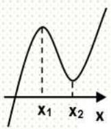
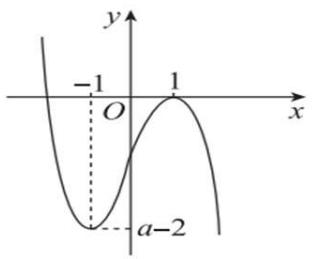
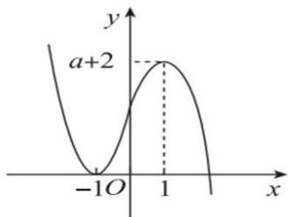
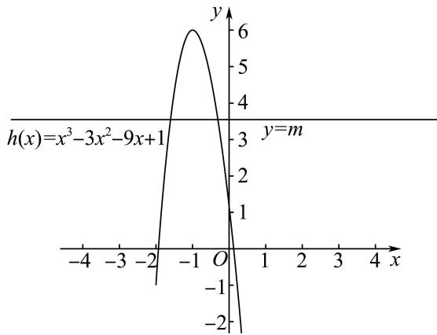
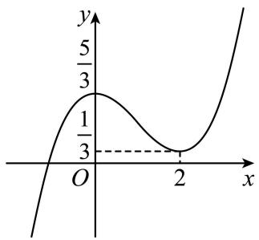
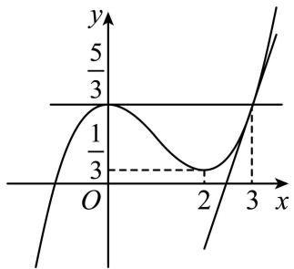
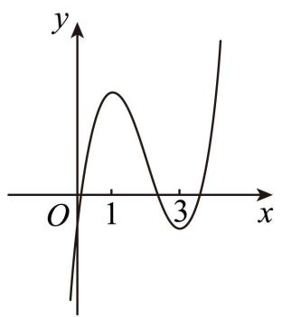

# 第20讲 三次函数的图象和性质

# 知识梳理

# 1、基本性质

设三次函数为： $f(x) = ax^{3} + bx^{2} + cx + d(a,b,c,d\in \mathbb{R}$ 且 $a\neq 0)$ ，其基本性质有：

性质1:①定义域为R. ②值域为R,函数在整个定义域上没有最大值、最小值. ③单调性和图像:

<table><tr><td></td><td colspan="2">a&gt;0</td><td colspan="2">a&lt;0</td></tr><tr><td rowspan="2">图像</td><td>Δ&gt;0</td><td>Δ≤0</td><td>Δ&gt;0</td><td>Δ≤0</td></tr><tr><td></td><td></td><td></td><td></td></tr></table>

性质2:三次方程 $f(x)=0$ 的实根个数

由于三次函数在高考中出现频率最高,且四次函数、分式函数等都可转化为三次函数来解决,故以三次函数为例来研究根的情况,设三次函数 $f(x)=ax^{3}+bx^{2}+cx+d(a\neq0)$

其导函数为二次函数: $f'(x)=3ax^{2}+2bx+c(a\neq0)$ ,

判别式为: $\triangle = 4b^{2} - 12ac = 4(b^{2} - 3ac)$ , 设 $f'(x) = 0$ 的两根为 $x_{1}, x_{2}$ , 结合函数草图易得:

(1) 若 $b^{2} - 3ac \leqslant 0$ ，则 $f(x) = 0$ 恰有一个实根；  
(2) 若 $b^{2} - 3ac > 0$ ，且 $f(x_{1}) \cdot f(x_{2}) > 0$ ，则 $f(x) = 0$ 恰有一个实根；  
(3) 若 $b^{2} - 3ac > 0$ ，且 $f(x_{1}) \cdot f(x_{2}) = 0$ ，则 $f(x) = 0$ 有两个不相等的实根；  
(4) 若 $b^{2} - 3ac > 0$ ，且 $f(x_{1}) \cdot f(x_{2}) < 0$ ，则 $f(x) = 0$ 有三个不相等的实根.

说明:(1)(2) $f(x)=0$ 含有一个实根的充要条件是曲线 $y=f(x)$ 与x轴只相交一次,即 $f(x)$ 在R上为单调函数(或两极值同号),所以 $b^{2}-3ac\leqslant0$ (或 $b^{2}-3ac>0$ ,且 $f(x_{1})\cdot f(x_{2})>0$ );

(5) $f(x)=0$ 有两个相异实根的充要条件是曲线 $y=f(x)$ 与x轴有两个公共点且其中之一为切点，所以 $b^{2}-3ac>0$ ，且 $f(x_{1})\cdot f(x_{2})=0;$   
(6) $f(x)=0$ 有三个不相等的实根的充要条件是曲线 $y=f(x)$ 与x轴有三个公共点，即 $f(x)$ 有一个极大值，一个极小值，且两极值异号.所以 $b^{2}-3ac>0$ 且 $f(x_{1})\cdot f(x_{2})<0$ .

性质 3: 对称性

(1)三次函数是中心对称曲线,且对称中心是; $\left(-\frac{b}{3a},f\left(-\frac{b}{3a}\right)\right)$ ;  
(2) 奇函数的导数是偶函数, 偶函数的导数是奇函数, 周期函数的导数还是周期函数.

# 2、常用技巧

(1) 其导函数为 $f'(x) = 3ax^2 + 2bx + c = 0$ 对称轴为 $x = -\frac{b}{3a}$ ，所以对称中心的横坐标也就是导函数的对称轴，可见， $y = f(x)$ 图象的对称中心在导函数 $y = f'(x)$ 的对称轴上，且又是两

个极值点的中点,同时也是二阶导为零的点;

(2) $y=f(x)$ 是可导函数, 若 $y=f(x)$ 的图象关于点 $(m,n)$ 对称, 则 $y=f'(x)$ 图象关于直线 x=m

对称.

(3) 若 $y = f(x)$ 图象关于直线 $x = m$ 对称，则 $y = f'(x)$ 图象关于点 $(m,0)$ 对称.

(4) 已知三次函数 $f(x) = ax^3 + bx^2 + cx + d$ 的对称中心横坐标为 $x_0$ ，若 $f(x)$ 存在两个极值点 $x_1, x_2$ ，则有 $\frac{f(x_1) - f(x_2)}{x_1 - x_2} = -\frac{a}{2}(x_1 - x_2)^2 = \frac{2}{3} f'(x_0)$ .

# 必考题型全归纳

# 1 题型一:三次函数的零点问题

(2024·全国·高三专题练习)函数 $f(x)=x^{3}+ax+2$ 存在3个零点，则a的取值范围是()

A. $(-\infty, -2)$

B. $(-∞,-3)$

C. $(-4,-1)$

D. $(-3,0)$

【答案】B

【解析】 $f(x)=x^{3}+ax+2$ ，则 $f'(x)=3x^{2}+a$ ，

若 $f(x)$ 要存在3个零点,则 $f(x)$ 要存在极大值和极小值,则a<0,

令 $f'(x)=3x^{2}+a=0$ ，解得 $x=-\sqrt{\frac{-a}{3}}$ 或 $\sqrt{\frac{-a}{3}}$

且当 $x \in \left(-\infty, -\sqrt{\frac{-a}{3}}\right) \cup \left(\sqrt{\frac{-a}{3}}, +\infty\right)$ 时， $f'(x) > 0$

当 $x \in \left(-\sqrt{\frac{-a}{3}}, \sqrt{\frac{-a}{3}}\right), f'(x) < 0,$

故 $f(x)$ 的极大值为 $f\left(-\sqrt{\frac{-a}{3}}\right)$ ，极小值为 $f\left(\sqrt{\frac{-a}{3}}\right)$

若 $f(x)$ 要存在3个零点，则 $\left\{\begin{aligned}f\left(-\sqrt{\frac{-a}{3}}\right)>0\\ f\left(\sqrt{\frac{-a}{3}}\right)<0\end{aligned}\right.$ ，即 $\left\{\begin{aligned}\frac{a}{3}\sqrt{\frac{-a}{3}}-a\sqrt{\frac{-a}{3}}+2>0\\ \frac{-a}{3}\sqrt{\frac{-a}{3}}+a\sqrt{\frac{-a}{3}}+2<0\end{aligned}\right.$ ，解得a<-3，

故选: B.

718 (2024·江苏扬州·高三校考阶段练习)设 a 为实数, 函数 $f(x) = -x^{3} + 3x + a$ .

(1) 求 $f(x)$ 的极值；  
(2) 是否存在实数 $a$ , 使得方程 $f(x)=0$ 恰好有两个实数根? 若存在, 求出实数 $a$ 的值; 若不存在, 请说明理由.

【解析】(1) $f'(x)=-3x^{2}+3$ ，令 $f'(x)=0$ ，得x=-1或x=1.

∵ 当 $x \in (-\infty, -1)$ 时， $f'(x) < 0$ ; 当 $x \in (-1, 1)$ 时， $f'(x) > 0$ ; 当 $x \in (1, +\infty)$ 时， $f'(x) < 0$ .

所以 $f(x)$ 在 $(-∞, -1)$ 上递减，在 $(-1, 1)$ 上递增，在 $(1, +∞)$ 上递减，

∴ $f(x)$ 的极小值为 $f(-1)=a-2$ ，极大值为 $f(1)=a+2$ .

(2) 由 (1) 知, $f(x)$ 在 $(-\infty, -1)$ 上递减, 在 $(-1, 1)$ 上递增, 在 $(1, +\infty)$ 上递减,

而 $a+2>a-2$ ，即函数的极大值大于极小值。

∴当极大值等于0时,极小值小于0,此时曲线 $f(x)$ 与x轴恰好有两个交点,即方程 $f(x)=0$ 恰好有两个实数根,如图1所示.∴ $a+2=0$ ,即a=-2.

line

| x | y |
|---|---|
| -1 | -1 |
| 1 | 0 |
| a-2 | -2 |

图 1

当极小值等于0时,极大值大于0,此时曲线 $f(x)$ 与x轴恰有两个交点,即方程 $f(x)=0$ 恰好有两个实数根,如图2所示.∴a-2=0,即a=2.

line

| x | y |
|---|---|
| -10 | 0 |
| 0 | a+2 |
| 1 | a+2 |

图 2

综上所述, 当 a=2 或 a=-2 时, 方程 $f(x)=0$ 恰好有两个实数根.

719 (2024·四川绵阳·高三四川省绵阳南山中学校考阶段练习)已知函数 $f(x) = ax^3 + bx^2 - 3x (a, b \in \mathbb{R})$ ，且 $f(x)$ 在 $x = 1$ 和 $x = 3$ 处取得极值.

(1) 求函数 $f(x)$ 的解析式;  
(2) 设函数 $g(x)=f(x)+t$ ，若 $g(x)=f(x)+t$ 有且仅有一个零点，求实数 t 的取值范围.

【解析】(1) $f'(x)=3ax^{2}+2bx-3$ ,

因为 $f(x)$ 在 x=1 和 x=3 处取得极值，

所以 x=1 和 x=3 是方程 $f'(x)=0$ 的两个根，

则 $\left\{\begin{aligned}1+3&=-\frac{2b}{3a}\\ 1\times3&=-\frac{3}{3a}\end{aligned}\right.$ ，解得 $\left\{\begin{aligned}a&=-\frac{1}{3}\\ b&=2\end{aligned}\right.$ ，经检验符合已知条件，

所以 $f(x)=-\frac{1}{3}x^{3}+2x^{2}-3x;$

(2) 由题意知 $g(x) = -\frac{1}{3} x^3 + 2x^2 - 3x + t, g'(x) = -x^2 + 4x - 3$ ,

当 x > 3 或 x < 1 时， $g'(x) < 0$ ，当 1 < x < 3 时， $g'(x) > 0$ ，

所以函数 $g(x)$ 在 $(3,+\infty),(-\infty,1)$ 上递减，在 $(1,3)$ 上递增，

所以 $g(x)_{\text{极大值}} = g(3) = t, g(x)_{\text{极小值}} = g(1) = t - \frac{4}{3}$ ,

又 x 取足够大的正数时, $g(x) < 0$ , x 取足够小的负数时, $g(x) > 0$ ,

因此,为使曲线 $y=g(x)$ 与 x 轴有一个交点,结合 $g(x)$ 的单调性,

得: $g(x)_{\text{极大值}} = t < 0$ 或 $g(x)_{\text{极小值}} = t - \frac{4}{3} > 0$ ,

∴ t < 0 或 $t > \frac{4}{3}$ ,

即当 t<0 或 $t>\frac{4}{3}$ 时, 使得曲线 $y=g(x)$ 与 x 轴有一个交点.

720 (2024·天津河西·高三天津实验中学校考阶段练习)已知 $f(x)=ax^{3}+bx^{2}-4a, a,b\in\mathbb{R}$ .

(1) 当 $a = b = 1$ ，求 $y = f(x)$ 的极值；  
(2) 当 $a = 0, b = 2$ , 设 $g(x) = x^2 - \ln x + 1$ , 求不等式 $f(x) < g(x)$ 的解集;  
(3) 当 a > 0 时, 若函数 $f(x)$ 恰有两个零点, 求 $\frac{b}{a}$ 的值.

【解析】(1) $f(x)=x^{3}+x^{2}-4,\therefore f'(x)=3x^{2}+2x=0,x_{1}=0,x_{2}=-\frac{2}{3}.$

<table><tr><td>x</td><td> $\left(-\infty, -\frac{2}{3}\right) - \frac{2}{3}$ </td><td> $\left(-\frac{2}{3}, 0\right)$ </td><td>0</td><td> $(0, +\infty)$ </td></tr><tr><td>f&#x27;(x)</td><td>+</td><td>0</td><td>-</td><td>0</td></tr><tr><td>f(x)</td><td>↗</td><td> $-\frac{108}{27}$ ↘</td><td>-4</td><td>↗</td></tr></table>

∴ $f(x)$ 在 $x = -\frac{2}{3}$ 时, 取极大值 $-\frac{108}{27}$ .

在 x=0 时, 取极小值 -4.

(2) $2x^{2}<x^{2}-\ln x+1$ , 即 $x^{2}+\ln x-1<0$ ,

设 $h(x)=x^{2}+\ln x-1$ , $h'(x)=2x+\frac{1}{x}>0$ , $h(x)$ 单调增函数, 且 $h(1)=0$ ,

∴ 不等式的解集为 $(0,1)$ .

(3) $f'(x)=3ax^{2}+2bx=0\Rightarrow x_{1}=0,\ x_{2}=-\frac{2b}{3a},$

$1^{\circ}$ . b<0, $(-∞,0)$ 单调递增， $\left(0,-\frac{2b}{3a}\right)$ 单调递减， $\left(-\frac{2b}{3a},+∞\right)$ 单调递增，

而 $f(0)=-4a<0$ ，所以至多一个零点，(舍去).

$2^{\circ}$ . $b=0, f'(x)>0 \Rightarrow f(x)$ 单调增, 所以至多一个零点, (舍去).

$3^{\circ}. b>0, \left(-\infty, -\frac{2b}{3a}\right)$ 单调递增， $\left(-\frac{2b}{3a}, 0\right)$ 单调递减， $(0, +\infty)$ 单调递增，

而 $f(0) = -4a < 0, f(2) = 4a + 4b^2 > 0, \therefore f(x)$ 在 $(0, +\infty)$ 上有一个零点，

所以 $f(x)$ 在 $(-∞,0)$ 上有一个零点，根据 $f(x)$ 在 $\left(-∞,-\frac{2b}{3a}\right)$ 单调递增， $\left(-\frac{2b}{3a},0\right)$ 单调递减.

$$
\therefore f \left(- \frac {2 b}{3 a}\right) = 0 \Rightarrow \frac {b}{a} = 3.
$$

(2024·河北保定·高三统考阶段练习)已知函数 $f(x) = x^{3} - 3x^{2} + 3x$ .

(1) 求函数 $f(x)$ 的图象在点 x=0 处的切线方程；  
(2) 若 $f(x) - 1 \leqslant x^3 + m$ 在 $x \in [0,2]$ 上有解，求 $m$ 的取值范围；  
(3) 设 $f'(x)$ 是函数 $f(x)$ 的导函数, $f''(x)$ 是函数 $f'(x)$ 的导函数, 若函数 $f''(x)$ 的零点为 $x_{0}$ , 则点 $(x_{0}, f(x_{0}))$ 恰好就是该函数 $f(x)$ 的对称中心. 试求 $f\left(\frac{1}{1010}\right) + f\left(\frac{2}{1010}\right) + \cdots$   
$+f\left(\frac{2018}{1010}\right)+f\left(\frac{2019}{1010}\right)$ 的值.

【解析】(1) 因为 $f'(x)=3x^{2}-6x+3$

所以所求切线的斜率 $k=f'(0)=3$

又因为切点为 $(0,0)$

所以所求的切线方程为 $y = 3x$

(2) 因为 $f(x) - 1 \leqslant x^3 + m$ ，所以 $-3x^2 + 3x - 1 \leqslant m$

因为 $f(x) - 1 \leqslant x^3 + m$ 在 $x \in [0,2]$ 上有解，

所以 m 不小于 $-3x^{2}+3x-1$ 在区间 $[0,2]$ 上的最小值.

因为 $x \in [0,2]$ 时， $-3x^{2} + 3x - 1 = -3\left(x - \frac{1}{2}\right)^{2} - \frac{1}{4} \in \left[-7, -\frac{1}{4}\right]$ ，

所以 m 的取值范围是 $[-7, +\infty]$ .

(3) 因为 $f'(x)=3x^{2}-6x+3$ ，所以 $f''(x)=6(x-1)$ .

令 $f''(x)=0$ 可得 $x_{0}=1$ ,

所以函数 $f(x)$ 的对称中心为(1,1)，

即如果 $x_{1}+x_{2}=2$ ，则 $f(x_{1})+f(x_{2})=2$ ，

所以 $f\left(\frac{1}{1010}\right)+f\left(\frac{2}{1010}\right)+\cdots+f\left(\frac{2018}{1010}\right)+f\left(\frac{2019}{1010}\right)=\frac{2019\times2}{2}=2019.$

722 (2024·山西太原·高三太原市外国语学校校考阶段练习)已知三次函数 $f(x)=x^{3}+bx^{2}+cx+d(a,b,c\in\mathbb{R})$ 过点 (3,0)，且函数 $f(x)$ 在点 $(0,f(0))$ 处的切线恰好是直线 y=0.

(1) 求函数 $f(x)$ 的解析式;  
(2) 设函数 $g(x) = 9x + m - 1$ ，若函数 $y = f(x) - g(x)$ 在区间 $[-2, 1]$ 上有两个零点，求实数 $m$ 的取值范围.

【解析】(1) $f(x)=x^{3}+bx^{2}+cx+d\Rightarrow f'(x)=3x^{2}+2bx+c$ ,

由题意可知： $\left\{\begin{aligned}f(3)&=27+9b+3c+d=0\\ f'(0)&=c=0\\ f(0)&=d=0\end{aligned}\right.\Rightarrow\left\{\begin{aligned}b&=-3\\ c&=0\\ d&=0\end{aligned}\right.\Rightarrow f(x)=x^{3}-3x^{2};$

(2) 令 $y = f(x) - g(x) = 0 \Rightarrow m = x^3 - 3x^2 - 9x + 1$ ,

设 $h(x)=x^{3}-3x^{2}-9x+1\Rightarrow h'(x)=3x^{2}-6x-9=3(x-3)(x+1)$ ,

当 $x \in [-2, -1)$ 时， $h'(x) > 0, h(x)$ 单调递增，当 $x \in (-1, 1]$ 时， $h'(x) < 0, h(x)$ 单调递减，所以 $h(x)_{\max} = h(-1) = 6, h(-2) = -1, h(1) = -10$ ,

因为函数 $y=f(x)-g(x)$ 在区间 $[-2,1]$ 上有两个零点，

所以直线 y=m 与函数 $h(x)=x^{3}-3x^{2}-9x+1(x\in[-2,1])$ 的图象有两个交点，故有 $-1\leqslant m<6$ ，即实数 m 的取值范围为 $[-1,6)$ .

line

| x    | y     |
| ---- | ----- |
| -2   | -2    |
| -1   | 6     |
| 0    | 0     |
| 1    | -2    |

723 (2024·全国·高三专题练习)已知函数 $f(x) = \frac{1}{3} x^3 + ax, g(x) = -x^2 - a (a \in \mathbb{R})$ .

(1) 若函数 $F(x) = f(x) - g(x)$ 在 $x \in [1, +\infty)$ 上单调递增，求 a 的最小值；  
(2) 若函数 $G(x) = f(x) + g(x)$ 的图象与 x 轴有且只有一个交点，求 a 的取值范围.

【解析】(1) $F(x)=f(x)-g(x)=\frac{1}{3}x^{3}+ax+x^{2}+a$ ， $F'(x)=x^{2}+2x+a$

因函数 $F(x)=f(x)-g(x)$ 在 $x\in[1,+\infty)$ 上单调递增，

所以 $F'(x)=x^{2}+2x+a\geqslant0$ 在 $x\in[1,+\infty)+\infty)$ 恒成立，即 $a\geqslant-3$

∴ a 的最小值为 -3.

(2) $G(x)=f(x)+g(x)=\frac{1}{3}x^{3}-x^{2}+ax-a,$

$$
\because \mathrm{G} ^ {\prime} (x) = x ^ {2} - 2 x + a, \therefore \Delta = 4 - 4 a = 4 (1 - a).
$$

①若 $a \geqslant 1$ ，则 $\Delta \leqslant 0, \therefore G'(x) \geqslant 0$ 在 R 上恒成立，

∴ G(x) 在 R 上单调递增. ∵ G(0) = -a < 0, G(3) = 2a > 0,

∴ 当 $a \geqslant 1$ 时, 函数 $G(x)$ 的图象与 x 轴有且只有一个交点.

②若 a<1，则 $\Delta>0$ ，

∴ $G'(x)=0$ 有两个不相等的实数根, 不妨设为 $x_{1}, x_{2}, (x_{1}<x_{2})$ .

$$
\therefore x _ {1} + x _ {2} = 2, x _ {1} x _ {2} = a.
$$

当 x 变化时, $\mathrm{G}'(x)$ , $\mathrm{G}(x)$ 的取值情况如下表:

<table><tr><td>x</td><td> $(-\infty, x_1)$ </td><td> $x_1$ </td><td> $(x_1, x_2)$ </td><td> $x_2$ </td><td> $(x_2, +\infty)$ </td></tr><tr><td>G&#x27;(x)</td><td>+</td><td>0</td><td>-</td><td>0</td><td>+</td></tr><tr><td>G(x)</td><td>增</td><td>极大值</td><td>减</td><td>极小值</td><td>增</td></tr></table>

$$
\because x _ {1} ^ {2} - 2 x _ {1} + a = 0, \therefore a = - x _ {1} ^ {2} + 2 x _ {1},
$$

$$
\therefore \mathrm{G} \left(x _ {1}\right) = \frac {1}{3} x _ {1} ^ {3} - x _ {1} ^ {2} + a x _ {1} - a = \frac {1}{3} x _ {1} ^ {3} - x _ {1} ^ {2} + a x _ {1} + x _ {1} ^ {2} - 2 x _ {1} = \frac {1}{3} x _ {1} ^ {3} + (a - 2) x _ {1}
$$

$$
= \frac {1}{3} x _ {1} \left[ x _ {1} ^ {2} + 3 (a - 2) \right],
$$

同理 $\mathrm{G}(x_{2}) = \frac{1}{3} x_{2} [x_{2}^{2} + 3(a - 2)]$ ,

$$
\therefore \mathrm{G} \left(x _ {1}\right) \cdot \mathrm{G} \left(x _ {2}\right) = \frac {1}{9} x _ {1} x _ {2} \left[ x _ {1} ^ {2} + 3 (a - 2) \right] \cdot \left[ x _ {2} ^ {2} + 3 (a - 2) \right]
$$

$$
= \frac {1}{9} \left(x _ {1} x _ {2}\right) \left[ \left(x _ {1} x _ {2}\right) ^ {2} + 3 (a - 2) \left(x _ {1} ^ {2} + x _ {2} ^ {2}\right) + 9 (a - 2) ^ {2} \right]
$$

$$
= \frac {1}{9} a \left\{a ^ {2} + 3 (a - 2) \left[ \left(x _ {1} + x _ {2}\right) ^ {2} - 2 x _ {1} x _ {2} \right] + 9 (a - 2) ^ {2} \right\}
$$

$$
= \frac {4}{9} a \left(a ^ {2} - 3 a + 3\right) = \frac {4}{9} a \left[ \left(a - \frac {3}{2}\right) ^ {2} + \frac {3}{4} \right].
$$

因为 $G(x)$ 有且只有一个零点, 故 $G(x_{1})G(x_{2})>0$ , 解得 a>0.

故当 0 < a < 1 时, 函数 $f(x)$ 的图象与 x 轴有且只有一个交点.

综上所述，a 的取值范围是 $(0, +\infty)$ .

# 2 题型二:三次函数的最值、极值问题

724 (2024·云南·高三统考期末)已知函数 $f(x) = -\frac{1}{3} x^3 + x^2 + 2ax$ , $g(x) = \frac{1}{2} x^2 - 4$ .

(1) 若函数 $f(x)$ 在 $(0, +\infty)$ 上存在单调递增区间，求实数 a 的取值范围；  
(2) 设 $G(x)=f(x)-g(x)$ . 若 0<a<2, $G(x)$ 在 [1,3] 上的最小值为 $h(a)$ , 求 $h(a)$ 的零点.

【解析】(1) $\because f(x)$ 在 $(0,+\infty)$ 上存在单调递增区间， $\therefore f'(x)=-x^{2}+2x+2a>0$ 在 $(0,+\infty)$ 上有解，

又 $f'(x)$ 是对称轴为 x=1 的二次函数, 所以 $f'(x)$ 在 $(0,+\infty)$ 上的最大值大于 0,

而 $f'(x)$ 的最大值为 $f'(1)=1+2a,\therefore1+2a>0,$

解得: $a > -\frac{1}{2}$ .

$$
(2) \mathrm{G} (x) = f (x) - g (x) = - \frac {1}{3} x ^ {3} + \frac {1}{2} x ^ {2} + 2 a x + 4,
$$

$$
\therefore \mathrm{G} ^ {\prime} (x) = - x ^ {2} + x + 2 a,
$$

由 $\mathrm{G}'(x) = 0$ 得： $x_{1} = \frac{1 - \sqrt{1 + 8a}}{2}, x_{2} = \frac{1 + \sqrt{1 + 8a}}{2},$

则 $\mathrm{G}(x)$ 在 $(- \infty, x_1), (x_2, +\infty)$ 上单调递减，在 $(x_1, x_2)$ 上单调递增，

又∵当0<a<2时, $x_{1}<0,1<x_{2}<3$ ,

∴ G(x) 在 [1,3] 上的最大值点为 $x_{2}$ ，最小值为 G(1) 或 G(3)，

而 $G(3)-G(1)=-\frac{14}{3}+4a,$

$1^{\circ}$ 当 $-\frac{14}{3} + 4a < 0$ ，即 $0 < a < \frac{7}{6}$ 时， $h(a) = \mathrm{G}(3) = 6a - \frac{1}{2} = 0$ ，得 $a = \frac{1}{12}$ ，

此时, $h(a)$ 的零点为 $\frac{1}{12}$ ;

$2^{\circ}$ 当 $-\frac{14}{3} + 4a \geqslant 0$ ，即 $\frac{7}{6} \leqslant a < 2$ 时， $h(a) = G(1) = \frac{25}{6} + 2a = 0$ ，得 $a = -\frac{25}{12}$ （舍）.

综上 $h(a)$ 的零点为 $\frac{1}{12}$ .

725 (2024·高三课时练习)已知函数 $f(x) = -\frac{1}{3} x^3 + x^2 + 2ax$ , $g(x) = \frac{1}{2} x^2 - 4$ .

(1) 若函数 $f(x)$ 在 $(0, +\infty)$ 上存在单调递增区间，求实数 $a$ 的取值范围；  
(2) 设 $\mathrm{G}(x) = f(x) - g(x)$ . 若 $0 < a < 2$ , $\mathrm{G}(x)$ 在 [1,3] 上的最小值为 $-\frac{1}{3}$ , 求 $\mathrm{G}(x)$ 在

[1,3]上取得最大值时，对应的 $x$ 值

【解析】(1) $\because f(x)$ 在 $(0, +\infty)$ 上存在单调递增区间，

$\therefore f^{\prime}(x) = -x^{2} + 2x + 2a > 0$ 在 $(0, + \infty)$ 上有解，

即 $f^{\prime}(x)_{\max} > 0$ 在 $(0, + \infty)$ 上成立，

而 $f'(x)$ 的最大值为 $f'(1)=1+2a$ ,

$$
\therefore 1 + 2 a > 0,
$$

解得: $a > -\frac{1}{2}$ .

(2) $G(x)=f(x)-g(x)=-\frac{1}{3}x^{3}+\frac{1}{2}x^{2}+2ax+4,$

$$
\therefore \mathrm{G} ^ {\prime} (x) = - x ^ {2} + x + 2 a,
$$

由 $G'(x)=0$ 得: $x_{1}=\frac{1-\sqrt{1+8a}}{2}$ , $x_{2}=\frac{1+\sqrt{1+8a}}{2}$ ,

则 $\mathrm{G}(x)$ 在 $(- \infty, x_1), (x_2, +\infty)$ 上单调递减，在 $(x_1, x_2)$ 上单调递增，

又∵当0<a<2时, $x_{1}<0,1<x_{2}<3$ ,

∴ G(x) 在 [1,3] 上的最大值点为 $x_{2}$ ，最小值为 G(1) 或 G(3)，

而 $G(3)-G(1)=-\frac{14}{3}+4a,$

$1^{\circ}$ 当 $-\frac{14}{3} + 4a < 0$ ，即 $0 < a < \frac{7}{6}$ 时，G(3) = 6a - $\frac{1}{2} = -\frac{1}{3}$ ，得 $a = \frac{1}{36}$ ，

此时,最大值点 $x_{2}=\frac{3+\sqrt{11}}{6}$ ;

$2^{\circ}$ 当 $-\frac{14}{3} + 4a \geqslant 0$ ，即 $\frac{7}{6} \leqslant a < 2$ 时， $\mathrm{G}(1) = \frac{25}{6} + 2a = -\frac{1}{3}$ ，得 $a = -\frac{9}{4}$ （舍）.

综上 $\mathrm{G}(x)$ 在[1,3]上的最大值点为 $\frac{3 + \sqrt{11}}{6}$ .

726 (2024·江苏常州·高三常州市北郊高级中学校考期中)已知函数 $f(x)=x^{3}-ax^{2}-a^{2}x+1$ ，其中 a>0.

(1) 当 $a = 1$ 时, 求 $f(x)$ 的单调增区间;  
(2) 若曲线 $y = f(x)$ 在点 $(-a, f(-a))$ 处的切线与 $y$ 轴的交点为 $(0, b)$ , 求 $b + \frac{1}{a}$ 的最小值.

【解析】(1) 当 a=1 时, $f'(x)=3x^{2}-2x-1=(3x+1)(x-1)$ ,

令 $f'(x)>0$ , 得 $x<-\frac{1}{3}$ 或 x>1,

故 $f(x)$ 的增区间为 $\left(-\infty, -\frac{1}{3}\right), (1, +\infty)$ .

(2) $f'(x)=3x^{2}-2ax-a^{2}$ ，则 $f'(-a)=4a^{2}$ ，而 $f(-a)=-a^{3}+1$

故曲线 $y=f(x)$ 在 $(-a,f(-a))$ 的切线方程为：

$$
y = 4 a ^ {2} (x + a) - a ^ {3} + 1 = 4 a ^ {2} x + 3 a ^ {3} + 1,
$$

它与 y 轴的交点为 $(0,3a^{3}+1)$ ，故 $b=3a^{3}+1$ ，

故 $b+\frac{1}{a}=3a^{3}+1+\frac{1}{a}$ ，其中a>0，

设 $g(a)=3a^{3}+1+\frac{1}{a},a>0$ , 则 $g'(a)=\frac{9a^{4}-1}{a^{2}}$

当 $0 < a < \frac{\sqrt{3}}{3}$ 时， $g'(a) < 0; a > \frac{\sqrt{3}}{3}$ 时， $g'(a) > 0,$

故 $g(a)$ 在 $\left(0, \frac{\sqrt{3}}{3}\right)$ 上为减函数，在 $\left(\frac{\sqrt{3}}{3}, +\infty\right)$ 上为增函数，

故 $g(a)_{\min}=\frac{4\sqrt{3}}{3}+1$ 即 $b+\frac{1}{a}$ 的最小值为 $\frac{4\sqrt{3}}{3}+1$ .

727 (2024·广东珠海·高三校联考期中)已知函数 $f(x) = \frac{1}{3} x^3 - ax^2 + (a^2 - 1)x + b(a, b \in \mathbb{R})$ ，其图象在点(1, $f(1)$ )处的切线方程为 $x + y - 3 = 0$ .

(1) 求 $a, b$ 的值；  
(2) 求函数 $f(x)$ 的单调区间和极值；  
(3) 求函数 $f(x)$ 在区间 $[-2,5]$ 上的最大值.

【解析】(1) $f'(x)=x^{2}-2ax+a^{2}-1$ , $f'(1)=1-2a+a^{2}-1=a^{2}-2a$ , $f(1)=\frac{1}{3}-a+a^{2}$

$$
- 1 + b = a ^ {2} - a + b - \frac {2}{3},
$$

又图象在点 $(1,f(1))$ 处的切线方程为 $x+y-3=0$ ,

所以 $\left\{\begin{aligned}a^{2}-2a&=-1\\ 1+\left(a^{2}-a+b-\frac{2}{3}\right)-3&=0\end{aligned}\right.$ ，解得 $\left\{\begin{aligned}a&=1\\ b&=\frac{8}{3}\end{aligned}\right.$ ;

(2) 由 (1) 得 $f(x) = \frac{1}{3} x^3 - x^2 + \frac{8}{3}, f'(x) = x^2 - 2x = x(x - 2)$ ,

x<0 或 x>2 时， $f'(x)>0,0<x<2$ 时， $f'(x)<0,$

所以 $f(x)$ 的增区间是 $(-\infty,0)$ 和 $(2,+\infty)$ ，减区间是 $(0,2)$ ，

极大值是 $f(0)=\frac{8}{3}$ ，极小值是 $f(2)=\frac{4}{3}$ ;

(3) 由 (2) 知 $f(x)$ 在 $[-2,0]$ 和 $[2,5]$ 上递增，在 $(0,2)$ 上单调递减，

又 $f(-2)=-4,f(5)=\frac{58}{3}$ ,

所以 $f(x)$ 在 $[-2,5]$ 上的最大值是 $\frac{58}{3}$ ，最小值是 -4.

728 (2024·全国·高三专题练习)已知函数 $f(x) = x^{3} - ax^{2} - x, a \in \mathbb{R}$ ，且 $f'(1) = 0$ .

(1) 求曲线 $y = f(x)$ 在点 $(-1, f(-1))$ 处的切线方程；  
(2) 求函数 $f(x)$ 在区间 [0,3] 上的最大值.

【解析】(1) 由 $f(x)=x^{3}-ax^{2}-x$ 得 $f'(x)=3x^{2}-2ax-1$ ,

$\therefore f^{\prime}(1) = 3 - 2a - 1 = 0$ ，解得 $a = 1$

$$
\therefore f (x) = x ^ {3} - x ^ {2} - x, f ^ {\prime} (x) = 3 x ^ {2} - 2 x - 1
$$

$$
\therefore f (- 1) = - 1 - 1 + 1 = - 1, f ^ {\prime} (- 1) = 3 + 2 - 1 = 4
$$

曲线 $y=f(x)$ 在点 $(-1,f(-1))$ 处的切线方程为 $y+1=4(x+1)$ ,

即 $y=4x+3;$

(2) 由 (1), 令 $f'(x) > 0$ 得 $x < -\frac{1}{3}$ 或 $x > 1$ , 令 $f'(x) < 0$ 得 $-\frac{1}{3} < x < 1$ ,

∴ 函数 $f(x)$ 在 $(0,1)$ 上单调递减，在 $(1,3)$ 上单调递增，

又 $f(0)=0,f(3)=3^{3}-3^{2}-3=15,$

∴ 函数 $f(x)$ 在区间 $[0,3]$ 上的最大值为 $f(3)=15$

729 (2024·全国·高三专题练习)已知函数 $f(x) = x^{3} + 3bx^{2} + cx + d$ 在 $(- \infty, 0)$ 上是增函数，在

(0,2) 上是减函数, 且 $f(x)=0$ 的一个根为 $-b$

(1) 求 c 的值;  
(2) 求证: $f(x)=0$ 还有不同于 -b 的实根 $x_{1}$ 、 $x_{2}$ ，且 $x_{1}$ 、-b、 $x_{2}$ 成等差数列；  
(3) 若函数 $f(x)$ 的极大值小于 16，求 $f(1)$ 的取值范围

【解析】(1) $f'(x)=3x^{2}+6bx+c$ ,

由题意, 可知 x=0 是极大值点, 故 $f'(0)=0,$ ∴ $c=0$ .

(2) 令 $f'(x)=0$ , 得 x=0 或 -2b,

由 $f(x)$ 的单调性知 $-2b\geqslant2,\circ\therefore b\leqslant-1,$

∵ -b 是方程 $f(x)=0$ 的一个根，

则 $(-b)^{3} + 3b(-b)^{2} + d = 0\Rightarrow d = -2b^{3},$

$$
\therefore f (x) = x ^ {3} + 3 b x ^ {2} - 2 b ^ {3} = (x + b) \left(x ^ {2} + 2 b x - 2 b ^ {2}\right),
$$

方程 $x^{2}+2bx-2b^{2}=0$ 的根的判别式，

$$
\Delta = 4 b ^ {2} - 4 (- 2 b ^ {2}) = 1 2 b ^ {2} > 0,
$$

又 $(-b)^{2} + 2b(-b) - 2b^{2} = -3b^{2}\neq 0,(b\leqslant -1)$

即 $-b$ 不是方程 $x^{2} + 2bx - 2b^{2} = 0$ 的根

∴ $f(x)=0$ 有不同于 -b 的根 $x_{1}$ 、 $x_{2}$ ,

$\because x_{1}+x_{2}=-2b,\therefore x_{1}-b、x_{2}$ 成等差数列.

(3) 根据函数的单调性可知 x=0 是极大值点,

∴ $f(0) < 16 \Rightarrow -2b^{3} < 16 \Rightarrow b > -2$ ，于是 $-2 < b \leqslant -1$ ，

令 $g(b)=f(1)=-2b^{3}+3b+1$ ,

求导 $g'(b) = -6b^{2} + 3$ ,

$-2<b\leqslant-1$ 时， $g'(b)<0,$

∴ $g(b)$ 在 $(-2, -1]$ 上单调递减，

$$
\therefore g (- 1) \leqslant g (b) <   g (- 2),
$$

即 $0 \leqslant f(1) < 11$ .

730 (2024·浙江宁波·高三效实中学校考期中)已知函数 $f(x)=\frac{1}{3}x^{3}-ax^{2}+(a+2)x+1$ (其中 a>0).

(1) 求函数 $f(x)$ 的单调区间；  
(2) 若 $f(x)$ 有两个不同的极值点 $x_{1}, x_{2}$ ，求 $f(x_{1}) + f(x_{2})$ 的取值范围.

【解析】(1) $f'(x)=x^{2}-2ax+a+2,\triangle=4(a^{2}-a-2)$

① 当 $\triangle = 4(a^{2} - a - 2) \leqslant 0$ 即 $0 < a \leqslant 2$ 时， $f'(x) \geqslant 0, \therefore f(x)$ 在 R 上单调递增；  
②当 a > 2 时， $f'(x) = 0 \Rightarrow x_{1} = a - \sqrt{a^{2} - a - 2}$ ， $x_{2} = a + \sqrt{a^{2} - a - 2}$ ， $x_{1} < x_{2}$

∴ $f(x)$ 在 $(-∞, x_{1})$ , $(x_{2}, +∞)$ 上单调递增，在 $(x_{1}, x_{2})$ 上单调递减.

(2) $x_{1},x_{2}$ 为 $f^{\prime}(x)=x^{2}-2ax+a+2=0(a>2)$ 的两根，

$$
f \left(x _ {1}\right) + f \left(x _ {2}\right) = - \frac {4}{3} a ^ {3} + 2 a ^ {2} + 4 a + 2,
$$

设 $g(a)=-\frac{4}{3}a^{3}+2a^{2}+4a+2(a>2)$

$$
g ^ {\prime} (a) = - 4 a ^ {2} + 4 a + 4 = - 4 \left(a ^ {2} - a - 1\right),
$$

当 a > 2 时， $g'(a) = -4(a^2 - a - 1) < 0$

∴ $g(a)$ 在 $(2, +\infty)$ 上单调递减

$$
\therefore g (a) <   g (2) = \frac {2 2}{3} \text {, 即} f (x _ {1}) + f (x _ {2}) <   \frac {2 2}{3}.
$$

# 3 题型三:三次函数的单调性问题

731 (2024·陕西商洛·高三校考阶段练习)已知三次函数 $f(x) = \frac{1}{3} x^3 - (4m - 1)x^2 +$

$(15m^{2}-2m-7)x+2$ 在 R 上是增函数，则 m 的取值范围是（）

A. $m <   2$ 或 $m > 4$

B. -4 < m < -2

C. 2 < m < 4

D. $2 \leqslant m \leqslant 4$

【答案】D

【解析】 $f'(x)=x^{2}-2(4m-1)x+15m^{2}-2m-7$ ，由题意得 $x^{2}-2(4m-1)x+15m^{2}-2m-7\geqslant0$ 恒成立， $\therefore\Delta=4(4m-1)^{2}-4(15m^{2}-2m-7)=64m^{2}-32m+4-60m^{2}+8m+28=4(m^{2}-6m+8)\leqslant0,\therefore2\leqslant m\leqslant4$ ，故选D.

732 (2024·全国·高三专题练习)三次函数 $f(x)=mx^{3}-x$ 在 $(-∞,+∞)$ 上是减函数，则 m 的取值范围是 ()

A. m < 0

B. $m < 1$

C. $m \leqslant 0$

D. $m \leqslant 1$

【答案】A

【解析】对函数 $f(x)=mx^{3}-x$ 求导,得 $f'(x)=3mx^{2}-1$

因为函数 $f(x)$ 在 $(-∞,+∞)$ 上是减函数,则 $f'(x)≤0$ 在R上恒成立,

即 $3mx^{2} - 1\leqslant 0$ 恒成立，

当 $x^{2}=0$ ，即 x=0 时， $3mx^{2}-1\leqslant0$ 恒成立；

当 $x^{2} \neq 0$ ，即 $x \neq 0$ 时， $x^{2} \geqslant 0$ ，则 $3m \leqslant \frac{1}{x^{2}}$ ，即 $3m \leqslant \left(\frac{1}{x^{2}}\right)_{\min}$ ，

因为 $\frac{1}{x^2} \geqslant 0$ , 所以 $3m \leqslant 0$ , 即 $m \leqslant 0$ ;

又因为当 m=0 时, $f(x)=-x$ 不是三次函数, 不满足题意,

所以 m < 0.

故选：A.

733 (2024·江西宜春·高三校考阶段练习)已知函数 $f(x)=\frac{1}{3}x^{3}-\frac{m+1}{2}x^{2}, g(x)=\frac{1}{3}-mx,$ m 是实数.

(1) 若 $f(x)$ 在区间 $(2, +\infty)$ 为增函数, 求 m 的取值范围;

(2) 在 (1) 的条件下, 函数 $h(x) = f(x) - g(x)$ 有三个零点, 求 $m$ 的取值范围.

【解析】 $(1)f'(x)=x^{2}-(m+1)x$ ，因为 $f(x)$ 在区间 $(2,+\infty)$ 为增函数，

所以 $f'(x)=x(x-m-1)\geqslant0$ 在区间 $(2,+\infty)$ 恒成立，

所以 $x - m - 1 \geqslant 0$ , 即 $m \leqslant x - 1$ 恒成立, 由 $x > 2$ , 得 $m \leqslant 1$ .

所以 m 的取值范围是 $(-∞,1]$ .

(2) $h(x)=f(x)-g(x)=\frac{1}{3}x^{3}-\frac{m+1}{2}x^{2}+mx-\frac{1}{3},$

所以 $h'(x)=(x-1)(x-m)$ ，令 $h'(x)=0$ ，解得 x=m 或 x=1，

m=1 时, $h'(x)=(x-1)^{2}\geqslant0,h(x)$ 在 R 上是增函数, 不合题意,

m<1 时, 令 $h'(x)>0$ , 解得 x<m 或 x>1, 令 $h'(x)<0$ , 解得 m<x<1,

所以 $h(x)$ 在 $(-\infty, m)$ , $(1, +\infty)$ 递增，在 $(m, 1)$ 递减，

所以 $h(x)$ 极大值为 $h(m)=-\frac{1}{6}m^{3}+\frac{1}{2}m^{2}-\frac{1}{3},h(x)$ 极小值为 $h(1)=\frac{m-1}{2}$ ,

要使 $f(x)-g(x)$ 有3个零点,需 $\left\{\begin{aligned}-\frac{1}{6}m^{3}+\frac{1}{2}m^{2}-\frac{1}{3}>0\\ \frac{m-1}{2}<0\end{aligned}\right.$ ,解得 $m<1-\sqrt{3}$ .

所以 m 的取值范围是 $(-∞,1-√3)$ .

734 (2024·陕西榆林·高三绥德中学校考阶段练习)已知三次函数 $f(x)=ax^{3}+bx-3$ 在 x=1 处取得极值，且在 $(0,-3)$ 点处的切线与直线 $3x+y=0$ 平行.

(1) 求 $f(x)$ 的解析式;  
(2) 若函数 $g(x)=f(x)+mx$ 在区间 $(1,2)$ 上单调递增，求 m 的取值范围.

【解析】(1) $f'(x)=3ax^{2}+b$ ，由题意 $\left\{\begin{aligned}f'(1)&=3a+b=0\\ f'(0)&=b=-3\end{aligned}\right.$ ，解得 $\left\{\begin{aligned}a&=1\\ b&=-3\end{aligned}\right.$

所以 $f(x)=x^{3}-3x-3;$

(2) 由 (1) $g(x)=x^{3}+(m-3)x-3$ , $g'(x)=3x^{2}+(m-3)$ ,

$g(x)$ 在 $(1,2)$ 是递增，则 $g'(x)=3x^{2}+(m-3)\geqslant0$ 在 $(1,2)$ 上恒成立，

$m \geqslant 3 - 3x^{2}, x \in (1,2)$ 时， $-9 < 3 - 3x^{2} < 0$ ，所以 $m \geqslant 0$ .

735 (2024·全国·高三专题练习)已知函数 $f(x)=\frac{1}{3}x^{3}-|2ax+4|$ 在 [1,2] 上单调递增，则 a 的取值范围为 \_\_\_\_.

【答案】 $f(x)$

【解析】①当 $2ax + 4 \geqslant 0$ 对任意的 $x \in [1, 2]$ 恒成立时，则 $a \geqslant \left(-\frac{2}{x}\right)_{\max} = -1$ ,

则 $f(x) = \frac{1}{3} x^3 - 2ax - 4, f'(x) = x^2 - 2a \geqslant 0$ 对任意的 $x \in [1,2]$ 恒成立，

则 $a \leqslant \left(\frac{x^{2}}{2}\right)_{\min} = \frac{1}{2}$ ，此时 $-1 \leqslant a \leqslant \frac{1}{2}$ ;

② 当 $2ax + 4 \leqslant 0$ 对任意的 $x \in [1,2]$ 恒成立时，则 $a \leqslant \left(-\frac{2}{x}\right)_{\min} = -2$

则 $f(x) = \frac{1}{3} x^3 + 2ax + 4, f'(x) = x^2 + 2a \geqslant 0$ 对任意的 $x \in [1,2]$ 恒成立，

则 $a \geqslant \left(-\frac{x^{2}}{2}\right)_{\max} = -\frac{1}{2}$ ，此时 a 不存在；

③当 -2 < a < -1 时， $-\frac{2}{a} \in (1,2)$ ，则 $f(x) = \begin{cases} \frac{1}{3}x^{3} - 2ax - 4, & 1 \leqslant x \leqslant -\frac{2}{a} \\ \frac{1}{3}x^{3} + 2ax + 4, & -\frac{2}{a} < x \leqslant 2 \end{cases}$

当 $x \in \left[1, -\frac{2}{a}\right]$ 时， $f'(x) = x^2 - 2a \geqslant 0$ 恒成立，则 $a \leqslant \left(\frac{x^2}{2}\right)_{\min} = \frac{1}{2}$ ;

当 $x \in \left[-\frac{2}{a}, 2\right]$ 时， $f'(x) = x^2 + 2a \geqslant 0$ 恒成立，则 $a \geqslant \left(-\frac{x^2}{2}\right)_{\max} = -\frac{2}{a^2}$ ，可得 $a^3 \geqslant -2$ ，解得 $a \geqslant -\sqrt[3]{2}$ ，

此时 $-\sqrt[3]{2} \leqslant a < -1$ .

综上所述,实数a的的取值范围为 $f(x)$ .

故答案为: $f(x)$ .

# 4 题型四:三次函数的切线问题

736 (2024·全国·高三专题练习)已知函数 $f(x) = x^{3} - x$ .

(1) 求曲线 $y = f(x)$ 在点 $\mathrm{M}(t, f(t))$ 处的切线方程；  
(2) 设常数 a > 0，如果过点 $P(a, m)$ 可作曲线 $y = f(x)$ 的三条切线，求 m 的取值范围.

【解析】(1)∵函数 $f(x)=x^{3}-x,\therefore f'(x)=3x^{2}-1$ .

切线方程为 $y - f(t) = f'(t)(x - t)$ ，即 $y = (3t^{2} - 1)x - 2t^{3}$ .

(2) 由已知关于 t 的方程 $m = (3t^{2} - 1)a - 2t^{3}$ ，即 $m = -2t^{3} + 3at^{2} - a (a > 0)$ 有三个不等实根.

令 $g(t)=-2t^{3}+3at^{2}-a$ ，则 $g'(t)=-6t(t-a)$ .

可知 $g(t)$ 在 $(-∞,0)$ 递减，在 $(0,a)$ 递增，在 $(a,+∞)$ 递减，

$g(t)$ 的极小值为: $g(0) = -a$ , 极大值为 $g(a) = a^{3} - a$ .

所以 $-a < m < a^3 - a$ .

737 (2024·江西·高三校联考阶段练习)已知函数 $f(x) = x^{3} - 3x^{2} + x - 1$ .

(1) 求曲线 $y = f(x)$ 在点 $\mathrm{P}(t, f(t))$ 处的切线方程；  
(2) 设 m > 1，若过点 Q(m, n) 可作曲线 $y = f(x)$ 的三条切线，证明：-2m < n < f(m).

【解析】(1) $f'(x)=3x^{2}-6x+1$ 则在点P处的切线方程为 $y-f(t)=f'(t)(x-t)$

整理得 $y=(3t^{2}-6t+1)x-2t^{3}+3t^{2}-1$

$$
(2) n = (3 t ^ {2} - 6 t + 1) m - 2 t ^ {3} + 3 t ^ {2} - 1
$$

构造函数 $g(t)=(3t^{2}-6t+1)m-2t^{3}+3t^{2}-1-n$ ,

即 $g(t) = -2t^3 + 3(1 + m)t^2 - 6mt + m - 1 - n$ 过点 $\mathrm{Q}(m, n)$ 可做曲线 $y = f(x)$ 的三条切线等价于函数 $g(t)$ 有三个不同的零点.

$g'(t)=-6(t-1)(t-m)$ ，故函数 $g(t)$ 在 $(-∞,1)$ 上单调递减， $(1,m)$ 上单调递增， $(m,+∞)$ 上单调递减，

所以 $\left\{\begin{aligned}g(1)<0\\ g(m)>0\end{aligned}\right.$ ，即 $\left\{\begin{aligned}-2m-n<0\\ m^{3}-3m^{2}+m-1-n>0\end{aligned}\right.$ 可得 $-2m<n<f(m)$

738 (2024·江苏·高三专题练习)已知函数 $f(x) = \frac{1}{3} x^3 - \frac{1}{2} ax^2 + (a - 1)x + 2 (a \in \mathbb{R})$ , $f(x)$ 满足 $f(x) + f(-x) = 4$ ，已知点M是曲线 $y = f(x)$ 上任意一点，曲线在M处的切线为 $l$ .

(1) 求切线 l 的倾斜角 $\alpha$ 的取值范围；  
(2) 若过点 $\mathrm{P}(1, m) \left(m \neq \frac{4}{3}\right)$ 可作曲线 $y = f(x)$ 的三条切线，求实数 $m$ 的取值范围.

【解析】(1) 因为 $f(x) + f(-x) = 4$ ，则 $\frac{1}{3}x^{3} - \frac{1}{2}ax^{2} + (a - 1)x + 2 - \frac{1}{3}x^{3} - \frac{1}{2}ax^{2} - (a - 1)x + 2 = 4$ ，

解得 a=0 ，所以 $f(x)=\frac{1}{3}x^{3}-x+2$

则 $f'(x)=x^{2}-1$ , 故 $k\geqslant-1,\therefore\tan\alpha\geqslant-1$

$\therefore \alpha \in \left[0, \frac{\pi}{2}\right) \cup \left[\frac{3\pi}{4}, \pi\right), \therefore$ 切线 $l$ 的倾斜角的 $\alpha$ 的取值范围是 $\left[0, \frac{\pi}{2}\right) \cup \left[\frac{3\pi}{4}, \pi\right)$ .

(2) 设曲线 $y = f(x)$ 与过点 $\mathrm{P}(1, m) \left( m \neq \frac{4}{3} \right)$ 的切线相切于点 $\left( x_0, \frac{1}{3} x_0^3 - x_0 + 2 \right)$ ,

则切线的斜率为 $k = x_0^2 - 1$ ，所以切线方程为 $y - \left(\frac{1}{3} x_0^3 - x_0 + 2\right) = (x_0^2 - 1)(x - x_0)$

因为点 $\mathrm{P}(1, m) \left( m \neq \frac{4}{3} \right)$ 在切线上，

所以 $m-\left(\frac{1}{3}x_{0}^{3}-x_{0}+2\right)=(x_{0}^{2}-1)(1-x_{0})$ ，即 $m=-\frac{2}{3}x_{0}^{3}+x_{0}^{2}+1$

由题意,该方程有三解

设 $g(x)=-\frac{2}{3}x^{3}+x^{2}+1$ ，则 $g'(x)=-2x^{2}+2x=-2x(x-1)$ ，令 $g'(x)=0$ ，解得 x=0 或 x=1，

当 x<0 或 x>1 时， $g'(x)<0$ ，当 0<x<1 时， $g'(x)>0$ ，

所以 $g(x)$ 在 $(-∞,0)$ 和 $(1,+∞)$ 上单调递减，在 $(0,1)$ 上单调递增，

故 $g(x)$ 的极小值为 $g(0)=1$ ，极大值为 $g(1)=\frac{4}{3}$

所以实数 m 的取值范围是 $\left(1, \frac{4}{3}\right)$ .

739 (2024·安徽·高三校联考期末)已知函数 $f(x)=-\frac{1}{6}x^{3}-x^{2}+mx+3$ ，在 x=0 处取得极值.

(1) 求 $m$ 的值；  
(2) 若过 $(2, t)$ 可作曲线 $y = f(x)$ 的三条切线，求 t 的取值范围.

【解析】(1) 因为 $f(x) = -\frac{1}{6}x^{3} - x^{2} + m + 3$ ，所以 $f'(x) = -\frac{1}{2}x^{2} - 2x + m$ ，

因为 $f(x)$ 在 x=0 处取得极值, 所以 $f'(0)=m=0$ .

经验证 $m = 0$ 符合题意；

(2) 设切点坐标为 $\left(x_{0}, -\frac{1}{6}x_{0}^{3}-x_{0}^{2}+3\right)$ ,

由 $f(x)=-\frac{1}{6}x^{3}-x^{2}+3$ ，得 $f'(x_{0})=-\frac{1}{2}x_{0}^{2}-2x_{0}$

所以方程为 $y-\left(-\frac{1}{6}x_{0}^{3}-x_{0}^{2}+3\right)=\left(-\frac{1}{2}x_{0}^{2}-2x_{0}\right)(x-x_{0})$ ,

将 $(2,t)$ 代入切线方程,得 $t=\frac{1}{3}x_{0}^{3}-4x_{0}+3.$

令 $g(x) = \frac{x^3}{3} - 4x + 3$ ，则 $g'(x) = x^2 - 4$

则 $g'(x)=x^{2}-4=0$ , 解得 $x=\pm2$ .

当 x<-2 或 x>2 时, $g'(x)>0$ ,

所以 $g(x)$ 在 $(-∞,-2)$ , $(2,+∞)$ 上单调递增;

当 -2 < x < 2 时， $g'(x) < 0$ ，

所以 $g(x)$ 在 $(-2,2)$ 上单调递减.

所以 $g(x)$ 的极大值为 $g(-2)=\frac{25}{3}$ ， $g(x)$ 的极小值为 $g(2)=-\frac{7}{3}$ .

因为有三条切线,所以方程 $t=g(x)$ 有三个不同的解,

$y = t$ 与 $y = g(x)$ 的图象有三个不同的交点，

所以 $-\frac{7}{3} < t < \frac{25}{3}$ .

740 (2024·陕西西安·高三校考阶段练习)已知函数 $f(x) = ax^{3} - bx^{2}$ 在点 $(1, f(1))$ 处的切线方程为 $3x + y - 1 = 0$ .

(1) 求实数 $a, b$ 的值；  
(2) 若过点 $(-1, m)(m \neq -4)$ 可作曲线 $y = f(x)$ 的三条切线，求实数 $m$ 的取值范围.

【解析】(1) $f'(x)=3ax^{2}-2bx$ ,

由 $f(x)=ax^{3}-bx^{2}$ 在点 $(1,f(1))$ 处的切线方程为 $2x+y-1=0$ ,

得 $f(1)=-2,f'(1)=-3$ ，故 $\left\{\begin{aligned}a-b&=-2\\ 3a-2b&=-3\end{aligned}\right.$ ，故a=1,b=3，

(2) 由 (1) 得 $f'(x) = 3x^2 - 6x$ ,

过点 $(-1,m)$ 向曲线 $y=f(x)$ 做切线,设切点为 $(x_{0},y_{0})$ ,

则切线方程为 $y-(x_{0}^{3}-3x_{0}^{2})=(3x_{0}^{2}-6x_{0})(x-x_{0})$ .

因为切线过 $(-1,m)$ ，故 $m-(x_{0}^{3}-3x_{0}^{2})=(3x_{0}^{2}-6x_{0})(1-x_{0})$

整理得到: $2x_{0}^{2}-6x_{0}+m=0$ ,

∵ 过点 $(-8, m) (m \neq -4)$ 可做曲线 $y = f(x)$ 的三条切线，

故方程 $2x_{0}^{2}-6x_{0}+m=0$ 有 3 个不同的解.

记 $g(x)=2x^{3}-6x+m$ , $g'(x)=6x^{2}-2=6(x+1)(x-1)$ .

∴当 x=-1 时， $g(x)$ 有极大值 $m+4$ ，当 x=1 时， $g(x)$ 有极小值 m-5.

故当 $\left\{\begin{aligned}g(-1)=m+4&>0\\ g(1)&=m-4<0\end{aligned}\right.$ ，即 -4<m<4 时，函数 $g(x)$ 有 3 个不同零点.

∴实数m的取值范围是 $(-4,4)$ .

(2024·全国·高三专题练习)设函数 $f(x)=\frac{1}{3}x^{3}+ax^{2}+bx+c(a<0)$ 在x=0处取得极值-1.

(1) 设点 A $(-a, f(-a))$ ，求证：过点 A 的切线有且只有一条，并求出该切线方程；  
(2) 若过点 $(0,0)$ 可作曲线 $y=f(x)$ 的三条切线，求 a 的取值范围；  
(3) 设曲线 $y = f(x)$ 在点 $(x_{1}, f(x_{1}))$ 、 $(x_{2}, f(x_{2})) (x_{1} \neq x_{2})$ 处的切线都过点 $(0, 0)$ ，证明： $f'(x_{1}) \neq f'(x_{2})$ .

【解析】(1) 证明: 由 $f(x)=\frac{1}{3}x^{3}+ax^{2}+bx+c(a<0)$ ，得: $f'(x)=x^{2}+2ax+b$ ,

由题意可得 $\left\{\begin{aligned}f'(0)=b=0\\ f(0)=c=-1\end{aligned}\right.$ ，所以， $f(x)=\frac{1}{3}x^{3}+ax^{2}-1.$

此时， $f'(x)=x^{2}+2ax$ ，

当 x<0 时， $f'(x)>0$ ，此时函数 $f(x)$ 单调递增，

当 0 < x < -2a 时, $f'(x) < 0$ , 此时函数 $f(x)$ 单调递减,

所以,函数 $f(x)$ 在x=0处取得极大值-1.

设切点为 $(x_{0},y_{0})$ ，则切线方程为 $y-y_{0}=f'(x_{0})(x-x_{0})$ ，

即 $y - \frac{1}{3}x_{0}^{3} - ax_{0}^{2} + 1 = (x_{0}^{2} + 2ax_{0})(x - x_{0})$ ,

即为 $y=(x_{0}^{2}+2ax_{0})x-\frac{2}{3}x_{0}^{3}-ax_{0}^{2}-1$ ,

将点 $(-a,f(-a))$ 的坐标代入方程可得 $x_{0}^{2}+3ax_{0}^{2}+3a^{2}x_{0}+a^{3}=0$ ,

即 $(x_0 + a)^3 = 0$ ，所以 $x_0 = -a$ ，即点A为切点，且切点是唯一的，故切线有且只有一条.

所以切线方程为 $a^{2}x + y + \frac{1}{3}a^{3} + 1 = 0.$

(2) 因为切线方程为 $y=(x_{0}^{2}+2ax_{0})x-\frac{2}{3}x_{0}^{3}-ax_{0}^{2}-1$ ,

把点 $(0,0)$ 的坐标代入切线方程可得 $\frac{2}{3}x_{0}^{3}+ax_{0}^{2}+1=0$ ,

因为有三条切线,故方程得 $\frac{2}{3}x_{0}^{3} + ax_{0}^{2} + 1 = 0$ 有三个不同的实根.

设 $g(x)=\frac{2}{3}x^{3}+ax^{2}+1(a<0)$ ,

$g^{\prime}(x) = 2x^{2} + 2ax$ ，令 $g^{\prime}(x) = 2x^{2} + 2ax = 0$ ，可得 $x = 0$ 和 $x = -a$

当 $x \in (-\infty, 0)$ 时， $g'(x) > 0, g(x)$ 为增函数，

当 $x \in (0, -a)$ 时， $g'(x) < 0$ ， $g(x)$ 为减函数，

当 $x \in (-a, +\infty)$ 时， $g'(x) > 0$ ， $g(x)$ 为增函数，

所以,函数 $g(x)$ 在 x=0 处取得极大值,且 $g(x)_{\text{极大值}}=g(0)=1>0$ ,

函数 $g(x)$ 在 x = -a 处取得极小值，且 $g(x)_{\text{极小值}} = g(-a) = -\frac{2}{3}a^{3} + a^{3} + 1 = \frac{a^{3}}{3} + 1$ ,

因为方程 $g(x)=0$ 有三个根，则 $g(-a)=\frac{a^{3}}{3}+1<0$ ，解得 $a<-\sqrt[3]{3}$ ，

因为 $g\left(-\sqrt[3]{\frac{3}{2}}\right)=a\times\left(-\sqrt[3]{\frac{3}{2}}\right)^{2}>0,\quad g(-3a)=-9a^{3}+1>0,$

由零点存在定理可知,函数 $g(x)$ 有三个零点,

综上所述， $a < -\sqrt[3]{3}$

(3) 证明: 假设 $f'(x_{1}) = f'(x_{2})$ ，则 $x_{1}^{2} + 2ax_{1} = x_{2}^{2} + 2ax_{2}$ ，则 $(x_{1} - x_{2})(x_{1} + x_{2} + 2a) = 0$ ，因为 $x_{1} \neq x_{2}$ ，所以 $x_{1} + x_{2} = -2a$ .

由(2)可得 $\left\{\begin{aligned}\frac{2}{3}x_{1}^{3}+ax_{1}^{2}+1=0\\ \frac{2}{3}x_{2}^{3}+ax_{2}^{2}+1=0\end{aligned}\right.$ ，两式相减可得 $\frac{2}{3}(x_{1}^{3}-x_{2}^{3})+a(x_{1}^{2}-x_{2}^{2})=0.$

因为 $x_{1} \neq x_{2}$ ，故 $\frac{2}{3}(x_{2}^{2} + x_{1}x_{2} + x_{1}^{2}) + a(x_{1} + x_{2}) = 0.$

把 $x_{1} + x_{2} = -2a$ 代入上式可得， $x_{2}^{2} + x_{1}x_{2} + x_{1}^{2} = 3a^{2}$ ，

所以 $(x_{1} + x_{2})^{2} - x_{1}x_{2} = 3a^{2},(-2a)^{2} - x_{1}x_{2} = 3a^{2}$ ，所以 $x_{1}x_{2} = a^{2}$

又由 $x_{1}x_{2} < \left(\frac{x_{1} + x_{2}}{2}\right)^{2} = \left(\frac{-2a}{2}\right)^{2} = a^{2}$ , 这与 $x_{1}x_{2} = a^{2}$ 矛盾.

所以假设不成立,即证得 $f'(x_{1})\neq f'(x_{2})$ .

# 5 题型五:三次函数的对称问题

742 (2024·全国·高三专题练习)给出定义: 设 $f'(x)$ 是函数 $y = f(x)$ 的导函数, $f''(x)$ 是函数 $y = f'(x)$ 的导函数. 若方程 $f''(x) = 0$ 有实数解 $x = x_{0}$ , 则称 $(x_{0}, f(x_{0}))$ 为函数 $y = f(x)$ 的 “拐点”. 经研究发现所有的三次函数 $f(x) = ax^{3} + bx^{2} + cx + d (a \neq 0)$ 都有“拐点”, 且该 “拐点”也是函数 $y = f(x)$ 的图象的对称中心. 若函数 $f(x) = x^{3} - 3x^{2}$ , 则 $f\left(\frac{1}{2023}\right) +$

$$
f \left(\frac {2}{2 0 2 3}\right) + f \left(\frac {3}{2 0 2 3}\right) + \dots + f \left(\frac {4 0 4 4}{2 0 2 3}\right) + f \left(\frac {4 0 4 5}{2 0 2 3}\right) = \tag {（）}
$$

A.-8088

B. -8090

C. -8092

D. -8096

【答案】B

【解析】由 $f'(x)=3x^{2}-6x$ ，可得 $f''(x)=6x-6$ ，

令 $f''(x)=0$ ，可得x=1，又 $f(1)=1-3=-2$ ，

所以 $y=f(x)$ 的图像的对称中心为 $(1,-2)$ ,

即 $f(1 - x) + f(1 + x) = -4$

所以 $f\left(\frac{1}{2023}\right) + f\left(\frac{2}{2023}\right) + f\left(\frac{3}{2023}\right) + \dots +f\left(\frac{4044}{2023}\right) + f\left(\frac{4045}{2023}\right)$

$$
= \left[ f \left(\frac {1}{2 0 2 3}\right) + f \left(\frac {4 0 4 5}{2 0 2 3}\right) \right] + \left[ f \left(\frac {2}{2 0 2 3}\right) + f \left(\frac {4 0 4 4}{2 0 2 3}\right) \right] + \dots \left[ f \left(\frac {2 0 2 2}{2 0 2 3}\right) + f \left(\frac {2 0 2 4}{2 0 2 3}\right) \right] + f \left(\frac {2 0 2 3}{2 0 2 3}\right)
$$

$$
= - 4 \times \frac {4 0 4 5}{2} = - 8 0 9 0,
$$

故选: B.

743 (2024·全国·高三专题练习)已知函数 $y = x^{3} + 3x^{2} + x$ 的图象 C 上存在一定点 P 满足: 若过点 P 的直线 l 与曲线 C 交于不同于 P 的两点 $\mathrm{M}(x_{1}, y_{1}), \mathrm{N}(x_{2}, y_{2})$ ，就恒有 $y_{1} + y_{2}$ 的定值为 $y_{0}$ ，则 $y_{0}$ 的值为 \_\_\_\_.

【答案】2

【解析】因为 P 为定点, $y_{1} + y_{2} = y_{0}$ 为定值, 所以 M,N 两点关于点 P 对称,

由 $y=x^{3}+3x^{2}+x$ 可得 $y'=3x^{2}+6x+1$ ,

设 $g(x) = 3x^{2} + 6x + 1, g'(x) = 6x + 6$

令 $g'(x)=6x+6=0$ , 解得 x=-1,

所以根据三次函数的对称中心的二阶导数为 0 可得 P(-1,1) 是三次函数 $y = x^{3} + 3x^{2} + x$ 的对称中心，

所以 $y_{1} + y_{2} = 2$ ，即 $y_{0} = 2$ 。

故答案为: 2

(2024·新疆·统考二模)对于三次函数 $f(x)=ax^{3}+bx^{2}+cx+d(a\neq0)$ ，给出定义：设 $f'(x)$ 是 $y=f(x)$ 的导数， $\varphi(x)$ 是 $y=f'(x)$ 的导数，若方程 $\varphi(x)=0$ 有实数解 $x_{0}$ ，则称点 $(x_{0},f(x_{0}))$ 为曲线 $y=f(x)$ 的“拐点”，可以发现，任何一个三次函数都有“拐点”。设函数 $g(x)=2x^{3}-3x^{2}+4x-3$ ，则 $g\left(\frac{1}{2023}\right)+g\left(\frac{2}{2023}\right)+\cdots+g\left(\frac{2022}{2023}\right)=$ \_\_\_\_。

【答案】-3033

【解析】因为 $g(x)=2x^{3}-3x^{2}+4x-3$ ,

所以 $g'(x)=6x^{2}-6x+4$ ,

设 $h(x)=6x^{2}-6x+4$ ，则 $h'(x)=12x-6$ ，

令 $h'(x)=12x-6=0$ , 可得 $x=\frac{1}{2}$

又 $g\left(\frac{1}{2} + x\right) = 2\left(\frac{1}{2} + x\right)^3 - 3\left(\frac{1}{2} + x\right)^2 + 4\left(\frac{1}{2} + x\right) - 3 = 2x^3 + \frac{5}{2}x - \frac{3}{2}g\left(\frac{1}{2} - x\right) =$

$$
2 \left(\frac {1}{2} - x\right) ^ {3} - 3 \left(\frac {1}{2} - x\right) ^ {2} + 4 \left(\frac {1}{2} - x\right) - 3 = - 2 x ^ {3} - \frac {5}{2} x - \frac {3}{2},
$$

所以 $g\left(\frac{1}{2}+x\right)+g\left(\frac{1}{2}-x\right)=-3$ ，即 $g(x)+g(1-x)=-3$ ，

所以 $g\left(\frac{1}{2023}\right)+g\left(\frac{2022}{2023}\right)=g\left(\frac{2}{2023}\right)+g\left(\frac{2021}{2023}\right)=\cdots=g\left(\frac{1011}{2023}\right)+g\left(\frac{1012}{2023}\right)=-3,$

所以 $g\left(\frac{1}{2023}\right)+g\left(\frac{2}{2023}\right)+\cdots+g\left(\frac{2022}{2023}\right)=-3033.$

故答案为: -3033.

745 (多选题)(2024·江苏南京·高三南京市江宁高级中学校联考期末)对于三次函数 $f(x)=ax^{3}+bx^{2}+cx+d(a\neq0)$ ，给出定义： $f'(x)$ 是函数 $y=f(x)$ 的导数， $f''(x)$ 是函数 $f'(x)$ 的导数，若方程 $f''(x)=0$ 有实数解 $x_{0}$ ，则称 $(x_{0},f(x_{0}))$ 为函数 $y=f(x)$ 的“拐点”。某同学经探究发现:任何一个三次函数都有“拐点”;任何一个三次函数都有对称中心,且“拐点”就是对称中心.若函数 $f(x)=\frac{2}{3}x^{3}-x^{2}-12x+\frac{49}{6}$ ,则下列说法正确的是()

A. $f(x)$ 的极大值为 $\frac{137}{6}$   
B. $f(x)$ 有且仅有2个零点  
C. 点 $\left(\frac{1}{2}, 2\right)$ 是 $f(x)$ 的对称中心  
D. $f\left(\frac{1}{2024}\right)+f\left(\frac{2}{2024}\right)+f\left(\frac{3}{2024}\right)+\cdots f\left(\frac{2023}{2024}\right)=4046$

【答案】ACD

【解析】由函数 $f(x) = \frac{2}{3} x^3 - x^2 - 12x + \frac{49}{6}$ ，可得 $f'(x) = 2x^2 - 2x - 12 = 2(x - 3)(x + 2)$ ，

令 $f'(x)>0$ , 解得 x<-2 或 x>3; 令 $f'(x)<0$ , 解得 -2<x<3,

所以函数 $f(x)$ 在 $(-∞,-2)$ 上单调递增，在 $(-2,3)$ 上单调递减，在 $(3,+∞)$ 单调递增，

当 x=-2 时, $f(x)$ 取得极大值, 极大值为 $f(-2)=\frac{137}{6}$ , 所以 A 正确;

又由极小值 $f(3)=-\frac{113}{6}<0$ ，且当 $x\to-\infty$ 时， $f(x)\to-\infty$

当 $x \to +\infty$ 时， $f(x) \to +\infty$ ，所以函数 $f(x)$ 有 3 个零点，所以 B 错误；

由 $f'(x)=2x^{2}-2x-12$ ，可得 $f''(x)=4x-2$ ，令 $f''(x)=0$ ，可得 $x=\frac{1}{2}$ ，

又由 $f\left(\frac{1}{2}\right)=\frac{2}{3}\times\left(\frac{1}{2}\right)^{3}-\left(\frac{1}{2}\right)^{2}-12\times\frac{1}{2}+\frac{49}{6}=2$ ，所以点 $\left(\frac{1}{2},2\right)$ 是函数 $f(x)$ 的对称中心，

所以 C 正确;

因为 $\left(\frac{1}{2},2\right)$ 是函数 $f(x)$ 的对称中心,所以 $f(x)+f(1-x)=4$ ,

令 $S=f\left(\frac{1}{2024}\right)+f\left(\frac{2}{2024}\right)+f\left(\frac{3}{2024}\right)+\cdots+f\left(\frac{2023}{2024}\right)$ ,

可得 $S=f\left(\frac{2023}{2024}\right)+f\left(\frac{2022}{2024}\right)+f\left(\frac{2021}{2024}\right)+\cdots+f\left(\frac{1}{2024}\right)$ ,

所以 $2S=\left[f\left(\frac{1}{2024}\right)+f\left(\frac{2023}{2024}\right)\right]+\left[f\left(\frac{2}{2024}\right)+f\left(\frac{2022}{2024}\right)\right]+\left[f\left(\frac{3}{2024}\right)+f\left(\frac{2021}{2024}\right)\right]+\cdots$

$$
+ \left[ f \left(\frac {2 0 2 3}{2 0 2 4}\right) + f \left(\frac {1}{2 0 2 4}\right) \right] = 4 \times 2 0 2 3,
$$

所以 S = 4046，即 $f\left(\frac{1}{2024}\right) + f\left(\frac{2}{2024}\right) + f\left(\frac{3}{2024}\right) + \cdots f\left(\frac{2023}{2024}\right) = 4046$ ，

所以 D 正确.

故选: ACD.

746 (多选题)(2024·广东佛山·高三南海中学校考期中)定义:设 $f'(x)$ 是 $f(x)$ 的导函数, $f''(x)$ 是函数 $f'(x)$ 的导数.若方程 $f''(x)=0$ 有实数解 $x_{0}$ ,则称点 $(x_{0},f(x_{0}))$ 为函数 $y=f(x)$ 的“拐点”.经过探究发现:任何一个三次函数都有“拐点”且“拐点”就是三次函数图像的对称中心,已知函数 $f(x)=ax^{3}+bx^{2}+\frac{5}{3}(ab\neq0)$ 的对称中心为(1,1),则下列说法中正确的有()

A. $a = \frac{1}{3}, b = -1$   
B. 函数 $f(x)$ 有三个零点  
C. 过 $\left(3, \frac{5}{3}\right)$ 可以作两条直线与 $y = f(x)$ 图像相切

D. 若函数 $f(x)$ 在区间 $(t-6,t)$ 上有最大值，则 $0<t\leqslant3$

【答案】ACD

【解析】对于 A 中，由 $f(x)=ax^{3}+bx^{2}+\frac{5}{3}$ ，可得 $f'(x)=3ax^{2}+2bx$ ，则 $f''(x)=6ax+2b$ ，

因为点(1,1)是对称中心,结合题设中“拐点”的定义可知,

$f''(1)=6a+2b=0$ 且 $f(1)=a+b+\frac{5}{3}=1$ , 解得 $a=\frac{1}{3}, b=-1$ , 所以 A 正确;

对于 B 中, 由 $a=\frac{1}{3}, b=-1$ , 可知 $f(x)=\frac{1}{3}x^{3}-x^{2}+\frac{5}{3}$ , 则 $f'(x)=x^{2}-2x$ ,

令 $f'(x)=0$ , 可得 x=0 或 x=2,

当 $x \in (-\infty, 0)$ 时， $f'(x) > 0, f(x)$ 单调递增；

当 $x \in (0,2)$ 时， $f'(x) < 0, f(x)$ 单调递减；

当 $x \in (2, +\infty)$ 时， $f'(x) > 0, f(x)$ 单调递增；

又 $f(0)=\frac{5}{3},f(2)=\frac{1}{3}$ ，则函数 $f(x)$ 图象如图所示，

由图象可知,函数 $f(x)$ 只有一个零点,所以B错误;

line

| x | y |
|---|---|
| 0 | -5/3 |
| 1 | 5/3 |
| 2 | -5/3 |
| 3 | 5/3 |

对于 C 中, 因为 $f(3)=\frac{5}{3}$ , 所以点 $\left(3,\frac{5}{3}\right)$ 恰好在 $f(x)$ 的图象上,

画出函数 $f(x)$ 的切线,如图所示,

由图象可知过点 $\left(3,\frac{5}{3}\right)$ 可作函数 $f(x)$ 的两条切线,所以C正确;

line

| Point | x | y |
|---|---|---|
| 1 | 0 | 5/3 |
| 2 | 2 | 1/3 |
| 3 | 3 | (unlabeled) |

对于 D 中, 若 $f(x)$ 在区间 $(t-6,t)$ 上有最大值, 由上图可知, 最大值只能是 $\frac{5}{3}$ ,

所以 $0 < t \leqslant 3$ 且 t - 6 < 0，解得 $0 < t \leqslant 3$ ，所以 D 正确.

故选: ACD.

747 (多选题)(2024·安徽阜阳·高三安徽省太和中学校考竞赛)定义:设 $f'(x)$ 是 $f(x)$ 的导函数, $f''(x)$ 是函数 $f'(x)$ 的导数, 若方程 $f''(x)=0$ 有实数解 $x_{0}$ , 则称点 $(x_{0}, f(x_{0}))$ 为函数 $y=f(x)$ 的“拐点”. 经过探究发现:任何一个三次函数都有“拐点”且“拐点”就是三次函数图像的对称中心. 已知函数 $f(x)=ax^{3}+bx^{2}+\frac{5}{3}(ab\neq0)$ 的对称中心为 $(1,1)$ , 则下列说法中

正确的有

( )

A. $a = \frac{1}{3}, b = -1$   
B. $f\left(\frac{1}{100}\right)+f\left(\frac{2}{100}\right)+\cdots+f\left(\frac{198}{100}\right)+f\left(\frac{199}{100}\right)$ 的值是 199.  
C. 函数 $f(x)$ 有三个零点  
D. 过 $\left(-1, \frac{1}{3}\right)$ 可以作三条直线与 $y = f(x)$ 图像相切

【答案】AB

【解析】因为 $f(x)=ax^{3}+bx^{2}+\frac{5}{3}(ab\neq0)$ ，所以 $f'(x)=3ax^{2}+2bx$ ，

从而 $f''(x)=6ax+2b$ ，由题意 $\left\{\begin{aligned}f''(1)&=0\\ f(1)&=1\end{aligned}\right.$ ，即 $\left\{\begin{aligned}6a+2b&=0\\ a+b+\frac{5}{3}&=1\end{aligned}\right.$ ，解得 $\left\{\begin{aligned}a&=\frac{1}{3}\\ b&=-1\end{aligned}\right.$ ，故A正确；

因为函数 $f(x)=ax^{3}+bx^{2}+\frac{5}{3}(ab\neq0)$ 的对称中心为 $(1,1)$ ,

所以有 $f(x) + f(2 - x) = 2$ ,

设 $S=f\left(\frac{1}{100}\right)+f\left(\frac{2}{100}\right)+\cdots+f\left(\frac{198}{100}\right)+f\left(\frac{199}{100}\right)(1)$ ,

所以有 $S=f\left(\frac{199}{100}\right)+f\left(\frac{198}{100}\right)+\cdots+f\left(\frac{2}{100}\right)+f\left(\frac{1}{100}\right)(2)$ ,

(1) + (2) 得, $2S = 2 + 2 + \cdots + 2 + 2 = 2 \times 199$ , 所以 S = 199

即 $f\left(\frac{1}{100}\right)+f\left(\frac{2}{100}\right)+\cdots+f\left(\frac{198}{100}\right)+f\left(\frac{199}{100}\right)$ 的值是 199. 故 B 正确;

因为 $f(x)=\frac{1}{3}x^{3}-x^{2}+\frac{5}{3}$ ，所以 $f'(x)=x^{2}-2x$ ，

当 $x \in (-\infty, 0)$ 时， $f'(x) > 0, f(x)$ 单调递增；

当 $x \in (0,2)$ 时， $f'(x) < 0, f(x)$ 单调递减；

当 $x \in (0, +\infty)$ 时， $f'(x) > 0, f(x)$ 单调递增，

所以 $f(x)$ 在 $x = 0$ 与 $x = 2$ 处取得极大值与极小值，

又 $f(0)=\frac{5}{3}>0$ , $f(2)=\frac{1}{3}>0$ , 即 $f(x)$ 的极大值与极小值大于 0,

所以函数不会有3个零点,故C错误;

设切点为 $\mathrm{T}(x_0,y_0)$ ，则切线方程为 $y - \left(\frac{1}{3} x_0^3 -x_0^2 +\frac{5}{3}\right) = (x_0^2 -2x_0)(x - x_0),$

又切线过 $\left(-1,\frac{1}{3}\right)$ ，则 $\frac{1}{3}-\left(\frac{1}{3}x_{0}^{3}-x_{0}^{2}+\frac{5}{3}\right)=(x_{0}^{2}-2x_{0})(-1-x_{0})$

化简得 $x_0^3 - 3x_0 - 2 = 0$ ，即 $(x_0 + 1)^2 (x_0 - 2) = 0$ ，解得 $x_0 = -1$ 或 $x_0 = 2$

即满足题意的切点只有两个,所以满足题意只有两条切线,故D错误.

故选: AB.

# 6 题型六:三次函数的综合问题

748 (2024·全国·高三专题练习)已知函数 $f(x)=x^{3}+bx^{2}+cx+d$ 在 $\circ(-\infty,0]$ 上是增函数，在 [0,2] 上是减函数，且方程 $f(x)=0$ 有 3 个实数根，它们分别是 $\alpha,\beta,2$ ，则 $\alpha^{2}+\beta^{2}$ 的最小值是（）

A. 5

B. 6

C. 1

D. 8

【答案】A

【解析】由 $f(x)=x^{3}+bx^{2}+cx+d$ 得 $f'(x)=3x^{2}+2bx+c$ ，因为 $f(x)$ 在 $(-∞,0)$ 上是增函数，在 [0,2] 上是减函数，所以 $f'(0)=0$ ，所以 $c=0$ ，此时 $f'(x)=0$ 的另外一个根

$-\frac{2b}{3}\geqslant2$ , 所以 $b\leqslant-3$ , 因为方程 $f(x)=0$ 有 3 个实数根, 它们分别是 $\alpha,\beta,2$ , 所以 $f(2)=0$ , 所以 $d=-4(b+2)$

且 $f(x)=(x-2)(x-\alpha)(x-\beta)=x^{3}-(\alpha+\beta+2)x^{2}+(2\alpha+2\beta+\alpha\beta)x-2\alpha\beta,$

所以 $\left\{\begin{aligned}b&=-\alpha-\beta-2,\\ d&=-2\alpha\beta,\end{aligned}\right.$ 则 $\left\{\begin{aligned}\alpha+\beta&=-b-2,\\ \alpha\beta&=2b+4,\end{aligned}\right.$

所以 $\alpha^{2}+\beta^{2}=(\alpha+\beta)^{2}-2\alpha\beta=(-b-2)^{2}-2(2b+4)=b^{2}-4$ ，因为 $b\leqslant-3$ ，所以 $b^{2}\geqslant9$ ，所以 $\alpha^{2}+\beta^{2}$ 的最小值是 5.

故选：A.

749 (2024·陕西西安·高三西安中学校考期中)已知函数 $f(x) = ax^3 + bx^2 + cx + d (a \neq 0)$ ，

$f'(x)=g(x)$ ，给出下列四个结论，分别是：①a>0；② $f(x)$ 在R上单调；③ $f(x)$ 有唯一零点；④存在 $x_{0}$ ，使得 $g(x_{0})<0$ 。其中有且只有一个是错误的，则错误的一定不可能是()

A. ①

B. ②

C. ③

D. ④

【答案】C

【解析】 $g(x)=f'(x)=3ax^{2}+2bx+c$ ,

假设①错误,则 a<0, 因此二次函数 $g(x)=3ax^{2}+2bx+c$ 是开口向下的抛物线,

因此④一定正确, 当 $(2b)^{2}-4\cdot3a\cdot c\leqslant0$ 时, 即 $b^{2}\leqslant3ac$ 时, ②成立, 当 $x\to+\infty$ 时,

$f(x)\rightarrow-\infty$ , 当 $x\rightarrow-\infty$ 时, $f(x)\rightarrow+\infty$ , 所以③ $f(x)$ 有唯一零点正确;

假设②错误,则 $f(x)$ 在 R 上不单调,所以有 $(2b)^{2}-4\cdot3a\cdot c>0$ , 即 $b^{2}>3ac$ , 两根为:

$x_{1}=\frac{-b-\sqrt{b^{2}-3ac}}{3a},x_{1}=\frac{-b+\sqrt{b^{2}-3ac}}{3a}$ ，显然④正确，要想①正确，二次函数

$g(x)=3ax^{2}+2bx+c$ 是开口向上的抛物线,所以函数 $f(x)$ 从左到右先增后减再增,

要想③正确,只需 $f(x_{1})<0$ 或 $f(x_{2})>0$ ,比如当a=b=1,c=-2时可以使①③正确;

假设③错误,则 $f(x)$ 在 R 上单调,且 a>0,因此 $g(x)=3ax^{2}+2bx+c\geqslant0$ ,所以④也错误;

假设④错误,则 $g(x) \geqslant 0$ , 因此② $f(x)$ 在 R 上单调递增, 显然此时有 a > 0,

当 $x \to +\infty$ 时， $f(x) \to +\infty$ ，当 $x \to -\infty$ 时， $f(x) \to -\infty$

所以③ $f(x)$ 有唯一零点正确，

故选：C

750 (2024·全国·高三专题练习)已知 $f(x)=x^{3}-6x^{2}+9x-abc, a<b<c$ ，且 $f(a)=f(b)=f(c)=0$ ，现给出如下结论：

① $f(x)\leqslant1$ ; ② $f(x)\geqslant3$ ; ③ $f(0)f(1)<0;$

④ $f(0)f(3)>0$ ; ⑤ abc<4.

其中正确结论的序号是 \_\_\_\_.

【答案】③④⑤

【解析】求导函数可得 $f'(x)=3x^{2}-12x+9=3(x-1)(x-3)$ ,

∴ 当 1 < x < 3 时, $f'(x) < 0$ ; 当 x < 1, 或 x > 3 时, $f'(x) > 0$ ,

所以 $f(x)$ 的单调递增区间为 $(-∞,1)$ 和 $(3,+∞)$ ，单调递减区间为 $(1,3)$ ，

所以 $f(x)$ 的极大值为 $f(1)=1-6+9-abc=4-abc$ ,

$f(x)$ 的极小值为 $f(3)=27-54+27-abc=-abc$ ，函数没有最值，

line

| x | y |
|---|---|
| 0 | -1 |
| 1 | 2 |
| 3 | -1 |

要使 $f(x)=0$ 有三个解a、b、c，那么结合函数 $f(x)$ 草图可知：a<1<b<3<c，

所以 $f(1)=4-abc>0$ ，且 $f(3)=-abc<0$ ，所以 0<abc<4，

$\because f(0) = -abc, \therefore f(0) < 0 \therefore f(0)f(1) < 0, f(0)f(3) > 0$ ，故①②错误；③④⑤正确.

故答案为:③④⑤.

751 (2024·黑龙江大庆·高三大庆实验中学校考期末)已知 $f(x)=x^{3}-\frac{9}{2}x^{2}+6x-abc,a<b$ <c, 且 $f(a)=f(b)=f(c)=0$ , 现给出如下结论:

① $f(0)f(1)>0$ ; ② $f(0)f(1)<0$ ; ③ $f(0)f(2)>0$ ; ④ $f(0)f(2)<0$ .

其中正确结论的序号为 （）

A. ②③

B. ①④

C. ②④

D. ①③

【答案】A

【解析】分析:先求出 $f'(x)$ ，再进行因式分解，求出 $f'(x) < 0$ 和 $f'(x) > 0$ 对应 x 的范围，即求出函数的单调区间和极值，再由条件判断出 a、b、c 的具体范围和 $f(1) > 0$ 且 $f(2) < 0$ ，进行求解得到 abc 的符号，进行判断出 $f(0)$ 的符号.

由题意得, $f'(x)=3x^{2}-9x+6=3(x-1)(x-2)$ ,

∴ 当 x<1 或 x>2 时， $f'(x)>0$ ，当 1<x<2 时， $f'(x)<0$ ，

∴ 函数 $f(x)$ 的增区间是 $(-∞, 1)$ , $(2, +∞)$ , 减区间是 $(1, 2)$ ,

∴函数的极大值是 $f(1)=\frac{5}{2}-abc$ ，函数的极小值是 $f(2)=2-abc$ ，

$\because a<b<c$ , 且 $f(a)=f(b)=f(c)=0$ ,

∴ a < 1 < b < 2 < c, $f(1) > 0$ 且 $f(2) < 0$ , 解得 $2 < abc < \frac{5}{2}$ .

$$
\therefore f (0) = - a b c <   0,
$$

则 $f(0)f(1)<0$ 、 $f(0)f(2)>0$ ，

故答案为: A.

752 (2024·湖北·高三校联考阶段练习)函数 $y=f(x)$ 的图象关于坐标原点成中心对称图形的充要条件是函数 $y=f(x)$ 为奇函数,有同学发现可以将其推广为:函数 $y=f(x)$ 的图象关于点 $P(a,b)$ 成中心对称图形的充要条件是函数 $y=f(x+a)-b$ 为奇函数.已知函数

$$
f (x) = x ^ {3} + a x ^ {2} + b x + 1.
$$

(1) 若函数 $y = f(x)$ 的对称中心为 $(-1, 2)$ ，求函数 $y = f(x)$ 的解析式.  
(2) 由代数基本定理可以得到: 任何一元 $n(n \in \mathbb{N}^*)$ 次复系数多项式 $f(x)$ 在复数集中可以分解为 $n$ 个一次因式的乘积. 进而, 一元 $n$ 次多项式方程有 $n$ 个复数根 (重根按重数计).

如设实系数一元二次方程 $a_2x^2 + a_1x + a_0 = 0 (a_2 \neq 0)$ ，在复数集内的根为 $x_1, x_2$ ，则方程

$a_{2}x^{2} + a_{1}x + a_{0} = 0$ 可变形为 $a_{2}(x - x_{1})(x - x_{2}) = 0$ ，展开得： $a_{2}x^{2} - a_{2}(x_{1}x_{2})x + a_{2}x_{1}x_{2} = 0$

则有 $\left\{ \begin{array}{l}a_{1} = -a_{2}(x_{1} + x_{2})\\ a_{0} = a_{2}x_{1}x_{2}\circ \circ \circ \circ \circ \circ \circ \circ \circ \end{array} \right.$ ，即 $\left\{ \begin{array}{l}x_1 + x_2 = -\frac{a_1}{a_2}\\ x_1x_2 = \frac{a_0}{a_2}\circ \circ \circ \circ \circ \circ \end{array} \right.,$

类比上述推理方法可得实系数一元三次方程根与系数的关系，

①若 $a = 0$ ，方程 $f(x) = k$ 在复数集内的根为 $x_{1}, x_{2}, x_{3}$ ，当 $k \in [0,1]$ 时，求 $x_{1}^{3} + x_{2}^{3} + x_{3}^{3}$ 的最大值；  
②若 a=-3, b=-2，函数 $y=f(x)$ 的零点分别为 $x_{1}$ 、 $x_{2}$ 、 $x_{3}$ ，求 $\frac{1}{x_{1}^{2}}+\frac{1}{x_{2}^{2}}+\frac{1}{x_{3}^{2}}$ 的值.

【解析】(1) $g(x)=f(x-1)-2$ 为奇函数,则 $f(-x-1)-2+f(x-1)-2=0$ 恒成立.

即 $(-1 - x)^{3} + a(-1 - x)^{2} + b(-1 - x) + 1 + (-1 + x)^{3} + a(-1 + x)^{2} + b(-1 + x) + 1 = 4,$

整理得: $(2a-6)x^{2}+(2a-2b-4)=0$ 恒成立, 故 $\left\{\begin{aligned}&2a-6=0^{\circ}\quad\circ\quad\circ\quad\circ\quad\circ\quad\circ\\&2a-2b-4=0\end{aligned}\right.$ ，解得 a=3, b=1,

故 $f(x)=x^{3}+3x^{2}+x+1.$

(2) ① 若 $a = 0$ , 则 $f(x) = x^3 + bx + 1$ , 由题有 $f(x) - k = 0$ 的三个实根为 $x_1, x_2, x_3$ .

设 $x^{3}+bx+(1-k)=(x-x_{1})(x-x_{2})(x-x_{3})$ ,

展开得 $x^{3}+bx+(1-k)=x^{3}-(x_{1}+x_{2}+x_{3})x^{2}+(x_{1}x_{2}+x_{1}x_{3}+x_{2}x_{3})x-x_{1}x_{2}x_{3}$

故 $x_{1}+x_{2}+x_{3}=0$ ,

则 $x_{1}^{3} + x_{2}^{3} + x_{3}^{3} = (k - 1) - bx_{1} + (k - 1) - bx_{2} + (k - 1) - bx_{3} = 3k - 3,$

又 $k \in [0,1]$ , 故 $3k - 3 \in [-3,0]$ ,

综上: 当 $k \in [0,1]$ 时, $x_{1}^{3} + x_{2}^{3} + x_{3}^{3}$ 的最大值为 0;

② a=-3, b=-2 时， $f(x)=x^{3}-3x^{2}-2x+1$ ，由 $f(x)=0$ 有 $x^{3}-3x^{2}-2x+1=0$ ，

同时除以 $x^{3}$ 得 $1 - \frac{3}{x} - \frac{2}{x^{2}} + \frac{1}{x^{3}} = 0$ ，令 $\frac{1}{x_{1}} = t_{1}, \frac{1}{x_{2}} = t_{2}, \frac{1}{x_{3}} = t_{3}$

由题知 $t_{1}, t_{2}, t_{3}$ 是方程 $t^{3} - 2t^{2} - 3t + 1 = 0$ 的三个根，

则 $t^3 - 2t^2 - 3t + 1 = (t - t_1)(t - t_2)(t - t_3)$ ，展开得

$$
\left\{ \begin{array}{l} t _ {1} + t _ {2} + t _ {3} = 2 ^ {\circ} \quad \circ \quad \circ \quad \circ \quad \circ \quad \circ \quad \circ \quad \circ \\ t _ {1} t _ {2} + t _ {1} t _ {3} + t _ {2} t _ {3} = - 3 \\ t _ {1} t _ {2} t _ {3} = - 1 ^ {\circ} \quad \circ \quad \circ \quad \circ \quad \circ \quad \circ \quad \circ \quad \circ \quad \circ \quad \circ \quad \circ \quad \circ \end{array} , \right.
$$

则 $\frac{1}{x_1^2} +\frac{1}{x_2^2} +\frac{1}{x_3^2} = t_1^2 +t_2^2 +t_3^2 = (t_1 + t_2 + t_3)^2 -2(t_1t_2 + t_1t_3 + t_2t_3) = 4 + 6 = 10.$

753 (2024·全国·高三专题练习)已知函数 $f(x) = x^{3} + bx^{2} + cx + d$ 在 $(- \infty, 0]$ 上为增函数，在[0,6]上为减函数，且方程 $f(x) = 0$ 的三个根分别为 $1, x_{1}, x_{2}$ .

(1) 求实数 b 的取值范围;  
(2) 求 $x_{1}^{2}-4x_{1}x_{2}+x_{2}^{2}$ 的取值范围.

【解析】(1) 求导函数得 $f'(x)=3x^{2}+2bx+c$ ,

由题设 $f'(x)=0$ 两根为 $t_{1}=0,t_{2}\in[6,+\infty)$ ，则 $c=0,t_{2}=-\frac{2b}{3}\geqslant6$ ，所以 $b\leqslant-9$ .

(2) 由 (1) 和条件得 $f(1) = 1 + b + c + d = 0$ , $c = 0$ , 则 $d = -b - 1$ ,

所以 $f(x)=x^{3}+bx^{2}-b-1=(x-1)[x^{2}+(b+1)x+(b+1)]$

所以 $x_{1}, x_{2}$ 是方程 $x^{2} + (b + 1)x + b + 1 = 0$ 的两根，

所以 $\Delta=(b+1)^{2}-4(b+1)\geqslant0$ , 解得 $b\leqslant-9$ , 又 $x_{1}+x_{2}=-(b+1)$ , $x_{1}x_{2}=b+1$

所以 $x_{1}^{2}-4x_{1}x_{2}+x_{2}^{2}=(x_{1}+x_{2})^{2}-6x_{1}x_{2}=(b+1)^{2}-6(b+1)=b^{2}-4b-5(b\leqslant-9)$

所以 $b^{2} - 4b - 5 = (b - 2)^{2} - 9 \geqslant (-9)^{2} - 4 \times (-9) - 5 = 112.$

所以 $x_{1}^{2}-4x_{1}x_{2}+x_{2}^{2}$ 的范围是 $[112,+\infty)$ .

754 (2024·贵州贵阳·高三贵阳一中校考阶段练习)给出定义: 设 $f'(x)$ 是函数 $y = f(x)$ 的导函数, $f''(x)$ 是函数 $y = f'(x)$ 的导函数, 若方程 $f''(x) = 0$ 有实数解 $x_0$ , 则称 $(x_0, f(x_0))$ 为函数 $y = f(x)$ 的. “固点”. 经研究发现所有的三次函数 $f(x) = ax^3 + bx^2 + cx + d (a \neq 0)$ 都有 “固点”, 且该 “固点” 也是函数 $y = f(x)$ 的图象的对称中心. 根据以上信息和相关知识回答下列问题: 已知函数 $f(x) = x^3 + (3a - 3)x^2 + (6a - 9a^2)x - 5a (a \in \mathbb{R})$ .

(1) 当 a = -1 时, 试求 $y = f(x)$ 的对称中心.  
(2) 讨论 $f(x)$ 的单调性;  
(3) 当 $a = 2$ 时, $f(x) = m$ 有三个不相等的实数根 $x_{1} < x_{2} < x_{3}$ , 当 $|x_{1} - x_{3}|$ 取得最大值时, 求 $m$ 的值.

【解析】(1) $f(x)=x^{3}-6x^{2}-15x+5$ , $f'(x)=3x^{2}-12x-15$ , $f''(x)=6x-12$ ,

令 $f''(x)=6x-12=0$ , x=2, $f(2)=2^{3}-6\times2^{2}-15\times2+5=-41$ ,

故 $y=f(x)$ 的对称中心为 $(2,-41)$ .

(2) $f'(x)=3x^{2}+6(a-1)x+3a(2-3a)=3(x-a)(x-2+3a)$ ,

令 $f'(x)=0$ ，则 $x_{1}=a, x_{2}=2-3a$ ，

当 $a = \frac{1}{2}$ 时， $x_{1} = x_{2}, f'(x) \geqslant 0$ 恒成立，所以函数 $y = f(x)$ 在R上单调递增；

当 $a > \frac{1}{2}$ 时， $x_{1} > x_{2}$ ，在 $(-∞, 2 - 3a)$ ， $(a, +∞)$ 上， $f'(x) > 0$ ，函数 $y = f(x)$ 在 $(-∞, 2 - 3a)$ ， $(a, +∞)$ 上单调递增，在 $(2 - 3a, a)$ 上， $f'(x) < 0$ ，所以函数 $y = f(x)$ 在 $(2 - 3a, a)$ 上单调递减；

当 $a < \frac{1}{2}$ 时， $x_{1} < x_{2}$ ，在 $(-∞, a)$ ， $(2 - 3a, +∞)$ 上， $f'(x) > 0$ ，函数 $y = f(x)$ 在 $(-∞, a)$ ， $(2 - 3a, +∞)$ 上单调递增，在 $(a, 2 - 3a)$ 上， $f'(x) < 0$ ，函数 $y = f(x)$ 在 $(a, 2 - 3a)$ 上单调递减.

综上所述：

当 $a=\frac{1}{2}$ 时, $f(x)$ 在 R 上单调递增;

当 $a > \frac{1}{2}$ 时， $f(x)$ 在 $(-∞, 2 - 3a)$ ， $(a, +∞)$ 上单调递增，在 $(2 - 3a, a)$ 上单调递减；

当 $a < \frac{1}{2}$ 时， $f(x)$ 在 $(- \infty, a)$ ， $(2 - 3a, + \infty)$ 上单调递增，在 $(a, 2 - 3a)$ 上单调递减.

(3) $f(x)=x^{3}+3x^{2}-24x-10$ , $f'(x)=3x^{2}+6x-24=3(x+4)(x-2)$ ,

令 $f''(x)=6x+6=0$ , x=-1, $f(-1)=16$ , 所以对称中心为 $(-1,16)$ ,

当 $x \in (-\infty, -4)$ 和 $x \in (2, +\infty)$ 时， $f'(x) > 0$ ，函数单调递增；

当 $x \in (-4,2)$ 时， $f'(x) < 0$ ，函数单调递减；

$$
f (- 4) = (- 4) ^ {3} + 3 \times (- 4) ^ {2} - 2 4 \times (- 4) - 1 0 = 7 0;
$$

$$
f (2) = 2 ^ {3} + 3 \times 2 ^ {2} - 2 4 \times 2 - 1 0 = - 3 8,
$$

要使得 $f(x)=m$ 有三个解，故 $m\in(-38,70)$ ， $x_{1}<-4<x_{2}<2<x_{3}$

且 $x_{1}, x_{2}, x_{3}$ 是方程 $x^{3} + 3x^{2} - 24x - 10 - m = 0$ 的根，

由于对称性,为了简化研究,只研究 $m\in[16,70)$ 的情况,

$$
x ^ {3} + 3 x ^ {2} - 2 4 x - 1 0 - m = \left(x - x _ {1}\right) \left(x - x _ {2}\right) \left(x - x _ {3}\right) = 0,
$$

根据常数项知: $x_{1}x_{2}x_{3}=10+m$ , 根据对称性知: $x_{1}+x_{2}+x_{3}=-3$ ,

$$
x _ {2} \in (- 4, - 1 ], \text {且} x _ {2} ^ {3} + 3 x _ {2} ^ {2} - 2 4 x _ {2} - 1 0 - m = x _ {2} ^ {3} + 3 x _ {2} ^ {2} - 2 4 x _ {2} - x _ {1} x _ {2} x _ {3} = 0,
$$

故 $x_{2}^{2} + 3x_{2} - 24 - x_{1}x_{3} = 0$ ，即 $x_{1}x_{3} = x_{2}^{2} + 3x_{2} - 24,$

$$
\left| x _ {1} - x _ {3} \right| = \sqrt {\left(x _ {1} + x _ {3}\right) ^ {2} - 4 x _ {1} x _ {3}} = \sqrt {\left(- 3 - x _ {2}\right) ^ {2} - 4 \left(x _ {2} ^ {2} + 3 x _ {2} - 2 4\right)} = \sqrt {- 3 \left(x _ {2} + 1\right) ^ {2} + 1 0 8}.
$$

当 $x_{2}=-1$ 时， $\left|x_{1}-x_{3}\right|$ 取得最大值 $6\sqrt{3}$ ，此时 m=16.

# 7 题型七:三次函数恒成立问题

755 (2024·全国·高三专题练习)已知三次函数 $f(x)$ 的导函数 $f'(x) = -3x^2 + 3$ 且 $f(0) = -1$ ，

$$
g (x) = x \ln x + \frac {a}{x} (a \geqslant 1).
$$

(1) 求 $f(x)$ 的极值;  
(2) 求证: 对任意 $x_{1}, x_{2} \in (0, +\infty)$ ，都有 $f(x_{1}) \leqslant g(x_{2})$ .

【解析】(I)由题意,令 $f(x)=-x^{3}+3x+C$ 且 $f(0)=-1$ ,所以C=-1, $f(x)=-x^{3}+3x-$

1, 由 $f(x)$ 的单调性可知 $f(x)$ 的极小值为 $f(-1)$ , 极大值为 $f(1)$ .

(II) $\forall x_{1},x_{2}\in (0, + \infty),f(x_{1})\leqslant g(x_{2})\Leftrightarrow f(x)_{\max}\leqslant g(x)$ 且 $f(x)_{\max} = f(1) = 1,$ 从而问题转化为 $g(x)\geqslant 1$ 在

$(0, +\infty)$ 上恒成立.

试题解析：

(I)依题意得 $f(x)=-x^{3}+3x-1$ , $f'(x)=-3x^{2}+3=-3(x+1)(x-1)$

知 $f(x)$ 在 $(-∞,-1)$ 和 $(1,+∞)$ 上是减函数，在 $(-1,1)$ 上是增函数

$$
\therefore f (x) _ {\text {极小值}} = f (- 1) = - 3, \quad f (x) _ {\text {极大值}} = f (1) = 1
$$

(II) 法 1: 易得 x > 0 时, $f(x)_{\text{最大值}} = 1$ ,

依题意知, 只要 $1 \leqslant g(x) (x > 0) \Leftrightarrow 1 \leqslant x \ln x + \frac{a}{x} (a \geqslant 1) (x > 0)$

由 $a \geqslant 1$ 知, 只要 $x \leqslant x^{2} \ln x + 1 (x > 0) \Leftrightarrow x^{2} \ln x + 1 - x \geqslant 0 (x > 0)$

令 $h(x)=x^{2}\ln x+1-x(x>0)$ ，则 $h'(x)=2x\ln x+x-1$

注意到 $h'(1)=0$ ，当 x>1 时， $h'(x)>0$ ；当 0<x<1 时， $h'(x)<0$ ，

即 $h(x)$ 在 $(0,1)$ 上是减函数，在 $(1,+\infty)$ 是增函数， $h(x)_{\text{最小值}}=h(1)=0$

即 $h(x) \geqslant 0$ ，综上知对任意 $x_{1}, x_{2} \in (0, +\infty)$ ，都有 $f(x_{1}) \leqslant g(x_{2})$

法 2: 易得 x > 0 时, $f(x)_{\text{最大值}} = 1$ ,

由 $a \geqslant 1$ 知, $g(x) \geqslant x \ln x + \frac{1}{x} (x > 0)$ , 令 $h(x) = x \ln x + \frac{1}{x} (x > 0)$

则 $h'(x)=\ln x+1-\frac{1}{x^{2}}=\ln x+\frac{x^{2}-1}{x^{2}}$

注意到 $h'(1)=0$ ，当 x>1 时， $h'(x)>0$ ；当 0<x<1 时， $h'(x)<0$ ，

即 $h(x)$ 在 $(0,1)$ 上是减函数，在 $(1,+\infty)$ 是增函数， $h(x)_{\text{最小值}}=h(1)=1$ ，所以 $h(x)_{\text{最小值}}=1$ ，

即 $g(x)_{\text{最小值}}=1$ .

综上知对任意 $x_{1}, x_{2} \in (0, +\infty)$ ，都有 $f(x_{1}) \leqslant g(x_{2})$ .

法3: 易得 x > 0 时, $f(x)_{\text{最大值}} = 1$ ,

由 $a \geqslant 1$ 知, $g(x) \geqslant x \ln x + \frac{1}{x} (x > 0)$ , 令 $h(x) = x \ln x + \frac{1}{x} (x > 0)$ , 则 $h'(x) = \ln x + 1 - \frac{1}{x^2} (x > 0)$

令 $\varphi(x)=\ln x+1-\frac{1}{x^{2}}(x>0)$ ，则 $\varphi'(x)=\frac{1}{x}+\frac{1}{x^{3}}>0$ ，知 $\varphi(x)$ 在 $(0,+\infty)$ 递增，注意到 $\varphi(1)=0$ ，所以， $h(x)$ 在 $(0,1)$ 上是减函数，在 $(1,+\infty)$ 是增函数，有 $h(x)_{\text{最小值}}=1$ ，即 $g(x)_{\text{最小值}}=1$

综上知对任意 $x_{1}, x_{2} \in (0, +\infty)$ ，都有 $f(x_{1}) \leqslant g(x_{2})$ .

756 (2024·全国·高三专题练习)设 a 为实数, 函数 $f(x)=x^{3}-3x^{2}+a$ , $g(x)=x\ln x$ .

(1) 求 $f(x)$ 的极值；  
(2) 对于 $\forall x_{1} \in [1,3]$ , $\forall x_{2} \in \left[\frac{1}{\mathrm{e}}, \mathrm{e}\right]$ , 都有 $f(x_{1}) \geqslant g(x_{2})$ , 试求实数 $a$ 的取值范围.

【解析】(1) 函数 $f(x)=x^{3}-3x^{2}+a$ 的定义域为 R, $f'(x)=3x^{2}-6x=3x(x-2)$ ,

令 $f'(x)=0$ , 可得 x=0 或 2, 列表如下:

<table><tr><td>x</td><td>(-∞,0)</td><td>0</td><td>(0,2)</td><td>2</td><td>(2,+∞)</td></tr><tr><td>f&#x27;(x)</td><td>+</td><td>0</td><td>-</td><td>0</td><td>+</td></tr><tr><td>f(x)</td><td>增</td><td>极大值</td><td>减</td><td>极小值</td><td>增</td></tr></table>

故函数 $f(x)$ 的极大值为 $f(0)=a$ ，极小值为 $f(2)=a-4$ .

(2) 对于 $\forall x_{1} \in [1,3]$ , $\forall x_{2} \in \left[\frac{1}{\mathrm{e}}, \mathrm{e}\right]$ , 都有 $f(x_{1}) \geqslant g(x_{2})$ , 则 $f(x_{1})_{\min} \geqslant g(x_{2})_{\max}$ .

由(1)可知,函数 $f(x)$ 在[1,2)上单调递减,在(2,3]上单调递增,

故当 $x \in [1,3]$ 时， $f(x)_{\min} = f(2) = a - 4$

因为 $g(x)=x\ln x$ ，且 $x\in\left[\frac{1}{e},e\right]$ ，则 $g'(x)=1+\ln x\geqslant0$ 且 $g'(x)$ 不恒为零，

故函数 $g(x)$ 在 $\left[\frac{1}{e}, e\right]$ 上单调递增，故 $g(x)_{\max} = g(e) = e$ ，

由题意可得 $a - 4 \geqslant \mathrm{e}$ , 故 $a \geqslant \mathrm{e} + 4$ .

757 (2024·四川泸州·高三泸州老窖天府中学校考阶段练习)已知三次函数 $f(x)=ax^{3}+bx^{2}-3x(a,b,c\in\mathbb{R})$ .

(1) 若函数 $f(x)$ 在点 $(1, f(1))$ 处的切线方程是 $y + 2 = 0$ ，求函数 $f(x)$ 的解析式；  
(2) 在 (1) 的条件下, 若对于区间 $[-2,3]$ 上任意两个自变量的值 $x_{1}, x_{2}$ , 都有 $|f(x_{1}) - f(x_{2})| \leqslant m$ , 求出实数 m 的取值范围.

【解析】(1)由题意,函数 $f(x)=ax^{3}+bx^{2}-3x$ ,可得 $f'(x)=3ax^{2}+2bx-3$ ,

因为函数 $f(x)$ 在点 $(1, f(1))$ 处的切线方程是 $y + 2 = 0$ ,

可得 $\left\{\begin{aligned}f'(1)=3a+2b-3=0\\ f(1)=a+b-3=-2\end{aligned}\right.$ ，解得 a=1, b=0，所以 $f(x)=x^{3}-3x$ .

(2) 由 (1) 知 $f'(x) = 3x^2 - 3$ ，令 $f'(x) = 0$ ，即 $3x^2 - 3 = 0$ ，解得 $x = \pm 1$ ，

当 $x \in (-\infty, -1)$ 时， $f'(x) > 0$ ; 当 $x \in (-1, 1)$ 时， $f'(x) < 0$ ; 当

$x \in (1, +\infty)$ 时， $f'(x) > 0;$

所以 $f(x)$ 在 $(-∞,-1)$ 和 $(1,+∞)$ 上分别单调递增，在 $(-1,1)$ 上单调递减，

而 $f(-2) = -2, f(-1) = 2, f(1) = -2, f(3) = 18,$

所以在区间 $[-2,3]$ 上 $f(x)_{\max} = 18, f(x)_{\min} = -2,$

所以对于区间 $[-2,3]$ 上任意两个自变量 $x_{1}, x_{2}$ ,

都有 $\left|f(x_{1})-f(x_{2})\right|\leqslant f(x)_{\max}-f(x)_{\min}=20$ , 所以 $m\geqslant20$

即实数 $m$ 的取值范围是 $[20, +\infty)$ .

758 (2024·全国·高三专题练习)已知函数 $f(x) = -\frac{1}{3} x^3 + \frac{1}{2} ax^2 + 2a^2x + 3 (a \in \mathbb{R})$ , $f'(x)$ 为函数 $f(x)$ 的导函数

(1) 若 x = -1 为函数 $f(x)$ 的极值点, 求实数 a 的值;  
(2) $f(x)$ 的单调增区间内有且只有两个整数时,求实数a的取值范围;

(3) 对任意 $0 < a \leqslant \frac{1}{2}$ 时, 任意实数 $x_{1}, x_{2} \in [-1, 2]$ , 都有 $f(x_{1}) + f'(x_{2}) - 3 \geqslant M + 7a - \frac{20}{3}$ 恒成立, 求实数 $M$ 的最大值.

【解析】(1) 因为 $f(x) = -\frac{1}{3}x^{3} + \frac{1}{2}ax^{2} + 2a^{2}x + 3$ ,

所以 $f'(x) = -x^{2} + ax + 2a^{2}$ ,

因为 x = -1 为函数 $f(x)$ 的极值点，

所以 $f'(-1)=-1^{2}-a+2a^{2}=0$ , 解得 $a=-\frac{1}{2}$ 或 a=1;

当 a=1 时， $f(x)=-\frac{1}{3}x^{3}+\frac{1}{2}x^{2}+2x+3$ ，则 $f'(x)=-x^{2}+x+2=(-x+2)(x+1)$ ，

所以, 当 -1 < x < 2 时 $f'(x) > 0$ , 函数 $f(x)$ 单调递增, 当 x < -1 或 x > 2 时 $f'(x) < 0$ , 函数 $f(x)$ 单调递减, 故函数在 x = -1 处取得极小值, 符合题意;

当 $a = -\frac{1}{2}$ 时， $f(x) = -\frac{1}{3} x^3 - \frac{1}{4} x^2 + \frac{1}{2} x + 3$ ，则 $f'(x) = -x^2 - \frac{1}{2} x + \frac{1}{2} =$

$$
(x + 1) \left(- x + \frac {1}{2}\right),
$$

所以, 当 $-1 < x < \frac{1}{2}$ 时 $f'(x) > 0$ , 函数 $f(x)$ 单调递增, 当 x < -1 或 $x > \frac{1}{2}$ 时 $f'(x) < 0$ , 函数 $f(x)$ 单调递减, 故函数在 x = -1 处取得极小值, 符合题意;

综上， $a=-\frac{1}{2}$ 或 a=1.

(2) $f'(x) = -x^2 + ax + 2a^2 = -(x + a)(x - 2a)$ ,

因为, $f(x)$ 的单调增区间内有且只有两个整数,

所以,有且只有两个整数满足不等式 $f'(x)>0$ ,即有且只有两个整数满足不等式

$$
(x + a) (x - 2 a) <   0,
$$

显然 $a \neq 0$

当 a > 0 时, 解得 -a < x < 2a, 即不等式的解集为 $\{x \mid -a < x < 2a\}$ ,

所以 $\left\{\begin{aligned}1&<2a\leqslant2\\ -a&\geqslant-1\end{aligned}\right.$ ，解得 $\frac{1}{2}<a\leqslant1;$

当 a<0 时, 解得 2a<x<-a, 即不等式的解集为 $\{x|2a<x<-a\}$ ,

所以 $\left\{\begin{aligned}-2&\leqslant2a<-1\\ -a&\leqslant1\end{aligned}\right.$ ，解得 $-1\leqslant a<-\frac{1}{2}$ ;

综上可得 $a \in \left[-1, -\frac{1}{2}\right) \cup \left(\frac{1}{2}, 1\right]$

(3) 因为 $f(x_{1}) - 3 = -\frac{1}{3}x_{1}^{3} + \frac{1}{2}ax_{1}^{2} + 2a^{2}x_{1}$ ,

令 $g(x)=-\frac{1}{3}x^{3}+\frac{1}{2}ax^{2}+2a^{2}x$ ，则 $g'(x)=-x^{2}+ax+2a^{2}=-(x+a)(x-2a)$ ,

令 $g'(x)=0$ ，则 x=-a 或 x=2a，

因为 $0 < a \leqslant \frac{1}{2}$ , 所以 $-a \in \left[-\frac{1}{2}, 0\right)$ , $2a \in (0,1]$ ,

所以当 $x \in [-1, -a]$ 和 $x \in (2a, 2]$ 时， $g'(x) < 0$ ，函数 $g(x)$ 单调递减，当 $x \in (-a, 2a)$ 时， $g'(x) > 0$ ，函数 $g(x)$ 单调递增，

所以函数 $g(x)$ 的极小值为 $g(-a)=\frac{1}{3}a^{3}+\frac{1}{2}a^{3}-2a^{3}=-\frac{7}{6}a^{3}$ ,

又 $g(2)=-\frac{8}{3}+2a+4a^{2}$ ,

令 $h(a)=g(2)-g(-a)=\frac{7}{6}a^{3}+4a^{2}+2a-\frac{8}{3}, h'(a)=\frac{7}{2}a^{2}+8a+2>0$ 在 $0<a\leqslant\frac{1}{2}$ 上成立，

所以，当 $0 < a \leqslant \frac{1}{2}$ 时，函数 $h(a)$ 单调递增，故 $h(a)_{\max} = h\left(\frac{1}{2}\right) = -\frac{25}{48} < 0$

所以 $g(2) < g(-a)$ ,

即当 $x \in [-1, 2]$ 时， $g(x)_{\min} = g(2) = -\frac{8}{3} + 2a + 4a^2$

又 $f'(x_2) = -x_2^2 + ax_2 + 2a^2 = -\left(x_2 - \frac{a}{2}\right)^2 + \frac{9a^2}{4}$

其对应函数图像的对称轴为 $x_{2} = \frac{a}{2} < \frac{1}{2}$

所以 $x_{2}=2$ 时， $f'(x_{2})_{\min}=f'(2)=-4+2a+2a^{2}$

所以 $f(x_{1}) - 3 + f^{\prime}(x_{2})\geqslant 6a^{2} + 4a - \frac{20}{3}$ 故有 $6a^{2} + 4a - \frac{20}{3}\geqslant \mathrm{M} + 7a - \frac{20}{3},$

所以， $6a^{2}-3a\geqslant M,0<a\leqslant\frac{1}{2}$

因为 $6a^{2} - 3a = 6\left(a - \frac{1}{4}\right)^{2} - \frac{3}{8}, 0 < a \leqslant \frac{1}{2}$ ,

所以 $6a^{2} - 3a = 6\left(a - \frac{1}{4}\right)^{2} - \frac{3}{8} \geqslant -\frac{3}{8}$ ,

所以 $M \leqslant -\frac{3}{8}$ ，即实数 M 的最大值为 $-\frac{3}{8}$ .

75.9 (2024·全国·高三专题练习)已知函数 $f(x) = 2x^{3} + 3(1 - a)x^{2} - 6ax - 3a$ , $g(x) = 3x^{2} + kx$ .

(1) 对任意 $a \geqslant 1$ , 使得 $f(-1)$ 是函数 $f(x)$ 在区间 $[-1, b](b > -1)$ 上的最大值, 试求最大的实数 $b$ .  
(2) 若 $0 < a < 1$ , 对于区间 $[-1, 0]$ 的任意两个不相等的实数 $x_{1}, x_{2}$ , 且 $x_{1} < x_{2}$ , 都有 $|g(x_{1}) - g(x_{2})| < f(x_{1}) - f(x_{2})$ 成立, 求 $k$ 的取值范围.

【解析】(1) $\because f(-1)$ 是函数 $f(x)$ 在区间 $[-1,b](b>-1)$ 上的最大值， $\therefore f(x)\leqslant f(-1)$ 区间 $[-1,b]$ 恒成立，

即 $f(x) - f(-1) = (x + 1)[2x^2 + (1 - 3a)x - 1 - 3a] \leqslant 0$ 在区间 $[-1, b](b > -1)$ 上恒成立，又 $x + 1 \geqslant 0$ ，所以只需 $h(x) = 2x^2 + (1 - 3a)x - 1 - 3a \leqslant 0$ 在区间 $[-1, b](b > -1)$ 上恒成立，

$\because h(-1) = 0$ ，函数 $h(x)$ 的对称轴为 $x = -\frac{1 - 3a}{4} = \frac{3a - 1}{4} >0$

∴ 只需 $h(b)=2b^{2}+(1-3a)b-1-3a\leqslant0$ 对一切 $a\geqslant1$ 恒成立，

记 $m(a)=h(b)=-3(b+1)a+2b^{2}+b-1$ ，关于 a 的单调递减的一次函数，

只需 $m(1)=2b^{2}-2b-4\leqslant0$ , 解得 $-1<b\leqslant2$

∴最大的实数b为2.

(2) 当 $x \in [-1, 0]$ , $\because a > 0$ , 求导 $f'(x) = 6(x + 1)(x - a) \leqslant 0$

∴ 函数 $f(x)$ 在区间 $[-1,0]$ 上是减函数，

$\because x_{1}<x_{2},\left|g(x_{1})-g(x_{2})\right|<f(x_{1})-f(x_{2})$ 成立，

$\therefore f(x_{2}) - f(x_{1}) < g(x_{1}) - g(x_{2}) < f(x_{1}) - f(x_{2})$ 成立，

即 $f(x_{1}) + g(x_{1}) > f(x_{2}) + g(x_{2}), f(x_{1}) - g(x_{1}) > f(x_{2}) - g(x_{2})$

构造函数 $p(x)=f(x)+g(x)$ 和 $q(x)=f(x)-g(x)$ 在区间 $[-1,0]$ 上是减函数.

所以 $p'(x)=6(x+1)(x-a)+6x+k\leqslant0$ , 即 $6-k\geqslant6(x+1)(x-a+1)$ 在区间 $[-1,0]$ 上恒成立，

利用二次函数的性质知 $y = 6(x + 1)(x - a + 1)$ 的最大值为 $y_{\max} = 6(1 - a)$

∴ $6 - k \geqslant 6(1 - a)$ ，即 $k \leqslant 6a$ ;

同理 $q'(x) = 6(x + 1)(x - a) - 6x - k \leqslant 0$ ，即 $k - 6 \geqslant 6(x + 1)(x - a - 1)$ 在区间 $[-1,0]$ 上恒成立，

利用二次函数的性质知 $y = 6(x + 1)(x - a - 1)$ 的最大值为 $y_{\max} = 0$

$\therefore k-6\geqslant0,$ 即 $k\geqslant6;$

$\because 0 < a < 1, \therefore k$ 不存在.

760 (2024·辽宁沈阳·高三东北育才学校校考期中)已知函数 $f(x) = 2x^{2} + x - k$ , $g(x) = ax^{3} + bx^{2} + cx + d (a \neq 0)$ 是 R 上的奇函数, 当 $x = 1$ 时, $g(x)$ 取得极值 -2.

(1) 求函数 $g(x)$ 的单调区间和极大值；  
(2) 若对任意 $x \in [-1,3]$ ，都有 $f(x) \leqslant g(x)$ 成立，求实数 k 的取值范围；  
(3) 若对任意 $x_{1} \in [-1,3]$ ， $x_{2} \in [-1,3]$ ，都有 $f(x_{1}) \leqslant g(x_{2})$ 成立，求实数 k 的取值范围.

【解析】(1) $\because g(x)=ax^{3}+bx^{2}+cx+d(a\neq0)$ 是R上的奇函数，

∴ $g(-x) = -g(x)$ ，即 $a(-x)^{3} + b(-x)^{2} + c(-x) + d = -(ax^{3} + bx^{2} + cx + d)$ ，得 $bx^{2} + d = 0$ 恒成立，

可得 b=d=0，即 $g(x)=ax^{3}+cx(a\neq0)$ ， $g'(x)=3ax^{2}+c$

又当 x=1 时， $g(x)$ 取得极值 -2，∴ $\left\{\begin{aligned}g'(1)=3a+c=0\\ g(1)=a+c=-2\end{aligned}\right.$

解得 $\left\{\begin{aligned}a=1\\ c=-3\end{aligned}\right.$ ，故函数 $g(x)=x^{3}-3x$ ，导函数 $g'(x)=3x^{2}-3$ ，

令 $3x^{2} - 3 = 0$ 解得 $x = \pm 1$ ，当 $x\in (-\infty , - 1)$ 或 $x\in (1, + \infty)$ 时， $g^{\prime}(x) > 0$

当 $x \in (-1,1)$ 时， $g'(x) < 0$ ，

$g(x)$ 单调增区间为 $(-∞, -1)$ 和 $(1, +∞)$ ，单调减区间为 $(-1, 1)$ ，

故当 x = -1 时， $g(x)$ 取到极大值 $g(-1) = 2$

(2) $f(x)-g(x)=2x^{2}+4x-k-x^{3}$ ，对任意 $x\in[-1,3]$ ，都有 $f(x)\leqslant g(x)$ 成立，只需 $k\geqslant2x^{2}+4x-x^{3}$ 在 $x\in[-1,3]$ 时恒成立，

构造函数 $F(x) = 2x^{2} + 4x - x^{3}, x \in [-1, 3]$ ，则有 $F'(x) = -3x^{2} + 4x + 4$ ，

令 $\mathrm{F}^{\prime}(x)=0$ 可得 x=2 或 $x=-\frac{2}{3}$ ，当 $x\in\left(-1,-\frac{2}{3}\right)$ 时， $\mathrm{F}^{\prime}(x)<0,\mathrm{F}(x)$ 单调递减

当 $x \in \left(-\frac{2}{3}, 2\right)$ 时， $F'(x) > 0, F(x)$ 单调递增，当 $x \in (2, 3)$ 时， $F'(x) < 0, F(x)$ 单调递减，

当 x=2 时， $F(x)$ 取到极大值 $F(2)=8$ ，又 $F(-1)=-1$ ，故 $F(x)$ 的最大值为 8，

故实数 k 的取值范围为: $[8, +\infty)$ ;

(3) 若对任意 $x_{1} \in [-1, 3]$ , $x_{2} \in [-1, 3]$ , 都有 $f(x_{1}) \leqslant g(x_{2})$ 成立,

即 $f(x)$ 在区间 $[-1,3]$ 上的最大值都小于或等于 $g(x)$ 的最小值，

由(1)可知:当 $x\in[-1,1)$ 时, $g(x)$ 单调递减,当 $x\in(1,3]$ 时, $g(x)$ 单调递增,

故当 x=1 时, 函数 $g(x)$ 取到极小值, 也是该区间的最小值 $g(1)=-2$ ,

而 $f(x)=2x^{2}+x-k$ 为开口向上的抛物线, 对称轴为 $x=-\frac{1}{4}$ , 故当 x=3 时取最大值 $f(3)=21-k$ ,

由 $21-k \leqslant -2$ , 解得 $k \geqslant 23$

故实数 $k$ 的取值范围为： $[23, + \infty)$

761 (2024·江苏南通·高三江苏省如东高级中学校考期中)已知函数 $f(x) = \frac{1}{3} ax^3 +$

$\left(b - \frac{a - 3}{2}\right)x^{2} + 3x$ ，其中 $\circ a > 0, b \in \mathbb{R}$

(1) 当 $b = -3$ 时, 讨论函数 $f(x)$ 的单调性;  
(2) 当 $a = 3$ ，且 $b < 0$ 时，  
(i) 若 $f(x)$ 有两个极值点 $x_{1}, x_{2}(x_{1}<x_{2})$ ，求证： $f(x_{1})<1$ ;  
(ii) 若对任意的 $x \in [0, t]$ , 都有 $-1 \leqslant f(x) \leqslant 16$ 成立, 求正实数 $t$ 的最大值.

【解析】(1) $f(x)=\frac{1}{3}ax^{3}+\left(b-\frac{a-3}{2}\right)x^{2}+3x,$

$$
f ^ {\prime} (x) = a x ^ {2} - (a + 3) x + 3 = (x - 1) (a x - 3).
$$

令 $f'(x)=0$ , 得 $x_{1}=1, x_{2}=\frac{3}{a}$ .

①当 $\frac{3}{a}=1$ ，即 a=3 时， $f'(x)\geqslant0$ ，

$f(x)$ 在 $(-∞,+∞)$ 上递增；

②当 $\frac{3}{a}>1$ , 即 0<a<3 时，

$f(x)$ 在 $(- \infty, 1)$ , $\left(\frac{3}{a}, +\infty\right)$ 上递增, 在 $\left(1, \frac{3}{a}\right)$ 递减;

③当 $\frac{3}{a} < 1$ ，即 $a > 3$ 时， $f(x)$ 在 $\left(-\infty, \frac{3}{a}\right), (1, +\infty)$ 上递增，在 $\left(\frac{3}{a}, 1\right)$ 上递减.

(2)(i) 证明: $f(x) = x^3 + bx^2 + 3x$ , $f'(x) = 3x^2 + 2bx + 3$ .

由已知 $x_{1}, x_{2}$ 是方程 $f'(x)=0$ ，即 $3x^{2}+2bx+3=0$ 的两实根，

故 $\Delta=4b^{2}-36>0$ , 又 b<0 , 所以 b<-3 .

由韦达定理得: $x_{1} + x_{2} = -\frac{2b}{3} > 0, x_{1}x_{2} = 1$ ,

因为 $x_{1} < x_{2}$

所以 $0 < x_{1} < 1, b = -\frac{3}{2}\left(x_{1} + \frac{1}{x_{1}}\right).$

$$
f \left(x _ {1}\right) = x _ {1} ^ {3} - \frac {3}{2} \left(x _ {1} + \frac {1}{x _ {1}}\right) x _ {1} ^ {2} + 3 x _ {1} = - \frac {1}{2} x _ {1} ^ {3} + \frac {3}{2} x _ {1}.
$$

设 $g(x)=-\frac{1}{2}x^{3}+\frac{3}{2}x(0<x<1)$ ,

则 $g'(x) = -\frac{3}{2} x^2 + \frac{3}{2} = \frac{3}{2}(1 - x^2) > 0 (0 < x < 1)$

所以 $g(x)$ 递增，

故 $g(x) < g(1) = 1$ , 即 $f(x_{1}) < 1$ .

(ii) 当 x=0 时, 不等式恒成立;

当 $0 < x \leqslant t$ 时，不等式 $-1 \leqslant f(x) \leqslant 16$ 化为 $-\frac{1}{x^{2}} - x - \frac{3}{x} \leqslant b \leqslant \frac{16}{x^{2}} - x - \frac{3}{x}$ .

设 $g(x) = \frac{16}{x^2} - x - \frac{3}{x} (x > 0), h(x) = -\frac{1}{x^2} - x - \frac{3}{x} (x > 0)$

因为 $g'(x)=-\frac{32}{x^{2}}-1+\frac{3}{x^{2}}=-\frac{x^{3}-3x+32}{x^{2}}<0(x>0)$ ,

所以 $g(x)$ 在 $(0, +\infty)$ 上单调递减.

因为 $h'(x)=\frac{2}{x^{3}}-1+\frac{3}{x^{2}}=-\frac{(x+1)^{2}(x-2)}{x^{3}}$ ,

所以 $h(x)$ 在 $(0,2]$ 上单调递增，在 $[2,+\infty)$ 上单调递减，

故 $h(x)_{\max}=h(2)=-\frac{15}{4}$ .

又 $g(4)=-\frac{15}{4}$ ，所以 $t_{max}=4$ ，

此时 $b = -\frac{15}{4}$

762 (2024·全国·高三专题练习)已知函数 $f(x) = x^3 - mx + 50$ 在 $x = 2$ 处取得极值， $m \in \mathbb{R}$ .

(1) 求 m 的值与 $f(x)$ 的单调区间；  
(2) 设 $0 < t \leqslant 2$ , 已知函数 $g(x) = \frac{f(x)}{16t}$ , 若对于任意 $x_1, x_2 \in [t - 2, t]$ , 都有 $|g(x_1) - g(x_2)| \leqslant 1$ , 求实数 $t$ 的取值范围.

【解析】(1)由题意得 $f(x)$ 的定义域为R, $f'(x)=3x^{2}-m$ ,

∵ 函数 $f(x)=x^{3}-mx+50$ 在 x=2 处取得极值，

$\therefore f'(2)=3\times4-m=0,$ 解得m=12,

则由 $f'(x)=3x^{2}-12=3(x+2)(x-2)=0$ 得 x=2 或 x=-2,

$x, f(x), f'(x)$ 的关系如下表：

<table><tr><td>x</td><td>(-∞,-2)</td><td>-2</td><td>(-2,2)</td><td>2</td><td>(2,+∞)</td></tr><tr><td>f(x)</td><td>+</td><td>0</td><td>-</td><td>0</td><td>+</td></tr><tr><td>f&#x27;(x)</td><td>递增</td><td>极大值</td><td>递减</td><td>极小值</td><td>递增</td></tr></table>

∴ 函数 $f(x)$ 的单调递增区间为 $(-∞, -2)$ 、 $(2, +∞)$ ，单调递减区间为 $(-2, 2)$ ;

(2) 由 (1) 得函数 $f(x)=x^{3}-12x+50$ ,

当 $0 < t \leqslant 2$ 时，对任意 $x_{1}, x_{2} \in [t - 2, t]$ ，都有 $|g(x_{1}) - g(x_{2})| \leqslant 1$ ，

即当 $x \in [t - 2, t]$ , 时, $f(x)_{\max} - f(x)_{\min} \leqslant 16t$ ,

$\because f(x)$ 在 $[-2,2]$ 上单调递减， $[-2,2]\supseteq[t-2,t]$

∴ $f(x)$ 在 $[t-2, t]$ 上单调递减，

则 $f(x)_{\max}=f(t-2)=(t-2)^{3}-12(t-2)+50$ , $f(x)_{\min}=f(t)=t^{3}-12t+50$ ,

则 $f(x)_{\max}-f(x)_{\min}=-6t^{2}+12t+16\leqslant16t$

即 $3t^{2} + 2t - 8 \geqslant 0$ ，解得 $t \leqslant -2$ 或 $t \geqslant \frac{4}{3}$ ，结合 $0 < t \leqslant 2$ ，得 $\frac{4}{3} \leqslant t \leqslant 2$

故实数 t 的取值范围为 $\left\{t\mid\frac{4}{3}\leqslant t\leqslant2\right\}$

