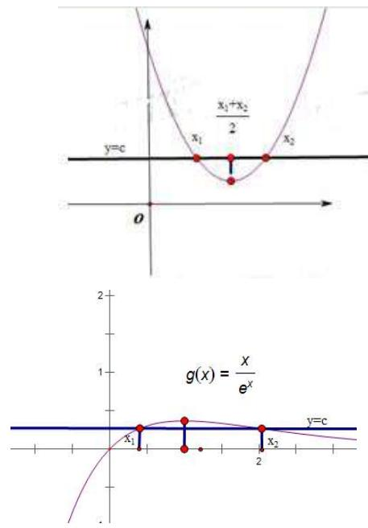
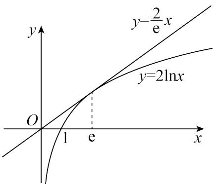
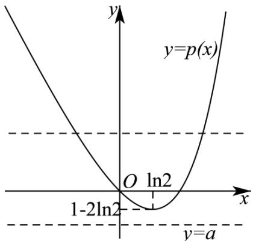
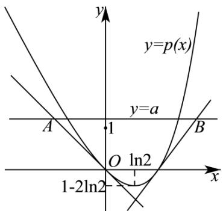
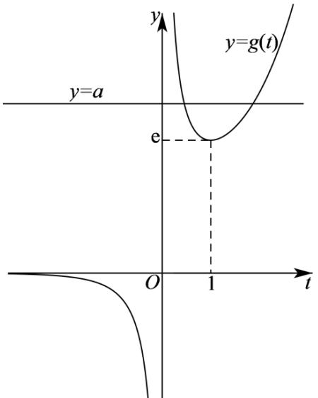
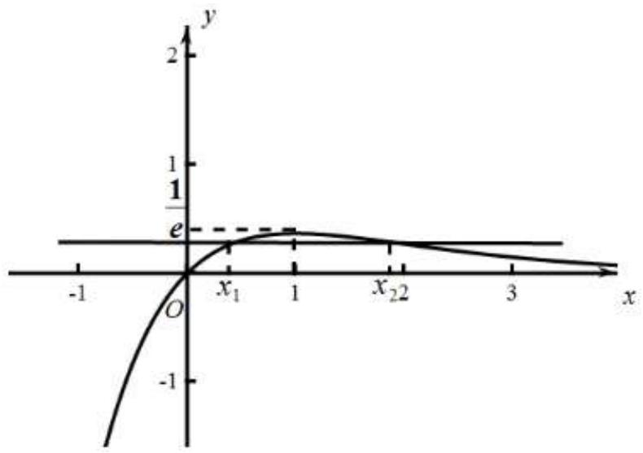
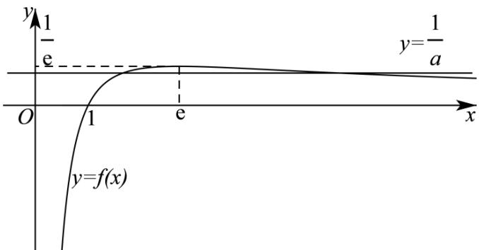

# 第21讲 极值点偏移

# 知识梳理

# 1、极值点偏移的相关概念

所谓极值点偏移,是指对于单极值函数,由于函数极值点左右的增减速度不同,使得函数图像没有对称性。若函数 $f(x)$ 在 $x=x_{0}$ 处取得极值,且函数 $y=f(x)$ 与直线y=b交于 $A(x_{1},b),B(x_{2},b)$ 两点,则AB的中点为 $M\left(\frac{x_{1}+x_{2}}{2},b\right)$ ,而往往 $x_{0}\neq\frac{x_{1}+x_{2}}{2}$ 。如下图所示。

text_image

y=c
x₁ + x₂ / 2
x₂
o
2
g(x) = x / e^x
x₁
x₂
y=c

图1极值点不偏移  
图2 极值点偏移

极值点偏移的定义:对于函数 $y=f(x)$ 在区间 $(a,b)$ 内只有一个极值点 $x_{0}$ ，方程 $f(x)$ 的解分别为 $x_{1}, x_{2}$ ，且 $a<x_{1}<x_{2}<b$ ，(1) 若 $\frac{x_{1}+x_{2}}{2}\neq x_{0}$ ，则称函数 $y=f(x)$ 在区间 $(x_{1},x_{2})$ 上极值点 $x_{0}$ 偏移；(2) 若 $\frac{x_{1}+x_{2}}{2}>x_{0}$ ，则函数 $y=f(x)$ 在区间 $(x_{1},x_{2})$ 上极值点 $x_{0}$ 左偏，简称极值点 $x_{0}$ 左偏；(3) 若 $\frac{x_{1}+x_{2}}{2}<x_{0}$ ，则函数 $y=f(x)$ 在区间 $(x_{1},x_{2})$ 上极值点 $x_{0}$ 右偏，简称极值点 $x_{0}$ 右偏。

# 2、对称变换

主要用来解决与两个极值点之和、积相关的不等式的证明问题．其解题要点如下：(1)定函数(极值点为 $x_{0}$ )，即利用导函数符号的变化判断函数单调性，进而确定函数的极值点 $x_{0}$ .

(2) 构造函数, 即根据极值点构造对称函数 $\mathrm{F}(x) = f(x) - f(2x_0 - x)$ , 若证 $x_1x_2 > x_0^2$ , 则令 $\mathrm{F}(x) = f(x) - f\left(\frac{2x_0}{x}\right)$ .  
(3) 判断单调性, 即利用导数讨论 $\mathbf{F}(\boldsymbol{x})$ 的单调性.  
(4) 比较大小, 即判断函数 $\mathbf{F}(x)$ 在某段区间上的正负, 并得出 $f(x)$ 与 $f(2x_0 - x)$ 的大小关系.  
(5) 转化, 即利用函数 $f(x)$ 的单调性, 将 $f(x)$ 与 $f(2x_0 - x)$ 的大小关系转化为 $x$ 与 $2x_0 - x$ 之间的关系, 进而得到所证或所求.

【注意】若要证明 $f'\left(\frac{x_1 + x_2}{2}\right)$ 的符号问题，还需进一步讨论 $\frac{x_1 + x_2}{2}$ 与 $x_0$ 的大小，得出 $\frac{x_1 + x_2}{2}$ 所在的单调区间，从而得出该处导数值的正负.

构造差函数是解决极值点偏移的一种有效方法, 函数的单调性是函数的重要性质之一, 它的应用贯穿于整个高中数学的教学之中. 某些数学问题从表面上看似乎与函数的单调性无关, 但如果我们能挖掘其内在联系, 抓住其本质, 那么运用函数的单调性解题, 能起到化难为易、化繁为简的作用. 因此对函数的单调性进行全面、准确的认识, 并掌握好使用的技巧和方法, 这是非常必要的. 根据题目的特点, 构造一个适当的函数, 利用它的单调性进行解题, 是一种常用技巧. 许多问题, 如果运用这种思想去解决, 往往能获得简洁明快的思路, 有着非凡的功效

3、应用对数平均不等式 $\sqrt{x_1x_2} < \frac{x_1 - x_2}{\ln x_1 - \ln x_2} < \frac{x_1 + x_2}{2}$ 证明极值点偏移：

①由题中等式中产生对数；  
②将所得含对数的等式进行变形得到 $\frac{x_1 - x_2}{\ln x_1 - \ln x_2}$ ;  
③利用对数平均不等式来证明相应的问题.

4、比值代换是一种将双变量问题化为单变量问题的有效途径,然后构造函数利用函数的单调性证明题中的不等式即可.

# 必考题型全归纳

# 1 题型一:极值点偏移:加法型

763 (2024·河南周口·高二校联考阶段练习)已知函数 $f(x) = \frac{x^2 - ax}{\mathrm{e}^x}$ , $a \in \mathbb{R}$

(1) 若 a=2，求 $f(x)$ 的单调区间；  
(2) 若 $a = 1, x_1, x_2$ 是方程 $f(x) = \frac{\ln x + 1}{\mathrm{e}^x}$ 的两个实数根，证明： $x_1 + x_2 > 2$ .

【解析】(1)由题可知 $f(x)$ 的定义域为R,

$$
f ^ {\prime} (x) = - \frac {x ^ {2} - 4 x + 2}{\mathrm{e} ^ {x}}.
$$

令 $h(x) = x^{2} - 4x + 2$ ，则 $h(x) = 0$ 的两根分别为 $x_{1} = 2 - \sqrt{2}, x_{2} = 2 + \sqrt{2}$

当 $x < 2 - \sqrt{2}$ 或 $x > 2 + \sqrt{2}$ 时， $f'(x) < 0;$

当 $2 - \sqrt{2} < x < 2 + \sqrt{2}$ 时， $f'(x) > 0;$

所以 $f(x)$ 的单调递增区间为 $(2-\sqrt{2},2+\sqrt{2})$ ，单调递减区间为 $(-∞,2-\sqrt{2})$ ，

$$
(2 + \sqrt {2}, + \infty).
$$

(2) 原方程可化为 $\ln x - x^{2} + x + 1 = 0$ ,

设 $g(x)=\ln x-x^{2}+x+1$ ，则 $g'(x)=\frac{1}{x}-2x+1=\frac{-2x^{2}+x+1}{x}, x>0.$

令 $g'(x)=0$ , 得 x=1. ∵ 在 $(0,1)$ 上, $g'(x)>0$ , 在 $(1,+\infty)$ 上, $g'(x)<0$

∴ $g(x)$ 在 $(0,1)$ 上单调递增，在 $(1,+\infty)$ 上单调递减，

∴ $g(x) \leqslant g(1) = -1 + 1 + 1 = 1 > 0$ ，且当 x > 0，x 趋向于 0 时， $g(x)$ 趋向于 $-\infty$ ，

当 x 趋向于 $+\infty$ 时， $g(x)$ 趋向于 $-\infty$ .

则 $g(x)$ 在 $(0,1)$ 和 $(1,+\infty)$ 上分别有一个零点 $x_{1}, x_{2}$ ,

不妨设 $0 < x_{1} < 1 < x_{2}, \because 0 < x_{1} < 1, \therefore 2 - x_{1} > 1,$

设 $G(x)=g(x)-g(2-x)$ ，则 $G(x)=(\ln x-x^{2}+x+1)-$

$$
\left[ \ln (2 - x) - (2 - x) ^ {2} + (2 - x) + 1 \right] = \ln x - \ln (2 - x) - 2 x + 2,
$$

$$
\mathrm{G} ^ {\prime} (x) = \frac {1}{x} + \frac {1}{2 - x} - 2 = \frac {2 x ^ {2} - 4 x + 2}{x (2 - x)}.
$$

当 0 < x < 1 时， $G'(x) > 0$ ，

∴ G(x) 在 $(0,1)$ 上单调递增, 而 G(1)=0,

∴当0<x<1时， $G(x)<0$ ， $g(x)<g(2-x)$ ，即 $g(x_{1})<g(2-x_{1})$ .

$$
\because g (x _ {2}) = g (x _ {1}),
$$

$$
\therefore g \left(x _ {2}\right) <   g \left(2 - x _ {1}\right).
$$

$\because g(x)$ 在 $(1,+\infty)$ 上单调递减，

$$
\therefore x _ {2} > 2 - x _ {1}, \text {   即   } x _ {1} + x _ {2} > 2.
$$

764 (2024·河北石家庄·高三校联考阶段练习)已知函数 $f(x)=x^{2}\ln x-a(a\in\mathbb{R})$ .

(1) 求函数 $f(x)$ 的单调区间；  
(2) 若函数 $f(x)$ 有两个零点 $x_{1}$ 、 $x_{2}$ ，证明 $1 < x_{1} + x_{2} < \frac{2}{\sqrt{\mathrm{e}}}$ .

【解析】(1) 因为 $f(x)=x^{2}\ln x-a(a\in\mathbb{R})$ 的定义域为 $(0,+\infty)$ ,

则 $f'(x)=2x\ln x+x=x(2\ln x+1)$ ,

令 $f'(x)>0$ , 解得 $x>\frac{1}{\sqrt{e}}$ , 令 $f'(x)<0$ , 解得 $0<x<\frac{1}{\sqrt{e}}$ ,

所以 $f(x)$ 的单调减区间为 $\left(0, \frac{1}{\sqrt{\mathrm{e}}}\right)$ ，单调增区间为 $\left(\frac{1}{\sqrt{\mathrm{e}}}, +\infty\right)$ .

(2) 证明: 不妨设 $x_{1} < x_{2}$ ，由 (1) 知: 必有 $0 < x_{1} < \frac{1}{\sqrt{e}} < x_{2}$ .

要证 $x_{1} + x_{2} <   \frac{2}{\sqrt{\mathrm{e}}}$ ，即证 $x_{2} <   \frac{2}{\sqrt{\mathrm{e}}} -x_{1}$ ，即证 $f(x_2) <   f\left(\frac{2}{\sqrt{\mathrm{e}}} -x_1\right),$

又 $f(x_{2}) = f(x_{1})$ ，即证 $f(x_{1}) - f\left(\frac{2}{\sqrt{\mathrm{e}}} -x_{1}\right) <   0.$

令 $g(x) = f(x) - f\left(\frac{2}{\sqrt{\mathrm{e}}} -x\right)$ ，其中 $x\in \left(0,\frac{1}{\sqrt{\mathrm{e}}}\right),$

则 $g^{\prime}(x) = x(2\ln x + 1) + \left(\frac{2}{\sqrt{\mathrm{e}}} -x\right)\Big[2\ln \Big(\frac{2}{\sqrt{\mathrm{e}}} -x\Big) + 1\Big],$

令 $h(x) = g'(x)$ ，则 $h'(x) = 2(\ln x + 1) + 1 - \left[2\ln \left(\frac{2}{\sqrt{\mathrm{e}}} - x\right) + 1\right] - 1 = 2\ln \frac{x}{\frac{2}{\sqrt{\mathrm{e}}} - x} < 0$

在 $x \in \left(0, \frac{1}{\sqrt{\mathrm{e}}}\right)$ 时恒成立，

所以 $h(x)$ 在 $\left(0, \frac{1}{\sqrt{\mathrm{e}}}\right)$ 上单调递减，即 $g'(x)$ 在 $\left(0, \frac{1}{\sqrt{\mathrm{e}}}\right)$ 上单调递减，所以 $g'(x) > g'\left(\frac{1}{\sqrt{\mathrm{e}}}\right) = 0$ ,

所以 $g(x)$ 在 $\left(0, \frac{1}{\sqrt{\mathrm{e}}}\right)$ 上单调递增, 所以 $g(x_{1}) < g\left(\frac{1}{\sqrt{\mathrm{e}}}\right) = 0$ ,

即 $f(x_{1})-f\left(\frac{2}{\sqrt{\mathrm{e}}}-x_{1}\right)<0$ , 所以 $x_{1}+x_{2}<\frac{2}{\sqrt{\mathrm{e}}}$ ;

接下来证明 $x_{1} + x_{2} > 1$ ,

令 $\frac{x_{2}}{x_{1}}=t$ ，则 t>1，又 $f(x_{1})=f(x_{2})$ ，即 $x_{1}^{2}\ln x_{1}=x_{2}^{2}\ln x_{2}$ ，所以 $\ln x_{1}=\frac{t^{2}\ln t}{1-t^{2}}$

要证 $1 < x_{1} + x_{2}$ , 即证 $1 < x_{1} + tx_{1}$ , 有 $(t + 1)x_{1} > 1$ ,

不等式 $(t+1)x_{1}>1$ 两边取对数,即证 $\ln x_{1}+\ln(t+1)>0$ ,

即证 $\frac{t^2\ln t}{1 - t^2} +\ln (t + 1) > 0$ ，即证 $\frac{(t + 1)\ln(t + 1)}{t} >\frac{t\ln t}{t - 1},$

令 $u(x)=\frac{x\ln x}{x-1}, x\in(1,+\infty)$ ，则 $u'(x)=\frac{(\ln x+1)(x-1)-x\ln x}{(x-1)^{2}}=\frac{x-\ln x-1}{(x-1)^{2}}$

令 $p(x)=x-\ln x-1$ ，其中 $x\in(1,+\infty)$ ，则 $p'(x)=1-\frac{1}{x}=\frac{x-1}{x}>0$ ，

所以， $p(x)$ 在 $(1,+\infty)$ 上单调递增，则当 $x\in(1,+\infty)$ 时， $p(x)>p(1)=0$ ，

故当 $x \in (1, +\infty)$ 时， $u'(x) = \frac{x - \ln x - 1}{(x - 1)^2} > 0$

可得函数 $u(x)$ 单调递增, 可得 $u(t+1) > u(t)$ , 即 $\frac{(t+1)\ln(t+1)}{t} > \frac{t\ln t}{t-1}$ , 所以 $x_{1} + x_{2} > 1$ ,

综上, $1<x_{1}+x_{2}<\frac{2}{\sqrt{e}}$ .

765 (2024·广东深圳·高三红岭中学校考期末)已知函数 $f(x)=\ln x$ .

(1) 讨论函数 $g(x)=f(x)-ax(a\in\mathbb{R})$ 的单调性；

(2) ①证明函数 $\mathrm{F}(x) = f(x) - \frac{1}{\mathrm{e}^x}$ (e为自然对数的底数)在区间(1,2)内有唯一的零点；

②设①中函数 $F(x)$ 的零点为 $x_0$ ，记 $m(x) = \min\left\{xf(x), \frac{x}{e^x}\right\}$ （其中 $\min\{a, b\}$ 表示 $a, b$ 中的较小值），若 $m(x) = n (n \in \mathbb{R})$ 在区间 $(1, +\infty)$ 内有两个不相等的实数根 $x_1, x_2 (x_1 < x_2)$ ，证明： $x_1 + x_2 > 2x_0$ .

【解析】(1) 由已知 $g(x)=\ln x-ax$ ,

函数 $g(x)$ 的定义域为 $(0, +\infty)$ ，导函数 $g'(x) = \frac{1}{x} - a = \frac{1 - ax}{x} (x > 0)$

当 $a \leqslant 0$ 时, $g'(x) > 0$ 恒成立, 所以 $g(x)$ 在 $(0, +\infty)$ 上单调递增;

当 a > 0 时, 令 $g'(x) = 0$ 有 $x = \frac{1}{a}$ ,

∴ 当 $x \in \left(0, \frac{1}{a}\right)$ 时， $g'(x) > 0, g(x)$ 单调递增，

当 $x \in \left( \frac{1}{a}, +\infty \right)$ 时， $g'(x) < 0, g(x)$ 单调递减.

综上所述：

当 $a \leqslant 0$ 时， $g(x)$ 在 $(0, +\infty)$ 上单调递增；

当 a > 0 时， $g(x)$ 在 $\left(0, \frac{1}{a}\right)$ 上单调递增，在 $\left(\frac{1}{a}, +\infty\right)$ 上单调递减.

(2) ① $\mathrm{F}(x)=\ln x-\frac{1}{\mathrm{e}^{x}}$ 的定义域为 $(0,+\infty)$ ，导函数 $\mathrm{F}'(x)=\frac{1}{x}+\frac{1}{\mathrm{e}^{x}}$ ，

当 $x \in (1,2)$ 时， $F'(x) > 0$ ，即 $F(x)$ 在区间 $(1,2)$ 内单调递增，

又 $F(1)=-\frac{1}{e}<0$ , $F(2)=\ln2-\frac{1}{e^{2}}>0$ , 且 $F(x)$ 在区间 $(1,2)$ 内的图像连续不断,

∴根据零点存在性定理,有 $F(x)$ 在区间 $(1,2)$ 内有且仅有唯一零点.

②当 x > 0 时， $F'(x) = \frac{1}{x} + \frac{1}{\mathrm{e}^{x}} > 0$ ，函数 $F(x) = \ln x - \frac{1}{\mathrm{e}^{x}}$ 在 $(0, +\infty)$ 上单调递增，

又 $F(x_{0})=0,$

∴ 当 $1 < x < x_{0}$ 时, $F(x) < 0$ , 故 $f(x) < \frac{1}{\mathrm{e}^{x}}$ , 即 $xf(x) < \frac{x}{\mathrm{e}^{x}}$ ;

当 $x > x_{0}$ 时， $F(x) > 0$ ，故 $f(x) > \frac{1}{\mathrm{e}^{x}}$ ，即 $xf(x) > \frac{x}{\mathrm{e}^{x}}$ ，

∴ 可得 $m(x)=\left\{\begin{aligned}x\ln x,1&<x\leqslant x_{0}\\ \frac{x}{\mathrm{e}^{x}},&^{\circ}\quad x>x_{0}\end{aligned}\right.$

当 $1 < x < x_{0}$ 时， $m(x) = x \ln x$ ，由 $m'(x) = 1 + \ln x > 0$ 得 $m(x)$ 单调递增；

当 $x > x_{0}$ 时， $m(x) = \frac{x}{\mathrm{e}^{x}}$ ，由 $m'(x) = \frac{1 - x}{\mathrm{e}^{x}} < 0$ 得 $m(x)$ 单调递减：

若 $m(x)=n$ 在区间 $(1,+\infty)$ 内有两个不相等的实数根 $x_{1}, x_{2}(x_{1}<x_{2})$ ,

则 $x_{1}\in (1,x_{0}),x_{2}\in (x_{0}, + \infty)$

∴要证 $x_{1}+x_{2}>2x_{0}$ ，需证 $x_{2}>2x_{0}-x_{1}$ ，又 $2x_{0}-x_{1}>x_{0}$

而 $m(x)$ 在 $(x_0, +\infty)$ 内递减，

故需证 $m(x_{2}) < m(2x_{0} - x_{1})$ ，又 $m(x_{1}) = m(x_{2})$

即证 $m(x_{1}) < m(2x_{0} - x_{1})$ ，即 $x_{1}\ln x_{1} < \frac{2x_{0} - x_{1}}{\mathrm{e}^{2x_{0} - x_{1}}}$

下证 $x_{1}\ln x_{1} < \frac{2x_{0} - x_{1}}{\mathrm{e}^{2x_{0} - x_{1}}}$ :

记 $h(x) = x\ln x - \frac{2x_0 - x}{\mathrm{e}^{2x_0 - x}}, 1 < x < x_0,$

由 $\mathrm{F}(x_{0})=0$ 知: $h(x_{0})=0$ ,

记 $\varphi(t)=\frac{t}{\mathrm{e}^{t}}$ ，则 $\varphi'(t)=\frac{1-t}{\mathrm{e}^{t}}$ ：

当 $t \in (0,1)$ 时， $\varphi'(t) > 0;$

当 $t \in (1, +\infty)$ 时， $\varphi'(t) < 0$ ，

故 $\varphi(t)_{\max} = \frac{1}{\mathrm{e}}$ ，而 $\varphi(t) > 0$ ，所以 $0 < \varphi(t) < \frac{1}{\mathrm{e}}$

由 $2x_{0} - x > 1$ ，可知 $-\frac{1}{\mathrm{e}} < -\frac{2x_{0} - x}{\mathrm{e}^{2x_{0} - x}} < 0.$

∴ $h'(x)=1+\ln x+\frac{1}{\mathrm{e}^{2x_{0}-x}}-\frac{2x_{0}-x}{\mathrm{e}^{2x_{0}-x}}>1-\frac{1}{\mathrm{e}}>0$ , 即 $h(x)$ 单调递增，

∴ 当 $1 < x < x_{0}$ 时， $h(x) < h(x_{0}) = 0$ ，即 $x_{1} \ln x_{1} < \frac{2x_{0} - x_{1}}{\mathrm{e}^{2x_{0} - x_{1}}}$ ，故 $x_{1} + x_{2} > 2x_{0}$ ，得证.

766 (2024·重庆沙坪坝·重庆南开中学校考模拟预测)已知函数 $f(x)=x-\sin\left(\frac{\pi}{2}x\right)-a\ln x, x=1$ 为其极小值点.

(1) 求实数 $a$ 的值；  
(2) 若存在 $x_{1} \neq x_{2}$ , 使得 $f(x_{1}) = f(x_{2})$ , 求证: $x_{1} + x_{2} > 2$ .

【解析】(1) $f(x)$ 的定义域为 $(0, +\infty)$ ,

$f'(x)=1-\frac{\pi}{2}\cos\left(\frac{\pi}{2}x\right)-\frac{a}{x}$ ，依题意得 $f'(1)=1-a=0$ ，得a=1，

此时 $f'(x)=1-\frac{\pi}{2}\cos\left(\frac{\pi}{2}x\right)-\frac{1}{x}$ ,

当 0 < x < 1 时， $0 < \frac{\pi}{2}x < \frac{\pi}{2}$ ， $0 < \frac{\pi}{2}\cos\left(\frac{\pi}{2}x\right) < \frac{\pi}{2}$ ， $\frac{1}{x} > 1$ ，故 $f'(x) < 0$ ， $f(x)$ 在 $(0,1)$ 内单调递减，

当 1 < x < 2 时， $\frac{\pi}{2} < \frac{\pi}{2}x < \pi$ ， $\frac{\pi}{2}\cos\left(\frac{\pi}{2}x\right) < 0$ ， $\frac{1}{x} < 1$ ，故 $f'(x) > 0$ ， $f(x)$ 在 $(1,2)$ 内单调递增，

故 $f(x)$ 在x=1处取得极小值,符合题意.

综上所述: a=1.

(2) 由 (1) 知, $f(x) = x - \sin \left( \frac{\pi}{2} x \right) - \ln x$ ,

不妨设 $0 < x_{1} < x_{2}$ ,

当 $1 \leqslant x_{1} < x_{2}$ 时，不等式 $x_{1} + x_{2} > 2$ 显然成立；

当 $0 < x_{1} < 1, x_{2} \geqslant 2$ 时，不等式 $x_{1} + x_{2} > 2$ 显然成立；

当 $0 < x_{1} < 1, 0 < x_{2} < 2$ 时，由 (1) 知 $f(x)$ 在 (0,1) 内单调递减，因为存在 $x_{1} \neq x_{2}$ ，使得 $f(x_{1}) = f(x_{2})$ ，所以 $1 < x_{2} < 2$ ，

要证 $x_{1} + x_{2} > 2$ ，只要证 $x_{1} > 2 - x_{2}$

因为 $1 < x_{2} < 2$ ，所以 $0 < 2 - x_{2} < 1$ ，又 $f(x)$ 在 $(0,1)$ 内单调递减，

所以只要证 $f(x_{1})<f(2-x_{2})$ ，又 $f(x_{1})=f(x_{2})$ ，所以只要证 $f(x_{2})<f(2-x_{2})$ ，

设 $F(x)=f(x)-f(2-x)(1<x<2)$ ,

则 $F'(x)=f'(x)+f'(2-x)=1-\frac{\pi}{2}\cos\left(\frac{\pi}{2}x\right)-\frac{1}{x}+1-\frac{\pi}{2}\cos\left(\frac{\pi}{2}(2-x)\right)-\frac{1}{2-x}$

$$
= 2 - \left(\frac {1}{x} + \frac {1}{2 - x}\right) - \frac {\pi}{2} \left(\cos \left(\frac {\pi}{2} x\right) + \cos \left(\pi - \frac {\pi}{2} x\right)\right)
$$

$$
= 2 - \left(\frac {1}{x} + \frac {1}{2 - x}\right) - \frac {\pi}{2} \left(\cos \left(\frac {\pi}{2} x\right) - \cos \left(\frac {\pi}{2} x\right)\right)
$$

$$
= 2 - \left(\frac {1}{x} + \frac {1}{2 - x}\right),
$$

令 $g(x) = 2 - \left(\frac{1}{x} +\frac{1}{2 - x}\right)(1 <   x <   2)$ ，则 $g^{\prime}(x) = \frac{1}{x^{2}} -\frac{1}{(2 - x)^{2}} = \frac{4 - 4x}{x^{2}(2 - x)^{2}},$

因为 1 < x < 2，所以 $g'(x) < 0$ ， $g(x)$ 在 $(1,2)$ 上为减函数，所以 $g(x) < g(1) = 0$ ，

即 $F'(x) < 0$ ,

所以 $\mathrm{F}(x)$ 在(1,2)上为减函数，

所以 $F(x) < F(1) = 0$ ，即 $f(x_{2}) < f(2 - x_{2})$ .

综上所述: $x_{1} + x_{2} > 2$ .

767 (2024·湖北武汉·高二武汉市第六中学校考阶段练习)已知函数 $f(x) = x^{2}\left(\ln x - \frac{3}{2} a\right)$ ， $a$ 为实数.

(1) 求函数 $f(x)$ 的单调区间；  
(2) 若函数 $f(x)$ 在 x=e 处取得极值， $f'(x)$ 是函数 $f(x)$ 的导函数，且 $f'(x_{1})=f'(x_{2})$ ， $x_{1}$

$$
<   x _ {2}, \text { 证明 }: 2 <   x _ {1} + x _ {2} <   \mathrm{e}
$$

【解析】(1) 函数 $f(x)=x^{2}\left(\ln x-\frac{3}{2}a\right)$ 的定义域为 $(0,+\infty)$ ,

$$
f ^ {\prime} (x) = 2 x \left(\ln x - \frac {3}{2} a\right) + x = x (2 \ln x - 3 a + 1)
$$

令 $f'(x)=0$ ，所以 $\ln x=\frac{3a-1}{2}$ ，得 $x=e^{\frac{3a-1}{2}}$

当 $x \in \left(0, \mathrm{e}^{\frac{3a - 1}{2}}\right), f'(x) < 0$ ，当 $x \in \left(\mathrm{e}^{\frac{3a - 1}{2}}, +\infty\right), f'(x) > 0$

故函数 $f(x)$ 递减区间为 $\left(0, \mathrm{e}^{\frac{3a-1}{2}}\right)$ ，递增区间为 $\left(\mathrm{e}^{\frac{3a-1}{2}}, +\infty\right)$ .

(2) 因为函数 $f(x)$ 在 x=e 处取得极值，

所以 $x=e^{\frac{3a-1}{2}}=e$ ，得 a=1，

所以 $f(x)=x^{2}\left(\ln x-\frac{3}{2}\right)$ ，得 $f'(x)=x(2\ln x-2)=2x(\ln x-1)$ ,

令 $g(x)=2x(\ln x-1)$ ,

因为 $g'(x)=2\ln x$ ，当 x=1 时， $g'(x)=0$ ，

所以函数 $g(x)$ 在 $x \in (0,1)$ 单调递减，在 $x \in (1,+\infty)$ 单调递增，

且当 $x \in (0, \mathrm{e})$ 时, $g(x) = 2x(\ln x - 1) < 0$ , 当 $x \in (\mathrm{e}, +\infty)$ 时, $g(x) = x(\ln x - 1) > 0$ ,

故 $0 < x_{1} < 1 < x_{2} < \mathrm{e}$

先证 $x_{1} + x_{2} > 2$ ，需证 $x_{2} > 2 - x_{1}$

因为 $x_{2}>1,2-x_{1}>1$ ，下面证明 $g(x_{1})=g(x_{2})>g(2-x_{1})$ .

设 $t(x)=g(2-x)-g(x),x\in(0,1)$ ,

则 $t'(x) = -g'(2 - x) - g'(x), t'(x) = -2\ln (2 - x) - 2\ln x = -2\ln [(2 - x)x] > 0$

故 $t(x)$ 在 $(0,1)$ 上为增函数，故 $t(x) < t(1) = g(1) - g(1) = 0,$

所以 $t(x_{1})=g(2-x_{1})-g(x_{1})<0,$ 则 $g(2-x_{1})<g(x_{2}),$

所以 $2 - x_{1} < x_{2}$ ，即得 $x_{1} + x_{2} > 2$ ，

下面证明： $x_{1} + x_{2} <   \mathrm{e}$

令 $g(x_{1}) = g(x_{2}) = m$ ，当 $x\in (0,1)$ 时 $g(x) - (-2x) = 2x\ln x <   0$ ，所以 $g(x) <   - 2x$ 成立，

所以 $-2x_{1}>g(x_{1})=m$ ，所以 $x_{1}<-\frac{m}{2}$ .

当 $x \in (1, e)$ 时，记 $h(x) = g(x) - (2x - 2e) = 2x \ln x - 4x + 2e,$

所以 $x \in (1, e)$ 时 $h'(x) = 2\ln x - 2 < 0$ ，所以 $h(x)$ 为减函数得 $h(x) > h(e) = 2e - 4e + 2e = 0$ ，

所以 $m=g(x_{2})>2x_{2}-2e$ ，即得 $x_{2}<\frac{m}{2}+e$ .

所以 $x_{1} + x_{2} < -\frac{m}{2} + \frac{m}{2} + \mathrm{e} = \mathrm{e}$ 得证，

综上， $2 < x_{1} + x_{2} < e$ .

768 (2024·江西景德镇·统考模拟预测)已知函数 $f(x) = \frac{(x + 1)(a + \ln x)}{x}$

(1) 若函数 $f(x)$ 在定义域上单调递增, 求 a 的最大值;  
(2) 若函数 $f(x)$ 在定义域上有两个极值点 $x_{1}$ 和 $x_{2}$ ，若 $x_{2} > x_{1}$ ， $\lambda = \mathrm{e}(\mathrm{e} - 2)$ ，求 $\lambda x_{1} + x_{2}$ 的最小值.

【解析】(1) 因为 $f(x)=\frac{(x+1)(a+\ln x)}{x}=\frac{a(x+1)+(x+1)\ln x}{x}$ ，其中 x>0，

则 $f'(x)=\frac{(a+\ln x+\frac{x+1}{x})x-[a(x+1)+(x+1)\ln x]}{x^{2}}=\frac{x-\ln x+1-a}{x^{2}}$ ,

因为函数 $f(x)$ 在 $(0, +\infty)$ 上单调递增，对任意的 $x > 0, x - \ln x + 1 - a \geqslant 0$ ，即 $a \leqslant x - \ln x + 1$ ，

令 $g(x)=x-\ln x+1$ ，其中 x>0，则 $a\leqslant g(x)_{\min}, g'(x)=1-\frac{1}{x}=\frac{x-1}{x}$

由 $g'(x) < 0$ 可得 0 < x < 1，由 $g'(x) > 0$ 可得 x > 1，

所以,函数 $g(x)$ 的单调递减区间为 $(0,1)$ , 单调递增区间为 $(1,+\infty)$ ,

所以， $g(x)_{\min}=g(1)=1-\ln1+1=2$ ，故 $a\leqslant2$ ，所以，a的最大值为2.

(2) 由题意可知, $x_{2} > x_{1} > 0$ , 设 $\frac{x_{2}}{x_{1}} = t > 1$ ,

由 $\left\{\begin{aligned}f'(x_{1})&=0\\ f'(x_{2})&=0\end{aligned}\right.$ 可得 $\left\{\begin{aligned}x_{1}-\ln x_{1}+1-a&=0\\ x_{2}-\ln x_{2}+1-a&=0\end{aligned}\right.$ ，则 $\left\{\begin{aligned}x_{1}-\ln x_{1}+1-a&=0\\ tx_{1}-\ln t-\ln x_{1}+1-a&=0\end{aligned}\right.$

可得 $x_{1}=\frac{\ln t}{t-1}$ ， $x_{2}=\frac{t\ln t}{t-1}$ ，所以， $\lambda x_{1}+x_{2}=\frac{(\lambda+t)\ln t}{t-1}$ ，令 $h(t)=\frac{(\lambda+t)\ln t}{t-1}$ ，其中 t>1，

所以， $h^{\prime}(t) = \frac{\lambda + t - \frac{\lambda}{t} - 1 - (\lambda + 1)\ln t}{(t - 1)^{2}}$

令 $p(t)=\lambda+t-\frac{\lambda}{t}-1-(\lambda+1)\ln t$ ，其中 t>1，则 $p'(t)=1+\frac{\lambda}{t^{2}}-\frac{\lambda+1}{t}=$

$$
\frac {(t - 1) (t - \lambda)}{t ^ {2}},
$$

因为 $\lambda=\mathrm{e}(\mathrm{e}-2)>1$ ，由 $p'(t)<0$ ，可得 $1<t<\lambda$ ，由 $p'(t)>0$ 可得 $t>\lambda$ ，

所以, 函数 $p(t)$ 在 $(1,\lambda)$ 上单调递减, 在 $(\lambda,+\infty)$ 上单调递增, 且 $\lambda=\mathrm{e}(\mathrm{e}-2)<\mathrm{e}$ ,

又因为 $p(\mathrm{e}) = \mathrm{e}(\mathrm{e} - 2) + \mathrm{e} - (\mathrm{e} - 2) - 1 - [\mathrm{e}(\mathrm{e} - 2) + 1] = 0$ 且 $p(1) = 0$

所以, 当 1 < t < e 时, $p(t) < 0$ , 即 $h'(t) < 0$ ,

当 $t > \mathrm{e}$ 时， $p(t) > 0$ ，即 $h'(t) > 0$

所以, 函数 $h(t)$ 在 $(1, e)$ 上单调递减, 在 $(e, +\infty)$ 上单调递增,

所以， $h(t)_{\min}=h(\mathrm{e})=\frac{\lambda+\mathrm{e}}{\mathrm{e}-1}=\frac{\mathrm{e}^{2}-2\mathrm{e}+\mathrm{e}}{\mathrm{e}-1}=\mathrm{e}.$

769 (2024·全国·模拟预测)已知函数 $f(x) = \frac{ae^x}{x} + \ln x - x (a \in \mathbb{R})$ .

(1) 讨论函数 $f(x)$ 的极值点的个数；  
(2) 若函数 $f(x)$ 恰有三个极值点 $x_{1}$ 、 $x_{2}$ 、 $x_{3} (x_{1} < x_{2} < x_{3})$ ，且 $x_{3} - x_{1} \leqslant 1$ ，求 $x_{1} + x_{2} + x_{3}$ 的最大值.

【解析】(1) 函数 $f(x)=\frac{ae^{x}}{x}+\ln x-x(a\in\mathbb{R})$ 的定义域为 $(0,+\infty)$ ,

且 $f'(x)=\frac{a(x-1)\mathrm{e}^{x}}{x^{2}}+\frac{1}{x}-1=\frac{(x-1)(ae^{x}-x)}{x^{2}}.$

①当 $a \leqslant 0$ 时， $ae^{x} - x < 0$ ，由 $f'(x) < 0$ ，可得 x > 1；由 $f'(x) > 0$ ，可得 0 < x < 1。

所以 $f(x)$ 在 $(0,1)$ 上单调递增，在 $(1,+\infty)$ 上单调递减，

因此 $f(x)$ 在x=1处取得极大值,故当 $a\leqslant0$ 时, $f(x)$ 有一个极值点;

②当 $a \geqslant \frac{1}{e}$ 时，令 $g(x) = \frac{x}{e^{x}}$ ，其中 x > 0，则 $g'(x) = \frac{1 - x}{e^{x}}$ ，

由 $g'(x) < 0$ 可得 x > 1，由 $g'(x) > 0$ 可得 0 < x < 1，

因此 $g(x)$ 在 $(0,1)$ 上单调递增，在 $(1,+\infty)$ 上单调递减，

所以 $g(x)_{\max}=g(1)=\frac{1}{\mathrm{e}}$ ，所以 $a\geqslant\frac{1}{\mathrm{e}}\geqslant\frac{x}{\mathrm{e}^{x}}$ ，故 $ae^{x}-x\geqslant0$ ，

由 $f'(x)<0$ 可得0<x<1，由 $f'(x)>0$ 可得x>1，

所以 $f(x)$ 在 $(0,1)$ 上单调递减，在 $(1,+\infty)$ 上单调递增，

因此 $f(x)$ 在x=1处取得极小值,故当 $a\geqslant\frac{1}{e}$ 时, $f(x)$ 有一个极值点;

③当 $0 < a < \frac{1}{e}$ 时， $f'(x) = \frac{(x-1)(ae^{x}-x)}{x^{2}} = \frac{\mathrm{e}^{x}(x-1)\left(a - \frac{x}{\mathrm{e}^{x}}\right)}{x^{2}}$ ,

令 $f'(x)=0$ 得 x=1 或 $a=\frac{x}{e^{x}}$ ，令 $h(x)=a-\frac{x}{e^{x}}$ ，由②知 $h(x)_{\min}=h(1)=a-\frac{1}{e}<0$

而 $h(0)=a>0$ , $h\left(\ln\frac{1}{a^{2}}\right)=a+2a^{2}\ln a=a(1+2a\ln a)$ ,

令 $\varphi(a)=2a\ln a+1\left(0<a<\frac{1}{e}\right)$ ，则 $\varphi'(a)=2(1+\ln a)<0$ ，

所以 $\varphi(a)$ 在 $\left(0,\frac{1}{\mathrm{e}}\right)$ 上单调递减, 因此 $\varphi(a)>1-\frac{2}{\mathrm{e}}>0$ , 故 $h\left(\ln\frac{1}{a^{2}}\right)>0$ ,

所以函数 $h(x)$ 在 $(0,1)$ 和 $\left(1,\ln \frac{1}{a^2}\right)$ 上各存在唯一的零点，分别为 $m,n$

所以函数 $f(x)$ 在 $(0,m)$ 上单调递减，在 $(m,1)$ 上单调递增，在 $(1,n)$ 上单调递减，在 $(n,+\infty)$ 上单调递增，

故函数 $f(x)$ 在x=m和x=n处取得极小值,在x=1处取得极大值,

所以当 $0 < a < \frac{1}{e}$ 时, $f(x)$ 有三个极值点.

综上所述, 当 $a \leqslant 0$ 或 $a \geqslant \frac{1}{e}$ 时, $f(x)$ 有一个极值点; 当 $0 < a < \frac{1}{e}$ 时, $f(x)$ 有三个极值点.

(2) 因为函数 $f(x)$ 恰有三个极值点 $x_{1}$ 、 $x_{2}$ 、 $x_{3}(x_{1}<x_{2}<x_{3})$ ,

所以由(1)知 $x_{1}=m,x_{2}=1,x_{3}=n,$

由 $\left\{\begin{aligned}ae^{x_{1}}&=x_{1}\\ ae^{x_{3}}&=x_{3}\end{aligned}\right.$ ，两式相除得到 $e^{x_{3}-x_{1}}=\frac{x_{3}}{x_{1}}$ .

令 $t = \frac{x_3}{x_1}$ 则 $t > 1$ ，则 $x_{3} = tx_{1},\mathrm{e}^{(t - 1)x_{1}} = t$ ，得 $x_{1} = \frac{\ln t}{t - 1},x_{3} = \frac{t\ln t}{t - 1},$

因此 $x_{3} - x_{1} = \ln t\leqslant 1$ ，所以 $1 <   t\leqslant \mathrm{e}$ ，则 $x_{1} + x_{2} + x_{3} = \frac{(t + 1)\ln t}{t - 1} +1.$

令 $k(t) = \frac{(t + 1)\ln t}{t - 1} + 1$ ，其中 $1 < t \leqslant \mathrm{e}$ ，则 $k'(t) = \frac{t - \frac{1}{t} - 2\ln t}{(t - 1)^2}$ ，

令 $\omega(t)=t-\frac{1}{t}-2\ln t$ ，则 $\omega'(t)=1+\frac{1}{t^{2}}-\frac{2}{t}=\frac{(t-1)^{2}}{t^{2}}>0$ ，

所以 $\omega(t)$ 在 $(1,\mathrm{e}]$ 上单调递增，则当 $1<t\leqslant e$ 时， $\omega(t)>\omega(1)=0$ ，

即 $k'(t)>0$ , 故 $k(t)$ 在 $(1, e]$ 上单调递增，

所以当 $1 < t \leqslant \mathrm{e}$ 时， $k(t) \leqslant k(\mathrm{e}) = \frac{2\mathrm{e}}{\mathrm{e} - 1}$ ，故 $x_{1} + x_{2} + x_{3}$ 的最大值为 $\frac{2\mathrm{e}}{\mathrm{e} - 1}$ .

770 (2024·广西玉林·高二广西壮族自治区北流市高级中学校联考阶段练习)已知函数 $f(x)=\ln x-ax$ .

(1) 讨论函数 $f(x)$ 的单调性;  
(2) 当 $a = 1$ 时, 若 $f(x_{1}) = f(x_{2}) (x_{1} < x_{2})$ , 求证: $x_{1} + x_{2} > 2$

【解析】(1) $f(x)=\ln x-ax$ 的定义域为 $(0,+\infty)$ ,

因为 $f'(x)=\frac{1}{x}-a=\frac{1-ax}{x}, x>0$

当 $a \leqslant 0$ 时， $f'(x) > 0$ ，

所以 $f(x)$ 在 $(0, +\infty)$ 上单调递增；

当 a > 0 时, 令 $f'(x) > 0$ 得 $0 < x < \frac{1}{a}$ , 令 $f'(x) < 0$ 得 $x > \frac{1}{a}$ ,

所以 $f(x)$ 在 $\left(0, \frac{1}{a}\right)$ 上单调递增，在 $\left(\frac{1}{a}, +\infty\right)$ 上单调递减；

综上, 当 $a \leqslant 0$ 时, $f(x)$ 在 $(0, +\infty)$ 上单调递增;

当 a > 0 时， $f(x)$ 在 $\left(0, \frac{1}{a}\right)$ 上单调递增，在 $\left(\frac{1}{a}, +\infty\right)$ 上单调递减.

(2) 当 $a = 1$ 时 $a > 0$ , $f(x) = \ln x - x$ , 定义域为 $(0, +\infty)$ ,

$f'(x)=\frac{1}{x}-1$ , 所以 $f(x)$ 在 $(0,1)$ 上单调递增, 在 $(1,+\infty)$ 上单调递减,

又因为 $f(x_{1})=f(x_{2})(x_{1}<x_{2})$ ，所以 $0<x_{1}<1<x_{2}$

设 $F(x)=f(x)-f(2-x)(x\in(0,1))$ ,

则 $\mathrm{F}'(x) = \frac{1}{x} -\frac{1}{x - 2} -2 = \frac{2(x - 1)^2}{x(2 - x)}\geqslant 0$ 在(0,1)上恒成立，

所以 $F(x)=f(x)-f(2-x)$ 在 $(0,1)$ 上单调递增，

所以 $F(x_{1})=f(x_{1})-f(2-x_{1})<0$ ，即 $f(x_{1})=f(x_{2})<f(2-x_{1})$

又因为 $x_{2} > 1,0 <   x_{1} <   1$ ，所以 $2 - x_{1} > 1$

又因为 $f(x)$ 在 $(1, +\infty)$ 上单调递减，

所以 $x_{2} > 2 - x_{1}$ ，即 $x_{1} + x_{2} > 2$

(2024·安徽·高二安徽师范大学附属中学校考阶段练习)已知函数 $f(x)=\frac{1}{3}x^{3}-\frac{3}{2}x^{2}+\log_{a}x(a>0,a\neq1)$ .

(1) 若 $f(x)$ 为定义域上的增函数, 求 a 的取值范围;  
(2) 令 $a = \mathrm{e}$ , 设函数 $g(x) = f(x) - \frac{1}{3} x^3 - 4\ln x + 9x$ , 且 $g(x_1) + g(x_2) = 0$ , 求证: $x_1 + x_2 \geqslant 3 + \sqrt{11}$ .

【解析】(1) $f(x)$ 的定义域为 $(0,+\infty)$ , $f'(x)=x^{2}-3x+\frac{1}{x\ln a}$

由 $f(x)$ 为定义域上的增函数可得 $f'(x) \geqslant 0$ 恒成立.

则由 $x^{2} - 3x + \frac{1}{x\ln a}\geqslant 0$ 得 $\frac{1}{\ln a}\geqslant -x^3 +3x^2,$

令 $h(x)=-x^{3}+3x^{2}, h'(x)=-3x^{2}+6x=-3x(x-2)$

所以当 $x \in (0,2)$ 时， $h'(x) > 0, h(x)$ 单调递增；

当 $x \in (2, +\infty)$ 时， $h'(x) < 0, h(x)$ 单调递减；

故 $h_{\max}(x)=h(2)=4,$

则有 $\frac{1}{\ln a} \geqslant 4 \Rightarrow 0 < \ln a \leqslant \frac{1}{4}$ 解得 $a \in (1, e^{\frac{1}{4}}]$ .

故 $a$ 的取值范围为 $\left(1, \mathrm{e}^{\frac{1}{4}}\right]$

(2) $g(x)=f(x)-\frac{1}{3}x^{3}-4\ln x+9x=-\frac{3}{2}x^{2}-3\ln x+9x$

由 $g(x_{1}) + g(x_{2}) = 0$ 有 $-\frac{3}{2} x_1^2 -3\ln x_1 + 9x_1 - \frac{3}{2} x_2^2 -3\ln x_2 + 9x_2 = 0$

有 $-\frac{3}{2} (x_1^2 + x_2^2) - 3\ln x_1x_2 + 9(x_1 + x_2) = 0$

即 $-\frac{1}{2}\left[(x_{1}+x_{2})^{2}-2x_{1}x_{2}\right]-\ln x_{1}x_{2}+3(x_{1}+x_{2})=0$

即 $-\frac{1}{2} (x_1 + x_2)^2 + 3(x_1 + x_2) = \ln x_1x_2 - x_1x_2.$

令 $t = x_{1}x_{2}(t > 0),\varphi (t) = \ln t - t$

由 $\varphi'(t)=\frac{1}{t}-1$ 可得当 $t\in(0,1)$ 时， $\varphi'(t)>0,\varphi(t)$ 单调递增；

当 $t \in (1, +\infty)$ 时， $\varphi'(t) < 0, \varphi(t)$ 单调递减；则 $\varphi(t) \leqslant \varphi(1) = -1$ ，

即 $-\frac{1}{2}(x_{1}+x_{2})^{2}+3(x_{1}+x_{2})\leqslant-1$

解得 $x_{1} + x_{2}\geqslant 3 + \sqrt{11}$ 或 $x_{1} + x_{2}\leqslant 3 - \sqrt{11}$ （负值舍去），

故 $x_{1} + x_{2}\geqslant 3 + \sqrt{11}.$

772 (2024·全国·高二专题练习)已知函数 $f(x) = \ln x - a(x - 2)(a \in \mathbb{R})$ .

(1) 试讨论函数 $f(x)$ 的单调性；  
(2) 若函数 $f(x)$ 有两个零点 $x_{1}, x_{2}(x_{1} < x_{2})$ ，求证： $x_{1} + 3x_{2} > \frac{3}{a} - a + 2$ .

【解析】(1)由已知, $f(x)$ 的定义域为 $(0,+\infty)$ , $f'(x)=\frac{1}{x}-a$ ,

①当 $a \leqslant 0$ 时， $\forall x \in (0, +\infty)$ ， $f'(x) = \frac{1}{x} - a > 0$ 恒成立，

∴此时 $f(x)$ 在区间 $(0,+\infty)$ 上单调递增；

②当 a > 0 时, 令 $f'(x) = \frac{1}{x} - a = 0$ , 解得 $x = \frac{1}{a}$ ,

当 $x \in \left(0, \frac{1}{a}\right)$ 时， $f'(x) = \frac{1}{x} - a > 0$ ， $f(x)$ 在区间 $\left(0, \frac{1}{a}\right)$ 上单调递增，

当 $x \in \left(\frac{1}{a}, +\infty\right)$ 时， $f'(x) = \frac{1}{x} - a < 0, f(x)$ 在区间 $\left(\frac{1}{a}, +\infty\right)$ 上单调递减，

综上所述, 当 $a \leqslant 0$ 时, $f(x)$ 在区间 $(0, +\infty)$ 上单调递增;

当 a>0 时, $f(x)$ 在区间 $\left(0,\frac{1}{a}\right)$ 上单调递增, 在区间 $\left(\frac{1}{a},+\infty\right)$ 上单调递减.

(2) 若函数 $f(x)$ 有两个零点 $x_{1}, x_{2} (x_{1} < x_{2})$ ,

则由(1)知， $a > 0, f(x)$ 在区间 $\left(0, \frac{1}{a}\right)$ 上单调递增，在区间 $\left(\frac{1}{a}, +\infty\right)$ 上单调递减，

且 $f\left(\frac{1}{a}\right)>0,f(x_{1})=f(x_{2})=0,0<x_{1}<\frac{1}{a}<x_{2},$

当 $x \in (x_1, x_2)$ 时， $f(x) > 0$ ，当 $x \in (0, x_1) \cup (x_2, +\infty)$ 时， $f(x) < 0$ ， $(*)$

$$
\because f (2) = \ln 2 > 0, \therefore 2 \in \left(x _ {1}, x _ {2}\right), \therefore x _ {2} > 2,
$$

又 $\because x_{2} > \frac{1}{a}, \therefore 2x_{2} > \frac{1}{a} + 2,$

∴只需证明 $x_{1}+x_{2}>\frac{2}{a}$ ，即有 $x_{1}+3x_{2}>\frac{3}{a}+2>\frac{3}{a}-a+2$ .

下面证明 $x_{1} + x_{2} > \frac{2}{a}$ ,

设 $\mathrm{F}(x) = f(x) - f\left(\frac{2}{a} - x\right) = \ln x - a(x - 2) - \ln \left(\frac{2}{a} - x\right) + a\left[\left(\frac{2}{a} - x\right) - 2\right]$

$$
= \ln x - 2 a x - \ln \left(\frac {2}{a} - x\right) + 2, x \in \left(0, \frac {2}{a}\right),
$$

设 $G(x) = F'(x) = \frac{1}{x} - 2a + \frac{1}{\frac{2}{a} - x}$ ，则 $G'(x) = -\frac{1}{x^{2}} + \frac{1}{\left(\frac{2}{a} - x\right)^{2}} = \frac{4ax - 4}{x^{2}(2 - ax)^{2}}$ ,

令 $G'(x)=0$ , 解得 $x=\frac{1}{a}$ ,

当 $x \in \left(0, \frac{1}{a}\right)$ 时， $\mathrm{G}'(x) < 0$ ， $\mathrm{G}(x) = \mathrm{F}'(x)$ 在区间 $\left(0, \frac{1}{a}\right)$ 单调递减，

当 $x \in \left(\frac{1}{a}, \frac{2}{a}\right)$ 时， $\mathrm{G}'(x) > 0$ ， $\mathrm{G}(x) = \mathrm{F}'(x)$ 在区间 $\left(\frac{1}{a}, \frac{2}{a}\right)$ 单调递增，

$\therefore \mathrm{F}^{\prime}(x)\geqslant \mathrm{F}^{\prime}\left(\frac{1}{a}\right) = 0,\mathrm{F}(x) = f(x) - f\left(\frac{2}{a} -x\right)$ 在区间 $\left(0,\frac{2}{a}\right)$ 上单调递增，

又 $\because x_{1} \in \left(0, \frac{1}{a}\right), \therefore \mathrm{F}(x_{1}) = f(x_{1}) - f\left(\frac{2}{a} - x_{1}\right) < \mathrm{F}\left(\frac{1}{a}\right) = f\left(\frac{1}{a}\right) - f\left(\frac{2}{a} - \frac{1}{a}\right) = 0,$

即 $f\left(\frac{2}{a}-x_{1}\right)>f(x_{1})=0,$

∴由 (\*) 知， $\frac{2}{a}-x_{1}\in(x_{1},x_{2})$ ，∴ $\frac{2}{a}-x_{1}<x_{2}$ ，即 $x_{1}+x_{2}>\frac{2}{a}$ .

又 $\because x_{2} > \frac{1}{a}, x_{2} > 2,$

$\therefore x_{1} + 3x_{2} > \frac{3}{a} + 2 > \frac{3}{a} - a + 2$ ，原命题得证.

773 (2024·全国·高二专题练习)已知函数 $f(x) = ax^{2} + (a - 2)x - \ln x (a \in \mathbb{R})$ .

(1) 讨论 $f(x)$ 的单调性；

(2) 若 $f(x)$ 有两个零点 $x_{1}, x_{2}$ ，证明： $x_{1} + x_{2} > \frac{2}{a}$ .

【解析】(1) 函数 $f(x)$ 的定义域为 $(0, +\infty)$ , $f'(x) = 2ax + a - 2 - \frac{1}{x} = \frac{(ax - 1)(2x + 1)}{x}$ ,

$a \leqslant 0$ 时, $f'(x) < 0$ 恒成立, 所以 $f(x)$ 在 $(0, +\infty)$ 上单调递减;

a>0 时, 令 $f'(x)=0$ 得 $x=\frac{1}{a}$ ,

当 $x \in \left(0, \frac{1}{a}\right)$ 时， $f'(x) < 0$ ; 当 $x \in \left(\frac{1}{a}, +\infty\right)$ 时， $f'(x) > 0$ ,

所以 $f(x)$ 在 $\left(0, \frac{1}{a}\right)$ 上单调递减，在 $\left(\frac{1}{a}, +\infty\right)$ 上单调递增.

(2) 证明: $a \leqslant 0$ 时, 由 (1) 知 $f(x)$ 至多有一个零点.

a>0 时,由(1)知当 $x=\frac{1}{a}$ 时, $f(x)$ 取得最小值, 最小值为 $f\left(\frac{1}{a}\right)=1-\frac{1}{a}+\ln a$ .

①当 a=1 时，由于 $f\left(\frac{1}{a}\right)=0$ ，故 $f(x)$ 只有一个零点；

②当 a > 1 时， $1 - \frac{1}{a} + \ln a > 0$ 即 $f\left(\frac{1}{a}\right) > 0$ ，故 $f(x)$ 没有零点；

③当 0 < a < 1 时， $1 - \frac{1}{a} + \ln a < 0$ 即 $f\left(\frac{1}{a}\right) < 0$ ，

又 $f\left(\frac{1}{\mathrm{e}}\right)=a\left(\frac{1}{\mathrm{e}}\right)^{2}+(a-2)\left(\frac{1}{\mathrm{e}}\right)-\ln\frac{1}{\mathrm{e}}=\frac{a}{\mathrm{e}^{2}}+\frac{a}{\mathrm{e}}+1-\frac{2}{\mathrm{e}}>0,$

由(1)知 $f(x)$ 在 $\left(0,\frac{1}{a}\right)$ 上有一个零点.

又 $f\left(\frac{3}{a}\right)=a\left(\frac{3}{a}\right)^{2}+(a-2)\left(\frac{3}{a}\right)-\ln\frac{3}{a}=3+\frac{3}{a}-\ln\frac{3}{a}>4>0,$

由(1)知 $f(x)$ 在 $\left(\frac{1}{a},+\infty\right)$ 有一个零点，

所以 $f(x)$ 在 $(0, +\infty)$ 上有两个零点，a 的取值范围为 $(0,1)$

不妨设 $x_{1} < x_{2}$ , 则 $\frac{1}{\mathrm{e}} < x_{1} < \frac{1}{a} < x_{2} < \frac{3}{a}$ , 且 $\frac{2}{a} - x_{1} > \frac{1}{a}$ ,

令 $F(x)=f(x)-f\left(\frac{2}{a}-x\right)$

$$
= a x ^ {2} + (a - 2) x - \ln x - \left[ a \left(\frac {2}{a} - x\right) ^ {2} + (a - 2) \left(\frac {2}{a} - x\right) - \ln \left(\frac {2}{a} - x\right) \right]
$$

$$
= 2 a x - \ln x + \ln \left(\frac {2}{a} - x\right) - 2, x \in \left(0, \frac {2}{a}\right),
$$

则 $\mathrm{F}^{\prime}(x)=2a-\left(\frac{1}{x}+\frac{1}{\frac{2}{a}-x}\right)$ ,

由于 $\left(\frac{1}{x}+\frac{1}{\frac{2}{a}-x}\right)=\frac{a}{2}\left(x+\frac{2}{a}-x\right)\left(\frac{1}{x}+\frac{1}{\frac{2}{a}-x}\right)=\frac{a}{2}\left(2+\frac{\frac{2}{a}-x}{x}+\frac{x}{\frac{2}{a}-x}\right)\geqslant$

$\frac{a}{2}\left(2+2\sqrt{\frac{\frac{2}{a}-x}{x}\cdot\frac{x}{\frac{2}{a}-x}}\right)=2a$ （且仅当 $x=\frac{1}{a}$ 等号成立），

所以当 $x \in \left(0, \frac{2}{a}\right)$ 时， $\mathrm{F}'(x) \leqslant 0, \mathrm{F}(x)$ 在 $\left(0, \frac{2}{a}\right)$ 单调递减，又 $\mathrm{F}\left(\frac{1}{a}\right) = 0$

所以 $\mathrm{F}(x_{1})>\mathrm{F}\left(\frac{1}{a}\right)=0$ , 即 $\mathrm{F}(x_{1})=f(x_{1})-f\left(\frac{2}{a}-x_{1}\right)>0$

又 $f(x_{1})=f(x_{2})$ ，所以 $f(x_{2})>f\left(\frac{2}{a}-x_{1}\right)$ ,

又由于 $x_{2}>\frac{1}{a},\frac{2}{a}-x_{1}>\frac{1}{a}$ ，且 $f(x)$ 在 $\left(\frac{1}{a},+\infty\right)$ 上单调递增，

所以 $x_{2} > \frac{2}{a} - x_{1}$ 即 $x_{1} + x_{2} > \frac{2}{a}$ .

774 (2024·全国·高三专题练习)设函数 $f(x) = \ln (x - 1) - \frac{k(x - 2)}{x}$ .

(1) 若 $f(x) \geqslant 0$ 对 $\forall x \in [2, +\infty)$ 恒成立，求实数 k 的取值范围；  
(2) 已知方程 $\frac{\ln(x-1)}{x-1} = \frac{1}{3e}$ 有两个不同的根 $x_{1}, x_{2}$ ，求证： $x_{1} + x_{2} > 6e + 2$ ，其中 e = 2.71828 … 为自然对数的底数.

【解析】(1) 由 $f(x)=\ln(x-1)-\frac{k(x-2)}{x}\geqslant0$ , 得 $x\ln(x-1)-k(x-2)\geqslant0$ .

令 $\varphi(x)=x\ln(x-1)-k(x-2)$ , $x\in[2,+\infty)$ ，则 $\varphi'(x)=\ln(x-1)+\frac{x}{x-1}-k$ ,

令 $h(x) = \varphi'(x)$ , 则 $h'(x) = \frac{1}{x - 1} - \frac{1}{(x - 1)^2} = \frac{x - 2}{(x - 1)^2} \geqslant 0 (x \geqslant 2)$ .

所以, 函数 $\varphi'(x)=\ln(x-1)+\frac{x}{x-1}-k$ 在 $[2,+\infty)$ 上单增, 故 $\varphi'(x)\geqslant\varphi'(2)=2-k$ .

①当 $k \leqslant 2$ 时，则 $\varphi'(x) \geqslant 2 - k \geqslant 0$ ，所以 $\varphi(x)$ 在 $[2, +\infty)$ 上单增， $\varphi(x) \geqslant \varphi(2) = 0$ ，此时 $f(x) \geqslant 0$ 对 $\forall x \in [2, +\infty)$ 恒成立，符合题意；

②当 k > 2 时， $\varphi'(2) = 2 - k < 0, \varphi'(\mathrm{e}^k + 1) = \frac{\mathrm{e}^k + 1}{\mathrm{e}^k} > 0,$

故存在 $x_0 \in (2, +\infty)$ 使得 $\varphi'(x_0) = 0$

当 $x \in (2, x_0)$ 时， $\varphi'(x) < 0$ ，则 $\varphi(x)$ 单调递减，此时 $\varphi(x) < \varphi(2) = 0$ ，不符合题意。综上，实数 $k$ 的取值范围 $(- \infty, 2]$ 。

(2) 证明: 由 (1) 中结论, 取 k=2, 有 $\ln(x-1)>\frac{2(x-2)}{x}(x>2)$ , 即 $\ln t>\frac{2(t-1)}{t+1}(t>1)$ .

不妨设 $x_{2}>x_{1}>1$ , $t=\frac{x_{2}}{x_{1}}>1$ , 则 $\ln\frac{x_{2}}{x_{1}}>\frac{2\left(\frac{x_{2}}{x_{1}}-1\right)}{\frac{x_{2}}{x_{1}}+1}$ , 整理得 $\frac{x_{1}+x_{2}}{2}>\frac{x_{2}-x_{1}}{\ln x_{2}-\ln x_{1}}$ .

于是 $\frac{(x_1 - 1) + (x_2 - 1)}{2} >\frac{(x_2 - 1) - (x_1 - 1)}{\ln(x_2 - 1) - \ln(x_1 - 1)} = \frac{x_2 - x_1}{\frac{1}{3\mathrm{e}}[(x_2 - 1) - (x_1 - 1)]} = 3\mathrm{e},$

即 $x_{1} + x_{2} > 6\mathrm{e} + 2.$

775 (2024·江西宜春·高三校考开学考试)已知函数 $f(x) = 3a\ln x - (a - 3)x, a \in \mathbb{R}$ .

(1) 当 $a = 1$ 时, 求曲线 $g(x) = f(x) - 3\ln x - \sin x$ 在 $x = \frac{\pi}{2}$ 处的切线方程;  
(2) 设 $x_{1}, x_{2}$ 是 $h(x) = f(x) - (3a - 2)\ln x - 3x$ 的两个不同零点，证明： $a(x_{1} + x_{2}) > 4$ .

【解析】(1) 当 a=1 时， $g(x)=f(x)-3\ln x-\sin x=2x-\sin x$

$$
g ^ {\prime} (x) = 2 - \cos x, g ^ {\prime} \left(\frac {\pi}{2}\right) = 2, g \left(\frac {\pi}{2}\right) = \pi - 1,
$$

曲线 $g(x)$ 在 $x=\frac{\pi}{2}$ 处的切线方程为 $y-(\pi-1)=2\left(x-\frac{\pi}{2}\right)$ ，即 2x-y-1=0;

(2) 令 $h(x) = f(x) - (3a - 2)\ln x - 3x = 2\ln x - ax = 0$ ，可得 $2\ln x = ax (x > 0)$ ，

令 $t(x)=2\ln x(x>0)$ , $n(x)=ax(x>0)$ , 设函数 $n(x)$ 与 $t(x)$ 相切于 $(x_{0},y_{0})$ ,

由 $a = t'(x_0) = \frac{2}{x_0}$ 、 $2\ln x_0 = y_0$ 、 $ax_0 = y_0$ 可得 $y_0 = 2$ ， $x_0 = \mathrm{e}$ ， $a = \frac{2}{\mathrm{e}}$

$t(x)=2\ln x(x>0)$ , $n(x)=ax(x>0)$ 的大致图象如下,

text_image

y
y=2/e x
y=2lnx
O
1 e
x

当 $0 < a < \frac{2}{\mathrm{e}}$ 时， $t(x) = 2\ln x (x > 0)$ 与 $n(x) = ax (x > 0)$ 有两个不同的交点，

即 $h(x)$ 有两个零点, 所以 a 的取值范围为 $\left(0, \frac{2}{\mathrm{e}}\right)$ ,

$h'(x)=\frac{2}{x}-a$ , 当 $x\in\left(0,\frac{2}{a}\right)$ 时, $h'(x)>0$ , $h(x)$ 在 $\left(0,\frac{2}{a}\right)$ 上递增,

当 $x \in \left( \frac{2}{a}, +\infty \right)$ 时， $h'(x) < 0, h(x)$ 在 $\left( \frac{2}{a}, +\infty \right)$ 上递减，

要证 $a(x_{1} + x_{2}) > 4$ ，只要证 $x_{1} + x_{2} > \frac{4}{a}$

不妨设 $x_{1} < x_{2}$ , 由 $h(x_{1}) = h(x_{2})$ , 则 $0 < x_{1} < \frac{2}{a} < x_{2}$ ,

构造函数 $\mathrm{F}(x) = h(x) - h\left(\frac{4}{a} - x\right)\left(0 < x < \frac{2}{a}\right)$ ,

$$
\mathrm{F} ^ {\prime} (x) = h ^ {\prime} (x) - h ^ {\prime} \left(\frac {4}{a} - x\right) = \left(\frac {2}{x} - a\right) - \left(- \frac {2}{\frac {4}{a} - x} + a\right) = = \frac {2}{x} + \frac {2}{\frac {4}{a} - x} - 2 a =
$$

$$
\frac {2}{x (4 - a x)} (a x - 2) ^ {2},
$$

$\because 0 < x < \frac{2}{a}, \therefore F'(x) > 0, \therefore F(x) \text{ 在 } (0, \frac{2}{a}) \text{ 是递增,}$

又 $\mathrm{F}\left(\frac{2}{a}\right)=0,\therefore\mathrm{F}(x)=h(x)-h\left(\frac{4}{a}-x\right)<0,\therefore h(x)<h\left(\frac{4}{a}-x\right)$

$\therefore h(x_{1}) < h\left(\frac{4}{a} - x_{1}\right)$ , 又 $h(x_{1}) = h(x_{2}), \therefore h(x_{2}) < h\left(\frac{4}{a} - x_{1}\right)$ ,

而 $x_{2}, \frac{4}{a} - x_{1} \in \left(\frac{2}{a}, +\infty\right), h(x)$ 在 $\left(\frac{2}{a}, +\infty\right)$ 上递减， $\therefore x_{2} > \frac{4}{a} - x_{1}$ ，即 $x_{1} + x_{2} > \frac{4}{a}$ ，

$$
\therefore a \left(x _ {1} + x _ {2}\right) > 4.
$$

776 (2024·海南·海南华侨中学校考模拟预测)已知函数 $f(x) = \ln x + x(x - 3)$ .

(1) 讨论 $f(x)$ 的单调性;  
(2) 若存在 $x_{1}, x_{2}, x_{3} \in (0, +\infty)$ , 且 $x_{1} < x_{2} < x_{3}$ , 使得 $f(x_{1}) = f(x_{2}) = f(x_{3})$ , 求证: $2x_{1} + x_{2} > x_{3}$ .

【解析】(1) 函数 $f(x)$ 的定义域为 $(0, +\infty)$ ,

$$
f ^ {\prime} (x) = \frac {1}{x} + 2 x - 3 = \frac {2 x ^ {2} - 3 x + 1}{x} = \frac {(2 x - 1) (x - 1)}{x},
$$

令 $f'(x)=0$ , 得 $x=\frac{1}{2}$ 或 x=1,

在 $\left(0,\frac{1}{2}\right)$ 上， $f'(x)>0$ ，在 $\left(\frac{1}{2},1\right)$ 上， $f'(x)<0$ ，在 $(1,+\infty)$ 上， $f'(x)>0$ ，

所以 $f(x)$ 在 $\left(0, \frac{1}{2}\right]$ 上单调递增，在 $\left(\frac{1}{2}, 1\right)$ 上单调递减，在 $[1, +\infty)$ 上单调递增.

(2) 由 (1) 可知 $0 < x_{1} < \frac{1}{2} < x_{2} < 1 < x_{3}$ ,

设 $\mathrm{F}(x) = f(x) - f(1 - x), x \in \left[\frac{1}{2}, 1\right)$ ,

则 $F'(x)=f'(x)+f'(1-x)=\frac{1}{x}+\frac{1}{1-x}-4=\frac{(2x-1)^{2}}{x(1-x)}$ ,

因为 $x \in \left[\frac{1}{2}, 1\right)$ , 所以 $\mathrm{F}'(x) \geqslant 0, \mathrm{F}(x)$ 在 $\left[\frac{1}{2}, 1\right)$ 上单调递增.

又 $\mathrm{F}\left(\frac{1}{2}\right) = f\left(\frac{1}{2}\right) - f\left(\frac{1}{2}\right) = 0$ ，所以当 $x\in \left(\frac{1}{2},1\right)$ 时， $\mathrm{F}(x) > 0$ ，即 $f(x) > f(1 - x)$

因为 $\frac{1}{2}<x_{2}<1$ ，所以 $f(x_{2})>f(1-x_{2})$ ，所以 $f(x_{1})>f(1-x_{2})$ ，

因为 $f(x)$ 在 $\left(0, \frac{1}{2}\right)$ 上单调递增，且 $0 < x_{1} < \frac{1}{2}, 0 < 1 - x_{2} < \frac{1}{2}$ ,

所以 $x_{1} > 1 - x_{2}$ ，即 $x_{1} + x_{2} > 1.$ ①

设 $G(x)=f(x)-f(2-x)$ , $x\in\left(\frac{1}{2},1\right]$ ,

则 $G'(x)=f'(x)+f'(2-x)=\frac{1}{x}+\frac{1}{2-x}-2=\frac{2(x-1)^{2}}{x(2-x)}$ .

因为 $x \in \left( \frac{1}{2}, 1 \right]$ ，所以 $G'(x) \geqslant 0, G(x)$ 在 $\left( \frac{1}{2}, 1 \right]$ 上单调递增，

又 $\mathrm{G}(1) = f(1) - f(1) = 0$ ，所以当 $x\in \left(\frac{1}{2},1\right)$ 时， $\mathrm{G}(x) <   0$ ，即 $f(x) <   f(2 - x)$

因为 $\frac{1}{2} < x_2 < 1$ ，所以 $f(x_2) < f(2 - x_2)$ ，所以 $f(x_3) < f(2 - x_2)$ .

因为 $f(x)$ 在 $(1, +\infty)$ 上单调递增，且 $x_{3} > 1, 1 < 2 - x_{2} < \frac{3}{2}$ ,

所以 $x_{3}<2-x_{2}$ ，即 $x_{3}+x_{2}<2.$ ②

由①得 $2(x_{1}+x_{2})>2$ ，由②得 $-x_{2}-x_{3}>-2$ ，所以 $2x_{1}+x_{2}>x_{3}$ .

# 2 题型二:极值点偏移:减法型

777 (2024·全国·模拟预测)已知函数 $f(x) = (x - \mathrm{e} - 1)\mathrm{e}^x -\frac{1}{2} ex^2 +\mathrm{e}^2 x$ .

(1) 求函数 $f(x)$ 的单调区间与极值.  
(2) 若 $f(x_{1}) = f(x_{2}) = f(x_{3})(x_{1} < x_{2} < x_{3})$ ，求证： $\frac{x_3 - x_1}{2} < e - 1$ .

【解析】(1)∵ $f(x)$ 定义域为R, $f'(x)=(x-\mathrm{e})\mathrm{e}^{x}-ex+\mathrm{e}^{2}=(x-\mathrm{e})(\mathrm{e}^{x}-\mathrm{e})$ ,

令 $f'(x)=0$ , 解得: x=e 或 x=1,

∴ 当 $x \in (-\infty, 1) \cup (e, +\infty)$ 时， $f'(x) > 0$ ; 当 $x \in (1, e)$ 时， $f'(x) < 0$ ;

∴ $f(x)$ 的单调递增区间为 $(-∞,1)$ 和 $(e,+∞)$ ，单调递减区间为 $(1,e)$ ;

$f(x)$ 的极大值为 $f(1) = -\frac{1}{2}\mathrm{e}$ , 极小值为 $f(\mathrm{e}) = -\mathrm{e}^{\mathrm{e}} + \frac{1}{2}\mathrm{e}^{3}$ .

(2) 由 (1) 知: $x_{1} < 1, 1 < x_{2} < \mathrm{e}, x_{3} > \mathrm{e}$ .

令 $F(x)=f(x)-f(2-x)$ , 1<x<e,

则 $F'(x)=f'(x)-[f(2-x)]'=(x-\mathrm{e})(\mathrm{e}^{x}-\mathrm{e})+(2-x-\mathrm{e})(\mathrm{e}^{2-x}-\mathrm{e})=$

$$
\frac {\mathrm{e} ^ {x} - \mathrm{e}}{\mathrm{e} ^ {x - 1}} [ (x - \mathrm{e}) \mathrm{e} ^ {x - 1} + x + \mathrm{e} - 2 ];
$$

令 $\mathrm{G}(x) = (x - \mathrm{e})\mathrm{e}^{x-1} + x + \mathrm{e}-2$ ，则 $\mathrm{G}'(x) = (x - \mathrm{e}+1)\mathrm{e}^{x-1} + 1$ ;

令 $\mathrm{H}(x)=\mathrm{G}^{\prime}(x)$ ，则 $\mathrm{H}^{\prime}(x)=(x-\mathrm{e}+2)\mathrm{e}^{x-1}$

∵H'(x)>0 在 (1,e) 上恒成立，∴H(x) 在 (1,e) 上单调递增，

$$
\therefore \mathrm{H} (x) > \mathrm{H} (1) = 3 - \mathrm{e} > 0,
$$

∴ $G'(x) > 0$ 在 $(1, e)$ 上恒成立，∴ $G(x)$ 在 $(1, e)$ 上单调递增，∴ $G(x) > G(1) = 0$ ，

∴ $F'(x) > 0$ 在 $(1, e)$ 上恒成立，∴ $F(x)$ 在 $(1, e)$ 上单调递增，∴ $F(x) > F(1) = 0$ ,

$\therefore f(x) > f(2 - x)$ 对任意 $x \in (1, e)$ 恒成立.

$$
\because x _ {2} \in (1, \mathrm{e}), \therefore f \left(x _ {2}\right) > f \left(2 - x _ {2}\right), \text {又} f \left(x _ {1}\right) = f \left(x _ {2}\right), \therefore f \left(x _ {1}\right) > f \left(2 - x _ {2}\right),
$$

$\because f(x)$ 在 $(-∞,1)$ 上单调递增， $x_{1},2-x_{2}\in(-∞,1),\therefore x_{1}>2-x_{2}$ ，即 $x_{1}+x_{2}>2;$

令 $m(x)=f(x)-f(2e-x)$ ，1<x<e，

则 $m'(x)=f'(x)+[f(2e-x)]'=(x-e)(e^{x}-e)+(2e-x-e)(e^{2e-x}-e)=$

$$
(x - \mathrm{e}) \left(\mathrm{e} ^ {x} - \mathrm{e} ^ {2 \mathrm{e} - x}\right);
$$

$\because y=e^{x}-e^{2e-x}$ 在 $(1,e)$ 上单调递增， $\therefore e^{x}-e^{2e-x}<e^{e}-e^{e}=0,$

∴ $m'(x) > 0$ 在 $(1, e)$ 上恒成立，∴ $m(x)$ 在 $(1, e)$ 上单调递增，

∴ $m(x) < m(\mathrm{e}) = 0$ , ∴ $f(x) < f(2\mathrm{e} - x)$ 对任意 $x \in (1, \mathrm{e})$ 恒成立.

$$
\because x _ {2} \in (1, \mathrm{e}), \therefore f \left(x _ {2}\right) <   f \left(2 \mathrm{e} - x _ {2}\right). \text {又} f \left(x _ {2}\right) = f \left(x _ {3}\right), \therefore f \left(x _ {3}\right) <   f \left(2 \mathrm{e} - x _ {2}\right),
$$

$\because f(x)$ 在 $(e, +\infty)$ 上单调递增，且 $x_{3}, 2e - x_{2} \in (e, +\infty)$ ，∴ $x_{3} < 2e - x_{2}$ ，∴ $x_{2} + x_{3} < 2e$ ;

由 $x_{1}+x_{2}>2$ 得: $-x_{1}-x_{2}<-2$ , $\therefore x_{3}-x_{1}=(x_{2}+x_{3})+(-x_{1}-x_{2})<2e-2$ , $\therefore \frac{x_{3}-x_{1}}{2}<e-1$ .

778 (2024·全国·高三专题练习)已知函数 $f(x) = \mathrm{e}^{x} - 2x - (a + 1), g(x) = x^{2} + (a - 1)x - (a + 2)$ (其中 $\mathrm{e} \approx 2.71828$ 是自然对数的底数)

(1) 试讨论函数 $f(x)$ 的零点个数；  
(2) 当 $a > 1$ 时, 设函数 $h(x) = f(x) - g(x)$ 的两个极值点为 $x_{1}, x_{2}$ 且 $x_{1} < x_{2}$ , 求证: $\mathrm{e}^{x_2} - \mathrm{e}^{x_1} < 4a + 2$ .

【解析】(1)由 $f(x)=0$ 可得 $a=e^{x}-2x-1$ ，令 $p(x)=e^{x}-2x-1$ ，其中 $x\in R$

则函数 $f(x)$ 的零点个数等于直线 y=a 与函数 $p(x)=\mathrm{e}^{x}-2x-1$ 图象的公共点个数， $p'(x)=\mathrm{e}^{x}-2$ ，令 $p'(x)=0$ 可得 $x=\ln2$ ，列表如下：

<table><tr><td>x</td><td>(-∞,ln2)</td><td>ln2</td><td>(ln2,+∞)</td></tr><tr><td>p&#x27;(x)</td><td>-</td><td>0</td><td>+</td></tr><tr><td>p(x)</td><td>减</td><td>极小值1-2ln2</td><td>增</td></tr></table>

如下图所示:

text_image

y
y=p(x)
O 1n2
x
1-2ln2
y=a

当 $a<1-2\ln2$ 时, 函数 $f(x)$ 无零点;

当 $a=1-2\ln2$ 时, 函数 $f(x)$ 只有一个零点;

当 $a > 1 - 2\ln 2$ 时, 函数 $f(x)$ 有两个零点.

(2) 证明: $\because h(x) = f(x) - g(x) = \mathrm{e}^{x} - x^{2} - (a + 1)x + 1$ , 其中 $x \in \mathbb{R}$ ,

所以， $h^{\prime}(x) = \mathrm{e}^{x} - 2x - (a + 1)$ ，由已知可得 $\left\{ \begin{array}{l}h^{\prime}(x_{1}) = \mathrm{e}^{x_{1}} - 2x_{1} - (a + 1) = 0\\ h^{\prime}(x_{2}) = \mathrm{e}^{x_{2}} - 2x_{2} - (a + 1) = 0 \end{array} \right.$

上述两个等式作差得 $e^{x_{2}}-e^{x_{1}}=2(x_{2}-x_{1})$ ,

要证 $\mathrm{e}^{x_2} - \mathrm{e}^{x_1} < 4a + 2$ ，即证 $x_{2} - x_{1} < 2a + 1$

因为 $p(0)=0$ ，设函数 $p(x)$ 的图象交 x 轴的正半轴于点 $(x_{3},0)$ ，则 $x_{3}>\ln2$ ，

因为函数 $p(x)$ 在 $(\ln2, +\infty)$ 上单调递增， $p(1) = e - 3 < 0, p\left(\frac{3}{2}\right) = e^{\frac{3}{2}} - 4 > 0, \therefore x_3 \in \left(1, \frac{3}{2}\right)$ ,

设函数 $p(x)$ 的图象在 x=0 处的切线交直线 y=a 于点 A( $x_{1}^{\prime},a$ )，

函数 $p(x)$ 的图象在 $x=x_{3}$ 处的切线交直线y=a于点 $B(x_{2}^{\prime},a)$ ,

因为 $p'(0) = -1$ ，所以，函数 $p(x)$ 的图象在 x = 0 处的切线方程为 y = -x，

联立 $\left\{\begin{aligned}y=a\\ y=-x\end{aligned}\right.$ 可得 $\left\{\begin{aligned}x=-a\\ y=a\end{aligned}\right.$ ，即点 A(-a,a)，

构造函数 $m(x)=p(x)+x=\mathrm{e}^{x}-x-1$ ，其中 $x\in R$ ，则 $m'(x)=\mathrm{e}^{x}-1$ ，

当 x<0 时， $m'(x)<0$ ，此时函数 $m(x)$ 单调递减，

当 x>0 时， $m'(x)>0$ ，此时函数 $m(x)$ 单调递增，所以， $m(x)\geqslant m(0)=0$ ，

所以,对任意的 $x \in R$ , $p(x) \geqslant -x$ , 当且仅当 x = 0 时等号成立,

由图可知 $x_{1}<0$ ，则 $p(x_{1})=\mathrm{e}^{x_{1}}-2x_{1}-1=a>-x_{1}$ ，所以， $x_{1}>-a$ ，

text_image

y
y=p(x)
y=a
A
1
O ln2
x
1-2ln2

因为 $p(x_{3})=\mathrm{e}^{x_{3}}-2x_{3}-1=0$ , 可得 $e^{x_{3}}=2x_{3}+1$

函数 $p(x)$ 在 $x = x_{3}$ 处的切线方程为 $y = (\mathrm{e}^{x_{3}} - 2)(x - x_{3})$ ,

联立 $\left\{\begin{aligned}y&=(\mathrm{e}^{x_{3}}-2)(x-x_{3})\\ y=a\end{aligned}\right.$ ，解得 $x=\frac{a}{e^{x_{3}}-2}+x_{3}=\frac{a}{2x_{3}-1}+x_{3}$ ，即点 $\mathrm{B}\left(\frac{a}{2x_{3}-1}+x_{3},a\right)$ ,

因为 $\frac{a}{2x_3 - 1} + x_3 - (a + 1) = (x_3 - 1)\left(1 - \frac{2a}{2x_3 - 1}\right) = \frac{(x_3 - 1)(2x_3 - 1 - 2a)}{2x_3 - 1} < 0,$

所以， $x_{2}^{\prime}=\frac{a}{2x_{3}-1}+x_{3}<a+1,$

构造函数 $n(x)=\mathrm{e}^{x}-2x-1-(\mathrm{e}^{x_{3}}-2)(x-x_{3})$ ，其中 $x\in R$ ，则 $n(x_{3})=0, n'(x)=\mathrm{e}^{x}-\mathrm{e}^{x_{3}}$ ,

当 $x < x_{3}$ 时， $n'(x) < 0$ ，此时函数 $n(x)$ 单调递减，

当 $x > x_{3}$ 时， $n'(x) > 0$ ，此时函数 $n(x)$ 单调递增，则 $n(x) \geqslant n(x_{3}) = 0$ ，

所以，对任意的 $x \in \mathrm{R}, p(x) \geqslant (\mathrm{e}^{x_3} - 2)(x - x_3)$ ，当且仅当 $x = x_3$ 时，等号成立，

所以， $p(x_{2})=\mathrm{e}^{x_{2}}-2x_{2}-1=a>(\mathrm{e}^{x_{3}}-2)(x_{2}-x_{3})$ ，可得 $x_{2}<\frac{a}{\mathrm{e}^{x_{3}}-2}+x_{3}=x_{2}^{\prime}$

因此， $x_{2}-x_{1}<x_{2}^{\prime}-x_{1}^{\prime}<a+1+a=2a+1$ ，故原不等式成立.

779 (2024·四川成都·高二川大附中校考期中)已知函数 $f(x) = \frac{1}{2} x^2 - ax + \ln x (a \in \mathbb{R})$ .

(1) 若 $f(x)$ 在定义域上不单调, 求 $a$ 的取值范围;  
(2) 设 $a < \mathrm{e} + \frac{1}{\mathrm{e}}, m, n$ 分别是 $f(x)$ 的极大值和极小值，且 $\mathrm{S} = m - n$ ，求S的取值范围.  
【解析】分析:(1)利用导数法求出函数 $f(x)$ 单调递增或单调递减时,参数 a 的取值范围为 $a \leqslant 2$ , 则可知函数 $f(x)$ 在定义域上不单调时, a 的取值范围为 a > 2; (2) 易知 a > 2, 设 $f'(x) = 0$ 的两个根为 $x_{1}, x_{2} (x_{1} < x_{2})$ , 并表示出 m, n, 则 $S = -\frac{1}{2} \left( \frac{x_{1}}{x_{2}} - \frac{x_{2}}{x_{1}} \right) + \ln \frac{x_{1}}{x_{2}}$ , 令 $t = \frac{x_{1}}{x_{2}}$ , 则 $S = -\frac{1}{2} \left( t - \frac{1}{t} \right) + \ln t$ , 再利用导数法求 S 的取值范围.

详由已知 $f'(x)=x+\frac{1}{x}-a(x>0,a\in\mathbb{R})$ ,

(1) ①若 $f(x)$ 在定义域上单调递增, 则 $f'(x) \geqslant 0$ , 即 $a \leqslant x + \frac{1}{x}$ 在 $(0, +\infty)$ 上恒成立, 而 $x + \frac{1}{x} \in [2, +\infty)$ , 所以 $a \leqslant 2$ ;

②若 $f(x)$ 在定义域上单调递减, 则 $f'(x) \leqslant 0$ , 即 $a \geqslant x + \frac{1}{x}$ 在 $(0, +\infty)$ 上恒成立, 而 $x + \frac{1}{x} \in [2, +\infty)$ , 所以 $a \in \varnothing$ .

因为 $f(x)$ 在定义域上不单调, 所以 a > 2, 即 $a \in (2, +\infty)$ .

(2) 由 (1) 知, 欲使 $f(x)$ 在 $(0, +\infty)$ 有极大值和极小值, 必须 $a > 2$ .

又 $a < \mathrm{e} + \frac{1}{\mathrm{e}}$ ，所以 $2 < a < \mathrm{e} + \frac{1}{\mathrm{e}}.$

令 $f'(x)=x+\frac{1}{x}-a=\frac{x^{2}-ax+1}{x}=0$ 的两根分别为 $x_{1},x_{2}$ ,

即 $x^{2}-ax+1=0$ 的两根分别为 $x_{1}, x_{2}$ ，于是 $\left\{\begin{aligned}x_{1}+x_{2}&=a\\ x_{1}x_{2}&=1\end{aligned}\right.$ .

不妨设 $0 < x_{1} < 1 < x_{2}$ ,

则 $f(x)$ 在 $(0, x_{1})$ 上单调递增，在 $[x_{1}, x_{2}]$ 上单调递减，在 $(x_{2}, +\infty)$ 上单调递增，所以 $m = f(x_{1}), n = f(x_{2})$ ,

所以 $S = m - n = f(x_{1}) - f(x_{2}) = \left(\frac{1}{2} x_{1}^{2} - ax_{1} + \ln x_{1}\right) - \left(\frac{1}{2} x_{2}^{2} - ax_{2} + \ln x_{2}\right)$

$$
= \frac {1}{2} \left(x _ {1} ^ {2} - x _ {2} ^ {2}\right) - a \left(x _ {1} - x _ {2}\right) + \left(\ln x _ {1} - \ln x _ {2}\right)
$$

$$
= - \frac {1}{2} \left(x _ {1} ^ {2} - x _ {2} ^ {2}\right) + \ln \frac {x _ {1}}{x _ {2}} = - \frac {1}{2} \times \frac {x _ {1} ^ {2} - x _ {2} ^ {2}}{x _ {1} x _ {2}} + \ln \frac {x _ {1}}{x _ {2}} = - \frac {1}{2} \left(\frac {x _ {1}}{x _ {2}} - \frac {x _ {2}}{x _ {1}}\right) + \ln \frac {x _ {1}}{x _ {2}}.
$$

令 $t = \frac{x_1}{x_2} \in (0,1)$ , 于是 $S = -\frac{1}{2}\left(t - \frac{1}{t}\right) + \ln t$ ,

$$
t + \frac {1}{t} = \frac {x _ {1} ^ {2} + x _ {2} ^ {2}}{x _ {1} x _ {2}} = \frac {\left(x _ {1} + x _ {2}\right) ^ {2} - 2 x _ {1} x _ {2}}{x _ {1} x _ {2}} = a ^ {2} - 2 \in \left(2, \mathrm{e} ^ {2} + \frac {1}{\mathrm{e} ^ {2}}\right),
$$

由 $t + \frac{1}{t} <  \mathrm{e}^{2} + \frac{1}{\mathrm{e}^{2}}$ ，得 $\frac{1}{\mathrm{e}^2} <  t <   \mathrm{e}^2$

又 0 < t < 1, 所以 $\frac{1}{e^{2}} < t < 1$ .

因为 $S'=-\frac{1}{2}\left(1+\frac{1}{t^{2}}\right)+\frac{1}{t}=-\frac{1}{2}\left(\frac{1}{t}-1\right)^{2}<0,$

所以 $S=-\frac{1}{2}\left(1-\frac{1}{t}\right)+\ln t$ 在 $\left(\frac{1}{e^{2}},1\right)$ 上为减函数，

所以 $S \in \left(0, \frac{e^{4} - 4e^{2} - 1}{2e^{2}}\right)$ .

# 3 题型三:极值点偏移:乘积型

780 (2024·全国·高三统考阶段练习)已知函数 $f(x) = xe^{x} - ax + 1, x \in (-1, +\infty), (a > 0)$ ,

$$
g (x) = b x - \frac {\ln x}{x}.
$$

(1) 当 $b = 1, f(x)$ 和 $g(x)$ 有相同的最小值，求 $a$ 的值；  
(2) 若 $g(x)$ 有两个零点 $\circ x_{1},\circ x_{2}$ , 求证: $x_{1}x_{2} > e$ .

【解析】(1)问题转化为 $2bt = \ln t$ 有两个零点，证明 $t_1t_2 > \mathrm{e}^2$ ，进而只需要证明只需要证明

$\ln t_{1} + \ln t_{2} > 2$ ，也即是 $\ln \frac{t_1}{t_2} >\frac{2\left(\frac{t_1}{t_2} - 1\right)}{\frac{t_1}{t_2} + 1}$ ，从而令 $m = \frac{t_1}{t_2} >1$ ，构造函数 $s(m) = \ln m -$

$\frac{2(m-1)}{m+1}(m>1)$ 求出最值即可证出结论.

(1) 由 b=1.

所以 $g(x)=x-\frac{\ln x}{x}$ .

所以 $g'(x)=\frac{x^{2}+\ln x-1}{x^{2}}.$

令 $h(x)=x^{2}+\ln x-1$ ，则 $h(x)$ 为 $(0,+\infty)$ 上的增函数，且 $h(1)=0$ .

所以 $g(x)$ 在 $(0,1)$ 上单调递减， $(1,+\infty)$ 上单调递增.

所以 $g_{\min}(1)=1$ .

又 $f(x)=xe^{x}-ax+1.$

所以 $f'(x)=(x+1)\mathrm{e}^{x}-a.$ 令 $m(x)=(x+1)\mathrm{e}^{x}-a,$ 则 $m'(x)=(x+2)\mathrm{e}^{x}>0$

所以 $\circ f'(x)$ 为 $(-1,+\infty)$ 上的增函数.

又 $f'(-1)=-a<0.$

令 $(x+1)\mathrm{e}^{x}-a=0$ ，因为 $n(x)=(x+1)\mathrm{e}^{x}$ 在 $(-1,+\infty)$ 上单调递增，且 $n(-1)=$

$(-1 + 1)\mathrm{e}^{-1} = 0$ ，而 $a > 0$ ，因此函数 $n(x) = (x + 1)\mathrm{e}^x$ 与直线 $y = a$ 有唯一交点，

故方程 $(x + 1)\mathrm{e}^{x} - a = 0$ 在 $(-1, + \infty)$ 上有唯一解，

所以存在唯一 $x_0 \in (-1, +\infty)$ , 使得 $f'(x_0) = 0$ .

即 $(x_0 + 1)\mathrm{e}^{x_0} - a = 0$ ，故 $a = (x_0 + 1)\mathrm{e}^{x_0}$

所以 $f(x)$ 在 $(-1, x_{0})$ 上单调递减，在 $(x_{0}, +\infty)$ 上单调递增.

所以 $f_{\min}(x)=f(x_{0})=x_{0}\mathrm{e}^{x_{0}}-ax_{0}+1=-x_{0}^{2}\mathrm{e}^{x_{0}}+1=1.$

所以 $x_{0}=0$ .

故而 $a = 1$

(2) 由题意 $g(x)$ 有两个零点 $x_{1}, x_{2}$ .

所以 $\left\{\begin{aligned}bx_{1}&=\frac{\ln x_{1}}{x_{1}}\\ bx_{2}&=\frac{\ln x_{2}}{x_{2}}\end{aligned}\right.$ ，即 $\left\{\begin{aligned}2bx_{1}^{2}&=\ln x_{1}^{2}\\ 2bx_{2}^{2}&=\ln x_{2}^{2}\end{aligned}\right.$

所以等价于: $2bt = \ln t$ 有两个零点, 证明 $t_{1}t_{2} > e^{2}$ .

不妨令 $t_{1}>t_{2}>0.$

由 $\left\{\begin{aligned}2bt_{1}&=\ln t_{1}\\ 2bt_{2}&=\ln t_{2}\end{aligned}\right.\Rightarrow2b=\frac{\ln t_{1}-\ln t_{2}}{t_{1}-t_{2}}.$

要证 $t_{1}t_{2} > e^{2}$ ，只需要证明 $\ln t_{1} + \ln t_{2} > 2$ .

即只需证明： $\ln t_{1} + \ln t_{2} = 2b(t_{1} + t_{2}) = (t_{1} + t_{2})\frac{\ln t_{1} - \ln t_{2}}{t_{1} - t_{2}} >2.$

只需证明： $\ln t_{1} - \ln t_{2} > \frac{2(t_{1} - t_{2})}{t_{1} + t_{2}}$ 即 $\ln \frac{t_1}{t_2} >\frac{2\left(\frac{t_1}{t_2} - 1\right)}{\frac{t_1}{t_2} + 1}.$

令 $m = \frac{t_1}{t_2} > 1$ .

只需证明： $\ln m > \frac{2(m - 1)}{m + 1} (m > 1)$

令 $s(m) = \ln m - \frac{2(m - 1)}{m + 1} (m > 1)$ .

则 $s'(m) = \frac{(m - 1)^2}{m(m + 1)^2}$ , 即 $s(m)$ 在 $(1, +\infty)$ 上为增函数.

又 $s(1)=0.$

所以 $s(m) > s(1) = 0.$

综上所述,原不等式成立.

781 (2024·全国·高三专题练习)已知函数 $f(x)=\ln x$ .

(1) 证明: $f(x + 1) \leqslant x$ .   
(2) 若函数 $h(x)=2xf(x)$ ，若存在 $x_{1}<x_{2}$ 使 $h(x_{1})=h(x_{2})$ ，证明： $x_{1}\cdot x_{2}<\frac{1}{e^{2}}$ .

【解析】(1) 令 $g(x) = f(x + 1) - x = \ln (x + 1) - x, x > -1, g'(x) = \frac{-x}{x + 1}$ ,

令 $g'(x)>0$ , 解得: -1<x<0; 令 $g'(x)<0$ , 解得: x>0,

∴ $g(x)$ 在 $(-1,0)$ 递增，在 $(0,+\infty)$ 递减，则 $g(x)_{\max}=g(0)=0$ ，

∴ $g(x) \leqslant 0$ 恒成立, 即 $\ln(x+1) \leqslant x$ .

(2) $\because h(x)=2x\ln x,\quad(x>0),\therefore h'(x)=2\ln x+2,$

令 $h'(x)>0$ , 解得: $x>\frac{1}{e}$ ; 令 $h'(x)<0$ , 解得: $0<x<\frac{1}{e}$ ;

∴ $h(x)$ 在 $\left(\frac{1}{\mathrm{e}}, +\infty\right)$ 递增，在 $\left(0, \frac{1}{\mathrm{e}}\right)$ 递减.

又 $\because h\left(\frac{1}{\mathrm{e}}\right) = -\frac{2}{\mathrm{e}}, h(1) = 0, \exists x_1 < x_2, h(x_1) = h(x_2)$ , 且 $0 < x_1 < \frac{1}{\mathrm{e}}, \frac{1}{\mathrm{e}} < x_2 < 1$ .

要证 $x_{1}x_{2} < \frac{1}{\mathrm{e}^{2}}$ ，即证 $x_{1} < \frac{1}{\mathrm{e}^{2}x_{2}}.$

$$
\because 0 <   \frac {1}{\mathrm{e} ^ {2} x _ {2}} <   \frac {1}{\mathrm{e}}, \therefore h (x _ {1}) > h \left(\frac {1}{\mathrm{e} ^ {2} x _ {2}}\right),
$$

又 $\because h(x_{1}) = h(x_{2}),\therefore$ 只证 $h(x_{2}) > h\left(\frac{1}{\mathrm{e}^{2}x_{2}}\right)$ 即可.

令 $m(x) = h(x) - h\left(\frac{1}{\mathrm{e}^2x}\right) = 2x\ln x + 2\frac{1}{\mathrm{e}^2x}\ln e^2 x,\left(\frac{1}{\mathrm{e}} < x < 1\right),$

$m^{\prime}(x) = 2\ln x + 2 + \frac{2}{\mathrm{e}^{2}x^{2}} (1 - \ln e^{2}x) = 2(1 + \ln x)\left(1 - \frac{1}{\mathrm{e}^{2}x^{2}}\right) > 0$ 恒成立，

∴ $m(x)$ 在 $\frac{1}{e} < x < 1$ 单调递增.

又∵ $m\left(\frac{1}{\mathrm{e}}\right)=0,\therefore m(x)>0,\therefore h(x)>h\left(\frac{1}{\mathrm{e}^{2}x}\right)$

即 $h(x_{2}) > h\left(\frac{1}{\mathrm{e}^{2}x_{2}}\right), \therefore x_{1}x_{2} < \frac{1}{\mathrm{e}^{2}}.$

782 (2024·全国·高三专题练习)已知函数 $f(x) = x - \sin x - \tan x + a\ln x + b, x \in \left(0, \frac{\pi}{2}\right)$ .

(1) 求证: $2x < \sin x + \tan x, x \in \left(0, \frac{\pi}{2}\right)$ ;   
(2) 若存在 $x_{1}, x_{2} \in \left(0, \frac{\pi}{2}\right)$ , 且当 $x_{1} \neq x_{2}$ 时, 使得 $f(x_{1}) = f(x_{2})$ 成立, 求证: $\frac{x_{1}x_{2}}{a^{2}} < 1$ .

【解析】(1) 证明: 构造函数 $g(x)=2x-\sin x-\tan x$ , 其中 $x\in\left(0,\frac{\pi}{2}\right)$ ,

则 $g'(x)=2-\cos x-\left(\frac{\sin x}{\cos x}\right)'=2-\cos x-\frac{1}{\cos^{2}x}=-\frac{\cos^{3}x-2\cos^{2}x+1}{\cos^{2}x}$

$$
= - \frac {(\cos x - 1) (\cos^ {2} x - \cos x - 1)}{\cos^ {2} x},
$$

因为 $0 < x < \frac{\pi}{2}$ , 则 $0 < \cos x < 1$ , $\cos^2 x - \cos x - 1 = \cos x (\cos x - 1) - 1 < 0$ ,

即当 $0 < x < \frac{\pi}{2}$ 时， $g'(x) < 0$ ，所以，函数 $g(x)$ 在 $\left(0, \frac{\pi}{2}\right)$ 上单调递减，

故当 $0 < x < \frac{\pi}{2}$ 时， $g(x) = 2x - \sin x - \tan x < g(0) = 0$ ，即 $2x < \sin x + \tan x$ .

(2) 证明: 先证明对数平均不等式 $\frac{x_1 - x_2}{\ln x_1 - \ln x_2} > \sqrt{x_1x_2}$ , 其中 $x_2 > x_1 > 0$ ,

即证 $\ln \frac{x_1}{x_2} >\frac{x_1 - x_2}{\sqrt{x_1x_2}} = \sqrt{\frac{x_1}{x_2}} -\sqrt{\frac{x_2}{x_1}},$

令 $t = \sqrt{\frac{x_1}{x_2}}\in (0,1)$ ，即证 $2\ln t > t - \frac{1}{t},$

令 $h(t)=2\ln t-\left(t-\frac{1}{t}\right)$ ，其中 0<t<1，则 $h'(t)=\frac{2}{t}-1-\frac{1}{t^{2}}=-\frac{t^{2}-2t+1}{t^{2}}<0$ ，

所以, 函数 $h(t)$ 在 $(0,1)$ 上为减函数, 当 0 < t < 1 时, $h(t) > h(1) = 0$ ,

所以，当 $x_{2} > x_{1} > 0$ 时， $\frac{x_1 - x_2}{\ln x_1 - \ln x_2} >\sqrt{x_1x_2}$

本题中, 若 $a \leqslant 0$ , 则 $f'(x) = 1 - \cos x - \frac{1}{\cos^{2} x} + \frac{a}{x} = \frac{a}{x} - \cos x - \frac{\sin^{2} x}{\cos x} < 0$ ,

此时函数 $f(x)$ 在 $\left(0, \frac{\pi}{2}\right)$ 上单调递减, 不合乎题意, 所以, a > 0,

由(1)可知,函数 $g(x)$ 在 $\left(0,\frac{\pi}{2}\right)$ 上单调递减,不妨设 $0<x_{1}<x_{2}<\frac{\pi}{2}$ ,则 $\ln x_{1}<\ln x_{2}$ ,

则 $g(x_{1})>g(x_{2})$ ，即 $2x_{1}-\sin x_{1}-\tan x_{1}>2x_{2}-\sin x_{2}-\tan x_{2}$

所以， $\sin x_{1}-\sin x_{2}+\tan x_{1}-\tan x_{2}<2(x_{1}-x_{2})$

因为 $f(x_{1}) = f(x_{2})$ ，则 $x_{1} - \sin x_{1} - \tan x_{1} + a\ln x_{1} + b = x_{2} - \sin x_{2} - \tan x_{2} + a\ln x_{2} + b$ ，

所以， $a(\ln x_1 - \ln x_2) = \sin x_1 - \sin x_2 + \tan x_1 - \tan x_2 - (x_1 - x_2)$

所以， $\frac{a(\ln x_{1}-\ln x_{2})}{x_{1}-x_{2}}=\frac{\sin x_{1}-\sin x_{2}+\tan x_{1}-\tan x_{2}}{x_{1}-x_{2}}-1>2-1=1,$

所以， $\frac{\ln x_{1}-\ln x_{2}}{x_{1}-x_{2}}>\frac{1}{a}$ ，所以， $0<\frac{x_{1}-x_{2}}{\ln x_{1}-\ln x_{2}}<a$

由对数平均不等式可得 $\sqrt{x_{1}x_{2}} < \frac{x_{1}-x_{2}}{\ln x_{1}-\ln x_{2}} < a$ ，可得 $x_{1}x_{2} < a^{2}$ ，所以， $\frac{x_{1}x_{2}}{a^{2}} < 1$ .

783 (2024·全国·高二专题练习)已知函数 $f(x)=\mathrm{e}^{x}-x\ln x+x^{2}-ax$ .

(1) 证明: 若 $a \leqslant e + 1$ , 则 $f(x) \geqslant 0$ ;

(2) 证明: 若 $f(x)$ 有两个零点 $x_{1}, x_{2}$ ，则 $x_{1}x_{2} < 1$ .

【解析】(1) 因为 $f(x)$ 定义域为 $(0, +\infty)$ ，所以 $f(x) \geqslant 0$ 等价于 $\frac{e^{x}}{x} - \ln x + x - a \geqslant 0$ .

设 $g(x)=\frac{\mathrm{e}^{x}}{x}-\ln x+x-a$ , 则 $g'(x)=\frac{(\mathrm{e}^{x}+x)(x-1)}{x^{2}}$

当 0 < x < 1 时， $g'(x) < 0$ ，当 x > 1 时， $g'(x) > 0$ ，

所以 $g(x)$ 在 $(0,1)$ 单调递减， $g(x)$ 在 $(1,+\infty)$ 单调递增，

故 $g(x)\geqslant g(1) = \mathrm{e} + 1 - a.$

因为 $a \leqslant e + 1$ ，所以 $g(x) \geqslant 0$ ，于是 $f(x) \geqslant 0$ 。

(2) 不妨设 $x_{1}<x_{2}$ ，由 (1) 可知 $x_{1}, x_{2}$ 也是 $g(x)$ 的两个零点，且 $0<x_{1}<1, x_{2}>1$ ，于是 $0<\frac{1}{x_{2}}<1$ ，由于 $g(x)$ 在 (0,1) 单调递减，故 $x_{1}x_{2}<1$ 等价于 $g(x_{1})>g\left(\frac{1}{x_{2}}\right)$ .

而 $g(x_{1}) = g(x_{2}) = 0$ ，故 $x_{1}x_{2} < 1$ 等价于 $g(x_{2}) > g\left(\frac{1}{x_{2}}\right)$ . ①

设 $h(x) = g(x) - g\left(\frac{1}{x}\right)$ ，则①式为 $h(x_{2}) > 0$

因为 $h'(x)=g'(x)-g'\left(\frac{1}{x}\right)\left(\frac{1}{x}\right)'=\frac{(x-1)\left(\mathrm{e}^{x}+x-x e^{\frac{1}{x}}-1\right)}{x^{2}}.$

设 $k(x)=\mathrm{e}^{x}+x-xe^{\frac{1}{x}}-1,$

当 x>1 时， $k'(x)=\mathrm{e}^{x}-\mathrm{e}^{\frac{1}{x}}+\frac{1}{x}\mathrm{e}^{\frac{1}{x}}+1>0$ ，故 $k(x)$ 在 $(1,+\infty)$ 单调递增，

所以 $k(x) > k(1) = 0$ ，从而 $h'(x) > 0$ ，因此 $h(x)$ 在 $(1, +\infty)$ 单调递增.

又 $x_{2} > 1$ ，故 $h(x_{2}) > h(1) = 0$ ，故 $g(x_{2}) > g\left(\frac{1}{x_{2}}\right)$ ，于是 $x_{1}x_{2} < 1$

784 (2024·江西南昌·南昌县莲塘第一中学校联考二模)已知函数 $f(x)=x(\ln x-a)$ , $g(x)=\frac{f(x)}{x}+a-ax$ .

(1) 当 $x \geqslant 1$ 时, $f(x) \geqslant -\ln x - 2$ 恒成立, 求 $a$ 的取值范围.  
(2) 若 $g(x)$ 的两个相异零点为 $x_{1}, x_{2}$ ，求证： $x_{1}x_{2} > e^{2}$ .

【解析】(1) 当 $x \geqslant 1$ 时, $f(x) \geqslant -\ln x - 2$ 恒成立,

即当 $x \geqslant 1$ 时， $(x + 1)\ln x - ax + 2 \geqslant 0$ 恒成立，

设 $F(x)=(x+1)\ln x-ax+2,$

所以 $F(1)=2-a\geqslant0$ , 即 $a\leqslant2$

$$
\mathrm{F} ^ {\prime} (x) = \ln x + \frac {1}{x} + 1 - a,
$$

设 $r(x) = \ln x + \frac{1}{x} + 1 - a$

则 $r'(x)=\frac{1}{x}-\frac{1}{x^{2}}=\frac{x-1}{x^{2}}$ ,

所以, 当 $x \geqslant 1$ 时, $r'(x) \geqslant 0$ , 即 $r(x)$ 在 $[1, +\infty)$ 上单调递增,

所以 $r(x) \geqslant r(1) = 2 - a \geqslant 0,$

所以当 $x \geqslant 1$ 时， $F'(x) = r(x) \geqslant 0$ ，即 $F(x)$ 在 $[1, +\infty)$ 上单调递增，

所以 $F(x) \geqslant F(1) = 2 - a$ ,

若 $F(x) \geqslant 0$ 恒成立, 则 $a \leqslant 2$ .

所以 $x \geqslant 1$ 时， $f(x) \geqslant -\ln x - 2$ 恒成立，a 的取值范围为 $(-∞, 2]$ .

(2) 由题意知, $g(x) = \ln x - ax$ ,

不妨设 $x_{1}>x_{2}>0$ ，由 $\left\{\begin{aligned}\ln x_{1}&=ax_{1}\\ \ln x_{2}&=ax_{2}\end{aligned}\right.$ 得 $\left\{\begin{aligned}\ln(x_{1}x_{2})&=a(x_{1}+x_{2})\\ \ln\frac{x_{1}}{x_{2}}&=a(x_{1}-x_{2})\end{aligned}\right.$

则 $\frac{\ln(x_1x_2)}{\ln\frac{x_1}{x_2}} = \frac{x_1 + x_2}{x_1 - x_2} = \frac{\frac{x_1}{x_2} + 1}{\frac{x_1}{x_2} - 1},$

令 $t=\frac{x_{1}}{x_{2}}>1$ ,

则 $\frac{\ln(x_1x_2)}{\ln t} = \frac{t + 1}{t - 1}$ , 即: $\ln(x_1x_2) = \frac{t + 1}{t - 1}\ln t$ .

要证 $x_{1}x_{2} > \mathrm{e}^{2}$

只需证 $\ln (x_{1}x_{2}) > 2$

只需证 $\frac{t + 1}{t - 1}\ln t > 2$

即证 $\ln t > \frac{2(t - 1)}{t + 1} (t > 1)$

即证 $\ln t - \frac{2(t - 1)}{t + 1} >0(t > 1)$

令 $m(t) = \ln t - \frac{2(t - 1)}{t + 1} (t > 1)$

因为 $m'(t)=\frac{(t-1)^{2}}{t(t+1)^{2}}>0,$

所以 $m(t)$ 在 $(1, +\infty)$ 上单调递增，

当 $t \in (1, +\infty)$ 时， $m(t) > m(1) = 0$

所以 $\ln t - \frac{2(t - 1)}{t + 1} >0$ 成立，

故 $x_{1}x_{2} > \mathrm{e}^{2}$

785 (2024·湖北武汉·华中师大一附中校考模拟预测)已知 $f(x) = 2x - \sin x - \sqrt{a}\ln x$ .

(1) 当 a=1 时, 讨论函数 $f(x)$ 的极值点个数;  
(2) 若存在 $x_{1}, x_{2} (0 < x_{1} < x_{2})$ ，使 $f(x_{1}) = f(x_{2})$ ，求证： $x_{1}x_{2} < a$ .

【解析】(1) 当 a=1 时, $f(x)=2x-\sin x-\ln x$ , 则 $f'(x)=2-\cos x-\frac{1}{x}$ ,

当 $x \geqslant 1$ 时， $f'(x) \geqslant 1 - \cos x \geqslant 0$ ，

故 $f(x)$ 在 $[1, +\infty)$ 上单调递增, 不存在极值点;

当 0 < x < 1 时，令 $h(x) = 2 - \cos x - \frac{1}{x}$ ，则 $h'(x) = \sin x + \frac{1}{x^{2}} > 0$ 总成立，

故函数 $h(x)$ 即 $f'(x)$ 在 $(0,1)$ 上单调递增，

且 $f'(1)=1-\cos1>0$ , $f'\left(\frac{1}{4}\right)=-\cos\frac{1}{4}-2<0$ , 所以存在 $x_{0}\in\left(\frac{1}{4},1\right)$ , 使得 $f'(x_{0})=0$ , 所以当 $0<x<x_{0}$ 时, $f'(x)<0$ , $f(x)$ 单调递减; 当 $x_{0}<x<1$ 时, $f'(x)>0$ , $f(x)$ 单调递增;

故在 $(0,1)$ 上存在唯一极值点，

综上, 当 a=1 时, 函数 $f(x)$ 的极值点有且仅有一个.

(2) 由 $f(x_{1}) = f(x_{2})$ 知 $2x_{1} - \sin x_{1} - \sqrt{a}\ln x_{1} = 2x_{2} - \sin x_{2} - \sqrt{a}\ln x_{2}$ ,

整理得， $2(x_{1}-x_{2})-(\sin x_{1}-\sin x_{2})=\sqrt{a}(\ln x_{1}-\ln x_{2})(*)$

不妨令 $g(x)=x-\sin x(x>0)$ ，则 $g'(x)=1-\cos x\geqslant0$ ，故 $g(x)$ 在 $(0,+\infty)$ 上单调递增，

当 $0 < x_{1} < x_{2}$ 时，有 $g(x_{1}) < g(x_{2})$ ，即 $x_{1} - \sin x_{1} < x_{2} - \sin x_{2}$

那么 $\sin x_{1}-\sin x_{2}>x_{1}-x_{2}$ ,

因此， $(*)$ 即转化为 $\sqrt{a} > \frac{x_1 - x_2}{\ln x_1 - \ln x_2}$ ,

接下来证明 $\frac{x_{1}-x_{2}}{\ln x_{1}-\ln x_{2}}>\sqrt{x_{1}x_{2}}(0<x_{1}<x_{2})$ ，等价于证明 $\ln\frac{x_{1}}{x_{2}}>\frac{\sqrt{x_{1}}}{\sqrt{x_{2}}}-\frac{\sqrt{x_{2}}}{\sqrt{x_{1}}}$

不妨令 $\frac{\sqrt{x_1}}{\sqrt{x_2}} = t(0 < t < 1)$

建构新函数 $\varphi(t) = 2\ln t - t + \frac{1}{t}, \varphi'(t) = \frac{2}{t} - 1 - \frac{1}{t^2} = \frac{-(t-1)^2}{t^2} < 0$ ，则 $\varphi(t)$ 在 $(0,1)$ 上单调递减，

所以 $\varphi(t) > \varphi(1) = 0$ ，故 $\ln \frac{x_{1}}{x_{2}} > \frac{\sqrt{x_{1}}}{\sqrt{x_{2}}} - \frac{\sqrt{x_{2}}}{\sqrt{x_{1}}}$ 即 $\frac{x_{1} - x_{2}}{\ln x_{1} - \ln x_{2}} > \sqrt{x_{1}x_{2}} (0 < x_{1} < x_{2})$ 得证，由不等式的传递性知 $\sqrt{x_{1}x_{2}} < \sqrt{a}$ ，即 $x_{1}x_{2} < a$ .

786 (2024·北京通州·统考三模)已知函数 $f(x) = ax - \frac{a}{x} - \ln x (a > 0)$

(1) 已知 $f(x)$ 在点 $(1, f(1))$ 处的切线方程为 y = x - 1，求实数 a 的值；  
(2) 已知 $f(x)$ 在定义域上是增函数, 求实数 a 的取值范围.  
(3) 已知 $g(x)=f(x)+\frac{a}{x}$ 有两个零点 $x_{1}, x_{2}$ ，求实数 a 的取值范围并证明 $x_{1}x_{2} > e^{2}$ .

【解析】(1) 因为 $f(x)=ax-\frac{a}{x}-\ln x$ ，所以 $f'(x)=a+\frac{a}{x^{2}}-\frac{1}{x}$ .

所以 $f'(1)=2a-1$ ，又 $f(x)$ 在点 $(1,f(1))$ 处的切线方程为 y=x-1，

所以 $f'(1)=2a-1=1$ ，解得 a=1。

(2) $f(x)$ 的定义域为 $(0, +\infty)$ ，因为 $f(x)$ 在定义域上为增函数，

所以 $f'(x)=a+\frac{a}{x^{2}}-\frac{1}{x}\geqslant0$ 在 $(0,+\infty)$ 上恒成立.

即 $\frac{ax^2 - x + a}{x^2} \geqslant 0$ 恒成立. $a(x^2 + 1) \geqslant x$ , 即 $a \geqslant \frac{x}{x^2 + 1}$ ,

令 $g(x)=\frac{x}{x^{2}+1}$ ，所以 $g'(x)=\frac{1-x^{2}}{(x^{2}+1)^{2}}=\frac{(1+x)(1-x)}{(x^{2}+1)^{2}}$

$x \in (0,1)$ 时 $g'(x) > 0$ , $x \in (1, +\infty)$ 时 $g'(x) < 0$ ,

所以 $g(x)$ 在 $(0,1)$ 上单调递增，在 $(1,+\infty)$ 上单调递减，

所以 $g(x)_{\min}=g(1)=\frac{1}{2}$ ，即 $a\geqslant\frac{1}{2}$ .

(3) $g(x)=ax-\ln x$

定义域为 $(0, +\infty)$ , $g'(x) = a - \frac{1}{x} = \frac{ax - 1}{x}$

当 $a \leqslant 0$ 时， $g'(x) < 0$ ，所以 $g(x)$ 在 $(0, +\infty)$ 上单调递减，不合题意.

当 a > 0 时， $g'(x) = a - \frac{1}{x} = \frac{ax - 1}{x}$

$g(x)$ 在 $\left(0, \frac{1}{a}\right)$ 上单调递减，在 $\left(\frac{1}{a}, +\infty\right)$ 上单调递增，

所以 $g(x)$ 的最小值为 $g\left(\frac{1}{a}\right)=1-\ln\frac{1}{a}$ ,

函数 $g(x)$ 存在两个零点的必要条件是 $g\left(\frac{1}{a}\right)=1-\ln\frac{1}{a}<0$ ,

即 $0 < a < \frac{1}{\mathrm{e}}$ ，又 $g(1) = a > 0$

所以 $g(x)$ 在 $\left(1, \frac{1}{a}\right)$ 上存在一个零点 $\left(\frac{1}{a} > 1\right)$ .

当 $x \to +\infty$ 时， $g(x) \to +\infty$ ，所以 $g(x)$ 在 $\left(\frac{1}{a}, +\infty\right)$ 上存在一个零点，

综上函数 $g(x)$ 有两个零点, 实数 a 的取值范围是 $0 < a < \frac{1}{e}$ .

不妨设两个零点 $x_{2} > x_{1} > 0$

由 $g(x_{1})=g(x_{2})=0$ , 所以 $\ln x_{1}=ax_{1},\ln x_{2}=ax_{2}$ 所以 $\ln x_{1} - \ln x_{2} = a(x_{1} - x_{2})$ ，所以 $a = \frac{\ln x_1 - \ln x_2}{x_1 - x_2}$

要证 $x_{1}x_{2} > \mathrm{e}^{2}$

只需证 $\ln(x_{1}x_{2})>2,$

只需证 $\ln x_{1} + \ln x_{2} > 2$

由 $\ln x_{1}+\ln x_{2}=ax_{1}+ax_{2}=a(x_{1}+x_{2})=(x_{1}+x_{2})\frac{\ln x_{1}-\ln x_{2}}{x_{1}-x_{2}}$

只需证 $\frac{\ln x_1 - \ln x_2}{x_1 - x_2} >\frac{2}{x_1 + x_2},$

只需证 $\ln x_{1} - \ln x_{2} <   \frac{2(x_{1} - x_{2})}{x_{1} + x_{2}}$

只需证 $\ln \frac{x_1}{x_2} < \frac{2\left(\frac{x_1}{x_2} - 1\right)}{\frac{x_1}{x_2} + 1},$

令 $\frac{x_1}{x_2} = t(0 < t < 1)$ , 只需证 $\ln t < \frac{2(t - 1)}{t + 1}$ ,

令 $\mathrm{H}(t) = \ln t - \frac{2(t - 1)}{t + 1}$

$\mathrm{H}'(t) = \frac{1}{t} -\frac{4}{(t + 1)^2} = \frac{(t + 1)^2 - 4t}{t(t + 1)^2} = \frac{(t - 1)^2}{t(t + 1)^2} >0,$

∴H(t) 在 $(0,1)$ 上单调递增，∴H(t) < H(1) = 0，

即 $\ln t < \frac{2(t - 1)}{t + 1}$ 成立，

所以 $x_{1}x_{2} > e^{2}$ 成立.

# 4 题型四:极值点偏移:商型

787 (2024·浙江杭州·高三浙江大学附属中学校考期中)已知函数 $f(x)=(2\mathrm{e}-x)\ln x$ ，其中 $e=2.71828\cdots$ 为自然对数的底数.

(1) 讨论函数 $f(x)$ 的单调性;  
(2) 若 $x_{1}, x_{2} \in (0,1)$ ，且 $x_{2} \ln x_{1} - x_{1} \ln x_{2} = 2ex_{1}x_{2} (\ln x_{1} - \ln x_{2})$ ，证明： $2e < \frac{1}{x_{1}} + \frac{1}{x_{2}} < 2e + 1.$

【解析】(1) $f'(x)=\frac{2e}{x}-(1+\ln x)$ ， $y=\frac{2e}{x}$ 是减函数， $y=1+\ln x$ 是增函数，

所以 $f'(x)$ 在 $(0, +\infty)$ 单调递减，

$$
\because f ^ {\prime} (\mathrm{e}) = 0,
$$

∴ $x \in (0, e)$ 时， $f'(x) > f'(e) = 0$ ， $f(x)$ 单调递增； $x \in (e, +\infty)$ 时， $f'(x) < f'(e) = 0$ ， $f(x)$ 单调递减.

(2) 由题意得, $\frac{\ln x_1}{x_1} - \frac{\ln x_2}{x_2} = 2e\ln x_1 - 2e\ln x_2$ , 即

$$
\left(2 \mathrm{e} - \frac {1}{x _ {1}}\right) \ln x _ {1} = \left(2 \mathrm{e} - \frac {1}{x _ {2}}\right) \ln x _ {2}, \left(2 \mathrm{e} - \frac {1}{x _ {1}}\right) \ln \frac {1}{x _ {1}} = \left(2 \mathrm{e} - \frac {1}{x _ {2}}\right) \ln \frac {1}{x _ {2}},
$$

设 $\frac{1}{x_1} = a_1, \frac{1}{x_2} = a_2$ ，则由 $x_1, x_2 \in (0,1)$ 得， $a_1, a_2 \in (1, +\infty)$ ，且 $f(a_1) = f(a_2)$ .

不妨设 $a_1 < a_2$ ，则即证 $2\mathrm{e} < a_1 + a_2 < 2\mathrm{e} + 1$

由 $f(2\mathrm{e})=0$ 及 $f(x)$ 的单调性知， $1<a_{1}<e<a_{2}<2e$ .

令 $F(x)=f(x)-f(2e-x)$ ，1<x<e，则

$$
\mathrm{F} ^ {\prime} (x) = f ^ {\prime} (x) + f ^ {\prime} (2 \mathrm{e} - x) = \frac {4 \mathrm{e} ^ {2}}{x (2 \mathrm{e} - x)} - 2 - \ln [ x (2 \mathrm{e} - x) ],
$$

$$
\because x (2 \mathrm{e} - x) \leqslant \mathrm{e} ^ {2}, \therefore \mathrm{F} ^ {\prime} (x) > \frac {4 \mathrm{e} ^ {2}}{\mathrm{e} ^ {2}} - 2 - \ln e ^ {2} = 0, \mathrm{F} (x) <   \mathrm{F} (\mathrm{e}) = 0,
$$

$\therefore f(x) < f(2e - x)$ , 取 $x = a_{1}$ , 则 $f(a_{1}) < f(2e - a_{1})$ ,

又 $f(a_{1}) = f(a_{2})$ ，则 $f(a_{2}) <   f(2\mathrm{e} - a_{1})$

又 $2\mathrm{e} - a_{1} > \mathrm{e}, a_{2} > \mathrm{e}$ ，且 $f(x)$ 在 $(\mathrm{e}, +\infty)$ 单调递减， $\therefore a_{2} > 2\mathrm{e} - a_{1}, a_{1} + a_{2} > 2\mathrm{e}$ .

下证： $a_1 + a_2 < 2\mathrm{e} + 1.$

(i) 当 $a_{2} < \mathrm{e} + 1$ 时，由 $a_{1} < \mathrm{e}$ 得， $a_{1} + a_{2} < 2\mathrm{e} + 1$ ;

(ii) 当 $\mathrm{e} + 1 \leqslant a_2 < 2\mathrm{e}$ 时，令 $\mathrm{G}(x) = f(x) - f(2\mathrm{e} + 1 - x), \mathrm{e} + 1 < x < 2\mathrm{e}$ ，则

$$
\mathrm{G} ^ {\prime} (x) = f ^ {\prime} (x) + f ^ {\prime} (2 \mathrm{e} + 1 - x) = \frac {2 \mathrm{e}}{x} - 1 - \ln x + \frac {2 \mathrm{e}}{2 \mathrm{e} + 1 - x} - 1 - \ln (2 \mathrm{e} + 1 - x)
$$

$$
= \frac {2 \mathrm{e} (2 \mathrm{e} + 1)}{- x ^ {2} + (2 \mathrm{e} + 1) x} - 2 - \ln [ - x ^ {2} + (2 \mathrm{e} + 1) x ],
$$

记 $t = -x^{2} + (2\mathrm{e} + 1)x,\mathrm{e} + 1\leqslant x <   2\mathrm{e},$ 则 $\mathrm{G}'(x) = \frac{2\mathrm{e}(2\mathrm{e} + 1)}{t} -2 - \ln t,$

又 $t = -x^{2} + (2\mathrm{e} + 1)x$ 在 $[\mathrm{e} + 1,2\mathrm{e})$ 为减函数， $\therefore t\in (2\mathrm{e},\mathrm{e}^2 +1)$

$\frac{2e(2e+1)}{t}-2$ 在 $(2e,e^{2}+1)$ 单调递减， $\ln t$ 在 $(2e,e^{2}+1)$ 单调递增，∴ $\frac{2e(2e+1)}{t}-2-\ln t$ 单调递减，从而， $G'(x)$ 在 $[e+1,2e)$ 单调递增，

又 $G^{\prime}(2\mathrm{e}) = \frac{2\mathrm{e}(2\mathrm{e} + 1)}{2\mathrm{e}(2\mathrm{e} + 1 - 2\mathrm{e})} -2 - \ln 2\mathrm{e}(2\mathrm{e} + 1 - 2\mathrm{e}) = 2\mathrm{e} - 1 - \ln 2\mathrm{e},\ln x\leqslant x - 1,$

$$
\therefore \mathrm{G} ^ {\prime} (2 \mathrm{e}) > 0,
$$

又 $G^{\prime}(e + 1) = \frac{2e(2e + 1)}{(e + 1)(2e + 1 - e - 1)} -2 - \ln (e + 1)(2e + 1 - e - 1) = \frac{e - 1}{e + 1} -\ln (e + 1)$

$$
<   0,
$$

从而，由零点存在定理得，存在唯一 $x_0 \in (\mathrm{e} + 1, 2\mathrm{e})$ ，使得 $\mathrm{G}'(x_0) = 0$

当 $x \in [e+1, x_{0})$ 时， $\mathrm{G}'(x) < \mathrm{G}'(x_{0}) = 0 \Rightarrow \mathrm{G}(x)$ 单调递减；

当 $x \in (x_{0}, 2e)$ 时， $\mathrm{G}'(x) > \mathrm{G}'(x_{0}) = 0 \Rightarrow \mathrm{G}(x)$ 单调递增.

所以， $G(x)\leqslant \max \{G(e + 1),G(2e)\}$

又 $G(e + 1) = f(e + 1) - f(2e + 1 - e - 1) = f(e + 1) - f(e) = (e - 1)\ln (e + 1) - e,$

$$
\frac {\ln x}{x} \leqslant \frac {1}{\mathrm{e}} \Rightarrow \ln x \leqslant \frac {x}{\mathrm{e}} \Rightarrow \ln (\mathrm{e} + 1) \leqslant \frac {\mathrm{e} + 1}{\mathrm{e}},
$$

所以， $\mathrm{G}(\mathrm{e}+1) < (\mathrm{e}-1) \cdot \frac{\mathrm{e}+1}{\mathrm{e}} - \mathrm{e} = \frac{-1}{\mathrm{e}} < 0$

显然， $\mathrm{G}(2\mathrm{e}) = f(2\mathrm{e}) - f(2\mathrm{e} + 1 - 2\mathrm{e}) = 0 - 0 = 0$

所以， $\mathrm{G}(x) < 0$ ，即 $f(x) - f(2\mathrm{e} + 1 - x) < 0$ ，

取 $x = a_{2}\in [\mathrm{e} + 1,2\mathrm{e})$ ，则 $f(a_{2}) <   f(2\mathrm{e} + 1 - a_{2})$

又 $f(a_{1})=f(a_{2})$ ，则 $f(a_{1})<f(2e+1-a_{2})$ ，

结合 $2\mathrm{e} + 1 - a_{2} < 2\mathrm{e} + 1 - (\mathrm{e} + 1) = \mathrm{e}, a_{1} < \mathrm{e}$ ，以及 $f(x)$ 在 $(0, \mathrm{e})$ 单调递增，得到 $a_{1} < 2\mathrm{e} + 1 - a_{2}$ ，

从而 $a_1 + a_2 < 2\mathrm{e} + 1$

788 (2024·全国·统考高考真题)已知函数 $f(x) = x(1 - \ln x)$ .

(1) 讨论 $f(x)$ 的单调性；

(2) 设 $a, b$ 为两个不相等的正数，且 $b \ln a - a \ln b = a - b$ ，证明： $2 < \frac{1}{a} + \frac{1}{b} < e$ .

【解析】(1) $f(x)$ 的定义域为 $(0,+\infty)$ .

由 $f(x)=x(1-\ln x)$ 得， $f'(x)=-\ln x$

当 x=1 时， $f'(x)=0$ ; 当 $x\in(0,1)$ 时 $f'(x)>0$ ; 当 $x\in(1,+\infty)$ 时， $f'(x)<0$ .

故 $f(x)$ 在区间 $(0,1]$ 内为增函数，在区间 $[1,+\infty)$ 内为减函数，

(2) [方法一]: 等价转化

由 $b\ln a - a\ln b = a - b$ 得 $\frac{1}{a}\left(1 - \ln \frac{1}{a}\right) = \frac{1}{b}\left(1 - \ln \frac{1}{b}\right)$ , 即 $f\left(\frac{1}{a}\right) = f\left(\frac{1}{b}\right)$ .

由 $a \neq b$ ，得 $\frac{1}{a} \neq \frac{1}{b}$ .

由(1)不妨设 $\frac{1}{a} \in (0,1), \frac{1}{b} \in (1, +\infty)$ , 则 $f\left(\frac{1}{a}\right) > 0$ , 从而 $f\left(\frac{1}{b}\right) > 0$ , 得 $\frac{1}{b} \in (1,\mathrm{e})$ ,

①令 $g(x)=f(2-x)-f(x)$ ,

则 $g'(x)=\ln(2-x)+\ln x=\ln(2x-x^{2})=\ln[1-(x-1)^{2}]$ ,

当 $x \in (0,1)$ 时， $g'(x) < 0$ ， $g(x)$ 在区间 $(0,1)$ 内为减函数， $g(x) > g(1) = 0$ ，

从而 $f(2 - x) > f(x)$ ，所以 $f\left(2 - \frac{1}{a}\right) > f\left(\frac{1}{a}\right) = f\left(\frac{1}{b}\right)$ ，

由(1)得 $2-\frac{1}{a}<\frac{1}{b}$ 即 $2<\frac{1}{a}+\frac{1}{b}$ . ①

令 $h(x) = x + f(x)$ ，则 $h^\prime (x) = 1 + f'(x) = 1 - \ln x,$

当 $x \in (1, e)$ 时， $h'(x) > 0$ ， $h(x)$ 在区间 $(1, e)$ 内为增函数， $h(x) < h(e) = e$ ，

从而 $x + f(x) < \mathrm{e}$ ，所以 $\frac{1}{b} + f\left(\frac{1}{b}\right) < \mathrm{e}$ .

又由 $\frac{1}{a} \in (0,1)$ , 可得 $\frac{1}{a} < \frac{1}{a} \left(1 - \ln \frac{1}{a}\right) = f\left(\frac{1}{a}\right) = f\left(\frac{1}{b}\right)$ ,

所以 $\frac{1}{a} + \frac{1}{b} < f\left(\frac{1}{b}\right) + \frac{1}{b} = e.$ ②

由①②得 $2<\frac{1}{a}+\frac{1}{b}<e.$

[方法二]【最优解】: $b \ln a - a \ln b = a - b$ 变形为 $\frac{\ln a}{a} - \frac{\ln b}{b} = \frac{1}{b} - \frac{1}{a}$ ，所以 $\frac{\ln a + 1}{a} = \frac{\ln b + 1}{b}$ .

令 $\frac{1}{a} = m, \frac{1}{b} = n$ . 则上式变为 $m(1 - \ln m) = n(1 - \ln n)$ ,

于是命题转换为证明: $2 < m + n < e$ .

令 $f(x)=x(1-\ln x)$ ，则有 $f(m)=f(n)$ ，不妨设m<n.

由(1)知0<m<1,1<n<e,先证 $m+n>2$ .

要证： $m + n > 2\Leftrightarrow n > 2 - m\Leftrightarrow f(n) <   f(2 - m)\Leftrightarrow f(m) <   f(2 - m)$

$$
\Leftrightarrow f (m) - f (2 - m) <   0.
$$

令 $g(x)=f(x)-f(2-x),x\in(0,1)$ ,

则 $g'(x)=-\ln x-\ln(2-x)=-\ln[x(2-x)]\geqslant-\ln1=0,$

∴ $g(x)$ 在区间 $(0,1)$ 内单调递增，所以 $g(x) < g(1) = 0$ ，即 $m + n > 2$ .

再证 $m + n <   \mathrm{e}.$

因为 $m(1-\ln m)=n\cdot(1-\ln n)>m$ ，所以需证 $n(1-\ln n)+n<\mathrm{e}\Rightarrow m+n<\mathrm{e}$ .

令 $h(x)=x(1-\ln x)+x,x\in(1,\mathrm{e})$ ,

所以 $h'(x)=1-\ln x>0$ ，故 $h(x)$ 在区间 $(1,\mathrm{e})$ 内单调递增.

所以 $h(x) < h(\mathrm{e}) = \mathrm{e}$ . 故 $h(n) < \mathrm{e}$ , 即 $m + n < e$ .

综合可知 $2 < \frac{1}{a} + \frac{1}{b} < \mathrm{e}$ .

[方法三]: 比值代换

证明 $\frac{1}{a} +\frac{1}{b} >2$ 同证法2.以下证明 $x_{1} + x_{2} <   \mathrm{e}$

不妨设 $x_{2}=tx_{1}$ ，则 $t=\frac{x_{2}}{x_{1}}>1$ ，

由 $x_{1}(1 - \ln x_{1}) = x_{2}(1 - \ln x_{2})$ 得 $x_{1}(1 - \ln x_{1}) = tx_{1}[1 - \ln (tx_{1})]$ ， $\ln x_1 = 1 - \frac{t\ln t}{t - 1}$

要证 $x_{1} + x_{2} < \mathrm{e}$ , 只需证 $(1 + t)x_{1} < \mathrm{e}$ , 两边取对数得 $\ln (1 + t) + \ln x_{1} < 1$ ,

即 $\ln (1 + t) + 1 - \frac{t\ln t}{t - 1} < 1$

即证 $\frac{\ln(1+t)}{t}<\frac{\ln t}{t-1}$ .

记 $g(s) = \frac{\ln(1 + s)}{s}, s \in (0, +\infty)$ ，则 $g'(s) = \frac{\frac{s}{1 + s} - \ln(1 + s)}{s^2}$ .

记 $h(s) = \frac{s}{1 + s} -\ln (1 + s)$ ，则 $h^{\prime}(s) = \frac{1}{(1 + s)^{2}} -\frac{1}{1 + s} < 0,$

所以， $h(s)$ 在区间 $(0, +\infty)$ 内单调递减。 $h(s) < h(0) = 0$ ，则 $g'(s) < 0$ ，

所以 $g(s)$ 在区间 $(0, +\infty)$ 内单调递减.

由 $t \in (1, +\infty)$ 得 $t - 1 \in (0, +\infty)$ , 所以 $g(t) < g(t - 1)$ ,

即 $\frac{\ln(1+t)}{t}<\frac{\ln t}{t-1}$ .

[方法四]:构造函数法

由已知得 $\frac{\ln a}{a} -\frac{\ln b}{b} = \frac{1}{b} -\frac{1}{a}$ ，令 $\frac{1}{a} = x_1,\frac{1}{b} = x_2$

不妨设 $x_{1}<x_{2}$ ，所以 $f(x_{1})=f(x_{2})$ .

由（I）知， $0 < x_{1} < 1 < x_{2} < e$ ，只需证 $2 < x_{1} + x_{2} < e$ .

证明 $x_{1} + x_{2} > 2$ 同证法2.

再证明 $x_{1} + x_{2} < \mathrm{e}$ 令 $h(x) = \frac{1 - \ln x}{x - \mathrm{e}} (0 < x < \mathrm{e}), h'(x) = \frac{-2 + \frac{\mathrm{e}}{x} + \ln x}{(x - \mathrm{e})^2}$ .

令 $\varphi(x)=\ln x+\frac{\mathrm{e}}{x}-2(0<x<\mathrm{e})$ ，则 $\varphi'(x)=\frac{1}{x}-\frac{\mathrm{e}}{x^{2}}=\frac{x-\mathrm{e}}{x^{2}}<0.$

所以 $\varphi(x) > \varphi(\mathrm{e}) = 0, h'(x) > 0, h(x)$ 在区间 $(0, \mathrm{e})$ 内单调递增.

因为 $0 < x_{1} < x_{2} < e$ ，所以 $\frac{1 - \ln x_{1}}{x_{1} - e} < \frac{1 - \ln x_{2}}{x_{2} - e}$ ，即 $\frac{1 - \ln x_{1}}{1 - \ln x_{2}} > \frac{x_{1} - e}{x_{2} - e}$

又因为 $f(x_{1}) = f(x_{2})$ ，所以 $\frac{1 - \ln x_{1}}{1 - \ln x_{2}} = \frac{x_{2}}{x_{1}}, \frac{x_{2}}{x_{1}} > \frac{x_{1} - e}{x_{2} - e}$ ，

即 $x_{2}^{2} - ex_{2} < x_{1}^{2} - ex_{1}, (x_{1} - x_{2})(x_{1} + x_{2} - \mathrm{e}) > 0.$

因为 $x_{1}<x_{2}$ ，所以 $x_{1}+x_{2}<e$ ，即 $\frac{1}{a}+\frac{1}{b}<e$ 。

综上,有 $2 < \frac{1}{a} + \frac{1}{b} < e$ 结论得证.

【整体点评】(2) 方法一: 等价转化是处理导数问题的常见方法, 其中利用的对称差函数, 构造函数的思想, 这些都是导数问题必备的知识和技能.

方法二:等价转化是常见的数学思想,构造对称差函数是最基本的极值点偏移问题的处理策略.

方法三: 比值代换是一种将双变量问题化为单变量问题的有效途径, 然后构造函数利用函数的单调性证明题中的不等式即可.

方法四:构造函数之后想办法出现关于 $x_{1} + x_{2} - e < 0$ 的式子,这是本方法证明不等式的

关键思想所在.

789 (2024·全国·高三专题练习)已知函数 $f(x)=x(1-\ln x)$ .

(1) 讨论 $f(x)$ 的单调性;  
(2) 设 $a, b$ 为两个不相等的正数，且 $b \ln a - a \ln b = a - b$ ，证明： $2 < \frac{1}{a} + \frac{1}{b}$ .

【解析】(1) 函数的定义域为 $(0, +\infty)$ ，又 $f'(x) = 1 - \ln x - 1 = -\ln x$ ，

当 $x \in (0,1)$ 时， $f'(x) > 0$ ，当 $x \in (1, +\infty)$ 时， $f'(x) < 0$

故 $f(x)$ 的递增区间为 $(0,1)$ ，递减区间为 $(1,+\infty)$

(2) 因为 $b \ln a - a \ln b = a - b$ ，故 $b (\ln a + 1) = a (\ln b + 1)$ ，

即 $\frac{\ln a + 1}{a} = \frac{\ln b + 1}{b}$ , 故 $f\left(\frac{1}{a}\right) = f\left(\frac{1}{b}\right)$ ,

设 $\frac{1}{a} = x_1, \frac{1}{b} = x_2$ ，则 $f(x_1) = f(x_2)$ ，

不妨设 $x_{1}<x_{2}$ ，由(1)可知原命题等价于：已知 $0<x_{1}<1<x_{2}<e$ ，证明： $x_{1}+x_{2}>2$ 。

证明如下：

若 $x_{2} \geqslant 2, x_{1} + x_{2} > 2$ 恒成立；

若 $x_{2} < 2$ ，即 $0 < x_{1} < 1 < x_{2} < 2$ 时，

要证: $x_{1} + x_{2} > 2$ , 即证 $x_{1} > 2 - x_{2}$ , 而 $0 < 2 - x_{2} < 1$ , 即证 $f(x_{1}) > f(2 - x_{2})$ ,

即证: $f(x_{2})>f(2-x_{2})$ , 其中 $1<x_{2}<2$

设 $g(x)=f(x)-f(2-x)$ , 1<x<2,

则 $g'(x)=f'(x)+f'(2-x)=-\ln x-\ln(2-x)=-\ln[x(2-x)]$ ,

因为 1 < x < 2，故 $0 < x(2 - x) < 1$ ，故 $-\ln x(2 - x) > 0$ ，

所以 $g'(x)>0$ ，故 $g(x)$ 在 $(1,2)$ 为增函数，所以 $g(x)>g(1)=0$ ，

故 $f(x)>f(2-x)$ ，即 $f(x_{2})>f(2-x_{2})$ 成立，

所以 $x_{1}+x_{2}>2$ 成立，

综上， $x_{1}+x_{2}>2$ 成立.

790 (2024·广东茂名·茂名市第一中学校考三模)已知函数 $f(x) = ax + (a - 1)\ln x + \frac{1}{x}$ , $a \in \mathbb{R}$ .

(1) 讨论函数 $f(x)$ 的单调性；  
(2) 若关于 $x$ 的方程 $f(x) = xe^{x} - \ln x + \frac{1}{x}$ 有两个不相等的实数根 $x_{1}, x_{2}$ ,

(i) 求实数 a 的取值范围;

(ii) 求证: $\frac{e^{x_{1}}}{x_{2}}+\frac{e^{x_{2}}}{x_{1}}>\frac{2a}{x_{1}x_{2}}.$

【解析】(1) 因为 $f(x)=ax+(a-1)\ln x+\frac{1}{x}$ ,

所以 $f'(x)=a+\frac{a-1}{x}-\frac{1}{x^{2}}=\frac{ax^{2}+(a-1)x-1}{x^{2}}=\frac{(x+1)(ax-1)}{x^{2}}$ ，其中 x>0.

①当 $a \leqslant 0$ 时， $f'(x) < 0$ ，所以函数 $f(x)$ 的减区间为 $(0, +\infty)$ ，无增区间；  
②当 a > 0 时，由 $f'(x) > 0$ 得 $x > \frac{1}{a}$ ，由 $f'(x) < 0$ 可得 $0 < x < \frac{1}{a}$ .

所以函数 $f(x)$ 的增区间为 $\left(\frac{1}{a}, +\infty\right)$ ，减区间为 $\left(0, \frac{1}{a}\right)$ .

综上: 当 $a \leqslant 0$ 时, 函数 $f(x)$ 的减区间为 $(0, +\infty)$ , 无增区间;

当 a > 0 时，函数 $f(x)$ 的增区间为 $\left(\frac{1}{a}, +\infty\right)$ ，减区间为 $\left(0, \frac{1}{a}\right)$ .

(2) (i) 方程 $f(x) = xe^{x} - \ln x + \frac{1}{x}$ 可化为 $xe^{x} = ax + a\ln x$ ，即 $e^{x + \ln x} = a(x + \ln x)$ .

令 $t(x)=x+\ln x$ ，因为函数 $t(x)$ 在 $(0,+\infty)$ 上单调递增，

易知函数 $t(x)=x+\ln x$ 的值域为 R,

结合题意,关于 t 的方程 $e^{t}=at(*)$ 有两个不等的实根.

又因为 t=0 不是方程 (\*) 的实根, 所以方程 (\*) 可化为 $\frac{e^{t}}{t}=a$ .

令 $g(t)=\frac{\mathrm{e}^{t}}{t}$ ，其中 $t\neq0$ ，则 $g'(t)=\frac{\mathrm{e}^{t}(t-1)}{t^{2}}$ .

由 $g'(t) < 0$ 可得 t < 0 或 0 < t < 1，由 $g'(t) > 0$ 可得 t > 1，

所以, 函数 $g(t)$ 在 $(-∞,0)$ 和 $(0,1)$ 上单调递减, 在 $(1,+∞)$ 上单调递增.

所以, 函数 $g(t)$ 的极小值为 $g(1)=\mathrm{e}$ ,

且当 t<0 时， $g(t)=\frac{\mathrm{e}^{t}}{t}<0$ ; 当 t>0 时，则 $g(t)=\frac{\mathrm{e}^{t}}{t}>0$ .

作出函数 $g(t)$ 和 y=a 的图象如下图所示:

text_image

y
y=g(t)
y=a
e
O 1 t

由图可知, 当 a > e 时, 函数 y = a 与 $g(t)$ 的图象有两个交点,

所以,实数 a 的取值范围是 $(e, +\infty)$ .

(ii) 要证 $\frac{\mathrm{e}^{x_1}}{x_2} + \frac{\mathrm{e}^{x_2}}{x_1} > \frac{2a}{x_1x_2}$ , 只需证 $x_1\mathrm{e}^{x_1} + x_2\mathrm{e}^{x_2} > 2a$ , 即证 $\mathrm{e}^{t_1} + \mathrm{e}^{t_2} > 2a$ .

因为 $e^{t}=at$ ，所以只需证 $t_{1}+t_{2}>2$ 。

由(i)知,不妨设 $0<t_{1}<1<t_{2}$ .

因为 $e^{t}=at$ ，所以 $t=\ln a+\ln t$ ，即 $\left\{\begin{aligned}t_{1}&=\ln a+\ln t_{1}\\ t_{2}&=\ln a+\ln t_{2}\end{aligned}\right.$ ，作差可得 $t_{2}-t_{1}=\ln\frac{t_{2}}{t_{1}}$ .

所以只需证 $\frac{t_2 + t_1}{t_2 - t_1} >\frac{2}{\ln\frac{t_2}{t_1}}$ ，即只需证 $\frac{\frac{t_2}{t_1} + 1}{\frac{t_2}{t_1} - 1} >\frac{2}{\ln\frac{t_2}{t_1}}.$

令 $p=\frac{t_{2}}{t_{1}}(t>1)$ ，只需证 $\ln p>\frac{2(p-1)}{p+1}$ .

令 $h(p)=\ln p-\frac{2(p-1)}{p+1}$ ，其中 p>1，则 $h'(p)=\frac{1}{p}-\frac{4}{(p+1)^{2}}=\frac{(p-1)^{2}}{p(p+1)^{2}}>0$ ，

所以 $h(p)$ 在 $(1, +\infty)$ 上单调递增，故 $h(p) > h(1) = 0$ ，即 $h(p) > 0$ 在 $(1, +\infty)$ 上恒成立。所以原不等式得证。

# 5 题型五:极值点偏移:平方型

791 (2024·广东广州·广州市从化区从化中学校考模拟预测)已知函数 $f(x) = \ln x - ax^2$ .

(1) 讨论函数 $f(x)$ 的单调性:  
(2) 若 $x_{1}, x_{2}$ 是方程 $f(x) = 0$ 的两不等实根，求证： $x_{1}^{2} + x_{2}^{2} > 2e$ ;

【解析】(1)由题意得,函数 $f(x)$ 的定义域为 $(0,+\infty)$ .

由 $f(x)=\ln x-ax^{2}$ 得: $f'(x)=\frac{1}{x}-2ax=\frac{1-2ax^{2}}{x}$ ,

当 $a \leqslant 0$ 时， $f'(x) > 0, f(x)$ 在 $(0, +\infty)$ 上单调递增；

当 a>0 时，由 $f'(x)>0$ 得 $0<x<\frac{\sqrt{2a}}{2a}$ ，由 $f'(x)<0$ 得 $x>\frac{\sqrt{2a}}{2a}$ ，

所以 $f(x)$ 在 $\left(0, \frac{\sqrt{2a}}{2a}\right)$ 上单调递增，在 $\left(\frac{\sqrt{2a}}{2a}, +\infty\right)$ 上单调递减.

(2) 因为 $x_{1}, x_{2}$ 是方程 $\ln x - ax^{2} = 0$ 的两不等实根， $\ln x - ax^{2} = 0 \Leftrightarrow 2\ln x - 2ax^{2} = 0$ ，即 $x_{1}, x_{2}$ 是方程 $\ln x^{2} - 2ax^{2} = 0$ 的两不等实根，

令 $t = x^{2}(t > 0)$ ，则 $t_1 = x_1^2, t_2 = x_2^2$ ，即 $t_1, t_2$ 是方程 $2a = \frac{\ln t}{t}$ 的两不等实根.

令 $g(t)=\frac{\ln t}{t}$ ，则 $g'(t)=\frac{1-\ln t}{t^{2}}$ ，所以 $g(t)$ 在 $(0,\mathrm{e})$ 上递增，在 $(\mathrm{e},+\infty)$ 上递减， $g(\mathrm{e})=\frac{1}{\mathrm{e}}$ ,

当 $t \to 0$ 时, $g(t) \to -\infty$ ; 当 $t \to +\infty$ 时, $g(t) > 0$ 且 $g(t) \to 0$ .

所以 $0 < 2a < \frac{1}{e}$ ，即 $0 < a < \frac{1}{2e}$ .

令 $1 < t_{1} < \mathrm{e} < t_{2}$ , 要证 $x_{1}^{2} + x_{2}^{2} > 2\mathrm{e}$ , 只需证 $t_{1} + t_{2} > 2\mathrm{e}$ ,

解法 1(对称化构造): 令 $h(t)=g(t)-g(2e-t), t\in(1,e)$ ,

则 $h(t) = g(t) - g(2\mathrm{e} - t) = \frac{\ln t}{t} -\frac{\ln(2\mathrm{e} - t)}{2\mathrm{e} - t} = \frac{(2\mathrm{e} - t)\ln t - t\ln(2\mathrm{e} - t)}{t(2\mathrm{e} - t)},$

令 $\varphi(t)=(2e-t)\ln t-t\ln(2e-t)$ ,

则 $\varphi'(t)=\frac{2e}{t}-1-\ln t-\ln(2e-t)+\frac{t}{2e-t}=\frac{2e-t}{t}+\frac{t}{2e-t}-\ln(-t^{2}+2et)>\frac{2e-t}{t}+\frac{t}{2e-t}-2>0,$

所以 $\varphi(t)$ 在 $(1,\mathrm{e})$ 上递增， $\varphi(t)<\varphi(\mathrm{e})=0$ ，

所以 $h(t)=g(t)-g(2e-t)<0$ , 所以 $g(t)<g(2e-t)$

所以 $g(t_{2})=g(t_{1})<g(2e-t_{1})$ ，所以 $t_{2}>2e-t_{1}$ ，

即 $t_{1}+t_{2}>2e$ ，所以 $x_{1}^{2}+x_{2}^{2}>2e$ .

解法 2(对数均值不等式): 先证 $\frac{x_{1}-x_{2}}{\ln x_{1}-\ln x_{2}}<\frac{x_{1}+x_{2}}{2}$ ，令 $0<x_{1}<x_{2}$

只需证 $\frac{x_2 - x_1}{x_2 + x_1} < \frac{\ln x_2 - \ln x_1}{2}$ , 只需证 $\frac{2(x - 1)}{x + 1} - \ln x < 0\left(x = \frac{x_2}{x_1} > 1\right)$ ,

令 $\varphi(x)=\frac{2(x-1)}{x+1}-\ln x(x>1),\varphi'(x)=\frac{4}{(x+1)^{2}}-\frac{1}{x}=\frac{-(x-1)^{2}}{x(x+1)^{2}}<0,$

所以 $\varphi(x)$ 在 $(1,+\infty)$ 上单调递减, 所以 $\varphi(x)<\varphi(1)=0$ .

因为 $\frac{t_{1}}{\ln t_{1}}=\frac{t_{2}}{\ln t_{2}}$ ，所以 $\frac{t_{1}+t_{2}}{\ln t_{1}+\ln t_{2}}=\frac{t_{1}-t_{2}}{\ln t_{1}-\ln t_{2}}<\frac{t_{1}+t_{2}}{2}$

所以 $\ln t_1 + \ln t_2 > 2$ ，即 $t_1t_2 > \mathrm{e}^2$ ，所以 $t_1 + t_2 > 2\sqrt{t_1t_2} > 2\mathrm{e}$

792 (2024·全国·高二专题练习)已知函数 $f(x) = \frac{\ln x}{x} - ax$ .

(1) 若 $f(x) \leqslant -1$ ，求实数 $a$ 的取值范围；  
(2) 若 $f(x)$ 有 2 个不同的零点 $x_{1}, x_{2} (x_{1} < x_{2})$ ，求证： $2x_{1}^{2} + 3x_{2}^{2} > \frac{12}{5a}$ .

【解析】(1) 因为函数 $f(x)$ 的定义域为 $(0, +\infty)$ ，所以 $f(x) \leqslant -1$ 成立，等价于 $a \geqslant \frac{\ln x + x}{x^{2}}$ 成立.

令 $h(x)=\frac{\ln x+x}{x^{2}}$ ，则 $h'(x)=\frac{1-x-2\ln x}{x^{3}}$ ,

令 $g(x)=1-x-2\ln x$ ，则 $g'(x)=-1-\frac{2}{x}<0$ ，所以 $g(x)$ 在 $(0,+\infty)$ 内单调递减，

又因为 $g(1)=0$ ，所以当 $x\in(0,1)$ 时， $h'(x)>0,h(x)$ 单调递增；当 $x\in(1,+\infty)$ 时， $h'(x)<0,h(x)$ 单调递减，

所以 $y = h(x)$ 在 x = 1 处取极大值也是最大值.

因此 $a \geqslant h(1) = 1$ ，即实数 $a$ 的取值范围为 $[1, +\infty)$ .

(2) $f(x)$ 有2个不同的零点等价于 $a=\frac{\ln x}{x^{2}}$ 有2个不同的实数根.

令 $\mathrm{F}(x)=\frac{\ln x}{x^{2}}$ ，则 $\mathrm{F}^{\prime}(x)=\frac{1-2\ln x}{x^{3}}$ ，当 $\mathrm{F}^{\prime}(x)=0$ 时，解得 $x=\sqrt{e}$ .

所以当 $x \in (0, \sqrt{\mathrm{e}})$ 时， $\mathrm{F}'(x) > 0, \mathrm{F}(x)$ 单调递增，

当 $x \in (\sqrt{\mathrm{e}}, +\infty)$ 时， $\mathrm{F}'(x) < 0, \mathrm{F}(x)$ 单调递减，

所以 $y = \mathrm{F}(x)$ 在 $x = \sqrt{e}$ 处取极大值为 $\mathrm{F}(\sqrt{\mathrm{e}}) = \frac{1}{2\mathrm{e}}$ .

又因为 $F(1)=0$ ，当 $x\in(0,1)$ 时， $F(x)<0$ ，当 x>1 时， $F(x)>0$ .

且 $x \to +\infty$ 时， $\mathrm{F}(x) \to 0$ .

所以 $1 < x_{1} < \sqrt{\mathrm{e}} < x_{2}$ , 且 $a \in \left(0, \frac{1}{2\mathrm{e}}\right)$ .

因为 $x_{1}, x_{2}$ 是方程 $a = \frac{\ln x}{x^{2}}$ 的 2 个不同实数根，即 $\left\{\begin{aligned}\ln x_{1} &= ax_{1}^{2} \\ \ln x_{2} &= ax_{2}^{2}\end{aligned}\right.$

将两式相除得 $\frac{x_{2}^{2}}{x_{1}^{2}}=\frac{\ln x_{2}}{\ln x_{1}}$ ,

令 $t = \frac{x_2}{x_1}$ 则 $t > 1, t^2 = \frac{\ln x_2t}{\ln x_1}$ ，变形得 $\ln x_1 = \frac{\ln t}{t^2 - 1}, \ln x_2 = \frac{t^2\ln t}{t^2 - 1}$ .

又因为 $x_{1}^{2}=\frac{\ln x_{1}}{a}$ ， $x_{2}^{2}=\frac{\ln x_{2}}{a}$ ，因此要证 $2x_{1}^{2}+3x_{2}^{2}>\frac{12}{5a}$ ，只需证 $\frac{2\ln x_{1}}{a}+\frac{3\ln x_{2}}{a}>\frac{12}{5a}$ .

因为 a > 0，所以只需证 $2\ln x_{1} + 3\ln x_{2} > \frac{12}{5}$ ，即证 $\frac{3t^{2}\ln t}{t^{2}-1} + \frac{2\ln t}{t^{2}-1} > \frac{12}{5}$ .

因为 t > 1，即证 $\ln t - \frac{12(t^{2} - 1)}{5(3t^{2} + 2)} > 0.$

令 $\mathrm{G}(t) = \ln t - \frac{12(t^{2}-1)}{5(3t^{2}+2)} (t > 1)$ ，则 $\mathrm{G}'(t) = \frac{(3t^{2}-2)^{2}}{t(3t^{2}+2)^{2}} \geqslant 0$ ,

所以 $G(t)$ 在 $(1,+\infty)$ 上单调递增， $G(t)>G(1)=0$ ，

即当 t > 1 时, $\ln t - \frac{12(t^{2} - 1)}{5(3t^{2} + 2)} > 0$ 成立, 命题得证.

793 (2024·全国·高二专题练习)已知函数 $f(x) = \frac{1 + \ln x}{ax}$ , $a > 0$ .

(1) 若 $f(x) \leqslant 1$ ，求 a 的取值范围；  
(2) 证明: 若存在 $x_{1}, x_{2}$ ，使得 $f(x_{1}) = f(x_{2})$ ，则 $x_{1}^{2} + x_{2}^{2} > 2$ .

【解析】(1) $f(x)=\frac{1+\ln x}{ax}$ ， $f'(x)=-\frac{\ln x}{ax^{2}}$ ，令 $f'(x)=0$ ，解得x=1，

所以当 $x \in (0,1)$ 时， $f'(x) > 0, f(x)$ 在 $(0,1)$ 上单调递增；

当 $x \in (1, +\infty)$ 时， $f'(x) < 0, f(x)$ 在 $(1, +\infty)$ 单调递减，

所以 $f(x)_{\max}=f(1)=\frac{1}{a}$ ，要使 $f(x)\leqslant1$ ，则有 $\frac{1}{a}\leqslant1$ ，而 a>0，故 $a\geqslant1$ ，

所以 a 的取值范围为 $[1, +\infty)$ .

(2) 证明: 当 a > 0 时, 由 (1) 知, 当 $x \in (0,1)$ 时, $f(x)$ 单调递增;

当 $x \in (1, +\infty)$ 时， $f(x)$ 单调递减，

设 $x_{1} < x_{2}$ , 所以 $x_{1} \in (0,1)$ , $x_{2} \in (1, +\infty)$ ,

①若 $x_{2}\in[2,+\infty)$ ，则 $x_{1}^{2}+x_{2}^{2}>x_{2}^{2}\geqslant4>2$ ，成立；

②若 $x_{2} \in (1,2)$ ，先证 $x_{1} + x_{2} > 2$ ，此时 $2 - x_{2} \in (0,1)$ ，

要证 $x_{1} + x_{2} > 2$ ，即证 $x_{1} > 2 - x_{2}$ ，即 $f(x_{1}) > f(2 - x_{2}), f(x_{2}) > f(2 - x_{2})$

令 $g(x)=f(x)-f(2-x)$ , $x\in(1,2)$ ,

$$
g ^ {\prime} (x) = - \frac {\ln x}{a x ^ {2}} - \frac {\ln (2 - x)}{a (2 - x) ^ {2}} = \frac {1}{a} \left[ - \frac {\ln x}{x ^ {2}} - \frac {\ln (2 - x)}{(2 - x) ^ {2}} \right] >
$$

$$
\frac {1}{a} \left[ - \frac {\ln x}{x ^ {2}} - \frac {\ln (2 - x)}{x ^ {2}} \right] = - \frac {1}{a} \times \circ \frac {\ln [ x (2 - x) ]}{x ^ {2}} = - \frac {1}{a} \times \circ \frac {\ln [ - (x - 1) ^ {2} + 1 ]}{x ^ {2}} > 0,
$$

所以 $g(x)$ 在 $(1,2)$ 上单调递增, 所以 $g(x) \geqslant g(1) = 0$ ,

即 $f(x) > f(2 - x)$ , $x \in (1, \circ 2)$ , 所以 $x_{1} + x_{2} > 2$ ,

因为 $x_{1}^{2}+1>2x_{1}, x_{2}^{2}+1>2x_{2}$ ，所以 $x_{1}^{2}+1+x_{2}^{2}+1>2(x_{1}+x_{2})$

即 $x_{1}^{2} + x_{2}^{2} > 2(x_{1} + x_{2}) - 2 > 2.$

794 (2024·全国·高三专题练习)已知函数 $f(x) = \frac{1 + \ln x}{ax}$

(1) 讨论 $f(x)$ 的单调性;  
(2) 若 $(ex_{1})^{x_{2}} = (ex_{2})^{x_{1}}$ ，且 $x_{1} > 0, x_{2} > 0, x_{1} \neq x_{2}$ ，证明： $\sqrt{x_1^2 + x_2^2} > \sqrt{2}$ .

【解析】(1) $f'(x)=-\frac{\ln x}{ax^{2}}\circ\circ\circ(x>0)$

当 a > 0 时， $x \in (0,1)$ ， $f'(x) > 0$ ，所以 $f(x)$ 单调递增； $x \in (1, +\infty)$ ， $f'(x) < 0$ ，所以 $f(x)$ 单调递减；

当 a<0 时， $x\in(0,1)$ ， $f'(x)<0$ ，所以 $f(x)$ 单调递减； $x\in(1,+\infty)$ ， $f'(x)>0$ ，所以 $f(x)$ 单调递增；

(2) 证明:

$$
\because \left(e x _ {1}\right) ^ {x _ {2}} = \left(e x _ {2}\right) ^ {x _ {1}}, \therefore x _ {2} \ln \left(e x _ {1}\right) = x _ {1} \ln \left(e x _ {2}\right), \frac {\ln \left(e x _ {1}\right)}{x _ {1}} = \frac {\ln \left(e x _ {2}\right)}{x _ {2}}
$$

即当 a=1 时， $f(x_{1})=f(x_{2})$

由(1)可知,此时x=1是 $f(x)$ 的极大值点,因此不妨令 $0<x_{1}<1<x_{2}$

要证 $\sqrt{x_{1}^{2}+x_{2}^{2}}>\sqrt{2}$ ，即证： $x_{1}^{2}+x_{2}^{2}>2$

①当 $x_{2} \geqslant 2$ 时， $x_{1}^{2} + x_{2}^{2} > 2$ 成立；

②当 $1 < x_{2} < 2$ 时

先证 $x_{1} + x_{2} > 2$

此时 $2 - x_{2}\in (0,1)$

要证 $x_{1} + x_{2} > 2$ ，即证： $x_{1} > 2 - x_{2}$ ，即 $f(x_{1}) > f(2 - x_{2})$ ，即 $f(x_{2}) > f(2 - x_{2})$

即： $f(x_{2})-f(2-x_{2})>0$ ①

令 $g(x)=f(x)-f(2-x)=\frac{1+\ln x}{x}-\frac{1+\ln(2-x)}{2-x}$ 。 $(x\in(1,2))$ ，

$$
\therefore g ^ {\prime} (x) = - \frac {\ln x}{x ^ {2}} - \frac {\ln (2 - x)}{(2 - x) ^ {2}} > - \frac {\ln x}{x ^ {2}} - \frac {\ln (2 - x)}{x ^ {2}} = - \frac {\ln (2 x - x ^ {2})}{x ^ {2}} > 0
$$

$\therefore g(x)$ 在区间 $(1,2)$ 上单调递增

$\therefore g_{(x)} > g_{(1)} = 0, \therefore$ ①式得证.

$$
\therefore x _ {1} + x _ {2} > 2
$$

$$
\because x _ {1} ^ {2} + 1 > 2 x _ {1}, x _ {2} ^ {2} + 1 > 2 x _ {2}
$$

$$
\therefore x _ {1} ^ {2} + x _ {2} ^ {2} + 2 > 2 x _ {1} + 2 x _ {2} \quad \therefore x _ {1} ^ {2} + x _ {2} ^ {2} > 2 (x _ {1} + x _ {2}) - 2 > 2 \quad \therefore \sqrt {x _ {1} ^ {2} + x _ {2} ^ {2}} > \sqrt {2}
$$

795 (2024·全国·高三专题练习)已知函数 $f(x) = x - \sin x\cos x - a\ln x, a \in \mathbb{R}$ .

(1) 当 $a = 0$ 时, 求曲线 $y = f(x)$ 在点 $\left(\frac{\pi}{2}, f\left(\frac{\pi}{2}\right)\right)$ 处的切线方程;  
(2) 若 $f(m) = f(n)$ , $0 < m < n$ , 求证: $m^2 + n^2 > |a|$ .

【解析】(1) 当 a=0 时， $y=f(x)=x-\sin x\cos x$ ，导数为 $f'(x)=1-\cos^{2}x+\sin^{2}x$ ，

可得切线的斜率为 $f'\left(\frac{\pi}{2}\right)=1-0+1=2$ ，且 $f\left(\frac{\pi}{2}\right)=\frac{\pi}{2}$

所以切线的方程为 $y - \frac{\pi}{2} = 2\left(x - \frac{\pi}{2}\right)$ ,

即为 $y = 2x - \frac{\pi}{2}$ ;

(2) 证明: 由题意可得 $f'(x)=1-\cos2x-\frac{a}{x}$ ,

若 $a \leqslant 0$ ，则 $f'(x) \geqslant 0$ ，所以 $f(x)$ 在 $(0, +\infty)$ 递增，

因此不存在 0 < m < n，使得 $f(m) = f(n)$ ，所以 a > 0；

设 $g(x)=x-\frac{1}{2}\sin2x-x^{2}, x>0$ , 则 $g'(x)=1-\cos2x-2x$

令 $h(x)=g'(x)=1-\cos2x-2x$ , $h'(x)=2\sin2x-2\leqslant0$ ,

所以 $g'(x)$ 在 $(0, +\infty)$ 递减，又 $g'(0) = 0$ ，所以 $g'(x) < 0$ 在 $(0, +\infty)$ 恒成立，

从而 $g(x)$ 在 $(0, +\infty)$ 递减，从而 $m - n - \frac{1}{2}\sin2m + \frac{1}{2}\sin2n > m^{2} - n^{2}$ . ①

又由 $f(m)=f(n)$ ，可得 $m-\sin m\cos m-a\ln m=n-\sin n\cos n-a\ln n$

所以 $m-n-\frac{1}{2}\sin2m+\frac{1}{2}\sin2n=a(\ln m-\ln n)$ . ②

由①②可得 $a(\ln m - \ln n) > m^{2} - n^{2}$ .

又因为 0 < m < n，所以 $a < \frac{2(m^{2} - n^{2})}{\ln m^{2} - \ln n^{2}}$ ,

因此要证 $m^2 + n^2 > |a| = a$

只需证明 $m^2 + n^2 > \frac{2(m^2 - n^2)}{\ln m^2 - \ln n^2}$ ,

即证 $\ln\left(\frac{m}{n}\right)^{2}-\frac{2\left[\left(\frac{m}{n}\right)^{2}-1\right]}{\left(\frac{m}{n}\right)^{2}+1}<0,③$

设 $\mathrm{H}(t)=\ln t-\frac{2(t-1)}{t+1},0<t<1$ , 则 $\mathrm{H}'(t)=\frac{(t-1)^{2}}{t(t+1)^{2}}>0,$

所以 $H(t)$ 在 $(0,1)$ 上为增函数，

又因为 $0 < \left(\frac{m}{n}\right)^2 < 1$ ，所以 $\mathrm{H}\left(\left(\frac{m}{n}\right)^2\right) < \mathrm{H}(1) = 0$ ，即③式成立.

所以 $m^2 + n^2 > |a|$ 获证.

# 6 题型六:极值点偏移:混合型

796 (2024·全国·高三专题练习)已知函数 $f(x) = \frac{a - 1 - x}{\mathrm{e}^x} (x > 0)$ (e为自然对数的底数， $a \in \mathbb{R}$ ).

(1) 求 $f(x)$ 的单调区间和极值；  
(2) 若存在 $x_{1} \neq x_{2}$ ，满足 $f(x_{1}) = f(x_{2})$ ，求证： $\sqrt{x_{1} + x_{2}} > \frac{4a}{a + 2}$ .

【解析】(1) $f'(x)=\frac{-1\times\mathrm{e}^{x}-\mathrm{e}^{x}(a-1-x)}{\mathrm{e}^{x}}=\frac{1}{\mathrm{e}^{x}}(x-a).$

当 $a \leqslant 0$ 时， $f'(x) \geqslant 0$ ，所以 $f(x)$ 在 $(0, +\infty)$ 上单调增，无极值；

当 a > 0 时, 令 $f'(x) = \frac{1}{\mathrm{e}^{x}}(x - a) = 0$ , 得 x = a,

当 $x \in (0, a)$ 时， $f'(x) < 0$ ; 当 $x \in (a, +\infty)$ 时， $f'(x) > 0$ ;

所以 $f(x)$ 在 $(0,a)$ 上单调递减，在 $(a,+\infty)$ 单调递增.

所以函数 $f(x)$ 的极小值为 $f(a) = -\frac{1}{\mathrm{e}^{a}}$ ，无极大值.

(2) 由题 (1) 可知, 当 a > 0 时才存在 $x_{1} \neq x_{2}$ , 满足 $f(x_{1}) = f(x_{2})$ ,

不妨设 $0 < x_{1} < a < x_{2}$ ,

设 $g(x)=f(x)-f(2a-x)(0<x<a)$ ，则 $g(x)=\frac{a-1-x}{\mathrm{e}^{x}}-\frac{x-a-1}{\mathrm{e}^{2a-x}}$

$$
g ^ {\prime} (x) = \frac {1}{\mathrm{e} ^ {x}} (x - a) + \frac {1}{\mathrm{e} ^ {2 a - x}} (a - x) = (x - a) \left(\frac {\mathrm{e} ^ {2 a} - \mathrm{e} ^ {2 x}}{\mathrm{e} ^ {2 a + x}}\right),
$$

因为 $x \in (0, a)$ ，所以 $x - a < 0, e^{2a} - e^{2x} > 0$ ，所以 $g'(x) < 0$ ，

所以 $g(x)$ 在 $(0,a)$ 上单调递减，

所以 $g(x_{1}) > g(a) = 0$ ，所以 $f(x_{1}) - f(2a - x_{1}) > 0$ ，即 $f(x_{1}) > f(2a - x_{1})$

故 $f(x_{2})=f(x_{1})>f(2a-x_{1})$ ,

因为 $x_{2}>a,2a-x_{1}>a$ ，又 $f(x)$ 在 $(a,+\infty)$ 上单调递增，

所以 $x_{2}>2a-x_{1}$ ，所以 $x_{1}+x_{2}>2a$ ，

下面证明： $2a \geqslant \left(\frac{4a}{a+2}\right)^{2}$ ;

因为 $2a-\left(\frac{4a}{a+2}\right)^{2}=\frac{2a[(a+2)^{2}-8a]}{(a+2)^{2}}=\frac{2a(a-2)^{2}}{(a+2)^{2}}\geqslant0,$

所以 $\sqrt{2a} \geqslant \frac{4a}{a+2}$ ，所以 $\sqrt{x_{1} + x_{2}} > \sqrt{2a} \geqslant \frac{4a}{a+2}$ ,

所以 $\sqrt{x_{1}+x_{2}}>\frac{4a}{a+2}$ ，得证.

797 (2024·全国·高三专题练习)已知函数 $f(x) = |x - a| - \frac{1}{x} + a, a \in \mathbb{R}$ .

(1) 若 $f(1)=2$ ，求 a 的值；  
(2) 若存在两个不相等的正实数 $x_{1}, x_{2}$ ，满足 $f(x_{1}) = f(x_{2})$ ，证明：

① $2 < x_{1} + x_{2} < 2a;$

② $\frac{x_{2}}{x_{1}}<a^{2}+1.$

【解析】(1)由 $f(1)=|1-a|-1+a=2$ ，化简得： $|1-a|=3-a$ ，两边平方，解得：a=2.

(2) 不妨令 $x_{1}<x_{2}$ ,

①当 x > a 时， $f(x) = x - a - \frac{1}{x} + a = x - \frac{1}{x}$ 在 $(0, +\infty)$ 上单调递增，故不能使得存在两个不相等的正实数 $x_{1}, x_{2}$ ，满足 $f(x_{1}) = f(x_{2})$ ，舍去；

当 x=a 时， $f(x)=a-\frac{1}{a}$ 为定值，不合题意；

当 x < a 时， $f(x) = 2a - \left(x + \frac{1}{x}\right)$ ，由对勾函数知识可知：当 $a \leqslant 1$ 时， $f(x) = 2a - \left(x + \frac{1}{x}\right)$ 在 $(0, a)$ 上单调递增， $f(x) = x - \frac{1}{x}$ 在 $(a, +\infty)$ 上单调递增，两个分段函数在 x = a 处函数值相同，故函数 $f(x)$ 在 $(0, +\infty)$ 上单调递增，不能使得存在两个不相等的正实数 $x_{1}, x_{2}$ ，满足 $f(x_{1}) = f(x_{2})$ ，舍去；

当 a>1 时，函数 $f(x)$ 在 $(0,1)$ 上单调递增，在 $(1,a)$ 上单调递减，在 $(a,+\infty)$ 上单调递增，且 $f(a)=2a-\left(a+\frac{1}{a}\right)=a-\frac{1}{a}$ ，即分段函数在 x=a 处函数值相等，要想存在两个不相等的正实数 $x_{1},x_{2}$ ，满足 $f(x_{1})=f(x_{2})$ ，则 $x_{1},x_{2}$ 有三种类型，第一种： $0<x_{1}<1<x_{2}<a$ ，显然 $x_{1}+x_{2}<2a$ ，令 $h(x)=f(x)-f(2-x)$ ，则 $h(1)=0$ ，当 $x\in(0,1)$ 时， $h'(x)=f'(x)+f'(2-x)=-2+\frac{1}{x^{2}}+\frac{1}{(2-x)^{2}}>-2+\frac{2}{x(2-x)}>-2+\frac{2}{\left(\frac{x+2-x}{2}\right)^{2}}=0$ ，即 $h(x)$ 在 $x\in$

(0,1) 单调递增, 所以 $h(x) < h(1) = 0$ , 即 $f(x) < f(2 - x)$ , 由于 $x_{1} \in (0,1)$ , 所以 $f(x_{1}) < f(2 - x_{1})$ , 又因为 $f(x_{1}) = f(x_{2})$ , 所以 $f(x_{2}) < f(2 - x_{1})$ , 因为 $x_{2} > 1, 2 - x_{1} > 1$ , 而 $f(x)$ 在 $(1, +\infty)$ 上单调递减, 所以 $x_{2} > 2 - x_{1}$ , 即 $x_{1} + x_{2} > 2$ , 综上: $2 < x_{1} + x_{2} < 2a$ ; 第二种情况: $0 < 1 < x_{1} < a < x_{2}$ , 显然满足 $x_{1} + x_{2} > 2$ ,

接下来证明 $x_{1} + x_{2} < 2a$ ，令 $g(x) = f(x) - f(2a - x)$ ，则 $g(a) = 0$ ，当 $x \in (1, a)$ 时， $g'(x) = f'(x) + f'(2a - x) = -1 + \frac{1}{x^2} + 1 + \frac{1}{x^2} = \frac{2}{x^2} > 0$ ，即 $g(x) = f(x) - f(2a - x)$ 在 $x \in$

(1, a) 单调递增, 所以 $g(x) = f(x) - f(2a - x) < g(a) = 0$ , 又 $x_{1} \in (1, a)$ , 所以 $f(x_{1}) < f(2a - x_{1})$ , 又 $f(x_{1}) = f(x_{2})$ , 所以 $f(x_{2}) < f(2a - x_{1})$ , 因为 $x_{2} > a$ , $2a - x_{1} > a$ , $f(x)$ 在 $(a, +\infty)$ 上单调递增, 所以 $x_{2} < 2a - x_{1}$ , 即 $x_{1} + x_{2} < 2a$ , 综上: $2 < x_{1} + x_{2} < 2a$ ; 第三种情况: $0 < x_{1} < 1 < a < x_{3}$ , 由第一种情况可知满足 $x_{1} + x_{2} > 2$ , 由第二种情况可知: $x_{1} + x_{2} < 2a$ , 则 $2 < x_{1} + x_{2} < 2a$ ,

综上: $2 < x_{1} + x_{2} < 2a$ , 证毕.

②由①可知: 当 $0 < x_{1} < x_{2} < a$ 时, 由 $f(x_{1}) = f(x_{2})$ 得: $2a - \left(x_{1} + \frac{1}{x_{1}}\right) = 2a - \left(x_{2} + \frac{1}{x_{2}}\right)$ ,

整理得: $\frac{1 + x_1^2}{x_1} = \frac{1 + x_2^2}{x_2}$ , 即 $\frac{x_2}{x_1} = \frac{1 + x_2^2}{1 + x_1^2} < \frac{1 + a^2}{1 + x_1^2} < 1 + a^2$ ;

当 $0 < x_{1} < a < x_{2}$ 时， $x_{2} - \frac{1}{x_{2}} = 2a - \left(x_{1} + \frac{1}{x_{1}}\right)$ ，整理得： $x_{1} + x_{2} = 2a + \frac{1}{x_{2}} - \frac{1}{x_{1}}$ ，整理得： $\frac{x_2}{x_1} = -x_2^2 - x_1x_2 + 2ax_2 + 1 = -\left(x_2 + \frac{x_1 - 2a}{2}\right)^2 + 1 + \frac{(x_1 - 2a)^2}{4} \leqslant 1 + \frac{(x_1 - 2a)^2}{4}$ ，因为 $0 < x_{1} < a$ ，所以 $1 + \frac{(x_1 - 2a)^2}{4} < 1 + a^2$ ，综上： $\frac{x_2}{x_1} < a^2 + 1$ ，证毕.

798 (2024·全国·高三专题练习)已知函数 $f(x) = x \ln x - \frac{a}{2} x^2 - x + a (a \in \mathbb{R})$ ，在其定义域内有两个不同的极值点.

(1) 求 a 的取值范围;  
(2) 记两个极值点为 $x_{1}, x_{2}$ ，且 $x_{1} < x_{2}$ ，当 $\lambda \geqslant 1$ 时，求证：不等式 $x_{1} \cdot x_{2}^{\lambda} > e^{1 + \lambda}$ 恒成立.

【解析】(1)由题意知,函数 $f(x)$ 的定义域为 $(0,+\infty)$ ,

方程 $f'(x)=0$ 在 $(0,+\infty)$ 有两个不同根，

即方程 $\ln x - ax = 0$ 在 $(0, +\infty)$ 有两个不同根，

即方程 $a=\frac{\ln x}{x}$ 在 $(0,+\infty)$ 有两个不同根；

令 $g(x)=\frac{\ln x}{x}$ ，则 $g'(x)=\frac{1-\ln x}{x^{2}}$ ，

则当 0 < x < e 时， $g'(x) > 0$ ，x > e 时， $g'(x) < 0$ ，

则函数 $g(x)=\frac{\ln x}{x}$ 在 $(0,\mathrm{e})$ 上单调递增，在 $(\mathrm{e},+\infty)$ 上单调递减，

所以 $g(x)_{\max}=g(\mathrm{e})=\frac{1}{\mathrm{e}}$ ,

又因为 $g(1)=0$ ，当 x>1 时， $g(x)>0$ ，当 0<x<1 时， $g(x)<0$ ，

所以 a 的取值范围为 $\left(0, \frac{1}{\mathrm{e}}\right)$ ;

(2) 证明: 欲证 $x_{1} \cdot x_{2}^{\lambda} > \mathrm{e}^{1 + \lambda}$ 两边取对数等价于要证 $1 + \lambda < \ln x_{1} + \lambda \ln x_{2}$ ,

由(1)可知 $x_{1}, x_{2}$ 分别是方程 $\ln x - ax = 0$ 的两个根，

即 $\ln x_{1} = ax_{1},\ln x_{2} = ax_{2}$

所以原式等价于 $1 + \lambda < ax_{1} + \lambda ax_{2} = a(x_{1} + \lambda x_{2})$ ，因为 $\lambda >0,0 <   x_1 <   x_2$

所以原式等价于要证明 $a > \frac{1 + \lambda}{x_{1} + \lambda x_{2}}$ .

又由 $\ln x_{1} = ax_{1},\ln x_{2} = ax_{2}$ 作差得， $\ln \frac{x_1}{x_2} = a(x_1 - x_2)$ ，即 $a = \frac{\ln\frac{x_1}{x_2}}{x_1 - x_2}.$

所以原式等价于 $\frac{\ln\frac{x_1}{x_2}}{x_1 - x_2} >\frac{1 + \lambda}{x_1 + \lambda x_2}$ ，令 $t = \frac{x_1}{x_2},t\in (0,1)$

则不等式 $\ln t < \frac{(1 + \lambda)(t - 1)}{t + \lambda}$ 在 $t\in (0,1)$ 上恒成立.

令 $h(t) = \ln t - \frac{(1 + \lambda)(t - 1)}{t + \lambda},$

又 $h'(t) = \frac{1}{t} -\frac{(1 + \lambda)^2}{(t + \lambda)^2} = \frac{(t - 1)(t - \lambda^2)}{t(t + \lambda)^2},$

当 $\lambda\geqslant1$ 时, 可见 $t\in(0,1)$ 时, $h'(t)>0$ ,

所以 $h(t)$ 在 $t \in (0,1)$ 上单调增，

又 $h(1)=0, h(t)<0,$

所以 $\ln\frac{x_{1}}{x_{2}}<\frac{(1+\lambda)(x_{1}-x_{2})}{x_{1}+\lambda x_{2}}$ 在 $t\in(0,1)$ 恒成立，所以原不等式恒成立.

799 (2024·陕西宝鸡·校考模拟预测)已知 $f(x) = \frac{1 + x}{1 - x}\mathrm{e}^x$ ， $g(x) = a(x + 1)$ .

(1) 求 $y = f(x)$ 的单调区间；  
(2) 当 $a > 0$ 时, 若关于 $x$ 的方程 $f(x) + g(x) = 0$ 存在两个正实数根 $x_{1}, x_{2} (x_{1} < x_{2})$ , 证明: $a > \mathrm{e}^{2}$ 且 $x_{1} x_{2} < x_{1} + x_{2}$ .

【解析】(1) $\because y=f(x)$ 的定义域为 $(-∞,1)∪(1,+∞)$ ,

又 $\because f'(x) = \frac{3 - x^2}{(1 - x)^2}\mathrm{e}^x,\therefore$ 由 $f^{\prime}(x) = 0$ 得 $x = \pm \sqrt{3}$

当 $x \in (-\infty, -\sqrt{3}) \cup (\sqrt{3}, +\infty)$ 时， $f'(x) < 0$

当 $x \in (-\sqrt{3}, 1) \cup (1, \sqrt{3})$ 时， $f'(x) > 0$ ，

$\therefore y = f(x)$ 的减区间为： $(- \infty, -\sqrt{3}), (\sqrt{3}, +\infty)$ ，增区间为： $(- \sqrt{3}, 1), (1, \sqrt{3})$

(2) 证明: 方法一: 由 $f(x) + g(x) = 0$ 存在两个正实数根 $x_{1}, x_{2} (x_{1} < x_{2})$ ,

整理得方程 $\mathrm{e}^{x}=a(x-1)(x\neq1)$ 存在两个正实数根 $x_{1},x_{2}(x_{1}<x_{2})$ .

由 $a > 0$ ，知 $x_{2} > x_{1} > 1,\circ a = \frac{\mathrm{e}^{x}}{x - 1},$

令 $h(x)=\frac{\mathrm{e}^{x}}{x-1}$ ，则 $h'(x)=\frac{\mathrm{e}^{x}(x-2)}{(x-1)^{2}}$ ,

当 $x \in (1,2)$ 时， $h'(x) < 0, h(x)$ 减函数；当 $x \in (2, +\infty)$ 时， $h'(x) > 0, h(x)$ 增函数.

所以 $h(x)_{\min}=h(2)=\mathrm{e}^{2}$ .

因为 $x \to 1, h(x) \to +\infty; x \to +\infty, h(x) \to +\infty$ 。所以 $h(x)$ 的值域为 $[e^2, +\infty)$ ，

问题等价于直线 y=a 和 $y=h(x)$ 有两个不同的交点.

∴ $a > e^{2}$ ，且 $x_{1} \in (1,2)$ ， $x_{2} \in (2, +\infty)$ ，

所以 $\left\{\begin{aligned}\mathrm{e}^{x_{1}}&=a(x_{1}-1)\\ \mathrm{e}^{x_{2}}&=a(x_{2}-1)\end{aligned}\right.$ ，从而 $\frac{e^{x_{2}}}{e^{x_{1}}}=\mathrm{e}^{x_{2}-x_{1}}=\frac{x_{2}-1}{x_{1}-1}.$

令 $t = \mathrm{e}^{x_2 - x_1}, t > 1$ ，则 $\left\{ \begin{array}{l} x_2 - x_1 = \ln t \\ \frac{x_2 - 1}{x_1 - 1} = t \end{array} \right.$ ，解得 $x_1 = \frac{\ln t}{t - 1} + 1, x_2 = \frac{t\ln t}{t - 1} + 1,$

$$
x _ {1} x _ {2} <   x _ {1} + x _ {2} \Leftrightarrow (x _ {1} - 1) (x _ {2} - 1) <   1, \text {而} (x _ {1} - 1) (x _ {2} - 1) = \frac {t \ln^ {2} t}{(t - 1) ^ {2}},
$$

下面证明 t > 1 时， $\frac{t\ln^{2}t}{(t-1)^{2}} < 1 \Leftrightarrow t\ln^{2}t - (t-1)^{2} < 0$ ，

令 $F(t)=t\ln^{2}t-(t-1)^{2},(t>1)$ ,

则 $\mathrm{F}^{\prime}(t)=\ln^{2}t+2\ln t-2(t-1),\mathrm{F}^{\prime\prime}(t)=\frac{2(\ln t-t+1)}{t},$

令 $S(t)=\ln t-t+1,(t>1)$ ，则 $S'(t)=\frac{1}{t}-1<0$ ，

∴ S(t) 在 $(1, +\infty)$ 为减函数，∴ S(t) < S(1) = 0，

∴ $F''(t) < 0, F'(t)$ 在 $(1, +\infty)$ 为减函数，∴ $F'(t) < F'(1) = 0$ ,

∴ $F(t)$ 在 $(1, +\infty)$ 为减函数，∴ $F(t) < F(1) = 0$ ，即 $x_{1}x_{2} < x_{1} + x_{2}$ .

方法二:由 $f(x)+g(x)=0$ 存在两个正实数根 $x_{1},x_{2}(x_{1}<x_{2})$ ,

整理得方程 $\mathrm{e}^{x}=a(x-1)(x\neq1)$ 存在两个正实数根 $x_{1},x_{2}(x_{1}<x_{2})$ .

由 a > 0, 知 $x_{2} > x_{1} > 1$ ,

令 $h(x)=\mathrm{e}^{x}-ax+a$ , 则 $h'(x)=\mathrm{e}^{x}-a$

当 $x > \ln a$ 时， $h'(x) > 0, h(x)$ 在 $(\ln a, +\infty)$ 上单调递增；

当 $x < \ln a$ 时， $h'(x) < 0, h(x)$ 在 $(0, \ln a)$ 上单调递减.

所以 $h(x)_{\min}=h(\ln a)=2a-a\ln a.$

因为 $h(x)=\mathrm{e}^{x}-ax+a$ 有两个零点，即 $2a-a\ln a<0$ ，得 $a>\mathrm{e}^{2}$

因为实数 $x_{1},\circ x_{2}$ 是 $\mathrm{e}^{x} = a(x - 1)$ 的两个根，

所以 $\left\{\begin{aligned}\mathrm{e}^{x_{1}}&=a(x_{1}-1)\\ \mathrm{e}^{x_{2}}&=a(x_{2}-1)\end{aligned}\right.$ ，从而 $\frac{e^{x_{1}}}{e^{x_{2}}}=\mathrm{e}^{x_{1}-x_{2}}=\frac{x_{1}-1}{x_{2}-1}.$

令 $\alpha = x_{1} - 1,^{\circ}\beta = x_{2} - 1$ ，则 $\mathrm{e}^{\alpha -\beta} = \frac{\alpha}{\beta}$ ，变形整理 $\frac{\ln\alpha - \ln\beta}{\alpha - \beta} = 1,$

要证 $x_{1}x_{2} < x_{1} + x_{2}$ ，则只需证 $\alpha \beta < 1$ ，即只要证 $\beta < \frac{1}{\alpha} (0 < \alpha < 1 < \beta)$

结合对数函数 $y = \ln x$ 的图象可知, 只需要证 $(\alpha, \ln \alpha), \left(\frac{1}{\alpha}, \ln \frac{1}{\alpha}\right)$ 两点连线的斜率要比 $(\alpha, \ln \alpha)$ , $(\beta, \ln \beta)$ 两点连线的斜率小即可.

因为 $\frac{\ln\alpha-\ln\beta}{\alpha-\beta}=1$ ，所以只要证 $\frac{\ln\alpha-\ln\frac{1}{\alpha}}{\alpha-\frac{1}{\alpha}}<1$ ，整理得 $\frac{1}{\alpha}-\alpha+2\ln\alpha>0(0<\alpha<1)$ .

令 $g(x)=\frac{1}{x}-x+2\ln x(0<x<1)$ ，则 $g'(x)=-\frac{1}{x^{2}}-1+\frac{2}{x}=-\frac{(x-1)^{2}}{x^{2}}<0$ ，

所以 $g(x)$ 在 $(0,1)$ 上单调递减，即 $g(x)>g(1)=0$ ，

所以 $\frac{1}{\alpha}-\alpha+2\ln\alpha>0(0<\alpha<1)$ 成立, 故 $x_{1}x_{2}<x_{1}+x_{2}$ 成立.

800 (2024·全国·高三专题练习)已知函数 $f(x)=xe^{-x}(x\in\mathbb{R})$ .

(1) 判断函数 $f(x)$ 的单调性;  
(2) 若方程 $f(x) + 2a^2 - 3a + 1 = 0$ 有两个不同的根，求实数 $a$ 的取值范围；  
(3) 如果 $x_{1} \neq x_{2}$ , 且 $f(x_{1}) = f(x_{2})$ , 求证: $\ln (x_{1} + x_{2}) > \ln 2$ .

【解析】(1) 因为 $f(x)=xe^{-x}$ ，所以 $f'(x)=(1-x)\mathrm{e}^{-x}$ ，令 $f'(x)>0$ ，解得 x<1，令 $f'(x)<0$ ，解得 x>1，

即函数 $f(x)=xe^{-x}$ 在 $(-∞,1)$ 上单调递增，在 $(1,+∞)$ 上单调递减.

(2) 由 (1) 可得函数 $f(x) = xe^{-x}$ 在 $x = 1$ 处取得最大值， $f(x)_{\max} = f(1) = \frac{1}{\mathrm{e}}$ ，

所以函数 $f(x)$ 的图象大致如下：

line

| x    | y     |
| ---- | ----- |
| -1   | -1.0  |
| 0    | 0.0   |
| x₁   | 1.0   |
| 1    | 1.0   |
| x₂   | 0.5   |
| 3    | 0.2   |

易知函数 $f(x)=xe^{-x}$ 的值域为 $\left(-\infty,\frac{1}{\mathrm{e}}\right]$ .

因为方程 $f(x) + 2a^{2} - 3a + 1 = 0$ 有两个不同的根，

所以 $-2a^{2} + 3a - 1\in \left(0,\frac{1}{\mathrm{e}}\right)$ ，即 $-2a^{2} + 3a - 1 > 0$ ， $-2a^{2} + 3a - 1 <   \frac{1}{\mathrm{e}}$ ，解得 $\frac{1}{2} <  a <   1.$

即实数 a 的取值范围为 $\left(\frac{1}{2},1\right)$ .

(3) 证明: 由 $f(x_{1}) = f(x_{2}), x_{1} \neq x_{2}$ , 不妨设 $x_{1} < x_{2}$ ,

构造函数 $F(x)=f(1+x)-f(1-x)$ , $x\in(0,1]$ ,

则 $F'(x)=f'(1+x)+f'(1-x)=\frac{x}{\mathrm{e}^{x+1}}(\mathrm{e}^{2x}-1)>0,$

所以 $F(x)$ 在 $x \in (0,1]$ 上单调递增， $F(x) > F(0) = 0$ ，

也即 $f(1+x)>f(1-x)$ 对 $x\in(0,1]$ 恒成立.

由 $0 < x_{1} < 1 < x_{2}$ , 则 $1 - x_{1} \in (0, 1]$ ,

所以 $f(1+(1-x_{1}))=f(2-x_{1})>f(1-(1-x_{1}))=f(x_{1})=f(x_{2})$ ,

即 $f(2-x_{1})>f(x_{2})$ ，又因为 $2-x_{1}, x_{2}\in(1,+\infty)$ ，且 $f(x)$ 在 $(1,+\infty)$ 上单调递减，所以 $2-x_{1}<x_{2}$ ，

即证 $x_{1} + x_{2} > 2$

即 $\ln (x_{1} + x_{2}) > \ln 2.$

801 (2024·天津河西·统考二模)设 $k \in R$ ，函数 $f(x) = \ln x - kx$ .

(1) 若 k=2，求曲线 $y=f(x)$ 在 P(1,-2) 处的切线方程；  
(2) 若 $f(x)$ 无零点, 求实数 k 的取值范围;  
(3) 若 $f(x)$ 有两个相异零点 $x_{1}, x_{2}$ ，求证： $\ln x_{1} + \ln x_{2} > 2$ .

【解析】(1) 函数的定义域为 $(0, +\infty)$ , $f'(x) = \frac{1}{x} - k = \frac{1 - kx}{x}$ ,

当 k=2 时， $f'(1)=1-2=-1$ ，则切线方程为 $y-(-2)=-(x-1)$ ，即 $x+y+1=0$ 。

(2) ① 若 k < 0 时，则 $f'(x) > 0$ , $f(x)$ 是区间 $(0, +\infty)$ 上的增函数，

$$
\because f (1) = - k > 0, f \left(\mathrm{e} ^ {k}\right) = k - k e ^ {a} = k \left(1 - \mathrm{e} ^ {k}\right) <   0,
$$

∴ $f(1) \cdot f(e^{k}) < 0$ ，函数 $f(x)$ 在区间 $(0, +\infty)$ 有唯一零点；

②若 $k=0, f(x)=\ln x$ 有唯一零点 x=1;  
③若 k > 0 ，令 $f'(x) = 0$ ，得 $x = \frac{1}{k}$

在区间 $\left(0,\frac{1}{k}\right)$ 上， $f'(x)>0$ ，函数 $f(x)$ 是增函数；

在区间 $\left(\frac{1}{k},+\infty\right)$ 上, $f'(x)<0$ ,函数 $f(x)$ 是减函数;

故在区间 $(0, +\infty)$ 上， $f(x)$ 的极大值为 $f\left(\frac{1}{k}\right) = \ln \frac{1}{k} - 1 = -\ln k - 1$

由于 $f(x)$ 无零点,须使 $f\left(\frac{1}{k}\right)=-\ln k-1<0$ , 解得 $k>\frac{1}{e}$ ,

故所求实数 k 的取值范围是 $\left(\frac{1}{\mathrm{e}}, +\infty\right)$ .

(3) 证明: 设 $f(x)$ 的两个相异零点为 $x_{1}, x_{2}$ ，设 $x_{1} > x_{2} > 0$ ，

$$
\because f \left(x _ {1}\right) = 0, f \left(x _ {2}\right) = 0, \therefore \ln x _ {1} - k x _ {1} = 0, \ln x _ {2} - k x _ {2} = 0,
$$

$$
\therefore \ln x _ {1} - \ln x _ {2} = k (x _ {1} - x _ {2}), \ln x _ {1} + \ln x _ {2} = k (x _ {1} + x _ {2}),
$$

$\because x_{1}x_{2}>e^{2}$ ，故 $\ln x_{1}+\ln x_{2}>2$ ，故 $k(x_{1}+x_{2})>2$ ，

即 $\frac{\ln x_{1}-\ln x_{2}}{x_{1}-x_{2}}>\frac{2}{x_{1}+x_{2}}$ , 即 $\ln\frac{x_{1}}{x_{2}}>\frac{2(x_{1}-x_{2})}{x_{1}+x_{2}}$

设 $t=\frac{x_{1}}{x_{2}}>1$ 上式转化为 $\ln t>\frac{2(t-1)}{t+1}(t>1)$ ,

设 $g(t)=\ln t-\frac{2(t-1)}{t+1}$ ,

$$
\therefore g ^ {\prime} (t) = \frac {(t - 1) ^ {2}}{t (t + 1) ^ {2}} > 0,
$$

∴ $g(t)$ 在 $(1, +\infty)$ 上单调递增，

$$
\therefore g (t) > g (1) = 0, \therefore \ln t > \frac {2 (t - 1)}{t + 1},
$$

$$
\therefore \ln x _ {1} + \ln x _ {2} > 2.
$$

802 (2024·四川成都·高二四川省成都列五中学校考阶段练习)已知函数 $f(x) = x(1 - a\ln x)$ ， $a \in \mathbb{R}$ .

(1) 讨论 $f(x)$ 的单调性;  
(2) 若 $x \in \left(0, \frac{1}{2}\right]$ 时, 都有 $f(x) < 1$ , 求实数 $a$ 的取值范围;  
(3) 若有不相等的两个正实数 $x_{1}, x_{2}$ 满足 $\frac{1 + \ln x_2}{1 + \ln x_1} = \frac{x_2}{x_1}$ , 证明: $x_{1} + x_{2} < e x_{1} x_{2}$ .

【解析】(1) 因为 $f(x)=x(1-a\ln x)$ ，定义域为 $(0,+\infty)$ ， $f'(x)=1-a-a\ln x$ .

①当 a > 0 时，令 $f'(x) = 0, 1 - \alpha - a \ln x = 0 \Leftrightarrow \ln x = \frac{1 - a}{a}$ ，解得 $x = e^{\frac{1 - a}{a}}$

即当 $x \in \left(0, \mathrm{e}^{\frac{1 - a}{a}}\right)$ 时， $f'(x) > 0, f(x)$ 单调递增，

当 $x \in \left( e^{\frac{1-a}{a}}, +\infty \right)$ 时， $f'(x) < 0, f(x)$ 单调递减；

② 当 a=0 时 $f'(x)=1>0$ , $f(x)$ 在 $(0,+\infty)$ 单调递增；

③当 a<0 时令 $f'(x)=0,1-\alpha-a\ln x=0\Leftrightarrow\ln x=\frac{1-a}{a}$ ，解得 $x=e^{\frac{1-a}{a}}$

即当 $x \in \left(0, \mathrm{e}^{\frac{1 - a}{a}}\right)$ 时， $f'(x) < 0, f(x)$ 单调递减，

当 $x \in \left( e^{\frac{1-a}{a}}, +\infty \right)$ 时， $f'(x) > 0, f(x)$ 单调递增；

综上: 当 a > 0 时, $f(x)$ 在 $\left(0, e^{\frac{1-a}{a}}\right)$ 单调递增, 在 $\left(e^{\frac{1-a}{a}}, +\infty\right)$ 单调递减;

当 a=0 时， $f(x)$ 在 $(0,+\infty)$ 单调递增；

当 a<0 时， $f(x)$ 在 $\left(0,\mathrm{e}^{\frac{1-a}{a}}\right)$ 单调递减，在 $\left(\mathrm{e}^{\frac{1-a}{a}},+\infty\right)$ 单调递增.

(2) 若 $x \in \left(0, \frac{1}{2}\right]$ 时, 都有 $f(x) < 1$ ,

即 $x(1-a\ln x)<1, a<\frac{x-1}{x\ln x}$ 恒成立.

令 $h(x) = \frac{x - 1}{x\ln x}$ ，则 $a < h(x)_{\min}, h'(x) = \frac{x\ln x - (\ln x + 1)(x - 1)}{(x\cdot\ln x)^2} = \frac{\ln x - x + 1}{(x\ln x)^2},$

令 $g(x)=\ln x-x+1$ , 所以 $g'(x)=\frac{1}{x}-1=\frac{1-x}{x}$

当 $x \in \left(0, \frac{1}{2}\right]$ 时，

$g^{\prime}(x) > 0, g(x)$ 单调递增， $g(x)_{\max} = g\left(\frac{1}{2}\right) = -\ln 2 + \frac{1}{2} < 0,$

所以 $h'(x) < 0, h(x) = \frac{x - 1}{x \ln x}$ 在 $\left(0, \frac{1}{2}\right]$ 单调递减，

所以 $h(x)_{\min}=h\left(\frac{1}{2}\right)=\frac{1}{\ln2}$ ，所以 $a<\frac{1}{\ln2}$

(3) 原式 $\frac{1+\ln x_{2}}{1+\ln x_{1}}=\frac{x_{2}}{x_{1}}$ 可整理为 $\frac{1}{x_{2}}-\frac{1}{x_{2}}\ln\frac{1}{x_{2}}=\frac{1}{x_{1}}-\frac{1}{x_{1}}\ln\frac{1}{x_{1}}$ ,

令 $\mathrm{F}(x)=x(1-\ln x)$ ，原式为 $\mathrm{F}\left(\frac{1}{x_{1}}\right)=\mathrm{F}\left(\frac{1}{x_{2}}\right)$ ,

由(1)知， $F(x)=x(1-\ln x)$ 在(0,1)单调递增，在 $(1,+\infty)$ 单调递减，

则 $\frac{1}{x_1}, \frac{1}{x_2}$ 为 $F(x) = k$ 两根, 其中 $k \in (0,1)$ , 不妨令 $\frac{1}{x_1} \in (0,1), \frac{1}{x_2} \in (1,e)$ ,

要证 $x_{1} + x_{2} <   ex_{1}x_{2},$

即证 $\frac{1}{x_1} +\frac{1}{x_2} <  \mathrm{e},\mathrm{e} - \frac{1}{x_1} >\frac{1}{x_2},$

只需证 $\mathrm{F}\left(\frac{1}{x_2}\right) = \mathrm{F}\left(\frac{1}{x_1}\right) > \mathrm{F}\left(\mathrm{e} - \frac{1}{x_1}\right)$ ,

令 $\varphi(x)=\mathrm{F}(x)-\mathrm{F}(\mathrm{e}-x)$ , $x\in(0,1)$ , $\varphi'(x)=-\ln[x(\mathrm{e}-x)]$ ,

令 $\varphi'(x_{0})=0$ , 则 $x\in(0,x_{0})$ , $\varphi'(x)>0$ , $\varphi(x)$ 单调递增,

$x \in (x_0, 1), \varphi'(x) < 0, \varphi(x)$ 单调递减.

又 $x > 0, \mathrm{F}(x) > 0, \mathrm{F}(\mathrm{e}) = 0$

故 $x\to 0,\varphi (0) = 0,$

$\varphi (1) = \mathrm{F}(1) - \mathrm{F}(\mathrm{e} - 1) > 0$ ，所以 $\varphi (x) > 0$ 恒成立，

即 $\mathrm{F}\left(\frac{1}{x_{2}}\right)=\mathrm{F}\left(\frac{1}{x_{1}}\right)>\mathrm{F}\left(\mathrm{e}-\frac{1}{x_{1}}\right)$ 成立，

所以 $\frac{1}{x_1} +\frac{1}{x_2} <  \mathrm{e},$ 原式 $x_{1} + x_{2} <   ex_{1}x_{2}$ 得证.

803 (2024·全国·高三专题练习)已知函数 $f(x)=\mathrm{e}^{x}-ax^{2}+bx-1$ ，其中 a, b 为常数，e 为自然对数底数， $e=2.71828\cdots$ .

(1) 当 a=0 时, 若函数 $f(x)\geqslant0$ , 求实数 b 的取值范围;  
(2) 当 $b = 2a$ 时, 若函数 $f(x)$ 有两个极值点 $x_{1}, x_{2}$ , 现有如下三个命题:

① $7x_{1} + bx_{2} > 28$ ; ② $2\sqrt{a}(x_{1} + x_{2}) > 3x_{1}x_{2}$ ; ③ $\sqrt{x_{1}-1} + \sqrt{x_{2}-1} > 2$ ;

请从①②③中任选一个进行证明.

(注:如果选择多个条件分别解答,按第一个解答计分)

【解析】(1) 当 a=0 时， $f(x)=\mathrm{e}^{x}+bx-1$ ， $f'(x)=\mathrm{e}^{x}+b$

当 $b \geqslant 0$ 时, 因为 $f(-1) = \left( \frac{1}{\mathrm{e}} - 1 \right) - b < 0$ , 所以此时不合题意;

当 b<0 时，当 $x\in(-\infty,\ln(-b))$ 时， $f'(x)<0,f(x)$ 单调递减，

当 $x \in (\ln(-b), +\infty)$ 时， $f'(x) > 0, f(x)$ 单调递增，

所以 $f(x)_{\min}=f(\ln(-b))=-b+b\ln(-b)-1,$

要 $f(x)\geqslant0$ ，只需 $f(x)_{\min}=-b+b\ln(-b)-1\geqslant0$

令 $g(x)=x-x\ln x-1$ ，则 $g'(x)=-\ln x$ ，

当 $x \in (0,1)$ 时， $g'(x) > 0$ ， $g(x)$ 单调递增；

当 $x \in (1, +\infty)$ 时， $g'(x) < 0$ ， $g(x)$ 单调递减，

所以 $g(x)\leqslant g(1) = 0$ ，则由 $g(-b) = -b + b\ln (-b) - 1\geqslant 0$ 得 $-b = 1$

所以 b=-1，故实数 b 的取值范围为 $\{-1\}$ .

(2) 当 b=2a 时, $f(x)=\mathrm{e}^{x}-ax^{2}+2ax-1$ , $f'(x)=\mathrm{e}^{x}-2ax+2a$ ,

令 $\varphi(x)=f'(x)=\mathrm{e}^{x}-2ax+2a$ , 则 $\varphi'(x)=\mathrm{e}^{x}-2a$

因为函数 $f(x)$ 有两个极值点 $x_{1}, x_{2}$ ，所以 $\varphi(x)=f'(x)=\mathrm{e}^{x}-2ax+2a$ 有两个零点，

若 $a \leqslant 0$ ，则 $\varphi'(x) > 0, \varphi(x)$ 单调递增，不可能有两个零点，所以 a > 0，

令 $\varphi'(x)=\mathrm{e}^{x}-2a=0$ 得 $x=\ln2a$ ,

当 $x \in (-\infty, \ln 2a)$ 时， $\varphi'(x) < 0, \varphi(x)$ 单调递减；

当 $x \in (\ln 2a, +\infty)$ 时， $\varphi'(x) > 0$ ， $\varphi(x)$ 单调递增；

所以 $\varphi(x)_{\min}=\varphi(\ln2a)=4a-2a\ln2a,$

因为 $\varphi(x)$ 有两个零点, 所以 $4a - 2a \ln 2a < 0$ , 则 $a > \frac{1}{2} e^{2}$ ,

设 $x_{1}<x_{2}$ ，因为 $\varphi(1)=\mathrm{e}>0,\varphi(2)=\mathrm{e}^{2}-2a<0$ ，则 $1<x_{1}<2<x_{2}$

因为 $\varphi(x_{1})=\varphi(x_{2})=0$ ，所以 $e^{x_{1}}=2ax_{1}-2a, e^{x_{2}}=2ax_{2}-2a,$

则 $\frac{\mathrm{e}^{x_2}}{\mathrm{e}^{x_1}} = \frac{x_2 - 1}{x_1 - 1}$ 取对数得 $x_{2} - x_{1} = \ln (x_{2} - 1) - \ln (x_{1} - 1)$

令 $x_{1} - 1 = t_{1}, x_{2} - 1 = t_{2}$ ，则 $t_{2} - t_{1} = \ln t_{2} - \ln t_{1}$ ，即 $t_{2} - \ln t_{2} = t_{1} - \ln t_{1}(0 < t_{1} < 1 < t_{2})$

①令 $u(t)=t-\ln t$ ，则 $u(t_{1})=u(t_{2})$ ，因为 $u'(t)=1-\frac{1}{t}$ ，所以 $u(t)=t-\ln t$ 在 $\circ$ (0,1) 上单调递减，在 $(1,+\infty)$ 上单调递增，

令 $v(t)=u(t)-u(2-t)=2t-\ln t+\ln(2-t)-2(0<t<2)$ ,

则 $v'(t)=\frac{2(t-1)^{2}}{t(t-1)}\leqslant0,v(t)$ 在 $(0,2)$ 上单调递减，

因为 $0 < t_{1} < 1$ ，所以 $v(t_{1}) > v(1) = 0$ ，即 $u(t_{1}) - u(2 - t_{1}) > 0$ ，

亦即 $u(t_{2})=u(t_{1})>u(2-t_{1})$ ,

因为 $t_{2}>1,2-t>1,u(t)=t-\ln t$ 在 $(1,+\infty)$ 上单调递增，所以 $t_{2}>2-t_{1}$

则 $x_{2} - 1 > 2 - (x_{1} - 1)$ ，整理得 $x_{1} + x_{2} > 4$

所以 $2ax_{1} + 7x_{2} > 7x_{1} + 7x_{2} > 28$ ，故①成立

②令 $u(t)=t-\ln t$ ，则 $u(t_{1})=u(t_{2})$ ，

因为 $u'(t)=t-\frac{1}{t}$ ，所以 $u(t)=t-\ln t$ 在 $(0,1)$ 上单调递减，在 $(1,+\infty)$ 上单调递增，

令 $v(t)=u(t)-u\left(\frac{1}{t}\right)=t-\frac{1}{t}-2\ln t$ ，则 $v'(t)=\frac{(t-1)^{2}}{t^{2}}\geqslant0$ ， $v(t)$ 在 $(0,+\infty)$ 上单调递增，

又 $v(1)=0$ ，所以当 $t\in(0,1)$ 时， $v(t)<v(1)=0$ ，即 $u(t)<u\left(\frac{1}{t}\right)$ ，

因为 $t_{2}>1,2-t_{1}>1,u(t)=t-\ln t$ 在 $(1,+\infty)$ 上单调递增，所以 $t_{2}<\frac{1}{t_{1}}$

所以 $x_{2} - 1 < \frac{1}{x_{1} - 1}$ , 即 $x_{1}x_{2} < x_{1} + x_{2}$ ,

所以 $x_{1}x_{2} < x_{1} + x_{2} < \frac{2}{3}\sqrt{\frac{1}{2}\mathrm{e}^{2}} (x_{1} + x_{2}) < \frac{2}{3}\sqrt{a} (x_{1} + x_{2})$

即 $3x_{1}x_{2}<2\sqrt{a}(x_{1}+x_{2})$ ，故②成立.

③令 $x_{1} - 1 = t_{1}, x_{2} - 1 = t_{2}$ ，则 $t_{2} - t_{1} = \ln t_{2} - \ln t_{1} = 2\ln \sqrt{\frac{t_{2}}{t_{1}}}$ ，

令 $\mathrm{F}(t) = \ln t - \frac{2(t-1)}{t+1} (t > 1)$ ，则 $\mathrm{F}'(t) = \frac{(t-1)^2}{t(t+1)} > 0$ ,

$\therefore \mathrm{F}(t) = \ln t - \frac{2(t - 1)}{t + 1}$ 在 $(1, + \infty)$ 上单调递增，则 $\mathrm{F}(t) = \ln t - \frac{2(t - 1)}{t + 1} >\mathrm{F}(1) = 0,$

$\therefore \ln t > \frac{2(t - 1)}{t + 1}$ , 则 $t_2 - t_1 = 2\ln \sqrt{\frac{t_2}{t_1}} > 2\frac{2\left(\sqrt{\frac{t_2}{t_1}} - 1\right)}{\sqrt{\frac{t_2}{t_1}} + 1} = 4 \cdot \frac{\sqrt{t_2} - \sqrt{t_1}}{\sqrt{t_2} + \sqrt{t_1}}$

两边约去 $\sqrt{t_2} -\sqrt{t_1}$ 后化简整理得 $\sqrt{t_1} +\sqrt{t_2} >2$ ，即 $\sqrt{x_1 - 1} +\sqrt{x_2 - 1} >2,$

故③成立.

804 (2024·陕西咸阳·武功县普集高级中学校考模拟预测)已知函数 $f(x)=a\ln(x+2)-x(a\in\mathbb{R})$ .

(1) 讨论 $f(x)$ 的单调性和最值；

(2) 若关于 $x$ 的方程 $\mathrm{e}^x = \frac{2}{m} - \frac{1}{m}\ln \frac{m}{x + 2} (m > 0)$ 有两个不等的实数根 $x_1, x_2$ , 求证: $\mathrm{e}^{x_1} + \mathrm{e}^{x_2} > \frac{2}{m}$ .

【解析】(1) $f'(x)=\frac{a}{x+2}-1=\frac{a-2-x}{x+2}$ ，其中x>-2

若 $a \leqslant 0$ ，则 $f'(x) < 0$ 在 $(-2, +\infty)$ 上恒成立，故 $f(x)$ 在 $(-2, +\infty)$ 上为减函数，

故 $f(x)$ 无最值.

若 a > 0，当 $x \in (-2, a - 2)$ 时， $f'(x) > 0$ ;

当 $x \in (a-2, +\infty)$ 时， $f'(x) < 0;$

故 $f(x)$ 在 $(-2,a-2)$ 上为增函数,在 $(a-2,+\infty)$ 上为减函数,

故 $f(x)_{\max}=f(a-2)=a\ln a-a+2$ , $f(x)$ 无最小值.

(2) 方程 $\mathrm{e}^{x} = \frac{2}{m} - \frac{1}{m}\ln \frac{m}{x + 2} (m > 0)$ 即为 $me^{x} + x + \ln m = x + 2 + \ln (x + 2)$ ,

故 $e^{x+\ln m} + \ln e^{x+\ln m} = x + 2 + \ln(x+2)$ ,

因为 $y = x + \ln x$ 为 $(0, +\infty)$ 上的增函数, 所以 $x + 2 = e^{x + \ln m} = me^{x}$

所以关于 x 的方程 $e^{x}=\frac{2}{m}-\frac{1}{m}\ln\frac{m}{x+2}(m>0)$ 有两个不等的实数根 $x_{1}, x_{2}$ 即为：

$x+2=me^{x}$ 有两个不同的实数根 $x_{1},x_{2}$ .

所以 $x_{1}+2=me^{x_{1}},x_{2}+2=me^{x_{2}}$ ，所以 $x_{1}-x_{2}=m(e^{x_{1}}-e^{x_{2}})$ ,

不妨设 $x_{1}>x_{2}, t=x_{1}-x_{2}$ ，故 $e^{x_{1}}+e^{x_{2}}=(e^{x_{1}}+e^{x_{2}})\frac{x_{1}-x_{2}}{m(e^{x_{1}}-e^{x_{2}})}$

要证: $e^{x_{1}} + e^{x_{2}} > \frac{2}{m}$ 即证 $(e^{x_{1}} + e^{x_{2}})\frac{x_{1} - x_{2}}{m(e^{x_{1}} - e^{x_{2}})} > \frac{2}{m}$ ,

即证 $(\mathrm{e}^{x_1 - x_2} + 1)\frac{x_1 - x_2}{\mathrm{e}^{x_1 - x_2} - 1} >2$ ，即证 $(\mathrm{e}^t +1)\frac{t}{\mathrm{e}^t - 1} >2(t > 0)$

即证 $(\mathrm{e}^t + 1)t > 2\mathrm{e}^t - 2(t > 0)$ ,

设 $s(t)=(\mathrm{e}^{t}+1)t-2\mathrm{e}^{t}+2$ , 则 $s'(t)=\mathrm{e}^{t}+1+te^{t}-2\mathrm{e}^{t}=(t-1)\mathrm{e}^{t}+1$

故 $s''(t)=te^{t}>0$ , 所以 $s'(t)$ 在 $(0,+\infty)$ 上为增函数，

故 $s'(t) > s'(0) = 0$ ，所以 $s(t)$ 在 $(0, +\infty)$ 上为增函数，

所以 $s(t) > s(0) = 0$ ，故 $e^{x_{1}} + e^{x_{2}} > \frac{2}{m}$ 成立.

805 (2024·湖南长沙·长沙市实验中学校考三模)已知函数 $h(x)=x-a\ln x(a\in\mathbb{R})$ .

(1) 若 $h(x)$ 有两个零点, a 的取值范围;  
(2) 若方程 $xe^{x}-a(\ln x+x)=0$ 有两个实根 $x_{1}$ 、 $x_{2}$ ，且 $x_{1}\neq x_{2}$ ，证明： $e^{x_{1}+x_{2}}>\frac{e^{2}}{x_{1}x_{2}}$ .

【解析】(1) 函数 $h(x)$ 的定义域为 $(0, +\infty)$ .

当 a=0 时, 函数 $h(x)=x$ 无零点, 不合乎题意, 所以, $a\neq0$ ,

由 $h(x)=x-a\ln x=0$ 可得 $\frac{1}{a}=\frac{\ln x}{x}$ ,

构造函数 $f(x) = \frac{\ln x}{x}$ ，其中 $x > 0$ ，所以，直线 $y = \frac{1}{a}$ 与函数 $f(x)$ 的图象有两个交点， $f'(x) = \frac{1 - \ln x}{x^2}$ ，由 $f'(x) = 0$ 可得 $x = e$ ，列表如下：

<table><tr><td>x</td><td>(0,e)</td><td>e</td><td>(e,+∞)</td></tr><tr><td>f&#x27;(x)</td><td>+</td><td>0</td><td>-</td></tr><tr><td>f(x)</td><td>增</td><td>极大值 $\frac{1}{e}$ </td><td>减</td></tr></table>

所以,函数 $f(x)$ 的极大值为 $f(e)=\frac{1}{e}$ ,如下图所示:

text_image

y
1
e
O
1
e
x
y=f(x)
y=1/a

且当 $x > 1$ 时， $f(x) = \frac{\ln x}{x} > 0$

由图可知, 当 $0 < \frac{1}{a} < \frac{1}{e}$ 时, 即当 a > e 时, 直线 $y = \frac{1}{a}$ 与函数 $f(x)$ 的图象有两个交点, 故实数 a 的取值范围是 $(e, +\infty)$ .

(2) 证明: 因为 $xe^{x} - a(\ln x + x) = 0$ , 则 $xe^{x} - a\ln(xe^{x}) = 0$ ,

令 $t = xe^{x} > 0$ ，其中 x > 0，则有 $t - a \ln t = 0$ ，

$t'=(x+1)e^{x}>0$ , 所以, 函数 $t=xe^{x}$ 在 $(0,+\infty)$ 上单调递增,

因为方程 $xe^{x}-a(\ln x+x)=0$ 有两个实根 $x_{1}, x_{2}$ ，令 $t_{1}=x_{1}e^{x_{1}}, t_{2}=x_{2}e^{x_{2}}$

则关于 t 的方程 $t - a \ln t = 0$ 也有两个实根 $t_{1}$ 、 $t_{2}$ ，且 $t_{1} \neq t_{2}$ ，

要证 $\mathrm{e}^{x_1 + x_2} > \frac{\mathrm{e}^2}{x_1x_2}$ , 即证 $x_1\mathrm{e}^{x_1}\cdot xe^{x_2} > \mathrm{e}^2$ , 即证 $t_1t_2 > \mathrm{e}^2$ , 即证 $\ln t_1 + \ln t_2 > 2$ ,

由已知 $\left\{\begin{aligned}t_{1}&=a\ln t_{1}\\ t_{2}&=a\ln t_{2}\end{aligned}\right.$ ，所以， $\left\{\begin{aligned}t_{1}-t_{2}&=a(\ln t_{1}-\ln t_{2})\\ t_{1}+t_{2}&=a(\ln t_{1}+\ln t_{2})\end{aligned}\right.$ ，整理可得 $\frac{t_{1}+t_{2}}{t_{1}-t_{2}}=\frac{\ln t_{1}+\ln t_{2}}{\ln t_{1}-\ln t_{2}}$

不妨设 $t_{1}>t_{2}>0$ ，即证 $\ln t_{1}+\ln t_{2}=\frac{t_{1}+t_{2}}{t_{1}-t_{2}}\ln\frac{t_{1}}{t_{2}}>2$ ，即证 $\ln\frac{t_{1}}{t_{2}}>\frac{2(t_{1}-t_{2})}{t_{1}+t_{2}}=$

$$
\frac {2 \left(\frac {t _ {1}}{t _ {2}} - 1\right)}{\frac {t _ {1}}{t _ {2}} + 1},
$$

令 $s = \frac{t_1}{t_2} > 1$ ，即证 $\ln s > \frac{2(s - 1)}{s + 1}$ ，其中 $s > 1$

构造函数 $g(s) = \ln s - \frac{2(s - 1)}{s + 1}$ , 其中 $s > 1$ ,

$g'(s)=\frac{1}{s}-\frac{4}{(s+1)^{2}}=\frac{(s-1)^{2}}{s(s+1)^{2}}>0,$ 所以，函数 $g(s)$ 在 $(1,+\infty)$ 上单调递增，

当 s>1 时， $g(s)>g(1)=0$ ，故原不等式成立。

806 (2024·广东佛山·高二统考期末)已知函数 $f(x) = xe^{x} - a\ln x - a$ ，其中 $a > 0$ .

(1) 若 $a = 2\mathrm{e}$ , 求 $f(x)$ 的极值:  
(2) 令函数 $g(x) = f(x) - ax + a$ ，若存在 $x_1, x_2$ 使得 $g(x_1) = g(x_2)$ ，证明： $x_1 e^{x_1} + x_2 e^{x_2} > 2a$ .

【解析】(1) 当 $a = 2\mathrm{e}$ 时 $f(x) = xe^{x} - 2e\ln x - 2\mathrm{e}, x \in (0, +\infty)$ ,

所以 $f'(x)=(1+x)\mathrm{e}^{x}-\frac{2\mathrm{e}}{x}=\frac{x(1+x)\mathrm{e}^{x}-2\mathrm{e}}{x}$ ,

当 $x \in (0,1)$ 时， $0 < x^{2} + x < 2, 1 < e^{x} < e$ ，所以 $f'(x) < 0$ ，

当 $x \in (1, +\infty)$ 时， $x^{2} + x > 2, e^{x} > e$ ，所以 $f'(x) > 0$ ，

所以 $f(x)$ 在 $(0,1)$ 上单调递减，在 $(1,+\infty)$ 上单调递增，

所以 $f(x)$ 的极小值为 $f(1) = -\mathrm{e}$ ，无极大值.

(2) 证明: $g(x) = f(x) - ax + a = xe^x - a\ln x - ax = xe^x - a\ln (xe^x)$ ,

令 $t=xe^{x}$ ，则上述函数变形为 $h(t)=t-a\ln t$ ，

对于 $t(x)=xe^{x}, x\in(0,+\infty)$ ，则 $t'(x)=(1+x)\mathrm{e}^{x}>0$ ，即 $t(x)=xe^{x}$ 在 $(0,+\infty)$ 上单调递增，

所以若存在 $x_{1}, x_{2}$ 使得 $g(x_{1}) = g(x_{2})$ ，则存在对应的 $t_{1} = x_{1}\mathrm{e}^{x_{1}}$ 、 $t_{2} = x_{2}\mathrm{e}^{x_{2}}(t_{1} < t_{2})$ ，

使得 $h(t_{1})=h(t_{2})$ ,

对于 $h(t)=t-a\ln t$ ，则 $h'(t)=1-\frac{a}{t}$ ，因为 a>0，所以当 0<t<a 时 $h'(t)<0$ ，当 t>a 时 $h'(t)>0$ ，

即 $h(t)$ 在 $(0, a)$ 上单调递减，在 $(a, +\infty)$ 上单调递增，所以 $t = a$ 为函数 $h(t)$ 的唯一极小值点，

所以 $0 < t_{1} < a < t_{2}$ ，则 $2a - t_{1} > a$ ，

令 $\mathrm{F}(t) = h(t) - h(2a - t)$ ，则 $\mathrm{F}'(t) = h'(t) + h'(2a - t) = 1 - \frac{a}{t} + 1 - \frac{a}{2a - t} =$

$$
\frac {- 2 (t - a) ^ {2}}{t (2 a - t)} <   0,
$$

所以 $F(t)$ 在 $(0,a)$ 上单调递减, 所以 $F(t_{1}) > F(a) = 0$ ,

即 $h(t_{1}) - h(2a - t_{1}) > 0$ ，又 $h(t_{1}) = h(t_{2})$ ，所以 $h(t_{2}) > h(2a - t_{1})$

又 $h(t)$ 的单调性可知 $t_2 > 2a - t_1$ ，即有 $t_2 + t_1 > 2a$ 成立，

所以 $x_{1}e^{x_{1}} + x_{2}e^{x_{2}} > 2a.$

807 (2024·全国·高三专题练习)已知函数 $f(x) = x(1 - a\ln x), a \geqslant 0$ .

(1) 讨论 $f(x)$ 的单调性;  
(2) 若 $x \in \left(0, \frac{1}{2}\right]$ 时，都有 $f(x) < 1$ ，求实数 $a$ 的取值范围；  
(3) 若有不相等的两个正实数 $x_{1}, x_{2}$ 满足 $\frac{1 + \ln x_{2}}{1 + \ln x_{1}} = \frac{x_{2}}{x_{1}}$ , 求证: $x_{1} + x_{2} < e x_{1} x_{2}$ .

【解析】(1) 函数 $f(x)=x(1-a\ln x)$ 的定义域为 $(0,+\infty)$ , $f'(x)=1-a-a\ln x$ .

① 当 a > 0 时，令 $f'(x) = 0$ ，即 $1 - a - a \ln x = 0$ ，解得： $x = e^{\frac{1 - a}{a}}$ .

令 $f'(x)>0$ , 解得: $0<x<\mathrm{e}^{\frac{1-a}{a}}$ ; 令 $f'(x)<0$ , 解得: $x>\mathrm{e}^{\frac{1-a}{a}}$ ;

所以函数 $f(x)$ 在 $\left(0, e^{\frac{1-a}{a}}\right)$ 上单调递增，在 $\left(e^{\frac{1-a}{a}}, +\infty\right)$ 上单调递减.

②当 a=0 时，则 $f'(x)=1>0$ ，所以函数 $f(x)$ 在 $(0,+\infty)$ 上单调递增.

综上所述: 当 a > 0 时, 函数 $f(x)$ 在 $\left(0, e^{\frac{1-a}{a}}\right)$ 上单调递增, 在 $\left(e^{\frac{1-a}{a}}, +\infty\right)$ 上单调递减.

当 a=0 时, 函数 $f(x)$ 在 $(0,+\infty)$ 上单调递增.

(2) 当 $x \in \left(0, \frac{1}{2}\right]$ 时, 都有 $f(x) < 1$ , 即 $x(1 - a \ln x) < 1$ ,

亦即 $a < \frac{x - 1}{x\ln x}$ 对 $\forall x\in \left(0,\frac{1}{2}\right]$ 恒成立.

令 $h(x)=\frac{x-1}{x\ln x},x\in\left(0,\frac{1}{2}\right]$ ，只需 $a<h(x)_{\min}$ .

$$
h ^ {\prime} (x) = \frac {\ln x - x + 1}{(x \ln x) ^ {2}}.
$$

令 $g(x)=\ln x-x+1$ ，则 $g'(x)=\frac{1}{x}-1$ ，所以当 $x\in\left(0,\frac{1}{2}\right]$ 时， $g'(x)>0$ ，

所以 $g(x)$ 在 $\left(0, \frac{1}{2}\right]$ 上单增，所以 $g(x)_{\max} = g\left(\frac{1}{2}\right) = \ln \frac{1}{2} - \frac{1}{2} + 1 = -\ln 2 + \frac{1}{2} = \ln \frac{\sqrt{e}}{2}$

$$
= \ln {\sqrt {\frac {\mathrm{e}}{4}}} <   0,
$$

所以当 $x \in \left(0, \frac{1}{2}\right]$ 时， $g(x) < 0$ .

所以 $h'(x)=\frac{\ln x-x+1}{(x\ln x)^{2}}<0$ , 所以 $h(x)$ 在 $\left(0,\frac{1}{2}\right]$ 上单减，

所以 $h(x)_{\min}=h\left(\frac{1}{2}\right)=\frac{\frac{1}{2}-1}{\frac{1}{2}\ln\frac{1}{2}}=\frac{1}{\ln2}.$

所以 $a < \frac{1}{\ln 2}$ .

综上所述:实数a的取值范围为 $\left(-\infty,\frac{1}{\ln2}\right)$ .

(3) $\frac{1 + \ln x_2}{1 + \ln x_1} = \frac{x_2}{x_1}$ 可化为： $\frac{1}{x_2} -\frac{1}{x_2}\ln \frac{1}{x_2} = \frac{1}{x_1} -\frac{1}{x_1}\ln x_1.$

令 $\mathrm{F}(x) = x(1 - \ln x)$ ，上式即为 $\mathrm{F}\left(\frac{1}{x_1}\right) = \mathrm{F}\left(\frac{1}{x_2}\right)$ .

由(1)可知： $F(x)=x(1-\ln x)$ 在(0,1)上单调递增，在 $(1,+\infty)$ 上单调递减，

则 $\frac{1}{x_{1}}, \frac{1}{x_{2}}$ 为 F(x)=k 的两根, 其中 $k \in (0,1)$ .

不妨设 $\frac{1}{x_{1}}\in(0,1),\frac{1}{x_{2}}\in(1,e)$ ，要证 $x_{1}+x_{2}<ex_{1}x_{2}$ ，只需 $\frac{1}{x_{1}}+\frac{1}{x_{2}}<e$ ，即 $\frac{1}{x_{2}}<e-\frac{1}{x_{1}}$

只需证 $\mathrm{F}\left(\frac{1}{x_{2}}\right)=\mathrm{F}\left(\frac{1}{x_{1}}\right)>\mathrm{F}\left(\mathrm{e}-\frac{1}{x_{1}}\right).$

令 $\varphi(x)=\mathrm{F}(x)-\mathrm{F}(\mathrm{e}-x),x\in(0,1)$ .

则 $\varphi'(x)=-\ln[x(\mathrm{e}-x)]$ .

当 $x \to 0$ 时， $\varphi'(x) = -\ln[x(e-x)] \to +\infty$ ; 当 x = 1 时， $\varphi'(x) = -\ln[1 \times (e-1)] < 0$ .

由零点存在定理可得: 存在 $x_{0}$ ，使得 $\varphi'(x_{0})=0$ .

当 $x \in (0, x_{0})$ 时， $\varphi'(x) > 0, \varphi(x)$ 单增；当 $x \in (x_{0}, 1)$ 时， $\varphi'(x) < 0, \varphi(x)$ 单减；

又 $x > 0, \mathrm{F}(x) > 0, \mathrm{F}(\mathrm{e}) = 0$ ，所以 $x \to 0, \varphi(0) \to 0$ .

$$
\varphi (1) = \mathrm{F} (1) - \mathrm{F} (\mathrm{e} - 1) = 2 - \mathrm{e} + (\mathrm{e} - 1) \ln (\mathrm{e} - 1).
$$

因为 $2 - e \approx -0.71828$ ， $(e-1)\ln(e-1) > \frac{\sqrt{e}}{2} > 0.8$ ，

所以 $\varphi(1)>0.$

所以 $\varphi(x)>0$ 恒成立.

所以 $\varphi\left(\frac{1}{x_{1}}\right)=\mathrm{F}\left(\frac{1}{x_{1}}\right)-\mathrm{F}\left(\mathrm{e}-\frac{1}{x_{1}}\right)>0.$

所以 $\mathrm{F}\left(\frac{1}{x_{1}}\right)>\mathrm{F}\left(\mathrm{e}-\frac{1}{x_{1}}\right).$

所以 $\mathrm{F}\left(\frac{1}{x_{2}}\right)=\mathrm{F}\left(\frac{1}{x_{1}}\right)>\mathrm{F}\left(\mathrm{e}-\frac{1}{x_{1}}\right)$

即证.

# 题型七: 拐点偏移问题

808 (2024·全国·高三专题练习)已知函数 $f(x) = 2\ln x + x^2 + x$ .

(1) 求曲线 $y = f(x)$ 在点 $(1, f(1))$ 处的切线方程.  
(2) 若正实数 $x_{1}, x_{2}$ 满足 $f(x_{1}) + f(x_{2}) = 4$ ，求证： $x_{1} + x_{2} \geqslant 2$ .

【解析】(1) $f(1)=2\ln1+1^{2}+1=2$ ，切点为(1,2).

$$
f ^ {\prime} (x) = \frac {2}{x} + 2 x + 1, k = f ^ {\prime} (1) = 5.
$$

切线为: $y-2=5(x-1)$ , 即 5x-y-3=0.

$$
f (x _ {1}) + f (x _ {2}) = 2 \ln x _ {1} + x _ {1} ^ {2} + x _ {1} + 2 \ln x _ {2} + x _ {2} ^ {2} + x _ {2} = 4
$$

$$
2 \ln x _ {1} + x _ {1} ^ {2} + x _ {1} + 2 \ln x _ {2} + x _ {2} ^ {2} + x _ {2} = 4.
$$

$$
\left(x _ {1} + x _ {2}\right) ^ {2} + \left(x _ {1} + x _ {2}\right) = 4 + 2 \left(x _ {1} x _ {2} - \ln x _ {1} x _ {2}\right)
$$

令 $x_{1}x_{2} = t$ ， $g(t) = t - \ln t, t > 0,$

$$
g ^ {\prime} (t) = 1 - \frac {1}{t} = \frac {t - 1}{t},
$$

$t \in (0,1)$ , $g'(t) < 0$ , $g(t)$ 为减函数,

$t \in (1, +\infty)$ , $g'(t) > 0$ , $g(t)$ 为增函数,

$$
g _ {\min} (t) = g (1) = 1, \text {所以} g (t) \geqslant 1.
$$

即 $(x_{1} + x_{2})^{2} + (x_{1} + x_{2})\geqslant 4 + 2 = 6.$

得: $(x_{1}+x_{2}+3)(x_{1}+x_{2}-2)\geqslant0,$

得到 $x_{1} + x_{2} - 2\geqslant 0$ ，即： $x_{1} + x_{2}\geqslant 2.$

809 (2024·全国·高三专题练习)已知函数 $f(x) = 2\ln x + x^2 + (a - 1)x - a$ , $(a \in \mathbb{R})$ ，当 $x \geqslant 1$ 时， $f(x) \geqslant 0$ 恒成立.

(1) 求实数 a 的取值范围;  
(2) 若正实数 $x_{1}, x_{2} (x_{1} \neq x_{2})$ 满足 $f(x_{1}) + f(x_{2}) = 0$ , 证明: $x_{1} + x_{2} > 2$ .

【解析】(1)根据题意, 可知 $f(x)$ 的定义域为 $(0, +\infty)$ ,

而 $f'(x)=\frac{2}{x}+2x+(a-1)$ ,

当 $a \geqslant -3$ 时， $f'(x) = \frac{2}{x} + 2x + (a - 1) \geqslant a + 3 \geqslant 0, f(1) = 0,$

$\therefore f(x)$ 为单调递增函数，

∴ 当 $x \geqslant 1$ 时, $f(x) \geqslant 0$ 成立;

当 a<-3 时, 存在大于 1 的实数 m, 使得 $f'(m)=0$ ,

∴ 当 1 < x < m 时, $f'(x) < 0$ 成立,

∴ $f(x)$ 在区间 $(1, m)$ 上单调递减，

∴ 当 1 < x < m 时, $f(x) < f(1) = 0$ ;

$\therefore a<-3$ 不可能成立，

所以 $a \geqslant -3$ ，即 a 的取值范围为 $[-3, +\infty)$ .

(2) 证明: 不妨设 $x_{1} < x_{2}$ ,

∵ 正实数 $x_{1}$ 、 $x_{2}$ 满足 $f(x_{1}) + f(x_{2}) = 0$ ，

有(1)可知, $0<x_{1}<1<x_{2}$ ,

又∵ $f(x)$ 为单调递增函数，

所以 $x_{1}+x_{2}>2\Leftrightarrow x_{2}>2-x_{1}\Leftrightarrow f(x_{2})>f(2-x_{1})$ ,

又∵ $f(x_{1})+f(x_{2})=0\Leftrightarrow f(x_{2})=-f(x_{1})$ ,

所以只要证明： $-f(x_{1})>f(2-x_{1})\Leftrightarrow f(x_{1})+f(2-x_{1})<0,$

设 $g(x) = f(x) + f(2 - x)$ ，则 $g(x) = 2[\ln x + \ln (2 - x) + x^2 - 2x + 1]$ ，

可得 $g'(x)=\frac{4(x-1)^{3}}{x(x-2)}$ ,

∴ 当 0 < x < 1 时, $g'(x) > 0$ 成立,

∴ $g(x)$ 在区间 $(0,1)$ 上单调增函数，

又∵ $g(1)=0$ ,

∴ 当 0 < x < 1 时, $g(x) < 0$ 成立, 即 $f(x) + f(2 - x) < 0$ ,

所以不等式 $f(x_{1})+f(2-x_{1})<0$ 成立，

所以 $x_{1}+x_{2}>2$ .

810 (2024·陕西咸阳·统考模拟预测)已知函数 $f(x) = \frac{1}{2} x^2 - 3x + 2\ln x$ .

(1) 求曲线 $y = f(x)$ 在点 $(1, f(1))$ 处的切线方程;  
(2)(i) 若对于任意 $x_{1}, x_{2} \in [1,3]$ ，都有 $|f(x_{1}) - f(x_{2})| \leqslant 2m - 2$ ，求实数 m 的取值范围；  
(ii) 设 $g(x) = f(x) + \frac{1}{2} x^2$ ，且 $g(x_1) + g(x_2) = 0$ ，求证： $x_1 + x_2 > \frac{7}{2}$ .

【解析】(1)由已知得 $f'(x)=x-3+\frac{2}{x}$ ，切点 $\left(1,-\frac{5}{2}\right)$ ,

则切线斜率 $k=f'(1)=0$ ,

所以切线方程为 $y=-\frac{5}{2}$ .

(2)(i)依题意知,只要 $f(x)_{\max}-f(x)_{\min}\leqslant2m-2,x\in[1,3]$ ,

因为 $f'(x)=x-3+\frac{2}{x}=\frac{x^{2}-3x+2}{x}=\frac{(x-1)(x-2)}{x}$ ,

$$
f ^ {\prime} (x) <   0 \Rightarrow 1 <   x <   2, f ^ {\prime} (x) > 0 \Rightarrow 2 <   x <   3,
$$

所以 $f(x)$ 在 $[1,2)$ 递减，在 $(2,3]$ 递增，

所以 $f(x)_{\max} = \max\{f(1), f(3)\} = \max\left\{-\frac{5}{2}, 2\ln 3 - \frac{9}{2}\right\} = 2\ln 3 - \frac{9}{2}, f(x)_{\min} = f(2) = 2\ln 2 - 4,$

所以 $2m - 2 \geqslant 2\ln 3 - \frac{9}{2} - (2\ln 2 - 4) = 2\ln \frac{3}{2} - \frac{1}{2}$ ,

解得: $m \geqslant \ln \frac{3}{2} + \frac{3}{4}$ .

(ii) 证明: 因为 $g(x)=x^{2}-3x+2\ln x$ , 定义域为 $(0,+\infty)$ ,

由 $g(x_{1}) + g(x_{2}) = 0$ 得 $x_{1}^{2} + x_{2}^{2} - 3(x_{1} + x_{2}) + 2(\ln x_{1} + \ln x_{2}) = 0$ ,

即 $(x_{1} + x_{2})^{2} - 3(x_{1} + x_{2}) = 2x_{1}x_{2} - 2\ln (x_{1}x_{2}),$

令 $t=x_{1}x_{2}>0$

令 $h(t)=2t-2\ln t, t>0$ , 则 $h'(t)=\frac{2(t-1)}{t}$

$$
h ^ {\prime} (t) > 0 \Rightarrow t > 1, h ^ {\prime} (t) <   0 \Rightarrow 0 <   t <   1,
$$

所以 $h(t)$ 在 $(0,1)$ 上单调递减，在 $(1,+\infty)$ 上单调递增，

所以 $h(t) \geqslant h(1) = 2$ ,

所以 $(x_{1} + x_{2})^{2} - 3(x_{1} + x_{2}) = 2x_{1}x_{2} - 2\ln (x_{1}x_{2})\geqslant 2$

即 $(x_{1} + x_{2})^{2} - 3(x_{1} + x_{2}) - 2\geqslant 0,$

又因为 $x_{1}, x_{2} > 0$ ,

所以 $x_{1}+x_{2}\geqslant\frac{3+\sqrt{17}}{2}>\frac{7}{2}$ ，即 $x_{1}+x_{2}>\frac{7}{2}$ .

811 (2024·全国·高三专题练习)已知函数 $f(x)=\frac{1}{2a}x^{2}-\left(1+\frac{1}{a^{2}}\right)x+\frac{1}{a}\ln x(a\in\mathbb{R})$ .

(1) 当 a > 0 时, 讨论函数 $f(x)$ 的单调性;  
(2) 当 $a=\frac{1}{2}$ 时，设 $g(x)=f(x)+6x$ ，若正实数 $x_{1}, x_{2}$ ，满足 $g(x_{1})+g(x_{2})=4$ ，求证： $x_{1}+x_{2}\geqslant2$

【解析】试题分析:(1)求出函数的导数,通过讨论a的范围求出函数的单调区间即可;

(2) 结合已知条件构造函数, 然后结合函数单调性得到要证的结论.

: (1) ① 0 < a < 1 时, $a - \frac{1}{a} < 0$ , 即 $0 < a < \frac{1}{a}$ , 则 $f(x)$ 在 $(0, a)$ 和 $\left(\frac{1}{a}, +\infty\right)$ 上单增, 在 $\left(a, \frac{1}{a}\right)$ 上单减; ② a = 1 时, $a = \frac{1}{a} = 1$ , $f'(x) \geqslant 0$ , 则 $f(x)$ 在 $(0, +\infty)$ 上单增

③ a>1 时, $a-\frac{1}{a}>0$ 即 $0<\frac{1}{a}<a$ , 则 $f(x)$ 在 $\left(0,\frac{1}{a}\right)$ 和 $(a,+\infty)$ 上单增, 在 $\left(\frac{1}{a},\right)$ 上单减.

(2) 由 $g(x_1) + g(x_2) = 4$ 得: $x_1^2 + x_1 + 2\ln x_1 + x_2^2 + x_2 + 2\ln x_2 = 4$ ;

$(x_{1}+x_{2})^{2}+(x_{1}+x_{2})=4+2[x_{1}x_{2}-\ln(x_{1}x_{2})]$ ; 设函数 $\varphi(x)=x-\ln x(x>0)$ . 因为 $\varphi'(x)=1-\frac{1}{x}=\frac{x-1}{x}$ ，所以在区间 $(0,1)$ 上 $\varphi'(x)<0,\varphi(x)$ 单调递减，在区间 $(1,+\infty)$ 上 $\varphi'(x)>0,\varphi(x)$ 单调递增；因而函数 $\varphi(x)=x-\ln x(x>0)$ 的最小值为 $\varphi(1)=1$ .

由函数 $\varphi(x)=x-\ln x\geqslant1$ 知 $(x_{1}+x_{2})^{2}+(x_{1}+x_{2})\geqslant6$ ，即 $(x_{1}+x_{2}+3)(x_{1}+x_{2}-2)\geqslant0$ ，又 $x_{1}+x_{2}>0$ ，故 $x_{1}+x_{2}\geqslant2$ .

812 (2024·江苏盐城·江苏省东台中学校考一模)已知函数 $f(x) = \ln x + x - ax^2, a \in \mathbb{R}$ .

(1) 若 $f(x)$ 在 x=1 处取得极值, 求 a 的值;  
(2) 设 $g(x)=f(x)+(a-3)x$ ，试讨论函数 $g(x)$ 的单调性；  
(3) 当 $a = -2$ 时, 若存在正实数 $x_{1}, x_{2}$ 满足 $n$ , 求证: $x_{1} + x_{2} > \frac{1}{2}$ .

【解析】(1) 因为 $f(x)=\ln x+x-ax^{2}$ ，所以 $f'(x)=\frac{1}{x}+1-2ax$ ，

因为 $f(x)$ 在 x=1 处取得极值，

所以 $f'(1)=1+1-2a=0$ ，解得 a=1。

验证: 当 a=1 时, $f'(x)=\frac{1}{x}+1-2x=-\frac{(x-1)(2x+1)}{x}(x>0)$ ,

令 $f'(x)>0$ ，即 $(x-1)(2x+1)<0$ ，解得x>1；

令 $f'(x) < 0$ ，即 $(x - 1)(2x + 1) > 0$ ，解得 0 < x < 1；

∴ $f(x)$ 在 $(0,1)$ 上单调递增， $(1,+\infty)$ 上单调递减，

所以 $f(x)$ 在 x=1 处取得极大值.

(2) 因为 $g(x)=f(x)+(a-3)x=\ln x+x-ax^{2}+(a-3)x=\ln x-ax^{2}+(a-2)x$ ,

所以 $g'(x)=\frac{1}{x}-2ax+(a-2)=-\frac{(ax+1)(2x-1)}{x}(x>0).$

①若 $a \geqslant 0, \because x > 0, \therefore ax + 1 > 0$

所以当 $x \in \left(0, \frac{1}{2}\right)$ 时， $g'(x) > 0$ ，所以函数 $g(x)$ 在 $\left(0, \frac{1}{2}\right)$ 上单调递增；

当 $x \in \left( \frac{1}{2}, +\infty \right)$ 时， $g'(x) < 0$ ，所以函数 $g(x)$ 在 $\left( \frac{1}{2}, +\infty \right)$ 上单调递减.

②若 $a < 0, g'(x) = -\frac{a(x + \frac{1}{a})(2x - 1)}{x} (x > 0)$ ,

(i) 当 a<-2 时, $0<-\frac{1}{a}<\frac{1}{2}$ ,

令 $g'(x)>0$ , 即 $\left(x+\frac{1}{a}\right)(2x-1)>0$ , 解得 $0<x<-\frac{1}{a}$ 或 $x>\frac{1}{2}$

令 $g'(x) < 0$ ，即 $\left(x + \frac{1}{a}\right)(2x - 1) < 0$ ，解得 $-\frac{1}{a} < x < \frac{1}{2}$ ，

所以函数 $g(x)$ 在 $\left(0, -\frac{1}{a}\right)$ 和 $\left(\frac{1}{2}, +\infty\right)$ 上单调递增，在 $\left(-\frac{1}{a}, \frac{1}{2}\right)$ 上单调递减；

(ii) 当 a = -2 时, $g'(x) \geqslant 0$ 恒成立, 所以函数 $g(x)$ 在 $(0, +\infty)$ 上单调递增;  
(iii) 当 -2 < a < 0 时, $\frac{1}{2} < -\frac{1}{a}$ ,

令 $g'(x)>0$ , 即 $\left(x+\frac{1}{a}\right)(2x-1)>0$ , 解得 $0<x<\frac{1}{2}$ 或 $x>-\frac{1}{a}$

令 $g'(x) < 0$ ，即 $\left(x + \frac{1}{a}\right)(2x - 1) < 0$ ，解得 $\frac{1}{2} < x < -\frac{1}{a}$ ,

所以函数 $g(x)$ 在 $\left(0, \frac{1}{2}\right)$ 和 $\left(-\frac{1}{a}, +\infty\right)$ 上单调递增，在 $\left(\frac{1}{2}, -\frac{1}{a}\right)$ 上单调递减.

(3) 证明: 当 a = -2 时, $f(x) = \ln x + x + 2x^{2}$ ,

因为 $f(x_{1}) + f(x_{2}) + 3x_{1}x_{2} = 0$ ,

所以 $\ln x_{1} + x_{1} + 2x_{1}^{2} + \ln x_{2} + x_{2} + 2x_{2}^{2} + 3x_{1}x_{2} = 0,$

即 $\ln x_{1}x_{2}+2(x_{1}^{2}+x_{2}^{2})+(x_{1}+x_{2})+3x_{1}x_{2}=0,$

所以 $2(x_{1}+x_{2})^{2}+(x_{1}+x_{2})=x_{1}x_{2}-\ln x_{1}x_{2}.$

令 $t=x_{1}x_{2},\varphi(t)=t-\ln t(t>0)$ ,

则 $\varphi'(t)=1-\frac{1}{t}=\frac{t-1}{t}(t>0)$ ,

当 $t \in (0,1)$ 时， $\varphi'(t) < 0$ ，所以函数 $\varphi(t) = t - \ln t (t > 0)$ 在 $(0,1)$ 上单调递减；

当 $t \in (1, +\infty)$ 时， $\varphi'(t) > 0$ ，所以函数 $\varphi(t) = t - \ln t (t > 0)$ 在 $(1, +\infty)$ 上单调递增.

所以函数 $\varphi(t)=t-\ln t(t>0)$ 在 t=1 时, 取得最小值, 最小值为 1.

所以 $2(x_{1}+x_{2})^{2}+(x_{1}+x_{2})\geqslant1$ ,

即 $2(x_{1} + x_{2})^{2} + (x_{1} + x_{2}) - 1\geqslant 0$ ，所以 $x_{1} + x_{2}\geqslant \frac{1}{2}$ 或 $x_{1} + x_{2}\leqslant -1.$

因为 $x_{1}, x_{2}$ 为正实数, 所以 $x_{1} + x_{2} \geqslant \frac{1}{2}$ .

当 $x_{1}+x_{2}=\frac{1}{2}$ 时， $x_{1}x_{2}=1$ ，此时不存在 $x_{1}, x_{2}$ 满足条件，

所以 $x_{1}+x_{2}>\frac{1}{2}.$

813 (2024·全国·高三专题练习)已知函数 $f(x) = ae^{2x} + e^x + x, a \in \mathbb{R}$ .

(1) 若 $f(x)$ 在 x=0 处取得极值, 求 a 的值;  
(2) 设 $g(x)=f(x)-(a+3)\mathrm{e}^{x}$ ，试讨论函数 $g(x)$ 的单调性；  
(3) 当 $a = 2$ 时，若存在实数 $x_{1}, x_{2}$ 满足 $f(x_{1}) + f(x_{2}) + 3\mathrm{e}^{x_{1}}\mathrm{e}^{x_{2}} = 0$ ，求证： $\mathrm{e}^{x_1} + \mathrm{e}^{x_2} > \frac{1}{2}$ .

【解析】(1) 因为 $f(x)=ae^{2x}+e^{x}+x$ ，所以 $f'(x)=2ae^{2x}+e^{x}+1$ ，

因为 $f(x)$ 在 x=0 处取得极值，

所以 $f'(0)=2a+1+1=0$ , 解得: a=-1.

验证: 当 a = -1 时, $f'(x) = -\left(2e^{x} + 1\right)\left(e^{x} - 1\right)$ ,

易得 $f(x)$ 在x=0处取得极大值.

(2) 因为 $g(x)=f(x)-(a+3)e^{x}=ae^{2x}-(a+2)e^{x}+x$ ,

所以 $g'(x)=2ae^{2x}-(a+2)e^{x}+1=2ae^{2x}-(a+2)e^{x}+1=(ae^{x}-1)(2e^{x}-1)$ ,

①若 $a \leqslant 0$ ，则当 $x \in (-\infty, -\ln 2)$ 时， $g'(x) > 0$ ，所以函数 $g(x)$ 在 $(-\infty, -\ln 2)$ 上单调递增；

当 $x \in (-\ln 2, +\infty)$ 时， $g'(x) < 0$ ，∴ 函数 $g(x)$ 在 $(- \ln 2, +\infty)$ 上单调递减；

②若 a > 0, $g'(x) = (ae^{x} - 1)(2e^{x} - 1)$ ,

当 a > 2 时，易得函数 $g(x)$ 在 $(-∞, -lna)$ 和 $(-ln2, +∞)$ 上单调递增，在 $(-lna, -ln2)$ 上单调递减；

当 a=2 时， $g'(x)\geqslant0$ 恒成立，所以函数 $g(x)$ 在 $(-∞,+∞)$ 上单调递增；

当 $0 < a < 2$ 时，易得函数 $g(x)$ 在 $(- \infty, -\ln 2)$ 和 $(- \ln a, + \infty)$ 上单调递增，在 $(- \ln 2, - \ln a)$ 上单调递减.

(3) 证明: 当 a=2 时, 因为 $f(x_{1})+f(x_{2})+3\mathrm{e}^{x_{1}}\mathrm{e}^{x_{2}}=0$ ,

所以 $2e^{2x_{1}} + e^{x_{1}} + x_{1} + 2e^{2x_{2}} + e^{x_{2}} + x_{2} + 3e^{x_{1}}e^{x_{2}} = 0$ ,

所以 $2(\mathrm{e}^{x_1} + \mathrm{e}^{x_2})^2 + (\mathrm{e}^{x_1} + \mathrm{e}^{x_2}) = \mathrm{e}^{x_1}\mathrm{e}^{x_2} - x_1 - x_2 = \mathrm{e}^{x_1 + x_2} - (x_1 + x_2)$ ,

令 $t = x_{1} + x_{2}, \varphi(t) = e^{t} - t$ ，则 $\varphi'(t) = e^{t} - 1 = 0$ ，

当 $t \in (-\infty,0)$ 时， $\varphi'(t) < 0$ ，所以函数 $\varphi(t) = e^{t} - t$ 在 $(-∞,0)$ 上单调递减；

当 $t \in (0, +\infty)$ 时， $\varphi'(t) > 0$ ，所以函数 $\varphi(t) = e^{t} - t$ 在 $(0, +\infty)$ 上单调递增；

所以函数 $\varphi(t)=\mathrm{e}^{t}-t$ 在 t=0 时, 取得最小值, 最小值为 1,

所以 $2(\mathrm{e}^{x_{1}}+\mathrm{e}^{x_{2}})^{2}+(\mathrm{e}^{x_{1}}+\mathrm{e}^{x_{2}})\geqslant1,$

即 $2(\mathrm{e}^{x_1} + \mathrm{e}^{x_2})^2 + (\mathrm{e}^{x_1} + \mathrm{e}^{x_2}) - 1 \geqslant 0$ ，所以 $\mathrm{e}^{x_1} + \mathrm{e}^{x_2} \geqslant \frac{1}{2}$ ，

当 $x_{1}+x_{2}=t=0$ 时， $e^{x_{1}}+e^{x_{2}}\geqslant2\sqrt{e^{x_{1}+x_{2}}}=2>\frac{1}{2}$ 此时不存在 $x_{1}, x_{2}$ 满足等号成立条件，所以 $e^{x_{1}}+e^{x_{2}}>\frac{1}{2}$ .

814 (2024·湖南长沙·高三湖南师大附中校考阶段练习)已知函数 $f(x) = 2\ln x + mx^2 -$

$$
2 (m + 1) x - 8, m \in \mathrm{R}.
$$

(1) 讨论函数 $f(x)$ 的单调性；

(2) 对实数 $m = 2$ ，令 $g(x) = f(x) - 3x$ ，正实数 $x_{1}, x_{2}$ 满足 $g(x_{1}) + g(x_{2}) + 2x_{1}x_{2} = 0$ ，求 $x_{1} + x_{2}$ 的最小值.

【解析】(1) $f'(x)=\frac{2}{x}+2mx-2(m+1)=\frac{2(x-1)(mx-1)}{x}(x>0)$ .

若 $m \leqslant 0$ ，当 $x \in (0,1)$ 时， $f'(x) \geqslant 0$ ，即 $f(x)$ 在 $(0,1)$ 上单调递增；

当 $x \in (1, +\infty)$ 时， $f'(x) < 0$ ，即 $f(x)$ 在 $(1, +\infty)$ 上单调递减.

若 0 < m < 1，当 $x \in (0,1) \cup \left(\frac{1}{m}, +\infty\right)$ 时， $f'(x) > 0$ ，即 $f(x)$ 在 $((0,1), \left(\frac{1}{m}, +\infty\right)$ 上均单调递增；

当 $x \in \left(1, \frac{1}{m}\right)$ 时， $f'(x) < 0$ ，即 $f(x)$ 在 $\left(1, \frac{1}{m}\right)$ 上单调递减.

若 m=1，则 $f'(x) \geqslant 0$ ，即 $f(x)$ 在 $(0, +\infty)$ 上单调递增.

若 m>1，当 $x\in\left(0,\frac{1}{m}\right)\cup(1,+\infty)$ 时， $f'(x)>0$ ，即 $f(x)$ 在 $\left(0,\frac{1}{m}\right)$ ， $(1,+\infty)$ 上均单调递增；

当 $x \in \left( \frac{1}{m}, 1 \right)$ 时， $f'(x) < 0$ ，即 $f(x)$ 在 $\left( \frac{1}{m}, 1 \right)$ 上单调递减.

(2) 当实数 m=2 时， $g(x)=f(x)-3x=2\ln x+2x^{2}-9x-8(x>0)$ ,

$$
g (x _ {1}) + g (x _ {2}) + 2 x _ {1} x _ {2} = 0,
$$

$$
\therefore 2 \ln x _ {1} + 2 x _ {1} ^ {2} - 9 x _ {1} - 8 + 2 \ln x _ {2} + 2 x _ {2} ^ {2} - 9 x _ {2} - 8 + 2 x _ {1} x _ {2} = 0,
$$

$$
\therefore 2 \left(x _ {1} + x _ {2}\right) ^ {2} - 9 \left(x _ {1} + x _ {2}\right) - 1 6 = 2 x _ {1} x _ {2} - 2 \ln \left(x _ {1} x _ {2}\right),
$$

令 $t=x_{1}x_{2}, h(t)=2t-2\ln t(t>0)$ ,

由于 $h'(t)=\frac{2(t-1)}{t}$ ，知当 $t\in(0,1)$ 时， $h'(t)<0$ ，即 $h(t)$ 单调递减；

当 $t \in (1, +\infty)$ 时， $h'(t) > 0$ ，即 $h(t)$ 单调递增.

从而， $h(t)_{\min} = h(1) = 2$

于是， $2(x_{1}+x_{2})^{2}-9(x_{1}+x_{2})-16\geqslant2$ ，即 $\left[2(x_{1}+x_{2})+3\right](x_{1}+x_{2}-6)\geqslant0$

而 $x_{1}, x_{2} > 0$ ，所以 $x_{1} + x_{2} \geqslant 6$ ，

而当 $x_{1} = 3 - 2\sqrt{2}, x_{2} = 3 + 2\sqrt{2}$ 时， $x_{1} + x_{2}$ 取最小值6.

815 (2024·全国·高三专题练习)已知函数 $f(x) = \ln x + 2x - ax^2, a \in \mathbb{R}$ .

(1) 若 $f(x)$ 在 $x = 1$ 处取得极值, 求 $a$ 的值;  
(2) 设 $g(x)=f(x)+(a-4)x$ ，试讨论函数 $g(x)$ 的单调性；  
(3) 当 $a = -2$ 时, 若存在正实数 $x_{1}, x_{2}$ 满足 $f(x_{1}) + f(x_{2}) + 3x_{1}x_{2} = x_{1} + x_{2}$ , 求证: $x_{1} + x_{2} > \frac{1}{2}$ .

【解析】(1) 因为 $f(x)=\ln x+2x-ax^{2}$ ，所以 $f'(x)=\frac{1}{x}+2-2ax$ ，

因为 $f(x)$ 在 $x = 1$ 处取得极值，

所以 $f'(1)=1+2-2a=0$ , 解得 $a=\frac{3}{2}$ .

验证: 当 $a=\frac{3}{2}$ 时, $f(x)$ 在 x=1 处取得极大值.

(2) 因为 $g(x) = f(x) + (a - 4)x = \ln x - ax^2 + (a - 2)x$

所以 $g'(x)=\frac{1}{x}-2ax+(a-2)=-\frac{(ax+1)(2x-1)}{x}(x>0).$

①若 $a \geqslant 0$ ，则当 $x \in \left(0, \frac{1}{2}\right)$ 时， $g'(x) > 0$ ，所以函数 $g(x)$ 在 $\left(0, \frac{1}{2}\right)$ 上单调递增；当 $x \in \left(\frac{1}{2}, +\infty\right)$ 时， $g'(x) < 0$ ， $\therefore$ 函数 $g(x)$ 在 $\left(\frac{1}{2}, +\infty\right)$ 上单调递减.

②若 $a < 0, g'(x) = -\frac{a(x + \frac{1}{a})(2x - 1)}{x} (x > 0)$ ,

当 a<-2 时, 易得函数 $g(x)$ 在 $\left(0,-\frac{1}{a}\right)$ 和 $\left(\frac{1}{2},+\infty\right)$ 上单调递增,

在 $\left(-\frac{1}{a},\frac{1}{2}\right)$ 上单调递减；

当 a=-2 时， $g'(x)\geqslant0$ 恒成立，所以函数 $g(x)$ 在 $(0,+\infty)$ 上单调递增；

当 -2 < a < 0 时, 易得函数 $g(x)$ 在 $\left(0, \frac{1}{2}\right)$ 和 $\left(-\frac{1}{a}, +\infty\right)$ 上单调递增, 在 $\left(\frac{1}{2}, -\frac{1}{a}\right)$ 上单调递减.

(3) 证明: 当 a = -2 时, $f(x) = \ln x + 2x - ax^{2}$ ,

因为 $f(x_{1}) + f(x_{2}) + 3x_{1}x_{2} = x_{1} + x_{2}$ ,

所以 $\ln x_{1} + x_{1} + 2x_{1}^{2} + \ln x_{2} + x_{2} + 2x_{2}^{2} + 3x_{1}x_{2} = 0,$

即 $\ln x_{1}x_{2}+2(x_{1}^{2}+x_{2}^{2})+(x_{1}+x_{2})+3x_{1}x_{2}=0,$

所以 $2(x_{1}+x_{2})^{2}+(x_{1}+x_{2})=x_{1}x_{2}-\ln x_{1}x_{2}.$

令 $t = x_{1}x_{2}, \varphi(t) = t - \ln t (t > 0)$ ,

则 $\varphi'(t)=1-\frac{1}{t}=\frac{t-1}{t}(t>0)$ ,

当 $t \in (0,1)$ 时， $\varphi'(t) < 0$ ，所以函数 $\varphi(t) = t - \ln t (t > 0)$ 在 $(0,1)$ 上单调递减；

当 $t \in (1, +\infty)$ 时， $\varphi'(t) > 0$ ，所以函数 $\varphi(t) = t - \ln t (t > 0)$ 在 $(1, +\infty)$ 上单调递增.

所以函数 $\varphi(t)=t-\ln t(t>0)$ 在 t=1 时, 取得最小值, 最小值为 1.

所以 $2(x_{1}+x_{2})^{2}+(x_{1}+x_{2})\geqslant1,$

即 $2(x_{1} + x_{2})^{2} + (x_{1} + x_{2}) - 1\geqslant 0$ ，所以 $x_{1} + x_{2}\geqslant \frac{1}{2}$ 或 $x_{1} + x_{2}\leqslant -1.$

因为 $x_{1}, x_{2}$ 为正实数, 所以 $x_{1} + x_{2} \geqslant \frac{1}{2}$ .

当 $x_{1} + x_{2} = \frac{1}{2}$ 时， $x_{1}x_{2} = 1$ ，此时不存在 $x_{1}, x_{2}$ 满足条件，

所以 $x_{1} + x_{2} > \frac{1}{2}$

