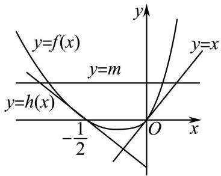
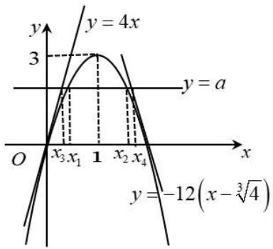

# 第22讲 双变量问题

# 知识梳理

破解双参数不等式的方法：

一是转化,即由已知条件入手,寻找双参数满足的关系式,并把含双参数的不等式转化为含单参数的不等式;

二是巧构函数,再借用导数,判断函数的单调性,从而求其最值;

三是回归双参的不等式的证明，把所求的最值应用到双参不等式，即可证得结果.

# 必考题型全归纳

# 1 题型一: 双变量单调问题

816 (2024·全国·高三专题练习)已知函数 $f(x) = (a + 1)\ln x + ax^2 + 1$ .

(1) 当 a=2 时, 求曲线 $y=f(x)$ 在 $(1,f(1))$ 处的切线方程;  
(2) 设 $a \leqslant -2$ , 证明: 对任意 $x_{1}, x_{2} \in (0, +\infty)$ , $|f(x_{1}) - f(x_{2})| \geqslant 4|x_{1} - x_{2}|$ .

【解析】(1) 当 a=2 时， $f(x)=3\ln x+2x^{2}+1$ ，∴ $f(1)=3$ ，切点为 (1,3)

求导 $f'(x)=\frac{3}{x}+4x$ ，切线斜率 $k=f'(1)=7$

∴ 曲线 $y = f(x)$ 在 $(1, f(1))$ 处的切线方程为 y = 7x - 4.

(2) $\because a\leqslant-2,f(x)$ 的定义域为 $(0,+\infty)$ ，求导 $f'(x)=\frac{a+1}{x}+2ax=\frac{2ax^{2}+a+1}{x}<0,$

∴ $f(x)$ 在 $(0, +\infty)$ 上单调递减.

不妨假设 $x_{1} \geqslant x_{2}, \therefore |f(x_{1}) - f(x_{2})| \geqslant 4|x_{1} - x_{2}|$ 等价于 $f(x_{2}) - f(x_{1}) \geqslant 4x_{1} - 4x_{2}$ .

即 $f(x_{2}) + 4x_{2}\geqslant f(x_{1}) + 4x_{1}.$

令 $g(x)=f(x)+4x$ ，则 $g'(x)=\frac{a+1}{x}+2ax+4=\frac{2ax^{2}+4x+a+1}{x}$ .

$$
\because a \leqslant - 2, x > 0, \therefore g ^ {\prime} (x) \leqslant \frac {- 4 x ^ {2} + 4 x - 1}{x} = \frac {- (2 x - 1) ^ {2}}{x} <   0.
$$

从而 $g(x)$ 在 $(0, +\infty)$ 单调减少，故 $g(x_{1}) \leqslant g(x_{2})$ ，即 $f(x_{2}) + 4x_{2} \geqslant f(x_{1}) + 4x_{1}$

故对任意 $x_{1}, x_{2} \in (0, +\infty), |f(x_{1}) - f(x_{2})| \geqslant 4|x_{1} - x_{2}|$ .

817 (2024·安徽·校联考三模)设 $a \in \mathbb{R}$ , 函数 $f(x) = a \ln(-x) + (a+1)x^2 + 1$ .

(I) 讨论函数 $f(x)$ 在定义域上的单调性;  
(II) 若函数 $f(x)$ 的图象在点 $(-1, f(-1))$ 处的切线与直线 $8x + y - 2 = 0$ 平行，且对任意 $x_{1}, x_{2} \in (-\infty, 0), x_{1} \neq x_{2}$ ，不等式 $\left|\frac{f(x_1) - f(x_2)}{x_1 - x_2}\right| > m$ 恒成立，求实数 $m$ 的取值范围.

【解析】(I) $f(x)$ 的定义域是 $(-∞,0)$ .

$$
f ^ {\prime} (x) = \frac {a}{x} + 2 (a + 1) x = \frac {2 (a + 1) x ^ {2} + a}{x}.
$$

(1) 当 $a \leqslant -1$ 时, $f'(x) > 0$ , $f(x)$ 的定义域 $(-∞, 0)$ 内单增;  
(2) 当 -1 < a < 0 时, 由 $2(a + 1)x^{2} + a = 0$ 得, $x = -\sqrt{-\frac{a}{2(a + 1)}}$ .

此时 $f(x)$ 在 $\left(-\infty, -\sqrt{-\frac{a}{2(a+1)}}\right)$ 内单增，在 $\left(-\sqrt{-\frac{a}{2(a+1)}}, 0\right)$ 内单减；

(3) 当 $a \geqslant 0$ 时, $f'(x) < 0$ , $f(x)$ 的定义域 $(-\infty, 0)$ 内单减.

(II) 因为 $f'(-1) = -8$ ，所以 $\frac{2(a+1)+a}{-1} = -8, a = 2.$

此时 $f(x) = 2\ln (-x) + 3x^{2} + 1.$

由（I）知，a=2 时， $f(x)$ 的定义域 $(-∞,0)$ 内单减.

不妨设 $x_{2}<x_{1}<0$ ,

则 $\left|\frac{f(x_{1})-f(x_{2})}{x_{1}-x_{2}}\right|>m$ , 即 $\left|f(x_{1})-f(x_{2})\right|>m\left|x_{1}-x_{2}\right|$

即 $f(x_{2}) + mx_{2} > f(x_{1}) + mx_{1}$ 恒成立.

令 $g(x)=f(x)+mx, x<0$ ，则 $g(x)$ 在 $(-∞,0)$ 内单减，即 $g'(x)≤0$ .

$$
g ^ {\prime} (x) = f ^ {\prime} (x) + m = \frac {2}{x} + 6 x + m \leqslant 0, m \leqslant - \frac {2}{x} - 6 x, x <   0.
$$

而 $-\frac{2}{x} - 6x \geqslant 4\sqrt{3}$ , 当且仅当 $x = -\frac{\sqrt{3}}{3}$ 时, $-\frac{2}{x} - 6x$ 取得最小值 $4\sqrt{3}$ ,

所以 $m \leqslant 4\sqrt{3}$ ，故实数 m 的取值范围是 $(-∞, 4\sqrt{3}]$ .

818 (2024·福建漳州·高二福建省漳州第一中学校考期末)已知函数 $f(x)=(a-1)\ln x+ax^{2}+$ 1.

(I) 讨论函数 $f(x)$ 的单调性；

(II) 若 $a \geqslant 1$ 时, 任意的 $x_{1} > x_{2} > 0$ , 总有 $|f(x_{1}) - f(x_{2})| > 2|x_{1} - x_{2}|$ , 求实数 $a$ 的取值范围.

【解析】( I ) $f'(x)=\frac{a-1}{x}+2ax=\frac{2ax^{2}+a-1}{x}(x>0)$

①当 $a \geqslant 1$ 时 $f'(x) > 0$ ，故 $f(x)$ 在 $(0, +\infty)$ 上单调递增；

②当 $a \leqslant 0$ 时 $f'(x) < 0$ ，故 $f(x)$ 在 $(0, +\infty)$ 上单调递减；

③当 0 < a < 1 时, 令 $f'(x) = 0$ 解得 $x = \sqrt{\frac{1 - a}{2a}}$

则当 $0 < x < \sqrt{\frac{1 - a}{2a}}$ 时， $f'(x) < 0$ ；

当 $x > \sqrt{\frac{1-a}{2a}}$ 时， $f'(x) > 0$ 故 $f(x)$ 在 $(0, \sqrt{\frac{1-a}{2a}})$ 上单调递减；在 $\sqrt{\frac{1-a}{2a}}, +\infty)$ 上单调递增；

综上所述: 当 $a \geqslant 1$ 时, $f'(x) > 0$ 故 $f(x)$ 在 $(0, +\infty)$ 上单调递增;

当 $a \leqslant 0$ 时, $f'(x) < 0$ 故 $f(x)$ 在 $(0, +\infty)$ 上单调递减;

当 0 < a < 1 时， $f(x)$ 在 $(0, \sqrt{\frac{1-a}{2a}})$ 上单调递减；在 $\sqrt{\frac{1-a}{2a}}, +\infty)$ 上单调递增.

(II) 由 (I) 知当 $a \geqslant 1$ 时 $f'(x) > 0$ 故 $f(x)$ 在 $(0, +\infty)$ 上单调递增；

对任意 $x_{1} > x_{2} > 0, f(x_{1}) > f(x_{2}) \therefore f(x_{1}) - f(x_{2}) > 2x_{1} - 2x_{2}$ 即 $f(x_{1}) - f(x_{2}) > 2x_{1} - 2x_{2}$

令 $g(x)=f(x)-2x$ ，因为 $x_{1}>x_{2}>0, f(x_{1})-f(x_{2})>2x_{1}-2x_{2}$

所以 $g(x)=f(x)-2x,$ 在 $(0,+\infty)$ 上单调递增; 所以 $g'(x)=\frac{a-1}{x}+2ax-2,$ 即 $\frac{a-1}{x}+2ax-2\geqslant0$ 在 $(0,+\infty)$ 上恒成立

故 $\left(\frac{1}{x} + 2x\right)a \geqslant 2 + \frac{1}{x}, \because x > 0, \therefore a \geqslant \frac{2 + \frac{1}{x}}{\frac{1}{x} + 2x} = \frac{2x + 1}{1 + 2x^2}$

令 $t=2x+1$ ，则 $x=\frac{t-1}{2}$ 又因为 x>0，所以 $t>1\therefore a\geqslant\frac{t}{2\left(\frac{t-1}{2}\right)^{2}+1}=\frac{t}{\frac{t^{2}-2t+1}{2}+1}$

$$
= \frac {2}{t + \frac {3}{t} - 2}
$$

$\because t>1\therefore t+\frac{3}{t}\geqslant2\sqrt{3}$ 当且仅当 $t=\sqrt{3}$ 时取等号, 所以 $\frac{2}{t+\frac{3}{t}-2}\leqslant\frac{\sqrt{3}+1}{2}$ ,

故不等式 $a \geqslant \frac{2}{t + \frac{3}{t} - 2}$ 恒成立的条件是 $a \geqslant \frac{\sqrt{3} + 1}{2}$ 即 $a \in \left[\frac{\sqrt{3} + 1}{2}, +\infty\right)$ .

所以,实数 a 的取值范围为 $\left[\frac{\sqrt{3}+1}{2},+\infty\right)$ .

819 (2024·全国·模拟预测)已知函数 $f(x) = \log_a x + \frac{m}{x} - \frac{1}{2}, m \in \mathbb{R}, a > 0$ 且 $a \neq 1$ .

(1) 当 a=2 时, 讨论 $f(x)$ 的单调性;  
(2) 当 $a = \mathrm{e}$ 时, 若对任意的 $x_{1} > x_{2} > 0$ , 不等式 $\frac{x_{2} f(x_{1}) - x_{1} f(x_{2})}{x_{1} - x_{2}} < \frac{1}{2}$ 恒成立, 求实数 $m$ 的取值范围.

【解析】(1) 函数 $f(x)$ 的定义域为 $(0, +\infty)$ ,

将 a=2 代入 $f(x)$ 的解析式, 得 $f(x)=\log_{2}x+\frac{m}{x}-\frac{1}{2}$ ,

求导得 $f'(x)=\frac{1}{x\ln2}-\frac{m}{x^{2}}=\frac{x-m\ln2}{x^{2}\ln2}$ .

当 $m \leqslant 0$ 时， $f'(x) > 0$ ，故 $f(x)$ 在 $(0, +\infty)$ 上单调递增；

当 m>0 时, 令 $f'(x)=0$ , 得 $x=m\ln2$ .

所以当 $x \in (0, m \ln 2)$ 时， $f'(x) < 0$ ，当 $x \in (m \ln 2, +\infty)$ 时， $f'(x) > 0$ ，于是 $f(x)$ 在区间 $(0, m \ln 2)$ 上单调递减，在区间 $(m \ln 2, +\infty)$ 上单调递增.

综上, 当 $m \leqslant 0$ 时, $f(x)$ 在 $(0, +\infty)$ 上单调递增; 当 m > 0 时, $f(x)$ 在区间 $(0, m \ln 2)$ 上单调递减, 在区间 $(m \ln 2, +\infty)$ 上单调递增.

(2) 当 $a = \mathrm{e}$ 时, $f(x) = \ln x + \frac{m}{x} - \frac{1}{2}$ .

因为 $x_{1}>x_{2}>0$ ，所以不等式。 $\frac{x_{2}f(x_{1})-x_{1}f(x_{2})}{x_{1}-x_{2}}<\frac{1}{2}$ 可化为 $\frac{f(x_{1})}{x_{1}}+\frac{1}{2x_{1}}<\frac{f(x_{2})}{x_{2}}+\frac{1}{2x_{2}}$

所以 $\frac{\ln x_{1}}{x_{1}} + \frac{m}{x_{1}^{2}} < \frac{\ln x_{2}}{x_{2}} + \frac{m}{x_{2}^{2}}$ 对任意的 $x_{1} > x_{2} > 0$ 恒成立，所以函数 $g(t) = \frac{\ln t}{t} + \frac{m}{t^{2}}$ 为 $(0, +\infty)$ 上的减函数，

所以 $g'(t)=\frac{1-\ln t}{t^{2}}-\frac{2m}{t^{3}}\leqslant0$ 在 $(0,+\infty)$ 上恒成立，可得 $2m\geqslant t-t\ln t$ 在 $(0,+\infty)$ 上恒成立，

设 $h(t)=t-t\ln t$ ，则 $h'(t)=-\ln t$ ，令 $h'(t)=0$ ，得t=1。

所以当 $t \in (0,1)$ 上单调递增，在区间 $(1,+\infty)$ 上单调递减，

所以 $h(t)_{\max}=h(1)=1$ , 得 $m \geqslant \frac{1}{2}$ .

所以实数 m 的取值范围为 $\left[\frac{1}{2}, +\infty\right)$ .

820 (2024·天津南开·高三南开大学附属中学校考开学考试)已知函数 $f(x)=\ln x+ax^{2}+(2a+1)x$ .

(1) 讨论 $f(x)$ 的单调性；

(2) 当 $a < 0$ 时, 证明 $f(x) \leqslant -\frac{3}{4a} - 2$ ;  
(3) 若对任意的不等正数 $x_{1}, x_{2}$ , 总有 $\frac{f(x_{1}) - f(x_{2})}{x_{1} - x_{2}} > 2$ , 求实数 $a$ 的取值范围.

【解析】(1)由题意得: $f(x)$ 定义域为 $(0, +\infty)$ , $f'(x) = \frac{1}{x} + 2ax + (2a + 1) = \frac{(2ax + 1)(x + 1)}{x}$ ;

当 $a \geqslant 0$ 时， $2ax + 1 > 0, x + 1 > 0, \therefore f'(x) > 0$ 在 $(0, +\infty)$ 上恒成立，

∴ $f(x)$ 在 $(0, +\infty)$ 上单调递增；

当 a<0 时, 令 $f'(x)=0$ , 解得: $x=-\frac{1}{2a}$ ,

∴ 当 $x \in \left(0, -\frac{1}{2a}\right)$ 时， $f'(x) > 0$ ; 当 $x \in \left(-\frac{1}{2a}, +\infty\right)$ 时， $f'(x) < 0$ ;

$\therefore f(x)$ 在 $\left(0, -\frac{1}{2a}\right)$ 上单调递增，在 $\left(-\frac{1}{2a}, +\infty\right)$ 上单调递减；

综上所述: 当 $a \geqslant 0$ 时, $f(x)$ 在 $(0, +\infty)$ 上单调递增; 当 a < 0 时, $f(x)$ 在 $\left(0, -\frac{1}{2a}\right)$ 上单调递增, 在 $\left(-\frac{1}{2a}, +\infty\right)$ 上单调递减.

(2) 由 (1) 知: $f(x)_{\max} = f\left(-\frac{1}{2a}\right) = \ln\left(-\frac{1}{2a}\right) - \frac{1}{4a} - 1$ ;

要证 $f(x) \leqslant -\frac{3}{4a} - 2$ ，只需证 $\ln \left(-\frac{1}{2a}\right) - \frac{1}{4a} - 1 \leqslant -\frac{3}{4a} - 2$ ，即证 $\ln \left(-\frac{1}{2a}\right) + \frac{1}{2a} + 1 \leqslant 0$ ;

设 $g(x)=\ln x-x+1$ , 则 $g'(x)=\frac{1}{x}-1=\frac{1-x}{x}$

∴ 当 $x \in (0,1)$ 时， $g'(x) > 0$ ; 当 $x \in (1, +\infty)$ 时， $g'(x) < 0$ ;

∴ $g(x)$ 在 $(0,1)$ 上单调递增，在 $(1,+\infty)$ 上单调递减，∴ $g(x)_{\max}=g(1)=0$ ;

又 $-\frac{1}{2a} > 0, \therefore g\left(-\frac{1}{2a}\right) = \ln\left(-\frac{1}{2a}\right) + \frac{1}{2a} + 1 \leqslant 0$ ，即 $f(x) \leqslant -\frac{3}{4a} - 2$ .

(3) 不妨设 $0 < x_{1} < x_{2}$ , 则由 $\frac{f(x_1) - f(x_2)}{x_1 - x_2} > 2$ 得: $f(x_1) - f(x_2) < 2x_1 - 2x_2$ ,

即 $f(x_{1}) - 2x_{1} <   f(x_{2}) - 2x_{2},$

令 $h(x) = f(x) - 2x$ ，则 $h(x)$ 在 $(0, + \infty)$ 上单调递增，

$\therefore h^{\prime}(x) = f^{\prime}(x) - 2 = \frac{1}{x} +2ax + 2a - 1\geqslant 0$ 在 $(0, + \infty)$ 上恒成立，

即 $2a(x + 1) \geqslant 1 - \frac{1}{x} = \frac{x - 1}{x}$ , 又 $x + 1 > 0$ , $\therefore 2a \geqslant \frac{x - 1}{x(x + 1)} = \frac{x - 1}{x^2 + x}$ ;

令 $m(x)=\frac{x-1}{x^{2}+x}(x>0)$ ，则 $m'(x)=\frac{x^{2}+x-(x-1)(2x+1)}{(x^{2}+x)^{2}}=\frac{-x^{2}+2x+1}{(x^{2}+x)^{2}}$

令 $m'(x)=0$ ，解得： $x=1-\sqrt{2}$ （舍）或 $x=\sqrt{2}+1$ ，

∴ 当 $x \in (0, \sqrt{2} + 1)$ 时， $m'(x) > 0$ ; 当 $x \in (\sqrt{2} + 1, +\infty)$ 时， $m'(x) < 0$ ;

∴ $m(x)$ 在 $(0, \sqrt{2} + 1)$ 上单调递增，在 $(\sqrt{2} + 1, +\infty)$ 上单调递减，

$\therefore m(x)_{\max} = m(\sqrt{2} + 1) = \frac{\sqrt{2}}{4 + 3\sqrt{2}} = 3 - 2\sqrt{2}, \therefore 2a \geqslant 3 - 2\sqrt{2}$ , 解得: $a \geqslant \frac{3 - 2\sqrt{2}}{2}$ ;

∴ a 的取值范围为 $\left[\frac{3-2\sqrt{2}}{2}, +\infty\right)$ .

# 2 题型二: 双变量不等式: 转化为单变量问题

821 (2024·全国·高三专题练习)已知函数 $f(x)=\frac{1}{x}-x+a\ln x$ .

(1) 讨论 $f(x)$ 的单调性;  
(2) 已知 $a < \frac{5}{2}$ , 若 $f(x)$ 存在两个极值点 $x_1, x_2$ , 且 $x_1 < x_2$ , 求 $\frac{f(x_2)}{x_1} + \frac{f(x_1)}{x_2}$ 的取值范围.

【解析】(1) 函数 $f(x)$ 的定义域为 $(0, +\infty)$ , $f'(x) = -\frac{1}{x^{2}} - 1 + \frac{a}{x} = -\frac{x^{2} - ax + 1}{x^{2}}$ ,

当 $a \leqslant 2$ 时， $x^2 - ax + 1 = (x^2 + 1) - ax \geqslant 2x - ax \geqslant 0$ ，当且仅当 $a = 2, x = 1$ 即“=”，则 $f'(x) \leqslant 0, f(x)$ 在 $(0, +\infty)$ 上单调递减，

当 a > 2 时，方程 $x^{2} - ax + 1 = 0$ 有两个正根为 $x_{1} = \frac{a - \sqrt{a^{2} - 4}}{2}$ ， $x_{2} = \frac{a + \sqrt{a^{2} - 4}}{2}$ ，

当 $0 < x < \frac{a - \sqrt{a^2 - 4}}{2}$ 或 $x > \frac{a + \sqrt{a^2 - 4}}{2}$ 时， $f'(x) < 0$ ，当 $\frac{a - \sqrt{a^2 - 4}}{2} < x < \frac{a + \sqrt{a^2 - 4}}{2}$ 时， $f'(x) > 0$ ，

于是得 $f(x)$ 在 $\left(0, \frac{a - \sqrt{a^2 - 4}}{2}\right), \left(\frac{a + \sqrt{a^2 - 4}}{2}, +\infty\right)$ 上单调递减，在 $\left(\frac{a - \sqrt{a^2 - 4}}{2}, \frac{a + \sqrt{a^2 - 4}}{2}\right)$ 上单调递增；

(2) 因 $f(x)$ 存在两个极值点 $x_{1}, x_{2}$ ，且 $x_{1} < x_{2}$ ，由 (1) 知 a > 2，即 $2 < a < \frac{5}{2}$ ，则 $x_{1} + x_{2} = a, x_{1}x_{2} = 1$ ，

显然， $x_{2} = \frac{a + \sqrt{a^{2} - 4}}{2}$ 对 $a\in \left(2,\frac{5}{2}\right)$ 是递增的，从而有 $1 <   x_{2} <   2$

$$
\begin{array}{l} \frac {f \left(x _ {2}\right)}{x _ {1}} + \frac {f \left(x _ {1}\right)}{x _ {2}} = x _ {2} f \left(x _ {2}\right) + x _ {1} f \left(x _ {1}\right) = 1 - x _ {2} ^ {2} + a x _ {2} \ln x _ {2} + 1 - x _ {1} ^ {2} + a x _ {1} \ln x _ {1} \\ = 2 - x _ {2} ^ {2} - x _ {1} ^ {2} + \left(x _ {1} + x _ {2}\right) \left(x _ {2} \ln x _ {2} + x _ {1} \ln x _ {1}\right) = 2 - x _ {2} ^ {2} - x _ {1} ^ {2} + x _ {2} ^ {2} \ln x _ {2} + x _ {1} ^ {2} \ln x _ {1} \\ = 2 - x _ {2} ^ {2} - \frac {1}{x _ {2} ^ {2}} + \left(x _ {2} ^ {2} - \frac {1}{x _ {2} ^ {2}}\right) \ln x _ {2}, \\ \end{array}
$$

令 $g(x) = 2 - x^{2} - \frac{1}{x^{2}} +\left(x^{2} - \frac{1}{x^{2}}\right)\ln x(1 <   x <   2),$

$$
\begin{array}{l} g ^ {\prime} (x) = - 2 x + \frac {2}{x ^ {3}} + \left(2 x + \frac {2}{x ^ {3}}\right) \ln x + \left(x ^ {2} - \frac {1}{x ^ {2}}\right) \cdot \frac {1}{x} = - x + \frac {1}{x ^ {3}} + \left(x + \frac {1}{x ^ {3}}\right) \cdot 2 \ln x = \frac {1 - x ^ {4}}{x ^ {3}} \\ + \frac {1 + x ^ {4}}{x ^ {3}} \cdot 2 \ln x = \frac {1 + x ^ {4}}{x ^ {3}} \left(\frac {1 - x ^ {4}}{1 + x ^ {4}} + 2 \ln x\right), \\ \end{array}
$$

令 $h(x)=\frac{1-x^{4}}{1+x^{4}}+2\ln x(1<x<2)$ ， $h'(x)=\frac{-8x^{3}}{(1+x^{4})^{2}}+\frac{2}{x}=\frac{-8x^{4}+2(1+x^{4})^{2}}{(1+x^{4})^{2}x}=$

$$
\frac {2 (1 - x ^ {4}) ^ {2}}{(1 + x ^ {4}) ^ {2} x} > 0,
$$

即 $h(x)$ 在 $(1,2)$ 上单调递增， $h(x)>h(1)=0$ ，则 $g'(x)>0$ ，于是得 $g(x)$ 在 $(1,2)$ 上单调递增，

从而得 $g(1) < g(x) < g(2)$ ，即 $0 < g(x) < \frac{15}{4} \ln 2 - \frac{9}{4}$ ,

所以 $\frac{f(x_{2})}{x_{1}}+\frac{f(x_{1})}{x_{2}}$ 的取值范围 $\left(0,\frac{15}{4}\ln2-\frac{9}{4}\right)$ .

822 (2024·新疆·高二克拉玛依市高级中学校考阶段练习)已知函数 $f(x)=\ln x+x^{2}-ax(a\in\mathbb{R})$

(1) 若 a=1，求函数 $f(x)$ 在点 $(1, f(1))$ 处的切线方程；

(2) 当 a > 0 时, 讨论 $f(x)$ 的单调性;

(1) 若 a=1，求函数 $f(x)$ 在点 $(1, f(1))$ 处的切线方程；
(2) 当 a > 0 时，讨论 $f(x)$ 的单调性；

(3) 设 $f(x)$ 存在两个极值点 $x_{1}, x_{2}$ 且 $x_{1} < x_{2}$ ，若 $0 < x_{1} < \frac{1}{2}$ 求证： $f(x_{1}) - f(x_{2}) > \frac{3}{4} - \ln 2$ .

【解析】(1) 若 a=1，则 $f(x)=\ln x+x^{2}-x$ ，所以 $f(1)=0$ ，又 $f'(x)=\frac{1}{x}+2x-1$ ，所以 $f'(1)=2$ ，即 $f(x)$ 在点 $(1,0)$ 处的切线斜率为 2，所以切线方程为 2x-y-2=0.

(2) $f(x)$ 的定义域为 $(0, +\infty)$ , $f'(x) = \frac{1}{x} + 2x - a = \frac{2x^2 - ax + 1}{x}$ , 设 $h(x) = 2x^2 - ax + 1$ , 其 $\Delta = a^2 - 8 (a > 0)$ .

①当 $\Delta \leqslant 0$ 时，即 $0 < a \leqslant 2\sqrt{2}$ 时， $h(x) \geqslant 0$ ，即 $f'(x) \geqslant 0$ ，此时 $f(x)$ 在 $(0, +\infty)$ 为单调递增函数.  
② 当 $\Delta > 0$ 时, 即 $a > 2\sqrt{2}$ 时, 设 $h(x) = 0$ 两根为 $x_{1,2} = \frac{a \pm \sqrt{a^2 - 8}}{4} (x_1 < x_2)$ .

当 $x \in (0, x_1) \cup (x_2, +\infty)$ 时， $h(x) > 0$ ，即 $f'(x) > 0$ ，即 $f(x)$ 的增区间为 $(0, x_1), (x_2, +\infty)$ .

当 $x \in (x_{1}, x_{2})$ 时， $h(x) < 0$ ，即 $f'(x) < 0$ ，即 $f(x)$ 的减区间为 $(x_{1}, x_{2})$ .

综上: 当 $0 < a \leqslant 2\sqrt{2}$ 时, $f(x)$ 的单增区间为 $(0, +\infty)$ ;

当 $a > 2\sqrt{2}$ 时， $f(x)$ 的增区间为 $\left(0, \frac{a - \sqrt{a^2 - 8}}{4}\right), \left(\frac{a + \sqrt{a^2 - 8}}{4}, +\infty\right)$ ，

减区间为 $\left(\frac{a-\sqrt{a^{2}-8}}{4},\frac{a+\sqrt{a^{2}-8}}{4}\right)$ .

(3) 由 (2) $f'(x)=\frac{1}{x}+2x-a=\frac{2x^{2}-ax+1}{x},x>0,$

因为 $f(x)$ 存在两个极值点 $x_{1}, x_{2}$ ，所以 $2x^{2} - at + 1 = 0$ 存在两个互异的正实数根 $x_{1}, x_{2}$ ，

所以 $x_{1}+x_{2}=\frac{a}{2}$ ， $x_{1}x_{2}=\frac{1}{2}$ ，则 $x_{2}=\frac{1}{2x_{1}}$ ，所以 $\frac{x_{1}}{x_{2}}=\frac{x_{1}}{\frac{1}{2x_{1}}}=2x_{1}^{2}$

所以 $f(x_{1}) - f(x_{2}) = \ln x_{1} + x_{1}^{2} - ax_{1} - (\ln x_{2} - x_{2}^{2} + ax_{2})$

$$
= \ln \frac {x _ {1}}{x _ {2}} + \left[ x _ {1} ^ {2} - x _ {2} ^ {2} - 2 \left(x _ {1} + x _ {2}\right) \left(x _ {1} - x _ {2}\right) \right] = \ln \frac {x _ {1}}{x _ {2}} + \left(- x _ {1} ^ {2} + x _ {2} ^ {2}\right)
$$

$$
= \ln 2 + 2 \ln x _ {1} - x _ {1} ^ {2} + \frac {1}{4 x _ {1} ^ {2}}.
$$

令 $g(x_{1}) = \ln 2 + 2\ln x_{1} - x_{1}^{2} + \frac{1}{4x_{1}^{2}}$ ，则 $g^{\prime}(x_1) = \frac{2}{x_1} -2x_1 - \frac{1}{2x_1^3} = -\frac{(2x_1^2 - 1)^2}{2x_1^3},$

$\because 0 < x_{1} < \frac{1}{2}, \therefore g'(x_{1}) < 0, \therefore g(x_{1})$ 在 $\left(0, \frac{1}{2}\right)$ 上单调递减，

$$
\therefore g (x _ {1}) > g \Big (\frac {1}{2} \Big), \text {而} g \Big (\frac {1}{2} \Big) = \frac {3}{4} - \ln 2,
$$

即 $g(x_{1}) > \frac{3}{4} -\ln 2,\therefore f(x_{1}) - f(x_{2}) > \frac{3}{4} -\ln 2.$

823 (2024·山东东营·高二东营市第一中学校考开学考试)已知函数 $f(x)=x^{2}+ax+2\ln x$ (a 为常数)

(1) 讨论 $f(x)$ 的单调性  
(2) 若函数 $f(x)$ 存在两个极值点 $x_{1}, x_{2}(x_{1}<x_{2})$ ，且 $x_{2}-x_{1}\leqslant\frac{8}{3}$ ，求 $f(x_{1})-f(x_{2})$ 的范围.

【解析】(1) $\because f'(x)=2x+a+\frac{2}{x}=\frac{2x^{2}+ax+2}{x}$ ,

$\Delta=a^{2}-16$ , 当 $-4\leqslant a\leqslant4$ 时, $\Delta\leqslant0$ , $f'(x)\geqslant0$ , $f(x)$ 在定义域 $(0,+\infty)$ 上单调递增;

当 a > 4 时，在定义域 $(0, +\infty)$ 上 $f'(x) > 0$ ,

∴ a > 4 时， $f(x)$ 在定义域 $(0, +\infty)$ 上单调递增；

当 a<-4 时，令 $f'(x)=0$ 得 $x_{1}=\frac{-a-\sqrt{a^{2}-16}}{4}$ ， $x_{2}=\frac{-a+\sqrt{a^{2}-16}}{4}$ ，

$x \in (0, x_{1}), x \in (x_{2}, +\infty)$ 时， $f'(x) > 0; x \in (x_{1}, x_{2})$ 时 $f'(x) < 0,$

则 $f(x)$ 在 $(0, x_{1})$ , $(x_{2}, +\infty)$ 上单调递增，在 $(x_{1}, x_{2})$ 上单调递减.

综上可知: 当 $a \geqslant -4$ 时, $f(x)$ 在定义域 $(0, +\infty)$ 上单调递增;

当 a<-4 时， $f(x)$ 在 $(0,x_{1})$ ， $(x_{2},+\infty)$ 上单调递增，在 $(x_{1},x_{2})$ 上单调递减。（其中 $x_{1}=$

$$
\frac {- a - \sqrt {a ^ {2} - 1 6}}{4}, x _ {2} = \frac {- a + \sqrt {a ^ {2} - 1 6}}{4})
$$

(2) 由 (1) 知 $f(x)$ 有两个极值点, 则 $a < -4$ ,

$f^{\prime}(x) = 2x + a + \frac{2}{x} = \frac{2x^{2} + ax + 2}{x} = 0\Rightarrow 2x^{2} + ax + 2 = 0$ 的二根为 $x_{1},x_{2}$

则 $\left\{\begin{aligned}x_{1}+x_{2}&=-\frac{a}{2},\\ x_{1}x_{2}&=1\end{aligned}\right.$ ， $0<x_{1}<1<x_{2}$

$$
f \left(x _ {1}\right) - f \left(x _ {2}\right) = \left(x _ {1} ^ {2} + a x _ {1} + 2 \ln x _ {1}\right) - \left(x _ {2} ^ {2} + a x _ {2} + 2 \ln x _ {2}\right) = \left(x _ {1} ^ {2} - x _ {2} ^ {2}\right) + a \left(x _ {1} - x _ {2}\right) + 2 \ln \frac {x _ {1}}{x _ {2}}
$$

$$
= \left(x _ {1} ^ {2} - x _ {2} ^ {2}\right) - 2 \left(x _ {1} - x _ {2}\right) \left(x _ {1} + x _ {2}\right) + 2 \ln \frac {x _ {1}}{x _ {2}} = x _ {2} ^ {2} - x _ {1} ^ {2} + 2 \ln \frac {x _ {1}}{x _ {2}} = x _ {2} ^ {2} - \frac {1}{x _ {2} ^ {2}} - 2 \ln x _ {2} ^ {2},
$$

设 $t = x_2^2$ ，又 $x_{2} - x_{1}\leqslant \frac{8}{3}\Leftrightarrow 3x_{2}^{2} - 8x_{2} - 3\leqslant 0\Leftrightarrow 1 <   x_{2}\leqslant 3,\therefore t\in (1,9].$

则 $f(x_{1})-f(x_{2})=g(t)=t-\frac{1}{t}-2\ln t,\ g'(t)=1+\frac{1}{t^{2}}-\frac{2}{t}=\frac{(t-1)^{2}}{t^{2}}>0,$

$\therefore g(t)$ 在 $(1,9]$ 递增， $g(1) < g(t) \leqslant g(9) \Leftrightarrow 0 < g(t) \leqslant \frac{80}{9} - 4\ln 3.$

即 $f(x_{1})-f(x_{2})$ 的范围是 $\left(0,\frac{80}{9}-4\ln3\right]$

824 (2024·山东·山东省实验中学校联考模拟预测)已知函数 $f(x)=\ln x+\frac{1}{2}(a-x)^{2}$ ，其中 $a \in R$ .

(1) 当 a=1 时, 求函数 $f(x)$ 在 $(1,f(1))$ 处的切线方程;  
(2) 讨论函数 $f(x)$ 的单调性;  
(3) 若 $f(x)$ 存在两个极值点 $x_{1}, x_{2} (x_{1} < x_{2}), |f(x_{2}) - f(x_{1})|$ 的取值范围为

$\left(\frac{3}{4} - \ln 2, \frac{15}{8} - 2 \ln 2\right)$ , 求 $a$ 的取值范围.

【解析】(1) 当 a=1 时, $f(x)=\ln x+\frac{1}{2}(1-x)^{2}$ , 定义域为 $(0,+\infty)$ ,

所以 $f'(x)=\frac{1}{x}-(1-x)$ ,

所以 $k=f'(1)=1$ ，又 $f(1)=0$ ，

所以函数 $f(x)$ 在 $(1, f(1))$ 处的切线方程为 y = x - 1，即 x - y - 1 = 0.

(2) $f(x)$ 的定义域是 $(0,+\infty)$ ,

$$
f (x) = \ln x + \frac {1}{2} x ^ {2} - a x + \frac {1}{2} a ^ {2}, f ^ {\prime} (x) = \frac {1}{x} + x - a = \frac {x ^ {2} - a x + 1}{x},
$$

令 $g(x)=x^{2}-ax+1$ ，则 $\Delta=a^{2}-4$ 。

①当 $a \leqslant 0$ 或 $\Delta \leqslant 0$ ，即 $a \leqslant 2$ 时， $f'(x) \geqslant 0$ 恒成立，所以 $f(x)$ 在 $(0, +\infty)$ 上单调递增.  
②当 $\left\{\begin{aligned}a&>0\\ \Delta&>0\end{aligned}\right.$ ，即 a>2 时，由 $f'(x)>0$ ，得 $0<x<\frac{a-\sqrt{a^{2}-4}}{2}$ 或 $x>\frac{a+\sqrt{a^{2}-4}}{2}$ ;

由 $f'(x)<0$ ，得 $\frac{a-\sqrt{a^{2}-4}}{2}<x<\frac{a+\sqrt{a^{2}-4}}{2}$

所以 $f(x)$ 在 $\left(0, \frac{a - \sqrt{a^2 - 4}}{2}\right)$ 和 $\left(\frac{a + \sqrt{a^2 - 4}}{2}, +\infty\right)$ 上单调递增，在 $\left(\frac{a - \sqrt{a^2 - 4}}{2}, \frac{a + \sqrt{a^2 - 4}}{2}\right)$ 上单调递减.

综上所述, 当 $a \leqslant 2$ 时, $f(x)$ 在 $(0, +\infty)$ 上单调递增;

当 a > 2 时， $f(x)$ 在 $\left(0, \frac{a - \sqrt{a^{2} - 4}}{2}\right)$ 和 $\left(\frac{a + \sqrt{a^{2} - 4}}{2}, +\infty\right)$ 上单调递增，在

$\left(\frac{a - \sqrt{a^2 - 4}}{2},\frac{a + \sqrt{a^2 - 4}}{2}\right)$ 上单调递减

(3) 由 (2) 当 $a \leqslant 2$ 时, $f(x)$ 在 $(0, +\infty)$ 上单调递增, 此时函数 $f(x)$ 无极值;

当 a > 2 时, $f(x)$ 有两个极值点, 即方程 $x^{2} - ax + 1 = 0$ 有两个正根 $x_{1}, x_{2}$ ,

所以 $x_{1} \cdot x_{2} = 1, x_{1} + x_{2} = a$ ，则 $f(x)$ 在 $(x_{1}, x_{2})$ 上是减函数。所以 $f(x_{1}) > f(x_{2})$ ，

因为 $f(x)=\ln x+\frac{1}{2}x^{2}-ax+\frac{1}{2}a^{2}$ ,

所以 $\left|f(x_{2})-f(x_{1})\right|=f(x_{1})-f(x_{2})$

$$
= \ln x _ {1} + \frac {1}{2} x _ {1} ^ {2} - a x _ {1} + \frac {1}{2} a ^ {2} - \left(\ln x _ {2} + \frac {1}{2} x _ {2} ^ {2} - a x _ {2} + \frac {1}{2} a ^ {2}\right)
$$

$$
= \ln \frac {x _ {1}}{x _ {2}} + \frac {1}{2} \left(x _ {1} ^ {2} - x _ {2} ^ {2}\right) - a \left(x _ {1} - x _ {2}\right)
$$

$$
= \ln \frac {x _ {1}}{x _ {2}} + \frac {1}{2} \left(x _ {1} ^ {2} - x _ {2} ^ {2}\right) - \left(x _ {1} + x _ {2}\right) \left(x _ {1} - x _ {2}\right)
$$

$$
= \ln \frac {x _ {1}}{x _ {2}} - \frac {1}{2} \left(x _ {1} ^ {2} - x _ {2} ^ {2}\right)
$$

$$
= \ln \frac {x _ {1}}{x _ {2}} - \frac {x _ {1} ^ {2} - x _ {2} ^ {2}}{2 x _ {1} x _ {2}}
$$

$$
= \ln \frac {x _ {1}}{x _ {2}} - \frac {x _ {1}}{2 x _ {2}} + \frac {x _ {2}}{2 x _ {1}},
$$

令 $t = \frac{x_1}{x_2} (0 < t < 1)$ ，则 $f(x_{1}) - f(x_{2}) = h(t) = \ln t - \frac{1}{2} t + \frac{1}{2t}$ ，

$$
h ^ {\prime} (t) = \frac {1}{t} - \frac {1}{2} - \frac {1}{2 t ^ {2}} = \frac {- t ^ {2} + 2 t - 1}{2 t ^ {2}} = \frac {- (t - 1) ^ {2}}{2 t ^ {2}} <   0,
$$

所以 $h(t)$ 在 $(0,1)$ 上单调递减，

又 $h\left(\frac{1}{2}\right) = \frac{3}{4} - \ln 2, h\left(\frac{1}{4}\right) = \frac{15}{8} - 2\ln 2$ ，且 $h\left(\frac{1}{2}\right) = \frac{3}{4} - \ln 2 < h(t) < \frac{15}{8} - 2\ln 2 = h\left(\frac{1}{4}\right)$ ，

所以 $\frac{1}{4} < t < \frac{1}{2}$ ,

由 $a^{2}=\frac{(x_{1}+x_{2})^{2}}{x_{1}x_{2}}=t+\frac{1}{t}+2,t\in\left(\frac{1}{4},\frac{1}{2}\right)$ ,

又 $g(t)=t+\frac{1}{t}+2$ 在 $\left(\frac{1}{4},\frac{1}{2}\right)$ 上单调递减，

所以 $\frac{9}{2}<a^{2}<\frac{25}{4}$ 且 a>2，所以实数 a 的取值范围为 $\left(\frac{3\sqrt{2}}{2},\frac{5}{2}\right)$ .

825 (2024·江苏苏州·高三统考阶段练习)已知函数 $f(x) = \frac{-x^2 + (a - 2)x + a - 3}{\mathrm{e}^x} (x > 0)$

(1) 讨论函数 $f(x)$ 的单调性；  
(2) 若函数 $f(x)$ 存在两个极值点 $x_{1}, x_{2}$ ，记 $h(x_{1}, x_{2}) = f(x_{1}) f(x_{2})$ ，求 $h(x_{1}, x_{2})$ 的取值范围.

【解析】(1) $f(x)$ 的定义域为 $(0,+\infty)$ ，对 $f(x)$ 求导得：

$$
f ^ {\prime} (x) = \frac {\mathrm{e} ^ {x} (- 2 x + a - 2) - \mathrm{e} ^ {x} [ - x ^ {2} + (a - 2) x + a - 3 ]}{\mathrm{e} ^ {2 x}} = \frac {x ^ {2} - a x + 1}{\mathrm{e} ^ {x}},
$$

令 $g(x)=x^{2}-ax+1,x>0$

1) 若 $a \leqslant 0$ ，则 $g(x) > 0$ ，即 $f'(x) > 0$ ，所以 $f(x)$ 在 $(0, +\infty)$ 上单调递增.  
2) 若 a > 0,

①当 $\Delta \leqslant 0$ 时，即 $0 < a \leqslant 2$ ，则 $g(x) \geqslant 0$ ，即 $f'(x) \geqslant 0$ ，所以 $f(x)$ 在 $(0, +\infty)$ 上单调递增.

②当 $\Delta > 0$ 时, 即 a > 2, 由 $g(x) = 0$ , 得 $x_{1,2} = \frac{a \pm \sqrt{a^{2} - 4}}{2}$

当 $x \in \left(0, \frac{a - \sqrt{a^2 - 4}}{2}\right) \cup \left(\frac{a + \sqrt{a^2 - 4}}{2}, +\infty\right)$ 时， $f'(x) > 0$

当 $x \in \left(\frac{a - \sqrt{a^2 - 4}}{2}, \frac{a + \sqrt{a^2 - 4}}{2}\right)$ 时， $f'(x) < 0$

综上所述, 当 $a \leqslant 2$ 时, $f(x)$ 在 $(0, +\infty)$ 上单调递增;

当 $a > 2$ 时， $f(x)$ 在 $\left(0, \frac{a - \sqrt{a^2 - 4}}{2}\right), \left(\frac{a + \sqrt{a^2 - 4}}{2}, +\infty\right)$ 上是单调递增的，

在 $\left(\frac{a - \sqrt{a^2 - 4}}{2},\frac{a + \sqrt{a^2 - 4}}{2}\right)$ 上是单调递减的.

(2) 由 (1) 知, $f(x)$ 存在两个极值点当且仅当 $a > 2$ .

由于 $f(x)$ 的两个极值点 $x_{1}, x_{2}$ 满足 $x^{2} - ax + 1 = 0$ ,

所以 $x_{1}x_{2}=1, x_{1}+x_{2}=a,$

所以 $f(x_{1})=\frac{-x_{1}^{2}+(a-2)x_{1}+a-3}{\mathrm{e}^{x_{1}}}=\frac{a-2-2x_{1}}{\mathrm{e}^{x_{1}}}$ ,

同理 $f(x_{2}) = \frac{-x_{2}^{2} + (a - 2)x_{2} + a - 3}{\mathrm{e}^{x_{2}}} = \frac{a - 2 - 2x_{2}}{\mathrm{e}^{x_{2}}},$

$$
h \left(x _ {1}, x _ {2}\right) = f \left(x _ {1}\right) f \left(x _ {2}\right) = \frac {a - 2 - 2 x _ {1}}{\mathrm{e} ^ {x _ {1}}} \times \frac {a - 2 - 2 x _ {2}}{\mathrm{e} ^ {x _ {2}}}
$$

$$
= \frac {(a - 2) ^ {2} - 2 (a - 2) \left(x _ {1} + x _ {2}\right) + 4 x _ {1} x _ {2}}{\mathrm{e} ^ {x _ {1} + x _ {2}}},
$$

所以 $h(x_{1},x_{2})=\frac{(a-2)^{2}-2(a-2)(x_{1}+x_{2})+4x_{1}x_{2}}{\mathrm{e}^{x_{1}+x_{2}}}=\frac{8-a^{2}}{\mathrm{e}^{a}}$ ,

令 $\varphi(a)=\frac{8-a^{2}}{\mathrm{e}^{a}}$ ，所以 $\varphi'(a)=\frac{a^{2}-2a-8}{\mathrm{e}^{a}}$

所以 $\varphi(a)$ 在 $(2,4)$ 上是单调递减的，在 $(4,+\infty)$ 上是单调递增的

因为 $\varphi(2) = \frac{4}{\mathrm{e}^2}$ , $\varphi(4) = -\frac{8}{\mathrm{e}^4}$ , 且当 $a \in (4, +\infty)$ , $\varphi(4) < \varphi(a) < 0$ .

所 $\varphi(a) \in \left[-\frac{8}{\mathrm{e}^4}, \frac{4}{\mathrm{e}^2}\right)$ , 所以 $h(x_1, x_2)$ 的取值范围是 $\left[-\frac{8}{\mathrm{e}^4}, \frac{4}{\mathrm{e}^2}\right)$ .

826 (2024·全国·高三专题练习)已知函数 $f(x) = \frac{1}{2}(x^2 + 1) + a(\ln x - 4x + 1)$ .

(1) 讨论 $f(x)$ 的单调性;  
(2) 若 $f(x)$ 存在两个极值点 $x_{1}, x_{2}$ ，且 $f(x_{1}) + f(x_{2}) \geqslant f'(x_{1}x_{2}) - 4a$ ，求 a 的取值范围.

【解析】(1)由题意,函数 $f(x)=\frac{1}{2}(x^{2}+1)+a(\ln x-4x+1)$ ,

可得 $f'(x)=x-4a+\frac{a}{x}=\frac{x^{2}-4ax+a}{x}$ ，其中x>0，

当 $\Delta = 16a^{2} - 4a \leqslant 0$ 时，即 $0 \leqslant a \leqslant \frac{1}{4}$ 时， $f'(x) > 0$ ，所以 $f(x)$ 在 $(0, +\infty)$ 上单调递增；

当 a<0 时, 令 $f'(x)=0$ , 即 $x^{2}-4ax+a=0$ ,

解得 $x_{1} = 2a - \sqrt{4a^{2} - a} < 0, x_{2} = 2a + \sqrt{4a^{2} - a} > 0,$

当 $x \in (0, 2a + \sqrt{4a^{2} - a})$ 时， $f'(x) < 0, f(x)$ 单调递减；

当 $x \in (2a + \sqrt{4a^{2} - a}, +\infty)$ 时， $f'(x) > 0, f(x)$ 单调递增，

所以函数 $f(x)$ 在区间 $(0,2a+\sqrt{4a^{2}-a})$ 单调递减，在 $(2a+\sqrt{4a^{2}-a},+\infty)$ 单调递增；

当 $a > \frac{1}{4}$ 时, 令 $f'(x) = 0$ , 即 $x^{2} - 4ax + a = 0$ ,

解得 $x_{1} = 2a - \sqrt{4a^{2} - a} >0, x_{2} = 2a + \sqrt{4a^{2} - a} >0,$

当 $x \in (0, 2a + \sqrt{4a^{2} - a})$ 时， $f'(x) > 0, f(x)$ 单调递增；

当 $x \in (2a - \sqrt{4a^{2} - a}, 2a + \sqrt{4a^{2} - a})$ 时， $f'(x) < 0, f(x)$ 单调递减；

当 $x \in (2a + \sqrt{4a^{2} - a}, +\infty)$ 时， $f'(x) > 0, f(x)$ 单调递增，

(2) 由 (1) 值, 当 $a > \frac{1}{4}$ 时, 函数 $f(x)$ 存在两个极值点 $x_{1}, x_{2}$ , 且 $x_{1} + x_{2} = 4a, x_{1}x_{2} = a$ ,

因为 $f(x_{1}) + f(x_{2}) \geqslant f'(x_{1}x_{2}) - 4a$ ,

所以 $\frac{1}{2}(x_{1}^{2}+1)+a(\ln x_{1}-4x_{1}+1)+\frac{1}{2}(x_{2}^{2}+1)+a(\ln x_{2}-4x_{2}+1)\geqslant x_{1}x_{2}-4a+\frac{a}{x_{1}x_{2}}-$

4a,

整理得 $\frac{1}{2} (x_1 + x_2)^2 - x_1x_2 + a\ln x_1x_2 - 4a(x_1 + x_2) + 2a + 1 \geqslant x_1x_2 - 8a + \frac{a}{x_1x_2}$ ,

所以 $8a^{2} - a + a\ln a - 16a^{2} + 2a + 1 \geqslant a - 8a + 1$ ，即 $8a^{2} - 8a - a\ln a \leqslant 0$

因为 $a > \frac{1}{4}$ , 可得 $8a - 8 - \ln a \leqslant 0$ ,

令 $g(a) = 8a - 8 - \ln a, a > \frac{1}{4}$ , 则 $g'(a) = 8 - \frac{1}{a} > 0$ ,

所以 $g(a)$ 在 $\left(\frac{1}{4}, +\infty\right)$ 为单调递增函数，

又因为 $g(1)=0$ ，所以当 $a\in\left(\frac{1}{4},1\right]$ 时， $g(a)\leqslant0$ ，

即实数 a 的取值范围为 $\left(\frac{1}{4},1\right]$ .

827 (2024·吉林长春·高二长春市实验中学校考期中)设函数 $f(x)=ae^{2x}+(1-x)e^{x}+a(a\in\mathbb{R})$ .

(1) 当 $a = \frac{\mathrm{e}^{-2}}{2}$ 时, 求 $g(x) = f'(x)\mathrm{e}^{2 - x}$ 的单调区间;  
(2) 若 $f(x)$ 有两个极值点 $x_{1}, x_{2} (x_{1} < x_{2})$ ,  
①求 a 的取值范围；  
②证明： $x_{1}+2x_{2}>3$ .

【解析】(1) 当 $a=\frac{e^{-2}}{2}$ 时， $f(x)=\frac{e^{2x-2}}{2}+(1-x)e^{x}+\frac{e^{-2}}{2},f'(x)=e^{2x-2}-xe^{x}$

故 $g(x)=\mathrm{e}^{x}-xe^{2}$ ,

所以 $g'(x)=\mathrm{e}^{x}-\mathrm{e}^{2}$ ,

当 $x \in (-\infty, 2)$ 时， $g'(x) < 0$ ; 当 $x \in (2, +\infty)$ 时， $g'(x) > 0$ ,

所以 $g(x)$ 的单调递减区间为 $(-∞,2)$ ，单调递增区间为 $(2,+∞)$ .

(2) ① $f'(x) = \mathrm{e}^{x}(2ae^{x} - x)$ ，依据题意可知 $f'(x) = 0$ 有两个不等实数根，

即 $2ae^{x}-x=0$ 有两个不等实数根 $x_{1}, x_{2}$ .

由 $2ae^{x} - x = 0$ ，得 $a = \frac{x}{2\mathrm{e}^x}$

所以 $2ae^{x} - x = 0$ 有两个不等实数根可转化为函数 $y = a$ 和 $y = \frac{x}{2\mathrm{e}^x}$ 的图象有两个不同的交点，

令 $h(x) = \frac{x}{2\mathrm{e}^x}$ ，则 $h^\prime (x) = \frac{1 - x}{2\mathrm{e}^x},$

由 $h'(x)>0$ , 解得 x<1 ; 由 $h'(x)<0$ , 解得 x>1 ;

所以 $h(x)$ 在 $(- \infty, 1)$ 单调递增，在 $(1, +\infty)$ 单调递减，

所以 $h(x) \leqslant h(1) = \frac{1}{2e}$ .

又当 x > 0 时， $h(x) > 0$ ，当 x < 0 时， $h(x) < 0$ ，

因为 y=a 与 $y=h(x)$ 的图象有两个不同的交点, 所以 $a\in\left(0,\frac{1}{2e}\right)$ .

②由①可知 $2ae^{x} - x = 0$ 有两个不等实数根 $x_{1}, x_{2}$ ,

联立 $\left\{\begin{aligned}2ae^{x_{1}}&=x_{1},\\ 2ae^{x_{2}}&=x_{2},\end{aligned}\right.$ 可得 $a=\frac{x_{1}-x_{2}}{2(e^{x_{1}}-e^{x_{2}})}$ ,

所以不等式 $x_{1} + 2x_{2} > 3$ 等价于

$$
x _ {1} + 2 x _ {2} = 2 a e ^ {x _ {1}} + 4 a e ^ {x _ {2}} = \frac {x _ {1} - x _ {2}}{\mathrm{e} ^ {x _ {1}} - \mathrm{e} ^ {x _ {2}}} \left(\mathrm{e} ^ {x _ {1}} + 2 \mathrm{e} ^ {x _ {2}}\right) = \frac {x _ {1} - x _ {2}}{\mathrm{e} ^ {x _ {1} - x _ {2}} - 1} \left(\mathrm{e} ^ {x _ {1} - x _ {2}} + 2\right) > 3.
$$

令 $t = x_{1} - x_{2}$ ，则 $t < 0$ ，且 $x_{1} + 2x_{2} > 3$ 等价于 $\frac{t}{\mathrm{e}^t - 1} (\mathrm{e}^t +2) > 3.$

所以只要不等式 $(3 - t)\mathrm{e}^{t} - 2t - 3 > 0$ 在 $t < 0$ 时成立即可.

设函数 $m(t)=(3-t)\mathrm{e}^{t}-2t-3(t<0)$ ，则 $m'(t)=(2-t)\mathrm{e}^{t}-2(t<0)$ ，

设 $p(t)=(2-t)\mathrm{e}^{t}-2(t<0)$ ，则 $p'(t)=(1-t)\mathrm{e}^{t}>0(t<0)$ ，

故 $p(t)=m'(t)$ 在 $(-∞,0)$ 单调递增，得 $m'(t)<m'(0)=0$ ，

所以 $m(t)$ 在 $(-∞,0)$ 单调递减, 得 $m(t)>m(0)=0$ .

综上,原不等式 $x_{1}+2x_{2}>3$ 成立.

# 3 题型三:双变量不等式:极值和差商积问题

828 (2024·黑龙江牡丹江·高三牡丹江一中校考期末)已知 $a \in R$ ，函数 $f(x) = x \ln 2x - x + \frac{a}{2x} + 2$ .

(1) 当 $a = 0$ 时, 求 $f(x)$ 的单调区间和极值;  
(2) 若 $f(x)$ 有两个不同的极值点 $x_{1}, x_{2}(x_{1}<x_{2})$ .  
(i) 求实数 a 的取值范围;  
(ii) 证明: $\ln x_{1} + 2\ln x_{2} < -\frac{\mathrm{e}}{2} - 3\ln 2 (\mathrm{e} = 2.71828 \cdots \cdots$ 为自然对数的底数).

【解析】(1) 当 a=0 时， $f(x)=x\ln2x-x+2(x>0)$ ，则 $f'(x)=\ln2x$ ，

故当 $0 < x < \frac{1}{2}$ 时， $f'(x) < 0$ ，当 $x > \frac{1}{2}$ 时， $f'(x) > 0$ ，

故 $f(x)$ 的递减区间为 $\left(0, \frac{1}{2}\right)$ ，递增区间为 $\left(\frac{1}{2}, +\infty\right)$ ，

极小值为 $f\left(\frac{1}{2}\right)=\frac{3}{2}$ ，无极大值；

(2) (i) 因为 $f'(x)=\ln2x-\frac{a}{2x^{2}}=\frac{2x^{2}\ln2x-a}{2x^{2}}(x>0)$ ,

令 $g(x) = 2x^{2}\ln 2x - a(x > 0)$ ，问题可转化函数 $g(x)$ 有个不同的零点 $x_{1}, x_{2}$ ，

又 $g'(x)=4x\ln2x+2x=2x(2\ln2x+1)$ ，令 $g'(x)=0\Rightarrow x=\frac{1}{2\sqrt{\mathrm{e}}}$ ,

故函数 $g(x)$ 在 $\left(0, \frac{1}{2\sqrt{\mathrm{e}}}\right)$ 上递减，在 $\left(\frac{1}{2\sqrt{\mathrm{e}}}, +\infty\right)$ 上递增，

故 $g(x)_{\min} = g\left(\frac{1}{2\sqrt{\mathrm{e}}}\right) = -\frac{1}{4\mathrm{e}} - a$ ，故 $-\frac{1}{4\mathrm{e}} -a <   0$ ，即 $a > - \frac{1}{4\mathrm{e}},$

当 $a \geqslant 0$ 时，在 $x \in \left(0, \frac{1}{2\sqrt{\mathrm{e}}}\right)$ 时，函数 $g(x) \leqslant 2x^2 \ln 2x < 0$ ，不符题意，

当 $-\frac{1}{4\mathrm{e}} < a < 0$ 时，则 $g\left(\frac{1}{2}\mathrm{e}^{\frac{1}{a}}\right) > 0, g\left(\frac{1}{2\sqrt{\mathrm{e}}}\right) < 0, g\left(\frac{1}{2}\right) = -a > 0,$

即当 $-\frac{1}{4\mathrm{e}} < a < 0$ 时，存在 $x_{1} \in \left(0, \frac{1}{2\sqrt{\mathrm{e}}}\right), x_{2} \in \left(\frac{1}{2\sqrt{\mathrm{e}}}, +\infty\right)$ ，

使得 $f(x)$ 在 $(0,x_{1})$ 上递增，在 $(x_{1},x_{2})$ 上递减，在 $(x_{2},+\infty)$ 上递增，

故 $f(x)$ 有两个不同的极值点 $x_{1}$ 、 $x_{2}$ 的a的取值范围为 $\left(-\frac{1}{4e},0\right)$ ;

(ii) 因为 $x_{1} \in \left(0, \frac{1}{2\sqrt{\mathrm{e}}}\right), x_{2} \in \left(\frac{1}{2\sqrt{\mathrm{e}}}, +\infty\right)$ , 且 $x_{1}^{2}\ln 2x_{1} = x_{2}^{2}\ln 2x_{2}$ ,

令 $\frac{x_2}{x_1} = t(t > 1)$ ，则 $\ln 2x_{1} = \frac{t^{2}\ln t}{1 - t^{2}}$ ， $\ln 2x_{2} = \frac{\ln t}{1 - t^{2}}$

又 $\ln x_{1} + 2\ln x_{2} < -\frac{\mathrm{e}}{2} -3\ln 2\Leftrightarrow \ln 2x_{1} + 2\ln 2x_{2} < -\frac{\mathrm{e}}{2}\Leftrightarrow \frac{(t^{2} + 2)\ln t}{1 - t^{2}} < -\frac{\mathrm{e}}{2},$

令 $m=t^{2}(m>1)$ ，即只要证明 $\frac{(m+2)\ln m}{m-1}>\mathrm{e}(m>1)$ ，即 $\ln m>\frac{\mathrm{e}(m-1)}{m+2}$

令 $\mathrm{F}(m)=\ln m-\frac{3(m^{2}-1)}{m^{2}+4m+1}$ ,

则 $F'(m)=\frac{1}{m}-\frac{6m(m^{2}+4m+1)-3(m^{2}-1)(2m+4)}{(m^{2}+4m+1)^{2}}=\frac{1}{m}-\frac{12(m^{2}+m+1)}{(m^{2}+4m+1)^{2}}=$

$$
\frac {m ^ {4} - 4 m ^ {3} + 6 m ^ {2} - 4 m + 1}{m (m ^ {2} + 4 m + 1) ^ {2}} = \frac {(m - 1) ^ {4}}{m (m ^ {2} + 4 m + 1) ^ {2}},
$$

故 $\mathrm{F}(m)$ 在 $(1, +\infty)$ 上递增，且 $\mathrm{F}(1) = 0$ ，所以 $\mathrm{F}(m) > 0$ ，即 $\ln m > \frac{3(m^2 - 1)}{m^2 + 4m + 1}$

从而 $\ln m - \frac{\mathrm{e}(m - 1)}{m + 2} >\frac{3(m^2 - 1)}{m^2 + 4m + 1} -\frac{\mathrm{e}(m - 1)}{m + 2} =$

$$
\frac {(m - 1) \left[ (3 - \mathrm{e}) m ^ {2} + (9 - 4 \mathrm{e}) m + 6 - \mathrm{e} \right]}{(m ^ {2} + 4 m + 1) (m + 2)},
$$

又因为二次函数 $y = (3 - \mathrm{e})m^2 + (9 - 4\mathrm{e})m + 6 - \mathrm{e}$ 的判别式 $\Delta = 12\mathrm{e}^2 - 36\mathrm{e} + 9 < 3[4\times 2.72^2 - 12\times 2.72 + 3] < 0$ ，

即 $(3-\mathrm{e})m^{2}+(9-4\mathrm{e})m+6-\mathrm{e}>0$ , 即 $\ln m>\frac{\mathrm{e}(m-1)}{m+2}$

所以 $\frac{(m+2)\ln m}{m-1} > e$ 在 $(1, +\infty)$ 上恒成立，故 $\ln x_{1} + 2\ln x_{2} < -\frac{e}{2} - 3\ln 2$ .

829 (2024·内蒙古·高三霍林郭勒市第一中学统考阶段练习)已知函数 $f(x) = \mathrm{e}^{x} - \mathrm{e}^{-x} - ax(a \in \mathbb{R})$ .

(1) 讨论 $f(x)$ 的单调性;  
(2) 若 $f(x)$ 存在两个极值点 $x_{1}, x_{2}$ ，证明： $2 - a < \frac{f(x_{1}) - f(x_{2})}{x_{1} - x_{2}} < 0$ .

【解析】(1) $\because f'(x)=\mathrm{e}^{x}+\mathrm{e}^{-x}-a\geqslant2-a$ ，当且仅当x=0时等号成立.

当 $a \leqslant 2$ 时，恒有 $f'(x) \geqslant 0$ ，则 $f(x)$ 在 R 上单调递增；

当 a > 2 时， $f'(x) = \mathrm{e}^{-x}(\mathrm{e}^{2x} - ae^x + 1)$ ，令 $t = \mathrm{e}^x$ ， $g(t) = t^2 - at + 1$ .

$\because \Delta = a^{2} - 4 > 0, \therefore$ 方程 $t^2 - at + 1 = 0$ 有两个不相等的实数根，

$\therefore t_{1} = \frac{a - \sqrt{a^{2} - 4}}{2},t_{2} = \frac{a + \sqrt{a^{2} - 4}}{2}$ 显然 $0 <   t_{1} <   t_{2},$

∴ 当 $t \in (0, t_{1})$ 和 $(t_{2}, +\infty)$ 时， $g(t) > 0$ ; 当 $t \in (t_{1}, t_{2})$ 时， $g(t) < 0$ .

∴ 当 $x \in (-\infty, \ln t_{1})$ 和 $(\ln t_{2}, +\infty)$ 时， $f'(x) > 0$ ，∴ $f(x)$ 在 $(-\infty, \ln t_{1})$ 和 $(\ln t_{2}, +\infty)$ 上单调递增；

当 $x \in (\ln t_{1}, \ln t_{2})$ 时， $f'(x) < 0, \therefore f(x)$ 在 $(\ln t_{1}, \ln t_{2})$ 上单调递减.

综上, 当 $a \leqslant 2$ 时, $f(x)$ 在 R 上单调递增;

当 a > 2 时， $f(x)$ 在 $(-∞, \ln t_{1})$ 和 $(\ln t_{2}, +∞)$ 上单调递增，在 $(\ln t_{1}, \ln t_{2})$ 上单调递减.

(2) 证明: 由 (1) 知, 当 a > 2 时, $f(x)$ 存在两个极值点 $x_{1}, x_{2}$ ,

$$
\therefore f ^ {\prime} \left(x _ {1}\right) = \mathrm{e} ^ {x _ {1}} + \mathrm{e} ^ {- x _ {1}} - a = 0, f ^ {\prime} \left(x _ {2}\right) = \mathrm{e} ^ {x _ {2}} + \mathrm{e} ^ {- x _ {2}} - a = 0, \therefore \mathrm{e} ^ {- x _ {1}} = a - \mathrm{e} ^ {x _ {1}}, \mathrm{e} ^ {- x _ {2}} = a - \mathrm{e} ^ {x _ {2}},
$$

$$
\therefore \frac {f \left(x _ {1}\right) - f \left(x _ {2}\right)}{x _ {1} - x _ {2}} = \frac {\mathrm{e} ^ {x _ {1}} - \mathrm{e} ^ {x _ {2}} - \left(\mathrm{e} ^ {- x _ {1}} - \mathrm{e} ^ {- x _ {2}}\right) - a \left(x _ {1} - x _ {2}\right)}{x _ {1} - x _ {2}} = \frac {2 \left(\mathrm{e} ^ {x _ {1}} - \mathrm{e} ^ {x _ {2}}\right)}{x _ {1} - x _ {2}} - a.
$$

设 $x_{1} < x_{2}$ , 由 (1) 易知 $\mathrm{e}^{x_1} \cdot \mathrm{e}^{x_2} = 1$ , $\therefore x_{1} + x_{2} = 0$ .

要证明 $\frac{f(x_1) - f(x_2)}{x_1 - x_2} > 2 - a,$

只要证明 $\frac{\mathrm{e}^{x_1}-\mathrm{e}^{x_2}}{x_1-x_2}>1\Leftrightarrow\mathrm{e}^{x_1}-\mathrm{e}^{x_2}<x_1-x_2\Leftrightarrow\mathrm{e}^{x_1}-\mathrm{e}^{-x_1}<2x_1(x_1<0)$ .

设 $h(x)=\mathrm{e}^{x}-\mathrm{e}^{-x}-2x(x<0)$ ，则 $h'(x)=\mathrm{e}^{x}+\mathrm{e}^{-x}-2>0$ ，

∴ 当 x<0 时， $h(x)$ 单调递增，从而 $h(x)<h(0)=0$ ，即 $e^{x_{1}}-e^{-x_{1}}<2x_{1}(x_{1}<0)$

∴ $\frac{e^{x_{1}}-e^{x_{2}}}{x_{1}-x_{2}}>1$ 成立, 从而 $\frac{f(x_{1})-f(x_{2})}{x_{1}-x_{2}}>2-a$ 成立.

要证明 $\frac{f(x_1) - f(x_2)}{x_1 - x_2} < 0$ ，只要证明 $\frac{\mathrm{e}^{x_1} - \mathrm{e}^{x_2}}{x_1 - x_2} < \frac{a}{2}$

由(1)知， $e^{x_{1}}+e^{x_{2}}=a,x_{1}+x_{2}=0(x_{1}<0<x_{2})$

只要证明 $\frac{\mathrm{e}^{x_1} - \mathrm{e}^{-x_1}}{2x_1} < \frac{\mathrm{e}^{x_1} + \mathrm{e}^{-x_1}}{2} \Leftrightarrow (1 - x_1)\mathrm{e}^{2x_1} - (1 + x_1) > 0.$

设 $u(x)=(1-x)\mathrm{e}^{2x}-(1+x)(x<0)$ ,

则 $u'(x)=\mathrm{e}^{2x}(1-2x)-1,\left(u'(x)\right)'=-4xe^{2x}>0,$

则当 x<0 时， $u'(x)$ 单调递增，从而 $u'(x)<u'(0)=0$ ;

则当 x<0 时， $u(x)$ 单调递减，从而 $u(x)>u(0)=0$ ，

即 $\frac{e^{x_{1}}-e^{x_{2}}}{x_{1}-x_{2}}<\frac{a}{2}$ 成立,从而 $\frac{f(x_{1})-f(x_{2})}{x_{1}-x_{2}}<0.$

综上, 得 2-a< $\frac{f(x_{1})-f(x_{2})}{x_{1}-x_{2}}<0.$

830 (2024·全国·模拟预测)已知函数 $f(x) = x\ln x + ax^2 - a$ .

(1) 当 a = -1 时, 求曲线 $y = f(x)$ 在 x = 1 处的切线方程;  
(2) 若 $f(x)$ 存在两个极值点 $x_{1}$ 、 $x_{2}$ ，求实数 a 的取值范围，并证明： $f\left(\frac{x_{1}+x_{2}}{2}\right)>0$ .

【解析】(1) 当 a = -1 时， $f(x) = x \ln x - x^{2} + 1$ ，则 $f(1) = 0$ ，

$$
f ^ {\prime} (x) = 1 + \ln x - 2 x, \therefore f ^ {\prime} (1) = - 1,
$$

∴ 曲线 $y = f(x)$ 在 x = 1 处的切线方程为 $y = -(x - 1)$ ，即 $x + y - 1 = 0$ .

(2) 由题意知 $f'(x) = 1 + \ln x + 2ax$ ,

令 $g(x)=1+\ln x+2ax, x>0,$

∵f(x)存在两个极值点，∴g(x)有两个零点，

易知 $g'(x)=\frac{1}{x}+2a=\frac{2ax+1}{x}$ ,

当 $a \geqslant 0$ 时， $g'(x) > 0$ ， $g(x)$ 在 $(0, +\infty)$ 上单调递增， $g(x)$ 至多有一个零点，不合题意.

当 a<0 时, 由 $g'(x)=0$ 得 $x=-\frac{1}{2a}$ ,

若 $x \in \left(0, -\frac{1}{2a}\right)$ , 则 $g'(x) > 0$ , $g(x)$ 单调递增;

若 $x \in \left(-\frac{1}{2a}, +\infty\right)$ , 则 $g'(x) < 0, g(x)$ 单调递减.

要使 $g(x)$ 有两个零点,需 $g\left(-\frac{1}{2a}\right)=\ln\left(-\frac{1}{2a}\right)>0$ ,解得 $-\frac{1}{2}<a<0$ .

当 $-\frac{1}{2}<a<0$ 时， $g\left(\frac{1}{\mathrm{e}}\right)=\frac{2a}{\mathrm{e}}<0,\therefore g(x)$ 在 $\left(\frac{1}{\mathrm{e}},-\frac{1}{2a}\right)$ 上存在唯一零点，记为 $x_{1}$ .

$$
\because \frac {1}{a ^ {2}} - \left(- \frac {1}{2 a}\right) = \frac {a + 2}{2 a ^ {2}} > 0, \therefore \frac {1}{a ^ {2}} > - \frac {1}{2 a}, g \left(\frac {1}{a ^ {2}}\right) = 1 + \ln \frac {1}{a ^ {2}} + \frac {2}{a},
$$

设 $t=-\frac{1}{a}$ ，则 t>2，令 $h(t)=1+2\ln t-2t, t>2$ ，则 $h'(t)=\frac{2}{t}-2<0$ ，

∴ $h(t)$ 在 $(2, +\infty)$ 上单调递减，∴ $h(t) < h(2) = 2\ln 2 - 3 < 0$ ，即 $g\left(\frac{1}{a^{2}}\right) < 0$ ，

∴ $g(x)$ 在 $\left(-\frac{1}{2a}, \frac{1}{a^{2}}\right)$ 上存在唯一零点，记为 $x_{2}$ .

则 $f(x)$ , $f'(x)$ 随 x 的变化情况如下表:

<table><tr><td> $x$ </td><td> $(0,x_1)$ </td><td> $x_1$ </td><td> $(x_1,x_2)$ </td><td> $x_2$ </td><td> $(x_2,+\infty)$ </td></tr><tr><td> $f'(x)$ </td><td>-</td><td>0</td><td>+</td><td>0</td><td>-</td></tr><tr><td> $f(x)$ </td><td>↘</td><td>极小值</td><td>↗</td><td>极大值</td><td>↘</td></tr></table>

∴实数a的取值范围是 $\left(-\frac{1}{2},0\right)$ .

$$
\because g (1) = 1 + 2 a > 0, - \frac {1}{2 a} > 1, \therefore \frac {1}{\mathrm{e}} <   x _ {1} <   1 <   x _ {2},
$$

$$
\because f (1) = 0, \therefore f (x _ {1}) <   0 <   f (x _ {2}),
$$

$\because x_{1} < \frac{x_{1} + x_{2}}{2} < x_{2}, \therefore$ 要证 $f\left(\frac{x_1 + x_2}{2}\right) > 0,$ 只要证 $\frac{x_1 + x_2}{2} > 1,$

只要证 $\frac{x_1 + x_2}{2} > -\frac{1}{2a}$ , 只要证 $x_2 > -\frac{1}{a} - x_1$ ,

又 $-\frac{1}{a} - x_1 > x_1$ ，∴ 只要证 $g(x_2) < g\left(-\frac{1}{a} - x_1\right)$ ，即证 $g(x_1) < g\left(-\frac{1}{a} - x_1\right)$ .

设 $\mathrm{F}(x) = g(x) - g\left(-\frac{1}{a} - x\right), 0 < x < -\frac{1}{2a}$ ,

则 $F'(x)=g'(x)+g'\left(-\frac{1}{a}-x\right)=\frac{(2ax+1)^{2}}{x(ax+1)}>0,$

∴ $F(x)$ 在 $0 < x < -\frac{1}{2a}$ 时单调递增，

$$
\therefore \mathrm{F} (x) <   \mathrm{F} \left(- \frac {1}{2 a}\right) = g \left(- \frac {1}{2 a}\right) - g \left(- \frac {1}{a} + \frac {1}{2 a}\right) = 0,
$$

$\therefore g(x_{1}) < g\left(-\frac{1}{a} - x_{1}\right)$ 成立，即 $f\left(\frac{x_1 + x_2}{2}\right) > 0$ 得证.

831 (2024·辽宁沈阳·高二东北育才学校校考期中)已知函数 $f(x)=me^{x-1}-\ln x,m\in\mathbb{R}$ .

(1) 当 $m \geqslant 1$ 时, 讨论方程 $f(x) - 1 = 0$ 解的个数;

(2) 当 $m = \mathrm{e}$ 时, $g(x) = f(x) + \ln x - \frac{tx^2 + \mathrm{e}}{2}$ 有两个极值点 $x_1, x_2$ , 且 $x_1 < x_2$ , 若 $\mathrm{e} < t < \frac{\mathrm{e}^2}{2}$ , 证明:

(i) $2 < x_{1} + x_{2} < 3;$

(ii) $g(x_{1})+2g(x_{2})<0.$

【解析】(1) 方法一: $\because f(x) - 1 = me^{x - 1} - \ln x - 1 = 0, \therefore m = \frac{\ln x + 1}{\mathrm{e}^{x - 1}}.$

设 $h(x) = \frac{\ln x + 1}{\mathrm{e}^{x - 1}}$ ，则 $h^{\prime}(x) = \frac{\frac{1}{x} - 1 - \ln x}{\mathrm{e}^{x - 1}}.$

设 $\varphi(x) = \frac{1}{x} - 1 - \ln x$ ，则 $\varphi'(x) = -\frac{1}{x^2} - \frac{1}{x} < 0, \therefore \varphi(x)$ 单调递减.

$\because \varphi(1)=0,\therefore$ 当 0<x<1 时, $\varphi(x)>0,h'(x)>0,h(x)$ 单调递增;

当 x > 1 时， $\varphi(x) < 0, h'(x) < 0, h(x)$ 单调递减.

$$
\therefore h (x) _ {\max} = h (1) = 1,
$$

∴当m=1时,方程有一解,当m>1时,方程无解;

方法二:设 $h(x)=f(x)-1=me^{x-1}-\ln x-1$ ，则 $h'(x)=me^{x-1}-\frac{1}{x}$ .

设 $\varphi(x)=me^{x-1}-\frac{1}{x}(x>0)$ ，则 $\varphi'(x)=me^{x-1}+\frac{1}{x^{2}}>0.\therefore\varphi(x)$ 单调递增

当 m=1 时， $\varphi(x)=\mathrm{e}^{x-1}-\frac{1}{x},\varphi(1)=0$

∴当0<x<1时， $\varphi(x)<0,h(x)$ 单调递减；当x>1时， $\varphi(x)>0,h(x)$ 单调递增.

$\therefore h(x)_{\min} = h(1) = m - 1 = 0, \therefore$ 方程 $f(x) - 1 = 0$ 有一解.

当 m>1 时， $h(x)=me^{x-1}-\ln x-1>\mathrm{e}^{x-1}-\ln x-1$ .

令 $m(x)=\mathrm{e}^{x-1}-\ln x-1\Rightarrow m'(x)=\mathrm{e}^{x-1}-\frac{1}{x},$

令 $n(x) = \mathrm{e}^{x - 1} - \frac{1}{x}\Rightarrow n'(x) = \mathrm{e}^{x - 1} + \frac{1}{x^2} >0$ ，则 $n(x)$ 在 $(0, + \infty)$ 上单调递增，又

$n(1) = 0$ ，则 $x\in (0,1)\Rightarrow n(x) <   0\Rightarrow m(x)$ 在 $(0,1)$ 上单调递减，

$x \in (1, +\infty) \Rightarrow n(x) > 0 \Rightarrow m(x)$ 在 $(1, +\infty)$ 上单调递增，则 $m(x) \geqslant m(1) = 0$ .

即 $h(x)=me^{x-1}-\ln x-1>\mathrm{e}^{x-1}-\ln x-1\geqslant0,$

∴ $h(x)=0$ 无解, 即方程 $f(x)-1=0$ 无解.

综上, 当 m=1 时, 方程有一解, 当 m>1 时, 方程无解.

(2) (i) 当 $m = \mathrm{e}$ 时, $g(x) = \mathrm{e}^{x} - \frac{t}{2} x^{2} - \frac{\mathrm{e}}{2} (x > 0)$ , 则 $g'(x) = \mathrm{e}^{x} - tx$ ,

∴ $x_{1}, x_{2}$ 是方程 $e^{x} - tx = 0$ 的两根.

设 $r(x) = \frac{\mathrm{e}^x}{x} = t$ ，则 $r'(x) = \frac{\mathrm{e}^x(x - 1)}{x^2},$

令 $r'(x)=0$ ，解得 x=1，∴ $r(x)$ 在 $(0,1)$ 上单调递减，在 $(1,+\infty)$ 上单调递增.

$\because r(1) = \mathrm{e}, r(2) = \frac{\mathrm{e}^2}{2}, \therefore$ 当 $t \in \left(\mathrm{e}, \frac{\mathrm{e}^2}{2}\right)$ 时， $0 < x_1 < 1, 1 < x_2 < 2, \therefore x_1 + x_2 < 3.$

由 $\left\{ \begin{array}{l} \mathrm{e}^{x_1} = tx_1 \\ \mathrm{e}^{x_2} = tx_2 \end{array} \right. \Rightarrow \left\{ \begin{array}{l} x_1 = \ln t + \ln x_1 \\ x_2 = \ln t + \ln x_2 \end{array} \right. \Rightarrow x_2 - x_1 = \ln x_2 - \ln x_1 = \ln \frac{x_2}{x_1}$ .

令 $p = \frac{x_2}{x_1} > 1, \therefore x_1 = \frac{\ln p}{p - 1}, x_2 = \frac{p\ln p}{p - 1}, \therefore x_1 + x_2 = \frac{\ln p}{p - 1} + \frac{p\ln p}{p - 1} = \frac{1 + p}{p - 1}\ln p.$

$\therefore x_{1} + x_{2} > 2$ 等价于 $\ln p > \frac{2(p - 1)}{p + 1}$

设 $q(x)=\ln x-\frac{2(x-1)}{x+1}, x\in[1,+\infty)$ ,

则 $q'(x)=\frac{1}{x}-\frac{4}{(x+1)^{2}}=\frac{(x-1)^{2}}{x(x+1)^{2}}\geqslant0,$

$\therefore q(x)$ 单调递增， $\therefore q(x)\geqslant q(1) = 0$

$$
\therefore q (p) > 0 \text {, 即} \ln p > \frac {2 (p - 1)}{p + 1}, \therefore x _ {1} + x _ {2} > 2,
$$

综上， $2 < x_{1} + x_{2} < 3$ ;

(ii) 由 (i) 知, $e^{x_{1}} = tx_{1}$ , $e^{x_{2}} = tx_{2}$ .

$$
\begin{array}{l} \therefore g \left(x _ {1}\right) + 2 g \left(x _ {2}\right) = \mathrm{e} ^ {x _ {1}} - \frac {t}{2} x _ {1} ^ {2} - \frac {\mathrm{e}}{2} + 2 \mathrm{e} ^ {x _ {2}} - t x _ {2} ^ {2} - \mathrm{e} \\ = \mathrm{e} ^ {x _ {1}} - \frac {t}{2} x _ {1} ^ {2} + 2 \mathrm{e} ^ {x _ {2}} - t x _ {2} ^ {2} - \frac {3}{2} \mathrm{e} = \mathrm{e} ^ {x _ {1}} - \frac {x _ {1}}{2} \mathrm{e} ^ {x _ {1}} + 2 \mathrm{e} ^ {x _ {2}} - x _ {2} \mathrm{e} ^ {x _ {2}} - \frac {3}{2} \mathrm{e} \\ = \mathrm{e} ^ {x _ {1}} \left(1 - \frac {x _ {1}}{2}\right) + \mathrm{e} ^ {x _ {2}} \left(2 - x _ {2}\right) - \frac {3}{2} \mathrm{e}. \\ \end{array}
$$

由(i)知, $1<2-x_{1}<x_{2}<2$ ,

设 $s(x) = (2 - x)\mathrm{e}^x, x \in (1,2)$ ，则 $s'(x) = (1 - x)\mathrm{e}^x < 0$ .

$\therefore s(x)$ 单调递减， $\therefore s(x_{2}) <   s(2 - x_{1})$ ，即 $(2 - x_{2})\mathrm{e}^{x_{2}} <   x_{1}\mathrm{e}^{2 - x_{1}}.$

$$
\therefore g \left(x _ {1}\right) + 2 g \left(x _ {2}\right) <   \mathrm{e} ^ {x _ {1}} \left(1 - \frac {x _ {1}}{2}\right) + x _ {1} \mathrm{e} ^ {2 - x _ {1}} - \frac {3}{2} \mathrm{e}.
$$

设 $\mathrm{M}(x) = \left(1 - \frac{x}{2}\right)\mathrm{e}^x +xe^{2 - x} - \frac{3}{2}\mathrm{e},x\in (0,1]$

则 $M'(x)=\frac{1}{2}(1-x)\mathrm{e}^{x}+(1-x)\mathrm{e}^{2-x}=(1-x)\left(\frac{1}{2}\mathrm{e}^{x}+\mathrm{e}^{2-x}\right)\geqslant0.$

∴ M(x) 单调递增, 又 M(1) = 0, ∴ 当 $x \in (0,1)$ 时, M(x) < 0.

∴ $M(x_{1}) < 0$ , ∴ $g(x_{1}) + 2g(x_{2}) < 0$ , 即命题得证.

832 (2024·全国·高三专题练习)已知函数 $f(x) = \ln x + \frac{a}{2} x^2 - (a + 1)x, a \in \mathbb{R}$

(1) 讨论函数 $f(x)$ 的单调区间；  
(2) 设 $x_{1}, x_{2} (0 < x_{1} < x_{2})$ 是函数 $g(x) = f(x) + x$ 的两个极值点, 证明: $g(x_{1}) - g(x_{2}) < \frac{a}{2} - \ln a$ 恒成立.

【解析】(1)由题意,函数 $f(x)=\ln x+\frac{a}{2}x^{2}-(a+1)x$ 的定义域为 $(0,+\infty)$ ,

且 $f'(x)=\frac{1}{x}+ax-(a+1)=\frac{ax^{2}-(a+1)x+1}{x}=\frac{(x-1)(ax-1)}{x},$

①当 $a \leqslant 0$ 时, 令 $f'(x) > 0$ , 解得 0 < x < 1,

令 $f'(x)<0$ , 解得 x>1,

所以 $f(x)$ 在 $(0,1)$ 上单调递增，在 $(1,+\infty)$ 上单调递减；

②当 0 < a < 1 时, 令 $f'(x) > 0$ , 解得 0 < x < 1 或 $x > \frac{1}{a}$ ,

令 $f'(x)<0$ , 解得 $1<x<\frac{1}{a}$ ,

所以 $f(x)$ 在 $(0,1)$ ， $\left(\frac{1}{a},+\infty\right)$ 上单调递增，在 $\left(1,\frac{1}{a}\right)$ 上单调递减；

③当 a=1 时，则 $f'(x) \geqslant 0$ ，所以在 $(0, +\infty)$ 上 $f(x)$ 单调递增，

④当 a > 1 时, 令 $f'(x) > 0$ , 解得 $0 < x < \frac{1}{a}$ 或 x > 1,

令 $f'(x)<0$ , 解得 $\frac{1}{a}<x<1$ ,

所以 $f(x)$ 在 $\left(0, \frac{1}{a}\right)$ , $(1, +\infty)$ 上单调递增，在 $\left(\frac{1}{a}, 1\right)$ 上单调递减；

综上, 当 $a \leqslant 0$ 时, $f(x)$ 在 $(0,1)$ 上单调递增, 在 $(1,+\infty)$ 上单调递减;

当 0 < a < 1 时， $f(x)$ 在 $(0,1)$ ， $\left(\frac{1}{a}, +\infty\right)$ 上单调递增，在 $\left(1, \frac{1}{a}\right)$ 上单调递减；

当 a=1 时， $f(x)$ 在 $(0,+\infty)$ 上单调递增；

当 a>1 时， $f(x)$ 在 $\left(0,\frac{1}{a}\right)$ ， $(1,+\infty)$ 上单调递增，在 $\left(\frac{1}{a},1\right)$ 上单调递减；

(2) 由 $g(x) = f(x) + x = \ln x + \frac{a}{2} x^2 - ax$ ，则 $g(x)$ 的定义域为 $(0, +\infty)$ ，

且 $g'(x) = \frac{1}{x} + ax - a = \frac{ax^2 - ax + 1}{x}$ ,

若 $g(x)$ 有两个极值点 $x_{1}, x_{2} (0 < x_{1} < x_{2})$

则方程 $ax^2 - ax + 1 = 0$ 的判别式 $\Delta = a^2 - 4a > 0$

且 $x_{1} + x_{2} = 1, x_{1}x_{2} = \frac{1}{a} >0$ ，解得 $a > 4$

又由 $0 < x_{1} < x_{2}$ , 所以 $x_{1}^{2} < x_{1}x_{2} = \frac{1}{a}$ , 即 $0 < x_{1} < \frac{1}{\sqrt{a}}$ ,

所以 $g(x_{1}) - g(x_{2}) = \ln x_{1} + \frac{a}{2} x_{1}^{2} - ax_{1} - \ln x_{2} - \frac{a}{2} x_{2}^{2} + ax_{2}$

$$
= \ln x _ {1} - \ln \frac {1}{a x _ {1}} + \frac {a}{2} (x _ {1} + x _ {2}) (x _ {1} - x _ {2}) - a (x _ {1} - x _ {2})
$$

$$
= \ln x _ {1} + \ln (a x _ {1}) - \frac {a}{2} (2 x _ {1} - 1) = \ln x _ {1} + \ln (a x _ {1}) + \frac {a}{2} - a x _ {1},
$$

设函数 $h(t) = \ln t + \ln (at) + \frac{a}{2} - at$ ，其中 $t = x_{1}\in \left(0,\frac{1}{\sqrt{a}}\right),a > 4,$

由 $h'(t) = \frac{2}{t} - a = 0$ 得 $t = \frac{2}{a}$ , 又 $\frac{2}{a} - \frac{1}{\sqrt{a}} = \frac{2 - \sqrt{a}}{a} < 0$ ,

所以 $h(t)$ 在区间 $\left(0, \frac{2}{a}\right)$ 内单调递增，在区间 $\left(\frac{2}{a}, \frac{1}{\sqrt{a}}\right)$ 内单调递减，

即 $h(t)$ 的最大值为 $h\left(\frac{2}{a}\right) = 2\ln 2 - \ln a + \frac{a}{2} - 2 < \frac{a}{2} - \ln a,$

从而 $g(x_{1}) - g(x_{2}) < \frac{a}{2} -\ln a$ 恒成立.

833 (2024·全国·高三专题练习)已知函数 $f(x) = \ln x + mx, m \in \mathbb{R}$ .

(1) 求函数 $f(x)$ 的单调区间；  
(2) 若 $g(x) = f(x) + \frac{1}{2} x^2$ 有两个极值点 $x_1, x_2$ ，求证： $g(x_1) + g(x_2) + 3 < 0$ .

【解析】(1) $f(x)=\ln x+mx,m\in\mathrm{R},f'(x)=\frac{1}{x}+m,x>0,$

当 $m \geqslant 0$ 时， $f(x)$ 递增区间为 $(0, +\infty)$ ;

当 m<0 时， $f(x)$ 递增区间为 $\left(0,-\frac{1}{m}\right)$ ，通减区间是 $\left(-\frac{1}{m},+\infty\right)$ ;

(2) $g(x)=f(x)+\frac{1}{2}x^{2},g'(x)=\frac{x^{2}+mx+1}{x},$

当 $-2 \leqslant m \leqslant 2$ 时， $g'(x) > 0, g(x)$ 在 $(0, +\infty)$ 递增，无极值点；

当 m<-2 或 m>2 时, 令 $g'(x)=0$ ,

得 $x_{1} = \frac{-m - \sqrt{m^{2} - 4}}{2}, x_{2} = \frac{-m + \sqrt{m^{2} - 4}}{2}$

若 $m > 2$ ，则 $x_{1} < x_{2} < 0, g(x)$ 在 $(0, +\infty)$ 递增，无极值点；

若 m<-2，则 $x_{1}+x_{2}=-m, x_{1}x_{2}=1$ ，不妨设 $0<x_{1}<1<x_{2}$ .

此时 $g(x)$ 有两个极值点 $x_{1}, x_{2}$ .

$$
g \left(x _ {1}\right) + g \left(x _ {2}\right) = \ln x _ {1} + m x _ {1} + \frac {1}{2} x _ {1} ^ {2} + \ln x _ {2} + m x _ {2} + \frac {1}{2} x _ {2} ^ {2}
$$

$$
= \ln \left(x _ {1} x _ {2}\right) + m \left(x _ {1} + x _ {2}\right) + \frac {1}{2} \left(x _ {1} ^ {2} + x _ {2} ^ {2}\right) = - \frac {1}{2} m ^ {2} - 1
$$

因为 m<-2，故 $-\frac{1}{2}m^{2}-1<-3$ ，即 $g(x_{1})+g(x_{2})+3<0$ .

834 (2024·天津北辰·高三天津市第四十七中学校考期末)已知函数 $f(x)=\ln x-ax^{2}+(2-a)x,a\in\mathbb{R}$ .

(1) 已知 x=1 为 $f(x)$ 的极值点，求曲线 $y=f(x)$ 在点 $(1,f(1))$ 处的切线方程；  
(2) 讨论函数 $g(x)=f(x)+ax$ 的单调性；  
(3) 当 $a < -\frac{1}{2}$ 时, 若对于任意 $x_1, x_2 \in (1, +\infty)(x_1 < x_2)$ , 都存在 $x_0 \in (x_1, x_2)$ , 使得 $f'(x_0) = \frac{f(x_2) - f(x_1)}{x_2 - x_1}$ , 证明: $\frac{x_2 + x_1}{2} < x_0$ .

【解析】(1) $f'(x)=\frac{1}{x}-2ax+(2-a)$ ，由x=1为 $f(x)$ 的极值点.

所以 $f'(1)=1-2a+(2-a)=0$ , 解得 a=1,

$$
f ^ {\prime} (x) = \frac {1}{x} - 2 x + 1 = \frac {- 2 x ^ {2} + x + 1}{x} = - \frac {(2 x + 1) (x - 1)}{x}
$$

由 $f'(x)>0$ ，得x>1，由 $f'(x)<0$ ，得0<x<1，

所以 $f(x)$ 在 $(0,1)$ 上单调递减，在 $(1,+\infty)$ 上单调递增. 满足 $f(x)$ 在 x=1 处取得极值.

则 $f(1) = -1 + (2 - 1) = 0$ , $k = f'(1) = 1 - 2 + 2 - 1 = 0$

所以过点 $(1,0)$ 的切线方程为 $y = 0$

(2) $g(x) = f(x) + ax = \ln x - ax^2 + 2x,$ 则 $g'(x) = \frac{1}{x} - 2ax + 2 = -\frac{2ax^2 - 2x - 1}{x}$

当 a=0 时， $g'(x)=\frac{1}{x}+2>0$ ，则 $g(x)$ 在 $(0,+\infty)$ 上单调递增.

令 $h(x) = 2ax^{2} - 2x - 1, \Delta = 4 + 8a, h(0) = -1 < 0$ ，对称轴方程为 $x = \frac{1}{2a}$

当 a<0 时， $h(x)=2ax^{2}-2x-1$ 开口向下，对称轴方程为 $x=\frac{1}{2a}<0$ ，

所以 $h(x)$ 在 $(0, +\infty)$ 上单调递减, 所以 $h(x) < 0$ , 所以 $g'(x) \geqslant 0$ .

则 $g(x)$ 在 $(0, +\infty)$ 上单调递增.

当 $a > 0$ 时， $\Delta = 4 + 8a > 0$

$h(x) = 2ax^{2} - 2x - 1 = 0$ 有两个不等实数根 $x_{1} = \frac{2 - \sqrt{4 + 8a}}{2\times 2a} = \frac{1 - \sqrt{1 + 2a}}{2a} < 0, x_{2} =$ $\frac{1 + \sqrt{1 + 2a}}{2a} >0$

所以 $g'(x) < 0$ 得出 $x > \frac{1 + \sqrt{1 + 2a}}{2a}$ ， $g'(x) > 0$ 得出 $0 < x < \frac{1 + \sqrt{1 + 2a}}{2a}$

则 $g(x)$ 在 $\left(0, \frac{1+\sqrt{1+2a}}{2a}\right)$ 上单调递增，在 $\left(\frac{1+\sqrt{1+2a}}{2a}, +\infty\right)$ 上单调递减

综上所以: 当 $a \leqslant 0$ 时, $g(x)$ 在 $(0, +\infty)$ 上单调递增.

当 a > 0 时， $g(x)$ 在 $\left(0, \frac{1 + \sqrt{1 + 2a}}{2a}\right)$ 上单调递增，在 $\left(\frac{1 + \sqrt{1 + 2a}}{2a}, +\infty\right)$ 上单调递减.

(3) $f(x_{2})-f(x_{1})=\ln x_{2}-ax_{2}^{2}+(2-a)x_{2}-[\ln x_{1}-ax_{1}^{2}+(2-a)x_{1}]$

$$
= \ln \frac {x _ {2}}{x _ {1}} - a \left(x _ {2} + x _ {1}\right) \left(x _ {2} - x _ {1}\right) + (2 - a) \left(x _ {2} - x _ {1}\right)
$$

所以 $f'(x_{0})=\frac{f(x_{2})-f(x_{1})}{x_{2}-x_{1}}=\frac{\ln\frac{x_{2}}{x_{1}}}{x_{2}-x_{1}}-a(x_{2}+x_{1})+(2-a)$

又 $f^{\prime}(x_0) = \frac{1}{x_0} -2ax_0 + (2 - a)$

所以 $\frac{1}{x_0} - 2ax_0 + (2 - a) = \frac{\ln\frac{x_2}{x_1}}{x_2 - x_1} - a(x_2 + x_1) + (2 - a)$

即 $\frac{1}{x_0} - 2ax_0 = \frac{\ln\frac{x_2}{x_1}}{x_2 - x_1} - a(x_2 + x_1)$

则 $f^{\prime}\left(\frac{x_{1} + x_{2}}{2}\right) - f^{\prime}(x_{0}) = \frac{2}{x_{1} + x_{2}} -a(x_{1} + x_{2}) - \left(\frac{1}{x_{0}} -2ax_{0}\right)$

$$
= \frac {2}{x _ {1} + x _ {2}} - a \left(x _ {1} + x _ {2}\right) - \frac {\ln \frac {x _ {2}}{x _ {1}}}{x _ {2} - x _ {1}} + a \left(x _ {2} + x _ {1}\right)
$$

$$
= \frac {2}{x _ {1} + x _ {2}} - \frac {\ln \frac {x _ {2}}{x _ {1}}}{x _ {2} - x _ {1}} = \frac {1}{x _ {2} - x _ {1}} \left[ \frac {2 (x _ {2} - x _ {1})}{x _ {1} + x _ {2}} - \ln \frac {x _ {2}}{x _ {1}} \right]
$$

$$
= \frac {1}{x _ {2} - x _ {1}} \left[ \frac {2 \left(\frac {x _ {2}}{x _ {1}} - 1\right)}{\frac {x _ {2}}{x _ {1}} + 1} - \ln \frac {x _ {2}}{x _ {1}} \right]
$$

由 $x_{1} < x_{2}$ ，则 $x_{2} - x_{1} > 0$ ，设 $t = \frac{x_2}{x_1} > 1$

设 $\varphi (t) = \frac{2(t - 1)}{t + 1} -\ln t$ ，则 $\varphi '(t) = -\frac{(t - 1)^2}{t(t + 1)^2} < 0$

所以 $\varphi(t)$ 在 $(1, +\infty)$ 上单调递减, 所以 $\varphi(t) < \varphi(1) = 0$

所以 $f^{\prime}\left(\frac{x_{1} + x_{2}}{2}\right) - f^{\prime}(x_{0}) < 0$ 恒成立，即 $f^{\prime}\left(\frac{x_{1} + x_{2}}{2}\right) < f^{\prime}(x_{0})$

由 $f'(x) = \frac{1}{x} - 2ax + (2 - a)$ ，则 $f''(x) = -\frac{1}{x^2} - 2ax > 1$

由 $a < -\frac{1}{2}$ , 则 $f''(x) = -\frac{1}{x^2} - 2a > 0$ 在 $x > 1$ 时恒成立.

所以 $f'(x) = \frac{1}{x} - 2ax + (2 - a)$ 在 $(1, +\infty)$ 上单调递增.

所以由 $f^{\prime}\left(\frac{x_{1} + x_{2}}{2}\right) < f^{\prime}(x_{0})$ ，可得 $\frac{x_2 + x_1}{2} < x_0$ 成立.

835 (2024·湖北武汉·统考一模)已知函数 $f(x) = \frac{1}{2} x^2 + (1 - a)x - a\ln x$ .

(I) 讨论 $f(x)$ 的单调性；  
(II) 设 $a > 0$ ，证明：当 $0 < x < a$ 时， $f(a + x) < f(a - x)$ ；  
(III) 设 $x_{1}, x_{2}$ 是 $f(x)$ 的两个零点，证明 $f'\left(\frac{x_1 + x_2}{2}\right) > 0$

【解析】(I) 求导, 并判断导数的符号, 分别讨论 a 的取值, 确定函数的单调区间.

(Ⅱ) 构造函数 $g(x)=f(a+x)-f(a-x)$ ，利用导数求函数 $g(x)$ 当 0<x<a 时的最大值小于零即可.  
(Ⅲ)由(Ⅱ)得 $f(2a-x_{1})=f(a+a-x_{1})<f(x_{1})=0$ ，从而 $x_{2}>2a-x_{1}$ ，于是 $\frac{x_{1}+x_{2}}{2}>a$ ，由(I)知， $f'\left(\frac{x_{1}+x_{2}}{2}\right)>0$ 。

试题解析: ( I ) $f(x)$ 的定义域为 $(0, +\infty)$ ,

求导数,得 $f'(x)=x+1-a-\frac{a}{x}=\frac{x^{2}+(1-a)x-a}{x}=\frac{(x+1)(x-a)}{x}$ ，

若 $a \leqslant 0$ ，则 $f'(x) > 0$ ，此时 $f(x)$ 在 $(0, +\infty)$ 上单调递增，

若 $a > 0$ ，则由 $f^{\prime}(x) = 0$ 得 $x = a$ ，当 $0 < x < a$ 时， $f^{\prime}(x) < 0$ ，当 $x > a$ 时， $f^{\prime}(x) > 0$

此时 $f(x)$ 在 $(0,a)$ 上单调递减，在 $(a,+\infty)$ 上单调递增.

(Ⅱ) 令 $g(x)=f(a+x)-f(a-x)$ ，则

$$
\begin{array}{l} g (x) = \frac {1}{2} (a + x) ^ {2} + (1 - a) (a + x) - a \ln (a + x) - \\ \left[ \frac {1}{2} (a - x) ^ {2} + (1 - a) (a - x) - a \ln (a - x) \right] \\ = 2 x - a \ln (a + x) + a \ln (a - x). \\ \end{array}
$$

求导数, 得 $g'(x)=2-\frac{a}{a+x}-\frac{a}{a-x}=\frac{-2x^{2}}{a^{2}-x^{2}}$

当时 0 < x < a, $g'(x) < 0$ , $\therefore g(x)$ 在 $(0, a)$ 上是减函数.

而 $g(0)=0,\therefore g(x)<g(0)=0$

故当 0 < x < a 时， $f(a + x) < f(a - x)$

(Ⅲ) 由 (I) 可知, 当 $a \leqslant 0$ 时, 函数 $y = f(x)$ 至多有一个零点,

故 $a > 0$ ，从而 $f(x)$ 的最小值为 $f(a)$ ，且 $f(a) < 0$

不妨设 $0 < x_{1} < x_{2}$ ，则 $0 < x_{1} < a < x_{2}$ ，∴ $0 < a - x_{1} < a$ ，

由（Ⅱ）得 $f(2a - x_{1}) = f(a + a - x_{1}) < f(x_{1}) = 0$ ，

从而 $x_{2}>2a-x_{1}$ ，于是 $\frac{x_{1}+x_{2}}{2}>a$ ，

由（I）知， $f'\left(\frac{x_1 + x_2}{2}\right) > 0$ .

点睛: 本题考查函数导数的单调性. 不等式比较大小, 函数的零点问题: 在 (I) 中通过求导, 并判断导数的符号, 分别讨论 a 的取值, 确定函数的单调区间. (II) 通过构造函数 $g(x)=f(a+x)-f(a-x)$ , 把不等式证明问题转化为函数求最值问题, 求函数 $g(x)$ 当 0<x<a 时的最大值小于零即可. (III) 要充分利用 (I)(II) 问的结论.

836 (2024·云南·高三云南师大附中校考阶段练习)已知函数 $f(x) = x^{2} + (1 - 2a)x - a\ln x (a \in \mathbb{R}$ 且 $a \neq 0)$ .

(1) 讨论函数 $f(x)$ 的单调性;  
(2) 当 $a > 2$ 时, 若函数 $y = f(x)$ 的图象与 $x$ 轴交于 A, B 两点, 设线段 AB 中点的横坐标为 $x_0$ , 证明: $f'(x_0) > 0$ .

【解析】(1) 函数 $f(x)$ 的定义域为 $\{x|x>0\}$ ,

$$
f ^ {\prime} (x) = \frac {2 x ^ {2} + (1 - 2 a) x - a}{x} = \frac {(2 x + 1) (x - a)}{x} = 0, \text {解得} x _ {1} = - \frac {1}{2} (\text {舍去}), x _ {2} = a.
$$

当 a<0 时， $f'(x)>0$ 在 $(0,+\infty)$ 上恒成立，所以函数 $f(x)$ 单调递增；

当 a > 0 时，在 $(0, a)$ 上 $f'(x) < 0$ ，函数 $f(x)$ 单调递减，在 $(a, +\infty)$ 上 $f'(x) > 0$ ，函数 $f(x)$ 单调递增.

综上，a<0 时，函数 $f(x)$ 单调递增；

a>0 时, $f(x)$ 在 $(0,a)$ 上单调递减; 在 $(a,+\infty)$ 上单调递增;

(2) 由 (1) 知, $f'(x) = 2x + (1 - 2a) - \frac{a}{x}$ , $x \in (0, +\infty)$ ,

令 $g(x)=2x+(1-2a)-\frac{a}{x}, x\in(0,+\infty)$ ,

则 $g'(x)=2+\frac{a}{x^{2}}$ ，当 a>2 时， $g'(x)=2+\frac{a}{x^{2}}>0$ 恒成立，所以 $g(x)$ 单调递增，

即 $f'(x)$ 单调递增；

又 $f'(a)=0$ ，故要证 $f'(x_{0})>0=f'(a)$ ，即证 $x_{0}>a$ ;

设 $A(x_{1},0)$ , $B(x_{2},0)$ , 且 $0 < x_{1} < x_{2}$ ,

由题设条件知， $x_{1}+x_{2}=2x_{0}$ ，因此只需证 $x_{1}+x_{2}>2a$ ;

由题意， $\left\{\begin{aligned}x_{1}^{2}+(1-2a)x_{1}-a\ln x_{1}&=0\\ x_{2}^{2}+(1-2a)x_{2}-a\ln x_{2}&=0\end{aligned}\right.$

两式作差可得， $x_{2}^{2} - x_{1}^{2} + (1 - 2a)(x_{2} - x_{1}) - a(\ln x_{2} - \ln x_{1}) = 0,$

即 $x_{2}^{2} - x_{1}^{2} = (2a - 1)(x_{2} - x_{1}) + a(\ln x_{2} - \ln x_{1})$

即 $x_{2}+x_{1}=2a-1+\frac{a(\ln x_{2}-\ln x_{1})}{x_{2}-x_{1}}$ ,

下面先证明 $\frac{\ln x_2 - \ln x_1}{x_2 - x_1} >\frac{2}{x_2 + x_1}$ 即证 $\ln \frac{x_2}{x_1} >\frac{2x_2 - 2x_1}{x_2 + x_1} = \frac{2\left(\frac{x_2}{x_1} - 1\right)}{\frac{x_2}{x_1} + 1},$

令 $t = \frac{x_2}{x_1} > 1, h(t) = \ln t - \frac{2(t - 1)}{t + 1} = \ln t - \frac{2(t + 1) - 4}{t + 1} = \ln t + \frac{4}{t + 1} - 2,$

则 $h'(t)=\frac{1}{t}-\frac{4}{(t+1)^{2}}=\frac{(t+1)^{2}-4t}{t(t+1)^{2}}=\frac{(t-1)^{2}}{t(t+1)^{2}}>0$ 显然成立，

所以 $h(t)$ 在 $(1, +\infty)$ 上单调递增，

则 $h(t)>h(1)=0$ , 所以 $\ln t>\frac{2(t-1)}{t+1}$ , 即 $\ln\frac{x_{2}}{x_{1}}>\frac{2\left(\frac{x_{2}}{x_{1}}-1\right)}{\frac{x_{2}}{x_{1}}+1}$

所以 $\frac{\ln x_2 - \ln x_1}{x_2 - x_1} >\frac{2}{x_2 + x_1},$

因此 $x_{2}+x_{1}=2a-1+\frac{a(\ln x_{2}-\ln x_{1})}{x_{2}-x_{1}}>2a-1+\frac{2a}{x_{2}+x_{1}}$

即 $x_{2} + x_{1} - 2a > \frac{2a - (x_{2} + x_{1})}{x_{2} + x_{1}}, (x_{2} + x_{1} - 2a) + \frac{(x_{2} + x_{1} - 2a)}{x_{2} + x_{1}} > 0,$

即 $(x_{2} + x_{1} - 2a)\left(1 + \frac{1}{x_{2} + x_{1}}\right) > 0$

因此 $x_{1} + x_{2} > 2a$

所以原命题得证.

837 (2024·全国·高三专题练习)已知函数 $f(x)=\ln x-ax^{2}+(2-a)x$ .

(1) 讨论 $f(x)$ 的单调性;  
(2) 若函数 $y = f(x)$ 的图像与 $x$ 轴交于 A, B 两点, 线段 AB 中点的横坐标为 $x_0$ , 证明: $f'(x_0) < 0$ .

【解析】(1) $f(x)$ 的定义域为 $(0,+\infty)$ ,

$$
f ^ {\prime} (x) = \frac {1}{x} - 2 a x + (2 - a) = - \frac {(2 x + 1) (a x - 1)}{x}.
$$

①若 $a \leqslant 0$ ，则 $f'(x) > 0$ ，所以 $f(x)$ 在 $(0, +\infty)$ 单调递增.

②若 a > 0，则由 $f'(x) = 0$ 得 $x = \frac{1}{a}$ ,

且当 $x \in \left(0, \frac{1}{a}\right)$ 时， $f'(x) > 0$ ，当 $x > \frac{1}{a}$ 时， $f'(x) < 0$ .

所以 $f(x)$ 在 $\left(0, \frac{1}{a}\right)$ 单调递增，在 $\left(\frac{1}{a}, +\infty\right)$ 单调递减.

(2) 由 (1) 可知: 当 $a \leqslant 0$ 时, 函数 $y = f(x)$ 在 $(0, +\infty)$ 上单调递增, 故 $y = f(x)$ 图像与 $x$ 轴至多有一个交点, 不符合题意, 从而 $a > 0$ .

当 a > 0 时， $f(x)$ 在 $\left(0, \frac{1}{a}\right)$ 单调递增，在 $\left(\frac{1}{a}, +\infty\right)$ 单调递减，

不妨设 $\mathrm{A}(x_1,0),\mathrm{B}(x_2,0),0 < x_1 < x_2$ ，则 $0 < x_{1} < \frac{1}{a} < x_{2}$

由 $\left\{\begin{aligned}f(x_{1})&=\ln x_{1}-ax_{1}^{2}-(a-2)x_{1}=0\\ f(x_{2})&=\ln x_{2}-ax_{2}^{2}-(a-2)x_{2}=0\end{aligned}\right.$

两式相减得: $\ln\frac{x_{1}}{x_{2}}-a(x_{1}-x_{2})(x_{1}+x_{2})-(a-2)(x_{1}-x_{2})=0,$

即： $a(x_{1} + x_{2}) + (a - 2) = \frac{\ln\frac{x_{1}}{x_{2}}}{x_{1} - x_{2}},$

又 $f^{\prime}(x_0) = f^{\prime}\left(\frac{x_{1} + x_{2}}{2}\right) = \frac{2}{x_{1} + x_{2}} -a(x_{1} + x_{2}) - (a - 2)$

$$
= \frac {2}{x _ {1} + x _ {2}} - \frac {\ln \frac {x _ {1}}{x _ {2}}}{x _ {1} - x _ {2}} = \frac {1}{x _ {1} - x _ {2}} \left[ 2 \cdot \frac {x _ {1} - x _ {2}}{x _ {1} + x _ {2}} - \ln \frac {x _ {1}}{x _ {2}} \right] = \frac {1}{x _ {1} - x _ {2}} \left(2 \cdot \frac {\frac {x _ {1}}{x _ {2}} - 1}{\frac {x _ {1}}{x _ {2}} + 1} - \ln \frac {x _ {1}}{x _ {2}}\right)
$$

令 $t = \frac{x_1}{x_2} (0 < t < 1), g(t) = 2\frac{t - 1}{t + 1} - \ln t,$

则 $g'(t)=-\frac{(t-1)^{2}}{t(t+1)^{2}}<0$ ，从而函数 $g(t)$ 在 $(0,1)$ 上单调递减，

故 $g(t) > g(1) = 0$ ，从而 $\left(2\cdot \frac{\frac{x_1}{x_2} - 1}{\frac{x_1}{x_2} + 1} -\ln \frac{x_1}{x_2}\right) > 0,$ 又 $x_{1} - x_{2} <   0$ ，所以 $f^{\prime}(x_0) <   0.$

838 (2024·四川绵阳·高二四川省绵阳南山中学校考阶段练习)已知函数 $f(x) = \ln x + \frac{1}{2} ax^2 + (a + 1)x$ .

(1) 讨论函数 $f(x)$ 的单调性；  
(2) 设函数 $f(x)$ 图象上不重合的两点 A( $x_{1}, y_{1}$ ), B( $x_{2}, y_{2}$ ) ( $x_{1} > x_{2}$ ). 证明: $k_{\mathrm{AB}} > f'\left(\frac{x_{1} + x_{2}}{2}\right)$ .

( $k_{AB}$ 是直线 AB 的斜率)

【解析】(1) 函数 $f(x)$ 的定义域为 $(0, +\infty)$ ,

且 $f'(x)=\frac{1}{x}+ax+(a+1)=\frac{ax^{2}+(a+1)x+1}{x}=\frac{(ax+1)(x+1)}{x}$

① 当 $a \geqslant 0$ 时， $f'(x) = \frac{1}{x} + ax + (a + 1) > 0$ ，此时 $f(x)$ 在 $(0, +\infty)$ 单调递增；  
②当 a<0 时，令 $f'(x)=0$ 可得 $x=-\frac{1}{a}$ 或 $x=-1$ （舍）， $-\frac{1}{a}>0$ ，

由 $f'(x)>0$ 得0<x<- $\frac{1}{a}$ ，由 $f'(x)<0$ 得 $x>-\frac{1}{a}$ ，

所以 $f(x)$ 在 $\left(0, -\frac{1}{a}\right)$ 上单调递增，在 $\left(-\frac{1}{a}, +\infty\right)$ 上单调递减.

综上:①当 $a \geqslant 0$ 时, 函数 $f(x)$ 在 $(0, +\infty)$ 上单调递增;

②当 a<0 时，函数 $f(x)$ 在 $\left(0,-\frac{1}{a}\right)$ 上单调递增，在 $\left(-\frac{1}{a},+\infty\right)$ 上单调递减.

(2) 由题意得 $y_{1} = \ln x_{1} + \frac{1}{2} ax_{1}^{2} + (a + 1)x_{1}, y_{2} = \ln x_{2} + \frac{1}{2} ax_{2}^{2} + (a + 1)x_{2}$ ,

所以 $k_{AB}=\frac{y_{1}-y_{2}}{x_{1}-x_{2}}=\frac{\ln x_{1}+\frac{1}{2}ax_{1}^{2}+(a+1)x_{1}-\left(\ln x_{2}+\frac{1}{2}ax_{2}^{2}+(a+1)x_{2}\right)}{x_{1}-x_{2}}$

$$
= \frac {\ln x _ {1} - \ln x _ {2}}{x _ {1} - x _ {2}} + \frac {a (x _ {1} + x _ {2})}{2} + (a + 1)
$$

又 $f'\left(\frac{x_1 + x_2}{2}\right) = \frac{2}{x_1 + x_2} + \frac{a(x_1 + x_2)}{2} + (a + 1)$ ,

要证 $k_{\mathrm{AB}} > f'\left(\frac{x_1 + x_2}{2}\right)$ 成立，

即证： $\frac{\ln x_{1}-\ln x_{2}}{x_{1}-x_{2}}>\frac{2}{x_{1}+x_{2}}$ 成立，

即证: $\ln\frac{x_{1}}{x_{2}}>\frac{2(x_{1}-x_{2})}{x_{1}+x_{2}}=\frac{2\left(\frac{x_{1}}{x_{2}}-1\right)}{\frac{x_{1}}{x_{2}}+1}$ 成立.

令 $\frac{x_1}{x_2} = t(t > 1)$ , 即证 $t \in (1, +\infty)$ 时, $\ln t > \frac{2(t - 1)}{t + 1}$ 成立.

设 $g(t) = \ln t - \frac{2(t - 1)}{t + 1}, (t > 1)$

则 $g^{\prime}(t) = \frac{1}{t} -\frac{4}{(t + 1)^{2}} = \frac{(t - 1)^{2}}{t\cdot(t + 1)^{2}} >0,(t > 1)$

所以函数 $g(t)$ 在 $(1, +\infty)$ 上是增函数，

所以 $\forall t\in (1, + \infty)$ ，都有 $g(t) > g(1) = 0$

即 $\forall t\in (1, + \infty),\ln t > \frac{2(t - 1)}{t + 1},$

所以 $k_{AB} > f'\left(\frac{x_{1} + x_{2}}{2}\right)$

839 (2024·福建泉州·高二福建省永春第一中学校考阶段练习)已知函数 $f(x)=x^{2}-2ax+2\ln x(a>0)$ .

(1) 讨论函数 $f(x)$ 的单调性；  
(2) 设 $g(x) = \ln x - bx - cx^2$ ，若函数 $f(x)$ 的两个极值点 $x_1, x_2 (x_1 < x_2)$ 恰为函数 $g(x)$ 的两个零点，且 $y = (x_1 - x_2)g'\left(\frac{x_1 + x_2}{2}\right)$ 的取值范围是 $[ \ln 3 - 1, +\infty)$ ，求实数 $a$ 的取值范围.

【解析】(1) 由题意, 函数 $f(x)=x^{2}-2ax+2\ln x(a>0)$ 的定义域为 $(0,+\infty)$ ,

可得 $f'(x)=2x-2a+\frac{2}{x}=2\frac{x^{2}-ax+1}{x}(a>0,x>0)$ ,

对于方程 $y = x^{2} - ax + 1 = 0$ 的判别式 $\Delta = a^{2} - 4$ (其中 a > 0),

(i) 若 $\Delta = a^{2} - 4 \leqslant 0$ ，即 $0 < a \leqslant 2$ 时， $f'(x) \geqslant 0$ 恒成立，

故 $f(x)$ 在 $(0,+\infty)$ 上单调递增；

(ii) 若 $\Delta = a^{2} - 4 > 0$ ，即 a > 2 时，

令 $f'(x)=0$ ，解得 $x_{1}=\frac{a-\sqrt{a^{2}-4}}{2}$ ， $x_{2}=\frac{a+\sqrt{a^{2}-4}}{2}$ .

当 $x \in \left(0, \frac{a - \sqrt{a^{2} - 4}}{2}\right) \cup \left(\frac{a + \sqrt{a^{2} - 4}}{2}, +\infty\right)$ , $f'(x) > 0$ ;

当 $x \in \left(\frac{a - \sqrt{a^2 - 4}}{2}, \frac{a + \sqrt{a^2 - 4}}{2}\right)$ 时， $f'(x) < 0$ .

所以当 $0 < a \leqslant 2$ 时， $f(x)$ 单调递增区间为 $(0, +\infty)$ ，无单调递减区间；

当 a > 2 时， $f(x)$ 单调递增区间为 $\left(0, \frac{a - \sqrt{a^2 - 4}}{2}\right)$ 和 $\left(\frac{a + \sqrt{a^2 - 4}}{2}, +\infty\right)$ ;

单调递增区间为 $\left(\frac{a - \sqrt{a^2 - 4}}{2},\frac{a + \sqrt{a^2 - 4}}{2}\right)$

(2) 由 (1) 知: a > 2 且 $x_{1} + x_{2} = a$ , $x_{1}x_{2} = 1$ , 其中 $x_{1} < x_{2}$ ,

因为 $g(x)=\ln x-bx-cx^{2}$ ，可得 $g'(x)=\frac{1}{x}-b-2cx(x>0)$ ,

所以 $g'\left(\frac{x_{1}+x_{2}}{2}\right)=\frac{2}{x_{1}+x_{2}}-b-c(x_{1}+x_{2})$ ,

由 $g(x_{1})=g(x_{2})=0$ , 可得 $\left\{\begin{aligned}\ln x_{1}-bx_{1}-cx_{1}^{2}&=0\\\ln x_{2}-bx_{2}-cx_{2}^{2}&=0\end{aligned}\right.$

两式相减, 得 $\ln\frac{x_{1}}{x_{2}}=b(x_{1}-x_{2})+c(x_{1}^{2}-x_{2}^{2}).\quad(x_{1}<x_{2})$

$$
\begin{array}{l} \therefore y = \left(x _ {1} - x _ {2}\right) g ^ {\prime} \left(\frac {x _ {1} + x _ {2}}{2}\right) = \frac {2 \left(x _ {1} - x _ {2}\right)}{x _ {1} + x _ {2}} - b \left(x _ {1} - x _ {2}\right) - c \left(x _ {1} ^ {2} - x _ {2} ^ {2}\right) = \frac {2 \left(x _ {1} - x _ {2}\right)}{x _ {1} + x _ {2}} - \ln \frac {x _ {1}}{x _ {2}} = \\ \frac {2 \left(\frac {x _ {1}}{x _ {2}} - 1\right)}{\frac {x _ {1}}{x _ {2}} + 1} - \ln \frac {x _ {1}}{x _ {2}} \\ \end{array}
$$

令 $\frac{x_{1}}{x_{2}}=t\in(0,1)$ ，可得 $y=\frac{2(t-1)}{t+1}-\ln t$ ，则 $y'=\frac{-(t-1)^{2}}{t(t+1)^{2}}<0$ ，

所以 $y=\frac{2(t-1)}{t+1}-\ln t$ 在 $(0,1)$ 上单调递减，

由 $y$ 的取值范围是 $[\ln 3 - 1, +\infty)$ , 得 $t$ 的取值范围是 $\left(0, \frac{1}{3}\right]$ ,

所以 $a^{2}=(x_{1}+x_{2})^{2}=\frac{x_{1}}{x_{2}}+\frac{x_{2}}{x_{1}}+2=t+\frac{1}{t}+2\in\left[\frac{16}{3},+\infty\right)$ ,

又因为 a > 2，故实数 a 的取值范围是 $\left[\frac{4\sqrt{3}}{3}, +\infty\right)$ .

# 5 题型五: 双变量不等式: 剪刀模型

840 (2024·天津和平·耀华中学校考模拟预测)已知函数 $f(x)=(x+b)(\mathrm{e}^{x}-a)(b>0)$ 在点 $(-1,f(-1))$ 处的切线方程为 $(\mathrm{e}-1)x+ey+\mathrm{e}-1=0$ .

(1) 求 $a, b$ ;   
(2) 设曲线 $y = f(x)$ 与 x 轴负半轴的交点为 P，曲线在点 P 处的切线方程为 $y = h(x)$ ，求证：对于任意的实数 x，都有 $f(x) \geqslant h(x)$ ;  
(3) 若关于 $x$ 的方程 $f(x) = m (m > 0)$ 有两个实数根 $x_{1}, x_{2}$ , 且 $x_{1} < x_{2}$ , 证明: $x_{2} - x_{1} \leqslant 1 + \frac{m(1 - 2\mathrm{e})}{1 - \mathrm{e}}$ .

【解析】(1) 将 x = -1 代入切线方程 $(e-1)x + ey + e-1 = 0$ 中，有 y = 0，

$\therefore f(-1) = 0$ ，即 $f(-1) = (b - 1)\left(\frac{1}{\mathrm{e}} -a\right) = 0,$

又 $f'(x)=\mathrm{e}^{x}(x+b+1)-a,$

$$
\therefore f ^ {\prime} (- 1) = \frac {b}{\mathrm{e}} - a = - \frac {\mathrm{e} - 1}{\mathrm{e}} = - 1 + \frac {1}{\mathrm{e}}.
$$

若 $a=\frac{1}{e}$ ，则 b=2-e<0，与 b>0 矛盾，

故 $a = b = 1$

(2) 由 (1) 可知 $f(x)=(x+1)(\mathrm{e}^{x}-1)$ , $f'(x)=\mathrm{e}^{x}(x+2)-1$ , $f'(-1)=-1+\frac{1}{\mathrm{e}}$ ,

令 $f(x)=0$ ,有x=-1或x=0,

故P为 $(-1,0)$ .

曲线在点 P(-1,0) 处的切线方程为 $y = h(x)$ ,

则 $h(x)=f'(-1)(x+1)$ ,

令 $F(x)=f(x)-h(x)$ ,

则 $F(x)=f(x)-f'(-1)(x+1)$ ,

$$
\therefore \mathrm{F} ^ {\prime} (x) = f ^ {\prime} (x) - f ^ {\prime} (- 1) = \mathrm{e} ^ {x} (x + 2) - \frac {1}{\mathrm{e}},
$$

令 $g(x) = \mathrm{F}'(x)$ ，则 $g'(x) = \mathrm{e}^x (x + 3) > 0, (x \in \mathbb{R}), \therefore \mathrm{F}'(x)$ 在 $\mathbb{R}$ 上单调递增，

$$
\because \mathrm{F} ^ {\prime} (- 1) = 0,
$$

∴ 当 x<-1 时， $F'(x)<0$ ， $F(x)$ 单调递减，

当 x > -1 时， $F'(x) > 0$ ， $F(x)$ 单调递增.

$\therefore \mathrm{F}(x)\geqslant \mathrm{F}(-1) = 0$ ，即 $f(x)\geqslant h(x)$ 成立.

(3) 由 (2) 知 $f(x)$ 在 $(-1,0)$ 处的切线方程为 $h(x) = \left(\frac{1}{\mathrm{e}} - 1\right)(x + 1)$ ，且 $f(x) \geqslant h(x)$ ，

则 $f(x_{1})\geqslant h(x_{1})$

设 $h(x_1') = m = f(x_1)$ ，则 $x_1' = -1 + \frac{me}{1 - e}$

故 $h(x_1') = f(x_1) \geqslant h(x_1)$ , $\because h(x)$ 单调递减, $\therefore x_1' \leqslant x_1$ ,

设 $y = f(x)$ 在 $(0,0)$ 处的切线方程为 $y = t(x)$ ，易得 $t(x) = x$

令 $\mathrm{T}(x) = f(x) - t(x) = (x + 1)(\mathrm{e}^x -1)$

则 $\mathrm{T}'(x) = (x + 2)\mathrm{e}^x -2$

令 $\mathrm{H}(x) = \mathrm{T}'(x) = (x + 2)\mathrm{e}^x -2$ ，则 $\mathrm{H}'(x) = (x + 3)\mathrm{e}^x$

当 $x \in (-\infty, -3)$ 时， $\mathrm{H}'(x) < 0, \mathrm{H}(x)$ 单调递减， $\mathrm{H}(x) < 0$

当 $x \in (-3, +\infty)$ 时， $\mathrm{H}'(x) > 0, \mathrm{H}(x)$ 单调递增，

又∵T'(0)=0,

∴ 当 $x \in (-\infty, 0)$ 时， $\mathrm{T}'(x) < 0$ ， $\mathrm{T}(x)$ 单调递减，

当 $x \in (0, +\infty)$ 时， $\mathrm{T}'(x) > 0$ ， $\mathrm{T}(x)$ 单调递增，

$\therefore \mathrm{T}(x)\geqslant \mathrm{T}(0) = 0$ ，即 $f(x)\geqslant t(x),\therefore f(x_{2})\geqslant t(x_{2})$

设 $t(x_2') = m = f(x_2)$ ，则 $x_2' = m$

故 $t(x_2') = f(x_2) \geqslant t(x_2)$ , $\because t(x)$ 单调递增, 故 $x_2' \geqslant x_2$ ,

又 $x_1' \leqslant x_1$

则 $x_{2} - x_{1}\leqslant x_{2}^{\prime} - x_{1}^{\prime} = m - \left(-1 + \frac{me}{1 - e}\right) = 1 + \frac{m(1 - 2e)}{1 - e}.$

841 (2024·辽宁沈阳·统考三模)已知函数 $f(x) = (x + b)(\mathrm{e}^{2x} - a)(b > 0)$ 在点 $\left(-\frac{1}{2}, f\left(-\frac{1}{2}\right)\right)$

处的切线方程为 $(\mathrm{e} - 1)x + ey + \frac{\mathrm{e} - 1}{2} = 0.$

(1) 求 $a, b$ ;   
(2) 函数 $f(x)$ 图像与 x 轴负半轴的交点为 P，且在点 P 处的切线方程为 $y = h(x)$ ，函数 $\mathrm{F}(x) = f(x) - h(x)$ ， $x \in R$ ，求 $\mathrm{F}(x)$ 的最小值；  
(3) 关于 $x$ 的方程 $f(x) = m$ 有两个实数根 $x_{1}, x_{2}$ , 且 $x_{1} < x_{2}$ , 证明: $x_{2} - x_{1} \leqslant \frac{1 + 2m}{2} - \frac{me}{1 - e}$ .

【解析】(1) 将 $x = -\frac{1}{2}$ 代入切线方程 $(e-1)x + ey + \frac{e-1}{2} = 0$ 中，

得 $y = 0$ ，所以 $f\left(-\frac{1}{2}\right) = 0$

又 $f\left(-\frac{1}{2}\right) = \left(b - \frac{1}{2}\right)\left(\frac{1}{\mathrm{e}} -a\right) = 0\Rightarrow b = \frac{1}{2}$ 或 $a = \frac{1}{\mathrm{e}},$

又 $f'(x)=\mathrm{e}^{2x}(2x+2b+1)-a,$

所以 $f^{\prime}\left(-\frac{1}{2}\right) = \frac{2b}{\mathrm{e}} -a = -\frac{\mathrm{e} - 1}{\mathrm{e}} = -1 + \frac{1}{\mathrm{e}},$

若 $a = \frac{1}{\mathrm{e}}$ ，则 $b = \frac{2 - \mathrm{e}}{2}$ （舍去）；

所以 $b = \frac{1}{2}$ ，则 $a = 1$

(2) 由 (1) 可知 $a = 1, b = \frac{1}{2}$ ,

所以 $f(x) = \left(x + \frac{1}{2}\right)(\mathrm{e}^{2x} - 1)$

令 $f(x)=0$ ,有 $x=-\frac{1}{2}$ 或x=0,

故曲线 $y = f(x)$ 与 $x$ 轴负半轴的唯一交点 $\mathrm{P}$ 为 $\left(-\frac{1}{2},0\right)$

曲线在点 $\mathrm{P}\left(-\frac{1}{2},0\right)$ 处的切线方程为 $y = h(x)$

则 $h(x)=f'\left(-\frac{1}{2}\right)\left(x+\frac{1}{2}\right)$ ,

因为 $F(x)=f(x)-h(x)$ ,

所以 $F(x)=f(x)-f'\left(-\frac{1}{2}\right)\left(x+\frac{1}{2}\right)$ ,

所以 $\mathrm{F}'(x) = f'(x) - f'(-\frac{1}{2}) = 2\mathrm{e}^{2x}(x + 1) - \frac{1}{\mathrm{e}},\mathrm{F}'(-\frac{1}{2}) = 0.$

若 $x < -1, \mathrm{F}'(x) < 0$

若 $x \in \left(-1, -\frac{1}{2}\right)$ , $x + 1 \in \left(0, \frac{1}{2}\right)$ , $\mathrm{e}^{2x} \in \left(\frac{1}{\mathrm{e}^2}, \frac{1}{\mathrm{e}}\right)$ ,

所以 $2(x + 1)\mathrm{e}^{2x}\in \left(0,\frac{1}{\mathrm{e}}\right).F'(x) = 2\mathrm{e}^{2x}(x + 1) - \frac{1}{\mathrm{e}} < 0$

若 $x \in \left(-\frac{1}{2}, +\infty\right), x + 1 \in \left(\frac{1}{2}, +\infty\right)$ ,

$$
\mathrm{e} ^ {2 x} \in \left(\frac {1}{\mathrm{e}}, + \infty\right), 2 (x + 1) \mathrm{e} ^ {2 x} \in \left(\frac {1}{\mathrm{e}}, + \infty\right)
$$

$\mathrm{F}'(x) > 0$ ，所以 $y = \mathrm{F}'(x)$ 在 $\left(-\frac{1}{2}, + \infty\right)$ 上单调递增，

$\mathrm{F}^{\prime}(x) > \mathrm{F}^{\prime}\left(-\frac{1}{2}\right) = 0$ ，函数 $y = \mathrm{F}(x)$ 在 $\left(-\frac{1}{2}, + \infty\right)$ 上单调递增.

当 $x=-\frac{1}{2}$ 时， $F(x)$ 取得极小值，也是最小值，

所以 $\mathrm{F}(x)_{\text{最小值}}=\mathrm{F}\left(-\frac{1}{2}\right)=0.$

(3) $h(x)=\left(\frac{1}{e}-1\right)\left(x+\frac{1}{2}\right)$ ，设 $h(x)=m$ 的根为 $x_{1}^{\prime}$

则 $x_1' = -\frac{1}{2} + \frac{me}{1 - e}$ , 又 $y = h(x)$ 单调递减,

由(2)知 $f(x)\geqslant h(x)$ 恒成立.

又 $m = h(x_1') = f(x_1) \geqslant h(x_1)$ , 所以 $x_1' \leqslant x_1$ ,

设曲线 $y = f(x)$ 在点(0,0)处的切线方程为 $y = t(x)$ ，则 $t(x) = x$ ，

令 $\mathrm{T}(x) = f(x) - t(x) = \left(x + \frac{1}{2}\right)(\mathrm{e}^{2x} - 1) - x,$

$$
\mathrm{T} ^ {\prime} (x) = 2 (x + 1) \mathrm{e} ^ {2 x} - 2.
$$

当 $x \leqslant -1$ 时， $\mathrm{T}'(x) = 2(x + 1)\mathrm{e}^{2x} - 2 \leqslant -2 < 0$ ,

当 x > -1 时， $T''(x) = 2(2x + 3)e^{2x} > 0$ ，

故函数 $y = \mathrm{T}'(x)$ 在 $(-1, +\infty)$ 上单调递增，又 $\mathrm{T}'(0) = 0$

所以当 $x \in (-\infty, 0)$ 时， $\mathrm{T}'(x) < 0$ ，当 $x \in (0, +\infty)$ 时， $\mathrm{T}'(x) > 0$

所以函数 $y = \mathrm{T}(x)$ 在区间 $(-∞,0)$ 上单调递减，在区间 $(0,+∞)$ 上单调递增，

所以 $\mathrm{T}(x)\geqslant \mathrm{T}(0) = 0$ ，即 $f(x)\geqslant t(x)$

设 $t(x)=m$ 的根为 $x_{2}^{\prime}$ ，则 $x_{2}^{\prime}=m$ ，

又函数 $y=t(x)$ 单调递增，故 $m=t(x_{2}^{\prime})=f(x_{2})\geqslant t(x_{2})$ ，故 $x_{2}^{\prime}\geqslant x_{2}$ .

又 $x_{1}^{\prime} \leqslant x_{1}$ ，所以 $x_{2} - x_{1} \leqslant x_{2}^{\prime} - x_{1}^{\prime} = m - \left(-\frac{1}{2} + \frac{me}{1 - e}\right) = \frac{1 + 2m}{2} - \frac{me}{1 - e}$ .

text_image

y=f(x)
y=m
y=h(x)
-1/2
O
x
y
y=x

842 (2024·全国·高三专题练习)已知函数 $f(x) = ax - \mathrm{e}^x + 1, \ln 3$ 是 $f(x)$ 的极值点.

(1) 求 $a$ 的值；  
(2) 设曲线 $y = f(x)$ 与 x 轴正半轴的交点为 P，曲线在点 P 处的切线为直线 l．求证：曲线 $y = f(x)$ 上的点都不在直线 l 的上方；  
(3) 若关于 $x$ 的方程 $f(x) = m (m > 0)$ 有两个不等实根 $x_{1}, x_{2} (x_{1} < x_{2})$ , 求证: $x_{2} - x_{1} < 2 - \frac{7m}{10}$ .

【解析】(1) $f'(x)=a-\mathrm{e}^{x}$ ;由题意知, $f'(\ln3)=a-\mathrm{e}^{\ln3}=0,\therefore a=3;$

(2) 证明: 设曲线 $y = f(x)$ 在 $\mathrm{P}(x_{0}, 0)$ 处切线为直线 $l: y = (3 - \mathrm{e}^{x_{0}})(x - x_{0})$ ;

令 $g(x)=(3-\mathrm{e}^{x_{0}})(x-x_{0})$ ;

$$
\mathrm{F} (x) = f (x) - g (x) = 3 x - \mathrm{e} ^ {x} + 1 - \left(3 - \mathrm{e} ^ {x _ {0}}\right) \left(x - x _ {0}\right);
$$

$$
\therefore \mathrm{F} ^ {\prime} (x) = 3 - \mathrm{e} ^ {x} - \left(3 - \mathrm{e} ^ {x _ {0}}\right) = \mathrm{e} ^ {x _ {0}} - \mathrm{e} ^ {x};
$$

∴ $F(x)$ 在 $(-∞, x_{0})$ 上单调递增，在 $(x_{0}, +∞)$ 上单调递减；

$$
\therefore \mathrm{F} (x) _ {\max} = \mathrm{F} (x _ {0}) = f (x _ {0}) - g (x _ {0}) = 0;
$$

∴ $F(x)=f(x)-g(x)\leqslant0$ ，即 $f(x)\leqslant g(x)$ ，即 $y=f(x)$ 上的点都不在直线 l 的上方；

(3) 由 (2) 设方程 $g(x)=m$ 的解为 $x_{2}^{\prime}$ ;

则有 $(3 - \mathrm{e}^{x_0})(x_2' - x_0) = m$ ，解得 $x_{2}^{\prime} = \frac{m}{3 - \mathrm{e}^{x_0}} +x_0;$

由题意知， $\ln3<x_{2}<x_{2}^{\prime};$

令 $r(x)=2x-f(x)=\mathrm{e}^{x}-x-1,(x>0)$ ;

$$
r ^ {\prime} (x) = \mathrm{e} ^ {x} - 1 > 0;
$$

∴ $r(x)$ 在 $(0, +\infty)$ 上单调递增；

$$
\therefore r (x) > r (0) = 0;
$$

∴ y = 2x 的图象不在 $f(x)$ 的下方；

$\because y=2x$ 与 y=m 交点的横坐标为 $x_{1}^{\prime}=\frac{m}{2}$ ;

则有 $0 < x_{1}' < x_{1} < \ln 3$ ，即 $0 < x_{1}' < x_{1} < \ln 3 < x_{2} < x_{2}'$ ;

$$
\therefore x _ {2} - x _ {1} <   x _ {2} ^ {\prime} - x _ {1} ^ {\prime} = \frac {m}{3 - \mathrm{e} ^ {x _ {0}}} + x _ {0} - \frac {m}{2};
$$

∵关于 $x_{0}$ 的函数 $y=\frac{m}{3-\mathrm{e}^{x_{0}}}+x_{0}-\frac{m}{2}$ 在 $(\ln3,2)$ 上单调递增；

$$
\therefore x _ {2} - x _ {1} <   \frac {m}{3 - \mathrm{e} ^ {2}} + 2 - \frac {m}{2} <   \frac {m}{2 - 7} + 2 - \frac {m}{2} = 2 - \frac {7 m}{1 0}.
$$

843 (2024·安徽·校联考二模)已知函数 $f(x)=3x-e^{x}+1$ ，其中 $e=2.71828\cdots$ 是自然对数的底数.

(1) 设曲线 $y = f(x)$ 与 x 轴正半轴相交于点 $\mathrm{P}(x_{0}, 0)$ ，曲线在点 P 处的切线为 l，求证：曲线 $y = f(x)$ 上的点都不在直线 l 的上方；  
(2) 若关于 $x$ 的方程 $f(x) = m$ ( $m$ 为正实数) 有两个不等实根 $x_{1}, x_{2} (x_{1} < x_{2})$ , 求证: $x_{2} - x_{1} < 2 - \frac{3}{4} m$ .

【解析】(1) 证明: 由题意可得: $3x_{0}-e^{x_{0}}+1=0, e^{x_{0}}=3x_{0}+1$ ,

$$
f ^ {\prime} (x) = 3 - \mathrm{e} ^ {x}, f ^ {\prime} \left(x _ {0}\right) = 3 - \mathrm{e} ^ {x _ {0}} = 3 - 3 x _ {0} - 1 = 2 - 3 x _ {0},
$$

可得曲线在点P处的切线为 $l:y=(2-3x_{0})(x-x_{0})$ .

令 $g(x)=(2-3x_{0})(x-x_{0})-(3x-\mathrm{e}^{x}+1)$ , $g(x_{0})=0$ ,

$$
g ^ {\prime} (x) = 2 - 3 x _ {0} - 3 + \mathrm{e} ^ {x} = - 1 - 3 x _ {0} + \mathrm{e} ^ {x}, g ^ {\prime} \left(x _ {0}\right) = - 3 x _ {0} + \mathrm{e} ^ {x _ {0}} - 1 = 0,
$$

当 $x < x_{0}$ 时， $g'(x) < 0$ ，当 $x > x_{0}$ 时， $g'(x) > 0$

∴ 函数 $g(x)$ 在 $(-∞, x_{0})$ 上单调递减，在 $(x_{0}, +∞)$ 上单调递增，

$\therefore g(x) \geqslant g(x_{0}) = 0, \therefore \text{曲线 } y = f(x) \text{ 上的点都不在直线 } l \text{ 的上方.}$

(2) 证明: 由 (1) 可得 $f'(x)=3-\mathrm{e}^{x}=0$ ,

解得 $x = \ln 3$

当 $x < \ln 3$ 时, $f'(x) > 0$ , 当 $x > \ln 3$ 时, $f'(x) < 0$ ,

所以 $f(x)$ 在 $(-∞, ln3)$ 上递增，在 $(\ln3, +∞)$ 上递减，

所以 $f(x)$ 的最大值为 $f(\ln3)=3\ln3-3+1=3\ln3-2$ ,

$$
\therefore 0 <   m <   3 \ln 3 - 2,
$$

曲线在点 P 处的切线为 $l: y = (2 - 3x_{0})(x - x_{0})$ ,

由(1)得 $e^{x_{0}}=3x_{0}+1$ ,

令 $g(x_{0})=\mathrm{e}^{x_{0}}-3x_{0}-1$ ,

$$
\because g (1) = \mathrm{e} - 3 - 1 <   0, g (2) = \mathrm{e} ^ {2} - 7 > 0,
$$

∴由零点的存在性定理知 $x_{0}\in(1,2)$ ,

同理可得曲线 $y=f(x)$ 在点 $(0,0)$ 处的切线为 y=2x,

设 y=m 与 $y=2x, y=(2-3x_{0})(x-x_{0})$ 的交点的横坐标分别为 $x_{3}, x_{4}$

则 $x_{3} = \frac{m}{2}, x_{4} = x_{0} + \frac{m}{2 - 3x_{0}}$

$$
\therefore \left| x _ {2} - x _ {1} \right| <   x _ {4} - x _ {3} = x _ {0} + \frac {m}{2 - 3 x _ {0}} - \frac {m}{2}.
$$

下面证明： $x_0 + \frac{m}{2 - 3x_0} -\frac{m}{2} <  2 - \frac{3m}{4}.$

$$
\because 2 - \frac {m}{4} - x _ {0} - \frac {m}{2 - 3 x _ {0}} = 2 - x _ {0} - m \cdot \frac {3 (2 - x _ {0})}{4 (2 - 3 x _ {0})} = (2 - x _ {0}) \cdot \frac {1 2 x _ {0} + 3 m - 8}{4 (3 x _ {0} - 2)},
$$

$\because x_{0}\in(1,2),\therefore2-x_{0}>0,3x_{0}-2>1$ ,且 $12x_{0}-8+3m>4+3m>0$ ,

$$
\therefore 2 - \frac {m}{4} - x _ {0} - \frac {m}{2 - 3 x _ {0}} > 0
$$

$$
\therefore x _ {0} + \frac {m}{2 - 3 x _ {0}} - \frac {m}{2} <   2 - \frac {3 m}{4}, \therefore x _ {2} - x _ {1} <   2 - \frac {3}{4} m.
$$

844 (2024·全国·高三专题练习)已知函数 $g(x)=x^{4}, x\in\mathbb{R}$ ，在点 $(1,g(1))$ 处的切线方程记为 $y=m(x)$ ，令 $f(x)=m(x)-g(x)+3$ .

(1) 设函数 $f(x)$ 的图象与 x 轴正半轴相交于 P, $f(x)$ 在点 P 处的切线为 l, 证明: 曲线 $y = f(x)$ 上的点都不在直线 l 的上方;

(2) 关于 $x$ 的方程 $f(x) = a$ (a 为正实数) 有两个实根 $x_{1}, x_{2}$ , 求证: $|x_{2} - x_{1}| < 2 - \frac{a}{3}$ .

【解析】(1) 证明: 由 $g(x)=x^{4}$ ，则 $g(1)=1$ ，即切点为 (1,1)

求导 $g'(x)=4x^{3}$ ，则切线斜率 $k=g'(1)=4$ ，

∴在点(1,1)处的切线方程为： $y-1=4(x-1)$ ，记为 $y=m(x)=4x-3$ ，

$$
f (x) = m (x) - g (x) + 3 = 4 x - 3 - x ^ {4} + 3 = 4 x - x ^ {4}.
$$

由 $f(x) = 4x - x^4 = x(4 - x^3) = 0$ ， $x > 0$ ，解得 $x = \sqrt[3]{4}$ ： $\mathrm{P}(\sqrt[3]{4},0)$

求导 $f'(x)=4-4x^{3}$ ，则切线斜率 $k'=f'(\sqrt[3]{4})=4-4\times4=-12.$

∴ $f(x)$ 在点 P 处的切线为 $l: y = -12(x - \sqrt[3]{4})$ .

令 $h(x) = -12(x - \sqrt[3]{4}) - 4x + x^4$ ， $h(\sqrt[3]{4}) = 0.$

求导 $h'(x) = -12 - 4 + 4x^3 = 4(x^3 - 4) = 4(x - \sqrt[3]{4})(x^2 + \sqrt[3]{4} x + 2\sqrt[3]{2})$

$\because x^{2}+\sqrt[3]{4}x+2\sqrt[3]{2}>0$ 恒成立，令 $h'(x)=0$ ，得 $x-\sqrt[3]{4}=0$ ，解得 $x=\sqrt[3]{4}$

当 $x < \sqrt[3]{4}$ 时， $h'(x) < 0$ ，函数 $h(x)$ 单减；当 $x > \sqrt[3]{4}$ 时， $h'(x) > 0$ ，函数 $h(x)$ 单增.

$\therefore h(x) \geqslant h(\sqrt[3]{4}) = 0$ ，即 $-12(x - \sqrt[3]{4}) \geqslant 4x - x^4$ .

因此曲线 $y=f(x)$ 上的点都不在直线 l 的上方.

(2) 由 (1) 知 $f(x) = 4x - x^4$ ，求导 $f'(x) = 4 - 4x^3 = 4(1 - x^3) = 4(1 - x)(1 + x + x^2)$

当 x<1 时， $f'(x)>0$ ，函数 $f(x)$ 单增，当 x>1 时， $f'(x)<0$ ，函数 $f(x)$ 单减；

$\therefore f(x) \leqslant f(1) = 3$ ，且 $f(x) = 0$ 有两个零点： $0, \sqrt[3]{4}$

又 $f(x)$ 在点 $\mathrm{P}(\sqrt[3]{4},0)$ 处的切线为 $l:y = -12(x - \sqrt[3]{4})$

同理可得: $f(x)$ 在点 $(0,0)$ 处的切线为: y=4x.

设 $y = a$ 与 $y = 4x, y = -12(x - \sqrt[3]{4})$ 的交点的恒坐标分别为 $x_{3}, x_{4}$ .

又 $4x - f(x) = x^4 \geqslant 0 (x \geqslant 0)$ , 则 $x_3 = \frac{a}{4}, x_4 = \sqrt[3]{4} - \frac{a}{12}$ .

$$
\therefore \left| x _ {2} - x _ {1} \right| <   x _ {4} - x _ {3} = \sqrt [ 3 ]{4} - \frac {a}{1 2} - \frac {a}{4} = \sqrt [ 3 ]{4} - \frac {a}{3} <   2 - \frac {a}{3}.
$$

$$
\therefore | x _ {2} - x _ {1} | <   2 - \frac {a}{3}.
$$

line

| x     | y      |
|-------|--------|
| x₁    | 3      |
| x₂    | 3      |
| x₃    | 3      |
| x₄    | -12    |

# 6 题型六:双变量不等式:主元法

845 (2024·江苏盐城·高三盐城中学校联考开学考试)已知函数 $f(x) = x\ln x$ .

(1) 求函数 $f(x)$ 的单调区间和最小值；  
(2) 当 b > 0 时, 求证: $b^{b} \geqslant \left(\frac{1}{\mathrm{e}}\right)^{\frac{1}{\mathrm{e}}}$ (其中 e 为自然对数的底数);  
(3) 若 $a > 0, b > 0$ 求证: $f(a) + (a + b)\ln 2 \geqslant f(a + b) - f(b)$ .

【解析】(1) $\because f'(x)=1+\ln x(x>0)$

令 $f'(x) \geqslant 0$ 得: $\ln x \geqslant -1 = \ln e^{-1}$ ,

$$
\because \mathrm{e} > 1, \therefore x \geqslant \frac {1}{\mathrm{e}};
$$

令 $f'(x) < 0$ 得: $0 < x < \frac{1}{\mathrm{e}}$ ;

$\therefore f(x)$ 在 $\left[\frac{1}{\mathrm{e}}, + \infty\right)$ 上为增函数；在 $\left(0,\frac{1}{\mathrm{e}}\right)$ 上为减函数；

$$
f (x) _ {\min} = f \left(\frac {1}{\mathrm{e}}\right) = \frac {1}{\mathrm{e}} \ln \frac {1}{\mathrm{e}} = - \frac {1}{\mathrm{e}}.
$$

(2)由(1)知:当b>0时,有 $f(b)\geqslant f(x)_{\min}=f\left(\frac{1}{e}\right)=-\frac{1}{e}$ ,

$\therefore b \ln b \geqslant -\frac{1}{\mathrm{e}}$ ，即： $\ln b^b \geqslant \ln \left(\frac{1}{\mathrm{e}}\right)^{\frac{1}{\mathrm{e}}}$ ， $\therefore b^b \geqslant \left(\frac{1}{\mathrm{e}}\right)^{\frac{1}{\mathrm{e}}}$ .

(3) 将 $f(a) + (a + b)\ln 2 \geqslant f(a + b) - f(b)$ 变形为：

$$
f (a) + f (b) \geqslant f (a + b) - (a + b) \ln 2
$$

即只证： $f(a) + f(a + b - a)\geqslant f(a + b) - (a + b)\ln 2$

设函数 $g(x) = f(x) + f(k - x)(k > 0)$

$$
\therefore g (x) = x \ln x + (k - x) \ln (k - x), \therefore 0 <   x <   k
$$

$$
\therefore g ^ {\prime} (x) = \ln x + 1 - \ln (k - x) - 1 = \ln \frac {x}{k - x}
$$

令 $g'(x) > 0$ ，得： $\frac{x}{k - x} >1\Rightarrow \frac{2x - k}{k - x} >0\Rightarrow \frac{k}{2} <  x <   k.$

∴ $g(x)$ 在 $\left[\frac{k}{2}, k\right)$ 上单调递增；在 $\left(0, \frac{k}{2}\right]$ 上单调递减；

$\therefore g(x)$ 的最小值为: $g\left(\frac{k}{2}\right)$ , 即总有: $g(x) \geqslant g\left(\frac{k}{2}\right)$ .

$$
g \left(\frac {k}{2}\right) = f \left(\frac {k}{2}\right) + f \left(k - \frac {k}{2}\right) = k \ln \frac {k}{2} = k (\ln k - 2) = f (k) - k \ln 2
$$

$\therefore g(x) \geqslant f(k) - k \ln 2$ ，即： $f(x) + f(k - x) \geqslant f(k) - k \ln 2$

令 $x = a, k - x = b$ ，则 $k = a + b$

$$
\therefore f (a) + f (b) \geqslant f (a + b) - (a + b) \ln 2,
$$

$\therefore f(a) + (a + b)\ln 2 \geqslant f(a + b) - f(b)$ 成立.

846 (2024·河南信阳·高二校联考阶段练习)已知函数 $f(x)=x\ln x$ .

(1) 求曲线 $y = f(x)$ 在点 $(\mathrm{e}, f(\mathrm{e}))$ 处的切线方程；  
(2) 求函数 $f(x)$ 的最小值，并证明：当 $b > 0$ 时， $b^b \geqslant \left(\frac{1}{\mathrm{e}}\right)^{\frac{1}{\mathrm{e}}}$ . (其中 $\mathrm{e}$ 为自然对数的底数)

【解析】(1) $f(x)=x\ln x$ 的定义域为 $(0,+\infty)$ ,

因为 $f'(x)=1+\ln x(x>0)$ ,

所以 $f'(\mathrm{e})=1+\ln e=2,$

又因为 $f(\mathrm{e}) = \mathrm{e}\ln e = \mathrm{e}$ ,

所以曲线 $y=f(x)$ 在点 $(\mathrm{e},f(\mathrm{e}))$ 处的切线方程为 $y-\mathrm{e}=2(x-\mathrm{e})$ ，即 $2x-y-\mathrm{e}=0$ .

(2) 令 $f'(x) = 1 + \ln x = 0, x > 0,$

解得 $x = \frac{1}{\mathrm{e}}$

当 $0 < x < \frac{1}{e}$ 时， $f'(x) < 0$ ，当 $x > \frac{1}{e}$ 时， $f'(x) > 0$ ，

所以 $f(x)$ 在 $\left(0, \frac{1}{\mathrm{e}}\right)$ 上单调递减，在 $\left(\frac{1}{\mathrm{e}}, +\infty\right)$ 上单调递增，

所以 $f(x)_{\min}=f\left(\frac{1}{e}\right)=\frac{1}{e}\ln\frac{1}{e}=-\frac{1}{e}.$

证明如下: 当 b > 0 时, 有 $f(b) \geqslant f(x)_{\min} = -\frac{1}{e}$ ,

所以 $b\ln b \geqslant -\frac{1}{\mathrm{e}}$

即 $\ln b^{b}\geqslant \ln \left(\frac{1}{\mathrm{e}}\right)^{\frac{1}{\mathrm{e}}},$

所以 $b^{b}\geqslant \left(\frac{1}{\mathrm{e}}\right)^{\frac{1}{\mathrm{e}}}.$

847 (2024·山西晋中·高二校考阶段练习)已知函数 $f(x) = k[(x - 1)\mathrm{e}^x -6]$ (其中e为自然对数的底数).

(1) 若 k=1，求函数 $f(x)$ 的单调区间；  
(2) 若 $1 \leqslant k \leqslant 2$ , 求证: $\forall x \in [0, k], f(x) < x^2$ .

【解析】(1) 由题知 $f(x)=k[(x-1)\mathrm{e}^{x}-6]$ ,

所以 $f'(x)=k[e^{x}+(x-1)e^{x}]=kxe^{x}$ ,

当 k=1 时， $f'(x)=xe^{x}$ ，

当 $f'(x) \geqslant 0$ 时， $x \geqslant 0$ ，当 $f'(x) < 0$ 时， $x < 0$ ，

所以 $f(x)$ 的单调递增区间为 $[0, +\infty)$ ，单调递减区间为 $(-∞, 0)$ ，

(2) 由题知 $1 \leqslant k \leqslant 2, \forall x \in [0, k], f(x) < x^2$ ,

所以 $k[(x-1)\mathrm{e}^{x}-6]-x^{2}<0,$

因为 $1 \leqslant k \leqslant 2$ ,

所以 $[(x - 1)\mathrm{e}^x -6] - \frac{1}{k} x^2 < 0$

令 $g(x) = (x - 1)\mathrm{e}^{x} - \frac{1}{k} x^{2} - 6$

即证 $g(x) = (x - 1)\mathrm{e}^{x} - \frac{1}{k} x^{2} - 6 < 0$ 在 $x\in [0,k]$ 上恒成立，

因为 $g'(x)=xe^{x}-\frac{2}{k}x=x\left(\mathrm{e}^{x}-\frac{2}{k}\right)$

当 $g'(x)=0$ 时， $x=\ln\frac{2}{k}$ ,

当 $g'(x) \geqslant 0$ 时， $x \geqslant \ln \frac{2}{k}$ ，即 $g(x)$ 在 $\left[\ln \frac{2}{k}, k\right]$ 上单调递增，

当 $g'(x) \leqslant 0$ 时， $x \leqslant \ln \frac{2}{k}$ ，即 $g(x)$ 在 $\left[0, \ln \frac{2}{k}\right]$ 上单调递减，

因为 $g(0)=-7<0$ , $g(k)=(k-1)\mathrm{e}^{k}-k-6$ ,

令 $h(k)=g(k)=(k-1)\mathrm{e}^{k}-k-6,$

所以 $h'(k)=ke^{k}-1$ ,

因为 $1 \leqslant k \leqslant 2$ ,

所以 $h'(k)=ke^{k}-1>0,$

所以 $h(k)$ 在[1,2]上单调递增，

所以 $h(k)_{\max}=h(2)=\mathrm{e}^{2}-8<0,$

所以 $g(k)<0$ 恒成立，

因为 $g(0) < 0, g(k) < 0,$

所以 $g(x)=(x-1)\mathrm{e}^{x}-\frac{1}{k}x^{2}-6<0$ 在 $x\in[0,k]$ 上恒成立, 即得证.

848 (2024·广东广州·高三广州大学附属中学校考阶段练习)已知函数 $f(x)=a\frac{\mathrm{e}^{x}}{x}+(\ln x-x)$ (其中 $a \in R$ 且 a 为常数，e 为自然对数的底数， $e = 2.71828 \cdots$ ).

(1) 若函数 $f(x)$ 的极值点只有一个, 求实数 a 的取值范围;  
(2) 当 $a = 0$ 时, 若 $f(x) \leqslant kx + m$ (其中 $m > 0$ ) 恒成立, 求 $(k + 1)m$ 的最小值 $h(m)$ 的最大

值.

【解析】(1) 函数 $f(x)$ 的定义域为 $(0, +\infty)$ ,

其导数为 $f'(x)=a\cdot\frac{\mathrm{e}^{x}(x-1)}{x^{2}}-\frac{x-1}{x}=\frac{\mathrm{e}^{x}(x-1)}{x^{2}}\left(a-\frac{x}{\mathrm{e}^{x}}\right)$ .

由 $f'(x)=0\Rightarrow x=1$ 或 $a=\frac{x}{e^{x}}$ ,

设 $u(x)=\frac{x}{\mathrm{e}^{x}},\because u'(x)=\frac{1-x}{\mathrm{e}^{x}}$ ,

∴ 当 $x \in (0,1)$ 时， $u'(x) > 0$ ; 当 $x \in (1, +\infty)$ 时， $u'(x) < 0$ .

即 $u(x)$ 在区间 $(0,1)$ 上递增，在区间 $(1,+\infty)$ 上递减，

$$
\therefore u (x) _ {\text {极大}} = u (1) = \frac {1}{\mathrm{e}},
$$

又当 $x \to 0$ 时， $u(x) \to 0$ ，当 $x \to +\infty$ 时， $u(x) \to 0$ 且 $u(x) > 0$ 恒成立.

∴ 当 $a \leqslant 0$ 或 $a > \frac{1}{e}$ 时，方程 $a = \frac{x}{e^{x}}$ 无根，函数 $f(x)$ 只有 x = 1 一个极值点.

当 $a=\frac{1}{e}$ 时, 方程 $a=\frac{x}{e^{x}}$ 的根也为 x=1, 此时 $f'(x)$ 的因式 $a-\frac{x}{e^{x}}\geqslant0$ 恒成立,

故函数 $f(x)$ 只有x=1一个极值点.

当 $0 < a < \frac{1}{e}$ 时，方程 $a = \frac{x}{e^{x}}$ 有两个根 $x_{1}, x_{2}$ 且 $x_{1} \in (0,1)$ ， $x_{2} \in (1, +\infty)$ ，

∴ 函数 $f(x)$ 在区间 $(0, x_{1})$ 单调递减； $(x_{1}, 1)$ 单调递增； $(1, x_{2})$ 单调递减； $(x_{2}, +\infty)$ 单调递增，此时函数 $f(x)$ 有 $x_{1}$ 、 $1$ 、 $x_{2}$ 三个极值点.

综上所述, 当 $a \leqslant 0$ 或 $a \geqslant \frac{1}{e}$ 时, 函数 $f(x)$ 只有一个极值点.

(2) 依题意得 $\ln x - x \leqslant kx + m$ ，令 $\varphi(x) = \ln x - (k + 1)x - m$ ，则对 $\forall x \in (0, +\infty)$ ，都有 $\varphi(x) \leqslant 0$ 成立.

$\because\varphi'(x)=\frac{1}{x}-(k+1),\therefore$ 当 $k+1\leqslant0$ 时，函数 $\varphi(x)$ 在 $(0,+\infty)$ 上单调递增，

注意到 $\varphi(\mathrm{e}^{m})=-\left(k+1\right)\mathrm{e}^{m}\geqslant0,$

∴ 若 $x \in (\mathrm{e}^{m}, +\infty)$ ，有 $\varphi(x) > 0$ 成立，这与 $\varphi(x) \leqslant 0$ 恒成立矛盾；

当 $k+1>0$ 时, 因为 $\varphi'(x)$ 在 $(0,+\infty)$ 上为减函数, 且 $\varphi'\left(\frac{1}{k+1}\right)=0$ ,

∴ 函数 $\varphi(x)$ 在区间 $\left(0, \frac{1}{k+1}\right)$ 上单调递增，在 $\left(\frac{1}{k+1}, +\infty\right)$ 上单调递减，

$$
\therefore \varphi (x) \leqslant \varphi \left(\frac {1}{k + 1}\right) = - \ln (k + 1) - 1 - m,
$$

若对 $\forall x\in (0, + \infty)$ ，都有 $\varphi (x)\leqslant 0$ 成立，则只需 $-\ln (k + 1) - 1 - m\leqslant 0$ 成立，

$$
\therefore \ln (k + 1) \geqslant - 1 - m \Rightarrow k + 1 \geqslant \mathrm{e} ^ {- 1 - m},
$$

当 m>0 时，则 $(k+1)m$ 的最小值 $h(m)=me^{-1-m}$ ,

$$
\because h ^ {\prime} (m) = \mathrm{e} ^ {- 1 - m} (1 - m),
$$

∴ 函数 $h(m)$ 在 $(0,1)$ 上递增，在 $(1,+\infty)$ 上递减，

∴ $h(m) \leqslant \frac{1}{\mathrm{e}^{2}}$ ，即 $(k+1)m$ 的最小值 $h(m)$ 的最大值为 $\frac{1}{\mathrm{e}^{2}}$ ;

综上所述， $(k+1)m$ 的最小值 $h(m)$ 的最大值为 $\frac{1}{e^{2}}$ .

849 (2024·全国·高三专题练习)设函数 $f(x)=x\ln x$ .

(1) 求 $f(x)$ 的极值；

(2) 设 $g(x)=f(x+1)$ ，若对任意的 $x\geqslant0$ ，都有 $g(x)\geqslant mx$ 成立，求实数 m 的取值范围；

(3) 若 $0 < a < b$ ，证明： $0 < f(a) + f(b) - 2f\left(\frac{a + b}{2}\right) < (b - a)\ln 2.$

【解析】(1) 函数 $f(x)=x\ln x$ ，则 $f'(x)=1+\ln x,(x>0)$

令 $f'(x)=0$ ，解得： $x=\frac{1}{\mathrm{e}}$ ，且当 $x\in\left(0,\frac{1}{\mathrm{e}}\right)$ 时， $f'(x)<0,x\in\left(\frac{1}{\mathrm{e}},+\infty\right)$ 时， $f'(x)>0$

因此: $f(x)$ 的极小值为 $f\left(\frac{1}{\mathrm{e}}\right)=-\frac{1}{\mathrm{e}}$ , 无极大值.

(2) $g(x)=f(x+1)=(x+1)\ln(x+1)$

令 $h(x)=(x+1)\ln(x+1)-mx$ ，则 $h'(x)=\ln(x+1)+1-m$ ，

注意到: $h(0)=0$ , 若要 $h(x)\geqslant0$ , 必须要求 $h'(0)\geqslant0$ , 即 $1-m\geqslant0$ , 亦即 $m\leqslant1$

另一方面: 当 $m \leqslant 1$ 时, 因为 $h'(x) = \ln(x + 1) + 1 - m$ 单调递增, 则当 $x \geqslant 0$ 时, $h'(x) = \ln(x + 1) + 1 - m \geqslant h'(0) = 1 - m \geqslant 0$ 恒成立, 所以 $h(x)$ 在 $x \geqslant 0$ 时单调递增, 故 $h(x) \geqslant h(0) = 0$ ; 故实数 m 的取值范围为: $(-\infty, 1]$ ;

(3) 构造函数 $\mathrm{F}(x) = a \ln a + x \ln x - (a + x) \ln \frac{a + x}{2}, x > a, \mathrm{F}'(x) = 1 + \ln x - \ln \frac{a + x}{2} - 1 = \ln \frac{2x}{a + x},$

$\because x > a, \therefore 0 < a + x < 2x, F'(x) > 0, F(x) \text{ 在 } (a, +\infty) \text{ 上是单调递增的;}$

故 $F(b) > F(a) = 0$ 即: $f(a) + f(b) - 2f\left(\frac{a+b}{2}\right) > 0$

另一方面，构造函数 $\mathrm{G}(x) = a\ln a + x\ln x - (a + x)\ln \frac{a + x}{2} - (x - a)\ln 2, x > a$

$$
\mathrm{G} ^ {\prime} (x) = \ln \frac {2 x}{a + x} - \ln 2 = \ln \frac {x}{a + x} <   0,
$$

$G(x)$ 在 $(a, +\infty)$ 上是单调递减的

故 $G(b) < G(a) = 0$ 即： $f(a) + f(b) - 2f\left(\frac{a + b}{2}\right) < (b - a)\ln 2$

综上， $0 < f(a) + f(b) - 2f\left(\frac{a + b}{2}\right) < (b - a)\ln 2.$

850 (2024·广东珠海·高一珠海市第二中学校考期中)已知 $f(x)=3x^{2}-6x-5(x\in\mathbb{R})$ 函数.

(1) 求不等式 $f(x) > 4$ 的解集；  
(2) 设函数 $g(x)=f(x)-4x^{2}+mx$ ，若存在 $x\in R$ ，使得 $g(x)>0$ ，求实数 m 的取值范围；  
(3) 若对任意的 $a \in [1,2]$ , 关于 $x$ 的不等式 $f(x) \leqslant x^2 - (2a + 6)x + a + b$ 在区间 $[1,3]$ 上恒成立, 求实数 $b$ 的取值范围.

【解析】(1)由 $f(x)>4$ ,得 $3x^{2}-6x-5>4$ ,

即 $x^{2}-2x-3>0$ , 解得 x<-1 或 x>3 ,

所以不等式的解集为 $\{x|x<-1$ 或 $x>3\}$ ;

(2) 由题可知 $g(x) = f(x) - 4x^{2} + mx = 3x^{2} - 6x - 5 - 4x^{2} + mx = -x^{2} + (m - 6)x - 5$ ,

若存在 $x \in \mathbb{R}$ , 使得 $g(x) > 0$ ,

则不等式 $-x^{2}+(m-6)x-5>0$ 的解集非空，

则 $\Delta=(m-6)^{2}-20>0,$

解得 $m > 6 + 2\sqrt{5}$ 或 $m < 6 - 2\sqrt{5}$ ,

所以实数 m 的取值范围是 $\{m \mid m > 6 + 2\sqrt{5}$ 或 $m < 6 - 2\sqrt{5}\}$ ;

(3) 对任意的 $a \in [1,2]$ , 关于 $x$ 的不等式 $f(x) \leqslant x^2 - (2a + 6)x + a + b$ 在区间 $[1,3]$ 上恒成立,

等价于对于任意的 $a \in [1,2]$ , 不等式 $2x^{2} + 2ax - (a + b + 5) \leqslant 0$ 在区间 $[1,3]$ 上恒成立, 令 $h(x) = 2x^{2} + 2ax - (a + b + 5)$ , 对称轴 $x = -\frac{a}{2}$ ,

由 $a \in [1,2]$ , 可知 $-\frac{a}{2} \in \left[-1, -\frac{1}{2}\right]$ ,

所以 $h(x)$ 在区间 [1,3] 单调递增， $h(x)_{\max}=h(3)=5a-b+13$ ，

所以只要当 $a \in [1,2]$ 时， $5a - b + 13 \leqslant 0$ 恒成立即可，

即当 $a \in [1,2]$ 时， $b \geqslant 5a + 13$ 恒成立，

所以 $b \geqslant (5a + 13)_{\max} = 23$ .

所以实数 $b$ 的取值范围是 $[23, +\infty)$

