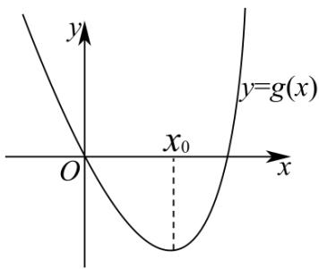
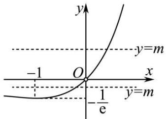
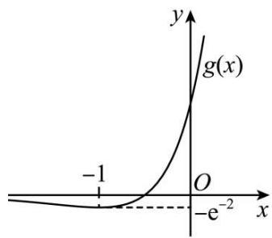

# 第23讲 不等式恒成立

# 知识梳理

1、利用导数研究不等式恒成立问题的求解策略：

(1)通常要构造新函数,利用导数研究函数的单调性,求出最值,从而求出参数的取值范围;  
(2) 利用可分离变量, 构造新函数, 直接把问题转化为函数的最值问题;  
(3) 根据恒成立或有解求解参数的取值时, 一般涉及分离参数法, 但压轴试题中很少碰到分离参数后构造的新函数能直接求出最值点的情况, 进行求解, 若参变分离不易求解问题, 就要考虑利用分类讨论法和放缩法, 注意恒成立与存在性问题的区别.

2、利用参变量分离法求解函数不等式恒(能)成立,可根据以下原则进行求解:

(1) $\forall x\in \mathrm{D},m\leqslant f(x)\Leftrightarrow m\leqslant f(x)_{\min}$ ;   
(2) $\forall x\in \mathrm{D},m\geqslant f(x)\Leftrightarrow m\geqslant f(x)_{\max}$ ;   
(3) $\exists x\in \mathrm{D},m\leqslant f(x)\Leftrightarrow m\leqslant f(x)_{\max}$ ;   
(4) $\exists x\in \mathbf{D},m\geqslant f(x)\Leftrightarrow m\geqslant f(x)_{\min}$

3、不等式的恒成立与有解问题,可按如下规则转化:

一般地，已知函数 $y = f(x), x \in [a, b], y = g(x), x \in [c, d]$ .

(1) 若 $\forall x_{1} \in [a, b]$ , $\forall x_{2} \in [c, d]$ , 有 $f(x_{1}) < g(x_{2})$ 成立, 则 $f(x)_{\max} < g(x)_{\min}$ ;  
(2) 若 $\forall x_{1} \in [a, b]$ , $\exists x_{2} \in [c, d]$ , 有 $f(x_{1}) < g(x_{2})$ 成立, 则 $f(x)_{\max} < g(x)_{\max}$ ;  
(3) 若 $\exists x_{1} \in [a, b]$ , $\exists x_{2} \in [c, d]$ , 有 $f(x_{1}) < g(x_{2})$ 成立, 则 $f(x)_{\min} < g(x)_{\max}$ ;  
(4) 若 $\forall x_{1} \in [a, b]$ , $\exists x_{2} \in [c, d]$ , 有 $f(x_{1}) = g(x_{2})$ 成立, 则 $f(x)$ 的值域是 $g(x)$ 的值域的子集.

4、法则1若函数 $f(x)$ 和 $g(x)$ 满足下列条件：

(1) $\lim_{x\to a}f(x)=0$ 及 $\lim_{x\to a}g(x)=0;$   
(2) 在点 $a$ 的去心邻域 $(a - \varepsilon, a) \cup (a, a + \varepsilon)$ 内， $f(x)$ 与 $g(x)$ 可导且 $g'(x) \neq 0$ ;  
(3) $\lim_{x\to a}\frac{f'(x)}{g'(x)}=l,$

那么 $\lim_{x\to a}\frac{f(x)}{g(x)} = \lim_{x\to a}\frac{f'(x)}{g'(x)} = l.$

法则2若函数 $f(x)$ 和 $g(x)$ 满足下列条件：(1) $\lim_{x\to \infty}f(x) = 0$ 及 $\lim_{x\to \infty}g(x) = 0;$

(2) $\exists^{\circ} \circ^{\circ} \mathrm{A} > 0, f(x)$ 和 $g(x)$ 在 $(- \infty, \mathrm{A})$ 与 $(\mathrm{A}, + \infty)$ 上可导，且 $g'(x) \neq 0$   
(3) $\lim_{x\to\infty}\frac{f'(x)}{g'(x)}=l,$

那么 $\lim_{x\to \infty}\frac{f(x)}{g(x)} = \lim_{x\to \infty}\frac{f'(x)}{g'(x)} = l.$

法则3若函数 $f(x)$ 和 $g(x)$ 满足下列条件：

(1) $\lim_{x\to a}f(x)=\infty$ 及 $\lim_{x\to a}g(x)=\infty;$   
(2) 在点 $a$ 的去心邻域 $(a - \varepsilon, a) \cup (a, a + \varepsilon)$ 内， $f(x)$ 与 $g(x)$ 可导且 $g'(x) \neq 0$ ;  
(3) $\lim_{x\to a}\frac{f'(x)}{g'(x)}=l,$

那么 $\lim_{x\to a}\frac{f(x)}{g(x)} = \lim_{x\to a}\frac{f'(x)}{g'(x)} = l.$

注意:利用洛必达法则求未定式的极限是微分学中的重点之一,在解题中应注意:

(1) 将上面公式中的 $x \to a, x \to +\infty, x \to -\infty, x \to a^{+}, x \to a^{-}$ 洛必达法则也成立.  
(2) 洛必达法则可处理 $\frac{0}{0}, \frac{\infty}{\infty}, 0 \cdot \infty, 1^{\infty}, \infty^{0}, 0^{0}, \infty - \infty$ 型.  
(3) 在着手求极限以前, 首先要检查是否满足 $\frac{0}{0}, \frac{\infty}{\infty}, 0 \cdot \infty, 1^{\infty}, \infty^{0}, 0^{0}, \infty - \infty$ 型定式, 否则滥用洛必达法则会出错. 当不满足三个前提条件时, 就不能用洛必达法则, 这时称洛必达法则不适用, 应从另外途径求极限.  
(4) 若条件符合, 洛必达法则可连续多次使用, 直到求出极限为止.

$\lim_{x\to a}\frac{f(x)}{g(x)} = \lim_{x\to a}\frac{f'(x)}{g'(x)} = \lim_{x\to a}\frac{f''(x)}{g''(x)}$ ，如满足条件，可继续使用洛必达法则.

# 必考题型全归纳

# 1 题型一: 直接法

851 (2024·陕西咸阳·武功县普集高级中学校考模拟预测)已知函数 $f(x) = \frac{1}{2} x^2 - ae^x (a \in \mathbb{R})$ .

(1) 已知函数 $f(x)$ 在 $(0, f(0))$ 处的切线与圆 $x^{2} + y^{2} - 2x - 2y - 3 = 0$ 相切，求实数 $a$ 的值.  
(2) 已知 $x \geqslant 0$ 时, $f(x) \leqslant -x^2 - ax - a$ 恒成立, 求实数 $a$ 的取值范围.

【解析】(1)依题意,圆 $(x-1)^{2}+(y-1)^{2}=5$ 的圆心为(1,1),半径为 $\sqrt{5}$ ,

对函数 $f(x)$ 求导得 $f'(x)=x-ae^{x}$ ，则函数 $f(x)$ 的图象在 $(0,f(0))$ 处的切线斜率为 $f'(0)=-a$ ，而 $f(0)=-a$ ，

于是函数 $f(x)$ 的图象在 $(0, f(0))$ 处的切线方程为 $y + a = -ax$ ，即 $ax + y + a = 0$ ，

从而 $\frac{|a + 1 + a|}{\sqrt{a^2 + 1^2}} = \sqrt{5}$ , 解得 $a = 2$ ,

所以实数 $a$ 的值为2.

(2) 设 $g(x)=f(x)+x^{2}+ax+a=\frac{3}{2}x^{2}-ae^{x}+ax+a(x\geqslant0)$ ，依题意，当 $x\geqslant0$ 时， $g(x)\leqslant0$ 恒成立，

求导得 $g'(x)=3x-ae^{x}+a$ ，设 $h(x)=3x-ae^{x}+a(x\geqslant0)$ ，求导得 $h'(x)=3-ae^{x}$ ，当 $a\geqslant3$ 时，当 $x\geqslant0$ 时， $ae^{x}\geqslant3e^{x}\geqslant3$ ，即有 $h'(x)\leqslant0$ ，

因此函数 $h(x)$ , 即 $g'(x)$ 在 $[0, +\infty)$ 上单调递减, 于是当 $x \geqslant 0$ 时, $g'(x) \leqslant g'(0) = 0$ , 则函数 $g(x)$ 在 $[0, +\infty)$ 上单调递减, 从而当 $x \geqslant 0$ 时, $g(x) \leqslant g(0) = 0$ , 因此 $a \geqslant 3$ ,

当 0 < a < 3 时，当 $0 < x < \ln \frac{3}{a}$ 时， $h'(x) > 0$ ，则函数 $h(x)$ ，即 $g'(x)$ 在 $\left[0, \ln \frac{3}{a}\right)$ 上单调递增，

于是当 $0 < x < \ln \frac{3}{a}$ 时， $g'(x) > g'(0) = 0$ ，即函数 $g(x)$ 在 $\left[0, \ln \frac{3}{a}\right)$ 上单调递增，

因此当 $0 < x < \ln \frac{3}{a}$ 时， $g(x) > g(0) = 0$ ，不合题意，

当 $a \leqslant 0$ 时， $h'(x) > 0$ ，函数 $h(x)$ ，即 $g'(x)$ 在 $[0, +\infty)$ 上单调递增，

则当 $x \geqslant 0$ 时， $g'(x) \geqslant g'(0) = 0$ ，即函数 $g(x)$ 在 $[0, +\infty)$ 上单调递增，

于是当 x > 0 时， $g(x) > g(0) = 0$ ，不合题意，

所以实数 a 的取值范围为 $[3, +\infty)$ .

852 (2024·山东·山东省实验中学校联考模拟预测)已知函数 $f(x) = \mathrm{e}^{x} - a, g(x) = \ln (x + a)$ ，其中 $a \in \mathbb{R}$ .

(1) 讨论方程 $f(x)=x$ 实数解的个数；  
(2) 当 $x \geqslant 1$ 时, 不等式 $f(x) \geqslant g(x)$ 恒成立, 求 a 的取值范围.

【解析】(1) 由 $f(x)=x$ 可得, $e^{x}-a=x$ ,

令 $s(x)=\mathrm{e}^{x}-x-a, s'(x)=\mathrm{e}^{x}-1$ ，令 $y'=0$ ，可得 x=0，

当 $x \in (-\infty,0)$ , $s'(x) < 0$ , 函数 $s(x)$ 单调递减,

当 $x \in (0, +\infty)$ , $s'(x) > 0$ , 函数 $s(x)$ 单调递增,

所以函数 $s(x)$ 在 $x = 0$ 时取得最小值 $1 - a$

所以当 a<1 时, 方程 $f(x)=x$ 无实数解,

当 a=1 时, 方程 $f(x)=x$ 有一个实数解,

当 a > 1 时, 1 - a < 0, 故 $s(x)_{\min} < 0$ ,

而 $s(-a)=\mathrm{e}^{-a}>0$ , $s(a)=\mathrm{e}^{a}-2a$ ,

设 $u(a)=\mathrm{e}^{a}-2a,a>1$ , 则 $u'(a)=\mathrm{e}^{a}-2>0$

故 $u(a)$ 在 $(1, +\infty)$ 上为增函数，故 $u(a) > u(1) = \mathrm{e} - 2 > 0$

故 $s(x)$ 有两个零点即方程 $f(x)=x$ 有两个实数解.

(2) 由题意可知，

不等式 $f(x)\geqslant g(x)$ 可化为， $e^{x}-a\geqslant\ln(x+a),x>-a,$

即当 $x \geqslant 1$ 时， $\mathrm{e}^{x} - \ln (x + a) - a \geqslant 0$ 恒成立，

所以 -a<1, 即 a>-1,

令 $h(x)=\mathrm{e}^{x}-\ln(x+a)-a,h'(x)=\mathrm{e}^{x}-\frac{1}{x+a}$ ,

则 $h'(x)$ 在 $[1, +\infty)$ 上单调递增，而 $h'(1) = e - \frac{1}{1 + a}$ ,

当 $h(1) \geqslant 0$ 即 $a \geqslant -1 + \frac{1}{e}$ 时， $h'(x) \geqslant 0, h(x)$ 在 $[1, +\infty)$ 上单调递增，

故 $h(x)_{\min} = h(1) = \mathrm{e} - \ln (1 + a) - a,$

由题设可得 $\left\{\begin{aligned}e-\ln(1+a)-a&\geqslant0\\ a&>-\frac{1}{e}\end{aligned}\right.$

设 $v(a)=\mathrm{e}-\ln(1+a)-a$ ，则该函数在 $\left(-\frac{1}{\mathrm{e}},+\infty\right)$ 上为减函数，

而 $v(\mathrm{e} - 1) = 0$ ，故 $-\frac{1}{\mathrm{e}} < a \leqslant \mathrm{e} - 1.$

当 $h(1)<0$ 即 -1<a<-1+ $\frac{1}{e}$ 时，因为 $h'(|a|+1)=\mathrm{e}^{|a|+1}-\frac{1}{|a|+1+a}>0,$

故 $h'(x)$ 在 $(1,+\infty)$ 上有且只有一个零点 $x_{0}$ ,

当 $1 < x < x_{0}$ 时， $h'(x) < 0$ ，而 $x > x_{0}$ 时， $h'(x) > 0$ ，

故 $h(x)$ 在 $(1, x_{0})$ 上为减函数，在 $(x_{0}, +\infty)$ 上为增函数，

故 $h(x)_{\min} = \mathrm{e}^{x_0} - \ln (x_0 + a) - a \geqslant 0$

而 $\mathrm{e}^{x_0} = \frac{1}{x_0 + a}$ 故 $x_0 = -\ln (x_0 + a)$ 故 $\mathrm{e}^{x_0} + x_0 - a \geqslant 0$

因为 $x_{0}>1$ ，故 $e^{x_{0}}+x_{0}>1+e>a$ ，故 -1<a<-1+ $\frac{1}{e}$ 符合，

综上所述,实数a的取值范围为 $(-1,e-1]$ .

853 (2024·全国·统考高考真题)已知函数 $f(x) = ax - \frac{\sin x}{\cos^2 x}, x \in \left(0, \frac{\pi}{2}\right)$ .

(1) 当 a=1 时, 讨论 $f(x)$ 的单调性;  
(2) 若 $f(x) + \sin x < 0$ ，求 a 的取值范围.

【解析】(1) 因为 a=1，所以 $f(x)=x-\frac{\sin x}{\cos^{2}x}, x \in \left(0, \frac{\pi}{2}\right)$ ,

则 $f'(x)=1-\frac{\cos x\cos^{2}x-2\cos x(-\sin x)\sin x}{\cos^{4}x}=1-\frac{\cos^{2}x+2\sin^{2}x}{\cos^{3}x}$

$$
= \frac {\cos^ {3} x - \cos^ {2} x - 2 (1 - \cos^ {2} x)}{\cos^ {3} x} = \frac {\cos^ {3} x + \cos^ {2} x - 2}{\cos^ {3} x},
$$

令 $t = \cos x$ ，由于 $x\in \left(0,\frac{\pi}{2}\right)$ ，所以 $t = \cos x\in (0,1)$

所以 $\cos^{3}x + \cos^{2}x - 2 = t^{3} + t^{2} - 2 = t^{3} - t^{2} + 2t^{2} - 2 = t^{2}(t - 1) + 2(t + 1)(t - 1) = (t^{2} + 2t + 2)(t - 1)$ ,

因为 $t^{2}+2t+2=(t+1)^{2}+1>0, t-1<0, \cos^{3}x=t^{3}>0,$

所以 $f'(x)=\frac{\cos^{3}x+\cos^{2}x-2}{\cos^{3}x}<0$ 在 $\left(0,\frac{\pi}{2}\right)$ 上恒成立，

所以 $f(x)$ 在 $\left(0, \frac{\pi}{2}\right)$ 上单调递减.

(2) 法一:

构建 $g(x)=f(x)+\sin x=ax-\frac{\sin x}{\cos^{2}x}+\sin x\left(0<x<\frac{\pi}{2}\right)$ ,

则 $g'(x)=a-\frac{1+\sin^{2}x}{\cos^{3}x}+\cos x\left(0<x<\frac{\pi}{2}\right)$ ,

若 $g(x) = f(x) + \sin x < 0$ ，且 $g(0) = f(0) + \sin 0 = 0$

则 $g'(0)=a-1+1=a\leqslant0$ , 解得 $a\leqslant0$

当 a=0 时, 因为 $\sin x - \frac{\sin x}{\cos^{2}x} = \sin x \left(1 - \frac{1}{\cos^{2}x}\right)$ ,

又 $x \in \left(0, \frac{\pi}{2}\right)$ , 所以 $0 < \sin x < 1$ , $0 < \cos x < 1$ , 则 $\frac{1}{\cos^2 x} > 1$ ,

所以 $f(x)+\sin x=\sin x-\frac{\sin x}{\cos^{2}x}<0$ , 满足题意;

当 a<0 时, 由于 $0<x<\frac{\pi}{2}$ , 显然 ax<0,

所以 $f(x)+\sin x=ax-\frac{\sin x}{\cos^{2}x}+\sin x<\sin x-\frac{\sin x}{\cos^{2}x}<0$ , 满足题意;

综上所述: 若 $f(x) + \sin x < 0$ , 等价于 $a \leqslant 0$ ,

所以 a 的取值范围为 $(-∞,0]$ .

法二：

因为 $\sin x - \frac{\sin x}{\cos^{2}x} = \frac{\sin x \cos^{2} x - \sin x}{\cos^{2} x} = \frac{\sin x (\cos^{2} x - 1)}{\cos^{2} x} = -\frac{\sin^{3} x}{\cos^{2} x}$ ,

因为 $x \in \left(0, \frac{\pi}{2}\right)$ , 所以 $0 < \sin x < 1$ , $0 < \cos x < 1$ ,

故 $\sin x - \frac{\sin x}{\cos^2x} < 0$ 在 $\left(0, \frac{\pi}{2}\right)$ 上恒成立，

所以当 a=0 时， $f(x)+\sin x=\sin x-\frac{\sin x}{\cos^{2}x}<0$ ，满足题意；

当 a<0 时, 由于 $0<x<\frac{\pi}{2}$ , 显然 ax<0,

所以 $f(x)+\sin x=ax-\frac{\sin x}{\cos^{2}x}+\sin x<\sin x-\frac{\sin x}{\cos^{2}x}<0$ , 满足题意;

当 a > 0 时, 因为 $f(x) + \sin x = ax - \frac{\sin x}{\cos^{2}x} + \sin x = ax - \frac{\sin^{3}x}{\cos^{2}x}$ ,

令 $g(x)=ax-\frac{\sin^{3}x}{\cos^{2}x}\left(0<x<\frac{\pi}{2}\right)$ ，则 $g'(x)=a-\frac{3\sin^{2}x\cos^{2}x+2\sin^{4}x}{\cos^{3}x}$ ,

注意到 $g'(0)=a-\frac{3\sin^{2}0\cos^{2}0+2\sin^{4}0}{\cos^{3}0}=a>0,$

若 $\forall 0 < x < \frac{\pi}{2}, g'(x) > 0$ ，则 $g(x)$ 在 $\left(0, \frac{\pi}{2}\right)$ 上单调递增，

注意到 $g(0)=0$ ，所以 $g(x)>g(0)=0$ ，即 $f(x)+\sin x>0$ ，不满足题意；

若 $\exists 0 < x_0 < \frac{\pi}{2}, g'(x_0) < 0$ ，则 $g'(0)g'(x_0) < 0$

所以在 $\left(0,\frac{\pi}{2}\right)$ 上最靠近x=0处必存在零点 $x_{1}\in\left(0,\frac{\pi}{2}\right)$ ，使得 $g'(x_{1})=0$ ，

此时 $g'(x)$ 在 $(0, x_{1})$ 上有 $g'(x) > 0$ ，所以 $g(x)$ 在 $(0, x_{1})$ 上单调递增，

则在 $(0,x_{1})$ 上有 $g(x)>g(0)=0$ ，即 $f(x)+\sin x>0$ ，不满足题意；

综上: $a \leqslant 0$ .

854 (2024·河南·襄城高中校联考三模)已知函数 $f(x) = m\ln x$ , $g(x) = \mathrm{e}^{x - 1}$ .

(1) 若曲线 $y = f(x)$ 在 $(1,0)$ 处的切线与曲线 $y = g(x)$ 相交于不同的两点 $A(x_{1}, y_{1})$ ,

$B(x_{2},y_{2})$ ，曲线 $y=g(x)$ 在 A，B 点处的切线交于点 $M(x_{0},y_{0})$ ，求 $x_{1}+x_{2}-x_{0}$ 的值；

(2) 当曲线 $y = f(x)$ 在 (1,0) 处的切线与曲线 $y = g(x)$ 相切时，若 $\forall x \in (1, +\infty), f(x) + eg(x) > (a + 1)\mathrm{e} - aex$ 恒成立，求 $a$ 的取值范围.

【解析】(1) 因为 $f'(x)=\frac{m}{x}$ ，所以 $f'(1)=m$ ，

所以曲线 $y=f(x)$ 在 $(1,0)$ 处的切线方程为 $y=m(x-1)$ .

由已知得 $m(x_{1} - 1) = \mathrm{e}^{x_{1} - 1}, m(x_{2} - 1) = \mathrm{e}^{x_{2} - 1}$ , 不妨设 $1 < x_{1} < x_{2}$ ,

又曲线 $y=g(x)$ 在点 A 处的切线方程为 $y=\mathrm{e}^{x_{1}-1}(x-x_{1})+\mathrm{e}^{x_{1}-1}$

在点 B 处的切线方程为 $y=\mathrm{e}^{x_{2}-1}(x-x_{2})+\mathrm{e}^{x_{2}-1}$ ,

两式相减得 $\left(\mathrm{e}^{x_1 - 1} - \mathrm{e}^{x_2 - 1}\right)(x + 1) - x_1\mathrm{e}^{x_1 - 1} + x_2\mathrm{e}^{x_2 - 1} = 0,$

将 $m(x_{1}-1)=\mathrm{e}^{x_{1}-1},m(x_{2}-1)=\mathrm{e}^{x_{2}-1}$

代入得 $(mx_{1} - mx_{2})(x + 1) - x_{1}\cdot [m(x_{1} - 1)] + x_{2}\cdot [m(x_{2} - 1)] = 0,$

化简得 $m(x_{1} - x_{2})(x + 2 - x_{1} - x_{2}) = 0$

显然 $m \neq 0$ ，所以 $m(x_{1}-x_{2}) \neq 0$ ，所以 $x_{1} + x_{2} - x = 2$ ，又 $M(x_{0}, y_{0})$ ，所以 $x_{1} + x_{2} - x_{0} = 2$ 。

(2) 当直线 $y = m(x - 1)$ 与曲线 $y = g(x)$ 相切时, 设切点为 $\mathrm{P}(t, g(t))$ ,

则切线方程为 $y - e^{t-1} = e^{t-1}(x - t)$ ，将点 $(1,0)$ 代入，解得 t = 2，此时 $m = e, f(x) = e \ln x$ ，

根据题意得, $\forall x\in(1,+\infty)$ , $f(x)+eg(x)>(a+1)\mathrm{e}-aex$ ,

即 $e^{x-1} + \ln x + ax - a - 1 > 0$ 恒成立.

令 $\mathrm{F}(x)=\mathrm{e}^{x-1}+a(x-1)+\ln x-1(x\geqslant1)$ ，则， $\mathrm{F}'(x)=\mathrm{e}^{x-1}+a+\frac{1}{x}$ ，令 $h(x)=\mathrm{F}'(x)$ ，则 $h'(x)=\mathrm{e}^{x-1}-\frac{1}{x^{2}}$

易知 $h'(x)$ 在 $[1, +\infty)$ 上单调递增, 所以 $h'(x) \geqslant h'(1) = 0$ ,

所以 $F'(x)$ 在 $[1, +\infty)$ 上单调递增，所以 $F'(x) \geqslant F'(1) = a + 2$ .

若 $a \geqslant -2$ ，则 $\mathrm{F}'(x) \geqslant a + 2 \geqslant 0$ ，即 $\mathrm{F}(x)$ 在 $[1, +\infty)$ 上单调递增，

则 $F(x) \geqslant F(1) = 0$ ，所以 $f(x) + eg(x) > (a+1)e - aex$ 在 $(1, +\infty)$ 上恒成立，符合题意；

若 $a < -2$ ，则 $\mathrm{F}'(1) = a + 2 < 0.$

又 $\mathrm{F}^{\prime}(1+\ln(-a))=\mathrm{e}^{1+\ln(-a)-1}+a+\frac{1}{1+\ln(-a)}=\frac{1}{1+\ln(-a)}>0,$

所以存在 $x_0 \in (1, 1 + \ln(-a))$ ，使得 $\mathrm{F}'(x_0) = 0$

当 $x \in (1, x_{0})$ 时， $F'(x) < 0$ ， $F(x)$ 单调递减，即 $F(x) < F(1) = 0$ ，

所以此时存在 $x \in (1, x_{0})$ ，使得 $f(x) + eg(x) < (a + 1)e - aex$ ，不符合题意。

综上可得, $a$ 的取值范围为 $[-2, +\infty)$ .

# 2 题型二:端点恒成立

855 (2024·四川绵阳·四川省绵阳南山中学校考模拟预测)设函数 $f(x) = \frac{1}{2}\sin x -$

$$
x \cos x \left(0 <   x <   \frac {\pi}{2}\right), g (x) = f (x) + \frac {1}{2} \sin x - a x ^ {3}.
$$

(1) 求 $f(x)$ 在 $x = \frac{\pi}{2}$ 处的切线方程；  
(2) 若任意 $x \in [0, +\infty)$ , 不等式 $g(x) \leqslant 0$ 恒成立, 求实数 $a$ 的取值范围.

【解析】(1) $x=\frac{\pi}{2}$ 时, $f\left(\frac{\pi}{2}\right)=\frac{1}{2}$ ;又 $f'(x)=x\sin x-\frac{1}{2}\cos x$ ,则 $k=f'\left(\frac{\pi}{2}\right)=\frac{\pi}{2}$ ,

切线方程为: $y - \frac{1}{2} = \frac{\pi}{2} \left( x - \frac{\pi}{2} \right)$ ，即 $y = \frac{\pi}{2} x + \frac{2 - \pi^{2}}{4}$

(2) $g(x)=\sin x-x\cos x-ax^{3},$

则 $g'(x)=x(\sin x-3ax)$ ，又令 $h(x)=\sin x-3ax, h'(x)=\cos x-3a$ ，

①当 $3a \leqslant -1$ ，即 $a \leqslant -\frac{1}{3}$ 时， $h'(x) \geqslant 0$ 恒成立，∴ $h(x)$ 在区间 $[0, +\infty)$ 上单调递增，

$\therefore h(x)\geqslant h(0)=0,\therefore g'(x)\geqslant0,\therefore g(x)$ 在区间 $[0,+\infty)$ 上单调递增，

$\therefore g(x) \geqslant g(0) = 0$ (不合题意);

②当 $3a \geqslant 1$ 即 $a \geqslant \frac{1}{3}$ 时， $h'(x) \leqslant 0, h(x)$ 在区间 $[0, +\infty)$ 上单调递减，

$\therefore h(x) \leqslant h(0) = 0, \therefore g'(x) \leqslant 0, \therefore g(x)$ 在区间 $[0, +\infty)$ 上单调递减，

$\therefore g(x) \leqslant g(0) = 0$ (符合题意);

③当 -1 < 3a < 1，即 $-\frac{1}{3} < a < \frac{1}{3}$ 时，由 $h'(0) = 1 - 3a > 0, h'(\pi) = -1 - 3a < 0,$

∴ $\exists x_{0} \in (0, \pi)$ ，使 $h'(x_{0}) = 0$ ，且 $x \in (0, x_{0})$ 时， $h'(x) > 0, h(x) > h(0) = 0, g'(x) > 0$ ,

∴ $g(x)$ 在 $x \in (0, x_{0})$ 上单调递增，∴ $g(x) > g(0) = 0$ (不符合题意);

综上，a 的取值范围是 $a \geqslant \frac{1}{3}$ ;

856 (2024·北京海淀·中央民族大学附属中学校考模拟预测)已知函数 $f(x)=x\ln x-a(x^{2}-1)$ .

(1) 当 a=0 时, 求函数 $f(x)$ 在点 $(1,f(1))$ 处的切线方程;  
(2) 若函数 $y = f'(x)$ 在 x = 1 处取得极值，求实数 a 的值；  
(3) 若不等式 $f(x) \leqslant 0$ 对 $x \in [1, +\infty)$ 恒成立，求实数 $a$ 的取值范围.

【解析】(1) 当 a=0 时, $f(x)=x\ln x$ , 定义域为 $(0,+\infty)$ , $f(1)=0$ ,

$$
f ^ {\prime} (x) = \ln x + x \cdot \frac {1}{x} = 1 + \ln x, f ^ {\prime} (1) = 1,
$$

所以函数 $f(x)$ 在点 $(1, f(1))$ 处的切线方程为 y-0=x-1，即 x-y-1=0.

(2) $f'(x)=\ln x+x\cdot\frac{1}{x}-2ax=1+\ln x-2ax,$

设 $f'(x)=g(x)=1+\ln x-2ax$ ，则 $g'(x)=\frac{1}{x}-2a$ ，

依题意得 $g'(1)=0$ ，即 $a=\frac{1}{2}$ ，

当 $a = \frac{1}{2}$ 时， $g'(x) = \frac{1}{x} - 1 = \frac{1 - x}{x}$ ，当 $0 < x < 1$ 时， $g'(x) > 0$ ，当 $x > 1$ 时， $g'(x) < 0$

所以 $f'(x)=g(x)$ 在 x=1 处取得极大值, 符合题意.

综上所述: $a=\frac{1}{2}$ .

(3) 当 $x = 1$ 时, $f(1) = 0$ , $a \in \mathbb{R}$ ,

当 x > 1 时， $f'(x) = 1 + \ln x - 2ax$ ，

令 $h(x)=f'(x)=1+\ln x-2ax, x>1,$

则 $h'(x)=\frac{1}{x}-2a=\frac{1-2ax}{x}$ ,

①当 $a \leqslant 0$ 时， $h'(x) > 0$ 在 $(1, +\infty)$ 上恒成立，故 $h(x) = f'(x)$ 在 $(1, +\infty)$ 上为增函数，所以 $f'(x) > f'(1) = 1 - 2a > 0$ ，故 $f(x)$ 在 $(1, +\infty)$ 上为增函数，

故 $f(x)>f(1)=0$ , 不合题意.

②当 a > 0 时, 令 $h'(x) = 0$ , 得 $x = \frac{1}{2a}$ ,

(i) 若 $\frac{1}{2a} \leqslant 1$ ，即 $a \geqslant \frac{1}{2}$ 时，在 x > 1 时， $h'(x) < 0, h(x)$ 在 $(1, +\infty)$ 上为减函数，

$h(x)<h(1)=1-2a\leqslant0$ , 即 $f'(x)<0$ , $f(x)$ 在 $(1,+\infty)$ 上为减函数, $f(x)<f(1)=0$ , 符合题意;

(ii) 若 $\frac{1}{2a} > 1$ , 即 $0 < a < \frac{1}{2}$ 时,

当 $x \in \left(1, \frac{1}{2a}\right)$ 时， $h'(x) > 0$ ， $h(x)$ 在 $\left(1, \frac{1}{2a}\right)$ 上为增函数， $h(x) > h(1) = 1 - 2a > 0$ ， $f(x)$ 在 $\left(1, \frac{1}{2a}\right)$ 上为增函数， $f(x) > f(1) = 0$ ，不合题意.

综上所述:若不等式 $f(x)\leqslant0$ 对 $x\in[1,+\infty)$ 恒成立,则实数a的取值范围是 $a\geqslant\frac{1}{2}$ .

857 (2024·湖南·校联考模拟预测)已知函数 $f(x) = \ln (1 + x), g(x) = \frac{ax}{\mathrm{e}^x}, f'(x)$ 与 $g'(x)$ 分别是 $f(x)$ 与 $g(x)$ 的导函数.

(1) 证明: 当 $a = 1$ 时, 方程 $f'(x) = g'(x)$ 在 $(-1,0)$ 上有且仅有一个实数根;  
(2) 若对任意的 $x \in (0, +\infty)$ , 不等式 $f(x) > g(x)$ 恒成立, 求实数 $a$ 的取值范围.

【解析】(1) $f(x)=\ln(1+x),f'(x)=\frac{1}{1+x},$

当 a=1 时, $g(x)=\frac{x}{\mathrm{e}^{x}},g'(x)=\frac{1-x}{\mathrm{e}^{x}}$ ,

令 $h(x)=f'(x)-g'(x)=\frac{1}{1+x}-\frac{1-x}{\mathrm{e}^{x}}=\frac{1}{(1+x)\mathrm{e}^{x}}(\mathrm{e}^{x}+x^{2}-1)$ ,

令 $\mu(x)=\mathrm{e}^{x}+x^{2}-1,$ 则 $\mu'(x)=\mathrm{e}^{x}+2x,$

显然 $\mu'(x)$ 在 $(-1,0)$ 上是单调递增函数，且 $\mu'\left(-\frac{1}{2}\right)=\frac{1}{\sqrt{\mathrm{e}}}-1<0,\mu'(0)=1>0,$

∴ $\mu'(x)$ 在 $\left(-\frac{1}{2},0\right)$ 上有唯一零点 $x_{0}$ ,

且 $x \in (-1, x_{0})$ 时, $\mu'(x) < 0$ , $\mu(x)$ 单调递减,

$x \in (x_{0},0)$ 时, $\mu'(x) > 0,\mu(x)$ 单调递增,

又 $\mu(0)=0, \mu\left(-\frac{1}{2}\right)=\frac{1}{\sqrt{\mathrm{e}}}-\frac{3}{4}<\frac{2}{3}-\frac{3}{4}<0,$

$$
\mu \left(- \frac {\sqrt {6}}{3}\right) = \mathrm{e} ^ {- \frac {\sqrt {6}}{3}} + \frac {2}{3} - 1 > \mathrm{e} ^ {- 1} - \frac {1}{3} > 0,
$$

$\therefore \mu (x) = 0$ 在 $\left(-\frac{\sqrt{6}}{3}, - \frac{1}{2}\right)$ 上有唯一的根，

$\therefore h(x)=f'(x)-g'(x)$ 在 $(-1,0)$ 上有唯一零点，

即 $f'(x)=g'(x)$ 在 $(-1,0)$ 上有且仅有一个实数根.

(2) $\because f(x) - g(x) = \ln (1 + x) - \frac{ax}{\mathrm{e}^x} = \frac{1}{\mathrm{e}^x} [\mathrm{e}^x\ln (1 + x) - ax],$

令 $\mathrm{G}(x) = \mathrm{e}^{x} \ln(1 + x) - ax, x \in [0, +\infty)$ ，则 $\mathrm{G}(0) = 0$ ,

$f(x) > g(x)$ 等价于： $\mathrm{G}(x) > 0,x\in (0, + \infty),$

$$
\mathrm{G} ^ {\prime} (x) = \mathrm{e} ^ {x} \left[ \ln (1 + x) + \frac {1}{1 + x} \right] - a, \mathrm{G} ^ {\prime} (0) = 1 - a,
$$

令 $\mathrm{H}(x) = \mathrm{e}^{x}\left[\ln (1 + x) + \frac{1}{1 + x}\right] - a,$

则 $\mathrm{H}'(x) = \mathrm{e}^x\Big[\ln (1 + x) + \frac{2}{1 + x} -\frac{1}{(1 + x)^2}\Big],$

令 $\mathrm{T}(x) = \ln (1 + x) + \frac{2}{1 + x} -\frac{1}{(1 + x)^2},x\in [0, + \infty),$

则 $\mathrm{T}^{\prime}(x)=\frac{1}{1+x}-\frac{2}{(1+x)^{2}}+\frac{2}{(1+x)^{3}}=\frac{x^{2}+1}{(1+x)^{3}}>0,$

故 $T(x)$ 在 $[0, +\infty)$ 上单调递增, $T(x) \geqslant T(0) = 1$ , $H'(x) \geqslant 1 > 0$ ,

故 $H(x)$ 即 $G'(x)$ 在 $(0, +\infty)$ 上单调递增, $G'(x) > 1 - a$ ,

当 $a \leqslant 1$ 时, $G'(x) > 0$ ,

∴ G(x) 在 $(0, +\infty)$ 上单调递增,

$$
\therefore \mathrm{G} (x) > \mathrm{G} (0) = 0;
$$

当 a > 1 时, $G'(0) = 1 - a < 0$ , 取 $x_{1} = e - 1 + \ln a > 0$ ,

则 $\ln(1+x_{1})=\ln(\mathrm{e}+\ln a)>\ln e=1,\frac{1}{1+x_{1}}>0,$

$$
\mathrm{e} ^ {x _ {1}} = \mathrm{e} ^ {\mathrm{e} - 1 + \ln a} > \mathrm{e} ^ {\ln a} = a,
$$

$$
\therefore \mathrm{G} ^ {\prime} (x _ {1}) = \mathrm{e} ^ {x _ {1}} \left[ \ln (1 + x _ {1}) + \frac {1}{1 + x _ {1}} \right] - a > a \cdot (1 + 0) - a = 0,
$$

$\therefore \exists x_{2} \in (0, x_{1})$ , 使得 $G'(x_{2}) = 0$ ,

$x \in (0, x_{2})$ 时, $G'(x) < 0$ , $G(x)$ 单调递减,

此时 $G(x) < G(0) = 0$ ，不符合题意。

综上可知:a 的取值范围为 $(-∞,1]$ .

858 (2024·四川成都·石室中学校考模拟预测)已知函数 $f(x)=\frac{1}{3}ax^{3}+x$ ，函数 $g(x)=\mathrm{e}^{x}-2x+\sin x$ .

(1) 求函数 $g(x)$ 的单调区间；  
(2) 记 $F(x)=g(x)-f'(x)$ ，对任意的 $x\geqslant0$ ， $F(x)\geqslant0$ 恒成立，求实数 a 的取值范围.

【解析】(1) $g(x)=\mathrm{e}^{x}-2x+\sin x$ ，函数定义域为R，

则 $g'(x)=\mathrm{e}^{x}-2+\cos x$ 且 $g'(0)=0$ ,

令 $\varphi(x)=g'(x)$ , $\varphi'(x)=\mathrm{e}^{x}-\sin x, x\in(0,+\infty),\varphi'(x)=\mathrm{e}^{x}-\sin x>1-\sin x\geqslant0$ , $\varphi(x)$

在 $(0,+\infty)$ 上单调递增，

所以 $\varphi(x)=g'(x)>g'(0)=0$ , 所以 $g(x)$ 的单调递增区间为 $(0,+\infty)$

$x \in (-\infty, 0), g'(x) = \mathrm{e}^x - 2 + \cos x < \cos x - 1 \leqslant 0$ ，所以 $g(x)$ 的单调递减区间为

$$
(- \infty , 0).
$$

(2) $f(x)=\frac{1}{3}ax^{3}+x,f'(x)=ax^{2}+1,$

则 $\mathrm{F}(x) = g(x) - f'(x) = \mathrm{e}^x - 2x + \sin x - ax^2 - 1$ ，且 $\mathrm{F}(0) = 0$

$$
\mathrm{F} ^ {\prime} (x) = \mathrm{e} ^ {x} + \cos x - 2 a x - 2, x \in [ 0, + \infty),
$$

令 $\mathrm{G}(x) = \mathrm{F}'(x), \mathrm{G}'(x) = \mathrm{e}^{x} - \sin x - 2a,$

令 $\mathrm{H}(x) = \mathrm{G}'(x), x \geqslant 0$ 时 $\mathrm{H}'(x) = \mathrm{e}^x - \cos x \geqslant 1 - \cos x \geqslant 0,$

所以 $G'(x)$ 在 $[0, +\infty)$ 上单调递增，

①若 $a \leqslant \frac{1}{2}$ , $G'(x) \geqslant G'(0) = 1 - 2a \geqslant 0$ ,

所以 $F'(x)$ 在 $[0, +\infty)$ 上单调递增, 所以 $F'(x) \geqslant F'(0) = 0$ ,

所以 $F(x) \geqslant F(0) = 0$ 恒成立.

②若 $a > \frac{1}{2}$ , $G'(0) = 1 - 2a < 0$ , $G'(\ln(2a + 2)) = 2 - \sin(2a + 2) > 0$ ,

所以存在 $x_{0} \in (0, \ln(2a + 2))$ ，使 $G'(x_{0}) = 0$ ，

故存在 $x \in (0, x_0)$ , 使得 $\mathrm{G}'(x) < 0$ ,

此时 $G(x)$ 单调递减, 即 $F'(x)$ 在 $(0, x_{0})$ 上单调递减,

所以 $F'(x) \leqslant F'(0) = 0$ ，故 $F(x)$ 在 $(0, x_{0})$ 上单调递减，

所以此时 $F(x) \leqslant F(0) = 0$ ，不合题意。

综上， $a \leqslant \frac{1}{2}$ .

实数 a 的取值范围为 $\left(-\infty, \frac{1}{2}\right]$ .

859 (2024·宁夏银川·校联考二模)已知函数 $f(x)=\frac{\sin x}{e^{x}}$ .

(1) 讨论 $f(x)$ 在 $[0, \pi]$ 上的单调性；  
(2) 若对于任意 $x \in \left[0, \frac{\pi}{2}\right]$ , 若函数 $f(x) \leqslant kx$ 恒成立, 求实数 $k$ 的取值范围.

【解析】(1) $f'(x)=\frac{\cos x-\sin x}{\mathrm{e}^{x}}=\frac{\sqrt{2}\cos\left(x+\frac{\pi}{4}\right)}{\mathrm{e}^{x}}$

$f^{\prime}(x) > 0$ ，则 $0 < x < \frac{\pi}{4}$ ； $f^{\prime}(x) < 0$ ，则 $\frac{\pi}{4} < x < \pi$

所以 $f(x)$ 在 $\left[0, \frac{\pi}{4}\right]$ 单调递增，在 $\left[\frac{\pi}{4}, \pi\right]$ 单调递减.

(2) 令 $g(x)=\frac{\sin x}{\mathrm{e}^{x}}-kx$ ，有 $g(0)=0$

当 $k \leqslant 0$ 时， $x \geqslant 0, e^{x} > 0, \sin x \geqslant 0, g(x) \geqslant 0$ ，不满足；

当 k > 0 时， $g'(x) = \frac{\cos x - \sin x}{\mathrm{e}^x} - k$ ,

令 $h(x)=g'(x)=\frac{\cos x-\sin x}{\mathrm{e}^{x}}-k,$

所以 $h'(x)=\frac{-2\cos x}{\mathrm{e}^{x}}\leqslant0$ 在 $\left[0,\frac{\pi}{2}\right]$ 恒成立，

则 $g'(x)$ 在 $\left[0, \frac{\pi}{2}\right]$ 单调递减，

$$
g ^ {\prime} (0) = 1 - k, g \left(\frac {\pi}{2}\right) = \frac {- 1}{\mathrm{e} ^ {\frac {\pi}{2}}} - k <   0,
$$

①当 $1 - k \leqslant 0$ ，即 $k \geqslant 1$ 时， $g'(x) \leqslant g'(0) \leqslant 0$ ，

所以 $g(x)$ 在 $\left[0, \frac{\pi}{2}\right]$ 单调递减，

所以 $g(x) \leqslant g(0) = 0$ ，满足题意；

②当 1-k>0, 即 0<k<1 时,

因为 $g'(x)$ 在 $\left[0, \frac{\pi}{2}\right]$ 单调递减， $g'(0) = 1 - k > 0, g'\left(\frac{\pi}{2}\right) = \frac{-1}{\mathrm{e}^{\frac{\pi}{2}}} - k < 0,$

所以存在唯一 $x_0 \in \left(0, \frac{\pi}{2}\right)$ , 使得 $g'(x_0) = 0$ ,

所以 $g(x)$ 在 $(0, x_{0})$ 单调递增，

所以 $g(x_{0})>g(0)=0$ ，不满足，舍去。

综上: $k \geqslant 1$ .

860 (2024·四川泸州·统考三模)已知函数 $f(x) = (x - 1)\mathrm{e}^x + ax + 2$ .

(1) 若 $f(x)$ 单调递增, 求 a 的取值范围;  
(2) 若 $x \geqslant 0, f(x) \geqslant \sin x + \cos x$ ，求 $a$ 的取值范围.

【解析】(1) 由 $f(x)=(x-1)\mathrm{e}^{x}+ax+2$ ，得 $f'(x)=xe^{x}+a$ ，

由于 $f(x)$ 单调递增,则 $f'(x)\geqslant0$ 即 $a\geqslant-xe^{x}$ 恒成立,

令 $g(x) = -xe^{x}$ ，则 $g'(x) = -(x + 1)e^{x}$ ,

可知 x<-1 时， $g'(x)>0$ ，则 $g(x)$ 在 $(-∞,-1)$ 上单调递增；

x>-1 时， $g'(x)<0$ ，则 $g(x)$ 在 $(-1,+\infty)$ 上单调递减，

故 x = -1 时， $g(x)$ 取得极大值即最大值 $g(-1) = \frac{1}{\mathrm{e}}$ ,

故 $a \geqslant \frac{1}{e}$ . 所以 a 的取值范围是 $\left[\frac{1}{e}, +\infty\right)$ .

(2) 由题意 $x \geqslant 0$ 时, $f(x) \geqslant \sin x + \cos x$ 恒成立, 即 $(x - 1)\mathrm{e}^{x} + ax - \sin x - \cos x + 2 \geqslant 0$ ;

令 $h(x) = (x - 1)\mathrm{e}^{x} + ax - \sin x - \cos x + 2$ ，原不等式即为 $h(x)\geqslant 0$ 恒成立，

可得 $h(0)=0$ , $h'(x)=xe^{x}+a-\cos x+\sin x$ , $h'(0)=a-1$ ,

令 $u(x)=h'(x)=xe^{x}+a-\cos x+\sin x$ ，则 $u'(x)=(x+1)\mathrm{e}^{x}+\sin x+\cos x$

又设 $t(x)=(x+1)\mathrm{e}^{x}$ ，则 $t'(x)=(x+2)\mathrm{e}^{x}$

则 $x \geqslant 0, t'(x) > 0$ , 可知 $t(x)$ 在 $[0, +\infty)$ 上单调递增,

若 $x \in \left[0, \frac{\pi}{2}\right)$ , 有 $(x + 1) \mathrm{e}^{x} > 0$ , $\sin x + \cos x > 0$ , 则 $u'(x) > 0$ ;

若 $x \in \left[\frac{\pi}{2}, +\infty\right)$ , 有 $(x + 1)\mathrm{e}^{x} \geqslant \left(\frac{\pi}{2} + 1\right)\mathrm{e}^{\frac{\pi}{2}} > \mathrm{e}$ ,

则 $u'(x)=(x+1)\mathrm{e}^{x}+\sin x+\cos x>0,$

所以， $x \geqslant 0, u'(x) > 0$ ，则 $u(x)$ 即 $h(x)$ 单调递增，

(i) 当 $a-1 \geqslant 0$ 即 $a \geqslant 1$ 时， $h'(x) \geqslant h'(0) \geqslant 0$ ，则 $h(x)$ 单调递增，

所以， $h(x)\geqslant h(0)=0$ 恒成立，则 $a\geqslant1$ 符合题意.

(ii) 当 $a - 1 < 0$ 即 $a < 1$ 时, $h'(0) < 0$ , $h'(2 - a) = (2 - a)\mathrm{e}^{2 - a} + a - \cos (2 - a) + \sin (2 - a) \geqslant 2 - a + a - \cos (2 - a) + \sin (2 - a) > 0$ ,

存在 $x_{0} \in (0,2-a)$ ，使得 $h'(x_{0}) = 0$ ，

当 $0 < x < x_{0}$ 时， $h'(x) < 0$ ，则 $h(x)$ 在 $(0, x_{0})$ 单调递减，

所以 $h(x) < h(0) = 0$ ，与题意不符，

综上所述，a 的取值范围是 $[1, +\infty)$ .

# 3 题型三:端点不成立

861 (2024·重庆·统考模拟预测)已知函数 $f(x) = a\ln x - x (a \neq 0)$ .

(1) 讨论函数 $f(x)$ 的极值；  
(2) 当 $x > 0$ 时, 不等式 $\frac{x^a}{\mathrm{e}^x} - 2f(x) \geqslant \sin[f(x)] + 1$ 恒成立, 求 $a$ 的取值范围.

【解析】(1)由题意可得: $f(x)$ 的定义域为 $(0, +\infty)$ ，且 $f'(x) = \frac{a}{x} - 1 = \frac{a - x}{x}$ ,

①当 a<0 时，则 x>0, a-x<0，可得 $f'(x)<0$ ,  
所以 $f(x)$ 在 $(0, +\infty)$ 上单调递减, 无极值;  
②当 a > 0 时，令 $f'(x) > 0$ ，解得 0 < x < a；令 $f'(x) < 0$ ，解得 x > a；

则 $f(x)$ 在 $(0,a)$ 上单调递增，在 $(a,+\infty)$ 上单调递减，

所以 $f(x)$ 有极大值 $f(a)=a\ln a-a$ ，无小极值；

综上所述: 当 a<0 时, $f(x)$ 无极值;

当 a > 0 时， $f(x)$ 有极大值 $f(a) = a \ln a - a$ ，无极小值.

(2) 因为 $\frac{x^a}{\mathrm{e}^x} - 2f(x) \geqslant \sin[f(x)] + 1$ ，则 $\mathrm{e}^{f(x)} - 2f(x) - \sin[f(x)] - 1 \geqslant 0$

构建 $g(x)=\mathrm{e}^{x}-2x-\sin x-1$ ，则 $g'(x)=\mathrm{e}^{x}-2-\cos x$ ，

①当 $x \leqslant 0$ 时，则 $e^{x} \leqslant 1, -\cos x \leqslant 1$ ，则 $g'(x) = e^{x} - 2 - \cos x < 0$ ，等号不能同时取到，

所以 $g(x)$ 在 $(-∞,0]$ 上单调递减；

②当 x > 0 时, 构建 $\varphi(x) = g'(x)$ , 则 $\varphi'(x) = e^{x} + \sin x$ ,

因为 $e^{x}>1,\sin x\geqslant-1$ , 则 $\varphi'(x)=\mathrm{e}^{x}+\sin x>0$

所以 $\varphi(x)$ 在 $(0, +\infty)$ 上单调递增，

且 $\varphi(0)=-2<0,\varphi(1)=\mathrm{e}-2-\cos1>\mathrm{e}-2-\cos\frac{\pi}{4}=\mathrm{e}-2-\frac{\sqrt{2}}{2}>0,$

故 $\varphi(x)$ 在 $(0,+\infty)$ 内存在唯一零点 $x_{0}\in(0,1)$ ,

当 $0 < x < x_{0}$ 时，则 $\varphi(x) < 0$ ; 当 $x > x_{0}$ 时，则 $\varphi(x) > 0$ ;

即当 $0 < x < x_{0}$ 时，则 $g'(x) < 0$ ; 当 $x > x_{0}$ 时，则 $g'(x) > 0$ ;

所以 $g(x)$ 在 $(0, x_{0})$ 上单调递减，在 $(x_{0}, +\infty)$ 上单调递增；

综上所述: $g(x)$ 在 $(-∞, x_{0})$ 上单调递减, 在 $(x_{0}, +∞)$ 上单调递增,

则 $g(x) \geqslant g(x_{0}) = \mathrm{e}^{x_{0}} - 2x_{0} - \sin x_{0} - 1$ ，且 $g(x_{0}) < g(0) = 0$ ，

$g(x)$ 的图象大致为:

text_image

y
y=g(x)
O
x₀
x

对于函数 $f(x)$ ，由(1)可知：

①当 a<0 时， $f(x)$ 在 $(0,+\infty)$ 上单调递减，

且当 x 趋近于 0 时， $f(x)$ 趋近于 $+\infty$ ，当 x 趋近于 $+\infty$ 时， $f(x)$ 趋近于 $-\infty$ ，

即 $f(x)$ 的值域为 R，则 $g(f(x)) \geqslant 0$ 不恒成立，不合题意；

②当 a > 0 时， $f(x)$ 在 $(0, a)$ 上单调递增，在 $(a, +\infty)$ 上单调递减，

则 $f(x) \leqslant f(a) = a \ln a - a$ ，且当 $x$ 趋近于 0 时， $f(x)$ 趋近于 $-\infty$ ，当 $x$ 趋近于 $+\infty$ 时， $f(x)$ 趋近于 $-\infty$ ，

即 $f(x)$ 的值域 $(-∞, a\ln a - a]$ ,

若 $g(f(x)) \geqslant 0$ 恒成立，则 $f(x) \leqslant 0$ 恒成立，

即 $a \ln a - a \leqslant 0$ , 解得 $0 < a \leqslant e$ ;

综上所述: a 的取值范围 $(0, e]$ .

862 (2024·江苏南京·高二南京市中华中学校考期末)已知函数 $f(x)=\ln x+\ln a+(a-1)x+2(a>0)$ .

(1) 讨论 $f(x)$ 的单调性；  
(2) 若不等式 $\mathrm{e}^{x-2} \geqslant f(x)$ 恒成立, 求实数 a 的取值范围.

【解析】(1) $f(x)$ 的定义域为 $(0, +\infty)$ , $f'(x) = \frac{1}{x} + a - 1$ ,

当 $a \geqslant 1$ 时， $f'(x) > 0, f(x)$ 在 $(0, +\infty)$ 上为增函数；

当 0 < a < 1 时，由 $f'(x) > 0$ ，得 $0 < x < \frac{1}{1 - a}$ ，由 $f'(x) < 0$ ，得 $x > \frac{1}{1 - a}$ ，

所以 $f(x)$ 在 $\left(0, \frac{1}{1-a}\right)$ 上为减函数，在 $\left(\frac{1}{1-a}, +\infty\right)$ 上为增函数.

综上所述: 当 $a \geqslant 1$ 时, $f(x)$ 在 $(0, +\infty)$ 上为增函数; 当 0 < a < 1 时, $f(x)$ 在 $\left(0, \frac{1}{1-a}\right)$ 上为减函数, 在 $\left(\frac{1}{1-a}, +\infty\right)$ 上为增函数.

$$
\begin{array}{l} (2) \mathrm{e} ^ {x - 2} \geqslant f (x) \Leftrightarrow \mathrm{e} ^ {x - 2} \geqslant \ln x + \ln a + (a - 1) x + 2 \Leftrightarrow \mathrm{e} ^ {x - 2} + x - 2 \geqslant \ln (a x) + a x \\ \Leftrightarrow \ln e ^ {x - 2} + \mathrm{e} ^ {x - 2} \geqslant \ln (a x) + a x, \\ \end{array}
$$

设 $g(x) = \ln x + x$ ，则原不等式恒成立等价于 $g(\mathrm{e}^{x - 2})\geqslant g(ax)$ 在 $(0, + \infty)$ 上恒成立，

$g'(x)=\frac{1}{x}+1>0, g(x)$ 在 $(0,+\infty)$ 上为增函数，

则 $g(\mathrm{e}^{x-2}) \geqslant g(ax)$ 在 $(0, +\infty)$ 上恒成立，等价于 $e^{x-2} \geqslant ax$ 在 $(0, +\infty)$ 上恒成立，

等价于 $a \leqslant \frac{\mathrm{e}^{x - 2}}{x}$ 在 $(0, +\infty)$ 上恒成立

令 $h(x)=\frac{\mathrm{e}^{x-2}}{x}(x>0)$ , $h'(x)=\frac{\mathrm{e}^{x-2}x-\mathrm{e}^{x-2}}{x^{2}}=\frac{\mathrm{e}^{x-2}(x-1)}{x^{2}}$ ,

令 $h'(x)<0$ ,得0<x<1,令 $h'(x)>0$ ,得x>1,

所以 $h(x)$ 在 $(0,1)$ 上为减函数，在 $(1,+\infty)$ 上为增函数，

所以 $h(x)_{\min}=h(1)=\frac{1}{e}$ ，故 $0<a\leqslant\frac{1}{e}$ .

863 (2024·江西·校联考模拟预测)已知函数 $f(x) = \frac{\ln x}{x} - x + 1$ .

(1) 求 $f(x)$ 的单调区间；  
(2) 若对于任意的 $x \in (0, +\infty)$ , $f(x) + \frac{1}{x} + x \leqslant ae^x$ 恒成立, 求实数 $a$ 的最小值.

【解析】(1) 由 $f(x)=\frac{\ln x}{x}-x+1$ 定义域为 $x\in(0,+\infty)$

又 $f(x) = \frac{\frac{1}{x} \cdot x - \ln x \cdot 1}{x^2} - 1 = \frac{1 - \ln x - x^2}{x^2}$

令 $h(x)=1-\ln x-x^{2}$ ，显然 $h(x)$ 在 $(0,+\infty)$ 单调递减，且 $h(1)=0;$

∴ 当 $x \in (0,1)$ 时， $h(x) > 0 \Rightarrow f'(x) > 0;$

当 $x \in (1, +\infty)$ 时， $h(x) < 0 \Rightarrow f'(x) < 0$ .

则 $f(x)$ 在 $(0,1)$ 单调递增，在 $(1,+\infty)$ 单调递减

(2) 法一: $\because$ 任意的 $x \in (0, +\infty)$ , $f(x) + \frac{1}{x} + x \leqslant ae^x$ 恒成立,

$\therefore -x^{2} + x + \ln x \leqslant axe^{x} - x^{2} - 1$ 恒成立，即 $a \geqslant \frac{x + \ln x + 1}{xe^{x}}$ 恒成立

令 $g(x)=\frac{x+\ln x+1}{xe^{x}}$ ，则 $g'(x)=\frac{-(x+1)(x+\ln x)}{x^{2}e^{x}}$ .

令 $h(x)=x+\ln x$ ，则 $h(x)$ 在 $(0,+\infty)$ 上单调递增，

$$
\because h \left(\frac {1}{\mathrm{e}}\right) = \frac {1}{\mathrm{e}} - 1 <   0, h (1) = 1 > 0.
$$

∴ 存在 $x_{0} \in \left( \frac{1}{\mathrm{e}}, 1 \right)$ ，使得 $h(x_{0}) - x_{0} + \ln x_{0} = 0$

当 $x \in (0, x_{0})$ 时， $h(x) < 0, g'(x) > 0, g(x)$ 单调递增；

当 $x \in (x_{0}, +\infty)$ 时， $h(x) > 0, g'(x) < 0, g(x)$ 单调递减，

由 $x_0 + \ln x_0 = 0$ ，可得 $x_0 = -\ln x_0$

$$
\therefore g (x) _ {\max} = g \left(x _ {0}\right) = \frac {x _ {0} + \ln x _ {0} + 1}{x _ {0} \mathrm{e} ^ {x _ {0}}} = 1,
$$

又 $a \geqslant \frac{x + \ln x + 1}{xe^x}$

$\therefore a\geqslant1,$ 故 a 的最小值是 1.

法二：

$\therefore -x^{2} + x + \ln x \leqslant axe^{x} - x^{2} - 1$ 恒成立，即 $a \geqslant \frac{x + \ln x + 1}{xe^{x}}$ 恒成立

令 $g(x)=\frac{x+\ln x+1}{xe^{x}}=\frac{x+\ln x+1}{\mathrm{e}^{\ln x}\cdot\mathrm{e}^{x}}=\frac{x+\ln x+1}{\mathrm{e}^{\ln x+x}}$

不妨令 $t = x + \ln x (x > 0)$ ，显然 $t = x + \ln x$ 在 $(0, +\infty)$ 单调递增 $\Rightarrow t \in R$ .

$\therefore a \geqslant \frac{t + 1}{\mathrm{e}^t}$ 在 $t \in \mathbb{R}$ 恒成立.

令 $h(t) = \frac{t + 1}{\mathrm{e}^t}\Rightarrow h'(t) = \frac{-t}{\mathrm{e}^t}$

∴ 当 $t \in (-\infty, 0)$ 时， $h'(t) > 0;$

当 $t \in (0, +\infty)$ 时， $h'(t) < 0$ 即 $h(t)$ 在 $(-∞, 0)$ 单调递增

$h(t)$ 在 $(0, +\infty)$ 单调递减

$$
\therefore h (t) _ {\min} = h (0) = \frac {0 + 1}{\mathrm{e} ^ {0}} = 1
$$

$\therefore a \geqslant 1$ ，故 $a$ 的最小值是 1.

864 (2024·四川绵阳·四川省绵阳南山中学校考模拟预测)已知函数 $f(x)=ax-\ln x,a\in\mathrm{R}$ .

(1) 若 $a = \frac{1}{\mathrm{e}}$ ，求函数 $f(x)$ 的最小值及取得最小值时的 $x$ 值；  
(2) 若函数 $f(x) \leqslant xe^{x} - (a + 1)\ln x$ 对 $x \in (0, +\infty)$ 恒成立，求实数 $a$ 的取值范围.

【解析】(1) 当 $a=\frac{1}{e}$ 时, $f(x)=\frac{1}{e}x-\ln x$ , 定义域为 $(0,+\infty)$ ,

所以 $f'(x)=\frac{1}{\mathrm{e}}-\frac{1}{x}=\frac{x-\mathrm{e}}{ex}$ ，令 $f'(x)=0$ 得 x=e，

所以, 当 $x \in (0, e)$ 时, $f'(x) < 0$ , $f(x)$ 单调递减;

当 $x \in (\mathrm{e}, +\infty)$ 时， $f'(x) > 0, f(x)$ 单调递增，

所以, 函数 $f(x)$ 在 x=e 处取得最小值, $f(x)_{\min}=f(\mathrm{e})=0$ .

(2) 因为函数 $f(x) \leqslant xe^{x} - (a + 1)\ln x$ 对 $x \in (0, +\infty)$ 恒成立

所以 $xe^{x}-a(x+\ln x)\geqslant0$ 对 $x\in(0,+\infty)$ 恒成立，

令 $h(x)=xe^{x}-a(x+\ln x),x>0$ , 则 $h'(x)=(x+1)\mathrm{e}^{x}-a\left(1+\frac{1}{x}\right)=(x+1)\left(\mathrm{e}^{x}-\frac{a}{x}\right)$

①当 a=0 时， $h'(x)=(x+1)\mathrm{e}^{x}>0$ ， $h(x)$ 在 $(0,+\infty)$ 上单调递增，

所以，由 $h(x)=xe^{x}$ 可得 $h(x)>0$ ，即满足 $xe^{x}-a(x+\ln x)\geqslant0$ 对 $x\in(0,+\infty)$ 恒成立；

②当 a<0 时，则 $-a>0, h'(x)>0, h(x)$ 在 $(0,+\infty)$ 上单调递增，

因为当 x 趋近于 $0^{+}$ 时, $h(x)$ 趋近于负无穷, 不成立, 故不满足题意;

③当 a > 0 时, 令 $h'(x) = 0$ 得 $a = xe^{x}$

令 $k(x) = \mathrm{e}^{x} - \frac{a}{x}, k'(x) = \mathrm{e}^{x} + \frac{a}{x^{2}} > 0$ 恒成立，故 $k(x)$ 在 $(0, +\infty)$ 上单调递增，

因为当 x 趋近于正无穷时， $k(x)$ 趋近于正无穷，当 x 趋近于 0 时， $k(x)$ 趋近于负无穷，

所以 $\exists x_0\in (0, + \infty)$ ，使得 $h^{\prime}(x_0) = 0,a = x_0\mathrm{e}^{x_0},$

所以, 当 $x \in (0, x_{0})$ 时, $h'(x) < 0$ , $h(x)$ 单调递减,

当 $x \in (x_{0}, +\infty)$ 时， $h'(x) > 0, h(x)$ 单调递增，

所以，只需 $h(x)_{\min} = h(x_0) = x_0\mathrm{e}^{x_0} - a(x_0 + \ln x_0) = x_0\mathrm{e}^{x_0}(1 - x_0 - \ln x_0)\geqslant 0$ 即可；

所以， $1 - x_0 - \ln x_0\geqslant 0,1\geqslant x_0 + \ln x_0$ ，因为 $x_0 = ae^{-x_0}$ ，所以 $\ln x_0 = \ln a - x_0$

所以 $\ln x_{0} + x_{0} = \ln a \leqslant 1 = \ln e$ ，解得 $0 < a \leqslant e$ ，所以， $a \in (0, e]$ ，

综上所解,实数a的取值范围为 $[0,e]$ .

865 (2024·全国·高三专题练习)已知函数 $f(x) = \mathrm{e}^{x - 1} - a\ln x$ ，其中 $a \in \mathbb{R}$ .

(1) 当 a=1 时, 讨论 $f(x)$ 的单调性;  
(2) 当 $x \in [0, \pi]$ 时， $2f(x + 1) - \cos x \geqslant 1$ 恒成立，求实数 $a$ 的取值范围.

【解析】(1) 当 a=1 时， $f(x)=\mathrm{e}^{x-1}-\ln x$ ，函数 $f(x)$ 的定义域为 $(0,+\infty)$ ,

求导得 $f'(x)=\mathrm{e}^{x-1}-\frac{1}{x}$ ,

显然函数 $f'(x)$ 在 $(0, +\infty)$ 上单调递增，且 $f'(1) = 0$ ，

因此当 $x \in (0,1)$ 时, $f'(x) < 0, f(x)$ 单调递减, 当 $x \in (1, +\infty)$ 时, $f'(x) > 0, f(x)$ 单调递增, 所以 $f(x)$ 的单调递减区间为 $(0,1)$ , 单调递增区间为 $(1, +\infty)$ .

(2) $x \in [0, \pi]$ , 令 $g(x) = 2f(x + 1) - \cos x = 2\mathrm{e}^x - 2a\ln (x + 1) - \cos x$ , 求导得 $g'(x) = 2\mathrm{e}^x - \frac{2a}{x + 1} + \sin x$ ,

当 $a \leqslant 0$ 时, $g'(x) > 0$ , 则 $g(x)$ 在 $[0, \pi]$ 上单调递增, $g(x) \geqslant g(0) = 2\mathrm{e}^{0} - 2a\ln 1 - \cos 0 = 1$ , 满足题意,

当 $a > 0$ 时，设 $h(x) = g'(x)$ ，则 $h'(x) = 2\mathrm{e}^x + \frac{2a}{(x + 1)^2} + \cos x > 0$ ，因此函数 $h(x)$ ，即 $g'(x)$ 在 $[0, \pi]$ 上单调递增，

而 $g'(0)=2\mathrm{e}^{0}-2a+\sin0=2-2a$ ,

(i) 当 $0 < a \leqslant 1$ 时, $g'(x) \geqslant g'(0) = 2 - 2a \geqslant 0$ , $g(x)$ 在 $[0, \pi]$ 上单调递增,

于是 $g(x) \geqslant g(0) = 2e^{0} - 2a\ln1 - \cos0 = 1$ ，满足题意，

(ii) 当 $g'(\pi)=2\mathrm{e}^{\pi}-\frac{2a}{\pi+1}+\sin\pi\leqslant0$ ，即 $a\geqslant(\pi+1)\mathrm{e}^{\pi}$ 时，对 $\forall x\in[0,\pi],g'(x)\leqslant0$ ，则 $g(x)$ 在 $(0,\pi)$ 上单调递减，

此时 $g(x) < g(0) = 2e^{0} - 2a\ln1 - \cos0 = 1$ ，不合题意，

(iii) 当 $1 < a < (\pi + 1)e^{\pi}$ 时, 因为 $g'(x)$ 在 $[0, \pi]$ 上单调递增,

且 $g'(0)g'(\pi)=(2-2a)\left(2\mathrm{e}^{\pi}-\frac{2a}{\pi+1}\right)<0$ ，于是 $\exists x_{0}\in[0,\pi]$ ，使 $g'(x_{0})=0$ ，且当 $x\in(0,x_{0})$ 时， $g'(x)$ 单调递减，

此时 $g(x) < g(0) = 2e^{0} - 2a\ln1 - \cos0 = 1$ ，不合题意，

所以实数 a 的取值范围为 $(-∞,1]$ .

# 4 题型四: 分离参数之全分离, 半分离, 换元分离

866 (2024·湖北武汉·武汉二中校联考模拟预测)已知函数 $f(x) = \ln \frac{2x}{a} + \left(a - \frac{2}{a}\right)x - x^2$ .

(1) 若 $a < 0, f(x)$ 的极大值为3，求实数 $a$ 的值；  
(2) 若 $\forall x \in (0, +\infty), f(x) < axe^x + (a - \frac{2}{a} - 1)x - x^2$ ，求实数 $a$ 的取值范围.

【解析】(1) 因为 a<0，由 $\frac{2x}{a}>0$ ，得 x<0，即 $f(x)$ 的定义域为 $(-∞,0)$ .

因为 $f(x)=\ln\frac{2x}{a}+\left(a-\frac{2}{a}\right)x-x^{2}$ ,

所以 $f'(x)=\frac{1}{x}+a-\frac{2}{a}-2x=-\frac{2}{x}\left(x-\frac{a}{2}\right)\left(x+\frac{1}{a}\right)$ ,

因为 x<0, a<0, $x+\frac{1}{a}<0$ ,

所以当 $x \in \left(-\infty, \frac{a}{2}\right)$ 时， $f'(x) > 0$

当 $x \in \left(\frac{a}{2}, 0\right)$ 时， $f'(x) < 0$ ，所以当 a < 0 时，

$f(x)$ 在 $\left(-\infty, \frac{a}{2}\right)$ 上单调递增，在 $\left(\frac{a}{2}, 0\right)$ 上单调递减.

所以当 $x=\frac{a}{2}$ 时， $f(x)$ 取得极大值 $f\left(\frac{a}{2}\right)=\ln1+\left(a-\frac{2}{a}\right)\times\frac{a}{2}-\frac{a^{2}}{4}=\frac{a^{2}}{4}-1=3$ ，解得 a=-4.

(2) 当 $x \in (0, +\infty)$ 时， $a > 0, f(x) < axe^{x} + \left(a - \frac{2}{a} - 1\right)x - x^{2}$ ,

即 $\ln \frac{2x}{a} < axe^x - x$ ，所以 $\ln \frac{2}{a^2} < axe^x - \ln (axe^x)$ .

令 $t = axe^{x}(t > 0)$ ，则 $\ln \frac{2}{a^2} < t - \ln t,$

令 $g(t) = t - \ln t$ ，则 $g'(t) = 1 - \frac{1}{t} = \frac{t - 1}{t}$ 所以当 $t\in (0,1)$ 时， $g^{\prime}(t) <   0$

当 $t \in (1, +\infty)$ 时， $g'(t) > 0$ ，所以 $g(t)$ 在 $(0, 1)$ 上单调递减，在 $(1, +\infty)$ 上单调递增，

所以 $\forall t > 0, g(t) \geqslant g(1) = 1$ ，即 $\forall x > 0, axe^x - \ln(axe^x) \geqslant 1$

所以 $\ln \frac{2}{a^2} < 1$ ，所以 $\frac{2}{a^2} < \mathrm{e}$ 又 $a > 0$ ，所以 $a > \sqrt{\frac{2}{\mathrm{e}}}$

所以实数 $a$ 的取值范围是 $\left(\sqrt{\frac{2}{\mathrm{e}}}, +\infty\right)$ .

867 (2024·湖北荆门·荆门市龙泉中学校考模拟预测)设函数 $f(x) = \mathrm{e}^{x} - ax, x \geqslant 0$ 且 $a \in \mathbb{R}$ .

(1) 求函数 $f(x)$ 的单调性;  
(2) 若 $f(x) \geqslant x^{2} + 1$ 恒成立, 求实数 a 的取值范围.

【解析】(1) $f'(x)=\mathrm{e}^{x}-a,x\geqslant0,$

当 $a \leqslant 1$ 时， $f'(x) \geqslant 0$ 恒成立，则 $f(x)$ 在 $[0, +\infty)$ 上单调递增；

当 a > 1 时， $x \in [0, \ln a)$ 时， $f'(x) \leqslant 0$ ，则 $f(x)$ 在 $[0, \ln a)$ 上单调递减；

$x \in (\ln a, +\infty)$ 时， $f'(x) \geqslant 0$ ，则 $f(x)$ 在 $[0, \ln a)$ 上单调递增.

(2) 方法一: $e^{x}-ax \geqslant x^{2}+1$ 在 $x \geqslant 0$ 恒成立, 则

当 x=0 时, $1 \geqslant 1$ , 显然成立, 符合题意;

当 x > 0 时, 得 $a \leqslant \frac{e^{x} - x^{2} - 1}{x}$ 恒成立, 即 $a \leqslant \left( \frac{e^{x} - x^{2} - 1}{x} \right)_{\min}$

记 $g(x) = \frac{\mathrm{e}^x - x^2 - 1}{x}, x > 0, g'(x) = \frac{(\mathrm{e}^x - x - 1)(x - 1)}{x^2},$

构造函数 $y=e^{x}-x-1$ , x>0, 则 $y'=\mathrm{e}^{x}-1>0$ , 故 $y=\mathrm{e}^{x}-x-1$ 为增函数, 则 $e^{x}-x-1>e^{0}-0-1=0$ .

故 $e^{x}-x-1>0$ 对任意 x>0 恒成立，则 $g(x)$ 在 $(0,1)$ 递减，在 $(1,+\infty)$ 递增，所以

$$
g (x) _ {\min} = g (1) = \mathrm{e} - 2
$$

$$
\therefore a \leqslant \mathrm{e} - 2.
$$

方法二: $\frac{x^{2}+ax+1}{\mathrm{e}^{x}}\leqslant1$ 在 $[0,+\infty)$ 上恒成立, 即 $\left(\frac{x^{2}+ax+1}{\mathrm{e}^{x}}\right)_{\max}\leqslant1.$

记 $h(x) = \frac{x^2 + ax + 1}{\mathrm{e}^x}, x \geqslant 0, h'(x) = -\frac{(x - 1)(x + a - 1)}{\mathrm{e}^x},$

当 $a \geqslant 1$ 时， $h(x)$ 在 $(0,1)$ 单增，在 $(1,+\infty)$ 单减，则 $h(x)_{\max} = h(1) = \frac{a+2}{e} \leqslant 1$ ，得 $a \leqslant e - 2$ ，舍：

当 0 < a < 1 时, $h(x)$ 在 $(0,1-a)$ 单减, 在 $(1-a,1)$ 单增, 在 $(1,+\infty)$ 单减, $h(0)=1$ , $h(1)=\frac{a+2}{e}$ ,

得 $0 < a < \mathrm{e} - 2$ ;

当 a=0 时， $h(x)$ 在 $(0,+\infty)$ 单减，成立；

当 a<0 时， $h(x)$ 在 $(0,1)$ 单减，在 $(1,1-a)$ 单增，在 $(1-a,+\infty)$ 单减， $h(0)=1$ ，

$h(1-a)=\frac{2-a}{\mathrm{e}^{1-a}}$ , 而 $e^{1-a}\geqslant1-a+1$ , 显然成立.

综上所述， $a \leqslant e - 2$ .

868 (2024·河北·模拟预测)已知函数 $f(x)=(\mathrm{e}-a)\mathrm{e}^{x}+x(a\in\mathbb{R})$ .

(1) 讨论函数 $f(x)$ 的单调性；  
(2) 若存在实数 $a$ , 使得关于 $x$ 的不等式 $f(x) \leqslant \lambda a$ 恒成立, 求实数 $\lambda$ 的取值范围.

【解析】(1) 函数 $f(x)=(\mathrm{e}-a)\mathrm{e}^{x}+x(a\in\mathrm{R}), x\in\mathrm{R}$ ，则 $f'(x)=(\mathrm{e}-a)\mathrm{e}^{x}+1$ ，

当 $e-a \geqslant 0$ ，即 $a \leqslant e$ 时， $f'(x) > 0$ 恒成立，即 $f(x)$ 在 R 上单调递增；

当 e-a<0, 即 a>e 时, 令 $f'(x)=0$ , 解得 $x=-\ln(a-e)$ ,

<table><tr><td>x</td><td>(-∞,-ln(a-e))</td><td>-ln(a-e)</td><td>(-ln(a-e),+∞)</td></tr><tr><td>f&#x27;(x)</td><td>+</td><td>0</td><td>-</td></tr><tr><td>f(x)</td><td>↗</td><td>极大值</td><td>↘</td></tr></table>

综上所述, 当 $a \leqslant e$ 是, $f(x)$ 在 R 上单调递增;

当 a > e 时， $f(x)$ 在 $(-∞, -\ln(a - e))$ 上单调递增，在 $(-ln(a - e), +∞)$ 上单调递减.

(2) $f(x)\leqslant\lambda a$ 等价于 $(e-a)e^{x}+x-\lambda a\leqslant0$ ，令 $h(x)=(e-a)e^{x}+x-\lambda a$

当 $a \leqslant e$ 时， $h(1 + \lambda a) = (e - a)e^{1 + \lambda a} + 1 > 0$ ，所以 $h(x) \leqslant 0$ 不恒成立，不合题意.

当 $a > \mathrm{e}$ 时， $f(x) \leqslant \lambda a$ 等价于 $\lambda a \geqslant f(a)_{\max}$ ，

由(1)可知 $f(x)_{\max}=f(-\ln(a-e))=-1-\ln(a-e)$ ,

所以 $\lambda a \geqslant -1 - \ln(a - e)$ ，对 a > e 有解，所以 $\lambda \geqslant \frac{-1 - \ln(a - e)}{a}$ 对 a > e 有解，

因此原命题转化为存在 a > e，使得 $\lambda \geqslant \frac{-1 - \ln(a - e)}{a}$ .

令 $u(a)=\frac{-\ln(a-e)-1}{a}$ ，a>e，则 $\lambda\geqslant u(a)_{\min}$

$$
u ^ {\prime} (a) = - \frac {\frac {a}{a - e} - \ln (a - e)}{a ^ {2}} + \frac {1}{a ^ {2}} = \frac {\ln (a - e) - \frac {e}{a - e}}{a ^ {2}},
$$

令 $\varphi(a)=\ln(a-e)-\frac{e}{a-e}$ ，则 $\varphi'(a)=\frac{1}{a-e}+\frac{e}{(a-e)^{2}}>0,$

所以 $\varphi(a)$ 在 $(\mathrm{e}, +\infty)$ 上单调递增，又 $\varphi(2\mathrm{e}) = -\frac{\mathrm{e}}{2\mathrm{e} - \mathrm{e}} + \ln(2\mathrm{e} - \mathrm{e}) = 0$

所以当 e<a<2e 时， $\varphi(a)<0,\ u'(a)<0$ ，故 $u(a)$ 在 $(e,2e)$ 上单调递减，

当 $a > 2\mathrm{e}$ 时， $\varphi (a) > 0,u^{\prime}(a) > 0$ ，故 $u(a)$ 在 $(2\mathrm{e}, + \infty)$ 上单调递增，

所以 $u(a)_{\min}=u(2e)=-\frac{1}{e}$ ，所以 $\lambda\geqslant-\frac{1}{e}$ ，

即实数 $\lambda$ 的取值范围是 $\left[-\frac{1}{e}, +\infty\right)$ .

869 (2024·福建三明·高三统考期末)已知函数 $f(x) = \sin x + \frac{x - 1}{\mathrm{e}^x}, x \in (-\pi, \frac{\pi}{2})$ .

(1) 求证: $f(x)$ 在 $\left(-\pi, \frac{\pi}{2}\right)$ 上单调递增;  
(2) 当 $(- \pi, 0)$ 时， $[f(x) - \sin x] \mathrm{e}^{x} - \cos x \leqslant k \sin x$ 恒成立，求 $k$ 的取值范围.

【解析】(1) $f(x)=\sin x+\frac{x-1}{\mathrm{e}^{x}},x\in\left(-\pi,\frac{\pi}{2}\right),f'(x)=\cos x+\frac{2-x}{\mathrm{e}^{x}}$

由 $x \in (-\pi, 0)$ , 有 $2 - x \geqslant 2$ , $\frac{1}{\mathrm{e}^x} > 1$ , 则 $\frac{2 - x}{\mathrm{e}^x} > 2$ , 又 $-1 \leqslant \cos x \leqslant 1$ ,

则 $f'(x)=\cos x+\frac{2-x}{\mathrm{e}^{x}}>-1+2>0.$

当 $x \in \left(0, \frac{\pi}{2}\right)$ 时， $\cos x \geqslant 0, 2 - x > 0$ ，所以 $f'(x) = \cos x + \frac{2 - x}{\mathrm{e}^x} > 0$

所以当 $\left(-\pi,\frac{\pi}{2}\right)$ 时， $f'(x)>0$ ，综上， $f(x)$ 在 $\left(-\pi,\frac{\pi}{2}\right)$ 上单调递增.

(2) $[f(x)-\sin x]\mathrm{e}^{x}-\cos x\leqslant k\sin x.$ 化简得 $x-1-\cos x\leqslant k\sin x.$

当 $x \in (-\pi,0)$ 时， $\sin x < 0$ ，所以 $k \leqslant \frac{x-1-\cos x}{\sin x}$ ，

设 $g(x)=\frac{x-1-\cos x}{\sin x}$ ,

$$
g ^ {\prime} (x) = \frac {(1 + \sin x) \sin x - \cos x (x - 1 - \cos x)}{\sin^ {2} x} = \frac {\sin x + 1 - x \cos x + \cos x}{\sin^ {2} x}
$$

设 $h(x) = \sin x + 1 - x\cos x + \cos x, h'(x) = \cos x - \cos x + x\sin x - \sin x = (x - 1)\sin x.$

$$
\because x \in (- \pi , 0), \therefore x - 1 <   0, \sin x <   0, \therefore h ^ {\prime} (x) > 0
$$

∴ $h(x)$ 在 $(-π,0)$ 上单调递增，

又由 $h\left(-\frac{\pi}{2}\right) = 0$ ，所以当 $x\in \left(-\pi , - \frac{\pi}{2}\right)$ 时， $h(x) <   0,g^{\prime}(x) <   0,$

∴ $g(x)$ 在 $\left(-\pi, -\frac{\pi}{2}\right)$ 上单调递减；

当 $x \in \left(-\frac{\pi}{2}, 0\right)$ 时，∴ $h(x) > 0, g'(x) > 0, \therefore g(x)$ 在 $\left(-\frac{\pi}{2}, 0\right)$ 上单调递增，

所以 $g_{\min}(x)=g\left(-\frac{\pi}{2}\right)=\frac{-\frac{\pi}{2}-1}{-1}=1+\frac{\pi}{2}$ ,

故 $k \leqslant 1 + \frac{\pi}{2}$ .

870 (2024·甘肃张掖·高台县第一中学校考模拟预测)已知函数 $f(x) = kx^{2} - \mathrm{e}^{x} + 1$ , $f'(x)$ 为 $f(x)$ 的导函数.

(1) 讨论 $f'(x)$ 的极值；  
(2) 当 $x > -1$ 时, $f(x) \geqslant -xe^x$ , 求 $k$ 的取值范围.

【解析】(1) $f'(x)=2kx-e^{x}$ ，记 $g(x)=f'(x)(x\in\mathbb{R})$ ，则 $g'(x)=2k-e^{x}$ .

①当 $k \leqslant 0$ 时， $g'(x) < 0, f'(x)$ 在 R 上单调递减，故 $f'(x)$ 无极值.  
②当 k>0 时, 令 $g'(x)=0$ , 得 $x=\ln(2k)$ ,

当 $x \in (-\infty, \ln(2k))$ 时， $g'(x) > 0, f'(x)$ 单调递增；

当 $x \in (\ln(2k), +\infty)$ 时， $g'(x) < 0, f'(x)$ 单调递减.

所以 $f'(x)$ 在 $x=\ln(2k)$ 处取得极大值，且极大值为 $f'(\ln(2k))=2k\ln(2k)-2k$ .

综上所述, 当 $k \leqslant 0$ 时, $f'(x)$ 无极值; 当 k > 0 时, $f'(x)$ 的极大值为 $2k \ln(2k) - 2k$ , 无极小值.

(2) $f(x)\geqslant-xe^{x}$ 可化为 $(x-1)e^{x}+kx^{2}+1\geqslant0,$

当 $x = 0$ 时， $(x - 1)\mathrm{e}^{x} + kx^{2} + 1 = (0 - 1)\mathrm{e}^{0} + k \times 0 + 1 = 0$ ，此时可得 $k \in \mathbb{R}$ ;

当 $x \neq 0$ 时，不等式 $(x-1)\mathrm{e}^{x} + kx^{2} + 1 \geqslant 0$ 可化为 $\frac{(x-1)\mathrm{e}^{x}+1}{x^{2}} \geqslant -k$ ,

设 $h(x)=\frac{(x-1)\mathrm{e}^{x}+1}{x^{2}}(-1\leqslant x<0$ 或 $x>0)$ ，则 $h'(x)=\frac{x^{3}\mathrm{e}^{x}-2x(x-1)\mathrm{e}^{x}-2x}{x^{4}}=$

$$
\frac {(x ^ {2} - 2 x + 2) \mathrm{e} ^ {x} - 2}{x ^ {3}},
$$

设 $\varphi(x) = (x^2 - 2x + 2)\mathrm{e}^x - 2, (-1 \leqslant x < 0$ 或 $x > 0$ , 则 $\varphi'(x) = (2x - 2)\mathrm{e}^x +$

$$
(x ^ {2} - 2 x + 2) \mathrm{e} ^ {x} = x ^ {2} \mathrm{e} ^ {x} > 0,
$$

所以 $\varphi(x)$ 单调递增, 所以当 x > 0 时, $\varphi(x) > 2e^{0} - 2 = 0$ , $h'(x) > 0$ ,

当 $-1 \leqslant x < 0$ 时， $\varphi(x) < 0, h'(x) > 0,$

所以函数 $h(x) = \frac{(x - 1)\mathrm{e}^x + 1}{x^2}$ 在 $(0, +\infty)$ 和 $[-1,0)$ 上都为增函数，

取 $x_0 \in [-1, 0)$ ，则 $h(x_0) - h(-x_0) = \frac{(x_0 - 1)e^{x_0} + 1}{x_0^2} - \frac{(-x_0 - 1)e^{-x_0} + 1}{(-x_0)^2} =$

$$
\frac {(x _ {0} - 1) \mathrm{e} ^ {x _ {0}} + (x _ {0} + 1) \mathrm{e} ^ {- x _ {0}}}{x _ {0} ^ {2}},
$$

设 $F(x)=(x-1)e^{x}+(x+1)e^{-x}(-1\leqslant x<0)$ ,

则当 $-1 \leqslant x < 0$ 时， $\mathrm{F}'(x) = xe^{x} - (x + 1)\mathrm{e}^{-x} + \mathrm{e}^{-x} = x(\mathrm{e}^{x} - \mathrm{e}^{-x}) > 0,$

所以 $\mathrm{F}(x)=(x-1)\mathrm{e}^{x}+(x+1)\mathrm{e}^{-x}$ 在 $[-1,0)$ 上单调递增，

所以当 $-1 \leqslant x < 0$ 时， $F(x) < F(0) = 0$ ，

所以当 $-1 \leqslant x_{0} < 0$ 时， $h(x_{0}) < h(-x_{0})$ ,

所以 $h(x)=\frac{(x-1)\mathrm{e}^{x}+1}{x^{2}}(-1\leqslant x<0$ 或 $x>0)$ 的最小值为 $h(-1)$ ，即 $1-\frac{2}{e}$

所以当 $x \in (-1,0)$ 和 $(0,+\infty)$ 时， $\frac{(x-1)\mathrm{e}^{x}+1}{x^{2}}$ 没有最小值，

但当 x 趋近 -1 时， $\frac{(x-1)\mathrm{e}^{x}+1}{x^{2}}$ 无限趋近 $1-\frac{2}{e}$ ,

且 $\frac{(x - 1)\mathrm{e}^x + 1}{x^2} > 1 - \frac{2}{\mathrm{e}}$ ，又 $\frac{(x - 1)\mathrm{e}^x + 1}{x^2} \geqslant -k$ 恒成立，所以 $1 - \frac{2}{\mathrm{e}} \geqslant -k$ ，所以 $k \geqslant \frac{2}{\mathrm{e}} - 1$ .

综上，k 的取值范围为 $\left[\frac{2}{e}-1,+\infty\right)$ .

871 (2024·四川遂宁·射洪中学校考模拟预测)已知 $f(x)=\ln x-kx+1(k\in\mathbb{R})$ , $g(x)=x(\mathrm{e}^{x}-2)$ .

(1) 求 $f(x)$ 的极值;  
(2) 若 $g(x) \geqslant f(x)$ ，求实数 k 的取值范围.

【解析】(1) 已知 $f(x)=\ln x-kx+1, f'(x)=\frac{1}{x}-k,(x>0)$ ,

当 $k \leqslant 0$ 时， $f'(x) \geqslant 0$ 恒成立， $f(x)$ 无极值，

当 $k > 0$ 时， $f'(x) = \frac{1 - kx}{x}$ ， $f(x)$ 在 $\left(0, \frac{1}{k}\right)$ 上单调递增，在 $\left(\frac{1}{k}, +\infty\right)$ 单调递减，

当 $x=\frac{1}{k}$ 时， $f(x)$ 有极大值， $f\left(\frac{1}{k}\right)=-\ln k$ ，无极小值，

综上: 当 $k \leqslant 0$ 时, $f(x)$ 无极值; 当 k > 0 时, 极大值为 $f\left(\frac{1}{k}\right) = -\ln k$ , 无极小值;

(2) 若 $g(x) \geqslant f(x)$ , 则 $x(\mathrm{e}^{x} - 2) - \ln x + kx - 1 \geqslant 0$ 在 $x > 0$ 时恒成立,

∴ $k \geqslant \frac{1 + \ln x}{x} - e^{x} + 2$ 恒成立，令 $h(x) = \frac{1 + \ln x}{x} - e^{x} + 2, h'(x) = \frac{-\ln x - x^{2}e^{x}}{x^{2}}$ ,

令 $\phi(x)=-\ln x-x^{2}e^{x}$ ，则 $\phi'(x)=-\frac{1}{x}-(x^{2}+2x)e^{x}<0(x>0)$ ,

$\phi(x)$ 在 $(0,+\infty)$ 单调递减，又 $\phi\left(\frac{1}{e}\right)=1-e^{\frac{1}{e}-2}>0,\phi(1)=-e<0,$

由零点存在定理知,存在唯一零点 $x_{0} \in \left( \frac{1}{\mathrm{e}}, 1 \right)$ , 使得 $\phi(x_{0}) = 0$ ,

即 $-\ln x_{0}=x_{0}^{2}\mathrm{e}^{x_{0}},\frac{1}{x_{0}}\ln\frac{1}{x}_{0}=x_{0}\mathrm{e}^{x_{0}},\ln\frac{1}{x_{0}}\mathrm{e}^{\ln\frac{1}{x_{0}}}=x_{0}\mathrm{e}^{x_{0}}$

令 $\omega(x)=xe^{x}(x>0),\omega'(x)=(x+1)e^{x}>0,\omega(x)$ 在 $(0,+\infty)$ 上单调递增，

$\omega\left(\ln\frac{1}{x_{0}}\right)=\omega(x_{0}),\therefore\ln\frac{1}{x_{0}}=x_{0},\text{即}-\ln x_{0}=x_{0}$

∴ 当 $x \in (0, x_{0})$ 时， $h(x)$ 单调递增， $x \in (x_{0}, +\infty)$ 单调递减，

$$
h (x) _ {\max} = h \left(x _ {0}\right) = \frac {1 + \ln x _ {0}}{x _ {0}} - \mathrm{e} ^ {x _ {0}} + 2 = \frac {1 - x _ {0}}{x _ {0}} - \frac {1}{x _ {0}} + 2 = 1,
$$

∴ $k \geqslant h(x_{0}) = 1$ , 即 k 的取值范围为 $k \geqslant 1$ .

872 (2024·河北沧州·校考模拟预测)已知函数 $f(x)=\frac{\ln(x-1)}{x^{2}}$ .

(1) 求函数 $f(x)$ 的极值点个数；  
(2) 若不等式 $(x+1)^{2}f(x+1)>m-\frac{3m}{x}-1$ 在 $(1,+\infty)$ 上恒成立，求 m 可取的最大整数值.

【解析】(1) 已知 $f(x)=\frac{\ln(x-1)}{x^{2}}(x>1)$ ,

可得 $f'(x) = \frac{\frac{x^2}{x - 1} - 2x\ln(x - 1)}{x^4} = \frac{x - 2(x - 1)\ln(x - 1)}{(x - 1)x^3}$

令 $g(x)=x-2(x-1)\ln(x-1)$ ，则 $g'(x)=-2\ln(x-1)-1$ ，

函数 $g'(x)$ 单调递减, 且当 $x=1+\frac{1}{\sqrt{e}}$ 时, $g'(x)=0$ , 故函数 $g(x)$ 先增后减,

当 $1 < x < 1 + \frac{1}{\sqrt{\mathrm{e}}}$ 时， $g(x) = x - 2(x - 1)\ln (x - 1)$ ，

其中 $\ln(x-1)<0,2(x-1)>0,\therefore-2(x-1)\ln(x-1)>0,\therefore g(x)>0$

当 $x=e^{2}+1$ 时， $g(e^{2}+1)=e^{2}+1-4e^{2}=1-3e^{2}<0,$

∴ 函数 $g(x)$ 只有一个零点，∴ 函数 $f(x)$ 的极值点个数为 1.

(2) $(x+1)^{2}f(x+1)>m-\frac{3m}{x}-1$ 变形,得 $\ln x+1>m\left(1-\frac{3}{x}\right)$ ,

整理得 $x \ln x + x - mx + 3m > 0$ ,

令 $h(x)=x\ln x+x-mx+3m$ ，则 $h'(x)=\ln x+2-m,\because x>1,\therefore\ln x>0,$

若 $m \leqslant 2$ ，则 $h'(x) > 0$ 恒成立，即 $h(x)$ 在区间 $(1, +\infty)$ 上单调递增，

由 $h(1) \geqslant 0, \therefore 1 + 2m \geqslant 0, \therefore m \geqslant -\frac{1}{2}, \therefore -\frac{1}{2} \leqslant m \leqslant 2$ ，此时 $m$ 可取的最大整数为 2，

若 m > 2，令 $\ln x + 2 - m > 0$ ，则 $x > e^{m-2}$ ，令 $\ln x + 2 - m < 0$ ，则 $1 < x < e^{m-2}$ ，

所以 $h(x)$ 在区间 $(1, e^{m-2})$ 上单调递减，在区间 $(e^{m-2}, +\infty)$ 上单调递增，

所以 $h(x)$ 在区间 $(1, +\infty)$ 上有最小值， $h(x)_{\min} = h(\mathrm{e}^{m-2}) = 3m - \mathrm{e}^{m-2}$

于是问题转化为 $3m - e^{m-2} > 0 (m > 2)$ 成立, 求 m 的最大值,

令 $\varphi(x)=3x-\mathrm{e}^{x-2}$ ，则 $\varphi'(x)=3-\mathrm{e}^{x-2}$ ，∵当 $x>2+\ln3$ 时， $\varphi'(x)<0$ ， $\varphi(x)$ 单调递减，

当 $2 < x < 2 + \ln 3$ 时， $\varphi'(x) > 0, \varphi(x)$ 单调递增， $\therefore \varphi(x)$ 在 $x = 2 + \ln 3$ 处取得最大值，

$$
\because 1 <   \ln 3 <   2, \therefore 3 <   2 + \ln 3 <   4, \because \varphi (3) = 9 - e > 0, \varphi (2 + \ln 3) = 3 + 3 \ln 3 > 0,
$$

$\varphi (4) = 12 - \mathrm{e}^{2} > 0,\varphi (5) = 15 - \mathrm{e}^{3} <   0$ ，此时 $m$ 可取的最大整数为4.

综上, m 可取的最大整数为 4.

873 (2024·河南开封·校考模拟预测)已知函数 $f(x) = (a + 1)\mathrm{e}^x - ax (a \in \mathbb{R})$ .

(1) 讨论 $f(x)$ 的单调性;  
(2) 若 $x < 0, f(x) \geqslant -x^2 - x - 1$ , 求实数 $a$ 的取值范围.

【解析】(1) 函数 $f(x)=(a+1)\mathrm{e}^{x}-ax$ 定义域为 R,

$$
f ^ {\prime} (x) = (a + 1) \mathrm{e} ^ {x} - a,
$$

令 $g(x)=f'(x)=(a+1)\mathrm{e}^{x}-a$ , 则 $g'(x)=(a+1)\mathrm{e}^{x}$

当 $a+1=0$ ，即 a=-1 时 $g'(x)=0, f'(x)=1$ ，所以 $f(x)$ 在定义域 R 上单调递增；

当 $a+1>0$ ，即 a>-1 时 $g'(x)>0$ 恒成立，所以 $f'(x)$ 在定义域上单调递增，

令 $f'(x)=0$ ，则 $(a+1)\mathrm{e}^{x}-a=0$ ，即 $e^{x}=1-\frac{1}{a+1}$

当 $1 - \frac{1}{a + 1} >0$ ，即 $a > 0$ 时解得 $x = \ln \frac{a}{a + 1}$ 所以当 $x > \ln \frac{a}{a + 1}$ 时 $f^{\prime}(x) > 0$ ，当 $x < \ln \frac{a}{a + 1}$ 时 $f^{\prime}(x) < 0$

所以 $f(x)$ 在 $\left(\ln \frac{a}{a + 1}, +\infty\right)$ 上单调递增，在 $\left(-\infty, \ln \frac{a}{a + 1}\right)$ 上单调递减，

当 $1 - \frac{1}{a + 1} < 0$ ，即 $-1 < a \leqslant 0$ ，此时 $f'(x) \geqslant 0$ 恒成立，所以 $f(x)$ 在R上单调递增，

当 $a+1<0$ ，即 a<-1 时 $g'(x)<0$ 恒成立，所以 $f'(x)$ 在定义域上单调递减，

令 $f'(x)=0$ ，则 $(a+1)\mathrm{e}^{x}-a=0$ ，即 $e^{x}=1-\frac{1}{a+1}>0$ ，解得 $x=\ln\frac{a}{a+1}$

所以当 $x > \ln \frac{a}{a+1}$ 时 $f'(x) < 0$ ，当 $x < \ln \frac{a}{a+1}$ 时 $f'(x) > 0$ ，

所以 $f(x)$ 在 $\left(\ln\frac{a}{a+1}, +\infty\right)$ 上单调递减，在 $\left(-\infty, \ln\frac{a}{a+1}\right)$ 上单调递增，

综上可得: 当 a = -1 时 $f(x)$ 在 R 上单调递增;

当 $a > 0$ 时 $f(x)$ 在 $\left(\ln \frac{a}{a + 1}, +\infty\right)$ 上单调递增，在 $\left(-\infty, \ln \frac{a}{a + 1}\right)$ 上单调递减；

当 $-1 < a \leqslant 0$ 时 $f(x)$ 在 R 上单调递增；

当 a<-1 时 $f(x)$ 在 $\left(\ln\frac{a}{a+1},+\infty\right)$ 上单调递减，在 $\left(-\infty,\ln\frac{a}{a+1}\right)$ 上单调递增.

(2) 当 $x < 0$ 时 $f(x) \geqslant -x^2 - x - 1$ , 即 $(a + 1)\mathrm{e}^x - ax \geqslant -x^2 - x - 1$ ,

即 $a(\mathrm{e}^x - x) \geqslant -\mathrm{e}^x - x^2 - x - 1,$

令 $h(x) = \mathrm{e}^{x} - x, x \in (-\infty, 0)$ , 则 $h'(x) = \mathrm{e}^{x} - 1 < 0$ ,

所以 $h(x)$ 在 $(-∞,0)$ 上单调递减，则 $h(x)>h(0)=1$ ，

所以 $\mathrm{e}^x - x > 1$ ，则 $a \geqslant \frac{-\mathrm{e}^x - x^2 - x - 1}{\mathrm{e}^x - x} = \frac{-x^2 - 2x - 1}{\mathrm{e}^x - x} - 1,$

令 $m(x) = \frac{-x^2 - 2x - 1}{\mathrm{e}^x - x} - 1, x \in (-\infty, 0)$ ,

则 $m'(x)=\frac{(-2x-2)(e^{x}-x)-(e^{x}-1)(-x^{2}-2x-1)}{(e^{x}-x)^{2}}=\frac{(e^{x}+1)(x^{2}-1)}{(e^{x}-x)^{2}}$ ,

因为 $e^{x}+1>0$ ，所以当 x<-1 时 $m'(x)>0$ ，当 -1<x<0 时 $m'(x)<0$ ，

即 $m(x)$ 在 $(-∞,-1)$ 上单调递增，在 $(-1,0)$ 上单调递减，

所以 $m(x)_{\max}=m(-1)=-1$ ，所以 $a\geqslant-1$ ，即 $a\in[-1,+\infty)$ .

# 题型五:洛必达法则

874 已知函数 $f(x) = a\ln x + bx (a, b \in \mathbb{R})$ 在 $x = \frac{1}{2}$

处取得极

值,且曲线 $y=f(x)$ 在点 $(1,f(1))$ 处的切线与直线 $x-y+1=0$ 垂直.

(1) 求实数 $a, b$ 的值；

(2) 若 $\forall x \in [1, +\infty)$

立,求实数m的取值范围.

【解析】(1) $\because f(x)=a\ln x+bx$

text_image

学科网
www.zxxk.com

$$
, \therefore f ^ {\prime} (x) = \frac {a}{x} + b;
$$

∵ 函数 $f(x)=a\ln x+bx(a,b\in\mathbb{R})$

text_image

学科网
www.zxxk.com

$$
\therefore f ^ {\prime} \left(\frac {1}{2}\right) = 2 a + b = 0;
$$

在 $x = \frac{1}{2}$ 处取得极值，

又∵曲线 $y=f(x)$ 在点 $(1,f(1))$

text_image

学科网
www.zxxk.com

=0 垂直, $\therefore f'(1)=a+b=-1;$

处的切线与直线 $x - y + 1$

解得: a=1, b=-2;

text_image

学科网
www.zxxk.com

(2) 不等式 $f(x) \leqslant (m - 2)x - \frac{m}{x} - \frac{m}{x}$ ，即 $\ln x \leqslant m\left(x - \frac{1}{x}\right)$ ;

text_image

学科网
www.zxxk.com

恒成立可化为 $\ln x \leqslant mx$

当 $x = 1$

时, 恒成立; 当 x > 1 时, $m \geqslant \frac{x \ln x}{x^{2} - 1}$ 恒成立,

令 $h(x) = \frac{x\ln x}{x^2 - 1}$

$$
\frac {x ^ {2} - x ^ {2} \ln x - \ln x - 1}{(x ^ {2} - 1) ^ {2}};
$$

,则 $h'(x)=\frac{(\ln x+1)(x^{2}-1)-2x\cdot x\ln x}{(x^{2}-1)^{2}}=$

令 $m(x)=x^{2}-x^{2}\ln x-\ln x-1$ $x-\frac{1}{x}=\frac{x^{2}-2x^{2}\ln x-1}{x};$

,则 $m'(x)=2x-2x\ln x-$

令 $n(x)=x^{2}-2x^{2}\ln x-1$ $-4x\ln x<0;$

得 $n(x)=x^{2}-2x^{2}\ln x-1$ 在 $(1,+\infty)$ $n(1)=0$ , 进而 $m'(x)<0$

,则 $n'(x)=2x-4x\ln x-2x=$

(或 $m'(x)=x-2x\ln x-\frac{1}{x}$ 0,

是减函数,故 $n(x)<$

得 $m'(x)=x-2x\ln x-\frac{1}{x}$ $(x)<0)$ .

text_image

学科网
www.zxxk.com

在 $(1, +\infty)$ 是减函数, 进而 $m'$

可得: $m(x) < m(1) = 0$ , 故 $h'(x) < 0$ 在 $(1,+\infty)$ 是减函数，

而 $m$ 要大于等于 $h(x) = \frac{x\ln x}{x^2 - 1}$ 当 $x = 1$ 时， $y = h(x)$ 没有意义，

在 $(1, +\infty)$ 上的最大值,但

变量分离失效,我们可以由洛必达法得到答案, $\lim_{x\to1}\frac{x\ln x}{x^{2}-1}=\lim_{x\to1}\frac{\ln x+1}{2x}=\frac{1}{2}$

text_image

学科网
www.zxxk.com

,故答案为 $m \geqslant \frac{1}{2}$ .

875 设函数 $f(x) = 1 - \mathrm{e}^{-x}$ . 当 $x \geqslant 0$ 时, $f(x) \leqslant \frac{x}{ax + 1}$ , 求 $a$ 的取值范围.

【解析】由题设 $x \geqslant 0$ ，此时 $f(x) \geqslant 0$ .

①当 a<0 时, 若 $x>-\frac{1}{a}$ , 则 $\frac{x}{ax+1}<0$ , $f(x)\leqslant\frac{x}{ax+1}$ 不成立;  
②当 $a \geqslant 0$ 时，当 $x \geqslant 0$ 时， $f(x) \leqslant \frac{x}{ax + 1}$ ，即 $1 - \mathrm{e}^{-x} \leqslant \frac{x}{ax + 1}$ ;

若 x=0，则 $a \in R;$

若 $x > 0$ ，则 $1 - \mathrm{e}^{-x}\leqslant \frac{x}{ax + 1}$ 等价于 $\frac{1 - \mathrm{e}^{-x}}{x}\leqslant \frac{1}{ax + 1}$ 即 $a\leqslant \frac{xe^x - e^x + 1}{xe^x - x}.$

记 $g(x)=\frac{xe^{x}-e^{x}+1}{xe^{x}-x}$ ，则 $g'(x)=\frac{e^{2x}-x^{2}e^{x}-2e^{x}+1}{(xe^{x}-x)^{2}}=\frac{e^{x}}{(xe^{x}-x)^{2}}(e^{x}-x^{2}-2+e^{-x})$ .

记 $h(x) = \mathrm{e}^{x} - x^{2} - 2 + \mathrm{e}^{-x}$ , 则 $h'(x) = \mathrm{e}^{x} - 2x - \mathrm{e}^{-x}, h''(x) = \mathrm{e}^{x} + \mathrm{e}^{-x} - 2 > 0$ .

因此， $h'(x)=\mathrm{e}^{x}-2x-\mathrm{e}^{-x}$ 在 $(0,+\infty)$ 上单调递增，且 $h'(0)=0$ ，所以 $h'(x)>0$ ，

即 $h(x)$ 在 $(0, +\infty)$ 上单调递增，且 $h(0) = 0$ ，所以 $h(x) > 0$ .

因此 $g'(x)=\frac{\mathrm{e}^{x}}{(xe^{x}-x)^{2}}h(x)>0$ , 所以 $g(x)$ 在 $(0,+\infty)$ 上单调递增.

由洛必达法则有 $\lim_{x\to 0}g(x) = \lim_{x\to 0}\frac{xe^x - e^x + 1}{xe^x - x} = \lim_{x\to 0}\frac{xe^x}{e^x + xe^x - 1} = \lim_{x\to 0}\frac{e^x + xe^x}{2e^x + xe^x} = \frac{1}{2},$

即当 $x \to 0$ 时， $g(x) \to \frac{1}{2}$ ，即有 $g(x) > \frac{1}{2}$ ，所以 $0 \leqslant a \leqslant \frac{1}{2}$ .

综上所述，a 的取值范围是 $\left[0, \frac{1}{2}\right]$ .

text_image

学科网
www.zxxk.com

876 设函数 $f(x) = \frac{\sin x}{2 + \cos x}$ . 如果对任何 $x \geqslant 0$ $ax$ ，求 $a$ 的取值范围.

【解析】 $f(x)=\frac{\sin x}{2+\cos x}\leq ax,$ 学科网
www.zxxk.com

若 x=0
学科网
www.zxxk.com，则 $a \in R;$

若 x > 0，则 $\frac{\sin x}{2 + \cos x} \leqslant ax$ 学科网

www.zxxx.com

等价于 $a \geqslant \frac{\sin x}{x(2 + \cos x)}$ ，即 $g(x) = \frac{\sin x}{x(2 + \cos x)}$

则 $g'(x)=\frac{2x\cos x-2\sin x-\sin x\cos x+x}{x^{2}(2+\cos x)^{2}}$ .

记 $h(x)=2x\cos x-2\sin x-\sin x\cos x+x$ ,

$h'(x)=2\cos x-2x\sin x-2\cos x-\cos 2x+1=-2x\sin x-\cos 2x+1$

学科网

www.zxxk.com

学科网

www.zxxk.com

$$
= 2 \sin^ {2} x - 2 x \sin x = 2 \sin x (\sin x - x)
$$

学科网

www.zxxk.com

因此, 当 $x \in (0, \pi)$ 时, $h'(x) < 0$ 减, 且 $h(0)=0$ ,

, $h(x)$ 在 $(0,\pi)$ 上单调递

故 $g'(x) < 0$

学科网

www.zxxk.com

,所以 $g(x)$ 在 $(0,\pi)$ 上单调递减，

而 $\lim_{x\to 0}g(x) = \lim_{x\to 0}\frac{\sin x}{x(2 + \cos x)} = \lim_{x\to 0}\frac{\cos x}{2 + \cos x - x\sin x} = \frac{1}{3}.$

学科网

www.zxxk.com

学科网

www.zxxk.com

另一方面，当 $x \in [\pi, +\infty)$

$$
\frac {1}{\pi} <   \frac {1}{3},
$$

时， $g(x)=\frac{\sin x}{x(2+\cos x)}\leqslant\frac{1}{x}\leqslant$

因此 $a \geqslant \frac{1}{3}$ .

学科网

www.zxxk.com

# 6 题型六: 同构法

877 (2024·重庆万州·高三重庆市万州第二高级中学校考阶段练习)已知函数 $f(x)=\mathrm{e}^{x},g(x)=\frac{1}{x}$ .

(1) 若 $h(x)=f(x)-mg(x)(m\in\mathbb{R})$ ，判断 $h(x)$ 的零点个数；  
(2) 当 x > 0 时, 不等式 $exf(x) \geqslant \frac{a + 1}{g(x)} + \ln x + 2$ 恒成立, 求实数 a 的取值范围.

【解析】(1) $\because f(x)=\mathrm{e}^{x},g(x)=\frac{1}{x},$

∴ $h(x)=f(x)-mg(x)=\mathrm{e}^{x}-\frac{m}{x}$ ，定义域为 $(-∞,0)∪(0,+∞)$ ,

令 $h(x)=0$ , 可得 $xe^{x}=m$ , 设 $\mathrm{W}(x)=xe^{x}(x\neq0)$ , 则 $\mathrm{W}'(x)=(x+1)\mathrm{e}^{x}$

令 $W'(x)=(x+1)\mathrm{e}^{x}>0$ , 得 x>-1, $\therefore W(x)$ 在 $(-1,0),(0,+\infty)$ 上单调递增;

令 $W'(x)=(x+1)e^{x}<0$ , 得 x<-1,

∴ W(x) 在 $(-∞, -1)$ 上单调递减，

∴ $W(x)_{\min}=W(-1)=-\frac{1}{e}$ . 当 $x\to-\infty$ 时, $y\to0$ ;

当 $x \to +\infty$ 时， $y \to +\infty$ ，从而可画出 $\mathrm{W}(x)$ 的大致图象，

text_image

y
y=m
-1 O x
-1/e y=m

∴ ① 当 $m < -\frac{1}{e}$ 或 m = 0 时， $h(x)$ 没有零点；  
②当 $m=-\frac{1}{e}$ 或 m>0 时， $h(x)$ 有一个零点；  
③当 $-\frac{1}{e}<m<0$ 时, $h(x)$ 有两个零点.  
(2) 当 $x > 0$ 时, 不等式 $exf(x) \geqslant \frac{a + 1}{g(x)} + \ln x + 2$ 恒成立,

可化为 $xe^{x + 1}\geqslant (a + 1)x + \ln x + 2$ 在 $(0, + \infty)$ 上恒成立，

该问题等价于 $xe^{x+1}-\ln x-x-2 \geqslant ax$ 在 $(0,+\infty)$ 上恒成立，

即 $\mathrm{e}^{\ln x+x+1}-(\ln x+x+1)-1\geqslant ax$ 在 $(0,+\infty)$ 上恒成立，

令 $\mu(x)=\mathrm{e}^{x}-x-1$ , 则 $\mu'(x)=\mathrm{e}^{x}-1$

当 $x \in (-\infty, 0)$ 时， $\mu'(x) < 0, \mu(x)$ 单调递减；

当 $x \in (0, +\infty)$ 时， $\mu'(x) > 0, \mu(x)$ 单调递增，

$$
\therefore \mu (x) \geqslant \mu (0) = 0, \because (\ln x + x + 1) \in \mathrm{R}, \mu (\ln x + x + 1) \geqslant 0,
$$

即 $\mathrm{e}^{\ln x + x + 1} - (\ln x + x + 1) - 1\geqslant 0$ ，即 $xe^{x + 1} - \ln x - x - 2\geqslant 0$

①当 $a \leqslant 0$ 时，∵ $xe^{x+1} - \ln x - x - 2 \geqslant 0, ax \leqslant 0,$ 不等式恒成立；  
②当 a > 0 时，令 $v(x) = \ln x + x + 1$ ，显然 $v(x)$ 单调递增，

且 $v\left(\frac{1}{\mathrm{e}^2}\right) = \frac{1}{\mathrm{e}^2} - 1 < 0, v(1) = 2 > 0$ ，故存在 $x_0 \in \left(\frac{1}{\mathrm{e}^2}, 1\right)$ ，使得 $v(x_0) = 0$

所以 $\mathrm{e}^{\ln x_{0}+x_{0}+1}-(\ln x_{0}+x_{0}+1)-1=0,$

即 $x_0\mathrm{e}^{x_0 + 1} - \ln x_0 - x_0 - 2 = 0$ ，而 $ax_0 > 0$ ，此时不满足 $xe^{x + 1} - \ln x - x - 2\geqslant ax$

所以实数 a 不存在.

综上可知,使得 $exf(x) \geqslant \frac{a+1}{g(x)} + \ln x + 2$ 恒成立的实数 a 的取值范围为 $(-\infty, 0]$ .

878 (2024·湖南常德·常德市一中校考一模)已知函数 $f(x) = ae^{ax} + a (a > 0)$ , $g(x) = 2\left(x + \frac{1}{x}\right)\ln x$ .

(1) 若 $f(x)$ 在点 $(0, f(0))$ 处的切线与 $g(x)$ 在点 $(1, g(1))$ 处的切线互相平行，求实数 a 的值；  
(2) 若对 $\forall x > 0, f(x) > g(x)$ 恒成立, 求实数 a 的取值范围.

【解析】(1)依题意, $f'(x)=a^{2}\mathrm{e}^{ax},g'(x)=2\left(1-\frac{1}{x^{2}}\right)\ln x+\frac{2}{x^{2}}+2,$

则 $f'(0)=a^{2}, g'(1)=4,$

因为 $f(x)$ 在点 $(0, f(0))$ 处的切线与 $g(x)$ 在点 $(1, g(1))$ 处的切线互相平行，

所以 $a^{2}=4$ ，又因为 a>0，所以 a=2

(2) 由 $f(x) > g(x)$ ，得 $a(\mathrm{e}^{ax} + 1) > 2\left(x + \frac{1}{x}\right)\ln x$ ，

即 $ax(\mathrm{e}^{ax} + 1) > (x^2 + 1)\ln x^2$ ，即 $(\mathrm{e}^{ax} + 1)\ln e^{ax} > (x^2 + 1)\ln x^2$

设 $h(x) = (x + 1)\ln x$ ，则 $h(\mathrm{e}^{ax}) = (\mathrm{e}^{ax} + 1)\ln e^{ax}, h(x^2) = (x^2 + 1)\ln x^2,$

由 $h'(x)=\ln x+\frac{1}{x}+1$ , 设 $m(x)=\ln x+\frac{1}{x}+1$ , 可得 $m(x)=\frac{x-1}{x^{2}}$

所以 0 < x < 1 时， $m'(x) < 0$ ， $m(x)$ 单调递减；

当 x > 1 时， $m'(x) > 0$ ， $m(x)$ 单调递增，

所以 $m(x)_{\min}=h'(x)_{\min}=h'(1)=2>0,$

所以 $h(x)$ 在 $(0, +\infty)$ 上单调递增，

所以 $e^{ax} > x^{2}$ 对 $\forall x > 0$ 恒成立，即 $a > \frac{2\ln x}{x}$ 对 $\forall x > 0$ 恒成立，

设 $n(x) = \frac{2\ln x}{x}$ , 则 $n'(x) = \frac{2(1 - \ln x)}{x^2}$ ,

当 0 < x < e 时， $n'(x) > 0$ ， $n(x)$ 单调递增；

当 $x > \mathrm{e}$ 时， $n'(x) < 0, n(x)$ 单调递减，

所以 $n(x)_{\max}=n(\mathrm{e})=\frac{2}{\mathrm{e}}$ ，故 $a>\frac{2}{\mathrm{e}}$ ,

所以实数 a 的取值范围为 $\left(\frac{2}{\mathrm{e}}, +\infty\right)$ .

879 (2024·河南郑州·高二郑州市第二高级中学校考阶段练习)已知 e 是自然对数的底数．若 $\forall x \in (0, +\infty)$ , $me^{mx} \geqslant \ln x$ 成立，则实数 m 的最小值是 \_\_\_\_．

【答案】 $\frac{1}{\mathrm{e}} / \mathrm{e}^{-1}$

【解析】由 $me^{mx} \geqslant \ln x$ 得 $mxe^{mx} \geqslant x \ln x$ ，即 $mxe^{mx} \geqslant e^{\ln x} \cdot \ln x$ ，

令 $f(x)=xe^{x},x>0$ ，求导得 $f'(x)=(x+1)\mathrm{e}^{x}>0$ ，则 $f(x)$ 在 $(0,+\infty)$ 上单调递增，

显然 $m > 0$ ，当 $0 < x \leqslant 1$ 时，恒有 $mxe^{mx} > 0, \mathrm{e}^{\ln x} \cdot \ln x \leqslant 0$ ，即 $mxe^{mx} \geqslant \mathrm{e}^{\ln x} \cdot \ln x$ 恒成立，于是当 $x > 1$ 时， $\ln x > 0$ ，有 $f(mx) \geqslant f(\ln x)$ ，

从而 $mx \geqslant \ln x$ 对 $\forall x \in (1, +\infty)$ 恒成立，即 $m \geqslant \frac{\ln x}{x}$ 对 $\forall x \in (1, +\infty)$ 恒成立，

令 $g(x)=\frac{\ln x}{x}$ ，求导得 $g'(x)=\frac{1-\ln x}{x^{2}}$ ，则当 $x\in(1,\mathrm{e})$ 时， $g'(x)>0$ ；当 $x\in(\mathrm{e},+\infty)$ 时， $g'(x)<0$ ，

因此函数 $g(x)$ 在 $(1, e)$ 上单调递增，在 $(e, +\infty)$ 上单调递减， $g(x)_{\max} = \frac{1}{e}$ ，则 $m \geqslant \frac{1}{e}$ ，

所以实数 $m$ 的最小值是 $\frac{1}{\mathrm{e}}$ .

故答案为: $\frac{1}{\mathrm{e}}$

880 (2024·广西柳州·统考三模)已知 $f(x)=x+\mathrm{e}^{-x}$ ， $g(x)=x^{a}-a\ln x(a<0)$ ，若 $f(x)\geqslant g(x)$ 在 $x \in (1, +\infty)$ 上恒成立，则实数 a 的最小值为（）

A. $-2e$

B. -e

C. $-\sqrt{e}$

D. $-\frac{e}{2}$

【答案】B

【解析】 $f(x)\geqslant g(x)\Leftrightarrow-x-\mathrm{e}^{-x}\leqslant a\ln x-x^{a}\Leftrightarrow\ln e^{-x}-\mathrm{e}^{-x}\leqslant\ln x^{a}-x^{a},$

即 $\ln x^{a} - x^{a}\geqslant \ln e^{-x} - \mathrm{e}^{-x}$ 在 $x\in (1, + \infty)$ 上恒成立.

易知当 $x \in (1, +\infty)$ , a < 0 时, $0 < x^{a} < 1$ , $0 < e^{-x} < 1$ .

令函数 $h(t) = \ln t - t(0 < t < 1)$ ，则 $h'(t) = \frac{1}{t} - 1 > 0$ ，函数 $h(t)$ 在 $(0,1)$ 上单调递增，

故有 $x^{a} \geqslant \mathrm{e}^{-x}$ , 则 $a \geqslant \log_{x} \mathrm{e}^{-x} = -\frac{x}{\ln x}$ 在 $x \in (1, +\infty)$ 上恒成立.

令 $\mathrm{F}(x)=-\frac{x}{\ln x}(x>1)$ ，则 $\mathrm{F}^{\prime}(x)=\frac{1-\ln x}{(\ln x)^{2}}$

令 $F'(x)>0$ , 即 $1-\ln x>0$ , 解得 1<x<e,

令 $F'(x) < 0$ ，即 $1 - \ln x < 0$ ，解得 x > e，

所以 $F(x)=-\frac{x}{\ln x}$ 在 $(1,\mathrm{e})$ 上单调递增，在 $[e,+\infty)$ 上单调递减，

所以 $\mathrm{F}(x)_{\max}=\mathrm{F}(\mathrm{e})=-\mathrm{e}$ ,

所以 $a \geqslant -e$ ，即实数 a 的最小值为 -e.

故选: B

881 (2024·广东佛山·统考模拟预测)已知函数 $f(x) = x(a - \mathrm{e}^{2x})$ ，其中 $a \in \mathbb{R}$ .

(1) 讨论函数 $f(x)$ 极值点的个数；  
(2) 对任意的 $x > 0$ ，都有 $f(x) \leqslant -\ln x - 1$ ，求实数 $a$ 的取值范围.

【解析】(1)由题意知: $f(x)$ 定义域为 R, $f'(x) = a - (1 + 2x)e^{2x}$ ,

令 $f'(x)=0$ ，则 $a=(1+2x)\mathrm{e}^{2x}$

令 $g(x)=(1+2x)\mathrm{e}^{2x}$ ，则 $g'(x)=2\mathrm{e}^{2x}+2(1+2x)\mathrm{e}^{2x}=(4x+4)\mathrm{e}^{2x}$

∴ 当 $x \in (-\infty, -1)$ 时， $g'(x) < 0$ ; 当 $x \in (-1, +\infty)$ 时， $g'(x) > 0$ ;

∴ $g(x)$ 在 $(-∞, -1)$ 上单调递减，在 $(-1, +∞)$ 上单调递增，

又 $g(-1) = -\mathrm{e}^{-2}$ ，当 $x < -\frac{1}{2}$ 时， $g(x) < 0$ 恒成立，

∴ $g(x)$ 大致图象如下图所示，

text_image

y
g(x)
-1
O
-e⁻²
x

则当 $a \leqslant -e^{-2}$ 时， $g(x) \geqslant a$ 恒成立，即 $f'(x) \leqslant 0$ 恒成立，

∴ $f(x)$ 在 R 上单调递减, 无极值点;

当 $-e^{-2}<a<0$ 时， $g(x)$ 与 y=a 有两个不同交点，

此时 $f'(x)$ 有两个变号零点，∴ $f(x)$ 有两个极值点；

当 $a \geqslant 0$ 时, $g(x)$ 与 $y = a$ 有且仅有一个交点,

此时 $f'(x)$ 有且仅有一个变号零点，∴ $f(x)$ 有且仅有一个极值点；

综上所述: 当 $a \leqslant -e^{-2}$ 时, $f(x)$ 无极值点; 当 $-e^{-2} < a < 0$ 时, $f(x)$ 有两个极值点; 当 $a \geqslant 0$ 时, $f(x)$ 有且仅有一个极值点.

(2) 由题意知: 当 x > 0 时, $ax + \ln x + 1 \leqslant xe^{2x} = e^{\ln x} \cdot e^{2x} = e^{2x + \ln x}$ 恒成立;

设 $h(x)=\mathrm{e}^{x}-x-1$ ，则 $h'(x)=\mathrm{e}^{x}-1$

∴ 当 $x \in (-\infty, 0)$ 时， $h'(x) < 0$ ; 当 $x \in (0, +\infty)$ 时， $h'(x) > 0$ ;

∴ $h(x)$ 在 $(-∞,0)$ 上单调递减，在 $(0,+∞)$ 上单调递增，∴ $h(x) ≥ h(0)=0$ ，

即 $e^{x} \geqslant x + 1, \therefore e^{2x + \ln x} \geqslant 2x + \ln x + 1,$

又 $e^{2x+\ln x} \geqslant ax + \ln x + 1$ 恒成立，∴ $a \leqslant 2$ ，即实数 a 的取值范围为 $(-∞, 2]$ .

882 (2024·海南·校考模拟预测)已知 a > 0，函数 $f(x) = xe^{x} - ax$ .

(1) 当 $a = 1$ 时, 求曲线 $y = f(x)$ 在 $x = 1$ 处的切线方程;  
(2) 若 $f(x) \geqslant \ln x - x + 1$ 恒成立, 求实数 $a$ 的取值范围.

【解析】(1) 当 a=1 时, $f(x)=xe^{x}-x$ , 所以 $f'(x)=(x+1)e^{x}-1$

所以 $f'(1)=2\mathrm{e}-1$ , $f(1)=\mathrm{e}-1$

所以切线方程为 $y-(\mathrm{e}-1)=(2\mathrm{e}-1)(x-1)$ ，即 $(2\mathrm{e}-1)x-y-\mathrm{e}=0$ .

(2) 由题意得 $xe^{x} - ax \geqslant \ln x - x + 1$ ，即 $xe^{x} - \ln x + x - 1 \geqslant ax$

因为 $x > 0$ ，所以 $\frac{x e^x - \ln x + x - 1}{x} \geqslant a$

设 $F(x)=\frac{xe^{x}-\ln x+x-1}{x}=\frac{e^{x+\ln x}-\ln x+x-1}{x}$ ,

令 $t = x + \ln x$ ，则 $t' = 1 + \frac{1}{x} > 0$ 在区间 $(0, +\infty)$ 上恒成立，即 $t = x + \ln x$ 在区间 $(0, +\infty)$

$+\infty)$ 上单调递增，又 $x\to0$ 时， $t\to-\infty$ ，又 $x\to+\infty$ 时， $t\to+\infty$ ，所以存在 $x_{0}$ ，使 $t=x_{0}+\ln x_{0}=0$ ，

令 $m(t)=\mathrm{e}^{t}-t-1$ ，因为 $m'(t)=\mathrm{e}^{t}-1$

所以当 $t \in (-\infty,0)$ 时， $m'(t) < 0$ ，即 $m(t)$ 在区间 $(-\infty,0)$ 上单调递减，

当 $t \in (0, +\infty)$ 时， $m'(t) > 0$ ，即 $m(t)$ 在区间 $(0, +\infty)$ 上单调递增，

所以 $m(t)_{\min}=m(0)=0$ ，所以 $m(t)\geqslant m(0)=0$ ，

即 $m(t)=\mathrm{e}^{t}-t-1\geqslant0$ , 得到 $e^{t}\geqslant t+1$ , 当且仅当 t=0 时取等号,

所以 $F(x) = \frac{\mathrm{e}^{x + \ln x} - \ln x + x - 1}{x} \geqslant \frac{x + \ln x + 1 - \ln x + x - 1}{x} = \frac{2x}{x} = 2$ ,

当且仅当 $x + \ln x = 0$ 时取等号, 所以 $a \leqslant 2$ , 又 a > 0,

所以 a 的取值范围是 $(0,2]$ .

883 (2024·全国·高三专题练习)已知函数 $f(x)=\frac{ax+1}{\mathrm{e}^{x}}$ .

(1) 求 $f(x)$ 的单调区间；  
(2) 若 $\frac{3 + 2\ln x}{\mathrm{e}^x} \leqslant f(x) + 2x$ ，求 $a$ 的取值范围.

【解析】(1) $f'(x)=\frac{(ax+1)'e^{x}-(ax+1)(e^{x})'}{(e^{x})^{2}}=\frac{a-ax-1}{e^{x}}.$

当 a<0 时, 令 $f'(x)=0$ , 解得 $x=1-\frac{1}{a}$ ,

当 $x \in \left(-\infty, 1 - \frac{1}{a}\right)$ , $f'(x) < 0$ , $f(x)$ 单调递减,

当 $x \in \left(1 - \frac{1}{a}, +\infty\right)$ , $f'(x) > 0$ , $f(x)$ 单调递增;

当 a=0 时， $f'(x)=-\frac{1}{\mathrm{e}^{x}}<0$ ， $f(x)$ 在 R 上单调递减；

当 a>0 时，令 $f'(x)=0$ ，解得 $x=1-\frac{1}{a}$ ，所以当 $x\in\left(1-\frac{1}{a},+\infty\right)$ ， $f'(x)<0$ ， $f(x)$ 单调递减，

当 $x \in \left(-\infty, 1 - \frac{1}{a}\right), f'(x) > 0, f(x)$ 单调递增；

综上, 当 a<0 时, 单调递减区间为 $\left(-\infty,1-\frac{1}{a}\right)$ , 单调递增区间为 $\left(1-\frac{1}{a},+\infty\right)$ ;

当 a=0 时, 单调递减区间为 R, 无单调递增区间;

当 a>0 时, 单调递减区间为 $\left(1-\frac{1}{a},+\infty\right)$ , 单调递增区间为 $\left(-\infty,1-\frac{1}{a}\right)$ .

(2) 原不等式为 $\frac{3 + 2\ln x}{\mathrm{e}^x} \leqslant \frac{ax + 1}{\mathrm{e}^x} + 2x$ ，即 $ax \geqslant 2 + 2\ln x - 2xe^x$ .

因为 x > 0,

所以 $a \geqslant \frac{2 + 2\ln x - 2xe^x}{x} = \frac{2 + 2\ln x - 2e^{x + \ln x}}{x} = \frac{2[(x + \ln x) - e^{x + \ln x}] + 2 - 2x}{x}$ .

令 $t = x + \ln x$ ，则其在区间 $(0, +\infty)$ 上单调递增，取 $x = \frac{1}{e}$ ，则 $t = \frac{1 - e}{e} < 0$ ; 取 x = 1，则 t = 1 > 0,

所以存在唯一 $x_0 \in \left(\frac{1}{\mathrm{e}}, 1\right)$ 使得 $t = x_0 + \ln x_0 = 0$

令 $g(t)=\mathrm{e}^{t}-t-1(t\in\mathrm{R})$ ，则 $g'(t)=\mathrm{e}^{t}-1$ .

当 t<0 时， $g'(t)<0$ ， $g(t)$ 单调递减；

当 t > 0 时, $g'(t) > 0$ , $g(t)$ 单调递增;

所以 $g(t) \geqslant g(0) = 0$ ，即 $e^{t} - t - 1 \geqslant 0, e^{t} \geqslant t + 1$ .

故 $\mathrm{e}^{x + \ln x}\geqslant x + \ln x + 1.$

故 $(x + \ln x) - \mathrm{e}^{x + \ln x}\leqslant (x + \ln x) - (x + \ln x + 1) = -1,$

所以 $\frac{2[(x + \ln x) - \mathrm{e}^{x + \ln x}] + 2 - 2x}{x}\leqslant \frac{2\times(-1) + 2 - 2x}{x} = -2.$

当且仅当 $x + \ln x = 0$ 即 $x = x_{0}$ 时, 等号成立,

故 $a \geqslant -2$ ，即 $a$ 的取值范围为 $[-2, +\infty)$ .

884 (2024·广东佛山·校考模拟预测)已知函数 $f(x) = \mathrm{e}^{x} - a\ln (ax + 1) - 1$ ，其中 $a > 0, x \geqslant 0$ .

(1) 当 a=1 时, 求函数 $f(x)$ 的零点;  
(2) 若函数 $f(x) \geqslant 0$ 恒成立, 求 a 的取值范围.

【解析】(1) 当 a=1 时, $f(x)=\mathrm{e}^{x}-\ln(x+1)-1$ ,

$$
f ^ {\prime} (x) = \mathrm{e} ^ {x} - \frac {1}{x + 1},
$$

当 $x \geqslant 0$ 时， $e^{x} \geqslant 1 \geqslant \frac{1}{x+1}$ ，得 $f'(x) \geqslant 0$ 恒成立.

即可得 $f(x)$ 在 $[0, +\infty)$ 上单调递增.

而此时 $f(0)=0$ ,

即可得 $f(x)$ 在 $[0, +\infty)$ 上仅有1个零点，且该零点为0.

(2) 函数 $f(x) \geqslant 0$ 等价于 $\mathrm{e}^{x} - a \ln(ax + 1) - 1 \geqslant 0$ ,

因 $a > 0$ ，所以 $\frac{\mathrm{e}^x}{a}\geqslant \ln (ax + 1) + \frac{1}{a}$

得 $\mathrm{e}^{x - \ln a}\geqslant \ln (ax + 1) + \frac{1}{a}$

所以 $\mathrm{e}^{x - \ln a} + x - \ln a\geqslant \ln (ax + 1) + \frac{1}{a} +x - \ln a$

所以 $\mathrm{e}^{x - \ln a} + x - \ln a\geqslant \ln \left(\frac{ax + 1}{a}\right) + \frac{ax + 1}{a} = \mathrm{e}^{\ln \left(\frac{ax + 1}{a}\right)} + \ln \left(\frac{ax + 1}{a}\right)$

构造函数 $g(x) = \mathrm{e}^{x} + x$ ，上式等价于 $g(x - \ln a)\geqslant g\left(\ln \left(\frac{ax + 1}{a}\right)\right)$

函数 $g(x)$ 在定义域内单调递增, 从而可得 $x - \ln a \geqslant \ln \left( \frac{ax + 1}{a} \right)$ 成立.

化简可得 $x \geqslant \ln (ax + 1)$ 等价于 $\mathrm{e}^x - ax - 1 \geqslant 0$ 恒成立.

设函数 $h(x) = \mathrm{e}^{x} - ax - 1$ ，易知 $h(0) = 0$

$$
h ^ {\prime} (x) = \mathrm{e} ^ {x} - a,
$$

当 $0 < a \leqslant 1$ 时，因 $x \geqslant 0, e^{x} \geqslant 1$ ，故 $h'(x) = e^{x} - a \geqslant 0$ ，

所以 $h(x)$ 在 $[0, +\infty)$ 上单调递增，

所以 $h(x) \geqslant h(0) = 0$ ，满足题意，

当 a > 1 时， $x \in [0, \ln a)$ 时， $h'(x) = \mathrm{e}^{x} - a < 0$ ，

此时 $h(x)$ 在 $[0, \ln a)$ 上单调递减，

故当 $x \in [0, \ln a)$ 时 $h(x) \leqslant h(0) = 0$ , 不符合题意.

综上可得 a 的取值范围是 $(0,1]$ .

885 (2024·贵州毕节·统考模拟预测)已知函数 $f(x) = \frac{\mathrm{e}^{x + 1}}{a} - \ln x - \ln a$ .

(1) 当 $a=\frac{1}{e}$ 时, 求曲线 $y=f(x)$ 在点 $(1,f(1))$ 处的切线方程;  
(2) 若 $f(x) + 1 \geqslant 0$ ，求实数 a 的取值范围.

【解析】(1) 当 $a=\frac{1}{e}$ 时, $f(x)=\mathrm{e}^{x+2}-\ln x+1$ , 则 $f'(x)=\mathrm{e}^{x+2}-\frac{1}{x}$ ,

所以 $f'(1)=\mathrm{e}^{3}-1$ ，即在点 $(1,f(1))$ 处的切线斜率为 $k=\mathrm{e}^{3}-1$ .

而 $f(1)=\mathrm{e}^{3}+1$ ，所以切点坐标为 $(1,\mathrm{e}^{3}+1)$ ，

所以曲线 $y=f(x)$ 在点 $(1,f(1))$ 处的切线方程为 $y-(\mathrm{e}^{3}+1)=(\mathrm{e}^{3}-1)(x-1)$ ，即

$$
(\mathrm{e} ^ {3} - 1) x - y + 2 = 0.
$$

(2) 因为 $f(x) + 1 = \frac{\mathrm{e}^{x + 1}}{a} - \ln x - \ln a + 1 \geqslant 0$ ,

所以 $\frac{\mathrm{e}}{a} \cdot \mathrm{e}^x \geqslant \ln\left(\frac{a}{\mathrm{e}} x\right)$ , 即 $\mathrm{e}^x \geqslant \frac{a}{\mathrm{e}} \ln\left(\frac{a}{\mathrm{e}} x\right)$ , 即 $xe^x \geqslant \left(\frac{a}{\mathrm{e}} x\right) \ln\left(\frac{a}{\mathrm{e}} x\right) = \mathrm{e}^{\ln\left(\frac{a}{\mathrm{e}} x\right)} \ln\left(\frac{a}{\mathrm{e}} x\right)$ .

令 $g(x) = xe^{x}(x > 0)$ ，则 $g(x) \geqslant g\left[\ln \left(\frac{a}{e} x\right)\right]$ .

$g'(x)=(x+1)\mathrm{e}^{x}>0$ , 所以 $g(x)$ 在 $(0,+\infty)$ 上单调递增,

所以 $x \geqslant \ln\left(\frac{a}{\mathrm{e}}x\right)$ 恒成立，即 $x \geqslant \ln a - 1 + \ln x$ ，即 $\ln a \leqslant x - \ln x + 1$ 恒成立.

令 $h(x)=x-\ln x+1(x>0)$ ，则 $h'(x)=1-\frac{1}{x}=\frac{x-1}{x}$ ,

令 $h'(x)>0$ , 解得 x>1, 令 $h'(x)<0$ , 解得 0<x<1,

所以 $h(x)$ 在 $(0,1)$ 上单调递减，在 $(1,+\infty)$ 上单调递增，

所以 $h(x) \geqslant h(1) = 2.$

因为 $\ln a \leqslant x - \ln x + 1$ 恒成立, 所以 $\ln a \leqslant 2$ , 解得 $0 < a \leqslant e^{2}$ .

所以实数 a 的取值范围是 $(0, e^{2}]$ .

# 7 题型七: 必要性探路

886 (2024·江西九江·统考三模)已知函数 $f(x) = \frac{\mathrm{e}^{2x}}{ax - 1} (a \in \mathbb{R})$

(1) 讨论 $f(x)$ 的单调性:  
(2) 当 $a = -2$ 时, 若 $x \geqslant 0$ , $f(x) \leqslant \ln (1 + 2x) - mx - 1$ , 求实数 $m$ 的取值范围.

【解析】(1) $f'(x)=\frac{\mathrm{e}^{2x}[2ax-(a+2)]}{(ax-1)^{2}}.$

当 a=0 时， $f(x)=-\mathrm{e}^{2x}$ ，易知 $f(x)$ 在 R 上单调递减.

当 a>0 时，令 $f'(x)>0$ ，可得 $x>\frac{1}{a}+\frac{1}{2}$ ; 令 $f'(x)<0$ ，可得 $x<\frac{1}{a}+\frac{1}{2}$ 且 $x\neq\frac{1}{a}$ ,

$\therefore f(x)$ 在 $\left(-\infty, \frac{1}{a}\right)$ 和 $\left(\frac{1}{a}, \frac{1}{a} + \frac{1}{2}\right)$ 上单调递减，在 $\left(\frac{1}{a} + \frac{1}{2}, +\infty\right)$ 上单调递增.

当 a<0 时，令 $f'(x)>0$ ，可得 $x<\frac{1}{a}+\frac{1}{2}$ 且 $x\neq\frac{1}{a}$ ; 令 $f'(x)<0$ ，可得 $x>\frac{1}{a}+\frac{1}{2}$ ,

$\therefore f(x)$ 在 $\left(-\infty, \frac{1}{a}\right)$ 和 $\left(\frac{1}{a}, \frac{1}{a} + \frac{1}{2}\right)$ 上单调增，在 $\left(\frac{1}{a} + \frac{1}{2}, +\infty\right)$ 上单调递减.

(2) 当 $a = -2$ 时, 由 $f(x) \leqslant \ln (1 + 2x) - mx - 1$ , 得 $-\frac{\mathrm{e}^{2x}}{2x + 1} \leqslant \ln (1 + 2x) - mx - 1$ , 即 $\frac{\mathrm{e}^{2x}}{2x + 1} + \ln (1 + 2x) - mx - 1 \geqslant 0$ ,

令 $g(x)=\frac{\mathrm{e}^{2x}}{2x+1}+\ln(1+2x)-mx-1(x\geqslant0)$ ，则 $g'(x)=\frac{4xe^{2x}}{(2x+1)^{2}}+\frac{2}{1+2x}-m$

$\because g(x)\geqslant0,$ 且 $g(0)=0,\therefore$ 存在 $x_{0}>0,$ 使得当 $x\in[0,x_{0})$ 时, $g'(x)\geqslant0,$

$\therefore g^{\prime}(0) = 2 - m \geqslant 0$ ，即 $m \leqslant 2$ .

下面证明当 $m \leqslant 2$ 时, $g(x) \geqslant 0$ 对 $x \geqslant 0$ 恒成立.

$$
\because g (x) \geqslant \frac {\mathrm{e} ^ {2 x}}{2 x + 1} + \ln (1 + 2 x) - 2 x - 1, \text {且} \frac {\mathrm{e} ^ {2 x}}{2 x + 1} = \mathrm{e} ^ {2 x - \ln (1 + 2 x)},
$$

$$
\therefore g (x) \geqslant \mathrm{e} ^ {2 x - \ln (1 + 2 x)} + \ln (1 + 2 x) - 2 x - 1.
$$

设 $F(x)=\mathrm{e}^{x}-x-1,\therefore\mathrm{F}^{\prime}(x)=\mathrm{e}^{x}-1$ , 可知 $F(x)$ 在 $(-∞,0)$ 上单调递减，在 $(0,+∞)$ 上单调递增，

$$
\therefore \mathrm{F} (x) \geqslant \mathrm{F} (0) = 0, \therefore \mathrm{e} ^ {x} \geqslant x + 1, \therefore \mathrm{e} ^ {2 x - \ln (1 + 2 x)} \geqslant 2 x - \ln (1 + 2 x) + 1,
$$

$$
\begin{array}{l} \therefore g (x) \geqslant \mathrm{e} ^ {2 x - \ln (1 + 2 x)} + \ln (1 + 2 x) - 2 x - 1 \geqslant 2 x - \ln (1 + 2 x) + 1 + \ln (1 + 2 x) - 2 x - 1 = \\ 0. \end{array}
$$

综上,实数m的取值范围为 $(-∞,2]$ .

887 (2024·全国·高三专题练习)已知函数 $f(x) = \ln (x + 1) - ax (a > 0)$ .

(1) 若函数 $g(x)=f(x)-a$ 在 $[0,e^{2}-1]$ 上有且仅有 2 个零点，求 a 的取值范围；  
(2) 若 $f(x) \leqslant a^2 \mathrm{e}^x - a(x + 1)$ 恒成立，求 $a$ 的取值范围.

【解析】(1)由已知 $g(x)=\ln(x+1)-a(x+1)$ ，令 $t=x+1$ ，又 $x\in[0,e^{2}-1]$ ，得 $t\in[1,e^{2}]$ .

由题设可得 $a=\frac{\ln t}{t}$ ，令 $\varphi(t)=\frac{\ln t}{t}$ ，其中 $t\in[1,e^{2}]$ ，

则直线 y=a 与函数 $y=\varphi(t)$ 的图象在 $[1,e^{2}]$ 上有两个交点，

因为 $\varphi'(t)=\frac{1-\ln t}{t^{2}}$ ，当 1<t<e 时， $\varphi'(t)>0$ ，此时函数 $\varphi(t)$ 单调递增，

当 $e < t < e^{2}$ 时， $\varphi'(t) < 0$ ，此时函数 $\varphi(t)$ 单调递减.

所以函数 $\varphi(t)$ 的极大值为 $\varphi(\mathrm{e})=\frac{1}{\mathrm{e}}$ ，且 $\varphi(1)=0,\varphi(\mathrm{e}^{2})=\frac{2}{\mathrm{e}^{2}}$

当 $\frac{2}{\mathrm{e}^2}\leqslant a <   \frac{1}{\mathrm{e}}$ 时，直线 $y = a$ 与函数 $y = \varphi (t)$ 在 $[1,\mathrm{e}^2 ]$ 上的图象有两个交点，

所以函数 $g(x)=f(x)-a$ 在 $[0,e^{2}-1]$ 上有且仅有 2 个零点，

故实数 a 的取值范围是 $\left[\frac{2}{e^{2}},\frac{1}{e}\right)$ ;

(2) 当 $a > 0$ 时, 由已知函数 $f(x)$ 的定义域为 $(-1, +\infty)$ ,

又 $f(x)\leqslant a^{2}\mathrm{e}^{x}-a(x+1)$ 恒成立，即 $\ln(x+1)\leqslant a^{2}\mathrm{e}^{x}-a$ 在x>-1时恒成立，

当 x=0 时， $\ln(x+1)\leqslant a^{2}\mathrm{e}^{x}-a$ 恒成立，即 $a^{2}-a\geqslant0$ ，又 a>0，则 $a\geqslant1$ ，

下面证明: 当 $a \geqslant 1$ 时, $\ln(x+1) \leqslant a^{2} e^{x} - a$ 在 x > -1 时恒成立.

由(1)得当x>-1时, $\ln(x+1)\leqslant x$ ,

要证明 $\ln(x+1)\leqslant a^{2}\mathrm{e}^{x}-a$ , 只需证明对任意的 $x\in(-1,+\infty)$ ， $a^{2}\mathrm{e}^{x}-a\geqslant x$ 恒成立，令 $\varphi(x)=a^{2}\mathrm{e}^{x}-x-a$ , 则 $\varphi'(x)=a^{2}\mathrm{e}^{x}-1$

由 $\varphi'(x)=a^{2}\mathrm{e}^{x}-1=0$ , 得 $x=\ln\frac{1}{a^{2}}=-2\ln a\leqslant0$

①当 $-2\ln a \leqslant -1$ ，即 $a \geqslant \sqrt{e}$ 时 $\varphi'(x) \geqslant 0$ 在 $(-1, +\infty)$ 上恒成立，则 $\varphi(x)$ 在 $(-1, +\infty)$ 上单调递增，

于是 $\varphi(x) > \varphi(-1) = \frac{a^{2}}{\mathrm{e}} + 1 - a = \frac{1}{\mathrm{e}} \left( a - \frac{\mathrm{e}}{2} \right)^{2} + 1 - \frac{\mathrm{e}}{4} > 1 - \frac{\mathrm{e}}{4} > 0;$

② 当 $-2\ln a > -1$ ，即 $1 \leqslant a < \sqrt{\mathrm{e}}$ 时， $\varphi(x)$ 在 $(-1, -2\ln a)$ 上单调递减，在 $(-2\ln a, +\infty)$ 上单调递增，

于是 $\varphi(x)\geqslant\varphi(-2\ln a)=\frac{a^{2}}{a^{2}}+2\ln a-a=2\ln a-a+1,$

令 $h(a) = 2\ln a - a + 1$ ，则 $h^{\prime}(a) = \frac{2}{a} -1 > \frac{2}{\sqrt{\mathrm{e}}} -1 > 0$ ，则 $h(a)$ 在 $(1,\sqrt{\mathrm{e}})$ 上单调递增.

于是 $h(a)_{\min} = h(1) = 0$ ，所以 $\varphi (x)\geqslant 0$ 恒成立，

所以 $a \geqslant 1$ 时, 不等式 $a^{2}e^{x} - a \geqslant x$ 恒成立, 因此 a 的取值范围是 $[1, +\infty)$ .

888 (2024·江西九江·统考三模)已知函数 $f(x)=\frac{\mathrm{e}^{x}}{ax-1}(a<0)$ 在 x=1 处的切线斜率为 $-\frac{e}{4}$ .

(1) 求 a 的值;  
(2) 若 $x \geqslant 1, f(x - 1) \leqslant \ln x - m(x - 1) - 1$ ，求实数 $m$ 的取值范围.

【解析】(1) $\because f'(x)=\frac{\mathrm{e}^{x}(ax-1-a)}{(ax-1)^{2}}$ ,

$$
\therefore f ^ {\prime} (1) = - \frac {\mathrm{e}}{(a - 1) ^ {2}} = - \frac {\mathrm{e}}{4},
$$

$$
\therefore (a - 1) ^ {2} = 4, \because a <   0, \therefore a - 1 = - 2, a = - 1.
$$

(2) 由 (1) 可知 $f(x) = -\frac{\mathrm{e}^x}{x + 1}, f(x - 1) = -\frac{\mathrm{e}^{x - 1}}{x}$ ,

由 $f(x - 1)\leqslant \ln x - m(x - 1) - 1$ ，得 $\frac{\mathrm{e}^{x - 1}}{x} -m(x - 1) + \ln x - 1\geqslant 0,$

令 $g(x)=\frac{\mathrm{e}^{x-1}}{x}-m(x-1)+\ln x-1(x\geqslant1)$ ，则 $g'(x)=\frac{(x-1)\mathrm{e}^{x-1}}{x^{2}}+\frac{1}{x}-m,$

$\because g(x)\geqslant0,$ 且 $g(1)=0,\therefore$ 存在 $x_{0}>1,$ 使得当 $x\in[1,x_{0}]$ 时, $g'(x)\geqslant0,$

$\therefore g'(1)=1-m\geqslant0,$ 即 $m\leqslant1;$

下面证明当 $m \leqslant 1$ 时， $g(x) \geqslant 0$ ，

$$
\because g (x) \geqslant \frac {\mathrm{e} ^ {x - 1}}{x} - (x - 1) + \ln x - 1 = \frac {\mathrm{e} ^ {x - 1}}{x} - x + \ln x, \text {且} \frac {\mathrm{e} ^ {x - 1}}{x} = \mathrm{e} ^ {x - 1 - \ln x},
$$

$$
\therefore g (x) \geqslant \mathrm{e} ^ {x - 1 - \ln x} - x + \ln x,
$$

设 $F(x)=\mathrm{e}^{x}-x-1,\therefore F'(x)=\mathrm{e}^{x}-1,$

当 x<0 时， $F'(x)<0$ ; 当 x>0 时， $F'(x)>0$ ;

可知 $F(x)$ 在 $(-∞,0)$ 上单调递减，在 $(0,+∞)$ 上单调递增，

$$
\therefore \mathrm{F} (x) \geqslant \mathrm{F} (0) = 0, \therefore \mathrm{e} ^ {x} \geqslant x + 1, \therefore \mathrm{e} ^ {x - 1 - \ln x} \geqslant x - \ln x,
$$

$$
\therefore g (x) \geqslant x - \ln x - x + \ln x = 0;
$$

当 m>1 时，令 $\mathrm{G}(x)=g'(x)=\frac{(x-1)\mathrm{e}^{x-1}}{x^{2}}+\frac{1}{x}-m$ ，则 $\mathrm{G}'(x)=\frac{(x^{2}-2x+2)\mathrm{e}^{x-1}-x}{x^{3}}$

设 $t(x)=(x^{2}-2x+2)\mathrm{e}^{x-1}-x$ , 则 $t'(x)=x^{2}\mathrm{e}^{x-1}-1$ , 且为单调递增函数,

由于 $x \geqslant 1$ ，故 $t'(x) \geqslant t'(1) = 0$ ，仅在 x = 1 是取等号，

故 $t(x)$ 在 $[1, +\infty)$ 上单调递增， $t(1) = 0$ ，故 $t(x) \geqslant 0$ ，即 $G'(x) \geqslant 0$

则 $G(x)$ 在 $[1, +\infty)$ 上单调递增，而 $G(1) = 1 - m < 0$ ，

当 $x \to +\infty$ 时， $e^{x-1}$ 递增的幅度远大于 $x^{2}$ 递增的幅度， $\frac{1}{x} \to 0$ ，

故必存在 $x_0 \in (1, +\infty)$ , 使得 $\mathrm{G}(x_0) = 0$ , 则 $x_0 \in (1, x_0)$ 时, $\mathrm{G}(x) < 0$ ,

故 $g(x)$ 在 $[1, x_{0})$ 上单调递减，则 $g(x) < g(1) = 0$ ，与题意不符；

综上,实数m的取值范围为 $(-∞,1]$ .

889 (2024·福建厦门·统考模拟预测)已知函数 $f(x) = (\mathrm{e}^x - 1)(2 + \cos x) - 3a\sin x$ .

(1) 当 a=1 时, 讨论 $f(x)$ 在区间 $[0,+\infty)$ 上的单调性;  
(2) 若 $\forall x \in \left[-\frac{3\pi}{4}, +\infty\right), f(x) \geqslant 0$ ，求 $a$ 的值.

【解析】(1) 当 a=1 时, $f(x)=\mathrm{e}^{x}(2+\cos x)-(2+\cos x+3\sin x)$

$$
f ^ {\prime} (x) = \mathrm{e} ^ {x} (2 + \cos x - \sin x) - (- \sin x + 3 \cos x).
$$

因为 $x \geqslant 0$ ，所以 $f'(x) \geqslant (2 + \cos x - \sin x) - (-\sin x + 3\cos x) = 2 - 2\cos x \geqslant 0.$

所以 $f(x)$ 在区间 $[0, +\infty)$ 上的单调递增.

(2) $f'(x)=\mathrm{e}^{x}(2+\cos x-\sin x)-(-\sin x+3a\cos x),f(0)=0,f'(0)=3-3a,$

当 a > 1 时， $f'(0) < 0$ ，所以存在 $\sigma > 0$ ，当 $x \in (-\sigma, \sigma)$ 时， $f'(x) < 0$

则 $f(x)$ 在区间 $(-\sigma, \sigma)$ 上单调递减，

所以当 $x \in (0, \sigma)$ 时， $f(x) < f(0)$ ，不满足题意

当 a<1 时， $f'(0)>0$ ，所以存在 $\sigma'>0$ ，当 $x\in(-\sigma',\sigma')$ 时， $f'(x)>0$

则 $f(x)$ 在区间 $(-\sigma', \sigma')$ 上单调递增，

所以当 $x \in (-\sigma', 0)$ 时， $f(x) < f(0)$ ，不满足题意

所以 a=1.

下面证明 a=1 时， $\forall x\in\left[-\frac{3\pi}{4},+\infty\right),f(x)\geqslant0$

由(1)知, $f(x)$ 在区间 $[0,+\infty)$ 上的单调递增,

所以当 $x \geqslant 0$ 时， $f(x) \geqslant f(0) = 0$

所以只要证明 $\forall x\in\left[-\frac{3\pi}{4},0\right],f(x)\geqslant0.$

令 $g(x) = f'(x) = \mathrm{e}^x (2 + \cos x - \sin x) - (-\sin x + 3\cos x)$

令 $h(x)=g'(x)=\mathrm{e}^{x}(2-2\sin x)+(\cos x+3\sin x)$ ,

则 $h'(x)=\mathrm{e}^{x}(2-2\sin x-2\cos x)+(-\sin x+3\cos x)$

$$
= \mathrm{e} ^ {x} \left[ 2 - 2 \sqrt {2} \sin \left(x + \frac {\pi}{4}\right) \right] + 3 \cos x - \sin x
$$

① 当 $x \in \left[-\frac{\pi}{2}, 0\right]$ 时， $x + \frac{\pi}{4} \in \left[-\frac{\pi}{4}, \frac{\pi}{4}\right]$ ，得 $-\frac{\sqrt{2}}{2} \leqslant \sin \left(x + \frac{\pi}{4}\right) \leqslant \frac{\sqrt{2}}{2}$

所以 $2 - 2\sqrt{2}\sin\left(x + \frac{\pi}{4}\right) \geqslant 0$ ，所以 $h'(x) \geqslant 0$ ，

所以 $h(x)$ 在区间 $\left[-\frac{\pi}{2}, 0\right]$ 上单调递增

且 $g^{\prime}\left(-\frac{\pi}{2}\right) = 4\mathrm{e}^{-\frac{\pi}{2}} - 3\big\langle 0,g^{\prime}(0) = 3\big\rangle 0,$

所以 $x_{1}\in\left(-\frac{\pi}{2},0\right)$ ，使得 $g'(x)=0$ .

且当 $x \in \left[-\frac{\pi}{2}, x_1\right)$ 时， $g'(x) < 0$ ；当 $x \in (x_1, 0]$ 时， $g'(x) > 0$

所以 $f'(x)$ 在区间 $\left[-\frac{\pi}{2}, x_{1}\right)$ 上单调递减，在区间 $(x_{1}, 0]$ 上单调递增

且 $f'\left(-\frac{\pi}{2}\right)=3\mathrm{e}^{-\frac{\pi}{2}}-1<0,f'(0)=0,$

所以当 $x \in \left[-\frac{\pi}{2}, 0\right]$ 时, $f'(x) \leqslant 0$

所以 $f(x)$ 在区间 $\left[-\frac{\pi}{2}, 0\right]$ 上单调递减，

所以当 $x \in \left[-\frac{\pi}{2}, 0\right]$ 时， $f(x) \geqslant f(0) = 0$

②当 $x \in \left[-\frac{3\pi}{4}, -\frac{\pi}{2}\right]$ 时，

$$
\begin{array}{l} g ^ {\prime} (x) \leqslant \mathrm{e} ^ {- \frac {\pi}{2}} (2 - 2 \sin x) + (\cos x + 3 \sin x) \leqslant \frac {1}{2} (2 - 2 \sin x) + (\cos x + 3 \sin x) = 1 + \cos x + \\ 2 \sin x \end{array}
$$

因为 $-\frac{\sqrt{2}}{2} \leqslant \cos x \leqslant 0, -2 \leqslant 2\sin x \leqslant -\sqrt{2}$ , 所以 $1 + \cos x + 2\sin x \leqslant 0$ , 所以 $g'(x) \leqslant 0$

所以 $f^{\prime}(x)$ 在区间 $\left[-\frac{3\pi}{4}, - \frac{\pi}{2}\right]$ 上单调递减

且 $f^{\prime}\left(-\frac{3\pi}{4}\right) = 2\mathrm{e}^{-\frac{3\pi}{4}} + \sqrt{2} >0,f^{\prime}\left(-\frac{\pi}{2}\right) = 3\mathrm{e}^{-\frac{\pi}{2}} - 1 <   0$

所以 $\exists x_{2}\in \left(-\frac{3\pi}{4}, - \frac{\pi}{2}\right)$ ，使得 $f^{\prime}(x) = 0$

当 $x \in \left[-\frac{3\pi}{4}, x_2\right)$ 时， $f'(x) > 0$ ；当 $x \in \left(x_2, -\frac{\pi}{2}\right]$ 时， $f'(x) < 0$

所以 $f(x)$ 在区间 $\left[-\frac{3\pi}{4}, x_{2}\right]$ 上单调递增，在区间 $\left[x_{2}, -\frac{\pi}{2}\right]$ 上单调递减

且 $f\left(-\frac{3\pi}{4}\right) = \mathrm{e}^{-\frac{3\pi}{4}}\left(2 - \frac{\sqrt{2}}{2}\right) + 2\sqrt{2} - 2 > 0, f\left(-\frac{\pi}{2}\right) = 2\mathrm{e}^{-\frac{\pi}{2}} + 1 > 0$

所以当 $x \in \left[-\frac{3\pi}{4}, -\frac{\pi}{2}\right]$ 时， $f(x) \geqslant 0$

综上，a 的值为 1.

890 (2024·湖南长沙·长郡中学校联考模拟预测)已知函数 $f(x) = \mathrm{e}^{-ax} + \sin x - \cos x$ .

(1) 若 $a = -1, x \geqslant -\frac{\pi}{4}$ , 求证: $\mathrm{F}(x) = f'(x) - \frac{1}{3} x - 1$ 有且仅有一个零点;  
(2) 若对任意 $x \leqslant 0, f(x) \geqslant 0$ 恒成立, 求实数 a 的取值范围.

【解析】(1) 证明: 由题意得, 当 a = -1 时, $f'(x) = \mathrm{e}^{x} + \cos x + \sin x$ ,

故 $F(x)=\mathrm{e}^{x}+\cos x+\sin x-\frac{1}{3}x-1=\mathrm{e}^{x}+\sqrt{2}\sin\left(x+\frac{\pi}{4}\right)-\frac{1}{3}x-1.$

(i) 当 $x \geqslant \frac{3\pi}{4}$ 时, $\mathrm{F}(x) \geqslant \mathrm{e}^{x} - \sqrt{2} - \frac{1}{3} x - 1$ , 记 $\mathrm{G}(x) = \mathrm{e}^{x} - \sqrt{2} - \frac{1}{3} x - 1$ ,

则 $G'(x)=\mathrm{e}^{x}-\frac{1}{3}>0,\quad\mathrm{G}(x)$ 单调递增， $\mathrm{G}(x)\geqslant\mathrm{e}^{\frac{3\pi}{4}}-\sqrt{2}-\frac{\pi}{4}-1>\mathrm{e}^{2}-\sqrt{2}-2>0,$

所以 $F(x)>0$ , 即当 $x\geqslant\frac{3\pi}{4}$ 时, $F(x)$ 无零点.

(ii) 当 $0 \leqslant x < \frac{3\pi}{4}$ 时， $\sqrt{2}\sin\left(x + \frac{\pi}{4}\right) > 0$ ， $F(x) > e^{x} - \frac{1}{3}x - 1 \geqslant x + 1 - \frac{1}{3}x - 1 = \frac{2}{3}x > 0$ ,

即当 $0 \leqslant x < \frac{3\pi}{4}$ 时， $\mathrm{F}(x)$ 无零点.

(iii) 当 $-\frac{\pi}{4} \leqslant x < 0$ 时, $F'(x) = e^x - \sin x + \cos x - \frac{1}{3} = e^x - \sqrt{2} \sin \left(x - \frac{\pi}{4}\right) - \frac{1}{3}$ .

因为 $-\frac{\pi}{2} \leqslant x - \frac{\pi}{4} < -\frac{\pi}{4}$ , 所以 $F'(x) > e^x + 1 - \frac{1}{3} > 0$ , 即 $F(x)$ 单调递增.

又因为 $\mathrm{F}\left(-\frac{\pi}{4}\right)=\mathrm{e}^{-\frac{\pi}{4}}+0+\frac{\pi}{12}-1<\frac{1}{\sqrt{\mathrm{e}}}+\frac{1}{3}-1<\frac{1}{1.5}+\frac{1}{3}-1=0,\mathrm{F}(0)=1+1-1$

$$
> 0,
$$

所以当 $-\frac{\pi}{4} \leqslant x < 0$ 时, $F(x)$ 存在唯一零点.

综上, 当 $x \geqslant -\frac{\pi}{4}$ 时, $F(x)$ 有且仅有一个零点.

(2) 易知 $f(0)=0$ ，因此 $f(x)\geqslant0$ 恒成立，则在 0 的左侧邻域内， $f(x)$ 是减函数，有 $f'(x)\leqslant0$ ，则 $f'(0)\leqslant0$ .

因为 $f'(x) = -ae^{-ax} + \sqrt{2}\sin\left(x + \frac{\pi}{4}\right)$ ,

所以 $f'(0) = -a + 1 \leqslant 0$ ，得 $a \geqslant 1$ 是 $f(x) \geqslant 0$ 对任意 $x \leqslant 0$ 成立的必要条件.

下面证明充分性.

当 $a \geqslant 1$ 时， $f(x) \geqslant 0$ ，等价于 $\mathrm{e}^{-ax} \geqslant -\sin x + \cos x = \sqrt{2} \cos \left(x + \frac{\pi}{4}\right)$ .

令 $h(x) = \mathrm{e}^{-ax}$ , $g(x) = \sqrt{2}\cos \left(x + \frac{\pi}{4}\right)$ , 即证 $h(x) \geqslant g(x)$ .

(i) 当 $x \leqslant -\frac{\pi}{4}$ 时, $g(x) = \sqrt{2} \cos \left( x + \frac{\pi}{4} \right) \leqslant \sqrt{2}$ , $h(x) = \mathrm{e}^{-ax} \geqslant \mathrm{e}^{\frac{\pi}{4}} > \sqrt{\mathrm{e}} > \sqrt{2}$ ,

即 $h(x)\geqslant g(x)$ 成立.

(ii) 当 $-\frac{\pi}{4}<x\leqslant0$ 时, 记 $k(x)=g(x)+x-1$ , 则 $k'(x)=-\sqrt{2}\sin\left(x+\frac{\pi}{4}\right)+1$ .

由 $0 < x + \frac{\pi}{4} \leqslant \frac{\pi}{4}$ ，得 $0 < \sin\left(x + \frac{\pi}{4}\right) \leqslant \frac{\sqrt{2}}{2}$ ，所以 $k'(x) \geqslant -1 + 1 = 0$ ，即 $k(x)$ 单调递增，

$k(x)\leqslant k(0)=\sqrt{2}\cos\frac{\pi}{4}-1=0$ , 即 $g(x)\leqslant-x+1$ ,

$p(x)=\mathrm{e}^{x}-x-1$ , 则 $p'(x)=\mathrm{e}^{x}-1$ ,

x<0 时， $p'(x)<0$ ， $p(x)$ 单调递减，x>0 时， $p'(x)>0$ ， $p(x)$ 单调递增，

因此 $p(0)=0$ 是 $p(x)$ 的最小值, 即 $p(x)\geqslant0$ , 所以 $e^{x}\geqslant x+1$ 恒成立,

所以 $h(x)=\mathrm{e}^{-ax}\geqslant-ax+1\geqslant-x+1\geqslant g(x)$ .

综上， $a \geqslant 1$ .

# 8 题型八: max, min 函数问题

891 (2024·全国·高三专题练习)已知函数 $f(x)=(x-1)\mathrm{e}^{x}-\frac{1}{2}x^{2}+1$ , $g(x)=\sin x-ax$ , 其中 $a \in R$ .

(1) 证明: 当 $x \geqslant 0$ 时, $f(x) \geqslant 0$ ; 当 x < 0 时, $f(x) < 0$ ;  
(2) 用 $\max\{m, n\}$ 表示 $m, n$ 中的最大值，记 $\mathrm{F}(x) = \max\{f(x), g(x)\}$ . 是否存在实数 $a$ ，对任意的 $x \in \mathbb{R}, \mathrm{F}(x) \geqslant 0$ 恒成立. 若存在，求出 $a$ ，若不存在，请说明理由.

【解析】(1) $f'(x)=xe^{x}-x=x(e^{x}-1),x\in\mathbb{R}.$

当 x > 0 时， $e^{x} - 1 > 0$ ，则 $f'(x) > 0$ ；当 x < 0 时， $e^{x} - 1 < 0$ ，则 $f'(x) > 0$ ，

当 x=0 时， $f'(0)=0$ ，

所以当 $x \in R$ 时, $f'(x) \geqslant 0$ , $f(x)$ 在 R 上是增函数,

又 $f(0)=0$ ,

所以当 $x \geqslant 0$ 时， $f(x) \geqslant f(0) = 0;$

当 x<0 时， $f(x)<f(0)=0$ .

(2) 函数 $F(x)$ 的定义域为 $x \in R$ ,

由(1)知,当 $x\geqslant0$ 时, $f(x)\geqslant0$ ,

又 $F(x)=\max\{f(x),g(x)\}\geqslant f(x)$ ,

所以当 $x \geqslant 0$ 时， $\mathrm{F}(x) \geqslant 0$ 恒成立，

由于当 x<0 时， $f(x)<0$ 恒成立，

所以 $F(x) \geqslant 0$ 等价于: 当 x < 0 时, $g(x) \geqslant 0$ .

$$
g ^ {\prime} (x) = \cos x - a.
$$

①若 $a \leqslant 0$ ，当 $-\frac{\pi}{2} < x < 0$ 时， $0 < \cos x < 1$

故 $g'(x)>0$ , $g(x)$ 递增, 此时 $g(x)<g(0)=0$ , 不合题意;

②若 0 < a < 1，当 $-\frac{\pi}{2} < x < 0$ 时，由 $g'(0)g'\left(-\frac{\pi}{2}\right) = -a(1 - a) < 0$ 知，

存在 $x_0 \in \left(-\frac{\pi}{2}, 0\right)$ , 使得 $g'(x_0) = 0$ , 根据余弦函数的单调性可知,

$g'(x)$ 在 $\left(-\frac{\pi}{2},0\right)$ 上递增，故当 $x\in(x_{0},0)$ ， $g'(x)>0$ ， $g(x)$ 递增，此时 $g(x)<g(0)=0$ ，不合题意；

③若 $a \geqslant 1$ ，当 x < 0 时，由 $\cos x \leqslant 1$ 知，对任意 $x < 0, g'(x) \leqslant 0, g(x)$ 递减，

此时 $g(x) > g(0) = 0$ ，符合题意。

综上可知:存在实数 a 满足题意, a 的取值范围是 $[1, +\infty)$ .

892 (2024·全国·高三专题练习)已知函数 $f(x)=(x-1)\mathrm{e}^{x}-\frac{1}{2}x^{2}+1$ , $g(x)=\sin x-ax$ , 其中 $a \in R$ .

(1) 证明: 当 $x \geqslant 0$ 时, $f(x) \geqslant 0$ ; 当 $x < 0$ 时, $f(x) < 0$ ;  
(2) 用 $\max\{m, n\}$ 表示 $m, n$ 中的最大值，记 $\mathrm{F}(x) = \max\{f(x), g(x)\}$ . 是否存在实数 $a$ ，对任意的 $x \in \mathbb{R}$ ， $\mathrm{F}(x) \geqslant 0$ 恒成立. 若存在，求出 $a$ ；若不存在，请说明理由.

【解析】(1) 证明: $f'(x) = xe^x - x = x(e^x - 1), x \in \mathbb{R}$ .

当 x > 0 时， $e^{x} - 1 > 0$ ，则 $f'(x) > 0$ ；当 x < 0 时， $e^{x} - 1 < 0$ ，则 $f'(x) > 0$ ，

当 x=0 时， $f'(0)=0$ ，

所以当 $x \in R$ 时， $f'(x) \geqslant 0, f(x)$ 在 R 上是增函数，

又 $f(0)=0$ ,

所以当 $x \geqslant 0$ 时， $f(x) \geqslant f(0) = 0;$

当 x<0 时， $f(x)<f(0)=0$ .

(2) 函数 $F(x)$ 的定义域为 $x \in R$ ,

由(1)知,当 $x\geqslant0$ 时, $f(x)\geqslant0$ ,

又 $F(x)=\max\{f(x),g(x)\}\geqslant f(x)$ ,

所以当 $x \geqslant 0$ 时， $F(x) \geqslant 0$ 恒成立，

由于当 x<0 时， $f(x)<0$ 恒成立，

所以 $F(x) \geqslant 0$ 等价于: 当 x < 0 时, $g(x) \geqslant 0$ .

$$
g ^ {\prime} (x) = \cos x - a.
$$

①若 $a \leqslant 0$ ，当 $-\frac{\pi}{2} < x < 0$ 时， $0 < \cos x < 1$

故 $g'(x)>0$ , $g(x)$ 递增, 此时 $g(x)<g(0)=0$ , 不合题意;

②若 0 < a < 1，当 $-\frac{\pi}{2} < x < 0$ 时，由 $g'(x) = 0$ 知，存在 $x_{0} \in \left(-\frac{\pi}{2}, 0\right)$ ，当 $x \in (x_{0}, 0)$ ，

$g'(x)>0, g(x)$ 递增, 此时 $g(x)<g(0)=0$ , 不合题意;

③若 $a \geqslant 1$ ，当 x < 0 时，由 $\cos x \leqslant 1$ 知，对任意 $x < 0, g'(x) \leqslant 0, g(x)$ 递减，

此时 $g(x) > g(0) = 0$ ，符合题意。

综上可知:存在实数 a 满足题意, a 的取值范围是 $[1, \circ \circ +\infty)$ .

893 (2024·全国·高三专题练习)已知函数 $f(x) = (x - 2)\mathrm{e}^{x - 1} - \frac{1}{2} x^2 + x + \frac{1}{2}, g(x) = ax - \sin x - \ln (x + 1)$ ，其中 $a \in \mathbb{R}$ .

(1) 证明: 当 $x \geqslant 1$ 时, $f(x) \geqslant 0$ ; 当 $x < 1$ 时, $f(x) < 0$ ;  
(2) 用 $\max\{m, n\}$ 表示 $m, n$ 中的最大值，记 $\mathrm{F}(x) = \max\{f(x), g(x)\}$ . 是否存在实数 $a$ ，对任意的 $x \in \mathbb{R}$ ， $\mathrm{F}(x) \geqslant 0$ 恒成立. 若存在，求出 $a$ ；若不存在，请说明理由.

【解析】(1) $f'(x)=(x-1)\mathrm{e}^{x-1}-x+1=(x-1)(\mathrm{e}^{x-1}-1)$ , $x\in R$ ,

当 x > 1 时，x - 1 > 0， $e^{x-1} - 1 > 0$ ，则 $f'(x) > 0$ ;

当 x<1 时，x-1<0， $e^{x-1}-1<0$ ，则 $f'(x)>0$ ，

当 x=1 时， $f'(1)=0$ .

所以当 $x \in R$ 时, $f'(x) \geqslant 0$ , $f(x)$ 在 R 上是增函数,

又 $f(1)=0$ ,

所以当 $x \geqslant 1$ 时， $f(x) \geqslant f(1) = 0;$

当 x<1 时， $f(x)<f(1)=0$ .

(2) 函数 $F(x)$ 的定义域为 $(-1, +\infty)$ ,

由(1)得,当 $x\geqslant1$ 时, $f(x)\geqslant0$ ,又 $F(x)=\max\{f(x),g(x)\}\geqslant f(x)$ ,

所以当 $x \geqslant 1$ 时, $F(x) \geqslant 0$ 恒成立.

由于当 -1 < x < 1 时， $f(x) < 0$ 恒成立，

故 $F(x) \geqslant 0$ 等价于: 当 -1 < x < 1 时, $g(x) \geqslant 0$ 恒成立.

$$
g ^ {\prime} (x) = a - \cos x - \frac {1}{x + 1}, g ^ {\prime \prime} (x) = \sin x + \frac {1}{(x + 1) ^ {2}}.
$$

当 -1 < x < 0 时， $-1 < \sin x < 0, \frac{1}{(x + 1)^{2}} > 1$ ，故 $g''(x) > 0;$

当 $0 \leqslant x < 1$ 时， $0 \leqslant \sin x < 1, \frac{1}{(x+1)^{2}} > 0$ ，故 $g''(x) > 0$ .

从而当 -1 < x < 1 时， $g''(x) > 0$ ， $g'(x)$ 单调递增.

①若 $g'(1) \leqslant 0$ ，即 $a \leqslant \cos 1 + \frac{1}{2}$ ，则当 $x \in (-1, 1)$ 时， $g'(x) < g'(1) \leqslant 0$ ， $g(x)$ 单调递减，故当 $x \in (0, 1)$ 时， $g(x) < g(0) = 0$ ，不符合题意；  
②若 $g'(1)>0$ , 即 $a>\cos1+\frac{1}{2}$ , 取 $b\in\left(-1,-1+\frac{1}{a+1}\right)$

则 $-1<-1+\frac{1}{a+1}<0$ , 且 $g'(b)=a-\cos b-\frac{1}{b+1}\leqslant a+1-\frac{1}{b+1}<0$

故存在唯一 $x_0 \in (-1, 1)$ , 满足 $g'(x_0) = 0$ , 当 $x \in (-1, x_0)$ 时, $g'(x) < 0$ , $g(x)$ 单调递减; 当 $x \in (x_0, 1)$ 时, $g'(x) > 0$ , $g(x)$ 单调递增.

若 $x_{0}<0$ ，则当 $x\in(x_{0},0)$ 时， $g(x)$ 单调递增， $g(x)<g(0)$ ，不符合题意；

若 $x_{0}=0$ ，则 $g(x)\geqslant g(0)=0$ ，符合题意，此时由 $g'(x_{0})=0$ ，得 a=2；

若 $x_{0}>0$ ，则当 $x\in(0,x_{0})$ 时， $g(x)$ 单调递减， $g(x)<g(0)$ ，不符合题意.

综上可知:存在唯一实数a=2满足题意.

【关键点睛】本题第一小问的关键点在于提公因式讨论,避免二次求导;第二小问首先将 $F(x)\geqslant0$ 恒成立转化为 $g(x)\geqslant0$ 在-1<x<1时恒成立,在对 $g(x)$ 研究时,关键点是 $g(0)=0$ ,再结合 $g'(x)$ 的单调性及零点存在性定理讨论得到a,有一定难度,特别是书写的规范性.

894 (2024·全国·高三专题练习)已知函数 $f(x) = x^{2} - x - x\ln x$ , $g(x) = x^{3} - 3ax + e$ .

(1) 证明 $f(x) \geqslant 0$ 恒成立；

(2) 用 $\max \{m, n\}$ 表示 $m, n$ 中的最大值. 已知函数 $h(x) = \frac{f(x)}{x} - x + 2$ , 记函数 $\varphi(x) = \max \{h(x), g(x)\}$ , 若函数 $\varphi(x)$ 在 $(0, +\infty)$ 上恰有 2 个零点, 求实数 $a$ 的取值范围.

【解析】(1) 由题得 $f(x)$ 的定义域为 $(0, +\infty)$ ,

则 $x^{2}-x-x\ln x \geqslant 0$ 在 $x \in (0,+\infty)$ 上恒成立等价于 $x-1-\ln x \geqslant 0$ 在 $x \in (0,+\infty)$ 上恒成立，记 $\varphi(x)=x-1-\ln x$ ，则 $\varphi'(x)=1-\frac{1}{x}=\frac{x-1}{x}$ .

当 $\varphi'(x) < 0$ 时，0 < x < 1； $\varphi'(x) > 0$ 时，x > 1，

故 $\varphi(x)$ 在 $(0,1)$ 上单调递减， $(1,+\infty)$ 上单调递增，

所以 $\varphi(x)\geqslant\varphi(1)=0$ , 即 $f(x)\geqslant0$ 恒成立.

(2) 由题得 $h(x) = 1 - \ln x(0, +\infty)$ ,

①当 0 < x < e 时， $\varphi(x) \geqslant h(x) > 0$ ，此时无零点.

②当 x=e 时， $h(e)=0$ ， $g(e)=e^{3}-3ae+e$

a. 当 $g(\mathrm{e})=\mathrm{e}^{3}-3ae+\mathrm{e}\leqslant0$ , 即 $a\geqslant\frac{e^{2}+1}{3}$ 时, x=e 是 $\varphi(x)$ 的一个零点;

b. 当 $g(\mathrm{e})=\mathrm{e}^{3}-3ae+\mathrm{e}>0$ , 即 $a<\frac{e^{2}+1}{3}$ 时, x=e 不是 $\varphi(x)$ 的一个零点;

③当 x > e 时, h(x) < 0 恒成立, 因此只需考虑 g(x) 在 $(e, +\infty)$ 上的零点情况.

由 $g'(x)=3x^{2}-3a,$

a. 当 $a \leqslant e^{2}$ 时， $g'(x) > 0$ ， $g(x)$ 在 $(e, +\infty)$ 上单调递增，且 $g(e) = e^{3} - 3ae + e$ ，

当 $a < \frac{\mathrm{e}^2 + 1}{3}$ 时， $g(\mathrm{e}) > 0$ ，则 $g(x)$ 在 $(\mathrm{e}, +\infty)$ 上无零点，故 $\varphi(x)$ 在 $(0, +\infty)$ 上无零点；

当 $a = \frac{\mathrm{e}^2 + 1}{3}$ 时， $g(\mathrm{e}) = 0$ ，则 $g(x)$ 在 $(\mathrm{e}, +\infty)$ 上无零点，故 $\varphi(x)$ 在 $(0, +\infty)$ 上有1个零点；

当 $\frac{\mathrm{e}^2 + 1}{3} < a \leqslant \mathrm{e}^2$ 时，由 $g(\mathrm{e}) < 0, g(2\mathrm{e}) = 8\mathrm{e}^3 - 6ae + \mathrm{e} \geqslant 8\mathrm{e}^3 - 6\mathrm{e}^3 + \mathrm{e} > 0$ ，得 $g(x)$ 在 $(\mathrm{e}, +\infty)$ 上仅有一个零点，故 $\varphi(x)$ 在 $(0, +\infty)$ 上有2个零点；

所以 $\frac{\mathrm{e}^2 + 1}{3} < a \leqslant \mathrm{e}^2$

b. 当 $a > e^{2}$ 时，由 $g'(x) = 0$ 得 $x = \pm \sqrt{a}$ ,

由 $g'(x) < 0$ 时， $e < x < \sqrt{a}$ ; 当 $g'(x) > 0$ 时 $x > \sqrt{a}$ , $g'(x) < 0$ ,

故 $g(x)$ 在 $(\mathrm{e},\sqrt{a})$ 上单调递减， $g(x)$ 在 $(\sqrt{a},+\infty)$ 上单调递增；

由 $g(\mathrm{e})<0$ , $g(2a)=8a^{3}-6a^{2}+\mathrm{e}\geqslant2a^{2}+\mathrm{e}>0$ , 得 $g(x)$ 在 $(\mathrm{e},+\infty)$ 上仅有一个零点, 故 $\varphi(x)$ 在 $(0,+\infty)$ 上有 2 个零点;

所以 $a > e^{2}$ .

综上所述， $a > \frac{e^{2} + 1}{3}$ 时， $\varphi(x)$ 在 $(0, +\infty)$ 上恰有两个零点.

895 (2024·宁夏银川·高三银川一中校考阶段练习)已知 e 是自然对数的底数, 函数 $f(x)=\frac{ax^{2}}{\mathrm{e}^{x}}$ , 直线 $y=\frac{1}{\mathrm{e}}x$ 为曲线 $y=f(x)$ 的切线, $g(x)=(x+1)\ln x$ .

(1) 求 $a$ 的值；

(2)①判断 $F(x)=f(x)-g(x)$ 的零点个数；

②定义 $\min\{m,n\}=\left\{\begin{aligned}&m,m\leqslant n,\\ &n,m>n,\end{aligned}\right.$ 函数 $m(x)=\min\{f(x),g(x)\}.h(x)=m(x)-tx^{2}$ 在 $(0,+\infty)$ 上单调递增. 求实数 t 的取值范围.

【解析】(1) 由题意得:

$$
\because f (x) = \frac {a x ^ {2}}{\mathrm{e} ^ {x}}
$$

$$
\therefore f ^ {\prime} (x) = \frac {2 a x e ^ {x} - a x ^ {2} \mathrm{e} ^ {x}}{\mathrm{e} ^ {2 x}} = \frac {a x (2 - x)}{\mathrm{e} ^ {x}}
$$

设切线的且点位 $(h,k)$ ，则可得： $k = \frac{ah^2}{\mathrm{e}^h}$ 又 $k = \frac{h}{\mathrm{e}}$

可得： $ahe=e^{h}$ ①

又因为直线 $y = \frac{1}{\mathrm{e}} x$ 为曲线 $y = f(x)$ 的切线

故可知 $\frac{ah(2 - h)}{\mathrm{e}^h} = \frac{1}{\mathrm{e}}$ ②

由①②解得:h=1,a=1

(2) ① 由小问 (1) 可知: $F(x) = f(x) - g(x) = \frac{x^2}{e^x} - (x + 1)\ln x (x > 0)$

$$
\because \mathrm{F} (1) = \frac {1}{\mathrm{e}} > 0, \mathrm{F} (2) = \frac {4}{\mathrm{e} ^ {2}} - 3 \ln 2 <   0
$$

$$
\therefore \mathrm{F} (1) \cdot \mathrm{F} (2) <   0
$$

故 $\mathrm{F}(x)$ 必然存在零点 $x_0$ ，且 $x_0\in (1,2)$

又因为 $\mathrm{F}'(x) = \frac{2x - x^2}{\mathrm{e}^x} -\ln x - \frac{1}{x} -1$ ，当 $x\in [2, + \infty)$ 时， $\mathrm{F}'(x) <   0$

当 $x \in (0,2)$ 时，令 $k(x) = 2x - x^2 = x(2 - x) \leqslant \left(\frac{x + 2 - x}{2}\right)^2 = 1$

故 $F'(x)=\frac{2x-x^{2}}{\mathrm{e}^{x}}-\ln x-\frac{1}{x}-1\leqslant\frac{1}{\mathrm{e}^{x}}-\ln x-\frac{1}{x}-1<1-\ln x-\frac{1}{x}-1=-\ln x-\frac{1}{x}<0$

故 $\mathrm{F}(x)$ 在 $(0, +\infty)$ 上是减函数

综上分析， $\mathrm{F}(x)$ 只有一个零点 $x_0$ ，且 $x_0\in (1,2)$

② 由 $f(x) = \frac{x^2}{\mathrm{e}^x}$ 的导数为 $f'(x) = \frac{x(2 - x)}{\mathrm{e}^x}$

当 $x \in (0,2)$ 时， $f(x)$ 递增，当 $x \in (2, +\infty)$ 时， $f(x)$ 递减；

对 $g(x)=(x+1)\ln x$ 的导数 $g'(x)=\ln x+x+\frac{1}{x}$ 在 x>0 时 $g'(x)>0$ , $g(x)$ 递增;

设 $f(x), g(x)$ 设 $n(x) = \frac{2 - x}{\mathrm{e}^x}$ 的交点为 $(x_0, y_0)$ ，由 (2) 中①可知 $x_0 \in (1, 2)$

当 $x \in (0, x_0)$ 时， $m(x) = g(x)$

$$
h (x) = g (x) - t x ^ {2} = (x + 1) \ln x - t x ^ {2}, h ^ {\prime} (x) = \ln x + x + \frac {1}{x} - 2 t x
$$

由题意得: $h'(x) \geqslant 0$ 在 $x \in (0, x_0)$ 时恒成立, 即有 $2t \leqslant \frac{\ln x}{x} + 1 + \frac{1}{x^2}$ ;

$\frac{\ln x}{x} + 1 + \frac{1}{x^2}$ 在 $x \in (0, x_0)$ 上最值为 $\frac{\ln x_0}{x_0} + 1 + \frac{1}{x_0^2}$

故 $2t \leqslant \frac{\ln x_0}{x_0} + 1 + \frac{1}{x_0^2}$

当 $x \in (x_0, +\infty)$ 时， $m(x) = f(x)$

$$
h (x) = f (x) - t x ^ {2} = \frac {x ^ {2}}{\mathrm{e} ^ {2}} - t x ^ {2}, h ^ {\prime} (x) = \frac {x (2 - x)}{\mathrm{e} ^ {x}} - 2 t x
$$

由题意得: $h'(x) \geqslant 0$ 在 $x \in (x_0, +\infty)$ 时恒成立, 即有 $2t \leqslant \frac{2 - x}{e^x}$

令 $n(x) = \frac{2 - x}{\mathrm{e}^x}$ , 则 $n'(x) = \frac{x - 3}{\mathrm{e}^x}$ 可得函数在 $(3, +\infty)$ 递增, 在 $(x_0, 3)$ 上递减, 即可知在 $x = 3$ 处取得极小值, 且为最小值 $-\frac{1}{\mathrm{e}^3}$ ;

综上所述： $2t \leqslant -\frac{1}{e^{3}}$ ，即 $t \leqslant -\frac{1}{2e^{3}}$ .

896 (2024·全国·高三专题练习)设函数 $f(x) = x^{2}\mathrm{e}^{-x}, g(x) = x\ln x$ .

(1) 若 $F(x)=f(x)-g(x)$ ，证明： $F(x)$ 在 $(0,+\infty)$ 上存在唯一零点；  
(2) 设函数 $h(x) = \min \{f(x), g(x)\}$ , $(\min \{a, b\}$ 表示 $a, b$ 中的较小值), 若 $h(x) \leqslant \lambda$ , 求 $\lambda$ 的取值范围.

【解析】(1) 函数 $F(x)$ 的定义域为 $(0, +\infty)$ ，因为 $F(x) = x^{2} e^{-x} - x \ln x$ ，当 $0 < x \leqslant 1$ 时， $F(x) > 0$ ，而 $F(2) = \frac{4}{e^{2}} - 2 \ln 2 < 0$ ，所以 $F(x)$ 在 $(1, 2)$ 存在零点。因为 $F'(x) = \frac{x(2 - x)}{e^{x}} - (\ln x + 1) = \frac{-(x - 1)^{2} + 1}{e^{x}} - (\ln x + 1)$ ，当 x > 1 时， $\frac{-(x - 1)^{2} + 1}{e^{x}} \leqslant \frac{1}{e^{x}} < \frac{1}{e}$ ， $-(\ln x + 1) < -1$ ，所以 $F'(x) < \frac{1}{e} - 1 < 0$ ，则 $F(x)$ 在 $(1, +\infty)$ 上单调递减，所以 $F(x)$ 在 $(0, +\infty)$ 上存在唯一零点。

(2) 由 (1) 得, $\mathrm{F}(x)$ 在 (1,2) 上存在唯一零点 $x_0, x \in (0, x_0)$ 时, $f(x) > g(x); x \in (x_0, +\infty)$ 时,

$f(x) < g(x), \therefore h(x) = \left\{ \begin{array}{l} x \ln x, x \in (0, x_0) \\ x^2 e^{-x}, x \in [x_0, +\infty) \end{array} \right.$ . 当 $x \in (0, x_0)$ 时，由于 $x \in (0, 1], h(x) \leqslant 0; x \in (1, x_0)$ 时， $h'(x) = \ln x + 1 > 0$ ，于是 $h(x)$ 在 $(1, x_0)$ 单调递增，则 $0 < h(x) < h(x_0)$ ，所以当 $0 < x < x_0$ 时， $h(x) < h(x_0)$ . 当 $x \in [x_0, +\infty)$ 时，因为 $h'(x) = x(2 - x)e^{-x}, x \in [x_0, 2]$ 时， $h'(x) \geqslant 0$ ，则 $h(x)$ 在 $[x_0, 2]$ 单调递增； $x \in (2, +\infty)$ 时， $h'(x) < 0$ ，则 $h(x)$ 在 $(2, +\infty)$ 单调递减，于是当 $x \geqslant x_0$ 时， $h(x) \leqslant h(2) = 4e^{-2}$ ，所以函数 $h(x)$ 的最大值为 $h(2) = 4e^{-2}$ ，所以 $\lambda$ 的取值范围为 $[4e^{-2}, +\infty)$ .

# 9 题型九:构造函数技巧

897 (2024·全国·高三专题练习)已知函数 $f(x) = mx\ln x - 1, m \neq 0$ .

(1) 讨论函数 $f(x)$ 的单调性；  
(2) 若 $g(x)=x^{2}-\frac{2}{\mathrm{e}}x$ ，且关于 x 的不等式 $f(x)\leqslant g(x)$ 在 $(0,+\infty)$ 上恒成立，其中 e 是自然对数的底数，求实数 m 的取值范围.

【解析】(1)根据题意可知 $f(x)$ 的定义域为 $(0, +\infty)$ ,

$f'(x)=m(\ln x+1)$ ，令 $f'(x)=0$ ，得 $x=\frac{1}{e}$ .

当 m>0 时， $0<x<\frac{1}{e}$ 时， $f'(x)<0,x>\frac{1}{e}$ 时 $f'(x)>0;$

当 m<0 时， $0<x<\frac{1}{e}$ 时， $f'(x)>0,x>\frac{1}{e}$ 时 $f'(x)<0$ .

综上所述, 当 m > 0 时, $f(x)$ 在 $\left(0, \frac{1}{\mathrm{e}}\right)$ 上单调递减, 在 $\left(\frac{1}{\mathrm{e}}, +\infty\right)$ 上单调递增;

当 m<0 时， $f(x)$ 在 $\left(0,\frac{1}{\mathrm{e}}\right)$ 上单调递增，在 $\left(\frac{1}{\mathrm{e}},+\infty\right)$ 上单调递减.

(2)依题意, $mx\ln x-1\leqslant x^{2}-\frac{2}{e}x$ ,即 $x+\frac{1}{x}-m\ln x-\frac{2}{e}\geqslant0$ 在 $(0,+\infty)$ 上恒成立,

令 $p(x) = x + \frac{1}{x} - m\ln x - \frac{2}{\mathrm{e}}$ ，则 $p'(x) = 1 - \frac{1}{x^2} - \frac{m}{x} = \frac{x^2 - mx - 1}{x^2}$ .

对于 $y = x^{2} - mx - 1, \Delta = m^{2} + 4 > 0$ ，故其必有两个零点，且两个零点的积为 -1，

则两个零点一正一负,设其正零点为 $x_{0} \in (0, +\infty)$ ,

则 $x_{0}^{2}-mx_{0}-1=0$ , 即 $m=x_{0}-\frac{1}{x_{0}}$

且 $p(x)$ 在 $(0, x_0)$ 上单调递减，在 $(x_0, +\infty)$ 上单调递增，

故 $p(x_0) \geqslant 0$ ，即 $x_0 + \frac{1}{x_0} - \left(x_0 - \frac{1}{x_0}\right)\ln x_0 - \frac{2}{\mathrm{e}} \geqslant 0.$

令 $q(x)=x+\frac{1}{x}-\left(x-\frac{1}{x}\right)\ln x-\frac{2}{e}$ ,

则 $q'(x)=1-\frac{1}{x^{2}}-\left(1+\frac{1}{x^{2}}\right)\ln x-\left(1-\frac{1}{x^{2}}\right)=-\left(1+\frac{1}{x^{2}}\right)\ln x,$

当 $x \in (0,1)$ 时， $q'(x) > 0$ ，当 $x \in (1, +\infty)$ 时， $q'(x) < 0$

则 $q(x)$ 在 $(0,1)$ 上单调递增，在 $(1,+\infty)$ 上单调递减，

又 $q\left(\frac{1}{\mathrm{e}}\right)=q(\mathrm{e})=0$ , 故 $x_{0}\in\left[\frac{1}{\mathrm{e}},\mathrm{e}\right]$

显然函数 $m = x_0 - \frac{1}{x_0}$ 在 $\left[\frac{1}{\mathrm{e}},\mathrm{e}\right]$ 上是关于 $x_0$ 的单调递增函数，

则 $m \in \left[\frac{1}{\mathrm{e}} - \mathrm{e}, \mathrm{e} - \frac{1}{\mathrm{e}}\right]$ ,

所以实数 m 的取值范围为 $\left[\frac{1}{\mathrm{e}}-\mathrm{e},0\right)\cup\left(0,\mathrm{e}-\frac{1}{\mathrm{e}}\right]$ .

898 (2024·江苏·统考高考真题)已知关于 x 的函数 $y=f(x), y=g(x)$ 与 $h(x)=kx+b(k,b\in\mathbb{R})$ 在区间 D 上恒有 $f(x)\geqslant h(x)\geqslant g(x)$ .

(1) 若 $f(x)=x^{2}+2x$ , $g(x)=-x^{2}+2x$ , $D=(-\infty,+\infty)$ , 求 $h(x)$ 的表达式;  
(2) 若 $f(x)=x^{2}-x+1$ , $g(x)=k\ln x$ , $h(x)=kx-k$ , D= $(0,+\infty)$ , 求 k 的取值范围;  
(3) 若 $f(x) = x^4 - 2x^2$ , $g(x) = 4x^2 - 8$ , $h(x) = 4(t^3 - t)x - 3t^4 + 2t^2 (0 < |t| \leqslant \sqrt{2})$ , $D = [m, n] \subseteq [-\sqrt{2}, \sqrt{2}]$ , 求证: $n - m \leqslant \sqrt{7}$ .

【解析】(1) [方法一]: 判别式法

由 $f(x)\geqslant h(x)\geqslant g(x)$ 可得 $x^{2}+2x\geqslant kx+b\geqslant-x^{2}+2x$ 在R上恒成立，

即 $x^{2} + (2 - k)x - b\geqslant 0$ 和 $x^{2} - (2 - k)x + b\geqslant 0$

从而有 $\left\{\begin{aligned}\Delta_{1}&=(2-k)^{2}+4b\leqslant0,\\ \Delta_{2}&=(2-k)^{2}-4b\leqslant0,\end{aligned}\right.$ 即 $(2-k)^{2}\leqslant4b\leqslant-(2-k)^{2},$

所以 $(2 - k)^{2} = 0,4b = 0$

因此，k=2,b=0. 所以 $h(x)=2x$ .

[方法二]【最优解】: 特值 + 判别式法

由题设有 $-x^{2}+2x\leqslant kx+b\leqslant x^{2}+2x$ 对任意的 $x\in R$ 恒成立.

令 x=0，则 $0 \leqslant b \leqslant 0$ ，所以 b=0。

因此 $kx \leqslant x^{2} + 2x$ 即 $x^{2} + (2 - k)x \geqslant 0$ 对任意的 $x \in R$ 恒成立，

所以 $\Delta=(2-k)^{2}\leqslant0$ , 因此 k=2 .

故 $h(x)=2x.$

(2) [方法一]

令 $F(x)=h(x)-g(x)=k(x-1-\ln x)(x>0)$ , $F(1)=0$ .

又 $\mathrm{F}'(x) = k\cdot \frac{x - 1}{x}$

若 k<0，则 $F(x)$ 在 $(0,1)$ 上递增，在 $(1,+\infty)$ 上递减，则 $F(x)\leqslant F(1)=0$ ，即 $h(x)-$

$g(x) \leqslant 0$ , 不符合题意.

当 k=0 时， $F(x)=h(x)-g(x)=0, h(x)=g(x)$ ，符合题意.

当 k>0 时， $F(x)$ 在 $(0,1)$ 上递减，在 $(1,+\infty)$ 上递增，则 $F(x)\geqslant F(1)=0$ ，

即 $h(x)-g(x)\geqslant0$ , 符合题意.

综上所述， $k \geqslant 0$ .

由 $f(x) - h(x) = x^{2} - x + 1 - (kx - k) = x^{2} - (k + 1)x + (k + 1) \geqslant 0$

当 $x=\frac{k+1}{2}<0$ , 即 k<-1 时, $y=x^{2}-(k+1)x+k+1$ 在 $(0,+\infty)$ 为增函数,

因为 $f(0)-h(0)=k+1<0,$

故存在 $x_0 \in (0, +\infty)$ , 使 $f(x) - h(x) < 0$ , 不符合题意.

当 $x=\frac{k+1}{2}=0$ ，即 k=-1 时， $f(x)-h(x)=x^{2}\geqslant0$ ，符合题意.

当 $x = \frac{k + 1}{2} >0$ ，即 $k > - 1$ 时，则需 $\Delta = (k + 1)^2 -4(k + 1)\leqslant 0$ ，解得 $-1 < k\leqslant 3.$

综上所述，k 的取值范围是 $k \in [0,3]$ .

[方法二]【最优解】:特值辅助法

由已知得 $f(x) = x^{2} - x + 1 \geqslant h(x) = kx - k \geqslant g(x) = k\ln x$ 在 $D = (0, +\infty)$ 内恒成立；

由已知得 $\mathrm{F}(x)=h(x)-g(x)=k(x-1-\ln x)\geqslant0,$

令 $x = \mathrm{e}$ ，得 $k(\mathrm{e} - 2)\geqslant 0,\therefore k\geqslant 0(*)$

令 $G(x)=x-1-\ln x$ , $G'(x)=1-\frac{1}{x}=\frac{x-1}{x}$ , 当 0<x<1 时, $G'(x)<0$ , $G(x)$ 单调递减; 当 x>1 时, $G'(x)>0$ , $G(x)$ 单调递增, $\therefore G(x)_{\min}=G(1)=0$ , $\therefore$ 当 $k\geqslant0$ 时 $F(x)\geqslant0$ 在 $D=(0,+\infty)$ 内恒成立;

由 $f(x) - h(x) = x^{2} - x + 1 - (kx - k) = x^{2} - (k + 1)x + (k + 1) \geqslant 0$ 在 $D = (0, +\infty)$ 内恒成立，由 (\*) 知 $k \geqslant 0, \therefore \frac{k + 1}{2} > 0, \therefore \Delta = (k + 1)^{2} - 4(k + 1) \leqslant 0$ ，解得 $-1 < k \leqslant 3$ .

∴ k 的取值范围是 $k \in [0,3]$ .

(3) [方法一]: 判别式 + 导数法

因为 $x^4 - 2x^2 \geqslant 4(t^3 - t)x - 3t^4 + 2t^2 \geqslant 4x^2 - 8$ 对任意 $x \in [m, n] \subseteq [-\sqrt{2}, \sqrt{2}]$ 恒成立，

① $x^{4}-2x^{2}\geqslant4(t^{3}-t)x-3t^{4}+2t^{2}$ 对任意 $x\in[m,n]\subseteq[-\sqrt{2},\sqrt{2}]$ 恒成立，

等价于 $(x - t)^2 (x^2 + 2tx + 3t^2 - 2) \geqslant 0$ 对任意 $x \in [m, n] \subseteq [-\sqrt{2}, \sqrt{2}]$ 恒成立.

故 $x^{2} + 2tx + 3t^{2} - 2\geqslant 0$ 对任意 $x\in [m,n]\subseteq [-\sqrt{2},\sqrt{2} ]$ 恒成立.

令 $\mathrm{M}(x)=x^{2}+2tx+3t^{2}-2,$

当 $0 < t^{2} < 1, \Delta = -8t^{2} + 8 > 0, -1 < -t < 1,$

此时 $n - m \leqslant \sqrt{2} + |t| < \sqrt{2} + 1 < \sqrt{7}$ ,

当 $1 \leqslant t^{2} \leqslant 2, \Delta = -8t^{2} + 8 \leqslant 0,$

但 $4x^{2} - 8\geqslant 4(t^{3} - t)x - 3t^{4} + 2t^{2}$ 对任意的 $x\in [m,n]\subseteq [-\sqrt{2},\sqrt{2} ]$ 恒成立.

等价于 $4x^{2} - 4(t^{3} - t)x + (3t^{2} + 4)(t^{2} - 2)\leqslant 0$ 对任意的 $x\in [m,n]\subseteq [-\sqrt{2},\sqrt{2} ]$ 恒成立.

$4x^{2} - 4(t^{3} - t)x + (3t^{2} + 4)(t^{2} - 2) = 0$ 的两根为 $x_{1}, x_{2}$ ,

则 $x_{1}+x_{2}=t^{3}-t, x_{1}\cdot x_{2}=\frac{3t^{4}-2t^{2}-8}{4}$ ,

所以 $n - m \leqslant |x_1 - x_2| = \sqrt{(x_1 + x_2)^2 - 4x_1x_2} = \sqrt{t^6 - 5t^4 + 3t^2 + 8}$ .

令 $t^{2}=\lambda,\lambda\in[1,2]$ ，构造函数 $\mathrm{P}(\lambda)=\lambda^{3}-5\lambda^{2}+3\lambda+8(\lambda\in[1,2])$ ， $\mathrm{P}^{\prime}(\lambda)=3\lambda^{2}-10\lambda+3=(\lambda-3)(3\lambda-1)$ ，

所以 $\lambda\in[1,2]$ 时， $P'(\lambda)<0$ ， $P(\lambda)$ 递减， $P(\lambda)_{\max}=P(1)=7$ .

所以 $(n - m)_{\max} = \sqrt{7}$ ，即 $n - m\leqslant \sqrt{7}$

[方法二]: 判别式法

由 $f(x) - h(x) = (x - t)^2 (x^2 + 2tx + 3t^2 - 2)$ ，从而对任意的 $x \in [m, n]$ 有 $f(x) \geqslant h(x)$ 恒成立，等价于对任意的 $x \in [m, n], x^2 + 2tx + 3t^2 - 2 \geqslant 0$ ①，恒成立.

(事实上, 直线 $y = h(x)$ 为函数 $y = f(x)$ 的图像在 x = t 处的切线)

同理 $h(x) \geqslant g(x)$ 对任意的 $x \in [m, n]$ 恒成立，即等价于对任意的 $x \in [m, n], x^2 + (t^3 - t)x + \frac{(t^2 - 2)(3t^2 + 4)}{4} \leqslant 0$ 恒成立. ②

当 $t^{2}<1$ 时，将①式看作一元二次方程，进而有 $\Delta_{1}=8-8t^{2}>0$ ，①式的解为 $x\geqslant x_{1}$ 或 $x\leqslant x_{2}$ （不妨设 $x_{1}>x_{2}$ ）；

当 $t^2 \leqslant \frac{2}{3}$ 时, $x_1 x_2 \leqslant 0$ , 从而 $m \geqslant 0$ 或 $n \leqslant 0$ , 又 $[m, n] \subseteq [-\sqrt{2}, \sqrt{2}]$ , 从而 $n - m \leqslant \sqrt{2} < \sqrt{7}$ 成立;

当 $\frac{2}{3} < t^2 < 1$ 时，由①式得 $x \geqslant \sqrt{2}\sqrt{1 - t^2} - t$ 或 $x \leqslant -\sqrt{2}\sqrt{1 - t^2} - t$ ，又 $[m, n] \subseteq [-\sqrt{2}, \sqrt{2}]$ ，所以 $n - m \leqslant \sqrt{2} + |t| - \sqrt{2}\sqrt{1 - t^2} \leqslant \sqrt{2} + 1 < \sqrt{7}$ .

当 $2 \geqslant t^2 \geqslant 1$ 时，将②式看作一元二次方程，进而有 $\Delta_2 = t^6 - 5t^4 + 3t^2 + 8 = t^2(t^4 - 5t^2 + 3) + 8.$

由 $2 \geqslant t^2 \geqslant 1, -3 \leqslant t^4 - 5t^2 + 3 \leqslant -1$ ，得 $2 \leqslant \Delta_2 \leqslant 7$ ，此时②式的解为 $x_3 \leqslant x \leqslant x_4$ 不妨设 $x_3 \leqslant x_4$ ，从而 $n - m \leqslant x_4 - x_3 = \sqrt{\Delta_2} \leqslant \sqrt{7}$ .

综上所述， $n - m\leqslant \sqrt{7}$

[方法三]【最优解】:反证法

假设存在 $t \in (0, \sqrt{2}]$ , 使得满足条件的 $m, n$ 有 $n - m > \sqrt{7}$ .

因为 $[m,n] \subseteq [-\sqrt{2},\sqrt{2}]$ , 所以 $2\sqrt{2} \geqslant n - m > \sqrt{7}$ .

因为 $\sqrt{2}-(-1)=\sqrt{2}+1<\sqrt{7}$ ，所以 $[-1,1]\subseteq[m,n]$ .

因为 $f(x) \geqslant h(x) \geqslant g(x)$ 对恒成立, 所以有

$f(-1)\geqslant h(-1)\geqslant g(-1),f(1)\geqslant h(1)\geqslant g(1),f(0)\geqslant h(0)\geqslant g(0).$ 则有

$$
0 \leqslant 3 t ^ {4} + 4 t ^ {3} - 2 t ^ {2} - 4 t - 1 \leqslant 3, \tag {③}
$$

$$
0 \leqslant 3 t ^ {4} - 4 t ^ {3} - 2 t ^ {2} + 4 t - 1 \leqslant 3, \tag {④}
$$

解得 $\frac{\sqrt{6}}{3} \leqslant t \leqslant \sqrt{2}$ .

由③+④并化简得, $1\leqslant3t^{4}-2t^{2}\leqslant4$ .

因为 $m(t)=3t^{4}-2t^{2}=3\left(t^{2}-\frac{1}{3}\right)-\frac{1}{3}$ 在区间 $\left[\frac{\sqrt{6}}{3},\sqrt{2}\right]$ 上递增，且 $m(1)=1$ ，

所以， $1 \leqslant t \leqslant \sqrt{2}$ .

由 $h(x) \geqslant g(x)$ 对 $x \in [m, n]$ 恒成立，即有 $4x^{2} - 4(t^{3} - t)x + 3t^{4} - 2t^{2} - 8 \leqslant 0$ ⑤

对 $x \in [m, n]$ 恒成立，将⑤式看作一元二次方程，进而有 $\Delta = 16(t^{3} - t)^{2} - 16(3t^{4} - 2t^{2} - 8) = 16(t^{6} - 5t^{4} + 3t^{2} + 8)$ .

设 $u(t)=t^{6}-5t^{4}+3t^{2}+8,1\leqslant t\leqslant\sqrt{2}$ ，则 $u'(t)=6t^{5}-20t^{3}+6t=2t(3t^{2}-1)(t^{2}-3)<0$ ，
所以 $u(t)$ 在区间 $[1,\sqrt{2}]$ 上递减，所以 $7=u(1)\geqslant u(t)\geqslant u(\sqrt{2})=2$ ，即 $\Delta>0$ .

设不等式⑤的解集为 $[x_1, x_2]$ ，则 $n - m \leqslant |x_1 - x_2| = \sqrt{t^6 - 5t^4 + 3t^2 + 8} \leqslant \sqrt{7}$ ，这与假设矛盾。从而 $n - m \leqslant \sqrt{7}$ 。

由 $f(x), g(x)$ 均为偶函数．同样可证 $-\sqrt{2} \leqslant t < 0$ 时， $n - m \leqslant \sqrt{7}$ 也成立.

综上所述， $n-m\leqslant\sqrt{7}$ .

【整体点评】(1)的方法一利用不等式恒成立的意义,结合二次函数的性质,使用判别式得到不等式组,求解得到;方法二先利用特值求得b的值,然后使用判别式进一步求解,简化了运算,是最优解;(2)中的方法一利用导数和二次函数的性质,使用分类讨论思想分别求得k的取值范围,然后取交集;方法二先利用特殊值进行判定得到 $k\geqslant0$ ,然后在此基础上,利用导数验证不等式的一侧恒成立,利用二次函数的性质求得不等式的另一侧也成立的条件,进而得到结论,是最优解;(3)的方法一、方法二中的分解因式难度较大,方法三使用反证法,推出矛盾,思路清晰,运算简洁,是最优解.

899 (2024·湖北·统考模拟预测)已知函数 $f(x) = xe^{x} - \ln x - 1$ .

(1) 求函数 $f(x)$ 在 x=1 处的切线方程；  
(2) 若不等式 $f(x) \geqslant ax (a \in \mathbb{R})$ 恒成立, 求实数 a 的取值范围.

【解析】(1) $\because f(x)=xe^{x}-\ln x-1,\therefore f'(x)=(x+1)e^{x}-\frac{1}{x},$

$$
\therefore f (1) = \mathrm{e} - 1, f ^ {\prime} (1) = 2 \mathrm{e} - 1,
$$

∴ $f(x)$ 的图像在 x=1 处的切线方程为 $y-(\mathrm{e}-1)=(2\mathrm{e}-1)(x-1)$ ，即 $y=(2\mathrm{e}-1)x-\mathrm{e}$ .

(2) 解法一: 由题意得, 因为函数 $f(x) = xe^{x} - \ln x - 1$ ,

故有 $f(x) \geqslant ax, x > 0$ ，等价转化为 $xe^{x} - \ln x - 1 \geqslant ax$ ，

即 $a \leqslant e^{x} - \frac{1}{x} - \frac{\ln x}{x}$ 在 x > 0 时恒成立, 所以 $a \leqslant \left( e^{x} - \frac{1}{x} - \frac{\ln x}{x} \right)_{\min}$ ,

令 $h(x)=\mathrm{e}^{x}-\frac{1}{x}-\frac{\ln x}{x}$ ，则 $h'(x)=\mathrm{e}^{x}+\frac{1}{x^{2}}-\frac{1-\ln x}{x^{2}}=\frac{x^{2}\mathrm{e}^{x}+\ln x}{x^{2}}$

令 $\varphi(x)=x^{2}\mathrm{e}^{x}+\ln x$ ，则 $\varphi'(x)=2xe^{x}+x^{2}\mathrm{e}^{x}+\frac{1}{x}>0$ ，所以函数 $\varphi(x)$ 在 x>0 时单调递增，

$$
\because \varphi \left(\frac {1}{2}\right) = \left(\frac {1}{2}\right) ^ {2} \mathrm{e} ^ {\frac {1}{2}} + \ln \frac {1}{2} = \frac {1}{4} \left(\mathrm{e} ^ {\frac {1}{2}} - \ln 1 6\right) <   0, \varphi (1) = \mathrm{e} > 0,
$$

$\therefore \exists x_{0} \in \left( \frac{1}{2}, 1 \right)$ ，使得 $\varphi(x_{0}) = 0$ ，

∴ 当 $0 < x < x_{0}$ 时， $\varphi(x) < 0$ ，即 $h'(x) < 0, h(x)$ 单调递减，当 $x > x_{0}$ 时， $\varphi(x) > 0$ ，即 $h'(x) > 0, h(x)$ 单调递增，

故 $h(x)_{\min}=h(x_{0})$ ,

由 $\varphi(x_{0})=x_{0}^{2}\mathrm{e}^{x_{0}}+\ln x_{0}=0$ , 得 $x_{0}e^{x_{0}}=-\frac{\ln x_{0}}{x_{0}}=\frac{1}{x_{0}}\ln\frac{1}{x_{0}}=\mathrm{e}^{\ln\frac{1}{x_{0}}}\ln\frac{1}{x_{0}},x_{0}\in(0,1)$

在 $g(x)=xe^{x}(0<x<1)$ 中， $g'(x)=\mathrm{e}^{x}+xe^{x}=(x+1)\mathrm{e}^{x}$ ，当 $x\in(0,1)$ 时， $g'(x)>0$ ，

∴ 函数 $g(x)=xe^{x}$ 在 $(0,1)$ 上单调递增，∴ $x_{0}=\ln\frac{1}{x_{0}}$ ，即 $x_{0}=-\ln x_{0}$ 与 $e^{x_{0}}=\frac{1}{x_{0}}$

$$
h (x) _ {\min} = h \left(x _ {0}\right) = \mathrm{e} ^ {x _ {0}} - \frac {1}{x _ {0}} - \frac {\ln x _ {0}}{x _ {0}} = \frac {1}{x _ {0}} - \frac {1}{x _ {0}} - \frac {\ln x _ {0}}{x _ {0}} = - \frac {\ln x _ {0}}{x _ {0}} = 1,
$$

∴ $a \leqslant 1$ , 即实数 a 的取值范围为 $(-∞, 1]$ .

解法二: 因为函数 $f(x)=xe^{x}-\ln x-1$ ,

故有 $f(x) \geqslant ax, x > 0$ ，等价转化为： $xe^{x} - \ln x - 1 \geqslant ax (x > 0)$ ,

构造 $\mathrm{G}(t)=\mathrm{e}^{t}-t-1,$

∴ $G'(t) = e^{t} - 1$ ，所以可知 $G(t)$ 在 $(-∞,0)$ 上单调递减，在 $(0,+∞)$ 上单调递增，

∴ $G(t) \geqslant G(0) = 0$ , 即 $e^{t} \geqslant t + 1$ 成立, 令 $t = x + \ln x$ , ∴ $e^{x + \ln x} = xe^{x} \geqslant x + \ln x + 1$ ,

令 $h(x)=x+\ln x, h'(x)=1+\frac{1}{x}>0,\therefore h(x)$ 在 $(0,+\infty)$ 单调递增，

又 $h\left(\frac{1}{\mathrm{e}}\right)=\frac{1}{\mathrm{e}}-1<0, h(1)=1>0$ ，所以存在 $x_{0}\in(0,1)$ ，使得 $h(x_{0})=0$ ，即 $x_{0}+\ln x_{0}=0$ ，

∴ 可知 $xe^{x}-\ln x-1 \geqslant x$ ,

当 $a \leqslant 1$ 时, 可知 $xe^{x} - \ln x - 1 \geqslant x \geqslant ax$ 恒成立, 即此时不等式成立;

当 a > 1 时，又因为 $x_{0} + \ln x_{0} = 0 \Leftrightarrow x_{0} = -\ln x_{0} \Leftrightarrow e^{x_{0}} = \frac{1}{x_{0}}$ ,

所以 $x_{0}e^{x_{0}}-\ln x_{0}-1=-\ln x_{0}=x_{0}<ax_{0}$ ，与不等式矛盾；

综上所述,实数a的取值范围为 $(-∞,1]$ .

900 (2024·江苏南京·高二南京市江宁高级中学校联考期末)已知函数 $f(x) = \mathrm{e}^{x} - \mathrm{e}^{a}(a + \ln x)$ .

(1) 当 $a = 1$ 时, 求 $f(x)$ 的单调递增区间;  
(2) 若 $f(x) \geqslant 0$ 恒成立, 求 a 的取值范围.

【解析】(1) 当 a=1 时， $f(x)=\mathrm{e}^{x}-\mathrm{e}(1+\ln x)$ ， $f'(x)=\mathrm{e}^{x}-\frac{\mathrm{e}}{x}$

设 $\varphi (x) = \mathrm{e}^{x} - \frac{\mathrm{e}}{x}$

又 $\varphi'(x)=\mathrm{e}^{x}+\frac{\mathrm{e}}{x^{2}}>0,\therefore\varphi(x)$ 在 $(0,+\infty)$ 上单调递增，

又 $f'(1)=0,\therefore$ 当 $x\in(0,1)$ 时 $f'(x)<0$ ，当 $x\in(1,+\infty)$ 时 $f'(x)>0$

∴ $f(x)$ 的单调递增区间为 $(1, +\infty)$ .

(2) 对函数 $f(x)$ 求导得, $f'(x) = \mathrm{e}^x - \frac{\mathrm{e}^a}{x} = \frac{x e^x - \mathrm{e}^a}{x}$ , 令 $g(x) = x e^x - \mathrm{e}^a$ ,

则 $g'(x)=\mathrm{e}^{x}+xe^{x}>0,\therefore g(x)=xe^{x}-\mathrm{e}^{a}$ 在 $(0,+\infty)$ 上单调递增，

又 $g(0) = -\mathrm{e}^{a} < 0$ ，当 $x \to +\infty$ 时 $g(x) \to +\infty$

故存在唯一正实数 $x_{0}$ 使得 $x_{0}e^{x_{0}}=e^{a}$ ,

当 $x < x_{0}$ 时， $f'(x) < 0, f(x)$ 单调递减，

当 $x > x_{0}$ 时， $f'(x) > 0, f(x)$ 单调递增，

$$
\therefore f (x) _ {\min} = f \left(x _ {0}\right) = \mathrm{e} ^ {x _ {0}} - \mathrm{e} ^ {a} \ln x _ {0} - \mathrm{e} ^ {a} a,
$$

由 $f(x)\geqslant0$ 恒成立,得 $f(x)_{\min}\geqslant0$ ,

由 $x_0\mathrm{e}^{x_0} = \mathrm{e}^a$ 得 $x_0 + \ln x_0 = a$ ， $\therefore f(x)_{\min} = f(x_0) = \mathrm{e}^{x_0} - x_0\mathrm{e}^{x_0}(x_0 + 2\ln x_0)\geqslant 0$

$$
\therefore 1 - x _ {0} \left(x _ {0} + 2 \ln x _ {0}\right) \geqslant 0, \therefore x _ {0} \left(x _ {0} + 2 \ln x _ {0}\right) - 1 \leqslant 0,
$$

$$
\therefore x _ {0} + 2 \ln x _ {0} - \frac {1}{x _ {0}} \leqslant 0,
$$

设 $h(x)=x+2\ln x-\frac{1}{x}$ ，则 $h'(x)=1+\frac{2}{x}+\frac{1}{x^{2}}>0$ 恒成立，

故 $h(x)$ 在 $(0, +\infty)$ 上单调递增, 而 $h(1) = 0$ ,

$$
\therefore 0 <   x _ {0} \leqslant 1,
$$

又 $x_0 + \ln x_0 = a$ 且函数 $y = x + \ln x$ 在(0,1]上是增函数，

故 $a$ 的取值范围为 $(- \infty, 1]$

法2:同法一得 $f(x)_{\min}=f(x_{0})=\mathrm{e}^{x_{0}}-\mathrm{e}^{a}\ln x_{0}-\mathrm{e}^{a}a$ ,

由 $x_0\mathrm{e}^{x_0} = \mathrm{e}^a$ 得 $x_0 + \ln x_0 = a$

$$
\therefore f (x) _ {\min} = \frac {\mathrm{e} ^ {a}}{x _ {0}} - \mathrm{e} ^ {a} \ln x _ {0} - \mathrm{e} ^ {a} a = \mathrm{e} ^ {a} \left(\frac {1}{x _ {0}} - \ln x _ {0}\right) - \mathrm{e} ^ {a} a = \mathrm{e} ^ {a} \left(\frac {1}{x _ {0}} + x _ {0} - a\right) - \mathrm{e} ^ {a} a
$$

$\geqslant\mathrm{e}^{a}(2-a)-\mathrm{e}^{a}a\geqslant0,$ 当且仅当 $x_{0}=1$ 时等号成立，

$$
\therefore \mathrm{e} ^ {a} (2 - 2 a) \geqslant 0,
$$

故 $a$ 的取值范围为 $(- \infty, 1]$

901 (2024·福建泉州·统考模拟预测)已知函数 $f(x) = axe^{x} - \ln (x + 1)$ .

(1) 判断 $f(x)$ 的导函数 $f'(x)$ 的零点个数；  
(2) 若 $f(x) \geqslant 2\ln a - 3\ln 2 - 3$ ，求 $a$ 的取值范围.

【解析】(1) 由题意可得: $f(x)$ 的定义域为 $(-1, +\infty)$ , 且 $f'(x) = a(x + 1)e^x - \frac{1}{x + 1}$ ,

因为 $x \in (-1, +\infty)$ , 则有:

当 $a \leqslant 0$ 时, $f'(x) = a(x + 1)\mathrm{e}^x - \frac{1}{x + 1} < 0$ 恒成立, $f'(x)$ 在 $(-1, +\infty)$ 内无零点;

当 a>0 时, 构建 $\varphi(x)=f'(x)$ , 则 $\varphi'(x)=a(x+2)\mathrm{e}^{x}+\frac{1}{(x+1)^{2}}>0$ 恒成立,

则 $\varphi(x)$ 在 $(-1, +\infty)$ 上单调递增，

由于 $\frac{1}{a} - 1 > -1$ ，取 $m = \min \left\{0, \frac{1}{a} - 1\right\}, n = \max \left\{1, \frac{1}{a} - 1\right\}$ ，

则 $\varphi(m) \leqslant a(0+1)\mathrm{e}^{0}-\frac{1}{m+1} \leqslant a-\frac{1}{\frac{1}{a}-1+1}=0,$

$$
\varphi (n) \geqslant a (1 + 1) \mathrm{e} - \frac {1}{n + 1} \geqslant 2 e a - \frac {1}{\frac {1}{a} - 1 + 1} = (2 \mathrm{e} - 1) a > 0,
$$

故 $\varphi(x)$ 在 $(-1,+\infty)$ 内有且仅有一个零点，即 $f'(x)$ 在 $(-1,+\infty)$ 内有且仅有一个零点；

综上所述: 当 $a \leqslant 0$ 时, $f'(x)$ 在 $(-1, +\infty)$ 内无零点;

当 $a > 0$ 时， $f'(x)$ 在 $(-1, +\infty)$ 内有且仅有一个零点.

(2) 由题意可知: a > 0,

由(1)可知: $f'(x)$ 在 $(-1,+\infty)$ 内有且仅有一个零点,设为 $x_{0}>-1$ ,

可得: 当 $x \in (-1, x_{0})$ 时, $f'(x) < 0$ ; 当 $x \in (x_{0}, +\infty)$ 时, $f'(x) > 0$ ;

则 $f(x)$ 在 $(-1, x_{0})$ 上单调递减，在 $(x_{0}, +\infty)$ 上单调递增，

则 $f(x) \geqslant f(x_0) = ax_0\mathrm{e}^{x_0} - \ln (x_0 + 1) \geqslant 2\ln a - 3\ln 2 - 3,$

因为 $f'(x_{0}) = a(x_{0} + 1)\mathrm{e}^{x_{0}} - \frac{1}{x_{0} + 1} = 0,$

则 $a = \frac{1}{(x_0 + 1)^2\mathrm{e}^{x_0}}$ ，且 $\ln a = \ln \left[\frac{1}{(x_0 + 1)^2\mathrm{e}^{x_0}}\right] = -2\ln (x_0 + 1) - x_0$

可得 $\frac{1}{(x_0 + 1)^2\mathrm{e}^{x_0}}\times x_0\mathrm{e}^{x_0} - \ln (x_0 + 1)\geqslant 2[-2\ln (x_0 + 1) - x_0] - 3\ln 2 - 3,$

整理得 $\frac{x_0}{(x_0 + 1)^2} + 3\ln (x_0 + 1) + 2x_0 + 3\ln 2 + 3 \geqslant 0$

构建 $g(x) = \frac{x}{(x + 1)^2} +3\ln (x + 1) + 2x + 3\ln 2 + 3(x > - 1)$

则 $g'(x)=\frac{1-x}{(x+1)^{3}}+\frac{3}{x+1}+2=\frac{3x^{2}+5x+4}{(x+1)^{3}}+2,$

对于 $3x^{2}+5x+4$ ，由 $\Delta=25-4\times3\times4=-23<0$ ，可得 $3x^{2}+5x+4>0$ ，

所以 $g'(x)=\frac{3x^{2}+5x+4}{(x+1)^{3}}+2>0,$

则 $g(x)$ 在 $(-1, +\infty)$ 上单调递增，且 $g\left(-\frac{1}{2}\right) = 0$ ，

所以 $g(x_{0}) \geqslant 0$ 的解集为 $\left[-\frac{1}{2}, +\infty\right)$ ,

又因为 $\ln a = -2\ln(x_{0} + 1) - x_{0}$ 在定义域内单调递减，

可得 $\ln a \leqslant -2\ln \left(-\frac{1}{2} + 1\right) + \frac{1}{2} = \frac{1}{2} + \ln 4$ ，所以 $a \leqslant e^{\frac{1}{2} + \ln 4} = 4\sqrt{e}$ ，

故 $a$ 的取值范围 $(0,4\sqrt{\mathrm{e}}]$ .

902 (2024·安徽合肥·合肥市第六中学校考模拟预测)已知函数 $f(x) = \ln x + 2ax + 1$ , $g(x) = x(\mathrm{e}^x + 1)$ (e为自然对数的底数).

(1) 若函数 $f(x)$ 的最大值为 0，求 a 的值；  
(2) 若对于任意正数 $x, f(x) \leqslant g(x)$ 恒成立，求实数 $a$ 的取值范围.

【解析】(1) 因为函数 $f(x)=\ln x+2ax+1$ 的定义域为 $(0,+\infty)$ ，且 $f'(x)=\frac{1}{x}+2a=\frac{2ax+1}{x}$ ,

当 $a \geqslant 0$ 时, $f'(x) > 0$ , 所以函数 $f(x)$ 为增函数, 没有最大值;

当 a<0 时，令 $f'(x)=\frac{2ax+1}{x}>0$ ，得 $0<x<-\frac{1}{2a}$ ，令 $f'(x)=\frac{2ax+1}{x}<0$ ，得 $x>-\frac{1}{2a}$ ，

所以函数 $f(x)$ 的单调递增区间为 $\left(0, -\frac{1}{2a}\right)$ ，单调递减区间为 $\left(-\frac{1}{2a}, +\infty\right)$ ;

所以当 $x=-\frac{1}{2a}$ 时， $f(x)_{\max}=f\left(-\frac{1}{2a}\right)=\ln\left(-\frac{1}{2a}\right)+2a\left(-\frac{1}{2a}\right)+1=0,$

解得: $a=-\frac{1}{2}$ .

(2) 由 $f(x) \leqslant g(x)$ ，得 $\ln x + 2ax + 1 \leqslant x(e^x + 1)$ ，

化简得: $(2a-1)x\leqslant xe^{x}-\ln x-1,$

所以对于任意正数 $x$ ，都有 $2a - 1 \leqslant \mathrm{e}^{x} - \frac{\ln x + 1}{x}$ 恒成立，

设 $h(x) = \mathrm{e}^{x} - \frac{\ln x + 1}{x}$ , 则 $h'(x) = \frac{x^2\mathrm{e}^x + \ln x}{x^2}$ ,

令 $\varphi(x)=x^{2}\mathrm{e}^{x}+\ln x$ , 则 $\varphi'(x)=(x^{2}+2x)\mathrm{e}^{x}+\frac{1}{x}>0$ , 可得 $\varphi(x)$ 为增函数,

因为 $\varphi\left(\frac{1}{2}\right)=\frac{\sqrt{e}}{4}-\ln2<0,\varphi(1)=e>0,$

所以存在 $x_0 \in \left(\frac{1}{2}, 1\right)$ , 使得 $\varphi(x_0) = x_0^2 \mathrm{e}^{x_0} + \ln x_0 = 0$ ,

当 $x \in (0, x_{0})$ 时， $\varphi(x) < 0$ ，即 $h'(x) < 0$ ， $h(x)$ 单调递减，

当 $x \in (x_{0}, +\infty)$ 时， $\varphi(x) > 0$ ，即 $h'(x) > 0$ ， $h(x)$ 单调递增，

所以 $h(x)$ 的最小值为 $h(x)_{\min}=h(x_{0})=\mathrm{e}^{x_{0}}-\frac{\ln x_{0}+1}{x_{0}}$ ,

由 $\varphi(x_{0})=x_{0}^{2}\mathrm{e}^{x_{0}}+\ln x_{0}=0$ 可得， $x_{0}\mathrm{e}^{x_{0}}=-\frac{\ln x_{0}}{x_{0}}$ ，两边同时取对数，

得 $\ln x_{0} + x_{0} = \ln(-\ln x_{0}) + (-\ln x_{0})$ ,

令 $F(x)=x+\ln x$ ，显然 $F(x)$ 为增函数，由 $F(x_{0})=F(-\ln x_{0})$

得 $x_{0}=-\ln x_{0}$ ，所以 $e^{x_{0}}=\frac{1}{x_{0}}$ ，

所以 $h(x)_{\min}=h(x_{0})=\mathrm{e}^{x_{0}}-\frac{\ln x_{0}+1}{x_{0}}=\frac{1}{x_{0}}-\frac{-x_{0}+1}{x_{0}}=1.$

所以 $2a - 1 \leqslant 1$ ，即 $a \leqslant 1$ 。

故实数 $a$ 的取值范围为： $(- \infty, 1]$ .

903 (2024·重庆万州·统考模拟预测)已知函数 $f(x) = \frac{ax + 1}{\mathrm{e}^x} (a \in \mathbb{R})$ .

(1) 讨论 $f(x)$ 的极值；

(2) 当 $a = 1$ 时, 关于 $x$ 的不等式 $\frac{1}{f(x)} \geqslant 1 + mx - \ln (x + 1)$ 在 $[0, +\infty)$ 上恒成立, 求实数 $m$ 的取值范围.

【解析】(1) $f'(x)=\frac{ae^{x}-(ax+1)e^{x}}{(e^{x})^{2}}=\frac{a-ax-1}{e^{x}}(x\in\mathrm{R})$ ,

若 a=0，则 $f'(x)=\frac{-1}{\mathrm{e}^{x}}<0$ ，则 $f(x)$ 在 $x\in R$ 上单调递减，无极值；

若 a<0，当 $x<1-\frac{1}{a}$ 时， $f'(x)<0, f(x)$ 单调递减，当 $x>1-\frac{1}{a}$ 时， $f'(x)>0, f(x)$ 单调递增，所以 $f(x)_{\text{极小值}}=f\left(1-\frac{1}{a}\right)=\frac{a}{\mathrm{e}^{1-\frac{1}{a}}}$ ，无极大值；

若 a > 0，当 $x < 1 - \frac{1}{a}$ 时， $f'(x) > 0, f(x)$ 单调递增，当 $x > 1 - \frac{1}{a}$ 时， $f'(x) < 0, f(x)$ 单调递减，所以 $f(x)_{\text{极大值}} = f\left(1 - \frac{1}{a}\right) = \frac{a}{\mathrm{e}^{1 - \frac{1}{a}}}$ ，无极小值；

综上所述,若 a=0, $f(x)$ 无极值;

若 $a < 0, f(x)_{\text{极小值}} = f\left(1 - \frac{1}{a}\right) = \frac{a}{\mathrm{e}^{1 - \frac{1}{a}}}$ , 无极大值;

若 $a > 0, f(x)_{\text{极大值}} = f\left(1 - \frac{1}{a}\right) = \frac{a}{\mathrm{e}^{1 - \frac{1}{a}}}$ , 无极小值;

(2) $a = 1$ 时， $f(x) = \frac{x + 1}{\mathrm{e}^x}$ ，所以有 $\frac{\mathrm{e}^x}{x + 1} \geqslant 1 + mx - \ln (x + 1)$ 在 $[0, +\infty)$ 上恒成立，

即 $\frac{\mathrm{e}^x}{x + 1} - 1 - mx + \ln (x + 1) \geqslant 0$ 在 $[0, +\infty)$ 上恒成立，

令 $g(x) = \frac{\mathrm{e}^x}{x + 1} - 1 - mx + \ln (x + 1)$ ，转化为 $g(x)_{\min} \geqslant 0$ 在 $[0, +\infty)$ 上恒成立，

$$
g ^ {\prime} (x) = \frac {x e ^ {x}}{(x + 1) ^ {2}} + \frac {1}{x + 1} - m,
$$

当 $m \leqslant 0$ 时 $g'(x) > 0$ , 所以 $g(x)$ 在 $[0, +\infty)$ 上单调递增, $g(x)_{\min} = g(0) = 0$ ,

满足题意；

当 m>0 时，令 $\varphi(x)=g'(x)=\frac{xe^{x}}{(x+1)^{2}}+\frac{1}{x+1}-m, x\in[0,+\infty)$ ,

则 $\varphi'(x)=\frac{(x^{2}+1)\mathrm{e}^{x}-(x+1)}{(x+1)^{3}}$ , 设 $h(x)=(x^{2}+1)\mathrm{e}^{x}-(x+1)$ , $x\in[0,+\infty)$ ,

则 $h'(x)=(x+1)^{2}\mathrm{e}^{x}-1$ , 因为 $x\in[0,+\infty)$ , 所以 $(x+1)^{2}\mathrm{e}^{x}\geqslant1$

所以 $h'(x) \geqslant 0$ ，所以 $h(x)$ 在 $x \in [0, +\infty)$ 上单调递增，

所以 $h(x) \geqslant h(0) = 0$ ，即 $\varphi'(x) \geqslant 0$ 在 $x \in [0, +\infty)$ 上恒成立，

所以 $\varphi(x)$ 即 $g'(x)$ 在 $x \in [0, +\infty)$ 上单调递增，

又因为 $g'(0)=1-m$ ,

当 $1 - m \geqslant 0$ 即 $0 < m \leqslant 1$ 时, $g'(x) \geqslant 0$ , 在 $x \in [0, +\infty)$ 上恒成立, 所以 $g(x)$ 在 $x \in [0, +\infty)$ 上单调递增, 所以 $g(x)_{\min} \geqslant 0$ 在 $x \in [0, +\infty)$ 上恒成立,

当 m>1 时， $g'(0)=1-m<0$ ，

如果 $g'(x) \leqslant 0$ 在 $x \in [0, +\infty)$ 上恒成立，则 $g(x)$ 在 $x \in [0, +\infty)$ 上单调递减，则 $g(x)$ 无最小值，不符合题意；

如果 $g'(x)=0$ 有解时，设 $g'(x_{0})=0$ ，则 $g(x)$ 在 $x\in[0,x_{0})$ 上单调递减，在 $x\in(x_{0},+\infty)$ 上单调递增，则在 $x\in[0,x_{0})$ 时， $g(x)\leqslant g(0)=0$ ，不符合题意；

综上所述, $m\leqslant1$ ,即实数m的取值范围是 $(-∞,1]$ .

904 (2024·四川·校联考模拟预测)已知函数 $f(x) = \frac{1}{2} x^2 - ae^x + 2x - 1 (a > 0)$ 的导函数为 $f'(x)$ .

(1) 当 $a = 1$ 时, 求函数 $f(x)$ 的极值点的个数;  
(2) 若 $f'(x) < x + \ln \frac{a}{x+1} + 1$ 恒成立, 求实数 a 的取值范围.

【解析】(1) 当 a=1 时, $f(x)=\frac{1}{2}x^{2}-\mathrm{e}^{x}+2x-1$ , 定义域为 R, $f'(x)=x-\mathrm{e}^{x}+2$ ,

令 $g(x)=x-\mathrm{e}^{x}+2$ ，则 $g'(x)=1-\mathrm{e}^{x}$ .

当 x<0 时， $g'(x)>0$ ，当 x>0 时， $g'(x)<0$ ，

所以 $g(x)$ 在 $(-∞,0)$ 上单调递增，在 $(0,+∞)$ 上单调递减，

即 $f'(x)$ 在 $(-∞,0)$ 上单调递增，在 $(0,+∞)$ 上单调递减，

所以 $f'(x)_{\max}=f'(0)=1>0$ , 又 $f'(-2)=-\mathrm{e}^{-2}<0$ $f'(2)=4-\mathrm{e}^{2}<0$

所以 $f'(-2)\cdot f'(0)<0$ , $f'(0)\cdot f'(2)<0$ ,

所以存在唯一的 $x_{1} \in (-2,0)$ ， $x_{2} \in (0,2)$ ，使得 $f'(x_{1}) = f'(x_{2}) = 0$ ，

且当 $x \in (-\infty, x_{1})$ 和 $x \in (x_{2}, +\infty)$ 时， $f'(x) < 0$ ，函数单调递减；

当 $x \in (x_{1}, x_{2})$ 时， $f'(x) > 0$ ，函数单调递增，

故 $f(x)$ 在 $x_{1}$ 处取得极小值，在 $x_{2}$ 处取得极大值，即函数 $f(x)$ 的极值点的个数为2.

(2) $f'(x)=-ae^{x}+x+2,f'(x)<x+\ln\frac{a}{x+1}+1$ ，即 $-ae^{x}+x+2<x+\ln\frac{a}{x+1}+1$ 恒成立，

即 $ae^x - \ln (x + 1) + \ln a - 1 > 0$ 在 $(-1, +\infty)$ 上恒成立.

记 $h(x)=ae^{x}-\ln(x+1)+\ln a-1,x\in(-1,+\infty)$ ,

当 $0 < a \leqslant 1$ 时， $h(0) = a + \ln a - 1 \leqslant 0$ ，不合题意；

当 a > 1 时， $h'(x) = ae^{x} - \frac{1}{x+1} = \frac{a(x+1)e^{x}-1}{x+1}$ .

记 $\varphi(x)=a(x+1)\mathrm{e}^{x}-1,x\in(-1,+\infty)$ ，则 $\varphi'(x)=a(x+2)\mathrm{e}^{x}>0$

所以 $\varphi(x)$ 在 $(-1, +\infty)$ 上单调递增，又 $\varphi(-1) = -1, \varphi(0) = a - 1 > 0,$

所以 $\exists x_{3}\in(-1,0)$ 使得 $\varphi(x_{3})=0$ , 即 $a(x_{3}+1)\mathrm{e}^{x_{3}}-1=0$ , ①

故当 $x \in (-1, x_{3})$ 时， $\varphi(x) < 0$ ，即 $h'(x) < 0$ ，当 $x \in (x_{3}, +\infty)$ 时， $\varphi(x) > 0$ ，即 $h'(x) > 0$ ，所以 $h(x)$ 在 $(-1, x_{3})$ 上单调递减，在 $(x_{3}, +\infty)$ 上单调递增，

所以 $h(x)_{\min}=h(x_{3})=ae^{x_{3}}-\ln(x_{3}+1)+\ln a-1,$ ②

由①式可得 $ae^{x_3} = \frac{1}{x_3 + 1}$ ，所以 $\ln a = -\ln (x_3 + 1) - x_3$ ，

代入②式得 $h(x)_{\min} = \frac{1}{x_3 + 1} - (x_3 + 1) - 2\ln (x_3 + 1)$ ,

因为 $x_{3} \in (-1,0)$ , 即 $x_{3} + 1 \in (0,1)$ ,

故 $\frac{1}{x_3 + 1} -(x_3 + 1) > 0,2\ln (x_3 + 1) <   0$ ，即 $h(x)_{\min} > 0$

所以当 a > 1 时, $h(x) > 0$ 恒成立, 故实数 a 的取值范围为 $(1, +\infty)$ .

905 (2024·福建漳州·统考模拟预测)已知函数 $f(x) = \mathrm{e}^{x} + 2\mathrm{e}^{-x} + a$ 与 $g(x) = x^{2} - x + 1$ 的图象有公切线 $y = mx + 1$ .

(1) 求实数 m 和 a 的值;  
(2) 若 $e^{x_{1}} + e^{x_{2}} = 3$ ，且 $f(x_{1}) \cdot f(x_{2}) \geqslant 3(x_{1} + x_{2} + k)$ ，求实数 k 的最大值.

【解析】(1) 将 $y = mx + 1$ 代入 $y = x^{2} - x + 1$ ，得 $x^{2} - (m + 1)x = 0$ ，

由 $\Delta=(m+1)^{2}=0$ , 得 m=-1 ，所以切线方程为 $y=-x+1$

因为 $f'(x)=\mathrm{e}^{x}-2\mathrm{e}^{-x}$ ，设曲线 $y=f(x)$ 与切线相切于点 $A(x_{0},-x_{0}+1)$ ，

则 $f'(x_{0})=-1$ , 所以 $e^{2x_{0}}+e^{x_{0}}-2=0$

解得 $e^{x_{0}}=1$ 或 $e^{x_{0}}=-2$ (舍去), 所以 $x_{0}=0$ ,

又因为 $f(x_0) = -x_0 + 1$ ，即 $f(0) = 1$ ，即 $3 + a = 1$ ，所以 $a = -2$ ，

所以 m = -1, a = -2.

(2) 因为 $\mathrm{e}^{x_1} + \mathrm{e}^{x_2} = 3$ ，所以 $f(x_1) \cdot f(x_2) = \left(\mathrm{e}^{x_1} + \frac{2}{\mathrm{e}^{x_1}} - 2\right) \cdot \left(\mathrm{e}^{x_2} + \frac{2}{\mathrm{e}^{x_2}} - 2\right)$

$$
= \frac {\mathrm{e} ^ {2 x _ {1}} - 2 \mathrm{e} ^ {x _ {1}} + 2}{\mathrm{e} ^ {x _ {1}}} \cdot \frac {\mathrm{e} ^ {2 x _ {2}} - 2 \mathrm{e} ^ {x _ {2}} + 2}{\mathrm{e} ^ {x _ {2}}} = \frac {\left(\mathrm{e} ^ {x _ {1}} - 1\right) ^ {2} + 1}{\mathrm{e} ^ {x _ {1}}} \cdot \frac {\left(\mathrm{e} ^ {x _ {2}} - 1\right) ^ {2} + 1}{\mathrm{e} ^ {x _ {2}}}
$$

$$
= \frac {\left[ \left(\mathrm{e} ^ {x _ {1}} - 1\right) \left(\mathrm{e} ^ {x _ {2}} - 1\right) \right] ^ {2} + \left(\mathrm{e} ^ {x _ {1}} - 1\right) ^ {2} + \left(\mathrm{e} ^ {x _ {2}} - 1\right) ^ {2} + 1}{\mathrm{e} ^ {x _ {1}} \mathrm{e} ^ {x _ {2}}}
$$

$$
= \frac {\left[ \mathrm{e} ^ {x _ {1}} \mathrm{e} ^ {x _ {2}} - \left(\mathrm{e} ^ {x _ {1}} + \mathrm{e} ^ {x _ {2}}\right) + 1 \right] ^ {2} + \mathrm{e} ^ {2 x _ {1}} - 2 \mathrm{e} ^ {x _ {1}} + 1 + \mathrm{e} ^ {2 x _ {2}} - 2 \mathrm{e} ^ {x _ {2}} + 1 + 1}{\mathrm{e} ^ {x _ {1}} \mathrm{e} ^ {x _ {2}}}
$$

$$
= \frac {\left(\mathrm{e} ^ {x _ {1}} \mathrm{e} ^ {x _ {2}} - 3 + 1\right) ^ {2} + \left(\mathrm{e} ^ {x _ {1}} + \mathrm{e} ^ {x _ {2}}\right) ^ {2} - 2 \mathrm{e} ^ {x _ {1}} \mathrm{e} ^ {x _ {2}} - 2 \left(\mathrm{e} ^ {x _ {1}} + \mathrm{e} ^ {x _ {2}}\right) + 3}{\mathrm{e} ^ {x _ {1}} \mathrm{e} ^ {x _ {2}}}
$$

$$
= \frac {\left(\mathrm{e} ^ {x _ {1}} \mathrm{e} ^ {x _ {2}} - 2\right) ^ {2} + 9 - 2 \mathrm{e} ^ {x _ {1}} \mathrm{e} ^ {x _ {2}} - 6 + 3}{\mathrm{e} ^ {x _ {1}} \mathrm{e} ^ {x _ {2}}} = \frac {\mathrm{e} ^ {2 \left(x _ {1} + x _ {2}\right)} - 6 \mathrm{e} ^ {x _ {1} + x _ {2}} + 1 0}{\mathrm{e} ^ {x _ {1} + x _ {2}}} = \mathrm{e} ^ {x _ {1} + x _ {2}} + \frac {1 0}{\mathrm{e} ^ {x _ {1} + x _ {2}}} - 6,
$$

因为 $3 = e^{x_{1}} + e^{x_{2}} \geqslant 2\sqrt{e^{x_{1}}e^{x_{2}}} = 2\sqrt{e^{x_{1}+x_{2}}}$ ，所以 $0 < e^{x_{1}+x_{2}} \leqslant \frac{9}{4}$ ,

所以 $x_{1}+x_{2}\leqslant2\ln\frac{3}{2}$ ，仅当 $x_{1}=x_{2}=\ln\frac{3}{2}$ 时，等号成立，

令 $x_{1} + x_{2} = t$ ，则 $t\leqslant 2\ln \frac{3}{2}$

因为 $f(x_{1})\cdot f(x_{2})\geqslant 3(x_{1} + x_{2}) + 3k,$

所以当 $t \leqslant 2\ln \frac{3}{2}$ 时， $\mathrm{e}^t + \frac{10}{\mathrm{e}^t} - 3t - 6 - 3k \geqslant 0$ 恒成立，

令 $h(t) = \mathrm{e}^{t} + \frac{10}{\mathrm{e}^{t}} - 3t - 6 - 3k, t \in \left(-\infty, 2\ln \frac{3}{2}\right]$ ,

则 $h^{\prime}(\iota) = \mathrm{e}^{t} - \frac{10}{\mathrm{e}^{t}} -3$ 在 $\left(-\infty ,2\ln \frac{3}{2}\right]$ 上单调递增，

所以 $h'(t) \leqslant h'\left(2\ln \frac{3}{2}\right) < 0.$ 所以 $h(t)$ 在 $\left(-\infty, 2\ln \frac{3}{2}\right]$ 上单调递减，

所以 $[h(t)]_{\min} = h\left(2\ln \frac{3}{2}\right) = \frac{25}{36} - 6\ln \frac{3}{2} - 3k \geqslant 0$ ，所以 $k \leqslant \frac{25}{108} - 2\ln \frac{3}{2}$ ，

所以 $k$ 的最大值为 $\frac{25}{108} - 2\ln \frac{3}{2}$ .

# 10 题型十:双变量最值问题

906 (2024·江苏·统考模拟预测)已知 $f(x)=mx+n$ , $g(x)=\ln x$ , 对于 $\forall x\in(0,+\infty)$ , $f(x)\geqslant g(x)$ 恒成立, 则 $m+2n$ 的最小值为 ()

A. $-\ln2$

B.-1

C. $-\ln4$

D.-2

【答案】C

【解析】因为对于 $\forall x\in(0,+\infty)$ , $f(x)\geqslant g(x)$ 恒成立，

所以对于 $\forall x\in(0,+\infty)$ , $n\geqslant\ln x-mx$ 恒成立，

设 $h(x)=\ln x-mx,(x>0)$ ，所以 $h'(x)=\frac{1}{x}-m=\frac{1-mx}{x}$ .

当 $m \leqslant 0$ 时, $h'(x) > 0$ , 函数 $h(x)$ 单调递增,

所以函数 $h(x)$ 没有最大值, 所以这种情况不满足已知;

当 $m > 0$ 时，

当 $x \in \left(0, \frac{1}{m}\right)$ 时， $h'(x) > 0$ ，函数 $h(x)$ 单调递增.

当 $x \in \left(\frac{1}{m}, +\infty\right)$ 时， $h'(x) < 0$ ，函数 $h(x)$ 单调递减.

所以 $h(x)_{\max} = h\left(\frac{1}{m}\right) = \ln \frac{1}{m} - 1 = -1 - \ln m.$

所以 $n \geqslant -1 - \ln m$ .

所以 $m + 2n \geqslant m - 2 - 2\ln m.$

设 $p(m) = m - 2 - 2\ln m, (m > 0)$ ,

所以 $p'(m)=1-\frac{2}{m}=\frac{m-2}{m}$ ,

当 0 < m < 2 时， $p'(m) < 0$ ，函数 $p(m)$ 单调递减。

当 $m > 2$ 时， $p'(m) > 0$ ，函数 $p(m)$ 单调递增.

所以 $p(m)_{\min} = p(2) = 2 - 2 - 2\ln 2 = -2\ln 2 = -\ln 4.$

所以 $m + 2n$ 的最小值为 $-\ln 4$ .

故选：C

907 (2024·全国·高三专题练习)已知函数 $f(x) = \ln x$ , $g(x) = ax^2 + bx + 1$ , 其中 $a, b \in \mathbb{R}$ .

(1) 当 a=0 时, 直线 $y=g(x)$ 与函数 $y=f(x)$ 的图象相切, 求 b 的值;  
(2) 当 $a \neq 0$ 时, 若对任意 $x > 0$ , 都有 $f(x) \leqslant g(x)$ 恒成立, 求 $\frac{b}{a}$ 的最小值.

【解析】(1) 当 a=0 时, 直线 $g(x)=bx+1$ 与函数 $y=f(x)$ 的图象相切于 $\mathrm{P}(x_{0},y_{0})$ ,

因为 $f(x)=\ln x$ ，所以 $f'(x)=\frac{1}{x}$ ，

则 $\frac{1}{x_0} = b$ 且 $bx_{0} + 1 = \ln x_{0}$ ，即 $b\cdot \frac{1}{b} +1 = \ln \frac{1}{b}$ 解得： $b = \frac{1}{\mathrm{e}^2}$

(2) 若对任意 $x > 0$ ，都有 $f(x) \leqslant g(x)$ 恒成立，得 $\ln x - 1 \leqslant ax^2 + bx$ .

假设 $a < 0$ ，则当 $x > \mathrm{e}$ 时， $\ln x - 1 > 0$

而当 $x > \max \left\{0, -\frac{b}{a}\right\}$ 时， $ax^2 + bx < 0$ .

取 $x_0 = \max \left\{\mathrm{e}, - \frac{b}{a}\right\}$ ，则当 $x > x_0$ 时， $\ln x - 1 > 0$

而 $ax^2 + bx < 0$ ，矛盾；故 $a > 0$

当 $x = \mathrm{e}$ 时，由 $f(\mathrm{e})\leqslant g(\mathrm{e})$ ，得 $ae^2 +be\geqslant 0$ ，即 $\frac{b}{a}\geqslant -\mathrm{e}.$

下证: $\frac{b}{a}$ 能取到 -e.

当 $a = \frac{1}{\mathrm{e}^2}, b = -\frac{1}{\mathrm{e}}$ 时， $\frac{b}{a} = -\mathrm{e}$ .

记 $\mathrm{F}(x) = \ln x - \frac{x}{\mathrm{e}} (x > 0)$ ，则 $\mathrm{F}'(x) = \frac{\mathrm{e} - x}{ex}$ ，

令 $F'(x)>0$ ，得0<x<e；令 $F'(x)<0$ ，得x>e；

所以 $\mathrm{F}(x)$ 在 $(0,\mathrm{e})$ 上单调递增，在 $(\mathrm{e}, + \infty)$ 上单调递增，

所以 $\mathrm{F}(x)\leqslant \mathrm{F}(\mathrm{e}) = 0$ ，即 $\ln x\leqslant \frac{x}{\mathrm{e}}.$

所以 $f(x) - g(x) = \ln x - \frac{x^2}{\mathrm{e}^2} +\frac{x}{\mathrm{e}} -1\leqslant -\frac{x^2}{\mathrm{e}^2} +\frac{x}{\mathrm{e}} -1 = -\left(\frac{x}{\mathrm{e}} -1\right)^2\leqslant 0.$

即对任意 $x > 0, f(x) \leqslant g(x)$ 恒成立，

故 $\frac{b}{a}$ 的最小值为 -e.

908 (2024·河南南阳·高三南阳中学校考阶段练习)已知函数 $f(x) = x^3, x > 0, g(x) = ax + b$ ，其中 $a, b \in \mathbb{R}$ .

(1) 若 $a + b = 0$ ，且 $f(x)$ 的图象与 $g(x)$ 的图象相切，求 a 的值；  
(2) 若 $f(x) \geqslant g(x)$ 对任意的 x > 0 恒成立，求 $a + b$ 的最大值.

【解析】(1) 因为 $f(x)$ 的图象与 $g(x)$ 的图象相切, 设切点为 $(x_{0}, y_{0})$ ,

又 $f'(x)=3x^{2}$ ，所以 $\left\{\begin{aligned}a=3x_{0}^{2}\circ\circ\circ\circ\\ y_{0}=x_{0}^{3}\circ\circ\\ y_{0}=ax_{0}-a\end{aligned}\right.$ ，解得 $x_{0}=\frac{3}{2}$ ， $a=\frac{27}{4}$ .

(2) 因为 $f(x) \geqslant g(x)$ 等价于 $x^3 - ax - b \geqslant 0$ ，令 $\varphi(x) = x^3 - ax - b, \varphi'(x) = 3x^2 - a$ .

当 $a \leqslant 0$ 时， $\varphi'(x) = 3x^2 - a > 0$ 对于任意正实数 $x$ 恒成立， $\varphi(x)$ 单调递增，

故由 $\varphi(0)=-b\geqslant0$ 得 $b\leqslant0$ , 此时 $a+b\leqslant0$

当 $a > 0$ 时，由 $\varphi'(x) = 0$ ，得 $x = \sqrt{\frac{a}{3}}$

又当 $0 < x < \sqrt{\frac{a}{3}}$ 时， $\varphi'(x) < 0$ ，函数单调递减；

当 $x > \sqrt{\frac{a}{3}}$ 时， $\varphi'(x) > 0$ ，函数单调递增.

所以当 $x = \sqrt{\frac{a}{3}}$ 时， $\varphi(x)$ 有最小值 $\varphi\left(\sqrt{\frac{a}{3}}\right) = -\frac{2}{3} a \sqrt{\frac{a}{3}} - b = -\frac{2 \sqrt{3}}{9} a^{\frac{3}{2}} - b,$

所以 $-\frac{2\sqrt{3}}{9} a^{\frac{3}{2}} - b \geqslant 0$ ，即 $b \leqslant -\frac{2\sqrt{3}}{9} a^{\frac{3}{2}}$ ，所以 $a + b \leqslant a - \frac{2\sqrt{3}}{9} a^{\frac{3}{2}}$

令 $h(a) = a - \frac{2\sqrt{3}}{9} a^{\frac{3}{2}}(a > 0)$ ，则 $h'(a) = 1 - \frac{\sqrt{3}}{3} a^{\frac{1}{2}}, h'(3) = 0$

当 0 < a < 3 时， $h'(a) > 0$ ， $h(a)$ 为增函数，

当 a > 3 时， $h'(a) < 0$ ， $h(a)$ 为减函数，

所以 $h(a)_{\max}=h(3)=1$ ，故 $a+b\leqslant1$ ，所以 $a+b$ 的最大值为 1，此时 a=3, b=-2.

综上所述， $a+b$ 的最大值为1.

909 (2024·全国·高三专题练习)已知函数 $f(x)=\mathrm{e}^{x}+(1+x)^{a}+\frac{a}{1+x}-a-2, g(x)=bx^{2}+x$ 其中 $a \in R, \circ b \in \mathbb{R}. (e = 2.718281828 \cdots$ 为自然对数的底数

(1) 求 $f(x)$ 在点 $(0, f(0))$ 处的切线方程；  
(2) 若 $a \geqslant 4$ 时, $f(x) \geqslant g(x)$ 在 $(0, +\infty)$ 上恒成立. 当 $b$ 取得最大值时, 求 $\mathrm{M} = \frac{b + 12}{a}$ 的最小值.

【解析】(1) 由 $f(x) = \mathrm{e}^{x} + (1 + x)^{a} + \frac{a}{1 + x} - a - 2$ ，得 $f'(x) = \mathrm{e}^{x} + a(1 + x)^{a - 1} - \frac{a}{(1 + x)^{2}}$ ，

所以 $f'(0)=\mathrm{e}^{0}+a(1+0)^{a-1}-\frac{a}{(1+0)^{2}}=1+a-a=1,$

因为 $f(0)=\mathrm{e}^{0}+(1+0)^{a}+\frac{a}{1+0}-a-2=1+1+a-a-2=0,$

所以 $f(x)$ 在点 $(0, f(0))$ 处的切线方程为 y = x，即 x - y = 0，

(2) $f(x)-g(x)=\mathrm{e}^{x}+(1+x)^{a}+\frac{a}{1+x}-a-2-bx^{2}-x,$

令 $h(x)=f(x)-g(x)$ ，则 $h(0)=0$ ，所以 $h'(x)\geqslant0$

$$
h ^ {\prime} (x) = \mathrm{e} ^ {x} + a (1 + x) ^ {a - 1} - \frac {a}{(1 + x) ^ {2}} - 2 b x - 1, h ^ {\prime} (0) = \mathrm{e} ^ {0} + a (1 + 0) ^ {a - 1} - \frac {a}{(1 + 0) ^ {2}} - 1 = 0,
$$

所以 $h''(0) \geqslant 0, h''(x) = \mathrm{e}^{x} + a(a - 1)(1 + x)^{a - 2} + \frac{2a}{(1 + x)^{2}} - 2b,$

所以 $h''(0)=\mathrm{e}^{0}+a(a-1)(1+0)^{a-2}+\frac{2a}{(1+0)^{2}}-2b=a^{2}+a+1-2b\geqslant0,$

所以 $b \leqslant \frac{a^{2} + a + 1}{2}$ ，所以 $b_{\max} = \frac{a^{2} + a + 1}{2}$ ，

所以 $M=\frac{b+12}{a}=\frac{a^{2}+a+25}{2a}=\frac{1}{2}\left(a+\frac{25}{a}+1\right)$ ,

令 $\varphi(a)=a+\frac{25}{a}+1(a\geqslant4)$ ，则 $\varphi'(a)=1-\frac{25}{a^{2}}$ ，当 $4\leqslant a<5$ 时， $\varphi'(a)<0$ ，当 a>5 时，

$\varphi'(a)>0$ , 所以 $\varphi(a)$ 在 $[4,5)$ 上单调递减，在 $(5,+\infty)$ 上单调递增，

所以 $\varphi(a)_{\min} = \varphi(5) = 5 + \frac{25}{5} + 1 = 11$ ，此时 $M = \frac{11}{2}$ ，

综上, $M=\frac{b+12}{a}$ 的最小值为 $\frac{11}{2}$

910 (2024·全国·高三专题练习)已知函数 $f(x)=aex-x$ ,

(1) 求 $f(x)$ 的单调区间，  
(2) 若关于 $x$ 不等式 $aex \geqslant x + b$ 对任意 $x \in \mathbb{R}$ 和正数 $b$ 恒成立, 求 $\frac{b}{a}$ 的最小值.

【解析】(1) $f'(x)=aex-1$ ,

当 $a \leqslant 0$ 时， $f'(x) < 0, f(x)$ 在 R 上单调递减，

若 $a > 0$ 时，令 $f^{\prime}(x) = aex - 1 = 0, x = -\ln a,$

在 $x > -\ln a$ 时， $f'(x) > 0, f(x)$ 为增函数，

在 $x < -\ln a$ 时， $f'(x) < 0, f(x)$ 为减函数，

所以, 当 $a \leqslant 0$ 时, $f(x)$ 的单调减区间为 $(-\infty, +\infty)$ , 无增区间;

当 a > 0 时， $f(x)$ 的单调减区间为 $(-∞, -lna)$ ，增区间为 $(-lna, +∞)$ .

(2) $f(x)=aex-x$ , 由题意 $f(x)\min\geqslant b$ ,

由(1)可知,当 $a\leqslant0$ 时, $f(x)$ 在R上单调递减,无最小值,不符合题意,

当 a > 0 时， $f(x) \min = f(-\ln a) = 1 + \ln a \geqslant b$ ，

$$
\therefore \frac {a}{b} \geqslant \frac {a}{1 + \ln a},
$$

设 $h(a)=\frac{a}{1+\ln a}$ ，则 $h'(a)=\frac{\ln a}{(1+\ln a)^{2}}$

$$
a \in (0, 1 ], h ^ {\prime} (a) <   0; a \in [ 1, + \infty), h ^ {\prime} (a) \geqslant 0,
$$

$$
\therefore h (a) \min = h (1) = 1.
$$

所以 $\frac{a}{b}$ 的最小值为1.

911 (2024·江苏常州·高二常州高级中学校考期中)给定实数 m > 0，函数 $f(x) = \ln x + mx - m, g(x) = ax^{2} + b - 1$ (其中 $a > 0, b \in R$ ).

(1) 求经过点 P(1,0) 的曲线 $y = f(x)$ 的切线的条数；  
(2) 若对 $x \in (0, +\infty)$ , 有 $f(x) \leqslant g(x)$ 恒成立, 求 $a + b$ 的最小值.

【解析】(1) 因为 $f(x)=\ln x+mx-m$

$$
f ^ {\prime} (x) = \frac {1}{x} + m,
$$

设切点为 $(x_{0},\ln x_{0}+mx_{0}-m)$ ,

所以切线方程为： $y - (\ln x_{0} + mx_{0} - m) = \left(\frac{1}{x_{0}} + m\right)(x - x_{0})$

又因为切线过 $\mathrm{P}(1,0)$

所以 $-\ln x_0 - mx_0 + m = \left(\frac{1}{x_0} + m\right)(1 - x_0) = \frac{1}{x_0} + m - 1 - mx_0,$

所以 $-\ln x_{0}=\frac{1}{x_{0}}-1$ , 即 $\frac{1}{x_{0}}+\ln x_{0}-1=0$

令 $m(x) = \frac{1}{x} +\ln x - 1,$

则 $m'(x)=-\frac{1}{x^{2}}+\frac{1}{x}=\frac{x-1}{x^{2}}$ ,

当 $x \in (0,1)$ 时， $m'(x) < 0$ ， $m(x)$ 单调递减；

当 $x \in (1, +\infty)$ 时， $m'(x) > 0$ ， $m(x)$ 单调递增，

所以 $m(x)_{\min}=m(1)=0,$

所以 $m(x)=0$ 只有一个解为 x=1，即 $\frac{1}{x_{0}}+\ln x_{0}-1=0$ 只有一个解为 $x_{0}=1$ ，

所以切点为 $(1,0)$ ,

所以 $k_{\text{切}} = f'(1) = 1 + m,$

故只有一条切线;

(2) 因为 $f(x) \leqslant g(x)$ ,

所以 $\ln x + mx - m \leqslant ax^2 + b - 1$

即当 $x \in (0, +\infty)$ 时， $\ln x + mx - m - ax^2 - b + 1 \leqslant 0$ 恒成立.

设 $h(x)=\ln x+mx-m-ax^{2}-b+1$ , 则 $h'(x)=\frac{1}{x}-2ax+m=\frac{1-2ax^{2}}{x}+m(m>0)$ .

令 $h'(x)=0$ ，则 $-2ax^{2}+mx+1=0,\triangle=m^{2}+8a>0$

所以方程有 $-2ax^{2}+mx+1=0$ 两异号的根 $x_{1}, x_{2}$ ,

设 $x_{1}<0,x_{2}>0,$

当 $x \in (0, x_2)$ 时， $h'(x) > 0$ ，当 $x \in (x_2, +\infty)$ 时， $h'(x) < 0$

所以 $h(x)$ 在 $(0, x_{2})$ 单调递增，在 $(x_{2}, +\infty)$ 单调递增减，且 $-2ax_{2}^{2} + mx_{2} + 1 = 0$ ;

又因为 $h(x)_{\max}=h(x_{2})=\ln x_{2}+mx_{2}-m-ax_{2}^{2}-b+1\leqslant0$ 在 $(0,+\infty)$ 上恒成立，

即 $\ln x_{2} + ax_{2}^{2} - 2ax_{2} + \frac{1}{x_{2}} - b \leqslant 0$ 在 $(0, +\infty)$ 上恒成立，

令 $t(x) = \ln x + ax^2 - 2ax + \frac{1}{x} - b, x > 0,$

则 $t'(x)=\frac{1}{x}+2ax-2a-\frac{1}{x^{2}}=(x-1)\left(\frac{1}{x^{2}}+2a\right)$ ,

令 $t'(x)>0$ , 即 x>1, $t(x)$ 单调增函数;

令 $t'(x)<0$ ，即0<x<1， $t(x)$ 单调减函数；

所以 $t(x)$ 的最小值为 $t(1)=1-(a+b)$ ,

于是有: $1 - (a + b) \leqslant 0$ ,

$$
\therefore a + b \geqslant 1,
$$

所以 $a + b$ 的最小值为 1.

912 (2024·黑龙江哈尔滨·高三哈九中校考开学考试)设函数 $h(x)=ax^{2}+(2a-1)x(a\in\mathbb{R})$ , $g(x)=\ln x.$

(1) 若 $f(x)=h(x)-g(x)$ ，讨论 $f(x)$ 的单调性；  
(2) 若 $g(x) \leqslant (k + 1)x + m$ (其中 $m > 0$ ) 恒成立, 求 $(k + 1)m$ 的最小值 $t(m)$ , 并求出 $t(m)$ 的最大值.

【解析】(1) 由于 $f(x)=ax^{2}+(2a-1)x-\ln x(a\in\mathbb{R})$ ，则定义域为 $(0,+\infty)$ ，

可得： $f'(x)=2ax+(2a-1)-\frac{1}{x}=\frac{2ax^{2}+(2a-1)x-1}{x}=\frac{(x+1)(2ax-1)}{x}$

当 $a \leqslant 0$ 时，∵ x > 0，∴ $f'(x) < 0$ ，故 $f(x)$ 在区间 $(0, +\infty)$ 上单调递减；

当 a>0 时，∵ x>0，∴ 由 $f'(x)<0$ 得 $0<x<\frac{1}{2a}$ ，由 $f'(x)>0$ 可得 $x>\frac{1}{2a}$ ，

故 $f(x)$ 在区间 $\left(0, \frac{1}{2a}\right)$ 单调递减，在区间 $\left(\frac{1}{2a}, +\infty\right)$ 上单调递增.

综上: 当 $a \leqslant 0$ 时, $f(x)$ 在 $(0, +\infty)$ 上单调递减;

当 a > 0 时， $f(x)$ 在 $\left(0, \frac{1}{2a}\right)$ 上单调递减，在 $\left(\frac{1}{2a}, +\infty\right)$ 上单调递增.

(2) 令 $\varphi(x) = \ln x - (k+1)x - m$ , 则对 $\forall x \in (0, +\infty)$ , 都有 $\varphi(x) \leqslant 0$ 成立.

因为 $\varphi'(x)=\frac{1}{x}-(k+1)$ ,

所以当 $k + 1 \leqslant 0$ 时，函数在 $\varphi(x)$ 在 $(0, +\infty)$ 上单调递增，

注意到 $\varphi(\mathrm{e}^{m})=-\left(k+1\right)\mathrm{e}^{m}\geqslant0,\therefore$ 这与 $\varphi(x)\leqslant0$ 恒成立矛盾, 不成立;

当 $k + 1 > 0$ 时， $\varphi^{\prime}(x) > 0$ 得 $0 < x < \frac{1}{k + 1},\varphi^{\prime}(x) < 0$ 得 $x > \frac{1}{k + 1}$

则 $\varphi(x)$ 在区间 $\left(0, \frac{1}{k+1}\right)$ 上单调递增，在 $\left(\frac{1}{k+1}, +\infty\right)$ 上单调递减，

$$
\therefore \varphi (x) \leqslant \varphi \left(\frac {1}{k + 1}\right) = - \ln (k + 1) - 1 - m.
$$

若对 $\forall x\in (0, + \infty)$ ，都有 $\varphi (x)\leqslant 0$ 成立，则只需 $-\ln (k + 1) - 1 - m\leqslant 0$ 成立，

$$
\ln (k + 1) \geqslant - 1 - m \Rightarrow k + 1 \geqslant \mathrm{e} ^ {- 1 - m},
$$

当 m>0 时, 则 $(k+1)m$ 的最小值 $t(m)=me^{-1-m}$ ,

$\because t'(m)=\mathrm{e}^{-1-m}(1-m),t'(m)>0$ 得 0<m<1, $t'(m)<0$ 得 m>1,

∴ 函数 $t(m)$ 在 $(0,1)$ 上递增，在 $(1,+\infty)$ 上递减，∴ $t(m) \leqslant t(1) = \frac{1}{\mathrm{e}^{2}}$ ,

即 $t(m)$ 的最大值为 $\frac{1}{e^{2}}$ .

913 (2024·高二单元测试)若对于任意正实数 x，都有 $\ln x - aex - b + 1 \leqslant 0$ (e 为自然对数的底数) 成立，则 $a + b$ 的最小值是 \_\_\_\_.

【答案】0

【解析】因为对于任意正实数 xx 都有 $\ln x - aex - b + 1 \leqslant 0$ 成立，

不妨将 $x=\frac{1}{e}$ 代入不等式中, 得 $a+b\geqslant0$ .

下面证明 $a + b = 0$ 时满足题意，

令 a=1, b=-1, $f(x)=\ln x-ex+2$ , 则 $f'(x)=\frac{1}{x}-\mathrm{e}=\frac{1-ex}{x}$ .

由 $f'(x)=0$ ，得 $x=\frac{1}{e}$ ，函数 $f(x)$ 在 $\left(0,\frac{1}{e}\right)$ 上单调递增，在 $\left(\frac{1}{e},+\infty\right)$ 上单调递减，

所以 $f(x)_{\max}=f\left(\frac{1}{\mathrm{e}}\right)=0$ , 即 $f(x)\leqslant0$ 对任意正数 x 都成立，

即 a=1, b=-1, $a+b=0$ 时满足题意, 所以 $a+b$ 的最小值为 0.

故答案为:0

914 (2024·安徽合肥·合肥市第八中学校考模拟预测)设 $k, b \in R$ ，若关于 x 的不等式 $\ln(x-1) - b \leqslant x(k-1)$ 在 $(1, +\infty)$ 上恒成立，则 $\frac{b-2k+1}{k-1}$ 的最小值是 \_\_\_\_.

【答案】-e - 3/ - 3 - e

【解析】由题意知,不等式 $\ln(x-1)+(1-k)x\leqslant b$ 在 $(1,+\infty)$ 上恒成立,

令 t = x - 1 > 0，则 $\ln t + t + 1 - k(t + 1) \leqslant b$ 在 $(0, +\infty)$ 上恒成立，

令 $f(t)=\ln t+t+1-k(t+1)$ ，所以 $f'(t)=\frac{1}{t}+1-k$ ，

若 $k \leqslant 1$ ，则 $f'(t) > 0, f(t)$ 在 $(0, +\infty)$ 递增，当 $t \to +\infty$ 时， $f(t) \to +\infty$ ，不等式不恒成立，

故 $k > 1$ ，当 $0 < t < \frac{1}{k - 1}$ 时， $f'(t) > 0$ ，当 $t > \frac{1}{k - 1}$ 时， $f'(t) < 0$

所以当 $t = \frac{1}{k - 1}$ 时， $f(t)$ 取得最大值 $f\left(\frac{1}{k - 1}\right) = \ln \frac{1}{k - 1} - 1 + 1 - k = -\ln (k - 1) - k,$

所以 $-\ln(k-1)-k\leqslant b$ ，所以 $\ln(k-1)+k-1\geqslant-2-(b-1)$ ，所以 $\frac{b-1}{k-1}\geqslant\frac{-2}{k-1}-$

$$
\frac {\ln (k - 1)}{k - 1} - 1,
$$

令 $g(k - 1) = \frac{-2}{k - 1} -\frac{\ln(k - 1)}{k - 1} -1,u = k - 1$ ，则 $g(u) = \frac{-2}{u} -\frac{\ln u}{u} -1,$

所以 $g'(u)=\frac{2}{u^{2}}-\frac{1-\ln u}{u^{2}}=\frac{1+\ln u}{u^{2}}$ ，当 $0<u<\frac{1}{e}$ 时 $g'(u)<0$ ，当 $u>\frac{1}{e}$ 时， $g'(u)>0$ ，

所以当 $u=\frac{1}{e}$ 时， $g(u)$ 取得最小值 $g\left(\frac{1}{e}\right)=-e-1,\frac{b-1}{k-1}$ 的最小值是 -e-1.

又 $\frac{b - 2k + 1}{k - 1} = \frac{b - 1 - 2(k - 1)}{k - 1} = \frac{b - 1}{k - 1} -2$ ，所求最小值是-e-3.

故答案为: -e-3

