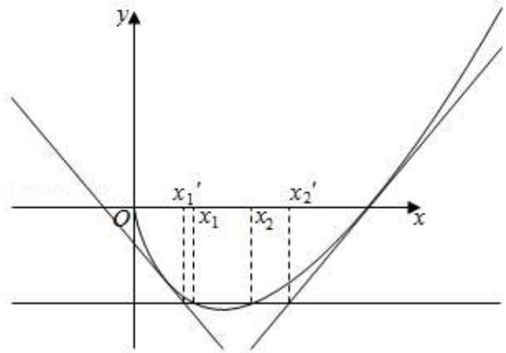

# 第24讲 不等式的证明问题

# 知识梳理

利用导数证明不等式问题,方法如下:

(1) 直接构造函数法: 证明不等式 $f(x) > g(x)$ (或 $f(x) < g(x)$ ) 转化为证明 $f(x) - g(x) > 0$ (或 $f(x) - g(x) < 0$ ), 进而构造辅助函数 $h(x) = f(x) - g(x)$ ;  
(2)适当放缩构造法:一是根据已知条件适当放缩;二是利用常见放缩结论;  
(3) 构造“形似”函数, 稍作变形再构造, 对原不等式同解变形, 根据相似结构构造辅助函数.

(4) 对数单身狗, 指数找基友  
(5) 凹凸反转, 转化为最值问题  
(6) 同构变形

# 必考题型全归纳

# 1 题型一: 直接法

915 (2024·北京房山·北京市房山区良乡中学校考模拟预测)已知函数 $f(x) = 2\ln (x + 1)$ .

(1) 若函数 $f(x)$ 在点 $\mathrm{P}(x_{0}, f(x_{0}))$ 处的切线平行于直线 y = 2x - 2，求切点 P 的坐标及此切线方程；  
(2) 求证: 当 $x \in [0, e-1]$ 时, $f(x) \geqslant x^{2} - 2x$ . (其中 $e = 2.71828 \cdots$ )

【解析】(1)由题意得, $f'(x)=\frac{2}{x+1}$ ,所以切线斜率 $2=f'(x_{0})=\frac{2}{1+x_{0}}$ ,

所以 $x_{0}=0$ ，即 $P(0,0)$ ，此时切线方程为 y=2x；

(2) 令 $g(x) = 2\ln (x + 1) - x^2 + 2x$ , $x \in [0, \mathrm{e} - 1]$ , 则 $g'(x) = \frac{2}{x + 1} - 2x + 2 = \frac{2(2 - x^2)}{x + 1}$ ,

当 $0 \leqslant x < \sqrt{2}$ 时， $g'(x) > 0, g(x)$ 单调递增，当 $x > \sqrt{2}$ 时， $g'(x) < 0, g(x)$ 单调递减，又 $g(0) = 0, g(\mathrm{e}-1) = 2 + (\mathrm{e}-1)(3-\mathrm{e}) = 4\mathrm{e}-\mathrm{e}^{2} - 1 > 0,$

所以 $g(x)_{\min}=g(0)=0$ , 即 $g(x)\geqslant0$ 恒成立，

所以当 $x \in [0, e-1]$ 时， $f(x) \geqslant x^{2} - 2x$ .

916 (2024·北京·高二北京二十中校考期中)已知函数 $f(x) = \frac{\ln x}{x} - \frac{1}{x}$ .

(1) 求曲线 $y = f(x)$ 在点 $(1, f(1))$ 处的切线方程；  
(2) 求证: $f(x) \leqslant 2x - 3$ .

【解析】(1) $f'(x)=\frac{1-\ln x}{x^{2}}+\frac{1}{x^{2}}=\frac{2-\ln x}{x^{2}},f'(1)=2,$

$f(1)=-1$ , 所以切点为 $(1,-1)$ , 由点斜式可得, $y+1=2(x-1)$ ,

所以切线方程为: y = 2x - 3.

(2) 由题可得, $\frac{\ln x}{x} - \frac{1}{x} \leqslant 2x - 3 \Leftrightarrow \ln x - 1 \leqslant 2x^2 - 3x$

设 $g(x)=\ln x-2x^{2}+3x-1$ ,

$$
g ^ {\prime} (x) = \frac {1}{x} - 4 x + 3 = \frac {- 4 x ^ {2} + 3 x + 1}{x} = \frac {(- x + 1) (4 x + 1)}{x},
$$

所以当 0 < x < 1 时， $g'(x) = \frac{(-x + 1)(4x + 1)}{x} > 0,$

当 x > 1 时， $g'(x) = \frac{(-x + 1)(4x + 1)}{x} < 0,$

所以 $g(x)$ 在 $(0,1)$ 单调递增， $(1,+\infty)$ 单调递减，

所以 $g(x) \leqslant g(x)_{\max} = g(1) = 0,$

即 $f(x)\leqslant 2x - 3.$

917 已知函数 $f(x)=(a-1)\ln x+x+\frac{a}{x}, a<0.$

(1) 讨论函数 $f(x)$ 的单调性;  
(2) 当 $a < -1$ 时, 证明: $\forall x \in (1, +\infty), f(x) > -a - a^2$ .

【解析】解： $(1)f'(x)=\frac{a-1}{x}+1-\frac{a}{x^{2}}=\frac{(x-1)(x+a)}{x^{2}}$

因 x > 0, a < 0,

①当 -1 < a < 0 时，0 < -a < 1，函数 $f(x)$ 在 $(0, -a)$ 内单调递增，在 $(-a, 1)$ 内单调递减，在 $(1, +\infty)$ 内单调递增；  
② 当 a = -1 时， $f'(x) = \frac{(x-1)^2}{x^2} \geqslant 0$ ，函数 $f(x)$ 在 $(0, +\infty)$ 内单调递增；  
③当 a<-1 时，-a>1，函数 $f(x)$ 在 $(0,1)$ 内单调递增，在 $(1,-a)$ 内单调递减，在 $(-a,+\infty)$ 内单调递增；

综上: 当 -1 < a < 0 时, 函数 $f(x)$ 在 $(0, -a)$ 内单调递增, 在 $(-a, 1)$ 内单调递减, 在 $(1, +\infty)$ 内单调递增;

当 a = -1 时，函数 $f(x)$ 在 $(0, +\infty)$ 内单调递增；

当 a<-1 时, 函数 $f(x)$ 在 $(0,1)$ 内单调递增, 在 $(1,-a)$ 内单调递减, 在 $(-a,+\infty)$ 内单调递增;

(2) 当 $a < -1$ 时, 由 (1) 得, 函数 $f(x)$ 在 $(0,1)$ 内单调递增, 在 $(1,-a)$ 内单调递减, 在 $(-a, +\infty)$ 内单调递增,

函数 $f(x)$ 在 $(1, +\infty)$ 内的最小值为 $f(-a) = (a - 1)\ln (-a) - a - 1$ ,

欲证不等式 $f(x) > -a - a^{2}$ 成立，即证 $-a - a^{2} < (a - 1)\ln(-a) - a - 1$ ，即证 $a^{2} + (a - 1)\ln(-a) - 1 > 0$ ，

因 a<-1，所以只需证 $\ln(-a)<-a-1$ ，

令 $h(x) = \ln x - x + 1 (x \geqslant 1)$ , 则 $h'(x) = \frac{1}{x} - 1 = \frac{-(x - 1)}{x} \leqslant 0$ ,

所以, 函数 $h(x)$ 在 $[1, +\infty)$ 内单调递减, $h(x) \leqslant h(1) = 0$ ,

又因 a<-1，即 -a>1。所以 $h(-a)=\ln(-a)+a+1<0$ ，

即当 a<-1 时， $\ln(-a)<-a-1$ 成立，

综上, 当 a<-1 时, $\forall x\in(1,+\infty)$ , $f(x)>-a-a^{2}$ .

# 2 题型二:构造函数(差构造、变形构造、换元构造、递推构造)

918 (2024·吉林通化·梅河口市第五中学校考模拟预测)已知函数 $f(x) = \left(1 + \frac{1}{x}\right)^x (x > 0)$ .

(1) 证明: $f(x) < e;$   
(2) 讨论 $f(x)$ 的单调性, 并证明: 当 $n \in \mathbb{N}^*$ 时, $(2n+1)\ln(n+1) < n\ln n +$

$$
(n + 1) \ln (n + 2).
$$

【解析】(1) 证明: 令 $h(t)=\ln(1+t)-t(t>0)$ ，则 $h'(t)=\frac{1}{1+t}-1=-\frac{t}{1+t}<0$ ,

所以 $h(t)$ 在 $(0, +\infty)$ 上单调递减，所以 $h(t) < h(0) = 0$ ，即 $\ln(1+t) < t$ .

令 $t = \frac{1}{x} (x > 0)$ , 则有 $\ln \left(1 + \frac{1}{x}\right) < \frac{1}{x}$ ,所以 $x\ln \left(1 + \frac{1}{x}\right) < 1$ ，所以 $\ln \left(1 + \frac{1}{x}\right)^x < 1, \left(1 + \frac{1}{x}\right)^x < \mathrm{e}$ ，即 $f(x) < \mathrm{e}$ .

(2) 由 $f(x) = \left(1 + \frac{1}{x}\right)^x (x > 0)$ 可得 $\ln f(x) = x\ln \left(1 + \frac{1}{x}\right)$ ,

令 $g(x)=x\ln\left(1+\frac{1}{x}\right)$ ，则 $g'(x)=\ln\left(1+\frac{1}{x}\right)-\frac{\frac{1}{x}}{1+\frac{1}{x}}$ ,

令 $\varphi(t)=\ln(1+t)-\frac{t}{1+t}(t>0)$ ，则 $\varphi'(t)=\frac{1}{1+t}-\frac{1}{(1+t)^{2}}=\frac{t}{(1+t)^{2}}>0,$

所以 $\varphi(t)$ 在 $(0,+\infty)$ 上单调递增， $\varphi(t)>\varphi(0)=0$ .

令 $t=\frac{1}{x}(x>0)$ ，则有 $g'(x)=\ln\left(1+\frac{1}{x}\right)-\frac{\frac{1}{x}}{1+\frac{1}{x}}>0$ ，

所以 $g(x)$ 在 $(0,+\infty)$ 上单调递增，所以 $f(x)=\left(1+\frac{1}{x}\right)^{x}$ 在 $(0,+\infty)$ 上单调递增，所以对于 $n\in N^{*}$ ，有 $\left(1+\frac{1}{n}\right)^{n}<\left(1+\frac{1}{n+1}\right)^{n+1}$ ，

所以 $\ln\left(1+\frac{1}{n}\right)^{n}<\ln\left(1+\frac{1}{n+1}\right)^{n+1}$ ，所以 $n\ln\left(1+\frac{1}{n}\right)<(n+1)\ln\left(1+\frac{1}{n+1}\right)$ ,

即 $n[\ln (n + 1) - \ln n] < (n + 1)[\ln (n + 2) - \ln (n + 1)]$

整理得: $(2n+1)\ln(n+1)<n\ln n+(n+1)\ln(n+2)$ .

919 已知曲线 $f(x)=\frac{x^{2}-1}{2}$ 与曲线 $g(x)=a\ln x$ 在公共点 $(1,0)$ 处的切线相同，

(I) 求实数 a 的值;

(II) 求证: 当 x > 0 时, $\frac{x^{2} - 1}{2} \geqslant x - 1 \geqslant \ln x$ .

【解析】(I) 解: $f'(x)=x$ , $g'(x)=\frac{a}{x}$ ,

依题意 $f'(1)=g'(1)$ , $\therefore a=1;$

(Ⅱ) 证明: 由 $\frac{x^{2}-1}{2}-(x-1)=\frac{1}{2}(x-1)^{2}\geqslant0$ , 得 $\frac{x^{2}-1}{2}\geqslant x-1$ ,

令 $h(x)=x-1-\ln x$ ，则 $h'(x)=1-\frac{1}{x}=\frac{x-1}{x}$ ,

$\therefore x\in(0,1)$ 时， $h'(x)<0,h(x)$ 递减；

$x \in (1, +\infty)$ 时， $h'(x) > 0, h(x)$ 递增.

∴ x > 0 时, $h(x) \geqslant h(1) = 0$ , 即 $x - 1 \geqslant \ln x$ ,

综上所述， $x > 0$ 时， $\frac{x^2 - 1}{2}\geqslant x - 1\geqslant \ln x.$

920 已知函数 $f(x)=\mathrm{e}^{x}-ax-1(a\in\mathrm{R}), g(x)=x\ln x.$

(1) 求函数 $f(x)$ 的单调区间；  
(2) 若直线 y = x - 1 是函数 $y = f(x)$ 图象的切线, 求证: 当 x > 0 时, $f(x) \geqslant g(x)$ .

【解析】(1) 解: $f'(x)=\mathrm{e}^{x}-a$ ,

当 $a \leqslant 0$ 时， $f'(x) > 0, f(x)$ 在 $(-∞, +∞)$ 上单调递增；

当 a > 0 时, 令 $f'(x) = 0$ , 可得 $x = \ln a$ ,

当 $x \in (-\infty, \ln a)$ 时， $f'(x) < 0, f(x)$ 单调递减，

当 $x \in (\ln a, +\infty)$ 时， $f'(x) > 0, f(x)$ 单调递增.

综上可得, 当 $a \leqslant 0$ 时, $f(x)$ 在 $(-\infty, +\infty)$ 上单调递增;

当 a > 0 时， $f(x)$ 在 $(-\infty, \ln a)$ 上单调递减，在 $(\ln a, +\infty)$ 上单调递增.

(2) 证明: 直线 y = x - 1 是函数 $y = f(x)$ 图象的切线, 设切点为 $(x_{0}, f(x_{0}))$ ,

则 $\mathrm{e}^{x_0} - a = 1$ ，即 $x_0 = \ln (a + 1)$

∵切点在切线上，∴ $f(x_{0})=\ln(a+1)-1$ ，

$$
\because f (x _ {0}) = f (\ln (a + 1)) = a - a \ln (a + 1),
$$

∴ $\ln(a+1)-1=a-a\ln(a+1)$ ，解得 a=e-1，

当 x > 0 时， $f(x) \geqslant g(x)$ 等价于 $e^{x} - (e - 1)x - 1 \geqslant x\ln x$ ，

等价于 $\frac{\mathrm{e}^x}{x} - (\mathrm{e} - 1) - \frac{1}{x} - \ln x \geqslant 0$

设 $h(x) = \frac{\mathrm{e}^x}{x} - (\mathrm{e} - 1) - \frac{1}{x} - \ln x,$

则 $h'(x)=\frac{xe^{x}-\mathrm{e}^{x}}{x^{2}}+\frac{1}{x^{2}}-\frac{1}{x}=\frac{(\mathrm{e}^{x}-1)(x-1)}{x^{2}}$ ,

$\because x>0,\mathrm{e}^{x}-1>0,$ 由 $h'(x)=0,$ 得x=1,

当 $x \in (0,1)$ 时， $h'(x) < 0$ ， $h(x)$ 单调递减，

当 $x \in (1, +\infty)$ 时， $h'(x) > 0$ ， $h(x)$ 单调递增，

$\therefore h(x)_{\min}=h(1)=0,$ 即 $h(x)\geqslant0,$

$$
\therefore f (x) \geqslant g (x).
$$

921 已知函数 $f(x) = \sin x + \frac{x^2}{2} - \ln (1 + x)$ .

(1) 证明: $f(x) \geqslant 0$ ;   
(2) 数列 $\{a_{n}\}$ 满足: $0 < a_{1} < \frac{1}{2}$ , $a_{n+1} = f(a_{n}) (n \in \mathbb{N}^{*})$ .

(i) 证明: $0 < a_{n} < \frac{1}{2} (n \in \mathbb{N}^{*})$ ;

(ii) 证明: $\forall n \in \mathbf{N}^*$ , $a_{n+1} < a_n$ .

【解析】证明：(1) 由题意知， $f'(x)=\cos x+x-\frac{1}{1+x}$ ， $x\in(-1,+\infty)$

①当 $x \in (-1,0)$ 时， $f'(x) < 1 + x - \frac{1}{1 + x} < x < 0$ ,

所以 $f(x)$ 在区间 $(-1,0)$ 上单调递减，

②当 $x \in (0, +\infty)$ 时，令 $g(x) = f'(x)$ ，因为 $g'(x) = 1 + \frac{1}{(1 + x)^2} - \sin x > \frac{1}{(1 + x)^2} > 0$ ，

所以 $g(x)$ 在区间 $(0, +\infty)$ 上单调递增, 因此 $g(x) > g(0) = 0$ ,

故当 $x \in (0, +\infty)$ 时， $f'(x) > 0$ ，

所以 $f(x)$ 在区间 $(0, +\infty)$ 上单调递增，

因此当 $x \in (-1, +\infty)$ 时， $f(x) \geqslant f(0) = 0$

所以 $f(x) \geqslant 0;$

(2) (i) 由 (1) 知, $f(x)$ 在区间 $\left(0, \frac{1}{2}\right)$ 上单调递增, $f(x) > f(0) = 0$ ,

因为 $\left(\frac{3}{2}\right)^{8}=\left(1+\frac{1}{2}\right)^{8}=1+\frac{1}{2}c_{8}^{1}+\frac{1}{4}C_{8}^{2}+\cdots>1+4+7=12>e,$

故 $1-8\ln\frac{3}{2}=\ln e-\ln\left(\frac{3}{2}\right)^{8}<0,$

所以 $f(x) < f\left(\frac{1}{2}\right) = \sin \frac{1}{2} + \frac{1}{8} - \ln \frac{3}{2} < \sin \frac{\pi}{6} + \frac{1}{8} - \ln \frac{3}{2} = \frac{1}{2} + \frac{1}{8}\left(1 - 8\ln \frac{3}{2}\right) < \frac{1}{2},$

因此当 $x \in \left(0, \frac{1}{2}\right)$ 时， $0 < f(x) < 1$ ，又因为 $a_{1} \in \left(0, \frac{1}{2}\right)$ ,

所以 $a_{n}=f(a_{n-1})=f(f(a_{n-2}))=\cdots=f(f(\cdots f(a_{1})\cdots))\in\left(0,\frac{1}{2}\right)$ ,(ii) 函数 $h(x)=f(x)-x,\left(0<x<\frac{1}{2}\right)$ ，则 $h'(x)=f'(x)-1=x+\cos x-1-\frac{1}{1+x}$ ,

令 $\varphi(x)=h'(x)$ ，则 $\varphi'(x)=g'(x)>0$ ，

所以 $\varphi(x)$ 在区间 $\left(0,\frac{1}{2}\right)$ 上单调递增；

因此 $h'(x) = \varphi(x) \leqslant \varphi\left(\frac{1}{2}\right) = \frac{1}{2} + \cos\frac{1}{2} - 1 - \frac{2}{3} = \cos\frac{1}{2} - \frac{7}{6} < 0,$

所以 $h(x)$ 在区间 $\left(0, \frac{1}{2}\right)$ 上单调递减，所以 $h(x) < h(0) = 0$ ，

因此 $a_{n + 1} - a_n = f(a_n) - a_n = g(a_n) < 0$

所以对 $\forall n\in N^{*},a_{n+1}<a_{n}.$

922 讨论函数 $f(x)=\frac{x-2}{x+2}\mathrm{e}^{x}$ 的单调性，并证明当 x>0 时， $(x-2)\mathrm{e}^{x}+x+2>0$ .

【解析】解： $f(x)=\frac{x-2}{x+2}\mathrm{e}^{x},f'(x)=\mathrm{e}^{x}\left(\frac{x-2}{x+2}+\frac{4}{(x+2)^{2}}\right)=\frac{x^{2}\mathrm{e}^{x}}{(x+2)^{2}},$

∵ 当 $f'(x) > 0$ 时, x < -2 或 x > -2,

∴ $f(x)$ 在 $(-∞, -2)$ 和 $(-2, +∞)$ 上单调递增，

证明：∴ x > 0 时， $\frac{x - 2}{x + 2} e^{x} > f(0) = -1$

$$
\therefore (x - 2) \mathrm{e} ^ {x} + x + 2 > 0.
$$

# 3 题型三:分析法

923 已知函数 $f(x) = \ln (a - x)$ ，已知 $x = 0$ 是函数 $y = xf(x)$ 的极值点.

(1) 求 $a$ ;   
(2) 设函数 $g(x)=\frac{x+f(x)}{xf(x)}$ . 证明: $g(x)<1$ .

【解析】(1) 解: 由题意, $f(x)$ 的定义域为 $(-∞, a)$ ,

令 $t(x)=xf(x)$ ，则 $t(x)=x\ln(a-x)$ ， $x\in(-\infty,a)$ ，

则 $t'(x)=\ln(a-x)+x\cdot\frac{-1}{a-x}=\ln(a-x)+\frac{-x}{a-x}$ ,

因为 x=0 是函数 $y=xf(x)$ 的极值点，则有 $t'(0)=0$ ，即 $\ln a=0$ ，所以 a=1，

当 a=1 时， $t'(x)=\ln(1-x)+\frac{-x}{1-x}=\ln(1-x)+\frac{-1}{1-x}+1$ ，且 $t'(0)=0$ ，

因为 $t''(x)=\frac{-1}{1-x}+\frac{-1}{(1-x)^{2}}=\frac{x-2}{(1-x)^{2}}<0,$

则 $t'(x)$ 在 $(-∞,1)$ 上单调递减，

所以当 $x \in (-\infty, 0)$ 时， $t'(x) > 0$ ，

当 $x \in (0,1)$ 时， $t'(x) < 0$ ，

所以 a=1 时，x=0 是函数 $y=xf(x)$ 的一个极大值点.

综上所述，a=1;

(2) 证明: 由 (1) 可知, $xf(x)=x\ln(1-x)$ ,

要证 $\frac{x + f(x)}{xf(x)} < 1$ ，即需证明 $\frac{x + \ln(1 - x)}{x\ln(1 - x)} < 1,$

因为当 $x \in (-\infty, 0)$ 时， $x \ln (1 - x) < 0$

当 $x \in (0,1)$ 时， $x \ln (1 - x) < 0$

所以需证明 $x + \ln(1 - x) > x \ln(1 - x)$ ，即 $x + (1 - x) \ln(1 - x) > 0$ ，

令 $h(x)=x+(1-x)\ln(1-x)$ ,则 $h'(x)=(1-x)\cdot\frac{-1}{1-x}+1-\ln(1-x)=-\ln(1-x)$ ,

所以 $h'(0)=0$ ，当 $x\in(-\infty,0)$ 时， $h'(x)<0$ ，

当 $x \in (0,1)$ 时， $h'(x) > 0$ ，

所以 x=0 为 $h(x)$ 的极小值点，

所以 $h(x)>h(0)=0$ , 即 $x+\ln(1-x)>x\ln(1-x)$

故 $\frac{x + \ln(1 - x)}{x\ln(1 - x)} < 1,$

所以 $\frac{x+f(x)}{xf(x)}<1.$

924 (2024·山东泰安·统考模拟预测)已知函数 $f(x)=\mathrm{e}^{a-x}$

(1) 求 $y = f(x)$ 在 x = a 处的切线;  
(2) 若 0 < a < 2，证明当 x > 0 时， $f(x) < \frac{a}{x} + 2$ .

【解析】(1) 因为 $f'(x) = -\mathrm{e}^{a-x}$ ，所以 $f'(a) = -1$ ，∴ 切线斜率为 -1

因为 $f(a)=1$ ，所以切点为 $(a,1)$

∴切线方程为 $y-1=-\left(x-a\right)$ 即 $x+y-a-1=0$

(2) 法一: 令 $h(x)=\mathrm{e}^{x}-(x+1),(x>0)$ ，所以 $h'(x)=\mathrm{e}^{x}-1>0$ ，

所以 $h(x)$ 在 $(0, +\infty)$ 单调递增，∴ $h(x) > h(0) = 0$ ，∴ $e^{x} > x + 1$

所以 $e^{-x}<\frac{1}{x+1}$ ，所以 $f(x)<\frac{e^{a}}{x+1}$ ，

所以要证 $f(x) < \frac{a}{x} + 2$ 只需证明 $\frac{\mathrm{e}^a}{x+1} < \frac{a}{x} + 2, x > 0$

变形得 $\mathrm{e}^a - a - 2 < 2x + \frac{a}{x} (x > 0)$

因为 $2x + \frac{a}{x} \geqslant 2\sqrt{2a} (x > 0)$

所以只需证明 $\mathrm{e}^a - a - 2 < 2\sqrt{2a} (x > 0)$ ，即 $\mathrm{e}^a < (\sqrt{a} + \sqrt{2})^2$

两边同取对数得: $a < 2 \ln (\sqrt{a} + \sqrt{2}), (0 < a < 2)$

令 $g(a)=a-2\ln(\sqrt{a}+\sqrt{2}),(0<a<2)$ ,

则 $g'(a)=\frac{a+\sqrt{2a}-1}{\sqrt{a}(\sqrt{a}+\sqrt{2})}(0<a<2)$

显然 $\varphi(a)=a+\sqrt{2a}-1$ 在 $(0,2)$ 递增， $\varphi(0)<0,\varphi(2)>0,$

所以存在 $m \in (0,2)$ ，当 $a \in (0,m)$ 时 $g'(a) < 0, g(a)$ 递减，

当 $a \in (m,2)$ 时 $g'(a) > 0, g(a)$ 递增;

因为 $g(0) = -2\ln \sqrt{2} < 0, g(2) = 2 - 2\ln 2\sqrt{2} < 0$

所以 $g(a)<0$ 在 $(0,2)$ 上恒成立, 所以原命题成立

法二:设 $t=\frac{a}{x}$ 则 a=xt,

要证: $e^{a-x}<t+2$

需证: $e^{tx-x}<t+2$

即证: $(t-1)x<\ln(t+2)$

因为 $x = \frac{a}{t}$ , 需证 $(t - 1) \times \frac{a}{t} < \ln (t + 2)$ , 即证: $a(t - 1) < t \ln (t + 2)$

① $t \leqslant 1$ 时 $a(t-1) \leqslant 0 < t \ln(t+2)$ 必然成立  
② t>1 时, 因为 0<a<2 所以只需证明 $2(t-1)<t\ln(t+2)$ ,

令 $h(t) = t\ln (t + 2) - 2(t - 1), h'(t) = \ln (t + 2) + \frac{t}{t + 2} - 2,$

令 $g(t) = \ln (t + 2) + \frac{t}{t + 2} - 2, g'(t) = \frac{1}{t + 2} + \frac{2}{(t + 2)^2} > 0$

∴ $h'(t)$ 在上 $(0, +\infty)$ 为增函数

因为 $h'(2)=\ln4-\frac{3}{2}=\ln4-\ln\sqrt{e^{3}}<0,$

$h'(3)=\ln5-\frac{7}{5}=\ln5-\ln\sqrt[5]{e^{7}},5^{5}=3125>3^{7}=2187>e^{7},$ 所以 $h'(3)>0$

所以存在 $t_0 \in (2,3)$ , 使得 $h'(t_0) = 0$

∴ $h(t)$ 在 $(1, t_{0})$ 上为减函数，在 $(t_{0}, +\infty)$ 上为增函数

$$
\therefore h (t) _ {\min} = t _ {0} \ln \left(t _ {0} + 2\right) - 2 \left(t _ {0} - 1\right) = t _ {0} \left(2 - \frac {t _ {0}}{t _ {0} + 2}\right) - 2 \left(t _ {0} - 1\right) = \frac {- t _ {0} ^ {2} + 2 t _ {0} + 4}{t _ {0} + 2}
$$

$$
\because 2 <   t _ {0} <   3, \therefore h (t _ {0}) > 0. \therefore h (t) > 0
$$

综上可知,不等式成立

925 已知 $1 < a \leqslant 2$ ，函数 $f(x) = e^{x} - x - a$ ，其中 $e = 2.71828 \cdots$ 为自然对数的底数.

(I) 证明: 函数 $y = f(x)$ 在 $(0, +\infty)$ 上有唯一零点;  
(II) 记 $x_{0}$ 为函数 $y = f(x)$ 在 $(0, +\infty)$ 上的零点，证明：  
(i) $\sqrt{a - 1} \leqslant x_0 \leqslant \sqrt{2(a - 1)}$ ;   
(ii) $x_0f(\mathrm{e}^{x_0})\geqslant (\mathrm{e} - 1)(a - 1)a.$

【解析】证明：(I) $\because f(x) = \mathrm{e}^{x} - x - a = 0 (x > 0), \therefore f'(x) = \mathrm{e}^{x} - 1 > 0$ 恒成立，

∴ $f(x)$ 在 $(0, +\infty)$ 上单调递增，

$\because 1 < a \leqslant 2, \therefore f(2) = \mathrm{e}^{2} - 2 - a \geqslant \mathrm{e}^{2} - 4 > 0,$ 又 $f(0) = 1 - a < 0$

∴ 函数 $y=f(x)$ 在 $(0,+\infty)$ 上有唯一零点.

(II) (i) $f(x_0) = 0$ , $\therefore e^{x_0} - x_0 - a = 0$ ,

$$
\therefore \sqrt {a - 1} \leqslant x _ {0} \leqslant \sqrt {2 (a - 1)}, \therefore \mathrm{e} ^ {x _ {0}} - x _ {0} - 1 \leqslant x _ {0} ^ {2} \leqslant 2 \left(\mathrm{e} ^ {x _ {0}} - x _ {0} - 1\right),
$$

令 $g(x)=\mathrm{e}^{x}-x-1-x^{2}(0<x<2)$ , $h(x)=\mathrm{e}^{x}-x-1-\frac{x^{2}}{2}$ , $(0<x<2)$ ,

一方面， $h'(x)=\mathrm{e}^{x}-1-x=h_{1}(x)$ ， $h_{1}'(x)=\mathrm{e}^{x}-1>0$

$\therefore h'(x)>h'(0)=0,\therefore h(x)$ 在 $(0,2)$ 单调递增，

$$
\therefore h (x) > h (0) = 0,
$$

$$
\therefore \mathrm{e} ^ {x} - x - 1 - \frac {x ^ {2}}{2} > 0, 2 (\mathrm{e} ^ {x} - x - 1) > x ^ {2},
$$

另一方面， $1<a\leq2,\therefore0<a-1\leq1,$

∴ 当 $x_{0} \geqslant 1$ 时， $\sqrt{a-1} \leqslant x_{0}$ 成立，

∴只需证明当0<x<1时， $g(x)=\mathrm{e}^{x}-x-1-x^{2}\leqslant0$

$$
\because g ^ {\prime} (x) = \mathrm{e} ^ {x} - 1 - 2 x = g _ {1} (x), g _ {1 ^ {\prime}} (x) = \mathrm{e} ^ {x} - 2 = 0, \therefore x = \ln 2,
$$

当 $x \in (0, \ln 2)$ 时， $g_{1'}(x) < 0$ ，当 $x \in (\ln 2, 1)$ 时， $g_{1'}(x) > 0$

$$
\therefore g ^ {\prime} (x) <   \max \left\{g ^ {\prime} (0), g ^ {\prime} (1) \right\}, g ^ {\prime} (0) = 0, g ^ {\prime} (1) = \mathrm{e} - 3 <   0,
$$

$\therefore g'(x)<0,\therefore g(x)$ 在 $(0,1)$ 单调递减，

$$
\therefore g (x) <   g (0) = 0, \therefore \mathrm{e} ^ {x} - x - 1 <   x ^ {2},
$$

综上， $\mathrm{e}^{x_{0}}-x_{0}-1\leqslant x_{0}^{2}\leqslant2(\mathrm{e}^{x_{0}}-x_{0}-1)$

$$
\therefore \sqrt {a - 1} \leqslant x _ {0} \leqslant \sqrt {2 (a - 1)}.
$$

(ii) 要证明 $x_{0}f(\mathrm{e}^{x_{0}}) \geqslant (\mathrm{e}-1)(a-1)a$ ，只需证 $x_{0}f(x_{0}+a) \geqslant (\mathrm{e}-1)(a-1)a$ ，

由(i)得只需证 $\mathrm{e}^{\sqrt{a - 1} + a} - \sqrt{a - 1} -2a\geqslant (\mathrm{e} - 1)a\sqrt{a - 1},$

$$
\because \mathrm{e} ^ {x} \geqslant 1 + x + {\frac {1}{2}} x ^ {2}, \therefore \text {   只需证   } 1 + {\frac {1}{2}} ({\sqrt {a - 1}} + a) ^ {2} - a \geqslant (\mathrm{e} - 1) a {\sqrt {a - 1}} ,
$$

只需证 $a^2 - (\sqrt{a - 1})^2 - 2(\mathrm{e} - 2)a\sqrt{a - 1} \geqslant 0$ ，即证 $\frac{a}{\sqrt{a - 1}} - \frac{\sqrt{a - 1}}{a} \geqslant 2(\mathrm{e} - 2)$ ，

$$
\because \frac {a}{\sqrt {a - 1}} = \frac {1}{\sqrt {a - 1}} + \sqrt {a - 1} \in [ 2, + \infty),
$$

$$
\therefore \frac {a}{\sqrt {a - 1}} - \frac {\sqrt {a - 1}}{a} \geqslant 2 - \frac {1}{2} = \frac {3}{2} \geqslant 2 (\mathrm{e} - 2),
$$

$$
\therefore x _ {0} f \left(\mathrm{e} ^ {x _ {0}}\right) \geqslant (\mathrm{e} - 1) (a - 1) a.
$$

926 已知函数 $f(x)=\mathrm{e}^{x}-ax-1$ 在 $(0,+\infty)$ 上有零点 $x_{0}$ ，其中 $e=2.71828\cdots$ 是自然对数的底数.

(I) 求实数 a 的取值范围;  
(II) 记 $g(x)$ 是函数 $y = f(x)$ 的导函数, 证明: $g(x_{0}) < a(a - 1)$ .

【解析】(I) 解: 函数 $f(x)=\mathrm{e}^{x}-ax-1$ , 则 $f'(x)=\mathrm{e}^{x}-a$ ,

①当 $a \leqslant 0$ 时， $f'(x) > 0$ 恒成立，

则 $f(x)$ 在 $(0, +\infty)$ 上单调递增，

所以 $f(x) > f(0) = 0$ ，故函数无零点，不符合题意；

②当 a > 0 时，由 $f'(x) = \mathrm{e}^{x} - a = 0$ ，得 $x = \ln a$ ，

若 $\ln a \leqslant 0$ ，即 $0 < a \leqslant 1$ ，此时 $f(x)$ 在 $(0, +\infty)$ 上单调递增，不符合题意；

若 $\ln a > 0$ ，即 a > 1，则 $f(x)$ 在 $(0, \ln a)$ 上单调递减， $f(x)$ 在 $(\ln a, +\infty)$ 上单调递增，

又 $f(0)=0$ ，故 $\exists x_{1}>0$ ，使得 $f(x_{1})<f(0)=0$ ，

而当 $x \to +\infty$ 时， $f(x) \to +\infty$ 时，

故 $\exists x_{2}>x_{1}$ ，使得 $f(x_{2})>0$ ，

根据零点存在定理, $\exists x_{0} \in [x_{1}, x_{2}]$ , 使得 $f(x_{0}) = 0$ , 符合题意;

综上所述,实数a的取值范围是a>1;

(II) 证明: $g(x) = f'(x) = \mathrm{e}^x - a$ ,

所以 $g(x_{0})<a(a-1)$ ，即 $x_{0}<2\ln a$ ，

由（I）知 $x_0 \in (\ln a, +\infty)$ 且 $f(x)$ 在 $(0, \ln a)$ 上单调递减，在 $(\ln a, +\infty)$ 上单调递增，

故只要证明: $f(2\ln a)>0$ ,

即 $f(2\ln a)=a^{2}-2a\ln a-1=a\left(a-2\ln a-\frac{1}{a}\right)>0, a>1,$

设 $h(x)=x-2\ln x-\frac{1}{x}(x>1)$ ,

则 $h'(x)=1-\frac{2}{x}+\frac{1}{x^{2}}=\frac{(x-1)^{2}}{x^{2}}>0,$

故 $h(x)$ 在 $(1, +\infty)$ 上单调递增，即 $h(x) > h(1) = 0$ ，

所以 $f(2\ln a) > 0$ 成立；

综上所述， $g(x_{0})<a(a-1)$ 成立.

# 4 题型四:凹凸反转、拆分函数

927 (2024·北京·高三专题练习)已知函数 $f(x)=x^{3}+ax^{2}+bx+a^{2}$ ，当 a=0, b=-3 时，证明：任意的 $x\in R$ ，都有 $f(x)+2\geqslant\frac{x}{\mathrm{e}^{x}}-\frac{1}{\mathrm{e}}$ 恒成立.

【解析】由题设有 $f(x)=x^{3}-3x$ ，设 $h(x)=f(x)+2=x^{3}-3x+2$ ， $g(x)=\frac{x}{\mathrm{e}^{x}}-\frac{1}{\mathrm{e}}$

要证 $f(x) + 2 \geqslant \frac{x}{\mathrm{e}^x} - \frac{1}{\mathrm{e}}$ 即证 $h(x) > g(x)$ .

下面证明: 当 x > 0 时, $h(x) > g(x)$ .

此时 $h'(x)=3x^{2}-3$ , $g'(x)=\frac{1-x}{\mathrm{e}^{x}}$ ,

当 x > 1 时， $h'(x) > 0, g'(x) < 0,$

故 $g(x)$ 在 $(1,+\infty)$ 上为减函数， $h(x)$ 在 $(1,+\infty)$ 上为增函数，

当 0 < x < 1 时， $h'(x) < 0, g'(x) > 0$ ,

故 $g(x)$ 在 $(0,1)$ 上为增函数， $h(x)$ 在 $(0,1)$ 上为减函数，

故在 $(0, +\infty)$ 上，有 $g(x)_{\max} = g(1) = 0, h(x)_{\min} = h(1) = 0,$

故当 x > 0 时, $h(x) \geqslant g(x)$ .

当 $x = 0, h(0) = 2 > -\frac{1}{\mathrm{e}} = g(0), g(x) = \frac{x}{\mathrm{e}^x} - \frac{1}{\mathrm{e}},$

当 x<0 时, 要证 $h(x)>g(x)$ 即证 $x^{3}-3x>\frac{x}{e^{x}}$ 即证 $\mathrm{e}^{x}(x^{2}-3)<1$ ,

设 $S(x)=\mathrm{e}^{x}(x^{2}-3)$ ，其中 x<0，故 $S'(x)=\mathrm{e}^{x}(x^{2}+2x-3)$ ，

当 x<-3 时， $S'(x)>0$ ; 当 -3<x<0 时， $S'(x)<0$ ,

故 $S(x)$ 在 $(-∞,-3)$ 上为增函数，在 $(-3,0)$ 上为减函数，

故在 $(- \infty, 0)$ 上， $\mathrm{S}(x)_{\max} = \frac{6}{\mathrm{e}^3} < 1$

故 $\mathrm{e}^{x}(x^{2}-3)<1$ , 所以当 x<0 时, $h(x)>g(x)$ 成立.

综上,任意的 $x \in R$ , 都有 $f(x) + 2 \geqslant \frac{x}{\mathrm{e}^{x}} - \frac{1}{\mathrm{e}}$ 恒成立.

928 (2024·河南开封·校考模拟预测)设函数 $f(x) = (x^2 - 2x)\mathrm{e}^x$ , $g(x) = \mathrm{e}^2\ln x - aex$ .

(1) 若函数 $g(x)$ 在 $(\mathrm{e}, +\infty)$ 上存在最大值, 求实数 a 的取值范围;  
(2) 当 $a = 2$ 时, 求证: $f(x) > g(x)$ .

【解析】(1)(1)由 $g(x)=\mathrm{e}^{2}\ln x-aex$ 得： $g'(x)=\frac{\mathrm{e}^{2}}{x}-ae=\frac{\mathrm{e}^{2}-aex}{x}(x>0)$ ,

①当 $a \leqslant 0$ 时， $g'(x) > 0$ ，所以 $g(x)$ 在 $(0, +\infty)$ 上单调递增，在 $(\mathrm{e}, +\infty)$ 不存在最大值，  
②当 a > 0 时, 令 $g'(x) = 0$ , 解得: $x = \frac{e}{a} > 0$ ,

当 $x \in \left(0, \frac{\mathrm{e}}{a}\right)$ 时， $g'(x) > 0$ ， $g(x)$ 在 $\left(0, \frac{\mathrm{e}}{a}\right)$ 上单调递增，

当 $x \in \left(\frac{\mathrm{e}}{a}, +\infty\right)$ 时， $g'(x) < 0$ 在 $\left(\frac{\mathrm{e}}{a}, +\infty\right)$ 上单调递减，

所以 $g(x)$ 在 $x=\frac{e}{a}$ 时, 取得最大值 $g\left(\frac{e}{a}\right)$ ,

又由函数 $g(x)$ 在 $(e, +\infty)$ 上存在最大值，

因此 $\frac{e}{a}>e$ , 解得: a<1,

所以 a 的取值范围为 $(0,1)$ .

(2) 证明: 当 a=2 时, $g(x)=\mathrm{e}^{2}\ln x-2ex$ , 且函数 $g(x)$ 的定义域为 $(0,+\infty)$ ,

要证明 $f(x) > g(x)$ ，即证明 x > 0 时， $(x^{2} - 2x)e^{x} > e^{2}\ln x - 2ex$ ，

只需要证明: x > 0 时, $(x^{2} - 2x)e^{x} + 2ex > e^{2}\ln x$ ,

因为 x > 0，所以不等式等价于 $(x - 2)\mathrm{e}^{x} + 2\mathrm{e} > \frac{\mathrm{e}^{2}\ln x}{x}$

设 $\varphi(x)=(x-2)\mathrm{e}^{x}+2\mathrm{e}(x>0)$ ，则 $\varphi'(x)=(x-1)\mathrm{e}^{x}$

令 $\varphi'(x)=0$ 得: x=1,

当 0 < x < 1 时， $\varphi'(x) < 0$ ，当 x > 1 时， $\varphi'(x) > 0$ ，

所以 $\varphi(x)$ 在 $(0,1)$ 上单调递减，在 $(1,+\infty)$ 上单调递增，

故 $\varphi (x)\geqslant \varphi (1) = \mathrm{e}$ ，且当 $x = 1$ 时，等号成立；

又设 $h(x) = \frac{\mathrm{e}^2\ln x}{x} (x > 0)$ ，则 $h'(x) = \frac{\mathrm{e}^2(1 - \ln x)}{x^2}$ ，

令 $h'(x)=0$ 得: x=e,

当 0 < x < e 时， $h'(x) > 0$ ，当 x > e 时， $h'(x) < 0$ ，

所以 $h(x)$ 在 $(0, e)$ 上单调递增，在 $(e, +\infty)$ 上单调递减，

故 $h(x)\leqslant h(e)=e$ ，且当x=e时，等号成立；

综上可得: x > 0 时, $\varphi(x) \geqslant h(x)$ , 且等号不同时成立,

所以 $x > 0$ 时， $\varphi (x) > h(x)$

即当 $a = 2$ 时， $f(x) > g(x)$ 得证.

929 已知函数 $f(x) = a\left(\ln x + \frac{1}{x^2}\right) + \frac{x^2 + 2}{x} (a \in \mathbb{R})$ .

(I) 若 $x=\sqrt{2}$ 是 $f(x)$ 的极小值点，求 a 的取值范围；  
(II) 若 $a = -1, f'(x)$ 为 $f(x)$ 的导函数，证明：当 $1 \leqslant x \leqslant 2$ 时， $f(x) - f'(x) > \frac{3}{2}$ .

【解析】解：(I) $f(x)$ 的定义域是 $(0, +\infty)$ ,

则 $f'(x)=\frac{a}{x}-\frac{2a}{x^{3}}+1-\frac{2}{x^{2}}=\frac{(x+a)(x^{2}-2)}{x^{3}}$ ,

若 $a \geqslant 0$ ，则当 $x \in (0, \sqrt{2})$ 时， $f'(x) < 0$ ，当 $x \in (\sqrt{2}, +\infty)$ 时， $f'(x) > 0$

故 $x=\sqrt{2}$ 是函数 $f(x)$ 的极小值点,符合条件,

若 a<0，令 $f'(x)=0$ ，解得：x=-a 或 $x=\sqrt{2}$ ，

若 $-\sqrt{2}<a<0$ ，则当 $x\in(0,-a)$ 和 $x\in(\sqrt{2},+\infty)$ 时 $f'(x)>0$

当 $x \in (-a, \sqrt{2})$ 时， $f'(x) < 0$ ，

故 $x=\sqrt{2}$ 是 $f(x)$ 的极小值点,符合条件,

若 $a=-\sqrt{2}$ ，则 $f'(x)\geqslant0$ 恒成立， $f(x)$ 没有极值点，不符合条件，

若 $a < -\sqrt{2}$ , 则当 $x \in (0, \sqrt{2})$ 和 $x \in (-a, +\infty)$ 时 $f'(x) > 0$ ,

当 $x \in (\sqrt{2}, -a)$ 时 $f'(x) < 0$ ，故 $x = \sqrt{2}$ 是 $f(x)$ 的极大值点，不符合条件，

故 $a$ 的取值范围是 $(- \sqrt{2}, +\infty)$ ;

(II) 当 a = -1 时, $f(x) = -\ln x - \frac{1}{x^{2}} + x + \frac{2}{x}$ , $f'(x) = -\frac{1}{x} + \frac{2}{x^{3}} + 1 - \frac{2}{x^{2}}$ ,

则 $f(x) - f'(x) = x - \ln x - 1 + \frac{3}{x} +\frac{1}{x^2} -\frac{2}{x^3},x\in [1,2]$

设 $g(x) = x - \ln x - 1, h(x) = \frac{3}{x} + \frac{1}{x^2} - \frac{2}{x^3}, x \in [1, 2]$ ,

由 $g'(x)=1-\frac{1}{x}\geqslant0$ , 可得 $g(x)\geqslant g(1)=0$ , 当且仅当 x=1 时“=”成立，

$$
h ^ {\prime} (x) = \frac {- 3 x ^ {2} - 2 x + 6}{x ^ {4}},
$$

设 $\varphi (x) = -3x^{2} - 2x + 6$ ，则 $\varphi (x)$ 在[1，2]上递减，

$$
\because \varphi (1) = 1, \varphi (2) = - 1 0,
$$

故存在 $x_0 \in [1, 2]$ , 使得当 $x \in (1, x_0)$ 时, $\varphi(x) > 0$ , 当 $x \in (x_0, 2)$ 时, $\varphi(x) < 0$ ,

故 $h(x)$ 在 $(1, x_{0})$ 上单调递增，在 $(x_{0}, 2)$ 上单调递减，

由于 $h(1)=2$ , $h(2)=\frac{3}{2}$ , 故 $h(x)\geqslant h(2)=\frac{3}{2}$ , 当且仅当 x=2 时“=”成立,故当 $1 \leqslant x \leqslant 2$ 时， $f(x) - f'(x) = g(x) + h(x) > g(1) + h(2) = \frac{3}{2}$ .

930 已知函数 $f(x)=x^{3}-ax.$ $(a\in\mathrm{R})$

(I) 求函数 $f(x)$ 的单调区间；  
(II) 求证: $\frac{x}{f(x) + ax} \cdot e^{-x} + x \ln x > \frac{3}{2ex} - e^{x - 2}$ .

【解析】解 (I) $f'(x)=3x^{2}-a$

当 $a \leqslant 0$ 时, $f'(x) \geqslant 0$ 恒成立, 故函数 $f(x)$ 在 R 上单调递增

当 $a > 0$ 时，由 $f^{\prime}(x)\geqslant 0$ 可得 $c\times \geqslant \frac{\sqrt{3a}}{3}$ 或 $x\leqslant -\frac{\sqrt{3a}}{3}$

由 $f'(x)<0$ 可得 $-\frac{\sqrt{3a}}{3}<x<\frac{\sqrt{3a}}{3}$

综上可得, $a\leqslant0$ 时, $f'(x)\geqslant0$ 恒成立,故函数 $f(x)$ 在R上单调递增

当 a > 0 时，函数 $f(x)$ 的单调递增区间为 $\left(\frac{\sqrt{3a}}{3}, +\infty\right)$ ， $\left(-\infty, -\frac{\sqrt{3a}}{3}\right)$ ，单调递减区间 $\left(-\frac{\sqrt{3a}}{3}, \frac{\sqrt{3a}}{3}\right)$

(II) 证明: 原不等式可化为 $x \ln x > \frac{3}{2ex} - \frac{e^{x}}{e^{2}} - \frac{1}{x^{2} e^{x}}$

容易得 x > 0，上式两边同乘以 x 可得 $x^{2}\ln x > \frac{3}{2e} - \frac{xe^{x}}{e^{2}} - \frac{1}{xe^{x}}$

设 $p(x) = x^{2}\ln x, q(x) = \frac{3}{2\mathrm{e}} -\frac{xe^{x}}{\mathrm{e}^{2}} -\frac{1}{xe^{x}} = \frac{3}{2\mathrm{e}} -\left(\frac{xe^{x}}{\mathrm{e}^{2}} +\frac{1}{xe^{x}}\right)$

则由 $p^{\prime}(x) = x(2\ln x + 1)$ 可得 $x = 0$ (舍)或 $x = \mathrm{e}^{-\frac{1}{2}}$

∴ $0 < x < e^{-\frac{1}{2}}$ 时， $p'(x) < 0, x > e^{-\frac{1}{2}}$ 时， $p'(x) > 0$

∴ 当 $x = e^{-\frac{1}{2}}$ 时, 函数 $p(x)$ 取得最小值 $-\frac{1}{2e}$

$$
\because q (x) = \frac {3}{2 \mathrm{e}} - \frac {x e ^ {x}}{\mathrm{e} ^ {2}} - \frac {1}{x e ^ {x}} = \frac {3}{2 \mathrm{e}} - \left(\frac {x e ^ {x}}{\mathrm{e} ^ {2}} + \frac {1}{x e ^ {x}}\right) \leqslant \frac {3}{2 \mathrm{e}} - 2 \sqrt {\frac {1}{\mathrm{e} ^ {2}}} = - \frac {1}{2 \mathrm{e}}
$$

当且仅当 $\frac{x e^x}{\mathrm{e}^2} = \frac{1}{x e^x}$ 即 $xe^{x} = \mathrm{e}$ 时取等号

令 $r(x)=xe^{x}$ ，可得 $r(x)$ 在 $(0,+\infty)$ 上单调递增，且 $r(1)=\mathrm{e}$

当 x=1 时， $q(x)$ 有最小值 $q(x)=-\frac{1}{2e}$

$$
\therefore p (x) \geqslant - \frac {1}{2 \mathrm{e}} \geqslant q (x)
$$

由于上面两个等号不能同时取得,故有 $p(x) > q(x0$ , 则原不等式成立

5 题型五:对数单身狗,指数找朋友

931 已知函数 $f(x)=\frac{1-x}{ax}+\ln x.$

(I) 当 a=1 时, 求 $f(x)$ 在 $\left[\frac{1}{2},2\right]$ 上最大值及最小值;  
(II) 当 $1 < x < 2$ 时, 求证 $(x + 1)\ln x > 2(x - 1)$ .

【解析】解：(I) $f(x)=\frac{1}{x}+\ln x-1$ , $f'(x)=-\frac{1}{x^{2}}+\frac{1}{x}=\frac{x-1}{x^{2}}$ ;

$\therefore x\in\left[\frac{1}{2},1\right)$ 时, $f'(x)<0;x\in(1,2]$ 时, $f'(x)>0;$

$f(1)=0$ 是函数 $f(x)$ 的极小值, 即 $f(x)$ 的最小值; 又 $f\left(\frac{1}{2}\right)=1-\ln2$ , $f(2)=\ln2-\frac{1}{2}$ ;

∴ $f(x)$ 的最大值是 $1 - \ln 2$ ;

∴ 函数 $f(x)$ 在 $\left[\frac{1}{2},2\right]$ 上的最小值是 0, 最大值是 $1-\ln2$ ;

(II) $\because x+1>0,\therefore$ 要证明原不等式成立,只要证明 $\ln x>\frac{2(x-1)}{x+1};$

设 $F(x)=\ln x-\frac{2(x-1)}{x+1}$ ，则 $F'(x)=\frac{1}{x}-\frac{2(x+1)-2(x-1)}{(x+1)^{2}}=\frac{(x-1)^{2}}{x(x+1)^{2}}>0;$

∴ 函数 $F(x)$ 在 $(1,2)$ 上是增函数，∴ $F(x) > F(1) = 0$ ;

$$
\therefore \ln x > \frac {2 (x - 1)}{x + 1};
$$

∴原不等式成立.

932 已知函数 $f(x) = a\ln x + \frac{b(x + 1)}{x}$ ，曲线 $y = f(x)$ 在点 $(1, f(1))$ 处的切线方程为 $y = 2$ .

(1) 求 $a, b$ 的值；  
(2) 当 $x > 0$ 且 $x \neq 1$ 时．求证： $f(x) > \frac{(x + 1)\ln x}{x - 1}$ .

【解析】解:(1) 函数 $f(x)=a\ln x+\frac{b(x+1)}{x}$ 的导数为 $f'(x)=\frac{a}{x}-\frac{b}{x^{2}}$ ,

曲线 $y=f(x)$ 在点 $(1,f(1))$ 处的切线方程为 y=2,

可得 $f(1)=2b=2$ , $f'(1)=a-b=0$ ,

解得 a=b=1;

(2) 证明: 当 x > 1 时, $f(x) > \frac{(x+1)\ln x}{x-1}$ ,

即为 $\ln x + 1 + \frac{1}{x} >\ln x + \frac{2\ln x}{x - 1},$

即 $x - \frac{1}{x} - 2\ln x > 0$

当 0 < x < 1 时， $f(x) > \frac{(x+1)\ln x}{x-1}$ ,

即为 $x - \frac{1}{x} - 2\ln x < 0$

设 $g(x)=x-\frac{1}{x}-2\ln x$ , $g'(x)=1+\frac{1}{x^{2}}-\frac{2}{x}=\frac{(x-1)^{2}}{x^{2}}\geqslant0$ ,

可得 $g(x)$ 在 $(0, +\infty)$ 递增，

当 $x > 1$ 时， $g(x) > g(1) = 0$ ，即有 $f(x) > \frac{(x + 1)\ln x}{x - 1}$ ;

当 0 < x < 1 时， $g(x) < g(1) = 0$ ，即有 $f(x) > \frac{(x+1)\ln x}{x-1}$ .

综上可得, 当 x > 0 且 $x \neq 1$ 时, $f(x) > \frac{(x+1)\ln x}{x-1}$ 都成立.

933 已知二次函数 $g(x)$ 对任意实数 x 都满足 $g(x-1)+g(1-x)=x^{2}-2x-1$ ，且 $g(1)=-1$ ，令 $f(x)=g\left(x+\frac{1}{2}\right)+m\ln x+\frac{9}{8}(m\in\mathbb{R},x>0)$ .

(1) 求 $g(x)$ 的表达式;  
(2) 设 $1 < m \leqslant \mathrm{e}, \mathrm{H}(x) = f(x) - (m + 1)x$ 。证明: 对任意 $x_1, x_2 \in [1, m]$ , 恒有 $|\mathrm{H}(x_1) - \mathrm{H}(x_2)| < 1$ .

【解析】(1) 解: 设 $g(x)=ax^{2}+bx+c$ ，于是 $g(x-1)+g(1-x)=2a(x-1)^{2}+2c=(x-1)^{2}-2$ ，

所以 a=0.5, c=-1,

又 $g(1) = -1$ ，则 b = -0.5。

所以 $g(x)=0.5x^{2}-0.5x-1.\cdots(5\text{分})$

(2) 证明: 因为对 $\forall x \in [1, m]$ , $\mathrm{H}'(x) = \frac{(x - 1)(x - m)}{x} \leqslant 0$ ,

所以 $H(x)$ 在 $[1, m]$ 内单调递减.

于是 $|\mathrm{H}(x_1) - \mathrm{H}(x_2)|\leqslant \mathrm{H}(1) - \mathrm{H}(m) = 0.5m^2 -m\ln m - 0.5$

证明 $\left|\mathrm{H}(x_{1})-\mathrm{H}(x_{2})\right|<1$ , 即证明 $0.5m-\ln m-\frac{3}{2m}<0$

记 $h(m) = 0.5m - \ln m - \frac{3}{2m} (1 < m \leqslant \mathrm{e})$

则 $h'(m)=\frac{3}{2}\left(\frac{1}{m}-\frac{1}{3}\right)^{2}+\frac{1}{3}>0,$

所以函数 $h(m)=0.5m-\ln m-\frac{3}{2m}$ 在 $(1,\mathrm{e}]$ 是单调增函数，

所以 $h(m) \leqslant h(e) = \frac{(e-3)(e+1)}{2e} < 0$ ，故命题成立．…(12分)

934 已知函数 $f(x)=\ln x+ax-l(a\in\mathbb{R})$ .

(1) 讨论函数 $f(x)$ 的单调性;  
(2) 若函数 $f(x)$ 图象过点 (1,0)，求证： $\frac{\mathrm{e}^{-x}}{x} + \ln x + x - 1 \geqslant 0$ .

【解析】解:(1)函数 $f(x)$ 的定义域为 $(0,+\infty)$ ，又 $f'(x)=\frac{1}{x}+a=\frac{ax+1}{x}$

当 $a \geqslant 0$ 时, $f'(x) > 0$ , $f(x)$ 在 $(0, +\infty)$ 上单调递增;

当 a<0 时，由 $f'(x)=0$ 得 $x=-\frac{1}{a}$ ,

若 $x \in \left(0, -\frac{1}{a}\right), f'(x) > 0$ ，则 $f(x)$ 在 $\left(0, -\frac{1}{a}\right)$ 上单调递增；

若 $x \in \left(-\frac{1}{a}, +\infty\right), f'(x) < 0$ ，则 $f(x)$ 在 $\left(-\frac{1}{a}, +\infty\right)$ 上单调递减；

(2) 证明: 函数 $f(x)$ 图象过点 $(1,0)$ ，可得 a=1，此时 $f(x)=\ln x+x-1$ ，

要证 $\frac{\mathrm{e}^{-x}}{x} + \ln x + x - 1 \geqslant 0$ ，令 $g(x) = \frac{1}{x}\mathrm{e}^{-x} + \ln x + x - 1 (x > 0)$ ，则 $g'(x) = -\frac{x + 1}{x^2}\mathrm{e}^{-x}$

$$
+ \frac {x + 1}{x} = \frac {(x + 1) (x e ^ {x} - 1)}{x ^ {2} \mathrm{e} ^ {x}},
$$

令 $y = xe^{x} - 1$ ，则 $y' = (x + 1)e^{x}$ ，

当 $x \in (0, +\infty)$ 时， $y' > 0$ ，故 $y = xe^{x} - 1$ 在 $(0, +\infty)$ 上单调递增，

由 $g'(x)=0$ , 即 $xe^{x}-1=0$ , 故存在 $x_{0}\in(0,+\infty)$ 使得 $x_{0}e^{x_{0}}=1$ , 此时 $e^{x_{0}}=\frac{1}{x_{0}}$ , 故 $x_{0}=-\ln x_{0}$

当 $x \in (0, x_0)$ 时， $g'(x) < 0$ ，当 $x \in (x_0, +\infty)$ 时， $g'(x) > 0$

∴ 函数 $g(x)$ 在 $(0, x_{0})$ 上单减，在 $(x_{0}, +\infty)$ 上单增，

故当 $x = x_{0}$ 时， $g(x)$ 有最小值 $g(x_{0}) = \frac{1}{x_{0}e^{x_{0}}} + \ln x_{0} + x_{0} - 1 = 0$ ，

$\therefore \frac{\mathrm{e}^{-x}}{x} + \ln x + x - 1 \geqslant 0$ 成立, 即得证.

935 已知函数 $f(x)=\ln x+ax-1(a\in\mathbb{R})$ .

(I) 讨论函数 $f(x)$ 的单调性;  
(II) 若函数 $f(x)$ 图象过点 $(1,0)$ ，求证： $\mathrm{e}^{-x} + xf(x) \geqslant 0$ .

【解析】解：(I) 函数 $f(x)$ 的定义域为 $(0, +\infty)$ ， $f'(x) = \frac{1}{x} + a = \frac{ax + 1}{x}$ .

当 $a \geqslant 0$ 时, $f'(x) > 0$ , $f(x)$ 在 $(0, +\infty)$ 上单调递增;

当 a<0 时，由 $f'(x)=0$ ，得 $x=-\frac{1}{a}$ .

若 $x \in \left(0, -\frac{1}{a}\right)$ , $f'(x) > 0$ , $f(x)$ 单调递增;

若 $x \in \left(-\frac{1}{a}, +\infty\right), f'(x) < 0, f(x)$ 单调递减

综合上述: 当 $a \geqslant 0$ 时, $f(x)$ 在 $(0, +\infty)$ 上单调递增;

当 a<0 时， $f(x)$ 在 $\left(0,-\frac{1}{a}\right)$ 单调递增，在 $\left(-\frac{1}{a},+\infty\right)$ 上单调递减.

(II) 证明: 函数 $f(x)$ 图象过点 $(1,0)$ ,

$\therefore \ln1+a-1=0,$ 解得 a=1.

$\mathrm{e}^{-x} + xf(x) \geqslant 0.$ 即 $\frac{\mathrm{e}^{-x}}{x} + \ln x + x - 1 \geqslant 0.$ （ $x > 0$

令 $g(x)=\frac{\mathrm{e}^{-x}}{x}+\ln x+x-1\geqslant0.\quad(x>0).$ $g'(x)=-\frac{x+1}{x}\mathrm{e}^{-x}+\frac{x+1}{x}=$ $\frac{(x+1)(xe^{x}-1)}{x^{2}e^{x}}.$

令 $h(x)=xe^{x}-1$ , $h'(x)=(x+1)e^{x}$ ,

∴ 函数 $h(x)$ 在 $(0, +\infty)$ 上单调递增，

∴ 存在 $x_{0} \in (0, +\infty)$ ，使得 $x_{0}e^{x_{0}} = 1$ ，可得 $e^{x_{0}} = \frac{1}{x_{0}}$ ， $x_{0} = -\ln x_{0}$ .

$$
\therefore g (x) \geqslant g \left(x _ {0}\right) = 1 - x _ {0} + x _ {0} - 1 = 0.
$$

$\therefore e^{-x} + xf(x) \geqslant 0$ 成立.

# 6 题型六:放缩法

936 (2024·全国·高三专题练习)已知 $f(x) = \mathrm{e}^{x + 1} - \frac{2}{x}, g(x) = \frac{a + x + \ln x}{x}, a \in \mathbb{R}$ .

(1) 当 $x \in (1, +\infty)$ 时，求函数 $g(x)$ 的极值；  
(2) 当 $a = 0$ 时, 求证: $f(x) \geqslant g(x)$ .

【解析】(1) $g'(x)=\frac{(1-a)-\ln x}{x^{2}}$ ，当 $a\geqslant1$ 时， $g'(x)<0$ ，即 $g(x)$ 在 $(1,+\infty)$ 上单调递减，

故函数 $g(x)$ 不存在极值；

当 a<1 时, 令 $g'(x)=0$ , 得 $x=e^{1-a}$ ,

<table><tr><td>x</td><td> $(1, e^{1-a})$ </td><td> $e^{1-a}$ </td><td> $(e^{1-a}, +\infty)$ </td></tr><tr><td> $g'(x)$ </td><td>+</td><td>0</td><td>-</td></tr><tr><td> $g(x)$ </td><td>增函数</td><td>极大值</td><td>减函数</td></tr></table>

故 $g(x)_{\text{极大值}} = g(\mathrm{e}^{1 - a}) = \frac{a + \mathrm{e}^{1 - a} + (1 - a)}{\mathrm{e}^{1 - a}} = \frac{1 + \mathrm{e}^{1 - a}}{\mathrm{e}^{1 - a}} = \mathrm{e}^{a - 1} + 1$ ，无极小值.

综上, 当 $a \geqslant 1$ 时, 函数 $g(x)$ 不存在极值;

当 a<1 时, 函数 $g(x)$ 有极大值, $g(x)_{\text{极大值}}=\mathrm{e}^{a-1}+1$ , 不存在极小值.

(2) 显然 x > 0, 要证: $f(x) \geqslant g(x)$ ,

即证： $e^{x+1} \geqslant \frac{x+2+\ln x}{x}$ ，即证： $xe^{x+1} \geqslant \ln x + x + 2$

即证： $\mathrm{e}^{\ln x + x + 1} \geqslant (\ln x + x + 1) + 1.$

令 $t=\ln x+x+1$ ，故只须证： $e^{t}\geqslant t+1$ .

设 $h(x)=\mathrm{e}^{x}-x-1$ ，则 $h'(x)=\mathrm{e}^{x}-1$

当 x > 0 时， $h'(x) > 0$ ，当 x < 0 时， $h'(x) < 0$ ，

故 $h(x)$ 在 $(0,+\infty)$ 上单调递增，在 $(-∞,0)$ 上单调递减，

即 $h(x)_{\min}=h(0)=0$ , 所以 $h'(x)\geqslant0$ , 从而有 $e^{x}\geqslant x+1$

故 $\mathrm{e}^t\geqslant t + 1$ ，即 $f(x)\geqslant g(x)$

937 (2024·湖南常德·常德市一中校考二模)已知函数 $f(x) = axe^{x} - (x + 1)^{2}$ ( $a \in \mathbb{R}$ , e为自然对数的底数).

(1) 讨论函数 $f(x)$ 的单调性；  
(2) 当 $a \geqslant \frac{1}{\mathrm{e}^2}$ 时, 求证: $f(x) \geqslant \ln x - x^2 - x - 2$ .

【解析】(1) $f'(x)=(x+1)(ae^{x}-2)$ ,

(i) 当 $a \leqslant 0$ 时, $ae^x - 2 < 0$ , 所以 $f'(x) > 0 \Rightarrow x < -1$ , $f'(x) < 0 \Rightarrow x > -1$ ,

则 $f(x)$ 在 $(-∞, -1)$ 上单调递增，在 $(-1, +∞)$ 上单调递减；

(ii) 当 a > 0 时, 令 $ae^{x} - 2 = 0$ , 得 $x = \ln \frac{2}{a}$ ,

① 0 < a < 2e 时, $\ln\frac{2}{a} > -1$ ,

所以 $f'(x)>0\Rightarrow x<-1$ 或 $x>\ln\frac{2}{a}$ ， $f'(x)<0\Rightarrow-1<x<\ln\frac{2}{a}$ ，

则 $f(x)$ 在 $(- \infty, -1)$ 上单调递增，在 $\left(-1, \ln \frac{2}{a}\right)$ 上单调递减，在 $\left(\ln \frac{2}{a}, +\infty\right)$ 上单调递增；

② a=2e 时， $f'(x)=2(x+1)(\mathrm{e}^{x+1}-1)\geqslant0$ ，则 $f(x)$ 在 $(-∞,+∞)$ 上单调递增；

③ a > 2e 时， $\ln\frac{2}{a} < -1$ ，所以 $f'(x) > 0 \Rightarrow x < \ln\frac{2}{a}$ 或 x > -1， $f'(x) < 0 \Rightarrow \ln\frac{2}{a} < x < -1$ ，

则 $f(x)$ 在 $\left(-\infty, \ln \frac{2}{a}\right)$ 上单调递增，在 $\left(\ln \frac{2}{a}, -1\right)$ 上单调递减，在 $(-1, +\infty)$ 上单调递增.
综上， $a \leqslant 0$ 时， $f(x)$ 在 $(-\infty, -1)$ 上单调递增，在 $(-1, +\infty)$ 上单调递减；

$0 < a < 2\mathrm{e}$ 时， $f(x)$ 在 $(- \infty, -1)$ 上单调递增，在 $\left(-1, \ln \frac{2}{a}\right)$ 上单调递减，在 $\left(\ln \frac{2}{a}, +\infty\right)$ 上单调递增；

$a = 2\mathrm{e}$ 时， $f(x)$ 在 $(- \infty, + \infty)$ 上单调递增；

$a > 2\mathrm{e}$ 时， $f(x)$ 在 $\left(-\infty ,\ln \frac{2}{a}\right)$ 上单调递增，在 $\left(\ln \frac{2}{a}, - 1\right)$ 上单调递减，在 $(-1, + \infty)$ 上单调递增；

(2) 方法一: $f(x) \geqslant \ln x - x^{2} - x - 2 (x > 0)$ 等价于 $axe^{x} - \ln x - x + 1 \geqslant 0 (x > 0)$ ,

当 x > 0 时， $xe^{x} > 0$ ，

则当 $a \geqslant \frac{1}{e^{2}}$ 时， $axe^{x} \geqslant xe^{x-2}(x > 0)$ ，则 $axe^{x} - \ln x - x + 1 \geqslant xe^{x-2} - \ln x - x + 1 (x > 0)$ ,

令 $g(x)=xe^{x-2}-\ln x-x+1, g'(x)=(x+1)\left(\mathrm{e}^{x-2}-\frac{1}{x}\right)$ ,

令 $h(x)=\mathrm{e}^{x-2}-\frac{1}{x}$ ,

因为函数 $y=e^{x-2},y=-\frac{1}{x}$ 在区间 $(0,+\infty)$ 上都是增函数，

所以函数 $h(x)$ 在区间 $(0, +\infty)$ 上单调递增，

$\because h(1)=\frac{1}{e}-1<0,h(2)=\frac{1}{2}>0,\therefore$ 存在 $x_{0}\in(1,2)$ ，使得 $h(x_{0})=0$ ，

即 $e^{x_{0}-2}=\frac{1}{x_{0}},x_{0}-2=-\ln x_{0},$

当 $x \in (0, x_{0})$ 时， $g'(x) < 0$ ，则 $g(x)$ 在 $(0, x_{0})$ 上单调递减，

当 $x \in (x_{0}, +\infty)$ 时， $g'(x) > 0$ ，则 $g(x)$ 在 $(x_{0}, +\infty)$ 上单调递增，

$$
\therefore g (x) _ {\min} = g \left(x _ {0}\right) = x _ {0} \mathrm{e} ^ {x _ {0} - 2} - \ln x _ {0} - x _ {0} + 1 = x _ {0} \cdot \frac {1}{x _ {0}} + x _ {0} - 2 - x _ {0} + 1 = 0,
$$

∴ $g(x) \geqslant 0$ , 故 $f(x) \geqslant \ln x - x^{2} - x - 2$ .

方法二: 当 $a \geqslant \frac{1}{e^{2}}$ 时, $axe^{x} - \ln x - x + 1 \geqslant xe^{x-2} - \ln x - x + 1 (x > 0)$ ,

令 $g(x)=xe^{x-2}-\ln x-x+1=e^{\ln x+x-2}-(\ln x+x-2)-1,$

令 $t=\ln x+x-2$ ，则 $t\in R$ ，

令 $k(t)=\mathrm{e}^{t}-t-1$ ，则 $k'(t)=\mathrm{e}^{t}-1$ ，

当 t<0 时， $k'(t)<0$ ，当 t>0 时， $k'(t)>0$ ，

∴ $k(t)$ 在区间 $(-∞,0)$ 上单调递减， $(0,+∞)$ 上单调递增，

∴ $k(t) \geqslant k(0) = 0$ , 即 $g(x) \geqslant 0$ ,

$$
\therefore f (x) \geqslant \ln x - x ^ {2} - x - 2.
$$

938 已知函数 $f(x)=ae^{x}+2x-1$ 。（其中常数 $e=2.71828\cdots$ ，是自然对数的底数。

(1) 讨论函数 $f(x)$ 的单调性；  
(2) 证明: 对任意的 $a \geqslant 1$ , 当 $x > 0$ 时, $f(x) \geqslant (x + ae)x$ .

【解析】(1) 解: 由 $f(x)=ae^{x}+2x-1$ , 得 $f'(x)=ae^{x}+2$ .

①当 $a \geqslant 0$ 时， $f'(x) > 0$ ，函数 $f(x)$ 在 R 上单调递增；  
②当 a<0 时，由 $f'(x)>0$ ，解得 $x<\ln\left(-\frac{2}{a}\right)$ ，由 $f'(x)<0$ ，解得 $x>\ln\left(-\frac{2}{a}\right)$ ，

故 $f(x)$ 在 $(-∞, ln\left(-\frac{2}{a}\right))$ 上单调递增，在 $\left(\ln\left(-\frac{2}{a}\right), +∞\right)$ 上单调递减.

综上所述, 当 $a \geqslant 0$ 时, 函数 $f(x)$ 在 R 上单调递增;

当 $a < 0$ 时， $f(x)$ 在 $\left(-\infty, \ln \left(-\frac{2}{a}\right)\right)$ 上单调递增，在 $\left(\ln \left(-\frac{2}{a}\right), +\infty\right)$ 上单调递减.

(2) 证明: $f(x) \geqslant (x + ae)x \Leftrightarrow \frac{\mathrm{e}^x}{x} - \frac{x}{a} - \frac{1}{ax} + \frac{2}{a} - \mathrm{e} \geqslant 0.$

令 $g(x)=\frac{\mathrm{e}^{x}}{x}-\frac{x}{a}-\frac{1}{ax}+\frac{2}{a}-\mathrm{e}$ ，则 $g'(x)=\frac{(x-1)(ae^{x}-x-1)}{ax^{2}}$ .

当 $a \geqslant 1$ 时， $ae^x - x - 1 \geqslant e^x - x - 1$ .

令 $h(x)=\mathrm{e}^{x}-x-1$ ，则当 x>0 时， $h'(x)=\mathrm{e}^{x}-1>0$ .

∴ 当 x > 0 时, $h(x)$ 单调递增, $h(x) > h(0) = 0$ .

∴ 当 0 < x < 1 时， $g'(x) < 0$ ; 当 x = 1 时， $g'(x) = 0$ ; 当 x > 1 时， $g'(x) > 0$ .

$$
\therefore g (x) \geqslant g (1) = 0.
$$

即 $\frac{\mathrm{e}^x}{x} -\frac{x}{a} -\frac{1}{ax} +\frac{2}{a} -\mathrm{e}\geqslant 0$ ，故 $f(x)\geqslant (x + ae)x.$

939 已知函数 $f(x) = \ln x + \frac{a - 1}{x}, g(x) = \frac{a(\sin x + 1) - 2}{x}$

(1) 讨论函数 $f(x)$ 的单调性;  
(2) 求证: 当 $0 \leqslant a \leqslant 1$ 时, $f(x) > g(x)$ .

【解析】解： $(1)f'(x)=\frac{1}{x}-\frac{a-1}{x^{2}}=\frac{x-(a-1)}{x^{2}},(x\in(0,+\infty))$

当 $a-1 \leqslant 0$ ，即 $a \leqslant 1$ 时， $f'(x) > 0$ ，函数 $f(x)$ 在 $(0, +\infty)$ 上单调递增

当 a-1>0, 即 a>1 时,

由 $f'(x) < 0$ 解得 0 < x < a - 1，由 $f'(x) > 0$ 解得 x > a - 1，

∴ 函数 $f(x)$ 在 $(0, a-1)$ 上单调递减，在 $(a-1, +\infty)$ 上单调递增.

综上所述, 当 $a \leqslant 1$ 时, 函数 $f(x)$ 在 $(0, +\infty)$ 上单调递增;

当 a > 1 时函数 $f(x)$ 在 $(0, a - 1)$ 上单调递减，在 $(a - 1, +\infty)$ 上单调递增.

(2) 令 $\mathrm{F}(x) = f(x) - g(x) = \ln x + \frac{a - 1}{x} - \frac{a\sin(x + 1) - 2}{x} = \frac{x\ln x - a\sin x + 1}{x}$

当 $0 \leqslant a \leqslant 1$ 时，欲证，即证 $f(x) > g(x)$ . 即证 $\mathrm{F}(x) > 0$ ，即 $x \ln x - a \sin x + 1 > 0$

即证 $x\ln x > a\sin x - 1$

先证: $x \ln x \geqslant ax - 1$ .

设 $g(x)=x\ln x-ax+1$ 则设 $g'(x)=1+\ln x-a=\ln x+1-a$ ,

∴ $g(x)$ 在 $(0, e^{a-1})$ 上单调递减，在 $(e^{a-1}, +\infty)$ 上单调递增

$$
\therefore g (x) \geqslant g \left(\mathrm{e} ^ {a - 1}\right) = (a - 1) \mathrm{e} ^ {a - 1} - a e ^ {a - 1} + 1 = 1 - \mathrm{e} ^ {a - 1}
$$

$\because 0 \leqslant a \leqslant 1, \therefore 1 - \mathrm{e}^{a - 1} \geqslant 0$ ，则 $g(x) \geqslant 0$

即 $x \ln x \geqslant ax - 1$ ，当且仅当 x = 1, a = 1 时取等号.

再证: $ax - 1 \geqslant a \sin x - 1$ .

设 $h(x) = x - \sin x$ ，则 $h^{\prime}(x) = 1 - \cos x\geqslant 0.$

∴ $h(x)$ 在 $(0, +\infty)$ 上单调递增，则 $h(x) > h(0) = 0$ ，即 $x > \sin x$ .

$\because 0 \leqslant a \leqslant 1$ ，所以 $ax - 1 \geqslant a \sin x - 1$ 。当且仅当 $a = 0$ 时取等号。

又 $x\ln x \geqslant ax - 1$ 与 $ax - 1 \geqslant a\sin x - 1$ . 两个不等式的等号不能同时取到，

∴ $x \ln x \geqslant a \sin x - 1$ 成立，

即当 $0 \leqslant a \leqslant 1$ 时， $f(x) > g(x)$ 成立.

940 已知函数 $f(x)=\frac{\mathrm{e}^{x-1}}{1+\ln x}$ .

(1) 求函数 $f(x)$ 的单调区间；  
(2) 解关于 $x$ 的不等式 $f(x) > \frac{1}{2}\left(x + \frac{1}{x}\right)$

【解析】解：(1) 函数 $f(x)=\frac{\mathrm{e}^{x-1}}{1+\ln x}$ . 定义域为： $\left(0,\frac{1}{\mathrm{e}}\right)\cup\left(\frac{1}{\mathrm{e}},+\infty\right)$ .

$$
f ^ {\prime} (x) = \frac {\mathrm{e} ^ {x - 1} \left(1 + \ln x - \frac {1}{x}\right)}{(1 + \ln x) ^ {2}}, f ^ {\prime} (1) = 0.
$$

令 $g(x)=1+\ln x-\frac{1}{x}$ , $g'(x)=\frac{1}{x}+\frac{1}{x^{2}}>0$ ,

∴ 函数 $g(x)$ 在定义域上单调递增.

∴ $0 < x < \frac{1}{e}$ , $\frac{1}{e} < x < 1$ . $f'(x) < 0$ , 函数 $f(x)$ 单调递减. x > 1 时, $f'(x) > 0$ , 函数 $f(x)$ 单调递增.

(2) 不等式 $f(x) > \frac{1}{2} \left( x + \frac{1}{x} \right)$ , 即 $\frac{\mathrm{e}^{x - 1}}{1 + \ln x} > \frac{1}{2} \left( x + \frac{1}{x} \right)$ .

$0 < x < \frac{1}{\mathrm{e}}, f(x) < 0$ ，舍去.

当 x=1 时, 不等式的左边 = 右边, 舍去.

∴ $x > \frac{1}{e}$ ，且 $x \neq 1$ .

① $\frac{1}{\mathrm{e}} < x < 1$ 时，由 $\mathrm{e}^{x - 1} > x$ ，要证不等式 $\frac{\mathrm{e}^{x - 1}}{1 + \ln x} > \frac{1}{2}\left(x + \frac{1}{x}\right)$ . 可以证明： $\frac{x}{1 + \ln x} > \frac{1}{2}\left(x + \frac{1}{x}\right)$ . 等价于证明： $\frac{2x^2}{1 + x^2} > 1 + \ln x.$

令 $F(x)=\frac{2x^{2}}{1+x^{2}}-(1+\ln x)$ .

$$
\mathrm{F} ^ {\prime} (x) = \frac {- (x ^ {2} - 1) ^ {2}}{x (1 + x ^ {2}) ^ {2}} <   0,
$$

∴ 函数 $F(x)$ 在 $\left(\frac{1}{\mathrm{e}},1\right)$ 上单调递减，

$$
\therefore \mathrm{F} (x) > \mathrm{F} (1) = 0.
$$

②当 x > 1 时, 不等式 $\Leftrightarrow \frac{2e^{x-1}}{1+x^{2}} > \frac{1+\ln x}{x}$ .

令 $h(x) = \frac{2\mathrm{e}^{x - 1}}{1 + x^2}, u(x) = \frac{1 + \ln x}{x}.$

$h'(x)=\frac{2\mathrm{e}^{x-1}(x-1)^{2}}{(1+x^{2})^{2}}>0$ , 函数 $h(x)$ 在 $(1,+\infty)$ 上单调递增,

$$
\therefore h (x) > h (1) = 1.
$$

由 $\ln x < x - 1$ ,

$$
\therefore u (x) <   1.
$$

∴不等式 $\frac{2e^{x-1}}{1+x^{2}}>\frac{1+\ln x}{x}$ 成立.

综上可得:不等式 $f(x)>\frac{1}{2}\left(x+\frac{1}{x}\right)$ 的解集为： $\left(\frac{1}{\mathrm{e}},1\right)\cup(1,+\infty).$

# 题型七:虚设零点

941 (2024·全国·高三专题练习)已知函数 $f(x) = x^{2} - (a - 2)x - a\ln x (a \in \mathbb{R})$ .

(1) 求函数 $y = f(x)$ 的单调区间；  
(2) 当 a=1 时, 证明: 对任意的 x>0, $f(x)+\mathrm{e}^{x}>x^{2}+x+2$ .

【解析】(1)由题可知函数 $f(x)$ 的定义域为 $(0, +\infty)$ ，

$$
f ^ {\prime} (x) = 2 x - (a - 2) - \frac {a}{x} = \frac {2 x ^ {2} - (a - 2) x - a}{x},
$$

即 $f'(x)=\frac{(x+1)(2x-a)}{x}$ ,

(i) 若 $a \leqslant 0$ ,

则 $f'(x)>0$ 在定义域 $(0,+\infty)$ 上恒成立，

此时函数 $f(x)$ 在 $(0, +\infty)$ 上单调递增；

(ii) 若 a > 0,

令 $f'(x)>0$ ，即2x-a>0，解得 $x>\frac{a}{2}$

令 $f'(x)<0$ ，即2x-a<0，解得 $0<x<\frac{a}{2}$

所以 $f(x)$ 在 $\left(0, \frac{a}{2}\right)$ 上单调递减， $\left(\frac{a}{2}, +\infty\right)$ 上单调递增.

综上， $a \leqslant 0$ 时， $f(x)$ 在 $(0, +\infty)$ 上单调递增；

$a > 0$ 时， $f(x)$ 在 $\left(0,\frac{a}{2}\right)$ 上单调递减， $\left(\frac{a}{2}, + \infty\right)$ 上单调递增.

(2) 当 $a = 1$ 时, $f(x) = x^2 + x - \ln x$ ,

要证明 $f(x)+\mathrm{e}^{x}>x^{2}+x+2$ ，只用证明 $e^{x}-\ln x-2>0$ ，

令 $g(x)=\mathrm{e}^{x}-\ln x-2$ , $g'(x)=\mathrm{e}^{x}-\frac{1}{x}$ ,

令 $g'(x)=\mathrm{e}^{x}-\frac{1}{x}$ ，即 $e^{x}=\frac{1}{x}$ ，可得方程有唯一解设为 $x_{0}$ ，且 $x_{0}\neq1$ ，

所以 $e^{x_{0}}=\frac{1}{x_{0}}$ ,

当 x 变化时, $g'(x)$ 与 $g(x)$ 的变化情况如下,

<table><tr><td>x</td><td>(0,x0)</td><td>x0</td><td>(x0,+∞)</td></tr><tr><td>g&#x27;(x)</td><td>-</td><td>0</td><td>+</td></tr><tr><td>g(x)</td><td>单调递减</td><td></td><td>单调递增</td></tr></table>

所以 $g(x)_{\min} = g(x_0) = \mathrm{e}^{x_0} - \ln x_0 - 2 = \frac{1}{x_0} + x_0 - 2,$

因为 $\frac{1}{x_0} + x_0 - 2 \geqslant 2\sqrt{\frac{1}{x_0} \cdot x_0} - 2 = 0$ ，因为 $x_0 \neq 1$ ，所以不取等号，

即 $\frac{1}{x_0} + x_0 - 2 > 0$ ，即 $g(x)_{\min} > 0$ 恒成立，

所以， $\mathrm{e}^x -\ln x - 2 > 0$ 恒成立，

得证.

942 (2024·重庆万州·重庆市万州第三中学校考模拟预测)已知函数 $f(x) = x(\ln x + m)$ .

(1) 若 $f(x)$ 在区间 $(1, e)$ 上有极小值, 求实数 m 的取值范围;  
(2) 求证: $f(x) < x^{3}e^{x} + (m-1)x.$

【解析】(1) 函数 $f(x)=x(\ln x+m)$ ，定义域为 $(0,+\infty)$ ，

$f'(x)=\ln x+m+1,f'(x)$ 在 $(0,+\infty)$ 上单调递增，

若 $f(x)$ 在区间 (1,e) 上有极小值, 则有 $\begin{cases} f'(1)=m+1<0 \\ f'(e)=1+m+1>0 \end{cases}$ , 解得 -2<m<-1.

故实数 $m$ 的取值范围为 $(-2, -1)$ .

(2) $f(x)<x^{3}\mathrm{e}^{x}+(m-1)x$ ，即 $x(\ln x+m)<x^{3}\mathrm{e}^{x}+(m-1)x$ ，由 $x\in(0,+\infty)$ ，可化简得 $\frac{\ln x+1}{x^{2}}<\mathrm{e}^{x}$

要证 $f(x) < x^{3} \mathrm{e}^{x} + (m - 1)x$ ，即证 $\frac{\ln x + 1}{x^2} < \mathrm{e}^x$ .

设 $g(x)=\frac{\ln x+1}{x^{2}}-2x-\frac{1}{2}$ , $g'(x)=\frac{-1-2\ln x-2x^{3}}{x^{3}}$ ,

由 $e^{5}<3^{5}<2^{8}$ ，则有 $e^{\frac{5}{8}}<2$ ，得 $\frac{5}{8}<\ln2$ ，即 $2\ln2-\frac{5}{4}>0$ ，

函数 $y = -1 - 2\ln x - 2x^{3}$ 在 $(0, +\infty)$ 上单调递减，

$x = \frac{1}{2}$ 时 $y = -1 + 2\ln 2 - \frac{1}{4} = 2\ln 2 - \frac{5}{4} >0,x = 1$ 时 $y = -1 - 2 <   0$

则 $\exists x_{0}\in\left(\frac{1}{2},1\right)$ , $y=-1-2\ln x_{0}-2x_{0}^{3}=0$ , 此时 $\ln x_{0}=\frac{-1-2x_{0}^{3}}{2}$ ,

则 $x \in (0, x_0)$ 时 $g'(x) > 0$ , $x \in (x_0, +\infty)$ 时 $g'(x) < 0$ ,

$g(x)$ 在 $(0, x_{0})$ 上单调递增，在 $(x_{0}, +\infty)$ 上单调递减，

$$
g (x) _ {\max} = g \left(x _ {0}\right) = \frac {\ln x _ {0} + 1}{x _ {0} ^ {2}} - 2 x _ {0} - \frac {1}{2} = \frac {\frac {- 1 - 2 x _ {0} ^ {3}}{2} + 1}{x _ {0} ^ {2}} - 2 x _ {0} - \frac {1}{2} = \frac {1}{2 x _ {0} ^ {2}} - 3 x _ {0} - \frac {1}{2},
$$

函数 $y=\frac{1}{2x^{2}}-3x-\frac{1}{2}$ 在 $\left(\frac{1}{2},1\right)$ 上单调递减， $g(x_{0})=\frac{1}{2x_{0}^{2}}-3x_{0}-\frac{1}{2}<g\left(\frac{1}{2}\right)=0,$

故 $g(x) < 0$ ，即 $\frac{\ln x + 1}{x^2} < 2x + \frac{1}{2}$

设 $h(x) = \mathrm{e}^{x} - 2x - \frac{1}{2} (x > 0)$

$h'(x)=\mathrm{e}^{x}-2,h'(x)<0$ 解得 $x<\ln2,h'(x)>0$ 解得 $x>\ln2,$

$h(x)$ 在 $(0,\ln2)$ 上单调递减，在 $(\ln2,+\infty)$ 上单调递增， $h(x)_{\min}=h(\ln2)=2-2\ln2-\frac{1}{2}=\frac{3}{2}-2\ln2=2\left(\frac{3}{4}-\ln2\right)$ ,

由 $\mathrm{e}^3 > 16$ ，得 $\mathrm{e}^{\frac{3}{4}} > 2$ ，则有 $\frac{3}{4} > \ln 2$ ，即 $\frac{3}{4} - \ln 2 > 0$

故 $h(x)\geqslant h(\ln 2) > 0$ ，即有 $\mathrm{e}^x >2x + \frac{1}{2}$

所以 $\frac{\ln x + 1}{x^2} < \mathrm{e}^x$ ，即 $f(x) < x^{3}\mathrm{e}^{x} + (m - 1)x.$

943 (2024·全国·模拟预测)已知函数 $f(x)=(mx+n)\mathrm{e}^{x}+mx^{2}+(2m+n)x$ 在 x=-1 处取得极小值 $-\frac{1}{e}-1$ .

(1) 求实数 $m, n$ 的值；  
(2) 当 $x \in (0, +\infty)$ 时，证明： $f(x) > \ln x + x + \frac{16}{9}$ .

【解析】(1) $f'(x)=(mx+n+m)e^{x}+2mx+2m+n$ ，由题意知 $f'(-1)=0$ ，则 $ne^{-1}+n=0$ ，即n=0，

由 $f(-1)=-\frac{1}{e}-1$ ，知 $-\frac{m}{e}-m=-\frac{1}{e}-1$ ，即m=1。

(2) 由 (1) 得 $f(x) = xe^{x} + x^{2} + 2x$ ，设 $g(x) = xe^{x} + x^{2} + x - \ln x - \frac{16}{9}$ ，

则 $g'(x)=(x+1)\mathrm{e}^{x}+2x+1-\frac{1}{x}=(x+1)\mathrm{e}^{x}+\frac{(2x-1)(x+1)}{x}=(x+1)\left(\mathrm{e}^{x}+2-\frac{1}{x}\right)$ .

设 $h(x) = \mathrm{e}^{x} + 2 - \frac{1}{x} (x > 0)$ ，则 $h(x)$ 在 $(0, +\infty)$ 上单调递增，

且 $h\left(\frac{1}{4}\right) = \mathrm{e}^{\frac{1}{4}} - 2 < 0, h\left(\frac{1}{3}\right) = \mathrm{e}^{\frac{1}{3}} - 1 > 0$ ，所以存在唯一 $x_0 \in \left(\frac{1}{4}, \frac{1}{3}\right)$ ，使得 $h(x_0) = \mathrm{e}^{x_0} + 2 - \frac{1}{x_0} = 0$ ，即 $\mathrm{e}^{x_0} = \frac{1}{x_0} - 2$ .

当 $0 < x < x_{0}$ 时， $h(x) < 0, g'(x) < 0, g(x)$ 单调递减；当 $x > x_{0}$ 时， $h(x) > 0, g'(x) > 0, g(x)$ 单调递增.

$$
\begin{array}{l} g (x) _ {\min} = x _ {0} \mathrm{e} ^ {x _ {0}} + x _ {0} ^ {2} + x _ {0} - \ln x _ {0} - \frac {1 6}{9} = 1 - 2 x _ {0} + x _ {0} ^ {2} + x _ {0} - \ln x _ {0} - \frac {1 6}{9} = x _ {0} ^ {2} - x _ {0} - \ln x _ {0} - \\ \frac {7}{9}. \end{array}
$$

设 $\mathrm{G}(x)=x^{2}-x-\ln x-\frac{7}{9},x\in\left(\frac{1}{4},\frac{1}{3}\right)$ ，则 $\mathrm{G}^{\prime}(x)=2x-1-\frac{1}{x}=\frac{(x-1)(2x+1)}{x}$ ,

当 $x \in \left(\frac{1}{4}, \frac{1}{3}\right)$ 时， $G'(x) < 0, G(x)$ 单调递减，所以 $G(x) > G\left(\frac{1}{3}\right) = \ln 3 - 1 > 0$ ，所以 $g(x) > 0$ ，

故当 $x \in (0, +\infty)$ 时， $f(x) > \ln x + x + \frac{16}{9}$ .

944 (2024·全国·高三专题练习)已知函数 $f(x) = \ln x + a - 1, a \in \mathbb{R}$ . 当 $a \in (0,1]$ 时，证明： $f(x) \leqslant \frac{(x - 1)\mathrm{e}^x}{\mathrm{e}^a}$ .

【解析】记 $h(x) = \frac{(x - 1)\mathrm{e}^x}{\mathrm{e}^a} -f(x) = \frac{(x - 1)\mathrm{e}^x}{\mathrm{e}^a} -\ln x + 1 - a(x > 0).$

$$
\because h ^ {\prime} (x) = x e ^ {x - a} - \frac {1}{x}.
$$

令 $\varphi(x)=xe^{x-a}-\frac{1}{x},(0,+\infty)$ ,

则 $\varphi'(x)=(1+x)\mathrm{e}^{x-a}+\frac{1}{x^{2}}>0$ , 所以 $\varphi(x)$ 即 $h'(x)$ 在 $(0,+\infty)$ 上单调递增.

由 $a \in (0,1]$ , 知 $h'\left(\frac{1}{2}\right) = \frac{1}{2} \mathrm{e}^{\frac{1}{2} - a} - 2 < 0, h'(1) = \mathrm{e}^{1 - a} - 1 \geqslant 0$ .

$\therefore \exists x_0 \in \left( \frac{1}{2}, 1 \right], h'(x_0) = 0.$ 即 $x_0 \mathrm{e}^{x_0 - a} = \frac{1}{x_0} (*)$

∴ 当 $x \in (0, x_{0}), h'(x) < 0, h(x)$ 单调递减；当 $x \in (x_{0}, +\infty), h'(x) > 0, h(x)$ 单调递增.

故 $h(x)$ 在 $x=x_{0}$ 处取得极小值,也是最小值,

$$
\therefore h (x) _ {\min} = h \left(x _ {0}\right) = \left(x _ {0} - 1\right) \mathrm{e} ^ {x _ {0} - a} - \ln x _ {0} + 1 - a (* *),
$$

由 (\*) 式, 可得 $e^{x_{0}-a}=\frac{1}{x_{0}^{2}}, x_{0}-a=-2\ln x_{0}$ .

代入 $^{**}$ 式, 得 $h(x_{0})=\frac{x_{0}-1}{x_{0}^{2}}-3\ln x_{0}-x_{0}+1.$

令 $\varphi(x)=\ln x-x+1$ , 则 $\varphi'(x)=\frac{1}{x}-1=\frac{1-x}{x}$

当 $x \in (0,1)$ 时， $\varphi'(x) > 0$ ，当 $x \in (1, +\infty)$ 时， $\varphi'(x) < 0$

故 $\varphi (x) = \ln x - x + 1$ 在 $x\in (0,1)$ 上单调递增，在 $x\in (1, + \infty)$ 单调递减，

故 $\varphi (x)\leqslant \varphi (1) = \ln 1 - 1 + 1 = 0$ ，即 $\ln x\leqslant x - 1$

故 $-\ln x_0 \geqslant 1 - x_0$ . $\therefore h(x_0) \geqslant \frac{x_0 - 1}{x_0^2} - 3(x_0 - 1) - x_0 + 1 = \frac{(1 - x_0)(2x_0 - 1)(2x_0 + 1)}{x_0^2}$ .

由 $x_0 \in \left(\frac{1}{2}, 1\right], \therefore h(x_0) \geqslant 0.$

故 $h(x)\geqslant 0$ ，即 $f(x)\leqslant \frac{(x - 1)\mathrm{e}^x}{\mathrm{e}^a}$ 原不等式得证

945 (2024·山东淄博·统考三模)已知函数 $f(x) = \frac{\mathrm{e}^x - 1}{x}$ .

(1) 求函数 $f(x)$ 的单调区间；  
(2) 证明: 当 x > 0 时, $f(x) > x \ln(x + 1)$ .

【解析】(1) 函数 $f(x)$ 的定义域为 $(-∞,0) ∪ (0,+∞)$ ， $f'(x)=\frac{(x-1)e^{x}+1}{x^{2}}$ .

令函数 $g(x)=(x-1)\mathrm{e}^{x}+1$ , $g'(x)=xe^{x}$ .

当 x<0 时， $g'(x)<0$ ， $g(x)$ 在 $(-∞,0)$ 上单调递减；

当 x > 0 时， $g'(x) > 0$ ， $g(x)$ 在 $(0, +\infty)$ 上单调递增，

所以 $g(x) \geqslant g(0) = 0$ ，即 $f'(x) > 0$ 恒成立，

故 $f(x)$ 的单调递增区间是 $(-∞,0)$ 和 $(0,+∞)$ .

(2) 当 $x > 0$ 时, $f(x) > x \ln (x + 1)$ , 即当 $x > 0$ 时, $\frac{\mathrm{e}^x - 1}{x^2} > \ln (x + 1)$ .

令 $h(x)=\frac{\mathrm{e}^{x}-1}{x^{2}}-\frac{x}{4}-1$ , $h'(x)=\frac{(x-2)\mathrm{e}^{x}+2-\frac{1}{4}x^{3}}{x^{3}}$ ,

令 $\mu(x)=(x-2)\mathrm{e}^{x}+2-\frac{1}{4}x^{3},\mu'(x)=(x-1)\mathrm{e}^{x}-\frac{3}{4}x^{2},$

令 $\varphi(x)=(x-1)\mathrm{e}^{x}-\frac{3}{4}x^{2},\varphi'(x)=x\left(\mathrm{e}^{x}-\frac{3}{2}\right)$ .

当 $0 < x < \ln \frac{3}{2}$ 时， $\varphi'(x) < 0, \varphi(x)$ 在 $\left(0, \ln \frac{3}{2}\right)$ 上单调递减；

当 $x > \ln \frac{3}{2}$ 时， $\varphi'(x) > 0, \varphi(x)$ 在 $\left(\ln \frac{3}{2}, +\infty\right)$ 上单调递增，又 $\varphi(0)=-1<0,\varphi(2)=\mathrm{e}^{2}-3>0,$

所以存在 $x_0 \in (0,2)$ , 使得 $\varphi(x_0) = 0$ .

当 $0 < x < x_{0}$ 时， $\varphi(x) < 0$ ; 当 $x > x_{0}$ 时， $\varphi(x) > 0$ ,

所以 $\mu(x)$ 在 $(0,x_{0})$ 上单调递减，在 $(x_{0},+\infty)$ 上单调递增.

$\mu(0)=\mu(2)=0$ , 故当 0<x<2 时, $\mu(x)<0$ ; 当 x>2 时, $\mu(x)>0$ ,

即当 0 < x < 2 时, $h'(x) < 0$ ; 当 x > 2 时, $h'(x) > 0$ ,

故 $h(x)$ 在 $(0,2)$ 上单调递减，在 $(2,+\infty)$ 上单调递增.

于是 $h(x)\geqslant h(2) = \frac{\mathrm{e}^2 - 7}{4} >\frac{2.7^2 - 7}{4} >0$ ，所以 $\frac{\mathrm{e}^x - 1}{x^2} >\frac{x}{4} +1.$

令函数 $\mathrm{F}(x)=\ln(x+1)-\frac{x}{4}-1,\mathrm{F}^{\prime}(x)=\frac{3-x}{4(x+1)}$ .

当 0 < x < 3 时， $F'(x) > 0$ ; 当 x > 3 时， $F'(x) < 0$ ,

所以 $F(x)$ 在 $(0,3)$ 上单调递增；在 $(3,+\infty)$ 上单调递减，

则 $\mathrm{F}(x) \leqslant \mathrm{F}(3) = \ln 4 - \frac{7}{4}$ .

因为 $e^{\frac{7}{4}} > e^{\frac{3}{2}} > \sqrt{2.7^{3}} = \sqrt{19.683} > 4$ ，所以 $\frac{7}{4} > \ln 4$ ，故 $F(x) \leqslant F(3) < 0$ ，

得 $\ln (x + 1) < \frac{x}{4} + 1$ .

综上所述: 当 x > 0 时, $f(x) > x \ln(x + 1)$ .

# 8 题型八:同构法

# 946 已知函数 $f(x) = ax\ln x - x + 1, a \in \mathbb{R}$ .

(1) 讨论 $f(x)$ 的单调区间；  
(2) 当 $p > q > 1$ 时, 证明 $q \ln p + \ln q < p \ln q + \ln p$ .

【解析】解： $(1)f(x)=ax\ln x-x+1$ 的定义域为 $(0,+\infty)$ ,

$$
\therefore f ^ {\prime} (x) = a \ln x + a - 1,
$$

①当 a=0 时， $f'(x)=-1<0$ ，此时 $f(x)$ 在 $(0,+\infty)$ 上单调递减，  
②当 a > 0 时，由 $f'(x) > 0$ 可得 $x > e^{\frac{1-a}{a}}$ ，由 $f'(x) < 0$ ，可得 $0 < x < e^{\frac{1-a}{a}}$ ，

∴ $f(x)$ 在 $\left(0, e^{\frac{1-a}{a}}\right)$ 上单调递减，在 $\left(e^{\frac{1-a}{a}}, +\infty\right)$ 上单调递增，  
③当 a<0 时，由 $f'(x)<0$ 可得 $x>\mathrm{e}^{\frac{1-a}{a}}$ ，由 $f'(x)>0$ ，可得 $0<x<\mathrm{e}^{\frac{1-a}{a}}$ ，
∴ $f(x)$ 在 $\left(0, \mathrm{e}^{\frac{1-a}{a}}\right)$ 上单调递增，在 $\left(\mathrm{e}^{\frac{1-a}{a}}, +\infty\right)$ 上单调递减，

证明 (2) 设 $g(x)=\frac{\ln x}{x-1}$ ，则 $g'(x)=\frac{-(x\ln x-x+1)}{x(x-1)^{2}}$ ,

由(1)可得 $f(x)=x\ln x-x+1$ 在 $(1,+\infty)$ 上单调递增，

$$
\because f (1) = 0,
$$

∴ 当 $x \in (1, +\infty)$ 时， $f(x) > 0$ ，

∴ 当 $x \in (1, +\infty)$ 时， $g'(x) < 0$ ，

∴ $g(x)$ 在 $(1, +\infty)$ 上单调递减，

∴ 当 p > q > 1 时， $g(p) < g(q)$ ,

$$
\therefore \frac {\ln p}{p - 1} <   \frac {\ln q}{q - 1},
$$

$$
\therefore q \ln p - \ln p <   p \ln q - \ln q,
$$

$$
\therefore q \ln p + \ln q <   p \ln q + \ln p.
$$

947 已知函数 $f(x)=\ln x+\frac{2a}{x+1}-2(a\in\mathbb{R})$ .

(1) 讨论函数 $f(x)$ 的单调性;  
(2) 当 $a = 2$ 时, 求证: $f(x) > 0$ 在 $(1, +\infty)$ 上恒成立;  
(3) 求证: 当 x > 0 时, $\ln(x + 1) > \frac{x^{2}}{\mathrm{e}^{x} - 1}$ .

【解析】(1) 解: 函数 $f(x)$ 的定义域为 $(0, +\infty)$ , $f'(x) = \frac{1}{x} - \frac{2a}{(x+1)^2} = \frac{x^2 - 2(a-1)x + 1}{x(x+1)^2}$ ,

令 $f'(x)=0$ , 即 $x^{2}-2(a-1)x+1=0$ , $\triangle=4(a-1)^{2}-4=0$ , 解得 a=2 或 a=0 ,

若 $0 \leqslant a \leqslant 2$ ，此时 $\triangle \leqslant 0, f'(x) \geqslant 0$ 在 $(0, +\infty)$ 恒成立，

所以 $f(x)$ 在 $(0, +\infty)$ 单调递增.

若 a > 2，此时 $\triangle > 0$ ，方程 $x^{2} - 2(a - 1)x + 1 = 0$ 的两根为：

$$
x _ {1} = (a - 1) + \sqrt {a ^ {2} - 2 a}, x _ {2} = (a - 1) - \sqrt {a ^ {2} - 2 a} \text {且} x _ {1} > 0, x _ {2} > 0,
$$

所以 $f(x)$ 在 $(0, a - 1 - \sqrt{a^{2} - 2a})$ 上单调递增，

在 $(a-1-\sqrt{a^{2}-2a},a-1+\sqrt{a^{2}-2a})$ 上单调递减，

在 $(a-1+\sqrt{a^{2}-2a},+\infty)$ 上单调递增.

若 $a < 0$ ，此时 $\triangle > 0$ ，方程 $x^{2} - 2(a - 1)x + 1 = 0$ 的两根为：

$$
x _ {1} = (a - 1) + \sqrt {a ^ {2} - 2 a}, x _ {2} = (a - 1) - \sqrt {a ^ {2} - 2 a} \text {且} x _ {1} <   0, x _ {2} <   0,
$$

所以 $f(x)$ 在 $(0, +\infty)$ 上单调递增.

综上所述: 若 $a \leqslant 2, f(x)$ 在 $(0, +\infty)$ 单调递增;

若 $a > 2, f(x)$ 在 $(0, a - 1 - \sqrt{a^2 - 2a}), (a - 1 + \sqrt{a^2 - 2a}, +\infty)$ 上单调递增，

在 $(a - 1 - \sqrt{a^2 - 2a}, a - 1 + \sqrt{a^2 - 2a})$ 上单调递减.

(2) 证明: 由 (1) 可知当 a=2 时, 函数 $f(x)$ 在 $(1,+\infty)$ 上单调递增,

所以 $f(x) > f(1) = 0$ ，所以 $f(x) > 0$ 在 $(1, +\infty)$ 上恒成立.

(3) 证明: 由 (2) 可知 $\ln x + \frac{4}{x + 1} - 2 > 0$ 在 $(1, +\infty)$ 恒成立,

所以 $\ln(x+1)>\frac{2x}{x+2}$ 在 $(0,+\infty)$ 恒成立，

下面证 $\frac{2x}{x+2} > \frac{x^{2}}{e^{x}-1}$ ，即证 $2e^{x}-x^{2}-2x-2>0$ ，

设 $\varphi(x)=2\mathrm{e}^{x}-x^{2}-2x-2,\varphi'(x)=2\mathrm{e}^{x}-2x-2,$

设 $\mu(x)=2\mathrm{e}^{x}-2x-2,\mu'(x)=2\mathrm{e}^{x}-2,$

易知 $\mu'(x)=2\mathrm{e}^{x}-2>0$ 在 $(0,+\infty)$ 恒成立，

所以 $\mu(x)=2\mathrm{e}^{x}-2x-2$ 在 $(0,+\infty)$ 单调递增，

所以 $\mu(x)=2\mathrm{e}^{x}-2x-2>\mu(0)=0,$

所以 $\varphi(x)=2\mathrm{e}^{x}-x^{2}-2x-2$ 在 $(0,+\infty)$ 单调递增，

所以 $\varphi(x)=2\mathrm{e}^{x}-x^{2}-2x-2>\varphi(0)=0,$

所以 $\frac{2x}{x+2} > \frac{x^{2}}{e^{x}-1}$ ，即当 x > 0 时， $\ln(x+1) > \frac{x^{2}}{e^{x}-1}$ .

法二: $\frac{\ln(x+1)}{x} > \frac{x}{\mathrm{e}^{x}-1}$ , 即 $\frac{\ln(x+1)}{\mathrm{e}^{\ln(x+1)}-1} > \frac{x}{\mathrm{e}^{x}-1}$ ,

令 $f(x)=\frac{x}{\mathrm{e}^{x}-1}$ ，则原不等式等价于 $f[\ln(x+1)]>f(x)$ ,

$f^{\prime}(x) = \frac{(1 - x)\mathrm{e}^{x} - 1}{(\mathrm{e}^{x} - 1)^{2}}$ ，令 $g(x) = (1 - x)\mathrm{e}^x -1$ ，则 $g^{\prime}(x) = -xe^{x} <   0,g(x)$ 递减，

故 $g(x) < g(0) = 0$ , $f'(x) < 0$ , $f(x)$ 递减,

又 $\ln(x+1)<x$ , 故 $f[\ln(x+1)]>f(x)$ , 原结论成立.

948 已知函数 $f(x)=ax-1-\ln x(a\in\mathbb{R})$ .

(1) 当 a=2 时, 求函数 $f(x)$ 的单调区间;  
(2) 若函数 $f(x)$ 在 $x = 1$ 处取得极值，对 $\forall x \in (0, +\infty), f(x) \geqslant bx - 2$ 恒成立，求实数 $b$ 的取值范围；  
(3) 当 $x > y > \mathrm{e} - 1$ 时, 求证: $\mathrm{e}^{x - y} > \frac{\ln(x + 1)}{\ln(y + 1)}$ .

【解析】(1) 解: $f'(x)=2-\frac{1}{x}=\frac{2x-1}{x}$ ,

$f'(x)<0$ 得 $0<x<\frac{1}{2}$ ， $f'(x)>0$ 得 $x>\frac{1}{2}$ ，

∴ $f(x)$ 在 $\left(0, \frac{1}{2}\right)$ 上递减，在 $\left(\frac{1}{2}, +\infty\right)$ 上递增.

(2) 解: ∵ 函数 $f(x)$ 在 x=1 处取得极值,

$$
\therefore a = 1,
$$

$$
\therefore f (x) \geqslant b x - 2 \Leftrightarrow 1 + \frac {1}{x} - \frac {\ln x}{x} \geqslant b,
$$

令 $g(x)=1+\frac{1}{x}-\frac{\ln x}{x}$ ，则 $g'(x)=-\frac{1}{x^{2}}(2-\ln x)$ ,

由 $g^{\prime}(x)\geqslant 0$ 得， $x\geqslant \mathrm{e}^{2}$ ，由 $g^{\prime}(x)\leqslant 0$ 得， $0 <   x\leqslant \mathrm{e}^{2}$

∴ $g(x)$ 在 $(0, e^{2}]$ 上递减，在 $[e^{2}, +\infty)$ 上递增，

$$
\therefore g (x) _ {\min} = g (\mathrm{e} ^ {2}) = 1 - \frac {1}{\mathrm{e} ^ {2}}, \text {即} b \leqslant 1 - \frac {1}{\mathrm{e} ^ {2}}.
$$

(3) 证明: $\mathrm{e}^{x - y} > \frac{\ln(x + 1)}{\ln(y + 1)}$ , 即证 $\frac{\mathrm{e}^x}{\ln(x + 1)} > \frac{\mathrm{e}^y}{\ln(y + 1)}$ ,

令 $g(x) = \frac{\mathrm{e}^x}{\ln(x + 1)}$

则只要证明 $g(x)$ 在 $(\mathrm{e} - 1, + \infty)$ 上单调递增，

又 $\because g'(x) = \frac{\mathrm{e}^x\left[\ln(x + 1) - \frac{1}{x + 1}\right]}{\ln^2(x + 1)}$

显然函数 $h(x)=\ln(x+1)-\frac{1}{x+1}$ 在 $(e-1,+\infty)$ 上单调递增.

$\therefore h(x)>1-\frac{1}{e}>0,$ 即 $g'(x)>0,$

∴ $g(x)$ 在 $(e-1, +\infty)$ 上单调递增，即 $\frac{e^{x}}{\ln(x+1)} > \frac{e^{y}}{\ln(y+1)}$ ,

∴当x>y>e-1时,有 $e^{x-y}>\frac{\ln(x+1)}{\ln(y+1)}$ .

949 已知函数 $f(x)=ax-1-\ln x(a\in\mathbb{R})$ .

(1) 讨论函数的单调性;   
(2) 若函数 $f(x)$ 在 $x = 1$ 处取得极值, 不等式 $f(x) \geqslant bx - 2$ 对 $\forall x \in (0, +\infty)$ 恒成立, 求实数 $b$ 的取值范围;

(3) 当 $x > y > \mathrm{e}$ 时, 证明不等式 $\mathrm{e}^{x}\ln y > \mathrm{e}^{y}\ln x$ .

【解析】解： $(1)f'(x)=a-\frac{1}{x}=\frac{ax-1}{x}.$

当 $a \leqslant 0$ 时，ax - 1 < 0，从而 $f'(x) < 0$ ，函数 $f(x)$ 在 $(0, +\infty)$ 单调递减；

当 a > 0 时, 若 $0 < x < \frac{1}{a}$ , 则 ax - 1 < 0, 从而 $f'(x) < 0$ ,

若 $x > \frac{1}{a}$ , 则 $ax - 1 > 0$ , 从而 $f'(x) > 0$ ,

函数在 $\left(0,\frac{1}{a}\right)$ 单调递减,在 $\left(\frac{1}{a},+\infty\right)$ 单调递增. $\cdots(4分)$

(2) 根据 (1) 函数的极值点是 $x = \frac{1}{a}$ ，若 $\frac{1}{a} = 1$ ，则 a = 1，

$\therefore f(x)\geqslant bx - 2$ ，即 $x - 1 - \ln x\geqslant bx - 2,$

$\because x>0,$ 即 $b\leqslant1+\frac{1}{x}-\frac{\ln x}{x},$

令 $g(x)=\frac{1}{x}-\frac{\ln x}{x}$ ，则 $g'(x)=\frac{\ln x-2}{x^{2}}$ ,

得: $x=e^{2}$ 是函数 $g(x)$ 在 $(0,+\infty)$ 内的唯一极小值点,也是最小值点,

故 $g(x)_{\min}=-\frac{1}{e^{2}}$ ,

故 $b \leqslant 1 - \frac{1}{\mathrm{e}^{2}};$

(3) 由 $\mathrm{e}^{x}\ln y > \mathrm{e}^{y}\ln x$ 即 $\frac{\mathrm{e}^{x}}{\ln x} > \frac{\mathrm{e}^{y}}{\ln y}$ ,

构造函数 $h(x)=\frac{\mathrm{e}^{x}}{\ln x}$ ，则 $h'(x)=\frac{\mathrm{e}^{x}(\ln x-1)}{\ln^{2}x}$ ， $x\in(\mathrm{e},+\infty)$ ， $h'(x)>0$ ，

即 $h(x)$ 在 $(\mathrm{e}, + \infty)$ 递增，

$$
\because x > y > \mathrm{e},
$$

$$
\therefore \frac {\mathrm{e} ^ {x}}{\ln x} > \frac {\mathrm{e} ^ {y}}{\ln y},
$$

$$
\therefore \mathrm{e} ^ {x} \ln y > \mathrm{e} ^ {y} \ln x.
$$

# 9 题型九:泰勒展式和拉格朗日中值定理

950 (2024·全国·高三专题练习)证明不等式: $1 + \frac{x}{2} - \frac{x^{2}}{8} < \sqrt{1 + x} (x > 0)$ .

【解析】设 $f(x)=\sqrt{1+x}$ ，则 $f(0)=1$ ，

$$
f ^ {\prime} (x) = \frac {1}{2} (1 + x) ^ {- \frac {1}{2}}, f ^ {\prime} (0) = \frac {1}{2}, f ^ {\prime \prime} (x) = - \frac {1}{4} (1 + x) ^ {- \frac {3}{2}}, f ^ {\prime \prime} (0) = - \frac {1}{4}, f ^ {\prime \prime \prime} (x) = \frac {3}{8} (1 + x) ^ {- \frac {5}{2}},
$$

代入 $x_{0}=0$ 的二阶泰勒公式,有 $\sqrt{1+x}=1+\frac{x}{2}-\frac{x^{2}}{8}+\frac{x^{3}}{16(1+\xi)^{\frac{5}{3}}}(0<\xi<1)$ ,

$$
\because x > 0, \therefore \frac {x ^ {3}}{1 6 (1 + \xi) ^ {\frac {5}{3}}} > 0, \therefore 1 + \frac {x}{2} - \frac {x ^ {2}}{8} <   \sqrt {1 + x} (x > 0).
$$

所以原题得证.

951 (2024·全国·高三专题练习)证明： $\ln(1+x)\leqslant x-\frac{x^{2}}{2}+\frac{x^{3}}{3}(-1<x<1)$

【解析】证明: 设 $f(x)=\ln(1+x)(-1<x<1)$ ，则 $f(x)$ 在 x=0 处带有拉格朗日余项.

三阶泰勒公式 $\ln (1 + x) = x - \frac{x^2}{2} +\frac{x^3}{3} -\frac{x^4}{4(1 + \xi)^4} (-1 <   \xi <  1)$

$$
\because - \frac {x ^ {4}}{4 (1 + \xi) ^ {4}} \leqslant 0, \therefore \ln (1 + x) \leqslant x - \frac {x ^ {2}}{2} + \frac {x ^ {3}}{3}
$$

952 (2024·广东广州·高三华南师大附中校考阶段练习)已知正数数列 $\{a_{n}\}$ 满足 $a_{n}^{2}+$

$\frac{n - 1}{n} a_{n}a_{n - 1} - \frac{a_{n - 1}^{2}}{n} = 0(n\geqslant 2)$ ，且 $a_1 = 1.$ （函数 $f(x)$ 求导 $n$ 次可用 $f^{(n)}(x)$ 表示）

(1) 求 $\{a_{n}\}$ 的通项公式.  
(2) 求证: 对任意的 $n \in \mathbb{N}^*$ , $x \geqslant 0$ , 都有 $\mathrm{e}^x \geqslant 1 + \sum_{i=1}^{n} a_i x^i$ .

【解析】(1)由 $a_{n}^{2} + \frac{n - 1}{n} a_{n}a_{n - 1} - \frac{a_{n - 1}^{2}}{n} = 0(n\geqslant 2)$ ，得

$$
\left(a _ {n} + a _ {n - 1}\right) \left(a _ {n} - \frac {a _ {n - 1}}{n}\right) = 0,
$$

所以 $a_{n} + a_{n - 1} = 0$ 或 $a_{n} - \frac{a_{n - 1}}{n} = 0,$

因为 $a_{n} > 0$ ，所以 $a_{n} = \frac{a_{n - 1}}{n}$

所以 $\frac{a_n}{a_{n - 1}} = \frac{1}{n}$

所以 $a_{n} = \frac{a_{n}}{a_{n - 1}}\cdot \frac{a_{n - 1}}{a_{n - 2}}\cdot \frac{a_{n - 2}}{a_{n - 3}}\dots \frac{a_2}{a_1}\cdot a_1$

$$
\begin{array}{l} = \frac {1}{n} \cdot \frac {1}{n - 1} \cdot \frac {1}{n - 2} \dots \cdot \frac {1}{2} \times 1 \\ = \frac {1}{n (n - 1) (n - 2) \cdots \cdots 2 \times 1} = \frac {1}{n !} \\ \end{array}
$$

(2) 证明: 当 x=0 时, $e^{x}\geqslant1+\sum_{i=1}^{n}a_{i}x^{i}$ 恒成立,

令 $f(x) = \mathrm{e}^{x} - 1 - \sum_{i=1}^{n}\frac{1}{i!} x^{i}(x > 0)$ ,

即 $f(x)=\mathrm{e}^{x}-1-\left(x+\frac{1}{2!}x^{2}+\frac{1}{3!}x^{3}+\cdots+\frac{1}{n!}x^{n}\right)$ ,

则 $f'(x)=\mathrm{e}^{x}-\left(1+x+\frac{1}{2!}x^{2}+\cdots+\frac{1}{(n-1)!}x^{n-1}\right)$

$$
f ^ {(2)} (x) = \mathrm{e} ^ {x} - \left(1 + x + \frac {1}{2 !} x ^ {2} + \dots + \frac {1}{(n - 2) !} x ^ {n - 2}\right)
$$

$$
f ^ {(3)} (x) = \mathrm{e} ^ {x} - \left(1 + x + \frac {1}{2 !} x ^ {2} + \dots + \frac {1}{(n - 3) !} x ^ {n - 3}\right),
$$

...

$$
f ^ {(n - 1)} (x) = \mathrm{e} ^ {x} - (1 + x)
$$

$$
f ^ {(n)} (x) = \mathrm{e} ^ {x} - 1
$$

$$
f ^ {(n + 1)} (x) = \mathrm{e} ^ {x} > 0,
$$

所以 $f^{(n)}(x)$ 在 $(0, +\infty)$ 上递增，

所以 $f^{(n)}(x) > f^{(n)}(0) = 0$

所以 $f^{(n - 1)}(x)$ 在 $(0, + \infty)$ 上递增，

所以 $f^{(n-1)}(x)>f^{(n-1)}(0)=0,$

所以 $f^{(n - 2)}(x)$ 在 $(0, + \infty)$ 上递增，

...

所以 $f'(x)$ 在 $(0, +\infty)$ 上递增，

所以 $f'(x) > f'(0) = 0$ ,

所以 $f(x)$ 在 $(0, +\infty)$ 上递增，

所以 $f(x) > f(0) = 0$ ,

综上对任意的 $n \in \mathbb{N}^*$ , $x \geqslant 0$ , 都有 $\mathrm{e}^x \geqslant 1 + \sum_{i=1}^{n} a_i x^i$ .

953 (2024·四川成都·石室中学校考模拟预测)已知函数 $f(x) = \ln x - a\left(1 - \frac{1}{x}\right)$ .

(1) 若 $f(x) \geqslant 0$ ，求实数 a 的值；  
(2) 已知 $n \in N^{*}$ 且 $n \geqslant 2$ ，求证： $\frac{1}{2} + \frac{1}{3} + \cdots + \frac{1}{n} < \ln n.$

【解析】(1) 因为 $f(x)=\ln x-a\left(1-\frac{1}{x}\right)$ ，所以函数 $f(x)$ 定义域为 $(0,+\infty)$ ， $f'(x)=\frac{1}{x}-\frac{a}{x^{2}}=\frac{x-a}{x^{2}}$ .

因为 $f(1)=0$ ，且 $f(x)\geqslant0$ ，所以 x=1 是函数 $f(x)$ 的极小值点，则 $f'(1)=0$ ，所以 $f'(1)=\frac{1-a}{1}=0$ ，得 a=1。

当 a=1 时， $f'(x)=\frac{x-1}{x^{2}}$ ,

当 0 < x < 1 时， $f'(x) < 0$ ，当 x > 1 时， $f'(x) > 0$ ，

则函数 $f(x)$ 在(0,1)上单调递减，在 $(1,+\infty)$ 上单调递增，

所以 $f(x) \geqslant f(1) = 0$ ，满足条件，故 a = 1。

(2) 由 (1) 可得, $\ln x > 1 - \frac{1}{x} (x > 1)$ . 令 $\frac{1}{k} = 1 - \frac{1}{x}$ , 则 $x = \frac{k}{k-1}$ , 所以 $\ln \frac{k}{k-1} > \frac{1}{k}$ , 即 $\frac{1}{k} < \ln k - \ln (k-1), k \in \{2,3,\cdots,n\}$ ,

所以 $\frac{1}{2} + \frac{1}{3} + \cdots + \frac{1}{n} < (\ln 2 - \ln 1) + (\ln 3 - \ln 2) + \cdots + [\ln n - \ln (n - 1)] = \ln n.$ 证毕.

954 已知函数 $f(x)=x^{2}+\ln x-ax$ .

(1) 求函数 $f(x)$ 的单调区间；  
(2) 若 $f(x) \leqslant 2x^{2}$ ，对 $x \in [0, +\infty)$ 恒成立，求实数 a 的取值范围；  
(3) 当 $a = 1$ 时, 设 $g(x) = xe^{x^2 - f(x)} - x - 1$ . 若正实数 $\lambda_1, \lambda_2$ 满足 $\lambda_1 + \lambda_2 = 1, x_1, x_2 \in (0, +\infty)(x_1 \neq x_2)$ , 证明: $g(\lambda_1 x_1 + \lambda_2 x_2) < \lambda_1 g(x_1) + \lambda_2 g(x_2)$ .

【解析】解： $(1)f'(x)=2x+\frac{1}{x}-a=\frac{2x^{2}-ax+1}{x},\quad x>0,\quad\triangle=a^{2}-8,$

① $a \leqslant 2\sqrt{2}$ 时， $f'(x) \geqslant 0$ 恒成立，  
故函数 $f(x)$ 在 $(0, +\infty)$ 递增,无递减区间,  
② $a > 2\sqrt{2}$ 时， $f'(x) > 0 \Rightarrow 0 < x < \frac{a - \sqrt{a^{2} - 8}}{4}$ 或 $x > \frac{a + \sqrt{a^{2} - 8}}{4}$ ,

故函数 $f(x)$ 在 $\left(0, \frac{a - \sqrt{a^2 - 8}}{4}\right)$ ， $\left(\frac{a + \sqrt{a^2 - 8}}{4}, +\infty\right)$ 递增，在 $\left(\frac{a - \sqrt{a^2 - 8}}{4}, \frac{a + \sqrt{a^2 - 8}}{4}\right)$ 递减，

综上, $a\leqslant2\sqrt{2}$ 时,函数 $f(x)$ 在 $(0,+\infty)$ 递增,无递减区间,

$a > 2\sqrt{2}$ 时，函数 $f(x)$ 在 $\left(0, \frac{a - \sqrt{a^{2} - 8}}{4}\right)$ ， $\left(\frac{a + \sqrt{a^{2} - 8}}{4}, +\infty\right)$ 递增，在 $\left(\frac{a - \sqrt{a^{2} - 8}}{4}, \frac{a + \sqrt{a^{2} - 8}}{4}\right)$ 递减，

(2) $f(x)\leqslant2x^{2}$ ，对 $x\in[0,+\infty)$ 恒成立，

即 $x \in [0, +\infty)$ 时， $a \geqslant \frac{\ln x}{x} - x$ 恒成立，

令 $\mathrm{F}(x)=\frac{\ln x}{x}-x,(x>0)$ ，则 $\mathrm{F}^{\prime}(x)=\frac{1-\ln x-x^{2}}{x^{2}}$ ,

令 $\mathrm{G}(x) = 1 - \ln x - x^{2} (x > 0)$ ,

则 $G'(x)=-\frac{1}{x}-2x<0,\therefore G(x)$ 在 $(0,+\infty)$ 递减且 $G(1)=0$ ,

$\therefore x\in(0,1)$ 时， $G(x)>0,F'(x)>0,F(x)$ 递增，

当 $x \in (1, +\infty)$ , $\mathrm{G}(x) < 0$ , $\mathrm{F}'(x) < 0$ , $\mathrm{F}(x)$ 递减,

$$
\therefore \mathrm{F} (x) _ {\max} = \mathrm{F} (1) = - 1,
$$

综上，a 的范围是 $[-1, +\infty)$ .

(3) 证明: 当 a=1 时, $g(x)=xe^{-(\ln x-x)}-x-1=xe^{x-\ln x}-x-1=e^{x}-x-1$ ,

$g^{\prime}(x) = \mathrm{e}^{x} - 1 > 0(x > 0)$ , 不妨设 $0 < x_{1} < x_{2}$ ,

下先证: 存在 $\xi \in (x_{1}, x_{2})$ ，使得 $g(x_{2}) - g(x_{1}) = g'(\xi)(x_{2} - x_{1})$ ,

构造函数 $\mathrm{H}(x) = g(x) - g(x1) - \frac{g(x_2) - g(x_1)}{x_2 - x_1} (x - x1)$

显然 $\mathrm{H}(x_{1})=\mathrm{H}(x_{2})$ ，且 $\mathrm{H}^{\prime}(x)=g^{\prime}(x)-\frac{g(x_{2})-g(x_{1})}{x_{2}-x_{1}}$

则由导数的几何意义可知,存在 $\xi\in(x_{1},x_{2})$ , 使得 $\mathrm{H}^{\prime}(\xi)=g^{\prime}(\xi)-\frac{g(x_{2})-g(x_{1})}{x_{2}-x_{1}}=0$ ,

即存在 $\xi\in(x_{1},x_{2})$ ，使得 $g(x_{2})-g(x_{1})=g'(\xi)(x_{2}-x_{1})$

又 $g'(x)=\mathrm{e}^{x}-1$ 为增函数，

$$
\therefore g \left(x _ {2}\right) - g \left(x _ {1}\right) = g ^ {\prime} (\xi) \left(x _ {2} - x _ {1}\right) > g ^ {\prime} \left(x _ {1}\right) \left(x _ {2} - x _ {1}\right), \text {即} g \left(x _ {2}\right) > g \left(x _ {1}\right) + g ^ {\prime} \left(x _ {1}\right) \left(x _ {2} - x _ {1}\right),
$$

设 $x_{3} = \lambda_{1}x_{1} + \lambda_{2}x_{2}(\lambda_{1} + \lambda_{2} = 0)$ ，则 $x_{1} - x_{3} = (1 - \lambda_{1})x_{1} - \lambda_{2}x_{2}, x_{2} - x_{3} = (1 - \lambda_{2})x_{2} - \lambda_{1}x_{1}$

$$
\therefore g \left(x _ {1}\right) > g \left(x _ {3}\right) + g ^ {\prime} \left(x _ {3}\right) \left(x _ {1} - x _ {3}\right) = g \left(x _ {3}\right) + g ^ {\prime} \left(x _ {3}\right) \left[ \left(1 - \lambda_ {1}\right) x _ {1} - \lambda_ {2} x _ {2} \right] ①,
$$

$$
g \left(x _ {2}\right) > g \left(x _ {3}\right) + g ^ {\prime} \left(x _ {3}\right) \left(x _ {2} - x _ {3}\right) = g \left(x _ {3}\right) + g ^ {\prime} \left(x _ {3}\right) \left[ \left(1 - \lambda_ {2}\right) x _ {2} - \lambda_ {1} x _ {1} \right] ②,
$$

由①× $\lambda_{1}$ +②× $\lambda_{2}$ 得， $\lambda_{1}g(x_{1})+\lambda_{2}g(x_{2})>g(x_{3})=g(\lambda_{1}x_{1}+\lambda_{2}x_{2})$ ,

即 $g(\lambda_{1}x_{1}+\lambda_{2}x_{2})<\lambda_{1}g(x_{1})+\lambda_{2}g(x_{2}).$

955 (2024·全国·高三专题练习)给出以下三个材料:①若函数 $f(x)$ 可导,我们通常把导函数 $f'(x)$ 的导数叫做 $f(x)$ 的二阶导数,记作 $f''(x)$ . 类似地,二阶导数的导数叫做三阶导数,记作 $f'''(x)$ ,三阶导数的导数叫做四阶导数……一般地,n-1阶导数的导数叫做n阶导数,记作 $f^{(n)}(x)=\left[f^{(n-1)}(x)\right]'$ , $n\geqslant4$ . ②若 $n\in N^{*}$ ,定义 $n!=n\times(n-1)\times(n-2)\times\cdots\times3\times2\times1$ . ③若函数 $f(x)$ 在包含 $x_{0}$ 的某个开区间 $(a,b)$ 上具有n阶的导数,那么对于任一 $x\in(a,b)$ 有 $g(x)=f(x_{0})+\frac{f'(x_{0})}{1!}(x-x_{0})+\frac{f''(x_{0})}{2!}(x-x_{0})^{2}+\frac{f'''(x_{0})}{3!}(x-x_{0})^{3}+\cdots+\frac{f^{(n)}(x_{0})}{n!}(x-x_{0})^{n}$ ,我们将 $g(x)$ 称为函数 $f(x)$ 在点 $x=x_{0}$ 处的n阶泰勒展开式.例如, $y=e^{x}$ 在点x=0处的n阶泰勒展开式为 $1+x+\frac{1}{2}x^{2}+\cdots+\frac{1}{n!}x^{n}$ .

根据以上三段材料,完成下面的题目:

(1) 求出 $f_{1}(x) = \sin x$ 在点 $x = 0$ 处的3阶泰勒展开式 $g_{1}(x)$ ，并直接写出 $f_{2}(x) = \cos x$ 在点 $x = 0$ 处的3阶泰勒展开式 $g_{2}(x)$ ;  
(2) 比较 (1) 中 $f_{1}(x)$ 与 $g_{1}(x)$ 的大小.  
(3) 已知 $y = \mathrm{e}^{x}$ 不小于其在点 $x = 0$ 处的3阶泰勒展开式，证明： $\mathrm{e}^{x} + \sin x + \cos x \geqslant 2 + 2x$ .

【解析】(1) $\because f_{1}^{\prime}(x)=\cos x,f_{2}^{\prime\prime}(x)=-\sin x,f_{3}^{\prime\prime\prime}(x)=-\cos x,$

$$
\therefore f _ {1} ^ {\prime} (0) = 1, f _ {2} ^ {\prime \prime} (0) = 0, f _ {3} ^ {\prime \prime \prime} (0) = - 1,
$$

$$
\therefore g _ {1} (x) = \sin 0 + \frac {1}{1 !} (x - 0) + \frac {0}{2 !} (x - 0) ^ {2} + \frac {- 1}{3 !} (x - 0) ^ {3}, \text {即} g _ {1} (x) = x - \frac {1}{6} x ^ {3};
$$

同理可得: $g_{2}(x) = 1 - \frac{1}{2} x^{2}$ ;

(2) 由 (1) 知: $f_{1}(x) = \sin x, g_{1}(x) = x - \frac{1}{6} x^{3}$ ,

令 $h(x)=f_{1}(x)-g_{1}(x)=\sin x-x+\frac{1}{6}x^{3}$ ，则 $h'(x)=\cos x-1+\frac{1}{2}x^{2}$

$$
\therefore h ^ {\prime \prime} (x) = - \sin x + x, h ^ {\prime \prime \prime} (x) = 1 - \cos x \geqslant 0,
$$

∴ $h''(x)$ 在 R 上单调递增, 又 $h''(0)=0$ ,

∴ 当 $x \in (-\infty, 0)$ 时， $h''(x) < 0, h'(x)$ 单调递减；当 $x \in (0, +\infty)$ 时， $h''(x) > 0, h'(x)$ 单调递增；

$$
\therefore \left[ h ^ {\prime} (x) \right] _ {\min} = h ^ {\prime} (0) = 1 - 1 + 0 = 0, \therefore h ^ {\prime} (x) \geqslant 0,
$$

∴ $h(x)$ 在 R 上单调递增, 又 $h(0)=0$ ,

∴ 当 $x \in (-\infty, 0)$ 时， $h(x) < 0$ ; 当 $x \in (0, +\infty)$ 时， $h(x) > 0$ ;

综上所述: 当 x<0 时, $f_{1}(x)<g_{1}(x)$ ; 当 x=0 时, $f_{1}(x)=g_{1}(x)$ ; 当 x>0 时, $f_{1}(x)>g_{1}(x)$ .

(3) 令 $\varphi(x) = f_2(x) - g_2(x) = \cos x - 1 + \frac{1}{2} x^2$ ，则 $\varphi'(x) = -\sin x + x$

$\therefore \varphi''(x) = 1 - \cos x \geqslant 0, \therefore \varphi'(x)$ 在R上单调递增，又 $\varphi'(0) = 0$

∴ $\varphi(x)$ 在 $(-∞,0)$ 上单调递减，在 $(0,+∞)$ 上单调递增，

$$
\therefore \varphi (x) \geqslant \varphi (0) = 0, \text {即} \cos x \geqslant 1 - \frac {1}{2} x ^ {2};
$$

$\because y=e^{x}$ 在点 x=0 处的 3 阶泰勒展开式为: $1+x+\frac{1}{2}x^{2}+\frac{1}{6}x^{3}$ ,

$$
\therefore \mathrm{e} ^ {x} \geqslant 1 + x + \frac {1}{2} x ^ {2} + \frac {1}{6} x ^ {3},
$$

①由(2)知:当 $x\geqslant0$ 时, $\sin x\geqslant x-\frac{1}{6}x^{3}$ ,

∴ 当 $x \geqslant 0$ 时， $e^{x} + \sin x + \cos x \geqslant \left(1 + x + \frac{1}{2}x^{2} + \frac{1}{6}x^{3}\right) + \left(x - \frac{1}{6}x^{3}\right) + \left(1 - \frac{1}{2}x^{2}\right) = 2 + 2x;$

②由(2)知:当x<0时, $\sin x<x-\frac{1}{6}x^{3}$ ,

$$
\therefore \mathrm{e} ^ {x} + \sin x + \cos x \geqslant 2 + x + \frac {1}{6} x ^ {3} + \sin x > 2 + 2 \sin x,
$$

令 $m(x)=\sin x-x(x<0)$ ，则 $m'(x)=\cos x-1\leqslant0$ ，

∴ $m(x)$ 在 $(-∞,0)$ 上单调递减，∴ $m(x) > m(0) = 0$ ，即当 x < 0 时， $\sin x > x$ ，

$$
\therefore 2 + 2 \sin x > 2 + 2 x, \therefore \mathrm{e} ^ {x} + \sin x + \cos x > 2 + 2 x;
$$

综上所述： $e^{x}+\sin x+\cos x\geqslant2+2x.$

# 10 题型十: 分段分析法、主元法、估算法

956 (2024·贵州安顺·统考模拟预测)已知函数 $f(x) = \mathrm{e}^{x} + ax^{2} - 1$ .

(1) 讨论函数 $f(x)$ 的导函数的单调性;  
(2) 若 $a \geqslant \frac{7 - \mathrm{e}^2}{4}$ , 求证: 对 $\forall x \geqslant 0, f(x) \geqslant \frac{1}{2} x^3 + x$ 恒成立.

【解析】(1)由已知可得, $f'(x)=\mathrm{e}^{x}+2ax$ ,设 $g(x)=f'(x)=\mathrm{e}^{x}+2ax$ ,

则 $g'(x)=\mathrm{e}^{x}+2a.$

当 $a \geqslant 0$ 时，有 $g'(x) = \mathrm{e}^{x} + 2a > 0$ 恒成立，所以 $g(x)$ ，即 $f'(x)$ 在 R 上单调递增；

当 a<0 时，由 $g'(x)=\mathrm{e}^{x}+2a=0$ 可得， $x=\ln(-2a)$ .

由 $g'(x) < 0$ 可得, $x < \ln(-2a)$ , 所以 $g(x)$ , 即 $f'(x)$ 在 $(-∞, \ln(-2a))$ 上单调递减;

由 $g'(x)>0$ 可得, $x>\ln(-2a)$ , 所以 $g(x)$ , 即 $f'(x)$ 在 $(\ln(-2a), +\infty)$ 上单调递增.

综上所述, 当 $a \geqslant 0$ 时, $f'(x)$ 在 R 上单调递增; 当 a > 0 时, $f'(x)$ 在 $(-\infty, \ln(-2a))$ 上单调递减, 在 $(\ln(-2a), +\infty)$ 上单调递增.

(2) 因为 $a \geqslant \frac{7 - \mathrm{e}^2}{4}$ , 所以对 $\forall x \geqslant 0$ , 有 $\mathrm{e}^x + ax^2 - 1 \geqslant \mathrm{e}^x + \frac{7 - \mathrm{e}^2}{4} x^2 - 1$ .

设 $h(x) = \frac{2x^3 + (\mathrm{e}^2 - 7)x^2 + 4x + 4}{\mathrm{e}^x}$ , 则 $h'(x) =$

$$
\frac {\left[ 6 x ^ {2} + (2 \mathrm{e} ^ {2} - 1 4) x + 4 \right] \mathrm{e} ^ {x} - \left[ 2 x ^ {3} + (\mathrm{e} ^ {2} - 7) x ^ {2} + 4 x + 4 \right] \mathrm{e} ^ {x}}{\mathrm{e} ^ {2 x}} = \frac {- x (x - 2) (2 x + \mathrm{e} ^ {2} - 9)}{\mathrm{e} ^ {x}}.
$$

解 $h'(x)=0$ 可得, x=0 或 x=2 或 $x=\frac{9-\mathrm{e}^{2}}{2}$ .

由 $h'(x)>0$ 可得， $\frac{9-\mathrm{e}^{2}}{2}<x<2$ ，所以，函数 $h(x)$ 在 $\left(\frac{9-\mathrm{e}^{2}}{2},2\right)$ 上单调递增；

由 $h'(x) < 0$ 可得， $x < \frac{9 - e^{2}}{2}$ 或 x > 2，所以，函数 $h(x)$ 在 $\left[0, \frac{9 - e^{2}}{2}\right)$ 上单调递减，在 $(2, +\infty)$ 上单调递减.

所以, $h(x)$ 在x=2处取得极大值,在 $x=\frac{9-\mathrm{e}^{2}}{2}$ 处取得极小值.

又 $h(0)=h(2)=4$ ，所以 $h(x)_{\max}=h(0)=h(2)=4$ ，即 $h(x)\leqslant4$ .

所以,有 $\frac{2x^{3}+(e^{2}-7)x^{2}+4x+4}{e^{x}}\leqslant4,$

整理可得, $\mathrm{e}^{x}+\frac{7-\mathrm{e}^{2}}{4}x^{2}-1\geqslant\frac{1}{2}x^{3}+x$ ,

所以,有 $\forall x\geqslant0,f(x)\geqslant\frac{1}{2}x^{3}+x$ 恒成立.

957 (2024·山东泰安·校考模拟预测)已知函数 $f(x) = (m + 1)x - m\ln x - m$ .

(1) 讨论 $f(x)$ 的单调性;  
(2) 证明: 当 $m \leqslant 1$ , 且 $x > 1$ 时, $f(x) < \mathrm{e}^{x - 1}$ .

【解析】(1) $f'(x)=m+1-\frac{m}{x}=\frac{(m+1)x-m}{x},x\in(0,+\infty),$

①当 $m+1=0$ ，即 m=-1 时， $f'(x)=\frac{1}{x}>0$ ， $f(x)$ 在区间 $(0,+\infty)$ 单调递增.  
②当 $m+1<0$ ，即m<-1时，

令 $f'(x)>0$ , 得 $0<x<\frac{m}{m+1}$ , 令 $f'(x)<0$ , 得 $x>\frac{m}{m+1}$ ,

所以 $f(x)$ 在区间 $\left(0, \frac{m}{m+1}\right)$ 单调递增；在区间 $\left(\frac{m}{m+1}, +\infty\right)$ 单调递减.

③当 $m+1>0$ ，即m>-1时，

若 $-1<m\leqslant0$ ，则 $f'(x)>0$ ， $f(x)$ 在区间 $(0,+\infty)$ 单调递增.

若 $m > 0$ ，令 $f^{\prime}(x) <   0$ ，得 $0 <   x <   \frac{m}{m + 1}$ ，令 $f^{\prime}(x) > 0$ ，得 $x > \frac{m}{m + 1},$

所以 $f(x)$ 在区间 $\left(0, \frac{m}{m+1}\right)$ 单调递减；在区间 $\left(\frac{m}{m+1}, +\infty\right)$ 单调递增.

综上, m<-1 时, $f(x)$ 在区间 $\left(0,\frac{m}{m+1}\right)$ 单调递增; 在区间 $\left(\frac{m}{m+1},+\infty\right)$ 单调递减;

$-1 \leqslant m \leqslant 0$ 时， $f(x)$ 在区间 $(0, +\infty)$ 单调递增

$m > 0$ 时， $f(x)$ 在区间 $\left(0, \frac{m}{m + 1}\right)$ 单调递减、在区间 $\left(\frac{m}{m + 1}, +\infty\right)$ 单调递增.

(2) 证明: 要证 $f(x) < \mathrm{e}^{x-1}$ ，即证 $\mathrm{e}^{x-1} - m(x-1) > x - m\ln x$ ,

即证 $\mathrm{e}^{x - 1} - m(x - 1) > \mathrm{e}^{\ln x} - m\ln x.$

令 $g(x)=x-1-\ln x, x\geqslant1$ , 则 $g'(x)=1-\frac{1}{x}=\frac{x-1}{x}\geqslant0,$

所以 $g(x)$ 在区间 $(1, +\infty)$ 单调递增, 所以 x > 1 时, $g(x) > g(1) = 0$ ,

即 $x > 1$ 时， $x - 1 > \ln x$ .

令 $h(x)=\mathrm{e}^{x}-mx, x>0$ , 则 $h'(x)=\mathrm{e}^{x}-m>0$ 在 $m\leqslant1$ 时恒成立，

所以 $m \leqslant 1$ ，且 x > 0 时， $h(x)$ 单调递增，

因为 $x > 1$ 时， $x - 1 > 0, \ln x > 0$ ，且 $x - 1 > \ln x$

所以 $m \leqslant 1$ ，且 x > 1 时， $h(x - 1) > h(\ln x)$ ，即 $\mathrm{e}^{x - 1} - m(x - 1) > \mathrm{e}^{\ln x} - m\ln x$ .

所以 $m \leqslant 1$ ，且 x > 1 时， $f(x) < e^{x-1}$ .

958 若定义在 R 上的函数 $f(x)$ 满足 $f(x)=\frac{f'(1)}{2}\cdot\mathrm{e}^{2x-2}+x^{2}-2f(0)x$ , $g(x)=f\left(\frac{x}{2}\right)-\frac{1}{4}x^{2}+(1-a)x+a$ , $a\in R$ .

(I) 求函数 $f(x)$ 解析式;  
(II) 求函数 $g(x)$ 单调区间；  
(III) 若 $x, y, m$ 满足 $|x - m| \leqslant |y - m|$ , 则称 $x$ 比 $y$ 更接近 $m$ . 当 $a \geqslant 2$ 且 $x \geqslant 1$ 时, 试比较 $\frac{\mathrm{e}}{x}$ 和 $\mathrm{e}^{x - 1} + a$ 哪个更接近 $\ln x$ , 并说明理由.

【解析】解:(I)根据题意,得 $f'(x)=f'(1)\mathrm{e}^{2x-2}+2x-2f(0)$ ,

所以 $f'(1)=f'(1)+2-2f(0)$ ，即 $f(0)=1$ .

又 $f(0)=\frac{1}{2}f'(1)\mathrm{e}^{-2},$

所以 $f(x)=\mathrm{e}^{2x}+x^{2}-2x.$

(II) $\because f(x) = \mathrm{e}^{2x} - 2x + x^2,$

$$
\begin{array}{l} \therefore g (x) = f \left(\frac {x}{2}\right) - \frac {1}{4} x ^ {2} + (1 - a) x + a = \mathrm{e} ^ {x} - x - \frac {1}{4} x ^ {2} + (1 - a) x + a = \mathrm{e} ^ {x} - a (x - 1) \\ \therefore g ^ {\prime} (x) = \mathrm{e} ^ {x} - a, \\ \end{array}
$$

① $a \leqslant 0$ 时, $g'(x) > 0$ , 函数 $g(x)$ 在 R 上单调递增;  
②当 a > 0 时，由 $g'(x) = \mathrm{e}^{x} - a = 0$ 得 $x = \ln a$ ,

$\therefore x\in(-\infty,\ln a)$ 时， $g'(x)<0$ ， $g(x)$ 单调递减；

$x \in (\ln a, +\infty)$ 时， $g'(x) > 0$ ， $g(x)$ 单调递增.

综上, 当 $a \leqslant 0$ 时, 函数 $g(x)$ 的单调递增区间为 $(-\infty, +\infty)$ ;

当 a > 0 时, 函数 $g(x)$ 的单调递增区间为 $(\ln a, +\infty)$ , 单调递减区间为 $(-\infty, \ln a)$ .

(III) 解: 设 $p(x)=\frac{\mathrm{e}}{x}-\ln x$ , $q(x)=\mathrm{e}^{x-1}+a-\ln x$ ,

$$
\therefore p ^ {\prime} (x) = - \frac {\mathrm{e}}{x ^ {2}} - \frac {1}{x} <   0,
$$

∴ $p(x)$ 在 $[1, +\infty)$ 上为减函数，又 $p(\mathrm{e}) = 0$ ，

∴ 当 $1 \leqslant x \leqslant e$ 时， $p(x) \geqslant 0$ ; 当 x > e 时， $p(x) < 0$ .

$$
\because q ^ {\prime} (x) = \mathrm{e} ^ {x - 1} - \frac {1}{x}, q ^ {\prime \prime} (x) = \mathrm{e} ^ {x - 1} + \frac {1}{x ^ {2}} > 0,
$$

$\therefore q'(x)$ 在 $[1, +\infty)$ 上为增函数，又 $q'(1) = 0$ ，

$\therefore x\in[1,+\infty)$ 时， $q'(x)\geqslant0,$

∴ $q(x)$ 在 $\in [1, +\infty)$ 上为增函数，

$$
\therefore q (x) \geqslant g (1) = a + 2 > 0.
$$

① 当 $1 \leqslant x \leqslant \mathrm{e}$ 时， $|p(x) - q(x)| = p(x) - q(x) = \frac{\mathrm{e}}{x} - \mathrm{e}^{x-1} - a$

设 $m(x) = 2\ln x - \mathrm{e}^{x - 1} - a$

则 $m'(x)=-\frac{\mathrm{e}}{x^{2}}<0,$

∴ $m(x)$ 在 $[1, +\infty)$ 上为减函数，

$$
\therefore m (x) \leqslant m (1) = \mathrm{e} - 1 - a,
$$

∵ 当 $a \geqslant 2$ ,

$$
\therefore m (x) <   0,
$$

$$
\therefore | p (x) | <   | q (x) |,
$$

∴ $\frac{e}{x}$ 比 $e^{x-1} + a$ 更接近 $\ln x$ .

② 当 $x > \mathrm{e}$ 时， $|p(x) - q(x)| = -p(x) - q(x) = -\frac{\mathrm{e}}{x} + 2\ln x - \mathrm{e}^{x-1} - a < 2\ln x - \mathrm{e}^{x-1} - a,$

设 $n(x)=2\ln x-\mathrm{e}^{x-1}-a$ , 则 $n'(x)=\frac{2}{x}-\mathrm{e}^{x-1}, n''(x)=-\frac{2}{x^{2}}-\mathrm{e}^{x-1}<0,$

$\therefore n'(x)$ 在 x > e 时为减函数，

$$
\therefore n ^ {\prime} (x) <   n ^ {\prime} (\mathrm{e}) = \frac {2}{\mathrm{e}} - \mathrm{e} ^ {\mathrm{e} - 1} <   0,
$$

∴ $n(x)$ 在 x > e 时为减函数，

$$
\therefore n (x) <   n (\mathrm{e}) = 2 - a - \mathrm{e} ^ {\mathrm{e}} - 1 <   0,
$$

$$
\therefore | p (x) | <   | q (x) |,
$$

$\therefore \frac{e}{x}$ 比 $e^{x-1} + a$ 更接近 $\ln x$ .

综上: 在 $a \geqslant 2$ 且 $x \geqslant 1$ 时时, $\frac{e}{x}$ 比 $e^{x-1} + a$ 更接近 $\ln x$ .

959 已知函数 $f(x)=\mathrm{e}^{x}(\sin x-ax^{2}+2a-\mathrm{e})$ ，其中 $a\in R, e=2.71828\cdots$ 为自然对数的底数.

(1) 当 $a = 0$ 时, 讨论函数 $f(x)$ 的单调性;  
(2) 当 $\frac{1}{2} \leqslant a \leqslant 1$ 时, 求证: 对任意的 $x \in [0, +\infty)$ , $f(x) < 0$ .

【解析】解:(1) 当 a=0 时, $f(x)=\mathrm{e}^{x}(\sin x-\mathrm{e})$ ,

则 $f'(x)=\mathrm{e}^{x}(\sin x-\mathrm{e})+\mathrm{e}^{x}\cos x=\mathrm{e}^{x}(\sin x-\mathrm{e}+\cos x)$ ,

$$
\because \sin x + \cos x = \sqrt {2} \sin \left(x + \frac {\pi}{4}\right) \leqslant \sqrt {2} <   e,
$$

$$
\therefore \sin x + \cos x - e <   0
$$

故 $f'(x)<0$

则 $f(x)$ 在 R 上单调递减.

(2) 当 $x \geqslant 0$ 时, $y = e^{x} \geqslant 1$ ,

要证明对任意的 $x \in [0, +\infty)$ , $f(x) < 0$ .

则只需要证明对任意的 $x \in [0, +\infty)$ , $\sin x - ax^{2} + 2a - e < 0$ .

设 $g(a)=\sin x-ax^{2}+2a-e=(-x^{2}+2)a+\sin x-e,$

看作以 $a$ 为变量的一次函数，

要使 $\sin x - ax^{2} + 2a - e < 0$ ,

则 $\left\{\begin{aligned}g\left(\frac{1}{2}\right)<0\\ g(1)<0\end{aligned}\right.$ ，即 $\left\{\begin{aligned}\sin x-\frac{1}{2}x^{2}+1-e<0^{\circ}&①\\ \sin x-x^{2}+2-e<0^{\circ}&②\end{aligned}\right.$

$\because \sin x + 1 - e < 0$ 恒成立，∴①恒成立，

对于②,令 $h(x)=\sin x-x^{2}+2-e$ ,

则 $h'(x)=\cos x-2x$ ,

设 x=t 时， $h'(x)=0$ ，即 $\cos t-2t=0$ 。

$$
\therefore t = \frac {\cos t}{2} <   \frac {1}{2}, \sin t <   \sin \frac {\pi}{6} = \frac {1}{2},
$$

∴ $h(x)$ 在 $(0, t)$ 上， $h'(x) > 0$ ， $h(x)$ 单调递增，在 $(t, +\infty)$ 上， $h'(x) < 0$ ， $h(x)$ 单调递减，

则当 $x = t$ 时，函数 $h(x)$ 取得最大值 $h(t) = \sin t - t^2 + 2 - \mathrm{e} = \sin t - \left(\frac{\cos t}{2}\right)^2 + 2 - \mathrm{e}$

$$
\begin{array}{l} = \sin t - \frac {1 - \sin^ {2} t}{4} + 2 - e = \frac {1}{4} \sin^ {2} t + \sin t + \frac {7}{4} - e = \left(\frac {\sin t}{2} + 1\right) ^ {2} + \frac {3}{4} - e \leqslant \left(\frac {5}{4}\right) ^ {2} + \frac {3}{4} \\ - \mathrm{e} = \frac {2 7}{1 6} - \mathrm{e} <   0, \\ \end{array}
$$

故④式成立，

综上对任意的 $x \in [0, +\infty)$ , $f(x) < 0$ .

# 11 题型十一: 割线法证明零点差大于某值, 切线法证明零点差小于某值

# 960 已知函数 $f(x) = (x^{2} - x)\mathrm{e}^{x}$

(1) 求曲线 $y = f(x)$ 在原点处的切线方程;  
(2) 若 $f(x)-ax+e \geqslant 0$ 恒成立, 求实数 a 的取值范围;  
(3) 若方程 $f(x) = m (m \in \mathbb{R})$ 有两个正实数根 $x_{1}, x_{2}$ ，求证： $|x_{1} - x_{2}| < \frac{m}{\mathrm{e}} + m + 1$ .

【解析】解： $(1)f'(x)=(x^{2}+x-1)\mathrm{e}^{x},f'(0)=-1,f(0)=0,$

故曲线 $y=f(x)$ 在原点处的切线方程为 $x+y=0$ .

(2) ① 当 x=0 时, $a \in R$ ;

②当 x > 0 时, 问题等价于 $a \leqslant (x - 1)e^{x} + \frac{e}{x}$ 恒成立.

设 $g(x) = (x - 1)\mathrm{e}^{x} + \frac{\mathrm{e}}{x}$ , 则 $g'(x) = xe^{x} - \frac{\mathrm{e}}{x^{2}}$ ,

$\because g'(x)=xe^{x}-\frac{e}{x^{2}}$ 在 $(0,+\infty)$ 上单调递增，且 $g'(1)=0$

∴ $g(x)$ 在 $(0,1)$ 递减，在 $(1,+\infty)$ 递增.

∴ $g(x)$ 在 $(0, +\infty)$ 的最小值为 $g(1) = e$ ;

$$
\therefore a \leqslant e
$$

③当 x<0 时,问题等价于 $a\geqslant(x-1)\mathrm{e}^{x}+\frac{\mathrm{e}}{x}$ 恒成立.

设 $h(x) = (x - 1)\mathrm{e}^{x} + \frac{\mathrm{e}}{x}$ , 则 $h'(x) = xe^{x} - \frac{\mathrm{e}}{x^{2}} < 0$ ,

$\because h(x)=$ 在 $(0,+\infty)$ 上单调递减，且 $x\to-\infty$ 时， $h(x)\to0$ .

$$
\therefore a \geqslant 0,
$$

综上所述: $0 \leqslant a \leqslant e$ .

(3)依(2)得a=e时, $(x^{2}-x)e^{x}>ex-e$ ,

∵ 曲线 $y = f(x)$ 在原点处的切线方程为 $x + y = 0$

设 $\varphi(x)=(x^{2}-x)\mathrm{e}^{x}+x,(x>0)$

$$
\varphi^ {\prime} (x) = \left(x ^ {2} + x - 1\right) e x + 1, \varphi^ {\prime \prime} (x) = \left(x ^ {2} + 3 x\right) \mathrm{e} ^ {x},
$$

令 $\varphi''(x)=0$ , 解得 x=-3 , 或 x=0 .

$\therefore \varphi'(x)$ 在 $(-∞, -3)$ , $(0, +∞)$ 递增，在 $(-3, 0)$ 递减.

$\varphi'(0)=0,\therefore x>0$ 时， $\varphi'(x)>0,\varphi(x)$ 递增，而 $\varphi(0)=0,$

∴ 当 x > 0 时， $\varphi(x) > 0$ ，

设 y=m，分别与 y=-x, $y=\mathrm{e}(x-1)$ 交点的横坐标为 $x_{3}, x_{4}$ ,

$$
x _ {3} = - m, x _ {4} = \frac {m}{\mathrm{e}} + 1.
$$

则 $x_{3}<x_{1}<x_{2}<x_{4},\therefore\left|x_{1}-x_{2}\right|<\left|x_{3}-x_{4}\right|=\frac{m}{e}+m+1,$ (证毕)

961 已知函数 $f(x)=(x-1)\ln(x+1)$ ，曲线 $y=f(x)$ 在点 $(1,0)$ 处的切线方程为 $y=kx+b(k,b\in\mathbb{R})$ .

(1) 求 $k, b$ 的值；  
(2) 证明: $f(x) \geqslant kx + b$ ;   
(3) 若函数 $g(x) = f(x) + m (m \in \mathbb{R})$ 有两个零点 $x_1, x_2$ ，证明 $|x_2 - x_1| \leqslant 1 - m - \frac{m}{\ln 2}$ .

【解析】(1) 解: 函数 $f(x)$ 的定义域为 $(-1, +\infty)$ ,

$$
f ^ {\prime} (x) = \ln (x + 1) + \frac {x - 1}{x + 1},
$$

$$
\therefore f ^ {\prime} (1) = \ln 2,
$$

∴ 曲线 $y = f(x)$ 在点 $(1,0)$ 处的切线方程为 $y = \ln 2(x - 1)$ 即 $y = x \ln 2 - \ln 2$ ,

$$
\therefore k = \ln 2, b = - \ln 2;
$$

(2) 证明: 令 $F(x)=f(x)-x\ln2+\ln2=(x-1)\ln(x+1)-x\ln2+\ln2$ ,

则 $F'(x)=\ln(x+1)+\frac{x-1}{x+1}-\ln2,$

令 $\varphi(x)=\ln(x+1)+\frac{x-1}{x+1}-\ln2$ , 则 $\varphi'(x)=\frac{1}{x+1}+\frac{2}{(x+1)^{2}}>0,$

∴ $F'(x)$ 单调递增, 又 $F'(1)=0$ ,

∴ 当 $x \in (-1,1)$ 时， $F'(x) < 0$ ，函数 $F(x)$ 单调递减，

当 $x \in (1, +\infty)$ 时， $\mathrm{F}'(x) > 0$ ，函数 $\mathrm{F}(x)$ 单调递增，

$$
\therefore \mathrm{F} (x) _ {\min} = \mathrm{F} (1) = 0,
$$

$$
\therefore \mathrm{F} (x) \geqslant 0,
$$

$$
\therefore f (x) \geqslant x \ln 2 - \ln 2,
$$

(3) 证明: $g(x) = f(x) + m (m \in \mathbb{R})$ 的两个零点 $x_1, x_2$ , 即为 $f(x) = -m$ 的两根, 不妨设 $x_1 < x_2$ ,

由题知,曲线 $y=f(x)$ 在 $(1,0)$ 处的切线方程为 $y=x\ln2-\ln2$ ,

令 $h(x) = x\ln 2 - \ln 2$ ，即 $h(x) + m = 0$ 即 $h(x) = -m$ 的根为 $x_{2}^{\prime}$ ，则 $x_{2}^{\prime} = 1 - \frac{m}{\ln 2},$

由(2)知, $f(x_{2})\geqslant h(x_{2})$

$$
\therefore h \left(x _ {2} ^ {\prime}\right) = f \left(x _ {2}\right) \geqslant h \left(x _ {2}\right),
$$

$\because h(x)$ 单调递增，

$$
\therefore x _ {2} ^ {\prime} \geqslant x _ {2},
$$

设曲线 $y=f(x)$ 在 $(0,0)$ 处的切线方程为 $y=t(x)$ ,

$$
\because f ^ {\prime} (0) = - 1,
$$

$$
\therefore t (x) = - x,
$$

设方程 $t(x)+m=0$ 即 $\mathrm{T}(x)=-m$ 的根为 $x_{1}'$ ，则 $x_{1}'=m$ ，

令 $\mathrm{T}(x)=f(x)-t(x)$ ,

由(2)同理可得 $\mathrm{T}(x)\geqslant 0$ ，即 $f(x)\geqslant t(x)$

$$
f (x _ {1}) \geqslant h (x _ {1})
$$

$$
\therefore h \left(x _ {1} ^ {\prime}\right) = f \left(x _ {1}\right) \geqslant h \left(x _ {1}\right),
$$

又 $f(x)$ 单调递减，

$$
\therefore x _ {1} ^ {\prime} <   x _ {1},
$$

$$
\therefore \left| x _ {2} - x _ {1} \right| = x _ {2} - x _ {1} \leqslant x _ {2} ^ {\prime} - x _ {1} ^ {\prime} = 1 - m - \frac {m}{\ln 2}.
$$

962 设函数 $f(x) = x\ln x$ .

(1) 求曲线 $y = f(x)$ 在点 $(\mathrm{e}^{-2}, f(\mathrm{e}^{-2}))$ 处的切线方程；  
(2) 若关于 $x$ 的方程 $f(x) = a$ 有两个实根，设为 $x_{1}, x_{2} (x_{1} < x_{2})$ ，证明： $x_{2} - x_{1} < 1 + 2a + \mathrm{e}^{-2}$ .

【解析】解： $(1)f'(x)=\ln x+1$ ，则 $f'(e^{-2})=-1$ ，又 $f(e^{-2})=-2e^{-2}$

∴切线方程为 $y + 2e^{-2} = -(x - e^{-2})$ ，即 $y = -x - e^{-2}$ ;

(2) 证明: 先证明 $f(x)=x\ln x \geqslant -x - e^{-2}$ ,

令 $g(x)=x\ln x+x+e^{-2}(x>0)$ ，则 $g'(x)=\ln x+2$ ，

易知函数 $g(x)$ 在 $(0, e^{-2})$ 上递减，在 $(e^{-2}, +\infty)$ 上递增，

则 $g(x)\geqslant g(\mathrm{e}^{-2}) = 0$ ，即 $f(x) = x\ln x\geqslant -x - \mathrm{e}^{-2},$

再证明 $f(x)=x\ln x \geqslant x-1$ ，令 $h(x)=x\ln x-x+1(x>0)$ ，则 $h'(x)=\ln x$ ，

易知函数 $h(x)$ 在 $(0,1)$ 上递减，在 $(1,+\infty)$ 上递增，

则 $h(x) \geqslant h(1) = 0$ ，即 $f(x) = x \ln x \geqslant x - 1$ ，

如图,设直线 y=a 与直线 $y=-x-e^{-2}$ , y=x-1 相交点的横坐标分别为 $x_{1'}$ , $x_{2'}$ ,

由 $a = -x_{1}^{\prime} - \mathrm{e}^{-2} = f(x_{1})\geqslant -x_{1} - \mathrm{e}^{-2}$ ，得 $x_{1^{\prime}}\leqslant x_1$ ，当且仅当 $a = -\mathrm{e}^{-2}$ 时等号成立，

由 $a=x_{2'}-1=f(x_{2})\geqslant x_{2}-1$ , 得 $x_{2'}\geqslant x_{2}$ , 当且仅当 a=0 时等号成立，

$\therefore x_{2} - x_{1} <   x_{2}^{\prime} - x_{1}^{\prime} = a + 1 - (-a - \mathrm{e}^{-2}) = 2a + 1 + \mathrm{e}^{-2},$ 即得证.

text_image

y
x₁'
x₁
x₂
x₂'
O
x

# 12 题型十二:函数与数列不等式问题

963 (2024·四川成都·石室中学校考模拟预测)已知函数 $f(x) = x\ln x - a(x - 1)$ .

(1) 若 $f(x) \geqslant 0$ ，求实数 a 的值；  
(2) 已知 $n \in N^{*}$ 且 $n \geqslant 2$ ，求证： $\sin\frac{1}{2} + \sin\frac{1}{3} + \cdots + \sin\frac{1}{n} < \ln n.$

【解析】(1) 由 $f(x) \geqslant 0$ ，得 $\ln x - a\left(1 - \frac{1}{x}\right) \geqslant 0$ .

令 $h(x)=\ln x-a\left(1-\frac{1}{x}\right)$ ，则 $h(x)\geqslant0,h'(x)=\frac{1}{x}-\frac{a}{x^{2}}=\frac{x-a}{x^{2}}.$

注意到 $h(1)=0$ ，所以 x=1 是函数 $h(x)$ 的极小值点，则 $h'(1)=0$ ，

所以 $h'(1)=\frac{1-a}{1}=0$ , 得 a=1 .

当 a=1 时， $h'(x)=\frac{x-1}{x^{2}}$ ，则函数 $h(x)$ 在 $(0,1)$ 上单调递减，在 $(1,+\infty)$ 上单调递增，所以 $h(x)\geqslant h(1)=0$ ，满足条件，故 a=1。

(2) 由 (1) 可得, $\ln x \geqslant 1 - \frac{1}{x} (x \geqslant 1)$ .

令 $\frac{1}{k}=1-\frac{1}{x}$ ，则 $x=\frac{k}{k-1}$ ，

所以 $\ln\frac{k}{k-1}\geqslant\frac{1}{k}$ ，即 $\frac{1}{k}\leqslant\ln k-\ln(k-1),k\in\{2,3,\cdots,n\}$ .

令 $g(x)=x-\sin x(x>0)$ ，则 $g'(x)=1-\cos x\geqslant0$ ，且 $g'(x)$ 不恒为零，

所以函数 $g(x)$ 在 $(0, +\infty)$ 上单调递增，

故 $g(x)>g(0)=0$ ，则 $\sin x<x(x>0)$ ,

所以 $\sin\frac{1}{k}<\frac{1}{k}\leqslant\ln k-\ln(k-1),k\in\{2,3,\cdots,n\}$

令 k 分别取 $2,3,\cdots,n$ ，累加得：

$$
\sin \frac {1}{2} + \sin \frac {1}{3} + \dots + \sin \frac {1}{n} <   [ \ln 2 - \ln 1 ] + [ \ln 3 - \ln 2 ] + \dots + [ \ln n - \ln (n - 1) ] = \ln n.
$$

即证.

964 (2024·四川成都·石室中学校考模拟预测)已知函数 $f(x) = \mathrm{e}^{x} - \frac{1}{2} ax^{2} - x$ .

(1) 若 $f(x)$ 在 $x \in R$ 上单调递增, 求 a 的值;  
(2) 证明: $(1 + 1)\left(1 + \frac{1}{4}\right) \cdots \left(1 + \frac{1}{n^2}\right) < \mathrm{e}^2 (n \in \mathbb{N}^*$ 且 $n \geqslant 2)$ .

【解析】(1) 函数 $f(x)=\mathrm{e}^{x}-\frac{1}{2}ax^{2}-x$ ，求导得 $f'(x)=\mathrm{e}^{x}-ax-1$ ，

由于函数 $f(x)$ 在 R 上单调递增，则 $f'(x)=\mathrm{e}^{x}-ax-1\geqslant0$ 恒成立，

令 $h(x)=\mathrm{e}^{x}-ax-1$ ，则 $h'(x)=\mathrm{e}^{x}-a$

当 a=0 时， $f'(x)=\mathrm{e}^{x}-1$ ，当 x<0 时， $f'(x)<0$ ，不满足条件；

当 a<0 时， $h'(x)>0$ ， $h(x)$ 在 R 上单调递增，

又 $h\left(\frac{1}{a}\right)=\mathrm{e}^{\frac{1}{a}}-a\cdot\frac{1}{a}-1=\mathrm{e}^{\frac{1}{a}}-2<0$ , 即 $f'\left(\frac{1}{a}\right)<0$ , 不满足条件;

当 a > 0 时, 令 $h'(x) = 0$ , 得 $x = \ln a$ ,

则当 $x < \ln a$ 时， $h'(x) < 0, h(x)$ 单调递减，当 $x > \ln a$ 时， $h'(x) > 0, h(x)$ 单调递增，

于是当 $x=\ln a$ 时， $h(x)$ 取得最小值 $h(\ln a)=\mathrm{e}^{\ln a}-a\ln a-1=a-a\ln a-1$

于是 $h(\ln a) \geqslant 0$ ，即 $a - 1 - a\ln a \geqslant 0$

令 $u(a)=a-1-a\ln a$ ，则 $u'(a)=-\ln a$ ，

当 0 < a < 1 时， $u'(a) > 0$ ， $u(a)$ 单调递增；a > 1 时， $u'(a) < 0$ ， $u(a)$ 单调递减，

则 $u(a)_{\max}=u(1)=0$ ，由于 $a-1-a\ln a\geqslant0$ 恒成立，因此 $a-1-a\ln a=0$ ，则有 a=1，所以 $f(x)$ 单调递增时，a 的值为 1.

(2) 由 (1) 知, 当 $a = 1$ 时, $\mathrm{e}^x - x - 1 \geqslant 0$ , 即有 $\mathrm{e}^x \geqslant x + 1$ , 当且仅当 $x = 0$ 时取等号, 即当 $x > 0$ 时, $\ln (x + 1) < x$ ,

因此当 $n \in \mathbf{N}^*$ 且 $n \geqslant 2$ 时，

$$
\ln \left[ (1 + 1) \left(1 + \frac {1}{4}\right) \dots \left(1 + \frac {1}{n ^ {2}}\right) \right] = \ln (1 + 1) + \ln \left(1 + \frac {1}{4}\right) + \dots + \ln \left(1 + \frac {1}{n ^ {2}}\right) \leqslant 1 + \frac {1}{4} + \dots
$$

$$
+ \frac {1}{n ^ {2}},
$$

而当 $n \geqslant 2$ 时， $\frac{1}{n^2} < \frac{1}{n(n-1)} = \frac{1}{n-1} - \frac{1}{n}$ ，

所以 $1 + \frac{1}{4} + \cdots + \frac{1}{n^{2}} < 1 + \left[ \left(1 - \frac{1}{2}\right) + \left(\frac{1}{2} - \frac{1}{3}\right) + \cdots + \left(\frac{1}{n-1} - \frac{1}{n}\right) \right] = 1 + 1 - \frac{1}{n} < 2,$

则 $\ln\left[(1+1)\left(1+\frac{1}{4}\right)\cdots\left(1+\frac{1}{n^{2}}\right)\right]<2$ ,所以， $(1+1)\left(1+\frac{1}{4}\right)\cdots\left(1+\frac{1}{n^{2}}\right)<\mathrm{e}^{2}$

965 (2024·安徽黄山·屯溪一中校考模拟预测)已知函数 $f(x) = \frac{1}{2} x^2 - x\ln x + t (t \in \mathbb{R})$ .

(1) $g(x)$ 是 $f(x)$ 的导函数,求 $g(x)$ 的最小值;  
(2) 证明: 对任意正整数 $n (n \geqslant 2)$ , 都有 $\left(1 + \frac{1}{2^2}\right) \cdot \left(1 + \frac{1}{3^2}\right) \cdot \left(1 + \frac{1}{4^2}\right) \cdots \left(1 + \frac{1}{n^2}\right) < e$ (其中 $e$ 为自然对数的底数)

【解析】(1) 由题意, $f(x)=\frac{1}{2}x^{2}-x\ln x+t$ ,

$$
g (x) = f ^ {\prime} (x) = x - \ln x - 1, x > 0,
$$

$$
g ^ {\prime} (x) = 1 - \frac {1}{x} = \frac {x - 1}{x},
$$

令 $g'(x)=0$ , 解得 x=1,

又 $x \in (0,1)$ 时， $g'(x) < 0, x \in (1, +\infty)$ 时， $g'(x) > 0$

所以 $g(x)$ 在 $(0,1)$ 上单调递减，在 $(1,+\infty)$ 单调递增，

$\therefore g(x) \geqslant g(1) = 0,$ 即 $g(x)$ 的最小值为0.

(2) 证明: 由 (1) 得, $g(x) = x - 1 - \ln x \geqslant 0$ ,

可知 $x - 1 \geqslant \ln x$ ，当且仅当 $x = 1$ 时等号成立，

令 $x=1+\frac{1}{k^{2}}\neq1$ ，则 $\ln\left(1+\frac{1}{k^{2}}\right)<\frac{1}{k^{2}}<\frac{1}{k(k-1)}=\frac{1}{k-1}-\frac{1}{k},k=2,3,4\cdots,n.$

$$
\therefore \ln \left(1 + \frac {1}{2 ^ {2}}\right) + \ln \left(1 + \frac {1}{3 ^ {2}}\right) + \ln \left(1 + \frac {1}{4 ^ {2}}\right) + \dots + \ln \left(1 + \frac {1}{n ^ {2}}\right)
$$

$$
<   \left(1 - \frac {1}{2}\right) + \left(\frac {1}{2} - \frac {1}{3}\right) + \left(\frac {1}{3} - \frac {1}{4}\right) + \dots + \left(\frac {1}{n - 1} - \frac {1}{n}\right) = 1 - \frac {1}{n} <   1,
$$

即 $\ln\left(1+\frac{1}{2^{2}}\right)+\ln\left(1+\frac{1}{3^{2}}\right)+\ln\left(1+\frac{1}{4^{2}}\right)+\cdots+\ln\left(1+\frac{1}{n^{2}}\right)<1,$

也即 $\ln\left[\left(1+\frac{1}{2^{2}}\right)\left(1+\frac{1}{3^{2}}\right)\left(1+\frac{1}{4^{2}}\right)\cdots\left(1+\frac{1}{n^{2}}\right)\right]<\ln e,$

所以 $\left(1+\frac{1}{2^{2}}\right)\left(1+\frac{1}{3^{2}}\right)\left(1+\frac{1}{4^{2}}\right)\cdots\left(1+\frac{1}{n^{2}}\right)<e,$

故对任意正整数 $n(n \geqslant 2)$ , 都有 $\left(1 + \frac{1}{2^2}\right) \cdot \left(1 + \frac{1}{3^2}\right) \cdot \left(1 + \frac{1}{4^2}\right) \cdots \left(1 + \frac{1}{n^2}\right) < e$ .

966 (2024·重庆渝中·高三重庆巴蜀中学校考阶段练习)已知函数 $f(x) = \ln (x + 1) - \frac{x}{x + 1}$ .

(1) 求 $f(x)$ 的极值;  
(2) 对任意的 $n \in N^{*}$ ，求证： $\frac{1}{n+1} + \frac{1}{n+2} + \cdots + \frac{1}{2n} < \ln 2.$

【解析】(1) 因为 $f(x)=\ln(x+1)-\frac{x}{x+1}=\ln(x+1)+\frac{1}{x+1}-1$ ,

则 $f'(x)=\frac{1}{x+1}-\frac{1}{(x+1)^{2}}=\frac{x}{(x+1)^{2}}$ ,

当 $x \in (-1,^{\circ}0)$ 时， $f'(x) < 0, x \in (0,^{\circ}+\infty)$ 时， $f'(x) > 0,$

故 $f(x)$ 在 $(-1,^{\circ}0)$ 上单调递减，在 $(0,^{\circ}+\infty)$ 上单调递增，

故 $f(x)$ 在 x=0 处取得极小值 $f(0)=0$ ，无极大值.

(2) 由 (1) 知 $f(x)$ 在 $(0, ^{\circ} + \infty)$ 上单调递增，

故 $x \in (0,^{\circ} + \infty)$ 时， $f(x) > f(0) = 0$

即： $\ln (x + 1) > \frac{x}{x + 1}$ ，令 $x = \frac{1}{n}$ 得， $\ln \left(1 + \frac{1}{n}\right) > \frac{\frac{1}{n}}{1 + \frac{1}{n}}$

化简得: $\ln\left(\frac{n+1}{n}\right)>\frac{1}{n+1}$ ,

于是有： $\ln\left(\frac{n+1}{n}\right)>\frac{1}{n+1},\ln\left(\frac{n+2}{n+1}\right)>\frac{1}{n+2},\cdots,\ln\left(\frac{2n}{2n-1}\right)>\frac{1}{2n}$

累加得: $\ln\left(\frac{n+1}{n}\right)+\ln\left(\frac{n+2}{n+1}\right)+\cdots+\ln\left(\frac{2n}{2n-1}\right)>\frac{1}{n+1}+\frac{1}{n+2}\cdots+\frac{1}{2n}$ ,

$$
\ln \frac {2 n}{n} = \ln \left(\frac {n + 1}{n}\right) \left(\frac {n + 2}{n + 1}\right) \dots \left(\frac {2 n}{2 n - 1}\right) > \frac {1}{n + 1} + \frac {1}{n + 2} \dots + \frac {1}{2 n},
$$

即 $\frac{1}{n+1}+\frac{1}{n+2}+\cdots+\frac{1}{2n}<\ln2.$

967 (2024·河北石家庄·高三石家庄二中校考阶段练习)已知函数 $f(x) = \frac{a\ln x + a - 1}{x}$ .

(1) 若 $xf(x) \leqslant x - 1$ 恒成立, 求 $a$ 的取值范围;  
(2) 当 a=1 时, 证明: $\frac{f(2)}{2}+\frac{f(3)}{3}+\cdots+\frac{f(n)}{n}<\frac{n}{2}+\frac{1}{2n+2}-\frac{19}{24}.$

【解析】(1) $xf(x)=a\ln x+a-1\leqslant x-1$ ，可得 $x-a\ln x-a\geqslant0$ .

令 $h(x)=x-a\ln x-a$ ，其中x>0，则 $h'(x)=1-\frac{a}{x}=\frac{x-a}{x}$ .

①当 a=0 时， $h(x)=x>0$ ，合乎题意；  
②当 a<0 时，由基本不等式可得 $a+\frac{1}{a}=-\left[(-a)+\frac{1}{(-a)}\right]\leqslant-2\sqrt{(-a)\cdot\frac{1}{(-a)}}=-2$   
当且仅当 a=-1 时，等号成立， $a^{2}+a+1=\left(a+\frac{1}{2}\right)^{2}+\frac{3}{4}\geqslant\frac{3}{4}$ ，当且仅当 $a=-\frac{1}{2}$ 时，等号成立，

所以， $h\left(\mathrm{e}^{a + \frac{1}{a}}\right) = \mathrm{e}^{a + \frac{1}{a}} - a\left(a + \frac{1}{a}\right) - a = \mathrm{e}^{a + \frac{1}{a}} - (a^2 +a + 1) <   \mathrm{e}^{-2} - \frac{3}{4} = \frac{1}{\mathrm{e}^2} -\frac{3}{4} <  0,$

所以, $h(x)\geqslant0$ 不恒成立,不合乎题意;

③当 a > 0 时， $h'(x) = 1 - \frac{a}{x} = \frac{x - a}{x}$ ，当 0 < x < a 时， $h'(x) < 0$ ，此时函数 $h(x)$ 单调递减，

当 $x > a$ 时， $h'(x) > 0$ ，此时函数 $h(x)$ 单调递增，所以， $h(x)_{\min} = h(a) = a - a \ln a - a = -a \ln a \geqslant 0$ ，可得 $\ln a \leqslant 0$ ，解得 $0 < a \leqslant 1$ .

综上所述,实数a的取值范围是[0,1];

(2) 当 $a = 1$ 时, $f(x) = \frac{\ln x}{x}$ , 所以 $\frac{f(n)}{n} = \frac{\ln n}{n^2}$ .

由(1)知: $xf(x) \leqslant x - 1$ , 即 $\ln x \leqslant x - 1$ , 所以 $\frac{\ln x}{x} \leqslant 1 - \frac{1}{x}$ .

令 $x = n^2$ ，得 $\frac{\ln n^2}{n^2} \leqslant 1 - \frac{1}{n^2}$ ，即 $\frac{2\ln n}{n^2} \leqslant 1 - \frac{1}{n^2}$ ，所以 $\frac{\ln n}{n^2} \leqslant \frac{1}{2}\left(1 - \frac{1}{n^2}\right)$ .

当 n=2 时， $\frac{f(2)}{2}=\frac{\ln2}{4}$ ，则 $\frac{n}{2}+\frac{1}{2n+2}-\frac{19}{24}=\frac{3}{8}$ ，显然 $\frac{\ln2}{4}<\frac{1}{4}<\frac{3}{8}$ ，结论成立；

当 $n \geqslant 3$ 时， $\frac{f(2)}{2} + \frac{f(3)}{3} + \cdots + \frac{f(n)}{n} = \frac{\ln 2}{2^{2}} + \frac{\ln 3}{3^{2}} + \cdots + \frac{\ln n}{n^{2}} \leqslant$

$$
\frac {1}{2} \left(1 - \frac {1}{2 ^ {2}} + 1 - \frac {1}{3 ^ {2}} + \dots + 1 - \frac {1}{n ^ {2}}\right)
$$

$$
= \frac {1}{2} \left[ (n - 1) - \left(\frac {1}{2 ^ {2}} + \frac {1}{3 ^ {2}} + \dots + \frac {1}{n ^ {2}}\right) \right] <
$$

$$
\begin{array}{l} \frac {1}{2} \left[ (n - 1) - \left(\frac {1}{4} + \frac {1}{3 \times 4} + \frac {1}{4 \times 5} + \dots + \frac {1}{n \times (n + 1)}\right) \right] \\ = \frac {1}{2} \left[ (n - 1) - \left(\frac {1}{4} + \frac {1}{3} - \frac {1}{4} + \frac {1}{4} - \frac {1}{5} + \dots + \frac {1}{n} - \frac {1}{n + 1}\right) \right] = \frac {1}{2} \left[ (n - 1) - \left(\frac {7}{1 2} - \frac {1}{n + 1}\right) \right] \\ = \frac {1}{2} \left(n + \frac {1}{n + 1} - \frac {1 9}{1 2}\right) = \frac {n}{2} + \frac {1}{2 n + 2} - \frac {1 9}{2 4}, \\ \end{array}
$$

结论成立. 因此, 当 $n \geqslant 2$ 时, $\frac{f(2)}{2} + \frac{f(3)}{3} + \cdots + \frac{f(n)}{n} < \frac{n}{2} + \frac{1}{2n+2} - \frac{19}{24}$ 成立.

# 13 题型十三:三角函数

968 (2024·全国·高三专题练习)已知函数 $f(x) = \sin x - ax\cos x, a \in \mathbb{R}$ . 当 $a \geqslant \frac{1}{3}, x \in [0, +\infty)$ 时，求证： $f(x) \leqslant 2ax$ .

【解析】证明:要证 $f(x) \leqslant 2ax$ ，即证 $\sin x - ax\cos x \leqslant 2ax$ ，只需证 $\sin x \leqslant ax(2 + \cos x)$ ，

因为 $2 + \cos x > 0$ ，也就是要证 $\frac{\sin x}{2 + \cos x} - ax \leqslant 0$ ，令 $g(x) = \frac{\sin x}{2 + \cos x} - ax$

$$
g ^ {\prime} (x) = \frac {\cos x (2 + \cos x) - \sin x (- \sin x)}{(2 + \cos x) ^ {2}} - a = \frac {2 \cos x + 1}{(2 + \cos x) ^ {2}} - a
$$

因为 $a \geqslant \frac{1}{3}$ ，所以 $g'(x) \leqslant \frac{2\cos x + 1}{(2 + \cos x)^2} - \frac{1}{3} = \frac{-(\cos x - 1)^2}{3(2 + \cos x)^2} \leqslant 0$ ，

所以 $g(x)$ 在 $[0, +\infty)$ 上为减函数，

所以 $g(x) \leqslant g(0) = 0$ ，所以 $f(x) \leqslant 2ax$ 得证.

969 (2024·河北·统考模拟预测)已知函数 $f(x) = -\ln (ax) + ax - 2 (a \neq 0)$ .

(1) 讨论 $f(x)$ 的极值;  
(2) 当 $a > 0$ 时, 证明: $f(x) > \ln x - xe^{x + 1} + \sin x + 1$ .

【解析】(1) 由函数 $f(x) = -\ln(ax) + ax - 2$ ，可得 $f'(x) = -\frac{a}{ax} + a = -\frac{1}{x} + a = \frac{ax - 1}{x}$ ,

当 a<0 时, 可得 ax>0, 解得 x<0, 即函数的定义域为 $(-∞,0)$ ,

令 $f'(x)=0$ , 解得 $x=\frac{1}{a}$ ,

当 $x \in \left(-\infty, \frac{1}{a}\right)$ 时， $f'(x) < 0, f(x)$ 单调递减；

当 $x \in \left(\frac{1}{a}, 0\right)$ 时, $f'(x) > 0$ , $f(x)$ 单调递增,

所以当 $x=\frac{1}{a}$ 时, 函数 $f(x)$ 取得极小值 $f\left(\frac{1}{a}\right)=-1$ ;

当 a > 0 时, 可得 ax > 0, 解得 x > 0, 即函数的定义域为 $(0, +\infty)$ ,

令 $f'(x)=0$ , 解得 $x=\frac{1}{a}$ ,

当 $x \in \left(0, \frac{1}{a}\right)$ 时， $f'(x) < 0, f(x)$ 单调递减；

当 $x \in \left( \frac{1}{a}, +\infty \right)$ 时， $f'(x) > 0, f(x)$ 单调递增，

所以当 $x=\frac{1}{a}$ 时, 函数 $f(x)$ 取得极小值 $f\left(\frac{1}{a}\right)=-1$ ,

综上可得,函数 $f(x)$ 的极小值为 $f\left(\frac{1}{a}\right)=-1$ ,无极大值.

(2) 证明: 因为 a > 0, 所以 ax > 0, 解得 x > 0, 即函数的定义域为 $(0, +\infty)$ ,

令 $g(x)=x-\sin x$ ，可得 $g'(x)=1-\cos x\geqslant0$ ，所以 $g(x)$ 在 $(0,+\infty)$ 单调递增，

所以 $g(x) > g(0) = 0$ ，即 $x > \sin x$ ，

要证不等式 $f(x) > \ln x - xe^{x + 1} + \sin x + 1$ ,

只需证明 $-\ln(ax)+ax-2>\ln x-xe^{x+1}+x+1$ ,

又由函数 $h(x) = \ln x - x + 1, x > 0$ ，可得 $h'(x) = \frac{1}{x} - 1 = \frac{1 - x}{x}$ ，

当 $x \in (0,1)$ 时， $h'(x) > 0$ ， $h(x)$ 单调递增；

当 $x \in (1, +\infty)$ 时， $h'(x) < 0, h(x)$ 单调递减，

所以 $h(x) \leqslant h(1) = 0$ ，即 $\ln x - x + 1 \leqslant 0$ ，即 $\ln x \leqslant x - 1$ ，当且仅当 x = 1 时，等号成立，

所以, 当 a > 0 时, $\ln ax \leqslant ax - 1$ ,

只需证明： $-ax+1+ax-2>\ln x-xe^{x+1}+x+1$ ，即 $\ln x-xe^{x+1}+x+2<0$ ，

即 $xe^{x + 1} - x - \ln x - 2 > 0$ ，即 $\mathrm{e}^{x + 1 + \ln x} > 1 + x + 1 + \ln x,$

令 $x + 1 + \ln x = t$ ，可得 $\mathrm{e}^t >1 + t$

设 $\varphi(x)=\mathrm{e}^{x}-x-1$ , 可得 $\varphi'(x)=\mathrm{e}^{x}-1$ , 令 $\varphi'(x)=0$ , 可得 x=0,

当 $x \in (0, +\infty)$ 时， $\varphi'(x) > 0, \varphi(x)$ 单调递增；

当 $x \in (-\infty, 0)$ 时， $\varphi'(x) < 0, \varphi(x)$ 单调递减，

所以 $\varphi(x)\geqslant\varphi(0)=0$ , 所以 $e^{x}\geqslant x+1$ , 所以 $e^{x+1+\ln x}\geqslant1+x+1+\ln x$

当且仅当 $x+1+\ln x=0$ 时, 等号成立,

又由以上不等式的等号不能同时成立,所以 $f(x) > \ln x - xe^{x+1} + \sin x + 1$ .

970 已知函数 $f(x) = x\ln x + ax + b$ 在 $(1, f(1))$ 处的切线为 $2x - 2y - 1 = 0$ .

(1) 求 $f(x)$ 的单调区间与最小值；  
(2) 求证: $e^{x} + \ln x > \cos x + \frac{\sin x - 1}{x}$ .

【解析】解：(1) $f'(x)=1+\ln x+a$

故 $f'(1)=1+a=1$ ，得a=0，又 $2-2f(1)-1=0$ ，

所以 $f(1) = a + b = \frac{1}{2}$ , 得 $b = \frac{1}{2}$ .

则 $f(x)=x\ln x+\frac{1}{2},f'(x)=1+\ln x,$

当 $x \in \left(0, \frac{1}{\mathrm{e}}\right]$ 时， $f'(x) \leqslant 0$ ， $f(x)$ 单调递减；

当 $x \in \left( \frac{1}{\mathrm{e}}, +\infty \right)$ 时， $f'(x) > 0, f(x)$ 单调递增，

所以 $f\left(\frac{1}{\mathrm{e}}\right)_{\min}=\frac{1}{2}-\frac{1}{\mathrm{e}}.$

(2) 证明: 令 $g(x)=x-\sin x, x>0, g'(x)=1-\cos x \geqslant 0, g(x)$ 递增,

所以 $g(x) > g(0) = 0$ ，所以当 x > 0 时， $x > \sin x$ ，

令 $h(x)=\mathrm{e}^{x}-x-1,x>0,h'(x)=\mathrm{e}^{x}-1\geqslant0,h(x)$ 递增，

$h(x)>h(0)=0$ , 所以当 x>0 时, $e^{x}>x+1$ ,

要证 $\mathrm{e}^x +\ln x > \cos x + \frac{\sin x - 1}{x}$ ，由 $-1\leqslant \cos x\leqslant 1$ ， $x > \sin x$ ，及 $\mathrm{e}^x >x + 1$

得， $\mathrm{e}^x +\ln x > x + 1 + \ln x,\cos x + \frac{\sin x - 1}{x} <  1 + 1 - \frac{1}{x},$ 故原不等式成立，

只需证 $x+1+\ln x>2-\frac{1}{x}$ ,

即证 $x^{2} - x + 1 + x\ln x > 0$ 。由(1)可得 $x\ln x \geqslant -\frac{1}{\mathrm{e}}$ ，且 $x^{2} - x + 1 \geqslant \frac{3}{4}$ ，

所以 $x^{2} - x + 1 + x\ln x > \frac{3}{4} -\frac{1}{\mathrm{e}} >0$ ，则原不等式成立

