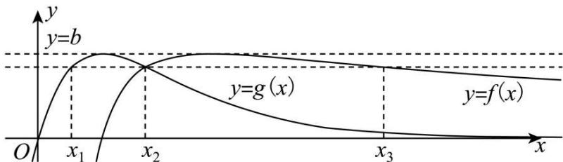

# 第25讲 函数的零点问题

# 知识梳理

1、函数零点问题的常见题型: 判断函数是否存在零点或者求零点的个数; 根据含参函数零点情况, 求参数的值或取值范围.

求解步骤：

第一步: 将问题转化为函数的零点问题, 进而转化为函数的图像与 x 轴 (或直线 y = k) 在某区间上的交点问题;

第二步: 利用导数研究该函数在此区间上的单调性、极值、端点值等性质, 进而画出其图像;

第三步: 结合图像判断零点或根据零点分析参数.

2、函数零点的求解与判断方法：

(1) 直接求零点: 令 $f(x) = 0$ , 如果能求出解, 则有几个解就有几个零点.  
(2)零点存在性定理:利用定理不仅要函数在区间 $[a,b]$ 上是连续不断的曲线,且 $f(a)\cdot f(b)<0$ ,还必须结合函数的图象与性质(如单调性、奇偶性)才能确定函数有多少个零点.  
(3) 利用图象交点的个数: 将函数变形为两个函数的差, 画两个函数的图象, 看其交点的横坐标有几个不同的值, 就有几个不同的零点.

3、求函数的零点个数时，常用的方法有：一、直接根据零点存在定理判断；二、将 $f(x)$ 整理变形成 $f(x) = g(x) - h(x)$ 的形式，通过 $g(x), h(x)$ 两函数图象的交点确定函数的零点个数；三、结合导数，求函数的单调性，从而判断函数零点个数.

4、利用导数研究零点问题：

(1) 确定零点的个数问题: 可利用数形结合的办法判断交点个数, 如果函数较为复杂, 可用导数知识确定极值点和单调区间从而确定其大致图像;  
(2) 方程的有解问题就是判断是否存在零点的问题, 可参变分离, 转化为求函数的值域问题处理. 可以通过构造函数的方法, 把问题转化为研究构造的函数的零点问题;  
(3) 利用导数研究函数零点或方程根, 通常有三种思路: ① 利用最值或极值研究; ② 利用数形结合思想研究; ③ 构造辅助函数研究.

# 必考题型全归纳

# 题型一:零点问题之一个零点

971 (2024·江苏南京·南京市第十三中学校考模拟预测)已知函数 $f(x)=\ln x, g(x)=\frac{1}{2}x^{2}-2x+1$ .

(1) 求函数 $\varphi(x)=g(x)-3f(x)$ 的单调递减区间；  
(2) 设 $h(x) = af(x) - g(x), a \in \mathbb{R}$ .   
①求证:函数 $y = h(x)$ 存在零点;
②设 a < 0，若函数 $y = h(x)$ 的一个零点为 m。问：是否存在 a，使得当 $x \in (0, m)$ 时，函数 $y = h(x)$ 有且仅有一个零点，且总有 $h(x) \geqslant 0$ 恒成立？如果存在，试确定 a 的个数；如果不存在，请说明理由。

【解析】(1) 由题可知 $\varphi(x)=-3\ln x+\frac{1}{2}x^{2}-2x+1$ ，定义域为 $(0,+\infty)$ .

则 $\varphi^{\prime}(x) = \frac{(x - 3)(x + 1)}{x}\circ$ ，令 $\varphi^{\prime}(x) = 0$ ，解得 $x = -1$ （舍）或 $x = 3$

故可得 $\varphi(x)$ 在 $(0,3)$ 单调递减.

(2) $h(x)=a\ln x-\frac{1}{2}x^{2}+2x-1,$

①由题可知 $h'(x)=\frac{-x^{2}+2x+a}{x}$ . 令 $y=-x^{2}+2x+a$ ，则其 $\Delta=4+4a$ .

1. 当 $a \leqslant -1$ 时, $\Delta \leqslant 0, h'(x) \leqslant 0$ , 故 $h(x)$ 在 $(0, +\infty)$ 上单调递减.

又因为 $h(1) = \frac{1}{2} > 0, h(3) = \frac{1}{2} - a\ln 3 > 0,$

故 $h(x)$ 在区间(1,3)上一定有一个零点；

2. 当 -1 < a < 0 时, $\Delta > 0$ , 令 $y = -x^{2} + 2x + a = 0$ ,

解得 $x_{1}=1-\sqrt{a+1},x_{2}=1+\sqrt{a+1}$ ,

令 $h'(x)>0$ ，故可得 $x\in(x_{1},x_{2})$ ，故 $h(x)$ 在区间 $(x_{1},x_{2})$ 上单调递增；

令 $h'(x) < 0$ ，故可得 $x \in (0, x_1)$ 或 $(x_2, +\infty)$ ，故 $h(x)$ 在 $(0, x_1), (x_2, +\infty)$ 单调递减.

又 $x_{2} = 1 + \sqrt{a + 1^{\circ}}\in (1,2)$ ，故可得 $x_{2} <   2$

又因为 $h(2)=a\ln2+1>1-\ln2>0, h(4)=a\ln4-1<-1$ ,

故 $h(x)$ 在区间(2,4)上一定有一个零点.

3. 当 a=0 时， $h(x)=-\frac{1}{2}x^{2}+2x-1$ ，令 $h(x)=0$ ，

解得 $x=2\pm\sqrt{2}$ ，显然 $h(x)$ 存在零点.

4. 当 a > 0 时，令 $h'(x) = 0$ ，解得 $x = 1 + \sqrt{a + 1} \in (2, +\infty)$ ,

故可得 $h(x)$ 在区间 $(0,1+\sqrt{a+1})$ 单调递增；在 $(1+\sqrt{a+1},+\infty)$ 单调递减.

又因为 $h\left(\frac{1}{4}\right)=-a\ln4-\frac{17}{32}<0, h(1)=\frac{1}{2}>0,$

故 $h(x)$ 在区间 $\left(\frac{1}{4},1\right)$ 上一定存在一个零点.

综上所述,对任意的 $a \in R$ , $h(x)$ 一定存在零点.

②由①可知,当 $a \leqslant -1$ 时,

° $h(x)$ 在 $(0, +\infty)$ 上单调递减.

且只在区间 $(1,3)$ 上存在一个零点,显然不满足题意.

当 -1 < a < 0 时，

$h(x)$ 在 $(0,1-\sqrt{a+1})$ 单调递减，在 $(1-\sqrt{a+1},1+\sqrt{a+1})$ 单调递增，

在 $(1 + \sqrt{a + 1}, + \infty)$ 单调递减.且 $1 + \sqrt{a + 1} < 2$

且在区间 $(2,4)$ 上一定有一个零点,不妨设零点为m,则 $m>1+\sqrt{a+1}$ ,

故要存在 a, 使得当 $x \in (0, m)$ 时, 函数 $y = h(x)$ 有且仅有一个零点,

且总有 $h(x)\geqslant 0$ 恒成立，

只需 $h(1 - \sqrt{a + 1}) = 0$

即 $a\ln (1 - \sqrt{a + 1}) - \frac{1}{2} (1 - \sqrt{a + 1})^2 + 2(1 - \sqrt{a + 1}) - 1 = 0$ ，(i)

整理得 $a\ln (1 - \sqrt{a + 1}) - \sqrt{a + 1} -\frac{a}{2} = 0,a\in (-1,0).$

则上述方程在区间 $(-1,0)$ 上根的个数,即为满足题意的a的个数.

不妨令 $1 - \sqrt{a + 1} = t$ ，则 $t\in (0,1),a = t^2 -2t$

故方程(i)等价于 $(t^2 - 2t)\ln t - \frac{1}{2} t^2 + 2t - 1 = 0$ .

不妨令 $m(t) = (t^2 - 2t)\ln t - \frac{1}{2} t^2 + 2t - 1$

故可得 $m'(t)=2(t-1)\ln t>0$ 在区间 $(0,1)$ 上恒成立.

故 $y=m(t)$ 在区间 $(0,1)$ 上单调递增.

又因为 $m\left(\frac{1}{5}\right)=\frac{1}{50}(18\ln5-31)\left\langle0,m\left(\frac{1}{2}\right)=\frac{1}{8}(6\ln2-1)\right\rangle0,$

故可得函数 $m(t)$ 在区间 $(0,1)$ 上只有一个零点.

则方程(i)存在唯一的一个根.

即当 a<0 时,有且仅有一个 a,使得当 $x\in(0,m)$ 时,

函数 $y = h(x)$ 有且仅有一个零点, 且总有 $h(x) \geqslant 0$ 恒成立.

972 (2024·广东·高三校联考阶段练习)已知函数 $f(x)=\mathrm{e}^{x}-a\sin x-1$ , $g(x)=-\frac{2x+a+2}{\mathrm{e}^{x}}+a(\cos x-\sin x)+2$ , $f(x)$ 在 $(0,\pi)$ 上有且仅有一个零点 $x_{0}$ .

(1) 求 a 的取值范围;  
(2) 证明: 若 $1 < a < 2$ , 则 $g(x)$ 在 $(- \pi, 0)$ 上有且仅有一个零点 $x_1$ , 且 $x_0 + x_1 < 0$ .

【解析】(1) $f'(x)=\mathrm{e}^{x}-a\cos x$ , 设 $\varphi(x)=f'(x)$ ,

$$
\varphi^ {\prime} (x) = \mathrm{e} ^ {x} + a \sin x,
$$

①当 $a \leqslant 0$ 时，若 $x \in (0, \pi)$ ，则 $f(x) \geqslant \mathrm{e}^x - 1 > 0$   
$f(x)$ 在 $(0,\pi)$ 上无零点, 不符合题意;  
②当 $0 < a \leqslant 1$ 时，若 $x \in (0, \pi)$ ，则 $f'(x) > 1 - a \cos x \geqslant 1 - a \geqslant 0$ ，

∴ $f(x)$ 在 $(0, \pi)$ 上单调递增，

$\therefore f(x)>f(0)=0,\therefore f(x)$ 在 $(0,\pi)$ 上无零点,不符合题意;

③当 a > 1 时, 若 $x \in (0, \pi)$ , 则 $\varphi'(x) > 0$ , $\therefore f'(x)$ 在 $(0, \pi)$ 上单调递增,

$$
\because f ^ {\prime} (0) = 1 - a <   0, f ^ {\prime} (\pi) = \mathrm{e} ^ {\pi} + a > 0,
$$

∴ 存在唯一 $t \in (0, \pi)$ ，使得 $f'(t) = 0$ .

当 $x \in (0, t)$ 时， $f'(x) < f'(t) = 0$ ; 当 $x \in (t, \pi)$ 时， $f'(x) > f'(t) = 0$ ,

故 $f(x)$ 在 $(0,t)$ 上单调递减，在 $(t,\pi)$ 上单调递增，

$$
\because f (0) = 0, f (\pi) = \mathrm{e} ^ {\pi} - 1 > 0,
$$

故 $f(x)$ 在 $(0,\pi)$ 上有且仅有一个零点 $x_{0}$ ，符合题意；

综上，a 的取值范围为 $(1, +\infty)$ .

(2) 记 $h(x)=\frac{g(-x)}{\mathrm{e}^{x}}=2x-a-2+\frac{a(\sin x+\cos x)}{\mathrm{e}^{x}}+\frac{2}{\mathrm{e}^{x}}$ ,

$$
h ^ {\prime} (x) = 2 - \frac {2 a \sin x}{\mathrm{e} ^ {x}} - \frac {2}{\mathrm{e} ^ {x}} = \frac {2 f (x)}{\mathrm{e} ^ {x}},
$$

由(1)知:若1<a<2,当 $x\in(0,x_{0})$ 时, $f(x)<0,h'(x)<0$ ,

当 $x \in (x_{0}, \pi)$ 时， $f(x) > 0, h'(x) > 0,$

故 $h(x)$ 在 $(0,x_{0})$ 上单调递减，在 $(x_{0},\pi)$ 上单调递增，

又 $h(0) = 0, h(\pi) = 2\pi - a - 2 + \frac{2 - a}{\mathrm{e}^{\pi}} > 2\pi - a - 2 > 2\pi - 4 > 0,$

故存在唯一 $x_{2} \in (0, \pi)$ , 使得 $h(x_{2}) = 0$ , 且 $x_{2} > x_{0}$ .

注意到 $h(x) = \frac{g(-x)}{\mathrm{e}^x}$ , 可知 $g(x)$ 在 $(- \pi, 0)$ 上有且仅有一个零点 $x_1 = -x_2$ ,

且 $-x_{1}=x_{2}>x_{0}$ ，即 $x_{0}+x_{1}<0$ .

973 (2024·全国·高三专题练习)已知函数 $f(x) = a\ln x + \frac{x - 1}{\mathrm{e}^x}$ .

(1) 当 a=1 时, 求曲线 $y=f(x)$ 在点 $(1,f(1))$ 处的切线方程;  
(2) 证明: 当 $a \geqslant 0$ 时, $f(x)$ 有且只有一个零点;  
(3) 若 $f(x)$ 在区间 $(0,1)$ , $(1,+\infty)$ 各恰有一个零点，求 a 的取值范围.

【解析】(1)由题意, $f(x)=\ln x+\frac{x-1}{\mathrm{e}^{x}}$ , $f'(x)=\frac{1}{x}+\frac{2-x}{\mathrm{e}^{x}}$ ,故 $f'(1)=1+\frac{1}{\mathrm{e}}$ ,又 $f(1)=0$ ,故曲线 $y=f(x)$ 在点 $(1,f(1))$ 处的切线方程为 $y=\left(1+\frac{1}{\mathrm{e}}\right)(x-1)$ ,即 $y=\left(1+\frac{1}{\mathrm{e}}\right)x-1-\frac{1}{\mathrm{e}}$

(2) 由题意, 因为 $a \geqslant 0$ , 故当 $x > 1$ 时, $f(x) = a \ln x + \frac{x - 1}{\mathrm{e}^x} > 0$ , 当 $x \in (0,1)$ 时, $f(x) = a \ln x + \frac{x - 1}{\mathrm{e}^x} < 0$ , 当 $x = 1$ 时, $f(1) = 0$ , 故当 $a \geqslant 0$ 时, $f(x)$ 有且只有一个零点 $x = 1$   
(3) 由 (2) 可得 $a < 0, f(x) = a \ln x + \frac{x - 1}{\mathrm{e}^x}$ , 故 $f'(x) = \frac{a}{x} + \frac{2 - x}{\mathrm{e}^x} = \frac{ae^x + 2x - x^2}{xe^x}$ 设 $g(x) = ae^x + 2x - x^2$ , 则

①若 $a \leqslant -\frac{1}{e}$ ，则 $g(x) = ae^{x} + 2x - x^{2} \leqslant -\mathrm{e}^{x-1} - (x-1)^{2} + 1$ ，在 $x \in (1, +\infty)$ 上为减函数，故 $g(x) < -\mathrm{e}^{1-1} - (1-1)^{2} + 1 = 0$ ，故 $f(x)$ 在 $x \in (1, +\infty)$ 上为减函数， $f(x) < f(1) = 0$ 不满足题意；

②若 $-\frac{1}{e}<a<0$ , $g'(x)=ae^{x}+2-2x$

i) 当 $x \in (1, +\infty)$ 时， $g'(x) < 0$ ， $g(x)$ 单调递减，且 $g(1) = ae + 1 > 0$ ， $g(2) = ae^2 < 0$ ，故存在 $x_0 \in (1, 2)$ 使得 $g(x) = 0$ ，故 $f(x)$ 在 $(1, x_0)$ 上单调递增，在 $(x_0, +\infty)$ 上单调递减。又

$$
f \left(x _ {0}\right) > f (1) = 0, \mathrm{e} ^ {- \frac {1}{a}} > \mathrm{e} ^ {\mathrm{e}} > 1 \text {, 且} f \left(\mathrm{e} ^ {- \frac {1}{a}}\right) = a \ln e ^ {- \frac {1}{a}} + \frac {\mathrm{e} ^ {- \frac {1}{a}} - 1}{\mathrm{e} ^ {\mathrm{e} ^ {- \frac {1}{a}}}} = - 1 + \frac {\mathrm{e} ^ {- \frac {1}{a}} - 1}{\mathrm{e} ^ {\mathrm{e} ^ {- \frac {1}{a}}}} =
$$

$\frac{\mathrm{e}^{-\frac{1}{a}} - \mathrm{e}^{\mathrm{e}^{-\frac{1}{a}}} - 1}{\mathrm{e}^{\mathrm{e}^{-\frac{1}{a}}}}$ 设 $\varphi (x) = \mathrm{e}^{x} - x(x > 0)$ ，易得 $\varphi^{\prime}(x) = \mathrm{e}^{x} - 1 > 0$ ，故 $\varphi (x)$ 在 $(0, +\infty)$ 单调递增，故 $\varphi (x) > \varphi (0) = \mathrm{e}^{0} - 0 > 0$ ，故 $\mathrm{e}^{\mathrm{e}^{-\frac{1}{a}}} > \mathrm{e}^{-\frac{1}{a}}$ ，故 $f\left(\mathrm{e}^{-\frac{1}{a}}\right) < 0.$ 故 $f(x)$ 在 $\left(1, \mathrm{e}^{-\frac{1}{a}}\right)$ 上有一个零点，综上有 $f(x)$ 在区间 $(1, +\infty)$ 上有一个零点

ii) 当 $x \in (0,1)$ 时， $g'(x) = ae^x + 2 - 2x$ ，设 $h(x) = g'(x) = ae^x + 2 - 2x$ ，则 $h'(x) = ae^x - 2 < 0$ ，故 $g'(x)$ 为减函数，因为 $g'(0) = a + 2 > 0$ ， $g'(1) = ae < 0$ ，故存在 $x_1 \in (0,1)$ 使得 $g'(x) = 0$ 成立，故 $g(x) = ae^x + 2x - x^2$ 在 $(0,x_1)$ 单调递增，在 $(x_1,1)$ 单调递减。又 $g(0) = a < 0$ ， $g(1) = ae + 1 > 0$ ，故存在 $x_2 \in (0,1)$ 使得 $g(x_2) = 0$ 成立，故在 $(0,x_2)$ 上 $g(x) < 0$ ， $f(x)$ 单调递减，在 $(x_2,1)$ 上 $g(x) > 0$ ， $f(x)$ 单调递增。又 $f(1) = 0$ ，故 $f(x_2) < f(1) = 0$ ，且 $\mathrm{e}^{\frac{1}{a}} < \mathrm{e}^{-\mathrm{e}} < 1$ ， $f\left(\mathrm{e}^{\frac{1}{a}}\right) = a\ln e^{\frac{1}{a}} + \frac{\mathrm{e}^{\frac{1}{a}} - 1}{\mathrm{e}^{\mathrm{e}^{\frac{1}{a}}}} = 1 + \frac{\mathrm{e}^{\frac{1}{a}} - 1}{\mathrm{e}^{\mathrm{e}^{\frac{1}{a}}}} = \frac{\mathrm{e}^{\mathrm{e}^{\frac{1}{a}}} + \mathrm{e}^{\frac{1}{a}} - 1}{\mathrm{e}^{\mathrm{e}^{\frac{1}{a}}}} > \frac{\mathrm{e}^0 + \mathrm{e}^{\frac{1}{a}} - 1}{\mathrm{e}^{\mathrm{e}^{\frac{1}{a}}}} > 0$ ，故

$f\left(\mathrm{e}^{\frac{1}{a}}\right)>0$ , 故存在 $x_{3}\in\left(\mathrm{e}^{\frac{1}{a}},1\right)$ 使得 $f(x)=0$ , 综上有 $f(x)$ 在区间 $(0,1)$ 上有一个零点.
综上所述，当 $-\frac{1}{e}<a<0$ 时， $f(x)$ 在区间 $(0,1),(1,+\infty)$ 各恰有一个零点

974 (2024·广东茂名·高三统考阶段练习)已知 a > 0，函数 $f(x) = xe^{x} - a$ ， $g(x) = x \ln x - a$ .

(1) 证明: 函数 $f(x)$ , $g(x)$ 都恰有一个零点;  
(2) 设函数 $f(x)$ 的零点为 $x_{1}$ ， $g(x)$ 的零点为 $x_{2}$ ，证明 $x_{1}x_{2}=a$ .

【解析】(1) 函数 $f(x)=xe^{x}-a$ 的定义域为 R, $f'(x)=(x+1)e^{x}$ ,

$\because x<-1$ 时， $f'(x)<0, x>-1$ 时， $f'(x)>0,$

∴ $f(x)$ 在 $(-∞, -1)$ 上单调递减， $f(x)$ 在 $(-1, +∞)$ 上单调递减增，

$\because x<0$ 时， $f(x)<0, f(0)=-a<0, f(a)=ae^{a}-a=a(e^{a}-1)>0,$

∴ 函数 $f(x)$ 恰有一个零点.

函数 $g(x)=x\ln x-a$ 的定义域为 $(0,+\infty)$ , $g'(x)=\ln x+1$ ,

$\because 0 < x < \frac{1}{e}$ 时， $g'(x) < 0, x > \frac{1}{e}$ 时， $g'(x) > 0,$

∴ $g(x)$ 在 $\left(0, \frac{1}{\mathrm{e}}\right)$ 上单调递减， $g(x)$ 在 $\left(\frac{1}{\mathrm{e}}, +\infty\right)$ 上单调递增，

$\because x<1$ 时， $g(x)<0, g(1)=-a<0,$

令 $b > \max \{a, e\} (\max \{m, n\}$ 表示 $m, n$ 中最大的数), $g(b) = b \ln b - a > a (\ln a - 1) > 0$ ,

∴函数 $g(x)$ 恰有一个零点；

(2) 由 (1) 得函数 $f(x)$ 的零点为 $x_{1}$ ，且 $x_{1} > 0$ ， $g(x)$ 的零点为 $x_{2}$ ，且 $x_{2} > 1$ ，

则有 $x_{1}e^{x_{1}}-a=0$ , $x_{2}\ln x_{2}-a=0$ ,

$$
\therefore x _ {1} \mathrm{e} ^ {x _ {1}} = x _ {2} \ln x _ {2}, \therefore x _ {1} \mathrm{e} ^ {x _ {1}} = \ln x _ {2} \mathrm{e} ^ {\ln x _ {2}}, \therefore f (x _ {1}) = f (\ln x _ {2}),
$$

$\because f(x)$ 在 $(0,+\infty)$ 上单调递增，由 (1) 可得 $x_{1}>0, x_{2}>1, \ln x_{2}>0,$

$$
\therefore x _ {1} = \ln x _ {2}, \therefore \mathrm{e} ^ {x _ {1}} = x _ {2},
$$

$\because x_{1}e^{x_{1}}-a=0,\therefore x_{1}x_{2}-a=0,\therefore x_{1}x_{2}=a.$ 原式得证.

# 2 题型二:零点问题之二个零点

975 (2024·海南海口·统考模拟预测)已知函数 $f(x) = xe^{x + 2}$ .

(1) 求 $f(x)$ 的最小值；  
(2) 设 $F(x)=f(x)+a(x+1)^{2}(a>0)$ .   
(i) 证明: $F(x)$ 存在两个零点 $x_{1}, x_{2}$ ;  
(ii) 证明: $F(x)$ 的两个零点 $x_{1}, x_{2}$ 满足 $x_{1} + x_{2} + 2 < 0$ .

【解析】(1) $f'(x)=\mathrm{e}^{x+2}+xe^{x+2}=(x+1)\mathrm{e}^{x+2}$

所以当 $x \leqslant -1$ 时， $f'(x) \leqslant 0$ ，当 x > -1 时， $f'(x) > 0$ ，

所以函数 $f(x)$ 在 $(-∞, -1]$ 上单调递减，在 $(-1, +∞)$ 上单调递增，

所以 $f(x)$ 的最小值为 $f(-1) = -e$ .

(2) (i) 证明: $\mathrm{F}(x) = xe^{x + 2} + a(x + 1)^2, a > 0, \mathrm{F}'(x) = (x + 1)(\mathrm{e}^{x + 2} + 2a),$

因为 a > 0，所以 $e^{x+2} + 2a > 0$ ，所以当 $x \leqslant -1$ 时， $F'(x) \leqslant 0, x > -1$ 时， $F'(x) > 0$ ，

所以 $F(x)$ 在 $(-∞, -1]$ 上单调递减，在 $(-1, +∞)$ 上单调递增，

则函数 $F(x)$ 有最小值 $F(-1) = -e$ .

由 $a > 0, \mathrm{F}(x) = xe^{x + 2} + ax^2 + 2ax + a > xe^{x + 2} + ax^2 + 2ax = x(\mathrm{e}^{x + 2} + ax + 2a)$ ,

下面证明, 在 $(-∞,-1]$ 上, 对 $∀a>0$ , 只要 x 足够小, 必存在 $x=x_{0}\in(-∞,-1]$ ,

使得 $e^{x_{0}+2} + ax_{0} + 2a < 0$ :

实际上, 当 x<-2 时, $0<e^{x+2}<1$ , 令 $ax+2a<-1$ , 得 $x<-\frac{1}{a}-2<-2$ ,

所以对 $\forall a > 0$ ，取 $x_0 \in (-\infty, -\frac{1}{a} - 2)$ ，必有 $x_0(\mathrm{e}^{x_0 + 2} + ax_0 + 2a) > 0$ ，即 $\mathrm{F}(x_0) > 0$

所以在区间 $(- \infty, -1]$ 上，存在唯一的 $x_{1} \in (x_{0}, -1)$ ， $\mathrm{F}(x_{1}) = 0$

又 $F(0)=1>0$ ，所以在区间 $(-1,+\infty)$ 上，存在唯一的 $x_{2}\in(-1,0)$ ， $F(x_{2})=0$ ，

综上, $F(x)$ 存在两个零点.

(ii) 要证 $x_{1} + x_{2} + 2 < 0$ ，需证 $x_{1} < -2 - x_{2}$ ，由 $-1 < x_{2} < 0$ ，所以 $-2 - x_{2} < -1$ ，

因为 $F(x)$ 在 $(-∞, -1]$ 上单调递减，因此需证： $F(-2 - x_{2}) < F(x_{1}) = 0$ ，

$$
\mathrm{F} (- 2 - x _ {2}) = - (2 + x _ {2}) \mathrm{e} ^ {- x _ {2}} + a (x _ {2} + 1) ^ {2}, \mathrm{F} (x _ {2}) = x _ {2} \mathrm{e} ^ {x _ {2} + 2} + a (x _ {2} + 1) ^ {2} = 0,
$$

所以 $F(-2-x_{2})=-\left(2+x_{2}\right)e^{-x_{2}}-x_{2}e^{x_{2}+2},-1<x_{2}<0,$

设 $g(x)=-(2+x)\mathrm{e}^{-x}-xe^{x+2},-1<x<0,$

则 $g'(x)=\mathrm{e}^{-x}+xe^{-x}-\mathrm{e}^{x+2}-xe^{x+2}=\mathrm{e}^{-x}(x+1)(1-\mathrm{e}^{2x+2})<0,$

所以 $g(x)$ 在 $(-1,0)$ 上单调递减， $g(x) \leqslant g(-1) = 0$ ，即

$$
\mathrm{F} (- 2 - x _ {2}) = - (2 + x _ {2}) \mathrm{e} ^ {- x _ {2}} - x _ {2} \mathrm{e} ^ {x _ {2} + 2} <   0,
$$

结论得证,所以 $x_{1}+x_{2}+2<0$ .

976 (2024·甘肃天水·高三天水市第一中学校考阶段练习)已知函数 $f(x) = \ln x + ax^2 + (2a + 1)x$ .

(1) 讨论函数 $f(x)$ 的单调性;  
(2) 当 $a = 0$ 时, $g(x) = (x - 1)f(x) - x^2 - 1$ , 证明: 函数 $g(x)$ 有且仅有两个零点, 两个零点互为倒数.

【解析】(1) $f(x)$ 的定义域为 $(0, +\infty)$ 且 $f'(x) = \frac{1}{x} + 2ax + 2a + 1 = \frac{(2ax + 1)(x + 1)}{x}$ ,

若 $a \geqslant 0$ ，则当 $x \in (0, +\infty)$ 时， $f'(x) > 0$ ，故 $f(x)$ 在 $(0, +\infty)$ 上单调递增；

若 a<0，则当 $x\in\left(0,-\frac{1}{2a}\right)$ , $f'(x)>0$ ，当 $x\in\left(-\frac{1}{2a},+\infty\right)$ , $f'(x)<0$ ,

故 $f(x)$ 在 $\left(0, -\frac{1}{2a}\right)$ 上单调递增，在 $\left(-\frac{1}{2a}, +\infty\right)$ 上单调递减.

(2) $g(x)=(x-1)f(x)-x^{2}-1=(x-1)\ln x-x-1$ ，所以， $g'(x)=\ln x-\frac{1}{x}$

因为 $y=\ln x$ 在 $(0,+\infty)$ 上递增， $y=\frac{1}{x}$ 在 $(0,+\infty)$ 递减，所以 $g'(x)$ 在 $(0,+\infty)$ 上递增，

又 $g'(1) = -1 < 0, g'(2) = \ln 2 - \frac{1}{2} = \frac{\ln 4 - 1}{2} > 0,$

故存在唯一 $x_0 \in (1,2)$ 使得 $g'(x_0) = 0$ ，所以 $g(x)$ 在 $(0,x_0)$ 上递减，在 $(\mathbf{x}_0, +\infty)$ 上递增，

又 $g(x_0) < g(1) = -2, g(\mathrm{e}^2) = \mathrm{e}^2 - 3 > 0$ ，所以 $g(x) = 0$ 在 $(\mathbf{x}_0, +\infty)$ 内存在唯一根 $\alpha$

由 $1 < x_0 < \alpha$ 得 $\frac{1}{\alpha} < 1 < x_0$ ，又 $g\left(\frac{1}{\alpha}\right) = \left(\frac{1}{\alpha} - 1\right)\ln \frac{1}{\alpha} - \frac{1}{\alpha} - 1 = \frac{g(\alpha)}{\alpha} = 0,$

故 $\frac{1}{\alpha}$ 是 $g(x)=0$ 在 $(0,x_{0})$ 上的唯一零点.

综上,函数 $g(x)$ 有且仅有两个零点,且两个零点互为倒数.

977 (2024·四川遂宁·高三射洪中学校考期中)已知函数 $f(x) = \ln x + ax^2 + (2a + 1)x$ .

(1) 若函数 $f(x)$ 在 x=1 处取得极值，求曲线 $y=f(x)$ 在点 $(2,f(2))$ 处的切线方程；  
(2) 讨论函数 $f(x)$ 的单调性；  
(3) 当 $a = 0$ 时, $g(x) = (x - 1)f(x) - x^2 - 1$ , 证明: 函数 $g(x)$ 有且仅有两个零点, 且两个零点互为倒数.

【解析】(1) 求导: $f'(x)=\frac{1}{x}+2ax+2a+1$ , 由已知有 $f'(1)=0$ , 即 $1+2a+2a+1=0$ ,

所以 $a=-\frac{1}{2}$ ，则 $f(x)=\ln x-\frac{1}{2}x^{2}$ ，所以切点为 $(2,\ln2-2)$ ，切线斜率 $k=f'(2)=-\frac{3}{2}$ ，

故切线方程为: $y=-\frac{3}{2}x+1+\ln2$ .

(2) $f(x)$ 的定义域为 $(0, +\infty)$ 且 $f'(x) = \frac{1}{x} + 2ax + 2a + 1 = \frac{(2ax + 1)(x + 1)}{x}$ ,

若 $a \geqslant 0$ ，则当 $x \in (0, +\infty)$ 时， $f'(x) > 0$ ，故 $f(x)$ 在 $(0, +\infty)$ 上单调递增；

若 $a < 0$ ，则当 $x \in \left(0, -\frac{1}{2a}\right), f'(x) > 0$ ，当 $x \in \left(-\frac{1}{2a}, +\infty\right), f'(x) < 0$

故 $f(x)$ 在 $\left(0, -\frac{1}{2a}\right)$ 上单调递增，在 $\left(-\frac{1}{2a}, +\infty\right)$ 上单调递减.

(3) $g(x)=(x-1)f(x)-x^{2}-1=(x-1)\ln x-x-1$ ，所以， $g'(x)=\ln x-\frac{1}{x}$

因为 $y=\ln x$ 在 $(0,+\infty)$ 上递增， $y=\frac{1}{x}$ 在 $(0,+\infty)$ 递减，所以 $g'(x)$ 在 $(0,+\infty)$ 上递增，

又 $g'(1) = -1 < 0, g'(2) = \ln 2 - \frac{1}{2} = \frac{\ln 4 - 1}{2} > 0,$

故存在唯一 $x_0 \in (1,2)$ 使得 $g'(x_0) = 0$ ，所以 $g(x)$ 在 $(0,x_0)$ 上递减，在 $(\mathbf{x}_0, +\infty)$ 上递增，

又 $g(x_{0})<g(1)=-2, g(\mathrm{e}^{2})=\mathrm{e}^{2}-3>0$ , 所以 $g(x)=0$ 在 $(\mathbf{x}_{0},+\infty)$ 内存在唯一根 $\alpha$

由 $1 < x_0 < \alpha$ 得 $\frac{1}{\alpha} < 1 < x_0$ ，又 $g\left(\frac{1}{\alpha}\right) = \left(\frac{1}{\alpha} - 1\right)\ln \frac{1}{\alpha} - \frac{1}{\alpha} - 1 = \frac{g(\alpha)}{\alpha} = 0,$

故 $\frac{1}{\alpha}$ 是 $g(x)=0$ 在 $(0,x_{0})$ 上的唯一零点.

综上,函数 $g(x)$ 有且仅有两个零点,且两个零点互为倒数.

978 (2024·全国·高三专题练习)已知函数 $f(x) = \mathrm{e}^{x} - \ln x - a$ .

(1) 若 $a = 3$ . 证明函数 $f(x)$ 有且仅有两个零点;  
(2) 若函数 $f(x)$ 存在两个零点 $x_{1}, x_{2}$ ，证明： $e^{x_{1}x_{2}} > e^{x_{1}} + e^{x_{2}} + 2 - 2a.$

【解析】(1)由题可知,定义域 $(0,+\infty)$

当 a=3 时，函数 $f(x)=\mathrm{e}^{x}-\ln x-3$ ，则 $f'(x)=\mathrm{e}^{x}-\frac{1}{x}$ ， $f''(x)=\mathrm{e}^{x}+\frac{1}{x^{2}}>0(f''(x)$ 为 $f'$

(x) 的导函数)

$\therefore f'(x)$ 单调递增

$$
\because f ^ {\prime} \left(\frac {1}{2}\right) = \mathrm{e} ^ {\frac {1}{2}} - 2 <   0, f ^ {\prime} (1) = \mathrm{e} - 1 > 0,
$$

$\therefore \exists x_0 \in \left(\frac{1}{2}, 1\right)$ 使 $f'(x_0) = \mathrm{e}^{x_0} - \frac{1}{x_0} = 0, \mathrm{e}^{x_0} = \frac{1}{x_0}$ .

∴ $x \in (0, x_{0})$ 时， $f'(x) < 0, f(x)$ 单调递减； $x \in (x_{0}, +\infty)$ 时， $f'(x) > 0, f(x)$ 单调递增

所以 $f(x)_{\min}=f(x_{0})=\mathrm{e}^{x_{0}}-\ln x_{0}-3=\frac{1}{x_{0}}+x_{0}-3$

由双勾函数性质可知， $f(x_{0})$ 在 $\left(\frac{1}{2},1\right)$ 递减， $f(x_{0})<f\left(\frac{1}{2}\right)=2+\frac{1}{2}-3=-\frac{1}{2}<0,$

$$
f \Big (\frac {1}{\mathrm{e} ^ {3}} \Big) = \mathrm{e} ^ {\frac {1}{\mathrm{e} ^ {3}}} - \ln \frac {1}{\mathrm{e} ^ {3}} - 3 = \mathrm{e} ^ {\frac {1}{\mathrm{e} ^ {3}}} > 0, \text {且} \frac {1}{\mathrm{e} ^ {3}} <   \frac {1}{2},
$$

∴ 在 $(0, x_{0})$ 上有且只有一个零点

又 $f(\mathrm{e}) = \mathrm{e}^{\mathrm{e}} - \ln e - 3 = \mathrm{e}^{\mathrm{e}} - 4 > 2^{2} - 4 = 0$ ，且 $\mathrm{e} > 1$

所以在 $(x_0, +\infty)$ 上有且只有一个零点

综上,函数 $f(x)$ 有且仅有两个零点

(2) 由 $x_{1}, x_{2}$ 是函数 $f(x)$ 的两个零点, 知 $\mathrm{e}^{x_1} = \ln x_1 + a, \mathrm{e}^{x_2} = \ln x_2 + a$

$$
\therefore \mathrm{e} ^ {x _ {1}} + \mathrm{e} ^ {x _ {2}} = \ln x _ {1} + \ln x _ {2} + 2 a = \ln x _ {1} x _ {2} + 2 a
$$

要证 $\mathrm{e}^{x_1x_2} > \mathrm{e}^{x_1} + \mathrm{e}^{x_2} + 2 - 2a$

需证 $\mathrm{e}^{x_1x_2} > \ln x_1x_2 + 2a + 2 - 2a = \ln x_1x_2 + 2$

令 $x_{1}x_{2} = t\in (0, + \infty)$

需证 $\mathrm{e}^t -\ln t - 2 > 0$

令 $f(t)=\mathrm{e}^{t}-\ln t-2$

与(1)同理得 $f(t)_{\min}=\mathrm{e}^{t_{0}}-\ln t_{0}-2=\frac{1}{t_{0}}+t_{0}-2>2-2=0,t_{0}\in\left(\frac{1}{2},1\right)$

所以 $\mathrm{e}^t -\ln t - 2 > 0$

故 $\mathrm{e}^{x_1x_2} > \mathrm{e}^{x_{1 + }x_2} + 2 - 2a$

979 (2024·湖南长沙·高三长沙一中校考阶段练习)已知函数 $f(x) = \ln x - ax (a \in \mathbb{R})$ 在其定义域内有两个不同的零点.

(1) 求 a 的取值范围;  
(2) 记两个零点为 $x_{1}, x_{2}$ , 且 $x_{1} < x_{2}$ , 已知 $\lambda > 0$ , 若不等式 $\lambda (\ln x_{2} - 1) + \ln x_{1} - 1 > 0$ 恒成立, 求 $\lambda$ 的取值范围.

【解析】(1)依题意,函数 $f(x)$ 在定义域 $(0,+\infty)$ 上有两个不同的零点,即方程 $\ln x-ax=0$ 在 $(0,+\infty)$ 上有两个不同的解,也即 $a=\frac{\ln x}{x}$ 在 $(0,+\infty)$ 上有两个不同的解.

令 $g(x)=\frac{\ln x}{x}$ ，则 $g'(x)=\frac{1-\ln x}{x^{2}}$ .

当 0 < x < e 时， $g'(x) > 0$ ，所以 $g(x)$ 在 $(0, e)$ 上单调逆增，

当 $x > \mathrm{e}$ 时， $g'(x) < 0$ ，所以 $g(x)$ 在 $(\mathrm{e}, +\infty)$ 上单调递减，

所以 $g(x)_{\max}=g(\mathrm{e})=\frac{1}{\mathrm{e}}.$

又 $\because g\left(\frac{1}{e}\right) = -e < 0, x > e$ 时， $0 < g(x) = \frac{\ln x}{x} < \frac{\sqrt{x}}{x} < \frac{1}{\sqrt{x}}$

当 $x \to +\infty$ 时， $g(x) \to 0$ ，且 $g(x) > 0$

若函数 $g(x) = \frac{\ln x}{x}$ 与函数 $y = a$ 的图象在 $(0, +\infty)$ 上有两个不同的交点，

则 $0 < a < \frac{1}{\mathrm{e}}$

(2) 因为 $x_{1}, x_{2}$ 为方程 $\ln x - ax = 0$ 的两根，

所以 $\ln x_{1}=ax_{1},\ln x_{2}=ax_{2}.$

不等式 $\lambda(\ln x_{2}-1)+\ln x_{1}-1>0$ , 变形可得 $1+\lambda<\ln x_{1}+\lambda\ln x_{2}$

代入可得 $1 + \lambda < \ln x_{1} + \lambda \ln x_{2} = ax_{1} + \lambda ax_{2} = a(x_{1} + \lambda x_{2})$

因为 $\lambda > 0, 0 < x_{1} < x_{2}$ ，所以原不等式等价于 $a > \frac{1 - \lambda}{x_{1} + \lambda x_{2}}$ .

又由 $\ln x_{1} = ax_{1},\ln x_{2} = ax_{2}$ ，作差得 $\ln \frac{x_1}{x_2} = a(x_1 - x_2)$ ，所以 $a = \frac{\ln\frac{x_1}{x_2}}{x_1 - x_2}.$

所以原不等式等价于 $\frac{\ln\frac{x_{1}}{x_{2}}}{x_{1}-x_{2}}>\frac{1+\lambda}{x_{1}+\lambda x_{2}}\Leftrightarrow\ln\frac{x_{1}}{x_{2}}<\frac{(1+\lambda)(x_{1}-x_{2})}{x_{1}+\lambda x_{2}}$ 恒成立.

令 $t = \frac{x_1}{x_2}$ , 则 $t \in (0,1)$ , 不等式等价于 $\ln t < \frac{(1 + \lambda)(t - 1)}{t - \lambda}$ 在 $t \in (0,1)$ 上恒成立.

令 $h(t) = \ln t - \frac{(1 + \lambda)(t - 1)}{t + \lambda}$ , 则 $h'(t) = \frac{(t - 1)(t - \lambda^2)}{t(t + \lambda)^2}$ .

①当 $\lambda\geqslant1$ 时， $h'(t)>0$ ，所以 $h(t)$ 在 $(0,1)$ 上单调递，因此 $h(t)<h(1)=0$ ，满足条件；  
② 当 $0 < \lambda < 1$ 时, $h(t)$ 在 $(0, \lambda^2)$ 上单调递增, 在 $(\lambda^2, 1)$ 上单调递减, 又 $h(1) = 0$ , 所以 $h(t)$ 在 $(0, 1)$ 上不能恒小于零.

综上， $\lambda\geqslant1$ .

980 (2024·江苏·高三专题练习)已知函数 $f(x) = ax^4 - \frac{1}{2} x^2, x \in (0, +\infty), g(x) = f(x) - f'(x)$ .

(1) 若 $a > 0$ , 求证:   
(i) $f(x)$ 在 $f'(x)$ 的单调减区间上也单调递减；  
(ii) $g(x)$ 在 $(0, +\infty)$ 上恰有两个零点；  
(2) 若 $a > 1$ , 记 $g(x)$ 的两个零点为 $x_{1}, x_{2}$ , 求证: $4 < x_{1} + x_{2} < a + 4$ .

【解析】(1) 证明: (1) (i) 因为 $f(x)=ax^{4}-\frac{1}{2}x^{2}, x\in(0,+\infty)$

$$
\therefore f ^ {\prime} (x) = 4 a x ^ {3} - x
$$

由 $f''(x)=(4ax^{3}-x)'=12ax^{2}-1$

令 $f''(x)<0$ 得 $f'(x)$ 的递减区间为 $\left(0,\frac{1}{2\sqrt{3a}}\right)$

当 $x \in \left(0, \frac{1}{2\sqrt{3a}}\right)$ 时， $f'(x) = 4ax^3 - x = x(4ax^2 - 1) < 0$

所以 $f(x)$ 在 $f'(x)$ 的递减区间上也递减.

(ii) $g(x) = f(x) - f'(x) = ax^4 - \frac{1}{2} x^2 - (4ax^3 - x) = ax^4 - 4ax^3 - \frac{1}{2} x^2 + x$

因为 $x > 0$ ，由 $g(x) = ax^4 - 4ax^3 - \frac{1}{2} x^2 + x = 0$ 得 $ax^3 - 4ax^2 - \frac{1}{2} x + 1 = 0,$

令 $\varphi(x)=ax^{3}-4ax^{2}-\frac{1}{2}x+1$ , 则 $\varphi'(x)=3ax^{2}-8ax-\frac{1}{2}$ .

因为 a > 0，且 $\varphi'(0) = -\frac{1}{2} < 0$ ，所以 $\varphi'(x)$ 必有两个异号的零点，记正零点为 $x_{0}$ ，

则当 $x \in (0, x_0)$ 时， $\varphi'(x) < 0$ ， $\varphi(x)$ 单调递减；

当 $x \in (x_0, +\infty)$ 时， $\varphi'(x) > 0$ ， $\varphi(x)$ 单调递增，若 $\varphi(x)$ 在 $(0, +\infty)$ 上恰有两个零点，则 $\varphi(x_0) < 0$

由 $\varphi'(x_{0})=3ax_{0}^{2}-8ax_{0}-\frac{1}{2}=0$ , 得 $3ax_{0}^{2}=8ax_{0}+\frac{1}{2}$

所以 $\varphi (x_0) = -\frac{32}{9} ax_0 - \frac{1}{3} x_0 + \frac{7}{9}$ , 又 $\varphi'(x)$ 对称轴 $x = \frac{4}{3}$ , $\varphi'(0) = \varphi'\left(\frac{8}{3}\right) = -\frac{1}{2}$

所以 $x_{0} > \frac{8}{3} > \frac{7}{3}$

所以 $\varphi(x_{0})=-\frac{32}{9}ax_{0}-\frac{1}{3}\left(x_{0}-\frac{7}{3}\right)<0.$

又 $\varphi(0)=1>0$ , 所以在 $(0,x_{0})$ 上有且仅有一个零点.

又 $\varphi (x) = ax^{3} - 4ax^{2} - \frac{1}{2} x + 1 = x\bigl (ax^2 -4ax - \frac{1}{2}\bigr) + 1$

令 $ax^{2}-4ax-\frac{1}{2}>0$ , 解得 $x>\frac{4a+\sqrt{16a^{2}+2a}}{2a}$ .

所以取 $\mathrm{M} = \frac{4a + \sqrt{16a^2 + 2a}}{2a}$ ，当 $x > \mathrm{M}$ 时， $\varphi (x) > 0$

所以在 $(x_{0},\mathrm{M})$ 上有且仅有一个零点.

故 $a > 0$ 时， $g(x)$ 在 $(0, +\infty)$ 上恰有两个零点.

(2) 由 (ii) 知, 对 $\varphi(x)=ax^{3}-4ax^{2}-\frac{1}{2}x+1$ 在 $(0,+\infty)$ 上恰有两个零点 $x_{1}, x_{2}$ ,

不妨设 $x_{1}<x_{2}$ ，因为 $\varphi(0)=1>0,\varphi\left(\frac{1}{2}\right)=\frac{1}{8}(6-7a)<0$

所以 $0 < x_{1} < \frac{1}{2}$

因为 $\varphi(4)=-1<0,\varphi\left(\frac{9}{2}\right)=\frac{1}{8}(81a-10)>0$

所以 $4 < x_{2} < \frac{9}{2}$

所以 $4 < x_{1} + x_{2} < \frac{1}{2} +\frac{9}{2} = 5 <   4 + a$

# 3 题型三:零点问题之三个零点

981 (2024·山东·山东省实验中学校联考模拟预测)已知函数 $f(x) = \frac{ax^2}{\mathrm{e}^{x - 1}} - \ln x - \ln a - 1$ 有三个零点.

(1) 求 $a$ 的取值范围；  
(2) 设函数 $f(x)$ 的三个零点由小到大依次是 $x_{1}, x_{2}, x_{3}$ . 证明: $ae^{x_{1}x_{3}} > e$ .

【解析】(1) 因为 $f(x)$ 定义域为 $(0, +\infty)$ ，又 $f'(x) = \frac{ae^{1-x}(2x^{2} - x^{3}) - 1}{x} (a > 0)$ ,

(i) 当 $x \geqslant 2, f'(x) < 0, f(x)$ 单调递减；  
(ii) 当 $x \in (0,2)$ ，记 $g(x) = \frac{2x^{2} - x^{3}}{\mathrm{e}^{x-1}}$ ，则 $g'(x) = \frac{x(x-1)(x-4)}{\mathrm{e}^{x-1}}$ ,

当 $x \in (0,1)$ , $g'(x) > 0$ ; 当 $x \in (1,2)$ , $g'(x) < 0$ ,

所以 $g(x)$ 在 $(0,1)$ 单调递增，在 $(1,2)$ 上单调递减， $g(x) \leqslant g(1) = 1$ ，

又 $g(0)=0, g(2)=0$ , 所以 $0<g(x)\leqslant1$ ,

①当 $a \in (0,1]$ , $f'(x) \leqslant 0$ , 则 $f(x)$ 单调递减, 至多一个零点, 与题设矛盾;  
② 当 $a > 1, f'(x) = \frac{a(g(x) - \frac{1}{a})}{x}$ , 由 (ii) 知, $f'(x)$ 有两个零点,

记 $f'(x)$ 两零点为m,n,且m<1<n,

则 $f(x)$ 在 $(0,m)$ 上单调递减，在 $(m,n)$ 上单调递增，在 $(n,+\infty)$ 上单调递减，

因为 $f(n) > f(1) > 0$ ，令 $p(x) = xe^{1-x}, (0 < x < 1)$ ，则 $p'(x) = (1 - x)e^{1 - x} > 0, (0 < x < 1)$ ，

所以 $0 < \frac{1}{a} < 1, f\left(\frac{1}{a}\right) = \frac{1}{a} e^{1 - \frac{1}{a}} - 1 < \frac{1}{1} e^{1 - \frac{1}{1}} - 1 = 0,$

所以 $f(n)>0, f(m)<0$ ，且 x 趋近 0, $f(x)$ 趋近于正无穷大，x 趋近正无穷大， $f(x)$ 趋近负无穷大，

所以函数 $f(x)$ 有三零点，

综上所述，a>1;

(2) $f(x)=0$ 等价于 $\frac{aex}{e^{x}}=\frac{\ln(aex)}{x}$ ，即 $\frac{\ln e^{x}}{e^{x}}=\frac{\ln(aex)}{aex}$ ,

令 $t(x) = \frac{\ln x}{x}$ , 则 $t'(x) = \frac{1 - \ln x}{x^2}$ ,

所以 $t(x)$ 在 $(0, e)$ 上单调递增，在 $(e, +\infty)$ 上单调递减，

由(1)可得 $x_{1}<\frac{1}{a}<x_{2}<1<x_{3}$ ，则 $aex_{1}<e,e^{x_{1}}<e,aex_{3}>e,e^{x_{3}}>e,$

所以 $t(aex_{1})=t(\mathrm{e}^{x_{1}}),t(aex_{3})=t(\mathrm{e}^{x_{3}})$ ，所以 $aex_{1}=\mathrm{e}^{x_{1}},aex_{3}=\mathrm{e}^{x_{3}}$

则 $x_{1}, x_{3}$ 满足 $\left\{\begin{aligned}x_{1}-\ln x_{1}&=\ln ea=k\\ x_{3}-\ln x_{3}&=\ln ea=k\end{aligned}\right.$ ，k>1，

要证 $ae^{x_1x_3} > e$ ，等价于证 $x_1x_3 > 2 - k$ ，

易知 $\left\{\begin{aligned}x_{1}-\ln x_{1}&=k\\ x_{3}-\ln x_{3}&=k\end{aligned}\right.$ ，令 $q(x)=x-\ln x$ ，则 $q'(x)=\frac{x-1}{x}$

令 $q'(x) < 0$ 得 0 < x < 1，令 $q'(x) > 0$ 得 x > 1，

所以函数 $q(x)$ 在 $(0,1)$ 上单调递减，在 $(1,+\infty)$ 上单调递增，

下面证明 $x_{1}+x_{3}>1+k$ ，由 $x_{1}<1<x_{3}$ ，即证 $q(x_{3})>q(1+k-x_{1})$ ，

即证 $k > 1 + k - x_{1} - \ln (1 + k - x_{1})$

即证 $0 > 1 - x_{1} - \ln (1 + x_{1} - \ln x_{1} - x_{1}) = 1 - x_{1} - \ln (1 - \ln x_{1})$

即证 $e^{1-x_{1}}-1+\ln x_{1}<0,x_{1}\in(0,1)$ ,

令 $c(x) = \mathrm{e}^{1 - x} - 1 + \ln x, x \in (0,1)$ , $c'(x) = \frac{-xe^{1 - x} + 1}{x}$ ,

令 $y = -xe^{1-x} + 1$ ，则 $y' = (x - 1)e^{1-x} < 0, (x \in (0,1))$ ，所以 $y = -xe^{1-x} + 1 > 0$ ，

所以 $c'(x)=\frac{-xe^{1-x}+1}{x}>0$ ，则 $c(x)<c(1)=0$ ，所以 $e^{1-x_{1}}-1+\ln x_{1}<0, x_{1}\in(0,1)$

所以 $x_{1} + x_{3} > 1 + k$ ，所以 $x_{1}x_{3} - 1\geqslant \ln x_{1}x_{3} = x_{1} + x_{3} - 2k > 1 + k - 2k = 1 - k,$

所以 $x_{1}x_{3}>2-k$ ，所以原命题得证.

982 (2024·广东深圳·校考二模)已知函数 $f(x)=\frac{x-1}{x+1}-a\ln x.$

(1) 当 a=1 时, 求 $f(x)$ 的单调区间;  
(2) ① 当 $0 < a < \frac{1}{2}$ 时, 试证明函数 $f(x)$ 恰有三个零点;  
②记①中的三个零点分别为 $x_{1}, x_{2}, x_{3}$ , 且 $x_{1} < x_{2} < x_{3}$ , 试证明 $x_{1}^{2}(1 - x_{3}) > a(x_{1}^{2} - 1)$ .

【解析】(1) 当 a=1 时 $f(x)=\frac{x-1}{x+1}-\ln x$ ，定义域为 $(0,+\infty)$ ,

所以 $f'(x)=\frac{x+1-(x-1)}{(x+1)^{2}}-\frac{1}{x}=\frac{2}{(x+1)^{2}}-\frac{1}{x}=\frac{-x^{2}-1}{x(x+1)^{2}}<0,$

所以 $f(x)$ 在定义域上单调递减, 其单调递减区间为 $(0, +\infty)$ , 无单调递增区间.

(2) ①由 $f(x) = \frac{x - 1}{x + 1} - a\ln x$ 定义域为 $(0, +\infty)$ ,

所以 $f'(x)=\frac{x+1-(x-1)}{(x+1)^{2}}-\frac{a}{x}=\frac{2x-ax^{2}-2ax-a}{x(x+1)^{2}}=\frac{-ax^{2}+2(1-a)x-a}{x(x+1)^{2}}$ ,

令 $-ax^{2}+2(1-a)x-a=0$ , 因为 $0<a<\frac{1}{2}$ , $\Delta=4(1-2a)>0$ ,

设方程的两根分别为 $x_{4}, x_{5}$ ，且 $x_{4} < x_{5}$ ，则 $x_{4} + x_{5} = 2\left(\frac{1}{a} - 1\right) > 0, x_{4}x_{5} = 1$ ，

所以 $f'(x)$ 有两个零点 $x_{4}, x_{5}$ ，且 $0 < x_{4} < 1 < x_{5}$ ，

当 $x \in (0, x_{4})$ 时， $f'(x) < 0$ ， $f(x)$ 单调递减；

当 $x \in (x_{4}, x_{5})$ 时， $f'(x) > 0, f(x)$ 单调递增；

当 $x \in (x_{5}, +\infty)$ 时， $f'(x) < 0, f(x)$ 单调递减；

所以 $f(x)$ 在 $x = x_{4}$ 处取得极小值，在 $x = x_{5}$ 处取得极大值，

又 $f(1)=0$ ，故 $f(x_{4})<f(1)<f(x_{5})$ ，则 $f(x_{4})<0<f(x_{5})$ ，

又因为 $f\left(\mathrm{e}^{-\frac{1}{a}}\right)=\frac{2\mathrm{e}^{-\frac{1}{a}}}{\mathrm{e}^{-\frac{1}{a}}+1}>0,f\left(\mathrm{e}^{\frac{1}{a}}\right)=\frac{-2}{\mathrm{e}^{\frac{1}{a}}+1}<0$ ，且 $e^{-\frac{1}{a}}<1<e^{\frac{1}{a}}$

故有 $e^{-\frac{1}{a}} < x_{4} < 1 < x_{5} < e^{\frac{1}{a}}$ ，由零点存在性定理可知，

$f(x)$ 在 $\left(\mathrm{e}^{-\frac{1}{a}},x_4\right)$ 恰有一个零点，在 $\left(x_{5},\mathrm{e}^{\frac{1}{a}}\right)$ 也恰有一个零点，

易知 x=1 是 $f(x)$ 的零点, 所以 $f(x)$ 恰有三个零点;

②由①知 $x_{2}=1,0<x_{1}<1<x_{3}$ ，则 $\frac{1}{x_{1}}>1$ ，

因为 $f\left(\frac{1}{x_{1}}\right)=\frac{1-x_{1}}{x_{1}+1}+a\ln x_{1}=-f(x_{1})=0$ ，所以 $x_{3}=\frac{1}{x_{1}}$

所以要证 $x_{1}^{2}(1-x_{3})>a(x_{1}^{2}-1)$ ,

即证 $x_{1}^{2}\left(1 - \frac{1}{x_{1}}\right) > a(x_{1}^{2} - 1)$

即证 $x_{1}(x_{1} - 1) > a(x_{1} + 1)(x_{1} - 1)$

即证 $x_{1} < a(x_{1} + 1)$

即证 $x_{1} < \frac{x_{1} - 1}{\ln x_{1}}$

即证 $\ln x_{1} > 1 - \frac{1}{x_{1}} (*)$

令 $g(x)=\ln x+\frac{1}{x}-1$ , 则 $g'(x)=\frac{1}{x}-\frac{1}{x^{2}}=\frac{x-1}{x^{2}}$

当 $x \in (0,1)$ 时， $g'(x) < 0$ ，所以 $g(x)$ 在 $(0,1)$ 上单调递减，

所以 $g(x) > g(1) = 0$ , 故 (\*) 式成立,

所以 $x_{1}^{2}(1-x_{3})>a(x_{1}^{2}-1)$ .

983 (2024·广西柳州·统考三模)已知 $f(x) = (x^3 - ax + 1)\ln x$ .

(1) 若函数 $f(x)$ 有三个不同的零点, 求实数 a 的取值范围;  
(2) 在 (1) 的前提下, 设三个零点分别为 $x_{1}, x_{2}, x_{3}$ 且 $x_{1} < x_{2} < x_{3}$ , 当 $x_{1} + x_{3} > 2$ 时, 求实数 $a$ 的取值范围.

【解析】(1) 当 x=1 时, $f(x)=0$ . 令 $g(x)=x^{3}-ax+1$ .

当 $x \neq 1$ 时， $f(x)$ 的零点与函数 $g(x) (x > 0)$ 的零点相同.

当 $a \leqslant 0$ 时， $g(x) > 0 (x > 0)$ ，所以 $f(x)$ 只有一个零点，不合题意.

因此 a > 0.

又因为函数 $f(x)$ 有三个不同的零点, 所以 $g(x) (x > 0)$ 有两个均不等于 1 的不同零点.

令 $g'(x)=3x^{2}-a=0$ , 解得 $x=\sqrt{\frac{a}{3}}$ (舍去负值).

所以当 $x \in \left(0, \sqrt{\frac{a}{3}}\right)$ 时， $g'(x) < 0$ ， $g(x)$ 是减函数；当 $x \in \left(\sqrt{\frac{a}{3}}, +\infty\right)$ 时， $g'(x) > 0$ ， $g(x)$ 是增函数.

因为 $g(0)=1>0, g(\sqrt{a})=1>0,$

所以当 $g\left(\sqrt{\frac{a}{3}}\right)<0$ , 即 $a>\frac{3\sqrt[3]{2}}{2}$ 时, $g(x)(x>0)$ 有两个不同零点.

又因为 $g(1)=0$ 时， $a=2>\frac{3\sqrt[3]{2}}{2}$ ,

所以函数 $f(x)$ 有三个不同的零点,实数a的取值范围是 $\left(\frac{3\sqrt[3]{2}}{2},2\right)\cup(2,+\infty)$

(2) 因为 $x_{1}<x_{2}<x_{3}, x_{1}+x_{3}>2,$

所以 $1 < x_{3}$ . 所以 $g(1) = 2 - a < 0$ .

所以 $x_{1}<1$ .

所以 $x_{1}, x_{3}$ 是 $g(x)=0$ 的两个根.

又因为 $g(-2a)=-8a^{3}+2a^{2}+1<-8a^{3}+4a^{2}=4a^{2}(1-2a)<0,$

所以 $g(x)=0$ 有一个小于 0 的根, 不妨设为 $x_{0}$ .

根据 $g(x)=0$ 有三个根 $x_{0},x_{1},x_{3}$ ，可知 $g(x)=x^{3}-ax+1=(x-x_{0})(x-x_{1})(x-x_{3})$

所以 $x_0 + x_1 + x_3 = 0$ ，即 $x_{1} + x_{3} = -x_{0}$

因为 $x_{1}+x_{3}>2$ ，所以 $x_{0}<-2$ 。

所以 $g(-2)=-8+2a+1>0$ , 即 $a>\frac{7}{2}$ .

显然 $\frac{7}{2} > 2$ ，所以 $a$ 的取值范围是 $\left(\frac{7}{2}, +\infty\right)$ .

984 (2024·贵州遵义·遵义市南白中学校考模拟预测)已知函数 $f(x)=\frac{1}{3}x^{3}+ax^{2}+bx+1(a, b \in \mathbb{R})$ .

(1) 若 b=0，且 $f(x)$ 在 $(0,+\infty)$ 内有且只有一个零点，求 a 的值；  
(2) 若 $a^{2}+b=0$ ，且 $f(x)$ 有三个不同零点，问是否存在实数 a 使得这三个零点成等差数列？若存在，求出 a 的值，若不存在，请说明理由.

【解析】(1) 若 b=0，则 $f(x)=\frac{1}{3}x^{3}+ax^{2}+1$ ， $f'(x)=x^{2}+2ax$ .

若 $a \geqslant 0$ ，则函数 $f(x)$ 在 $(0, +\infty)$ 上单调递增，则 $f(x) > f(0) = 1$ ，

故 $f(x)$ 在 $(0,+\infty)$ 无零点；

若 a<0，令 $f'(x)=x^{2}+2ax=0$ ，得 $x_{1}=0, x_{2}=-2a$ .

在 $(0,-2a)$ 上， $f'(x)<0,f(x)$ 单调递减，

在 $(-2a,+\infty)$ 上， $f'(x)>0,f(x)$ 单调递增.

又 $f(x)$ 在 $(0, +\infty)$ 内有且只有一个零点，则 $f(-2a) = 0$ ，

得 $-\frac{8}{3} a^3 + 4a^3 + 1 = 0$ ，得 $a^3 = -\frac{3}{4}$ ，得 $a = -\frac{\sqrt[3]{6}}{2}$ .

(2) 因为 $a^{2} + b = 0$ ，则 $f(x) = \frac{1}{3}x^{3} + ax^{2} - a^{2}x + 1$ ，若 $f(x)$ 有三个不同零点，且成等差数列，

可设 $f(x) = \frac{1}{3} (x - m - d)(x - m)(x - m + d)$

$$
= \frac {1}{3} \left[ x ^ {3} - 3 m x ^ {2} + \left(3 m ^ {2} - d ^ {2}\right) x - m ^ {3} + m d ^ {2} \right],
$$

故 -m=a，则 $f(-a)=0$ ，故 $-\frac{1}{3}a^{3}+a^{3}+a^{3}+1=0,\frac{5}{3}a^{3}=-1,a^{3}=-\frac{3}{5}$ 。此时， $m^{3}=\frac{3}{5},d=\pm\sqrt{6a^{2}}$ ，故存在三个不同的零点，故符合题意的 a 的值为 $\left(-\frac{3}{5}\right)^{\frac{1}{3}}$ 。

985 (2024·浙江·校联考二模)设 $a < \frac{e}{2}$ ，已知函数 $f(x) = (x - 2)e^{x} - a(x^{2} - 2x) + 2$ 有 3 个不同零点.

(1) 当 a=0 时, 求函数 $f(x)$ 的最小值:  
(2) 求实数 a 的取值范围;  
(3) 设函数 $f(x)$ 的三个零点分别为 $x_{1}$ 、 $x_{2}$ 、 $x_{3}$ ，且 $x_{1} \cdot x_{3} < 0$ ，证明：存在唯一的实数 a，使得 $x_{1}$ 、 $x_{2}$ 、 $x_{3}$ 成等差数列.

【解析】(1) 当 a=0 时, $f(x)=(x-2)\mathrm{e}^{x}+2$ , 则 $f'(x)=(x-1)\mathrm{e}^{x}$ ,

当 x<1 时， $f'(x)<0$ ，此时函数 $f(x)$ 单调递减，

当 x > 1 时， $f'(x) > 0$ ，此时函数 $f(x)$ 单调递增，

所以， $f(x)_{\min}=f(1)=2-\mathrm{e}$

(2) 因为 $f(x)=(x-2)\mathrm{e}^{x}-a(x^{2}-2x)+2$ ,

则 $f'(x)=(x-1)\mathrm{e}^{x}-2a(x-1)=(x-1)(\mathrm{e}^{x}-2a)$ ,

①当 $a \leqslant 0$ 时， $e^{x} - 2a > 0$ 恒成立，

当 x<1 时， $f'(x)<0$ ，此时函数 $f(x)$ 单调递减，

当 x > 1 时， $f'(x) > 0$ ，此时函数 $f(x)$ 单调递增，

此时函数 $f(x)$ 至多两个零点,不合乎题意;

② 当 $0 < a < \frac{\mathrm{e}}{2}$ 时，由 $f'(x) = 0$ 可得 $x = 1$ 或 $x = \ln 2a < 1$ ，列表如下：

<table><tr><td>x</td><td>(-∞,ln2a)</td><td>ln2a</td><td>(ln2a,1)</td><td>1</td><td>(1,+∞)</td></tr><tr><td>f&#x27;(x)</td><td>+</td><td>0</td><td>-</td><td>0</td><td>+</td></tr><tr><td>f(x)</td><td>增</td><td>极大值</td><td>减</td><td>极小值</td><td>增</td></tr></table>

由题意可知, $f(x)$ 有3个不同的零点,则 $\left\{\begin{aligned}f(1)&=2+a-e<0\\ f(\ln2a)&>0\end{aligned}\right.$ ,

又因为 $f(\ln 2a) = -a(\ln 2a - 2)^{2} + 2 = -\frac{\mathrm{e}^{\ln 2a}}{2} (\ln 2a - 2)^{2} + 2$ ,

令 $t = \ln 2a\in (-\infty ,1)$ ，记 $f(\ln 2a) = g(t)$

则 $g(t)=-\frac{\mathrm{e}^{t}(t-2)^{2}}{2}+2$ ，其中 t<1，则 $g'(t)=-\frac{t(t-2)\mathrm{e}^{t}}{2}$ ,

当 $t \in (0,1)$ 时， $g'(t) > 0$ ，此时函数 $g(t)$ 单调递增；

当 $t \in (-\infty,0)$ 时， $g'(t) < 0$ ，此时函数 $g(t)$ 单调递减.

所以， $g(t) \geqslant g(0) = 0$ ，即 $f(\ln 2a) \geqslant 0$ ，当且仅当 $a = \frac{1}{2}$ 时，等号成立，，

故不等式组 $\left\{\begin{aligned}f(1)=2+a-e<0\\ f(\ln2a)>0\end{aligned}\right.$ 的解集为 $\left(0,\frac{1}{2}\right)\cup\left(\frac{1}{2},e-2\right)$ .

因为 $f(2)=2>0, f\left(-\frac{1}{a}\right)<0,$

故当 $a \in \left(0, \frac{1}{2}\right) \cup \left(\frac{1}{2}, \mathrm{e} - 2\right)$ 时，函数 $f(x)$ 有3个不同的零点，

综上所述,实数a的取值范围是 $\left(0,\frac{1}{2}\right)\cup\left(\frac{1}{2},e-2\right)$ .

(3) 因为 $f(0) = 0, f(2) = 2$ ，结合 (2) 中的结论可知 $x_{3} \in (1,2)$ ，

①当 $a \in \left(0, \frac{1}{2}\right)$ 时，若存在符合题意的实数 $a$ ，则由于 $x_{1}x_{3} < 0$

因此， $x_{1} <   0 <   x_{3},x_{2} = 0,$

因此， \( x\_{1} \) 、 \( x\_{2} \) 、 \( x\_{3} \) 成等差数列可得出 \( x\_{3}=-x\_{1} \) ，考虑 \( \left\{\begin{aligned}(x-2)(\mathrm{e}^{x}-ax)+2=0\\(-x-2)(\mathrm{e}^{-x}+ax)+2=0\end{aligned}\right. \)

即 $\mathrm{e}^x +\mathrm{e}^{-x} - \frac{2}{x + 2} +\frac{2}{x - 2} = 0$ ，这等价于 $(\mathrm{e}^x +\mathrm{e}^{-x})(x^2 -4) + 8 = 0,$

令 $g(x)=(\mathrm{e}^{x}+\mathrm{e}^{-x})(x^{2}-4)+8,$

所以， $g^{\prime}(x) = 2x(\mathrm{e}^{x} + \mathrm{e}^{-x}) + (\mathrm{e}^{x} - \mathrm{e}^{-x})(x^{2} - 4)$

令 $p(x) = 2x(\mathrm{e}^{x} + \mathrm{e}^{-x}) + (\mathrm{e}^{x} - \mathrm{e}^{-x})(x^{2} - 4)$ ，则 $p'(x) = 6x(\mathrm{e}^{x} + \mathrm{e}^{-x}) + (\mathrm{e}^{x} - \mathrm{e}^{-x})(x^{2} + 2)$ ，

当 1 < x < 2 时， $p'(x) > 0$ ，则函数 $f'(x)$ 单调递增，

所以， $p(x)>p(1)=3\mathrm{e}-\frac{5}{\mathrm{e}}>0$ ，故函数 $g'(x)$ 单调递增，

因为 $g'(1)=\frac{5}{\mathrm{e}}-2\mathrm{e}<0$ , $g'(2)=4\mathrm{e}+\frac{4}{\mathrm{e}}>0$ ,

所以， $g^{\prime}(x)$ 在(1,2)上存在唯一零点，记为 $x_0$

当 $1 < x < x_{0}$ 时， $g'(x) < 0$ ，即函数 $g(x)$ 在 $(1, x_{0})$ 上单调递减，

当 $x_{0}<x<2$ 时， $g'(x)>0$ ，即函数 $g(x)$ 在 $(x_{0},2)$ 上单调递增，

由于 $g(1)=-3\mathrm{e}-\frac{3}{\mathrm{e}}+8<0$ , $g(x_{0})<0$ , $g(2)=8>0$ ,

因此, $g(x)$ 在 $(1,x_{0})$ 上无零点,在 $(x_{0},2)$ 上存在唯一的零点 $x_{3}$ ,

所以,存在唯一的实数 $a \in \left(0, \frac{1}{2}\right)$ , 使得 $x_{1}$ 、 $x_{2}$ 、 $x_{3}$ 成等差数列;

② 当 $a \in \left(\frac{1}{2}, e-2\right)$ 时， $x_{1} = 0 < x_{2} < x_{3}$ ，不合乎题意.

综上所述,存在唯一的实数 $a=\frac{e^{x_{0}}}{x_{0}}+\frac{2}{x_{0}(x_{0}-2)}$ 使得 $x_{1}$ 、 $x_{2}$ 、 $x_{3}$ 成等差数列.

986 (2024·山东临沂·高三统考期中)已知函数 $\mathbf{f}(\mathbf{x})=\frac{\ln\mathbf{x}}{\mathbf{x}}$ 和 $g(x)=\frac{ax}{\mathrm{e}^{x}}$ 有相同的最大值.

(1) 求 a，并说明函数 $h(x)=f(x)-g(x)$ 在 $(1, e)$ 上有且仅有一个零点；  
(2) 证明: 存在直线 y=b, 其与两条曲线 $y=f(x)$ 和 $y=g(x)$ 共有三个不同的交点, 并且从左到右的三个交点的横坐标成等比数列.

【解析】(1) $f'(x)=\frac{1-\ln x}{x^{2}}$ ，令 $f'(x)=0$ 可得x=e，

当 $x \in (0, e)$ 时， $f'(x) > 0, f(x)$ 单调递增；

当 $x \in (\mathrm{e}, +\infty)$ 时， $f'(x) < 0, f(x)$ 单调递减，

∴ x = e 时, $f(x)$ 取得最大值. 即 $f(x)_{\max} = f(e) = \frac{1}{e}$ .

$$
g ^ {\prime} (x) = \frac {a (1 - x)}{\mathrm{e} ^ {x}},
$$

当 $a > 0$ 时，

$x \in (-\infty, 1)$ 时， $g'(x) > 0$ ， $g(x)$ 单调递增；

$x \in (1, +\infty)$ 时， $g'(x) < 0$ ， $g(x)$ 单调递减，

$$
\therefore g (x) _ {\max} = g (1) = \frac {a}{e}.
$$

当 a=0 时， $g(x)=0$ ，不合题意；

当 a<0 时, 可知 $g(x)_{\min}=g(1)$ , 不合题意.

故 $\frac{a}{e}=\frac{1}{e}$ ，即a=1。

$$
\therefore h (x) = f (x) - g (x) = \frac {\ln x}{x} - \frac {x}{\mathrm{e} ^ {x}}.
$$

$$
\because h ^ {\prime} (x) = \frac {1 - \ln x}{x ^ {2}} - \frac {1 - x}{\mathrm{e} ^ {x}},
$$

当 1 < x < e 时， $1 - \ln x > 0, 1 - x < 0,$

$\therefore h'(x)>0,\therefore h(x)$ 在 $[1,e]$ 上单调递增，

又 $h(1) = -\frac{1}{\mathrm{e}} < 0, h(\mathrm{e}) = \frac{1}{\mathrm{e}} - \frac{\mathrm{e}}{\mathrm{e}^{\mathrm{e}}} = \frac{1}{\mathrm{e}} - \frac{1}{\mathrm{e}^{\mathrm{e} - 1}} = \frac{\mathrm{e}^{\mathrm{e} - 1} - \mathrm{e}}{\mathrm{e}^{\mathrm{e}}} > 0,$

∴ $h(x)$ 在 $(1, e)$ 上有且仅有一个零点.

(2) 由 (1) 知, $y = f(x), y = g(x)$ 的图象大致如下图:

text_image

y
y=b
y=g(x)
y=f(x)
O
x₁
x₂
x₃
x

直线 y=b 与曲线 $y=f(x)$ , $y=g(x)$ 三个交点的横坐标从左至右依次为 $x_{1}$ , $x_{2}$ , $x_{3}$ ,

且 $0 < x_{1} < 1 < x_{2} < \mathrm{e} < x_{3}$

∴ $0 < \ln x_{2} < 1 < \ln x_{3}$ 且 $\frac{\ln x_{3}}{x_{3}} = \frac{\ln x_{2}}{x_{2}} = \frac{x_{1}}{\mathrm{e}^{x_{1}}} = b$

由 $\frac{x_1}{\mathrm{e}^{x_1}} = \frac{\ln x_2}{x_2} = \frac{\ln x_2}{\mathrm{e}^{\ln x_2}}$ 即 $g(x_{1}) = g(\ln x_{2}), x_{1}, \ln x_{2} \in (0,1), \therefore x_{1} = \ln x_{2}$

即 $x_{2}=e^{x_{1}}$ . ①

由 $\frac{x_2}{\mathrm{e}^{x_2}} = \frac{\ln x_3}{x_3} = \frac{\ln x_3}{\mathrm{e}^{\ln x_3}}$ 即 $g(x_{2}) = g(\ln x_{3})$

$$
\therefore x _ {2} = \ln x _ {3}. ②
$$

由①, ②, $x_{2}^{2} = \mathrm{e}^{x_{1}}\ln x_{3}$ , 又 $\frac{\ln x_{3}}{x_{3}} = \frac{x_{1}}{\mathrm{e}^{x_{1}}}$ , 即 $\mathrm{e}^{x_{1}}\ln x_{3} = x_{1}x_{3}$ ,

$$
\therefore x _ {2} ^ {2} = x _ {1} x _ {3}.
$$

# 4 题型四:零点问题之 max, min 问题

987 (2024·湖北黄冈·黄冈中学校考三模)已知函数 $f(x) = x\sin x + \cos x + ax^2, g(x) = x\ln \frac{x}{\pi}$ .

(1) 当 $a = 0$ 时, 求函数 $f(x)$ 在 $[- \pi, \pi]$ 上的极值;  
(2) 用 $\max\{m, n\}$ 表示 $m, n$ 中的最大值，记函数 $h(x) = \max\{f(x), g(x)\} (x > 0)$ ，讨论函数 $h(x)$ 在 $(0, +\infty)$ 上的零点个数.

【解析】(1) 当 a=0 时, $f(x)=x\sin x+\cos x, f'(x)=x\cos x$ ,

由 $f'(x)=0$ ，得 $x=-\frac{\pi}{2}$ 或 $\frac{\pi}{2}$ ，则 $f(x)$ 和 $f'(x)$ 随x的变化如下表所示：

<table><tr><td>x</td><td> $\left[-\pi, -\frac{\pi}{2}\right)$ </td><td> $-\frac{\pi}{2}$ </td><td> $\left(-\frac{\pi}{2}, 0\right)$ </td><td>0</td><td> $(0, \frac{\pi}{2})$ </td><td> $\frac{\pi}{2}$ </td><td> $\left(\frac{\pi}{2}, \pi\right]$ </td></tr><tr><td>f&#x27;(x)</td><td>+</td><td>0</td><td>-</td><td>0</td><td>+</td><td>0</td><td>-</td></tr><tr><td>f(x)</td><td>↗</td><td>极大</td><td>↘</td><td>极小</td><td>↗</td><td>极大</td><td>↘</td></tr></table>

$\therefore f(x)$ 在 $[- \pi, \pi]$ 上有 2 个极大值: $f\left(-\frac{\pi}{2}\right) = f\left(\frac{\pi}{2}\right) = \frac{\pi}{2}, f(x)$ 在 $[- \pi, \pi]$ 上有 1 个极小值 $f(0) = 1$ .

(2) 由 $h(x) = \max \{f(x), g(x)\}$ , 知 $h(x) \geqslant g(x)$ .  
(i) 当 $x \in (\pi, +\infty)$ 时， $g(x) > 0$ ，

∴ $h(x) > 0$ , 故 $h(x)$ 在 $(\pi, +\infty)$ 上无零点.

(ii) 当 $x = \pi$ 时, $g(\pi) = 0, f(\pi) = -1 + \pi^2 a$ .

故当 $f(\pi) \leqslant 0$ 时，即 $a \leqslant \frac{1}{\pi^{2}}$ 时， $h(\pi) = 0, x = \pi$ 是 $h(x)$ 的零点；

当 $f(\pi)>0$ 时, 即 $a>\frac{1}{\pi^{2}}$ 时, $h(\pi)=f(\pi)>0, x=\pi$ 不是 $h(x)$ 的零点.

(iii) 当 $x \in (0, \pi)$ 时, $g(x) < 0$ . 故 $h(x)$ 在 $(0, \pi)$ 的零点就是 $f(x)$ 在 $(0, \pi)$ 的零点,

$$
f ^ {\prime} (x) = x (2 a + \cos x), f (0) = 1.
$$

①当 $a \leqslant -\frac{1}{2}$ 时， $2a + \cos x \leqslant 0$ ，故 $x \in (0, \pi)$ 时， $f'(x) \leqslant 0, f(x)$ 在 $(0, \pi)$ 是减函数，

结合 $f(0)=1,f(\pi)=-1+\pi^{2}a<0$ 可知， $f(x)$ 在 $(0,\pi)$ 有一个零点，

故 $h(x)$ 在 $(0,\pi)$ 上有1个零点.

②当 $a \geqslant \frac{1}{2}$ 时， $2a + \cos x \geqslant 0$ ，故 $x \in (0, \pi)$ 时， $f'(x) \geqslant 0, f(x)$ 在 $(0, \pi)$ 是增函数，

结合 $f(0)=1$ 可知, $f(x)$ 在 $(0,\pi)$ 无零点, 故 $h(x)$ 在 $(0,\pi)$ 上无零点.

③当 $a \in \left(-\frac{1}{2}, \frac{1}{2}\right)$ 时， $\exists x_{0} \in (0, \pi)$ ，使得 $x \in (0, x_{0})$ 时， $f'(x) > 0, f(x)$ 在 $(0, x_{0})$ 是增函数；

$x \in (x_{0}, \pi)$ 时， $f'(x) < 0, f(x)$ 在 $(x_{0}, \pi)$ 是减函数；

由 $f(0)=1$ 知， $f(x_{0})>0$ .

当 $f(\pi) = -1 + \pi^2 a \geqslant 0$ ，即 $\frac{1}{\pi^2} \leqslant a < \frac{1}{2}$ 时， $f(x)$ 在 $(0, \pi)$ 上无零点，故 $h(x)$ 在 $(0, \pi)$ 上无零点.

当 $f(\pi) = -1 + \pi^2 a < 0$ ，即 $-\frac{1}{2} < a < \frac{1}{\pi^2}$ 时， $f(x)$ 在 $(0, \pi)$ 上有 1 个零点，故 $h(x)$ 在

$(0,\pi)$ 上有 1 个零点.

综上所述， $a < \frac{1}{\pi^2}$ 时， $h(x)$ 有2个零点； $a = \frac{1}{\pi^2}$ 时， $h(x)$ 有1个零点； $a > \frac{1}{\pi^2}$ 时， $h(x)$ 无零点

988 (2024·四川南充·统考三模)已知函数 $f(x) = x\sin x + \cos x + \frac{1}{2} ax^2$ , $g(x) = x\ln \frac{x}{\pi}$ .

(1) 当 $a = 0$ 时, 求函数 $f(x)$ 在 $[- \pi, \pi]$ 上的极值;  
(2) 用 $\max\{m, n\}$ 表示 $m, n$ 中的最大值，记函数 $h(x) = \max\{f(x), g(x)\} (x > 0)$ ，讨论函数 $h(x)$ 在 $(0, +\infty)$ 上的零点个数.

【解析】(1) 当 a=0 时, $f(x)=x\sin x+\cos x$ , $f'(x)=x\cos x$ ,

由 $f'(x)=0$ ，得 $x=-\frac{\pi}{2}$ 或 $\frac{\pi}{2}$ ，则 $f(x)$ 和 $f'(x)$ 随x的变化如下表所示：

<table><tr><td> $x$ </td><td> $\left[-\pi, -\frac{\pi}{2}\right)$ </td><td> $-\frac{\pi}{2}$ </td><td> $\left(-\frac{\pi}{2}, 0\right)$ </td><td> $0$ </td><td> $(0, \frac{\pi}{2})$ </td><td> $\frac{\pi}{2}$ </td><td> $\left(\frac{\pi}{2}, \pi\right]$ </td></tr><tr><td> $f'(x)$ </td><td>+</td><td> $0$ </td><td>-</td><td> $0$ </td><td>+</td><td> $0$ </td><td>-</td></tr><tr><td> $f(x)$ </td><td>↗</td><td>极大</td><td>↘</td><td>极小</td><td>↗</td><td>极大</td><td>↘</td></tr></table>

∴ $f(x)$ 在 $[-π, π]$ 上有 2 个极大值: $f\left(-\frac{\pi}{2}\right) = f\left(\frac{\pi}{2}\right) = \frac{\pi}{2}$ ,

$f(x)$ 在 $[-π, π]$ 上有 1 个极小值: $f(0) = 1$ .

(2) 由 $h(x) = \max \{f(x), g(x)\}$ , 知 $h(x) \geqslant g(x)$ .

(i) 当 $x \in (\pi, +\infty)$ 时, $g(x) > 0$ ,

∴ $h(x) > 0$ , 故 $h(x)$ 在 $(\pi, +\infty)$ 上无零点.

(ii) 当 $x = \pi$ 时, $g(\pi) = 0$ , $f(\pi) = -1 + \frac{\pi^2}{2} a$ .

故当 $f(\pi) \leqslant 0$ 时，即 $a \leqslant \frac{2}{\pi^2}$ 时， $h(\pi) = 0, x = \pi$ 是 $h(x)$ 的零点；

当 $f(\pi)>0$ 时，即 $a>\frac{2}{\pi^{2}}$ 时， $h(\pi)=f(\pi)>0$ ， $x=\pi$ 不是 $h(x)$ 的零点.

(iii) 当 $x \in (0, \pi)$ 时, $g(x) < 0$ .

故 $h(x)$ 在 $(0,\pi)$ 的零点就是 $f(x)$ 在 $(0,\pi)$ 的零点，

$$
f ^ {\prime} (x) = x (a + \cos x), f (0) = 1.
$$

①当 $a \leqslant -1$ 时， $a + \cos x \leqslant 0$ ，故 $x \in (0, \pi)$ 时， $f'(x) \leqslant 0$ ， $f(x)$ 在 $(0, \pi)$ 是减函数，

结合 $f(0)=1, f(\pi)=-1+\frac{\pi^{2}}{2}a<0$ 可知， $f(x)$ 在 $(0,\pi)$ 有一个零点，

故 $h(x)$ 在 $(0,\pi)$ 上有1个零点.

②当 $a \geqslant 1$ 时， $a + \cos x \geqslant 0$ ，故 $x \in (0, \pi)$ 时， $f'(x) \geqslant 0$ ， $f(x)$ 在 $(0, \pi)$ 是增函数，

结合 $f(0)=1$ 可知， $f(x)$ 在 $(0,\pi)$ 无零点，

故 $h(x)$ 在 $(0,\pi)$ 上无零点.

③当 $a \in (-1,1)$ 时， $\exists x_{0} \in (0,\pi)$ ，使得 $x \in (0,x_{0})$ 时， $f'(x) > 0$ ， $f(x)$ 在 $(0,x_{0})$ 是增函数；

$x \in (x_{0}, \pi)$ 时， $f'(x) < 0, f(x)$ 在 $(x_{0}, \pi)$ 是减函数；

由 $f(0)=1$ 知， $f(x_{0})>0$ .

当 $f(\pi) = -1 + \frac{\pi^2}{2} a \geqslant 0$ ，即 $\frac{2}{\pi^2} \leqslant a < 1$ 时， $f(x)$ 在 $(0, \pi)$ 上无零点，

故 $h(x)$ 在 $(0,\pi)$ 上无零点.

当 $f(\pi) = -1 + \frac{\pi^{2}}{2}a < 0$ ，即 $-1 < a < -\frac{2}{\pi^{2}}$ 时， $f(x)$ 在 $(0, \pi)$ 上有 1 个零点，

故 $h(x)$ 在 $(0,\pi)$ 上有1个零点.

综上所述， $a<\frac{2}{\pi^{2}}$ 时， $h(x)$ 有 2 个零点；

$a=\frac{2}{\pi^{2}}$ 时, $h(x)$ 有 1 个零点;

$a>\frac{2}{\pi^{2}}$ 时, $h(x)$ 无零点.

989 (2024·四川南充·统考三模)已知函数 $f(x) = \frac{ax}{\mathrm{e}^x} + \frac{x^2}{2} - x, g(x) = \ln x$ 其中 e 为自然对数的底数.

(1) 当 a=1 时, 求函数 $f(x)$ 的极值;  
(2) 用 $\max\{m, n\}$ 表示 $m, n$ 中的最大值，记函数 $h(x) = \max\{f(x), g(x)\}(x > 0)$ ，当 $a \geqslant 0$ 时，讨论函数 $h(x)$ 在 $(0, +\infty)$ 上的零点个数.

【解析】(1) 当 a=1 时， $f(x)=\frac{x}{\mathrm{e}^{x}}+\frac{1}{2}x^{2}-x$ ， $f'(x)=\frac{1-x}{\mathrm{e}^{x}}+x-1=\frac{(x-1)(\mathrm{e}^{x}-1)}{\mathrm{e}^{x}}$

由 $f'(x)>0$ 得: x<0 或 x>1; 由 $f'(x)<0$ 得: 0<x<1

列表:

<table><tr><td>x</td><td>(-∞,0)</td><td>0</td><td>(0,1)</td><td>1</td><td>(1,+∞)</td></tr><tr><td>f&#x27;(x)</td><td>+</td><td>0</td><td>-</td><td>0</td><td>+</td></tr><tr><td>f(x)</td><td>↗</td><td>极大值</td><td>↘</td><td>极小值</td><td>↗</td></tr></table>

$$
\therefore f (x) _ {\text {极大}} = f (0) = 0; f (x) _ {\text {极小}} = f (1) = \frac {1}{\mathrm{e}} - \frac {1}{2};
$$

(2) 由 $h(x) = \max \{f(x), g(x)\}$ 知: $h(x) \geqslant g(x)$

(i) 当 $x \in (1, +\infty)$ 时 $g(x) > 0$ ,

∴ $h(x) > 0$ , 故 $h(x)$ 在 $(1, +\infty)$ 上无零点.

(ii) 当 $x = 1$ 时, $g(1) = 0$ , $f(1) = \frac{a}{e} - \frac{1}{2}$ 知: 当 $f(1) \leqslant 0$ 时, $0 \leqslant a \leqslant \frac{e}{2}$ , $h(1) = 0$ ,

x=1 是 $h(x)$ 的零点；

当 $f(1)>0$ 时， $a>\frac{e}{2}$ ， $h(1)>0$ ，x=1不是 $h(x)$ 的零点；

(iii) 当 $x \in (0,1)$ 时, $g(x) < 0$ , 故 $h(x)$ 在 $(0,1)$ 的零点就是 $f(x)$ 在 $(0,1)$ 的零点.

由 $f(x)=0$ 得: $a=\left(1-\frac{1}{2}x\right)\mathrm{e}^{x}$ ,

设 $\varphi(x)=(1-\frac{1}{2}x)\mathrm{e}^{x}$ ，则 $\varphi'(x)=\frac{1}{2}(1-x)\mathrm{e}^{x}$

$\therefore \varphi(x)$ 在 $(0,1)$ 上单调递增，

又∵ $\varphi(0)=1,\varphi(1)=\frac{e}{2},$

∴ 当 $a \geqslant \frac{e}{2}$ 时, $f(x)$ 即 $h(x)$ 在 $(0,1)$ 上无零点;

当 $1 < a < \frac{e}{2}$ 时, $f(x)$ 即 $h(x)$ 在 $(0,1)$ 上有 1 个零点;

当 $0 \leqslant a \leqslant 1$ 时, $f(x)$ 即 $h(x)$ 在 $(0,1)$ 上无零点;

综上所述: $1 < a < \frac{e}{2}$ 时, $h(x)$ 有 2 个零点;

$0 \leqslant a \leqslant 1$ 或 $a = \frac{\mathrm{e}}{2}$ 时, $h(x)$ 有1个零点;

$a>\frac{e}{2}$ 时, $h(x)$ 无零点.

990 (2024·广东·高三专题练习)已知函数 $f(x) = -\ln x$ , $g(x) = x^3 - ax + \frac{1}{4}$ , $a \in \mathbb{R}$ .

(1) 若函数 $g(x)$ 存在极值点 $x_{0}$ ，且 $g(x_{1}) = g(x_{0})$ ，其中 $x_{1} \neq x_{0}$ ，求证： $x_{1} + 2x_{0} = 0$ ;  
(2) 用 $\min\{m, n\}$ 表示 $m, n$ 中的最小值，记函数 $h(x) = \min\{f(x), g(x)\} (x > 0)$ ，若函数 $h(x)$ 有且仅有三个不同的零点，求实数 $a$ 的取值范围.

【解析】(1) 由题意, $g(x) = x^{3} - ax + \frac{1}{4}, g'(x) = 3x^{2} - a$ ,

当 $a \leqslant 0$ 时， $g'(x) \geqslant 0$ 恒成立， $g(x) = x^{3} - ax + \frac{1}{4}$ 没有极值.

当 a > 0 时，令 $g'(x) = 0$ ，即 $3x^{2} - a = 0$ ，解之得 $x_{1}' = -\frac{\sqrt{3a}}{3}$ ， $x_{2}' = \frac{\sqrt{3a}}{3}$ ，

当 $x \in (-\infty, x_{1}^{\prime})$ 时， $g'(x) > 0$ ， $g(x)$ 单调递增；

当 $x \in (x_{1}', x_{2}')$ 时， $g'(x) < 0, g(x)$ 单调递减；

当 $x \in (x_{2}^{\prime}, +\infty)$ 时， $g'(x) > 0$ ， $g(x)$ 单调递增.

∴ $x = -\frac{\sqrt{3a}}{3}$ 时， $g(x)$ 有极大值为 $g\left(-\frac{\sqrt{3a}}{3}\right) = \frac{2a\sqrt{3a}}{9} + \frac{1}{4}$ ,

$x = \frac{\sqrt{3a}}{3}$ 时， $g(x)$ 有极小值为 $g\left(\frac{\sqrt{3a}}{3}\right) = \frac{-2a\sqrt{3a}}{9} + \frac{1}{4}$ ，

当 $x_{0}=\frac{\sqrt{3a}}{3}$ 时, 要证 $x_{1}+2x_{0}=0$ , 即证 $x_{1}=-2x_{0}=\frac{-2\sqrt{3a}}{3}$ ,

代入计算有， $g(x_{0})=\frac{-2a\sqrt{3a}}{9}+\frac{1}{4},g(x_{1})=\frac{-2a\sqrt{3a}}{9}+\frac{1}{4},$

则有 $g(x_{0})=g(x_{1})$ 符合题意, 即 $x_{1}+2x_{0}=0$ 得证;

当 $x_{0}=-\frac{\sqrt{3a}}{3}$ 时, 要证 $x_{1}+2x_{0}=0$ , 即证 $x_{1}=-2x_{0}=\frac{2\sqrt{3a}}{3}$ ,

代入计算有， $g(x_{0})=\frac{2a\sqrt{3a}}{9}+\frac{1}{4},g(x_{1})=\frac{2a\sqrt{3a}}{9}+\frac{1}{4},$

则有 $g(x_{0})=g(x_{1})$ 符合题意, 即 $x_{1}+2x_{0}=0$ 得证.

综上, 当 $x_{0}$ 为极大值点和极小值点时, $x_{1} + 2x_{0} = 0$ 均成立.

(2) ① 当 $x \in (1, +\infty)$ 时, $f(x) = -\ln x < 0$ , $\therefore h(x) = \min \{f(x), g(x)\} \leqslant f(x) < 0$ ,

故函数 $h(x)$ 在 $x \in (1, +\infty)$ 时无零点；

②当 x=1 时， $f(1)=0$ ， $g(1)=\frac{5}{4}-a$ ，若 $a\leqslant\frac{5}{4}$ ，则 $g(1)\geqslant0$ ，

$h(x)=f(1)=0$ , 故 x=1 是函数 $h(x)$ 的一个零点;

若 $a > \frac{5}{4}$ , 则 $g(1) < 0$ , $\therefore h(x) = g(x) < 0$ , 故 $x = 1$ 时函数 $h(x)$ 无零点.

③当 $x \in (0,1)$ 时， $f(x) = -\ln x > 0$ ，因此只需要考虑 $g(x)$ ，

由题意， $g(x)=x^{3}-\alpha x+\frac{1}{4}$ ， $g'(x)=3x^{2}-a$ ，

(-)当 $a \leqslant 0$ 时， $g'(x) \geqslant 0$ 恒成立，

∴ $g(x)$ 在 $(0,1)$ 上单调递增， $g(0)=\frac{1}{4}>0,\therefore g(x)>0$ 在 $x\in(0,1)$ 恒成立，

即 $g(x)$ 在 $(0,1)$ 内无零点,也即 $h(x)$ 在 $(0,1)$ 内无零点;

(二)当 $a \geqslant 3$ 时， $x \in (0,1)$ ， $g'(x) < 0$ 恒成立，

∴ $g(x)$ 在 $(0,1)$ 上单调递减，

$g(1)=\frac{5}{4}-a<0$ 即 $g(x)$ 在 $(0,1)$ 内有 1 个零点，也即 $h(x)$ 在 $(0,1)$ 内有 1 个零点；

(三) $a\in(0,3)$ 时，函数 $g(x)$ 在 $\left(0,\frac{\sqrt{3a}}{3}\right)$ 上单调递减，

$$
\therefore g (x) _ {\min} = g \left(\frac {\sqrt {3 a}}{3}\right) = \frac {- 2 a \sqrt {3 a}}{9} + \frac {1}{4},
$$

若 $g\left(\frac{\sqrt{3a}}{3}\right) > 0$ ，即 $0 < a < \frac{3}{4}$ 时，

$g(x)$ 在 $(0,1)$ 内无零点，也即 $h(x)$ 在 $(0,1)$ 内无零点；

若 $g\left(\frac{\sqrt{3a}}{3}\right) = 0$ ，即 $a = \frac{3}{4}$ 时， $g(x)$ 在 $(0,1)$ 内有唯一的一个零点，

也即 $h(x)$ 在 $(0,1)$ 内有唯一的零点；

若 $g\left(\frac{\sqrt{3a}}{3}\right) < 0$ ，即 $\frac{3}{4} < a < 3$ 时，由 $g(0) = \frac{1}{4} > 0, g(1) = \frac{5}{4} - a > 0,$

$\therefore \frac{3}{4} < a < \frac{5}{4}$ 时， $g(x)$ 在 $(0,1)$ 内有两个零点.

综上所述,当 $\frac{3}{4}<a<\frac{5}{4}$ 时,函数有3个零点.

991 (2024·全国·高三专题练习)已知函数 $f(x) = \mathrm{e}^{x} - ax^{2}(a \in \mathbb{R})$ , $g(x) = x - 1$ .

(1) 若直线 $y = g(x)$ 与曲线 $y = f(x)$ 相切, 求 a 的值;  
(2) 用 $\min\{m, n\}$ 表示 $m, n$ 中的最小值，讨论函数 $h(x) = \min\{f(x), g(x)\}$ 的零点个数.

【解析】(1) 设切点为 $(x_{0}, y_{0})$ ，∵ $f'(x) = \mathrm{e}^{x} - 2ax$ ，∴ $f'(x_{0}) = \mathrm{e}^{x_{0}} - 2ax_{0}$

$$
\therefore \left\{ \begin{array}{l} \mathrm{e} ^ {x _ {0}} - 2 a x _ {0} = 1, \\ \mathrm{e} ^ {x _ {0}} - a x _ {0} ^ {2} = x _ {0} - 1, \end{array} \right. (*)
$$

消去 a 整理, 得 $\left(\mathrm{e}^{x_{0}}+1\right)(x_{0}-2)=0, \therefore x_{0}=2$

$$
\therefore a = \frac {\mathrm{e} ^ {2} - 1}{4}
$$

(2) ① 当 $x \in (-\infty, 1)$ 时, $g(x) < 0$ , $h(x) = \min \{f(x), g(x)\} \leqslant g(x) < 0$ , $\therefore h(x)$ 在 $(- \infty, 1)$ 上无零点

②当 x=1 时， $g(1)=0$ ， $f(1)=\mathrm{e}-a$ .

若 $a \leqslant \mathrm{e}, f(1) \geqslant 0$ ，此时 $h(x) = g(1) = 0, x = 1$ 是 $h(x)$ 的一个零点，

若 $a > \mathrm{e}, f(1) < 0$ ，此时 $h(x) = f(1) < 0, x = 1$ 不是 $h(x)$ 的零点

③当 $x \in (1, +\infty)$ 时， $g(x) > 0$ ，此时 $h(x)$ 的零点即为 $f(x)$ 的零点.

令 $f(x)=\mathrm{e}^{x}-ax^{2}=0$ ，得 $a=\frac{\mathrm{e}^{x}}{x^{2}}$ ，令 $\varphi(x)=\frac{\mathrm{e}^{x}}{x^{2}}$ ，则 $\varphi'(x)=\frac{(x-2)\mathrm{e}^{x}}{x^{3}}$

当 1 < x < 2 时， $\varphi'(x) < 0$ ; 当 x > 2 时， $\varphi'(x) > 0$ ，∴ $\varphi(x)$ 在 (1,2) 上单调递减，在 $(2, +\infty)$ 上单调递增，且当 $x \to +\infty$ 时， $\varphi(x) \to +\infty$

(i) 若 $a < \varphi(2)$ , 即 $a < \frac{\mathrm{e}^2}{4}$ 时, $f(x)$ 在 $(1, +\infty)$ 上无零点, 即 $h(x)$ 在 $(1, +\infty)$ 上无零点 (ii) 若 $a = \varphi(2)$ , 即 $a = \frac{\mathrm{e}^2}{4}$ 时, $f(x)$ 在 $(1, +\infty)$ 上有一个零点, 即 $h(x)$ 在 $(1, +\infty)$ 上有一个零点  
(iii) 若 $\varphi(2) < a < \varphi(1)$ , 即 $\frac{\mathrm{e}^2}{4} < a < \mathrm{e}$ 时, $f(x)$ 在 $(1, +\infty)$ 上有两个零点, 即 $h(x)$ 在 $(1, +\infty)$ 上有两个零点  
(iv) 若 $a \geqslant \varphi(1)$ , 即 $a \geqslant e$ 时, $f(x)$ 在 $(1, +\infty)$ 上有一个零点, 即 $h(x)$ 在 $(1, +\infty)$ 上有一

个零点

综上所述, 当 $a < \frac{e^{2}}{4}$ 或 a > e 时, $h(x)$ 在 R 上有唯一零点;

当 $a=\frac{e^{2}}{4}$ 或 a=e 时, $h(x)$ 在 R 上有两个零点;

当 $\frac{\mathrm{e}^2}{4} < a < \mathrm{e}$ 时， $h(x)$ 在R上有三个零点

992 (2024·山西朔州·高三怀仁市第一中学校校考期末)已知函数 $f(x) = x^3 + ax + \frac{1}{4}, g(x) = 1 - x - \ln x$ .

(1) 若过点 $(1,0)$ 可作 $f(x)$ 的两条切线, 求 a 的值.  
(2) 用 $\min\{m, n\}$ 表示 $m, n$ 中的最小值，设函数 $h(x) = \min\{f(x), g(x)\} (0 < x < 1)$ ，讨论 $h(x)$ 零点的个数.

【解析】(1) 设切点为 $\left(x_{0}, x_{0}^{3} + ax_{0} + \frac{1}{4}\right)$

则切线方程为 $y - \left(x_{0}^{3} + ax_{0} + \frac{1}{4}\right) = \left(3x_{0}^{2} + a\right)(x - x_{0})$

∵(1,0)在直线l上,则 $a=2x_{0}^{3}-3x_{0}^{2}-\frac{1}{4}$ ,

令 $h(x)=2x^{3}-3x^{2}-\frac{1}{4}$ ，则 $h'(x)=6x^{2}-6x$ ，令 $h'(x)=0$ ，解得 $x_{1}=0, x_{2}=1$ ，所以 $a=h(0)$ 或 $a=h(1)$

要想让切线有两条,只需满足 $a=-\frac{1}{4}$ 或 $-\frac{5}{4}$

(2) 当 $x \in (0,1)$ 时, $g'(x) = -1 - \frac{1}{x} < 0$ , $g(x)$ 单调递减, 在 $x = 1$ 取得最大值, $g(x) > g(1) = 0$ , 所以只需考虑 $f(x)$ 在 $(0,1)$ 的零点个数.  
(i) 若 $a \leqslant -3$ 或 $a \geqslant 0$ , 则 $f'(x) = 3x^2 + a$

当 $a \geqslant 0$ 时, $f(x)$ 在 $(0,1)$ 无零点.

当 $a \leqslant -3$ 时， $f(x)$ 在 $(0,1)$ 单调递减，而 $f(0) = \frac{1}{4} > 0, f(1) = a + \frac{5}{4} < 0, f(x)$ 在 $(0,1)$ 有一个零点；  
(ii) 若 $-3 < a < 0$ ，则 $f(x)$ 在 $\left(0, \sqrt{-\frac{a}{3}}\right)$ 单调递减，在 $\left(\sqrt{-\frac{a}{3}}, 1\right)$ 单调递增，故当 $x = \sqrt{-\frac{a}{3}}$ 时， $f(x)$ 取得最小值，最小值为 $f\left(\sqrt{-\frac{a}{3}}\right) = \frac{2a}{3}\sqrt{-\frac{a}{3}} + \frac{1}{4}$

①若 $f\left(\sqrt{-\frac{a}{3}}\right)>0$ ，即 $-\frac{3}{4}<a<0,f(x)$ 在 $(0,1)$ 无零点.  
②若 $f\left(\sqrt{-\frac{a}{3}}\right)=0$ ，即 $a=-\frac{3}{4}$ ，则 $f(x)$ 在 $(0,1)$ 有唯一零点；  
③若 $f\left(\sqrt{-\frac{a}{3}}\right)<0$ ，即 $-3<a<-\frac{3}{4}$ ，由于 $f(0)=\frac{1}{4},f(1)=a+\frac{5}{4}$

所以当 $-\frac{5}{4} < a < -\frac{3}{4}$ 时， $f(x)$ 在 $(0,1)$ 有两个零点；当 $-3 < a \leqslant -\frac{5}{4}$ 时， $f(x)$ 在 $(0,1)$ 有一个零点

综上, 当 $a > -\frac{3}{4}$ , $h(x)$ 有 0 个零点;

当 $a = -\frac{3}{4}$ 或 $a \leqslant -\frac{5}{4}$ 时， $h(x)$ 有一个零点；

当 $-\frac{5}{4} < a < -\frac{3}{4}$ 时， $h(x)$ 有两个零点.

# 5 题型五:零点问题之同构法

993 已知函数 $f(x)=\frac{ax}{\mathrm{e}^{x-1}}+x-\ln(ax)-2(a>0)$ ，若函数 $f(x)$ 在区间 $(0,+\infty)$ 内存在零点，求实数 a 的取值范围

【解析】解:方法一:由 $f(x)=\frac{ax}{\mathrm{e}^{x-1}}+x-\ln(ax)-2(a>0)$ 可得 $f'(x)=\frac{x-1}{\mathrm{e}^{x-1}}\left(\frac{\mathrm{e}^{x-1}}{x}-a\right)$ ，设 $y=\frac{\mathrm{e}^{x-1}}{x}-a, x>0, a>0$ ，则 $y'=\frac{\mathrm{e}^{x-1}(x-1)}{x^{2}}$ ，令 $y'=0\Rightarrow x=1,\therefore y$ 在 $x\in(0,1)$ 单调递减，在 $x\in(1,+\infty)$ 单调递增，

故 $y_{\min}=y(1)=1-a.$

①当 0 < a < 1 时，令 $f'(x) = 0 \Rightarrow x = 1$ ，当 $x \in (0,1)$ 时， $f(x)$ 单调递减，当 $x \in (1, +\infty)$ 时， $f(x)$ 单调递增，

$\therefore f(x)_{\min}=f(1)=a-1-\ln a>0,$ 此时 $f(x)$ 在区间 $(0,+\infty)$ 内无零点;

②当 a=1 时， $f(1)=a-1-\ln a=0$ ，此时 $f(x)$ 在区间 $(0,+\infty)$ 内有零点；

③当 a > 1 时，令 $f'(x) = \frac{x - 1}{\mathrm{e}^{x-1}} \left( \frac{\mathrm{e}^{x-1}}{x} - a \right) = 0$ ，解得 $x = x_{1}$ 或 1 或 $x_{2}$ ，且 $0 < x_{1} < 1 < x_{2}$ ，

此时 $f(x)$ 在 $x \in (0, x_{1})$ 单减， $x \in (x_{1}, 1)$ 单增， $x \in (1, x_{2})$ 单减， $x \in (x_{2}, +\infty)$ 单增，当 $x = x_{1}$ 或 $x_{2}$ 时， $f(x)_{\text{极小值}} = 0$ ，此时 $f(x)$ 在区间 $(0, +\infty)$ 内有两个零点；

综合①②③知 $f(x)$ 在区间 $(0, +\infty)$ 内有零点 $\Rightarrow a \geqslant 1$ .

方法二:由题意可得

$$
\mathrm{e} ^ {- x + 1 + \ln (a x)} = \ln (a x) - x + 2 \text {, 即} \mathrm{e} ^ {- x + 1 + \ln (a x)} - [ - x + 1 + \ln (a x) ] - 1 = 0,
$$

因为 $e^{x} \geqslant x + 1$ 当 x = 0 时等号成立，

所以 $-x+1+\ln(ax)=0$ , 即 $ax=e^{x-1}$

$$
a = \frac {\mathrm{e} ^ {x - 1}}{x}, \text {令} g (x) = \frac {\mathrm{e} ^ {x - 1}}{x}, g ^ {\prime} (x) = \frac {1}{\mathrm{e}} \times \frac {(x - 1) \mathrm{e} ^ {x}}{x ^ {2}},
$$

易知 $g(x)$ 在 $(0,1)$ 单减，在 $(1,+\infty)$ 上单增，所以 $g(x)\geqslant g(1)=1$ ，

又 x 趋近于 0 和正无穷时, $g(x)$ 趋近于正无穷,

所以 $a \geqslant 1$ .

994 已知 $f(x)=x\ln x+\frac{a}{2}x^{2}+1.$

(1) 若函数 $g(x) = f(x) + x\cos x - \sin x - x\ln x - 1$ 在 $\left(0, \frac{\pi}{2}\right]$ 上有 1 个零点，求实数 $a$ 的取值范围.  
(2) 若关于 x 的方程 $xe^{x-a}=f(x)-\frac{a}{2}x^{2}+ax-1$ 有两个不同的实数解，求 a 的取值范围.

【解析】解： $(1)g(x)=\frac{a}{2}x^{2}+x\cos x-\sin x,x\in\left(0,\frac{\pi}{2}\right]$

所以 $g'(x)=x(a-\sin x)$ ,

当 $a \geqslant 1$ 时, $a? \sin x \geqslant 0$ , 所以 $g(x)$ 在 $\left(0, \frac{\pi}{2}\right]$ 单调递增,

又因为 $g(0)=0$ ，所以 $g(x)$ 在 $\left(0,\frac{\pi}{2}\right]$ 上无零点；

当 0 < a < 1 时， $\exists x_{0} \in \left(0, \frac{\pi}{2}\right)$ ，使得 $\sin x_{0} = a$ ，

所以 $g(x)$ 在 $\left(x_{0},\frac{\pi}{2}\right]$ 单调递减，在 $(0,x_{0})$ 单调递增，

又因为 $g(0)=0$ , $g\left(\frac{\pi}{2}\right)=\frac{a\pi^{2}}{8}-1$ ,

所以若 $\frac{a\pi^2}{8} - 1 > 0$ ，即 $a > \frac{8}{\pi^2}$ 时， $g(x)$ 在 $\left(0, \frac{\pi}{2}\right]$ 上无零点，

若 $\frac{a\pi^2}{8} ?1\leqslant 0$ ，即 $0 < a\leqslant \frac{8}{\pi^2}$ 时， $g(x)$ 在 $\left(0,\frac{\pi}{2}\right]$ 上有一个零点，

当 $a \leqslant 0$ 时, $g'(x) = a - x \sin x < 0$ , $g(x)$ 在 $\left(0, \frac{\pi}{2}\right]$ 上单调递减, $g(x)$ 在 $\left(0, \frac{\pi}{2}\right]$ 上无零点,

综上当 $0 < a \leqslant \frac{8}{\pi^2}$ 时， $g(x)$ 在 $\left(0, \frac{\pi}{2}\right]$ 上有一个零点；

(2) 由 $xe^{x - a} = f(x) - \frac{a}{2} x^2 + ax - 1 (x > 0)$ ,

即 $xe^{x - a} = x\ln x + ax$ ，即 $\mathrm{e}^{x - a} = \ln x + a$

则有 $\mathrm{e}^{x-a}+(x-a)=x+\ln x,$

令 $h(x) = x + \ln x, x > 0$ ，则 $h(\mathrm{e}^{x - a}) = \mathrm{e}^{x - a} + (x - a)$ ，

$h'(x)=1+\frac{1}{x}>0$ , 所以函数 $h(x)$ 在 $(0, +\infty)$ 上递增,

所以 $e^{x-a}=x$ ，则有 $x-a=\ln x$ ，即 $a=x-\ln x, x>0$ ，

因为关于 $x$ 的方程 $xe^{x - a} = f(x) - \frac{a}{2} x^2 + ax - 1$ 有两个不同的实数解，

则方程 $a = x - \ln x, x > 0$ 有两个不同的实数解，

令 $\varphi(x)=x-\ln x$ , 则 $\varphi'(x)=1-\frac{1}{x}=\frac{x-1}{x}$

当 0 < x < 1 时， $\varphi'(x) < 0$ ，当 x > 1 时， $\varphi'(x) > 0$ ，

所以函数 $\varphi(x)=x-\ln x$ 在 $(0,1)$ 上递减，在 $(1,+\infty)$ 上递增，

所以 $\varphi(x)_{\min}=\varphi(1)=1,$

当 $x \to 0$ 时， $\varphi(x) \to +\infty$ ，当 $x \to +\infty$ 时， $\varphi(x) \to +\infty$ ，

所以 $\{a|a>1\}$ .

995 已知函数 $f(x)=ae^{x}-\ln(x+1)+\ln a-1$ .

(1) 若 a=1，求函数 $f(x)$ 的极值；  
(2) 若函数 $f(x)$ 有且仅有两个零点, 求 a 的取值范围.

【解析】(1) 当 a=1 时， $f(x)=\mathrm{e}^{x}-\ln(x+1)-1$ ， $f'(x)=\mathrm{e}^{x}-\frac{1}{x+1}$ ，x>-1，

显然 $f'(x)$ 在 $(-1, +\infty)$ 单调递增，且 $f'(0) = 0$ ，

∴ 当 -1 < x < 0 时， $f'(x) < 0$ ， $f(x)$ 单调递减；当 x > 0 时， $f'(x) > 0$ ， $f(x)$ 单调递增.

∴ $f(x)$ 在 x=0 处取得极小值 $f(0)=0$ ，无极大值.

(2) 函数 $f(x)$ 有两个零点, 即 $f(x)=0$ 有两个解, 即 $ae^{x}+\ln(ae^{x})=\ln(x+1)+(x+1)$ 有两个解,

设 $h(t)=t+\ln t$ ，则 $h'(t)=1+\frac{1}{t}>0$ ， $h(t)$ 单调递增，

$\therefore ae^{x} = x + 1(x > -1)$ 有两个解，即 $a = \frac{x + 1}{\mathrm{e}^x} (x > -1)$ 有两个解.

令 $s(x)=\frac{x+1}{\mathrm{e}^{x}}(x\geqslant-1)$ ，则 $s'(x)=-\frac{x}{\mathrm{e}^{x}}$

当 $x \in (-1,0)$ 时， $s'(x) > 0$ ， $s(x)$ 单调递增；当 $x \in (0, +\infty)$ 时， $s'(x) < 0$ ， $s(x)$ 单调递减.

$\because s(-1)=0, s(0)=1,$ 当 x>0 时 $s(x)>0,$

$$
\therefore 0 <   a <   1.
$$

# 6 题型六:零点问题之零点差问题

996 已知关于 $x$ 的函数 $y = f(x)$ , $y = g(x)$ 与 $h(x) = kx + b(k, b \in \mathbb{R})$ 在区间 D 上恒有 $f(x) \geqslant h(x) \geqslant g(x)$ .

(1) 若 $f(x)=x^{2}+2x$ , $g(x)=-x^{2}+2x$ , $D=(-\infty,+\infty)$ , 求 $h(x)$ 的表达式;  
(2) 若 $f(x)=x^{2}-x+1$ , $g(x)=k\ln x$ , $h(x)=kx-k$ , $D=(0,+\infty)$ , 求 k 的取值范围;  
(3) 若 $f(x) = x^4 - 2x^2$ , $g(x) = 4x^2 - 8$ , $h(x) = 4(t^3 - t)x - 3t^4 + 2t^2 (0 < |t| \leqslant \sqrt{2})$ , $D = [m, n] \subset [-\sqrt{2}, \sqrt{2}]$ , 求证: $n - m \leqslant \sqrt{7}$ .

【解析】解:(1)由 $f(x)=g(x)$ 得x=0,

又 $f'(x)=2x+2$ , $g'(x)=-2x+2$ , 所以 $f'(0)=g'(0)=2$ ,

所以,函数 $h(x)$ 的图象为过原点,斜率为2的直线,所以 $h(x)=2x$ ,

经检验: $h(x)=2x$ , 符合任意,

(2) $h(x)-g(x)=k(x-1-\ln x)$ ,

设 $\varphi(x)=x-1-\ln x$ , 设 $\varphi'(x)=1-\frac{1}{x}=\frac{x-1}{x}$

在 $(1, +\infty)$ 上， $\varphi'(x) > 0$ ， $\varphi(x)$ 单调递增，

在 $(0,1)$ 上， $\varphi'(x)<0,\varphi(x)$ 单调递减，

所以 $\varphi(x)\geqslant\varphi(1)=0,$

所以当 $h(x) - g(x)\geqslant 0$ 时， $k\geqslant 0$

令 $p(x)=f(x)-h(x)$

所以 $p(x)=x^{2}-x+1-(kx-k)=x^{2}-(k+1)x+(1+k)\geqslant0$ , 得，

当 $x=k+1\leqslant0$ 时，即 $k\leqslant-1$ 时， $f(x)$ 在 $(0,+\infty)$ 上单调递增，

所以 $p(x) > p(0) = 1 + k \geqslant 0, k \geqslant -1,$

所以 k = -1，

当 $k+1>0$ 时, 即 k>-1 时,

$\triangle \leqslant 0$ ，即 $(k + 1)^{2} - 4(k + 1) \leqslant 0$

解得 $-1 < k \leqslant 3$

综上， $k \in [0, 3]$ .

(3) ① 当 $1 \leqslant t \leqslant \sqrt{2}$ 时, 由 $g(x) \leqslant h(x)$ , 得

$4x^{2}-8\leqslant4(t^{3}-t)x-3t^{4}+2t^{2},$

整理得 $x^{2} - (t^{3} - t)x + \frac{3t^{4} - 2t^{2} - 8}{4}\leqslant 0, (*)$

令 $\triangle = (t^3 - t)^2 - (3t^4 - 2t^2 - 8)$ ,

则 $\triangle = t^{6} - 5t^{4} + 3t^{2} + 8,$

记 $\varphi(t)=t^{6}-5t^{4}+3t^{2}+8(1\leqslant t\leqslant\sqrt{2})$ ,

则 $\varphi'(t)=6t^{5}-20t^{3}+6t=2t(3t^{2}-1)(t^{2}-3)<0$ ，恒成立，

所以 $\varphi(t)$ 在 $[1,\sqrt{2}]$ 上是减函数，则 $\varphi(\sqrt{2})\leqslant\varphi(t)\leqslant\varphi(1)$ ，即 $2\leqslant\varphi(t)\leqslant7$ ，

所以不等式 $(*)$ 有解,设解为 $x_{1}\leqslant x\leqslant x_{2}$ ,

因此 $n - m \leqslant x_{2} - x_{1} = \sqrt{\Delta} \leqslant \sqrt{7}$ .

②当 0 < t < 1 时，

$$
f (- 1) - h (- 1) = 3 t ^ {4} + 4 t ^ {3} - 2 t ^ {2} - 4 t - 1,
$$

设 $v(t)=3t^{4}+4t^{3}-2t^{2}-4t-1$

则 $v'(t)=12t^{3}+12t^{2}-4t-4=4(t+1)(3t^{2}-1)$ ,

令 $v'(t)=0$ , 得 $t=\frac{\sqrt{3}}{3}$ ,

当 $t \in \left(0, \frac{\sqrt{3}}{3}\right)$ 时， $v'(t) < 0$ ， $v(t)$ 是减函数，

当 $t \in \left(\frac{\sqrt{3}}{3}, 1\right)$ 时， $v'(t) > 0, v(t)$ 是增函数，

$$
v (0) = - 1, v (1) = 0,
$$

则当 0 < t < 1 时， $v(t) < 0$ ，

则 $f(-1)-h(-1)<0$ , 因此 $-1\notin(m,n)$

因为 $[m, n] \subseteq [-\sqrt{2}, \sqrt{2}]$ , 所以 $n - m \leqslant \sqrt{2} + 1 < \sqrt{7}$ ,

③当 $-\sqrt{2} \leqslant t < 0$ 时，因为 $f(x)$ ， $g(x)$ 为偶函数，因此 $n - m \leqslant \sqrt{7}$ 也成立，

综上所述， $n - m\leqslant \sqrt{7}.$

997 已知函数 $f(x)=(x^{3}+3x^{2}+ax+b)\mathrm{e}^{-x}$ .

(1) 如 a=b=-3，求 $f(x)$ 的单调区间；  
(2) 若 $f(x)$ 在 $(-∞, α)$ ， $(2, β)$ 单调增加，在 $(\alpha, 2)$ ， $(\beta, +∞)$ 单调减少，证明： $\beta - α > 6$ .

【解析】解:( I ) 当 a=b=-3 时, $f(x)=(x^{3}+3x^{2}-3x-3)\mathrm{e}^{-x}$ ,

故 $f'(x) = -(x^3 + 3x^2 - 3x - 3)e^{-x} + (3x^2 + 6x - 3)e^{-x} = -e^{-x}(x^3 - 9x) = -x(x - 3)(x + 3)e^{-x}$

当 x<-3 或 0<x<3 时， $f'(x)>0;$

当 -3 < x < 0 或 x > 3 时， $f'(x) < 0$ .

从而 $f(x)$ 在 $(-∞, -3)$ ， $(0,3)$ 单调增加，在 $(-3,0)$ ， $(3, +∞)$ 单调减少；

(II) $f'(x) = -(x^3 + 3x^2 + ax + b)\mathrm{e}^{-x} + (3x^2 + 6x + a)\mathrm{e}^{-x} = -\mathrm{e}^{-x}[x^3 + (a - 6)x + b - a]$ .

由条件得: $f'(2)=0$ , 即 $2^{3}+2(a-6)+b-a=0$ , 故 b=4-a,

从而 $f^{\prime}(x) = -\mathrm{e}^{-x}[x^{3} + (a - 6)x + 4 - 2a]$ .

因为 $f'(\alpha)=f'(\beta)=0,$

所以 $x^{3}+(a-6)x+4-2a=(x-2)(x-\alpha)(x-\beta)=(x-2)(x^{2}-(\alpha+\beta)x+\alpha\beta)$ .

将右边展开,与左边比较系数得, $\alpha+\beta=-2,\alpha\beta=a-2.$

故 $\beta -\alpha = \sqrt{(\beta + \alpha)^2 - 4\alpha\beta} = \sqrt{12 - 4a}$

又 $(\beta - 2)(\alpha - 2) < 0$ ，即 $\alpha \beta - 2(\alpha + \beta) + 4 < 0$ 。由此可得 $a < -6$ .

于是 $\beta -\alpha >6$

998 已知函数 $f(x) = \frac{1}{2} ae^{2x} - x^2 - ax, a \in \mathbb{R}$ .

(1) 当 a=1 时, 求函数 $g(x)=f(x)+x^{2}$ 的单调区间;  
(2) 当 $0 < a < \frac{4}{e^{4} - 1}$ ，时，函数 $f(x)$ 有两个极值点 $x_{1}, x_{2}(x_{1} < x_{2})$ ，证明： $x_{2} - x_{1} > 2$ .

【解析】(1) 解: 当 a=1 时, $f(x)=\frac{1}{2}\mathrm{e}^{2x}-x^{2}-x$ ,

$$
g (x) = f (x) + x ^ {2} = \frac {1}{2} \mathrm{e} ^ {2 x} - x, g ^ {\prime} (x) = \mathrm{e} ^ {2 x} - 1,
$$

令 $g'(x)>0$ , 可得 x>0 , 令 $g'(x)<0$ , 可得 x<0 ,

所以 $g(x)$ 的单调递增区间为 $(0, +\infty)$ ，单调递减区间为 $(-∞, 0)$ .

(2) 证明: 函数 $f(x) = \frac{1}{2} ae^{2x} - x^2 - ax$ 的定义域为 $R, f'(x) = ae^{2x} - 2x - a$ ,

令 $h(x)=f'(x)=ae^{2x}-2x-a,$

因为函数 $f(x)$ 有两个极值点 $x_{1}, x_{2}(x_{1} < x_{2})$ ,

所以 $x_{1}, x_{2}$ 是函数 $h(x)$ 的两个零点，

$$
h (x _ {1}) = h (x _ {2}) = 0,
$$

$h'(x)=2ae^{2x}-2$ , 令 $h'(x)>0$ , 可得 $x>\frac{1}{2}\ln\frac{1}{a}$ , 令 $h'(x)<0$ , 可得 $x<\frac{1}{2}\ln\frac{1}{a}$ ,

所以 $h(x)$ 在 $\left(-\infty, \frac{1}{2} \ln \frac{1}{a}\right)$ 上单调递减，在 $\left(\frac{1}{2} \ln \frac{1}{a}, +\infty\right)$ 上单调递增，

所以 $x_{1}<\frac{1}{2}\ln\frac{1}{a},x_{2}>\frac{1}{2}\ln\frac{1}{a},$

由 $0 < a < \frac{4}{\mathrm{e}^4 - 1}$ , 可得 $\frac{1}{2} \ln \frac{1}{a} > \frac{1}{2} \ln \frac{\mathrm{e}^4 - 1}{4} > 0$ ,

因为 $h(0)=0$ ，所以 $x_{1}=0$ ，

所以要证 $x_{2} - x_{1} > 2$ ，即证 $x_{2} > 2$ ，只需证 $h(2) < 0$

因为 $0 < a < \frac{4}{e^{4} - 1}$ ,

所以 $h(2)=ae^{4}-4-a=a(e^{4}-1)-4<\frac{4}{e^{4}-1}(e^{4}-1)-4<4-4=0,$

所以 $x_{2} - x_{1} > 2$ ，得证.

# 题型七:零点问题之三角函数

999 (2024·山东·山东省实验中学校考一模)已知函数 $f(x) = a\sin x - \ln (1 + x)$ .

(1) 若对 $\forall x \in (-1,0]$ 时， $f(x) \geqslant 0$ ，求正实数 $a$ 的最大值；  
(2) 证明: $\sum_{k=2}^{n} \sin \frac{1}{k^2} < \ln 2$ ;   
(3) 若函数 $g(x) = f(x) + \mathrm{e}^{x + 1} - a\sin x$ 的最小值为 $m$ ，试判断方程 $\mathrm{e}^{1 + x - m} - \ln (1 + x) = 0$ 实数根的个数，并说明理由.

【解析】(1)由题知 $f'(x)=a\cos x-\frac{1}{1+x}$ ，令 $h(x)=a\cos x-\frac{1}{1+x}$ ，所以 $h'(x)=-a\sin x+\frac{1}{(1+x)^2}$

又因为 $x \in (-1,0]$ 时， $\sin x < 0, a$ 为正实数，故 $h'(x) > 0$ 在区间 $(-1,0]$ 恒成立，

所以函数 $f'(x)$ 在区间 $(-1,0]$ 上单调递增，且 $f'(0)=a-1$ .

①当 $0 < a \leqslant 1$ 时， $f'(x) \leqslant f'(0) \leqslant 0$ 在区间 $(-1,0]$ 上恒成立，函数 $f(x)$ 在 $(-1,0]$ 上单调递减，

此时 $f(x) \geqslant f(0) = 0$ ，符合题意。

②当 a > 1 时， $f'(0) = a - 1 > 0$ ， $f'\left(\frac{1}{a} - 1\right) = a \cos\left(\frac{1}{a} - 1\right) - a < a - a = 0$ ，

由零点存在定理, $\exists x_{0}\in\left(\frac{1}{a}-1,0\right)$ 时, 有 $f'(x_{0})=0$ ,

即函数 $f(x)$ 在区间 $(-1, x_0)$ 上单调递减，在区间 $(x_0, 0)$ 上单调递增，

所以当 $x \in (x_{0}, 0)$ 时，有 $f(x) < f(0) = 0$ ，此时不符合，

综上所述,正实数a的最大值为1.

(2) 由 (1) 知, 当 $a = 1$ , $x \in (-1,0)$ 时, $\sin x > \ln(1+x)$ ,

令 $x=-\frac{1}{k^{2}}(k>1,k\in\mathbb{N})$ 时，有 $\sin\left(-\frac{1}{k^{2}}\right)>\ln\left(1-\frac{1}{k^{2}}\right)=\ln\frac{k^{2}-1}{k^{2}}$

即 $\sin\frac{1}{k^{2}}<\ln\frac{k^{2}}{k^{2}-1}=\ln\frac{k\cdot k}{(k-1)(k+1)}$ ，所以 $\sin\frac{1}{2^{2}}<\ln\frac{2\times2}{1\times3},\sin\frac{1}{3^{2}}<\ln\frac{3\times3}{2\times4},\cdots,$

$$
\sin \frac {1}{n ^ {2}} <   \ln \frac {n \cdot n}{(n - 1) (n + 1)},
$$

累加得 $\sin\frac{1}{2^{2}}+\sin\frac{1}{3^{2}}+\cdots+\sin\frac{1}{k^{2}}<\ln\frac{2\times2}{1\times3}+\ln\frac{3\times3}{2\times4}+\cdots+\ln\frac{n\times n}{(n-1)(n+1)}$

即 $\sum_{k=2}^{n}\sin\frac{1}{k^{2}}<\ln\left[\left(\frac{2}{1}\times\frac{2}{3}\right)\times\left(\frac{3}{2}\times\frac{3}{4}\right)\times\cdots\times\left(\frac{n}{n-1}\times\frac{n}{n+1}\right)\right]=\ln\frac{2n}{n+1}=\ln2+\ln\frac{n}{n+1}<\ln2+\ln1=\ln2,$

所以 $\sum_{k=2}^{n}\sin\frac{1}{k^2}<\ln 2$

(3) 因为 $g(x) = \mathrm{e}^{x + 1} - \ln (x + 1)$ ，所以 $g'(x) = \mathrm{e}^{x + 1} - \frac{1}{x + 1}$ ，令 $G(x) = \mathrm{e}^{x + 1} - \frac{1}{x + 1}$ ，则 $G'(x) = \mathrm{e}^{x + 1} + \frac{1}{(x + 1)^2} > 0$ 在区间 $(-1, +\infty)$ 上恒成立，

所以函数 $g'(x)$ 在区间 $(-1, +\infty)$ 上单调递增，又 $g'(0) = e - 1 > 0, g'\left(-\frac{1}{2}\right) = \sqrt{e} - 2 < 0,$

由零点存在定理， $\exists x_{1} \in \left(-\frac{1}{2}, 0\right)$ 时，有 $g'(x_{1}) = 0$ ，即 $\mathrm{e}^{x_{1} + 1} = \frac{1}{x_{1} + 1}$ ，

因此 $x_{1} + 1 = \ln \frac{1}{x_{1} + 1} = -\ln (x_{1} + 1)$ ，而函数 $g(x)$ 在 $(-1,x_1)$ 上递减，在 $(x_{1}, + \infty)$ 上递增，所以 $m = g(x)_{\min} = g(x_1) = \mathrm{e}^{x_1 + 1} - \ln (x_1 + 1) = \frac{1}{x_1 + 1} +\ln \frac{1}{x_1 + 1} = \frac{1}{x_1 + 1} +x_1 + 1,$

又因为 $x_{1}+1\in\left(\frac{1}{2},1\right)$ ，令 $x_{1}+1=t\in\left(\frac{1}{2},1\right)$ ，则 $m=t+\frac{1}{t}$ ，所以 $m'=1-\frac{1}{t^{2}}=\frac{t^{2}-1}{t^{2}}=\frac{(t-1)(t+1)}{t^{2}}<0$ 在区间 $\left(\frac{1}{2},1\right)$ 上恒成立，

即 $m = t + \frac{1}{t}$ 在区间 $\left(\frac{1}{2}, 1\right)$ 上单调递减，所以 $2 < m < \frac{1}{2} + 2 = \frac{5}{2}$ ，即 $m \in \left(2, \frac{5}{2}\right)$ .

设 $\mathrm{H}(x)=\mathrm{e}^{1+x}-\mathrm{e}^{m}\ln(1+x)\left(2<m<\frac{5}{2}\right)$ ，则 $\mathrm{H}'(x)=\mathrm{e}^{1+x}-\frac{\mathrm{e}^{m}}{1+x}$ ，令 $t(x)=\mathrm{e}^{1+x}-\frac{\mathrm{e}^{m}}{1+x}$ ，

则 $t'(x) = \mathrm{e}^{1 + x} + \frac{\mathrm{e}^m}{(1 + x)^2} >0$ 在区间 $(-1, + \infty)$ 上恒成立

所以函数 $\mathrm{H}'(x)$ 在区间 $(-1, +\infty)$ 上单调递增，又 $\mathrm{H}'(0) = \mathrm{e} - \mathrm{e}^m < 0, \mathrm{H}'(m - 1) = \frac{\mathrm{e}^m(m - 1)}{m} > 0,$

由零点存在定理， $\exists x_{2} \in (0, m - 1)$ 时， $\mathrm{H}'(x_{2}) = 0$ ，即 $\mathrm{e}^{1 + x_{2}} = \frac{\mathrm{e}^{m}}{1 + x_{2}}$

因此 $m = 1 + x_{2} + \ln (1 + x_{2})$ ，又 $m = \frac{1}{x_1 + 1} +\ln \frac{1}{x_1 + 1},$

设 $m(x)=x+\ln x$ ，则 $m'(x)=1+\frac{1}{x}>0$ 在区间 $(0,+\infty)$ 上恒成立，

所以函数 $m(x)$ 在 $(0, +\infty)$ 上递增，

于是 $1+x_{2}=\frac{1}{1+x_{1}}$ 且 $\ln(1+x_{2})=1+x_{1}$ ,

而函数 $\mathrm{H}(x)$ 在 $(-1, x_{2})$ 上递减，在 $(x_{2}, +\infty)$ 上递增，

$$
\begin{array}{l} \therefore \mathrm{H} (x) _ {\min} = \mathrm{H} (x _ {2}) = \mathrm{e} ^ {1 + x _ {2}} - \mathrm{e} ^ {m} \ln (1 + x _ {2}) = \mathrm{e} ^ {m} \left(\frac {1}{1 + x _ {2}} - \ln (1 + x _ {2})\right) = \mathrm{e} ^ {m} (1 + x _ {1} - (1 + x _ {1})) \\ = 0, \end{array}
$$

即函数 $\mathrm{H}(x)$ 有唯一零点 $x_{2}$ ，故方程 $\mathrm{e}^{1+x}-\ln(1+x)=0$ 有唯一的实数解.

1000 (2024·全国·高三专题练习)设函数 $f(x) = x - \sin \frac{\pi x}{2}$ .

(1) 证明: 当 $x \in [0,1]$ 时, $f(x) \leqslant 0$ ;  
(2) 记 $g(x)=f(x)-a\ln|x|$ ，若 $g(x)$ 有且仅有 2 个零点，求 a 的值.

【解析】(1) 当 $0 \leqslant x \leqslant 1$ 时，有 $f'(x) = 1 - \frac{\pi}{2} \cos \frac{\pi x}{2}$ ， $f'(x)$ 单调递增，

又 $f^{\prime}(0) = 1 - \frac{\pi}{2} < 0, f^{\prime}(1) = 1 > 0$ ，则可知 $\exists x_0 \in (0,1)$ ，使得 $f^{\prime}(x_0) = 0$

所以 $f(x)$ 在 $(0, x_0)$ 单调递减，在 $(x_0, 1]$ 单调递增，

又 $f(1)=0,f(0)=0$ ，则可知 $f(x)\leqslant0$ ;

(2)依题意,函数 $g(x)$ 的定义域是 $(-∞,0)∪(0,+∞)$ ,

当 $a = 0$ 时， $g(x) = f(x) = 0$ ，即 $x = \sin \frac{\pi x}{2}$ ，而 $x \neq 0$

x=1 时， $x=\sin\frac{\pi x}{2}$ ，x=-1 时， $x=\sin\frac{\pi x}{2}$ ，有两个零点 1,-1，符合题意；

①当 a > 0 时, 若 x < 0, 有 $g(-1) = 0$ , 且 x < -1, 有 $g(x) < 0$ ,

又 -1 < x < 0，由 (1) 可知 $f(x) > 0$ ，又 $-a \ln |x| > 0$ ，则 $g(x) > 0$

所以 $g(x)$ 在 $(-∞,0)$ 有 1 个零点：

若 $x > 0$ ，有 $g(1) = 0, g'(x) = 1 - \frac{\pi}{2} \cos \frac{\pi x}{2} - \frac{a}{x}, g'(1) = 1 - a$ ，若 $a = 1$

有 $g(x) = x - \ln x - \sin \frac{\pi x}{2} \geqslant 1 - \sin \frac{\pi x}{2} \geqslant 0$

可知 $g(x)$ 在 $(0, +\infty)$ 有 1 个零点, 符合题意:

若 a > 1，有 $g'(x)$ 在 $(1,2)$ 单调递增， $g'(2) = 1 + \frac{\pi}{2} - \frac{a}{2}$ ,

(i) 若 $g'(2) \leqslant 0$ ，则当 $x \in (1,2)$ ，有 $g'(x) \leqslant 0$ ，

(ii) 若 $g'(2)>0$ , 又 $g'(1)<0$ , 则可知 $\exists x_{1}\in(1,2)$ , 使得 $g'(x_{1})=0$ ;

由 (i)、(ii)，则可知有 $g(x)$ 在 $(1, x_{1})$ 单调递减，所以 $g(x_{1}) < g(1) = 0$ ，

又有 $x \to +\infty, g(x) \to +\infty$ ，所以 $g(x)$ 在 $(1, +\infty)$ 至少有 1 个零点，

则可知 $g(x)$ 在 $(0, +\infty)$ 至少有 2 个零点, 不符合题意;

若 0 < a < 1，有 $g'(x)$ 在 $(0,1)$ 单调递增，

又 $g'(1)>0, g'\left(\frac{2a}{2+\pi}\right)<0$ , 则可知 $\exists x_{2}\in(0,1)$ , 使得 $g'(x_{2})=0$

所以 $g(x)$ 在 $(x_{2},1)$ 单调递增，则有 $g(x_{2})<g(1)=0$ ，

又有 $x \to 0, g(x) \to +\infty$ ，所以 $g(x)$ 在 $(0,1)$ 至少有 1 个零点，

则可知 $g(x)$ 在 $(0, +\infty)$ 至少有 2 个零点, 不符合题意;

② 当 a<0 时，由 $-g(x)=(-x)-\sin\frac{\pi\cdot(-x)}{2}-(-a)\ln|-x|$ ,

记 $t = -x, b = -a > 0, h(t) = t - \sin \frac{\pi}{2} - b \ln |t|$ ,

由①可知,有且仅有 b=1 满足题意,即 a=-1 时,满足题意.

综上可知,实数a的值为-1,0,1.

1001 (2024·广东深圳·红岭中学校考模拟预测)已知 $f(x) = a\sin x - x + \frac{1}{x + 1} (x > -1)$ ，且0为 $f(x)$ 的一个极值点.

(1) 求实数 $a$ 的值；

(2) 证明: ① 函数 $f(x)$ 在区间 $(-1, +\infty)$ 上存在唯一零点;

② $\frac{1}{2} -\frac{1}{n + 1} <   \sum_{k = 2}^{n}\sin \frac{1}{k^2} <  1$ ，其中 $n\in \mathbf{N}^*$ 且 $n\geqslant 2$

【解析】(1) 由 $f(x)=a\sin x-x+\frac{1}{x+1}(x>-1)$ ,

则 $f'(x)=a\cos x-1-\frac{1}{(x+1)^{2}}$ ,

因为0为 $f(x)$ 的一个极值点，

所以 $f'(0)=a-2=0$ ，所以 a=2。

当 a=2 时， $f'(x)=2\cos x-1-\frac{1}{(x+1)^{2}}$ ,

当 -1 < x < 0 时, 因为函数 $f'(x)$ 在 $(-1, 0)$ 上单调递减,

所以 $f'(x) < 2 - 1 - 1 = 0$ ，即 $f(x)$ 在 $(-1, 0)$ 上单调递减；

当 $0 < x < \frac{\pi}{2}$ 时， $g(x) = 2\cos x - 1 - \frac{1}{(x + 1)^2}$ ，则 $g'(x) = -2\sin x + \frac{2}{(x + 1)^3}$ ，

因为函数 $g'(x)$ 在 $\left(0, \frac{\pi}{2}\right)$ 上单调递减，且 $g'(0) = 2 > 0, g'\left(\frac{\pi}{2}\right) = -2 + \frac{2}{\left(\frac{\pi}{2} + 1\right)^3} < 0,$

由零点存在定理, 存在 $x_{0} \in \left(0, \frac{\pi}{2}\right)$ , 使得 $g'(x) = 0$ ,

且当 $x \in (0, x_0)$ 时， $g'(x) > 0$ ，即 $f'(x)$ 单调递增，

又因为 $f'(0)=0$ ,

所以 $\forall x\in(0,x_{0}),f'(x)>0,f(x)$ 在 $(0,x_{0})$ 上单调递增；.

综上所述, $f(x)$ 在 $(-1,0)$ 上单调递减,在 $(0,x_{0})$ 上单调递增,

所以 0 为 $f(x)$ 的一个极值点, 故 a=2.

(2) ① 当 $-1 < x \leqslant 0$ 时, $f'(x) \leqslant 2 - 1 - 1 = 0$ , 所以 $f(x)$ 单调递减,

所以对 $\forall x\in(-1,0]$ ，有 $f(x)\geqslant f(0)=1$ ，此时函数 $f(x)$ 无零点；

当 $0 < x < \frac{\pi}{2}$ 时, 设 $g(x) = 2\cos x - 1 - \frac{1}{(x + 1)^{2}}$ ,

则 $g'(x)=-2\sin x+\frac{2}{(x+1)^{3}}$ ,

因为函数 $g'(x)$ 在 $\left(0, \frac{\pi}{2}\right)$ 上单调递减，且 $g'(0) = 2 > 0, g'\left(\frac{\pi}{2}\right) = -2 + \frac{2}{\left(\frac{\pi}{2} + 1\right)^3} < 0,$

由零点存在定理, 存在 $x_{0} \in \left(0, \frac{\pi}{2}\right)$ , 使得 $g'(x) = 0$ ,

且当 $x \in (0, x_0)$ 时， $g'(x) > 0$ ，即 $f'(x)$ 单调递增，

当 $x \in \left(x_{0}, \frac{\pi}{2}\right)$ 时， $g'(x) < 0$ ，即 $f'(x)$ 单调递减.

又因为 $f'(0)=0$ ,

所以 $\forall x\in(0,x_{0}),f'(x)>0,f(x)$ 在 $(0,x_{0})$ 上单调递增；

因为 $f'(x_{0})>0, f'\left(\frac{\pi}{2}\right)=-1-\frac{1}{\left(\frac{\pi}{2}+1\right)^{2}}<0,$

所以存在 $x_{1} \in \left(x_{0}, \frac{\pi}{2}\right)$ ,

当 $x \in (x_{0}, x_{1})$ 时， $f'(x) > 0, f(x)$ 单调递增，

当 $x \in \left(x_{1}, \frac{\pi}{2}\right)$ 时， $f'(x) < 0, f(x)$ 单调递减.

所以, 当 $x \in (0, x_{1})$ 时, $f(x)$ 单调递增, $f(x) > f(0) = 1$ ;

当 $x \in \left(x_{1}, \frac{\pi}{2}\right)$ 时， $f(x)$ 单调递减， $f(x) > f\left(\frac{\pi}{2}\right) = 2 - \frac{\pi}{2} + \frac{1}{\frac{\pi}{2} + 1} > 0,$

此时 $f(x)$ 在 $\left(0, \frac{\pi}{2}\right)$ 上无零点；

当 $x \in \left(\frac{\pi}{2}, \pi\right)$ 时， $f'(x) = 2\cos x - 1 - \frac{1}{(x + 1)^2} < 0$

所以 $f(x)$ 在 $\left(\frac{\pi}{2},\pi\right)$ 单减，

又 $f\left(\frac{\pi}{2}\right)>0,f(\pi)=0-\pi+\frac{1}{\pi+1}<0,$

由零点存在定理,函数 $f(x)$ 在 $\left(\frac{\pi}{2},\pi\right)$ 上存在唯一零点;

当 $x \geqslant \pi$ 时， $f(x) = 2\sin x - x + \frac{1}{x+1} < 2 - \pi + 1 < 0$ ，此时函数无零点；

综上所述, $f(x)$ 在区间 $(-1,+\infty)$ 上存在唯一零点.

②因为 $f'\left(\frac{\pi}{4}\right)=\sqrt{2}-1-\frac{1}{\left(\frac{\pi}{4}+1\right)^{2}}>0$ ，由(1)中 $f(x)$ 在 $\left(0,\frac{\pi}{2}\right)$ 上的单调性分析，

知 $x_{1} > \frac{\pi}{4}$ ，所以 $f(x)$ 在 $\left(0,\frac{\pi}{4}\right)$ 单增，

所以对 $\forall x\in \left(0,\frac{\pi}{4}\right)$ ，有 $f(x) > f(0) = 1$

即 $2\sin x - x + \frac{1}{x + 1} > 1$ ，所以 $\sin x > \frac{1}{2}\left(x + 1 - \frac{1}{x + 1}\right)$ .

令 $x = \frac{1}{k^2} (k \geqslant 2)$ ，则 $\sin \frac{1}{k^2} > \frac{1}{2}\left(\frac{1}{k^2} + \frac{1}{k^2 + 1}\right) > \frac{1}{k^2 + 1} > \frac{1}{k^2 + k} = \frac{1}{k} - \frac{1}{k + 1}$ ，

所以 $\sum_{k=2}^{n}\sin\frac{1}{k^{2}}>\left(\frac{1}{2}-\frac{1}{3}\right)+\left(\frac{1}{3}-\frac{1}{4}\right)+\cdots+\left(\frac{1}{n}-\frac{1}{n+1}\right)=\frac{1}{2}-\frac{1}{n+1}$

设 $h(x) = \sin x - x, x \in \left(0, \frac{1}{4}\right]$ ,

则 $h'(x)=\cos x-1<0,$

所以函数 $h(x) = \sin x - x$ 在 $x\in \left(0,\frac{1}{4}\right]$ 上单调递减，

则 $h(x)=\sin x-x<h(0)=0,$

即 $\sin x < x, x \in \left(0, \frac{1}{4}\right]$ ,

所以 $\sin\frac{1}{k^{2}}<\frac{1}{k^{2}}<\frac{1}{(k-1)k}=\frac{1}{k-1}-\frac{1}{k}$ ,

所以 $\sum_{k=2}^{n}\sin\frac{1}{k^{2}}<\left(1-\frac{1}{2}\right)+\left(\frac{1}{2}-\frac{1}{3}\right)+\cdots+\left(\frac{1}{n-1}-\frac{1}{n}\right)=1-\frac{1}{n}<1,$

所以 $\frac{1}{2} -\frac{1}{n + 1} <  \sum_{k = 2}^{n}\sin \frac{1}{k^2} <  1.$

1002 (2024·山东济南·济南市历城第二中学校考二模)已知 $f(x)=\sin^{n}x$ , $g(x)=\ln x+me^{x}(n$ 为正整数, $m\in R$ ).

(1) 当 $n = 1$ 时, 设函数 $h(x) = x^2 - 1 - 2f(x), x \in (0, \pi)$ , 证明: $h(x)$ 有且仅有 1 个零点;  
(2) 当 $n = 2$ 时, 证明: $\frac{f'(x)}{2} + g(x) < (x + m)\mathrm{e}^x - 1$ .

【解析】(1) 当 n=1 时, $h(x)=x^{2}-1-2\sin x(0<x<\pi)$

记 $\varphi(x)=h'(x)=2x-2\cos x$ ，则 $\varphi'(x)=2+2\sin x>0$

所以 $\varphi(x)=h'(x)$ 在区间 $(0,\pi)$ 上单调递增

而 $\varphi(0) = -2 < 0, \varphi\left(\frac{\pi}{2}\right) = \pi > 0$

所以存在 $x_0 \in \left(0, \frac{\pi}{2}\right)$ , 使得 $\varphi(x_0) = 0$ , 即 $h'(x_0) = 0$

当 $x \in (0, x_0)$ 时， $\varphi(x) = h'(x) < 0$ ， $h(x)$ 单调递减

当 $x \in (x_0, \pi)$ 时， $\varphi(x) = h'(x) > 0$ ， $h(x)$ 单调递增

又 $h(0) = -1 < 0, h(x_0) < h(0) < 0, h(\pi) = \pi^2 - 1 > 0$

所以 $h(x)$ 在 $(0, x_{0})$ 上没有零点，在 $(x_{0}, \pi)$ 上有一个零点，

综上所述,函数 $h(x)$ 在 $(0,\pi)$ 内只有一个零点.

(2) 当 n=2 时, $f'(x)=2\sin x\cos x=\sin2x$ ,

要证 $\frac{f'(x)}{2} + g(x) < (x + m)\mathrm{e}^x - 1$

即证 $\frac{\sin 2x}{2} +\ln x + 1 - xe^x < 0,$

令 $\mathrm{H}(x)=\sin2x-2x(x>0)$ ，则 $\mathrm{H}'(x)=2\cos2x-2\leqslant0$ ，

所以 $\mathrm{H}(x)$ 在 $(0,+\infty)$ 单调递减， $\mathrm{H}(x)<\mathrm{H}(0)=0$ ，即 $\sin2x<2x$ ，

要证 $\frac{\sin 2x}{2} +\ln x + 1 - xe^x < 0$ 只需证 $x + \ln x + 1 - xe^{x}\leqslant 0$

令 $\mu(x)=\mathrm{e}^{x}-x-1$ , 则 $\mu'(x)=\mathrm{e}^{x}-1$

∴ $\mu(x)$ 在 $(-∞,0)$ 单调递减，在 $(0,+∞)$ 单调递增，

$\therefore \mu(x) \geqslant \mu(0) = 0, \text{即 } e^{x} \geqslant x + 1,$

$\therefore e^{x+\ln x}\geqslant x+\ln x+1,$ 即 $xe^{x}\geqslant x+\ln x+1,$

所以 $x + \ln x + 1 - xe^{x} \leqslant 0$ 成立，

∴原命题得证.

# 8 题型八:零点问题之取点技巧

1003 已知函数 $f(x) = \mathrm{e}^{x}[\mathrm{e}^{x} - 2(a + 1)] + 2ax(\mathrm{e}$ 为自然对数的底数，且 $a \leqslant 1$ .

(1) 讨论 $f(x)$ 的单调性;  
(2) 若 $f(x)$ 有两个零点, 求 a 的取值范围.

【解析】解：(1) $f'(x)=2(e^{x}-1)(e^{x}-a)$ ,

① $a \leqslant 0$ 时, $e^{x} - a > 0$ , 则

x<0 时， $f'(x)<0$ ， $f(x)$ 在 $(-∞,0)$ 递减，

x>0 时， $f'(x)>0$ ， $f(x)$ 在 $(0,+\infty)$ 递增，

②当 a > 0 时，由 $f'(x) = 0$ 得 $x_{1} = \ln a, x_{2} = 0$ ,

若 a=1，则 $f'(x) \geqslant 0$ ，故 $f(x)$ 在 R 递增，

若 $0 < a < 1$ ，则

当 $x < \ln a$ 或 x > 0 时， $f'(x) > 0$ ， $\ln a < x < 0$ 时， $f'(x) < 0$ ，

故 $f(x)$ 在 $(-∞, ln a)$ , $(0, +∞)$ 递增, 在 $(ln a, 0)$ 递减;

综上: $a \leqslant 0$ 时, $f(x)$ 在 $(-\infty, 0)$ 递减, 在 $(0, +\infty)$ 递增,

0 < a < 1 时, $f(x)$ 在 $(-∞, ln a)$ , $(0, +∞)$ 递增, 在 $(\ln a, 0)$ 递减;

a=1 时, $f(x)$ 在 R 递增;

(2) ① a=1 时, $f(x)$ 在 R 递增, 不可能有 2 个零点,

②当 0 < a < 1 时， $f(x)$ 在 $(-∞, \ln a)$ ， $(0, +∞)$ 递增， $(\ln a, 0)$ 递减，

故当 $x=\ln a$ 时， $f(x)$ 取极大值，极大值为 $f(\ln a)=-a(a+2)+2a\ln a<0$

此时， $f(x)$ 不可能有2个零点，

③当 a=0 时， $f(x)=\mathrm{e}^{x}(\mathrm{e}^{x}-2)$ ，由 $f(x)=0$ 得 $x=\ln2$ ，

此时， $f(x)$ 仅有 1 个零点，

④当 a<0 时， $f(x)$ 在 $(-∞,0)$ 递减，在 $(0,+∞)$ 递增，

故 $f(x)\min=f(0)=-1-2a$ ,

$\because f(x)$ 有 2 个零点， $\therefore f(0)<0,$

解得: $a > -\frac{1}{2}, \therefore -\frac{1}{2} < a < 0,$

而 $f(1)=\mathrm{e}[e-2(a+1)]+2a>0,$

取 $b < \frac{(a + 1)^2}{2a}$ , 则 $f(b) = [\mathrm{e}^b - (a + 1)]^2 + 2ab > [\mathrm{e}^b - (a + 1)]^2 \geqslant 0$ ,

故 $f(x)$ 在 $(-∞,0)$ , $(0,+∞)$ 各有1个零点，

综上, a 的取值范围是 $\left(-\frac{1}{2},0\right)$ .

1004 已知函数 $f(x) = xe^{x} + a(x + 1)^{2}(a \in \mathbb{R})$ .

(1) 讨论 $f(x)$ 的单调性;

(2) 若 $f(x)$ 有两个零点, 求 a 的取值范围.

【解析】解:(1)由 $f(x)=xe^{x}+a(x+1)^{2}$ ,

可得 $f'(x)=(x+1)\mathrm{e}^{x}+2a(x+1)=(x+1)(\mathrm{e}^{x}+2a)$ ,

①当 $a \geqslant 0$ 时，由 $f'(x) > 0$ ，可得 x > -1；由 $f'(x) < 0$ ，可得 x < -1，

即有 $f(x)$ 在 $(-∞, -1)$ 递减；在 $(-1, +∞)$ 递增；

②当 a<0 时，由 $f'(x)=0$ 得 x=-1 或 $x=\ln(-2a)$ ;

若 $a=-\frac{1}{2e}$ ，则 $f'(x)=(x+1)\left(\mathrm{e}^{x}-\mathrm{e}^{-1}\right)$ ，当 $x\leqslant-1$ 时， $f'(x)\geqslant0$ ，当 x>-1 时， $f'(x)>0;$

$\therefore \forall x \in R, f'(x) \geqslant 0$ 恒成立, 即有 $f(x)$ 在R上递增;

若 $a < -\frac{1}{2\mathrm{e}}$ 时，则 $\ln (-2a) > -1$ ；由 $f'(x) > 0$ ，可得 $x < -1$ 或 $x > \ln (-2a)$

由 $f'(x)<0$ , 可得 $1<x<\ln(-2a)$ .

即有 $f(x)$ 在 $(-∞, -1)$ , $(\ln(-2a), +∞)$ 递增;

在 $(-1,\ln(-2a))$ 递减；

若 $0 > a > -\frac{1}{2\mathrm{e}}$ ，则 $\ln (-2a) < -1$ ，由 $f^{\prime}(x) > 0$ ，可得 $x < \ln (-2a)$ 或 $x > -1$

由 $f'(x)<0$ ，可得 $\ln(-2a)<x<-1$ .

即有 $f(x)$ 在 $(-∞, \ln(-2a))$ , $(-1, +∞)$ 递增; 在 $(\ln(-2a), -1)$ 递减.

(2) ①由 (1) 可得当 $a > 0$ 时, $f(x)$ 在 $(- \infty, -1)$ 递减; 在 $(-1, +\infty)$ 递增,

且 $f(-1)=-\frac{1}{e}$ ， $f(0)=a$ ，取b满足b<-1且 $b-2<\ln\frac{a}{2}$ 。则 $f(b-2)>\frac{a}{2}(b-2)+a(b-1)^{2}=a\left(b^{2}-\frac{3}{2}b\right)>0$ ，

$\therefore f(x)$ 有两个零点；

②当 a=0 时， $f(x)=xe^{x}$ ，所以 $f(x)$ 只有一个零点 x=0；

③当 a<0 时，

若 $a < -\frac{1}{2e}$ 时，由 (1) 知 $f(x)$ 在 $(-1, \ln(-2a))$ 递减，

在 $(-∞,-1)$ ， $(\ln(-2a),+∞)$ 递增，

又当 $x \leqslant -1$ 时， $f(x) < 0$ ，所以 $f(x)$ 不存在两个零点；

当 $a \geqslant -\frac{1}{2e}$ 时，由 (1) 知， $f(x)$ 在 $(-1, +\infty)$ 单调增，又当 $x \leqslant -1$ 时， $f(x) < 0$ ，故 $f(x)$ 不存在两个零点；

综上可得, $f(x)$ 有两个零点时,a的取值范围为 $(0,+\infty)$ .

1005 已知函数 $f(x) = \left(x - \frac{1}{2}\right)\mathrm{e}^x + a\left(x + \frac{1}{2}\right)^2$ .

(1) 讨论 $f(x)$ 的单调性;  
(2) 若 $f(x)$ 有两个零点, 求 a 的取值范围.

【解析】解：(1) $f'(x)=\left(x+\frac{1}{2}\right)(e^{x}+2a)$ .

当 $a \geqslant 0$ 时，令 $f'(x) < 0$ ，得 $x \in \left(-\infty, -\frac{1}{2}\right)$ ;

令 $f'(x)>0$ , 得 $x\in\left(-\frac{1}{2},+\infty\right)$ .

故 $f(x)$ 在 $\left(-\infty, -\frac{1}{2}\right)$ 上单调递减，在 $\left(-\frac{1}{2}, +\infty\right)$ 上单调递增.

当 a<0 时，令 $f'(x)=0$ ，得 $x_{1}=-\frac{1}{2}$ ， $x_{2}=\ln(-2a)$ .

①当 $\ln(-2a)=-\frac{1}{2}$ ，即 $a=-\frac{\sqrt{e}}{2e}$ 时， $f'(x)\geqslant0,f(x)$ 在 R 上单调递增.  
②当 $\ln(-2a)<-\frac{1}{2}$ ，即 $-\frac{\sqrt{e}}{2e}<a<0$ 时， $f(x)$ 在 $\left(\ln(-2a),-\frac{1}{2}\right)$ 上单调递减，在 $(-∞,\ln(-2a))$ ， $\left(-\frac{1}{2},+\infty\right)$ 上单调递增.  
③ 当 $\ln (-2a) > -\frac{1}{2}$ , 即 $a < -\frac{\sqrt{\mathrm{e}}}{2\mathrm{e}}$ 时, $f(x)$ 在 $\left(-\frac{1}{2}, \ln (-2a)\right)$ 上单调递减, 在 $\left(-\infty, -\frac{1}{2}\right), (\ln (-2a), +\infty)$ 上单调递增.

(2) 当 a > 0 时, 由 (1) 可知 $f(x)$ 只有一个极小值点 $x = -\frac{1}{2}$ ,

且 $f\left(-\frac{1}{2}\right) = -\frac{\sqrt{\mathrm{e}}}{\mathrm{e}} < 0, f\left(\frac{1}{2}\right) = a > 0.$

(方法一) 取 $b < -\frac{3}{2}$ ，且 $b < \ln \frac{a}{2}$ ，则 $e^{b} < \frac{a}{2}$ ， $f(b) > \left(b - \frac{1}{2}\right) \cdot \frac{a}{2} + a \left(b + \frac{1}{2}\right)^{2} = ab^{2} + \frac{3}{2} ab = a \left(b^{2} + \frac{3}{2} b\right)$ ,

因为 $b<-\frac{3}{2}$ ，所以 $b^{2}+\frac{3}{2}b>0$ ，

则 $f(b)>0$ ,此时 $f(x)$ 有两个零点.

(方法二) 当 $x \to -\infty$ 时， $\left(x - \frac{1}{2}\right)\mathrm{e}^{x} \to 0, a\left(x + \frac{1}{2}\right)^{2} \to +\infty,$

从而 $f(x)\rightarrow+\infty$ ,因此 $f(x)$ 有两个零点.

当 a=0 时， $f(x)=\left(x-\frac{1}{2}\right)\mathrm{e}^{x}$ ，此时 $f(x)$ 有一个零点，不符合题意.

当 a<0 时, 若 $x<\frac{1}{2}$ , 则恒有 $f(x)<0$ .

当 $-\frac{\sqrt{e}}{2e} \leqslant a < 0$ 时， $f(x)$ 在 $\left(\frac{1}{2}, +\infty\right)$ 上单调递增，

此时 $f(x)$ 在 $\mathbb{R}$ 上不可能有两个零点；

当 $a < -\frac{\sqrt{\mathrm{e}}}{2\mathrm{e}}$ 时，若 $\ln (-2a) \leqslant \frac{1}{2}$ ，同理可知 $f(x)$ 在 $\mathbb{R}$ 上不可能有两个零点；

若 $\ln (-2a) > \frac{1}{2}, f(x)$ 在 $\left(\frac{1}{2}, +\infty\right)$ 上先减后增，

此时 $f(x)$ 在 R 上也不可能有两个零点.

综上，a 的取值范围是 $(0, +\infty)$ .

1006 已知函数 $f(x) = \left(\frac{1}{2}\mathrm{e}^x + a\right)\mathrm{e}^x - (a + 1)x$ .

(1) 讨论 $f(x)$ 的单调性;  
(2) 若 $f(x)$ 有两个零点, 求 a 的取值范围.

【解析】解：(1) $f'(x)=(e^{x}-1)(e^{x}+a+1)$ ,

①当 $a \geqslant -1$ 时， $e^{x} + a + 1 > 0$ ，由 $f'(x) > 0$ ，得 $x \in (0, +\infty)$ ，

由 $f'(x)<0$ , 得 $x\in(-\infty,0)$ ,

∴ $f(x)$ 的单增区间为 $(0, +\infty)$ ，单减区间为 $(-∞, 0)$ .

②当 a<-1 时, 令 $f'(x)=0$ , x=0 或 $x=\ln(-a-1)$ ,

当 $\ln(-a-1)=0$ , 即 a=-2 时, $f'(x)=(\mathrm{e}^{x}-1)^{2}\geqslant0$ , $\therefore f(x)$ 在 $(-∞,+∞)$ 单增,

当 $\ln(-a-1)>0$ , 即 a<-2 时, 由 $f'(x)>0$ 得, $x\in(-\infty,0)\cup(\ln(-a-1),+\infty)$

由 $f'(x)<0$ 得， $x\in(0,\ln(-a-1))$ ，

∴ $f(x)$ 单增区间为 $(-∞,0)$ ， $(\ln(-a-1),+∞)$ ， $f(x)$ 单减区间为 $(0,\ln(-a-1))$ .

当 $\ln(-a-1)<0$ , 即 -2<a<-1 时，由 $f'(x)>0$ 得， $x\in(-\infty,\ln(-a-1))\cup(0,+\infty)$

由 $f'(x)<0$ 得, $x\in(\ln(-a-1),0)$ ,

∴ $f(x)$ 的单增区间为 $(-∞, \ln(-a-1))$ , $(0, +∞)$ ,

$f(x)$ 的单减区间为 $(\ln(-a-1),0)$ .

(2) $f(0)=a+\frac{1}{2}.$

当 a = -1 时， $f(x) = \mathrm{e}^{x}\left(\frac{1}{2}\mathrm{e}^{x} - 1\right)$ ， $f(x) = 0$ ，可得 $x = \ln 2$ ，不符题意，故 $a \neq -1$ ;

当 a > -1 时，由 (1) 可得只需 $f(0) < 0$ ，即 $-1 < a < -\frac{1}{2}$ 时，满足题意；

当 a = -2 时， $f(x)$ 在 $(-∞, +∞)$ 上单增，不满足题意；

当 a<-2 时， $f(x)$ 的极大值 $f(0)<0$ ，不可能有两个零点.

当 -2 < a < -1 时， $f(x)$ 的极小值 $f(0) < 0, x \to +\infty, f(x) \to +\infty,$

只有 $f(\ln(-a-1))=0$ 才能满足题意，即 $\frac{1}{2}-\frac{1}{2}a-\ln(-a-1)=0$ 有解，

令 $\mu (a) = \frac{1}{2} -\frac{1}{2} a - \ln (-a - 1),a\in (-2, - 1),$

则 $\mu'(a) = -\frac{a + 3}{2(a + 1)} > 0, \therefore \mu(a)$ 在 $(-2, -1)$ 单增，

而 $\mu(-2)=\frac{3}{2},\therefore\mu(a)>0,$ 方程无解.

∴综上所述， $-1<a<-\frac{1}{2}$

